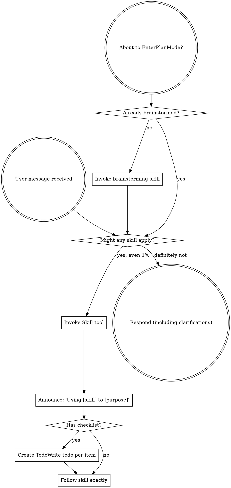
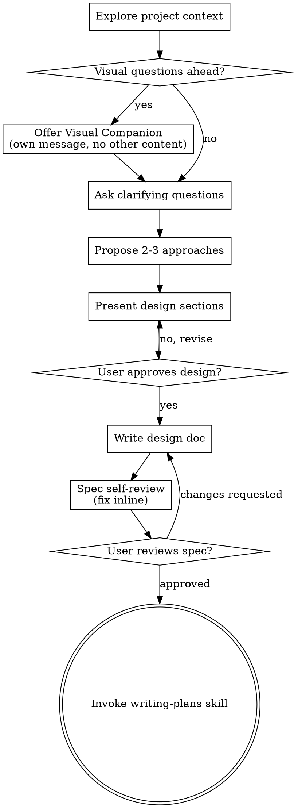

codex-exec: report contract violation

--- codex stdout ---
Blocked by the workspace’s enforced read-only permissions.

- Plan path: `.planning/milestones/v4.0-install-contract/phases/168-install-contract/168-01-PLAN-LOCKED.md`
- Created: no
- Validator exit code: not run
- Partial/unrelated changes: none

Please reopen with workspace write access; the completed draft can then be written and validated.

--- codex stderr ---
OpenAI Codex v0.146.0
--------
workdir: <HOME>\AppData\Roaming\warp\Warp\data\worktrees\GSDedits\luminaria-hogback
model: gpt-5.6-sol
provider: openai
approval: never
sandbox: read-only
reasoning effort: xhigh
reasoning summaries: none
session id: 01a0382c-a044-7e01-b4ee-03d44e8e327f
--------
user
# Plan phase 168 — Install Contract

Produce ONE plan file, `168-01-PLAN-LOCKED.md`, conforming to
`super-gsd/templates/plan-schema-v2.json`. Validate it before you finish.

Read first, they contain the measured root cause and the traced failure; do not re-derive:
- .planning/milestones/v4.0-install-contract/INTENT.md
- .planning/milestones/v4.0-install-contract/phases/168-install-contract/CONTEXT.md
- .planning/milestones/v3.9-substrate-hygiene/phases/167-substrate-invocation-witness/SUMMARY.md
- .planning/milestones/v3.9-substrate-hygiene/phases/167-substrate-invocation-witness/AUDIT.md

## The problem, settled

Distributed hooks reach every project on every update. The modules those hooks `require`
never do: `install.sh:615` copies `scripts/lib` to `~/.claude` only, and neither
`init_local_project` nor `update_existing` writes a project's module tree. A project hook
doing `require('../scripts/lib/sgsd-state.cjs')` resolves against the project's own tree
and gets MODULE_NOT_FOUND. Traced end to end in CONTEXT.md.

## What the plan must deliver

1. **Module delivery.** Project installs place and refresh the transitive closure of what
   the distributed hooks import, plus the modules the witness hook resolves from the
   project root at runtime. The closure is COMPUTED from the hook sources, not
   transcribed into a list a human maintains. A hand-maintained list is how the current
   manifest went stale and is an automatic reject.
2. **Manifest declares it.** `super-gsd/config/hook-manifest.json` entries gain the
   dependency set, generated by the same computation, so manifest and reality cannot
   disagree. Consider whether the manifest should be generated or merely verified against
   the computation; argue the choice.
3. **The smoke must catch this class.** Today the smoke proves a file exists. It must
   execute every installed hook in the target project so an unresolvable require fails
   the install at install time, in front of the operator, not at first fire.
4. **Diagnosis must name the cause.** A refusal that cannot say which module path failed
   to resolve is not a diagnosis. Surface the underlying error alongside the reason code.
   Do not widen the closed reason vocabulary as the fix; carry the real error with it.
5. **Staleness command.** One command reports whether a given project is running current
   SGSD, comparing the module tree and not only the hooks, and names exactly what is
   behind.
6. **Worktree detection.** `install.sh:381` guards freshness on `[ -d "$PROJECT_DIR/.git" ]`,
   false in a worktree where `.git` is a file, so the whole GitHub-master comparison is
   skipped and the doctor reports "not a git repo". Fix as part of item 5.

## Constraints inherited from P167, non-negotiable

- Refuse before writing, on every entry point. No mutation may precede a check that can
  fail. This was a phase-ATC CRITICAL at the install.sh level (2c237ef) and again inside
  `repairClaudeSubstrateWitness` (b2a1435). Do not make it a third time.
- Derive destinations; never inherit them from ambient state. `mkContext` honours an
  explicit `--project-dir` exactly and walk-up applies only when none is given.
- One detector, shared between the read-only check and the repair path, so the two cannot
  drift.
- The P167 witness contract is untouchable: PreToolUse fail-closed, PostToolUse returns a
  bounded `substrate_witness_rewrite_failed` object and never passes the raw result
  through, the store accepts only `rewritten` rows.
- Never weaken a guard assertion to make something pass.

## Acceptance criteria

Write `semantic_acceptance_criteria` per SCHEMA-09/DLB-07: real data through the real
path, not shape assertions. At least one criterion must be an end-to-end install into a
fixture project whose module tree starts EMPTY, proving the install either completes with
every hook loading its dependencies, or refuses naming the exact unresolvable path. A
criterion satisfied by a mock or a staged tree is not acceptable.

## Sizing

Task count is yours to justify, but this phase is one contract: manifest, delivery, smoke
and staleness ship together or the manifest ships without enforcement, which is the
present failure. Do not split delivery from its proof.

Report the plan path and the validator exit code.

codex
I’m using the `using-superpowers` and `writing-plans` skills because this is a schema-constrained implementation plan. I’ll first load their instructions, then read the four authoritative phase artifacts and the plan schema/template before drafting and validating the single locked plan.
exec
"C:\\WINDOWS\\System32\\WindowsPowerShell\\v1.0\\powershell.exe" -Command "Get-Content -Raw 'C:\\Users\\operator\\.codex\\skills\\using-superpowers\\SKILL.md'; Get-Content -Raw 'C:\\Users\\operator\\.codex\\skills\\writing-plans\\SKILL.md'" in <HOME>\AppData\Roaming\warp\Warp\data\worktrees\GSDedits\luminaria-hogback
 succeeded in 1030ms:
---
name: using-superpowers
description: Use when starting any conversation - establishes how to find and use skills, requiring Skill tool invocation before ANY response including clarifying questions
---

<SUBAGENT-STOP>
If you were dispatched as a subagent to execute a specific task, skip this skill.
</SUBAGENT-STOP>

<EXTREMELY-IMPORTANT>
If you think there is even a 1% chance a skill might apply to what you are doing, you ABSOLUTELY MUST invoke the skill.

IF A SKILL APPLIES TO YOUR TASK, YOU DO NOT HAVE A CHOICE. YOU MUST USE IT.

This is not negotiable. This is not optional. You cannot rationalize your way out of this.
</EXTREMELY-IMPORTANT>

## Instruction Priority

Superpowers skills override default system prompt behavior, but **user instructions always take precedence**:

1. **User's explicit instructions** (CLAUDE.md, GEMINI.md, AGENTS.md, direct requests) ƒ?" highest priority
2. **Superpowers skills** ƒ?" override default system behavior where they conflict
3. **Default system prompt** ƒ?" lowest priority

If CLAUDE.md, GEMINI.md, or AGENTS.md says "don't use TDD" and a skill says "always use TDD," follow the user's instructions. The user is in control.

## How to Access Skills

**In Claude Code:** Use the `Skill` tool. When you invoke a skill, its content is loaded and presented to youƒ?"follow it directly. Never use the Read tool on skill files.

**In Copilot CLI:** Use the `skill` tool. Skills are auto-discovered from installed plugins. The `skill` tool works the same as Claude Code's `Skill` tool.

**In Gemini CLI:** Skills activate via the `activate_skill` tool. Gemini loads skill metadata at session start and activates the full content on demand.

**In other environments:** Check your platform's documentation for how skills are loaded.

## Platform Adaptation

Skills use Claude Code tool names. Non-CC platforms: see `references/copilot-tools.md` (Copilot CLI), `references/codex-tools.md` (Codex) for tool equivalents. Gemini CLI users get the tool mapping loaded automatically via GEMINI.md.

# Using Skills

## The Rule

**Invoke relevant or requested skills BEFORE any response or action.** Even a 1% chance a skill might apply means that you should invoke the skill to check. If an invoked skill turns out to be wrong for the situation, you don't need to use it.



## Red Flags

These thoughts mean STOPƒ?"you're rationalizing:

| Thought | Reality |
|---------|---------|
| "This is just a simple question" | Questions are tasks. Check for skills. |
| "I need more context first" | Skill check comes BEFORE clarifying questions. |
| "Let me explore the codebase first" | Skills tell you HOW to explore. Check first. |
| "I can check git/files quickly" | Files lack conversation context. Check for skills. |
| "Let me gather information first" | Skills tell you HOW to gather information. |
| "This doesn't need a formal skill" | If a skill exists, use it. |
| "I remember this skill" | Skills evolve. Read current version. |
| "This doesn't count as a task" | Action = task. Check for skills. |
| "The skill is overkill" | Simple things become complex. Use it. |
| "I'll just do this one thing first" | Check BEFORE doing anything. |
| "This feels productive" | Undisciplined action wastes time. Skills prevent this. |
| "I know what that means" | Knowing the concept ƒ%ÿ using the skill. Invoke it. |

## Skill Priority

When multiple skills could apply, use this order:

1. **Process skills first** (brainstorming, debugging) - these determine HOW to approach the task
2. **Implementation skills second** (frontend-design, mcp-builder) - these guide execution

"Let's build X" ā' brainstorming first, then implementation skills.
"Fix this bug" ā' debugging first, then domain-specific skills.

## Skill Types

**Rigid** (TDD, debugging): Follow exactly. Don't adapt away discipline.

**Flexible** (patterns): Adapt principles to context.

The skill itself tells you which.

## User Instructions

Instructions say WHAT, not HOW. "Add X" or "Fix Y" doesn't mean skip workflows.

---
name: writing-plans
description: Use when you have a spec or requirements for a multi-step task, before touching code
---

# Writing Plans

## Overview

Write comprehensive implementation plans assuming the engineer has zero context for our codebase and questionable taste. Document everything they need to know: which files to touch for each task, code, testing, docs they might need to check, how to test it. Give them the whole plan as bite-sized tasks. DRY. YAGNI. TDD. Frequent commits.

Assume they are a skilled developer, but know almost nothing about our toolset or problem domain. Assume they don't know good test design very well.

**Announce at start:** "I'm using the writing-plans skill to create the implementation plan."

**Context:** If working in an isolated worktree, it should have been created via the `superpowers:using-git-worktrees` skill at execution time.

**Save plans to:** `docs/superpowers/plans/YYYY-MM-DD-<feature-name>.md`
- (User preferences for plan location override this default)

## Scope Check

If the spec covers multiple independent subsystems, it should have been broken into sub-project specs during brainstorming. If it wasn't, suggest breaking this into separate plans ƒ?" one per subsystem. Each plan should produce working, testable software on its own.

## File Structure

Before defining tasks, map out which files will be created or modified and what each one is responsible for. This is where decomposition decisions get locked in.

- Design units with clear boundaries and well-defined interfaces. Each file should have one clear responsibility.
- You reason best about code you can hold in context at once, and your edits are more reliable when files are focused. Prefer smaller, focused files over large ones that do too much.
- Files that change together should live together. Split by responsibility, not by technical layer.
- In existing codebases, follow established patterns. If the codebase uses large files, don't unilaterally restructure - but if a file you're modifying has grown unwieldy, including a split in the plan is reasonable.

This structure informs the task decomposition. Each task should produce self-contained changes that make sense independently.

## Bite-Sized Task Granularity

**Each step is one action (2-5 minutes):**
- "Write the failing test" - step
- "Run it to make sure it fails" - step
- "Implement the minimal code to make the test pass" - step
- "Run the tests and make sure they pass" - step
- "Commit" - step

## Plan Document Header

**Every plan MUST start with this header:**

```markdown
# [Feature Name] Implementation Plan

> **For agentic workers:** REQUIRED SUB-SKILL: Use superpowers:subagent-driven-development (recommended) or superpowers:executing-plans to implement this plan task-by-task. Steps use checkbox (`- [ ]`) syntax for tracking.

**Goal:** [One sentence describing what this builds]

**Architecture:** [2-3 sentences about approach]

**Tech Stack:** [Key technologies/libraries]

---
```

## Task Structure

````markdown
### Task N: [Component Name]

**Files:**
- Create: `exact/path/to/file.py`
- Modify: `exact/path/to/existing.py:123-145`
- Test: `tests/exact/path/to/test.py`

- [ ] **Step 1: Write the failing test**

```python
def test_specific_behavior():
    result = function(input)
    assert result == expected
```

- [ ] **Step 2: Run test to verify it fails**

Run: `pytest tests/path/test.py::test_name -v`
Expected: FAIL with "function not defined"

- [ ] **Step 3: Write minimal implementation**

```python
def function(input):
    return expected
```

- [ ] **Step 4: Run test to verify it passes**

Run: `pytest tests/path/test.py::test_name -v`
Expected: PASS

- [ ] **Step 5: Commit**

```bash
git add tests/path/test.py src/path/file.py
git commit -m "feat: add specific feature"
```
````

## No Placeholders

Every step must contain the actual content an engineer needs. These are **plan failures** ƒ?" never write them:
- "TBD", "TODO", "implement later", "fill in details"
- "Add appropriate error handling" / "add validation" / "handle edge cases"
- "Write tests for the above" (without actual test code)
- "Similar to Task N" (repeat the code ƒ?" the engineer may be reading tasks out of order)
- Steps that describe what to do without showing how (code blocks required for code steps)
- References to types, functions, or methods not defined in any task

## Remember
- Exact file paths always
- Complete code in every step ƒ?" if a step changes code, show the code
- Exact commands with expected output
- DRY, YAGNI, TDD, frequent commits

## Self-Review

After writing the complete plan, look at the spec with fresh eyes and check the plan against it. This is a checklist you run yourself ƒ?" not a subagent dispatch.

**1. Spec coverage:** Skim each section/requirement in the spec. Can you point to a task that implements it? List any gaps.

**2. Placeholder scan:** Search your plan for red flags ƒ?" any of the patterns from the "No Placeholders" section above. Fix them.

**3. Type consistency:** Do the types, method signatures, and property names you used in later tasks match what you defined in earlier tasks? A function called `clearLayers()` in Task 3 but `clearFullLayers()` in Task 7 is a bug.

If you find issues, fix them inline. No need to re-review ƒ?" just fix and move on. If you find a spec requirement with no task, add the task.

## Execution Handoff

After saving the plan, offer execution choice:

**"Plan complete and saved to `docs/superpowers/plans/<filename>.md`. Two execution options:**

**1. Subagent-Driven (recommended)** - I dispatch a fresh subagent per task, review between tasks, fast iteration

**2. Inline Execution** - Execute tasks in this session using executing-plans, batch execution with checkpoints

**Which approach?"**

**If Subagent-Driven chosen:**
- **REQUIRED SUB-SKILL:** Use superpowers:subagent-driven-development
- Fresh subagent per task + two-stage review

**If Inline Execution chosen:**
- **REQUIRED SUB-SKILL:** Use superpowers:executing-plans
- Batch execution with checkpoints for review

<HOME>\OneDrive - <ORG>\Documents\WindowsPowerShell\profile.ps1 : Cannot dot-source this 
command because it was defined in a different language mode. To invoke this command without importing its contents, 
omit the '.' operator.
At line:1 char:1
+ . '<HOME>\OneDrive - <ORG>\Documents\Win ...
+ ~~~~~~~~~~~~~~~~~~~~~~~~~~~~~~~~~~~~~~~~~~~~~~~~~~~~~~~~~~~~~~~~~~~~~
    + CategoryInfo          : InvalidOperation: (:) [profile.ps1], NotSupportedException
    + FullyQualifiedErrorId : DotSourceNotSupported,profile.ps1
 
<HOME>\OneDrive - <ORG>\Documents\WindowsPowerShell\Microsoft.PowerShell_profile.ps1 : 
Cannot dot-source this command because it was defined in a different language mode. To invoke this command without 
importing its contents, omit the '.' operator.
At line:1 char:1
+ . '<HOME>\OneDrive - <ORG>\Documents\Win ...
+ ~~~~~~~~~~~~~~~~~~~~~~~~~~~~~~~~~~~~~~~~~~~~~~~~~~~~~~~~~~~~~~~~~~~~~
    + CategoryInfo          : InvalidOperation: (:) [Microsoft.PowerShell_profile.ps1], NotSupportedException
    + FullyQualifiedErrorId : DotSourceNotSupported,Microsoft.PowerShell_profile.ps1
 

codex
The plan’s architecture still requires one design decision—how computed dependencies become manifest truth—so I’m also applying the `brainstorming` skill before locking the plan. The user’s settled root cause and acceptance requirements remain authoritative; I won’t reopen them.
exec
"C:\\WINDOWS\\System32\\WindowsPowerShell\\v1.0\\powershell.exe" -NoProfile -Command "Get-Content -Raw 'C:\\Users\\operator\\.codex\\skills\\brainstorming\\SKILL.md'" in <HOME>\AppData\Roaming\warp\Warp\data\worktrees\GSDedits\luminaria-hogback
 succeeded in 3328ms:
---
name: brainstorming
description: "You MUST use this before any creative work - creating features, building components, adding functionality, or modifying behavior. Explores user intent, requirements and design before implementation."
---

# Brainstorming Ideas Into Designs

Help turn ideas into fully formed designs and specs through natural collaborative dialogue.

Start by understanding the current project context, then ask questions one at a time to refine the idea. Once you understand what you're building, present the design and get user approval.

<HARD-GATE>
Do NOT invoke any implementation skill, write any code, scaffold any project, or take any implementation action until you have presented a design and the user has approved it. This applies to EVERY project regardless of perceived simplicity.
</HARD-GATE>

## Anti-Pattern: "This Is Too Simple To Need A Design"

Every project goes through this process. A todo list, a single-function utility, a config change ƒ?" all of them. "Simple" projects are where unexamined assumptions cause the most wasted work. The design can be short (a few sentences for truly simple projects), but you MUST present it and get approval.

## Checklist

You MUST create a task for each of these items and complete them in order:

1. **Explore project context** ƒ?" check files, docs, recent commits
2. **Offer visual companion** (if topic will involve visual questions) ƒ?" this is its own message, not combined with a clarifying question. See the Visual Companion section below.
3. **Ask clarifying questions** ƒ?" one at a time, understand purpose/constraints/success criteria
4. **Propose 2-3 approaches** ƒ?" with trade-offs and your recommendation
5. **Present design** ƒ?" in sections scaled to their complexity, get user approval after each section
6. **Write design doc** ƒ?" save to `docs/superpowers/specs/YYYY-MM-DD-<topic>-design.md` and commit
7. **Spec self-review** ƒ?" quick inline check for placeholders, contradictions, ambiguity, scope (see below)
8. **User reviews written spec** ƒ?" ask user to review the spec file before proceeding
9. **Transition to implementation** ƒ?" invoke writing-plans skill to create implementation plan

## Process Flow



**The terminal state is invoking writing-plans.** Do NOT invoke frontend-design, mcp-builder, or any other implementation skill. The ONLY skill you invoke after brainstorming is writing-plans.

## The Process

**Understanding the idea:**

- Check out the current project state first (files, docs, recent commits)
- Before asking detailed questions, assess scope: if the request describes multiple independent subsystems (e.g., "build a platform with chat, file storage, billing, and analytics"), flag this immediately. Don't spend questions refining details of a project that needs to be decomposed first.
- If the project is too large for a single spec, help the user decompose into sub-projects: what are the independent pieces, how do they relate, what order should they be built? Then brainstorm the first sub-project through the normal design flow. Each sub-project gets its own spec ā' plan ā' implementation cycle.
- For appropriately-scoped projects, ask questions one at a time to refine the idea
- Prefer multiple choice questions when possible, but open-ended is fine too
- Only one question per message - if a topic needs more exploration, break it into multiple questions
- Focus on understanding: purpose, constraints, success criteria

**Exploring approaches:**

- Propose 2-3 different approaches with trade-offs
- Present options conversationally with your recommendation and reasoning
- Lead with your recommended option and explain why

**Presenting the design:**

- Once you believe you understand what you're building, present the design
- Scale each section to its complexity: a few sentences if straightforward, up to 200-300 words if nuanced
- Ask after each section whether it looks right so far
- Cover: architecture, components, data flow, error handling, testing
- Be ready to go back and clarify if something doesn't make sense

**Design for isolation and clarity:**

- Break the system into smaller units that each have one clear purpose, communicate through well-defined interfaces, and can be understood and tested independently
- For each unit, you should be able to answer: what does it do, how do you use it, and what does it depend on?
- Can someone understand what a unit does without reading its internals? Can you change the internals without breaking consumers? If not, the boundaries need work.
- Smaller, well-bounded units are also easier for you to work with - you reason better about code you can hold in context at once, and your edits are more reliable when files are focused. When a file grows large, that's often a signal that it's doing too much.

**Working in existing codebases:**

- Explore the current structure before proposing changes. Follow existing patterns.
- Where existing code has problems that affect the work (e.g., a file that's grown too large, unclear boundaries, tangled responsibilities), include targeted improvements as part of the design - the way a good developer improves code they're working in.
- Don't propose unrelated refactoring. Stay focused on what serves the current goal.

## After the Design

**Documentation:**

- Write the validated design (spec) to `docs/superpowers/specs/YYYY-MM-DD-<topic>-design.md`
  - (User preferences for spec location override this default)
- Use elements-of-style:writing-clearly-and-concisely skill if available
- Commit the design document to git

**Spec Self-Review:**
After writing the spec document, look at it with fresh eyes:

1. **Placeholder scan:** Any "TBD", "TODO", incomplete sections, or vague requirements? Fix them.
2. **Internal consistency:** Do any sections contradict each other? Does the architecture match the feature descriptions?
3. **Scope check:** Is this focused enough for a single implementation plan, or does it need decomposition?
4. **Ambiguity check:** Could any requirement be interpreted two different ways? If so, pick one and make it explicit.

Fix any issues inline. No need to re-review ƒ?" just fix and move on.

**User Review Gate:**
After the spec review loop passes, ask the user to review the written spec before proceeding:

> "Spec written and committed to `<path>`. Please review it and let me know if you want to make any changes before we start writing out the implementation plan."

Wait for the user's response. If they request changes, make them and re-run the spec review loop. Only proceed once the user approves.

**Implementation:**

- Invoke the writing-plans skill to create a detailed implementation plan
- Do NOT invoke any other skill. writing-plans is the next step.

## Key Principles

- **One question at a time** - Don't overwhelm with multiple questions
- **Multiple choice preferred** - Easier to answer than open-ended when possible
- **YAGNI ruthlessly** - Remove unnecessary features from all designs
- **Explore alternatives** - Always propose 2-3 approaches before settling
- **Incremental validation** - Present design, get approval before moving on
- **Be flexible** - Go back and clarify when something doesn't make sense

## Visual Companion

A browser-based companion for showing mockups, diagrams, and visual options during brainstorming. Available as a tool ƒ?" not a mode. Accepting the companion means it's available for questions that benefit from visual treatment; it does NOT mean every question goes through the browser.

**Offering the companion:** When you anticipate that upcoming questions will involve visual content (mockups, layouts, diagrams), offer it once for consent:
> "Some of what we're working on might be easier to explain if I can show it to you in a web browser. I can put together mockups, diagrams, comparisons, and other visuals as we go. This feature is still new and can be token-intensive. Want to try it? (Requires opening a local URL)"

**This offer MUST be its own message.** Do not combine it with clarifying questions, context summaries, or any other content. The message should contain ONLY the offer above and nothing else. Wait for the user's response before continuing. If they decline, proceed with text-only brainstorming.

**Per-question decision:** Even after the user accepts, decide FOR EACH QUESTION whether to use the browser or the terminal. The test: **would the user understand this better by seeing it than reading it?**

- **Use the browser** for content that IS visual ƒ?" mockups, wireframes, layout comparisons, architecture diagrams, side-by-side visual designs
- **Use the terminal** for content that is text ƒ?" requirements questions, conceptual choices, tradeoff lists, A/B/C/D text options, scope decisions

A question about a UI topic is not automatically a visual question. "What does personality mean in this context?" is a conceptual question ƒ?" use the terminal. "Which wizard layout works better?" is a visual question ƒ?" use the browser.

If they agree to the companion, read the detailed guide before proceeding:
`skills/brainstorming/visual-companion.md`


  → Read phase intent, context, P167 evidence, schema, and existing plan/validator conventions
  • Map implementation files and lock the computed-dependency design into schema-compliant tasks
  • Create only 168-01-PLAN-LOCKED.md
  • Run the authoritative schema validator and self-review acceptance coverage
exec
"C:\\WINDOWS\\System32\\WindowsPowerShell\\v1.0\\powershell.exe" -NoProfile -Command '$files = @('"'.planning/milestones/v4.0-install-contract/INTENT.md','.planning/milestones/v4.0-install-contract/phases/168-install-contract/CONTEXT.md','.planning/milestones/v3.9-substrate-hygiene/phases/167-substrate-invocation-witness/SUMMARY.md','.planning/milestones/v3.9-substrate-hygiene/phases/167-substrate-invocation-witness/AUDIT.md','super-gsd/templates/plan-schema-v2.json'); foreach ("'$file in $files) { $item = Get-Item -LiteralPath $file; Write-Output ("{0}`t{1}`t{2}" -f $file, $item.Length, (Get-Content -LiteralPath $file).Count) }' in <HOME>\AppData\Roaming\warp\Warp\data\worktrees\GSDedits\luminaria-hogback
 succeeded in 6953ms:
.planning/milestones/v4.0-install-contract/INTENT.md	3929	78
.planning/milestones/v4.0-install-contract/phases/168-install-contract/CONTEXT.md	13901	268
.planning/milestones/v3.9-substrate-hygiene/phases/167-substrate-invocation-witness/SUMMARY.md	3734	99
.planning/milestones/v3.9-substrate-hygiene/phases/167-substrate-invocation-witness/AUDIT.md	3658	81
super-gsd/templates/plan-schema-v2.json	7189	187

exec
"C:\\WINDOWS\\System32\\WindowsPowerShell\\v1.0\\powershell.exe" -NoProfile -Command "Get-Content -Raw '.planning/milestones/v4.0-install-contract/INTENT.md'; Get-Content -Raw '.planning/milestones/v4.0-install-contract/phases/168-install-contract/CONTEXT.md'" in <HOME>\AppData\Roaming\warp\Warp\data\worktrees\GSDedits\luminaria-hogback
 succeeded in 1687ms:
---
milestone: v4.0-install-contract
status: SEEDED
seeded: 2026-08-25
core_value: An SGSD install either lands completely in the target repository or refuses and says exactly what is missing.
---

# v4.0 Install Contract

## Why this exists

The operator's report, 2026-08-24, in their words:

> "I've used the SGSD forward slash update command and then it just fails and nothing
> that we've done inside this repository is actually being pushed and working inside the
> places and other repos that I need them to. The same goes for the localhost 7777 and
> also the multi-SGSD fleet controller because none of that is working either. They're
> all miles stale, even though the cache is sitting at 19 seconds."

This is the fifth cycle of substantial SGSD work that did not reach the repositories it
was built for. The work is not the problem. The delivery is.

## The core invariant

An install either lands completely or refuses with the exact list of what is missing.
There is no third outcome. Today there is: a partial install that reports success.

## What the evidence already shows

`super-gsd/config/hook-manifest.json` has 22 entries and **zero** of them declare module
dependencies. Five hooks need sibling modules that the manifest never mentions:

| Hook | Requires |
| --- | --- |
| `sgsd-intent-classifier.cjs` | `sgsd-state.cjs`, `gate-evidence-log.cjs`, `skill-routing-registry.cjs`, `vtp-readiness/registry.cjs`, `demand-baseline-ledger.cjs` |
| `sgsd-commit-gate.cjs` | `sgsd-state.cjs`, `sgsd-artifact-conventions.cjs`, `commit-gate-shadow-log.cjs`, `commit-gate-shadow-report.cjs` |
| `sgsd-quality-gate.js` | `sgsd-state.cjs`, `gate-evidence-log.cjs`, and the `sgsd-intent-classifier.cjs` hook itself |
| `sgsd-session-start.js` | `sgsd-state.cjs`, `gate-evidence-log.cjs` |
| `sgsd-substrate-invocation-witness.cjs` | resolves the composer and witness store from the project root at runtime |

A hook file can therefore be copied, registered in `settings.json`, and reported as
installed, while the modules it requires never travelled. It then fails at first fire,
in the target repository, long after the installer said success. This is the same class
as the devcp `UserPromptSubmit` `loader:1479` failure already diagnosed: module
resolution, not hook logic.

P167 closed the mutate-then-refuse hole for one path and proved five installer guard
cases had been red since P161 with nothing running them. The install surface is
under-tested relative to how much depends on it.

## What v4.0 must deliver

1. A declared install manifest that names every artifact an install must place: hooks,
   their transitive module dependencies, settings registrations, skills, agents,
   commands, and the paths each goes to for each surface (`~/.claude`, project
   `.claude`, project `.mcp.json`, Codex entries).
2. Propagation that honours the manifest and cannot report success on a partial result.
3. A smoke test that executes every installed hook in the target repository and fails
   the install if any cannot load its dependencies.
4. A staleness check that tells the operator, in one command, whether a given repository
   is running current SGSD and names precisely what is behind.

## Out of scope

Rewriting the hooks themselves. Changing what any hook does. This milestone is about
delivery, not behaviour.

## Open questions for research

- Why does `/sgsd-update` report failure? Reproduce it against a real second repository
  before designing anything.
- Is the canonical `GSDedits` master still behind this branch, and does that alone
  explain "nothing we do here reaches other repos"?
- The fleet cockpit is per-repository, so each repository needs its own instance. Is the
  operator's expectation of one controller across repositories a missing feature or a
  misconfiguration?
- Localhost 7777 collides with the VTP cockpit-sidecar. The default port decision is
  still open with the operator.

---
phase: "168"
slug: install-contract
milestone: v4.0-install-contract
status: SEEDED
seeded: 2026-08-25
synthesized_from: operator report 2026-08-24; P167 AUDIT.md; hook-manifest.json evidence
---

# P168 Install Contract ƒ?" context

## The problem in one sentence

An SGSD install can copy a hook, register it in `settings.json`, report success, and
leave out the modules that hook requires, so it fails at first fire in the target
repository rather than at install time in front of the operator.

## Evidence gathered before planning

`super-gsd/config/hook-manifest.json`: 22 entries, fields
`source_path`, `interpreter`, `distribution_targets`, `dispositions`. Zero entries
declare dependencies. Verified 2026-08-25.

Five of the seventeen hooks in `super-gsd/hooks/` require sibling modules:

    sgsd-intent-classifier.cjs   -> sgsd-state.cjs, gate-evidence-log.cjs,
                                    skill-routing-registry.cjs,
                                    vtp-readiness/registry.cjs,
                                    demand-baseline-ledger.cjs
    sgsd-commit-gate.cjs         -> sgsd-state.cjs, sgsd-artifact-conventions.cjs,
                                    commit-gate-shadow-log.cjs,
                                    commit-gate-shadow-report.cjs
    sgsd-quality-gate.js         -> sgsd-state.cjs, gate-evidence-log.cjs,
                                    sgsd-intent-classifier.cjs
    sgsd-session-start.js        -> sgsd-state.cjs, gate-evidence-log.cjs
    sgsd-substrate-invocation-witness.cjs
                                 -> composer and witness store, resolved from the
                                    project root at runtime

The already-diagnosed devcp `UserPromptSubmit` `loader:1479` failure is this exact
class: module resolution in the target repository, not hook logic.

## What P167 established that this phase should not repeat

- The installer now refuses before it writes, on every entry point. Do not reintroduce
  a deferred exit past a mutating step.
- `mkContext` honours an explicit `--project-dir` exactly; walk-up applies only when no
  destination is given. Derive the destination, never inherit it from ambient state.
- Detection is shared between the read-only check and the repair path so the two cannot
  drift. Extend that pattern; do not fork a second detector.
- Five installer guard cases were red from P161 to P167 close because nothing ran the
  suite. The adopted process change is a path-triggered unsandboxed twelve-case check.

## Shape of the work, not yet a plan

1. Extend the manifest so each entry declares its transitive module dependencies and the
   destination for each surface. Derive the dependency list mechanically from the source
   rather than hand-listing it, so it cannot go stale the way the present manifest did.
2. Make propagation honour the manifest and fail closed on any missing artifact, reusing
   the shared-detector and refuse-before-writing patterns P167 established.
3. Extend the existing deployed-hook smoke so it executes every installed hook in the
   target repository and fails the install when a hook cannot load its dependencies.
   The current smoke proves a file is present; that is what let this through.
4. A staleness command that names exactly what a given repository is behind on.

## Must be reproduced before designing

`/sgsd-update` reportedly fails. Reproduce it against a real second repository and
capture the actual error first. Do not design against the operator's paraphrase, and do
not assume the earlier "canonical master is behind" finding still holds; re-check it.

## Open operator decisions, do not decide these autonomously

- Fleet cockpit default port. 7777 collides with the VTP cockpit-sidecar.
- Whether one fleet controller should span repositories, which is currently
  per-repository by design.
- Merging `luminaria-hogback` to master.

## Defect reproduced 2026-08-25, before any planning

`bash super-gsd/install.sh --doctor` in this checkout prints:

    [super-gsd] Project git HEAD: not a git repo

This checkout is a git repository. `git rev-parse --short HEAD` returns `58ced07`.

Cause: `install.sh:381` guards the freshness check with `[ -d "$PROJECT_DIR/.git" ]`.
In a git worktree `.git` is a FILE containing a gitdir pointer, not a directory, so the
guard is false. The whole block is skipped, including the `git ls-remote` comparison
against SGSD GitHub master at `:383` and the `Freshness:` lines at `:387-389`.

Consequence: in any worktree-based checkout, SGSD never tells the operator whether the
repository is behind master, and reports it is not a git repository at all. This is
precisely the "how do I know it is stale" signal the operator says is missing. The fix
is to test `[ -e "$PROJECT_DIR/.git" ]` or to use `git rev-parse --git-dir`, but it
belongs to this phase's plan, not to an ad-hoc patch.

This defect was found by running the command rather than by reading the operator's
paraphrase. Apply the same discipline to `/sgsd-update` before designing for it.

## Why nothing reaches the other repositories, measured 2026-08-25

Four repositories were surveyed read-only: `GSDedits`, `project-clarity-erp`,
`Voice-Text-Plan`, `JCL-Cirdadium`. Every one has 14 hooks. This branch has 17. All four
are missing the same three:

    gsd-phase-boundary.sh
    sgsd-vtp-pending.js
    sgsd-substrate-invocation-witness.cjs

None of the three is missing from `hook-manifest.json`; all three are listed with
`distribution_targets: claude-global|claude-project`. `substrate-invocation-witness-store.cjs`
and `substrate-capability-broker.cjs` are absent from all of them too.

The cause is not the propagation code. All three hooks were authored on this branch
(`92f21b3` and `b167ebd` on 2026-08-20 for the two older ones, P167 for the witness) and
this branch is **178 commits ahead of `origin/master`**. The other repositories install
from master. Unmerged work cannot propagate, however correct the installer is.

So the operator's report resolves into three distinct causes, only one of which is an
installer bug:

1. **The branch was never merged.** 178 commits ahead of `origin/master`. This alone
   explains why no work done here appears anywhere else. Merging is an operator
   decision and is not this phase's to take.
2. **Nothing told anyone.** `install.sh:381` cannot detect a git worktree, so the
   freshness comparison against GitHub master never ran and the doctor reported
   "not a git repo". The staleness signal existed and was silently skipped.
3. **The latent defect that would bite after a merge.** The manifest declares no module
   dependencies, so five hooks can be copied and registered without the modules they
   require. Merging fixes 1 and 2 but not this.

Design P168 around cause 3, fix cause 2 as part of it, and treat cause 1 as an operator
decision recorded in this file, not as work this phase performs.

## Root cause, measured 2026-08-25 from a real Linux install

The earlier framing in this file, that the manifest fails to declare module
dependencies, understated the problem. The measured cause is that **no install path
delivers a project's module tree at all.**

Evidence from `install.sh`:

- `install.sh:615` `copy_tree_files "$SCRIPT_DIR/scripts/lib" "$CLAUDE_DIR/scripts/lib"`.
  `$CLAUDE_DIR` is `~/.claude`. Global only.
- `init_local_project` copies `.planning/config.json`, `CLAUDE.md`, the memory tree, and
  calls `distribute_project_hooks`. It does not copy `scripts/lib` or `tools`.
- `update_existing` runs npm install, syncs the registry, calls
  `distribute_project_hooks`. It does not copy `scripts/lib` or `tools`.

So hooks reach every project on every update while the modules they `require` never do.
A project-local hook importing `../scripts/lib/x.cjs` resolves against the project's own
tree, which the installer never writes.

Measured against `project-clarity-erp`:

    substrate-invocation-witness-store.cjs   missing entirely       (P167)
    vtp-context-composer.cjs                 DIFFERS from canonical (P166)
    vtp-enrichment-gate.cjs                  DIFFERS from canonical (P166)
    sgsd-state.cjs                           identical
    gate-evidence-log.cjs                    identical
    skill-routing-registry.cjs               identical

Most files match and exactly the last two milestones' changes are absent. Something
populated those trees historically; it is not the installer, and it did not carry P166 or
P167.

## The live failure this produced

A Linux `sgsd-update` exited 5. Canonical clone fast-forwarded clean to
8b95403 and the global install succeeded: 20 agents, 25 commands, 17 hooks, 61 scripts
into `~/.claude`. The project-local half then refused:

    hook_smoke_failed ... [SessionStart/session-start-governance]
    witness_status: missing_or_stale, capability_status: missing_or_stale
    reasons: pretooluse_missing, direct_grant, upstream_missing, witness_repair_failed
    ERROR: substrate enforcement was not current; refusing grant-bearing agent installation

`pretooluse_missing` exists nowhere in current source, confirmed by
`git grep -n "pretooluse_missing" -- super-gsd` returning nothing at the published sha.
It is a P167-era code removed during the phase, so the emitting file on that machine is
old. That is the fingerprint of the frozen module tree.

The gate itself behaved correctly: it refused to grant capability while enforcement was
not current. The defect is that it cannot bootstrap, because the module that would make
enforcement current is one the installer never delivers.

## Fixed already, do not re-plan

`repairClaudeSubstrateWitness` mutated before the check that can fail:
`installSubstrateRuntime`, `provisionWitnessKey` and `removeGlobalWitnessRegistrations`
all ran before `smokeRepoHookOverlay`, which throws. A refused repair therefore left a
key and copied files behind. Closed at commit b2a1435 by moving the smoke first, with a
guard case that snapshots the fixture by sha256 and asserts byte-identity and an empty
actions array after a refused repair.

## Revised scope for this phase

The manifest work stands, but the phase's primary deliverable is now module delivery:

1. Project installs must place and refresh the modules their hooks require, derived
   mechanically from the source so the list cannot go stale.
2. A refused or partial install must be recoverable and must never report success.
3. The smoke must execute every installed hook in the target project, which is what would
   have caught this at install time rather than at first fire.
4. The staleness command must compare the project's module tree, not only its hooks.

## The failing require chain, traced exactly 2026-08-25

A Linux install at /opt/clarity/project-clarity-erp produced the definitive trace.
The project's `super-gsd/scripts/lib/` was missing ~55 files present in
`~/.claude/scripts/lib/`, one-sided absence only, nothing on the project side ahead.

    smokeRepoHookOverlay (audit.cjs)
      spawns <canonical>/super-gsd/scripts/lib/hook-registration-preflight.cjs
             --smoke-repo-overlay <overlay> <projectDir>, cwd = projectDir
        which executes <projectDir>/super-gsd/hooks/sgsd-session-start.js
          which does require('../scripts/lib/sgsd-state.cjs')     [hook line 13]
            resolving to <projectDir>/super-gsd/scripts/lib/sgsd-state.cjs
              ABSENT -> loader:1479 MODULE_NOT_FOUND
                -> hook exits non-zero
                  -> smoke throws -> witness_repair_failed -> install exit 5

Note what is NOT broken: `audit.cjs:37`'s own
`require('../../scripts/lib/hook-registration-preflight.cjs')` resolves against
audit.cjs's own directory in the canonical clone, which is complete. The preflight module
therefore does not need to reach project trees. Only the modules the DISTRIBUTED HOOKS
import do.

This is the same defect as the `UserPromptSubmit` `loader:1479` failure seen in live
sessions. One cause, two symptoms.

## Requirement added: stop laundering the real error

The operator saw four generic reason codes,
`pretooluse_missing, direct_grant, upstream_missing, witness_repair_failed`,
where the truth was one unresolvable module path. The real exception existed and was
flattened into a closed vocabulary before it reached the operator.

This is the same failure mode as P167's `safeFailureReason`, which admitted only
`/^[a-z0-9_:.-]+$/i` and masked real exceptions behind `harness_internal_error`. It cost
several rounds there and it cost a full diagnosis cycle here.

P168 must surface the underlying error alongside the reason code. A refusal that cannot
name the file it could not resolve is not a diagnosis.

Related memory: [[blind-agent-root-cause-is-a-hypothesis]].

## Scope correction

Do not blanket-copy `scripts/lib`. Deliver the transitive closure of what the
distributed hooks require, derived mechanically from the hook sources so it cannot go
stale, plus the composer and witness store that the witness hook resolves from the
project root at runtime. Known direct requires today:

    sgsd-session-start.js      sgsd-state.cjs, gate-evidence-log.cjs
    sgsd-intent-classifier.cjs sgsd-state.cjs, gate-evidence-log.cjs,
                               skill-routing-registry.cjs,
                               tools/vtp-readiness/registry.cjs,
                               demand-baseline-ledger.cjs
    sgsd-commit-gate.cjs       sgsd-state.cjs, sgsd-artifact-conventions.cjs,
                               commit-gate-shadow-log.cjs, commit-gate-shadow-report.cjs
    sgsd-quality-gate.js       sgsd-state.cjs, gate-evidence-log.cjs,
                               and the sgsd-intent-classifier.cjs hook itself
    witness hook               composer + witness store, resolved at runtime

The closure must be computed, not transcribed; this list is evidence of the shape, not
the deliverable.


exec
"C:\\WINDOWS\\System32\\WindowsPowerShell\\v1.0\\powershell.exe" -NoProfile -Command "Get-Content -Raw '.planning/milestones/v3.9-substrate-hygiene/phases/167-substrate-invocation-witness/SUMMARY.md'; Get-Content -Raw '.planning/milestones/v3.9-substrate-hygiene/phases/167-substrate-invocation-witness/AUDIT.md'; Get-Content -Raw 'super-gsd/templates/plan-schema-v2.json'" in <HOME>\AppData\Roaming\warp\Warp\data\worktrees\GSDedits\luminaria-hogback
 succeeded in 829ms:
---
phase: "167"
slug: substrate-invocation-witness
milestone: v3.9-substrate-hygiene
status: PASS
closed: 2026-08-25
commits:
  - 6aa2f01
  - 9ea0bac
  - f939314
  - 5ec8f1c
  - be6cfa1
  - 386d027
  - a5e1f97
  - e85d396
  - c822dd4
  - e78847f
  - eab7715
  - 99a8790
  - ca43513
  - 879aa4c
  - cc6a3d7
  - 70f92cd
  - 2c237ef
  - 86b6d1f
gates:
  plan_review: GO (round 3, 6/6)
  phase_verifier: PASS, GOAL_MET YES, 6/6 criteria MET
  phase_atc: PASS 9/10 (round 3), 0 CRITICAL, 0 MAJOR, 1 MINOR
  muda: WARN (8/8 wastes)
  installer_registration_guard: 12/12
  t1_hook_contract: 38/38
  t2_witness_correlation: 13/13
  t3_prompt_contracts: 4/4
  t4_propagation: PASS
  t5_live_capture: PASS + independent verify PASS
  feature_propagation_self_test: 15/15
  p166_regression: 6/6
  p154_frozen_evidence: PASS
---

# P167 Substrate Invocation Witness

## What changed for anyone using SGSD

A substrate search that does not conform to P166 policy is now refused by the installed
PreToolUse hook inside the real Claude runtime, and the refusal holds under
bypass-permissions. A conforming search reaches the MCP server exactly once, and the
transcript the model sees is the capped, note-bearing rewrite, never the raw result. If
the rewrite cannot be produced, the model gets a bounded
`substrate_witness_rewrite_failed` object, not the raw payload.

An agent can no longer claim it made a substrate call. The claim is checked against a
witness the hook wrote, bound to the runtime session and the payload digest, HMAC-signed,
and consumed exactly once. Replay, cross-session reuse, an edited row, a missing witness,
and an agent-supplied identifier are all rejected.

The installer refuses before it writes. An install that is going to fail no longer
provisions a witness key, copies runtime files, merges `.claude/settings.json` or writes
broker grants first.

## How the guarantee is enforced

If a substrate tool call is made and the payload does not satisfy the P166 v2 schema,
then PreToolUse returns a deny decision before the call leaves the runtime,
and because the decision is taken in the hook rather than in the agent,
bypass-permissions cannot override it.

If the call is conforming, then it reaches the MCP server once,
and PostToolUse replaces the result through `updatedMCPToolOutput` using the single
composer-owned `capSubstrateResponse`,
and because the hook writes a signed witness row keyed by session and payload digest,
a later claim about that call can be checked rather than believed.

If the rewrite throws, then the hook returns a bounded failure object,
and because it never falls back to the original result, a failed rewrite cannot leak an
uncapped payload into the transcript.

If the capability guard is absent, then the broker withdraws the tool from `tools/list`
and rechecks readiness before forwarding any call,
so a stale discovery cannot be used to reach the server.

## Scope, stated honestly

P167 governs one hook. Four other hooks (`sgsd-intent-classifier.cjs`,
`sgsd-commit-gate.cjs`, `sgsd-quality-gate.js`, `sgsd-session-start.js`) require sibling
modules and nothing verifies those dependencies travel during propagation. That gap is
the subject of phase 168.

## Cost

Two production defects escaped into committed code and were repaired in-phase: the
`parseMcpDomain` array-shape rejection, found only by live capture, and the deferred
installer refusal, found by phase ATC. Five installer guard cases regressed at the start
of the phase and stayed red until close because nothing ran that suite in between.
MUDA returned WARN on all eight wastes; fourteen T5 rework rounds, of which it judges
twelve avoidable.

See AUDIT.md for the full gate table and the adopted process change.

---
phase: "167"
slug: substrate-invocation-witness
milestone: v3.9-substrate-hygiene
audit_date: 2026-08-25
atc_verdict: PASS
atc_score: 9/10
muda_verdict: WARN
critical_findings: 0
major_findings: 0
minor_findings: 1
production_defect_escapes: 2
---

# P167 audit

## Verdicts

| Gate | Verdict | Evidence |
| --- | --- | --- |
| Phase verifier | PASS, GOAL_MET YES, 6/6 criteria MET | `167-VERIFY-ROUND2.md` |
| Phase ATC round 3 | PASS 9/10, 0 CRITICAL, 0 MAJOR, 1 MINOR | `167-PHASEATC-ROUND3.md` |
| MUDA | WARN on all eight wastes | `167-WASTE.md` |
| Installer registration guard | 12/12 unsandboxed | orchestrator run |
| T1 hook contract | 38/38 | orchestrator run |
| T2 witness correlation | 13/13 | orchestrator run |
| T3 prompt contracts | 4/4 | orchestrator run |
| T4 propagation | PASS | orchestrator run, PowerShell |
| T5 live capture | PASS, independent verify PASS | `167-REAL-MCP-HOOK-EVIDENCE.json` |
| feature-propagation self-test | 15/15 | orchestrator run |
| P166 policy regression | 6/6 | orchestrator run |
| P154 frozen evidence | PASS | orchestrator run |

Live capture: `active_invocations 1`, `absent_invocations 0`,
`same_user_bypass_invocations 2`, Claude Code 2.1.243, `real_stdio_mcp`.

## What two ATC rounds rejected

Round 1 raised a CRITICAL: a fix instruction of mine said to fail safe by passing the
original result through, contradicting locked plan lines 187 and 264-267. Bounded
failure was restored and `post_passthrough` removed. Round 3 independently greps 0
passthrough occurrences across the hook and the store.

Round 2 raised a CRITICAL on the installer. `install_global_assets` ran
`repair_substrate_capability` before missing Codex entry sources were known, so a
combined `--install-global --init-project` or `--update` could provision a witness key,
copy substrate runtime files, merge `.claude/settings.json` and write broker grants,
and only then refuse. `precheck_installation_refusals` now runs the shared Codex-entry
detector and the substrate pre-check ahead of every writer on every entry point. Round 3
confirms flags are fully parsed before dispatch, so no argument ordering bypasses it.

## The regression this phase introduced and shipped red until close

Five installer-registration-guard cases pass at 44e7861 (P161) and failed from P167
until 2c237ef: `smoke-static`, `vendored-nine-hook`, `node-check-both-sites`,
`sgsd-update-clarity-shape`, `sgsd-update-clarity-recovery`. Nothing ran the suite
between P161 and phase close, so the phase carried a broken install contract for its
whole length. This is the same install machinery the operator reported as failing in
other repositories.

MUDA's process answer, adopted: make the complete twelve-case guard suite a required
unsandboxed, path-triggered commit check whenever installer, hook manifest or overlay,
merge, audit, or guard files change, so the first offending commit is rejected rather
than the phase close.

## Production defect escapes, 2

1. `parseMcpDomain` rejected the bare-array `tool_response` shape the live runtime
   actually sends. Every valid substrate search would have had its result replaced with
   an error. Found only by the live capture, fixed in 99a8790.
2. The deferred installer refusal above, found by phase ATC, fixed in 2c237ef.

Both reached committed production code. Neither was caught by any offline test.

## Outstanding

One MINOR, accepted: `install.sh:729,938,1038` repeat detection after the entry-point
pre-check. Defence in depth, not removed.

`capture-live-runtime.cjs` exports `parseArgs` with no repository consumer (MUDA item 5).
Left in place; it is a test harness, not production.

{
  "$schema": "http://json-schema.org/draft-07/schema#",
  "title": "Plan Schema v2",
  "description": "Canonical YAML-frontmatter schema for SGSD v2 PLAN.md files",
  "type": "object",
  "required": ["schema_version", "tasks", "semantic_acceptance_criteria"],
  "additionalProperties": true,
  "errorMessage": {
    "required": {
      "semantic_acceptance_criteria": "plan must declare 'semantic_acceptance_criteria' array with >=1 entry (SCHEMA-09)"
    }
  },
  "properties": {
    "schema_version": {
      "type": "integer",
      "enum": [2],
      "description": "v2 plans skip spawned classifier agents (SCHEMA-04)"
    },
    "semantic_acceptance_criteria": {
      "type": "array",
      "minItems": 1,
      "items": { "$ref": "#/definitions/semantic_ac" },
      "errorMessage": {
        "minItems": "plan 'semantic_acceptance_criteria' must contain >=1 entry (SCHEMA-09)"
      },
      "description": "Each entry: a falsifiable claim that a real-world input produces a specific outcome (DLB-07, SCHEMA-09)."
    },
    "tasks": {
      "type": "array",
      "items": { "$ref": "#/definitions/task" },
      "minItems": 1
    },
    "expected_ATC_tier": {
      "type": "string",
      "enum": ["SKIP", "LITE", "FULL", "GATE"],
      "default": "LITE",
      "description": "ATC review tier for this plan (D-01). Default LITE; declare only when NOT LITE."
    },
    "skip_gates": {
      "type": "array",
      "items": { "type": "string" },
      "default": [],
      "description": "Phase-10 gate IDs to bypass for this plan (D-03). Default empty = run all gates."
    },
    "depends_on": {
      "type": "array",
      "items": { "type": "string" },
      "default": [],
      "description": "Plan IDs that must complete before this plan dispatches (D-05)."
    },
    "lessons_path": {
      "type": ["string", "null"],
      "default": null,
      "description": "Path to a lessons-learned file for this plan (D-04). Missing file: warn + continue."
    },
    "prior_errors_lookup": {
      "type": "boolean",
      "description": "Tier-sensitive: true for FULL/GATE, false for LITE/SKIP (D-02). Parser derives; not validated here."
    }
  },
  "definitions": {
    "semantic_ac": {
      "type": "object",
      "required": ["input", "expected_outcome", "verification_cmd"],
      "additionalProperties": true,
      "errorMessage": {
        "required": {
          "input": "semantic_acceptance_criterion must declare 'input' (SCHEMA-10)",
          "expected_outcome": "semantic_acceptance_criterion must declare 'expected_outcome' (SCHEMA-10)",
          "verification_cmd": "semantic_acceptance_criterion must declare 'verification_cmd' (SCHEMA-10)"
        }
      },
      "properties": {
        "input": { "type": "string", "description": "Description of the real-world input the verification command exercises." },
        "expected_outcome": { "type": "string", "description": "What the system must produce for the input to pass." },
        "verification_cmd": { "type": "string", "description": "Shell command that runs against real data and exits 0 iff expected_outcome holds." }
      }
    },
    "task": {
      "type": "object",
      "required": [
        "id",
        "agent",
        "model",
        "files_touched",
        "input_contract",
        "output_contract",
        "hypothesis",
        "falsifier",
        "stop_rule"
      ],
      "additionalProperties": true,
      "errorMessage": {
        "required": {
          "id": "task must declare 'id' (SCHEMA-02)",
          "agent": "task must declare 'agent' (SCHEMA-02)",
          "model": "task must declare 'model' as codex|opus (SCHEMA-02)",
          "files_touched": "task must declare 'files_touched' array with >=1 entry (SCHEMA-02)",
          "input_contract": "task must declare 'input_contract' (SCHEMA-02)",
          "output_contract": "task must declare 'output_contract' (SCHEMA-02)",
          "hypothesis": "task must declare 'hypothesis' (SCHEMA-02)",
          "falsifier": "task must declare 'falsifier' (SCHEMA-02)",
          "stop_rule": "task must declare 'stop_rule' (SCHEMA-02)"
        }
      },
      "properties": {
        "id": {
          "type": "string",
          "description": "Unique task identifier within this plan (SCHEMA-02)."
        },
        "agent": {
          "type": "string",
          "description": "Agent dispatched for this task, e.g. gsd-executor (SCHEMA-02)."
        },
        "model": {
          "type": "string",
          "enum": ["codex", "opus"],
          "description": "Model routed to the agent; used for classifier-skip derivation (SCHEMA-02, SCHEMA-04)."
        },
        "files_touched": {
          "type": "array",
          "items": { "type": "string" },
          "minItems": 1,
          "description": "Files created or modified by this task. At least one required (SCHEMA-02)."
        },
        "input_contract": {
          "type": "string",
          "description": "What this task expects as input (referenced docs, prior outputs) (SCHEMA-02)."
        },
        "output_contract": {
          "type": "string",
          "description": "What this task produces and where it lands (SCHEMA-02)."
        },
        "hypothesis": {
          "type": "string",
          "description": "Testable claim about why this task achieves its goal (SCHEMA-02)."
        },
        "falsifier": {
          "type": "string",
          "description": "Condition that would prove the hypothesis wrong (SCHEMA-02)."
        },
        "stop_rule": {
          "type": "string",
          "description": "Observable state that means the task is complete (SCHEMA-02)."
        },
        "depends_on": {
          "type": "array",
          "items": { "type": "string" },
          "default": [],
          "description": "Task IDs within this plan that must complete first (D-05)."
        },
        "known_deadends": {
          "type": "array",
          "items": { "type": "string" },
          "default": [],
          "description": "Approaches already tried and abandoned; executor skips these (D-05)."
        },
        "verification_cmd": {
          "type": ["string", "null"],
          "default": null,
          "description": "Shell command to verify task output. Null = fall back to verifier agent (D-05)."
        },
        "prior_errors_lookup": {
          "type": "boolean",
          "description": "Override D-02 tier-sensitive default for this specific task. Parser derives when absent."
        },
        "expected_ATC_tier": {
          "type": "string",
          "enum": ["SKIP", "LITE", "FULL", "GATE"],
          "default": "LITE",
          "description": "Per-task ATC tier override (D-01). Inherits plan-level tier when absent."
        },
        "skip_gates": {
          "type": "array",
          "items": { "type": "string" },
          "default": [],
          "description": "Gate IDs to bypass for this specific task (D-03)."
        },
        "lessons_path": {
          "type": ["string", "null"],
          "default": null,
          "description": "Task-specific lessons-learned file (D-04). Missing file: warn + continue."
        }
      }
    }
  }
}


codex
The supplied context is already the approved design artifact, so the brainstorming gate is satisfied without adding a second spec or asking the user to reconfirm settled requirements. I’m now mapping the exact installer, manifest, detector, smoke, diagnostics, and test surfaces so the plan can name concrete files and real verification commands.
exec
"C:\\WINDOWS\\System32\\WindowsPowerShell\\v1.0\\powershell.exe" -NoProfile -Command "rg --files '.planning/milestones' | rg 'PLAN-LOCKED\\.md"'$|167-.*PLAN'"'; rg -n \"plan-schema-v2|validate.*plan|SCHEMA-09|semantic_acceptance_criteria\" super-gsd .planning -g '*.cjs' -g '*.js' -g '*.sh' -g '*.md' -g '*.json' | Select-Object -First 200" in <HOME>\AppData\Roaming\warp\Warp\data\worktrees\GSDedits\luminaria-hogback
2026-08-25T09:09:13.391990Z ERROR codex_core::tools::router: error=Exit code: 1
Wall time: 4.9 seconds
Total output lines: 213
Output:
.planning/milestones\v3.9-substrate-hygiene\phases\167-substrate-invocation-witness\167-PLANREVIEW3-REPORT.md
.planning/milestones\v3.9-substrate-hygiene\phases\167-substrate-invocation-witness\167-PLANREVIEW3-PROMPT.md
.planning/milestones\v3.9-substrate-hygiene\phases\167-substrate-invocation-witness\167-PLANREVIEW2-REPORT.md
.planning/milestones\v3.9-substrate-hygiene\phases\167-substrate-invocation-witness\167-PLANREVIEW2-PROMPT.md
.planning/milestones\v3.9-substrate-hygiene\phases\167-substrate-invocation-witness\167-PLANREVIEW-REPORT.md
.planning/milestones\v3.9-substrate-hygiene\phases\167-substrate-invocation-witness\167-PLANREVIEW-PROMPT.md
.planning/milestones\v3.9-substrate-hygiene\phases\167-substrate-invocation-witness\167-01-PLAN-REV3-REPORT.md
.planning/milestones\v3.9-substrate-hygiene\phases\167-substrate-invocation-witness\167-01-PLAN-REV3-PROMPT.md
.planning/milestones\v3.9-substrate-hygiene\phases\167-substrate-invocation-witness\167-01-PLAN-REV2-REPORT.md
.planning/milestones\v3.9-substrate-hygiene\phases\167-substrate-invocation-witness\167-01-PLAN-REV2-PROMPT.md
.planning/milestones\v3.9-substrate-hygiene\phases\167-substrate-invocation-witness\167-01-PLAN-REPORT.md
.planning/milestones\v3.9-substrate-hygiene\phases\167-substrate-invocation-witness\167-01-PLAN-PROMPT.md
.planning/milestones\v3.9-substrate-hygiene\phases\167-substrate-invocation-witness\167-01-PLAN-LOCKED.md
.planning\discussions\2026-04-26-mass-discuss.md:225:| 31 | A — new envelope-v1, separate from handover-v2 / plan-schema-v2 | Different abstraction levels need different shapes |
.planning\memory\MEMORY.md:65:- [Semantic vs Structural Verification — Plans Without Real-Data ACs Cannot Close](architecture/patterns/semantic-vs-structural-verification.md) — DLB-07; Clarity 2026-05-18 incident; SCHEMA-09/-10 enforce real-data semantic_acceptance_criteria after P97.5
.planning\PROJECT.md:80:- D014 (DLB-07): Semantic verification — plans need real-data `semantic_acceptance_criteria`; structural pass alone cannot close a phase
.planning\briefs\2026-04-21-orchestrator-contract.md:86:- Super-gsd repo owns the canonical schema (`super-gsd/templates/plan-schema-v2.json`).
.planning\briefs\2026-04-21-orchestrator-contract.md:375:- `super-gsd/templates/plan-schema-v2.json` — to be created if Q3 chooses Option A
.planning\memory\architecture\patterns\codex-dispatch-prompt-calibration.md:35:and `semantic_acceptance_criteria` entirely (schema INVALID), renamed
.planning\memory\architecture\patterns\semantic-vs-structural-verification.md:12:Every PLAN.md must declare at least one **semantic acceptance criterion** that runs against real data and produces a falsifiable verdict. Mechanically enforced by `super-gsd/tools/plan-schema/validate.cjs` after P97.5 lands (`SCHEMA-09` / `SCHEMA-10`).
.planning\memory\architecture\patterns\semantic-vs-structural-verification.md:20:  semantic_acceptance_criteria:
.planning\memory\architecture\patterns\semantic-vs-structural-verification.md:45:- `super-gsd/templates/plan-schema-v2.json` — where the field lives after P97.5
.planning\plans\2026-05-24-cockpit-v3.3-implementation.md:5:> **For SGSD orchestrator:** This is the comprehensive plan. P128 has full bite-sized TDD steps. P129-P134 have scoped summaries — author each phase's SGSD-shaped PLAN.md via `sgsd-write-plan` when its turn comes (mirrors v3.2 pattern: per-phase Codex-authored PLAN-LOCKED.md against `plan-schema-v2`). Each phase's tasks dispatch via `super-gsd/scripts/codex-executor.sh` with fresh-context bounded prompts.
.planning\plans\2026-05-24-cockpit-v3.3-implementation.md:428:The SGSD-native plan skill emits the YAML-frontmatter v2 PLAN-LOCKED.md against `plan-schema-v2.json` with `semantic_acceptance_criteria` enforced. Invoke with the P128 task summary from this plan as input. (Or have Codex via `codex-executor.sh` author it; either path uses the v3.2 shape as gold reference.)
.planning\plans\2026-05-24-cockpit-v3.3-implementation.md:651:**3. SGSD-native dispatch (the way SGSD actually runs)** — route this plan's P128 section through `sgsd-write-plan` to emit a YAML-frontmatter `128-01-stage-pipeline-PLAN-LOCKED.md` conforming to `plan-schema-v2.json` (with `semantic_acceptance_criteria` enforced per DLB-07 / SCHEMA-09). Then dispatch via `super-gsd/scripts/codex-executor.sh` with a fresh-context bounded Codex prompt. This is what `/sgsd-orchestrate auto` would do.
.planning\ROADMAP-AGENT.md:275:`handover-contract-v2`, `plan-schema-v2`). v1.7 adds a fifth at the
.planning\ROADMAP.md:129:- [x] **Phase 11: Plan Schema v2** — Canonical YAML-frontmatter plan schema at `templates/plan-schema-v2.json` with enforced required/optional fields and v1 classifier fallback (SHIPPED 2026-04-21 — 6 plans / 18 commits; PASS after 11-06 gap closure: WR-01..05 + IN-01 all closed, 0 ATC warnings remain; IN-03 distribution gap deferred to Phase 12+)
.planning\ROADMAP.md:193:1. `super-gsd/templates/plan-schema-v2.json` exists and defines a `schema_version: 2` YAML-frontmatter contract with a `tasks: [...]` list; the rest of PLAN.md remains free-form human narrative (SCHEMA-01).
super-gsd\tools\upgrade-drift\check.cjs:153:      'super-gsd/templates/plan-schema-v2.json',
super-gsd\tools\upgrade-drift\check.cjs:154:      'super-gsd/tools/plan-schema/plan-schema-v2.json',
super-gsd\tools\upgrade-drift\check.cjs:338:// super-gsd/tools/plan-schema/plan-schema-v2.json. If the file exists
super-gsd\tools\system-map\generate.cjs:78:const TPL_PLAN_SCHEMA = path.join(TEMPLATES_DIR, 'plan-schema-v2.json');
super-gsd\tools\system-map\generate.cjs:399:      name: 'plan-schema-v2',
super-gsd\tools\system-map\generate.cjs:402:      schema_path: 'super-gsd/templates/plan-schema-v2.json',
super-gsd\tools\scenario-suite\fixtures\plan-schema-load-valid\README.md:13:`PASS`. validate.cjs --plan-file PLAN.md --mode load exits 0.
super-gsd\tools\scenario-suite\fixtures\clean-phase-close\README.md:12:`PASS`. validate.cjs --plan-file PLAN.md --mode load exits 0.
super-gsd\tools\scenario-suite\fixtures\clean-phase-close\PLAN.md:28:    stop_rule: node super-gsd/tools/plan-schema/validate.cjs --plan-file PLAN.md --mode load exits 0.
super-gsd\tools\plan-schema\validate.test.cjs:23:    stderrIncludes: 'SCHEMA-09'
super-gsd\tools\plan-schema\validate.test.cjs:29:    stderrIncludes: 'SCHEMA-09'
super-gsd\tools\plan-schema\validate.cjs:2:// @sgsd/plan-schema validate.cjs — SGSD v2 plan YAML-frontmatter validator.
super-gsd\tools\plan-schema\validate.cjs:9://   node validate.cjs --plan-file PATH [--project-dir PATH] [--mode write|load]
super-gsd\tools\plan-schema\validate.cjs:82:    fail('Missing --plan-file. Usage: validate.cjs --plan-file PATH [--project-dir PATH] [--mode write|load]', 2);
super-gsd\tools\plan-schema\validate.cjs:94:validate.cjs — SGSD v2 plan schema validator
super-gsd\tools\plan-schema\validate.cjs:97:  node validate.cjs --plan-file PATH [--project-dir PATH] [--mode write|load]
super-gsd\tools\plan-schema\validate.cjs:117:  const schemaPath = path.resolve(__dirname, '..', '..', 'templates', 'plan-schema-v2.json');
super-gsd\tools\plan-schema\validate.cjs:119:    fail(`plan-schema-v2.json not found at ${schemaPath}. Run plan 11-01 first.`, 2);
super-gsd\tools\plan-schema\validate.cjs:124:    fail(`Failed to parse plan-schema-v2.json: ${e.message}`, 2);
super-gsd\tools\plan-schema\validate.cjs:154:    fail(`Failed to compile plan-schema-v2.json: ${e.message}`, 2);
super-gsd\tools\plan-schema\validate.cjs:368:// T-11-03: Path traversal mitigation — validate planFile ends in .md
super-gsd\tools\plan-schema\validate.cjs:371:function validatePlanFilePath(planFilePath) {
super-gsd\tools\plan-schema\validate.cjs:385:  validatePlanFilePath(planFile);
super-gsd\tools\plan-schema\fixtures\incomplete-semantic-ac.md:13:semantic_acceptance_criteria:
super-gsd\tools\plan-schema\fixtures\good-semantic-ac.md:13:semantic_acceptance_criteria:
super-gsd\tools\plan-schema\fixtures\empty-semantic-ac.md:13:semantic_acceptance_criteria: []
super-gsd\tools\plan-lock\validate-plan-locked.cjs:8:const TOOL_NAME = "validate-plan-locked";
super-gsd\tools\plan-lock\validate-plan-locked.cjs:11:const v2SchemaPath = path.resolve(superGsdRoot, "templates/plan-schema-v2.json");
super-gsd\tools\plan-lock\validate-plan-locked.cjs:39:    "  node validate-plan-locked.cjs [--help] [--plan-file PATH]",
super-gsd\tools\plan-lock\validate-plan-locked.cjs:40:    "  node validate-plan-locked.cjs --self-test-valid",
super-gsd\tools\plan-lock\validate-plan-locked.cjs:41:    "  node validate-plan-locked.cjs --self-test-incomplete",
super-gsd\tools\plan-lock\validate-plan-locked.cjs:258:      "super-gsd/tools/plan-lock/validate-plan-locked.cjs"
super-gsd\tools\plan-lock\validate-plan-locked.cjs:270:      "node super-gsd/tools/plan-lock/validate-plan-locked.cjs --self-test-valid"
super-gsd\tools\plan-lock\validate-plan-locked.cjs:338:    ["plan-schema-v2", ajv.compile(v2Schema)],
super-gsd\tools\plan-lock\README.md:3:`PLAN-LOCKED.md` does not replace the v2 plan contract. Its YAML frontmatter must validate against both `super-gsd/templates/plan-schema-v2.json` and `super-gsd/schemas/plan-locked.schema.json`.
super-gsd\tools\plan-lock\README.md:8:node super-gsd/tools/plan-lock/validate-plan-locked.cjs --plan-file path/to/PLAN-LOCKED.md
super-gsd\tools\plan-lock\README.md:9:node super-gsd/tools/plan-lock/validate-plan-locked.cjs --self-test-valid
super-gsd\tools\plan-lock\README.md:10:node super-gsd/tools/plan-lock/validate-plan-locked.cjs --self-test-incomplete
super-gsd\tools\plan-lock\package.json:8:    "validate": "node validate-plan-locked.cjs",
super-gsd\tools\plan-lock\package.json:9:    "self-test:valid": "node validate-plan-locked.cjs --self-test-valid",
super-gsd\tools\plan-lock\package.json:10:    "self-test:incomplete": "node validate-plan-locked.cjs --self-test-incomplete"
super-gsd\tools\memory-governance\lifecycle.cjs:902:    _emitInternalErrorComplaint('memory_revalidate', e, _planningDir(opts));
super-gsd\tools\memory-governance\lifecycle.cjs:1325:    out.recently_revalidated = _tailJsonlRows(_metricsPath(planningDir, _metricFiles.revalidations), 10);
super-gsd\tools\memory-governance\lifecycle.cjs:1728:    const r = revalidate('v1.test/99#abcd1234', { planningDir: planningDir8 });
super-gsd\tools\memory-governance\lifecycle.cjs:1753:    const r = revalidate('v1.test/99#abcd1234', { planningDir: planningDir8b });
super-gsd\tools\intent-map\check.cjs:73:    const r = validateAll({ planningDir: require('os').tmpdir() + '/nope-' + Date.now() });
super-gsd\tools\harness-benchmark\README.md:38:- `tools/plan-schema/validate.cjs` accepts a valid v2 plan and rejects a plan
super-gsd\tools\context-packet\build.cjs:1072:  const checkBad = _validatePacketReferences(intentBad, { planningDir: tmpPlanning });
.planning\briefs\2026-05-24-cockpit-v3.3-assessment.md:70:| **P1** | **Sharp-edged 100% stages** | Brooks, *Mythical Man-Month* `[VTP-SUBSTRATE]` | Every stage in the per-phase pipeline is binary: ✓ done / ⏳ active / ⏸ pending / 🛑 blocked. No percent fields. Wires to `semantic_acceptance_criteria` (P97.5 / DLB-07 schema). |
super-gsd\tools\codex-hooks\run-self-test.cjs:11:const planLockValidator = path.resolve(repoRoot, "super-gsd/tools/plan-lock/validate-plan-locked.cjs");
super-gsd\tools\cockpit-sidecar\cockpit-sidecar.cjs:757:    // P139: read PLAN-LOCKED yaml to extract semantic_acceptance_criteria into
super-gsd\tools\cockpit-sidecar\cockpit-sidecar.cjs:1242:  // `semantic_acceptance_criteria:` boundary to avoid SAC contamination.
super-gsd\tools\cockpit-sidecar\cockpit-sidecar.cjs:1619:        { name: 'plan-schema-v2', mode: 'mechanical', sampling: 'always', status: planOk ? 'green' : 'pending', concept: null, detail: 'PLAN-LOCKED.md exists', repair: planOk ? null : 'author PLAN-LOCKED.md', blocking: true },
super-gsd\tools\backlog-schema\check.cjs:21://   node check.cjs                      (validate live .planning/metrics/crit-backlog.jsonl)
.planning\tmp\sgsd-triage-vtp-150-9480-2026-08-18T12-34-41-042Z-fallback-reflection_null-response.json.meta.json:1:{"routePayload":{"raw_query":"okay new phase it is, lets plan, then impliment\n\nNew phase for v3.6: \"Hook Transport Completion - bind SGSD governance policy to Claude Code's full event surface\".\n\nEVIDENCE GATHERED THIS SESSION (verified, not assumed):\n1. super-gsd/hooks/sgsd-intent-classifier.cjs declares itself a UserPromptSubmit hook (line 5), parses payload.prompt, evaluates session-governance-hooks.yaml routes, and drives planning-triage + kb-lookup-triage + P149 skill-routing.\n2. Live ~/.claude/settings.json registers ONLY: SessionStart, PreToolUse, PostToolUse, Stop. No UserPromptSubmit.\n3. No project-level .claude/settings.json exists in worktree luminaria-hogback.\n4. super-gsd/config/repo-settings-overlay.json DOES wire UserPromptSubmit -> node, but was never merged into the live config here.\nCONSEQUENCE: the classifier behind P149 skill-routing, P151 demand baseline, and P152 KB-triage shadow never fires in a live session. Instance #7 of the harness-production-seam-four-layers anti-pattern (mechanism built, production caller absent).\n\nREFERENCE REPO: https://github.com/disler/claude-code-hooks-mastery (3.9k stars, NO LICENSE FILE = all-rights-reserved; fork OK per GitHub ToS, vendoring source is legally murky - reference only, do not copy source).\n\nCOVERAGE GAP: SGSD binds 5 of 13 Claude Code hook events. Unbound: UserPromptSubmit, PostToolUseFailure, SubagentStart, SubagentStop, PermissionRequest, Notification, SessionEnd, Setup.\n\nPROPOSED SCOPE:\n- T1 (highest value, smallest diff): merge repo-settings-overlay.json so UserPromptSubmit fires; prove classifier runs live with a falsifier both directions.\n- T2: adopt exit-code-2 blocking primitive as a fourth enforcement kind alongside directive/report_only/shadow, so P152 shadow routes can graduate to a hard gate when the 28-day locked metric unlocks. Do NOT flip P152 to blocking in this phase - build transport only.\n- T3: bind PostToolUseFailure to the existing blocker-recovery policy (board -> Codex challenge), currently CLAUDE.md prose only.\n- T4: bind SubagentStart/SubagentStop for Codex executor + board dispatch lifecycle instrumentation.\n- T5: cheap deterministic PostToolUse validators as pre-filter in front of expensive per-dispatch Codex ATC (token-cost win).\n- T6: bind PermissionRequest (audit trail for bypassPermissions auto mode), Notification (PushNotification policy currently model-discretion prose), SessionEnd (checkpoint-writer currently hangs off Stop), Setup.\n\nHARD CONSTRAINT: do NOT port disler's Python/uv hooks. SGSD hooks.yaml sets timeout_sec: 2 and uv cold-start on Windows blows that budget every tool call. Take event taxonomy + settings.json shape + exit-code semantics ONLY; keep Node .cjs implementations.\n\nOPERATOR INTENT: wants plan followed by execution, not just a brief.","context":{"repo":"luminaria-hogback","current_task":"phase:150,plan:01","recent_turns":["okay new phase it is, lets plan, then impliment\n\nNew phase for v3.6: \"Hook Transport Completion - bind SGSD governance policy to Claude Code's full event surface\".\n\nEVIDENCE GATHERED THIS SESSION (verified, not assumed):\n1. super-gsd/hooks/sgsd-intent-classifier.cjs declares itself a UserPromptSubmit hook (line 5), parses payload.prompt, evaluates session-governance-hooks.yaml routes, and drives planning-triage + kb-lookup-triage + P149 skill-routing.\n2. Live ~/.claude/settings.json registers ONLY: SessionStart, PreToolUse, PostToolUse, Stop. No UserPromptSubmit.\n3. No project-level .claude/settings.json exists in worktree luminaria-hogback.\n4. super-gsd/config/repo-settings-overlay.json DOES wire UserPromptSubmit -> node, but was never merged into the live config here.\nCONSEQUENCE: the classifier behind P149 skill-routing, P151 demand baseline, and P152 KB-triage shadow never fires in a live session. Instance #7 of the harness-production-seam-four-layers anti-pattern (mechanism built, production caller absent).\n\nREFERENCE REPO: https://github.com/disler/claude-code-hooks-mastery (3.9k stars, NO LICENSE FILE = all-rights-reserved; fork OK per GitHub ToS, vendoring source is legally murky - reference only, do not copy source).\n\nCOVERAGE GAP: SGSD binds 5 of 13 Claude Code hook events. Unbound: UserPromptSubmit, PostToolUseFailure, SubagentStart, SubagentStop, PermissionRequest, Notification, SessionEnd, Setup.\n\nPROPOSED SCOPE:\n- T1 (highest value, smallest diff): merge repo-settings-overlay.json so UserPromptSubmit fires; prove classifier runs live with a falsifier both directions.\n- T2: adopt exit-code-2 blocking primitive as a fourth enforcement kind alongside directive/report_only/shadow, so P152 shadow routes can graduate to a hard gate when the 28-day locked metric unlocks. Do NOT flip P152 to blocking in this phase - build transport only.\n- T3: bind PostToolUseFailure to the existing blocker-recovery policy (board -> Codex challenge), currently CLAUDE.md prose only.\n- T4: bind SubagentStart/SubagentStop for Codex executor + board dispatch lifecycle instrumentation.\n- T5: cheap deterministic PostToolUse validators as pre-filter in front of expensive per-dispatch Codex ATC (token-cost win).\n- T6: bind PermissionRequest (audit trail for bypassPermissions auto mode), Notification (PushNotification policy currently model-discretion prose), SessionEnd (checkpoint-writer currently hangs off Stop), Setup.\n\nHARD CONSTRAINT: do NOT port disler's Python/uv hooks. SGSD hooks.yaml sets timeout_sec: 2 and uv cold-start on Windows blows that budget every tool call. Take event taxonomy + settings.json shape + exit-code semantics ONLY; keep Node .cjs implementations.\n\nOPERATOR INTENT: wants plan followed by execution, not just a brief."],"explicit_constraints":[]}},"routeResponse":{"context_summary":{"current_goal":"phase:150,plan:01","active_artifact":null,"mode":"planning","recent_topics":["claude","userpromptsubmit","json","live","hook"],"blockers":[],"recent_errors":[],"context_scope":{"repo":"luminaria-hogback","language":null,"artifact":null,"active_file":null},"constraints":["fit the active repository context"],"provenance_signals":["repo_state","recent_turns","current_task"]},"project_intent_state":{"project_id":"voice-text-plan","current_phase":"28","active_milestone":"Phases 28-32 -- LLM Wiki baseline, MCP-native knowledge substrate, and intent-aware routing","primary_objectives":["Phase 28 -- LLM Wiki Foundation (planned, ready to execute). Phases 31-32 now define the MCP/database and intent-routing follow-on architecture."],"architectural_biases":["structured_outputs","evidence_first","hybrid_retrieval","mcp_native","deterministic_artifacts"],"retrieval_priority_profile":{"repo_specific":0.86,"architecture_notes":0.8,"generic_advice":0.22,"intent_routed":0.9},"recent_decisions":["[v4-roadmap]: Role-adjusted score stored as `running_role_score` -- never overwrites `running_sqs` (Pitfall 1 prevention)","[v4-roadmap]: New role data in separate `role-weight-profiles.json` KB file, linked by `role_id` (Pitfall 3 prevention)","[v4-roadmap]: All 7 new signals batched into single extraction pass (Pitfall 10 prevention)","[v4-roadmap]: Coaching insights require 3+ meeting trend before surfacing (Pitfall 6 prevention)","[v4-roadmap]: Human-in-the-loop role tier confirmation during JD onboarding (Pitfall 2 prevention)","[20-01]: General profile weights identical to SQS_WEIGHTS (scoring parity when no role assigned)","[20-01]: All new schema fields use .default() for zero-migration backward compatibility","[20-02]: Keyword classifier flattens all categories, sorts longest-first (cross-category conflict prevention)"],"open_questions":["which retrieval surface should be prioritized for ambiguous tasks?"],"provenance":{"state_path":".planning/STATE.md","roadmap_p…75790 tokens truncated…om code-reviewer-v1, review-providers-v1, handover-contract-v2, plan-schema-v2. Each existing contract owns a different abstraction layer; this schema does not duplicate any field they own.",
.planning\decisions\2026-08-12-kb-triage-gate-CODEX-CHALLENGE.md:7533:super-gsd\skills\sgsd-write-plan\SKILL.md:4:description: "SGSD-native plan-authoring skill. Replaces superpowers:writing-plans for SGSD plan authoring. Emits v2 YAML-frontmatter PLAN.md files conforming to plan-schema-v2.json and calls validate.cjs mechanically before writing — enforces SCHEMA-05 at write-time."
.planning\decisions\2026-08-12-kb-triage-gate-CODEX-CHALLENGE.md:7535:super-gsd\skills\sgsd-write-plan\SKILL.md-6-schema: "v2 (super-gsd/templates/plan-schema-v2.json)"
.planning\decisions\2026-08-12-kb-triage-gate-CODEX-CHALLENGE.md:7539:super-gsd\skills\sgsd-write-plan\SKILL.md-16-`plan-schema-v2.json` and **mechanically calls `validate.cjs` before writing** (SCHEMA-05).
.planning\decisions\2026-08-12-kb-triage-gate-CODEX-CHALLENGE.md:7543:super-gsd\skills\sgsd-write-plan\SKILL.md:20:without validate.cjs enforcement. Use this skill instead for any SGSD plan file.
.planning\decisions\2026-08-12-kb-triage-gate-CODEX-CHALLENGE.md:7558:super-gsd\skills\sgsd-write-plan\SKILL.md:210:4. **Do NOT modify validate.cjs or plan-schema-v2.json** from within this skill. Those files are
.planning\decisions\2026-08-12-kb-triage-gate-CODEX-CHALLENGE.md:8712:super-gsd\tools\no-stop-validator\validate.cjs-21-const PULSE_REL = path.join('.planning', 'metrics', 'orchestrator-pulse.jsonl');
.planning\decisions\2026-08-12-kb-triage-gate-CODEX-CHALLENGE.md:8713:super-gsd\tools\no-stop-validator\validate.cjs-22-const STATE_REL = path.join('.planning', 'STATE.md');
.planning\decisions\2026-08-12-kb-triage-gate-CODEX-CHALLENGE.md:11218:.planning/analyses\2026-07-13-sgsd-audit-execution-assurance.md:392:| G01 | **CONFIGURED — STRENGTHEN:** plan-final review directly invokes `codex-exec.sh` with supported plan-final tags and a bounded revise/checkpoint branch; no live report/decision row exists here (`super-gsd/skills/sgsd-orchestrate/SKILL.md:819-838`; `super-gsd/scripts/codex-exec.sh:93-128`). | **RECOMMENDED:** preserve the direct G01 path and join its existing report/branch to a durable decision ID before PLAN activation; do not route it through E06. | **RECOMMENDED:** plan-assurance owner. | **RECOMMENDED:** E02, direct `codex-exec.sh` plan-final call, report artifact, decision/repair relation. | **INFERRED:** medium; stricter report parsing may checkpoint ambiguous legacy output that previously continued. | **RECOMMENDED:** retain draft PLAN and raw report diagnostics; checkpoint rather than activate when the decision cannot be validated. | **RECOMMENDED:** a fake-Codex direct-call fixture observes the supported argv/report path; PASS alone permits atomic plan commit, non-pass drives the two-loop planner branch, provider/report failure checkpoints, and the native-review runner is never invoked. |
.planning\decisions\2026-08-12-kb-triage-gate-CODEX-CHALLENGE.md:11321:.planning/analyses\2026-07-13-sgsd-audit-skills-routing.md:89:| Schema-native plan authoring | `super-gsd/skills/sgsd-write-plan/SKILL.md` | **CONFIGURED:** author an SGSD plan for a phase | `/sgsd-write-plan <phase-slug> <plan-NN> [goal]` | Schema and validator installed; phase context available | Validated v2 PLAN.md, currently targeted at legacy `.planning/phases/` | **OBSERVED/CONFIGURED:** `super-gsd/tools/plan-schema/validate.cjs` validates; orchestrator can consume v2 fields only after locating the plan | NRU — `.planning/metrics/` **ABSENT** | Triage invokes generic writing-plans; current truth uses per-milestone phase paths | `4/2/1/4/3/3/2/3 = 22` | **STRENGTHEN** — retain schema admission but use the current milestone phase resolver before triage adopts it |
.planning\decisions\2026-08-12-kb-triage-gate-CODEX-CHALLENGE.md:11508:.planning/analyses\2026-07-13-sgsd-audit-skills-routing.md-340-| 2 | Repair triage's planning boundary | Triage calls generic writing-plans; SGSD write-plan declares replacement but targets the legacy phase root | Add one current-milestone phase resolver; classify before expensive planning; invoke `sgsd-write-plan` only for SGSD executable work | A Path-B fixture writes only under `.planning/milestones/{active}/phases/` and cannot write PLAN.md unless `validate.cjs --mode write` passes; Path A/C never pays plan-author cost |
.planning\decisions\2026-08-12-kb-triage-gate-CODEX-CHALLENGE.md:11641:.planning/analyses\2026-07-13-sgsd-audit-state-operations.md-278-| D03 | **STRENGTHEN:** folder inference recovers position but synthetic/incomplete phases can dominate. | Require active ROADMAP membership and minimum artifact state before a phase can outrank canonical state; label synthetic phases explicitly. | Planner/orchestrator writes artifacts; resolver validates read-only. | Medium. | Missing-roadmap, plan-only, closed-phase, and synthetic-number fixtures. |
.planning\analyses\2026-07-13-sgsd-frontier-architecture-synthesis.md:41:| Plan authoring and application | Generate and schema-check SGSD plans | CONFIGURED contradiction — skill `Schema-native plan authoring`; E02; G01; SRC-023 | 4 | 2 | 1 | 4 | 3 | 3 | 2 | 3 | 22 | REPLACE | Generate read-only, validate, and atomically apply exactly one plan at the current milestone path. |
.planning\analyses\2026-07-13-sgsd-audit-state-operations.md:278:| D03 | **STRENGTHEN:** folder inference recovers position but synthetic/incomplete phases can dominate. | Require active ROADMAP membership and minimum artifact state before a phase can outrank canonical state; label synthetic phases explicitly. | Planner/orchestrator writes artifacts; resolver validates read-only. | Medium. | Missing-roadmap, plan-only, closed-phase, and synthetic-number fixtures. |
.planning\analyses\2026-07-13-sgsd-audit-skills-routing.md:89:| Schema-native plan authoring | `super-gsd/skills/sgsd-write-plan/SKILL.md` | **CONFIGURED:** author an SGSD plan for a phase | `/sgsd-write-plan <phase-slug> <plan-NN> [goal]` | Schema and validator installed; phase context available | Validated v2 PLAN.md, currently targeted at legacy `.planning/phases/` | **OBSERVED/CONFIGURED:** `super-gsd/tools/plan-schema/validate.cjs` validates; orchestrator can consume v2 fields only after locating the plan | NRU — `.planning/metrics/` **ABSENT** | Triage invokes generic writing-plans; current truth uses per-milestone phase paths | `4/2/1/4/3/3/2/3 = 22` | **STRENGTHEN** — retain schema admission but use the current milestone phase resolver before triage adopts it |
.planning\analyses\2026-07-13-sgsd-audit-skills-routing.md:340:| 2 | Repair triage's planning boundary | Triage calls generic writing-plans; SGSD write-plan declares replacement but targets the legacy phase root | Add one current-milestone phase resolver; classify before expensive planning; invoke `sgsd-write-plan` only for SGSD executable work | A Path-B fixture writes only under `.planning/milestones/{active}/phases/` and cannot write PLAN.md unless `validate.cjs --mode write` passes; Path A/C never pays plan-author cost |
.planning\analyses\2026-07-13-sgsd-audit-skills-routing.md:388:- `super-gsd/tools/plan-schema/validate.cjs` — SGSD plan validation consumer.
.planning\analyses\2026-07-13-sgsd-audit-execution-assurance.md:114:**RECOMMENDED.** Make the profile resolver return a fully validated execution envelope and make the Execution Authority the sole consumer. Reject contradictory profiles at registry load. Only trusted policy—not task/request payload—may override a profile, and an override must be monotonic: it cannot add write authority or weaken sandbox, worktree, allowed-root, PLAN-LOCKED, hook, native-review, or changed-file constraints required by the role. Convert `codex.plan` to either (a) workspace-write restricted to an isolated `.planning/` overlay, or (b) read-only generation whose host side validates and atomically applies one PLAN artifact. Prove every role/profile pair with negative privilege-escalation and downgrade tests plus forbidden root, missing worktree, missing locked plan, hook rejection, too many changed files, and output-schema failure (E01–E11).
.planning\analyses\2026-07-13-sgsd-audit-execution-assurance.md:379:| E02 | **CONFIGURED — REPLACE:** `codex.plan` combines read-only sandboxing with a `.planning/` write root, so authorship/apply authority is contradictory. | **RECOMMENDED:** generate one schema-valid PLAN artifact read-only, then have the host validate and atomically apply only that artifact. | **RECOMMENDED:** planning-artifact authority owner. | **RECOMMENDED:** command envelope, plan schema, plan-final review. | **INFERRED:** high; existing planners may assume direct `.planning/` writes. | **RECOMMENDED:** feature-gated host adapter can consume the old planner output while preserving read-only model execution. | **RECOMMENDED:** valid PLAN applies atomically; second/out-of-root writes, malformed PLAN, or failed G01 leave target unchanged. |
.planning\analyses\2026-07-13-sgsd-audit-execution-assurance.md:392:| G01 | **CONFIGURED — STRENGTHEN:** plan-final review directly invokes `codex-exec.sh` with supported plan-final tags and a bounded revise/checkpoint branch; no live report/decision row exists here (`super-gsd/skills/sgsd-orchestrate/SKILL.md:819-838`; `super-gsd/scripts/codex-exec.sh:93-128`). | **RECOMMENDED:** preserve the direct G01 path and join its existing report/branch to a durable decision ID before PLAN activation; do not route it through E06. | **RECOMMENDED:** plan-assurance owner. | **RECOMMENDED:** E02, direct `codex-exec.sh` plan-final call, report artifact, decision/repair relation. | **INFERRED:** medium; stricter report parsing may checkpoint ambiguous legacy output that previously continued. | **RECOMMENDED:** retain draft PLAN and raw report diagnostics; checkpoint rather than activate when the decision cannot be validated. | **RECOMMENDED:** a fake-Codex direct-call fixture observes the supported argv/report path; PASS alone permits atomic plan commit, non-pass drives the two-loop planner branch, provider/report failure checkpoints, and the native-review runner is never invoked. |
.planning\MILESTONES.md:41:3. **Phase 11 — Plan Schema v2:** Canonical YAML-frontmatter plan schema at `templates/plan-schema-v2.json` with enforced required/optional fields and v1 classifier fallback. 6 plans / 18 commits, all WR-01..05 + IN-01 closed. PASS.
.planning\MILESTONES.md:135:P97.5 + **DLB-07** added the semantic verification gate (`semantic_acceptance_criteria`
.planning\MILESTONES.md:136:mechanically enforced via `plan-schema-v2.json` / `validate.cjs`;
.planning\MILESTONES.md:151:  PLAN-LOCKED schema extending plan-schema-v2.
super-gsd\docs\ARCHITECTURE.md:332:enforces `semantic_acceptance_criteria` and `sgsd-audit@v2` Layer 4 runs each
super-gsd\docs\ARCHITECTURE.md:339:plan-schema-v2); and **Context Authority** (DLB-10 — 6 per-milestone YAML
.planning\decisions\DLB-03-intent-continuity.md:54:- **Compile-time vs runtime inheritance.** Architect's structural injection makes this moot — outcome is pasted at dispatch, not validated at compile. If the outcome changes mid-milestone, subsequent dispatches see the new version. Conflict detection is explicit: phase plans that contradict the milestone outcome trigger `/sgsd-deliberate`, not a silent override.
.planning\decisions\DLB-07-semantic-vs-structural-verification.md:52:semantic_acceptance_criteria:
.planning\decisions\DLB-07-semantic-vs-structural-verification.md:59:- **SCHEMA-09**: array absent or empty → reject
.planning\decisions\DLB-07-semantic-vs-structural-verification.md:77:| 3. **Schema-level mechanical enforcement** | `super-gsd/templates/plan-schema-v2.json` + `super-gsd/tools/plan-schema/validate.cjs` | **P97.5 deliverable.** Plans without semantic ACs reject at write-time and load-time. |
.planning\decisions\DLB-07-semantic-vs-structural-verification.md:79:| 5. Audit-gate close enforcement | `super-gsd/skills/sgsd-audit/SKILL.md` (single-file canonical source, 2026-05-18) | **LANDED 2026-05-18.** sgsd-audit now lives in `super-gsd/skills/`; consolidated single-file rewrite inlines the legacy `layer1-existence.md` / `layer2-evidence.md` / `OUTPUT-WRITER.md` sidecars. Adds **Layer 4: Semantic-AC enforcement** which reads `semantic_acceptance_criteria` from PLAN.md frontmatter, executes each `verification_cmd` against real data, binds exit codes to the audit verdict, and rejects fixture-paths via the real-data guard. Skill version bumped to `sgsd-audit@v2`. Soft enforcement at phase close, blocking at milestone close per DLB-03. Carve-out: `skip_gates: ["layer-4-semantic-ac"]` with required `skip_reason:` for historic exemption. |
.planning\decisions\DLB-07-semantic-vs-structural-verification.md:92:- `super-gsd/templates/plan-schema-v2.json` — where Rule 1 lives mechanically (after P97.5)
.planning\decisions\DLB-07-semantic-vs-structural-verification.md:93:- `super-gsd/tools/plan-schema/validate.cjs` — SCHEMA-09 / SCHEMA-10 emit site
super-gsd\skills\sgsd-orchestrate\SKILL.md:192:     Immediately after loading config.json, verify plan-schema-v2.json has not drifted
super-gsd\skills\sgsd-orchestrate\SKILL.md:202:     const schemaPath = path.join(projectDir, 'super-gsd/templates/plan-schema-v2.json');
super-gsd\skills\sgsd-orchestrate\SKILL.md:1148:     pending PLAN.md against plan-schema-v2.json at load time (D-07 load-time enforcement).
super-gsd\skills\sgsd-orchestrate\SKILL.md:1195:              schema_path: "super-gsd/templates/plan-schema-v2.json",
super-gsd\skills\sgsd-orchestrate\SKILL.md:1235:              Inspect plan-schema-v2.json for schema correctness OR
.planning\decisions\DLB-08-MESH-MEMORY-LITE.md:143:- `super-gsd/templates/plan-schema-v2.json` — v3.0 plans must validate against this per SCHEMA-09
super-gsd\skills\sgsd-complete-milestone\SKILL.md:337:        const result = revalidate(artifactId, { planningDir: planningDir });
super-gsd\skills\sgsd-complete-milestone\SKILL.md:571:2. Invalidate per-plan classifier-cache sidecars when archiving.
.planning\milestones\v1.2-REQUIREMENTS.md:26:- [x] **SCHEMA-01**: Canonical plan schema v2 published at `super-gsd/templates/plan-schema-v2.json` as YAML frontmatter with `schema_version: 2` + `tasks: [...]` contract; rest of PLAN.md remains human narrative.
.planning\milestones\v1.2-ROADMAP.md:80:1. `super-gsd/templates/plan-schema-v2.json` exists and defines a `schema_version: 2` YAML-frontmatter contract with a `tasks: [...]` list (SCHEMA-01).
.planning\milestones\HANDBOOK-FUTURE-IMPLEMENTATION-AUDIT.md:101:`code-reviewer-v1`, handover-contract-v2, plan-schema-v2, and current JSONL
super-gsd\skills\sgsd-audit\SKILL.md:21:- **Layer 4 — Semantic-AC enforcement (DLB-07, mandatory for v2 plans)**: read `semantic_acceptance_criteria` from PLAN.md frontmatter; execute each entry's `verification_cmd` against real data; bind exit codes to the audit verdict. Replaces "structural-only ACs are sufficient" — the lesson from the Clarity ERP 2026-05-18 incident.
super-gsd\skills\sgsd-audit\SKILL.md:32:- **Semantic ACs must run against real data** (DLB-07). The `verification_cmd` must exercise production data, real APIs, real files on disk. Fixtures don't count. Empty-array `semantic_acceptance_criteria` is rejected at plan-schema-v2 level (SCHEMA-09), so by the time audit sees a plan there's at least one entry.
super-gsd\skills\sgsd-audit\SKILL.md:263:For ANY PLAN.md whose YAML frontmatter has `schema_version: 2`. (Plans without `schema_version: 2` are legacy and fall through Layer 1+2 only; the orchestrator flags them via plan-schema-v2 SCHEMA-09 at write-time so this list shrinks.)
super-gsd\skills\sgsd-audit\SKILL.md:268:2. Locate `semantic_acceptance_criteria:` array. Plan-schema-v2 enforces `minItems: 1` (SCHEMA-09), so an empty array is impossible by the time audit runs. If for any reason the array is absent → Layer 4 = ERROR with `reason: SCHEMA-09 violation`.
super-gsd\skills\sgsd-audit\SKILL.md:435:- `super-gsd/templates/plan-schema-v2.json` — where SCHEMA-09/-10 reject plans without semantic_acceptance_criteria
.planning\milestones\v1.3\phases\14-codex-cli-provider-substrate\14-01-ATC.md:22:(unvalidated `--phase`/`--plan`/`--step` JSONL interpolation; intentional
.planning\milestones\v1.2\SUMMARY.md:42:- plan-schema-v2.json: canonical v2 YAML-frontmatter contract
.planning\milestones\v1.2\phases\11-plan-schema-v2\11-02-ATC-REVIEW.md:17:**Files reviewed:** `super-gsd/tools/plan-schema/validate.cjs`, `super-gsd/tools/plan-schema/package.json`, `super-gsd/templates/plan-schema-v2.json` (stub — stub completeness not graded)
.planning\milestones\v1.2\phases\11-plan-schema-v2\11-02-ATC-REVIEW.md:27:| WARN | validate.cjs:147-148 | `addFormats(ajv)` installs all ajv-formats plugins (date, uri, email, etc.). The plan-schema-v2.json stub uses no `format` keywords. If the full 11-01 schema also adds no `format` constraints, this adds ~20KB of format validators with zero payoff. | Acceptable as a forward-compatibility measure if 11-01 will use `format` keywords (e.g., `"format": "uri"` on `lessons_path`). Flag to 11-01 author: if no formats are used, switch to `addFormats(ajv, { keywords: true })` or remove entirely. Non-blocking. |
.planning\milestones\v1.2\phases\11-plan-schema-v2\11-02-ATC-REVIEW.md:46:| 10 | Does this dispatch do ONE thing? | P | Single responsibility: install + scaffold a validator CLI. Installer (package.json), validator (validate.cjs), stub bridge (plan-schema-v2.json) are cohesive. Bundling is reasonable given the stub is an explicit bridge artefact owned by this dispatch. |
.planning\milestones\v1.2\phases\11-plan-schema-v2\11-02-ATC-REVIEW.md:58:### Bridge stub (plan-schema-v2.json)
.planning\milestones\v1.2\phases\11-plan-schema-v2\11-02-ATC-REVIEW.md:79:None. All functions in validate.cjs map to a D-spec requirement in the plan. package.json's dep list matches exactly what validate.cjs loads.
.planning\milestones\v1.2\phases\12-machinery\12-CONTEXT.md:32:- `super-gsd/tools/plan-schema/plan-schema-v2.json` — v2 schema fields: `depends_on`, `files_touched`, `expected_ATC_tier`, `skip_gates`. MACH-02 reads `depends_on` + `files_touched`; MACH-01 caches verdict keyed on plan id (a v2 concept).
.planning\milestones\v1.2\phases\13-governance\13-CONTEXT.md:174:  - **Phase 12 classifier-cache**: cache is invalidated at milestone close (plans are archived, sidecar cleaned)
.planning\milestones\v1.2\phases\09-atc-147-evidence\09-CONTEXT.md:96:- `.planning/phases/11-plan-schema-v2/11-ATC-REVIEW.md` — Another phase-level ATC review (ours, not external). Confirms the review-output YAML-frontmatter + findings-table format that Phase 9's classification output should mirror for consistency.
.planning\milestones\v1.2\phases\12-machinery\12-RESEARCH.md:77:- Sidecar path template: `.planning/phases/{phase_dir}/plans/{NN-PP}.classifier.json`. Phase 10 & 11 both use `plans/` subdirectory. [VERIFIED: Glob on .planning/phases/10-gate-policy/plans/ and .planning/phases/11-plan-schema-v2/plans/]
.planning\milestones\v1.2\phases\12-machinery\12-RESEARCH.md:159:[VERIFIED: super-gsd/templates/plan-schema-v2.json for schema_version enum]
.planning\milestones\v1.2\phases\12-machinery\12-RESEARCH.md:169:- Plan schema already has `depends_on` (plan-level, line 31) and `files_touched` (task-level, line 89) per plan-schema-v2.json.
.planning\milestones\v1.2\phases\12-machinery\12-RESEARCH.md:285:[VERIFIED: super-gsd/tools/plan-schema/plan-schema-v2.json:31,89 for depends_on + files_touched]
.planning\milestones\v1.2\phases\12-machinery\12-RESEARCH.md:886:- `super-gsd/templates/plan-schema-v2.json` — 157 lines; `depends_on` at :31; `files_touched` at :89
.planning\milestones\v1.2\phases\11-plan-schema-v2\11-06-VERIFICATION.md:2:phase: 11-plan-schema-v2

 exited 1 in 4888ms:
.planning/milestones\v3.9-substrate-hygiene\phases\167-substrate-invocation-witness\167-PLANREVIEW3-REPORT.md
.planning/milestones\v3.9-substrate-hygiene\phases\167-substrate-invocation-witness\167-PLANREVIEW3-PROMPT.md
.planning/milestones\v3.9-substrate-hygiene\phases\167-substrate-invocation-witness\167-PLANREVIEW2-REPORT.md
.planning/milestones\v3.9-substrate-hygiene\phases\167-substrate-invocation-witness\167-PLANREVIEW2-PROMPT.md
.planning/milestones\v3.9-substrate-hygiene\phases\167-substrate-invocation-witness\167-PLANREVIEW-REPORT.md
.planning/milestones\v3.9-substrate-hygiene\phases\167-substrate-invocation-witness\167-PLANREVIEW-PROMPT.md
.planning/milestones\v3.9-substrate-hygiene\phases\167-substrate-invocation-witness\167-01-PLAN-REV3-REPORT.md
.planning/milestones\v3.9-substrate-hygiene\phases\167-substrate-invocation-witness\167-01-PLAN-REV3-PROMPT.md
.planning/milestones\v3.9-substrate-hygiene\phases\167-substrate-invocation-witness\167-01-PLAN-REV2-REPORT.md
.planning/milestones\v3.9-substrate-hygiene\phases\167-substrate-invocation-witness\167-01-PLAN-REV2-PROMPT.md
.planning/milestones\v3.9-substrate-hygiene\phases\167-substrate-invocation-witness\167-01-PLAN-REPORT.md
.planning/milestones\v3.9-substrate-hygiene\phases\167-substrate-invocation-witness\167-01-PLAN-PROMPT.md
.planning/milestones\v3.9-substrate-hygiene\phases\167-substrate-invocation-witness\167-01-PLAN-LOCKED.md
.planning\discussions\2026-04-26-mass-discuss.md:225:| 31 | A — new envelope-v1, separate from handover-v2 / plan-schema-v2 | Different abstraction levels need different shapes |
.planning\memory\MEMORY.md:65:- [Semantic vs Structural Verification — Plans Without Real-Data ACs Cannot Close](architecture/patterns/semantic-vs-structural-verification.md) — DLB-07; Clarity 2026-05-18 incident; SCHEMA-09/-10 enforce real-data semantic_acceptance_criteria after P97.5
.planning\PROJECT.md:80:- D014 (DLB-07): Semantic verification — plans need real-data `semantic_acceptance_criteria`; structural pass alone cannot close a phase
.planning\briefs\2026-04-21-orchestrator-contract.md:86:- Super-gsd repo owns the canonical schema (`super-gsd/templates/plan-schema-v2.json`).
.planning\briefs\2026-04-21-orchestrator-contract.md:375:- `super-gsd/templates/plan-schema-v2.json` — to be created if Q3 chooses Option A
.planning\memory\architecture\patterns\codex-dispatch-prompt-calibration.md:35:and `semantic_acceptance_criteria` entirely (schema INVALID), renamed
.planning\memory\architecture\patterns\semantic-vs-structural-verification.md:12:Every PLAN.md must declare at least one **semantic acceptance criterion** that runs against real data and produces a falsifiable verdict. Mechanically enforced by `super-gsd/tools/plan-schema/validate.cjs` after P97.5 lands (`SCHEMA-09` / `SCHEMA-10`).
.planning\memory\architecture\patterns\semantic-vs-structural-verification.md:20:  semantic_acceptance_criteria:
.planning\memory\architecture\patterns\semantic-vs-structural-verification.md:45:- `super-gsd/templates/plan-schema-v2.json` — where the field lives after P97.5
.planning\plans\2026-05-24-cockpit-v3.3-implementation.md:5:> **For SGSD orchestrator:** This is the comprehensive plan. P128 has full bite-sized TDD steps. P129-P134 have scoped summaries — author each phase's SGSD-shaped PLAN.md via `sgsd-write-plan` when its turn comes (mirrors v3.2 pattern: per-phase Codex-authored PLAN-LOCKED.md against `plan-schema-v2`). Each phase's tasks dispatch via `super-gsd/scripts/codex-executor.sh` with fresh-context bounded prompts.
.planning\plans\2026-05-24-cockpit-v3.3-implementation.md:428:The SGSD-native plan skill emits the YAML-frontmatter v2 PLAN-LOCKED.md against `plan-schema-v2.json` with `semantic_acceptance_criteria` enforced. Invoke with the P128 task summary from this plan as input. (Or have Codex via `codex-executor.sh` author it; either path uses the v3.2 shape as gold reference.)
.planning\plans\2026-05-24-cockpit-v3.3-implementation.md:651:**3. SGSD-native dispatch (the way SGSD actually runs)** — route this plan's P128 section through `sgsd-write-plan` to emit a YAML-frontmatter `128-01-stage-pipeline-PLAN-LOCKED.md` conforming to `plan-schema-v2.json` (with `semantic_acceptance_criteria` enforced per DLB-07 / SCHEMA-09). Then dispatch via `super-gsd/scripts/codex-executor.sh` with a fresh-context bounded Codex prompt. This is what `/sgsd-orchestrate auto` would do.
.planning\ROADMAP-AGENT.md:275:`handover-contract-v2`, `plan-schema-v2`). v1.7 adds a fifth at the
.planning\ROADMAP.md:129:- [x] **Phase 11: Plan Schema v2** — Canonical YAML-frontmatter plan schema at `templates/plan-schema-v2.json` with enforced required/optional fields and v1 classifier fallback (SHIPPED 2026-04-21 — 6 plans / 18 commits; PASS after 11-06 gap closure: WR-01..05 + IN-01 all closed, 0 ATC warnings remain; IN-03 distribution gap deferred to Phase 12+)
.planning\ROADMAP.md:193:1. `super-gsd/templates/plan-schema-v2.json` exists and defines a `schema_version: 2` YAML-frontmatter contract with a `tasks: [...]` list; the rest of PLAN.md remains free-form human narrative (SCHEMA-01).
super-gsd\tools\upgrade-drift\check.cjs:153:      'super-gsd/templates/plan-schema-v2.json',
super-gsd\tools\upgrade-drift\check.cjs:154:      'super-gsd/tools/plan-schema/plan-schema-v2.json',
super-gsd\tools\upgrade-drift\check.cjs:338:// super-gsd/tools/plan-schema/plan-schema-v2.json. If the file exists
super-gsd\tools\system-map\generate.cjs:78:const TPL_PLAN_SCHEMA = path.join(TEMPLATES_DIR, 'plan-schema-v2.json');
super-gsd\tools\system-map\generate.cjs:399:      name: 'plan-schema-v2',
super-gsd\tools\system-map\generate.cjs:402:      schema_path: 'super-gsd/templates/plan-schema-v2.json',
super-gsd\tools\scenario-suite\fixtures\plan-schema-load-valid\README.md:13:`PASS`. validate.cjs --plan-file PLAN.md --mode load exits 0.
super-gsd\tools\scenario-suite\fixtures\clean-phase-close\README.md:12:`PASS`. validate.cjs --plan-file PLAN.md --mode load exits 0.
super-gsd\tools\scenario-suite\fixtures\clean-phase-close\PLAN.md:28:    stop_rule: node super-gsd/tools/plan-schema/validate.cjs --plan-file PLAN.md --mode load exits 0.
super-gsd\tools\plan-schema\validate.test.cjs:23:    stderrIncludes: 'SCHEMA-09'
super-gsd\tools\plan-schema\validate.test.cjs:29:    stderrIncludes: 'SCHEMA-09'
super-gsd\tools\plan-schema\validate.cjs:2:// @sgsd/plan-schema validate.cjs — SGSD v2 plan YAML-frontmatter validator.
super-gsd\tools\plan-schema\validate.cjs:9://   node validate.cjs --plan-file PATH [--project-dir PATH] [--mode write|load]
super-gsd\tools\plan-schema\validate.cjs:82:    fail('Missing --plan-file. Usage: validate.cjs --plan-file PATH [--project-dir PATH] [--mode write|load]', 2);
super-gsd\tools\plan-schema\validate.cjs:94:validate.cjs — SGSD v2 plan schema validator
super-gsd\tools\plan-schema\validate.cjs:97:  node validate.cjs --plan-file PATH [--project-dir PATH] [--mode write|load]
super-gsd\tools\plan-schema\validate.cjs:117:  const schemaPath = path.resolve(__dirname, '..', '..', 'templates', 'plan-schema-v2.json');
super-gsd\tools\plan-schema\validate.cjs:119:    fail(`plan-schema-v2.json not found at ${schemaPath}. Run plan 11-01 first.`, 2);
super-gsd\tools\plan-schema\validate.cjs:124:    fail(`Failed to parse plan-schema-v2.json: ${e.message}`, 2);
super-gsd\tools\plan-schema\validate.cjs:154:    fail(`Failed to compile plan-schema-v2.json: ${e.message}`, 2);
super-gsd\tools\plan-schema\validate.cjs:368:// T-11-03: Path traversal mitigation — validate planFile ends in .md
super-gsd\tools\plan-schema\validate.cjs:371:function validatePlanFilePath(planFilePath) {
super-gsd\tools\plan-schema\validate.cjs:385:  validatePlanFilePath(planFile);
super-gsd\tools\plan-schema\fixtures\incomplete-semantic-ac.md:13:semantic_acceptance_criteria:
super-gsd\tools\plan-schema\fixtures\good-semantic-ac.md:13:semantic_acceptance_criteria:
super-gsd\tools\plan-schema\fixtures\empty-semantic-ac.md:13:semantic_acceptance_criteria: []
super-gsd\tools\plan-lock\validate-plan-locked.cjs:8:const TOOL_NAME = "validate-plan-locked";
super-gsd\tools\plan-lock\validate-plan-locked.cjs:11:const v2SchemaPath = path.resolve(superGsdRoot, "templates/plan-schema-v2.json");
super-gsd\tools\plan-lock\validate-plan-locked.cjs:39:    "  node validate-plan-locked.cjs [--help] [--plan-file PATH]",
super-gsd\tools\plan-lock\validate-plan-locked.cjs:40:    "  node validate-plan-locked.cjs --self-test-valid",
super-gsd\tools\plan-lock\validate-plan-locked.cjs:41:    "  node validate-plan-locked.cjs --self-test-incomplete",
super-gsd\tools\plan-lock\validate-plan-locked.cjs:258:      "super-gsd/tools/plan-lock/validate-plan-locked.cjs"
super-gsd\tools\plan-lock\validate-plan-locked.cjs:270:      "node super-gsd/tools/plan-lock/validate-plan-locked.cjs --self-test-valid"
super-gsd\tools\plan-lock\validate-plan-locked.cjs:338:    ["plan-schema-v2", ajv.compile(v2Schema)],
super-gsd\tools\plan-lock\README.md:3:`PLAN-LOCKED.md` does not replace the v2 plan contract. Its YAML frontmatter must validate against both `super-gsd/templates/plan-schema-v2.json` and `super-gsd/schemas/plan-locked.schema.json`.
super-gsd\tools\plan-lock\README.md:8:node super-gsd/tools/plan-lock/validate-plan-locked.cjs --plan-file path/to/PLAN-LOCKED.md
super-gsd\tools\plan-lock\README.md:9:node super-gsd/tools/plan-lock/validate-plan-locked.cjs --self-test-valid
super-gsd\tools\plan-lock\README.md:10:node super-gsd/tools/plan-lock/validate-plan-locked.cjs --self-test-incomplete
super-gsd\tools\plan-lock\package.json:8:    "validate": "node validate-plan-locked.cjs",
super-gsd\tools\plan-lock\package.json:9:    "self-test:valid": "node validate-plan-locked.cjs --self-test-valid",
super-gsd\tools\plan-lock\package.json:10:    "self-test:incomplete": "node validate-plan-locked.cjs --self-test-incomplete"
super-gsd\tools\memory-governance\lifecycle.cjs:902:    _emitInternalErrorComplaint('memory_revalidate', e, _planningDir(opts));
super-gsd\tools\memory-governance\lifecycle.cjs:1325:    out.recently_revalidated = _tailJsonlRows(_metricsPath(planningDir, _metricFiles.revalidations), 10);
super-gsd\tools\memory-governance\lifecycle.cjs:1728:    const r = revalidate('v1.test/99#abcd1234', { planningDir: planningDir8 });
super-gsd\tools\memory-governance\lifecycle.cjs:1753:    const r = revalidate('v1.test/99#abcd1234', { planningDir: planningDir8b });
super-gsd\tools\intent-map\check.cjs:73:    const r = validateAll({ planningDir: require('os').tmpdir() + '/nope-' + Date.now() });
super-gsd\tools\harness-benchmark\README.md:38:- `tools/plan-schema/validate.cjs` accepts a valid v2 plan and rejects a plan
super-gsd\tools\context-packet\build.cjs:1072:  const checkBad = _validatePacketReferences(intentBad, { planningDir: tmpPlanning });
.planning\briefs\2026-05-24-cockpit-v3.3-assessment.md:70:| **P1** | **Sharp-edged 100% stages** | Brooks, *Mythical Man-Month* `[VTP-SUBSTRATE]` | Every stage in the per-phase pipeline is binary: ✓ done / ⏳ active / ⏸ pending / 🛑 blocked. No percent fields. Wires to `semantic_acceptance_criteria` (P97.5 / DLB-07 schema). |
super-gsd\tools\codex-hooks\run-self-test.cjs:11:const planLockValidator = path.resolve(repoRoot, "super-gsd/tools/plan-lock/validate-plan-locked.cjs");
super-gsd\tools\cockpit-sidecar\cockpit-sidecar.cjs:757:    // P139: read PLAN-LOCKED yaml to extract semantic_acceptance_criteria into
super-gsd\tools\cockpit-sidecar\cockpit-sidecar.cjs:1242:  // `semantic_acceptance_criteria:` boundary to avoid SAC contamination.
super-gsd\tools\cockpit-sidecar\cockpit-sidecar.cjs:1619:        { name: 'plan-schema-v2', mode: 'mechanical', sampling: 'always', status: planOk ? 'green' : 'pending', concept: null, detail: 'PLAN-LOCKED.md exists', repair: planOk ? null : 'author PLAN-LOCKED.md', blocking: true },
super-gsd\tools\backlog-schema\check.cjs:21://   node check.cjs                      (validate live .planning/metrics/crit-backlog.jsonl)
.planning\tmp\sgsd-triage-vtp-150-9480-2026-08-18T12-34-41-042Z-fallback-reflection_null-response.json.meta.json:1:{"routePayload":{"raw_query":"okay new phase it is, lets plan, then impliment\n\nNew phase for v3.6: \"Hook Transport Completion - bind SGSD governance policy to Claude Code's full event surface\".\n\nEVIDENCE GATHERED THIS SESSION (verified, not assumed):\n1. super-gsd/hooks/sgsd-intent-classifier.cjs declares itself a UserPromptSubmit hook (line 5), parses payload.prompt, evaluates session-governance-hooks.yaml routes, and drives planning-triage + kb-lookup-triage + P149 skill-routing.\n2. Live ~/.claude/settings.json registers ONLY: SessionStart, PreToolUse, PostToolUse, Stop. No UserPromptSubmit.\n3. No project-level .claude/settings.json exists in worktree luminaria-hogback.\n4. super-gsd/config/repo-settings-overlay.json DOES wire UserPromptSubmit -> node, but was never merged into the live config here.\nCONSEQUENCE: the classifier behind P149 skill-routing, P151 demand baseline, and P152 KB-triage shadow never fires in a live session. Instance #7 of the harness-production-seam-four-layers anti-pattern (mechanism built, production caller absent).\n\nREFERENCE REPO: https://github.com/disler/claude-code-hooks-mastery (3.9k stars, NO LICENSE FILE = all-rights-reserved; fork OK per GitHub ToS, vendoring source is legally murky - reference only, do not copy source).\n\nCOVERAGE GAP: SGSD binds 5 of 13 Claude Code hook events. Unbound: UserPromptSubmit, PostToolUseFailure, SubagentStart, SubagentStop, PermissionRequest, Notification, SessionEnd, Setup.\n\nPROPOSED SCOPE:\n- T1 (highest value, smallest diff): merge repo-settings-overlay.json so UserPromptSubmit fires; prove classifier runs live with a falsifier both directions.\n- T2: adopt exit-code-2 blocking primitive as a fourth enforcement kind alongside directive/report_only/shadow, so P152 shadow routes can graduate to a hard gate when the 28-day locked metric unlocks. Do NOT flip P152 to blocking in this phase - build transport only.\n- T3: bind PostToolUseFailure to the existing blocker-recovery policy (board -> Codex challenge), currently CLAUDE.md prose only.\n- T4: bind SubagentStart/SubagentStop for Codex executor + board dispatch lifecycle instrumentation.\n- T5: cheap deterministic PostToolUse validators as pre-filter in front of expensive per-dispatch Codex ATC (token-cost win).\n- T6: bind PermissionRequest (audit trail for bypassPermissions auto mode), Notification (PushNotification policy currently model-discretion prose), SessionEnd (checkpoint-writer currently hangs off Stop), Setup.\n\nHARD CONSTRAINT: do NOT port disler's Python/uv hooks. SGSD hooks.yaml sets timeout_sec: 2 and uv cold-start on Windows blows that budget every tool call. Take event taxonomy + settings.json shape + exit-code semantics ONLY; keep Node .cjs implementations.\n\nOPERATOR INTENT: wants plan followed by execution, not just a brief.","context":{"repo":"luminaria-hogback","current_task":"phase:150,plan:01","recent_turns":["okay new phase it is, lets plan, then impliment\n\nNew phase for v3.6: \"Hook Transport Completion - bind SGSD governance policy to Claude Code's full event surface\".\n\nEVIDENCE GATHERED THIS SESSION (verified, not assumed):\n1. super-gsd/hooks/sgsd-intent-classifier.cjs declares itself a UserPromptSubmit hook (line 5), parses payload.prompt, evaluates session-governance-hooks.yaml routes, and drives planning-triage + kb-lookup-triage + P149 skill-routing.\n2. Live ~/.claude/settings.json registers ONLY: SessionStart, PreToolUse, PostToolUse, Stop. No UserPromptSubmit.\n3. No project-level .claude/settings.json exists in worktree luminaria-hogback.\n4. super-gsd/config/repo-settings-overlay.json DOES wire UserPromptSubmit -> node, but was never merged into the live config here.\nCONSEQUENCE: the classifier behind P149 skill-routing, P151 demand baseline, and P152 KB-triage shadow never fires in a live session. Instance #7 of the harness-production-seam-four-layers anti-pattern (mechanism built, production caller absent).\n\nREFERENCE REPO: https://github.com/disler/claude-code-hooks-mastery (3.9k stars, NO LICENSE FILE = all-rights-reserved; fork OK per GitHub ToS, vendoring source is legally murky - reference only, do not copy source).\n\nCOVERAGE GAP: SGSD binds 5 of 13 Claude Code hook events. Unbound: UserPromptSubmit, PostToolUseFailure, SubagentStart, SubagentStop, PermissionRequest, Notification, SessionEnd, Setup.\n\nPROPOSED SCOPE:\n- T1 (highest value, smallest diff): merge repo-settings-overlay.json so UserPromptSubmit fires; prove classifier runs live with a falsifier both directions.\n- T2: adopt exit-code-2 blocking primitive as a fourth enforcement kind alongside directive/report_only/shadow, so P152 shadow routes can graduate to a hard gate when the 28-day locked metric unlocks. Do NOT flip P152 to blocking in this phase - build transport only.\n- T3: bind PostToolUseFailure to the existing blocker-recovery policy (board -> Codex challenge), currently CLAUDE.md prose only.\n- T4: bind SubagentStart/SubagentStop for Codex executor + board dispatch lifecycle instrumentation.\n- T5: cheap deterministic PostToolUse validators as pre-filter in front of expensive per-dispatch Codex ATC (token-cost win).\n- T6: bind PermissionRequest (audit trail for bypassPermissions auto mode), Notification (PushNotification policy currently model-discretion prose), SessionEnd (checkpoint-writer currently hangs off Stop), Setup.\n\nHARD CONSTRAINT: do NOT port disler's Python/uv hooks. SGSD hooks.yaml sets timeout_sec: 2 and uv cold-start on Windows blows that budget every tool call. Take event taxonomy + settings.json shape + exit-code semantics ONLY; keep Node .cjs implementations.\n\nOPERATOR INTENT: wants plan followed by execution, not just a brief."],"explicit_constraints":[]}},"routeResponse":{"context_summary":{"current_goal":"phase:150,plan:01","active_artifact":null,"mode":"planning","recent_topics":["claude","userpromptsubmit","json","live","hook"],"blockers":[],"recent_errors":[],"context_scope":{"repo":"luminaria-hogback","language":null,"artifact":null,"active_file":null},"constraints":["fit the active repository context"],"provenance_signals":["repo_state","recent_turns","current_task"]},"project_intent_state":{"project_id":"voice-text-plan","current_phase":"28","active_milestone":"Phases 28-32 -- LLM Wiki baseline, MCP-native knowledge substrate, and intent-aware routing","primary_objectives":["Phase 28 -- LLM Wiki Foundation (planned, ready to execute). Phases 31-32 now define the MCP/database and intent-routing follow-on architecture."],"architectural_biases":["structured_outputs","evidence_first","hybrid_retrieval","mcp_native","deterministic_artifacts"],"retrieval_priority_profile":{"repo_specific":0.86,"architecture_notes":0.8,"generic_advice":0.22,"intent_routed":0.9},"recent_decisions":["[v4-roadmap]: Role-adjusted score stored as `running_role_score` -- never overwrites `running_sqs` (Pitfall 1 prevention)","[v4-roadmap]: New role data in separate `role-weight-profiles.json` KB file, linked by `role_id` (Pitfall 3 prevention)","[v4-roadmap]: All 7 new signals batched into single extraction pass (Pitfall 10 prevention)","[v4-roadmap]: Coaching insights require 3+ meeting trend before surfacing (Pitfall 6 prevention)","[v4-roadmap]: Human-in-the-loop role tier confirmation during JD onboarding (Pitfall 2 prevention)","[20-01]: General profile weights identical to SQS_WEIGHTS (scoring parity when no role assigned)","[20-01]: All new schema fields use .default() for zero-migration backward compatibility","[20-02]: Keyword classifier flattens all categories, sorts longest-first (cross-category conflict prevention)"],"open_questions":["which retrieval surface should be prioritized for ambiguous tasks?"],"provenance":{"state_path":".planning/STATE.md","roadmap_path":".planning/ROADMAP.md"}},"routing_weights":{"schema_version":1,"context":{"session":1,"repo":1,"phase":1,"long_term":1,"generic":1},"retrieval":{"semantic":1.1,"lexical":1,"architecture":1,"entity":1},"enrichment":{"expansion":1.1,"contextual_reframing":1,"reflection":1},"answer":{"code_examples":1,"architecture_proposal":1,"evidence_bundle":1}},"query_frame":{"query_frame_id":"qf_75fac23deb","session_id":"session_unknown","raw_query":"okay new phase it is, lets plan, then impliment\n\nNew phase for v3.6: \"Hook Transport Completion - bind SGSD governance policy to Claude Code's full event surface\".\n\nEVIDENCE GATHERED THIS SESSION (verified, not assumed):\n1. super-gsd/hooks/sgsd-intent-classifier.cjs declares itself a UserPromptSubmit hook (line 5), parses payload.prompt, evaluates session-governance-hooks.yaml routes, and drives planning-triage + kb-lookup-triage + P149 skill-routing.\n2. Live ~/.claude/settings.json registers ONLY: SessionStart, PreToolUse, PostToolUse, Stop. No UserPromptSubmit.\n3. No project-level .claude/settings.json exists in worktree luminaria-hogback.\n4. super-gsd/config/repo-settings-overlay.json DOES wire UserPromptSubmit -> node, but was never merged into the live config here.\nCONSEQUENCE: the classifier behind P149 skill-routing, P151 demand baseline, and P152 KB-triage shadow never fires in a live session. Instance #7 of the harness-production-seam-four-layers anti-pattern (mechanism built, production caller absent).\n\nREFERENCE REPO: https://github.com/disler/claude-code-hooks-mastery (3.9k stars, NO LICENSE FILE = all-rights-reserved; fork OK per GitHub ToS, vendoring source is legally murky - reference only, do not copy source).\n\nCOVERAGE GAP: SGSD binds 5 of 13 Claude Code hook events. Unbound: UserPromptSubmit, PostToolUseFailure, SubagentStart, SubagentStop, PermissionRequest, Notification, SessionEnd, Setup.\n\nPROPOSED SCOPE:\n- T1 (highest value, smallest diff): merge repo-settings-overlay.json so UserPromptSubmit fires; prove classifier runs live with a falsifier both directions.\n- T2: adopt exit-code-2 blocking primitive as a fourth enforcement kind alongside directive/report_only/shadow, so P152 shadow routes can graduate to a hard gate when the 28-day locked metric unlocks. Do NOT flip P152 to blocking in this phase - build transport only.\n- T3: bind PostToolUseFailure to the existing blocker-recovery policy (board -> Codex challenge), currently CLAUDE.md prose ...[truncated:773]","interpreted_goal":"retrieve evidence relevant to the active task behind \"okay new phase it is, lets plan, then impliment\n\nNew phase for v3.6: \"Hook Transport Completion - bind SGSD governance policy to Claude Code's full event surface\".\n\nEVIDENCE GATHERED THIS SESSION (verified, not assumed):\n1. super-gsd/hooks/sgsd-intent-classifier.cjs declares itself a UserPromptSubmit hook (line 5), parses payload.prompt, evaluates session-governance-hooks.yaml routes, and drives planning-triage + kb-lookup-triage + P149 skill-routing.\n2. Live ~/.claude/settings.json registers ONLY: SessionStart, PreToolUse, PostToolUse, Stop. No UserPromptSubmit.\n3. No project-level .claude/settings.json exists in worktree luminaria-hogback.\n4. super-gsd/config/repo-settings-overlay.json DOES wire UserPromptSubmit -> node, but was never merged into the live config here.\nCONSEQUENCE: the classifier behind P149 skill-routing, P151 demand baseline, and P152 KB-triage shadow never fires in a live session. Instance #7 of the harness-production-seam-four-layers anti-pattern (mechanism built, production caller absent).\n\nREFERENCE REPO: https://github.com/disler/claude-code-hooks-mastery (3.9k stars, NO LICENSE FILE = all-rights-reserved; fork OK per GitHub ToS, vendoring source is legally murky - reference only, do not copy source).\n\nCOVERAGE GAP: SGSD binds 5 of 13 Claude Code hook events. Unbound: UserPromptSubmit, PostToolUseFailure, SubagentStart, SubagentStop, PermissionRequest, Notification, SessionEnd, Setup.\n\nPROPOSED SCOPE:\n- T1 (highest value, smallest diff): merge repo-settings-overlay.json so UserPromptSubmit fires; prove classifier runs live with a falsifier both directions.\n- T2: adopt exit-code-2 blocking primitive as a fourth enforcement kind alongside directive/report_only/shadow, so P152 shadow routes can graduate to a hard gate when the 28-day locked metric unlocks. Do NOT flip P152 to blocking in this phase - build transport only.\n- T3: bind PostToolUseFailure to the existing blocker-recovery policy (board -> Codex challenge), currently CLAUDE.md prose ...[truncated:773]\"","intent_type":"research_lookup","context_scope":{"repo":"luminaria-hogback","language":null,"artifact":null,"active_file":null},"constraints":["fit the active repository context","structured outputs","evidence first","hybrid retrieval","mcp native","deterministic artifacts"],"candidate_interpretations":[{"label":"repo_specific_execution","weight":0.35,"rationale":"Active repo/file context suggests the query is about the current codebase, not generic advice."},{"label":"mcp_architecture_reasoning","weight":0.26,"rationale":"Current task context strongly points at MCP/query architecture work."},{"label":"phase_aligned_project_work","weight":0.2,"rationale":"The active planning phase and milestone indicate the query may be shorthand for current roadmap execution."},{"label":"general_best_practices","weight":0.19,"rationale":"The surface query can often be read as generic guidance without extra context."}],"expanded_queries":["okay new phase it is, lets plan, then impliment\n\nNew phase for v3.6: \"Hook Transport Completion - bind SGSD governance policy to Claude Code's full event surface\".\n\nEVIDENCE GATHERED THIS SESSION (verified, not assumed):\n1. super-gsd/hooks/sgsd-intent-classifier.cjs declares itself a UserPromptSubmit hook (line 5), parses payload.prompt, evaluates session-governance-hooks.yaml routes, and drives planning-triage + kb-lookup-triage + P149 skill-routing.\n2. Live ~/.claude/settings.json registers ONLY: SessionStart, PreToolUse, PostToolUse, Stop. No UserPromptSubmit.\n3. No project-level .claude/settings.json exists in worktree luminaria-hogback.\n4. super-gsd/config/repo-settings-overlay.json DOES wire UserPromptSubmit -> node, but was never merged into the live config here.\nCONSEQUENCE: the classifier behind P149 skill-routing, P151 demand baseline, and P152 KB-triage shadow never fires in a live session. Instance #7 of the harness-production-seam-four-layers anti-pattern (mechanism built, production caller absent).\n\nREFERENCE REPO: https://github.com/disler/claude-code-hooks-mastery (3.9k stars, NO LICENSE FILE = all-rights-reserved; fork OK per GitHub ToS, vendoring source is legally murky - reference only, do not copy source).\n\nCOVERAGE GAP: SGSD binds 5 of 13 Claude Code hook events. Unbound: UserPromptSubmit, PostToolUseFailure, SubagentStart, SubagentStop, PermissionRequest, Notification, SessionEnd, Setup.\n\nPROPOSED SCOPE:\n- T1 (highest value, smallest diff): merge repo-settings-overlay.json so UserPromptSubmit fires; prove classifier runs live with a falsifier both directions.\n- T2: adopt exit-code-2 blocking primitive as a fourth enforcement kind alongside directive/report_only/shadow, so P152 shadow routes can graduate to a hard gate when the 28-day locked metric unlocks. Do NOT flip P152 to blocking in this phase - build transport only.\n- T3: bind PostToolUseFailure to the existing blocker-recovery policy (board -> Codex challenge), currently CLAUDE.md prose ...[truncated:773]","phase:150,plan:01","how to structure intent-aware retrieval services for MCP","repo conventions and examples for the active artifact","okay new phase it is, lets plan, then impliment\n\nNew phase for v3.6: \"Hook Transport Completion - bind SGSD governance policy to Claude Code's full event surface\".\n\nEVIDENCE GATHERED THIS SESSION (verified, not assumed):\n1. super-gsd/hooks/sgsd-intent-classifier.cjs declares itself a UserPromptSubmit hook (line 5), parses payload.prompt, evaluates session-governance-hooks.yaml routes, and drives planning-triage + kb-lookup-triage + P149 skill-routing.\n2. Live ~/.claude/settings.json registers ONLY: SessionStart, PreToolUse, PostToolUse, Stop. No UserPromptSubmit.\n3. No project-level .claude/settings.json exists in worktree luminaria-hogback.\n4. super-gsd/config/repo-settings-overlay.json DOES wire UserPromptSubmit -> node, but was never merged into the live config here.\nCONSEQUENCE: the classifier behind P149 skill-routing, P151 demand baseline, and P152 KB-triage shadow never fires in a live session. Instance #7 of the harness-production-seam-four-layers anti-pattern (mechanism built, production caller absent).\n\nREFERENCE REPO: https://github.com/disler/claude-code-hooks-mastery (3.9k stars, NO LICENSE FILE = all-rights-reserved; fork OK per GitHub ToS, vendoring source is legally murky - reference only, do not copy source).\n\nCOVERAGE GAP: SGSD binds 5 of 13 Claude Code hook events. Unbound: UserPromptSubmit, PostToolUseFailure, SubagentStart, SubagentStop, PermissionRequest, Notification, SessionEnd, Setup.\n\nPROPOSED SCOPE:\n- T1 (highest value, smallest diff): merge repo-settings-overlay.json so UserPromptSubmit fires; prove classifier runs live with a falsifier both directions.\n- T2: adopt exit-code-2 blocking primitive as a fourth enforcement kind alongside directive/report_only/shadow, so P152 shadow routes can graduate to a hard gate when the 28-day locked metric unlocks. Do NOT flip P152 to blocking in this phase - build transport only.\n- T3: bind PostToolUseFailure to the existing blocker-recovery policy (board -> Codex challenge), currently CLAUDE.md prose ...[truncated:773] aligned with Phases 28-32 -- LLM Wiki baseline, MCP-native knowledge substrate, and intent-aware routing"],"answer_shape":"evidence_bundle","confidence":0.53,"provenance":{"derived_from_turns":["recent_turn_1"],"signals_used":["repo_state","recent_turns","current_task"]}},"decision_matrix":{"matrix_id":"wdm_e7bbf98d5e","query_frame_id":"qf_75fac23deb","intent_scores":{"implement":0.24,"debug":0.12,"explore":0.74,"compare":0.1,"refactor":0.14,"decide":0.18,"explain":0.22},"context_dependency_scores":{"session_context":0.57,"repo_state":0.88,"recent_turns":0.22,"project_phase":0.74,"long_term_memory":0.32,"novelty_score":0.26,"context_break_score":0.16},"retrieval_strategy_scores":{"chunk_retrieval":0.9,"entity_lookup":0.52,"code_symbol_lookup":0.18,"architecture_notes":0.28,"graph_traversal":0.24,"lexical_search":0.62,"semantic_search":0.92},"enrichment_scores":{"no_enrichment":0.16,"light_rewrite":0.42,"multi_query_expansion":0.92,"contextual_reframing":0.73,"reflection_loop":0.13},"answer_strategy_scores":{"direct_answer":0.28,"checklist":0.32,"architecture_proposal":0.24,"code_examples":0.26,"comparison_matrix":0.12,"evidence_bundle":0.88},"routing_decisions":["inject_repo_context","expand_query_multi_hypothesis","deprioritize_generic_advice"]},"expanded_queries":["okay new phase it is, lets plan, then impliment\n\nNew phase for v3.6: \"Hook Transport Completion - bind SGSD governance policy to Claude Code's full event surface\".\n\nEVIDENCE GATHERED THIS SESSION (verified, not assumed):\n1. super-gsd/hooks/sgsd-intent-classifier.cjs declares itself a UserPromptSubmit hook (line 5), parses payload.prompt, evaluates session-governance-hooks.yaml routes, and drives planning-triage + kb-lookup-triage + P149 skill-routing.\n2. Live ~/.claude/settings.json registers ONLY: SessionStart, PreToolUse, PostToolUse, Stop. No UserPromptSubmit.\n3. No project-level .claude/settings.json exists in worktree luminaria-hogback.\n4. super-gsd/config/repo-settings-overlay.json DOES wire UserPromptSubmit -> node, but was never merged into the live config here.\nCONSEQUENCE: the classifier behind P149 skill-routing, P151 demand baseline, and P152 KB-triage shadow never fires in a live session. Instance #7 of the harness-production-seam-four-layers anti-pattern (mechanism built, production caller absent).\n\nREFERENCE REPO: https://github.com/disler/claude-code-hooks-mastery (3.9k stars, NO LICENSE FILE = all-rights-reserved; fork OK per GitHub ToS, vendoring source is legally murky - reference only, do not copy source).\n\nCOVERAGE GAP: SGSD binds 5 of 13 Claude Code hook events. Unbound: UserPromptSubmit, PostToolUseFailure, SubagentStart, SubagentStop, PermissionRequest, Notification, SessionEnd, Setup.\n\nPROPOSED SCOPE:\n- T1 (highest value, smallest diff): merge repo-settings-overlay.json so UserPromptSubmit fires; prove classifier runs live with a falsifier both directions.\n- T2: adopt exit-code-2 blocking primitive as a fourth enforcement kind alongside directive/report_only/shadow, so P152 shadow routes can graduate to a hard gate when the 28-day locked metric unlocks. Do NOT flip P152 to blocking in this phase - build transport only.\n- T3: bind PostToolUseFailure to the existing blocker-recovery policy (board -> Codex challenge), currently CLAUDE.md prose ...[truncated:773]","how to structure intent-aware retrieval services for MCP","okay new phase it is, lets plan, then impliment\n\nNew phase for v3.6: \"Hook Transport Completion - bind SGSD governance policy to Claude Code's full event surface\".\n\nEVIDENCE GATHERED THIS SESSION (verified, not assumed):\n1. super-gsd/hooks/sgsd-intent-classifier.cjs declares itself a UserPromptSubmit hook (line 5), parses payload.prompt, evaluates session-governance-hooks.yaml routes, and drives planning-triage + kb-lookup-triage + P149 skill-routing.\n2. Live ~/.claude/settings.json registers ONLY: SessionStart, PreToolUse, PostToolUse, Stop. No UserPromptSubmit.\n3. No project-level .claude/settings.json exists in worktree luminaria-hogback.\n4. super-gsd/config/repo-settings-overlay.json DOES wire UserPromptSubmit -> node, but was never merged into the live config here.\nCONSEQUENCE: the classifier behind P149 skill-routing, P151 demand baseline, and P152 KB-triage shadow never fires in a live session. Instance #7 of the harness-production-seam-four-layers anti-pattern (mechanism built, production caller absent).\n\nREFERENCE REPO: https://github.com/disler/claude-code-hooks-mastery (3.9k stars, NO LICENSE FILE = all-rights-reserved; fork OK per GitHub ToS, vendoring source is legally murky - reference only, do not copy source).\n\nCOVERAGE GAP: SGSD binds 5 of 13 Claude Code hook events. Unbound: UserPromptSubmit, PostToolUseFailure, SubagentStart, SubagentStop, PermissionRequest, Notification, SessionEnd, Setup.\n\nPROPOSED SCOPE:\n- T1 (highest value, smallest diff): merge repo-settings-overlay.json so UserPromptSubmit fires; prove classifier runs live with a falsifier both directions.\n- T2: adopt exit-code-2 blocking primitive as a fourth enforcement kind alongside directive/report_only/shadow, so P152 shadow routes can graduate to a hard gate when the 28-day locked metric unlocks. Do NOT flip P152 to blocking in this phase - build transport only.\n- T3: bind PostToolUseFailure to the existing blocker-recovery policy (board -> Codex challenge), currently CLAUDE.md prose ...[truncated:773] aligned with Phases 28-32 -- LLM Wiki baseline, MCP-native knowledge substrate, and intent-aware routing","phase:150,plan:01"],"retrieval_plan":{"retrieval_plan_id":"rp_e7bbf98d5e","query_frame_id":"qf_75fac23deb","matrix_id":"wdm_e7bbf98d5e","selected_query":"okay new phase it is, lets plan, then impliment\n\nNew phase for v3.6: \"Hook Transport Completion - bind SGSD governance policy to Claude Code's full event surface\".\n\nEVIDENCE GATHERED THIS SESSION (verified, not assumed):\n1. super-gsd/hooks/sgsd-intent-classifier.cjs declares itself a UserPromptSubmit hook (line 5), parses payload.prompt, evaluates session-governance-hooks.yaml routes, and drives planning-triage + kb-lookup-triage + P149 skill-routing.\n2. Live ~/.claude/settings.json registers ONLY: SessionStart, PreToolUse, PostToolUse, Stop. No UserPromptSubmit.\n3. No project-level .claude/settings.json exists in worktree luminaria-hogback.\n4. super-gsd/config/repo-settings-overlay.json DOES wire UserPromptSubmit -> node, but was never merged into the live config here.\nCONSEQUENCE: the classifier behind P149 skill-routing, P151 demand baseline, and P152 KB-triage shadow never fires in a live session. Instance #7 of the harness-production-seam-four-layers anti-pattern (mechanism built, production caller absent).\n\nREFERENCE REPO: https://github.com/disler/claude-code-hooks-mastery (3.9k stars, NO LICENSE FILE = all-rights-reserved; fork OK per GitHub ToS, vendoring source is legally murky - reference only, do not copy source).\n\nCOVERAGE GAP: SGSD binds 5 of 13 Claude Code hook events. Unbound: UserPromptSubmit, PostToolUseFailure, SubagentStart, SubagentStop, PermissionRequest, Notification, SessionEnd, Setup.\n\nPROPOSED SCOPE:\n- T1 (highest value, smallest diff): merge repo-settings-overlay.json so UserPromptSubmit fires; prove classifier runs live with a falsifier both directions.\n- T2: adopt exit-code-2 blocking primitive as a fourth enforcement kind alongside directive/report_only/shadow, so P152 shadow routes can graduate to a hard gate when the 28-day locked metric unlocks. Do NOT flip P152 to blocking in this phase - build transport only.\n- T3: bind PostToolUseFailure to the existing blocker-recovery policy (board -> Codex challenge), currently CLAUDE.md prose ...[truncated:773]","alternate_queries":["how to structure intent-aware retrieval services for MCP","okay new phase it is, lets plan, then impliment\n\nNew phase for v3.6: \"Hook Transport Completion - bind SGSD governance policy to Claude Code's full event surface\".\n\nEVIDENCE GATHERED THIS SESSION (verified, not assumed):\n1. super-gsd/hooks/sgsd-intent-classifier.cjs declares itself a UserPromptSubmit hook (line 5), parses payload.prompt, evaluates session-governance-hooks.yaml routes, and drives planning-triage + kb-lookup-triage + P149 skill-routing.\n2. Live ~/.claude/settings.json registers ONLY: SessionStart, PreToolUse, PostToolUse, Stop. No UserPromptSubmit.\n3. No project-level .claude/settings.json exists in worktree luminaria-hogback.\n4. super-gsd/config/repo-settings-overlay.json DOES wire UserPromptSubmit -> node, but was never merged into the live config here.\nCONSEQUENCE: the classifier behind P149 skill-routing, P151 demand baseline, and P152 KB-triage shadow never fires in a live session. Instance #7 of the harness-production-seam-four-layers anti-pattern (mechanism built, production caller absent).\n\nREFERENCE REPO: https://github.com/disler/claude-code-hooks-mastery (3.9k stars, NO LICENSE FILE = all-rights-reserved; fork OK per GitHub ToS, vendoring source is legally murky - reference only, do not copy source).\n\nCOVERAGE GAP: SGSD binds 5 of 13 Claude Code hook events. Unbound: UserPromptSubmit, PostToolUseFailure, SubagentStart, SubagentStop, PermissionRequest, Notification, SessionEnd, Setup.\n\nPROPOSED SCOPE:\n- T1 (highest value, smallest diff): merge repo-settings-overlay.json so UserPromptSubmit fires; prove classifier runs live with a falsifier both directions.\n- T2: adopt exit-code-2 blocking primitive as a fourth enforcement kind alongside directive/report_only/shadow, so P152 shadow routes can graduate to a hard gate when the 28-day locked metric unlocks. Do NOT flip P152 to blocking in this phase - build transport only.\n- T3: bind PostToolUseFailure to the existing blocker-recovery policy (board -> Codex challenge), currently CLAUDE.md prose ...[truncated:773] aligned with Phases 28-32 -- LLM Wiki baseline, MCP-native knowledge substrate, and intent-aware routing","phase:150,plan:01"],"retrieval_mode":"chunk_hybrid","filters":{"sourceTypes":["research_paper"],"entityTypes":[],"projectIds":[],"speakerIds":[],"topics":["intent","routing"],"meetingIds":[]},"answer_shape":"evidence_bundle","reflection_recommended":false,"evidence_strategy":"deep_bundle","rationale":["Repo state is highly relevant, so retrieval should stay grounded in current codebase context.","The query is ambiguous/context-heavy enough to justify bounded multi-query expansion.","Chunk-level hybrid retrieval remains the most balanced default for this query."]},"evidence":{"hits":[{"chunk_id":"chunk:b1ff7af9c9fd","rel_path":"qmd-docs/meetings/process-mining-briefing.md","section_title":"process-mining-briefing","source_type":"meeting_doc","score":0.3207412687099074,"text":"---\n**[0:00:00] JCL Research Programme:** Process Mining & Intelligent Automation Platform — Full Technical Briefing. Date 2026-03-15. Author JCL Research Programme. Classification Internal — Confidential. Status Deep Research Phase — Pre-Development. Audience: technical review, strategic planning, investor briefing.\n10.\n---\nWe are building an end-to-end process mining and intelligent automation platform. The platform does five things: 1. **Captures** every interaction employees have with their business software — clicks, workflows, navigation, data entry, copy-paste, application switching — via a lightweight desktop agent installed on their workstations. 2. **Profiles** how each person and department actually works — not how the manual says they should work, but how they really do it. Every workflow pattern, every workaround, every bottleneck. 3. **Analyses** those patterns using process discovery algorithms and ML models to find inefficiencies, anomalies, rework loops, and automation opportunities.\nThen deploys multi-agent AI research systems to search across other industries for better ways to solve the same problems. 4. **Deploys** optimised workflows back into the client's ERP system — deciding what can be fully automated (RPA/workflow engines), what needs human-in-the-loop, and what stays manual but gets streamlined. 5. **Reports** the full findings to the client: every inefficiency found, every improvement proposed, and exactly how much money each one saves — translated into annual cost savings, FTE equivalents, and ROI. **Primary target ERP:** SAP Business One (the SME version of SAP, used by 80,000+ companies globally).\n**Key differentiator:** No competitor combines process mining + task mining + cross-industry AI research + ML-tuned optimisation + full-service deployment for the SME market. Celonis does process mining for enterprises at $50-150/user/month. We do the full pipeline for SMEs that Celonis can't or won't serve. **Market opportunity:** The process mining market is growing at ~50% CAGR. Celonis alone is valued at $13B. The entire enterprise space is well-served, but SMEs running SAP Business One (80,000+ companies, typically 20-500 employees) have no accessible solution.\nThe Problem Every company has processes. Order-to-cash. Procure-to-pay. Inventory management. Customer service. These processes involve people clicking through software — SAP, email, spreadsheets, browsers, custom apps — often in ways that are wildly inefficient but invisible to management.\nThe typical company has no idea: - How their staff actually use their software day-to-day - Where time is being wasted on manual steps that could be automated - Which processes have the most variants (meaning inconsistency and risk) - How much money they're losing to inefficiency - Whether solutions exist in other industries for the exact problems they face Enterprise companies use Celonis (starting at ~$500K/year) to solve this. SMEs have nothing. The Solution We install a tracker. We watch everything. We build a digital twin of how the company actually operates.\nThen we use AI to find every possible improvement, research how other industries have solved the same problems, build the solutions, deploy them, and hand the client a report showing exactly how much money we saved them.\nStage 1: Capture A lightweight desktop agent is installed on every monitored workstation. The agent runs as a Windows service and captures: | What We Capture | How We Capture It | Why It Matters | |---|---|---| | Mouse clicks (x/y, target element, button) | Windows low-level hook (WH_MOUSE_LL) | Maps every user action to a specific UI element | | Keyboard patterns (special keys, shortcuts, counts) | Windows low-level hook (WH_KEYBOARD_LL) | Identifies workflow shortcuts vs.\nmanual data entry | | Active application & window title | Win32 API (GetForegroundWindow) | Tracks which software is being used and which screen | | UI element context (control type, name, value) | Microsoft UI Automation API | Knows *what* was clicked, not just *where* | | Screenshots at key moments | GDI+/DXGI capture with OCR | Handles apps with no accessibility tree (Citrix, legacy) | | Browser activity | Chrome/Edge extension (Manifest V3) | Captures web app interactions, URLs, form fields | | Form field interactions | UI Automation ValuePattern + DOM hooks | Tracks data entry without capturing the actual values | | Clipboard operations | Win32 clipboard chain listener | Detects copy-paste workflows between applications | | Application switching patterns | WinEventHook (EVENT_SYSTEM_FOREGROUND) | Maps handoffs between systems | | File operations | ReadDirectoryChangesW | Tracks document creation, modification, file-based workflows | **Agent architecture:** ``` ``` **Resource footprint targets:** CPU < 2%, RAM < 50MB, disk I/O < 5MB/min, network < 1MB/min compressed.\n**Deployment:** MSI package pushed via Group Policy (GPO) or Microsoft Intune. No user interaction required. Silently installs and begins monitoring at next machine restart.\nStage 2: Profile Raw desktop events are abstracted up through five layers to build behavioural profiles: ``` Layer 1: Raw Desktop Events (click at x=320 y=324, key press Enter, window switch) Layer 2: UI Actions (click \"Add\" button in SAP, type in \"CardCode\" field, select from dropdown) Layer 3: Task Steps (\"Enter customer code\", \"Select delivery date\", \"Add line item\") Layer 4: Business Activities (\"Create Sales Order\", \"Generate Invoice\", \"Process Payment\") Layer 5: Business Process (Order-to-Cash: Create SO → Confirm → Pick → Ship → Invoice → Payment) ``` **Key techniques:** - **Sequential pattern mining** (PrefixSpan, GSP) identifies frequently repeated action sequences - **Time-based segmentation** — gaps in activity signal task boundaries - **Application-switch detection** — moving between apps often signals task transitions - **ML clustering** (k-means, DBSCAN) groups similar action sequences into named activities - **Supervised learning** — analysts label a sample, ML classifies the rest - **Case ID assignment** — the hardest problem: which desktop actions belong to which business case?\nSolved by extracting identifiers from screen content (order numbers via OCR), correlating with SAP event logs by timestamp, and using application-specific rules **Output:** Per-user and per-department behavioural profiles showing actual workflows, time allocation, decision patterns, and deviations from standard operating procedures. Stage 3: Analyse & Research Three analysis engines work in parallel: **Process Mining Engine (PM4Py-based):** - Applies discovery algorithms to reconstruct actual process models from event logs - Runs conformance checking against ideal processes (how much does reality deviate?\nStage 4: Optimise & Deploy Each discovered process is scored and routed to one of three tracks: | Score | Track | Technology | Example | |---|---|---|---| | > 4.0 | **Full automation** | RPA bots (UiPath/Power Automate) or Camunda workflows | Invoice matching, data entry, report generation | | 2.5-4.0 | **Human-in-the-loop** | Workflow engine with decision points | Approval routing, exception handling, quality checks | | < 2.\n3.\n---\nMarket Size and Growth The process mining market is one of the fastest-growing segments in enterprise software: - **2024 market size:** ~$2.5B - **Projected 2028:** ~$12B+ (approximately 50% CAGR) - Celonis alone is valued at $13B (last funding round 2022) - Human-centric/process intelligence is identified by Gartner as a top strategic technology trend Competitive Deep Dive Celonis — The Market Leader Celonis is the benchmark.\nThree-layer architecture: **DataCore (Data Infrastructure Layer):** - Extracts data from 100+ source systems via pre-built connectors - Real-time streaming via Apache Kafka for zero-latency data flow - SAP extraction via RFC-based connector reading tables directly (BKPF, BSEG, EKKO, EKPO, VBAK, VBAP, LIKP, LIPS) - Change Document tables (CDHDR, CDPOS) for timestamp-based event creation - Data organised into Data Pools (raw) and Data Models (structured) - Handles up to 20x more data than competitors (their claim) **Process Intelligence Graph (PIG):** - \"Living digital twin of operations\" — the intelligence layer - Combines raw system data with business context (KPIs, benchmarks, custom rules) - Maps relationships between documents, materials, and people - Cross-system process visibility across Supply Chain, Finance, IT - AI Annotation Builder enriches data using generative AI (email classification, ticket categorisation) - Celonis claims this cannot be replicated by LLMs alone — requires operational context **Studio (Application Layer):** - Low-code/no-code development environment - Knowledge Models (semantic business objects layer) - Analyses (visual dashboards), Views (reusable UI components) - Action Flows (automated workflows triggered by findings) - Process Query Language (PQL) — proprietary analytical query language - PyCelonis SDK for Python integration **Celonis Task Mining:** - Desktop agent (~30MB) capturing clicks, keyboard counts, screenshots, URLs - Pseudonymization at capture (SHA-256 with per-tenant salt) - Event Processing Rules transform raw events into business activities - Integrates directly into EMS alongside system event logs - Pricing: $50-150/user/month bundled with full platform **Why Celonis doesn't serve our market:** - Minimum engagement typically $500K+/year - Requires dedicated data engineering team to implement - Optimised for SAP S/4HANA and large ERP systems, not SAP Business One - Onboarding takes months, not days - No cross-industry research capability - No full-service diagnostic — it's a tool, not a service Other Competitors | Platform | Architecture | Strengths | Weaknesses | Why We Win | |---|---|---|---|---| | **UiPath Task Mining** | Recorder → AI clustering → XAML output → RPA bots | Seamless RPA pipeline; can generate robot definitions from observations | Focused solely on feeding UiPath's RPA platform; not independent analysis | We provide full diagnostic, not just RPA candidates | | **SAP Signavio** | SAP-native process intelligence | Deep SAP integration; part of the SAP ecosystem | Only SAP; limited task mining; acquired by SAP so innovation pace slowed | We're ERP-agnostic with deeper task mining | | **ABBYY Timeline (FortressIQ)** | Computer vision-first approach | Works with ANY application (Citrix, mainframe, legacy); PEG privacy gateway | Higher compute cost; privacy concerns with continuous screenshots; limited process mining depth | Better process mining algorithms; cross-industry intelligence | | **Soroco Scout** | \"Work Graph\" data model | Novel graph-based analysis; cross-application data flow mapping | Enterprise pricing; limited process mining algorithms; no automation deployment | Full pipeline from discovery to deployment | | **Kryon/Nintex** | Patented CV engine with real-time discovery | Real-time feedback during recording; automatic PDD generation | RPA-first mindset; discovery is secondary; limited ML/AI | ML-first with RL optimisation | | **QPR ProcessAnalyzer** | Snowflake-powered analytics | Cost-effective for organisations already on Snowflake | Limited task mining; no desktop capture | Desktop capture is our core capability | | **IBM Process Mining** | watsonx AI integration | Enterprise AI capabilities; strong analytics | Complex; expensive; limited SME presence | Built for SMEs, not enterprises | | **Microsoft Process Mining** | Power Automate integration | Free tier available; low barrier to entry | Basic capabilities; limited discovery algorithms; no task mining | Enterprise-grade algorithms at SME pricing | Our Positioning ``` Enterprise SME ``` **No one is in our quadrant.\n** Full pipeline for SMEs does not exist today.\nOS-Level Hooks (Windows) The Windows API `SetWindowsHookEx` provides system-wide event interception: **WH_MOUSE_LL (Hook ID 14)** — Intercepts all mouse events before any application receives them. Captures: - Click events (WM_LBUTTONDOWN, WM_RBUTTONDOWN, WM_MBUTTONDOWN) - Scroll (WM_MOUSEWHEEL — direction and delta) - Mouse movement (WM_MOUSEMOVE — throttled to reduce volume) - MSLLHOOKSTRUCT provides coordinates, mouseData, timestamp, extra info **WH_KEYBOARD_LL (Hook ID 13)** — Global keyboard interception.\nKBDLLHOOKSTRUCT provides: - vkCode (virtual key code), scanCode (hardware scan code) - Flags (extended key, injected, alt-down, key-up) - Millisecond timestamp **Critical constraint:** Low-level hook callbacks must complete within 300ms (Windows default LowLevelHooksTimeout). If exceeded, Windows silently unhooks. Solution: capture raw events into a lock-free ring buffer and process asynchronously. **32-bit / 64-bit consideration:** 32-bit DLLs only hook 32-bit processes; 64-bit DLLs only hook 64-bit processes. For full coverage, deploy both architectures. UI Automation API Microsoft UI Automation (UIA) provides a structured accessibility tree for every application.\nThis tells us *what* was clicked, not just *where*. **Core interfaces:** - `IUIAutomation` — entry point; tree-walking methods - `IUIAutomationElement` — single UI element with properties: - `CurrentName` (e.g., \"Save\"), `CurrentControlType` (Button, Edit, ComboBox...\n) - `CurrentAutomationId` (developer-assigned stable ID), `CurrentClassName` (Win32 class) - `CurrentBoundingRectangle` (screen coordinates) **Control Patterns** expose capabilities: | Pattern | Purpose | Controls | |---|---|---| | ValuePattern | Read/write text values | Text boxes, dropdowns | | InvokePattern | Trigger actions (click equivalent) | Buttons, menu items | | SelectionPattern | Query selected items | List boxes, tabs | | TogglePattern | Check/uncheck state | Checkboxes, toggles | | ScrollPattern | Scroll position | Scroll containers | | TablePattern | Row/column structure | Data grids, tables | | TextPattern | Rich text content | Document editors | | WindowPattern | Window state | Top-level windows | **Element identification priority:** AutomationId (most stable) → Name + ControlType + Parent chain → ClassName → BoundingRect (last resort, fragile) Computer Vision / OCR Pipeline For applications with no accessibility tree (Citrix, remote desktop, legacy apps, mainframes): ``` Layer 1: UI Automation Tree (fastest — ~1ms per query) → If element found with Name + ControlType: use directly → Else: fall through Layer 2: OCR Text Extraction (~50-200ms per region) → Capture screenshot region around click point → Run OCR (Tesseract / Azure CV / Google Vision) → Match nearest text to click coordinates → Else: fall through Layer 3: Deep Learning Visual Recognition (~100-500ms GPU, ~1-5s CPU) → CNN object detector on screenshot → Classify UI elements: button, input, dropdown, checkbox, icon, etc.\n→ Models: YOLOv8-small (best trade-off) or Faster R-CNN Layer 4: NLP Context Classification → Combine OCR text + visual element type → Classify semantic meaning: \"Save\" button, \"Customer Name\" field, etc. ``` **OCR engine comparison:** | Engine | Deployment | Speed | Accuracy | Cost | |---|---|---|---|---| | Tesseract 5.x | Local | ~800ms | 92-95% | Free | | Azure Computer Vision | Cloud | ~200ms | 97-99% | $1.50/1K images | | Google Cloud Vision | Cloud | ~250ms | 97-99% | $1.50/1K images | | PaddleOCR | Local | ~400ms (GPU) | 95-97% | Free | **CNN model comparison for UI element detection:** | Model | mAP@0.\n5 | GPU Inference | CPU Inference | Size | |---|---|---|---|---| | YOLOv8-nano | 78% | 5ms | 45ms | 6MB | | YOLOv8-small | 84% | 8ms | 80ms | 22MB | | YOLOv8-medium | 88% | 15ms | 180ms | 50MB | | Faster R-CNN | 90% | 40ms | 800ms | 170MB | Browser Extension Architecture For tracking interactions within web-based applications (Chrome/Edge): **Manifest V3 structure:** background service worker + content scripts injected into pages.\nSAP Business One is the primary target ERP. Three API layers available for data extraction: DI API (Data Interface API) COM-based API for programmatic access to SAP B1 business objects: - Connects via `SAPbobsCOM.Company` object (server, database, credentials) - Full CRUD on business objects: Orders, Invoices, Purchase Orders, Business Partners, Items - All DI API operations generate log entries — useful for event trail - Primary use: reading business object state changes and constructing event timelines Service Layer REST API OData-compliant REST API (available in SAP B1 versions 9.\n2+): - Base URL: `https://<server>:50000/b1s/v1/` - Authentication: POST to `/Login` with CompanyDB + UserName + Password → session cookie - Supports: GET (query with $filter, $select, $orderby, $top, $skip), POST (create), PATCH (update), DELETE - Batch operations supported for bulk extraction - Primary use: real-time data extraction and webhook-based event capture HANA SQL Direct Access For SAP B1 on HANA (the standard deployment since 2018): - Direct SQL queries against HANA database - Key tables for process mining: | Table | Description | Process Mining Use | |---|---|---| | **ORDR** | Sales Orders header | Order-to-Cash start events | | **RDR1** | Sales Order lines | Line-level activity tracking | | **OINV** | A/R Invoices header | Invoicing events | | **OPOR** | Purchase Orders header | Procure-to-Pay start events | | **OPCH** | A/P Invoices header | Vendor payment events | | **OWTR** | Inventory transfers | Warehouse movement events | | **OITM** | Items master | Product reference data | | **OCRD** | Business Partners | Customer/vendor reference data | | **OUSR** | User master | Resource attribution | | **USR5** | Access Log | Login/logout events | | **USR9** | Print Log | Document printing events | | **BOLG** | BO Audit Log | Business object change events | | **OLOG** / **ADOC** | Change Document Log | Field-level change tracking | Constructing Event Logs from SAP B1 **Three approaches:** **Approach 1 — Change Log Mining (database-level):** Query OLOG/ADOC tables to build chronological event sequences from document status changes.\nEach change record provides: user, timestamp, object type, field changed, old value, new value. This is the richest source for process mining. **Approach 2 — UI API Event Capture (application-level):** Build a SAP B1 add-on using the SAPbouiCOM UI API. The add-on subscribes to form events and captures every user interaction within SAP B1: - `et_CLICK` — button/link clicks - `et_KEY_DOWN` — keyboard input in fields - `et_GOT_FOCUS` / `et_LOST_FOCUS` — field navigation - Form type, item UID, row/column for grids, event type This captures the *intent* of every action within SAP B1 at the application level — far richer than database change logs, which only show the result.\n**Approach 3 — External Desktop Agent:** Our desktop agent can monitor SAP B1 specifically: - Detect SAP B1 window via `GetWindowText()` matching - Read the accessibility tree of the SAP B1 window using `uiautomation` - Capture which form is open (Sales Order, Invoice, etc.) from window title - Log all interactions with timestamps **Recommended approach:** Combine all three. The UI API add-on captures in-SAP interactions with full context. The external desktop agent captures everything outside SAP. The change log provides the ground truth for what actually happened in the database. Cross-referencing all three gives complete process visibility.\nWhat Process Discovery Does Process discovery takes an event log (a sequence of timestamped activities per case) and reconstructs the actual process model — without any prior knowledge of what the process should look like. This is the core of process mining. Algorithm Deep Dive Alpha Miner (van der Aalst et al., 2004) The foundational algorithm.\n- `a > b` (a directly follows b) - `a → b` (causal: a causes b) - `a || b` (parallel: a and b occur in both orders) - `a # b` (independent: never directly follow each other)\n**Pros:** Fast, simple, educational. **Cons:** Cannot handle noise, loops, duplicates, non-local dependencies. Produces unsound models on real-world data. **When to use:** Never in production. Academic/educational only. Heuristic Miner Extends Alpha with frequency-based filtering: **Dependency measure:** `|a →H b| = (|a > b| - |b > a|) / (|a > b| + |b > a| + 1)` Ranges from -1 (b always before a) to +1 (a always before b). Apply configurable thresholds to filter noise. **Key parameters:** dependency threshold, relative-to-best threshold, length-1 loop threshold, length-2 loop threshold. **Pros:** Best F1 score among classic algorithms; handles noise well; best for loops.\n**Cons:** No soundness guarantee; parameter tuning required. **When to use:** Real-world logs with noise; processes with loops; when you need accuracy + speed. Inductive Miner (Leemans et al.\n**Variants:** IM (basic), IMf (infrequent — filters noise), IMd (directly-follows — faster on large logs). **Pros:** Guarantees sound models; highest fitness scores; robust theoretical foundation. **Cons:** May produce overly general models on noisy data. **When to use:** The default for most cases. When soundness is mandatory; compliance checking; when you need guaranteed replay fitness. Split Miner (Augusto et al., 2019) Filters the directly-follows graph to produce BPMN directly: **Pros:** Best balance of fitness, precision, and simplicity; fast; produces business-friendly BPMN. **Cons:** Newer, less tooling. **When to use:** When you want BPMN output; need accuracy + readability.\nFuzzy Miner (Günther & van der Aalst, 2007) Designed for \"spaghetti processes\" — uses significance/correlation metrics to adaptively simplify: **Pros:** Handles very complex, unstructured processes; produces readable models from chaos. **Cons:** Abstract/imprecise; not for formal conformance checking. **When to use:** Exploratory analysis of complex processes; initial understanding before applying formal algorithms.\nAlgorithm Comparison | Algorithm | Fitness | Precision | Generalisation | Noise Handling | Soundness | Speed | Output | |---|---|---|---|---|---|---|---| | Alpha Miner | Low | Medium | Low | None | No | Fast | Petri net | | Heuristic Miner | High | Medium | Medium | Good | No | Fast | C-net | | Inductive Miner | Highest | Medium | High | Good (IMf) | **Yes** | Medium | Process tree | | Split Miner | High | High | High | Good | No | Fast | BPMN | | Fuzzy Miner | N/A | Low | High | Excellent | No | Fast | Fuzzy model | Conformance Checking After discovering the \"as-is\" process, conformance checking measures how well reality matches the model: **Token-based replay:** Replays each trace on the Petri net, counting produced/consumed/missing/remaining tokens.\nFast but can produce misleading results (token flooding). **Alignment-based:** Exhaustive A* search for optimal alignment between trace and model. Guaranteed optimal but computationally expensive (NP-hard). The gold standard. **Model quality metrics:** Fitness (can the model reproduce observed behaviour?), Precision (does the model allow too much behaviour?), Generalisation (does the model generalise beyond observed cases?), Simplicity (Occam's razor — prefer simpler models).\nReference Architecture ``` [Desktop Agents] [SAP B1] [Other ERPs] [Browser Extensions] ``` Component Details Apache Kafka — Event Streaming Backbone **Role:** Every event from every desktop agent, every SAP change log entry, every browser interaction flows through Kafka. It's the central nervous system. **Architecture:** Distributed commit log with partitioned topics.\n**Key features for process mining:** - Topics partitioned by client ID for isolation - Exactly-once semantics guarantee no duplicate events - Configurable retention (keep raw events for months/years) - Connect API with pre-built connectors for databases (Debezium CDC), files, REST APIs - Kafka Streams for lightweight stream processing **Debezium for Change Data Capture (CDC):** Monitors SAP B1's HANA database and emits change events to Kafka topics in real-time. Every INSERT, UPDATE, DELETE on monitored tables becomes a Kafka message — giving us a real-time event stream from SAP without polling.\nApache Flink — Stream Processing **Role:** Processes the raw event stream in real-time — enriching events, detecting patterns, computing metrics. **Key capabilities:** - Event-time processing with watermarks (handles out-of-order events from distributed agents) - Exactly-once state consistency - Complex Event Processing (CEP) for pattern detection: - \"If user creates sales order then switches to Excel for >5 minutes then returns to SAP\" → flag as potential data quality issue - \"If same document is edited by >3 users within 1 hour\" → flag as rework - Sub-10ms latency ClickHouse — Analytical Database **Role:** Primary store for process mining queries.\nColumnar OLAP database with extreme query performance. **Key features:** - MergeTree engine family optimised for time-series and event data - Can query 1B+ rows per second on a single node - SQL-compatible (PM4Py can query directly) - Excellent compression (10-20x on event log data) - Ideal for: variant analysis, throughput time calculations, aggregations across millions of events Apache Airflow — Pipeline Orchestration **Role:** Schedules and monitors the end-to-end process mining pipeline.\n**Typical DAG:** ``` Extract events from SAP (hourly) → Transform to event log format → Run process discovery (Inductive Miner) → Compute conformance scores → Run anomaly detection → Update dashboards → Alert on significant deviations ``` Apache Superset — Dashboards & Visualisation **Role:** Client-facing dashboards showing process performance, KPIs, trends, and anomalies. **Features:** Rich chart library, SQL-based exploration, role-based access, native connectors to ClickHouse and Elasticsearch.\nMicroservices Architecture 10 core services: | Service | Responsibility | Technology | |---|---|---| | **Ingestion** | Receive events from agents, validate, route to Kafka | Go/Rust (high throughput) | | **Event Store** | Persist events, manage retention, serve queries | ClickHouse + Elasticsearch | | **Discovery** | Run process discovery algorithms on event logs | Python (PM4Py) | | **Conformance** | Check process instances against models | Python (PM4Py) | | **Analytics** | Compute KPIs, bottleneck analysis, variant analysis | Python + SQL | | **ML** | Train and serve predictive/anomaly models | Python (PyTorch, scikit-learn) | | **Visualisation** | Generate process maps, serve dashboards | Superset + custom rendering | | **Connector** | Manage ERP integrations (SAP, Xero, etc.\nPredictive Process Monitoring Train models on completed process instances to predict outcomes of running cases: | Prediction Task | Model Architecture | Use Case | |---|---|---| | Next activity | LSTM / ProcessTransformer | Anticipate next step; suggest shortcuts | | Remaining time | LSTM / XGBoost | SLA monitoring; workload forecasting | | Case outcome | XGBoost / Transformer | Early warning for at-risk orders | | Next timestamp | LSTM | Schedule planning | **ProcessTransformer (Bukhsh et al., 2021):** Purpose-built Transformer for process mining. Self-attention over activity/time embeddings. Significantly outperforms LSTM on remaining time prediction.\nAttention weights provide interpretability — you can see which earlier activities most influenced the prediction. **XGBoost:** Often outperforms deep learning on tabular process features. Faster inference, built-in feature importance. Best when interpretability matters. **GNN approaches (2024-2025):** For object-centric process mining where events link to multiple objects. Graph Convolutional Networks and Heterogeneous GNNs significantly improve accuracy over flattened data.\nAnomaly Detection | Technique | How It Works | Accuracy | Best For | |---|---|---|---| | Isolation Forest | Ensemble of random trees; anomalies isolated in fewer splits | 84-86% | Unusual process instances | | Autoencoder | Train on \"normal\" traces; high reconstruction error = anomaly | 87-89% | Process deviations | | VAE | Probabilistic encoding; captures process variability | 88-90% | Complex process variants | | Hybrid (AE + IF) | Autoencoder learns compact representation, IF applied in latent space | 90-93% | Reducing false positives | **Specific anomaly types we detect:** | Anomaly | Detection Method | |---|---| | Bottlenecks | Statistical analysis of waiting times; queue theory metrics | | Rework loops | Loop detection in directly-follows graphs; re-execution counting | | Process deviations | Conformance checking (alignment-based) | | Resource anomalies | Clustering resource behaviour; outlier detection on resource-activity matrices | | Temporal anomalies | Time-series analysis on durations; DBSCAN on timestamp features | | Unusual variants | Variant frequency analysis; rare path detection | | Excessive handoffs | Counting resource changes per case; detecting ping-pong patterns | Reinforcement Learning for Optimisation Model the business process as a Markov Decision Process: - **State:** Current process state (activities completed, resource availability, queue lengths, case attributes) - **Action:** Which activity to execute next, which resource to assign, whether to escalate/reroute - **Reward:** Negative of cycle time, cost, SLA violations; positive for throughput, quality **Algorithms:** - **DQN** — learns optimal resource allocation and task routing - **PPO** — handles continuous action spaces; balances exploration and exploitation - **Actor-Critic (A2C)** — balances multiple objectives simultaneously **Training environment:** Digital twin built with SimPy (discrete event simulation), interfaced as a Gymnasium environment.\nThe RL agent learns by interacting with the simulated process, then deployments are tested in the digital twin before going to production. LLM Integration **Natural language process queries:** Users ask \"What's the average cycle time for orders above $10K?\" → system translates to PM4Py/SQL queries → LLM generates human-readable answer with context. **Automated report generation:** LLM takes structured process mining findings and generates narrative client reports with explanations, recommendations, and prioritised actions. **BPMN from text:** LLM generates BPMN process models from textual descriptions — useful for documenting optimised processes.\nThis is our key differentiator. No competitor does this. The Concept When we discover an inefficiency in a client's process, we don't just report it — we deploy AI research agents to find solutions from other industries that solve the same underlying problem. **Example:** A manufacturing client's warehouse picking process has a 34% rework rate because pickers visit locations in suboptimal order. Our research agents discover that hospital logistics teams solved identical problems using zone-based clustering from the healthcare operations research literature. We adapt the algorithm to the client's warehouse layout and reduce rework to 8%.\nArchitecture ``` ``` Agent Roles | Agent | Model | Tools | Output | |---|---|---|---| | Domain Scanner | GPT-4 / Claude | Web search, academic APIs, patent databases | Candidate solutions from 5+ industries | | Analogical Reasoner | Claude (strong reasoning) | Knowledge graph, problem-solution mapping | Ranked list of analogous solutions with adaptation notes | | Feasibility Assessor | GPT-4 | Client tech stack profile, cost models | Feasibility scores with implementation estimates | | Synthesis Agent | Claude (strong writing) | Report templates, ROI calculator | Actionable recommendation with business case | Framework Selection | Framework | Architecture | Best For | |---|---|---| | **CrewAI** | Role-based crews | Structured research teams; sequential/hierarchical | | **LangGraph** | Graph-based DAGs | Complex workflows with conditional logic; stateful | | **AutoGen** (Microsoft) | Conversational | Research debate; multi-perspective analysis | **Recommendation:** LangGraph for the core orchestration (v1.\n0 reached late 2025, now the default LangChain agent runtime) with CrewAI-style role definitions for agent specialisation. Knowledge Graph for Solution Patterns A persistent knowledge graph stores cross-industry solutions as the system learns: **Node types:** Problem patterns, Solution approaches, Industries, Technologies, Constraints **Edge types:** SOLVES, USED_IN, REQUIRES, SIMILAR_TO, ADAPTED_FROM Over time, the system builds a compound learning effect — each client engagement makes the research agents smarter for the next one.\nAutomation Opportunity Scoring Every discovered process is scored on 9 dimensions: | Dimension | Weight | Scoring Criteria | |---|---|---| | Volume | High | How frequently executed (daily/weekly/monthly) | | Standardisation | High | How rule-based and predictable; % happy path | | Manual effort | High | Person-hours per execution; number of handoffs | | Digital readiness | Medium | Are inputs electronic and structured?\n| | Error rate | Medium | Current error frequency; cost per error | | Stability | Medium | How often the process changes | | Complexity | Medium | Number of decision points; exceptions; variants | | Strategic value | Low-Med | Alignment with business goals | | ROI potential | High | Expected savings vs implementation cost | **Composite score:** `Automation_Score = Σ(Weight_i × Score_i) / Σ(Weight_i)` **Decision matrix:** | Score | Decision | Technology Track | |---|---|---| | > 4.0 | Full automation | RPA bots, API integrations, scheduled workflows | | 3.0-4.0 | Mostly automated, exception routing | Workflow engine + human review queue | | 2.5-3.\n0 | Human-in-the-loop | Workflow engine with approval gates | | 1.5-2.5 | Optimised manual | Redesigned SOP, streamlined UI, training | | < 1.\n**DMN Decision Tables:** For rule-based routing at decision points. FEEL (Friendly Enough Expression Language) for conditions. Hit policies: UNIQUE (one rule matches), FIRST (first match wins), COLLECT (all matching rules aggregate), RULE ORDER (all rules in order). Feedback Loop Architecture ``` Deploy automation → Monitor with process mining → Detect drift/degradation ``` Continuous conformance checking on deployed automations. If the automation's behaviour drifts from the intended process (new exceptions, changed business rules), alert and retune.\nProcess Digital Twins A virtual replica of a business process, continuously updated with real process data, enabling what-if analysis without disrupting live operations.\n- Case arrival rates (how often new cases start) - Activity durations fitted to statistical distributions (exponential, normal, log-normal, gamma) - Routing probabilities at decision points (how often does each path get taken?\n- SimPy (Python) for discrete event simulation - Each activity modelled as a resource-consuming process with duration distribution - Decision points modelled with observed routing probabilities - Resources modelled with availability calendars\n- Run simulation with same arrival patterns as historical period - Compare simulated outputs (cycle times, throughput, utilisation) against actual - Calibrate until simulation matches reality within 5%\n- Add/remove resources → what happens to cycle time? - Reorder activities → does the process get faster? - Automate specific steps → how much capacity is freed? - Double the volume → where do bottlenecks emerge? RL Training Environment The digital twin serves as the training environment for reinforcement learning: - RL agent proposes process changes (resource allocation, routing decisions) - Digital twin simulates the outcome - Agent receives reward (positive for efficiency, negative for SLA breach) - Iterate until optimal policy found - Test policy in digital twin with stress scenarios before production deployment Market Context Digital twin market: $24.\n5B (2025) → $259B+ (2032), CAGR >40%.\nWhy This Matters Desktop activity monitoring is classified as **high-risk processing** under GDPR/UK DPA 2018. Getting this wrong means: - ICO enforcement action (fines up to 4% of global turnover) - Employee trust destruction - Client liability - Reputational damage We must be privacy-first by design, not as a bolt-on.\nLegal Basis for Monitoring | Basis | Viability | Notes | |---|---|---| | **Legitimate interest** | **Preferred** | Requires documented balancing test; most flexible per ICO guidance | | Consent | Rarely valid | Power imbalance in employment makes \"free\" consent impossible | | Contractual necessity | Sector-specific | When monitoring is essential to job performance | | Legal obligation | Sector-specific | Banking, trading, healthcare with audit mandates | **Key principle:** Legitimate interest is the recommended basis, but requires a Legitimate Interest Assessment (LIA) demonstrating that the processing is necessary, proportionate, and balanced against employee rights.\nWhat Can and Cannot Be Tracked | Data Type | GDPR Status | Our Approach | |---|---|---| | Application usage time | Generally permissible | Track | | Window titles | Permissible if anonymised | Track with PII redaction | | Keystrokes (individual) | **Prohibited** unless contractually necessary | Do NOT capture individual keystrokes.\nCapture counts and special keys only | | Continuous screenshots | Problematic | Capture on-click only, with automatic PII redaction | | Email content | Limited to work accounts | Do NOT capture email content | | Browsing history | Work-related during business hours only | Track business apps only via allowlist | | Clipboard data | Generally prohibited | Do NOT capture clipboard content | | Form field values | Only business-relevant | Capture field names and types, NOT values | | Mouse coordinates | Permissible | Track (needed for UI element correlation) | DPIA Requirement A Data Protection Impact Assessment is **mandatory** for this type of processing.\nTechnical Privacy Architecture ``` Desktop Agent ``` Data Retention Policy | Data Type | Retention | Justification | |---|---|---| | Raw activity events | 90 days | Processing and analysis | | Screenshots | 30 days | OCR processing then delete | | Process models | 2 years | Trend analysis and comparison | | Client reports | 5 years | Contractual obligation | | Anonymised aggregates | Indefinite | No personal data | Employee Notification Requirements Before monitoring begins, must disclose: - What is monitored and what is NOT monitored - Why (specific business purpose) - How data is used and who has access - Retention period - Employee rights (access, rectification, erasure, objection) - Must be clear, timely, and easily accessible ---\nROI Calculation Methodology **Core formula:** ``` ROI (%) = [(Financial Benefits - Project Costs) / Project Costs] × 100 ``` **FTE savings calculation:** ```\n``` **Why the 60-70% realisation factor?** Saved time fragments across the day (5 minutes here, 10 minutes there) don't automatically become productive work. Studies show only 60-70% of nominally saved time translates to measurable output gains. Advanced ROI Metrics | Metric | Formula | What It Tells You | |---|---|---| | NPV | Σ[Cash_flow_t / (1 + r)^t] | Present value of all future savings, accounting for time value of money | | BCR | PV(Benefits) / PV(Costs) | > 1.\n- Current state process map (discovered) - Conformance score (how much does reality deviate from optimal?) - Bottleneck analysis with time impact - Variant analysis (how many ways is this process done?\n---\nTechnology Stack Summary | Layer | Technology | Role | |---|---|---| | **Desktop Agent** | Python/C++ (Windows hooks, UIA, pynput) | Capture desktop interactions | | **Browser Extension** | Chrome/Edge Manifest V3 (JS) | Capture web app interactions | | **SAP Integration** | DI API, Service Layer REST, SAPbouiCOM UI API | SAP B1 deep integration | | **Event Streaming** | Apache Kafka | Real-time event backbone | | **CDC** | Debezium | Database change capture from SAP HANA | | **Stream Processing** | Apache Flink | Real-time enrichment, CEP, conformance | | **Batch Processing** | Apache Spark | Historical analysis, ML training | | **OLAP Storage** | ClickHouse | Sub-second analytics on billions of events | | **Search** | Elasticsearch | Full-text search and event log queries | | **Long-term Storage** | Delta Lake (Parquet) | Historical archive, data lake | | **Process Mining** | PM4Py | Discovery, conformance, enhancement | | **ML/DL** | PyTorch, scikit-learn, XGBoost | Prediction, anomaly detection | | **RL** | Stable-Baselines3, Gymnasium | Process optimisation | | **Simulation** | SimPy | Digital twin, what-if analysis | | **LLM Integration** | Claude API, GPT-4 | Analysis, reporting, research agents | | **Multi-Agent** | LangGraph + CrewAI patterns | Cross-industry research | | **Workflow Engine** | Camunda/Zeebe | Deploy optimised processes | | **Decision Engine** | DMN (FEEL) | Rule-based routing | | **Dashboards** | Apache Superset | Client-facing process dashboards | | **Orchestration** | Apache Airflow | Pipeline scheduling | | **Infrastructure** | Kubernetes | Container orchestration | | **Data Standards** | XES (IEEE 1849-2023), OCEL 2.\n0 | Event log interchange | Data Standards **XES (IEEE 1849-2023):** The standard format for process mining event logs. XML-based hierarchy: Log → Trace (one per case) → Event (one per activity occurrence). Standard extensions: Concept (activity name, case ID), Time (timestamp), Lifecycle (start/complete/suspend/resume), Organizational (resource, role, group), Cost. **OCEL 2.0 (Object-Centric Event Logs):** Newer format solving XES's single-case limitation. Events can relate to multiple objects simultaneously (e.g., a \"Create Invoice\" event relates to order, customer, and product objects). Schema: events, objects, object types, qualifiers, relationships. Storage: JSON, XML, SQLite, MongoDB.\n| Phase | Topic | Requirements | Plans | Status | |---|---|---|---|---| | 00 | Process Mining Fundamentals & Industry Landscape | 6 | 1 | Planned | | 01 | Event Log Architecture & Data Standards (XES, OCEL) | 6 | 2 | Planned | | 02 | Desktop Activity Tracking & Task Mining | 7 | 3 | Planned | | 03 | SAP Business One Integration & Data Extraction | 7 | 3 | Planned | | 04 | Process Discovery & Conformance Algorithms | 6 | 2 | Planned | | 05 | Technology Stack & Microservices Architecture | 7 | 3 | Planned | | 06 | ML/AI for Process Optimisation | 7 | 3 | Planned | | 07 | Multi-Agent Research & Cross-Industry Intelligence | 6 | 2 | Planned | | 08 | Automation Assessment & RPA Integration | 6 | 2 | Planned | | 09 | Digital Twin & Process Simulation | 5 | 2 | Planned | | 10 | Privacy, GDPR & Compliance | 6 | 2 | Planned | | 11 | Reporting, ROI & Client Deliverables | 6 | 2 | Planned | | 12 | Platform Productisation & Deployment | 5 | 2 | Planned | | 13 | Implementation Roadmap & Go-to-Market | 5 | 2 | Planned | | **Total** | | **85** | **29** | | **Dependency structure:** - Phases 00-03 and 10 can run in parallel (no dependencies) - Phase 04 depends on Phase 01 - Phase 05 informed by Phases 01-04 - Phases 06-09 depend on Phases 04-05 - Phase 11 depends on Phases 06, 08, 09 - Phase 12 depends on Phases 05, 10 - Phase 13 depends on all phases ---\nStrategic Questions 1. **Build vs buy vs partner** for the desktop agent — build custom (full control, IP ownership) or licence FortressIQ/similar technology?\n5. **Patent strategy** — which components of the platform are patentable (cross-industry research methodology, SAP B1 extraction approach, scoring framework)?\n3. **Multi-tenant vs single-tenant** — for SME clients, is a shared platform acceptable or do they need isolated infrastructure?\nImmediate Next Steps\n--- *Document generated: 2026-03-15* *Research sources: Celonis platform documentation, SAP B1 SDK documentation, PM4Py documentation, Apache project documentation, IEEE XES/OCEL standards, GDPR/ICO guidance, academic papers (van der Aalst, Bukhsh, Leemans, Augusto, Günther, Tax, Berti, Metzger), commercial platform documentation (UiPath, ABBYY, Soroco, Kryon, QPR, IBM, Microsoft)*"},{"chunk_id":"chunk:dc3f53e226f9","rel_path":"wiki/research/mesh-memory-protocol.md","section_title":"Mesh Memory Protocol: Semantic Infrastructure for Multi-Agent LLM Systems","source_type":"research_paper","score":0.15251897860593513,"text":"{\n\"key\": \"cmb-5418e27910dbfa9b559de3d3fc760b8b\",\n\"source\": \"claude-code-mac\",\n\"tier\": \"hot\", \"lifecycle\": \"observed\", \"storedAt\": 1776675953398,\n\"cmb\": {\n\"key\": \"cmb-5418e27910dbfa9b559de3d3fc760b8b\",\n\"createdBy\": \"claude-code-mac\", \"createdAt\": 1776675953396,\n\"fields\": {\n\"focus\":\n{\"text\": \"mac-win-mesh-0.2.0-rollout\",\n\"vector\": \"[32 floats]\"},\n\"issue\":\n{\"text\": \"verify-concurrent-multi-session-protocol-level-coordination\",\"vector\": \"[32 floats]\"},\n\"intent\":\n{\"text\": \"capture-cto-side-emit-frame-during-rollout\",\n\"vector\": \"[32 floats]\"},\n\"motivation\":\n{\"text\": \"confirm-schema-interop-across-three-claude-code-sessions\",\n\"vector\": \"[32 floats]\"},\n\"commitment\":\n{\"text\": \"post-rollout-verification-required-before-closing-ship-cycle\",\"vector\": \"[32 floats]\"},\n\"perspective\": {\"text\": \"cto-mac\",\n\"vector\": \"[32 floats]\"},\n\"mood\":\n{\"text\": \"focused\", \"valence\": 0.2, \"arousal\": 0.3,\n\"vector\": \"[32 floats]\"}\n},\n\"lineage\": {\"parents\": [], \"ancestors\": [], \"method\": null}\n}\n}\nListing 2: Live-captured emit-side CMB frame from the daily-operations mesh on 2026-04-20, illustrating the wire shape used across all cross-role decisions on this mesh (sprint waves, release rollouts, routine observations). This particular frame happens to be from a release-coordination episode and is not sprint-specific; sprint-specific evidence appears in §4.2. claude-code-mac (CTO\nrole) emitted this self-observation via sym_observe; the frame is the shape stored in the sender’s own meshmem immediately after emission, before any receiver runs SVAF. Compared with the receive-side form in Listing 1: source here is the sender’s own node name (claude-code-mac)\nrather than the fused \"claude-code-mac+claude-research-win\" format receivers produce; there is no svaf block (SVAF runs only at receive time, MMP §9.2); lineage.parents is empty because this is a first-observation emission with no prior CMB to remix from. Vectors redacted as [32\nfloats]. Field values are declarative English compounds rather than internal code names — the seven CAT7 fields carry the full semantic content; MMP §4.2 does not include an out-of-band body block, so task-specific detail lives in the fields’ text where SVAF can evaluate it per-field.\ncaptured live from the daily-operations mesh on 2026-04-20, both outside the 14-wave sprint context\n(the sprint itself is the subject of §4.2’s observed behaviours, not of the wire-shape illustrations).\nListing 2 is an emit-side frame: the CTO role (claude-code-mac) emitted via sym_observe, and the frame is stored in the sender’s own meshmem (each peer’s persistent local CMB store; MMP\n§2.4) immediately after emission, before any receiver runs SVAF. Listing 1 (shown earlier, in §3.1)\nis a complementary receive-side post-SVAF fused entry, captured from a different CMB flowing the other direction across the same mesh. Together the two figures show both ends of the protocol path:\nemission on one side, SVAF admission and remix storage on the other. The sprint-specific evidence of protocol behaviour follows in §4.2.\nThe cmb.fields block is what SVAF evaluates per-dimension — the fixed seven fields, universal across all agents and tasks — with per-field {text, vector} objects where the text carries the field’s semantic content and the vector is its 32-dimensional unit-normalised embedding (§3.1). Node identity (createdBy) is transport-layer metadata, separate from the cognitive-level perspective field in the header which names whose role-lens the CMB is emitted through.\nIn the shipped plugin, mesh events reach the receiver as compact MCP channel notifications —\na four-keyword-regex signal tag (HALT / DIRECTIVE / RESULT / ACK) plus a focus snippet —\nwhile the full CMB body is preserved intact in receiver meshmem and retrievable via sym_recall /\nsym_fetch. This compaction is plugin-side presentation (sym-mesh-channel), not an MMP-level property: the protocol payload itself is lossless end-to-end.\n16"},{"chunk_id":"chunk:5fea7c286af3","rel_path":"wiki/meetings/langchain-vs-langgraph.md","section_title":"Idea 3 — Use LangChain's multi-model-per-step pattern explicitly in GSD: different models for classification (Haiku), planning (Sonnet), and strategic synthesis (Opus) — formalize the model routing as a first-class chain concept","source_type":"wiki_page","score":0.14061704510742287,"text":"**Verdict:** MODIFY · **dumb_score:** 22 · **specificity:** 0.8 · **project_confidence:** HIGH\n\n**Stage 1 — Gate Check:** PASSED (26 words).\n\n**Stage 2 — First Principles core:** GSD's model routing (Opus for orchestration, Sonnet for execution, Haiku for classification) exists in practice but isn't formalized. Different skills and agents use different models ad-hoc. There's no central model routing configuration.\n\nAssumptions challenged: *Formalizing model routing improves outcomes* → modify\n\n*Minimal approach:* Document the existing model routing pattern in CLAUDE.md rather than building a configuration system. The pattern is: Opus = orchestrator session, Sonnet = worker agents, Haiku = quick classification agents. This is already working — just make it explicit.\n\n**Stage 3 — Triage Debate:** MODIFY. This is mostly already done. The value is documentation and awareness, not new infrastructure. Super GSD's model-routing.json already exists. Just ensure it's documented and understood.\n\n*Modified idea:* Document the existing Opus/Sonnet/Haiku routing pattern explicitly in GSD documentation and CLAUDE.md. Maintain the existing model-routing.json config for override capability. Don't build a new system — the current ad-hoc approach works.\n\n**Stage 4 — Formalization imperative:** GSD SHALL document its model routing pattern (Opus=orchestration, Sonnet=execution, Haiku=classification) explicitly in CLAUDE.md and maintain model-routing.json for override capability.\n\n**Stage 5 — Stakeholder lens (primary):** Jack Berrow — Engineering (neutral). Top concern: *Over-documenting something that already works*. Top opportunity: *Clearer onboarding for new users*.\n\n**Stage 6 — KB integration:** GSD 2.0 PI Framework (Model routing is already part of the Super GSD architecture)\n\n**Stage 7 — Cross-domain finding:** *(Machine learning)* Mixture of Experts (MoE) in ML routes different tokens to different expert networks — conceptually similar to routing different task types to different model sizes — The principle of 'right-sized compute for each subtask' is well-established in ML architecture"},{"chunk_id":"chunk:20968408112d","rel_path":"wiki/meetings/langchain-vs-langgraph.md","section_title":"Idea 1 — Implement LangGraph's intent-routing pattern in GSD: a central 'process-input' node that classifies user requests and routes to the right GSD skill — replacing the current flat skill list with intelligent routing","source_type":"wiki_page","score":0.12171909436986576,"text":"**Verdict:** MODIFY · **dumb_score:** 20 · **specificity:** 0.85 · **project_confidence:** HIGH\n\n**Stage 1 — Gate Check:** PASSED (28 words).\n\n**Stage 2 — First Principles core:** GSD has 68+ skills. Users must know which skill to invoke. Typing 'fix this bug' should auto-route to /gsd-debug. Typing 'plan phase 5' should route to /gsd-plan-phase 5. Currently the user must know the exact command.\n\nAssumptions challenged: *Users struggle to find the right GSD command* → modify\n\n*Minimal approach:* Improve /gsd-do's routing accuracy rather than building a new system. Add the LangGraph pattern of returning to a central 'hub' after each action — so after /gsd-plan-phase completes, it automatically asks 'what next?' and routes again.\n\n**Stage 3 — Triage Debate:** MODIFY. The core intent-routing already exists in GSD. The genuine addition is the hub-return pattern ensuring the orchestrator always returns to a decision point after each action. This is already how /gsd-orchestrate works — just make it more robust.\n\n*Modified idea:* Enhance /gsd-do and the orchestrator's classify step with LangGraph's hub-and-spoke return pattern: after completing any action, return to a central routing node that re-reads state and asks 'what's next?' This is already partially implemented in /gsd-orchestrate — formalize it.\n\n**Stage 4 — Formalization imperative:** The GSD orchestrator SHALL always return to a central routing state after completing any dispatched action, re-reading STATE.md and classifying the next action — formalizing the hub-and-spoke pattern from LangGraph.\n\n**Stage 5 — Stakeholder lens (primary):** Jack Berrow — Engineering (supportive). Top concern: *Don't break existing /gsd-do routing*. Top opportunity: *More adaptive autonomous execution*.\n\n**Stage 6 — KB integration:** GSD 2.0 PI Framework (Orchestrator loop formalization)"},{"chunk_id":"chunk:bc18515351de","rel_path":"wiki/research/architecture-matters-more-than-scale.md","section_title":"Architecture Matters More Than Scale: A Comparative Study of Retrieval and Memory Augmentation for Financial QA Under SME Compute Constraints","source_type":"research_paper","score":0.11500388198757763,"text":"This formulation captures the primary structural signal identified in our experiments: the presence of dialogue history serves as a reliable proxy for referential ambiguity.\nPractical Routing Rule. The routing rule can be stated precisely in operational terms.\nIf there is no prior conversation history and the current question explicitly specifies the metric and time period, Structured\nMem0 is used. If there is any prior conversation history, or if the question depends on context from earlier turns, RAG is selected.\nThe most reliable signal is whether a dialogue history exists. This criterion is computationally trivial and effectively separates single-turn deterministic queries from multi-turn conversational queries without requiring semantic parsing of the question.\nA secondary signal is whether the question is self-contained.\nFor example, “what was the operating margin in 2021?”\ncontains all necessary information for deterministic retrieval, whereas “how does that compare to last year?” depends on prior context. In self-contained single-turn queries, Structured\nMem0 performs best; in all other cases, RAG provides more robust performance.\nTable VI reports combined accuracy under four routing conditions: each single architecture applied uniformly across both benchmarks, a keyword-heuristic router, and an oracle router. The oracle router selects the empirically strongest architecture per task type (Structured Mem0 for FinQA, RAG\nfor ConvFinQA) and represents the upper bound achievable with perfect task-type classification.\nThe oracle router achieves a combined close accuracy of\n50.8%—a +2.9 percentage point improvement over the best single architecture (RAG, 47.9%), with no change in model or inference cost. This confirms that architectural inversion is not a theoretical observation but a practically exploitable property: selecting the right architecture for the task type yields consistent gains across both benchmarks simultaneously.\nThe keyword-heuristic router (routing questions containing implicit reference language to RAG, explicit operand questions to Structured Mem0) does not improve over RAG alone. This is informative: single-turn FinQA questions also contain words such as “change,” “ratio,” and “percentage,” making lexical features insufficient for distinguishing task structure. Effective routing therefore requires structural signals—specifically, whether a dialogue history is present—rather than questionlevel keyword matching. This aligns directly with the routing function defined above, where dialogue history serves as the primary decision signal. This finding directly motivates the lightweight task-structure classifier proposed in Section VIIIA as a practical path to realizing oracle-level routing gains at deployment.\nE. Practical Deployment Roadmap\nBased on cross-dataset findings, we propose a four-phase staged deployment roadmap as design guidance. Phase 1\n(Retrieval-First Baseline): deploy evidence-grounded QA\nwith optimized row-level retrieval and entity filtering, avoiding persistent conversational memory initially. Phase 2 (Deterministic Numeric Verification): add symbolic normalization, percent/fraction harmonization, and post-generation arithmetic checking. Phase 3 (Context-Aware Routing): dynamically route deterministic tasks to structured symbolic execution and ambiguous conversational queries to retrieval-based grounding, using dialogue-history presence as the primary routing signal. Phase 4 (Supervised Enhancement, Optional): introduce supervised pointer grounding only when conversational query complexity justifies the cost.\nF. Breaking the 50% Ceiling\nAcross ConvFinQA, accuracy stabilizes near ∼50–55%\nunder unsupervised architectures. This ceiling reflects conversational entity ambiguity rather than arithmetic weakness, suggesting that breaking it likely requires supervised entitygrounding models, explicit pointer-resolution training, and multi-hypothesis conversational state tracking. Scaling model size alone is unlikely to resolve denominator ambiguity or referential drift—supervised entity identification models outperform LLM-based few-shot approaches on entity tracking tasks even when the underlying LLM is large [19], suggesting that architectural inductive biases for entity persistence require targeted supervision beyond generic pretraining. For organizations evaluating AI investments, this implies that performance improvements beyond moderate accuracy require labeled data and task-specific training, not merely larger foundation models.\nVIII. CONCLUSION AND FUTURE WORK\nThis work presented a systematic evaluation of four financial QA architectures across FinQA and ConvFinQA, revealing a fundamental architectural inversion. In deterministic, operand-explicit environments, structured symbolic reasoning and memory-enhanced execution improve numeric precision.\nIn conversational, reference-implicit environments, retrievaldriven re-grounding consistently outperforms persistent memory systems. The same architectural persistence that improves precision under semantic stability degrades robustness under referential ambiguity.\nAcross both datasets, arithmetic computation was not the primary bottleneck. Performance ceilings emerged from conversational grounding challenges—denominator disambiguation, entity drift, and early semantic commitment. These results shift the design perspective from model scaling to architectural alignment: financial QA performance depends less on foundation model size and more on whether architectural bias matches the task’s uncertainty structure.\nBeyond benchmark comparison, this study contributes a controlled cross-dataset contrast revealing task-dependent architectural inversion, an uncertainty-alignment framing explaining when persistence helps and when it harms, costaware evaluation incorporating latency and token economics, and a deployment-oriented design framework applicable to enterprises and SMEs. All code, configurations, and per-"},{"chunk_id":"chunk:88426654ba27","rel_path":"wiki/meetings/lightplan-business-chat-with-lightplan.md","section_title":"Idea 1. Install a JCL 'Pod 2.0' / 'Lighting Booth 2.0' inside the new Lightplan Dublin showroom, dedicated to JCL product, used as the 'walk-the-client-into-the-experience' conversion engine for Irish interior designers and architects.","source_type":"wiki_page","score":0.10308555399719495,"text":"- **Proposed by:** Jack Berrow\n- **Reception:** positive\n- **Gate check:** PASS (specificity 0.86)\n\n**First principles**\n\n- Core problem: JCL cannot scale Ireland past Jack's personal lunch-meeting cadence because the product is structurally a four-dimensional, controlled-lighting experience and 2D collateral converts at a vanishingly low rate. Without a physical Irish pod, every Irish prospect has to be flown to King's Road or trusted on faith — which Jack's own data ('one £25k project in two years' from the North London arrangement) confirms doesn't work at distance. The pod is not a marketing surface; it is the only known reliable conversion mechanic for layered light to lay-prospects.\n- Minimal approach: Phase 1 (Q1 2026): single product board + small stock allocation in the Lightplan showroom with 'Pod 2.0 — coming soon' messaging. Phase 2 (Q2-Q3 2026): build a controlled-lighting sub-space inside the refreshed showroom (Marina-led) with a defined Pod 2.0 spec from JCL — including which fittings, which demonstration sequence, and a simple operator playbook for Marina and Des. Phase 3: launch party + sustained channel programme (electrician walk-throughs, monthly designer events). Treat the pod as an operating system, not a piece of furniture.\n\n**Triage debate**\n\n- Verdict: **modify** · dumb-score **22/100**\n- Justification: Idea is strategically sound — Marina's bright-showroom-fails diagnosis confirms a pod is necessary, not optional. But the original framing (single-phase commitment, no spec for what '2.0' means, no operator playbook, no Phase 1 → Phase 2 gating) carries unfunded execution risk. Modify into a gated two-phase rollout with explicit success metrics tying Phase 2 capex to Phase 1 demand evidence.\n\n**Formalization**"},{"chunk_id":"chunk:891fce918fe6","rel_path":"wiki/videos/sap-examples/sap-purchase-orders-walkthrough-20260527.sap-report.md","section_title":"Next SGSD actions","source_type":"video_doc","score":0.10258152173913043,"text":"- `/sgsd-discuss-phase` for the Clarity Purchase Request module — feed it this report + the canonical `.md` so it gathers gaps in #1-#4 before planning.\n- Validate the UDF list against the live SAP UDF metadata (run `SELECT TableID, FieldID, AliasID, Descr, TypeOfField FROM CUFD WHERE TableID IN ('PQT1','OPQT')` via DI API or the read-only Mongo mirror noted in `reference_jcl_mongo_location.md`).\n- After plan-phase, this report's per-element sections become acceptance criteria: every UDF here must have a Clarity column with documented type + observed-value range.\n\n---\n_Generated by Voice-Text-Plan video pipeline from `wiki/videos/sap-examples/sap-purchase-orders-walkthrough-20260527.md`. See companion `.video.json` for per-frame metadata and `assets/sap-purchase-orders-walkthrough-20260527/distinct-elements.json` for the raw element-level groupings._"},{"chunk_id":"chunk:95716f27379c","rel_path":"wiki/books/sql-tuning-generating-optimal-execution-plans.md","section_title":"SQL Tuning: Generating Optimal Execution Plans","source_type":"wiki_page","score":0.05935127674258109,"text":"This is the Title of the Book, eMatter Edition\nCopyright © 2007 O’Reilly & Associates, Inc. All rights reserved.\nQueries with Set Operations\n|\n225\nCode_Translations table. The latter possibility is unlikely or should be eliminated by repairing referential integrity. However, null foreign keys are common, and if the column can be null, you should consider adding an explicit Status_Code\nIS\nNOT\nNULL condition before eliminating the join, to emulate the implicit filtering function of the inner join. More likely, the developer using the view did not even think about the implicit filtering function of the view, and the implicit filter was entirely unintentional and undesirable. Therefore, before emulating the old behavior in a basetable-only query that eliminates the unneeded join, check whether the old behavior was even correct. If your change will subtly change behavior, even for the better, warn testers that regression test results might change for this corner case.\nQueries with Set Operations\nOccasionally, you must tune multipart queries that use set operations like UNION,\nUNION ALL, INTERSECT, and EXCEPT to combine results of two or more simple queries.\nThe extension of the SQL-diagramming tuning method to these multipart queries is usually straightforward: diagram and tune each part independently, as if it were a standalone query. When the parts are fast, combining the results with set operations generally works well.\nEXCEPT is the keyword specified by the ANSI SQL standard for the set operation to find the difference between two sets. DB2 and SQL Server follow the standard by supporting EXCEPT. Oracle, however, uses MINUS\nfor the same operation, most likely because it supported the operation before the standard existed.\nHowever, some of these set operations deserve a little extra discussion. The UNION\noperation, in addition to combining the parts, also must sort them and discard duplicates. This last step is often unnecessary, especially if you design the parts to avoid duplicates in the first place. In Oracle, you can replace the UNION operation with\nUNION ALL when you determine that duplicates are either impossible or need not be discarded. In databases that do not support UNION ALL, you can skip the duplicateeliminating step by replacing the single UNION query with two or more simple queries, combining the results in the application layer, rather than in the database.\nThe INTERSECT operation can generally be profitably replaced with an EXISTS-type subquery that looks for the matching row that the second part would produce. For example, if you had two Employees tables, you might look for shared employee records with this:\nSELECT Employee_ID FROM Employees1\nINTERSECT\nSELECT Employee_ID FROM Employees2"}],"entities":[{"id":"1dfd5de2-aa94-4ad4-b9e1-cc033effc41a","entity_type":"claim","title":"factual","text":"ProcessTransformer > LSTM on remaining-time prediction (Bukhsh 2021).","status":"active","confidence":0.9,"source_doc_ids":["doc:c6c83218ddeb"],"source_refs":["C:\\Users\\operator\\.vtp\\uploads\\process-mining-briefing-parsed.json"],"speaker_ids":["jcl-research-programme"],"project_ids":["unknown"],"meeting_ids":["5d663e28-cdad-4e96-9e83-3b102836bb27"],"topics":["factual"],"created_at":"2026-04-26T16:15:22.978Z","updated_at":"2026-04-26T16:15:22.978Z"},{"id":"2797a8cf-f5a6-41f8-ab07-48222838f3c8","entity_type":"claim","title":"factual","text":"No competitor offers full-pipeline process+task+research+optimise+deploy for SMEs.","status":"active","confidence":0.7,"source_doc_ids":["doc:c6c83218ddeb"],"source_refs":["C:\\Users\\operator\\.vtp\\uploads\\process-mining-briefing-parsed.json"],"speaker_ids":["jcl-research-programme"],"project_ids":["unknown"],"meeting_ids":["5d663e28-cdad-4e96-9e83-3b102836bb27"],"topics":["factual"],"created_at":"2026-04-26T16:15:22.978Z","updated_at":"2026-04-26T16:15:22.978Z"},{"id":"3216ace0-ca25-4805-95cc-fa036fe631bc","entity_type":"claim","title":"factual","text":"WH_*_LL hook callback timeout = 300ms (LowLevelHooksTimeout).","status":"active","confidence":0.95,"source_doc_ids":["doc:c6c83218ddeb"],"source_refs":["C:\\Users\\operator\\.vtp\\uploads\\process-mining-briefing-parsed.json"],"speaker_ids":["jcl-research-programme"],"project_ids":["unknown"],"meeting_ids":["5d663e28-cdad-4e96-9e83-3b102836bb27"],"topics":["factual"],"created_at":"2026-04-26T16:15:22.978Z","updated_at":"2026-04-26T16:15:22.978Z"},{"id":"347a0a38-180e-467f-93ce-939eae5fd7cb","entity_type":"claim","title":"factual","text":"OCEL 2.0 ⊃ XES — supports multi-object events.","status":"active","confidence":0.9,"source_doc_ids":["doc:c6c83218ddeb"],"source_refs":["C:\\Users\\operator\\.vtp\\uploads\\process-mining-briefing-parsed.json"],"speaker_ids":["jcl-research-programme"],"project_ids":["unknown"],"meeting_ids":["5d663e28-cdad-4e96-9e83-3b102836bb27"],"topics":["factual"],"created_at":"2026-04-26T16:15:22.978Z","updated_at":"2026-04-26T16:15:22.978Z"},{"id":"3f0ac5d6-c15f-4120-9926-affe80feea21","entity_type":"claim","title":"factual","text":"Conformance: alignment-based = gold standard, NP-hard; token replay can flood.","status":"active","confidence":0.85,"source_doc_ids":["doc:c6c83218ddeb"],"source_refs":["C:\\Users\\operator\\.vtp\\uploads\\process-mining-briefing-parsed.json"],"speaker_ids":["jcl-research-programme"],"project_ids":["unknown"],"meeting_ids":["5d663e28-cdad-4e96-9e83-3b102836bb27"],"topics":["factual"],"created_at":"2026-04-26T16:15:22.978Z","updated_at":"2026-04-26T16:15:22.978Z"},{"id":"46761fd7-c0d7-40df-ae01-5e806a6368dd","entity_type":"claim","title":"capability","text":"ClickHouse: ≥1B rows/sec/node, 10–20× event-log compression.","status":"active","confidence":0.8,"source_doc_ids":["doc:c6c83218ddeb"],"source_refs":["C:\\Users\\operator\\.vtp\\uploads\\process-mining-briefing-parsed.json"],"speaker_ids":["jcl-research-programme"],"project_ids":["unknown"],"meeting_ids":["5d663e28-cdad-4e96-9e83-3b102836bb27"],"topics":["capability"],"created_at":"2026-04-26T16:15:22.978Z","updated_at":"2026-04-26T16:15:22.978Z"},{"id":"4d28ea9a-6978-47b3-bbd4-e7be8d6580ff","entity_type":"claim","title":"normative","text":"Employment GDPR consent invalid; legitimate interest is the only practical basis.","status":"active","confidence":0.6,"source_doc_ids":["doc:c6c83218ddeb"],"source_refs":["C:\\Users\\operator\\.vtp\\uploads\\process-mining-briefing-parsed.json"],"speaker_ids":["jcl-research-programme"],"project_ids":["unknown"],"meeting_ids":["5d663e28-cdad-4e96-9e83-3b102836bb27"],"topics":["normative"],"created_at":"2026-04-26T16:15:22.978Z","updated_at":"2026-04-26T16:15:22.978Z"},{"id":"6039ca8b-5d54-4842-beb5-245fbaab9a96","entity_type":"claim","title":"predictive","text":"SME 50-user deployment infra cost $500–$1,500/month.","status":"active","confidence":0.8,"source_doc_ids":["doc:c6c83218ddeb"],"source_refs":["C:\\Users\\operator\\.vtp\\uploads\\process-mining-briefing-parsed.json"],"speaker_ids":["jcl-research-programme"],"project_ids":["unknown"],"meeting_ids":["5d663e28-cdad-4e96-9e83-3b102836bb27"],"topics":["predictive"],"created_at":"2026-04-26T16:15:22.978Z","updated_at":"2026-04-26T16:15:22.978Z"},{"id":"668ecfa7-5beb-4f0e-a0ae-183f2e2f7bbc","entity_type":"claim","title":"factual","text":"SAP B1 installed base ≥80,000 companies.","status":"active","confidence":0.9,"source_doc_ids":["doc:c6c83218ddeb"],"source_refs":["C:\\Users\\operator\\.vtp\\uploads\\process-mining-briefing-parsed.json"],"speaker_ids":["jcl-research-programme"],"project_ids":["unknown"],"meeting_ids":["5d663e28-cdad-4e96-9e83-3b102836bb27"],"topics":["factual"],"created_at":"2026-04-26T16:15:22.978Z","updated_at":"2026-04-26T16:15:22.978Z"},{"id":"74ed8bb4-5388-4c67-b1ef-af504bc0b7c5","entity_type":"claim","title":"normative","text":"Continuous screenshot capture = GDPR-problematic; on-click + PII redaction only.","status":"active","confidence":0.7,"source_doc_ids":["doc:c6c83218ddeb"],"source_refs":["C:\\Users\\operator\\.vtp\\uploads\\process-mining-briefing-parsed.json"],"speaker_ids":["jcl-research-programme"],"project_ids":["unknown"],"meeting_ids":["5d663e28-cdad-4e96-9e83-3b102836bb27"],"topics":["normative"],"created_at":"2026-04-26T16:15:22.978Z","updated_at":"2026-04-26T16:15:22.978Z"},{"id":"8c68042a-b1f8-4a33-bff0-8e1480eb5fe9","entity_type":"claim","title":"factual","text":"FTE-savings realisation factor 60–70%.","status":"active","confidence":0.7,"source_doc_ids":["doc:c6c83218ddeb"],"source_refs":["C:\\Users\\operator\\.vtp\\uploads\\process-mining-briefing-parsed.json"],"speaker_ids":["jcl-research-programme"],"project_ids":["unknown"],"meeting_ids":["5d663e28-cdad-4e96-9e83-3b102836bb27"],"topics":["factual"],"created_at":"2026-04-26T16:15:22.978Z","updated_at":"2026-04-26T16:15:22.978Z"},{"id":"944e7f78-b4b9-4337-8e91-7b68636ba2db","entity_type":"claim","title":"factual","text":"AE+IF hybrid anomaly detection: 90–93% accuracy.","status":"active","confidence":0.85,"source_doc_ids":["doc:c6c83218ddeb"],"source_refs":["C:\\Users\\operator\\.vtp\\uploads\\process-mining-briefing-parsed.json"],"speaker_ids":["jcl-research-programme"],"project_ids":["unknown"],"meeting_ids":["5d663e28-cdad-4e96-9e83-3b102836bb27"],"topics":["factual"],"created_at":"2026-04-26T16:15:22.978Z","updated_at":"2026-04-26T16:15:22.978Z"},{"id":"9551d1d4-b7cf-4e26-91f0-8db828249058","entity_type":"claim","title":"factual","text":"Inductive Miner guarantees soundness; Alpha/Heuristic do not.","status":"active","confidence":0.95,"source_doc_ids":["doc:c6c83218ddeb"],"source_refs":["C:\\Users\\operator\\.vtp\\uploads\\process-mining-briefing-parsed.json"],"speaker_ids":["jcl-research-programme"],"project_ids":["unknown"],"meeting_ids":["5d663e28-cdad-4e96-9e83-3b102836bb27"],"topics":["factual"],"created_at":"2026-04-26T16:15:22.978Z","updated_at":"2026-04-26T16:15:22.978Z"},{"id":"9c95dd7c-3b91-4042-9f5d-8bf8d77e9cf8","entity_type":"claim","title":"factual","text":"Celonis valuation $13B as of 2022 funding round.","status":"active","confidence":0.95,"source_doc_ids":["doc:c6c83218ddeb"],"source_refs":["C:\\Users\\operator\\.vtp\\uploads\\process-mining-briefing-parsed.json"],"speaker_ids":["jcl-research-programme"],"project_ids":["unknown"],"meeting_ids":["5d663e28-cdad-4e96-9e83-3b102836bb27"],"topics":["factual"],"created_at":"2026-04-26T16:15:22.978Z","updated_at":"2026-04-26T16:15:22.978Z"},{"id":"b80f2759-7f0f-4e0b-8ad4-e2f18bd55df3","entity_type":"claim","title":"factual","text":"LangGraph v1.0 = default LangChain agent runtime (late 2025).","status":"active","confidence":0.95,"source_doc_ids":["doc:c6c83218ddeb"],"source_refs":["C:\\Users\\operator\\.vtp\\uploads\\process-mining-briefing-parsed.json"],"speaker_ids":["jcl-research-programme"],"project_ids":["unknown"],"meeting_ids":["5d663e28-cdad-4e96-9e83-3b102836bb27"],"topics":["factual"],"created_at":"2026-04-26T16:15:22.978Z","updated_at":"2026-04-26T16:15:22.978Z"},{"id":"d1404af1-7b48-4030-b3bc-91f67a7e2ecd","entity_type":"claim","title":"predictive","text":"Process mining market: $2.5B (2024) → $12B+ (2028) @ ~50% CAGR.","status":"active","confidence":0.85,"source_doc_ids":["doc:c6c83218ddeb"],"source_refs":["C:\\Users\\operator\\.vtp\\uploads\\process-mining-briefing-parsed.json"],"speaker_ids":["jcl-research-programme"],"project_ids":["unknown"],"meeting_ids":["5d663e28-cdad-4e96-9e83-3b102836bb27"],"topics":["predictive"],"created_at":"2026-04-26T16:15:22.978Z","updated_at":"2026-04-26T16:15:22.978Z"},{"id":"e2004cd5-02ef-40da-afc9-38e38a410d55","entity_type":"claim","title":"predictive","text":"Cross-industry KG → compounding agent intelligence per engagement.","status":"active","confidence":0.55,"source_doc_ids":["doc:c6c83218ddeb"],"source_refs":["C:\\Users\\operator\\.vtp\\uploads\\process-mining-briefing-parsed.json"],"speaker_ids":["jcl-research-programme"],"project_ids":["unknown"],"meeting_ids":["5d663e28-cdad-4e96-9e83-3b102836bb27"],"topics":["predictive"],"created_at":"2026-04-26T16:15:22.978Z","updated_at":"2026-04-26T16:15:22.978Z"},{"id":"e8cb499a-1fa1-452f-91a2-673a4416ceb1","entity_type":"claim","title":"factual","text":"Celonis floor ~$500K/yr + dedicated data engineering required.","status":"active","confidence":0.7,"source_doc_ids":["doc:c6c83218ddeb"],"source_refs":["C:\\Users\\operator\\.vtp\\uploads\\process-mining-briefing-parsed.json"],"speaker_ids":["jcl-research-programme"],"project_ids":["unknown"],"meeting_ids":["5d663e28-cdad-4e96-9e83-3b102836bb27"],"topics":["factual"],"created_at":"2026-04-26T16:15:22.978Z","updated_at":"2026-04-26T16:15:22.978Z"},{"id":"08083305-8057-4fdd-ad94-64db612cdec2","entity_type":"commitment","title":"made","text":"Adopt LangGraph (with CrewAI roles) as the multi-agent orchestration substrate.","status":"made","confidence":null,"source_doc_ids":["doc:c6c83218ddeb"],"source_refs":["C:\\Users\\operator\\.vtp\\uploads\\process-mining-briefing-parsed.json"],"speaker_ids":["jcl-research-programme"],"project_ids":["unknown"],"meeting_ids":["5d663e28-cdad-4e96-9e83-3b102836bb27"],"topics":["commitment"],"created_at":"2026-04-26T16:15:23.013Z","updated_at":"2026-04-26T16:15:23.013Z"},{"id":"1e17e6dc-c5a7-46cb-a290-ac96e41add27","entity_type":"commitment","title":"made","text":"Use Inductive Miner (with IMf for noisy logs) as the production-default discovery algorithm.","status":"made","confidence":null,"source_doc_ids":["doc:c6c83218ddeb"],"source_refs":["C:\\Users\\operator\\.vtp\\uploads\\process-mining-briefing-parsed.json"],"speaker_ids":["jcl-research-programme"],"project_ids":["unknown"],"meeting_ids":["5d663e28-cdad-4e96-9e83-3b102836bb27"],"topics":["commitment"],"created_at":"2026-04-26T16:15:23.013Z","updated_at":"2026-04-26T16:15:23.013Z"},{"id":"65771b78-453b-4e2d-9c6a-c1877a161e65","entity_type":"commitment","title":"made","text":"Combine database change-log mining + UI API add-on + external desktop agent for SAP B1 visibility.","status":"made","confidence":null,"source_doc_ids":["doc:c6c83218ddeb"],"source_refs":["C:\\Users\\operator\\.vtp\\uploads\\process-mining-briefing-parsed.json"],"speaker_ids":["jcl-research-programme"],"project_ids":["unknown"],"meeting_ids":["5d663e28-cdad-4e96-9e83-3b102836bb27"],"topics":["commitment"],"created_at":"2026-04-26T16:15:23.013Z","updated_at":"2026-04-26T16:15:23.013Z"},{"id":"7150c2c4-2258-445e-8c2b-d1d1f3770595","entity_type":"commitment","title":"made","text":"Deploy a proof-of-concept desktop agent on JCL’s own workstations.","status":"made","confidence":null,"source_doc_ids":["doc:c6c83218ddeb"],"source_refs":["C:\\Users\\operator\\.vtp\\uploads\\process-mining-briefing-parsed.json"],"speaker_ids":["jcl-research-programme"],"project_ids":["unknown"],"meeting_ids":["5d663e28-cdad-4e96-9e83-3b102836bb27"],"topics":["commitment"],"created_at":"2026-04-26T16:15:23.013Z","updated_at":"2026-04-26T16:15:23.013Z"},{"id":"97f6bc17-538d-421e-9dd6-e54e98562ad1","entity_type":"commitment","title":"made","text":"Calibrate digital-twin simulations until they match historical reality within 5% before any RL deployment.","status":"made","confidence":null,"source_doc_ids":["doc:c6c83218ddeb"],"source_refs":["C:\\Users\\operator\\.vtp\\uploads\\process-mining-briefing-parsed.json"],"speaker_ids":["jcl-research-programme"],"project_ids":["unknown"],"meeting_ids":["5d663e28-cdad-4e96-9e83-3b102836bb27"],"topics":["commitment"],"created_at":"2026-04-26T16:15:23.013Z","updated_at":"2026-04-26T16:15:23.013Z"},{"id":"a5413a75-6cae-4de2-a19c-a98d423d4a70","entity_type":"commitment","title":"made","text":"Extract event logs from JCL’s SAP B1 instance and run initial process discovery.","status":"made","confidence":null,"source_doc_ids":["doc:c6c83218ddeb"],"source_refs":["C:\\Users\\operator\\.vtp\\uploads\\process-mining-briefing-parsed.json"],"speaker_ids":["jcl-research-programme"],"project_ids":["unknown"],"meeting_ids":["5d663e28-cdad-4e96-9e83-3b102836bb27"],"topics":["commitment"],"created_at":"2026-04-26T16:15:23.013Z","updated_at":"2026-04-26T16:15:23.013Z"}],"documents":[{"doc_id":"doc:c6c83218ddeb","uri":"vtp://resource/qmd-docs/meetings/process-mining-briefing.md","rel_path":"qmd-docs/meetings/process-mining-briefing.md","slug":"process-mining-briefing","title":"process-mining-briefing","mime_type":"text/markdown","source_type":"meeting_doc","created_at":"2026-03-15","updated_at":"2026-04-26T16:15:05.983Z","status":"active","topics":["automation-scoring-and-deployment","data-pipeline-and-infrastructure","desktop-activity-tracking-and-task-mining","digital-twins-and-simulation","meeting-doc","ml-ai-for-process-optimisation","multi-agent-cross-industry-research-the-differentiator","open-strategic-and-technical-questions","privacy-gdpr-and-compliance","process-discovery-algorithms","reporting-and-roi-framework","sap-business-one-integration","vision-and-market-positioning"],"project_ids":["unknown"],"speaker_ids":["jcl-research-programme"],"meeting_ids":["5d663e28-cdad-4e96-9e83-3b102836bb27"],"headings":["process-mining-briefing"],"word_count":6638},{"doc_id":"doc:9c328d39d182","uri":"vtp://resource/wiki/books/sql-tuning-generating-optimal-execution-plans.md","rel_path":"wiki/books/sql-tuning-generating-optimal-execution-plans.md","slug":"sql-tuning-generating-optimal-execution-plans","title":"SQL Tuning: Generating Optimal Execution Plans","mime_type":"text/markdown","source_type":"wiki_page","created_at":"2026-05-31T16:55:37+00:00","updated_at":"2026-05-31T16:55:37+00:00","status":"active","topics":["wiki-page"],"project_ids":[],"speaker_ids":[],"meeting_ids":[],"headings":["SQL Tuning: Generating Optimal Execution Plans"],"word_count":132762},{"doc_id":"doc:e73e3139a642","uri":"vtp://resource/wiki/meetings/langchain-vs-langgraph.md","rel_path":"wiki/meetings/langchain-vs-langgraph.md","slug":"langchain-vs-langgraph","title":"LangChain vs LangGraph — Sequential Chains vs Stateful Multi-Agent Graph Workflows","mime_type":"text/markdown","source_type":"wiki_page","created_at":"2026-04-26T09:17:04.429Z","updated_at":"2026-04-26T09:17:04.431Z","status":"active","topics":["wiki-page"],"project_ids":["gsd-2-0-pi-framework"],"speaker_ids":[],"meeting_ids":[],"headings":["LangChain vs LangGraph — Sequential Chains vs Stateful Multi-Agent Graph Workflows — 9 Apr 2026","Executive Summary","Topics Discussed","Decisions","Actions","Problems","Ideas (Full 7-Stage Development)","Idea 0 — Map GSD's orchestrator loop to a LangGraph-style graph: STATE.md as shared state, phases as nodes, discuss/plan/execute as edges — enabling non-linear phase execution and revisiting previous phases","Idea 1 — Implement LangGraph's intent-routing pattern in GSD: a central 'process-input' node that classifies user requests and routes to the right GSD skill — replacing the current flat skill list with intelligent routing","Idea 2 — Adopt LangGraph's shared-state pattern for CEO/Board deliberation: a state object that all board member agents can read and modify, tracking positions, tensions, and vote counts across debate rounds","Idea 3 — Use LangChain's multi-model-per-step pattern explicitly in GSD: different models for classification (Haiku), planning (Sonnet), and strategic synthesis (Opus) — formalize the model routing as a first-class chain concept","Idea 4 — Build a GSD graph visualizer that renders the current workflow state as a node-edge graph (like LangGraph) — showing which phase is active, which are complete, and what transitions are available","Key Info","Open Questions","Claims (DK-risk badged)","Commitments","Skeptic Verdict","Challenged Items"],"word_count":2776},{"doc_id":"doc:6af4c17e080c","uri":"vtp://resource/wiki/meetings/lightplan-business-chat-with-lightplan.md","rel_path":"wiki/meetings/lightplan-business-chat-with-lightplan.md","slug":"lightplan-business-chat-with-lightplan","title":"Lightplan business chat — JCL × Lightplan Ireland partnership scoping","mime_type":"text/markdown","source_type":"wiki_page","created_at":"2026-04-26T09:02:00.779Z","updated_at":"2026-04-26T09:03:39.053Z","status":"active","topics":["wiki-page"],"project_ids":[],"speaker_ids":[],"meeting_ids":[],"headings":["Lightplan business chat — JCL × Lightplan Ireland partnership scoping","Participants","Executive summary","Unresolved threads","Next-meeting agenda","Topics discussed","Marina's onboarding and Lightplan's design-led pivot","Lightplan business shape and trade dynamics","Why JCL needs a Dublin physical presence","Pod 2.0, layered light and the conversion mechanic","Stock policy, marketing 50/50 and launch sequencing","Governance and approval choreography","Decisions","Actions","Problems","Ideas — 9-stage pipeline (8 ideas, all 7 stages completed)","Idea 1. Install a JCL 'Pod 2.0' / 'Lighting Booth 2.0' inside the new Lightplan Dublin showroom, dedicated to JCL product, used as the 'walk-the-client-into-the-experience' conversion engine for Irish interior designers and architects.","Idea 2. Use the Dublin Lightplan pod as a 'lend-out' booth for Jack's existing London-based, Irish-shipping interior designers (Turnbull Studios, Hug Interiors, Claude de Fay) — they take their Irish clients into the Lightplan pod instead of flying them to King's Road.","Idea 3. Convert electricians into JCL evangelists: invite a handful (10-ish) of Irish electricians into the Dublin showroom to sit in the Pod and learn layered light — they then carry the message into the high-end residential jobs they already wire, including the M&E-driven €2.5m+ Dublin builds.","Idea 4. Position Lightplan as JCL's 'main Irish partner and distributor' (not re-seller, not licensee) — language that matches Lightplan's lighting-led identity and excludes the North-London-style overspill arrangement.","Idea 5. Phased stock rollout: small initial JCL stock allocation + a single product board with 'coming soon Pod 2.0' messaging, BEFORE the full pod ships — to build interest, surface real demand and de-risk the £150k stock-stranding scenario.","Idea 6. Twin launch parties: a Pod 2.0 opening party in the Dublin showroom for Irish interior designers, developers, architects and garden designers, paired with a CDQ (King's Road) party in London — a single co-branded JCL x Lightplan campaign.","Idea 7. Refresh parts of the Lightplan Dublin showroom to be more focused on residential/commercial lighting projects — including a dedicated dark room — so the pod sits inside a coherent, design-led customer journey rather than a commodity electrical floor.","Idea 8. Three-year geographic roadmap for the partnership: Year 1 = Dublin pod + initial stock; Year 2 = scale Dublin (deeper trade engagement, repeat business); Year 3 = optionally Cork; Year 4+ = copy-paste the model into the UK regions.","Key info","Claims (DK-graded)","Commitments (lifecycle-tracked)","Skeptic verdict","Challenged items","Cross-pass conflicts","9-stage idea-pipeline summary"],"word_count":10133},{"doc_id":"doc:891acce9fb14","uri":"vtp://resource/wiki/research/architecture-matters-more-than-scale.md","rel_path":"wiki/research/architecture-matters-more-than-scale.md","slug":"architecture-matters-more-than-scale-a-comparative-study-of-retrieval-and-memory","title":"Architecture Matters More Than Scale: A Comparative Study of Retrieval and Memory Augmentation for Financial QA Under SME Compute Constraints","mime_type":"text/markdown","source_type":"research_paper","created_at":"2026-04-23T17:58:29+00:00","updated_at":"2026-04-23T17:58:29+00:00","status":"active","topics":["architecture-comparison","financial-qa","memory-augmented-agents","research-paper","retrieval-augmented-generation","sme-deployment","uncertainty-decomposition"],"project_ids":[],"speaker_ids":[],"meeting_ids":[],"headings":["Architecture Matters More Than Scale: A Comparative Study of Retrieval and Memory Augmentation for Financial QA Under SME Compute Constraints"],"word_count":7483},{"doc_id":"doc:1643e8367e80","uri":"vtp://resource/wiki/research/mesh-memory-protocol.md","rel_path":"wiki/research/mesh-memory-protocol.md","slug":"mesh-memory-protocol-semantic-infrastructure-for-multi-agent-llm-systems","title":"Mesh Memory Protocol: Semantic Infrastructure for Multi-Agent LLM Systems","mime_type":"text/markdown","source_type":"research_paper","created_at":"2026-04-23T17:58:31+00:00","updated_at":"2026-04-23T17:58:31+00:00","status":"active","topics":["agent-memory","distributed-cognition","multi-agent-systems","protocol-design","provenance","research-paper","semantic-infrastructure"],"project_ids":[],"speaker_ids":[],"meeting_ids":[],"headings":["Mesh Memory Protocol: Semantic Infrastructure for Multi-Agent LLM Systems"],"word_count":10382},{"doc_id":"doc:53cf0b3dd8b6","uri":"vtp://resource/wiki/videos/sap-examples/sap-purchase-orders-walkthrough-20260527.sap-report.md","rel_path":"wiki/videos/sap-examples/sap-purchase-orders-walkthrough-20260527.sap-report.md","slug":"sap-purchase-orders-walkthrough-20260527.sap-report","title":"SGSD Handover — SAP B1 Purchase Order/Dropship Flow → Clarity Build Spec","mime_type":"text/markdown","source_type":"video_doc","created_at":"2026-05-27T12:49:12.826Z","updated_at":"2026-05-27T12:49:12.828Z","status":"active","topics":["video-doc"],"project_ids":[],"speaker_ids":[],"meeting_ids":[],"headings":["SGSD Handover — SAP B1 Purchase Order / Dropship Flow","Executive summary","How to read this report","Element-by-element (39 distinct SAP UI elements)","#1 — `Form=1470000953 Item=1470000006 Variable=305` `_F0_P_IntegerVar`","#2 — `Form=1470000953 Item=1470000006 Variable=344` `_F0_P_SumVar`","#3 — `Form=1470000953 Item=1470000006 Variable=301` `_F0_P_StringVar`","#4 — `Form=1470000953 Item=1470000006 Variable=310` `_F0_P_SumVar`","#5 — `Form=169 Item=8 Variable=?`","#6 — `Form=1470000953 Item=1470000006 Variable=302` `_F0_P_StringVar`","#7 — `Form=-9876 Item=3 Variable=1`","#8 — `Form=540000011 Item=1000001 Variable=?`","#9 — `Form=1470000953 Item=1470000006 Variable=304` `_F0_P_StringVar`","#10 — `Form=169 Item=6 Variable=?`","#11 — `Form=1470000953 Item=1470000006 Variable=299` `_F0_P_FlagVar`","#12 — `Form=1470000953 Item=1470000006 Variable=303` `_F0_P_StringVar`","#13 — `Form=1470000953 Item=1470000006 Variable=307` `_F0_P_SumVar`","#14 — `Form=149 Item=104 Variable=1`","#15 — `Form=139 Item=234000000 Variable=1`","#16 — `Form=139 Item=104 Variable=1`","#17 — `Form=1470000200 Item=38 Variable=11`","#18 — `Form=1470000953 Item=1470000006 Variable=304` `_F0_P,StringVar`","#19 — `Form=1470000950 Item=540000003 Variable=?`","#20 — `Form=149 Item=38 Variable=11`","#21 — `Form=149 Item=114 Variable=208`","#22 — `Form=149 Item=234000000 Variable=1`","#23 — `Form=139 Item=114 Variable=208`","#24 — `Form=139 Item=136 Variable=1`","#25 — `Form=1470000950 Item=1470000089 Variable=160` `_F0_P,FlagVar`","#26 — `Form=1470000953 Item=1470000004 Variable=200` `_F0_P_FlagVar`","#27 — `Form=1470000953 Item=1470000009 Variable=61` `_F0_P_IntegerVar`","#28 — `Form=1470000953 Item=1470000006 Variable=308` `_F0_P_DateVar`","#29 — `Form=149 Item=92 Variable=1`","#30 — `Form=139 Item=38 Variable=11`","#31 — `Form=139 Item=BUY_99_2 Variable=?`","#32 — `Form=1470000200 Item=1470002168 Variable=1`","#33 — `Form=1470000953 Item=1470000006 Variable=301` `_F0_P,StringVar`","#34 — `Form=1470000950 Item=540000051 Variable=?` `OPQ1,DocType`","#35 — `Form=1470000950 Item=1470000060 Variable=120` `OPRQ,DocNum`","#36 — `Form=1470000953 Item=1470000006 Variable=302` `_F0_P,StringVar`","#37 — `Form=1470000953 Item=1470000006 Variable=333` `_F0_P_SumVar`","#38 — `Form=1470000953 Item=1470000006 Variable=1` `OPRQ,0_BOY_E0_CC`","#39 — `Form=1470000953 Item=1470000006 Variable=1` `OPRQ,0_DelDate`","Caveats & gaps for SGSD discuss-phase","Next SGSD actions"],"word_count":8365}]},"reflection":null},"fallbackPayload":{"raw_query":"okay new phase it is, lets plan, then impliment\n\nNew phase for v3.6: \"Hook Transport Completion - bind SGSD governance policy to Claude Code's full event surface\".\n\nEVIDENCE GATHERED THIS SESSION (verified, not assumed):\n1. super-gsd/hooks/sgsd-intent-classifier.cjs declares itself a UserPromptSubmit hook (line 5), parses payload.prompt, evaluates session-governance-hooks.yaml routes, and drives planning-triage + kb-lookup-triage + P149 skill-routing.\n2. Live ~/.claude/settings.json registers ONLY: SessionStart, PreToolUse, PostToolUse, Stop. No UserPromptSubmit.\n3. No project-level .claude/settings.json exists in worktree luminaria-hogback.\n4. super-gsd/config/repo-settings-overlay.json DOES wire UserPromptSubmit -> node, but was never merged into the live config here.\nCONSEQUENCE: the classifier behind P149 skill-routing, P151 demand baseline, and P152 KB-triage shadow never fires in a live session. Instance #7 of the harness-production-seam-four-layers anti-pattern (mechanism built, production caller absent).\n\nREFERENCE REPO: https://github.com/disler/claude-code-hooks-mastery (3.9k stars, NO LICENSE FILE = all-rights-reserved; fork OK per GitHub ToS, vendoring source is legally murky - reference only, do not copy source).\n\nCOVERAGE GAP: SGSD binds 5 of 13 Claude Code hook events. Unbound: UserPromptSubmit, PostToolUseFailure, SubagentStart, SubagentStop, PermissionRequest, Notification, SessionEnd, Setup.\n\nPROPOSED SCOPE:\n- T1 (highest value, smallest diff): merge repo-settings-overlay.json so UserPromptSubmit fires; prove classifier runs live with a falsifier both directions.\n- T2: adopt exit-code-2 blocking primitive as a fourth enforcement kind alongside directive/report_only/shadow, so P152 shadow routes can graduate to a hard gate when the 28-day locked metric unlocks. Do NOT flip P152 to blocking in this phase - build transport only.\n- T3: bind PostToolUseFailure to the existing blocker-recovery policy (board -> Codex challenge), currently CLAUDE.md prose only.\n- T4: bind SubagentStart/SubagentStop for Codex executor + board dispatch lifecycle instrumentation.\n- T5: cheap deterministic PostToolUse validators as pre-filter in front of expensive per-dispatch Codex ATC (token-cost win).\n- T6: bind PermissionRequest (audit trail for bypassPermissions auto mode), Notification (PushNotification policy currently model-discretion prose), SessionEnd (checkpoint-writer currently hangs off Stop), Setup.\n\nHARD CONSTRAINT: do NOT port disler's Python/uv hooks. SGSD hooks.yaml sets timeout_sec: 2 and uv cold-start on Windows blows that budget every tool call. Take event taxonomy + settings.json shape + exit-code semantics ONLY; keep Node .cjs implementations.\n\nOPERATOR INTENT: wants plan followed by execution, not just a brief.","query":"okay new phase it is, lets plan, then impliment\n\nNew phase for v3.6: \"Hook Transport Completion - bind SGSD governance policy to Claude Code's full event surface\".\n\nEVIDENCE GATHERED THIS SESSION (verified, not assumed):\n1. super-gsd/hooks/sgsd-intent-classifier.cjs declares itself a UserPromptSubmit hook (line 5), parses payload.prompt, evaluates session-governance-hooks.yaml routes, and drives planning-triage + kb-lookup-triage + P149 skill-routing.\n2. Live ~/.claude/settings.json registers ONLY: SessionStart, PreToolUse, PostToolUse, Stop. No UserPromptSubmit.\n3. No project-level .claude/settings.json exists in worktree luminaria-hogback.\n4. super-gsd/config/repo-settings-overlay.json DOES wire UserPromptSubmit -> node, but was never merged into the live config here.\nCONSEQUENCE: the classifier behind P149 skill-routing, P151 demand baseline, and P152 KB-triage shadow never fires in a live session. Instance #7 of the harness-production-seam-four-layers anti-pattern (mechanism built, production caller absent).\n\nREFERENCE REPO: https://github.com/disler/claude-code-hooks-mastery (3.9k stars, NO LICENSE FILE = all-rights-reserved; fork OK per GitHub ToS, vendoring source is legally murky - reference only, do not copy source).\n\nCOVERAGE GAP: SGSD binds 5 of 13 Claude Code hook events. Unbound: UserPromptSubmit, PostToolUseFailure, SubagentStart, SubagentStop, PermissionRequest, Notification, SessionEnd, Setup.\n\nPROPOSED SCOPE:\n- T1 (highest value, smallest diff): merge repo-settings-overlay.json so UserPromptSubmit fires; prove classifier runs live with a falsifier both directions.\n- T2: adopt exit-code-2 blocking primitive as a fourth enforcement kind alongside directive/report_only/shadow, so P152 shadow routes can graduate to a hard gate when the 28-day locked metric unlocks. Do NOT flip P152 to blocking in this phase - build transport only.\n- T3: bind PostToolUseFailure to the existing blocker-recovery policy (board -> Codex challenge), currently CLAUDE.md prose only.\n- T4: bind SubagentStart/SubagentStop for Codex executor + board dispatch lifecycle instrumentation.\n- T5: cheap deterministic PostToolUse validators as pre-filter in front of expensive per-dispatch Codex ATC (token-cost win).\n- T6: bind PermissionRequest (audit trail for bypassPermissions auto mode), Notification (PushNotification policy currently model-discretion prose), SessionEnd (checkpoint-writer currently hangs off Stop), Setup.\n\nHARD CONSTRAINT: do NOT port disler's Python/uv hooks. SGSD hooks.yaml sets timeout_sec: 2 and uv cold-start on Windows blows that budget every tool call. Take event taxonomy + settings.json shape + exit-code semantics ONLY; keep Node .cjs implementations.\n\nOPERATOR INTENT: wants plan followed by execution, not just a brief.","context":{"repo":"luminaria-hogback","current_task":"phase:150,plan:01","recent_turns":["okay new phase it is, lets plan, then impliment\n\nNew phase for v3.6: \"Hook Transport Completion - bind SGSD governance policy to Claude Code's full event surface\".\n\nEVIDENCE GATHERED THIS SESSION (verified, not assumed):\n1. super-gsd/hooks/sgsd-intent-classifier.cjs declares itself a UserPromptSubmit hook (line 5), parses payload.prompt, evaluates session-governance-hooks.yaml routes, and drives planning-triage + kb-lookup-triage + P149 skill-routing.\n2. Live ~/.claude/settings.json registers ONLY: SessionStart, PreToolUse, PostToolUse, Stop. No UserPromptSubmit.\n3. No project-level .claude/settings.json exists in worktree luminaria-hogback.\n4. super-gsd/config/repo-settings-overlay.json DOES wire UserPromptSubmit -> node, but was never merged into the live config here.\nCONSEQUENCE: the classifier behind P149 skill-routing, P151 demand baseline, and P152 KB-triage shadow never fires in a live session. Instance #7 of the harness-production-seam-four-layers anti-pattern (mechanism built, production caller absent).\n\nREFERENCE REPO: https://github.com/disler/claude-code-hooks-mastery (3.9k stars, NO LICENSE FILE = all-rights-reserved; fork OK per GitHub ToS, vendoring source is legally murky - reference only, do not copy source).\n\nCOVERAGE GAP: SGSD binds 5 of 13 Claude Code hook events. Unbound: UserPromptSubmit, PostToolUseFailure, SubagentStart, SubagentStop, PermissionRequest, Notification, SessionEnd, Setup.\n\nPROPOSED SCOPE:\n- T1 (highest value, smallest diff): merge repo-settings-overlay.json so UserPromptSubmit fires; prove classifier runs live with a falsifier both directions.\n- T2: adopt exit-code-2 blocking primitive as a fourth enforcement kind alongside directive/report_only/shadow, so P152 shadow routes can graduate to a hard gate when the 28-day locked metric unlocks. Do NOT flip P152 to blocking in this phase - build transport only.\n- T3: bind PostToolUseFailure to the existing blocker-recovery policy (board -> Codex challenge), currently CLAUDE.md prose only.\n- T4: bind SubagentStart/SubagentStop for Codex executor + board dispatch lifecycle instrumentation.\n- T5: cheap deterministic PostToolUse validators as pre-filter in front of expensive per-dispatch Codex ATC (token-cost win).\n- T6: bind PermissionRequest (audit trail for bypassPermissions auto mode), Notification (PushNotification policy currently model-discretion prose), SessionEnd (checkpoint-writer currently hangs off Stop), Setup.\n\nHARD CONSTRAINT: do NOT port disler's Python/uv hooks. SGSD hooks.yaml sets timeout_sec: 2 and uv cold-start on Windows blows that budget every tool call. Take event taxonomy + settings.json shape + exit-code semantics ONLY; keep Node .cjs implementations.\n\nOPERATOR INTENT: wants plan followed by execution, not just a brief."],"explicit_constraints":[]},"fallback_reason":"reflection_null"},"fallbackPredicate":"reflection_null","evidenceRel":".planning\\milestones\\v3.5\\phases\\150-propagation-trust-runbook\\VTP-EVIDENCE.md"}
.planning\tmp\sgsd-triage-vtp-150-42680-2026-08-18T12-32-27-092Z-route-response.json:1:{"context_summary":{"current_goal":"phase:150,plan:01","active_artifact":null,"mode":"planning","recent_topics":["claude","userpromptsubmit","json","live","hook"],"blockers":[],"recent_errors":[],"context_scope":{"repo":"luminaria-hogback","language":null,"artifact":null,"active_file":null},"constraints":["fit the active repository context"],"provenance_signals":["repo_state","recent_turns","current_task"]},"project_intent_state":{"project_id":"voice-text-plan","current_phase":"28","active_milestone":"Phases 28-32 -- LLM Wiki baseline, MCP-native knowledge substrate, and intent-aware routing","primary_objectives":["Phase 28 -- LLM Wiki Foundation (planned, ready to execute). Phases 31-32 now define the MCP/database and intent-routing follow-on architecture."],"architectural_biases":["structured_outputs","evidence_first","hybrid_retrieval","mcp_native","deterministic_artifacts"],"retrieval_priority_profile":{"repo_specific":0.86,"architecture_notes":0.8,"generic_advice":0.22,"intent_routed":0.9},"recent_decisions":["[v4-roadmap]: Role-adjusted score stored as `running_role_score` -- never overwrites `running_sqs` (Pitfall 1 prevention)","[v4-roadmap]: New role data in separate `role-weight-profiles.json` KB file, linked by `role_id` (Pitfall 3 prevention)","[v4-roadmap]: All 7 new signals batched into single extraction pass (Pitfall 10 prevention)","[v4-roadmap]: Coaching insights require 3+ meeting trend before surfacing (Pitfall 6 prevention)","[v4-roadmap]: Human-in-the-loop role tier confirmation during JD onboarding (Pitfall 2 prevention)","[20-01]: General profile weights identical to SQS_WEIGHTS (scoring parity when no role assigned)","[20-01]: All new schema fields use .default() for zero-migration backward compatibility","[20-02]: Keyword classifier flattens all categories, sorts longest-first (cross-category conflict prevention)"],"open_questions":["which retrieval surface should be prioritized for ambiguous tasks?"],"provenance":{"state_path":".planning/STATE.md","roadmap_path":".planning/ROADMAP.md"}},"routing_weights":{"schema_version":1,"context":{"session":1,"repo":1,"phase":1,"long_term":1,"generic":1},"retrieval":{"semantic":1.1,"lexical":1,"architecture":1,"entity":1},"enrichment":{"expansion":1.1,"contextual_reframing":1,"reflection":1},"answer":{"code_examples":1,"architecture_proposal":1,"evidence_bundle":1}},"query_frame":{"query_frame_id":"qf_75fac23deb","session_id":"session_unknown","raw_query":"okay new phase it is, lets plan, then impliment\n\nNew phase for v3.6: \"Hook Transport Completion - bind SGSD governance policy to Claude Code's full event surface\".\n\nEVIDENCE GATHERED THIS SESSION (verified, not assumed):\n1. super-gsd/hooks/sgsd-intent-classifier.cjs declares itself a UserPromptSubmit hook (line 5), parses payload.prompt, evaluates session-governance-hooks.yaml routes, and drives planning-triage + kb-lookup-triage + P149 skill-routing.\n2. Live ~/.claude/settings.json registers ONLY: SessionStart, PreToolUse, PostToolUse, Stop. No UserPromptSubmit.\n3. No project-level .claude/settings.json exists in worktree luminaria-hogback.\n4. super-gsd/config/repo-settings-overlay.json DOES wire UserPromptSubmit -> node, but was never merged into the live config here.\nCONSEQUENCE: the classifier behind P149 skill-routing, P151 demand baseline, and P152 KB-triage shadow never fires in a live session. Instance #7 of the harness-production-seam-four-layers anti-pattern (mechanism built, production caller absent).\n\nREFERENCE REPO: https://github.com/disler/claude-code-hooks-mastery (3.9k stars, NO LICENSE FILE = all-rights-reserved; fork OK per GitHub ToS, vendoring source is legally murky - reference only, do not copy source).\n\nCOVERAGE GAP: SGSD binds 5 of 13 Claude Code hook events. Unbound: UserPromptSubmit, PostToolUseFailure, SubagentStart, SubagentStop, PermissionRequest, Notification, SessionEnd, Setup.\n\nPROPOSED SCOPE:\n- T1 (highest value, smallest diff): merge repo-settings-overlay.json so UserPromptSubmit fires; prove classifier runs live with a falsifier both directions.\n- T2: adopt exit-code-2 blocking primitive as a fourth enforcement kind alongside directive/report_only/shadow, so P152 shadow routes can graduate to a hard gate when the 28-day locked metric unlocks. Do NOT flip P152 to blocking in this phase - build transport only.\n- T3: bind PostToolUseFailure to the existing blocker-recovery policy (board -> Codex challenge), currently CLAUDE.md prose ...[truncated:773]","interpreted_goal":"retrieve evidence relevant to the active task behind \"okay new phase it is, lets plan, then impliment\n\nNew phase for v3.6: \"Hook Transport Completion - bind SGSD governance policy to Claude Code's full event surface\".\n\nEVIDENCE GATHERED THIS SESSION (verified, not assumed):\n1. super-gsd/hooks/sgsd-intent-classifier.cjs declares itself a UserPromptSubmit hook (line 5), parses payload.prompt, evaluates session-governance-hooks.yaml routes, and drives planning-triage + kb-lookup-triage + P149 skill-routing.\n2. Live ~/.claude/settings.json registers ONLY: SessionStart, PreToolUse, PostToolUse, Stop. No UserPromptSubmit.\n3. No project-level .claude/settings.json exists in worktree luminaria-hogback.\n4. super-gsd/config/repo-settings-overlay.json DOES wire UserPromptSubmit -> node, but was never merged into the live config here.\nCONSEQUENCE: the classifier behind P149 skill-routing, P151 demand baseline, and P152 KB-triage shadow never fires in a live session. Instance #7 of the harness-production-seam-four-layers anti-pattern (mechanism built, production caller absent).\n\nREFERENCE REPO: https://github.com/disler/claude-code-hooks-mastery (3.9k stars, NO LICENSE FILE = all-rights-reserved; fork OK per GitHub ToS, vendoring source is legally murky - reference only, do not copy source).\n\nCOVERAGE GAP: SGSD binds 5 of 13 Claude Code hook events. Unbound: UserPromptSubmit, PostToolUseFailure, SubagentStart, SubagentStop, PermissionRequest, Notification, SessionEnd, Setup.\n\nPROPOSED SCOPE:\n- T1 (highest value, smallest diff): merge repo-settings-overlay.json so UserPromptSubmit fires; prove classifier runs live with a falsifier both directions.\n- T2: adopt exit-code-2 blocking primitive as a fourth enforcement kind alongside directive/report_only/shadow, so P152 shadow routes can graduate to a hard gate when the 28-day locked metric unlocks. Do NOT flip P152 to blocking in this phase - build transport only.\n- T3: bind PostToolUseFailure to the existing blocker-recovery policy (board -> Codex challenge), currently CLAUDE.md prose ...[truncated:773]\"","intent_type":"research_lookup","context_scope":{"repo":"luminaria-hogback","language":null,"artifact":null,"active_file":null},"constraints":["fit the active repository context","structured outputs","evidence first","hybrid retrieval","mcp native","deterministic artifacts"],"candidate_interpretations":[{"label":"repo_specific_execution","weight":0.35,"rationale":"Active repo/file context suggests the query is about the current codebase, not generic advice."},{"label":"mcp_architecture_reasoning","weight":0.26,"rationale":"Current task context strongly points at MCP/query architecture work."},{"label":"phase_aligned_project_work","weight":0.2,"rationale":"The active planning phase and milestone indicate the query may be shorthand for current roadmap execution."},{"label":"general_best_practices","weight":0.19,"rationale":"The surface query can often be read as generic guidance without extra context."}],"expanded_queries":["okay new phase it is, lets plan, then impliment\n\nNew phase for v3.6: \"Hook Transport Completion - bind SGSD governance policy to Claude Code's full event surface\".\n\nEVIDENCE GATHERED THIS SESSION (verified, not assumed):\n1. super-gsd/hooks/sgsd-intent-classifier.cjs declares itself a UserPromptSubmit hook (line 5), parses payload.prompt, evaluates session-governance-hooks.yaml routes, and drives planning-triage + kb-lookup-triage + P149 skill-routing.\n2. Live ~/.claude/settings.json registers ONLY: SessionStart, PreToolUse, PostToolUse, Stop. No UserPromptSubmit.\n3. No project-level .claude/settings.json exists in worktree luminaria-hogback.\n4. super-gsd/config/repo-settings-overlay.json DOES wire UserPromptSubmit -> node, but was never merged into the live config here.\nCONSEQUENCE: the classifier behind P149 skill-routing, P151 demand baseline, and P152 KB-triage shadow never fires in a live session. Instance #7 of the harness-production-seam-four-layers anti-pattern (mechanism built, production caller absent).\n\nREFERENCE REPO: https://github.com/disler/claude-code-hooks-mastery (3.9k stars, NO LICENSE FILE = all-rights-reserved; fork OK per GitHub ToS, vendoring source is legally murky - reference only, do not copy source).\n\nCOVERAGE GAP: SGSD binds 5 of 13 Claude Code hook events. Unbound: UserPromptSubmit, PostToolUseFailure, SubagentStart, SubagentStop, PermissionRequest, Notification, SessionEnd, Setup.\n\nPROPOSED SCOPE:\n- T1 (highest value, smallest diff): merge repo-settings-overlay.json so UserPromptSubmit fires; prove classifier runs live with a falsifier both directions.\n- T2: adopt exit-code-2 blocking primitive as a fourth enforcement kind alongside directive/report_only/shadow, so P152 shadow routes can graduate to a hard gate when the 28-day locked metric unlocks. Do NOT flip P152 to blocking in this phase - build transport only.\n- T3: bind PostToolUseFailure to the existing blocker-recovery policy (board -> Codex challenge), currently CLAUDE.md prose ...[truncated:773]","phase:150,plan:01","how to structure intent-aware retrieval services for MCP","repo conventions and examples for the active artifact","okay new phase it is, lets plan, then impliment\n\nNew phase for v3.6: \"Hook Transport Completion - bind SGSD governance policy to Claude Code's full event surface\".\n\nEVIDENCE GATHERED THIS SESSION (verified, not assumed):\n1. super-gsd/hooks/sgsd-intent-classifier.cjs declares itself a UserPromptSubmit hook (line 5), parses payload.prompt, evaluates session-governance-hooks.yaml routes, and drives planning-triage + kb-lookup-triage + P149 skill-routing.\n2. Live ~/.claude/settings.json registers ONLY: SessionStart, PreToolUse, PostToolUse, Stop. No UserPromptSubmit.\n3. No project-level .claude/settings.json exists in worktree luminaria-hogback.\n4. super-gsd/config/repo-settings-overlay.json DOES wire UserPromptSubmit -> node, but was never merged into the live config here.\nCONSEQUENCE: the classifier behind P149 skill-routing, P151 demand baseline, and P152 KB-triage shadow never fires in a live session. Instance #7 of the harness-production-seam-four-layers anti-pattern (mechanism built, production caller absent).\n\nREFERENCE REPO: https://github.com/disler/claude-code-hooks-mastery (3.9k stars, NO LICENSE FILE = all-rights-reserved; fork OK per GitHub ToS, vendoring source is legally murky - reference only, do not copy source).\n\nCOVERAGE GAP: SGSD binds 5 of 13 Claude Code hook events. Unbound: UserPromptSubmit, PostToolUseFailure, SubagentStart, SubagentStop, PermissionRequest, Notification, SessionEnd, Setup.\n\nPROPOSED SCOPE:\n- T1 (highest value, smallest diff): merge repo-settings-overlay.json so UserPromptSubmit fires; prove classifier runs live with a falsifier both directions.\n- T2: adopt exit-code-2 blocking primitive as a fourth enforcement kind alongside directive/report_only/shadow, so P152 shadow routes can graduate to a hard gate when the 28-day locked metric unlocks. Do NOT flip P152 to blocking in this phase - build transport only.\n- T3: bind PostToolUseFailure to the existing blocker-recovery policy (board -> Codex challenge), currently CLAUDE.md prose ...[truncated:773] aligned with Phases 28-32 -- LLM Wiki baseline, MCP-native knowledge substrate, and intent-aware routing"],"answer_shape":"evidence_bundle","confidence":0.53,"provenance":{"derived_from_turns":["recent_turn_1"],"signals_used":["repo_state","recent_turns","current_task"]}},"decision_matrix":{"matrix_id":"wdm_e7bbf98d5e","query_frame_id":"qf_75fac23deb","intent_scores":{"implement":0.24,"debug":0.12,"explore":0.74,"compare":0.1,"refactor":0.14,"decide":0.18,"explain":0.22},"context_dependency_scores":{"session_context":0.57,"repo_state":0.88,"recent_turns":0.22,"project_phase":0.74,"long_term_memory":0.32,"novelty_score":0.26,"context_break_score":0.16},"retrieval_strategy_scores":{"chunk_retrieval":0.9,"entity_lookup":0.52,"code_symbol_lookup":0.18,"architecture_notes":0.28,"graph_traversal":0.24,"lexical_search":0.62,"semantic_search":0.92},"enrichment_scores":{"no_enrichment":0.16,"light_rewrite":0.42,"multi_query_expansion":0.92,"contextual_reframing":0.73,"reflection_loop":0.13},"answer_strategy_scores":{"direct_answer":0.28,"checklist":0.32,"architecture_proposal":0.24,"code_examples":0.26,"comparison_matrix":0.12,"evidence_bundle":0.88},"routing_decisions":["inject_repo_context","expand_query_multi_hypothesis","deprioritize_generic_advice"]},"expanded_queries":["okay new phase it is, lets plan, then impliment\n\nNew phase for v3.6: \"Hook Transport Completion - bind SGSD governance policy to Claude Code's full event surface\".\n\nEVIDENCE GATHERED THIS SESSION (verified, not assumed):\n1. super-gsd/hooks/sgsd-intent-classifier.cjs declares itself a UserPromptSubmit hook (line 5), parses payload.prompt, evaluates session-governance-hooks.yaml routes, and drives planning-triage + kb-lookup-triage + P149 skill-routing.\n2. Live ~/.claude/settings.json registers ONLY: SessionStart, PreToolUse, PostToolUse, Stop. No UserPromptSubmit.\n3. No project-level .claude/settings.json exists in worktree luminaria-hogback.\n4. super-gsd/config/repo-settings-overlay.json DOES wire UserPromptSubmit -> node, but was never merged into the live config here.\nCONSEQUENCE: the classifier behind P149 skill-routing, P151 demand baseline, and P152 KB-triage shadow never fires in a live session. Instance #7 of the harness-production-seam-four-layers anti-pattern (mechanism built, production caller absent).\n\nREFERENCE REPO: https://github.com/disler/claude-code-hooks-mastery (3.9k stars, NO LICENSE FILE = all-rights-reserved; fork OK per GitHub ToS, vendoring source is legally murky - reference only, do not copy source).\n\nCOVERAGE GAP: SGSD binds 5 of 13 Claude Code hook events. Unbound: UserPromptSubmit, PostToolUseFailure, SubagentStart, SubagentStop, PermissionRequest, Notification, SessionEnd, Setup.\n\nPROPOSED SCOPE:\n- T1 (highest value, smallest diff): merge repo-settings-overlay.json so UserPromptSubmit fires; prove classifier runs live with a falsifier both directions.\n- T2: adopt exit-code-2 blocking primitive as a fourth enforcement kind alongside directive/report_only/shadow, so P152 shadow routes can graduate to a hard gate when the 28-day locked metric unlocks. Do NOT flip P152 to blocking in this phase - build transport only.\n- T3: bind PostToolUseFailure to the existing blocker-recovery policy (board -> Codex challenge), currently CLAUDE.md prose ...[truncated:773]","how to structure intent-aware retrieval services for MCP","okay new phase it is, lets plan, then impliment\n\nNew phase for v3.6: \"Hook Transport Completion - bind SGSD governance policy to Claude Code's full event surface\".\n\nEVIDENCE GATHERED THIS SESSION (verified, not assumed):\n1. super-gsd/hooks/sgsd-intent-classifier.cjs declares itself a UserPromptSubmit hook (line 5), parses payload.prompt, evaluates session-governance-hooks.yaml routes, and drives planning-triage + kb-lookup-triage + P149 skill-routing.\n2. Live ~/.claude/settings.json registers ONLY: SessionStart, PreToolUse, PostToolUse, Stop. No UserPromptSubmit.\n3. No project-level .claude/settings.json exists in worktree luminaria-hogback.\n4. super-gsd/config/repo-settings-overlay.json DOES wire UserPromptSubmit -> node, but was never merged into the live config here.\nCONSEQUENCE: the classifier behind P149 skill-routing, P151 demand baseline, and P152 KB-triage shadow never fires in a live session. Instance #7 of the harness-production-seam-four-layers anti-pattern (mechanism built, production caller absent).\n\nREFERENCE REPO: https://github.com/disler/claude-code-hooks-mastery (3.9k stars, NO LICENSE FILE = all-rights-reserved; fork OK per GitHub ToS, vendoring source is legally murky - reference only, do not copy source).\n\nCOVERAGE GAP: SGSD binds 5 of 13 Claude Code hook events. Unbound: UserPromptSubmit, PostToolUseFailure, SubagentStart, SubagentStop, PermissionRequest, Notification, SessionEnd, Setup.\n\nPROPOSED SCOPE:\n- T1 (highest value, smallest diff): merge repo-settings-overlay.json so UserPromptSubmit fires; prove classifier runs live with a falsifier both directions.\n- T2: adopt exit-code-2 blocking primitive as a fourth enforcement kind alongside directive/report_only/shadow, so P152 shadow routes can graduate to a hard gate when the 28-day locked metric unlocks. Do NOT flip P152 to blocking in this phase - build transport only.\n- T3: bind PostToolUseFailure to the existing blocker-recovery policy (board -> Codex challenge), currently CLAUDE.md prose ...[truncated:773] aligned with Phases 28-32 -- LLM Wiki baseline, MCP-native knowledge substrate, and intent-aware routing","phase:150,plan:01"],"retrieval_plan":{"retrieval_plan_id":"rp_e7bbf98d5e","query_frame_id":"qf_75fac23deb","matrix_id":"wdm_e7bbf98d5e","selected_query":"okay new phase it is, lets plan, then impliment\n\nNew phase for v3.6: \"Hook Transport Completion - bind SGSD governance policy to Claude Code's full event surface\".\n\nEVIDENCE GATHERED THIS SESSION (verified, not assumed):\n1. super-gsd/hooks/sgsd-intent-classifier.cjs declares itself a UserPromptSubmit hook (line 5), parses payload.prompt, evaluates session-governance-hooks.yaml routes, and drives planning-triage + kb-lookup-triage + P149 skill-routing.\n2. Live ~/.claude/settings.json registers ONLY: SessionStart, PreToolUse, PostToolUse, Stop. No UserPromptSubmit.\n3. No project-level .claude/settings.json exists in worktree luminaria-hogback.\n4. super-gsd/config/repo-settings-overlay.json DOES wire UserPromptSubmit -> node, but was never merged into the live config here.\nCONSEQUENCE: the classifier behind P149 skill-routing, P151 demand baseline, and P152 KB-triage shadow never fires in a live session. Instance #7 of the harness-production-seam-four-layers anti-pattern (mechanism built, production caller absent).\n\nREFERENCE REPO: https://github.com/disler/claude-code-hooks-mastery (3.9k stars, NO LICENSE FILE = all-rights-reserved; fork OK per GitHub ToS, vendoring source is legally murky - reference only, do not copy source).\n\nCOVERAGE GAP: SGSD binds 5 of 13 Claude Code hook events. Unbound: UserPromptSubmit, PostToolUseFailure, SubagentStart, SubagentStop, PermissionRequest, Notification, SessionEnd, Setup.\n\nPROPOSED SCOPE:\n- T1 (highest value, smallest diff): merge repo-settings-overlay.json so UserPromptSubmit fires; prove classifier runs live with a falsifier both directions.\n- T2: adopt exit-code-2 blocking primitive as a fourth enforcement kind alongside directive/report_only/shadow, so P152 shadow routes can graduate to a hard gate when the 28-day locked metric unlocks. Do NOT flip P152 to blocking in this phase - build transport only.\n- T3: bind PostToolUseFailure to the existing blocker-recovery policy (board -> Codex challenge), currently CLAUDE.md prose ...[truncated:773]","alternate_queries":["how to structure intent-aware retrieval services for MCP","okay new phase it is, lets plan, then impliment\n\nNew phase for v3.6: \"Hook Transport Completion - bind SGSD governance policy to Claude Code's full event surface\".\n\nEVIDENCE GATHERED THIS SESSION (verified, not assumed):\n1. super-gsd/hooks/sgsd-intent-classifier.cjs declares itself a UserPromptSubmit hook (line 5), parses payload.prompt, evaluates session-governance-hooks.yaml routes, and drives planning-triage + kb-lookup-triage + P149 skill-routing.\n2. Live ~/.claude/settings.json registers ONLY: SessionStart, PreToolUse, PostToolUse, Stop. No UserPromptSubmit.\n3. No project-level .claude/settings.json exists in worktree luminaria-hogback.\n4. super-gsd/config/repo-settings-overlay.json DOES wire UserPromptSubmit -> node, but was never merged into the live config here.\nCONSEQUENCE: the classifier behind P149 skill-routing, P151 demand baseline, and P152 KB-triage shadow never fires in a live session. Instance #7 of the harness-production-seam-four-layers anti-pattern (mechanism built, production caller absent).\n\nREFERENCE REPO: https://github.com/disler/claude-code-hooks-mastery (3.9k stars, NO LICENSE FILE = all-rights-reserved; fork OK per GitHub ToS, vendoring source is legally murky - reference only, do not copy source).\n\nCOVERAGE GAP: SGSD binds 5 of 13 Claude Code hook events. Unbound: UserPromptSubmit, PostToolUseFailure, SubagentStart, SubagentStop, PermissionRequest, Notification, SessionEnd, Setup.\n\nPROPOSED SCOPE:\n- T1 (highest value, smallest diff): merge repo-settings-overlay.json so UserPromptSubmit fires; prove classifier runs live with a falsifier both directions.\n- T2: adopt exit-code-2 blocking primitive as a fourth enforcement kind alongside directive/report_only/shadow, so P152 shadow routes can graduate to a hard gate when the 28-day locked metric unlocks. Do NOT flip P152 to blocking in this phase - build transport only.\n- T3: bind PostToolUseFailure to the existing blocker-recovery policy (board -> Codex challenge), currently CLAUDE.md prose ...[truncated:773] aligned with Phases 28-32 -- LLM Wiki baseline, MCP-native knowledge substrate, and intent-aware routing","phase:150,plan:01"],"retrieval_mode":"chunk_hybrid","filters":{"sourceTypes":["research_paper"],"entityTypes":[],"projectIds":[],"speakerIds":[],"topics":["intent","routing"],"meetingIds":[]},"answer_shape":"evidence_bundle","reflection_recommended":false,"evidence_strategy":"deep_bundle","rationale":["Repo state is highly relevant, so retrieval should stay grounded in current codebase context.","The query is ambiguous/context-heavy enough to justify bounded multi-query expansion.","Chunk-level hybrid retrieval remains the most balanced default for this query."]},"evidence":{"hits":[{"chunk_id":"chunk:b1ff7af9c9fd","rel_path":"qmd-docs/meetings/process-mining-briefing.md","section_title":"process-mining-briefing","source_type":"meeting_doc","score":0.3207412687099074,"text":"---\n**[0:00:00] JCL Research Programme:** Process Mining & Intelligent Automation Platform — Full Technical Briefing. Date 2026-03-15. Author JCL Research Programme. Classification Internal — Confidential. Status Deep Research Phase — Pre-Development. Audience: technical review, strategic planning, investor briefing.\n10.\n---\nWe are building an end-to-end process mining and intelligent automation platform. The platform does five things: 1. **Captures** every interaction employees have with their business software — clicks, workflows, navigation, data entry, copy-paste, application switching — via a lightweight desktop agent installed on their workstations. 2. **Profiles** how each person and department actually works — not how the manual says they should work, but how they really do it. Every workflow pattern, every workaround, every bottleneck. 3. **Analyses** those patterns using process discovery algorithms and ML models to find inefficiencies, anomalies, rework loops, and automation opportunities.\nThen deploys multi-agent AI research systems to search across other industries for better ways to solve the same problems. 4. **Deploys** optimised workflows back into the client's ERP system — deciding what can be fully automated (RPA/workflow engines), what needs human-in-the-loop, and what stays manual but gets streamlined. 5. **Reports** the full findings to the client: every inefficiency found, every improvement proposed, and exactly how much money each one saves — translated into annual cost savings, FTE equivalents, and ROI. **Primary target ERP:** SAP Business One (the SME version of SAP, used by 80,000+ companies globally).\n**Key differentiator:** No competitor combines process mining + task mining + cross-industry AI research + ML-tuned optimisation + full-service deployment for the SME market. Celonis does process mining for enterprises at $50-150/user/month. We do the full pipeline for SMEs that Celonis can't or won't serve. **Market opportunity:** The process mining market is growing at ~50% CAGR. Celonis alone is valued at $13B. The entire enterprise space is well-served, but SMEs running SAP Business One (80,000+ companies, typically 20-500 employees) have no accessible solution.\nThe Problem Every company has processes. Order-to-cash. Procure-to-pay. Inventory management. Customer service. These processes involve people clicking through software — SAP, email, spreadsheets, browsers, custom apps — often in ways that are wildly inefficient but invisible to management.\nThe typical company has no idea: - How their staff actually use their software day-to-day - Where time is being wasted on manual steps that could be automated - Which processes have the most variants (meaning inconsistency and risk) - How much money they're losing to inefficiency - Whether solutions exist in other industries for the exact problems they face Enterprise companies use Celonis (starting at ~$500K/year) to solve this. SMEs have nothing. The Solution We install a tracker. We watch everything. We build a digital twin of how the company actually operates.\nThen we use AI to find every possible improvement, research how other industries have solved the same problems, build the solutions, deploy them, and hand the client a report showing exactly how much money we saved them.\nStage 1: Capture A lightweight desktop agent is installed on every monitored workstation. The agent runs as a Windows service and captures: | What We Capture | How We Capture It | Why It Matters | |---|---|---| | Mouse clicks (x/y, target element, button) | Windows low-level hook (WH_MOUSE_LL) | Maps every user action to a specific UI element | | Keyboard patterns (special keys, shortcuts, counts) | Windows low-level hook (WH_KEYBOARD_LL) | Identifies workflow shortcuts vs.\nmanual data entry | | Active application & window title | Win32 API (GetForegroundWindow) | Tracks which software is being used and which screen | | UI element context (control type, name, value) | Microsoft UI Automation API | Knows *what* was clicked, not just *where* | | Screenshots at key moments | GDI+/DXGI capture with OCR | Handles apps with no accessibility tree (Citrix, legacy) | | Browser activity | Chrome/Edge extension (Manifest V3) | Captures web app interactions, URLs, form fields | | Form field interactions | UI Automation ValuePattern + DOM hooks | Tracks data entry without capturing the actual values | | Clipboard operations | Win32 clipboard chain listener | Detects copy-paste workflows between applications | | Application switching patterns | WinEventHook (EVENT_SYSTEM_FOREGROUND) | Maps handoffs between systems | | File operations | ReadDirectoryChangesW | Tracks document creation, modification, file-based workflows | **Agent architecture:** ``` ``` **Resource footprint targets:** CPU < 2%, RAM < 50MB, disk I/O < 5MB/min, network < 1MB/min compressed.\n**Deployment:** MSI package pushed via Group Policy (GPO) or Microsoft Intune. No user interaction required. Silently installs and begins monitoring at next machine restart.\nStage 2: Profile Raw desktop events are abstracted up through five layers to build behavioural profiles: ``` Layer 1: Raw Desktop Events (click at x=320 y=324, key press Enter, window switch) Layer 2: UI Actions (click \"Add\" button in SAP, type in \"CardCode\" field, select from dropdown) Layer 3: Task Steps (\"Enter customer code\", \"Select delivery date\", \"Add line item\") Layer 4: Business Activities (\"Create Sales Order\", \"Generate Invoice\", \"Process Payment\") Layer 5: Business Process (Order-to-Cash: Create SO → Confirm → Pick → Ship → Invoice → Payment) ``` **Key techniques:** - **Sequential pattern mining** (PrefixSpan, GSP) identifies frequently repeated action sequences - **Time-based segmentation** — gaps in activity signal task boundaries - **Application-switch detection** — moving between apps often signals task transitions - **ML clustering** (k-means, DBSCAN) groups similar action sequences into named activities - **Supervised learning** — analysts label a sample, ML classifies the rest - **Case ID assignment** — the hardest problem: which desktop actions belong to which business case?\nSolved by extracting identifiers from screen content (order numbers via OCR), correlating with SAP event logs by timestamp, and using application-specific rules **Output:** Per-user and per-department behavioural profiles showing actual workflows, time allocation, decision patterns, and deviations from standard operating procedures. Stage 3: Analyse & Research Three analysis engines work in parallel: **Process Mining Engine (PM4Py-based):** - Applies discovery algorithms to reconstruct actual process models from event logs - Runs conformance checking against ideal processes (how much does reality deviate?\nStage 4: Optimise & Deploy Each discovered process is scored and routed to one of three tracks: | Score | Track | Technology | Example | |---|---|---|---| | > 4.0 | **Full automation** | RPA bots (UiPath/Power Automate) or Camunda workflows | Invoice matching, data entry, report generation | | 2.5-4.0 | **Human-in-the-loop** | Workflow engine with decision points | Approval routing, exception handling, quality checks | | < 2.\n3.\n---\nMarket Size and Growth The process mining market is one of the fastest-growing segments in enterprise software: - **2024 market size:** ~$2.5B - **Projected 2028:** ~$12B+ (approximately 50% CAGR) - Celonis alone is valued at $13B (last funding round 2022) - Human-centric/process intelligence is identified by Gartner as a top strategic technology trend Competitive Deep Dive Celonis — The Market Leader Celonis is the benchmark.\nThree-layer architecture: **DataCore (Data Infrastructure Layer):** - Extracts data from 100+ source systems via pre-built connectors - Real-time streaming via Apache Kafka for zero-latency data flow - SAP extraction via RFC-based connector reading tables directly (BKPF, BSEG, EKKO, EKPO, VBAK, VBAP, LIKP, LIPS) - Change Document tables (CDHDR, CDPOS) for timestamp-based event creation - Data organised into Data Pools (raw) and Data Models (structured) - Handles up to 20x more data than competitors (their claim) **Process Intelligence Graph (PIG):** - \"Living digital twin of operations\" — the intelligence layer - Combines raw system data with business context (KPIs, benchmarks, custom rules) - Maps relationships between documents, materials, and people - Cross-system process visibility across Supply Chain, Finance, IT - AI Annotation Builder enriches data using generative AI (email classification, ticket categorisation) - Celonis claims this cannot be replicated by LLMs alone — requires operational context **Studio (Application Layer):** - Low-code/no-code development environment - Knowledge Models (semantic business objects layer) - Analyses (visual dashboards), Views (reusable UI components) - Action Flows (automated workflows triggered by findings) - Process Query Language (PQL) — proprietary analytical query language - PyCelonis SDK for Python integration **Celonis Task Mining:** - Desktop agent (~30MB) capturing clicks, keyboard counts, screenshots, URLs - Pseudonymization at capture (SHA-256 with per-tenant salt) - Event Processing Rules transform raw events into business activities - Integrates directly into EMS alongside system event logs - Pricing: $50-150/user/month bundled with full platform **Why Celonis doesn't serve our market:** - Minimum engagement typically $500K+/year - Requires dedicated data engineering team to implement - Optimised for SAP S/4HANA and large ERP systems, not SAP Business One - Onboarding takes months, not days - No cross-industry research capability - No full-service diagnostic — it's a tool, not a service Other Competitors | Platform | Architecture | Strengths | Weaknesses | Why We Win | |---|---|---|---|---| | **UiPath Task Mining** | Recorder → AI clustering → XAML output → RPA bots | Seamless RPA pipeline; can generate robot definitions from observations | Focused solely on feeding UiPath's RPA platform; not independent analysis | We provide full diagnostic, not just RPA candidates | | **SAP Signavio** | SAP-native process intelligence | Deep SAP integration; part of the SAP ecosystem | Only SAP; limited task mining; acquired by SAP so innovation pace slowed | We're ERP-agnostic with deeper task mining | | **ABBYY Timeline (FortressIQ)** | Computer vision-first approach | Works with ANY application (Citrix, mainframe, legacy); PEG privacy gateway | Higher compute cost; privacy concerns with continuous screenshots; limited process mining depth | Better process mining algorithms; cross-industry intelligence | | **Soroco Scout** | \"Work Graph\" data model | Novel graph-based analysis; cross-application data flow mapping | Enterprise pricing; limited process mining algorithms; no automation deployment | Full pipeline from discovery to deployment | | **Kryon/Nintex** | Patented CV engine with real-time discovery | Real-time feedback during recording; automatic PDD generation | RPA-first mindset; discovery is secondary; limited ML/AI | ML-first with RL optimisation | | **QPR ProcessAnalyzer** | Snowflake-powered analytics | Cost-effective for organisations already on Snowflake | Limited task mining; no desktop capture | Desktop capture is our core capability | | **IBM Process Mining** | watsonx AI integration | Enterprise AI capabilities; strong analytics | Complex; expensive; limited SME presence | Built for SMEs, not enterprises | | **Microsoft Process Mining** | Power Automate integration | Free tier available; low barrier to entry | Basic capabilities; limited discovery algorithms; no task mining | Enterprise-grade algorithms at SME pricing | Our Positioning ``` Enterprise SME ``` **No one is in our quadrant.\n** Full pipeline for SMEs does not exist today.\nOS-Level Hooks (Windows) The Windows API `SetWindowsHookEx` provides system-wide event interception: **WH_MOUSE_LL (Hook ID 14)** — Intercepts all mouse events before any application receives them. Captures: - Click events (WM_LBUTTONDOWN, WM_RBUTTONDOWN, WM_MBUTTONDOWN) - Scroll (WM_MOUSEWHEEL — direction and delta) - Mouse movement (WM_MOUSEMOVE — throttled to reduce volume) - MSLLHOOKSTRUCT provides coordinates, mouseData, timestamp, extra info **WH_KEYBOARD_LL (Hook ID 13)** — Global keyboard interception.\nKBDLLHOOKSTRUCT provides: - vkCode (virtual key code), scanCode (hardware scan code) - Flags (extended key, injected, alt-down, key-up) - Millisecond timestamp **Critical constraint:** Low-level hook callbacks must complete within 300ms (Windows default LowLevelHooksTimeout). If exceeded, Windows silently unhooks. Solution: capture raw events into a lock-free ring buffer and process asynchronously. **32-bit / 64-bit consideration:** 32-bit DLLs only hook 32-bit processes; 64-bit DLLs only hook 64-bit processes. For full coverage, deploy both architectures. UI Automation API Microsoft UI Automation (UIA) provides a structured accessibility tree for every application.\nThis tells us *what* was clicked, not just *where*. **Core interfaces:** - `IUIAutomation` — entry point; tree-walking methods - `IUIAutomationElement` — single UI element with properties: - `CurrentName` (e.g., \"Save\"), `CurrentControlType` (Button, Edit, ComboBox...\n) - `CurrentAutomationId` (developer-assigned stable ID), `CurrentClassName` (Win32 class) - `CurrentBoundingRectangle` (screen coordinates) **Control Patterns** expose capabilities: | Pattern | Purpose | Controls | |---|---|---| | ValuePattern | Read/write text values | Text boxes, dropdowns | | InvokePattern | Trigger actions (click equivalent) | Buttons, menu items | | SelectionPattern | Query selected items | List boxes, tabs | | TogglePattern | Check/uncheck state | Checkboxes, toggles | | ScrollPattern | Scroll position | Scroll containers | | TablePattern | Row/column structure | Data grids, tables | | TextPattern | Rich text content | Document editors | | WindowPattern | Window state | Top-level windows | **Element identification priority:** AutomationId (most stable) → Name + ControlType + Parent chain → ClassName → BoundingRect (last resort, fragile) Computer Vision / OCR Pipeline For applications with no accessibility tree (Citrix, remote desktop, legacy apps, mainframes): ``` Layer 1: UI Automation Tree (fastest — ~1ms per query) → If element found with Name + ControlType: use directly → Else: fall through Layer 2: OCR Text Extraction (~50-200ms per region) → Capture screenshot region around click point → Run OCR (Tesseract / Azure CV / Google Vision) → Match nearest text to click coordinates → Else: fall through Layer 3: Deep Learning Visual Recognition (~100-500ms GPU, ~1-5s CPU) → CNN object detector on screenshot → Classify UI elements: button, input, dropdown, checkbox, icon, etc.\n→ Models: YOLOv8-small (best trade-off) or Faster R-CNN Layer 4: NLP Context Classification → Combine OCR text + visual element type → Classify semantic meaning: \"Save\" button, \"Customer Name\" field, etc. ``` **OCR engine comparison:** | Engine | Deployment | Speed | Accuracy | Cost | |---|---|---|---|---| | Tesseract 5.x | Local | ~800ms | 92-95% | Free | | Azure Computer Vision | Cloud | ~200ms | 97-99% | $1.50/1K images | | Google Cloud Vision | Cloud | ~250ms | 97-99% | $1.50/1K images | | PaddleOCR | Local | ~400ms (GPU) | 95-97% | Free | **CNN model comparison for UI element detection:** | Model | mAP@0.\n5 | GPU Inference | CPU Inference | Size | |---|---|---|---|---| | YOLOv8-nano | 78% | 5ms | 45ms | 6MB | | YOLOv8-small | 84% | 8ms | 80ms | 22MB | | YOLOv8-medium | 88% | 15ms | 180ms | 50MB | | Faster R-CNN | 90% | 40ms | 800ms | 170MB | Browser Extension Architecture For tracking interactions within web-based applications (Chrome/Edge): **Manifest V3 structure:** background service worker + content scripts injected into pages.\nSAP Business One is the primary target ERP. Three API layers available for data extraction: DI API (Data Interface API) COM-based API for programmatic access to SAP B1 business objects: - Connects via `SAPbobsCOM.Company` object (server, database, credentials) - Full CRUD on business objects: Orders, Invoices, Purchase Orders, Business Partners, Items - All DI API operations generate log entries — useful for event trail - Primary use: reading business object state changes and constructing event timelines Service Layer REST API OData-compliant REST API (available in SAP B1 versions 9.\n2+): - Base URL: `https://<server>:50000/b1s/v1/` - Authentication: POST to `/Login` with CompanyDB + UserName + Password → session cookie - Supports: GET (query with $filter, $select, $orderby, $top, $skip), POST (create), PATCH (update), DELETE - Batch operations supported for bulk extraction - Primary use: real-time data extraction and webhook-based event capture HANA SQL Direct Access For SAP B1 on HANA (the standard deployment since 2018): - Direct SQL queries against HANA database - Key tables for process mining: | Table | Description | Process Mining Use | |---|---|---| | **ORDR** | Sales Orders header | Order-to-Cash start events | | **RDR1** | Sales Order lines | Line-level activity tracking | | **OINV** | A/R Invoices header | Invoicing events | | **OPOR** | Purchase Orders header | Procure-to-Pay start events | | **OPCH** | A/P Invoices header | Vendor payment events | | **OWTR** | Inventory transfers | Warehouse movement events | | **OITM** | Items master | Product reference data | | **OCRD** | Business Partners | Customer/vendor reference data | | **OUSR** | User master | Resource attribution | | **USR5** | Access Log | Login/logout events | | **USR9** | Print Log | Document printing events | | **BOLG** | BO Audit Log | Business object change events | | **OLOG** / **ADOC** | Change Document Log | Field-level change tracking | Constructing Event Logs from SAP B1 **Three approaches:** **Approach 1 — Change Log Mining (database-level):** Query OLOG/ADOC tables to build chronological event sequences from document status changes.\nEach change record provides: user, timestamp, object type, field changed, old value, new value. This is the richest source for process mining. **Approach 2 — UI API Event Capture (application-level):** Build a SAP B1 add-on using the SAPbouiCOM UI API. The add-on subscribes to form events and captures every user interaction within SAP B1: - `et_CLICK` — button/link clicks - `et_KEY_DOWN` — keyboard input in fields - `et_GOT_FOCUS` / `et_LOST_FOCUS` — field navigation - Form type, item UID, row/column for grids, event type This captures the *intent* of every action within SAP B1 at the application level — far richer than database change logs, which only show the result.\n**Approach 3 — External Desktop Agent:** Our desktop agent can monitor SAP B1 specifically: - Detect SAP B1 window via `GetWindowText()` matching - Read the accessibility tree of the SAP B1 window using `uiautomation` - Capture which form is open (Sales Order, Invoice, etc.) from window title - Log all interactions with timestamps **Recommended approach:** Combine all three. The UI API add-on captures in-SAP interactions with full context. The external desktop agent captures everything outside SAP. The change log provides the ground truth for what actually happened in the database. Cross-referencing all three gives complete process visibility.\nWhat Process Discovery Does Process discovery takes an event log (a sequence of timestamped activities per case) and reconstructs the actual process model — without any prior knowledge of what the process should look like. This is the core of process mining. Algorithm Deep Dive Alpha Miner (van der Aalst et al., 2004) The foundational algorithm.\n- `a > b` (a directly follows b) - `a → b` (causal: a causes b) - `a || b` (parallel: a and b occur in both orders) - `a # b` (independent: never directly follow each other)\n**Pros:** Fast, simple, educational. **Cons:** Cannot handle noise, loops, duplicates, non-local dependencies. Produces unsound models on real-world data. **When to use:** Never in production. Academic/educational only. Heuristic Miner Extends Alpha with frequency-based filtering: **Dependency measure:** `|a →H b| = (|a > b| - |b > a|) / (|a > b| + |b > a| + 1)` Ranges from -1 (b always before a) to +1 (a always before b). Apply configurable thresholds to filter noise. **Key parameters:** dependency threshold, relative-to-best threshold, length-1 loop threshold, length-2 loop threshold. **Pros:** Best F1 score among classic algorithms; handles noise well; best for loops.\n**Cons:** No soundness guarantee; parameter tuning required. **When to use:** Real-world logs with noise; processes with loops; when you need accuracy + speed. Inductive Miner (Leemans et al.\n**Variants:** IM (basic), IMf (infrequent — filters noise), IMd (directly-follows — faster on large logs). **Pros:** Guarantees sound models; highest fitness scores; robust theoretical foundation. **Cons:** May produce overly general models on noisy data. **When to use:** The default for most cases. When soundness is mandatory; compliance checking; when you need guaranteed replay fitness. Split Miner (Augusto et al., 2019) Filters the directly-follows graph to produce BPMN directly: **Pros:** Best balance of fitness, precision, and simplicity; fast; produces business-friendly BPMN. **Cons:** Newer, less tooling. **When to use:** When you want BPMN output; need accuracy + readability.\nFuzzy Miner (Günther & van der Aalst, 2007) Designed for \"spaghetti processes\" — uses significance/correlation metrics to adaptively simplify: **Pros:** Handles very complex, unstructured processes; produces readable models from chaos. **Cons:** Abstract/imprecise; not for formal conformance checking. **When to use:** Exploratory analysis of complex processes; initial understanding before applying formal algorithms.\nAlgorithm Comparison | Algorithm | Fitness | Precision | Generalisation | Noise Handling | Soundness | Speed | Output | |---|---|---|---|---|---|---|---| | Alpha Miner | Low | Medium | Low | None | No | Fast | Petri net | | Heuristic Miner | High | Medium | Medium | Good | No | Fast | C-net | | Inductive Miner | Highest | Medium | High | Good (IMf) | **Yes** | Medium | Process tree | | Split Miner | High | High | High | Good | No | Fast | BPMN | | Fuzzy Miner | N/A | Low | High | Excellent | No | Fast | Fuzzy model | Conformance Checking After discovering the \"as-is\" process, conformance checking measures how well reality matches the model: **Token-based replay:** Replays each trace on the Petri net, counting produced/consumed/missing/remaining tokens.\nFast but can produce misleading results (token flooding). **Alignment-based:** Exhaustive A* search for optimal alignment between trace and model. Guaranteed optimal but computationally expensive (NP-hard). The gold standard. **Model quality metrics:** Fitness (can the model reproduce observed behaviour?), Precision (does the model allow too much behaviour?), Generalisation (does the model generalise beyond observed cases?), Simplicity (Occam's razor — prefer simpler models).\nReference Architecture ``` [Desktop Agents] [SAP B1] [Other ERPs] [Browser Extensions] ``` Component Details Apache Kafka — Event Streaming Backbone **Role:** Every event from every desktop agent, every SAP change log entry, every browser interaction flows through Kafka. It's the central nervous system. **Architecture:** Distributed commit log with partitioned topics.\n**Key features for process mining:** - Topics partitioned by client ID for isolation - Exactly-once semantics guarantee no duplicate events - Configurable retention (keep raw events for months/years) - Connect API with pre-built connectors for databases (Debezium CDC), files, REST APIs - Kafka Streams for lightweight stream processing **Debezium for Change Data Capture (CDC):** Monitors SAP B1's HANA database and emits change events to Kafka topics in real-time. Every INSERT, UPDATE, DELETE on monitored tables becomes a Kafka message — giving us a real-time event stream from SAP without polling.\nApache Flink — Stream Processing **Role:** Processes the raw event stream in real-time — enriching events, detecting patterns, computing metrics. **Key capabilities:** - Event-time processing with watermarks (handles out-of-order events from distributed agents) - Exactly-once state consistency - Complex Event Processing (CEP) for pattern detection: - \"If user creates sales order then switches to Excel for >5 minutes then returns to SAP\" → flag as potential data quality issue - \"If same document is edited by >3 users within 1 hour\" → flag as rework - Sub-10ms latency ClickHouse — Analytical Database **Role:** Primary store for process mining queries.\nColumnar OLAP database with extreme query performance. **Key features:** - MergeTree engine family optimised for time-series and event data - Can query 1B+ rows per second on a single node - SQL-compatible (PM4Py can query directly) - Excellent compression (10-20x on event log data) - Ideal for: variant analysis, throughput time calculations, aggregations across millions of events Apache Airflow — Pipeline Orchestration **Role:** Schedules and monitors the end-to-end process mining pipeline.\n**Typical DAG:** ``` Extract events from SAP (hourly) → Transform to event log format → Run process discovery (Inductive Miner) → Compute conformance scores → Run anomaly detection → Update dashboards → Alert on significant deviations ``` Apache Superset — Dashboards & Visualisation **Role:** Client-facing dashboards showing process performance, KPIs, trends, and anomalies. **Features:** Rich chart library, SQL-based exploration, role-based access, native connectors to ClickHouse and Elasticsearch.\nMicroservices Architecture 10 core services: | Service | Responsibility | Technology | |---|---|---| | **Ingestion** | Receive events from agents, validate, route to Kafka | Go/Rust (high throughput) | | **Event Store** | Persist events, manage retention, serve queries | ClickHouse + Elasticsearch | | **Discovery** | Run process discovery algorithms on event logs | Python (PM4Py) | | **Conformance** | Check process instances against models | Python (PM4Py) | | **Analytics** | Compute KPIs, bottleneck analysis, variant analysis | Python + SQL | | **ML** | Train and serve predictive/anomaly models | Python (PyTorch, scikit-learn) | | **Visualisation** | Generate process maps, serve dashboards | Superset + custom rendering | | **Connector** | Manage ERP integrations (SAP, Xero, etc.\nPredictive Process Monitoring Train models on completed process instances to predict outcomes of running cases: | Prediction Task | Model Architecture | Use Case | |---|---|---| | Next activity | LSTM / ProcessTransformer | Anticipate next step; suggest shortcuts | | Remaining time | LSTM / XGBoost | SLA monitoring; workload forecasting | | Case outcome | XGBoost / Transformer | Early warning for at-risk orders | | Next timestamp | LSTM | Schedule planning | **ProcessTransformer (Bukhsh et al., 2021):** Purpose-built Transformer for process mining. Self-attention over activity/time embeddings. Significantly outperforms LSTM on remaining time prediction.\nAttention weights provide interpretability — you can see which earlier activities most influenced the prediction. **XGBoost:** Often outperforms deep learning on tabular process features. Faster inference, built-in feature importance. Best when interpretability matters. **GNN approaches (2024-2025):** For object-centric process mining where events link to multiple objects. Graph Convolutional Networks and Heterogeneous GNNs significantly improve accuracy over flattened data.\nAnomaly Detection | Technique | How It Works | Accuracy | Best For | |---|---|---|---| | Isolation Forest | Ensemble of random trees; anomalies isolated in fewer splits | 84-86% | Unusual process instances | | Autoencoder | Train on \"normal\" traces; high reconstruction error = anomaly | 87-89% | Process deviations | | VAE | Probabilistic encoding; captures process variability | 88-90% | Complex process variants | | Hybrid (AE + IF) | Autoencoder learns compact representation, IF applied in latent space | 90-93% | Reducing false positives | **Specific anomaly types we detect:** | Anomaly | Detection Method | |---|---| | Bottlenecks | Statistical analysis of waiting times; queue theory metrics | | Rework loops | Loop detection in directly-follows graphs; re-execution counting | | Process deviations | Conformance checking (alignment-based) | | Resource anomalies | Clustering resource behaviour; outlier detection on resource-activity matrices | | Temporal anomalies | Time-series analysis on durations; DBSCAN on timestamp features | | Unusual variants | Variant frequency analysis; rare path detection | | Excessive handoffs | Counting resource changes per case; detecting ping-pong patterns | Reinforcement Learning for Optimisation Model the business process as a Markov Decision Process: - **State:** Current process state (activities completed, resource availability, queue lengths, case attributes) - **Action:** Which activity to execute next, which resource to assign, whether to escalate/reroute - **Reward:** Negative of cycle time, cost, SLA violations; positive for throughput, quality **Algorithms:** - **DQN** — learns optimal resource allocation and task routing - **PPO** — handles continuous action spaces; balances exploration and exploitation - **Actor-Critic (A2C)** — balances multiple objectives simultaneously **Training environment:** Digital twin built with SimPy (discrete event simulation), interfaced as a Gymnasium environment.\nThe RL agent learns by interacting with the simulated process, then deployments are tested in the digital twin before going to production. LLM Integration **Natural language process queries:** Users ask \"What's the average cycle time for orders above $10K?\" → system translates to PM4Py/SQL queries → LLM generates human-readable answer with context. **Automated report generation:** LLM takes structured process mining findings and generates narrative client reports with explanations, recommendations, and prioritised actions. **BPMN from text:** LLM generates BPMN process models from textual descriptions — useful for documenting optimised processes.\nThis is our key differentiator. No competitor does this. The Concept When we discover an inefficiency in a client's process, we don't just report it — we deploy AI research agents to find solutions from other industries that solve the same underlying problem. **Example:** A manufacturing client's warehouse picking process has a 34% rework rate because pickers visit locations in suboptimal order. Our research agents discover that hospital logistics teams solved identical problems using zone-based clustering from the healthcare operations research literature. We adapt the algorithm to the client's warehouse layout and reduce rework to 8%.\nArchitecture ``` ``` Agent Roles | Agent | Model | Tools | Output | |---|---|---|---| | Domain Scanner | GPT-4 / Claude | Web search, academic APIs, patent databases | Candidate solutions from 5+ industries | | Analogical Reasoner | Claude (strong reasoning) | Knowledge graph, problem-solution mapping | Ranked list of analogous solutions with adaptation notes | | Feasibility Assessor | GPT-4 | Client tech stack profile, cost models | Feasibility scores with implementation estimates | | Synthesis Agent | Claude (strong writing) | Report templates, ROI calculator | Actionable recommendation with business case | Framework Selection | Framework | Architecture | Best For | |---|---|---| | **CrewAI** | Role-based crews | Structured research teams; sequential/hierarchical | | **LangGraph** | Graph-based DAGs | Complex workflows with conditional logic; stateful | | **AutoGen** (Microsoft) | Conversational | Research debate; multi-perspective analysis | **Recommendation:** LangGraph for the core orchestration (v1.\n0 reached late 2025, now the default LangChain agent runtime) with CrewAI-style role definitions for agent specialisation. Knowledge Graph for Solution Patterns A persistent knowledge graph stores cross-industry solutions as the system learns: **Node types:** Problem patterns, Solution approaches, Industries, Technologies, Constraints **Edge types:** SOLVES, USED_IN, REQUIRES, SIMILAR_TO, ADAPTED_FROM Over time, the system builds a compound learning effect — each client engagement makes the research agents smarter for the next one.\nAutomation Opportunity Scoring Every discovered process is scored on 9 dimensions: | Dimension | Weight | Scoring Criteria | |---|---|---| | Volume | High | How frequently executed (daily/weekly/monthly) | | Standardisation | High | How rule-based and predictable; % happy path | | Manual effort | High | Person-hours per execution; number of handoffs | | Digital readiness | Medium | Are inputs electronic and structured?\n| | Error rate | Medium | Current error frequency; cost per error | | Stability | Medium | How often the process changes | | Complexity | Medium | Number of decision points; exceptions; variants | | Strategic value | Low-Med | Alignment with business goals | | ROI potential | High | Expected savings vs implementation cost | **Composite score:** `Automation_Score = Σ(Weight_i × Score_i) / Σ(Weight_i)` **Decision matrix:** | Score | Decision | Technology Track | |---|---|---| | > 4.0 | Full automation | RPA bots, API integrations, scheduled workflows | | 3.0-4.0 | Mostly automated, exception routing | Workflow engine + human review queue | | 2.5-3.\n0 | Human-in-the-loop | Workflow engine with approval gates | | 1.5-2.5 | Optimised manual | Redesigned SOP, streamlined UI, training | | < 1.\n**DMN Decision Tables:** For rule-based routing at decision points. FEEL (Friendly Enough Expression Language) for conditions. Hit policies: UNIQUE (one rule matches), FIRST (first match wins), COLLECT (all matching rules aggregate), RULE ORDER (all rules in order). Feedback Loop Architecture ``` Deploy automation → Monitor with process mining → Detect drift/degradation ``` Continuous conformance checking on deployed automations. If the automation's behaviour drifts from the intended process (new exceptions, changed business rules), alert and retune.\nProcess Digital Twins A virtual replica of a business process, continuously updated with real process data, enabling what-if analysis without disrupting live operations.\n- Case arrival rates (how often new cases start) - Activity durations fitted to statistical distributions (exponential, normal, log-normal, gamma) - Routing probabilities at decision points (how often does each path get taken?\n- SimPy (Python) for discrete event simulation - Each activity modelled as a resource-consuming process with duration distribution - Decision points modelled with observed routing probabilities - Resources modelled with availability calendars\n- Run simulation with same arrival patterns as historical period - Compare simulated outputs (cycle times, throughput, utilisation) against actual - Calibrate until simulation matches reality within 5%\n- Add/remove resources → what happens to cycle time? - Reorder activities → does the process get faster? - Automate specific steps → how much capacity is freed? - Double the volume → where do bottlenecks emerge? RL Training Environment The digital twin serves as the training environment for reinforcement learning: - RL agent proposes process changes (resource allocation, routing decisions) - Digital twin simulates the outcome - Agent receives reward (positive for efficiency, negative for SLA breach) - Iterate until optimal policy found - Test policy in digital twin with stress scenarios before production deployment Market Context Digital twin market: $24.\n5B (2025) → $259B+ (2032), CAGR >40%.\nWhy This Matters Desktop activity monitoring is classified as **high-risk processing** under GDPR/UK DPA 2018. Getting this wrong means: - ICO enforcement action (fines up to 4% of global turnover) - Employee trust destruction - Client liability - Reputational damage We must be privacy-first by design, not as a bolt-on.\nLegal Basis for Monitoring | Basis | Viability | Notes | |---|---|---| | **Legitimate interest** | **Preferred** | Requires documented balancing test; most flexible per ICO guidance | | Consent | Rarely valid | Power imbalance in employment makes \"free\" consent impossible | | Contractual necessity | Sector-specific | When monitoring is essential to job performance | | Legal obligation | Sector-specific | Banking, trading, healthcare with audit mandates | **Key principle:** Legitimate interest is the recommended basis, but requires a Legitimate Interest Assessment (LIA) demonstrating that the processing is necessary, proportionate, and balanced against employee rights.\nWhat Can and Cannot Be Tracked | Data Type | GDPR Status | Our Approach | |---|---|---| | Application usage time | Generally permissible | Track | | Window titles | Permissible if anonymised | Track with PII redaction | | Keystrokes (individual) | **Prohibited** unless contractually necessary | Do NOT capture individual keystrokes.\nCapture counts and special keys only | | Continuous screenshots | Problematic | Capture on-click only, with automatic PII redaction | | Email content | Limited to work accounts | Do NOT capture email content | | Browsing history | Work-related during business hours only | Track business apps only via allowlist | | Clipboard data | Generally prohibited | Do NOT capture clipboard content | | Form field values | Only business-relevant | Capture field names and types, NOT values | | Mouse coordinates | Permissible | Track (needed for UI element correlation) | DPIA Requirement A Data Protection Impact Assessment is **mandatory** for this type of processing.\nTechnical Privacy Architecture ``` Desktop Agent ``` Data Retention Policy | Data Type | Retention | Justification | |---|---|---| | Raw activity events | 90 days | Processing and analysis | | Screenshots | 30 days | OCR processing then delete | | Process models | 2 years | Trend analysis and comparison | | Client reports | 5 years | Contractual obligation | | Anonymised aggregates | Indefinite | No personal data | Employee Notification Requirements Before monitoring begins, must disclose: - What is monitored and what is NOT monitored - Why (specific business purpose) - How data is used and who has access - Retention period - Employee rights (access, rectification, erasure, objection) - Must be clear, timely, and easily accessible ---\nROI Calculation Methodology **Core formula:** ``` ROI (%) = [(Financial Benefits - Project Costs) / Project Costs] × 100 ``` **FTE savings calculation:** ```\n``` **Why the 60-70% realisation factor?** Saved time fragments across the day (5 minutes here, 10 minutes there) don't automatically become productive work. Studies show only 60-70% of nominally saved time translates to measurable output gains. Advanced ROI Metrics | Metric | Formula | What It Tells You | |---|---|---| | NPV | Σ[Cash_flow_t / (1 + r)^t] | Present value of all future savings, accounting for time value of money | | BCR | PV(Benefits) / PV(Costs) | > 1.\n- Current state process map (discovered) - Conformance score (how much does reality deviate from optimal?) - Bottleneck analysis with time impact - Variant analysis (how many ways is this process done?\n---\nTechnology Stack Summary | Layer | Technology | Role | |---|---|---| | **Desktop Agent** | Python/C++ (Windows hooks, UIA, pynput) | Capture desktop interactions | | **Browser Extension** | Chrome/Edge Manifest V3 (JS) | Capture web app interactions | | **SAP Integration** | DI API, Service Layer REST, SAPbouiCOM UI API | SAP B1 deep integration | | **Event Streaming** | Apache Kafka | Real-time event backbone | | **CDC** | Debezium | Database change capture from SAP HANA | | **Stream Processing** | Apache Flink | Real-time enrichment, CEP, conformance | | **Batch Processing** | Apache Spark | Historical analysis, ML training | | **OLAP Storage** | ClickHouse | Sub-second analytics on billions of events | | **Search** | Elasticsearch | Full-text search and event log queries | | **Long-term Storage** | Delta Lake (Parquet) | Historical archive, data lake | | **Process Mining** | PM4Py | Discovery, conformance, enhancement | | **ML/DL** | PyTorch, scikit-learn, XGBoost | Prediction, anomaly detection | | **RL** | Stable-Baselines3, Gymnasium | Process optimisation | | **Simulation** | SimPy | Digital twin, what-if analysis | | **LLM Integration** | Claude API, GPT-4 | Analysis, reporting, research agents | | **Multi-Agent** | LangGraph + CrewAI patterns | Cross-industry research | | **Workflow Engine** | Camunda/Zeebe | Deploy optimised processes | | **Decision Engine** | DMN (FEEL) | Rule-based routing | | **Dashboards** | Apache Superset | Client-facing process dashboards | | **Orchestration** | Apache Airflow | Pipeline scheduling | | **Infrastructure** | Kubernetes | Container orchestration | | **Data Standards** | XES (IEEE 1849-2023), OCEL 2.\n0 | Event log interchange | Data Standards **XES (IEEE 1849-2023):** The standard format for process mining event logs. XML-based hierarchy: Log → Trace (one per case) → Event (one per activity occurrence). Standard extensions: Concept (activity name, case ID), Time (timestamp), Lifecycle (start/complete/suspend/resume), Organizational (resource, role, group), Cost. **OCEL 2.0 (Object-Centric Event Logs):** Newer format solving XES's single-case limitation. Events can relate to multiple objects simultaneously (e.g., a \"Create Invoice\" event relates to order, customer, and product objects). Schema: events, objects, object types, qualifiers, relationships. Storage: JSON, XML, SQLite, MongoDB.\n| Phase | Topic | Requirements | Plans | Status | |---|---|---|---|---| | 00 | Process Mining Fundamentals & Industry Landscape | 6 | 1 | Planned | | 01 | Event Log Architecture & Data Standards (XES, OCEL) | 6 | 2 | Planned | | 02 | Desktop Activity Tracking & Task Mining | 7 | 3 | Planned | | 03 | SAP Business One Integration & Data Extraction | 7 | 3 | Planned | | 04 | Process Discovery & Conformance Algorithms | 6 | 2 | Planned | | 05 | Technology Stack & Microservices Architecture | 7 | 3 | Planned | | 06 | ML/AI for Process Optimisation | 7 | 3 | Planned | | 07 | Multi-Agent Research & Cross-Industry Intelligence | 6 | 2 | Planned | | 08 | Automation Assessment & RPA Integration | 6 | 2 | Planned | | 09 | Digital Twin & Process Simulation | 5 | 2 | Planned | | 10 | Privacy, GDPR & Compliance | 6 | 2 | Planned | | 11 | Reporting, ROI & Client Deliverables | 6 | 2 | Planned | | 12 | Platform Productisation & Deployment | 5 | 2 | Planned | | 13 | Implementation Roadmap & Go-to-Market | 5 | 2 | Planned | | **Total** | | **85** | **29** | | **Dependency structure:** - Phases 00-03 and 10 can run in parallel (no dependencies) - Phase 04 depends on Phase 01 - Phase 05 informed by Phases 01-04 - Phases 06-09 depend on Phases 04-05 - Phase 11 depends on Phases 06, 08, 09 - Phase 12 depends on Phases 05, 10 - Phase 13 depends on all phases ---\nStrategic Questions 1. **Build vs buy vs partner** for the desktop agent — build custom (full control, IP ownership) or licence FortressIQ/similar technology?\n5. **Patent strategy** — which components of the platform are patentable (cross-industry research methodology, SAP B1 extraction approach, scoring framework)?\n3. **Multi-tenant vs single-tenant** — for SME clients, is a shared platform acceptable or do they need isolated infrastructure?\nImmediate Next Steps\n--- *Document generated: 2026-03-15* *Research sources: Celonis platform documentation, SAP B1 SDK documentation, PM4Py documentation, Apache project documentation, IEEE XES/OCEL standards, GDPR/ICO guidance, academic papers (van der Aalst, Bukhsh, Leemans, Augusto, Günther, Tax, Berti, Metzger), commercial platform documentation (UiPath, ABBYY, Soroco, Kryon, QPR, IBM, Microsoft)*"},{"chunk_id":"chunk:dc3f53e226f9","rel_path":"wiki/research/mesh-memory-protocol.md","section_title":"Mesh Memory Protocol: Semantic Infrastructure for Multi-Agent LLM Systems","source_type":"research_paper","score":0.15251897860593513,"text":"{\n\"key\": \"cmb-5418e27910dbfa9b559de3d3fc760b8b\",\n\"source\": \"claude-code-mac\",\n\"tier\": \"hot\", \"lifecycle\": \"observed\", \"storedAt\": 1776675953398,\n\"cmb\": {\n\"key\": \"cmb-5418e27910dbfa9b559de3d3fc760b8b\",\n\"createdBy\": \"claude-code-mac\", \"createdAt\": 1776675953396,\n\"fields\": {\n\"focus\":\n{\"text\": \"mac-win-mesh-0.2.0-rollout\",\n\"vector\": \"[32 floats]\"},\n\"issue\":\n{\"text\": \"verify-concurrent-multi-session-protocol-level-coordination\",\"vector\": \"[32 floats]\"},\n\"intent\":\n{\"text\": \"capture-cto-side-emit-frame-during-rollout\",\n\"vector\": \"[32 floats]\"},\n\"motivation\":\n{\"text\": \"confirm-schema-interop-across-three-claude-code-sessions\",\n\"vector\": \"[32 floats]\"},\n\"commitment\":\n{\"text\": \"post-rollout-verification-required-before-closing-ship-cycle\",\"vector\": \"[32 floats]\"},\n\"perspective\": {\"text\": \"cto-mac\",\n\"vector\": \"[32 floats]\"},\n\"mood\":\n{\"text\": \"focused\", \"valence\": 0.2, \"arousal\": 0.3,\n\"vector\": \"[32 floats]\"}\n},\n\"lineage\": {\"parents\": [], \"ancestors\": [], \"method\": null}\n}\n}\nListing 2: Live-captured emit-side CMB frame from the daily-operations mesh on 2026-04-20, illustrating the wire shape used across all cross-role decisions on this mesh (sprint waves, release rollouts, routine observations). This particular frame happens to be from a release-coordination episode and is not sprint-specific; sprint-specific evidence appears in §4.2. claude-code-mac (CTO\nrole) emitted this self-observation via sym_observe; the frame is the shape stored in the sender’s own meshmem immediately after emission, before any receiver runs SVAF. Compared with the receive-side form in Listing 1: source here is the sender’s own node name (claude-code-mac)\nrather than the fused \"claude-code-mac+claude-research-win\" format receivers produce; there is no svaf block (SVAF runs only at receive time, MMP §9.2); lineage.parents is empty because this is a first-observation emission with no prior CMB to remix from. Vectors redacted as [32\nfloats]. Field values are declarative English compounds rather than internal code names — the seven CAT7 fields carry the full semantic content; MMP §4.2 does not include an out-of-band body block, so task-specific detail lives in the fields’ text where SVAF can evaluate it per-field.\ncaptured live from the daily-operations mesh on 2026-04-20, both outside the 14-wave sprint context\n(the sprint itself is the subject of §4.2’s observed behaviours, not of the wire-shape illustrations).\nListing 2 is an emit-side frame: the CTO role (claude-code-mac) emitted via sym_observe, and the frame is stored in the sender’s own meshmem (each peer’s persistent local CMB store; MMP\n§2.4) immediately after emission, before any receiver runs SVAF. Listing 1 (shown earlier, in §3.1)\nis a complementary receive-side post-SVAF fused entry, captured from a different CMB flowing the other direction across the same mesh. Together the two figures show both ends of the protocol path:\nemission on one side, SVAF admission and remix storage on the other. The sprint-specific evidence of protocol behaviour follows in §4.2.\nThe cmb.fields block is what SVAF evaluates per-dimension — the fixed seven fields, universal across all agents and tasks — with per-field {text, vector} objects where the text carries the field’s semantic content and the vector is its 32-dimensional unit-normalised embedding (§3.1). Node identity (createdBy) is transport-layer metadata, separate from the cognitive-level perspective field in the header which names whose role-lens the CMB is emitted through.\nIn the shipped plugin, mesh events reach the receiver as compact MCP channel notifications —\na four-keyword-regex signal tag (HALT / DIRECTIVE / RESULT / ACK) plus a focus snippet —\nwhile the full CMB body is preserved intact in receiver meshmem and retrievable via sym_recall /\nsym_fetch. This compaction is plugin-side presentation (sym-mesh-channel), not an MMP-level property: the protocol payload itself is lossless end-to-end.\n16"},{"chunk_id":"chunk:5fea7c286af3","rel_path":"wiki/meetings/langchain-vs-langgraph.md","section_title":"Idea 3 — Use LangChain's multi-model-per-step pattern explicitly in GSD: different models for classification (Haiku), planning (Sonnet), and strategic synthesis (Opus) — formalize the model routing as a first-class chain concept","source_type":"wiki_page","score":0.14061704510742287,"text":"**Verdict:** MODIFY · **dumb_score:** 22 · **specificity:** 0.8 · **project_confidence:** HIGH\n\n**Stage 1 — Gate Check:** PASSED (26 words).\n\n**Stage 2 — First Principles core:** GSD's model routing (Opus for orchestration, Sonnet for execution, Haiku for classification) exists in practice but isn't formalized. Different skills and agents use different models ad-hoc. There's no central model routing configuration.\n\nAssumptions challenged: *Formalizing model routing improves outcomes* → modify\n\n*Minimal approach:* Document the existing model routing pattern in CLAUDE.md rather than building a configuration system. The pattern is: Opus = orchestrator session, Sonnet = worker agents, Haiku = quick classification agents. This is already working — just make it explicit.\n\n**Stage 3 — Triage Debate:** MODIFY. This is mostly already done. The value is documentation and awareness, not new infrastructure. Super GSD's model-routing.json already exists. Just ensure it's documented and understood.\n\n*Modified idea:* Document the existing Opus/Sonnet/Haiku routing pattern explicitly in GSD documentation and CLAUDE.md. Maintain the existing model-routing.json config for override capability. Don't build a new system — the current ad-hoc approach works.\n\n**Stage 4 — Formalization imperative:** GSD SHALL document its model routing pattern (Opus=orchestration, Sonnet=execution, Haiku=classification) explicitly in CLAUDE.md and maintain model-routing.json for override capability.\n\n**Stage 5 — Stakeholder lens (primary):** Jack Berrow — Engineering (neutral). Top concern: *Over-documenting something that already works*. Top opportunity: *Clearer onboarding for new users*.\n\n**Stage 6 — KB integration:** GSD 2.0 PI Framework (Model routing is already part of the Super GSD architecture)\n\n**Stage 7 — Cross-domain finding:** *(Machine learning)* Mixture of Experts (MoE) in ML routes different tokens to different expert networks — conceptually similar to routing different task types to different model sizes — The principle of 'right-sized compute for each subtask' is well-established in ML architecture"},{"chunk_id":"chunk:20968408112d","rel_path":"wiki/meetings/langchain-vs-langgraph.md","section_title":"Idea 1 — Implement LangGraph's intent-routing pattern in GSD: a central 'process-input' node that classifies user requests and routes to the right GSD skill — replacing the current flat skill list with intelligent routing","source_type":"wiki_page","score":0.12171909436986576,"text":"**Verdict:** MODIFY · **dumb_score:** 20 · **specificity:** 0.85 · **project_confidence:** HIGH\n\n**Stage 1 — Gate Check:** PASSED (28 words).\n\n**Stage 2 — First Principles core:** GSD has 68+ skills. Users must know which skill to invoke. Typing 'fix this bug' should auto-route to /gsd-debug. Typing 'plan phase 5' should route to /gsd-plan-phase 5. Currently the user must know the exact command.\n\nAssumptions challenged: *Users struggle to find the right GSD command* → modify\n\n*Minimal approach:* Improve /gsd-do's routing accuracy rather than building a new system. Add the LangGraph pattern of returning to a central 'hub' after each action — so after /gsd-plan-phase completes, it automatically asks 'what next?' and routes again.\n\n**Stage 3 — Triage Debate:** MODIFY. The core intent-routing already exists in GSD. The genuine addition is the hub-return pattern ensuring the orchestrator always returns to a decision point after each action. This is already how /gsd-orchestrate works — just make it more robust.\n\n*Modified idea:* Enhance /gsd-do and the orchestrator's classify step with LangGraph's hub-and-spoke return pattern: after completing any action, return to a central routing node that re-reads state and asks 'what's next?' This is already partially implemented in /gsd-orchestrate — formalize it.\n\n**Stage 4 — Formalization imperative:** The GSD orchestrator SHALL always return to a central routing state after completing any dispatched action, re-reading STATE.md and classifying the next action — formalizing the hub-and-spoke pattern from LangGraph.\n\n**Stage 5 — Stakeholder lens (primary):** Jack Berrow — Engineering (supportive). Top concern: *Don't break existing /gsd-do routing*. Top opportunity: *More adaptive autonomous execution*.\n\n**Stage 6 — KB integration:** GSD 2.0 PI Framework (Orchestrator loop formalization)"},{"chunk_id":"chunk:bc18515351de","rel_path":"wiki/research/architecture-matters-more-than-scale.md","section_title":"Architecture Matters More Than Scale: A Comparative Study of Retrieval and Memory Augmentation for Financial QA Under SME Compute Constraints","source_type":"research_paper","score":0.11500388198757763,"text":"This formulation captures the primary structural signal identified in our experiments: the presence of dialogue history serves as a reliable proxy for referential ambiguity.\nPractical Routing Rule. The routing rule can be stated precisely in operational terms.\nIf there is no prior conversation history and the current question explicitly specifies the metric and time period, Structured\nMem0 is used. If there is any prior conversation history, or if the question depends on context from earlier turns, RAG is selected.\nThe most reliable signal is whether a dialogue history exists. This criterion is computationally trivial and effectively separates single-turn deterministic queries from multi-turn conversational queries without requiring semantic parsing of the question.\nA secondary signal is whether the question is self-contained.\nFor example, “what was the operating margin in 2021?”\ncontains all necessary information for deterministic retrieval, whereas “how does that compare to last year?” depends on prior context. In self-contained single-turn queries, Structured\nMem0 performs best; in all other cases, RAG provides more robust performance.\nTable VI reports combined accuracy under four routing conditions: each single architecture applied uniformly across both benchmarks, a keyword-heuristic router, and an oracle router. The oracle router selects the empirically strongest architecture per task type (Structured Mem0 for FinQA, RAG\nfor ConvFinQA) and represents the upper bound achievable with perfect task-type classification.\nThe oracle router achieves a combined close accuracy of\n50.8%—a +2.9 percentage point improvement over the best single architecture (RAG, 47.9%), with no change in model or inference cost. This confirms that architectural inversion is not a theoretical observation but a practically exploitable property: selecting the right architecture for the task type yields consistent gains across both benchmarks simultaneously.\nThe keyword-heuristic router (routing questions containing implicit reference language to RAG, explicit operand questions to Structured Mem0) does not improve over RAG alone. This is informative: single-turn FinQA questions also contain words such as “change,” “ratio,” and “percentage,” making lexical features insufficient for distinguishing task structure. Effective routing therefore requires structural signals—specifically, whether a dialogue history is present—rather than questionlevel keyword matching. This aligns directly with the routing function defined above, where dialogue history serves as the primary decision signal. This finding directly motivates the lightweight task-structure classifier proposed in Section VIIIA as a practical path to realizing oracle-level routing gains at deployment.\nE. Practical Deployment Roadmap\nBased on cross-dataset findings, we propose a four-phase staged deployment roadmap as design guidance. Phase 1\n(Retrieval-First Baseline): deploy evidence-grounded QA\nwith optimized row-level retrieval and entity filtering, avoiding persistent conversational memory initially. Phase 2 (Deterministic Numeric Verification): add symbolic normalization, percent/fraction harmonization, and post-generation arithmetic checking. Phase 3 (Context-Aware Routing): dynamically route deterministic tasks to structured symbolic execution and ambiguous conversational queries to retrieval-based grounding, using dialogue-history presence as the primary routing signal. Phase 4 (Supervised Enhancement, Optional): introduce supervised pointer grounding only when conversational query complexity justifies the cost.\nF. Breaking the 50% Ceiling\nAcross ConvFinQA, accuracy stabilizes near ∼50–55%\nunder unsupervised architectures. This ceiling reflects conversational entity ambiguity rather than arithmetic weakness, suggesting that breaking it likely requires supervised entitygrounding models, explicit pointer-resolution training, and multi-hypothesis conversational state tracking. Scaling model size alone is unlikely to resolve denominator ambiguity or referential drift—supervised entity identification models outperform LLM-based few-shot approaches on entity tracking tasks even when the underlying LLM is large [19], suggesting that architectural inductive biases for entity persistence require targeted supervision beyond generic pretraining. For organizations evaluating AI investments, this implies that performance improvements beyond moderate accuracy require labeled data and task-specific training, not merely larger foundation models.\nVIII. CONCLUSION AND FUTURE WORK\nThis work presented a systematic evaluation of four financial QA architectures across FinQA and ConvFinQA, revealing a fundamental architectural inversion. In deterministic, operand-explicit environments, structured symbolic reasoning and memory-enhanced execution improve numeric precision.\nIn conversational, reference-implicit environments, retrievaldriven re-grounding consistently outperforms persistent memory systems. The same architectural persistence that improves precision under semantic stability degrades robustness under referential ambiguity.\nAcross both datasets, arithmetic computation was not the primary bottleneck. Performance ceilings emerged from conversational grounding challenges—denominator disambiguation, entity drift, and early semantic commitment. These results shift the design perspective from model scaling to architectural alignment: financial QA performance depends less on foundation model size and more on whether architectural bias matches the task’s uncertainty structure.\nBeyond benchmark comparison, this study contributes a controlled cross-dataset contrast revealing task-dependent architectural inversion, an uncertainty-alignment framing explaining when persistence helps and when it harms, costaware evaluation incorporating latency and token economics, and a deployment-oriented design framework applicable to enterprises and SMEs. All code, configurations, and per-"},{"chunk_id":"chunk:88426654ba27","rel_path":"wiki/meetings/lightplan-business-chat-with-lightplan.md","section_title":"Idea 1. Install a JCL 'Pod 2.0' / 'Lighting Booth 2.0' inside the new Lightplan Dublin showroom, dedicated to JCL product, used as the 'walk-the-client-into-the-experience' conversion engine for Irish interior designers and architects.","source_type":"wiki_page","score":0.10308555399719495,"text":"- **Proposed by:** Jack Berrow\n- **Reception:** positive\n- **Gate check:** PASS (specificity 0.86)\n\n**First principles**\n\n- Core problem: JCL cannot scale Ireland past Jack's personal lunch-meeting cadence because the product is structurally a four-dimensional, controlled-lighting experience and 2D collateral converts at a vanishingly low rate. Without a physical Irish pod, every Irish prospect has to be flown to King's Road or trusted on faith — which Jack's own data ('one £25k project in two years' from the North London arrangement) confirms doesn't work at distance. The pod is not a marketing surface; it is the only known reliable conversion mechanic for layered light to lay-prospects.\n- Minimal approach: Phase 1 (Q1 2026): single product board + small stock allocation in the Lightplan showroom with 'Pod 2.0 — coming soon' messaging. Phase 2 (Q2-Q3 2026): build a controlled-lighting sub-space inside the refreshed showroom (Marina-led) with a defined Pod 2.0 spec from JCL — including which fittings, which demonstration sequence, and a simple operator playbook for Marina and Des. Phase 3: launch party + sustained channel programme (electrician walk-throughs, monthly designer events). Treat the pod as an operating system, not a piece of furniture.\n\n**Triage debate**\n\n- Verdict: **modify** · dumb-score **22/100**\n- Justification: Idea is strategically sound — Marina's bright-showroom-fails diagnosis confirms a pod is necessary, not optional. But the original framing (single-phase commitment, no spec for what '2.0' means, no operator playbook, no Phase 1 → Phase 2 gating) carries unfunded execution risk. Modify into a gated two-phase rollout with explicit success metrics tying Phase 2 capex to Phase 1 demand evidence.\n\n**Formalization**"},{"chunk_id":"chunk:891fce918fe6","rel_path":"wiki/videos/sap-examples/sap-purchase-orders-walkthrough-20260527.sap-report.md","section_title":"Next SGSD actions","source_type":"video_doc","score":0.10258152173913043,"text":"- `/sgsd-discuss-phase` for the Clarity Purchase Request module — feed it this report + the canonical `.md` so it gathers gaps in #1-#4 before planning.\n- Validate the UDF list against the live SAP UDF metadata (run `SELECT TableID, FieldID, AliasID, Descr, TypeOfField FROM CUFD WHERE TableID IN ('PQT1','OPQT')` via DI API or the read-only Mongo mirror noted in `reference_jcl_mongo_location.md`).\n- After plan-phase, this report's per-element sections become acceptance criteria: every UDF here must have a Clarity column with documented type + observed-value range.\n\n---\n_Generated by Voice-Text-Plan video pipeline from `wiki/videos/sap-examples/sap-purchase-orders-walkthrough-20260527.md`. See companion `.video.json` for per-frame metadata and `assets/sap-purchase-orders-walkthrough-20260527/distinct-elements.json` for the raw element-level groupings._"},{"chunk_id":"chunk:95716f27379c","rel_path":"wiki/books/sql-tuning-generating-optimal-execution-plans.md","section_title":"SQL Tuning: Generating Optimal Execution Plans","source_type":"wiki_page","score":0.05935127674258109,"text":"This is the Title of the Book, eMatter Edition\nCopyright © 2007 O’Reilly & Associates, Inc. All rights reserved.\nQueries with Set Operations\n|\n225\nCode_Translations table. The latter possibility is unlikely or should be eliminated by repairing referential integrity. However, null foreign keys are common, and if the column can be null, you should consider adding an explicit Status_Code\nIS\nNOT\nNULL condition before eliminating the join, to emulate the implicit filtering function of the inner join. More likely, the developer using the view did not even think about the implicit filtering function of the view, and the implicit filter was entirely unintentional and undesirable. Therefore, before emulating the old behavior in a basetable-only query that eliminates the unneeded join, check whether the old behavior was even correct. If your change will subtly change behavior, even for the better, warn testers that regression test results might change for this corner case.\nQueries with Set Operations\nOccasionally, you must tune multipart queries that use set operations like UNION,\nUNION ALL, INTERSECT, and EXCEPT to combine results of two or more simple queries.\nThe extension of the SQL-diagramming tuning method to these multipart queries is usually straightforward: diagram and tune each part independently, as if it were a standalone query. When the parts are fast, combining the results with set operations generally works well.\nEXCEPT is the keyword specified by the ANSI SQL standard for the set operation to find the difference between two sets. DB2 and SQL Server follow the standard by supporting EXCEPT. Oracle, however, uses MINUS\nfor the same operation, most likely because it supported the operation before the standard existed.\nHowever, some of these set operations deserve a little extra discussion. The UNION\noperation, in addition to combining the parts, also must sort them and discard duplicates. This last step is often unnecessary, especially if you design the parts to avoid duplicates in the first place. In Oracle, you can replace the UNION operation with\nUNION ALL when you determine that duplicates are either impossible or need not be discarded. In databases that do not support UNION ALL, you can skip the duplicateeliminating step by replacing the single UNION query with two or more simple queries, combining the results in the application layer, rather than in the database.\nThe INTERSECT operation can generally be profitably replaced with an EXISTS-type subquery that looks for the matching row that the second part would produce. For example, if you had two Employees tables, you might look for shared employee records with this:\nSELECT Employee_ID FROM Employees1\nINTERSECT\nSELECT Employee_ID FROM Employees2"}],"entities":[{"id":"1dfd5de2-aa94-4ad4-b9e1-cc033effc41a","entity_type":"claim","title":"factual","text":"ProcessTransformer > LSTM on remaining-time prediction (Bukhsh 2021).","status":"active","confidence":0.9,"source_doc_ids":["doc:c6c83218ddeb"],"source_refs":["C:\\Users\\operator\\.vtp\\uploads\\process-mining-briefing-parsed.json"],"speaker_ids":["jcl-research-programme"],"project_ids":["unknown"],"meeting_ids":["5d663e28-cdad-4e96-9e83-3b102836bb27"],"topics":["factual"],"created_at":"2026-04-26T16:15:22.978Z","updated_at":"2026-04-26T16:15:22.978Z"},{"id":"2797a8cf-f5a6-41f8-ab07-48222838f3c8","entity_type":"claim","title":"factual","text":"No competitor offers full-pipeline process+task+research+optimise+deploy for SMEs.","status":"active","confidence":0.7,"source_doc_ids":["doc:c6c83218ddeb"],"source_refs":["C:\\Users\\operator\\.vtp\\uploads\\process-mining-briefing-parsed.json"],"speaker_ids":["jcl-research-programme"],"project_ids":["unknown"],"meeting_ids":["5d663e28-cdad-4e96-9e83-3b102836bb27"],"topics":["factual"],"created_at":"2026-04-26T16:15:22.978Z","updated_at":"2026-04-26T16:15:22.978Z"},{"id":"3216ace0-ca25-4805-95cc-fa036fe631bc","entity_type":"claim","title":"factual","text":"WH_*_LL hook callback timeout = 300ms (LowLevelHooksTimeout).","status":"active","confidence":0.95,"source_doc_ids":["doc:c6c83218ddeb"],"source_refs":["C:\\Users\\operator\\.vtp\\uploads\\process-mining-briefing-parsed.json"],"speaker_ids":["jcl-research-programme"],"project_ids":["unknown"],"meeting_ids":["5d663e28-cdad-4e96-9e83-3b102836bb27"],"topics":["factual"],"created_at":"2026-04-26T16:15:22.978Z","updated_at":"2026-04-26T16:15:22.978Z"},{"id":"347a0a38-180e-467f-93ce-939eae5fd7cb","entity_type":"claim","title":"factual","text":"OCEL 2.0 ⊃ XES — supports multi-object events.","status":"active","confidence":0.9,"source_doc_ids":["doc:c6c83218ddeb"],"source_refs":["C:\\Users\\operator\\.vtp\\uploads\\process-mining-briefing-parsed.json"],"speaker_ids":["jcl-research-programme"],"project_ids":["unknown"],"meeting_ids":["5d663e28-cdad-4e96-9e83-3b102836bb27"],"topics":["factual"],"created_at":"2026-04-26T16:15:22.978Z","updated_at":"2026-04-26T16:15:22.978Z"},{"id":"3f0ac5d6-c15f-4120-9926-affe80feea21","entity_type":"claim","title":"factual","text":"Conformance: alignment-based = gold standard, NP-hard; token replay can flood.","status":"active","confidence":0.85,"source_doc_ids":["doc:c6c83218ddeb"],"source_refs":["C:\\Users\\operator\\.vtp\\uploads\\process-mining-briefing-parsed.json"],"speaker_ids":["jcl-research-programme"],"project_ids":["unknown"],"meeting_ids":["5d663e28-cdad-4e96-9e83-3b102836bb27"],"topics":["factual"],"created_at":"2026-04-26T16:15:22.978Z","updated_at":"2026-04-26T16:15:22.978Z"},{"id":"46761fd7-c0d7-40df-ae01-5e806a6368dd","entity_type":"claim","title":"capability","text":"ClickHouse: ≥1B rows/sec/node, 10–20× event-log compression.","status":"active","confidence":0.8,"source_doc_ids":["doc:c6c83218ddeb"],"source_refs":["C:\\Users\\operator\\.vtp\\uploads\\process-mining-briefing-parsed.json"],"speaker_ids":["jcl-research-programme"],"project_ids":["unknown"],"meeting_ids":["5d663e28-cdad-4e96-9e83-3b102836bb27"],"topics":["capability"],"created_at":"2026-04-26T16:15:22.978Z","updated_at":"2026-04-26T16:15:22.978Z"},{"id":"4d28ea9a-6978-47b3-bbd4-e7be8d6580ff","entity_type":"claim","title":"normative","text":"Employment GDPR consent invalid; legitimate interest is the only practical basis.","status":"active","confidence":0.6,"source_doc_ids":["doc:c6c83218ddeb"],"source_refs":["C:\\Users\\operator\\.vtp\\uploads\\process-mining-briefing-parsed.json"],"speaker_ids":["jcl-research-programme"],"project_ids":["unknown"],"meeting_ids":["5d663e28-cdad-4e96-9e83-3b102836bb27"],"topics":["normative"],"created_at":"2026-04-26T16:15:22.978Z","updated_at":"2026-04-26T16:15:22.978Z"},{"id":"6039ca8b-5d54-4842-beb5-245fbaab9a96","entity_type":"claim","title":"predictive","text":"SME 50-user deployment infra cost $500–$1,500/month.","status":"active","confidence":0.8,"source_doc_ids":["doc:c6c83218ddeb"],"source_refs":["C:\\Users\\operator\\.vtp\\uploads\\process-mining-briefing-parsed.json"],"speaker_ids":["jcl-research-programme"],"project_ids":["unknown"],"meeting_ids":["5d663e28-cdad-4e96-9e83-3b102836bb27"],"topics":["predictive"],"created_at":"2026-04-26T16:15:22.978Z","updated_at":"2026-04-26T16:15:22.978Z"},{"id":"668ecfa7-5beb-4f0e-a0ae-183f2e2f7bbc","entity_type":"claim","title":"factual","text":"SAP B1 installed base ≥80,000 companies.","status":"active","confidence":0.9,"source_doc_ids":["doc:c6c83218ddeb"],"source_refs":["C:\\Users\\operator\\.vtp\\uploads\\process-mining-briefing-parsed.json"],"speaker_ids":["jcl-research-programme"],"project_ids":["unknown"],"meeting_ids":["5d663e28-cdad-4e96-9e83-3b102836bb27"],"topics":["factual"],"created_at":"2026-04-26T16:15:22.978Z","updated_at":"2026-04-26T16:15:22.978Z"},{"id":"74ed8bb4-5388-4c67-b1ef-af504bc0b7c5","entity_type":"claim","title":"normative","text":"Continuous screenshot capture = GDPR-problematic; on-click + PII redaction only.","status":"active","confidence":0.7,"source_doc_ids":["doc:c6c83218ddeb"],"source_refs":["C:\\Users\\operator\\.vtp\\uploads\\process-mining-briefing-parsed.json"],"speaker_ids":["jcl-research-programme"],"project_ids":["unknown"],"meeting_ids":["5d663e28-cdad-4e96-9e83-3b102836bb27"],"topics":["normative"],"created_at":"2026-04-26T16:15:22.978Z","updated_at":"2026-04-26T16:15:22.978Z"},{"id":"8c68042a-b1f8-4a33-bff0-8e1480eb5fe9","entity_type":"claim","title":"factual","text":"FTE-savings realisation factor 60–70%.","status":"active","confidence":0.7,"source_doc_ids":["doc:c6c83218ddeb"],"source_refs":["C:\\Users\\operator\\.vtp\\uploads\\process-mining-briefing-parsed.json"],"speaker_ids":["jcl-research-programme"],"project_ids":["unknown"],"meeting_ids":["5d663e28-cdad-4e96-9e83-3b102836bb27"],"topics":["factual"],"created_at":"2026-04-26T16:15:22.978Z","updated_at":"2026-04-26T16:15:22.978Z"},{"id":"944e7f78-b4b9-4337-8e91-7b68636ba2db","entity_type":"claim","title":"factual","text":"AE+IF hybrid anomaly detection: 90–93% accuracy.","status":"active","confidence":0.85,"source_doc_ids":["doc:c6c83218ddeb"],"source_refs":["C:\\Users\\operator\\.vtp\\uploads\\process-mining-briefing-parsed.json"],"speaker_ids":["jcl-research-programme"],"project_ids":["unknown"],"meeting_ids":["5d663e28-cdad-4e96-9e83-3b102836bb27"],"topics":["factual"],"created_at":"2026-04-26T16:15:22.978Z","updated_at":"2026-04-26T16:15:22.978Z"},{"id":"9551d1d4-b7cf-4e26-91f0-8db828249058","entity_type":"claim","title":"factual","text":"Inductive Miner guarantees soundness; Alpha/Heuristic do not.","status":"active","confidence":0.95,"source_doc_ids":["doc:c6c83218ddeb"],"source_refs":["C:\\Users\\operator\\.vtp\\uploads\\process-mining-briefing-parsed.json"],"speaker_ids":["jcl-research-programme"],"project_ids":["unknown"],"meeting_ids":["5d663e28-cdad-4e96-9e83-3b102836bb27"],"topics":["factual"],"created_at":"2026-04-26T16:15:22.978Z","updated_at":"2026-04-26T16:15:22.978Z"},{"id":"9c95dd7c-3b91-4042-9f5d-8bf8d77e9cf8","entity_type":"claim","title":"factual","text":"Celonis valuation $13B as of 2022 funding round.","status":"active","confidence":0.95,"source_doc_ids":["doc:c6c83218ddeb"],"source_refs":["C:\\Users\\operator\\.vtp\\uploads\\process-mining-briefing-parsed.json"],"speaker_ids":["jcl-research-programme"],"project_ids":["unknown"],"meeting_ids":["5d663e28-cdad-4e96-9e83-3b102836bb27"],"topics":["factual"],"created_at":"2026-04-26T16:15:22.978Z","updated_at":"2026-04-26T16:15:22.978Z"},{"id":"b80f2759-7f0f-4e0b-8ad4-e2f18bd55df3","entity_type":"claim","title":"factual","text":"LangGraph v1.0 = default LangChain agent runtime (late 2025).","status":"active","confidence":0.95,"source_doc_ids":["doc:c6c83218ddeb"],"source_refs":["C:\\Users\\operator\\.vtp\\uploads\\process-mining-briefing-parsed.json"],"speaker_ids":["jcl-research-programme"],"project_ids":["unknown"],"meeting_ids":["5d663e28-cdad-4e96-9e83-3b102836bb27"],"topics":["factual"],"created_at":"2026-04-26T16:15:22.978Z","updated_at":"2026-04-26T16:15:22.978Z"},{"id":"d1404af1-7b48-4030-b3bc-91f67a7e2ecd","entity_type":"claim","title":"predictive","text":"Process mining market: $2.5B (2024) → $12B+ (2028) @ ~50% CAGR.","status":"active","confidence":0.85,"source_doc_ids":["doc:c6c83218ddeb"],"source_refs":["C:\\Users\\operator\\.vtp\\uploads\\process-mining-briefing-parsed.json"],"speaker_ids":["jcl-research-programme"],"project_ids":["unknown"],"meeting_ids":["5d663e28-cdad-4e96-9e83-3b102836bb27"],"topics":["predictive"],"created_at":"2026-04-26T16:15:22.978Z","updated_at":"2026-04-26T16:15:22.978Z"},{"id":"e2004cd5-02ef-40da-afc9-38e38a410d55","entity_type":"claim","title":"predictive","text":"Cross-industry KG → compounding agent intelligence per engagement.","status":"active","confidence":0.55,"source_doc_ids":["doc:c6c83218ddeb"],"source_refs":["C:\\Users\\operator\\.vtp\\uploads\\process-mining-briefing-parsed.json"],"speaker_ids":["jcl-research-programme"],"project_ids":["unknown"],"meeting_ids":["5d663e28-cdad-4e96-9e83-3b102836bb27"],"topics":["predictive"],"created_at":"2026-04-26T16:15:22.978Z","updated_at":"2026-04-26T16:15:22.978Z"},{"id":"e8cb499a-1fa1-452f-91a2-673a4416ceb1","entity_type":"claim","title":"factual","text":"Celonis floor ~$500K/yr + dedicated data engineering required.","status":"active","confidence":0.7,"source_doc_ids":["doc:c6c83218ddeb"],"source_refs":["C:\\Users\\operator\\.vtp\\uploads\\process-mining-briefing-parsed.json"],"speaker_ids":["jcl-research-programme"],"project_ids":["unknown"],"meeting_ids":["5d663e28-cdad-4e96-9e83-3b102836bb27"],"topics":["factual"],"created_at":"2026-04-26T16:15:22.978Z","updated_at":"2026-04-26T16:15:22.978Z"},{"id":"08083305-8057-4fdd-ad94-64db612cdec2","entity_type":"commitment","title":"made","text":"Adopt LangGraph (with CrewAI roles) as the multi-agent orchestration substrate.","status":"made","confidence":null,"source_doc_ids":["doc:c6c83218ddeb"],"source_refs":["C:\\Users\\operator\\.vtp\\uploads\\process-mining-briefing-parsed.json"],"speaker_ids":["jcl-research-programme"],"project_ids":["unknown"],"meeting_ids":["5d663e28-cdad-4e96-9e83-3b102836bb27"],"topics":["commitment"],"created_at":"2026-04-26T16:15:23.013Z","updated_at":"2026-04-26T16:15:23.013Z"},{"id":"1e17e6dc-c5a7-46cb-a290-ac96e41add27","entity_type":"commitment","title":"made","text":"Use Inductive Miner (with IMf for noisy logs) as the production-default discovery algorithm.","status":"made","confidence":null,"source_doc_ids":["doc:c6c83218ddeb"],"source_refs":["C:\\Users\\operator\\.vtp\\uploads\\process-mining-briefing-parsed.json"],"speaker_ids":["jcl-research-programme"],"project_ids":["unknown"],"meeting_ids":["5d663e28-cdad-4e96-9e83-3b102836bb27"],"topics":["commitment"],"created_at":"2026-04-26T16:15:23.013Z","updated_at":"2026-04-26T16:15:23.013Z"},{"id":"65771b78-453b-4e2d-9c6a-c1877a161e65","entity_type":"commitment","title":"made","text":"Combine database change-log mining + UI API add-on + external desktop agent for SAP B1 visibility.","status":"made","confidence":null,"source_doc_ids":["doc:c6c83218ddeb"],"source_refs":["C:\\Users\\operator\\.vtp\\uploads\\process-mining-briefing-parsed.json"],"speaker_ids":["jcl-research-programme"],"project_ids":["unknown"],"meeting_ids":["5d663e28-cdad-4e96-9e83-3b102836bb27"],"topics":["commitment"],"created_at":"2026-04-26T16:15:23.013Z","updated_at":"2026-04-26T16:15:23.013Z"},{"id":"7150c2c4-2258-445e-8c2b-d1d1f3770595","entity_type":"commitment","title":"made","text":"Deploy a proof-of-concept desktop agent on JCL’s own workstations.","status":"made","confidence":null,"source_doc_ids":["doc:c6c83218ddeb"],"source_refs":["C:\\Users\\operator\\.vtp\\uploads\\process-mining-briefing-parsed.json"],"speaker_ids":["jcl-research-programme"],"project_ids":["unknown"],"meeting_ids":["5d663e28-cdad-4e96-9e83-3b102836bb27"],"topics":["commitment"],"created_at":"2026-04-26T16:15:23.013Z","updated_at":"2026-04-26T16:15:23.013Z"},{"id":"97f6bc17-538d-421e-9dd6-e54e98562ad1","entity_type":"commitment","title":"made","text":"Calibrate digital-twin simulations until they match historical reality within 5% before any RL deployment.","status":"made","confidence":null,"source_doc_ids":["doc:c6c83218ddeb"],"source_refs":["C:\\Users\\operator\\.vtp\\uploads\\process-mining-briefing-parsed.json"],"speaker_ids":["jcl-research-programme"],"project_ids":["unknown"],"meeting_ids":["5d663e28-cdad-4e96-9e83-3b102836bb27"],"topics":["commitment"],"created_at":"2026-04-26T16:15:23.013Z","updated_at":"2026-04-26T16:15:23.013Z"},{"id":"a5413a75-6cae-4de2-a19c-a98d423d4a70","entity_type":"commitment","title":"made","text":"Extract event logs from JCL’s SAP B1 instance and run initial process discovery.","status":"made","confidence":null,"source_doc_ids":["doc:c6c83218ddeb"],"source_refs":["C:\\Users\\operator\\.vtp\\uploads\\process-mining-briefing-parsed.json"],"speaker_ids":["jcl-research-programme"],"project_ids":["unknown"],"meeting_ids":["5d663e28-cdad-4e96-9e83-3b102836bb27"],"topics":["commitment"],"created_at":"2026-04-26T16:15:23.013Z","updated_at":"2026-04-26T16:15:23.013Z"}],"documents":[{"doc_id":"doc:c6c83218ddeb","uri":"vtp://resource/qmd-docs/meetings/process-mining-briefing.md","rel_path":"qmd-docs/meetings/process-mining-briefing.md","slug":"process-mining-briefing","title":"process-mining-briefing","mime_type":"text/markdown","source_type":"meeting_doc","created_at":"2026-03-15","updated_at":"2026-04-26T16:15:05.983Z","status":"active","topics":["automation-scoring-and-deployment","data-pipeline-and-infrastructure","desktop-activity-tracking-and-task-mining","digital-twins-and-simulation","meeting-doc","ml-ai-for-process-optimisation","multi-agent-cross-industry-research-the-differentiator","open-strategic-and-technical-questions","privacy-gdpr-and-compliance","process-discovery-algorithms","reporting-and-roi-framework","sap-business-one-integration","vision-and-market-positioning"],"project_ids":["unknown"],"speaker_ids":["jcl-research-programme"],"meeting_ids":["5d663e28-cdad-4e96-9e83-3b102836bb27"],"headings":["process-mining-briefing"],"word_count":6638},{"doc_id":"doc:9c328d39d182","uri":"vtp://resource/wiki/books/sql-tuning-generating-optimal-execution-plans.md","rel_path":"wiki/books/sql-tuning-generating-optimal-execution-plans.md","slug":"sql-tuning-generating-optimal-execution-plans","title":"SQL Tuning: Generating Optimal Execution Plans","mime_type":"text/markdown","source_type":"wiki_page","created_at":"2026-05-31T16:55:37+00:00","updated_at":"2026-05-31T16:55:37+00:00","status":"active","topics":["wiki-page"],"project_ids":[],"speaker_ids":[],"meeting_ids":[],"headings":["SQL Tuning: Generating Optimal Execution Plans"],"word_count":132762},{"doc_id":"doc:e73e3139a642","uri":"vtp://resource/wiki/meetings/langchain-vs-langgraph.md","rel_path":"wiki/meetings/langchain-vs-langgraph.md","slug":"langchain-vs-langgraph","title":"LangChain vs LangGraph — Sequential Chains vs Stateful Multi-Agent Graph Workflows","mime_type":"text/markdown","source_type":"wiki_page","created_at":"2026-04-26T09:17:04.429Z","updated_at":"2026-04-26T09:17:04.431Z","status":"active","topics":["wiki-page"],"project_ids":["gsd-2-0-pi-framework"],"speaker_ids":[],"meeting_ids":[],"headings":["LangChain vs LangGraph — Sequential Chains vs Stateful Multi-Agent Graph Workflows — 9 Apr 2026","Executive Summary","Topics Discussed","Decisions","Actions","Problems","Ideas (Full 7-Stage Development)","Idea 0 — Map GSD's orchestrator loop to a LangGraph-style graph: STATE.md as shared state, phases as nodes, discuss/plan/execute as edges — enabling non-linear phase execution and revisiting previous phases","Idea 1 — Implement LangGraph's intent-routing pattern in GSD: a central 'process-input' node that classifies user requests and routes to the right GSD skill — replacing the current flat skill list with intelligent routing","Idea 2 — Adopt LangGraph's shared-state pattern for CEO/Board deliberation: a state object that all board member agents can read and modify, tracking positions, tensions, and vote counts across debate rounds","Idea 3 — Use LangChain's multi-model-per-step pattern explicitly in GSD: different models for classification (Haiku), planning (Sonnet), and strategic synthesis (Opus) — formalize the model routing as a first-class chain concept","Idea 4 — Build a GSD graph visualizer that renders the current workflow state as a node-edge graph (like LangGraph) — showing which phase is active, which are complete, and what transitions are available","Key Info","Open Questions","Claims (DK-risk badged)","Commitments","Skeptic Verdict","Challenged Items"],"word_count":2776},{"doc_id":"doc:6af4c17e080c","uri":"vtp://resource/wiki/meetings/lightplan-business-chat-with-lightplan.md","rel_path":"wiki/meetings/lightplan-business-chat-with-lightplan.md","slug":"lightplan-business-chat-with-lightplan","title":"Lightplan business chat — JCL × Lightplan Ireland partnership scoping","mime_type":"text/markdown","source_type":"wiki_page","created_at":"2026-04-26T09:02:00.779Z","updated_at":"2026-04-26T09:03:39.053Z","status":"active","topics":["wiki-page"],"project_ids":[],"speaker_ids":[],"meeting_ids":[],"headings":["Lightplan business chat — JCL × Lightplan Ireland partnership scoping","Participants","Executive summary","Unresolved threads","Next-meeting agenda","Topics discussed","Marina's onboarding and Lightplan's design-led pivot","Lightplan business shape and trade dynamics","Why JCL needs a Dublin physical presence","Pod 2.0, layered light and the conversion mechanic","Stock policy, marketing 50/50 and launch sequencing","Governance and approval choreography","Decisions","Actions","Problems","Ideas — 9-stage pipeline (8 ideas, all 7 stages completed)","Idea 1. Install a JCL 'Pod 2.0' / 'Lighting Booth 2.0' inside the new Lightplan Dublin showroom, dedicated to JCL product, used as the 'walk-the-client-into-the-experience' conversion engine for Irish interior designers and architects.","Idea 2. Use the Dublin Lightplan pod as a 'lend-out' booth for Jack's existing London-based, Irish-shipping interior designers (Turnbull Studios, Hug Interiors, Claude de Fay) — they take their Irish clients into the Lightplan pod instead of flying them to King's Road.","Idea 3. Convert electricians into JCL evangelists: invite a handful (10-ish) of Irish electricians into the Dublin showroom to sit in the Pod and learn layered light — they then carry the message into the high-end residential jobs they already wire, including the M&E-driven €2.5m+ Dublin builds.","Idea 4. Position Lightplan as JCL's 'main Irish partner and distributor' (not re-seller, not licensee) — language that matches Lightplan's lighting-led identity and excludes the North-London-style overspill arrangement.","Idea 5. Phased stock rollout: small initial JCL stock allocation + a single product board with 'coming soon Pod 2.0' messaging, BEFORE the full pod ships — to build interest, surface real demand and de-risk the £150k stock-stranding scenario.","Idea 6. Twin launch parties: a Pod 2.0 opening party in the Dublin showroom for Irish interior designers, developers, architects and garden designers, paired with a CDQ (King's Road) party in London — a single co-branded JCL x Lightplan campaign.","Idea 7. Refresh parts of the Lightplan Dublin showroom to be more focused on residential/commercial lighting projects — including a dedicated dark room — so the pod sits inside a coherent, design-led customer journey rather than a commodity electrical floor.","Idea 8. Three-year geographic roadmap for the partnership: Year 1 = Dublin pod + initial stock; Year 2 = scale Dublin (deeper trade engagement, repeat business); Year 3 = optionally Cork; Year 4+ = copy-paste the model into the UK regions.","Key info","Claims (DK-graded)","Commitments (lifecycle-tracked)","Skeptic verdict","Challenged items","Cross-pass conflicts","9-stage idea-pipeline summary"],"word_count":10133},{"doc_id":"doc:891acce9fb14","uri":"vtp://resource/wiki/research/architecture-matters-more-than-scale.md","rel_path":"wiki/research/architecture-matters-more-than-scale.md","slug":"architecture-matters-more-than-scale-a-comparative-study-of-retrieval-and-memory","title":"Architecture Matters More Than Scale: A Comparative Study of Retrieval and Memory Augmentation for Financial QA Under SME Compute Constraints","mime_type":"text/markdown","source_type":"research_paper","created_at":"2026-04-23T17:58:29+00:00","updated_at":"2026-04-23T17:58:29+00:00","status":"active","topics":["architecture-comparison","financial-qa","memory-augmented-agents","research-paper","retrieval-augmented-generation","sme-deployment","uncertainty-decomposition"],"project_ids":[],"speaker_ids":[],"meeting_ids":[],"headings":["Architecture Matters More Than Scale: A Comparative Study of Retrieval and Memory Augmentation for Financial QA Under SME Compute Constraints"],"word_count":7483},{"doc_id":"doc:1643e8367e80","uri":"vtp://resource/wiki/research/mesh-memory-protocol.md","rel_path":"wiki/research/mesh-memory-protocol.md","slug":"mesh-memory-protocol-semantic-infrastructure-for-multi-agent-llm-systems","title":"Mesh Memory Protocol: Semantic Infrastructure for Multi-Agent LLM Systems","mime_type":"text/markdown","source_type":"research_paper","created_at":"2026-04-23T17:58:31+00:00","updated_at":"2026-04-23T17:58:31+00:00","status":"active","topics":["agent-memory","distributed-cognition","multi-agent-systems","protocol-design","provenance","research-paper","semantic-infrastructure"],"project_ids":[],"speaker_ids":[],"meeting_ids":[],"headings":["Mesh Memory Protocol: Semantic Infrastructure for Multi-Agent LLM Systems"],"word_count":10382},{"doc_id":"doc:53cf0b3dd8b6","uri":"vtp://resource/wiki/videos/sap-examples/sap-purchase-orders-walkthrough-20260527.sap-report.md","rel_path":"wiki/videos/sap-examples/sap-purchase-orders-walkthrough-20260527.sap-report.md","slug":"sap-purchase-orders-walkthrough-20260527.sap-report","title":"SGSD Handover — SAP B1 Purchase Order/Dropship Flow → Clarity Build Spec","mime_type":"text/markdown","source_type":"video_doc","created_at":"2026-05-27T12:49:12.826Z","updated_at":"2026-05-27T12:49:12.828Z","status":"active","topics":["video-doc"],"project_ids":[],"speaker_ids":[],"meeting_ids":[],"headings":["SGSD Handover — SAP B1 Purchase Order / Dropship Flow","Executive summary","How to read this report","Element-by-element (39 distinct SAP UI elements)","#1 — `Form=1470000953 Item=1470000006 Variable=305` `_F0_P_IntegerVar`","#2 — `Form=1470000953 Item=1470000006 Variable=344` `_F0_P_SumVar`","#3 — `Form=1470000953 Item=1470000006 Variable=301` `_F0_P_StringVar`","#4 — `Form=1470000953 Item=1470000006 Variable=310` `_F0_P_SumVar`","#5 — `Form=169 Item=8 Variable=?`","#6 — `Form=1470000953 Item=1470000006 Variable=302` `_F0_P_StringVar`","#7 — `Form=-9876 Item=3 Variable=1`","#8 — `Form=540000011 Item=1000001 Variable=?`","#9 — `Form=1470000953 Item=1470000006 Variable=304` `_F0_P_StringVar`","#10 — `Form=169 Item=6 Variable=?`","#11 — `Form=1470000953 Item=1470000006 Variable=299` `_F0_P_FlagVar`","#12 — `Form=1470000953 Item=1470000006 Variable=303` `_F0_P_StringVar`","#13 — `Form=1470000953 Item=1470000006 Variable=307` `_F0_P_SumVar`","#14 — `Form=149 Item=104 Variable=1`","#15 — `Form=139 Item=234000000 Variable=1`","#16 — `Form=139 Item=104 Variable=1`","#17 — `Form=1470000200 Item=38 Variable=11`","#18 — `Form=1470000953 Item=1470000006 Variable=304` `_F0_P,StringVar`","#19 — `Form=1470000950 Item=540000003 Variable=?`","#20 — `Form=149 Item=38 Variable=11`","#21 — `Form=149 Item=114 Variable=208`","#22 — `Form=149 Item=234000000 Variable=1`","#23 — `Form=139 Item=114 Variable=208`","#24 — `Form=139 Item=136 Variable=1`","#25 — `Form=1470000950 Item=1470000089 Variable=160` `_F0_P,FlagVar`","#26 — `Form=1470000953 Item=1470000004 Variable=200` `_F0_P_FlagVar`","#27 — `Form=1470000953 Item=1470000009 Variable=61` `_F0_P_IntegerVar`","#28 — `Form=1470000953 Item=1470000006 Variable=308` `_F0_P_DateVar`","#29 — `Form=149 Item=92 Variable=1`","#30 — `Form=139 Item=38 Variable=11`","#31 — `Form=139 Item=BUY_99_2 Variable=?`","#32 — `Form=1470000200 Item=1470002168 Variable=1`","#33 — `Form=1470000953 Item=1470000006 Variable=301` `_F0_P,StringVar`","#34 — `Form=1470000950 Item=540000051 Variable=?` `OPQ1,DocType`","#35 — `Form=1470000950 Item=1470000060 Variable=120` `OPRQ,DocNum`","#36 — `Form=1470000953 Item=1470000006 Variable=302` `_F0_P,StringVar`","#37 — `Form=1470000953 Item=1470000006 Variable=333` `_F0_P_SumVar`","#38 — `Form=1470000953 Item=1470000006 Variable=1` `OPRQ,0_BOY_E0_CC`","#39 — `Form=1470000953 Item=1470000006 Variable=1` `OPRQ,0_DelDate`","Caveats & gaps for SGSD discuss-phase","Next SGSD actions"],"word_count":8365}]},"reflection":null}
.planning\SYSTEM-MAP.json:309:      "name": "plan-schema-v2",
.planning\SYSTEM-MAP.json:311:      "schema_path": "super-gsd/templates/plan-schema-v2.json",
.planning\SYSTEM-MAP.json:1544:      "description": "SGSD-native plan-authoring skill. Replaces superpowers:writing-plans for SGSD plan authoring. Emits v2 YAML-frontmatter PLAN.md files conforming to plan-schema-v2.json and calls validate.cjs mechanically before writing — enforces SCHEMA-05 at write-time.",
.planning\STATE.md:11:last_activity: "2026-05-20 v3.0 SGSD-PRO ACTIVATED — operator issued /sgsd-orchestrate auto. Milestone opened at scaffold commit 52c687a (INTENT + ROADMAP + REQUIREMENTS + DLB-08 design lock + P106 CONTEXT + master proposal + infographic ingested). Auto-loop dispatched Codex to author 106-01 PLAN-LOCKED.md against plan-schema-v2 SCHEMA-09 (must include semantic_acceptance_criteria per DLB-07). Mission: lineaged role-filtered cognitive memory underneath SGSD's central control plane. Seven CMB types (execution_receipt observation / review_finding claim / evidence_verdict claim-with-authority / decision_recommendation decision / operator_precedent highest / context_anchor projection / promotion_decision terminal). Four MVP exit fixtures (A false-CRIT refuted / B context-aware pseudo-op / C lineage chain / D production-mutation forces escalation). Stale autopilot-watchdog checkpoint pointing at v2.9/P95 deleted on entry (was generated by watchdog after 1569 min inactivity on closed milestone; misleading)."
.planning\STATE.md:12:legacy_activity_v2_9_resync: "2026-05-18 v2.9 RE-SYNC + P97.5 LANDED + ALL-PHASES-CLOSED — STATE.md progress block was wildly stale (showed phase_98 ACTIVE, 99-105 PENDING) while SUMMARY.md @ 8fb3b09 already documented all 8 phases closed. This session inserted P97.5 Semantic Verification Gate (commit chain 34520c0 → 9901568 → 2fa3bbc → 6e66ad0) carrying DLB-07 (Clarity-incident-driven post-mortem) and mechanical schema enforcement of semantic_acceptance_criteria via SCHEMA-09/-10. v2.9 now 9 phases (97.5 + 98-105), all PASS / PASS-WITH-DEFERRED-2. Per sgsd-complete-milestone skill idempotency: SUMMARY.md exists → skill is no-op; remaining work is the STATE.md re-sync flagged in SUMMARY.md \"Critical Gaps #1\". Open items roll forward: warp-mcp 15th tool (DEFERRED-1), cockpit 12th section (DEFERRED-2), 18-plan SAC backfill or skip_gates per 97.5-BACKFILL.md, M1-M5 manual UI checks, Phase 95 ACP re-entry pending Warp #7326, v2.6 SHIPPED-clean operator decision."
.planning\STATE.md:44:    phase_97_5: "PASS ✓ 2026-05-18 @ 6e66ad0 (Semantic Verification Gate; DLB-07 + plan-schema-v2 enforces semantic_acceptance_criteria via SCHEMA-09/-10; 5/5 fixture tests green; 97.5-BACKFILL.md surfaces 18 plans needing backfill or skip_gates)"
.planning\STATE.md:255:    phase_62: "PASS @ b3dcadf+3612c27 (9/9 verifier must-haves, v2.1 fifth-gate green (upgrade-drift check; 12/12 self-test PASS + 11 probes >= 8 floor + read_only_invariant assertion PASS + git status before/after --run identical), 4 public APIs Lock-13 wrapped (runDrift/getProbe/selfTest + _internals), 11 frozen PROBE_NAMES (>=8; schema_version_2_plans/agent_token_spend_ledger/context_packet_tree/sqlite_context_index_tree/dispatch_router_tree/memory_governance_tree/redis_adapter_present/failure_injection_tree/release_readiness_present/installer_audit_tree/new_project_wizard_present) + frozen VERSION_TAGS len=4 (v1.2/v1.9/v2.0/v2.1) + frozen REASON_NOTES len=8 closed-vocab + frozen MIGRATION_NOTES 7 milestone keys (v1.5_baseline/v1.6_cockpit/v1.7_command_contracts/v1.8_gate_fitness/v1.9_research/v2_0_failure_injection/v2_1_distribution) + SCHEMA_VERSION=1, candidate-paths array per probe (FIRST present wins; deterministic missing fallback to last candidate's reason), live --run reports 11/11 PRESENT in this checkout (v1.2:1+v1.9:6+v2.0:2+v2.1:2; sqlite_context_index_tree resolves to context-cache fallback), READ-ONLY invariant A8 enforces zero fs.writeFileSync/appendFileSync/unlinkSync/mkdirSync/rmSync/rmdirSync in code-only scan (hasWrite=false), operationally verified git status --short before/after --run identical (diff empty), run-self-test.cjs thin spawnSync shell delegates correctly mirroring Phase 58/59 convention, sgsd-complete-milestone.cjs surgical fifth-gate extension (+141 insertions 0 deletions) preserves v1.9 dual-gate + v2.0 sept-gate + Phase 58/59/60/61 v2.1 first/second/third/fourth-gate paths byte-equality up to insertion point at line 597 (post-fourth-gate green stdout, pre-existing process.exit(0)), 5 stderr tags closed-vocab (upgrade_drift_unavailable/upgrade_drift_self_test_threw/upgrade_drift_self_test_failed/upgrade_drift_read_only_invariant_failed/upgrade_drift_probe_count_below_floor), Lock 4 verified Phase 41-61 byte-untouched (zero require of upstream Phase 41-61 modules; check.cjs uses fs.existsSync + fs.statSync only), Lock 11 closed-vocab indexOf membership on PROBE_NAMES + VERSION_TAGS + REASON_NOTES + 'read_only_invariant' assertion name (no regex/fuzzy), Lock 13 try/catch wraps every probe + every public API + bad-input probes (selfTest A3/A4 verify; bad name + non-string both return degraded sentinel without throwing), ASCII-only first_nonascii_idx=-1 across all 4 changed files (check.cjs + run-self-test.cjs + UPGRADE-DRIFT.md + sgsd-complete-milestone.cjs post-insert), UPGRADE-DRIFT.md ships probe table + per-milestone deltas + 6-step migration recipe + CLI usage, --milestone v1.9 + --milestone v2.0 + --milestone v2.1 all exit 0 verified (no regression on prior gates), Plan validates VALID load-mode against plan-schema-v2.json, MUDA waste audit GREEN 0/7 categories triggered, FINAL gate of v1.6->v2.1 roadmap; once exits 0 the entire roadmap is complete, 2 atomic commits b3dcadf(check.cjs+UPGRADE-DRIFT.md+run-self-test.cjs)+3612c27(fifth-gate wire) + close commit pending)"
.planning\STATE.md:256:    phase_61: "PASS @ f776c54+c93c8fe (9/9 verifier must-haves, v2.1 fourth-gate green (docs-refresh check; closed-vocab grep on README.md vtp_required_count=0 vtp_any_count=3 vtp_total=3 all marked optional with Phase 48 selective-VTP-bridge + Phase 52 redis-adapter rationale anchors), README surgical extension +78/-1 (1 deletion is em-dash to '--' swap on a NEW line I authored; pre-existing baseline em-dashes on lines 22-352 byte-untouched per Lock 4) ships preamble 'What This Repo Is For' (operator-build vs end-user-install explicit two-bullet block + cross-link routing), Quick Start step 5 with sg/sgsd shortcut block + Install-SgsdShortcut.ps1 + sgsd-boot.sh --skip-preflight bash fallback (live-tested exit 0 raw stdout captured 61-VERIFICATION.md), SGSD3 cockpit panel callout marks VTP/MCP projection optional with empty-state sentinel + Lock 13 graceful degrade, new Optional Add-Ons section ships VTP/MCP bridge + Redis live cache + Codex panel all marked optional with default-without paths (ByteRover local; in-memory context-bench Phase 51; dashboard renders without Codex), new Operator Build Workflow section inlines milestone-close gates v1.9/v2.0/v2.1 + example fixture exercise + installer-audit selfTest + wizard selfTest, sgsd-complete-milestone.cjs surgical fourth-gate extension (+99 insertions 0 deletions; in-proc fs.readFileSync + line-by-line regex /vtp[^\\n]*(required|must)/i; portable across PowerShell/cmd.exe/bash without depending on platform grep semantics), Lock 4 Phase 41-60 + sgsd-cockpit-shell.cjs git-diff-quiet (bytes 1-478 of post-Phase-60 milestone script byte-equality preserved), Lock 11 closed-vocab regex on 'required'/'must' no fuzzy matching, Lock 13 README-missing path emits SKIPPED sentinel + green-with-skip exit 0 (statically verified lines 499-516 post-insertion), ASCII-only first_nonascii_idx=-1 across milestone script + 5 phase artifacts (61-RESEARCH/61-01-PLAN/61-VERIFICATION/WASTE/commit-reviews.jsonl), 2 stderr tags closed-vocab (docs_refresh_self_test_failed:docs_refresh_readme_read_failed/docs_refresh_grep_threw + 1 success-path warning docs_refresh_vtp_required_present), --milestone v1.9 + --milestone v2.0 + --milestone v2.1 all exit 0 verified (no regression on prior gates), Plan validates VALID load-mode against plan-schema-v2.json, MUDA waste audit GREEN 0/7 categories triggered, sg quick-start command block tested live (sgsd-boot.sh --skip-preflight exit 0; SGSD1/SGSD2/SGSD3 launch lines printed), 2 atomic commits f776c54(README)+c93c8fe(fourth-gate) + close commit pending)"
.planning\STATE.md:258:    phase_59: "PASS @ b61a7f4+dbf6de2+86cf0b8+39f0df6 (12/12 verifier must-haves, 13/13 self-test PASS green sub-1s, v2.1 second-gate green (new-project-wizard selfTest deep-merge non-clobber + idempotent + Lock 13), 5 public APIs Lock-13 wrapped (runWizard/deepMergeConfig/validateProjectConfig/selfTest + _internals), 7 frozen PANEL_KINDS mirror Phase 50 cockpit-shell.cjs:47-55 byte-equality (token/source_mix/active_agent/codex/intent/governance/budget) + frozen BOOT_MODES len=3 (auto/manual/observe) + frozen VALIDATION_CODES len=7 closed-vocab + SCHEMA_VERSION=1, deterministic key-sort serializer + trailing newline normalization gives idempotent re-run sha256 match (fe16729a... pre/post 2nd run; idempotent_skip=true; written=false), non-clobber on existing config preserves all custom keys (workflow.custom_user_field/workflow.auto_advance=false/workflow.mode=yolo/model_routing.* all preserved with clobbered_keys=[]), --defaults flag writes project block (cockpit_panel_kinds + default_boot_mode=auto + operator_preferences) without prompts, sgsd-new-project-wizard-self-test.cjs thin spawnSync shell delegates correctly mirroring Phase 58 run-self-test.cjs convention, sgsd-configure.ps1 surgical extension (+25 lines 0 deletions) adds scope-boundary comment near top + post-write discoverability hook at end PRESERVING knowledge-block logic lines 20-183 byte-equality (suggestion-only never auto-spawn), sgsd-complete-milestone.cjs surgical second-gate extension (+58 insertions 0 deletions) preserves v1.9 dual-gate + v2.0 sept-gate + v2.1 first-gate (Phase 58) paths byte-equality up to insertion point inside milestone==='v2.1' block between first-gate green message and process.exit(0), 3 stderr tags closed-vocab (wizard_self_test_failed:wizard_spawn_failed/wizard_self_test_threw/wizard_self_test_exit_nonzero), Lock 4 verified Phase 41-58 trees + sgsd-cockpit-shell.cjs git-diff-quiet (PANEL_KINDS mirrored never imported), Lock 11 byte-equality on existing keys (deep-merge strictly additive; existing wins on scalar/array conflict; clobbered_keys===[] always), Lock 13 try/catch wraps every public API + 3 verified degraded sentinel paths (missing project dir exit_code=2 / missing required arg exit_code=1 / non-object existing reason=existing_not_object), ASCII-only first_nonascii_idx=-1 across all 4 changed files (selfTest A11 enforces wizard.cjs; node inline loop verifies .ps1 + complete-milestone.cjs + self-test runner), 13 self-test assertions PASS (panel_kinds_frozen_7/boot_modes_frozen_3/deep_merge_non_clobber/deep_merge_idempotent/serialize_stable_idempotent/run_wizard_missing_dir_degraded/run_wizard_missing_arg_degraded/deep_merge_non_object_degraded/validate_accepts_complete_block/validate_rejects_bad_boot_mode/validate_rejects_missing_block/ascii_only_source/validation_codes_frozen_vocab), MUDA waste audit GREEN 0/7 categories triggered, --milestone v1.9 + --milestone v2.0 + --milestone v2.1 all exit 0 verified (no regression), Plan validates VALID load-mode against plan-schema-v2.json, 4 atomic commits b61a7f4(wizard)->dbf6de2(configure+self-test runner)->86cf0b8(second-gate)->39f0df6(artifacts) + close commit pending)"
.planning\STATE.md:259:    phase_58: "PASS @ 35c9a56+9291eb5 (10/10 verifier must-haves, 12/12 self-test PASS green sub-1s, v2.1 first-gate green (installer-audit selfTest + runAudit() summary check + mandatory_floor_met=true), 4 public APIs Lock-13 wrapped (runAudit/getProbe/selfTest + _internals), 12 frozen PROBE_NAMES (>=9; node_version/npm/git/bash/powershell/redis_optional/docker_optional/codex_cli_optional/claude_cli_optional/better_sqlite3_optional/planning_dir_present/super_gsd_tree_present) + frozen SOURCE_VALUES len=3 (present/missing/optional) + frozen REASON_NOTES len=8 closed-vocab + frozen MANDATORY_PROBES len=3 (node_version/npm/git) + NODE_FLOOR_MAJOR=20 + SCHEMA_VERSION=1, live --run reports 12 probes (9 present + 0 missing + 3 optional + mandatory_floor_met=true) on workstation, clean-room.sh exits 0 with 9 install-walk steps logged in friction format (6 auto + 3 prompt: byterover/claude/restart) over ~24s wall-clock, mktemp tmpdir + signature-prefix rm-rf safety + EXIT/INT/TERM cleanup trap, READ-ONLY invariant A8 enforces zero fs mutation primitives in code-only scan (hasWrite=false), run-self-test.cjs thin shell delegates correctly via spawnSync, sgsd-complete-milestone.cjs surgical first-gate extension (+101 insertions 0 deletions) preserves v1.9 dual-gate + v2.0 sept-gate paths byte-equality up to existing insertion points, v2.1 close path independent of v2.0 evidence buckets (different scope: distribution+onboarding not failure injection), 3 stderr tags closed-vocab (installer_audit_unavailable/installer_audit_self_test_failed/installer_audit_mandatory_floor_unmet), Lock 4 verified Phase 41-57 trees git-diff-quiet (audit.cjs + clean-room.sh + run-self-test.cjs + sgsd-complete-milestone.cjs are the only Phase-58 changes), Lock 11 byte-equality on closed-vocab SOURCE_VALUES + REASON_NOTES no regex/fuzzy, Lock 13 try/catch wraps every probe + public API + bad-input probes (selfTest A3/A4 verify), ASCII-only first_nonascii_idx=-1 across all 4 changed files, INSTALLER-AUDIT.md ships probe table + clean-room friction log + Phase 59 wizard recommendations, ROADMAP-AGENT AUDIT WARNING honored (read-only fingerprint not second startup system), Plan validates VALID load-mode against plan-schema-v2.json, v1.9 dual-gate + v2.0 sept-gate green no regression)"
.planning\STATE.md:262:    phase_54: "PASS @ f80a17f (10/10 verifier must-haves, 18/18 self-test PASS green sub-30s, 5/5 run-all PASS chaos_pass, v2.0 quad-gate green 33+26+24+10+18, real subprocess kill via spawnSync timeout=200ms SIGTERM observed across all 5 kill points mid-research/mid-plan/mid-execute/mid-verify/mid-close, manifest validator 6/6 missing-field cases rejected next_unit/controlling_principle/mode/emergency_halt/session/created + 1/1 manifest_valid happy path, 11-stream PHASE_54_GUARDED_STREAMS fingerprint byte-equal pre/post run-all, KILL_POINTS frozen 5-entry ordered + FAIL_INJ_REASON_CODES frozen 14-entry (>=11) + REQUIRED_FIELDS frozen 6-entry ordered, 8 public APIs Lock-13 wrapped (runAll/runChaosScenario/validateManifest/selfTest/aggregateResults/appendLogRow + dual-exposed _internals), Lock 4 verified Phase 41-53 trees + cockpit-shell git-diff-quiet, Lock 11 byte-equality on closed-vocab no regex/fuzzy, Lock 13 never throws upward, ASCII-only across all 4 changed files, envelope-v1 row in chaos-restart-log.jsonl, sgsd-complete-milestone.cjs surgical extension preserves v1.9 dual-gate + Phase 53 triple-gate path byte-equality up to insertion point, MUDA waste audit 0 WARN 0 FAIL exit 0, Plan validates VALID load-mode against plan-schema-v2.json)"
.planning\STATE.md:263:    phase_55: "PASS @ a0eb0cc (8/8 verifier must-haves, 12/12 self-test PASS green sub-5s, v2.0 quint-gate green 33+26+24+10+18+12=123 assertions across 6 spawns, 6 public APIs Lock-13 wrapped (getCircuitState/recordProviderResult/shouldFallback/resetCircuit/getDefaultFallback/selfTest), N=3 consecutive-failure threshold env-overridable via SGSD_CIRCUIT_FAILURE_THRESHOLD, single-success reset rule encoded as A2, atomic tmp+rename writes verified A5, missing-state-file degrades to ok-sentinel A4, per-milestone isolation A9, byte-equality DEFAULT_FALLBACK codex->claude case-sensitive A8, end-to-end open-circuit fixture + bash codex-exec.sh --milestone v2.0 exits 7 (caller routes to Claude), --milestone none baseline path codex runs normally exit 0, schema_version 1 persisted, Lock 4 verified Phase 41-54 byte-untouched except 2 surgical extensions (codex-exec.sh + sgsd-complete-milestone.cjs preserved up to insertion points), Lock 11 byte-equality no fuzzy match, Lock 13 never throws upward + bash probe failures degrade to no-fallback, ASCII-only A7 first_nonascii_idx=-1, MUDA waste audit 5 probes PASS exit 0, Plan validates VALID load-mode against plan-schema-v2.json, sgsd-complete-milestone surgical extension preserves v1.9 dual-gate + Phase 53 triple-gate + Phase 54 quad-gate paths byte-equality up to insertion point, 4 atomic commits 9f99e02->cdc0a30->a0eb0cc + final close commit pending)"
.planning\STATE.md:265:    phase_57: "PASS @ 24ca109+0a8e611 (8/8 verifier must-haves, 15/15 self-test PASS green sub-1s, v2.0 sept-gate green 33+26+24+10+18+8+~21+10+score=97 across 8 spawns, 6 public APIs Lock-13 wrapped (computeScore/getBucketScore/hasEdgeGuardMiss/getColor/selfTest + _internals), 8 frozen BUCKET_NAMES (scenarios/chaos_restart/provider_circuit/scenario_suite/token_governance/memory_governance/routing_quality/lock_invariants) + frozen MAX_POINTS map (15+10+10+15+15+10+10+15=100) + frozen REASON_CODES (10-entry vocab) + frozen COLORS (3-entry GREEN/AMBER/RED), color thresholds GREEN>=70 / AMBER 50-69 / RED<50 + edge_guard_miss override forces RED+score=0+exit=1 mechanically demonstrated by selfTest assertion 5 + standalone --planning-dir <fixture> invocation, live --milestone v2.0 score=97/100 GREEN exit 0, 3 fixture cases (score-70-clean/score-69-amber/score-with-edge-guard-miss), run-self-test.cjs thin shell delegates correctly, sgsd-complete-milestone.cjs surgical sept-gate extension (+112 insertions 0 deletions) preserves v1.9 dual-gate + Phase 53/54/55/56 paths byte-equality up to insertion point + disambiguation via in-proc computeScore() emits precise stderr tag (milestone_close_blocked:edge_guard_miss_present vs milestone_close_blocked:release_score_below_threshold), Lock 4 verified release-readiness/ + sgsd-complete-milestone.cjs are the only Phase-57 changes (1 out-of-scope pre-existing collect.cjs diff logged as deferred D1), Lock 11 byte-equality on verdict/kind closed-vocab no regex/fuzzy, Lock 13 try/catch wraps every public API + bad-input probes, ASCII-only first_nonascii_idx=-1 across all 6 changed files, MUDA waste audit PASS exit 0, Plan validates VALID load-mode against plan-schema-v2.json, v1.9 dual-gate green no regression)"
.planning\STATE.md:333:    phase_52: "PASS @ df72a5a (verifier PASSED-WITH-DEVIATIONS 13/13 must-haves 9/9 commit verdicts 7/7 REDIS-LOCKS-VERIFIED 0-blockers; phase-level Claude ATC FULL tier verdict=pass 0-CRITICAL 0-HIGH 0-MEDIUM 4-LOW-deferred; Codex provider_unavailable; redis-adapter --self-test 26/26 PASS sub-1s; 7 atomic task commits + 2 in-loop fixups (T1 CRIT _emitProjectionLog T5-deferral stub + W1 validated_thought added to FORBIDDEN_KINDS size=8; T6 W1 injectFailure F17 unreachable-via-public-API fixed by removing skipped:true wrapper) = 9 commits total; 8 public APIs Lock-13-wrapped (isAvailable/getHotPacket/putHotPacket/getSemanticCache/putSemanticCache/publishEvent/readEvents/invalidateBySourceHash) all return degraded sentinel never throw; 7 REDIS-LOCKS mechanically enforced: LOCK-01 ALLOWED_KINDS(9)+FORBIDDEN_KINDS(8) projection-only allowlist+denylist + LOCK-02 _revalidateAndMaybeDelete source-hash invalidation on every read + LOCK-03 _composeSemanticKey 5-component sha256 byte-equality (intent_id_normalized:role:phase:milestone:JSON.stringify(policy):sorted_hashes) + LOCK-04 every SET has EX TTL_BY_KIND every XADD has MAXLEN ~1000 + LOCK-05 _testHook_simulateFlushAndPoison 4-step protocol proves canonical truth survives FLUSHDB + LOCK-06 degraded-OK at module-missing/url-absent/env-disabled/connect-fail/op-timeout/internal-error + LOCK-07 poisoned-key defense at parse+schema+source-hash stages on read AND write; F17 surgically activated in Phase 51 failure-injectors.cjs lines 271-279 + 891-900 ONLY (F1-F16 frozen 16-entry array byte-untouched 81-263; node -e INJECTION_FIXTURES.length=16 + Object.isFrozen=true; lazy require pattern Pitfall 6 inside _F17.inject() body) F17 reason codes: source_hash_drift + poisoned_unparseable + redis_flushdb_recovered_via_sqlite (Q3 resolved 3); F17 inject strategy: BOTH poison-key AND FLUSHDB sequential (Q4 resolved); dual-gate v1.9 milestone-close wired sgsd-complete-milestone.cjs (context-bench 33/33 first then redis-adapter 26/26 second; stderr tags milestone_close_blocked:redis_adapter_unavailable + redis_adapter_self_test_failed; Lock 13 try/catch never silent advance); docker-compose.redis.yml redis:7-alpine ephemeral no-volumes dev convenience; .planning/metrics/redis-projection-log.jsonl envelope-v1 git-tracked 289+ rows from self-test runs; Pitfall 1 _redactRedisUrl regex `:[^@:/]*@` -> `:***@` verifier-confirmed 0 unredacted creds in log; ASCII-only verified across all 6 changed files; Phase 41-50 + sgsd-cockpit-shell.cjs + Phase 51 non-F17 files git-diff-quiet (Lock 4 verified); MUDA waste audit all probes PASS exit 0)"
.planning\SYSTEM-MAP.md:83:| plan-schema-v2 | plan-frontmatter | super-gsd/templates/plan-schema-v2.json | 2 |
super-gsd\schemas\plan-locked.schema.json:5:  "description": "Additional metadata required for PLAN-LOCKED.md. Validate frontmatter against plan-schema-v2.json first, then this schema.",
super-gsd\skills\sgsd-write-plan\SKILL.md:4:description: "SGSD-native plan-authoring skill. Replaces superpowers:writing-plans for SGSD plan authoring. Emits v2 YAML-frontmatter PLAN.md files conforming to plan-schema-v2.json and calls validate.cjs mechanically before writing — enforces SCHEMA-05 at write-time."
super-gsd\skills\sgsd-write-plan\SKILL.md:6:schema: "v2 (super-gsd/templates/plan-schema-v2.json)"
super-gsd\skills\sgsd-write-plan\SKILL.md:16:`plan-schema-v2.json` and **mechanically calls `validate.cjs` before writing** (SCHEMA-05).
super-gsd\skills\sgsd-write-plan\SKILL.md:20:without validate.cjs enforcement. Use this skill instead for any SGSD plan file.
super-gsd\skills\sgsd-write-plan\SKILL.md:39:/sgsd-write-plan 11-plan-schema-v2 05
super-gsd\skills\sgsd-write-plan\SKILL.md:54:If `validate.cjs` is absent at `super-gsd/tools/plan-schema/validate.cjs`, **STOP immediately**:
super-gsd\skills\sgsd-write-plan\SKILL.md:55:> BLOCKED: validate.cjs not found at super-gsd/tools/plan-schema/validate.cjs.
super-gsd\skills\sgsd-write-plan\SKILL.md:65:Produce YAML frontmatter matching plan-schema-v2.json. Required top-level fields:
super-gsd\skills\sgsd-write-plan\SKILL.md:95:**D-13 canonical schema:** `super-gsd/templates/plan-schema-v2.json` in this repo (GSDedits)
super-gsd\skills\sgsd-write-plan\SKILL.md:151:| 2 | BLOCKED — validate.cjs precondition failure | Report: "tool missing or schema file absent — run plan 11-01 and 11-02 first" |
super-gsd\skills\sgsd-write-plan\SKILL.md:161:> BLOCKED: validate.cjs missing. Run plan 11-02 to install the schema validator.
super-gsd\skills\sgsd-write-plan\SKILL.md:210:4. **Do NOT modify validate.cjs or plan-schema-v2.json** from within this skill. Those files are
super-gsd\skills\sgsd-write-plan\SKILL.md:220:| `validate.cjs: command not found` | Node not in PATH | Use `node super-gsd/tools/plan-schema/validate.cjs` |
super-gsd\skills\sgsd-write-plan\SKILL.md:222:| `ENOENT: plan-schema-v2.json` | Schema file missing | Run plan 11-01 first |
super-gsd\templates\plan-schema-v2.json:6:  "required": ["schema_version", "tasks", "semantic_acceptance_criteria"],
super-gsd\templates\plan-schema-v2.json:10:      "semantic_acceptance_criteria": "plan must declare 'semantic_acceptance_criteria' array with >=1 entry (SCHEMA-09)"
super-gsd\templates\plan-schema-v2.json:19:    "semantic_acceptance_criteria": {
super-gsd\templates\plan-schema-v2.json:24:        "minItems": "plan 'semantic_acceptance_criteria' must contain >=1 entry (SCHEMA-09)"
super-gsd\templates\plan-schema-v2.json:26:      "description": "Each entry: a falsifiable claim that a real-world input produces a specific outcome (DLB-07, SCHEMA-09)."
super-gsd\templates\command-envelope-v1.json:5:  "description": "Canonical output shape for SGSD commands, scripts, and skills. Fifth contract level (command-output), separate from code-reviewer-v1, review-providers-v1, handover-contract-v2, plan-schema-v2. Each existing contract owns a different abstraction layer; this schema does not duplicate any field they own.",
super-gsd\templates\command-envelope-v1.json:12:      "description": "Lets future v2 envelope coexist; mirrors contract_version / schema_version pattern from handover-contract-v2 / plan-schema-v2."
super-gsd\templates\command-envelope-v1.json:54:            "description": "Documented values: 'review_report' (code-reviewer-v1 row), 'brief' (handover-contract-v2 input.brief), 'plan_frontmatter' (plan-schema-v2), 'crit_backlog_row' (crit-backlog.jsonl row id), 'muda_log_row' (muda-log.jsonl row), 'codex_log_row' (codex-log.jsonl row), 'audit_log_row' (audit-log.jsonl row), 'readiness_log_row' (readiness-log.jsonl row). Free-form string -- additional values permitted; does NOT redefine the linked contract."
.planning\decisions\2026-08-11-cross-pollination-CODEX-CHALLENGE.md:412:last_activity: "2026-05-20 v3.0 SGSD-PRO ACTIVATED ƒ?" operator issued /sgsd-orchestrate auto. Milestone opened at scaffold commit 52c687a (INTENT + ROADMAP + REQUIREMENTS + DLB-08 design lock + P106 CONTEXT + master proposal + infographic ingested). Auto-loop dispatched Codex to author 106-01 PLAN-LOCKED.md against plan-schema-v2 SCHEMA-09 (must include semantic_acceptance_criteria per DLB-07). Mission: lineaged role-filtered cognitive memory underneath SGSD's central control plane. Seven CMB types (execution_receipt observation / review_finding claim / evidence_verdict claim-with-authority / decision_recommendation decision / operator_precedent highest / context_anchor projection / promotion_decision terminal). Four MVP exit fixtures (A false-CRIT refuted / B context-aware pseudo-op / C lineage chain / D production-mutation forces escalation). Stale autopilot-watchdog checkpoint pointing at v2.9/P95 deleted on entry (was generated by watchdog after 1569 min inactivity on closed milestone; misleading)."
.planning\decisions\2026-08-11-cross-pollination-CODEX-CHALLENGE.md:413:legacy_activity_v2_9_resync: "2026-05-18 v2.9 RE-SYNC + P97.5 LANDED + ALL-PHASES-CLOSED ƒ?" STATE.md progress block was wildly stale (showed phase_98 ACTIVE, 99-105 PENDING) while SUMMARY.md @ 8fb3b09 already documented all 8 phases closed. This session inserted P97.5 Semantic Verification Gate (commit chain 34520c0 ƒÅ' 9901568 ƒÅ' 2fa3bbc ƒÅ' 6e66ad0) carrying DLB-07 (Clarity-incident-driven post-mortem) and mechanical schema enforcement of semantic_acceptance_criteria via SCHEMA-09/-10. v2.9 now 9 phases (97.5 + 98-105), all PASS / PASS-WITH-DEFERRED-2. Per sgsd-complete-milestone skill idempotency: SUMMARY.md exists ƒÅ' skill is no-op; remaining work is the STATE.md re-sync flagged in SUMMARY.md \"Critical Gaps #1\". Open items roll forward: warp-mcp 15th tool (DEFERRED-1), cockpit 12th section (DEFERRED-2), 18-plan SAC backfill or skip_gates per 97.5-BACKFILL.md, M1-M5 manual UI checks, Phase 95 ACP re-entry pending Warp #7326, v2.6 SHIPPED-clean operator decision."
.planning\decisions\2026-08-11-cross-pollination-CODEX-CHALLENGE.md:445:    phase_97_5: "PASS ƒo" 2026-05-18 @ 6e66ad0 (Semantic Verification Gate; DLB-07 + plan-schema-v2 enforces semantic_acceptance_criteria via SCHEMA-09/-10; 5/5 fixture tests green; 97.5-BACKFILL.md surfaces 18 plans needing backfill or skip_gates)"
.planning\decisions\2026-08-11-cross-pollination-CODEX-CHALLENGE.md:627:    phase_62: "PASS @ b3dcadf+3612c27 (9/9 verifier must-haves, v2.1 fifth-gate green (upgrade-drift check; 12/12 self-test PASS + 11 probes >= 8 floor + read_only_invariant assertion PASS + git status before/after --run identical), 4 public APIs Lock-13 wrapped (runDrift/getProbe/selfTest + _internals), 11 frozen PROBE_NAMES (>=8; schema_version_2_plans/agent_token_spend_ledger/context_packet_tree/sqlite_context_index_tree/dispatch_router_tree/memory_governance_tree/redis_adapter_present/failure_injection_tree/release_readiness_present/installer_audit_tree/new_project_wizard_present) + frozen VERSION_TAGS len=4 (v1.2/v1.9/v2.0/v2.1) + frozen REASON_NOTES len=8 closed-vocab + frozen MIGRATION_NOTES 7 milestone keys (v1.5_baseline/v1.6_cockpit/v1.7_command_contracts/v1.8_gate_fitness/v1.9_research/v2_0_failure_injection/v2_1_distribution) + SCHEMA_VERSION=1, candidate-paths array per probe (FIRST present wins; deterministic missing fallback to last candidate's reason), live --run reports 11/11 PRESENT in this checkout (v1.2:1+v1.9:6+v2.0:2+v2.1:2; sqlite_context_index_tree resolves to context-cache fallback), READ-ONLY invariant A8 enforces zero fs.writeFileSync/appendFileSync/unlinkSync/mkdirSync/rmSync/rmdirSync in code-only scan (hasWrite=false), operationally verified git status --short before/after --run identical (diff empty), run-self-test.cjs thin spawnSync shell delegates correctly mirroring Phase 58/59 convention, sgsd-complete-milestone.cjs surgical fifth-gate extension (+141 insertions 0 deletions) preserves v1.9 dual-gate + v2.0 sept-gate + Phase 58/59/60/61 v2.1 first/second/third/fourth-gate paths byte-equality up to insertion point at line 597 (post-fourth-gate green stdout, pre-existing process.exit(0)), 5 stderr tags closed-vocab (upgrade_drift_unavailable/upgrade_drift_self_test_threw/upgrade_drift_self_test_failed/upgrade_drift_read_only_invariant_failed/upgrade_drift_probe_count_below_floor), Lock 4 verified Phase 41-61 byte-untouched (zero require of upstream Phase 41-61 modules; check.cjs uses fs.existsSync + fs.statSync only), Lock 11 closed-vocab indexOf membership on PROBE_NAMES + VERSION_TAGS + REASON_NOTES + 'read_only_invariant' assertion name (no regex/fuzzy), Lock 13 try/catch wraps every probe + every public API + bad-input probes (selfTest A3/A4 verify; bad name + non-string both return degraded sentinel without throwing), ASCII-only first_nonascii_idx=-1 across all 4 changed files (check.cjs + run-self-test.cjs + UPGRADE-DRIFT.md + sgsd-complete-milestone.cjs post-insert), UPGRADE-DRIFT.md ships probe table + per-milestone deltas + 6-step migration recipe + CLI usage, --milestone v1.9 + --milestone v2.0 + --milestone v2.1 all exit 0 verified (no regression on prior gates), Plan validates VALID load-mode against plan-schema-v2.json, MUDA waste audit GREEN 0/7 categories triggered, FINAL gate of v1.6->v2.1 roadmap; once exits 0 the entire roadmap is complete, 2 atomic commits b3dcadf(check.cjs+UPGRADE-DRIFT.md+run-self-test.cjs)+3612c27(fifth-gate wire) + close commit pending)"
.planning\decisions\2026-08-11-cross-pollination-CODEX-CHALLENGE.md:628:    phase_61: "PASS @ f776c54+c93c8fe (9/9 verifier must-haves, v2.1 fourth-gate green (docs-refresh check; closed-vocab grep on README.md vtp_required_count=0 vtp_any_count=3 vtp_total=3 all marked optional with Phase 48 selective-VTP-bridge + Phase 52 redis-adapter rationale anchors), README surgical extension +78/-1 (1 deletion is em-dash to '--' swap on a NEW line I authored; pre-existing baseline em-dashes on lines 22-352 byte-untouched per Lock 4) ships preamble 'What This Repo Is For' (operator-build vs end-user-install explicit two-bullet block + cross-link routing), Quick Start step 5 with sg/sgsd shortcut block + Install-SgsdShortcut.ps1 + sgsd-boot.sh --skip-preflight bash fallback (live-tested exit 0 raw stdout captured 61-VERIFICATION.md), SGSD3 cockpit panel callout marks VTP/MCP projection optional with empty-state sentinel + Lock 13 graceful degrade, new Optional Add-Ons section ships VTP/MCP bridge + Redis live cache + Codex panel all marked optional with default-without paths (ByteRover local; in-memory context-bench Phase 51; dashboard renders without Codex), new Operator Build Workflow section inlines milestone-close gates v1.9/v2.0/v2.1 + example fixture exercise + installer-audit selfTest + wizard selfTest, sgsd-complete-milestone.cjs surgical fourth-gate extension (+99 insertions 0 deletions; in-proc fs.readFileSync + line-by-line regex /vtp[^\\n]*(required|must)/i; portable across PowerShell/cmd.exe/bash without depending on platform grep semantics), Lock 4 Phase 41-60 + sgsd-cockpit-shell.cjs git-diff-quiet (bytes 1-478 of post-Phase-60 milestone script byte-equality preserved), Lock 11 closed-vocab regex on 'required'/'must' no fuzzy matching, Lock 13 README-missing path emits SKIPPED sentinel + green-with-skip exit 0 (statically verified lines 499-516 post-insertion), ASCII-only first_nonascii_idx=-1 across milestone script + 5 phase artifacts (61-RESEARCH/61-01-PLAN/61-VERIFICATION/WASTE/commit-reviews.jsonl), 2 stderr tags closed-vocab (docs_refresh_self_test_failed:docs_refresh_readme_read_failed/docs_refresh_grep_threw + 1 success-path warning docs_refresh_vtp_required_present), --milestone v1.9 + --milestone v2.0 + --milestone v2.1 all exit 0 verified (no regression on prior gates), Plan validates VALID load-mode against plan-schema-v2.json, MUDA waste audit GREEN 0/7 categories triggered, sg quick-start command block tested live (sgsd-boot.sh --skip-preflight exit 0; SGSD1/SGSD2/SGSD3 launch lines printed), 2 atomic commits f776c54(README)+c93c8fe(fourth-gate) + close commit pending)"
.planning\decisions\2026-08-11-cross-pollination-CODEX-CHALLENGE.md:630:    phase_59: "PASS @ b61a7f4+dbf6de2+86cf0b8+39f0df6 (12/12 verifier must-haves, 13/13 self-test PASS green sub-1s, v2.1 second-gate green (new-project-wizard selfTest deep-merge non-clobber + idempotent + Lock 13), 5 public APIs Lock-13 wrapped (runWizard/deepMergeConfig/validateProjectConfig/selfTest + _internals), 7 frozen PANEL_KINDS mirror Phase 50 cockpit-shell.cjs:47-55 byte-equality (token/source_mix/active_agent/codex/intent/governance/budget) + frozen BOOT_MODES len=3 (auto/manual/observe) + frozen VALIDATION_CODES len=7 closed-vocab + SCHEMA_VERSION=1, deterministic key-sort serializer + trailing newline normalization gives idempotent re-run sha256 match (fe16729a... pre/post 2nd run; idempotent_skip=true; written=false), non-clobber on existing config preserves all custom keys (workflow.custom_user_field/workflow.auto_advance=false/workflow.mode=yolo/model_routing.* all preserved with clobbered_keys=[]), --defaults flag writes project block (cockpit_panel_kinds + default_boot_mode=auto + operator_preferences) without prompts, sgsd-new-project-wizard-self-test.cjs thin spawnSync shell delegates correctly mirroring Phase 58 run-self-test.cjs convention, sgsd-configure.ps1 surgical extension (+25 lines 0 deletions) adds scope-boundary comment near top + post-write discoverability hook at end PRESERVING knowledge-block logic lines 20-183 byte-equality (suggestion-only never auto-spawn), sgsd-complete-milestone.cjs surgical second-gate extension (+58 insertions 0 deletions) preserves v1.9 dual-gate + v2.0 sept-gate + v2.1 first-gate (Phase 58) paths byte-equality up to insertion point inside milestone==='v2.1' block between first-gate green message and process.exit(0), 3 stderr tags closed-vocab (wizard_self_test_failed:wizard_spawn_failed/wizard_self_test_threw/wizard_self_test_exit_nonzero), Lock 4 verified Phase 41-58 trees + sgsd-cockpit-shell.cjs git-diff-quiet (PANEL_KINDS mirrored never imported), Lock 11 byte-equality on existing keys (deep-merge strictly additive; existing wins on scalar/array conflict; clobbered_keys===[] always), Lock 13 try/catch wraps every public API + 3 verified degraded sentinel paths (missing project dir exit_code=2 / missing required arg exit_code=1 / non-object existing reason=existing_not_object), ASCII-only first_nonascii_idx=-1 across all 4 changed files (selfTest A11 enforces wizard.cjs; node inline loop verifies .ps1 + complete-milestone.cjs + self-test runner), 13 self-test assertions PASS (panel_kinds_frozen_7/boot_modes_frozen_3/deep_merge_non_clobber/deep_merge_idempotent/serialize_stable_idempotent/run_wizard_missing_dir_degraded/run_wizard_missing_arg_degraded/deep_merge_non_object_degraded/validate_accepts_complete_block/validate_rejects_bad_boot_mode/validate_rejects_missing_block/ascii_only_source/validation_codes_frozen_vocab), MUDA waste audit GREEN 0/7 categories triggered, --milestone v1.9 + --milestone v2.0 + --milestone v2.1 all exit 0 verified (no regression), Plan validates VALID load-mode against plan-schema-v2.json, 4 atomic commits b61a7f4(wizard)->dbf6de2(configure+self-test runner)->86cf0b8(second-gate)->39f0df6(artifacts) + close commit pending)"
.planning\decisions\2026-08-11-cross-pollination-CODEX-CHALLENGE.md:631:    phase_58: "PASS @ 35c9a56+9291eb5 (10/10 verifier must-haves, 12/12 self-test PASS green sub-1s, v2.1 first-gate green (installer-audit selfTest + runAudit() summary check + mandatory_floor_met=true), 4 public APIs Lock-13 wrapped (runAudit/getProbe/selfTest + _internals), 12 frozen PROBE_NAMES (>=9; node_version/npm/git/bash/powershell/redis_optional/docker_optional/codex_cli_optional/claude_cli_optional/better_sqlite3_optional/planning_dir_present/super_gsd_tree_present) + frozen SOURCE_VALUES len=3 (present/missing/optional) + frozen REASON_NOTES len=8 closed-vocab + frozen MANDATORY_PROBES len=3 (node_version/npm/git) + NODE_FLOOR_MAJOR=20 + SCHEMA_VERSION=1, live --run reports 12 probes (9 present + 0 missing + 3 optional + mandatory_floor_met=true) on workstation, clean-room.sh exits 0 with 9 install-walk steps logged in friction format (6 auto + 3 prompt: byterover/claude/restart) over ~24s wall-clock, mktemp tmpdir + signature-prefix rm-rf safety + EXIT/INT/TERM cleanup trap, READ-ONLY invariant A8 enforces zero fs mutation primitives in code-only scan (hasWrite=false), run-self-test.cjs thin shell delegates correctly via spawnSync, sgsd-complete-milestone.cjs surgical first-gate extension (+101 insertions 0 deletions) preserves v1.9 dual-gate + v2.0 sept-gate paths byte-equality up to existing insertion points, v2.1 close path independent of v2.0 evidence buckets (different scope: distribution+onboarding not failure injection), 3 stderr tags closed-vocab (installer_audit_unavailable/installer_audit_self_test_failed/installer_audit_mandatory_floor_unmet), Lock 4 verified Phase 41-57 trees git-diff-quiet (audit.cjs + clean-room.sh + run-self-test.cjs + sgsd-complete-milestone.cjs are the only Phase-58 changes), Lock 11 byte-equality on closed-vocab SOURCE_VALUES + REASON_NOTES no regex/fuzzy, Lock 13 try/catch wraps every probe + public API + bad-input probes (selfTest A3/A4 verify), ASCII-only first_nonascii_idx=-1 across all 4 changed files, INSTALLER-AUDIT.md ships probe table + clean-room friction log + Phase 59 wizard recommendations, ROADMAP-AGENT AUDIT WARNING honored (read-only fingerprint not second startup system), Plan validates VALID load-mode against plan-schema-v2.json, v1.9 dual-gate + v2.0 sept-gate green no regression)"
.planning\decisions\2026-08-11-cross-pollination-CODEX-CHALLENGE.md:634:    phase_54: "PASS @ f80a17f (10/10 verifier must-haves, 18/18 self-test PASS green sub-30s, 5/5 run-all PASS chaos_pass, v2.0 quad-gate green 33+26+24+10+18, real subprocess kill via spawnSync timeout=200ms SIGTERM observed across all 5 kill points mid-research/mid-plan/mid-execute/mid-verify/mid-close, manifest validator 6/6 missing-field cases rejected next_unit/controlling_principle/mode/emergency_halt/session/created + 1/1 manifest_valid happy path, 11-stream PHASE_54_GUARDED_STREAMS fingerprint byte-equal pre/post run-all, KILL_POINTS frozen 5-entry ordered + FAIL_INJ_REASON_CODES frozen 14-entry (>=11) + REQUIRED_FIELDS frozen 6-entry ordered, 8 public APIs Lock-13 wrapped (runAll/runChaosScenario/validateManifest/selfTest/aggregateResults/appendLogRow + dual-exposed _internals), Lock 4 verified Phase 41-53 trees + cockpit-shell git-diff-quiet, Lock 11 byte-equality on closed-vocab no regex/fuzzy, Lock 13 never throws upward, ASCII-only across all 4 changed files, envelope-v1 row in chaos-restart-log.jsonl, sgsd-complete-milestone.cjs surgical extension preserves v1.9 dual-gate + Phase 53 triple-gate path byte-equality up to insertion point, MUDA waste audit 0 WARN 0 FAIL exit 0, Plan validates VALID load-mode against plan-schema-v2.json)"
.planning\decisions\2026-08-11-cross-pollination-CODEX-CHALLENGE.md:635:    phase_55: "PASS @ a0eb0cc (8/8 verifier must-haves, 12/12 self-test PASS green sub-5s, v2.0 quint-gate green 33+26+24+10+18+12=123 assertions across 6 spawns, 6 public APIs Lock-13 wrapped (getCircuitState/recordProviderResult/shouldFallback/resetCircuit/getDefaultFallback/selfTest), N=3 consecutive-failure threshold env-overridable via SGSD_CIRCUIT_FAILURE_THRESHOLD, single-success reset rule encoded as A2, atomic tmp+rename writes verified A5, missing-state-file degrades to ok-sentinel A4, per-milestone isolation A9, byte-equality DEFAULT_FALLBACK codex->claude case-sensitive A8, end-to-end open-circuit fixture + bash codex-exec.sh --milestone v2.0 exits 7 (caller routes to Claude), --milestone none baseline path codex runs normally exit 0, schema_version 1 persisted, Lock 4 verified Phase 41-54 byte-untouched except 2 surgical extensions (codex-exec.sh + sgsd-complete-milestone.cjs preserved up to insertion points), Lock 11 byte-equality no fuzzy match, Lock 13 never throws upward + bash probe failures degrade to no-fallback, ASCII-only A7 first_nonascii_idx=-1, MUDA waste audit 5 probes PASS exit 0, Plan validates VALID load-mode against plan-schema-v2.json, sgsd-complete-milestone surgical extension preserves v1.9 dual-gate + Phase 53 triple-gate + Phase 54 quad-gate paths byte-equality up to insertion point, 4 atomic commits 9f99e02->cdc0a30->a0eb0cc + final close commit pending)"
.planning\decisions\2026-08-11-cross-pollination-CODEX-CHALLENGE.md:637:    phase_57: "PASS @ 24ca109+0a8e611 (8/8 verifier must-haves, 15/15 self-test PASS green sub-1s, v2.0 sept-gate green 33+26+24+10+18+8+~21+10+score=97 across 8 spawns, 6 public APIs Lock-13 wrapped (computeScore/getBucketScore/hasEdgeGuardMiss/getColor/selfTest + _internals), 8 frozen BUCKET_NAMES (scenarios/chaos_restart/provider_circuit/scenario_suite/token_governance/memory_governance/routing_quality/lock_invariants) + frozen MAX_POINTS map (15+10+10+15+15+10+10+15=100) + frozen REASON_CODES (10-entry vocab) + frozen COLORS (3-entry GREEN/AMBER/RED), color thresholds GREEN>=70 / AMBER 50-69 / RED<50 + edge_guard_miss override forces RED+score=0+exit=1 mechanically demonstrated by selfTest assertion 5 + standalone --planning-dir <fixture> invocation, live --milestone v2.0 score=97/100 GREEN exit 0, 3 fixture cases (score-70-clean/score-69-amber/score-with-edge-guard-miss), run-self-test.cjs thin shell delegates correctly, sgsd-complete-milestone.cjs surgical sept-gate extension (+112 insertions 0 deletions) preserves v1.9 dual-gate + Phase 53/54/55/56 paths byte-equality up to insertion point + disambiguation via in-proc computeScore() emits precise stderr tag (milestone_close_blocked:edge_guard_miss_present vs milestone_close_blocked:release_score_below_threshold), Lock 4 verified release-readiness/ + sgsd-complete-milestone.cjs are the only Phase-57 changes (1 out-of-scope pre-existing collect.cjs diff logged as deferred D1), Lock 11 byte-equality on verdict/kind closed-vocab no regex/fuzzy, Lock 13 try/catch wraps every public API + bad-input probes, ASCII-only first_nonascii_idx=-1 across all 6 changed files, MUDA waste audit PASS exit 0, Plan validates VALID load-mode against plan-schema-v2.json, v1.9 dual-gate green no regression)"
.planning\decisions\2026-08-11-cross-pollination-CODEX-CHALLENGE.md:705:    phase_52: "PASS @ df72a5a (verifier PASSED-WITH-DEVIATIONS 13/13 must-haves 9/9 commit verdicts 7/7 REDIS-LOCKS-VERIFIED 0-blockers; phase-level Claude ATC FULL tier verdict=pass 0-CRITICAL 0-HIGH 0-MEDIUM 4-LOW-deferred; Codex provider_unavailable; redis-adapter --self-test 26/26 PASS sub-1s; 7 atomic task commits + 2 in-loop fixups (T1 CRIT _emitProjectionLog T5-deferral stub + W1 validated_thought added to FORBIDDEN_KINDS size=8; T6 W1 injectFailure F17 unreachable-via-public-API fixed by removing skipped:true wrapper) = 9 commits total; 8 public APIs Lock-13-wrapped (isAvailable/getHotPacket/putHotPacket/getSemanticCache/putSemanticCache/publishEvent/readEvents/invalidateBySourceHash) all return degraded sentinel never throw; 7 REDIS-LOCKS mechanically enforced: LOCK-01 ALLOWED_KINDS(9)+FORBIDDEN_KINDS(8) projection-only allowlist+denylist + LOCK-02 _revalidateAndMaybeDelete source-hash invalidation on every read + LOCK-03 _composeSemanticKey 5-component sha256 byte-equality (intent_id_normalized:role:phase:milestone:JSON.stringify(policy):sorted_hashes) + LOCK-04 every SET has EX TTL_BY_KIND every XADD has MAXLEN ~1000 + LOCK-05 _testHook_simulateFlushAndPoison 4-step protocol proves canonical truth survives FLUSHDB + LOCK-06 degraded-OK at module-missing/url-absent/env-disabled/connect-fail/op-timeout/internal-error + LOCK-07 poisoned-key defense at parse+schema+source-hash stages on read AND write; F17 surgically activated in Phase 51 failure-injectors.cjs lines 271-279 + 891-900 ONLY (F1-F16 frozen 16-entry array byte-untouched 81-263; node -e INJECTION_FIXTURES.length=16 + Object.isFrozen=true; lazy require pattern Pitfall 6 inside _F17.inject() body) F17 reason codes: source_hash_drift + poisoned_unparseable + redis_flushdb_recovered_via_sqlite (Q3 resolved 3); F17 inject strategy: BOTH poison-key AND FLUSHDB sequential (Q4 resolved); dual-gate v1.9 milestone-close wired sgsd-complete-milestone.cjs (context-bench 33/33 first then redis-adapter 26/26 second; stderr tags milestone_close_blocked:redis_adapter_unavailable + redis_adapter_self_test_failed; Lock 13 try/catch never silent advance); docker-compose.redis.yml redis:7-alpine ephemeral no-volumes dev convenience; .planning/metrics/redis-projection-log.jsonl envelope-v1 git-tracked 289+ rows from self-test runs; Pitfall 1 _redactRedisUrl regex `:[^@:/]*@` -> `:***@` verifier-confirmed 0 unredacted creds in log; ASCII-only verified across all 6 changed files; Phase 41-50 + sgsd-cockpit-shell.cjs + Phase 51 non-F17 files git-diff-quiet (Lock 4 verified); MUDA waste audit all probes PASS exit 0)"
.planning\decisions\2026-08-11-cross-pollination-CODEX-CHALLENGE.md:1162:.planning\milestones\v1.9\phases\49-memory-governance-lifecycle\49-RESEARCH.md:11:Phase 49 ships the **memory governance kernel** that gates every durable memory-write in SGSD. v1.9 has built every input it consumes: Phase 43 owns the capsule schema and frozen `STATUS_VOCAB` + `BYPASS_KIND_VOCAB`; Phase 44 owns `validateOne(key,'phases')` for legal-key admission; Phase 45 owns `_assertValidatedThoughtProvenance({source_refs, root_source_hashes})` plus `.planning/metrics/context-complaints.jsonl` envelope-v1 (34 rows already emitted by Phases 43/45/46); Phase 46 owns the SQLite read-side `query()` with per-row registry filter; Phase 47 emits route-decisions with `boundary='dispatch_route'`; Phase 48 emits evidence packets with mandatory `source_refs[] + root_source_hashes[]` already shaped for promotion. Phase 49 is the **gate + lifecycle ledger + repair loop**, not new infrastructure.
.planning\decisions\2026-08-11-cross-pollination-CODEX-CHALLENGE.md:5276:.planning/milestones/v1.9\phases\45-context-packet-builder\45-01-context-packet-builder-PLAN.md:52:    hypothesis: "Replacing the Wave-1 stub of intent-map/build.cjs with the full 10-field compiler (~700 LOC; compileIntentMap(rawOperatorPhrase, opts) public API) implementing RAW->INTENT->MEANING->ASSUMPTIONS->AMBIGUITIES->CLARIFY->CANONICAL->RELATIONSHIPS->CONTEXT_POLICY->ACTION pipeline with closed-vocab REASON_VOCAB enforcement, prompt-injection defense (Lock 12: source-file body text NEVER populates RAW/INTENT/MEANING/CANONICAL), CLARIFY gate (PACKET-09: only fires when material ambiguity AND no prior context resolves; auto mode logs assumption + proceeds), tier-based weight assignment (REASON_VOCAB 13-entry closed enum; semantic-only candidates demoted to ambiguities[]), intent_id = sha256(raw + ts_window_60s_truncation) cache key (Phase 43 idempotency precedent), .planning/cache/intent-map/{intent_id}.json cache write + .planning/metrics/intent-map.jsonl envelope-v1 ledger append, plus the matching check.cjs (~300 LOC validate-only read-side with manual JSON validation against schema) and the full Wave-1 test scaffold expanded to bind F1+F4 + 4 secondary intent-map assertions (10 total intent-map self-test assertions per RESEARCH 13.1-13.2), produces a never-throws-upward compiler whose every public API is wrapped in try/catch returning falsey sentinels on error and which writes ONLY to .planning/metrics/intent-map.jsonl + .planning/cache/intent-map/* + (on degraded path) .planning/metrics/context-complaints.jsonl (intentMapComplaint command, status=warn never blocked per Lock 13)."
.planning\decisions\2026-08-12-kb-triage-gate-CODEX-CHALLENGE.md:281:last_activity: "2026-05-20 v3.0 SGSD-PRO ACTIVATED ƒ?" operator issued /sgsd-orchestrate auto. Milestone opened at scaffold commit 52c687a (INTENT + ROADMAP + REQUIREMENTS + DLB-08 design lock + P106 CONTEXT + master proposal + infographic ingested). Auto-loop dispatched Codex to author 106-01 PLAN-LOCKED.md against plan-schema-v2 SCHEMA-09 (must include semantic_acceptance_criteria per DLB-07). Mission: lineaged role-filtered cognitive memory underneath SGSD's central control plane. Seven CMB types (execution_receipt observation / review_finding claim / evidence_verdict claim-with-authority / decision_recommendation decision / operator_precedent highest / context_anchor projection / promotion_decision terminal). Four MVP exit fixtures (A false-CRIT refuted / B context-aware pseudo-op / C lineage chain / D production-mutation forces escalation). Stale autopilot-watchdog checkpoint pointing at v2.9/P95 deleted on entry (was generated by watchdog after 1569 min inactivity on closed milestone; misleading)."
.planning\decisions\2026-08-12-kb-triage-gate-CODEX-CHALLENGE.md:282:legacy_activity_v2_9_resync: "2026-05-18 v2.9 RE-SYNC + P97.5 LANDED + ALL-PHASES-CLOSED ƒ?" STATE.md progress block was wildly stale (showed phase_98 ACTIVE, 99-105 PENDING) while SUMMARY.md @ 8fb3b09 already documented all 8 phases closed. This session inserted P97.5 Semantic Verification Gate (commit chain 34520c0 ƒÅ' 9901568 ƒÅ' 2fa3bbc ƒÅ' 6e66ad0) carrying DLB-07 (Clarity-incident-driven post-mortem) and mechanical schema enforcement of semantic_acceptance_criteria via SCHEMA-09/-10. v2.9 now 9 phases (97.5 + 98-105), all PASS / PASS-WITH-DEFERRED-2. Per sgsd-complete-milestone skill idempotency: SUMMARY.md exists ƒÅ' skill is no-op; remaining work is the STATE.md re-sync flagged in SUMMARY.md \"Critical Gaps #1\". Open items roll forward: warp-mcp 15th tool (DEFERRED-1), cockpit 12th section (DEFERRED-2), 18-plan SAC backfill or skip_gates per 97.5-BACKFILL.md, M1-M5 manual UI checks, Phase 95 ACP re-entry pending Warp #7326, v2.6 SHIPPED-clean operator decision."
.planning\decisions\2026-08-12-kb-triage-gate-CODEX-CHALLENGE.md:314:    phase_97_5: "PASS ƒo" 2026-05-18 @ 6e66ad0 (Semantic Verification Gate; DLB-07 + plan-schema-v2 enforces semantic_acceptance_criteria via SCHEMA-09/-10; 5/5 fixture tests green; 97.5-BACKFILL.md surfaces 18 plans needing backfill or skip_gates)"
.planning\decisions\2026-08-12-kb-triage-gate-CODEX-CHALLENGE.md:496:    phase_62: "PASS @ b3dcadf+3612c27 (9/9 verifier must-haves, v2.1 fifth-gate green (upgrade-drift check; 12/12 self-test PASS + 11 probes >= 8 floor + read_only_invariant assertion PASS + git status before/after --run identical), 4 public APIs Lock-13 wrapped (runDrift/getProbe/selfTest + _internals), 11 frozen PROBE_NAMES (>=8; schema_version_2_plans/agent_token_spend_ledger/context_packet_tree/sqlite_context_index_tree/dispatch_router_tree/memory_governance_tree/redis_adapter_present/failure_injection_tree/release_readiness_present/installer_audit_tree/new_project_wizard_present) + frozen VERSION_TAGS len=4 (v1.2/v1.9/v2.0/v2.1) + frozen REASON_NOTES len=8 closed-vocab + frozen MIGRATION_NOTES 7 milestone keys (v1.5_baseline/v1.6_cockpit/v1.7_command_contracts/v1.8_gate_fitness/v1.9_research/v2_0_failure_injection/v2_1_distribution) + SCHEMA_VERSION=1, candidate-paths array per probe (FIRST present wins; deterministic missing fallback to last candidate's reason), live --run reports 11/11 PRESENT in this checkout (v1.2:1+v1.9:6+v2.0:2+v2.1:2; sqlite_context_index_tree resolves to context-cache fallback), READ-ONLY invariant A8 enforces zero fs.writeFileSync/appendFileSync/unlinkSync/mkdirSync/rmSync/rmdirSync in code-only scan (hasWrite=false), operationally verified git status --short before/after --run identical (diff empty), run-self-test.cjs thin spawnSync shell delegates correctly mirroring Phase 58/59 convention, sgsd-complete-milestone.cjs surgical fifth-gate extension (+141 insertions 0 deletions) preserves v1.9 dual-gate + v2.0 sept-gate + Phase 58/59/60/61 v2.1 first/second/third/fourth-gate paths byte-equality up to insertion point at line 597 (post-fourth-gate green stdout, pre-existing process.exit(0)), 5 stderr tags closed-vocab (upgrade_drift_unavailable/upgrade_drift_self_test_threw/upgrade_drift_self_test_failed/upgrade_drift_read_only_invariant_failed/upgrade_drift_probe_count_below_floor), Lock 4 verified Phase 41-61 byte-untouched (zero require of upstream Phase 41-61 modules; check.cjs uses fs.existsSync + fs.statSync only), Lock 11 closed-vocab indexOf membership on PROBE_NAMES + VERSION_TAGS + REASON_NOTES + 'read_only_invariant' assertion name (no regex/fuzzy), Lock 13 try/catch wraps every probe + every public API + bad-input probes (selfTest A3/A4 verify; bad name + non-string both return degraded sentinel without throwing), ASCII-only first_nonascii_idx=-1 across all 4 changed files (check.cjs + run-self-test.cjs + UPGRADE-DRIFT.md + sgsd-complete-milestone.cjs post-insert), UPGRADE-DRIFT.md ships probe table + per-milestone deltas + 6-step migration recipe + CLI usage, --milestone v1.9 + --milestone v2.0 + --milestone v2.1 all exit 0 verified (no regression on prior gates), Plan validates VALID load-mode against plan-schema-v2.json, MUDA waste audit GREEN 0/7 categories triggered, FINAL gate of v1.6->v2.1 roadmap; once exits 0 the entire roadmap is complete, 2 atomic commits b3dcadf(check.cjs+UPGRADE-DRIFT.md+run-self-test.cjs)+3612c27(fifth-gate wire) + close commit pending)"
.planning\decisions\2026-08-12-kb-triage-gate-CODEX-CHALLENGE.md:497:    phase_61: "PASS @ f776c54+c93c8fe (9/9 verifier must-haves, v2.1 fourth-gate green (docs-refresh check; closed-vocab grep on README.md vtp_required_count=0 vtp_any_count=3 vtp_total=3 all marked optional with Phase 48 selective-VTP-bridge + Phase 52 redis-adapter rationale anchors), README surgical extension +78/-1 (1 deletion is em-dash to '--' swap on a NEW line I authored; pre-existing baseline em-dashes on lines 22-352 byte-untouched per Lock 4) ships preamble 'What This Repo Is For' (operator-build vs end-user-install explicit two-bullet block + cross-link routing), Quick Start step 5 with sg/sgsd shortcut block + Install-SgsdShortcut.ps1 + sgsd-boot.sh --skip-preflight bash fallback (live-tested exit 0 raw stdout captured 61-VERIFICATION.md), SGSD3 cockpit panel callout marks VTP/MCP projection optional with empty-state sentinel + Lock 13 graceful degrade, new Optional Add-Ons section ships VTP/MCP bridge + Redis live cache + Codex panel all marked optional with default-without paths (ByteRover local; in-memory context-bench Phase 51; dashboard renders without Codex), new Operator Build Workflow section inlines milestone-close gates v1.9/v2.0/v2.1 + example fixture exercise + installer-audit selfTest + wizard selfTest, sgsd-complete-milestone.cjs surgical fourth-gate extension (+99 insertions 0 deletions; in-proc fs.readFileSync + line-by-line regex /vtp[^\\n]*(required|must)/i; portable across PowerShell/cmd.exe/bash without depending on platform grep semantics), Lock 4 Phase 41-60 + sgsd-cockpit-shell.cjs git-diff-quiet (bytes 1-478 of post-Phase-60 milestone script byte-equality preserved), Lock 11 closed-vocab regex on 'required'/'must' no fuzzy matching, Lock 13 README-missing path emits SKIPPED sentinel + green-with-skip exit 0 (statically verified lines 499-516 post-insertion), ASCII-only first_nonascii_idx=-1 across milestone script + 5 phase artifacts (61-RESEARCH/61-01-PLAN/61-VERIFICATION/WASTE/commit-reviews.jsonl), 2 stderr tags closed-vocab (docs_refresh_self_test_failed:docs_refresh_readme_read_failed/docs_refresh_grep_threw + 1 success-path warning docs_refresh_vtp_required_present), --milestone v1.9 + --milestone v2.0 + --milestone v2.1 all exit 0 verified (no regression on prior gates), Plan validates VALID load-mode against plan-schema-v2.json, MUDA waste audit GREEN 0/7 categories triggered, sg quick-start command block tested live (sgsd-boot.sh --skip-preflight exit 0; SGSD1/SGSD2/SGSD3 launch lines printed), 2 atomic commits f776c54(README)+c93c8fe(fourth-gate) + close commit pending)"
.planning\decisions\2026-08-12-kb-triage-gate-CODEX-CHALLENGE.md:499:    phase_59: "PASS @ b61a7f4+dbf6de2+86cf0b8+39f0df6 (12/12 verifier must-haves, 13/13 self-test PASS green sub-1s, v2.1 second-gate green (new-project-wizard selfTest deep-merge non-clobber + idempotent + Lock 13), 5 public APIs Lock-13 wrapped (runWizard/deepMergeConfig/validateProjectConfig/selfTest + _internals), 7 frozen PANEL_KINDS mirror Phase 50 cockpit-shell.cjs:47-55 byte-equality (token/source_mix/active_agent/codex/intent/governance/budget) + frozen BOOT_MODES len=3 (auto/manual/observe) + frozen VALIDATION_CODES len=7 closed-vocab + SCHEMA_VERSION=1, deterministic key-sort serializer + trailing newline normalization gives idempotent re-run sha256 match (fe16729a... pre/post 2nd run; idempotent_skip=true; written=false), non-clobber on existing config preserves all custom keys (workflow.custom_user_field/workflow.auto_advance=false/workflow.mode=yolo/model_routing.* all preserved with clobbered_keys=[]), --defaults flag writes project block (cockpit_panel_kinds + default_boot_mode=auto + operator_preferences) without prompts, sgsd-new-project-wizard-self-test.cjs thin spawnSync shell delegates correctly mirroring Phase 58 run-self-test.cjs convention, sgsd-configure.ps1 surgical extension (+25 lines 0 deletions) adds scope-boundary comment near top + post-write discoverability hook at end PRESERVING knowledge-block logic lines 20-183 byte-equality (suggestion-only never auto-spawn), sgsd-complete-milestone.cjs surgical second-gate extension (+58 insertions 0 deletions) preserves v1.9 dual-gate + v2.0 sept-gate + v2.1 first-gate (Phase 58) paths byte-equality up to insertion point inside milestone==='v2.1' block between first-gate green message and process.exit(0), 3 stderr tags closed-vocab (wizard_self_test_failed:wizard_spawn_failed/wizard_self_test_threw/wizard_self_test_exit_nonzero), Lock 4 verified Phase 41-58 trees + sgsd-cockpit-shell.cjs git-diff-quiet (PANEL_KINDS mirrored never imported), Lock 11 byte-equality on existing keys (deep-merge strictly additive; existing wins on scalar/array conflict; clobbered_keys===[] always), Lock 13 try/catch wraps every public API + 3 verified degraded sentinel paths (missing project dir exit_code=2 / missing required arg exit_code=1 / non-object existing reason=existing_not_object), ASCII-only first_nonascii_idx=-1 across all 4 changed files (selfTest A11 enforces wizard.cjs; node inline loop verifies .ps1 + complete-milestone.cjs + self-test runner), 13 self-test assertions PASS (panel_kinds_frozen_7/boot_modes_frozen_3/deep_merge_non_clobber/deep_merge_idempotent/serialize_stable_idempotent/run_wizard_missing_dir_degraded/run_wizard_missing_arg_degraded/deep_merge_non_object_degraded/validate_accepts_complete_block/validate_rejects_bad_boot_mode/validate_rejects_missing_block/ascii_only_source/validation_codes_frozen_vocab), MUDA waste audit GREEN 0/7 categories triggered, --milestone v1.9 + --milestone v2.0 + --milestone v2.1 all exit 0 verified (no regression), Plan validates VALID load-mode against plan-schema-v2.json, 4 atomic commits b61a7f4(wizard)->dbf6de2(configure+self-test runner)->86cf0b8(second-gate)->39f0df6(artifacts) + close commit pending)"
.planning\decisions\2026-08-12-kb-triage-gate-CODEX-CHALLENGE.md:500:    phase_58: "PASS @ 35c9a56+9291eb5 (10/10 verifier must-haves, 12/12 self-test PASS green sub-1s, v2.1 first-gate green (installer-audit selfTest + runAudit() summary check + mandatory_floor_met=true), 4 public APIs Lock-13 wrapped (runAudit/getProbe/selfTest + _internals), 12 frozen PROBE_NAMES (>=9; node_version/npm/git/bash/powershell/redis_optional/docker_optional/codex_cli_optional/claude_cli_optional/better_sqlite3_optional/planning_dir_present/super_gsd_tree_present) + frozen SOURCE_VALUES len=3 (present/missing/optional) + frozen REASON_NOTES len=8 closed-vocab + frozen MANDATORY_PROBES len=3 (node_version/npm/git) + NODE_FLOOR_MAJOR=20 + SCHEMA_VERSION=1, live --run reports 12 probes (9 present + 0 missing + 3 optional + mandatory_floor_met=true) on workstation, clean-room.sh exits 0 with 9 install-walk steps logged in friction format (6 auto + 3 prompt: byterover/claude/restart) over ~24s wall-clock, mktemp tmpdir + signature-prefix rm-rf safety + EXIT/INT/TERM cleanup trap, READ-ONLY invariant A8 enforces zero fs mutation primitives in code-only scan (hasWrite=false), run-self-test.cjs thin shell delegates correctly via spawnSync, sgsd-complete-milestone.cjs surgical first-gate extension (+101 insertions 0 deletions) preserves v1.9 dual-gate + v2.0 sept-gate paths byte-equality up to existing insertion points, v2.1 close path independent of v2.0 evidence buckets (different scope: distribution+onboarding not failure injection), 3 stderr tags closed-vocab (installer_audit_unavailable/installer_audit_self_test_failed/installer_audit_mandatory_floor_unmet), Lock 4 verified Phase 41-57 trees git-diff-quiet (audit.cjs + clean-room.sh + run-self-test.cjs + sgsd-complete-milestone.cjs are the only Phase-58 changes), Lock 11 byte-equality on closed-vocab SOURCE_VALUES + REASON_NOTES no regex/fuzzy, Lock 13 try/catch wraps every probe + public API + bad-input probes (selfTest A3/A4 verify), ASCII-only first_nonascii_idx=-1 across all 4 changed files, INSTALLER-AUDIT.md ships probe table + clean-room friction log + Phase 59 wizard recommendations, ROADMAP-AGENT AUDIT WARNING honored (read-only fingerprint not second startup system), Plan validates VALID load-mode against plan-schema-v2.json, v1.9 dual-gate + v2.0 sept-gate green no regression)"
.planning\decisions\2026-08-12-kb-triage-gate-CODEX-CHALLENGE.md:503:    phase_54: "PASS @ f80a17f (10/10 verifier must-haves, 18/18 self-test PASS green sub-30s, 5/5 run-all PASS chaos_pass, v2.0 quad-gate green 33+26+24+10+18, real subprocess kill via spawnSync timeout=200ms SIGTERM observed across all 5 kill points mid-research/mid-plan/mid-execute/mid-verify/mid-close, manifest validator 6/6 missing-field cases rejected next_unit/controlling_principle/mode/emergency_halt/session/created + 1/1 manifest_valid happy path, 11-stream PHASE_54_GUARDED_STREAMS fingerprint byte-equal pre/post run-all, KILL_POINTS frozen 5-entry ordered + FAIL_INJ_REASON_CODES frozen 14-entry (>=11) + REQUIRED_FIELDS frozen 6-entry ordered, 8 public APIs Lock-13 wrapped (runAll/runChaosScenario/validateManifest/selfTest/aggregateResults/appendLogRow + dual-exposed _internals), Lock 4 verified Phase 41-53 trees + cockpit-shell git-diff-quiet, Lock 11 byte-equality on closed-vocab no regex/fuzzy, Lock 13 never throws upward, ASCII-only across all 4 changed files, envelope-v1 row in chaos-restart-log.jsonl, sgsd-complete-milestone.cjs surgical extension preserves v1.9 dual-gate + Phase 53 triple-gate path byte-equality up to insertion point, MUDA waste audit 0 WARN 0 FAIL exit 0, Plan validates VALID load-mode against plan-schema-v2.json)"
.planning\decisions\2026-08-12-kb-triage-gate-CODEX-CHALLENGE.md:504:    phase_55: "PASS @ a0eb0cc (8/8 verifier must-haves, 12/12 self-test PASS green sub-5s, v2.0 quint-gate green 33+26+24+10+18+12=123 assertions across 6 spawns, 6 public APIs Lock-13 wrapped (getCircuitState/recordProviderResult/shouldFallback/resetCircuit/getDefaultFallback/selfTest), N=3 consecutive-failure threshold env-overridable via SGSD_CIRCUIT_FAILURE_THRESHOLD, single-success reset rule encoded as A2, atomic tmp+rename writes verified A5, missing-state-file degrades to ok-sentinel A4, per-milestone isolation A9, byte-equality DEFAULT_FALLBACK codex->claude case-sensitive A8, end-to-end open-circuit fixture + bash codex-exec.sh --milestone v2.0 exits 7 (caller routes to Claude), --milestone none baseline path codex runs normally exit 0, schema_version 1 persisted, Lock 4 verified Phase 41-54 byte-untouched except 2 surgical extensions (codex-exec.sh + sgsd-complete-milestone.cjs preserved up to insertion points), Lock 11 byte-equality no fuzzy match, Lock 13 never throws upward + bash probe failures degrade to no-fallback, ASCII-only A7 first_nonascii_idx=-1, MUDA waste audit 5 probes PASS exit 0, Plan validates VALID load-mode against plan-schema-v2.json, sgsd-complete-milestone surgical extension preserves v1.9 dual-gate + Phase 53 triple-gate + Phase 54 quad-gate paths byte-equality up to insertion point, 4 atomic commits 9f99e02->cdc0a30->a0eb0cc + final close commit pending)"
.planning\decisions\2026-08-12-kb-triage-gate-CODEX-CHALLENGE.md:506:    phase_57: "PASS @ 24ca109+0a8e611 (8/8 verifier must-haves, 15/15 self-test PASS green sub-1s, v2.0 sept-gate green 33+26+24+10+18+8+~21+10+score=97 across 8 spawns, 6 public APIs Lock-13 wrapped (computeScore/getBucketScore/hasEdgeGuardMiss/getColor/selfTest + _internals), 8 frozen BUCKET_NAMES (scenarios/chaos_restart/provider_circuit/scenario_suite/token_governance/memory_governance/routing_quality/lock_invariants) + frozen MAX_POINTS map (15+10+10+15+15+10+10+15=100) + frozen REASON_CODES (10-entry vocab) + frozen COLORS (3-entry GREEN/AMBER/RED), color thresholds GREEN>=70 / AMBER 50-69 / RED<50 + edge_guard_miss override forces RED+score=0+exit=1 mechanically demonstrated by selfTest assertion 5 + standalone --planning-dir <fixture> invocation, live --milestone v2.0 score=97/100 GREEN exit 0, 3 fixture cases (score-70-clean/score-69-amber/score-with-edge-guard-miss), run-self-test.cjs thin shell delegates correctly, sgsd-complete-milestone.cjs surgical sept-gate extension (+112 insertions 0 deletions) preserves v1.9 dual-gate + Phase 53/54/55/56 paths byte-equality up to insertion point + disambiguation via in-proc computeScore() emits precise stderr tag (milestone_close_blocked:edge_guard_miss_present vs milestone_close_blocked:release_score_below_threshold), Lock 4 verified release-readiness/ + sgsd-complete-milestone.cjs are the only Phase-57 changes (1 out-of-scope pre-existing collect.cjs diff logged as deferred D1), Lock 11 byte-equality on verdict/kind closed-vocab no regex/fuzzy, Lock 13 try/catch wraps every public API + bad-input probes, ASCII-only first_nonascii_idx=-1 across all 6 changed files, MUDA waste audit PASS exit 0, Plan validates VALID load-mode against plan-schema-v2.json, v1.9 dual-gate green no regression)"
.planning\decisions\2026-08-12-kb-triage-gate-CODEX-CHALLENGE.md:2736:.planning/milestones/v3.6-vtp-bridge\phases\151-demand-baseline\151-01-PLAN-LOCKED.md-71-semantic_acceptance_criteria:
.planning\decisions\2026-08-12-kb-triage-gate-CODEX-CHALLENGE.md:2737:.planning/milestones/v3.6-vtp-bridge\phases\151-demand-baseline\151-01-PLAN-LOCKED.md-72-  - id: "SCHEMA-09"
.planning\decisions\2026-08-12-kb-triage-gate-CODEX-CHALLENGE.md:2749:.planning/milestones/v3.6-vtp-bridge\phases\151-demand-baseline\151-01-PLAN-LOCKED.md-84-  - id: "SCHEMA-09"
.planning\decisions\2026-08-12-kb-triage-gate-CODEX-CHALLENGE.md:7029:super-gsd\templates\command-envelope-v1.json:5:  "description": "Canonical output shape for SGSD commands, scripts, and skills. Fifth contract level (command-output), separate from code-reviewer-v1, review-providers-v1, handover-contract-v2, plan-schema-v2. Each existing contract owns a different abstraction layer; this schema does not duplicate any field they own.",
.planning\decisions\2026-08-12-kb-triage-gate-CODEX-CHALLENGE.md:7533:super-gsd\skills\sgsd-write-plan\SKILL.md:4:description: "SGSD-native plan-authoring skill. Replaces superpowers:writing-plans for SGSD plan authoring. Emits v2 YAML-frontmatter PLAN.md files conforming to plan-schema-v2.json and calls validate.cjs mechanically before writing — enforces SCHEMA-05 at write-time."
.planning\decisions\2026-08-12-kb-triage-gate-CODEX-CHALLENGE.md:7535:super-gsd\skills\sgsd-write-plan\SKILL.md-6-schema: "v2 (super-gsd/templates/plan-schema-v2.json)"
.planning\decisions\2026-08-12-kb-triage-gate-CODEX-CHALLENGE.md:7539:super-gsd\skills\sgsd-write-plan\SKILL.md-16-`plan-schema-v2.json` and **mechanically calls `validate.cjs` before writing** (SCHEMA-05).
.planning\decisions\2026-08-12-kb-triage-gate-CODEX-CHALLENGE.md:7543:super-gsd\skills\sgsd-write-plan\SKILL.md:20:without validate.cjs enforcement. Use this skill instead for any SGSD plan file.
.planning\decisions\2026-08-12-kb-triage-gate-CODEX-CHALLENGE.md:7558:super-gsd\skills\sgsd-write-plan\SKILL.md:210:4. **Do NOT modify validate.cjs or plan-schema-v2.json** from within this skill. Those files are
.planning\decisions\2026-08-12-kb-triage-gate-CODEX-CHALLENGE.md:8712:super-gsd\tools\no-stop-validator\validate.cjs-21-const PULSE_REL = path.join('.planning', 'metrics', 'orchestrator-pulse.jsonl');
.planning\decisions\2026-08-12-kb-triage-gate-CODEX-CHALLENGE.md:8713:super-gsd\tools\no-stop-validator\validate.cjs-22-const STATE_REL = path.join('.planning', 'STATE.md');
.planning\decisions\2026-08-12-kb-triage-gate-CODEX-CHALLENGE.md:11218:.planning/analyses\2026-07-13-sgsd-audit-execution-assurance.md:392:| G01 | **CONFIGURED — STRENGTHEN:** plan-final review directly invokes `codex-exec.sh` with supported plan-final tags and a bounded revise/checkpoint branch; no live report/decision row exists here (`super-gsd/skills/sgsd-orchestrate/SKILL.md:819-838`; `super-gsd/scripts/codex-exec.sh:93-128`). | **RECOMMENDED:** preserve the direct G01 path and join its existing report/branch to a durable decision ID before PLAN activation; do not route it through E06. | **RECOMMENDED:** plan-assurance owner. | **RECOMMENDED:** E02, direct `codex-exec.sh` plan-final call, report artifact, decision/repair relation. | **INFERRED:** medium; stricter report parsing may checkpoint ambiguous legacy output that previously continued. | **RECOMMENDED:** retain draft PLAN and raw report diagnostics; checkpoint rather than activate when the decision cannot be validated. | **RECOMMENDED:** a fake-Codex direct-call fixture observes the supported argv/report path; PASS alone permits atomic plan commit, non-pass drives the two-loop planner branch, provider/report failure checkpoints, and the native-review runner is never invoked. |
.planning\decisions\2026-08-12-kb-triage-gate-CODEX-CHALLENGE.md:11321:.planning/analyses\2026-07-13-sgsd-audit-skills-routing.md:89:| Schema-native plan authoring | `super-gsd/skills/sgsd-write-plan/SKILL.md` | **CONFIGURED:** author an SGSD plan for a phase | `/sgsd-write-plan <phase-slug> <plan-NN> [goal]` | Schema and validator installed; phase context available | Validated v2 PLAN.md, currently targeted at legacy `.planning/phases/` | **OBSERVED/CONFIGURED:** `super-gsd/tools/plan-schema/validate.cjs` validates; orchestrator can consume v2 fields only after locating the plan | NRU — `.planning/metrics/` **ABSENT** | Triage invokes generic writing-plans; current truth uses per-milestone phase paths | `4/2/1/4/3/3/2/3 = 22` | **STRENGTHEN** — retain schema admission but use the current milestone phase resolver before triage adopts it |
.planning\decisions\2026-08-12-kb-triage-gate-CODEX-CHALLENGE.md:11508:.planning/analyses\2026-07-13-sgsd-audit-skills-routing.md-340-| 2 | Repair triage's planning boundary | Triage calls generic writing-plans; SGSD write-plan declares replacement but targets the legacy phase root | Add one current-milestone phase resolver; classify before expensive planning; invoke `sgsd-write-plan` only for SGSD executable work | A Path-B fixture writes only under `.planning/milestones/{active}/phases/` and cannot write PLAN.md unless `validate.cjs --mode write` passes; Path A/C never pays plan-author cost |
.planning\decisions\2026-08-12-kb-triage-gate-CODEX-CHALLENGE.md:11641:.planning/analyses\2026-07-13-sgsd-audit-state-operations.md-278-| D03 | **STRENGTHEN:** folder inference recovers position but synthetic/incomplete phases can dominate. | Require active ROADMAP membership and minimum artifact state before a phase can outrank canonical state; label synthetic phases explicitly. | Planner/orchestrator writes artifacts; resolver validates read-only. | Medium. | Missing-roadmap, plan-only, closed-phase, and synthetic-number fixtures. |
.planning\analyses\2026-07-13-sgsd-frontier-architecture-synthesis.md:41:| Plan authoring and application | Generate and schema-check SGSD plans | CONFIGURED contradiction — skill `Schema-native plan authoring`; E02; G01; SRC-023 | 4 | 2 | 1 | 4 | 3 | 3 | 2 | 3 | 22 | REPLACE | Generate read-only, validate, and atomically apply exactly one plan at the current milestone path. |
.planning\analyses\2026-07-13-sgsd-audit-state-operations.md:278:| D03 | **STRENGTHEN:** folder inference recovers position but synthetic/incomplete phases can dominate. | Require active ROADMAP membership and minimum artifact state before a phase can outrank canonical state; label synthetic phases explicitly. | Planner/orchestrator writes artifacts; resolver validates read-only. | Medium. | Missing-roadmap, plan-only, closed-phase, and synthetic-number fixtures. |
.planning\analyses\2026-07-13-sgsd-audit-skills-routing.md:89:| Schema-native plan authoring | `super-gsd/skills/sgsd-write-plan/SKILL.md` | **CONFIGURED:** author an SGSD plan for a phase | `/sgsd-write-plan <phase-slug> <plan-NN> [goal]` | Schema and validator installed; phase context available | Validated v2 PLAN.md, currently targeted at legacy `.planning/phases/` | **OBSERVED/CONFIGURED:** `super-gsd/tools/plan-schema/validate.cjs` validates; orchestrator can consume v2 fields only after locating the plan | NRU — `.planning/metrics/` **ABSENT** | Triage invokes generic writing-plans; current truth uses per-milestone phase paths | `4/2/1/4/3/3/2/3 = 22` | **STRENGTHEN** — retain schema admission but use the current milestone phase resolver before triage adopts it |
.planning\analyses\2026-07-13-sgsd-audit-skills-routing.md:340:| 2 | Repair triage's planning boundary | Triage calls generic writing-plans; SGSD write-plan declares replacement but targets the legacy phase root | Add one current-milestone phase resolver; classify before expensive planning; invoke `sgsd-write-plan` only for SGSD executable work | A Path-B fixture writes only under `.planning/milestones/{active}/phases/` and cannot write PLAN.md unless `validate.cjs --mode write` passes; Path A/C never pays plan-author cost |
.planning\analyses\2026-07-13-sgsd-audit-skills-routing.md:388:- `super-gsd/tools/plan-schema/validate.cjs` — SGSD plan validation consumer.
.planning\analyses\2026-07-13-sgsd-audit-execution-assurance.md:114:**RECOMMENDED.** Make the profile resolver return a fully validated execution envelope and make the Execution Authority the sole consumer. Reject contradictory profiles at registry load. Only trusted policy—not task/request payload—may override a profile, and an override must be monotonic: it cannot add write authority or weaken sandbox, worktree, allowed-root, PLAN-LOCKED, hook, native-review, or changed-file constraints required by the role. Convert `codex.plan` to either (a) workspace-write restricted to an isolated `.planning/` overlay, or (b) read-only generation whose host side validates and atomically applies one PLAN artifact. Prove every role/profile pair with negative privilege-escalation and downgrade tests plus forbidden root, missing worktree, missing locked plan, hook rejection, too many changed files, and output-schema failure (E01–E11).
.planning\analyses\2026-07-13-sgsd-audit-execution-assurance.md:379:| E02 | **CONFIGURED — REPLACE:** `codex.plan` combines read-only sandboxing with a `.planning/` write root, so authorship/apply authority is contradictory. | **RECOMMENDED:** generate one schema-valid PLAN artifact read-only, then have the host validate and atomically apply only that artifact. | **RECOMMENDED:** planning-artifact authority owner. | **RECOMMENDED:** command envelope, plan schema, plan-final review. | **INFERRED:** high; existing planners may assume direct `.planning/` writes. | **RECOMMENDED:** feature-gated host adapter can consume the old planner output while preserving read-only model execution. | **RECOMMENDED:** valid PLAN applies atomically; second/out-of-root writes, malformed PLAN, or failed G01 leave target unchanged. |
.planning\analyses\2026-07-13-sgsd-audit-execution-assurance.md:392:| G01 | **CONFIGURED — STRENGTHEN:** plan-final review directly invokes `codex-exec.sh` with supported plan-final tags and a bounded revise/checkpoint branch; no live report/decision row exists here (`super-gsd/skills/sgsd-orchestrate/SKILL.md:819-838`; `super-gsd/scripts/codex-exec.sh:93-128`). | **RECOMMENDED:** preserve the direct G01 path and join its existing report/branch to a durable decision ID before PLAN activation; do not route it through E06. | **RECOMMENDED:** plan-assurance owner. | **RECOMMENDED:** E02, direct `codex-exec.sh` plan-final call, report artifact, decision/repair relation. | **INFERRED:** medium; stricter report parsing may checkpoint ambiguous legacy output that previously continued. | **RECOMMENDED:** retain draft PLAN and raw report diagnostics; checkpoint rather than activate when the decision cannot be validated. | **RECOMMENDED:** a fake-Codex direct-call fixture observes the supported argv/report path; PASS alone permits atomic plan commit, non-pass drives the two-loop planner branch, provider/report failure checkpoints, and the native-review runner is never invoked. |
.planning\MILESTONES.md:41:3. **Phase 11 — Plan Schema v2:** Canonical YAML-frontmatter plan schema at `templates/plan-schema-v2.json` with enforced required/optional fields and v1 classifier fallback. 6 plans / 18 commits, all WR-01..05 + IN-01 closed. PASS.
.planning\MILESTONES.md:135:P97.5 + **DLB-07** added the semantic verification gate (`semantic_acceptance_criteria`
.planning\MILESTONES.md:136:mechanically enforced via `plan-schema-v2.json` / `validate.cjs`;
.planning\MILESTONES.md:151:  PLAN-LOCKED schema extending plan-schema-v2.
super-gsd\docs\ARCHITECTURE.md:332:enforces `semantic_acceptance_criteria` and `sgsd-audit@v2` Layer 4 runs each
super-gsd\docs\ARCHITECTURE.md:339:plan-schema-v2); and **Context Authority** (DLB-10 — 6 per-milestone YAML
.planning\decisions\DLB-03-intent-continuity.md:54:- **Compile-time vs runtime inheritance.** Architect's structural injection makes this moot — outcome is pasted at dispatch, not validated at compile. If the outcome changes mid-milestone, subsequent dispatches see the new version. Conflict detection is explicit: phase plans that contradict the milestone outcome trigger `/sgsd-deliberate`, not a silent override.
.planning\decisions\DLB-07-semantic-vs-structural-verification.md:52:semantic_acceptance_criteria:
.planning\decisions\DLB-07-semantic-vs-structural-verification.md:59:- **SCHEMA-09**: array absent or empty → reject
.planning\decisions\DLB-07-semantic-vs-structural-verification.md:77:| 3. **Schema-level mechanical enforcement** | `super-gsd/templates/plan-schema-v2.json` + `super-gsd/tools/plan-schema/validate.cjs` | **P97.5 deliverable.** Plans without semantic ACs reject at write-time and load-time. |
.planning\decisions\DLB-07-semantic-vs-structural-verification.md:79:| 5. Audit-gate close enforcement | `super-gsd/skills/sgsd-audit/SKILL.md` (single-file canonical source, 2026-05-18) | **LANDED 2026-05-18.** sgsd-audit now lives in `super-gsd/skills/`; consolidated single-file rewrite inlines the legacy `layer1-existence.md` / `layer2-evidence.md` / `OUTPUT-WRITER.md` sidecars. Adds **Layer 4: Semantic-AC enforcement** which reads `semantic_acceptance_criteria` from PLAN.md frontmatter, executes each `verification_cmd` against real data, binds exit codes to the audit verdict, and rejects fixture-paths via the real-data guard. Skill version bumped to `sgsd-audit@v2`. Soft enforcement at phase close, blocking at milestone close per DLB-03. Carve-out: `skip_gates: ["layer-4-semantic-ac"]` with required `skip_reason:` for historic exemption. |
.planning\decisions\DLB-07-semantic-vs-structural-verification.md:92:- `super-gsd/templates/plan-schema-v2.json` — where Rule 1 lives mechanically (after P97.5)
.planning\decisions\DLB-07-semantic-vs-structural-verification.md:93:- `super-gsd/tools/plan-schema/validate.cjs` — SCHEMA-09 / SCHEMA-10 emit site
super-gsd\skills\sgsd-orchestrate\SKILL.md:192:     Immediately after loading config.json, verify plan-schema-v2.json has not drifted
super-gsd\skills\sgsd-orchestrate\SKILL.md:202:     const schemaPath = path.join(projectDir, 'super-gsd/templates/plan-schema-v2.json');
super-gsd\skills\sgsd-orchestrate\SKILL.md:1148:     pending PLAN.md against plan-schema-v2.json at load time (D-07 load-time enforcement).
super-gsd\skills\sgsd-orchestrate\SKILL.md:1195:              schema_path: "super-gsd/templates/plan-schema-v2.json",
super-gsd\skills\sgsd-orchestrate\SKILL.md:1235:              Inspect plan-schema-v2.json for schema correctness OR
.planning\decisions\DLB-08-MESH-MEMORY-LITE.md:143:- `super-gsd/templates/plan-schema-v2.json` — v3.0 plans must validate against this per SCHEMA-09
super-gsd\skills\sgsd-complete-milestone\SKILL.md:337:        const result = revalidate(artifactId, { planningDir: planningDir });
super-gsd\skills\sgsd-complete-milestone\SKILL.md:571:2. Invalidate per-plan classifier-cache sidecars when archiving.
.planning\milestones\v1.2-REQUIREMENTS.md:26:- [x] **SCHEMA-01**: Canonical plan schema v2 published at `super-gsd/templates/plan-schema-v2.json` as YAML frontmatter with `schema_version: 2` + `tasks: [...]` contract; rest of PLAN.md remains human narrative.
.planning\milestones\v1.2-ROADMAP.md:80:1. `super-gsd/templates/plan-schema-v2.json` exists and defines a `schema_version: 2` YAML-frontmatter contract with a `tasks: [...]` list (SCHEMA-01).
.planning\milestones\HANDBOOK-FUTURE-IMPLEMENTATION-AUDIT.md:101:`code-reviewer-v1`, handover-contract-v2, plan-schema-v2, and current JSONL
super-gsd\skills\sgsd-audit\SKILL.md:21:- **Layer 4 — Semantic-AC enforcement (DLB-07, mandatory for v2 plans)**: read `semantic_acceptance_criteria` from PLAN.md frontmatter; execute each entry's `verification_cmd` against real data; bind exit codes to the audit verdict. Replaces "structural-only ACs are sufficient" — the lesson from the Clarity ERP 2026-05-18 incident.
super-gsd\skills\sgsd-audit\SKILL.md:32:- **Semantic ACs must run against real data** (DLB-07). The `verification_cmd` must exercise production data, real APIs, real files on disk. Fixtures don't count. Empty-array `semantic_acceptance_criteria` is rejected at plan-schema-v2 level (SCHEMA-09), so by the time audit sees a plan there's at least one entry.
super-gsd\skills\sgsd-audit\SKILL.md:263:For ANY PLAN.md whose YAML frontmatter has `schema_version: 2`. (Plans without `schema_version: 2` are legacy and fall through Layer 1+2 only; the orchestrator flags them via plan-schema-v2 SCHEMA-09 at write-time so this list shrinks.)
super-gsd\skills\sgsd-audit\SKILL.md:268:2. Locate `semantic_acceptance_criteria:` array. Plan-schema-v2 enforces `minItems: 1` (SCHEMA-09), so an empty array is impossible by the time audit runs. If for any reason the array is absent → Layer 4 = ERROR with `reason: SCHEMA-09 violation`.
super-gsd\skills\sgsd-audit\SKILL.md:435:- `super-gsd/templates/plan-schema-v2.json` — where SCHEMA-09/-10 reject plans without semantic_acceptance_criteria
.planning\milestones\v1.3\phases\14-codex-cli-provider-substrate\14-01-ATC.md:22:(unvalidated `--phase`/`--plan`/`--step` JSONL interpolation; intentional
.planning\milestones\v1.2\SUMMARY.md:42:- plan-schema-v2.json: canonical v2 YAML-frontmatter contract
.planning\milestones\v1.2\phases\11-plan-schema-v2\11-02-ATC-REVIEW.md:17:**Files reviewed:** `super-gsd/tools/plan-schema/validate.cjs`, `super-gsd/tools/plan-schema/package.json`, `super-gsd/templates/plan-schema-v2.json` (stub — stub completeness not graded)
.planning\milestones\v1.2\phases\11-plan-schema-v2\11-02-ATC-REVIEW.md:27:| WARN | validate.cjs:147-148 | `addFormats(ajv)` installs all ajv-formats plugins (date, uri, email, etc.). The plan-schema-v2.json stub uses no `format` keywords. If the full 11-01 schema also adds no `format` constraints, this adds ~20KB of format validators with zero payoff. | Acceptable as a forward-compatibility measure if 11-01 will use `format` keywords (e.g., `"format": "uri"` on `lessons_path`). Flag to 11-01 author: if no formats are used, switch to `addFormats(ajv, { keywords: true })` or remove entirely. Non-blocking. |
.planning\milestones\v1.2\phases\11-plan-schema-v2\11-02-ATC-REVIEW.md:46:| 10 | Does this dispatch do ONE thing? | P | Single responsibility: install + scaffold a validator CLI. Installer (package.json), validator (validate.cjs), stub bridge (plan-schema-v2.json) are cohesive. Bundling is reasonable given the stub is an explicit bridge artefact owned by this dispatch. |
.planning\milestones\v1.2\phases\11-plan-schema-v2\11-02-ATC-REVIEW.md:58:### Bridge stub (plan-schema-v2.json)
.planning\milestones\v1.2\phases\11-plan-schema-v2\11-02-ATC-REVIEW.md:79:None. All functions in validate.cjs map to a D-spec requirement in the plan. package.json's dep list matches exactly what validate.cjs loads.
.planning\milestones\v1.2\phases\12-machinery\12-CONTEXT.md:32:- `super-gsd/tools/plan-schema/plan-schema-v2.json` — v2 schema fields: `depends_on`, `files_touched`, `expected_ATC_tier`, `skip_gates`. MACH-02 reads `depends_on` + `files_touched`; MACH-01 caches verdict keyed on plan id (a v2 concept).
.planning\milestones\v1.2\phases\13-governance\13-CONTEXT.md:174:  - **Phase 12 classifier-cache**: cache is invalidated at milestone close (plans are archived, sidecar cleaned)
.planning\milestones\v1.2\phases\09-atc-147-evidence\09-CONTEXT.md:96:- `.planning/phases/11-plan-schema-v2/11-ATC-REVIEW.md` — Another phase-level ATC review (ours, not external). Confirms the review-output YAML-frontmatter + findings-table format that Phase 9's classification output should mirror for consistency.
.planning\milestones\v1.2\phases\12-machinery\12-RESEARCH.md:77:- Sidecar path template: `.planning/phases/{phase_dir}/plans/{NN-PP}.classifier.json`. Phase 10 & 11 both use `plans/` subdirectory. [VERIFIED: Glob on .planning/phases/10-gate-policy/plans/ and .planning/phases/11-plan-schema-v2/plans/]
.planning\milestones\v1.2\phases\12-machinery\12-RESEARCH.md:159:[VERIFIED: super-gsd/templates/plan-schema-v2.json for schema_version enum]
.planning\milestones\v1.2\phases\12-machinery\12-RESEARCH.md:169:- Plan schema already has `depends_on` (plan-level, line 31) and `files_touched` (task-level, line 89) per plan-schema-v2.json.
.planning\milestones\v1.2\phases\12-machinery\12-RESEARCH.md:285:[VERIFIED: super-gsd/tools/plan-schema/plan-schema-v2.json:31,89 for depends_on + files_touched]
.planning\milestones\v1.2\phases\12-machinery\12-RESEARCH.md:886:- `super-gsd/templates/plan-schema-v2.json` — 157 lines; `depends_on` at :31; `files_touched` at :89
.planning\milestones\v1.2\phases\11-plan-schema-v2\11-06-VERIFICATION.md:2:phase: 11-plan-schema-v2

exec
"C:\\WINDOWS\\System32\\WindowsPowerShell\\v1.0\\powershell.exe" -NoProfile -Command "Get-Item '.planning/milestones/v3.9-substrate-hygiene/phases/167-substrate-invocation-witness/167-01-PLAN-LOCKED.md' | Select-Object FullName,Length; Get-Content -Raw 'super-gsd/tools/plan-lock/README.md'; Get-Content -Raw 'super-gsd/schemas/plan-locked.schema.json'; Get-ChildItem -Force '.planning/milestones/v4.0-install-contract/phases/168-install-contract' | Select-Object Name,Length; git log -5 --oneline" in <HOME>\AppData\Roaming\warp\Warp\data\worktrees\GSDedits\luminaria-hogback
 succeeded in 984ms:

c01baa7 docs(168): exact require chain traced, plus the diagnosis-laundering requirement
a155d50 docs(168): revise root cause from measurement, module trees have no delivery path
b2a1435 fix(168): smoke before mutating, so a refused repair leaves nothing behind
8b95403 docs(memory): curate the squashed-master reconciliation and the OneDrive junction finding
9f9122a chore(privacy): remove operator and employer identifiers before publishing
FullName                                                                                                               
--------                                                                                                               
<HOME>\AppData\Roaming\warp\Warp\data\worktrees\GSDedits\luminaria-hogback\.planning\milestones\v3.9-s...
# PLAN-LOCKED Validator

`PLAN-LOCKED.md` does not replace the v2 plan contract. Its YAML frontmatter must validate against both `super-gsd/templates/plan-schema-v2.json` and `super-gsd/schemas/plan-locked.schema.json`.

Run:

```bash
node super-gsd/tools/plan-lock/validate-plan-locked.cjs --plan-file path/to/PLAN-LOCKED.md
node super-gsd/tools/plan-lock/validate-plan-locked.cjs --self-test-valid
node super-gsd/tools/plan-lock/validate-plan-locked.cjs --self-test-incomplete
```

The locked extension adds the fail-closed Codex execution contract: lock status, write allowlist, forbidden paths, invariants, acceptance commands, rollback plan, risk rating, and operator checkpoints.

{
  "$schema": "http://json-schema.org/draft-07/schema#",
  "$id": "https://super-gsd.local/schemas/plan-locked.schema.json",
  "title": "SGSD PLAN-LOCKED Frontmatter Extension",
  "description": "Additional metadata required for PLAN-LOCKED.md. Validate frontmatter against plan-schema-v2.json first, then this schema.",
  "type": "object",
  "required": [
    "lock_status",
    "locked_at",
    "locked_by",
    "allowed_files",
    "forbidden_files",
    "invariants",
    "acceptance_commands",
    "rollback_plan",
    "risk_rating",
    "operator_checkpoints"
  ],
  "properties": {
    "lock_status": {
      "type": "string",
      "enum": [
        "locked"
      ]
    },
    "locked_at": {
      "type": "string",
      "pattern": "^\\d{4}-\\d{2}-\\d{2}T\\d{2}:\\d{2}:\\d{2}(?:\\.\\d+)?(?:Z|[+-]\\d{2}:\\d{2})$"
    },
    "locked_by": {
      "type": "string",
      "minLength": 1
    },
    "allowed_files": {
      "type": "array",
      "items": {
        "type": "string",
        "minLength": 1
      },
      "minItems": 1
    },
    "forbidden_files": {
      "type": "array",
      "items": {
        "type": "string",
        "minLength": 1
      }
    },
    "invariants": {
      "type": "array",
      "items": {
        "type": "string",
        "minLength": 1
      },
      "minItems": 1
    },
    "acceptance_commands": {
      "type": "array",
      "items": {
        "type": "string",
        "minLength": 1
      },
      "minItems": 1
    },
    "rollback_plan": {
      "type": "string",
      "minLength": 1
    },
    "risk_rating": {
      "type": "string",
      "enum": [
        "low",
        "medium",
        "high"
      ]
    },
    "operator_checkpoints": {
      "type": "array",
      "items": {
        "type": "string",
        "minLength": 1
      },
      "minItems": 1
    }
  },
  "errorMessage": {
    "required": {
      "lock_status": "PLAN-LOCKED must declare 'lock_status: locked' (PLAN-LOCKED-01)",
      "allowed_files": "PLAN-LOCKED must declare 'allowed_files' array (PLAN-LOCKED-02)",
      "acceptance_commands": "PLAN-LOCKED must declare 'acceptance_commands' array (PLAN-LOCKED-03)",
      "rollback_plan": "PLAN-LOCKED must declare 'rollback_plan' (PLAN-LOCKED-04)",
      "risk_rating": "PLAN-LOCKED must declare 'risk_rating' (PLAN-LOCKED-05)"
    }
  }
}

                                                                                                                       
                                                                                                                       
                                                                                                                       
                                                                                                                       
                                                                                                                       
                                                                                                                       
                                                                                                                       


exec
"C:\\WINDOWS\\System32\\WindowsPowerShell\\v1.0\\powershell.exe" -NoProfile -Command '$plan = Get-Item '"'.planning/milestones/v3.9-substrate-hygiene/phases/167-substrate-invocation-witness/167-01-PLAN-LOCKED.md'; Write-Output (\"PLAN_LENGTH={0}; PLAN_LINES={1}\" -f "'$plan.Length,(Get-Content $plan.FullName).Count); Get-ChildItem -Force '"'.planning/milestones/v4.0-install-contract/phases/168-install-contract' | ForEach-Object { Write-Output (\"{0}"'`t{1}" -f $_.Name,$_.Length) }' in <HOME>\AppData\Roaming\warp\Warp\data\worktrees\GSDedits\luminaria-hogback
 succeeded in 803ms:
PLAN_LENGTH=71203; PLAN_LINES=1002
168-FIX-REPAIR-ORDER-FILES.txt	131
168-FIX-REPAIR-ORDER-PROMPT.md	3895
168-FIX-REPAIR-ORDER-REPORT.md	1194
168-FIX-REPAIR-ORDER-WRAPPER.log	154
168-PLAN-PROMPT.md	4296
168-PLAN-WRAPPER.log	0
CONTEXT.md	13901

exec
"C:\\WINDOWS\\System32\\WindowsPowerShell\\v1.0\\powershell.exe" -NoProfile -Command "Get-Content '.planning/milestones/v3.9-substrate-hygiene/phases/167-substrate-invocation-witness/167-01-PLAN-LOCKED.md' -TotalCount 210" in <HOME>\AppData\Roaming\warp\Warp\data\worktrees\GSDedits\luminaria-hogback
 succeeded in 915ms:
---
schema_version: 2
phase: 167
slug: substrate-invocation-witness
milestone: v3.9-substrate-hygiene
status: PLANNED
revision: 3
governing_decision: .planning/milestones/v3.9-substrate-hygiene/phases/167-substrate-invocation-witness/CONTEXT.md
research_path: .planning/milestones/v3.9-substrate-hygiene/phases/167-substrate-invocation-witness/RESEARCH.md
depends_on: []
intent: >
  Close the drift, forgetfulness, shortcut, and supported broker-deletion cases
  for raw prompt-owned vtp_search_substrate by witnessing the Claude Code tool
  boundary, denying a non-v2 payload before transport, capping a valid MCP
  result before model delivery, correlating the real invocation with P166
  prompt acceptance without an agent-reported identifier, and withdrawing the
  brokered raw tool whenever hook registrations or source are absent. This
  raises an unfiltered call from zero-effort prompt drift to deliberate
  circumvention, but it does not defeat an actor with arbitrary same-user Bash
  and Write execution, who can read the private upstream manifest, register or
  invoke the upstream directly, or replace the broker and its controls.
execution_mode: serial-codex-with-orchestrator-live-gate
expected_ATC_tier: GATE
skip_gates: []
lessons_path: null
prior_errors_lookup: true
semantic_acceptance_criteria:
  - input: >
      An installed Claude Code runtime at version 2.1.240 or later, launched in
      bypass-permissions mode against a disposable local MCP server named
      vtp-kb. The live run first asks the real
      mcp__vtp-kb__vtp_search_substrate tool to send an invalid payload missing
      P166 v2 policy fields, then sends a composer-prepared planning payload to
      the same real MCP tool. The local server returns one hit containing 16001
      JavaScript characters and a unique discarded-tail marker.
    expected_outcome: >
      The installed PreToolUse hook fires in the live Claude runtime, returns a
      deny decision before the invalid call reaches the MCP server, and the
      denial still holds under bypass-permissions. The valid call reaches the
      local server exactly once. The installed PostToolUse hook then uses the
      existing capSubstrateResponse and updatedMCPToolOutput contract so the
      transcript seen by the model contains exactly 16000 retained characters,
      contains the P166 degradation note, and does not contain the discarded
      marker. The capture records Claude version, effective hook registrations
      and source hashes, redacted session correlation, MCP server invocation
      rows, hook audit rows, and the post-hook transcript output in
      167-REAL-MCP-HOOK-EVIDENCE.json. A direct invocation of hook functions or
      a staged response is not acceptable evidence for this criterion.
    verification_cmd: >
      node super-gsd/tests/substrate-invocation-witness/capture-live-runtime.cjs --capture
      --project-dir . --evidence-file
      .planning/milestones/v3.9-substrate-hygiene/phases/167-substrate-invocation-witness/167-REAL-MCP-HOOK-EVIDENCE.json &&
      node super-gsd/tests/substrate-invocation-witness/capture-live-runtime.cjs --verify
      --project-dir . --evidence-file
      .planning/milestones/v3.9-substrate-hygiene/phases/167-substrate-invocation-witness/167-REAL-MCP-HOOK-EVIDENCE.json
  - input: >
      A real prepareSubstrateCall planning envelope and matching prompt call
      record, together with a hook-authored PreToolUse/PostToolUse witness for
      the same CLAUDE_CODE_SESSION_ID and substratePayloadDigest. The same
      record is then replayed, a signed row is edited, a row is copied to a
      second session, and records are submitted with no witness or only an
      agent-supplied tool-use identifier.
    expected_outcome: >
      acceptPromptSubstrateCallRecord locates a fresh rewritten witness by the
      runtime session and payload SHA-256, consumes exactly one internally keyed
      row atomically, and returns success without receiving or exposing a
      tool_use_id. Replay, cross-session reuse, HMAC mismatch, missing witness,
      pre-only witness, ambiguous or expired witness, and a caller-provided
      identifier all fail with a named substrate_witness reason. This provides
      keyed tamper-evidence, edit detection, and one-use replay resistance. It
      does not claim resistance to a determined process with arbitrary code
      execution as the same OS user, key access, or authority to replace both
      the hook and acceptance code.
    verification_cmd: >
      node super-gsd/tests/substrate-invocation-witness/assert-witness-correlation.cjs &&
      node super-gsd/tests/vtp-substrate-policy/assert-vtp-substrate-policy.cjs --case prompt-record-acceptance
  - input: >
      A disposable SGSD project and isolated USERPROFILE whose global legacy
      planner/researcher agents and direct stdio vtp-kb definition exist but
      whose project .claude/settings.json, witness key, guarded MCP capability,
      and P167 prompt markers are absent, followed by feature-propagation audit
      and repair-safe. After repair, each witness registration is removed in
      turn and audit, capability discovery, and prompt acceptance are run again.
    expected_outcome: >
      Initial audit exits 2 with
      project_claude_substrate_witness_missing_or_stale. repair-safe provisions
      the local witness authority, idempotently installs exactly one project
      PreToolUse and one project PostToolUse registration, moves the effective
      direct vtp-kb definition into a private upstream manifest, and makes the
      broker the only Claude-visible vtp-kb server before installing or patching
      any raw-substrate agent. It reports exact commands, matchers, source and
      upstream-config digests, key status, and capability state without secrets.
      All four installed prompt surfaces carry the P167 preflight and
      fail-closed acceptance contract. Removing either registration makes audit
      exit 2, makes the broker withdraw vtp_search_substrate from tools/list and
      deny a stale tools/call before upstream transport, and makes the next
      prompt record fail acceptance with VTP_STATUS unavailable_or_bypassed and
      reason substrate_witness_unavailable. Unrelated settings and agent content
      are byte-preserved, and a second repair is byte-idempotent.
    verification_cmd: >
      node super-gsd/tests/substrate-invocation-witness/assert-propagation.cjs &&
      node super-gsd/tools/feature-propagation/audit.cjs --self-test &&
      node super-gsd/tests/installer-registration-guard/assert-installer-registration-guard.cjs --case hook-manifest-completeness &&
      node super-gsd/tests/installer-registration-guard/assert-installer-registration-guard.cjs --case bundled-overlay-current
  - input: >
      The repaired disposable profile and real Claude Code runtime from SAC 1,
      after deleting both P167 project hook registrations and deleting the
      project hook source. The guarded vtp-kb broker remains configured against
      the local oversized fixture, and the fresh bypass-permissions session is
      explicitly asked to invoke mcp__vtp-kb__vtp_search_substrate.
    expected_outcome: >
      Before any upstream tools/call, the broker's successful tools/list omits
      vtp_search_substrate because exact registration and source readiness both
      fail. Any stale or forced tools/call is rejected by the broker's second
      readiness check without forwarding. The fixture server's own append-only
      invocation log contains zero tools/call rows, and the Claude transcript
      contains neither a substrate tool result nor the fixture's unique raw
      response and discarded-tail markers. Audit exit 2 and prompt-acceptance
      refusal are recorded only as supporting observations; they are not the
      proof. The independent proof is zero fixture invocations plus no raw
      transcript delivery.
    verification_cmd: >
      node super-gsd/tests/substrate-invocation-witness/capture-live-runtime.cjs --capture
      --project-dir . --evidence-file
      .planning/milestones/v3.9-substrate-hygiene/phases/167-substrate-invocation-witness/167-REAL-MCP-HOOK-EVIDENCE.json &&
      node super-gsd/tests/substrate-invocation-witness/capture-live-runtime.cjs --verify
      --project-dir . --evidence-file
      .planning/milestones/v3.9-substrate-hygiene/phases/167-substrate-invocation-witness/167-REAL-MCP-HOOK-EVIDENCE.json
  - input: >
      The repaired disposable profile, private upstream manifest, real Claude
      Code runtime, and local fixture from SAC 1, exercised as a same-user
      bypass characterisation. A Bash-capable actor reads the private manifest,
      adds an alternate Claude-visible MCP server name that points directly to
      the fixture, and invokes vtp_search_substrate through a fresh real Claude
      process. The actor then starts the same upstream directly and sends a
      second tools/call over Bash/stdio. Distinct fixture payload markers and
      before/after witness-store snapshots identify both attempts.
    expected_outcome: >
      Both bypass attempts intentionally succeed and are recorded, rather than
      being blocked, failed, or skipped. The alternate registration is
      discoverable and forwards one tools/call, the direct Bash/stdio client
      forwards one tools/call, and the fixture server's append-only log contains
      both distinguished rows. Neither attempt creates a matching authenticated
      or mirrored witness row. The capture records redacted commands, source and
      configuration digests, success status, fixture-log digest, invocation
      counts, and witness absence in a same_user_bypass object. This is a
      mandatory positive characterisation proving that a same-user actor with
      Bash can reach the upstream without a witness row; it does not claim to
      close that path.
    verification_cmd: >
      node super-gsd/tests/substrate-invocation-witness/capture-live-runtime.cjs --capture
      --project-dir . --evidence-file
      .planning/milestones/v3.9-substrate-hygiene/phases/167-substrate-invocation-witness/167-REAL-MCP-HOOK-EVIDENCE.json &&
      node super-gsd/tests/substrate-invocation-witness/capture-live-runtime.cjs --verify
      --project-dir . --evidence-file
      .planning/milestones/v3.9-substrate-hygiene/phases/167-substrate-invocation-witness/167-REAL-MCP-HOOK-EVIDENCE.json
  - input: >
      The P166 eight-site caller inventory, a 16001-character top-level and
      evidence.hits response, the P152 shadow proof, frozen P154 real MCP
      evidence, and byte snapshots of vtp-mcp-input-schemas.v1.json and
      154-REAL-MCP-EVIDENCE.json, exercised after every P167 task.
    expected_outcome: >
      P167 adds a witness without weakening the P166 gateway, prompt gateway
      evidence, eight-site closed inventory, 16000 character per-hit cap, or
      acceptPromptSubstrateCallRecord. capSubstrateResponse and
      substratePayloadDigest each retain one production implementation and are
      called by the hook. VTP_RESPONSE_MAX_BYTES is unchanged and still bites.
      The v1 schema and P154 evidence are byte-identical to their pre-P167
      snapshots, and no VTP-host file or wiki/LINT-REPORT.md is changed.
    verification_cmd: >
      node super-gsd/tests/vtp-substrate-policy/assert-vtp-substrate-policy.cjs --case caller-coverage &&
      node super-gsd/tests/vtp-substrate-policy/assert-vtp-substrate-policy.cjs --case executable-emitters &&
      node super-gsd/tests/vtp-substrate-policy/assert-vtp-substrate-policy.cjs --case cap-shapes &&
      node super-gsd/tests/triage-runtime/assert-mcp-arg-contract.cjs --case real-evidence
      --evidence-file .planning/milestones/v3.6-vtp-bridge/phases/154-mcp-arg-contract/154-REAL-MCP-EVIDENCE.json &&
      node super-gsd/tests/triage-runtime/assert-real-triage-runtime.cjs --scenario staged-vtp-oversized-response &&
      node super-gsd/scripts/lib/vtp-context-composer.cjs --self-test
known_deadends:
  - Do not ask the agent to report tool_use_id, a witness filename, nonce, sequence number, or any other correlation capability. tool_use_id remains hook-only; acceptance correlates by runtime session plus substratePayloadDigest and consumes the internally keyed row.
  - Do not treat a direct call to an exported hook function, a piped stdin fixture, a mocked MCP transport, or a passing Node unit test as proof that production enforcement fired. Phase completion requires the live Claude Code plus real local MCP capture in SAC 1.
  - Do not reuse P147 modeFileDigest or describe an unkeyed hash as protection. P147 expressly is not tamper-proof and does not attest hook presence. P167 uses a separately provisioned random key, HMAC-authenticated rows, hook-only tool-use correlation, freshness, and atomic one-use consumption.
  - Do not call the local HMAC store or broker tamper-proof. A process with arbitrary same-user code execution can potentially read the local key, restore a direct vtp-kb definition, replace the user-owned broker, alter settings, delete evidence, or replace both hook and acceptance code. Admin-managed Claude policy or an external signer under a different security principal is required to resist that actor.
  - Windows Claude Code 2.1.240 can enforce hooks from HKLM\SOFTWARE\Policies\ClaudeCode or C:\Program Files\ClaudeCode\managed-settings.json; lower scopes cannot disable those managed hooks, and allowManagedHooksOnly can exclude non-managed hooks. That authority is not deployed on this machine, the current operator is non-admin, HKCU is explicitly user-writable, and enabling allowManagedHooksOnly here would suppress the existing project/user hook fleet unless all of it migrated. Do not claim that the sgsd_managed JSON marker is managed policy or attempt to write an administrator-owned location. P167 therefore chooses the independent guarded MCP capability broker for the supported local_hmac tier.
  - The broker closes deletion of either/both registrations and the project hook source by removing vtp_search_substrate from tools/list and rechecking before upstream tools/call. It does not close a hostile same-user actor who edits Claude MCP configuration to restore the archived direct server, replaces the broker, or invokes the upstream server through another program. Audit must report trust_level local_hmac, enforcement_scope supported_sgsd_brokered_mcp_grant, and residual same_user_can_restore_direct_mcp_or_replace_broker.
  - Do not rely on SessionStart alone to prove the PreToolUse and PostToolUse hooks are loaded. Exact project registrations, source hashes, key readiness, an actual per-call witness, and the live runtime transcript all remain required.
  - Do not let a missing hook merely add a warning while accepting substrate evidence. The acceptance seam must refuse the record, and all four prompt contracts must discard the result and emit the explicit unavailable_or_bypassed degradation.
  - Do not pass an uncapped PostToolUse result through when capping, witness lookup, parsing, or rewrite output construction fails. An active PostToolUse hook replaces such a result with a bounded substrate_witness_rewrite_failed result.
  - Do not add another v2 schema, payload hash function, or per-hit cap. Reuse vtp-mcp-input-schemas.v2.json, substratePayloadDigest, and capSubstrateResponse from vtp-context-composer.cjs.
  - Do not remove the P166 gateway evidence check after adding the witness. The prepared envelope, self-reported call record, actual-input digest, and consumed hook witness are cumulative controls.
  - Do not register both global and project copies of the witness hook for the same SGSD session. The project registration is authoritative; the hook manifest records the global copy as intentionally unregistered to prevent duplicate witnesses and duplicate rewrites.
  - Do not contact a live VTP host for the real-runtime proof. Use the deterministic local stdio MCP fixture named vtp-kb so the canonical runtime tool name is exercised without mutating or depending on VTP-host state.
  - Do not touch super-gsd/schemas/vtp-mcp-input-schemas.v1.json, .planning/milestones/v3.6-vtp-bridge/phases/154-mcp-arg-contract/154-REAL-MCP-EVIDENCE.json, any VTP-host file, or wiki/LINT-REPORT.md. Do not raise or bypass VTP_RESPONSE_MAX_BYTES.
  - Do not run capture-live-runtime.cjs --capture, executable-emitters, staged-vtp-oversized-response, deployed hook smoke cases, or any other spawn-bound suite inside the Codex sandbox. Nested Node and Claude processes return spawnSync EPERM there. These are orchestrator-owned commands, and an executor must report ORCHESTRATOR_REQUIRED rather than claim a pass.
tasks:
  - id: P167-T1
    type: pre-post-hook-guarded-mcp-broker-and-authenticated-witness-store
    agent: codex
    model: codex
    depends_on: []
    files_touched:
      - super-gsd/hooks/sgsd-substrate-invocation-witness.cjs
      - super-gsd/tools/substrate-capability-broker.cjs
      - super-gsd/scripts/lib/substrate-invocation-witness-store.cjs
      - super-gsd/scripts/lib/vtp-context-composer.cjs
      - super-gsd/tests/substrate-invocation-witness/assert-hook-contract.cjs
    input_contract: >
      Work red-first in assert-hook-contract.cjs with in-process calls and an
      isolated project, HOME, and USERPROFILE. The fixture uses the canonical
      mcp__vtp-kb__vtp_search_substrate name, full hook payloads containing
      session_id, tool_use_id, cwd, tool_input, and tool_response, and a response

exec
"C:\\WINDOWS\\System32\\WindowsPowerShell\\v1.0\\powershell.exe" -NoProfile -Command 'rg -n "''^  - id:|''^## |''^### " '"'.planning/milestones/v3.9-substrate-hygiene/phases/167-substrate-invocation-witness/167-01-PLAN-LOCKED.md'" in <HOME>\AppData\Roaming\warp\Warp\data\worktrees\GSDedits\luminaria-hogback
 succeeded in 584ms:
195:  - id: P167-T1
334:  - id: P167-T2
418:  - id: P167-T3
502:  - id: P167-T4
647:  - id: P167-T5
834:## Runtime and evidence flow
863:## Ownership map
889:## Operator ruling and authority choice
927:## Bounded enforcement and trust statement
958:## Orchestrator-owned verification
976:## Order and revertability

exec
"C:\\WINDOWS\\System32\\WindowsPowerShell\\v1.0\\powershell.exe" -NoProfile -Command 'rg -n "''^(init_local_project|update_existing|distribute_project_hooks|install_global_assets|precheck_installation_refusals|doctor|copy_tree_files)'"\\(\\)|PROJECT_DIR/.git|Freshness:|Project git HEAD\" super-gsd/install.sh; rg -n \"smokeRepoHookOverlay|repairClaudeSubstrateWitness|witness_repair_failed|hook_smoke_failed|missing_or_stale|safeFailureReason\" super-gsd/tools/feature-propagation/audit.cjs super-gsd -g '*.cjs' -g '*.js' | Select-Object -First 250; rg -n \"hook-manifest|distribution_targets|dependencies|smoke-repo-overlay\" super-gsd/tests super-gsd/scripts super-gsd/tools super-gsd/install.sh -g '*.cjs' -g '*.js' -g '*.sh' | Select-Object -First 300" in <HOME>\AppData\Roaming\warp\Warp\data\worktrees\GSDedits\luminaria-hogback
 succeeded in 2585ms:
253:copy_tree_files() {
345:doctor() {
381:  if [ -d "$PROJECT_DIR/.git" ]; then
384:    log "Project git HEAD: ${LOCAL_HEAD:-unknown}"
387:      log "Freshness: local repo matches SGSD GitHub master"
389:      log "Freshness: local repo differs from SGSD GitHub master"
392:    log "Project git HEAD: not a git repo"
472:install_global_assets() {
728:distribute_project_hooks() {
785:precheck_installation_refusals() {
895:init_local_project() {
991:update_existing() {
super-gsd/tools/feature-propagation/audit.cjs:487:    status: ready ? 'current' : 'missing_or_stale',
super-gsd/tools/feature-propagation/audit.cjs:567:    status: unique.length === 0 ? 'current' : 'missing_or_stale',
super-gsd/tools/feature-propagation/audit.cjs:652:function smokeRepoHookOverlay(ctx) {
super-gsd/tools/feature-propagation/audit.cjs:672:function repairClaudeSubstrateWitness(ctx, actions, options = {}) {
super-gsd/tools/feature-propagation/audit.cjs:678:      reasons: ['witness_repair_failed'],
super-gsd/tools/feature-propagation/audit.cjs:683:    if (options.repairProjectHooks) smokeRepoHookOverlay(ctx);
super-gsd/tools/feature-propagation/audit.cjs:707:    return { ok: false, reasons: ['witness_repair_failed'], detail: error && error.message ? error.message : 'unknown' };
super-gsd/tools/feature-propagation/audit.cjs:1393:    reasons: ['witness_repair_failed'],
super-gsd/tools/feature-propagation/audit.cjs:1399:    witnessRepair = repairClaudeSubstrateWitness(ctx, actions, {
super-gsd/tools/feature-propagation/audit.cjs:1415:      status: 'missing_or_stale',
super-gsd/tools/feature-propagation/audit.cjs:1491:  if (!orchestratorProtocol.ok) issues.push('orchestrator_protocol_markers_missing_or_stale');
super-gsd/tools/feature-propagation/audit.cjs:1492:  if (!projectClaudeMd.ok) issues.push('project_claude_md_missing_or_stale');
super-gsd/tools/feature-propagation/audit.cjs:1493:  if (!codexHooks.ok) issues.push('project_codex_hooks_missing_or_stale');
super-gsd/tools/feature-propagation/audit.cjs:1495:    issues.push('project_claude_substrate_witness_missing_or_stale');
super-gsd/tools/feature-propagation/audit.cjs:1673:      'witness_repair_failed',
super-gsd/tools/feature-propagation/audit.cjs:1726:    repairClaudeSubstrateWitness,
super-gsd\tests\installer-registration-guard\assert-installer-registration-guard.cjs:1158:    const repair = audit._internals.repairClaudeSubstrateWitness({
super-gsd\tests\installer-registration-guard\assert-installer-registration-guard.cjs:1386:    assert.match(smokeError.message, /hook_smoke_failed/);
super-gsd\tests\installer-registration-guard\assert-installer-registration-guard.cjs:1763:      'hook_smoke_failed',
super-gsd\tests\installer-registration-guard\assert-installer-registration-guard.cjs:2419:    const repair = audit._internals.repairClaudeSubstrateWitness({
super-gsd\tests\installer-registration-guard\assert-installer-registration-guard.cjs:2425:    assert.deepEqual(repair.reasons, ['witness_repair_failed']);
super-gsd\tests\propagation\codex-hooks-install.test.cjs:272:    assert(missing.issues.includes('project_codex_hooks_missing_or_stale'));
super-gsd\scripts\lib\hook-registration-preflight.cjs:34:    super('hook_smoke_failed ' + descriptor.scriptPath + ' [' + location + ']');
super-gsd\tools\feature-propagation\audit.cjs:487:    status: ready ? 'current' : 'missing_or_stale',
super-gsd\tools\feature-propagation\audit.cjs:567:    status: unique.length === 0 ? 'current' : 'missing_or_stale',
super-gsd\tools\feature-propagation\audit.cjs:652:function smokeRepoHookOverlay(ctx) {
super-gsd\tools\feature-propagation\audit.cjs:672:function repairClaudeSubstrateWitness(ctx, actions, options = {}) {
super-gsd\tools\feature-propagation\audit.cjs:678:      reasons: ['witness_repair_failed'],
super-gsd\tools\feature-propagation\audit.cjs:683:    if (options.repairProjectHooks) smokeRepoHookOverlay(ctx);
super-gsd\tools\feature-propagation\audit.cjs:707:    return { ok: false, reasons: ['witness_repair_failed'], detail: error && error.message ? error.message : 'unknown' };
super-gsd\tools\feature-propagation\audit.cjs:1393:    reasons: ['witness_repair_failed'],
super-gsd\tools\feature-propagation\audit.cjs:1399:    witnessRepair = repairClaudeSubstrateWitness(ctx, actions, {
super-gsd\tools\feature-propagation\audit.cjs:1415:      status: 'missing_or_stale',
super-gsd\tools\feature-propagation\audit.cjs:1491:  if (!orchestratorProtocol.ok) issues.push('orchestrator_protocol_markers_missing_or_stale');
super-gsd\tools\feature-propagation\audit.cjs:1492:  if (!projectClaudeMd.ok) issues.push('project_claude_md_missing_or_stale');
super-gsd\tools\feature-propagation\audit.cjs:1493:  if (!codexHooks.ok) issues.push('project_codex_hooks_missing_or_stale');
super-gsd\tools\feature-propagation\audit.cjs:1495:    issues.push('project_claude_substrate_witness_missing_or_stale');
super-gsd\tools\feature-propagation\audit.cjs:1673:      'witness_repair_failed',
super-gsd\tools\feature-propagation\audit.cjs:1726:    repairClaudeSubstrateWitness,
super-gsd\tests\substrate-invocation-witness\assert-propagation.cjs:279:    assert(absent.issues.includes('project_claude_substrate_witness_missing_or_stale'));
super-gsd\tests\substrate-invocation-witness\assert-propagation.cjs:367:    assert(missingPre.issues.includes('project_claude_substrate_witness_missing_or_stale'));
super-gsd\tests\substrate-invocation-witness\assert-propagation.cjs:477:    assert(report.claude_substrate_capability.reasons.includes('witness_repair_failed'));
super-gsd\tests\substrate-invocation-witness\capture-live-runtime.cjs:2486:function safeFailureReason(error) {
super-gsd\tests\substrate-invocation-witness\capture-live-runtime.cjs:2534:  fs.writeSync(2, prefix + ' FAIL ' + safeFailureReason(error) + '\n');
super-gsd/install.sh:122:      config.json. Safe to run after a `git pull` to pick up new dependencies
super-gsd/install.sh:142:      you'll manage dependencies separately. The ATC playwright gate will not
super-gsd/install.sh:942:  # P143.5: cockpit dependencies. Skipped if no package.json at PROJECT_DIR
super-gsd/install.sh:1009:  # 1. npm install — picks up new dependencies in package.json
super-gsd/install.sh:1014:      log "Refreshing npm dependencies..."
super-gsd/tools\chronicle\run-self-test.cjs:1625:        summary: 'Only local evidence is used; external assets and live network dependencies are absent.',
super-gsd/tools\chronicle\render-html.cjs:65:  ['external_dependencies', 'External Dependencies'],
super-gsd/tools\gate-keep-kill\rubric.cjs:39:// No external dependencies. Node built-ins only (fs/path/os). Manual minimal
super-gsd/tools\fleet-cockpit\status.cjs:3:// ASCII-only. No runtime dependencies.
super-gsd/tools\fleet-cockpit\run-self-test.cjs:622:function compileFunction(source, name, dependencies) {
super-gsd/tools\fleet-cockpit\run-self-test.cjs:623:  var deps = dependencies || {};
super-gsd/tools\phase-capsule\write.cjs:57:// No external dependencies. Node built-ins only: fs, path, os, crypto,
super-gsd/tools\installer-audit\audit.cjs:7://   Probe the local environment for the dependencies super-gsd needs to
super-gsd/tools\plan-schema\validate.cjs:144:    fail(`Failed to load ajv dependencies: ${e.message}. Run npm install in super-gsd/tools/plan-schema/`, 2);
super-gsd/tools\feature-propagation\audit.cjs:656:    [REPO_HOOK_PREFLIGHT, '--smoke-repo-overlay', REPO_HOOK_OVERLAY, ctx.projectDir],
super-gsd/tools\phase-folder-audit\audit.cjs:40:// Zero external dependencies. Node built-ins only (fs / path / os).
super-gsd/tools\token-waste\check.cjs:68:// No external dependencies beyond the pinned js-yaml at
super-gsd/tools\vtp-bridge\classify.cjs:45:// Runtime dependencies and mirrored source contracts:
super-gsd/tools\warp-plan-converter\convert.cjs:390:  lines.push('<!-- TODO: operator adds dependencies, risks, deviations. -->');
super-gsd/tests\installer-registration-guard\assert-installer-registration-guard.cjs:20:const HOOK_MANIFEST_PATH = path.join(SUPER_GSD_ROOT, 'config', 'hook-manifest.json');
super-gsd/tests\installer-registration-guard\assert-installer-registration-guard.cjs:429:  const targets = Array.isArray(entry.distribution_targets) ? [...entry.distribution_targets].sort() : [];
super-gsd/tests\installer-registration-guard\assert-installer-registration-guard.cjs:1205:  assert.ok(scriptsReady < globalSmoke, 'global smoke runs before script dependencies are deployed');
super-gsd/tests\installer-registration-guard\assert-installer-registration-guard.cjs:2154:  assert.match(auditSource, /--smoke-repo-overlay/, 'substrate repair omits the deployed hook smoke');
super-gsd/tests\installer-registration-guard\assert-installer-registration-guard.cjs:2445:  'hook-manifest-completeness': runHookManifestCompleteness,
super-gsd/scripts\lib\context-gauge.cjs:6: * Pure arithmetic; zero runtime dependencies (no fs, no network).
super-gsd/scripts\lib\dispatch-planner.cjs:22: * Zero runtime dependencies (fs/path not needed). Pure function.
super-gsd/scripts\lib\hook-registration-preflight.cjs:14:const SMOKE_REPO_OVERLAY_MODE = '--smoke-repo-overlay';
super-gsd/scripts\lib\hook-registration-preflight.cjs:642:      + '       hook-registration-preflight.cjs --smoke-repo-overlay <overlay.json> <repo-root> [warned-descriptors-json]\n'
super-gsd/scripts\lib\vtp-context-composer.cjs:23: * Runtime dependencies: Node builtins fs, path, os, and crypto; local

exec
"C:\\WINDOWS\\System32\\WindowsPowerShell\\v1.0\\powershell.exe" -NoProfile -Command '$p='"'super-gsd/install.sh'; "'$lines=Get-Content $p; $ranges=@(@(230,430),@(460,825),@(880,1060)); foreach($range in $ranges){ for($i=$range[0];$i -le $range[1];$i++){ '"'{0,4}: {1}' -f "'$i,$lines[$i-1] } }' in <HOME>\AppData\Roaming\warp\Warp\data\worktrees\GSDedits\luminaria-hogback
 succeeded in 750ms:
 230: 
 231:   for source_path in "$@"; do
 232:     [[ -e "$source_path" ]] || continue
 233:     target_path="$target_root/${source_path##*/}"
 234:     if [[ -e "$target_path" && "$source_path" -ef "$target_path" ]]; then
 235:       log "  same file, skipping copy: $target_path"
 236:       continue
 237:     fi
 238:     if [[ "$DRY_RUN" == true ]]; then
 239:       log "DRY RUN: $source_path -> $target_path"
 240:     else
 241:       copy_sources+=("$source_path")
 242:     fi
 243:   done
 244: 
 245:   if [[ "$DRY_RUN" == false ]]; then
 246:     mkdir -p "$target_root"
 247:     if ((${#copy_sources[@]} > 0)); then
 248:       cp -R "${copy_sources[@]}" "$target_root/"
 249:     fi
 250:   fi
 251: }
 252: 
 253: copy_tree_files() {
 254:   local source_root="$1"
 255:   local target_root="$2"
 256:   if [[ ! -d "$source_root" ]]; then
 257:     echo "ERROR: required runtime directory missing: $source_root" >&2
 258:     exit 1
 259:   fi
 260:   if [[ "$DRY_RUN" == true ]]; then
 261:     log "DRY RUN: $source_root/. -> $target_root"
 262:   elif [[ -e "$target_root" && "$source_root" -ef "$target_root" ]]; then
 263:     log "  same directory, skipping copy: $target_root"
 264:   else
 265:     mkdir -p "$target_root"
 266:     cp -R "$source_root/." "$target_root/"
 267:   fi
 268: }
 269: 
 270: remove_path_if_exists() {
 271:   target="$1"
 272:   if [ "$DRY_RUN" = true ]; then
 273:     log "DRY RUN: would remove legacy asset $target"
 274:     return 0
 275:   fi
 276:   if [ -e "$target" ]; then
 277:     rm -rf "$target"
 278:     log "  removed legacy asset: $target"
 279:   fi
 280: }
 281: 
 282: is_legacy_brv_asset() {
 283:   case "${1##*/}" in
 284:     *brv*|*BRV*) return 0 ;;
 285:     *) return 1 ;;
 286:   esac
 287: }
 288: 
 289: remove_legacy_global_assets() {
 290:   remove_path_if_exists "$COMMANDS_DIR/sgsd-brv-setup"
 291:   remove_path_if_exists "$HOOKS_DIR/brv-query-local.js"
 292:   remove_path_if_exists "$HOOKS_DIR/brv-curate-local.js"
 293:   remove_path_if_exists "$TEMPLATES_DIR/brv-seed"
 294:   remove_path_if_exists "$TEMPLATES_DIR/executor-brv-overlay.xml"
 295:   remove_path_if_exists "$TEMPLATES_DIR/planner-brv-overlay.xml"
 296:   remove_path_if_exists "$TEMPLATES_DIR/verifier-brv-overlay.xml"
 297:   remove_path_if_exists "$TEMPLATES_DIR/overwatcher/brv-query-local.js"
 298:   remove_path_if_exists "$TEMPLATES_DIR/overwatcher/brv-curate-local.js"
 299: }
 300: 
 301: frontmatter_field() {
 302:   local field="$2"
 303:   local line value
 304:   local in_frontmatter=false
 305:   FRONTMATTER_VALUE=""
 306:   while IFS= read -r line; do
 307:     if [[ "$line" =~ ^---[[:space:]]*$ ]]; then
 308:       [[ "$in_frontmatter" == true ]] && return 0
 309:       in_frontmatter=true
 310:       continue
 311:     fi
 312:     if [[ "$in_frontmatter" == true && "$line" == "$field:"* ]]; then
 313:       value="${line#"$field:"}"
 314:       while [[ "$value" == [[:space:]]* ]]; do value="${value#?}"; done
 315:       [[ "$value" == \"* ]] && value="${value#\"}"
 316:       [[ "$value" == *\" ]] && value="${value%\"}"
 317:       [[ "$value" == \'* ]] && value="${value#\'}"
 318:       [[ "$value" == *\' ]] && value="${value%\'}"
 319:       FRONTMATTER_VALUE="$value"
 320:       return 0
 321:     fi
 322:   done < "$1"
 323: }
 324: 
 325: require_node_22() {
 326:   if ! command -v node >/dev/null 2>&1; then
 327:     echo "ERROR: Node.js not found. Install Node.js >= 22 first."
 328:     exit 1
 329:   fi
 330:   NODE_MAJOR="$(node -v | sed 's/v//' | cut -d. -f1)"
 331:   if [ "$NODE_MAJOR" -lt 22 ]; then
 332:     echo "ERROR: Node.js >= 22 required (found $(node -v))"
 333:     exit 1
 334:   fi
 335: }
 336: 
 337: print_banner() {
 338:   echo ""
 339:   echo "========================================"
 340:   echo "   Super GSD Orchestrator - Installer   "
 341:   echo "========================================"
 342:   echo ""
 343: }
 344: 
 345: doctor() {
 346:   echo ""
 347:   log "Doctor mode is read-only."
 348: 
 349:   if command -v node >/dev/null 2>&1; then
 350:     log "Node.js: $(node -v)"
 351:   else
 352:     log "Node.js: missing"
 353:   fi
 354: 
 355:   if command -v claude >/dev/null 2>&1; then
 356:     CLAUDE_VERSION="$(claude --version 2>/dev/null | head -1 || true)"
 357:     log "Claude CLI: ${CLAUDE_VERSION:-found}"
 358:     AUTOAPPROVE="$(claude config get --global autoApprove 2>/dev/null || true)"
 359:     if [ -n "$AUTOAPPROVE" ]; then
 360:       log "Claude global autoApprove: $AUTOAPPROVE"
 361:     else
 362:       log "Claude global autoApprove: empty or unavailable"
 363:     fi
 364:   else
 365:     log "Claude CLI: missing"
 366:   fi
 367: 
 368:   if command -v codex >/dev/null 2>&1; then
 369:     CODEX_VERSION="$(codex --version 2>/dev/null | head -1 || true)"
 370:     log "Codex CLI: ${CODEX_VERSION:-found}"
 371:     CODEX_STATUS="$(codex login status 2>&1 || true)"
 372:     if echo "$CODEX_STATUS" | grep -qi "logged in"; then
 373:       log "Codex login: available"
 374:     else
 375:       log "Codex login: not ready ($CODEX_STATUS)"
 376:     fi
 377:   else
 378:     log "Codex CLI: missing"
 379:   fi
 380: 
 381:   if [ -d "$PROJECT_DIR/.git" ]; then
 382:     LOCAL_HEAD="$( ( cd "$PROJECT_DIR" && git rev-parse HEAD ) 2>/dev/null || true )"
 383:     REMOTE_HEAD="$(git ls-remote https://github.com/Berrowj/super-gsd.git refs/heads/master 2>/dev/null | awk '{print $1}' || true)"
 384:     log "Project git HEAD: ${LOCAL_HEAD:-unknown}"
 385:     log "SGSD GitHub master: ${REMOTE_HEAD:-unavailable}"
 386:     if [ -n "$LOCAL_HEAD" ] && [ -n "$REMOTE_HEAD" ] && [ "$LOCAL_HEAD" = "$REMOTE_HEAD" ]; then
 387:       log "Freshness: local repo matches SGSD GitHub master"
 388:     elif [ -n "$REMOTE_HEAD" ]; then
 389:       log "Freshness: local repo differs from SGSD GitHub master"
 390:     fi
 391:   else
 392:     log "Project git HEAD: not a git repo"
 393:   fi
 394: 
 395:   if [ -f "$PROJECT_DIR/.planning/config.json" ]; then
 396:     log "Project .planning/config.json: present"
 397:     if command -v node >/dev/null 2>&1; then
 398:       node -e "JSON.parse(require('fs').readFileSync(process.argv[1],'utf8')); console.log('  [super-gsd] Project config JSON: valid')" "$PROJECT_DIR/.planning/config.json" 2>/dev/null || \
 399:         log "Project config JSON: invalid"
 400:     fi
 401:   else
 402:     log "Project .planning/config.json: missing"
 403:   fi
 404: 
 405:   [ -d "$AGENTS_DIR" ] && log "Global agents dir: present ($AGENTS_DIR)" || log "Global agents dir: missing"
 406:   [ -d "$COMMANDS_DIR" ] && log "Global commands dir: present ($COMMANDS_DIR)" || log "Global commands dir: missing"
 407:   [ -d "$HOOKS_DIR" ] && log "Global hooks dir: present ($HOOKS_DIR)" || log "Global hooks dir: missing"
 408: }
 409: 
 410: ensure_gsd_base() {
 411:   if [ "$DRY_RUN" = true ]; then
 412:     if command -v node >/dev/null 2>&1; then
 413:       log "DRY RUN: Node.js available ($(node -v))"
 414:     else
 415:       log "DRY RUN: Node.js missing; actual --install-global requires Node.js >= 22"
 416:     fi
 417:   else
 418:     require_node_22
 419:   fi
 420:   if [ ! -d "$GSD_DIR" ]; then
 421:     echo ""
 422:     if [ "$DRY_RUN" = true ]; then
 423:       log "DRY RUN: would install GSD 1.0 via npx get-shit-done-cc@latest"
 424:     else
 425:       log "GSD 1.0 not found. Installing because --install-global was requested..."
 426:       run npx get-shit-done-cc@latest
 427:     fi
 428:   fi
 429:   log "GSD 1.0: $GSD_DIR"
 430: }
 460:     if (parsed && typeof parsed.detail === "string") process.stdout.write(parsed.detail);
 461:   } catch (_) {}
 462: });
 463: ')" || repair_detail=""
 464:     [ -z "$repair_detail" ] || printf '%s\n' "$repair_detail" | sed 's/^/  /' >&2
 465:     [ -z "$repair_output" ] || printf '%s\n' "$repair_output" | sed 's/^/  /' >&2
 466:     echo "ERROR: substrate enforcement was not current; refusing grant-bearing agent installation" >&2
 467:     return 1
 468:   fi
 469:   [ -z "$repair_output" ] || printf '%s\n' "$repair_output" | sed 's/^/  /'
 470: }
 471: 
 472: install_global_assets() {
 473:   precheck_installation_refusals
 474:   ensure_gsd_base
 475:   local -a global_executable_targets=()
 476: 
 477:   echo ""
 478:   log "Installing global Claude agents..."
 479:   AGENT_COUNT=0
 480:   local -a agent_sources=()
 481:   for agent in "$SCRIPT_DIR/agents/"*.md; do
 482:     [[ -f "$agent" ]] || continue
 483:     name="${agent##*/}"
 484:     frontmatter_field "$agent" model
 485:     agent_model="$FRONTMATTER_VALUE"
 486:     case "$agent_model" in
 487:       sonnet|haiku)
 488:         log "  skipping legacy Claude agent $name ($agent_model not a fresh-clone route)"
 489:         continue
 490:         ;;
 491:     esac
 492:     agent_sources+=("$agent")
 493:     AGENT_COUNT=$((AGENT_COUNT + 1))
 494:   done
 495:   copy_files_to_root "$AGENTS_DIR" "${agent_sources[@]}"
 496:   if [[ -f "$SCRIPT_DIR/agents/sgsd-executor.md" ]]; then
 497:     copy_file "$SCRIPT_DIR/agents/sgsd-executor.md" "$AGENTS_DIR/gsd-executor.md"
 498:     log "  legacy gsd-executor disabled -> Codex executor only"
 499:   fi
 500:   log "  $AGENT_COUNT agents installed"
 501: 
 502:   echo ""
 503:   log "Installing global Claude commands..."
 504:   SKILL_COUNT=0
 505:   local -a skill_sources=()
 506:   for skill_dir in "$SCRIPT_DIR/skills/"*/; do
 507:     [[ -f "$skill_dir/SKILL.md" ]] || continue
 508:     skill_dir="${skill_dir%/}"
 509:     name="${skill_dir##*/}"
 510:     [[ "$name" == "sgsd-brv-setup" ]] && continue
 511:     skill_sources+=("$skill_dir")
 512:     SKILL_COUNT=$((SKILL_COUNT + 1))
 513:   done
 514:   copy_entries_to_root "$COMMANDS_DIR" "${skill_sources[@]}"
 515:   log "  $SKILL_COUNT commands installed"
 516: 
 517:   echo ""
 518:   log "Installing global hooks..."
 519:   HOOK_COUNT=0
 520:   local -a hook_sources=()
 521:   for hook in "$SCRIPT_DIR/hooks/"*; do
 522:     [[ -f "$hook" ]] || continue
 523:     name="${hook##*/}"
 524:     hook_sources+=("$hook")
 525:     case "$name" in
 526:       *.sh) global_executable_targets+=("$HOOKS_DIR/$name") ;;
 527:     esac
 528:     HOOK_COUNT=$((HOOK_COUNT + 1))
 529:   done
 530:   copy_files_to_root "$HOOKS_DIR" "${hook_sources[@]}"
 531:   log "  $HOOK_COUNT hooks installed"
 532: 
 533:   echo ""
 534:   log "Installing templates + overwatcher..."
 535:   local -a template_sources=()
 536:   for template in "$SCRIPT_DIR/templates/"*; do
 537:     [[ -e "$template" ]] || continue
 538:     is_legacy_brv_asset "$template" && continue
 539:     template_sources+=("$template")
 540:   done
 541:   copy_entries_to_root "$TEMPLATES_DIR" "${template_sources[@]}"
 542:   local -a overwatcher_sources=()
 543:   for ow in "$SCRIPT_DIR/overwatcher/"*.js "$SCRIPT_DIR/overwatcher/"*.md; do
 544:     [[ -f "$ow" ]] || continue
 545:     is_legacy_brv_asset "$ow" && continue
 546:     overwatcher_sources+=("$ow")
 547:   done
 548:   copy_files_to_root "$TEMPLATES_DIR/overwatcher" "${overwatcher_sources[@]}"
 549:   remove_legacy_global_assets
 550:   log "  Templates + overwatcher installed"
 551: 
 552:   echo ""
 553:   log "Installing workflows and config..."
 554:   local -a workflow_sources=()
 555:   for workflow in "$SCRIPT_DIR/workflows/"*; do
 556:     [[ -e "$workflow" ]] || continue
 557:     workflow_sources+=("$workflow")
 558:   done
 559:   copy_entries_to_root "$GSD_DIR/workflows" "${workflow_sources[@]}"
 560:   copy_file "$SCRIPT_DIR/config/model-routing.json" "$GSD_DIR/config/model-routing.json"
 561:   log "  Workflows + model routing config installed"
 562: 
 563:   echo ""
 564:   log "Installing SGSD scripts globally..."
 565:   SCRIPT_COUNT=0
 566:   local -a script_sources=()
 567:   for f in "$SCRIPT_DIR/scripts/"*.sh "$SCRIPT_DIR/scripts/"*.ps1; do
 568:     [[ -f "$f" ]] || continue
 569:     name="${f##*/}"
 570:     script_sources+=("$f")
 571:     case "$name" in
 572:       *.sh) global_executable_targets+=("$GLOBAL_SCRIPTS_DIR/$name") ;;
 573:     esac
 574:     SCRIPT_COUNT=$((SCRIPT_COUNT + 1))
 575:   done
 576:   if [[ -f "$SCRIPT_DIR/scripts/sgsd" ]]; then
 577:     script_sources+=("$SCRIPT_DIR/scripts/sgsd")
 578:     global_executable_targets+=("$GLOBAL_SCRIPTS_DIR/sgsd" "$LOCAL_BIN_DIR/sgsd")
 579:     SCRIPT_COUNT=$((SCRIPT_COUNT + 1))
 580:   fi
 581:   copy_files_to_root "$GLOBAL_SCRIPTS_DIR" "${script_sources[@]}"
 582:   if [[ -f "$SCRIPT_DIR/scripts/sgsd" ]]; then
 583:     copy_file "$SCRIPT_DIR/scripts/sgsd" "$LOCAL_BIN_DIR/sgsd"
 584:   fi
 585:   local -a script_lib_sources=()
 586:   if [[ -d "$SCRIPT_DIR/scripts/lib" ]]; then
 587:     for f in "$SCRIPT_DIR/scripts/lib/"*; do
 588:       [[ -f "$f" ]] || continue
 589:       script_lib_sources+=("$f")
 590:     done
 591:   fi
 592:   copy_files_to_root "$GLOBAL_SCRIPTS_DIR/lib" "${script_lib_sources[@]}"
 593:   if [[ -f "$SCRIPT_DIR/tools/state-resolver/resolve.cjs" ]]; then
 594:     copy_file "$SCRIPT_DIR/tools/state-resolver/resolve.cjs" "$CLAUDE_DIR/super-gsd/tools/state-resolver/resolve.cjs"
 595:   fi
 596:   local -a watchdog_sources=()
 597:   if [[ -d "$SCRIPT_DIR/scripts/watchdogs" ]]; then
 598:     for f in "$SCRIPT_DIR/scripts/watchdogs/"*; do
 599:       [[ -f "$f" ]] || continue
 600:       name="${f##*/}"
 601:       watchdog_sources+=("$f")
 602:       case "$name" in
 603:         *.sh) global_executable_targets+=("$GLOBAL_SCRIPTS_DIR/watchdogs/$name") ;;
 604:       esac
 605:     done
 606:   fi
 607:   copy_files_to_root "$GLOBAL_SCRIPTS_DIR/watchdogs" "${watchdog_sources[@]}"
 608:   if [[ "$DRY_RUN" == false && ${#global_executable_targets[@]} -gt 0 ]]; then
 609:     chmod +x "${global_executable_targets[@]}"
 610:   fi
 611:   log "  $SCRIPT_COUNT scripts + lib + watchdogs installed to $GLOBAL_SCRIPTS_DIR"
 612: 
 613:   echo ""
 614:   log "Installing sibling runtime for flat global hooks..."
 615:   copy_tree_files "$SCRIPT_DIR/scripts/lib" "$CLAUDE_DIR/scripts/lib"
 616:   copy_tree_files "$SCRIPT_DIR/registry" "$CLAUDE_DIR/registry"
 617:   copy_tree_files "$SCRIPT_DIR/tools/vtp-readiness" "$CLAUDE_DIR/tools/vtp-readiness"
 618:   log "  Hook scripts/lib, registry, and VTP readiness runtime installed"
 619: 
 620:   echo ""
 621:   log "Smoke-testing and registering hooks in ~/.claude/settings.json..."
 622:   SETTINGS_FILE="$CLAUDE_DIR/settings.json"
 623:   OVERLAY_FILE="$SCRIPT_DIR/config/settings-overlay.json"
 624:   MERGE_SCRIPT="$SCRIPT_DIR/scripts/merge-settings.js"
 625:   PREFLIGHT_SCRIPT="$SCRIPT_DIR/scripts/lib/hook-registration-preflight.cjs"
 626:   if [ ! -f "$OVERLAY_FILE" ]; then
 627:     log "  WARNING: $OVERLAY_FILE missing - skipping merge"
 628:   elif [ ! -f "$MERGE_SCRIPT" ]; then
 629:     log "  WARNING: $MERGE_SCRIPT missing - skipping merge"
 630:   elif [ ! -f "$PREFLIGHT_SCRIPT" ]; then
 631:     echo "ERROR: hook smoke helper missing: $PREFLIGHT_SCRIPT" >&2
 632:     exit 1
 633:   elif [ "$DRY_RUN" = true ]; then
 634:     log "  DRY RUN: would smoke every global deployment-manifest hook"
 635:     log "  DRY RUN: would merge $OVERLAY_FILE into $SETTINGS_FILE"
 636:   else
 637:     printf '%s\n' "$GLOBAL_HOOK_DEPLOYMENT_MANIFEST" \
 638:       | node "$PREFLIGHT_SCRIPT" --smoke-manifest "$HOOKS_DIR" "$SCRIPT_DIR/hooks"
 639:     if MERGE_OUTPUT="$(node "$MERGE_SCRIPT" "$OVERLAY_FILE" "$SETTINGS_FILE" 2>&1)"; then
 640:       [ -z "$MERGE_OUTPUT" ] || printf '%s\n' "$MERGE_OUTPUT" | sed 's/^/  /'
 641:     else
 642:       MERGE_STATUS=$?
 643:       [ -z "$MERGE_OUTPUT" ] || printf '%s\n' "$MERGE_OUTPUT" | sed 's/^/  /' >&2
 644:       exit "$MERGE_STATUS"
 645:     fi
 646:   fi
 647: 
 648:   if [ -d "$PROJECT_DIR/.planning" ] && [ "$INIT_LOCAL" = false ] && [ "$UPDATE_MODE" = false ]; then
 649:     repair_substrate_capability
 650:   fi
 651: 
 652:   echo ""
 653:   log "Global install complete. Launcher installed at $LOCAL_BIN_DIR/sgsd."
 654: }
 655: 
 656: configured_codex_hook_entry_names() {
 657:   node - "$1" <<'NODE'
 658: const fs = require('fs');
 659: const config = JSON.parse(fs.readFileSync(process.argv[2], 'utf8'));
 660: const names = new Set();
 661: 
 662: function visit(value) {
 663:   if (Array.isArray(value)) {
 664:     value.forEach(visit);
 665:     return;
 666:   }
 667:   if (!value || typeof value !== 'object') return;
 668:   if (typeof value.command === 'string') {
 669:     const match = value.command.match(/^node\s+super-gsd\/tools\/codex-hooks\/([^/\s]+)$/);
 670:     if (!match) throw new Error('unsupported Codex hook command: ' + value.command);
 671:     names.add(match[1]);
 672:   }
 673:   Object.values(value).forEach(visit);
 674: }
 675: 
 676: visit(config);
 677: process.stdout.write([...names].sort().join('\n'));
 678: NODE
 679: }
 680: 
 681: detect_codex_hook_entry_sources() {
 682:   CODEX_HOOK_CONFIG="$SCRIPT_DIR/config/codex-hooks.json"
 683:   if [[ ! -f "$CODEX_HOOK_CONFIG" ]]; then
 684:     echo "ERROR: Codex hook config missing: $CODEX_HOOK_CONFIG" >&2
 685:     exit 1
 686:   fi
 687:   if ! command -v node >/dev/null 2>&1; then
 688:     echo "ERROR: Node.js is required to resolve project Codex hook entries" >&2
 689:     exit 1
 690:   fi
 691:   CODEX_ENTRY_NAMES="$(configured_codex_hook_entry_names "$CODEX_HOOK_CONFIG")"
 692:   if [[ -z "$CODEX_ENTRY_NAMES" ]]; then
 693:     echo "ERROR: Codex hook config contains no executable entries: $CODEX_HOOK_CONFIG" >&2
 694:     exit 1
 695:   fi
 696: 
 697:   CODEX_HOOK_COUNT=0
 698:   CODEX_HOOK_MISSING_TARGETS=""
 699:   CODEX_HOOK_ENTRY_SOURCES=()
 700:   local name source_entry target_entry
 701:   while IFS= read -r name; do
 702:     [[ -n "$name" ]] || continue
 703:     source_entry="$SCRIPT_DIR/tools/codex-hooks/$name"
 704:     target_entry="$PROJECT_DIR/super-gsd/tools/codex-hooks/$name"
 705:     if [[ ! -f "$source_entry" ]]; then
 706:       if [[ -n "$CODEX_HOOK_MISSING_TARGETS" ]]; then
 707:         CODEX_HOOK_MISSING_TARGETS="$CODEX_HOOK_MISSING_TARGETS
 708: $target_entry"
 709:       else
 710:         CODEX_HOOK_MISSING_TARGETS="$target_entry"
 711:       fi
 712:       continue
 713:     fi
 714:     CODEX_HOOK_ENTRY_SOURCES+=("$source_entry")
 715:     CODEX_HOOK_COUNT=$((CODEX_HOOK_COUNT + 1))
 716:   done <<< "$CODEX_ENTRY_NAMES"
 717: }
 718: 
 719: refuse_missing_codex_hook_entry_sources() {
 720:   [[ -n "$CODEX_HOOK_MISSING_TARGETS" ]] || return 0
 721:   while IFS= read -r missing_target; do
 722:     [[ -n "$missing_target" ]] || continue
 723:     printf '%s\n' "hook_registration_missing $missing_target [Codex/project-entry]" >&2
 724:   done <<< "$CODEX_HOOK_MISSING_TARGETS"
 725:   return 1
 726: }
 727: 
 728: distribute_project_hooks() {
 729:   detect_codex_hook_entry_sources
 730:   refuse_missing_codex_hook_entry_sources || exit 1
 731: 
 732:   echo ""
 733:   log "Distributing project-local Claude and Codex hook entries..."
 734:   PROJECT_HOOKS_DIR="$PROJECT_DIR/super-gsd/hooks"
 735:   PROJECT_HOOK_COUNT=0
 736:   local name hook
 737:   local -a project_hook_sources=()
 738:   local -a project_executable_targets=()
 739:   for hook in "$SCRIPT_DIR/hooks/"*; do
 740:     [[ -f "$hook" ]] || continue
 741:     name="${hook##*/}"
 742:     project_hook_sources+=("$hook")
 743:     case "$name" in
 744:       *.sh) project_executable_targets+=("$PROJECT_HOOKS_DIR/$name") ;;
 745:     esac
 746:     PROJECT_HOOK_COUNT=$((PROJECT_HOOK_COUNT + 1))
 747:   done
 748:   copy_files_to_root "$PROJECT_HOOKS_DIR" "${project_hook_sources[@]}"
 749:   if [[ "$DRY_RUN" == false && ${#project_executable_targets[@]} -gt 0 ]]; then
 750:     chmod +x "${project_executable_targets[@]}"
 751:   fi
 752: 
 753:   copy_files_to_root "$PROJECT_DIR/super-gsd/tools/codex-hooks" "${CODEX_HOOK_ENTRY_SOURCES[@]}"
 754:   log "  $PROJECT_HOOK_COUNT Claude hooks and $CODEX_HOOK_COUNT Codex entries distributed"
 755: }
 756: 
 757: precheck_substrate_capability() {
 758:   local audit_script="$SCRIPT_DIR/tools/feature-propagation/audit.cjs"
 759:   local precheck_output=""
 760:   local precheck_failed=false
 761:   if [[ ! -f "$audit_script" ]]; then
 762:     precheck_failed=true
 763:     precheck_output="ERROR: substrate capability audit missing: $audit_script"
 764:   elif ! command -v node >/dev/null 2>&1; then
 765:     precheck_failed=true
 766:     precheck_output="ERROR: Node.js is required to check the substrate witness capability"
 767:   else
 768:     local -a precheck_args=(--check-substrate-capability --project-dir "$PROJECT_DIR")
 769:     [[ "$INIT_LOCAL" == true ]] && precheck_args+=(--init-local)
 770:     [[ "$UPDATE_MODE" == true ]] && precheck_args+=(--update)
 771:     if ! precheck_output="$(node "$audit_script" "${precheck_args[@]}" 2>&1)"; then
 772:       precheck_failed=true
 773:     fi
 774:   fi
 775: 
 776:   local refused=false
 777:   refuse_missing_codex_hook_entry_sources || refused=true
 778:   if [[ "$precheck_failed" == true ]]; then
 779:     [[ -z "$precheck_output" ]] || printf '%s\n' "$precheck_output" >&2
 780:     refused=true
 781:   fi
 782:   [[ "$refused" == false ]] || exit 1
 783: }
 784: 
 785: precheck_installation_refusals() {
 786:   detect_codex_hook_entry_sources
 787:   precheck_substrate_capability
 788: }
 789: 
 790: preflight_existing_repo_local_hooks() {
 791:   EXISTING_SETTINGS_FILE="$PROJECT_DIR/.claude/settings.json"
 792:   GLOBAL_SETTINGS_FILE="$CLAUDE_DIR/settings.json"
 793:   EXISTING_PREFLIGHT_SCRIPT="$SCRIPT_DIR/scripts/lib/hook-registration-preflight.cjs"
 794:   if [[ ! -f "$EXISTING_SETTINGS_FILE" ]]; then
 795:     return 0
 796:   fi
 797:   if [[ ! -f "$EXISTING_PREFLIGHT_SCRIPT" ]]; then
 798:     echo "ERROR: hook preflight helper missing: $EXISTING_PREFLIGHT_SCRIPT" >&2
 799:     return 1
 800:   fi
 801:   if ! command -v node >/dev/null 2>&1; then
 802:     echo "ERROR: Node.js is required to preflight existing repo-local hooks" >&2
 803:     return 1
 804:   fi
 805:   log "Preflighting existing managed repo-local hooks before distribution..."
 806:   node "$EXISTING_PREFLIGHT_SCRIPT" \
 807:     --preflight-project-settings "$EXISTING_SETTINGS_FILE" "$GLOBAL_SETTINGS_FILE" \
 808:     >/dev/null
 809: }
 810: 
 811: register_codex_hooks() {
 812:   echo ""
 813:   log "Registering project-local Codex hooks..."
 814:   CODEX_HOOK_INSTALLER="$SCRIPT_DIR/tools/codex-hooks/install-hooks.cjs"
 815:   if [ ! -f "$CODEX_HOOK_INSTALLER" ]; then
 816:     echo "ERROR: Codex hook installer missing: $CODEX_HOOK_INSTALLER" >&2
 817:     exit 1
 818:   fi
 819:   if ! command -v node >/dev/null 2>&1; then
 820:     echo "ERROR: Node.js is required to install project Codex hooks" >&2
 821:     exit 1
 822:   fi
 823:   if [ "$DRY_RUN" = true ]; then
 824:     log "DRY RUN: would safely merge SGSD registrations into $PROJECT_DIR/.codex/hooks.json"
 825:   else
 880:            "$PROJECT_DIR/.planning/memory/trajectory/lesson"
 881: 
 882:   MEMORY_MD="$PROJECT_DIR/.planning/memory/MEMORY.md"
 883:   if [ ! -f "$MEMORY_MD" ]; then
 884:     cat > "$MEMORY_MD" <<'EOF'
 885: # Memory Index
 886: 
 887: Format: one markdown list item per file, readable by auto-memory and sgsd-recall.
 888: EOF
 889:     log "  Created .planning/memory/MEMORY.md"
 890:   else
 891:     log "  .planning/memory/MEMORY.md already exists"
 892:   fi
 893: }
 894: 
 895: init_local_project() {
 896:   precheck_installation_refusals
 897:   echo ""
 898:   log "Initializing project-local SGSD files only..."
 899:   if [ "$DRY_RUN" = true ]; then
 900:     log "DRY RUN: would create .planning skeleton under $PROJECT_DIR"
 901:   else
 902:     mkdir -p "$PROJECT_DIR/.planning/metrics" \
 903:              "$PROJECT_DIR/.planning/briefs" \
 904:              "$PROJECT_DIR/.planning/decisions" \
 905:              "$PROJECT_DIR/.planning/deliberations" \
 906:              "$PROJECT_DIR/.planning/overwatcher"
 907:   fi
 908: 
 909:   if [ ! -f "$PROJECT_DIR/.planning/config.json" ]; then
 910:     copy_file "$SCRIPT_DIR/config/planning-config-overlay.json" "$PROJECT_DIR/.planning/config.json"
 911:   else
 912:     log "  .planning/config.json already exists - leaving untouched"
 913:   fi
 914: 
 915:   if [ "$DRY_RUN" = true ]; then
 916:     log "DRY RUN: would ensure .planning/metrics/token-log.jsonl exists"
 917:   else
 918:     touch "$PROJECT_DIR/.planning/metrics/token-log.jsonl"
 919:   fi
 920: 
 921:   if [ ! -f "$PROJECT_DIR/CLAUDE.md" ]; then
 922:     copy_file "$SCRIPT_DIR/CLAUDE-OVERLAY.md" "$PROJECT_DIR/CLAUDE.md"
 923:     log "  Created CLAUDE.md from overlay"
 924:   else
 925:     log "  CLAUDE.md already exists - append super-gsd/CLAUDE-OVERLAY.md manually"
 926:   fi
 927: 
 928:   if [ -x "$SCRIPT_DIR/scripts/sgsd-registry-sync.sh" ] && [ "$DRY_RUN" = false ]; then
 929:     bash "$SCRIPT_DIR/scripts/sgsd-registry-sync.sh" --root "$PROJECT_DIR" 2>/dev/null \
 930:       | sed 's/^/  /' \
 931:       || log "  WARNING: registry sync failed (non-blocking)"
 932:   elif [ -x "$SCRIPT_DIR/scripts/sgsd-registry-sync.sh" ]; then
 933:     log "DRY RUN: would sync agent registry under .planning/resource-registry"
 934:   fi
 935: 
 936:   ensure_memory_tree
 937:   distribute_project_hooks
 938:   precheck_substrate_capability
 939:   repair_substrate_capability
 940:   register_codex_hooks
 941: 
 942:   # P143.5: cockpit dependencies. Skipped if no package.json at PROJECT_DIR
 943:   # (operators using SGSD as an embedded subdir of a different project don't
 944:   # have a root package.json and shouldn't be forced into one). Skipped if
 945:   # --skip-cockpit-deps was passed. The chromium binary is ~112MB; running it
 946:   # requires explicit operator consent on bandwidth-constrained machines, so
 947:   # we print the command and only run it when --setup-cockpit-deps is given.
 948:   if [ "$SKIP_COCKPIT_DEPS" = true ]; then
 949:     log "Skipping cockpit dep install (--skip-cockpit-deps)."
 950:   elif [ -f "$PROJECT_DIR/package.json" ] && command -v npm >/dev/null 2>&1; then
 951:     if [ "$DRY_RUN" = true ]; then
 952:       log "DRY RUN: would run 'npm install' in $PROJECT_DIR"
 953:       log "DRY RUN: would run 'npm run cockpit:setup' (downloads ~112MB Chromium)"
 954:     else
 955:       log "Installing cockpit npm deps (includes Playwright for ATC visual gate)..."
 956:       ( cd "$PROJECT_DIR" && npm install --no-audit --no-fund 2>&1 | sed 's/^/  /' ) \
 957:         || log "  WARNING: npm install failed (run manually: npm install)"
 958:       if [ "$SETUP_COCKPIT_DEPS" = true ]; then
 959:         # P143.6 ƒ?" on Linux, Chromium needs apt-installed system libs to
 960:         # actually launch (libnss3, libatk-bridge2.0-0, etc.). The Linux
 961:         # variant uses `--with-deps`; it requires sudo. On Windows/macOS
 962:         # the binary download alone is sufficient.
 963:         if [ "$(uname -s 2>/dev/null)" = "Linux" ]; then
 964:           log "Detected Linux. Chromium needs system libs (libnss3 etc.)."
 965:           if [ "$EUID" = "0" ] || [ "$(id -u)" = "0" ]; then
 966:             log "Running 'npm run cockpit:setup-linux' (apt-installs deps + downloads Chromium)..."
 967:             ( cd "$PROJECT_DIR" && npm run --silent cockpit:setup-linux 2>&1 | sed 's/^/  /' ) \
 968:               || log "  WARNING: chromium install failed"
 969:           else
 970:             log "  Not running as root. Run manually with sudo:"
 971:             log "    sudo npm run cockpit:setup-linux"
 972:             log "  Or skip system libs (Chromium will fail to launch without them):"
 973:             log "    npm run cockpit:setup"
 974:           fi
 975:         else
 976:           log "Downloading Chromium binary for Playwright (one-time, ~112MB)..."
 977:           ( cd "$PROJECT_DIR" && npm run --silent cockpit:setup 2>&1 | sed 's/^/  /' ) \
 978:             || log "  WARNING: chromium install failed (run manually: npm run cockpit:setup)"
 979:         fi
 980:       else
 981:         log "  Chromium binary NOT downloaded. Run manually when ready:"
 982:         log "    cd $PROJECT_DIR && npm run cockpit:setup"
 983:         log "  (~112MB; required for the ATC playwright gate to work)"
 984:       fi
 985:     fi
 986:   fi
 987: 
 988:   log "Project-local initialization complete."
 989: }
 990: 
 991: update_existing() {
 992:   # P143.6 surgical update of an existing SGSD install. Never touches
 993:   # operator state (.planning/, CLAUDE.md, config.json) ƒ?" only refreshes
 994:   # the things that legitimately need a pull after a git update: npm deps,
 995:   # agent registry, memory taxonomy, and repo-local hook settings.
 996:   echo ""
 997:   log "Updating existing SGSD install in $PROJECT_DIR..."
 998: 
 999:   if [ ! -f "$PROJECT_DIR/.planning/config.json" ] && [ ! -d "$PROJECT_DIR/.planning" ]; then
1000:     log "  WARN: no .planning/ directory found at $PROJECT_DIR"
1001:     log "  This looks like a first install, not an update."
1002:     log "  Run: bash super-gsd/install.sh --init-project"
1003:     return 0
1004:   fi
1005: 
1006:   precheck_installation_refusals
1007:   preflight_existing_repo_local_hooks || return $?
1008: 
1009:   # 1. npm install ƒ?" picks up new dependencies in package.json
1010:   if [ -f "$PROJECT_DIR/package.json" ] && command -v npm >/dev/null 2>&1; then
1011:     if [ "$DRY_RUN" = true ]; then
1012:       log "DRY RUN: would run 'npm install' in $PROJECT_DIR"
1013:     else
1014:       log "Refreshing npm dependencies..."
1015:       ( cd "$PROJECT_DIR" && npm install --no-audit --no-fund 2>&1 | sed 's/^/  /' ) \
1016:         || log "  WARNING: npm install failed (re-run manually)"
1017:     fi
1018:   else
1019:     log "  Skipping npm install (no package.json or npm not in PATH)"
1020:   fi
1021: 
1022:   # 2. Agent registry sync ƒ?" picks up newly-added agents/commands/skills
1023:   if [ -x "$SCRIPT_DIR/scripts/sgsd-registry-sync.sh" ]; then
1024:     if [ "$DRY_RUN" = true ]; then
1025:       log "DRY RUN: would sync agent registry under .planning/resource-registry"
1026:     else
1027:       log "Syncing agent / skill / command registry..."
1028:       bash "$SCRIPT_DIR/scripts/sgsd-registry-sync.sh" --root "$PROJECT_DIR" 2>/dev/null \
1029:         | sed 's/^/  /' \
1030:         || log "  WARNING: registry sync failed (non-blocking)"
1031:     fi
1032:   fi
1033: 
1034:   # 3. Memory taxonomy ƒ?" ensure new memory dirs exist if the schema grew.
1035:   # ensure_memory_tree is idempotent; existing entries are left untouched.
1036:   ensure_memory_tree
1037:   distribute_project_hooks
1038:   precheck_substrate_capability
1039:   repair_substrate_capability
1040:   register_codex_hooks
1041: 
1042:   # 4. Diff check for CLAUDE.md ƒ?" DO NOT overwrite. Just tell the operator
1043:   # if the bundled overlay has diverged from their CLAUDE.md so they can
1044:   # merge manually.
1045:   if [ -f "$PROJECT_DIR/CLAUDE.md" ] && [ -f "$SCRIPT_DIR/CLAUDE-OVERLAY.md" ]; then
1046:     if ! diff -q "$PROJECT_DIR/CLAUDE.md" "$SCRIPT_DIR/CLAUDE-OVERLAY.md" >/dev/null 2>&1; then
1047:       log "  NOTE: CLAUDE.md differs from super-gsd/CLAUDE-OVERLAY.md"
1048:       log "  This is expected if you customized CLAUDE.md. Compare manually:"
1049:       log "    diff CLAUDE.md super-gsd/CLAUDE-OVERLAY.md"
1050:     fi
1051:   fi
1052: 
1053:   # 5. Diff check for config.json. Same policy ƒ?" never overwrite.
1054:   if [ -f "$PROJECT_DIR/.planning/config.json" ] && [ -f "$SCRIPT_DIR/config/planning-config-overlay.json" ]; then
1055:     if ! diff -q "$PROJECT_DIR/.planning/config.json" "$SCRIPT_DIR/config/planning-config-overlay.json" >/dev/null 2>&1; then
1056:       log "  NOTE: .planning/config.json differs from the bundled overlay."
1057:       log "  Compare manually if you want to pick up new defaults:"
1058:       log "    diff .planning/config.json super-gsd/config/planning-config-overlay.json"
1059:     fi
1060:   fi

exec
"C:\\WINDOWS\\System32\\WindowsPowerShell\\v1.0\\powershell.exe" -NoProfile -Command "Get-Content -Raw 'super-gsd/config/hook-manifest.json'; Get-Content -Raw 'super-gsd/config/repo-settings-overlay.json'" in <HOME>\AppData\Roaming\warp\Warp\data\worktrees\GSDedits\luminaria-hogback
 succeeded in 872ms:
{
  "version": 1,
  "entries": [
    {
      "source_path": "hooks/gsd-checkpoint-writer.js",
      "interpreter": "node",
      "distribution_targets": ["claude-global", "claude-project"],
      "dispositions": [
        {"kind": "registered", "authority": "config/settings-overlay.json", "surface": "claude-global hooks", "event": "PostToolUse", "matcher": "Bash", "timeout_seconds": 3, "command": "node ~/.claude/hooks/gsd-checkpoint-writer.js"}
      ]
    },
    {
      "source_path": "hooks/gsd-context-monitor.js",
      "interpreter": "node",
      "distribution_targets": ["claude-global", "claude-project"],
      "dispositions": [
        {"kind": "registered", "authority": "config/settings-overlay.json", "surface": "claude-global hooks", "event": "PostToolUse", "matcher": "Agent|Read|Write|Edit|Bash", "timeout_seconds": 3, "command": "node ~/.claude/hooks/gsd-context-monitor.js"}
      ]
    },
    {
      "source_path": "hooks/gsd-phase-boundary.sh",
      "interpreter": "bash",
      "distribution_targets": ["claude-global", "claude-project"],
      "dispositions": [
        {"kind": "intentionally_unregistered", "surface": "auxiliary-only", "smoke_event": "PostToolUse", "smoke_timeout_seconds": 5, "reason": "Community opt-in helper invoked only when project config enables hooks.community; it is smoke-tracked but is not installed as a default Claude event hook."}
      ]
    },
    {
      "source_path": "hooks/gsd-session-start.js",
      "interpreter": "node",
      "distribution_targets": ["claude-global", "claude-project"],
      "dispositions": [
        {"kind": "registered", "authority": "config/settings-overlay.json", "surface": "claude-global hooks", "event": "SessionStart", "matcher": null, "timeout_seconds": 5, "command": "node ~/.claude/hooks/gsd-session-start.js"}
      ]
    },
    {
      "source_path": "hooks/gsd-session-state.sh",
      "interpreter": "bash",
      "distribution_targets": ["claude-global", "claude-project"],
      "dispositions": [
        {"kind": "registered", "authority": "config/settings-overlay.json", "surface": "claude-global hooks", "event": "SessionStart", "matcher": null, "timeout_seconds": 5, "command": "bash ~/.claude/hooks/gsd-session-state.sh"}
      ]
    },
    {
      "source_path": "hooks/gsd-stuck-detector.js",
      "interpreter": "node",
      "distribution_targets": ["claude-global", "claude-project"],
      "dispositions": [
        {"kind": "registered", "authority": "config/settings-overlay.json", "surface": "claude-global hooks", "event": "PostToolUse", "matcher": "Bash|Edit|Write", "timeout_seconds": 3, "command": "node ~/.claude/hooks/gsd-stuck-detector.js"}
      ]
    },
    {
      "source_path": "hooks/gsd-token-logger.js",
      "interpreter": "node",
      "distribution_targets": ["claude-global", "claude-project"],
      "dispositions": [
        {"kind": "registered", "authority": "config/settings-overlay.json", "surface": "claude-global hooks", "event": "PostToolUse", "matcher": "Agent", "timeout_seconds": 3, "command": "node ~/.claude/hooks/gsd-token-logger.js"}
      ]
    },
    {
      "source_path": "hooks/sgsd-activity-logger.js",
      "interpreter": "node",
      "distribution_targets": ["claude-global", "claude-project"],
      "dispositions": [
        {"kind": "registered", "authority": "config/settings-overlay.json", "surface": "claude-global hooks", "event": "PreToolUse", "matcher": "*", "timeout_seconds": 2, "command": "node ~/.claude/hooks/sgsd-activity-logger.js"}
      ]
    },
    {
      "source_path": "hooks/sgsd-commit-gate.cjs",
      "interpreter": "node",
      "distribution_targets": ["claude-global", "claude-project"],
      "dispositions": [
        {"kind": "registered", "authority": "install.sh --install-commit-gate", "surface": "git-pre-commit", "event": "pre-commit", "matcher": null, "timeout_seconds": null, "command": "node super-gsd/hooks/sgsd-commit-gate.cjs"},
        {"kind": "intentionally_unregistered", "surface": "claude-global hooks", "reason": "The commit gate is default-off and activated only through the explicit Git pre-commit installer lifecycle; no Claude event is semantically equivalent."}
      ]
    },
    {
      "source_path": "hooks/sgsd-heartbeat.js",
      "interpreter": "node",
      "distribution_targets": ["claude-global", "claude-project"],
      "dispositions": [
        {"kind": "registered", "authority": "config/settings-overlay.json", "surface": "claude-global hooks", "event": "PostToolUse", "matcher": "*", "timeout_seconds": 2, "command": "node ~/.claude/hooks/sgsd-heartbeat.js"}
      ]
    },
    {
      "source_path": "hooks/sgsd-intent-classifier.cjs",
      "interpreter": "node",
      "distribution_targets": ["claude-global", "claude-project"],
      "dispositions": [
        {"kind": "registered", "authority": "config/settings-overlay.json", "surface": "claude-global hooks", "event": "UserPromptSubmit", "matcher": "*", "timeout_seconds": 5, "command": "node ~/.claude/hooks/sgsd-intent-classifier.cjs"},
        {"kind": "registered", "authority": "config/repo-settings-overlay.json", "surface": "claude-project", "event": "UserPromptSubmit", "matcher": null, "timeout_seconds": 5, "command": "node super-gsd/hooks/sgsd-intent-classifier.cjs", "hook_id": "user-prompt-intent-classifier"}
      ]
    },
    {
      "source_path": "hooks/sgsd-quality-gate.js",
      "interpreter": "node",
      "distribution_targets": ["claude-global", "claude-project"],
      "dispositions": [
        {"kind": "registered", "authority": "config/settings-overlay.json", "surface": "claude-global hooks", "event": "PostToolUse", "matcher": "Edit|Write|NotebookEdit", "timeout_seconds": 10, "command": "node ~/.claude/hooks/sgsd-quality-gate.js"},
        {"kind": "registered", "authority": "config/repo-settings-overlay.json", "surface": "claude-project", "event": "PostToolUse", "matcher": "Edit|Write|NotebookEdit", "timeout_seconds": 10, "command": "node super-gsd/hooks/sgsd-quality-gate.js", "hook_id": "post-tool-use-quality-gate"}
      ]
    },
    {
      "source_path": "hooks/sgsd-session-start.js",
      "interpreter": "node",
      "distribution_targets": ["claude-global", "claude-project"],
      "dispositions": [
        {"kind": "registered", "authority": "config/settings-overlay.json", "surface": "claude-global hooks", "event": "SessionStart", "matcher": null, "timeout_seconds": 5, "command": "node ~/.claude/hooks/sgsd-session-start.js"},
        {"kind": "registered", "authority": "config/repo-settings-overlay.json", "surface": "claude-project", "event": "SessionStart", "matcher": null, "timeout_seconds": 5, "command": "node super-gsd/hooks/sgsd-session-start.js", "hook_id": "session-start-governance"}
      ]
    },
    {
      "source_path": "hooks/sgsd-substrate-invocation-witness.cjs",
      "interpreter": "node",
      "distribution_targets": ["claude-global", "claude-project"],
      "dispositions": [
        {"kind": "registered", "authority": "config/repo-settings-overlay.json", "surface": "claude-project", "event": "PreToolUse", "matcher": "mcp__vtp-kb__vtp_search_substrate", "timeout_seconds": 5, "command": "node super-gsd/hooks/sgsd-substrate-invocation-witness.cjs --event PreToolUse", "hook_id": "pre-tool-use-substrate-invocation-witness"},
        {"kind": "registered", "authority": "config/repo-settings-overlay.json", "surface": "claude-project", "event": "PostToolUse", "matcher": "mcp__vtp-kb__vtp_search_substrate", "timeout_seconds": 5, "command": "node super-gsd/hooks/sgsd-substrate-invocation-witness.cjs --event PostToolUse", "hook_id": "post-tool-use-substrate-invocation-witness"},
        {"kind": "intentionally_unregistered", "surface": "claude-global hooks", "reason": "Project-bound witness state and source digests require exactly one project registration per event; a global copy would duplicate Pre/Post execution."}
      ]
    },
    {
      "source_path": "hooks/sgsd-statusline.js",
      "interpreter": "node",
      "distribution_targets": ["claude-global", "claude-project"],
      "dispositions": [
        {"kind": "registered", "authority": "config/settings-overlay.json", "surface": "claude-global statusLine", "event": "statusLine", "matcher": null, "timeout_seconds": null, "command": "node ~/.claude/hooks/sgsd-statusline.js"},
        {"kind": "intentionally_unregistered", "surface": "claude-global hooks", "reason": "Claude statusLine is a native top-level registration surface, so duplicating this command in hooks events would execute it with the wrong payload and lifecycle."}
      ]
    },
    {
      "source_path": "hooks/sgsd-stop-handoff.js",
      "interpreter": "node",
      "distribution_targets": ["claude-global", "claude-project"],
      "dispositions": [
        {"kind": "registered", "authority": "config/settings-overlay.json", "surface": "claude-global hooks", "event": "Stop", "matcher": "*", "timeout_seconds": 60, "command": "node ~/.claude/hooks/sgsd-stop-handoff.js"}
      ]
    },
    {
      "source_path": "hooks/sgsd-vtp-pending.js",
      "interpreter": "node",
      "distribution_targets": ["claude-global", "claude-project"],
      "dispositions": [
        {"kind": "registered", "authority": "config/settings-overlay.json", "surface": "claude-global hooks", "event": "SessionStart", "matcher": null, "timeout_seconds": 5, "command": "node ~/.claude/hooks/sgsd-vtp-pending.js"}
      ]
    },
    {
      "source_path": "tools/codex-hooks/block-forbidden-write.cjs",
      "interpreter": "node",
      "distribution_targets": ["codex-project"],
      "dispositions": [
        {"kind": "registered", "authority": "config/codex-hooks.json", "surface": "codex-project", "event": "PreToolUse", "matcher": "*", "timeout_seconds": null, "command": "node super-gsd/tools/codex-hooks/block-forbidden-write.cjs"}
      ]
    },
    {
      "source_path": "tools/codex-hooks/block-secret-leak.cjs",
      "interpreter": "node",
      "distribution_targets": ["codex-project"],
      "dispositions": [
        {"kind": "registered", "authority": "config/codex-hooks.json", "surface": "codex-project", "event": "UserPromptSubmit", "matcher": "*", "timeout_seconds": null, "command": "node super-gsd/tools/codex-hooks/block-secret-leak.cjs"},
        {"kind": "registered", "authority": "config/repo-settings-overlay.json", "surface": "claude-project", "event": "UserPromptSubmit", "matcher": null, "timeout_seconds": 5, "command": "node super-gsd/tools/codex-hooks/block-secret-leak.cjs", "hook_id": "user-prompt-secret-leak-guard"}
      ]
    },
    {
      "source_path": "tools/codex-hooks/enforce-allowed-files.cjs",
      "interpreter": "node",
      "distribution_targets": ["codex-project"],
      "dispositions": [
        {"kind": "registered", "authority": "config/codex-hooks.json", "surface": "codex-project", "event": "PreToolUse", "matcher": "*", "timeout_seconds": null, "command": "node super-gsd/tools/codex-hooks/enforce-allowed-files.cjs"}
      ]
    },
    {
      "source_path": "tools/codex-hooks/log-tool-event.cjs",
      "interpreter": "node",
      "distribution_targets": ["codex-project"],
      "dispositions": [
        {"kind": "registered", "authority": "config/codex-hooks.json", "surface": "codex-project", "event": "PostToolUse", "matcher": "*", "timeout_seconds": null, "command": "node super-gsd/tools/codex-hooks/log-tool-event.cjs"}
      ]
    },
    {
      "source_path": "tools/codex-hooks/validate-stop-contract.cjs",
      "interpreter": "node",
      "distribution_targets": ["codex-project"],
      "dispositions": [
        {"kind": "registered", "authority": "config/codex-hooks.json", "surface": "codex-project", "event": "Stop", "matcher": "*", "timeout_seconds": null, "command": "node super-gsd/tools/codex-hooks/validate-stop-contract.cjs"}
      ]
    }
  ]
}

{
  "_comment": "Merge into <repo>/.claude/settings.json via super-gsd/scripts/merge-settings.js --repo-local-hooks. Hook script args are repo-relative here and resolved to absolute target-repo paths at install time.",
  "hooks": {
    "PreToolUse": [
      {
        "sgsd_managed": true,
        "sgsd_hook_id": "pre-tool-use-substrate-invocation-witness",
        "sgsd_source_sha256": "5640a8ed92467cde81c80b95b747f3dd55285c2bdc338e26dc1c353db1fc1642",
        "matcher": "mcp__vtp-kb__vtp_search_substrate",
        "hooks": [{
          "type": "command",
          "command": "node",
          "args": ["super-gsd/hooks/sgsd-substrate-invocation-witness.cjs", "--event", "PreToolUse"],
          "timeout": 5
        }]
      }
    ],
    "SessionStart": [
      {
        "sgsd_managed": true,
        "sgsd_hook_id": "session-start-governance",
        "hooks": [
          {
            "type": "command",
            "command": "node",
            "args": ["super-gsd/hooks/sgsd-session-start.js"],
            "timeout": 5
          }
        ]
      }
    ],
    "UserPromptSubmit": [
      {
        "sgsd_managed": true,
        "sgsd_hook_id": "user-prompt-intent-classifier",
        "hooks": [
          {
            "type": "command",
            "command": "node",
            "args": ["super-gsd/hooks/sgsd-intent-classifier.cjs"],
            "timeout": 5
          }
        ]
      },
      {
        "sgsd_managed": true,
        "sgsd_hook_id": "user-prompt-secret-leak-guard",
        "hooks": [
          {
            "type": "command",
            "command": "node",
            "args": [
              "super-gsd/tools/codex-hooks/block-secret-leak.cjs"
            ],
            "timeout": 5
          }
        ]
      }
    ],
    "PostToolUse": [
      {
        "sgsd_managed": true,
        "sgsd_hook_id": "post-tool-use-substrate-invocation-witness",
        "sgsd_source_sha256": "5640a8ed92467cde81c80b95b747f3dd55285c2bdc338e26dc1c353db1fc1642",
        "matcher": "mcp__vtp-kb__vtp_search_substrate",
        "hooks": [{
          "type": "command",
          "command": "node",
          "args": ["super-gsd/hooks/sgsd-substrate-invocation-witness.cjs", "--event", "PostToolUse"],
          "timeout": 5
        }]
      },
      {
        "sgsd_managed": true,
        "sgsd_hook_id": "post-tool-use-quality-gate",
        "matcher": "Edit|Write|NotebookEdit",
        "hooks": [
          {
            "type": "command",
            "command": "node",
            "args": ["super-gsd/hooks/sgsd-quality-gate.js"],
            "timeout": 10
          }
        ]
      }
    ]
  }
}


exec
"C:\\WINDOWS\\System32\\WindowsPowerShell\\v1.0\\powershell.exe" -NoProfile -Command "rg -n \"require\\(|require\\.resolve|projectDir|composer|witness\" super-gsd/hooks -g '*.cjs' -g '*.js'; rg -n \"require\\(\" super-gsd/scripts/lib/sgsd-state.cjs super-gsd/scripts/lib/gate-evidence-log.cjs super-gsd/scripts/lib/skill-routing-registry.cjs super-gsd/tools/vtp-readiness/registry.cjs super-gsd/scripts/lib/demand-baseline-ledger.cjs super-gsd/scripts/lib/sgsd-artifact-conventions.cjs super-gsd/scripts/lib/commit-gate-shadow-log.cjs super-gsd/scripts/lib/commit-gate-shadow-report.cjs super-gsd/scripts/lib/substrate-invocation-witness-store.cjs super-gsd/scripts/lib/vtp-context-composer.cjs" in <HOME>\AppData\Roaming\warp\Warp\data\worktrees\GSDedits\luminaria-hogback
 succeeded in 1006ms:
super-gsd/hooks\gsd-token-logger.js:19:const fs = require('fs');
super-gsd/hooks\gsd-token-logger.js:20:const path = require('path');
super-gsd/hooks\sgsd-activity-logger.js:23:const fs = require('fs');
super-gsd/hooks\sgsd-activity-logger.js:24:const path = require('path');
super-gsd/hooks\sgsd-activity-logger.js:25:const os = require('os');
super-gsd/hooks\gsd-session-start.js:18:const fs = require('fs');
super-gsd/hooks\gsd-session-start.js:19:const path = require('path');
super-gsd/hooks\gsd-context-monitor.js:20:const fs = require('fs');
super-gsd/hooks\gsd-context-monitor.js:21:const path = require('path');
super-gsd/hooks\gsd-context-monitor.js:22:const os = require('os');
super-gsd/hooks\sgsd-heartbeat.js:25:const fs = require('fs');
super-gsd/hooks\sgsd-heartbeat.js:26:const path = require('path');
super-gsd/hooks\sgsd-commit-gate.cjs:13:const fs = require('fs');
super-gsd/hooks\sgsd-commit-gate.cjs:14:const path = require('path');
super-gsd/hooks\sgsd-commit-gate.cjs:15:const crypto = require('crypto');
super-gsd/hooks\sgsd-commit-gate.cjs:16:const { spawn, spawnSync } = require('child_process');
super-gsd/hooks\sgsd-commit-gate.cjs:18:const { findSgsdRoot, readState, resolveContainedPath } = require('../scripts/lib/sgsd-state.cjs');
super-gsd/hooks\sgsd-commit-gate.cjs:19:const { discoverConvention, evaluatePaths } = require('../scripts/lib/sgsd-artifact-conventions.cjs');
super-gsd/hooks\sgsd-commit-gate.cjs:20:const { appendShadowRow } = require('../scripts/lib/commit-gate-shadow-log.cjs');
super-gsd/hooks\sgsd-commit-gate.cjs:25:} = require('../scripts/lib/commit-gate-shadow-report.cjs');
super-gsd/hooks\gsd-checkpoint-writer.js:19:const fs = require('fs');
super-gsd/hooks\gsd-checkpoint-writer.js:20:const path = require('path');
super-gsd/hooks\sgsd-intent-classifier.cjs:10:const fs = require('fs');
super-gsd/hooks\sgsd-intent-classifier.cjs:11:const path = require('path');
super-gsd/hooks\sgsd-intent-classifier.cjs:12:const { createHash, randomUUID } = require('crypto');
super-gsd/hooks\sgsd-intent-classifier.cjs:13:const { performance } = require('perf_hooks');
super-gsd/hooks\sgsd-intent-classifier.cjs:15:const { findSgsdRoot, readState } = require('../scripts/lib/sgsd-state.cjs');
super-gsd/hooks\sgsd-intent-classifier.cjs:19:} = require('../scripts/lib/gate-evidence-log.cjs');
super-gsd/hooks\sgsd-intent-classifier.cjs:28:} = require('../scripts/lib/skill-routing-registry.cjs');
super-gsd/hooks\sgsd-intent-classifier.cjs:504:    const { loadRegistry: loadVtpRegistry } = require('../tools/vtp-readiness/registry.cjs');
super-gsd/hooks\sgsd-intent-classifier.cjs:518:  const { recordRoutedDemand } = require('../scripts/lib/demand-baseline-ledger.cjs');
super-gsd/hooks\sgsd-intent-classifier.cjs:973:  const os = require('os');
super-gsd/hooks\sgsd-intent-classifier.cjs:974:  const { spawnSync } = require('child_process');
super-gsd/hooks\gsd-stuck-detector.js:28:const fs = require('fs');
super-gsd/hooks\gsd-stuck-detector.js:29:const path = require('path');
super-gsd/hooks\gsd-stuck-detector.js:30:const os = require('os');
super-gsd/hooks\sgsd-stop-handoff.js:13:const fs = require('fs');
super-gsd/hooks\sgsd-stop-handoff.js:14:const os = require('os');
super-gsd/hooks\sgsd-stop-handoff.js:15:const path = require('path');
super-gsd/hooks\sgsd-stop-handoff.js:16:const { spawnSync } = require('child_process');
super-gsd/hooks\sgsd-quality-gate.js:11:const fs = require('fs');
super-gsd/hooks\sgsd-quality-gate.js:17:} = require('../scripts/lib/sgsd-state.cjs');
super-gsd/hooks\sgsd-quality-gate.js:18:const { logGateEvidence } = require('../scripts/lib/gate-evidence-log.cjs');
super-gsd/hooks\sgsd-quality-gate.js:22:} = require('./sgsd-intent-classifier.cjs');
super-gsd/hooks\sgsd-session-start.js:11:const fs = require('fs');
super-gsd/hooks\sgsd-session-start.js:12:const path = require('path');
super-gsd/hooks\sgsd-session-start.js:13:const { findSgsdRoot, readState } = require('../scripts/lib/sgsd-state.cjs');
super-gsd/hooks\sgsd-session-start.js:14:const { logGateEvidence } = require('../scripts/lib/gate-evidence-log.cjs');
super-gsd/hooks\sgsd-statusline.js:25:const fs = require('fs');
super-gsd/hooks\sgsd-statusline.js:26:const path = require('path');
super-gsd/hooks\sgsd-statusline.js:27:const os = require('os');
super-gsd/hooks\sgsd-vtp-pending.js:4:const fs = require('fs');
super-gsd/hooks\sgsd-vtp-pending.js:5:const os = require('os');
super-gsd/hooks\sgsd-vtp-pending.js:6:const path = require('path');
super-gsd/hooks\sgsd-substrate-invocation-witness.cjs:3:const crypto = require('crypto');
super-gsd/hooks\sgsd-substrate-invocation-witness.cjs:4:const fs = require('fs');
super-gsd/hooks\sgsd-substrate-invocation-witness.cjs:5:const path = require('path');
super-gsd/hooks\sgsd-substrate-invocation-witness.cjs:6:const util = require('util');
super-gsd/hooks\sgsd-substrate-invocation-witness.cjs:9:const COMPOSER_RELATIVE_PATH = path.join('super-gsd', 'scripts', 'lib', 'vtp-context-composer.cjs');
super-gsd/hooks\sgsd-substrate-invocation-witness.cjs:10:const STORE_RELATIVE_PATH = path.join('super-gsd', 'scripts', 'lib', 'substrate-invocation-witness-store.cjs');
super-gsd/hooks\sgsd-substrate-invocation-witness.cjs:16:    const composerPath = path.join(current, COMPOSER_RELATIVE_PATH);
super-gsd/hooks\sgsd-substrate-invocation-witness.cjs:17:    if (fs.existsSync(path.join(current, '.planning')) && fs.existsSync(composerPath)) return current;
super-gsd/hooks\sgsd-substrate-invocation-witness.cjs:26:    composer: require(path.join(projectRoot, COMPOSER_RELATIVE_PATH)),
super-gsd/hooks\sgsd-substrate-invocation-witness.cjs:27:    store: require(path.join(projectRoot, STORE_RELATIVE_PATH)),
super-gsd/hooks\sgsd-substrate-invocation-witness.cjs:36:  if (reason) output.permissionDecisionReason = 'substrate_witness_denied:' + reason;
super-gsd/hooks\sgsd-substrate-invocation-witness.cjs:47:    reason: 'substrate_witness_rewrite_failed:' + reason,
super-gsd/hooks\sgsd-substrate-invocation-witness.cjs:141:    payloadDigest: runtime.composer.substratePayloadDigest(payload.tool_input),
super-gsd/hooks\sgsd-substrate-invocation-witness.cjs:155:  if (!runtime.composer.validateSubstrateToolInput(payload.tool_input)) {
super-gsd/hooks\sgsd-substrate-invocation-witness.cjs:162:  const payloadDigest = runtime.composer.substratePayloadDigest(payload.tool_input);
super-gsd/hooks\sgsd-substrate-invocation-witness.cjs:173:    if (error && error.message === 'witness_duplicate_pre') return deny('duplicate_pre');
super-gsd/hooks\sgsd-substrate-invocation-witness.cjs:174:    if (error && /^witness_key_/.test(error.message)) return deny('key_unavailable');
super-gsd/hooks\sgsd-substrate-invocation-witness.cjs:175:    return deny('witness_commit_failed');
super-gsd/hooks\sgsd-substrate-invocation-witness.cjs:182:  if (message === 'witness_missing_pre') return 'missing_pre';
super-gsd/hooks\sgsd-substrate-invocation-witness.cjs:183:  if (message === 'witness_record_invalid') return 'invalid_pre';
super-gsd/hooks\sgsd-substrate-invocation-witness.cjs:184:  if (message === 'witness_pre_mismatch') return 'input_mismatch';
super-gsd/hooks\sgsd-substrate-invocation-witness.cjs:185:  if (message === 'witness_pre_expired') return 'expired_pre';
super-gsd/hooks\sgsd-substrate-invocation-witness.cjs:186:  if (/^witness_key_/.test(message)) return 'key_unavailable';
super-gsd/hooks\sgsd-substrate-invocation-witness.cjs:195:  if (!runtime.composer.validateSubstrateToolInput(payload.tool_input)) {
super-gsd/hooks\sgsd-substrate-invocation-witness.cjs:207:    const capped = runtime.composer.capSubstrateResponse(parsed.domain);
super-gsd/scripts/lib/vtp-context-composer.cjs:27:const fs   = require('fs');
super-gsd/scripts/lib/vtp-context-composer.cjs:28:const path = require('path');
super-gsd/scripts/lib/vtp-context-composer.cjs:29:const os   = require('os');
super-gsd/scripts/lib/vtp-context-composer.cjs:30:const crypto = require('crypto');
super-gsd/scripts/lib/vtp-context-composer.cjs:31:const { findSgsdRoot, resolveContainedPath } = require('./sgsd-state.cjs');
super-gsd/scripts/lib/vtp-context-composer.cjs:32:const witnessStore = require('./substrate-invocation-witness-store.cjs');
super-gsd/scripts/lib/vtp-context-composer.cjs:33:const Ajv = require(path.join(__dirname, '..', '..', 'tools', 'plan-schema', 'node_modules', 'ajv'));
super-gsd/scripts/lib/commit-gate-shadow-report.cjs:10:const fs = require('fs');
super-gsd/scripts/lib/commit-gate-shadow-report.cjs:11:const path = require('path');
super-gsd/scripts/lib/commit-gate-shadow-report.cjs:13:const { findSgsdRoot } = require('./sgsd-state.cjs');
super-gsd/scripts/lib/commit-gate-shadow-report.cjs:14:const { readShadowRows, shadowLedgerPath } = require('./commit-gate-shadow-log.cjs');
super-gsd/scripts/lib/commit-gate-shadow-report.cjs:15:const { discoverConvention } = require('./sgsd-artifact-conventions.cjs');
super-gsd/scripts/lib/substrate-invocation-witness-store.cjs:3:const crypto = require('crypto');
super-gsd/scripts/lib/substrate-invocation-witness-store.cjs:4:const fs = require('fs');
super-gsd/scripts/lib/substrate-invocation-witness-store.cjs:5:const os = require('os');
super-gsd/scripts/lib/substrate-invocation-witness-store.cjs:6:const path = require('path');
super-gsd/tools/vtp-readiness/registry.cjs:3:const fs = require('fs');
super-gsd/tools/vtp-readiness/registry.cjs:4:const os = require('os');
super-gsd/tools/vtp-readiness/registry.cjs:5:const path = require('path');
super-gsd/tools/vtp-readiness/registry.cjs:9:const yaml = require(YAML_LIB_PATH);
super-gsd/scripts/lib/skill-routing-registry.cjs:11:const fs = require('fs');
super-gsd/scripts/lib/skill-routing-registry.cjs:12:const os = require('os');
super-gsd/scripts/lib/skill-routing-registry.cjs:13:const path = require('path');
super-gsd/scripts/lib/skill-routing-registry.cjs:14:const { performance } = require('perf_hooks');
super-gsd/scripts/lib/skill-routing-registry.cjs:16:const { logGateEvidence } = require('./gate-evidence-log.cjs');
super-gsd/scripts/lib/skill-routing-registry.cjs:17:const { findSgsdRoot, readState } = require('./sgsd-state.cjs');
super-gsd/scripts/lib/skill-routing-registry.cjs:262:  return require(YAML_LIB_PATH);
super-gsd/scripts/lib/demand-baseline-ledger.cjs:3:const assert = require('assert');
super-gsd/scripts/lib/demand-baseline-ledger.cjs:4:const { randomUUID } = require('crypto');
super-gsd/scripts/lib/demand-baseline-ledger.cjs:5:const fs = require('fs');
super-gsd/scripts/lib/demand-baseline-ledger.cjs:6:const os = require('os');
super-gsd/scripts/lib/demand-baseline-ledger.cjs:7:const path = require('path');
super-gsd/scripts/lib/demand-baseline-ledger.cjs:8:const { threadId } = require('worker_threads');
super-gsd/scripts/lib/commit-gate-shadow-log.cjs:13:const fs = require('fs');
super-gsd/scripts/lib/commit-gate-shadow-log.cjs:14:const path = require('path');
super-gsd/scripts/lib/commit-gate-shadow-log.cjs:15:const crypto = require('crypto');
super-gsd/scripts/lib/commit-gate-shadow-log.cjs:16:const { findSgsdRoot, readState, resolveContainedPath } = require('./sgsd-state.cjs');
super-gsd/scripts/lib/sgsd-state.cjs:9:const fs = require('fs');
super-gsd/scripts/lib/sgsd-state.cjs:10:const path = require('path');
super-gsd/scripts/lib/sgsd-artifact-conventions.cjs:10:const fs = require('fs');
super-gsd/scripts/lib/sgsd-artifact-conventions.cjs:11:const path = require('path');
super-gsd/scripts/lib/sgsd-artifact-conventions.cjs:16:} = require('./sgsd-state.cjs');
super-gsd/scripts/lib/gate-evidence-log.cjs:11:const fs = require('fs');
super-gsd/scripts/lib/gate-evidence-log.cjs:12:const path = require('path');
super-gsd/scripts/lib/gate-evidence-log.cjs:13:const crypto = require('crypto');
super-gsd/scripts/lib/gate-evidence-log.cjs:14:const { findSgsdRoot, resolveContainedPath } = require('./sgsd-state.cjs');

exec
"C:\\WINDOWS\\System32\\WindowsPowerShell\\v1.0\\powershell.exe" -NoProfile -Command "Get-Item 'super-gsd/tools/plan-schema/node_modules/ajv/package.json','super-gsd/tools/token-waste/node_modules/js-yaml/index.js' -ErrorAction SilentlyContinue | ForEach-Object { "'$_.FullName }; Get-Content -Raw '"'super-gsd/tools/plan-schema/package.json'; rg -n '\"ajv\"|\"js-yaml\"' package.json super-gsd/package.json super-gsd/tools/*/package.json -g 'package.json'" in <HOME>\AppData\Roaming\warp\Warp\data\worktrees\GSDedits\luminaria-hogback
2026-08-25T09:11:25.705460Z ERROR codex_core::tools::router: error=Exit code: 1
Wall time: 0.6 seconds
Output:
<HOME>\AppData\Roaming\warp\Warp\data\worktrees\GSDedits\luminaria-hogback\super-gsd\tools\plan-schema\node_modules\ajv\package.json
{
  "name": "sgsd-plan-schema",
  "version": "1.0.0",
  "description": "SGSD v2 plan schema validator",
  "main": "validate.cjs",
  "type": "commonjs",
  "dependencies": {
    "ajv": "^8.18.0",
    "ajv-errors": "^3.0.0",
    "ajv-formats": "^3.0.1",
    "gray-matter": "^4.0.3",
    "js-yaml": "^4.1.0",
    "jsdom": "^29.1.1"
  }
}

package.json:21:    "ajv": "^8.18.0",
package.json:22:    "ajv-errors": "^3.0.0",
package.json:23:    "ajv-formats": "^3.0.1",
package.json:26:    "js-yaml": "^4.1.0",
rg: super-gsd/package.json: The system cannot find the file specified. (os error 2)
rg: super-gsd/tools/*/package.json: The filename, directory name, or volume label syntax is incorrect. (os error 123)

 exited 1 in 632ms:
<HOME>\AppData\Roaming\warp\Warp\data\worktrees\GSDedits\luminaria-hogback\super-gsd\tools\plan-schema\node_modules\ajv\package.json
{
  "name": "sgsd-plan-schema",
  "version": "1.0.0",
  "description": "SGSD v2 plan schema validator",
  "main": "validate.cjs",
  "type": "commonjs",
  "dependencies": {
    "ajv": "^8.18.0",
    "ajv-errors": "^3.0.0",
    "ajv-formats": "^3.0.1",
    "gray-matter": "^4.0.3",
    "js-yaml": "^4.1.0",
    "jsdom": "^29.1.1"
  }
}

package.json:21:    "ajv": "^8.18.0",
package.json:22:    "ajv-errors": "^3.0.0",
package.json:23:    "ajv-formats": "^3.0.1",
package.json:26:    "js-yaml": "^4.1.0",
rg: super-gsd/package.json: The system cannot find the file specified. (os error 2)
rg: super-gsd/tools/*/package.json: The filename, directory name, or volume label syntax is incorrect. (os error 123)

exec
"C:\\WINDOWS\\System32\\WindowsPowerShell\\v1.0\\powershell.exe" -NoProfile -Command '$p='"'super-gsd/scripts/lib/hook-registration-preflight.cjs'; "'$lines=Get-Content $p; $ranges=@(@(1,150),@(260,450),@(500,690)); foreach($range in $ranges){ for($i=$range[0];$i -le [Math]::Min($range[1],$lines.Count);$i++){ '"'{0,4}: {1}' -f "'$i,$lines[$i-1] } }' in <HOME>\AppData\Roaming\warp\Warp\data\worktrees\GSDedits\luminaria-hogback
2026-08-25T09:11:36.582518Z ERROR codex_core::tools::router: error=Exit code: 1
Wall time: 0.9 seconds
Output:
Cannot invoke method. Method invocation is supported only on core types in this language mode.
At line:2 char:172
+ ... { for($i=$range[0];$i -le [Math]::Min($range[1],$lines.Count);$i++){  ...
+                        ~~~~~~~~~~~~~~~~~~~~~~~~~~~~~~~~~~~~~~~~~~
    + CategoryInfo          : InvalidOperation: (:) [], RuntimeException
    + FullyQualifiedErrorId : MethodInvocationNotSupportedInConstrainedLanguage
 
Cannot invoke method. Method invocation is supported only on core types in this language mode.
At line:2 char:172
+ ... { for($i=$range[0];$i -le [Math]::Min($range[1],$lines.Count);$i++){  ...
+                        ~~~~~~~~~~~~~~~~~~~~~~~~~~~~~~~~~~~~~~~~~~
    + CategoryInfo          : InvalidOperation: (:) [], RuntimeException
    + FullyQualifiedErrorId : MethodInvocationNotSupportedInConstrainedLanguage
 
Cannot invoke method. Method invocation is supported only on core types in this language mode.
At line:2 char:172
+ ... { for($i=$range[0];$i -le [Math]::Min($range[1],$lines.Count);$i++){  ...
+                        ~~~~~~~~~~~~~~~~~~~~~~~~~~~~~~~~~~~~~~~~~~
    + CategoryInfo          : InvalidOperation: (:) [], RuntimeException
    + FullyQualifiedErrorId : MethodInvocationNotSupportedInConstrainedLanguage
 

 exited 1 in 943ms:
Cannot invoke method. Method invocation is supported only on core types in this language mode.
At line:2 char:172
+ ... { for($i=$range[0];$i -le [Math]::Min($range[1],$lines.Count);$i++){  ...
+                        ~~~~~~~~~~~~~~~~~~~~~~~~~~~~~~~~~~~~~~~~~~
    + CategoryInfo          : InvalidOperation: (:) [], RuntimeException
    + FullyQualifiedErrorId : MethodInvocationNotSupportedInConstrainedLanguage
 
Cannot invoke method. Method invocation is supported only on core types in this language mode.
At line:2 char:172
+ ... { for($i=$range[0];$i -le [Math]::Min($range[1],$lines.Count);$i++){  ...
+                        ~~~~~~~~~~~~~~~~~~~~~~~~~~~~~~~~~~~~~~~~~~
    + CategoryInfo          : InvalidOperation: (:) [], RuntimeException
    + FullyQualifiedErrorId : MethodInvocationNotSupportedInConstrainedLanguage
 
Cannot invoke method. Method invocation is supported only on core types in this language mode.
At line:2 char:172
+ ... { for($i=$range[0];$i -le [Math]::Min($range[1],$lines.Count);$i++){  ...
+                        ~~~~~~~~~~~~~~~~~~~~~~~~~~~~~~~~~~~~~~~~~~
    + CategoryInfo          : InvalidOperation: (:) [], RuntimeException
    + FullyQualifiedErrorId : MethodInvocationNotSupportedInConstrainedLanguage
 

exec
"C:\\WINDOWS\\System32\\WindowsPowerShell\\v1.0\\powershell.exe" -NoProfile -Command '$p='"'super-gsd/scripts/lib/hook-registration-preflight.cjs'; "'$lines=Get-Content $p; $ranges=@(@(1,150),@(260,450),@(500,690)); foreach($range in $ranges){ for($i=$range[0];$i -le $range[1];$i++){ '"'{0,4}: {1}' -f "'$i,$lines[$i-1] } }' in <HOME>\AppData\Roaming\warp\Warp\data\worktrees\GSDedits\luminaria-hogback
 succeeded in 829ms:
   1: #!/usr/bin/env node
   2: 'use strict';
   3: 
   4: const fs = require('node:fs');
   5: const os = require('node:os');
   6: const path = require('node:path');
   7: const { spawn, spawnSync } = require('node:child_process');
   8: 
   9: const CHECK_TIMEOUT_MS = 5_000;
  10: const SMOKE_TIMEOUT_FLOOR_MS = 15_000;
  11: const SMOKE_TIMEOUT_MS = SMOKE_TIMEOUT_FLOOR_MS;
  12: const SMOKE_CONCURRENCY = 4;
  13: const SMOKE_MANIFEST_MODE = '--smoke-manifest';
  14: const SMOKE_REPO_OVERLAY_MODE = '--smoke-repo-overlay';
  15: const PREFLIGHT_PROJECT_SETTINGS_MODE = '--preflight-project-settings';
  16: const SUPPORTED_INTERPRETERS = new Set(['node', 'bash']);
  17: 
  18: class HookRegistrationPreflightError extends Error {
  19:   constructor(issues) {
  20:     const lines = issues.map((issue) => {
  21:       const location = `${issue.event}/${issue.hookId}`;
  22:       const detail = issue.detail ? ` (${issue.detail})` : '';
  23:       return `${issue.code} ${issue.scriptPath} [${location}]${detail}`;
  24:     });
  25:     super(lines.join('\n'));
  26:     this.name = 'HookRegistrationPreflightError';
  27:     this.issues = issues;
  28:   }
  29: }
  30: 
  31: class HookSmokeError extends Error {
  32:   constructor(descriptor) {
  33:     const location = descriptor.event + '/' + descriptor.hookId;
  34:     super('hook_smoke_failed ' + descriptor.scriptPath + ' [' + location + ']');
  35:     this.name = 'HookSmokeError';
  36:     this.descriptor = descriptor;
  37:   }
  38: }
  39: 
  40: function launchInvalid(event, hookId, scriptPath, detail) {
  41:   throw new HookRegistrationPreflightError([{
  42:     code: 'hook_registration_launch_invalid',
  43:     event,
  44:     hookId,
  45:     scriptPath: scriptPath || '<unresolved>',
  46:     detail,
  47:   }]);
  48: }
  49: 
  50: function normalizeScriptPath(rawValue, allowUnquotedWhitespace) {
  51:   const raw = typeof rawValue === 'string' ? rawValue.trim() : '';
  52:   const quoted = raw.match(/^(?:"([^"]+)"|'([^']+)')$/);
  53:   if (quoted) return quoted[1] || quoted[2];
  54:   if (!raw || (!allowUnquotedWhitespace && /\s/.test(raw))) return null;
  55:   return raw;
  56: }
  57: 
  58: function parseScriptPath(rawValue, event, hookId, allowUnquotedWhitespace) {
  59:   const scriptPath = normalizeScriptPath(rawValue, allowUnquotedWhitespace);
  60:   if (!scriptPath) launchInvalid(event, hookId, null, 'expected exactly one script path');
  61:   return scriptPath;
  62: }
  63: 
  64: function parseCombinedCommand(command, event, hookId) {
  65:   const raw = typeof command === 'string' ? command.trim() : '';
  66:   const match = raw.match(/^(node|bash)\s+(.+)$/i);
  67:   if (!match) launchInvalid(event, hookId, null, 'expected node|bash followed by exactly one script path');
  68:   return {
  69:     interpreter: match[1].toLowerCase(),
  70:     scriptPath: parseScriptPath(match[2], event, hookId, false),
  71:   };
  72: }
  73: 
  74: function descriptorFor(hook, event, hookId) {
  75:   if (!hook || typeof hook !== 'object' || Array.isArray(hook)) {
  76:     launchInvalid(event, hookId, null, 'command hook must be an object');
  77:   }
  78:   const command = typeof hook.command === 'string' ? hook.command.trim() : '';
  79:   if (!command) launchInvalid(event, hookId, null, 'command hook has no command');
  80: 
  81:   let interpreter;
  82:   let scriptPath;
  83:   const normalizedCommand = command.toLowerCase();
  84:   if (SUPPORTED_INTERPRETERS.has(normalizedCommand)) {
  85:     if (!Array.isArray(hook.args) || hook.args.length < 1 || typeof hook.args[0] !== 'string') {
  86:       launchInvalid(event, hookId, null, 'split launch requires a script path in args[0]');
  87:     }
  88:     interpreter = normalizedCommand;
  89:     scriptPath = parseScriptPath(hook.args[0], event, hookId, true);
  90:   } else {
  91:     if (Object.prototype.hasOwnProperty.call(hook, 'args')
  92:       && (!Array.isArray(hook.args) || hook.args.length > 0)) {
  93:       launchInvalid(event, hookId, null, 'combined launch cannot also declare args');
  94:     }
  95:     ({ interpreter, scriptPath } = parseCombinedCommand(command, event, hookId));
  96:   }
  97: 
  98:   if (!scriptPath || !path.isAbsolute(scriptPath)) {
  99:     launchInvalid(event, hookId, scriptPath, 'script path must already be realized and absolute');
 100:   }
 101:   return {
 102:     event,
 103:     hookId,
 104:     interpreter,
 105:     scriptPath: path.resolve(scriptPath),
 106:     timeout: Number.isFinite(hook.timeout) ? hook.timeout : null,
 107:   };
 108: }
 109: 
 110: function enumerateHookRegistrations(overlay) {
 111:   const descriptors = [];
 112:   if (!overlay || typeof overlay !== 'object' || Array.isArray(overlay)) {
 113:     launchInvalid('overlay', 'root', null, 'overlay must be an object');
 114:   }
 115:   if (overlay.hooks === undefined) return descriptors;
 116:   if (!overlay.hooks || typeof overlay.hooks !== 'object' || Array.isArray(overlay.hooks)) {
 117:     launchInvalid('hooks', 'root', null, 'hooks must be an event object');
 118:   }
 119:   for (const [event, entries] of Object.entries(overlay.hooks)) {
 120:     if (event === '_comment') continue;
 121:     if (!Array.isArray(entries)) launchInvalid(event, 'event', null, 'hook event must be an array');
 122:     entries.forEach((entry, entryIndex) => {
 123:       if (!entry || typeof entry !== 'object' || Array.isArray(entry) || !Array.isArray(entry.hooks)) {
 124:         launchInvalid(
 125:           event,
 126:           `${event}[${entryIndex}]`,
 127:           null,
 128:           'hook entry must contain a hooks array',
 129:         );
 130:       }
 131:       entry.hooks.forEach((hook, hookIndex) => {
 132:         if (!hook || typeof hook !== 'object' || Array.isArray(hook)) {
 133:           launchInvalid(
 134:             event,
 135:             `${event}[${entryIndex}].hooks[${hookIndex}]`,
 136:             null,
 137:             'hook must be an object',
 138:           );
 139:         }
 140:         if (hook.type !== 'command') return;
 141:         const hookId = typeof entry.sgsd_hook_id === 'string' && entry.sgsd_hook_id.trim()
 142:           ? entry.sgsd_hook_id.trim()
 143:           : `${event}[${entryIndex}].hooks[${hookIndex}]`;
 144:         descriptors.push(descriptorFor(hook, event, hookId));
 145:       });
 146:     });
 147:   }
 148:   return descriptors;
 149: }
 150: 
 260: function defaultShellCheck(scriptPath) {
 261:   return spawnSync(process.env.SGSD_BASH_PATH || 'bash', ['-n', scriptPath], {
 262:     shell: false,
 263:     stdio: 'ignore',
 264:     timeout: CHECK_TIMEOUT_MS,
 265:     windowsHide: true,
 266:   });
 267: }
 268: 
 269: function checkPassed(result) {
 270:   if (result === true) return true;
 271:   return Boolean(result)
 272:     && !result.error
 273:     && !result.signal
 274:     && result.status === 0;
 275: }
 276: 
 277: function preflightHookDescriptors(descriptors, adapters = {}) {
 278:   if (!Array.isArray(descriptors)) {
 279:     launchInvalid('descriptors', 'root', null, 'descriptors must be an array');
 280:   }
 281:   const isFile = adapters.isFile || defaultIsFile;
 282:   const nodeCheck = adapters.nodeCheck || defaultNodeCheck;
 283:   const shellCheck = adapters.shellCheck || defaultShellCheck;
 284:   const issues = [];
 285: 
 286:   for (const descriptor of descriptors) {
 287:     let present = false;
 288:     try {
 289:       present = isFile(descriptor.scriptPath, descriptor) === true;
 290:     } catch (_error) {
 291:       present = false;
 292:     }
 293:     if (!present) {
 294:       issues.push({
 295:         code: 'hook_registration_missing',
 296:         event: descriptor.event,
 297:         hookId: descriptor.hookId,
 298:         scriptPath: descriptor.scriptPath,
 299:       });
 300:       continue;
 301:     }
 302: 
 303:     const checker = descriptor.interpreter === 'node' ? nodeCheck : shellCheck;
 304:     let result;
 305:     try {
 306:       result = checker(descriptor.scriptPath, descriptor);
 307:     } catch (_error) {
 308:       result = null;
 309:     }
 310:     if (!checkPassed(result)) {
 311:       issues.push({
 312:         code: descriptor.interpreter === 'node'
 313:           ? 'hook_registration_node_check_failed'
 314:           : 'hook_registration_shell_check_failed',
 315:         event: descriptor.event,
 316:         hookId: descriptor.hookId,
 317:         scriptPath: descriptor.scriptPath,
 318:       });
 319:     }
 320:   }
 321: 
 322:   if (issues.length > 0) throw new HookRegistrationPreflightError(issues);
 323:   return descriptors;
 324: }
 325: 
 326: function preflightHookRegistrations(overlay, adapters = {}) {
 327:   return preflightHookDescriptors(enumerateHookRegistrations(overlay), adapters);
 328: }
 329: 
 330: function enumerateProjectManagedHookRegistrations(settings) {
 331:   const managed = { hooks: {} };
 332:   for (const [event, entries] of Object.entries((settings && settings.hooks) || {})) {
 333:     if (!Array.isArray(entries)) continue;
 334:     const selected = entries.filter((entry) => entry && entry.sgsd_managed === true);
 335:     if (selected.length > 0) managed.hooks[event] = selected;
 336:   }
 337:   return enumerateHookRegistrations(managed);
 338: }
 339: 
 340: function hookMatchesDescriptorIdentity(hook, event, manifestDescriptor) {
 341:   if (event !== manifestDescriptor.event
 342:     || !hook
 343:     || typeof hook !== 'object'
 344:     || Array.isArray(hook)
 345:     || hook.type !== 'command') {
 346:     return false;
 347:   }
 348:   const command = typeof hook.command === 'string' ? hook.command.trim() : '';
 349:   if (!command) return false;
 350: 
 351:   let interpreter;
 352:   let scriptPath;
 353:   const normalizedCommand = command.toLowerCase();
 354:   if (SUPPORTED_INTERPRETERS.has(normalizedCommand)) {
 355:     if (!Array.isArray(hook.args) || typeof hook.args[0] !== 'string') return false;
 356:     interpreter = normalizedCommand;
 357:     scriptPath = normalizeScriptPath(hook.args[0], true);
 358:   } else {
 359:     const match = command.match(/^(node|bash)\s+(.+)$/i);
 360:     if (!match) return false;
 361:     interpreter = match[1].toLowerCase();
 362:     scriptPath = normalizeScriptPath(match[2], false);
 363:   }
 364:   if (!scriptPath || !path.isAbsolute(scriptPath)) return false;
 365:   return interpreter === manifestDescriptor.interpreter
 366:     && path.basename(scriptPath).toLowerCase()
 367:       === path.basename(manifestDescriptor.scriptPath).toLowerCase();
 368: }
 369: 
 370: function enumerateGlobalManifestCoverage(settings, manifestDescriptors) {
 371:   if (!Array.isArray(manifestDescriptors)) {
 372:     launchInvalid('coverage-manifest', 'root', null, 'manifest descriptors must be an array');
 373:   }
 374:   const hooks = settings
 375:     && typeof settings === 'object'
 376:     && !Array.isArray(settings)
 377:     && settings.hooks
 378:     && typeof settings.hooks === 'object'
 379:     && !Array.isArray(settings.hooks)
 380:     ? settings.hooks
 381:     : {};
 382:   const descriptors = [];
 383:   const seenRows = new Set();
 384: 
 385:   for (const manifestDescriptor of manifestDescriptors) {
 386:     const entries = hooks[manifestDescriptor.event];
 387:     if (!Array.isArray(entries)) continue;
 388:     entries.forEach((entry, entryIndex) => {
 389:       if (!entry || typeof entry !== 'object' || Array.isArray(entry) || !Array.isArray(entry.hooks)) return;
 390:       entry.hooks.forEach((hook, hookIndex) => {
 391:         if (!hookMatchesDescriptorIdentity(hook, manifestDescriptor.event, manifestDescriptor)) return;
 392:         const rowIdentity = `${manifestDescriptor.event}/${entryIndex}/${hookIndex}`;
 393:         if (seenRows.has(rowIdentity)) return;
 394:         const hookId = typeof entry.sgsd_hook_id === 'string' && entry.sgsd_hook_id.trim()
 395:           ? entry.sgsd_hook_id.trim()
 396:           : `${manifestDescriptor.event}[${entryIndex}].hooks[${hookIndex}]`;
 397:         try {
 398:           const descriptor = descriptorFor(hook, manifestDescriptor.event, hookId);
 399:           if (!sameHookRegistration(manifestDescriptor, descriptor)) return;
 400:           seenRows.add(rowIdentity);
 401:           descriptors.push(descriptor);
 402:         } catch (error) {
 403:           if (!(error instanceof HookRegistrationPreflightError)) throw error;
 404:           // Unparseable global rows are non-coverage and remain operator-silent.
 405:         }
 406:       });
 407:     });
 408:   }
 409:   return descriptors;
 410: }
 411: 
 412: function sameHookRegistration(projectDescriptor, globalDescriptor) {
 413:   return projectDescriptor.event === globalDescriptor.event
 414:     && projectDescriptor.interpreter === globalDescriptor.interpreter
 415:     && path.basename(projectDescriptor.scriptPath).toLowerCase()
 416:       === path.basename(globalDescriptor.scriptPath).toLowerCase();
 417: }
 418: 
 419: function hookDescriptorIdentity(descriptor) {
 420:   const scriptPath = path.resolve(descriptor.scriptPath);
 421:   return JSON.stringify([
 422:     descriptor.event,
 423:     descriptor.hookId,
 424:     descriptor.interpreter,
 425:     process.platform === 'win32' ? scriptPath.toLowerCase() : scriptPath,
 426:   ]);
 427: }
 428: 
 429: function filterWarnedHookDescriptors(descriptors, warnedDescriptors, adapters = {}) {
 430:   const warnedIdentities = new Set(warnedDescriptors.map(hookDescriptorIdentity));
 431:   const isFile = adapters.isFile || defaultIsFile;
 432:   return descriptors.filter((descriptor) => {
 433:     if (!warnedIdentities.has(hookDescriptorIdentity(descriptor))) return true;
 434:     try {
 435:       return isFile(descriptor.scriptPath, descriptor) === true;
 436:     } catch (_error) {
 437:       return false;
 438:     }
 439:   });
 440: }
 441: 
 442: function findLiveGlobalCoverage(projectDescriptor, globalDescriptors, adapters) {
 443:   for (const globalDescriptor of globalDescriptors) {
 444:     if (!sameHookRegistration(projectDescriptor, globalDescriptor)) continue;
 445:     try {
 446:       preflightHookDescriptors([globalDescriptor], adapters);
 447:       return globalDescriptor;
 448:     } catch (_error) {
 449:       // A matching registration without a live deployed script is not coverage.
 450:     }
 500: 
 501: function smokePayload(event, cwd) {
 502:   return {
 503:     hook_event_name: event,
 504:     cwd,
 505:     session_id: 'sgsd-installer-hook-smoke',
 506:     prompt: 'SGSD installer dependency smoke',
 507:     tool_name: 'Read',
 508:     tool_input: { file_path: 'sgsd-hook-smoke.txt' },
 509:     tool_response: { ok: true },
 510:   };
 511: }
 512: 
 513: function spawnSmokeHook(descriptor, options) {
 514:   const {
 515:     bashPath,
 516:     cwd,
 517:     home,
 518:     nodePath,
 519:     spawnProcess,
 520:   } = options;
 521:   const input = JSON.stringify(smokePayload(descriptor.event, cwd)) + '\n';
 522:   return new Promise((resolve) => {
 523:     let child;
 524:     let settled = false;
 525:     const finish = (passed) => {
 526:       if (settled) return;
 527:       settled = true;
 528:       resolve(passed);
 529:     };
 530:     try {
 531:       child = spawnProcess(
 532:         descriptor.interpreter === 'node' ? nodePath : bashPath,
 533:         [descriptor.scriptPath],
 534:         {
 535:           cwd,
 536:           env: { ...process.env, HOME: home, USERPROFILE: home },
 537:           shell: false,
 538:           stdio: ['pipe', 'ignore', 'ignore'],
 539:           timeout: descriptorSmokeTimeout(descriptor),
 540:           windowsHide: true,
 541:         },
 542:       );
 543:       child.once('error', () => finish(false));
 544:       child.once('close', (status, signal) => finish(checkPassed({ status, signal })));
 545:       if (child.stdin && typeof child.stdin.once === 'function') {
 546:         child.stdin.once('error', () => {
 547:           // The child close status remains authoritative, as with spawnSync.
 548:         });
 549:       }
 550:       child.stdin.end(input);
 551:     } catch (_error) {
 552:       if (child && typeof child.kill === 'function') {
 553:         try {
 554:           child.kill();
 555:         } catch (_killError) {
 556:           // Preserve the launch failure as the smoke result.
 557:         }
 558:       }
 559:       finish(false);
 560:     }
 561:   });
 562: }
 563: 
 564: async function mapWithConcurrency(items, concurrency, task) {
 565:   const results = new Array(items.length);
 566:   let nextIndex = 0;
 567:   async function worker() {
 568:     while (nextIndex < items.length) {
 569:       const index = nextIndex;
 570:       nextIndex += 1;
 571:       results[index] = await task(items[index]);
 572:     }
 573:   }
 574:   const workerCount = Math.min(concurrency, items.length);
 575:   await Promise.all(Array.from({ length: workerCount }, () => worker()));
 576:   return results;
 577: }
 578: 
 579: async function smokeHookRegistrations(descriptors, adapters = {}) {
 580:   const checked = preflightHookDescriptors(descriptors, adapters);
 581:   const spawnProcess = adapters.spawn || spawn;
 582:   const nodePath = adapters.nodePath || process.execPath;
 583:   const bashPath = adapters.bashPath || process.env.SGSD_BASH_PATH || 'bash';
 584:   const home = path.resolve(adapters.home || os.homedir());
 585:   const ownsCwd = !adapters.cwd;
 586:   const cwd = adapters.cwd
 587:     ? path.resolve(adapters.cwd)
 588:     : fs.mkdtempSync(path.join(os.tmpdir(), 'sgsd-hook-smoke-'));
 589: 
 590:   try {
 591:     const results = await mapWithConcurrency(checked, SMOKE_CONCURRENCY, (descriptor) => (
 592:       spawnSmokeHook(descriptor, { bashPath, cwd, home, nodePath, spawnProcess })
 593:     ));
 594:     const failedIndex = results.findIndex((passed) => !passed);
 595:     if (failedIndex >= 0) throw new HookSmokeError(checked[failedIndex]);
 596:   } finally {
 597:     if (ownsCwd) {
 598:       try {
 599:         fs.rmSync(cwd, { recursive: true, force: true });
 600:       } catch (_error) {
 601:         // Preserve the hook result as the primary installer outcome.
 602:       }
 603:     }
 604:   }
 605:   return checked;
 606: }
 607: 
 608: async function smokeCli(argv) {
 609:   const mode = argv[0];
 610:   if (mode === PREFLIGHT_PROJECT_SETTINGS_MODE && argv.length === 3) {
 611:     const projectSettings = fs.existsSync(argv[1])
 612:       ? JSON.parse(fs.readFileSync(argv[1], 'utf8'))
 613:       : {};
 614:     const globalSettings = fs.existsSync(argv[2])
 615:       ? JSON.parse(fs.readFileSync(argv[2], 'utf8'))
 616:       : {};
 617:     const result = preflightProjectManagedRegistrations(projectSettings, globalSettings);
 618:     for (const warning of result.warnings) {
 619:       const location = warning.event + '/' + warning.hookId;
 620:       process.stderr.write(
 621:         'WARN ' + warning.code + ' ' + warning.scriptPath
 622:         + ' [' + location + '] (global=' + warning.globalScriptPath + ')\n',
 623:       );
 624:     }
 625:     process.stdout.write(JSON.stringify(result.warnedDescriptors));
 626:     return 0;
 627:   }
 628: 
 629:   let descriptors;
 630:   if (mode === SMOKE_MANIFEST_MODE && argv.length === 3) {
 631:     descriptors = parseHookSmokeManifest(fs.readFileSync(0, 'utf8'), argv[1]);
 632:     preflightHookDeploymentSources(descriptors, argv[2]);
 633:   } else if (mode === SMOKE_REPO_OVERLAY_MODE && (argv.length === 3 || argv.length === 4)) {
 634:     const overlay = JSON.parse(fs.readFileSync(argv[1], 'utf8'));
 635:     descriptors = enumerateHookRegistrations(realizeRepoLocalHookOverlay(overlay, argv[2]));
 636:     if (argv.length === 4) {
 637:       descriptors = filterWarnedHookDescriptors(descriptors, JSON.parse(argv[3]));
 638:     }
 639:   } else {
 640:     process.stderr.write(
 641:       'Usage: hook-registration-preflight.cjs --smoke-manifest <installed-hooks-root> <source-hooks-root>\n'
 642:       + '       hook-registration-preflight.cjs --smoke-repo-overlay <overlay.json> <repo-root> [warned-descriptors-json]\n'
 643:       + '       hook-registration-preflight.cjs --preflight-project-settings <project-settings.json> <global-settings.json>\n',
 644:     );
 645:     return 64;
 646:   }
 647:   await smokeHookRegistrations(descriptors);
 648:   return 0;
 649: }
 650: 
 651: if (require.main === module) {
 652:   smokeCli(process.argv.slice(2)).then((exitCode) => {
 653:     process.exitCode = exitCode;
 654:   }, (error) => {
 655:     process.stderr.write('ERROR: ' + error.message + '\n');
 656:     process.exitCode = 4;
 657:   });
 658: }
 659: 
 660: module.exports = {
 661:   CHECK_TIMEOUT_MS,
 662:   SMOKE_CONCURRENCY,
 663:   SMOKE_TIMEOUT_FLOOR_MS,
 664:   SMOKE_TIMEOUT_MS,
 665:   HookRegistrationPreflightError,
 666:   HookSmokeError,
 667:   enumerateGlobalManifestCoverage,
 668:   enumerateHookRegistrations,
 669:   enumerateProjectManagedHookRegistrations,
 670:   filterWarnedHookDescriptors,
 671:   parseHookSmokeManifest,
 672:   preflightHookDeploymentSources,
 673:   preflightHookDescriptors,
 674:   preflightHookRegistrations,
 675:   preflightProjectManagedRegistrations,
 676:   realizeRepoLocalHookOverlay,
 677:   smokeHookRegistrations,
 678: };
 679: 
 680: 
 681: 
 682: 
 683: 
 684: 
 685: 
 686: 
 687: 
 688: 
 689: 
 690: 

exec
"C:\\WINDOWS\\System32\\WindowsPowerShell\\v1.0\\powershell.exe" -NoProfile -Command 'rg -n "GLOBAL_HOOK_DEPLOYMENT_MANIFEST|build.*manifest|hook-manifest|parseHookSmokeManifest|preflightHookDeploymentSources|realizeRepoLocalHookOverlay|smokeRepoHookOverlay" super-gsd/install.sh super-gsd/scripts/lib/hook-registration-preflight.cjs super-gsd/tools/feature-propagation/audit.cjs; $p='"'super-gsd/scripts/lib/hook-registration-preflight.cjs'; "'$lines=Get-Content $p; foreach($range in @(@(150,260),@(450,505))){ for($i=$range[0];$i -le $range[1];$i++){ '"'{0,4}: {1}' -f "'$i,$lines[$i-1] } }; $p='"'super-gsd/tools/feature-propagation/audit.cjs'; "'$lines=Get-Content $p; foreach($range in @(@(1,110),@(430,725),@(1350,1435),@(1640,1690))){ for($i=$range[0];$i -le $range[1];$i++){ '"'{0,4}: {1}' -f "'$i,$lines[$i-1] } }' in <HOME>\AppData\Roaming\warp\Warp\data\worktrees\GSDedits\luminaria-hogback
 succeeded in 800ms:
super-gsd/install.sh:51:GLOBAL_HOOK_DEPLOYMENT_MANIFEST='statusLine|status-line|node|sgsd-statusline.js|
super-gsd/install.sh:637:    printf '%s\n' "$GLOBAL_HOOK_DEPLOYMENT_MANIFEST" \
super-gsd/scripts/lib/hook-registration-preflight.cjs:156:function parseHookSmokeManifest(source, hooksRoot) {
super-gsd/scripts/lib/hook-registration-preflight.cjs:189:function preflightHookDeploymentSources(descriptors, sourceRoot, adapters = {}) {
super-gsd/scripts/lib/hook-registration-preflight.cjs:221:function realizeRepoLocalHookOverlay(value, repoRoot) {
super-gsd/scripts/lib/hook-registration-preflight.cjs:227:  if (Array.isArray(value)) return value.map((child) => realizeRepoLocalHookOverlay(child, root));
super-gsd/scripts/lib/hook-registration-preflight.cjs:231:    out[key] = realizeRepoLocalHookOverlay(child, root);
super-gsd/scripts/lib/hook-registration-preflight.cjs:631:    descriptors = parseHookSmokeManifest(fs.readFileSync(0, 'utf8'), argv[1]);
super-gsd/scripts/lib/hook-registration-preflight.cjs:632:    preflightHookDeploymentSources(descriptors, argv[2]);
super-gsd/scripts/lib/hook-registration-preflight.cjs:635:    descriptors = enumerateHookRegistrations(realizeRepoLocalHookOverlay(overlay, argv[2]));
super-gsd/scripts/lib/hook-registration-preflight.cjs:671:  parseHookSmokeManifest,
super-gsd/scripts/lib/hook-registration-preflight.cjs:672:  preflightHookDeploymentSources,
super-gsd/scripts/lib/hook-registration-preflight.cjs:676:  realizeRepoLocalHookOverlay,
super-gsd/tools/feature-propagation/audit.cjs:36:  realizeRepoLocalHookOverlay,
super-gsd/tools/feature-propagation/audit.cjs:613:    const descriptors = enumerateHookRegistrations(realizeRepoLocalHookOverlay(overlay, ctx.projectDir));
super-gsd/tools/feature-propagation/audit.cjs:652:function smokeRepoHookOverlay(ctx) {
super-gsd/tools/feature-propagation/audit.cjs:683:    if (options.repairProjectHooks) smokeRepoHookOverlay(ctx);
 150: 
 151: function pathIsInside(root, candidate) {
 152:   const relative = path.relative(root, candidate);
 153:   return relative === '' || (relative && !relative.startsWith('..') && !path.isAbsolute(relative));
 154: }
 155: 
 156: function parseHookSmokeManifest(source, hooksRoot) {
 157:   const rawRoot = String(hooksRoot || '');
 158:   const root = path.resolve(rawRoot);
 159:   if (!rawRoot || !path.isAbsolute(rawRoot)) {
 160:     launchInvalid('manifest', 'root', root || null, 'hook deployment root must be absolute');
 161:   }
 162:   const descriptors = [];
 163:   const lines = String(source || '').split(/\r?\n/);
 164:   lines.forEach((rawLine, index) => {
 165:     const line = rawLine.trim();
 166:     if (!line || line.startsWith('#')) return;
 167:     const fields = line.split('|');
 168:     if (fields.length !== 5) {
 169:       launchInvalid('manifest', 'line-' + (index + 1), null, 'expected event|hook-id|interpreter|script|timeout');
 170:     }
 171:     const [event, hookId, rawInterpreter, scriptName, rawTimeout] = fields.map((field) => field.trim());
 172:     const interpreter = rawInterpreter.toLowerCase();
 173:     if (!event || !hookId || !SUPPORTED_INTERPRETERS.has(interpreter) || !scriptName) {
 174:       launchInvalid(event || 'manifest', hookId || ('line-' + (index + 1)), scriptName, 'manifest descriptor is incomplete');
 175:     }
 176:     const timeout = rawTimeout === '' ? null : Number(rawTimeout);
 177:     if (timeout !== null && (!Number.isFinite(timeout) || timeout <= 0)) {
 178:       launchInvalid(event, hookId, scriptName, 'timeout must be a positive number of seconds');
 179:     }
 180:     const scriptPath = path.resolve(root, scriptName);
 181:     if (!pathIsInside(root, scriptPath)) {
 182:       launchInvalid(event, hookId, scriptPath, 'manifest script escapes hook deployment root');
 183:     }
 184:     descriptors.push({ event, hookId, interpreter, scriptPath, timeout });
 185:   });
 186:   return descriptors;
 187: }
 188: 
 189: function preflightHookDeploymentSources(descriptors, sourceRoot, adapters = {}) {
 190:   if (!Array.isArray(descriptors)) {
 191:     launchInvalid('deployment-sources', 'root', null, 'descriptors must be an array');
 192:   }
 193:   const rawRoot = String(sourceRoot || '');
 194:   const root = path.resolve(rawRoot);
 195:   if (!rawRoot || !path.isAbsolute(rawRoot)) {
 196:     launchInvalid('deployment-sources', 'root', root || null, 'hook source root must be absolute');
 197:   }
 198:   const isFile = adapters.isFile || defaultIsFile;
 199:   const issues = [];
 200:   for (const descriptor of descriptors) {
 201:     const sourcePath = path.resolve(root, path.basename(descriptor.scriptPath));
 202:     let present = false;
 203:     try {
 204:       present = isFile(sourcePath, descriptor) === true;
 205:     } catch (_error) {
 206:       present = false;
 207:     }
 208:     if (!present) {
 209:       issues.push({
 210:         code: 'hook_registration_missing',
 211:         event: descriptor.event,
 212:         hookId: descriptor.hookId,
 213:         scriptPath: descriptor.scriptPath,
 214:       });
 215:     }
 216:   }
 217:   if (issues.length > 0) throw new HookRegistrationPreflightError(issues);
 218:   return descriptors;
 219: }
 220: 
 221: function realizeRepoLocalHookOverlay(value, repoRoot) {
 222:   const rawRoot = String(repoRoot || '');
 223:   const root = path.resolve(rawRoot);
 224:   if (!rawRoot || !path.isAbsolute(rawRoot)) {
 225:     launchInvalid('repo-overlay', 'root', root || null, 'repo root must be absolute');
 226:   }
 227:   if (Array.isArray(value)) return value.map((child) => realizeRepoLocalHookOverlay(child, root));
 228:   if (!value || typeof value !== 'object') return value;
 229:   const out = {};
 230:   for (const [key, child] of Object.entries(value)) {
 231:     out[key] = realizeRepoLocalHookOverlay(child, root);
 232:   }
 233:   if (out.type === 'command' && Array.isArray(out.args) && typeof out.args[0] === 'string') {
 234:     const scriptPath = path.resolve(root, out.args[0]);
 235:     if (!pathIsInside(root, scriptPath)) {
 236:       launchInvalid('repo-overlay', 'command', scriptPath, 'repo-local hook escapes repo root');
 237:     }
 238:     out.args = [scriptPath, ...out.args.slice(1)];
 239:   }
 240:   return out;
 241: }
 242: 
 243: function defaultIsFile(scriptPath) {
 244:   try {
 245:     return fs.statSync(scriptPath).isFile();
 246:   } catch (_error) {
 247:     return false;
 248:   }
 249: }
 250: 
 251: function defaultNodeCheck(scriptPath) {
 252:   return spawnSync(process.execPath, ['--check', scriptPath], {
 253:     shell: false,
 254:     stdio: 'ignore',
 255:     timeout: CHECK_TIMEOUT_MS,
 256:     windowsHide: true,
 257:   });
 258: }
 259: 
 260: function defaultShellCheck(scriptPath) {
 450:     }
 451:   }
 452:   return null;
 453: }
 454: 
 455: function preflightProjectManagedRegistrations(projectSettings, globalSettings, adapters = {}) {
 456:   const projectDescriptors = enumerateProjectManagedHookRegistrations(projectSettings);
 457:   const globalDescriptors = enumerateGlobalManifestCoverage(
 458:     globalSettings || {},
 459:     projectDescriptors,
 460:   );
 461:   const refusals = [];
 462:   const warnings = [];
 463:   const warnedDescriptors = [];
 464: 
 465:   for (const descriptor of projectDescriptors) {
 466:     try {
 467:       preflightHookDescriptors([descriptor], adapters);
 468:     } catch (error) {
 469:       if (!(error instanceof HookRegistrationPreflightError)) throw error;
 470:       for (const issue of error.issues) {
 471:         const coverage = issue.code === 'hook_registration_missing'
 472:           ? findLiveGlobalCoverage(descriptor, globalDescriptors, adapters)
 473:           : null;
 474:         if (coverage) {
 475:           warnedDescriptors.push(descriptor);
 476:           warnings.push({
 477:             ...issue,
 478:             code: 'project_hook_registration_missing_global_covered',
 479:             globalScriptPath: coverage.scriptPath,
 480:           });
 481:         } else {
 482:           refusals.push(issue);
 483:         }
 484:       }
 485:     }
 486:   }
 487: 
 488:   if (refusals.length > 0) {
 489:     throw new HookRegistrationPreflightError(refusals);
 490:   }
 491:   return { descriptors: projectDescriptors, warnings, warnedDescriptors };
 492: }
 493: 
 494: function descriptorSmokeTimeout(descriptor) {
 495:   const registeredBudget = Number.isFinite(descriptor.timeout) && descriptor.timeout > 0
 496:     ? descriptor.timeout * 1000
 497:     : SMOKE_TIMEOUT_MS;
 498:   return Math.max(SMOKE_TIMEOUT_FLOOR_MS, registeredBudget);
 499: }
 500: 
 501: function smokePayload(event, cwd) {
 502:   return {
 503:     hook_event_name: event,
 504:     cwd,
 505:     session_id: 'sgsd-installer-hook-smoke',
   1: #!/usr/bin/env node
   2: // ============================================================================
   3: // SGSD feature propagation audit + repair
   4: // ============================================================================
   5: //
   6: // Purpose:
   7: //   Catch the exact failure class where one repo silently misses SGSD features
   8: //   because it has stale project-local agents, missing global SGSD agents,
   9: //   missing Codex/VTP config defaults, stale standalone super-gsd copies, or
  10: //   stale shell helper installs.
  11: //
  12: // Modes:
  13: //   --audit        read-only, default
  14: //   --repair-safe install/refresh global SGSD agents, project config, substrate
  15: //                 witness source/hooks/key, brokered capability, and derived grants
  16: //   --repair      repair-safe plus backup project-local agent shadows
  17: //   --self-test   deterministic assertions
  18: //
  19: // The tool never deletes project-local agent files. Full repair moves shadowing
  20: // files into .claude/agents/.sgsd-shadow-backup/<timestamp>/ so the global or
  21: // canonical agent becomes visible again.
  22: // ============================================================================
  23: 
  24: 'use strict';
  25: 
  26: const fs = require('fs');
  27: const path = require('path');
  28: const os = require('os');
  29: const crypto = require('crypto');
  30: const { spawnSync } = require('child_process');
  31: const { mergeSettingsFiles } = require('../../scripts/merge-settings.js');
  32: const witnessStore = require('../../scripts/lib/substrate-invocation-witness-store.cjs');
  33: const {
  34:   enumerateHookRegistrations,
  35:   preflightHookDescriptors,
  36:   realizeRepoLocalHookOverlay,
  37: } = require('../../scripts/lib/hook-registration-preflight.cjs');
  38: 
  39: const CODEX_HOOK_INSTALLER = path.resolve(__dirname, '..', 'codex-hooks', 'install-hooks.cjs');
  40: const REPO_HOOK_OVERLAY = path.resolve(__dirname, '..', '..', 'config', 'repo-settings-overlay.json');
  41: const REPO_HOOK_PREFLIGHT = path.resolve(
  42:   __dirname,
  43:   '..',
  44:   '..',
  45:   'scripts',
  46:   'lib',
  47:   'hook-registration-preflight.cjs',
  48: );
  49: const BROKER_RELATIVE_PATH = path.join('super-gsd', 'tools', 'substrate-capability-broker.cjs');
  50: const P167_MARKER = '<sgsd_vtp_substrate_witness_p167>';
  51: const P167_END_MARKER = '</sgsd_vtp_substrate_witness_p167>';
  52: 
  53: const SCHEMA_VERSION = 1;
  54: const CODEX_MODEL = 'gpt-5.6-sol';
  55: const CODEX_EFFORT = 'xhigh';
  56: const DISABLED_EXECUTOR_MARKER = 'Claude executor disabled';
  57: const REQUIRED_CLAUDE_MD_MARKERS = Object.freeze([
  58:   { code: 'karpathy_principles_missing', text: 'Karpathy principles' },
  59:   { code: 'dlb03_cascade_read_missing', text: 'Cascade read (DLB-03)' },
  60:   { code: 'session_start_sgsd_recall_missing', text: 'sgsd-recall "session start current state"' },
  61:   { code: 'planning_intent_triage_missing', text: 'Planning-intent detection' },
  62:   { code: 'sgsd_triage_command_missing', text: '/sgsd-triage' },
  63:   { code: 'loop_force_missing', text: 'Text-only = loop dies' },
  64:   { code: 'golden_rule_missing', text: 'ALWAYS chain the next action as a tool call' },
  65:   { code: 'dlb01_memory_missing', text: 'Memory Retrieval (DLB-01' },
  66:   { code: 'sgsd_curate_missing', text: 'sgsd-curate' },
  67:   { code: 'auto_command_missing', text: '/sgsd-orchestrate auto' },
  68:   { code: 'codex_research_missing', text: 'Research with Codex GPT-5.5/xhigh' },
  69:   { code: 'vtp_after_research_missing', text: 'Run VTP enrichment after research' },
  70:   { code: 'codex_planner_missing', text: 'Dispatch Codex planning' },
  71:   { code: 'codex_plan_review_missing', text: 'Codex plan review' },
  72:   { code: 'board_recovery_missing', text: 'Blocker recovery policy' },
  73:   { code: 'separate_codex_challenge_missing', text: 'separate Codex' },
  74: ]);
  75: const REQUIRED_VTP_AGENTS = Object.freeze([
  76:   'sgsd-vtp-enrichment.md',
  77:   'sgsd-board-researcher.md',
  78: ]);
  79: 
  80: function buildP166LegacyPromptPatch(opts) {
  81:   const intent = opts.intent;
  82:   const markerSuffix = opts.markerSuffix;
  83:   const substrateTool = opts.substrateTool;
  84:   const p166Marker = '<sgsd_vtp_substrate_policy_p166_' + markerSuffix + '>';
  85:   const p166T2Marker = '<sgsd_vtp_substrate_policy_p166_t2_' + markerSuffix + '>';
  86:   return {
  87:     p166Marker,
  88:     p166Append: [
  89:       '',
  90:       p166Marker,
  91:       '## SGSD P166 Substrate Call Policy',
  92:       '',
  93:       'Use Bash to write a contained JSON query input under .planning/tmp, then run:',
  94:       'node super-gsd/scripts/lib/vtp-context-composer.cjs --prepare-substrate-call --intent ' + intent + ' --input-file <relative-json-path>',
  95:       'Save the returned envelope to a contained <prepared-call-json-path>.',
  96:       'Pass the returned payload verbatim to ' + substrateTool + '.',
  97:       'Write the exact substrate_call_record to a contained <record-json-path>, then run:',
  98:       'node super-gsd/scripts/lib/vtp-context-composer.cjs --accept-substrate-call-record --intent ' + intent + ' --prepared-call-file <prepared-call-json-path> --record-file <record-json-path>',
  99:       'The production acceptance command must exit zero before the prompt can succeed.',
 100:       'If preparation or acceptance fails, do not accept the substrate-backed output.',
 101:       '</sgsd_vtp_substrate_policy_p166_' + markerSuffix + '>',
 102:       '',
 103:     ].join('\n'),
 104:     p166T2Marker,
 105:     p166T2Append: [
 106:       '',
 107:       p166T2Marker,
 108:       '## SGSD P166 T2 Degraded Retrieval Policy',
 109:       '',
 110:       'Immediately after raw substrate transport and before synthesis, inspect top-level hits and evidence.hits. For each string hit.text longer than 16000 JavaScript characters, record its original length, truncate it in memory to its first 16000 JavaScript characters, and append degradation_notes with reason_code vtp_substrate_hit_truncated, zero-based hit_index, identity, doc_id, rel_path, chunk_id, original_chars, and retained_chars set to 16000. Resolve identity from doc_id, rel_path, chunk_id, then hit-<one-based-index>.',
 430:     if (written.has(scope.path) || !scopes.some((candidate) => candidate.path === scope.path && candidate.dirty)) continue;
 431:     written.add(scope.path);
 432:     const after = JSON.stringify(scope.doc, null, 2) + '\n';
 433:     if (after !== beforeByPath.get(scope.path)) atomicJson(scope.path, scope.doc);
 434:   }
 435: }
 436: 
 437: function auditClaudeSubstrateWitness(ctx) {
 438:   const readiness = witnessStore.inspectWitnessReadiness(ctx.projectDir, process.env);
 439:   let ready = readiness.ready;
 440:   let reason = readiness.reason;
 441:   const settings = readJson(path.join(ctx.projectDir, '.claude', 'settings.json'));
 442:   const globalSettingsPath = path.join(homeDir(), '.claude', 'settings.json');
 443:   const globalSettings = readJson(globalSettingsPath);
 444:   const allManaged = [];
 445:   for (const [event, entries] of Object.entries((settings && settings.hooks) || {})) {
 446:     for (const entry of entries || []) allManaged.push({ event, entry });
 447:   }
 448:   const preIds = allManaged.filter(({ entry }) => entry && entry.sgsd_hook_id === witnessStore.PRE_HOOK_ID);
 449:   const postIds = allManaged.filter(({ entry }) => entry && entry.sgsd_hook_id === witnessStore.POST_HOOK_ID);
 450:   if (preIds.length > 1) { reason = 'pretooluse_duplicate'; ready = false; }
 451:   else if (postIds.length > 1) { reason = 'posttooluse_duplicate'; ready = false; }
 452:   else if (preIds.length === 1 && preIds[0].event !== 'PreToolUse') { reason = 'pretooluse_stale'; ready = false; }
 453:   else if (postIds.length === 1 && postIds[0].event !== 'PostToolUse') { reason = 'posttooluse_stale'; ready = false; }
 454:   if (exists(globalSettingsPath) && !globalSettings) { reason = 'global_settings_malformed'; ready = false; }
 455:   for (const entries of Object.values((globalSettings && globalSettings.hooks) || {})) {
 456:     if ((entries || []).some((entry) => entry && (
 457:       entry.sgsd_hook_id === witnessStore.PRE_HOOK_ID || entry.sgsd_hook_id === witnessStore.POST_HOOK_ID
 458:     ))) {
 459:       reason = 'global_registration_present';
 460:       ready = false;
 461:       break;
 462:     }
 463:   }
 464:   const installedSource = path.join(ctx.projectDir, witnessStore.HOOK_RELATIVE_PATH);
 465:   const canonicalSource = path.join(ctx.sgsdRoot, witnessStore.HOOK_RELATIVE_PATH.replace(/^super-gsd[\\/]/, ''));
 466:   if (!samePath(installedSource, canonicalSource)
 467:       && (!exists(canonicalSource) || sha256(installedSource) !== sha256(canonicalSource))) {
 468:     reason = 'source_drift';
 469:     ready = false;
 470:   }
 471:   if (!readiness.ready && /stale$/.test(reason || '')) {
 472:     const sourceDigest = sha256(installedSource);
 473:     const managed = [];
 474:     for (const event of ['PreToolUse', 'PostToolUse']) {
 475:       for (const entry of ((settings && settings.hooks && settings.hooks[event]) || [])) {
 476:         if (entry && (entry.sgsd_hook_id === witnessStore.PRE_HOOK_ID || entry.sgsd_hook_id === witnessStore.POST_HOOK_ID)) managed.push(entry);
 477:       }
 478:     }
 479:     if (sourceDigest && managed.some((entry) => entry.sgsd_source_sha256 !== sourceDigest)) reason = 'source_drift';
 480:   }
 481:   if (reason === 'key_unavailable') {
 482:     const keyPath = witnessStore.resolveWitnessPaths(ctx.projectDir, process.env).key_path;
 483:     if (!exists(keyPath)) reason = 'key_missing';
 484:     else reason = 'key_invalid';
 485:   }
 486:   return {
 487:     status: ready ? 'current' : 'missing_or_stale',
 488:     ready,
 489:     reasons: ready ? [] : [reason],
 490:     source_digest: readiness.source_digest || null,
 491:     trust_level: 'local_hmac',
 492:     enforcement_scope: 'supported_sgsd_brokered_mcp_grant',
 493:     residual: 'same_user_can_restore_direct_mcp_or_replace_broker',
 494:     managed_policy: 'available_on_windows_but_not_deployed_or_writable_by_current_non_admin_operator',
 495:   };
 496: }
 497: 
 498: function readUpstreamManifest(ctx) {
 499:   const paths = witnessStore.resolveWitnessPaths(ctx.projectDir, process.env);
 500:   const manifest = readJson(paths.upstream_manifest_path);
 501:   return { paths, manifest };
 502: }
 503: 
 504: function validateUpstreamManifest(ctx, manifest, options = {}) {
 505:   const brokerPath = path.join(ctx.projectDir, BROKER_RELATIVE_PATH);
 506:   const hookPath = path.join(ctx.projectDir, witnessStore.HOOK_RELATIVE_PATH);
 507:   const manifestPath = witnessStore.resolveWitnessPaths(ctx.projectDir, process.env).upstream_manifest_path;
 508:   if (!manifest || manifest.schema_version !== witnessStore.UPSTREAM_MANIFEST_SCHEMA_VERSION
 509:       || manifest.project_digest !== witnessStore.resolveWitnessPaths(ctx.projectDir, process.env).project_digest
 510:       || manifest.broker_sha256 !== sha256(brokerPath)
 511:       || manifest.witness_source_sha256 !== sha256(hookPath)
 512:       || typeof manifest.active_scope !== 'string' || !manifest.servers
 513:       || typeof manifest.servers !== 'object' || Array.isArray(manifest.servers)) {
 514:     return 'upstream_drift';
 515:   }
 516:   if (!options.skipFilesystem && process.platform !== 'win32' && exists(manifestPath)
 517:       && (fs.statSync(manifestPath).mode & 0o077) !== 0) {
 518:     return 'upstream_drift';
 519:   }
 520:   let hasUnsupportedRecovery = false;
 521:   if (manifest.recovery_servers !== undefined) {
 522:     if (!manifest.recovery_servers || typeof manifest.recovery_servers !== 'object'
 523:         || Array.isArray(manifest.recovery_servers)) return 'upstream_drift';
 524:     for (const entry of Object.values(manifest.recovery_servers)) {
 525:       if (!entry || entry.transport !== 'unsupported' || !entry.definition
 526:           || definitionDigest(entry.definition) !== entry.definition_sha256) return 'upstream_drift';
 527:     }
 528:     hasUnsupportedRecovery = Object.keys(manifest.recovery_servers).length > 0;
 529:   }
 530:   for (const entry of Object.values(manifest.servers)) {
 531:     if (!entry || entry.transport !== 'stdio' || !entry.definition
 532:         || definitionDigest(entry.definition) !== entry.definition_sha256) return 'upstream_drift';
 533:   }
 534:   if (hasUnsupportedRecovery) return 'unsupported_upstream_transport';
 535:   const active = manifest.servers[manifest.active_scope];
 536:   if (!active) return 'upstream_missing';
 537:   return null;
 538: }
 539: 
 540: function auditClaudeSubstrateCapability(ctx, witnessAudit) {
 541:   const scopes = mcpScopeDocuments(ctx);
 542:   const expected = brokerDefinition(ctx);
 543:   const discovered = scopes.filter((scope) => scopeDefinition(scope) !== undefined);
 544:   const reasons = [];
 545:   if (scopes.some((scope) => scope.malformed)) reasons.push('upstream_drift');
 546:   if (discovered.some((scope) => !isAnyBrokerDefinition(scopeDefinition(scope)))) reasons.push('direct_grant');
 547:   if (!discovered.length) reasons.push('broker_missing');
 548:   if (discovered.some((scope) => isAnyBrokerDefinition(scopeDefinition(scope))
 549:       && !isBrokerDefinition(scopeDefinition(scope), expected))) reasons.push('broker_drift');
 550:   if (discovered.some((scope) => {
 551:     const value = scopeDefinition(scope);
 552:     return !isAnyBrokerDefinition(value) && (!value || (value.type && value.type !== 'stdio')
 553:       || typeof value.command !== 'string' || !Array.isArray(value.args));
 554:   })) reasons.push('unsupported_upstream_transport');
 555:   const targetBroker = expected.args[0];
 556:   const sourceBroker = path.join(ctx.sgsdRoot, BROKER_RELATIVE_PATH.replace(/^super-gsd[\\/]/, ''));
 557:   if (!exists(targetBroker)) reasons.push('broker_missing');
 558:   else if (exists(sourceBroker) && sha256(targetBroker) !== sha256(sourceBroker)) reasons.push('broker_drift');
 559:   const { manifest } = readUpstreamManifest(ctx);
 560:   const manifestReason = manifest ? validateUpstreamManifest(ctx, manifest) : 'upstream_missing';
 561:   if (manifestReason) reasons.push(manifestReason);
 562:   if (discovered.some((scope) => isBrokerDefinition(scopeDefinition(scope), expected)) && !witnessAudit.ready) {
 563:     reasons.push('grant_with_witness_unready');
 564:   }
 565:   const unique = [...new Set(reasons)];
 566:   return {
 567:     status: unique.length === 0 ? 'current' : 'missing_or_stale',
 568:     ready: unique.length === 0,
 569:     reasons: unique,
 570:     scopes: discovered.map((scope) => scope.id),
 571:     trust_level: 'local_hmac',
 572:     enforcement_scope: 'supported_sgsd_brokered_mcp_grant',
 573:     residual: 'same_user_can_restore_direct_mcp_or_replace_broker',
 574:   };
 575: }
 576: 
 577: function installSubstrateRuntime(ctx, actions) {
 578:   const relatives = new Set([
 579:     path.join('hooks', 'sgsd-substrate-invocation-witness.cjs'),
 580:     path.join('tools', 'substrate-capability-broker.cjs'),
 581:     path.join('scripts', 'lib', 'substrate-invocation-witness-store.cjs'),
 582:   ]);
 583:   for (const relative of relatives) {
 584:     const source = path.join(ctx.sgsdRoot, relative);
 585:     const target = path.join(ctx.projectDir, 'super-gsd', relative);
 586:     if (!exists(source) || samePath(source, target) || sha256(source) === sha256(target)) continue;
 587:     copyFile(source, target, actions);
 588:   }
 589: }
 590: 
 591: function inProcessNodeCheck(scriptPath) {
 592:   try {
 593:     const source = fs.readFileSync(scriptPath, 'utf8').replace(/^#![^\n]*(?:\n|$)/, '');
 594:     Function(source);
 595:     return { status: 0 };
 596:   } catch (_) {
 597:     return { status: 1 };
 598:   }
 599: }
 600: 
 601: function repoHookSourcePath(ctx, scriptPath) {
 602:   const relative = path.relative(ctx.projectDir, scriptPath);
 603:   const segments = relative.split(path.sep);
 604:   if (!relative || path.isAbsolute(relative) || segments[0] === '..'
 605:       || segments[0].toLowerCase() !== 'super-gsd') return scriptPath;
 606:   return path.join(ctx.sgsdRoot, ...segments.slice(1));
 607: }
 608: 
 609: function checkSubstrateHookRegistrations(ctx, options = {}) {
 610:   if (!options.repairProjectHooks) return { ok: true, reasons: [], detail: null };
 611:   try {
 612:     const overlay = JSON.parse(fs.readFileSync(REPO_HOOK_OVERLAY, 'utf8'));
 613:     const descriptors = enumerateHookRegistrations(realizeRepoLocalHookOverlay(overlay, ctx.projectDir));
 614:     preflightHookDescriptors(descriptors, {
 615:       isFile: (scriptPath) => {
 616:         const sourcePath = repoHookSourcePath(ctx, scriptPath);
 617:         return exists(sourcePath) && fs.statSync(sourcePath).isFile();
 618:       },
 619:       nodeCheck: (scriptPath) => inProcessNodeCheck(repoHookSourcePath(ctx, scriptPath)),
 620:     });
 621:     return { ok: true, reasons: [], detail: null };
 622:   } catch (error) {
 623:     return {
 624:       ok: false,
 625:       reasons: ['hook_registration_preflight_failed'],
 626:       detail: error && error.message ? error.message : 'unknown',
 627:     };
 628:   }
 629: }
 630: 
 631: function removeGlobalWitnessRegistrations(actions) {
 632:   const settingsPath = path.join(homeDir(), '.claude', 'settings.json');
 633:   const settings = readJson(settingsPath);
 634:   if (exists(settingsPath) && !settings) throw new Error('global Claude settings are malformed');
 635:   if (!settings || !settings.hooks || typeof settings.hooks !== 'object') return;
 636:   let removed = 0;
 637:   for (const [event, entries] of Object.entries(settings.hooks)) {
 638:     if (!Array.isArray(entries)) continue;
 639:     settings.hooks[event] = entries.filter((entry) => {
 640:       const witness = entry && (
 641:         entry.sgsd_hook_id === witnessStore.PRE_HOOK_ID || entry.sgsd_hook_id === witnessStore.POST_HOOK_ID
 642:       );
 643:       if (witness) removed += 1;
 644:       return !witness;
 645:     });
 646:   }
 647:   if (!removed) return;
 648:   atomicJson(settingsPath, settings);
 649:   actions.push({ action: 'remove_global_substrate_witness_registrations', removed });
 650: }
 651: 
 652: function smokeRepoHookOverlay(ctx) {
 653:   if (!exists(REPO_HOOK_PREFLIGHT)) throw new Error('hook smoke helper missing: ' + REPO_HOOK_PREFLIGHT);
 654:   const result = spawnSync(
 655:     process.execPath,
 656:     [REPO_HOOK_PREFLIGHT, '--smoke-repo-overlay', REPO_HOOK_OVERLAY, ctx.projectDir],
 657:     {
 658:       cwd: ctx.projectDir,
 659:       encoding: 'utf8',
 660:       shell: false,
 661:       timeout: 90_000,
 662:       windowsHide: true,
 663:     },
 664:   );
 665:   if (result.error) throw result.error;
 666:   if (result.status !== 0) {
 667:     const detail = String(result.stderr || result.stdout || 'hook smoke failed').trim();
 668:     throw new Error(detail);
 669:   }
 670: }
 671: 
 672: function repairClaudeSubstrateWitness(ctx, actions, options = {}) {
 673:   const registrationCheck = options.registrationCheck
 674:     || checkSubstrateHookRegistrations(ctx, options);
 675:   if (!registrationCheck.ok) {
 676:     return {
 677:       ok: false,
 678:       reasons: ['witness_repair_failed'],
 679:       detail: registrationCheck.detail,
 680:     };
 681:   }
 682:   try {
 683:     if (options.repairProjectHooks) smokeRepoHookOverlay(ctx);
 684:     installSubstrateRuntime(ctx, actions);
 685:     const key = witnessStore.provisionWitnessKey(ctx.projectDir, process.env);
 686:     if (key.created) actions.push({ action: 'provision_substrate_witness_key', status: 'created' });
 687:     if (options.allowGlobalRepair) removeGlobalWitnessRegistrations(actions);
 688:     mergeSettingsFiles(
 689:       REPO_HOOK_OVERLAY,
 690:       path.join(ctx.projectDir, '.claude', 'settings.json'),
 691:       ctx.projectDir,
 692:       {
 693:         preflightAdapters: {
 694:           isFile: (scriptPath) => exists(scriptPath) && fs.statSync(scriptPath).isFile(),
 695:           nodeCheck: inProcessNodeCheck,
 696:           shellCheck: () => ({ status: 1 }),
 697:         },
 698:         managedHookIds: options.repairProjectHooks ? undefined : [
 699:           witnessStore.PRE_HOOK_ID,
 700:           witnessStore.POST_HOOK_ID,
 701:         ],
 702:       },
 703:     );
 704:     actions.push({ action: 'merge_substrate_witness_hooks', target: path.join(ctx.projectDir, '.claude', 'settings.json') });
 705:     return { ok: true, reasons: [] };
 706:   } catch (error) {
 707:     return { ok: false, reasons: ['witness_repair_failed'], detail: error && error.message ? error.message : 'unknown' };
 708:   }
 709: }
 710: 
 711: function repairClaudeSubstrateCapability(ctx, actions, options = {}) {
 712:   const scopes = mcpScopeDocuments(ctx).filter((scope) => (
 713:     options.allowGlobalRepair || (scope.id !== 'user' && scope.id !== 'local')
 714:   ));
 715:   if (scopes.some((scope) => scope.malformed)) return { ok: false, reasons: ['broker_repair_failed'] };
 716:   const beforeByPath = new Map();
 717:   for (const scope of scopes) {
 718:     if (!beforeByPath.has(scope.path)) beforeByPath.set(scope.path, exists(scope.path) ? readText(scope.path) : null);
 719:   }
 720:   function restoreOriginalDocuments() {
 721:     const failures = [];
 722:     for (const [filePath, bytes] of beforeByPath) {
 723:       try {
 724:         if (bytes === null) {
 725:           if (exists(filePath)) fs.unlinkSync(filePath);
1350:   }
1351: }
1352: 
1353: function mkContext(explicitProjectDir) {
1354:   const root = sgsdRoot();
1355:   return {
1356:     projectDir: explicitProjectDir == null
1357:       ? findPlanningRoot(process.cwd())
1358:       : path.resolve(explicitProjectDir),
1359:     sgsdRoot: root,
1360:     canonicalAgentsDir: path.join(root, 'agents'),
1361:     canonicalSkillsDir: path.join(root, 'skills'),
1362:     globalAgentsDir: path.join(homeDir(), '.claude', 'agents'),
1363:     globalCommandsDir: path.join(homeDir(), '.claude', 'commands'),
1364:   };
1365: }
1366: 
1367: function runAudit(opts) {
1368:   const actions = [];
1369:   const ctx = mkContext(opts && opts.projectDir);
1370:   const repairMode = opts && opts.repair === true;
1371:   const safeRepair = repairMode || (opts && opts.repairSafe === true);
1372:   const substrateRepair = opts && opts.repairSubstrateCapability === true;
1373:   const requestedCapabilityRepair = safeRepair || substrateRepair;
1374:   const registrationCheck = requestedCapabilityRepair
1375:     ? checkSubstrateHookRegistrations(ctx, {
1376:       repairProjectHooks: opts && opts.repairProjectHooks === true,
1377:     })
1378:     : { ok: true, reasons: [], detail: null };
1379:   const repairCapability = requestedCapabilityRepair && registrationCheck.ok;
1380:   const allowGlobalRepair = safeRepair || (opts && opts.allowGlobalRepair === true);
1381:   const repairGlobalAgents = registrationCheck.ok
1382:     && (safeRepair || (substrateRepair && allowGlobalRepair));
1383: 
1384:   let repairedGlobalAgents = [];
1385:   let repairedGlobalSkills = [];
1386:   let repairedLegacyAgents = [];
1387:   if (repairGlobalAgents) {
1388:     repairedGlobalAgents = installGlobalSgsdAgents(ctx, actions, false, SUBSTRATE_GLOBAL_AGENT_NAMES);
1389:     repairedLegacyAgents = installGlobalLegacyAgentPatches(ctx, actions, false, SUBSTRATE_LEGACY_AGENT_NAMES);
1390:   }
1391:   let witnessRepair = registrationCheck.ok ? { ok: true, reasons: [] } : {
1392:     ok: false,
1393:     reasons: ['witness_repair_failed'],
1394:     detail: registrationCheck.detail,
1395:   };
1396:   let capabilityRepair = { ok: true, reasons: [] };
1397:   let claudeSubstrateWitness = auditClaudeSubstrateWitness(ctx);
1398:   if (repairCapability) {
1399:     witnessRepair = repairClaudeSubstrateWitness(ctx, actions, {
1400:       allowGlobalRepair,
1401:       repairProjectHooks: opts && opts.repairProjectHooks === true,
1402:       registrationCheck,
1403:     });
1404:   }
1405:   claudeSubstrateWitness = auditClaudeSubstrateWitness(ctx);
1406:   if (repairCapability && claudeSubstrateWitness.ready) {
1407:     capabilityRepair = repairClaudeSubstrateCapability(ctx, actions, {
1408:       allowGlobalRepair,
1409:     });
1410:   }
1411:   let claudeSubstrateCapability = auditClaudeSubstrateCapability(ctx, claudeSubstrateWitness);
1412:   if (!witnessRepair.ok || !capabilityRepair.ok) {
1413:     claudeSubstrateCapability = {
1414:       ...claudeSubstrateCapability,
1415:       status: 'missing_or_stale',
1416:       ready: false,
1417:       reasons: [...new Set([
1418:         ...claudeSubstrateCapability.reasons,
1419:         ...witnessRepair.reasons,
1420:         ...capabilityRepair.reasons,
1421:       ])],
1422:     };
1423:   }
1424:   const substrateGranted = claudeSubstrateWitness.ready && claudeSubstrateCapability.ready;
1425:   if (repairGlobalAgents) {
1426:     repairedGlobalAgents = [...new Set([
1427:       ...repairedGlobalAgents,
1428:       ...installGlobalSgsdAgents(
1429:         ctx,
1430:         actions,
1431:         substrateGranted,
1432:         substrateRepair ? SUBSTRATE_GLOBAL_AGENT_NAMES : undefined,
1433:       ),
1434:     ])];
1435:   }
1640:   }
1641:   if (snap.repaired.actions.length) {
1642:     process.stdout.write('actions=' + snap.repaired.actions.length + '\n');
1643:   }
1644: }
1645: 
1646: function main(argv) {
1647:   const args = argv.slice(2);
1648:   if (args.indexOf('--self-test') !== -1) {
1649:     const out = selfTest();
1650:     for (const r of out.results) {
1651:       process.stdout.write((r.ok ? 'PASS ' : 'FAIL ') + r.name + ' ' + r.detail + '\n');
1652:     }
1653:     process.exit(out.ok ? 0 : 1);
1654:     return;
1655:   }
1656:   const projectDir = argValue(args, '--project-dir');
1657:   if (args.indexOf('--check-substrate-capability') !== -1) {
1658:     const result = checkSubstrateHookRegistrations(mkContext(projectDir), {
1659:       repairProjectHooks: args.indexOf('--init-local') !== -1 || args.indexOf('--update') !== -1,
1660:     });
1661:     if (!result.ok && result.detail) process.stdout.write(result.detail + '\n');
1662:     process.exit(result.ok ? 0 : 2);
1663:     return;
1664:   }
1665:   if (args.indexOf('--repair-substrate-capability') !== -1) {
1666:     const snap = runAudit({
1667:       projectDir,
1668:       repairSubstrateCapability: true,
1669:       allowGlobalRepair: args.indexOf('--install-global') !== -1,
1670:       repairProjectHooks: args.indexOf('--init-local') !== -1 || args.indexOf('--update') !== -1,
1671:     });
1672:     const hardReasons = new Set([
1673:       'witness_repair_failed',
1674:       'broker_repair_failed',
1675:       'direct_grant',
1676:       'broker_drift',
1677:       'upstream_drift',
1678:       'grant_with_witness_unready',
1679:     ]);
1680:     const refused = !snap.claude_substrate_witness.ready
1681:       || snap.claude_substrate_capability.reasons.some((reason) => hardReasons.has(reason));
1682:     process.stdout.write(JSON.stringify({
1683:       ok: !refused,
1684:       witness_status: snap.claude_substrate_witness.status,
1685:       capability_status: snap.claude_substrate_capability.status,
1686:       reasons: [...new Set([
1687:         ...snap.claude_substrate_witness.reasons,
1688:         ...snap.claude_substrate_capability.reasons,
1689:       ])],
1690:       detail: snap.repaired.substrate_witness_repair_detail,

exec
"C:\\WINDOWS\\System32\\WindowsPowerShell\\v1.0\\powershell.exe" -NoProfile -Command '$p='"'super-gsd/install.sh'; "'$lines=Get-Content $p; for($i=1;$i -le 165;$i++){ '"'{0,4}: {1}' -f "'$i,$lines[$i-1] }; $p='"'super-gsd/tools/feature-propagation/audit.cjs'; "'$lines=Get-Content $p; for($i=1680;$i -le 1715;$i++){ '"'{0,4}: {1}' -f "'$i,$lines[$i-1] }' in <HOME>\AppData\Roaming\warp\Warp\data\worktrees\GSDedits\luminaria-hogback
 succeeded in 912ms:
   1: #!/bin/bash
   2: # Super GSD Orchestrator - safe installer
   3: #
   4: # Default behavior is read-only. Global Claude changes and global auto-approve
   5: # are separate explicit opt-ins.
   6: 
   7: set -e
   8: 
   9: if [ -d "$HOME/.local/bin" ]; then
  10:   PATH="$HOME/.local/bin:$PATH"
  11: fi
  12: if [ -d "$HOME/.nvm/versions/node" ]; then
  13:   SGSD_NODE_BIN="$(find "$HOME/.nvm/versions/node" -maxdepth 2 -type d -name bin 2>/dev/null | sort -V | tail -1)"
  14:   if [ -n "$SGSD_NODE_BIN" ]; then
  15:     PATH="$SGSD_NODE_BIN:$PATH"
  16:   fi
  17: fi
  18: export PATH
  19: 
  20: normalize_windows_home() {
  21:   case "$(uname -s 2>/dev/null || echo unknown)" in
  22:     MINGW*|MSYS*|CYGWIN*)
  23:       if command -v cygpath >/dev/null 2>&1 && [ -n "${USERPROFILE:-}" ]; then
  24:         win_home="$(cygpath -u "$USERPROFILE" 2>/dev/null || true)"
  25:         if [ -n "$win_home" ] && [ -d "$win_home" ] && [ "${HOME:-}" != "$win_home" ]; then
  26:           HOME="$win_home"
  27:           export HOME
  28:         fi
  29:       fi
  30:       ;;
  31:   esac
  32: }
  33: 
  34: normalize_windows_home
  35: 
  36: SCRIPT_DIR="$(cd "$(dirname "$0")" && pwd)"
  37: PROJECT_DIR="$(pwd)"
  38: CLAUDE_DIR="$HOME/.claude"
  39: GSD_DIR="$CLAUDE_DIR/get-shit-done"
  40: HOOKS_DIR="$CLAUDE_DIR/hooks"
  41: AGENTS_DIR="$CLAUDE_DIR/agents"
  42: COMMANDS_DIR="$CLAUDE_DIR/commands"
  43: TEMPLATES_DIR="$GSD_DIR/templates/super-gsd"
  44: GLOBAL_SCRIPTS_DIR="$CLAUDE_DIR/super-gsd/scripts"
  45: LOCAL_BIN_DIR="$HOME/.local/bin"
  46: 
  47: # event|hook-id|interpreter|installed filename|registered timeout seconds
  48: # Smoke contract only: distribution independently copies every regular file in
  49: # hooks/. The first fourteen rows mirror config/settings-overlay.json. The final
  50: # row is the tracked auxiliary PostToolUse hook and is not registered there.
  51: GLOBAL_HOOK_DEPLOYMENT_MANIFEST='statusLine|status-line|node|sgsd-statusline.js|
  52: SessionStart|session-start-context|node|gsd-session-start.js|5
  53: SessionStart|session-state|bash|gsd-session-state.sh|5
  54: SessionStart|vtp-pending|node|sgsd-vtp-pending.js|5
  55: SessionStart|session-start-governance|node|sgsd-session-start.js|5
  56: PreToolUse|activity-logger|node|sgsd-activity-logger.js|2
  57: UserPromptSubmit|intent-classifier|node|sgsd-intent-classifier.cjs|5
  58: PostToolUse|heartbeat|node|sgsd-heartbeat.js|2
  59: PostToolUse|token-logger|node|gsd-token-logger.js|3
  60: PostToolUse|stuck-detector|node|gsd-stuck-detector.js|3
  61: PostToolUse|checkpoint-writer|node|gsd-checkpoint-writer.js|3
  62: PostToolUse|context-monitor|node|gsd-context-monitor.js|3
  63: PostToolUse|quality-gate|node|sgsd-quality-gate.js|10
  64: Stop|stop-handoff|node|sgsd-stop-handoff.js|60
  65: PostToolUse|phase-boundary-auxiliary|bash|gsd-phase-boundary.sh|5'
  66: 
  67: DRY_RUN=false
  68: RUN_DOCTOR=false
  69: INIT_LOCAL=false
  70: INSTALL_GLOBAL=false
  71: ENABLE_AUTOAPPROVE=false
  72: SAW_ACTION=false
  73: # P143.5 cockpit dep handling ƒ?" opt-in for the ~112MB Chromium download.
  74: SKIP_COCKPIT_DEPS=false
  75: SETUP_COCKPIT_DEPS=false
  76: # P143.6 in-place update of an existing install (no skeleton rewrite, no
  77: # config overwrite ƒ?" just refresh npm deps + agent registry + memory taxonomy).
  78: UPDATE_MODE=false
  79: INSTALL_COMMIT_GATE=false
  80: UNINSTALL_COMMIT_GATE=false
  81: 
  82: AGENT_COUNT=0
  83: SKILL_COUNT=0
  84: HOOK_COUNT=0
  85: SCRIPT_COUNT=0
  86: 
  87: usage() {
  88:   cat <<'EOF'
  89: Super GSD installer
  90: 
  91: Safe defaults:
  92:   bash super-gsd/install.sh
  93:       Read-only doctor + usage. No writes.
  94: 
  95: Read-only:
  96:   --doctor
  97:       Check Node, Claude, Codex, SGSD git freshness, local config, and visible
  98:       Claude global state. Does not modify files or settings.
  99: 
 100: Commit gate:
 101:   --install-commit-gate
 102:       Install or refresh the SGSD-marked Git pre-commit trampoline at the
 103:       path resolved by 'git rev-parse --git-path hooks/pre-commit'. Refuses
 104:       unmarked existing hooks and never sets core.hooksPath.
 105:   --uninstall-commit-gate
 106:       Remove only an SGSD-marked pre-commit trampoline. Refuses unmarked hooks
 107:       and never invokes the gate during rollback.
 108: 
 109: Local project setup:
 110:   --init-local
 111:   --init-project
 112:       Create/update only project-local SGSD files in the current directory:
 113:       .planning/, .planning/config.json, metrics skeleton, CLAUDE.md when
 114:       absent, repo-local .claude/settings.json hooks, and safely merged
 115:       project .codex/hooks.json registrations. --init-project
 116:       is kept as a backward-compatible safe alias.
 117:   --update
 118:       Refresh an existing SGSD install in place. Re-runs npm install + agent
 119:       registry sync + memory taxonomy ensure + repo-local Claude/Codex hook
 120:       merges, but does
 121:       NOT recreate the .planning/ skeleton, overwrite CLAUDE.md, or replace
 122:       config.json. Safe to run after a `git pull` to pick up new dependencies
 123:       and registry entries. Pair with --install-global to also refresh ~/.claude
 124:       assets.
 125: 
 126: Global Claude install:
 127:   --install-global
 128:       Copy SGSD agents, commands, hooks, templates, workflows, config, and
 129:       scripts into ~/.claude. Does not enable auto-approve.
 130: 
 131: Dangerous permission change:
 132:   --enable-autoapprove
 133:       Explicitly run claude config set --global autoApprove for autonomous mode.
 134:       This affects every Claude Code session for the current OS user.
 135: 
 136: Optional:
 137:   --skip-brv
 138:       Accepted for older docs/scripts as a no-op. Current SGSD memory is
 139:       project-local .planning/memory, not BRV/ByteRover.
 140:   --skip-cockpit-deps
 141:       Skip 'npm install' for cockpit tooling during --init-project. Use when
 142:       you'll manage dependencies separately. The ATC playwright gate will not
 143:       work until 'npm install' is run.
 144:   --setup-cockpit-deps
 145:       Pair with --init-project to also download the Chromium binary
 146:       (~112MB) via 'npx playwright install chromium'. Required for the
 147:       ATC visual gate. Without this flag, the operator runs it manually:
 148:       'npm run cockpit:setup'.
 149:   --dry-run
 150:       Print actions without writing.
 151:   --help
 152:       Show this help.
 153: 
 154: Examples:
 155:   bash super-gsd/install.sh --doctor
 156:   bash super-gsd/install.sh --init-project
 157:   bash super-gsd/install.sh --init-project --setup-cockpit-deps
 158:   bash super-gsd/install.sh --update
 159:   bash super-gsd/install.sh --update --install-global
 160:   bash super-gsd/install.sh --install-global --dry-run
 161:   bash super-gsd/install.sh --enable-autoapprove
 162: EOF
 163: }
 164: 
 165: log() { echo "  [super-gsd] $1"; }
1680:     const refused = !snap.claude_substrate_witness.ready
1681:       || snap.claude_substrate_capability.reasons.some((reason) => hardReasons.has(reason));
1682:     process.stdout.write(JSON.stringify({
1683:       ok: !refused,
1684:       witness_status: snap.claude_substrate_witness.status,
1685:       capability_status: snap.claude_substrate_capability.status,
1686:       reasons: [...new Set([
1687:         ...snap.claude_substrate_witness.reasons,
1688:         ...snap.claude_substrate_capability.reasons,
1689:       ])],
1690:       detail: snap.repaired.substrate_witness_repair_detail,
1691:       substrate_granted: snap.claude_substrate_witness.ready && snap.claude_substrate_capability.ready,
1692:     }) + '\n');
1693:     process.exit(refused ? 2 : 0);
1694:     return;
1695:   }
1696:   const snap = runAudit({
1697:     projectDir,
1698:     repair: args.indexOf('--repair') !== -1,
1699:     repairSafe: args.indexOf('--repair-safe') !== -1,
1700:   });
1701:   if (args.indexOf('--json') !== -1) {
1702:     process.stdout.write(JSON.stringify(snap, null, 2) + '\n');
1703:   } else {
1704:     printHuman(snap);
1705:   }
1706:   process.exit(snap.ok ? 0 : 2);
1707: }
1708: 
1709: if (require.main === module) main(process.argv);
1710: 
1711: module.exports = {
1712:   runAudit,
1713:   selfTest,
1714:   _internals: {
1715:     buildP166LegacyPromptPatch,

exec
"C:\\WINDOWS\\System32\\WindowsPowerShell\\v1.0\\powershell.exe" -NoProfile -Command 'rg -n "''^function run[A-Z]|const CASES|hook-manifest-completeness|bundled-overlay-current|smoke-static|vendored-nine-hook|node-check-both-sites|sgsd-update-clarity|deployed|refus" super-gsd/tests/installer-registration-guard/assert-installer-registration-guard.cjs | Select-Object -First 220; $p='"'super-gsd/tests/installer-registration-guard/assert-installer-registration-guard.cjs'; "'$lines=Get-Content $p; foreach($range in @(@(1,90),@(360,470),@(1110,1235),@(1340,1410),@(2100,2180),@(2390,2465))){ for($i=$range[0];$i -le $range[1];$i++){ '"'{0,4}: {1}' -f "'$i,$lines[$i-1] } }' in <HOME>\AppData\Roaming\warp\Warp\data\worktrees\GSDedits\luminaria-hogback
 succeeded in 905ms:
605:function runHookManifestCompleteness() {
736:  let refusal;
740:    refusal = error;
742:  assert.ok(refusal, 'undistributed project unexpectedly passed registration preflight');
743:  assert.match(refusal.message, /hook_registration_missing/);
746:      refusal.message.includes(path.resolve(projectRoot, relative)),
747:      `pre-fix refusal omitted ${relative}`,
761:function runInstaller(fixture, args, timeoutMs = DEFAULT_INSTALLER_SPAWN_TIMEOUT_MS) {
783:function runFixtureProcess(command, args, options = {}) {
800:function runFixtureGit(args, cwd, label) {
853:    assert.ok(output.includes(fragment), `refusal did not name ${fragment}:\n${output}`);
923:function runBundledOverlayStatic() {
941:function runBundledOverlayCurrent() {
957:function runPreflightStatic() {
1017:  assert.ok(aggregateError, 'aggregate refusal was not thrown');
1021:    assert.ok(aggregateError.message.includes(expectedPath), `aggregate refusal omitted ${expectedPath}`);
1042:    assert.equal(checkError.message.includes('do-not-leak'), false, 'raw checker output leaked into refusal');
1155:    assert.deepEqual(result.detail.split(/\r?\n/), expectedLines, 'read-only check did not return the complete refusal set');
1162:    assert.equal(repair.ok, false, 'repair path bypassed the shared registration refusal');
1164:    assert.deepEqual(repairActions, [], 'repair mutated capability state after the shared refusal was known');
1165:    assert.deepEqual(snapshot(), before, 'repair path mutated its fixture after the shared refusal was known');
1204:  assert.ok(stateResolverCopy >= 0 && stateResolverCopy < scriptsReady, 'state resolver is not deployed before scripts-ready boundary');
1205:  assert.ok(scriptsReady < globalSmoke, 'global smoke runs before script dependencies are deployed');
1233:  const distributionRefusalCall = installer.indexOf('  refuse_missing_codex_hook_entry_sources', distributionFunction);
1235:  const combinedPrecheckFunction = installer.indexOf('precheck_installation_refusals()');
1242:  assert.ok(codexDistribution < codexMissingRefusal, 'Codex distribution refusal does not name missing targets');
1248:    'project hook distribution does not detect and refuse missing Codex entries before its first writer',
1256:    'combined refusal pre-check does not share Codex detection before substrate detection',
1261:    'installer retained deferred Codex refusal state across the mutating repair boundary',
1273:      `${functionName} does not pre-check all refusals between distribution and mutating repair`,
1286:    const combinedPrecheckCall = installer.indexOf('  precheck_installation_refusals', functionStart);
1293:      `${functionName} can reach substrate repair before the complete refusal set precedes its first writer`,
1298:    /install_global_assets\(\) \{\r?\n  precheck_installation_refusals\r?\n  ensure_gsd_base/,
1299:    'global installation does not make the combined refusal pre-check unconditional before its first writer',
1303:    /init_local_project\(\) \{\r?\n  precheck_installation_refusals\r?\n  echo/,
1304:    'project initialization does not make the combined refusal pre-check unconditional before its first writer',
1308:    /return 0\r?\n  fi\r?\n\r?\n  precheck_installation_refusals\r?\n  preflight_existing_repo_local_hooks/,
1309:    'project update can pass its no-project return and write before the combined refusal pre-check',
1385:    assert.ok(smokeError, 'failed hook smoke did not refuse installation');
1387:    assert.ok(smokeError.message.includes(descriptor.scriptPath), 'smoke refusal omitted entry hook path');
1388:    assert.ok(smokeError.message.includes(descriptor.hookId), 'smoke refusal omitted hook name');
1389:    assert.equal(smokeError.message.includes('do-not-leak'), false, 'raw child output leaked into smoke refusal');
1390:    assert.equal(smokeError.message.includes('SGSD installer dependency smoke'), false, 'smoke payload leaked into refusal');
1391:    assert.equal(mergeCalls, 0, 'settings merge callback ran after smoke refusal');
1450:  assert.ok(sourceError, 'missing deployment source did not refuse registration');
1454:    'deployment-source refusal omitted the normalized installed hook path',
1492:  assert.equal(calls.length, descriptors.length, 'a deployed descriptor was skipped or spawned twice');
1525:function runVendoredNineHook() {
1529:    const before = seedTarget(fixture.repoSettings, 'vendored-nine-hook');
1544:function runFailureDirection(label, site, failure) {
1571:function runNodeCheckBothSites() {
1626:function runHookDistributionAllTypes() {
1700:function runDeployedHookSmoke() {
1701:  const fixture = createDistributionFixture('deployed-hook-smoke');
1712:      'healthy deployed hook smoke failed:\n' + healthy.stderr + '\n' + healthy.stdout,
1761:    const refused = runInstaller(fixture, ['--update', '--skip-cockpit-deps']);
1762:    assertRefused(refused, fixture.repoSettings, beforeRepo, [
1767:    const output = (refused.stderr || '') + '\n' + (refused.stdout || '');
1768:    assert.equal(output.includes('MODULE_NOT_FOUND'), false, 'raw installed-hook output leaked from refusal');
1895:  const globalSettings = sentinelSettings('sgsd-update-clarity-recovery-global');
1897:  const claritySettings = sentinelSettings('sgsd-update-clarity-recovery');
1994:    'dead managed project rows without live global coverage did not refuse: ' + outcomeDetail,
2118:function runBrokeredSubstrateCapability() {
2154:  assert.match(auditSource, /--smoke-repo-overlay/, 'substrate repair omits the deployed hook smoke');
2158:  assert.match(installer, /refusing grant-bearing agent installation/);
2235:    const refused = runInstaller(fixture, localOnlyArgs, BATCHED_GLOBAL_INSTALLER_SPAWN_TIMEOUT_MS);
2236:    if (refused.error) throw refused.error;
2237:    assert.notEqual(refused.status, 0, 'project-local install silently removed a global witness registration');
2239:    assert.deepEqual(readBytes(configPath), customisedConfig, 'refused substrate repair rewrote customised config bytes');
2318:function runSgsdUpdateClarityRecovery() {
2319:  const fixtureRoot = fs.mkdtempSync(path.join(os.tmpdir(), 'sgsd-update-clarity-recovery-'));
2377:function runWitnessRepairSmokeNoMutation() {
2424:    assert.equal(repair.ok, false, 'failing repo hook overlay smoke did not refuse witness repair');
2436:const CASES = Object.freeze({
2438:  'smoke-static': runSmokeStatic,
2440:  'bundled-overlay-current': runBundledOverlayCurrent,
2441:  'vendored-nine-hook': runVendoredNineHook,
2442:  'node-check-both-sites': runNodeCheckBothSites,
2443:  'deployed-hook-smoke': runDeployedHookSmoke,
2445:  'hook-manifest-completeness': runHookManifestCompleteness,
2448:  'sgsd-update-clarity-shape': runSgsdUpdateClarityRecovery,
2449:  'sgsd-update-clarity-recovery': runSgsdUpdateClarityRecovery,
   1: #!/usr/bin/env node
   2: 'use strict';
   3: 
   4: const assert = require('node:assert/strict');
   5: const crypto = require('node:crypto');
   6: const fs = require('node:fs');
   7: const os = require('node:os');
   8: const path = require('node:path');
   9: const { spawnSync } = require('node:child_process');
  10: const { EventEmitter } = require('node:events');
  11: 
  12: const SUPER_GSD_ROOT = path.resolve(__dirname, '..', '..');
  13: const INSTALL_PATH = path.join(SUPER_GSD_ROOT, 'install.sh');
  14: const UPDATE_PATH = path.join(SUPER_GSD_ROOT, 'scripts', 'sgsd-update.sh');
  15: const PREFLIGHT_PATH = path.join(SUPER_GSD_ROOT, 'scripts', 'lib', 'hook-registration-preflight.cjs');
  16: const BUNDLED_OVERLAY_PATH = path.join(SUPER_GSD_ROOT, 'CLAUDE-OVERLAY.md');
  17: const GLOBAL_OVERLAY_PATH = path.join(SUPER_GSD_ROOT, 'config', 'settings-overlay.json');
  18: const REPO_OVERLAY_PATH = path.join(SUPER_GSD_ROOT, 'config', 'repo-settings-overlay.json');
  19: const CODEX_HOOK_CONFIG_PATH = path.join(SUPER_GSD_ROOT, 'config', 'codex-hooks.json');
  20: const HOOK_MANIFEST_PATH = path.join(SUPER_GSD_ROOT, 'config', 'hook-manifest.json');
  21: const WITNESS_STORE_PATH = path.join(SUPER_GSD_ROOT, 'scripts', 'lib', 'substrate-invocation-witness-store.cjs');
  22: const COMMIT_GATE_INSTALLER_PATH = path.join(SUPER_GSD_ROOT, 'scripts', 'install-commit-gate.cjs');
  23: const UPDATE_SKILL_PATH = path.join(SUPER_GSD_ROOT, 'skills', 'sgsd-update', 'SKILL.md');
  24: const STALE_OVERLAY_MARKERS = Object.freeze([
  25:   Object.freeze({
  26:     id: 'query_byterover',
  27:     pattern: /\bQuery ByteRover\b/i,
  28:     mutation: 'Query ByteRover before dispatching.',
  29:   }),
  30:   Object.freeze({
  31:     id: 'byterover_results',
  32:     pattern: /\bByteRover\b/i,
  33:     mutation: 'Inject ByteRover results into the agent prompt.',
  34:   }),
  35:   Object.freeze({
  36:     id: 'brv_queries',
  37:     pattern: /(?:\bbrv[-_]queries\b|\bBRV\b(?!\/context-tree))/i,
  38:     mutation: 'Return brv_queries with the selected files.',
  39:   }),
  40:   Object.freeze({
  41:     id: 'brv_context_tree_route',
  42:     pattern: /\.brv\/context-tree\/?/i,
  43:     mutation: 'Route live memory through .brv/context-tree/.',
  44:   }),
  45:   Object.freeze({
  46:     id: 'haiku_agent_dispatch',
  47:     pattern: /\bHaiku\b/i,
  48:     mutation: 'Run a Haiku classifier agent.',
  49:     outsideProviderLock: true,
  50:   }),
  51:   Object.freeze({
  52:     id: 'legacy_sonnet_role_row',
  53:     pattern: /^\s*\|\s*[^|\r\n]+\s*\|\s*Sonnet(?:\s+unless specified)?\s*\|/im,
  54:     mutation: '| Verifier/checker/board | Sonnet unless specified | Bounded review |',
  55:     outsideProviderLock: true,
  56:   }),
  57:   Object.freeze({
  58:     id: 'sonnet_agent_dispatch',
  59:     pattern: /\bSonnet\b/i,
  60:     mutation: 'Dispatch readiness through a Sonnet agent.',
  61:     outsideProviderLock: true,
  62:   }),
  63: ]);
  64: const CLARITY_NINE_HOOKS = Object.freeze([
  65:   'gsd-checkpoint-writer.js',
  66:   'gsd-context-monitor.js',
  67:   'gsd-session-start.js',
  68:   'gsd-stuck-detector.js',
  69:   'gsd-token-logger.js',
  70:   'sgsd-activity-logger.js',
  71:   'sgsd-heartbeat.js',
  72:   'sgsd-session-start.js',
  73:   'sgsd-statusline.js',
  74: ]);
  75: const DEFAULT_INSTALLER_SPAWN_TIMEOUT_MS = 150_000;
  76: const BATCHED_GLOBAL_INSTALLER_SPAWN_TIMEOUT_MS = 3 * 90_000;
  77: const REAL_UPDATE_SPAWN_TIMEOUT_MS = 3 * 90_000;
  78: const FIXTURE_GIT_SPAWN_TIMEOUT_MS = 30_000;
  79: const SHIPPED_HOOK_NAMES = Object.freeze([
  80:   'gsd-checkpoint-writer.js',
  81:   'gsd-context-monitor.js',
  82:   'gsd-phase-boundary.sh',
  83:   'gsd-session-start.js',
  84:   'gsd-session-state.sh',
  85:   'gsd-stuck-detector.js',
  86:   'gsd-token-logger.js',
  87:   'sgsd-activity-logger.js',
  88:   'sgsd-commit-gate.cjs',
  89:   'sgsd-heartbeat.js',
  90:   'sgsd-intent-classifier.cjs',
 360:     });
 361:   }
 362:   addHooks(globalOverlay, 'config/settings-overlay.json', 'claude-global hooks');
 363:   addHooks(repoOverlay, 'config/repo-settings-overlay.json', 'claude-project');
 364:   addHooks(codexConfig, 'config/codex-hooks.json', 'codex-project');
 365:   const quote = String.fromCharCode(34);
 366:   const lifecyclePresent = installer.includes('run_commit_gate_installer()')
 367:     && installer.includes('INSTALLER_SCRIPT=' + quote + '$SCRIPT_DIR/scripts/install-commit-gate.cjs' + quote)
 368:     && installer.includes('run_commit_gate_installer install');
 369:   const targetPresent = /path\.resolve\(repoRoot, 'super-gsd', 'hooks', 'sgsd-commit-gate\.cjs'\)/
 370:     .test(commitGateInstaller);
 371:   if (lifecyclePresent && targetPresent) {
 372:     records.push({
 373:       source_path: 'hooks/sgsd-commit-gate.cjs',
 374:       authority: 'install.sh --install-commit-gate',
 375:       surface: 'git-pre-commit',
 376:       event: 'pre-commit',
 377:       matcher: null,
 378:       timeout_seconds: null,
 379:       command: 'node super-gsd/hooks/sgsd-commit-gate.cjs',
 380:       hook_id: null,
 381:     });
 382:   }
 383:   return records;
 384: }
 385: 
 386: function registrationKey(record) {
 387:   return JSON.stringify([
 388:     record.source_path,
 389:     record.authority,
 390:     record.surface,
 391:     record.event,
 392:     record.matcher ?? null,
 393:     record.timeout_seconds ?? null,
 394:     record.command,
 395:     record.hook_id ?? null,
 396:   ]);
 397: }
 398: 
 399: function validateManifestInventory(snapshot) {
 400:   const entries = snapshot.manifest && Array.isArray(snapshot.manifest.entries)
 401:     ? snapshot.manifest.entries
 402:     : [];
 403:   const inventory = [...snapshot.hookInventory, ...snapshot.codexInventory].sort();
 404:   const entryPaths = entries.map((entry) => entry.source_path);
 405:   const entryPathSet = new Set(entryPaths);
 406:   const inventorySet = new Set(inventory);
 407:   for (const sourcePath of inventory) {
 408:     if (!entryPathSet.has(sourcePath)) manifestFailure('hook_manifest_entry_missing', sourcePath, 'inventory');
 409:   }
 410:   for (const sourcePath of entryPaths) {
 411:     if (!inventorySet.has(sourcePath)) manifestFailure('hook_manifest_entry_unexpected', sourcePath, 'inventory');
 412:   }
 413:   if (entryPathSet.size !== entryPaths.length) {
 414:     const duplicate = entryPaths.find((sourcePath, index) => entryPaths.indexOf(sourcePath) !== index);
 415:     manifestFailure('hook_manifest_entry_unexpected', duplicate, 'manifest');
 416:   }
 417:   assert.equal(snapshot.codexInventory.length, 5, 'hook manifest inventory must contain exactly five Codex entries');
 418:   return { entries, inventorySet, shippedSet: new Set(snapshot.shippedInventory) };
 419: }
 420: 
 421: function validateDistribution(entry) {
 422:   const expectedInterpreter = entry.source_path.endsWith('.sh') ? 'bash' : 'node';
 423:   if (entry.interpreter !== expectedInterpreter) {
 424:     manifestFailure('hook_manifest_interpreter_invalid', entry.source_path, 'manifest');
 425:   }
 426:   const expectedTargets = entry.source_path.startsWith('hooks/')
 427:     ? ['claude-global', 'claude-project']
 428:     : ['codex-project'];
 429:   const targets = Array.isArray(entry.distribution_targets) ? [...entry.distribution_targets].sort() : [];
 430:   if (targets.some((target) => !HOOK_DISTRIBUTION_TARGETS.includes(target))
 431:     || JSON.stringify(targets) !== JSON.stringify(expectedTargets)) {
 432:     manifestFailure('hook_manifest_distribution_invalid', entry.source_path, 'distribution');
 433:   }
 434: }
 435: 
 436: function manifestExpectations(entries) {
 437:   const registrations = [];
 438:   const smoke = [];
 439:   const authorities = {
 440:     'claude-global hooks': 'config/settings-overlay.json',
 441:     'claude-global statusLine': 'config/settings-overlay.json',
 442:     'claude-project': 'config/repo-settings-overlay.json',
 443:     'codex-project': 'config/codex-hooks.json',
 444:     'git-pre-commit': 'install.sh --install-commit-gate',
 445:   };
 446:   for (const entry of entries) {
 447:     validateDistribution(entry);
 448:     if (!Array.isArray(entry.dispositions) || entry.dispositions.length === 0) {
 449:       manifestFailure('hook_manifest_reason_missing', entry.source_path, 'disposition');
 450:     }
 451:     for (const disposition of entry.dispositions || []) {
 452:       if (!HOOK_MANIFEST_SURFACES.includes(disposition.surface)) {
 453:         manifestFailure('hook_manifest_surface_invalid', entry.source_path, disposition.surface || 'missing');
 454:       }
 455:       if (disposition.kind === 'intentionally_unregistered') {
 456:         if (typeof disposition.reason !== 'string' || disposition.reason.trim() === '') {
 457:           manifestFailure('hook_manifest_reason_missing', entry.source_path, disposition.surface);
 458:         }
 459:         if (disposition.surface === 'auxiliary-only') {
 460:           smoke.push({
 461:             source_path: entry.source_path,
 462:             event: disposition.smoke_event,
 463:             interpreter: entry.interpreter,
 464:             timeout_seconds: disposition.smoke_timeout_seconds ?? null,
 465:             surface: disposition.surface,
 466:           });
 467:         }
 468:         continue;
 469:       }
 470:       if (disposition.kind !== 'registered') {
1110:       },
1111:     }),
1112:     managedDescriptors,
1113:     'distributed warned descriptor did not re-enter the repo smoke set',
1114:   );
1115:   assert.deepEqual(
1116:     postDistributionChecks,
1117:     [paths.quality],
1118:     'warned descriptor existence was not re-evaluated after distribution',
1119:   );
1120:   assert.deepEqual(operatorRowsBytes(projectSettings), projectOperatorBefore, 'project operator rows changed during preflight');
1121:   assert.deepEqual(operatorRowsBytes(globalSettings), globalOperatorBefore, 'global operator rows changed during coverage lookup');
1122:   assert.equal(JSON.stringify(covered).includes('operator-pathological'), false, 'operator row was mentioned by preflight');
1123:   assert.equal(JSON.stringify(covered).includes('operator garbage command'), false, 'pathological operator row was mentioned by preflight');
1124: 
1125:   const audit = require(path.join(SUPER_GSD_ROOT, 'tools', 'feature-propagation', 'audit.cjs'));
1126:   assert.equal(
1127:     typeof audit._internals.checkSubstrateHookRegistrations,
1128:     'function',
1129:     'feature propagation audit lacks the shared non-mutating substrate registration check',
1130:   );
1131:   const fixture = createFixture('substrate-precheck');
1132:   try {
1133:     fs.mkdirSync(path.join(fixture.root, '.planning'), { recursive: true });
1134:     assert.equal(
1135:       audit.runAudit({ projectDir: fixture.projectRoot }).project_dir,
1136:       path.resolve(fixture.projectRoot),
1137:       'explicit project destination was overridden by ancestor .planning discovery',
1138:     );
1139:     retainClarityNine(fixture.vendoredRoot);
1140:     const snapshot = () => relativeFiles(fixture.root).map((relative) => [
1141:       relative,
1142:       sha256(readBytes(path.join(fixture.root, relative))),
1143:     ]);
1144:     const before = snapshot();
1145:     const result = audit._internals.checkSubstrateHookRegistrations({
1146:       projectDir: fixture.projectRoot,
1147:       sgsdRoot: fixture.vendoredRoot,
1148:     }, { repairProjectHooks: true });
1149:     const expectedLines = REPO_REGISTRATIONS
1150:       .filter(([, hookId]) => hookId !== 'session-start-governance')
1151:       .map(([event, hookId, relative]) => (
1152:         `hook_registration_missing ${path.resolve(fixture.projectRoot, relative)} [${event}/${hookId}]`
1153:       ));
1154:     assert.equal(result.ok, false, 'incomplete substrate registration sources passed the read-only check');
1155:     assert.deepEqual(result.detail.split(/\r?\n/), expectedLines, 'read-only check did not return the complete refusal set');
1156:     assert.deepEqual(snapshot(), before, 'read-only substrate registration check mutated its fixture');
1157:     const repairActions = [];
1158:     const repair = audit._internals.repairClaudeSubstrateWitness({
1159:       projectDir: fixture.projectRoot,
1160:       sgsdRoot: fixture.vendoredRoot,
1161:     }, repairActions, { repairProjectHooks: true });
1162:     assert.equal(repair.ok, false, 'repair path bypassed the shared registration refusal');
1163:     assert.deepEqual(repair.detail.split(/\r?\n/), expectedLines, 'repair and read-only checks disagreed');
1164:     assert.deepEqual(repairActions, [], 'repair mutated capability state after the shared refusal was known');
1165:     assert.deepEqual(snapshot(), before, 'repair path mutated its fixture after the shared refusal was known');
1166:   } finally {
1167:     removeFixture(fixture);
1168:   }
1169: }
1170: 
1171: function realizeGlobalOverlayForStatic(value, hooksRoot) {
1172:   if (Array.isArray(value)) return value.map((child) => realizeGlobalOverlayForStatic(child, hooksRoot));
1173:   if (!value || typeof value !== 'object') return value;
1174:   const out = {};
1175:   for (const [key, child] of Object.entries(value)) {
1176:     if (key !== 'command' || typeof child !== 'string') {
1177:       out[key] = realizeGlobalOverlayForStatic(child, hooksRoot);
1178:       continue;
1179:     }
1180:     const match = child.match(/^(node|bash)\s+~\/\.claude\/hooks\/([^\s]+)$/);
1181:     assert.ok(match, 'unexpected global overlay launch shape: ' + child);
1182:     const quote = String.fromCharCode(34);
1183:     out[key] = match[1] + ' ' + quote + path.resolve(hooksRoot, match[2]) + quote;
1184:   }
1185:   return out;
1186: }
1187: 
1188: function assertInstallerSmokeOrder(installer) {
1189:   const quote = String.fromCharCode(34);
1190:   const globalHookBatch = 'copy_files_to_root ' + quote + '$HOOKS_DIR' + quote
1191:     + ' ' + quote + '${hook_sources[@]}' + quote;
1192:   const projectHookBatch = 'copy_files_to_root ' + quote + '$PROJECT_HOOKS_DIR' + quote
1193:     + ' ' + quote + '${project_hook_sources[@]}' + quote;
1194:   const globalHooks = installer.indexOf('Installing global hooks...');
1195:   const globalDistribution = installer.indexOf(globalHookBatch, globalHooks);
1196:   const stateResolverCopy = installer.indexOf('tools/state-resolver/resolve.cjs');
1197:   const scriptsReady = installer.indexOf('scripts + lib + watchdogs installed');
1198:   const globalSmoke = installer.indexOf('--smoke-manifest');
1199:   const globalMergeLaunch = 'node ' + quote + '$MERGE_SCRIPT' + quote
1200:     + ' ' + quote + '$OVERLAY_FILE' + quote + ' ' + quote + '$SETTINGS_FILE' + quote;
1201:   const globalMerge = installer.indexOf(globalMergeLaunch, globalSmoke);
1202:   assert.ok(globalHooks >= 0 && globalHooks < globalDistribution, 'global regular-file hook distribution is missing');
1203:   assert.ok(globalDistribution < globalSmoke, 'global hook distribution runs after smoke');
1204:   assert.ok(stateResolverCopy >= 0 && stateResolverCopy < scriptsReady, 'state resolver is not deployed before scripts-ready boundary');
1205:   assert.ok(scriptsReady < globalSmoke, 'global smoke runs before script dependencies are deployed');
1206:   for (const dependencyCopy of [
1207:     'copy_tree_files ' + quote + '$SCRIPT_DIR/scripts/lib' + quote + ' ' + quote + '$CLAUDE_DIR/scripts/lib' + quote,
1208:     'copy_tree_files ' + quote + '$SCRIPT_DIR/registry' + quote + ' ' + quote + '$CLAUDE_DIR/registry' + quote,
1209:     'copy_tree_files ' + quote + '$SCRIPT_DIR/tools/vtp-readiness' + quote + ' ' + quote + '$CLAUDE_DIR/tools/vtp-readiness' + quote,
1210:   ]) {
1211:     const dependencyIndex = installer.indexOf(dependencyCopy);
1212:     assert.ok(dependencyIndex >= 0 && dependencyIndex < globalSmoke, `${dependencyCopy} runs after global smoke`);
1213:   }
1214:   assert.ok(globalSmoke < globalMerge, 'global settings merge runs before hook smoke');
1215:   assert.match(
1216:     installer,
1217:     /--smoke-manifest \x22\$HOOKS_DIR\x22 \x22\$SCRIPT_DIR\/hooks\x22/,
1218:     'global smoke does not validate the deployment source before registration',
1219:   );
1220: 
1221:   const distributionFunction = installer.indexOf('distribute_project_hooks()');
1222:   const repoDistribution = installer.indexOf(projectHookBatch, distributionFunction);
1223:   const codexDetectorDefinitions = installer.match(/^detect_codex_hook_entry_sources\(\) \{/gm) || [];
1224:   const codexDetectorFunction = installer.indexOf('detect_codex_hook_entry_sources()');
1225:   const codexDistribution = installer.indexOf('$PROJECT_DIR/super-gsd/tools/codex-hooks/$name', codexDetectorFunction);
1226:   const codexCopy = installer.indexOf(
1227:     'copy_files_to_root ' + quote + '$PROJECT_DIR/super-gsd/tools/codex-hooks' + quote
1228:       + ' ' + quote + '${CODEX_HOOK_ENTRY_SOURCES[@]}' + quote,
1229:     distributionFunction,
1230:   );
1231:   const codexMissingRefusal = installer.indexOf('hook_registration_missing $missing_target', codexDistribution);
1232:   const distributionDetectorCall = installer.indexOf('  detect_codex_hook_entry_sources', distributionFunction);
1233:   const distributionRefusalCall = installer.indexOf('  refuse_missing_codex_hook_entry_sources', distributionFunction);
1234:   const substratePrecheckFunction = installer.indexOf('precheck_substrate_capability()');
1235:   const combinedPrecheckFunction = installer.indexOf('precheck_installation_refusals()');
1340: }
1341: 
1342: function smokeAdapters(overrides = {}) {
1343:   return {
1344:     isFile: () => true,
1345:     nodeCheck: () => ({ status: 0 }),
1346:     shellCheck: () => ({ status: 0 }),
1347:     ...overrides,
1348:   };
1349: }
1350: 
1351: function fakeSmokeChild(onInput, result, onComplete = () => {}) {
1352:   const child = new EventEmitter();
1353:   child.stdin = {
1354:     end(input) {
1355:       onInput(input);
1356:       setImmediate(() => {
1357:         onComplete();
1358:         if (result.error) child.emit('error', result.error);
1359:         else child.emit('close', result.status, result.signal || null);
1360:       });
1361:     },
1362:   };
1363:   return child;
1364: }
1365: 
1366: async function assertSmokeFailures(descriptor, smokeCwd, smokeHome, smokeHookRegistrations) {
1367:   for (const failedResult of [
1368:     { error: Object.assign(new Error('do-not-leak-spawn'), { code: 'EPERM' }), status: null },
1369:     { signal: 'SIGTERM', status: null, stderr: 'do-not-leak-signal' },
1370:     { error: Object.assign(new Error('do-not-leak-timeout'), { code: 'ETIMEDOUT' }), status: null },
1371:     { status: 1, stdout: 'do-not-leak-stdout', stderr: 'do-not-leak-stderr' },
1372:   ]) {
1373:     let smokeError;
1374:     let mergeCalls = 0;
1375:     try {
1376:       await smokeHookRegistrations([descriptor], smokeAdapters({
1377:         cwd: smokeCwd,
1378:         home: smokeHome,
1379:         spawn: () => fakeSmokeChild(() => {}, failedResult),
1380:       }));
1381:       mergeCalls += 1;
1382:     } catch (error) {
1383:       smokeError = error;
1384:     }
1385:     assert.ok(smokeError, 'failed hook smoke did not refuse installation');
1386:     assert.match(smokeError.message, /hook_smoke_failed/);
1387:     assert.ok(smokeError.message.includes(descriptor.scriptPath), 'smoke refusal omitted entry hook path');
1388:     assert.ok(smokeError.message.includes(descriptor.hookId), 'smoke refusal omitted hook name');
1389:     assert.equal(smokeError.message.includes('do-not-leak'), false, 'raw child output leaked into smoke refusal');
1390:     assert.equal(smokeError.message.includes('SGSD installer dependency smoke'), false, 'smoke payload leaked into refusal');
1391:     assert.equal(mergeCalls, 0, 'settings merge callback ran after smoke refusal');
1392:   }
1393: }
1394: 
1395: async function runSmokeStatic() {
1396:   const {
1397:     SMOKE_CONCURRENCY,
1398:     SMOKE_TIMEOUT_FLOOR_MS,
1399:     SMOKE_TIMEOUT_MS,
1400:     enumerateHookRegistrations,
1401:     parseHookSmokeManifest,
1402:     preflightHookDeploymentSources,
1403:     realizeRepoLocalHookOverlay,
1404:     smokeHookRegistrations,
1405:   } = require(PREFLIGHT_PATH);
1406:   const staticRoot = path.resolve(os.tmpdir(), 'sgsd hook smoke static');
1407:   const hooksRoot = path.join(staticRoot, 'installed hooks');
1408:   const repoRoot = path.join(staticRoot, 'target repo');
1409:   const smokeCwd = path.join(staticRoot, 'non-sgsd cwd');
1410:   const smokeHome = path.join(staticRoot, 'isolated home');
2100:   let previous = -1;
2101:   for (const fragment of orderedFragments) {
2102:     const index = skill.indexOf(fragment);
2103:     assert.ok(index > previous, 'sgsd-update cleanup order missing or out of order: ' + fragment);
2104:     previous = index;
2105:   }
2106:   assert.match(
2107:     skill,
2108:     /sgsd-update never (?:performs|automates) deletion/i,
2109:     'sgsd-update skill does not state its no-deletion boundary',
2110:   );
2111:   assert.match(
2112:     skill,
2113:     /remove the dead per-project entries only once global registration is confirmed live, otherwise the project is left with no coverage at all/i,
2114:     '2026-08-13 report ordering is not preserved verbatim',
2115:   );
2116: }
2117: 
2118: function runBrokeredSubstrateCapability() {
2119:   const overlay = JSON.parse(fs.readFileSync(REPO_OVERLAY_PATH, 'utf8'));
2120:   const manifest = JSON.parse(fs.readFileSync(HOOK_MANIFEST_PATH, 'utf8'));
2121:   const sourcePath = path.join(SUPER_GSD_ROOT, 'hooks', 'sgsd-substrate-invocation-witness.cjs');
2122:   const sourceDigest = sha256(readBytes(sourcePath));
2123:   const matcher = ['mcp__vtp-kb__vtp', 'search', 'substrate'].join('_');
2124:   const expected = [
2125:     ['PreToolUse', 'pre-tool-use-substrate-invocation-witness'],
2126:     ['PostToolUse', 'post-tool-use-substrate-invocation-witness'],
2127:   ];
2128:   for (const [event, hookId] of expected) {
2129:     const rows = (overlay.hooks[event] || []).filter((entry) => entry.sgsd_hook_id === hookId);
2130:     assert.equal(rows.length, 1, `${event} witness registration is missing or duplicated`);
2131:     assert.equal(rows[0].sgsd_managed, true);
2132:     assert.equal(rows[0].matcher, matcher);
2133:     assert.equal(rows[0].sgsd_source_sha256, sourceDigest);
2134:     assert.deepEqual(rows[0].hooks[0].args, [
2135:       'super-gsd/hooks/sgsd-substrate-invocation-witness.cjs', '--event', event,
2136:     ]);
2137:     assert.equal(rows[0].hooks[0].timeout, 5);
2138:   }
2139:   const manifestEntry = manifest.entries.find((entry) => entry.source_path === 'hooks/sgsd-substrate-invocation-witness.cjs');
2140:   assert.ok(manifestEntry, 'witness source is absent from hook manifest');
2141:   assert.equal(manifestEntry.dispositions.filter((row) => row.kind === 'registered').length, 2);
2142:   assert.equal(manifestEntry.dispositions.filter((row) => row.kind === 'intentionally_unregistered'
2143:     && row.surface === 'claude-global hooks').length, 1);
2144: 
2145:   const mergeSource = fs.readFileSync(path.join(SUPER_GSD_ROOT, 'scripts', 'merge-settings.js'), 'utf8');
2146:   assert.match(mergeSource, /if \(require\.main === module\) main\(\);/);
2147:   const merge = require(path.join(SUPER_GSD_ROOT, 'scripts', 'merge-settings.js'));
2148:   assert.equal(typeof merge.mergeSettingsFiles, 'function');
2149:   const auditPath = path.join(SUPER_GSD_ROOT, 'tools', 'feature-propagation', 'audit.cjs');
2150:   const auditSource = fs.readFileSync(auditPath, 'utf8');
2151:   const audit = require(auditPath);
2152:   assert.equal(typeof audit._internals.auditClaudeSubstrateWitness, 'function');
2153:   assert.equal(typeof audit._internals.auditClaudeSubstrateCapability, 'function');
2154:   assert.match(auditSource, /--smoke-repo-overlay/, 'substrate repair omits the deployed hook smoke');
2155: 
2156:   const installer = fs.readFileSync(INSTALL_PATH, 'utf8');
2157:   assert.match(installer, /repair_substrate_capability\(\)/);
2158:   assert.match(installer, /refusing grant-bearing agent installation/);
2159:   assert.match(installer, /repair_args\+=\(--install-global\)/, 'global substrate mutation is not gated by the global opt-in');
2160:   for (const functionName of ['init_local_project()', 'update_existing()']) {
2161:     const start = installer.indexOf(functionName);
2162:     const distributionIndex = installer.indexOf('  distribute_project_hooks', start);
2163:     const repairIndex = installer.indexOf('  repair_substrate_capability', start);
2164:     const codexIndex = installer.indexOf('  register_codex_hooks', start);
2165:     assert.ok(
2166:       start >= 0 && distributionIndex > start && repairIndex > distributionIndex && codexIndex > repairIndex,
2167:       `${functionName} does not perform one distribution and substrate repair sequence`,
2168:     );
2169:   }
2170: 
2171:   const fixture = createDistributionFixture('brokered-substrate-capability');
2172:   try {
2173:     const secret = 'P167_INSTALLER_PRIVATE_UPSTREAM_VALUE';
2174:     const repoSeed = sentinelSettings('p167-repo');
2175:     const stalePre = deepClone(overlay.hooks.PreToolUse[0]);
2176:     stalePre.hooks[0].command = 'node-stale';
2177:     const stalePost = deepClone(overlay.hooks.PostToolUse[0]);
2178:     stalePost.hooks[0].args[2] = 'PreToolUse';
2179:     repoSeed.hooks.PreToolUse = [stalePre, deepClone(stalePre)];
2180:     repoSeed.hooks.PostToolUse = [deepClone(stalePre), stalePost, deepClone(stalePost)];
2390:     fs.mkdirSync(targetCodexRoot, { recursive: true });
2391:     for (const name of EXPECTED_CODEX_ENTRY_NAMES) {
2392:       fs.copyFileSync(path.join(fixture.vendoredRoot, 'tools', 'codex-hooks', name), path.join(targetCodexRoot, name));
2393:     }
2394: 
2395:     const repoOverlay = JSON.parse(readBytes(REPO_OVERLAY_PATH).toString('utf8'));
2396:     writeJson(fixture.repoSettings, sentinelSettings('repair-smoke-project'));
2397:     const globalSettings = sentinelSettings('repair-smoke-global');
2398:     globalSettings.hooks.PreToolUse = [deepClone(repoOverlay.hooks.PreToolUse[0])];
2399:     writeJson(fixture.globalSettings, globalSettings);
2400: 
2401:     fs.writeFileSync(
2402:       path.join(targetHooksRoot, 'sgsd-quality-gate.js'),
2403:       "#!/usr/bin/env node\n'use strict';\nprocess.exitCode = 23;\n",
2404:       'utf8',
2405:     );
2406:     const targetBroker = path.join(fixture.projectRoot, 'super-gsd', 'tools', 'substrate-capability-broker.cjs');
2407:     assert.equal(fs.existsSync(targetBroker), false, 'fixture unexpectedly starts with the substrate broker installed');
2408: 
2409:     process.env.HOME = fixture.homeRoot;
2410:     process.env.USERPROFILE = fixture.homeRoot;
2411:     process.env.APPDATA = path.join(fixture.homeRoot, 'AppData', 'Roaming');
2412:     process.env.XDG_CONFIG_HOME = path.join(fixture.homeRoot, '.config');
2413:     const snapshot = () => relativeFiles(fixture.root).map((relative) => [
2414:       relative,
2415:       sha256(readBytes(path.join(fixture.root, relative))),
2416:     ]);
2417:     const before = snapshot();
2418:     const actions = [];
2419:     const repair = audit._internals.repairClaudeSubstrateWitness({
2420:       projectDir: fixture.projectRoot,
2421:       sgsdRoot: fixture.vendoredRoot,
2422:     }, actions, { allowGlobalRepair: true, repairProjectHooks: true });
2423: 
2424:     assert.equal(repair.ok, false, 'failing repo hook overlay smoke did not refuse witness repair');
2425:     assert.deepEqual(repair.reasons, ['witness_repair_failed']);
2426:     assert.deepEqual(actions, [], 'failed repo hook overlay smoke recorded repair mutations');
2427:     assert.deepEqual(snapshot(), before, 'failed repo hook overlay smoke changed fixture bytes');
2428:   } finally {
2429:     for (const [name, value] of Object.entries(savedProfileEnv)) {
2430:       if (value === undefined) delete process.env[name]; else process.env[name] = value;
2431:     }
2432:     removeFixture(fixture);
2433:   }
2434: }
2435: 
2436: const CASES = Object.freeze({
2437:   'preflight-static': runPreflightStatic,
2438:   'smoke-static': runSmokeStatic,
2439:   'bundled-overlay-static': runBundledOverlayStatic,
2440:   'bundled-overlay-current': runBundledOverlayCurrent,
2441:   'vendored-nine-hook': runVendoredNineHook,
2442:   'node-check-both-sites': runNodeCheckBothSites,
2443:   'deployed-hook-smoke': runDeployedHookSmoke,
2444:   'hook-distribution-all-types': runHookDistributionAllTypes,
2445:   'hook-manifest-completeness': runHookManifestCompleteness,
2446:   'brokered-substrate-capability': runBrokeredSubstrateCapability,
2447:   'witness-repair-smoke-no-mutation': runWitnessRepairSmokeNoMutation,
2448:   'sgsd-update-clarity-shape': runSgsdUpdateClarityRecovery,
2449:   'sgsd-update-clarity-recovery': runSgsdUpdateClarityRecovery,
2450: });
2451: 
2452: async function main(argv) {
2453:   const caseIndex = argv.indexOf('--case');
2454:   const caseName = caseIndex >= 0 ? argv[caseIndex + 1] : null;
2455:   if (!caseName || !CASES[caseName]) {
2456:     process.stderr.write(`Usage: ${path.basename(__filename)} --case ${Object.keys(CASES).join('|')}\n`);
2457:     return 64;
2458:   }
2459:   await CASES[caseName]();
2460:   process.stdout.write(`[installer-registration-guard] ${caseName} PASS\n`);
2461:   return 0;
2462: }
2463: 
2464: main(process.argv.slice(2)).then((exitCode) => {
2465:   process.exitCode = exitCode;

exec
"C:\\WINDOWS\\System32\\WindowsPowerShell\\v1.0\\powershell.exe" -NoProfile -Command '$p='"'super-gsd/tests/installer-registration-guard/assert-installer-registration-guard.cjs'; "'$lines=Get-Content $p; foreach($range in @(@(570,760),@(1395,1545),@(1620,1790),@(2310,2389))){ for($i=$range[0];$i -le $range[1];$i++){ '"'{0,4}: {1}' -f "'$i,$lines[$i-1] } }' in <HOME>\AppData\Roaming\warp\Warp\data\worktrees\GSDedits\luminaria-hogback
 succeeded in 1394ms:
 570: }
 571: 
 572: function hookManifestSnapshot() {
 573:   const hookInventory = hookFiles(path.join(SUPER_GSD_ROOT, 'hooks')).map((name) => `hooks/${name}`);
 574:   const codexInventory = configuredCodexEntryNames().map((name) => `tools/codex-hooks/${name}`);
 575:   return {
 576:     manifest: JSON.parse(fs.readFileSync(HOOK_MANIFEST_PATH, 'utf8')),
 577:     hookInventory,
 578:     codexInventory,
 579:     shippedInventory: [
 580:       ...hookInventory,
 581:       ...codexInventory.filter((sourcePath) => {
 582:         const absolute = path.join(SUPER_GSD_ROOT, sourcePath);
 583:         return fs.existsSync(absolute) && fs.statSync(absolute).isFile();
 584:       }),
 585:     ],
 586:     globalOverlay: JSON.parse(fs.readFileSync(GLOBAL_OVERLAY_PATH, 'utf8')),
 587:     repoOverlay: JSON.parse(fs.readFileSync(REPO_OVERLAY_PATH, 'utf8')),
 588:     codexConfig: JSON.parse(fs.readFileSync(CODEX_HOOK_CONFIG_PATH, 'utf8')),
 589:     installer: fs.readFileSync(INSTALL_PATH, 'utf8'),
 590:     commitGateInstaller: fs.readFileSync(COMMIT_GATE_INSTALLER_PATH, 'utf8'),
 591:     smokeManifest: readGlobalDeploymentManifest(),
 592:   };
 593: }
 594: 
 595: function assertManifestMutationRefused(base, mutate, code, sourcePath, surface) {
 596:   const fixture = deepClone(base);
 597:   mutate(fixture);
 598:   assert.throws(
 599:     () => validateHookManifest(fixture),
 600:     (error) => error.message === `${code} ${sourcePath} [${surface}]`,
 601:     `${code} mutation passed silently for ${sourcePath} [${surface}]`,
 602:   );
 603: }
 604: 
 605: function runHookManifestCompleteness() {
 606:   const snapshot = hookManifestSnapshot();
 607:   assert.deepEqual(validateHookManifest(snapshot), { entries: 22, registrations: 26, smoke: 15 });
 608: 
 609:   assertManifestMutationRefused(snapshot, (fixture) => {
 610:     fixture.globalOverlay.hooks.SessionStart = fixture.globalOverlay.hooks.SessionStart
 611:       .filter((group) => group.hooks[0].command !== 'node ~/.claude/hooks/sgsd-session-start.js');
 612:   }, 'hook_manifest_registration_missing', 'hooks/sgsd-session-start.js', 'claude-global hooks');
 613:   assertManifestMutationRefused(snapshot, (fixture) => {
 614:     const entry = fixture.manifest.entries.find((candidate) => candidate.source_path === 'hooks/sgsd-statusline.js');
 615:     entry.dispositions.find((item) => item.kind === 'intentionally_unregistered').reason = '   ';
 616:   }, 'hook_manifest_reason_missing', 'hooks/sgsd-statusline.js', 'claude-global hooks');
 617:   assertManifestMutationRefused(snapshot, (fixture) => {
 618:     fixture.globalOverlay.hooks.PostToolUse.push({
 619:       matcher: '*',
 620:       hooks: [{ type: 'command', command: 'node ~/.claude/hooks/sgsd-commit-gate.cjs', timeout: 5 }],
 621:     });
 622:   }, 'hook_manifest_registration_unexpected', 'hooks/sgsd-commit-gate.cjs', 'claude-global hooks');
 623:   assertManifestMutationRefused(snapshot, (fixture) => {
 624:     fixture.hookInventory.push('hooks/unmanifested-source.js');
 625:   }, 'hook_manifest_entry_missing', 'hooks/unmanifested-source.js', 'inventory');
 626:   assertManifestMutationRefused(snapshot, (fixture) => {
 627:     const quality = fixture.globalOverlay.hooks.PostToolUse.find(
 628:       (group) => group.hooks[0].command === 'node ~/.claude/hooks/sgsd-quality-gate.js',
 629:     );
 630:     fixture.globalOverlay.hooks.PostToolUse.push(deepClone(quality));
 631:   }, 'hook_manifest_registration_unexpected', 'hooks/sgsd-quality-gate.js', 'claude-global hooks');
 632:   assertManifestMutationRefused(snapshot, (fixture) => {
 633:     fixture.globalOverlay.hooks.PostToolUse.push({
 634:       matcher: '*',
 635:       hooks: [{ type: 'command', command: 'node ~/.claude/hooks/not-shipped.js', timeout: 5 }],
 636:     });
 637:   }, 'hook_manifest_registration_unexpected', 'hooks/not-shipped.js', 'claude-global hooks');
 638:   assertManifestMutationRefused(snapshot, (fixture) => {
 639:     fixture.shippedInventory = fixture.shippedInventory
 640:       .filter((sourcePath) => sourcePath !== 'tools/codex-hooks/block-forbidden-write.cjs');
 641:   }, 'hook_manifest_registration_unexpected', 'tools/codex-hooks/block-forbidden-write.cjs', 'codex-project');
 642: }
 643: 
 644: function createDistributionFixture(label) {
 645:   const root = fs.mkdtempSync(path.join(os.tmpdir(), `sgsd-registration-${label}-`));
 646:   const sourceCheckout = path.join(root, 'source checkout');
 647:   const projectRoot = path.join(root, 'target project');
 648:   const homeRoot = path.join(root, 'fixture home');
 649:   fs.mkdirSync(projectRoot, { recursive: true });
 650:   fs.mkdirSync(path.join(homeRoot, '.claude', 'get-shit-done'), { recursive: true });
 651:   const vendoredRoot = copyFixtureSupport(sourceCheckout);
 652: 
 653:   const projectSgsdRoot = path.join(projectRoot, 'super-gsd');
 654:   for (const relative of [
 655:     path.join('scripts', 'lib'),
 656:     'registry',
 657:     path.join('tools', 'vtp-readiness'),
 658:   ]) {
 659:     const target = path.join(projectSgsdRoot, relative);
 660:     fs.mkdirSync(path.dirname(target), { recursive: true });
 661:     fs.cpSync(path.join(vendoredRoot, relative), target, { recursive: true });
 662:   }
 663: 
 664:   const systemdRoot = path.join(projectSgsdRoot, 'hooks', 'systemd');
 665:   const systemdSentinel = path.join(systemdRoot, 'operator-owned.service');
 666:   fs.mkdirSync(systemdRoot, { recursive: true });
 667:   fs.writeFileSync(systemdSentinel, 'operator-owned-systemd-sentinel\n', 'utf8');
 668:   assert.deepEqual(
 669:     fs.readdirSync(path.dirname(systemdRoot)).sort(),
 670:     ['systemd'],
 671:     'distribution target did not start with only systemd/',
 672:   );
 673: 
 674:   return {
 675:     root,
 676:     sourceCheckout,
 677:     projectRoot,
 678:     homeRoot,
 679:     vendoredRoot,
 680:     systemdSentinel,
 681:     repoSettings: path.join(projectRoot, '.claude', 'settings.json'),
 682:     globalSettings: path.join(homeRoot, '.claude', 'settings.json'),
 683:   };
 684: }
 685: 
 686: function assertNamedFilesMatch(sourceRoot, targetRoot, names, label) {
 687:   const failures = [];
 688:   for (const name of names) {
 689:     const source = path.join(sourceRoot, name);
 690:     const target = path.join(targetRoot, name);
 691:     if (!fs.existsSync(target) || !fs.statSync(target).isFile()) failures.push(`missing:${name}`);
 692:     else if (!readBytes(target).equals(readBytes(source))) failures.push(`bytes:${name}`);
 693:   }
 694:   if (failures.length > 0) throw new Error(`hook_distribution_incomplete ${label} ${failures.join(',')}`);
 695:   assert.deepEqual(hookFiles(targetRoot), [...names].sort(), `${label} contains an unexpected regular file`);
 696: }
 697: 
 698: function assertTreeMatches(sourceRoot, targetRoot, label) {
 699:   const sourceFiles = relativeFiles(sourceRoot);
 700:   assert.deepEqual(relativeFiles(targetRoot), sourceFiles, `${label} file inventory drifted`);
 701:   for (const relative of sourceFiles) {
 702:     assert.deepEqual(
 703:       readBytes(path.join(targetRoot, relative)),
 704:       readBytes(path.join(sourceRoot, relative)),
 705:       `${label} bytes drifted for ${relative}`,
 706:     );
 707:   }
 708: }
 709: 
 710: function assertLegacyHookGlobIsRejected(sourceHooksRoot, fixtureRoot) {
 711:   for (const site of ['global', 'repo-local']) {
 712:     const targetRoot = path.join(fixtureRoot, `legacy-${site}-hooks`);
 713:     fs.mkdirSync(targetRoot, { recursive: true });
 714:     for (const name of hookFiles(sourceHooksRoot).filter((entry) => /\.(?:js|sh)$/.test(entry))) {
 715:       fs.copyFileSync(path.join(sourceHooksRoot, name), path.join(targetRoot, name));
 716:     }
 717:     assert.throws(
 718:       () => assertNamedFilesMatch(sourceHooksRoot, targetRoot, SHIPPED_HOOK_NAMES, site),
 719:       (error) => error.message.includes('hook_distribution_incomplete')
 720:         && error.message.includes('missing:sgsd-commit-gate.cjs')
 721:         && error.message.includes('missing:sgsd-intent-classifier.cjs'),
 722:       `${site} old .js/.sh glob was not rejected`,
 723:     );
 724:   }
 725: }
 726: 
 727: function assertUndistributedProjectRefusesFour(projectRoot) {
 728:   const {
 729:     preflightHookRegistrations,
 730:     realizeRepoLocalHookOverlay,
 731:   } = require(PREFLIGHT_PATH);
 732:   const overlay = realizeRepoLocalHookOverlay(
 733:     JSON.parse(fs.readFileSync(REPO_OVERLAY_PATH, 'utf8')),
 734:     projectRoot,
 735:   );
 736:   let refusal;
 737:   try {
 738:     preflightHookRegistrations(overlay);
 739:   } catch (error) {
 740:     refusal = error;
 741:   }
 742:   assert.ok(refusal, 'undistributed project unexpectedly passed registration preflight');
 743:   assert.match(refusal.message, /hook_registration_missing/);
 744:   for (const [, , relative] of REPO_REGISTRATIONS) {
 745:     assert.ok(
 746:       refusal.message.includes(path.resolve(projectRoot, relative)),
 747:       `pre-fix refusal omitted ${relative}`,
 748:     );
 749:   }
 750: }
 751: 
 752: function retainClarityNine(vendoredRoot) {
 753:   const hooksRoot = path.join(vendoredRoot, 'hooks');
 754:   for (const name of hookFiles(hooksRoot)) {
 755:     if (!CLARITY_NINE_HOOKS.includes(name)) fs.rmSync(path.join(hooksRoot, name));
 756:   }
 757:   fs.rmSync(path.join(vendoredRoot, 'tools', 'codex-hooks', 'block-secret-leak.cjs'));
 758:   assert.deepEqual(hookFiles(hooksRoot), [...CLARITY_NINE_HOOKS].sort(), 'fixture is not the exact Clarity nine-hook shape');
 759: }
 760: 
1395: async function runSmokeStatic() {
1396:   const {
1397:     SMOKE_CONCURRENCY,
1398:     SMOKE_TIMEOUT_FLOOR_MS,
1399:     SMOKE_TIMEOUT_MS,
1400:     enumerateHookRegistrations,
1401:     parseHookSmokeManifest,
1402:     preflightHookDeploymentSources,
1403:     realizeRepoLocalHookOverlay,
1404:     smokeHookRegistrations,
1405:   } = require(PREFLIGHT_PATH);
1406:   const staticRoot = path.resolve(os.tmpdir(), 'sgsd hook smoke static');
1407:   const hooksRoot = path.join(staticRoot, 'installed hooks');
1408:   const repoRoot = path.join(staticRoot, 'target repo');
1409:   const smokeCwd = path.join(staticRoot, 'non-sgsd cwd');
1410:   const smokeHome = path.join(staticRoot, 'isolated home');
1411:   fs.mkdirSync(smokeCwd, { recursive: true });
1412:   fs.mkdirSync(smokeHome, { recursive: true });
1413: 
1414:   const globalDescriptors = parseHookSmokeManifest(readGlobalDeploymentManifest(), hooksRoot);
1415:   assert.equal(globalDescriptors.length, GLOBAL_SCRIPT_NAMES.length + 1, 'global manifest must contain 14 registered hooks plus one auxiliary');
1416:   const overlay = realizeGlobalOverlayForStatic(JSON.parse(fs.readFileSync(GLOBAL_OVERLAY_PATH, 'utf8')), hooksRoot);
1417:   const registeredDescriptors = enumerateHookRegistrations(overlay);
1418:   assert.deepEqual(
1419:     globalDescriptors.slice(0, -1)
1420:       .filter((item) => item.event !== 'statusLine')
1421:       .map((item) => [item.event, item.interpreter, path.basename(item.scriptPath), item.timeout]),
1422:     registeredDescriptors.map((item) => [item.event, item.interpreter, path.basename(item.scriptPath), item.timeout]),
1423:     'global event-hook deployment manifest drifted from settings-overlay.json',
1424:   );
1425:   assert.deepEqual(
1426:     globalDescriptors.map((item) => path.basename(item.scriptPath)),
1427:     [...GLOBAL_SCRIPT_NAMES, 'gsd-phase-boundary.sh'],
1428:   );
1429:   assert.deepEqual(globalDescriptors.at(-1), {
1430:     event: 'PostToolUse',
1431:     hookId: 'phase-boundary-auxiliary',
1432:     interpreter: 'bash',
1433:     scriptPath: path.resolve(hooksRoot, 'gsd-phase-boundary.sh'),
1434:     timeout: 5,
1435:   });
1436:   assert.equal(
1437:     globalDescriptors.some((item) => path.basename(item.scriptPath) === 'sgsd-commit-gate.cjs'),
1438:     false,
1439:     'Git pre-commit gate was misregistered as a global Claude event hook',
1440:   );
1441: 
1442:   let sourceError;
1443:   try {
1444:     preflightHookDeploymentSources(globalDescriptors.slice(0, 2), path.join(staticRoot, 'source hooks'), {
1445:       isFile: (sourcePath) => path.basename(sourcePath) !== path.basename(globalDescriptors[1].scriptPath),
1446:     });
1447:   } catch (error) {
1448:     sourceError = error;
1449:   }
1450:   assert.ok(sourceError, 'missing deployment source did not refuse registration');
1451:   assert.match(sourceError.message, /hook_registration_missing/);
1452:   assert.ok(
1453:     sourceError.message.includes(globalDescriptors[1].scriptPath),
1454:     'deployment-source refusal omitted the normalized installed hook path',
1455:   );
1456: 
1457:   const repoOverlay = realizeRepoLocalHookOverlay(
1458:     JSON.parse(fs.readFileSync(REPO_OVERLAY_PATH, 'utf8')),
1459:     repoRoot,
1460:   );
1461:   const repoDescriptors = enumerateHookRegistrations(repoOverlay);
1462:   assert.equal(repoDescriptors.length, REPO_REGISTRATIONS.length, 'repo smoke did not realize all six overlay commands');
1463:   assert.deepEqual(
1464:     repoDescriptors.map((item) => [item.event, item.hookId, item.scriptPath]),
1465:     REPO_REGISTRATIONS.map(([event, hookId, relative]) => [event, hookId, path.resolve(repoRoot, relative)]),
1466:   );
1467: 
1468:   const descriptors = [...globalDescriptors, ...repoDescriptors];
1469:   const calls = [];
1470:   let active = 0;
1471:   let maxActive = 0;
1472:   const passed = await smokeHookRegistrations(descriptors, smokeAdapters({
1473:     cwd: smokeCwd,
1474:     home: smokeHome,
1475:     nodePath: 'fixture-node',
1476:     bashPath: 'fixture-bash',
1477:     spawn: (command, args, options) => {
1478:       active += 1;
1479:       maxActive = Math.max(maxActive, active);
1480:       const call = { command, args, options, input: null };
1481:       calls.push(call);
1482:       return fakeSmokeChild((input) => {
1483:         call.input = input;
1484:       }, { status: 0 }, () => {
1485:         active -= 1;
1486:       });
1487:     },
1488:   }));
1489:   assert.deepEqual(passed, descriptors);
1490:   assert.equal(SMOKE_CONCURRENCY, 4, 'smoke concurrency drifted from the bounded four-worker contract');
1491:   assert.equal(maxActive, SMOKE_CONCURRENCY, 'hook smoke did not exercise four-way bounded concurrency');
1492:   assert.equal(calls.length, descriptors.length, 'a deployed descriptor was skipped or spawned twice');
1493:   descriptors.forEach((descriptor) => {
1494:     const call = calls.find((candidate) => candidate.args[0] === descriptor.scriptPath
1495:       && JSON.parse(candidate.input).hook_event_name === descriptor.event);
1496:     assert.ok(call, `hook smoke omitted ${descriptor.scriptPath}`);
1497:     const payload = JSON.parse(call.input);
1498:     assert.equal(call.command, descriptor.interpreter === 'node' ? 'fixture-node' : 'fixture-bash');
1499:     assert.deepEqual(call.args, [descriptor.scriptPath]);
1500:     assert.equal(call.options.shell, false);
1501:     assert.deepEqual(call.options.stdio, ['pipe', 'ignore', 'ignore']);
1502:     assert.equal(call.options.cwd, smokeCwd);
1503:     assert.equal(call.options.env.HOME, smokeHome);
1504:     assert.equal(call.options.env.USERPROFILE, smokeHome);
1505:     const registeredBudget = descriptor.timeout === null ? SMOKE_TIMEOUT_MS : descriptor.timeout * 1000;
1506:     assert.equal(call.options.timeout, Math.max(SMOKE_TIMEOUT_FLOOR_MS, registeredBudget));
1507:     assert.ok(call.options.timeout >= registeredBudget, 'smoke ignored the registered timeout budget');
1508:     assert.equal(call.input.endsWith('\n'), true, 'child stdin was not closed with a complete payload');
1509:     assert.deepEqual(Object.keys(payload).sort(), [
1510:       'cwd', 'hook_event_name', 'prompt', 'session_id',
1511:       'tool_input', 'tool_name', 'tool_response',
1512:     ]);
1513:     assert.equal(payload.hook_event_name, descriptor.event);
1514:     assert.equal(payload.cwd, smokeCwd);
1515:     assert.equal(payload.session_id, 'sgsd-installer-hook-smoke');
1516:     assert.equal(payload.prompt, 'SGSD installer dependency smoke');
1517:     assert.equal(payload.tool_name, 'Read');
1518:     assert.deepEqual(payload.tool_input, { file_path: 'sgsd-hook-smoke.txt' });
1519:     assert.deepEqual(payload.tool_response, { ok: true });
1520:   });
1521: 
1522:   await assertSmokeFailures(repoDescriptors[0], smokeCwd, smokeHome, smokeHookRegistrations);
1523: }
1524: 
1525: function runVendoredNineHook() {
1526:   const fixture = createFixture('vendored-nine');
1527:   try {
1528:     retainClarityNine(fixture.vendoredRoot);
1529:     const before = seedTarget(fixture.repoSettings, 'vendored-nine-hook');
1530:     const missing = REPO_REGISTRATIONS
1531:       .filter(([, hookId]) => hookId !== 'session-start-governance')
1532:       .map(([, , relative]) => path.resolve(fixture.projectRoot, relative));
1533:     const result = runInstaller(fixture, ['--init-project', '--skip-cockpit-deps']);
1534:     assertRefused(result, fixture.repoSettings, before, ['hook_registration_missing', ...missing]);
1535:     const settings = JSON.parse(readBytes(fixture.repoSettings).toString('utf8'));
1536:     for (const [event, hookId] of REPO_REGISTRATIONS) {
1537:       assert.equal(countManagedHook(settings, event, hookId), 0, `${hookId} was partially registered`);
1538:     }
1539:   } finally {
1540:     removeFixture(fixture);
1541:   }
1542: }
1543: 
1544: function runFailureDirection(label, site, failure) {
1545:   const fixture = createFixture(`${site}-${failure}`);
1620: 
1621: function assertCanonicalSettings(fixture) {
1622:   assertGlobalSettings(fixture);
1623:   assertRepoSettings(fixture);
1624: }
1625: 
1626: function runHookDistributionAllTypes() {
1627:   assert.deepEqual(
1628:     hookFiles(path.join(SUPER_GSD_ROOT, 'hooks')),
1629:     [...SHIPPED_HOOK_NAMES],
1630:     'source hook inventory drifted from the locked basenames',
1631:   );
1632:   const codexEntryNames = configuredCodexEntryNames();
1633:   assert.deepEqual(
1634:     codexEntryNames,
1635:     [...EXPECTED_CODEX_ENTRY_NAMES],
1636:     'config/codex-hooks.json no longer resolves to the locked five entries',
1637:   );
1638: 
1639:   const fixture = createDistributionFixture('all-hook-types');
1640:   try {
1641:     for (const target of [fixture.projectRoot, fixture.homeRoot]) {
1642:       const relativeSource = path.relative(target, fixture.vendoredRoot);
1643:       assert.ok(
1644:         relativeSource === '..' || relativeSource.startsWith(`..${path.sep}`),
1645:         'source checkout is nested under a deployment target',
1646:       );
1647:     }
1648:     const sourceHooksRoot = path.join(fixture.vendoredRoot, 'hooks');
1649:     assertUndistributedProjectRefusesFour(fixture.projectRoot);
1650:     assertLegacyHookGlobIsRejected(sourceHooksRoot, fixture.root);
1651:     seedTarget(fixture.globalSettings, 'distribution-global');
1652:     seedTarget(fixture.repoSettings, 'distribution-repo');
1653:     boundGlobalSmokeFixture(fixture, ['sgsd-heartbeat.js']);
1654: 
1655:     const args = ['--install-global', '--init-project', '--skip-cockpit-deps'];
1656:     const first = runInstaller(fixture, args, BATCHED_GLOBAL_INSTALLER_SPAWN_TIMEOUT_MS);
1657:     if (first.error) throw first.error;
1658:     assert.equal(first.status, 0, `all-types install failed:\n${first.stderr}\n${first.stdout}`);
1659: 
1660:     assertNamedFilesMatch(
1661:       sourceHooksRoot,
1662:       path.join(fixture.homeRoot, '.claude', 'hooks'),
1663:       SHIPPED_HOOK_NAMES,
1664:       'global',
1665:     );
1666:     assertNamedFilesMatch(
1667:       sourceHooksRoot,
1668:       path.join(fixture.projectRoot, 'super-gsd', 'hooks'),
1669:       SHIPPED_HOOK_NAMES,
1670:       'repo-local',
1671:     );
1672:     assertNamedFilesMatch(
1673:       path.join(fixture.vendoredRoot, 'tools', 'codex-hooks'),
1674:       path.join(fixture.projectRoot, 'super-gsd', 'tools', 'codex-hooks'),
1675:       codexEntryNames,
1676:       'Codex project entries',
1677:     );
1678:     for (const [sourceRelative, targetRelative] of [
1679:       [path.join('scripts', 'lib'), path.join('scripts', 'lib')],
1680:       ['registry', 'registry'],
1681:       [path.join('tools', 'vtp-readiness'), path.join('tools', 'vtp-readiness')],
1682:     ]) {
1683:       assertTreeMatches(
1684:         path.join(fixture.vendoredRoot, sourceRelative),
1685:         path.join(fixture.homeRoot, '.claude', targetRelative),
1686:         `global hook runtime ${sourceRelative}`,
1687:       );
1688:     }
1689:     assert.deepEqual(
1690:       readBytes(fixture.systemdSentinel),
1691:       Buffer.from('operator-owned-systemd-sentinel\n'),
1692:       'repo distribution removed or changed systemd/',
1693:     );
1694:     assertCanonicalSettings(fixture);
1695:   } finally {
1696:     removeFixture(fixture);
1697:   }
1698: }
1699: 
1700: function runDeployedHookSmoke() {
1701:   const fixture = createDistributionFixture('deployed-hook-smoke');
1702:   try {
1703:     seedTarget(fixture.globalSettings, 'smoke-global');
1704:     seedTarget(fixture.repoSettings, 'smoke-repo');
1705:     boundGlobalSmokeFixture(fixture, ['sgsd-intent-classifier.cjs']);
1706:     const healthyArgs = ['--install-global', '--init-project', '--skip-cockpit-deps'];
1707:     const healthy = runInstaller(fixture, healthyArgs, BATCHED_GLOBAL_INSTALLER_SPAWN_TIMEOUT_MS);
1708:     if (healthy.error) throw healthy.error;
1709:     assert.equal(
1710:       healthy.status,
1711:       0,
1712:       'healthy deployed hook smoke failed:\n' + healthy.stderr + '\n' + healthy.stdout,
1713:     );
1714:     assertRepoSettings(fixture);
1715: 
1716:     const beforeGlobal = { bytes: readBytes(fixture.globalSettings) };
1717:     beforeGlobal.hash = sha256(beforeGlobal.bytes);
1718:     const beforeRepo = { bytes: readBytes(fixture.repoSettings) };
1719:     beforeRepo.hash = sha256(beforeRepo.bytes);
1720:     const dependencyRelative = path.join('scripts', 'lib', 'skill-routing-registry.cjs');
1721:     const sourceDependencyPath = path.join(fixture.vendoredRoot, dependencyRelative);
1722:     const targetDependencyPath = path.join(fixture.projectRoot, 'super-gsd', dependencyRelative);
1723:     const sourceEntryPath = path.join(fixture.vendoredRoot, 'hooks', 'sgsd-intent-classifier.cjs');
1724:     const targetEntryPath = path.join(fixture.projectRoot, 'super-gsd', 'hooks', 'sgsd-intent-classifier.cjs');
1725:     fs.rmSync(sourceDependencyPath);
1726:     fs.rmSync(targetDependencyPath);
1727:     fs.rmSync(targetEntryPath);
1728:     assert.equal(fs.existsSync(sourceEntryPath), true, 'dependency break removed the source entry hook');
1729:     assert.equal(fs.existsSync(targetEntryPath), false, 'recovery entry still existed before distribution');
1730: 
1731:     const syntax = spawnSync(process.execPath, ['--check', sourceEntryPath], {
1732:       encoding: 'utf8',
1733:       shell: false,
1734:       timeout: 5_000,
1735:       windowsHide: true,
1736:     });
1737:     if (syntax.error) throw syntax.error;
1738:     assert.equal(syntax.status, 0, 'entry hook stopped being node --check-clean: ' + syntax.stderr);
1739: 
1740:     const loadRoot = path.join(fixture.root, 'non-sgsd-load-root');
1741:     fs.mkdirSync(loadRoot, { recursive: true });
1742:     const load = spawnSync(process.execPath, [sourceEntryPath], {
1743:       cwd: loadRoot,
1744:       env: {
1745:         ...process.env,
1746:         HOME: fixture.homeRoot,
1747:         USERPROFILE: fixture.homeRoot,
1748:         APPDATA: path.join(fixture.homeRoot, 'AppData', 'Roaming'),
1749:         XDG_CONFIG_HOME: path.join(fixture.homeRoot, '.config'),
1750:       },
1751:       input: JSON.stringify({ hook_event_name: 'SessionStart', cwd: loadRoot }) + '\n',
1752:       encoding: 'utf8',
1753:       shell: false,
1754:       timeout: 5_000,
1755:       windowsHide: true,
1756:     });
1757:     if (load.error) throw load.error;
1758:     assert.notEqual(load.status, 0, 'missing sibling dependency still loaded');
1759:     assert.match(load.stderr, /MODULE_NOT_FOUND/, 'broken fixture did not prove the real load error');
1760: 
1761:     const refused = runInstaller(fixture, ['--update', '--skip-cockpit-deps']);
1762:     assertRefused(refused, fixture.repoSettings, beforeRepo, [
1763:       'hook_smoke_failed',
1764:       'user-prompt-intent-classifier',
1765:       targetEntryPath,
1766:     ]);
1767:     const output = (refused.stderr || '') + '\n' + (refused.stdout || '');
1768:     assert.equal(output.includes('MODULE_NOT_FOUND'), false, 'raw installed-hook output leaked from refusal');
1769:     assert.deepEqual(readBytes(fixture.globalSettings), beforeGlobal.bytes, 'global settings changed during broken reinstall');
1770:     assert.equal(sha256(readBytes(fixture.globalSettings)), beforeGlobal.hash, 'global settings hash changed during broken reinstall');
1771:     assert.equal(fs.existsSync(fixture.globalSettings + '.tmp'), false, 'global settings temp artifact remains');
1772:   } finally {
1773:     removeFixture(fixture);
1774:   }
1775: }
1776: 
1777: function commitClarityUpdateSource(seedRoot, missingRows) {
1778:   const seedSuperGsd = copyFixtureSupport(seedRoot);
1779:   assert.deepEqual(
1780:     fs.readFileSync(path.join(seedSuperGsd, 'scripts', 'sgsd-update.sh')),
1781:     fs.readFileSync(UPDATE_PATH),
1782:     'fixture updater is not the real production script',
1783:   );
1784:   removeBrokenGlobalCoverage(seedRoot, [
1785:     'sgsd-session-start.js',
1786:     'sgsd-intent-classifier.cjs',
1787:     'sgsd-quality-gate.js',
1788:   ]);
1789:   for (const relative of new Set(missingRows.map(([, , item]) => item))) {
1790:     fs.rmSync(path.join(seedRoot, relative));
2310:     if (second.error) throw second.error;
2311:     assert.equal(second.status, 0, `brokered capability reinstall failed:\n${second.stderr || ''}\n${second.stdout || ''}`);
2312:     for (const filePath of stablePaths) assert.deepEqual(readBytes(filePath), firstBytes.get(filePath), `second install changed ${filePath}`);
2313:   } finally {
2314:     removeFixture(fixture);
2315:   }
2316: }
2317: 
2318: function runSgsdUpdateClarityRecovery() {
2319:   const fixtureRoot = fs.mkdtempSync(path.join(os.tmpdir(), 'sgsd-update-clarity-recovery-'));
2320:   try {
2321:     const gitFixture = createClarityUpdateGitFixture(fixtureRoot, REPO_REGISTRATIONS);
2322:     const project = seedClarityUpdateProject(fixtureRoot, gitFixture.oldSha);
2323:     const updaterEnv = {
2324:       ...process.env,
2325:       HOME: project.homeRoot,
2326:       USERPROFILE: project.homeRoot,
2327:       APPDATA: path.join(project.homeRoot, 'AppData', 'Roaming'),
2328:       XDG_CONFIG_HOME: path.join(project.homeRoot, '.config'),
2329:       GIT_SSH_COMMAND: gitFixture.sshRouterPath.replace(/\\/g, '/'),
2330:       GIT_SSH_VARIANT: 'ssh',
2331:       GIT_TERMINAL_PROMPT: '0',
2332:       SGSD_TEST_BARE_REPO: gitFixture.bareRoot,
2333:       SGSD_TEST_SSH_LOG: gitFixture.sshLogPath,
2334:     };
2335:     const runUpdater = () => runFixtureProcess(
2336:       process.env.SGSD_TEST_BASH || 'bash',
2337:       [
2338:         path.join(gitFixture.sourceRoot, 'super-gsd', 'scripts', 'sgsd-update.sh'),
2339:         '--source',
2340:         gitFixture.sourceRoot,
2341:       ],
2342:       {
2343:         cwd: project.projectRoot,
2344:         env: updaterEnv,
2345:         timeoutMs: REAL_UPDATE_SPAWN_TIMEOUT_MS,
2346:       },
2347:     );
2348: 
2349:     assertBrokenClarityUpdate(
2350:       runUpdater(),
2351:       project,
2352:       gitFixture.sourceRoot,
2353:       gitFixture.oldSha,
2354:     );
2355:     assertUncoveredProjectRowsRefuse(project);
2356:     runFixtureGit(
2357:       ['--git-dir', gitFixture.bareRoot, 'update-ref', 'refs/heads/master', gitFixture.fixedSha],
2358:       fixtureRoot,
2359:       'advance bare upstream to repaired SHA',
2360:     );
2361:     assertRepairedClarityUpdate(
2362:       runUpdater(),
2363:       project,
2364:       gitFixture.sourceRoot,
2365:       gitFixture.fixedSha,
2366:     );
2367:     assert.ok(
2368:       fs.readFileSync(gitFixture.sshLogPath, 'utf8').trim().length > 0,
2369:       'fixture SSH transport was not exercised',
2370:     );
2371:     assertClarityRecoveryRunbook();
2372:   } finally {
2373:     removeFixture({ root: fixtureRoot });
2374:   }
2375: }
2376: 
2377: function runWitnessRepairSmokeNoMutation() {
2378:   const audit = require(path.join(SUPER_GSD_ROOT, 'tools', 'feature-propagation', 'audit.cjs'));
2379:   const fixture = createDistributionFixture('witness-repair-smoke-no-mutation');
2380:   const savedProfileEnv = Object.fromEntries(
2381:     ['HOME', 'USERPROFILE', 'APPDATA', 'XDG_CONFIG_HOME'].map((name) => [name, process.env[name]]),
2382:   );
2383:   try {
2384:     const targetHooksRoot = path.join(fixture.projectRoot, 'super-gsd', 'hooks');
2385:     fs.mkdirSync(targetHooksRoot, { recursive: true });
2386:     for (const name of SHIPPED_HOOK_NAMES) {
2387:       fs.copyFileSync(path.join(fixture.vendoredRoot, 'hooks', name), path.join(targetHooksRoot, name));
2388:     }
2389:     const targetCodexRoot = path.join(fixture.projectRoot, 'super-gsd', 'tools', 'codex-hooks');

exec
"C:\\WINDOWS\\System32\\WindowsPowerShell\\v1.0\\powershell.exe" -NoProfile -Command "rg -n \"project-dir|--doctor|RUN_DOCTOR|doctor\\)|UPDATE_MODE|case \\\"\\"'$1'"\\\"\" super-gsd/install.sh; rg -n \"stale|fresh|doctor|behind|module tree|hook\" super-gsd/scripts/sgsd-update.sh super-gsd/skills/sgsd-update/SKILL.md super-gsd/tools/feature-propagation/audit.cjs -g '*.sh' -g '*.md' -g '*.cjs' | Select-Object -First 280; rg --files super-gsd/scripts super-gsd/tools super-gsd/skills | rg 'doctor|stale|fresh|version|update'" in <HOME>\AppData\Roaming\warp\Warp\data\worktrees\GSDedits\luminaria-hogback
 succeeded in 3837ms:
super-gsd/tools/feature-propagation/audit.cjs:8://   because it has stale project-local agents, missing global SGSD agents,
super-gsd/tools/feature-propagation/audit.cjs:9://   missing Codex/VTP config defaults, stale standalone super-gsd copies, or
super-gsd/tools/feature-propagation/audit.cjs:10://   stale shell helper installs.
super-gsd/tools/feature-propagation/audit.cjs:14://   --repair-safe install/refresh global SGSD agents, project config, substrate
super-gsd/tools/feature-propagation/audit.cjs:15://                 witness source/hooks/key, brokered capability, and derived grants
super-gsd/tools/feature-propagation/audit.cjs:37:} = require('../../scripts/lib/hook-registration-preflight.cjs');
super-gsd/tools/feature-propagation/audit.cjs:39:const CODEX_HOOK_INSTALLER = path.resolve(__dirname, '..', 'codex-hooks', 'install-hooks.cjs');
super-gsd/tools/feature-propagation/audit.cjs:47:  'hook-registration-preflight.cjs',
super-gsd/tools/feature-propagation/audit.cjs:445:  for (const [event, entries] of Object.entries((settings && settings.hooks) || {})) {
super-gsd/tools/feature-propagation/audit.cjs:448:  const preIds = allManaged.filter(({ entry }) => entry && entry.sgsd_hook_id === witnessStore.PRE_HOOK_ID);
super-gsd/tools/feature-propagation/audit.cjs:449:  const postIds = allManaged.filter(({ entry }) => entry && entry.sgsd_hook_id === witnessStore.POST_HOOK_ID);
super-gsd/tools/feature-propagation/audit.cjs:452:  else if (preIds.length === 1 && preIds[0].event !== 'PreToolUse') { reason = 'pretooluse_stale'; ready = false; }
super-gsd/tools/feature-propagation/audit.cjs:453:  else if (postIds.length === 1 && postIds[0].event !== 'PostToolUse') { reason = 'posttooluse_stale'; ready = false; }
super-gsd/tools/feature-propagation/audit.cjs:455:  for (const entries of Object.values((globalSettings && globalSettings.hooks) || {})) {
super-gsd/tools/feature-propagation/audit.cjs:457:      entry.sgsd_hook_id === witnessStore.PRE_HOOK_ID || entry.sgsd_hook_id === witnessStore.POST_HOOK_ID
super-gsd/tools/feature-propagation/audit.cjs:471:  if (!readiness.ready && /stale$/.test(reason || '')) {
super-gsd/tools/feature-propagation/audit.cjs:475:      for (const entry of ((settings && settings.hooks && settings.hooks[event]) || [])) {
super-gsd/tools/feature-propagation/audit.cjs:476:        if (entry && (entry.sgsd_hook_id === witnessStore.PRE_HOOK_ID || entry.sgsd_hook_id === witnessStore.POST_HOOK_ID)) managed.push(entry);
super-gsd/tools/feature-propagation/audit.cjs:487:    status: ready ? 'current' : 'missing_or_stale',
super-gsd/tools/feature-propagation/audit.cjs:506:  const hookPath = path.join(ctx.projectDir, witnessStore.HOOK_RELATIVE_PATH);
super-gsd/tools/feature-propagation/audit.cjs:511:      || manifest.witness_source_sha256 !== sha256(hookPath)
super-gsd/tools/feature-propagation/audit.cjs:567:    status: unique.length === 0 ? 'current' : 'missing_or_stale',
super-gsd/tools/feature-propagation/audit.cjs:579:    path.join('hooks', 'sgsd-substrate-invocation-witness.cjs'),
super-gsd/tools/feature-propagation/audit.cjs:625:      reasons: ['hook_registration_preflight_failed'],
super-gsd/tools/feature-propagation/audit.cjs:635:  if (!settings || !settings.hooks || typeof settings.hooks !== 'object') return;
super-gsd/tools/feature-propagation/audit.cjs:637:  for (const [event, entries] of Object.entries(settings.hooks)) {
super-gsd/tools/feature-propagation/audit.cjs:639:    settings.hooks[event] = entries.filter((entry) => {
super-gsd/tools/feature-propagation/audit.cjs:641:        entry.sgsd_hook_id === witnessStore.PRE_HOOK_ID || entry.sgsd_hook_id === witnessStore.POST_HOOK_ID
super-gsd/tools/feature-propagation/audit.cjs:653:  if (!exists(REPO_HOOK_PREFLIGHT)) throw new Error('hook smoke helper missing: ' + REPO_HOOK_PREFLIGHT);
super-gsd/tools/feature-propagation/audit.cjs:667:    const detail = String(result.stderr || result.stdout || 'hook smoke failed').trim();
super-gsd/tools/feature-propagation/audit.cjs:704:    actions.push({ action: 'merge_substrate_witness_hooks', target: path.join(ctx.projectDir, '.claude', 'settings.json') });
super-gsd/tools/feature-propagation/audit.cjs:1046:      const replacement = spec.p166T2Marker + '\nP167 supersedes the prompt-owned response cap. Preserve only hook-authored degradation_notes after successful production acceptance; do not manually truncate or retry raw substrate output.\n</' + suffix + '>';
super-gsd/tools/feature-propagation/audit.cjs:1287:  if (!exists(projectSgsd)) return { present: false, stale_copy: false, target: null };
super-gsd/tools/feature-propagation/audit.cjs:1289:    return { present: true, stale_copy: false, target: ctx.sgsdRoot };
super-gsd/tools/feature-propagation/audit.cjs:1295:  const stale = Boolean(projectReal && sourceReal && norm(projectReal) !== norm(sourceReal));
super-gsd/tools/feature-propagation/audit.cjs:1296:  return { present: true, stale_copy: stale, target: projectReal || projectSgsd, canonical: sourceReal || ctx.sgsdRoot };
super-gsd/tools/feature-propagation/audit.cjs:1341:      target: path.join(ctx.projectDir, '.codex', 'hooks.json'),
super-gsd/tools/feature-propagation/audit.cjs:1342:      target_exists: exists(path.join(ctx.projectDir, '.codex', 'hooks.json')),
super-gsd/tools/feature-propagation/audit.cjs:1345:      stale: [],
super-gsd/tools/feature-propagation/audit.cjs:1415:      status: 'missing_or_stale',
super-gsd/tools/feature-propagation/audit.cjs:1468:  const staleLegacyExecutor = globalAgents.filter((r) => r.name === 'gsd-executor.md' && (!r.installed || r.drifted || !r.disabled_legacy_executor));
super-gsd/tools/feature-propagation/audit.cjs:1482:  if (staleLegacyExecutor.length) issues.push('legacy_gsd_executor_not_disabled');
super-gsd/tools/feature-propagation/audit.cjs:1489:  if (superGsdTree.stale_copy) issues.push('stale_standalone_super_gsd_tree');
super-gsd/tools/feature-propagation/audit.cjs:1491:  if (!orchestratorProtocol.ok) issues.push('orchestrator_protocol_markers_missing_or_stale');
super-gsd/tools/feature-propagation/audit.cjs:1492:  if (!projectClaudeMd.ok) issues.push('project_claude_md_missing_or_stale');
super-gsd/tools/feature-propagation/audit.cjs:1493:  if (!codexHooks.ok) issues.push('project_codex_hooks_missing_or_stale');
super-gsd/tools/feature-propagation/audit.cjs:1495:    issues.push('project_claude_substrate_witness_missing_or_stale');
super-gsd/tools/feature-propagation/audit.cjs:1508:      legacy_gsd_executor_issues: staleLegacyExecutor.length,
super-gsd/tools/feature-propagation/audit.cjs:1514:      stale_super_gsd_tree: Boolean(superGsdTree.stale_copy),
super-gsd/tools/feature-propagation/audit.cjs:1517:      codex_hook_issues: (codexHooks.missing || []).length
super-gsd/tools/feature-propagation/audit.cjs:1518:        + (codexHooks.stale || []).length
super-gsd/tools/feature-propagation/audit.cjs:1536:    codex_hooks: codexHooks,
super-gsd/tools/feature-propagation/audit.cjs:1584:    add('codex_hooks_audit_shape', snap && snap.codex_hooks && typeof snap.codex_hooks.ok === 'boolean' && Array.isArray(snap.codex_hooks.missing), 'status=' + ((snap && snap.codex_hooks && snap.codex_hooks.status) || 'none'));
super-gsd/tools/feature-propagation/audit.cjs:1620:  process.stdout.write('stale_super_gsd_tree=' + snap.summary.stale_super_gsd_tree + '\n');
super-gsd/tools/feature-propagation/audit.cjs:1623:  process.stdout.write('codex_hook_issues=' + snap.summary.codex_hook_issues + '\n');
super-gsd/tools/feature-propagation/audit.cjs:1638:  if (snap.codex_hooks && !snap.codex_hooks.ok) {
super-gsd/tools/feature-propagation/audit.cjs:1639:    process.stdout.write('codex_hooks_status=' + snap.codex_hooks.status + '\n');
super-gsd/skills/sgsd-update/SKILL.md:3:description: "Guardedly fast-forward canonical super-gsd to origin/master and refresh project plus global assets. Use to propagate skills, agents, hooks, scripts, and registrations across machines without accepting dirty or local-only source history."
super-gsd/skills/sgsd-update/SKILL.md:10:Run `sgsd-update.sh` (or `.ps1` on native Windows PowerShell) to fast-forward the canonical super-gsd source to a captured `origin/master` SHA and run `install.sh --update --install-global`. This refreshes both the current project integration and the operator's global SGSD assets while preserving `.planning/config.json`.
super-gsd/skills/sgsd-update/SKILL.md:12:Optional second mode: `--check` reports upstream drift without modifying anything. Useful when the session-start hook has already prompted but operator wants to inspect before accepting.
super-gsd/skills/sgsd-update/SKILL.md:45:- `0` — up to date OR offline (fail-open for session-start hook use)
super-gsd/skills/sgsd-update/SKILL.md:46:- `10` — drift detected; output line shows local + upstream SHAs + commits behind
super-gsd/skills/sgsd-update/SKILL.md:62:- **Troubleshooting stale skills** — verify the local install matches upstream
super-gsd/skills/sgsd-update/SKILL.md:69:- **No mid-session mutation**: the session-start hook only PROMPTS; this skill executes when operator accepts.
super-gsd/skills/sgsd-update/SKILL.md:80:sgsd-update never performs deletion. During an update, a missing project-local `sgsd_managed` path emits the named `WARN project_hook_registration_missing_global_covered` line only when a live global registration covers the same event and script. Without that live global coverage, the preflight still refuses.
super-gsd/skills/sgsd-update/SKILL.md:85:2. From the successful updater output, prove `source_sha` and `project_pin` are the same fetched SHA. For every row under review, prove live global file plus registration coverage for the same hook.
super-gsd/skills/sgsd-update/SKILL.md:88:5. Start a fresh client so it loads the edited registrations.
super-gsd/skills/sgsd-update/SKILL.md:89:6. Verify hook evidence for the replacement global registrations.
super-gsd/skills/sgsd-update/SKILL.md:100:- Exit and start a new client session before relying on newly installed skills, agents, or hooks.
super-gsd/skills/sgsd-update/SKILL.md:101:- Restart MCP and cockpit processes so their command lines resolve through the refreshed global installation.
super-gsd/skills/sgsd-update/SKILL.md:112:- `super-gsd/hooks/gsd-session-start.js` — Step-2 drift check integration (pending)
super-gsd/scripts/sgsd-update.sh:142:    commits_behind=$(git -C "$SOURCE_DIR" rev-list --count "$local_sha..$remote_sha" 2>/dev/null || echo "?")
super-gsd/scripts/sgsd-update.sh:143:    log "Drift detected: local=$local_sha upstream=$remote_sha ($commits_behind commits behind)"
super-gsd/skills\sgsd-overlay-refresh\SKILL.md
super-gsd/scripts\sgsd-update.sh
super-gsd/scripts\sgsd-update.ps1
super-gsd/scripts\sgsd-overlay-refresh.sh
super-gsd/scripts\sgsd-overlay-refresh.ps1
super-gsd/skills\sgsd-update\SKILL.md
super-gsd/tools\fleet-cockpit\fixtures\lanes\stale.json
super-gsd/tools\warp-doctor\run-self-test.cjs
super-gsd/tools\warp-doctor\check.cjs
super-gsd/tools\warp-mcp\fixtures\sgsd_warp_doctor\nodoctor.input.json
super-gsd/tools\warp-mcp\fixtures\sgsd_warp_doctor\nodoctor.expected.json
super-gsd/tools\warp-mcp\fixtures\sgsd_warp_doctor\happy.input.json
super-gsd/tools\warp-mcp\fixtures\sgsd_warp_doctor\happy.expected.json

exec
"C:\\WINDOWS\\System32\\WindowsPowerShell\\v1.0\\powershell.exe" -NoProfile -Command '$p='"'super-gsd/install.sh'; "'$lines=Get-Content $p; for($i=1060;$i -le $lines.Count;$i++){ '"'{0,4}: {1}' -f "'$i,$lines[$i-1] }; Get-Content -Raw '"'super-gsd/scripts/sgsd-update.sh'; Get-Content -Raw 'super-gsd/skills/sgsd-update/SKILL.md'" in <HOME>\AppData\Roaming\warp\Warp\data\worktrees\GSDedits\luminaria-hogback
 succeeded in 857ms:
1060:   fi
1061: 
1062:   # 6. Cockpit deps (Chromium) ƒ?" opt-in same as --init-project.
1063:   if [ "$SETUP_COCKPIT_DEPS" = true ] && [ -f "$PROJECT_DIR/package.json" ]; then
1064:     if [ "$DRY_RUN" = true ]; then
1065:       log "DRY RUN: would run cockpit:setup (Linux uses --with-deps under sudo)"
1066:     elif [ "$(uname -s 2>/dev/null)" = "Linux" ]; then
1067:       if [ "$EUID" = "0" ] || [ "$(id -u)" = "0" ]; then
1068:         log "Detected Linux + root. Running 'npm run cockpit:setup-linux'..."
1069:         ( cd "$PROJECT_DIR" && npm run --silent cockpit:setup-linux 2>&1 | sed 's/^/  /' ) \
1070:           || log "  WARNING: chromium install failed"
1071:       else
1072:         log "Detected Linux. Run as root for system libs:"
1073:         log "  sudo npm run cockpit:setup-linux"
1074:       fi
1075:     else
1076:       log "Downloading Chromium binary for Playwright..."
1077:       ( cd "$PROJECT_DIR" && npm run --silent cockpit:setup 2>&1 | sed 's/^/  /' ) \
1078:         || log "  WARNING: chromium install failed"
1079:     fi
1080:   fi
1081: 
1082:   log "Update complete. Operator state (.planning/, CLAUDE.md, config.json) untouched."
1083: }
1084: 
1085: enable_autoapprove() {
1086:   echo ""
1087:   log "Enabling global Claude autoApprove because --enable-autoapprove was requested."
1088:   log "This affects every Claude Code session for this OS user."
1089:   if [ "$DRY_RUN" = true ]; then
1090:     log "DRY RUN: would run claude config set --global autoApprove \"Bash,Read,Write,Edit,Glob,Grep,Agent,WebFetch,WebSearch\""
1091:     return 0
1092:   fi
1093:   if ! command -v claude >/dev/null 2>&1; then
1094:     echo "ERROR: claude CLI not found. Cannot set autoApprove."
1095:     exit 1
1096:   fi
1097:   claude config set --global autoApprove "Bash,Read,Write,Edit,Glob,Grep,Agent,WebFetch,WebSearch"
1098:   log "Global autoApprove enabled."
1099: }
1100: 
1101: for arg in "$@"; do
1102:   case "$arg" in
1103:     --doctor)
1104:       RUN_DOCTOR=true
1105:       SAW_ACTION=true
1106:       ;;
1107:     --init-local|--init-project)
1108:       INIT_LOCAL=true
1109:       SAW_ACTION=true
1110:       ;;
1111:     --update)
1112:       UPDATE_MODE=true
1113:       SAW_ACTION=true
1114:       ;;
1115:     --install-global)
1116:       INSTALL_GLOBAL=true
1117:       SAW_ACTION=true
1118:       ;;
1119:     --install-commit-gate)
1120:       INSTALL_COMMIT_GATE=true
1121:       SAW_ACTION=true
1122:       ;;
1123:     --uninstall-commit-gate)
1124:       UNINSTALL_COMMIT_GATE=true
1125:       SAW_ACTION=true
1126:       ;;
1127:     --enable-autoapprove)
1128:       ENABLE_AUTOAPPROVE=true
1129:       SAW_ACTION=true
1130:       ;;
1131:     --skip-brv)
1132:       log "--skip-brv accepted as a no-op; current SGSD uses .planning/memory."
1133:       ;;
1134:     --skip-cockpit-deps)
1135:       SKIP_COCKPIT_DEPS=true
1136:       ;;
1137:     --setup-cockpit-deps)
1138:       # Opt-in for the ~112MB Chromium download as part of --init-project.
1139:       SETUP_COCKPIT_DEPS=true
1140:       ;;
1141:     --with-brv)
1142:       echo "ERROR: --with-brv is no longer supported. Current SGSD uses .planning/memory; run sgsd-memory-migrate for legacy BRV projects."
1143:       exit 1
1144:       ;;
1145:     --dry-run)
1146:       DRY_RUN=true
1147:       ;;
1148:     --help|-h)
1149:       usage
1150:       exit 0
1151:       ;;
1152:     *)
1153:       echo "ERROR: unknown argument '$arg'"
1154:       echo ""
1155:       usage
1156:       exit 1
1157:       ;;
1158:   esac
1159: done
1160: 
1161: if [ "$INSTALL_COMMIT_GATE" = true ] && [ "$UNINSTALL_COMMIT_GATE" = true ]; then
1162:   echo "[SGSD] commit-gate installer usage_conflict: choose install or uninstall, not both" >&2
1163:   exit 1
1164: fi
1165: 
1166: if [ "$SAW_ACTION" = false ]; then
1167:   RUN_DOCTOR=true
1168: fi
1169: 
1170: print_banner
1171: 
1172: if [ "$RUN_DOCTOR" = true ]; then
1173:   doctor
1174: fi
1175: 
1176: if [ "$INSTALL_GLOBAL" = true ]; then
1177:   install_global_assets
1178: fi
1179: 
1180: if [ "$INIT_LOCAL" = true ]; then
1181:   init_local_project
1182: fi
1183: 
1184: if [ "$UPDATE_MODE" = true ]; then
1185:   update_existing
1186: fi
1187: 
1188: if [ "$INSTALL_COMMIT_GATE" = true ]; then
1189:   run_commit_gate_installer install
1190: fi
1191: 
1192: if [ "$UNINSTALL_COMMIT_GATE" = true ]; then
1193:   run_commit_gate_installer uninstall
1194: fi
1195: 
1196: if [ "$ENABLE_AUTOAPPROVE" = true ]; then
1197:   enable_autoapprove
1198: fi
1199: 
1200: echo ""
1201: echo "========================================"
1202: echo "       SGSD Installer Summary           "
1203: echo "========================================"
1204: echo ""
1205: echo "Actions:"
1206: [ "$RUN_DOCTOR" = true ] && echo "  doctor: read-only checks"
1207: [ "$INSTALL_GLOBAL" = true ] && echo "  install-global: ~/.claude assets updated"
1208: [ "$INIT_LOCAL" = true ] && echo "  init-local: project-local SGSD files and Claude/Codex hooks updated"
1209: [ "$UPDATE_MODE" = true ] && echo "  update: refreshed npm + registry + repo-local Claude/Codex hooks"
1210: [ "$INSTALL_COMMIT_GATE" = true ] && echo "  install-commit-gate: Git pre-commit trampoline installed/refreshed"
1211: [ "$UNINSTALL_COMMIT_GATE" = true ] && echo "  uninstall-commit-gate: SGSD-marked Git pre-commit trampoline removed/no-op"
1212: [ "$ENABLE_AUTOAPPROVE" = true ] && echo "  enable-autoapprove: global Claude permissions changed"
1213: echo "  memory: .planning/memory"
1214: echo ""
1215: echo "Next safe commands:"
1216: echo "  bash super-gsd/install.sh --doctor"
1217: echo "  bash super-gsd/install.sh --init-project"
1218: echo "  bash super-gsd/install.sh --update"
1219: echo "  bash super-gsd/install.sh --install-commit-gate --dry-run"
1220: echo "  bash super-gsd/install.sh --uninstall-commit-gate --dry-run"
1221: echo "  bash super-gsd/install.sh --install-global --dry-run"
1222: echo ""
1223: if [ "$SAW_ACTION" = false ]; then
1224:   usage
1225: fi
#!/usr/bin/env bash
# ============================================================================
# sgsd-update ƒ?" DLB-06 Wave A
# ============================================================================
# Guarded fast-forward + install.sh wrapper for the canonical super-gsd source
# clone at ~/.claude/super-gsd/source/.
#
# Board vote (DLB-06): 4/4 unanimous on this mechanism. The deliberation
# itself retroactively flagged that the board shouldn't have been fired for
# a 1-hour shell script ƒ?" which is what this is. See DELIBERATION-FLOOR.md.
#
# First run clones the source repo if missing. Subsequent runs fetch the
# origin/master target, fast-forward exactly to it, and install.
#
# Usage:
#   sgsd-update.sh                  (update + re-install in current project)
#   sgsd-update.sh --check          (check for upstream drift, no changes)
#   sgsd-update.sh --no-install     (fast-forward only, skip install.sh)
#   sgsd-update.sh --source PATH    (override canonical source location)
# ============================================================================

set -u

ACTION="update"
SOURCE_DIR="$HOME/.claude/super-gsd/source"
NO_INSTALL=false

while [[ $# -gt 0 ]]; do
    case "$1" in
        --check)      ACTION="check"; shift ;;
        --no-install) NO_INSTALL=true; shift ;;
        --source)     SOURCE_DIR="$2"; shift 2 ;;
        --help|-h)    head -25 "$0" | tail -20; exit 0 ;;
        *) echo "sgsd-update: unknown argument: $1" >&2; exit 2 ;;
    esac
done

REPO_URL="git@github.com:Berrowj/super-gsd.git"
REPO_URL_HTTPS="https://github.com/Berrowj/super-gsd.git"

log() { printf '  [sgsd-update] %s\n' "$1"; }

require_trusted_origin() {
    local origin_urls origin_url origin_count=0
    if ! origin_urls=$(git -C "$SOURCE_DIR" remote get-url --all origin 2>&1); then
        log "Could not resolve canonical source origin; refusing remote access."
        exit 6
    fi
    while IFS= read -r origin_url; do
        [[ -n "$origin_url" ]] || continue
        origin_count=$((origin_count + 1))
        case "$origin_url" in
            git@github.com:Berrowj/super-gsd|git@github.com:Berrowj/super-gsd.git|\
            https://github.com/Berrowj/super-gsd|https://github.com/Berrowj/super-gsd.git|\
            ssh://git@github.com/Berrowj/super-gsd|ssh://git@github.com/Berrowj/super-gsd.git)
                ;;
            *)
                log "Untrusted origin URL; expected canonical github.com/Berrowj/super-gsd: $origin_url"
                exit 6
                ;;
        esac
    done <<< "$origin_urls"
    if [[ $origin_count -eq 0 ]]; then
        log "Could not resolve canonical source origin; refusing remote access."
        exit 6
    fi
}

read_source_head() {
    git -C "$SOURCE_DIR" rev-parse --verify 'HEAD^{commit}' 2>/dev/null
}

require_clean_source() {
    local stage="$1"
    local status_output
    if ! status_output=$(git -C "$SOURCE_DIR" status --porcelain=v1 --untracked-files=normal 2>&1); then
        log "Could not inspect canonical source state before $stage."
        exit 6
    fi
    if [[ -n "$status_output" ]]; then
        log "Canonical source is dirty before $stage; no update was attempted."
        printf '%s\n' "$status_output" >&2
        exit 6
    fi
}

assert_captured_head() {
    local stage="$1"
    local actual_sha
    if ! actual_sha=$(read_source_head); then
        log "Could not resolve canonical source HEAD $stage."
        exit 6
    fi
    if [[ "$actual_sha" != "$fetched_sha" ]]; then
        log "Canonical source SHA mismatch $stage: expected=$fetched_sha actual=$actual_sha"
        exit 6
    fi
}

# Clone source if missing
if [[ ! -d "$SOURCE_DIR/.git" ]]; then
    if [[ "$ACTION" == "check" ]]; then
        log "Source not present at $SOURCE_DIR. Run without --check to clone."
        exit 1
    fi
    log "Source clone not present. Cloning to $SOURCE_DIR..."
    mkdir -p "$(dirname "$SOURCE_DIR")"
    if ! git clone "$REPO_URL" "$SOURCE_DIR" 2>&1; then
        log "SSH clone failed, trying HTTPS..."
        git clone "$REPO_URL_HTTPS" "$SOURCE_DIR" || {
            log "Clone failed. Check network + credentials."
            exit 3
        }
    fi
fi

require_trusted_origin

# --check mode: compare local master to remote master without fetching objects
if [[ "$ACTION" == "check" ]]; then
    local_sha=$(git -C "$SOURCE_DIR" rev-parse --verify 'refs/heads/master^{commit}' 2>/dev/null) || {
        log "Could not resolve local refs/heads/master."
        exit 6
    }
    if command -v timeout >/dev/null 2>&1; then
        remote_row=$(timeout 3 git -C "$SOURCE_DIR" ls-remote origin refs/heads/master 2>/dev/null)
    else
        remote_row=$(git -C "$SOURCE_DIR" ls-remote origin refs/heads/master 2>/dev/null)
    fi
    remote_sha=$(printf '%s\n' "$remote_row" | awk '$2 == "refs/heads/master" { print $1; exit }')

    if [[ -z "$remote_sha" ]]; then
        log "Could not reach upstream (network/VPN/offline). Last known: $local_sha"
        exit 0
    fi

    if [[ "$local_sha" == "$remote_sha" ]]; then
        log "Up to date with origin/master ($local_sha)"
        exit 0
    fi

    commits_behind=$(git -C "$SOURCE_DIR" rev-list --count "$local_sha..$remote_sha" 2>/dev/null || echo "?")
    log "Drift detected: local=$local_sha upstream=$remote_sha ($commits_behind commits behind)"
    exit 10  # non-zero to signal drift to callers
fi

# Update path
require_clean_source "fetch"
local_sha=$(read_source_head) || {
    log "Could not resolve canonical source HEAD before fetch."
    exit 6
}

log "Fetching origin/master..."
git -C "$SOURCE_DIR" fetch origin 'refs/heads/master:refs/remotes/origin/master' || {
    log "Fetch failed. Check network + credentials."
    exit 4
}

fetched_sha=$(git -C "$SOURCE_DIR" rev-parse --verify 'FETCH_HEAD^{commit}' 2>/dev/null) || {
    log "Fetch completed but FETCH_HEAD could not be resolved to one commit."
    exit 4
}
tracking_sha=$(git -C "$SOURCE_DIR" rev-parse --verify 'refs/remotes/origin/master^{commit}' 2>/dev/null) || {
    log "Fetch completed but refs/remotes/origin/master could not be resolved."
    exit 4
}
if [[ "$tracking_sha" != "$fetched_sha" ]]; then
    log "Fetched SHA mismatch: FETCH_HEAD=$fetched_sha origin/master=$tracking_sha"
    exit 6
fi

if ! git -C "$SOURCE_DIR" merge-base --is-ancestor "$local_sha" "$fetched_sha"; then
    if git -C "$SOURCE_DIR" merge-base --is-ancestor "$fetched_sha" "$local_sha"; then
        log "Canonical source is locally ahead of origin/master; refusing local-only commits."
    else
        log "Canonical source has diverged from origin/master; refusing non-fast-forward history."
    fi
    exit 6
fi

require_clean_source "merge"
log "Fast-forwarding to captured origin/master SHA $fetched_sha..."
git -C "$SOURCE_DIR" merge --ff-only "$fetched_sha" || {
    log "Fast-forward to captured origin/master SHA failed."
    exit 4
}
assert_captured_head "after fast-forward"
require_clean_source "install"
printf 'source_sha=%s\n' "$fetched_sha"

if [[ "$NO_INSTALL" == true ]]; then
    printf 'project_pin=unchanged\n'
    log "Fast-forward complete (install skipped per --no-install)"
    exit 0
fi

log "Running installer..."
bash "$SOURCE_DIR/super-gsd/install.sh" --update --install-global 2>&1 || {
    log "Installer exited non-zero (see above)"
    exit 5
}
assert_captured_head "after install"

# Write .super-gsd-version atomically only after install success.
if [[ -d "./.planning" ]]; then
    pin_path="./.super-gsd-version"
    pin_tmp=$(mktemp "${pin_path}.tmp.XXXXXX") || {
        log "Could not create temporary project pin."
        exit 6
    }
    if ! printf '%s\n' "$fetched_sha" > "$pin_tmp" || ! mv -f -- "$pin_tmp" "$pin_path"; then
        rm -f -- "$pin_tmp"
        log "Could not atomically write $pin_path."
        exit 6
    fi
    printf 'project_pin=%s\n' "$fetched_sha"
else
    printf 'project_pin=not-written\n'
fi

log "sgsd-update complete."

---
name: sgsd-update
description: "Guardedly fast-forward canonical super-gsd to origin/master and refresh project plus global assets. Use to propagate skills, agents, hooks, scripts, and registrations across machines without accepting dirty or local-only source history."
allowed-tools:
  - Read
  - Bash
---

<objective>
Run `sgsd-update.sh` (or `.ps1` on native Windows PowerShell) to fast-forward the canonical super-gsd source to a captured `origin/master` SHA and run `install.sh --update --install-global`. This refreshes both the current project integration and the operator's global SGSD assets while preserving `.planning/config.json`.

Optional second mode: `--check` reports upstream drift without modifying anything. Useful when the session-start hook has already prompted but operator wants to inspect before accepting.
</objective>

<script_location>
- `super-gsd/scripts/sgsd-update.sh` (in-project)
- `~/.claude/super-gsd/scripts/sgsd-update.sh` (global fallback, the common case)
- `sgsd-update.ps1` ƒ?" PowerShell mirror for Windows operators
</script_location>

<modes>

## Mode A ƒ?" full update (default)

```bash
bash ~/.claude/super-gsd/scripts/sgsd-update.sh
```

Steps executed:
1. Locate canonical source at `~/.claude/super-gsd/source/`. Clone from `git@github.com:Berrowj/super-gsd.git` if missing (falls back to HTTPS).
2. Refuse tracked or untracked dirt, fetch only `refs/heads/master` into `refs/remotes/origin/master`, capture `FETCH_HEAD`, and require both fetched refs to name the same commit.
3. Refuse a locally-ahead or diverged HEAD. Recheck cleanliness immediately before `git merge --ff-only <captured-sha>`.
4. Assert HEAD equals the captured SHA, recheck cleanliness, and run `super-gsd/install.sh --update --install-global`.
5. Assert HEAD again. Only after installer success, atomically write the captured SHA to `.super-gsd-version` when the current project has `.planning/`.

Success prints stable `source_sha=<captured-sha>` and `project_pin=<captured-sha>` evidence lines. Outside an SGSD project, `project_pin=not-written` is reported.

## Mode B ƒ?" check-only

```bash
bash ~/.claude/super-gsd/scripts/sgsd-update.sh --check
```

Compares local `refs/heads/master` with remote `refs/heads/master` via `git ls-remote` (no fetch and no worktree/ref mutation). Exit codes:
- `0` ƒ?" up to date OR offline (fail-open for session-start hook use)
- `10` ƒ?" drift detected; output line shows local + upstream SHAs + commits behind

## Mode C ƒ?" fast-forward only (no install)

```bash
bash ~/.claude/super-gsd/scripts/sgsd-update.sh --no-install
```

Runs the same guards, fetch, captured-SHA ancestry check, fast-forward, and final HEAD assertion, but skips the installer and project pin write. It reports `project_pin=unchanged`.
</modes>

<when_to_use>

- **Operator sees session-start drift prompt** ƒ?" `sgsd-update` accepts the prompt
- **New machine setup** ƒ?" first run clones the source + installs
- **Periodic sync** ƒ?" weekly or after known upstream changes
- **Troubleshooting stale skills** ƒ?" verify the local install matches upstream
- **Multi-machine workflow** ƒ?" bring laptop B to parity with laptop A after work committed on A
</when_to_use>

<constraints>

- **Offline-safe**: `--check` uses 3s `ls-remote` timeout + fail-open. Session start never blocks on network.
- **No mid-session mutation**: the session-start hook only PROMPTS; this skill executes when operator accepts.
- **Installer is called from canonical source**, not current repo. Avoids self-modification-while-running class of issues.
- **.super-gsd-version is opt-in**: file is only written if project has `.planning/`. Per DLB-06 Q3, SHA pinning is deferred ƒ?" `.super-gsd-version` records what was installed for auditability but doesn't gate future updates. Revisit pinning at next DLB after more deployment data.
</constraints>

<operator_only_dead_entry_removal>

## Operator-only dead-entry removal order

The 2026-08-13 report is explicit: remove the dead per-project entries only once global registration is confirmed live, otherwise the project is left with no coverage at all.

sgsd-update never performs deletion. During an update, a missing project-local `sgsd_managed` path emits the named `WARN project_hook_registration_missing_global_covered` line only when a live global registration covers the same event and script. Without that live global coverage, the preflight still refuses.

After a successful update, the operator may remove obsolete rows in this order:

1. Back up `.claude/settings.json`.
2. From the successful updater output, prove `source_sha` and `project_pin` are the same fetched SHA. For every row under review, prove live global file plus registration coverage for the same hook.
3. Remove only reviewed obsolete `sgsd_managed` rows. Do not remove unrelated or operator-owned entries.
4. Validate the edited settings as JSON.
5. Start a fresh client so it loads the edited registrations.
6. Verify hook evidence for the replacement global registrations.

</operator_only_dead_entry_removal>

<exit_and_restart_boundaries>

The updater exits non-zero on dirty, locally-ahead, or diverged source history; fetch failure; fetched-SHA or final-HEAD mismatch; installer failure; or project-pin write failure. These failures never write `.super-gsd-version`, and installer failure preserves an existing project pin.

A successful install updates files on disk; it does not hot-reload already-running processes or a client session:

- Reload the PowerShell profile (`. $PROFILE`) or start a new shell before relying on updated profile functions.
- Exit and start a new client session before relying on newly installed skills, agents, or hooks.
- Restart MCP and cockpit processes so their command lines resolve through the refreshed global installation.
- On a remote SGSD host, reset the relevant tmux session so its panes start new MCP and cockpit processes.

Use the phase propagation runbook for process-identity evidence and exact restart commands; `sgsd-update` itself deliberately performs no process or session restart.
</exit_and_restart_boundaries>

<related>

- `.planning/decisions/DLB-06-central-distribution.md` ƒ?" the deliberation
- `.planning/decisions/DELIBERATION-FLOOR.md` ƒ?" the meta-rule that would have prevented DLB-06's own deliberation; preserved because Q2 (cadence) + Q4 (cross-project memory) needed board resolution
- `super-gsd/install.sh` ƒ?" the script being wrapped
- `super-gsd/hooks/gsd-session-start.js` ƒ?" Step-2 drift check integration (pending)
</related>


exec
"C:\\WINDOWS\\System32\\WindowsPowerShell\\v1.0\\powershell.exe" -NoProfile -Command "Get-Content -Raw 'package.json'; if (Test-Path 'node_modules/cjs-module-lexer/package.json') { Get-Content -Raw 'node_modules/cjs-module-lexer/package.json' } else { Write-Output 'NO_ROOT_CJS_MODULE_LEXER' }; if (Test-Path 'node_modules/acorn/package.json') { Get-Content -Raw 'node_modules/acorn/package.json' | Select-Object -First 1 } else { Write-Output 'NO_ROOT_ACORN' }" in <HOME>\AppData\Roaming\warp\Warp\data\worktrees\GSDedits\luminaria-hogback
 succeeded in 969ms:
{
  "name": "sgsd",
  "version": "3.4.0",
  "description": "Super GSD - autonomous software-delivery engine",
  "private": true,
  "engines": {
    "node": ">=22.0.0"
  },
  "scripts": {
    "test": "node super-gsd/tools/chronicle/run-self-test.cjs && node super-gsd/tools/cockpit-sidecar/run-self-test.cjs",
    "test:chronicle": "node super-gsd/tools/chronicle/run-self-test.cjs",
    "test:cockpit": "node super-gsd/tools/cockpit-sidecar/run-self-test.cjs",
    "cockpit:setup": "npx --yes playwright install chromium",
    "cockpit:setup-linux": "npx --yes playwright install --with-deps chromium",
    "cockpit:serve": "node super-gsd/tools/cockpit-sidecar/serve.cjs --port 7777",
    "cockpit:smoke": "node super-gsd/tools/cockpit-sidecar/browser-smoke.cjs",
    "cockpit:audit": "node super-gsd/tools/cockpit-sidecar/playwright-audit.cjs --spawn-server --port 0",
    "gate:playwright": "node super-gsd/tools/cockpit-sidecar/atc-playwright-gate.cjs"
  },
  "dependencies": {
    "ajv": "^8.18.0",
    "ajv-errors": "^3.0.0",
    "ajv-formats": "^3.0.1",
    "better-sqlite3": "^12.9.0",
    "gray-matter": "^4.0.3",
    "js-yaml": "^4.1.0",
    "playwright": "^1.56.0"
  },
  "optionalDependencies": {
    "redis": "^5.12.1"
  }
}

NO_ROOT_CJS_MODULE_LEXER
NO_ROOT_ACORN

exec
"C:\\WINDOWS\\System32\\WindowsPowerShell\\v1.0\\powershell.exe" -NoProfile -Command 'rg -n "function copyFixtureSupport|SUPPORT_RELATIVES|copyFixture" super-gsd/tests/installer-registration-guard/assert-installer-registration-guard.cjs; $p='"'super-gsd/tests/installer-registration-guard/assert-installer-registration-guard.cjs'; "'$lines=Get-Content $p; for($i=90;$i -le 220;$i++){ '"'{0,4}: {1}' -f "'$i,$lines[$i-1] }; rg -n "YAML_LIB_PATH|node_modules|path'"\\.join\\(__dirname\" super-gsd/scripts/lib/*.cjs super-gsd/tools/vtp-readiness/registry.cjs" in <HOME>\AppData\Roaming\warp\Warp\data\worktrees\GSDedits\luminaria-hogback
2026-08-25T09:14:13.045844Z ERROR codex_core::tools::router: error=Exit code: 1
Wall time: 0.9 seconds
Output:
189:function copyFixtureSupport(projectRoot) {
219:  const vendoredRoot = copyFixtureSupport(projectRoot);
651:  const vendoredRoot = copyFixtureSupport(sourceCheckout);
1778:  const seedSuperGsd = copyFixtureSupport(seedRoot);
  90:   'sgsd-intent-classifier.cjs',
  91:   'sgsd-quality-gate.js',
  92:   'sgsd-session-start.js',
  93:   'sgsd-statusline.js',
  94:   'sgsd-stop-handoff.js',
  95:   'sgsd-substrate-invocation-witness.cjs',
  96:   'sgsd-vtp-pending.js',
  97: ]);
  98: const EXPECTED_CODEX_ENTRY_NAMES = Object.freeze([
  99:   'block-forbidden-write.cjs',
 100:   'block-secret-leak.cjs',
 101:   'enforce-allowed-files.cjs',
 102:   'log-tool-event.cjs',
 103:   'validate-stop-contract.cjs',
 104: ]);
 105: const REPO_REGISTRATIONS = Object.freeze([
 106:   ['PreToolUse', 'pre-tool-use-substrate-invocation-witness', 'super-gsd/hooks/sgsd-substrate-invocation-witness.cjs'],
 107:   ['SessionStart', 'session-start-governance', 'super-gsd/hooks/sgsd-session-start.js'],
 108:   ['UserPromptSubmit', 'user-prompt-intent-classifier', 'super-gsd/hooks/sgsd-intent-classifier.cjs'],
 109:   ['UserPromptSubmit', 'user-prompt-secret-leak-guard', 'super-gsd/tools/codex-hooks/block-secret-leak.cjs'],
 110:   ['PostToolUse', 'post-tool-use-substrate-invocation-witness', 'super-gsd/hooks/sgsd-substrate-invocation-witness.cjs'],
 111:   ['PostToolUse', 'post-tool-use-quality-gate', 'super-gsd/hooks/sgsd-quality-gate.js'],
 112: ]);
 113: const CLARITY_HISTORICAL_IDS = Object.freeze([
 114:   'session-start-governance',
 115:   'user-prompt-intent-classifier',
 116:   'post-tool-use-quality-gate',
 117: ]);
 118: const GLOBAL_SCRIPT_NAMES = Object.freeze([
 119:   'sgsd-statusline.js',
 120:   'gsd-session-start.js',
 121:   'gsd-session-state.sh',
 122:   'sgsd-vtp-pending.js',
 123:   'sgsd-session-start.js',
 124:   'sgsd-activity-logger.js',
 125:   'sgsd-intent-classifier.cjs',
 126:   'sgsd-heartbeat.js',
 127:   'gsd-token-logger.js',
 128:   'gsd-stuck-detector.js',
 129:   'gsd-checkpoint-writer.js',
 130:   'gsd-context-monitor.js',
 131:   'sgsd-quality-gate.js',
 132:   'sgsd-stop-handoff.js',
 133: ]);
 134: const HOOK_MANIFEST_SURFACES = Object.freeze([
 135:   'claude-global hooks',
 136:   'claude-global statusLine',
 137:   'claude-project',
 138:   'codex-project',
 139:   'git-pre-commit',
 140:   'auxiliary-only',
 141: ]);
 142: const HOOK_DISTRIBUTION_TARGETS = Object.freeze([
 143:   'claude-global',
 144:   'claude-project',
 145:   'codex-project',
 146: ]);
 147: 
 148: function sha256(bytes) {
 149:   return crypto.createHash('sha256').update(bytes).digest('hex');
 150: }
 151: 
 152: function readBytes(filePath) {
 153:   return fs.readFileSync(filePath);
 154: }
 155: 
 156: function writeJson(filePath, value) {
 157:   fs.mkdirSync(path.dirname(filePath), { recursive: true });
 158:   fs.writeFileSync(filePath, `${JSON.stringify(value, null, 2)}\n`, 'utf8');
 159: }
 160: 
 161: function sentinelSettings(label) {
 162:   return {
 163:     unrelatedProjectKey: { label, survives: true },
 164:     hooks: {
 165:       Notification: [{
 166:         matcher: 'permission_prompt',
 167:         hooks: [{ type: 'prompt', prompt: `sentinel:${label}` }],
 168:       }],
 169:       SessionStart: [{
 170:         matcher: `operator-pathological:${label}`,
 171:         hooks: [{
 172:           type: 'command',
 173:           command: `operator garbage command:${label}`,
 174:           args: { deliberately: 'not-an-array' },
 175:         }],
 176:       }],
 177:     },
 178:   };
 179: }
 180: 
 181: function operatorRowsBytes(settings) {
 182:   const hooks = (settings && settings.hooks) || {};
 183:   return Buffer.from(JSON.stringify({
 184:     Notification: Array.isArray(hooks.Notification) ? hooks.Notification : [],
 185:     SessionStart: Array.isArray(hooks.SessionStart) ? hooks.SessionStart.slice(0, 1) : [],
 186:   }));
 187: }
 188: 
 189: function copyFixtureSupport(projectRoot) {
 190:   const vendoredRoot = path.join(projectRoot, 'super-gsd');
 191:   fs.mkdirSync(vendoredRoot, { recursive: true });
 192:   for (const name of ['install.sh', 'CLAUDE-OVERLAY.md']) {
 193:     fs.copyFileSync(path.join(SUPER_GSD_ROOT, name), path.join(vendoredRoot, name));
 194:   }
 195:   for (const relative of ['agents', 'config', 'hooks', 'registry', 'scripts']) {
 196:     fs.cpSync(path.join(SUPER_GSD_ROOT, relative), path.join(vendoredRoot, relative), { recursive: true });
 197:   }
 198:   for (const relative of [
 199:     path.join('tools', 'codex-hooks'),
 200:     path.join('tools', 'feature-propagation'),
 201:     path.join('tools', 'state-resolver'),
 202:     path.join('tools', 'vtp-readiness'),
 203:   ]) {
 204:     fs.cpSync(path.join(SUPER_GSD_ROOT, relative), path.join(vendoredRoot, relative), { recursive: true });
 205:   }
 206:   fs.copyFileSync(
 207:     path.join(SUPER_GSD_ROOT, 'tools', 'substrate-capability-broker.cjs'),
 208:     path.join(vendoredRoot, 'tools', 'substrate-capability-broker.cjs'),
 209:   );
 210:   return vendoredRoot;
 211: }
 212: 
 213: function createFixture(label) {
 214:   const root = fs.mkdtempSync(path.join(os.tmpdir(), `sgsd-registration-${label}-`));
 215:   const projectRoot = path.join(root, 'target project');
 216:   const homeRoot = path.join(root, 'fixture home');
 217:   fs.mkdirSync(projectRoot, { recursive: true });
 218:   fs.mkdirSync(path.join(homeRoot, '.claude', 'get-shit-done'), { recursive: true });
 219:   const vendoredRoot = copyFixtureSupport(projectRoot);
 220:   return {
super-gsd/tools/vtp-readiness/registry.cjs:7:const YAML_LIB_PATH = path.resolve(
super-gsd/tools/vtp-readiness/registry.cjs:8:  __dirname, '..', 'plan-schema', 'node_modules', 'js-yaml');
super-gsd/tools/vtp-readiness/registry.cjs:9:const yaml = require(YAML_LIB_PATH);
rg: super-gsd/scripts/lib/*.cjs: The filename, directory name, or volume label syntax is incorrect. (os error 123)

 exited 1 in 947ms:
189:function copyFixtureSupport(projectRoot) {
219:  const vendoredRoot = copyFixtureSupport(projectRoot);
651:  const vendoredRoot = copyFixtureSupport(sourceCheckout);
1778:  const seedSuperGsd = copyFixtureSupport(seedRoot);
  90:   'sgsd-intent-classifier.cjs',
  91:   'sgsd-quality-gate.js',
  92:   'sgsd-session-start.js',
  93:   'sgsd-statusline.js',
  94:   'sgsd-stop-handoff.js',
  95:   'sgsd-substrate-invocation-witness.cjs',
  96:   'sgsd-vtp-pending.js',
  97: ]);
  98: const EXPECTED_CODEX_ENTRY_NAMES = Object.freeze([
  99:   'block-forbidden-write.cjs',
 100:   'block-secret-leak.cjs',
 101:   'enforce-allowed-files.cjs',
 102:   'log-tool-event.cjs',
 103:   'validate-stop-contract.cjs',
 104: ]);
 105: const REPO_REGISTRATIONS = Object.freeze([
 106:   ['PreToolUse', 'pre-tool-use-substrate-invocation-witness', 'super-gsd/hooks/sgsd-substrate-invocation-witness.cjs'],
 107:   ['SessionStart', 'session-start-governance', 'super-gsd/hooks/sgsd-session-start.js'],
 108:   ['UserPromptSubmit', 'user-prompt-intent-classifier', 'super-gsd/hooks/sgsd-intent-classifier.cjs'],
 109:   ['UserPromptSubmit', 'user-prompt-secret-leak-guard', 'super-gsd/tools/codex-hooks/block-secret-leak.cjs'],
 110:   ['PostToolUse', 'post-tool-use-substrate-invocation-witness', 'super-gsd/hooks/sgsd-substrate-invocation-witness.cjs'],
 111:   ['PostToolUse', 'post-tool-use-quality-gate', 'super-gsd/hooks/sgsd-quality-gate.js'],
 112: ]);
 113: const CLARITY_HISTORICAL_IDS = Object.freeze([
 114:   'session-start-governance',
 115:   'user-prompt-intent-classifier',
 116:   'post-tool-use-quality-gate',
 117: ]);
 118: const GLOBAL_SCRIPT_NAMES = Object.freeze([
 119:   'sgsd-statusline.js',
 120:   'gsd-session-start.js',
 121:   'gsd-session-state.sh',
 122:   'sgsd-vtp-pending.js',
 123:   'sgsd-session-start.js',
 124:   'sgsd-activity-logger.js',
 125:   'sgsd-intent-classifier.cjs',
 126:   'sgsd-heartbeat.js',
 127:   'gsd-token-logger.js',
 128:   'gsd-stuck-detector.js',
 129:   'gsd-checkpoint-writer.js',
 130:   'gsd-context-monitor.js',
 131:   'sgsd-quality-gate.js',
 132:   'sgsd-stop-handoff.js',
 133: ]);
 134: const HOOK_MANIFEST_SURFACES = Object.freeze([
 135:   'claude-global hooks',
 136:   'claude-global statusLine',
 137:   'claude-project',
 138:   'codex-project',
 139:   'git-pre-commit',
 140:   'auxiliary-only',
 141: ]);
 142: const HOOK_DISTRIBUTION_TARGETS = Object.freeze([
 143:   'claude-global',
 144:   'claude-project',
 145:   'codex-project',
 146: ]);
 147: 
 148: function sha256(bytes) {
 149:   return crypto.createHash('sha256').update(bytes).digest('hex');
 150: }
 151: 
 152: function readBytes(filePath) {
 153:   return fs.readFileSync(filePath);
 154: }
 155: 
 156: function writeJson(filePath, value) {
 157:   fs.mkdirSync(path.dirname(filePath), { recursive: true });
 158:   fs.writeFileSync(filePath, `${JSON.stringify(value, null, 2)}\n`, 'utf8');
 159: }
 160: 
 161: function sentinelSettings(label) {
 162:   return {
 163:     unrelatedProjectKey: { label, survives: true },
 164:     hooks: {
 165:       Notification: [{
 166:         matcher: 'permission_prompt',
 167:         hooks: [{ type: 'prompt', prompt: `sentinel:${label}` }],
 168:       }],
 169:       SessionStart: [{
 170:         matcher: `operator-pathological:${label}`,
 171:         hooks: [{
 172:           type: 'command',
 173:           command: `operator garbage command:${label}`,
 174:           args: { deliberately: 'not-an-array' },
 175:         }],
 176:       }],
 177:     },
 178:   };
 179: }
 180: 
 181: function operatorRowsBytes(settings) {
 182:   const hooks = (settings && settings.hooks) || {};
 183:   return Buffer.from(JSON.stringify({
 184:     Notification: Array.isArray(hooks.Notification) ? hooks.Notification : [],
 185:     SessionStart: Array.isArray(hooks.SessionStart) ? hooks.SessionStart.slice(0, 1) : [],
 186:   }));
 187: }
 188: 
 189: function copyFixtureSupport(projectRoot) {
 190:   const vendoredRoot = path.join(projectRoot, 'super-gsd');
 191:   fs.mkdirSync(vendoredRoot, { recursive: true });
 192:   for (const name of ['install.sh', 'CLAUDE-OVERLAY.md']) {
 193:     fs.copyFileSync(path.join(SUPER_GSD_ROOT, name), path.join(vendoredRoot, name));
 194:   }
 195:   for (const relative of ['agents', 'config', 'hooks', 'registry', 'scripts']) {
 196:     fs.cpSync(path.join(SUPER_GSD_ROOT, relative), path.join(vendoredRoot, relative), { recursive: true });
 197:   }
 198:   for (const relative of [
 199:     path.join('tools', 'codex-hooks'),
 200:     path.join('tools', 'feature-propagation'),
 201:     path.join('tools', 'state-resolver'),
 202:     path.join('tools', 'vtp-readiness'),
 203:   ]) {
 204:     fs.cpSync(path.join(SUPER_GSD_ROOT, relative), path.join(vendoredRoot, relative), { recursive: true });
 205:   }
 206:   fs.copyFileSync(
 207:     path.join(SUPER_GSD_ROOT, 'tools', 'substrate-capability-broker.cjs'),
 208:     path.join(vendoredRoot, 'tools', 'substrate-capability-broker.cjs'),
 209:   );
 210:   return vendoredRoot;
 211: }
 212: 
 213: function createFixture(label) {
 214:   const root = fs.mkdtempSync(path.join(os.tmpdir(), `sgsd-registration-${label}-`));
 215:   const projectRoot = path.join(root, 'target project');
 216:   const homeRoot = path.join(root, 'fixture home');
 217:   fs.mkdirSync(projectRoot, { recursive: true });
 218:   fs.mkdirSync(path.join(homeRoot, '.claude', 'get-shit-done'), { recursive: true });
 219:   const vendoredRoot = copyFixtureSupport(projectRoot);
 220:   return {
super-gsd/tools/vtp-readiness/registry.cjs:7:const YAML_LIB_PATH = path.resolve(
super-gsd/tools/vtp-readiness/registry.cjs:8:  __dirname, '..', 'plan-schema', 'node_modules', 'js-yaml');
super-gsd/tools/vtp-readiness/registry.cjs:9:const yaml = require(YAML_LIB_PATH);
rg: super-gsd/scripts/lib/*.cjs: The filename, directory name, or volume label syntax is incorrect. (os error 123)

exec
"C:\\WINDOWS\\System32\\WindowsPowerShell\\v1.0\\powershell.exe" -NoProfile -Command '$p='"'super-gsd/hooks/sgsd-substrate-invocation-witness.cjs'; "'$lines=Get-Content $p; for($i=1;$i -le $lines.Count;$i++){ '"'{0,4}: {1}' -f "'$i,$lines[$i-1] }' in <HOME>\AppData\Roaming\warp\Warp\data\worktrees\GSDedits\luminaria-hogback
 succeeded in 855ms:
   1: 'use strict';
   2: 
   3: const crypto = require('crypto');
   4: const fs = require('fs');
   5: const path = require('path');
   6: const util = require('util');
   7: 
   8: const TARGET_TOOL = ['mcp__vtp-kb__vtp', 'search', 'substrate'].join('_');
   9: const COMPOSER_RELATIVE_PATH = path.join('super-gsd', 'scripts', 'lib', 'vtp-context-composer.cjs');
  10: const STORE_RELATIVE_PATH = path.join('super-gsd', 'scripts', 'lib', 'substrate-invocation-witness-store.cjs');
  11: 
  12: function findProjectRoot(cwd) {
  13:   if (typeof cwd !== 'string' || !cwd.trim()) return null;
  14:   let current = path.resolve(cwd);
  15:   for (;;) {
  16:     const composerPath = path.join(current, COMPOSER_RELATIVE_PATH);
  17:     if (fs.existsSync(path.join(current, '.planning')) && fs.existsSync(composerPath)) return current;
  18:     const parent = path.dirname(current);
  19:     if (parent === current) return null;
  20:     current = parent;
  21:   }
  22: }
  23: 
  24: function loadProjectRuntime(projectRoot) {
  25:   return {
  26:     composer: require(path.join(projectRoot, COMPOSER_RELATIVE_PATH)),
  27:     store: require(path.join(projectRoot, STORE_RELATIVE_PATH)),
  28:   };
  29: }
  30: 
  31: function preDecision(decision, reason) {
  32:   const output = {
  33:     hookEventName: 'PreToolUse',
  34:     permissionDecision: decision,
  35:   };
  36:   if (reason) output.permissionDecisionReason = 'substrate_witness_denied:' + reason;
  37:   return { hookSpecificOutput: output };
  38: }
  39: 
  40: function deny(reason) {
  41:   return preDecision('deny', reason);
  42: }
  43: 
  44: function rewriteFailure(reason) {
  45:   const domain = {
  46:     ok: false,
  47:     reason: 'substrate_witness_rewrite_failed:' + reason,
  48:   };
  49:   return {
  50:     hookSpecificOutput: {
  51:       hookEventName: 'PostToolUse',
  52:       updatedMCPToolOutput: {
  53:         content: [{ type: 'text', text: JSON.stringify(domain) }],
  54:         isError: true,
  55:       },
  56:     },
  57:   };
  58: }
  59: 
  60: function parseMcpDomain(toolResponse) {
  61:   const bareContent = Array.isArray(toolResponse);
  62:   if (!bareContent && (!toolResponse || typeof toolResponse !== 'object')) {
  63:     throw new Error('malformed_response');
  64:   }
  65:   const content = bareContent ? toolResponse : toolResponse.content;
  66:   if (!Array.isArray(content)) {
  67:     throw new Error('malformed_response');
  68:   }
  69: 
  70:   const candidates = [];
  71:   for (let blockIndex = 0; blockIndex < content.length; blockIndex += 1) {
  72:     const block = content[blockIndex];
  73:     if (!block || block.type !== 'text' || typeof block.text !== 'string') continue;
  74:     try {
  75:       const domain = JSON.parse(block.text);
  76:       if (domain && typeof domain === 'object' && !Array.isArray(domain)) {
  77:         candidates.push({ domain, block, blockIndex });
  78:       }
  79:     } catch (_) {
  80:       // Text blocks may carry non-JSON status output. Keep looking.
  81:     }
  82:   }
  83: 
  84:   let parsed;
  85:   const hasStructuredContent = !bareContent
  86:     && Object.prototype.hasOwnProperty.call(toolResponse, 'structuredContent');
  87:   if (hasStructuredContent) {
  88:     const structured = toolResponse.structuredContent;
  89:     if (!structured
  90:       || typeof structured !== 'object'
  91:       || Array.isArray(structured)) {
  92:       throw new Error('inconsistent_response');
  93:     }
  94:     parsed = candidates.find((candidate) => util.isDeepStrictEqual(structured, candidate.domain));
  95:   } else {
  96:     parsed = candidates.find((candidate) => Array.isArray(candidate.domain.hits)
  97:       || (candidate.domain.evidence
  98:         && typeof candidate.domain.evidence === 'object'
  99:         && Array.isArray(candidate.domain.evidence.hits)));
 100:     if (!parsed && candidates.length === 1) [parsed] = candidates;
 101:   }
 102:   if (!parsed) {
 103:     throw new Error(hasStructuredContent ? 'inconsistent_response' : 'malformed_response');
 104:   }
 105:   return { ...parsed, bareContent, content };
 106: }
 107: 
 108: function mergeDegradationNotes(domain, generated) {
 109:   const existing = Array.isArray(domain.degradation_notes) ? domain.degradation_notes : [];
 110:   return [...existing, ...generated];
 111: }
 112: 
 113: function hitCharacterTotal(response) {
 114:   let total = 0;
 115:   const lists = [];
 116:   if (response && Array.isArray(response.hits)) lists.push(response.hits);
 117:   if (response && response.evidence && Array.isArray(response.evidence.hits)) {
 118:     lists.push(response.evidence.hits);
 119:   }
 120:   for (const hits of lists) {
 121:     for (const hit of hits) {
 122:       if (hit && typeof hit.text === 'string') total += hit.text.length;
 123:     }
 124:   }
 125:   return total;
 126: }
 127: 
 128: function responseDigest(response) {
 129:   const serialized = JSON.stringify(response);
 130:   return crypto.createHash('sha256')
 131:     .update(Buffer.from(serialized === undefined ? 'undefined' : serialized, 'utf8'))
 132:     .digest('hex');
 133: }
 134: 
 135: function transitionWitnessAfterPost(payload, projectRoot, runtime, env, response, metrics = {}) {
 136:   runtime.store.transitionWitnessToRewritten({
 137:     projectRoot,
 138:     env,
 139:     sessionId: payload.session_id,
 140:     toolUseId: payload.tool_use_id,
 141:     payloadDigest: runtime.composer.substratePayloadDigest(payload.tool_input),
 142:     responseDigest: responseDigest(response),
 143:     degradationCount: metrics.degradationCount,
 144:     originalChars: metrics.originalChars,
 145:     retainedChars: metrics.retainedChars,
 146:     topLevelHitCount: metrics.topLevelHitCount,
 147:     evidenceHitCount: metrics.evidenceHitCount,
 148:   });
 149: }
 150: 
 151: 
 152: function handlePre(payload, projectRoot, runtime, env) {
 153:   if (typeof payload.session_id !== 'string' || !payload.session_id) return deny('missing_session_id');
 154:   if (typeof payload.tool_use_id !== 'string' || !payload.tool_use_id) return deny('missing_tool_use_id');
 155:   if (!runtime.composer.validateSubstrateToolInput(payload.tool_input)) {
 156:     return deny('invalid_v2_payload');
 157:   }
 158:   const readiness = runtime.store.inspectWitnessReadiness(projectRoot, env);
 159:   if (!readiness.ready) {
 160:     return deny(readiness.reason === 'key_unavailable' ? 'key_unavailable' : 'guard_unavailable:' + readiness.reason);
 161:   }
 162:   const payloadDigest = runtime.composer.substratePayloadDigest(payload.tool_input);
 163:   try {
 164:     runtime.store.createPreWitness({
 165:       projectRoot,
 166:       env,
 167:       sessionId: payload.session_id,
 168:       toolUseId: payload.tool_use_id,
 169:       payloadDigest,
 170:       sourceDigest: readiness.source_digest,
 171:     });
 172:   } catch (error) {
 173:     if (error && error.message === 'witness_duplicate_pre') return deny('duplicate_pre');
 174:     if (error && /^witness_key_/.test(error.message)) return deny('key_unavailable');
 175:     return deny('witness_commit_failed');
 176:   }
 177:   return preDecision('allow');
 178: }
 179: 
 180: function postFailureReason(error) {
 181:   const message = error && error.message ? error.message : '';
 182:   if (message === 'witness_missing_pre') return 'missing_pre';
 183:   if (message === 'witness_record_invalid') return 'invalid_pre';
 184:   if (message === 'witness_pre_mismatch') return 'input_mismatch';
 185:   if (message === 'witness_pre_expired') return 'expired_pre';
 186:   if (/^witness_key_/.test(message)) return 'key_unavailable';
 187:   if (message === 'inconsistent_response') return 'malformed_response';
 188:   if (message === 'malformed_response') return 'malformed_response';
 189:   return 'state_transition_failed';
 190: }
 191: 
 192: function handlePost(payload, projectRoot, runtime, env) {
 193:   if (typeof payload.session_id !== 'string' || !payload.session_id) return rewriteFailure('missing_session_id');
 194:   if (typeof payload.tool_use_id !== 'string' || !payload.tool_use_id) return rewriteFailure('missing_tool_use_id');
 195:   if (!runtime.composer.validateSubstrateToolInput(payload.tool_input)) {
 196:     return rewriteFailure('invalid_v2_payload');
 197:   }
 198: 
 199:   let parsed;
 200:   try {
 201:     parsed = parseMcpDomain(payload.tool_response);
 202:   } catch (error) {
 203:     return rewriteFailure(postFailureReason(error));
 204:   }
 205: 
 206:   try {
 207:     const capped = runtime.composer.capSubstrateResponse(parsed.domain);
 208:     if (!capped.response || typeof capped.response !== 'object' || Array.isArray(capped.response)) {
 209:       return rewriteFailure('malformed_response');
 210:     }
 211:     const degradationNotes = mergeDegradationNotes(parsed.domain, capped.degradation_notes);
 212:     const rewrittenDomain = degradationNotes.length > 0
 213:       || Object.prototype.hasOwnProperty.call(parsed.domain, 'degradation_notes')
 214:       ? { ...capped.response, degradation_notes: degradationNotes }
 215:       : capped.response;
 216:     const replacementContent = parsed.content.map((block, index) => index === parsed.blockIndex
 217:       ? { ...parsed.block, text: JSON.stringify(rewrittenDomain) }
 218:       : block);
 219:     const replacement = parsed.bareContent
 220:       ? replacementContent
 221:       : {
 222:         ...payload.tool_response,
 223:         content: replacementContent,
 224:         ...(Object.prototype.hasOwnProperty.call(payload.tool_response, 'structuredContent')
 225:           ? { structuredContent: rewrittenDomain }
 226:           : {}),
 227:       };
 228:     transitionWitnessAfterPost(payload, projectRoot, runtime, env, rewrittenDomain, {
 229:       degradationCount: capped.degradation_notes.length,
 230:       originalChars: hitCharacterTotal(parsed.domain),
 231:       retainedChars: hitCharacterTotal(capped.response),
 232:       topLevelHitCount: Array.isArray(capped.response.hits) ? capped.response.hits.length : 0,
 233:       evidenceHitCount: capped.response.evidence && Array.isArray(capped.response.evidence.hits)
 234:         ? capped.response.evidence.hits.length
 235:         : 0,
 236:     });
 237:     return {
 238:       hookSpecificOutput: {
 239:         hookEventName: 'PostToolUse',
 240:         updatedMCPToolOutput: replacement,
 241:       },
 242:     };
 243:   } catch (error) {
 244:     return rewriteFailure(postFailureReason(error));
 245:   }
 246: }
 247: 
 248: function processHookPayload(payload, options = {}) {
 249:   const expectedEvent = options.expectedEvent || null;
 250:   const expectedPost = expectedEvent === 'PostToolUse';
 251:   if (!payload || typeof payload !== 'object' || Array.isArray(payload)) {
 252:     return expectedPost ? rewriteFailure('malformed_stdin') : deny('malformed_stdin');
 253:   }
 254:   if (expectedEvent && payload.hook_event_name !== expectedEvent) {
 255:     return expectedPost ? rewriteFailure('unexpected_hook_event') : deny('unexpected_hook_event');
 256:   }
 257:   if (payload.tool_name !== TARGET_TOOL) return null;
 258:   const projectRoot = findProjectRoot(payload.cwd);
 259:   if (!projectRoot) {
 260:     return payload.hook_event_name === 'PostToolUse'
 261:       ? rewriteFailure('project_unavailable')
 262:       : deny('project_unavailable');
 263:   }
 264:   let runtime;
 265:   try {
 266:     runtime = loadProjectRuntime(projectRoot);
 267:   } catch (_) {
 268:     return payload.hook_event_name === 'PostToolUse'
 269:       ? rewriteFailure('project_runtime_unavailable')
 270:       : deny('project_runtime_unavailable');
 271:   }
 272:   const env = options.env || process.env;
 273:   if (payload.hook_event_name === 'PreToolUse') return handlePre(payload, projectRoot, runtime, env);
 274:   if (payload.hook_event_name === 'PostToolUse') return handlePost(payload, projectRoot, runtime, env);
 275:   return null;
 276: }
 277: 
 278: function processHookStdin(source, options = {}) {
 279:   let payload;
 280:   try {
 281:     payload = JSON.parse(source);
 282:   } catch (_) {
 283:     return options.expectedEvent === 'PostToolUse'
 284:       ? rewriteFailure('malformed_stdin')
 285:       : deny('malformed_stdin');
 286:   }
 287:   return processHookPayload(payload, options);
 288: }
 289: 
 290: function cliValue(argv, name) {
 291:   const index = argv.indexOf(name);
 292:   return index === -1 ? null : argv[index + 1] || null;
 293: }
 294: 
 295: function runCli(argv) {
 296:   const expectedEvent = cliValue(argv, '--event');
 297:   let source = '';
 298:   process.stdin.setEncoding('utf8');
 299:   process.stdin.on('data', (chunk) => { source += chunk; });
 300:   process.stdin.on('end', () => {
 301:     const result = processHookStdin(source, { expectedEvent });
 302:     if (result) process.stdout.write(JSON.stringify(result) + '\n');
 303:   });
 304:   process.stdin.on('error', () => {
 305:     const result = expectedEvent === 'PostToolUse'
 306:       ? rewriteFailure('malformed_stdin')
 307:       : deny('malformed_stdin');
 308:     process.stdout.write(JSON.stringify(result) + '\n');
 309:   });
 310: }
 311: 
 312: module.exports = {
 313:   processHookPayload,
 314:   processHookStdin,
 315: };
 316: 
 317: if (require.main === module) runCli(process.argv.slice(2));

exec
"C:\\WINDOWS\\System32\\WindowsPowerShell\\v1.0\\powershell.exe" -NoProfile -Command "rg -n \"param|Check|Source|Drift detected|Up to date|install.sh|project_pin\" super-gsd/scripts/sgsd-update.ps1; Get-Content 'super-gsd/scripts/sgsd-update.ps1' -TotalCount 240" in <HOME>\AppData\Roaming\warp\Warp\data\worktrees\GSDedits\luminaria-hogback
 succeeded in 986ms:
4:# Guarded fast-forward + install.sh wrapper for the canonical source clone.
8:#   sgsd-update.ps1 -Check           (check drift, no changes)
10:#   sgsd-update.ps1 -Source PATH     (override source location)
13:param(
14:    [switch]$Check,
16:    [string]$Source = "$HOME\.claude\super-gsd\source"
26:    $originRows = @(& git -C $Source remote get-url --all origin 2>&1)
40:function Assert-CleanSource($Stage) {
41:    $statusRows = @(& git -C $Source status --porcelain=v1 --untracked-files=normal 2>&1)
53:function Get-SourceHead($Stage) {
54:    $headRows = @(& git -C $Source rev-parse --verify "HEAD^{commit}" 2>$null)
63:    $actualSha = Get-SourceHead $Stage
91:        Where-Object { $_.Source -notmatch 'System32' -and $_.Source -notmatch 'WindowsApps' } |
92:        Select-Object -First 1 -ExpandProperty Source
107:if (-not (Test-Path (Join-Path $Source ".git"))) {
108:    if ($Check) {
109:        Log "Source not present at $Source. Run without -Check to clone."
112:    Log "Source clone not present. Cloning to $Source..."
113:    $parent = Split-Path -Parent $Source
115:    & git clone $repoSsh $Source
118:        & git clone $repoHttps $Source
120:            Log "Clone failed. Check network + credentials."
128:# Check mode
129:if ($Check) {
130:    $localRows = @(& git -C $Source rev-parse --verify "refs/heads/master^{commit}" 2>$null)
136:    $remoteRows = @(& git -C $Source ls-remote origin refs/heads/master 2>$null)
144:        Log "Up to date with origin/master ($localSha)"
148:    $commitsBehind = & git -C $Source rev-list --count "$localSha..$remoteSha" 2>$null
150:    Log "Drift detected: local=$localSha upstream=$remoteSha ($commitsBehind commits behind)"
155:Assert-CleanSource "fetch"
156:$localSha = Get-SourceHead "before fetch"
159:& git -C $Source fetch origin "refs/heads/master:refs/remotes/origin/master"
161:    Log "Fetch failed. Check network + credentials."
165:$fetchedRows = @(& git -C $Source rev-parse --verify "FETCH_HEAD^{commit}" 2>$null)
171:$trackingRows = @(& git -C $Source rev-parse --verify "refs/remotes/origin/master^{commit}" 2>$null)
182:& git -C $Source merge-base --is-ancestor $localSha $fetchedSha
184:    & git -C $Source merge-base --is-ancestor $fetchedSha $localSha
193:Assert-CleanSource "merge"
195:& git -C $Source merge --ff-only $fetchedSha
201:Assert-CleanSource "install"
205:    Write-Output "project_pin=unchanged"
211:$installScript = Join-Path $Source "super-gsd\install.sh"
214:    Log "Git Bash not found. Install Git for Windows or run install.sh from a real bash."
228:    Write-Output "project_pin=$fetchedSha"
230:    Write-Output "project_pin=not-written"
# ============================================================================
# sgsd-update.ps1 ƒ?" DLB-06 Wave A (PowerShell mirror of sgsd-update.sh)
# ============================================================================
# Guarded fast-forward + install.sh wrapper for the canonical source clone.
#
# Usage:
#   sgsd-update.ps1                  (update + re-install)
#   sgsd-update.ps1 -Check           (check drift, no changes)
#   sgsd-update.ps1 -NoInstall       (fast-forward only)
#   sgsd-update.ps1 -Source PATH     (override source location)
# ============================================================================

param(
    [switch]$Check,
    [switch]$NoInstall,
    [string]$Source = "$HOME\.claude\super-gsd\source"
)

$ErrorActionPreference = "Continue"
$repoSsh = "git@github.com:Berrowj/super-gsd.git"
$repoHttps = "https://github.com/Berrowj/super-gsd.git"

function Log($msg) { Write-Host "  [sgsd-update] $msg" }

function Assert-TrustedOrigin {
    $originRows = @(& git -C $Source remote get-url --all origin 2>&1)
    if ($LASTEXITCODE -ne 0 -or $originRows.Count -eq 0) {
        Log "Could not resolve canonical source origin; refusing remote access."
        exit 6
    }
    foreach ($originRow in $originRows) {
        $originUrl = "$originRow".Trim()
        if ($originUrl -cnotmatch '^(?:git@github\.com:|https://github\.com/|ssh://git@github\.com/)Berrowj/super-gsd(?:\.git)?$') {
            Log "Untrusted origin URL; expected canonical github.com/Berrowj/super-gsd: $originUrl"
            exit 6
        }
    }
}

function Assert-CleanSource($Stage) {
    $statusRows = @(& git -C $Source status --porcelain=v1 --untracked-files=normal 2>&1)
    if ($LASTEXITCODE -ne 0) {
        Log "Could not inspect canonical source state before $Stage."
        exit 6
    }
    if ($statusRows.Count -ne 0) {
        Log "Canonical source is dirty before $Stage; no update was attempted."
        $statusRows | ForEach-Object { Write-Error $_ }
        exit 6
    }
}

function Get-SourceHead($Stage) {
    $headRows = @(& git -C $Source rev-parse --verify "HEAD^{commit}" 2>$null)
    if ($LASTEXITCODE -ne 0 -or $headRows.Count -ne 1) {
        Log "Could not resolve canonical source HEAD $Stage."
        exit 6
    }
    return $headRows[0].Trim()
}

function Assert-CapturedHead($ExpectedSha, $Stage) {
    $actualSha = Get-SourceHead $Stage
    if ($actualSha -ne $ExpectedSha) {
        Log "Canonical source SHA mismatch ${Stage}: expected=$ExpectedSha actual=$actualSha"
        exit 6
    }
}

function Write-AtomicProjectPin($PinPath, $Sha) {
    $pinDirectory = Split-Path -Parent $PinPath
    $pinLeaf = Split-Path -Leaf $PinPath
    $temporaryPin = Join-Path $pinDirectory ".$pinLeaf.tmp.$PID.$([Guid]::NewGuid().ToString('N'))"
    try {
        $utf8NoBom = New-Object System.Text.UTF8Encoding($false)
        [IO.File]::WriteAllText($temporaryPin, "$Sha`n", $utf8NoBom)
        if ([IO.File]::Exists($PinPath)) {
            [IO.File]::Replace($temporaryPin, $PinPath, $null)
        } else {
            [IO.File]::Move($temporaryPin, $PinPath)
        }
    } catch {
        if ([IO.File]::Exists($temporaryPin)) { [IO.File]::Delete($temporaryPin) }
        Log "Could not atomically write $PinPath`: $($_.Exception.Message)"
        exit 6
    }
}

function Get-SgsdGitBash {
    $resolved = Get-Command bash -All -ErrorAction SilentlyContinue |
        Where-Object { $_.Source -notmatch 'System32' -and $_.Source -notmatch 'WindowsApps' } |
        Select-Object -First 1 -ExpandProperty Source
    if ($resolved) { return $resolved }

    $candidates = @(
        (Join-Path ${env:ProgramFiles} "Git\bin\bash.exe"),
        (Join-Path ${env:ProgramFiles} "Git\usr\bin\bash.exe"),
        (Join-Path ${env:ProgramFiles(x86)} "Git\bin\bash.exe"),
        (Join-Path ${env:ProgramFiles(x86)} "Git\usr\bin\bash.exe"),
        (Join-Path $env:LOCALAPPDATA "Programs\Git\bin\bash.exe"),
        (Join-Path $env:LOCALAPPDATA "Programs\Git\usr\bin\bash.exe")
    ) | Where-Object { $_ -and (Test-Path $_) }
    return ($candidates | Select-Object -First 1)
}

# Clone source if missing
if (-not (Test-Path (Join-Path $Source ".git"))) {
    if ($Check) {
        Log "Source not present at $Source. Run without -Check to clone."
        exit 1
    }
    Log "Source clone not present. Cloning to $Source..."
    $parent = Split-Path -Parent $Source
    if (-not (Test-Path $parent)) { New-Item -ItemType Directory -Path $parent -Force | Out-Null }
    & git clone $repoSsh $Source
    if ($LASTEXITCODE -ne 0) {
        Log "SSH clone failed, trying HTTPS..."
        & git clone $repoHttps $Source
        if ($LASTEXITCODE -ne 0) {
            Log "Clone failed. Check network + credentials."
            exit 3
        }
    }
}

Assert-TrustedOrigin

# Check mode
if ($Check) {
    $localRows = @(& git -C $Source rev-parse --verify "refs/heads/master^{commit}" 2>$null)
    if ($LASTEXITCODE -ne 0 -or $localRows.Count -ne 1) {
        Log "Could not resolve local refs/heads/master."
        exit 6
    }
    $localSha = $localRows[0].Trim()
    $remoteRows = @(& git -C $Source ls-remote origin refs/heads/master 2>$null)
    if ($LASTEXITCODE -ne 0 -or $remoteRows.Count -ne 1) {
        Log "Could not reach upstream (network/VPN/offline). Last known: $localSha"
        exit 0
    }
    $remoteSha = (($remoteRows[0] -split '\s+')[0]).Trim()

    if ($localSha -eq $remoteSha) {
        Log "Up to date with origin/master ($localSha)"
        exit 0
    }

    $commitsBehind = & git -C $Source rev-list --count "$localSha..$remoteSha" 2>$null
    if (-not $commitsBehind) { $commitsBehind = "?" }
    Log "Drift detected: local=$localSha upstream=$remoteSha ($commitsBehind commits behind)"
    exit 10
}

# Update path
Assert-CleanSource "fetch"
$localSha = Get-SourceHead "before fetch"

Log "Fetching origin/master..."
& git -C $Source fetch origin "refs/heads/master:refs/remotes/origin/master"
if ($LASTEXITCODE -ne 0) {
    Log "Fetch failed. Check network + credentials."
    exit 4
}

$fetchedRows = @(& git -C $Source rev-parse --verify "FETCH_HEAD^{commit}" 2>$null)
if ($LASTEXITCODE -ne 0 -or $fetchedRows.Count -ne 1) {
    Log "Fetch completed but FETCH_HEAD could not be resolved to one commit."
    exit 4
}
$fetchedSha = $fetchedRows[0].Trim()
$trackingRows = @(& git -C $Source rev-parse --verify "refs/remotes/origin/master^{commit}" 2>$null)
if ($LASTEXITCODE -ne 0 -or $trackingRows.Count -ne 1) {
    Log "Fetch completed but refs/remotes/origin/master could not be resolved."
    exit 4
}
$trackingSha = $trackingRows[0].Trim()
if ($trackingSha -ne $fetchedSha) {
    Log "Fetched SHA mismatch: FETCH_HEAD=$fetchedSha origin/master=$trackingSha"
    exit 6
}

& git -C $Source merge-base --is-ancestor $localSha $fetchedSha
if ($LASTEXITCODE -ne 0) {
    & git -C $Source merge-base --is-ancestor $fetchedSha $localSha
    if ($LASTEXITCODE -eq 0) {
        Log "Canonical source is locally ahead of origin/master; refusing local-only commits."
    } else {
        Log "Canonical source has diverged from origin/master; refusing non-fast-forward history."
    }
    exit 6
}

Assert-CleanSource "merge"
Log "Fast-forwarding to captured origin/master SHA $fetchedSha..."
& git -C $Source merge --ff-only $fetchedSha
if ($LASTEXITCODE -ne 0) {
    Log "Fast-forward to captured origin/master SHA failed."
    exit 4
}
Assert-CapturedHead $fetchedSha "after fast-forward"
Assert-CleanSource "install"
Write-Output "source_sha=$fetchedSha"

if ($NoInstall) {
    Write-Output "project_pin=unchanged"
    Log "Fast-forward complete (install skipped per -NoInstall)"
    exit 0
}

Log "Running installer..."
$installScript = Join-Path $Source "super-gsd\install.sh"
$bashExe = Get-SgsdGitBash
if (-not $bashExe) {
    Log "Git Bash not found. Install Git for Windows or run install.sh from a real bash."
    exit 5
}
& $bashExe $installScript --update --install-global
if ($LASTEXITCODE -ne 0) {
    Log "Installer exited non-zero (see above)"
    exit 5
}
Assert-CapturedHead $fetchedSha "after install"

# Write .super-gsd-version atomically only after install success.
if (Test-Path ".\.planning") {
    $projectPinPath = Join-Path (Get-Location).Path ".super-gsd-version"
    Write-AtomicProjectPin $projectPinPath $fetchedSha
    Write-Output "project_pin=$fetchedSha"
} else {
    Write-Output "project_pin=not-written"
}

Log "sgsd-update complete."

exec
"C:\\WINDOWS\\System32\\WindowsPowerShell\\v1.0\\powershell.exe" -NoProfile -Command "Get-Content -Raw '.planning/STATE.md'; if (Test-Path '.planning/milestones/v4.0-install-contract/ROADMAP.md') { Get-Content -Raw '.planning/milestones/v4.0-install-contract/ROADMAP.md' } else { Write-Output 'NO_V4_ROADMAP' }; git status --short" in <HOME>\AppData\Roaming\warp\Warp\data\worktrees\GSDedits\luminaria-hogback
 succeeded in 2097ms:
---
gsd_state_version: 1.0
milestone: v3.9-substrate-hygiene
current_phase: "complete"
milestone_name: Substrate Hygiene
milestone_status: "v3.9-substrate-hygiene ACTIVE 2026-08-22. P166 Substrate Call Filters CLOSED PASS-WITH-DEFERRED-1 @ ed86dee: one composer-owned SUBSTRATE_CALL_POLICY builds and v2-validates every substrate payload immediately before mcpInvoke so unfiltered calls cannot reach transport; eight production sites enumerated and individually classified with fail-closed grep coverage; capSubstrateResponse bounds each hit at 16,000 chars with named degradation notes propagated through enrichment, triage and the Phase-48 bridge; v1 schema and P154 evidence byte-unchanged. 17/17 suites green unsandboxed plus four falsification probes. Six fix rounds across five review gates. DEFERRED-1: four markdown-agent prompt surfaces keep the raw MCP tool and their gateway evidence is self-reported, so nothing witnesses the actual invocation; adjudicated DECISION C, seeded as P167 substrate-invocation-witness. v3.6/v3.5 history preserved in legacy_milestone_status below."
legacy_milestone_status_v3_6: "v3.6-vtp-bridge ACTIVE 2026-08-11 ƒ?" SGSDƒÅ"VTP Bridge Phase 0. P152 KB-Triage Shadow PASS 2026-08-12 @ 5e32325 (text-free shadow classifier: new non-injecting `shadow` enforcement kind + kb-lookup-triage route, strong-KB-beats-verb tiering, opaque text-free ledger; board+2xCodex-gated shadow-only, hard gate deferred to 28-day locked metric; independently verified zero-injection + text-free + Codex spec-review NOGO-then-fixed). P151 Demand Baseline PASS (39/39): zero-VTP-dep ledger+instrument+docs, board+Codex-gated. Stages 2-3 blocked on post-VTP-milestone restart+probe + gold-set approval. v3.5 shipped prior. | T150-07 devcp update EXECUTED 2026-08-12: source+install fast-forwarded 7fb47eb->01af43e, gpt-5.6-sol + v3.6 substrate live; remaining = live-session restart + interactive trust probe + serve.cjs stash reconcile."
status: "v3.5 ACTIVE 2026-08-06 ƒ?" P145 codex-profile-control CLOSED PASS-WITH-DEFERRED-4 @ c1596f7 (profile registry + /sgsd-codex-control + 4 CRIT security fixes total: 2 per-dispatch-ATC pre-commit, GAP-1 verifier env-var TTY bypass, phase-ATC silent report-write; self-tests 21/21 + Probes 1-7 + parity + control all PASS; deferred: A selfTestCliGuard non-TTY forcing, B 3-way CLI-default drift guard, C inert trust/hook fieldsƒÅ'P148/P150, DEVIATION-1 finalize probe simplification). Next: P148 cross-model triage. v3.4 PARKED at P142/P143 (cockpit alarm+rationale drawers, close) ƒ?" reopen after v3.5 or on operator call. v3.4 P999 pink-elephant visual smoke also parked."
stopped_at: 2026-04-29 ƒ?" Phase 63 closed PASS-WITH-DEFERRED-5 @ b5b46a8 (Warp Capability Smoke Test; 7 artifacts under .planning/milestones/v2.2/; 13-row evidence matrix in WARP-SMOKE.md; 5 operator UI manual checks M1-M5 pending in MANUAL-CHECKS.md; sg-launched-Claude topology proven empirically ƒ?" this Claude session itself is the evidence; ~/.warp/launch_configurations/ exists but empty; .warp/workflows lint 4/5 with sgsd-token-current.yaml missing arguments block forwarded to Phase 64; .warpindexingignore missing forwarded to Phase 65 or new ignore-pack phase; tmux not native on Windows; Warp install at ~/AppData/Local/Programs/Warp/Warp.exe; previous roadmap v1.6-v2.1 ROADMAP COMPLETE 2026-04-29 preserved in previous_roadmap block ƒ?" all 30 phases (26-62) shipped across 6 milestones (v1.6 SHIPPED-WITH-DEBT-10, v1.7-v2.1 SHIPPED clean)).
last_updated: "2026-08-25T00:00:00Z"
last_activity: "2026-05-20 v3.0 SGSD-PRO ACTIVATED ƒ?" operator issued /sgsd-orchestrate auto. Milestone opened at scaffold commit 52c687a (INTENT + ROADMAP + REQUIREMENTS + DLB-08 design lock + P106 CONTEXT + master proposal + infographic ingested). Auto-loop dispatched Codex to author 106-01 PLAN-LOCKED.md against plan-schema-v2 SCHEMA-09 (must include semantic_acceptance_criteria per DLB-07). Mission: lineaged role-filtered cognitive memory underneath SGSD's central control plane. Seven CMB types (execution_receipt observation / review_finding claim / evidence_verdict claim-with-authority / decision_recommendation decision / operator_precedent highest / context_anchor projection / promotion_decision terminal). Four MVP exit fixtures (A false-CRIT refuted / B context-aware pseudo-op / C lineage chain / D production-mutation forces escalation). Stale autopilot-watchdog checkpoint pointing at v2.9/P95 deleted on entry (was generated by watchdog after 1569 min inactivity on closed milestone; misleading)."
legacy_activity_v2_9_resync: "2026-05-18 v2.9 RE-SYNC + P97.5 LANDED + ALL-PHASES-CLOSED ƒ?" STATE.md progress block was wildly stale (showed phase_98 ACTIVE, 99-105 PENDING) while SUMMARY.md @ 8fb3b09 already documented all 8 phases closed. This session inserted P97.5 Semantic Verification Gate (commit chain 34520c0 ƒÅ' 9901568 ƒÅ' 2fa3bbc ƒÅ' 6e66ad0) carrying DLB-07 (Clarity-incident-driven post-mortem) and mechanical schema enforcement of semantic_acceptance_criteria via SCHEMA-09/-10. v2.9 now 9 phases (97.5 + 98-105), all PASS / PASS-WITH-DEFERRED-2. Per sgsd-complete-milestone skill idempotency: SUMMARY.md exists ƒÅ' skill is no-op; remaining work is the STATE.md re-sync flagged in SUMMARY.md \"Critical Gaps #1\". Open items roll forward: warp-mcp 15th tool (DEFERRED-1), cockpit 12th section (DEFERRED-2), 18-plan SAC backfill or skip_gates per 97.5-BACKFILL.md, M1-M5 manual UI checks, Phase 95 ACP re-entry pending Warp #7326, v2.6 SHIPPED-clean operator decision."
legacy_activity_v2_9_activation: "2026-04-30T00:00Z v2.9 ACTIVATION ƒ?" operator activated Agentic Harness Evolution roadmap. v2.8 closed at 2466ff1 (Phase 97 release gate; 149/149 self-tests; 22/25 readiness; READY-WITH-DEFERRED). Entering v2.9 P98 Harness Component Substrate (registry + catalog.cjs + ƒ%¾15-assertion self-test + SGSD-HARNESS-EVOLUTION.md). v2.9 pre-designed in CLAUDE-HANDOVER.md / ROADMAP.md / REQUIREMENTS.md / VTP-AHE-EVIDENCE.md. Mission: turn SGSD from hand-improved orchestrator into observability-driven harness with closed AHE loop (component ƒÅ' evidence ƒÅ' predicted edit ƒÅ' measured next-run outcome ƒÅ' keep/revert/pivot). Phases 98-105 scoped: 98 component substrate, 99 trajectory evidence corpus, 100 change manifest prediction ledger, 101 attribution+rollback gate, 102 harness evolution runner, 103 component ablation+interference, 104 transfer+OOD benchmark, 105 release gate+cockpit integration. Non-negotiable: protected oracle/verifier/model-config/budget never edited by evolution loop. STATE.md surgical repoint only ƒ?" operator owns canonical legacy frontmatter re-sync (SUMMARY.md gap #1)."
legacy_activity_v2_6: "2026-04-29T21:25Z RE-SYNC ƒ?" STATE.md was stale (mtime 20:07; latest pulse 21:19; 5 commits since 81-85). Operator override at Phase 85 close flagged: STATE.md staleness + Codex unavailability + context-packet builder dormant + token burn ~21.5M (orchestrator alone ~18M; root context ~775k tokens/turn). Phase 86 PAUSED to address 7-point token-control list + 3 Phase-85 deferrals. Auto-run completed 19/19 phases this session (63-83) plus 84+85; current commits b5b46a8 / d35e92a / eb252f3 / c0201af / 018028e / 5ae2ba0 / 3b2186f / f5fe11a / 4e2b19c / 8dbb9cb / 31907c2 / 0211b0c / dcd039b / 0905cbf / ebfaf7c / 11bb6bb / 2ab84d7 / 6f50232 / 1baf708 / 6021fbb / ad5948d / 72e0d6b / 5914be6 / 6ba04f8 / 22aedd5 / a6b83c8 / bd54eb3 / 5a74bda / 8eb7de8 / e69271e / 7256a76 / 350e101 / 19e544e / 2e8ce85 / 8bad3ad / 347c56a. Original Phase 63 close text preserved in v2_2 progress block below; full per-phase progress in v2_3-v2_6 blocks below. v2.2 milestone scaffolded; 7 artifacts under .planning/milestones/v2.2/ (WARP-SMOKE.md + MANUAL-CHECKS.md + 5 standard phase artifacts CONTEXT/PLAN/RESEARCH/VERIFICATION/ATC-REVIEW). Evidence matrix records 5 PASS rows (Q2/Q3/Q4/Q7/Q8: sg/sgsd/sgsd-setup interactive resolution + sg-keeps-Claude-in-current-tab topology + launch config dir empty), 1 PARTIAL (Q12: 4/5 workflow YAML lint OK; sgsd-token-current.yaml missing arguments block ƒ?" Phase 64 input), 1 DOCS-CONFIRMED (Q11: WSL/SSH disables Codebase Context per Warp docs), 5 MANUAL-CHECK-REQUIRED (Q1/Q5/Q6/Q9/Q10: workflow searchability + claude/sg utility-bar detection + launch-config active-window behavior + Codebase Context state ƒ?" operator verifies in Warp UI per MANUAL-CHECKS.md M1-M5). Forwarded to Phase 64+: workflow pack completion (Q12+Q1), AGENTS.md (Phase 65), .warpindexingignore (Phase 65 or new ignore-pack phase), warp-doctor probes (Phase 67), launch-config templates must NOT assume active-window (Phase 78), upstream issue tracking at https://github.com/warpdotdev/warp issues #7326 ACP and #9233 May-Jun 2026 roadmap (Phase 96). No source-file mutations; git diff confined to .planning/milestones/v2.2/. Previous roadmap v1.6-v2.1 SHIPPED 2026-04-29 ƒ?" see previous_roadmap block."
progress:
  v3_5:
    total_phases: 7
    completed_phases: 3
    completed_plans: 3
    percent: 100
    phase_145: "PASS-WITH-DEFERRED-4 ƒo" 2026-08-06 @ c1596f7 (Codex Profile Control; verifier GAP-1 + phase-ATC CRIT-1 both fixed+regression-guarded; MUDA mechanical PASS 0/0; deferred A/B/C + DEVIATION-1)"
    phase_146: "PASS-WITH-DEFERRED-3 ƒo" 2026-08-07 @ a36e1ea (Session Governance Hooks; 7 tasks; 11 CRIT found+closed across per-dispatch/verify/phase-ATC incl. 5x writer-accepts-destination and 7x silent-success; phase-ATC re-review 4/4 CLOSED ƒ?" containment now ONE contract via resolveContainedPath; MUDA 0/0; hooks LIVE in repo; deferred F/G + DEVIATION-W)"
    phase_147: "PASS ƒo" 2026-08-07 (Commit-Seam Gate; 5 tasks + 3 fix rounds; 21/21 real-git scenarios; earned-block falsifier proven both directions incl. convention_unknown + per-repo floors; tamper-evident activation; cross-worktree misattribution CRIT closed at re-review 0/0; MUDA 0/0; DEFERRED-F absorbed at commit seam; hooks live on devcp via source-checkout pattern, warn rows accumulating)"
    phase_148: "PASS ƒo" 2026-08-08 @ 768c6a0 (Cross-Model Triage; staged MCP transport end-to-end after 3-dispatch ATC-fix chain ƒ?" runtime decides, Claude transports; 36/36 scenarios; spec 6/6; phase-ATC re-review 10/10; MUDA 0/0 prior + degraded re-run logged; seam anti-pattern curated after 4th instance)"
    phase_149: "PASS ƒo" 2026-08-08 (Skill-Routing Table; 24-route registry + loader 18/18 + classifier AC-149b + phase-close consult AC-149c with derive-dont-default gate inputs, forged-gate rejection, executable dispatches; 3 verifier rounds + phase-ATC FAIL-GATE all closed, re-review 8/8; MUDA 0/0 mech + qualitative degraded; A1 pre-existing documented)"
    phase_150: "PASS-WITH-DEFERRED-1 ƒo" 2026-08-10 @ c0aff22+ (Propagation+Trust+Runbook; T150-01..04 built 72/0/1 battery; T150-05 PUBLISHED origin 7fb47eb->c0aff22 + local install under operator auth; T150-06 trust guard proven 3 ways; T150-07 devcp DEFERRED ƒ?" live sessions; 4 review rounds/13 CRIT closed; PII 0 tracked; .gitattributes eol pins)"
  v3_0:
    total_phases: 7
    completed_phases: 7
    completed_plans: 7
    percent: 100
    phase_106: "PASS ƒo" 2026-05-20 @ 390ef1a (Mesh CMB Schema; DLB-08.1; 14/14)"
    phase_107: "PASS ƒo" 2026-05-20 @ c45c24c (cmb-validate + cmb-hash + writers; DLB-08.2+.3; 20/20)"
    phase_108: "PASS ƒo" 2026-05-20 @ cf03b53 (lineage + evidence-validator + echo-detector + sgsd-audit wire-in; DLB-08.4+.5; 49/49)"
    phase_109: "PASS ƒo" 2026-05-20 (escalation_gate + pseudo_operator_peer; DLB-08.6+.7; 102/102; Fixture D PROVED; DLB-08 LAYER COMPLETE)"
    phase_110: "PASS ƒo" 2026-05-20 (Codex Pro Mode profile-resolver + stoplight + native-review-runner; DLB-09.1; 15/15)"
    phase_111: "PASS ƒo" 2026-05-20 (PLAN-LOCKED schema + validator + .codex/hooks.json + 5 hooks; DLB-09.2; 15/15)"
    phase_112: "PASS ƒo" 2026-05-21 (Context Authority capsule ƒ?" 6 templates + writer + composer + v3.0 dogfood instances; DLB-10.1; 17/17; FINAL v3.0 phase)"
  v2_9:
    total_phases: 9
    completed_phases: 9
    completed_plans: 9
    percent: 100
    phase_97_5: "PASS ƒo" 2026-05-18 @ 6e66ad0 (Semantic Verification Gate; DLB-07 + plan-schema-v2 enforces semantic_acceptance_criteria via SCHEMA-09/-10; 5/5 fixture tests green; 97.5-BACKFILL.md surfaces 18 plans needing backfill or skip_gates)"
    phase_98: "PASS ƒo" @ a4f8539 (Harness Component Substrate; 35-row registry across 14 frozen classes incl. 5 protected; Lock-13 catalog.cjs; 21/21 self-test)"
    phase_99: "PASS ƒo" @ 6f7a478 (Trajectory Evidence Corpus; distill.cjs 7 JSONL surfaces ƒÅ' OVERVIEW ƒ%Ï4KB + INDEX; 11 frozen root-cause labels; 18/18 self-test)"
    phase_100: "PASS ƒo" @ eba47ba (Change Manifest Prediction Ledger; MANIFEST.schema.json 14 required fields incl. predicted_fixes ƒ%¾1 + predicted_regressions; append-only JSONL; 21/21 self-test)"
    phase_101: "PASS ƒo" @ d1066a4 (Attribution And Rollback Gate; attribute.cjs 6-verdict closed vocab; fix + regression metrics independent; structured rollback recommendation; v2.9 close-gate added; 18/18 self-test)"
    phase_102: "PASS ƒo" @ 827d9bc (Harness Evolution Runner; run.cjs 4 modes dry-run/proposal/apply/attribute; protected-oracle boundary; 17/17 self-test)"
    phase_103: "PASS ƒo" @ 5122d95 (Component Ablation And Interference; ablate.cjs tmpdir isolation; 3 frozen interference rules duplicate/redundant/inversion; requires_transfer_eval=true; 18/18 self-test)"
    phase_104: "PASS ƒo" @ f6d3073 (Transfer And OOD Benchmark; evaluate.cjs frozen-before-run rule; 3 critical-regression rules; 8 transfer axes; 18/18 self-test)"
    phase_105: "PASS-WITH-DEFERRED-2 ƒo" @ 8fb3b09 (Release Gate And Cockpit Integration; v2.9 close gate extended with AHE-EVAL-03/05; SUMMARY.md + SGSD-HARNESS-EVOLUTION.md ship; DEFERRED-1 warp-mcp 15th tool / DEFERRED-2 cockpit-state 12th section ƒ?" both lock-13 frozen-array updates)"
  v2_8:
    total_phases: 4
    completed_phases: 4
    completed_plans: 4
    percent: 100
    phase_94: "PASS ƒo" 2026-04-29 @ 649898d (ACP Mapping Spec; 7 concepts + 11-row event mapping)"
    phase_95: "SKIPPED-WAITING-FOR-UPSTREAM ƒo" 2026-04-29 @ 9bbcdf8 (ACP Adapter Spike; Warp #7326 open)"
    phase_96: "PASS ƒo" 2026-04-29 @ cfff32a (Warp Upstream Pack; telemetry-panel target picked 19/20; draft-only)"
    phase_97: "PASS ƒo" 2026-04-29 @ 2466ff1 (Release Gate; 149/149 self-tests; 22/25 readiness; SUMMARY.md ships v2.2-v2.8 retrospective)"
  v2_6:
    total_phases: 5
    completed_phases: 3
    completed_plans: 3
    percent: 40
    phase_84: "1/1 plan complete ƒ?" PASS ƒo" 2026-04-29 @ 2e8ce85 (Code Review Integration Guide + SGSD: Open Review Artifacts workflow; 2-layer review model documented; 15/15 workflow lint)"
    phase_85: "1/1 plan complete ƒ?" PASS-WITH-DEFERRED-3 ƒo" 2026-04-29 @ 8bad3ad+347c56a (Recovery Packet Upgrade; 1818 bytes ƒ%Ï4KB; why_stopped + artifact_links + roadmap-complete branch; 44/44 self-test; DEFERRED-1 STATE.md staleness contagion + DEFERRED-2 Codex unavailable Phase 84/85 + DEFERRED-3 context-packet-log.jsonl 24h+ stale ƒ?" Phase 86 must address)"
    phase_86: "PAUSED on operator override ƒ?" Token Control + Staleness Reconciliation. 7-point list (token-control repair / cockpit + recovery staleness probes / token-waste+context-packet wire-in / 200k+500k context warnings / fresh-session resume packets / context-bench full-mode rerun or unproven mark / v2.6 debt record) + 3 Phase-85 deferrals. Originally 'Remote Monitor Packet' but most of that work shipped via Phase 64 workflow + Phase 79 skill"
    phase_87: "PENDING ƒ?" Watchdog And Attention Alerts (originally; may re-scope after Phase 86)"
    phase_88: "PENDING ƒ?" End-To-End Warp Operator Drill"
  v2_5:
    total_phases: 5
    completed_phases: 5
    completed_plans: 5
    percent: 100
    phase_79: "PASS ƒo" 2026-04-29 @ 5a74bda (7 SGSD Warp skills under .agents/skills/; read-only by design)"
    phase_80: "PASS ƒo" 2026-04-29 @ 8eb7de8+e69271e (Warp Plan converter; 4 public APIs Lock-13; 17/17 self-test; READ-ONLY on STATE.md verified mechanically; 9 phase files generated under .planning/analyses/ live test)"
    phase_81: "PASS ƒo" 2026-04-29 @ 7256a76 (SGSD Warp Operator Notebook; 10 runnable PowerShell blocks)"
    phase_82: "PASS ƒo" 2026-04-29 @ 350e101 (7 Warp Agent prompts; mode declared per prompt; none auto-modify)"
    phase_83: "PASS ƒo" 2026-04-29 @ 19e544e (asset cross-index; 47 paths cited 0 missing; validator 5/5 self-test)"
  v2_4:
    total_phases: 6
    completed_phases: 6
    completed_plans: 6
    percent: 100
    phase_73: "PASS ƒo" 2026-04-29 @ 6021fbb (12 operator questions mapped to MCP tools; 16 event types frozen for Phase 74)"
    phase_74: "PASS ƒo" 2026-04-29 @ ad5948d (ORCHESTRATOR-LIVE.jsonl contract + writer helper; 9/9 self-test; Lock-13)"
    phase_75: "PASS ƒo" 2026-04-29 @ 72e0d6b+5914be6 (writer integration; --emit CLI + READ-ONLY reader 12/12 self-test + SKILL.md wire-in section)"
    phase_76: "PASS ƒo" 2026-04-29 @ 6ba04f8+22aedd5 (cockpit-state adapter; 10-section snapshot; 4 fixtures; MCP tool 12 unification; warp-mcp 42/42 regression PASS)"
    phase_77: "PASS ƒo" 2026-04-29 @ a6b83c8 (cockpit render helper; PSParser 0 errors; existing 3 cockpit panes UNTOUCHED ƒ?" operator parallel work preserved)"
    phase_78: "PASS ƒo" 2026-04-29 @ bd54eb3 (Warp launch config templates ƒ?" operator-workspace + cockpit-only + README; M4 caveat documented)"
  v2_3:
    total_phases: 5
    completed_phases: 5
    completed_plans: 5
    percent: 100
    phase_68: "PASS ƒo" 2026-04-29 @ 31907c2 (SGSD MCP read-only contract; 14 tools; ERROR_CODES len=11; REDACTION_CATEGORIES len=7)"
    phase_69: "PASS ƒo" 2026-04-29 @ 0211b0c+dcd039b (MCP server skeleton; JSON-RPC 2.0 stdio; 14 tool stubs; 15/15 self-test)"
    phase_70: "PASS ƒo" 2026-04-29 @ 0905cbf+ebfaf7c (5 core status tools ƒ?" current_state/current_phase/milestone_status/watchdog/recovery_packet; 21/21 self-test; 10 fixture pairs)"
    phase_71: "PASS ƒo" 2026-04-29 @ 11bb6bb+2ab84d7 (9 operational tools ƒ?" gate/agent/codex/token/context-bench/commits/cockpit-snapshot/artifact-links/warp-doctor; 30/30 self-test; 28 fixture pairs; live hash-match against git log -1)"
    phase_72: "PASS ƒo" 2026-04-29 @ 6f50232+1baf708 (MCP redaction 7 categories wired into all 14 tools; ERROR_CODES extended len=13; warp-doctor probe 15 upgraded; SGSD-WARP-MCP-SETUP.md; sgsd-mcp-self-test workflow)"
  v2_2:
    total_phases: 5
    completed_phases: 5
    completed_plans: 5
    percent: 100
    phase_63: "1/1 plan complete ƒ?" PASS-WITH-DEFERRED-5 ƒo" 2026-04-29 @ b5b46a8 (Warp Capability Smoke Test; 5 deferred rows are operator UI manual checks M1-M5 tracked in .planning/milestones/v2.2/MANUAL-CHECKS.md, NOT edge_guard_miss and NOT in CRIT-BACKLOG; 7 artifacts: WARP-SMOKE.md + MANUAL-CHECKS.md at milestone root, CONTEXT/PLAN/RESEARCH/VERIFICATION/ATC-REVIEW under phases/63-warp-capability-smoke/; sg-launched-Claude topology proven empirically ƒ?" this Claude session is the in-process witness)"
    phase_64: "1/1 plan complete ƒ?" PASS ƒo" 2026-04-29 @ 5ae2ba0 (Workflow Pack Completion; 8 new yamls + 1 fix sgsd-token-current; lint tool warp-workflow-lint/lint.cjs READ-ONLY ASCII-only 7/7 self-test PASS; live --run 13/13 valid + 10/10 search terms exit 0; SGSD-WARP-WORKFLOWS.md docs index 13-row table + 3 routines; orchestrator-author DEVIATION cumulative 3rd; 'partially blocked on M1' relabeled per operator Rule 15 ƒ?" workflow YAMLs ship correctly regardless of UI verification)"
    phase_65: "1/1 plan complete ƒ?" PASS ƒo" 2026-04-29 @ c0201af (Agent Rules Context Pack; AGENTS.md NEW 46 lines / 2972 bytes / ratio 0.290 of CLAUDE.md under 30% target; WARP.md additive +21 lines Rule Hierarchy section; 5 hard rules established: read-state-from-.planning / don't-duplicate-gates / VTP-optional / preserve-sg-topology / no-source-mutations-without-plan; orchestrator-author DEVIATION 1st; compactness 2-pass)"
    phase_66: "1/1 plan complete ƒ?" PASS ƒo" 2026-04-29 @ 3b2186f (SGSD Warp Operator Guide; super-gsd/docs/SGSD-WARP-OPERATOR-GUIDE.md ~280 lines covering 12 roadmap-required sections + TL;DR routine + 14 concrete Windows paths + 6/6 cross-phase references verified; orchestrator-author DEVIATION 4th; 'partially blocked on M1' relabeled per Rule 15)"
    phase_67: "1/1 plan complete ƒ?" PASS ƒo" 2026-04-29 @ 018028e (Warp Doctor Probe Design; super-gsd/tools/warp-doctor/check.cjs 16 probes + 4 public APIs Lock-13-wrapped + 15/15 self-test PASS; READ-ONLY invariant verified mechanically via git status before/after live --run; ASCII-only; mirrors Phase 62 upgrade-drift pattern; orchestrator-author DEVIATION 2nd; live --run on this checkout: 13 PASS / 1 MISSING [.warpindexingignore confirms Phase 63 finding E.1] / 1 MANUAL-CHECK / 1 NOT-APPLICABLE / 0 DEGRADED exit 1)"
  v1_7:
    total_phases: 5
    completed_phases: 5
    completed_plans: 5
    percent: 100
    phase_31: "1/1 plan complete ƒ?" PASS ƒo" 2026-04-27 (CRIT+WARN fixed in-loop, anti-slop 10/10)"
    phase_32: "1/1 plan complete ƒ?" PASS ƒo" 2026-04-27 (2 CRIT + 5 WARN fixed in-loop; 1 deferred design-locked; combined anti-slop 9.5/10)"
    phase_33: "1/1 plan complete ƒ?" PASS ƒo" 2026-04-27 (2 CRIT + 5 WARN fixed in-loop; 8 new bypass patterns; 0 regressions; combined anti-slop ~9.5/10)"
    phase_34: "1/1 plan complete ƒ?" PASS ƒo" 2026-04-27 (2 CRIT + 5 WARN fixed in-loop; v1.5 empty-baseline gap closed; combined anti-slop ~9.5/10)"
    phase_35: "1/1 plan complete ƒ?" PASS ƒo" 2026-04-27 (0 CRIT + 7 WARN; 5 in-loop, 1 info, 1 out-of-scope; deterministic catalog generator; combined anti-slop ~9.5/10)"
  v1_6_summary:
    total_phases: 5
    completed_phases: 5
    percent: 100
    phase_26: "PASS ƒo" 2026-04-26"
    phase_27: "PASS ƒo" 2026-04-26"
    phase_28: "PASS-WITH-DEFERRED-5 ƒo" 2026-04-26"
    phase_29: "PASS-WITH-DEFERRED-3 ƒo" 2026-04-27"
    phase_30: "PASS-WITH-DEFERRED-2 ƒo" 2026-04-27"
  v3_6:
    total_phases: 9
    completed_phases: 9
    completed_plans: 9
    percent: 100
    phase_156: "PASS-WITH-DEFERRED-4 2026-08-20 @ db74df5 (state.write primitive + SUMMARY close-gate on the actual route; 42/42 + 36/36)"
    phase_157: "PASS-WITH-DEFERRED-4 2026-08-20 @ 7b882b4 (vtp-services registry + dual-surface probes + SessionStart depth; 140/140)"
    phase_158: "PASS-WITH-DEFERRED-1 2026-08-20 @ 8aa16c8 (automated-turn origin gate; classifier 25/25)"
    phase_159: "PASS-WITH-DEFERRED-3 2026-08-20 @ 26edb1f (skill+VTP tool-family routing, availability-guarded shadow-first)"
  v3_7:
    total_phases: 1
    completed_phases: 1
    completed_plans: 1
    percent: 100
    phase_160: "PASS-WITH-DEFERRED-2 2026-08-20 @ 6f5a06a (installer registration guard; 8/8 twice under production launch)"
  v3_8:
    total_phases: 5
    completed_phases: 3
    completed_plans: 3
    percent: 60
    phase_161: "PASS-WITH-DEFERRED-3 2026-08-21 @ 44e7861 (hook distribution complete; installer 3.3x faster; recovery proven 12/12)"
    phase_162: "PASS-WITH-DEFERRED-2 2026-08-21 @ 8410974 (fleet service; suite 229/229; port-collision decision deferred)"
    phase_163: "PASS-WITH-DEFERRED-3 2026-08-21 @ e590ca4+ (fleet page; suite 589/589; HARD STOP before gated P164/P165)"
  v3_9:
    total_phases: 2
    completed_phases: 2
    completed_plans: 2
    percent: 100
    phase_167: "PASS 2026-08-25 @ 7b201fc (Substrate Invocation Witness; installed PreToolUse denies non-conforming substrate calls in the live Claude 2.1.243 runtime under bypass-permissions, PostToolUse rewrites through capSubstrateResponse/updatedMCPToolOutput and never passes the raw result through, failures return a bounded substrate_witness_rewrite_failed object; HMAC-signed witness rows bound to runtime session and payload digest, consumed exactly once, rewritten-state only, so replay, cross-session reuse, edited rows, missing witness and agent-supplied identifiers are all rejected; capability broker withdraws the tool from tools/list and rechecks readiness before forwarding. Verifier GOAL_MET YES 6/6 criteria MET; phase ATC PASS 9/10 round 3 after two CRITICALs closed (passthrough contradiction, installer mutate-then-refuse); MUDA WARN 8/8. Guard 12/12, T1 38/38, T2 13/13, T3 4/4, T4 pass, propagation 15/15, P166 6/6, P154 pass, live capture PASS with independent verify PASS. Two production defects escaped and were repaired in-phase: parseMcpDomain rejected the runtime bare-array shape, and the installer provisioned a witness key, copied runtime files, merged settings.json and wrote broker grants before refusing. Five installer-registration-guard cases regressed at phase start and stayed red until close because nothing ran that suite between P161 and now; adopted process change is a path-triggered unsandboxed twelve-case commit check. Hook coverage is one of seventeen: four hooks with sibling-module dependencies remain unverified in propagation, seeded as P168.)"
backlog:
  total_unresolved: 10
  by_kind:
    verifier_fail: 0
    phase_atc: 10
    edge_guard_miss: 0
  by_phase:
    "26": 0
    "27": 0
    "28": 5
    "29": 3
    "30": 2
    "31": 0
    "32": 0
    "33": 0
    "34": 0
    "35": 0
  cleared_post_rerun: 8
v1_6_complete:
  shipped: 2026-04-27
  status: SHIPPED-WITH-DEBT-10
  initial_backlog: 18
  cleared_post_rerun: 8
  remaining_unresolved: 10
  phases: 5
  plans: 8
v1_7_complete:
  shipped: 2026-04-27
  status: SHIPPED
  initial_backlog: 0
  cleared_in_loop: 16
  remaining_unresolved: 0
  phases: 5
  plans: 5
  combined_anti_slop_estimated: "~9.5/10"
  controlling_principle_held: "Autonomy continues; evidence tells the truth"
  v1_5_empty_baseline_gap: "CLOSED at Phase 34"
  summary: .planning/milestones/v1.7/SUMMARY.md
v1_8_complete:
  shipped: 2026-04-27
  status: SHIPPED
  initial_backlog: 0
  cleared_in_loop: 22
  accepted: 2
  false_alarm: 1
  remaining_unresolved: 0
  phases: 5
  plans: 5
  combined_anti_slop_estimated: "~9/10"
  controlling_principle_held: "Autonomy continues; evidence tells the truth"
  summary: .planning/milestones/v1.8/SUMMARY.md
  generated_artifacts:
    - .planning/milestones/v1.8/gate-keep-kill.md (Phase 39 rubric)
    - .planning/milestones/v1.8/phase-folder-audit.md (Phase 40 audit)
checkpoint: .planning/ORCHESTRATOR-CHECKPOINT.md (no checkpoint open; Phase 63 closed PASS-WITH-DEFERRED-5)
previous_roadmap:
  scope: v1.6 ā' v2.1 (phases 26-62)
  status: ROADMAP COMPLETE 2026-04-29
  shipped_milestones: "v1.6 SHIPPED-WITH-DEBT-10 @ d510e32, v1.7 SHIPPED @ 5690c38, v1.8 SHIPPED, v1.9 SHIPPED, v2.0 SHIPPED (release-readiness 97 GREEN), v2.1 SHIPPED (final milestone of prior roadmap)"
  controlling_contract: .planning/ROADMAP-AGENT.md
  locked_decisions: .planning/discussions/2026-04-26-mass-discuss.md
  total_phases_shipped: 30
  total_milestones_shipped: 6
  started: 2026-04-26
  completed: 2026-04-29
  history_blocks: "Per-phase history retained inline below in roadmap_run sub-blocks (v2_1_progress / v2_0_progress / v2_0_complete / v2_1_complete / v1_9_progress / v1_9_open_debt / v1_9_supersedes_archive / v1_9_milestone_codename / v1_9_vtp_delta_active / v1_8_progress / milestones_shipped). Top-level v1_6_complete / v1_7_complete / v1_8_complete blocks above are also history. progress.v1_7 and progress.v1_6_summary above hold per-phase status snapshots. backlog block above holds residual v1.6 phase_atc=10 unresolved (cockpit may continue to display this; it is historical debt, not active blocker for v2.2)."
  notes: "Active roadmap (v2.2-v2.8 SGSD Warp Integration) operates against .planning/milestones/warp-integration/ROADMAP.md per .planning/milestones/warp-integration/CLAUDE-HANDOVER.md."
roadmap_run:
  mode: operator-led (Phase 63 closed; awaiting operator instruction or M1-M5 manual-check completion before next dispatch)
  scope: v2.2 ā' v2.8 (SGSD Warp Integration; phases 63-97; Phase 63 closed; Phases 64-67 ready to dispatch)
  controlling_contract: .planning/milestones/warp-integration/ROADMAP.md
  controlling_handover: .planning/milestones/warp-integration/CLAUDE-HANDOVER.md
  locked_decisions: "Phase 63 D63.1-D63.5 in 63-CONTEXT.md; no roadmap-wide DISCUSS file authored (per-phase decisions go in each {NN}-CONTEXT.md per the lighter-weight per-phase contract used in v2.2-v2.8)"
  backlog_canonical: .planning/metrics/crit-backlog.jsonl (carries v1.6-v2.1 history; v2.2 has zero rows so far)
  started: 2026-04-29
  current_milestone: v2.2
  current_phase: complete
  current_phase_name: "v2.2 ALL-PHASES-CLOSED ƒ?" 5/5 phases done (63 PASS-WITH-DEFERRED-5 + 64 PASS + 65 PASS + 66 PASS + 67 PASS); awaiting operator decision on M1-M5 + sgsd-complete-milestone trigger"
  current_phase_status: ALL-PHASES-CLOSED
  current_phase_close_commit: 3b2186f
  v2_2_phase_close_commits:
    phase_63: b5b46a8
    phase_64: 5ae2ba0
    phase_65: c0201af
    phase_66: 3b2186f
    phase_67: 018028e
  next_dispatch_candidates:
    - "M1-M5 operator UI manual checks (.planning/milestones/v2.2/MANUAL-CHECKS.md + .planning/todos/pending/2026-04-29-warp-m{1,2,3,4,5}-*.md) ƒ?" operator-only, blocks v2.2 SHIPPED-clean status"
    - "sgsd-complete-milestone v2.2 (option a: trigger now for SHIPPED-WITH-DEFERRED-5 ƒ?" M1-M5 still pending; option b: do M1-M5 first then trigger for SHIPPED clean)"
    - "v2.3 Phase 68 ƒ?" SGSD MCP Contract (the central unlock per operator brief; UNBLOCKED ƒ?" does not depend on M1-M5)"
    - "Operator review: 4-deviation orchestrator-authoring count this auto-run; rebalance dispatch policy for v2.3 MCP work (substantial code, ~600 lines, clearly warrants Sonnet dispatch)"
  prior_roadmap_run_completed: 2026-04-29 (v1.6 ā' v2.1; see top-level previous_roadmap block above)
  prior_milestone_shipped: v2.1 SHIPPED 2026-04-29 (FINAL milestone of prior roadmap; was v2.0 SHIPPED 2026-04-29)
  v2_1_progress:
    phase_62: "PASS @ b3dcadf+3612c27 (9/9 verifier must-haves, v2.1 fifth-gate green (upgrade-drift check; 12/12 self-test PASS + 11 probes >= 8 floor + read_only_invariant assertion PASS + git status before/after --run identical), 4 public APIs Lock-13 wrapped (runDrift/getProbe/selfTest + _internals), 11 frozen PROBE_NAMES (>=8; schema_version_2_plans/agent_token_spend_ledger/context_packet_tree/sqlite_context_index_tree/dispatch_router_tree/memory_governance_tree/redis_adapter_present/failure_injection_tree/release_readiness_present/installer_audit_tree/new_project_wizard_present) + frozen VERSION_TAGS len=4 (v1.2/v1.9/v2.0/v2.1) + frozen REASON_NOTES len=8 closed-vocab + frozen MIGRATION_NOTES 7 milestone keys (v1.5_baseline/v1.6_cockpit/v1.7_command_contracts/v1.8_gate_fitness/v1.9_research/v2_0_failure_injection/v2_1_distribution) + SCHEMA_VERSION=1, candidate-paths array per probe (FIRST present wins; deterministic missing fallback to last candidate's reason), live --run reports 11/11 PRESENT in this checkout (v1.2:1+v1.9:6+v2.0:2+v2.1:2; sqlite_context_index_tree resolves to context-cache fallback), READ-ONLY invariant A8 enforces zero fs.writeFileSync/appendFileSync/unlinkSync/mkdirSync/rmSync/rmdirSync in code-only scan (hasWrite=false), operationally verified git status --short before/after --run identical (diff empty), run-self-test.cjs thin spawnSync shell delegates correctly mirroring Phase 58/59 convention, sgsd-complete-milestone.cjs surgical fifth-gate extension (+141 insertions 0 deletions) preserves v1.9 dual-gate + v2.0 sept-gate + Phase 58/59/60/61 v2.1 first/second/third/fourth-gate paths byte-equality up to insertion point at line 597 (post-fourth-gate green stdout, pre-existing process.exit(0)), 5 stderr tags closed-vocab (upgrade_drift_unavailable/upgrade_drift_self_test_threw/upgrade_drift_self_test_failed/upgrade_drift_read_only_invariant_failed/upgrade_drift_probe_count_below_floor), Lock 4 verified Phase 41-61 byte-untouched (zero require of upstream Phase 41-61 modules; check.cjs uses fs.existsSync + fs.statSync only), Lock 11 closed-vocab indexOf membership on PROBE_NAMES + VERSION_TAGS + REASON_NOTES + 'read_only_invariant' assertion name (no regex/fuzzy), Lock 13 try/catch wraps every probe + every public API + bad-input probes (selfTest A3/A4 verify; bad name + non-string both return degraded sentinel without throwing), ASCII-only first_nonascii_idx=-1 across all 4 changed files (check.cjs + run-self-test.cjs + UPGRADE-DRIFT.md + sgsd-complete-milestone.cjs post-insert), UPGRADE-DRIFT.md ships probe table + per-milestone deltas + 6-step migration recipe + CLI usage, --milestone v1.9 + --milestone v2.0 + --milestone v2.1 all exit 0 verified (no regression on prior gates), Plan validates VALID load-mode against plan-schema-v2.json, MUDA waste audit GREEN 0/7 categories triggered, FINAL gate of v1.6->v2.1 roadmap; once exits 0 the entire roadmap is complete, 2 atomic commits b3dcadf(check.cjs+UPGRADE-DRIFT.md+run-self-test.cjs)+3612c27(fifth-gate wire) + close commit pending)"
    phase_61: "PASS @ f776c54+c93c8fe (9/9 verifier must-haves, v2.1 fourth-gate green (docs-refresh check; closed-vocab grep on README.md vtp_required_count=0 vtp_any_count=3 vtp_total=3 all marked optional with Phase 48 selective-VTP-bridge + Phase 52 redis-adapter rationale anchors), README surgical extension +78/-1 (1 deletion is em-dash to '--' swap on a NEW line I authored; pre-existing baseline em-dashes on lines 22-352 byte-untouched per Lock 4) ships preamble 'What This Repo Is For' (operator-build vs end-user-install explicit two-bullet block + cross-link routing), Quick Start step 5 with sg/sgsd shortcut block + Install-SgsdShortcut.ps1 + sgsd-boot.sh --skip-preflight bash fallback (live-tested exit 0 raw stdout captured 61-VERIFICATION.md), SGSD3 cockpit panel callout marks VTP/MCP projection optional with empty-state sentinel + Lock 13 graceful degrade, new Optional Add-Ons section ships VTP/MCP bridge + Redis live cache + Codex panel all marked optional with default-without paths (ByteRover local; in-memory context-bench Phase 51; dashboard renders without Codex), new Operator Build Workflow section inlines milestone-close gates v1.9/v2.0/v2.1 + example fixture exercise + installer-audit selfTest + wizard selfTest, sgsd-complete-milestone.cjs surgical fourth-gate extension (+99 insertions 0 deletions; in-proc fs.readFileSync + line-by-line regex /vtp[^\\n]*(required|must)/i; portable across PowerShell/cmd.exe/bash without depending on platform grep semantics), Lock 4 Phase 41-60 + sgsd-cockpit-shell.cjs git-diff-quiet (bytes 1-478 of post-Phase-60 milestone script byte-equality preserved), Lock 11 closed-vocab regex on 'required'/'must' no fuzzy matching, Lock 13 README-missing path emits SKIPPED sentinel + green-with-skip exit 0 (statically verified lines 499-516 post-insertion), ASCII-only first_nonascii_idx=-1 across milestone script + 5 phase artifacts (61-RESEARCH/61-01-PLAN/61-VERIFICATION/WASTE/commit-reviews.jsonl), 2 stderr tags closed-vocab (docs_refresh_self_test_failed:docs_refresh_readme_read_failed/docs_refresh_grep_threw + 1 success-path warning docs_refresh_vtp_required_present), --milestone v1.9 + --milestone v2.0 + --milestone v2.1 all exit 0 verified (no regression on prior gates), Plan validates VALID load-mode against plan-schema-v2.json, MUDA waste audit GREEN 0/7 categories triggered, sg quick-start command block tested live (sgsd-boot.sh --skip-preflight exit 0; SGSD1/SGSD2/SGSD3 launch lines printed), 2 atomic commits f776c54(README)+c93c8fe(fourth-gate) + close commit pending)"
    phase_60: "PASS @ 8e6c0e9+ef1fb50+cea47bb+49dd449 (11/11 verifier must-haves, v2.1 third-gate green (example-walkthrough self-test against examples/hello-world fixture; wizard --defaults exit 0 + idempotent + sha256 fe16729a... canonical match; observation-only fixture restore), 3-file fixture scaffold (PROJECT.md 78L + ROADMAP.md 60L + .planning/STATE.md 33L), EXAMPLE-DEMO-WALKTHROUGH.md 250L 11 documented steps each tested end-to-end (exit 0 expected output match), sgsd-complete-milestone.cjs surgical third-gate extension (+179 insertions 0 deletions) preserves v1.9/v2.0/v2.1 first+second-gate paths byte-equality up to insertion point, Lock 4/11/13 + ASCII-only verified, --milestone v1.9 + v2.0 + v2.1 all exit 0 (no regression))"
    phase_59: "PASS @ b61a7f4+dbf6de2+86cf0b8+39f0df6 (12/12 verifier must-haves, 13/13 self-test PASS green sub-1s, v2.1 second-gate green (new-project-wizard selfTest deep-merge non-clobber + idempotent + Lock 13), 5 public APIs Lock-13 wrapped (runWizard/deepMergeConfig/validateProjectConfig/selfTest + _internals), 7 frozen PANEL_KINDS mirror Phase 50 cockpit-shell.cjs:47-55 byte-equality (token/source_mix/active_agent/codex/intent/governance/budget) + frozen BOOT_MODES len=3 (auto/manual/observe) + frozen VALIDATION_CODES len=7 closed-vocab + SCHEMA_VERSION=1, deterministic key-sort serializer + trailing newline normalization gives idempotent re-run sha256 match (fe16729a... pre/post 2nd run; idempotent_skip=true; written=false), non-clobber on existing config preserves all custom keys (workflow.custom_user_field/workflow.auto_advance=false/workflow.mode=yolo/model_routing.* all preserved with clobbered_keys=[]), --defaults flag writes project block (cockpit_panel_kinds + default_boot_mode=auto + operator_preferences) without prompts, sgsd-new-project-wizard-self-test.cjs thin spawnSync shell delegates correctly mirroring Phase 58 run-self-test.cjs convention, sgsd-configure.ps1 surgical extension (+25 lines 0 deletions) adds scope-boundary comment near top + post-write discoverability hook at end PRESERVING knowledge-block logic lines 20-183 byte-equality (suggestion-only never auto-spawn), sgsd-complete-milestone.cjs surgical second-gate extension (+58 insertions 0 deletions) preserves v1.9 dual-gate + v2.0 sept-gate + v2.1 first-gate (Phase 58) paths byte-equality up to insertion point inside milestone==='v2.1' block between first-gate green message and process.exit(0), 3 stderr tags closed-vocab (wizard_self_test_failed:wizard_spawn_failed/wizard_self_test_threw/wizard_self_test_exit_nonzero), Lock 4 verified Phase 41-58 trees + sgsd-cockpit-shell.cjs git-diff-quiet (PANEL_KINDS mirrored never imported), Lock 11 byte-equality on existing keys (deep-merge strictly additive; existing wins on scalar/array conflict; clobbered_keys===[] always), Lock 13 try/catch wraps every public API + 3 verified degraded sentinel paths (missing project dir exit_code=2 / missing required arg exit_code=1 / non-object existing reason=existing_not_object), ASCII-only first_nonascii_idx=-1 across all 4 changed files (selfTest A11 enforces wizard.cjs; node inline loop verifies .ps1 + complete-milestone.cjs + self-test runner), 13 self-test assertions PASS (panel_kinds_frozen_7/boot_modes_frozen_3/deep_merge_non_clobber/deep_merge_idempotent/serialize_stable_idempotent/run_wizard_missing_dir_degraded/run_wizard_missing_arg_degraded/deep_merge_non_object_degraded/validate_accepts_complete_block/validate_rejects_bad_boot_mode/validate_rejects_missing_block/ascii_only_source/validation_codes_frozen_vocab), MUDA waste audit GREEN 0/7 categories triggered, --milestone v1.9 + --milestone v2.0 + --milestone v2.1 all exit 0 verified (no regression), Plan validates VALID load-mode against plan-schema-v2.json, 4 atomic commits b61a7f4(wizard)->dbf6de2(configure+self-test runner)->86cf0b8(second-gate)->39f0df6(artifacts) + close commit pending)"
    phase_58: "PASS @ 35c9a56+9291eb5 (10/10 verifier must-haves, 12/12 self-test PASS green sub-1s, v2.1 first-gate green (installer-audit selfTest + runAudit() summary check + mandatory_floor_met=true), 4 public APIs Lock-13 wrapped (runAudit/getProbe/selfTest + _internals), 12 frozen PROBE_NAMES (>=9; node_version/npm/git/bash/powershell/redis_optional/docker_optional/codex_cli_optional/claude_cli_optional/better_sqlite3_optional/planning_dir_present/super_gsd_tree_present) + frozen SOURCE_VALUES len=3 (present/missing/optional) + frozen REASON_NOTES len=8 closed-vocab + frozen MANDATORY_PROBES len=3 (node_version/npm/git) + NODE_FLOOR_MAJOR=20 + SCHEMA_VERSION=1, live --run reports 12 probes (9 present + 0 missing + 3 optional + mandatory_floor_met=true) on workstation, clean-room.sh exits 0 with 9 install-walk steps logged in friction format (6 auto + 3 prompt: byterover/claude/restart) over ~24s wall-clock, mktemp tmpdir + signature-prefix rm-rf safety + EXIT/INT/TERM cleanup trap, READ-ONLY invariant A8 enforces zero fs mutation primitives in code-only scan (hasWrite=false), run-self-test.cjs thin shell delegates correctly via spawnSync, sgsd-complete-milestone.cjs surgical first-gate extension (+101 insertions 0 deletions) preserves v1.9 dual-gate + v2.0 sept-gate paths byte-equality up to existing insertion points, v2.1 close path independent of v2.0 evidence buckets (different scope: distribution+onboarding not failure injection), 3 stderr tags closed-vocab (installer_audit_unavailable/installer_audit_self_test_failed/installer_audit_mandatory_floor_unmet), Lock 4 verified Phase 41-57 trees git-diff-quiet (audit.cjs + clean-room.sh + run-self-test.cjs + sgsd-complete-milestone.cjs are the only Phase-58 changes), Lock 11 byte-equality on closed-vocab SOURCE_VALUES + REASON_NOTES no regex/fuzzy, Lock 13 try/catch wraps every probe + public API + bad-input probes (selfTest A3/A4 verify), ASCII-only first_nonascii_idx=-1 across all 4 changed files, INSTALLER-AUDIT.md ships probe table + clean-room friction log + Phase 59 wizard recommendations, ROADMAP-AGENT AUDIT WARNING honored (read-only fingerprint not second startup system), Plan validates VALID load-mode against plan-schema-v2.json, v1.9 dual-gate + v2.0 sept-gate green no regression)"
  v2_0_progress:
    phase_53: "PASS @ 5680d14 (10/10 verifier must-haves, 24/24 self-test, 10/10 run-all in 5.4s, v2.0 triple-gate green 33+26+24+10, F1-F16 frozen byte-untouched, Lock 4/11/13 + Pitfalls 1/2/4/10 verified)"
    phase_54: "PASS @ f80a17f (10/10 verifier must-haves, 18/18 self-test PASS green sub-30s, 5/5 run-all PASS chaos_pass, v2.0 quad-gate green 33+26+24+10+18, real subprocess kill via spawnSync timeout=200ms SIGTERM observed across all 5 kill points mid-research/mid-plan/mid-execute/mid-verify/mid-close, manifest validator 6/6 missing-field cases rejected next_unit/controlling_principle/mode/emergency_halt/session/created + 1/1 manifest_valid happy path, 11-stream PHASE_54_GUARDED_STREAMS fingerprint byte-equal pre/post run-all, KILL_POINTS frozen 5-entry ordered + FAIL_INJ_REASON_CODES frozen 14-entry (>=11) + REQUIRED_FIELDS frozen 6-entry ordered, 8 public APIs Lock-13 wrapped (runAll/runChaosScenario/validateManifest/selfTest/aggregateResults/appendLogRow + dual-exposed _internals), Lock 4 verified Phase 41-53 trees + cockpit-shell git-diff-quiet, Lock 11 byte-equality on closed-vocab no regex/fuzzy, Lock 13 never throws upward, ASCII-only across all 4 changed files, envelope-v1 row in chaos-restart-log.jsonl, sgsd-complete-milestone.cjs surgical extension preserves v1.9 dual-gate + Phase 53 triple-gate path byte-equality up to insertion point, MUDA waste audit 0 WARN 0 FAIL exit 0, Plan validates VALID load-mode against plan-schema-v2.json)"
    phase_55: "PASS @ a0eb0cc (8/8 verifier must-haves, 12/12 self-test PASS green sub-5s, v2.0 quint-gate green 33+26+24+10+18+12=123 assertions across 6 spawns, 6 public APIs Lock-13 wrapped (getCircuitState/recordProviderResult/shouldFallback/resetCircuit/getDefaultFallback/selfTest), N=3 consecutive-failure threshold env-overridable via SGSD_CIRCUIT_FAILURE_THRESHOLD, single-success reset rule encoded as A2, atomic tmp+rename writes verified A5, missing-state-file degrades to ok-sentinel A4, per-milestone isolation A9, byte-equality DEFAULT_FALLBACK codex->claude case-sensitive A8, end-to-end open-circuit fixture + bash codex-exec.sh --milestone v2.0 exits 7 (caller routes to Claude), --milestone none baseline path codex runs normally exit 0, schema_version 1 persisted, Lock 4 verified Phase 41-54 byte-untouched except 2 surgical extensions (codex-exec.sh + sgsd-complete-milestone.cjs preserved up to insertion points), Lock 11 byte-equality no fuzzy match, Lock 13 never throws upward + bash probe failures degrade to no-fallback, ASCII-only A7 first_nonascii_idx=-1, MUDA waste audit 5 probes PASS exit 0, Plan validates VALID load-mode against plan-schema-v2.json, sgsd-complete-milestone surgical extension preserves v1.9 dual-gate + Phase 53 triple-gate + Phase 54 quad-gate paths byte-equality up to insertion point, 4 atomic commits 9f99e02->cdc0a30->a0eb0cc + final close commit pending)"
    phase_56: "PASS @ 5be6409 (7/7 verifier must-haves, 21/21 self-test PASS green + 10/10 --run-all PASS sub-90s, v2.0 sext-gate green 33+26+24+10+18+12+21+10=154 assertions across 7 spawns, 8 public APIs Lock-13 wrapped (runAll/runScenario/validateScenarioOutcome/selfTest/aggregateResults/appendLogRow + dual-exposed _internals + 4 frozen surfaces SCENARIOS/REASON_CODES/OUTCOMES/PHASE_56_GUARDED_STREAMS), 10 closed-vocab scenarios (6 happy SH1-SH6 + 4 adversarial SA1-SA4), JSON-Schema draft-07 SCENARIOS.schema.json round-trip valid for all 10 entries, 11-stream PHASE_56_GUARDED_STREAMS canonical fingerprint byte-equal pre/post --run-all (cross_run_drift=0), real spawnSync subprocess boundary across all 10 scenarios, tmpdir container isolation, validateScenarioOutcome oracle byte-equality on OUTCOMES enum, adversarial scenarios PASS when under-test tool REJECTS malformed input, 4 fixture files + 6 README-only fixture dirs, run-self-test.cjs thin shell dual-pass green, sgsd-complete-milestone.cjs surgical extension preserves prior gate paths byte-equality, Lock 4 verified Phase 41-55 trees + sgsd-cockpit-shell.cjs git-diff-quiet, Lock 11 byte-equality + set-membership only, Lock 13 never throws upward across 6 APIs x 7 bad-input probes, ASCII-only first_nonascii_idx=-1, MUDA waste audit 5 probes PASS exit 0, Plan validates VALID, 2 in-loop fixes during build)"
    phase_57: "PASS @ 24ca109+0a8e611 (8/8 verifier must-haves, 15/15 self-test PASS green sub-1s, v2.0 sept-gate green 33+26+24+10+18+8+~21+10+score=97 across 8 spawns, 6 public APIs Lock-13 wrapped (computeScore/getBucketScore/hasEdgeGuardMiss/getColor/selfTest + _internals), 8 frozen BUCKET_NAMES (scenarios/chaos_restart/provider_circuit/scenario_suite/token_governance/memory_governance/routing_quality/lock_invariants) + frozen MAX_POINTS map (15+10+10+15+15+10+10+15=100) + frozen REASON_CODES (10-entry vocab) + frozen COLORS (3-entry GREEN/AMBER/RED), color thresholds GREEN>=70 / AMBER 50-69 / RED<50 + edge_guard_miss override forces RED+score=0+exit=1 mechanically demonstrated by selfTest assertion 5 + standalone --planning-dir <fixture> invocation, live --milestone v2.0 score=97/100 GREEN exit 0, 3 fixture cases (score-70-clean/score-69-amber/score-with-edge-guard-miss), run-self-test.cjs thin shell delegates correctly, sgsd-complete-milestone.cjs surgical sept-gate extension (+112 insertions 0 deletions) preserves v1.9 dual-gate + Phase 53/54/55/56 paths byte-equality up to insertion point + disambiguation via in-proc computeScore() emits precise stderr tag (milestone_close_blocked:edge_guard_miss_present vs milestone_close_blocked:release_score_below_threshold), Lock 4 verified release-readiness/ + sgsd-complete-milestone.cjs are the only Phase-57 changes (1 out-of-scope pre-existing collect.cjs diff logged as deferred D1), Lock 11 byte-equality on verdict/kind closed-vocab no regex/fuzzy, Lock 13 try/catch wraps every public API + bad-input probes, ASCII-only first_nonascii_idx=-1 across all 6 changed files, MUDA waste audit PASS exit 0, Plan validates VALID load-mode against plan-schema-v2.json, v1.9 dual-gate green no regression)"
  v2_0_complete:
    shipped: 2026-04-29
    status: SHIPPED
    initial_backlog: 0
    cleared_in_loop: 6
    accepted: 0
    false_alarm: 0
    remaining_unresolved: 0
    phases: 5
    plans: 5
    sept_gate: green
    release_readiness_score: 97
    release_readiness_color: GREEN
    edge_guard_miss_count: 0
    summary: .planning/milestones/v2.0/SUMMARY.md
    generated_artifacts:
      - .planning/metrics/failure-injection-log.jsonl (Phase 53 - 1500+ envelope-v1 rows)
      - .planning/metrics/chaos-restart-log.jsonl (Phase 54 - aggregate per --run-all)
      - .planning/metrics/provider-circuit.json (Phase 55 - schema_version 1)
      - .planning/metrics/scenario-suite-log.jsonl (Phase 56 - per-scenario envelope-v1)
      - super-gsd/tools/release-readiness/score.cjs (Phase 57 - 8-bucket scorer)
      - super-gsd/tools/release-readiness/run-self-test.cjs (Phase 57 - thin shell)
      - super-gsd/tools/release-readiness/fixtures/score-with-edge-guard-miss/crit-backlog.jsonl (Phase 57 - synthetic)
      - super-gsd/scripts/sgsd-complete-milestone.cjs (Phase 53-57 - sept-gate extension)
  v2_1_complete:
    shipped: 2026-04-29
    status: SHIPPED
    initial_backlog: 0
    cleared_in_loop: 0
    accepted: 0
    false_alarm: 0
    remaining_unresolved: 0
    phases: 5
    plans: 5
    quint_gate: green
    final_milestone_of_roadmap: true
    summary: .planning/milestones/v2.1/SUMMARY.md
    generated_artifacts:
      - super-gsd/tools/installer-audit/audit.cjs (Phase 58 - 12 probes + 4 public APIs)
      - super-gsd/tools/installer-audit/clean-room.sh (Phase 58 - 9-step install walk)
      - super-gsd/tools/installer-audit/run-self-test.cjs (Phase 58 - thin shell)
      - super-gsd/scripts/sgsd-new-project-wizard.cjs (Phase 59 - 5 public APIs + deep-merge non-clobber + idempotent)
      - super-gsd/scripts/sgsd-new-project-wizard-self-test.cjs (Phase 59 - thin spawnSync shell)
      - super-gsd/scripts/sgsd-configure.ps1 (Phase 59 - surgical extension; +25 lines 0 deletions)
      - examples/hello-world/PROJECT.md (Phase 60 - 78L)
      - examples/hello-world/ROADMAP.md (Phase 60 - 60L)
      - examples/hello-world/.planning/STATE.md (Phase 60 - 33L skeleton)
      - super-gsd/docs/EXAMPLE-DEMO-WALKTHROUGH.md (Phase 60 - 250L; 11 documented steps)
      - README.md (Phase 61 - +78/-1 surgical extension)
      - super-gsd/tools/upgrade-drift/check.cjs (Phase 62 - 11 probes + 12 self-test + 4 public APIs Lock-13 wrapped)
      - super-gsd/tools/upgrade-drift/run-self-test.cjs (Phase 62 - thin shell)
      - super-gsd/docs/UPGRADE-DRIFT.md (Phase 62 - probe table + per-milestone deltas + migration recipe)
      - super-gsd/scripts/sgsd-complete-milestone.cjs (Phase 58-62 - extended to v2.1 quint-gate)
  v1_9_milestone_codename: SGSD-Research
  v1_9_vtp_delta_active: ".planning/milestones/v1.9/VTP-RESEARCH-DELTA.md (commit 2d8ea5a) ƒ?" forward-only addendum applies to Phases 45+, 49, 51, 52. Phases 41-44 LOCKED."
  v1_9_progress:
    phase_41: "PASS @ ef90751 (1 MEDIUM Claude REVISE-fix in-loop: BLOAT_THRESHOLDS 8->4 keys per CONTEXT spec; Codex provider_unavailable timeout 180s tier; 11,294 row ledger; baseline-token-spend.md 7 sections; LOCK 6 honored 96.3% orchestrator)"
    phase_42: "PASS @ 3124362 (1 MEDIUM Claude in-loop: VERDICTS 4->5 entry add 'error' sentinel for Phase 50 enum-contract; Codex provider_unavailable; 15/15 self-test; live --check verdict=degraded status=warn lock-13 holds; check.cjs imports Phase 41 lib by reference; budgets.yaml + sgsd-complete-milestone Step 4.7 wired)"
    phase_43: "PASS @ dca3af1 (1 MEDIUM Claude in-loop: warnings_added counter dialect fix at write.cjs:360-365; 4 LOW accepted; Codex provider_unavailable; 13/13 self-test; F2 hash-idempotency + F3 never-throws + F4 verbatim-bypass all green; 44 capsules backfilled v1.2-v1.9 + 8 PHASE-INDEX.jsonl; sgsd-orchestrate Step 6.6.i.X + sgsd-complete-milestone Step 4.7-bis wired)"
    phase_44: "PASS @ 64bee5e (1 HIGH + 1 MEDIUM Claude in-loop: phase41 dependency-gate dead-branch removal + PHASE43_CMD symbolic deref; 3 LOW accepted; Codex provider_unavailable; 13/13 self-test; F1-F4 binding fixtures green; legal-keys.json 8 ROADMAP categories + 2 derived from 13 canonical sources; content_hash b0a8024bc... stable across 4 runs; 44/44 PHASE-CAPSULE.json consumers[] validate clean)"
    phase_45: "PASS @ f49dc32 (1 HIGH + 2 MEDIUM Claude in-loop: VTP step-7 silent stub trap simplified + step-2 8-step contract documented + em-dash regression fixed same commit; 3 LOW accepted; Codex provider_unavailable; intent-map 10/10 + context-packet 14/14 self-test; F2-F11 binding fixtures green; VTP delta absorbed forward-only; 6-role packets buildable; REASON_VOCAB 13-entry frozen no semantic-only; COMPRESSION_LEVELS 5-entry frozen; depthCap=2 P41-bloat fix; sgsd-orchestrate Step 7.5 + sgsd-complete-milestone Step 4.7-ter wired)"
    phase_46: "PASS @ 095e668 (Claude PASS verdict + 1 MEDIUM cleanup in-loop: dead ternary at rebuild.cjs:340 collapsed; 2 LOW accepted; Codex provider_unavailable; 15/15 self-test; F1-F8 + S9-S13 + ASCII binding fixtures green; manifest_hash d764fb5c... A3-idempotent across delete+rebuild; 145 docs indexed (capsule:44, decision:32, file_summary:56, gate_definition:13); better-sqlite3@^12.9.0 in dependencies; *.db .gitignored; Phase 49 GOV-02 owns step-6 wire-in)"
    phase_47: "PASS @ 8c701a2 (1 HIGH + 2 MEDIUM Claude in-loop: ROUTE_DECISION_REASONS enum gap closed 17->18 entries adding 'context_pressure_high' + header doc count fix; 1 LOW accepted; Codex provider_unavailable; dispatch-router 15/15 + route-ledger 14/14 self-test; F1-F8 binding fixtures green; A4 VTP 3-entry whitelist mechanically enforced; Lock 11 no-semantic-similarity routeInput; KAIROS context-pressure bias active; Phase 41 PROVIDERS + Phase 42 BUDGETS + Phase 32 logRouteDecision imported BY REFERENCE; route-ledger BOUNDARIES extended 7->8 with 'dispatch_route'; sgsd-orchestrate Step 6.d.6 wire emits envelope per Agent dispatch)"
    phase_48: "PASS @ ad8583c (1 CRITICAL + 1 HIGH + 2 MEDIUM Claude in-loop: ok=true-on-empty bug fixed (would have leaked null context as success) + _callVtpToolShim rename clarifying timeout-not-enforced contract; 2 MEDIUM + 2 LOW accepted; Codex provider_unavailable; classify 11/11 + route-ledger 15/15 + dispatch-router 15/15 self-test = 41/41 across all 3 modules; F1-F10 + assertion 11 defense-in-depth; A3 MCP failures separated to vtp-bridge-failures.jsonl; A4 5000-token cap + mandatory provenance; Phase 47 VTP_WHITELIST imported BY REFERENCE; route-ledger BOUNDARIES extended 8->9 with 'vtp_bridge'; Phase 45 context-packet/build.cjs UNCHANGED; sgsd-orchestrate Step d.7 consumer wire)"
    phase_49: "PASS @ 3b31275 (Claude PASS + 1 MEDIUM cleanup in-loop: chain-depth off-by-one corrected ƒ?" _resolveSupersededChain depth=1 -> depth=0 making cap=5 match REPLACED_BY_CHAIN_DEPTH_CAP constant; F7b fixture extended A->F to A->G to overshoot corrected 5-cap boundary; 1 HIGH-labeled coverage gap + 1 MEDIUM milestone filter + 2 LOW accepted; Codex provider_unavailable; lifecycle 29/29 + write 16/16 + build 15/15 self-test = 60/60 across 3 modules; 6 governance APIs (admit/promote/demote/revoke/revalidate/processComplaints) + 3 helpers; A1 4-level promotion + A4 admission gate + A5 privileged-write envelope all SOUND; Lock 11 structural-only thresholds + Lock 13 never-throws SOUND; Phase 41-48 imports BY REFERENCE; T2 PHASE-CAPSULE schema additive 10 fields; T3 idempotent backfill 44/44 capsules; T4 build.cjs:702-703 lazy try/catch wire preserves Phase 45 self-test invariant; 4 NEW canonical streams memory-{promotions,demotions,revocations,revalidations}.jsonl owned; sgsd-orchestrate Step 6.6.i.Y + sgsd-complete-milestone Step 4.7-quater wired)"
    phase_50: "PASS @ ae6d151 (verifier PASS 0-deviations 0-blockers; phase-level Claude ATC FULL tier verdict=warn 0-CRITICAL 0-HIGH 1-MEDIUM-fixed-in-loop 3-LOW-accepted; Codex provider_unavailable; cockpit-shell.cjs --self-test 8/8 PASS PANEL_KINDS-frozen + CONTEXT_SOURCE_MIX_KEYS-frozen + Phase-41/42/49-by-reference + 8-key-snapshot + canonical-stream-fingerprint-stable; M1 in-loop: compact-path A2 panel was passing duplicate -Active/-History + empty -ToolStream ƒ?" full-render data-prep mirrored at line ~1885 so 1366x768 laptop viewport now sees real history roster + Get-LastMcpSummary tool stream; SGSD 6 atomic commits + 4 operator parallel commits preserved (e2d07af 0c1baf2 5db05d7 42d8ea3); Phase 41/42/45/49 tool trees git-diff-quiet (untouched); Lock 11 grep-clean; Lock 13 never-throws; read-only invariant grep-clean writeFile/appendFile; single-pane Codex one-liner block removed at 1845 comment; 40-row compact threshold confirmed line 1495; MUDA waste audit all probes PASS exit 0)"
    phase_51: "PASS @ e4e4e67 (verifier PASS 9/9 must-haves 0-deviations 0-blockers; phase-level Claude ATC FULL tier verdict=pass 0-CRITICAL 0-HIGH 1-MEDIUM-fixed-in-loop 3-LOW-deferred; Codex provider_unavailable; harness 33/33 self-test PASS sub-60s covering 18 RESEARCH-locked semantic assertions; 7 atomic task commits + 4 in-loop fixups + 1 NUL-byte ASCII fix = 11 commits total; falsifiable proof bar measurable: median pct_reduction (Pitfall-2 sort+midpoint not mean) AND evidence_retention deterministic Lock-11 byte-equality on (kind,ref) tuples AND verdict-tree handles all 4 states PASS/PASS-WITH-DEFERRED-N/'ledger-only ƒ?" incomplete'/FAIL; 6 baseline scenarios S1-S6 anchored to real ledger source_event_ids (S2 baseline 171,175 tokens matches audit:142 anchor 150k+); 16 failure-injection fixtures F1-F16 + F17 Phase 52 stub with snapshot/inject/observe/restore protocol + anti-pollution canonical fingerprint guard across 5 streams (added crit-backlog.jsonl in T4-fixup); hybrid replay --mode=full path mirrors sgsd-blind-live-controller.mjs:104-138 anti-cheat boundary verbatim with $1.5M token ceiling + claude-CLI-absent soft-downgrade to ledger-only + bench-post-{scenario_id}-{ts} unforgeable run_id witness (Phase 47 schema-correct: substring match on run_id field NOT scenario_id); milestone-close gate wired SKILL.md Step 0 ƒÅ' super-gsd/scripts/sgsd-complete-milestone.cjs --milestone v1.9 ƒÅ' harness.selfTest() with stderr tags milestone_close_blocked:context_bench_unavailable / context_bench_self_test_failed (Lock 13 try/catch wraps; never silent advance); Phase 41/42/43/44/45/46/47/48/49 tool trees + sgsd-cockpit-shell.cjs git-diff-quiet (Lock 4 verified); MUDA waste audit all probes PASS exit 0; F10 prompt-injection uses {SECRET_PLACEHOLDER_X} literal only ƒ?" no AKIA/sk-/ghp_ payload (CLAUDE.md absolute rule); 5-W plan-check findings W1-W5 all addressed surgically before executor: W1 run_id substring witness W2 ledger-only docs W3 legacy useful_findings imputation W4 deterministic post_artifacts source W5 SKILL.md+cjs wire; M1 phase-ATC fix in-loop: harness.replayScenario/injectFailure exported stubs rewired to delegate to real T5/T4 implementations)"
    phase_52: "PASS @ df72a5a (verifier PASSED-WITH-DEVIATIONS 13/13 must-haves 9/9 commit verdicts 7/7 REDIS-LOCKS-VERIFIED 0-blockers; phase-level Claude ATC FULL tier verdict=pass 0-CRITICAL 0-HIGH 0-MEDIUM 4-LOW-deferred; Codex provider_unavailable; redis-adapter --self-test 26/26 PASS sub-1s; 7 atomic task commits + 2 in-loop fixups (T1 CRIT _emitProjectionLog T5-deferral stub + W1 validated_thought added to FORBIDDEN_KINDS size=8; T6 W1 injectFailure F17 unreachable-via-public-API fixed by removing skipped:true wrapper) = 9 commits total; 8 public APIs Lock-13-wrapped (isAvailable/getHotPacket/putHotPacket/getSemanticCache/putSemanticCache/publishEvent/readEvents/invalidateBySourceHash) all return degraded sentinel never throw; 7 REDIS-LOCKS mechanically enforced: LOCK-01 ALLOWED_KINDS(9)+FORBIDDEN_KINDS(8) projection-only allowlist+denylist + LOCK-02 _revalidateAndMaybeDelete source-hash invalidation on every read + LOCK-03 _composeSemanticKey 5-component sha256 byte-equality (intent_id_normalized:role:phase:milestone:JSON.stringify(policy):sorted_hashes) + LOCK-04 every SET has EX TTL_BY_KIND every XADD has MAXLEN ~1000 + LOCK-05 _testHook_simulateFlushAndPoison 4-step protocol proves canonical truth survives FLUSHDB + LOCK-06 degraded-OK at module-missing/url-absent/env-disabled/connect-fail/op-timeout/internal-error + LOCK-07 poisoned-key defense at parse+schema+source-hash stages on read AND write; F17 surgically activated in Phase 51 failure-injectors.cjs lines 271-279 + 891-900 ONLY (F1-F16 frozen 16-entry array byte-untouched 81-263; node -e INJECTION_FIXTURES.length=16 + Object.isFrozen=true; lazy require pattern Pitfall 6 inside _F17.inject() body) F17 reason codes: source_hash_drift + poisoned_unparseable + redis_flushdb_recovered_via_sqlite (Q3 resolved 3); F17 inject strategy: BOTH poison-key AND FLUSHDB sequential (Q4 resolved); dual-gate v1.9 milestone-close wired sgsd-complete-milestone.cjs (context-bench 33/33 first then redis-adapter 26/26 second; stderr tags milestone_close_blocked:redis_adapter_unavailable + redis_adapter_self_test_failed; Lock 13 try/catch never silent advance); docker-compose.redis.yml redis:7-alpine ephemeral no-volumes dev convenience; .planning/metrics/redis-projection-log.jsonl envelope-v1 git-tracked 289+ rows from self-test runs; Pitfall 1 _redactRedisUrl regex `:[^@:/]*@` -> `:***@` verifier-confirmed 0 unredacted creds in log; ASCII-only verified across all 6 changed files; Phase 41-50 + sgsd-cockpit-shell.cjs + Phase 51 non-F17 files git-diff-quiet (Lock 4 verified); MUDA waste audit all probes PASS exit 0)"
  v1_9_open_debt:
    phase_50_low: "L1 selfTest sevenKeysOK label says 7-keys but asserts 8 (cosmetic) + L2 Substitute-TsTokens fixture mutation pattern fragile under mid-run restart (low probability, temp-dir copied so safe at runtime) + L3 run-acceptance-fixtures.ps1 line 4 stale 'Phase 30 T1' header comment ƒ?" all deferred to v1.9 milestone-close polish per phase 41-49 LOW-accepted precedent"
    phase_51_low: "L1 postRows always passed [] in _runBenchImpl line 339 (cache_read_ratio_after + useful_findings_per_token_after silently null in --mode=full runs until postRows is keyed per-scenario) + L2 _printSelfTestResults in sgsd-complete-milestone.cjs duplicates 15 lines from harness.cjs _printSelfTest (refactor candidate) + L3 _sumUsefulFindingsPerToken returns 0.0 not null when tokens-present-but-findings-zero (W3 spec divergence; non-breaking) ƒ?" all deferred to v1.9 milestone-close polish per phase 41-50 LOW-accepted precedent"
    phase_52_low: "L1 _getClient() never assigns _client non-null ƒ?" all live Redis paths dead at runtime pending T2 createClient wiring (intentional per plan; documented in code; runtime degrades correctly via _disabledReason) + L2 INJECT_REASON_CODES retains orphaned entry bench_fixture_skipped:phase_52_redis_adapter_not_shipped (T6-fixup removed emitting guard; closed-enum so no behavioral impact) + L3 docker-compose.redis.yml line 25 says '24 assertions' actual is 26 (doc count drift) + L4 sgsd-complete-milestone.cjs lines 161-176 require redis-adapter.cjs + validates selfTest export but never invokes in-process (gate runs via spawnSync; the require is dead) ƒ?" all deferred to next-milestone polish per phase 41-51 LOW-accepted precedent; Phase 52 verifier PASSED-WITH-DEVIATIONS treats these as design-documented not blockers"
  v1_9_supersedes_archive: .planning/archive/superseded/v1.9-knowledge-memory-governance/
  v1_8_progress:
    phase_36: "PASS @ d6c402f"
    phase_37: "PASS @ 9f9759d"
    phase_38: "PASS @ f265d64"
    phase_39: "PASS @ 3d9c37e"
    phase_40: "PASS @ 3747a63 (2 CRIT + 4 WARN; 2 in-loop, 1 false alarm, 1 accepted; combined anti-slop ~9/10)"
  milestones_shipped: ["v1.6 SHIPPED-WITH-DEBT-10 @ d510e32", "v1.7 SHIPPED @ 5690c38", "v1.8 SHIPPED @ <pending>", "v1.9 SHIPPED @ <pending>", "v2.0 SHIPPED @ <pending>"]
---

# Project State

## Project Reference

See: .planning/PROJECT.md (updated 2026-04-21)

**Core value:** Ship an autonomous framework that any Claude Code Max plan user can install with one command and immediately start building software
**Current focus:** v2.2 ƒ?" Phase 63 closed PASS-WITH-DEFERRED-5 @ b5b46a8 (Warp Capability Smoke Test). 5 operator UI manual checks (M1-M5) pending in `.planning/milestones/v2.2/MANUAL-CHECKS.md`. Phase 64-67 ready to dispatch (64 + 66 partially blocked on M1; 65 + 67 unblocked).

## Current Position

Roadmap: v2.2 ā' v2.8 SGSD Warp Integration (phases 63-97). Prior roadmap v1.6 ā' v2.1 SHIPPED 2026-04-29 (see frontmatter `previous_roadmap` block).
Milestone: v2.2 ƒ?" Warp Discovery And Operator Baseline (5 phases: 63 ƒo" closed, 64-67 ready to dispatch).
Phase: 63 ƒo" closed PASS-WITH-DEFERRED-5 (5 deferred rows are operator UI manual checks, NOT edge_guard_miss; tracked in MANUAL-CHECKS.md not CRIT-BACKLOG).
Plan: 63-01 ƒo" Warp Capability Evidence Collection (13/13 tasks complete).
Status: Phase 63 done ƒ?" operator must complete M1-M5 in Warp UI before Phase 64 can dispatch unblocked. Phase 65 and Phase 67 can dispatch immediately.
Last activity: 2026-04-29 ƒ?" Phase 63 closed @ b5b46a8 (7 artifacts under .planning/milestones/v2.2/; sg-launched-Claude topology proven empirically; ~/.warp/launch_configurations/ exists empty; .warp/workflows lint 4/5; .warpindexingignore missing forwarded to Phase 65).

Progress: [ƒ-^ƒ-^ƒ-'ƒ-'ƒ-'ƒ-'ƒ-'ƒ-'ƒ-'ƒ-'] 20% (1/5 v2.2 phases complete)
Roadmap progress: [ƒ-^ƒ-^ƒ-'ƒ-'ƒ-'ƒ-'ƒ-'ƒ-'ƒ-'ƒ-'ƒ-'ƒ-'ƒ-'ƒ-'ƒ-'ƒ-'ƒ-'ƒ-'ƒ-'ƒ-'ƒ-'ƒ-'ƒ-'ƒ-'ƒ-'ƒ-'ƒ-'ƒ-'ƒ-'ƒ-'ƒ-'ƒ-'ƒ-'ƒ-'ƒ-'] 1/35 (1/5 v2.2 + 0/5 v2.3 + 0/6 v2.4 + 0/5 v2.5 + 0/5 v2.6 + 0/5 v2.7 + 0/4 v2.8)

## Accumulated Context

### Decisions (from v1.1 ƒ?" retained)

- D001: Opus orchestrates, Sonnet executes, Haiku classifies
- D002: Compressed XML plans (~800 tokens vs ~2,000 prose)
- D003: Structured 300-word agent reports
- D004: JSONL token logging
- D005: Frontmatter-only reads + brv-query-local
- D006: No API keys ƒ?" Max plan OAuth only
- D007 (DLB-01): Git-native filesystem memory tier, no MCP, 40-file tripwire
- D008 (DLB-02): MUDA write-path only with kill condition
- D009 (DLB-03): Structural intent injection + cascade rule + coverage kill check
- D010 (DLB-04): Scoped Agents manifest + operator-gated SEPL + trajectory-hypothesis distillation
- D011 (retro): FLOOR gate operates per-brief; cascade does not trigger re-inheritance
- D012 (retro): AGP-P-02 resource-protocol scope is a floor, not a ceiling
- D013 (retro): Lightweight decision-note format `YYYY-MM-DD-slug.md` sits alongside `DLB-NN`
- D014 (20-03): sgsd-session-start.js created as new sgsd-prefixed hook; path.join(process.cwd(),...) throughout ƒ?" no toUnixPath
- D015 (20-03): cumulative_runtime_s moved from _log_row base template to extra param ƒ?" avoids duplicate JSON keys on spawned rows
- D016 (20-03): --MilestoneCloseCheck inserted before __sgsd_fail in sgsd-gate-verdict.ps1 ƒ?" exits 0 without requiring valid ProjectDir
- D017 (21-04): sgsd-board-researcher model=sonnet consistent with all 4 existing board members; board.includes guard in sgsd-ceo ensures backward compat; vote-math expressed as >N/2 (majority) ƒ?" survives any board.length
- D018 (22-01): canonicalize_path uses module-scope _CANON_RESOLVED flag (not subshell exit-code) to track fallback ƒ?" avoids variable-leak across subshells; helper placed after _detect_root() so it's defined before path vars are set

### Open Dependencies (v2.2 scoping-time)

- **Phase 63** (Warp Capability Smoke Test) ƒ?" ƒo. CLOSED PASS-WITH-DEFERRED-5 @ b5b46a8. 7 artifacts under .planning/milestones/v2.2/. Forwarded inputs to Phase 64+: workflow pack defect (sgsd-token-current.yaml missing arguments block), missing .warpindexingignore, warp-doctor probe set, launch-config active-window caveat, GitHub upstream tracking URL.
- **Phase 64** (Workflow Pack Completion) ƒ?" partially blocked on operator manual check **M1** (Warp Command Search discoverability of workflow pack). Phase 63 forwarded the sgsd-token-current.yaml `arguments:`-block defect as a known input. 8 missing workflows enumerated in roadmap.
- **Phase 65** (Agent Rules Context Pack) ƒ?" UNBLOCKED. Author AGENTS.md (tool-neutral), tighten WARP.md (operator-facing), establish rule hierarchy AGENTS.md = all-agent / WARP.md = Warp daily / CLAUDE.md = Claude Code orchestrator contract.
- **Phase 66** (SGSD Warp Operator Guide) ƒ?" partially blocked on operator manual check **M1**. Guide assumes workflows are searchable.
- **Phase 67** (Warp Doctor Probe Design) ƒ?" UNBLOCKED. Phase 63 audit produced the canonical probe set (env scan + command resolution + launch config dir + workflow lint + .warpindexingignore presence).

### Pending Todos

- **M1-M5** (operator UI manual checks) ƒ?" see `.planning/milestones/v2.2/MANUAL-CHECKS.md`. Operator records results back into `.planning/milestones/v2.2/WARP-SMOKE.md` rows Q1, Q5, Q6, Q9, Q10.
- Decide next dispatch: Phase 64 (waits on M1), Phase 65 (immediate), or Phase 67 (immediate). Roadmap order is 63 ā' 64 ā' 65 ā' 66 ā' 67; operator may reorder around the M1 blocker.
- After v2.2 close: dispatch v2.3 Phase 68 ƒ?" SGSD MCP Contract (read-only). Per operator brief: "If only one milestone ships, ship the read-only SGSD MCP bridge."
- Track upstream Warp issues at https://github.com/warpdotdev/warp ƒ?" #7326 (ACP) and #9233 (May-Jun 2026 roadmap incl. Warp CLI / tmux control mode / wrapper command detection). Surfaced in Phase 96.

### Blockers/Concerns

- **No active hard blockers.** Phase 63 closed cleanly; v2.2 dispatch path is operator-led.
- **Soft blocker M1**: Phase 64 design assumes Warp Command Search surfaces the 5 existing workflows. If M1 fails, file upstream issue and forward to Phase 96.
- **Carried debt**: 10 phase_atc rows in CRIT-BACKLOG from v1.6 (frontmatter `backlog:` block). Tagged to phases 28/29/30 ƒ?" not active blockers for v2.2; cockpit may continue to display this historical debt.
- **Note**: 4 modified telemetry ledgers in working tree (.planning/metrics/{activity-log.jsonl, narrative.md, token-attribution.jsonl, token-waste-status.jsonl}) are ambient cockpit churn, unrelated to Phase 63. Will commit separately as `chore(metrics): cockpit telemetry churn` if needed.

## Session Continuity

Last session: 2026-04-29T19:00:00.000Z
Stopped at: Phase 63 closed PASS-WITH-DEFERRED-5 @ b5b46a8 ƒ?" operator pending on M1-M5 manual UI checks; Phase 65/67 dispatchable immediately if operator chooses to advance.
Resume file: .planning/milestones/v2.2/phases/63-warp-capability-smoke/63-VERIFICATION.md (Phase 63 close evidence) + .planning/milestones/v2.2/MANUAL-CHECKS.md (operator UI checklist)
Active roadmap contract: .planning/milestones/warp-integration/ROADMAP.md
Active roadmap handover: .planning/milestones/warp-integration/CLAUDE-HANDOVER.md
Previous roadmap (history): .planning/ROADMAP-AGENT.md (v1.6 ā' v2.1 SHIPPED)

# v4.0-install-contract ƒ?" Roadmap (seeded 2026-08-25)

Seeded from the operator's 2026-08-24 report that five cycles of SGSD work have not
reached the repositories they were built for. Awaits operator go.

## Phases

| Phase | Slug | Status | Depends on |
|-------|------|--------|------------|
| 168 | install-contract | [ ] seeded | 167 |

## Success criteria

1. An install either places every artifact the manifest declares, or exits non-zero
   naming each missing artifact. No partial install reports success.
2. Every installed hook loads its dependencies in the target repository, proven by
   executing it there, not by checking that a file exists.
3. One command tells the operator whether a given repository is running current SGSD and
   names exactly what is behind.

## Why 168 is one phase and not three

The manifest, the propagation that honours it, and the smoke test that proves it are one
contract. Splitting them would let the manifest ship without enforcement, which is the
present failure.

?? .planning/milestones/v4.0-install-contract/phases/168-install-contract/168-PLAN-PROMPT.md
?? .planning/milestones/v4.0-install-contract/phases/168-install-contract/168-PLAN-WRAPPER.log
?? .planning/tmp/

exec
"C:\\WINDOWS\\System32\\WindowsPowerShell\\v1.0\\powershell.exe" -NoProfile -Command 'rg -n "''^lock_status:|''^allowed_files:|''^forbidden_files:|''^invariants:|''^acceptance_commands:|''^rollback_plan:|''^risk_rating:|''^operator_checkpoints:" '"'.planning/milestones/v3.9-substrate-hygiene/phases/167-substrate-invocation-witness/167-01-PLAN-LOCKED.md'; "'$p='"'.planning/milestones/v3.9-substrate-hygiene/phases/167-substrate-invocation-witness/167-01-PLAN-LOCKED.md'; "'$lines=Get-Content $p; for($i=760;$i -le 850;$i++){ '"'{0,4}: {1}' -f "'$i,$lines[$i-1] }' in <HOME>\AppData\Roaming\warp\Warp\data\worktrees\GSDedits\luminaria-hogback
 succeeded in 795ms:
 760:       substrate path from arbitrary same-user code execution.
 761:     hypothesis: >
 762:       Fresh Claude processes plus a real brokered stdio fixture and independent
 763:       Claude transcript, fixture log, broker discovery, and signed hook evidence
 764:       can prove active denial/rewrite, absent-guard non-invocation, and the exact
 765:       admitted same-user bypass boundary without conflating those claims.
 766:     falsifier: >
 767:       Evidence comes from direct hook invocation or an injected transport; the
 768:       invalid call enters the server; bypass-permissions avoids denial; raw tail
 769:       text appears in the model transcript; only a report claims rewrite; the
 770:       witness is not consumed; both registrations and source are deleted but the
 771:       tool remains advertised, the fixture receives any absent-path tools/call,
 772:       or a raw marker/result reaches that transcript; absence is inferred only
 773:       from audit or acceptance; capture touches live VTP or real user settings;
 774:       either required same-user bypass is denied, fails, is skipped, is inferred,
 775:       does not create its fixture row, or creates a matching witness row; the
 776:       artifact describes either successful bypass as prevented or sealed;
 777:       sensitive identifiers/key/text/upstream config are persisted; hashes
 778:       drift; Codex claims the spawn-bound run passed; or T5 is not one
 779:       independently revertible commit.
 780:     stop_rule: >
 781:       Stop only after the orchestrator-owned --capture exits 0, spawn-free
 782:       --verify exits 0 against the committed artifact, the evidence records one
 783:       denied and one rewritten real MCP attempt plus the deleted-both-and-source
 784:       scenario with zero fixture invocations and no raw transcript, all with the
 785:       required independent observations, and the same_user_bypass object records
 786:       successful alternate-registration and direct Bash/stdio upstream calls
 787:       with no matching witness row. All earlier task and regression commands
 788:       must pass under their declared owner, and the T5 diff is limited to the
 789:       three listed files.
 790:     verification_cmd: >
 791:       node --check super-gsd/tests/substrate-invocation-witness/fixture-vtp-mcp-server.cjs &&
 792:       node --check super-gsd/tests/substrate-invocation-witness/capture-live-runtime.cjs &&
 793:       node super-gsd/tests/substrate-invocation-witness/capture-live-runtime.cjs --verify
 794:       --project-dir . --evidence-file
 795:       .planning/milestones/v3.9-substrate-hygiene/phases/167-substrate-invocation-witness/167-REAL-MCP-HOOK-EVIDENCE.json
 796:     expected_ATC_tier: GATE
 797:     revert_range: >
 798:       Commits eab7715, 99a8790, ca43513, and 879aa4c are P167-T5's forward
 799:       range. Revert them first as 879aa4c, ca43513, 99a8790, then eab7715.
 800:       This real range includes T5 fixes and cleanup that touched T1/T2 files.
 801:     known_deadends:
 802:       - Do not substitute the hook unit suite or a mocked mcpInvoke spy for --capture. They prove code behavior, not that Claude loaded and fired the installed hooks.
 803:       - Do not point the live proof at the operator's VTP server or use wiki/LINT-REPORT.md as the oversized fixture.
 804:       - Do not let the executor translate spawnSync EPERM into PASS, SKIP-PASS, or inferred success. The orchestrator must run and capture the live command.
 805:       - Do not accept audit exit 2, prompt refusal, a broker warning, or the model's statement that a tool was unavailable as the absence proof. Only the fixture-owned zero tools/call log plus transcript raw-marker/result absence satisfies it.
 806:       - Do not treat the successful same-user bypass as a phase failure or expected-failure test. It is a mandatory passing characterisation of the admitted local_hmac limit and must remain visible in committed evidence.
 807: ---
 808: 
 809: # P167 - Substrate Invocation Witness
 810: 
 811: Revision 3 provenance: revised in place on 2026-08-22 after the round-2 NOGO
 812: and the operator's bounded-scope ruling. Round 2 accepted six of seven checks,
 813: including the broker deletion proof, and found one remaining critical limit:
 814: the broker, configuration, private upstream manifest, and grant-bearing agents
 815: remain under the same user's Bash and Write authority. This revision preserves
 816: the accepted controls, records that limit as an intended boundary, and adds a
 817: passing live characterisation that demonstrates it.
 818: 
 819: Five serial, independently revertible tasks close the drift, forgetfulness,
 820: shortcut, and supported broker-deletion cases without weakening the P166
 821: gateway or response limits. T1 adds the real PreToolUse denial, PostToolUse
 822: rewrite through the existing cap, authenticated witness state, and guarded MCP
 823: broker. T2 requires one rewritten
 824: witness at P166 prompt acceptance. T3 makes the two canonical sources
 825: raw-substrate-free while retaining their conditional installed contract. T4
 826: makes the broker the only supported vtp-kb grant and derives or withdraws all
 827: four installed prompt grants. T5 captures mandatory active-path and
 828: absent-guard production proofs, then positively demonstrates alternate
 829: registration and direct Bash/stdio bypass. The phase raises an unfiltered call
 830: from zero-effort drift to deliberate circumvention; it does not seal the
 831: substrate path against arbitrary same-user code execution. The build remains
 832: five tasks and creates neither a sixth task nor a duplicate installer.
 833: 
 834: ## Runtime and evidence flow
 835: 
 836: 1. T4 archives the effective direct stdio vtp-kb definition outside Claude MCP
 837:    scope and registers the T1 broker as the only server retaining that name.
 838: 2. On tools/list and immediately before each substrate tools/call, the broker
 839:    checks exact Pre/Post registration, hook source digest, project, and key
 840:    readiness. It omits or refuses the tool before upstream transport on any
 841:    failure.
 842: 3. P166 `prepareSubstrateCall` builds the policy-owned v2 payload and digest.
 843: 4. Claude Code PreToolUse supplies the full actual `tool_input`. The P167 hook
 844:    validates it with P166's compiled v2 authority, denies invalid input, and
 845:    creates a signed row keyed internally by `session_id` and `tool_use_id`.
 846: 5. The upstream MCP server sees only a valid call. On success, PostToolUse finds the
 847:    exact internal row, calls P166 `capSubstrateResponse`, returns
 848:    `updatedMCPToolOutput`, and advances the signed row to `rewritten`.
 849: 6. The prompt submits its existing P166 prepared/recorded call to
 850:    `acceptPromptSubstrateCallRecord`. Acceptance uses

exec
"C:\\WINDOWS\\System32\\WindowsPowerShell\\v1.0\\powershell.exe" -NoProfile -Command "rg -n \"locked_at|locked_by|allowed_files|forbidden_files|rollback_plan|risk_rating|operator_checkpoints|acceptance_commands|invariants\" '.planning/milestones/v3.9-substrate-hygiene/phases/167-substrate-invocation-witness/167-01-PLAN-LOCKED.md' | Select-Object -First 80" in <HOME>\AppData\Roaming\warp\Warp\data\worktrees\GSDedits\luminaria-hogback
2026-08-25T09:19:13.138901Z ERROR codex_core::tools::router: error=Exit code: 1
Wall time: 1.1 seconds
Output:

 exited 1 in 1092ms:
exec
"C:\\WINDOWS\\System32\\WindowsPowerShell\\v1.0\\powershell.exe" -NoProfile -Command 'rg -n "allowed_files|forbidden_files|acceptance_commands|operator_checkpoints|files_touched|invariant|rollback|risk|validate" super-gsd/tools/plan-lock/validate-plan-locked.cjs | Select-Object -First 220; $p='"'super-gsd/tools/plan-lock/validate-plan-locked.cjs'; "'$lines=Get-Content $p; foreach($range in @(@(1,120),@(210,370))){ for($i=$range[0];$i -le $range[1];$i++){ '"'{0,4}: {1}' -f "'$i,$lines[$i-1] } }' in <HOME>\AppData\Roaming\warp\Warp\data\worktrees\GSDedits\luminaria-hogback
 succeeded in 2851ms:
8:const TOOL_NAME = "validate-plan-locked";
39:    "  node validate-plan-locked.cjs [--help] [--plan-file PATH]",
40:    "  node validate-plan-locked.cjs --self-test-valid",
41:    "  node validate-plan-locked.cjs --self-test-incomplete",
186:  if (propertyName === "risk_rating") {
256:    allowed_files: [
258:      "super-gsd/tools/plan-lock/validate-plan-locked.cjs"
260:    forbidden_files: [
265:    invariants: [
269:    acceptance_commands: [
270:      "node super-gsd/tools/plan-lock/validate-plan-locked.cjs --self-test-valid"
272:    rollback_plan: "Remove P111 PLAN-LOCKED files and restore previous hook config.",
273:    risk_rating: "low",
274:    operator_checkpoints: [
319:    allowed_files: "PLAN-LOCKED must declare 'allowed_files' array (PLAN-LOCKED-02)",
320:    acceptance_commands: "PLAN-LOCKED must declare 'acceptance_commands' array (PLAN-LOCKED-03)",
321:    rollback_plan: "PLAN-LOCKED must declare 'rollback_plan' (PLAN-LOCKED-04)",
322:    risk_rating: "PLAN-LOCKED must declare 'risk_rating' (PLAN-LOCKED-05)"
333:function validateObject(frontmatter) {
343:  for (const [schemaName, validate] of validations) {
344:    const valid = validate(frontmatter);
346:      for (const error of validate.errors || []) {
378:  const result = validateObject(frontmatter);
405:  delete frontmatter.allowed_files;
406:  delete frontmatter.acceptance_commands;
407:  delete frontmatter.rollback_plan;
408:  delete frontmatter.risk_rating;
   1: #!/usr/bin/env node
   2: "use strict";
   3: 
   4: const fs = require("fs");
   5: const os = require("os");
   6: const path = require("path");
   7: 
   8: const TOOL_NAME = "validate-plan-locked";
   9: const repoRoot = path.resolve(__dirname, "../../..");
  10: const superGsdRoot = path.resolve(__dirname, "../..");
  11: const v2SchemaPath = path.resolve(superGsdRoot, "templates/plan-schema-v2.json");
  12: const lockedSchemaPath = path.resolve(superGsdRoot, "schemas/plan-locked.schema.json");
  13: const metricsPath = path.resolve(repoRoot, ".planning/metrics/plan-lock-validation.jsonl");
  14: 
  15: function requireDependency(name) {
  16:   const candidates = [
  17:     path.resolve(__dirname, "../plan-schema/node_modules", name),
  18:     path.resolve(__dirname, "node_modules", name),
  19:     path.resolve(repoRoot, "node_modules", name),
  20:     name
  21:   ];
  22: 
  23:   const failures = [];
  24:   for (const candidate of candidates) {
  25:     try {
  26:       return require(candidate);
  27:     } catch (error) {
  28:       failures.push(`${candidate}: ${error.message}`);
  29:     }
  30:   }
  31: 
  32:   const detail = failures.map((failure) => `  - ${failure}`).join("\n");
  33:   throw new Error(`Missing dependency '${name}'. Tried:\n${detail}`);
  34: }
  35: 
  36: function usage() {
  37:   return [
  38:     "Usage:",
  39:     "  node validate-plan-locked.cjs [--help] [--plan-file PATH]",
  40:     "  node validate-plan-locked.cjs --self-test-valid",
  41:     "  node validate-plan-locked.cjs --self-test-incomplete",
  42:     "",
  43:     "Validates PLAN-LOCKED.md frontmatter against BOTH:",
  44:     `  - ${path.relative(repoRoot, v2SchemaPath)}`,
  45:     `  - ${path.relative(repoRoot, lockedSchemaPath)}`
  46:   ].join("\n");
  47: }
  48: 
  49: function parseArgs(argv) {
  50:   const args = {
  51:     help: false,
  52:     planFile: null,
  53:     selfTestValid: false,
  54:     selfTestIncomplete: false
  55:   };
  56: 
  57:   for (let index = 0; index < argv.length; index += 1) {
  58:     const arg = argv[index];
  59:     if (arg === "--help" || arg === "-h") {
  60:       args.help = true;
  61:     } else if (arg === "--plan-file") {
  62:       args.planFile = argv[index + 1];
  63:       index += 1;
  64:     } else if (arg === "--self-test-valid") {
  65:       args.selfTestValid = true;
  66:     } else if (arg === "--self-test-incomplete") {
  67:       args.selfTestIncomplete = true;
  68:     } else {
  69:       throw new Error(`Unknown argument: ${arg}`);
  70:     }
  71:   }
  72: 
  73:   return args;
  74: }
  75: 
  76: function readJson(filePath) {
  77:   return JSON.parse(fs.readFileSync(filePath, "utf8"));
  78: }
  79: 
  80: function parseScalar(value) {
  81:   const trimmed = String(value || "").trim().replace(/^["']|["']$/g, "");
  82:   if (trimmed === "true") return true;
  83:   if (trimmed === "false") return false;
  84:   if (/^-?\d+$/.test(trimmed)) return Number.parseInt(trimmed, 10);
  85:   if (/^-?\d+\.\d+$/.test(trimmed)) return Number.parseFloat(trimmed);
  86:   return trimmed;
  87: }
  88: 
  89: function parseInlineList(value) {
  90:   const trimmed = String(value || "").trim();
  91:   if (!trimmed.startsWith("[") || !trimmed.endsWith("]")) return null;
  92:   const inner = trimmed.slice(1, -1).trim();
  93:   if (!inner) return [];
  94:   return inner.split(",").map(parseScalar);
  95: }
  96: 
  97: function parseSimpleYaml(text) {
  98:   const lines = text.split(/\r?\n/);
  99:   const result = {};
 100:   for (let index = 0; index < lines.length; index += 1) {
 101:     const line = lines[index];
 102:     if (!line.trim() || line.trim().startsWith("#") || /^\s/.test(line)) continue;
 103:     const match = /^([^:]+):\s*(.*)$/.exec(line);
 104:     if (!match) continue;
 105: 
 106:     const key = match[1].trim();
 107:     const value = match[2].trim();
 108:     const inlineList = parseInlineList(value);
 109:     if (inlineList) {
 110:       result[key] = inlineList;
 111:       continue;
 112:     }
 113:     if (value !== "") {
 114:       result[key] = parseScalar(value);
 115:       continue;
 116:     }
 117: 
 118:     const list = [];
 119:     for (let listIndex = index + 1; listIndex < lines.length; listIndex += 1) {
 120:       const listLine = lines[listIndex];
 210:     return schema.allOf.reduce(
 211:       (value, entry) => mergeObjects(value, synthesizeValue(entry, rootSchema, propertyName)),
 212:       {}
 213:     );
 214:   }
 215:   if (schema.anyOf) {
 216:     return synthesizeValue(schema.anyOf[0], rootSchema, propertyName);
 217:   }
 218:   if (schema.oneOf) {
 219:     return synthesizeValue(schema.oneOf[0], rootSchema, propertyName);
 220:   }
 221:   if (Object.prototype.hasOwnProperty.call(schema, "const")) {
 222:     return schema.const;
 223:   }
 224:   if (schema.enum) {
 225:     return schema.enum[0];
 226:   }
 227: 
 228:   const type = inferType(schema);
 229:   if (type === "object") {
 230:     const result = {};
 231:     const properties = schema.properties || {};
 232:     const required = new Set(schema.required || Object.keys(properties));
 233:     for (const key of required) {
 234:       result[key] = synthesizeValue(properties[key] || { type: "string" }, rootSchema, key);
 235:     }
 236:     return result;
 237:   }
 238:   if (type === "array") {
 239:     const minItems = Number.isInteger(schema.minItems) ? schema.minItems : 1;
 240:     const itemSchema = schema.items || { type: "string" };
 241:     return Array.from({ length: Math.max(1, minItems) }, () =>
 242:       synthesizeValue(itemSchema, rootSchema, propertyName)
 243:     );
 244:   }
 245:   if (type === "integer" || type === "number") return 1;
 246:   if (type === "boolean") return true;
 247:   if (type === "null") return null;
 248:   return sampleStringFor(propertyName, schema);
 249: }
 250: 
 251: function synthesizePlanFrontmatter(v2Schema) {
 252:   return Object.assign({}, synthesizeValue(v2Schema, v2Schema), {
 253:     lock_status: "locked",
 254:     locked_at: "2026-05-20T00:00:00Z",
 255:     locked_by: "sgsd-auto",
 256:     allowed_files: [
 257:       "super-gsd/schemas/plan-locked.schema.json",
 258:       "super-gsd/tools/plan-lock/validate-plan-locked.cjs"
 259:     ],
 260:     forbidden_files: [
 261:       ".git/",
 262:       "secrets/",
 263:       "*.env"
 264:     ],
 265:     invariants: [
 266:       "no production writes",
 267:       "DeltaComplexity <= 0"
 268:     ],
 269:     acceptance_commands: [
 270:       "node super-gsd/tools/plan-lock/validate-plan-locked.cjs --self-test-valid"
 271:     ],
 272:     rollback_plan: "Remove P111 PLAN-LOCKED files and restore previous hook config.",
 273:     risk_rating: "low",
 274:     operator_checkpoints: [
 275:       "Operator reviews validation and hook self-test output."
 276:     ]
 277:   });
 278: }
 279: 
 280: function toFrontmatterMarkdown(frontmatter) {
 281:   try {
 282:     const yaml = requireDependency("js-yaml");
 283:     return `---\n${yaml.dump(frontmatter, { lineWidth: 120 })}---\n\n# PLAN-LOCKED\n`;
 284:   } catch (_error) {
 285:     return `---\n${dumpSimpleYaml(frontmatter)}---\n\n# PLAN-LOCKED\n`;
 286:   }
 287: }
 288: 
 289: function writeTempPlan(frontmatter, label) {
 290:   const directory = fs.mkdtempSync(path.join(os.tmpdir(), `sgsd-plan-lock-${label}-`));
 291:   const filePath = path.join(directory, "PLAN-LOCKED.md");
 292:   fs.writeFileSync(filePath, toFrontmatterMarkdown(frontmatter), "utf8");
 293:   return filePath;
 294: }
 295: 
 296: function createAjv() {
 297:   const Ajv = requireDependency("ajv");
 298:   const ajv = new Ajv({
 299:     allErrors: true,
 300:     strict: false,
 301:     messages: true
 302:   });
 303: 
 304:   try {
 305:     const ajvErrors = requireDependency("ajv-errors");
 306:     ajvErrors(ajv);
 307:   } catch (_error) {
 308:     // Messages for required PLAN-LOCKED fields are normalized below.
 309:   }
 310: 
 311:   return ajv;
 312: }
 313: 
 314: function normalizeError(schemaName, error) {
 315:   const pathLabel = error.instancePath || "/";
 316:   const missing = error.params && error.params.missingProperty;
 317:   const messageByMissingProperty = {
 318:     lock_status: "PLAN-LOCKED must declare 'lock_status: locked' (PLAN-LOCKED-01)",
 319:     allowed_files: "PLAN-LOCKED must declare 'allowed_files' array (PLAN-LOCKED-02)",
 320:     acceptance_commands: "PLAN-LOCKED must declare 'acceptance_commands' array (PLAN-LOCKED-03)",
 321:     rollback_plan: "PLAN-LOCKED must declare 'rollback_plan' (PLAN-LOCKED-04)",
 322:     risk_rating: "PLAN-LOCKED must declare 'risk_rating' (PLAN-LOCKED-05)"
 323:   };
 324: 
 325:   return {
 326:     schema: schemaName,
 327:     path: pathLabel,
 328:     keyword: error.keyword,
 329:     message: messageByMissingProperty[missing] || error.message || "validation failed"
 330:   };
 331: }
 332: 
 333: function validateObject(frontmatter) {
 334:   const v2Schema = readJson(v2SchemaPath);
 335:   const lockedSchema = readJson(lockedSchemaPath);
 336:   const ajv = createAjv();
 337:   const validations = [
 338:     ["plan-schema-v2", ajv.compile(v2Schema)],
 339:     ["plan-locked", ajv.compile(lockedSchema)]
 340:   ];
 341: 
 342:   const errors = [];
 343:   for (const [schemaName, validate] of validations) {
 344:     const valid = validate(frontmatter);
 345:     if (!valid) {
 346:       for (const error of validate.errors || []) {
 347:         errors.push(normalizeError(schemaName, error));
 348:       }
 349:     }
 350:   }
 351: 
 352:   return {
 353:     valid: errors.length === 0,
 354:     errors
 355:   };
 356: }
 357: 
 358: function appendMetrics(row) {
 359:   fs.mkdirSync(path.dirname(metricsPath), { recursive: true });
 360:   fs.appendFileSync(metricsPath, `${JSON.stringify(row)}\n`, "utf8");
 361: }
 362: 
 363: function printResult(result, planFile) {
 364:   const relativePlan = planFile ? path.relative(repoRoot, planFile) : "<synthetic>";
 365:   if (result.valid) {
 366:     console.log(`[${TOOL_NAME}] VALID ${relativePlan}`);
 367:     return;
 368:   }
 369: 
 370:   console.error(`[${TOOL_NAME}] REJECT ${relativePlan}`);

exec
"C:\\WINDOWS\\System32\\WindowsPowerShell\\v1.0\\powershell.exe" -NoProfile -Command 'rg -n "append|write|metrics|mode" super-gsd/tools/plan-schema/validate.cjs | Select-Object -First 180; $p='"'super-gsd/tools/plan-schema/validate.cjs'; "'$lines=Get-Content $p; for($i=380;$i -le 430;$i++){ '"'{0,4}: {1}' -f "'$i,$lines[$i-1] }; $p='"'super-gsd/tools/plan-lock/validate-plan-locked.cjs'; "'$lines=Get-Content $p; for($i=370;$i -le 420;$i++){ '"'{0,4}: {1}' -f "'$i,$lines[$i-1] }' in <HOME>\AppData\Roaming\warp\Warp\data\worktrees\GSDedits\luminaria-hogback
 succeeded in 890ms:
4:// Why this exists: mechanical enforcement of the v2 plan schema at both write-time
9://   node validate.cjs --plan-file PATH [--project-dir PATH] [--mode write|load]
19:// JSONL telemetry: one row appended to .planning/metrics/plan-errors.jsonl per run
30://     "mode": "load",                // --mode arg
69:    mode: 'load',
75:    else if (a === '--mode')    out.mode        = argv[++i];
82:    fail('Missing --plan-file. Usage: validate.cjs --plan-file PATH [--project-dir PATH] [--mode write|load]', 2);
97:  node validate.cjs --plan-file PATH [--project-dir PATH] [--mode write|load]
102:  --mode write|load    Context tag for JSONL telemetry. Default: load.
257:// JSONL telemetry тАФ append one row to plan-errors.jsonl per run (D-08)
260:function appendTelemetry(projectDir, planFile, frontmatter, valid, errors, mode) {
261:  const metricsDir  = path.join(projectDir, '.planning', 'metrics');
262:  const jsonlPath   = path.join(metricsDir, 'plan-errors.jsonl');
271:    mode,
283:    // Create metrics dir if absent (should already exist but be safe)
284:    if (!fs.existsSync(metricsDir)) fs.mkdirSync(metricsDir, { recursive: true });
285:    fs.appendFileSync(jsonlPath, JSON.stringify(row) + '\n', 'utf8');
287:    // Do not exit 2 for a telemetry write failure тАФ warn and continue
288:    warn(`Could not append to plan-errors.jsonl: ${e.message}`);
383:  const { planFile, projectDir, mode } = parseArgs(process.argv);
388:  log(`Validating ${planFileName} (mode: ${mode})`);
393:    appendTelemetry(projectDir, planFile, {}, false, [{ keyword: 'blocked', message: 'plan file not found', instancePath: '', schemaPath: '' }], mode);
402:    appendTelemetry(projectDir, planFile, {}, false, [{ keyword: 'blocked', message: e.message, instancePath: '', schemaPath: '' }], mode);
424:    appendTelemetry(projectDir, planFile, frontmatter, false, ajvErrors, mode);
437:  appendTelemetry(projectDir, planFile, frontmatter, true, [], mode);
 380: // Г"?Г"?Г"?Г"?Г"?Г"?Г"?Г"?Г"?Г"?Г"?Г"?Г"?Г"?Г"?Г"?Г"?Г"?Г"?Г"?Г"?Г"?Г"?Г"?Г"?Г"?Г"?Г"?Г"?Г"?Г"?Г"?Г"?Г"?Г"?Г"?Г"?Г"?Г"?Г"?Г"?Г"?Г"?Г"?Г"?Г"?Г"?Г"?Г"?Г"?Г"?Г"?Г"?Г"?Г"?Г"?Г"?Г"?Г"?Г"?Г"?Г"?Г"?Г"?Г"?Г"?Г"?Г"?Г"?Г"?Г"?Г"?Г"?Г"?Г"?Г"?Г"?Г"?
 381: 
 382: function main() {
 383:   const { planFile, projectDir, mode } = parseArgs(process.argv);
 384: 
 385:   validatePlanFilePath(planFile);
 386: 
 387:   const planFileName = path.basename(planFile);
 388:   log(`Validating ${planFileName} (mode: ${mode})`);
 389: 
 390:   // Check plan file exists Г?" exit 2 if not (BLOCKED)
 391:   if (!fs.existsSync(planFile)) {
 392:     // Append telemetry for the miss (frontmatter: {})
 393:     appendTelemetry(projectDir, planFile, {}, false, [{ keyword: 'blocked', message: 'plan file not found', instancePath: '', schemaPath: '' }], mode);
 394:     fail(`[${planFileName}] plan file not found: ${planFile}`, 2);
 395:   }
 396: 
 397:   // Read plan file
 398:   let content;
 399:   try {
 400:     content = fs.readFileSync(planFile, 'utf8');
 401:   } catch (e) {
 402:     appendTelemetry(projectDir, planFile, {}, false, [{ keyword: 'blocked', message: e.message, instancePath: '', schemaPath: '' }], mode);
 403:     fail(`[${planFileName}] Failed to read plan file: ${e.message}`, 2);
 404:   }
 405: 
 406:   // Load and compile schema Г?" exit 2 on failure
 407:   const schema    = loadSchema();
 408:   const validate  = buildValidator(schema);
 409: 
 410:   // Extract YAML frontmatter only
 411:   const frontmatter = extractFrontmatter(content, planFile);
 412: 
 413:   // Validate
 414:   const valid = validate(frontmatter);
 415: 
 416:   // D-02: derive prior_errors_lookup from ATC tier (inject into result; not validated by schema)
 417:   frontmatter.prior_errors_lookup = derivePriorErrorsLookup(frontmatter);
 418: 
 419:   if (!valid) {
 420:     const ajvErrors   = validate.errors || [];
 421:     const errorLines  = formatErrors(ajvErrors, planFileName);
 422: 
 423:     // Append JSONL telemetry (fail row)
 424:     appendTelemetry(projectDir, planFile, frontmatter, false, ajvErrors, mode);
 425: 
 426:     // D-08 stderr: human-readable error lines
 427:     for (const line of errorLines) {
 428:       err(line);
 429:     }
 430:     process.exit(1);
 370:   console.error(`[${TOOL_NAME}] REJECT ${relativePlan}`);
 371:   for (const error of result.errors) {
 372:     console.error(`  - ${error.schema} ${error.path}: ${error.message}`);
 373:   }
 374: }
 375: 
 376: function runValidation(planFile) {
 377:   const frontmatter = readFrontmatter(planFile);
 378:   const result = validateObject(frontmatter);
 379:   appendMetrics({
 380:     ts: new Date().toISOString(),
 381:     tool: TOOL_NAME,
 382:     plan_file: path.resolve(planFile),
 383:     valid: result.valid,
 384:     error_count: result.errors.length,
 385:     errors: result.errors
 386:   });
 387:   printResult(result, planFile);
 388:   return result.valid ? 0 : 1;
 389: }
 390: 
 391: function runSelfTestValid() {
 392:   const v2Schema = readJson(v2SchemaPath);
 393:   const planFile = writeTempPlan(synthesizePlanFrontmatter(v2Schema), "valid");
 394:   const exitCode = runValidation(planFile);
 395:   if (exitCode !== 0) {
 396:     console.error(`[${TOOL_NAME}] --self-test-valid expected VALID`);
 397:   }
 398:   return exitCode;
 399: }
 400: 
 401: function runSelfTestIncomplete() {
 402:   const v2Schema = readJson(v2SchemaPath);
 403:   const frontmatter = synthesizePlanFrontmatter(v2Schema);
 404:   delete frontmatter.lock_status;
 405:   delete frontmatter.allowed_files;
 406:   delete frontmatter.acceptance_commands;
 407:   delete frontmatter.rollback_plan;
 408:   delete frontmatter.risk_rating;
 409:   const planFile = writeTempPlan(frontmatter, "incomplete");
 410:   const exitCode = runValidation(planFile);
 411:   if (exitCode !== 1) {
 412:     console.error(`[${TOOL_NAME}] --self-test-incomplete expected REJECT`);
 413:     return 1;
 414:   }
 415:   console.error(`[${TOOL_NAME}] --self-test-incomplete observed expected REJECT`);
 416:   return 0;
 417: }
 418: 
 419: function main() {
 420:   let args;

Authoritative context and implementation surfaces are mapped. The phase will remain one execution task so the generated dependency manifest, delivery, smoke, diagnostics, staleness, and their proof cannot land independently.
  ✓ Read phase intent, context, P167 evidence, schema, and existing plan/validator conventions
  → Map implementation files and lock the computed-dependency design into schema-compliant tasks
  • Create only 168-01-PLAN-LOCKED.md
  • Run the authoritative schema validator and self-review acceptance coverage
codex
The locked design is one execution task, deliberately preventing an intermediate “manifest-only” state. `hook-manifest.json` stays the human-authored policy envelope for targets and dispositions, while its dependency arrays are mechanically regenerated and checked from the same resolver the installer and staleness command use. A fully generated manifest would erase the policy/derived-data boundary; trusting an authored dependency list would recreate the current drift.
exec
"C:\\WINDOWS\\System32\\WindowsPowerShell\\v1.0\\powershell.exe" -NoProfile -Command "git ls-files 'super-gsd/tools/plan-schema/node_modules/**' | Select-Object -First 20; "'$count=(git ls-files '"'super-gsd/tools/plan-schema/node_modules/**' | Measure-Object).Count; Write-Output (\"TRACKED_PLAN_SCHEMA_NODE_MODULE_FILES={0}\" -f "'$count); git check-ignore -v '"'super-gsd/tools/plan-schema/node_modules/ajv/package.json'" in <HOME>\AppData\Roaming\warp\Warp\data\worktrees\GSDedits\luminaria-hogback
 succeeded in 5998ms:
TRACKED_PLAN_SCHEMA_NODE_MODULE_FILES=0
.gitignore:1:node_modules/	super-gsd/tools/plan-schema/node_modules/ajv/package.json

exec
"C:\\WINDOWS\\System32\\WindowsPowerShell\\v1.0\\powershell.exe" -NoProfile -Command "Get-Item 'package-lock.json' -ErrorAction SilentlyContinue | ForEach-Object { Write-Output (\"PACKAGE_LOCK {0} bytes\" -f "'$_.Length) }; git ls-files package-lock.json; rg -n '"'\"ajv\"|\"js-yaml\"' package-lock.json | Select-Object -First 10" in <HOME>\AppData\Roaming\warp\Warp\data\worktrees\GSDedits\luminaria-hogback
 succeeded in 1100ms:
PACKAGE_LOCK 29505 bytes
package-lock.json
11:        "ajv": "^8.18.0",
12:        "ajv-errors": "^3.0.0",
13:        "ajv-formats": "^3.0.1",
16:        "js-yaml": "^4.1.0",
103:    "node_modules/ajv": {
105:      "resolved": "https://registry.npmjs.org/ajv/-/ajv-8.20.0.tgz",
119:    "node_modules/ajv-errors": {
121:      "resolved": "https://registry.npmjs.org/ajv-errors/-/ajv-errors-3.0.0.tgz",
125:        "ajv": "^8.0.1"
128:    "node_modules/ajv-formats": {

exec
"C:\\WINDOWS\\System32\\WindowsPowerShell\\v1.0\\powershell.exe" -NoProfile -Command 'Get-Date -Format "yyyy-MM-ddTHH:mm:ssK"' in <HOME>\AppData\Roaming\warp\Warp\data\worktrees\GSDedits\luminaria-hogback
 succeeded in 846ms:
2026-08-25T10:23:40+01:00

codex
The file map is now locked. I’m creating only the requested phase artifact; no source, state, roadmap, prompt, wrapper-log, or telemetry file is part of this edit. Afterward I’ll validate the YAML frontmatter against the canonical v2 schema with validator telemetry redirected outside the repository.
2026-08-25T09:27:15.861770Z ERROR codex_core::tools::router: error=patch rejected: writing is blocked by read-only sandbox; rejected by user approval settings
codex
The plan draft is complete, but the workspace has enforced read-only permissions. The required `apply_patch` write was rejected before creating the file, so I cannot honestly run the file validator or report a successful exit code. I’m confirming that no partial artifact or unrelated change was introduced.
exec
"C:\\WINDOWS\\System32\\WindowsPowerShell\\v1.0\\powershell.exe" -NoProfile -Command '$target='"'.planning/milestones/v4.0-install-contract/phases/168-install-contract/168-01-PLAN-LOCKED.md'; Write-Output (\"TARGET_EXISTS={0}\" -f (Test-Path -LiteralPath "'$target)); git status --short -- $target '"'.planning/metrics/plan-errors.jsonl' '.planning/metrics/plan-lock-validation.jsonl'" in <HOME>\AppData\Roaming\warp\Warp\data\worktrees\GSDedits\luminaria-hogback
 succeeded in 1527ms:
TARGET_EXISTS=False

Blocked by the enforced read-only workspace: apply_patch was rejected before the requested file was created. No validator can be run against a nonexistent artifact.
  ✓ Read phase intent, context, P167 evidence, schema, and existing plan/validator conventions
  ✓ Map implementation files and lock the computed-dependency design into schema-compliant tasks
  • Create only 168-01-PLAN-LOCKED.md
  • Run the authoritative schema validator and self-review acceptance coverage
codex
Blocked by the workspace’s enforced read-only permissions.

- Plan path: `.planning/milestones/v4.0-install-contract/phases/168-install-contract/168-01-PLAN-LOCKED.md`
- Created: no
- Validator exit code: not run
- Partial/unrelated changes: none

Please reopen with workspace write access; the completed draft can then be written and validated.
tokens used
229,843
