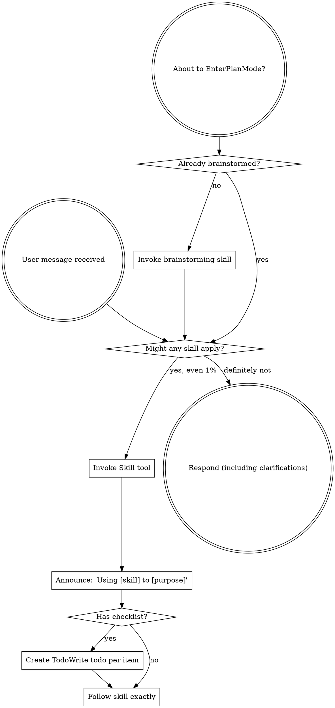

codex-exec: report contract violation

--- codex stdout ---
The plan is close, but three ATC/MUDA blockers remain.

1. Add explicit closure falsifiers. The design is source-derived and recursive, but the tests do not independently require:

   - witness composer/store edges in that hook’s per-entry closure;
   - `sgsd-quality-gate.js → sgsd-intent-classifier.cjs` as a per-entry edge—the union can hide omission because the classifier is also a manifest root;
   - extensionless and explicit non-`.cjs` resolution such as `.js`, `.json`, and directory rules.

   The mutation test must assert these edges from computation, manifest projection, delivery, and status without a maintained expected closure. See [plan line 198](<HOME>/AppData/Roaming/warp/Warp/data/worktrees/GSDedits/luminaria-hogback/.planning/milestones/v4.0-install-contract/phases/168-install-contract/168-01-PLAN-LOCKED.md:198).

2. Restore literal refuse-before-write ordering. The plan publishes project files and only then runs fallible final-target smoke ([line 266](<HOME>/AppData/Roaming/warp/Warp/data/worktrees/GSDedits/luminaria-hogback/.planning/milestones/v4.0-install-contract/phases/168-install-contract/168-01-PLAN-LOCKED.md:266), [line 382](<HOME>/AppData/Roaming/warp/Warp/data/worktrees/GSDedits/luminaria-hogback/.planning/milestones/v4.0-install-contract/phases/168-install-contract/168-01-PLAN-LOCKED.md:382)). Rollback prevents persistent partial delivery but does not satisfy “refuse before writing” or contain arbitrary hook side effects. All rejection-capable smoke must execute against a complete candidate tree before the first project/profile mutation; post-publication work must be limited to transactional publication and non-rejecting verification.

3. Split the safe MUDA seam. Keep graph, generated manifest, delivery, smoke, diagnosis, and shared inspection atomic. Move `--doctor`, explicit-project presentation, and worktree/GitHub freshness into a dependent second task/commit consuming `inspectProjectInstall`. Declaration and enforcement still ship together; worktree reporting is independently revertible.

The empty-tree criterion is genuinely end-to-end: production Bash installer, empty module destinations, isolated real HOME/USERPROFILE, decoy cwd, and no copier/mock/stage shortcut.

Diagnosis improves: closed reasons remain unchanged while bounded `underlying_error` carries `MODULE_NOT_FOUND`, request, path, and message.

Not covered: merging the branch remains an operator decision; selective closure intentionally leaves the remainder of the observed ~55-file parity gap untouched. The worktree-blind `install.sh:381` check is covered.

PLAN VERDICT: NOGO

--- codex stderr ---
OpenAI Codex v0.146.0
--------
workdir: <HOME>\AppData\Roaming\warp\Warp\data\worktrees\GSDedits\luminaria-hogback
model: gpt-5.6-sol
provider: openai
approval: never
sandbox: read-only
reasoning effort: xhigh
reasoning summaries: none
session id: 01a03859-f7c8-7fa3-a362-cc755a153d74
--------
user
# Plan review — P168 Install Contract. Apply ATC and MUDA to the PLAN, before any code.

Read-only. Do not edit files. Verdict must be GO or NOGO.

Plan: .planning/milestones/v4.0-install-contract/phases/168-install-contract/168-01-PLAN-LOCKED.md
Context (measured root cause, do not re-derive):
  .planning/milestones/v4.0-install-contract/phases/168-install-contract/CONTEXT.md

Schema validation already passed: VALID, no errors. Do not re-run it.

## The problem this plan must solve

Distributed hooks reach every project on every update; the modules they `require` never
do. `install.sh:615` copies `scripts/lib` to `~/.claude` only. Neither
`init_local_project` nor `update_existing` writes a project module tree. A project hook
doing `require('../scripts/lib/sgsd-state.cjs')` gets MODULE_NOT_FOUND. This has silently
broken delivery to every other repository for five development cycles.

## Judge these specifically

1. **Does the computed closure actually close?** The plan must derive the module set from
   hook sources, not a hand-maintained list. Check it handles: transitive requires (a
   required module requiring another), the witness hook's runtime resolution from the
   project root rather than a static `require`, a hook requiring another hook
   (`sgsd-quality-gate.js` requires `sgsd-intent-classifier.cjs`), and non-`.cjs`
   extensions. If any of those escapes the computation, the closure is incomplete and the
   phase ships the same bug in a new shape.

2. **Is the empty-tree criterion genuinely end to end?** It claims production install.sh,
   real HOME, decoy cwd, no mocks. Verify nothing in the plan quietly reintroduces a
   mocked copier or a pre-seeded target elsewhere.

3. **Refuse before writing.** This exact class has been a CRITICAL twice: at the
   install.sh level (2c237ef) and inside `repairClaudeSubstrateWitness` (b2a1435). Does
   the plan's new delivery step write anything before the checks that can fail? Say where.

4. **Does it make diagnosis worse?** The requirement is to carry the real
   module-resolution error beside the reason code. Widening the closed reason vocabulary
   instead of carrying the underlying error would be a regression, not a fix.

5. **MUDA.** Is this one task doing one thing, or a bundle that should split? The plan
   argues manifest, delivery, smoke and staleness ship together because a manifest
   without enforcement is the present failure. Test that argument; if a split is safe,
   say exactly where the seam is.

6. **What does it NOT cover?** Name any part of the measured root cause the plan leaves
   unaddressed, including the ~55-file gap observed on a real Linux project and the
   worktree-blind freshness check at install.sh:381.

## Verdict

End with exactly `PLAN VERDICT: GO` or `PLAN VERDICT: NOGO`.
NOGO requires a numbered list of what must change. Bound yourself to about 15 shell
commands and emit the verdict even if incomplete. Max 500 words.

codex
I’m using the repository’s SGSD review contracts to assess the locked plan read-only, with the supplied root cause treated as established evidence. I’ll inspect the plan, context, and referenced ATC/MUDA criteria without rerunning schema validation.
exec
"C:\\WINDOWS\\System32\\WindowsPowerShell\\v1.0\\powershell.exe" -Command "Get-Content -Raw 'C:\\Users\\operator\\.codex\\skills\\using-superpowers\\SKILL.md'" in <HOME>\AppData\Roaming\warp\Warp\data\worktrees\GSDedits\luminaria-hogback
 succeeded in 947ms:
---
name: using-superpowers
description: Use when starting any conversation - establishes how to find and use skills, requiring Skill tool invocation before ANY response including clarifying questions
---

<SUBAGENT-STOP>
If you were dispatched as a subagent to execute a specific task, skip this skill.
</SUBAGENT-STOP>

<EXTREMELY-IMPORTANT>
If you think there is even a 1% chance a skill might apply to what you are doing, you ABSOLUTELY MUST invoke the skill.

IF A SKILL APPLIES TO YOUR TASK, YOU DO NOT HAVE A CHOICE. YOU MUST USE IT.

This is not negotiable. This is not optional. You cannot rationalize your way out of this.
</EXTREMELY-IMPORTANT>

## Instruction Priority

Superpowers skills override default system prompt behavior, but **user instructions always take precedence**:

1. **User's explicit instructions** (CLAUDE.md, GEMINI.md, AGENTS.md, direct requests) ƒ?" highest priority
2. **Superpowers skills** ƒ?" override default system behavior where they conflict
3. **Default system prompt** ƒ?" lowest priority

If CLAUDE.md, GEMINI.md, or AGENTS.md says "don't use TDD" and a skill says "always use TDD," follow the user's instructions. The user is in control.

## How to Access Skills

**In Claude Code:** Use the `Skill` tool. When you invoke a skill, its content is loaded and presented to youƒ?"follow it directly. Never use the Read tool on skill files.

**In Copilot CLI:** Use the `skill` tool. Skills are auto-discovered from installed plugins. The `skill` tool works the same as Claude Code's `Skill` tool.

**In Gemini CLI:** Skills activate via the `activate_skill` tool. Gemini loads skill metadata at session start and activates the full content on demand.

**In other environments:** Check your platform's documentation for how skills are loaded.

## Platform Adaptation

Skills use Claude Code tool names. Non-CC platforms: see `references/copilot-tools.md` (Copilot CLI), `references/codex-tools.md` (Codex) for tool equivalents. Gemini CLI users get the tool mapping loaded automatically via GEMINI.md.

# Using Skills

## The Rule

**Invoke relevant or requested skills BEFORE any response or action.** Even a 1% chance a skill might apply means that you should invoke the skill to check. If an invoked skill turns out to be wrong for the situation, you don't need to use it.



## Red Flags

These thoughts mean STOPƒ?"you're rationalizing:

| Thought | Reality |
|---------|---------|
| "This is just a simple question" | Questions are tasks. Check for skills. |
| "I need more context first" | Skill check comes BEFORE clarifying questions. |
| "Let me explore the codebase first" | Skills tell you HOW to explore. Check first. |
| "I can check git/files quickly" | Files lack conversation context. Check for skills. |
| "Let me gather information first" | Skills tell you HOW to gather information. |
| "This doesn't need a formal skill" | If a skill exists, use it. |
| "I remember this skill" | Skills evolve. Read current version. |
| "This doesn't count as a task" | Action = task. Check for skills. |
| "The skill is overkill" | Simple things become complex. Use it. |
| "I'll just do this one thing first" | Check BEFORE doing anything. |
| "This feels productive" | Undisciplined action wastes time. Skills prevent this. |
| "I know what that means" | Knowing the concept ƒ%ÿ using the skill. Invoke it. |

## Skill Priority

When multiple skills could apply, use this order:

1. **Process skills first** (brainstorming, debugging) - these determine HOW to approach the task
2. **Implementation skills second** (frontend-design, mcp-builder) - these guide execution

"Let's build X" ā' brainstorming first, then implementation skills.
"Fix this bug" ā' debugging first, then domain-specific skills.

## Skill Types

**Rigid** (TDD, debugging): Follow exactly. Don't adapt away discipline.

**Flexible** (patterns): Adapt principles to context.

The skill itself tells you which.

## User Instructions

Instructions say WHAT, not HOW. "Add X" or "Fix Y" doesn't mean skip workflows.

<HOME>\OneDrive - <ORG>\Documents\WindowsPowerShell\profile.ps1 : Cannot dot-source this 
command because it was defined in a different language mode. To invoke this command without importing its contents, 
omit the '.' operator.
At line:1 char:1
+ . '<HOME>\OneDrive - <ORG>\Documents\Win ...
+ ~~~~~~~~~~~~~~~~~~~~~~~~~~~~~~~~~~~~~~~~~~~~~~~~~~~~~~~~~~~~~~~~~~~~~
    + CategoryInfo          : InvalidOperation: (:) [profile.ps1], NotSupportedException
    + FullyQualifiedErrorId : DotSourceNotSupported,profile.ps1
 
<HOME>\OneDrive - <ORG>\Documents\WindowsPowerShell\Microsoft.PowerShell_profile.ps1 : 
Cannot dot-source this command because it was defined in a different language mode. To invoke this command without 
importing its contents, omit the '.' operator.
At line:1 char:1
+ . '<HOME>\OneDrive - <ORG>\Documents\Win ...
+ ~~~~~~~~~~~~~~~~~~~~~~~~~~~~~~~~~~~~~~~~~~~~~~~~~~~~~~~~~~~~~~~~~~~~~
    + CategoryInfo          : InvalidOperation: (:) [Microsoft.PowerShell_profile.ps1], NotSupportedException
    + FullyQualifiedErrorId : DotSourceNotSupported,Microsoft.PowerShell_profile.ps1
 

exec
"C:\\WINDOWS\\System32\\WindowsPowerShell\\v1.0\\powershell.exe" -Command '$files = @('"'.planning/STATE.md', '.planning/milestones/v4.0-install-contract/phases/168-install-contract/CONTEXT.md', '.planning/milestones/v4.0-install-contract/phases/168-install-contract/168-01-PLAN-LOCKED.md'); foreach ("'$file in $files) { Write-Output ('"'===== ' + "'$file + '"' ====='); Get-Content -Raw "'$file }' in <HOME>\AppData\Roaming\warp\Warp\data\worktrees\GSDedits\luminaria-hogback
 succeeded in 1250ms:
===== .planning/STATE.md =====
---
gsd_state_version: 1.0
milestone: v3.9-substrate-hygiene
current_phase: "complete"
milestone_name: Substrate Hygiene
milestone_status: "v3.9-substrate-hygiene ACTIVE 2026-08-22. P166 Substrate Call Filters CLOSED PASS-WITH-DEFERRED-1 @ ed86dee: one composer-owned SUBSTRATE_CALL_POLICY builds and v2-validates every substrate payload immediately before mcpInvoke so unfiltered calls cannot reach transport; eight production sites enumerated and individually classified with fail-closed grep coverage; capSubstrateResponse bounds each hit at 16,000 chars with named degradation notes propagated through enrichment, triage and the Phase-48 bridge; v1 schema and P154 evidence byte-unchanged. 17/17 suites green unsandboxed plus four falsification probes. Six fix rounds across five review gates. DEFERRED-1: four markdown-agent prompt surfaces keep the raw MCP tool and their gateway evidence is self-reported, so nothing witnesses the actual invocation; adjudicated DECISION C, seeded as P167 substrate-invocation-witness. v3.6/v3.5 history preserved in legacy_milestone_status below."
legacy_milestone_status_v3_6: "v3.6-vtp-bridge ACTIVE 2026-08-11 ƒ?" SGSDƒÅ"VTP Bridge Phase 0. P152 KB-Triage Shadow PASS 2026-08-12 @ 5e32325 (text-free shadow classifier: new non-injecting `shadow` enforcement kind + kb-lookup-triage route, strong-KB-beats-verb tiering, opaque text-free ledger; board+2xCodex-gated shadow-only, hard gate deferred to 28-day locked metric; independently verified zero-injection + text-free + Codex spec-review NOGO-then-fixed). P151 Demand Baseline PASS (39/39): zero-VTP-dep ledger+instrument+docs, board+Codex-gated. Stages 2-3 blocked on post-VTP-milestone restart+probe + gold-set approval. v3.5 shipped prior. | T150-07 devcp update EXECUTED 2026-08-12: source+install fast-forwarded 7fb47eb->01af43e, gpt-5.6-sol + v3.6 substrate live; remaining = live-session restart + interactive trust probe + serve.cjs stash reconcile."
status: "v3.5 ACTIVE 2026-08-06 ƒ?" P145 codex-profile-control CLOSED PASS-WITH-DEFERRED-4 @ c1596f7 (profile registry + /sgsd-codex-control + 4 CRIT security fixes total: 2 per-dispatch-ATC pre-commit, GAP-1 verifier env-var TTY bypass, phase-ATC silent report-write; self-tests 21/21 + Probes 1-7 + parity + control all PASS; deferred: A selfTestCliGuard non-TTY forcing, B 3-way CLI-default drift guard, C inert trust/hook fieldsƒÅ'P148/P150, DEVIATION-1 finalize probe simplification). Next: P148 cross-model triage. v3.4 PARKED at P142/P143 (cockpit alarm+rationale drawers, close) ƒ?" reopen after v3.5 or on operator call. v3.4 P999 pink-elephant visual smoke also parked."
stopped_at: 2026-04-29 ƒ?" Phase 63 closed PASS-WITH-DEFERRED-5 @ b5b46a8 (Warp Capability Smoke Test; 7 artifacts under .planning/milestones/v2.2/; 13-row evidence matrix in WARP-SMOKE.md; 5 operator UI manual checks M1-M5 pending in MANUAL-CHECKS.md; sg-launched-Claude topology proven empirically ƒ?" this Claude session itself is the evidence; ~/.warp/launch_configurations/ exists but empty; .warp/workflows lint 4/5 with sgsd-token-current.yaml missing arguments block forwarded to Phase 64; .warpindexingignore missing forwarded to Phase 65 or new ignore-pack phase; tmux not native on Windows; Warp install at ~/AppData/Local/Programs/Warp/Warp.exe; previous roadmap v1.6-v2.1 ROADMAP COMPLETE 2026-04-29 preserved in previous_roadmap block ƒ?" all 30 phases (26-62) shipped across 6 milestones (v1.6 SHIPPED-WITH-DEBT-10, v1.7-v2.1 SHIPPED clean)).
last_updated: "2026-08-25T00:00:00Z"
last_activity: "2026-05-20 v3.0 SGSD-PRO ACTIVATED ƒ?" operator issued /sgsd-orchestrate auto. Milestone opened at scaffold commit 52c687a (INTENT + ROADMAP + REQUIREMENTS + DLB-08 design lock + P106 CONTEXT + master proposal + infographic ingested). Auto-loop dispatched Codex to author 106-01 PLAN-LOCKED.md against plan-schema-v2 SCHEMA-09 (must include semantic_acceptance_criteria per DLB-07). Mission: lineaged role-filtered cognitive memory underneath SGSD's central control plane. Seven CMB types (execution_receipt observation / review_finding claim / evidence_verdict claim-with-authority / decision_recommendation decision / operator_precedent highest / context_anchor projection / promotion_decision terminal). Four MVP exit fixtures (A false-CRIT refuted / B context-aware pseudo-op / C lineage chain / D production-mutation forces escalation). Stale autopilot-watchdog checkpoint pointing at v2.9/P95 deleted on entry (was generated by watchdog after 1569 min inactivity on closed milestone; misleading)."
legacy_activity_v2_9_resync: "2026-05-18 v2.9 RE-SYNC + P97.5 LANDED + ALL-PHASES-CLOSED ƒ?" STATE.md progress block was wildly stale (showed phase_98 ACTIVE, 99-105 PENDING) while SUMMARY.md @ 8fb3b09 already documented all 8 phases closed. This session inserted P97.5 Semantic Verification Gate (commit chain 34520c0 ƒÅ' 9901568 ƒÅ' 2fa3bbc ƒÅ' 6e66ad0) carrying DLB-07 (Clarity-incident-driven post-mortem) and mechanical schema enforcement of semantic_acceptance_criteria via SCHEMA-09/-10. v2.9 now 9 phases (97.5 + 98-105), all PASS / PASS-WITH-DEFERRED-2. Per sgsd-complete-milestone skill idempotency: SUMMARY.md exists ƒÅ' skill is no-op; remaining work is the STATE.md re-sync flagged in SUMMARY.md \"Critical Gaps #1\". Open items roll forward: warp-mcp 15th tool (DEFERRED-1), cockpit 12th section (DEFERRED-2), 18-plan SAC backfill or skip_gates per 97.5-BACKFILL.md, M1-M5 manual UI checks, Phase 95 ACP re-entry pending Warp #7326, v2.6 SHIPPED-clean operator decision."
legacy_activity_v2_9_activation: "2026-04-30T00:00Z v2.9 ACTIVATION ƒ?" operator activated Agentic Harness Evolution roadmap. v2.8 closed at 2466ff1 (Phase 97 release gate; 149/149 self-tests; 22/25 readiness; READY-WITH-DEFERRED). Entering v2.9 P98 Harness Component Substrate (registry + catalog.cjs + ƒ%¾15-assertion self-test + SGSD-HARNESS-EVOLUTION.md). v2.9 pre-designed in CLAUDE-HANDOVER.md / ROADMAP.md / REQUIREMENTS.md / VTP-AHE-EVIDENCE.md. Mission: turn SGSD from hand-improved orchestrator into observability-driven harness with closed AHE loop (component ƒÅ' evidence ƒÅ' predicted edit ƒÅ' measured next-run outcome ƒÅ' keep/revert/pivot). Phases 98-105 scoped: 98 component substrate, 99 trajectory evidence corpus, 100 change manifest prediction ledger, 101 attribution+rollback gate, 102 harness evolution runner, 103 component ablation+interference, 104 transfer+OOD benchmark, 105 release gate+cockpit integration. Non-negotiable: protected oracle/verifier/model-config/budget never edited by evolution loop. STATE.md surgical repoint only ƒ?" operator owns canonical legacy frontmatter re-sync (SUMMARY.md gap #1)."
legacy_activity_v2_6: "2026-04-29T21:25Z RE-SYNC ƒ?" STATE.md was stale (mtime 20:07; latest pulse 21:19; 5 commits since 81-85). Operator override at Phase 85 close flagged: STATE.md staleness + Codex unavailability + context-packet builder dormant + token burn ~21.5M (orchestrator alone ~18M; root context ~775k tokens/turn). Phase 86 PAUSED to address 7-point token-control list + 3 Phase-85 deferrals. Auto-run completed 19/19 phases this session (63-83) plus 84+85; current commits b5b46a8 / d35e92a / eb252f3 / c0201af / 018028e / 5ae2ba0 / 3b2186f / f5fe11a / 4e2b19c / 8dbb9cb / 31907c2 / 0211b0c / dcd039b / 0905cbf / ebfaf7c / 11bb6bb / 2ab84d7 / 6f50232 / 1baf708 / 6021fbb / ad5948d / 72e0d6b / 5914be6 / 6ba04f8 / 22aedd5 / a6b83c8 / bd54eb3 / 5a74bda / 8eb7de8 / e69271e / 7256a76 / 350e101 / 19e544e / 2e8ce85 / 8bad3ad / 347c56a. Original Phase 63 close text preserved in v2_2 progress block below; full per-phase progress in v2_3-v2_6 blocks below. v2.2 milestone scaffolded; 7 artifacts under .planning/milestones/v2.2/ (WARP-SMOKE.md + MANUAL-CHECKS.md + 5 standard phase artifacts CONTEXT/PLAN/RESEARCH/VERIFICATION/ATC-REVIEW). Evidence matrix records 5 PASS rows (Q2/Q3/Q4/Q7/Q8: sg/sgsd/sgsd-setup interactive resolution + sg-keeps-Claude-in-current-tab topology + launch config dir empty), 1 PARTIAL (Q12: 4/5 workflow YAML lint OK; sgsd-token-current.yaml missing arguments block ƒ?" Phase 64 input), 1 DOCS-CONFIRMED (Q11: WSL/SSH disables Codebase Context per Warp docs), 5 MANUAL-CHECK-REQUIRED (Q1/Q5/Q6/Q9/Q10: workflow searchability + claude/sg utility-bar detection + launch-config active-window behavior + Codebase Context state ƒ?" operator verifies in Warp UI per MANUAL-CHECKS.md M1-M5). Forwarded to Phase 64+: workflow pack completion (Q12+Q1), AGENTS.md (Phase 65), .warpindexingignore (Phase 65 or new ignore-pack phase), warp-doctor probes (Phase 67), launch-config templates must NOT assume active-window (Phase 78), upstream issue tracking at https://github.com/warpdotdev/warp issues #7326 ACP and #9233 May-Jun 2026 roadmap (Phase 96). No source-file mutations; git diff confined to .planning/milestones/v2.2/. Previous roadmap v1.6-v2.1 SHIPPED 2026-04-29 ƒ?" see previous_roadmap block."
progress:
  v3_5:
    total_phases: 7
    completed_phases: 3
    completed_plans: 3
    percent: 100
    phase_145: "PASS-WITH-DEFERRED-4 ƒo" 2026-08-06 @ c1596f7 (Codex Profile Control; verifier GAP-1 + phase-ATC CRIT-1 both fixed+regression-guarded; MUDA mechanical PASS 0/0; deferred A/B/C + DEVIATION-1)"
    phase_146: "PASS-WITH-DEFERRED-3 ƒo" 2026-08-07 @ a36e1ea (Session Governance Hooks; 7 tasks; 11 CRIT found+closed across per-dispatch/verify/phase-ATC incl. 5x writer-accepts-destination and 7x silent-success; phase-ATC re-review 4/4 CLOSED ƒ?" containment now ONE contract via resolveContainedPath; MUDA 0/0; hooks LIVE in repo; deferred F/G + DEVIATION-W)"
    phase_147: "PASS ƒo" 2026-08-07 (Commit-Seam Gate; 5 tasks + 3 fix rounds; 21/21 real-git scenarios; earned-block falsifier proven both directions incl. convention_unknown + per-repo floors; tamper-evident activation; cross-worktree misattribution CRIT closed at re-review 0/0; MUDA 0/0; DEFERRED-F absorbed at commit seam; hooks live on devcp via source-checkout pattern, warn rows accumulating)"
    phase_148: "PASS ƒo" 2026-08-08 @ 768c6a0 (Cross-Model Triage; staged MCP transport end-to-end after 3-dispatch ATC-fix chain ƒ?" runtime decides, Claude transports; 36/36 scenarios; spec 6/6; phase-ATC re-review 10/10; MUDA 0/0 prior + degraded re-run logged; seam anti-pattern curated after 4th instance)"
    phase_149: "PASS ƒo" 2026-08-08 (Skill-Routing Table; 24-route registry + loader 18/18 + classifier AC-149b + phase-close consult AC-149c with derive-dont-default gate inputs, forged-gate rejection, executable dispatches; 3 verifier rounds + phase-ATC FAIL-GATE all closed, re-review 8/8; MUDA 0/0 mech + qualitative degraded; A1 pre-existing documented)"
    phase_150: "PASS-WITH-DEFERRED-1 ƒo" 2026-08-10 @ c0aff22+ (Propagation+Trust+Runbook; T150-01..04 built 72/0/1 battery; T150-05 PUBLISHED origin 7fb47eb->c0aff22 + local install under operator auth; T150-06 trust guard proven 3 ways; T150-07 devcp DEFERRED ƒ?" live sessions; 4 review rounds/13 CRIT closed; PII 0 tracked; .gitattributes eol pins)"
  v3_0:
    total_phases: 7
    completed_phases: 7
    completed_plans: 7
    percent: 100
    phase_106: "PASS ƒo" 2026-05-20 @ 390ef1a (Mesh CMB Schema; DLB-08.1; 14/14)"
    phase_107: "PASS ƒo" 2026-05-20 @ c45c24c (cmb-validate + cmb-hash + writers; DLB-08.2+.3; 20/20)"
    phase_108: "PASS ƒo" 2026-05-20 @ cf03b53 (lineage + evidence-validator + echo-detector + sgsd-audit wire-in; DLB-08.4+.5; 49/49)"
    phase_109: "PASS ƒo" 2026-05-20 (escalation_gate + pseudo_operator_peer; DLB-08.6+.7; 102/102; Fixture D PROVED; DLB-08 LAYER COMPLETE)"
    phase_110: "PASS ƒo" 2026-05-20 (Codex Pro Mode profile-resolver + stoplight + native-review-runner; DLB-09.1; 15/15)"
    phase_111: "PASS ƒo" 2026-05-20 (PLAN-LOCKED schema + validator + .codex/hooks.json + 5 hooks; DLB-09.2; 15/15)"
    phase_112: "PASS ƒo" 2026-05-21 (Context Authority capsule ƒ?" 6 templates + writer + composer + v3.0 dogfood instances; DLB-10.1; 17/17; FINAL v3.0 phase)"
  v2_9:
    total_phases: 9
    completed_phases: 9
    completed_plans: 9
    percent: 100
    phase_97_5: "PASS ƒo" 2026-05-18 @ 6e66ad0 (Semantic Verification Gate; DLB-07 + plan-schema-v2 enforces semantic_acceptance_criteria via SCHEMA-09/-10; 5/5 fixture tests green; 97.5-BACKFILL.md surfaces 18 plans needing backfill or skip_gates)"
    phase_98: "PASS ƒo" @ a4f8539 (Harness Component Substrate; 35-row registry across 14 frozen classes incl. 5 protected; Lock-13 catalog.cjs; 21/21 self-test)"
    phase_99: "PASS ƒo" @ 6f7a478 (Trajectory Evidence Corpus; distill.cjs 7 JSONL surfaces ƒÅ' OVERVIEW ƒ%Ï4KB + INDEX; 11 frozen root-cause labels; 18/18 self-test)"
    phase_100: "PASS ƒo" @ eba47ba (Change Manifest Prediction Ledger; MANIFEST.schema.json 14 required fields incl. predicted_fixes ƒ%¾1 + predicted_regressions; append-only JSONL; 21/21 self-test)"
    phase_101: "PASS ƒo" @ d1066a4 (Attribution And Rollback Gate; attribute.cjs 6-verdict closed vocab; fix + regression metrics independent; structured rollback recommendation; v2.9 close-gate added; 18/18 self-test)"
    phase_102: "PASS ƒo" @ 827d9bc (Harness Evolution Runner; run.cjs 4 modes dry-run/proposal/apply/attribute; protected-oracle boundary; 17/17 self-test)"
    phase_103: "PASS ƒo" @ 5122d95 (Component Ablation And Interference; ablate.cjs tmpdir isolation; 3 frozen interference rules duplicate/redundant/inversion; requires_transfer_eval=true; 18/18 self-test)"
    phase_104: "PASS ƒo" @ f6d3073 (Transfer And OOD Benchmark; evaluate.cjs frozen-before-run rule; 3 critical-regression rules; 8 transfer axes; 18/18 self-test)"
    phase_105: "PASS-WITH-DEFERRED-2 ƒo" @ 8fb3b09 (Release Gate And Cockpit Integration; v2.9 close gate extended with AHE-EVAL-03/05; SUMMARY.md + SGSD-HARNESS-EVOLUTION.md ship; DEFERRED-1 warp-mcp 15th tool / DEFERRED-2 cockpit-state 12th section ƒ?" both lock-13 frozen-array updates)"
  v2_8:
    total_phases: 4
    completed_phases: 4
    completed_plans: 4
    percent: 100
    phase_94: "PASS ƒo" 2026-04-29 @ 649898d (ACP Mapping Spec; 7 concepts + 11-row event mapping)"
    phase_95: "SKIPPED-WAITING-FOR-UPSTREAM ƒo" 2026-04-29 @ 9bbcdf8 (ACP Adapter Spike; Warp #7326 open)"
    phase_96: "PASS ƒo" 2026-04-29 @ cfff32a (Warp Upstream Pack; telemetry-panel target picked 19/20; draft-only)"
    phase_97: "PASS ƒo" 2026-04-29 @ 2466ff1 (Release Gate; 149/149 self-tests; 22/25 readiness; SUMMARY.md ships v2.2-v2.8 retrospective)"
  v2_6:
    total_phases: 5
    completed_phases: 3
    completed_plans: 3
    percent: 40
    phase_84: "1/1 plan complete ƒ?" PASS ƒo" 2026-04-29 @ 2e8ce85 (Code Review Integration Guide + SGSD: Open Review Artifacts workflow; 2-layer review model documented; 15/15 workflow lint)"
    phase_85: "1/1 plan complete ƒ?" PASS-WITH-DEFERRED-3 ƒo" 2026-04-29 @ 8bad3ad+347c56a (Recovery Packet Upgrade; 1818 bytes ƒ%Ï4KB; why_stopped + artifact_links + roadmap-complete branch; 44/44 self-test; DEFERRED-1 STATE.md staleness contagion + DEFERRED-2 Codex unavailable Phase 84/85 + DEFERRED-3 context-packet-log.jsonl 24h+ stale ƒ?" Phase 86 must address)"
    phase_86: "PAUSED on operator override ƒ?" Token Control + Staleness Reconciliation. 7-point list (token-control repair / cockpit + recovery staleness probes / token-waste+context-packet wire-in / 200k+500k context warnings / fresh-session resume packets / context-bench full-mode rerun or unproven mark / v2.6 debt record) + 3 Phase-85 deferrals. Originally 'Remote Monitor Packet' but most of that work shipped via Phase 64 workflow + Phase 79 skill"
    phase_87: "PENDING ƒ?" Watchdog And Attention Alerts (originally; may re-scope after Phase 86)"
    phase_88: "PENDING ƒ?" End-To-End Warp Operator Drill"
  v2_5:
    total_phases: 5
    completed_phases: 5
    completed_plans: 5
    percent: 100
    phase_79: "PASS ƒo" 2026-04-29 @ 5a74bda (7 SGSD Warp skills under .agents/skills/; read-only by design)"
    phase_80: "PASS ƒo" 2026-04-29 @ 8eb7de8+e69271e (Warp Plan converter; 4 public APIs Lock-13; 17/17 self-test; READ-ONLY on STATE.md verified mechanically; 9 phase files generated under .planning/analyses/ live test)"
    phase_81: "PASS ƒo" 2026-04-29 @ 7256a76 (SGSD Warp Operator Notebook; 10 runnable PowerShell blocks)"
    phase_82: "PASS ƒo" 2026-04-29 @ 350e101 (7 Warp Agent prompts; mode declared per prompt; none auto-modify)"
    phase_83: "PASS ƒo" 2026-04-29 @ 19e544e (asset cross-index; 47 paths cited 0 missing; validator 5/5 self-test)"
  v2_4:
    total_phases: 6
    completed_phases: 6
    completed_plans: 6
    percent: 100
    phase_73: "PASS ƒo" 2026-04-29 @ 6021fbb (12 operator questions mapped to MCP tools; 16 event types frozen for Phase 74)"
    phase_74: "PASS ƒo" 2026-04-29 @ ad5948d (ORCHESTRATOR-LIVE.jsonl contract + writer helper; 9/9 self-test; Lock-13)"
    phase_75: "PASS ƒo" 2026-04-29 @ 72e0d6b+5914be6 (writer integration; --emit CLI + READ-ONLY reader 12/12 self-test + SKILL.md wire-in section)"
    phase_76: "PASS ƒo" 2026-04-29 @ 6ba04f8+22aedd5 (cockpit-state adapter; 10-section snapshot; 4 fixtures; MCP tool 12 unification; warp-mcp 42/42 regression PASS)"
    phase_77: "PASS ƒo" 2026-04-29 @ a6b83c8 (cockpit render helper; PSParser 0 errors; existing 3 cockpit panes UNTOUCHED ƒ?" operator parallel work preserved)"
    phase_78: "PASS ƒo" 2026-04-29 @ bd54eb3 (Warp launch config templates ƒ?" operator-workspace + cockpit-only + README; M4 caveat documented)"
  v2_3:
    total_phases: 5
    completed_phases: 5
    completed_plans: 5
    percent: 100
    phase_68: "PASS ƒo" 2026-04-29 @ 31907c2 (SGSD MCP read-only contract; 14 tools; ERROR_CODES len=11; REDACTION_CATEGORIES len=7)"
    phase_69: "PASS ƒo" 2026-04-29 @ 0211b0c+dcd039b (MCP server skeleton; JSON-RPC 2.0 stdio; 14 tool stubs; 15/15 self-test)"
    phase_70: "PASS ƒo" 2026-04-29 @ 0905cbf+ebfaf7c (5 core status tools ƒ?" current_state/current_phase/milestone_status/watchdog/recovery_packet; 21/21 self-test; 10 fixture pairs)"
    phase_71: "PASS ƒo" 2026-04-29 @ 11bb6bb+2ab84d7 (9 operational tools ƒ?" gate/agent/codex/token/context-bench/commits/cockpit-snapshot/artifact-links/warp-doctor; 30/30 self-test; 28 fixture pairs; live hash-match against git log -1)"
    phase_72: "PASS ƒo" 2026-04-29 @ 6f50232+1baf708 (MCP redaction 7 categories wired into all 14 tools; ERROR_CODES extended len=13; warp-doctor probe 15 upgraded; SGSD-WARP-MCP-SETUP.md; sgsd-mcp-self-test workflow)"
  v2_2:
    total_phases: 5
    completed_phases: 5
    completed_plans: 5
    percent: 100
    phase_63: "1/1 plan complete ƒ?" PASS-WITH-DEFERRED-5 ƒo" 2026-04-29 @ b5b46a8 (Warp Capability Smoke Test; 5 deferred rows are operator UI manual checks M1-M5 tracked in .planning/milestones/v2.2/MANUAL-CHECKS.md, NOT edge_guard_miss and NOT in CRIT-BACKLOG; 7 artifacts: WARP-SMOKE.md + MANUAL-CHECKS.md at milestone root, CONTEXT/PLAN/RESEARCH/VERIFICATION/ATC-REVIEW under phases/63-warp-capability-smoke/; sg-launched-Claude topology proven empirically ƒ?" this Claude session is the in-process witness)"
    phase_64: "1/1 plan complete ƒ?" PASS ƒo" 2026-04-29 @ 5ae2ba0 (Workflow Pack Completion; 8 new yamls + 1 fix sgsd-token-current; lint tool warp-workflow-lint/lint.cjs READ-ONLY ASCII-only 7/7 self-test PASS; live --run 13/13 valid + 10/10 search terms exit 0; SGSD-WARP-WORKFLOWS.md docs index 13-row table + 3 routines; orchestrator-author DEVIATION cumulative 3rd; 'partially blocked on M1' relabeled per operator Rule 15 ƒ?" workflow YAMLs ship correctly regardless of UI verification)"
    phase_65: "1/1 plan complete ƒ?" PASS ƒo" 2026-04-29 @ c0201af (Agent Rules Context Pack; AGENTS.md NEW 46 lines / 2972 bytes / ratio 0.290 of CLAUDE.md under 30% target; WARP.md additive +21 lines Rule Hierarchy section; 5 hard rules established: read-state-from-.planning / don't-duplicate-gates / VTP-optional / preserve-sg-topology / no-source-mutations-without-plan; orchestrator-author DEVIATION 1st; compactness 2-pass)"
    phase_66: "1/1 plan complete ƒ?" PASS ƒo" 2026-04-29 @ 3b2186f (SGSD Warp Operator Guide; super-gsd/docs/SGSD-WARP-OPERATOR-GUIDE.md ~280 lines covering 12 roadmap-required sections + TL;DR routine + 14 concrete Windows paths + 6/6 cross-phase references verified; orchestrator-author DEVIATION 4th; 'partially blocked on M1' relabeled per Rule 15)"
    phase_67: "1/1 plan complete ƒ?" PASS ƒo" 2026-04-29 @ 018028e (Warp Doctor Probe Design; super-gsd/tools/warp-doctor/check.cjs 16 probes + 4 public APIs Lock-13-wrapped + 15/15 self-test PASS; READ-ONLY invariant verified mechanically via git status before/after live --run; ASCII-only; mirrors Phase 62 upgrade-drift pattern; orchestrator-author DEVIATION 2nd; live --run on this checkout: 13 PASS / 1 MISSING [.warpindexingignore confirms Phase 63 finding E.1] / 1 MANUAL-CHECK / 1 NOT-APPLICABLE / 0 DEGRADED exit 1)"
  v1_7:
    total_phases: 5
    completed_phases: 5
    completed_plans: 5
    percent: 100
    phase_31: "1/1 plan complete ƒ?" PASS ƒo" 2026-04-27 (CRIT+WARN fixed in-loop, anti-slop 10/10)"
    phase_32: "1/1 plan complete ƒ?" PASS ƒo" 2026-04-27 (2 CRIT + 5 WARN fixed in-loop; 1 deferred design-locked; combined anti-slop 9.5/10)"
    phase_33: "1/1 plan complete ƒ?" PASS ƒo" 2026-04-27 (2 CRIT + 5 WARN fixed in-loop; 8 new bypass patterns; 0 regressions; combined anti-slop ~9.5/10)"
    phase_34: "1/1 plan complete ƒ?" PASS ƒo" 2026-04-27 (2 CRIT + 5 WARN fixed in-loop; v1.5 empty-baseline gap closed; combined anti-slop ~9.5/10)"
    phase_35: "1/1 plan complete ƒ?" PASS ƒo" 2026-04-27 (0 CRIT + 7 WARN; 5 in-loop, 1 info, 1 out-of-scope; deterministic catalog generator; combined anti-slop ~9.5/10)"
  v1_6_summary:
    total_phases: 5
    completed_phases: 5
    percent: 100
    phase_26: "PASS ƒo" 2026-04-26"
    phase_27: "PASS ƒo" 2026-04-26"
    phase_28: "PASS-WITH-DEFERRED-5 ƒo" 2026-04-26"
    phase_29: "PASS-WITH-DEFERRED-3 ƒo" 2026-04-27"
    phase_30: "PASS-WITH-DEFERRED-2 ƒo" 2026-04-27"
  v3_6:
    total_phases: 9
    completed_phases: 9
    completed_plans: 9
    percent: 100
    phase_156: "PASS-WITH-DEFERRED-4 2026-08-20 @ db74df5 (state.write primitive + SUMMARY close-gate on the actual route; 42/42 + 36/36)"
    phase_157: "PASS-WITH-DEFERRED-4 2026-08-20 @ 7b882b4 (vtp-services registry + dual-surface probes + SessionStart depth; 140/140)"
    phase_158: "PASS-WITH-DEFERRED-1 2026-08-20 @ 8aa16c8 (automated-turn origin gate; classifier 25/25)"
    phase_159: "PASS-WITH-DEFERRED-3 2026-08-20 @ 26edb1f (skill+VTP tool-family routing, availability-guarded shadow-first)"
  v3_7:
    total_phases: 1
    completed_phases: 1
    completed_plans: 1
    percent: 100
    phase_160: "PASS-WITH-DEFERRED-2 2026-08-20 @ 6f5a06a (installer registration guard; 8/8 twice under production launch)"
  v3_8:
    total_phases: 5
    completed_phases: 3
    completed_plans: 3
    percent: 60
    phase_161: "PASS-WITH-DEFERRED-3 2026-08-21 @ 44e7861 (hook distribution complete; installer 3.3x faster; recovery proven 12/12)"
    phase_162: "PASS-WITH-DEFERRED-2 2026-08-21 @ 8410974 (fleet service; suite 229/229; port-collision decision deferred)"
    phase_163: "PASS-WITH-DEFERRED-3 2026-08-21 @ e590ca4+ (fleet page; suite 589/589; HARD STOP before gated P164/P165)"
  v3_9:
    total_phases: 2
    completed_phases: 2
    completed_plans: 2
    percent: 100
    phase_167: "PASS 2026-08-25 @ 7b201fc (Substrate Invocation Witness; installed PreToolUse denies non-conforming substrate calls in the live Claude 2.1.243 runtime under bypass-permissions, PostToolUse rewrites through capSubstrateResponse/updatedMCPToolOutput and never passes the raw result through, failures return a bounded substrate_witness_rewrite_failed object; HMAC-signed witness rows bound to runtime session and payload digest, consumed exactly once, rewritten-state only, so replay, cross-session reuse, edited rows, missing witness and agent-supplied identifiers are all rejected; capability broker withdraws the tool from tools/list and rechecks readiness before forwarding. Verifier GOAL_MET YES 6/6 criteria MET; phase ATC PASS 9/10 round 3 after two CRITICALs closed (passthrough contradiction, installer mutate-then-refuse); MUDA WARN 8/8. Guard 12/12, T1 38/38, T2 13/13, T3 4/4, T4 pass, propagation 15/15, P166 6/6, P154 pass, live capture PASS with independent verify PASS. Two production defects escaped and were repaired in-phase: parseMcpDomain rejected the runtime bare-array shape, and the installer provisioned a witness key, copied runtime files, merged settings.json and wrote broker grants before refusing. Five installer-registration-guard cases regressed at phase start and stayed red until close because nothing ran that suite between P161 and now; adopted process change is a path-triggered unsandboxed twelve-case commit check. Hook coverage is one of seventeen: four hooks with sibling-module dependencies remain unverified in propagation, seeded as P168.)"
backlog:
  total_unresolved: 10
  by_kind:
    verifier_fail: 0
    phase_atc: 10
    edge_guard_miss: 0
  by_phase:
    "26": 0
    "27": 0
    "28": 5
    "29": 3
    "30": 2
    "31": 0
    "32": 0
    "33": 0
    "34": 0
    "35": 0
  cleared_post_rerun: 8
v1_6_complete:
  shipped: 2026-04-27
  status: SHIPPED-WITH-DEBT-10
  initial_backlog: 18
  cleared_post_rerun: 8
  remaining_unresolved: 10
  phases: 5
  plans: 8
v1_7_complete:
  shipped: 2026-04-27
  status: SHIPPED
  initial_backlog: 0
  cleared_in_loop: 16
  remaining_unresolved: 0
  phases: 5
  plans: 5
  combined_anti_slop_estimated: "~9.5/10"
  controlling_principle_held: "Autonomy continues; evidence tells the truth"
  v1_5_empty_baseline_gap: "CLOSED at Phase 34"
  summary: .planning/milestones/v1.7/SUMMARY.md
v1_8_complete:
  shipped: 2026-04-27
  status: SHIPPED
  initial_backlog: 0
  cleared_in_loop: 22
  accepted: 2
  false_alarm: 1
  remaining_unresolved: 0
  phases: 5
  plans: 5
  combined_anti_slop_estimated: "~9/10"
  controlling_principle_held: "Autonomy continues; evidence tells the truth"
  summary: .planning/milestones/v1.8/SUMMARY.md
  generated_artifacts:
    - .planning/milestones/v1.8/gate-keep-kill.md (Phase 39 rubric)
    - .planning/milestones/v1.8/phase-folder-audit.md (Phase 40 audit)
checkpoint: .planning/ORCHESTRATOR-CHECKPOINT.md (no checkpoint open; Phase 63 closed PASS-WITH-DEFERRED-5)
previous_roadmap:
  scope: v1.6 ā' v2.1 (phases 26-62)
  status: ROADMAP COMPLETE 2026-04-29
  shipped_milestones: "v1.6 SHIPPED-WITH-DEBT-10 @ d510e32, v1.7 SHIPPED @ 5690c38, v1.8 SHIPPED, v1.9 SHIPPED, v2.0 SHIPPED (release-readiness 97 GREEN), v2.1 SHIPPED (final milestone of prior roadmap)"
  controlling_contract: .planning/ROADMAP-AGENT.md
  locked_decisions: .planning/discussions/2026-04-26-mass-discuss.md
  total_phases_shipped: 30
  total_milestones_shipped: 6
  started: 2026-04-26
  completed: 2026-04-29
  history_blocks: "Per-phase history retained inline below in roadmap_run sub-blocks (v2_1_progress / v2_0_progress / v2_0_complete / v2_1_complete / v1_9_progress / v1_9_open_debt / v1_9_supersedes_archive / v1_9_milestone_codename / v1_9_vtp_delta_active / v1_8_progress / milestones_shipped). Top-level v1_6_complete / v1_7_complete / v1_8_complete blocks above are also history. progress.v1_7 and progress.v1_6_summary above hold per-phase status snapshots. backlog block above holds residual v1.6 phase_atc=10 unresolved (cockpit may continue to display this; it is historical debt, not active blocker for v2.2)."
  notes: "Active roadmap (v2.2-v2.8 SGSD Warp Integration) operates against .planning/milestones/warp-integration/ROADMAP.md per .planning/milestones/warp-integration/CLAUDE-HANDOVER.md."
roadmap_run:
  mode: operator-led (Phase 63 closed; awaiting operator instruction or M1-M5 manual-check completion before next dispatch)
  scope: v2.2 ā' v2.8 (SGSD Warp Integration; phases 63-97; Phase 63 closed; Phases 64-67 ready to dispatch)
  controlling_contract: .planning/milestones/warp-integration/ROADMAP.md
  controlling_handover: .planning/milestones/warp-integration/CLAUDE-HANDOVER.md
  locked_decisions: "Phase 63 D63.1-D63.5 in 63-CONTEXT.md; no roadmap-wide DISCUSS file authored (per-phase decisions go in each {NN}-CONTEXT.md per the lighter-weight per-phase contract used in v2.2-v2.8)"
  backlog_canonical: .planning/metrics/crit-backlog.jsonl (carries v1.6-v2.1 history; v2.2 has zero rows so far)
  started: 2026-04-29
  current_milestone: v2.2
  current_phase: complete
  current_phase_name: "v2.2 ALL-PHASES-CLOSED ƒ?" 5/5 phases done (63 PASS-WITH-DEFERRED-5 + 64 PASS + 65 PASS + 66 PASS + 67 PASS); awaiting operator decision on M1-M5 + sgsd-complete-milestone trigger"
  current_phase_status: ALL-PHASES-CLOSED
  current_phase_close_commit: 3b2186f
  v2_2_phase_close_commits:
    phase_63: b5b46a8
    phase_64: 5ae2ba0
    phase_65: c0201af
    phase_66: 3b2186f
    phase_67: 018028e
  next_dispatch_candidates:
    - "M1-M5 operator UI manual checks (.planning/milestones/v2.2/MANUAL-CHECKS.md + .planning/todos/pending/2026-04-29-warp-m{1,2,3,4,5}-*.md) ƒ?" operator-only, blocks v2.2 SHIPPED-clean status"
    - "sgsd-complete-milestone v2.2 (option a: trigger now for SHIPPED-WITH-DEFERRED-5 ƒ?" M1-M5 still pending; option b: do M1-M5 first then trigger for SHIPPED clean)"
    - "v2.3 Phase 68 ƒ?" SGSD MCP Contract (the central unlock per operator brief; UNBLOCKED ƒ?" does not depend on M1-M5)"
    - "Operator review: 4-deviation orchestrator-authoring count this auto-run; rebalance dispatch policy for v2.3 MCP work (substantial code, ~600 lines, clearly warrants Sonnet dispatch)"
  prior_roadmap_run_completed: 2026-04-29 (v1.6 ā' v2.1; see top-level previous_roadmap block above)
  prior_milestone_shipped: v2.1 SHIPPED 2026-04-29 (FINAL milestone of prior roadmap; was v2.0 SHIPPED 2026-04-29)
  v2_1_progress:
    phase_62: "PASS @ b3dcadf+3612c27 (9/9 verifier must-haves, v2.1 fifth-gate green (upgrade-drift check; 12/12 self-test PASS + 11 probes >= 8 floor + read_only_invariant assertion PASS + git status before/after --run identical), 4 public APIs Lock-13 wrapped (runDrift/getProbe/selfTest + _internals), 11 frozen PROBE_NAMES (>=8; schema_version_2_plans/agent_token_spend_ledger/context_packet_tree/sqlite_context_index_tree/dispatch_router_tree/memory_governance_tree/redis_adapter_present/failure_injection_tree/release_readiness_present/installer_audit_tree/new_project_wizard_present) + frozen VERSION_TAGS len=4 (v1.2/v1.9/v2.0/v2.1) + frozen REASON_NOTES len=8 closed-vocab + frozen MIGRATION_NOTES 7 milestone keys (v1.5_baseline/v1.6_cockpit/v1.7_command_contracts/v1.8_gate_fitness/v1.9_research/v2_0_failure_injection/v2_1_distribution) + SCHEMA_VERSION=1, candidate-paths array per probe (FIRST present wins; deterministic missing fallback to last candidate's reason), live --run reports 11/11 PRESENT in this checkout (v1.2:1+v1.9:6+v2.0:2+v2.1:2; sqlite_context_index_tree resolves to context-cache fallback), READ-ONLY invariant A8 enforces zero fs.writeFileSync/appendFileSync/unlinkSync/mkdirSync/rmSync/rmdirSync in code-only scan (hasWrite=false), operationally verified git status --short before/after --run identical (diff empty), run-self-test.cjs thin spawnSync shell delegates correctly mirroring Phase 58/59 convention, sgsd-complete-milestone.cjs surgical fifth-gate extension (+141 insertions 0 deletions) preserves v1.9 dual-gate + v2.0 sept-gate + Phase 58/59/60/61 v2.1 first/second/third/fourth-gate paths byte-equality up to insertion point at line 597 (post-fourth-gate green stdout, pre-existing process.exit(0)), 5 stderr tags closed-vocab (upgrade_drift_unavailable/upgrade_drift_self_test_threw/upgrade_drift_self_test_failed/upgrade_drift_read_only_invariant_failed/upgrade_drift_probe_count_below_floor), Lock 4 verified Phase 41-61 byte-untouched (zero require of upstream Phase 41-61 modules; check.cjs uses fs.existsSync + fs.statSync only), Lock 11 closed-vocab indexOf membership on PROBE_NAMES + VERSION_TAGS + REASON_NOTES + 'read_only_invariant' assertion name (no regex/fuzzy), Lock 13 try/catch wraps every probe + every public API + bad-input probes (selfTest A3/A4 verify; bad name + non-string both return degraded sentinel without throwing), ASCII-only first_nonascii_idx=-1 across all 4 changed files (check.cjs + run-self-test.cjs + UPGRADE-DRIFT.md + sgsd-complete-milestone.cjs post-insert), UPGRADE-DRIFT.md ships probe table + per-milestone deltas + 6-step migration recipe + CLI usage, --milestone v1.9 + --milestone v2.0 + --milestone v2.1 all exit 0 verified (no regression on prior gates), Plan validates VALID load-mode against plan-schema-v2.json, MUDA waste audit GREEN 0/7 categories triggered, FINAL gate of v1.6->v2.1 roadmap; once exits 0 the entire roadmap is complete, 2 atomic commits b3dcadf(check.cjs+UPGRADE-DRIFT.md+run-self-test.cjs)+3612c27(fifth-gate wire) + close commit pending)"
    phase_61: "PASS @ f776c54+c93c8fe (9/9 verifier must-haves, v2.1 fourth-gate green (docs-refresh check; closed-vocab grep on README.md vtp_required_count=0 vtp_any_count=3 vtp_total=3 all marked optional with Phase 48 selective-VTP-bridge + Phase 52 redis-adapter rationale anchors), README surgical extension +78/-1 (1 deletion is em-dash to '--' swap on a NEW line I authored; pre-existing baseline em-dashes on lines 22-352 byte-untouched per Lock 4) ships preamble 'What This Repo Is For' (operator-build vs end-user-install explicit two-bullet block + cross-link routing), Quick Start step 5 with sg/sgsd shortcut block + Install-SgsdShortcut.ps1 + sgsd-boot.sh --skip-preflight bash fallback (live-tested exit 0 raw stdout captured 61-VERIFICATION.md), SGSD3 cockpit panel callout marks VTP/MCP projection optional with empty-state sentinel + Lock 13 graceful degrade, new Optional Add-Ons section ships VTP/MCP bridge + Redis live cache + Codex panel all marked optional with default-without paths (ByteRover local; in-memory context-bench Phase 51; dashboard renders without Codex), new Operator Build Workflow section inlines milestone-close gates v1.9/v2.0/v2.1 + example fixture exercise + installer-audit selfTest + wizard selfTest, sgsd-complete-milestone.cjs surgical fourth-gate extension (+99 insertions 0 deletions; in-proc fs.readFileSync + line-by-line regex /vtp[^\\n]*(required|must)/i; portable across PowerShell/cmd.exe/bash without depending on platform grep semantics), Lock 4 Phase 41-60 + sgsd-cockpit-shell.cjs git-diff-quiet (bytes 1-478 of post-Phase-60 milestone script byte-equality preserved), Lock 11 closed-vocab regex on 'required'/'must' no fuzzy matching, Lock 13 README-missing path emits SKIPPED sentinel + green-with-skip exit 0 (statically verified lines 499-516 post-insertion), ASCII-only first_nonascii_idx=-1 across milestone script + 5 phase artifacts (61-RESEARCH/61-01-PLAN/61-VERIFICATION/WASTE/commit-reviews.jsonl), 2 stderr tags closed-vocab (docs_refresh_self_test_failed:docs_refresh_readme_read_failed/docs_refresh_grep_threw + 1 success-path warning docs_refresh_vtp_required_present), --milestone v1.9 + --milestone v2.0 + --milestone v2.1 all exit 0 verified (no regression on prior gates), Plan validates VALID load-mode against plan-schema-v2.json, MUDA waste audit GREEN 0/7 categories triggered, sg quick-start command block tested live (sgsd-boot.sh --skip-preflight exit 0; SGSD1/SGSD2/SGSD3 launch lines printed), 2 atomic commits f776c54(README)+c93c8fe(fourth-gate) + close commit pending)"
    phase_60: "PASS @ 8e6c0e9+ef1fb50+cea47bb+49dd449 (11/11 verifier must-haves, v2.1 third-gate green (example-walkthrough self-test against examples/hello-world fixture; wizard --defaults exit 0 + idempotent + sha256 fe16729a... canonical match; observation-only fixture restore), 3-file fixture scaffold (PROJECT.md 78L + ROADMAP.md 60L + .planning/STATE.md 33L), EXAMPLE-DEMO-WALKTHROUGH.md 250L 11 documented steps each tested end-to-end (exit 0 expected output match), sgsd-complete-milestone.cjs surgical third-gate extension (+179 insertions 0 deletions) preserves v1.9/v2.0/v2.1 first+second-gate paths byte-equality up to insertion point, Lock 4/11/13 + ASCII-only verified, --milestone v1.9 + v2.0 + v2.1 all exit 0 (no regression))"
    phase_59: "PASS @ b61a7f4+dbf6de2+86cf0b8+39f0df6 (12/12 verifier must-haves, 13/13 self-test PASS green sub-1s, v2.1 second-gate green (new-project-wizard selfTest deep-merge non-clobber + idempotent + Lock 13), 5 public APIs Lock-13 wrapped (runWizard/deepMergeConfig/validateProjectConfig/selfTest + _internals), 7 frozen PANEL_KINDS mirror Phase 50 cockpit-shell.cjs:47-55 byte-equality (token/source_mix/active_agent/codex/intent/governance/budget) + frozen BOOT_MODES len=3 (auto/manual/observe) + frozen VALIDATION_CODES len=7 closed-vocab + SCHEMA_VERSION=1, deterministic key-sort serializer + trailing newline normalization gives idempotent re-run sha256 match (fe16729a... pre/post 2nd run; idempotent_skip=true; written=false), non-clobber on existing config preserves all custom keys (workflow.custom_user_field/workflow.auto_advance=false/workflow.mode=yolo/model_routing.* all preserved with clobbered_keys=[]), --defaults flag writes project block (cockpit_panel_kinds + default_boot_mode=auto + operator_preferences) without prompts, sgsd-new-project-wizard-self-test.cjs thin spawnSync shell delegates correctly mirroring Phase 58 run-self-test.cjs convention, sgsd-configure.ps1 surgical extension (+25 lines 0 deletions) adds scope-boundary comment near top + post-write discoverability hook at end PRESERVING knowledge-block logic lines 20-183 byte-equality (suggestion-only never auto-spawn), sgsd-complete-milestone.cjs surgical second-gate extension (+58 insertions 0 deletions) preserves v1.9 dual-gate + v2.0 sept-gate + v2.1 first-gate (Phase 58) paths byte-equality up to insertion point inside milestone==='v2.1' block between first-gate green message and process.exit(0), 3 stderr tags closed-vocab (wizard_self_test_failed:wizard_spawn_failed/wizard_self_test_threw/wizard_self_test_exit_nonzero), Lock 4 verified Phase 41-58 trees + sgsd-cockpit-shell.cjs git-diff-quiet (PANEL_KINDS mirrored never imported), Lock 11 byte-equality on existing keys (deep-merge strictly additive; existing wins on scalar/array conflict; clobbered_keys===[] always), Lock 13 try/catch wraps every public API + 3 verified degraded sentinel paths (missing project dir exit_code=2 / missing required arg exit_code=1 / non-object existing reason=existing_not_object), ASCII-only first_nonascii_idx=-1 across all 4 changed files (selfTest A11 enforces wizard.cjs; node inline loop verifies .ps1 + complete-milestone.cjs + self-test runner), 13 self-test assertions PASS (panel_kinds_frozen_7/boot_modes_frozen_3/deep_merge_non_clobber/deep_merge_idempotent/serialize_stable_idempotent/run_wizard_missing_dir_degraded/run_wizard_missing_arg_degraded/deep_merge_non_object_degraded/validate_accepts_complete_block/validate_rejects_bad_boot_mode/validate_rejects_missing_block/ascii_only_source/validation_codes_frozen_vocab), MUDA waste audit GREEN 0/7 categories triggered, --milestone v1.9 + --milestone v2.0 + --milestone v2.1 all exit 0 verified (no regression), Plan validates VALID load-mode against plan-schema-v2.json, 4 atomic commits b61a7f4(wizard)->dbf6de2(configure+self-test runner)->86cf0b8(second-gate)->39f0df6(artifacts) + close commit pending)"
    phase_58: "PASS @ 35c9a56+9291eb5 (10/10 verifier must-haves, 12/12 self-test PASS green sub-1s, v2.1 first-gate green (installer-audit selfTest + runAudit() summary check + mandatory_floor_met=true), 4 public APIs Lock-13 wrapped (runAudit/getProbe/selfTest + _internals), 12 frozen PROBE_NAMES (>=9; node_version/npm/git/bash/powershell/redis_optional/docker_optional/codex_cli_optional/claude_cli_optional/better_sqlite3_optional/planning_dir_present/super_gsd_tree_present) + frozen SOURCE_VALUES len=3 (present/missing/optional) + frozen REASON_NOTES len=8 closed-vocab + frozen MANDATORY_PROBES len=3 (node_version/npm/git) + NODE_FLOOR_MAJOR=20 + SCHEMA_VERSION=1, live --run reports 12 probes (9 present + 0 missing + 3 optional + mandatory_floor_met=true) on workstation, clean-room.sh exits 0 with 9 install-walk steps logged in friction format (6 auto + 3 prompt: byterover/claude/restart) over ~24s wall-clock, mktemp tmpdir + signature-prefix rm-rf safety + EXIT/INT/TERM cleanup trap, READ-ONLY invariant A8 enforces zero fs mutation primitives in code-only scan (hasWrite=false), run-self-test.cjs thin shell delegates correctly via spawnSync, sgsd-complete-milestone.cjs surgical first-gate extension (+101 insertions 0 deletions) preserves v1.9 dual-gate + v2.0 sept-gate paths byte-equality up to existing insertion points, v2.1 close path independent of v2.0 evidence buckets (different scope: distribution+onboarding not failure injection), 3 stderr tags closed-vocab (installer_audit_unavailable/installer_audit_self_test_failed/installer_audit_mandatory_floor_unmet), Lock 4 verified Phase 41-57 trees git-diff-quiet (audit.cjs + clean-room.sh + run-self-test.cjs + sgsd-complete-milestone.cjs are the only Phase-58 changes), Lock 11 byte-equality on closed-vocab SOURCE_VALUES + REASON_NOTES no regex/fuzzy, Lock 13 try/catch wraps every probe + public API + bad-input probes (selfTest A3/A4 verify), ASCII-only first_nonascii_idx=-1 across all 4 changed files, INSTALLER-AUDIT.md ships probe table + clean-room friction log + Phase 59 wizard recommendations, ROADMAP-AGENT AUDIT WARNING honored (read-only fingerprint not second startup system), Plan validates VALID load-mode against plan-schema-v2.json, v1.9 dual-gate + v2.0 sept-gate green no regression)"
  v2_0_progress:
    phase_53: "PASS @ 5680d14 (10/10 verifier must-haves, 24/24 self-test, 10/10 run-all in 5.4s, v2.0 triple-gate green 33+26+24+10, F1-F16 frozen byte-untouched, Lock 4/11/13 + Pitfalls 1/2/4/10 verified)"
    phase_54: "PASS @ f80a17f (10/10 verifier must-haves, 18/18 self-test PASS green sub-30s, 5/5 run-all PASS chaos_pass, v2.0 quad-gate green 33+26+24+10+18, real subprocess kill via spawnSync timeout=200ms SIGTERM observed across all 5 kill points mid-research/mid-plan/mid-execute/mid-verify/mid-close, manifest validator 6/6 missing-field cases rejected next_unit/controlling_principle/mode/emergency_halt/session/created + 1/1 manifest_valid happy path, 11-stream PHASE_54_GUARDED_STREAMS fingerprint byte-equal pre/post run-all, KILL_POINTS frozen 5-entry ordered + FAIL_INJ_REASON_CODES frozen 14-entry (>=11) + REQUIRED_FIELDS frozen 6-entry ordered, 8 public APIs Lock-13 wrapped (runAll/runChaosScenario/validateManifest/selfTest/aggregateResults/appendLogRow + dual-exposed _internals), Lock 4 verified Phase 41-53 trees + cockpit-shell git-diff-quiet, Lock 11 byte-equality on closed-vocab no regex/fuzzy, Lock 13 never throws upward, ASCII-only across all 4 changed files, envelope-v1 row in chaos-restart-log.jsonl, sgsd-complete-milestone.cjs surgical extension preserves v1.9 dual-gate + Phase 53 triple-gate path byte-equality up to insertion point, MUDA waste audit 0 WARN 0 FAIL exit 0, Plan validates VALID load-mode against plan-schema-v2.json)"
    phase_55: "PASS @ a0eb0cc (8/8 verifier must-haves, 12/12 self-test PASS green sub-5s, v2.0 quint-gate green 33+26+24+10+18+12=123 assertions across 6 spawns, 6 public APIs Lock-13 wrapped (getCircuitState/recordProviderResult/shouldFallback/resetCircuit/getDefaultFallback/selfTest), N=3 consecutive-failure threshold env-overridable via SGSD_CIRCUIT_FAILURE_THRESHOLD, single-success reset rule encoded as A2, atomic tmp+rename writes verified A5, missing-state-file degrades to ok-sentinel A4, per-milestone isolation A9, byte-equality DEFAULT_FALLBACK codex->claude case-sensitive A8, end-to-end open-circuit fixture + bash codex-exec.sh --milestone v2.0 exits 7 (caller routes to Claude), --milestone none baseline path codex runs normally exit 0, schema_version 1 persisted, Lock 4 verified Phase 41-54 byte-untouched except 2 surgical extensions (codex-exec.sh + sgsd-complete-milestone.cjs preserved up to insertion points), Lock 11 byte-equality no fuzzy match, Lock 13 never throws upward + bash probe failures degrade to no-fallback, ASCII-only A7 first_nonascii_idx=-1, MUDA waste audit 5 probes PASS exit 0, Plan validates VALID load-mode against plan-schema-v2.json, sgsd-complete-milestone surgical extension preserves v1.9 dual-gate + Phase 53 triple-gate + Phase 54 quad-gate paths byte-equality up to insertion point, 4 atomic commits 9f99e02->cdc0a30->a0eb0cc + final close commit pending)"
    phase_56: "PASS @ 5be6409 (7/7 verifier must-haves, 21/21 self-test PASS green + 10/10 --run-all PASS sub-90s, v2.0 sext-gate green 33+26+24+10+18+12+21+10=154 assertions across 7 spawns, 8 public APIs Lock-13 wrapped (runAll/runScenario/validateScenarioOutcome/selfTest/aggregateResults/appendLogRow + dual-exposed _internals + 4 frozen surfaces SCENARIOS/REASON_CODES/OUTCOMES/PHASE_56_GUARDED_STREAMS), 10 closed-vocab scenarios (6 happy SH1-SH6 + 4 adversarial SA1-SA4), JSON-Schema draft-07 SCENARIOS.schema.json round-trip valid for all 10 entries, 11-stream PHASE_56_GUARDED_STREAMS canonical fingerprint byte-equal pre/post --run-all (cross_run_drift=0), real spawnSync subprocess boundary across all 10 scenarios, tmpdir container isolation, validateScenarioOutcome oracle byte-equality on OUTCOMES enum, adversarial scenarios PASS when under-test tool REJECTS malformed input, 4 fixture files + 6 README-only fixture dirs, run-self-test.cjs thin shell dual-pass green, sgsd-complete-milestone.cjs surgical extension preserves prior gate paths byte-equality, Lock 4 verified Phase 41-55 trees + sgsd-cockpit-shell.cjs git-diff-quiet, Lock 11 byte-equality + set-membership only, Lock 13 never throws upward across 6 APIs x 7 bad-input probes, ASCII-only first_nonascii_idx=-1, MUDA waste audit 5 probes PASS exit 0, Plan validates VALID, 2 in-loop fixes during build)"
    phase_57: "PASS @ 24ca109+0a8e611 (8/8 verifier must-haves, 15/15 self-test PASS green sub-1s, v2.0 sept-gate green 33+26+24+10+18+8+~21+10+score=97 across 8 spawns, 6 public APIs Lock-13 wrapped (computeScore/getBucketScore/hasEdgeGuardMiss/getColor/selfTest + _internals), 8 frozen BUCKET_NAMES (scenarios/chaos_restart/provider_circuit/scenario_suite/token_governance/memory_governance/routing_quality/lock_invariants) + frozen MAX_POINTS map (15+10+10+15+15+10+10+15=100) + frozen REASON_CODES (10-entry vocab) + frozen COLORS (3-entry GREEN/AMBER/RED), color thresholds GREEN>=70 / AMBER 50-69 / RED<50 + edge_guard_miss override forces RED+score=0+exit=1 mechanically demonstrated by selfTest assertion 5 + standalone --planning-dir <fixture> invocation, live --milestone v2.0 score=97/100 GREEN exit 0, 3 fixture cases (score-70-clean/score-69-amber/score-with-edge-guard-miss), run-self-test.cjs thin shell delegates correctly, sgsd-complete-milestone.cjs surgical sept-gate extension (+112 insertions 0 deletions) preserves v1.9 dual-gate + Phase 53/54/55/56 paths byte-equality up to insertion point + disambiguation via in-proc computeScore() emits precise stderr tag (milestone_close_blocked:edge_guard_miss_present vs milestone_close_blocked:release_score_below_threshold), Lock 4 verified release-readiness/ + sgsd-complete-milestone.cjs are the only Phase-57 changes (1 out-of-scope pre-existing collect.cjs diff logged as deferred D1), Lock 11 byte-equality on verdict/kind closed-vocab no regex/fuzzy, Lock 13 try/catch wraps every public API + bad-input probes, ASCII-only first_nonascii_idx=-1 across all 6 changed files, MUDA waste audit PASS exit 0, Plan validates VALID load-mode against plan-schema-v2.json, v1.9 dual-gate green no regression)"
  v2_0_complete:
    shipped: 2026-04-29
    status: SHIPPED
    initial_backlog: 0
    cleared_in_loop: 6
    accepted: 0
    false_alarm: 0
    remaining_unresolved: 0
    phases: 5
    plans: 5
    sept_gate: green
    release_readiness_score: 97
    release_readiness_color: GREEN
    edge_guard_miss_count: 0
    summary: .planning/milestones/v2.0/SUMMARY.md
    generated_artifacts:
      - .planning/metrics/failure-injection-log.jsonl (Phase 53 - 1500+ envelope-v1 rows)
      - .planning/metrics/chaos-restart-log.jsonl (Phase 54 - aggregate per --run-all)
      - .planning/metrics/provider-circuit.json (Phase 55 - schema_version 1)
      - .planning/metrics/scenario-suite-log.jsonl (Phase 56 - per-scenario envelope-v1)
      - super-gsd/tools/release-readiness/score.cjs (Phase 57 - 8-bucket scorer)
      - super-gsd/tools/release-readiness/run-self-test.cjs (Phase 57 - thin shell)
      - super-gsd/tools/release-readiness/fixtures/score-with-edge-guard-miss/crit-backlog.jsonl (Phase 57 - synthetic)
      - super-gsd/scripts/sgsd-complete-milestone.cjs (Phase 53-57 - sept-gate extension)
  v2_1_complete:
    shipped: 2026-04-29
    status: SHIPPED
    initial_backlog: 0
    cleared_in_loop: 0
    accepted: 0
    false_alarm: 0
    remaining_unresolved: 0
    phases: 5
    plans: 5
    quint_gate: green
    final_milestone_of_roadmap: true
    summary: .planning/milestones/v2.1/SUMMARY.md
    generated_artifacts:
      - super-gsd/tools/installer-audit/audit.cjs (Phase 58 - 12 probes + 4 public APIs)
      - super-gsd/tools/installer-audit/clean-room.sh (Phase 58 - 9-step install walk)
      - super-gsd/tools/installer-audit/run-self-test.cjs (Phase 58 - thin shell)
      - super-gsd/scripts/sgsd-new-project-wizard.cjs (Phase 59 - 5 public APIs + deep-merge non-clobber + idempotent)
      - super-gsd/scripts/sgsd-new-project-wizard-self-test.cjs (Phase 59 - thin spawnSync shell)
      - super-gsd/scripts/sgsd-configure.ps1 (Phase 59 - surgical extension; +25 lines 0 deletions)
      - examples/hello-world/PROJECT.md (Phase 60 - 78L)
      - examples/hello-world/ROADMAP.md (Phase 60 - 60L)
      - examples/hello-world/.planning/STATE.md (Phase 60 - 33L skeleton)
      - super-gsd/docs/EXAMPLE-DEMO-WALKTHROUGH.md (Phase 60 - 250L; 11 documented steps)
      - README.md (Phase 61 - +78/-1 surgical extension)
      - super-gsd/tools/upgrade-drift/check.cjs (Phase 62 - 11 probes + 12 self-test + 4 public APIs Lock-13 wrapped)
      - super-gsd/tools/upgrade-drift/run-self-test.cjs (Phase 62 - thin shell)
      - super-gsd/docs/UPGRADE-DRIFT.md (Phase 62 - probe table + per-milestone deltas + migration recipe)
      - super-gsd/scripts/sgsd-complete-milestone.cjs (Phase 58-62 - extended to v2.1 quint-gate)
  v1_9_milestone_codename: SGSD-Research
  v1_9_vtp_delta_active: ".planning/milestones/v1.9/VTP-RESEARCH-DELTA.md (commit 2d8ea5a) ƒ?" forward-only addendum applies to Phases 45+, 49, 51, 52. Phases 41-44 LOCKED."
  v1_9_progress:
    phase_41: "PASS @ ef90751 (1 MEDIUM Claude REVISE-fix in-loop: BLOAT_THRESHOLDS 8->4 keys per CONTEXT spec; Codex provider_unavailable timeout 180s tier; 11,294 row ledger; baseline-token-spend.md 7 sections; LOCK 6 honored 96.3% orchestrator)"
    phase_42: "PASS @ 3124362 (1 MEDIUM Claude in-loop: VERDICTS 4->5 entry add 'error' sentinel for Phase 50 enum-contract; Codex provider_unavailable; 15/15 self-test; live --check verdict=degraded status=warn lock-13 holds; check.cjs imports Phase 41 lib by reference; budgets.yaml + sgsd-complete-milestone Step 4.7 wired)"
    phase_43: "PASS @ dca3af1 (1 MEDIUM Claude in-loop: warnings_added counter dialect fix at write.cjs:360-365; 4 LOW accepted; Codex provider_unavailable; 13/13 self-test; F2 hash-idempotency + F3 never-throws + F4 verbatim-bypass all green; 44 capsules backfilled v1.2-v1.9 + 8 PHASE-INDEX.jsonl; sgsd-orchestrate Step 6.6.i.X + sgsd-complete-milestone Step 4.7-bis wired)"
    phase_44: "PASS @ 64bee5e (1 HIGH + 1 MEDIUM Claude in-loop: phase41 dependency-gate dead-branch removal + PHASE43_CMD symbolic deref; 3 LOW accepted; Codex provider_unavailable; 13/13 self-test; F1-F4 binding fixtures green; legal-keys.json 8 ROADMAP categories + 2 derived from 13 canonical sources; content_hash b0a8024bc... stable across 4 runs; 44/44 PHASE-CAPSULE.json consumers[] validate clean)"
    phase_45: "PASS @ f49dc32 (1 HIGH + 2 MEDIUM Claude in-loop: VTP step-7 silent stub trap simplified + step-2 8-step contract documented + em-dash regression fixed same commit; 3 LOW accepted; Codex provider_unavailable; intent-map 10/10 + context-packet 14/14 self-test; F2-F11 binding fixtures green; VTP delta absorbed forward-only; 6-role packets buildable; REASON_VOCAB 13-entry frozen no semantic-only; COMPRESSION_LEVELS 5-entry frozen; depthCap=2 P41-bloat fix; sgsd-orchestrate Step 7.5 + sgsd-complete-milestone Step 4.7-ter wired)"
    phase_46: "PASS @ 095e668 (Claude PASS verdict + 1 MEDIUM cleanup in-loop: dead ternary at rebuild.cjs:340 collapsed; 2 LOW accepted; Codex provider_unavailable; 15/15 self-test; F1-F8 + S9-S13 + ASCII binding fixtures green; manifest_hash d764fb5c... A3-idempotent across delete+rebuild; 145 docs indexed (capsule:44, decision:32, file_summary:56, gate_definition:13); better-sqlite3@^12.9.0 in dependencies; *.db .gitignored; Phase 49 GOV-02 owns step-6 wire-in)"
    phase_47: "PASS @ 8c701a2 (1 HIGH + 2 MEDIUM Claude in-loop: ROUTE_DECISION_REASONS enum gap closed 17->18 entries adding 'context_pressure_high' + header doc count fix; 1 LOW accepted; Codex provider_unavailable; dispatch-router 15/15 + route-ledger 14/14 self-test; F1-F8 binding fixtures green; A4 VTP 3-entry whitelist mechanically enforced; Lock 11 no-semantic-similarity routeInput; KAIROS context-pressure bias active; Phase 41 PROVIDERS + Phase 42 BUDGETS + Phase 32 logRouteDecision imported BY REFERENCE; route-ledger BOUNDARIES extended 7->8 with 'dispatch_route'; sgsd-orchestrate Step 6.d.6 wire emits envelope per Agent dispatch)"
    phase_48: "PASS @ ad8583c (1 CRITICAL + 1 HIGH + 2 MEDIUM Claude in-loop: ok=true-on-empty bug fixed (would have leaked null context as success) + _callVtpToolShim rename clarifying timeout-not-enforced contract; 2 MEDIUM + 2 LOW accepted; Codex provider_unavailable; classify 11/11 + route-ledger 15/15 + dispatch-router 15/15 self-test = 41/41 across all 3 modules; F1-F10 + assertion 11 defense-in-depth; A3 MCP failures separated to vtp-bridge-failures.jsonl; A4 5000-token cap + mandatory provenance; Phase 47 VTP_WHITELIST imported BY REFERENCE; route-ledger BOUNDARIES extended 8->9 with 'vtp_bridge'; Phase 45 context-packet/build.cjs UNCHANGED; sgsd-orchestrate Step d.7 consumer wire)"
    phase_49: "PASS @ 3b31275 (Claude PASS + 1 MEDIUM cleanup in-loop: chain-depth off-by-one corrected ƒ?" _resolveSupersededChain depth=1 -> depth=0 making cap=5 match REPLACED_BY_CHAIN_DEPTH_CAP constant; F7b fixture extended A->F to A->G to overshoot corrected 5-cap boundary; 1 HIGH-labeled coverage gap + 1 MEDIUM milestone filter + 2 LOW accepted; Codex provider_unavailable; lifecycle 29/29 + write 16/16 + build 15/15 self-test = 60/60 across 3 modules; 6 governance APIs (admit/promote/demote/revoke/revalidate/processComplaints) + 3 helpers; A1 4-level promotion + A4 admission gate + A5 privileged-write envelope all SOUND; Lock 11 structural-only thresholds + Lock 13 never-throws SOUND; Phase 41-48 imports BY REFERENCE; T2 PHASE-CAPSULE schema additive 10 fields; T3 idempotent backfill 44/44 capsules; T4 build.cjs:702-703 lazy try/catch wire preserves Phase 45 self-test invariant; 4 NEW canonical streams memory-{promotions,demotions,revocations,revalidations}.jsonl owned; sgsd-orchestrate Step 6.6.i.Y + sgsd-complete-milestone Step 4.7-quater wired)"
    phase_50: "PASS @ ae6d151 (verifier PASS 0-deviations 0-blockers; phase-level Claude ATC FULL tier verdict=warn 0-CRITICAL 0-HIGH 1-MEDIUM-fixed-in-loop 3-LOW-accepted; Codex provider_unavailable; cockpit-shell.cjs --self-test 8/8 PASS PANEL_KINDS-frozen + CONTEXT_SOURCE_MIX_KEYS-frozen + Phase-41/42/49-by-reference + 8-key-snapshot + canonical-stream-fingerprint-stable; M1 in-loop: compact-path A2 panel was passing duplicate -Active/-History + empty -ToolStream ƒ?" full-render data-prep mirrored at line ~1885 so 1366x768 laptop viewport now sees real history roster + Get-LastMcpSummary tool stream; SGSD 6 atomic commits + 4 operator parallel commits preserved (e2d07af 0c1baf2 5db05d7 42d8ea3); Phase 41/42/45/49 tool trees git-diff-quiet (untouched); Lock 11 grep-clean; Lock 13 never-throws; read-only invariant grep-clean writeFile/appendFile; single-pane Codex one-liner block removed at 1845 comment; 40-row compact threshold confirmed line 1495; MUDA waste audit all probes PASS exit 0)"
    phase_51: "PASS @ e4e4e67 (verifier PASS 9/9 must-haves 0-deviations 0-blockers; phase-level Claude ATC FULL tier verdict=pass 0-CRITICAL 0-HIGH 1-MEDIUM-fixed-in-loop 3-LOW-deferred; Codex provider_unavailable; harness 33/33 self-test PASS sub-60s covering 18 RESEARCH-locked semantic assertions; 7 atomic task commits + 4 in-loop fixups + 1 NUL-byte ASCII fix = 11 commits total; falsifiable proof bar measurable: median pct_reduction (Pitfall-2 sort+midpoint not mean) AND evidence_retention deterministic Lock-11 byte-equality on (kind,ref) tuples AND verdict-tree handles all 4 states PASS/PASS-WITH-DEFERRED-N/'ledger-only ƒ?" incomplete'/FAIL; 6 baseline scenarios S1-S6 anchored to real ledger source_event_ids (S2 baseline 171,175 tokens matches audit:142 anchor 150k+); 16 failure-injection fixtures F1-F16 + F17 Phase 52 stub with snapshot/inject/observe/restore protocol + anti-pollution canonical fingerprint guard across 5 streams (added crit-backlog.jsonl in T4-fixup); hybrid replay --mode=full path mirrors sgsd-blind-live-controller.mjs:104-138 anti-cheat boundary verbatim with $1.5M token ceiling + claude-CLI-absent soft-downgrade to ledger-only + bench-post-{scenario_id}-{ts} unforgeable run_id witness (Phase 47 schema-correct: substring match on run_id field NOT scenario_id); milestone-close gate wired SKILL.md Step 0 ƒÅ' super-gsd/scripts/sgsd-complete-milestone.cjs --milestone v1.9 ƒÅ' harness.selfTest() with stderr tags milestone_close_blocked:context_bench_unavailable / context_bench_self_test_failed (Lock 13 try/catch wraps; never silent advance); Phase 41/42/43/44/45/46/47/48/49 tool trees + sgsd-cockpit-shell.cjs git-diff-quiet (Lock 4 verified); MUDA waste audit all probes PASS exit 0; F10 prompt-injection uses {SECRET_PLACEHOLDER_X} literal only ƒ?" no AKIA/sk-/ghp_ payload (CLAUDE.md absolute rule); 5-W plan-check findings W1-W5 all addressed surgically before executor: W1 run_id substring witness W2 ledger-only docs W3 legacy useful_findings imputation W4 deterministic post_artifacts source W5 SKILL.md+cjs wire; M1 phase-ATC fix in-loop: harness.replayScenario/injectFailure exported stubs rewired to delegate to real T5/T4 implementations)"
    phase_52: "PASS @ df72a5a (verifier PASSED-WITH-DEVIATIONS 13/13 must-haves 9/9 commit verdicts 7/7 REDIS-LOCKS-VERIFIED 0-blockers; phase-level Claude ATC FULL tier verdict=pass 0-CRITICAL 0-HIGH 0-MEDIUM 4-LOW-deferred; Codex provider_unavailable; redis-adapter --self-test 26/26 PASS sub-1s; 7 atomic task commits + 2 in-loop fixups (T1 CRIT _emitProjectionLog T5-deferral stub + W1 validated_thought added to FORBIDDEN_KINDS size=8; T6 W1 injectFailure F17 unreachable-via-public-API fixed by removing skipped:true wrapper) = 9 commits total; 8 public APIs Lock-13-wrapped (isAvailable/getHotPacket/putHotPacket/getSemanticCache/putSemanticCache/publishEvent/readEvents/invalidateBySourceHash) all return degraded sentinel never throw; 7 REDIS-LOCKS mechanically enforced: LOCK-01 ALLOWED_KINDS(9)+FORBIDDEN_KINDS(8) projection-only allowlist+denylist + LOCK-02 _revalidateAndMaybeDelete source-hash invalidation on every read + LOCK-03 _composeSemanticKey 5-component sha256 byte-equality (intent_id_normalized:role:phase:milestone:JSON.stringify(policy):sorted_hashes) + LOCK-04 every SET has EX TTL_BY_KIND every XADD has MAXLEN ~1000 + LOCK-05 _testHook_simulateFlushAndPoison 4-step protocol proves canonical truth survives FLUSHDB + LOCK-06 degraded-OK at module-missing/url-absent/env-disabled/connect-fail/op-timeout/internal-error + LOCK-07 poisoned-key defense at parse+schema+source-hash stages on read AND write; F17 surgically activated in Phase 51 failure-injectors.cjs lines 271-279 + 891-900 ONLY (F1-F16 frozen 16-entry array byte-untouched 81-263; node -e INJECTION_FIXTURES.length=16 + Object.isFrozen=true; lazy require pattern Pitfall 6 inside _F17.inject() body) F17 reason codes: source_hash_drift + poisoned_unparseable + redis_flushdb_recovered_via_sqlite (Q3 resolved 3); F17 inject strategy: BOTH poison-key AND FLUSHDB sequential (Q4 resolved); dual-gate v1.9 milestone-close wired sgsd-complete-milestone.cjs (context-bench 33/33 first then redis-adapter 26/26 second; stderr tags milestone_close_blocked:redis_adapter_unavailable + redis_adapter_self_test_failed; Lock 13 try/catch never silent advance); docker-compose.redis.yml redis:7-alpine ephemeral no-volumes dev convenience; .planning/metrics/redis-projection-log.jsonl envelope-v1 git-tracked 289+ rows from self-test runs; Pitfall 1 _redactRedisUrl regex `:[^@:/]*@` -> `:***@` verifier-confirmed 0 unredacted creds in log; ASCII-only verified across all 6 changed files; Phase 41-50 + sgsd-cockpit-shell.cjs + Phase 51 non-F17 files git-diff-quiet (Lock 4 verified); MUDA waste audit all probes PASS exit 0)"
  v1_9_open_debt:
    phase_50_low: "L1 selfTest sevenKeysOK label says 7-keys but asserts 8 (cosmetic) + L2 Substitute-TsTokens fixture mutation pattern fragile under mid-run restart (low probability, temp-dir copied so safe at runtime) + L3 run-acceptance-fixtures.ps1 line 4 stale 'Phase 30 T1' header comment ƒ?" all deferred to v1.9 milestone-close polish per phase 41-49 LOW-accepted precedent"
    phase_51_low: "L1 postRows always passed [] in _runBenchImpl line 339 (cache_read_ratio_after + useful_findings_per_token_after silently null in --mode=full runs until postRows is keyed per-scenario) + L2 _printSelfTestResults in sgsd-complete-milestone.cjs duplicates 15 lines from harness.cjs _printSelfTest (refactor candidate) + L3 _sumUsefulFindingsPerToken returns 0.0 not null when tokens-present-but-findings-zero (W3 spec divergence; non-breaking) ƒ?" all deferred to v1.9 milestone-close polish per phase 41-50 LOW-accepted precedent"
    phase_52_low: "L1 _getClient() never assigns _client non-null ƒ?" all live Redis paths dead at runtime pending T2 createClient wiring (intentional per plan; documented in code; runtime degrades correctly via _disabledReason) + L2 INJECT_REASON_CODES retains orphaned entry bench_fixture_skipped:phase_52_redis_adapter_not_shipped (T6-fixup removed emitting guard; closed-enum so no behavioral impact) + L3 docker-compose.redis.yml line 25 says '24 assertions' actual is 26 (doc count drift) + L4 sgsd-complete-milestone.cjs lines 161-176 require redis-adapter.cjs + validates selfTest export but never invokes in-process (gate runs via spawnSync; the require is dead) ƒ?" all deferred to next-milestone polish per phase 41-51 LOW-accepted precedent; Phase 52 verifier PASSED-WITH-DEVIATIONS treats these as design-documented not blockers"
  v1_9_supersedes_archive: .planning/archive/superseded/v1.9-knowledge-memory-governance/
  v1_8_progress:
    phase_36: "PASS @ d6c402f"
    phase_37: "PASS @ 9f9759d"
    phase_38: "PASS @ f265d64"
    phase_39: "PASS @ 3d9c37e"
    phase_40: "PASS @ 3747a63 (2 CRIT + 4 WARN; 2 in-loop, 1 false alarm, 1 accepted; combined anti-slop ~9/10)"
  milestones_shipped: ["v1.6 SHIPPED-WITH-DEBT-10 @ d510e32", "v1.7 SHIPPED @ 5690c38", "v1.8 SHIPPED @ <pending>", "v1.9 SHIPPED @ <pending>", "v2.0 SHIPPED @ <pending>"]
---

# Project State

## Project Reference

See: .planning/PROJECT.md (updated 2026-04-21)

**Core value:** Ship an autonomous framework that any Claude Code Max plan user can install with one command and immediately start building software
**Current focus:** v2.2 ƒ?" Phase 63 closed PASS-WITH-DEFERRED-5 @ b5b46a8 (Warp Capability Smoke Test). 5 operator UI manual checks (M1-M5) pending in `.planning/milestones/v2.2/MANUAL-CHECKS.md`. Phase 64-67 ready to dispatch (64 + 66 partially blocked on M1; 65 + 67 unblocked).

## Current Position

Roadmap: v2.2 ā' v2.8 SGSD Warp Integration (phases 63-97). Prior roadmap v1.6 ā' v2.1 SHIPPED 2026-04-29 (see frontmatter `previous_roadmap` block).
Milestone: v2.2 ƒ?" Warp Discovery And Operator Baseline (5 phases: 63 ƒo" closed, 64-67 ready to dispatch).
Phase: 63 ƒo" closed PASS-WITH-DEFERRED-5 (5 deferred rows are operator UI manual checks, NOT edge_guard_miss; tracked in MANUAL-CHECKS.md not CRIT-BACKLOG).
Plan: 63-01 ƒo" Warp Capability Evidence Collection (13/13 tasks complete).
Status: Phase 63 done ƒ?" operator must complete M1-M5 in Warp UI before Phase 64 can dispatch unblocked. Phase 65 and Phase 67 can dispatch immediately.
Last activity: 2026-04-29 ƒ?" Phase 63 closed @ b5b46a8 (7 artifacts under .planning/milestones/v2.2/; sg-launched-Claude topology proven empirically; ~/.warp/launch_configurations/ exists empty; .warp/workflows lint 4/5; .warpindexingignore missing forwarded to Phase 65).

Progress: [ƒ-^ƒ-^ƒ-'ƒ-'ƒ-'ƒ-'ƒ-'ƒ-'ƒ-'ƒ-'] 20% (1/5 v2.2 phases complete)
Roadmap progress: [ƒ-^ƒ-^ƒ-'ƒ-'ƒ-'ƒ-'ƒ-'ƒ-'ƒ-'ƒ-'ƒ-'ƒ-'ƒ-'ƒ-'ƒ-'ƒ-'ƒ-'ƒ-'ƒ-'ƒ-'ƒ-'ƒ-'ƒ-'ƒ-'ƒ-'ƒ-'ƒ-'ƒ-'ƒ-'ƒ-'ƒ-'ƒ-'ƒ-'ƒ-'ƒ-'] 1/35 (1/5 v2.2 + 0/5 v2.3 + 0/6 v2.4 + 0/5 v2.5 + 0/5 v2.6 + 0/5 v2.7 + 0/4 v2.8)

## Accumulated Context

### Decisions (from v1.1 ƒ?" retained)

- D001: Opus orchestrates, Sonnet executes, Haiku classifies
- D002: Compressed XML plans (~800 tokens vs ~2,000 prose)
- D003: Structured 300-word agent reports
- D004: JSONL token logging
- D005: Frontmatter-only reads + brv-query-local
- D006: No API keys ƒ?" Max plan OAuth only
- D007 (DLB-01): Git-native filesystem memory tier, no MCP, 40-file tripwire
- D008 (DLB-02): MUDA write-path only with kill condition
- D009 (DLB-03): Structural intent injection + cascade rule + coverage kill check
- D010 (DLB-04): Scoped Agents manifest + operator-gated SEPL + trajectory-hypothesis distillation
- D011 (retro): FLOOR gate operates per-brief; cascade does not trigger re-inheritance
- D012 (retro): AGP-P-02 resource-protocol scope is a floor, not a ceiling
- D013 (retro): Lightweight decision-note format `YYYY-MM-DD-slug.md` sits alongside `DLB-NN`
- D014 (20-03): sgsd-session-start.js created as new sgsd-prefixed hook; path.join(process.cwd(),...) throughout ƒ?" no toUnixPath
- D015 (20-03): cumulative_runtime_s moved from _log_row base template to extra param ƒ?" avoids duplicate JSON keys on spawned rows
- D016 (20-03): --MilestoneCloseCheck inserted before __sgsd_fail in sgsd-gate-verdict.ps1 ƒ?" exits 0 without requiring valid ProjectDir
- D017 (21-04): sgsd-board-researcher model=sonnet consistent with all 4 existing board members; board.includes guard in sgsd-ceo ensures backward compat; vote-math expressed as >N/2 (majority) ƒ?" survives any board.length
- D018 (22-01): canonicalize_path uses module-scope _CANON_RESOLVED flag (not subshell exit-code) to track fallback ƒ?" avoids variable-leak across subshells; helper placed after _detect_root() so it's defined before path vars are set

### Open Dependencies (v2.2 scoping-time)

- **Phase 63** (Warp Capability Smoke Test) ƒ?" ƒo. CLOSED PASS-WITH-DEFERRED-5 @ b5b46a8. 7 artifacts under .planning/milestones/v2.2/. Forwarded inputs to Phase 64+: workflow pack defect (sgsd-token-current.yaml missing arguments block), missing .warpindexingignore, warp-doctor probe set, launch-config active-window caveat, GitHub upstream tracking URL.
- **Phase 64** (Workflow Pack Completion) ƒ?" partially blocked on operator manual check **M1** (Warp Command Search discoverability of workflow pack). Phase 63 forwarded the sgsd-token-current.yaml `arguments:`-block defect as a known input. 8 missing workflows enumerated in roadmap.
- **Phase 65** (Agent Rules Context Pack) ƒ?" UNBLOCKED. Author AGENTS.md (tool-neutral), tighten WARP.md (operator-facing), establish rule hierarchy AGENTS.md = all-agent / WARP.md = Warp daily / CLAUDE.md = Claude Code orchestrator contract.
- **Phase 66** (SGSD Warp Operator Guide) ƒ?" partially blocked on operator manual check **M1**. Guide assumes workflows are searchable.
- **Phase 67** (Warp Doctor Probe Design) ƒ?" UNBLOCKED. Phase 63 audit produced the canonical probe set (env scan + command resolution + launch config dir + workflow lint + .warpindexingignore presence).

### Pending Todos

- **M1-M5** (operator UI manual checks) ƒ?" see `.planning/milestones/v2.2/MANUAL-CHECKS.md`. Operator records results back into `.planning/milestones/v2.2/WARP-SMOKE.md` rows Q1, Q5, Q6, Q9, Q10.
- Decide next dispatch: Phase 64 (waits on M1), Phase 65 (immediate), or Phase 67 (immediate). Roadmap order is 63 ā' 64 ā' 65 ā' 66 ā' 67; operator may reorder around the M1 blocker.
- After v2.2 close: dispatch v2.3 Phase 68 ƒ?" SGSD MCP Contract (read-only). Per operator brief: "If only one milestone ships, ship the read-only SGSD MCP bridge."
- Track upstream Warp issues at https://github.com/warpdotdev/warp ƒ?" #7326 (ACP) and #9233 (May-Jun 2026 roadmap incl. Warp CLI / tmux control mode / wrapper command detection). Surfaced in Phase 96.

### Blockers/Concerns

- **No active hard blockers.** Phase 63 closed cleanly; v2.2 dispatch path is operator-led.
- **Soft blocker M1**: Phase 64 design assumes Warp Command Search surfaces the 5 existing workflows. If M1 fails, file upstream issue and forward to Phase 96.
- **Carried debt**: 10 phase_atc rows in CRIT-BACKLOG from v1.6 (frontmatter `backlog:` block). Tagged to phases 28/29/30 ƒ?" not active blockers for v2.2; cockpit may continue to display this historical debt.
- **Note**: 4 modified telemetry ledgers in working tree (.planning/metrics/{activity-log.jsonl, narrative.md, token-attribution.jsonl, token-waste-status.jsonl}) are ambient cockpit churn, unrelated to Phase 63. Will commit separately as `chore(metrics): cockpit telemetry churn` if needed.

## Session Continuity

Last session: 2026-04-29T19:00:00.000Z
Stopped at: Phase 63 closed PASS-WITH-DEFERRED-5 @ b5b46a8 ƒ?" operator pending on M1-M5 manual UI checks; Phase 65/67 dispatchable immediately if operator chooses to advance.
Resume file: .planning/milestones/v2.2/phases/63-warp-capability-smoke/63-VERIFICATION.md (Phase 63 close evidence) + .planning/milestones/v2.2/MANUAL-CHECKS.md (operator UI checklist)
Active roadmap contract: .planning/milestones/warp-integration/ROADMAP.md
Active roadmap handover: .planning/milestones/warp-integration/CLAUDE-HANDOVER.md
Previous roadmap (history): .planning/ROADMAP-AGENT.md (v1.6 ā' v2.1 SHIPPED)

===== .planning/milestones/v4.0-install-contract/phases/168-install-contract/CONTEXT.md =====
---
phase: "168"
slug: install-contract
milestone: v4.0-install-contract
status: SEEDED
seeded: 2026-08-25
synthesized_from: operator report 2026-08-24; P167 AUDIT.md; hook-manifest.json evidence
---

# P168 Install Contract ƒ?" context

## The problem in one sentence

An SGSD install can copy a hook, register it in `settings.json`, report success, and
leave out the modules that hook requires, so it fails at first fire in the target
repository rather than at install time in front of the operator.

## Evidence gathered before planning

`super-gsd/config/hook-manifest.json`: 22 entries, fields
`source_path`, `interpreter`, `distribution_targets`, `dispositions`. Zero entries
declare dependencies. Verified 2026-08-25.

Five of the seventeen hooks in `super-gsd/hooks/` require sibling modules:

    sgsd-intent-classifier.cjs   -> sgsd-state.cjs, gate-evidence-log.cjs,
                                    skill-routing-registry.cjs,
                                    vtp-readiness/registry.cjs,
                                    demand-baseline-ledger.cjs
    sgsd-commit-gate.cjs         -> sgsd-state.cjs, sgsd-artifact-conventions.cjs,
                                    commit-gate-shadow-log.cjs,
                                    commit-gate-shadow-report.cjs
    sgsd-quality-gate.js         -> sgsd-state.cjs, gate-evidence-log.cjs,
                                    sgsd-intent-classifier.cjs
    sgsd-session-start.js        -> sgsd-state.cjs, gate-evidence-log.cjs
    sgsd-substrate-invocation-witness.cjs
                                 -> composer and witness store, resolved from the
                                    project root at runtime

The already-diagnosed devcp `UserPromptSubmit` `loader:1479` failure is this exact
class: module resolution in the target repository, not hook logic.

## What P167 established that this phase should not repeat

- The installer now refuses before it writes, on every entry point. Do not reintroduce
  a deferred exit past a mutating step.
- `mkContext` honours an explicit `--project-dir` exactly; walk-up applies only when no
  destination is given. Derive the destination, never inherit it from ambient state.
- Detection is shared between the read-only check and the repair path so the two cannot
  drift. Extend that pattern; do not fork a second detector.
- Five installer guard cases were red from P161 to P167 close because nothing ran the
  suite. The adopted process change is a path-triggered unsandboxed twelve-case check.

## Shape of the work, not yet a plan

1. Extend the manifest so each entry declares its transitive module dependencies and the
   destination for each surface. Derive the dependency list mechanically from the source
   rather than hand-listing it, so it cannot go stale the way the present manifest did.
2. Make propagation honour the manifest and fail closed on any missing artifact, reusing
   the shared-detector and refuse-before-writing patterns P167 established.
3. Extend the existing deployed-hook smoke so it executes every installed hook in the
   target repository and fails the install when a hook cannot load its dependencies.
   The current smoke proves a file is present; that is what let this through.
4. A staleness command that names exactly what a given repository is behind on.

## Must be reproduced before designing

`/sgsd-update` reportedly fails. Reproduce it against a real second repository and
capture the actual error first. Do not design against the operator's paraphrase, and do
not assume the earlier "canonical master is behind" finding still holds; re-check it.

## Open operator decisions, do not decide these autonomously

- Fleet cockpit default port. 7777 collides with the VTP cockpit-sidecar.
- Whether one fleet controller should span repositories, which is currently
  per-repository by design.
- Merging `luminaria-hogback` to master.

## Defect reproduced 2026-08-25, before any planning

`bash super-gsd/install.sh --doctor` in this checkout prints:

    [super-gsd] Project git HEAD: not a git repo

This checkout is a git repository. `git rev-parse --short HEAD` returns `58ced07`.

Cause: `install.sh:381` guards the freshness check with `[ -d "$PROJECT_DIR/.git" ]`.
In a git worktree `.git` is a FILE containing a gitdir pointer, not a directory, so the
guard is false. The whole block is skipped, including the `git ls-remote` comparison
against SGSD GitHub master at `:383` and the `Freshness:` lines at `:387-389`.

Consequence: in any worktree-based checkout, SGSD never tells the operator whether the
repository is behind master, and reports it is not a git repository at all. This is
precisely the "how do I know it is stale" signal the operator says is missing. The fix
is to test `[ -e "$PROJECT_DIR/.git" ]` or to use `git rev-parse --git-dir`, but it
belongs to this phase's plan, not to an ad-hoc patch.

This defect was found by running the command rather than by reading the operator's
paraphrase. Apply the same discipline to `/sgsd-update` before designing for it.

## Why nothing reaches the other repositories, measured 2026-08-25

Four repositories were surveyed read-only: `GSDedits`, `project-clarity-erp`,
`Voice-Text-Plan`, `JCL-Cirdadium`. Every one has 14 hooks. This branch has 17. All four
are missing the same three:

    gsd-phase-boundary.sh
    sgsd-vtp-pending.js
    sgsd-substrate-invocation-witness.cjs

None of the three is missing from `hook-manifest.json`; all three are listed with
`distribution_targets: claude-global|claude-project`. `substrate-invocation-witness-store.cjs`
and `substrate-capability-broker.cjs` are absent from all of them too.

The cause is not the propagation code. All three hooks were authored on this branch
(`92f21b3` and `b167ebd` on 2026-08-20 for the two older ones, P167 for the witness) and
this branch is **178 commits ahead of `origin/master`**. The other repositories install
from master. Unmerged work cannot propagate, however correct the installer is.

So the operator's report resolves into three distinct causes, only one of which is an
installer bug:

1. **The branch was never merged.** 178 commits ahead of `origin/master`. This alone
   explains why no work done here appears anywhere else. Merging is an operator
   decision and is not this phase's to take.
2. **Nothing told anyone.** `install.sh:381` cannot detect a git worktree, so the
   freshness comparison against GitHub master never ran and the doctor reported
   "not a git repo". The staleness signal existed and was silently skipped.
3. **The latent defect that would bite after a merge.** The manifest declares no module
   dependencies, so five hooks can be copied and registered without the modules they
   require. Merging fixes 1 and 2 but not this.

Design P168 around cause 3, fix cause 2 as part of it, and treat cause 1 as an operator
decision recorded in this file, not as work this phase performs.

## Root cause, measured 2026-08-25 from a real Linux install

The earlier framing in this file, that the manifest fails to declare module
dependencies, understated the problem. The measured cause is that **no install path
delivers a project's module tree at all.**

Evidence from `install.sh`:

- `install.sh:615` `copy_tree_files "$SCRIPT_DIR/scripts/lib" "$CLAUDE_DIR/scripts/lib"`.
  `$CLAUDE_DIR` is `~/.claude`. Global only.
- `init_local_project` copies `.planning/config.json`, `CLAUDE.md`, the memory tree, and
  calls `distribute_project_hooks`. It does not copy `scripts/lib` or `tools`.
- `update_existing` runs npm install, syncs the registry, calls
  `distribute_project_hooks`. It does not copy `scripts/lib` or `tools`.

So hooks reach every project on every update while the modules they `require` never do.
A project-local hook importing `../scripts/lib/x.cjs` resolves against the project's own
tree, which the installer never writes.

Measured against `project-clarity-erp`:

    substrate-invocation-witness-store.cjs   missing entirely       (P167)
    vtp-context-composer.cjs                 DIFFERS from canonical (P166)
    vtp-enrichment-gate.cjs                  DIFFERS from canonical (P166)
    sgsd-state.cjs                           identical
    gate-evidence-log.cjs                    identical
    skill-routing-registry.cjs               identical

Most files match and exactly the last two milestones' changes are absent. Something
populated those trees historically; it is not the installer, and it did not carry P166 or
P167.

## The live failure this produced

A Linux `sgsd-update` exited 5. Canonical clone fast-forwarded clean to
8b95403 and the global install succeeded: 20 agents, 25 commands, 17 hooks, 61 scripts
into `~/.claude`. The project-local half then refused:

    hook_smoke_failed ... [SessionStart/session-start-governance]
    witness_status: missing_or_stale, capability_status: missing_or_stale
    reasons: pretooluse_missing, direct_grant, upstream_missing, witness_repair_failed
    ERROR: substrate enforcement was not current; refusing grant-bearing agent installation

`pretooluse_missing` exists nowhere in current source, confirmed by
`git grep -n "pretooluse_missing" -- super-gsd` returning nothing at the published sha.
It is a P167-era code removed during the phase, so the emitting file on that machine is
old. That is the fingerprint of the frozen module tree.

The gate itself behaved correctly: it refused to grant capability while enforcement was
not current. The defect is that it cannot bootstrap, because the module that would make
enforcement current is one the installer never delivers.

## Fixed already, do not re-plan

`repairClaudeSubstrateWitness` mutated before the check that can fail:
`installSubstrateRuntime`, `provisionWitnessKey` and `removeGlobalWitnessRegistrations`
all ran before `smokeRepoHookOverlay`, which throws. A refused repair therefore left a
key and copied files behind. Closed at commit b2a1435 by moving the smoke first, with a
guard case that snapshots the fixture by sha256 and asserts byte-identity and an empty
actions array after a refused repair.

## Revised scope for this phase

The manifest work stands, but the phase's primary deliverable is now module delivery:

1. Project installs must place and refresh the modules their hooks require, derived
   mechanically from the source so the list cannot go stale.
2. A refused or partial install must be recoverable and must never report success.
3. The smoke must execute every installed hook in the target project, which is what would
   have caught this at install time rather than at first fire.
4. The staleness command must compare the project's module tree, not only its hooks.

## The failing require chain, traced exactly 2026-08-25

A Linux install at /opt/clarity/project-clarity-erp produced the definitive trace.
The project's `super-gsd/scripts/lib/` was missing ~55 files present in
`~/.claude/scripts/lib/`, one-sided absence only, nothing on the project side ahead.

    smokeRepoHookOverlay (audit.cjs)
      spawns <canonical>/super-gsd/scripts/lib/hook-registration-preflight.cjs
             --smoke-repo-overlay <overlay> <projectDir>, cwd = projectDir
        which executes <projectDir>/super-gsd/hooks/sgsd-session-start.js
          which does require('../scripts/lib/sgsd-state.cjs')     [hook line 13]
            resolving to <projectDir>/super-gsd/scripts/lib/sgsd-state.cjs
              ABSENT -> loader:1479 MODULE_NOT_FOUND
                -> hook exits non-zero
                  -> smoke throws -> witness_repair_failed -> install exit 5

Note what is NOT broken: `audit.cjs:37`'s own
`require('../../scripts/lib/hook-registration-preflight.cjs')` resolves against
audit.cjs's own directory in the canonical clone, which is complete. The preflight module
therefore does not need to reach project trees. Only the modules the DISTRIBUTED HOOKS
import do.

This is the same defect as the `UserPromptSubmit` `loader:1479` failure seen in live
sessions. One cause, two symptoms.

## Requirement added: stop laundering the real error

The operator saw four generic reason codes,
`pretooluse_missing, direct_grant, upstream_missing, witness_repair_failed`,
where the truth was one unresolvable module path. The real exception existed and was
flattened into a closed vocabulary before it reached the operator.

This is the same failure mode as P167's `safeFailureReason`, which admitted only
`/^[a-z0-9_:.-]+$/i` and masked real exceptions behind `harness_internal_error`. It cost
several rounds there and it cost a full diagnosis cycle here.

P168 must surface the underlying error alongside the reason code. A refusal that cannot
name the file it could not resolve is not a diagnosis.

Related memory: [[blind-agent-root-cause-is-a-hypothesis]].

## Scope correction

Do not blanket-copy `scripts/lib`. Deliver the transitive closure of what the
distributed hooks require, derived mechanically from the hook sources so it cannot go
stale, plus the composer and witness store that the witness hook resolves from the
project root at runtime. Known direct requires today:

    sgsd-session-start.js      sgsd-state.cjs, gate-evidence-log.cjs
    sgsd-intent-classifier.cjs sgsd-state.cjs, gate-evidence-log.cjs,
                               skill-routing-registry.cjs,
                               tools/vtp-readiness/registry.cjs,
                               demand-baseline-ledger.cjs
    sgsd-commit-gate.cjs       sgsd-state.cjs, sgsd-artifact-conventions.cjs,
                               commit-gate-shadow-log.cjs, commit-gate-shadow-report.cjs
    sgsd-quality-gate.js       sgsd-state.cjs, gate-evidence-log.cjs,
                               and the sgsd-intent-classifier.cjs hook itself
    witness hook               composer + witness store, resolved at runtime

The closure must be computed, not transcribed; this list is evidence of the shape, not
the deliverable.

===== .planning/milestones/v4.0-install-contract/phases/168-install-contract/168-01-PLAN-LOCKED.md =====
---
schema_version: 2
phase: 168
slug: install-contract
milestone: v4.0-install-contract
status: PLANNED
revision: 1
governing_decision: .planning/milestones/v4.0-install-contract/phases/168-install-contract/CONTEXT.md
evidence_paths:
  - .planning/milestones/v4.0-install-contract/INTENT.md
  - .planning/milestones/v4.0-install-contract/phases/168-install-contract/CONTEXT.md
  - .planning/milestones/v3.9-substrate-hygiene/phases/167-substrate-invocation-witness/SUMMARY.md
  - .planning/milestones/v3.9-substrate-hygiene/phases/167-substrate-invocation-witness/AUDIT.md
depends_on: []
intent: >
  Make project installation one closed contract: compute every repository-owned
  module needed by distributed hooks from the hook sources, declare the computed
  closure in the hook manifest, deliver and refresh that exact closure, execute
  every installed project hook before reporting success, preserve the underlying
  module-resolution error beside the existing closed reason code, and expose one
  read-only command that identifies hook and module drift for an explicit project,
  including projects whose .git entry is a worktree file.
execution_mode: single-atomic-codex-task-with-orchestrator-spawn-gate
expected_ATC_tier: GATE
skip_gates: []
lessons_path: null
prior_errors_lookup: true
lock_status: locked
locked_at: 2026-08-25T10:23:40+01:00
locked_by: codex
allowed_files:
  - super-gsd/scripts/lib/hook-install-contract.cjs
  - super-gsd/config/hook-manifest.json
  - super-gsd/scripts/lib/hook-registration-preflight.cjs
  - super-gsd/tools/feature-propagation/audit.cjs
  - super-gsd/install.sh
  - super-gsd/tests/install-contract/assert-install-contract.cjs
  - super-gsd/tests/installer-registration-guard/assert-installer-registration-guard.cjs
forbidden_files:
  - super-gsd/hooks/sgsd-substrate-invocation-witness.cjs
  - super-gsd/scripts/lib/substrate-invocation-witness-store.cjs
  - super-gsd/scripts/lib/vtp-context-composer.cjs
  - super-gsd/tools/substrate-capability-broker.cjs
  - super-gsd/schemas/vtp-mcp-input-schemas.v1.json
  - .planning/milestones/v3.6-vtp-bridge/phases/154-mcp-arg-contract/154-REAL-MCP-EVIDENCE.json
  - .planning/STATE.md
  - .planning/milestones/v4.0-install-contract/ROADMAP.md
  - package.json
  - package-lock.json
  - wiki/LINT-REPORT.md
invariants:
  - Project dependency delivery is the mechanically computed transitive closure; no production array, shell glob, test constant, or manifest field may hand-list the closure.
  - Manifest policy remains human-authored, but every dependency field is generated and verified against the same computation used by delivery and status.
  - Every entry point completes source, manifest, destination, registration, and prospective-smoke refusals before project, profile, npm, key, settings, broker, or grant mutation.
  - Target publish is rollback-journaled; if real target smoke fails, project bytes and the actions array return exactly to their pre-call state before refusal.
  - An explicit --project-dir is normalized and used exactly; walk-up occurs only when no explicit project directory is supplied.
  - Read-only status, installer precheck, and repair consume one inspectProjectInstall result; no second detector or dependency list is permitted.
  - Closed reasons are unchanged; MODULE_NOT_FOUND code, request, resolved path, and bounded message travel in underlying_error/detail beside the existing reason.
  - P167 remains unchanged: PreToolUse fails closed, PostToolUse emits bounded substrate_witness_rewrite_failed without raw passthrough, and only rewritten rows are accepted.
  - Existing guard assertions are preserved or strengthened; none is weakened to obtain a pass.
acceptance_commands:
  - node super-gsd/scripts/lib/hook-install-contract.cjs --check-manifest
  - node super-gsd/tests/install-contract/assert-install-contract.cjs --all
  - node super-gsd/tests/installer-registration-guard/assert-installer-registration-guard.cjs --all
  - node super-gsd/tests/substrate-invocation-witness/assert-hook-contract.cjs
  - node super-gsd/tests/substrate-invocation-witness/assert-propagation.cjs
rollback_plan: >
  Revert the single P168 task commit as one unit so generated manifest data,
  graph/detector, delivery, smoke diagnostics, status, and proofs cannot be
  separated. Then run the pre-P168 installer guard and P167 suites. Do not
  retain dependency fields without their verifier or copying without smoke.
risk_rating: high
operator_checkpoints:
  - The orchestrator runs spawn-bound real install, refusal, and worktree cases outside any sandbox that returns spawnSync EPERM.
  - Phase close is NOGO if manifest generation, delivery, deployed smoke, diagnosis, or staleness is absent; these are one contract and one commit.
  - Phase close is NOGO if any refused entry point changes a snapshotted project/profile byte or records a repair action.
semantic_acceptance_criteria:
  - input: >
      A disposable on-disk SGSD project whose project-local
      super-gsd/scripts/lib and other computed project-module destinations start
      empty, an isolated real HOME/USERPROFILE, and a separate canonical source
      checkout. Production install.sh is launched by Bash with --init-project,
      --skip-cockpit-deps, and --project-dir pointing at that project while cwd
      is a different decoy directory. No mocked copier, dependency adapter,
      staged target, or direct hook-function call is used. After installation,
      one delivered transitive module is changed and production --update runs.
    expected_outcome: >
      The first install exits 0 only after the final target contains every
      project-file dependency returned by the source-derived graph, each file
      is byte-identical to canonical source, and every installed Claude and
      Codex project hook/registration has been spawned from its final target
      path with cwd equal to the explicit project. No hook reports an unresolved
      dependency. Update restores the changed module and repeats target smoke
      before success. The decoy cwd and ancestors remain untouched.
    verification_cmd: >
      node super-gsd/tests/install-contract/assert-install-contract.cjs
      --case empty-module-tree-real-install
  - input: >
      A second real install against seeded project and profile trees after a
      temporary canonical hook source is given a relative require whose resolved
      repository file does not exist. The test snapshots every file and SHA-256
      under both destinations and plants an npm preinstall sentinel that records
      if mutation begins. It invokes production combined --install-global
      --update, not an exported detector in isolation.
    expected_outcome: >
      Installation refuses before npm, hook or module copying, settings merge,
      key provisioning, broker/grant repair, or global installation. The closed
      reason remains hook_smoke_failed or witness_repair_failed as appropriate,
      while underlying_error names MODULE_NOT_FOUND, the original request, and
      the exact normalized missing module path. Project/profile inventories and
      hashes are byte-identical, the npm sentinel is absent, and repair actions
      are empty. Raw hook output, payloads, secrets, and unbounded stacks are not
      exposed.
    verification_cmd: >
      node super-gsd/tests/install-contract/assert-install-contract.cjs
      --case unresolved-module-refuses-before-write
  - input: >
      The real canonical hook sources and hook-manifest.json, followed by a
      temporary source-checkout mutation that adds a new relative dependency
      and a transitive child without editing a dependency list. The production
      graph, manifest renderer, check command, and project inspection APIs run
      on those real files.
    expected_outcome: >
      The committed manifest is byte-equivalent to its deterministic generated
      dependency projection. Both new edges appear automatically in the graph,
      manifest projection, delivery set, and status comparison; the unchanged
      temporary manifest is rejected as stale and names the exact paths. An
      unresolvable dynamic repository-local require is rejected rather than
      omitted. Built-ins are excluded, package requirements are classified
      rather than copied from ignored node_modules, ordering is stable, and
      cycles terminate without duplicate artifacts.
    verification_cmd: >
      node super-gsd/tests/install-contract/assert-install-contract.cjs
      --case generated-transitive-manifest
  - input: >
      A real temporary Git repository with a linked worktree, so the selected
      project has a .git file, plus one missing installed hook, one stale
      transitive module, and one current module. From a different cwd, the
      operator runs bash super-gsd/install.sh --doctor --project-dir with the
      worktree path, repairs through --update, and repeats doctor.
    expected_outcome: >
      The first doctor run is read-only, recognizes the linked checkout as a Git
      worktree, prints its real HEAD rather than not-a-git-repo, and reports a
      non-current install with the exact missing hook and stale module paths,
      expected/actual digests, and canonical source revision. It does not report
      the current module as behind. After update, doctor exits current with no
      missing or stale hook/module rows. Only the explicit worktree is inspected
      and repaired.
    verification_cmd: >
      node super-gsd/tests/install-contract/assert-install-contract.cjs
      --case doctor-real-git-worktree-staleness
  - input: >
      The complete pre-existing installer-registration guard suite and P167
      witness hook/propagation suites run after P168, including broken deployed
      hook and witness-repair-no-mutation controls.
    expected_outcome: >
      Every prior guard passes with its original or stronger assertion. The
      witness hook source, store, composer, broker, response bound, substrate
      reasons, rewritten-only acceptance, and no-raw-result behavior are
      unchanged. The prior broken module control now exposes the exact missing
      path beside its closed reason, and refused repair still leaves
      byte-identical trees and an empty actions array.
    verification_cmd: >
      node super-gsd/tests/installer-registration-guard/assert-installer-registration-guard.cjs --all &&
      node super-gsd/tests/substrate-invocation-witness/assert-hook-contract.cjs &&
      node super-gsd/tests/substrate-invocation-witness/assert-propagation.cjs
known_deadends:
  - Do not encode known hook dependencies in install.sh, hook-manifest.json, tests, or an exceptions table. That second-source pattern caused this failure.
  - Do not blanket-copy scripts/lib, tools, or node_modules. Deliver only computed repository-owned files and classify package prerequisites; a missing package is named and refused.
  - Do not generate the whole manifest. Targets, dispositions, authorities, matchers, timeouts, and intentional-unregistration reasons are human policy; only dependencies are generated.
  - Do not accept node --check, existence, mocked spawn, direct exported-function calls, or a staged tree as deployed smoke or semantic proof.
  - Do not run a fallible source, manifest, or destination check after npm, copying, key provisioning, settings merge, or grant repair.
  - Do not let target smoke failure leave a partially refreshed tree. Restore exact prior bytes and append actions only after target smoke commits.
  - Do not add a second staleness implementation to doctor or audit. Both format the same inspectProjectInstall report consumed by repair.
  - Do not replace the closed refusal vocabulary with MODULE_NOT_FOUND. Preserve the reason and attach bounded structured underlying_error/detail.
  - Do not test Git repositories with a .git directory predicate. Use git -C with rev-parse for normal repositories and linked worktrees.
  - Do not change a P167 hook, witness-store, composer, or broker contract to make smoke pass. Adapt smoke and diagnosis around production.
tasks:
  - id: P168-T1
    type: computed-hook-install-contract-delivery-smoke-and-status
    agent: codex
    model: codex
    depends_on: []
    files_touched:
      - super-gsd/scripts/lib/hook-install-contract.cjs
      - super-gsd/config/hook-manifest.json
      - super-gsd/scripts/lib/hook-registration-preflight.cjs
      - super-gsd/tools/feature-propagation/audit.cjs
      - super-gsd/install.sh
      - super-gsd/tests/install-contract/assert-install-contract.cjs
      - super-gsd/tests/installer-registration-guard/assert-installer-registration-guard.cjs
    input_contract: >
      Treat CONTEXT.md's measured delivery trace and P167 SUMMARY/AUDIT
      constraints as settled facts; do not reproduce or redesign the root cause.
      Work red-first in the focused assert-install-contract.cjs suite and
      strengthen, never relax, the existing installer-registration guard.

      Create hook-install-contract.cjs as the single authority and export exactly
      computeHookDependencyGraph, renderManifestDependencies,
      inspectProjectInstall, applyProjectInstall, and
      formatProjectInstallStatus. Start from every manifest entry distributed to
      claude-project or codex-project and lex actual CommonJS source while
      ignoring comments and string/template text. Resolve literal relative
      requires with Node file/directory rules and recursively walk
      repository-owned modules. Symbolically reduce string constants and
      path.join/path.resolve expressions rooted at __dirname or runtime project
      root so the witness COMPOSER_RELATIVE_PATH and STORE_RELATIVE_PATH are
      discovered from source, never named in a production exception. Exclude
      built-ins, classify bare packages without copying ignored node_modules,
      detect cycles, deduplicate, sort by normalized POSIX path, reject root
      escapes, and fail closed with source plus expression for an unresolved
      local dynamic require. Return per-entry closure, union, source/target
      paths, SHA-256, packages, source errors, and target
      missing/stale/current rows.

      Keep hook-manifest.json as reviewed policy. Add a generated dependency
      field to every entry. Implement --write-manifest to rewrite only those
      fields deterministically and --check-manifest to compare committed data
      with a fresh computeHookDependencyGraph result. Installer, audit, tests,
      delivery, and status all call the check and never trust committed
      dependency bytes without recomputation. This generated-and-verified
      choice preserves human policy while eliminating a second dependency
      authority.

      Make inspectProjectInstall the only detector. With explicit projectDir,
      path.resolve that exact argument and never call findPlanningRoot; only an
      absent argument may walk up. audit.cjs read-only output, precheck,
      repairClaudeSubstrateWitness, and install.sh doctor/precheck consume this
      report. applyProjectInstall copies only report.requiredFiles that are
      missing/stale into projectDir/super-gsd. It snapshots every affected path,
      preserves unrelated files, revalidates source digests immediately before
      publish, records actions only after success, and restores absent files as
      absent and existing files byte-exactly if publish or target smoke fails.
      A second run is byte-idempotent. Remove installSubstrateRuntime's
      three-file special-case as a competing writer; the broker stays in its
      dedicated capability path because it is not a hook-import dependency.

      Preserve refuse-before-write on all entry points. Refactor install.sh
      parsing to consume --project-dir VALUE and parse full argv before
      dispatch. Default remains starting cwd; explicit value is authoritative.
      precheck_installation_refusals computes and validates the graph, generated
      manifest, destinations, Codex sources, substrate sources, packages, and
      prospective all-hook smoke before ensure_gsd_base, npm, skeleton/memory,
      project/global copies, settings, keys, broker state, or grants. Run the
      same precheck at the top of direct --repair-safe, --repair,
      --repair-substrate-capability, and exported repairClaudeSubstrateWitness
      paths. Prove ordering with whole-tree hashes and an npm preinstall
      sentinel, not source-index assertions alone.

      Extend hook-registration-preflight.cjs so descriptors preserve complete
      interpreter argv and derive safe event/matcher-aware stdin from manifest
      dispositions. Execute every final project hook/registration represented by
      claude-project or codex-project, including both witness events and
      intentionally unregistered distributed sources with declared smoke event;
      deduplicate only identical source/event/argv tuples. Spawn real target
      files with shell false, cwd equal to explicit project, isolated HOME and
      USERPROFILE, bounded concurrency, and at least registered timeout. File
      existence and node --check remain preliminary. Capture bounded output. On
      failure HookSmokeError retains hook_smoke_failed and adds underlyingError
      with code, request, normalized path, and bounded sanitized message. Parse
      MODULE_NOT_FOUND and require stack for the exact path; do not forward
      arbitrary child output or stdin. audit.cjs carries this in
      detail/underlying_error beside witness_repair_failed, and install.sh prints
      it before the existing refusal summary.

      Run prospective source smoke before mutation, publish computed project
      files under the rollback journal, then run the same descriptor set from
      final target paths before settings/grants or success. A missing canonical
      dependency refuses before writes; a publish-time target failure rolls back
      before refusal. An exit-zero project_runtime_unavailable witness response
      is not dependency success; computed runtime modules must resolve while the
      P167 deny/rewrite contract stays untouched.

      Make bash super-gsd/install.sh --doctor --project-dir PATH the one
      staleness command. It prints canonical revision plus exact missing/stale
      hooks and modules and expected/actual digests; current rows are summarized.
      Use git -C with rev-parse --is-inside-work-tree and rev-parse HEAD before
      the GitHub-master comparison, not a .git directory check. Doctor is
      read-only and returns 0 for locally current, 10 for known install drift,
      and 2 only when local comparison cannot complete. Remote unavailability is
      named separately and does not erase local verdict.

      New tests use real filesystem trees, Bash/Node processes, production
      install.sh, production audit/repair, and real git init/worktree. Cover
      graph mutation without a maintained expected closure, manifest drift,
      empty module install, stale refresh/idempotence, exact MODULE_NOT_FOUND,
      no-mutation on every entry, explicit-project isolation, worktree doctor,
      and current-after-update. Add --all to existing installer guard as an
      additive runner over every CASES entry; keep every individual --case and
      assertion. Run P167 hook and propagation suites unchanged.
    output_contract: >
      One independently revertible commit contains the source-derived graph,
      generated-and-verified manifest dependencies, selective project module
      delivery, real final-target all-hook smoke, bounded exact diagnosis,
      shared read/repair inspection, explicit-project doctor/status,
      worktree-aware Git freshness, and proofs. A clean module tree is
      bootstrapped and stale tree refreshed; no partial install reports success.
      Refusal names the exact module beside the existing reason and leaves
      project/profile bytes and actions unchanged. No P167 production file,
      second installer/detector/list, blanket tree copy, or node_modules vendor
      is introduced.
    hypothesis: >
      If one deterministic source-derived graph generates and verifies manifest
      dependencies, plans selective copies, inspects target drift, and drives a
      real target smoke, then hooks and runtime modules cannot drift
      independently or produce successful partial installs; a missing edge is
      repaired or refused before observable mutation with exact diagnosis.
    falsifier: >
      A dependency is named in a maintained list; witness runtime files are an
      exception rather than discovered; a temporary transitive require does not
      change manifest, delivery, and status together; a dynamic local require is
      ignored; delivery copies whole trees; a clean target remains empty; stale
      bytes remain; any installed hook is not spawned from target; node --check
      or stage is accepted as target smoke; a require failure becomes only a
      generic reason or leaks raw output; a refused combined/direct entry runs
      npm, changes bytes, provisions state, or records action; doctor and repair
      disagree; explicit project is replaced by walk-up; a .git file reports
      not-a-repo; a guard is weakened; P167 changes; or declaration and
      enforcement land separately.
    stop_rule: >
      Stop only when --check-manifest is clean; real empty-tree install and stale
      refresh execute every final project hook and pass; injected missing
      require refuses relevant entry points with exact MODULE_NOT_FOUND and
      byte-identical snapshots; real worktree doctor reports exact drift then
      current after update; full installer guard and P167 suites pass; the diff
      is confined to seven allowed files; and all work lands in one commit.
      Sandbox EPERM on a spawn-bound command is ORCHESTRATOR_REQUIRED, never PASS
      or SKIP-PASS.
    verification_cmd: >
      node --check super-gsd/scripts/lib/hook-install-contract.cjs &&
      node --check super-gsd/scripts/lib/hook-registration-preflight.cjs &&
      node --check super-gsd/tools/feature-propagation/audit.cjs &&
      node --check super-gsd/tests/install-contract/assert-install-contract.cjs &&
      node super-gsd/scripts/lib/hook-install-contract.cjs --check-manifest &&
      node super-gsd/tests/install-contract/assert-install-contract.cjs --all &&
      node super-gsd/tests/installer-registration-guard/assert-installer-registration-guard.cjs --all &&
      node super-gsd/tests/substrate-invocation-witness/assert-hook-contract.cjs &&
      node super-gsd/tests/substrate-invocation-witness/assert-propagation.cjs
    expected_ATC_tier: GATE
    known_deadends:
      - A hand-written dependency array is not an implementation even if it matches today's importing hooks.
      - Smoke limited to repo-settings registrations misses distributed unregistered or global-only project copies; derive inventory from manifest dispositions.
      - A generic Read payload does not exercise witness runtime. Use event and matcher aware smoke plus computed resolution without editing the witness.
      - Rollback after a known missing canonical dependency is too late. Shared precheck finds it before the first writer; rollback is for publish-time failures after precheck.
---

# P168 - Install Contract

This phase is one task because its parts are not independently safe. A dependency
manifest without delivery and smoke recreates the false-success path; delivery
without status leaves operators unable to identify stale repositories; smoke
without exact diagnosis repeats the refusal that hid MODULE_NOT_FOUND.

## Architecture and ownership

| File | Responsibility |
| --- | --- |
| super-gsd/scripts/lib/hook-install-contract.cjs | Single graph, generated dependency projection, project inspection, selective apply/rollback, and status formatting. |
| super-gsd/config/hook-manifest.json | Human policy plus generated per-entry dependencies. |
| super-gsd/scripts/lib/hook-registration-preflight.cjs | Real installed-hook execution and bounded underlying-error capture. |
| super-gsd/tools/feature-propagation/audit.cjs | Shared inspection for read-only reporting and repair; closed reasons plus detail. |
| super-gsd/install.sh | Refuse-before-write ordering, explicit destination, apply, doctor output, and worktree-aware freshness. |
| super-gsd/tests/install-contract/assert-install-contract.cjs | Real-process semantic proofs for graph, install, refusal, status, and worktrees. |
| super-gsd/tests/installer-registration-guard/assert-installer-registration-guard.cjs | Historical regression wall plus additive all-cases runner. |

## Manifest decision

Generate only dependency fields, then verify them wherever consumed. The manifest
also contains policy source analysis cannot infer: surfaces, authorities, matchers,
timeouts, and intentional non-registration reasons. Generating the whole file would
make operator-reviewed choices implicit. Merely checking a dependency list written
by hand would retain two authorities. --write-manifest is deterministic authoring;
--check-manifest turns stale derived data into refusal.

## Refusal and publication order

1. Parse all flags and resolve the explicit destination.
2. Compute source graph, verify manifest, validate sources/destinations, and run
   prospective hook smoke.
3. Refuse any known failure before project/profile writers, npm, keys, settings,
   broker, or grants.
4. Publish only missing/stale computed files under a rollback journal.
5. Execute every final target project hook/registration from target paths.
6. On target failure, restore exact prior bytes and return with no actions.
7. Only after the target contract is current may remaining install mutations and
   success reporting continue.

Semantic proof exercises the final on-disk target, not only source or a stage,
because the measured defect exists in Node target-relative module resolution.

<HOME>\OneDrive - <ORG>\Documents\WindowsPowerShell\profile.ps1 : Cannot dot-source this 
command because it was defined in a different language mode. To invoke this command without importing its contents, 
omit the '.' operator.
At line:1 char:1
+ . '<HOME>\OneDrive - <ORG>\Documents\Win ...
+ ~~~~~~~~~~~~~~~~~~~~~~~~~~~~~~~~~~~~~~~~~~~~~~~~~~~~~~~~~~~~~~~~~~~~~
    + CategoryInfo          : InvalidOperation: (:) [profile.ps1], NotSupportedException
    + FullyQualifiedErrorId : DotSourceNotSupported,profile.ps1
 
<HOME>\OneDrive - <ORG>\Documents\WindowsPowerShell\Microsoft.PowerShell_profile.ps1 : 
Cannot dot-source this command because it was defined in a different language mode. To invoke this command without 
importing its contents, omit the '.' operator.
At line:1 char:1
+ . '<HOME>\OneDrive - <ORG>\Documents\Win ...
+ ~~~~~~~~~~~~~~~~~~~~~~~~~~~~~~~~~~~~~~~~~~~~~~~~~~~~~~~~~~~~~~~~~~~~~
    + CategoryInfo          : InvalidOperation: (:) [Microsoft.PowerShell_profile.ps1], NotSupportedException
    + FullyQualifiedErrorId : DotSourceNotSupported,Microsoft.PowerShell_profile.ps1
 

exec
"C:\\WINDOWS\\System32\\WindowsPowerShell\\v1.0\\powershell.exe" -Command "rg -n --glob 'SKILL.md' --glob '*.md' \"plan review|Apply ATC|MUDA|expected_ATC_tier|phase-ATC\" .agents super-gsd .planning | Select-Object -First 200" in <HOME>\AppData\Roaming\warp\Warp\data\worktrees\GSDedits\luminaria-hogback
2026-08-25T09:57:54.913140Z ERROR codex_core::tools::router: error=Exit code: 1
Wall time: 2.8 seconds
Total output lines: 218
Output:
.agents\skills\sgsd-warp-operator\SKILL.md:37:- Don't duplicate SGSD gates (ATC / verifier / MUDA / release-readiness all exist).
.planning\AUTOPILOT-RECOVERY.md:17:- State status: v3.5 ACTIVE 2026-08-06 — P145 codex-profile-control CLOSED PASS-WITH-DEFERRED-4 @ c1596f7 (profile registry + /sgsd-codex-control + 4 CRIT security fixes total: 2 per-dispatch-ATC pre-commit, GAP-1 verifier env-var TTY bypass, phase-ATC silent report-write; self-tests 21/21 + Probes 1-7 + parity + control all PASS; deferred: A selfTestCliGuard non-TTY forcing, B 3-way CLI-default drift guard, C inert trust/hook fields→P148/P150, DEVIATION-1 finalize probe simplification). Next: P148 cross-model triage. v3.4 PARKED at P142/P143 (cockpit alarm+rationale drawers, close) — reopen after v3.5 or on operator call. v3.4 P999 pink-elephant visual smoke also parked.
super-gsd\CLAUDE-OVERLAY.md:10:  source-changing execution, per-dispatch ATC, phase-level ATC, MUDA, and other
super-gsd\CLAUDE-OVERLAY.md:258:| Verifier/checker/gates | Codex gpt-5.6-sol/xhigh | Verification, readiness, ATC, MUDA, and plan-check |
super-gsd\docs\ARCHITECTURE.md:53:        gMuda["Step 6.55 MUDA<br/>3 waste probes"]
super-gsd\docs\ARCHITECTURE.md:102:    S65["6.5 ATC · 6.55 MUDA ·<br/>6.6 Browser · 6.7 Evidence audit<br/>chronicle build+validate (phase-close)"]
super-gsd\docs\ARCHITECTURE.md:180:        p655["6.55 MUDA audit<br/>3 probes → WASTE.md<br/>+ curated findings"]
super-gsd\docs\ARCHITECTURE.md:189:## 5. Learning loops — DLB-02 MUDA + DLB-03 intent
super-gsd\docs\ARCHITECTURE.md:193:    subgraph muda[DLB-02 — MUDA waste loop]
super-gsd\docs\ARCHITECTURE.md:257:| Plan-check / plan-final ATC | Codex GPT-5.5, xhigh | Gap detection + ATC/MUDA challenge before execution |
super-gsd\docs\ARCHITECTURE.md:260:| Verification / readiness / ATC / MUDA | Codex GPT-5.5, xhigh | Verification and all gate work |
super-gsd\docs\ARCHITECTURE.md:317:- MUDA + intent kill conditions are signals, not auto-retirements — the operator decides
.planning\CRIT-BACKLOG.md:19:| `2026-04-27T00-45-52-216Z-28d0` | phase_atc | 29 | WARN deferred: MUDA codex_qualitative_waste — fixture inventory may be over-engineered (12 fixtures), silent metadata fallback | `.planning/milestones/v1.6/phases/29-agent-codex-lanes/WASTE.md` | 0 | next-debt-milestone |
.planning\deliberations\2026-04-20-vtp-audit-sharpening\round-2-rebuttals.md:10:| Architect | (1b, 2b, 3b, 4b) | (1b, 2b-converged, 3b-narrow, 4b-deferred) | Converged Q2 toward "single field in existing log" discipline; held 2-probe narrow; rejected retype-MUDA as DLB-02 violation pattern-matching |
.planning\deliberations\2026-04-20-vtp-audit-sharpening\round-2-rebuttals.md:12:| Contrarian | (1c, 2b-cond, 3c, 4c) | (1c, 2b no condition, 3c-spec-only, 4c) | Dropped Q2b's "single field" condition as "Contrarian-cosplay"; called retype-MUDA "(B) terminology trick"; named memory-tier dependency as prerequisite kill |
.planning\deliberations\2026-04-20-vtp-audit-sharpening\round-2-rebuttals.md:21:WHERE YOU HELD: Moonshot's retype-MUDA is rejected overreach. DLB-02 was explicit: "read path (classifier consults memory pre-dispatch) deferred until 2 milestones of real dispatch data exist." Moonshot's framing — "Process Mining's 7 anomaly patterns ARE the read-path algorithm" — is reframing, not unlock. It does not produce the 2 milestones of validated dispatch data DLB-02 mandated. Substitutes theoretical taxonomy for operational evidence. Structural injection in DLB-03 R2 was genuine unlock because it eliminated a class of mechanism entirely; retype-MUDA does the opposite — proposes richer mechanism while evidence floor for any mechanism hasn't been met. Pragmatist's 5-probe breadth is incoherent with (1b) evidence-collection stance. Contrarian's "4/4 converged, cap never fired" attack on (1b) defense: at ~30 min implementation cost, below threshold where evidence-before-machinery applies.
.planning\deliberations\2026-04-20-vtp-audit-sharpening\round-2-rebuttals.md:23:SYNTHESIS: No retype-MUDA synthesis candidate; it's DLB-02 violation dressed as architecture. Narrower synthesis available: (2b-converged) closes Q2 split; (3b-narrow, 2 probes) holds against Pragmatist's breadth; (1b) stays as cheap instrumentation.
.planning\deliberations\2026-04-20-vtp-audit-sharpening\round-2-rebuttals.md:29:FINAL POSITION: (1b, 2b, 3a-narrow, 4c-clarified). Collect budget evidence for one milestone, ship 2 concrete MUDA probes not 5, accept metric-only conformance logging, reject Q4 on this signal meaning wait for the signal that is actually due.
.planning\deliberations\2026-04-20-vtp-audit-sharpening\round-2-rebuttals.md:33:WHERE YOU MOVED: Q2 defer to Q2b. Architect right that metric-only conformance writing to conformance-log.jsonl does not touch 6.x dispatch chain. Could not identify concrete file/line where Q2b breaks phase 4 execution. Regression risk was overcooked for metric-only variant. Q3 narrowed from 5 stubs to 2 probes. Moonshot's retype-MUDA is FINDING-18-style risk — DLB-02 deferred read path for documented reasons and activating it without memory tier resolved is a half-built loop. Don't wire a read path to a dead store. Q4c clarified: not "never reopen" — "reopen at v1.3 when Gate 3 results are actually available."
.planning\deliberations\2026-04-20-vtp-audit-sharpening\round-2-rebuttals.md:35:MONDAY MORNING (revised): Still 30 min, tighter scope. Commit 1: budget-warn log in `token-log.jsonl` schema extension. Commit 2: 2 MUDA probe stubs (extra-processing + inventory) appended to existing `sgsd-muda-audit` skill. Commit 3: conformance-log.jsonl write stub in DEVIATIONS parser. Three commits, no new files, no new frameworks.
.planning\deliberations\2026-04-20-vtp-audit-sharpening\round-2-rebuttals.md:41:FINAL POSITION: (1c defer, 2b no condition, 3c spec-only / wire-when-evidence, 4c reject). Memory topology must resolve before any MUDA read-path decision is meaningful.
.planning\deliberations\2026-04-20-vtp-audit-sharpening\round-2-rebuttals.md:43:UNEXAMINED RISK: The retype-MUDA gambit carries a hidden dependency chain. Moonshot's "7 Process Mining patterns as DLB-02 read-path algorithms" only works if memory tier is live and populated. [Brief 2 makes this explicit — `brv-query` is a no-op, MCP doesn't exist, 12 curated files sit in a graveyard.] The read-path cannot consult memory that has no circulatory system. Activating the read-path spec now is specifying the algorithm for a pipe with no water in it.
.planning\deliberations\2026-04-20-vtp-audit-sharpening\round-2-rebuttals.md:45:KEY ARGUMENT: Moonshot's retype is (B) — terminology trick, not fair flank. DLB-02's explicit gate was "two milestones of recurrence data before activation." Calling the same pre-dispatch classifier query a "read-path algorithm spec" instead of "adding probes" doesn't reset that clock. Zero recurrence data still exists. The brief itself (MUDA, line 22) acknowledges "read-first means dispatch queries an empty store" — Moonshot's position is to activate exactly that empty-store query, dressed in Process Mining vocabulary. Sample-of-one fallacy wears different shirt; still same fallacy. On Q4: two research sources converging is not operational evidence. It is two literature sources agreeing with each other. On Q2b: withdraw the "single field in existing log" condition. It is Contrarian-cosplay. If metric is measurement-only and cheap, proliferation risk is negligible at two logs.
.planning\deliberations\2026-04-20-vtp-audit-sharpening\round-2-rebuttals.md:47:THE RETYPE-MUDA VERDICT: (B) — terminology trick. Same empty-store activation problem, DLB-02 gate still unmet, no recurrence data exists. Process Mining framing is relabeling of same pre-dispatch query Moonshot could not justify yesterday.
.planning\deliberations\2026-04-20-vtp-audit-sharpening\round-2-rebuttals.md:53:KILL CONDITION FOR ANY SYNTHESIS: If memory topology is not resolved as prerequisite, any board convergence on MUDA write-path OR read-path becomes build decision layered on broken foundation. Moment implementation begins without a live retrieval tier, kill condition is met automatically — stop and resolve Brief 2 first.
.planning\deliberations\2026-04-20-vtp-audit-sharpening\round-2-rebuttals.md:57:FINAL POSITION: (1b, 2b, 3-SPEC-NOW, 4b). Soft-warn on budget, conformance metric, MUDA retype as spec-adoption not activation, defer Q4 honestly.
.planning\deliberations\2026-04-20-vtp-audit-sharpening\round-2-rebuttals.md:59:RETYPE-MUDA: SPEC-NOW. DLB-02's recurrence gate applies to the retype. The retype is Option A: adopt 7 Process Mining anomaly patterns as specification for which waste classes trigger the eventual read-path wiring, while leaving that wiring gated on DLB-02's 2-milestone rule. DLB-02 decision memo explicit — "read path deferred until 2 milestones of real dispatch data exist." Retype does not bypass this. What it does is name the algorithm that DLB-02 left unnamed: when read path activates, here are 7 pattern templates it queries against, not a guess-at-threshold per probe. Spec contribution, not gate violation.
.planning\deliberations\2026-04-20-vtp-audit-sharpening\round-2-rebuttals.md:74:CEO synthesis: **3-1 ADOPT** with Contrarian's dissent preserved on Q1 (cap never fired) and Q3 write-path expansion (no recurrence data). The retype-MUDA verdict split 2-2 in R2 (Architect + Contrarian reject; Moonshot SPEC-NOW refinement; Pragmatist silent) — resolved by the CEO toward a narrow spec-only contribution that Architect can tolerate as documentation-without-execution and Contrarian logs as a risk ("spec as Trojan horse") with mitigation (Architect veto on future early-activation PRs).
.planning\deliberations\2026-04-20-vtp-audit-sharpening\round-1-positions.md:10:| Architect | (1b, 2b, 3b, 4b) | Soft-warn budget log; metric-only conformance; 2 new MUDA probes (extra-processing + inventory only); defer Q4 until v1.2 produces live evidence |
.planning\deliberations\2026-04-20-vtp-audit-sharpening\round-1-positions.md:13:| Moonshot | (1a, 2b, 3-RETYPE, 4a) | Hard cap now; metric-only conformance; RETYPE MUDA from post-hoc probes to live classifier consult (using Process Mining's 7 anomaly patterns as read-path algorithms); reopen Q4 with two-source convergence (EvolveR + Process Mining) |
.planning\deliberations\2026-04-20-vtp-audit-sharpening\round-1-positions.md:17:POSITION: (1b, 2b, 3b, 4b). Add cost observability to deliberation + conformance metrics; expand MUDA by the two most mechanically grounded wastes; hold distillation cadence until v1.2 produces live evidence.
.planning\deliberations\2026-04-20-vtp-audit-sharpening\round-1-positions.md:19:TECHNICAL RISK: Recommended path risk — soft-warn on Q1 means the cap is visible but toothless; if DLB-05 itself runs to 150k under a "warn" regime, the board gets data but the mechanism never forced the behavior change. Rejected path risk — hard synthesis-jump at 80k would have force-terminated DLB-03 and DLB-04 mid-convergence (both crossed 80k before Round 2 synthesis). All five new MUDA probes with guessed thresholds would require calibration data we don't have; if FAIL fires on a clean phase first time, DLB-02 kill condition activates against an uncalibrated probe.
.planning\deliberations\2026-04-20-vtp-audit-sharpening\round-1-positions.md:33:KEY ARGUMENT: 4 prior DLBs converged without cap. 137k for DLB-04 is expensive but finished — no evidence of a runaway deliberation that needed a hard stop. Q1's ceiling solves a problem that hasn't happened yet; 1b gives data without synthesis-jump code path nobody has tested. Q3 MUDA expansion is cheap — existing probe scaffold already emits structured JSON with `waste_class`, adding 5 stubs is 5 new shell conditionals against existing output paths. Risk = threshold guessing, which warn-only-for-1-milestone explicitly hedges. Q4 is dangerous: `sgsd-distill-milestone.sh` already ships DLB-04; reopening adds a Haiku pass to every phase-close in v1.2 with unknown phases remaining — unknown token burn committed before v1.1 novelty rating returns.
.planning\deliberations\2026-04-20-vtp-audit-sharpening\round-1-positions.md:35:MONDAY MORNING: Single commit, ~30 min. Add `token_budget_warn: 120000` to brief frontmatter schema. Add 4 lines to `/sgsd-deliberate` synthesis step — after board's final round, check token-log.jsonl for session total; if over `token_budget_warn`, append one-line note to Decision Memo. No synthesis jump, no cap, no new code path. Q3 MUDA stubs follow in second commit (~1h): 5 new probe blocks in `sgsd-muda-probe.sh` with explicit `# threshold: GUESSED — 1 milestone evidence run` comments.
.planning\deliberations\2026-04-20-vtp-audit-sharpening\round-1-positions.md:37:BLIND SPOTS: Architect will correctly argue warn-only MUDA stubs with guessed thresholds are structurally identical to write-path-nobody-reads failure mode DLB-02 already rejected. Moonshot will push that Q2 deferral ignores Process Mining finding that PLAN-vs-actual drift is highest-leverage signal available. Contrarian will note (1b) soft warn is theatre: if 4 DLBs converged naturally and DLB-04 peaked at 137k, warn fires every time and becomes invisible within two runs.
.planning\deliberations\2026-04-20-vtp-audit-sharpening\round-1-positions.md:47:- Q3: Any recurrence data from existing 3 MUDA probes across even one complete milestone. Probes have been live ~24 hours. DLB-02's kill condition is "no recurrence across 2 milestones" — we are nowhere near that bar. Adding 5 probes with guessed thresholds before the existing 3 have produced a single recurrence count is the sample-of-one fallacy with a Toyota label.
.planning\deliberations\2026-04-20-vtp-audit-sharpening\round-1-positions.md:51:KILL CONDITION: If at v1.2 close (a) any DLB hits max_rounds without convergence, (b) any of the 3 existing MUDA probes shows recurrence across 2 phases, or (c) operator novelty rating produces non-PENDING data — reopen relevant question with actual operational evidence. Until those trigger, all four proposals stay closed.
.planning\deliberations\2026-04-20-vtp-audit-sharpening\round-1-positions.md:57:POSITION: (1a, 2b, 3-RETYPE, 4a). Adopt hard budget cap and metric-only conformance now; reframe MUDA as an active classifier not a passive taxonomy; reopen distillation with the two-source convergence argument as the factual refutation Contrarian demanded.
.planning\deliberations\2026-04-20-vtp-audit-sharpening\round-1-positions.md:61:MECHANISM UNLOCK: The loop closes at the read path. DLB-02 deferred the classifier-consults-memory wire-up. The MUDA brief names this explicitly: write without read = open loop, no learning despite cost. The 7 Process Mining anomaly patterns are not a taxonomy addition — they are the read-path algorithm. Each pattern is a query template the classifier fires pre-dispatch. That retyping of MUDA from post-hoc audit to live classifier consult is what closes the loop. Budget cap (Q1a) forces convergence; conformance metric (Q2b) measures drift; the classifier read-path (Q3 retype) learns from both. These three are one mechanism, not three features.
.planning\deliberations\2026-04-20-vtp-audit-sharpening\deliberation-log.md:54:- Retype-MUDA question — Architect + Contrarian reject as DLB-02 violation / terminology trick; Moonshot refined to SPEC-NOW (documentation-only); Pragmatist implicitly sides with rejection via their narrow-2 position. CEO synthesis: **SPEC-NOW accepted as documentation contribution only**, non-execution, with Architect veto on future PRs citing it for early activation. Contrarian's dissent logged as "spec as Trojan horse" risk with mitigation.
.planning\deliberations\2026-04-20-vtp-audit-sharpening\deliberation-log.md:61:   - Retype-MUDA clarified from ACTIVATE-NOW to SPEC-NOW, which survived both Architect's DLB-02-violation attack AND Contrarian's terminology-trick attack via the non-execution framing
.planning\deliberations\2026-04-20-vtp-audit-sharpening\deliberation-log.md:63:2. **Architect R1 → R2**: Core position held. Converged Q2 form toward Contrarian's "single field in existing log" discipline before Contrarian themselves dropped the condition. Rejected retype-MUDA decisively with an architectural distinction: structural injection eliminated a class of mechanism; retype-MUDA proposes a richer mechanism before evidence justifies any mechanism.
.planning\deliberations\2026-04-20-vtp-audit-sharpening\deliberation-log.md:73:**Q3 "0 recurrence data" Contrarian dissent** preserved. Existing 3 MUDA probes have been live ~24 hours; DLB-02 kill-condition window (2 milestones) hasn't even begun. Majority rationale: extra-processing and inventory have concrete measurable signals (ATC tier vs line count; files-without-subsequent-reference) that don't require recurrence data to set thresholds — they're mechanical proxies. DLB-02 discipline applies per-probe: retire either if 0 recurrence across 2 milestones.
.planning\deliberations\2026-04-20-vtp-audit-sharpening\deliberation-log.md:79:- Moonshot's novel retype-MUDA reframe requiring explicit spec-vs-activation distinction
.planning\deliberations\2026-04-20-vtp-audit-sharpening\deliberation-log.md:86:- **Adopt all 4 ideas from brief directly** → exactly the "infrastructure-first thinking" Contrarian has critiqued across DLBs; guessed MUDA thresholds would repeat DLB-02's near-miss
.planning\benchmarks\ahe-paper-smoke\REPORT.md:23:- MUDA-waste-audit: positive=1, negative=1, mismatches=0
.planning\backlog\v15-vtp-enrichment-gates.md:71:v1.4 SUMMARY.md already lists Phase 21 candidates (security hardening, MUDA calibration, richer-output contract, etc.). **VTP enrichment gates are v1.5 scope, NOT Phase 21.** Likely organized as a dedicated "VTP-ENRICH" category in v1.5 REQUIREMENTS.md.
.planning\PROJECT.md:74:- D008 (DLB-02): MUDA write-path only with kill condition
.planning\deliberations\2026-04-20-central-distribution\round-2-rebuttals.md:55:WHERE YOU HELD HARDEST: Deliberation cost ratio attack survives entirely. DLB-05 cost 185k tokens to ADOPT A SOFT-WARN LOG and two guessed-threshold MUDA probes. Wave A of DLB-05 — the actual output — is a 30-minute task that remains unbuilt. Board is now proposing to open DLB-06 before DLB-05's simplest wave ships. That is the inventory waste I named in R1: decisions accumulating faster than their implementations. The scaling law breaks exactly here: when the decision backlog outpaces the build backlog by more than one DLB, the deliberation process has become its own MUDA category — overproduction of governance artifacts.
.planning\deliberations\2026-04-20-central-distribution\round-1-positions.md:45:Sequencing problem more serious than brief acknowledges. DLB-05 shipped 5 Waves NOT BUILT. Board has now deliberated ~700k tokens across 6 sessions in 48 hours. DLB-06 filed before a single Wave of DLB-05 implementation is committed. Structural failure: board is running ahead of the build and gap is widening. Inventory waste in MUDA taxonomy board itself adopted in DLB-02.
.planning\deliberations\2026-04-19-self-evolving-resource-substrate\round-2-rebuttals.md:21:WHERE YOU HELD: Contrarian's point — `/sgsd-deliberate` is already propose→assess→commit — lands against SEPL automation, not against the manifest. Resource-grain gap is real but narrow. However, I am not naming a v1.2 consumer of the manifest. Reading the briefs: MUDA-brief's classifier pre-dispatch query needs to know which agents ran and what they returned — that IS a resource-grain query, and that IS a v1.2 consumer. Manifest stays, scoped to Agents only (not Environments).
.planning\deliberations\2026-04-19-self-evolving-resource-substrate\round-2-rebuttals.md:33:WHERE YOU MOVED: R1 said "manifest-only." Now concede to Contrarian on Q1. Architect's blind spot admission is my concession point: no v1.…12202 tokens truncated…hase 147 skipped (Haiku classifier, context-selector, ByteRover query, INTENT injection, per-dispatch ATC, phase-level ATC, MUDA, sgsd-curate, token-log) with a token-cost estimate per gate (ATC-147-03).
.planning\ROADMAP.md:177:3. Every non-ATC gate in the loop (classifier Step 2, context-selector Step 4, ByteRover Step 5, INTENT Step 5.5, MUDA Step 6.55, sgsd-curate Step 10, token-log Step 11) has an explicit keep/kill/conditional verdict recorded, backed by matrix entries (GATE-03).
.planning\ROADMAP.md:195:3. Optional per-task fields (`depends_on`, `known_deadends`, `lessons_path`, `prior_errors_lookup`, `expected_ATC_tier`, `verification_cmd`, `skip_gates: []`) are supported with documented defaults (SCHEMA-03).
.planning\ROADMAP.md:266:### Phase 15: Codex-Routed Gates + Qualitative MUDA Probe
.planning\ROADMAP.md:268:**Goal:** Turn on the staged substrate only at the review-shaped surfaces where cross-vendor signal and quota offload are defensible: phase-level ATC, per-dispatch ATC, adversarial verifier challenge, and a qualitative overproduction probe inside MUDA.
.planning\ROADMAP.md:276:2. `sgsd-muda-audit.sh` gains a qualitative `overproduction` probe backed by Codex, but still honours DLB-02's non-blocking MUDA discipline and curates findings like the existing probes (CODEX-08).
.planning\ROADMAP.md:277:3. The qualitative MUDA probe only fires behind an explicit gate row keyed to diff size, phase type, and the verdict of the mechanical probes, so Codex spend stays deliberate rather than ambient (CODEX-09).
.planning\ROADMAP-AGENT.md:167:Step 7 (MUDA) skipped. Step 6 executor produces docs only (no code commits;
.planning\ROADMAP-AGENT.md:214:**Deviations**: full standard workflow. Code phase. MUDA trigger likely fires
.planning\ROADMAP-AGENT.md:373:## Milestone v1.8 — Gate Fitness + MUDA Pruning
.planning\ROADMAP-AGENT.md:376:**Audit warning**: MUDA already has probes, logs, retirement signal.
.planning\ROADMAP-AGENT.md:377:v1.8 adds value metrics + keep/kill table on top. **Do NOT rebuild MUDA.**
.planning\ROADMAP-AGENT.md:397:### Phase 37 — MUDA Deletion Candidates
super-gsd\workflows\orchestrate-loop.md:191:IF plan-check passed but no Codex final plan review:
super-gsd\USER-GUIDE.md:423:| Delivery worker | Codex GPT-5.5 / xhigh | $$ | Research, planning, plan-check, code execution, verification, ATC, and MUDA gates. |
super-gsd\docs\COCKPIT-ACCEPTANCE-EVIDENCE.md:178:| MUDA-INVENTORY-WARN | hygiene | P21/P22 inventory waste WARN rows logged in MEMORY (`waste-inventory-p21-inventory.md`, `p22`). Investigate whether they affect Phase 30 evidence quality. |
super-gsd\docs\COCKPIT-ACCEPTANCE-EVIDENCE.md:201:v1.6 acceptance: PASS-WITH-DEFERRED-3 (BOOT-03-README, CODEX-LIVE-AUTH, MUDA-INVENTORY-WARN)
.planning\briefs\2026-04-19-self-evolving-resource-substrate.md:44:* Must not violate DLB-02's discipline: the MUDA kill-condition + Contrarian's "prove-it" gate on the read path. If we wire a classifier-consults-lessons path, it must be evidence-gated (≥2 milestones of real recurrence data before activation).
.planning\briefs\2026-04-19-muda-learning-loop.md:1:# Brief: MUDA skill + classifier learning loop
.planning\briefs\2026-04-19-muda-learning-loop.md:5:SGSD has no mechanism to detect, capture, or learn from waste across phases. This session's CPU audit uncovered 12 consecutive silent Haiku failures, an N+1 `git log | git show` pattern that spawned 21 git processes per render, a 74-minute stale narrative cache, 8.7% of a core burning continuously on one dashboard, and a 319-file session-dir rescan per tick — all accumulated over days and none surfaced by any existing audit. The orchestrator's classifier has no memory of prior misclassifications, so the same waste-producing dispatch decisions recur every phase. Meanwhile the Toyota canon offers a ready-made vocabulary (MUDA's 8 wastes: defects, overproduction, waiting, non-utilized talent, transportation, inventory, motion, extra-processing) and a remediation workflow (TBP's 8-step problem solving). VTP KB searched for prior MUDA research — zero hits across 5 queries. Planned design: `sgsd-muda-audit` (per-phase write path producing WASTE.md + memory findings), `sgsd-memory-curate` (periodic promote findings→lessons), classifier-consults-memory wire-up (per-dispatch read path).
.planning\briefs\2026-04-19-muda-learning-loop.md:30:- Existing related skill: `sgsd-token-audit` — subset of MUDA's overproduction/transportation/motion categories. Question: fold into sgsd-muda-audit or keep parallel?
.planning\briefs\2026-04-19-memory-topology.md:5:Every `brv-query` / `brv-curate` call in CLAUDE.md, agent specs, and skills is currently a no-op. Evidence: the `brv` binary is not on PATH; `mcp__brv__*` tools do not surface at session start; the declared MCP server in `.mcp.json` points to a command that doesn't exist. Meanwhile `.brv/context-tree/` holds 12 curated .md files of real orchestrator wisdom (patterns, anti-patterns, decisions, expertise, token-efficiency guidance) — a knowledge graveyard with no circulatory system. Separately, clarity-erp's just-shipped `clarity-memory` MCP (428 entries, 7 tools: query/get/list/save/update/stats/reindex, FastMCP stdio, Mongo-backed with file-scan fallback for Windows-local sources) works — but is scoped to clarity's infra, invisible from GSDedits or any other project. The upcoming MUDA + intent programs both depend on a working memory tier; this brief decides what that tier looks like.
.planning\briefs\2026-04-19-memory-topology.md:9:Everything downstream rides on this. If memory retrieval stays broken, MUDA audits have nowhere to write findings that anyone reads, the classifier can't consult lessons, and intent continuity can't persist across phases. If the wrong topology is chosen, clarity-specific quirks (SAP schema peculiarities, UDF dictionaries) leak into other projects' orchestrators, OR orchestrator patterns get trapped in clarity's Mongo and never reach other projects. The cost of re-architecting after MUDA/intent are built on top is higher than deciding right now.
.planning\briefs\2026-04-19-memory-topology.md:34:- Brief 1 (MUDA) and the yet-undrafted intent-continuity brief both block on this decision.
.planning\briefs\2026-04-19-intent-continuity.md:51:- Brief 1 (MUDA) and Brief 2 (memory topology) interact here: intent metadata lives in memory; MUDA findings about drift should inform intent-cascade decisions.
.planning\briefs\2026-04-21-orchestrator-contract.md:13:**Problem 2 — Gates skipped silently.** On the operator's follow-up "did you use orchestrator or plain GSD?", the loop admitted skipping ~9 of the CLAUDE-OVERLAY.md orchestrator steps: Haiku classifier (Step 2), Haiku context-selector (Step 4), ByteRover queries (Step 5), INTENT.md injection (Step 5.5), per-dispatch ATC (Step 9.5), phase-level ATC (Step 6.5), MUDA waste audit (Step 6.55), sgsd-curate learnings (Step 10), token-log (Step 11). Justification given: "plan already granular, context was in CONTEXT.md, gates would have burned tokens for marginal gain." Operator pushed back: you cannot claim no bloat without running the check designed to detect bloat — that's circular. A retroactive ATC against phase 147 is running now and will produce empirical finding count.
.planning\briefs\2026-04-21-orchestrator-contract.md:15:**Problem 3 — Plan-schema gap.** Today `superpowers:writing-plans` emits free-form markdown plans. The orchestrator re-parses these via the Haiku classifier (Step 2) to extract per-task model/agent/tier. The operator wants `superpowers:writing-plans` to emit a schema the orchestrator consumes natively — each task declaring `agent`, `model`, `depends_on`, `files_touched`, `lessons_path`, `prior_errors_lookup`, `expected_ATC_tier`, `verification_cmd`. This would eliminate Steps 2 and 4, collapse classifier/selector tokens to zero, and force planning discipline at author-time rather than re-discovering it at dispatch-time.
.planning\briefs\2026-04-21-orchestrator-contract.md:21:**If gates are theatre and we keep them:** every phase pays their tax (per-dispatch ATC = ~2k tokens/dispatch × ~15 dispatches/phase = 30k tokens; phase-level ATC = ~8k; MUDA = ~3k). At ~2 phases/day the tax compounds to ~80k tokens/day of pure overhead across the whole fleet.
.planning\briefs\2026-04-21-orchestrator-contract.md:40:- **No hard caps that block autonomous mode.** Gate policy must have both enforce-and-halt AND enforce-and-note-in-DEVIATIONS modes. Hard-halt-on-failure is acceptable ONLY for gates that catch shippable regressions (ATC bloat, test failures). Nice-to-have gates (MUDA retrospective, ByteRover curation) must degrade gracefully.
.planning\briefs\2026-04-21-orchestrator-contract.md:67:- MUDA waste audit (Step 6.55): **soft-warn** — log to WASTE.md, don't halt. It's retrospective by design (DLB-02).
.planning\briefs\2026-04-21-orchestrator-contract.md:83:- Optional: `depends_on`, `lessons_path`, `prior_errors_lookup`, `expected_ATC_tier`, `verification_cmd`, `skip_gates: []`
.planning\briefs\2026-04-21-orchestrator-contract.md:126:- **HCC-P-05 "decouple model selection by task tier — promotion overhead amortized only if infrequent"** — evidence for the existing per-dispatch vs phase-level distinction. Expensive gates (full ATC, MUDA) fire at boundaries; cheap gates (lint) fire per-dispatch.
.planning\briefs\2026-04-20-vtp-audit-sharpening.md:9:Process Mining's technical briefing contributes three patterns we currently lack: (a) **conformance checking** — alignment-based measurement of actual execution vs planned model (§7-8), distinct from binary PASS/FAIL verification; (b) **seven specific anomaly patterns** each with a dedicated algorithm (§9), against our MUDA write-path which probes only 3 of 8 Toyota wastes; (c) **continuous Deploy→Monitor→Detect→Retune loop** (§12), against our milestone-batch distillation cadence.
.planning\briefs\2026-04-20-vtp-audit-sharpening.md:17:**Adopted well:** deliberation gets a cost ceiling that matches the PI CEO blueprint the project was built from; verifier produces quantitative drift signal instead of binary pass/fail; MUDA completes its own stated 8-waste taxonomy instead of probing 3 of 8; learning loop closes faster via per-phase distillation.
.planning\briefs\2026-04-20-vtp-audit-sharpening.md:19:**Adopted poorly:** we reopen DLB-04 Q3 (milestone-batch distillation, 3-1 ADOPT) without genuinely new evidence — VTP's Deploy→Monitor→Retune pattern is research-literature adjacent, not a concrete failure of the milestone-batch form we just shipped. Contrarian's sample-of-one trap resurfaces: we have **zero** live `sgsd-distill-milestone` promotions yet (v1.1 hypotheses await v1.2 close), so reopening Q3 before that evidence exists is pattern-chasing. Similarly, new MUDA probes with guessed thresholds repeat DLB-02's near-miss of a write path nobody reads. And a budget ceiling could be theatre — if DLBs naturally converge at their `max_rounds` anyway, the token cap never fires.
.planning\briefs\2026-04-20-vtp-audit-sharpening.md:21:**Ignored:** we hit the compounding-improvement ceiling the user named in the DLB-03 combustion-engine framing. Four DLBs of disciplined architectural decisions, and each deliberation still costs ~117k tokens unregulated; verifier continues to hide drift; MUDA quietly under-specifies its own taxonomy; distillation runs at milestone-grain when per-phase grain would compound faster.
.planning\briefs\2026-04-20-vtp-audit-sharpening.md:55:### Q3. MUDA expansion — probe the missing 5 wastes or stay narrow?
.planning\briefs\2026-04-20-vtp-audit-sharpening.md:61:* **(c) Stay at 3.** DLB-02 kill condition still active (2 milestones no recurrence → retire MUDA entirely). Do not add probes until recurrence in existing 3 proves MUDA earns its keep.
.planning\briefs\2026-04-20-vtp-audit-sharpening.md:71:Answers must be consistent. A stance that caps deliberation cost hard (1a) while also expanding MUDA with guessed thresholds (3a) and reopening Q3 without evidence (4a) signals cost-discipline in one place and evidence-abandonment in another — the board should catch that.
.planning\briefs\2026-04-20-vtp-audit-sharpening.md:83:  - DLB-02 (MUDA learning loop) — Q3 directly extends; Contrarian's sample-of-one discipline still applies
.planning\briefs\2026-04-20-vtp-audit-sharpening.md:105:<!-- 6 = deliberation skill (Q1), verifier + 6.x gate chain (Q2), MUDA write-path (Q3),
super-gsd\tools\scenario-suite\fixtures\poisoned-plan-md\PLAN.md:6:expected_ATC_tier: LITE
.planning\memory\architecture\patterns\codex-dispatch-prompt-calibration.md:14:Three dispatches burned their full budget wandering the repo (one phase-ATC
super-gsd\tools\scenario-suite\fixtures\plan-schema-load-valid\PLAN.md:6:expected_ATC_tier: FULL
super-gsd\tools\scenario-suite\fixtures\clean-phase-close\PLAN.md:6:expected_ATC_tier: LITE
super-gsd\tools\harness-benchmark\README.md:96:- Add unnecessary ceremony and verify MUDA flags it.
.planning\REQUIREMENTS.md:5:**Strategic frame:** v1.4 shipped Codex as cross-vendor reviewer + mission-control visibility + autonomous session handoff. v1.5 elevates the VTP knowledge library from passive MCP server into an active enrichment gate on every research + audit decision, closes Phase 20 Codex-acknowledged security surfaces, calibrates MUDA aggregation across 3-phase accumulated findings, and fully adopts the richer-output contract Codex began spontaneously emitting in Phase 20 Round 3.
.planning\REQUIREMENTS.md:33:### MUDAC (Phase 23 — MUDA Calibration)
.planning\REQUIREMENTS.md:35:- [x] **MUDAC-01**: 5-probe aggregation loop completeness. `sgsd-muda-audit.sh` currently iterates `for v in HAIKU_V NARR_V GIT_V QUAL_V` — misses inventory + extra_processing verdicts from probe JSON. Extend loop to consume all probe.* fields from raw JSON. Summary counter (warn_count / fail_count) reflects actual verdicts. ✓ pre-shipped via b2773a8 (sgsd-muda-probe.sh:210 iterates 5 verdicts; sgsd-muda-audit.sh:223-224 derives counts from PROBE_ROWS).
.planning\REQUIREMENTS.md:36:- [x] **MUDAC-02**: Inventory probe threshold recalibration. Current `warn>3 fail>8` fires on every multi-milestone project. Recalibrate per retention policy: threshold scales with milestone count (e.g. warn>N_files_per_milestone, fail>2× that). Config-driven via `.planning/config.json.muda.inventory_thresholds`. ✓ shipped 2026-04-25 via Plan 23-01 (commit 396369d).
.planning\REQUIREMENTS.md:37:- [x] **MUDAC-03**: `sgsd-muda-probe.sh` flat-path bug. Mirror of Phase 17 audit-script fix (1cef1b4) — probe's `extra_processing` check searches flat `.planning/phases/` only, misses `.planning/milestones/*/phases/*/commit-reviews.jsonl`. Extend to same SEARCH_ROOTS pattern. ✓ pre-shipped via b2773a8 (sgsd-muda-probe.sh:153-154 scans both flat + nested paths).
.planning\REQUIREMENTS.md:38:- [x] **MUDAC-04**: Summary text accuracy. WASTE.md header currently says "All active probes PASS" when raw JSON has `inventory: FAIL`. Summary must reflect aggregate verdict correctly (`N FAIL, M WARN across K probes` where K = actual probe count). ✓ pre-shipped via b2773a8 (sgsd-muda-audit.sh:244-249 3-branch summary).
.planning\REQUIREMENTS.md:72:| MUDAC-01   | 5-probe aggregation loop completeness              | 23    | 23-01       |
.planning\REQUIREMENTS.md:73:| MUDAC-02   | Inventory probe threshold recalibration            | 23    | 23-01       |
.planning\REQUIREMENTS.md:74:| MUDAC-03   | sgsd-muda-probe.sh flat-path mirror-fix            | 23    | 23-02       |
.planning\REQUIREMENTS.md:75:| MUDAC-04   | Summary text accuracy                              | 23    | 23-02       |
.planning\proposals\2026-05-20-sgsd-pro-mode-codex-context-authority-plan.md:566:MUDA/simplicity reviewer
.planning\proposals\2026-05-20-sgsd-pro-mode-codex-context-authority-plan.md:1749:   Codex ATC + MUDA review
.planning\decisions\2026-08-12-kb-triage-gate-CODEX-CHALLENGE.md:278:status: "v3.5 ACTIVE 2026-08-06 ƒ?" P145 codex-profile-control CLOSED PASS-WITH-DEFERRED-4 @ c1596f7 (profile registry + /sgsd-codex-control + 4 CRIT security fixes total: 2 per-dispatch-ATC pre-commit, GAP-1 verifier env-var TTY bypass, phase-ATC silent report-write; self-tests 21/21 + Probes 1-7 + parity + control all PASS; deferred: A selfTestCliGuard non-TTY forcing, B 3-way CLI-default drift guard, C inert trust/hook fieldsƒÅ'P148/P150, DEVIATION-1 finalize probe simplification). Next: P148 cross-model triage. v3.4 PARKED at P142/P143 (cockpit alarm+rationale drawers, close) ƒ?" reopen after v3.5 or on operator call. v3.4 P999 pink-elephant visual smoke also parked."
.planning\decisions\2026-08-12-kb-triage-gate-CODEX-CHALLENGE.md:291:    phase_145: "PASS-WITH-DEFERRED-4 ƒo" 2026-08-06 @ c1596f7 (Codex Profile Control; verifier GAP-1 + phase-ATC CRIT-1 both fixed+regression-guarded; MUDA mechanical PASS 0/0; deferred A/B/C + DEVIATION-1)"
.planning\decisions\2026-08-12-kb-triage-gate-CODEX-CHALLENGE.md:292:    phase_146: "PASS-WITH-DEFERRED-3 ƒo" 2026-08-07 @ a36e1ea (Session Governance Hooks; 7 tasks; 11 CRIT found+closed across per-dispatch/verify/phase-ATC incl. 5x writer-accepts-destination and 7x silent-success; phase-ATC re-review 4/4 CLOSED ƒ?" containment now ONE contract via resolveContainedPath; MUDA 0/0; hooks LIVE in repo; deferred F/G + DEVIATION-W)"
.planning\decisions\2026-08-12-kb-triage-gate-CODEX-CHALLENGE.md:293:    phase_147: "PASS ƒo" 2026-08-07 (Commit-Seam Gate; 5 tasks + 3 fix rounds; 21/21 real-git scenarios; earned-block falsifier proven both directions incl. convention_unknown + per-repo floors; tamper-evident activation; cross-worktree misattribution CRIT closed at re-review 0/0; MUDA 0/0; DEFERRED-F absorbed at commit seam; hooks live on devcp via source-checkout pattern, warn rows accumulating)"
.planning\decisions\2026-08-12-kb-triage-gate-CODEX-CHALLENGE.md:294:    phase_148: "PASS ƒo" 2026-08-08 @ 768c6a0 (Cross-Model Triage; staged MCP transport end-to-end after 3-dispatch ATC-fix chain ƒ?" runtime decides, Claude transports; 36/36 scenarios; spec 6/6; phase-ATC re-review 10/10; MUDA 0/0 prior + degraded re-run logged; seam anti-pattern curated after 4th instance)"
.planning\decisions\2026-08-12-kb-triage-gate-CODEX-CHALLENGE.md:295:    phase_149: "PASS ƒo" 2026-08-08 (Skill-Routing Table; 24-route registry + loader 18/18 + classifier AC-149b + phase-close consult AC-149c with derive-dont-default gate inputs, forged-gate rejection, executable dispatches; 3 verifier rounds + phase-ATC FAIL-GATE all closed, re-review 8/8; MUDA 0/0 mech + qualitative degraded; A1 pre-existing documented)"
<HOME>\OneDrive - <ORG>\Documents\WindowsPowerShell\profile.ps1 : Cannot dot-source this 
command because it was defined in a different language mode. To invoke this command without importing its contents, 
omit the '.' operator.
At line:1 char:1
+ . '<HOME>\OneDrive - <ORG>\Documents\Win ...
+ ~~~~~~~~~~~~~~~~~~~~~~~~~~~~~~~~~~~~~~~~~~~~~~~~~~~~~~~~~~~~~~~~~~~~~
    + CategoryInfo          : InvalidOperation: (:) [profile.ps1], NotSupportedException
    + FullyQualifiedErrorId : DotSourceNotSupported,profile.ps1
 
<HOME>\OneDrive - <ORG>\Documents\WindowsPowerShell\Microsoft.PowerShell_profile.ps1 : 
Cannot dot-source this command because it was defined in a different language mode. To invoke this command without 
importing its contents, omit the '.' operator.
At line:1 char:1
+ . '<HOME>\OneDrive - <ORG>\Documents\Win ...
+ ~~~~~~~~~~~~~~~~~~~~~~~~~~~~~~~~~~~~~~~~~~~~~~~~~~~~~~~~~~~~~~~~~~~~~
    + CategoryInfo          : InvalidOperation: (:) [Microsoft.PowerShell_profile.ps1], NotSupportedException
    + FullyQualifiedErrorId : DotSourceNotSupported,Microsoft.PowerShell_profile.ps1
 

 exited 1 in 2805ms:
.agents\skills\sgsd-warp-operator\SKILL.md:37:- Don't duplicate SGSD gates (ATC / verifier / MUDA / release-readiness all exist).
.planning\AUTOPILOT-RECOVERY.md:17:- State status: v3.5 ACTIVE 2026-08-06 — P145 codex-profile-control CLOSED PASS-WITH-DEFERRED-4 @ c1596f7 (profile registry + /sgsd-codex-control + 4 CRIT security fixes total: 2 per-dispatch-ATC pre-commit, GAP-1 verifier env-var TTY bypass, phase-ATC silent report-write; self-tests 21/21 + Probes 1-7 + parity + control all PASS; deferred: A selfTestCliGuard non-TTY forcing, B 3-way CLI-default drift guard, C inert trust/hook fields→P148/P150, DEVIATION-1 finalize probe simplification). Next: P148 cross-model triage. v3.4 PARKED at P142/P143 (cockpit alarm+rationale drawers, close) — reopen after v3.5 or on operator call. v3.4 P999 pink-elephant visual smoke also parked.
super-gsd\CLAUDE-OVERLAY.md:10:  source-changing execution, per-dispatch ATC, phase-level ATC, MUDA, and other
super-gsd\CLAUDE-OVERLAY.md:258:| Verifier/checker/gates | Codex gpt-5.6-sol/xhigh | Verification, readiness, ATC, MUDA, and plan-check |
super-gsd\docs\ARCHITECTURE.md:53:        gMuda["Step 6.55 MUDA<br/>3 waste probes"]
super-gsd\docs\ARCHITECTURE.md:102:    S65["6.5 ATC · 6.55 MUDA ·<br/>6.6 Browser · 6.7 Evidence audit<br/>chronicle build+validate (phase-close)"]
super-gsd\docs\ARCHITECTURE.md:180:        p655["6.55 MUDA audit<br/>3 probes → WASTE.md<br/>+ curated findings"]
super-gsd\docs\ARCHITECTURE.md:189:## 5. Learning loops — DLB-02 MUDA + DLB-03 intent
super-gsd\docs\ARCHITECTURE.md:193:    subgraph muda[DLB-02 — MUDA waste loop]
super-gsd\docs\ARCHITECTURE.md:257:| Plan-check / plan-final ATC | Codex GPT-5.5, xhigh | Gap detection + ATC/MUDA challenge before execution |
super-gsd\docs\ARCHITECTURE.md:260:| Verification / readiness / ATC / MUDA | Codex GPT-5.5, xhigh | Verification and all gate work |
super-gsd\docs\ARCHITECTURE.md:317:- MUDA + intent kill conditions are signals, not auto-retirements — the operator decides
.planning\CRIT-BACKLOG.md:19:| `2026-04-27T00-45-52-216Z-28d0` | phase_atc | 29 | WARN deferred: MUDA codex_qualitative_waste — fixture inventory may be over-engineered (12 fixtures), silent metadata fallback | `.planning/milestones/v1.6/phases/29-agent-codex-lanes/WASTE.md` | 0 | next-debt-milestone |
.planning\deliberations\2026-04-20-vtp-audit-sharpening\round-2-rebuttals.md:10:| Architect | (1b, 2b, 3b, 4b) | (1b, 2b-converged, 3b-narrow, 4b-deferred) | Converged Q2 toward "single field in existing log" discipline; held 2-probe narrow; rejected retype-MUDA as DLB-02 violation pattern-matching |
.planning\deliberations\2026-04-20-vtp-audit-sharpening\round-2-rebuttals.md:12:| Contrarian | (1c, 2b-cond, 3c, 4c) | (1c, 2b no condition, 3c-spec-only, 4c) | Dropped Q2b's "single field" condition as "Contrarian-cosplay"; called retype-MUDA "(B) terminology trick"; named memory-tier dependency as prerequisite kill |
.planning\deliberations\2026-04-20-vtp-audit-sharpening\round-2-rebuttals.md:21:WHERE YOU HELD: Moonshot's retype-MUDA is rejected overreach. DLB-02 was explicit: "read path (classifier consults memory pre-dispatch) deferred until 2 milestones of real dispatch data exist." Moonshot's framing — "Process Mining's 7 anomaly patterns ARE the read-path algorithm" — is reframing, not unlock. It does not produce the 2 milestones of validated dispatch data DLB-02 mandated. Substitutes theoretical taxonomy for operational evidence. Structural injection in DLB-03 R2 was genuine unlock because it eliminated a class of mechanism entirely; retype-MUDA does the opposite — proposes richer mechanism while evidence floor for any mechanism hasn't been met. Pragmatist's 5-probe breadth is incoherent with (1b) evidence-collection stance. Contrarian's "4/4 converged, cap never fired" attack on (1b) defense: at ~30 min implementation cost, below threshold where evidence-before-machinery applies.
.planning\deliberations\2026-04-20-vtp-audit-sharpening\round-2-rebuttals.md:23:SYNTHESIS: No retype-MUDA synthesis candidate; it's DLB-02 violation dressed as architecture. Narrower synthesis available: (2b-converged) closes Q2 split; (3b-narrow, 2 probes) holds against Pragmatist's breadth; (1b) stays as cheap instrumentation.
.planning\deliberations\2026-04-20-vtp-audit-sharpening\round-2-rebuttals.md:29:FINAL POSITION: (1b, 2b, 3a-narrow, 4c-clarified). Collect budget evidence for one milestone, ship 2 concrete MUDA probes not 5, accept metric-only conformance logging, reject Q4 on this signal meaning wait for the signal that is actually due.
.planning\deliberations\2026-04-20-vtp-audit-sharpening\round-2-rebuttals.md:33:WHERE YOU MOVED: Q2 defer to Q2b. Architect right that metric-only conformance writing to conformance-log.jsonl does not touch 6.x dispatch chain. Could not identify concrete file/line where Q2b breaks phase 4 execution. Regression risk was overcooked for metric-only variant. Q3 narrowed from 5 stubs to 2 probes. Moonshot's retype-MUDA is FINDING-18-style risk — DLB-02 deferred read path for documented reasons and activating it without memory tier resolved is a half-built loop. Don't wire a read path to a dead store. Q4c clarified: not "never reopen" — "reopen at v1.3 when Gate 3 results are actually available."
.planning\deliberations\2026-04-20-vtp-audit-sharpening\round-2-rebuttals.md:35:MONDAY MORNING (revised): Still 30 min, tighter scope. Commit 1: budget-warn log in `token-log.jsonl` schema extension. Commit 2: 2 MUDA probe stubs (extra-processing + inventory) appended to existing `sgsd-muda-audit` skill. Commit 3: conformance-log.jsonl write stub in DEVIATIONS parser. Three commits, no new files, no new frameworks.
.planning\deliberations\2026-04-20-vtp-audit-sharpening\round-2-rebuttals.md:41:FINAL POSITION: (1c defer, 2b no condition, 3c spec-only / wire-when-evidence, 4c reject). Memory topology must resolve before any MUDA read-path decision is meaningful.
.planning\deliberations\2026-04-20-vtp-audit-sharpening\round-2-rebuttals.md:43:UNEXAMINED RISK: The retype-MUDA gambit carries a hidden dependency chain. Moonshot's "7 Process Mining patterns as DLB-02 read-path algorithms" only works if memory tier is live and populated. [Brief 2 makes this explicit — `brv-query` is a no-op, MCP doesn't exist, 12 curated files sit in a graveyard.] The read-path cannot consult memory that has no circulatory system. Activating the read-path spec now is specifying the algorithm for a pipe with no water in it.
.planning\deliberations\2026-04-20-vtp-audit-sharpening\round-2-rebuttals.md:45:KEY ARGUMENT: Moonshot's retype is (B) — terminology trick, not fair flank. DLB-02's explicit gate was "two milestones of recurrence data before activation." Calling the same pre-dispatch classifier query a "read-path algorithm spec" instead of "adding probes" doesn't reset that clock. Zero recurrence data still exists. The brief itself (MUDA, line 22) acknowledges "read-first means dispatch queries an empty store" — Moonshot's position is to activate exactly that empty-store query, dressed in Process Mining vocabulary. Sample-of-one fallacy wears different shirt; still same fallacy. On Q4: two research sources converging is not operational evidence. It is two literature sources agreeing with each other. On Q2b: withdraw the "single field in existing log" condition. It is Contrarian-cosplay. If metric is measurement-only and cheap, proliferation risk is negligible at two logs.
.planning\deliberations\2026-04-20-vtp-audit-sharpening\round-2-rebuttals.md:47:THE RETYPE-MUDA VERDICT: (B) — terminology trick. Same empty-store activation problem, DLB-02 gate still unmet, no recurrence data exists. Process Mining framing is relabeling of same pre-dispatch query Moonshot could not justify yesterday.
.planning\deliberations\2026-04-20-vtp-audit-sharpening\round-2-rebuttals.md:53:KILL CONDITION FOR ANY SYNTHESIS: If memory topology is not resolved as prerequisite, any board convergence on MUDA write-path OR read-path becomes build decision layered on broken foundation. Moment implementation begins without a live retrieval tier, kill condition is met automatically — stop and resolve Brief 2 first.
.planning\deliberations\2026-04-20-vtp-audit-sharpening\round-2-rebuttals.md:57:FINAL POSITION: (1b, 2b, 3-SPEC-NOW, 4b). Soft-warn on budget, conformance metric, MUDA retype as spec-adoption not activation, defer Q4 honestly.
.planning\deliberations\2026-04-20-vtp-audit-sharpening\round-2-rebuttals.md:59:RETYPE-MUDA: SPEC-NOW. DLB-02's recurrence gate applies to the retype. The retype is Option A: adopt 7 Process Mining anomaly patterns as specification for which waste classes trigger the eventual read-path wiring, while leaving that wiring gated on DLB-02's 2-milestone rule. DLB-02 decision memo explicit — "read path deferred until 2 milestones of real dispatch data exist." Retype does not bypass this. What it does is name the algorithm that DLB-02 left unnamed: when read path activates, here are 7 pattern templates it queries against, not a guess-at-threshold per probe. Spec contribution, not gate violation.
.planning\deliberations\2026-04-20-vtp-audit-sharpening\round-2-rebuttals.md:74:CEO synthesis: **3-1 ADOPT** with Contrarian's dissent preserved on Q1 (cap never fired) and Q3 write-path expansion (no recurrence data). The retype-MUDA verdict split 2-2 in R2 (Architect + Contrarian reject; Moonshot SPEC-NOW refinement; Pragmatist silent) — resolved by the CEO toward a narrow spec-only contribution that Architect can tolerate as documentation-without-execution and Contrarian logs as a risk ("spec as Trojan horse") with mitigation (Architect veto on future early-activation PRs).
.planning\deliberations\2026-04-20-vtp-audit-sharpening\round-1-positions.md:10:| Architect | (1b, 2b, 3b, 4b) | Soft-warn budget log; metric-only conformance; 2 new MUDA probes (extra-processing + inventory only); defer Q4 until v1.2 produces live evidence |
.planning\deliberations\2026-04-20-vtp-audit-sharpening\round-1-positions.md:13:| Moonshot | (1a, 2b, 3-RETYPE, 4a) | Hard cap now; metric-only conformance; RETYPE MUDA from post-hoc probes to live classifier consult (using Process Mining's 7 anomaly patterns as read-path algorithms); reopen Q4 with two-source convergence (EvolveR + Process Mining) |
.planning\deliberations\2026-04-20-vtp-audit-sharpening\round-1-positions.md:17:POSITION: (1b, 2b, 3b, 4b). Add cost observability to deliberation + conformance metrics; expand MUDA by the two most mechanically grounded wastes; hold distillation cadence until v1.2 produces live evidence.
.planning\deliberations\2026-04-20-vtp-audit-sharpening\round-1-positions.md:19:TECHNICAL RISK: Recommended path risk — soft-warn on Q1 means the cap is visible but toothless; if DLB-05 itself runs to 150k under a "warn" regime, the board gets data but the mechanism never forced the behavior change. Rejected path risk — hard synthesis-jump at 80k would have force-terminated DLB-03 and DLB-04 mid-convergence (both crossed 80k before Round 2 synthesis). All five new MUDA probes with guessed thresholds would require calibration data we don't have; if FAIL fires on a clean phase first time, DLB-02 kill condition activates against an uncalibrated probe.
.planning\deliberations\2026-04-20-vtp-audit-sharpening\round-1-positions.md:33:KEY ARGUMENT: 4 prior DLBs converged without cap. 137k for DLB-04 is expensive but finished — no evidence of a runaway deliberation that needed a hard stop. Q1's ceiling solves a problem that hasn't happened yet; 1b gives data without synthesis-jump code path nobody has tested. Q3 MUDA expansion is cheap — existing probe scaffold already emits structured JSON with `waste_class`, adding 5 stubs is 5 new shell conditionals against existing output paths. Risk = threshold guessing, which warn-only-for-1-milestone explicitly hedges. Q4 is dangerous: `sgsd-distill-milestone.sh` already ships DLB-04; reopening adds a Haiku pass to every phase-close in v1.2 with unknown phases remaining — unknown token burn committed before v1.1 novelty rating returns.
.planning\deliberations\2026-04-20-vtp-audit-sharpening\round-1-positions.md:35:MONDAY MORNING: Single commit, ~30 min. Add `token_budget_warn: 120000` to brief frontmatter schema. Add 4 lines to `/sgsd-deliberate` synthesis step — after board's final round, check token-log.jsonl for session total; if over `token_budget_warn`, append one-line note to Decision Memo. No synthesis jump, no cap, no new code path. Q3 MUDA stubs follow in second commit (~1h): 5 new probe blocks in `sgsd-muda-probe.sh` with explicit `# threshold: GUESSED — 1 milestone evidence run` comments.
.planning\deliberations\2026-04-20-vtp-audit-sharpening\round-1-positions.md:37:BLIND SPOTS: Architect will correctly argue warn-only MUDA stubs with guessed thresholds are structurally identical to write-path-nobody-reads failure mode DLB-02 already rejected. Moonshot will push that Q2 deferral ignores Process Mining finding that PLAN-vs-actual drift is highest-leverage signal available. Contrarian will note (1b) soft warn is theatre: if 4 DLBs converged naturally and DLB-04 peaked at 137k, warn fires every time and becomes invisible within two runs.
.planning\deliberations\2026-04-20-vtp-audit-sharpening\round-1-positions.md:47:- Q3: Any recurrence data from existing 3 MUDA probes across even one complete milestone. Probes have been live ~24 hours. DLB-02's kill condition is "no recurrence across 2 milestones" — we are nowhere near that bar. Adding 5 probes with guessed thresholds before the existing 3 have produced a single recurrence count is the sample-of-one fallacy with a Toyota label.
.planning\deliberations\2026-04-20-vtp-audit-sharpening\round-1-positions.md:51:KILL CONDITION: If at v1.2 close (a) any DLB hits max_rounds without convergence, (b) any of the 3 existing MUDA probes shows recurrence across 2 phases, or (c) operator novelty rating produces non-PENDING data — reopen relevant question with actual operational evidence. Until those trigger, all four proposals stay closed.
.planning\deliberations\2026-04-20-vtp-audit-sharpening\round-1-positions.md:57:POSITION: (1a, 2b, 3-RETYPE, 4a). Adopt hard budget cap and metric-only conformance now; reframe MUDA as an active classifier not a passive taxonomy; reopen distillation with the two-source convergence argument as the factual refutation Contrarian demanded.
.planning\deliberations\2026-04-20-vtp-audit-sharpening\round-1-positions.md:61:MECHANISM UNLOCK: The loop closes at the read path. DLB-02 deferred the classifier-consults-memory wire-up. The MUDA brief names this explicitly: write without read = open loop, no learning despite cost. The 7 Process Mining anomaly patterns are not a taxonomy addition — they are the read-path algorithm. Each pattern is a query template the classifier fires pre-dispatch. That retyping of MUDA from post-hoc audit to live classifier consult is what closes the loop. Budget cap (Q1a) forces convergence; conformance metric (Q2b) measures drift; the classifier read-path (Q3 retype) learns from both. These three are one mechanism, not three features.
.planning\deliberations\2026-04-20-vtp-audit-sharpening\deliberation-log.md:54:- Retype-MUDA question — Architect + Contrarian reject as DLB-02 violation / terminology trick; Moonshot refined to SPEC-NOW (documentation-only); Pragmatist implicitly sides with rejection via their narrow-2 position. CEO synthesis: **SPEC-NOW accepted as documentation contribution only**, non-execution, with Architect veto on future PRs citing it for early activation. Contrarian's dissent logged as "spec as Trojan horse" risk with mitigation.
.planning\deliberations\2026-04-20-vtp-audit-sharpening\deliberation-log.md:61:   - Retype-MUDA clarified from ACTIVATE-NOW to SPEC-NOW, which survived both Architect's DLB-02-violation attack AND Contrarian's terminology-trick attack via the non-execution framing
.planning\deliberations\2026-04-20-vtp-audit-sharpening\deliberation-log.md:63:2. **Architect R1 → R2**: Core position held. Converged Q2 form toward Contrarian's "single field in existing log" discipline before Contrarian themselves dropped the condition. Rejected retype-MUDA decisively with an architectural distinction: structural injection eliminated a class of mechanism; retype-MUDA proposes a richer mechanism before evidence justifies any mechanism.
.planning\deliberations\2026-04-20-vtp-audit-sharpening\deliberation-log.md:73:**Q3 "0 recurrence data" Contrarian dissent** preserved. Existing 3 MUDA probes have been live ~24 hours; DLB-02 kill-condition window (2 milestones) hasn't even begun. Majority rationale: extra-processing and inventory have concrete measurable signals (ATC tier vs line count; files-without-subsequent-reference) that don't require recurrence data to set thresholds — they're mechanical proxies. DLB-02 discipline applies per-probe: retire either if 0 recurrence across 2 milestones.
.planning\deliberations\2026-04-20-vtp-audit-sharpening\deliberation-log.md:79:- Moonshot's novel retype-MUDA reframe requiring explicit spec-vs-activation distinction
.planning\deliberations\2026-04-20-vtp-audit-sharpening\deliberation-log.md:86:- **Adopt all 4 ideas from brief directly** → exactly the "infrastructure-first thinking" Contrarian has critiqued across DLBs; guessed MUDA thresholds would repeat DLB-02's near-miss
.planning\benchmarks\ahe-paper-smoke\REPORT.md:23:- MUDA-waste-audit: positive=1, negative=1, mismatches=0
.planning\backlog\v15-vtp-enrichment-gates.md:71:v1.4 SUMMARY.md already lists Phase 21 candidates (security hardening, MUDA calibration, richer-output contract, etc.). **VTP enrichment gates are v1.5 scope, NOT Phase 21.** Likely organized as a dedicated "VTP-ENRICH" category in v1.5 REQUIREMENTS.md.
.planning\PROJECT.md:74:- D008 (DLB-02): MUDA write-path only with kill condition
.planning\deliberations\2026-04-20-central-distribution\round-2-rebuttals.md:55:WHERE YOU HELD HARDEST: Deliberation cost ratio attack survives entirely. DLB-05 cost 185k tokens to ADOPT A SOFT-WARN LOG and two guessed-threshold MUDA probes. Wave A of DLB-05 — the actual output — is a 30-minute task that remains unbuilt. Board is now proposing to open DLB-06 before DLB-05's simplest wave ships. That is the inventory waste I named in R1: decisions accumulating faster than their implementations. The scaling law breaks exactly here: when the decision backlog outpaces the build backlog by more than one DLB, the deliberation process has become its own MUDA category — overproduction of governance artifacts.
.planning\deliberations\2026-04-20-central-distribution\round-1-positions.md:45:Sequencing problem more serious than brief acknowledges. DLB-05 shipped 5 Waves NOT BUILT. Board has now deliberated ~700k tokens across 6 sessions in 48 hours. DLB-06 filed before a single Wave of DLB-05 implementation is committed. Structural failure: board is running ahead of the build and gap is widening. Inventory waste in MUDA taxonomy board itself adopted in DLB-02.
.planning\deliberations\2026-04-19-self-evolving-resource-substrate\round-2-rebuttals.md:21:WHERE YOU HELD: Contrarian's point — `/sgsd-deliberate` is already propose→assess→commit — lands against SEPL automation, not against the manifest. Resource-grain gap is real but narrow. However, I am not naming a v1.2 consumer of the manifest. Reading the briefs: MUDA-brief's classifier pre-dispatch query needs to know which agents ran and what they returned — that IS a resource-grain query, and that IS a v1.2 consumer. Manifest stays, scoped to Agents only (not Environments).
.planning\deliberations\2026-04-19-self-evolving-resource-substrate\round-2-rebuttals.md:33:WHERE YOU MOVED: R1 said "manifest-only." Now concede to Contrarian on Q1. Architect's blind spot admission is my concession point: no v1.2 read-path consumer = write-only trap = MUDA's "inventory" waste. Building a registry nobody reads is exactly the scope-creep I oppose.
.planning\deliberations\2026-04-19-self-evolving-resource-substrate\round-1-positions.md:19:TECHNICAL RISK: Recommended path — filesystem manifest without lifecycle state is only useful if something reads it. If the registry becomes write-only ceremony (like MUDA's write path nearly did), adds overhead with zero return. Rejected path — full 5-resource state machine with typed rollback and auto-commit proposals on a 3-day-old protocol spec is research-grade integration work with no proven return; the "assess" step in any automated SEPL loop needs a ground-truth signal, and SGSD has none.
.planning\deliberations\2026-04-19-self-evolving-resource-substrate\round-1-positions.md:43:WHY THE CONSENSUS IS WRONG: The brief is performing a vocabulary substitution on infrastructure that hasn't earned its keep yet. RSPL names five resource types; SGSD already has two working — but the memory tier has a broken write path (FINDING-18), and the MUDA write path that would generate the corpus for any future distillation hasn't shipped. The proposal asks the board to decide how to close the propose→assess→commit loop at single-resource grain — but `/sgsd-deliberate` already IS that loop at decision grain, with auditable lineage in `.planning/decisions/DLB-*.md`. Nobody has named a concrete gap where the coarser grain demonstrably fails. "A three-day-old arXiv formalises what we built piecemeal" is not a gap — it's naming ceremony. The EvolveR distillation argument is the exact sample-of-one fallacy DLB-02 already closed.
.planning\deliberations\2026-04-19-self-evolving-resource-substrate\round-1-positions.md:45:EVIDENCE NEEDED (absent): (1) A named SGSD failure where the absence of Agents/Prompts/Environments as typed resources caused a measurable bad outcome. (2) At least two milestones of MUDA recurrence data. (3) One production system running RSPL/SEPL — not a preprint, not a survey.
.planning\deliberations\2026-04-19-self-evolving-resource-substrate\round-1-positions.md:47:KILL CONDITION: If two milestones of MUDA data show zero recurrence across waste classes (DLB-02's already-agreed kill condition), abandon both MUDA and this entire brief.
.planning\deliberations\2026-04-19-self-evolving-resource-substrate\round-1-positions.md:57:MECHANISM UNLOCK: Board is debating the registry because it's most structurally novel. Wrong fight. The registry NAMES resources; EvolveR-style trajectory distillation is what actually UPDATES BEHAVIOUR. RSPL without distillation is a labelling exercise. Distillation without a resource model is already what MUDA writes — lacks only the retrieval trigger. Unlock: wire milestone-close to a distillation pass converting ~16 phase trajectories into retrievable abstract principles before v1.3 planning. One milestone's patterns = next milestone's dispatch priors. That is the compounding loop closing.
.planning\deliberations\2026-04-19-self-evolving-resource-substrate\deliberation-log.md:31:- All 3 prior DLB constraints summarised (DLB-01 memory topology, DLB-02 MUDA, DLB-03 intent continuity)
.planning\deliberations\2026-04-19-self-evolving-resource-substrate\deliberation-log.md:64:1. **Architect R1 → R2**: conceded trajectory-distillation distinction (largest Q3 mover). Scoped manifest to Agents-only after identifying MUDA classifier as concrete v1.2 consumer.
.planning\phases\15\WASTE.md:11:# MUDA Waste Audit — Phase 15
.planning\phases\15\WASTE.md:34:- WARN/FAIL findings are curated to the MUDA context-tree section (unless `--no-curate` passed).
.planning\phases\15\WASTE.md:35:- Kill condition (DLB-02): if no waste class recurs across 2 consecutive milestones, the MUDA
.planning\phases\15\15-02-per-dispatch-ATC.md:94:  absent) and the two-phase gate ordering requirement (run MUDA-waste-audit → capture
.planning\phases\14\WASTE.md:11:# MUDA Waste Audit — Phase 14
.planning\phases\14\WASTE.md:34:- WARN/FAIL findings are curated to the MUDA context-tree section (unless `--no-curate` passed).
.planning\phases\14\WASTE.md:35:- Kill condition (DLB-02): if no waste class recurs across 2 consecutive milestones, the MUDA
.planning\analyses\2026-08-05-always-on-orchestration-DESIGN.md:22:Six operator asks, one root cause. SGSD's governance (ATC, MUDA, phase discipline,
.planning\analyses\2026-08-02-always-on-gates-and-context-handover-PLAN.md:6:Defect 1: SGSD quality gates are declared as hard controls but only enforced by orchestration prose. `super-gsd/registry/gates.yaml` declares `per-dispatch-ATC` as `enforcement_mode: hard-halt`, `gate_sampling_tier: always`, triggered by `code_files_changed_count > 0`, with `escalation: halt` at lines 37-58; `phase-level-ATC` appears at lines 60-74 and `MUDA-waste-audit` at lines 136-160. The real registry implementation exists in `super-gsd/scripts/lib/gates-registry.cjs`, with `loadGates` / `getGate` / `shouldFire` and supporting predicate, sampling, and value-log libraries. However, the only consumer that makes dispatch decisions is prose inside `super-gsd/skills/sgsd-orchestrate/SKILL.md`, specifically phase ATC at lines 1235-1448, MUDA at 1480-1576, spec compliance at 2149-2158, and per-dispatch ATC at 2161-2185. Outside `/sgsd-orchestrate`, ordinary `Edit`, `MultiEdit`, `Write`, or commits can mutate source without any mechanical gate.
.planning\analyses\2026-08-02-always-on-gates-and-context-handover-PLAN.md:51:  - Call `shouldFire()` for `per-dispatch-ATC`, `phase-level-ATC`, and `MUDA-waste-audit` where applicable.
.planning\analyses\2026-07-13-sgsd-frontier-architecture-synthesis.md:18:**RECOMMENDED:** Test one typed **Run/Authority Spine** first. The spine should join a deterministic control route, one canonical state/transition identity, and one Execution Authority envelope while reusing the existing executors, ATC, verifier, MUDA, release-readiness scorer, and edge guard. It must begin in shadow mode; it is an adapter-and-parity migration, not a wholesale rewrite of the clean-sheet design.
.planning\analyses\2026-07-13-sgsd-frontier-architecture-synthesis.md:58:| MUDA/value checks | Detect structural and qualitative waste through overlapping result shapes | CONFIGURED — G08; skill `MUDA waste audit`; SRC-028 | 3 | 2 | 2 | 2 | 2 | 2 | 2 | 3 | 18 | MERGE | Keep existing triggers and normalize findings into one repair/value relation. |
.planning\analyses\2026-07-13-sgsd-frontier-architecture-evidence-index.md:50:| SRC-012 | Memory & Evidence | `.planning/metrics/` | Absence finding | Directory absent in 2026-07-13 clean-worktree census | Tier 1 expected | OBSERVED: live token, Codex, route, gate, MUDA, edge-guard, and watchdog ledgers cannot be sampled here; configured emit paths are not runtime-use proof. | Yes — absence |
.planning\analyses\2026-07-13-sgsd-frontier-architecture-evidence-index.md:59:| SRC-021 | Skills & Routing | `super-gsd/skills/sgsd-triage/SKILL.md` | Skill | Git 2026-05-13 `1ec54ca` | Tier 2 | CONFIGURED: planning-language detection routes through brainstorming/planning to deliberate, orchestrate, or MUDA audit. | Yes — content |
.planning\analyses\2026-07-13-sgsd-frontier-architecture-evidence-index.md:103:| SRC-065 | Assurance & Memory | `super-gsd/scripts/lib/gate-value-log.cjs` | Implementation | Git 2026-04-27 `e760a30` | Tier 2 | OBSERVED: append-only gate-value writer normalizes phase ATC, dispatch ATC, and MUDA outcomes into envelope rows. | Yes — content |
.planning\analyses\2026-07-13-sgsd-frontier-architecture-evidence-index.md:157:| CON-004 | Token, Codex, route, gate, MUDA, edge-guard, and cockpit evidence is stored in `.planning/metrics/*.jsonl`. | `AGENTS.md`; registry emitter paths | `.planning/metrics/` is absent in this clean worktree. | 2026-07-13 path census | Configured emit paths prove design, not executions; no runtime-use claim is admitted without ledger rows. | Capability utilisation, cost, firing frequency, and recent-use findings must be marked CONFIGURED/DOCUMENTED or explicitly unavailable. |
.planning\analyses\2026-07-13-sgsd-frontier-architecture-audit-implementation-plan.md:254:Include per-dispatch ATC, phase ATC, verifier/semantic acceptance, MUDA/waste, edge guard, and release readiness when supported by current sources. Label legacy or missing gates accurately.
.planning\analyses\2026-07-13-sgsd-frontier-architecture-audit-implementation-plan.md:289:foreach ($term in @('Role/profile','requires_worktree','per-dispatch ATC','phase ATC','verifier','MUDA','release readiness','repair loop')) {
.planning\analyses\2026-07-13-sgsd-frontier-architecture-audit-implementation-plan.md:425:$forbidden = @('SGSD','triage','board','ATC','MUDA','STATE.md','Codex profile','phase artifact')
.planning\analyses\2026-07-13-sgsd-frontier-architecture-audit-design.md:63:5. **Gate and repair loop** — per-dispatch ATC, phase ATC, verifier, semantic acceptance, MUDA/waste, edge guard, release readiness, repair dispatch, debt, and closure.
.planning\analyses\2026-07-13-sgsd-frontier-amendment-draft-roadmap.md:197:- **Bounded scope:** Decision/repair relation, canonical evidence topology, semantic/browser adapters, normalized MUDA findings, generic closure-policy resolver, legacy version adapters, dry-run closure, and run-closure receipt.
.planning\analyses\2026-07-13-sgsd-frontier-amendment-draft-roadmap.md:198:- **Non-goals:** No reimplementation or bypass of ATC, verifier, MUDA, release-readiness, or edge-guard; no inference of pass from missing/unparseable evidence; no halt-level debt conversion.
.planning\analyses\2026-07-13-sgsd-frontier-amendment-draft-roadmap.md:201:- **Acceptance proof:** G01, G04, G06-G08 and retained G02, G03, G05, G09 fire exactly once at applicable edges. A non-pass opens a linked repair; independent re-review supersedes it; permissible warn debt is explicit; unresolved halt remains open. Applicable semantic fixtures use real data, browser fixtures distinguish PROVEN/UNPROVEN/BLOCKED, and MUDA forms deduplicate without double firing. Legacy closure fixtures preserve behavior; supported v3.x uses the generic policy; unknown policy, missing scorer/bucket, edge miss, or open halt blocks; dry-run mutates nothing; GREEN plus reconciled evidence alone permits close.
.planning\analyses\2026-07-13-sgsd-audit-state-operations.md:426:**RECOMMENDED:** execute candidate packets 1–3 before expanding autonomy, then unify cockpit projection, complete optional VTP success admission, operationalize governed CMB lineage, and only then allow harness evidence to change future dispatch behavior. Preserve the existing gates and authority carve-outs throughout; none of these repairs requires bypassing ATC, verifier, MUDA, release-readiness, or edge-guard.
.planning\analyses\2026-07-13-sgsd-audit-skills-routing.md:94:| MUDA waste audit | `super-gsd/skills/sgsd-muda-audit/SKILL.md` | **CONFIGURED:** phase close above file/line threshold or retrospective waste query | `/sgsd-muda-audit [phase]` | `files_changed>=4` or `diff_lines>=100` unless operator invokes analysis | WASTE.md and curated anti-patterns | **CONFIGURED:** complete-milestone recurrence audit; pre-dispatch read path remains documented as deferred | NRU — `.planning/metrics/` **ABSENT** | Plan-final MUDA, token audit, generic audit | `3/2/2/3/3/2/2/3 = 20` | **STRENGTHEN** — close the learning-to-routing read path or retire redundant probes |
.planning\analyses\2026-07-13-sgsd-audit-skills-routing.md:104:| Trajectory distillation | `super-gsd/skills/sgsd-distill/SKILL.md` | **CONFIGURED:** distill a closed milestone; prepare/ingest/rate | `/sgsd-distill` plus `super-gsd/scripts/sgsd-distill-milestone.sh` modes | Closed milestone, Codex extraction, operator novelty rating | Hypotheses/candidates, distillation request/output, novelty rows | **CONFIGURED:** SGSD recall can retrieve promoted memory; operator rating is mandatory | NRU — historical memory is past-artifact evidence only | MUDA curation, memory governance, ordinary sgsd-curate | `2/2/2/3/2/1/3/3 = 18` | **REPLACE** — use measured outcome/route evidence to select learning candidates before operator review |
.planning\analyses\2026-07-13-sgsd-audit-skills-routing.md:261:5. **Learning-to-routing gap.** MUDA and distillation can curate memory, but the MUDA skill itself documents the anti-pattern read path as deferred; no recent ledger can demonstrate that learned material changed a route.
.planning\analyses\2026-07-13-sgsd-audit-execution-assurance.md:12:**OBSERVED.** The checkout contains ten typed profiles, a context registry and packet builder, a detached-worktree executor, host-side patch application checks, independent review contracts, ATC/MUDA/edge/release gates, repair vocabularies, and append-only evidence writers.
.planning\analyses\2026-07-13-sgsd-audit-execution-assurance.md:24:**RECOMMENDED.** Create one typed **Execution Authority** as the only delivery entry point. It should atomically resolve role → profile → model/effort → packet → detached worktree/sandbox → hooks/plan lock → output schema → independent reviewer → gate evidence. The orchestrator should pass a command envelope and receive a report envelope; it should not independently re-resolve those decisions. Reuse the existing gates and executors as its enforcement spine; do not duplicate ATC, verifier, MUDA, release-readiness, or edge-guard logic. This recommendation is governed by every non-KEEP execution and gate entry in the decision/repair register below.
.planning\analyses\2026-07-13-sgsd-audit-execution-assurance.md:60:**CONFIGURED.** Claude orchestrates and Codex owns research, planning, plan checking, readiness, execution, spec review, ATC, verification, and MUDA (`CLAUDE.md:168-208`; `CLAUDE.md:302-344`). The orchestration skill restates the hard lock, pinned model/effort, no Claude delivery fallback, and serial-writer constraint (`super-gsd/skills/sgsd-orchestrate/SKILL.md:387-419`).
.planning\analyses\2026-07-13-sgsd-audit-execution-assurance.md:170:| G01 — plan-final review | plan-check returns GO, before plans commit/execution | CONFIGURED direct Codex GPT-5.5/xhigh plan-set ATC+MUDA through `codex-exec.sh`; named flags are OBSERVED supported (`super-gsd/skills/sgsd-orchestrate/SKILL.md:819-838`; `super-gsd/scripts/codex-exec.sh:93-128`) | CONFIGURED `{phaseNum}-PLAN-CODEX-FINAL-REVIEW.md`; live artifact/decision row absent | non-pass redispatches planner; max two loops, then checkpoint | commit plans/proceed or block | no live signal; configured report/branch only | no live latency/tokens | distinct from E06 native runner and E12 post-execution spec review | STRENGTHEN |
.planning\analyses\2026-07-13-sgsd-audit-execution-assurance.md:177:| G08 — MUDA | scope/risk thresholds fire after work | CONFIGURED soft warn and skip conditions | CONFIGURED WASTE path partly legacy; current rows absent | compress/remove waste or explicit debt | warn/remediate | no observed waste yield | no observed savings | structural and qualitative forms need shared finding contract | MERGE |
.planning\analyses\2026-07-13-sgsd-audit-execution-assurance.md:187:**CONFIGURED.** Per-dispatch ATC is mandatory for qualifying code, phase ATC is amortized with escalation, and MUDA is soft/thresholded (`super-gsd/registry/gates.yaml:37-74`; `super-gsd/registry/gates.yaml:136-184`). Spec review precedes per-dispatch ATC; `fix_required` and critical findings enter the documented repair/stop branches (`super-gsd/skills/sgsd-orchestrate/SKILL.md:2112-2409`).
.planning\analyses\2026-07-13-sgsd-audit-execution-assurance.md:189:**OBSERVED.** Review/gate append failures are designed not to throw, and the same in-memory verdict can still select a repair branch (`super-gsd/scripts/lib/review-ledger.cjs:1`; `super-gsd/scripts/lib/gate-value-log.cjs:1`). The command-envelope registry marks Codex execution, readiness, MUDA, ATC, edge, and handoff emitters as candidate migrations rather than universally current (`super-gsd/registry/command-envelope-v1.yaml:22-77`).
.planning\analyses\2026-07-13-sgsd-audit-execution-assurance.md:231:| 3. Replan when required | Codex planner/checker | original context + finding | amended plan | plan artifact/review intended | plan review failure repeats/stops | executor |
.planning\analyses\2026-07-13-sgsd-audit-execution-assurance.md:240:**RECOMMENDED.** The target preserves the existing gates and adds referential integrity; it does not reimplement ATC, verifier, MUDA, edge guard, or release readiness.
.planning\analyses\2026-07-13-sgsd-audit-execution-assurance.md:393:| G04 | **CONFIGURED — STRENGTHEN:** phase ATC is distinct and valuable, but configured evidence paths are partly legacy and live rows are absent. | **RECOMMENDED:** keep its predicate/reviewer and migrate only evidence topology plus decision/repair linkage. | **RECOMMENDED:** phase-ATC owner. | **RECOMMENDED:** canonical milestone phase path, review/gate writers. | **INFERRED:** medium; consumers of legacy `.planning/phases/{N}` paths can break. | **RECOMMENDED:** dual-read legacy evidence during a bounded migration; write only canonical paths. | **RECOMMENDED:** old/new topology fixtures fire identical ATC decisions, canonical rows link repairs, and no duplicate gate invocation occurs. |
.planning\analyses\2026-07-13-sgsd-audit-execution-assurance.md:396:| G08 | **CONFIGURED — MERGE:** structural and qualitative MUDA forms overlap but do not share one finding/repair lifecycle. | **RECOMMENDED:** keep existing MUDA triggers/predicates and normalize their outputs into the shared decision/finding schema. | **RECOMMENDED:** MUDA/value owner. | **RECOMMENDED:** gate registry, decision/repair relation, value metrics. | **INFERRED:** medium; historical waste rows may not map cleanly. | **RECOMMENDED:** dual-read old rows and preserve raw payloads while writing the normalized relation for new runs. | **RECOMMENDED:** structural/qualitative fixtures retain identical fire decisions, deduplicate shared findings, and close through one linked repair without double-counting. |
.planning\analyses\2026-07-13-sgsd-audit-execution-assurance.md:471:- **RECOMMENDED:** keep per-dispatch ATC and phase ATC distinct; do not collapse task-local and cross-plan review.
.planning\analyses\2026-07-13-sgsd-audit-execution-assurance.md:529:7. **RECOMMENDED:** spec review, per-dispatch ATC, phase ATC, verifier, semantic audit, browser gate, MUDA, edge guard, and release readiness each fire from the existing registry/policy at their intended edge.
.planning\deliberations\2026-04-19-muda-learning-loop\round-2-rebuttals.md:1:# Round 2 — Brief 1: MUDA learning loop rebuttals
.planning\deliberations\2026-04-19-muda-learning-loop\round-1-positions.md:1:# Round 1 — Brief 1: MUDA learning loop
.planning\deliberations\2026-04-19-muda-learning-loop\round-1-positions.md:28:- Q4: FOLD entirely — `sgsd-token-audit` is MUDA overproduction with a narrower lens
.planning\deliberations\2026-04-19-muda-learning-loop\deliberation-log.md:11:# Deliberation Log — MUDA learning loop
.planning\SYSTEM-MAP.md:39:| MUDA-waste-audit | process-hygiene | 6.55 | soft-warn |  | yes | active |
.planning\SYSTEM-MAP.md:97:| sgsd-muda-audit | Run the MUDA (8-waste) watchdog probes on a phase. DLB-02. Captures classifie... | Read, Bash |
.planning\SYSTEM-MAP.md:151:| super-gsd/scripts/sgsd-muda-recurrence.sh | sgsd-muda-recurrence -- kill-condition instrumentation for the MUDA skill | 377 |
.planning\SYSTEM-MAP.md:192:| super-gsd/scripts/lib/muda-deletion-candidates.cjs | SGSD - MUDA-DELETION-CANDIDATES heuristic finder + WASTE.md renderer | 717 |
.planning\SYSTEM-MAP.md:193:| super-gsd/scripts/lib/muda-deletion-candidates.test.cjs | SGSD - MUDA-DELETION-CANDIDATES local-fallback test (Phase 37) | 218 |
.planning\STATE.md:8:status: "v3.5 ACTIVE 2026-08-06 — P145 codex-profile-control CLOSED PASS-WITH-DEFERRED-4 @ c1596f7 (profile registry + /sgsd-codex-control + 4 CRIT security fixes total: 2 per-dispatch-ATC pre-commit, GAP-1 verifier env-var TTY bypass, phase-ATC silent report-write; self-tests 21/21 + Probes 1-7 + parity + control all PASS; deferred: A selfTestCliGuard non-TTY forcing, B 3-way CLI-default drift guard, C inert trust/hook fields→P148/P150, DEVIATION-1 finalize probe simplification). Next: P148 cross-model triage. v3.4 PARKED at P142/P143 (cockpit alarm+rationale drawers, close) — reopen after v3.5 or on operator call. v3.4 P999 pink-elephant visual smoke also parked."
.planning\STATE.md:21:    phase_145: "PASS-WITH-DEFERRED-4 ✓ 2026-08-06 @ c1596f7 (Codex Profile Control; verifier GAP-1 + phase-ATC CRIT-1 both fixed+regression-guarded; MUDA mechanical PASS 0/0; deferred A/B/C + DEVIATION-1)"
.planning\STATE.md:22:    phase_146: "PASS-WITH-DEFERRED-3 ✓ 2026-08-07 @ a36e1ea (Session Governance Hooks; 7 tasks; 11 CRIT found+closed across per-dispatch/verify/phase-ATC incl. 5x writer-accepts-destination and 7x silent-success; phase-ATC re-review 4/4 CLOSED — containment now ONE contract via resolveContainedPath; MUDA 0/0; hooks LIVE in repo; deferred F/G + DEVIATION-W)"
.planning\STATE.md:23:    phase_147: "PASS ✓ 2026-08-07 (Commit-Seam Gate; 5 tasks + 3 fix rounds; 21/21 real-git scenarios; earned-block falsifier proven both directions incl. convention_unknown + per-repo floors; tamper-evident activation; cross-worktree misattribution CRIT closed at re-review 0/0; MUDA 0/0; DEFERRED-F absorbed at commit seam; hooks live on devcp via source-checkout pattern, warn rows accumulating)"
.planning\STATE.md:24:    phase_148: "PASS ✓ 2026-08-08 @ 768c6a0 (Cross-Model Triage; staged MCP transport end-to-end after 3-dispatch ATC-fix chain — runtime decides, Claude transports; 36/36 scenarios; spec 6/6; phase-ATC re-review 10/10; MUDA 0/0 prior + degraded re-run logged; seam anti-pattern curated after 4th instance)"
.planning\STATE.md:25:    phase_149: "PASS ✓ 2026-08-08 (Skill-Routing Table; 24-route registry + loader 18/18 + classifier AC-149b + phase-close consult AC-149c with derive-dont-default gate inputs, forged-gate rejection, executable dispatches; 3 verifier rounds + phase-ATC FAIL-GATE all closed, re-review 8/8; MUDA 0/0 mech + qualitative degraded; A1 pre-existing documented)"
.planning\STATE.md:160:    phase_167: "PASS 2026-08-25 @ 7b201fc (Substrate Invocation Witness; installed PreToolUse denies non-conforming substrate calls in the live Claude 2.1.243 runtime under bypass-permissions, PostToolUse rewrites through capSubstrateResponse/updatedMCPToolOutput and never passes the raw result through, failures return a bounded substrate_witness_rewrite_failed object; HMAC-signed witness rows bound to runtime session and payload digest, consumed exactly once, rewritten-state only, so replay, cross-session reuse, edited rows, missing witness and agent-supplied identifiers are all rejected; capability broker withdraws the tool from tools/list and rechecks readiness before forwarding. Verifier GOAL_MET YES 6/6 criteria MET; phase ATC PASS 9/10 round 3 after two CRITICALs closed (passthrough contradiction, installer mutate-then-refuse); MUDA WARN 8/8. Guard 12/12, T1 38/38, T2 13/13, T3 4/4, T4 pass, propagation 15/15, P166 6/6, P154 pass, live capture PASS with independent verify PASS. Two production defects escaped and were repaired in-phase: parseMcpDomain rejected the runtime bare-array shape, and the installer provisioned a witness key, copied runtime files, merged settings.json and wrote broker grants before refusing. Five installer-registration-guard cases regressed at phase start and stayed red until close because nothing ran that suite between P161 and now; adopted process change is a path-triggered unsandboxed twelve-case commit check. Hook coverage is one of seventeen: four hooks with sibling-module dependencies remain unverified in propagation, seeded as P168.)"
.planning\STATE.md:255:    phase_62: "PASS @ b3dcadf+3612c27 (9/9 verifier must-haves, v2.1 fifth-gate green (upgrade-drift check; 12/12 self-test PASS + 11 probes >= 8 floor + read_only_invariant assertion PASS + git status before/after --run identical), 4 public APIs Lock-13 wrapped (runDrift/getProbe/selfTest + _internals), 11 frozen PROBE_NAMES (>=8; schema_version_2_plans/agent_token_spend_ledger/context_packet_tree/sqlite_context_index_tree/dispatch_router_tree/memory_governance_tree/redis_adapter_present/failure_injection_tree/release_readiness_present/installer_audit_tree/new_project_wizard_present) + frozen VERSION_TAGS len=4 (v1.2/v1.9/v2.0/v2.1) + frozen REASON_NOTES len=8 closed-vocab + frozen MIGRATION_NOTES 7 milestone keys (v1.5_baseline/v1.6_cockpit/v1.7_command_contracts/v1.8_gate_fitness/v1.9_research/v2_0_failure_injection/v2_1_distribution) + SCHEMA_VERSION=1, candidate-paths array per probe (FIRST present wins; deterministic missing fallback to last candidate's reason), live --run reports 11/11 PRESENT in this checkout (v1.2:1+v1.9:6+v2.0:2+v2.1:2; sqlite_context_index_tree resolves to context-cache fallback), READ-ONLY invariant A8 enforces zero fs.writeFileSync/appendFileSync/unlinkSync/mkdirSync/rmSync/rmdirSync in code-only scan (hasWrite=false), operationally verified git status --short before/after --run identical (diff empty), run-self-test.cjs thin spawnSync shell delegates correctly mirroring Phase 58/59 convention, sgsd-complete-milestone.cjs surgical fifth-gate extension (+141 insertions 0 deletions) preserves v1.9 dual-gate + v2.0 sept-gate + Phase 58/59/60/61 v2.1 first/second/third/fourth-gate paths byte-equality up to insertion point at line 597 (post-fourth-gate green stdout, pre-existing process.exit(0)), 5 stderr tags closed-vocab (upgrade_drift_unavailable/upgrade_drift_self_test_threw/upgrade_drift_self_test_failed/upgrade_drift_read_only_invariant_failed/upgrade_drift_probe_count_below_floor), Lock 4 verified Phase 41-61 byte-untouched (zero require of upstream Phase 41-61 modules; check.cjs uses fs.existsSync + fs.statSync only), Lock 11 closed-vocab indexOf membership on PROBE_NAMES + VERSION_TAGS + REASON_NOTES + 'read_only_invariant' assertion name (no regex/fuzzy), Lock 13 try/catch wraps every probe + every public API + bad-input probes (selfTest A3/A4 verify; bad name + non-string both return degraded sentinel without throwing), ASCII-only first_nonascii_idx=-1 across all 4 changed files (check.cjs + run-self-test.cjs + UPGRADE-DRIFT.md + sgsd-complete-milestone.cjs post-insert), UPGRADE-DRIFT.md ships probe table + per-milestone deltas + 6-step migration recipe + CLI usage, --milestone v1.9 + --milestone v2.0 + --milestone v2.1 all exit 0 verified (no regression on prior gates), Plan validates VALID load-mode against plan-schema-v2.json, MUDA waste audit GREEN 0/7 categories triggered, FINAL gate of v1.6->v2.1 roadmap; once exits 0 the entire roadmap is complete, 2 atomic commits b3dcadf(check.cjs+UPGRADE-DRIFT.md+run-self-test.cjs)+3612c27(fifth-gate wire) + close commit pending)"
.planning\STATE.md:256:    phase_61: "PASS @ f776c54+c93c8fe (9/9 verifier must-haves, v2.1 fourth-gate green (docs-refresh check; closed-vocab grep on README.md vtp_required_count=0 vtp_any_count=3 vtp_total=3 all marked optional with Phase 48 selective-VTP-bridge + Phase 52 redis-adapter rationale anchors), README surgical extension +78/-1 (1 deletion is em-dash to '--' swap on a NEW line I authored; pre-existing baseline em-dashes on lines 22-352 byte-untouched per Lock 4) ships preamble 'What This Repo Is For' (operator-build vs end-user-install explicit two-bullet block + cross-link routing), Quick Start step 5 with sg/sgsd shortcut block + Install-SgsdShortcut.ps1 + sgsd-boot.sh --skip-preflight bash fallback (live-tested exit 0 raw stdout captured 61-VERIFICATION.md), SGSD3 cockpit panel callout marks VTP/MCP projection optional with empty-state sentinel + Lock 13 graceful degrade, new Optional Add-Ons section ships VTP/MCP bridge + Redis live cache + Codex panel all marked optional with default-without paths (ByteRover local; in-memory context-bench Phase 51; dashboard renders without Codex), new Operator Build Workflow section inlines milestone-close gates v1.9/v2.0/v2.1 + example fixture exercise + installer-audit selfTest + wizard selfTest, sgsd-complete-milestone.cjs surgical fourth-gate extension (+99 insertions 0 deletions; in-proc fs.readFileSync + line-by-line regex /vtp[^\\n]*(required|must)/i; portable across PowerShell/cmd.exe/bash without depending on platform grep semantics), Lock 4 Phase 41-60 + sgsd-cockpit-shell.cjs git-diff-quiet (bytes 1-478 of post-Phase-60 milestone script byte-equality preserved), Lock 11 closed-vocab regex on 'required'/'must' no fuzzy matching, Lock 13 README-missing path emits SKIPPED sentinel + green-with-skip exit 0 (statically verified lines 499-516 post-insertion), ASCII-only first_nonascii_idx=-1 across milestone script + 5 phase artifacts (61-RESEARCH/61-01-PLAN/61-VERIFICATION/WASTE/commit-reviews.jsonl), 2 stderr tags closed-vocab (docs_refresh_self_test_failed:docs_refresh_readme_read_failed/docs_refresh_grep_threw + 1 success-path warning docs_refresh_vtp_required_present), --milestone v1.9 + --milestone v2.0 + --milestone v2.1 all exit 0 verified (no regression on prior gates), Plan validates VALID load-mode against plan-schema-v2.json, MUDA waste audit GREEN 0/7 categories triggered, sg quick-start command block tested live (sgsd-boot.sh --skip-preflight exit 0; SGSD1/SGSD2/SGSD3 launch lines printed), 2 atomic commits f776c54(README)+c93c8fe(fourth-gate) + close commit pending)"
.planning\STATE.md:258:    phase_59: "PASS @ b61a7f4+dbf6de2+86cf0b8+39f0df6 (12/12 verifier must-haves, 13/13 self-test PASS green sub-1s, v2.1 second-gate green (new-project-wizard selfTest deep-merge non-clobber + idempotent + Lock 13), 5 public APIs Lock-13 wrapped (runWizard/deepMergeConfig/validateProjectConfig/selfTest + _internals), 7 frozen PANEL_KINDS mirror Phase 50 cockpit-shell.cjs:47-55 byte-equality (token/source_mix/active_agent/codex/intent/governance/budget) + frozen BOOT_MODES len=3 (auto/manual/observe) + frozen VALIDATION_CODES len=7 closed-vocab + SCHEMA_VERSION=1, deterministic key-sort serializer + trailing newline normalization gives idempotent re-run sha256 match (fe16729a... pre/post 2nd run; idempotent_skip=true; written=false), non-clobber on existing config preserves all custom keys (workflow.custom_user_field/workflow.auto_advance=false/workflow.mode=yolo/model_routing.* all preserved with clobbered_keys=[]), --defaults flag writes project block (cockpit_panel_kinds + default_boot_mode=auto + operator_preferences) without prompts, sgsd-new-project-wizard-self-test.cjs thin spawnSync shell delegates correctly mirroring Phase 58 run-self-test.cjs convention, sgsd-configure.ps1 surgical extension (+25 lines 0 deletions) adds scope-boundary comment near top + post-write discoverability hook at end PRESERVING knowledge-block logic lines 20-183 byte-equality (suggestion-only never auto-spawn), sgsd-complete-milestone.cjs surgical second-gate extension (+58 insertions 0 deletions) preserves v1.9 dual-gate + v2.0 sept-gate + v2.1 first-gate (Phase 58) paths byte-equality up to insertion point inside milestone==='v2.1' block between first-gate green message and process.exit(0), 3 stderr tags closed-vocab (wizard_self_test_failed:wizard_spawn_failed/wizard_self_test_threw/wizard_self_test_exit_nonzero), Lock 4 verified Phase 41-58 trees + sgsd-cockpit-shell.cjs git-diff-quiet (PANEL_KINDS mirrored never imported), Lock 11 byte-equality on existing keys (deep-merge strictly additive; existing wins on scalar/array conflict; clobbered_keys===[] always), Lock 13 try/catch wraps every public API + 3 verified degraded sentinel paths (missing project dir exit_code=2 / missing required arg exit_code=1 / non-object existing reason=existing_not_object), ASCII-only first_nonascii_idx=-1 across all 4 changed files (selfTest A11 enforces wizard.cjs; node inline loop verifies .ps1 + complete-milestone.cjs + self-test runner), 13 self-test assertions PASS (panel_kinds_frozen_7/boot_modes_frozen_3/deep_merge_non_clobber/deep_merge_idempotent/serialize_stable_idempotent/run_wizard_missing_dir_degraded/run_wizard_missing_arg_degraded/deep_merge_non_object_degraded/validate_accepts_complete_block/validate_rejects_bad_boot_mode/validate_rejects_missing_block/ascii_only_source/validation_codes_frozen_vocab), MUDA waste audit GREEN 0/7 categories triggered, --milestone v1.9 + --milestone v2.0 + --milestone v2.1 all exit 0 verified (no regression), Plan validates VALID load-mode against plan-schema-v2.json, 4 atomic commits b61a7f4(wizard)->dbf6de2(configure+self-test runner)->86cf0b8(second-gate)->39f0df6(artifacts) + close commit pending)"
.planning\STATE.md:262:    phase_54: "PASS @ f80a17f (10/10 verifier must-haves, 18/18 self-test PASS green sub-30s, 5/5 run-all PASS chaos_pass, v2.0 quad-gate green 33+26+24+10+18, real subprocess kill via spawnSync timeout=200ms SIGTERM observed across all 5 kill points mid-research/mid-plan/mid-execute/mid-verify/mid-close, manifest validator 6/6 missing-field cases rejected next_unit/controlling_principle/mode/emergency_halt/session/created + 1/1 manifest_valid happy path, 11-stream PHASE_54_GUARDED_STREAMS fingerprint byte-equal pre/post run-all, KILL_POINTS frozen 5-entry ordered + FAIL_INJ_REASON_CODES frozen 14-entry (>=11) + REQUIRED_FIELDS frozen 6-entry ordered, 8 public APIs Lock-13 wrapped (runAll/runChaosScenario/validateManifest/selfTest/aggregateResults/appendLogRow + dual-exposed _internals), Lock 4 verified Phase 41-53 trees + cockpit-shell git-diff-quiet, Lock 11 byte-equality on closed-vocab no regex/fuzzy, Lock 13 never throws upward, ASCII-only across all 4 changed files, envelope-v1 row in chaos-restart-log.jsonl, sgsd-complete-milestone.cjs surgical extension preserves v1.9 dual-gate + Phase 53 triple-gate path byte-equality up to insertion point, MUDA waste audit 0 WARN 0 FAIL exit 0, Plan validates VALID load-mode against plan-schema-v2.json)"
.planning\STATE.md:263:    phase_55: "PASS @ a0eb0cc (8/8 verifier must-haves, 12/12 self-test PASS green sub-5s, v2.0 quint-gate green 33+26+24+10+18+12=123 assertions across 6 spawns, 6 public APIs Lock-13 wrapped (getCircuitState/recordProviderResult/shouldFallback/resetCircuit/getDefaultFallback/selfTest), N=3 consecutive-failure threshold env-overridable via SGSD_CIRCUIT_FAILURE_THRESHOLD, single-success reset rule encoded as A2, atomic tmp+rename writes verified A5, missing-state-file degrades to ok-sentinel A4, per-milestone isolation A9, byte-equality DEFAULT_FALLBACK codex->claude case-sensitive A8, end-to-end open-circuit fixture + bash codex-exec.sh --milestone v2.0 exits 7 (caller routes to Claude), --milestone none baseline path codex runs normally exit 0, schema_version 1 persisted, Lock 4 verified Phase 41-54 byte-untouched except 2 surgical extensions (codex-exec.sh + sgsd-complete-milestone.cjs preserved up to insertion points), Lock 11 byte-equality no fuzzy match, Lock 13 never throws upward + bash probe failures degrade to no-fallback, ASCII-only A7 first_nonascii_idx=-1, MUDA waste audit 5 probes PASS exit 0, Plan validates VALID load-mode against plan-schema-v2.json, sgsd-complete-milestone surgical extension preserves v1.9 dual-gate + Phase 53 triple-gate + Phase 54 quad-gate paths byte-equality up to insertion point, 4 atomic commits 9f99e02->cdc0a30->a0eb0cc + final close commit pending)"
.planning\STATE.md:264:    phase_56: "PASS @ 5be6409 (7/7 verifier must-haves, 21/21 self-test PASS green + 10/10 --run-all PASS sub-90s, v2.0 sext-gate green 33+26+24+10+18+12+21+10=154 assertions across 7 spawns, 8 public APIs Lock-13 wrapped (runAll/runScenario/validateScenarioOutcome/selfTest/aggregateResults/appendLogRow + dual-exposed _internals + 4 frozen surfaces SCENARIOS/REASON_CODES/OUTCOMES/PHASE_56_GUARDED_STREAMS), 10 closed-vocab scenarios (6 happy SH1-SH6 + 4 adversarial SA1-SA4), JSON-Schema draft-07 SCENARIOS.schema.json round-trip valid for all 10 entries, 11-stream PHASE_56_GUARDED_STREAMS canonical fingerprint byte-equal pre/post --run-all (cross_run_drift=0), real spawnSync subprocess boundary across all 10 scenarios, tmpdir container isolation, validateScenarioOutcome oracle byte-equality on OUTCOMES enum, adversarial scenarios PASS when under-test tool REJECTS malformed input, 4 fixture files + 6 README-only fixture dirs, run-self-test.cjs thin shell dual-pass green, sgsd-complete-milestone.cjs surgical extension preserves prior gate paths byte-equality, Lock 4 verified Phase 41-55 trees + sgsd-cockpit-shell.cjs git-diff-quiet, Lock 11 byte-equality + set-membership only, Lock 13 never throws upward across 6 APIs x 7 bad-input probes, ASCII-only first_nonascii_idx=-1, MUDA waste audit 5 probes PASS exit 0, Plan validates VALID, 2 in-loop fixes during build)"
.planning\STATE.md:265:    phase_57: "PASS @ 24ca109+0a8e611 (8/8 verifier must-haves, 15/15 self-test PASS green sub-1s, v2.0 sept-gate green 33+26+24+10+18+8+~21+10+score=97 across 8 spawns, 6 public APIs Lock-13 wrapped (computeScore/getBucketScore/hasEdgeGuardMiss/getColor/selfTest + _internals), 8 frozen BUCKET_NAMES (scenarios/chaos_restart/provider_circuit/scenario_suite/token_governance/memory_governance/routing_quality/lock_invariants) + frozen MAX_POINTS map (15+10+10+15+15+10+10+15=100) + frozen REASON_CODES (10-entry vocab) + frozen COLORS (3-entry GREEN/AMBER/RED), color thresholds GREEN>=70 / AMBER 50-69 / RED<50 + edge_guard_miss override forces RED+score=0+exit=1 mechanically demonstrated by selfTest assertion 5 + standalone --planning-dir <fixture> invocation, live --milestone v2.0 score=97/100 GREEN exit 0, 3 fixture cases (score-70-clean/score-69-amber/score-with-edge-guard-miss), run-self-test.cjs thin shell delegates correctly, sgsd-complete-milestone.cjs surgical sept-gate extension (+112 insertions 0 deletions) preserves v1.9 dual-gate + Phase 53/54/55/56 paths byte-equality up to insertion point + disambiguation via in-proc computeScore() emits precise stderr tag (milestone_close_blocked:edge_guard_miss_present vs milestone_close_blocked:release_score_below_threshold), Lock 4 verified release-readiness/ + sgsd-complete-milestone.cjs are the only Phase-57 changes (1 out-of-scope pre-existing collect.cjs diff logged as deferred D1), Lock 11 byte-equality on verdict/kind closed-vocab no regex/fuzzy, Lock 13 try/catch wraps every public API + bad-input probes, ASCII-only first_nonascii_idx=-1 across all 6 changed files, MUDA waste audit PASS exit 0, Plan validates VALID load-mode against plan-schema-v2.json, v1.9 dual-gate green no regression)"
.planning\STATE.md:331:    phase_50: "PASS @ ae6d151 (verifier PASS 0-deviations 0-blockers; phase-level Claude ATC FULL tier verdict=warn 0-CRITICAL 0-HIGH 1-MEDIUM-fixed-in-loop 3-LOW-accepted; Codex provider_unavailable; cockpit-shell.cjs --self-test 8/8 PASS PANEL_KINDS-frozen + CONTEXT_SOURCE_MIX_KEYS-frozen + Phase-41/42/49-by-reference + 8-key-snapshot + canonical-stream-fingerprint-stable; M1 in-loop: compact-path A2 panel was passing duplicate -Active/-History + empty -ToolStream — full-render data-prep mirrored at line ~1885 so 1366x768 laptop viewport now sees real history roster + Get-LastMcpSummary tool stream; SGSD 6 atomic commits + 4 operator parallel commits preserved (e2d07af 0c1baf2 5db05d7 42d8ea3); Phase 41/42/45/49 tool trees git-diff-quiet (untouched); Lock 11 grep-clean; Lock 13 never-throws; read-only invariant grep-clean writeFile/appendFile; single-pane Codex one-liner block removed at 1845 comment; 40-row compact threshold confirmed line 1495; MUDA waste audit all probes PASS exit 0)"
.planning\STATE.md:332:    phase_51: "PASS @ e4e4e67 (verifier PASS 9/9 must-haves 0-deviations 0-blockers; phase-level Claude ATC FULL tier verdict=pass 0-CRITICAL 0-HIGH 1-MEDIUM-fixed-in-loop 3-LOW-deferred; Codex provider_unavailable; harness 33/33 self-test PASS sub-60s covering 18 RESEARCH-locked semantic assertions; 7 atomic task commits + 4 in-loop fixups + 1 NUL-byte ASCII fix = 11 commits total; falsifiable proof bar measurable: median pct_reduction (Pitfall-2 sort+midpoint not mean) AND evidence_retention deterministic Lock-11 byte-equality on (kind,ref) tuples AND verdict-tree handles all 4 states PASS/PASS-WITH-DEFERRED-N/'ledger-only — incomplete'/FAIL; 6 baseline scenarios S1-S6 anchored to real ledger source_event_ids (S2 baseline 171,175 tokens matches audit:142 anchor 150k+); 16 failure-injection fixtures F1-F16 + F17 Phase 52 stub with snapshot/inject/observe/restore protocol + anti-pollution canonical fingerprint guard across 5 streams (added crit-backlog.jsonl in T4-fixup); hybrid replay --mode=full path mirrors sgsd-blind-live-controller.mjs:104-138 anti-cheat boundary verbatim with $1.5M token ceiling + claude-CLI-absent soft-downgrade to ledger-only + bench-post-{scenario_id}-{ts} unforgeable run_id witness (Phase 47 schema-correct: substring match on run_id field NOT scenario_id); milestone-close gate wired SKILL.md Step 0 → super-gsd/scripts/sgsd-complete-milestone.cjs --milestone v1.9 → harness.selfTest() with stderr tags milestone_close_blocked:context_bench_unavailable / context_bench_self_test_failed (Lock 13 try/catch wraps; never silent advance); Phase 41/42/43/44/45/46/47/48/49 tool trees + sgsd-cockpit-shell.cjs git-diff-quiet (Lock 4 verified); MUDA waste audit all probes PASS exit 0; F10 prompt-injection uses {SECRET_PLACEHOLDER_X} literal only — no AKIA/sk-/ghp_ payload (CLAUDE.md absolute rule); 5-W plan-check findings W1-W5 all addressed surgically before executor: W1 run_id substring witness W2 ledger-only docs W3 legacy useful_findings imputation W4 deterministic post_artifacts source W5 SKILL.md+cjs wire; M1 phase-ATC fix in-loop: harness.replayScenario/injectFailure exported stubs rewired to delegate to real T5/T4 implementations)"
.planning\STATE.md:333:    phase_52: "PASS @ df72a5a (verifier PASSED-WITH-DEVIATIONS 13/13 must-haves 9/9 commit verdicts 7/7 REDIS-LOCKS-VERIFIED 0-blockers; phase-level Claude ATC FULL tier verdict=pass 0-CRITICAL 0-HIGH 0-MEDIUM 4-LOW-deferred; Codex provider_unavailable; redis-adapter --self-test 26/26 PASS sub-1s; 7 atomic task commits + 2 in-loop fixups (T1 CRIT _emitProjectionLog T5-deferral stub + W1 validated_thought added to FORBIDDEN_KINDS size=8; T6 W1 injectFailure F17 unreachable-via-public-API fixed by removing skipped:true wrapper) = 9 commits total; 8 public APIs Lock-13-wrapped (isAvailable/getHotPacket/putHotPacket/getSemanticCache/putSemanticCache/publishEvent/readEvents/invalidateBySourceHash) all return degraded sentinel never throw; 7 REDIS-LOCKS mechanically enforced: LOCK-01 ALLOWED_KINDS(9)+FORBIDDEN_KINDS(8) projection-only allowlist+denylist + LOCK-02 _revalidateAndMaybeDelete source-hash invalidation on every read + LOCK-03 _composeSemanticKey 5-component sha256 byte-equality (intent_id_normalized:role:phase:milestone:JSON.stringify(policy):sorted_hashes) + LOCK-04 every SET has EX TTL_BY_KIND every XADD has MAXLEN ~1000 + LOCK-05 _testHook_simulateFlushAndPoison 4-step protocol proves canonical truth survives FLUSHDB + LOCK-06 degraded-OK at module-missing/url-absent/env-disabled/connect-fail/op-timeout/internal-error + LOCK-07 poisoned-key defense at parse+schema+source-hash stages on read AND write; F17 surgically activated in Phase 51 failure-injectors.cjs lines 271-279 + 891-900 ONLY (F1-F16 frozen 16-entry array byte-untouched 81-263; node -e INJECTION_FIXTURES.length=16 + Object.isFrozen=true; lazy require pattern Pitfall 6 inside _F17.inject() body) F17 reason codes: source_hash_drift + poisoned_unparseable + redis_flushdb_recovered_via_sqlite (Q3 resolved 3); F17 inject strategy: BOTH poison-key AND FLUSHDB sequential (Q4 resolved); dual-gate v1.9 milestone-close wired sgsd-complete-milestone.cjs (context-bench 33/33 first then redis-adapter 26/26 second; stderr tags milestone_close_blocked:redis_adapter_unavailable + redis_adapter_self_test_failed; Lock 13 try/catch never silent advance); docker-compose.redis.yml redis:7-alpine ephemeral no-volumes dev convenience; .planning/metrics/redis-projection-log.jsonl envelope-v1 git-tracked 289+ rows from self-test runs; Pitfall 1 _redactRedisUrl regex `:[^@:/]*@` -> `:***@` verifier-confirmed 0 unredacted creds in log; ASCII-only verified across all 6 changed files; Phase 41-50 + sgsd-cockpit-shell.cjs + Phase 51 non-F17 files git-diff-quiet (Lock 4 verified); MUDA waste audit all probes PASS exit 0)"
.planning\STATE.md:380:- D008 (DLB-02): MUDA write-path only with kill condition
.planning\ROADMAP.md:9:- ✅ **v1.5 VTP Knowledge Primacy + Post-v1.4 Hardening** — Phases 21-25 (shipped 2026-04-25) — [summary](milestones/v1.5/SUMMARY.md) · 21 REQs across VTPE/SEC/MUDAC/CONTRACT/CARRY/INSTR
.planning\ROADMAP.md:12:- ✅ **v1.8 Gate Fitness + MUDA Pruning** — Phases 36-40 (shipped 2026-04-27) — [summary](milestones/v1.8/SUMMARY.md)
.planning\ROADMAP.md:32:Scope: elevate VTP knowledge library from passive MCP server into active enrichment gate on every research + audit decision; close Phase 20 Codex-acknowledged security surfaces; calibrate MUDA aggregation across 3-phase accumulated findings; fully adopt richer-output contract Codex began emitting spontaneously in v1.4 Phase 20; land Phase 17-19 carryover WARNs; wire edge-guard layer + dashboard math audit + timeout observability.
.planning\ROADMAP.md:42:- [x] **Phase 23: MUDA Calibration** — MUDAC-01..04 (4/4 requirements delivered, 1 plan shipped — 3/4 pre-shipped via b2773a8) ✓ 2026-04-25
.planning\ROADMAP.md:43:  - 23-01: MUDAC-02 inventory threshold recalibration (config-driven, milestone-count-scaled)
.planning\ROADMAP.md:54:**Dependencies:** Phase 21 (VTPE) ∥ Phase 22 (SEC) ∥ Phase 23 (MUDAC) ∥ Phase 24 (CONTRACT) — all four independent. Phase 25 serializes AFTER 22+23 (INSTR-01 edge-guard consumes dispatch hooks that SEC/MUDAC may touch). Design invariant preserved: `/gsd-discuss-phase` remains interactive; VTPE gates + audit cross-ref + all other stages run autonomous. VTP enrichment `challenger_mode: false` (enrich-only) per Q2=B scoping.
.planning\ROADMAP.md:88:**Dependencies:** Phase 17 ∥ Phase 18 (independent). Phase 19 benefits from Phase 18 producing real Codex activity to visualize. Phase 20 serializes AFTER 19 — MC surfaces must exist before handoff telemetry extends them. **Design invariant:** `/gsd-discuss-phase` remains interactive; Phase 20 handoff explicitly skips it. Everything else (research, plan, plan-check, execute, verify, ATC, MUDA, browser-verify, phase-close, milestone audit, milestone close) becomes cross-session autonomous.
.planning\ROADMAP.md:97:- [x] Phase 15: Codex-Routed Gates + Qualitative MUDA Probe — 5/5 plans across 4 serialized waves (CODEX-07..CODEX-12, shipped live with first Codex invocation captured 2026-04-24T02:39:05Z)
.planning\ROADMAP.md:128:- [x] **Phase 10: Gate Policy** — Per-gate keep/kill/conditional matrix landed in `registry/gates.yaml` + edge-guard enforcement layer catches silent skip-drift (SHIPPED 2026-04-22 — 3 plans / 12 commits; PASS: 11-row gates.yaml populated per D-01..D-09 + D-12, 3 new lib modules in super-gsd/scripts/lib/ (predicate-eval 10-op evaluator, gates-registry cache-singleton with shouldFire, edge-guard transition-wrapper with --self-test), 9 SKILL.md call sites wired, 09-verify.mjs retrofitted with WR-01/02 invariants, config.byterover deleted; ATC WARN 0 critical / 9.67/10 anti-slop / 3 warnings forwarded to Phase 12 ergonomics; MUDA 1 non-blocking FAIL inventory; cross-repo operator action: 7 keys to core.cjs KNOWN_TOP_LEVEL pending)
.planning\ROADMAP.md:130:- [x] **Phase 12: Machinery** — Orchestrator Q6a-d sharpenings: classifier-skip, parallel/sequential auto-dispatch, checkpoint schema expansion, adversarial verifier sampling (SHIPPED 2026-04-22 — 6 plans / ~24 commits; PASS: 3 new lib modules (classifier-cache per-plan sidecar, dispatch-planner Kahn topo-sort, context-gauge opt-in mechanical 85% threshold), SKILL.md integrations across 5 sections, checkpoint template +4 fields, adversarial verifier Step 9.6 with verifier_adversarial_rate=0.2, patch-gsd-tools-known-keys.sh idempotent installer shipped + README documented; ATC WARN 0 critical / 8.75/10 anti-slop / 2 warnings deferred to ergonomics sweep; MUDA clean; Agent() parallel fan-out confirmed concurrent in 12-02-00 spike; Phase 10 WR-01/02/03 ergonomics closed; Phase 11 IN-03 still deferred to infra phase)
.planning\ROADMAP.md:155:3. A gate-bypass audit enumerates the 9 CLAUDE-OVERLAY gates Phase 147 skipped (Haiku classifier, context-selector, ByteRover query, INTENT injection, per-dispatch ATC, phase-level ATC, MUDA, sgsd-curate, token-log) with a token-cost estimate per gate (ATC-147-03).
.planning\ROADMAP.md:177:3. Every non-ATC gate in the loop (classifier Step 2, context-selector Step 4, ByteRover Step 5, INTENT Step 5.5, MUDA Step 6.55, sgsd-curate Step 10, token-log Step 11) has an explicit keep/kill/conditional verdict recorded, backed by matrix entries (GATE-03).
.planning\ROADMAP.md:195:3. Optional per-task fields (`depends_on`, `known_deadends`, `lessons_path`, `prior_errors_lookup`, `expected_ATC_tier`, `verification_cmd`, `skip_gates: []`) are supported with documented defaults (SCHEMA-03).
.planning\ROADMAP.md:266:### Phase 15: Codex-Routed Gates + Qualitative MUDA Probe
.planning\ROADMAP.md:268:**Goal:** Turn on the staged substrate only at the review-shaped surfaces where cross-vendor signal and quota offload are defensible: phase-level ATC, per-dispatch ATC, adversarial verifier challenge, and a qualitative overproduction probe inside MUDA.
.planning\ROADMAP.md:276:2. `sgsd-muda-audit.sh` gains a qualitative `overproduction` probe backed by Codex, but still honours DLB-02's non-blocking MUDA discipline and curates findings like the existing probes (CODEX-08).
.planning\ROADMAP.md:277:3. The qualitative MUDA probe only fires behind an explicit gate row keyed to diff size, phase type, and the verdict of the mechanical probes, so Codex spend stays deliberate rather than ambient (CODEX-09).
.planning\ROADMAP-AGENT.md:167:Step 7 (MUDA) skipped. Step 6 executor produces docs only (no code commits;
.planning\ROADMAP-AGENT.md:214:**Deviations**: full standard workflow. Code phase. MUDA trigger likely fires
.planning\ROADMAP-AGENT.md:373:## Milestone v1.8 — Gate Fitness + MUDA Pruning
.planning\ROADMAP-AGENT.md:376:**Audit warning**: MUDA already has probes, logs, retirement signal.
.planning\ROADMAP-AGENT.md:377:v1.8 adds value metrics + keep/kill table on top. **Do NOT rebuild MUDA.**
.planning\ROADMAP-AGENT.md:397:### Phase 37 — MUDA Deletion Candidates
super-gsd\workflows\orchestrate-loop.md:191:IF plan-check passed but no Codex final plan review:
super-gsd\USER-GUIDE.md:423:| Delivery worker | Codex GPT-5.5 / xhigh | $$ | Research, planning, plan-check, code execution, verification, ATC, and MUDA gates. |
super-gsd\docs\COCKPIT-ACCEPTANCE-EVIDENCE.md:178:| MUDA-INVENTORY-WARN | hygiene | P21/P22 inventory waste WARN rows logged in MEMORY (`waste-inventory-p21-inventory.md`, `p22`). Investigate whether they affect Phase 30 evidence quality. |
super-gsd\docs\COCKPIT-ACCEPTANCE-EVIDENCE.md:201:v1.6 acceptance: PASS-WITH-DEFERRED-3 (BOOT-03-README, CODEX-LIVE-AUTH, MUDA-INVENTORY-WARN)
.planning\briefs\2026-04-19-self-evolving-resource-substrate.md:44:* Must not violate DLB-02's discipline: the MUDA kill-condition + Contrarian's "prove-it" gate on the read path. If we wire a classifier-consults-lessons path, it must be evidence-gated (≥2 milestones of real recurrence data before activation).
.planning\briefs\2026-04-19-muda-learning-loop.md:1:# Brief: MUDA skill + classifier learning loop
.planning\briefs\2026-04-19-muda-learning-loop.md:5:SGSD has no mechanism to detect, capture, or learn from waste across phases. This session's CPU audit uncovered 12 consecutive silent Haiku failures, an N+1 `git log | git show` pattern that spawned 21 git processes per render, a 74-minute stale narrative cache, 8.7% of a core burning continuously on one dashboard, and a 319-file session-dir rescan per tick — all accumulated over days and none surfaced by any existing audit. The orchestrator's classifier has no memory of prior misclassifications, so the same waste-producing dispatch decisions recur every phase. Meanwhile the Toyota canon offers a ready-made vocabulary (MUDA's 8 wastes: defects, overproduction, waiting, non-utilized talent, transportation, inventory, motion, extra-processing) and a remediation workflow (TBP's 8-step problem solving). VTP KB searched for prior MUDA research — zero hits across 5 queries. Planned design: `sgsd-muda-audit` (per-phase write path producing WASTE.md + memory findings), `sgsd-memory-curate` (periodic promote findings→lessons), classifier-consults-memory wire-up (per-dispatch read path).
.planning\briefs\2026-04-19-muda-learning-loop.md:30:- Existing related skill: `sgsd-token-audit` — subset of MUDA's overproduction/transportation/motion categories. Question: fold into sgsd-muda-audit or keep parallel?
.planning\briefs\2026-04-19-memory-topology.md:5:Every `brv-query` / `brv-curate` call in CLAUDE.md, agent specs, and skills is currently a no-op. Evidence: the `brv` binary is not on PATH; `mcp__brv__*` tools do not surface at session start; the declared MCP server in `.mcp.json` points to a command that doesn't exist. Meanwhile `.brv/context-tree/` holds 12 curated .md files of real orchestrator wisdom (patterns, anti-patterns, decisions, expertise, token-efficiency guidance) — a knowledge graveyard with no circulatory system. Separately, clarity-erp's just-shipped `clarity-memory` MCP (428 entries, 7 tools: query/get/list/save/update/stats/reindex, FastMCP stdio, Mongo-backed with file-scan fallback for Windows-local sources) works — but is scoped to clarity's infra, invisible from GSDedits or any other project. The upcoming MUDA + intent programs both depend on a working memory tier; this brief decides what that tier looks like.
.planning\briefs\2026-04-19-memory-topology.md:9:Everything downstream rides on this. If memory retrieval stays broken, MUDA audits have nowhere to write findings that anyone reads, the classifier can't consult lessons, and intent continuity can't persist across phases. If the wrong topology is chosen, clarity-specific quirks (SAP schema peculiarities, UDF dictionaries) leak into other projects' orchestrators, OR orchestrator patterns get trapped in clarity's Mongo and never reach other projects. The cost of re-architecting after MUDA/intent are built on top is higher than deciding right now.
.planning\briefs\2026-04-19-memory-topology.md:34:- Brief 1 (MUDA) and the yet-undrafted intent-continuity brief both block on this decision.
.planning\briefs\2026-04-19-intent-continuity.md:51:- Brief 1 (MUDA) and Brief 2 (memory topology) interact here: intent metadata lives in memory; MUDA findings about drift should inform intent-cascade decisions.
.planning\briefs\2026-04-21-orchestrator-contract.md:13:**Problem 2 — Gates skipped silently.** On the operator's follow-up "did you use orchestrator or plain GSD?", the loop admitted skipping ~9 of the CLAUDE-OVERLAY.md orchestrator steps: Haiku classifier (Step 2), Haiku context-selector (Step 4), ByteRover queries (Step 5), INTENT.md injection (Step 5.5), per-dispatch ATC (Step 9.5), phase-level ATC (Step 6.5), MUDA waste audit (Step 6.55), sgsd-curate learnings (Step 10), token-log (Step 11). Justification given: "plan already granular, context was in CONTEXT.md, gates would have burned tokens for marginal gain." Operator pushed back: you cannot claim no bloat without running the check designed to detect bloat — that's circular. A retroactive ATC against phase 147 is running now and will produce empirical finding count.
.planning\briefs\2026-04-21-orchestrator-contract.md:15:**Problem 3 — Plan-schema gap.** Today `superpowers:writing-plans` emits free-form markdown plans. The orchestrator re-parses these via the Haiku classifier (Step 2) to extract per-task model/agent/tier. The operator wants `superpowers:writing-plans` to emit a schema the orchestrator consumes natively — each task declaring `agent`, `model`, `depends_on`, `files_touched`, `lessons_path`, `prior_errors_lookup`, `expected_ATC_tier`, `verification_cmd`. This would eliminate Steps 2 and 4, collapse classifier/selector tokens to zero, and force planning discipline at author-time rather than re-discovering it at dispatch-time.
.planning\briefs\2026-04-21-orchestrator-contract.md:21:**If gates are theatre and we keep them:** every phase pays their tax (per-dispatch ATC = ~2k tokens/dispatch × ~15 dispatches/phase = 30k tokens; phase-level ATC = ~8k; MUDA = ~3k). At ~2 phases/day the tax compounds to ~80k tokens/day of pure overhead across the whole fleet.
.planning\briefs\2026-04-21-orchestrator-contract.md:40:- **No hard caps that block autonomous mode.** Gate policy must have both enforce-and-halt AND enforce-and-note-in-DEVIATIONS modes. Hard-halt-on-failure is acceptable ONLY for gates that catch shippable regressions (ATC bloat, test failures). Nice-to-have gates (MUDA retrospective, ByteRover curation) must degrade gracefully.
.planning\briefs\2026-04-21-orchestrator-contract.md:67:- MUDA waste audit (Step 6.55): **soft-warn** — log to WASTE.md, don't halt. It's retrospective by design (DLB-02).
.planning\briefs\2026-04-21-orchestrator-contract.md:83:- Optional: `depends_on`, `lessons_path`, `prior_errors_lookup`, `expected_ATC_tier`, `verification_cmd`, `skip_gates: []`
.planning\briefs\2026-04-21-orchestrator-contract.md:126:- **HCC-P-05 "decouple model selection by task tier — promotion overhead amortized only if infrequent"** — evidence for the existing per-dispatch vs phase-level distinction. Expensive gates (full ATC, MUDA) fire at boundaries; cheap gates (lint) fire per-dispatch.
.planning\briefs\2026-04-20-vtp-audit-sharpening.md:9:Process Mining's technical briefing contributes three patterns we currently lack: (a) **conformance checking** — alignment-based measurement of actual execution vs planned model (§7-8), distinct from binary PASS/FAIL verification; (b) **seven specific anomaly patterns** each with a dedicated algorithm (§9), against our MUDA write-path which probes only 3 of 8 Toyota wastes; (c) **continuous Deploy→Monitor→Detect→Retune loop** (§12), against our milestone-batch distillation cadence.
.planning\briefs\2026-04-20-vtp-audit-sharpening.md:17:**Adopted well:** deliberation gets a cost ceiling that matches the PI CEO blueprint the project was built from; verifier produces quantitative drift signal instead of binary pass/fail; MUDA completes its own stated 8-waste taxonomy instead of probing 3 of 8; learning loop closes faster via per-phase distillation.
.planning\briefs\2026-04-20-vtp-audit-sharpening.md:19:**Adopted poorly:** we reopen DLB-04 Q3 (milestone-batch distillation, 3-1 ADOPT) without genuinely new evidence — VTP's Deploy→Monitor→Retune pattern is research-literature adjacent, not a concrete failure of the milestone-batch form we just shipped. Contrarian's sample-of-one trap resurfaces: we have **zero** live `sgsd-distill-milestone` promotions yet (v1.1 hypotheses await v1.2 close), so reopening Q3 before that evidence exists is pattern-chasing. Similarly, new MUDA probes with guessed thresholds repeat DLB-02's near-miss of a write path nobody reads. And a budget ceiling could be theatre — if DLBs naturally converge at their `max_rounds` anyway, the token cap never fires.
.planning\briefs\2026-04-20-vtp-audit-sharpening.md:21:**Ignored:** we hit the compounding-improvement ceiling the user named in the DLB-03 combustion-engine framing. Four DLBs of disciplined architectural decisions, and each deliberation still costs ~117k tokens unregulated; verifier continues to hide drift; MUDA quietly under-specifies its own taxonomy; distillation runs at milestone-grain when per-phase grain would compound faster.
.planning\briefs\2026-04-20-vtp-audit-sharpening.md:55:### Q3. MUDA expansion — probe the missing 5 wastes or stay narrow?
.planning\briefs\2026-04-20-vtp-audit-sharpening.md:61:* **(c) Stay at 3.** DLB-02 kill condition still active (2 milestones no recurrence → retire MUDA entirely). Do not add probes until recurrence in existing 3 proves MUDA earns its keep.
.planning\briefs\2026-04-20-vtp-audit-sharpening.md:71:Answers must be consistent. A stance that caps deliberation cost hard (1a) while also expanding MUDA with guessed thresholds (3a) and reopening Q3 without evidence (4a) signals cost-discipline in one place and evidence-abandonment in another — the board should catch that.
.planning\briefs\2026-04-20-vtp-audit-sharpening.md:83:  - DLB-02 (MUDA learning loop) — Q3 directly extends; Contrarian's sample-of-one discipline still applies
.planning\briefs\2026-04-20-vtp-audit-sharpening.md:105:<!-- 6 = deliberation skill (Q1), verifier + 6.x gate chain (Q2), MUDA write-path (Q3),
super-gsd\tools\scenario-suite\fixtures\poisoned-plan-md\PLAN.md:6:expected_ATC_tier: LITE
.planning\memory\architecture\patterns\codex-dispatch-prompt-calibration.md:14:Three dispatches burned their full budget wandering the repo (one phase-ATC
super-gsd\tools\scenario-suite\fixtures\plan-schema-load-valid\PLAN.md:6:expected_ATC_tier: FULL
super-gsd\tools\scenario-suite\fixtures\clean-phase-close\PLAN.md:6:expected_ATC_tier: LITE
super-gsd\tools\harness-benchmark\README.md:96:- Add unnecessary ceremony and verify MUDA flags it.
.planning\REQUIREMENTS.md:5:**Strategic frame:** v1.4 shipped Codex as cross-vendor reviewer + mission-control visibility + autonomous session handoff. v1.5 elevates the VTP knowledge library from passive MCP server into an active enrichment gate on every research + audit decision, closes Phase 20 Codex-acknowledged security surfaces, calibrates MUDA aggregation across 3-phase accumulated findings, and fully adopts the richer-output contract Codex began spontaneously emitting in Phase 20 Round 3.
.planning\REQUIREMENTS.md:33:### MUDAC (Phase 23 — MUDA Calibration)
.planning\REQUIREMENTS.md:35:- [x] **MUDAC-01**: 5-probe aggregation loop completeness. `sgsd-muda-audit.sh` currently iterates `for v in HAIKU_V NARR_V GIT_V QUAL_V` — misses inventory + extra_processing verdicts from probe JSON. Extend loop to consume all probe.* fields from raw JSON. Summary counter (warn_count / fail_count) reflects actual verdicts. ✓ pre-shipped via b2773a8 (sgsd-muda-probe.sh:210 iterates 5 verdicts; sgsd-muda-audit.sh:223-224 derives counts from PROBE_ROWS).
.planning\REQUIREMENTS.md:36:- [x] **MUDAC-02**: Inventory probe threshold recalibration. Current `warn>3 fail>8` fires on every multi-milestone project. Recalibrate per retention policy: threshold scales with milestone count (e.g. warn>N_files_per_milestone, fail>2× that). Config-driven via `.planning/config.json.muda.inventory_thresholds`. ✓ shipped 2026-04-25 via Plan 23-01 (commit 396369d).
.planning\REQUIREMENTS.md:37:- [x] **MUDAC-03**: `sgsd-muda-probe.sh` flat-path bug. Mirror of Phase 17 audit-script fix (1cef1b4) — probe's `extra_processing` check searches flat `.planning/phases/` only, misses `.planning/milestones/*/phases/*/commit-reviews.jsonl`. Extend to same SEARCH_ROOTS pattern. ✓ pre-shipped via b2773a8 (sgsd-muda-probe.sh:153-154 scans both flat + nested paths).
.planning\REQUIREMENTS.md:38:- [x] **MUDAC-04**: Summary text accuracy. WASTE.md header currently says "All active probes PASS" when raw JSON has `inventory: FAIL`. Summary must reflect aggregate verdict correctly (`N FAIL, M WARN across K probes` where K = actual probe count). ✓ pre-shipped via b2773a8 (sgsd-muda-audit.sh:244-249 3-branch summary).
.planning\REQUIREMENTS.md:72:| MUDAC-01   | 5-probe aggregation loop completeness              | 23    | 23-01       |
.planning\REQUIREMENTS.md:73:| MUDAC-02   | Inventory probe threshold recalibration            | 23    | 23-01       |
.planning\REQUIREMENTS.md:74:| MUDAC-03   | sgsd-muda-probe.sh flat-path mirror-fix            | 23    | 23-02       |
.planning\REQUIREMENTS.md:75:| MUDAC-04   | Summary text accuracy                              | 23    | 23-02       |
.planning\proposals\2026-05-20-sgsd-pro-mode-codex-context-authority-plan.md:566:MUDA/simplicity reviewer
.planning\proposals\2026-05-20-sgsd-pro-mode-codex-context-authority-plan.md:1749:   Codex ATC + MUDA review
.planning\decisions\2026-08-12-kb-triage-gate-CODEX-CHALLENGE.md:278:status: "v3.5 ACTIVE 2026-08-06 ƒ?" P145 codex-profile-control CLOSED PASS-WITH-DEFERRED-4 @ c1596f7 (profile registry + /sgsd-codex-control + 4 CRIT security fixes total: 2 per-dispatch-ATC pre-commit, GAP-1 verifier env-var TTY bypass, phase-ATC silent report-write; self-tests 21/21 + Probes 1-7 + parity + control all PASS; deferred: A selfTestCliGuard non-TTY forcing, B 3-way CLI-default drift guard, C inert trust/hook fieldsƒÅ'P148/P150, DEVIATION-1 finalize probe simplification). Next: P148 cross-model triage. v3.4 PARKED at P142/P143 (cockpit alarm+rationale drawers, close) ƒ?" reopen after v3.5 or on operator call. v3.4 P999 pink-elephant visual smoke also parked."
.planning\decisions\2026-08-12-kb-triage-gate-CODEX-CHALLENGE.md:291:    phase_145: "PASS-WITH-DEFERRED-4 ƒo" 2026-08-06 @ c1596f7 (Codex Profile Control; verifier GAP-1 + phase-ATC CRIT-1 both fixed+regression-guarded; MUDA mechanical PASS 0/0; deferred A/B/C + DEVIATION-1)"
.planning\decisions\2026-08-12-kb-triage-gate-CODEX-CHALLENGE.md:292:    phase_146: "PASS-WITH-DEFERRED-3 ƒo" 2026-08-07 @ a36e1ea (Session Governance Hooks; 7 tasks; 11 CRIT found+closed across per-dispatch/verify/phase-ATC incl. 5x writer-accepts-destination and 7x silent-success; phase-ATC re-review 4/4 CLOSED ƒ?" containment now ONE contract via resolveContainedPath; MUDA 0/0; hooks LIVE in repo; deferred F/G + DEVIATION-W)"
.planning\decisions\2026-08-12-kb-triage-gate-CODEX-CHALLENGE.md:293:    phase_147: "PASS ƒo" 2026-08-07 (Commit-Seam Gate; 5 tasks + 3 fix rounds; 21/21 real-git scenarios; earned-block falsifier proven both directions incl. convention_unknown + per-repo floors; tamper-evident activation; cross-worktree misattribution CRIT closed at re-review 0/0; MUDA 0/0; DEFERRED-F absorbed at commit seam; hooks live on devcp via source-checkout pattern, warn rows accumulating)"
.planning\decisions\2026-08-12-kb-triage-gate-CODEX-CHALLENGE.md:294:    phase_148: "PASS ƒo" 2026-08-08 @ 768c6a0 (Cross-Model Triage; staged MCP transport end-to-end after 3-dispatch ATC-fix chain ƒ?" runtime decides, Claude transports; 36/36 scenarios; spec 6/6; phase-ATC re-review 10/10; MUDA 0/0 prior + degraded re-run logged; seam anti-pattern curated after 4th instance)"
.planning\decisions\2026-08-12-kb-triage-gate-CODEX-CHALLENGE.md:295:    phase_149: "PASS ƒo" 2026-08-08 (Skill-Routing Table; 24-route registry + loader 18/18 + classifier AC-149b + phase-close consult AC-149c with derive-dont-default gate inputs, forged-gate rejection, executable dispatches; 3 verifier rounds + phase-ATC FAIL-GATE all closed, re-review 8/8; MUDA 0/0 mech + qualitative degraded; A1 pre-existing documented)"
<HOME>\OneDrive - <ORG>\Documents\WindowsPowerShell\profile.ps1 : Cannot dot-source this 
command because it was defined in a different language mode. To invoke this command without importing its contents, 
omit the '.' operator.
At line:1 char:1
+ . '<HOME>\OneDrive - <ORG>\Documents\Win ...
+ ~~~~~~~~~~~~~~~~~~~~~~~~~~~~~~~~~~~~~~~~~~~~~~~~~~~~~~~~~~~~~~~~~~~~~
    + CategoryInfo          : InvalidOperation: (:) [profile.ps1], NotSupportedException
    + FullyQualifiedErrorId : DotSourceNotSupported,profile.ps1
 
<HOME>\OneDrive - <ORG>\Documents\WindowsPowerShell\Microsoft.PowerShell_profile.ps1 : 
Cannot dot-source this command because it was defined in a different language mode. To invoke this command without 
importing its contents, omit the '.' operator.
At line:1 char:1
+ . '<HOME>\OneDrive - <ORG>\Documents\Win ...
+ ~~~~~~~~~~~~~~~~~~~~~~~~~~~~~~~~~~~~~~~~~~~~~~~~~~~~~~~~~~~~~~~~~~~~~
    + CategoryInfo          : InvalidOperation: (:) [Microsoft.PowerShell_profile.ps1], NotSupportedException
    + FullyQualifiedErrorId : DotSourceNotSupported,Microsoft.PowerShell_profile.ps1
 

exec
"C:\\WINDOWS\\System32\\WindowsPowerShell\\v1.0\\powershell.exe" -Command 'rg --files .claude .agents super-gsd | rg -i "(atc|muda|plan-check|audit-task-contract|task-contract)"' in <HOME>\AppData\Roaming\warp\Warp\data\worktrees\GSDedits\luminaria-hogback
 succeeded in 1556ms:
super-gsd\workflows\dispatch-table.md
super-gsd\workflows\atc-gate.md
super-gsd\overwatcher\planning-reader.js
super-gsd\overwatcher\OVERWATCHER-PORT.md
super-gsd\overwatcher\overwatcher-launcher.js
super-gsd\skills\sgsd-muda-audit\SKILL.md
super-gsd\tools\cockpit-sidecar\atc-playwright-gate.cjs
super-gsd\scripts\codex-patch-executor.sh
super-gsd\scripts\sgsd-autopilot-watchdog.ps1
super-gsd\scripts\patch-gsd-tools-known-keys.sh
super-gsd\docs\templates\warp-launch-configs\sgsd-codex-watch.yaml
super-gsd\scripts\sgsd-watch-codex.ps1
super-gsd\scripts\sgsd-open-codex-watch.ps1
super-gsd\scripts\sgsd-muda-recurrence.sh
super-gsd\scripts\sgsd-muda-probe.sh
super-gsd\scripts\sgsd-muda-audit.sh
super-gsd\tests\hook-transport\assert-live-dispatch.cjs
super-gsd\tests\codex-patch-executor-fake.sh
super-gsd\tests\codex-patch-executor-apply-failure.sh
super-gsd\scripts\lib\sgsd-tab-watcher.ps1
super-gsd\scripts\lib\muda-deletion-candidates.test.cjs
super-gsd\scripts\lib\muda-deletion-candidates.cjs
super-gsd\scripts\lib\dispatch-planner.cjs
super-gsd\skills\sgsd-overwatcher\SKILL.md
super-gsd\tools\autopilot-watchdog\check.cjs
super-gsd\tools\dispatch-router\routes.yaml
super-gsd\tools\dispatch-router\route.cjs
super-gsd\tools\warp-mcp\fixtures\sgsd_watchdog_status\absent.expected.json
super-gsd\tools\failure-injection\fixtures\dispatch-router-vtp-whitelist-violation\README.md
super-gsd\tools\warp-mcp\fixtures\sgsd_watchdog_status\_synthetic_planning_alive\metrics\orchestrator-pulse.jsonl
super-gsd\tools\warp-mcp\fixtures\sgsd_watchdog_status\_synthetic_planning_alive\metrics\autopilot-watchdog.json
super-gsd\tools\warp-mcp\fixtures\sgsd_watchdog_status\alive.input.json
super-gsd\tools\warp-mcp\fixtures\sgsd_watchdog_status\alive.expected.json
super-gsd\tools\warp-mcp\fixtures\sgsd_watchdog_status\absent.input.json
super-gsd\tools\warp-mcp\fixtures\sgsd_artifact_links\_synthetic_planning_happy\milestones\v2.2\phases\63-warp-capability-smoke\63-ATC-REVIEW.md
super-gsd\tools\provider-contract\fixtures\toy-diff.patch
<HOME>\OneDrive - <ORG>\Documents\WindowsPowerShell\profile.ps1 : Cannot dot-source this 
command because it was defined in a different language mode. To invoke this command without importing its contents, 
omit the '.' operator.
At line:1 char:1
+ . '<HOME>\OneDrive - <ORG>\Documents\Win ...
+ ~~~~~~~~~~~~~~~~~~~~~~~~~~~~~~~~~~~~~~~~~~~~~~~~~~~~~~~~~~~~~~~~~~~~~
    + CategoryInfo          : InvalidOperation: (:) [profile.ps1], NotSupportedException
    + FullyQualifiedErrorId : DotSourceNotSupported,profile.ps1
 
<HOME>\OneDrive - <ORG>\Documents\WindowsPowerShell\Microsoft.PowerShell_profile.ps1 : 
Cannot dot-source this command because it was defined in a different language mode. To invoke this command without 
importing its contents, omit the '.' operator.
At line:1 char:1
+ . '<HOME>\OneDrive - <ORG>\Documents\Win ...
+ ~~~~~~~~~~~~~~~~~~~~~~~~~~~~~~~~~~~~~~~~~~~~~~~~~~~~~~~~~~~~~~~~~~~~~
    + CategoryInfo          : InvalidOperation: (:) [Microsoft.PowerShell_profile.ps1], NotSupportedException
    + FullyQualifiedErrorId : DotSourceNotSupported,Microsoft.PowerShell_profile.ps1
 

codex
The SGSD rules locate ATC in the repository workflow and MUDA in its dedicated audit skill. I’m applying those definitions to the plan itself; the MUDA skill is informing the scope/cohesion check, but I will not run its phase-close writer because this review is strictly read-only.
exec
"C:\\WINDOWS\\System32\\WindowsPowerShell\\v1.0\\powershell.exe" -Command '$files = @('"'super-gsd/workflows/atc-gate.md', 'super-gsd/skills/sgsd-muda-audit/SKILL.md'); foreach ("'$file in $files) { Write-Output ('"'===== ' + "'$file + '"' ====='); Get-Content -Raw "'$file }' in <HOME>\AppData\Roaming\warp\Warp\data\worktrees\GSDedits\luminaria-hogback
 succeeded in 1244ms:
===== super-gsd/workflows/atc-gate.md =====
# ATC Quality Gate ѓ?" Token-Aware Integration

The ATC (Air Traffic Control) quality gate runs AFTER execution, BEFORE commit.
Haiku classifies the change tier. Most changes skip or get a lightweight check.

## Trigger Point

After Step 8 (Process Result) and before Step 12 (Git Commit) in the orchestrate loop.

## Classification (Haiku, ~50 tokens)

```
Agent(
  model: "haiku",
  prompt: "ATC classify: files_changed={N}, lines_changed~{N}, new_files={N}, has_api_change={bool}
           Return JSON: {tier: 'skip|lite|full|gate', reason: 'one sentence'}"
)
```

## Tier Actions

### SKIP (<10 lines, 1 file, no new files)
- No quality check
- Proceed directly to commit
- Token cost: 0 (beyond classification)

### LITE (10-50 lines, ѓ%П3 files)
- Run 2 checks only:
  1. DELETE: Could any of these changes be removed? (Is there dead code?)
  2. SIMPLIFY: Is there a simpler way to achieve this?
- Haiku runs both checks inline (~200 tokens)
- If issues found: log as DEVIATION, don't block

### FULL (50+ lines, 4+ files, or any new file)
- Run full 7-step checklist (abbreviated):
  1. First Principles: Is this needed?
  2. Delete: Target ѓ%ѕ10% reduction
  3. Simplify: Ч"Complexity ѓ%П 0
  4. Accelerate: Any bottlenecks?
  5. Automate: Only automate what survived 1-4
  6. Validate: 7-point check
  7. Checklist: 10-point anti-slop
- Sonnet runs as inline check (~500 tokens)
- If critical issues: add to DEVIATIONS, flag for human review

### GATE (new system, dependency, architecture, API change)
- All FULL checks PLUS:
  - Suggest /sgsd-deliberate before proceeding
  - In auto mode: log warning, run FULL checks, add gate flag to commit
- Sonnet runs checks (~500 tokens)
- If in auto mode and deliberation suggested: continue but flag in token log

## 10-Point Anti-Slop Checklist (for FULL/GATE)

Run after the 7 steps, before commit:

1. Every new function/class has a caller (no orphans)
2. Every import is used (no dead imports)
3. Every parameter is read (no unused args)
4. Could this be less code? (if yes, make it less)
5. Are new abstractions justified? ("might need later" ѓ%я justification)
6. Does existing code do 80% of this? (extend, don't duplicate)
7. Would a senior engineer mass-delete this? (delete it now)
8. Ч"Complexity ѓ%П 0? (don't increase complexity)
9. Any "just in case" additions? (remove ѓ?" YAGNI)
10. Does this commit do ONE thing? (split if not)

## Token Budget Per Tier

| Tier | Classifier | Check | Total |
|------|-----------|-------|-------|
| SKIP | 50 | 0 | 50 |
| LITE | 50 | 200 | 250 |
| FULL | 50 | 500 | 550 |
| GATE | 50 | 500 + deliberation | 550+ |

## Integration with Orchestrate Loop

Insert between Step 8 and Step 12:

```
// Step 8.5: ATC Gate
IF config.atc.enabled:
  atc_result = classify_change(files_changed, lines_changed)

  IF atc_result.tier == "skip":
    // proceed to commit

  IF atc_result.tier == "lite":
    lite_check = Agent(model: "haiku", prompt: "Check delete+simplify...")
    IF issues: append to DEVIATIONS

  IF atc_result.tier == "full":
    full_check = Agent(model: "sonnet", prompt: "Full ATC 7-step + checklist...")
    IF critical: flag for review, append to DEVIATIONS

  IF atc_result.tier == "gate":
    full_check = run full checks
    IF not auto mode: suggest /sgsd-deliberate
    IF auto mode: log warning, continue
```

===== super-gsd/skills/sgsd-muda-audit/SKILL.md =====
---
name: sgsd-muda-audit
description: "Run the MUDA (8-waste) watchdog probes on a phase. DLB-02. Captures classifier failures, narrative staleness, git-spawn rate, extra-processing, and inventory. Writes WASTE.md + curates findings. Fires at phase close when files_changed>=4 OR diff_lines>=100."
allowed-tools:
  - Read
  - Bash
---

<objective>
Run the DLB-02 MUDA audit against a specific phase. Produces a WASTE.md report with five watchdog probes (defects/waiting/motion/extra-processing/inventory waste classes) and curates each WARN/FAIL finding to `.planning/memory/architecture/anti-patterns/` for future classifier consultation.

This is the write-path-only form. Read path (classifier consulting findings pre-dispatch) is deferred per DLB-02 until 2 milestones of recurrence data exist.
</objective>

<script_location>
- `super-gsd/scripts/sgsd-muda-audit.sh` ѓ?" in-project
- `~/.claude/super-gsd/scripts/sgsd-muda-audit.sh` ѓ?" global fallback
</script_location>

<process>
## Step 1: Determine phase

Accept: phase number (e.g. `8`, `08`, `8.1`), or slug (`08-sgsd-self-audit`). Resolve to the phase directory under `.planning/phases/`.

## Step 2: Check the conditional gate

Only fire if (from DLB-02):
- `files_changed >= 4` OR `diff_lines >= 100` for this phase
- AND phase type is NOT in (refactor, docs, config) ѓ?" check PLAN.md frontmatter `type:` field

If skipping, tell the user why and exit.

## Step 3: Run the audit

```bash
bash <path>/sgsd-muda-audit.sh <phase> [--dry-run] [--no-curate]
```

Produces:
- `.planning/phases/<phase-dir>/WASTE.md` ѓ?" main report with all five probe verdicts
- `.planning/memory/architecture/anti-patterns/waste-<class>-p<phase>-<probe>.md` ѓ?" one file per WARN/FAIL (via sgsd-curate)
- Append to `.planning/metrics/muda-log.jsonl` ѓ?" one line per audit run

## Step 4: Report

Read the resulting WASTE.md and show the user:
- Summary verdict (all PASS / N WARN / N FAIL)
- Per-probe details with evidence
- Files curated (count + class breakdown)

## Step 5: Check recurrence kill condition (optional)

At milestone-close: run recurrence check to determine if MUDA skill earns its keep.

```bash
bash <path>/sgsd-muda-recurrence.sh --kill-check
```

If 2 consecutive milestones with zero recurrence ѓЕ' retire the skill (DLB-02 Contrarian kill).

## Step 6: Library Cross-Reference (vtpCrossReference, VTPE-02)

Only runs when `config.vtp_enrichment.enabled === true` (D-07 backward-compat guard).

After writing WASTE.md, for each finding in the probe results:

1. Determine tier from probe verdict:
   - Probe verdict `FAIL` ѓЕ' tier `CRITICAL`
   - Probe verdict `WARN` ѓЕ' tier `WARN`
   - Probe verdict `PASS` ѓЕ' tier `PASS` (skip)

2. Call `vtpCrossReference(findingText, tier, {fileContext})` from
   `super-gsd/scripts/lib/vtp-enrichment-gate.cjs`:
   - `CRITICAL` (FAIL) findings: dispatch the returned `query_spec` as a per-finding sub-agent
     call; collect citations into the result `citations` array.
   - `WARN` findings: accumulate all WARN finding texts, dispatch a single batched sub-agent call
     using the concatenated seed from the last `WARN` query_spec; collect into `batched_citations`.
   - `PASS` findings: skip (no VTP call, `{skipped:true}` returned).

3. If any non-empty citations were returned, append a `## Library Cross-Reference` section
   to the WASTE.md with the following table:

```
## Library Cross-Reference

| Source | Title | Section | Relevance | Citation | Notes |
|---|---|---|---|---|---|
| <source> | <title> | <section> | <relevance> | <citation> | confidence:<0-1> |
```

   For batched WARN citations, use "(batched)" in the Notes column.

4. If all findings are PASS tier (no cross-reference calls made), append:
   `## Library Cross-Reference\n\n(all probes PASS ѓ?" cross-reference skipped)`.
</process>

<probes>
Five watchdogs currently wired:

| Probe | Waste class | Threshold |
|-------|-------------|-----------|
| classifier_fails   | defects   | warn>=3, fail>=8 |
| narrative_age_sec  | waiting   | warn>1800s, fail>3600s |
| git_spawn_pct      | motion    | warn>20%, fail>40% |
| extra_processing   | extra-processing | warn>3, fail>8 |
| inventory          | inventory | warn>0, fail>5 calibrated stale scratch/draft/temp artifacts |

The full 8-waste taxonomy still includes Overproduction, Non-utilised talent, and Transportation. Overproduction can also be covered by the optional qualitative Codex probe; the remaining two depend on operator judgement until a concrete signal exists.
</probes>

<HOME>\OneDrive - <ORG>\Documents\WindowsPowerShell\profile.ps1 : Cannot dot-source this 
command because it was defined in a different language mode. To invoke this command without importing its contents, 
omit the '.' operator.
At line:1 char:1
+ . '<HOME>\OneDrive - <ORG>\Documents\Win ...
+ ~~~~~~~~~~~~~~~~~~~~~~~~~~~~~~~~~~~~~~~~~~~~~~~~~~~~~~~~~~~~~~~~~~~~~
    + CategoryInfo          : InvalidOperation: (:) [profile.ps1], NotSupportedException
    + FullyQualifiedErrorId : DotSourceNotSupported,profile.ps1
 
<HOME>\OneDrive - <ORG>\Documents\WindowsPowerShell\Microsoft.PowerShell_profile.ps1 : 
Cannot dot-source this command because it was defined in a different language mode. To invoke this command without 
importing its contents, omit the '.' operator.
At line:1 char:1
+ . '<HOME>\OneDrive - <ORG>\Documents\Win ...
+ ~~~~~~~~~~~~~~~~~~~~~~~~~~~~~~~~~~~~~~~~~~~~~~~~~~~~~~~~~~~~~~~~~~~~~
    + CategoryInfo          : InvalidOperation: (:) [Microsoft.PowerShell_profile.ps1], NotSupportedException
    + FullyQualifiedErrorId : DotSourceNotSupported,Microsoft.PowerShell_profile.ps1
 

exec
"C:\\WINDOWS\\System32\\WindowsPowerShell\\v1.0\\powershell.exe" -Command '$plan = '"'.planning/milestones/v4.0-install-contract/phases/168-install-contract/168-01-PLAN-LOCKED.md'; "'$ctx = '"'.planning/milestones/v4.0-install-contract/phases/168-install-contract/CONTEXT.md'; Write-Output ('PLAN_LINES=' + (Get-Content "'$plan).Count); Write-Output ('"'CONTEXT_LINES=' + (Get-Content "'$ctx).Count); rg -n "''^(requirements:|semantic_acceptance_criteria:|known_deadends:|tasks:|# |## )|install'"\\.sh:381|55|worktree|require|closure|empty|mock|pre-seed|before.write|underlying|reason|MUDA|one task|split|extension|dynamic|COMPOSER|STORE\" "'$plan $ctx' in <HOME>\AppData\Roaming\warp\Warp\data\worktrees\GSDedits\luminaria-hogback
 succeeded in 1136ms:
PLAN_LINES=389
CONTEXT_LINES=268
.planning/milestones/v4.0-install-contract/phases/168-install-contract/CONTEXT.md:10:# P168 Install Contract — context
.planning/milestones/v4.0-install-contract/phases/168-install-contract/CONTEXT.md:12:## The problem in one sentence
.planning/milestones/v4.0-install-contract/phases/168-install-contract/CONTEXT.md:15:leave out the modules that hook requires, so it fails at first fire in the target
.planning/milestones/v4.0-install-contract/phases/168-install-contract/CONTEXT.md:18:## Evidence gathered before planning
.planning/milestones/v4.0-install-contract/phases/168-install-contract/CONTEXT.md:24:Five of the seventeen hooks in `super-gsd/hooks/` require sibling modules:
.planning/milestones/v4.0-install-contract/phases/168-install-contract/CONTEXT.md:43:## What P167 established that this phase should not repeat
.planning/milestones/v4.0-install-contract/phases/168-install-contract/CONTEXT.md:54:## Shape of the work, not yet a plan
.planning/milestones/v4.0-install-contract/phases/168-install-contract/CONTEXT.md:66:## Must be reproduced before designing
.planning/milestones/v4.0-install-contract/phases/168-install-contract/CONTEXT.md:72:## Open operator decisions, do not decide these autonomously
.planning/milestones/v4.0-install-contract/phases/168-install-contract/CONTEXT.md:79:## Defect reproduced 2026-08-25, before any planning
.planning/milestones/v4.0-install-contract/phases/168-install-contract/CONTEXT.md:87:Cause: `install.sh:381` guards the freshness check with `[ -d "$PROJECT_DIR/.git" ]`.
.planning/milestones/v4.0-install-contract/phases/168-install-contract/CONTEXT.md:88:In a git worktree `.git` is a FILE containing a gitdir pointer, not a directory, so the
.planning/milestones/v4.0-install-contract/phases/168-install-contract/CONTEXT.md:92:Consequence: in any worktree-based checkout, SGSD never tells the operator whether the
.planning/milestones/v4.0-install-contract/phases/168-install-contract/CONTEXT.md:101:## Why nothing reaches the other repositories, measured 2026-08-25
.planning/milestones/v4.0-install-contract/phases/168-install-contract/CONTEXT.md:126:2. **Nothing told anyone.** `install.sh:381` cannot detect a git worktree, so the
.planning/milestones/v4.0-install-contract/phases/168-install-contract/CONTEXT.md:131:   require. Merging fixes 1 and 2 but not this.
.planning/milestones/v4.0-install-contract/phases/168-install-contract/CONTEXT.md:136:## Root cause, measured 2026-08-25 from a real Linux install
.planning/milestones/v4.0-install-contract/phases/168-install-contract/CONTEXT.md:151:So hooks reach every project on every update while the modules they `require` never do.
.planning/milestones/v4.0-install-contract/phases/168-install-contract/CONTEXT.md:168:## The live failure this produced
.planning/milestones/v4.0-install-contract/phases/168-install-contract/CONTEXT.md:176:    reasons: pretooluse_missing, direct_grant, upstream_missing, witness_repair_failed
.planning/milestones/v4.0-install-contract/phases/168-install-contract/CONTEXT.md:188:## Fixed already, do not re-plan
.planning/milestones/v4.0-install-contract/phases/168-install-contract/CONTEXT.md:194:guard case that snapshots the fixture by sha256 and asserts byte-identity and an empty
.planning/milestones/v4.0-install-contract/phases/168-install-contract/CONTEXT.md:197:## Revised scope for this phase
.planning/milestones/v4.0-install-contract/phases/168-install-contract/CONTEXT.md:201:1. Project installs must place and refresh the modules their hooks require, derived
.planning/milestones/v4.0-install-contract/phases/168-install-contract/CONTEXT.md:208:## The failing require chain, traced exactly 2026-08-25
.planning/milestones/v4.0-install-contract/phases/168-install-contract/CONTEXT.md:211:The project's `super-gsd/scripts/lib/` was missing ~55 files present in
.planning/milestones/v4.0-install-contract/phases/168-install-contract/CONTEXT.md:218:          which does require('../scripts/lib/sgsd-state.cjs')     [hook line 13]
.planning/milestones/v4.0-install-contract/phases/168-install-contract/CONTEXT.md:225:`require('../../scripts/lib/hook-registration-preflight.cjs')` resolves against
.planning/milestones/v4.0-install-contract/phases/168-install-contract/CONTEXT.md:233:## Requirement added: stop laundering the real error
.planning/milestones/v4.0-install-contract/phases/168-install-contract/CONTEXT.md:235:The operator saw four generic reason codes,
.planning/milestones/v4.0-install-contract/phases/168-install-contract/CONTEXT.md:244:P168 must surface the underlying error alongside the reason code. A refusal that cannot
.planning/milestones/v4.0-install-contract/phases/168-install-contract/CONTEXT.md:249:## Scope correction
.planning/milestones/v4.0-install-contract/phases/168-install-contract/CONTEXT.md:251:Do not blanket-copy `scripts/lib`. Deliver the transitive closure of what the
.planning/milestones/v4.0-install-contract/phases/168-install-contract/CONTEXT.md:252:distributed hooks require, derived mechanically from the hook sources so it cannot go
.planning/milestones/v4.0-install-contract/phases/168-install-contract/CONTEXT.md:254:project root at runtime. Known direct requires today:
.planning/milestones/v4.0-install-contract/phases/168-install-contract/CONTEXT.md:267:The closure must be computed, not transcribed; this list is evidence of the shape, not
.planning/milestones/v4.0-install-contract/phases/168-install-contract/168-01-PLAN-LOCKED.md:18:  closure in the hook manifest, deliver and refresh that exact closure, execute
.planning/milestones/v4.0-install-contract/phases/168-install-contract/168-01-PLAN-LOCKED.md:19:  every installed project hook before reporting success, preserve the underlying
.planning/milestones/v4.0-install-contract/phases/168-install-contract/168-01-PLAN-LOCKED.md:20:  module-resolution error beside the existing closed reason code, and expose one
.planning/milestones/v4.0-install-contract/phases/168-install-contract/168-01-PLAN-LOCKED.md:22:  including projects whose .git entry is a worktree file.
.planning/milestones/v4.0-install-contract/phases/168-install-contract/168-01-PLAN-LOCKED.md:52:  - Project dependency delivery is the mechanically computed transitive closure; no production array, shell glob, test constant, or manifest field may hand-list the closure.
.planning/milestones/v4.0-install-contract/phases/168-install-contract/168-01-PLAN-LOCKED.md:58:  - Closed reasons are unchanged; MODULE_NOT_FOUND code, request, resolved path, and bounded message travel in underlying_error/detail beside the existing reason.
.planning/milestones/v4.0-install-contract/phases/168-install-contract/168-01-PLAN-LOCKED.md:74:  - The orchestrator runs spawn-bound real install, refusal, and worktree cases outside any sandbox that returns spawnSync EPERM.
.planning/milestones/v4.0-install-contract/phases/168-install-contract/168-01-PLAN-LOCKED.md:77:semantic_acceptance_criteria:
.planning/milestones/v4.0-install-contract/phases/168-install-contract/168-01-PLAN-LOCKED.md:81:      empty, an isolated real HOME/USERPROFILE, and a separate canonical source
.planning/milestones/v4.0-install-contract/phases/168-install-contract/168-01-PLAN-LOCKED.md:84:      is a different decoy directory. No mocked copier, dependency adapter,
.planning/milestones/v4.0-install-contract/phases/168-install-contract/168-01-PLAN-LOCKED.md:97:      --case empty-module-tree-real-install
.planning/milestones/v4.0-install-contract/phases/168-install-contract/168-01-PLAN-LOCKED.md:100:      temporary canonical hook source is given a relative require whose resolved
.planning/milestones/v4.0-install-contract/phases/168-install-contract/168-01-PLAN-LOCKED.md:108:      reason remains hook_smoke_failed or witness_repair_failed as appropriate,
.planning/milestones/v4.0-install-contract/phases/168-install-contract/168-01-PLAN-LOCKED.md:109:      while underlying_error names MODULE_NOT_FOUND, the original request, and
.planning/milestones/v4.0-install-contract/phases/168-install-contract/168-01-PLAN-LOCKED.md:112:      are empty. Raw hook output, payloads, secrets, and unbounded stacks are not
.planning/milestones/v4.0-install-contract/phases/168-install-contract/168-01-PLAN-LOCKED.md:116:      --case unresolved-module-refuses-before-write
.planning/milestones/v4.0-install-contract/phases/168-install-contract/168-01-PLAN-LOCKED.md:128:      unresolvable dynamic repository-local require is rejected rather than
.planning/milestones/v4.0-install-contract/phases/168-install-contract/168-01-PLAN-LOCKED.md:129:      omitted. Built-ins are excluded, package requirements are classified
.planning/milestones/v4.0-install-contract/phases/168-install-contract/168-01-PLAN-LOCKED.md:136:      A real temporary Git repository with a linked worktree, so the selected
.planning/milestones/v4.0-install-contract/phases/168-install-contract/168-01-PLAN-LOCKED.md:140:      worktree path, repairs through --update, and repeats doctor.
.planning/milestones/v4.0-install-contract/phases/168-install-contract/168-01-PLAN-LOCKED.md:143:      worktree, prints its real HEAD rather than not-a-git-repo, and reports a
.planning/milestones/v4.0-install-contract/phases/168-install-contract/168-01-PLAN-LOCKED.md:147:      missing or stale hook/module rows. Only the explicit worktree is inspected
.planning/milestones/v4.0-install-contract/phases/168-install-contract/168-01-PLAN-LOCKED.md:151:      --case doctor-real-git-worktree-staleness
.planning/milestones/v4.0-install-contract/phases/168-install-contract/168-01-PLAN-LOCKED.md:159:      reasons, rewritten-only acceptance, and no-raw-result behavior are
.planning/milestones/v4.0-install-contract/phases/168-install-contract/168-01-PLAN-LOCKED.md:161:      path beside its closed reason, and refused repair still leaves
.planning/milestones/v4.0-install-contract/phases/168-install-contract/168-01-PLAN-LOCKED.md:162:      byte-identical trees and an empty actions array.
.planning/milestones/v4.0-install-contract/phases/168-install-contract/168-01-PLAN-LOCKED.md:167:known_deadends:
.planning/milestones/v4.0-install-contract/phases/168-install-contract/168-01-PLAN-LOCKED.md:170:  - Do not generate the whole manifest. Targets, dispositions, authorities, matchers, timeouts, and intentional-unregistration reasons are human policy; only dependencies are generated.
.planning/milestones/v4.0-install-contract/phases/168-install-contract/168-01-PLAN-LOCKED.md:171:  - Do not accept node --check, existence, mocked spawn, direct exported-function calls, or a staged tree as deployed smoke or semantic proof.
.planning/milestones/v4.0-install-contract/phases/168-install-contract/168-01-PLAN-LOCKED.md:175:  - Do not replace the closed refusal vocabulary with MODULE_NOT_FOUND. Preserve the reason and attach bounded structured underlying_error/detail.
.planning/milestones/v4.0-install-contract/phases/168-install-contract/168-01-PLAN-LOCKED.md:176:  - Do not test Git repositories with a .git directory predicate. Use git -C with rev-parse for normal repositories and linked worktrees.
.planning/milestones/v4.0-install-contract/phases/168-install-contract/168-01-PLAN-LOCKED.md:178:tasks:
.planning/milestones/v4.0-install-contract/phases/168-install-contract/168-01-PLAN-LOCKED.md:204:      requires with Node file/directory rules and recursively walk
.planning/milestones/v4.0-install-contract/phases/168-install-contract/168-01-PLAN-LOCKED.md:207:      root so the witness COMPOSER_RELATIVE_PATH and STORE_RELATIVE_PATH are
.planning/milestones/v4.0-install-contract/phases/168-install-contract/168-01-PLAN-LOCKED.md:212:      local dynamic require. Return per-entry closure, union, source/target
.planning/milestones/v4.0-install-contract/phases/168-install-contract/168-01-PLAN-LOCKED.md:229:      report. applyProjectInstall copies only report.requiredFiles that are
.planning/milestones/v4.0-install-contract/phases/168-install-contract/168-01-PLAN-LOCKED.md:238:      Preserve refuse-before-write on all entry points. Refactor install.sh
.planning/milestones/v4.0-install-contract/phases/168-install-contract/168-01-PLAN-LOCKED.md:259:      failure HookSmokeError retains hook_smoke_failed and adds underlyingError
.planning/milestones/v4.0-install-contract/phases/168-install-contract/168-01-PLAN-LOCKED.md:261:      MODULE_NOT_FOUND and require stack for the exact path; do not forward
.planning/milestones/v4.0-install-contract/phases/168-install-contract/168-01-PLAN-LOCKED.md:263:      detail/underlying_error beside witness_repair_failed, and install.sh prints
.planning/milestones/v4.0-install-contract/phases/168-install-contract/168-01-PLAN-LOCKED.md:269:      dependency refuses before writes; a publish-time target failure rolls back
.planning/milestones/v4.0-install-contract/phases/168-install-contract/168-01-PLAN-LOCKED.md:284:      install.sh, production audit/repair, and real git init/worktree. Cover
.planning/milestones/v4.0-install-contract/phases/168-install-contract/168-01-PLAN-LOCKED.md:285:      graph mutation without a maintained expected closure, manifest drift,
.planning/milestones/v4.0-install-contract/phases/168-install-contract/168-01-PLAN-LOCKED.md:286:      empty module install, stale refresh/idempotence, exact MODULE_NOT_FOUND,
.planning/milestones/v4.0-install-contract/phases/168-install-contract/168-01-PLAN-LOCKED.md:287:      no-mutation on every entry, explicit-project isolation, worktree doctor,
.planning/milestones/v4.0-install-contract/phases/168-install-contract/168-01-PLAN-LOCKED.md:296:      worktree-aware Git freshness, and proofs. A clean module tree is
.planning/milestones/v4.0-install-contract/phases/168-install-contract/168-01-PLAN-LOCKED.md:298:      Refusal names the exact module beside the existing reason and leaves
.planning/milestones/v4.0-install-contract/phases/168-install-contract/168-01-PLAN-LOCKED.md:310:      exception rather than discovered; a temporary transitive require does not
.planning/milestones/v4.0-install-contract/phases/168-install-contract/168-01-PLAN-LOCKED.md:311:      change manifest, delivery, and status together; a dynamic local require is
.planning/milestones/v4.0-install-contract/phases/168-install-contract/168-01-PLAN-LOCKED.md:312:      ignored; delivery copies whole trees; a clean target remains empty; stale
.planning/milestones/v4.0-install-contract/phases/168-install-contract/168-01-PLAN-LOCKED.md:314:      or stage is accepted as target smoke; a require failure becomes only a
.planning/milestones/v4.0-install-contract/phases/168-install-contract/168-01-PLAN-LOCKED.md:315:      generic reason or leaks raw output; a refused combined/direct entry runs
.planning/milestones/v4.0-install-contract/phases/168-install-contract/168-01-PLAN-LOCKED.md:321:      Stop only when --check-manifest is clean; real empty-tree install and stale
.planning/milestones/v4.0-install-contract/phases/168-install-contract/168-01-PLAN-LOCKED.md:323:      require refuses relevant entry points with exact MODULE_NOT_FOUND and
.planning/milestones/v4.0-install-contract/phases/168-install-contract/168-01-PLAN-LOCKED.md:324:      byte-identical snapshots; real worktree doctor reports exact drift then
.planning/milestones/v4.0-install-contract/phases/168-install-contract/168-01-PLAN-LOCKED.md:347:# P168 - Install Contract
.planning/milestones/v4.0-install-contract/phases/168-install-contract/168-01-PLAN-LOCKED.md:349:This phase is one task because its parts are not independently safe. A dependency
.planning/milestones/v4.0-install-contract/phases/168-install-contract/168-01-PLAN-LOCKED.md:354:## Architecture and ownership
.planning/milestones/v4.0-install-contract/phases/168-install-contract/168-01-PLAN-LOCKED.md:360:| super-gsd/scripts/lib/hook-registration-preflight.cjs | Real installed-hook execution and bounded underlying-error capture. |
.planning/milestones/v4.0-install-contract/phases/168-install-contract/168-01-PLAN-LOCKED.md:361:| super-gsd/tools/feature-propagation/audit.cjs | Shared inspection for read-only reporting and repair; closed reasons plus detail. |
.planning/milestones/v4.0-install-contract/phases/168-install-contract/168-01-PLAN-LOCKED.md:362:| super-gsd/install.sh | Refuse-before-write ordering, explicit destination, apply, doctor output, and worktree-aware freshness. |
.planning/milestones/v4.0-install-contract/phases/168-install-contract/168-01-PLAN-LOCKED.md:363:| super-gsd/tests/install-contract/assert-install-contract.cjs | Real-process semantic proofs for graph, install, refusal, status, and worktrees. |
.planning/milestones/v4.0-install-contract/phases/168-install-contract/168-01-PLAN-LOCKED.md:366:## Manifest decision
.planning/milestones/v4.0-install-contract/phases/168-install-contract/168-01-PLAN-LOCKED.md:370:timeouts, and intentional non-registration reasons. Generating the whole file would
.planning/milestones/v4.0-install-contract/phases/168-install-contract/168-01-PLAN-LOCKED.md:375:## Refusal and publication order
<HOME>\OneDrive - <ORG>\Documents\WindowsPowerShell\profile.ps1 : Cannot dot-source this 
command because it was defined in a different language mode. To invoke this command without importing its contents, 
omit the '.' operator.
At line:1 char:1
+ . '<HOME>\OneDrive - <ORG>\Documents\Win ...
+ ~~~~~~~~~~~~~~~~~~~~~~~~~~~~~~~~~~~~~~~~~~~~~~~~~~~~~~~~~~~~~~~~~~~~~
    + CategoryInfo          : InvalidOperation: (:) [profile.ps1], NotSupportedException
    + FullyQualifiedErrorId : DotSourceNotSupported,profile.ps1
 
<HOME>\OneDrive - <ORG>\Documents\WindowsPowerShell\Microsoft.PowerShell_profile.ps1 : 
Cannot dot-source this command because it was defined in a different language mode. To invoke this command without 
importing its contents, omit the '.' operator.
At line:1 char:1
+ . '<HOME>\OneDrive - <ORG>\Documents\Win ...
+ ~~~~~~~~~~~~~~~~~~~~~~~~~~~~~~~~~~~~~~~~~~~~~~~~~~~~~~~~~~~~~~~~~~~~~
    + CategoryInfo          : InvalidOperation: (:) [Microsoft.PowerShell_profile.ps1], NotSupportedException
    + FullyQualifiedErrorId : DotSourceNotSupported,Microsoft.PowerShell_profile.ps1
 

exec
"C:\\WINDOWS\\System32\\WindowsPowerShell\\v1.0\\powershell.exe" -Command '$p = '"'.planning/milestones/v4.0-install-contract/phases/168-install-contract/CONTEXT.md'; "'$lines = Get-Content $p; for ($i = 0; $i -lt $lines.Count; $i++) { '"'{0,4}: {1}' -f ("'$i + 1), $lines[$i] }' in <HOME>\AppData\Roaming\warp\Warp\data\worktrees\GSDedits\luminaria-hogback
 succeeded in 1106ms:
   1: ---
   2: phase: "168"
   3: slug: install-contract
   4: milestone: v4.0-install-contract
   5: status: SEEDED
   6: seeded: 2026-08-25
   7: synthesized_from: operator report 2026-08-24; P167 AUDIT.md; hook-manifest.json evidence
   8: ---
   9: 
  10: # P168 Install Contract ƒ?" context
  11: 
  12: ## The problem in one sentence
  13: 
  14: An SGSD install can copy a hook, register it in `settings.json`, report success, and
  15: leave out the modules that hook requires, so it fails at first fire in the target
  16: repository rather than at install time in front of the operator.
  17: 
  18: ## Evidence gathered before planning
  19: 
  20: `super-gsd/config/hook-manifest.json`: 22 entries, fields
  21: `source_path`, `interpreter`, `distribution_targets`, `dispositions`. Zero entries
  22: declare dependencies. Verified 2026-08-25.
  23: 
  24: Five of the seventeen hooks in `super-gsd/hooks/` require sibling modules:
  25: 
  26:     sgsd-intent-classifier.cjs   -> sgsd-state.cjs, gate-evidence-log.cjs,
  27:                                     skill-routing-registry.cjs,
  28:                                     vtp-readiness/registry.cjs,
  29:                                     demand-baseline-ledger.cjs
  30:     sgsd-commit-gate.cjs         -> sgsd-state.cjs, sgsd-artifact-conventions.cjs,
  31:                                     commit-gate-shadow-log.cjs,
  32:                                     commit-gate-shadow-report.cjs
  33:     sgsd-quality-gate.js         -> sgsd-state.cjs, gate-evidence-log.cjs,
  34:                                     sgsd-intent-classifier.cjs
  35:     sgsd-session-start.js        -> sgsd-state.cjs, gate-evidence-log.cjs
  36:     sgsd-substrate-invocation-witness.cjs
  37:                                  -> composer and witness store, resolved from the
  38:                                     project root at runtime
  39: 
  40: The already-diagnosed devcp `UserPromptSubmit` `loader:1479` failure is this exact
  41: class: module resolution in the target repository, not hook logic.
  42: 
  43: ## What P167 established that this phase should not repeat
  44: 
  45: - The installer now refuses before it writes, on every entry point. Do not reintroduce
  46:   a deferred exit past a mutating step.
  47: - `mkContext` honours an explicit `--project-dir` exactly; walk-up applies only when no
  48:   destination is given. Derive the destination, never inherit it from ambient state.
  49: - Detection is shared between the read-only check and the repair path so the two cannot
  50:   drift. Extend that pattern; do not fork a second detector.
  51: - Five installer guard cases were red from P161 to P167 close because nothing ran the
  52:   suite. The adopted process change is a path-triggered unsandboxed twelve-case check.
  53: 
  54: ## Shape of the work, not yet a plan
  55: 
  56: 1. Extend the manifest so each entry declares its transitive module dependencies and the
  57:    destination for each surface. Derive the dependency list mechanically from the source
  58:    rather than hand-listing it, so it cannot go stale the way the present manifest did.
  59: 2. Make propagation honour the manifest and fail closed on any missing artifact, reusing
  60:    the shared-detector and refuse-before-writing patterns P167 established.
  61: 3. Extend the existing deployed-hook smoke so it executes every installed hook in the
  62:    target repository and fails the install when a hook cannot load its dependencies.
  63:    The current smoke proves a file is present; that is what let this through.
  64: 4. A staleness command that names exactly what a given repository is behind on.
  65: 
  66: ## Must be reproduced before designing
  67: 
  68: `/sgsd-update` reportedly fails. Reproduce it against a real second repository and
  69: capture the actual error first. Do not design against the operator's paraphrase, and do
  70: not assume the earlier "canonical master is behind" finding still holds; re-check it.
  71: 
  72: ## Open operator decisions, do not decide these autonomously
  73: 
  74: - Fleet cockpit default port. 7777 collides with the VTP cockpit-sidecar.
  75: - Whether one fleet controller should span repositories, which is currently
  76:   per-repository by design.
  77: - Merging `luminaria-hogback` to master.
  78: 
  79: ## Defect reproduced 2026-08-25, before any planning
  80: 
  81: `bash super-gsd/install.sh --doctor` in this checkout prints:
  82: 
  83:     [super-gsd] Project git HEAD: not a git repo
  84: 
  85: This checkout is a git repository. `git rev-parse --short HEAD` returns `58ced07`.
  86: 
  87: Cause: `install.sh:381` guards the freshness check with `[ -d "$PROJECT_DIR/.git" ]`.
  88: In a git worktree `.git` is a FILE containing a gitdir pointer, not a directory, so the
  89: guard is false. The whole block is skipped, including the `git ls-remote` comparison
  90: against SGSD GitHub master at `:383` and the `Freshness:` lines at `:387-389`.
  91: 
  92: Consequence: in any worktree-based checkout, SGSD never tells the operator whether the
  93: repository is behind master, and reports it is not a git repository at all. This is
  94: precisely the "how do I know it is stale" signal the operator says is missing. The fix
  95: is to test `[ -e "$PROJECT_DIR/.git" ]` or to use `git rev-parse --git-dir`, but it
  96: belongs to this phase's plan, not to an ad-hoc patch.
  97: 
  98: This defect was found by running the command rather than by reading the operator's
  99: paraphrase. Apply the same discipline to `/sgsd-update` before designing for it.
 100: 
 101: ## Why nothing reaches the other repositories, measured 2026-08-25
 102: 
 103: Four repositories were surveyed read-only: `GSDedits`, `project-clarity-erp`,
 104: `Voice-Text-Plan`, `JCL-Cirdadium`. Every one has 14 hooks. This branch has 17. All four
 105: are missing the same three:
 106: 
 107:     gsd-phase-boundary.sh
 108:     sgsd-vtp-pending.js
 109:     sgsd-substrate-invocation-witness.cjs
 110: 
 111: None of the three is missing from `hook-manifest.json`; all three are listed with
 112: `distribution_targets: claude-global|claude-project`. `substrate-invocation-witness-store.cjs`
 113: and `substrate-capability-broker.cjs` are absent from all of them too.
 114: 
 115: The cause is not the propagation code. All three hooks were authored on this branch
 116: (`92f21b3` and `b167ebd` on 2026-08-20 for the two older ones, P167 for the witness) and
 117: this branch is **178 commits ahead of `origin/master`**. The other repositories install
 118: from master. Unmerged work cannot propagate, however correct the installer is.
 119: 
 120: So the operator's report resolves into three distinct causes, only one of which is an
 121: installer bug:
 122: 
 123: 1. **The branch was never merged.** 178 commits ahead of `origin/master`. This alone
 124:    explains why no work done here appears anywhere else. Merging is an operator
 125:    decision and is not this phase's to take.
 126: 2. **Nothing told anyone.** `install.sh:381` cannot detect a git worktree, so the
 127:    freshness comparison against GitHub master never ran and the doctor reported
 128:    "not a git repo". The staleness signal existed and was silently skipped.
 129: 3. **The latent defect that would bite after a merge.** The manifest declares no module
 130:    dependencies, so five hooks can be copied and registered without the modules they
 131:    require. Merging fixes 1 and 2 but not this.
 132: 
 133: Design P168 around cause 3, fix cause 2 as part of it, and treat cause 1 as an operator
 134: decision recorded in this file, not as work this phase performs.
 135: 
 136: ## Root cause, measured 2026-08-25 from a real Linux install
 137: 
 138: The earlier framing in this file, that the manifest fails to declare module
 139: dependencies, understated the problem. The measured cause is that **no install path
 140: delivers a project's module tree at all.**
 141: 
 142: Evidence from `install.sh`:
 143: 
 144: - `install.sh:615` `copy_tree_files "$SCRIPT_DIR/scripts/lib" "$CLAUDE_DIR/scripts/lib"`.
 145:   `$CLAUDE_DIR` is `~/.claude`. Global only.
 146: - `init_local_project` copies `.planning/config.json`, `CLAUDE.md`, the memory tree, and
 147:   calls `distribute_project_hooks`. It does not copy `scripts/lib` or `tools`.
 148: - `update_existing` runs npm install, syncs the registry, calls
 149:   `distribute_project_hooks`. It does not copy `scripts/lib` or `tools`.
 150: 
 151: So hooks reach every project on every update while the modules they `require` never do.
 152: A project-local hook importing `../scripts/lib/x.cjs` resolves against the project's own
 153: tree, which the installer never writes.
 154: 
 155: Measured against `project-clarity-erp`:
 156: 
 157:     substrate-invocation-witness-store.cjs   missing entirely       (P167)
 158:     vtp-context-composer.cjs                 DIFFERS from canonical (P166)
 159:     vtp-enrichment-gate.cjs                  DIFFERS from canonical (P166)
 160:     sgsd-state.cjs                           identical
 161:     gate-evidence-log.cjs                    identical
 162:     skill-routing-registry.cjs               identical
 163: 
 164: Most files match and exactly the last two milestones' changes are absent. Something
 165: populated those trees historically; it is not the installer, and it did not carry P166 or
 166: P167.
 167: 
 168: ## The live failure this produced
 169: 
 170: A Linux `sgsd-update` exited 5. Canonical clone fast-forwarded clean to
 171: 8b95403 and the global install succeeded: 20 agents, 25 commands, 17 hooks, 61 scripts
 172: into `~/.claude`. The project-local half then refused:
 173: 
 174:     hook_smoke_failed ... [SessionStart/session-start-governance]
 175:     witness_status: missing_or_stale, capability_status: missing_or_stale
 176:     reasons: pretooluse_missing, direct_grant, upstream_missing, witness_repair_failed
 177:     ERROR: substrate enforcement was not current; refusing grant-bearing agent installation
 178: 
 179: `pretooluse_missing` exists nowhere in current source, confirmed by
 180: `git grep -n "pretooluse_missing" -- super-gsd` returning nothing at the published sha.
 181: It is a P167-era code removed during the phase, so the emitting file on that machine is
 182: old. That is the fingerprint of the frozen module tree.
 183: 
 184: The gate itself behaved correctly: it refused to grant capability while enforcement was
 185: not current. The defect is that it cannot bootstrap, because the module that would make
 186: enforcement current is one the installer never delivers.
 187: 
 188: ## Fixed already, do not re-plan
 189: 
 190: `repairClaudeSubstrateWitness` mutated before the check that can fail:
 191: `installSubstrateRuntime`, `provisionWitnessKey` and `removeGlobalWitnessRegistrations`
 192: all ran before `smokeRepoHookOverlay`, which throws. A refused repair therefore left a
 193: key and copied files behind. Closed at commit b2a1435 by moving the smoke first, with a
 194: guard case that snapshots the fixture by sha256 and asserts byte-identity and an empty
 195: actions array after a refused repair.
 196: 
 197: ## Revised scope for this phase
 198: 
 199: The manifest work stands, but the phase's primary deliverable is now module delivery:
 200: 
 201: 1. Project installs must place and refresh the modules their hooks require, derived
 202:    mechanically from the source so the list cannot go stale.
 203: 2. A refused or partial install must be recoverable and must never report success.
 204: 3. The smoke must execute every installed hook in the target project, which is what would
 205:    have caught this at install time rather than at first fire.
 206: 4. The staleness command must compare the project's module tree, not only its hooks.
 207: 
 208: ## The failing require chain, traced exactly 2026-08-25
 209: 
 210: A Linux install at /opt/clarity/project-clarity-erp produced the definitive trace.
 211: The project's `super-gsd/scripts/lib/` was missing ~55 files present in
 212: `~/.claude/scripts/lib/`, one-sided absence only, nothing on the project side ahead.
 213: 
 214:     smokeRepoHookOverlay (audit.cjs)
 215:       spawns <canonical>/super-gsd/scripts/lib/hook-registration-preflight.cjs
 216:              --smoke-repo-overlay <overlay> <projectDir>, cwd = projectDir
 217:         which executes <projectDir>/super-gsd/hooks/sgsd-session-start.js
 218:           which does require('../scripts/lib/sgsd-state.cjs')     [hook line 13]
 219:             resolving to <projectDir>/super-gsd/scripts/lib/sgsd-state.cjs
 220:               ABSENT -> loader:1479 MODULE_NOT_FOUND
 221:                 -> hook exits non-zero
 222:                   -> smoke throws -> witness_repair_failed -> install exit 5
 223: 
 224: Note what is NOT broken: `audit.cjs:37`'s own
 225: `require('../../scripts/lib/hook-registration-preflight.cjs')` resolves against
 226: audit.cjs's own directory in the canonical clone, which is complete. The preflight module
 227: therefore does not need to reach project trees. Only the modules the DISTRIBUTED HOOKS
 228: import do.
 229: 
 230: This is the same defect as the `UserPromptSubmit` `loader:1479` failure seen in live
 231: sessions. One cause, two symptoms.
 232: 
 233: ## Requirement added: stop laundering the real error
 234: 
 235: The operator saw four generic reason codes,
 236: `pretooluse_missing, direct_grant, upstream_missing, witness_repair_failed`,
 237: where the truth was one unresolvable module path. The real exception existed and was
 238: flattened into a closed vocabulary before it reached the operator.
 239: 
 240: This is the same failure mode as P167's `safeFailureReason`, which admitted only
 241: `/^[a-z0-9_:.-]+$/i` and masked real exceptions behind `harness_internal_error`. It cost
 242: several rounds there and it cost a full diagnosis cycle here.
 243: 
 244: P168 must surface the underlying error alongside the reason code. A refusal that cannot
 245: name the file it could not resolve is not a diagnosis.
 246: 
 247: Related memory: [[blind-agent-root-cause-is-a-hypothesis]].
 248: 
 249: ## Scope correction
 250: 
 251: Do not blanket-copy `scripts/lib`. Deliver the transitive closure of what the
 252: distributed hooks require, derived mechanically from the hook sources so it cannot go
 253: stale, plus the composer and witness store that the witness hook resolves from the
 254: project root at runtime. Known direct requires today:
 255: 
 256:     sgsd-session-start.js      sgsd-state.cjs, gate-evidence-log.cjs
 257:     sgsd-intent-classifier.cjs sgsd-state.cjs, gate-evidence-log.cjs,
 258:                                skill-routing-registry.cjs,
 259:                                tools/vtp-readiness/registry.cjs,
 260:                                demand-baseline-ledger.cjs
 261:     sgsd-commit-gate.cjs       sgsd-state.cjs, sgsd-artifact-conventions.cjs,
 262:                                commit-gate-shadow-log.cjs, commit-gate-shadow-report.cjs
 263:     sgsd-quality-gate.js       sgsd-state.cjs, gate-evidence-log.cjs,
 264:                                and the sgsd-intent-classifier.cjs hook itself
 265:     witness hook               composer + witness store, resolved at runtime
 266: 
 267: The closure must be computed, not transcribed; this list is evidence of the shape, not
 268: the deliverable.
<HOME>\OneDrive - <ORG>\Documents\WindowsPowerShell\profile.ps1 : Cannot dot-source this 
command because it was defined in a different language mode. To invoke this command without importing its contents, 
omit the '.' operator.
At line:1 char:1
+ . '<HOME>\OneDrive - <ORG>\Documents\Win ...
+ ~~~~~~~~~~~~~~~~~~~~~~~~~~~~~~~~~~~~~~~~~~~~~~~~~~~~~~~~~~~~~~~~~~~~~
    + CategoryInfo          : InvalidOperation: (:) [profile.ps1], NotSupportedException
    + FullyQualifiedErrorId : DotSourceNotSupported,profile.ps1
 
<HOME>\OneDrive - <ORG>\Documents\WindowsPowerShell\Microsoft.PowerShell_profile.ps1 : 
Cannot dot-source this command because it was defined in a different language mode. To invoke this command without 
importing its contents, omit the '.' operator.
At line:1 char:1
+ . '<HOME>\OneDrive - <ORG>\Documents\Win ...
+ ~~~~~~~~~~~~~~~~~~~~~~~~~~~~~~~~~~~~~~~~~~~~~~~~~~~~~~~~~~~~~~~~~~~~~
    + CategoryInfo          : InvalidOperation: (:) [Microsoft.PowerShell_profile.ps1], NotSupportedException
    + FullyQualifiedErrorId : DotSourceNotSupported,Microsoft.PowerShell_profile.ps1
 

exec
"C:\\WINDOWS\\System32\\WindowsPowerShell\\v1.0\\powershell.exe" -Command '$p = '"'.planning/milestones/v4.0-install-contract/phases/168-install-contract/168-01-PLAN-LOCKED.md'; "'$lines = Get-Content $p; for ($i = 0; $i -lt 178; $i++) { '"'{0,4}: {1}' -f ("'$i + 1), $lines[$i] }' in <HOME>\AppData\Roaming\warp\Warp\data\worktrees\GSDedits\luminaria-hogback
 succeeded in 739ms:
   1: ---
   2: schema_version: 2
   3: phase: 168
   4: slug: install-contract
   5: milestone: v4.0-install-contract
   6: status: PLANNED
   7: revision: 1
   8: governing_decision: .planning/milestones/v4.0-install-contract/phases/168-install-contract/CONTEXT.md
   9: evidence_paths:
  10:   - .planning/milestones/v4.0-install-contract/INTENT.md
  11:   - .planning/milestones/v4.0-install-contract/phases/168-install-contract/CONTEXT.md
  12:   - .planning/milestones/v3.9-substrate-hygiene/phases/167-substrate-invocation-witness/SUMMARY.md
  13:   - .planning/milestones/v3.9-substrate-hygiene/phases/167-substrate-invocation-witness/AUDIT.md
  14: depends_on: []
  15: intent: >
  16:   Make project installation one closed contract: compute every repository-owned
  17:   module needed by distributed hooks from the hook sources, declare the computed
  18:   closure in the hook manifest, deliver and refresh that exact closure, execute
  19:   every installed project hook before reporting success, preserve the underlying
  20:   module-resolution error beside the existing closed reason code, and expose one
  21:   read-only command that identifies hook and module drift for an explicit project,
  22:   including projects whose .git entry is a worktree file.
  23: execution_mode: single-atomic-codex-task-with-orchestrator-spawn-gate
  24: expected_ATC_tier: GATE
  25: skip_gates: []
  26: lessons_path: null
  27: prior_errors_lookup: true
  28: lock_status: locked
  29: locked_at: 2026-08-25T10:23:40+01:00
  30: locked_by: codex
  31: allowed_files:
  32:   - super-gsd/scripts/lib/hook-install-contract.cjs
  33:   - super-gsd/config/hook-manifest.json
  34:   - super-gsd/scripts/lib/hook-registration-preflight.cjs
  35:   - super-gsd/tools/feature-propagation/audit.cjs
  36:   - super-gsd/install.sh
  37:   - super-gsd/tests/install-contract/assert-install-contract.cjs
  38:   - super-gsd/tests/installer-registration-guard/assert-installer-registration-guard.cjs
  39: forbidden_files:
  40:   - super-gsd/hooks/sgsd-substrate-invocation-witness.cjs
  41:   - super-gsd/scripts/lib/substrate-invocation-witness-store.cjs
  42:   - super-gsd/scripts/lib/vtp-context-composer.cjs
  43:   - super-gsd/tools/substrate-capability-broker.cjs
  44:   - super-gsd/schemas/vtp-mcp-input-schemas.v1.json
  45:   - .planning/milestones/v3.6-vtp-bridge/phases/154-mcp-arg-contract/154-REAL-MCP-EVIDENCE.json
  46:   - .planning/STATE.md
  47:   - .planning/milestones/v4.0-install-contract/ROADMAP.md
  48:   - package.json
  49:   - package-lock.json
  50:   - wiki/LINT-REPORT.md
  51: invariants:
  52:   - Project dependency delivery is the mechanically computed transitive closure; no production array, shell glob, test constant, or manifest field may hand-list the closure.
  53:   - Manifest policy remains human-authored, but every dependency field is generated and verified against the same computation used by delivery and status.
  54:   - Every entry point completes source, manifest, destination, registration, and prospective-smoke refusals before project, profile, npm, key, settings, broker, or grant mutation.
  55:   - Target publish is rollback-journaled; if real target smoke fails, project bytes and the actions array return exactly to their pre-call state before refusal.
  56:   - An explicit --project-dir is normalized and used exactly; walk-up occurs only when no explicit project directory is supplied.
  57:   - Read-only status, installer precheck, and repair consume one inspectProjectInstall result; no second detector or dependency list is permitted.
  58:   - Closed reasons are unchanged; MODULE_NOT_FOUND code, request, resolved path, and bounded message travel in underlying_error/detail beside the existing reason.
  59:   - P167 remains unchanged: PreToolUse fails closed, PostToolUse emits bounded substrate_witness_rewrite_failed without raw passthrough, and only rewritten rows are accepted.
  60:   - Existing guard assertions are preserved or strengthened; none is weakened to obtain a pass.
  61: acceptance_commands:
  62:   - node super-gsd/scripts/lib/hook-install-contract.cjs --check-manifest
  63:   - node super-gsd/tests/install-contract/assert-install-contract.cjs --all
  64:   - node super-gsd/tests/installer-registration-guard/assert-installer-registration-guard.cjs --all
  65:   - node super-gsd/tests/substrate-invocation-witness/assert-hook-contract.cjs
  66:   - node super-gsd/tests/substrate-invocation-witness/assert-propagation.cjs
  67: rollback_plan: >
  68:   Revert the single P168 task commit as one unit so generated manifest data,
  69:   graph/detector, delivery, smoke diagnostics, status, and proofs cannot be
  70:   separated. Then run the pre-P168 installer guard and P167 suites. Do not
  71:   retain dependency fields without their verifier or copying without smoke.
  72: risk_rating: high
  73: operator_checkpoints:
  74:   - The orchestrator runs spawn-bound real install, refusal, and worktree cases outside any sandbox that returns spawnSync EPERM.
  75:   - Phase close is NOGO if manifest generation, delivery, deployed smoke, diagnosis, or staleness is absent; these are one contract and one commit.
  76:   - Phase close is NOGO if any refused entry point changes a snapshotted project/profile byte or records a repair action.
  77: semantic_acceptance_criteria:
  78:   - input: >
  79:       A disposable on-disk SGSD project whose project-local
  80:       super-gsd/scripts/lib and other computed project-module destinations start
  81:       empty, an isolated real HOME/USERPROFILE, and a separate canonical source
  82:       checkout. Production install.sh is launched by Bash with --init-project,
  83:       --skip-cockpit-deps, and --project-dir pointing at that project while cwd
  84:       is a different decoy directory. No mocked copier, dependency adapter,
  85:       staged target, or direct hook-function call is used. After installation,
  86:       one delivered transitive module is changed and production --update runs.
  87:     expected_outcome: >
  88:       The first install exits 0 only after the final target contains every
  89:       project-file dependency returned by the source-derived graph, each file
  90:       is byte-identical to canonical source, and every installed Claude and
  91:       Codex project hook/registration has been spawned from its final target
  92:       path with cwd equal to the explicit project. No hook reports an unresolved
  93:       dependency. Update restores the changed module and repeats target smoke
  94:       before success. The decoy cwd and ancestors remain untouched.
  95:     verification_cmd: >
  96:       node super-gsd/tests/install-contract/assert-install-contract.cjs
  97:       --case empty-module-tree-real-install
  98:   - input: >
  99:       A second real install against seeded project and profile trees after a
 100:       temporary canonical hook source is given a relative require whose resolved
 101:       repository file does not exist. The test snapshots every file and SHA-256
 102:       under both destinations and plants an npm preinstall sentinel that records
 103:       if mutation begins. It invokes production combined --install-global
 104:       --update, not an exported detector in isolation.
 105:     expected_outcome: >
 106:       Installation refuses before npm, hook or module copying, settings merge,
 107:       key provisioning, broker/grant repair, or global installation. The closed
 108:       reason remains hook_smoke_failed or witness_repair_failed as appropriate,
 109:       while underlying_error names MODULE_NOT_FOUND, the original request, and
 110:       the exact normalized missing module path. Project/profile inventories and
 111:       hashes are byte-identical, the npm sentinel is absent, and repair actions
 112:       are empty. Raw hook output, payloads, secrets, and unbounded stacks are not
 113:       exposed.
 114:     verification_cmd: >
 115:       node super-gsd/tests/install-contract/assert-install-contract.cjs
 116:       --case unresolved-module-refuses-before-write
 117:   - input: >
 118:       The real canonical hook sources and hook-manifest.json, followed by a
 119:       temporary source-checkout mutation that adds a new relative dependency
 120:       and a transitive child without editing a dependency list. The production
 121:       graph, manifest renderer, check command, and project inspection APIs run
 122:       on those real files.
 123:     expected_outcome: >
 124:       The committed manifest is byte-equivalent to its deterministic generated
 125:       dependency projection. Both new edges appear automatically in the graph,
 126:       manifest projection, delivery set, and status comparison; the unchanged
 127:       temporary manifest is rejected as stale and names the exact paths. An
 128:       unresolvable dynamic repository-local require is rejected rather than
 129:       omitted. Built-ins are excluded, package requirements are classified
 130:       rather than copied from ignored node_modules, ordering is stable, and
 131:       cycles terminate without duplicate artifacts.
 132:     verification_cmd: >
 133:       node super-gsd/tests/install-contract/assert-install-contract.cjs
 134:       --case generated-transitive-manifest
 135:   - input: >
 136:       A real temporary Git repository with a linked worktree, so the selected
 137:       project has a .git file, plus one missing installed hook, one stale
 138:       transitive module, and one current module. From a different cwd, the
 139:       operator runs bash super-gsd/install.sh --doctor --project-dir with the
 140:       worktree path, repairs through --update, and repeats doctor.
 141:     expected_outcome: >
 142:       The first doctor run is read-only, recognizes the linked checkout as a Git
 143:       worktree, prints its real HEAD rather than not-a-git-repo, and reports a
 144:       non-current install with the exact missing hook and stale module paths,
 145:       expected/actual digests, and canonical source revision. It does not report
 146:       the current module as behind. After update, doctor exits current with no
 147:       missing or stale hook/module rows. Only the explicit worktree is inspected
 148:       and repaired.
 149:     verification_cmd: >
 150:       node super-gsd/tests/install-contract/assert-install-contract.cjs
 151:       --case doctor-real-git-worktree-staleness
 152:   - input: >
 153:       The complete pre-existing installer-registration guard suite and P167
 154:       witness hook/propagation suites run after P168, including broken deployed
 155:       hook and witness-repair-no-mutation controls.
 156:     expected_outcome: >
 157:       Every prior guard passes with its original or stronger assertion. The
 158:       witness hook source, store, composer, broker, response bound, substrate
 159:       reasons, rewritten-only acceptance, and no-raw-result behavior are
 160:       unchanged. The prior broken module control now exposes the exact missing
 161:       path beside its closed reason, and refused repair still leaves
 162:       byte-identical trees and an empty actions array.
 163:     verification_cmd: >
 164:       node super-gsd/tests/installer-registration-guard/assert-installer-registration-guard.cjs --all &&
 165:       node super-gsd/tests/substrate-invocation-witness/assert-hook-contract.cjs &&
 166:       node super-gsd/tests/substrate-invocation-witness/assert-propagation.cjs
 167: known_deadends:
 168:   - Do not encode known hook dependencies in install.sh, hook-manifest.json, tests, or an exceptions table. That second-source pattern caused this failure.
 169:   - Do not blanket-copy scripts/lib, tools, or node_modules. Deliver only computed repository-owned files and classify package prerequisites; a missing package is named and refused.
 170:   - Do not generate the whole manifest. Targets, dispositions, authorities, matchers, timeouts, and intentional-unregistration reasons are human policy; only dependencies are generated.
 171:   - Do not accept node --check, existence, mocked spawn, direct exported-function calls, or a staged tree as deployed smoke or semantic proof.
 172:   - Do not run a fallible source, manifest, or destination check after npm, copying, key provisioning, settings merge, or grant repair.
 173:   - Do not let target smoke failure leave a partially refreshed tree. Restore exact prior bytes and append actions only after target smoke commits.
 174:   - Do not add a second staleness implementation to doctor or audit. Both format the same inspectProjectInstall report consumed by repair.
 175:   - Do not replace the closed refusal vocabulary with MODULE_NOT_FOUND. Preserve the reason and attach bounded structured underlying_error/detail.
 176:   - Do not test Git repositories with a .git directory predicate. Use git -C with rev-parse for normal repositories and linked worktrees.
 177:   - Do not change a P167 hook, witness-store, composer, or broker contract to make smoke pass. Adapt smoke and diagnosis around production.
 178: tasks:
<HOME>\OneDrive - <ORG>\Documents\WindowsPowerShell\profile.ps1 : Cannot dot-source this 
command because it was defined in a different language mode. To invoke this command without importing its contents, 
omit the '.' operator.
At line:1 char:1
+ . '<HOME>\OneDrive - <ORG>\Documents\Win ...
+ ~~~~~~~~~~~~~~~~~~~~~~~~~~~~~~~~~~~~~~~~~~~~~~~~~~~~~~~~~~~~~~~~~~~~~
    + CategoryInfo          : InvalidOperation: (:) [profile.ps1], NotSupportedException
    + FullyQualifiedErrorId : DotSourceNotSupported,profile.ps1
 
<HOME>\OneDrive - <ORG>\Documents\WindowsPowerShell\Microsoft.PowerShell_profile.ps1 : 
Cannot dot-source this command because it was defined in a different language mode. To invoke this command without 
importing its contents, omit the '.' operator.
At line:1 char:1
+ . '<HOME>\OneDrive - <ORG>\Documents\Win ...
+ ~~~~~~~~~~~~~~~~~~~~~~~~~~~~~~~~~~~~~~~~~~~~~~~~~~~~~~~~~~~~~~~~~~~~~
    + CategoryInfo          : InvalidOperation: (:) [Microsoft.PowerShell_profile.ps1], NotSupportedException
    + FullyQualifiedErrorId : DotSourceNotSupported,Microsoft.PowerShell_profile.ps1
 

exec
"C:\\WINDOWS\\System32\\WindowsPowerShell\\v1.0\\powershell.exe" -Command '$p = '"'.planning/milestones/v4.0-install-contract/phases/168-install-contract/168-01-PLAN-LOCKED.md'; "'$lines = Get-Content $p; for ($i = 178; $i -lt $lines.Count; $i++) { '"'{0,4}: {1}' -f ("'$i + 1), $lines[$i] }' in <HOME>\AppData\Roaming\warp\Warp\data\worktrees\GSDedits\luminaria-hogback
 succeeded in 943ms:
 179:   - id: P168-T1
 180:     type: computed-hook-install-contract-delivery-smoke-and-status
 181:     agent: codex
 182:     model: codex
 183:     depends_on: []
 184:     files_touched:
 185:       - super-gsd/scripts/lib/hook-install-contract.cjs
 186:       - super-gsd/config/hook-manifest.json
 187:       - super-gsd/scripts/lib/hook-registration-preflight.cjs
 188:       - super-gsd/tools/feature-propagation/audit.cjs
 189:       - super-gsd/install.sh
 190:       - super-gsd/tests/install-contract/assert-install-contract.cjs
 191:       - super-gsd/tests/installer-registration-guard/assert-installer-registration-guard.cjs
 192:     input_contract: >
 193:       Treat CONTEXT.md's measured delivery trace and P167 SUMMARY/AUDIT
 194:       constraints as settled facts; do not reproduce or redesign the root cause.
 195:       Work red-first in the focused assert-install-contract.cjs suite and
 196:       strengthen, never relax, the existing installer-registration guard.
 197: 
 198:       Create hook-install-contract.cjs as the single authority and export exactly
 199:       computeHookDependencyGraph, renderManifestDependencies,
 200:       inspectProjectInstall, applyProjectInstall, and
 201:       formatProjectInstallStatus. Start from every manifest entry distributed to
 202:       claude-project or codex-project and lex actual CommonJS source while
 203:       ignoring comments and string/template text. Resolve literal relative
 204:       requires with Node file/directory rules and recursively walk
 205:       repository-owned modules. Symbolically reduce string constants and
 206:       path.join/path.resolve expressions rooted at __dirname or runtime project
 207:       root so the witness COMPOSER_RELATIVE_PATH and STORE_RELATIVE_PATH are
 208:       discovered from source, never named in a production exception. Exclude
 209:       built-ins, classify bare packages without copying ignored node_modules,
 210:       detect cycles, deduplicate, sort by normalized POSIX path, reject root
 211:       escapes, and fail closed with source plus expression for an unresolved
 212:       local dynamic require. Return per-entry closure, union, source/target
 213:       paths, SHA-256, packages, source errors, and target
 214:       missing/stale/current rows.
 215: 
 216:       Keep hook-manifest.json as reviewed policy. Add a generated dependency
 217:       field to every entry. Implement --write-manifest to rewrite only those
 218:       fields deterministically and --check-manifest to compare committed data
 219:       with a fresh computeHookDependencyGraph result. Installer, audit, tests,
 220:       delivery, and status all call the check and never trust committed
 221:       dependency bytes without recomputation. This generated-and-verified
 222:       choice preserves human policy while eliminating a second dependency
 223:       authority.
 224: 
 225:       Make inspectProjectInstall the only detector. With explicit projectDir,
 226:       path.resolve that exact argument and never call findPlanningRoot; only an
 227:       absent argument may walk up. audit.cjs read-only output, precheck,
 228:       repairClaudeSubstrateWitness, and install.sh doctor/precheck consume this
 229:       report. applyProjectInstall copies only report.requiredFiles that are
 230:       missing/stale into projectDir/super-gsd. It snapshots every affected path,
 231:       preserves unrelated files, revalidates source digests immediately before
 232:       publish, records actions only after success, and restores absent files as
 233:       absent and existing files byte-exactly if publish or target smoke fails.
 234:       A second run is byte-idempotent. Remove installSubstrateRuntime's
 235:       three-file special-case as a competing writer; the broker stays in its
 236:       dedicated capability path because it is not a hook-import dependency.
 237: 
 238:       Preserve refuse-before-write on all entry points. Refactor install.sh
 239:       parsing to consume --project-dir VALUE and parse full argv before
 240:       dispatch. Default remains starting cwd; explicit value is authoritative.
 241:       precheck_installation_refusals computes and validates the graph, generated
 242:       manifest, destinations, Codex sources, substrate sources, packages, and
 243:       prospective all-hook smoke before ensure_gsd_base, npm, skeleton/memory,
 244:       project/global copies, settings, keys, broker state, or grants. Run the
 245:       same precheck at the top of direct --repair-safe, --repair,
 246:       --repair-substrate-capability, and exported repairClaudeSubstrateWitness
 247:       paths. Prove ordering with whole-tree hashes and an npm preinstall
 248:       sentinel, not source-index assertions alone.
 249: 
 250:       Extend hook-registration-preflight.cjs so descriptors preserve complete
 251:       interpreter argv and derive safe event/matcher-aware stdin from manifest
 252:       dispositions. Execute every final project hook/registration represented by
 253:       claude-project or codex-project, including both witness events and
 254:       intentionally unregistered distributed sources with declared smoke event;
 255:       deduplicate only identical source/event/argv tuples. Spawn real target
 256:       files with shell false, cwd equal to explicit project, isolated HOME and
 257:       USERPROFILE, bounded concurrency, and at least registered timeout. File
 258:       existence and node --check remain preliminary. Capture bounded output. On
 259:       failure HookSmokeError retains hook_smoke_failed and adds underlyingError
 260:       with code, request, normalized path, and bounded sanitized message. Parse
 261:       MODULE_NOT_FOUND and require stack for the exact path; do not forward
 262:       arbitrary child output or stdin. audit.cjs carries this in
 263:       detail/underlying_error beside witness_repair_failed, and install.sh prints
 264:       it before the existing refusal summary.
 265: 
 266:       Run prospective source smoke before mutation, publish computed project
 267:       files under the rollback journal, then run the same descriptor set from
 268:       final target paths before settings/grants or success. A missing canonical
 269:       dependency refuses before writes; a publish-time target failure rolls back
 270:       before refusal. An exit-zero project_runtime_unavailable witness response
 271:       is not dependency success; computed runtime modules must resolve while the
 272:       P167 deny/rewrite contract stays untouched.
 273: 
 274:       Make bash super-gsd/install.sh --doctor --project-dir PATH the one
 275:       staleness command. It prints canonical revision plus exact missing/stale
 276:       hooks and modules and expected/actual digests; current rows are summarized.
 277:       Use git -C with rev-parse --is-inside-work-tree and rev-parse HEAD before
 278:       the GitHub-master comparison, not a .git directory check. Doctor is
 279:       read-only and returns 0 for locally current, 10 for known install drift,
 280:       and 2 only when local comparison cannot complete. Remote unavailability is
 281:       named separately and does not erase local verdict.
 282: 
 283:       New tests use real filesystem trees, Bash/Node processes, production
 284:       install.sh, production audit/repair, and real git init/worktree. Cover
 285:       graph mutation without a maintained expected closure, manifest drift,
 286:       empty module install, stale refresh/idempotence, exact MODULE_NOT_FOUND,
 287:       no-mutation on every entry, explicit-project isolation, worktree doctor,
 288:       and current-after-update. Add --all to existing installer guard as an
 289:       additive runner over every CASES entry; keep every individual --case and
 290:       assertion. Run P167 hook and propagation suites unchanged.
 291:     output_contract: >
 292:       One independently revertible commit contains the source-derived graph,
 293:       generated-and-verified manifest dependencies, selective project module
 294:       delivery, real final-target all-hook smoke, bounded exact diagnosis,
 295:       shared read/repair inspection, explicit-project doctor/status,
 296:       worktree-aware Git freshness, and proofs. A clean module tree is
 297:       bootstrapped and stale tree refreshed; no partial install reports success.
 298:       Refusal names the exact module beside the existing reason and leaves
 299:       project/profile bytes and actions unchanged. No P167 production file,
 300:       second installer/detector/list, blanket tree copy, or node_modules vendor
 301:       is introduced.
 302:     hypothesis: >
 303:       If one deterministic source-derived graph generates and verifies manifest
 304:       dependencies, plans selective copies, inspects target drift, and drives a
 305:       real target smoke, then hooks and runtime modules cannot drift
 306:       independently or produce successful partial installs; a missing edge is
 307:       repaired or refused before observable mutation with exact diagnosis.
 308:     falsifier: >
 309:       A dependency is named in a maintained list; witness runtime files are an
 310:       exception rather than discovered; a temporary transitive require does not
 311:       change manifest, delivery, and status together; a dynamic local require is
 312:       ignored; delivery copies whole trees; a clean target remains empty; stale
 313:       bytes remain; any installed hook is not spawned from target; node --check
 314:       or stage is accepted as target smoke; a require failure becomes only a
 315:       generic reason or leaks raw output; a refused combined/direct entry runs
 316:       npm, changes bytes, provisions state, or records action; doctor and repair
 317:       disagree; explicit project is replaced by walk-up; a .git file reports
 318:       not-a-repo; a guard is weakened; P167 changes; or declaration and
 319:       enforcement land separately.
 320:     stop_rule: >
 321:       Stop only when --check-manifest is clean; real empty-tree install and stale
 322:       refresh execute every final project hook and pass; injected missing
 323:       require refuses relevant entry points with exact MODULE_NOT_FOUND and
 324:       byte-identical snapshots; real worktree doctor reports exact drift then
 325:       current after update; full installer guard and P167 suites pass; the diff
 326:       is confined to seven allowed files; and all work lands in one commit.
 327:       Sandbox EPERM on a spawn-bound command is ORCHESTRATOR_REQUIRED, never PASS
 328:       or SKIP-PASS.
 329:     verification_cmd: >
 330:       node --check super-gsd/scripts/lib/hook-install-contract.cjs &&
 331:       node --check super-gsd/scripts/lib/hook-registration-preflight.cjs &&
 332:       node --check super-gsd/tools/feature-propagation/audit.cjs &&
 333:       node --check super-gsd/tests/install-contract/assert-install-contract.cjs &&
 334:       node super-gsd/scripts/lib/hook-install-contract.cjs --check-manifest &&
 335:       node super-gsd/tests/install-contract/assert-install-contract.cjs --all &&
 336:       node super-gsd/tests/installer-registration-guard/assert-installer-registration-guard.cjs --all &&
 337:       node super-gsd/tests/substrate-invocation-witness/assert-hook-contract.cjs &&
 338:       node super-gsd/tests/substrate-invocation-witness/assert-propagation.cjs
 339:     expected_ATC_tier: GATE
 340:     known_deadends:
 341:       - A hand-written dependency array is not an implementation even if it matches today's importing hooks.
 342:       - Smoke limited to repo-settings registrations misses distributed unregistered or global-only project copies; derive inventory from manifest dispositions.
 343:       - A generic Read payload does not exercise witness runtime. Use event and matcher aware smoke plus computed resolution without editing the witness.
 344:       - Rollback after a known missing canonical dependency is too late. Shared precheck finds it before the first writer; rollback is for publish-time failures after precheck.
 345: ---
 346: 
 347: # P168 - Install Contract
 348: 
 349: This phase is one task because its parts are not independently safe. A dependency
 350: manifest without delivery and smoke recreates the false-success path; delivery
 351: without status leaves operators unable to identify stale repositories; smoke
 352: without exact diagnosis repeats the refusal that hid MODULE_NOT_FOUND.
 353: 
 354: ## Architecture and ownership
 355: 
 356: | File | Responsibility |
 357: | --- | --- |
 358: | super-gsd/scripts/lib/hook-install-contract.cjs | Single graph, generated dependency projection, project inspection, selective apply/rollback, and status formatting. |
 359: | super-gsd/config/hook-manifest.json | Human policy plus generated per-entry dependencies. |
 360: | super-gsd/scripts/lib/hook-registration-preflight.cjs | Real installed-hook execution and bounded underlying-error capture. |
 361: | super-gsd/tools/feature-propagation/audit.cjs | Shared inspection for read-only reporting and repair; closed reasons plus detail. |
 362: | super-gsd/install.sh | Refuse-before-write ordering, explicit destination, apply, doctor output, and worktree-aware freshness. |
 363: | super-gsd/tests/install-contract/assert-install-contract.cjs | Real-process semantic proofs for graph, install, refusal, status, and worktrees. |
 364: | super-gsd/tests/installer-registration-guard/assert-installer-registration-guard.cjs | Historical regression wall plus additive all-cases runner. |
 365: 
 366: ## Manifest decision
 367: 
 368: Generate only dependency fields, then verify them wherever consumed. The manifest
 369: also contains policy source analysis cannot infer: surfaces, authorities, matchers,
 370: timeouts, and intentional non-registration reasons. Generating the whole file would
 371: make operator-reviewed choices implicit. Merely checking a dependency list written
 372: by hand would retain two authorities. --write-manifest is deterministic authoring;
 373: --check-manifest turns stale derived data into refusal.
 374: 
 375: ## Refusal and publication order
 376: 
 377: 1. Parse all flags and resolve the explicit destination.
 378: 2. Compute source graph, verify manifest, validate sources/destinations, and run
 379:    prospective hook smoke.
 380: 3. Refuse any known failure before project/profile writers, npm, keys, settings,
 381:    broker, or grants.
 382: 4. Publish only missing/stale computed files under a rollback journal.
 383: 5. Execute every final target project hook/registration from target paths.
 384: 6. On target failure, restore exact prior bytes and return with no actions.
 385: 7. Only after the target contract is current may remaining install mutations and
 386:    success reporting continue.
 387: 
 388: Semantic proof exercises the final on-disk target, not only source or a stage,
 389: because the measured defect exists in Node target-relative module resolution.
<HOME>\OneDrive - <ORG>\Documents\WindowsPowerShell\profile.ps1 : Cannot dot-source this 
command because it was defined in a different language mode. To invoke this command without importing its contents, 
omit the '.' operator.
At line:1 char:1
+ . '<HOME>\OneDrive - <ORG>\Documents\Win ...
+ ~~~~~~~~~~~~~~~~~~~~~~~~~~~~~~~~~~~~~~~~~~~~~~~~~~~~~~~~~~~~~~~~~~~~~
    + CategoryInfo          : InvalidOperation: (:) [profile.ps1], NotSupportedException
    + FullyQualifiedErrorId : DotSourceNotSupported,profile.ps1
 
<HOME>\OneDrive - <ORG>\Documents\WindowsPowerShell\Microsoft.PowerShell_profile.ps1 : 
Cannot dot-source this command because it was defined in a different language mode. To invoke this command without 
importing its contents, omit the '.' operator.
At line:1 char:1
+ . '<HOME>\OneDrive - <ORG>\Documents\Win ...
+ ~~~~~~~~~~~~~~~~~~~~~~~~~~~~~~~~~~~~~~~~~~~~~~~~~~~~~~~~~~~~~~~~~~~~~
    + CategoryInfo          : InvalidOperation: (:) [Microsoft.PowerShell_profile.ps1], NotSupportedException
    + FullyQualifiedErrorId : DotSourceNotSupported,Microsoft.PowerShell_profile.ps1
 

codex
The plan’s strongest point is the closure design: it starts from every project-distributed manifest entry and recursively resolves repository-owned edges. I’m now checking that promise against the actual witness and hook-to-hook source shapes, because those are the easiest places for a source scanner to under-approximate.
exec
"C:\\WINDOWS\\System32\\WindowsPowerShell\\v1.0\\powershell.exe" -Command "rg -n -C 4 \"require\\(|COMPOSER_RELATIVE_PATH|STORE_RELATIVE_PATH|path\\.(join|resolve)|PROJECT_ROOT|projectRoot\" super-gsd/hooks/sgsd-substrate-invocation-witness.cjs super-gsd/hooks/sgsd-quality-gate.js super-gsd/hooks/sgsd-intent-classifier.cjs super-gsd/hooks/sgsd-session-start.js super-gsd/hooks/sgsd-commit-gate.cjs" in <HOME>\AppData\Roaming\warp\Warp\data\worktrees\GSDedits\luminaria-hogback
 succeeded in 1029ms:
super-gsd/hooks/sgsd-intent-classifier.cjs-6-// ============================================================================
super-gsd/hooks/sgsd-intent-classifier.cjs-7-// Local lexical router only: no LLM, no network, no prompt blocking.
super-gsd/hooks/sgsd-intent-classifier.cjs-8-// ============================================================================
super-gsd/hooks/sgsd-intent-classifier.cjs-9-
super-gsd/hooks/sgsd-intent-classifier.cjs:10:const fs = require('fs');
super-gsd/hooks/sgsd-intent-classifier.cjs:11:const path = require('path');
super-gsd/hooks/sgsd-intent-classifier.cjs:12:const { createHash, randomUUID } = require('crypto');
super-gsd/hooks/sgsd-intent-classifier.cjs:13:const { performance } = require('perf_hooks');
super-gsd/hooks/sgsd-intent-classifier.cjs-14-
super-gsd/hooks/sgsd-intent-classifier.cjs:15:const { findSgsdRoot, readState } = require('../scripts/lib/sgsd-state.cjs');
super-gsd/hooks/sgsd-intent-classifier.cjs-16-const {
super-gsd/hooks/sgsd-intent-classifier.cjs-17-  ledgerPath,
super-gsd/hooks/sgsd-intent-classifier.cjs-18-  logGateEvidence,
super-gsd/hooks/sgsd-intent-classifier.cjs:19:} = require('../scripts/lib/gate-evidence-log.cjs');
super-gsd/hooks/sgsd-intent-classifier.cjs-20-const {
super-gsd/hooks/sgsd-intent-classifier.cjs-21-  compiledFallbackRegistry,
super-gsd/hooks/sgsd-intent-classifier.cjs-22-  DEFAULT_REGISTRY_PATH,
super-gsd/hooks/sgsd-intent-classifier.cjs-23-  isSafeSkillTarget,
super-gsd/hooks/sgsd-intent-classifier.cjs-24-  loadSkillRoutingRegistry,
super-gsd/hooks/sgsd-intent-classifier.cjs-25-  resolveSkillTarget,
super-gsd/hooks/sgsd-intent-classifier.cjs-26-  toPromptGovernanceRoutes,
super-gsd/hooks/sgsd-intent-classifier.cjs-27-  VALID_MODES,
super-gsd/hooks/sgsd-intent-classifier.cjs:28:} = require('../scripts/lib/skill-routing-registry.cjs');
super-gsd/hooks/sgsd-intent-classifier.cjs-29-
super-gsd/hooks/sgsd-intent-classifier.cjs:30:const SESSION_GOVERNANCE_REGISTRY_PATH = path.resolve(__dirname, '..', 'registry', 'session-governance-hooks.yaml');
super-gsd/hooks/sgsd-intent-classifier.cjs-31-const REGISTRY_SOURCE_PATH = SESSION_GOVERNANCE_REGISTRY_PATH;
super-gsd/hooks/sgsd-intent-classifier.cjs-32-const SKILL_ROUTING_REGISTRY_PATH = DEFAULT_REGISTRY_PATH;
super-gsd/hooks/sgsd-intent-classifier.cjs:33:const MALFORMED_SKILL_ROUTING_FIXTURE = path.resolve(
super-gsd/hooks/sgsd-intent-classifier.cjs-34-  __dirname,
super-gsd/hooks/sgsd-intent-classifier.cjs-35-  '..',
super-gsd/hooks/sgsd-intent-classifier.cjs-36-  'tools',
super-gsd/hooks/sgsd-intent-classifier.cjs-37-  'self-test',
--
super-gsd/hooks/sgsd-intent-classifier.cjs-457-      registry_path: sourcePath,
super-gsd/hooks/sgsd-intent-classifier.cjs-458-    };
super-gsd/hooks/sgsd-intent-classifier.cjs-459-  } catch (error) {
super-gsd/hooks/sgsd-intent-classifier.cjs-460-    appendFailureRow(root, 'skill_routing_adapter_failed', payload, {
super-gsd/hooks/sgsd-intent-classifier.cjs:461:      registry_path: path.resolve(String(requestedPath)),
super-gsd/hooks/sgsd-intent-classifier.cjs-462-      error_message: error && error.message ? error.message : String(error),
super-gsd/hooks/sgsd-intent-classifier.cjs-463-    });
super-gsd/hooks/sgsd-intent-classifier.cjs-464-    const registry = compiledFallbackRegistry();
super-gsd/hooks/sgsd-intent-classifier.cjs-465-    return {
--
super-gsd/hooks/sgsd-intent-classifier.cjs-500-}
super-gsd/hooks/sgsd-intent-classifier.cjs-501-
super-gsd/hooks/sgsd-intent-classifier.cjs-502-function vtpMcpServerRegistered(root) {
super-gsd/hooks/sgsd-intent-classifier.cjs-503-  try {
super-gsd/hooks/sgsd-intent-classifier.cjs:504:    const { loadRegistry: loadVtpRegistry } = require('../tools/vtp-readiness/registry.cjs');
super-gsd/hooks/sgsd-intent-classifier.cjs-505-    const canonical = loadVtpRegistry().servers.canonical;
super-gsd/hooks/sgsd-intent-classifier.cjs:506:    const source = fs.readFileSync(path.join(root, '.mcp.json'), 'utf8');
super-gsd/hooks/sgsd-intent-classifier.cjs-507-    const parsed = JSON.parse(source);
super-gsd/hooks/sgsd-intent-classifier.cjs-508-    const servers = parsed && typeof parsed === 'object' && !Array.isArray(parsed)
super-gsd/hooks/sgsd-intent-classifier.cjs-509-      ? parsed.mcpServers : null;
super-gsd/hooks/sgsd-intent-classifier.cjs-510-    return Boolean(servers && typeof servers === 'object' && !Array.isArray(servers)
--
super-gsd/hooks/sgsd-intent-classifier.cjs-514-  }
super-gsd/hooks/sgsd-intent-classifier.cjs-515-}
super-gsd/hooks/sgsd-intent-classifier.cjs-516-
super-gsd/hooks/sgsd-intent-classifier.cjs-517-function recordT4RoutedDemand(root, input) {
super-gsd/hooks/sgsd-intent-classifier.cjs:518:  const { recordRoutedDemand } = require('../scripts/lib/demand-baseline-ledger.cjs');
super-gsd/hooks/sgsd-intent-classifier.cjs:519:  return recordRoutedDemand(path.join(root, '.planning'), input);
super-gsd/hooks/sgsd-intent-classifier.cjs-520-}
super-gsd/hooks/sgsd-intent-classifier.cjs-521-
super-gsd/hooks/sgsd-intent-classifier.cjs-522-function t4DecisionId(route, payload, prompt) {
super-gsd/hooks/sgsd-intent-classifier.cjs-523-  const session = payload && typeof payload.session_id === 'string' ? payload.session_id : '';
--
super-gsd/hooks/sgsd-intent-classifier.cjs-584-  return true;
super-gsd/hooks/sgsd-intent-classifier.cjs-585-}
super-gsd/hooks/sgsd-intent-classifier.cjs-586-
super-gsd/hooks/sgsd-intent-classifier.cjs-587-function kbTriageShadowLedgerPath(root) {
super-gsd/hooks/sgsd-intent-classifier.cjs:588:  return path.resolve(root, '.planning', 'metrics', 'kb-triage-shadow.jsonl');
super-gsd/hooks/sgsd-intent-classifier.cjs-589-}
super-gsd/hooks/sgsd-intent-classifier.cjs-590-
super-gsd/hooks/sgsd-intent-classifier.cjs-591-function evaluateShadowRoutes(root, payload, prompt) {
super-gsd/hooks/sgsd-intent-classifier.cjs-592-  try {
--
super-gsd/hooks/sgsd-intent-classifier.cjs-924-  try {
super-gsd/hooks/sgsd-intent-classifier.cjs-925-    if (!recordArg || typeof recordArg !== 'string') return false;
super-gsd/hooks/sgsd-intent-classifier.cjs-926-    const canonical = ledgerPath(root);
super-gsd/hooks/sgsd-intent-classifier.cjs-927-    if (!canonical) return false;
super-gsd/hooks/sgsd-intent-classifier.cjs:928:    const requested = path.resolve(root, recordArg);
super-gsd/hooks/sgsd-intent-classifier.cjs-929-    return samePath(requested, canonical);
super-gsd/hooks/sgsd-intent-classifier.cjs-930-  } catch {
super-gsd/hooks/sgsd-intent-classifier.cjs-931-    return false;
super-gsd/hooks/sgsd-intent-classifier.cjs-932-  }
--
super-gsd/hooks/sgsd-intent-classifier.cjs-969-  }
super-gsd/hooks/sgsd-intent-classifier.cjs-970-}
super-gsd/hooks/sgsd-intent-classifier.cjs-971-
super-gsd/hooks/sgsd-intent-classifier.cjs-972-function selfTest() {
super-gsd/hooks/sgsd-intent-classifier.cjs:973:  const os = require('os');
super-gsd/hooks/sgsd-intent-classifier.cjs:974:  const { spawnSync } = require('child_process');
super-gsd/hooks/sgsd-intent-classifier.cjs-975-  let pass = 0;
super-gsd/hooks/sgsd-intent-classifier.cjs-976-  let fail = 0;
super-gsd/hooks/sgsd-intent-classifier.cjs-977-  const failures = [];
super-gsd/hooks/sgsd-intent-classifier.cjs-978-  const assert = (name, condition, detail) => {
--
super-gsd/hooks/sgsd-intent-classifier.cjs-1065-      .map((line) => JSON.parse(line));
super-gsd/hooks/sgsd-intent-classifier.cjs-1066-  }
super-gsd/hooks/sgsd-intent-classifier.cjs-1067-
super-gsd/hooks/sgsd-intent-classifier.cjs-1068-  function runStdinFixture(fixturePayload) {
super-gsd/hooks/sgsd-intent-classifier.cjs:1069:    const fixtureRoot = fs.mkdtempSync(path.join(os.tmpdir(), 'sgsd-intent-origin-'));
super-gsd/hooks/sgsd-intent-classifier.cjs-1070-    try {
super-gsd/hooks/sgsd-intent-classifier.cjs:1071:      const planningDir = path.join(fixtureRoot, '.planning');
super-gsd/hooks/sgsd-intent-classifier.cjs-1072-      fs.mkdirSync(planningDir, { recursive: true });
super-gsd/hooks/sgsd-intent-classifier.cjs-1073-      fs.writeFileSync(
super-gsd/hooks/sgsd-intent-classifier.cjs:1074:        path.join(planningDir, 'STATE.md'),
super-gsd/hooks/sgsd-intent-classifier.cjs-1075-        '---\nmilestone: fixture\ncurrent_phase: 158\n---\n',
super-gsd/hooks/sgsd-intent-classifier.cjs-1076-        'utf8',
super-gsd/hooks/sgsd-intent-classifier.cjs-1077-      );
super-gsd/hooks/sgsd-intent-classifier.cjs-1078-      const child = spawnSync(process.execPath, [__filename], {
--
super-gsd/hooks/sgsd-intent-classifier.cjs-1081-        encoding: 'utf8',
super-gsd/hooks/sgsd-intent-classifier.cjs-1082-        timeout: 10000,
super-gsd/hooks/sgsd-intent-classifier.cjs-1083-      });
super-gsd/hooks/sgsd-intent-classifier.cjs-1084-      if (child.error) throw child.error;
super-gsd/hooks/sgsd-intent-classifier.cjs:1085:      const evidenceFile = path.join(planningDir, 'metrics', 'gate-evidence.jsonl');
super-gsd/hooks/sgsd-intent-classifier.cjs:1086:      const shadowFile = path.join(planningDir, 'metrics', 'kb-triage-shadow.jsonl');
super-gsd/hooks/sgsd-intent-classifier.cjs-1087-      return {
super-gsd/hooks/sgsd-intent-classifier.cjs-1088-        status: child.status,
super-gsd/hooks/sgsd-intent-classifier.cjs-1089-        error: child.error || null,
super-gsd/hooks/sgsd-intent-classifier.cjs-1090-        stdout: child.stdout || '',
--
super-gsd/hooks/sgsd-session-start.js-7- */
super-gsd/hooks/sgsd-session-start.js-8-
super-gsd/hooks/sgsd-session-start.js-9-'use strict';
super-gsd/hooks/sgsd-session-start.js-10-
super-gsd/hooks/sgsd-session-start.js:11:const fs = require('fs');
super-gsd/hooks/sgsd-session-start.js:12:const path = require('path');
super-gsd/hooks/sgsd-session-start.js:13:const { findSgsdRoot, readState } = require('../scripts/lib/sgsd-state.cjs');
super-gsd/hooks/sgsd-session-start.js:14:const { logGateEvidence } = require('../scripts/lib/gate-evidence-log.cjs');
super-gsd/hooks/sgsd-session-start.js-15-
super-gsd/hooks/sgsd-session-start.js-16-function readPayload() {
super-gsd/hooks/sgsd-session-start.js-17-  let raw = '';
super-gsd/hooks/sgsd-session-start.js-18-  try {
--
super-gsd/hooks/sgsd-session-start.js-50-
super-gsd/hooks/sgsd-session-start.js-51-  const root = findSgsdRoot(payload.cwd);
super-gsd/hooks/sgsd-session-start.js-52-  if (!root) return null;
super-gsd/hooks/sgsd-session-start.js-53-
super-gsd/hooks/sgsd-session-start.js:54:  const planningDir = path.join(root, '.planning');
super-gsd/hooks/sgsd-session-start.js-55-  const rootReal = safeRealpath(root);
super-gsd/hooks/sgsd-session-start.js-56-  const planningReal = safeRealpath(planningDir);
super-gsd/hooks/sgsd-session-start.js:57:  const stateReal = safeRealpath(path.join(planningDir, 'STATE.md'));
super-gsd/hooks/sgsd-session-start.js-58-  if (!rootReal || !planningReal || !stateReal) return null;
super-gsd/hooks/sgsd-session-start.js-59-  if (!isInside(rootReal, planningReal) || !isInside(planningReal, stateReal)) return null;
super-gsd/hooks/sgsd-session-start.js-60-
super-gsd/hooks/sgsd-session-start.js-61-  return { root, planningDir, planningReal };
super-gsd/hooks/sgsd-session-start.js-62-}
super-gsd/hooks/sgsd-session-start.js-63-
super-gsd/hooks/sgsd-session-start.js-64-function derivedPlanningPath(ctx, relParts) {
super-gsd/hooks/sgsd-session-start.js:65:  const p = path.join(ctx.planningDir, ...relParts);
super-gsd/hooks/sgsd-session-start.js:66:  const abs = path.resolve(p);
super-gsd/hooks/sgsd-session-start.js:67:  const planningAbs = path.resolve(ctx.planningDir);
super-gsd/hooks/sgsd-session-start.js-68-  if (!isInside(planningAbs, abs)) return null;
super-gsd/hooks/sgsd-session-start.js-69-  return abs;
super-gsd/hooks/sgsd-session-start.js-70-}
super-gsd/hooks/sgsd-session-start.js-71-
--
super-gsd/hooks/sgsd-session-start.js-205-  try {
super-gsd/hooks/sgsd-session-start.js-206-    if (!payload || typeof payload.cwd !== 'string' || !payload.cwd.trim()) return null;
super-gsd/hooks/sgsd-session-start.js-207-    const root = findSgsdRoot(payload.cwd);
super-gsd/hooks/sgsd-session-start.js-208-    if (!root) return null;
super-gsd/hooks/sgsd-session-start.js:209:    const planningDir = path.join(root, '.planning');
super-gsd/hooks/sgsd-session-start.js-210-    const rootReal = safeRealpath(root);
super-gsd/hooks/sgsd-session-start.js-211-    const planningReal = safeRealpath(planningDir);
super-gsd/hooks/sgsd-session-start.js:212:    const stateReal = safeRealpath(path.join(planningDir, 'STATE.md'));
super-gsd/hooks/sgsd-session-start.js-213-    if (!rootReal || !planningReal || !stateReal) return null;
super-gsd/hooks/sgsd-session-start.js-214-    if (!isInside(rootReal, planningReal) || !isInside(planningReal, stateReal)) return null;
super-gsd/hooks/sgsd-session-start.js-215-    return { root, planningDir, planningReal };
super-gsd/hooks/sgsd-session-start.js-216-  } catch {
--
super-gsd/hooks/sgsd-substrate-invocation-witness.cjs-1-'use strict';
super-gsd/hooks/sgsd-substrate-invocation-witness.cjs-2-
super-gsd/hooks/sgsd-substrate-invocation-witness.cjs:3:const crypto = require('crypto');
super-gsd/hooks/sgsd-substrate-invocation-witness.cjs:4:const fs = require('fs');
super-gsd/hooks/sgsd-substrate-invocation-witness.cjs:5:const path = require('path');
super-gsd/hooks/sgsd-substrate-invocation-witness.cjs:6:const util = require('util');
super-gsd/hooks/sgsd-substrate-invocation-witness.cjs-7-
super-gsd/hooks/sgsd-substrate-invocation-witness.cjs-8-const TARGET_TOOL = ['mcp__vtp-kb__vtp', 'search', 'substrate'].join('_');
super-gsd/hooks/sgsd-substrate-invocation-witness.cjs:9:const COMPOSER_RELATIVE_PATH = path.join('super-gsd', 'scripts', 'lib', 'vtp-context-composer.cjs');
super-gsd/hooks/sgsd-substrate-invocation-witness.cjs:10:const STORE_RELATIVE_PATH = path.join('super-gsd', 'scripts', 'lib', 'substrate-invocation-witness-store.cjs');
super-gsd/hooks/sgsd-substrate-invocation-witness.cjs-11-
super-gsd/hooks/sgsd-substrate-invocation-witness.cjs-12-function findProjectRoot(cwd) {
super-gsd/hooks/sgsd-substrate-invocation-witness.cjs-13-  if (typeof cwd !== 'string' || !cwd.trim()) return null;
super-gsd/hooks/sgsd-substrate-invocation-witness.cjs:14:  let current = path.resolve(cwd);
super-gsd/hooks/sgsd-substrate-invocation-witness.cjs-15-  for (;;) {
super-gsd/hooks/sgsd-substrate-invocation-witness.cjs:16:    const composerPath = path.join(current, COMPOSER_RELATIVE_PATH);
super-gsd/hooks/sgsd-substrate-invocation-witness.cjs:17:    if (fs.existsSync(path.join(current, '.planning')) && fs.existsSync(composerPath)) return current;
super-gsd/hooks/sgsd-substrate-invocation-witness.cjs-18-    const parent = path.dirname(current);
super-gsd/hooks/sgsd-substrate-invocation-witness.cjs-19-    if (parent === current) return null;
super-gsd/hooks/sgsd-substrate-invocation-witness.cjs-20-    current = parent;
super-gsd/hooks/sgsd-substrate-invocation-witness.cjs-21-  }
super-gsd/hooks/sgsd-substrate-invocation-witness.cjs-22-}
super-gsd/hooks/sgsd-substrate-invocation-witness.cjs-23-
super-gsd/hooks/sgsd-substrate-invocation-witness.cjs:24:function loadProjectRuntime(projectRoot) {
super-gsd/hooks/sgsd-substrate-invocation-witness.cjs-25-  return {
super-gsd/hooks/sgsd-substrate-invocation-witness.cjs:26:    composer: require(path.join(projectRoot, COMPOSER_RELATIVE_PATH)),
super-gsd/hooks/sgsd-substrate-invocation-witness.cjs:27:    store: require(path.join(projectRoot, STORE_RELATIVE_PATH)),
super-gsd/hooks/sgsd-substrate-invocation-witness.cjs-28-  };
super-gsd/hooks/sgsd-substrate-invocation-witness.cjs-29-}
super-gsd/hooks/sgsd-substrate-invocation-witness.cjs-30-
super-gsd/hooks/sgsd-substrate-invocation-witness.cjs-31-function preDecision(decision, reason) {
--
super-gsd/hooks/sgsd-substrate-invocation-witness.cjs-131-    .update(Buffer.from(serialized === undefined ? 'undefined' : serialized, 'utf8'))
super-gsd/hooks/sgsd-substrate-invocation-witness.cjs-132-    .digest('hex');
super-gsd/hooks/sgsd-substrate-invocation-witness.cjs-133-}
super-gsd/hooks/sgsd-substrate-invocation-witness.cjs-134-
super-gsd/hooks/sgsd-substrate-invocation-witness.cjs:135:function transitionWitnessAfterPost(payload, projectRoot, runtime, env, response, metrics = {}) {
super-gsd/hooks/sgsd-substrate-invocation-witness.cjs-136-  runtime.store.transitionWitnessToRewritten({
super-gsd/hooks/sgsd-substrate-invocation-witness.cjs:137:    projectRoot,
super-gsd/hooks/sgsd-substrate-invocation-witness.cjs-138-    env,
super-gsd/hooks/sgsd-substrate-invocation-witness.cjs-139-    sessionId: payload.session_id,
super-gsd/hooks/sgsd-substrate-invocation-witness.cjs-140-    toolUseId: payload.tool_use_id,
super-gsd/hooks/sgsd-substrate-invocation-witness.cjs-141-    payloadDigest: runtime.composer.substratePayloadDigest(payload.tool_input),
--
super-gsd/hooks/sgsd-substrate-invocation-witness.cjs-148-  });
super-gsd/hooks/sgsd-substrate-invocation-witness.cjs-149-}
super-gsd/hooks/sgsd-substrate-invocation-witness.cjs-150-
super-gsd/hooks/sgsd-substrate-invocation-witness.cjs-151-
super-gsd/hooks/sgsd-substrate-invocation-witness.cjs:152:function handlePre(payload, projectRoot, runtime, env) {
super-gsd/hooks/sgsd-substrate-invocation-witness.cjs-153-  if (typeof payload.session_id !== 'string' || !payload.session_id) return deny('missing_session_id');
super-gsd/hooks/sgsd-substrate-invocation-witness.cjs-154-  if (typeof payload.tool_use_id !== 'string' || !payload.tool_use_id) return deny('missing_tool_use_id');
super-gsd/hooks/sgsd-substrate-invocation-witness.cjs-155-  if (!runtime.composer.validateSubstrateToolInput(payload.tool_input)) {
super-gsd/hooks/sgsd-substrate-invocation-witness.cjs-156-    return deny('invalid_v2_payload');
super-gsd/hooks/sgsd-substrate-invocation-witness.cjs-157-  }
super-gsd/hooks/sgsd-substrate-invocation-witness.cjs:158:  const readiness = runtime.store.inspectWitnessReadiness(projectRoot, env);
super-gsd/hooks/sgsd-substrate-invocation-witness.cjs-159-  if (!readiness.ready) {
super-gsd/hooks/sgsd-substrate-invocation-witness.cjs-160-    return deny(readiness.reason === 'key_unavailable' ? 'key_unavailable' : 'guard_unavailable:' + readiness.reason);
super-gsd/hooks/sgsd-substrate-invocation-witness.cjs-161-  }
super-gsd/hooks/sgsd-substrate-invocation-witness.cjs-162-  const payloadDigest = runtime.composer.substratePayloadDigest(payload.tool_input);
super-gsd/hooks/sgsd-substrate-invocation-witness.cjs-163-  try {
super-gsd/hooks/sgsd-substrate-invocation-witness.cjs-164-    runtime.store.createPreWitness({
super-gsd/hooks/sgsd-substrate-invocation-witness.cjs:165:      projectRoot,
super-gsd/hooks/sgsd-substrate-invocation-witness.cjs-166-      env,
super-gsd/hooks/sgsd-substrate-invocation-witness.cjs-167-      sessionId: payload.session_id,
super-gsd/hooks/sgsd-substrate-invocation-witness.cjs-168-      toolUseId: payload.tool_use_id,
super-gsd/hooks/sgsd-substrate-invocation-witness.cjs-169-      payloadDigest,
--
super-gsd/hooks/sgsd-substrate-invocation-witness.cjs-188-  if (message === 'malformed_response') return 'malformed_response';
super-gsd/hooks/sgsd-substrate-invocation-witness.cjs-189-  return 'state_transition_failed';
super-gsd/hooks/sgsd-substrate-invocation-witness.cjs-190-}
super-gsd/hooks/sgsd-substrate-invocation-witness.cjs-191-
super-gsd/hooks/sgsd-substrate-invocation-witness.cjs:192:function handlePost(payload, projectRoot, runtime, env) {
super-gsd/hooks/sgsd-substrate-invocation-witness.cjs-193-  if (typeof payload.session_id !== 'string' || !payload.session_id) return rewriteFailure('missing_session_id');
super-gsd/hooks/sgsd-substrate-invocation-witness.cjs-194-  if (typeof payload.tool_use_id !== 'string' || !payload.tool_use_id) return rewriteFailure('missing_tool_use_id');
super-gsd/hooks/sgsd-substrate-invocation-witness.cjs-195-  if (!runtime.composer.validateSubstrateToolInput(payload.tool_input)) {
super-gsd/hooks/sgsd-substrate-invocation-witness.cjs-196-    return rewriteFailure('invalid_v2_payload');
--
super-gsd/hooks/sgsd-substrate-invocation-witness.cjs-224-        ...(Object.prototype.hasOwnProperty.call(payload.tool_response, 'structuredContent')
super-gsd/hooks/sgsd-substrate-invocation-witness.cjs-225-          ? { structuredContent: rewrittenDomain }
super-gsd/hooks/sgsd-substrate-invocation-witness.cjs-226-          : {}),
super-gsd/hooks/sgsd-substrate-invocation-witness.cjs-227-      };
super-gsd/hooks/sgsd-substrate-invocation-witness.cjs:228:    transitionWitnessAfterPost(payload, projectRoot, runtime, env, rewrittenDomain, {
super-gsd/hooks/sgsd-substrate-invocation-witness.cjs-229-      degradationCount: capped.degradation_notes.length,
super-gsd/hooks/sgsd-substrate-invocation-witness.cjs-230-      originalChars: hitCharacterTotal(parsed.domain),
super-gsd/hooks/sgsd-substrate-invocation-witness.cjs-231-      retainedChars: hitCharacterTotal(capped.response),
super-gsd/hooks/sgsd-substrate-invocation-witness.cjs-232-      topLevelHitCount: Array.isArray(capped.response.hits) ? capped.response.hits.length : 0,
--
super-gsd/hooks/sgsd-substrate-invocation-witness.cjs-254-  if (expectedEvent && payload.hook_event_name !== expectedEvent) {
super-gsd/hooks/sgsd-substrate-invocation-witness.cjs-255-    return expectedPost ? rewriteFailure('unexpected_hook_event') : deny('unexpected_hook_event');
super-gsd/hooks/sgsd-substrate-invocation-witness.cjs-256-  }
super-gsd/hooks/sgsd-substrate-invocation-witness.cjs-257-  if (payload.tool_name !== TARGET_TOOL) return null;
super-gsd/hooks/sgsd-substrate-invocation-witness.cjs:258:  const projectRoot = findProjectRoot(payload.cwd);
super-gsd/hooks/sgsd-substrate-invocation-witness.cjs:259:  if (!projectRoot) {
super-gsd/hooks/sgsd-substrate-invocation-witness.cjs-260-    return payload.hook_event_name === 'PostToolUse'
super-gsd/hooks/sgsd-substrate-invocation-witness.cjs-261-      ? rewriteFailure('project_unavailable')
super-gsd/hooks/sgsd-substrate-invocation-witness.cjs-262-      : deny('project_unavailable');
super-gsd/hooks/sgsd-substrate-invocation-witness.cjs-263-  }
super-gsd/hooks/sgsd-substrate-invocation-witness.cjs-264-  let runtime;
super-gsd/hooks/sgsd-substrate-invocation-witness.cjs-265-  try {
super-gsd/hooks/sgsd-substrate-invocation-witness.cjs:266:    runtime = loadProjectRuntime(projectRoot);
super-gsd/hooks/sgsd-substrate-invocation-witness.cjs-267-  } catch (_) {
super-gsd/hooks/sgsd-substrate-invocation-witness.cjs-268-    return payload.hook_event_name === 'PostToolUse'
super-gsd/hooks/sgsd-substrate-invocation-witness.cjs-269-      ? rewriteFailure('project_runtime_unavailable')
super-gsd/hooks/sgsd-substrate-invocation-witness.cjs-270-      : deny('project_runtime_unavailable');
super-gsd/hooks/sgsd-substrate-invocation-witness.cjs-271-  }
super-gsd/hooks/sgsd-substrate-invocation-witness.cjs-272-  const env = options.env || process.env;
super-gsd/hooks/sgsd-substrate-invocation-witness.cjs:273:  if (payload.hook_event_name === 'PreToolUse') return handlePre(payload, projectRoot, runtime, env);
super-gsd/hooks/sgsd-substrate-invocation-witness.cjs:274:  if (payload.hook_event_name === 'PostToolUse') return handlePost(payload, projectRoot, runtime, env);
super-gsd/hooks/sgsd-substrate-invocation-witness.cjs-275-  return null;
super-gsd/hooks/sgsd-substrate-invocation-witness.cjs-276-}
super-gsd/hooks/sgsd-substrate-invocation-witness.cjs-277-
super-gsd/hooks/sgsd-substrate-invocation-witness.cjs-278-function processHookStdin(source, options = {}) {
--
super-gsd/hooks/sgsd-commit-gate.cjs-9-// --no-verify and some GUI clients can bypass it. All shadow writes go through
super-gsd/hooks/sgsd-commit-gate.cjs-10-// appendShadowRow(root, row), with root derived only from findSgsdRoot(cwd).
super-gsd/hooks/sgsd-commit-gate.cjs-11-// ============================================================================
super-gsd/hooks/sgsd-commit-gate.cjs-12-
super-gsd/hooks/sgsd-commit-gate.cjs:13:const fs = require('fs');
super-gsd/hooks/sgsd-commit-gate.cjs:14:const path = require('path');
super-gsd/hooks/sgsd-commit-gate.cjs:15:const crypto = require('crypto');
super-gsd/hooks/sgsd-commit-gate.cjs:16:const { spawn, spawnSync } = require('child_process');
super-gsd/hooks/sgsd-commit-gate.cjs-17-
super-gsd/hooks/sgsd-commit-gate.cjs:18:const { findSgsdRoot, readState, resolveContainedPath } = require('../scripts/lib/sgsd-state.cjs');
super-gsd/hooks/sgsd-commit-gate.cjs:19:const { discoverConvention, evaluatePaths } = require('../scripts/lib/sgsd-artifact-conventions.cjs');
super-gsd/hooks/sgsd-commit-gate.cjs:20:const { appendShadowRow } = require('../scripts/lib/commit-gate-shadow-log.cjs');
super-gsd/hooks/sgsd-commit-gate.cjs-21-const {
super-gsd/hooks/sgsd-commit-gate.cjs-22-  buildShadowReport,
super-gsd/hooks/sgsd-commit-gate.cjs-23-  reportSummary,
super-gsd/hooks/sgsd-commit-gate.cjs-24-  MODE_FILE_REL
super-gsd/hooks/sgsd-commit-gate.cjs:25:} = require('../scripts/lib/commit-gate-shadow-report.cjs');
super-gsd/hooks/sgsd-commit-gate.cjs-26-
super-gsd/hooks/sgsd-commit-gate.cjs-27-const EXIT_OK = 0;
super-gsd/hooks/sgsd-commit-gate.cjs-28-const EXIT_EARNED_BLOCK = 10;
super-gsd/hooks/sgsd-commit-gate.cjs-29-const EXIT_USAGE = 2;
--
super-gsd/hooks/sgsd-commit-gate.cjs-65-}
super-gsd/hooks/sgsd-commit-gate.cjs-66-
super-gsd/hooks/sgsd-commit-gate.cjs-67-function repoId(root) {
super-gsd/hooks/sgsd-commit-gate.cjs-68-  try {
super-gsd/hooks/sgsd-commit-gate.cjs:69:    return path.basename(path.resolve(String(root || 'repo'))) || 'repo';
super-gsd/hooks/sgsd-commit-gate.cjs-70-  } catch {
super-gsd/hooks/sgsd-commit-gate.cjs-71-    return 'repo';
super-gsd/hooks/sgsd-commit-gate.cjs-72-  }
super-gsd/hooks/sgsd-commit-gate.cjs-73-}
--
super-gsd/hooks/sgsd-commit-gate.cjs-244-  });
super-gsd/hooks/sgsd-commit-gate.cjs-245-}
super-gsd/hooks/sgsd-commit-gate.cjs-246-
super-gsd/hooks/sgsd-commit-gate.cjs-247-async function hashStagedDiffInternal(argv) {
super-gsd/hooks/sgsd-commit-gate.cjs:248:  const root = path.resolve(String(argv[0] || process.cwd()));
super-gsd/hooks/sgsd-commit-gate.cjs-249-  const maxBytes = Number.parseInt(argv[1], 10);
super-gsd/hooks/sgsd-commit-gate.cjs-250-  const result = await streamStagedDiffSha256(root, Number.isInteger(maxBytes) && maxBytes > 0 ? maxBytes : DIFF_HASH_MAX_BYTES);
super-gsd/hooks/sgsd-commit-gate.cjs-251-  try {
super-gsd/hooks/sgsd-commit-gate.cjs-252-    process.stdout.write(`${JSON.stringify(result)}\n`);
--
super-gsd/hooks/sgsd-commit-gate.cjs-305-}
super-gsd/hooks/sgsd-commit-gate.cjs-306-
super-gsd/hooks/sgsd-commit-gate.cjs-307-function sentinelPresent(root) {
super-gsd/hooks/sgsd-commit-gate.cjs-308-  try {
super-gsd/hooks/sgsd-commit-gate.cjs:309:    return fs.existsSync(path.join(root, SENTINEL_FILE));
super-gsd/hooks/sgsd-commit-gate.cjs-310-  } catch {
super-gsd/hooks/sgsd-commit-gate.cjs-311-    return false;
super-gsd/hooks/sgsd-commit-gate.cjs-312-  }
super-gsd/hooks/sgsd-commit-gate.cjs-313-}
--
super-gsd/hooks/sgsd-quality-gate.js-7-// Observes confirmed file-mutation tools and appends missing-plan evidence.
super-gsd/hooks/sgsd-quality-gate.js-8-// Never blocks PostToolUse; never writes outside the root derived from payload.cwd.
super-gsd/hooks/sgsd-quality-gate.js-9-// ============================================================================
super-gsd/hooks/sgsd-quality-gate.js-10-
super-gsd/hooks/sgsd-quality-gate.js:11:const fs = require('fs');
super-gsd/hooks/sgsd-quality-gate.js-12-
super-gsd/hooks/sgsd-quality-gate.js-13-const {
super-gsd/hooks/sgsd-quality-gate.js-14-  findSgsdRoot,
super-gsd/hooks/sgsd-quality-gate.js-15-  findPlanLockedFiles,
super-gsd/hooks/sgsd-quality-gate.js-16-  readState,
super-gsd/hooks/sgsd-quality-gate.js:17:} = require('../scripts/lib/sgsd-state.cjs');
super-gsd/hooks/sgsd-quality-gate.js:18:const { logGateEvidence } = require('../scripts/lib/gate-evidence-log.cjs');
super-gsd/hooks/sgsd-quality-gate.js-19-const {
super-gsd/hooks/sgsd-quality-gate.js-20-  SESSION_GOVERNANCE_REGISTRY_PATH: REGISTRY_SOURCE_PATH,
super-gsd/hooks/sgsd-quality-gate.js-21-  parseRegistryYaml,
super-gsd/hooks/sgsd-quality-gate.js:22:} = require('./sgsd-intent-classifier.cjs');
super-gsd/hooks/sgsd-quality-gate.js-23-
super-gsd/hooks/sgsd-quality-gate.js-24-const CONFIRMED_MUTATION_TOOLS = Object.freeze(['Edit', 'Write', 'NotebookEdit']);
super-gsd/hooks/sgsd-quality-gate.js-25-const MISSING_PLAN_SIGNAL = 'missing_plan';
super-gsd/hooks/sgsd-quality-gate.js-26-const DEGRADED_SIGNAL = 'quality_gate_degraded';
<HOME>\OneDrive - <ORG>\Documents\WindowsPowerShell\profile.ps1 : Cannot dot-source this 
command because it was defined in a different language mode. To invoke this command without importing its contents, 
omit the '.' operator.
At line:1 char:1
+ . '<HOME>\OneDrive - <ORG>\Documents\Win ...
+ ~~~~~~~~~~~~~~~~~~~~~~~~~~~~~~~~~~~~~~~~~~~~~~~~~~~~~~~~~~~~~~~~~~~~~
    + CategoryInfo          : InvalidOperation: (:) [profile.ps1], NotSupportedException
    + FullyQualifiedErrorId : DotSourceNotSupported,profile.ps1
 
<HOME>\OneDrive - <ORG>\Documents\WindowsPowerShell\Microsoft.PowerShell_profile.ps1 : 
Cannot dot-source this command because it was defined in a different language mode. To invoke this command without 
importing its contents, omit the '.' operator.
At line:1 char:1
+ . '<HOME>\OneDrive - <ORG>\Documents\Win ...
+ ~~~~~~~~~~~~~~~~~~~~~~~~~~~~~~~~~~~~~~~~~~~~~~~~~~~~~~~~~~~~~~~~~~~~~
    + CategoryInfo          : InvalidOperation: (:) [Microsoft.PowerShell_profile.ps1], NotSupportedException
    + FullyQualifiedErrorId : DotSourceNotSupported,Microsoft.PowerShell_profile.ps1
 

exec
"C:\\WINDOWS\\System32\\WindowsPowerShell\\v1.0\\powershell.exe" -Command '$p = '"'super-gsd/config/hook-manifest.json'; "'$m = Get-Content -Raw $p | ConvertFrom-Json; $m | ConvertTo-Json -Depth 12 | Select-String -Pattern '"'sgsd-quality-gate|sgsd-intent-classifier|sgsd-substrate-invocation-witness|claude-project|codex-project|smoke' -Context 3,8" in <HOME>\AppData\Roaming\warp\Warp\data\worktrees\GSDedits\luminaria-hogback
 succeeded in 1488ms:

> {
    "version":  1,
    "entries":  [
                    {
                        "source_path":  "hooks/gsd-checkpoint-writer.js",
                        "interpreter":  "node",
                        "distribution_targets":  [
                                                     "claude-global",
                                                     "claude-project"
                                                 ],
                        "dispositions":  [
                                             {
                                                 "kind":  "registered",
                                                 "authority":  "config/settings-overlay.json",
                                                 "surface":  "claude-global hooks",
                                                 "event":  "PostToolUse",
                                                 "matcher":  "Bash",
                                                 "timeout_seconds":  3,
                                                 "command":  "node ~/.claude/hooks/gsd-checkpoint-writer.js"
                                             }
                                         ]
                    },
                    {
                        "source_path":  "hooks/gsd-context-monitor.js",
                        "interpreter":  "node",
                        "distribution_targets":  [
                                                     "claude-global",
                                                     "claude-project"
                                                 ],
                        "dispositions":  [
                                             {
                                                 "kind":  "registered",
                                                 "authority":  "config/settings-overlay.json",
                                                 "surface":  "claude-global hooks",
                                                 "event":  "PostToolUse",
                                                 "matcher":  "Agent|Read|Write|Edit|Bash",
                                                 "timeout_seconds":  3,
                                                 "command":  "node ~/.claude/hooks/gsd-context-monitor.js"
                                             }
                                         ]
                    },
                    {
                        "source_path":  "hooks/gsd-phase-boundary.sh",
                        "interpreter":  "bash",
                        "distribution_targets":  [
                                                     "claude-global",
                                                     "claude-project"
                                                 ],
                        "dispositions":  [
                                             {
                                                 "kind":  "intentionally_unregistered",
                                                 "surface":  "auxiliary-only",
                                                 "smoke_event":  "PostToolUse",
                                                 "smoke_timeout_seconds":  5,
                                                 "reason":  "Community opt-in helper invoked only when project config 
enables hooks.community; it is smoke-tracked but is not installed as a default Claude event hook."
                                             }
                                         ]
                    },
                    {
                        "source_path":  "hooks/gsd-session-start.js",
                        "interpreter":  "node",
                        "distribution_targets":  [
                                                     "claude-global",
                                                     "claude-project"
                                                 ],
                        "dispositions":  [
                                             {
                                                 "kind":  "registered",
                                                 "authority":  "config/settings-overlay.json",
                                                 "surface":  "claude-global hooks",
                                                 "event":  "SessionStart",
                                                 "matcher":  null,
                                                 "timeout_seconds":  5,
                                                 "command":  "node ~/.claude/hooks/gsd-session-start.js"
                                             }
                                         ]
                    },
                    {
                        "source_path":  "hooks/gsd-session-state.sh",
                        "interpreter":  "bash",
                        "distribution_targets":  [
                                                     "claude-global",
                                                     "claude-project"
                                                 ],
                        "dispositions":  [
                                             {
                                                 "kind":  "registered",
                                                 "authority":  "config/settings-overlay.json",
                                                 "surface":  "claude-global hooks",
                                                 "event":  "SessionStart",
                                                 "matcher":  null,
                                                 "timeout_seconds":  5,
                                                 "command":  "bash ~/.claude/hooks/gsd-session-state.sh"
                                             }
                                         ]
                    },
                    {
                        "source_path":  "hooks/gsd-stuck-detector.js",
                        "interpreter":  "node",
                        "distribution_targets":  [
                                                     "claude-global",
                                                     "claude-project"
                                                 ],
                        "dispositions":  [
                                             {
                                                 "kind":  "registered",
                                                 "authority":  "config/settings-overlay.json",
                                                 "surface":  "claude-global hooks",
                                                 "event":  "PostToolUse",
                                                 "matcher":  "Bash|Edit|Write",
                                                 "timeout_seconds":  3,
                                                 "command":  "node ~/.claude/hooks/gsd-stuck-detector.js"
                                             }
                                         ]
                    },
                    {
                        "source_path":  "hooks/gsd-token-logger.js",
                        "interpreter":  "node",
                        "distribution_targets":  [
                                                     "claude-global",
                                                     "claude-project"
                                                 ],
                        "dispositions":  [
                                             {
                                                 "kind":  "registered",
                                                 "authority":  "config/settings-overlay.json",
                                                 "surface":  "claude-global hooks",
                                                 "event":  "PostToolUse",
                                                 "matcher":  "Agent",
                                                 "timeout_seconds":  3,
                                                 "command":  "node ~/.claude/hooks/gsd-token-logger.js"
                                             }
                                         ]
                    },
                    {
                        "source_path":  "hooks/sgsd-activity-logger.js",
                        "interpreter":  "node",
                        "distribution_targets":  [
                                                     "claude-global",
                                                     "claude-project"
                                                 ],
                        "dispositions":  [
                                             {
                                                 "kind":  "registered",
                                                 "authority":  "config/settings-overlay.json",
                                                 "surface":  "claude-global hooks",
                                                 "event":  "PreToolUse",
                                                 "matcher":  "*",
                                                 "timeout_seconds":  2,
                                                 "command":  "node ~/.claude/hooks/sgsd-activity-logger.js"
                                             }
                                         ]
                    },
                    {
                        "source_path":  "hooks/sgsd-commit-gate.cjs",
                        "interpreter":  "node",
                        "distribution_targets":  [
                                                     "claude-global",
                                                     "claude-project"
                                                 ],
                        "dispositions":  [
                                             {
                                                 "kind":  "registered",
                                                 "authority":  "install.sh --install-commit-gate",
                                                 "surface":  "git-pre-commit",
                                                 "event":  "pre-commit",
                                                 "matcher":  null,
                                                 "timeout_seconds":  null,
                                                 "command":  "node super-gsd/hooks/sgsd-commit-gate.cjs"
                                             },
                                             {
                                                 "kind":  "intentionally_unregistered",
                                                 "surface":  "claude-global hooks",
                                                 "reason":  "The commit gate is default-off and activated only through 
the explicit Git pre-commit installer lifecycle; no Claude event is semantically equivalent."
                                             }
                                         ]
                    },
                    {
                        "source_path":  "hooks/sgsd-heartbeat.js",
                        "interpreter":  "node",
                        "distribution_targets":  [
                                                     "claude-global",
                                                     "claude-project"
                                                 ],
                        "dispositions":  [
                                             {
                                                 "kind":  "registered",
                                                 "authority":  "config/settings-overlay.json",
                                                 "surface":  "claude-global hooks",
                                                 "event":  "PostToolUse",
                                                 "matcher":  "*",
                                                 "timeout_seconds":  2,
                                                 "command":  "node ~/.claude/hooks/sgsd-heartbeat.js"
                                             }
                                         ]
                    },
                    {
                        "source_path":  "hooks/sgsd-intent-classifier.cjs",
                        "interpreter":  "node",
                        "distribution_targets":  [
                                                     "claude-global",
                                                     "claude-project"
                                                 ],
                        "dispositions":  [
                                             {
                                                 "kind":  "registered",
                                                 "authority":  "config/settings-overlay.json",
                                                 "surface":  "claude-global hooks",
                                                 "event":  "UserPromptSubmit",
                                                 "matcher":  "*",
                                                 "timeout_seconds":  5,
                                                 "command":  "node ~/.claude/hooks/sgsd-intent-classifier.cjs"
                                             },
                                             {
                                                 "kind":  "registered",
                                                 "authority":  "config/repo-settings-overlay.json",
                                                 "surface":  "claude-project",
                                                 "event":  "UserPromptSubmit",
                                                 "matcher":  null,
                                                 "timeout_seconds":  5,
                                                 "command":  "node super-gsd/hooks/sgsd-intent-classifier.cjs",
                                                 "hook_id":  "user-prompt-intent-classifier"
                                             }
                                         ]
                    },
                    {
                        "source_path":  "hooks/sgsd-quality-gate.js",
                        "interpreter":  "node",
                        "distribution_targets":  [
                                                     "claude-global",
                                                     "claude-project"
                                                 ],
                        "dispositions":  [
                                             {
                                                 "kind":  "registered",
                                                 "authority":  "config/settings-overlay.json",
                                                 "surface":  "claude-global hooks",
                                                 "event":  "PostToolUse",
                                                 "matcher":  "Edit|Write|NotebookEdit",
                                                 "timeout_seconds":  10,
                                                 "command":  "node ~/.claude/hooks/sgsd-quality-gate.js"
                                             },
                                             {
                                                 "kind":  "registered",
                                                 "authority":  "config/repo-settings-overlay.json",
                                                 "surface":  "claude-project",
                                                 "event":  "PostToolUse",
                                                 "matcher":  "Edit|Write|NotebookEdit",
                                                 "timeout_seconds":  10,
                                                 "command":  "node super-gsd/hooks/sgsd-quality-gate.js",
                                                 "hook_id":  "post-tool-use-quality-gate"
                                             }
                                         ]
                    },
                    {
                        "source_path":  "hooks/sgsd-session-start.js",
                        "interpreter":  "node",
                        "distribution_targets":  [
                                                     "claude-global",
                                                     "claude-project"
                                                 ],
                        "dispositions":  [
                                             {
                                                 "kind":  "registered",
                                                 "authority":  "config/settings-overlay.json",
                                                 "surface":  "claude-global hooks",
                                                 "event":  "SessionStart",
                                                 "matcher":  null,
                                                 "timeout_seconds":  5,
                                                 "command":  "node ~/.claude/hooks/sgsd-session-start.js"
                                             },
                                             {
                                                 "kind":  "registered",
                                                 "authority":  "config/repo-settings-overlay.json",
                                                 "surface":  "claude-project",
                                                 "event":  "SessionStart",
                                                 "matcher":  null,
                                                 "timeout_seconds":  5,
                                                 "command":  "node super-gsd/hooks/sgsd-session-start.js",
                                                 "hook_id":  "session-start-governance"
                                             }
                                         ]
                    },
                    {
                        "source_path":  "hooks/sgsd-substrate-invocation-witness.cjs",
                        "interpreter":  "node",
                        "distribution_targets":  [
                                                     "claude-global",
                                                     "claude-project"
                                                 ],
                        "dispositions":  [
                                             {
                                                 "kind":  "registered",
                                                 "authority":  "config/repo-settings-overlay.json",
                                                 "surface":  "claude-project",
                                                 "event":  "PreToolUse",
                                                 "matcher":  "mcp__vtp-kb__vtp_search_substrate",
                                                 "timeout_seconds":  5,
                                                 "command":  "node 
super-gsd/hooks/sgsd-substrate-invocation-witness.cjs --event PreToolUse",
                                                 "hook_id":  "pre-tool-use-substrate-invocation-witness"
                                             },
                                             {
                                                 "kind":  "registered",
                                                 "authority":  "config/repo-settings-overlay.json",
                                                 "surface":  "claude-project",
                                                 "event":  "PostToolUse",
                                                 "matcher":  "mcp__vtp-kb__vtp_search_substrate",
                                                 "timeout_seconds":  5,
                                                 "command":  "node 
super-gsd/hooks/sgsd-substrate-invocation-witness.cjs --event PostToolUse",
                                                 "hook_id":  "post-tool-use-substrate-invocation-witness"
                                             },
                                             {
                                                 "kind":  "intentionally_unregistered",
                                                 "surface":  "claude-global hooks",
                                                 "reason":  "Project-bound witness state and source digests require 
exactly one project registration per event; a global copy would duplicate Pre/Post execution."
                                             }
                                         ]
                    },
                    {
                        "source_path":  "hooks/sgsd-statusline.js",
                        "interpreter":  "node",
                        "distribution_targets":  [
                                                     "claude-global",
                                                     "claude-project"
                                                 ],
                        "dispositions":  [
                                             {
                                                 "kind":  "registered",
                                                 "authority":  "config/settings-overlay.json",
                                                 "surface":  "claude-global statusLine",
                                                 "event":  "statusLine",
                                                 "matcher":  null,
                                                 "timeout_seconds":  null,
                                                 "command":  "node ~/.claude/hooks/sgsd-statusline.js"
                                             },
                                             {
                                                 "kind":  "intentionally_unregistered",
                                                 "surface":  "claude-global hooks",
                                                 "reason":  "Claude statusLine is a native top-level registration 
surface, so duplicating this command in hooks events would execute it with the wrong payload and lifecycle."
                                             }
                                         ]
                    },
                    {
                        "source_path":  "hooks/sgsd-stop-handoff.js",
                        "interpreter":  "node",
                        "distribution_targets":  [
                                                     "claude-global",
                                                     "claude-project"
                                                 ],
                        "dispositions":  [
                                             {
                                                 "kind":  "registered",
                                                 "authority":  "config/settings-overlay.json",
                                                 "surface":  "claude-global hooks",
                                                 "event":  "Stop",
                                                 "matcher":  "*",
                                                 "timeout_seconds":  60,
                                                 "command":  "node ~/.claude/hooks/sgsd-stop-handoff.js"
                                             }
                                         ]
                    },
                    {
                        "source_path":  "hooks/sgsd-vtp-pending.js",
                        "interpreter":  "node",
                        "distribution_targets":  [
                                                     "claude-global",
                                                     "claude-project"
                                                 ],
                        "dispositions":  [
                                             {
                                                 "kind":  "registered",
                                                 "authority":  "config/settings-overlay.json",
                                                 "surface":  "claude-global hooks",
                                                 "event":  "SessionStart",
                                                 "matcher":  null,
                                                 "timeout_seconds":  5,
                                                 "command":  "node ~/.claude/hooks/sgsd-vtp-pending.js"
                                             }
                                         ]
                    },
                    {
                        "source_path":  "tools/codex-hooks/block-forbidden-write.cjs",
                        "interpreter":  "node",
                        "distribution_targets":  [
                                                     "codex-project"
                                                 ],
                        "dispositions":  [
                                             {
                                                 "kind":  "registered",
                                                 "authority":  "config/codex-hooks.json",
                                                 "surface":  "codex-project",
                                                 "event":  "PreToolUse",
                                                 "matcher":  "*",
                                                 "timeout_seconds":  null,
                                                 "command":  "node 
super-gsd/tools/codex-hooks/block-forbidden-write.cjs"
                                             }
                                         ]
                    },
                    {
                        "source_path":  "tools/codex-hooks/block-secret-leak.cjs",
                        "interpreter":  "node",
                        "distribution_targets":  [
                                                     "codex-project"
                                                 ],
                        "dispositions":  [
                                             {
                                                 "kind":  "registered",
                                                 "authority":  "config/codex-hooks.json",
                                                 "surface":  "codex-project",
                                                 "event":  "UserPromptSubmit",
                                                 "matcher":  "*",
                                                 "timeout_seconds":  null,
                                                 "command":  "node super-gsd/tools/codex-hooks/block-secret-leak.cjs"
                                             },
                                             {
                                                 "kind":  "registered",
                                                 "authority":  "config/repo-settings-overlay.json",
                                                 "surface":  "claude-project",
                                                 "event":  "UserPromptSubmit",
                                                 "matcher":  null,
                                                 "timeout_seconds":  5,
                                                 "command":  "node super-gsd/tools/codex-hooks/block-secret-leak.cjs",
                                                 "hook_id":  "user-prompt-secret-leak-guard"
                                             }
                                         ]
                    },
                    {
                        "source_path":  "tools/codex-hooks/enforce-allowed-files.cjs",
                        "interpreter":  "node",
                        "distribution_targets":  [
                                                     "codex-project"
                                                 ],
                        "dispositions":  [
                                             {
                                                 "kind":  "registered",
                                                 "authority":  "config/codex-hooks.json",
                                                 "surface":  "codex-project",
                                                 "event":  "PreToolUse",
                                                 "matcher":  "*",
                                                 "timeout_seconds":  null,
                                                 "command":  "node 
super-gsd/tools/codex-hooks/enforce-allowed-files.cjs"
                                             }
                                         ]
                    },
                    {
                        "source_path":  "tools/codex-hooks/log-tool-event.cjs",
                        "interpreter":  "node",
                        "distribution_targets":  [
                                                     "codex-project"
                                                 ],
                        "dispositions":  [
                                             {
                                                 "kind":  "registered",
                                                 "authority":  "config/codex-hooks.json",
                                                 "surface":  "codex-project",
                                                 "event":  "PostToolUse",
                                                 "matcher":  "*",
                                                 "timeout_seconds":  null,
                                                 "command":  "node super-gsd/tools/codex-hooks/log-tool-event.cjs"
                                             }
                                         ]
                    },
                    {
                        "source_path":  "tools/codex-hooks/validate-stop-contract.cjs",
                        "interpreter":  "node",
                        "distribution_targets":  [
                                                     "codex-project"
                                                 ],
                        "dispositions":  [
                                             {
                                                 "kind":  "registered",
                                                 "authority":  "config/codex-hooks.json",
                                                 "surface":  "codex-project",
                                                 "event":  "Stop",
                                                 "matcher":  "*",
                                                 "timeout_seconds":  null,
                                                 "command":  "node 
super-gsd/tools/codex-hooks/validate-stop-contract.cjs"
                                             }
                                         ]
                    }
                ]
}


<HOME>\OneDrive - <ORG>\Documents\WindowsPowerShell\profile.ps1 : Cannot dot-source this 
command because it was defined in a different language mode. To invoke this command without importing its contents, 
omit the '.' operator.
At line:1 char:1
+ . '<HOME>\OneDrive - <ORG>\Documents\Win ...
+ ~~~~~~~~~~~~~~~~~~~~~~~~~~~~~~~~~~~~~~~~~~~~~~~~~~~~~~~~~~~~~~~~~~~~~
    + CategoryInfo          : InvalidOperation: (:) [profile.ps1], NotSupportedException
    + FullyQualifiedErrorId : DotSourceNotSupported,profile.ps1
 
<HOME>\OneDrive - <ORG>\Documents\WindowsPowerShell\Microsoft.PowerShell_profile.ps1 : 
Cannot dot-source this command because it was defined in a different language mode. To invoke this command without 
importing its contents, omit the '.' operator.
At line:1 char:1
+ . '<HOME>\OneDrive - <ORG>\Documents\Win ...
+ ~~~~~~~~~~~~~~~~~~~~~~~~~~~~~~~~~~~~~~~~~~~~~~~~~~~~~~~~~~~~~~~~~~~~~
    + CategoryInfo          : InvalidOperation: (:) [Microsoft.PowerShell_profile.ps1], NotSupportedException
    + FullyQualifiedErrorId : DotSourceNotSupported,Microsoft.PowerShell_profile.ps1
 

codex
ATC/MUDA expose two blocking seams: the plan’s tests do not independently falsify every required closure edge, and the new publisher writes computed files before final-target smoke—then relies on rollback. I’m doing the final evidence pass now and will give a binary verdict with only required changes.
exec
"C:\\WINDOWS\\System32\\WindowsPowerShell\\v1.0\\powershell.exe" -Command "Get-Content -Raw 'C:\\Users\\operator\\.codex\\skills\\verification-before-completion\\SKILL.md'" in <HOME>\AppData\Roaming\warp\Warp\data\worktrees\GSDedits\luminaria-hogback
 succeeded in 2242ms:
---
name: verification-before-completion
description: Use when about to claim work is complete, fixed, or passing, before committing or creating PRs - requires running verification commands and confirming output before making any success claims; evidence before assertions always
---

# Verification Before Completion

## Overview

Claiming work is complete without verification is dishonesty, not efficiency.

**Core principle:** Evidence before claims, always.

**Violating the letter of this rule is violating the spirit of this rule.**

## The Iron Law

```
NO COMPLETION CLAIMS WITHOUT FRESH VERIFICATION EVIDENCE
```

If you haven't run the verification command in this message, you cannot claim it passes.

## The Gate Function

```
BEFORE claiming any status or expressing satisfaction:

1. IDENTIFY: What command proves this claim?
2. RUN: Execute the FULL command (fresh, complete)
3. READ: Full output, check exit code, count failures
4. VERIFY: Does output confirm the claim?
   - If NO: State actual status with evidence
   - If YES: State claim WITH evidence
5. ONLY THEN: Make the claim

Skip any step = lying, not verifying
```

## Common Failures

| Claim | Requires | Not Sufficient |
|-------|----------|----------------|
| Tests pass | Test command output: 0 failures | Previous run, "should pass" |
| Linter clean | Linter output: 0 errors | Partial check, extrapolation |
| Build succeeds | Build command: exit 0 | Linter passing, logs look good |
| Bug fixed | Test original symptom: passes | Code changed, assumed fixed |
| Regression test works | Red-green cycle verified | Test passes once |
| Agent completed | VCS diff shows changes | Agent reports "success" |
| Requirements met | Line-by-line checklist | Tests passing |

## Red Flags - STOP

- Using "should", "probably", "seems to"
- Expressing satisfaction before verification ("Great!", "Perfect!", "Done!", etc.)
- About to commit/push/PR without verification
- Trusting agent success reports
- Relying on partial verification
- Thinking "just this once"
- Tired and wanting work over
- **ANY wording implying success without having run verification**

## Rationalization Prevention

| Excuse | Reality |
|--------|---------|
| "Should work now" | RUN the verification |
| "I'm confident" | Confidence ѓ%я evidence |
| "Just this once" | No exceptions |
| "Linter passed" | Linter ѓ%я compiler |
| "Agent said success" | Verify independently |
| "I'm tired" | Exhaustion ѓ%я excuse |
| "Partial check is enough" | Partial proves nothing |
| "Different words so rule doesn't apply" | Spirit over letter |

## Key Patterns

**Tests:**
```
ѓo. [Run test command] [See: 34/34 pass] "All tests pass"
ѓ?O "Should pass now" / "Looks correct"
```

**Regression tests (TDD Red-Green):**
```
ѓo. Write ѓЕ' Run (pass) ѓЕ' Revert fix ѓЕ' Run (MUST FAIL) ѓЕ' Restore ѓЕ' Run (pass)
ѓ?O "I've written a regression test" (without red-green verification)
```

**Build:**
```
ѓo. [Run build] [See: exit 0] "Build passes"
ѓ?O "Linter passed" (linter doesn't check compilation)
```

**Requirements:**
```
ѓo. Re-read plan ѓЕ' Create checklist ѓЕ' Verify each ѓЕ' Report gaps or completion
ѓ?O "Tests pass, phase complete"
```

**Agent delegation:**
```
ѓo. Agent reports success ѓЕ' Check VCS diff ѓЕ' Verify changes ѓЕ' Report actual state
ѓ?O Trust agent report
```

## Why This Matters

From 24 failure memories:
- your human partner said "I don't believe you" - trust broken
- Undefined functions shipped - would crash
- Missing requirements shipped - incomplete features
- Time wasted on false completion ѓЕ' redirect ѓЕ' rework
- Violates: "Honesty is a core value. If you lie, you'll be replaced."

## When To Apply

**ALWAYS before:**
- ANY variation of success/completion claims
- ANY expression of satisfaction
- ANY positive statement about work state
- Committing, PR creation, task completion
- Moving to next task
- Delegating to agents

**Rule applies to:**
- Exact phrases
- Paraphrases and synonyms
- Implications of success
- ANY communication suggesting completion/correctness

## The Bottom Line

**No shortcuts for verification.**

Run the command. Read the output. THEN claim the result.

This is non-negotiable.

<HOME>\OneDrive - <ORG>\Documents\WindowsPowerShell\profile.ps1 : Cannot dot-source this 
command because it was defined in a different language mode. To invoke this command without importing its contents, 
omit the '.' operator.
At line:1 char:1
+ . '<HOME>\OneDrive - <ORG>\Documents\Win ...
+ ~~~~~~~~~~~~~~~~~~~~~~~~~~~~~~~~~~~~~~~~~~~~~~~~~~~~~~~~~~~~~~~~~~~~~
    + CategoryInfo          : InvalidOperation: (:) [profile.ps1], NotSupportedException
    + FullyQualifiedErrorId : DotSourceNotSupported,profile.ps1
 
<HOME>\OneDrive - <ORG>\Documents\WindowsPowerShell\Microsoft.PowerShell_profile.ps1 : 
Cannot dot-source this command because it was defined in a different language mode. To invoke this command without 
importing its contents, omit the '.' operator.
At line:1 char:1
+ . '<HOME>\OneDrive - <ORG>\Documents\Win ...
+ ~~~~~~~~~~~~~~~~~~~~~~~~~~~~~~~~~~~~~~~~~~~~~~~~~~~~~~~~~~~~~~~~~~~~~
    + CategoryInfo          : InvalidOperation: (:) [Microsoft.PowerShell_profile.ps1], NotSupportedException
    + FullyQualifiedErrorId : DotSourceNotSupported,Microsoft.PowerShell_profile.ps1
 

codex
The plan is close, but three ATC/MUDA blockers remain.

1. Add explicit closure falsifiers. The design is source-derived and recursive, but the tests do not independently require:

   - witness composer/store edges in that hook’s per-entry closure;
   - `sgsd-quality-gate.js → sgsd-intent-classifier.cjs` as a per-entry edge—the union can hide omission because the classifier is also a manifest root;
   - extensionless and explicit non-`.cjs` resolution such as `.js`, `.json`, and directory rules.

   The mutation test must assert these edges from computation, manifest projection, delivery, and status without a maintained expected closure. See [plan line 198](<HOME>/AppData/Roaming/warp/Warp/data/worktrees/GSDedits/luminaria-hogback/.planning/milestones/v4.0-install-contract/phases/168-install-contract/168-01-PLAN-LOCKED.md:198).

2. Restore literal refuse-before-write ordering. The plan publishes project files and only then runs fallible final-target smoke ([line 266](<HOME>/AppData/Roaming/warp/Warp/data/worktrees/GSDedits/luminaria-hogback/.planning/milestones/v4.0-install-contract/phases/168-install-contract/168-01-PLAN-LOCKED.md:266), [line 382](<HOME>/AppData/Roaming/warp/Warp/data/worktrees/GSDedits/luminaria-hogback/.planning/milestones/v4.0-install-contract/phases/168-install-contract/168-01-PLAN-LOCKED.md:382)). Rollback prevents persistent partial delivery but does not satisfy “refuse before writing” or contain arbitrary hook side effects. All rejection-capable smoke must execute against a complete candidate tree before the first project/profile mutation; post-publication work must be limited to transactional publication and non-rejecting verification.

3. Split the safe MUDA seam. Keep graph, generated manifest, delivery, smoke, diagnosis, and shared inspection atomic. Move `--doctor`, explicit-project presentation, and worktree/GitHub freshness into a dependent second task/commit consuming `inspectProjectInstall`. Declaration and enforcement still ship together; worktree reporting is independently revertible.

The empty-tree criterion is genuinely end-to-end: production Bash installer, empty module destinations, isolated real HOME/USERPROFILE, decoy cwd, and no copier/mock/stage shortcut.

Diagnosis improves: closed reasons remain unchanged while bounded `underlying_error` carries `MODULE_NOT_FOUND`, request, path, and message.

Not covered: merging the branch remains an operator decision; selective closure intentionally leaves the remainder of the observed ~55-file parity gap untouched. The worktree-blind `install.sh:381` check is covered.

PLAN VERDICT: NOGO
tokens used
91,426
