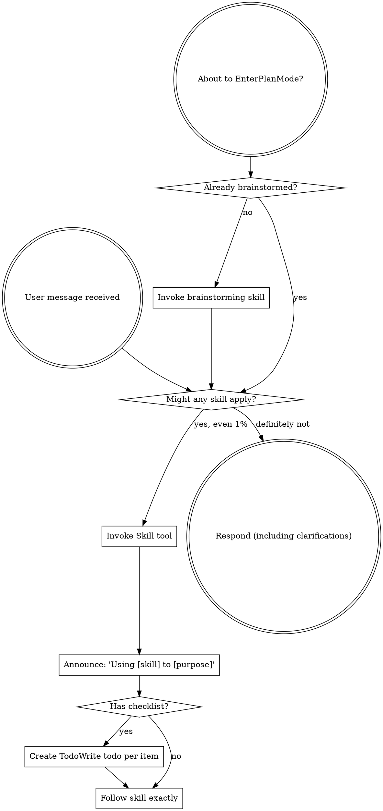

codex-exec: report contract violation

--- codex stdout ---
Revision 2 closes all three blockers.

1. Closure falsifiers are independent: runtime-generated loader traces provide per-entry oracles, with `required_by` provenance asserted through computation, manifest, candidate/final delivery, and status. Witness composer/store, quality-gate→classifier, extensionless, `.js`, `.json`, directory, and transitive cases are explicit and source-generated.

2. Refuse-before-write is literal: the complete candidate lives under `os.tmpdir()`, recreates project-relative paths, uses isolated HOME/USERPROFILE, rebases descriptors, and resolves naturally without fallback paths. All event-aware smoke runs before mutation. The sealed publication seam permits only journaled writes after the first destination write; final-target execution is an external, non-rejecting post-success assertion.

3. MUDA is correctly split: T1 atomically owns graph, manifest, delivery, smoke, diagnosis, and shared inspection. T2 depends on T1 and independently adds `--doctor`, explicit-project presentation, and worktree/GitHub freshness, while rerunning T1 cases.

The plan also deliberately records that merging remains an operator decision and that selective closure does not repair the unrelated remainder of the approximately 55-file parity gap.

PLAN VERDICT: GO

--- codex stderr ---
OpenAI Codex v0.146.0
--------
workdir: <HOME>\AppData\Roaming\warp\Warp\data\worktrees\GSDedits\luminaria-hogback
model: gpt-5.6-sol
provider: openai
approval: never
sandbox: read-only
reasoning effort: xhigh
reasoning summaries: none
session id: 01a03867-d71d-7a52-99c7-74b324dfca11
--------
user
# Plan review — P168 Install Contract. Apply ATC and MUDA to the PLAN, before any code.

Read-only. Do not edit files. Verdict must be GO or NOGO.

Plan: .planning/milestones/v4.0-install-contract/phases/168-install-contract/168-01-PLAN-LOCKED.md
Context (measured root cause, do not re-derive):
  .planning/milestones/v4.0-install-contract/phases/168-install-contract/CONTEXT.md

Schema validation already passed: VALID, no errors. Do not re-run it.

## The problem this plan must solve

Distributed hooks reach every project on every update; the modules they `require` never
do. `install.sh:615` copies `scripts/lib` to `~/.claude` only. Neither
`init_local_project` nor `update_existing` writes a project module tree. A project hook
doing `require('../scripts/lib/sgsd-state.cjs')` gets MODULE_NOT_FOUND. This has silently
broken delivery to every other repository for five development cycles.

## Judge these specifically

1. **Does the computed closure actually close?** The plan must derive the module set from
   hook sources, not a hand-maintained list. Check it handles: transitive requires (a
   required module requiring another), the witness hook's runtime resolution from the
   project root rather than a static `require`, a hook requiring another hook
   (`sgsd-quality-gate.js` requires `sgsd-intent-classifier.cjs`), and non-`.cjs`
   extensions. If any of those escapes the computation, the closure is incomplete and the
   phase ships the same bug in a new shape.

2. **Is the empty-tree criterion genuinely end to end?** It claims production install.sh,
   real HOME, decoy cwd, no mocks. Verify nothing in the plan quietly reintroduces a
   mocked copier or a pre-seeded target elsewhere.

3. **Refuse before writing.** This exact class has been a CRITICAL twice: at the
   install.sh level (2c237ef) and inside `repairClaudeSubstrateWitness` (b2a1435). Does
   the plan's new delivery step write anything before the checks that can fail? Say where.

4. **Does it make diagnosis worse?** The requirement is to carry the real
   module-resolution error beside the reason code. Widening the closed reason vocabulary
   instead of carrying the underlying error would be a regression, not a fix.

5. **MUDA.** Is this one task doing one thing, or a bundle that should split? The plan
   argues manifest, delivery, smoke and staleness ship together because a manifest
   without enforcement is the present failure. Test that argument; if a split is safe,
   say exactly where the seam is.

6. **What does it NOT cover?** Name any part of the measured root cause the plan leaves
   unaddressed, including the ~55-file gap observed on a real Linux project and the
   worktree-blind freshness check at install.sh:381.

## Verdict

End with exactly `PLAN VERDICT: GO` or `PLAN VERDICT: NOGO`.
NOGO requires a numbered list of what must change. Bound yourself to about 15 shell
commands and emit the verdict even if incomplete. Max 500 words.

## ROUND 2 — confirm only these three, do not re-open settled ground

Round 1 returned NOGO on three blockers. The plan is now revision 2 and schema-VALID.
Confirm each blocker is closed. Do not re-litigate anything you already passed: the
empty-tree criterion and the `underlying_error` diagnosis design were both accepted.

1. **Closure falsifiers independent.** The mutation test must assert, without any
   maintained expected-closure list: the witness hook's composer and store edges in THAT
   hook's per-entry closure; `sgsd-quality-gate.js -> sgsd-intent-classifier.cjs` as a
   per-entry edge (the union hides this because the classifier is also a manifest root);
   and extensionless / `.js` / `.json` / directory resolution. Assert from computation,
   manifest projection, delivery AND status. If a fixture is used it must be generated
   from sources, not transcribed.

2. **Refuse-before-write is literal.** Every rejection-capable smoke must run against a
   complete candidate tree BEFORE the first project or profile mutation. After
   publication only transactional publication and non-rejecting verification may remain.
   Check the plan states where the candidate tree lives, how a hook smoked from it
   resolves its requires, and what guarantees no rejection-capable step survives the
   first write. Rollback is not a substitute: a smoked hook can touch state outside the
   tree being rolled back.

3. **The seam is split.** T1 keeps graph, generated manifest, delivery, smoke, diagnosis
   and shared inspection atomic. T2 depends on T1 and carries `--doctor`,
   explicit-project presentation and the worktree/GitHub freshness check
   (install.sh:381), independently revertible.

Also confirm the plan states, as deliberate boundaries rather than omissions, that
merging the branch is an operator decision and that selective closure leaves the rest of
the ~55-file parity gap untouched.

Verdict line unchanged: `PLAN VERDICT: GO` or `PLAN VERDICT: NOGO`.
NOGO requires a numbered list of what still must change. Max 400 words.

codex
I’ll use the `using-superpowers` skill to route this review, then inspect only the revision-2 plan and supplied context. I’ll keep the accepted empty-tree and diagnosis decisions closed, make no edits, and won’t rerun schema validation.
exec
"C:\\WINDOWS\\System32\\WindowsPowerShell\\v1.0\\powershell.exe" -Command "Get-Content -Raw 'C:\\Users\\operator\\.codex\\skills\\using-superpowers\\SKILL.md'" in <HOME>\AppData\Roaming\warp\Warp\data\worktrees\GSDedits\luminaria-hogback
 succeeded in 1405ms:
---
name: using-superpowers
description: Use when starting any conversation - establishes how to find and use skills, requiring Skill tool invocation before ANY response including clarifying questions
---

<SUBAGENT-STOP>
If you were dispatched as a subagent to execute a specific task, skip this skill.
</SUBAGENT-STOP>

<EXTREMELY-IMPORTANT>
If you think there is even a 1% chance a skill might apply to what you are doing, you ABSOLUTELY MUST invoke the skill.

IF A SKILL APPLIES TO YOUR TASK, YOU DO NOT HAVE A CHOICE. YOU MUST USE IT.

This is not negotiable. This is not optional. You cannot rationalize your way out of this.
</EXTREMELY-IMPORTANT>

## Instruction Priority

Superpowers skills override default system prompt behavior, but **user instructions always take precedence**:

1. **User's explicit instructions** (CLAUDE.md, GEMINI.md, AGENTS.md, direct requests) ƒ?" highest priority
2. **Superpowers skills** ƒ?" override default system behavior where they conflict
3. **Default system prompt** ƒ?" lowest priority

If CLAUDE.md, GEMINI.md, or AGENTS.md says "don't use TDD" and a skill says "always use TDD," follow the user's instructions. The user is in control.

## How to Access Skills

**In Claude Code:** Use the `Skill` tool. When you invoke a skill, its content is loaded and presented to youƒ?"follow it directly. Never use the Read tool on skill files.

**In Copilot CLI:** Use the `skill` tool. Skills are auto-discovered from installed plugins. The `skill` tool works the same as Claude Code's `Skill` tool.

**In Gemini CLI:** Skills activate via the `activate_skill` tool. Gemini loads skill metadata at session start and activates the full content on demand.

**In other environments:** Check your platform's documentation for how skills are loaded.

## Platform Adaptation

Skills use Claude Code tool names. Non-CC platforms: see `references/copilot-tools.md` (Copilot CLI), `references/codex-tools.md` (Codex) for tool equivalents. Gemini CLI users get the tool mapping loaded automatically via GEMINI.md.

# Using Skills

## The Rule

**Invoke relevant or requested skills BEFORE any response or action.** Even a 1% chance a skill might apply means that you should invoke the skill to check. If an invoked skill turns out to be wrong for the situation, you don't need to use it.



## Red Flags

These thoughts mean STOPƒ?"you're rationalizing:

| Thought | Reality |
|---------|---------|
| "This is just a simple question" | Questions are tasks. Check for skills. |
| "I need more context first" | Skill check comes BEFORE clarifying questions. |
| "Let me explore the codebase first" | Skills tell you HOW to explore. Check first. |
| "I can check git/files quickly" | Files lack conversation context. Check for skills. |
| "Let me gather information first" | Skills tell you HOW to gather information. |
| "This doesn't need a formal skill" | If a skill exists, use it. |
| "I remember this skill" | Skills evolve. Read current version. |
| "This doesn't count as a task" | Action = task. Check for skills. |
| "The skill is overkill" | Simple things become complex. Use it. |
| "I'll just do this one thing first" | Check BEFORE doing anything. |
| "This feels productive" | Undisciplined action wastes time. Skills prevent this. |
| "I know what that means" | Knowing the concept ƒ%ÿ using the skill. Invoke it. |

## Skill Priority

When multiple skills could apply, use this order:

1. **Process skills first** (brainstorming, debugging) - these determine HOW to approach the task
2. **Implementation skills second** (frontend-design, mcp-builder) - these guide execution

"Let's build X" ā' brainstorming first, then implementation skills.
"Fix this bug" ā' debugging first, then domain-specific skills.

## Skill Types

**Rigid** (TDD, debugging): Follow exactly. Don't adapt away discipline.

**Flexible** (patterns): Adapt principles to context.

The skill itself tells you which.

## User Instructions

Instructions say WHAT, not HOW. "Add X" or "Fix Y" doesn't mean skip workflows.

<HOME>\OneDrive - <ORG>\Documents\WindowsPowerShell\profile.ps1 : Cannot dot-source this 
command because it was defined in a different language mode. To invoke this command without importing its contents, 
omit the '.' operator.
At line:1 char:1
+ . '<HOME>\OneDrive - <ORG>\Documents\Win ...
+ ~~~~~~~~~~~~~~~~~~~~~~~~~~~~~~~~~~~~~~~~~~~~~~~~~~~~~~~~~~~~~~~~~~~~~
    + CategoryInfo          : InvalidOperation: (:) [profile.ps1], NotSupportedException
    + FullyQualifiedErrorId : DotSourceNotSupported,profile.ps1
 
<HOME>\OneDrive - <ORG>\Documents\WindowsPowerShell\Microsoft.PowerShell_profile.ps1 : 
Cannot dot-source this command because it was defined in a different language mode. To invoke this command without 
importing its contents, omit the '.' operator.
At line:1 char:1
+ . '<HOME>\OneDrive - <ORG>\Documents\Win ...
+ ~~~~~~~~~~~~~~~~~~~~~~~~~~~~~~~~~~~~~~~~~~~~~~~~~~~~~~~~~~~~~~~~~~~~~
    + CategoryInfo          : InvalidOperation: (:) [Microsoft.PowerShell_profile.ps1], NotSupportedException
    + FullyQualifiedErrorId : DotSourceNotSupported,Microsoft.PowerShell_profile.ps1
 

codex
The routing skill points to the repository review workflow as relevant here. I’m applying it only as a read-only evidence discipline; the user’s round-2 scope remains controlling.
exec
"C:\\WINDOWS\\System32\\WindowsPowerShell\\v1.0\\powershell.exe" -NoProfile -Command "Get-Content -Raw 'C:\\Users\\operator\\.agents\\skills\\review\\SKILL.md'" in <HOME>\AppData\Roaming\warp\Warp\data\worktrees\GSDedits\luminaria-hogback
 succeeded in 743ms:
---
name: review
description: Review code changes for security, performance, bugs, and quality. Reviews staged changes, unstaged changes, specific commits, or PR-ready diffs.
---

<objective>
Review code changes and provide structured feedback covering security, performance, bug risks, code quality, and test coverage gaps. This skill analyzes diffs and surrounding context to catch issues before they reach production.
</objective>

<context>
This skill reviews code changes at various stages of the development workflow. It can review staged changes before a commit, unstaged work-in-progress, a specific commit, or the full set of changes on a branch that are ready for a pull request.

The reviewer reads both the diff and the surrounding source files to understand intent and catch issues that only appear in context.
</context>

<core_principle>
**FIND REAL ISSUES, NOT STYLE NITS.** Focus on problems that cause bugs, security vulnerabilities, performance degradation, or maintainability pain. Avoid nitpicking formatting or subjective style preferences unless they harm readability.
</core_principle>

<analysis_only_rule>
**THIS SKILL IS READ-ONLY. DO NOT MODIFY CODE.**

The purpose is to review and report findings. Making changes during review conflates the reviewer and author roles. Present findings and let the user decide what to act on.
</analysis_only_rule>

<quick_start>

<determine_review_scope>

Parse the user's input to determine what to review:

1. **No arguments** - Review staged changes first. If nothing is staged, review unstaged changes.
   - Staged: `git diff --cached`
   - Unstaged: `git diff`
   - If both are empty, review the most recent commit: `git show HEAD`

2. **Commit hash argument** (e.g., `/review abc1234`) - Review that specific commit.
   - `git show <hash>`

3. **File path argument** (e.g., `/review src/foo.ts`) - Review unstaged changes in that file.
   - `git diff -- <path>` then fall back to `git diff --cached -- <path>`

4. **"pr" argument** (e.g., `/review pr`) - Review all changes since branching from main.
   - `git diff main...HEAD`
   - If on main, review `git diff HEAD~1`

After obtaining the diff, if it is empty, inform the user that there are no changes to review and stop.

</determine_review_scope>

<gather_context>

Before analyzing the diff:

1. **Read changed files in full** - Do not review a diff in isolation. Read each modified file to understand the surrounding code, imports, types, and control flow.
2. **Identify the tech stack** - Note languages, frameworks, and libraries in use. This affects what patterns are risky.
3. **Check for related test files** - For each changed source file, look for corresponding test files. Note whether tests were updated alongside the changes.
4. **Check for configuration changes** - If config files changed (env, CI, package.json, tsconfig, etc.), pay extra attention to side effects.

</gather_context>

<review_categories>

Analyze the changes against each category below. Only report findings that are actually present. Skip categories with no issues.

**A. Security Issues** (Severity: CRITICAL or HIGH)
- Injection vulnerabilities (SQL injection, command injection, template injection)
- Cross-site scripting (XSS) - unsanitized user input rendered in HTML
- Authentication and authorization flaws (missing auth checks, privilege escalation)
- Secrets or credentials hardcoded or logged
- Insecure deserialization or unsafe eval usage
- Path traversal or file access vulnerabilities
- Missing input validation on external data

**B. Performance Concerns** (Severity: HIGH or MEDIUM)
- N+1 query patterns in database access
- Unnecessary memory allocations in hot paths or loops
- Blocking operations on the main thread or in async contexts
- Missing pagination on unbounded queries
- Redundant computation that could be cached or memoized
- Large payloads without streaming or chunking

**C. Bug Risks** (Severity: HIGH or MEDIUM)
- Off-by-one errors in loops or array access
- Null/undefined dereferences without guards
- Race conditions in concurrent or async code
- Incorrect error handling (swallowed errors, wrong error types)
- Type mismatches or unsafe type assertions
- Logic errors in conditionals (inverted checks, missing cases)
- Resource leaks (unclosed connections, file handles, listeners)

**D. Code Quality** (Severity: MEDIUM or LOW)
- Unclear or misleading naming
- Significant code duplication that should be extracted
- Excessive complexity (deeply nested logic, functions doing too many things)
- Dead code or unreachable branches
- Missing or misleading comments on non-obvious logic
- Inconsistency with patterns used elsewhere in the codebase

**E. Test Coverage Gaps** (Severity: MEDIUM or LOW)
- New logic paths without corresponding test cases
- Changed behavior without updated tests
- Edge cases not covered (empty inputs, boundary values, error paths)
- Missing integration tests for new API endpoints or database changes

</review_categories>

<format_findings>

For each finding, use this structure:

```
### [SEVERITY] Category: Brief Title

**File**: `path/to/file.ext` (lines X-Y)

**Issue**: Clear description of the problem.

**Why it matters**: What could go wrong if this is not addressed.

**Suggestion**: How to fix it, with a code snippet if helpful.
```

Severity levels:
- **CRITICAL** - Must fix before merge. Security vulnerability or data loss risk.
- **HIGH** - Should fix before merge. Likely bug or significant performance issue.
- **MEDIUM** - Should fix soon. Code quality or moderate risk issue.
- **LOW** - Consider fixing. Minor improvement opportunity.

</format_findings>

</quick_start>

<critical_rules>

1. **READ THE FULL FILE**: Never review a diff without reading the complete source file for context
2. **NO FALSE ALARMS**: Only report issues you can explain concretely. Do not report vague concerns
3. **PRIORITIZE**: Lead with the most severe findings. Do not bury critical issues under style nits
4. **BE SPECIFIC**: Include file paths, line numbers, and code references for every finding
5. **EXPLAIN THE RISK**: For each finding, explain what could actually go wrong
6. **CHECK TESTS**: Always check whether changes have corresponding test updates
7. **CONSIDER THE STACK**: Apply language-specific and framework-specific knowledge to your review
8. **DO NOT MODIFY CODE**: Present findings only. The user decides what to act on

</critical_rules>

<output_format>

```markdown
## Code Review: [brief description of what was reviewed]

**Scope**: [staged changes | unstaged changes | commit abc1234 | PR changes from main]
**Files reviewed**: [count] files changed, [additions] additions, [deletions] deletions

---

### Findings

[Findings grouped by severity, highest first. Use the format from <format_findings>.]

---

### Summary

| Severity | Count |
|----------|-------|
| CRITICAL | X     |
| HIGH     | X     |
| MEDIUM   | X     |
| LOW      | X     |

### Recommended Actions

1. [Most important action to take]
2. [Next most important action]
3. [...]
```

If no issues are found:

```markdown
## Code Review: [brief description]

**Scope**: [what was reviewed]
**Files reviewed**: [count]

No significant issues found. The changes look good to merge.
```

</output_format>

<decision_gate>

**After presenting findings, ALWAYS offer these options:**

```
ƒ"?ƒ"?ƒ"?ƒ"?ƒ"?ƒ"?ƒ"?ƒ"?ƒ"?ƒ"?ƒ"?ƒ"?ƒ"?ƒ"?ƒ"?ƒ"?ƒ"?ƒ"?ƒ"?ƒ"?ƒ"?ƒ"?ƒ"?ƒ"?ƒ"?ƒ"?ƒ"?ƒ"?ƒ"?ƒ"?ƒ"?ƒ"?ƒ"?ƒ"?ƒ"?ƒ"?ƒ"?ƒ"?ƒ"?ƒ"?ƒ"?
REVIEW COMPLETE

What would you like to do?

1. **Fix issues** - I'll address the findings starting with the most critical
2. **Save review** - Export findings to a markdown file
3. **Review again** - Re-review with different scope or focus
4. **Discuss a finding** - Ask questions about a specific issue
5. **Other** - Tell me what you need
ƒ"?ƒ"?ƒ"?ƒ"?ƒ"?ƒ"?ƒ"?ƒ"?ƒ"?ƒ"?ƒ"?ƒ"?ƒ"?ƒ"?ƒ"?ƒ"?ƒ"?ƒ"?ƒ"?ƒ"?ƒ"?ƒ"?ƒ"?ƒ"?ƒ"?ƒ"?ƒ"?ƒ"?ƒ"?ƒ"?ƒ"?ƒ"?ƒ"?ƒ"?ƒ"?ƒ"?ƒ"?ƒ"?ƒ"?ƒ"?ƒ"?
```

**Wait for user response before taking any action.**

This gate is MANDATORY. Never skip it. Never auto-implement fixes.

</decision_gate>


exec
"C:\\WINDOWS\\System32\\WindowsPowerShell\\v1.0\\powershell.exe" -NoProfile -Command '$files = @('"'.planning/milestones/v4.0-install-contract/phases/168-install-contract/168-01-PLAN-LOCKED.md', '.planning/milestones/v4.0-install-contract/phases/168-install-contract/CONTEXT.md'); foreach ("'$file in $files) { "===== $file ====="; Get-Content -Raw -LiteralPath $file }' in <HOME>\AppData\Roaming\warp\Warp\data\worktrees\GSDedits\luminaria-hogback
 succeeded in 673ms:
===== .planning/milestones/v4.0-install-contract/phases/168-install-contract/168-01-PLAN-LOCKED.md =====
---
schema_version: 2
phase: 168
slug: install-contract
milestone: v4.0-install-contract
status: PLANNED
revision: 2
governing_decision: .planning/milestones/v4.0-install-contract/phases/168-install-contract/CONTEXT.md
evidence_paths:
  - .planning/milestones/v4.0-install-contract/INTENT.md
  - .planning/milestones/v4.0-install-contract/phases/168-install-contract/CONTEXT.md
  - .planning/milestones/v3.9-substrate-hygiene/phases/167-substrate-invocation-witness/SUMMARY.md
  - .planning/milestones/v3.9-substrate-hygiene/phases/167-substrate-invocation-witness/AUDIT.md
depends_on: []
intent: >
  Make project installation one closed contract: compute every repository-owned
  module needed by distributed hooks from the hook sources, declare the computed
  closure in the hook manifest, deliver and refresh that exact closure, execute
  every installed project hook before reporting success, preserve the underlying
  module-resolution error beside the existing closed reason code, and expose one
  read-only command that identifies hook and module drift for an explicit project,
  including projects whose .git entry is a worktree file.
execution_mode: two-dependent-codex-tasks-with-orchestrator-spawn-gates
expected_ATC_tier: GATE
skip_gates: []
lessons_path: null
prior_errors_lookup: true
lock_status: locked
locked_at: 2026-08-25T11:08:08+01:00
locked_by: codex
allowed_files:
  - super-gsd/scripts/lib/hook-install-contract.cjs
  - super-gsd/config/hook-manifest.json
  - super-gsd/scripts/lib/hook-registration-preflight.cjs
  - super-gsd/tools/feature-propagation/audit.cjs
  - super-gsd/install.sh
  - super-gsd/tests/install-contract/assert-install-contract.cjs
  - super-gsd/tests/installer-registration-guard/assert-installer-registration-guard.cjs
forbidden_files:
  - super-gsd/hooks/sgsd-substrate-invocation-witness.cjs
  - super-gsd/scripts/lib/substrate-invocation-witness-store.cjs
  - super-gsd/scripts/lib/vtp-context-composer.cjs
  - super-gsd/tools/substrate-capability-broker.cjs
  - super-gsd/schemas/vtp-mcp-input-schemas.v1.json
  - .planning/milestones/v3.6-vtp-bridge/phases/154-mcp-arg-contract/154-REAL-MCP-EVIDENCE.json
  - .planning/STATE.md
  - .planning/milestones/v4.0-install-contract/ROADMAP.md
  - package.json
  - package-lock.json
  - wiki/LINT-REPORT.md
invariants:
  - Project dependency delivery is the mechanically computed transitive closure; no production array, shell glob, test constant, or manifest field may hand-list the closure.
  - Manifest policy remains human-authored, but every dependency field is generated and verified against the same computation used by delivery and status.
  - Every rejection-capable source, manifest, destination, package, registration, and all-hook smoke check completes against one complete project-shaped candidate before the first project, profile, npm, key, settings, broker, or grant mutation.
  - The candidate lives under a fresh OS temporary directory outside the project and profile, contains the exact prospective project paths, uses an isolated HOME/USERPROFILE, and resolves requires naturally from candidate hook paths without NODE_PATH or canonical-source fallback.
  - After the first destination write, production performs only rollback-journaled publication of the already-smoked immutable candidate bytes; it never spawns a hook or runs another rejection-capable validation, and any publication I/O failure restores project/profile bytes and the actions array exactly.
  - An explicit --project-dir is normalized and used exactly; walk-up occurs only when no explicit project directory is supplied.
  - Read-only status, installer precheck, and repair consume one inspectProjectInstall result; no second detector or dependency list is permitted.
  - Closed reasons are unchanged; MODULE_NOT_FOUND code, request, resolved path, and bounded message travel in underlying_error/detail beside the existing reason.
  - P167 remains unchanged: PreToolUse fails closed, PostToolUse emits bounded substrate_witness_rewrite_failed without raw passthrough, and only rewritten rows are accepted.
  - Existing guard assertions are preserved or strengthened; none is weakened to obtain a pass.
acceptance_commands:
  - node super-gsd/scripts/lib/hook-install-contract.cjs --check-manifest
  - node super-gsd/tests/install-contract/assert-install-contract.cjs --all
  - node super-gsd/tests/installer-registration-guard/assert-installer-registration-guard.cjs --all
  - node super-gsd/tests/substrate-invocation-witness/assert-hook-contract.cjs
  - node super-gsd/tests/substrate-invocation-witness/assert-propagation.cjs
rollback_plan: >
  Revert P168-T2 before P168-T1. T1 is the indivisible declaration,
  graph/detector, delivery, all-hook smoke, diagnosis, and proof commit; never
  retain dependency fields without their verifier or copying without smoke.
  T2 adds only the dependent doctor/worktree presentation seam. Run the
  pre-P168 installer guard and P167 suites after either rollback.
risk_rating: high
operator_checkpoints:
  - The orchestrator runs spawn-bound real install, refusal, and worktree cases outside any sandbox that returns spawnSync EPERM.
  - Phase close is NOGO until both dependent tasks pass; manifest generation, delivery, smoke, and diagnosis remain one T1 commit, while T2 cannot ship without T1.
  - Phase close is NOGO if any refused entry point changes a snapshotted project/profile byte or records a repair action.
semantic_acceptance_criteria:
  - input: >
      A disposable on-disk SGSD project whose project-local
      super-gsd/scripts/lib and other computed project-module destinations start
      empty, an isolated real HOME/USERPROFILE, and a separate canonical source
      checkout. Production install.sh is launched by Bash with --init-project,
      --skip-cockpit-deps, and --project-dir pointing at that project while cwd
      is a different decoy directory. No mocked copier, dependency adapter,
      staged target, or direct hook-function call is used. After installation,
      one delivered transitive module is changed and production --update runs.
    expected_outcome: >
      Before its first destination write, the production installer creates its
      complete candidate outside the project/profile, spawns every candidate
      Claude and Codex project hook/registration with natural candidate-relative
      resolution, and seals the exact bytes that publication will copy. The
      installer then publishes those bytes transactionally and exits 0 with
      every computed dependency byte-identical in the final target. Only after
      the installer has returned, the test harness independently spawns every
      final installed hook from its real path with cwd equal to the explicit
      project; this is non-rejecting verification of the completed install, not
      a staged shortcut or a post-write installer refusal. Update restores the
      changed module after repeating candidate smoke. No hook reports an
      unresolved dependency, and the decoy cwd and ancestors remain untouched.
    verification_cmd: >
      node super-gsd/tests/install-contract/assert-install-contract.cjs
      --case empty-module-tree-real-install
  - input: >
      A second real install against seeded project and profile trees after a
      temporary canonical hook source is given a relative require whose resolved
      repository file does not exist. The test snapshots every file and SHA-256
      under both destinations and plants an npm preinstall sentinel that records
      if mutation begins. It invokes production combined --install-global
      --update, not an exported detector in isolation.
    expected_outcome: >
      Installation refuses before npm, hook or module copying, settings merge,
      key provisioning, broker/grant repair, or global installation. The closed
      reason remains hook_smoke_failed or witness_repair_failed as appropriate,
      while underlying_error names MODULE_NOT_FOUND, the original request, and
      the exact normalized missing module path. Project/profile inventories and
      hashes are byte-identical, the npm sentinel is absent, and repair actions
      are empty. Raw hook output, payloads, secrets, and unbounded stacks are not
      exposed.
    verification_cmd: >
      node super-gsd/tests/install-contract/assert-install-contract.cjs
      --case unresolved-module-refuses-before-write
  - input: >
      The real canonical hook sources and hook-manifest.json, followed by a
      test-only Node loader trace that executes the selected real hook sources
      from a complete temporary source checkout and records actual parent to
      resolved-child repository edges per manifest entry. That independent
      source execution, rather than a maintained expected-closure list, is the
      oracle. A generated mutation then adds runtime-named relative requires
      covering extensionless-to-.js, explicit .js, explicit .json, package-main
      directory, index directory, and a transitive child; the fixture paths and
      expected edges are emitted by the generator from the mutated sources, not
      transcribed into the test. The production graph, manifest renderer, check,
      delivery, and inspection APIs run on the same temporary checkout.
    expected_outcome: >
      The committed manifest is byte-equivalent to its deterministic generated
      dependency projection. For each traced or generated parent-child edge,
      the same originating manifest entry owns the edge in the computed
      per-entry closure, that entry's generated manifest projection, delivery
      provenance and candidate/final bytes, and missing/stale/current inspection
      rows. Equality is tested per entry, never at union level. This necessarily
      proves the witness entry owns both composer and store edges and the
      sgsd-quality-gate.js entry owns sgsd-intent-classifier.cjs even while the
      classifier remains a separate manifest root. Every generated .js/.json/
      directory/transitive resolution follows the same four surfaces. The
      unchanged temporary manifest is rejected as stale and names exact paths.
      An unresolvable dynamic repository-local require is rejected rather than
      omitted; built-ins are excluded, bare packages are classified rather than
      copied from ignored node_modules, ordering is stable, and cycles terminate
      without duplicate artifacts.
    verification_cmd: >
      node super-gsd/tests/install-contract/assert-install-contract.cjs
      --case generated-transitive-manifest
  - input: >
      A real temporary Git repository with a linked worktree, so the selected
      project has a .git file, plus one missing installed hook, one stale
      transitive module, and one current module. From a different cwd, the
      operator runs bash super-gsd/install.sh --doctor --project-dir with the
      worktree path, repairs through --update, and repeats doctor.
    expected_outcome: >
      The first doctor run is read-only, recognizes the linked checkout as a Git
      worktree, prints its real HEAD rather than not-a-git-repo, and reports a
      non-current install with the exact missing hook and stale module paths,
      expected/actual digests, and canonical source revision. It does not report
      the current module as behind. After update, doctor exits current with no
      missing or stale hook/module rows. Only the explicit worktree is inspected
      and repaired.
    verification_cmd: >
      node super-gsd/tests/install-contract/assert-install-contract.cjs
      --case doctor-real-git-worktree-staleness
  - input: >
      The complete pre-existing installer-registration guard suite and P167
      witness hook/propagation suites run after P168, including broken deployed
      hook and witness-repair-no-mutation controls.
    expected_outcome: >
      Every prior guard passes with its original or stronger assertion. The
      witness hook source, store, composer, broker, response bound, substrate
      reasons, rewritten-only acceptance, and no-raw-result behavior are
      unchanged. The prior broken module control now exposes the exact missing
      path beside its closed reason, and refused repair still leaves
      byte-identical trees and an empty actions array.
    verification_cmd: >
      node super-gsd/tests/installer-registration-guard/assert-installer-registration-guard.cjs --all &&
      node super-gsd/tests/substrate-invocation-witness/assert-hook-contract.cjs &&
      node super-gsd/tests/substrate-invocation-witness/assert-propagation.cjs
known_deadends:
  - Do not encode known hook dependencies in install.sh, hook-manifest.json, tests, or an exceptions table. That second-source pattern caused this failure.
  - Do not blanket-copy scripts/lib, tools, or node_modules. Deliver only computed repository-owned files and classify package prerequisites; a missing package is named and refused.
  - Do not generate the whole manifest. Targets, dispositions, authorities, matchers, timeouts, and intentional-unregistration reasons are human policy; only dependencies are generated.
  - Do not accept node --check, existence, mocked spawn, direct exported-function calls, or the prewrite candidate alone as deployed semantic proof; the harness must execute every final target hook after production install.
  - Do not begin externally visible install writes until every source, manifest, destination, package, registration, and project-shaped prospective-smoke check has passed.
  - Do not run rejection-capable hook code after target publication. Candidate smoke is the refusal gate; publication copies its verified bytes, and the independent semantic harness executes final target hooks.
  - Do not add a second staleness implementation to doctor or audit. Both format the same inspectProjectInstall report consumed by repair.
  - Do not replace the closed refusal vocabulary with MODULE_NOT_FOUND. Preserve the reason and attach bounded structured underlying_error/detail.
  - Do not test Git repositories with a .git directory predicate. Use git -C with rev-parse for normal repositories and linked worktrees.
  - Do not change a P167 hook, witness-store, composer, or broker contract to make smoke pass. Adapt smoke and diagnosis around production.
tasks:
  - id: P168-T1
    type: computed-hook-install-contract-delivery-smoke-and-diagnosis
    agent: codex
    model: codex
    depends_on: []
    files_touched:
      - super-gsd/scripts/lib/hook-install-contract.cjs
      - super-gsd/config/hook-manifest.json
      - super-gsd/scripts/lib/hook-registration-preflight.cjs
      - super-gsd/tools/feature-propagation/audit.cjs
      - super-gsd/install.sh
      - super-gsd/tests/install-contract/assert-install-contract.cjs
      - super-gsd/tests/installer-registration-guard/assert-installer-registration-guard.cjs
    input_contract: >
      Treat CONTEXT.md's measured delivery trace and P167 SUMMARY/AUDIT
      constraints as settled facts; do not reproduce or redesign the root cause.
      Work red-first in the focused assert-install-contract.cjs suite and
      strengthen, never relax, the existing installer-registration guard.

      Create hook-install-contract.cjs as the single authority and export
      computeHookDependencyGraph, renderManifestDependencies,
      inspectProjectInstall, and applyProjectInstall. Start from every manifest
      entry distributed to
      claude-project or codex-project and lex actual CommonJS source while
      ignoring comments and string/template text. Resolve literal relative
      requires with Node file/directory rules and recursively walk
      repository-owned modules. Symbolically reduce string constants and
      path.join/path.resolve expressions rooted at __dirname or runtime project
      root so the witness COMPOSER_RELATIVE_PATH and STORE_RELATIVE_PATH are
      discovered from source, never named in a production exception. Exclude
      built-ins, classify bare packages without copying ignored node_modules,
      detect cycles, deduplicate, sort by normalized POSIX path, reject root
      escapes, and fail closed with source plus expression for an unresolved
      local dynamic require. Return per-entry closure, union, source/target
      paths, SHA-256, packages, source errors, and target
      missing/stale/current rows.

      Keep hook-manifest.json as reviewed policy. Add a generated dependency
      field to every entry. Implement --write-manifest to rewrite only those
      fields deterministically and --check-manifest to compare committed data
      with a fresh computeHookDependencyGraph result. Installer, audit, tests,
      delivery, and status all call the check and never trust committed
      dependency bytes without recomputation. This generated-and-verified
      choice preserves human policy while eliminating a second dependency
      authority.

      Make inspectProjectInstall the only detector. With explicit projectDir,
      path.resolve that exact argument and never call findPlanningRoot; only an
      absent argument may walk up. audit.cjs read-only output, precheck,
      repairClaudeSubstrateWitness, and install.sh precheck consume this
      report. applyProjectInstall copies only report.requiredFiles that are
      missing/stale into projectDir/super-gsd. It snapshots every affected path,
      preserves unrelated files, revalidates source digests immediately before
      publication, copies only the bytes that passed candidate smoke, records
      actions only after complete publication, and restores absent files as
      absent and existing files byte-exactly if publication fails.
      A second run is byte-idempotent. Remove installSubstrateRuntime's
      three-file special-case as a competing writer; the broker stays in its
      dedicated capability path because it is not a hook-import dependency.
      Route init_local_project, update_existing, combined
      --install-global/--update, and project-hook repair through this contract.
      distribute_project_hooks must not remain a standalone unjournaled writer:
      either delegate it to applyProjectInstall or reduce it to a private step
      inside the same candidate/publication transaction.

      Preserve refuse-before-write on all entry points. Refactor install.sh
      parsing to consume --project-dir VALUE and parse full argv before
      dispatch. Default remains starting cwd; explicit value is authoritative.
      precheck_installation_refusals computes and validates the graph, generated
      manifest, destinations, Codex sources, substrate sources, packages, and
      prospective all-hook smoke against a project-shaped scratch tree assembled
      from the exact computed closure before ensure_gsd_base, npm,
      skeleton/memory, project/global copies, settings, keys, broker state, or
      grants. Scratch writes are isolated from project/profile destinations and
      are not accepted as deployed semantic proof. Run the same precheck at the
      top of direct --repair-safe, --repair,
      --repair-substrate-capability, and exported repairClaudeSubstrateWitness
      paths. Prove ordering with whole-tree hashes and an npm preinstall
      sentinel, not source-index assertions alone.

      Extend hook-registration-preflight.cjs so descriptors preserve complete
      interpreter argv and derive safe event/matcher-aware stdin from manifest
      dispositions. Execute every candidate project hook/registration represented by
      claude-project or codex-project, including both witness events and
      intentionally unregistered distributed sources with declared smoke event;
      deduplicate only identical source/event/argv tuples. Spawn real candidate
      files with shell false, cwd equal to the candidate project root, isolated
      HOME and USERPROFILE, bounded concurrency, and at least registered timeout. File
      existence and node --check remain preliminary. Capture bounded output. On
      failure HookSmokeError retains hook_smoke_failed and adds underlyingError
      with code, request, normalized path, and bounded sanitized message. Parse
      MODULE_NOT_FOUND and require stack for the exact path; do not forward
      arbitrary child output or stdin. audit.cjs carries this in
      detail/underlying_error beside witness_repair_failed, and install.sh prints
      it before the existing refusal summary.

      Assemble the complete candidate project from the exact prospective hook,
      module, registration, and settings bytes, then run the full descriptor set
      there before any project/profile mutation. A missing canonical dependency
      or candidate smoke failure refuses before writes. After it passes,
      publication performs no rejection-capable hook execution: it copies those
      verified bytes transactionally, confirms their digests without executing
      hook code, and restores every prior byte if publication itself fails. An
      exit-zero project_runtime_unavailable witness response
      is not dependency success; computed runtime modules must resolve while the
      P167 deny/rewrite contract stays untouched.

      New tests use real filesystem trees, Bash/Node processes, production
      install.sh, and production audit/repair. Cover
      graph mutation without a maintained expected closure, manifest drift,
      empty module install, stale refresh/idempotence, exact MODULE_NOT_FOUND,
      no-mutation on every entry, and explicit-project isolation. Independently
      assert the witness composer/store edges and quality-gate-to-classifier edge
      in their per-entry closures, then inject extensionless .js, explicit .json,
      directory, and transitive resolution cases and follow each through graph,
      manifest, candidate/final delivery, and inspection. Add --all to the existing installer guard as an
      additive runner over every CASES entry; keep every individual --case and
      assertion. Run P167 hook and propagation suites unchanged.
    output_contract: >
      One independently revertible commit contains the source-derived graph,
      generated-and-verified manifest dependencies, selective project module
      delivery, complete prewrite candidate all-hook smoke, bounded exact
      diagnosis, shared read/repair inspection, and real final-target semantic
      proofs. A clean module tree is bootstrapped and a stale tree refreshed;
      no partial install reports success. Refusal names the exact module beside
      the existing reason and leaves project/profile bytes and actions
      unchanged. No P167 production file, second installer/detector/list,
      blanket tree copy, or node_modules vendor is introduced.
    hypothesis: >
      If one deterministic source-derived graph generates and verifies manifest
      dependencies, plans selective copies, inspects target drift, and drives a
      complete project-shaped candidate smoke before writes, then hooks and
      runtime modules cannot drift
      independently or produce successful partial installs; a missing edge is
      repaired or refused before observable mutation with exact diagnosis.
    falsifier: >
      A dependency is named in a maintained list; witness runtime files are an
      exception rather than discovered; a temporary transitive require does not
      change manifest, delivery, and status together; a dynamic local require is
      ignored; delivery copies whole trees; a clean target remains empty; stale
      bytes remain; any candidate hook is not spawned before writes or any final
      installed hook is absent from the independent semantic execution;
      node --check or candidate-only proof is accepted as sufficient; a require failure becomes only a
      generic reason or leaks raw output; a refused combined/direct entry runs
      npm, changes bytes, provisions state, or records action; explicit project
      is replaced by walk-up; a guard is weakened; P167 changes; or declaration
      and enforcement land separately.
    stop_rule: >
      Stop only when --check-manifest is clean; real empty-tree install and stale
      refresh pass prewrite candidate smoke and the harness executes every final
      project hook; injected missing
      require refuses relevant entry points with exact MODULE_NOT_FOUND and
      byte-identical snapshots; per-entry and extension resolution falsifiers
      pass; full installer guard and P167 suites pass; the T1 diff is confined
      to its seven files; and declaration, enforcement, and proof land in one
      commit.
      Sandbox EPERM on a spawn-bound command is ORCHESTRATOR_REQUIRED, never PASS
      or SKIP-PASS.
    verification_cmd: >
      node --check super-gsd/scripts/lib/hook-install-contract.cjs &&
      node --check super-gsd/scripts/lib/hook-registration-preflight.cjs &&
      node --check super-gsd/tools/feature-propagation/audit.cjs &&
      node --check super-gsd/tests/install-contract/assert-install-contract.cjs &&
      node super-gsd/scripts/lib/hook-install-contract.cjs --check-manifest &&
      node super-gsd/tests/install-contract/assert-install-contract.cjs --case empty-module-tree-real-install &&
      node super-gsd/tests/install-contract/assert-install-contract.cjs --case unresolved-module-refuses-before-write &&
      node super-gsd/tests/install-contract/assert-install-contract.cjs --case generated-transitive-manifest &&
      node super-gsd/tests/installer-registration-guard/assert-installer-registration-guard.cjs --all &&
      node super-gsd/tests/substrate-invocation-witness/assert-hook-contract.cjs &&
      node super-gsd/tests/substrate-invocation-witness/assert-propagation.cjs
    expected_ATC_tier: GATE
    known_deadends:
      - A hand-written dependency array is not an implementation even if it matches today's importing hooks.
      - Smoke limited to repo-settings registrations misses distributed unregistered or global-only project copies; derive inventory from manifest dispositions.
      - A generic Read payload does not exercise witness runtime. Use event and matcher aware smoke plus computed resolution without editing the witness.
      - Rollback after a rejection-capable hook failure is too late. The complete candidate must fail before the first destination writer; rollback is only for mechanical publication errors.
  - id: P168-T2
    type: project-install-status-doctor-and-worktree-freshness
    agent: codex
    model: codex
    depends_on:
      - P168-T1
    files_touched:
      - super-gsd/scripts/lib/hook-install-contract.cjs
      - super-gsd/install.sh
      - super-gsd/tests/install-contract/assert-install-contract.cjs
    input_contract: >
      Consume P168-T1's inspectProjectInstall report without recomputing hook or
      module state. Add formatProjectInstallStatus and the one operator command,
      bash super-gsd/install.sh --doctor --project-dir PATH. The formatter names
      every missing/stale hook and module with normalized path and
      expected/actual SHA-256, summarizes current rows, and prints canonical
      source revision. Doctor is strictly read-only and must not call
      applyProjectInstall, npm, settings merge, key provisioning, broker/grant
      repair, or any writer.

      Preserve T1/P167 destination derivation: --project-dir is parsed as a
      value during full argv parsing, path-resolved, and honored exactly; only
      absence permits walk-up. Replace install.sh's [ -d $PROJECT_DIR/.git ]
      freshness gate with git -C $PROJECT_DIR rev-parse
      --is-inside-work-tree and git -C $PROJECT_DIR rev-parse HEAD, so both a
      normal checkout and a linked worktree whose .git is a file reach the
      GitHub-master comparison. Remote unavailability is reported separately
      and never erases the local hook/module verdict. Return 0 when locally
      current, 10 for known local install drift, and 2 only when local
      comparison cannot complete.

      Extend the real-process suite with a temporary Git repository and linked
      worktree. Seed one missing hook, one stale transitive module, and one
      current module. Run production doctor from a decoy cwd, snapshot the
      worktree to prove the first call is read-only, update through production
      install.sh, and rerun doctor. Assert the .git file is recognized, real
      HEAD is printed, only exact behind rows appear, and the shared inspection
      result used by repair and doctor agrees byte-for-byte on paths and
      digests. Run all T1 cases again after this dependent change.
    output_contract: >
      A second independently revertible commit adds only presentation and
      worktree-aware freshness over T1's detector. One read-only doctor command
      reports exact project hook/module drift for an explicit normal repository
      or linked worktree, update makes it current, and no alternative detector
      or dependency authority is introduced. The phase cannot close or ship
      until this dependent commit and the atomic T1 contract both pass.
    hypothesis: >
      If doctor formats the exact inspectProjectInstall result used by repair
      and uses Git commands rather than .git directory shape, an operator can
      identify every stale hook/module in one explicit repositoryƒ?"including a
      linked worktreeƒ?"without status and repair drifting.
    falsifier: >
      Doctor compares only hooks; reports generic behind without paths or
      digests; recomputes a second dependency list; mutates the project; walks
      away from explicit --project-dir; treats a .git file as not-a-repo; skips
      the GitHub-master comparison; remote failure erases a valid local verdict;
      exit codes conflate drift and inability; update and doctor disagree; or
      T2 can pass while a T1 semantic case fails.
    stop_rule: >
      Stop only when the real linked-worktree case reports exact stale/missing
      paths and actual HEAD without mutation, production update makes the same
      explicit worktree current, all P168 install-contract cases pass together,
      the task diff is confined to its three files, and T2 lands after T1.
      Sandbox EPERM on real Bash/Git spawn is ORCHESTRATOR_REQUIRED, never PASS
      or SKIP-PASS.
    verification_cmd: >
      node --check super-gsd/scripts/lib/hook-install-contract.cjs &&
      node --check super-gsd/tests/install-contract/assert-install-contract.cjs &&
      node super-gsd/tests/install-contract/assert-install-contract.cjs --case doctor-real-git-worktree-staleness &&
      node super-gsd/tests/install-contract/assert-install-contract.cjs --all &&
      node super-gsd/tests/installer-registration-guard/assert-installer-registration-guard.cjs --all
    expected_ATC_tier: GATE
    known_deadends:
      - Do not create an install.sh-only hook comparison; format the shared detector's hook and module rows.
      - Do not use .git directory existence as repository detection; linked worktrees intentionally expose a .git file.
      - Do not make network freshness authoritative over the local install verdict.
      - Do not fold T2 into T1's declaration/delivery commit; the dependent presentation seam is independently revertible.
---

# P168 - Install Contract

This phase has two dependent tasks. T1 is deliberately atomic: a dependency
manifest without delivery and candidate smoke recreates the false-success path,
and smoke without exact diagnosis repeats the refusal that hid MODULE_NOT_FOUND.
T2 consumes T1's detector to add doctor/worktree presentation in a separately
revertible commit. The phase-level stop rule prevents either task shipping alone.

## Architecture and ownership

| File | Responsibility |
| --- | --- |
| super-gsd/scripts/lib/hook-install-contract.cjs | Single graph, generated dependency projection, project inspection, selective apply/rollback, and status formatting. |
| super-gsd/config/hook-manifest.json | Human policy plus generated per-entry dependencies. |
| super-gsd/scripts/lib/hook-registration-preflight.cjs | Real installed-hook execution and bounded underlying-error capture. |
| super-gsd/tools/feature-propagation/audit.cjs | Shared inspection for read-only reporting and repair; closed reasons plus detail. |
| super-gsd/install.sh | Refuse-before-write ordering, explicit destination, apply, doctor output, and worktree-aware freshness. |
| super-gsd/tests/install-contract/assert-install-contract.cjs | Real-process semantic proofs for graph, install, refusal, status, and worktrees. |
| super-gsd/tests/installer-registration-guard/assert-installer-registration-guard.cjs | Historical regression wall plus additive all-cases runner. |

## Manifest decision

Generate only dependency fields, then verify them wherever consumed. The manifest
also contains policy source analysis cannot infer: surfaces, authorities, matchers,
timeouts, and intentional non-registration reasons. Generating the whole file would
make operator-reviewed choices implicit. Merely checking a dependency list written
by hand would retain two authorities. --write-manifest is deterministic authoring;
--check-manifest turns stale derived data into refusal.

## Refusal and publication order

1. Parse all flags and resolve the explicit destination.
2. Compute source graph, verify manifest, validate sources/destinations, and run
   every hook in a project-shaped scratch tree built from the exact prospective
   bytes.
3. Refuse any known failure before project/profile writers, npm, keys, settings,
   broker, or grants; scratch output is discarded and is not semantic proof.
4. Publish only missing/stale computed files from the already-smoked candidate
   under a rollback journal; perform only non-executing digest confirmation.
5. On mechanical publication failure, restore exact prior bytes before returning
   refusal, with no actions.
6. Only after complete publication may remaining install mutations and success
   reporting continue.

The production installer catches dependency failure through natural resolution in
the complete candidate before writing. The semantic harness separately executes
every final on-disk target hook after install, because candidate execution alone
is not accepted as proof of the measured target-relative defect.

===== .planning/milestones/v4.0-install-contract/phases/168-install-contract/CONTEXT.md =====
---
phase: "168"
slug: install-contract
milestone: v4.0-install-contract
status: SEEDED
seeded: 2026-08-25
synthesized_from: operator report 2026-08-24; P167 AUDIT.md; hook-manifest.json evidence
---

# P168 Install Contract ƒ?" context

## The problem in one sentence

An SGSD install can copy a hook, register it in `settings.json`, report success, and
leave out the modules that hook requires, so it fails at first fire in the target
repository rather than at install time in front of the operator.

## Evidence gathered before planning

`super-gsd/config/hook-manifest.json`: 22 entries, fields
`source_path`, `interpreter`, `distribution_targets`, `dispositions`. Zero entries
declare dependencies. Verified 2026-08-25.

Five of the seventeen hooks in `super-gsd/hooks/` require sibling modules:

    sgsd-intent-classifier.cjs   -> sgsd-state.cjs, gate-evidence-log.cjs,
                                    skill-routing-registry.cjs,
                                    vtp-readiness/registry.cjs,
                                    demand-baseline-ledger.cjs
    sgsd-commit-gate.cjs         -> sgsd-state.cjs, sgsd-artifact-conventions.cjs,
                                    commit-gate-shadow-log.cjs,
                                    commit-gate-shadow-report.cjs
    sgsd-quality-gate.js         -> sgsd-state.cjs, gate-evidence-log.cjs,
                                    sgsd-intent-classifier.cjs
    sgsd-session-start.js        -> sgsd-state.cjs, gate-evidence-log.cjs
    sgsd-substrate-invocation-witness.cjs
                                 -> composer and witness store, resolved from the
                                    project root at runtime

The already-diagnosed devcp `UserPromptSubmit` `loader:1479` failure is this exact
class: module resolution in the target repository, not hook logic.

## What P167 established that this phase should not repeat

- The installer now refuses before it writes, on every entry point. Do not reintroduce
  a deferred exit past a mutating step.
- `mkContext` honours an explicit `--project-dir` exactly; walk-up applies only when no
  destination is given. Derive the destination, never inherit it from ambient state.
- Detection is shared between the read-only check and the repair path so the two cannot
  drift. Extend that pattern; do not fork a second detector.
- Five installer guard cases were red from P161 to P167 close because nothing ran the
  suite. The adopted process change is a path-triggered unsandboxed twelve-case check.

## Shape of the work, not yet a plan

1. Extend the manifest so each entry declares its transitive module dependencies and the
   destination for each surface. Derive the dependency list mechanically from the source
   rather than hand-listing it, so it cannot go stale the way the present manifest did.
2. Make propagation honour the manifest and fail closed on any missing artifact, reusing
   the shared-detector and refuse-before-writing patterns P167 established.
3. Extend the existing deployed-hook smoke so it executes every installed hook in the
   target repository and fails the install when a hook cannot load its dependencies.
   The current smoke proves a file is present; that is what let this through.
4. A staleness command that names exactly what a given repository is behind on.

## Must be reproduced before designing

`/sgsd-update` reportedly fails. Reproduce it against a real second repository and
capture the actual error first. Do not design against the operator's paraphrase, and do
not assume the earlier "canonical master is behind" finding still holds; re-check it.

## Open operator decisions, do not decide these autonomously

- Fleet cockpit default port. 7777 collides with the VTP cockpit-sidecar.
- Whether one fleet controller should span repositories, which is currently
  per-repository by design.
- Merging `luminaria-hogback` to master.

## Defect reproduced 2026-08-25, before any planning

`bash super-gsd/install.sh --doctor` in this checkout prints:

    [super-gsd] Project git HEAD: not a git repo

This checkout is a git repository. `git rev-parse --short HEAD` returns `58ced07`.

Cause: `install.sh:381` guards the freshness check with `[ -d "$PROJECT_DIR/.git" ]`.
In a git worktree `.git` is a FILE containing a gitdir pointer, not a directory, so the
guard is false. The whole block is skipped, including the `git ls-remote` comparison
against SGSD GitHub master at `:383` and the `Freshness:` lines at `:387-389`.

Consequence: in any worktree-based checkout, SGSD never tells the operator whether the
repository is behind master, and reports it is not a git repository at all. This is
precisely the "how do I know it is stale" signal the operator says is missing. The fix
is to test `[ -e "$PROJECT_DIR/.git" ]` or to use `git rev-parse --git-dir`, but it
belongs to this phase's plan, not to an ad-hoc patch.

This defect was found by running the command rather than by reading the operator's
paraphrase. Apply the same discipline to `/sgsd-update` before designing for it.

## Why nothing reaches the other repositories, measured 2026-08-25

Four repositories were surveyed read-only: `GSDedits`, `project-clarity-erp`,
`Voice-Text-Plan`, `JCL-Cirdadium`. Every one has 14 hooks. This branch has 17. All four
are missing the same three:

    gsd-phase-boundary.sh
    sgsd-vtp-pending.js
    sgsd-substrate-invocation-witness.cjs

None of the three is missing from `hook-manifest.json`; all three are listed with
`distribution_targets: claude-global|claude-project`. `substrate-invocation-witness-store.cjs`
and `substrate-capability-broker.cjs` are absent from all of them too.

The cause is not the propagation code. All three hooks were authored on this branch
(`92f21b3` and `b167ebd` on 2026-08-20 for the two older ones, P167 for the witness) and
this branch is **178 commits ahead of `origin/master`**. The other repositories install
from master. Unmerged work cannot propagate, however correct the installer is.

So the operator's report resolves into three distinct causes, only one of which is an
installer bug:

1. **The branch was never merged.** 178 commits ahead of `origin/master`. This alone
   explains why no work done here appears anywhere else. Merging is an operator
   decision and is not this phase's to take.
2. **Nothing told anyone.** `install.sh:381` cannot detect a git worktree, so the
   freshness comparison against GitHub master never ran and the doctor reported
   "not a git repo". The staleness signal existed and was silently skipped.
3. **The latent defect that would bite after a merge.** The manifest declares no module
   dependencies, so five hooks can be copied and registered without the modules they
   require. Merging fixes 1 and 2 but not this.

Design P168 around cause 3, fix cause 2 as part of it, and treat cause 1 as an operator
decision recorded in this file, not as work this phase performs.

## Root cause, measured 2026-08-25 from a real Linux install

The earlier framing in this file, that the manifest fails to declare module
dependencies, understated the problem. The measured cause is that **no install path
delivers a project's module tree at all.**

Evidence from `install.sh`:

- `install.sh:615` `copy_tree_files "$SCRIPT_DIR/scripts/lib" "$CLAUDE_DIR/scripts/lib"`.
  `$CLAUDE_DIR` is `~/.claude`. Global only.
- `init_local_project` copies `.planning/config.json`, `CLAUDE.md`, the memory tree, and
  calls `distribute_project_hooks`. It does not copy `scripts/lib` or `tools`.
- `update_existing` runs npm install, syncs the registry, calls
  `distribute_project_hooks`. It does not copy `scripts/lib` or `tools`.

So hooks reach every project on every update while the modules they `require` never do.
A project-local hook importing `../scripts/lib/x.cjs` resolves against the project's own
tree, which the installer never writes.

Measured against `project-clarity-erp`:

    substrate-invocation-witness-store.cjs   missing entirely       (P167)
    vtp-context-composer.cjs                 DIFFERS from canonical (P166)
    vtp-enrichment-gate.cjs                  DIFFERS from canonical (P166)
    sgsd-state.cjs                           identical
    gate-evidence-log.cjs                    identical
    skill-routing-registry.cjs               identical

Most files match and exactly the last two milestones' changes are absent. Something
populated those trees historically; it is not the installer, and it did not carry P166 or
P167.

## The live failure this produced

A Linux `sgsd-update` exited 5. Canonical clone fast-forwarded clean to
8b95403 and the global install succeeded: 20 agents, 25 commands, 17 hooks, 61 scripts
into `~/.claude`. The project-local half then refused:

    hook_smoke_failed ... [SessionStart/session-start-governance]
    witness_status: missing_or_stale, capability_status: missing_or_stale
    reasons: pretooluse_missing, direct_grant, upstream_missing, witness_repair_failed
    ERROR: substrate enforcement was not current; refusing grant-bearing agent installation

`pretooluse_missing` exists nowhere in current source, confirmed by
`git grep -n "pretooluse_missing" -- super-gsd` returning nothing at the published sha.
It is a P167-era code removed during the phase, so the emitting file on that machine is
old. That is the fingerprint of the frozen module tree.

The gate itself behaved correctly: it refused to grant capability while enforcement was
not current. The defect is that it cannot bootstrap, because the module that would make
enforcement current is one the installer never delivers.

## Fixed already, do not re-plan

`repairClaudeSubstrateWitness` mutated before the check that can fail:
`installSubstrateRuntime`, `provisionWitnessKey` and `removeGlobalWitnessRegistrations`
all ran before `smokeRepoHookOverlay`, which throws. A refused repair therefore left a
key and copied files behind. Closed at commit b2a1435 by moving the smoke first, with a
guard case that snapshots the fixture by sha256 and asserts byte-identity and an empty
actions array after a refused repair.

## Revised scope for this phase

The manifest work stands, but the phase's primary deliverable is now module delivery:

1. Project installs must place and refresh the modules their hooks require, derived
   mechanically from the source so the list cannot go stale.
2. A refused or partial install must be recoverable and must never report success.
3. The smoke must execute every installed hook in the target project, which is what would
   have caught this at install time rather than at first fire.
4. The staleness command must compare the project's module tree, not only its hooks.

## The failing require chain, traced exactly 2026-08-25

A Linux install at /opt/clarity/project-clarity-erp produced the definitive trace.
The project's `super-gsd/scripts/lib/` was missing ~55 files present in
`~/.claude/scripts/lib/`, one-sided absence only, nothing on the project side ahead.

    smokeRepoHookOverlay (audit.cjs)
      spawns <canonical>/super-gsd/scripts/lib/hook-registration-preflight.cjs
             --smoke-repo-overlay <overlay> <projectDir>, cwd = projectDir
        which executes <projectDir>/super-gsd/hooks/sgsd-session-start.js
          which does require('../scripts/lib/sgsd-state.cjs')     [hook line 13]
            resolving to <projectDir>/super-gsd/scripts/lib/sgsd-state.cjs
              ABSENT -> loader:1479 MODULE_NOT_FOUND
                -> hook exits non-zero
                  -> smoke throws -> witness_repair_failed -> install exit 5

Note what is NOT broken: `audit.cjs:37`'s own
`require('../../scripts/lib/hook-registration-preflight.cjs')` resolves against
audit.cjs's own directory in the canonical clone, which is complete. The preflight module
therefore does not need to reach project trees. Only the modules the DISTRIBUTED HOOKS
import do.

This is the same defect as the `UserPromptSubmit` `loader:1479` failure seen in live
sessions. One cause, two symptoms.

## Requirement added: stop laundering the real error

The operator saw four generic reason codes,
`pretooluse_missing, direct_grant, upstream_missing, witness_repair_failed`,
where the truth was one unresolvable module path. The real exception existed and was
flattened into a closed vocabulary before it reached the operator.

This is the same failure mode as P167's `safeFailureReason`, which admitted only
`/^[a-z0-9_:.-]+$/i` and masked real exceptions behind `harness_internal_error`. It cost
several rounds there and it cost a full diagnosis cycle here.

P168 must surface the underlying error alongside the reason code. A refusal that cannot
name the file it could not resolve is not a diagnosis.

Related memory: [[blind-agent-root-cause-is-a-hypothesis]].

## Scope correction

Do not blanket-copy `scripts/lib`. Deliver the transitive closure of what the
distributed hooks require, derived mechanically from the hook sources so it cannot go
stale, plus the composer and witness store that the witness hook resolves from the
project root at runtime. Known direct requires today:

    sgsd-session-start.js      sgsd-state.cjs, gate-evidence-log.cjs
    sgsd-intent-classifier.cjs sgsd-state.cjs, gate-evidence-log.cjs,
                               skill-routing-registry.cjs,
                               tools/vtp-readiness/registry.cjs,
                               demand-baseline-ledger.cjs
    sgsd-commit-gate.cjs       sgsd-state.cjs, sgsd-artifact-conventions.cjs,
                               commit-gate-shadow-log.cjs, commit-gate-shadow-report.cjs
    sgsd-quality-gate.js       sgsd-state.cjs, gate-evidence-log.cjs,
                               and the sgsd-intent-classifier.cjs hook itself
    witness hook               composer + witness store, resolved at runtime

The closure must be computed, not transcribed; this list is evidence of the shape, not
the deliverable.


codex
The combined read was truncated in the task bodies, so I’m narrowing to numbered plan sections. The top-level criteria already state the right candidate-tree and per-entry goals; the decisive check is whether T1/T2 operationalize them without a loophole.
exec
"C:\\WINDOWS\\System32\\WindowsPowerShell\\v1.0\\powershell.exe" -NoProfile -Command '$p = '"'.planning/milestones/v4.0-install-contract/phases/168-install-contract/168-01-PLAN-LOCKED.md'; "'$lines = Get-Content -LiteralPath $p; "LINE_COUNT=$($lines.Count)"; for ($i=0; $i -lt [Math]::Min(220,$lines.Count); $i++) { '"'{0,4}: {1}' -f ("'$i+1), $lines[$i] }' in <HOME>\AppData\Roaming\warp\Warp\data\worktrees\GSDedits\luminaria-hogback
2026-08-25T10:13:11.399768Z ERROR codex_core::tools::router: error=Exit code: 1
Wall time: 0.9 seconds
Output:
LINE_COUNT=501
Cannot invoke method. Method invocation is supported only on core types in this language mode.
At line:2 char:181
+ ... ines.Count)"; for ($i=0; $i -lt [Math]::Min(220,$lines.Count); $i++)  ...
+                              ~~~~~~~~~~~~~~~~~~~~~~~~~~~~~~~~~~~~
    + CategoryInfo          : InvalidOperation: (:) [], RuntimeException
    + FullyQualifiedErrorId : MethodInvocationNotSupportedInConstrainedLanguage
 

 exited 1 in 938ms:
LINE_COUNT=501
Cannot invoke method. Method invocation is supported only on core types in this language mode.
At line:2 char:181
+ ... ines.Count)"; for ($i=0; $i -lt [Math]::Min(220,$lines.Count); $i++)  ...
+                              ~~~~~~~~~~~~~~~~~~~~~~~~~~~~~~~~~~~~
    + CategoryInfo          : InvalidOperation: (:) [], RuntimeException
    + FullyQualifiedErrorId : MethodInvocationNotSupportedInConstrainedLanguage
 

exec
"C:\\WINDOWS\\System32\\WindowsPowerShell\\v1.0\\powershell.exe" -NoProfile -Command '$p = '"'.planning/milestones/v4.0-install-contract/phases/168-install-contract/168-01-PLAN-LOCKED.md'; "'$lines = Get-Content -LiteralPath $p; for ($i=0; $i -lt 220; $i++) { '"'{0,4}: {1}' -f ("'$i+1), $lines[$i] }' in <HOME>\AppData\Roaming\warp\Warp\data\worktrees\GSDedits\luminaria-hogback
 succeeded in 772ms:
   1: ---
   2: schema_version: 2
   3: phase: 168
   4: slug: install-contract
   5: milestone: v4.0-install-contract
   6: status: PLANNED
   7: revision: 2
   8: governing_decision: .planning/milestones/v4.0-install-contract/phases/168-install-contract/CONTEXT.md
   9: evidence_paths:
  10:   - .planning/milestones/v4.0-install-contract/INTENT.md
  11:   - .planning/milestones/v4.0-install-contract/phases/168-install-contract/CONTEXT.md
  12:   - .planning/milestones/v3.9-substrate-hygiene/phases/167-substrate-invocation-witness/SUMMARY.md
  13:   - .planning/milestones/v3.9-substrate-hygiene/phases/167-substrate-invocation-witness/AUDIT.md
  14: depends_on: []
  15: intent: >
  16:   Make project installation one closed contract: compute every repository-owned
  17:   module needed by distributed hooks from the hook sources, declare the computed
  18:   closure in the hook manifest, deliver and refresh that exact closure, execute
  19:   every installed project hook before reporting success, preserve the underlying
  20:   module-resolution error beside the existing closed reason code, and expose one
  21:   read-only command that identifies hook and module drift for an explicit project,
  22:   including projects whose .git entry is a worktree file.
  23: execution_mode: two-dependent-codex-tasks-with-orchestrator-spawn-gates
  24: expected_ATC_tier: GATE
  25: skip_gates: []
  26: lessons_path: null
  27: prior_errors_lookup: true
  28: lock_status: locked
  29: locked_at: 2026-08-25T11:08:08+01:00
  30: locked_by: codex
  31: allowed_files:
  32:   - super-gsd/scripts/lib/hook-install-contract.cjs
  33:   - super-gsd/config/hook-manifest.json
  34:   - super-gsd/scripts/lib/hook-registration-preflight.cjs
  35:   - super-gsd/tools/feature-propagation/audit.cjs
  36:   - super-gsd/install.sh
  37:   - super-gsd/tests/install-contract/assert-install-contract.cjs
  38:   - super-gsd/tests/installer-registration-guard/assert-installer-registration-guard.cjs
  39: forbidden_files:
  40:   - super-gsd/hooks/sgsd-substrate-invocation-witness.cjs
  41:   - super-gsd/scripts/lib/substrate-invocation-witness-store.cjs
  42:   - super-gsd/scripts/lib/vtp-context-composer.cjs
  43:   - super-gsd/tools/substrate-capability-broker.cjs
  44:   - super-gsd/schemas/vtp-mcp-input-schemas.v1.json
  45:   - .planning/milestones/v3.6-vtp-bridge/phases/154-mcp-arg-contract/154-REAL-MCP-EVIDENCE.json
  46:   - .planning/STATE.md
  47:   - .planning/milestones/v4.0-install-contract/ROADMAP.md
  48:   - package.json
  49:   - package-lock.json
  50:   - wiki/LINT-REPORT.md
  51: invariants:
  52:   - Project dependency delivery is the mechanically computed transitive closure; no production array, shell glob, test constant, or manifest field may hand-list the closure.
  53:   - Manifest policy remains human-authored, but every dependency field is generated and verified against the same computation used by delivery and status.
  54:   - Every rejection-capable source, manifest, destination, package, registration, and all-hook smoke check completes against one complete project-shaped candidate before the first project, profile, npm, key, settings, broker, or grant mutation.
  55:   - The candidate lives under a fresh OS temporary directory outside the project and profile, contains the exact prospective project paths, uses an isolated HOME/USERPROFILE, and resolves requires naturally from candidate hook paths without NODE_PATH or canonical-source fallback.
  56:   - After the first destination write, production performs only rollback-journaled publication of the already-smoked immutable candidate bytes; it never spawns a hook or runs another rejection-capable validation, and any publication I/O failure restores project/profile bytes and the actions array exactly.
  57:   - An explicit --project-dir is normalized and used exactly; walk-up occurs only when no explicit project directory is supplied.
  58:   - Read-only status, installer precheck, and repair consume one inspectProjectInstall result; no second detector or dependency list is permitted.
  59:   - Closed reasons are unchanged; MODULE_NOT_FOUND code, request, resolved path, and bounded message travel in underlying_error/detail beside the existing reason.
  60:   - P167 remains unchanged: PreToolUse fails closed, PostToolUse emits bounded substrate_witness_rewrite_failed without raw passthrough, and only rewritten rows are accepted.
  61:   - Existing guard assertions are preserved or strengthened; none is weakened to obtain a pass.
  62: acceptance_commands:
  63:   - node super-gsd/scripts/lib/hook-install-contract.cjs --check-manifest
  64:   - node super-gsd/tests/install-contract/assert-install-contract.cjs --all
  65:   - node super-gsd/tests/installer-registration-guard/assert-installer-registration-guard.cjs --all
  66:   - node super-gsd/tests/substrate-invocation-witness/assert-hook-contract.cjs
  67:   - node super-gsd/tests/substrate-invocation-witness/assert-propagation.cjs
  68: rollback_plan: >
  69:   Revert P168-T2 before P168-T1. T1 is the indivisible declaration,
  70:   graph/detector, delivery, all-hook smoke, diagnosis, and proof commit; never
  71:   retain dependency fields without their verifier or copying without smoke.
  72:   T2 adds only the dependent doctor/worktree presentation seam. Run the
  73:   pre-P168 installer guard and P167 suites after either rollback.
  74: risk_rating: high
  75: operator_checkpoints:
  76:   - The orchestrator runs spawn-bound real install, refusal, and worktree cases outside any sandbox that returns spawnSync EPERM.
  77:   - Phase close is NOGO until both dependent tasks pass; manifest generation, delivery, smoke, and diagnosis remain one T1 commit, while T2 cannot ship without T1.
  78:   - Phase close is NOGO if any refused entry point changes a snapshotted project/profile byte or records a repair action.
  79: semantic_acceptance_criteria:
  80:   - input: >
  81:       A disposable on-disk SGSD project whose project-local
  82:       super-gsd/scripts/lib and other computed project-module destinations start
  83:       empty, an isolated real HOME/USERPROFILE, and a separate canonical source
  84:       checkout. Production install.sh is launched by Bash with --init-project,
  85:       --skip-cockpit-deps, and --project-dir pointing at that project while cwd
  86:       is a different decoy directory. No mocked copier, dependency adapter,
  87:       staged target, or direct hook-function call is used. After installation,
  88:       one delivered transitive module is changed and production --update runs.
  89:     expected_outcome: >
  90:       Before its first destination write, the production installer creates its
  91:       complete candidate outside the project/profile, spawns every candidate
  92:       Claude and Codex project hook/registration with natural candidate-relative
  93:       resolution, and seals the exact bytes that publication will copy. The
  94:       installer then publishes those bytes transactionally and exits 0 with
  95:       every computed dependency byte-identical in the final target. Only after
  96:       the installer has returned, the test harness independently spawns every
  97:       final installed hook from its real path with cwd equal to the explicit
  98:       project; this is non-rejecting verification of the completed install, not
  99:       a staged shortcut or a post-write installer refusal. Update restores the
 100:       changed module after repeating candidate smoke. No hook reports an
 101:       unresolved dependency, and the decoy cwd and ancestors remain untouched.
 102:     verification_cmd: >
 103:       node super-gsd/tests/install-contract/assert-install-contract.cjs
 104:       --case empty-module-tree-real-install
 105:   - input: >
 106:       A second real install against seeded project and profile trees after a
 107:       temporary canonical hook source is given a relative require whose resolved
 108:       repository file does not exist. The test snapshots every file and SHA-256
 109:       under both destinations and plants an npm preinstall sentinel that records
 110:       if mutation begins. It invokes production combined --install-global
 111:       --update, not an exported detector in isolation.
 112:     expected_outcome: >
 113:       Installation refuses before npm, hook or module copying, settings merge,
 114:       key provisioning, broker/grant repair, or global installation. The closed
 115:       reason remains hook_smoke_failed or witness_repair_failed as appropriate,
 116:       while underlying_error names MODULE_NOT_FOUND, the original request, and
 117:       the exact normalized missing module path. Project/profile inventories and
 118:       hashes are byte-identical, the npm sentinel is absent, and repair actions
 119:       are empty. Raw hook output, payloads, secrets, and unbounded stacks are not
 120:       exposed.
 121:     verification_cmd: >
 122:       node super-gsd/tests/install-contract/assert-install-contract.cjs
 123:       --case unresolved-module-refuses-before-write
 124:   - input: >
 125:       The real canonical hook sources and hook-manifest.json, followed by a
 126:       test-only Node loader trace that executes the selected real hook sources
 127:       from a complete temporary source checkout and records actual parent to
 128:       resolved-child repository edges per manifest entry. That independent
 129:       source execution, rather than a maintained expected-closure list, is the
 130:       oracle. A generated mutation then adds runtime-named relative requires
 131:       covering extensionless-to-.js, explicit .js, explicit .json, package-main
 132:       directory, index directory, and a transitive child; the fixture paths and
 133:       expected edges are emitted by the generator from the mutated sources, not
 134:       transcribed into the test. The production graph, manifest renderer, check,
 135:       delivery, and inspection APIs run on the same temporary checkout.
 136:     expected_outcome: >
 137:       The committed manifest is byte-equivalent to its deterministic generated
 138:       dependency projection. For each traced or generated parent-child edge,
 139:       the same originating manifest entry owns the edge in the computed
 140:       per-entry closure, that entry's generated manifest projection, delivery
 141:       provenance and candidate/final bytes, and missing/stale/current inspection
 142:       rows. Equality is tested per entry, never at union level. This necessarily
 143:       proves the witness entry owns both composer and store edges and the
 144:       sgsd-quality-gate.js entry owns sgsd-intent-classifier.cjs even while the
 145:       classifier remains a separate manifest root. Every generated .js/.json/
 146:       directory/transitive resolution follows the same four surfaces. The
 147:       unchanged temporary manifest is rejected as stale and names exact paths.
 148:       An unresolvable dynamic repository-local require is rejected rather than
 149:       omitted; built-ins are excluded, bare packages are classified rather than
 150:       copied from ignored node_modules, ordering is stable, and cycles terminate
 151:       without duplicate artifacts.
 152:     verification_cmd: >
 153:       node super-gsd/tests/install-contract/assert-install-contract.cjs
 154:       --case generated-transitive-manifest
 155:   - input: >
 156:       A real temporary Git repository with a linked worktree, so the selected
 157:       project has a .git file, plus one missing installed hook, one stale
 158:       transitive module, and one current module. From a different cwd, the
 159:       operator runs bash super-gsd/install.sh --doctor --project-dir with the
 160:       worktree path, repairs through --update, and repeats doctor.
 161:     expected_outcome: >
 162:       The first doctor run is read-only, recognizes the linked checkout as a Git
 163:       worktree, prints its real HEAD rather than not-a-git-repo, and reports a
 164:       non-current install with the exact missing hook and stale module paths,
 165:       expected/actual digests, and canonical source revision. It does not report
 166:       the current module as behind. After update, doctor exits current with no
 167:       missing or stale hook/module rows. Only the explicit worktree is inspected
 168:       and repaired.
 169:     verification_cmd: >
 170:       node super-gsd/tests/install-contract/assert-install-contract.cjs
 171:       --case doctor-real-git-worktree-staleness
 172:   - input: >
 173:       The complete pre-existing installer-registration guard suite and P167
 174:       witness hook/propagation suites run after P168, including broken deployed
 175:       hook and witness-repair-no-mutation controls.
 176:     expected_outcome: >
 177:       Every prior guard passes with its original or stronger assertion. The
 178:       witness hook source, store, composer, broker, response bound, substrate
 179:       reasons, rewritten-only acceptance, and no-raw-result behavior are
 180:       unchanged. The prior broken module control now exposes the exact missing
 181:       path beside its closed reason, and refused repair still leaves
 182:       byte-identical trees and an empty actions array.
 183:     verification_cmd: >
 184:       node super-gsd/tests/installer-registration-guard/assert-installer-registration-guard.cjs --all &&
 185:       node super-gsd/tests/substrate-invocation-witness/assert-hook-contract.cjs &&
 186:       node super-gsd/tests/substrate-invocation-witness/assert-propagation.cjs
 187: known_deadends:
 188:   - Do not encode known hook dependencies in install.sh, hook-manifest.json, tests, or an exceptions table. That second-source pattern caused this failure.
 189:   - Do not blanket-copy scripts/lib, tools, or node_modules. Deliver only computed repository-owned files and classify package prerequisites; a missing package is named and refused.
 190:   - Do not generate the whole manifest. Targets, dispositions, authorities, matchers, timeouts, and intentional-unregistration reasons are human policy; only dependencies are generated.
 191:   - Do not accept node --check, existence, mocked spawn, direct exported-function calls, or the prewrite candidate alone as deployed semantic proof; the harness must execute every final target hook after production install.
 192:   - Do not begin externally visible install writes until every source, manifest, destination, package, registration, and project-shaped prospective-smoke check has passed.
 193:   - Do not run rejection-capable hook code after target publication. Candidate smoke is the refusal gate; publication copies its verified bytes, and the independent semantic harness executes final target hooks.
 194:   - Do not add a second staleness implementation to doctor or audit. Both format the same inspectProjectInstall report consumed by repair.
 195:   - Do not replace the closed refusal vocabulary with MODULE_NOT_FOUND. Preserve the reason and attach bounded structured underlying_error/detail.
 196:   - Do not test Git repositories with a .git directory predicate. Use git -C with rev-parse for normal repositories and linked worktrees.
 197:   - Do not change a P167 hook, witness-store, composer, or broker contract to make smoke pass. Adapt smoke and diagnosis around production.
 198: tasks:
 199:   - id: P168-T1
 200:     type: computed-hook-install-contract-delivery-smoke-and-diagnosis
 201:     agent: codex
 202:     model: codex
 203:     depends_on: []
 204:     files_touched:
 205:       - super-gsd/scripts/lib/hook-install-contract.cjs
 206:       - super-gsd/config/hook-manifest.json
 207:       - super-gsd/scripts/lib/hook-registration-preflight.cjs
 208:       - super-gsd/tools/feature-propagation/audit.cjs
 209:       - super-gsd/install.sh
 210:       - super-gsd/tests/install-contract/assert-install-contract.cjs
 211:       - super-gsd/tests/installer-registration-guard/assert-installer-registration-guard.cjs
 212:     input_contract: >
 213:       Treat CONTEXT.md's measured delivery trace and P167 SUMMARY/AUDIT
 214:       constraints as settled facts; do not reproduce or redesign the root cause.
 215:       Work red-first in the focused assert-install-contract.cjs suite and
 216:       strengthen, never relax, the existing installer-registration guard.
 217: 
 218:       Create hook-install-contract.cjs as the single authority and export
 219:       computeHookDependencyGraph, renderManifestDependencies,
 220:       inspectProjectInstall, and applyProjectInstall. Start from every manifest

exec
"C:\\WINDOWS\\System32\\WindowsPowerShell\\v1.0\\powershell.exe" -NoProfile -Command '$p = '"'.planning/milestones/v4.0-install-contract/phases/168-install-contract/168-01-PLAN-LOCKED.md'; "'$lines = Get-Content -LiteralPath $p; for ($i=220; $i -lt 420; $i++) { '"'{0,4}: {1}' -f ("'$i+1), $lines[$i] }' in <HOME>\AppData\Roaming\warp\Warp\data\worktrees\GSDedits\luminaria-hogback
 succeeded in 1657ms:
 221: 
 222:       Create hook-install-contract.cjs as the single authority and export
 223:       computeHookDependencyGraph, renderManifestDependencies,
 224:       inspectProjectInstall, and applyProjectInstall. Start from every manifest
 225:       entry distributed to
 226:       claude-project or codex-project and lex actual CommonJS source while
 227:       ignoring comments and string/template text. Resolve literal relative
 228:       requires with Node file/directory rules and recursively walk
 229:       repository-owned modules. Symbolically reduce string constants and
 230:       path.join/path.resolve expressions rooted at __dirname or runtime project
 231:       root so the witness COMPOSER_RELATIVE_PATH and STORE_RELATIVE_PATH are
 232:       discovered from source, never named in a production exception. Exclude
 233:       built-ins, classify bare packages without copying ignored node_modules,
 234:       detect cycles, deduplicate, sort by normalized POSIX path, reject root
 235:       escapes, and fail closed with source plus expression for an unresolved
 236:       local dynamic require. Return per-entry closure, union, source/target
 237:       paths, SHA-256, packages, source errors, and target
 238:       missing/stale/current rows.
 239: 
 240:       Keep hook-manifest.json as reviewed policy. Add a generated dependency
 241:       field to every entry. Implement --write-manifest to rewrite only those
 242:       fields deterministically and --check-manifest to compare committed data
 243:       with a fresh computeHookDependencyGraph result. Installer, audit, tests,
 244:       delivery, and status all call the check and never trust committed
 245:       dependency bytes without recomputation. This generated-and-verified
 246:       choice preserves human policy while eliminating a second dependency
 247:       authority.
 248: 
 249:       Make inspectProjectInstall the only detector. With explicit projectDir,
 250:       path.resolve that exact argument and never call findPlanningRoot; only an
 251:       absent argument may walk up. audit.cjs read-only output, precheck,
 252:       repairClaudeSubstrateWitness, and install.sh precheck consume this
 253:       report. applyProjectInstall copies only report.requiredFiles that are
 254:       missing/stale into projectDir/super-gsd. It snapshots every affected path,
 255:       preserves unrelated files, revalidates source digests immediately before
 256:       publication, copies only the bytes that passed candidate smoke, records
 257:       actions only after complete publication, and restores absent files as
 258:       absent and existing files byte-exactly if publication fails.
 259:       A second run is byte-idempotent. Remove installSubstrateRuntime's
 260:       three-file special-case as a competing writer; the broker stays in its
 261:       dedicated capability path because it is not a hook-import dependency.
 262:       Route init_local_project, update_existing, combined
 263:       --install-global/--update, and project-hook repair through this contract.
 264:       distribute_project_hooks must not remain a standalone unjournaled writer:
 265:       either delegate it to applyProjectInstall or reduce it to a private step
 266:       inside the same candidate/publication transaction.
 267: 
 268:       Preserve refuse-before-write on all entry points. Refactor install.sh
 269:       parsing to consume --project-dir VALUE and parse full argv before
 270:       dispatch. Default remains starting cwd; explicit value is authoritative.
 271:       precheck_installation_refusals computes and validates the graph, generated
 272:       manifest, destinations, Codex sources, substrate sources, packages, and
 273:       prospective all-hook smoke against a project-shaped scratch tree assembled
 274:       from the exact computed closure before ensure_gsd_base, npm,
 275:       skeleton/memory, project/global copies, settings, keys, broker state, or
 276:       grants. Scratch writes are isolated from project/profile destinations and
 277:       are not accepted as deployed semantic proof. Run the same precheck at the
 278:       top of direct --repair-safe, --repair,
 279:       --repair-substrate-capability, and exported repairClaudeSubstrateWitness
 280:       paths. Prove ordering with whole-tree hashes and an npm preinstall
 281:       sentinel, not source-index assertions alone.
 282: 
 283:       Extend hook-registration-preflight.cjs so descriptors preserve complete
 284:       interpreter argv and derive safe event/matcher-aware stdin from manifest
 285:       dispositions. Execute every candidate project hook/registration represented by
 286:       claude-project or codex-project, including both witness events and
 287:       intentionally unregistered distributed sources with declared smoke event;
 288:       deduplicate only identical source/event/argv tuples. Spawn real candidate
 289:       files with shell false, cwd equal to the candidate project root, isolated
 290:       HOME and USERPROFILE, bounded concurrency, and at least registered timeout. File
 291:       existence and node --check remain preliminary. Capture bounded output. On
 292:       failure HookSmokeError retains hook_smoke_failed and adds underlyingError
 293:       with code, request, normalized path, and bounded sanitized message. Parse
 294:       MODULE_NOT_FOUND and require stack for the exact path; do not forward
 295:       arbitrary child output or stdin. audit.cjs carries this in
 296:       detail/underlying_error beside witness_repair_failed, and install.sh prints
 297:       it before the existing refusal summary.
 298: 
 299:       Assemble the complete candidate project from the exact prospective hook,
 300:       module, registration, and settings bytes, then run the full descriptor set
 301:       there before any project/profile mutation. A missing canonical dependency
 302:       or candidate smoke failure refuses before writes. After it passes,
 303:       publication performs no rejection-capable hook execution: it copies those
 304:       verified bytes transactionally, confirms their digests without executing
 305:       hook code, and restores every prior byte if publication itself fails. An
 306:       exit-zero project_runtime_unavailable witness response
 307:       is not dependency success; computed runtime modules must resolve while the
 308:       P167 deny/rewrite contract stays untouched.
 309: 
 310:       New tests use real filesystem trees, Bash/Node processes, production
 311:       install.sh, and production audit/repair. Cover
 312:       graph mutation without a maintained expected closure, manifest drift,
 313:       empty module install, stale refresh/idempotence, exact MODULE_NOT_FOUND,
 314:       no-mutation on every entry, and explicit-project isolation. Independently
 315:       assert the witness composer/store edges and quality-gate-to-classifier edge
 316:       in their per-entry closures, then inject extensionless .js, explicit .json,
 317:       directory, and transitive resolution cases and follow each through graph,
 318:       manifest, candidate/final delivery, and inspection. Add --all to the existing installer guard as an
 319:       additive runner over every CASES entry; keep every individual --case and
 320:       assertion. Run P167 hook and propagation suites unchanged.
 321:     output_contract: >
 322:       One independently revertible commit contains the source-derived graph,
 323:       generated-and-verified manifest dependencies, selective project module
 324:       delivery, complete prewrite candidate all-hook smoke, bounded exact
 325:       diagnosis, shared read/repair inspection, and real final-target semantic
 326:       proofs. A clean module tree is bootstrapped and a stale tree refreshed;
 327:       no partial install reports success. Refusal names the exact module beside
 328:       the existing reason and leaves project/profile bytes and actions
 329:       unchanged. No P167 production file, second installer/detector/list,
 330:       blanket tree copy, or node_modules vendor is introduced.
 331:     hypothesis: >
 332:       If one deterministic source-derived graph generates and verifies manifest
 333:       dependencies, plans selective copies, inspects target drift, and drives a
 334:       complete project-shaped candidate smoke before writes, then hooks and
 335:       runtime modules cannot drift
 336:       independently or produce successful partial installs; a missing edge is
 337:       repaired or refused before observable mutation with exact diagnosis.
 338:     falsifier: >
 339:       A dependency is named in a maintained list; witness runtime files are an
 340:       exception rather than discovered; a temporary transitive require does not
 341:       change manifest, delivery, and status together; a dynamic local require is
 342:       ignored; delivery copies whole trees; a clean target remains empty; stale
 343:       bytes remain; any candidate hook is not spawned before writes or any final
 344:       installed hook is absent from the independent semantic execution;
 345:       node --check or candidate-only proof is accepted as sufficient; a require failure becomes only a
 346:       generic reason or leaks raw output; a refused combined/direct entry runs
 347:       npm, changes bytes, provisions state, or records action; explicit project
 348:       is replaced by walk-up; a guard is weakened; P167 changes; or declaration
 349:       and enforcement land separately.
 350:     stop_rule: >
 351:       Stop only when --check-manifest is clean; real empty-tree install and stale
 352:       refresh pass prewrite candidate smoke and the harness executes every final
 353:       project hook; injected missing
 354:       require refuses relevant entry points with exact MODULE_NOT_FOUND and
 355:       byte-identical snapshots; per-entry and extension resolution falsifiers
 356:       pass; full installer guard and P167 suites pass; the T1 diff is confined
 357:       to its seven files; and declaration, enforcement, and proof land in one
 358:       commit.
 359:       Sandbox EPERM on a spawn-bound command is ORCHESTRATOR_REQUIRED, never PASS
 360:       or SKIP-PASS.
 361:     verification_cmd: >
 362:       node --check super-gsd/scripts/lib/hook-install-contract.cjs &&
 363:       node --check super-gsd/scripts/lib/hook-registration-preflight.cjs &&
 364:       node --check super-gsd/tools/feature-propagation/audit.cjs &&
 365:       node --check super-gsd/tests/install-contract/assert-install-contract.cjs &&
 366:       node super-gsd/scripts/lib/hook-install-contract.cjs --check-manifest &&
 367:       node super-gsd/tests/install-contract/assert-install-contract.cjs --case empty-module-tree-real-install &&
 368:       node super-gsd/tests/install-contract/assert-install-contract.cjs --case unresolved-module-refuses-before-write &&
 369:       node super-gsd/tests/install-contract/assert-install-contract.cjs --case generated-transitive-manifest &&
 370:       node super-gsd/tests/installer-registration-guard/assert-installer-registration-guard.cjs --all &&
 371:       node super-gsd/tests/substrate-invocation-witness/assert-hook-contract.cjs &&
 372:       node super-gsd/tests/substrate-invocation-witness/assert-propagation.cjs
 373:     expected_ATC_tier: GATE
 374:     known_deadends:
 375:       - A hand-written dependency array is not an implementation even if it matches today's importing hooks.
 376:       - Smoke limited to repo-settings registrations misses distributed unregistered or global-only project copies; derive inventory from manifest dispositions.
 377:       - A generic Read payload does not exercise witness runtime. Use event and matcher aware smoke plus computed resolution without editing the witness.
 378:       - Rollback after a rejection-capable hook failure is too late. The complete candidate must fail before the first destination writer; rollback is only for mechanical publication errors.
 379:   - id: P168-T2
 380:     type: project-install-status-doctor-and-worktree-freshness
 381:     agent: codex
 382:     model: codex
 383:     depends_on:
 384:       - P168-T1
 385:     files_touched:
 386:       - super-gsd/scripts/lib/hook-install-contract.cjs
 387:       - super-gsd/install.sh
 388:       - super-gsd/tests/install-contract/assert-install-contract.cjs
 389:     input_contract: >
 390:       Consume P168-T1's inspectProjectInstall report without recomputing hook or
 391:       module state. Add formatProjectInstallStatus and the one operator command,
 392:       bash super-gsd/install.sh --doctor --project-dir PATH. The formatter names
 393:       every missing/stale hook and module with normalized path and
 394:       expected/actual SHA-256, summarizes current rows, and prints canonical
 395:       source revision. Doctor is strictly read-only and must not call
 396:       applyProjectInstall, npm, settings merge, key provisioning, broker/grant
 397:       repair, or any writer.
 398: 
 399:       Preserve T1/P167 destination derivation: --project-dir is parsed as a
 400:       value during full argv parsing, path-resolved, and honored exactly; only
 401:       absence permits walk-up. Replace install.sh's [ -d $PROJECT_DIR/.git ]
 402:       freshness gate with git -C $PROJECT_DIR rev-parse
 403:       --is-inside-work-tree and git -C $PROJECT_DIR rev-parse HEAD, so both a
 404:       normal checkout and a linked worktree whose .git is a file reach the
 405:       GitHub-master comparison. Remote unavailability is reported separately
 406:       and never erases the local hook/module verdict. Return 0 when locally
 407:       current, 10 for known local install drift, and 2 only when local
 408:       comparison cannot complete.
 409: 
 410:       Extend the real-process suite with a temporary Git repository and linked
 411:       worktree. Seed one missing hook, one stale transitive module, and one
 412:       current module. Run production doctor from a decoy cwd, snapshot the
 413:       worktree to prove the first call is read-only, update through production
 414:       install.sh, and rerun doctor. Assert the .git file is recognized, real
 415:       HEAD is printed, only exact behind rows appear, and the shared inspection
 416:       result used by repair and doctor agrees byte-for-byte on paths and
 417:       digests. Run all T1 cases again after this dependent change.
 418:     output_contract: >
 419:       A second independently revertible commit adds only presentation and
 420:       worktree-aware freshness over T1's detector. One read-only doctor command

exec
"C:\\WINDOWS\\System32\\WindowsPowerShell\\v1.0\\powershell.exe" -NoProfile -Command '$p = '"'.planning/milestones/v4.0-install-contract/phases/168-install-contract/168-01-PLAN-LOCKED.md'; "'$lines = Get-Content -LiteralPath $p; for ($i=420; $i -lt $lines.Count; $i++) { '"'{0,4}: {1}' -f ("'$i+1), $lines[$i] }' in <HOME>\AppData\Roaming\warp\Warp\data\worktrees\GSDedits\luminaria-hogback
 succeeded in 856ms:
 421:       reports exact project hook/module drift for an explicit normal repository
 422:       or linked worktree, update makes it current, and no alternative detector
 423:       or dependency authority is introduced. The phase cannot close or ship
 424:       until this dependent commit and the atomic T1 contract both pass.
 425:     hypothesis: >
 426:       If doctor formats the exact inspectProjectInstall result used by repair
 427:       and uses Git commands rather than .git directory shape, an operator can
 428:       identify every stale hook/module in one explicit repositoryƒ?"including a
 429:       linked worktreeƒ?"without status and repair drifting.
 430:     falsifier: >
 431:       Doctor compares only hooks; reports generic behind without paths or
 432:       digests; recomputes a second dependency list; mutates the project; walks
 433:       away from explicit --project-dir; treats a .git file as not-a-repo; skips
 434:       the GitHub-master comparison; remote failure erases a valid local verdict;
 435:       exit codes conflate drift and inability; update and doctor disagree; or
 436:       T2 can pass while a T1 semantic case fails.
 437:     stop_rule: >
 438:       Stop only when the real linked-worktree case reports exact stale/missing
 439:       paths and actual HEAD without mutation, production update makes the same
 440:       explicit worktree current, all P168 install-contract cases pass together,
 441:       the task diff is confined to its three files, and T2 lands after T1.
 442:       Sandbox EPERM on real Bash/Git spawn is ORCHESTRATOR_REQUIRED, never PASS
 443:       or SKIP-PASS.
 444:     verification_cmd: >
 445:       node --check super-gsd/scripts/lib/hook-install-contract.cjs &&
 446:       node --check super-gsd/tests/install-contract/assert-install-contract.cjs &&
 447:       node super-gsd/tests/install-contract/assert-install-contract.cjs --case doctor-real-git-worktree-staleness &&
 448:       node super-gsd/tests/install-contract/assert-install-contract.cjs --all &&
 449:       node super-gsd/tests/installer-registration-guard/assert-installer-registration-guard.cjs --all
 450:     expected_ATC_tier: GATE
 451:     known_deadends:
 452:       - Do not create an install.sh-only hook comparison; format the shared detector's hook and module rows.
 453:       - Do not use .git directory existence as repository detection; linked worktrees intentionally expose a .git file.
 454:       - Do not make network freshness authoritative over the local install verdict.
 455:       - Do not fold T2 into T1's declaration/delivery commit; the dependent presentation seam is independently revertible.
 456: ---
 457: 
 458: # P168 - Install Contract
 459: 
 460: This phase has two dependent tasks. T1 is deliberately atomic: a dependency
 461: manifest without delivery and candidate smoke recreates the false-success path,
 462: and smoke without exact diagnosis repeats the refusal that hid MODULE_NOT_FOUND.
 463: T2 consumes T1's detector to add doctor/worktree presentation in a separately
 464: revertible commit. The phase-level stop rule prevents either task shipping alone.
 465: 
 466: ## Architecture and ownership
 467: 
 468: | File | Responsibility |
 469: | --- | --- |
 470: | super-gsd/scripts/lib/hook-install-contract.cjs | Single graph, generated dependency projection, project inspection, selective apply/rollback, and status formatting. |
 471: | super-gsd/config/hook-manifest.json | Human policy plus generated per-entry dependencies. |
 472: | super-gsd/scripts/lib/hook-registration-preflight.cjs | Real installed-hook execution and bounded underlying-error capture. |
 473: | super-gsd/tools/feature-propagation/audit.cjs | Shared inspection for read-only reporting and repair; closed reasons plus detail. |
 474: | super-gsd/install.sh | Refuse-before-write ordering, explicit destination, apply, doctor output, and worktree-aware freshness. |
 475: | super-gsd/tests/install-contract/assert-install-contract.cjs | Real-process semantic proofs for graph, install, refusal, status, and worktrees. |
 476: | super-gsd/tests/installer-registration-guard/assert-installer-registration-guard.cjs | Historical regression wall plus additive all-cases runner. |
 477: 
 478: ## Manifest decision
 479: 
 480: Generate only dependency fields, then verify them wherever consumed. The manifest
 481: also contains policy source analysis cannot infer: surfaces, authorities, matchers,
 482: timeouts, and intentional non-registration reasons. Generating the whole file would
 483: make operator-reviewed choices implicit. Merely checking a dependency list written
 484: by hand would retain two authorities. --write-manifest is deterministic authoring;
 485: --check-manifest turns stale derived data into refusal.
 486: 
 487: ## Refusal and publication order
 488: 
 489: 1. Parse all flags and resolve the explicit destination.
 490: 2. Compute source graph, verify manifest, validate sources/destinations, and run
 491:    every hook in a project-shaped scratch tree built from the exact prospective
 492:    bytes.
 493: 3. Refuse any known failure before project/profile writers, npm, keys, settings,
 494:    broker, or grants; scratch output is discarded and is not semantic proof.
 495: 4. Publish only missing/stale computed files from the already-smoked candidate
 496:    under a rollback journal; perform only non-executing digest confirmation.
 497: 5. On mechanical publication failure, restore exact prior bytes before returning
 498:    refusal, with no actions.
 499: 6. Only after complete publication may remaining install mutations and success
 500:    reporting continue.
 501: 
 502: The production installer catches dependency failure through natural resolution in
 503: the complete candidate before writing. The semantic harness separately executes
 504: every final on-disk target hook after install, because candidate execution alone
 505: is not accepted as proof of the measured target-relative defect.

exec
"C:\\WINDOWS\\System32\\WindowsPowerShell\\v1.0\\powershell.exe" -NoProfile -Command "rg -n --fixed-strings -e 'operator decision' -e '55' -e 'parity' -e 'merge' -e 'selective closure' -e 'boundary' '.planning/milestones/v4.0-install-contract/phases/168-install-contract/168-01-PLAN-LOCKED.md'" in <HOME>\AppData\Roaming\warp\Warp\data\worktrees\GSDedits\luminaria-hogback
 succeeded in 647ms:
114:      Installation refuses before npm, hook or module copying, settings merge,
200:  - Do not merge this branch; publication to master remains an operator decision.
201:  - Do not treat selective hook closure as whole-tree parity. The unrelated remainder of the measured approximately 55-file project/global gap is deliberately outside P168.
396:      applyProjectInstall, npm, settings merge, key provisioning, broker/grant

exec
"C:\\WINDOWS\\System32\\WindowsPowerShell\\v1.0\\powershell.exe" -NoProfile -Command '$p = '"'.planning/milestones/v4.0-install-contract/phases/168-install-contract/168-01-PLAN-LOCKED.md'; "'$lines = Get-Content -LiteralPath $p; for ($i=180; $i -lt 215; $i++) { '"'{0,4}: {1}' -f ("'$i+1), $lines[$i] }' in <HOME>\AppData\Roaming\warp\Warp\data\worktrees\GSDedits\luminaria-hogback
 succeeded in 645ms:
 181:       reasons, rewritten-only acceptance, and no-raw-result behavior are
 182:       unchanged. The prior broken module control now exposes the exact missing
 183:       path beside its closed reason, and refused repair still leaves
 184:       byte-identical trees and an empty actions array.
 185:     verification_cmd: >
 186:       node super-gsd/tests/installer-registration-guard/assert-installer-registration-guard.cjs --all &&
 187:       node super-gsd/tests/substrate-invocation-witness/assert-hook-contract.cjs &&
 188:       node super-gsd/tests/substrate-invocation-witness/assert-propagation.cjs
 189: known_deadends:
 190:   - Do not encode known hook dependencies in install.sh, hook-manifest.json, tests, or an exceptions table. That second-source pattern caused this failure.
 191:   - Do not blanket-copy scripts/lib, tools, or node_modules. Deliver only computed repository-owned files and classify package prerequisites; a missing package is named and refused.
 192:   - Do not generate the whole manifest. Targets, dispositions, authorities, matchers, timeouts, and intentional-unregistration reasons are human policy; only dependencies are generated.
 193:   - Do not accept node --check, existence, mocked spawn, direct exported-function calls, or the pre-publication candidate alone as deployed end-to-end semantic proof; the harness must execute every final target hook after production install.
 194:   - Do not begin externally visible install writes until every source, manifest, destination, package, registration, and project-shaped prospective-smoke check has passed.
 195:   - Do not spawn a hook or run any other rejection-capable check after the first destination write. Publication consumes only sealed candidate bytes; final-target execution belongs to the post-success test harness and cannot change the installer verdict.
 196:   - Do not add a second staleness implementation to doctor or audit. Both format the same inspectProjectInstall report consumed by repair.
 197:   - Do not replace the closed refusal vocabulary with MODULE_NOT_FOUND. Preserve the reason and attach bounded structured underlying_error/detail.
 198:   - Do not test Git repositories with a .git directory predicate. Use git -C with rev-parse for normal repositories and linked worktrees.
 199:   - Do not change a P167 hook, witness-store, composer, or broker contract to make smoke pass. Adapt smoke and diagnosis around production.
 200:   - Do not merge this branch; publication to master remains an operator decision.
 201:   - Do not treat selective hook closure as whole-tree parity. The unrelated remainder of the measured approximately 55-file project/global gap is deliberately outside P168.
 202: tasks:
 203:   - id: P168-T1
 204:     type: computed-hook-install-contract-delivery-smoke-and-diagnosis
 205:     agent: codex
 206:     model: codex
 207:     depends_on: []
 208:     files_touched:
 209:       - super-gsd/scripts/lib/hook-install-contract.cjs
 210:       - super-gsd/config/hook-manifest.json
 211:       - super-gsd/scripts/lib/hook-registration-preflight.cjs
 212:       - super-gsd/tools/feature-propagation/audit.cjs
 213:       - super-gsd/install.sh
 214:       - super-gsd/tests/install-contract/assert-install-contract.cjs
 215:       - super-gsd/tests/installer-registration-guard/assert-installer-registration-guard.cjs

codex
The plan changed on disk during my read: its boundary clauses and publication wording are now stronger than the first snapshot. I’m treating the latest stable revision-2 bytes as authoritative and checking that the task contracts match those clauses before issuing the verdict.
exec
"C:\\WINDOWS\\System32\\WindowsPowerShell\\v1.0\\powershell.exe" -NoProfile -Command '$p = '"'.planning/milestones/v4.0-install-contract/phases/168-install-contract/168-01-PLAN-LOCKED.md'; Get-Item -LiteralPath "'$p | Select-Object Length,LastWriteTime; Get-FileHash -Algorithm SHA256 -LiteralPath $p | Select-Object Hash' in <HOME>\AppData\Roaming\warp\Warp\data\worktrees\GSDedits\luminaria-hogback
 succeeded in 4322ms:

Length LastWriteTime      
------ -------------      
 37057 25/08/2026 11:14:04
                          


exec
"C:\\WINDOWS\\System32\\WindowsPowerShell\\v1.0\\powershell.exe" -NoProfile -Command '$p = '"'.planning/milestones/v4.0-install-contract/phases/168-install-contract/168-01-PLAN-LOCKED.md'; "'$h = Get-FileHash -Algorithm SHA256 -LiteralPath $p; $h.Hash; (Get-Content -LiteralPath $p).Count' in <HOME>\AppData\Roaming\warp\Warp\data\worktrees\GSDedits\luminaria-hogback
 succeeded in 1508ms:
74B3C899D1D6B000CBEFA5A6ABA4302922686106B608D444496976A57951CC48
536

exec
"C:\\WINDOWS\\System32\\WindowsPowerShell\\v1.0\\powershell.exe" -NoProfile -Command '$p = '"'.planning/milestones/v4.0-install-contract/phases/168-install-contract/168-01-PLAN-LOCKED.md'; "'$lines = Get-Content -LiteralPath $p; for ($i=215; $i -lt 390; $i++) { '"'{0,4}: {1}' -f ("'$i+1), $lines[$i] }' in <HOME>\AppData\Roaming\warp\Warp\data\worktrees\GSDedits\luminaria-hogback
 succeeded in 1258ms:
 216:     input_contract: >
 217:       Treat CONTEXT.md's measured delivery trace and P167 SUMMARY/AUDIT
 218:       constraints as settled facts; do not reproduce or redesign the root cause.
 219:       Work red-first in the focused assert-install-contract.cjs suite and
 220:       strengthen, never relax, the existing installer-registration guard.
 221: 
 222:       Create hook-install-contract.cjs as the single authority and export
 223:       computeHookDependencyGraph, renderManifestDependencies,
 224:       inspectProjectInstall, and applyProjectInstall. Start from every manifest
 225:       entry distributed to
 226:       claude-project or codex-project and lex actual CommonJS source while
 227:       ignoring comments and string/template text. Resolve literal relative
 228:       requires with Node file/directory rules and recursively walk
 229:       repository-owned modules. Symbolically reduce string constants and
 230:       path.join/path.resolve expressions rooted at __dirname or runtime project
 231:       root so the witness COMPOSER_RELATIVE_PATH and STORE_RELATIVE_PATH are
 232:       discovered from source, never named in a production exception. Exclude
 233:       built-ins, classify bare packages without copying ignored node_modules,
 234:       detect cycles, deduplicate, sort by normalized POSIX path, reject root
 235:       escapes, and fail closed with source plus expression for an unresolved
 236:       local dynamic require. Return per-entry closure, union, source/target
 237:       paths, SHA-256, packages, source errors, and target
 238:       missing/stale/current rows.
 239: 
 240:       Keep hook-manifest.json as reviewed policy. Add a generated dependency
 241:       field to every entry. Implement --write-manifest to rewrite only those
 242:       fields deterministically and --check-manifest to compare committed data
 243:       with a fresh computeHookDependencyGraph result. Installer, audit, tests,
 244:       delivery, and status all call the check and never trust committed
 245:       dependency bytes without recomputation. This generated-and-verified
 246:       choice preserves human policy while eliminating a second dependency
 247:       authority.
 248: 
 249:       Make inspectProjectInstall the only detector. With explicit projectDir,
 250:       path.resolve that exact argument and never call findPlanningRoot; only an
 251:       absent argument may walk up. audit.cjs read-only output, precheck,
 252:       repairClaudeSubstrateWitness, and install.sh precheck consume this
 253:       report. applyProjectInstall copies only report.requiredFiles that are
 254:       missing/stale into projectDir/super-gsd. It snapshots every affected path,
 255:       preserves unrelated files, and retains the originating manifest entry as
 256:       required_by provenance on every inspection, candidate, publication, and
 257:       status row so a union root cannot mask a missing per-entry edge. It
 258:       revalidates source and candidate digests before the first destination
 259:       write, copies only sealed candidate bytes, records actions only after
 260:       complete publication, and restores absent files as absent and existing
 261:       files byte-exactly if a publication I/O operation fails.
 262:       A second run is byte-idempotent. Remove installSubstrateRuntime's
 263:       three-file special-case as a competing writer; the broker stays in its
 264:       dedicated capability path because it is not a hook-import dependency.
 265:       Route init_local_project, update_existing, combined
 266:       --install-global/--update, and project-hook repair through this contract.
 267:       distribute_project_hooks must not remain a standalone unjournaled writer:
 268:       either delegate it to applyProjectInstall or reduce it to a private step
 269:       inside the same candidate/publication transaction.
 270: 
 271:       Preserve refuse-before-write on all entry points. Refactor install.sh
 272:       parsing to consume --project-dir VALUE and parse full argv before
 273:       dispatch. Default remains starting cwd; explicit value is authoritative.
 274:       precheck_installation_refusals computes and validates the graph, generated
 275:       manifest, destinations, Codex sources, substrate sources, packages, and
 276:       prospective all-hook smoke against a project-shaped scratch tree assembled
 277:       from the exact computed closure before ensure_gsd_base, npm,
 278:       skeleton/memory, project/global copies, settings, keys, broker state, or
 279:       grants. Scratch writes are isolated from project/profile destinations and
 280:       are not accepted as deployed semantic proof. Run the same precheck at the
 281:       top of direct --repair-safe, --repair,
 282:       --repair-substrate-capability, and exported repairClaudeSubstrateWitness
 283:       paths. Prove ordering with whole-tree hashes and an npm preinstall
 284:       sentinel, not source-index assertions alone.
 285: 
 286:       Extend hook-registration-preflight.cjs so descriptors preserve complete
 287:       interpreter argv and derive safe event/matcher-aware stdin from manifest
 288:       dispositions. Execute every candidate project hook/registration represented by
 289:       claude-project or codex-project, including both witness events and
 290:       intentionally unregistered distributed sources with declared smoke event;
 291:       deduplicate only identical source/event/argv tuples. Spawn real candidate
 292:       files with shell false, cwd equal to the candidate project root, isolated
 293:       HOME and USERPROFILE, bounded concurrency, and at least registered timeout. File
 294:       existence and node --check remain preliminary. Capture bounded output. On
 295:       failure HookSmokeError retains hook_smoke_failed and adds underlyingError
 296:       with code, request, normalized path, and a sanitized single-line message
 297:       bounded to 2048 UTF-8 characters. Parse MODULE_NOT_FOUND and its require
 298:       stack for the exact candidate path, rebase that path to the intended
 299:       explicit-project destination for operator output, and do not forward
 300:       arbitrary child output, stdin, or stack text. audit.cjs carries this in
 301:       detail/underlying_error beside witness_repair_failed, and install.sh prints
 302:       it before the existing refusal summary.
 303: 
 304:       Create the complete candidate with
 305:       fs.mkdtempSync(path.join(os.tmpdir(), 'sgsd-install-candidate-')); its
 306:       returned directory is the candidate project root and its .home child is
 307:       the isolated HOME/USERPROFILE. Materialize the effective .planning marker,
 308:       every prospective project hook/registration, every per-entry computed
 309:       repository dependency, and the prospective settings bytes at the same
 310:       relative paths they will have under the explicit project. This is one
 311:       complete project-shaped candidate, not one scratch tree per hook. Rebase
 312:       every descriptor script path to candidateRoot/super-gsd/..., spawn with
 313:       shell false, cwd and payload.cwd equal to candidateRoot, and provide no
 314:       NODE_PATH, canonical-checkout path, or target-tree fallback. Consequently
 315:       ordinary relative requires resolve from the candidate hook file, while
 316:       the witness findProjectRoot sees candidateRoot/.planning and loads its
 317:       composer and store from candidateRoot/super-gsd/scripts/lib.
 318: 
 319:       Run the full event-aware descriptor set in that candidate, then rehash and
 320:       seal its publication rows before any project/profile mutation. A missing
 321:       canonical dependency, candidate mutation, or smoke failure refuses while
 322:       all external snapshots remain unchanged. The sealed publication function
 323:       is a one-way seam: after its first destination write it performs only the
 324:       rollback-journaled file operations in those rows and action commit. It
 325:       cannot call inspection, source/manifest/package validation, digest gates,
 326:       or hook spawn. Only a mechanical publication I/O failure can abort and
 327:       roll back; final-target hook execution occurs solely in the post-success
 328:       semantic harness and is non-rejecting with respect to installer state. An
 329:       exit-zero project_runtime_unavailable witness response
 330:       is not dependency success; computed runtime modules must resolve while the
 331:       P167 deny/rewrite contract stays untouched.
 332: 
 333:       New tests use real filesystem trees, Bash/Node processes, production
 334:       install.sh, and production audit/repair. Cover
 335:       graph mutation without a maintained expected closure, manifest drift,
 336:       empty module install, stale refresh/idempotence, exact MODULE_NOT_FOUND,
 337:       no-mutation on every entry, and explicit-project isolation. Generate an
 338:       independent Node loader-trace preload at runtime and execute the selected
 339:       real sources in a complete temporary checkout to obtain observed parent to
 340:       resolved-child edges per manifest entry. Compare that source-execution
 341:       oracle, not a transcribed closure fixture, with computation, the same
 342:       entry's manifest projection, required_by delivery provenance and candidate/
 343:       final bytes, and missing/stale/current status. This must cover the witness
 344:       composer/store edges and quality-gate-to-classifier edge per entry even
 345:       though the classifier is another root. Generate source mutations and
 346:       fixture metadata at runtime for extensionless-to-.js, explicit .js,
 347:       explicit .json, package-main directory, index directory, and transitive
 348:       resolution, and require all four surfaces to follow each edge. Add --all
 349:       to the existing installer guard as an
 350:       additive runner over every CASES entry; keep every individual --case and
 351:       assertion. Run P167 hook and propagation suites unchanged.
 352:     output_contract: >
 353:       One independently revertible commit contains the source-derived graph,
 354:       generated-and-verified manifest dependencies, selective project module
 355:       delivery, complete prewrite candidate all-hook smoke, bounded exact
 356:       diagnosis, shared read/repair inspection, and real final-target semantic
 357:       proofs. A clean module tree is bootstrapped and a stale tree refreshed;
 358:       no partial install reports success. Refusal names the exact module beside
 359:       the existing reason and leaves project/profile bytes and actions
 360:       unchanged. No P167 production file, second installer/detector/list,
 361:       blanket tree copy, or node_modules vendor is introduced.
 362:     hypothesis: >
 363:       If one deterministic source-derived graph generates and verifies manifest
 364:       dependencies, plans selective copies, inspects target drift, and drives a
 365:       complete project-shaped candidate smoke before writes, then hooks and
 366:       runtime modules cannot drift
 367:       independently or produce successful partial installs; a missing edge is
 368:       repaired or refused before observable mutation with exact diagnosis.
 369:     falsifier: >
 370:       A dependency is named in a maintained list; witness runtime files are an
 371:       exception rather than discovered; a temporary transitive require does not
 372:       change manifest, delivery, and status together; a dynamic local require is
 373:       ignored; delivery copies whole trees; a clean target remains empty; stale
 374:       bytes remain; any candidate hook is not spawned before writes or any final
 375:       installed hook is absent from the independent semantic execution;
 376:       node --check or candidate-only proof is accepted as sufficient; a require failure becomes only a
 377:       generic reason or leaks raw output; a refused combined/direct entry runs
 378:       npm, changes bytes, provisions state, or records action; explicit project
 379:       is replaced by walk-up; a guard is weakened; P167 changes; or declaration
 380:       and enforcement land separately.
 381:     stop_rule: >
 382:       Stop only when --check-manifest is clean; real empty-tree install and stale
 383:       refresh pass prewrite candidate smoke and the harness executes every final
 384:       project hook; injected missing
 385:       require refuses relevant entry points with exact MODULE_NOT_FOUND and
 386:       byte-identical snapshots; per-entry and extension resolution falsifiers
 387:       pass; full installer guard and P167 suites pass; the T1 diff is confined
 388:       to its seven files; and declaration, enforcement, and proof land in one
 389:       commit.
 390:       Sandbox EPERM on a spawn-bound command is ORCHESTRATOR_REQUIRED, never PASS

exec
"C:\\WINDOWS\\System32\\WindowsPowerShell\\v1.0\\powershell.exe" -NoProfile -Command '$p = '"'.planning/milestones/v4.0-install-contract/phases/168-install-contract/168-01-PLAN-LOCKED.md'; "'$lines = Get-Content -LiteralPath $p; for ($i=390; $i -lt $lines.Count; $i++) { '"'{0,4}: {1}' -f ("'$i+1), $lines[$i] }' in <HOME>\AppData\Roaming\warp\Warp\data\worktrees\GSDedits\luminaria-hogback
 succeeded in 597ms:
 391:       or SKIP-PASS.
 392:     verification_cmd: >
 393:       node --check super-gsd/scripts/lib/hook-install-contract.cjs &&
 394:       node --check super-gsd/scripts/lib/hook-registration-preflight.cjs &&
 395:       node --check super-gsd/tools/feature-propagation/audit.cjs &&
 396:       node --check super-gsd/tests/install-contract/assert-install-contract.cjs &&
 397:       node super-gsd/scripts/lib/hook-install-contract.cjs --check-manifest &&
 398:       node super-gsd/tests/install-contract/assert-install-contract.cjs --case empty-module-tree-real-install &&
 399:       node super-gsd/tests/install-contract/assert-install-contract.cjs --case unresolved-module-refuses-before-write &&
 400:       node super-gsd/tests/install-contract/assert-install-contract.cjs --case generated-transitive-manifest &&
 401:       node super-gsd/tests/installer-registration-guard/assert-installer-registration-guard.cjs --all &&
 402:       node super-gsd/tests/substrate-invocation-witness/assert-hook-contract.cjs &&
 403:       node super-gsd/tests/substrate-invocation-witness/assert-propagation.cjs
 404:     expected_ATC_tier: GATE
 405:     known_deadends:
 406:       - A hand-written dependency array is not an implementation even if it matches today's importing hooks.
 407:       - Smoke limited to repo-settings registrations misses distributed unregistered or global-only project copies; derive inventory from manifest dispositions.
 408:       - A generic Read payload does not exercise witness runtime. Use event and matcher aware smoke plus computed resolution without editing the witness.
 409:       - Rollback after a rejection-capable hook failure is too late. The complete candidate must fail before the first destination writer; rollback is only for mechanical publication errors.
 410:   - id: P168-T2
 411:     type: project-install-status-doctor-and-worktree-freshness
 412:     agent: codex
 413:     model: codex
 414:     depends_on:
 415:       - P168-T1
 416:     files_touched:
 417:       - super-gsd/scripts/lib/hook-install-contract.cjs
 418:       - super-gsd/install.sh
 419:       - super-gsd/tests/install-contract/assert-install-contract.cjs
 420:     input_contract: >
 421:       Consume P168-T1's inspectProjectInstall report without recomputing hook or
 422:       module state. Add formatProjectInstallStatus and the one operator command,
 423:       bash super-gsd/install.sh --doctor --project-dir PATH. The formatter names
 424:       every missing/stale hook and module with normalized path and
 425:       expected/actual SHA-256, summarizes current rows, and prints canonical
 426:       source revision. Doctor is strictly read-only and must not call
 427:       applyProjectInstall, npm, settings merge, key provisioning, broker/grant
 428:       repair, or any writer.
 429: 
 430:       Preserve T1/P167 destination derivation: --project-dir is parsed as a
 431:       value during full argv parsing, path-resolved, and honored exactly; only
 432:       absence permits walk-up. Replace install.sh's [ -d $PROJECT_DIR/.git ]
 433:       freshness gate with git -C $PROJECT_DIR rev-parse
 434:       --is-inside-work-tree and git -C $PROJECT_DIR rev-parse HEAD, so both a
 435:       normal checkout and a linked worktree whose .git is a file reach the
 436:       GitHub-master comparison. Remote unavailability is reported separately
 437:       and never erases the local hook/module verdict. Return 0 when locally
 438:       current, 10 for known local install drift, and 2 only when local
 439:       comparison cannot complete.
 440: 
 441:       Extend the real-process suite with a temporary Git repository and linked
 442:       worktree. Seed one missing hook, one stale transitive module, and one
 443:       current module. Run production doctor from a decoy cwd, snapshot the
 444:       worktree to prove the first call is read-only, update through production
 445:       install.sh, and rerun doctor. Assert the .git file is recognized, real
 446:       HEAD is printed, only exact behind rows appear, and the shared inspection
 447:       result used by repair and doctor agrees byte-for-byte on paths and
 448:       digests. Run all T1 cases again after this dependent change.
 449:     output_contract: >
 450:       A second independently revertible commit adds only presentation and
 451:       worktree-aware freshness over T1's detector. One read-only doctor command
 452:       reports exact project hook/module drift for an explicit normal repository
 453:       or linked worktree, update makes it current, and no alternative detector
 454:       or dependency authority is introduced. The phase cannot close or ship
 455:       until this dependent commit and the atomic T1 contract both pass.
 456:     hypothesis: >
 457:       If doctor formats the exact inspectProjectInstall result used by repair
 458:       and uses Git commands rather than .git directory shape, an operator can
 459:       identify every stale hook/module in one explicit repositoryƒ?"including a
 460:       linked worktreeƒ?"without status and repair drifting.
 461:     falsifier: >
 462:       Doctor compares only hooks; reports generic behind without paths or
 463:       digests; recomputes a second dependency list; mutates the project; walks
 464:       away from explicit --project-dir; treats a .git file as not-a-repo; skips
 465:       the GitHub-master comparison; remote failure erases a valid local verdict;
 466:       exit codes conflate drift and inability; update and doctor disagree; or
 467:       T2 can pass while a T1 semantic case fails.
 468:     stop_rule: >
 469:       Stop only when the real linked-worktree case reports exact stale/missing
 470:       paths and actual HEAD without mutation, production update makes the same
 471:       explicit worktree current, all P168 install-contract cases pass together,
 472:       the task diff is confined to its three files, and T2 lands after T1.
 473:       Sandbox EPERM on real Bash/Git spawn is ORCHESTRATOR_REQUIRED, never PASS
 474:       or SKIP-PASS.
 475:     verification_cmd: >
 476:       node --check super-gsd/scripts/lib/hook-install-contract.cjs &&
 477:       node --check super-gsd/tests/install-contract/assert-install-contract.cjs &&
 478:       node super-gsd/tests/install-contract/assert-install-contract.cjs --case doctor-real-git-worktree-staleness &&
 479:       node super-gsd/tests/install-contract/assert-install-contract.cjs --all &&
 480:       node super-gsd/tests/installer-registration-guard/assert-installer-registration-guard.cjs --all
 481:     expected_ATC_tier: GATE
 482:     known_deadends:
 483:       - Do not create an install.sh-only hook comparison; format the shared detector's hook and module rows.
 484:       - Do not use .git directory existence as repository detection; linked worktrees intentionally expose a .git file.
 485:       - Do not make network freshness authoritative over the local install verdict.
 486:       - Do not fold T2 into T1's declaration/delivery commit; the dependent presentation seam is independently revertible.
 487: ---
 488: 
 489: # P168 - Install Contract
 490: 
 491: This phase has two dependent tasks. T1 is deliberately atomic: a dependency
 492: manifest without delivery and candidate smoke recreates the false-success path,
 493: and smoke without exact diagnosis repeats the refusal that hid MODULE_NOT_FOUND.
 494: T2 consumes T1's detector to add doctor/worktree presentation in a separately
 495: revertible commit. The phase-level stop rule prevents either task shipping alone.
 496: 
 497: ## Architecture and ownership
 498: 
 499: | File | Responsibility |
 500: | --- | --- |
 501: | super-gsd/scripts/lib/hook-install-contract.cjs | Single graph, generated dependency projection, project inspection, selective apply/rollback, and status formatting. |
 502: | super-gsd/config/hook-manifest.json | Human policy plus generated per-entry dependencies. |
 503: | super-gsd/scripts/lib/hook-registration-preflight.cjs | Real installed-hook execution and bounded underlying-error capture. |
 504: | super-gsd/tools/feature-propagation/audit.cjs | Shared inspection for read-only reporting and repair; closed reasons plus detail. |
 505: | super-gsd/install.sh | Refuse-before-write ordering, explicit destination, apply, doctor output, and worktree-aware freshness. |
 506: | super-gsd/tests/install-contract/assert-install-contract.cjs | Real-process semantic proofs for graph, install, refusal, status, and worktrees. |
 507: | super-gsd/tests/installer-registration-guard/assert-installer-registration-guard.cjs | Historical regression wall plus additive all-cases runner. |
 508: 
 509: ## Manifest decision
 510: 
 511: Generate only dependency fields, then verify them wherever consumed. The manifest
 512: also contains policy source analysis cannot infer: surfaces, authorities, matchers,
 513: timeouts, and intentional non-registration reasons. Generating the whole file would
 514: make operator-reviewed choices implicit. Merely checking a dependency list written
 515: by hand would retain two authorities. --write-manifest is deterministic authoring;
 516: --check-manifest turns stale derived data into refusal.
 517: 
 518: ## Refusal and publication order
 519: 
 520: 1. Parse all flags and resolve the explicit destination.
 521: 2. Compute source graph, verify manifest, validate sources/destinations, and run
 522:    every hook in a project-shaped scratch tree built from the exact prospective
 523:    bytes.
 524: 3. Refuse any known failure before project/profile writers, npm, keys, settings,
 525:    broker, or grants; scratch output is discarded and is not semantic proof.
 526: 4. Publish only missing/stale computed files from the already-smoked candidate
 527:    under a rollback journal; perform only non-executing digest confirmation.
 528: 5. On mechanical publication failure, restore exact prior bytes before returning
 529:    refusal, with no actions.
 530: 6. Only after complete publication may remaining install mutations and success
 531:    reporting continue.
 532: 
 533: The production installer catches dependency failure through natural resolution in
 534: the complete candidate before writing. The semantic harness separately executes
 535: every final on-disk target hook after install, because candidate execution alone
 536: is not accepted as proof of the measured target-relative defect.

exec
"C:\\WINDOWS\\System32\\WindowsPowerShell\\v1.0\\powershell.exe" -NoProfile -Command '$p = '"'.planning/milestones/v4.0-install-contract/phases/168-install-contract/168-01-PLAN-LOCKED.md'; "'$lines = Get-Content -LiteralPath $p; for ($i=50; $i -lt 205; $i++) { '"'{0,4}: {1}' -f ("'$i+1), $lines[$i] }' in <HOME>\AppData\Roaming\warp\Warp\data\worktrees\GSDedits\luminaria-hogback
 succeeded in 1249ms:
  51:   - wiki/LINT-REPORT.md
  52: invariants:
  53:   - Project dependency delivery is the mechanically computed transitive closure; no production array, shell glob, test constant, or manifest field may hand-list the closure.
  54:   - Manifest policy remains human-authored, but every dependency field is generated and verified against the same computation used by delivery and status.
  55:   - Every rejection-capable source, manifest, destination, package, registration, and all-hook smoke check completes against one complete project-shaped candidate before the first project, profile, npm, key, settings, broker, or grant mutation.
  56:   - The candidate lives under a fresh OS temporary directory outside the project and profile, contains the exact prospective project paths, uses an isolated HOME/USERPROFILE, and resolves requires naturally from candidate hook paths without NODE_PATH or canonical-source fallback.
  57:   - After the first destination write, production performs only rollback-journaled publication of the already-smoked immutable candidate bytes; it never spawns a hook or runs another rejection-capable validation, and any publication I/O failure restores project/profile bytes and the actions array exactly.
  58:   - An explicit --project-dir is normalized and used exactly; walk-up occurs only when no explicit project directory is supplied.
  59:   - Read-only status, installer precheck, and repair consume one inspectProjectInstall result; no second detector or dependency list is permitted.
  60:   - Closed reasons are unchanged; MODULE_NOT_FOUND code, request, resolved path, and bounded message travel in underlying_error/detail beside the existing reason.
  61:   - P167 remains unchanged: PreToolUse fails closed, PostToolUse emits bounded substrate_witness_rewrite_failed without raw passthrough, and only rewritten rows are accepted.
  62:   - Existing guard assertions are preserved or strengthened; none is weakened to obtain a pass.
  63: acceptance_commands:
  64:   - node super-gsd/scripts/lib/hook-install-contract.cjs --check-manifest
  65:   - node super-gsd/tests/install-contract/assert-install-contract.cjs --all
  66:   - node super-gsd/tests/installer-registration-guard/assert-installer-registration-guard.cjs --all
  67:   - node super-gsd/tests/substrate-invocation-witness/assert-hook-contract.cjs
  68:   - node super-gsd/tests/substrate-invocation-witness/assert-propagation.cjs
  69: rollback_plan: >
  70:   Revert P168-T2 before P168-T1. T1 is the indivisible declaration,
  71:   graph/detector, delivery, all-hook smoke, diagnosis, and proof commit; never
  72:   retain dependency fields without their verifier or copying without smoke.
  73:   T2 adds only the dependent doctor/worktree presentation seam. Run the
  74:   pre-P168 installer guard and P167 suites after either rollback.
  75: risk_rating: high
  76: operator_checkpoints:
  77:   - The orchestrator runs spawn-bound real install, refusal, and worktree cases outside any sandbox that returns spawnSync EPERM.
  78:   - Phase close is NOGO until both dependent tasks pass; manifest generation, delivery, smoke, and diagnosis remain one T1 commit, while T2 cannot ship without T1.
  79:   - Phase close is NOGO if any refused entry point changes a snapshotted project/profile byte or records a repair action.
  80: semantic_acceptance_criteria:
  81:   - input: >
  82:       A disposable on-disk SGSD project whose project-local
  83:       super-gsd/scripts/lib and other computed project-module destinations start
  84:       empty, an isolated real HOME/USERPROFILE, and a separate canonical source
  85:       checkout. Production install.sh is launched by Bash with --init-project,
  86:       --skip-cockpit-deps, and --project-dir pointing at that project while cwd
  87:       is a different decoy directory. No mocked copier, dependency adapter,
  88:       staged target, or direct hook-function call is used. After installation,
  89:       one delivered transitive module is changed and production --update runs.
  90:     expected_outcome: >
  91:       Before its first destination write, the production installer creates its
  92:       complete candidate outside the project/profile, spawns every candidate
  93:       Claude and Codex project hook/registration with natural candidate-relative
  94:       resolution, and seals the exact bytes that publication will copy. The
  95:       installer then publishes those bytes transactionally and exits 0 with
  96:       every computed dependency byte-identical in the final target. Only after
  97:       the installer has returned, the test harness independently spawns every
  98:       final installed hook from its real path with cwd equal to the explicit
  99:       project; this is non-rejecting verification of the completed install, not
 100:       a staged shortcut or a post-write installer refusal. Update restores the
 101:       changed module after repeating candidate smoke. No hook reports an
 102:       unresolved dependency, and the decoy cwd and ancestors remain untouched.
 103:     verification_cmd: >
 104:       node super-gsd/tests/install-contract/assert-install-contract.cjs
 105:       --case empty-module-tree-real-install
 106:   - input: >
 107:       A second real install against seeded project and profile trees after a
 108:       temporary canonical hook source is given a relative require whose resolved
 109:       repository file does not exist. The test snapshots every file and SHA-256
 110:       under both destinations and plants an npm preinstall sentinel that records
 111:       if mutation begins. It invokes production combined --install-global
 112:       --update, not an exported detector in isolation.
 113:     expected_outcome: >
 114:       Installation refuses before npm, hook or module copying, settings merge,
 115:       key provisioning, broker/grant repair, or global installation. The closed
 116:       reason remains hook_smoke_failed or witness_repair_failed as appropriate,
 117:       while underlying_error carries MODULE_NOT_FOUND, the original request, the
 118:       exact normalized missing module path, and a bounded sanitized message.
 119:       Project/profile inventories and hashes are byte-identical, the npm sentinel
 120:       is absent, and repair actions are empty. Raw hook output, payloads, secrets,
 121:       and unbounded stacks are not exposed.
 122:     verification_cmd: >
 123:       node super-gsd/tests/install-contract/assert-install-contract.cjs
 124:       --case unresolved-module-refuses-before-write
 125:   - input: >
 126:       The real canonical hook sources and hook-manifest.json, followed by a
 127:       test-only Node loader trace that executes the selected real hook sources
 128:       from a complete temporary source checkout and records actual parent to
 129:       resolved-child repository edges per manifest entry. That independent
 130:       source execution, rather than a maintained expected-closure list, is the
 131:       oracle. A generated mutation then adds runtime-named relative requires
 132:       covering extensionless-to-.js, explicit .js, explicit .json, package-main
 133:       directory, index directory, and a transitive child; the fixture paths and
 134:       expected edges are emitted by the generator from the mutated sources, not
 135:       transcribed into the test. The production graph, manifest renderer, check,
 136:       delivery, and inspection APIs run on the same temporary checkout.
 137:     expected_outcome: >
 138:       The committed manifest is byte-equivalent to its deterministic generated
 139:       dependency projection. For each traced or generated parent-child edge,
 140:       the same originating manifest entry owns the edge in the computed
 141:       per-entry closure, that entry's generated manifest projection, delivery
 142:       provenance and candidate/final bytes, and missing/stale/current inspection
 143:       rows. Equality is tested per entry, never at union level. This necessarily
 144:       proves the witness entry owns both composer and store edges and the
 145:       sgsd-quality-gate.js entry owns sgsd-intent-classifier.cjs even while the
 146:       classifier remains a separate manifest root. Every generated .js/.json/
 147:       directory/transitive resolution follows the same four surfaces. The
 148:       unchanged temporary manifest is rejected as stale and names exact paths.
 149:       An unresolvable dynamic repository-local require is rejected rather than
 150:       omitted; built-ins are excluded, bare packages are classified rather than
 151:       copied from ignored node_modules, ordering is stable, and cycles terminate
 152:       without duplicate artifacts.
 153:     verification_cmd: >
 154:       node super-gsd/tests/install-contract/assert-install-contract.cjs
 155:       --case generated-transitive-manifest
 156:   - input: >
 157:       A real temporary Git repository with a linked worktree, so the selected
 158:       project has a .git file, plus one missing installed hook, one stale
 159:       transitive module, and one current module. From a different cwd, the
 160:       operator runs bash super-gsd/install.sh --doctor --project-dir with the
 161:       worktree path, repairs through --update, and repeats doctor.
 162:     expected_outcome: >
 163:       The first doctor run is read-only, recognizes the linked checkout as a Git
 164:       worktree, prints its real HEAD rather than not-a-git-repo, and reports a
 165:       non-current install with the exact missing hook and stale module paths,
 166:       expected/actual digests, and canonical source revision. It does not report
 167:       the current module as behind, and it reaches the existing GitHub-master
 168:       comparison; remote unavailability is named separately from the local
 169:       verdict. After update, doctor exits current with no missing or stale hook/
 170:       module rows. Only the explicit worktree is inspected and repaired.
 171:     verification_cmd: >
 172:       node super-gsd/tests/install-contract/assert-install-contract.cjs
 173:       --case doctor-real-git-worktree-staleness
 174:   - input: >
 175:       The complete pre-existing installer-registration guard suite and P167
 176:       witness hook/propagation suites run after P168, including broken deployed
 177:       hook and witness-repair-no-mutation controls.
 178:     expected_outcome: >
 179:       Every prior guard passes with its original or stronger assertion. The
 180:       witness hook source, store, composer, broker, response bound, substrate
 181:       reasons, rewritten-only acceptance, and no-raw-result behavior are
 182:       unchanged. The prior broken module control now exposes the exact missing
 183:       path beside its closed reason, and refused repair still leaves
 184:       byte-identical trees and an empty actions array.
 185:     verification_cmd: >
 186:       node super-gsd/tests/installer-registration-guard/assert-installer-registration-guard.cjs --all &&
 187:       node super-gsd/tests/substrate-invocation-witness/assert-hook-contract.cjs &&
 188:       node super-gsd/tests/substrate-invocation-witness/assert-propagation.cjs
 189: known_deadends:
 190:   - Do not encode known hook dependencies in install.sh, hook-manifest.json, tests, or an exceptions table. That second-source pattern caused this failure.
 191:   - Do not blanket-copy scripts/lib, tools, or node_modules. Deliver only computed repository-owned files and classify package prerequisites; a missing package is named and refused.
 192:   - Do not generate the whole manifest. Targets, dispositions, authorities, matchers, timeouts, and intentional-unregistration reasons are human policy; only dependencies are generated.
 193:   - Do not accept node --check, existence, mocked spawn, direct exported-function calls, or the pre-publication candidate alone as deployed end-to-end semantic proof; the harness must execute every final target hook after production install.
 194:   - Do not begin externally visible install writes until every source, manifest, destination, package, registration, and project-shaped prospective-smoke check has passed.
 195:   - Do not spawn a hook or run any other rejection-capable check after the first destination write. Publication consumes only sealed candidate bytes; final-target execution belongs to the post-success test harness and cannot change the installer verdict.
 196:   - Do not add a second staleness implementation to doctor or audit. Both format the same inspectProjectInstall report consumed by repair.
 197:   - Do not replace the closed refusal vocabulary with MODULE_NOT_FOUND. Preserve the reason and attach bounded structured underlying_error/detail.
 198:   - Do not test Git repositories with a .git directory predicate. Use git -C with rev-parse for normal repositories and linked worktrees.
 199:   - Do not change a P167 hook, witness-store, composer, or broker contract to make smoke pass. Adapt smoke and diagnosis around production.
 200:   - Do not merge this branch; publication to master remains an operator decision.
 201:   - Do not treat selective hook closure as whole-tree parity. The unrelated remainder of the measured approximately 55-file project/global gap is deliberately outside P168.
 202: tasks:
 203:   - id: P168-T1
 204:     type: computed-hook-install-contract-delivery-smoke-and-diagnosis
 205:     agent: codex

exec
"C:\\WINDOWS\\System32\\WindowsPowerShell\\v1.0\\powershell.exe" -NoProfile -Command '$p = '"'.planning/milestones/v4.0-install-contract/phases/168-install-contract/168-01-PLAN-LOCKED.md'; "'$h = Get-FileHash -Algorithm SHA256 -LiteralPath $p; $h.Hash; (Get-Item -LiteralPath $p).LastWriteTime' in <HOME>\AppData\Roaming\warp\Warp\data\worktrees\GSDedits\luminaria-hogback
 succeeded in 1852ms:
C84F6D8FA2BE751684471399E967148858173A3E804DFEE589F44AF8DBAEE620

25 August 2026 11:14:41


codex
A final on-disk update landed while I was checking the publication seam. I’m reading only the changed decision clauses now; this stays within the requested narrow round-2 review.
exec
"C:\\WINDOWS\\System32\\WindowsPowerShell\\v1.0\\powershell.exe" -NoProfile -Command "rg -n -C 2 --fixed-strings -e 'first destination write' -e 'remaining install mutations' -e 'one-way seam' -e 'operator decision' -e 'approximately 55-file' -e 'loader-trace' '.planning/milestones/v4.0-install-contract/phases/168-install-contract/168-01-PLAN-LOCKED.md'" in <HOME>\AppData\Roaming\warp\Warp\data\worktrees\GSDedits\luminaria-hogback
 succeeded in 697ms:
55-  - Every rejection-capable source, manifest, destination, package, registration, and all-hook smoke check completes against one complete project-shaped candidate before the first project, profile, npm, key, settings, broker, or grant mutation.
56-  - The candidate lives under a fresh OS temporary directory outside the project and profile, contains the exact prospective project paths, uses an isolated HOME/USERPROFILE, and resolves requires naturally from candidate hook paths without NODE_PATH or canonical-source fallback.
57:  - After the first destination write, production performs only rollback-journaled publication of the already-smoked immutable candidate bytes; it never spawns a hook or runs another rejection-capable validation, and any publication I/O failure restores project/profile bytes and the actions array exactly.
58-  - An explicit --project-dir is normalized and used exactly; walk-up occurs only when no explicit project directory is supplied.
59-  - Read-only status, installer precheck, and repair consume one inspectProjectInstall result; no second detector or dependency list is permitted.
--
89-      one delivered transitive module is changed and production --update runs.
90-    expected_outcome: >
91:      Before its first destination write, the production installer creates its
92-      complete candidate outside the project/profile, spawns every candidate
93-      Claude and Codex project hook/registration with natural candidate-relative
--
193-  - Do not accept node --check, existence, mocked spawn, direct exported-function calls, or the pre-publication candidate alone as deployed end-to-end semantic proof; the harness must execute every final target hook after production install.
194-  - Do not begin externally visible install writes until every source, manifest, destination, package, registration, and project-shaped prospective-smoke check has passed.
195:  - Do not spawn a hook or run any other rejection-capable check after the first destination write. Publication consumes only sealed candidate bytes; final-target execution belongs to the post-success test harness and cannot change the installer verdict.
196-  - Do not add a second staleness implementation to doctor or audit. Both format the same inspectProjectInstall report consumed by repair.
197-  - Do not replace the closed refusal vocabulary with MODULE_NOT_FOUND. Preserve the reason and attach bounded structured underlying_error/detail.
198-  - Do not test Git repositories with a .git directory predicate. Use git -C with rev-parse for normal repositories and linked worktrees.
199-  - Do not change a P167 hook, witness-store, composer, or broker contract to make smoke pass. Adapt smoke and diagnosis around production.
200:  - Do not merge this branch; publication to master remains an operator decision.
201:  - Do not treat selective hook closure as whole-tree parity. The unrelated remainder of the measured approximately 55-file project/global gap is deliberately outside P168.
202-tasks:
203-  - id: P168-T1
--
321-      canonical dependency, candidate mutation, or smoke failure refuses while
322-      all external snapshots remain unchanged. The sealed publication function
323:      is a one-way seam: after its first destination write it performs only the
324-      rollback-journaled file operations in those rows and action commit. It
325-      cannot call inspection, source/manifest/package validation, digest gates,
--
336-      empty module install, stale refresh/idempotence, exact MODULE_NOT_FOUND,
337-      no-mutation on every entry, and explicit-project isolation. Generate an
338:      independent Node loader-trace preload at runtime and execute the selected
339-      real sources in a complete temporary checkout with the same event-aware
340-      payloads used by candidate smoke—including both witness events with the
--
378-      ignored; delivery copies whole trees; a clean target remains empty; stale
379-      bytes remain; any candidate hook is not spawned before writes, any
380:      rejection-capable check runs after the first destination write, or any
381-      final installed hook is absent from the independent semantic execution;
382-      node --check or candidate-only proof is accepted as sufficient; a require failure becomes only a
--
413-      - Smoke limited to repo-settings registrations misses distributed unregistered or global-only project copies; derive inventory from manifest dispositions.
414-      - A generic Read payload does not exercise witness runtime. Use event and matcher aware smoke plus computed resolution without editing the witness.
415:      - Rollback after a rejection-capable hook failure is too late. The complete candidate must fail before the first destination writer; rollback is only for mechanical publication errors.
416-      - A final-target smoke inside production after publication repeats the prior CRITICAL; final-target execution is an external post-success assertion only.
417-  - id: P168-T2
--
559-approximately 55 files observed missing between a real project and the global
560-profile; that parity gap is not evidence of an omitted closure edge. Likewise,
561:merging this branch to master remains an operator decision. P168 reports GitHub
562-freshness in T2 but does not perform the merge.

codex
Revision 2 closes all three blockers.

1. Closure falsifiers are independent: runtime-generated loader traces provide per-entry oracles, with `required_by` provenance asserted through computation, manifest, candidate/final delivery, and status. Witness composer/store, quality-gate→classifier, extensionless, `.js`, `.json`, directory, and transitive cases are explicit and source-generated.

2. Refuse-before-write is literal: the complete candidate lives under `os.tmpdir()`, recreates project-relative paths, uses isolated HOME/USERPROFILE, rebases descriptors, and resolves naturally without fallback paths. All event-aware smoke runs before mutation. The sealed publication seam permits only journaled writes after the first destination write; final-target execution is an external, non-rejecting post-success assertion.

3. MUDA is correctly split: T1 atomically owns graph, manifest, delivery, smoke, diagnosis, and shared inspection. T2 depends on T1 and independently adds `--doctor`, explicit-project presentation, and worktree/GitHub freshness, while rerunning T1 cases.

The plan also deliberately records that merging remains an operator decision and that selective closure does not repair the unrelated remainder of the approximately 55-file parity gap.

PLAN VERDICT: GO
tokens used
75,347
