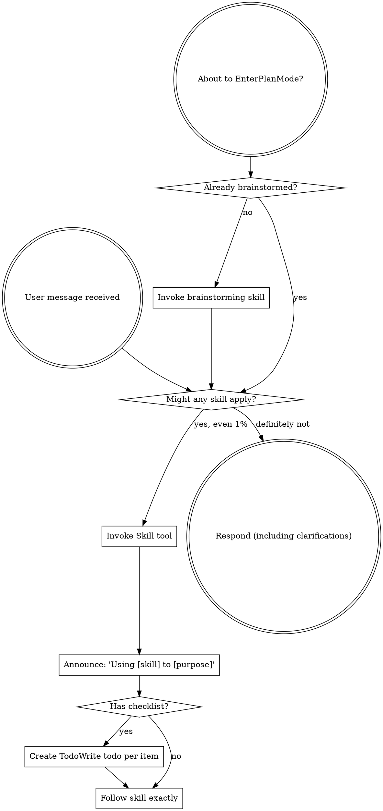

codex-exec: report contract violation

--- codex stdout ---
## Findings

### CRITICAL — Refuse-before-write is violated

The dispatcher publishes project bytes before global/init/update dispatch ([install.sh:1195](/<HOME>/AppData/Roaming/warp/Warp/data/worktrees/GSDedits/luminaria-hogback/super-gsd/install.sh:1195)). Rejection-capable work follows:

- `ensure_gsd_base` can reject after publication ([install.sh:479](/<HOME>/AppData/Roaming/warp/Warp/data/worktrees/GSDedits/luminaria-hogback/super-gsd/install.sh:479)).
- Update preflights existing hooks afterward ([install.sh:1018](/<HOME>/AppData/Roaming/warp/Warp/data/worktrees/GSDedits/luminaria-hogback/super-gsd/install.sh:1018)).
- Settings, npm, repair, and Codex registration then perform unjournaled writes and may fail ([install.sh:1021](/<HOME>/AppData/Roaming/warp/Warp/data/worktrees/GSDedits/luminaria-hogback/super-gsd/install.sh:1021), [install.sh:1048](/<HOME>/AppData/Roaming/warp/Warp/data/worktrees/GSDedits/luminaria-hogback/super-gsd/install.sh:1048)).

The guard now explicitly asserts this incorrect `publication < global dispatch` ordering ([guard:1460](/<HOME>/AppData/Roaming/warp/Warp/data/worktrees/GSDedits/luminaria-hogback/super-gsd/tests/installer-registration-guard/assert-installer-registration-guard.cjs:1460)).

### HIGH — Loadability classifier can accept a load failure

`boundedLine` flattens stdout/stderr, while the anchored classifier’s final `.*` accepts arbitrary trailing diagnostics ([preflight:43](/<HOME>/AppData/Roaming/warp/Warp/data/worktrees/GSDedits/luminaria-hogback/super-gsd/scripts/lib/hook-registration-preflight.cjs:43), [preflight:75](/<HOME>/AppData/Roaming/warp/Warp/data/worktrees/GSDedits/luminaria-hogback/super-gsd/scripts/lib/hook-registration-preflight.cjs:75)). Thus `[id] blocked: reason\nError: failed to load` is accepted.

Production screens `MODULE_NOT_FOUND` first ([preflight:671](/<HOME>/AppData/Roaming/warp/Warp/data/worktrees/GSDedits/luminaria-hogback/super-gsd/scripts/lib/hook-registration-preflight.cjs:671)); the final-installed-hook caller invokes the shared classifier directly and wrongly passes such output ([install-test:333](/<HOME>/AppData/Roaming/warp/Warp/data/worktrees/GSDedits/luminaria-hogback/super-gsd/tests/install-contract/assert-install-contract.cjs:333)). The classifier is shared, not duplicated, but caller semantics differ.

### MEDIUM — “No laundering” is incomplete

Non-module branches preserve bounded real output, but the module branch discards it and synthesizes `Cannot find module '<request>'` ([preflight:50](/<HOME>/AppData/Roaming/warp/Warp/data/worktrees/GSDedits/luminaria-hogback/super-gsd/scripts/lib/hook-registration-preflight.cjs:50)). Conversely, non-module stack output is flattened and disclosed up to 2048 bytes, without stack-frame sanitization. Therefore real output does not survive every branch, and raw stacks are not universally excluded.

## T1 acceptance criteria

- **Empty-module-tree real install — NOT MET.** Candidate smoke precedes its own publication ([contract:740](/<HOME>/AppData/Roaming/warp/Warp/data/worktrees/GSDedits/luminaria-hogback/super-gsd/scripts/lib/hook-install-contract.cjs:740)), but rejection-capable operations follow the first destination write as above.
- **Unresolved module refuses before write — MET.** Resolution throws during graph preparation ([contract:410](/<HOME>/AppData/Roaming/warp/Warp/data/worktrees/GSDedits/luminaria-hogback/super-gsd/scripts/lib/hook-install-contract.cjs:410)); publication occurs only after successful preparation ([install.sh:773](/<HOME>/AppData/Roaming/warp/Warp/data/worktrees/GSDedits/luminaria-hogback/super-gsd/install.sh:773)).
- **Generated transitive manifest — MET.** Requires are lexed, constants/path expressions reduced, and closure recursively walked per entry ([contract:132](/<HOME>/AppData/Roaming/warp/Warp/data/worktrees/GSDedits/luminaria-hogback/super-gsd/scripts/lib/hook-install-contract.cjs:132), [contract:232](/<HOME>/AppData/Roaming/warp/Warp/data/worktrees/GSDedits/luminaria-hogback/super-gsd/scripts/lib/hook-install-contract.cjs:232), [contract:358](/<HOME>/AppData/Roaming/warp/Warp/data/worktrees/GSDedits/luminaria-hogback/super-gsd/scripts/lib/hook-install-contract.cjs:358)).
- **Prior guards/P167 preservation — NOT MET.** P167 itself remains intact—Pre denies, Post returns bounded replacement, store selects only `rewritten` ([witness:248](/<HOME>/AppData/Roaming/warp/Warp/data/worktrees/GSDedits/luminaria-hogback/super-gsd/hooks/sgsd-substrate-invocation-witness.cjs:248), [witness:44](/<HOME>/AppData/Roaming/warp/Warp/data/worktrees/GSDedits/luminaria-hogback/super-gsd/hooks/sgsd-substrate-invocation-witness.cjs:44), [store:486](/<HOME>/AppData/Roaming/warp/Warp/data/worktrees/GSDedits/luminaria-hogback/super-gsd/scripts/lib/substrate-invocation-witness-store.cjs:486))—but the ordering guards were weakened.

## Requested cross-checks

Closure literals found: generated manifest fields ([manifest:352](/<HOME>/AppData/Roaming/warp/Warp/data/worktrees/GSDedits/luminaria-hogback/super-gsd/config/hook-manifest.json:352)), generator-owned fixture names ([install-test:88](/<HOME>/AppData/Roaming/warp/Warp/data/worktrees/GSDedits/luminaria-hogback/super-gsd/tests/install-contract/assert-install-contract.cjs:88)), and one broken-control dependency ([guard:2043](/<HOME>/AppData/Roaming/warp/Warp/data/worktrees/GSDedits/luminaria-hogback/super-gsd/tests/installer-registration-guard/assert-installer-registration-guard.cjs:2043)). No hand-maintained production closure exists; composer/store originate from reduced source constants.

Retirements checked: install-order replacement **does not cover**; Codex candidate-inventory replacement **does cover**; bounded-disclosure replacement **only partially covers** because non-module stacks remain possible.

No T2 scope creep: doctor still uses the old `.git`-directory predicate and lacks worktree/install-status presentation ([install.sh:388](/<HOME>/AppData/Roaming/warp/Warp/data/worktrees/GSDedits/luminaria-hogback/super-gsd/install.sh:388)).

SPEC VERDICT: FAIL

--- codex stderr ---
OpenAI Codex v0.146.0
--------
workdir: <HOME>\AppData\Roaming\warp\Warp\data\worktrees\GSDedits\luminaria-hogback
model: gpt-5.6-sol
provider: openai
approval: never
sandbox: read-only
reasoning effort: xhigh
reasoning summaries: none
session id: 01a03936-b6bf-7df2-9755-1f6f40f42ead
--------
user
# Spec-compliance review of P168-T1. Read-only. Judge raw artifacts, not the executor's summary.

Do NOT rely on any executor report. Read the PLAN, the diff, and the code.

- Plan: .planning/milestones/v4.0-install-contract/phases/168-install-contract/168-01-PLAN-LOCKED.md
  (revision 2, task P168-T1 only; P168-T2 is a separate future dispatch and is OUT OF SCOPE)
- Diff: `git show 7550116` and `git diff 8ddae0e..7550116 -- super-gsd`
- Context: .../168-install-contract/CONTEXT.md

Orchestrator-run results, unsandboxed, take as given and do not re-run:
installer-registration-guard 13/13 in one `--all` sweep; install-contract 3/3;
assert-witness-correlation 13/13; assert-propagation PASS; assert-hook-contract 38/38;
assert-prompt-contracts 4/4; P166 policy 6/6; P154 real-evidence PASS; composer and
enrichment-gate self-tests PASS; kb-triage-shadow PASS; feature-propagation 15/15;
`bash -n install.sh` clean.

## Judge T1's acceptance criteria one by one

For each `semantic_acceptance_criteria` entry belonging to P168-T1, state MET or NOT MET
with a file:line citation from the implementation. A criterion satisfied only by a test
asserting a shape, rather than by real data through the real path, is NOT MET; say so.

## Specific things to verify, each has a history

1. **Computed, not transcribed.** Is the dependency closure genuinely lexed from source?
   Grep for any hand-maintained module list in production OR in tests. The witness
   composer and store must be discovered by reducing `COMPOSER_RELATIVE_PATH` /
   `STORE_RELATIVE_PATH`, not named. Report any literal module list you find and where.

2. **Refuse before writing, literally.** Confirm every rejection-capable smoke runs
   against the candidate tree before the first destination write, and that only
   transactional publication and non-rejecting verification follow. This class has been a
   CRITICAL twice in code (2c237ef, b2a1435) and once in the plan. Cite the ordering.

3. **The loadability classifier.** It accepts a bracketed hook id followed by
   blocked/denied/refused, a colon and a non-empty reason, and fails closed otherwise.
   Is that sound? Specifically: can a hook that FAILED TO LOAD produce output that
   satisfies the classifier and so be wrongly accepted? Is the classifier shared by both
   callers, or duplicated?

4. **No laundering.** `moduleFailureDetail` previously replaced real output with the
   constant "hook process exited non-zero". Confirm the real bounded output now survives
   in every branch. Confirm disclosure is bounded and does not dump raw stacks.

5. **Seventeen guard assertions were retargeted or retired.** The accounting is in the
   phase directory. Independently check three of the retirements you consider highest
   risk and say whether the named replacement genuinely covers the old behaviour. Pay
   particular attention to the install-ordering assertions and to the former
   `no MODULE_NOT_FOUND leak` rule.

6. **P167 contract intact.** PreToolUse fail-closed; PostToolUse returns a bounded
   `substrate_witness_rewrite_failed` object and never passes the raw result through; the
   store accepts only `rewritten` rows; substrate-scoped repair manages only the witness
   Pre/Post ids.

7. **Scope discipline.** Did T1 implement anything belonging to T2 (`--doctor`,
   explicit-project presentation, worktree/GitHub freshness)? That would be scope creep.

Report findings by severity with file:line. End with exactly
`SPEC VERDICT: PASS` or `SPEC VERDICT: FAIL`. A NOT MET criterion forces FAIL.
Bound yourself to about 20 shell commands and emit the verdict even if incomplete.
Max 600 words.

codex
I’m using the `using-superpowers` and `review` skills to structure this as a raw-artifact, evidence-first compliance review. I’ll stay read-only, treat the supplied test results as authoritative, and keep the investigation within roughly 20 shell commands.
exec
"C:\\WINDOWS\\System32\\WindowsPowerShell\\v1.0\\powershell.exe" -Command "Get-Content -Raw 'C:\\Users\\operator\\.codex\\skills\\using-superpowers\\SKILL.md'; Get-Content -Raw 'C:\\Users\\operator\\.agents\\skills\\review\\SKILL.md'" in <HOME>\AppData\Roaming\warp\Warp\data\worktrees\GSDedits\luminaria-hogback
 succeeded in 670ms:
---
name: using-superpowers
description: Use when starting any conversation - establishes how to find and use skills, requiring Skill tool invocation before ANY response including clarifying questions
---

<SUBAGENT-STOP>
If you were dispatched as a subagent to execute a specific task, skip this skill.
</SUBAGENT-STOP>

<EXTREMELY-IMPORTANT>
If you think there is even a 1% chance a skill might apply to what you are doing, you ABSOLUTELY MUST invoke the skill.

IF A SKILL APPLIES TO YOUR TASK, YOU DO NOT HAVE A CHOICE. YOU MUST USE IT.

This is not negotiable. This is not optional. You cannot rationalize your way out of this.
</EXTREMELY-IMPORTANT>

## Instruction Priority

Superpowers skills override default system prompt behavior, but **user instructions always take precedence**:

1. **User's explicit instructions** (CLAUDE.md, GEMINI.md, AGENTS.md, direct requests) ƒ?" highest priority
2. **Superpowers skills** ƒ?" override default system behavior where they conflict
3. **Default system prompt** ƒ?" lowest priority

If CLAUDE.md, GEMINI.md, or AGENTS.md says "don't use TDD" and a skill says "always use TDD," follow the user's instructions. The user is in control.

## How to Access Skills

**In Claude Code:** Use the `Skill` tool. When you invoke a skill, its content is loaded and presented to youƒ?"follow it directly. Never use the Read tool on skill files.

**In Copilot CLI:** Use the `skill` tool. Skills are auto-discovered from installed plugins. The `skill` tool works the same as Claude Code's `Skill` tool.

**In Gemini CLI:** Skills activate via the `activate_skill` tool. Gemini loads skill metadata at session start and activates the full content on demand.

**In other environments:** Check your platform's documentation for how skills are loaded.

## Platform Adaptation

Skills use Claude Code tool names. Non-CC platforms: see `references/copilot-tools.md` (Copilot CLI), `references/codex-tools.md` (Codex) for tool equivalents. Gemini CLI users get the tool mapping loaded automatically via GEMINI.md.

# Using Skills

## The Rule

**Invoke relevant or requested skills BEFORE any response or action.** Even a 1% chance a skill might apply means that you should invoke the skill to check. If an invoked skill turns out to be wrong for the situation, you don't need to use it.



## Red Flags

These thoughts mean STOPƒ?"you're rationalizing:

| Thought | Reality |
|---------|---------|
| "This is just a simple question" | Questions are tasks. Check for skills. |
| "I need more context first" | Skill check comes BEFORE clarifying questions. |
| "Let me explore the codebase first" | Skills tell you HOW to explore. Check first. |
| "I can check git/files quickly" | Files lack conversation context. Check for skills. |
| "Let me gather information first" | Skills tell you HOW to gather information. |
| "This doesn't need a formal skill" | If a skill exists, use it. |
| "I remember this skill" | Skills evolve. Read current version. |
| "This doesn't count as a task" | Action = task. Check for skills. |
| "The skill is overkill" | Simple things become complex. Use it. |
| "I'll just do this one thing first" | Check BEFORE doing anything. |
| "This feels productive" | Undisciplined action wastes time. Skills prevent this. |
| "I know what that means" | Knowing the concept ƒ%ÿ using the skill. Invoke it. |

## Skill Priority

When multiple skills could apply, use this order:

1. **Process skills first** (brainstorming, debugging) - these determine HOW to approach the task
2. **Implementation skills second** (frontend-design, mcp-builder) - these guide execution

"Let's build X" ā' brainstorming first, then implementation skills.
"Fix this bug" ā' debugging first, then domain-specific skills.

## Skill Types

**Rigid** (TDD, debugging): Follow exactly. Don't adapt away discipline.

**Flexible** (patterns): Adapt principles to context.

The skill itself tells you which.

## User Instructions

Instructions say WHAT, not HOW. "Add X" or "Fix Y" doesn't mean skip workflows.

---
name: review
description: Review code changes for security, performance, bugs, and quality. Reviews staged changes, unstaged changes, specific commits, or PR-ready diffs.
---

<objective>
Review code changes and provide structured feedback covering security, performance, bug risks, code quality, and test coverage gaps. This skill analyzes diffs and surrounding context to catch issues before they reach production.
</objective>

<context>
This skill reviews code changes at various stages of the development workflow. It can review staged changes before a commit, unstaged work-in-progress, a specific commit, or the full set of changes on a branch that are ready for a pull request.

The reviewer reads both the diff and the surrounding source files to understand intent and catch issues that only appear in context.
</context>

<core_principle>
**FIND REAL ISSUES, NOT STYLE NITS.** Focus on problems that cause bugs, security vulnerabilities, performance degradation, or maintainability pain. Avoid nitpicking formatting or subjective style preferences unless they harm readability.
</core_principle>

<analysis_only_rule>
**THIS SKILL IS READ-ONLY. DO NOT MODIFY CODE.**

The purpose is to review and report findings. Making changes during review conflates the reviewer and author roles. Present findings and let the user decide what to act on.
</analysis_only_rule>

<quick_start>

<determine_review_scope>

Parse the user's input to determine what to review:

1. **No arguments** - Review staged changes first. If nothing is staged, review unstaged changes.
   - Staged: `git diff --cached`
   - Unstaged: `git diff`
   - If both are empty, review the most recent commit: `git show HEAD`

2. **Commit hash argument** (e.g., `/review abc1234`) - Review that specific commit.
   - `git show <hash>`

3. **File path argument** (e.g., `/review src/foo.ts`) - Review unstaged changes in that file.
   - `git diff -- <path>` then fall back to `git diff --cached -- <path>`

4. **"pr" argument** (e.g., `/review pr`) - Review all changes since branching from main.
   - `git diff main...HEAD`
   - If on main, review `git diff HEAD~1`

After obtaining the diff, if it is empty, inform the user that there are no changes to review and stop.

</determine_review_scope>

<gather_context>

Before analyzing the diff:

1. **Read changed files in full** - Do not review a diff in isolation. Read each modified file to understand the surrounding code, imports, types, and control flow.
2. **Identify the tech stack** - Note languages, frameworks, and libraries in use. This affects what patterns are risky.
3. **Check for related test files** - For each changed source file, look for corresponding test files. Note whether tests were updated alongside the changes.
4. **Check for configuration changes** - If config files changed (env, CI, package.json, tsconfig, etc.), pay extra attention to side effects.

</gather_context>

<review_categories>

Analyze the changes against each category below. Only report findings that are actually present. Skip categories with no issues.

**A. Security Issues** (Severity: CRITICAL or HIGH)
- Injection vulnerabilities (SQL injection, command injection, template injection)
- Cross-site scripting (XSS) - unsanitized user input rendered in HTML
- Authentication and authorization flaws (missing auth checks, privilege escalation)
- Secrets or credentials hardcoded or logged
- Insecure deserialization or unsafe eval usage
- Path traversal or file access vulnerabilities
- Missing input validation on external data

**B. Performance Concerns** (Severity: HIGH or MEDIUM)
- N+1 query patterns in database access
- Unnecessary memory allocations in hot paths or loops
- Blocking operations on the main thread or in async contexts
- Missing pagination on unbounded queries
- Redundant computation that could be cached or memoized
- Large payloads without streaming or chunking

**C. Bug Risks** (Severity: HIGH or MEDIUM)
- Off-by-one errors in loops or array access
- Null/undefined dereferences without guards
- Race conditions in concurrent or async code
- Incorrect error handling (swallowed errors, wrong error types)
- Type mismatches or unsafe type assertions
- Logic errors in conditionals (inverted checks, missing cases)
- Resource leaks (unclosed connections, file handles, listeners)

**D. Code Quality** (Severity: MEDIUM or LOW)
- Unclear or misleading naming
- Significant code duplication that should be extracted
- Excessive complexity (deeply nested logic, functions doing too many things)
- Dead code or unreachable branches
- Missing or misleading comments on non-obvious logic
- Inconsistency with patterns used elsewhere in the codebase

**E. Test Coverage Gaps** (Severity: MEDIUM or LOW)
- New logic paths without corresponding test cases
- Changed behavior without updated tests
- Edge cases not covered (empty inputs, boundary values, error paths)
- Missing integration tests for new API endpoints or database changes

</review_categories>

<format_findings>

For each finding, use this structure:

```
### [SEVERITY] Category: Brief Title

**File**: `path/to/file.ext` (lines X-Y)

**Issue**: Clear description of the problem.

**Why it matters**: What could go wrong if this is not addressed.

**Suggestion**: How to fix it, with a code snippet if helpful.
```

Severity levels:
- **CRITICAL** - Must fix before merge. Security vulnerability or data loss risk.
- **HIGH** - Should fix before merge. Likely bug or significant performance issue.
- **MEDIUM** - Should fix soon. Code quality or moderate risk issue.
- **LOW** - Consider fixing. Minor improvement opportunity.

</format_findings>

</quick_start>

<critical_rules>

1. **READ THE FULL FILE**: Never review a diff without reading the complete source file for context
2. **NO FALSE ALARMS**: Only report issues you can explain concretely. Do not report vague concerns
3. **PRIORITIZE**: Lead with the most severe findings. Do not bury critical issues under style nits
4. **BE SPECIFIC**: Include file paths, line numbers, and code references for every finding
5. **EXPLAIN THE RISK**: For each finding, explain what could actually go wrong
6. **CHECK TESTS**: Always check whether changes have corresponding test updates
7. **CONSIDER THE STACK**: Apply language-specific and framework-specific knowledge to your review
8. **DO NOT MODIFY CODE**: Present findings only. The user decides what to act on

</critical_rules>

<output_format>

```markdown
## Code Review: [brief description of what was reviewed]

**Scope**: [staged changes | unstaged changes | commit abc1234 | PR changes from main]
**Files reviewed**: [count] files changed, [additions] additions, [deletions] deletions

---

### Findings

[Findings grouped by severity, highest first. Use the format from <format_findings>.]

---

### Summary

| Severity | Count |
|----------|-------|
| CRITICAL | X     |
| HIGH     | X     |
| MEDIUM   | X     |
| LOW      | X     |

### Recommended Actions

1. [Most important action to take]
2. [Next most important action]
3. [...]
```

If no issues are found:

```markdown
## Code Review: [brief description]

**Scope**: [what was reviewed]
**Files reviewed**: [count]

No significant issues found. The changes look good to merge.
```

</output_format>

<decision_gate>

**After presenting findings, ALWAYS offer these options:**

```
ƒ"?ƒ"?ƒ"?ƒ"?ƒ"?ƒ"?ƒ"?ƒ"?ƒ"?ƒ"?ƒ"?ƒ"?ƒ"?ƒ"?ƒ"?ƒ"?ƒ"?ƒ"?ƒ"?ƒ"?ƒ"?ƒ"?ƒ"?ƒ"?ƒ"?ƒ"?ƒ"?ƒ"?ƒ"?ƒ"?ƒ"?ƒ"?ƒ"?ƒ"?ƒ"?ƒ"?ƒ"?ƒ"?ƒ"?ƒ"?ƒ"?
REVIEW COMPLETE

What would you like to do?

1. **Fix issues** - I'll address the findings starting with the most critical
2. **Save review** - Export findings to a markdown file
3. **Review again** - Re-review with different scope or focus
4. **Discuss a finding** - Ask questions about a specific issue
5. **Other** - Tell me what you need
ƒ"?ƒ"?ƒ"?ƒ"?ƒ"?ƒ"?ƒ"?ƒ"?ƒ"?ƒ"?ƒ"?ƒ"?ƒ"?ƒ"?ƒ"?ƒ"?ƒ"?ƒ"?ƒ"?ƒ"?ƒ"?ƒ"?ƒ"?ƒ"?ƒ"?ƒ"?ƒ"?ƒ"?ƒ"?ƒ"?ƒ"?ƒ"?ƒ"?ƒ"?ƒ"?ƒ"?ƒ"?ƒ"?ƒ"?ƒ"?ƒ"?
```

**Wait for user response before taking any action.**

This gate is MANDATORY. Never skip it. Never auto-implement fixes.

</decision_gate>

<HOME>\OneDrive - <ORG>\Documents\WindowsPowerShell\profile.ps1 : Cannot dot-source this 
command because it was defined in a different language mode. To invoke this command without importing its contents, 
omit the '.' operator.
At line:1 char:1
+ . '<HOME>\OneDrive - <ORG>\Documents\Win ...
+ ~~~~~~~~~~~~~~~~~~~~~~~~~~~~~~~~~~~~~~~~~~~~~~~~~~~~~~~~~~~~~~~~~~~~~
    + CategoryInfo          : InvalidOperation: (:) [profile.ps1], NotSupportedException
    + FullyQualifiedErrorId : DotSourceNotSupported,profile.ps1
 
<HOME>\OneDrive - <ORG>\Documents\WindowsPowerShell\Microsoft.PowerShell_profile.ps1 : 
Cannot dot-source this command because it was defined in a different language mode. To invoke this command without 
importing its contents, omit the '.' operator.
At line:1 char:1
+ . '<HOME>\OneDrive - <ORG>\Documents\Win ...
+ ~~~~~~~~~~~~~~~~~~~~~~~~~~~~~~~~~~~~~~~~~~~~~~~~~~~~~~~~~~~~~~~~~~~~~
    + CategoryInfo          : InvalidOperation: (:) [Microsoft.PowerShell_profile.ps1], NotSupportedException
    + FullyQualifiedErrorId : DotSourceNotSupported,Microsoft.PowerShell_profile.ps1
 

  → Extract P168-T1 criteria and phase retirement accounting
  • Inspect commit diff and every changed implementation/test file in full
  • Trace dependency discovery, pre-write ordering, classifier, failure disclosure, and P167 invariants
  • Assess three high-risk retired guards and T2 scope discipline
  • Report severity findings and criterion-by-criterion verdict with citations
exec
"C:\\WINDOWS\\System32\\WindowsPowerShell\\v1.0\\powershell.exe" -Command "Get-Content -Raw '.planning/milestones/v4.0-install-contract/phases/168-install-contract/168-01-PLAN-LOCKED.md'
Get-Content -Raw '.planning/milestones/v4.0-install-contract/phases/168-install-contract/CONTEXT.md'" in <HOME>\AppData\Roaming\warp\Warp\data\worktrees\GSDedits\luminaria-hogback
 succeeded in 816ms:
---
schema_version: 2
phase: 168
slug: install-contract
milestone: v4.0-install-contract
status: PLANNED
revision: 2
governing_decision: .planning/milestones/v4.0-install-contract/phases/168-install-contract/CONTEXT.md
evidence_paths:
  - .planning/milestones/v4.0-install-contract/INTENT.md
  - .planning/milestones/v4.0-install-contract/phases/168-install-contract/CONTEXT.md
  - .planning/milestones/v3.9-substrate-hygiene/phases/167-substrate-invocation-witness/SUMMARY.md
  - .planning/milestones/v3.9-substrate-hygiene/phases/167-substrate-invocation-witness/AUDIT.md
depends_on: []
intent: >
  Make project installation one closed contract: compute every repository-owned
  module needed by distributed hooks from the hook sources, declare the computed
  closure in the hook manifest, deliver and refresh that exact closure, execute
  every prospective project hook in a complete candidate before the first write,
  prove every installed target hook after successful publication, preserve the
  underlying module-resolution error beside the existing closed reason code, and
  expose one read-only command that identifies hook and module drift for an
  explicit project, including projects whose .git entry is a worktree file.
execution_mode: two-dependent-codex-tasks-with-orchestrator-spawn-gates
expected_ATC_tier: GATE
skip_gates: []
lessons_path: null
prior_errors_lookup: true
lock_status: locked
locked_at: 2026-08-25T11:08:08+01:00
locked_by: codex
allowed_files:
  - super-gsd/scripts/lib/hook-install-contract.cjs
  - super-gsd/config/hook-manifest.json
  - super-gsd/scripts/lib/hook-registration-preflight.cjs
  - super-gsd/tools/feature-propagation/audit.cjs
  - super-gsd/install.sh
  - super-gsd/tests/install-contract/assert-install-contract.cjs
  - super-gsd/tests/installer-registration-guard/assert-installer-registration-guard.cjs
forbidden_files:
  - super-gsd/hooks/sgsd-substrate-invocation-witness.cjs
  - super-gsd/scripts/lib/substrate-invocation-witness-store.cjs
  - super-gsd/scripts/lib/vtp-context-composer.cjs
  - super-gsd/tools/substrate-capability-broker.cjs
  - super-gsd/schemas/vtp-mcp-input-schemas.v1.json
  - .planning/milestones/v3.6-vtp-bridge/phases/154-mcp-arg-contract/154-REAL-MCP-EVIDENCE.json
  - .planning/STATE.md
  - .planning/milestones/v4.0-install-contract/ROADMAP.md
  - package.json
  - package-lock.json
  - wiki/LINT-REPORT.md
invariants:
  - Project dependency delivery is the mechanically computed transitive closure; no production array, shell glob, test constant, or manifest field may hand-list the closure.
  - Manifest policy remains human-authored, but every dependency field is generated and verified against the same computation used by delivery and status.
  - Every rejection-capable source, manifest, destination, package, registration, and all-hook smoke check completes against one complete project-shaped candidate before the first project, profile, npm, key, settings, broker, or grant mutation.
  - The candidate lives under a fresh OS temporary directory outside the project and profile, contains the exact prospective project paths, uses an isolated HOME/USERPROFILE, and resolves requires naturally from candidate hook paths without NODE_PATH or canonical-source fallback.
  - After the first destination write, production performs only rollback-journaled publication of the already-smoked immutable candidate bytes; it never spawns a hook or runs another rejection-capable validation, and any publication I/O failure restores project/profile bytes and the actions array exactly.
  - An explicit --project-dir is normalized and used exactly; walk-up occurs only when no explicit project directory is supplied.
  - Read-only status, installer precheck, and repair consume one inspectProjectInstall result; no second detector or dependency list is permitted.
  - Closed reasons are unchanged; MODULE_NOT_FOUND code, request, resolved path, and bounded message travel in underlying_error/detail beside the existing reason.
  - P167 remains unchanged: PreToolUse fails closed, PostToolUse emits bounded substrate_witness_rewrite_failed without raw passthrough, and only rewritten rows are accepted.
  - Existing guard assertions are preserved or strengthened; none is weakened to obtain a pass.
acceptance_commands:
  - node super-gsd/scripts/lib/hook-install-contract.cjs --check-manifest
  - node super-gsd/tests/install-contract/assert-install-contract.cjs --all
  - node super-gsd/tests/installer-registration-guard/assert-installer-registration-guard.cjs --all
  - node super-gsd/tests/substrate-invocation-witness/assert-hook-contract.cjs
  - node super-gsd/tests/substrate-invocation-witness/assert-propagation.cjs
rollback_plan: >
  Revert P168-T2 before P168-T1. T1 is the indivisible declaration,
  graph/detector, delivery, all-hook smoke, diagnosis, and proof commit; never
  retain dependency fields without their verifier or copying without smoke.
  T2 adds only the dependent doctor/worktree presentation seam. Run the
  pre-P168 installer guard and P167 suites after either rollback.
risk_rating: high
operator_checkpoints:
  - The orchestrator runs spawn-bound real install, refusal, and worktree cases outside any sandbox that returns spawnSync EPERM.
  - Phase close is NOGO until both dependent tasks pass; manifest generation, delivery, smoke, and diagnosis remain one T1 commit, while T2 cannot ship without T1.
  - Phase close is NOGO if any refused entry point changes a snapshotted project/profile byte or records a repair action.
semantic_acceptance_criteria:
  - input: >
      A disposable on-disk SGSD project whose project-local
      super-gsd/scripts/lib and other computed project-module destinations start
      empty, an isolated real HOME/USERPROFILE, and a separate canonical source
      checkout. Production install.sh is launched by Bash with --init-project,
      --skip-cockpit-deps, and --project-dir pointing at that project while cwd
      is a different decoy directory. No mocked copier, dependency adapter,
      staged target, or direct hook-function call is used. After installation,
      one delivered transitive module is changed and production --update runs.
    expected_outcome: >
      Before its first destination write, the production installer creates its
      complete candidate outside the project/profile, spawns every candidate
      Claude and Codex project hook/registration with natural candidate-relative
      resolution, and seals the exact bytes that publication will copy. The
      installer then publishes those bytes transactionally and exits 0 with
      every computed dependency byte-identical in the final target. Only after
      the installer has returned, the test harness independently spawns every
      final installed hook from its real path with cwd equal to the explicit
      project; this is non-rejecting verification of the completed install, not
      a staged shortcut or a post-write installer refusal. Update restores the
      changed module after repeating candidate smoke. No hook reports an
      unresolved dependency, and the decoy cwd and ancestors remain untouched.
    verification_cmd: >
      node super-gsd/tests/install-contract/assert-install-contract.cjs
      --case empty-module-tree-real-install
  - input: >
      A second real install against seeded project and profile trees after a
      temporary canonical hook source is given a relative require whose resolved
      repository file does not exist. The test snapshots every file and SHA-256
      under both destinations and plants an npm preinstall sentinel that records
      if mutation begins. It invokes production combined --install-global
      --update, not an exported detector in isolation.
    expected_outcome: >
      Installation refuses before npm, hook or module copying, settings merge,
      key provisioning, broker/grant repair, or global installation. The closed
      reason remains hook_smoke_failed or witness_repair_failed as appropriate,
      while underlying_error carries MODULE_NOT_FOUND, the original request, the
      exact normalized missing module path, and a bounded sanitized message.
      Project/profile inventories and hashes are byte-identical, the npm sentinel
      is absent, and repair actions are empty. Raw hook output, payloads, secrets,
      and unbounded stacks are not exposed.
    verification_cmd: >
      node super-gsd/tests/install-contract/assert-install-contract.cjs
      --case unresolved-module-refuses-before-write
  - input: >
      The real canonical hook sources and hook-manifest.json, followed by a
      test-only Node loader trace that executes the selected real hook sources
      from a complete temporary source checkout and records actual parent to
      resolved-child repository edges per manifest entry. That independent
      source execution, rather than a maintained expected-closure list, is the
      oracle. A generated mutation then adds runtime-named relative requires
      covering extensionless-to-.js, explicit .js, explicit .json, package-main
      directory, index directory, and a transitive child; the fixture paths and
      expected edges are emitted by the generator from the mutated sources, not
      transcribed into the test. The production graph, manifest renderer, check,
      delivery, and inspection APIs run on the same temporary checkout.
    expected_outcome: >
      The committed manifest is byte-equivalent to its deterministic generated
      dependency projection. For each traced or generated parent-child edge,
      the same originating manifest entry owns the edge in the computed
      per-entry closure, that entry's generated manifest projection, delivery
      provenance and candidate/final bytes, and missing/stale/current inspection
      rows. Equality is tested per entry, never at union level. This necessarily
      proves the witness entry owns both composer and store edges and the
      sgsd-quality-gate.js entry owns sgsd-intent-classifier.cjs even while the
      classifier remains a separate manifest root. Every generated .js/.json/
      directory/transitive resolution follows the same four surfaces. The
      unchanged temporary manifest is rejected as stale and names exact paths.
      An unresolvable dynamic repository-local require is rejected rather than
      omitted; built-ins are excluded, bare packages are classified rather than
      copied from ignored node_modules, ordering is stable, and cycles terminate
      without duplicate artifacts.
    verification_cmd: >
      node super-gsd/tests/install-contract/assert-install-contract.cjs
      --case generated-transitive-manifest
  - input: >
      A real temporary Git repository with a linked worktree, so the selected
      project has a .git file, plus one missing installed hook, one stale
      transitive module, and one current module. From a different cwd, the
      operator runs bash super-gsd/install.sh --doctor --project-dir with the
      worktree path, repairs through --update, and repeats doctor.
    expected_outcome: >
      The first doctor run is read-only, recognizes the linked checkout as a Git
      worktree, prints its real HEAD rather than not-a-git-repo, and reports a
      non-current install with the exact missing hook and stale module paths,
      expected/actual digests, and canonical source revision. It does not report
      the current module as behind, and it reaches the existing GitHub-master
      comparison; remote unavailability is named separately from the local
      verdict. After update, doctor exits current with no missing or stale hook/
      module rows. Only the explicit worktree is inspected and repaired.
    verification_cmd: >
      node super-gsd/tests/install-contract/assert-install-contract.cjs
      --case doctor-real-git-worktree-staleness
  - input: >
      The complete pre-existing installer-registration guard suite and P167
      witness hook/propagation suites run after P168, including broken deployed
      hook and witness-repair-no-mutation controls.
    expected_outcome: >
      Every prior guard passes with its original or stronger assertion. The
      witness hook source, store, composer, broker, response bound, substrate
      reasons, rewritten-only acceptance, and no-raw-result behavior are
      unchanged. The prior broken module control now exposes the exact missing
      path beside its closed reason, and refused repair still leaves
      byte-identical trees and an empty actions array.
    verification_cmd: >
      node super-gsd/tests/installer-registration-guard/assert-installer-registration-guard.cjs --all &&
      node super-gsd/tests/substrate-invocation-witness/assert-hook-contract.cjs &&
      node super-gsd/tests/substrate-invocation-witness/assert-propagation.cjs
known_deadends:
  - Do not encode known hook dependencies in install.sh, hook-manifest.json, tests, or an exceptions table. That second-source pattern caused this failure.
  - Do not blanket-copy scripts/lib, tools, or node_modules. Deliver only computed repository-owned files and classify package prerequisites; a missing package is named and refused.
  - Do not generate the whole manifest. Targets, dispositions, authorities, matchers, timeouts, and intentional-unregistration reasons are human policy; only dependencies are generated.
  - Do not accept node --check, existence, mocked spawn, direct exported-function calls, or the pre-publication candidate alone as deployed end-to-end semantic proof; the harness must execute every final target hook after production install.
  - Do not begin externally visible install writes until every source, manifest, destination, package, registration, and project-shaped prospective-smoke check has passed.
  - Do not spawn a hook or run any other rejection-capable check after the first destination write. Publication consumes only sealed candidate bytes; final-target execution belongs to the post-success test harness and cannot change the installer verdict.
  - Do not add a second staleness implementation to doctor or audit. Both format the same inspectProjectInstall report consumed by repair.
  - Do not replace the closed refusal vocabulary with MODULE_NOT_FOUND. Preserve the reason and attach bounded structured underlying_error/detail.
  - Do not test Git repositories with a .git directory predicate. Use git -C with rev-parse for normal repositories and linked worktrees.
  - Do not change a P167 hook, witness-store, composer, or broker contract to make smoke pass. Adapt smoke and diagnosis around production.
  - Do not merge this branch; publication to master remains an operator decision.
  - Do not treat selective hook closure as whole-tree parity. The unrelated remainder of the measured approximately 55-file project/global gap is deliberately outside P168.
tasks:
  - id: P168-T1
    type: computed-hook-install-contract-delivery-smoke-and-diagnosis
    agent: codex
    model: codex
    depends_on: []
    files_touched:
      - super-gsd/scripts/lib/hook-install-contract.cjs
      - super-gsd/config/hook-manifest.json
      - super-gsd/scripts/lib/hook-registration-preflight.cjs
      - super-gsd/tools/feature-propagation/audit.cjs
      - super-gsd/install.sh
      - super-gsd/tests/install-contract/assert-install-contract.cjs
      - super-gsd/tests/installer-registration-guard/assert-installer-registration-guard.cjs
    input_contract: >
      Treat CONTEXT.md's measured delivery trace and P167 SUMMARY/AUDIT
      constraints as settled facts; do not reproduce or redesign the root cause.
      Work red-first in the focused assert-install-contract.cjs suite and
      strengthen, never relax, the existing installer-registration guard.

      Create hook-install-contract.cjs as the single authority and export
      computeHookDependencyGraph, renderManifestDependencies,
      inspectProjectInstall, and applyProjectInstall. Start from every manifest
      entry distributed to
      claude-project or codex-project and lex actual CommonJS source while
      ignoring comments and string/template text. Resolve literal relative
      requires with Node file/directory rules and recursively walk
      repository-owned modules. Symbolically reduce string constants and
      path.join/path.resolve expressions rooted at __dirname or runtime project
      root so the witness COMPOSER_RELATIVE_PATH and STORE_RELATIVE_PATH are
      discovered from source, never named in a production exception. Exclude
      built-ins, classify bare packages without copying ignored node_modules,
      detect cycles, deduplicate, sort by normalized POSIX path, reject root
      escapes, and fail closed with source plus expression for an unresolved
      local dynamic require. Return per-entry closure, union, source/target
      paths, SHA-256, packages, source errors, and target
      missing/stale/current rows.

      Keep hook-manifest.json as reviewed policy. Add a generated dependency
      field to every entry. Implement --write-manifest to rewrite only those
      fields deterministically and --check-manifest to compare committed data
      with a fresh computeHookDependencyGraph result. Installer, audit, tests,
      delivery, and status all call the check and never trust committed
      dependency bytes without recomputation. This generated-and-verified
      choice preserves human policy while eliminating a second dependency
      authority.

      Make inspectProjectInstall the only detector. With explicit projectDir,
      path.resolve that exact argument and never call findPlanningRoot; only an
      absent argument may walk up. audit.cjs read-only output, precheck,
      repairClaudeSubstrateWitness, and install.sh precheck consume this
      report. applyProjectInstall copies only report.requiredFiles that are
      missing/stale into projectDir/super-gsd. It snapshots every affected path,
      preserves unrelated files, and retains the originating manifest entry as
      required_by provenance on every inspection, candidate, publication, and
      status row so a union root cannot mask a missing per-entry edge. It
      revalidates source and candidate digests before the first destination
      write, copies only sealed candidate bytes, records actions only after
      complete publication, and restores absent files as absent and existing
      files byte-exactly if a publication I/O operation fails.
      A second run is byte-idempotent. Remove installSubstrateRuntime's
      three-file special-case as a competing writer; the broker stays in its
      dedicated capability path because it is not a hook-import dependency.
      Route init_local_project, update_existing, combined
      --install-global/--update, and project-hook repair through this contract.
      distribute_project_hooks must not remain a standalone unjournaled writer:
      either delegate it to applyProjectInstall or reduce it to a private step
      inside the same candidate/publication transaction.

      Preserve refuse-before-write on all entry points. Refactor install.sh
      parsing to consume --project-dir VALUE and parse full argv before
      dispatch. Default remains starting cwd; explicit value is authoritative.
      precheck_installation_refusals computes and validates the graph, generated
      manifest, destinations, Codex sources, substrate sources, packages, and
      prospective all-hook smoke against the one complete OS-temporary candidate
      described below before ensure_gsd_base, npm,
      skeleton/memory, project/global copies, settings, keys, broker state, or
      grants. Candidate writes are isolated from project/profile destinations and
      are not accepted as deployed semantic proof. Run the same precheck at the
      top of direct --repair-safe, --repair,
      --repair-substrate-capability, and exported repairClaudeSubstrateWitness
      paths. Prove ordering with whole-tree hashes and an npm preinstall
      sentinel, not source-index assertions alone.

      Extend hook-registration-preflight.cjs so descriptors preserve complete
      interpreter argv and derive safe event/matcher-aware stdin from manifest
      dispositions. Execute every candidate project hook/registration represented by
      claude-project or codex-project, including both witness events and
      intentionally unregistered distributed sources with declared smoke event;
      deduplicate only identical source/event/argv tuples. Spawn real candidate
      files with shell false, cwd equal to the candidate project root, isolated
      HOME and USERPROFILE, bounded concurrency, and at least registered timeout. File
      existence and node --check remain preliminary. Capture bounded output. On
      failure HookSmokeError retains hook_smoke_failed and adds underlyingError
      with code, request, normalized path, and a sanitized single-line message
      bounded to 2048 UTF-8 characters. Parse MODULE_NOT_FOUND and its require
      stack for the exact candidate path, rebase that path to the intended
      explicit-project destination for operator output, and do not forward
      arbitrary child output, stdin, or stack text. audit.cjs carries this in
      detail/underlying_error beside witness_repair_failed, and install.sh prints
      it before the existing refusal summary.

      Create the complete candidate with
      fs.mkdtempSync(path.join(os.tmpdir(), 'sgsd-install-candidate-')); its
      returned directory is the candidate project root and its .home child is
      the isolated HOME/USERPROFILE. Materialize the effective .planning marker,
      every prospective project hook/registration, every per-entry computed
      repository dependency, and the prospective settings bytes at the same
      relative paths they will have under the explicit project. This is one
      complete project-shaped candidate, not one scratch tree per hook. Rebase
      every descriptor script path to candidateRoot/super-gsd/..., spawn with
      shell false, cwd and payload.cwd equal to candidateRoot, and bind HOME,
      USERPROFILE, APPDATA, LOCALAPPDATA, XDG_CONFIG_HOME, XDG_DATA_HOME,
      XDG_STATE_HOME, XDG_CACHE_HOME, TMPDIR, TEMP, and TMP to children of the
      candidate. Use a sanitized environment with no NODE_PATH/NODE_OPTIONS,
      canonical-checkout path, target/profile path, or target-tree fallback.
      Consequently
      ordinary relative requires resolve from the candidate hook file, while
      the witness findProjectRoot sees candidateRoot/.planning and loads its
      composer and store from candidateRoot/super-gsd/scripts/lib.

      Run the full event-aware descriptor set in that candidate, then rehash and
      seal its publication rows before any project/profile mutation. A missing
      canonical dependency, candidate mutation, or smoke failure refuses while
      all external snapshots remain unchanged. The sealed publication function
      is a one-way seam: after its first destination write it performs only the
      rollback-journaled file operations in those rows and action commit. It
      cannot call inspection, source/manifest/package validation, digest gates,
      or hook spawn. Only a mechanical publication I/O failure can abort and
      roll back; final-target hook execution occurs solely in the post-success
      semantic harness and is non-rejecting with respect to installer state. An
      exit-zero project_runtime_unavailable witness response
      is not dependency success; computed runtime modules must resolve while the
      P167 deny/rewrite contract stays untouched.

      New tests use real filesystem trees, Bash/Node processes, production
      install.sh, and production audit/repair. Cover
      graph mutation without a maintained expected closure, manifest drift,
      empty module install, stale refresh/idempotence, exact MODULE_NOT_FOUND,
      no-mutation on every entry, and explicit-project isolation. Generate an
      independent Node loader-trace preload at runtime and execute the selected
      real sources in a complete temporary checkout with the same event-aware
      payloads used by candidate smokeƒ?"including both witness events with the
      target MCP tool so its runtime loader executesƒ?"to obtain observed parent
      to resolved-child edges per manifest entry. Compare that source-execution
      oracle, not a transcribed closure fixture, with computation, the same
      entry's manifest projection, required_by delivery provenance and candidate/
      final bytes, and missing/stale/current status. This must cover the witness
      composer/store edges and quality-gate-to-classifier edge per entry even
      though the classifier is another root. Generate source mutations and
      fixture metadata at runtime for extensionless-to-.js, explicit .js,
      explicit .json, package-main directory, index directory, and transitive
      resolution, and require all four surfaces to follow each edge. Add --all
      to the existing installer guard as an
      additive runner over every CASES entry; keep every individual --case and
      assertion. Run P167 hook and propagation suites unchanged.
    output_contract: >
      One independently revertible commit contains the source-derived graph,
      generated-and-verified manifest dependencies, selective project module
      delivery, complete prewrite candidate all-hook smoke, bounded exact
      diagnosis, shared read/repair inspection, and real final-target semantic
      proofs. A clean module tree is bootstrapped and a stale tree refreshed;
      no partial install reports success. Refusal names the exact module beside
      the existing reason and leaves project/profile bytes and actions
      unchanged. No P167 production file, second installer/detector/list,
      blanket tree copy, or node_modules vendor is introduced.
    hypothesis: >
      If one deterministic source-derived graph generates and verifies manifest
      dependencies, plans selective copies, inspects target drift, and drives a
      complete project-shaped candidate smoke before writes, then hooks and
      runtime modules cannot drift
      independently or produce successful partial installs; a missing edge is
      repaired or refused before observable mutation with exact diagnosis.
    falsifier: >
      A dependency is named in a maintained list; witness runtime files are an
      exception rather than discovered; the witness composer/store or quality-
      gate-to-classifier edge is absent from its own entry while present in the
      union; a generated extensionless, explicit .js, explicit .json, directory,
      or transitive edge does not change that entry's computation, manifest,
      delivery provenance/bytes, and status together; a dynamic local require is
      ignored; delivery copies whole trees; a clean target remains empty; stale
      bytes remain; any candidate hook is not spawned before writes, any
      rejection-capable check runs after the first destination write, or any
      final installed hook is absent from the independent semantic execution;
      node --check or candidate-only proof is accepted as sufficient; a require failure becomes only a
      generic reason or leaks raw output; a refused combined/direct entry runs
      npm, changes bytes, provisions state, or records action; explicit project
      is replaced by walk-up; a guard is weakened; P167 changes; or declaration
      and enforcement land separately.
    stop_rule: >
      Stop only when --check-manifest is clean; real empty-tree install and stale
      refresh pass prewrite candidate smoke and the harness executes every final
      project hook; injected missing
      require refuses relevant entry points with exact MODULE_NOT_FOUND and
      byte-identical snapshots; per-entry and extension resolution falsifiers
      pass; full installer guard and P167 suites pass; the T1 diff is confined
      to its seven files; and declaration, enforcement, and proof land in one
      commit.
      Sandbox EPERM on a spawn-bound command is ORCHESTRATOR_REQUIRED, never PASS
      or SKIP-PASS.
    verification_cmd: >
      node --check super-gsd/scripts/lib/hook-install-contract.cjs &&
      node --check super-gsd/scripts/lib/hook-registration-preflight.cjs &&
      node --check super-gsd/tools/feature-propagation/audit.cjs &&
      node --check super-gsd/tests/install-contract/assert-install-contract.cjs &&
      node super-gsd/scripts/lib/hook-install-contract.cjs --check-manifest &&
      node super-gsd/tests/install-contract/assert-install-contract.cjs --case empty-module-tree-real-install &&
      node super-gsd/tests/install-contract/assert-install-contract.cjs --case unresolved-module-refuses-before-write &&
      node super-gsd/tests/install-contract/assert-install-contract.cjs --case generated-transitive-manifest &&
      node super-gsd/tests/installer-registration-guard/assert-installer-registration-guard.cjs --all &&
      node super-gsd/tests/substrate-invocation-witness/assert-hook-contract.cjs &&
      node super-gsd/tests/substrate-invocation-witness/assert-propagation.cjs
    expected_ATC_tier: GATE
    known_deadends:
      - A hand-written dependency array is not an implementation even if it matches today's importing hooks.
      - Smoke limited to repo-settings registrations misses distributed unregistered or global-only project copies; derive inventory from manifest dispositions.
      - A generic Read payload does not exercise witness runtime. Use event and matcher aware smoke plus computed resolution without editing the witness.
      - Rollback after a rejection-capable hook failure is too late. The complete candidate must fail before the first destination writer; rollback is only for mechanical publication errors.
      - A final-target smoke inside production after publication repeats the prior CRITICAL; final-target execution is an external post-success assertion only.
  - id: P168-T2
    type: project-install-status-doctor-and-worktree-freshness
    agent: codex
    model: codex
    depends_on:
      - P168-T1
    files_touched:
      - super-gsd/scripts/lib/hook-install-contract.cjs
      - super-gsd/install.sh
      - super-gsd/tests/install-contract/assert-install-contract.cjs
    input_contract: >
      Consume P168-T1's inspectProjectInstall report without recomputing hook or
      module state. Add formatProjectInstallStatus and the one operator command,
      bash super-gsd/install.sh --doctor --project-dir PATH. The formatter names
      every missing/stale hook and module with normalized path and
      expected/actual SHA-256, summarizes current rows, and prints canonical
      source revision. Doctor is strictly read-only and must not call
      applyProjectInstall, npm, settings merge, key provisioning, broker/grant
      repair, or any writer.

      Preserve T1/P167 destination derivation: --project-dir is parsed as a
      value during full argv parsing, path-resolved, and honored exactly; only
      absence permits walk-up. Replace install.sh's [ -d $PROJECT_DIR/.git ]
      freshness gate with git -C $PROJECT_DIR rev-parse
      --is-inside-work-tree and git -C $PROJECT_DIR rev-parse HEAD, so both a
      normal checkout and a linked worktree whose .git is a file reach the
      GitHub-master comparison. Remote unavailability is reported separately
      and never erases the local hook/module verdict. Return 0 when locally
      current, 10 for known local install drift, and 2 only when local
      comparison cannot complete.

      Extend the real-process suite with a temporary Git repository and linked
      worktree. Seed one missing hook, one stale transitive module, and one
      current module. Run production doctor from a decoy cwd, snapshot the
      worktree to prove the first call is read-only, update through production
      install.sh, and rerun doctor. Assert the .git file is recognized, real
      HEAD is printed, only exact behind rows appear, and the shared inspection
      result used by repair and doctor agrees byte-for-byte on paths and
      digests. Run all T1 cases again after this dependent change.
    output_contract: >
      A second independently revertible commit adds only presentation and
      worktree-aware freshness over T1's detector. One read-only doctor command
      reports exact project hook/module drift for an explicit normal repository
      or linked worktree, update makes it current, and no alternative detector
      or dependency authority is introduced. The phase cannot close or ship
      until this dependent commit and the atomic T1 contract both pass.
    hypothesis: >
      If doctor formats the exact inspectProjectInstall result used by repair
      and uses Git commands rather than .git directory shape, an operator can
      identify every stale hook/module in one explicit repositoryƒ?"including a
      linked worktreeƒ?"without status and repair drifting.
    falsifier: >
      Doctor compares only hooks; reports generic behind without paths or
      digests; recomputes a second dependency list; mutates the project; walks
      away from explicit --project-dir; treats a .git file as not-a-repo; skips
      the GitHub-master comparison; remote failure erases a valid local verdict;
      exit codes conflate drift and inability; update and doctor disagree; or
      T2 can pass while a T1 semantic case fails.
    stop_rule: >
      Stop only when the real linked-worktree case reports exact stale/missing
      paths and actual HEAD without mutation, production update makes the same
      explicit worktree current, all P168 install-contract cases pass together,
      the task diff is confined to its three files, and T2 lands after T1.
      Sandbox EPERM on real Bash/Git spawn is ORCHESTRATOR_REQUIRED, never PASS
      or SKIP-PASS.
    verification_cmd: >
      node --check super-gsd/scripts/lib/hook-install-contract.cjs &&
      node --check super-gsd/tests/install-contract/assert-install-contract.cjs &&
      node super-gsd/tests/install-contract/assert-install-contract.cjs --case doctor-real-git-worktree-staleness &&
      node super-gsd/tests/install-contract/assert-install-contract.cjs --all &&
      node super-gsd/tests/installer-registration-guard/assert-installer-registration-guard.cjs --all
    expected_ATC_tier: GATE
    known_deadends:
      - Do not create an install.sh-only hook comparison; format the shared detector's hook and module rows.
      - Do not use .git directory existence as repository detection; linked worktrees intentionally expose a .git file.
      - Do not make network freshness authoritative over the local install verdict.
      - Do not fold T2 into T1's declaration/delivery commit; the dependent presentation seam is independently revertible.
---

# P168 - Install Contract

This phase has two dependent tasks. T1 is deliberately atomic: a dependency
manifest without delivery and candidate smoke recreates the false-success path,
and smoke without exact diagnosis repeats the refusal that hid MODULE_NOT_FOUND.
T2 consumes T1's detector to add doctor/worktree presentation in a separately
revertible commit. The phase-level stop rule prevents either task shipping alone.

## Architecture and ownership

| File | Responsibility |
| --- | --- |
| super-gsd/scripts/lib/hook-install-contract.cjs | Single graph, generated dependency projection, project inspection, selective apply/rollback, and status formatting. |
| super-gsd/config/hook-manifest.json | Human policy plus generated per-entry dependencies. |
| super-gsd/scripts/lib/hook-registration-preflight.cjs | Real installed-hook execution and bounded underlying-error capture. |
| super-gsd/tools/feature-propagation/audit.cjs | Shared inspection for read-only reporting and repair; closed reasons plus detail. |
| super-gsd/install.sh | Refuse-before-write ordering, explicit destination, apply, doctor output, and worktree-aware freshness. |
| super-gsd/tests/install-contract/assert-install-contract.cjs | Real-process semantic proofs for graph, install, refusal, status, and worktrees. |
| super-gsd/tests/installer-registration-guard/assert-installer-registration-guard.cjs | Historical regression wall plus additive all-cases runner. |

## Manifest decision

Generate only dependency fields, then verify them wherever consumed. The manifest
also contains policy source analysis cannot infer: surfaces, authorities, matchers,
timeouts, and intentional non-registration reasons. Generating the whole file would
make operator-reviewed choices implicit. Merely checking a dependency list written
by hand would retain two authorities. --write-manifest is deterministic authoring;
--check-manifest turns stale derived data into refusal.

## Refusal and publication order

1. Parse all flags and resolve the explicit destination.
2. Under `fs.mkdtempSync(path.join(os.tmpdir(), 'sgsd-install-candidate-'))`,
   build one complete candidate project with `.planning`, prospective settings,
   every distributed project hook, and its computed closure at final relative
   paths. Rebase descriptor paths, cwd, payload cwd, HOME, and USERPROFILE to
   that candidate so Node and the witness resolve only candidate files.
3. Compute the source graph, verify manifest/source/package/destination state,
   execute every event-aware candidate hook, rehash the candidate, and seal the
   immutable publication rows.
4. Refuse any known failure before project/profile writers, npm, keys, settings,
   broker, or grants. Retain the sealed candidate until publication completes;
   it is the byte source, not accepted end-to-end proof.
5. Publish the sealed rows under one rollback journal. After the first
   destination write, the publisher can perform only those filesystem operations
   and action commit; it cannot re-enter inspection, validation, digest gates, or
   hook execution.
6. On mechanical publication failure, restore exact prior bytes before returning
   refusal, with no actions.
7. Run only already-prechecked publication steps and non-rejecting reporting,
   then clean up the candidate best-effort without changing a committed verdict.
   The independent test harness may execute final target hooks after the
   installer returns, but cannot alter its state or verdict.

The production installer catches dependency failure through natural resolution in
the complete candidate before writing. The semantic harness separately executes
every final on-disk target hook after install, because candidate execution alone
is not accepted as proof of the measured target-relative defect.

## Deliberate boundary

P168 delivers only the source-derived repository-owned closure required by
distributed hooks. It intentionally does not copy the unrelated remainder of the
approximately 55 files observed missing between a real project and the global
profile; that parity gap is not evidence of an omitted closure edge. Likewise,
merging this branch to master remains an operator decision. P168 reports GitHub
freshness in T2 but does not perform the merge.

---
phase: "168"
slug: install-contract
milestone: v4.0-install-contract
status: SEEDED
seeded: 2026-08-25
synthesized_from: operator report 2026-08-24; P167 AUDIT.md; hook-manifest.json evidence
---

# P168 Install Contract ƒ?" context

## The problem in one sentence

An SGSD install can copy a hook, register it in `settings.json`, report success, and
leave out the modules that hook requires, so it fails at first fire in the target
repository rather than at install time in front of the operator.

## Evidence gathered before planning

`super-gsd/config/hook-manifest.json`: 22 entries, fields
`source_path`, `interpreter`, `distribution_targets`, `dispositions`. Zero entries
declare dependencies. Verified 2026-08-25.

Five of the seventeen hooks in `super-gsd/hooks/` require sibling modules:

    sgsd-intent-classifier.cjs   -> sgsd-state.cjs, gate-evidence-log.cjs,
                                    skill-routing-registry.cjs,
                                    vtp-readiness/registry.cjs,
                                    demand-baseline-ledger.cjs
    sgsd-commit-gate.cjs         -> sgsd-state.cjs, sgsd-artifact-conventions.cjs,
                                    commit-gate-shadow-log.cjs,
                                    commit-gate-shadow-report.cjs
    sgsd-quality-gate.js         -> sgsd-state.cjs, gate-evidence-log.cjs,
                                    sgsd-intent-classifier.cjs
    sgsd-session-start.js        -> sgsd-state.cjs, gate-evidence-log.cjs
    sgsd-substrate-invocation-witness.cjs
                                 -> composer and witness store, resolved from the
                                    project root at runtime

The already-diagnosed devcp `UserPromptSubmit` `loader:1479` failure is this exact
class: module resolution in the target repository, not hook logic.

## What P167 established that this phase should not repeat

- The installer now refuses before it writes, on every entry point. Do not reintroduce
  a deferred exit past a mutating step.
- `mkContext` honours an explicit `--project-dir` exactly; walk-up applies only when no
  destination is given. Derive the destination, never inherit it from ambient state.
- Detection is shared between the read-only check and the repair path so the two cannot
  drift. Extend that pattern; do not fork a second detector.
- Five installer guard cases were red from P161 to P167 close because nothing ran the
  suite. The adopted process change is a path-triggered unsandboxed twelve-case check.

## Shape of the work, not yet a plan

1. Extend the manifest so each entry declares its transitive module dependencies and the
   destination for each surface. Derive the dependency list mechanically from the source
   rather than hand-listing it, so it cannot go stale the way the present manifest did.
2. Make propagation honour the manifest and fail closed on any missing artifact, reusing
   the shared-detector and refuse-before-writing patterns P167 established.
3. Extend the existing deployed-hook smoke so it executes every installed hook in the
   target repository and fails the install when a hook cannot load its dependencies.
   The current smoke proves a file is present; that is what let this through.
4. A staleness command that names exactly what a given repository is behind on.

## Must be reproduced before designing

`/sgsd-update` reportedly fails. Reproduce it against a real second repository and
capture the actual error first. Do not design against the operator's paraphrase, and do
not assume the earlier "canonical master is behind" finding still holds; re-check it.

## Open operator decisions, do not decide these autonomously

- Fleet cockpit default port. 7777 collides with the VTP cockpit-sidecar.
- Whether one fleet controller should span repositories, which is currently
  per-repository by design.
- Merging `luminaria-hogback` to master.

## Defect reproduced 2026-08-25, before any planning

`bash super-gsd/install.sh --doctor` in this checkout prints:

    [super-gsd] Project git HEAD: not a git repo

This checkout is a git repository. `git rev-parse --short HEAD` returns `58ced07`.

Cause: `install.sh:381` guards the freshness check with `[ -d "$PROJECT_DIR/.git" ]`.
In a git worktree `.git` is a FILE containing a gitdir pointer, not a directory, so the
guard is false. The whole block is skipped, including the `git ls-remote` comparison
against SGSD GitHub master at `:383` and the `Freshness:` lines at `:387-389`.

Consequence: in any worktree-based checkout, SGSD never tells the operator whether the
repository is behind master, and reports it is not a git repository at all. This is
precisely the "how do I know it is stale" signal the operator says is missing. The fix
is to test `[ -e "$PROJECT_DIR/.git" ]` or to use `git rev-parse --git-dir`, but it
belongs to this phase's plan, not to an ad-hoc patch.

This defect was found by running the command rather than by reading the operator's
paraphrase. Apply the same discipline to `/sgsd-update` before designing for it.

## Why nothing reaches the other repositories, measured 2026-08-25

Four repositories were surveyed read-only: `GSDedits`, `project-clarity-erp`,
`Voice-Text-Plan`, `JCL-Cirdadium`. Every one has 14 hooks. This branch has 17. All four
are missing the same three:

    gsd-phase-boundary.sh
    sgsd-vtp-pending.js
    sgsd-substrate-invocation-witness.cjs

None of the three is missing from `hook-manifest.json`; all three are listed with
`distribution_targets: claude-global|claude-project`. `substrate-invocation-witness-store.cjs`
and `substrate-capability-broker.cjs` are absent from all of them too.

The cause is not the propagation code. All three hooks were authored on this branch
(`92f21b3` and `b167ebd` on 2026-08-20 for the two older ones, P167 for the witness) and
this branch is **178 commits ahead of `origin/master`**. The other repositories install
from master. Unmerged work cannot propagate, however correct the installer is.

So the operator's report resolves into three distinct causes, only one of which is an
installer bug:

1. **The branch was never merged.** 178 commits ahead of `origin/master`. This alone
   explains why no work done here appears anywhere else. Merging is an operator
   decision and is not this phase's to take.
2. **Nothing told anyone.** `install.sh:381` cannot detect a git worktree, so the
   freshness comparison against GitHub master never ran and the doctor reported
   "not a git repo". The staleness signal existed and was silently skipped.
3. **The latent defect that would bite after a merge.** The manifest declares no module
   dependencies, so five hooks can be copied and registered without the modules they
   require. Merging fixes 1 and 2 but not this.

Design P168 around cause 3, fix cause 2 as part of it, and treat cause 1 as an operator
decision recorded in this file, not as work this phase performs.

## Root cause, measured 2026-08-25 from a real Linux install

The earlier framing in this file, that the manifest fails to declare module
dependencies, understated the problem. The measured cause is that **no install path
delivers a project's module tree at all.**

Evidence from `install.sh`:

- `install.sh:615` `copy_tree_files "$SCRIPT_DIR/scripts/lib" "$CLAUDE_DIR/scripts/lib"`.
  `$CLAUDE_DIR` is `~/.claude`. Global only.
- `init_local_project` copies `.planning/config.json`, `CLAUDE.md`, the memory tree, and
  calls `distribute_project_hooks`. It does not copy `scripts/lib` or `tools`.
- `update_existing` runs npm install, syncs the registry, calls
  `distribute_project_hooks`. It does not copy `scripts/lib` or `tools`.

So hooks reach every project on every update while the modules they `require` never do.
A project-local hook importing `../scripts/lib/x.cjs` resolves against the project's own
tree, which the installer never writes.

Measured against `project-clarity-erp`:

    substrate-invocation-witness-store.cjs   missing entirely       (P167)
    vtp-context-composer.cjs                 DIFFERS from canonical (P166)
    vtp-enrichment-gate.cjs                  DIFFERS from canonical (P166)
    sgsd-state.cjs                           identical
    gate-evidence-log.cjs                    identical
    skill-routing-registry.cjs               identical

Most files match and exactly the last two milestones' changes are absent. Something
populated those trees historically; it is not the installer, and it did not carry P166 or
P167.

## The live failure this produced

A Linux `sgsd-update` exited 5. Canonical clone fast-forwarded clean to
8b95403 and the global install succeeded: 20 agents, 25 commands, 17 hooks, 61 scripts
into `~/.claude`. The project-local half then refused:

    hook_smoke_failed ... [SessionStart/session-start-governance]
    witness_status: missing_or_stale, capability_status: missing_or_stale
    reasons: pretooluse_missing, direct_grant, upstream_missing, witness_repair_failed
    ERROR: substrate enforcement was not current; refusing grant-bearing agent installation

`pretooluse_missing` exists nowhere in current source, confirmed by
`git grep -n "pretooluse_missing" -- super-gsd` returning nothing at the published sha.
It is a P167-era code removed during the phase, so the emitting file on that machine is
old. That is the fingerprint of the frozen module tree.

The gate itself behaved correctly: it refused to grant capability while enforcement was
not current. The defect is that it cannot bootstrap, because the module that would make
enforcement current is one the installer never delivers.

## Fixed already, do not re-plan

`repairClaudeSubstrateWitness` mutated before the check that can fail:
`installSubstrateRuntime`, `provisionWitnessKey` and `removeGlobalWitnessRegistrations`
all ran before `smokeRepoHookOverlay`, which throws. A refused repair therefore left a
key and copied files behind. Closed at commit b2a1435 by moving the smoke first, with a
guard case that snapshots the fixture by sha256 and asserts byte-identity and an empty
actions array after a refused repair.

## Revised scope for this phase

The manifest work stands, but the phase's primary deliverable is now module delivery:

1. Project installs must place and refresh the modules their hooks require, derived
   mechanically from the source so the list cannot go stale.
2. A refused or partial install must be recoverable and must never report success.
3. The smoke must execute every installed hook in the target project, which is what would
   have caught this at install time rather than at first fire.
4. The staleness command must compare the project's module tree, not only its hooks.

## The failing require chain, traced exactly 2026-08-25

A Linux install at /opt/clarity/project-clarity-erp produced the definitive trace.
The project's `super-gsd/scripts/lib/` was missing ~55 files present in
`~/.claude/scripts/lib/`, one-sided absence only, nothing on the project side ahead.

    smokeRepoHookOverlay (audit.cjs)
      spawns <canonical>/super-gsd/scripts/lib/hook-registration-preflight.cjs
             --smoke-repo-overlay <overlay> <projectDir>, cwd = projectDir
        which executes <projectDir>/super-gsd/hooks/sgsd-session-start.js
          which does require('../scripts/lib/sgsd-state.cjs')     [hook line 13]
            resolving to <projectDir>/super-gsd/scripts/lib/sgsd-state.cjs
              ABSENT -> loader:1479 MODULE_NOT_FOUND
                -> hook exits non-zero
                  -> smoke throws -> witness_repair_failed -> install exit 5

Note what is NOT broken: `audit.cjs:37`'s own
`require('../../scripts/lib/hook-registration-preflight.cjs')` resolves against
audit.cjs's own directory in the canonical clone, which is complete. The preflight module
therefore does not need to reach project trees. Only the modules the DISTRIBUTED HOOKS
import do.

This is the same defect as the `UserPromptSubmit` `loader:1479` failure seen in live
sessions. One cause, two symptoms.

## Requirement added: stop laundering the real error

The operator saw four generic reason codes,
`pretooluse_missing, direct_grant, upstream_missing, witness_repair_failed`,
where the truth was one unresolvable module path. The real exception existed and was
flattened into a closed vocabulary before it reached the operator.

This is the same failure mode as P167's `safeFailureReason`, which admitted only
`/^[a-z0-9_:.-]+$/i` and masked real exceptions behind `harness_internal_error`. It cost
several rounds there and it cost a full diagnosis cycle here.

P168 must surface the underlying error alongside the reason code. A refusal that cannot
name the file it could not resolve is not a diagnosis.

Related memory: [[blind-agent-root-cause-is-a-hypothesis]].

## Scope correction

Do not blanket-copy `scripts/lib`. Deliver the transitive closure of what the
distributed hooks require, derived mechanically from the hook sources so it cannot go
stale, plus the composer and witness store that the witness hook resolves from the
project root at runtime. Known direct requires today:

    sgsd-session-start.js      sgsd-state.cjs, gate-evidence-log.cjs
    sgsd-intent-classifier.cjs sgsd-state.cjs, gate-evidence-log.cjs,
                               skill-routing-registry.cjs,
                               tools/vtp-readiness/registry.cjs,
                               demand-baseline-ledger.cjs
    sgsd-commit-gate.cjs       sgsd-state.cjs, sgsd-artifact-conventions.cjs,
                               commit-gate-shadow-log.cjs, commit-gate-shadow-report.cjs
    sgsd-quality-gate.js       sgsd-state.cjs, gate-evidence-log.cjs,
                               and the sgsd-intent-classifier.cjs hook itself
    witness hook               composer + witness store, resolved at runtime

The closure must be computed, not transcribed; this list is evidence of the shape, not
the deliverable.

<HOME>\OneDrive - <ORG>\Documents\WindowsPowerShell\profile.ps1 : Cannot dot-source this 
command because it was defined in a different language mode. To invoke this command without importing its contents, 
omit the '.' operator.
At line:1 char:1
+ . '<HOME>\OneDrive - <ORG>\Documents\Win ...
+ ~~~~~~~~~~~~~~~~~~~~~~~~~~~~~~~~~~~~~~~~~~~~~~~~~~~~~~~~~~~~~~~~~~~~~
    + CategoryInfo          : InvalidOperation: (:) [profile.ps1], NotSupportedException
    + FullyQualifiedErrorId : DotSourceNotSupported,profile.ps1
 
<HOME>\OneDrive - <ORG>\Documents\WindowsPowerShell\Microsoft.PowerShell_profile.ps1 : 
Cannot dot-source this command because it was defined in a different language mode. To invoke this command without 
importing its contents, omit the '.' operator.
At line:1 char:1
+ . '<HOME>\OneDrive - <ORG>\Documents\Win ...
+ ~~~~~~~~~~~~~~~~~~~~~~~~~~~~~~~~~~~~~~~~~~~~~~~~~~~~~~~~~~~~~~~~~~~~~
    + CategoryInfo          : InvalidOperation: (:) [Microsoft.PowerShell_profile.ps1], NotSupportedException
    + FullyQualifiedErrorId : DotSourceNotSupported,Microsoft.PowerShell_profile.ps1
 

exec
"C:\\WINDOWS\\System32\\WindowsPowerShell\\v1.0\\powershell.exe" -Command 'git show --stat --oneline --decorate --no-renames 7550116
git diff --name-status 8ddae0e..7550116 -- super-gsd
git diff --numstat 8ddae0e..7550116 -- super-gsd' in <HOME>\AppData\Roaming\warp\Warp\data\worktrees\GSDedits\luminaria-hogback
 succeeded in 2905ms:
7550116 (HEAD -> luminaria-hogback) feat(168-01): deliver the modules hooks require, and prove it on an empty tree
 .../phases/168-install-contract/168-PLAN-REPORT.md |  92 +--
 .../168-install-contract/168-PLAN-REV2-REPORT.md   |   6 +
 .../168-install-contract/168-PLAN-REV2-WRAPPER.log |   1 +
 .../phases/168-install-contract/168-PLANREVIEW.md  | 138 ++--
 .../phases/168-install-contract/168-PLANREVIEW2.md |  42 +-
 .../168-REMOVED-ASSERTIONS.txt                     |  17 +
 .../phases/168-install-contract/168-T1-REPORT.md   |   0
 .../phases/168-install-contract/168-T1-WRAPPER.log |   1 +
 .../phases/168-install-contract/168-T1B-FILES.txt  |   3 +
 .../phases/168-install-contract/168-T1B-PROMPT.md  |  79 ++
 .../phases/168-install-contract/168-T1B-REPORT.md  |  23 +
 .../168-install-contract/168-T1B-WRAPPER.log       |   2 +
 .../phases/168-install-contract/168-T1C-FILES.txt  |   2 +
 .../phases/168-install-contract/168-T1C-PROMPT.md  |  44 +
 .../phases/168-install-contract/168-T1C-REPORT.md  |  18 +
 .../168-install-contract/168-T1C-WRAPPER.log       |   1 +
 .../phases/168-install-contract/168-T1D-FILES.txt  |   2 +
 .../phases/168-install-contract/168-T1D-PROMPT.md  |  79 ++
 .../phases/168-install-contract/168-T1D-REPORT.md  |  25 +
 .../168-install-contract/168-T1D-WRAPPER.log       |   2 +
 .../phases/168-install-contract/168-T1E-FILES.txt  |   1 +
 .../phases/168-install-contract/168-T1E-PROMPT.md  |  73 ++
 .../phases/168-install-contract/168-T1E-REPORT.md  |  24 +
 .../168-install-contract/168-T1E-WRAPPER.log       |   1 +
 .../phases/168-install-contract/168-T1F-FILES.txt  |   2 +
 .../phases/168-install-contract/168-T1F-PROMPT.md  |  71 ++
 .../phases/168-install-contract/168-T1F-REPORT.md  |  29 +
 .../168-install-contract/168-T1F-WRAPPER.log       |   1 +
 .../phases/168-install-contract/168-T1G-FILES.txt  |   3 +
 .../phases/168-install-contract/168-T1G-PROMPT.md  |  78 ++
 .../phases/168-install-contract/168-T1G-REPORT.md  |  22 +
 .../168-install-contract/168-T1G-WRAPPER.log       |   1 +
 super-gsd/config/hook-manifest.json                | 478 +++++++++--
 super-gsd/install.sh                               | 102 ++-
 super-gsd/scripts/lib/hook-install-contract.cjs    | 890 +++++++++++++++++++++
 .../scripts/lib/hook-registration-preflight.cjs    | 150 +++-
 .../install-contract/assert-install-contract.cjs   | 433 ++++++++++
 .../assert-installer-registration-guard.cjs        | 543 +++++++++++--
 super-gsd/tools/feature-propagation/audit.cjs      | 143 +++-
 39 files changed, 3269 insertions(+), 353 deletions(-)
M	super-gsd/config/hook-manifest.json
M	super-gsd/install.sh
A	super-gsd/scripts/lib/hook-install-contract.cjs
M	super-gsd/scripts/lib/hook-registration-preflight.cjs
A	super-gsd/tests/install-contract/assert-install-contract.cjs
M	super-gsd/tests/installer-registration-guard/assert-installer-registration-guard.cjs
M	super-gsd/tools/feature-propagation/audit.cjs
409	69	super-gsd/config/hook-manifest.json
69	33	super-gsd/install.sh
890	0	super-gsd/scripts/lib/hook-install-contract.cjs
129	21	super-gsd/scripts/lib/hook-registration-preflight.cjs
433	0	super-gsd/tests/install-contract/assert-install-contract.cjs
530	73	super-gsd/tests/installer-registration-guard/assert-installer-registration-guard.cjs
145	29	super-gsd/tools/feature-propagation/audit.cjs
<HOME>\OneDrive - <ORG>\Documents\WindowsPowerShell\profile.ps1 : Cannot dot-source this 
command because it was defined in a different language mode. To invoke this command without importing its contents, 
omit the '.' operator.
At line:1 char:1
+ . '<HOME>\OneDrive - <ORG>\Documents\Win ...
+ ~~~~~~~~~~~~~~~~~~~~~~~~~~~~~~~~~~~~~~~~~~~~~~~~~~~~~~~~~~~~~~~~~~~~~
    + CategoryInfo          : InvalidOperation: (:) [profile.ps1], NotSupportedException
    + FullyQualifiedErrorId : DotSourceNotSupported,profile.ps1
 
<HOME>\OneDrive - <ORG>\Documents\WindowsPowerShell\Microsoft.PowerShell_profile.ps1 : 
Cannot dot-source this command because it was defined in a different language mode. To invoke this command without 
importing its contents, omit the '.' operator.
At line:1 char:1
+ . '<HOME>\OneDrive - <ORG>\Documents\Win ...
+ ~~~~~~~~~~~~~~~~~~~~~~~~~~~~~~~~~~~~~~~~~~~~~~~~~~~~~~~~~~~~~~~~~~~~~
    + CategoryInfo          : InvalidOperation: (:) [Microsoft.PowerShell_profile.ps1], NotSupportedException
    + FullyQualifiedErrorId : DotSourceNotSupported,Microsoft.PowerShell_profile.ps1
 

codex
The commit changes exactly the seven T1 files allowed by the plan; no T2-only file appears in the diff. I’m now tracing the implementation itself, especially the source lexer/reducer and the point where the installer crosses from rejection into publication.
exec
"C:\\WINDOWS\\System32\\WindowsPowerShell\\v1.0\\powershell.exe" -Command '$n=0; Get-Content '"'super-gsd/scripts/lib/hook-install-contract.cjs' | ForEach-Object { "'$n++; '"'{0,4}: {1}' -f "'$n, $_ }' in <HOME>\AppData\Roaming\warp\Warp\data\worktrees\GSDedits\luminaria-hogback
 succeeded in 759ms:
   1: #!/usr/bin/env node
   2: 'use strict';
   3: 
   4: const crypto = require('crypto');
   5: const fs = require('fs');
   6: const moduleBuiltin = require('module');
   7: const os = require('os');
   8: const path = require('path');
   9: 
  10: const PROJECT_TARGETS = new Set(['claude-project', 'codex-project']);
  11: const SOURCE_EXTENSIONS = ['', '.js', '.cjs', '.json'];
  12: const BUILTINS = new Set(moduleBuiltin.builtinModules.flatMap((name) => [name, `node:${name}`]));
  13: const DEFAULT_ROOT = path.resolve(__dirname, '..', '..');
  14: const DOUBLE_QUOTE = String.fromCharCode(34);
  15: const SINGLE_QUOTE = String.fromCharCode(39);
  16: 
  17: function posix(value) {
  18:   return value.replace(/\\/g, '/');
  19: }
  20: 
  21: function digest(value) {
  22:   return crypto.createHash('sha256').update(value).digest('hex');
  23: }
  24: 
  25: function inside(root, candidate) {
  26:   const relative = path.relative(root, candidate);
  27:   return relative === '' || (!path.isAbsolute(relative) && relative !== '..'
  28:     && !relative.startsWith(`..${path.sep}`));
  29: }
  30: 
  31: function boundedMessage(value, maxBytes = 2048) {
  32:   const oneLine = String(value || '').replace(/[\r\n\t]+/g, ' ').replace(/\s+/g, ' ').trim();
  33:   const bytes = Buffer.from(oneLine, 'utf8');
  34:   if (bytes.length <= maxBytes) return oneLine;
  35:   return bytes.subarray(0, maxBytes).toString('utf8').replace(/\uFFFD$/u, '');
  36: }
  37: 
  38: function dependencyError(code, sourcePath, expression, request, resolvedPath, message) {
  39:   const error = new Error(boundedMessage(`${sourcePath}: ${message}: ${expression}`));
  40:   error.code = code;
  41:   error.source_path = sourcePath;
  42:   error.expression = expression;
  43:   error.request = request || null;
  44:   error.resolved_path = resolvedPath || null;
  45:   return error;
  46: }
  47: 
  48: function codeMask(source) {
  49:   const out = source.split('');
  50:   let state = 'code';
  51:   let quote = null;
  52:   for (let index = 0; index < source.length; index += 1) {
  53:     const char = source[index];
  54:     const next = source[index + 1];
  55:     if (state === 'line') {
  56:       if (char === '\n') state = 'code'; else out[index] = ' ';
  57:       continue;
  58:     }
  59:     if (state === 'block') {
  60:       out[index] = char === '\n' ? '\n' : ' ';
  61:       if (char === '*' && next === '/') {
  62:         out[index + 1] = ' ';
  63:         index += 1;
  64:         state = 'code';
  65:       }
  66:       continue;
  67:     }
  68:     if (state === 'string') {
  69:       out[index] = char === '\n' ? '\n' : ' ';
  70:       if (char === '\\') {
  71:         if (index + 1 < source.length) out[index + 1] = ' ';
  72:         index += 1;
  73:       } else if (char === quote) state = 'code';
  74:       continue;
  75:     }
  76:     if (char === '/' && next === '/') {
  77:       out[index] = out[index + 1] = ' ';
  78:       index += 1;
  79:       state = 'line';
  80:     } else if (char === '/' && next === '*') {
  81:       out[index] = out[index + 1] = ' ';
  82:       index += 1;
  83:       state = 'block';
  84:     } else if (char === SINGLE_QUOTE || char === DOUBLE_QUOTE || char === '`') {
  85:       quote = char;
  86:       out[index] = ' ';
  87:       state = 'string';
  88:     }
  89:   }
  90:   return out.join('');
  91: }
  92: 
  93: function readBalanced(source, openIndex) {
  94:   let depth = 0;
  95:   let quote = null;
  96:   let line = false;
  97:   let block = false;
  98:   for (let index = openIndex; index < source.length; index += 1) {
  99:     const char = source[index];
 100:     const next = source[index + 1];
 101:     if (line) {
 102:       if (char === '\n') line = false;
 103:       continue;
 104:     }
 105:     if (block) {
 106:       if (char === '*' && next === '/') { block = false; index += 1; }
 107:       continue;
 108:     }
 109:     if (quote) {
 110:       if (char === '\\') index += 1;
 111:       else if (char === quote) quote = null;
 112:       continue;
 113:     }
 114:     if (char === '/' && next === '/') { line = true; index += 1; continue; }
 115:     if (char === '/' && next === '*') { block = true; index += 1; continue; }
 116:     if (char === SINGLE_QUOTE || char === DOUBLE_QUOTE || char === '`') {
 117:       quote = char;
 118:       continue;
 119:     }
 120:     if (char === '(') depth += 1;
 121:     else if (char === ')') {
 122:       depth -= 1;
 123:       if (depth === 0) return {
 124:         expression: source.slice(openIndex + 1, index),
 125:         end: index,
 126:       };
 127:     }
 128:   }
 129:   return null;
 130: }
 131: 
 132: function scanRequires(source) {
 133:   const mask = codeMask(source);
 134:   const expressions = [];
 135:   const pattern = /\brequire\s*\(/g;
 136:   let match;
 137:   while ((match = pattern.exec(mask))) {
 138:     const openIndex = mask.indexOf('(', match.index);
 139:     const row = readBalanced(source, openIndex);
 140:     if (!row) throw new Error('unterminated require expression');
 141:     expressions.push(row.expression.trim());
 142:     pattern.lastIndex = row.end + 1;
 143:   }
 144:   return expressions;
 145: }
 146: 
 147: function splitTopLevel(source, delimiter) {
 148:   const rows = [];
 149:   let start = 0;
 150:   let depth = 0;
 151:   let quote = null;
 152:   for (let index = 0; index < source.length; index += 1) {
 153:     const char = source[index];
 154:     if (quote) {
 155:       if (char === '\\') index += 1;
 156:       else if (char === quote) quote = null;
 157:       continue;
 158:     }
 159:     if (char === SINGLE_QUOTE || char === DOUBLE_QUOTE || char === '`') { quote = char; continue; }
 160:     if (char === '(' || char === '[' || char === '{') depth += 1;
 161:     else if (char === ')' || char === ']' || char === '}') depth -= 1;
 162:     else if (char === delimiter && depth === 0) {
 163:       rows.push(source.slice(start, index).trim());
 164:       start = index + 1;
 165:     }
 166:   }
 167:   rows.push(source.slice(start).trim());
 168:   return rows;
 169: }
 170: 
 171: function statementExpression(source, start) {
 172:   let depth = 0;
 173:   let quote = null;
 174:   for (let index = start; index < source.length; index += 1) {
 175:     const char = source[index];
 176:     if (quote) {
 177:       if (char === '\\') index += 1;
 178:       else if (char === quote) quote = null;
 179:       continue;
 180:     }
 181:     if (char === SINGLE_QUOTE || char === DOUBLE_QUOTE || char === '`') { quote = char; continue; }
 182:     if (char === '(' || char === '[' || char === '{') depth += 1;
 183:     else if (char === ')' || char === ']' || char === '}') depth -= 1;
 184:     else if (char === ';' && depth === 0) return source.slice(start, index).trim();
 185:   }
 186:   return source.slice(start).trim();
 187: }
 188: 
 189: function constantExpressions(source) {
 190:   const mask = codeMask(source);
 191:   const rows = [];
 192:   const pattern = /\bconst\s+([A-Za-z_$][\w$]*)\s*=/g;
 193:   let match;
 194:   while ((match = pattern.exec(mask))) {
 195:     const equalIndex = mask.indexOf('=', match.index);
 196:     rows.push([match[1], statementExpression(source, equalIndex + 1)]);
 197:   }
 198:   return rows;
 199: }
 200: 
 201: function parseQuoted(expression) {
 202:   const quote = expression[0];
 203:   if (expression.length < 2 || expression.at(-1) !== quote) return undefined;
 204:   if (quote === '`' && expression.includes('${')) return undefined;
 205:   if (quote === DOUBLE_QUOTE) {
 206:     try { return JSON.parse(expression); } catch (_) { return undefined; }
 207:   }
 208:   let value = '';
 209:   for (let index = 1; index < expression.length - 1; index += 1) {
 210:     const char = expression[index];
 211:     if (char !== '\\') { value += char; continue; }
 212:     index += 1;
 213:     const escaped = expression[index];
 214:     if (escaped === 'n') value += '\n';
 215:     else if (escaped === 'r') value += '\r';
 216:     else if (escaped === 't') value += '\t';
 217:     else value += escaped;
 218:   }
 219:   return value;
 220: }
 221: 
 222: function stripOuterParens(expression) {
 223:   let value = expression.trim();
 224:   while (value.startsWith('(') && value.endsWith(')')) {
 225:     const balanced = readBalanced(value, 0);
 226:     if (!balanced || balanced.end !== value.length - 1) break;
 227:     value = balanced.expression.trim();
 228:   }
 229:   return value;
 230: }
 231: 
 232: function evaluateExpression(raw, environment, context) {
 233:   const expression = stripOuterParens(raw);
 234:   const quoted = parseQuoted(expression);
 235:   if (quoted !== undefined) return quoted;
 236:   if (Object.prototype.hasOwnProperty.call(environment, expression)) return environment[expression];
 237:   if (expression === '__dirname') return context.dirname;
 238:   if (/^process\.cwd\(\)$/.test(expression)) return context.runtimeRoot;
 239: 
 240:   const plus = splitTopLevel(expression, '+');
 241:   if (plus.length > 1) {
 242:     const values = plus.map((part) => evaluateExpression(part, environment, context));
 243:     return values.every((value) => typeof value === 'string') ? values.join('') : undefined;
 244:   }
 245: 
 246:   const pathCall = expression.match(/^path\.(join|resolve)\s*\(/);
 247:   if (pathCall) {
 248:     const openIndex = expression.indexOf('(');
 249:     const balanced = readBalanced(expression, openIndex);
 250:     if (!balanced || balanced.end !== expression.length - 1) return undefined;
 251:     const values = splitTopLevel(balanced.expression, ',')
 252:       .map((part) => evaluateExpression(part, environment, context));
 253:     if (!values.length || values.some((value) => typeof value !== 'string')) return undefined;
 254:     return path[pathCall[1]](...values);
 255:   }
 256:   return undefined;
 257: }
 258: 
 259: function symbolicEnvironment(source, context) {
 260:   const environment = {
 261:     projectRoot: context.runtimeRoot,
 262:     repoRoot: context.runtimeRoot,
 263:     root: context.runtimeRoot,
 264:   };
 265:   const pending = constantExpressions(source);
 266:   for (let pass = 0; pass <= pending.length; pass += 1) {
 267:     let changed = false;
 268:     for (const [name, expression] of pending) {
 269:       if (Object.prototype.hasOwnProperty.call(environment, name)) continue;
 270:       const value = evaluateExpression(expression, environment, context);
 271:       if (typeof value === 'string') {
 272:         environment[name] = value;
 273:         changed = true;
 274:       }
 275:     }
 276:     if (!changed) break;
 277:   }
 278:   return environment;
 279: }
 280: 
 281: function resolveNodeFile(requestPath) {
 282:   for (const extension of SOURCE_EXTENSIONS) {
 283:     const candidate = requestPath + extension;
 284:     try {
 285:       if (fs.statSync(candidate).isFile()) return { file: candidate, support: [] };
 286:     } catch (_) { /* Try the next Node resolution form. */ }
 287:   }
 288:   try {
 289:     if (fs.statSync(requestPath).isDirectory()) {
 290:       const packagePath = path.join(requestPath, 'package.json');
 291:       if (fs.existsSync(packagePath)) {
 292:         const packageRow = JSON.parse(fs.readFileSync(packagePath, 'utf8'));
 293:         if (typeof packageRow.main === 'string') {
 294:           const main = resolveNodeFile(path.resolve(requestPath, packageRow.main));
 295:           if (main) return { file: main.file, support: [packagePath, ...main.support] };
 296:         }
 297:       }
 298:       for (const extension of ['.js', '.cjs', '.json']) {
 299:         const indexPath = path.join(requestPath, `index${extension}`);
 300:         if (fs.existsSync(indexPath) && fs.statSync(indexPath).isFile()) {
 301:           return { file: indexPath, support: [] };
 302:         }
 303:       }
 304:     }
 305:   } catch (_) { /* Report unresolved below. */ }
 306:   return null;
 307: }
 308: 
 309: function packageName(request) {
 310:   const normalized = posix(request);
 311:   const marker = '/node_modules/';
 312:   const markerIndex = normalized.lastIndexOf(marker);
 313:   const bare = markerIndex >= 0 ? normalized.slice(markerIndex + marker.length) : normalized;
 314:   const parts = bare.split('/');
 315:   return bare.startsWith('@') ? parts.slice(0, 2).join('/') : parts[0];
 316: }
 317: 
 318: function loadManifest(options, sgsdRoot) {
 319:   if (options.manifest) return JSON.parse(JSON.stringify(options.manifest));
 320:   const manifestPath = path.resolve(options.manifestPath
 321:     || path.join(sgsdRoot, 'config', 'hook-manifest.json'));
 322:   return JSON.parse(fs.readFileSync(manifestPath, 'utf8'));
 323: }
 324: 
 325: function computeHookDependencyGraph(options = {}) {
 326:   const sgsdRoot = path.resolve(options.sgsdRoot || DEFAULT_ROOT);
 327:   const runtimeRoot = path.resolve(options.projectDir || path.dirname(sgsdRoot));
 328:   const runtimeSgsdRoot = path.join(runtimeRoot, 'super-gsd');
 329:   const manifest = loadManifest(options, sgsdRoot);
 330:   const selected = manifest.entries.filter((entry) => Array.isArray(entry.distribution_targets)
 331:     && entry.distribution_targets.some((target) => PROJECT_TARGETS.has(target)));
 332:   const packages = new Map();
 333:   const packageLocations = new Map();
 334:   const entries = [];
 335:   const union = new Map();
 336: 
 337:   for (const manifestEntry of selected) {
 338:     const rootRelative = posix(manifestEntry.source_path);
 339:     const rootSource = path.resolve(sgsdRoot, rootRelative);
 340:     if (!inside(sgsdRoot, rootSource) || !fs.existsSync(rootSource)) {
 341:       throw dependencyError('MODULE_NOT_FOUND', rootRelative, rootRelative, rootRelative,
 342:         path.join(runtimeSgsdRoot, rootRelative),
 343:         inside(sgsdRoot, rootSource) ? 'source module is missing' : 'source escapes root');
 344:     }
 345:     const closure = new Set();
 346:     const visited = new Set();
 347:     const entryPackages = new Set();
 348: 
 349:     function addFile(absolutePath) {
 350:       const resolved = path.resolve(absolutePath);
 351:       if (!inside(sgsdRoot, resolved)) {
 352:         throw dependencyError('MODULE_NOT_FOUND', rootRelative, resolved, null, resolved,
 353:           'resolved dependency escapes root');
 354:       }
 355:       closure.add(posix(path.relative(sgsdRoot, resolved)));
 356:     }
 357: 
 358:     function walk(sourcePath) {
 359:       const canonical = path.resolve(sourcePath);
 360:       if (visited.has(canonical)) return;
 361:       visited.add(canonical);
 362:       if (path.extname(canonical) === '.json') return;
 363:       const source = fs.readFileSync(canonical, 'utf8');
 364:       const context = { dirname: path.dirname(canonical), runtimeRoot };
 365:       const environment = symbolicEnvironment(source, context);
 366:       for (const expression of scanRequires(source)) {
 367:         const request = evaluateExpression(expression, environment, context);
 368:         if (typeof request !== 'string') {
 369:           throw dependencyError('MODULE_NOT_FOUND', posix(path.relative(sgsdRoot, canonical)),
 370:             expression, null, null, 'unresolved dynamic local require');
 371:         }
 372:         if (BUILTINS.has(request)) continue;
 373:         if (!request.startsWith('.') && !path.isAbsolute(request)) {
 374:           const name = packageName(request);
 375:           if (!packages.has(name)) packages.set(name, new Set());
 376:           packages.get(name).add(rootRelative);
 377:           entryPackages.add(name);
 378:           if (!packageLocations.has(name)) {
 379:             let location = null;
 380:             try { location = require.resolve(request, { paths: [path.dirname(canonical)] }); } catch (_) { /* Classified absent package. */ }
 381:             packageLocations.set(name, location);
 382:           }
 383:           continue;
 384:         }
 385:         if (posix(request).includes('/node_modules/')) {
 386:           const name = packageName(request);
 387:           if (!packages.has(name)) packages.set(name, new Set());
 388:           packages.get(name).add(rootRelative);
 389:           entryPackages.add(name);
 390:           if (!packageLocations.has(name)) packageLocations.set(name, request);
 391:           continue;
 392:         }
 393:         let requestedPath;
 394:         if (path.isAbsolute(request)) {
 395:           if (inside(runtimeSgsdRoot, request)) {
 396:             requestedPath = path.join(sgsdRoot, path.relative(runtimeSgsdRoot, request));
 397:           } else if (inside(sgsdRoot, request)) {
 398:             requestedPath = request;
 399:           } else {
 400:             throw dependencyError('MODULE_NOT_FOUND', posix(path.relative(sgsdRoot, canonical)),
 401:               expression, request, request, 'resolved dependency escapes root');
 402:           }
 403:         } else {
 404:           requestedPath = path.resolve(path.dirname(canonical), request);
 405:         }
 406:         if (!inside(sgsdRoot, requestedPath)) {
 407:           throw dependencyError('MODULE_NOT_FOUND', posix(path.relative(sgsdRoot, canonical)),
 408:             expression, request, requestedPath, 'resolved dependency escapes root');
 409:         }
 410:         const resolution = resolveNodeFile(requestedPath);
 411:         if (!resolution) {
 412:           const targetMissingPath = inside(sgsdRoot, requestedPath)
 413:             ? path.join(runtimeSgsdRoot, path.relative(sgsdRoot, requestedPath))
 414:             : requestedPath;
 415:           throw dependencyError('MODULE_NOT_FOUND', posix(path.relative(sgsdRoot, canonical)),
 416:             expression, request, targetMissingPath, 'source module is missing');
 417:         }
 418:         for (const supportPath of resolution.support) addFile(supportPath);
 419:         addFile(resolution.file);
 420:         walk(resolution.file);
 421:       }
 422:     }
 423: 
 424:     walk(rootSource);
 425:     closure.delete(rootRelative);
 426:     const dependencies = [...closure].sort();
 427:     const entryRow = {
 428:       source_path: rootRelative,
 429:       source_absolute_path: rootSource,
 430:       target_path: path.join(runtimeSgsdRoot, rootRelative),
 431:       sha256: digest(fs.readFileSync(rootSource)),
 432:       dependencies,
 433:       required_files: [rootRelative, ...dependencies].sort(),
 434:       packages: [...entryPackages].sort(),
 435:     };
 436:     entries.push(entryRow);
 437:     for (const relative of entryRow.required_files) {
 438:       if (!union.has(relative)) union.set(relative, new Set());
 439:       union.get(relative).add(rootRelative);
 440:     }
 441:   }
 442: 
 443:   const files = [...union.entries()].sort(([left], [right]) => left.localeCompare(right))
 444:     .map(([relative, requiredBy]) => {
 445:       const sourcePath = path.join(sgsdRoot, relative);
 446:       return {
 447:         relative_path: relative,
 448:         source_path: sourcePath,
 449:         target_path: path.join(runtimeSgsdRoot, relative),
 450:         sha256: digest(fs.readFileSync(sourcePath)),
 451:         required_by: [...requiredBy].sort(),
 452:       };
 453:     });
 454:   return {
 455:     sgsd_root: sgsdRoot,
 456:     project_dir: runtimeRoot,
 457:     manifest,
 458:     entries: entries.sort((left, right) => left.source_path.localeCompare(right.source_path)),
 459:     files,
 460:     union: files.map((row) => row.relative_path),
 461:     packages: [...packages.entries()].sort(([left], [right]) => left.localeCompare(right))
 462:       .map(([name, requiredBy]) => ({
 463:         package: name,
 464:         required_by: [...requiredBy].sort(),
 465:         source_path: packageLocations.get(name) || null,
 466:         present: Boolean(packageLocations.get(name) && fs.existsSync(packageLocations.get(name))),
 467:       })),
 468:     source_errors: [],
 469:   };
 470: }
 471: 
 472: function renderManifestDependencies(manifestOrGraph, maybeGraph) {
 473:   const graph = maybeGraph || manifestOrGraph;
 474:   const manifest = maybeGraph ? manifestOrGraph : graph.manifest;
 475:   const dependencies = new Map(graph.entries.map((entry) => [entry.source_path, entry.dependencies]));
 476:   const rendered = JSON.parse(JSON.stringify(manifest));
 477:   for (const entry of rendered.entries) {
 478:     entry.dependencies = dependencies.get(posix(entry.source_path)) || [];
 479:   }
 480:   return rendered;
 481: }
 482: 
 483: function findProjectRoot(start) {
 484:   let current = path.resolve(start || process.cwd());
 485:   for (;;) {
 486:     if (fs.existsSync(path.join(current, '.planning'))) return current;
 487:     const parent = path.dirname(current);
 488:     if (parent === current) return path.resolve(start || process.cwd());
 489:     current = parent;
 490:   }
 491: }
 492: 
 493: function manifestDependencyDrift(manifest, rendered) {
 494:   const stale = [];
 495:   for (let index = 0; index < rendered.entries.length; index += 1) {
 496:     const expected = rendered.entries[index].dependencies || [];
 497:     const actual = manifest.entries[index].dependencies || [];
 498:     if (JSON.stringify(actual) !== JSON.stringify(expected)) {
 499:       stale.push({
 500:         source_path: rendered.entries[index].source_path,
 501:         expected,
 502:         actual,
 503:       });
 504:     }
 505:   }
 506:   return stale;
 507: }
 508: 
 509: function inspectProjectInstall(options = {}) {
 510:   const projectDir = options.projectDir === undefined
 511:     ? findProjectRoot(options.cwd)
 512:     : path.resolve(options.projectDir);
 513:   const graph = computeHookDependencyGraph({ ...options, projectDir });
 514:   const rendered = renderManifestDependencies(graph.manifest, graph);
 515:   const manifest_drift = manifestDependencyDrift(graph.manifest, rendered);
 516:   if (options.checkManifest !== false && manifest_drift.length) {
 517:     const error = new Error('hook manifest dependencies are stale: '
 518:       + manifest_drift.map((row) => row.source_path).join(', '));
 519:     error.code = 'HOOK_MANIFEST_STALE';
 520:     error.stale_paths = manifest_drift.map((row) => row.source_path);
 521:     throw error;
 522:   }
 523:   const rootByDependency = new Map();
 524:   for (const entry of graph.entries) {
 525:     for (const relative of entry.required_files) {
 526:       if (!rootByDependency.has(relative)) rootByDependency.set(relative, []);
 527:       rootByDependency.get(relative).push(entry.source_path);
 528:     }
 529:   }
 530:   const requiredFiles = graph.files.map((row) => {
 531:     let actual = null;
 532:     try { actual = digest(fs.readFileSync(row.target_path)); } catch (_) { /* Missing target. */ }
 533:     return {
 534:       ...row,
 535:       root_source_path: rootByDependency.get(row.relative_path).sort()[0],
 536:       expected_sha256: row.sha256,
 537:       actual_sha256: actual,
 538:       status: actual === null ? 'missing' : actual === row.sha256 ? 'current' : 'stale',
 539:     };
 540:   });
 541:   const entryStatus = graph.entries.map((entry) => {
 542:     const rows = requiredFiles.filter((row) => row.required_by.includes(entry.source_path));
 543:     return {
 544:       source_path: entry.source_path,
 545:       dependencies: entry.dependencies,
 546:       requiredFiles: rows,
 547:       missing: rows.filter((row) => row.status === 'missing'),
 548:       stale: rows.filter((row) => row.status === 'stale'),
 549:       current: rows.filter((row) => row.status === 'current'),
 550:       status: rows.every((row) => row.status === 'current') ? 'current' : 'missing_or_stale',
 551:     };
 552:   });
 553:   return {
 554:     ok: requiredFiles.every((row) => row.status === 'current'),
 555:     project_dir: projectDir,
 556:     sgsd_root: graph.sgsd_root,
 557:     graph,
 558:     manifest_drift,
 559:     entries: entryStatus,
 560:     requiredFiles,
 561:     missing: requiredFiles.filter((row) => row.status === 'missing'),
 562:     stale: requiredFiles.filter((row) => row.status === 'stale'),
 563:     current: requiredFiles.filter((row) => row.status === 'current'),
 564:   };
 565: }
 566: 
 567: function copyCandidateRows(report, candidateRoot) {
 568:   fs.mkdirSync(path.join(candidateRoot, '.planning'), { recursive: true });
 569:   fs.writeFileSync(path.join(candidateRoot, '.planning', 'config.json'), '{}\n');
 570:   const rows = [];
 571:   for (const required of report.requiredFiles) {
 572:     const candidatePath = path.join(candidateRoot, 'super-gsd', required.relative_path);
 573:     const bytes = fs.readFileSync(required.source_path);
 574:     fs.mkdirSync(path.dirname(candidatePath), { recursive: true });
 575:     fs.writeFileSync(candidatePath, bytes);
 576:     fs.chmodSync(candidatePath, fs.statSync(required.source_path).mode);
 577:     rows.push({
 578:       ...required,
 579:       candidate_path: candidatePath,
 580:       candidate_sha256: digest(bytes),
 581:       publication_path: required.target_path,
 582:     });
 583:   }
 584:   for (const [sourceRelative, targetRelative] of [
 585:     ['config/repo-settings-overlay.json', '.claude/settings.json'],
 586:     ['config/codex-hooks.json', '.codex/hooks.json'],
 587:   ]) {
 588:     const sourcePath = path.join(report.sgsd_root, sourceRelative);
 589:     if (!fs.existsSync(sourcePath)) continue;
 590:     const targetPath = path.join(candidateRoot, targetRelative);
 591:     fs.mkdirSync(path.dirname(targetPath), { recursive: true });
 592:     fs.copyFileSync(sourcePath, targetPath);
 593:   }
 594:   return rows;
 595: }
 596: 
 597: function manifestSmokeDescriptors(manifest, candidateRoot) {
 598:   const descriptors = [];
 599:   const seen = new Set();
 600:   for (const entry of manifest.entries) {
 601:     if (!entry.distribution_targets.some((target) => PROJECT_TARGETS.has(target))) continue;
 602:     for (const disposition of entry.dispositions || []) {
 603:       const event = disposition.kind === 'registered'
 604:         ? disposition.event
 605:         : disposition.smoke_event;
 606:       if (!event) continue;
 607:       const command = typeof disposition.command === 'string'
 608:         ? disposition.command.trim().split(/\s+/)
 609:         : [];
 610:       const argv = command.length >= 2 ? command.slice(2) : [];
 611:       const scriptPath = path.join(candidateRoot, 'super-gsd', entry.source_path);
 612:       const identity = JSON.stringify([entry.source_path, event, argv]);
 613:       if (seen.has(identity)) continue;
 614:       seen.add(identity);
 615:       descriptors.push({
 616:         event,
 617:         hookId: disposition.hook_id || `${event}-${path.basename(entry.source_path)}`,
 618:         interpreter: entry.interpreter,
 619:         scriptPath,
 620:         argv,
 621:         matcher: disposition.matcher || null,
 622:         timeout: disposition.timeout_seconds || disposition.smoke_timeout_seconds || null,
 623:       });
 624:     }
 625:   }
 626:   return descriptors;
 627: }
 628: 
 629: function isolatedCandidateEnv(candidateRoot) {
 630:   const home = path.join(candidateRoot, '.home');
 631:   const rows = {
 632:     HOME: home,
 633:     USERPROFILE: home,
 634:     APPDATA: path.join(home, 'AppData', 'Roaming'),
 635:     LOCALAPPDATA: path.join(home, 'AppData', 'Local'),
 636:     XDG_CONFIG_HOME: path.join(home, '.config'),
 637:     XDG_DATA_HOME: path.join(home, '.local', 'share'),
 638:     XDG_STATE_HOME: path.join(home, '.local', 'state'),
 639:     XDG_CACHE_HOME: path.join(home, '.cache'),
 640:     TMPDIR: path.join(candidateRoot, '.tmp'),
 641:     TEMP: path.join(candidateRoot, '.tmp'),
 642:     TMP: path.join(candidateRoot, '.tmp'),
 643:   };
 644:   for (const directory of new Set(Object.values(rows))) fs.mkdirSync(directory, { recursive: true });
 645:   for (const name of ['PATH', 'SystemRoot', 'ComSpec', 'PATHEXT', 'WINDIR', 'LANG', 'LC_ALL']) {
 646:     if (process.env[name]) rows[name] = process.env[name];
 647:   }
 648:   return rows;
 649: }
 650: 
 651: async function smokeCandidateProject(report, candidateRoot, options = {}) {
 652:   const preflight = require('./hook-registration-preflight.cjs');
 653:   const descriptors = manifestSmokeDescriptors(report.graph.manifest, candidateRoot);
 654:   if (!descriptors.length) throw new Error('candidate hook descriptor set is empty');
 655:   const environment = isolatedCandidateEnv(candidateRoot);
 656:   try {
 657:     await preflight.smokeHookRegistrations(descriptors, {
 658:       bashPath: options.bashPath || process.env.SGSD_BASH_PATH || 'bash',
 659:       candidateRoot,
 660:       cwd: candidateRoot,
 661:       env: environment,
 662:       home: environment.HOME,
 663:       targetRoot: report.project_dir,
 664:     });
 665:   } catch (error) {
 666:     if (error && error.code === 'hook_smoke_failed') throw error;
 667:     throw error;
 668:   }
 669:   return descriptors;
 670: }
 671: 
 672: function validateSealedRows(rows) {
 673:   for (const row of rows) {
 674:     const sourceDigest = digest(fs.readFileSync(row.source_path));
 675:     const candidateDigest = digest(fs.readFileSync(row.candidate_path));
 676:     if (sourceDigest !== row.expected_sha256 || candidateDigest !== row.expected_sha256) {
 677:       const error = new Error(`candidate digest changed before publication: ${row.relative_path}`);
 678:       error.code = 'HOOK_CANDIDATE_DIGEST_CHANGED';
 679:       throw error;
 680:     }
 681:   }
 682: }
 683: 
 684: function publishSealedRows(rows) {
 685:   const snapshots = [];
 686:   const actions = [];
 687:   try {
 688:     for (const row of rows.filter((candidate) => candidate.status !== 'current')) {
 689:       let previous = null;
 690:       let mode = null;
 691:       if (fs.existsSync(row.publication_path)) {
 692:         previous = fs.readFileSync(row.publication_path);
 693:         mode = fs.statSync(row.publication_path).mode;
 694:       }
 695:       snapshots.push({ path: row.publication_path, previous, mode });
 696:       fs.mkdirSync(path.dirname(row.publication_path), { recursive: true });
 697:       fs.writeFileSync(row.publication_path, fs.readFileSync(row.candidate_path));
 698:       if (mode !== null) fs.chmodSync(row.publication_path, mode);
 699:       actions.push({
 700:         action: 'publish_project_hook_dependency',
 701:         relative_path: row.relative_path,
 702:         target_path: row.publication_path,
 703:         sha256: row.expected_sha256,
 704:         required_by: row.required_by,
 705:       });
 706:     }
 707:     return actions;
 708:   } catch (error) {
 709:     for (const snapshot of snapshots.reverse()) {
 710:       try {
 711:         if (snapshot.previous === null) fs.rmSync(snapshot.path, { force: true });
 712:         else {
 713:           fs.mkdirSync(path.dirname(snapshot.path), { recursive: true });
 714:           fs.writeFileSync(snapshot.path, snapshot.previous);
 715:           if (snapshot.mode !== null) fs.chmodSync(snapshot.path, snapshot.mode);
 716:         }
 717:       } catch (_) { /* Preserve the mechanical publication failure. */ }
 718:     }
 719:     throw error;
 720:   }
 721: }
 722: 
 723: async function applyProjectInstall(reportOrOptions = {}, options = {}) {
 724:   const report = Array.isArray(reportOrOptions.requiredFiles)
 725:     ? reportOrOptions
 726:     : inspectProjectInstall(reportOrOptions);
 727:   const candidateRoot = fs.mkdtempSync(path.join(os.tmpdir(), 'sgsd-install-candidate-'));
 728:   try {
 729:     const candidateRows = copyCandidateRows(report, candidateRoot);
 730:     validateSealedRows(candidateRows);
 731:     if (options.smoke !== false) await smokeCandidateProject(report, candidateRoot, options);
 732:     validateSealedRows(candidateRows);
 733:     const actions = publishSealedRows(candidateRows);
 734:     return { ok: true, candidate_root: candidateRoot, rows: candidateRows, actions };
 735:   } finally {
 736:     try { fs.rmSync(candidateRoot, { recursive: true, force: true }); } catch (_) { /* Best effort. */ }
 737:   }
 738: }
 739: 
 740: async function prepareProjectInstall(options = {}) {
 741:   const report = inspectProjectInstall(options);
 742:   const missingPackage = report.graph.packages.find((row) => !row.present);
 743:   if (missingPackage) {
 744:     throw dependencyError('MODULE_NOT_FOUND', missingPackage.required_by[0],
 745:       missingPackage.package, missingPackage.package, null, 'required package is missing');
 746:   }
 747:   const candidateRoot = fs.mkdtempSync(path.join(os.tmpdir(), 'sgsd-install-candidate-'));
 748:   try {
 749:     const rows = copyCandidateRows(report, candidateRoot);
 750:     validateSealedRows(rows);
 751:     await smokeCandidateProject(report, candidateRoot, options);
 752:     validateSealedRows(rows);
 753:     const descriptorPath = path.join(candidateRoot, '.sgsd-install-candidate.json');
 754:     fs.writeFileSync(descriptorPath, JSON.stringify({
 755:       schema_version: 1,
 756:       candidate_root: candidateRoot,
 757:       project_dir: report.project_dir,
 758:       rows,
 759:     }, null, 2) + '\n');
 760:     return { candidateRoot, descriptorPath, report, rows };
 761:   } catch (error) {
 762:     try { fs.rmSync(candidateRoot, { recursive: true, force: true }); } catch (_) { /* Best effort. */ }
 763:     throw error;
 764:   }
 765: }
 766: 
 767: function applyPreparedProjectInstall(descriptorPath) {
 768:   const resolved = path.resolve(descriptorPath);
 769:   const descriptor = JSON.parse(fs.readFileSync(resolved, 'utf8'));
 770:   if (!descriptor || descriptor.schema_version !== 1
 771:       || path.resolve(descriptor.candidate_root) !== path.dirname(resolved)
 772:       || !Array.isArray(descriptor.rows)) {
 773:     throw new Error('invalid sealed install candidate descriptor');
 774:   }
 775:   try {
 776:     validateSealedRows(descriptor.rows);
 777:     const actions = publishSealedRows(descriptor.rows);
 778:     return { ok: true, actions, rows: descriptor.rows };
 779:   } finally {
 780:     try { fs.rmSync(descriptor.candidate_root, { recursive: true, force: true }); } catch (_) { /* Best effort. */ }
 781:   }
 782: }
 783: 
 784: function boundedUnderlyingError(error) {
 785:   const raw = error && (error.underlyingError || error.underlying_error);
 786:   if (raw) return raw;
 787:   if (!error || error.code !== 'MODULE_NOT_FOUND') return null;
 788:   return {
 789:     code: 'MODULE_NOT_FOUND',
 790:     request: error.request || null,
 791:     path: error.resolved_path || null,
 792:     message: boundedMessage(error.message),
 793:   };
 794: }
 795: 
 796: function argValue(argv, name) {
 797:   const index = argv.indexOf(name);
 798:   if (index >= 0) return argv[index + 1];
 799:   const prefixed = argv.find((row) => row.startsWith(`${name}=`));
 800:   return prefixed ? prefixed.slice(name.length + 1) : null;
 801: }
 802: 
 803: async function cli(argv) {
 804:   const sgsdRoot = path.resolve(argValue(argv, '--sgsd-root') || DEFAULT_ROOT);
 805:   const manifestPath = path.resolve(argValue(argv, '--manifest')
 806:     || path.join(sgsdRoot, 'config', 'hook-manifest.json'));
 807:   const projectDir = argValue(argv, '--project-dir');
 808:   if (argv.includes('--prepare-candidate')) {
 809:     if (!projectDir) throw new Error('--project-dir is required for candidate preparation');
 810:     const prepared = await prepareProjectInstall({
 811:       sgsdRoot,
 812:       manifestPath,
 813:       projectDir: path.resolve(projectDir),
 814:     });
 815:     process.stdout.write(prepared.descriptorPath + '\n');
 816:     return 0;
 817:   }
 818:   if (argv.includes('--apply-candidate')) {
 819:     const descriptorPath = argValue(argv, '--apply-candidate');
 820:     if (!descriptorPath) throw new Error('--apply-candidate requires a descriptor path');
 821:     const applied = applyPreparedProjectInstall(descriptorPath);
 822:     process.stdout.write(JSON.stringify({ ok: true, actions: applied.actions }) + '\n');
 823:     return 0;
 824:   }
 825:   if (argv.includes('--discard-candidate')) {
 826:     const descriptorPath = argValue(argv, '--discard-candidate');
 827:     if (!descriptorPath) return 0;
 828:     const resolved = path.resolve(descriptorPath);
 829:     const candidateRoot = path.dirname(resolved);
 830:     const expectedPrefix = path.resolve(os.tmpdir(), 'sgsd-install-candidate-');
 831:     if (candidateRoot.startsWith(expectedPrefix) && fs.existsSync(resolved)) {
 832:       fs.rmSync(candidateRoot, { recursive: true, force: true });
 833:     }
 834:     return 0;
 835:   }
 836:   if (argv.includes('--inspect-project')) {
 837:     const report = inspectProjectInstall({ sgsdRoot, manifestPath, projectDir });
 838:     process.stdout.write(JSON.stringify(report, null, 2) + '\n');
 839:     return report.ok ? 0 : 2;
 840:   }
 841:   if (argv.includes('--write-manifest') || argv.includes('--check-manifest')) {
 842:     const manifest = JSON.parse(fs.readFileSync(manifestPath, 'utf8'));
 843:     const graph = computeHookDependencyGraph({ sgsdRoot, manifest });
 844:     const rendered = renderManifestDependencies(manifest, graph);
 845:     const drift = manifestDependencyDrift(manifest, rendered);
 846:     if (argv.includes('--write-manifest')) {
 847:       fs.writeFileSync(manifestPath, JSON.stringify(rendered, null, 2) + '\n');
 848:       process.stdout.write(`hook manifest dependencies written: ${manifestPath}\n`);
 849:       return 0;
 850:     }
 851:     if (drift.length) {
 852:       process.stderr.write('hook manifest dependencies stale: '
 853:         + drift.map((row) => row.source_path).join(', ') + '\n');
 854:       return 2;
 855:     }
 856:     process.stdout.write('hook manifest dependencies current\n');
 857:     return 0;
 858:   }
 859:   process.stderr.write('Usage: hook-install-contract.cjs --check-manifest|--write-manifest'
 860:     + '|--prepare-candidate --project-dir DIR|--apply-candidate FILE|--inspect-project\n');
 861:   return 64;
 862: }
 863: 
 864: if (require.main === module) {
 865:   cli(process.argv.slice(2)).then((status) => {
 866:     process.exitCode = status;
 867:   }, (error) => {
 868:     const underlying = boundedUnderlyingError(error);
 869:     const closedReason = error && error.code === 'hook_smoke_failed'
 870:       ? 'hook_smoke_failed'
 871:       : error && error.code === 'MODULE_NOT_FOUND'
 872:         ? 'hook_smoke_failed'
 873:         : 'hook_install_contract_failed';
 874:     process.stderr.write(JSON.stringify({
 875:       ok: false,
 876:       reason: closedReason,
 877:       underlying_error: underlying,
 878:     }) + '\n');
 879:     process.exitCode = 2;
 880:   });
 881: }
 882: 
 883: module.exports = {
 884:   applyProjectInstall,
 885:   applyPreparedProjectInstall,
 886:   computeHookDependencyGraph,
 887:   inspectProjectInstall,
 888:   prepareProjectInstall,
 889:   renderManifestDependencies,
 890: };
<HOME>\OneDrive - <ORG>\Documents\WindowsPowerShell\profile.ps1 : Cannot dot-source this 
command because it was defined in a different language mode. To invoke this command without importing its contents, 
omit the '.' operator.
At line:1 char:1
+ . '<HOME>\OneDrive - <ORG>\Documents\Win ...
+ ~~~~~~~~~~~~~~~~~~~~~~~~~~~~~~~~~~~~~~~~~~~~~~~~~~~~~~~~~~~~~~~~~~~~~
    + CategoryInfo          : InvalidOperation: (:) [profile.ps1], NotSupportedException
    + FullyQualifiedErrorId : DotSourceNotSupported,profile.ps1
 
<HOME>\OneDrive - <ORG>\Documents\WindowsPowerShell\Microsoft.PowerShell_profile.ps1 : 
Cannot dot-source this command because it was defined in a different language mode. To invoke this command without 
importing its contents, omit the '.' operator.
At line:1 char:1
+ . '<HOME>\OneDrive - <ORG>\Documents\Win ...
+ ~~~~~~~~~~~~~~~~~~~~~~~~~~~~~~~~~~~~~~~~~~~~~~~~~~~~~~~~~~~~~~~~~~~~~
    + CategoryInfo          : InvalidOperation: (:) [Microsoft.PowerShell_profile.ps1], NotSupportedException
    + FullyQualifiedErrorId : DotSourceNotSupported,Microsoft.PowerShell_profile.ps1
 

exec
"C:\\WINDOWS\\System32\\WindowsPowerShell\\v1.0\\powershell.exe" -Command "rg -n --hidden --glob '"'!*.md'"' --glob '"'!*.log'"' --glob '"'!hook-manifest.json'"' \"(COMPOSER_RELATIVE_PATH|STORE_RELATIVE_PATH|vtp-context-composer|substrate-invocation-witness-store|sgsd-state\\.cjs|gate-evidence-log\\.cjs|sgsd-intent-classifier\\.cjs)\" super-gsd/scripts super-gsd/install.sh super-gsd/tools super-gsd/tests/install-contract super-gsd/tests/installer-registration-guard
rg -n \"dependencies|dependency|expected.*(closure|files)|requiredFiles|module list|moduleList\" super-gsd/tests/install-contract/assert-install-contract.cjs super-gsd/tests/installer-registration-guard/assert-installer-registration-guard.cjs" in <HOME>\AppData\Roaming\warp\Warp\data\worktrees\GSDedits\luminaria-hogback
 succeeded in 799ms:
super-gsd/install.sh:61:UserPromptSubmit|intent-classifier|node|sgsd-intent-classifier.cjs|5
super-gsd/tests/installer-registration-guard\assert-installer-registration-guard.cjs:23:const WITNESS_STORE_PATH = path.join(SUPER_GSD_ROOT, 'scripts', 'lib', 'substrate-invocation-witness-store.cjs');
super-gsd/tests/installer-registration-guard\assert-installer-registration-guard.cjs:92:  'sgsd-intent-classifier.cjs',
super-gsd/tests/installer-registration-guard\assert-installer-registration-guard.cjs:110:  ['UserPromptSubmit', 'user-prompt-intent-classifier', 'super-gsd/hooks/sgsd-intent-classifier.cjs'],
super-gsd/tests/installer-registration-guard\assert-installer-registration-guard.cjs:127:  'sgsd-intent-classifier.cjs',
super-gsd/tests/installer-registration-guard\assert-installer-registration-guard.cjs:910:        && error.message.includes('missing:sgsd-intent-classifier.cjs'),
super-gsd/tests/installer-registration-guard\assert-installer-registration-guard.cjs:2028:    boundGlobalSmokeFixture(fixture, ['sgsd-intent-classifier.cjs']);
super-gsd/tests/installer-registration-guard\assert-installer-registration-guard.cjs:2046:    const sourceEntryPath = path.join(fixture.vendoredRoot, 'hooks', 'sgsd-intent-classifier.cjs');
super-gsd/tests/installer-registration-guard\assert-installer-registration-guard.cjs:2047:    const targetEntryPath = path.join(fixture.projectRoot, 'super-gsd', 'hooks', 'sgsd-intent-classifier.cjs');
super-gsd/tests/installer-registration-guard\assert-installer-registration-guard.cjs:2089:        'hooks/sgsd-intent-classifier.cjs',
super-gsd/tests/installer-registration-guard\assert-installer-registration-guard.cjs:2112:    'sgsd-intent-classifier.cjs',
super-gsd/tests/installer-registration-guard\assert-installer-registration-guard.cjs:2134:    path.join('hooks', 'sgsd-intent-classifier.cjs'),
super-gsd/tests/installer-registration-guard\assert-installer-registration-guard.cjs:2287:  const missingRequest = 'hooks/sgsd-intent-classifier.cjs';
super-gsd/tools\autopilot-watchdog\check.cjs:19:const { findSgsdRoot, readState } = require('../../scripts/lib/sgsd-state.cjs');
super-gsd/tools\cockpit-state\adapter.cjs:85:    'gate-evidence-log.cjs'));
super-gsd/tools\cockpit-state\adapter.cjs:960:    return require(path.join(__dirname, '..', '..', 'scripts', 'lib', 'sgsd-state.cjs'));
super-gsd/scripts\merge-settings.js:415:            UserPromptSubmit: path.join('super-gsd', 'hooks', 'sgsd-intent-classifier.cjs'),
super-gsd/scripts\merge-settings.js:442:            path.join(targetRepo, 'super-gsd', 'hooks', 'sgsd-intent-classifier.cjs'),
super-gsd/tools\feature-propagation\audit.cjs:32:const witnessStore = require('../../scripts/lib/substrate-invocation-witness-store.cjs');
super-gsd/tools\feature-propagation\audit.cjs:98:      'node super-gsd/scripts/lib/vtp-context-composer.cjs --prepare-substrate-call --intent ' + intent + ' --input-file <relative-json-path>',
super-gsd/tools\feature-propagation\audit.cjs:102:      'node super-gsd/scripts/lib/vtp-context-composer.cjs --accept-substrate-call-record --intent ' + intent + ' --prepared-call-file <prepared-call-json-path> --record-file <record-json-path>',
super-gsd/scripts\sgsd-triage-runtime.cjs:15:const vtpContextComposer = require('./lib/vtp-context-composer.cjs');
super-gsd/scripts\sgsd-triage-runtime.cjs:22:} = require('./lib/sgsd-state.cjs');
super-gsd/scripts\sgsd-triage-runtime.cjs:23:const { logGateEvidence } = require('./lib/gate-evidence-log.cjs');
super-gsd/scripts\sgsd-sepl-propose.sh:208:        const composer = require(path.join('$ROOT', 'super-gsd', 'scripts', 'lib', 'vtp-context-composer.cjs'));
super-gsd/tools\substrate-capability-broker.cjs:9:const STORE_RELATIVE_PATH = path.join('super-gsd', 'scripts', 'lib', 'substrate-invocation-witness-store.cjs');
super-gsd/tools\substrate-capability-broker.cjs:234:  const store = require(path.join(runtimeProjectRoot, STORE_RELATIVE_PATH));
super-gsd/tools\vtp-bridge\classify.cjs:48://   - vtp-context-composer.cjs: prepareSubstrateCall and callVtp
super-gsd/tools\vtp-bridge\classify.cjs:68:const vtpComposer = require('../../scripts/lib/vtp-context-composer.cjs');
super-gsd/scripts\lib\gate-evidence-log.cjs:14:const { findSgsdRoot, resolveContainedPath } = require('./sgsd-state.cjs');
super-gsd/scripts\lib\orchestrator-hooks.cjs:72:const { logGateEvidence, readGateEvidenceRows } = require('./gate-evidence-log.cjs');
super-gsd/scripts\lib\orchestrator-hooks.cjs:77:const { readState } = require('./sgsd-state.cjs');
super-gsd/scripts\lib\commit-gate-shadow-report.cjs:13:const { findSgsdRoot } = require('./sgsd-state.cjs');
super-gsd/scripts\lib\commit-gate-shadow-log.cjs:16:const { findSgsdRoot, readState, resolveContainedPath } = require('./sgsd-state.cjs');
super-gsd/scripts\lib\sgsd-artifact-conventions.cjs:16:} = require('./sgsd-state.cjs');
super-gsd/scripts\lib\vtp-enrichment-gate.cjs:27: * Zero external runtime deps beyond Node builtins + vtp-context-composer.cjs.
super-gsd/scripts\lib\vtp-enrichment-gate.cjs:37:} = require('./vtp-context-composer.cjs');
super-gsd/scripts\lib\vtp-enrichment-gate.cjs:658:// Exits 0 on PASS, 1 on FAIL. Mirrors vtp-context-composer.cjs self-test shape.
super-gsd/scripts\lib\vtp-context-composer.cjs:4: * vtp-context-composer.cjs - Shared VTP context builder and tier projector.
super-gsd/scripts\lib\vtp-context-composer.cjs:24: * sgsd-state.cjs; and the repository-vendored Ajv package.
super-gsd/scripts\lib\vtp-context-composer.cjs:31:const { findSgsdRoot, resolveContainedPath } = require('./sgsd-state.cjs');
super-gsd/scripts\lib\vtp-context-composer.cjs:32:const witnessStore = require('./substrate-invocation-witness-store.cjs');
super-gsd/scripts\lib\skill-routing-registry.cjs:16:const { logGateEvidence } = require('./gate-evidence-log.cjs');
super-gsd/scripts\lib\skill-routing-registry.cjs:17:const { findSgsdRoot, readState } = require('./sgsd-state.cjs');
super-gsd/tests/install-contract/assert-install-contract.cjs:187:    assert.deepEqual(graph.entries[0].dependencies, fixture.generated);
super-gsd/tests/install-contract/assert-install-contract.cjs:191:      assert.equal(graph.entries[0].dependencies.includes(observed), true,
super-gsd/tests/install-contract/assert-install-contract.cjs:196:      contract.renderManifestDependencies(fixture.manifest, graph).entries[0].dependencies,
super-gsd/tests/install-contract/assert-install-contract.cjs:205:    assert.equal(report.requiredFiles.every((row) => row.status === 'missing'), true);
super-gsd/tests/install-contract/assert-install-contract.cjs:206:    for (const row of report.requiredFiles) {
super-gsd/tests/install-contract/assert-install-contract.cjs:217:    assert.equal(current.requiredFiles.every((row) => row.status === 'current'), true);
super-gsd/tests/install-contract/assert-install-contract.cjs:262:        assert.equal(graphEntry.dependencies.includes(observed), true,
super-gsd/tests/install-contract/assert-install-contract.cjs:358:    assert.equal(report.requiredFiles.every((row) => row.status === 'current'), true);
super-gsd/tests/install-contract/assert-install-contract.cjs:362:    const dependency = report.graph.entries.flatMap((entry) => entry.dependencies)[0];
super-gsd/tests/install-contract/assert-install-contract.cjs:363:    assert.ok(dependency, 'real graph has no transitive dependency fixture');
super-gsd/tests/install-contract/assert-install-contract.cjs:364:    const stalePath = path.join(projectDir, 'super-gsd', dependency);
super-gsd/tests/install-contract/assert-install-contract.cjs:365:    fs.appendFileSync(stalePath, '\nstale dependency fixture\n');
super-gsd/tests/install-contract/assert-install-contract.cjs:369:    assertSpawn(updated, 'real stale dependency update failed');
super-gsd/tests/install-contract/assert-install-contract.cjs:371:    assert.equal(refreshed.requiredFiles.every((row) => row.status === 'current'), true);
super-gsd/tests/install-contract/assert-install-contract.cjs:402:    assert.notEqual(result.status, 0, 'missing dependency did not refuse');
super-gsd/tests/installer-registration-guard/assert-installer-registration-guard.cjs:1445:  for (const dependencyCopy of [
super-gsd/tests/installer-registration-guard/assert-installer-registration-guard.cjs:1450:    const dependencyIndex = installer.indexOf(dependencyCopy);
super-gsd/tests/installer-registration-guard/assert-installer-registration-guard.cjs:1451:    assert.ok(dependencyIndex >= 0 && dependencyIndex < globalMerge, `${dependencyCopy} is absent before global settings merge`);
super-gsd/tests/installer-registration-guard/assert-installer-registration-guard.cjs:1652:    assert.equal(smokeError.message.includes('SGSD installer dependency smoke'), false, 'smoke payload leaked into refusal');
super-gsd/tests/installer-registration-guard/assert-installer-registration-guard.cjs:1798:    assert.equal(payload.prompt, 'SGSD installer dependency smoke');
super-gsd/tests/installer-registration-guard/assert-installer-registration-guard.cjs:2043:    const dependencyRelative = path.join('scripts', 'lib', 'skill-routing-registry.cjs');
super-gsd/tests/installer-registration-guard/assert-installer-registration-guard.cjs:2044:    const sourceDependencyPath = path.join(fixture.vendoredRoot, dependencyRelative);
super-gsd/tests/installer-registration-guard/assert-installer-registration-guard.cjs:2045:    const targetDependencyPath = path.join(fixture.projectRoot, 'super-gsd', dependencyRelative);
super-gsd/tests/installer-registration-guard/assert-installer-registration-guard.cjs:2051:    assert.equal(fs.existsSync(sourceEntryPath), true, 'dependency break removed the source entry hook');
super-gsd/tests/installer-registration-guard/assert-installer-registration-guard.cjs:2081:    assert.notEqual(load.status, 0, 'missing sibling dependency still loaded');
<HOME>\OneDrive - <ORG>\Documents\WindowsPowerShell\profile.ps1 : Cannot dot-source this 
command because it was defined in a different language mode. To invoke this command without importing its contents, 
omit the '.' operator.
At line:1 char:1
+ . '<HOME>\OneDrive - <ORG>\Documents\Win ...
+ ~~~~~~~~~~~~~~~~~~~~~~~~~~~~~~~~~~~~~~~~~~~~~~~~~~~~~~~~~~~~~~~~~~~~~
    + CategoryInfo          : InvalidOperation: (:) [profile.ps1], NotSupportedException
    + FullyQualifiedErrorId : DotSourceNotSupported,profile.ps1
 
<HOME>\OneDrive - <ORG>\Documents\WindowsPowerShell\Microsoft.PowerShell_profile.ps1 : 
Cannot dot-source this command because it was defined in a different language mode. To invoke this command without 
importing its contents, omit the '.' operator.
At line:1 char:1
+ . '<HOME>\OneDrive - <ORG>\Documents\Win ...
+ ~~~~~~~~~~~~~~~~~~~~~~~~~~~~~~~~~~~~~~~~~~~~~~~~~~~~~~~~~~~~~~~~~~~~~
    + CategoryInfo          : InvalidOperation: (:) [Microsoft.PowerShell_profile.ps1], NotSupportedException
    + FullyQualifiedErrorId : DotSourceNotSupported,Microsoft.PowerShell_profile.ps1
 

exec
"C:\\WINDOWS\\System32\\WindowsPowerShell\\v1.0\\powershell.exe" -Command '$n=0; Get-Content '"'super-gsd/scripts/lib/hook-registration-preflight.cjs' | ForEach-Object { "'$n++; '"'{0,4}: {1}' -f "'$n, $_ }
rg -n "moduleFailureDetail|classif|blocked|denied|refused|smokeHookRegistrations|spawnSync|spawn" super-gsd/scripts/lib/hook-registration-preflight.cjs super-gsd/tools/feature-propagation/audit.cjs super-gsd/scripts/lib/hook-install-contract.cjs' in <HOME>\AppData\Roaming\warp\Warp\data\worktrees\GSDedits\luminaria-hogback
 succeeded in 709ms:
   1: #!/usr/bin/env node
   2: 'use strict';
   3: 
   4: const fs = require('node:fs');
   5: const os = require('node:os');
   6: const path = require('node:path');
   7: const { spawn, spawnSync } = require('node:child_process');
   8: 
   9: const CHECK_TIMEOUT_MS = 5_000;
  10: const SMOKE_TIMEOUT_FLOOR_MS = 15_000;
  11: const SMOKE_TIMEOUT_MS = SMOKE_TIMEOUT_FLOOR_MS;
  12: const SMOKE_CONCURRENCY = 4;
  13: const SMOKE_MANIFEST_MODE = '--smoke-manifest';
  14: const SMOKE_REPO_OVERLAY_MODE = '--smoke-repo-overlay';
  15: const PREFLIGHT_PROJECT_SETTINGS_MODE = '--preflight-project-settings';
  16: const SUPPORTED_INTERPRETERS = new Set(['node', 'bash']);
  17: 
  18: class HookRegistrationPreflightError extends Error {
  19:   constructor(issues) {
  20:     const lines = issues.map((issue) => {
  21:       const location = `${issue.event}/${issue.hookId}`;
  22:       const detail = issue.detail ? ` (${issue.detail})` : '';
  23:       return `${issue.code} ${issue.scriptPath} [${location}]${detail}`;
  24:     });
  25:     super(lines.join('\n'));
  26:     this.name = 'HookRegistrationPreflightError';
  27:     this.issues = issues;
  28:   }
  29: }
  30: 
  31: class HookSmokeError extends Error {
  32:   constructor(descriptor, underlyingError = null) {
  33:     const location = descriptor.event + '/' + descriptor.hookId;
  34:     super('hook_smoke_failed ' + descriptor.scriptPath + ' [' + location + ']');
  35:     this.name = 'HookSmokeError';
  36:     this.descriptor = descriptor;
  37:     this.code = 'hook_smoke_failed';
  38:     this.underlyingError = underlyingError;
  39:     this.underlying_error = underlyingError;
  40:   }
  41: }
  42: 
  43: function boundedLine(value, maxBytes = 2048) {
  44:   const oneLine = String(value || '').replace(/[\r\n\t]+/g, ' ').replace(/\s+/g, ' ').trim();
  45:   const bytes = Buffer.from(oneLine, 'utf8');
  46:   if (bytes.length <= maxBytes) return oneLine;
  47:   return bytes.subarray(0, maxBytes).toString('utf8').replace(/\uFFFD$/u, '');
  48: }
  49: 
  50: function moduleFailureDetail(output, options = {}) {
  51:   const message = boundedLine(output);
  52:   if (!/MODULE_NOT_FOUND|Cannot find module/.test(message)) return {
  53:     code: 'HOOK_PROCESS_FAILED',
  54:     request: null,
  55:     path: null,
  56:     message,
  57:   };
  58:   const requestMatch = message.match(/Cannot find module\s+['\u0022]([^'\u0022]+)['\u0022]/);
  59:   const request = requestMatch ? requestMatch[1] : null;
  60:   let resolvedPath = request && path.isAbsolute(request) ? path.resolve(request) : null;
  61:   if (resolvedPath && options.candidateRoot && options.targetRoot) {
  62:     const relative = path.relative(path.resolve(options.candidateRoot), resolvedPath);
  63:     if (relative && !relative.startsWith('..') && !path.isAbsolute(relative)) {
  64:       resolvedPath = path.resolve(options.targetRoot, relative);
  65:     }
  66:   }
  67:   return {
  68:     code: 'MODULE_NOT_FOUND',
  69:     request,
  70:     path: resolvedPath,
  71:     message: boundedLine(request ? `Cannot find module '${request}'` : 'module resolution failed'),
  72:   };
  73: }
  74: 
  75: function isCleanPolicyDecision(output) {
  76:   return /^\[[a-z0-9_.:-]+\]\s+(?:[a-z0-9_.:-]+\s+)*(?:blocked|denied|refused):\s+\S.*$/i
  77:     .test(boundedLine(output));
  78: }
  79: 
  80: function launchInvalid(event, hookId, scriptPath, detail) {
  81:   throw new HookRegistrationPreflightError([{
  82:     code: 'hook_registration_launch_invalid',
  83:     event,
  84:     hookId,
  85:     scriptPath: scriptPath || '<unresolved>',
  86:     detail,
  87:   }]);
  88: }
  89: 
  90: function normalizeScriptPath(rawValue, allowUnquotedWhitespace) {
  91:   const raw = typeof rawValue === 'string' ? rawValue.trim() : '';
  92:   const quoted = raw.match(/^(?:"([^"]+)"|'([^']+)')$/);
  93:   if (quoted) return quoted[1] || quoted[2];
  94:   if (!raw || (!allowUnquotedWhitespace && /\s/.test(raw))) return null;
  95:   return raw;
  96: }
  97: 
  98: function parseScriptPath(rawValue, event, hookId, allowUnquotedWhitespace) {
  99:   const scriptPath = normalizeScriptPath(rawValue, allowUnquotedWhitespace);
 100:   if (!scriptPath) launchInvalid(event, hookId, null, 'expected exactly one script path');
 101:   return scriptPath;
 102: }
 103: 
 104: function parseCombinedCommand(command, event, hookId) {
 105:   const raw = typeof command === 'string' ? command.trim() : '';
 106:   const match = raw.match(/^(node|bash)\s+(.+)$/i);
 107:   if (!match) launchInvalid(event, hookId, null, 'expected node|bash followed by exactly one script path');
 108:   return {
 109:     interpreter: match[1].toLowerCase(),
 110:     scriptPath: parseScriptPath(match[2], event, hookId, false),
 111:   };
 112: }
 113: 
 114: function descriptorFor(hook, event, hookId, matcher = null) {
 115:   if (!hook || typeof hook !== 'object' || Array.isArray(hook)) {
 116:     launchInvalid(event, hookId, null, 'command hook must be an object');
 117:   }
 118:   const command = typeof hook.command === 'string' ? hook.command.trim() : '';
 119:   if (!command) launchInvalid(event, hookId, null, 'command hook has no command');
 120: 
 121:   let interpreter;
 122:   let scriptPath;
 123:   let argv = [];
 124:   const normalizedCommand = command.toLowerCase();
 125:   if (SUPPORTED_INTERPRETERS.has(normalizedCommand)) {
 126:     if (!Array.isArray(hook.args) || hook.args.length < 1 || typeof hook.args[0] !== 'string') {
 127:       launchInvalid(event, hookId, null, 'split launch requires a script path in args[0]');
 128:     }
 129:     interpreter = normalizedCommand;
 130:     scriptPath = parseScriptPath(hook.args[0], event, hookId, true);
 131:     argv = hook.args.slice(1).map((value) => String(value));
 132:   } else {
 133:     if (Object.prototype.hasOwnProperty.call(hook, 'args')
 134:       && (!Array.isArray(hook.args) || hook.args.length > 0)) {
 135:       launchInvalid(event, hookId, null, 'combined launch cannot also declare args');
 136:     }
 137:     ({ interpreter, scriptPath } = parseCombinedCommand(command, event, hookId));
 138:   }
 139: 
 140:   if (!scriptPath || !path.isAbsolute(scriptPath)) {
 141:     launchInvalid(event, hookId, scriptPath, 'script path must already be realized and absolute');
 142:   }
 143:   return {
 144:     event,
 145:     hookId,
 146:     interpreter,
 147:     scriptPath: path.resolve(scriptPath),
 148:     timeout: Number.isFinite(hook.timeout) ? hook.timeout : null,
 149:     argv,
 150:     matcher: typeof matcher === 'string' ? matcher : null,
 151:   };
 152: }
 153: 
 154: function enumerateHookRegistrations(overlay) {
 155:   const descriptors = [];
 156:   if (!overlay || typeof overlay !== 'object' || Array.isArray(overlay)) {
 157:     launchInvalid('overlay', 'root', null, 'overlay must be an object');
 158:   }
 159:   if (overlay.hooks === undefined) return descriptors;
 160:   if (!overlay.hooks || typeof overlay.hooks !== 'object' || Array.isArray(overlay.hooks)) {
 161:     launchInvalid('hooks', 'root', null, 'hooks must be an event object');
 162:   }
 163:   for (const [event, entries] of Object.entries(overlay.hooks)) {
 164:     if (event === '_comment') continue;
 165:     if (!Array.isArray(entries)) launchInvalid(event, 'event', null, 'hook event must be an array');
 166:     entries.forEach((entry, entryIndex) => {
 167:       if (!entry || typeof entry !== 'object' || Array.isArray(entry) || !Array.isArray(entry.hooks)) {
 168:         launchInvalid(
 169:           event,
 170:           `${event}[${entryIndex}]`,
 171:           null,
 172:           'hook entry must contain a hooks array',
 173:         );
 174:       }
 175:       entry.hooks.forEach((hook, hookIndex) => {
 176:         if (!hook || typeof hook !== 'object' || Array.isArray(hook)) {
 177:           launchInvalid(
 178:             event,
 179:             `${event}[${entryIndex}].hooks[${hookIndex}]`,
 180:             null,
 181:             'hook must be an object',
 182:           );
 183:         }
 184:         if (hook.type !== 'command') return;
 185:         const hookId = typeof entry.sgsd_hook_id === 'string' && entry.sgsd_hook_id.trim()
 186:           ? entry.sgsd_hook_id.trim()
 187:           : `${event}[${entryIndex}].hooks[${hookIndex}]`;
 188:         descriptors.push(descriptorFor(hook, event, hookId, entry.matcher));
 189:       });
 190:     });
 191:   }
 192:   return descriptors;
 193: }
 194: 
 195: function pathIsInside(root, candidate) {
 196:   const relative = path.relative(root, candidate);
 197:   return relative === '' || (relative && !relative.startsWith('..') && !path.isAbsolute(relative));
 198: }
 199: 
 200: function parseHookSmokeManifest(source, hooksRoot) {
 201:   const rawRoot = String(hooksRoot || '');
 202:   const root = path.resolve(rawRoot);
 203:   if (!rawRoot || !path.isAbsolute(rawRoot)) {
 204:     launchInvalid('manifest', 'root', root || null, 'hook deployment root must be absolute');
 205:   }
 206:   const descriptors = [];
 207:   const lines = String(source || '').split(/\r?\n/);
 208:   lines.forEach((rawLine, index) => {
 209:     const line = rawLine.trim();
 210:     if (!line || line.startsWith('#')) return;
 211:     const fields = line.split('|');
 212:     if (fields.length !== 5) {
 213:       launchInvalid('manifest', 'line-' + (index + 1), null, 'expected event|hook-id|interpreter|script|timeout');
 214:     }
 215:     const [event, hookId, rawInterpreter, scriptName, rawTimeout] = fields.map((field) => field.trim());
 216:     const interpreter = rawInterpreter.toLowerCase();
 217:     if (!event || !hookId || !SUPPORTED_INTERPRETERS.has(interpreter) || !scriptName) {
 218:       launchInvalid(event || 'manifest', hookId || ('line-' + (index + 1)), scriptName, 'manifest descriptor is incomplete');
 219:     }
 220:     const timeout = rawTimeout === '' ? null : Number(rawTimeout);
 221:     if (timeout !== null && (!Number.isFinite(timeout) || timeout <= 0)) {
 222:       launchInvalid(event, hookId, scriptName, 'timeout must be a positive number of seconds');
 223:     }
 224:     const scriptPath = path.resolve(root, scriptName);
 225:     if (!pathIsInside(root, scriptPath)) {
 226:       launchInvalid(event, hookId, scriptPath, 'manifest script escapes hook deployment root');
 227:     }
 228:     descriptors.push({ event, hookId, interpreter, scriptPath, timeout });
 229:   });
 230:   return descriptors;
 231: }
 232: 
 233: function preflightHookDeploymentSources(descriptors, sourceRoot, adapters = {}) {
 234:   if (!Array.isArray(descriptors)) {
 235:     launchInvalid('deployment-sources', 'root', null, 'descriptors must be an array');
 236:   }
 237:   const rawRoot = String(sourceRoot || '');
 238:   const root = path.resolve(rawRoot);
 239:   if (!rawRoot || !path.isAbsolute(rawRoot)) {
 240:     launchInvalid('deployment-sources', 'root', root || null, 'hook source root must be absolute');
 241:   }
 242:   const isFile = adapters.isFile || defaultIsFile;
 243:   const issues = [];
 244:   for (const descriptor of descriptors) {
 245:     const sourcePath = path.resolve(root, path.basename(descriptor.scriptPath));
 246:     let present = false;
 247:     try {
 248:       present = isFile(sourcePath, descriptor) === true;
 249:     } catch (_error) {
 250:       present = false;
 251:     }
 252:     if (!present) {
 253:       issues.push({
 254:         code: 'hook_registration_missing',
 255:         event: descriptor.event,
 256:         hookId: descriptor.hookId,
 257:         scriptPath: descriptor.scriptPath,
 258:       });
 259:     }
 260:   }
 261:   if (issues.length > 0) throw new HookRegistrationPreflightError(issues);
 262:   return descriptors;
 263: }
 264: 
 265: function realizeRepoLocalHookOverlay(value, repoRoot) {
 266:   const rawRoot = String(repoRoot || '');
 267:   const root = path.resolve(rawRoot);
 268:   if (!rawRoot || !path.isAbsolute(rawRoot)) {
 269:     launchInvalid('repo-overlay', 'root', root || null, 'repo root must be absolute');
 270:   }
 271:   if (Array.isArray(value)) return value.map((child) => realizeRepoLocalHookOverlay(child, root));
 272:   if (!value || typeof value !== 'object') return value;
 273:   const out = {};
 274:   for (const [key, child] of Object.entries(value)) {
 275:     out[key] = realizeRepoLocalHookOverlay(child, root);
 276:   }
 277:   if (out.type === 'command' && Array.isArray(out.args) && typeof out.args[0] === 'string') {
 278:     const scriptPath = path.resolve(root, out.args[0]);
 279:     if (!pathIsInside(root, scriptPath)) {
 280:       launchInvalid('repo-overlay', 'command', scriptPath, 'repo-local hook escapes repo root');
 281:     }
 282:     out.args = [scriptPath, ...out.args.slice(1)];
 283:   }
 284:   return out;
 285: }
 286: 
 287: function defaultIsFile(scriptPath) {
 288:   try {
 289:     return fs.statSync(scriptPath).isFile();
 290:   } catch (_error) {
 291:     return false;
 292:   }
 293: }
 294: 
 295: function defaultNodeCheck(scriptPath) {
 296:   return spawnSync(process.execPath, ['--check', scriptPath], {
 297:     shell: false,
 298:     stdio: 'ignore',
 299:     timeout: CHECK_TIMEOUT_MS,
 300:     windowsHide: true,
 301:   });
 302: }
 303: 
 304: function defaultShellCheck(scriptPath) {
 305:   return spawnSync(process.env.SGSD_BASH_PATH || 'bash', ['-n', scriptPath], {
 306:     shell: false,
 307:     stdio: 'ignore',
 308:     timeout: CHECK_TIMEOUT_MS,
 309:     windowsHide: true,
 310:   });
 311: }
 312: 
 313: function checkPassed(result) {
 314:   if (result === true) return true;
 315:   return Boolean(result)
 316:     && !result.error
 317:     && !result.signal
 318:     && result.status === 0;
 319: }
 320: 
 321: function preflightHookDescriptors(descriptors, adapters = {}) {
 322:   if (!Array.isArray(descriptors)) {
 323:     launchInvalid('descriptors', 'root', null, 'descriptors must be an array');
 324:   }
 325:   const isFile = adapters.isFile || defaultIsFile;
 326:   const nodeCheck = adapters.nodeCheck || defaultNodeCheck;
 327:   const shellCheck = adapters.shellCheck || defaultShellCheck;
 328:   const issues = [];
 329: 
 330:   for (const descriptor of descriptors) {
 331:     let present = false;
 332:     try {
 333:       present = isFile(descriptor.scriptPath, descriptor) === true;
 334:     } catch (_error) {
 335:       present = false;
 336:     }
 337:     if (!present) {
 338:       issues.push({
 339:         code: 'hook_registration_missing',
 340:         event: descriptor.event,
 341:         hookId: descriptor.hookId,
 342:         scriptPath: descriptor.scriptPath,
 343:       });
 344:       continue;
 345:     }
 346: 
 347:     const checker = descriptor.interpreter === 'node' ? nodeCheck : shellCheck;
 348:     let result;
 349:     try {
 350:       result = checker(descriptor.scriptPath, descriptor);
 351:     } catch (_error) {
 352:       result = null;
 353:     }
 354:     if (!checkPassed(result)) {
 355:       issues.push({
 356:         code: descriptor.interpreter === 'node'
 357:           ? 'hook_registration_node_check_failed'
 358:           : 'hook_registration_shell_check_failed',
 359:         event: descriptor.event,
 360:         hookId: descriptor.hookId,
 361:         scriptPath: descriptor.scriptPath,
 362:       });
 363:     }
 364:   }
 365: 
 366:   if (issues.length > 0) throw new HookRegistrationPreflightError(issues);
 367:   return descriptors;
 368: }
 369: 
 370: function preflightHookRegistrations(overlay, adapters = {}) {
 371:   return preflightHookDescriptors(enumerateHookRegistrations(overlay), adapters);
 372: }
 373: 
 374: function enumerateProjectManagedHookRegistrations(settings) {
 375:   const managed = { hooks: {} };
 376:   for (const [event, entries] of Object.entries((settings && settings.hooks) || {})) {
 377:     if (!Array.isArray(entries)) continue;
 378:     const selected = entries.filter((entry) => entry && entry.sgsd_managed === true);
 379:     if (selected.length > 0) managed.hooks[event] = selected;
 380:   }
 381:   return enumerateHookRegistrations(managed);
 382: }
 383: 
 384: function hookMatchesDescriptorIdentity(hook, event, manifestDescriptor) {
 385:   if (event !== manifestDescriptor.event
 386:     || !hook
 387:     || typeof hook !== 'object'
 388:     || Array.isArray(hook)
 389:     || hook.type !== 'command') {
 390:     return false;
 391:   }
 392:   const command = typeof hook.command === 'string' ? hook.command.trim() : '';
 393:   if (!command) return false;
 394: 
 395:   let interpreter;
 396:   let scriptPath;
 397:   const normalizedCommand = command.toLowerCase();
 398:   if (SUPPORTED_INTERPRETERS.has(normalizedCommand)) {
 399:     if (!Array.isArray(hook.args) || typeof hook.args[0] !== 'string') return false;
 400:     interpreter = normalizedCommand;
 401:     scriptPath = normalizeScriptPath(hook.args[0], true);
 402:   } else {
 403:     const match = command.match(/^(node|bash)\s+(.+)$/i);
 404:     if (!match) return false;
 405:     interpreter = match[1].toLowerCase();
 406:     scriptPath = normalizeScriptPath(match[2], false);
 407:   }
 408:   if (!scriptPath || !path.isAbsolute(scriptPath)) return false;
 409:   return interpreter === manifestDescriptor.interpreter
 410:     && path.basename(scriptPath).toLowerCase()
 411:       === path.basename(manifestDescriptor.scriptPath).toLowerCase();
 412: }
 413: 
 414: function enumerateGlobalManifestCoverage(settings, manifestDescriptors) {
 415:   if (!Array.isArray(manifestDescriptors)) {
 416:     launchInvalid('coverage-manifest', 'root', null, 'manifest descriptors must be an array');
 417:   }
 418:   const hooks = settings
 419:     && typeof settings === 'object'
 420:     && !Array.isArray(settings)
 421:     && settings.hooks
 422:     && typeof settings.hooks === 'object'
 423:     && !Array.isArray(settings.hooks)
 424:     ? settings.hooks
 425:     : {};
 426:   const descriptors = [];
 427:   const seenRows = new Set();
 428: 
 429:   for (const manifestDescriptor of manifestDescriptors) {
 430:     const entries = hooks[manifestDescriptor.event];
 431:     if (!Array.isArray(entries)) continue;
 432:     entries.forEach((entry, entryIndex) => {
 433:       if (!entry || typeof entry !== 'object' || Array.isArray(entry) || !Array.isArray(entry.hooks)) return;
 434:       entry.hooks.forEach((hook, hookIndex) => {
 435:         if (!hookMatchesDescriptorIdentity(hook, manifestDescriptor.event, manifestDescriptor)) return;
 436:         const rowIdentity = `${manifestDescriptor.event}/${entryIndex}/${hookIndex}`;
 437:         if (seenRows.has(rowIdentity)) return;
 438:         const hookId = typeof entry.sgsd_hook_id === 'string' && entry.sgsd_hook_id.trim()
 439:           ? entry.sgsd_hook_id.trim()
 440:           : `${manifestDescriptor.event}[${entryIndex}].hooks[${hookIndex}]`;
 441:         try {
 442:           const descriptor = descriptorFor(hook, manifestDescriptor.event, hookId, entry.matcher);
 443:           if (!sameHookRegistration(manifestDescriptor, descriptor)) return;
 444:           seenRows.add(rowIdentity);
 445:           descriptors.push(descriptor);
 446:         } catch (error) {
 447:           if (!(error instanceof HookRegistrationPreflightError)) throw error;
 448:           // Unparseable global rows are non-coverage and remain operator-silent.
 449:         }
 450:       });
 451:     });
 452:   }
 453:   return descriptors;
 454: }
 455: 
 456: function sameHookRegistration(projectDescriptor, globalDescriptor) {
 457:   return projectDescriptor.event === globalDescriptor.event
 458:     && projectDescriptor.interpreter === globalDescriptor.interpreter
 459:     && JSON.stringify(projectDescriptor.argv || []) === JSON.stringify(globalDescriptor.argv || [])
 460:     && path.basename(projectDescriptor.scriptPath).toLowerCase()
 461:       === path.basename(globalDescriptor.scriptPath).toLowerCase();
 462: }
 463: 
 464: function hookDescriptorIdentity(descriptor) {
 465:   const scriptPath = path.resolve(descriptor.scriptPath);
 466:   return JSON.stringify([
 467:     descriptor.event,
 468:     descriptor.hookId,
 469:     descriptor.interpreter,
 470:     descriptor.argv || [],
 471:     process.platform === 'win32' ? scriptPath.toLowerCase() : scriptPath,
 472:   ]);
 473: }
 474: 
 475: function filterWarnedHookDescriptors(descriptors, warnedDescriptors, adapters = {}) {
 476:   const warnedIdentities = new Set(warnedDescriptors.map(hookDescriptorIdentity));
 477:   const isFile = adapters.isFile || defaultIsFile;
 478:   return descriptors.filter((descriptor) => {
 479:     if (!warnedIdentities.has(hookDescriptorIdentity(descriptor))) return true;
 480:     try {
 481:       return isFile(descriptor.scriptPath, descriptor) === true;
 482:     } catch (_error) {
 483:       return false;
 484:     }
 485:   });
 486: }
 487: 
 488: function findLiveGlobalCoverage(projectDescriptor, globalDescriptors, adapters) {
 489:   for (const globalDescriptor of globalDescriptors) {
 490:     if (!sameHookRegistration(projectDescriptor, globalDescriptor)) continue;
 491:     try {
 492:       preflightHookDescriptors([globalDescriptor], adapters);
 493:       return globalDescriptor;
 494:     } catch (_error) {
 495:       // A matching registration without a live deployed script is not coverage.
 496:     }
 497:   }
 498:   return null;
 499: }
 500: 
 501: function preflightProjectManagedRegistrations(projectSettings, globalSettings, adapters = {}) {
 502:   const projectDescriptors = enumerateProjectManagedHookRegistrations(projectSettings);
 503:   const globalDescriptors = enumerateGlobalManifestCoverage(
 504:     globalSettings || {},
 505:     projectDescriptors,
 506:   );
 507:   const refusals = [];
 508:   const warnings = [];
 509:   const warnedDescriptors = [];
 510: 
 511:   for (const descriptor of projectDescriptors) {
 512:     try {
 513:       preflightHookDescriptors([descriptor], adapters);
 514:     } catch (error) {
 515:       if (!(error instanceof HookRegistrationPreflightError)) throw error;
 516:       for (const issue of error.issues) {
 517:         const coverage = issue.code === 'hook_registration_missing'
 518:           ? findLiveGlobalCoverage(descriptor, globalDescriptors, adapters)
 519:           : null;
 520:         if (coverage) {
 521:           warnedDescriptors.push(descriptor);
 522:           warnings.push({
 523:             ...issue,
 524:             code: 'project_hook_registration_missing_global_covered',
 525:             globalScriptPath: coverage.scriptPath,
 526:           });
 527:         } else {
 528:           refusals.push(issue);
 529:         }
 530:       }
 531:     }
 532:   }
 533: 
 534:   if (refusals.length > 0) {
 535:     throw new HookRegistrationPreflightError(refusals);
 536:   }
 537:   return { descriptors: projectDescriptors, warnings, warnedDescriptors };
 538: }
 539: 
 540: function descriptorSmokeTimeout(descriptor) {
 541:   const registeredBudget = Number.isFinite(descriptor.timeout) && descriptor.timeout > 0
 542:     ? descriptor.timeout * 1000
 543:     : SMOKE_TIMEOUT_MS;
 544:   return Math.max(SMOKE_TIMEOUT_FLOOR_MS, registeredBudget);
 545: }
 546: 
 547: function smokePayload(descriptor, cwd) {
 548:   const event = descriptor.event;
 549:   const matcher = descriptor.matcher && descriptor.matcher !== '*'
 550:     ? descriptor.matcher.split('|')[0]
 551:     : 'Read';
 552:   const mcp = matcher.startsWith('mcp__');
 553:   const payload = {
 554:     hook_event_name: event,
 555:     cwd,
 556:     session_id: 'sgsd-installer-hook-smoke',
 557:     prompt: 'SGSD installer dependency smoke',
 558:     tool_name: matcher,
 559:     tool_input: mcp
 560:       ? { schema_version: 'vtp-mcp-input-schemas.v2', query: 'installer dependency smoke' }
 561:       : { file_path: 'sgsd-hook-smoke.txt' },
 562:     tool_response: { ok: true },
 563:   };
 564:   if (mcp) {
 565:     payload.tool_use_id = 'sgsd-installer-hook-smoke-tool';
 566:     payload.tool_response = {
 567:       content: [{ type: 'text', text: JSON.stringify({ hits: [] }) }],
 568:     };
 569:   }
 570:   return payload;
 571: }
 572: 
 573: function spawnSmokeHook(descriptor, options) {
 574:   const {
 575:     bashPath,
 576:     cwd,
 577:     home,
 578:     nodePath,
 579:     spawnProcess,
 580:     env,
 581:   } = options;
 582:   const input = JSON.stringify(smokePayload(descriptor, cwd)) + '\n';
 583:   return new Promise((resolve) => {
 584:     let child;
 585:     let settled = false;
 586:     let output = '';
 587:     const finish = (passed, launchError = null, status = null, signal = null) => {
 588:       if (settled) return;
 589:       settled = true;
 590:       resolve({ passed, output: boundedLine(output), launchError, status, signal });
 591:     };
 592:     try {
 593:       child = spawnProcess(
 594:         descriptor.interpreter === 'node' ? nodePath : bashPath,
 595:         [descriptor.scriptPath, ...(descriptor.argv || [])],
 596:         {
 597:           cwd,
 598:           env: env || { ...process.env, HOME: home, USERPROFILE: home },
 599:           shell: false,
 600:           stdio: ['pipe', 'pipe', 'pipe'],
 601:           timeout: descriptorSmokeTimeout(descriptor),
 602:           windowsHide: true,
 603:         },
 604:       );
 605:       if (child.stdout && typeof child.stdout.on === 'function') {
 606:         child.stdout.on('data', (chunk) => { if (output.length < 8192) output += chunk; });
 607:       }
 608:       if (child.stderr && typeof child.stderr.on === 'function') {
 609:         child.stderr.on('data', (chunk) => { if (output.length < 8192) output += chunk; });
 610:       }
 611:       child.once('error', (error) => finish(false, error));
 612:       child.once('close', (status, signal) => (
 613:         finish(checkPassed({ status, signal }), null, status, signal)
 614:       ));
 615:       if (child.stdin && typeof child.stdin.once === 'function') {
 616:         child.stdin.once('error', () => {
 617:           // The child close status remains authoritative, as with spawnSync.
 618:         });
 619:       }
 620:       child.stdin.end(input);
 621:     } catch (_error) {
 622:       if (child && typeof child.kill === 'function') {
 623:         try {
 624:           child.kill();
 625:         } catch (_killError) {
 626:           // Preserve the launch failure as the smoke result.
 627:         }
 628:       }
 629:       finish(false, _error);
 630:     }
 631:   });
 632: }
 633: 
 634: async function mapWithConcurrency(items, concurrency, task) {
 635:   const results = new Array(items.length);
 636:   let nextIndex = 0;
 637:   async function worker() {
 638:     while (nextIndex < items.length) {
 639:       const index = nextIndex;
 640:       nextIndex += 1;
 641:       results[index] = await task(items[index]);
 642:     }
 643:   }
 644:   const workerCount = Math.min(concurrency, items.length);
 645:   await Promise.all(Array.from({ length: workerCount }, () => worker()));
 646:   return results;
 647: }
 648: 
 649: async function smokeHookRegistrations(descriptors, adapters = {}) {
 650:   const checked = preflightHookDescriptors(descriptors, adapters);
 651:   const spawnProcess = adapters.spawn || spawn;
 652:   const nodePath = adapters.nodePath || process.execPath;
 653:   const bashPath = adapters.bashPath || process.env.SGSD_BASH_PATH || 'bash';
 654:   const home = path.resolve(adapters.home || os.homedir());
 655:   const ownsCwd = !adapters.cwd;
 656:   const cwd = adapters.cwd
 657:     ? path.resolve(adapters.cwd)
 658:     : fs.mkdtempSync(path.join(os.tmpdir(), 'sgsd-hook-smoke-'));
 659: 
 660:   try {
 661:     const results = await mapWithConcurrency(checked, SMOKE_CONCURRENCY, (descriptor) => (
 662:       spawnSmokeHook(descriptor, {
 663:         bashPath,
 664:         cwd,
 665:         env: adapters.env,
 666:         home,
 667:         nodePath,
 668:         spawnProcess,
 669:       })
 670:     ));
 671:     const failureDetails = results.map((result) => {
 672:       if (result.passed) return null;
 673:       const raw = result.launchError && result.launchError.message
 674:         ? result.launchError.message
 675:         : result.output;
 676:       const detail = moduleFailureDetail(raw, {
 677:         candidateRoot: adapters.candidateRoot,
 678:         targetRoot: adapters.targetRoot,
 679:       });
 680:       if (detail.code === 'MODULE_NOT_FOUND') return detail;
 681:       if (!result.launchError && !result.signal && result.status !== null
 682:         && isCleanPolicyDecision(raw)) {
 683:         return null;
 684:       }
 685:       return detail;
 686:     });
 687:     const failedIndex = failureDetails.findIndex(Boolean);
 688:     if (failedIndex >= 0) {
 689:       throw new HookSmokeError(
 690:         checked[failedIndex],
 691:         failureDetails[failedIndex],
 692:       );
 693:     }
 694:   } finally {
 695:     if (ownsCwd) {
 696:       try {
 697:         fs.rmSync(cwd, { recursive: true, force: true });
 698:       } catch (_error) {
 699:         // Preserve the hook result as the primary installer outcome.
 700:       }
 701:     }
 702:   }
 703:   return checked;
 704: }
 705: 
 706: async function smokeCli(argv) {
 707:   const mode = argv[0];
 708:   if (mode === PREFLIGHT_PROJECT_SETTINGS_MODE && argv.length === 3) {
 709:     const projectSettings = fs.existsSync(argv[1])
 710:       ? JSON.parse(fs.readFileSync(argv[1], 'utf8'))
 711:       : {};
 712:     const globalSettings = fs.existsSync(argv[2])
 713:       ? JSON.parse(fs.readFileSync(argv[2], 'utf8'))
 714:       : {};
 715:     const result = preflightProjectManagedRegistrations(projectSettings, globalSettings);
 716:     for (const warning of result.warnings) {
 717:       const location = warning.event + '/' + warning.hookId;
 718:       process.stderr.write(
 719:         'WARN ' + warning.code + ' ' + warning.scriptPath
 720:         + ' [' + location + '] (global=' + warning.globalScriptPath + ')\n',
 721:       );
 722:     }
 723:     process.stdout.write(JSON.stringify(result.warnedDescriptors));
 724:     return 0;
 725:   }
 726: 
 727:   let descriptors;
 728:   if (mode === SMOKE_MANIFEST_MODE && argv.length === 3) {
 729:     descriptors = parseHookSmokeManifest(fs.readFileSync(0, 'utf8'), argv[1]);
 730:     preflightHookDeploymentSources(descriptors, argv[2]);
 731:   } else if (mode === SMOKE_REPO_OVERLAY_MODE && (argv.length === 3 || argv.length === 4)) {
 732:     const overlay = JSON.parse(fs.readFileSync(argv[1], 'utf8'));
 733:     descriptors = enumerateHookRegistrations(realizeRepoLocalHookOverlay(overlay, argv[2]));
 734:     if (argv.length === 4) {
 735:       descriptors = filterWarnedHookDescriptors(descriptors, JSON.parse(argv[3]));
 736:     }
 737:   } else {
 738:     process.stderr.write(
 739:       'Usage: hook-registration-preflight.cjs --smoke-manifest <installed-hooks-root> <source-hooks-root>\n'
 740:       + '       hook-registration-preflight.cjs --smoke-repo-overlay <overlay.json> <repo-root> [warned-descriptors-json]\n'
 741:       + '       hook-registration-preflight.cjs --preflight-project-settings <project-settings.json> <global-settings.json>\n',
 742:     );
 743:     return 64;
 744:   }
 745:   await smokeHookRegistrations(descriptors);
 746:   return 0;
 747: }
 748: 
 749: if (require.main === module) {
 750:   smokeCli(process.argv.slice(2)).then((exitCode) => {
 751:     process.exitCode = exitCode;
 752:   }, (error) => {
 753:     if (error instanceof HookSmokeError) {
 754:       process.stderr.write(JSON.stringify({
 755:         ok: false,
 756:         reason: 'hook_smoke_failed',
 757:         detail: error.message,
 758:         underlying_error: error.underlyingError,
 759:       }) + '\n');
 760:     } else {
 761:       process.stderr.write('ERROR: ' + error.message + '\n');
 762:     }
 763:     process.exitCode = 4;
 764:   });
 765: }
 766: 
 767: module.exports = {
 768:   CHECK_TIMEOUT_MS,
 769:   SMOKE_CONCURRENCY,
 770:   SMOKE_TIMEOUT_FLOOR_MS,
 771:   SMOKE_TIMEOUT_MS,
 772:   HookRegistrationPreflightError,
 773:   HookSmokeError,
 774:   enumerateGlobalManifestCoverage,
 775:   enumerateHookRegistrations,
 776:   enumerateProjectManagedHookRegistrations,
 777:   filterWarnedHookDescriptors,
 778:   isCleanPolicyDecision,
 779:   parseHookSmokeManifest,
 780:   preflightHookDeploymentSources,
 781:   preflightHookDescriptors,
 782:   preflightHookRegistrations,
 783:   preflightProjectManagedRegistrations,
 784:   realizeRepoLocalHookOverlay,
 785:   smokeHookRegistrations,
 786: };
super-gsd/scripts/lib/hook-install-contract.cjs:657:    await preflight.smokeHookRegistrations(descriptors, {
super-gsd/tools/feature-propagation/audit.cjs:30:const { spawnSync } = require('child_process');
super-gsd/tools/feature-propagation/audit.cjs:655:  const result = spawnSync(
super-gsd/tools/feature-propagation/audit.cjs:705:  const prepared = spawnSync(process.execPath, [
super-gsd/tools/feature-propagation/audit.cjs:710:  const applied = spawnSync(process.execPath, [
super-gsd/tools/feature-propagation/audit.cjs:1177:  if (perDispatchBlock.indexOf('classifier.atc_tier') !== -1) missing.push('per_dispatch_atc_still_tier_gated');
super-gsd/tools/feature-propagation/audit.cjs:1779:    const refused = !snap.claude_substrate_witness.ready
super-gsd/tools/feature-propagation/audit.cjs:1782:      ok: !refused,
super-gsd/tools/feature-propagation/audit.cjs:1793:    process.exit(refused ? 2 : 0);
super-gsd/scripts/lib/hook-registration-preflight.cjs:7:const { spawn, spawnSync } = require('node:child_process');
super-gsd/scripts/lib/hook-registration-preflight.cjs:50:function moduleFailureDetail(output, options = {}) {
super-gsd/scripts/lib/hook-registration-preflight.cjs:76:  return /^\[[a-z0-9_.:-]+\]\s+(?:[a-z0-9_.:-]+\s+)*(?:blocked|denied|refused):\s+\S.*$/i
super-gsd/scripts/lib/hook-registration-preflight.cjs:296:  return spawnSync(process.execPath, ['--check', scriptPath], {
super-gsd/scripts/lib/hook-registration-preflight.cjs:305:  return spawnSync(process.env.SGSD_BASH_PATH || 'bash', ['-n', scriptPath], {
super-gsd/scripts/lib/hook-registration-preflight.cjs:573:function spawnSmokeHook(descriptor, options) {
super-gsd/scripts/lib/hook-registration-preflight.cjs:579:    spawnProcess,
super-gsd/scripts/lib/hook-registration-preflight.cjs:593:      child = spawnProcess(
super-gsd/scripts/lib/hook-registration-preflight.cjs:617:          // The child close status remains authoritative, as with spawnSync.
super-gsd/scripts/lib/hook-registration-preflight.cjs:649:async function smokeHookRegistrations(descriptors, adapters = {}) {
super-gsd/scripts/lib/hook-registration-preflight.cjs:651:  const spawnProcess = adapters.spawn || spawn;
super-gsd/scripts/lib/hook-registration-preflight.cjs:662:      spawnSmokeHook(descriptor, {
super-gsd/scripts/lib/hook-registration-preflight.cjs:668:        spawnProcess,
super-gsd/scripts/lib/hook-registration-preflight.cjs:676:      const detail = moduleFailureDetail(raw, {
super-gsd/scripts/lib/hook-registration-preflight.cjs:745:  await smokeHookRegistrations(descriptors);
super-gsd/scripts/lib/hook-registration-preflight.cjs:785:  smokeHookRegistrations,
<HOME>\OneDrive - <ORG>\Documents\WindowsPowerShell\profile.ps1 : Cannot dot-source this 
command because it was defined in a different language mode. To invoke this command without importing its contents, 
omit the '.' operator.
At line:1 char:1
+ . '<HOME>\OneDrive - <ORG>\Documents\Win ...
+ ~~~~~~~~~~~~~~~~~~~~~~~~~~~~~~~~~~~~~~~~~~~~~~~~~~~~~~~~~~~~~~~~~~~~~
    + CategoryInfo          : InvalidOperation: (:) [profile.ps1], NotSupportedException
    + FullyQualifiedErrorId : DotSourceNotSupported,profile.ps1
 
<HOME>\OneDrive - <ORG>\Documents\WindowsPowerShell\Microsoft.PowerShell_profile.ps1 : 
Cannot dot-source this command because it was defined in a different language mode. To invoke this command without 
importing its contents, omit the '.' operator.
At line:1 char:1
+ . '<HOME>\OneDrive - <ORG>\Documents\Win ...
+ ~~~~~~~~~~~~~~~~~~~~~~~~~~~~~~~~~~~~~~~~~~~~~~~~~~~~~~~~~~~~~~~~~~~~~
    + CategoryInfo          : InvalidOperation: (:) [Microsoft.PowerShell_profile.ps1], NotSupportedException
    + FullyQualifiedErrorId : DotSourceNotSupported,Microsoft.PowerShell_profile.ps1
 

exec
"C:\\WINDOWS\\System32\\WindowsPowerShell\\v1.0\\powershell.exe" -Command 'rg -n -C 5 "isCleanPolicyDecision|clean policy|policy decision|failed to load|loadability|blocked:|denied:|refused:" super-gsd/tests super-gsd/hooks super-gsd/scripts | Select-Object -First 300' in <HOME>\AppData\Roaming\warp\Warp\data\worktrees\GSDedits\luminaria-hogback
2026-08-25T13:59:55.260721Z ERROR codex_core::tools::router: error=Exit code: 1
Wall time: 1.2 seconds
Output:
super-gsd/scripts\codex-exec.sh-28-#
super-gsd/scripts\codex-exec.sh-29-# Exit codes (D-01a):
super-gsd/scripts\codex-exec.sh-30-#   0 — success, report parsed + written + JSONL row appended
super-gsd/scripts\codex-exec.sh-31-#   1 — generic codex failure (non-zero RC, non-auth, non-timeout)
super-gsd/scripts\codex-exec.sh-32-#   3 — `codex` binary not on $PATH
super-gsd/scripts\codex-exec.sh:33:#   4 — auth-denied: $OPENAI_API_KEY set OR codex stderr matched /auth|401|unauthori[sz]ed/i
super-gsd/scripts\codex-exec.sh-34-#   5 — timeout (GNU timeout returned 124)
super-gsd/scripts\codex-exec.sh-35-#   6 — report contract violation (one or more of the 5 required fields missing)
super-gsd/scripts\codex-exec.sh-36-#   9 — report write failure (host-side persistence failure after valid output)
super-gsd/scripts\codex-exec.sh-37-#
super-gsd/scripts\codex-exec.sh-38-# See super-gsd/scripts/codex-exec.README.md for the full reference.
--
super-gsd/scripts\sgsd-triage-runtime.cjs-1459-    exitCode: Number.isInteger(r.exitCode) ? r.exitCode : 1,
super-gsd/scripts\sgsd-triage-runtime.cjs-1460-    mode: boundedString(r.triage_mode || (r.singleModel ? 'single_model' : r.refused ? 'refused' : r.skipped ? 'skipped' : null), 50),
super-gsd/scripts\sgsd-triage-runtime.cjs-1461-    vtpMode: boundedString(r.mode, 50),
super-gsd/scripts\sgsd-triage-runtime.cjs-1462-    singleModel: r.singleModel === true,
super-gsd/scripts\sgsd-triage-runtime.cjs-1463-    skipped: r.skipped === true,
super-gsd/scripts\sgsd-triage-runtime.cjs:1464:    refused: r.refused === true,
super-gsd/scripts\sgsd-triage-runtime.cjs-1465-    reasonCode: boundedString(r.reasonCode || r.reason, 100),
super-gsd/scripts\sgsd-triage-runtime.cjs-1466-    errors: boundedArray(r.errors || []),
super-gsd/scripts\sgsd-triage-runtime.cjs-1467-    codex: summarizeCodex(r.codex),
super-gsd/scripts\sgsd-triage-runtime.cjs-1468-    claude: summarizeClaude(r.claude),
super-gsd/scripts\sgsd-triage-runtime.cjs-1469-    reconciliation: r.reconciliation ? boundedValue(r.reconciliation) : null,
--
super-gsd/scripts\sgsd-triage-runtime.cjs-1581-  const triggerSource = String(options.triggerSource || '').trim();
super-gsd/scripts\sgsd-triage-runtime.cjs-1582-  const claudeCandidate = loadClaudeVerdict(root, options);
super-gsd/scripts\sgsd-triage-runtime.cjs-1583-  const claudeValidation = validateClaudeVerdict(claudeCandidate);
super-gsd/scripts\sgsd-triage-runtime.cjs-1584-  if (claudeValidation.provided && !claudeValidation.valid) {
super-gsd/scripts\sgsd-triage-runtime.cjs-1585-    logClaudeInvalid(root, state, rawQuery, claudeValidation);
super-gsd/scripts\sgsd-triage-runtime.cjs:1586:    return { exitCode: 2, refused: true, reasonCode: claudeValidation.reasonCode, errors: claudeValidation.errors };
super-gsd/scripts\sgsd-triage-runtime.cjs-1587-  }
super-gsd/scripts\sgsd-triage-runtime.cjs-1588-  if (triggerSource === PLANNING_TRIGGER_SOURCE && !claudeValidation.valid) {
super-gsd/scripts\sgsd-triage-runtime.cjs-1589-    logClaudeInvalid(root, state, rawQuery, claudeValidation);
super-gsd/scripts\sgsd-triage-runtime.cjs:1590:    return { exitCode: 2, refused: true, reasonCode: claudeValidation.reasonCode, errors: claudeValidation.errors };
super-gsd/scripts\sgsd-triage-runtime.cjs-1591-  }
super-gsd/scripts\sgsd-triage-runtime.cjs-1592-
super-gsd/scripts\sgsd-triage-runtime.cjs-1593-  const evidenceRel = evidenceRelPath(root, state);
super-gsd/scripts\sgsd-triage-runtime.cjs-1594-  const { triageSlice } = buildContext(root, state, rawQuery, options);
super-gsd/scripts\sgsd-triage-runtime.cjs-1595-  let routePayload = null;
--
super-gsd/scripts\sgsd-mission-control.ps1-2270-        $autoText = if ($rd.status -eq "GO") {
super-gsd/scripts\sgsd-mission-control.ps1-2271-            "AUTOMODE clear: $($rd.go) phases checked, no predicted blockers"
super-gsd/scripts\sgsd-mission-control.ps1-2272-        } elseif ($rd.status -eq "PARTIAL") {
super-gsd/scripts\sgsd-mission-control.ps1-2273-            "AUTOMODE partial: $($rd.blk) blocked, $($rd.fc) fallback-chain risk"
super-gsd/scripts\sgsd-mission-control.ps1-2274-        } else {
super-gsd/scripts\sgsd-mission-control.ps1:2275:            "AUTOMODE blocked: $($rd.blk) hard blocker(s), $($rd.fc) fallback-chain"
super-gsd/scripts\sgsd-mission-control.ps1-2276-        }
super-gsd/scripts\sgsd-mission-control.ps1-2277-        Write-Row (Trunc $autoText $pw) $rdColor
super-gsd/scripts\sgsd-mission-control.ps1-2278-    } else {
super-gsd/scripts\sgsd-mission-control.ps1-2279-        Write-Row "AUTOMODE unknown: run /gsd-readiness for blocker forecast" "DarkYellow"
super-gsd/scripts\sgsd-mission-control.ps1-2280-    }
--
super-gsd/scripts\sgsd-complete-milestone.cjs-62-//                 probe count (>=8 probes) AND READ-ONLY assertion
super-gsd/scripts\sgsd-complete-milestone.cjs-63-//                 (selfTest A8 hasWrite=false). Lock 4: only the v2.1
super-gsd/scripts\sgsd-complete-milestone.cjs-64-//                 branch is extended; v1.9 dual-gate AND v2.0 sept-gate
super-gsd/scripts\sgsd-complete-milestone.cjs-65-//                 paths are preserved byte-equality byte-for-byte. Lock
super-gsd/scripts\sgsd-complete-milestone.cjs-66-//                 13: upgrade-drift module unavailable -> emits
super-gsd/scripts\sgsd-complete-milestone.cjs:67://                 milestone_close_blocked:upgrade_drift_unavailable
super-gsd/scripts\sgsd-complete-milestone.cjs-68-//                 stderr tag, never throws upward. The fifth-gate is
super-gsd/scripts\sgsd-complete-milestone.cjs-69-//                 the FINAL gate of the v1.6 -> v2.1 roadmap; once it
super-gsd/scripts\sgsd-complete-milestone.cjs-70-//                 exits 0 the entire roadmap is complete.
super-gsd/scripts\sgsd-complete-milestone.cjs-71-//
super-gsd/scripts\sgsd-complete-milestone.cjs-72-// Invoked by super-gsd/skills/sgsd-complete-milestone/SKILL.md Step 0
--
super-gsd/scripts\sgsd-complete-milestone.cjs-101-//   .planning/metrics/failure-injection-log.jsonl when an upstream gate
super-gsd/scripts\sgsd-complete-milestone.cjs-102-//   already blocked the milestone close.
super-gsd/scripts\sgsd-complete-milestone.cjs-103-//
super-gsd/scripts\sgsd-complete-milestone.cjs-104-// LOCK 13 (never throws upward)
super-gsd/scripts\sgsd-complete-milestone.cjs-105-//   - require('harness.cjs') is wrapped in try/catch. Import failure
super-gsd/scripts\sgsd-complete-milestone.cjs:106://     writes stderr `milestone_close_blocked:context_bench_unavailable`
super-gsd/scripts\sgsd-complete-milestone.cjs-107-//     and exits 1. We never silently exit 0 on import failure -- that
super-gsd/scripts\sgsd-complete-milestone.cjs-108-//     would be the worst-case Phase 51 failure mode (milestone advances
super-gsd/scripts\sgsd-complete-milestone.cjs-109-//     to closed without the bench actually running).
super-gsd/scripts\sgsd-complete-milestone.cjs-110-//   - selfTest() exit !== 0 writes stderr
super-gsd/scripts\sgsd-complete-milestone.cjs:111://     `milestone_close_blocked:context_bench_self_test_failed` and
super-gsd/scripts\sgsd-complete-milestone.cjs-112-//     exits 1.
super-gsd/scripts\sgsd-complete-milestone.cjs-113-//   - require('redis-adapter.cjs') is wrapped in try/catch. Import
super-gsd/scripts\sgsd-complete-milestone.cjs-114-//     failure writes stderr
super-gsd/scripts\sgsd-complete-milestone.cjs:115://     `milestone_close_blocked:redis_adapter_unavailable` and exits 1.
super-gsd/scripts\sgsd-complete-milestone.cjs-116-//     We never silently exit 0 on redis-adapter import failure -- the
super-gsd/scripts\sgsd-complete-milestone.cjs-117-//     Phase 52 worst-case is identical to Phase 51's: milestone advances
super-gsd/scripts\sgsd-complete-milestone.cjs-118-//     to closed without the adapter actually running.
super-gsd/scripts\sgsd-complete-milestone.cjs-119-//   - redis-adapter.selfTest() exit !== 0 writes stderr
super-gsd/scripts\sgsd-complete-milestone.cjs:120://     `milestone_close_blocked:redis_adapter_self_test_failed` and
super-gsd/scripts\sgsd-complete-milestone.cjs-121-//     exits 1.
super-gsd/scripts\sgsd-complete-milestone.cjs-122-//   - require('failure-injection/harness.cjs') is wrapped in try/catch.
super-gsd/scripts\sgsd-complete-milestone.cjs-123-//     Import failure writes stderr
super-gsd/scripts\sgsd-complete-milestone.cjs:124://     `milestone_close_blocked:failure_injection_unavailable` and exits 1.
super-gsd/scripts\sgsd-complete-milestone.cjs-125-//     We never silently exit 0 on failure-injection import failure -- the
super-gsd/scripts\sgsd-complete-milestone.cjs-126-//     Phase 53 worst-case mirrors Phase 51 and 52: a v2.0 milestone close
super-gsd/scripts\sgsd-complete-milestone.cjs-127-//     that advanced without the harness actually running would be the
super-gsd/scripts\sgsd-complete-milestone.cjs-128-//     unrecoverable failure mode the gate exists to prevent.
super-gsd/scripts\sgsd-complete-milestone.cjs-129-//   - failure-injection harness.cjs --self-test (spawnSync) exit !== 0
super-gsd/scripts\sgsd-complete-milestone.cjs:130://     writes stderr `milestone_close_blocked:failure_injection_self_test_failed`
super-gsd/scripts\sgsd-complete-milestone.cjs-131-//     and exits 1.
super-gsd/scripts\sgsd-complete-milestone.cjs-132-//   - failure-injection harness.cjs --run-all (spawnSync) exit !== 0
super-gsd/scripts\sgsd-complete-milestone.cjs:133://     writes stderr `milestone_close_blocked:failure_injection_run_all_failed`
super-gsd/scripts\sgsd-complete-milestone.cjs-134-//     and exits 1.
super-gsd/scripts\sgsd-complete-milestone.cjs-135-//   - Any other unexpected throw is caught by the outer try/catch and
super-gsd/scripts\sgsd-complete-milestone.cjs-136-//     surfaces as a stderr error tag + exit 1; never throws upward.
super-gsd/scripts\sgsd-complete-milestone.cjs-137-//
super-gsd/scripts\sgsd-complete-milestone.cjs-138-// ASCII-ONLY: no smart quotes, no emoji, no non-ASCII literals anywhere.
--
super-gsd/scripts\sgsd-complete-milestone.cjs-179-    const args = argv.slice(2);
super-gsd/scripts\sgsd-complete-milestone.cjs-180-    const milestone = _argValue(args, '--milestone');
super-gsd/scripts\sgsd-complete-milestone.cjs-181-
super-gsd/scripts\sgsd-complete-milestone.cjs-182-    if (!milestone) {
super-gsd/scripts\sgsd-complete-milestone.cjs-183-      process.stderr.write(
super-gsd/scripts\sgsd-complete-milestone.cjs:184:        'milestone_close_blocked:missing_milestone_arg\n' +
super-gsd/scripts\sgsd-complete-milestone.cjs-185-        'usage: node super-gsd/scripts/sgsd-complete-milestone.cjs --milestone <version>\n');
super-gsd/scripts\sgsd-complete-milestone.cjs-186-      process.exit(1);
super-gsd/scripts\sgsd-complete-milestone.cjs-187-      return;
super-gsd/scripts\sgsd-complete-milestone.cjs-188-    }
super-gsd/scripts\sgsd-complete-milestone.cjs-189-
--
super-gsd/scripts\sgsd-complete-milestone.cjs-209-        try {
super-gsd/scripts\sgsd-complete-milestone.cjs-210-          attribution_v29 = require(
super-gsd/scripts\sgsd-complete-milestone.cjs-211-            '../tools/harness-attribution/attribute.cjs');
super-gsd/scripts\sgsd-complete-milestone.cjs-212-        } catch (e_v29_req) {
super-gsd/scripts\sgsd-complete-milestone.cjs-213-          process.stderr.write(
super-gsd/scripts\sgsd-complete-milestone.cjs:214:            'milestone_close_blocked:harness_attribution_unavailable\n');
super-gsd/scripts\sgsd-complete-milestone.cjs-215-          process.stderr.write('  reason=harness_attribution_require_failed message='
super-gsd/scripts\sgsd-complete-milestone.cjs-216-            + (e_v29_req && e_v29_req.message ? e_v29_req.message : 'unknown')
super-gsd/scripts\sgsd-complete-milestone.cjs-217-            + '\n');
super-gsd/scripts\sgsd-complete-milestone.cjs-218-          process.exit(1);
super-gsd/scripts\sgsd-complete-milestone.cjs-219-          return;
super-gsd/scripts\sgsd-complete-milestone.cjs-220-        }
super-gsd/scripts\sgsd-complete-milestone.cjs-221-
super-gsd/scripts\sgsd-complete-milestone.cjs-222-        if (!attribution_v29
super-gsd/scripts\sgsd-complete-milestone.cjs-223-            || typeof attribution_v29.findUnattributedManifests !== 'function') {
super-gsd/scripts\sgsd-complete-milestone.cjs-224-          process.stderr.write(
super-gsd/scripts\sgsd-complete-milestone.cjs:225:            'milestone_close_blocked:harness_attribution_unavailable\n');
super-gsd/scripts\sgsd-complete-milestone.cjs-226-          process.stderr.write(
super-gsd/scripts\sgsd-complete-milestone.cjs-227-            '  reason=findUnattributedManifests_export_missing\n');
super-gsd/scripts\sgsd-complete-milestone.cjs-228-          process.exit(1);
super-gsd/scripts\sgsd-complete-milestone.cjs-229-          return;
super-gsd/scripts\sgsd-complete-milestone.cjs-230-        }
--
super-gsd/scripts\sgsd-complete-milestone.cjs-234-          projectDir: projectDir_v29
super-gsd/scripts\sgsd-complete-milestone.cjs-235-        });
super-gsd/scripts\sgsd-complete-milestone.cjs-236-
super-gsd/scripts\sgsd-complete-milestone.cjs-237-        if (!scan_v29 || scan_v29.ok !== true) {
super-gsd/scripts\sgsd-complete-milestone.cjs-238-          process.stderr.write(
super-gsd/scripts\sgsd-complete-milestone.cjs:239:            'milestone_close_blocked:harness_attribution_scan_failed\n');
super-gsd/scripts\sgsd-complete-milestone.cjs-240-          process.stderr.write('  errors='
super-gsd/scripts\sgsd-complete-milestone.cjs-241-            + JSON.stringify((scan_v29 && scan_v29.errors) || []) + '\n');
super-gsd/scripts\sgsd-complete-milestone.cjs-242-          process.exit(1);
super-gsd/scripts\sgsd-complete-milestone.cjs-243-          return;
super-gsd/scripts\sgsd-complete-milestone.cjs-244-        }
super-gsd/scripts\sgsd-complete-milestone.cjs-245-
super-gsd/scripts\sgsd-complete-milestone.cjs-246-        if (scan_v29.unattributed && scan_v29.unattributed.length > 0) {
super-gsd/scripts\sgsd-complete-milestone.cjs-247-          process.stderr.write(
super-gsd/scripts\sgsd-complete-milestone.cjs:248:            'milestone_close_blocked:v2_9_unattributed_candidates\n');
super-gsd/scripts\sgsd-complete-milestone.cjs-249-          process.stderr.write('  ' + scan_v29.unattributed.length
super-gsd/scripts\sgsd-complete-milestone.cjs-250-            + ' unattributed harness change manifest rows blocking SHIPPED-clean.\n');
super-gsd/scripts\sgsd-complete-milestone.cjs-251-          process.stderr.write('  total_manifests=' + scan_v29.total_manifests
super-gsd/scripts\sgsd-complete-milestone.cjs-252-            + ' total_attributions=' + scan_v29.total_attributions + '\n');
super-gsd/scripts\sgsd-complete-milestone.cjs-253-          for (const u_v29 of scan_v29.unattributed) {
--
super-gsd/scripts\sgsd-complete-milestone.cjs-313-          // Phase 104 module unavailable -- not a blocker if no manifests exist.
super-gsd/scripts\sgsd-complete-milestone.cjs-314-        }
super-gsd/scripts\sgsd-complete-milestone.cjs-315-
super-gsd/scripts\sgsd-complete-milestone.cjs-316-        if (transferBlockers_v29.length > 0) {
super-gsd/scripts\sgsd-complete-milestone.cjs-317-          process.stderr.write(
super-gsd/scripts\sgsd-complete-milestone.cjs:318:            'milestone_close_blocked:v2_9_transfer_eval_missing_or_critical\n');
super-gsd/scripts\sgsd-complete-milestone.cjs-319-          for (const b_v29 of transferBlockers_v29) {
super-gsd/scripts\sgsd-complete-milestone.cjs-320-            process.stderr.write('  -- change_id=' + b_v29.change_id
super-gsd/scripts\sgsd-complete-milestone.cjs-321-              + ' reason=' + b_v29.reason + '\n');
super-gsd/scripts\sgsd-complete-milestone.cjs-322-          }
super-gsd/scripts\sgsd-complete-milestone.cjs-323-          process.stderr.write(
--
super-gsd/scripts\sgsd-complete-milestone.cjs-336-          + scan_v29.total_attributions + ' attributions; '
super-gsd/scripts\sgsd-complete-milestone.cjs-337-          + '0 transfer-blocking changes)\n');
super-gsd/scripts\sgsd-complete-milestone.cjs-338-        process.exit(0);
super-gsd/scripts\sgsd-complete-milestone.cjs-339-        return;
super-gsd/scripts\sgsd-complete-milestone.cjs-340-      } catch (e_v29) {
super-gsd/scripts\sgsd-complete-milestone.cjs:341:        process.stderr.write('milestone_close_blocked:v2_9_gate_threw\n');
super-gsd/scripts\sgsd-complete-milestone.cjs-342-        process.stderr.write('  message=' + (e_v29 && e_v29.message ? e_v29.message : 'unknown') + '\n');
super-gsd/scripts\sgsd-complete-milestone.cjs-343-        process.exit(1);
super-gsd/scripts\sgsd-complete-milestone.cjs-344-        return;
super-gsd/scripts\sgsd-complete-milestone.cjs-345-      }
super-gsd/scripts\sgsd-complete-milestone.cjs-346-    }
--
super-gsd/scripts\sgsd-complete-milestone.cjs-397-            }
super-gsd/scripts\sgsd-complete-milestone.cjs-398-          }
super-gsd/scripts\sgsd-complete-milestone.cjs-399-        }
super-gsd/scripts\sgsd-complete-milestone.cjs-400-      } catch (e_v26) {
super-gsd/scripts\sgsd-complete-milestone.cjs-401-        scanErr_v26 = (e_v26 && e_v26.message) ? e_v26.message : 'unknown';
super-gsd/scripts\sgsd-complete-milestone.cjs:402:        process.stderr.write('milestone_close_blocked:v2_6_debt_scan_failed\n');
super-gsd/scripts\sgsd-complete-milestone.cjs-403-        process.stderr.write('  reason=' + scanErr_v26 + '\n');
super-gsd/scripts\sgsd-complete-milestone.cjs-404-        process.exit(1);
super-gsd/scripts\sgsd-complete-milestone.cjs-405-        return;
super-gsd/scripts\sgsd-complete-milestone.cjs-406-      }
super-gsd/scripts\sgsd-complete-milestone.cjs-407-      if (blockingRows_v26.length > 0) {
super-gsd/scripts\sgsd-complete-milestone.cjs-408-        process.stderr.write(
super-gsd/scripts\sgsd-complete-milestone.cjs:409:          'milestone_close_blocked:v2_6_debt_unresolved\n');
super-gsd/scripts\sgsd-complete-milestone.cjs-410-        process.stderr.write('  ' + blockingRows_v26.length
super-gsd/scripts\sgsd-complete-milestone.cjs-411-          + ' open v2_6_debt rows blocking SHIPPED-clean.\n');
super-gsd/scripts\sgsd-complete-milestone.cjs-412-        for (let bi_v26 = 0; bi_v26 < blockingRows_v26.length; bi_v26++) {
super-gsd/scripts\sgsd-complete-milestone.cjs-413-          const br_v26 = blockingRows_v26[bi_v26];
super-gsd/scripts\sgsd-complete-milestone.cjs-414-          const summary_v26 = (br_v26 && typeof br_v26.summary === 'string')
--
super-gsd/scripts\sgsd-complete-milestone.cjs-478-              // hiccups. Continue to the green path.
super-gsd/scripts\sgsd-complete-milestone.cjs-479-            }
super-gsd/scripts\sgsd-complete-milestone.cjs-480-          }
super-gsd/scripts\sgsd-complete-milestone.cjs-481-          if (probeStatus_v26 === 'MISSING') {
super-gsd/scripts\sgsd-complete-milestone.cjs-482-            process.stderr.write(
super-gsd/scripts\sgsd-complete-milestone.cjs:483:              'milestone_close_blocked:context_packet_builder_freshness_missing\n');
super-gsd/scripts\sgsd-complete-milestone.cjs-484-            process.stderr.write('  reason=' + probeReason_v26 + '\n');
super-gsd/scripts\sgsd-complete-milestone.cjs-485-            process.stderr.write('  evidence=' + probeEvidence_v26 + '\n');
super-gsd/scripts\sgsd-complete-milestone.cjs-486-            process.stderr.write(
super-gsd/scripts\sgsd-complete-milestone.cjs-487-              '  Phase 45 builder is dormant (context-packet-log.jsonl '
super-gsd/scripts\sgsd-complete-milestone.cjs-488-              + '>24h stale).\n');
--
super-gsd/scripts\sgsd-complete-milestone.cjs-520-    if (milestone === 'v2.1') {
super-gsd/scripts\sgsd-complete-milestone.cjs-521-      let installerAudit = null;
super-gsd/scripts\sgsd-complete-milestone.cjs-522-      try {
super-gsd/scripts\sgsd-complete-milestone.cjs-523-        installerAudit = require('../tools/installer-audit/audit.cjs');
super-gsd/scripts\sgsd-complete-milestone.cjs-524-      } catch (e) {
super-gsd/scripts\sgsd-complete-milestone.cjs:525:        process.stderr.write('milestone_close_blocked:installer_audit_unavailable\n');
super-gsd/scripts\sgsd-complete-milestone.cjs-526-        process.stderr.write('  reason=installer_audit_require_failed message='
super-gsd/scripts\sgsd-complete-milestone.cjs-527-          + (e && e.message ? e.message : 'unknown') + '\n');
super-gsd/scripts\sgsd-complete-milestone.cjs-528-        process.exit(1);
super-gsd/scripts\sgsd-complete-milestone.cjs-529-        return;
super-gsd/scripts\sgsd-complete-milestone.cjs-530-      }
super-gsd/scripts\sgsd-complete-milestone.cjs-531-
super-gsd/scripts\sgsd-complete-milestone.cjs-532-      if (!installerAudit
super-gsd/scripts\sgsd-complete-milestone.cjs-533-          || typeof installerAudit.selfTest !== 'function'
super-gsd/scripts\sgsd-complete-milestone.cjs-534-          || typeof installerAudit.runAudit !== 'function'
super-gsd/scripts\sgsd-complete-milestone.cjs-535-          || typeof installerAudit.getProbe !== 'function') {
super-gsd/scripts\sgsd-complete-milestone.cjs:536:        process.stderr.write('milestone_close_blocked:installer_audit_unavailable\n');
super-gsd/scripts\sgsd-complete-milestone.cjs-537-        process.stderr.write('  reason=installer_audit_api_export_missing\n');
super-gsd/scripts\sgsd-complete-milestone.cjs-538-        process.exit(1);
super-gsd/scripts\sgsd-complete-milestone.cjs-539-        return;
super-gsd/scripts\sgsd-complete-milestone.cjs-540-      }
super-gsd/scripts\sgsd-complete-milestone.cjs-541-
--
super-gsd/scripts\sgsd-complete-milestone.cjs-549-          process.execPath,
super-gsd/scripts\sgsd-complete-milestone.cjs-550-          [auditPath, '--self-test'],
super-gsd/scripts\sgsd-complete-milestone.cjs-551-          { stdio: 'inherit' }
super-gsd/scripts\sgsd-complete-milestone.cjs-552-        );
super-gsd/scripts\sgsd-complete-milestone.cjs-553-        if (r_v21.error) {
super-gsd/scripts\sgsd-complete-milestone.cjs:554:          process.stderr.write('milestone_close_blocked:installer_audit_self_test_failed\n');
super-gsd/scripts\sgsd-complete-milestone.cjs-555-          process.stderr.write('  reason=installer_audit_spawn_failed message='
super-gsd/scripts\sgsd-complete-milestone.cjs-556-            + (r_v21.error.message || 'unknown') + '\n');
super-gsd/scripts\sgsd-complete-milestone.cjs-557-          process.exit(1);
super-gsd/scripts\sgsd-complete-milestone.cjs-558-          return;
super-gsd/scripts\sgsd-complete-milestone.cjs-559-        }
super-gsd/scripts\sgsd-complete-milestone.cjs-560-        auditOut = (typeof r_v21.status === 'number') ? r_v21.status : 1;
super-gsd/scripts\sgsd-complete-milestone.cjs-561-      } catch (e) {
super-gsd/scripts\sgsd-complete-milestone.cjs:562:        process.stderr.write('milestone_close_blocked:installer_audit_self_test_failed\n');
super-gsd/scripts\sgsd-complete-milestone.cjs-563-        process.stderr.write('  reason=installer_audit_self_test_threw message='
super-gsd/scripts\sgsd-complete-milestone.cjs-564-          + (e && e.message ? e.message : 'unknown') + '\n');
super-gsd/scripts\sgsd-complete-milestone.cjs-565-        process.exit(1);
super-gsd/scripts\sgsd-complete-milestone.cjs-566-        return;
super-gsd/scripts\sgsd-complete-milestone.cjs-567-      }
super-gsd/scripts\sgsd-complete-milestone.cjs-568-
super-gsd/scripts\sgsd-complete-milestone.cjs-569-      if (auditOut !== 0) {
super-gsd/scripts\sgsd-complete-milestone.cjs:570:        process.stderr.write('milestone_close_blocked:installer_audit_self_test_failed\n');
super-gsd/scripts\sgsd-complete-milestone.cjs-571-        process.stderr.write('  reason=installer_audit_self_test_exit_nonzero exit='
super-gsd/scripts\sgsd-complete-milestone.cjs-572-          + auditOut + '\n');
super-gsd/scripts\sgsd-complete-milestone.cjs-573-        process.exit(1);
super-gsd/scripts\sgsd-complete-milestone.cjs-574-        return;
super-gsd/scripts\sgsd-complete-milestone.cjs-575-      }
--
super-gsd/scripts\sgsd-complete-milestone.cjs-584-        auditSnap = null;
super-gsd/scripts\sgsd-complete-milestone.cjs-585-      }
super-gsd/scripts\sgsd-complete-milestone.cjs-586-      if (!auditSnap
super-gsd/scripts\sgsd-complete-milestone.cjs-587-          || !auditSnap.summary
super-gsd/scripts\sgsd-complete-milestone.cjs-588-          || auditSnap.summary.mandatory_floor_met !== true) {
super-gsd/scripts\sgsd-complete-milestone.cjs:589:        process.stderr.write('milestone_close_blocked:installer_audit_mandatory_floor_unmet\n');
super-gsd/scripts\sgsd-complete-milestone.cjs-590-        var miss = (auditSnap && auditSnap.summary && Array.isArray(auditSnap.summary.mandatory_missing))
super-gsd/scripts\sgsd-complete-milestone.cjs-591-          ? auditSnap.summary.mandatory_missing.join(',')
super-gsd/scripts\sgsd-complete-milestone.cjs-592-          : 'unknown';
super-gsd/scripts\sgsd-complete-milestone.cjs-593-        process.stderr.write('  reason=mandatory_missing=' + miss + '\n');
super-gsd/scripts\sgsd-complete-milestone.cjs-594-        process.exit(1);
--
super-gsd/scripts\sgsd-complete-milestone.cjs-621-          process.execPath,
super-gsd/scripts\sgsd-complete-milestone.cjs-622-          [wizardPath, '--self-test'],
super-gsd/scripts\sgsd-complete-milestone.cjs-623-          { stdio: 'inherit' }
super-gsd/scripts\sgsd-complete-milestone.cjs-624-        );
super-gsd/scripts\sgsd-complete-milestone.cjs-625-        if (r_v21b.error) {
super-gsd/scripts\sgsd-complete-milestone.cjs:626:          process.stderr.write('milestone_close_blocked:wizard_self_test_failed\n');
super-gsd/scripts\sgsd-complete-milestone.cjs-627-          process.stderr.write('  reason=wizard_spawn_failed message='
super-gsd/scripts\sgsd-complete-milestone.cjs-628-            + (r_v21b.error.message || 'unknown') + '\n');
super-gsd/scripts\sgsd-complete-milestone.cjs-629-          process.exit(1);
super-gsd/scripts\sgsd-complete-milestone.cjs-630-          return;
super-gsd/scripts\sgsd-complete-milestone.cjs-631-        }
super-gsd/scripts\sgsd-complete-milestone.cjs-632-        wizardSelfTestExit = (typeof r_v21b.status === 'number')
super-gsd/scripts\sgsd-complete-milestone.cjs-633-          ? r_v21b.status : 1;
super-gsd/scripts\sgsd-complete-milestone.cjs-634-      } catch (e) {
super-gsd/scripts\sgsd-complete-milestone.cjs:635:        process.stderr.write('milestone_close_blocked:wizard_self_test_failed\n');
super-gsd/scripts\sgsd-complete-milestone.cjs-636-        process.stderr.write('  reason=wizard_self_test_threw message='
super-gsd/scripts\sgsd-complete-milestone.cjs-637-          + (e && e.message ? e.message : 'unknown') + '\n');
super-gsd/scripts\sgsd-complete-milestone.cjs-638-        process.exit(1);
super-gsd/scripts\sgsd-complete-milestone.cjs-639-        return;
super-gsd/scripts\sgsd-complete-milestone.cjs-640-      }
super-gsd/scripts\sgsd-complete-milestone.cjs-641-
super-gsd/scripts\sgsd-complete-milestone.cjs-642-      if (wizardSelfTestExit !== 0) {
super-gsd/scripts\sgsd-complete-milestone.cjs:643:        process.stderr.write('milestone_close_blocked:wizard_self_test_failed\n');
<HOME>\OneDrive - <ORG>\Documents\WindowsPowerShell\profile.ps1 : Cannot dot-source this 
command because it was defined in a different language mode. To invoke this command without importing its contents, 
omit the '.' operator.
At line:1 char:1
+ . '<HOME>\OneDrive - <ORG>\Documents\Win ...
+ ~~~~~~~~~~~~~~~~~~~~~~~~~~~~~~~~~~~~~~~~~~~~~~~~~~~~~~~~~~~~~~~~~~~~~
    + CategoryInfo          : InvalidOperation: (:) [profile.ps1], NotSupportedException
    + FullyQualifiedErrorId : DotSourceNotSupported,profile.ps1
 
<HOME>\OneDrive - <ORG>\Documents\WindowsPowerShell\Microsoft.PowerShell_profile.ps1 : 
Cannot dot-source this command because it was defined in a different language mode. To invoke this command without 
importing its contents, omit the '.' operator.
At line:1 char:1
+ . '<HOME>\OneDrive - <ORG>\Documents\Win ...
+ ~~~~~~~~~~~~~~~~~~~~~~~~~~~~~~~~~~~~~~~~~~~~~~~~~~~~~~~~~~~~~~~~~~~~~
    + CategoryInfo          : InvalidOperation: (:) [Microsoft.PowerShell_profile.ps1], NotSupportedException
    + FullyQualifiedErrorId : DotSourceNotSupported,Microsoft.PowerShell_profile.ps1
 

 exited 1 in 1193ms:
super-gsd/scripts\codex-exec.sh-28-#
super-gsd/scripts\codex-exec.sh-29-# Exit codes (D-01a):
super-gsd/scripts\codex-exec.sh-30-#   0 — success, report parsed + written + JSONL row appended
super-gsd/scripts\codex-exec.sh-31-#   1 — generic codex failure (non-zero RC, non-auth, non-timeout)
super-gsd/scripts\codex-exec.sh-32-#   3 — `codex` binary not on $PATH
super-gsd/scripts\codex-exec.sh:33:#   4 — auth-denied: $OPENAI_API_KEY set OR codex stderr matched /auth|401|unauthori[sz]ed/i
super-gsd/scripts\codex-exec.sh-34-#   5 — timeout (GNU timeout returned 124)
super-gsd/scripts\codex-exec.sh-35-#   6 — report contract violation (one or more of the 5 required fields missing)
super-gsd/scripts\codex-exec.sh-36-#   9 — report write failure (host-side persistence failure after valid output)
super-gsd/scripts\codex-exec.sh-37-#
super-gsd/scripts\codex-exec.sh-38-# See super-gsd/scripts/codex-exec.README.md for the full reference.
--
super-gsd/scripts\sgsd-triage-runtime.cjs-1459-    exitCode: Number.isInteger(r.exitCode) ? r.exitCode : 1,
super-gsd/scripts\sgsd-triage-runtime.cjs-1460-    mode: boundedString(r.triage_mode || (r.singleModel ? 'single_model' : r.refused ? 'refused' : r.skipped ? 'skipped' : null), 50),
super-gsd/scripts\sgsd-triage-runtime.cjs-1461-    vtpMode: boundedString(r.mode, 50),
super-gsd/scripts\sgsd-triage-runtime.cjs-1462-    singleModel: r.singleModel === true,
super-gsd/scripts\sgsd-triage-runtime.cjs-1463-    skipped: r.skipped === true,
super-gsd/scripts\sgsd-triage-runtime.cjs:1464:    refused: r.refused === true,
super-gsd/scripts\sgsd-triage-runtime.cjs-1465-    reasonCode: boundedString(r.reasonCode || r.reason, 100),
super-gsd/scripts\sgsd-triage-runtime.cjs-1466-    errors: boundedArray(r.errors || []),
super-gsd/scripts\sgsd-triage-runtime.cjs-1467-    codex: summarizeCodex(r.codex),
super-gsd/scripts\sgsd-triage-runtime.cjs-1468-    claude: summarizeClaude(r.claude),
super-gsd/scripts\sgsd-triage-runtime.cjs-1469-    reconciliation: r.reconciliation ? boundedValue(r.reconciliation) : null,
--
super-gsd/scripts\sgsd-triage-runtime.cjs-1581-  const triggerSource = String(options.triggerSource || '').trim();
super-gsd/scripts\sgsd-triage-runtime.cjs-1582-  const claudeCandidate = loadClaudeVerdict(root, options);
super-gsd/scripts\sgsd-triage-runtime.cjs-1583-  const claudeValidation = validateClaudeVerdict(claudeCandidate);
super-gsd/scripts\sgsd-triage-runtime.cjs-1584-  if (claudeValidation.provided && !claudeValidation.valid) {
super-gsd/scripts\sgsd-triage-runtime.cjs-1585-    logClaudeInvalid(root, state, rawQuery, claudeValidation);
super-gsd/scripts\sgsd-triage-runtime.cjs:1586:    return { exitCode: 2, refused: true, reasonCode: claudeValidation.reasonCode, errors: claudeValidation.errors };
super-gsd/scripts\sgsd-triage-runtime.cjs-1587-  }
super-gsd/scripts\sgsd-triage-runtime.cjs-1588-  if (triggerSource === PLANNING_TRIGGER_SOURCE && !claudeValidation.valid) {
super-gsd/scripts\sgsd-triage-runtime.cjs-1589-    logClaudeInvalid(root, state, rawQuery, claudeValidation);
super-gsd/scripts\sgsd-triage-runtime.cjs:1590:    return { exitCode: 2, refused: true, reasonCode: claudeValidation.reasonCode, errors: claudeValidation.errors };
super-gsd/scripts\sgsd-triage-runtime.cjs-1591-  }
super-gsd/scripts\sgsd-triage-runtime.cjs-1592-
super-gsd/scripts\sgsd-triage-runtime.cjs-1593-  const evidenceRel = evidenceRelPath(root, state);
super-gsd/scripts\sgsd-triage-runtime.cjs-1594-  const { triageSlice } = buildContext(root, state, rawQuery, options);
super-gsd/scripts\sgsd-triage-runtime.cjs-1595-  let routePayload = null;
--
super-gsd/scripts\sgsd-mission-control.ps1-2270-        $autoText = if ($rd.status -eq "GO") {
super-gsd/scripts\sgsd-mission-control.ps1-2271-            "AUTOMODE clear: $($rd.go) phases checked, no predicted blockers"
super-gsd/scripts\sgsd-mission-control.ps1-2272-        } elseif ($rd.status -eq "PARTIAL") {
super-gsd/scripts\sgsd-mission-control.ps1-2273-            "AUTOMODE partial: $($rd.blk) blocked, $($rd.fc) fallback-chain risk"
super-gsd/scripts\sgsd-mission-control.ps1-2274-        } else {
super-gsd/scripts\sgsd-mission-control.ps1:2275:            "AUTOMODE blocked: $($rd.blk) hard blocker(s), $($rd.fc) fallback-chain"
super-gsd/scripts\sgsd-mission-control.ps1-2276-        }
super-gsd/scripts\sgsd-mission-control.ps1-2277-        Write-Row (Trunc $autoText $pw) $rdColor
super-gsd/scripts\sgsd-mission-control.ps1-2278-    } else {
super-gsd/scripts\sgsd-mission-control.ps1-2279-        Write-Row "AUTOMODE unknown: run /gsd-readiness for blocker forecast" "DarkYellow"
super-gsd/scripts\sgsd-mission-control.ps1-2280-    }
--
super-gsd/scripts\sgsd-complete-milestone.cjs-62-//                 probe count (>=8 probes) AND READ-ONLY assertion
super-gsd/scripts\sgsd-complete-milestone.cjs-63-//                 (selfTest A8 hasWrite=false). Lock 4: only the v2.1
super-gsd/scripts\sgsd-complete-milestone.cjs-64-//                 branch is extended; v1.9 dual-gate AND v2.0 sept-gate
super-gsd/scripts\sgsd-complete-milestone.cjs-65-//                 paths are preserved byte-equality byte-for-byte. Lock
super-gsd/scripts\sgsd-complete-milestone.cjs-66-//                 13: upgrade-drift module unavailable -> emits
super-gsd/scripts\sgsd-complete-milestone.cjs:67://                 milestone_close_blocked:upgrade_drift_unavailable
super-gsd/scripts\sgsd-complete-milestone.cjs-68-//                 stderr tag, never throws upward. The fifth-gate is
super-gsd/scripts\sgsd-complete-milestone.cjs-69-//                 the FINAL gate of the v1.6 -> v2.1 roadmap; once it
super-gsd/scripts\sgsd-complete-milestone.cjs-70-//                 exits 0 the entire roadmap is complete.
super-gsd/scripts\sgsd-complete-milestone.cjs-71-//
super-gsd/scripts\sgsd-complete-milestone.cjs-72-// Invoked by super-gsd/skills/sgsd-complete-milestone/SKILL.md Step 0
--
super-gsd/scripts\sgsd-complete-milestone.cjs-101-//   .planning/metrics/failure-injection-log.jsonl when an upstream gate
super-gsd/scripts\sgsd-complete-milestone.cjs-102-//   already blocked the milestone close.
super-gsd/scripts\sgsd-complete-milestone.cjs-103-//
super-gsd/scripts\sgsd-complete-milestone.cjs-104-// LOCK 13 (never throws upward)
super-gsd/scripts\sgsd-complete-milestone.cjs-105-//   - require('harness.cjs') is wrapped in try/catch. Import failure
super-gsd/scripts\sgsd-complete-milestone.cjs:106://     writes stderr `milestone_close_blocked:context_bench_unavailable`
super-gsd/scripts\sgsd-complete-milestone.cjs-107-//     and exits 1. We never silently exit 0 on import failure -- that
super-gsd/scripts\sgsd-complete-milestone.cjs-108-//     would be the worst-case Phase 51 failure mode (milestone advances
super-gsd/scripts\sgsd-complete-milestone.cjs-109-//     to closed without the bench actually running).
super-gsd/scripts\sgsd-complete-milestone.cjs-110-//   - selfTest() exit !== 0 writes stderr
super-gsd/scripts\sgsd-complete-milestone.cjs:111://     `milestone_close_blocked:context_bench_self_test_failed` and
super-gsd/scripts\sgsd-complete-milestone.cjs-112-//     exits 1.
super-gsd/scripts\sgsd-complete-milestone.cjs-113-//   - require('redis-adapter.cjs') is wrapped in try/catch. Import
super-gsd/scripts\sgsd-complete-milestone.cjs-114-//     failure writes stderr
super-gsd/scripts\sgsd-complete-milestone.cjs:115://     `milestone_close_blocked:redis_adapter_unavailable` and exits 1.
super-gsd/scripts\sgsd-complete-milestone.cjs-116-//     We never silently exit 0 on redis-adapter import failure -- the
super-gsd/scripts\sgsd-complete-milestone.cjs-117-//     Phase 52 worst-case is identical to Phase 51's: milestone advances
super-gsd/scripts\sgsd-complete-milestone.cjs-118-//     to closed without the adapter actually running.
super-gsd/scripts\sgsd-complete-milestone.cjs-119-//   - redis-adapter.selfTest() exit !== 0 writes stderr
super-gsd/scripts\sgsd-complete-milestone.cjs:120://     `milestone_close_blocked:redis_adapter_self_test_failed` and
super-gsd/scripts\sgsd-complete-milestone.cjs-121-//     exits 1.
super-gsd/scripts\sgsd-complete-milestone.cjs-122-//   - require('failure-injection/harness.cjs') is wrapped in try/catch.
super-gsd/scripts\sgsd-complete-milestone.cjs-123-//     Import failure writes stderr
super-gsd/scripts\sgsd-complete-milestone.cjs:124://     `milestone_close_blocked:failure_injection_unavailable` and exits 1.
super-gsd/scripts\sgsd-complete-milestone.cjs-125-//     We never silently exit 0 on failure-injection import failure -- the
super-gsd/scripts\sgsd-complete-milestone.cjs-126-//     Phase 53 worst-case mirrors Phase 51 and 52: a v2.0 milestone close
super-gsd/scripts\sgsd-complete-milestone.cjs-127-//     that advanced without the harness actually running would be the
super-gsd/scripts\sgsd-complete-milestone.cjs-128-//     unrecoverable failure mode the gate exists to prevent.
super-gsd/scripts\sgsd-complete-milestone.cjs-129-//   - failure-injection harness.cjs --self-test (spawnSync) exit !== 0
super-gsd/scripts\sgsd-complete-milestone.cjs:130://     writes stderr `milestone_close_blocked:failure_injection_self_test_failed`
super-gsd/scripts\sgsd-complete-milestone.cjs-131-//     and exits 1.
super-gsd/scripts\sgsd-complete-milestone.cjs-132-//   - failure-injection harness.cjs --run-all (spawnSync) exit !== 0
super-gsd/scripts\sgsd-complete-milestone.cjs:133://     writes stderr `milestone_close_blocked:failure_injection_run_all_failed`
super-gsd/scripts\sgsd-complete-milestone.cjs-134-//     and exits 1.
super-gsd/scripts\sgsd-complete-milestone.cjs-135-//   - Any other unexpected throw is caught by the outer try/catch and
super-gsd/scripts\sgsd-complete-milestone.cjs-136-//     surfaces as a stderr error tag + exit 1; never throws upward.
super-gsd/scripts\sgsd-complete-milestone.cjs-137-//
super-gsd/scripts\sgsd-complete-milestone.cjs-138-// ASCII-ONLY: no smart quotes, no emoji, no non-ASCII literals anywhere.
--
super-gsd/scripts\sgsd-complete-milestone.cjs-179-    const args = argv.slice(2);
super-gsd/scripts\sgsd-complete-milestone.cjs-180-    const milestone = _argValue(args, '--milestone');
super-gsd/scripts\sgsd-complete-milestone.cjs-181-
super-gsd/scripts\sgsd-complete-milestone.cjs-182-    if (!milestone) {
super-gsd/scripts\sgsd-complete-milestone.cjs-183-      process.stderr.write(
super-gsd/scripts\sgsd-complete-milestone.cjs:184:        'milestone_close_blocked:missing_milestone_arg\n' +
super-gsd/scripts\sgsd-complete-milestone.cjs-185-        'usage: node super-gsd/scripts/sgsd-complete-milestone.cjs --milestone <version>\n');
super-gsd/scripts\sgsd-complete-milestone.cjs-186-      process.exit(1);
super-gsd/scripts\sgsd-complete-milestone.cjs-187-      return;
super-gsd/scripts\sgsd-complete-milestone.cjs-188-    }
super-gsd/scripts\sgsd-complete-milestone.cjs-189-
--
super-gsd/scripts\sgsd-complete-milestone.cjs-209-        try {
super-gsd/scripts\sgsd-complete-milestone.cjs-210-          attribution_v29 = require(
super-gsd/scripts\sgsd-complete-milestone.cjs-211-            '../tools/harness-attribution/attribute.cjs');
super-gsd/scripts\sgsd-complete-milestone.cjs-212-        } catch (e_v29_req) {
super-gsd/scripts\sgsd-complete-milestone.cjs-213-          process.stderr.write(
super-gsd/scripts\sgsd-complete-milestone.cjs:214:            'milestone_close_blocked:harness_attribution_unavailable\n');
super-gsd/scripts\sgsd-complete-milestone.cjs-215-          process.stderr.write('  reason=harness_attribution_require_failed message='
super-gsd/scripts\sgsd-complete-milestone.cjs-216-            + (e_v29_req && e_v29_req.message ? e_v29_req.message : 'unknown')
super-gsd/scripts\sgsd-complete-milestone.cjs-217-            + '\n');
super-gsd/scripts\sgsd-complete-milestone.cjs-218-          process.exit(1);
super-gsd/scripts\sgsd-complete-milestone.cjs-219-          return;
super-gsd/scripts\sgsd-complete-milestone.cjs-220-        }
super-gsd/scripts\sgsd-complete-milestone.cjs-221-
super-gsd/scripts\sgsd-complete-milestone.cjs-222-        if (!attribution_v29
super-gsd/scripts\sgsd-complete-milestone.cjs-223-            || typeof attribution_v29.findUnattributedManifests !== 'function') {
super-gsd/scripts\sgsd-complete-milestone.cjs-224-          process.stderr.write(
super-gsd/scripts\sgsd-complete-milestone.cjs:225:            'milestone_close_blocked:harness_attribution_unavailable\n');
super-gsd/scripts\sgsd-complete-milestone.cjs-226-          process.stderr.write(
super-gsd/scripts\sgsd-complete-milestone.cjs-227-            '  reason=findUnattributedManifests_export_missing\n');
super-gsd/scripts\sgsd-complete-milestone.cjs-228-          process.exit(1);
super-gsd/scripts\sgsd-complete-milestone.cjs-229-          return;
super-gsd/scripts\sgsd-complete-milestone.cjs-230-        }
--
super-gsd/scripts\sgsd-complete-milestone.cjs-234-          projectDir: projectDir_v29
super-gsd/scripts\sgsd-complete-milestone.cjs-235-        });
super-gsd/scripts\sgsd-complete-milestone.cjs-236-
super-gsd/scripts\sgsd-complete-milestone.cjs-237-        if (!scan_v29 || scan_v29.ok !== true) {
super-gsd/scripts\sgsd-complete-milestone.cjs-238-          process.stderr.write(
super-gsd/scripts\sgsd-complete-milestone.cjs:239:            'milestone_close_blocked:harness_attribution_scan_failed\n');
super-gsd/scripts\sgsd-complete-milestone.cjs-240-          process.stderr.write('  errors='
super-gsd/scripts\sgsd-complete-milestone.cjs-241-            + JSON.stringify((scan_v29 && scan_v29.errors) || []) + '\n');
super-gsd/scripts\sgsd-complete-milestone.cjs-242-          process.exit(1);
super-gsd/scripts\sgsd-complete-milestone.cjs-243-          return;
super-gsd/scripts\sgsd-complete-milestone.cjs-244-        }
super-gsd/scripts\sgsd-complete-milestone.cjs-245-
super-gsd/scripts\sgsd-complete-milestone.cjs-246-        if (scan_v29.unattributed && scan_v29.unattributed.length > 0) {
super-gsd/scripts\sgsd-complete-milestone.cjs-247-          process.stderr.write(
super-gsd/scripts\sgsd-complete-milestone.cjs:248:            'milestone_close_blocked:v2_9_unattributed_candidates\n');
super-gsd/scripts\sgsd-complete-milestone.cjs-249-          process.stderr.write('  ' + scan_v29.unattributed.length
super-gsd/scripts\sgsd-complete-milestone.cjs-250-            + ' unattributed harness change manifest rows blocking SHIPPED-clean.\n');
super-gsd/scripts\sgsd-complete-milestone.cjs-251-          process.stderr.write('  total_manifests=' + scan_v29.total_manifests
super-gsd/scripts\sgsd-complete-milestone.cjs-252-            + ' total_attributions=' + scan_v29.total_attributions + '\n');
super-gsd/scripts\sgsd-complete-milestone.cjs-253-          for (const u_v29 of scan_v29.unattributed) {
--
super-gsd/scripts\sgsd-complete-milestone.cjs-313-          // Phase 104 module unavailable -- not a blocker if no manifests exist.
super-gsd/scripts\sgsd-complete-milestone.cjs-314-        }
super-gsd/scripts\sgsd-complete-milestone.cjs-315-
super-gsd/scripts\sgsd-complete-milestone.cjs-316-        if (transferBlockers_v29.length > 0) {
super-gsd/scripts\sgsd-complete-milestone.cjs-317-          process.stderr.write(
super-gsd/scripts\sgsd-complete-milestone.cjs:318:            'milestone_close_blocked:v2_9_transfer_eval_missing_or_critical\n');
super-gsd/scripts\sgsd-complete-milestone.cjs-319-          for (const b_v29 of transferBlockers_v29) {
super-gsd/scripts\sgsd-complete-milestone.cjs-320-            process.stderr.write('  -- change_id=' + b_v29.change_id
super-gsd/scripts\sgsd-complete-milestone.cjs-321-              + ' reason=' + b_v29.reason + '\n');
super-gsd/scripts\sgsd-complete-milestone.cjs-322-          }
super-gsd/scripts\sgsd-complete-milestone.cjs-323-          process.stderr.write(
--
super-gsd/scripts\sgsd-complete-milestone.cjs-336-          + scan_v29.total_attributions + ' attributions; '
super-gsd/scripts\sgsd-complete-milestone.cjs-337-          + '0 transfer-blocking changes)\n');
super-gsd/scripts\sgsd-complete-milestone.cjs-338-        process.exit(0);
super-gsd/scripts\sgsd-complete-milestone.cjs-339-        return;
super-gsd/scripts\sgsd-complete-milestone.cjs-340-      } catch (e_v29) {
super-gsd/scripts\sgsd-complete-milestone.cjs:341:        process.stderr.write('milestone_close_blocked:v2_9_gate_threw\n');
super-gsd/scripts\sgsd-complete-milestone.cjs-342-        process.stderr.write('  message=' + (e_v29 && e_v29.message ? e_v29.message : 'unknown') + '\n');
super-gsd/scripts\sgsd-complete-milestone.cjs-343-        process.exit(1);
super-gsd/scripts\sgsd-complete-milestone.cjs-344-        return;
super-gsd/scripts\sgsd-complete-milestone.cjs-345-      }
super-gsd/scripts\sgsd-complete-milestone.cjs-346-    }
--
super-gsd/scripts\sgsd-complete-milestone.cjs-397-            }
super-gsd/scripts\sgsd-complete-milestone.cjs-398-          }
super-gsd/scripts\sgsd-complete-milestone.cjs-399-        }
super-gsd/scripts\sgsd-complete-milestone.cjs-400-      } catch (e_v26) {
super-gsd/scripts\sgsd-complete-milestone.cjs-401-        scanErr_v26 = (e_v26 && e_v26.message) ? e_v26.message : 'unknown';
super-gsd/scripts\sgsd-complete-milestone.cjs:402:        process.stderr.write('milestone_close_blocked:v2_6_debt_scan_failed\n');
super-gsd/scripts\sgsd-complete-milestone.cjs-403-        process.stderr.write('  reason=' + scanErr_v26 + '\n');
super-gsd/scripts\sgsd-complete-milestone.cjs-404-        process.exit(1);
super-gsd/scripts\sgsd-complete-milestone.cjs-405-        return;
super-gsd/scripts\sgsd-complete-milestone.cjs-406-      }
super-gsd/scripts\sgsd-complete-milestone.cjs-407-      if (blockingRows_v26.length > 0) {
super-gsd/scripts\sgsd-complete-milestone.cjs-408-        process.stderr.write(
super-gsd/scripts\sgsd-complete-milestone.cjs:409:          'milestone_close_blocked:v2_6_debt_unresolved\n');
super-gsd/scripts\sgsd-complete-milestone.cjs-410-        process.stderr.write('  ' + blockingRows_v26.length
super-gsd/scripts\sgsd-complete-milestone.cjs-411-          + ' open v2_6_debt rows blocking SHIPPED-clean.\n');
super-gsd/scripts\sgsd-complete-milestone.cjs-412-        for (let bi_v26 = 0; bi_v26 < blockingRows_v26.length; bi_v26++) {
super-gsd/scripts\sgsd-complete-milestone.cjs-413-          const br_v26 = blockingRows_v26[bi_v26];
super-gsd/scripts\sgsd-complete-milestone.cjs-414-          const summary_v26 = (br_v26 && typeof br_v26.summary === 'string')
--
super-gsd/scripts\sgsd-complete-milestone.cjs-478-              // hiccups. Continue to the green path.
super-gsd/scripts\sgsd-complete-milestone.cjs-479-            }
super-gsd/scripts\sgsd-complete-milestone.cjs-480-          }
super-gsd/scripts\sgsd-complete-milestone.cjs-481-          if (probeStatus_v26 === 'MISSING') {
super-gsd/scripts\sgsd-complete-milestone.cjs-482-            process.stderr.write(
super-gsd/scripts\sgsd-complete-milestone.cjs:483:              'milestone_close_blocked:context_packet_builder_freshness_missing\n');
super-gsd/scripts\sgsd-complete-milestone.cjs-484-            process.stderr.write('  reason=' + probeReason_v26 + '\n');
super-gsd/scripts\sgsd-complete-milestone.cjs-485-            process.stderr.write('  evidence=' + probeEvidence_v26 + '\n');
super-gsd/scripts\sgsd-complete-milestone.cjs-486-            process.stderr.write(
super-gsd/scripts\sgsd-complete-milestone.cjs-487-              '  Phase 45 builder is dormant (context-packet-log.jsonl '
super-gsd/scripts\sgsd-complete-milestone.cjs-488-              + '>24h stale).\n');
--
super-gsd/scripts\sgsd-complete-milestone.cjs-520-    if (milestone === 'v2.1') {
super-gsd/scripts\sgsd-complete-milestone.cjs-521-      let installerAudit = null;
super-gsd/scripts\sgsd-complete-milestone.cjs-522-      try {
super-gsd/scripts\sgsd-complete-milestone.cjs-523-        installerAudit = require('../tools/installer-audit/audit.cjs');
super-gsd/scripts\sgsd-complete-milestone.cjs-524-      } catch (e) {
super-gsd/scripts\sgsd-complete-milestone.cjs:525:        process.stderr.write('milestone_close_blocked:installer_audit_unavailable\n');
super-gsd/scripts\sgsd-complete-milestone.cjs-526-        process.stderr.write('  reason=installer_audit_require_failed message='
super-gsd/scripts\sgsd-complete-milestone.cjs-527-          + (e && e.message ? e.message : 'unknown') + '\n');
super-gsd/scripts\sgsd-complete-milestone.cjs-528-        process.exit(1);
super-gsd/scripts\sgsd-complete-milestone.cjs-529-        return;
super-gsd/scripts\sgsd-complete-milestone.cjs-530-      }
super-gsd/scripts\sgsd-complete-milestone.cjs-531-
super-gsd/scripts\sgsd-complete-milestone.cjs-532-      if (!installerAudit
super-gsd/scripts\sgsd-complete-milestone.cjs-533-          || typeof installerAudit.selfTest !== 'function'
super-gsd/scripts\sgsd-complete-milestone.cjs-534-          || typeof installerAudit.runAudit !== 'function'
super-gsd/scripts\sgsd-complete-milestone.cjs-535-          || typeof installerAudit.getProbe !== 'function') {
super-gsd/scripts\sgsd-complete-milestone.cjs:536:        process.stderr.write('milestone_close_blocked:installer_audit_unavailable\n');
super-gsd/scripts\sgsd-complete-milestone.cjs-537-        process.stderr.write('  reason=installer_audit_api_export_missing\n');
super-gsd/scripts\sgsd-complete-milestone.cjs-538-        process.exit(1);
super-gsd/scripts\sgsd-complete-milestone.cjs-539-        return;
super-gsd/scripts\sgsd-complete-milestone.cjs-540-      }
super-gsd/scripts\sgsd-complete-milestone.cjs-541-
--
super-gsd/scripts\sgsd-complete-milestone.cjs-549-          process.execPath,
super-gsd/scripts\sgsd-complete-milestone.cjs-550-          [auditPath, '--self-test'],
super-gsd/scripts\sgsd-complete-milestone.cjs-551-          { stdio: 'inherit' }
super-gsd/scripts\sgsd-complete-milestone.cjs-552-        );
super-gsd/scripts\sgsd-complete-milestone.cjs-553-        if (r_v21.error) {
super-gsd/scripts\sgsd-complete-milestone.cjs:554:          process.stderr.write('milestone_close_blocked:installer_audit_self_test_failed\n');
super-gsd/scripts\sgsd-complete-milestone.cjs-555-          process.stderr.write('  reason=installer_audit_spawn_failed message='
super-gsd/scripts\sgsd-complete-milestone.cjs-556-            + (r_v21.error.message || 'unknown') + '\n');
super-gsd/scripts\sgsd-complete-milestone.cjs-557-          process.exit(1);
super-gsd/scripts\sgsd-complete-milestone.cjs-558-          return;
super-gsd/scripts\sgsd-complete-milestone.cjs-559-        }
super-gsd/scripts\sgsd-complete-milestone.cjs-560-        auditOut = (typeof r_v21.status === 'number') ? r_v21.status : 1;
super-gsd/scripts\sgsd-complete-milestone.cjs-561-      } catch (e) {
super-gsd/scripts\sgsd-complete-milestone.cjs:562:        process.stderr.write('milestone_close_blocked:installer_audit_self_test_failed\n');
super-gsd/scripts\sgsd-complete-milestone.cjs-563-        process.stderr.write('  reason=installer_audit_self_test_threw message='
super-gsd/scripts\sgsd-complete-milestone.cjs-564-          + (e && e.message ? e.message : 'unknown') + '\n');
super-gsd/scripts\sgsd-complete-milestone.cjs-565-        process.exit(1);
super-gsd/scripts\sgsd-complete-milestone.cjs-566-        return;
super-gsd/scripts\sgsd-complete-milestone.cjs-567-      }
super-gsd/scripts\sgsd-complete-milestone.cjs-568-
super-gsd/scripts\sgsd-complete-milestone.cjs-569-      if (auditOut !== 0) {
super-gsd/scripts\sgsd-complete-milestone.cjs:570:        process.stderr.write('milestone_close_blocked:installer_audit_self_test_failed\n');
super-gsd/scripts\sgsd-complete-milestone.cjs-571-        process.stderr.write('  reason=installer_audit_self_test_exit_nonzero exit='
super-gsd/scripts\sgsd-complete-milestone.cjs-572-          + auditOut + '\n');
super-gsd/scripts\sgsd-complete-milestone.cjs-573-        process.exit(1);
super-gsd/scripts\sgsd-complete-milestone.cjs-574-        return;
super-gsd/scripts\sgsd-complete-milestone.cjs-575-      }
--
super-gsd/scripts\sgsd-complete-milestone.cjs-584-        auditSnap = null;
super-gsd/scripts\sgsd-complete-milestone.cjs-585-      }
super-gsd/scripts\sgsd-complete-milestone.cjs-586-      if (!auditSnap
super-gsd/scripts\sgsd-complete-milestone.cjs-587-          || !auditSnap.summary
super-gsd/scripts\sgsd-complete-milestone.cjs-588-          || auditSnap.summary.mandatory_floor_met !== true) {
super-gsd/scripts\sgsd-complete-milestone.cjs:589:        process.stderr.write('milestone_close_blocked:installer_audit_mandatory_floor_unmet\n');
super-gsd/scripts\sgsd-complete-milestone.cjs-590-        var miss = (auditSnap && auditSnap.summary && Array.isArray(auditSnap.summary.mandatory_missing))
super-gsd/scripts\sgsd-complete-milestone.cjs-591-          ? auditSnap.summary.mandatory_missing.join(',')
super-gsd/scripts\sgsd-complete-milestone.cjs-592-          : 'unknown';
super-gsd/scripts\sgsd-complete-milestone.cjs-593-        process.stderr.write('  reason=mandatory_missing=' + miss + '\n');
super-gsd/scripts\sgsd-complete-milestone.cjs-594-        process.exit(1);
--
super-gsd/scripts\sgsd-complete-milestone.cjs-621-          process.execPath,
super-gsd/scripts\sgsd-complete-milestone.cjs-622-          [wizardPath, '--self-test'],
super-gsd/scripts\sgsd-complete-milestone.cjs-623-          { stdio: 'inherit' }
super-gsd/scripts\sgsd-complete-milestone.cjs-624-        );
super-gsd/scripts\sgsd-complete-milestone.cjs-625-        if (r_v21b.error) {
super-gsd/scripts\sgsd-complete-milestone.cjs:626:          process.stderr.write('milestone_close_blocked:wizard_self_test_failed\n');
super-gsd/scripts\sgsd-complete-milestone.cjs-627-          process.stderr.write('  reason=wizard_spawn_failed message='
super-gsd/scripts\sgsd-complete-milestone.cjs-628-            + (r_v21b.error.message || 'unknown') + '\n');
super-gsd/scripts\sgsd-complete-milestone.cjs-629-          process.exit(1);
super-gsd/scripts\sgsd-complete-milestone.cjs-630-          return;
super-gsd/scripts\sgsd-complete-milestone.cjs-631-        }
super-gsd/scripts\sgsd-complete-milestone.cjs-632-        wizardSelfTestExit = (typeof r_v21b.status === 'number')
super-gsd/scripts\sgsd-complete-milestone.cjs-633-          ? r_v21b.status : 1;
super-gsd/scripts\sgsd-complete-milestone.cjs-634-      } catch (e) {
super-gsd/scripts\sgsd-complete-milestone.cjs:635:        process.stderr.write('milestone_close_blocked:wizard_self_test_failed\n');
super-gsd/scripts\sgsd-complete-milestone.cjs-636-        process.stderr.write('  reason=wizard_self_test_threw message='
super-gsd/scripts\sgsd-complete-milestone.cjs-637-          + (e && e.message ? e.message : 'unknown') + '\n');
super-gsd/scripts\sgsd-complete-milestone.cjs-638-        process.exit(1);
super-gsd/scripts\sgsd-complete-milestone.cjs-639-        return;
super-gsd/scripts\sgsd-complete-milestone.cjs-640-      }
super-gsd/scripts\sgsd-complete-milestone.cjs-641-
super-gsd/scripts\sgsd-complete-milestone.cjs-642-      if (wizardSelfTestExit !== 0) {
super-gsd/scripts\sgsd-complete-milestone.cjs:643:        process.stderr.write('milestone_close_blocked:wizard_self_test_failed\n');
<HOME>\OneDrive - <ORG>\Documents\WindowsPowerShell\profile.ps1 : Cannot dot-source this 
command because it was defined in a different language mode. To invoke this command without importing its contents, 
omit the '.' operator.
At line:1 char:1
+ . '<HOME>\OneDrive - <ORG>\Documents\Win ...
+ ~~~~~~~~~~~~~~~~~~~~~~~~~~~~~~~~~~~~~~~~~~~~~~~~~~~~~~~~~~~~~~~~~~~~~
    + CategoryInfo          : InvalidOperation: (:) [profile.ps1], NotSupportedException
    + FullyQualifiedErrorId : DotSourceNotSupported,profile.ps1
 
<HOME>\OneDrive - <ORG>\Documents\WindowsPowerShell\Microsoft.PowerShell_profile.ps1 : 
Cannot dot-source this command because it was defined in a different language mode. To invoke this command without 
importing its contents, omit the '.' operator.
At line:1 char:1
+ . '<HOME>\OneDrive - <ORG>\Documents\Win ...
+ ~~~~~~~~~~~~~~~~~~~~~~~~~~~~~~~~~~~~~~~~~~~~~~~~~~~~~~~~~~~~~~~~~~~~~
    + CategoryInfo          : InvalidOperation: (:) [Microsoft.PowerShell_profile.ps1], NotSupportedException
    + FullyQualifiedErrorId : DotSourceNotSupported,Microsoft.PowerShell_profile.ps1
 

exec
"C:\\WINDOWS\\System32\\WindowsPowerShell\\v1.0\\powershell.exe" -Command 'rg -n -C 6 "isCleanPolicyDecision|clean policy|policy.*decision|loadability|failed to load|MODULE_NOT_FOUND leak|raw result|rewritten" super-gsd/tests/install-contract/assert-install-contract.cjs super-gsd/tests/installer-registration-guard/assert-installer-registration-guard.cjs super-gsd/scripts/lib/hook-registration-preflight.cjs .planning/milestones/v4.0-install-contract/phases/168-install-contract' in <HOME>\AppData\Roaming\warp\Warp\data\worktrees\GSDedits\luminaria-hogback
 succeeded in 705ms:
super-gsd/tests/installer-registration-guard/assert-installer-registration-guard.cjs-1664-    home: smokeHome,
super-gsd/tests/installer-registration-guard/assert-installer-registration-guard.cjs-1665-    spawn: () => fakeSmokeChild(() => {}, {
super-gsd/tests/installer-registration-guard/assert-installer-registration-guard.cjs-1666-      status: 1,
super-gsd/tests/installer-registration-guard/assert-installer-registration-guard.cjs-1667-      stderr: '[validate-stop-contract] blocked: missing_report\n',
super-gsd/tests/installer-registration-guard/assert-installer-registration-guard.cjs-1668-    }),
super-gsd/tests/installer-registration-guard/assert-installer-registration-guard.cjs-1669-  }));
super-gsd/tests/installer-registration-guard/assert-installer-registration-guard.cjs:1670:  assert.deepEqual(policyDecision, [descriptor], 'clean policy decision was mistaken for a load failure');
super-gsd/tests/installer-registration-guard/assert-installer-registration-guard.cjs-1671-}
super-gsd/tests/installer-registration-guard/assert-installer-registration-guard.cjs-1672-
super-gsd/tests/installer-registration-guard/assert-installer-registration-guard.cjs-1673-async function runSmokeStatic() {
super-gsd/tests/installer-registration-guard/assert-installer-registration-guard.cjs-1674-  const {
super-gsd/tests/installer-registration-guard/assert-installer-registration-guard.cjs-1675-    SMOKE_CONCURRENCY,
super-gsd/tests/installer-registration-guard/assert-installer-registration-guard.cjs-1676-    SMOKE_TIMEOUT_FLOOR_MS,
--
super-gsd/tests/install-contract/assert-install-contract.cjs-10-const Module = require('module');
super-gsd/tests/install-contract/assert-install-contract.cjs-11-
super-gsd/tests/install-contract/assert-install-contract.cjs-12-const SUPER_GSD_ROOT = path.resolve(__dirname, '..', '..');
super-gsd/tests/install-contract/assert-install-contract.cjs-13-const CONTRACT_PATH = path.join(SUPER_GSD_ROOT, 'scripts', 'lib', 'hook-install-contract.cjs');
super-gsd/tests/install-contract/assert-install-contract.cjs-14-const MANIFEST_PATH = path.join(SUPER_GSD_ROOT, 'config', 'hook-manifest.json');
super-gsd/tests/install-contract/assert-install-contract.cjs-15-const INSTALL_PATH = path.join(SUPER_GSD_ROOT, 'install.sh');
super-gsd/tests/install-contract/assert-install-contract.cjs:16:const { isCleanPolicyDecision } = require(path.join(
super-gsd/tests/install-contract/assert-install-contract.cjs-17-  SUPER_GSD_ROOT, 'scripts', 'lib', 'hook-registration-preflight.cjs',
super-gsd/tests/install-contract/assert-install-contract.cjs-18-));
super-gsd/tests/install-contract/assert-install-contract.cjs-19-
super-gsd/tests/install-contract/assert-install-contract.cjs-20-function sha256(value) {
super-gsd/tests/install-contract/assert-install-contract.cjs-21-  return crypto.createHash('sha256').update(value).digest('hex');
super-gsd/tests/install-contract/assert-install-contract.cjs-22-}
--
super-gsd/tests/install-contract/assert-install-contract.cjs-328-      const result = run(executable, [scriptPath, ...argv], {
super-gsd/tests/install-contract/assert-install-contract.cjs-329-        cwd: projectDir,
super-gsd/tests/install-contract/assert-install-contract.cjs-330-        env,
super-gsd/tests/install-contract/assert-install-contract.cjs-331-        input: JSON.stringify(payload) + '\n',
super-gsd/tests/install-contract/assert-install-contract.cjs-332-      });
super-gsd/tests/install-contract/assert-install-contract.cjs-333-      if (!result.error && !result.signal && result.status !== null && result.status !== 0
super-gsd/tests/install-contract/assert-install-contract.cjs:334:        && isCleanPolicyDecision(`${result.stdout}\n${result.stderr}`)) {
super-gsd/tests/install-contract/assert-install-contract.cjs-335-        continue;
super-gsd/tests/install-contract/assert-install-contract.cjs-336-      }
super-gsd/tests/install-contract/assert-install-contract.cjs-337-      assertSpawn(result, `final installed hook failed: ${entry.source_path} ${event}`);
super-gsd/tests/install-contract/assert-install-contract.cjs-338-    }
super-gsd/tests/install-contract/assert-install-contract.cjs-339-  }
super-gsd/tests/install-contract/assert-install-contract.cjs-340-  return seen.size;
--
super-gsd/scripts/lib/hook-registration-preflight.cjs-69-    request,
super-gsd/scripts/lib/hook-registration-preflight.cjs-70-    path: resolvedPath,
super-gsd/scripts/lib/hook-registration-preflight.cjs-71-    message: boundedLine(request ? `Cannot find module '${request}'` : 'module resolution failed'),
super-gsd/scripts/lib/hook-registration-preflight.cjs-72-  };
super-gsd/scripts/lib/hook-registration-preflight.cjs-73-}
super-gsd/scripts/lib/hook-registration-preflight.cjs-74-
super-gsd/scripts/lib/hook-registration-preflight.cjs:75:function isCleanPolicyDecision(output) {
super-gsd/scripts/lib/hook-registration-preflight.cjs-76-  return /^\[[a-z0-9_.:-]+\]\s+(?:[a-z0-9_.:-]+\s+)*(?:blocked|denied|refused):\s+\S.*$/i
super-gsd/scripts/lib/hook-registration-preflight.cjs-77-    .test(boundedLine(output));
super-gsd/scripts/lib/hook-registration-preflight.cjs-78-}
super-gsd/scripts/lib/hook-registration-preflight.cjs-79-
super-gsd/scripts/lib/hook-registration-preflight.cjs-80-function launchInvalid(event, hookId, scriptPath, detail) {
super-gsd/scripts/lib/hook-registration-preflight.cjs-81-  throw new HookRegistrationPreflightError([{
--
super-gsd/scripts/lib/hook-registration-preflight.cjs-676-      const detail = moduleFailureDetail(raw, {
super-gsd/scripts/lib/hook-registration-preflight.cjs-677-        candidateRoot: adapters.candidateRoot,
super-gsd/scripts/lib/hook-registration-preflight.cjs-678-        targetRoot: adapters.targetRoot,
super-gsd/scripts/lib/hook-registration-preflight.cjs-679-      });
super-gsd/scripts/lib/hook-registration-preflight.cjs-680-      if (detail.code === 'MODULE_NOT_FOUND') return detail;
super-gsd/scripts/lib/hook-registration-preflight.cjs-681-      if (!result.launchError && !result.signal && result.status !== null
super-gsd/scripts/lib/hook-registration-preflight.cjs:682:        && isCleanPolicyDecision(raw)) {
super-gsd/scripts/lib/hook-registration-preflight.cjs-683-        return null;
super-gsd/scripts/lib/hook-registration-preflight.cjs-684-      }
super-gsd/scripts/lib/hook-registration-preflight.cjs-685-      return detail;
super-gsd/scripts/lib/hook-registration-preflight.cjs-686-    });
super-gsd/scripts/lib/hook-registration-preflight.cjs-687-    const failedIndex = failureDetails.findIndex(Boolean);
super-gsd/scripts/lib/hook-registration-preflight.cjs-688-    if (failedIndex >= 0) {
--
super-gsd/scripts/lib/hook-registration-preflight.cjs-772-  HookRegistrationPreflightError,
super-gsd/scripts/lib/hook-registration-preflight.cjs-773-  HookSmokeError,
super-gsd/scripts/lib/hook-registration-preflight.cjs-774-  enumerateGlobalManifestCoverage,
super-gsd/scripts/lib/hook-registration-preflight.cjs-775-  enumerateHookRegistrations,
super-gsd/scripts/lib/hook-registration-preflight.cjs-776-  enumerateProjectManagedHookRegistrations,
super-gsd/scripts/lib/hook-registration-preflight.cjs-777-  filterWarnedHookDescriptors,
super-gsd/scripts/lib/hook-registration-preflight.cjs:778:  isCleanPolicyDecision,
super-gsd/scripts/lib/hook-registration-preflight.cjs-779-  parseHookSmokeManifest,
super-gsd/scripts/lib/hook-registration-preflight.cjs-780-  preflightHookDeploymentSources,
super-gsd/scripts/lib/hook-registration-preflight.cjs-781-  preflightHookDescriptors,
super-gsd/scripts/lib/hook-registration-preflight.cjs-782-  preflightHookRegistrations,
super-gsd/scripts/lib/hook-registration-preflight.cjs-783-  preflightProjectManagedRegistrations,
super-gsd/scripts/lib/hook-registration-preflight.cjs-784-  realizeRepoLocalHookOverlay,
--
.planning/milestones/v4.0-install-contract/phases/168-install-contract\168-FIX-REPAIR-ORDER-PROMPT.md-58-`runPreflightStatic`, which already does a sha256 snapshot comparison over a fixture.
.planning/milestones/v4.0-install-contract/phases/168-install-contract\168-FIX-REPAIR-ORDER-PROMPT.md-59-
.planning/milestones/v4.0-install-contract/phases/168-install-contract\168-FIX-REPAIR-ORDER-PROMPT.md-60-## Hard constraints
.planning/milestones/v4.0-install-contract/phases/168-install-contract\168-FIX-REPAIR-ORDER-PROMPT.md-61-
.planning/milestones/v4.0-install-contract/phases/168-install-contract\168-FIX-REPAIR-ORDER-PROMPT.md-62-- Do not weaken any existing assertion. Removals require a per-assertion reason.
.planning/milestones/v4.0-install-contract/phases/168-install-contract\168-FIX-REPAIR-ORDER-PROMPT.md-63-- Do not touch the P167 witness contract: PreToolUse fail-closed, PostToolUse returns a
.planning/milestones/v4.0-install-contract/phases/168-install-contract\168-FIX-REPAIR-ORDER-PROMPT.md:64:  bounded `substrate_witness_rewrite_failed` object and never passes the raw result
.planning/milestones/v4.0-install-contract/phases/168-install-contract\168-FIX-REPAIR-ORDER-PROMPT.md:65:  through, the store accepts only `rewritten` rows.
.planning/milestones/v4.0-install-contract/phases/168-install-contract\168-FIX-REPAIR-ORDER-PROMPT.md-66-- Fixture paths contain SPACES. Anything you touch must survive that.
.planning/milestones/v4.0-install-contract/phases/168-install-contract\168-FIX-REPAIR-ORDER-PROMPT.md-67-- Surgical diff, allowlisted files only.
.planning/milestones/v4.0-install-contract/phases/168-install-contract\168-FIX-REPAIR-ORDER-PROMPT.md-68-
.planning/milestones/v4.0-install-contract/phases/168-install-contract\168-FIX-REPAIR-ORDER-PROMPT.md-69-## Verification
.planning/milestones/v4.0-install-contract/phases/168-install-contract\168-FIX-REPAIR-ORDER-PROMPT.md-70-
.planning/milestones/v4.0-install-contract/phases/168-install-contract\168-FIX-REPAIR-ORDER-PROMPT.md-71-Run what your sandbox permits, report exit codes, and mark denied commands DENIED rather
--
.planning/milestones/v4.0-install-contract/phases/168-install-contract\168-01-PLAN-LOCKED.md-55-  - Every rejection-capable source, manifest, destination, package, registration, and all-hook smoke check completes against one complete project-shaped candidate before the first project, profile, npm, key, settings, broker, or grant mutation.
.planning/milestones/v4.0-install-contract/phases/168-install-contract\168-01-PLAN-LOCKED.md-56-  - The candidate lives under a fresh OS temporary directory outside the project and profile, contains the exact prospective project paths, uses an isolated HOME/USERPROFILE, and resolves requires naturally from candidate hook paths without NODE_PATH or canonical-source fallback.
.planning/milestones/v4.0-install-contract/phases/168-install-contract\168-01-PLAN-LOCKED.md-57-  - After the first destination write, production performs only rollback-journaled publication of the already-smoked immutable candidate bytes; it never spawns a hook or runs another rejection-capable validation, and any publication I/O failure restores project/profile bytes and the actions array exactly.
.planning/milestones/v4.0-install-contract/phases/168-install-contract\168-01-PLAN-LOCKED.md-58-  - An explicit --project-dir is normalized and used exactly; walk-up occurs only when no explicit project directory is supplied.
.planning/milestones/v4.0-install-contract/phases/168-install-contract\168-01-PLAN-LOCKED.md-59-  - Read-only status, installer precheck, and repair consume one inspectProjectInstall result; no second detector or dependency list is permitted.
.planning/milestones/v4.0-install-contract/phases/168-install-contract\168-01-PLAN-LOCKED.md-60-  - Closed reasons are unchanged; MODULE_NOT_FOUND code, request, resolved path, and bounded message travel in underlying_error/detail beside the existing reason.
.planning/milestones/v4.0-install-contract/phases/168-install-contract\168-01-PLAN-LOCKED.md:61:  - P167 remains unchanged: PreToolUse fails closed, PostToolUse emits bounded substrate_witness_rewrite_failed without raw passthrough, and only rewritten rows are accepted.
.planning/milestones/v4.0-install-contract/phases/168-install-contract\168-01-PLAN-LOCKED.md-62-  - Existing guard assertions are preserved or strengthened; none is weakened to obtain a pass.
.planning/milestones/v4.0-install-contract/phases/168-install-contract\168-01-PLAN-LOCKED.md-63-acceptance_commands:
.planning/milestones/v4.0-install-contract/phases/168-install-contract\168-01-PLAN-LOCKED.md-64-  - node super-gsd/scripts/lib/hook-install-contract.cjs --check-manifest
.planning/milestones/v4.0-install-contract/phases/168-install-contract\168-01-PLAN-LOCKED.md-65-  - node super-gsd/tests/install-contract/assert-install-contract.cjs --all
.planning/milestones/v4.0-install-contract/phases/168-install-contract\168-01-PLAN-LOCKED.md-66-  - node super-gsd/tests/installer-registration-guard/assert-installer-registration-guard.cjs --all
.planning/milestones/v4.0-install-contract/phases/168-install-contract\168-01-PLAN-LOCKED.md-67-  - node super-gsd/tests/substrate-invocation-witness/assert-hook-contract.cjs
--
.planning/milestones/v4.0-install-contract/phases/168-install-contract\168-01-PLAN-LOCKED.md-175-      The complete pre-existing installer-registration guard suite and P167
.planning/milestones/v4.0-install-contract/phases/168-install-contract\168-01-PLAN-LOCKED.md-176-      witness hook/propagation suites run after P168, including broken deployed
.planning/milestones/v4.0-install-contract/phases/168-install-contract\168-01-PLAN-LOCKED.md-177-      hook and witness-repair-no-mutation controls.
.planning/milestones/v4.0-install-contract/phases/168-install-contract\168-01-PLAN-LOCKED.md-178-    expected_outcome: >
.planning/milestones/v4.0-install-contract/phases/168-install-contract\168-01-PLAN-LOCKED.md-179-      Every prior guard passes with its original or stronger assertion. The
.planning/milestones/v4.0-install-contract/phases/168-install-contract\168-01-PLAN-LOCKED.md-180-      witness hook source, store, composer, broker, response bound, substrate
.planning/milestones/v4.0-install-contract/phases/168-install-contract\168-01-PLAN-LOCKED.md:181:      reasons, rewritten-only acceptance, and no-raw-result behavior are
.planning/milestones/v4.0-install-contract/phases/168-install-contract\168-01-PLAN-LOCKED.md-182-      unchanged. The prior broken module control now exposes the exact missing
.planning/milestones/v4.0-install-contract/phases/168-install-contract\168-01-PLAN-LOCKED.md-183-      path beside its closed reason, and refused repair still leaves
.planning/milestones/v4.0-install-contract/phases/168-install-contract\168-01-PLAN-LOCKED.md-184-      byte-identical trees and an empty actions array.
.planning/milestones/v4.0-install-contract/phases/168-install-contract\168-01-PLAN-LOCKED.md-185-    verification_cmd: >
.planning/milestones/v4.0-install-contract/phases/168-install-contract\168-01-PLAN-LOCKED.md-186-      node super-gsd/tests/installer-registration-guard/assert-installer-registration-guard.cjs --all &&
.planning/milestones/v4.0-install-contract/phases/168-install-contract\168-01-PLAN-LOCKED.md-187-      node super-gsd/tests/substrate-invocation-witness/assert-hook-contract.cjs &&
--
.planning/milestones/v4.0-install-contract/phases/168-install-contract\168-PLAN-PROMPT.md-48-  `repairClaudeSubstrateWitness` (b2a1435). Do not make it a third time.
.planning/milestones/v4.0-install-contract/phases/168-install-contract\168-PLAN-PROMPT.md-49-- Derive destinations; never inherit them from ambient state. `mkContext` honours an
.planning/milestones/v4.0-install-contract/phases/168-install-contract\168-PLAN-PROMPT.md-50-  explicit `--project-dir` exactly and walk-up applies only when none is given.
.planning/milestones/v4.0-install-contract/phases/168-install-contract\168-PLAN-PROMPT.md-51-- One detector, shared between the read-only check and the repair path, so the two cannot
.planning/milestones/v4.0-install-contract/phases/168-install-contract\168-PLAN-PROMPT.md-52-  drift.
.planning/milestones/v4.0-install-contract/phases/168-install-contract\168-PLAN-PROMPT.md-53-- The P167 witness contract is untouchable: PreToolUse fail-closed, PostToolUse returns a
.planning/milestones/v4.0-install-contract/phases/168-install-contract\168-PLAN-PROMPT.md:54:  bounded `substrate_witness_rewrite_failed` object and never passes the raw result
.planning/milestones/v4.0-install-contract/phases/168-install-contract\168-PLAN-PROMPT.md:55:  through, the store accepts only `rewritten` rows.
.planning/milestones/v4.0-install-contract/phases/168-install-contract\168-PLAN-PROMPT.md-56-- Never weaken a guard assertion to make something pass.
.planning/milestones/v4.0-install-contract/phases/168-install-contract\168-PLAN-PROMPT.md-57-
.planning/milestones/v4.0-install-contract/phases/168-install-contract\168-PLAN-PROMPT.md-58-## Acceptance criteria
.planning/milestones/v4.0-install-contract/phases/168-install-contract\168-PLAN-PROMPT.md-59-
.planning/milestones/v4.0-install-contract/phases/168-install-contract\168-PLAN-PROMPT.md-60-Write `semantic_acceptance_criteria` per SCHEMA-09/DLB-07: real data through the real
.planning/milestones/v4.0-install-contract/phases/168-install-contract\168-PLAN-PROMPT.md-61-path, not shape assertions. At least one criterion must be an end-to-end install into a
--
.planning/milestones/v4.0-install-contract/phases/168-install-contract\168-PLAN-REV2-PROMPT.md-64-
.planning/milestones/v4.0-install-contract/phases/168-install-contract\168-PLAN-REV2-PROMPT.md-65-## Unchanged constraints
.planning/milestones/v4.0-install-contract/phases/168-install-contract\168-PLAN-REV2-PROMPT.md-66-
.planning/milestones/v4.0-install-contract/phases/168-install-contract\168-PLAN-REV2-PROMPT.md-67-- Derive destinations; never inherit from ambient state.
.planning/milestones/v4.0-install-contract/phases/168-install-contract\168-PLAN-REV2-PROMPT.md-68-- One detector shared between read-only check and repair path.
.planning/milestones/v4.0-install-contract/phases/168-install-contract\168-PLAN-REV2-PROMPT.md-69-- P167 witness contract untouchable: PreToolUse fail-closed, PostToolUse returns a bounded
.planning/milestones/v4.0-install-contract/phases/168-install-contract\168-PLAN-REV2-PROMPT.md:70:  `substrate_witness_rewrite_failed` object and never passes the raw result through, store
.planning/milestones/v4.0-install-contract/phases/168-install-contract\168-PLAN-REV2-PROMPT.md:71:  accepts only `rewritten` rows.
.planning/milestones/v4.0-install-contract/phases/168-install-contract\168-PLAN-REV2-PROMPT.md-72-- Never weaken a guard assertion.
.planning/milestones/v4.0-install-contract/phases/168-install-contract\168-PLAN-REV2-PROMPT.md-73-- `semantic_acceptance_criteria` stay real-data per SCHEMA-09/DLB-07.
--
.planning/milestones/v4.0-install-contract/phases/168-install-contract\168-PLANREVIEW.md-393-    phase_163: "PASS-WITH-DEFERRED-3 2026-08-21 @ e590ca4+ (fleet page; suite 589/589; HARD STOP before gated P164/P165)"
.planning/milestones/v4.0-install-contract/phases/168-install-contract\168-PLANREVIEW.md-394-  v3_9:
.planning/milestones/v4.0-install-contract/phases/168-install-contract\168-PLANREVIEW.md-395-    total_phases: 2
.planning/milestones/v4.0-install-contract/phases/168-install-contract\168-PLANREVIEW.md-396-    completed_phases: 2
.planning/milestones/v4.0-install-contract/phases/168-install-contract\168-PLANREVIEW.md-397-    completed_plans: 2
.planning/milestones/v4.0-install-contract/phases/168-install-contract\168-PLANREVIEW.md-398-    percent: 100
.planning/milestones/v4.0-install-contract/phases/168-install-contract\168-PLANREVIEW.md:399:    phase_167: "PASS 2026-08-25 @ 7b201fc (Substrate Invocation Witness; installed PreToolUse denies non-conforming substrate calls in the live Claude 2.1.243 runtime under bypass-permissions, PostToolUse rewrites through capSubstrateResponse/updatedMCPToolOutput and never passes the raw result through, failures return a bounded substrate_witness_rewrite_failed object; HMAC-signed witness rows bound to runtime session and payload digest, consumed exactly once, rewritten-state only, so replay, cross-session reuse, edited rows, missing witness and agent-supplied identifiers are all rejected; capability broker withdraws the tool from tools/list and rechecks readiness before forwarding. Verifier GOAL_MET YES 6/6 criteria MET; phase ATC PASS 9/10 round 3 after two CRITICALs closed (passthrough contradiction, installer mutate-then-refuse); MUDA WARN 8/8. Guard 12/12, T1 38/38, T2 13/13, T3 4/4, T4 pass, propagation 15/15, P166 6/6, P154 pass, live capture PASS with independent verify PASS. Two production defects escaped and were repaired in-phase: parseMcpDomain rejected the runtime bare-array shape, and the installer provisioned a witness key, copied runtime files, merged settings.json and wrote broker grants before refusing. Five installer-registration-guard cases regressed at phase start and stayed red until close because nothing ran that suite between P161 and now; adopted process change is a path-triggered unsandboxed twelve-case commit check. Hook coverage is one of seventeen: four hooks with sibling-module dependencies remain unverified in propagation, seeded as P168.)"
.planning/milestones/v4.0-install-contract/phases/168-install-contract\168-PLANREVIEW.md-400-backlog:
.planning/milestones/v4.0-install-contract/phases/168-install-contract\168-PLANREVIEW.md-401-  total_unresolved: 10
.planning/milestones/v4.0-install-contract/phases/168-install-contract\168-PLANREVIEW.md-402-  by_kind:
.planning/milestones/v4.0-install-contract/phases/168-install-contract\168-PLANREVIEW.md-403-    verifier_fail: 0
.planning/milestones/v4.0-install-contract/phases/168-install-contract\168-PLANREVIEW.md-404-    phase_atc: 10
.planning/milestones/v4.0-install-contract/phases/168-install-contract\168-PLANREVIEW.md-405-    edge_guard_miss: 0
--
.planning/milestones/v4.0-install-contract/phases/168-install-contract\168-PLANREVIEW.md-985-  - Manifest policy remains human-authored, but every dependency field is generated and verified against the same computation used by delivery and status.
.planning/milestones/v4.0-install-contract/phases/168-install-contract\168-PLANREVIEW.md-986-  - Every entry point completes source, manifest, destination, registration, and prospective-smoke refusals before project, profile, npm, key, settings, broker, or grant mutation.
.planning/milestones/v4.0-install-contract/phases/168-install-contract\168-PLANREVIEW.md-987-  - Target publish is rollback-journaled; if real target smoke fails, project bytes and the actions array return exactly to their pre-call state before refusal.
.planning/milestones/v4.0-install-contract/phases/168-install-contract\168-PLANREVIEW.md-988-  - An explicit --project-dir is normalized and used exactly; walk-up occurs only when no explicit project directory is supplied.
.planning/milestones/v4.0-install-contract/phases/168-install-contract\168-PLANREVIEW.md-989-  - Read-only status, installer precheck, and repair consume one inspectProjectInstall result; no second detector or dependency list is permitted.
.planning/milestones/v4.0-install-contract/phases/168-install-contract\168-PLANREVIEW.md-990-  - Closed reasons are unchanged; MODULE_NOT_FOUND code, request, resolved path, and bounded message travel in underlying_error/detail beside the existing reason.
.planning/milestones/v4.0-install-contract/phases/168-install-contract\168-PLANREVIEW.md:991:  - P167 remains unchanged: PreToolUse fails closed, PostToolUse emits bounded substrate_witness_rewrite_failed without raw passthrough, and only rewritten rows are accepted.
.planning/milestones/v4.0-install-contract/phases/168-install-contract\168-PLANREVIEW.md-992-  - Existing guard assertions are preserved or strengthened; none is weakened to obtain a pass.
.planning/milestones/v4.0-install-contract/phases/168-install-contract\168-PLANREVIEW.md-993-acceptance_commands:
.planning/milestones/v4.0-install-contract/phases/168-install-contract\168-PLANREVIEW.md-994-  - node super-gsd/scripts/lib/hook-install-contract.cjs --check-manifest
.planning/milestones/v4.0-install-contract/phases/168-install-contract\168-PLANREVIEW.md-995-  - node super-gsd/tests/install-contract/assert-install-contract.cjs --all
.planning/milestones/v4.0-install-contract/phases/168-install-contract\168-PLANREVIEW.md-996-  - node super-gsd/tests/installer-registration-guard/assert-installer-registration-guard.cjs --all
.planning/milestones/v4.0-install-contract/phases/168-install-contract\168-PLANREVIEW.md-997-  - node super-gsd/tests/substrate-invocation-witness/assert-hook-contract.cjs
--
.planning/milestones/v4.0-install-contract/phases/168-install-contract\168-PLANREVIEW.md-1085-      The complete pre-existing installer-registration guard suite and P167
.planning/milestones/v4.0-install-contract/phases/168-install-contract\168-PLANREVIEW.md-1086-      witness hook/propagation suites run after P168, including broken deployed
.planning/milestones/v4.0-install-contract/phases/168-install-contract\168-PLANREVIEW.md-1087-      hook and witness-repair-no-mutation controls.
.planning/milestones/v4.0-install-contract/phases/168-install-contract\168-PLANREVIEW.md-1088-    expected_outcome: >
.planning/milestones/v4.0-install-contract/phases/168-install-contract\168-PLANREVIEW.md-1089-      Every prior guard passes with its original or stronger assertion. The
.planning/milestones/v4.0-install-contract/phases/168-install-contract\168-PLANREVIEW.md-1090-      witness hook source, store, composer, broker, response bound, substrate
.planning/milestones/v4.0-install-contract/phases/168-install-contract\168-PLANREVIEW.md:1091:      reasons, rewritten-only acceptance, and no-raw-result behavior are
.planning/milestones/v4.0-install-contract/phases/168-install-contract\168-PLANREVIEW.md-1092-      unchanged. The prior broken module control now exposes the exact missing
.planning/milestones/v4.0-install-contract/phases/168-install-contract\168-PLANREVIEW.md-1093-      path beside its closed reason, and refused repair still leaves
.planning/milestones/v4.0-install-contract/phases/168-install-contract\168-PLANREVIEW.md-1094-      byte-identical trees and an empty actions array.
.planning/milestones/v4.0-install-contract/phases/168-install-contract\168-PLANREVIEW.md-1095-    verification_cmd: >
.planning/milestones/v4.0-install-contract/phases/168-install-contract\168-PLANREVIEW.md-1096-      node super-gsd/tests/installer-registration-guard/assert-installer-registration-guard.cjs --all &&
.planning/milestones/v4.0-install-contract/phases/168-install-contract\168-PLANREVIEW.md-1097-      node super-gsd/tests/substrate-invocation-witness/assert-hook-contract.cjs &&
--
.planning/milestones/v4.0-install-contract/phases/168-install-contract\168-PLANREVIEW.md-1591-.planning\STATE.md:8:status: "v3.5 ACTIVE 2026-08-06 — P145 codex-profile-control CLOSED PASS-WITH-DEFERRED-4 @ c1596f7 (profile registry + /sgsd-codex-control + 4 CRIT security fixes total: 2 per-dispatch-ATC pre-commit, GAP-1 verifier env-var TTY bypass, phase-ATC silent report-write; self-tests 21/21 + Probes 1-7 + parity + control all PASS; deferred: A selfTestCliGuard non-TTY forcing, B 3-way CLI-default drift guard, C inert trust/hook fields→P148/P150, DEVIATION-1 finalize probe simplification). Next: P148 cross-model triage. v3.4 PARKED at P142/P143 (cockpit alarm+rationale drawers, close) — reopen after v3.5 or on operator call. v3.4 P999 pink-elephant visual smoke also parked."
.planning/milestones/v4.0-install-contract/phases/168-install-contract\168-PLANREVIEW.md-1592-.planning\STATE.md:21:    phase_145: "PASS-WITH-DEFERRED-4 ✓ 2026-08-06 @ c1596f7 (Codex Profile Control; verifier GAP-1 + phase-ATC CRIT-1 both fixed+regression-guarded; MUDA mechanical PASS 0/0; deferred A/B/C + DEVIATION-1)"
.planning/milestones/v4.0-install-contract/phases/168-install-contract\168-PLANREVIEW.md-1593-.planning\STATE.md:22:    phase_146: "PASS-WITH-DEFERRED-3 ✓ 2026-08-07 @ a36e1ea (Session Governance Hooks; 7 tasks; 11 CRIT found+closed across per-dispatch/verify/phase-ATC incl. 5x writer-accepts-destination and 7x silent-success; phase-ATC re-review 4/4 CLOSED — containment now ONE contract via resolveContainedPath; MUDA 0/0; hooks LIVE in repo; deferred F/G + DEVIATION-W)"
.planning/milestones/v4.0-install-contract/phases/168-install-contract\168-PLANREVIEW.md-1594-.planning\STATE.md:23:    phase_147: "PASS ✓ 2026-08-07 (Commit-Seam Gate; 5 tasks + 3 fix rounds; 21/21 real-git scenarios; earned-block falsifier proven both directions incl. convention_unknown + per-repo floors; tamper-evident activation; cross-worktree misattribution CRIT closed at re-review 0/0; MUDA 0/0; DEFERRED-F absorbed at commit seam; hooks live on devcp via source-checkout pattern, warn rows accumulating)"
.planning/milestones/v4.0-install-contract/phases/168-install-contract\168-PLANREVIEW.md-1595-.planning\STATE.md:24:    phase_148: "PASS ✓ 2026-08-08 @ 768c6a0 (Cross-Model Triage; staged MCP transport end-to-end after 3-dispatch ATC-fix chain — runtime decides, Claude transports; 36/36 scenarios; spec 6/6; phase-ATC re-review 10/10; MUDA 0/0 prior + degraded re-run logged; seam anti-pattern curated after 4th instance)"
.planning/milestones/v4.0-install-contract/phases/168-install-contract\168-PLANREVIEW.md-1596-.planning\STATE.md:25:    phase_149: "PASS ✓ 2026-08-08 (Skill-Routing Table; 24-route registry + loader 18/18 + classifier AC-149b + phase-close consult AC-149c with derive-dont-default gate inputs, forged-gate rejection, executable dispatches; 3 verifier rounds + phase-ATC FAIL-GATE all closed, re-review 8/8; MUDA 0/0 mech + qualitative degraded; A1 pre-existing documented)"
.planning/milestones/v4.0-install-contract/phases/168-install-contract\168-PLANREVIEW.md:1597:.planning\STATE.md:160:    phase_167: "PASS 2026-08-25 @ 7b201fc (Substrate Invocation Witness; installed PreToolUse denies non-conforming substrate calls in the live Claude 2.1.243 runtime under bypass-permissions, PostToolUse rewrites through capSubstrateResponse/updatedMCPToolOutput and never passes the raw result through, failures return a bounded substrate_witness_rewrite_failed object; HMAC-signed witness rows bound to runtime session and payload digest, consumed exactly once, rewritten-state only, so replay, cross-session reuse, edited rows, missing witness and agent-supplied identifiers are all rejected; capability broker withdraws the tool from tools/list and rechecks readiness before forwarding. Verifier GOAL_MET YES 6/6 criteria MET; phase ATC PASS 9/10 round 3 after two CRITICALs closed (passthrough contradiction, installer mutate-then-refuse); MUDA WARN 8/8. Guard 12/12, T1 38/38, T2 13/13, T3 4/4, T4 pass, propagation 15/15, P166 6/6, P154 pass, live capture PASS with independent verify PASS. Two production defects escaped and were repaired in-phase: parseMcpDomain rejected the runtime bare-array shape, and the installer provisioned a witness key, copied runtime files, merged settings.json and wrote broker grants before refusing. Five installer-registration-guard cases regressed at phase start and stayed red until close because nothing ran that suite between P161 and now; adopted process change is a path-triggered unsandboxed twelve-case commit check. Hook coverage is one of seventeen: four hooks with sibling-module dependencies remain unverified in propagation, seeded as P168.)"
.planning/milestones/v4.0-install-contract/phases/168-install-contract\168-PLANREVIEW.md-1598-.planning\STATE.md:255:    phase_62: "PASS @ b3dcadf+3612c27 (9/9 verifier must-haves, v2.1 fifth-gate green (upgrade-drift check; 12/12 self-test PASS + 11 probes >= 8 floor + read_only_invariant assertion PASS + git status before/after --run identical), 4 public APIs Lock-13 wrapped (runDrift/getProbe/selfTest + _internals), 11 frozen PROBE_NAMES (>=8; schema_version_2_plans/agent_token_spend_ledger/context_packet_tree/sqlite_context_index_tree/dispatch_router_tree/memory_governance_tree/redis_adapter_present/failure_injection_tree/release_readiness_present/installer_audit_tree/new_project_wizard_present) + frozen VERSION_TAGS len=4 (v1.2/v1.9/v2.0/v2.1) + frozen REASON_NOTES len=8 closed-vocab + frozen MIGRATION_NOTES 7 milestone keys (v1.5_baseline/v1.6_cockpit/v1.7_command_contracts/v1.8_gate_fitness/v1.9_research/v2_0_failure_injection/v2_1_distribution) + SCHEMA_VERSION=1, candidate-paths array per probe (FIRST present wins; deterministic missing fallback to last candidate's reason), live --run reports 11/11 PRESENT in this checkout (v1.2:1+v1.9:6+v2.0:2+v2.1:2; sqlite_context_index_tree resolves to context-cache fallback), READ-ONLY invariant A8 enforces zero fs.writeFileSync/appendFileSync/unlinkSync/mkdirSync/rmSync/rmdirSync in code-only scan (hasWrite=false), operationally verified git status --short before/after --run identical (diff empty), run-self-test.cjs thin spawnSync shell delegates correctly mirroring Phase 58/59 convention, sgsd-complete-milestone.cjs surgical fifth-gate extension (+141 insertions 0 deletions) preserves v1.9 dual-gate + v2.0 sept-gate + Phase 58/59/60/61 v2.1 first/second/third/fourth-gate paths byte-equality up to insertion point at line 597 (post-fourth-gate green stdout, pre-existing process.exit(0)), 5 stderr tags closed-vocab (upgrade_drift_unavailable/upgrade_drift_self_test_threw/upgrade_drift_self_test_failed/upgrade_drift_read_only_invariant_failed/upgrade_drift_probe_count_below_floor), Lock 4 verified Phase 41-61 byte-untouched (zero require of upstream Phase 41-61 modules; check.cjs uses fs.existsSync + fs.statSync only), Lock 11 closed-vocab indexOf membership on PROBE_NAMES + VERSION_TAGS + REASON_NOTES + 'read_only_invariant' assertion name (no regex/fuzzy), Lock 13 try/catch wraps every probe + every public API + bad-input probes (selfTest A3/A4 verify; bad name + non-string both return degraded sentinel without throwing), ASCII-only first_nonascii_idx=-1 across all 4 changed files (check.cjs + run-self-test.cjs + UPGRADE-DRIFT.md + sgsd-complete-milestone.cjs post-insert), UPGRADE-DRIFT.md ships probe table + per-milestone deltas + 6-step migration recipe + CLI usage, --milestone v1.9 + --milestone v2.0 + --milestone v2.1 all exit 0 verified (no regression on prior gates), Plan validates VALID load-mode against plan-schema-v2.json, MUDA waste audit GREEN 0/7 categories triggered, FINAL gate of v1.6->v2.1 roadmap; once exits 0 the entire roadmap is complete, 2 atomic commits b3dcadf(check.cjs+UPGRADE-DRIFT.md+run-self-test.cjs)+3612c27(fifth-gate wire) + close commit pending)"
.planning/milestones/v4.0-install-contract/phases/168-install-contract\168-PLANREVIEW.md-1599-.planning\STATE.md:256:    phase_61: "PASS @ f776c54+c93c8fe (9/9 verifier must-haves, v2.1 fourth-gate green (docs-refresh check; closed-vocab grep on README.md vtp_required_count=0 vtp_any_count=3 vtp_total=3 all marked optional with Phase 48 selective-VTP-bridge + Phase 52 redis-adapter rationale anchors), README surgical extension +78/-1 (1 deletion is em-dash to '--' swap on a NEW line I authored; pre-existing baseline em-dashes on lines 22-352 byte-untouched per Lock 4) ships preamble 'What This Repo Is For' (operator-build vs end-user-install explicit two-bullet block + cross-link routing), Quick Start step 5 with sg/sgsd shortcut block + Install-SgsdShortcut.ps1 + sgsd-boot.sh --skip-preflight bash fallback (live-tested exit 0 raw stdout captured 61-VERIFICATION.md), SGSD3 cockpit panel callout marks VTP/MCP projection optional with empty-state sentinel + Lock 13 graceful degrade, new Optional Add-Ons section ships VTP/MCP bridge + Redis live cache + Codex panel all marked optional with default-without paths (ByteRover local; in-memory context-bench Phase 51; dashboard renders without Codex), new Operator Build Workflow section inlines milestone-close gates v1.9/v2.0/v2.1 + example fixture exercise + installer-audit selfTest + wizard selfTest, sgsd-complete-milestone.cjs surgical fourth-gate extension (+99 insertions 0 deletions; in-proc fs.readFileSync + line-by-line regex /vtp[^\\n]*(required|must)/i; portable across PowerShell/cmd.exe/bash without depending on platform grep semantics), Lock 4 Phase 41-60 + sgsd-cockpit-shell.cjs git-diff-quiet (bytes 1-478 of post-Phase-60 milestone script byte-equality preserved), Lock 11 closed-vocab regex on 'required'/'must' no fuzzy matching, Lock 13 README-missing path emits SKIPPED sentinel + green-with-skip exit 0 (statically verified lines 499-516 post-insertion), ASCII-only first_nonascii_idx=-1 across milestone script + 5 phase artifacts (61-RESEARCH/61-01-PLAN/61-VERIFICATION/WASTE/commit-reviews.jsonl), 2 stderr tags closed-vocab (docs_refresh_self_test_failed:docs_refresh_readme_read_failed/docs_refresh_grep_threw + 1 success-path warning docs_refresh_vtp_required_present), --milestone v1.9 + --milestone v2.0 + --milestone v2.1 all exit 0 verified (no regression on prior gates), Plan validates VALID load-mode against plan-schema-v2.json, MUDA waste audit GREEN 0/7 categories triggered, sg quick-start command block tested live (sgsd-boot.sh --skip-preflight exit 0; SGSD1/SGSD2/SGSD3 launch lines printed), 2 atomic commits f776c54(README)+c93c8fe(fourth-gate) + close commit pending)"
.planning/milestones/v4.0-install-contract/phases/168-install-contract\168-PLANREVIEW.md-1600-.planning\STATE.md:258:    phase_59: "PASS @ b61a7f4+dbf6de2+86cf0b8+39f0df6 (12/12 verifier must-haves, 13/13 self-test PASS green sub-1s, v2.1 second-gate green (new-project-wizard selfTest deep-merge non-clobber + idempotent + Lock 13), 5 public APIs Lock-13 wrapped (runWizard/deepMergeConfig/validateProjectConfig/selfTest + _internals), 7 frozen PANEL_KINDS mirror Phase 50 cockpit-shell.cjs:47-55 byte-equality (token/source_mix/active_agent/codex/intent/governance/budget) + frozen BOOT_MODES len=3 (auto/manual/observe) + frozen VALIDATION_CODES len=7 closed-vocab + SCHEMA_VERSION=1, deterministic key-sort serializer + trailing newline normalization gives idempotent re-run sha256 match (fe16729a... pre/post 2nd run; idempotent_skip=true; written=false), non-clobber on existing config preserves all custom keys (workflow.custom_user_field/workflow.auto_advance=false/workflow.mode=yolo/model_routing.* all preserved with clobbered_keys=[]), --defaults flag writes project block (cockpit_panel_kinds + default_boot_mode=auto + operator_preferences) without prompts, sgsd-new-project-wizard-self-test.cjs thin spawnSync shell delegates correctly mirroring Phase 58 run-self-test.cjs convention, sgsd-configure.ps1 surgical extension (+25 lines 0 deletions) adds scope-boundary comment near top + post-write discoverability hook at end PRESERVING knowledge-block logic lines 20-183 byte-equality (suggestion-only never auto-spawn), sgsd-complete-milestone.cjs surgical second-gate extension (+58 insertions 0 deletions) preserves v1.9 dual-gate + v2.0 sept-gate + v2.1 first-gate (Phase 58) paths byte-equality up to insertion point inside milestone==='v2.1' block between first-gate green message and process.exit(0), 3 stderr tags closed-vocab (wizard_self_test_failed:wizard_spawn_failed/wizard_self_test_threw/wizard_self_test_exit_nonzero), Lock 4 verified Phase 41-58 trees + sgsd-cockpit-shell.cjs git-diff-quiet (PANEL_KINDS mirrored never imported), Lock 11 byte-equality on existing keys (deep-merge strictly additive; existing wins on scalar/array conflict; clobbered_keys===[] always), Lock 13 try/catch wraps every public API + 3 verified degraded sentinel paths (missing project dir exit_code=2 / missing required arg exit_code=1 / non-object existing reason=existing_not_object), ASCII-only first_nonascii_idx=-1 across all 4 changed files (selfTest A11 enforces wizard.cjs; node inline loop verifies .ps1 + complete-milestone.cjs + self-test runner), 13 self-test assertions PASS (panel_kinds_frozen_7/boot_modes_frozen_3/deep_merge_non_clobber/deep_merge_idempotent/serialize_stable_idempotent/run_wizard_missing_dir_degraded/run_wizard_missing_arg_degraded/deep_merge_non_object_degraded/validate_accepts_complete_block/validate_rejects_bad_boot_mode/validate_rejects_missing_block/ascii_only_source/validation_codes_frozen_vocab), MUDA waste audit GREEN 0/7 categories triggered, --milestone v1.9 + --milestone v2.0 + --milestone v2.1 all exit 0 verified (no regression), Plan validates VALID load-mode against plan-schema-v2.json, 4 atomic commits b61a7f4(wizard)->dbf6de2(configure+self-test runner)->86cf0b8(second-gate)->39f0df6(artifacts) + close commit pending)"
.planning/milestones/v4.0-install-contract/phases/168-install-contract\168-PLANREVIEW.md-1601-.planning\STATE.md:262:    phase_54: "PASS @ f80a17f (10/10 verifier must-haves, 18/18 self-test PASS green sub-30s, 5/5 run-all PASS chaos_pass, v2.0 quad-gate green 33+26+24+10+18, real subprocess kill via spawnSync timeout=200ms SIGTERM observed across all 5 kill points mid-research/mid-plan/mid-execute/mid-verify/mid-close, manifest validator 6/6 missing-field cases rejected next_unit/controlling_principle/mode/emergency_halt/session/created + 1/1 manifest_valid happy path, 11-stream PHASE_54_GUARDED_STREAMS fingerprint byte-equal pre/post run-all, KILL_POINTS frozen 5-entry ordered + FAIL_INJ_REASON_CODES frozen 14-entry (>=11) + REQUIRED_FIELDS frozen 6-entry ordered, 8 public APIs Lock-13 wrapped (runAll/runChaosScenario/validateManifest/selfTest/aggregateResults/appendLogRow + dual-exposed _internals), Lock 4 verified Phase 41-53 trees + cockpit-shell git-diff-quiet, Lock 11 byte-equality on closed-vocab no regex/fuzzy, Lock 13 never throws upward, ASCII-only across all 4 changed files, envelope-v1 row in chaos-restart-log.jsonl, sgsd-complete-milestone.cjs surgical extension preserves v1.9 dual-gate + Phase 53 triple-gate path byte-equality up to insertion point, MUDA waste audit 0 WARN 0 FAIL exit 0, Plan validates VALID load-mode against plan-schema-v2.json)"
.planning/milestones/v4.0-install-contract/phases/168-install-contract\168-PLANREVIEW.md-1602-.planning\STATE.md:263:    phase_55: "PASS @ a0eb0cc (8/8 verifier must-haves, 12/12 self-test PASS green sub-5s, v2.0 quint-gate green 33+26+24+10+18+12=123 assertions across 6 spawns, 6 public APIs Lock-13 wrapped (getCircuitState/recordProviderResult/shouldFallback/resetCircuit/getDefaultFallback/selfTest), N=3 consecutive-failure threshold env-overridable via SGSD_CIRCUIT_FAILURE_THRESHOLD, single-success reset rule encoded as A2, atomic tmp+rename writes verified A5, missing-state-file degrades to ok-sentinel A4, per-milestone isolation A9, byte-equality DEFAULT_FALLBACK codex->claude case-sensitive A8, end-to-end open-circuit fixture + bash codex-exec.sh --milestone v2.0 exits 7 (caller routes to Claude), --milestone none baseline path codex runs normally exit 0, schema_version 1 persisted, Lock 4 verified Phase 41-54 byte-untouched except 2 surgical extensions (codex-exec.sh + sgsd-complete-milestone.cjs preserved up to insertion points), Lock 11 byte-equality no fuzzy match, Lock 13 never throws upward + bash probe failures degrade to no-fallback, ASCII-only A7 first_nonascii_idx=-1, MUDA waste audit 5 probes PASS exit 0, Plan validates VALID load-mode against plan-schema-v2.json, sgsd-complete-milestone surgical extension preserves v1.9 dual-gate + Phase 53 triple-gate + Phase 54 quad-gate paths byte-equality up to insertion point, 4 atomic commits 9f99e02->cdc0a30->a0eb0cc + final close commit pending)"
.planning/milestones/v4.0-install-contract/phases/168-install-contract\168-PLANREVIEW.md-1603-.planning\STATE.md:264:    phase_56: "PASS @ 5be6409 (7/7 verifier must-haves, 21/21 self-test PASS green + 10/10 --run-all PASS sub-90s, v2.0 sext-gate green 33+26+24+10+18+12+21+10=154 assertions across 7 spawns, 8 public APIs Lock-13 wrapped (runAll/runScenario/validateScenarioOutcome/selfTest/aggregateResults/appendLogRow + dual-exposed _internals + 4 frozen surfaces SCENARIOS/REASON_CODES/OUTCOMES/PHASE_56_GUARDED_STREAMS), 10 closed-vocab scenarios (6 happy SH1-SH6 + 4 adversarial SA1-SA4), JSON-Schema draft-07 SCENARIOS.schema.json round-trip valid for all 10 entries, 11-stream PHASE_56_GUARDED_STREAMS canonical fingerprint byte-equal pre/post --run-all (cross_run_drift=0), real spawnSync subprocess boundary across all 10 scenarios, tmpdir container isolation, validateScenarioOutcome oracle byte-equality on OUTCOMES enum, adversarial scenarios PASS when under-test tool REJECTS malformed input, 4 fixture files + 6 README-only fixture dirs, run-self-test.cjs thin shell dual-pass green, sgsd-complete-milestone.cjs surgical extension preserves prior gate paths byte-equality, Lock 4 verified Phase 41-55 trees + sgsd-cockpit-shell.cjs git-diff-quiet, Lock 11 byte-equality + set-membership only, Lock 13 never throws upward across 6 APIs x 7 bad-input probes, ASCII-only first_nonascii_idx=-1, MUDA waste audit 5 probes PASS exit 0, Plan validates VALID, 2 in-loop fixes during build)"
--
.planning/milestones/v4.0-install-contract/phases/168-install-contract\168-PLANREVIEW.md-2056-.planning/milestones/v4.0-install-contract/phases/168-install-contract/168-01-PLAN-LOCKED.md:129:      omitted. Built-ins are excluded, package requirements are classified
.planning/milestones/v4.0-install-contract/phases/168-install-contract\168-PLANREVIEW.md-2057-.planning/milestones/v4.0-install-contract/phases/168-install-contract/168-01-PLAN-LOCKED.md:136:      A real temporary Git repository with a linked worktree, so the selected
.planning/milestones/v4.0-install-contract/phases/168-install-contract\168-PLANREVIEW.md-2058-.planning/milestones/v4.0-install-contract/phases/168-install-contract/168-01-PLAN-LOCKED.md:140:      worktree path, repairs through --update, and repeats doctor.
.planning/milestones/v4.0-install-contract/phases/168-install-contract\168-PLANREVIEW.md-2059-.planning/milestones/v4.0-install-contract/phases/168-install-contract/168-01-PLAN-LOCKED.md:143:      worktree, prints its real HEAD rather than not-a-git-repo, and reports a
.planning/milestones/v4.0-install-contract/phases/168-install-contract\168-PLANREVIEW.md-2060-.planning/milestones/v4.0-install-contract/phases/168-install-contract/168-01-PLAN-LOCKED.md:147:      missing or stale hook/module rows. Only the explicit worktree is inspected
.planning/milestones/v4.0-install-contract/phases/168-install-contract\168-PLANREVIEW.md-2061-.planning/milestones/v4.0-install-contract/phases/168-install-contract/168-01-PLAN-LOCKED.md:151:      --case doctor-real-git-worktree-staleness
.planning/milestones/v4.0-install-contract/phases/168-install-contract\168-PLANREVIEW.md:2062:.planning/milestones/v4.0-install-contract/phases/168-install-contract/168-01-PLAN-LOCKED.md:159:      reasons, rewritten-only acceptance, and no-raw-result behavior are
.planning/milestones/v4.0-install-contract/phases/168-install-contract\168-PLANREVIEW.md-2063-.planning/milestones/v4.0-install-contract/phases/168-install-contract/168-01-PLAN-LOCKED.md:161:      path beside its closed reason, and refused repair still leaves
.planning/milestones/v4.0-install-contract/phases/168-install-contract\168-PLANREVIEW.md-2064-.planning/milestones/v4.0-install-contract/phases/168-install-contract/168-01-PLAN-LOCKED.md:162:      byte-identical trees and an empty actions array.
.planning/milestones/v4.0-install-contract/phases/168-install-contract\168-PLANREVIEW.md-2065-.planning/milestones/v4.0-install-contract/phases/168-install-contract/168-01-PLAN-LOCKED.md:167:known_deadends:
.planning/milestones/v4.0-install-contract/phases/168-install-contract\168-PLANREVIEW.md-2066-.planning/milestones/v4.0-install-contract/phases/168-install-contract/168-01-PLAN-LOCKED.md:170:  - Do not generate the whole manifest. Targets, dispositions, authorities, matchers, timeouts, and intentional-unregistration reasons are human policy; only dependencies are generated.
.planning/milestones/v4.0-install-contract/phases/168-install-contract\168-PLANREVIEW.md-2067-.planning/milestones/v4.0-install-contract/phases/168-install-contract/168-01-PLAN-LOCKED.md:171:  - Do not accept node --check, existence, mocked spawn, direct exported-function calls, or a staged tree as deployed smoke or semantic proof.
.planning/milestones/v4.0-install-contract/phases/168-install-contract\168-PLANREVIEW.md-2068-.planning/milestones/v4.0-install-contract/phases/168-install-contract/168-01-PLAN-LOCKED.md:175:  - Do not replace the closed refusal vocabulary with MODULE_NOT_FOUND. Preserve the reason and attach bounded structured underlying_error/detail.
--
.planning/milestones/v4.0-install-contract/phases/168-install-contract\168-PLANREVIEW.md-2468-  53:   - Manifest policy remains human-authored, but every dependency field is generated and verified against the same computation used by delivery and status.
.planning/milestones/v4.0-install-contract/phases/168-install-contract\168-PLANREVIEW.md-2469-  54:   - Every entry point completes source, manifest, destination, registration, and prospective-smoke refusals before project, profile, npm, key, settings, broker, or grant mutation.
.planning/milestones/v4.0-install-contract/phases/168-install-contract\168-PLANREVIEW.md-2470-  55:   - Target publish is rollback-journaled; if real target smoke fails, project bytes and the actions array return exactly to their pre-call state before refusal.
.planning/milestones/v4.0-install-contract/phases/168-install-contract\168-PLANREVIEW.md-2471-  56:   - An explicit --project-dir is normalized and used exactly; walk-up occurs only when no explicit project directory is supplied.
.planning/milestones/v4.0-install-contract/phases/168-install-contract\168-PLANREVIEW.md-2472-  57:   - Read-only status, installer precheck, and repair consume one inspectProjectInstall result; no second detector or dependency list is permitted.
.planning/milestones/v4.0-install-contract/phases/168-install-contract\168-PLANREVIEW.md-2473-  58:   - Closed reasons are unchanged; MODULE_NOT_FOUND code, request, resolved path, and bounded message travel in underlying_error/detail beside the existing reason.
.planning/milestones/v4.0-install-contract/phases/168-install-contract\168-PLANREVIEW.md:2474:  59:   - P167 remains unchanged: PreToolUse fails closed, PostToolUse emits bounded substrate_witness_rewrite_failed without raw passthrough, and only rewritten rows are accepted.
.planning/milestones/v4.0-install-contract/phases/168-install-contract\168-PLANREVIEW.md-2475-  60:   - Existing guard assertions are preserved or strengthened; none is weakened to obtain a pass.
.planning/milestones/v4.0-install-contract/phases/168-install-contract\168-PLANREVIEW.md-2476-  61: acceptance_commands:
.planning/milestones/v4.0-install-contract/phases/168-install-contract\168-PLANREVIEW.md-2477-  62:   - node super-gsd/scripts/lib/hook-install-contract.cjs --check-manifest
.planning/milestones/v4.0-install-contract/phases/168-install-contract\168-PLANREVIEW.md-2478-  63:   - node super-gsd/tests/install-contract/assert-install-contract.cjs --all
.planning/milestones/v4.0-install-contract/phases/168-install-contract\168-PLANREVIEW.md-2479-  64:   - node super-gsd/tests/installer-registration-guard/assert-installer-registration-guard.cjs --all
.planning/milestones/v4.0-install-contract/phases/168-install-contract\168-PLANREVIEW.md-2480-  65:   - node super-gsd/tests/substrate-invocation-witness/assert-hook-contract.cjs
--
.planning/milestones/v4.0-install-contract/phases/168-install-contract\168-PLANREVIEW.md-2568- 153:       The complete pre-existing installer-registration guard suite and P167
.planning/milestones/v4.0-install-contract/phases/168-install-contract\168-PLANREVIEW.md-2569- 154:       witness hook/propagation suites run after P168, including broken deployed
.planning/milestones/v4.0-install-contract/phases/168-install-contract\168-PLANREVIEW.md-2570- 155:       hook and witness-repair-no-mutation controls.
.planning/milestones/v4.0-install-contract/phases/168-install-contract\168-PLANREVIEW.md-2571- 156:     expected_outcome: >
.planning/milestones/v4.0-install-contract/phases/168-install-contract\168-PLANREVIEW.md-2572- 157:       Every prior guard passes with its original or stronger assertion. The
.planning/milestones/v4.0-install-contract/phases/168-install-contract\168-PLANREVIEW.md-2573- 158:       witness hook source, store, composer, broker, response bound, substrate
.planning/milestones/v4.0-install-contract/phases/168-install-contract\168-PLANREVIEW.md:2574: 159:       reasons, rewritten-only acceptance, and no-raw-result behavior are
.planning/milestones/v4.0-install-contract/phases/168-install-contract\168-PLANREVIEW.md-2575- 160:       unchanged. The prior broken module control now exposes the exact missing
.planning/milestones/v4.0-install-contract/phases/168-install-contract\168-PLANREVIEW.md-2576- 161:       path beside its closed reason, and refused repair still leaves
.planning/milestones/v4.0-install-contract/phases/168-install-contract\168-PLANREVIEW.md-2577- 162:       byte-identical trees and an empty actions array.
.planning/milestones/v4.0-install-contract/phases/168-install-contract\168-PLANREVIEW.md-2578- 163:     verification_cmd: >
.planning/milestones/v4.0-install-contract/phases/168-install-contract\168-PLANREVIEW.md-2579- 164:       node super-gsd/tests/installer-registration-guard/assert-installer-registration-guard.cjs --all &&
.planning/milestones/v4.0-install-contract/phases/168-install-contract\168-PLANREVIEW.md-2580- 165:       node super-gsd/tests/substrate-invocation-witness/assert-hook-contract.cjs &&
--
.planning/milestones/v4.0-install-contract/phases/168-install-contract\168-PLANREVIEW.md-3095-super-gsd/hooks/sgsd-substrate-invocation-witness.cjs-193-  if (typeof payload.session_id !== 'string' || !payload.session_id) return rewriteFailure('missing_session_id');
.planning/milestones/v4.0-install-contract/phases/168-install-contract\168-PLANREVIEW.md-3096-super-gsd/hooks/sgsd-substrate-invocation-witness.cjs-194-  if (typeof payload.tool_use_id !== 'string' || !payload.tool_use_id) return rewriteFailure('missing_tool_use_id');
.planning/milestones/v4.0-install-contract/phases/168-install-contract\168-PLANREVIEW.md-3097-super-gsd/hooks/sgsd-substrate-invocation-witness.cjs-195-  if (!runtime.composer.validateSubstrateToolInput(payload.tool_input)) {
.planning/milestones/v4.0-install-contract/phases/168-install-contract\168-PLANREVIEW.md-3098-super-gsd/hooks/sgsd-substrate-invocation-witness.cjs-196-    return rewriteFailure('invalid_v2_payload');
.planning/milestones/v4.0-install-contract/phases/168-install-contract\168-PLANREVIEW.md-3099---
.planning/milestones/v4.0-install-contract/phases/168-install-contract\168-PLANREVIEW.md-3100-super-gsd/hooks/sgsd-substrate-invocation-witness.cjs-224-        ...(Object.prototype.hasOwnProperty.call(payload.tool_response, 'structuredContent')
.planning/milestones/v4.0-install-contract/phases/168-install-contract\168-PLANREVIEW.md:3101:super-gsd/hooks/sgsd-substrate-invocation-witness.cjs-225-          ? { structuredContent: rewrittenDomain }
.planning/milestones/v4.0-install-contract/phases/168-install-contract\168-PLANREVIEW.md-3102-super-gsd/hooks/sgsd-substrate-invocation-witness.cjs-226-          : {}),
.planning/milestones/v4.0-install-contract/phases/168-install-contract\168-PLANREVIEW.md-3103-super-gsd/hooks/sgsd-substrate-invocation-witness.cjs-227-      };
.planning/milestones/v4.0-install-contract/phases/168-install-contract\168-PLANREVIEW.md:3104:super-gsd/hooks/sgsd-substrate-invocation-witness.cjs:228:    transitionWitnessAfterPost(payload, projectRoot, runtime, env, rewrittenDomain, {
.planning/milestones/v4.0-install-contract/phases/168-install-contract\168-PLANREVIEW.md-3105-super-gsd/hooks/sgsd-substrate-invocation-witness.cjs-229-      degradationCount: capped.degradation_notes.length,
.planning/milestones/v4.0-install-contract/phases/168-install-contract\168-PLANREVIEW.md-3106-super-gsd/hooks/sgsd-substrate-invocation-witness.cjs-230-      originalChars: hitCharacterTotal(parsed.domain),
.planning/milestones/v4.0-install-contract/phases/168-install-contract\168-PLANREVIEW.md-3107-super-gsd/hooks/sgsd-substrate-invocation-witness.cjs-231-      retainedChars: hitCharacterTotal(capped.response),
.planning/milestones/v4.0-install-contract/phases/168-install-contract\168-PLANREVIEW.md-3108-super-gsd/hooks/sgsd-substrate-invocation-witness.cjs-232-      topLevelHitCount: Array.isArray(capped.response.hits) ? capped.response.hits.length : 0,
.planning/milestones/v4.0-install-contract/phases/168-install-contract\168-PLANREVIEW.md-3109---
.planning/milestones/v4.0-install-contract/phases/168-install-contract\168-PLANREVIEW.md-3110-super-gsd/hooks/sgsd-substrate-invocation-witness.cjs-254-  if (expectedEvent && payload.hook_event_name !== expectedEvent) {
--
.planning/milestones/v4.0-install-contract/phases/168-install-contract\168-T1-PROMPT.md-33-   two cannot drift.
.planning/milestones/v4.0-install-contract/phases/168-install-contract\168-T1-PROMPT.md-34-5. **Carry the real error.** Keep the existing closed reason codes unchanged and attach a
.planning/milestones/v4.0-install-contract/phases/168-install-contract\168-T1-PROMPT.md-35-   bounded `underlying_error` carrying MODULE_NOT_FOUND, the request, the path and the
.planning/milestones/v4.0-install-contract/phases/168-install-contract\168-T1-PROMPT.md-36-   message. Widening the reason vocabulary instead of carrying the underlying error is a
.planning/milestones/v4.0-install-contract/phases/168-install-contract\168-T1-PROMPT.md-37-   regression, not a fix.
.planning/milestones/v4.0-install-contract/phases/168-install-contract\168-T1-PROMPT.md-38-6. **P167 witness contract untouchable.** PreToolUse fail-closed; PostToolUse returns a
.planning/milestones/v4.0-install-contract/phases/168-install-contract\168-T1-PROMPT.md:39:   bounded `substrate_witness_rewrite_failed` object and never passes the raw result
.planning/milestones/v4.0-install-contract/phases/168-install-contract\168-T1-PROMPT.md:40:   through; the store accepts only `rewritten` rows.
.planning/milestones/v4.0-install-contract/phases/168-install-contract\168-T1-PROMPT.md-41-7. **Never weaken a guard assertion.** Strengthen `assert-installer-registration-guard.cjs`;
.planning/milestones/v4.0-install-contract/phases/168-install-contract\168-T1-PROMPT.md-42-   removals need a per-assertion stated reason.
.planning/milestones/v4.0-install-contract/phases/168-install-contract\168-T1-PROMPT.md-43-
.planning/milestones/v4.0-install-contract/phases/168-install-contract\168-T1-PROMPT.md-44-## Work red-first
.planning/milestones/v4.0-install-contract/phases/168-install-contract\168-T1-PROMPT.md-45-
.planning/milestones/v4.0-install-contract/phases/168-install-contract\168-T1-PROMPT.md-46-Build `super-gsd/tests/install-contract/assert-install-contract.cjs` as the focused suite
--
.planning/milestones/v4.0-install-contract/phases/168-install-contract\168-PLANREVIEW2.md-538-  - Every rejection-capable source, manifest, destination, package, registration, and all-hook smoke check completes against one complete project-shaped candidate before the first project, profile, npm, key, settings, broker, or grant mutation.
.planning/milestones/v4.0-install-contract/phases/168-install-contract\168-PLANREVIEW2.md-539-  - The candidate lives under a fresh OS temporary directory outside the project and profile, contains the exact prospective project paths, uses an isolated HOME/USERPROFILE, and resolves requires naturally from candidate hook paths without NODE_PATH or canonical-source fallback.
.planning/milestones/v4.0-install-contract/phases/168-install-contract\168-PLANREVIEW2.md-540-  - After the first destination write, production performs only rollback-journaled publication of the already-smoked immutable candidate bytes; it never spawns a hook or runs another rejection-capable validation, and any publication I/O failure restores project/profile bytes and the actions array exactly.
.planning/milestones/v4.0-install-contract/phases/168-install-contract\168-PLANREVIEW2.md-541-  - An explicit --project-dir is normalized and used exactly; walk-up occurs only when no explicit project directory is supplied.
.planning/milestones/v4.0-install-contract/phases/168-install-contract\168-PLANREVIEW2.md-542-  - Read-only status, installer precheck, and repair consume one inspectProjectInstall result; no second detector or dependency list is permitted.
.planning/milestones/v4.0-install-contract/phases/168-install-contract\168-PLANREVIEW2.md-543-  - Closed reasons are unchanged; MODULE_NOT_FOUND code, request, resolved path, and bounded message travel in underlying_error/detail beside the existing reason.
.planning/milestones/v4.0-install-contract/phases/168-install-contract\168-PLANREVIEW2.md:544:  - P167 remains unchanged: PreToolUse fails closed, PostToolUse emits bounded substrate_witness_rewrite_failed without raw passthrough, and only rewritten rows are accepted.
.planning/milestones/v4.0-install-contract/phases/168-install-contract\168-PLANREVIEW2.md-545-  - Existing guard assertions are preserved or strengthened; none is weakened to obtain a pass.
.planning/milestones/v4.0-install-contract/phases/168-install-contract\168-PLANREVIEW2.md-546-acceptance_commands:
.planning/milestones/v4.0-install-contract/phases/168-install-contract\168-PLANREVIEW2.md-547-  - node super-gsd/scripts/lib/hook-install-contract.cjs --check-manifest
.planning/milestones/v4.0-install-contract/phases/168-install-contract\168-PLANREVIEW2.md-548-  - node super-gsd/tests/install-contract/assert-install-contract.cjs --all
.planning/milestones/v4.0-install-contract/phases/168-install-contract\168-PLANREVIEW2.md-549-  - node super-gsd/tests/installer-registration-guard/assert-installer-registration-guard.cjs --all
.planning/milestones/v4.0-install-contract/phases/168-install-contract\168-PLANREVIEW2.md-550-  - node super-gsd/tests/substrate-invocation-witness/assert-hook-contract.cjs
--
.planning/milestones/v4.0-install-contract/phases/168-install-contract\168-PLANREVIEW2.md-657-      The complete pre-existing installer-registration guard suite and P167
.planning/milestones/v4.0-install-contract/phases/168-install-contract\168-PLANREVIEW2.md-658-      witness hook/propagation suites run after P168, including broken deployed
.planning/milestones/v4.0-install-contract/phases/168-install-contract\168-PLANREVIEW2.md-659-      hook and witness-repair-no-mutation controls.
.planning/milestones/v4.0-install-contract/phases/168-install-contract\168-PLANREVIEW2.md-660-    expected_outcome: >
.planning/milestones/v4.0-install-contract/phases/168-install-contract\168-PLANREVIEW2.md-661-      Every prior guard passes with its original or stronger assertion. The
.planning/milestones/v4.0-install-contract/phases/168-install-contract\168-PLANREVIEW2.md-662-      witness hook source, store, composer, broker, response bound, substrate
.planning/milestones/v4.0-install-contract/phases/168-install-contract\168-PLANREVIEW2.md:663:      reasons, rewritten-only acceptance, and no-raw-result behavior are
.planning/milestones/v4.0-install-contract/phases/168-install-contract\168-PLANREVIEW2.md-664-      unchanged. The prior broken module control now exposes the exact missing
.planning/milestones/v4.0-install-contract/phases/168-install-contract\168-PLANREVIEW2.md-665-      path beside its closed reason, and refused repair still leaves
.planning/milestones/v4.0-install-contract/phases/168-install-contract\168-PLANREVIEW2.md-666-      byte-identical trees and an empty actions array.
.planning/milestones/v4.0-install-contract/phases/168-install-contract\168-PLANREVIEW2.md-667-    verification_cmd: >
.planning/milestones/v4.0-install-contract/phases/168-install-contract\168-PLANREVIEW2.md-668-      node super-gsd/tests/installer-registration-guard/assert-installer-registration-guard.cjs --all &&
.planning/milestones/v4.0-install-contract/phases/168-install-contract\168-PLANREVIEW2.md-669-      node super-gsd/tests/substrate-invocation-witness/assert-hook-contract.cjs &&
--
.planning/milestones/v4.0-install-contract/phases/168-install-contract\168-PLANREVIEW2.md-1340-  54:   - Every rejection-capable source, manifest, destination, package, registration, and all-hook smoke check completes against one complete project-shaped candidate before the first project, profile, npm, key, settings, broker, or grant mutation.
.planning/milestones/v4.0-install-contract/phases/168-install-contract\168-PLANREVIEW2.md-1341-  55:   - The candidate lives under a fresh OS temporary directory outside the project and profile, contains the exact prospective project paths, uses an isolated HOME/USERPROFILE, and resolves requires naturally from candidate hook paths without NODE_PATH or canonical-source fallback.
.planning/milestones/v4.0-install-contract/phases/168-install-contract\168-PLANREVIEW2.md-1342-  56:   - After the first destination write, production performs only rollback-journaled publication of the already-smoked immutable candidate bytes; it never spawns a hook or runs another rejection-capable validation, and any publication I/O failure restores project/profile bytes and the actions array exactly.
.planning/milestones/v4.0-install-contract/phases/168-install-contract\168-PLANREVIEW2.md-1343-  57:   - An explicit --project-dir is normalized and used exactly; walk-up occurs only when no explicit project directory is supplied.
.planning/milestones/v4.0-install-contract/phases/168-install-contract\168-PLANREVIEW2.md-1344-  58:   - Read-only status, installer precheck, and repair consume one inspectProjectInstall result; no second detector or dependency list is permitted.
.planning/milestones/v4.0-install-contract/phases/168-install-contract\168-PLANREVIEW2.md-1345-  59:   - Closed reasons are unchanged; MODULE_NOT_FOUND code, request, resolved path, and bounded message travel in underlying_error/detail beside the existing reason.
.planning/milestones/v4.0-install-contract/phases/168-install-contract\168-PLANREVIEW2.md:1346:  60:   - P167 remains unchanged: PreToolUse fails closed, PostToolUse emits bounded substrate_witness_rewrite_failed without raw passthrough, and only rewritten rows are accepted.
.planning/milestones/v4.0-install-contract/phases/168-install-contract\168-PLANREVIEW2.md-1347-  61:   - Existing guard assertions are preserved or strengthened; none is weakened to obtain a pass.
.planning/milestones/v4.0-install-contract/phases/168-install-contract\168-PLANREVIEW2.md-1348-  62: acceptance_commands:
.planning/milestones/v4.0-install-contract/phases/168-install-contract\168-PLANREVIEW2.md-1349-  63:   - node super-gsd/scripts/lib/hook-install-contract.cjs --check-manifest
.planning/milestones/v4.0-install-contract/phases/168-install-contract\168-PLANREVIEW2.md-1350-  64:   - node super-gsd/tests/install-contract/assert-install-contract.cjs --all
.planning/milestones/v4.0-install-contract/phases/168-install-contract\168-PLANREVIEW2.md-1351-  65:   - node super-gsd/tests/installer-registration-guard/assert-installer-registration-guard.cjs --all
.planning/milestones/v4.0-install-contract/phases/168-install-contract\168-PLANREVIEW2.md-1352-  66:   - node super-gsd/tests/substrate-invocation-witness/assert-hook-contract.cjs
--
.planning/milestones/v4.0-install-contract/phases/168-install-contract\168-PLANREVIEW2.md-1459- 173:       The complete pre-existing installer-registration guard suite and P167
.planning/milestones/v4.0-install-contract/phases/168-install-contract\168-PLANREVIEW2.md-1460- 174:       witness hook/propagation suites run after P168, including broken deployed
.planning/milestones/v4.0-install-contract/phases/168-install-contract\168-PLANREVIEW2.md-1461- 175:       hook and witness-repair-no-mutation controls.
.planning/milestones/v4.0-install-contract/phases/168-install-contract\168-PLANREVIEW2.md-1462- 176:     expected_outcome: >
.planning/milestones/v4.0-install-contract/phases/168-install-contract\168-PLANREVIEW2.md-1463- 177:       Every prior guard passes with its original or stronger assertion. The
.planning/milestones/v4.0-install-contract/phases/168-install-contract\168-PLANREVIEW2.md-1464- 178:       witness hook source, store, composer, broker, response bound, substrate
.planning/milestones/v4.0-install-contract/phases/168-install-contract\168-PLANREVIEW2.md:1465: 179:       reasons, rewritten-only acceptance, and no-raw-result behavior are
.planning/milestones/v4.0-install-contract/phases/168-install-contract\168-PLANREVIEW2.md-1466- 180:       unchanged. The prior broken module control now exposes the exact missing
.planning/milestones/v4.0-install-contract/phases/168-install-contract\168-PLANREVIEW2.md-1467- 181:       path beside its closed reason, and refused repair still leaves
.planning/milestones/v4.0-install-contract/phases/168-install-contract\168-PLANREVIEW2.md-1468- 182:       byte-identical trees and an empty actions array.
.planning/milestones/v4.0-install-contract/phases/168-install-contract\168-PLANREVIEW2.md-1469- 183:     verification_cmd: >
.planning/milestones/v4.0-install-contract/phases/168-install-contract\168-PLANREVIEW2.md-1470- 184:       node super-gsd/tests/installer-registration-guard/assert-installer-registration-guard.cjs --all &&
.planning/milestones/v4.0-install-contract/phases/168-install-contract\168-PLANREVIEW2.md-1471- 185:       node super-gsd/tests/substrate-invocation-witness/assert-hook-contract.cjs &&
--
.planning/milestones/v4.0-install-contract/phases/168-install-contract\168-PLANREVIEW2.md-1806-201:  - Do not treat selective hook closure as whole-tree parity. The unrelated remainder of the measured approximately 55-file project/global gap is deliberately outside P168.
.planning/milestones/v4.0-install-contract/phases/168-install-contract\168-PLANREVIEW2.md-1807-396:      applyProjectInstall, npm, settings merge, key provisioning, broker/grant
.planning/milestones/v4.0-install-contract/phases/168-install-contract\168-PLANREVIEW2.md-1808-
.planning/milestones/v4.0-install-contract/phases/168-install-contract\168-PLANREVIEW2.md-1809-exec
.planning/milestones/v4.0-install-contract/phases/168-install-contract\168-PLANREVIEW2.md-1810-"C:\\WINDOWS\\System32\\WindowsPowerShell\\v1.0\\powershell.exe" -NoProfile -Command '$p = '"'.planning/milestones/v4.0-install-contract/phases/168-install-contract/168-01-PLAN-LOCKED.md'; "'$lines = Get-Content -LiteralPath $p; for ($i=180; $i -lt 215; $i++) { '"'{0,4}: {1}' -f ("'$i+1), $lines[$i] }' in <HOME>\AppData\Roaming\warp\Warp\data\worktrees\GSDedits\luminaria-hogback
.planning/milestones/v4.0-install-contract/phases/168-install-contract\168-PLANREVIEW2.md-1811- succeeded in 645ms:
.planning/milestones/v4.0-install-contract/phases/168-install-contract\168-PLANREVIEW2.md:1812: 181:       reasons, rewritten-only acceptance, and no-raw-result behavior are
.planning/milestones/v4.0-install-contract/phases/168-install-contract\168-PLANREVIEW2.md-1813- 182:       unchanged. The prior broken module control now exposes the exact missing
.planning/milestones/v4.0-install-contract/phases/168-install-contract\168-PLANREVIEW2.md-1814- 183:       path beside its closed reason, and refused repair still leaves
.planning/milestones/v4.0-install-contract/phases/168-install-contract\168-PLANREVIEW2.md-1815- 184:       byte-identical trees and an empty actions array.
.planning/milestones/v4.0-install-contract/phases/168-install-contract\168-PLANREVIEW2.md-1816- 185:     verification_cmd: >
.planning/milestones/v4.0-install-contract/phases/168-install-contract\168-PLANREVIEW2.md-1817- 186:       node super-gsd/tests/installer-registration-guard/assert-installer-registration-guard.cjs --all &&
.planning/milestones/v4.0-install-contract/phases/168-install-contract\168-PLANREVIEW2.md-1818- 187:       node super-gsd/tests/substrate-invocation-witness/assert-hook-contract.cjs &&
--
.planning/milestones/v4.0-install-contract/phases/168-install-contract\168-PLANREVIEW2.md-2203-  55:   - Every rejection-capable source, manifest, destination, package, registration, and all-hook smoke check completes against one complete project-shaped candidate before the first project, profile, npm, key, settings, broker, or grant mutation.
.planning/milestones/v4.0-install-contract/phases/168-install-contract\168-PLANREVIEW2.md-2204-  56:   - The candidate lives under a fresh OS temporary directory outside the project and profile, contains the exact prospective project paths, uses an isolated HOME/USERPROFILE, and resolves requires naturally from candidate hook paths without NODE_PATH or canonical-source fallback.
.planning/milestones/v4.0-install-contract/phases/168-install-contract\168-PLANREVIEW2.md-2205-  57:   - After the first destination write, production performs only rollback-journaled publication of the already-smoked immutable candidate bytes; it never spawns a hook or runs another rejection-capable validation, and any publication I/O failure restores project/profile bytes and the actions array exactly.
.planning/milestones/v4.0-install-contract/phases/168-install-contract\168-PLANREVIEW2.md-2206-  58:   - An explicit --project-dir is normalized and used exactly; walk-up occurs only when no explicit project directory is supplied.
.planning/milestones/v4.0-install-contract/phases/168-install-contract\168-PLANREVIEW2.md-2207-  59:   - Read-only status, installer precheck, and repair consume one inspectProjectInstall result; no second detector or dependency list is permitted.
.planning/milestones/v4.0-install-contract/phases/168-install-contract\168-PLANREVIEW2.md-2208-  60:   - Closed reasons are unchanged; MODULE_NOT_FOUND code, request, resolved path, and bounded message travel in underlying_error/detail beside the existing reason.
.planning/milestones/v4.0-install-contract/phases/168-install-contract\168-PLANREVIEW2.md:2209:  61:   - P167 remains unchanged: PreToolUse fails closed, PostToolUse emits bounded substrate_witness_rewrite_failed without raw passthrough, and only rewritten rows are accepted.
.planning/milestones/v4.0-install-contract/phases/168-install-contract\168-PLANREVIEW2.md-2210-  62:   - Existing guard assertions are preserved or strengthened; none is weakened to obtain a pass.
.planning/milestones/v4.0-install-contract/phases/168-install-contract\168-PLANREVIEW2.md-2211-  63: acceptance_commands:
.planning/milestones/v4.0-install-contract/phases/168-install-contract\168-PLANREVIEW2.md-2212-  64:   - node super-gsd/scripts/lib/hook-install-contract.cjs --check-manifest
.planning/milestones/v4.0-install-contract/phases/168-install-contract\168-PLANREVIEW2.md-2213-  65:   - node super-gsd/tests/install-contract/assert-install-contract.cjs --all
.planning/milestones/v4.0-install-contract/phases/168-install-contract\168-PLANREVIEW2.md-2214-  66:   - node super-gsd/tests/installer-registration-guard/assert-installer-registration-guard.cjs --all
.planning/milestones/v4.0-install-contract/phases/168-install-contract\168-PLANREVIEW2.md-2215-  67:   - node super-gsd/tests/substrate-invocation-witness/assert-hook-contract.cjs
--
.planning/milestones/v4.0-install-contract/phases/168-install-contract\168-PLANREVIEW2.md-2323- 175:       The complete pre-existing installer-registration guard suite and P167
.planning/milestones/v4.0-install-contract/phases/168-install-contract\168-PLANREVIEW2.md-2324- 176:       witness hook/propagation suites run after P168, including broken deployed
.planning/milestones/v4.0-install-contract/phases/168-install-contract\168-PLANREVIEW2.md-2325- 177:       hook and witness-repair-no-mutation controls.
.planning/milestones/v4.0-install-contract/phases/168-install-contract\168-PLANREVIEW2.md-2326- 178:     expected_outcome: >
.planning/milestones/v4.0-install-contract/phases/168-install-contract\168-PLANREVIEW2.md-2327- 179:       Every prior guard passes with its original or stronger assertion. The
.planning/milestones/v4.0-install-contract/phases/168-install-contract\168-PLANREVIEW2.md-2328- 180:       witness hook source, store, composer, broker, response bound, substrate
.planning/milestones/v4.0-install-contract/phases/168-install-contract\168-PLANREVIEW2.md:2329: 181:       reasons, rewritten-only acceptance, and no-raw-result behavior are
.planning/milestones/v4.0-install-contract/phases/168-install-contract\168-PLANREVIEW2.md-2330- 182:       unchanged. The prior broken module control now exposes the exact missing
.planning/milestones/v4.0-install-contract/phases/168-install-contract\168-PLANREVIEW2.md-2331- 183:       path beside its closed reason, and refused repair still leaves
.planning/milestones/v4.0-install-contract/phases/168-install-contract\168-PLANREVIEW2.md-2332- 184:       byte-identical trees and an empty actions array.
.planning/milestones/v4.0-install-contract/phases/168-install-contract\168-PLANREVIEW2.md-2333- 185:     verification_cmd: >
.planning/milestones/v4.0-install-contract/phases/168-install-contract\168-PLANREVIEW2.md-2334- 186:       node super-gsd/tests/installer-registration-guard/assert-installer-registration-guard.cjs --all &&
.planning/milestones/v4.0-install-contract/phases/168-install-contract\168-PLANREVIEW2.md-2335- 187:       node super-gsd/tests/substrate-invocation-witness/assert-hook-contract.cjs &&
--
.planning/milestones/v4.0-install-contract/phases/168-install-contract\168-T1-SPEC-PROMPT.md-29-
.planning/milestones/v4.0-install-contract/phases/168-install-contract\168-T1-SPEC-PROMPT.md-30-2. **Refuse before writing, literally.** Confirm every rejection-capable smoke runs
.planning/milestones/v4.0-install-contract/phases/168-install-contract\168-T1-SPEC-PROMPT.md-31-   against the candidate tree before the first destination write, and that only
.planning/milestones/v4.0-install-contract/phases/168-install-contract\168-T1-SPEC-PROMPT.md-32-   transactional publication and non-rejecting verification follow. This class has been a
.planning/milestones/v4.0-install-contract/phases/168-install-contract\168-T1-SPEC-PROMPT.md-33-   CRITICAL twice in code (2c237ef, b2a1435) and once in the plan. Cite the ordering.
.planning/milestones/v4.0-install-contract/phases/168-install-contract\168-T1-SPEC-PROMPT.md-34-
.planning/milestones/v4.0-install-contract/phases/168-install-contract\168-T1-SPEC-PROMPT.md:35:3. **The loadability classifier.** It accepts a bracketed hook id followed by
.planning/milestones/v4.0-install-contract/phases/168-install-contract\168-T1-SPEC-PROMPT.md-36-   blocked/denied/refused, a colon and a non-empty reason, and fails closed otherwise.
.planning/milestones/v4.0-install-contract/phases/168-install-contract\168-T1-SPEC-PROMPT.md-37-   Is that sound? Specifically: can a hook that FAILED TO LOAD produce output that
.planning/milestones/v4.0-install-contract/phases/168-install-contract\168-T1-SPEC-PROMPT.md-38-   satisfies the classifier and so be wrongly accepted? Is the classifier shared by both
.planning/milestones/v4.0-install-contract/phases/168-install-contract\168-T1-SPEC-PROMPT.md-39-   callers, or duplicated?
.planning/milestones/v4.0-install-contract/phases/168-install-contract\168-T1-SPEC-PROMPT.md-40-
.planning/milestones/v4.0-install-contract/phases/168-install-contract\168-T1-SPEC-PROMPT.md-41-4. **No laundering.** `moduleFailureDetail` previously replaced real output with the
--
.planning/milestones/v4.0-install-contract/phases/168-install-contract\168-T1-SPEC-PROMPT.md-43-   in every branch. Confirm disclosure is bounded and does not dump raw stacks.
.planning/milestones/v4.0-install-contract/phases/168-install-contract\168-T1-SPEC-PROMPT.md-44-
.planning/milestones/v4.0-install-contract/phases/168-install-contract\168-T1-SPEC-PROMPT.md-45-5. **Seventeen guard assertions were retargeted or retired.** The accounting is in the
.planning/milestones/v4.0-install-contract/phases/168-install-contract\168-T1-SPEC-PROMPT.md-46-   phase directory. Independently check three of the retirements you consider highest
.planning/milestones/v4.0-install-contract/phases/168-install-contract\168-T1-SPEC-PROMPT.md-47-   risk and say whether the named replacement genuinely covers the old behaviour. Pay
.planning/milestones/v4.0-install-contract/phases/168-install-contract\168-T1-SPEC-PROMPT.md-48-   particular attention to the install-ordering assertions and to the former
.planning/milestones/v4.0-install-contract/phases/168-install-contract\168-T1-SPEC-PROMPT.md:49:   `no MODULE_NOT_FOUND leak` rule.
.planning/milestones/v4.0-install-contract/phases/168-install-contract\168-T1-SPEC-PROMPT.md-50-
.planning/milestones/v4.0-install-contract/phases/168-install-contract\168-T1-SPEC-PROMPT.md-51-6. **P167 contract intact.** PreToolUse fail-closed; PostToolUse returns a bounded
.planning/milestones/v4.0-install-contract/phases/168-install-contract\168-T1-SPEC-PROMPT.md:52:   `substrate_witness_rewrite_failed` object and never passes the raw result through; the
.planning/milestones/v4.0-install-contract/phases/168-install-contract\168-T1-SPEC-PROMPT.md:53:   store accepts only `rewritten` rows; substrate-scoped repair manages only the witness
.planning/milestones/v4.0-install-contract/phases/168-install-contract\168-T1-SPEC-PROMPT.md-54-   Pre/Post ids.
.planning/milestones/v4.0-install-contract/phases/168-install-contract\168-T1-SPEC-PROMPT.md-55-
.planning/milestones/v4.0-install-contract/phases/168-install-contract\168-T1-SPEC-PROMPT.md-56-7. **Scope discipline.** Did T1 implement anything belonging to T2 (`--doctor`,
.planning/milestones/v4.0-install-contract/phases/168-install-contract\168-T1-SPEC-PROMPT.md-57-   explicit-project presentation, worktree/GitHub freshness)? That would be scope creep.
.planning/milestones/v4.0-install-contract/phases/168-install-contract\168-T1-SPEC-PROMPT.md-58-
.planning/milestones/v4.0-install-contract/phases/168-install-contract\168-T1-SPEC-PROMPT.md-59-Report findings by severity with file:line. End with exactly
--
.planning/milestones/v4.0-install-contract/phases/168-install-contract\168-PLAN-REPORT.md-73-  `repairClaudeSubstrateWitness` (b2a1435). Do not make it a third time.
.planning/milestones/v4.0-install-contract/phases/168-install-contract\168-PLAN-REPORT.md-74-- Derive destinations; never inherit them from ambient state. `mkContext` honours an
.planning/milestones/v4.0-install-contract/phases/168-install-contract\168-PLAN-REPORT.md-75-  explicit `--project-dir` exactly and walk-up applies only when none is given.
.planning/milestones/v4.0-install-contract/phases/168-install-contract\168-PLAN-REPORT.md-76-- One detector, shared between the read-only check and the repair path, so the two cannot
.planning/milestones/v4.0-install-contract/phases/168-install-contract\168-PLAN-REPORT.md-77-  drift.
.planning/milestones/v4.0-install-contract/phases/168-install-contract\168-PLAN-REPORT.md-78-- The P167 witness contract is untouchable: PreToolUse fail-closed, PostToolUse returns a
.planning/milestones/v4.0-install-contract/phases/168-install-contract\168-PLAN-REPORT.md:79:  bounded `substrate_witness_rewrite_failed` object and never passes the raw result
.planning/milestones/v4.0-install-contract/phases/168-install-contract\168-PLAN-REPORT.md:80:  through, the store accepts only `rewritten` rows.
.planning/milestones/v4.0-install-contract/phases/168-install-contract\168-PLAN-REPORT.md-81-- Never weaken a guard assertion to make something pass.
.planning/milestones/v4.0-install-contract/phases/168-install-contract\168-PLAN-REPORT.md-82-
.planning/milestones/v4.0-install-contract/phases/168-install-contract\168-PLAN-REPORT.md-83-## Acceptance criteria
.planning/milestones/v4.0-install-contract/phases/168-install-contract\168-PLAN-REPORT.md-84-
.planning/milestones/v4.0-install-contract/phases/168-install-contract\168-PLAN-REPORT.md-85-Write `semantic_acceptance_criteria` per SCHEMA-09/DLB-07: real data through the real
.planning/milestones/v4.0-install-contract/phases/168-install-contract\168-PLAN-REPORT.md-86-path, not shape assertions. At least one criterion must be an end-to-end install into a
--
.planning/milestones/v4.0-install-contract/phases/168-install-contract\168-PLAN-REPORT.md-975-
.planning/milestones/v4.0-install-contract/phases/168-install-contract\168-PLAN-REPORT.md-976-## What changed for anyone using SGSD
.planning/milestones/v4.0-install-contract/phases/168-install-contract\168-PLAN-REPORT.md-977-
.planning/milestones/v4.0-install-contract/phases/168-install-contract\168-PLAN-REPORT.md-978-A substrate search that does not conform to P166 policy is now refused by the installed
.planning/milestones/v4.0-install-contract/phases/168-install-contract\168-PLAN-REPORT.md-979-PreToolUse hook inside the real Claude runtime, and the refusal holds under
.planning/milestones/v4.0-install-contract/phases/168-install-contract\168-PLAN-REPORT.md-980-bypass-permissions. A conforming search reaches the MCP server exactly once, and the
.planning/milestones/v4.0-install-contract/phases/168-install-contract\168-PLAN-REPORT.md:981:transcript the model sees is the capped, note-bearing rewrite, never the raw result. If
.planning/milestones/v4.0-install-contract/phases/168-install-contract\168-PLAN-REPORT.md-982-the rewrite cannot be produced, the model gets a bounded
.planning/milestones/v4.0-install-contract/phases/168-install-contract\168-PLAN-REPORT.md-983-`substrate_witness_rewrite_failed` object, not the raw payload.
.planning/milestones/v4.0-install-contract/phases/168-install-contract\168-PLAN-REPORT.md-984-
.planning/milestones/v4.0-install-contract/phases/168-install-contract\168-PLAN-REPORT.md-985-An agent can no longer claim it made a substrate call. The claim is checked against a
.planning/milestones/v4.0-install-contract/phases/168-install-contract\168-PLAN-REPORT.md-986-witness the hook wrote, bound to the runtime session and the payload digest, HMAC-signed,
.planning/milestones/v4.0-install-contract/phases/168-install-contract\168-PLAN-REPORT.md-987-and consumed exactly once. Replay, cross-session reuse, an edited row, a missing witness,
--
.planning/milestones/v4.0-install-contract/phases/168-install-contract\168-PLAN-REPORT.md-1388-.planning\briefs\2026-05-24-cockpit-v3.3-assessment.md:70:| **P1** | **Sharp-edged 100% stages** | Brooks, *Mythical Man-Month* `[VTP-SUBSTRATE]` | Every stage in the per-phase pipeline is binary: ✓ done / ⏳ active / ⏸ pending / 🛑 blocked. No percent fields. Wires to `semantic_acceptance_criteria` (P97.5 / DLB-07 schema). |
.planning/milestones/v4.0-install-contract/phases/168-install-contract\168-PLAN-REPORT.md-1389-super-gsd\tools\codex-hooks\run-self-test.cjs:11:const planLockValidator = path.resolve(repoRoot, "super-gsd/tools/plan-lock/validate-plan-locked.cjs");
.planning/milestones/v4.0-install-contract/phases/168-install-contract\168-PLAN-REPORT.md-1390-super-gsd\tools\cockpit-sidecar\cockpit-sidecar.cjs:757:    // P139: read PLAN-LOCKED yaml to extract semantic_acceptance_criteria into
.planning/milestones/v4.0-install-contract/phases/168-install-contract\168-PLAN-REPORT.md-1391-super-gsd\tools\cockpit-sidecar\cockpit-sidecar.cjs:1242:  // `semantic_acceptance_criteria:` boundary to avoid SAC contamination.
.planning/milestones/v4.0-install-contract/phases/168-install-contract\168-PLAN-REPORT.md-1392-super-gsd\tools\cockpit-sidecar\cockpit-sidecar.cjs:1619:        { name: 'plan-schema-v2', mode: 'mechanical', sampling: 'always', status: planOk ? 'green' : 'pending', concept: null, detail: 'PLAN-LOCKED.md exists', repair: planOk ? null : 'author PLAN-LOCKED.md', blocking: true },
.planning/milestones/v4.0-install-contract/phases/168-install-contract\168-PLAN-REPORT.md-1393-super-gsd\tools\backlog-schema\check.cjs:21://   node check.cjs                      (validate live .planning/metrics/crit-backlog.jsonl)
.planning/milestones/v4.0-install-contract/phases/168-install-contract\168-PLAN-REPORT.md:1394:.planning\tmp\sgsd-triage-vtp-150-9480-2026-08-18T12-34-41-042Z-fallback-reflection_null-response.json.meta.json:1:{"routePayload":{"raw_query":"okay new phase it is, lets plan, then impliment\n\nNew phase for v3.6: \"Hook Transport Completion - bind SGSD governance policy to Claude Code's full event surface\".\n\nEVIDENCE GATHERED THIS SESSION (verified, not assumed):\n1. super-gsd/hooks/sgsd-intent-classifier.cjs declares itself a UserPromptSubmit hook (line 5), parses payload.prompt, evaluates session-governance-hooks.yaml routes, and drives planning-triage + kb-lookup-triage + P149 skill-routing.\n2. Live ~/.claude/settings.json registers ONLY: SessionStart, PreToolUse, PostToolUse, Stop. No UserPromptSubmit.\n3. No project-level .claude/settings.json exists in worktree luminaria-hogback.\n4. super-gsd/config/repo-settings-overlay.json DOES wire UserPromptSubmit -> node, but was never merged into the live config here.\nCONSEQUENCE: the classifier behind P149 skill-routing, P151 demand baseline, and P152 KB-triage shadow never fires in a live session. Instance #7 of the harness-production-seam-four-layers anti-pattern (mechanism built, production caller absent).\n\nREFERENCE REPO: https://github.com/disler/claude-code-hooks-mastery (3.9k stars, NO LICENSE FILE = all-rights-reserved; fork OK per GitHub ToS, vendoring source is legally murky - reference only, do not copy source).\n\nCOVERAGE GAP: SGSD binds 5 of 13 Claude Code hook events. Unbound: UserPromptSubmit, PostToolUseFailure, SubagentStart, SubagentStop, PermissionRequest, Notification, SessionEnd, Setup.\n\nPROPOSED SCOPE:\n- T1 (highest value, smallest diff): merge repo-settings-overlay.json so UserPromptSubmit fires; prove classifier runs live with a falsifier both directions.\n- T2: adopt exit-code-2 blocking primitive as a fourth enforcement kind alongside directive/report_only/shadow, so P152 shadow routes can graduate to a hard gate when the 28-day locked metric unlocks. Do NOT flip P152 to blocking in this phase - build transport only.\n- T3: bind PostToolUseFailure to the existing blocker-recovery policy (board -> Codex challenge), currently CLAUDE.md prose only.\n- T4: bind SubagentStart/SubagentStop for Codex executor + board dispatch lifecycle instrumentation.\n- T5: cheap deterministic PostToolUse validators as pre-filter in front of expensive per-dispatch Codex ATC (token-cost win).\n- T6: bind PermissionRequest (audit trail for bypassPermissions auto mode), Notification (PushNotification policy currently model-discretion prose), SessionEnd (checkpoint-writer currently hangs off Stop), Setup.\n\nHARD CONSTRAINT: do NOT port disler's Python/uv hooks. SGSD hooks.yaml sets timeout_sec: 2 and uv cold-start on Windows blows that budget every tool call. Take event taxonomy + settings.json shape + exit-code semantics ONLY; keep Node .cjs implementations.\n\nOPERATOR INTENT: wants plan followed by execution, not just a brief.","context":{"repo":"luminaria-hogback","current_task":"phase:150,plan:01","recent_turns":["okay new phase it is, lets plan, then impliment\n\nNew phase for v3.6: \"Hook Transport Completion - bind SGSD governance policy to Claude Code's full event surface\".\n\nEVIDENCE GATHERED THIS SESSION (verified, not assumed):\n1. super-gsd/hooks/sgsd-intent-classifier.cjs declares itself a UserPromptSubmit hook (line 5), parses payload.prompt, evaluates session-governance-hooks.yaml routes, and drives planning-triage + kb-lookup-triage + P149 skill-routing.\n2. Live ~/.claude/settings.json registers ONLY: SessionStart, PreToolUse, PostToolUse, Stop. No UserPromptSubmit.\n3. No project-level .claude/settings.json exists in worktree luminaria-hogback.\n4. super-gsd/config/repo-settings-overlay.json DOES wire UserPromptSubmit -> node, but was never merged into the live config here.\nCONSEQUENCE: the classifier behind P149 skill-routing, P151 demand baseline, and P152 KB-triage shadow never fires in a live session. Instance #7 of the harness-production-seam-four-layers anti-pattern (mechanism built, production caller absent).\n\nREFERENCE REPO: https://github.com/disler/claude-code-hooks-mastery (3.9k stars, NO LICENSE FILE = all-rights-reserved; fork OK per GitHub ToS, vendoring source is legally murky - reference only, do not copy source).\n\nCOVERAGE GAP: SGSD binds 5 of 13 Claude Code hook events. Unbound: UserPromptSubmit, PostToolUseFailure, SubagentStart, SubagentStop, PermissionRequest, Notification, SessionEnd, Setup.\n\nPROPOSED SCOPE:\n- T1 (highest value, smallest diff): merge repo-settings-overlay.json so UserPromptSubmit fires; prove classifier runs live with a falsifier both directions.\n- T2: adopt exit-code-2 blocking primitive as a fourth enforcement kind alongside directive/report_only/shadow, so P152 shadow routes can graduate to a hard gate when the 28-day locked metric unlocks. Do NOT flip P152 to blocking in this phase - build transport only.\n- T3: bind PostToolUseFailure to the existing blocker-recovery policy (board -> Codex challenge), currently CLAUDE.md prose only.\n- T4: bind SubagentStart/SubagentStop for Codex executor + board dispatch lifecycle instrumentation.\n- T5: cheap deterministic PostToolUse validators as pre-filter in front of expensive per-dispatch Codex ATC (token-cost win).\n- T6: bind PermissionRequest (audit trail for bypassPermissions auto mode), Notification (PushNotification policy currently model-discretion prose), SessionEnd (checkpoint-writer currently hangs off Stop), Setup.\n\nHARD CONSTRAINT: do NOT port disler's Python/uv hooks. SGSD hooks.yaml sets timeout_sec: 2 and uv cold-start on Windows blows that budget every tool call. Take event taxonomy + settings.json shape + exit-code semantics ONLY; keep Node .cjs implementations.\n\nOPERATOR INTENT: wants plan followed by execution, not just a brief."],"explicit_constraints":[]}},"routeResponse":{"context_summary":{"current_goal":"phase:150,plan:01","active_artifact":null,"mode":"planning","recent_topics":["claude","userpromptsubmit","json","live","hook"],"blockers":[],"recent_errors":[],"context_scope":{"repo":"luminaria-hogback","language":null,"artifact":null,"active_file":null},"constraints":["fit the active repository context"],"provenance_signals":["repo_state","recent_turns","current_task"]},"project_intent_state":{"project_id":"voice-text-plan","current_phase":"28","active_milestone":"Phases 28-32 -- LLM Wiki baseline, MCP-native knowledge substrate, and intent-aware routing","primary_objectives":["Phase 28 -- LLM Wiki Foundation (planned, ready to execute). Phases 31-32 now define the MCP/database and intent-routing follow-on architecture."],"architectural_biases":["structured_outputs","evidence_first","hybrid_retrieval","mcp_native","deterministic_artifacts"],"retrieval_priority_profile":{"repo_specific":0.86,"architecture_notes":0.8,"generic_advice":0.22,"intent_routed":0.9},"recent_decisions":["[v4-roadmap]: Role-adjusted score stored as `running_role_score` -- never overwrites `running_sqs` (Pitfall 1 prevention)","[v4-roadmap]: New role data in separate `role-weight-profiles.json` KB file, linked by `role_id` (Pitfall 3 prevention)","[v4-roadmap]: All 7 new signals batched into single extraction pass (Pitfall 10 prevention)","[v4-roadmap]: Coaching insights require 3+ meeting trend before surfacing (Pitfall 6 prevention)","[v4-roadmap]: Human-in-the-loop role tier confirmation during JD onboarding (Pitfall 2 prevention)","[20-01]: General profile weights identical to SQS_WEIGHTS (scoring parity when no role assigned)","[20-01]: All new schema fields use .default() for zero-migration backward compatibility","[20-02]: Keyword classifier flattens all categories, sorts longest-first (cross-category conflict prevention)"],"open_questions":["which retrieval surface should be prioritized for ambiguous tasks?"],"provenance":{"state_path":".planning/STATE.md","roadmap_p…75790 tokens truncated…om code-reviewer-v1, review-providers-v1, handover-contract-v2, plan-schema-v2. Each existing contract owns a different abstraction layer; this schema does not duplicate any field they own.",
.planning/milestones/v4.0-install-contract/phases/168-install-contract\168-PLAN-REPORT.md-1395-.planning\decisions\2026-08-12-kb-triage-gate-CODEX-CHALLENGE.md:7533:super-gsd\skills\sgsd-write-plan\SKILL.md:4:description: "SGSD-native plan-authoring skill. Replaces superpowers:writing-plans for SGSD plan authoring. Emits v2 YAML-frontmatter PLAN.md files conforming to plan-schema-v2.json and calls validate.cjs mechanically before writing — enforces SCHEMA-05 at write-time."
.planning/milestones/v4.0-install-contract/phases/168-install-contract\168-PLAN-REPORT.md-1396-.planning\decisions\2026-08-12-kb-triage-gate-CODEX-CHALLENGE.md:7535:super-gsd\skills\sgsd-write-plan\SKILL.md-6-schema: "v2 (super-gsd/templates/plan-schema-v2.json)"
.planning/milestones/v4.0-install-contract/phases/168-install-contract\168-PLAN-REPORT.md-1397-.planning\decisions\2026-08-12-kb-triage-gate-CODEX-CHALLENGE.md:7539:super-gsd\skills\sgsd-write-plan\SKILL.md-16-`plan-schema-v2.json` and **mechanically calls `validate.cjs` before writing** (SCHEMA-05).
.planning/milestones/v4.0-install-contract/phases/168-install-contract\168-PLAN-REPORT.md-1398-.planning\decisions\2026-08-12-kb-triage-gate-CODEX-CHALLENGE.md:7543:super-gsd\skills\sgsd-write-plan\SKILL.md:20:without validate.cjs enforcement. Use this skill instead for any SGSD plan file.
.planning/milestones/v4.0-install-contract/phases/168-install-contract\168-PLAN-REPORT.md-1399-.planning\decisions\2026-08-12-kb-triage-gate-CODEX-CHALLENGE.md:7558:super-gsd\skills\sgsd-write-plan\SKILL.md:210:4. **Do NOT modify validate.cjs or plan-schema-v2.json** from within this skill. Those files are
.planning/milestones/v4.0-install-contract/phases/168-install-contract\168-PLAN-REPORT.md-1400-.planning\decisions\2026-08-12-kb-triage-gate-CODEX-CHALLENGE.md:8712:super-gsd\tools\no-stop-validator\validate.cjs-21-const PULSE_REL = path.join('.planning', 'metrics', 'orchestrator-pulse.jsonl');
--
.planning/milestones/v4.0-install-contract/phases/168-install-contract\168-PLAN-REPORT.md-1537-.planning\briefs\2026-05-24-cockpit-v3.3-assessment.md:70:| **P1** | **Sharp-edged 100% stages** | Brooks, *Mythical Man-Month* `[VTP-SUBSTRATE]` | Every stage in the per-phase pipeline is binary: ✓ done / ⏳ active / ⏸ pending / 🛑 blocked. No percent fields. Wires to `semantic_acceptance_criteria` (P97.5 / DLB-07 schema). |
.planning/milestones/v4.0-install-contract/phases/168-install-contract\168-PLAN-REPORT.md-1538-super-gsd\tools\codex-hooks\run-self-test.cjs:11:const planLockValidator = path.resolve(repoRoot, "super-gsd/tools/plan-lock/validate-plan-locked.cjs");
.planning/milestones/v4.0-install-contract/phases/168-install-contract\168-PLAN-REPORT.md-1539-super-gsd\tools\cockpit-sidecar\cockpit-sidecar.cjs:757:    // P139: read PLAN-LOCKED yaml to extract semantic_acceptance_criteria into
.planning/milestones/v4.0-install-contract/phases/168-install-contract\168-PLAN-REPORT.md-1540-super-gsd\tools\cockpit-sidecar\cockpit-sidecar.cjs:1242:  // `semantic_acceptance_criteria:` boundary to avoid SAC contamination.
.planning/milestones/v4.0-install-contract/phases/168-install-contract\168-PLAN-REPORT.md-1541-super-gsd\tools\cockpit-sidecar\cockpit-sidecar.cjs:1619:        { name: 'plan-schema-v2', mode: 'mechanical', sampling: 'always', status: planOk ? 'green' : 'pending', concept: null, detail: 'PLAN-LOCKED.md exists', repair: planOk ? null : 'author PLAN-LOCKED.md', blocking: true },
.planning/milestones/v4.0-install-contract/phases/168-install-contract\168-PLAN-REPORT.md-1542-super-gsd\tools\backlog-schema\check.cjs:21://   node check.cjs                      (validate live .planning/metrics/crit-backlog.jsonl)
.planning/milestones/v4.0-install-contract/phases/168-install-contract\168-PLAN-REPORT.md:1543:.planning\tmp\sgsd-triage-vtp-150-9480-2026-08-18T12-34-41-042Z-fallback-reflection_null-response.json.meta.json:1:{"routePayload":{"raw_query":"okay new phase it is, lets plan, then impliment\n\nNew phase for v3.6: \"Hook Transport Completion - bind SGSD governance policy to Claude Code's full event surface\".\n\nEVIDENCE GATHERED THIS SESSION (verified, not assumed):\n1. super-gsd/hooks/sgsd-intent-classifier.cjs declares itself a UserPromptSubmit hook (line 5), parses payload.prompt, evaluates session-governance-hooks.yaml routes, and drives planning-triage + kb-lookup-triage + P149 skill-routing.\n2. Live ~/.claude/settings.json registers ONLY: SessionStart, PreToolUse, PostToolUse, Stop. No UserPromptSubmit.\n3. No project-level .claude/settings.json exists in worktree luminaria-hogback.\n4. super-gsd/config/repo-settings-overlay.json DOES wire UserPromptSubmit -> node, but was never merged into the live config here.\nCONSEQUENCE: the classifier behind P149 skill-routing, P151 demand baseline, and P152 KB-triage shadow never fires in a live session. Instance #7 of the harness-production-seam-four-layers anti-pattern (mechanism built, production caller absent).\n\nREFERENCE REPO: https://github.com/disler/claude-code-hooks-mastery (3.9k stars, NO LICENSE FILE = all-rights-reserved; fork OK per GitHub ToS, vendoring source is legally murky - reference only, do not copy source).\n\nCOVERAGE GAP: SGSD binds 5 of 13 Claude Code hook events. Unbound: UserPromptSubmit, PostToolUseFailure, SubagentStart, SubagentStop, PermissionRequest, Notification, SessionEnd, Setup.\n\nPROPOSED SCOPE:\n- T1 (highest value, smallest diff): merge repo-settings-overlay.json so UserPromptSubmit fires; prove classifier runs live with a falsifier both directions.\n- T2: adopt exit-code-2 blocking primitive as a fourth enforcement kind alongside directive/report_only/shadow, so P152 shadow routes can graduate to a hard gate when the 28-day locked metric unlocks. Do NOT flip P152 to blocking in this phase - build transport only.\n- T3: bind PostToolUseFailure to the existing blocker-recovery policy (board -> Codex challenge), currently CLAUDE.md prose only.\n- T4: bind SubagentStart/SubagentStop for Codex executor + board dispatch lifecycle instrumentation.\n- T5: cheap deterministic PostToolUse validators as pre-filter in front of expensive per-dispatch Codex ATC (token-cost win).\n- T6: bind PermissionRequest (audit trail for bypassPermissions auto mode), Notification (PushNotification policy currently model-discretion prose), SessionEnd (checkpoint-writer currently hangs off Stop), Setup.\n\nHARD CONSTRAINT: do NOT port disler's Python/uv hooks. SGSD hooks.yaml sets timeout_sec: 2 and uv cold-start on Windows blows that budget every tool call. Take event taxonomy + settings.json shape + exit-code semantics ONLY; keep Node .cjs implementations.\n\nOPERATOR INTENT: wants plan followed by execution, not just a brief.","context":{"repo":"luminaria-hogback","current_task":"phase:150,plan:01","recent_turns":["okay new phase it is, lets plan, then impliment\n\nNew phase for v3.6: \"Hook Transport Completion - bind SGSD governance policy to Claude Code's full event surface\".\n\nEVIDENCE GATHERED THIS SESSION (verified, not assumed):\n1. super-gsd/hooks/sgsd-intent-classifier.cjs declares itself a UserPromptSubmit hook (line 5), parses payload.prompt, evaluates session-governance-hooks.yaml routes, and drives planning-triage + kb-lookup-triage + P149 skill-routing.\n2. Live ~/.claude/settings.json registers ONLY: SessionStart, PreToolUse, PostToolUse, Stop. No UserPromptSubmit.\n3. No project-level .claude/settings.json exists in worktree luminaria-hogback.\n4. super-gsd/config/repo-settings-overlay.json DOES wire UserPromptSubmit -> node, but was never merged into the live config here.\nCONSEQUENCE: the classifier behind P149 skill-routing, P151 demand baseline, and P152 KB-triage shadow never fires in a live session. Instance #7 of the harness-production-seam-four-layers anti-pattern (mechanism built, production caller absent).\n\nREFERENCE REPO: https://github.com/disler/claude-code-hooks-mastery (3.9k stars, NO LICENSE FILE = all-rights-reserved; fork OK per GitHub ToS, vendoring source is legally murky - reference only, do not copy source).\n\nCOVERAGE GAP: SGSD binds 5 of 13 Claude Code hook events. Unbound: UserPromptSubmit, PostToolUseFailure, SubagentStart, SubagentStop, PermissionRequest, Notification, SessionEnd, Setup.\n\nPROPOSED SCOPE:\n- T1 (highest value, smallest diff): merge repo-settings-overlay.json so UserPromptSubmit fires; prove classifier runs live with a falsifier both directions.\n- T2: adopt exit-code-2 blocking primitive as a fourth enforcement kind alongside directive/report_only/shadow, so P152 shadow routes can graduate to a hard gate when the 28-day locked metric unlocks. Do NOT flip P152 to blocking in this phase - build transport only.\n- T3: bind PostToolUseFailure to the existing blocker-recovery policy (board -> Codex challenge), currently CLAUDE.md prose only.\n- T4: bind SubagentStart/SubagentStop for Codex executor + board dispatch lifecycle instrumentation.\n- T5: cheap deterministic PostToolUse validators as pre-filter in front of expensive per-dispatch Codex ATC (token-cost win).\n- T6: bind PermissionRequest (audit trail for bypassPermissions auto mode), Notification (PushNotification policy currently model-discretion prose), SessionEnd (checkpoint-writer currently hangs off Stop), Setup.\n\nHARD CONSTRAINT: do NOT port disler's Python/uv hooks. SGSD hooks.yaml sets timeout_sec: 2 and uv cold-start on Windows blows that budget every tool call. Take event taxonomy + settings.json shape + exit-code semantics ONLY; keep Node .cjs implementations.\n\nOPERATOR INTENT: wants plan followed by execution, not just a brief."],"explicit_constraints":[]}},"routeResponse":{"context_summary":{"current_goal":"phase:150,plan:01","active_artifact":null,"mode":"planning","recent_topics":["claude","userpromptsubmit","json","live","hook"],"blockers":[],"recent_errors":[],"context_scope":{"repo":"luminaria-hogback","language":null,"artifact":null,"active_file":null},"constraints":["fit the active repository context"],"provenance_signals":["repo_state","recent_turns","current_task"]},"project_intent_state":{"project_id":"voice-text-plan","current_phase":"28","active_milestone":"Phases 28-32 -- LLM Wiki baseline, MCP-native knowledge substrate, and intent-aware routing","primary_objectives":["Phase 28 -- LLM Wiki Foundation (planned, ready to execute). Phases 31-32 now define the MCP/database and intent-routing follow-on architecture."],"architectural_biases":["structured_outputs","evidence_first","hybrid_retrieval","mcp_native","deterministic_artifacts"],"retrieval_priority_profile":{"repo_specific":0.86,"architecture_notes":0.8,"generic_advice":0.22,"intent_routed":0.9},"recent_decisions":["[v4-roadmap]: Role-adjusted score stored as `running_role_score` -- never overwrites `running_sqs` (Pitfall 1 prevention)","[v4-roadmap]: New role data in separate `role-weight-profiles.json` KB file, linked by `role_id` (Pitfall 3 prevention)","[v4-roadmap]: All 7 new signals batched into single extraction pass (Pitfall 10 prevention)","[v4-roadmap]: Coaching insights require 3+ meeting trend before surfacing (Pitfall 6 prevention)","[v4-roadmap]: Human-in-the-loop role tier confirmation during JD onboarding (Pitfall 2 prevention)","[20-01]: General profile weights identical to SQS_WEIGHTS (scoring parity when no role assigned)","[20-01]: All new schema fields use .default() for zero-migration backward compatibility","[20-02]: Keyword classifier flattens all categories, sorts longest-first (cross-category conflict prevention)"],"open_questions":["which retrieval surface should be prioritized for ambiguous tasks?"],"provenance":{"state_path":".planning/STATE.md","roadmap_path":".planning/ROADMAP.md"}},"routing_weights":{"schema_version":1,"context":{"session":1,"repo":1,"phase":1,"long_term":1,"generic":1},"retrieval":{"semantic":1.1,"lexical":1,"architecture":1,"entity":1},"enrichment":{"expansion":1.1,"contextual_reframing":1,"reflection":1},"answer":{"code_examples":1,"architecture_proposal":1,"evidence_bundle":1}},"query_frame":{"query_frame_id":"qf_75fac23deb","session_id":"session_unknown","raw_query":"okay new phase it is, lets plan, then impliment\n\nNew phase for v3.6: \"Hook Transport Completion - bind SGSD governance policy to Claude Code's full event surface\".\n\nEVIDENCE GATHERED THIS SESSION (verified, not assumed):\n1. super-gsd/hooks/sgsd-intent-classifier.cjs declares itself a UserPromptSubmit hook (line 5), parses payload.prompt, evaluates session-governance-hooks.yaml routes, and drives planning-triage + kb-lookup-triage + P149 skill-routing.\n2. Live ~/.claude/settings.json registers ONLY: SessionStart, PreToolUse, PostToolUse, Stop. No UserPromptSubmit.\n3. No project-level .claude/settings.json exists in worktree luminaria-hogback.\n4. super-gsd/config/repo-settings-overlay.json DOES wire UserPromptSubmit -> node, but was never merged into the live config here.\nCONSEQUENCE: the classifier behind P149 skill-routing, P151 demand baseline, and P152 KB-triage shadow never fires in a live session. Instance #7 of the harness-production-seam-four-layers anti-pattern (mechanism built, production caller absent).\n\nREFERENCE REPO: https://github.com/disler/claude-code-hooks-mastery (3.9k stars, NO LICENSE FILE = all-rights-reserved; fork OK per GitHub ToS, vendoring source is legally murky - reference only, do not copy source).\n\nCOVERAGE GAP: SGSD binds 5 of 13 Claude Code hook events. Unbound: UserPromptSubmit, PostToolUseFailure, SubagentStart, SubagentStop, PermissionRequest, Notification, SessionEnd, Setup.\n\nPROPOSED SCOPE:\n- T1 (highest value, smallest diff): merge repo-settings-overlay.json so UserPromptSubmit fires; prove classifier runs live with a falsifier both directions.\n- T2: adopt exit-code-2 blocking primitive as a fourth enforcement kind alongside directive/report_only/shadow, so P152 shadow routes can graduate to a hard gate when the 28-day locked metric unlocks. Do NOT flip P152 to blocking in this phase - build transport only.\n- T3: bind PostToolUseFailure to the existing blocker-recovery policy (board -> Codex challenge), currently CLAUDE.md prose ...[truncated:773]","interpreted_goal":"retrieve evidence relevant to the active task behind \"okay new phase it is, lets plan, then impliment\n\nNew phase for v3.6: \"Hook Transport Completion - bind SGSD governance policy to Claude Code's full event surface\".\n\nEVIDENCE GATHERED THIS SESSION (verified, not assumed):\n1. super-gsd/hooks/sgsd-intent-classifier.cjs declares itself a UserPromptSubmit hook (line 5), parses payload.prompt, evaluates session-governance-hooks.yaml routes, and drives planning-triage + kb-lookup-triage + P149 skill-routing.\n2. Live ~/.claude/settings.json registers ONLY: SessionStart, PreToolUse, PostToolUse, Stop. No UserPromptSubmit.\n3. No project-level .claude/settings.json exists in worktree luminaria-hogback.\n4. super-gsd/config/repo-settings-overlay.json DOES wire UserPromptSubmit -> node, but was never merged into the live config here.\nCONSEQUENCE: the classifier behind P149 skill-routing, P151 demand baseline, and P152 KB-triage shadow never fires in a live session. Instance #7 of the harness-production-seam-four-layers anti-pattern (mechanism built, production caller absent).\n\nREFERENCE REPO: https://github.com/disler/claude-code-hooks-mastery (3.9k stars, NO LICENSE FILE = all-rights-reserved; fork OK per GitHub ToS, vendoring source is legally murky - reference only, do not copy source).\n\nCOVERAGE GAP: SGSD binds 5 of 13 Claude Code hook events. Unbound: UserPromptSubmit, PostToolUseFailure, SubagentStart, SubagentStop, PermissionRequest, Notification, SessionEnd, Setup.\n\nPROPOSED SCOPE:\n- T1 (highest value, smallest diff): merge repo-settings-overlay.json so UserPromptSubmit fires; prove classifier runs live with a falsifier both directions.\n- T2: adopt exit-code-2 blocking primitive as a fourth enforcement kind alongside directive/report_only/shadow, so P152 shadow routes can graduate to a hard gate when the 28-day locked metric unlocks. Do NOT flip P152 to blocking in this phase - build transport only.\n- T3: bind PostToolUseFailure to the existing blocker-recovery policy (board -> Codex challenge), currently CLAUDE.md prose ...[truncated:773]\"","intent_type":"research_lookup","context_scope":{"repo":"luminaria-hogback","language":null,"artifact":null,"active_file":null},"constraints":["fit the active repository context","structured outputs","evidence first","hybrid retrieval","mcp native","deterministic artifacts"],"candidate_interpretations":[{"label":"repo_specific_execution","weight":0.35,"rationale":"Active repo/file context suggests the query is about the current codebase, not generic advice."},{"label":"mcp_architecture_reasoning","weight":0.26,"rationale":"Current task context strongly points at MCP/query architecture work."},{"label":"phase_aligned_project_work","weight":0.2,"rationale":"The active planning phase and milestone indicate the query may be shorthand for current roadmap execution."},{"label":"general_best_practices","weight":0.19,"rationale":"The surface query can often be read as generic guidance without extra context."}],"expanded_queries":["okay new phase it is, lets plan, then impliment\n\nNew phase for v3.6: \"Hook Transport Completion - bind SGSD governance policy to Claude Code's full event surface\".\n\nEVIDENCE GATHERED THIS SESSION (verified, not assumed):\n1. super-gsd/hooks/sgsd-intent-classifier.cjs declares itself a UserPromptSubmit hook (line 5), parses payload.prompt, evaluates session-governance-hooks.yaml routes, and drives planning-triage + kb-lookup-triage + P149 skill-routing.\n2. Live ~/.claude/settings.json registers ONLY: SessionStart, PreToolUse, PostToolUse, Stop. No UserPromptSubmit.\n3. No project-level .claude/settings.json exists in worktree luminaria-hogback.\n4. super-gsd/config/repo-settings-overlay.json DOES wire UserPromptSubmit -> node, but was never merged into the live config here.\nCONSEQUENCE: the classifier behind P149 skill-routing, P151 demand baseline, and P152 KB-triage shadow never fires in a live session. Instance #7 of the harness-production-seam-four-layers anti-pattern (mechanism built, production caller absent).\n\nREFERENCE REPO: https://github.com/disler/claude-code-hooks-mastery (3.9k stars, NO LICENSE FILE = all-rights-reserved; fork OK per GitHub ToS, vendoring source is legally murky - reference only, do not copy source).\n\nCOVERAGE GAP: SGSD binds 5 of 13 Claude Code hook events. Unbound: UserPromptSubmit, PostToolUseFailure, SubagentStart, SubagentStop, PermissionRequest, Notification, SessionEnd, Setup.\n\nPROPOSED SCOPE:\n- T1 (highest value, smallest diff): merge repo-settings-overlay.json so UserPromptSubmit fires; prove classifier runs live with a falsifier both directions.\n- T2: adopt exit-code-2 blocking primitive as a fourth enforcement kind alongside directive/report_only/shadow, so P152 shadow routes can graduate to a hard gate when the 28-day locked metric unlocks. Do NOT flip P152 to blocking in this phase - build transport only.\n- T3: bind PostToolUseFailure to the existing blocker-recovery policy (board -> Codex challenge), currently CLAUDE.md prose ...[truncated:773]","phase:150,plan:01","how to structure intent-aware retrieval services for MCP","repo conventions and examples for the active artifact","okay new phase it is, lets plan, then impliment\n\nNew phase for v3.6: \"Hook Transport Completion - bind SGSD governance policy to Claude Code's full event surface\".\n\nEVIDENCE GATHERED THIS SESSION (verified, not assumed):\n1. super-gsd/hooks/sgsd-intent-classifier.cjs declares itself a UserPromptSubmit hook (line 5), parses payload.prompt, evaluates session-governance-hooks.yaml routes, and drives planning-triage + kb-lookup-triage + P149 skill-routing.\n2. Live ~/.claude/settings.json registers ONLY: SessionStart, PreToolUse, PostToolUse, Stop. No UserPromptSubmit.\n3. No project-level .claude/settings.json exists in worktree luminaria-hogback.\n4. super-gsd/config/repo-settings-overlay.json DOES wire UserPromptSubmit -> node, but was never merged into the live config here.\nCONSEQUENCE: the classifier behind P149 skill-routing, P151 demand baseline, and P152 KB-triage shadow never fires in a live session. Instance #7 of the harness-production-seam-four-layers anti-pattern (mechanism built, production caller absent).\n\nREFERENCE REPO: https://github.com/disler/claude-code-hooks-mastery (3.9k stars, NO LICENSE FILE = all-rights-reserved; fork OK per GitHub ToS, vendoring source is legally murky - reference only, do not copy source).\n\nCOVERAGE GAP: SGSD binds 5 of 13 Claude Code hook events. Unbound: UserPromptSubmit, PostToolUseFailure, SubagentStart, SubagentStop, PermissionRequest, Notification, SessionEnd, Setup.\n\nPROPOSED SCOPE:\n- T1 (highest value, smallest diff): merge repo-settings-overlay.json so UserPromptSubmit fires; prove classifier runs live with a falsifier both directions.\n- T2: adopt exit-code-2 blocking primitive as a fourth enforcement kind alongside directive/report_only/shadow, so P152 shadow routes can graduate to a hard gate when the 28-day locked metric unlocks. Do NOT flip P152 to blocking in this phase - build transport only.\n- T3: bind PostToolUseFailure to the existing blocker-recovery policy (board -> Codex challenge), currently CLAUDE.md prose ...[truncated:773] aligned with Phases 28-32 -- LLM Wiki baseline, MCP-native knowledge substrate, and intent-aware routing"],"answer_shape":"evidence_bundle","confidence":0.53,"provenance":{"derived_from_turns":["recent_turn_1"],"signals_used":["repo_state","recent_turns","current_task"]}},"decision_matrix":{"matrix_id":"wdm_e7bbf98d5e","query_frame_id":"qf_75fac23deb","intent_scores":{"implement":0.24,"debug":0.12,"explore":0.74,"compare":0.1,"refactor":0.14,"decide":0.18,"explain":0.22},"context_dependency_scores":{"session_context":0.57,"repo_state":0.88,"recent_turns":0.22,"project_phase":0.74,"long_term_memory":0.32,"novelty_score":0.26,"context_break_score":0.16},"retrieval_strategy_scores":{"chunk_retrieval":0.9,"entity_lookup":0.52,"code_symbol_lookup":0.18,"architecture_notes":0.28,"graph_traversal":0.24,"lexical_search":0.62,"semantic_search":0.92},"enrichment_scores":{"no_enrichment":0.16,"light_rewrite":0.42,"multi_query_expansion":0.92,"contextual_reframing":0.73,"reflection_loop":0.13},"answer_strategy_scores":{"direct_answer":0.28,"checklist":0.32,"architecture_proposal":0.24,"code_examples":0.26,"comparison_matrix":0.12,"evidence_bundle":0.88},"routing_decisions":["inject_repo_context","expand_query_multi_hypothesis","deprioritize_generic_advice"]},"expanded_queries":["okay new phase it is, lets plan, then impliment\n\nNew phase for v3.6: \"Hook Transport Completion - bind SGSD governance policy to Claude Code's full event surface\".\n\nEVIDENCE GATHERED THIS SESSION (verified, not assumed):\n1. super-gsd/hooks/sgsd-intent-classifier.cjs declares itself a UserPromptSubmit hook (line 5), parses payload.prompt, evaluates session-governance-hooks.yaml routes, and drives planning-triage + kb-lookup-triage + P149 skill-routing.\n2. Live ~/.claude/settings.json registers ONLY: SessionStart, PreToolUse, PostToolUse, Stop. No UserPromptSubmit.\n3. No project-level .claude/settings.json exists in worktree luminaria-hogback.\n4. super-gsd/config/repo-settings-overlay.json DOES wire UserPromptSubmit -> node, but was never merged into the live config here.\nCONSEQUENCE: the classifier behind P149 skill-routing, P151 demand baseline, and P152 KB-triage shadow never fires in a live session. Instance #7 of the harness-production-seam-four-layers anti-pattern (mechanism built, production caller absent).\n\nREFERENCE REPO: https://github.com/disler/claude-code-hooks-mastery (3.9k stars, NO LICENSE FILE = all-rights-reserved; fork OK per GitHub ToS, vendoring source is legally murky - reference only, do not copy source).\n\nCOVERAGE GAP: SGSD binds 5 of 13 Claude Code hook events. Unbound: UserPromptSubmit, PostToolUseFailure, SubagentStart, SubagentStop, PermissionRequest, Notification, SessionEnd, Setup.\n\nPROPOSED SCOPE:\n- T1 (highest value, smallest diff): merge repo-settings-overlay.json so UserPromptSubmit fires; prove classifier runs live with a falsifier both directions.\n- T2: adopt exit-code-2 blocking primitive as a fourth enforcement kind alongside directive/report_only/shadow, so P152 shadow routes can graduate to a hard gate when the 28-day locked metric unlocks. Do NOT flip P152 to blocking in this phase - build transport only.\n- T3: bind PostToolUseFailure to the existing blocker-recovery policy (board -> Codex challenge), currently CLAUDE.md prose ...[truncated:773]","how to structure intent-aware retrieval services for MCP","okay new phase it is, lets plan, then impliment\n\nNew phase for v3.6: \"Hook Transport Completion - bind SGSD governance policy to Claude Code's full event surface\".\n\nEVIDENCE GATHERED THIS SESSION (verified, not assumed):\n1. super-gsd/hooks/sgsd-intent-classifier.cjs declares itself a UserPromptSubmit hook (line 5), parses payload.prompt, evaluates session-governance-hooks.yaml routes, and drives planning-triage + kb-lookup-triage + P149 skill-routing.\n2. Live ~/.claude/settings.json registers ONLY: SessionStart, PreToolUse, PostToolUse, Stop. No UserPromptSubmit.\n3. No project-level .claude/settings.json exists in worktree luminaria-hogback.\n4. super-gsd/config/repo-settings-overlay.json DOES wire UserPromptSubmit -> node, but was never merged into the live config here.\nCONSEQUENCE: the classifier behind P149 skill-routing, P151 demand baseline, and P152 KB-triage shadow never fires in a live session. Instance #7 of the harness-production-seam-four-layers anti-pattern (mechanism built, production caller absent).\n\nREFERENCE REPO: https://github.com/disler/claude-code-hooks-mastery (3.9k stars, NO LICENSE FILE = all-rights-reserved; fork OK per GitHub ToS, vendoring source is legally murky - reference only, do not copy source).\n\nCOVERAGE GAP: SGSD binds 5 of 13 Claude Code hook events. Unbound: UserPromptSubmit, PostToolUseFailure, SubagentStart, SubagentStop, PermissionRequest, Notification, SessionEnd, Setup.\n\nPROPOSED SCOPE:\n- T1 (highest value, smallest diff): merge repo-settings-overlay.json so UserPromptSubmit fires; prove classifier runs live with a falsifier both directions.\n- T2: adopt exit-code-2 blocking primitive as a fourth enforcement kind alongside directive/report_only/shadow, so P152 shadow routes can graduate to a hard gate when the 28-day locked metric unlocks. Do NOT flip P152 to blocking in this phase - build transport only.\n- T3: bind PostToolUseFailure to the existing blocker-recovery policy (board -> Codex challenge), currently CLAUDE.md prose ...[truncated:773] aligned with Phases 28-32 -- LLM Wiki baseline, MCP-native knowledge substrate, and intent-aware routing","phase:150,plan:01"],"retrieval_plan":{"retrieval_plan_id":"rp_e7bbf98d5e","query_frame_id":"qf_75fac23deb","matrix_id":"wdm_e7bbf98d5e","selected_query":"okay new phase it is, lets plan, then impliment\n\nNew phase for v3.6: \"Hook Transport Completion - bind SGSD governance policy to Claude Code's full event surface\".\n\nEVIDENCE GATHERED THIS SESSION (verified, not assumed):\n1. super-gsd/hooks/sgsd-intent-classifier.cjs declares itself a UserPromptSubmit hook (line 5), parses payload.prompt, evaluates session-governance-hooks.yaml routes, and drives planning-triage + kb-lookup-triage + P149 skill-routing.\n2. Live ~/.claude/settings.json registers ONLY: SessionStart, PreToolUse, PostToolUse, Stop. No UserPromptSubmit.\n3. No project-level .claude/settings.json exists in worktree luminaria-hogback.\n4. super-gsd/config/repo-settings-overlay.json DOES wire UserPromptSubmit -> node, but was never merged into the live config here.\nCONSEQUENCE: the classifier behind P149 skill-routing, P151 demand baseline, and P152 KB-triage shadow never fires in a live session. Instance #7 of the harness-production-seam-four-layers anti-pattern (mechanism built, production caller absent).\n\nREFERENCE REPO: https://github.com/disler/claude-code-hooks-mastery (3.9k stars, NO LICENSE FILE = all-rights-reserved; fork OK per GitHub ToS, vendoring source is legally murky - reference only, do not copy source).\n\nCOVERAGE GAP: SGSD binds 5 of 13 Claude Code hook events. Unbound: UserPromptSubmit, PostToolUseFailure, SubagentStart, SubagentStop, PermissionRequest, Notification, SessionEnd, Setup.\n\nPROPOSED SCOPE:\n- T1 (highest value, smallest diff): merge repo-settings-overlay.json so UserPromptSubmit fires; prove classifier runs live with a falsifier both directions.\n- T2: adopt exit-code-2 blocking primitive as a fourth enforcement kind alongside directive/report_only/shadow, so P152 shadow routes can graduate to a hard gate when the 28-day locked metric unlocks. Do NOT flip P152 to blocking in this phase - build transport only.\n- T3: bind PostToolUseFailure to the existing blocker-recovery policy (board -> Codex challenge), currently CLAUDE.md prose ...[truncated:773]","alternate_queries":["how to structure intent-aware retrieval services for MCP","okay new phase it is, lets plan, then impliment\n\nNew phase for v3.6: \"Hook Transport Completion - bind SGSD governance policy to Claude Code's full event surface\".\n\nEVIDENCE GATHERED THIS SESSION (verified, not assumed):\n1. super-gsd/hooks/sgsd-intent-classifier.cjs declares itself a UserPromptSubmit hook (line 5), parses payload.prompt, evaluates session-governance-hooks.yaml routes, and drives planning-triage + kb-lookup-triage + P149 skill-routing.\n2. Live ~/.claude/settings.json registers ONLY: SessionStart, PreToolUse, PostToolUse, Stop. No UserPromptSubmit.\n3. No project-level .claude/settings.json exists in worktree luminaria-hogback.\n4. super-gsd/config/repo-settings-overlay.json DOES wire UserPromptSubmit -> node, but was never merged into the live config here.\nCONSEQUENCE: the classifier behind P149 skill-routing, P151 demand baseline, and P152 KB-triage shadow never fires in a live session. Instance #7 of the harness-production-seam-four-layers anti-pattern (mechanism built, production caller absent).\n\nREFERENCE REPO: https://github.com/disler/claude-code-hooks-mastery (3.9k stars, NO LICENSE FILE = all-rights-reserved; fork OK per GitHub ToS, vendoring source is legally murky - reference only, do not copy source).\n\nCOVERAGE GAP: SGSD binds 5 of 13 Claude Code hook events. Unbound: UserPromptSubmit, PostToolUseFailure, SubagentStart, SubagentStop, PermissionRequest, Notification, SessionEnd, Setup.\n\nPROPOSED SCOPE:\n- T1 (highest value, smallest diff): merge repo-settings-overlay.json so UserPromptSubmit fires; prove classifier runs live with a falsifier both directions.\n- T2: adopt exit-code-2 blocking primitive as a fourth enforcement kind alongside directive/report_only/shadow, so P152 shadow routes can graduate to a hard gate when the 28-day locked metric unlocks. Do NOT flip P152 to blocking in this phase - build transport only.\n- T3: bind PostToolUseFailure to the existing blocker-recovery policy (board -> Codex challenge), currently CLAUDE.md prose ...[truncated:773] aligned with Phases 28-32 -- LLM Wiki baseline, MCP-native knowledge substrate, and intent-aware routing","phase:150,plan:01"],"retrieval_mode":"chunk_hybrid","filters":{"sourceTypes":["research_paper"],"entityTypes":[],"projectIds":[],"speakerIds":[],"topics":["intent","routing"],"meetingIds":[]},"answer_shape":"evidence_bundle","reflection_recommended":false,"evidence_strategy":"deep_bundle","rationale":["Repo state is highly relevant, so retrieval should stay grounded in current codebase context.","The query is ambiguous/context-heavy enough to justify bounded multi-query expansion.","Chunk-level hybrid retrieval remains the most balanced default for this query."]},"evidence":{"hits":[{"chunk_id":"chunk:b1ff7af9c9fd","rel_path":"qmd-docs/meetings/process-mining-briefing.md","section_title":"process-mining-briefing","source_type":"meeting_doc","score":0.3207412687099074,"text":"---\n**[0:00:00] JCL Research Programme:** Process Mining & Intelligent Automation Platform — Full Technical Briefing. Date 2026-03-15. Author JCL Research Programme. Classification Internal — Confidential. Status Deep Research Phase — Pre-Development. Audience: technical review, strategic planning, investor briefing.\n10.\n---\nWe are building an end-to-end process mining and intelligent automation platform. The platform does five things: 1. **Captures** every interaction employees have with their business software — clicks, workflows, navigation, data entry, copy-paste, application switching — via a lightweight desktop agent installed on their workstations. 2. **Profiles** how each person and department actually works — not how the manual says they should work, but how they really do it. Every workflow pattern, every workaround, every bottleneck. 3. **Analyses** those patterns using process discovery algorithms and ML models to find inefficiencies, anomalies, rework loops, and automation opportunities.\nThen deploys multi-agent AI research systems to search across other industries for better ways to solve the same problems. 4. **Deploys** optimised workflows back into the client's ERP system — deciding what can be fully automated (RPA/workflow engines), what needs human-in-the-loop, and what stays manual but gets streamlined. 5. **Reports** the full findings to the client: every inefficiency found, every improvement proposed, and exactly how much money each one saves — translated into annual cost savings, FTE equivalents, and ROI. **Primary target ERP:** SAP Business One (the SME version of SAP, used by 80,000+ companies globally).\n**Key differentiator:** No competitor combines process mining + task mining + cross-industry AI research + ML-tuned optimisation + full-service deployment for the SME market. Celonis does process mining for enterprises at $50-150/user/month. We do the full pipeline for SMEs that Celonis can't or won't serve. **Market opportunity:** The process mining market is growing at ~50% CAGR. Celonis alone is valued at $13B. The entire enterprise space is well-served, but SMEs running SAP Business One (80,000+ companies, typically 20-500 employees) have no accessible solution.\nThe Problem Every company has processes. Order-to-cash. Procure-to-pay. Inventory management. Customer service. These processes involve people clicking through software — SAP, email, spreadsheets, browsers, custom apps — often in ways that are wildly inefficient but invisible to management.\nThe typical company has no idea: - How their staff actually use their software day-to-day - Where time is being wasted on manual steps that could be automated - Which processes have the most variants (meaning inconsistency and risk) - How much money they're losing to inefficiency - Whether solutions exist in other industries for the exact problems they face Enterprise companies use Celonis (starting at ~$500K/year) to solve this. SMEs have nothing. The Solution We install a tracker. We watch everything. We build a digital twin of how the company actually operates.\nThen we use AI to find every possible improvement, research how other industries have solved the same problems, build the solutions, deploy them, and hand the client a report showing exactly how much money we saved them.\nStage 1: Capture A lightweight desktop agent is installed on every monitored workstation. The agent runs as a Windows service and captures: | What We Capture | How We Capture It | Why It Matters | |---|---|---| | Mouse clicks (x/y, target element, button) | Windows low-level hook (WH_MOUSE_LL) | Maps every user action to a specific UI element | | Keyboard patterns (special keys, shortcuts, counts) | Windows low-level hook (WH_KEYBOARD_LL) | Identifies workflow shortcuts vs.\nmanual data entry | | Active application & window title | Win32 API (GetForegroundWindow) | Tracks which software is being used and which screen | | UI element context (control type, name, value) | Microsoft UI Automation API | Knows *what* was clicked, not just *where* | | Screenshots at key moments | GDI+/DXGI capture with OCR | Handles apps with no accessibility tree (Citrix, legacy) | | Browser activity | Chrome/Edge extension (Manifest V3) | Captures web app interactions, URLs, form fields | | Form field interactions | UI Automation ValuePattern + DOM hooks | Tracks data entry without capturing the actual values | | Clipboard operations | Win32 clipboard chain listener | Detects copy-paste workflows between applications | | Application switching patterns | WinEventHook (EVENT_SYSTEM_FOREGROUND) | Maps handoffs between systems | | File operations | ReadDirectoryChangesW | Tracks document creation, modification, file-based workflows | **Agent architecture:** ``` ``` **Resource footprint targets:** CPU < 2%, RAM < 50MB, disk I/O < 5MB/min, network < 1MB/min compressed.\n**Deployment:** MSI package pushed via Group Policy (GPO) or Microsoft Intune. No user interaction required. Silently installs and begins monitoring at next machine restart.\nStage 2: Profile Raw desktop events are abstracted up through five layers to build behavioural profiles: ``` Layer 1: Raw Desktop Events (click at x=320 y=324, key press Enter, window switch) Layer 2: UI Actions (click \"Add\" button in SAP, type in \"CardCode\" field, select from dropdown) Layer 3: Task Steps (\"Enter customer code\", \"Select delivery date\", \"Add line item\") Layer 4: Business Activities (\"Create Sales Order\", \"Generate Invoice\", \"Process Payment\") Layer 5: Business Process (Order-to-Cash: Create SO → Confirm → Pick → Ship → Invoice → Payment) ``` **Key techniques:** - **Sequential pattern mining** (PrefixSpan, GSP) identifies frequently repeated action sequences - **Time-based segmentation** — gaps in activity signal task boundaries - **Application-switch detection** — moving between apps often signals task transitions - **ML clustering** (k-means, DBSCAN) groups similar action sequences into named activities - **Supervised learning** — analysts label a sample, ML classifies the rest - **Case ID assignment** — the hardest problem: which desktop actions belong to which business case?\nSolved by extracting identifiers from screen content (order numbers via OCR), correlating with SAP event logs by timestamp, and using application-specific rules **Output:** Per-user and per-department behavioural profiles showing actual workflows, time allocation, decision patterns, and deviations from standard operating procedures. Stage 3: Analyse & Research Three analysis engines work in parallel: **Process Mining Engine (PM4Py-based):** - Applies discovery algorithms to reconstruct actual process models from event logs - Runs conformance checking against ideal processes (how much does reality deviate?\nStage 4: Optimise & Deploy Each discovered process is scored and routed to one of three tracks: | Score | Track | Technology | Example | |---|---|---|---| | > 4.0 | **Full automation** | RPA bots (UiPath/Power Automate) or Camunda workflows | Invoice matching, data entry, report generation | | 2.5-4.0 | **Human-in-the-loop** | Workflow engine with decision points | Approval routing, exception handling, quality checks | | < 2.\n3.\n---\nMarket Size and Growth The process mining market is one of the fastest-growing segments in enterprise software: - **2024 market size:** ~$2.5B - **Projected 2028:** ~$12B+ (approximately 50% CAGR) - Celonis alone is valued at $13B (last funding round 2022) - Human-centric/process intelligence is identified by Gartner as a top strategic technology trend Competitive Deep Dive Celonis — The Market Leader Celonis is the benchmark.\nThree-layer architecture: **DataCore (Data Infrastructure Layer):** - Extracts data from 100+ source systems via pre-built connectors - Real-time streaming via Apache Kafka for zero-latency data flow - SAP extraction via RFC-based connector reading tables directly (BKPF, BSEG, EKKO, EKPO, VBAK, VBAP, LIKP, LIPS) - Change Document tables (CDHDR, CDPOS) for timestamp-based event creation - Data organised into Data Pools (raw) and Data Models (structured) - Handles up to 20x more data than competitors (their claim) **Process Intelligence Graph (PIG):** - \"Living digital twin of operations\" — the intelligence layer - Combines raw system data with business context (KPIs, benchmarks, custom rules) - Maps relationships between documents, materials, and people - Cross-system process visibility across Supply Chain, Finance, IT - AI Annotation Builder enriches data using generative AI (email classification, ticket categorisation) - Celonis claims this cannot be replicated by LLMs alone — requires operational context **Studio (Application Layer):** - Low-code/no-code development environment - Knowledge Models (semantic business objects layer) - Analyses (visual dashboards), Views (reusable UI components) - Action Flows (automated workflows triggered by findings) - Process Query Language (PQL) — proprietary analytical query language - PyCelonis SDK for Python integration **Celonis Task Mining:** - Desktop agent (~30MB) capturing clicks, keyboard counts, screenshots, URLs - Pseudonymization at capture (SHA-256 with per-tenant salt) - Event Processing Rules transform raw events into business activities - Integrates directly into EMS alongside system event logs - Pricing: $50-150/user/month bundled with full platform **Why Celonis doesn't serve our market:** - Minimum engagement typically $500K+/year - Requires dedicated data engineering team to implement - Optimised for SAP S/4HANA and large ERP systems, not SAP Business One - Onboarding takes months, not days - No cross-industry research capability - No full-service diagnostic — it's a tool, not a service Other Competitors | Platform | Architecture | Strengths | Weaknesses | Why We Win | |---|---|---|---|---| | **UiPath Task Mining** | Recorder → AI clustering → XAML output → RPA bots | Seamless RPA pipeline; can generate robot definitions from observations | Focused solely on feeding UiPath's RPA platform; not independent analysis | We provide full diagnostic, not just RPA candidates | | **SAP Signavio** | SAP-native process intelligence | Deep SAP integration; part of the SAP ecosystem | Only SAP; limited task mining; acquired by SAP so innovation pace slowed | We're ERP-agnostic with deeper task mining | | **ABBYY Timeline (FortressIQ)** | Computer vision-first approach | Works with ANY application (Citrix, mainframe, legacy); PEG privacy gateway | Higher compute cost; privacy concerns with continuous screenshots; limited process mining depth | Better process mining algorithms; cross-industry intelligence | | **Soroco Scout** | \"Work Graph\" data model | Novel graph-based analysis; cross-application data flow mapping | Enterprise pricing; limited process mining algorithms; no automation deployment | Full pipeline from discovery to deployment | | **Kryon/Nintex** | Patented CV engine with real-time discovery | Real-time feedback during recording; automatic PDD generation | RPA-first mindset; discovery is secondary; limited ML/AI | ML-first with RL optimisation | | **QPR ProcessAnalyzer** | Snowflake-powered analytics | Cost-effective for organisations already on Snowflake | Limited task mining; no desktop capture | Desktop capture is our core capability | | **IBM Process Mining** | watsonx AI integration | Enterprise AI capabilities; strong analytics | Complex; expensive; limited SME presence | Built for SMEs, not enterprises | | **Microsoft Process Mining** | Power Automate integration | Free tier available; low barrier to entry | Basic capabilities; limited discovery algorithms; no task mining | Enterprise-grade algorithms at SME pricing | Our Positioning ``` Enterprise SME ``` **No one is in our quadrant.\n** Full pipeline for SMEs does not exist today.\nOS-Level Hooks (Windows) The Windows API `SetWindowsHookEx` provides system-wide event interception: **WH_MOUSE_LL (Hook ID 14)** — Intercepts all mouse events before any application receives them. Captures: - Click events (WM_LBUTTONDOWN, WM_RBUTTONDOWN, WM_MBUTTONDOWN) - Scroll (WM_MOUSEWHEEL — direction and delta) - Mouse movement (WM_MOUSEMOVE — throttled to reduce volume) - MSLLHOOKSTRUCT provides coordinates, mouseData, timestamp, extra info **WH_KEYBOARD_LL (Hook ID 13)** — Global keyboard interception.\nKBDLLHOOKSTRUCT provides: - vkCode (virtual key code), scanCode (hardware scan code) - Flags (extended key, injected, alt-down, key-up) - Millisecond timestamp **Critical constraint:** Low-level hook callbacks must complete within 300ms (Windows default LowLevelHooksTimeout). If exceeded, Windows silently unhooks. Solution: capture raw events into a lock-free ring buffer and process asynchronously. **32-bit / 64-bit consideration:** 32-bit DLLs only hook 32-bit processes; 64-bit DLLs only hook 64-bit processes. For full coverage, deploy both architectures. UI Automation API Microsoft UI Automation (UIA) provides a structured accessibility tree for every application.\nThis tells us *what* was clicked, not just *where*. **Core interfaces:** - `IUIAutomation` — entry point; tree-walking methods - `IUIAutomationElement` — single UI element with properties: - `CurrentName` (e.g., \"Save\"), `CurrentControlType` (Button, Edit, ComboBox...\n) - `CurrentAutomationId` (developer-assigned stable ID), `CurrentClassName` (Win32 class) - `CurrentBoundingRectangle` (screen coordinates) **Control Patterns** expose capabilities: | Pattern | Purpose | Controls | |---|---|---| | ValuePattern | Read/write text values | Text boxes, dropdowns | | InvokePattern | Trigger actions (click equivalent) | Buttons, menu items | | SelectionPattern | Query selected items | List boxes, tabs | | TogglePattern | Check/uncheck state | Checkboxes, toggles | | ScrollPattern | Scroll position | Scroll containers | | TablePattern | Row/column structure | Data grids, tables | | TextPattern | Rich text content | Document editors | | WindowPattern | Window state | Top-level windows | **Element identification priority:** AutomationId (most stable) → Name + ControlType + Parent chain → ClassName → BoundingRect (last resort, fragile) Computer Vision / OCR Pipeline For applications with no accessibility tree (Citrix, remote desktop, legacy apps, mainframes): ``` Layer 1: UI Automation Tree (fastest — ~1ms per query) → If element found with Name + ControlType: use directly → Else: fall through Layer 2: OCR Text Extraction (~50-200ms per region) → Capture screenshot region around click point → Run OCR (Tesseract / Azure CV / Google Vision) → Match nearest text to click coordinates → Else: fall through Layer 3: Deep Learning Visual Recognition (~100-500ms GPU, ~1-5s CPU) → CNN object detector on screenshot → Classify UI elements: button, input, dropdown, checkbox, icon, etc.\n→ Models: YOLOv8-small (best trade-off) or Faster R-CNN Layer 4: NLP Context Classification → Combine OCR text + visual element type → Classify semantic meaning: \"Save\" button, \"Customer Name\" field, etc. ``` **OCR engine comparison:** | Engine | Deployment | Speed | Accuracy | Cost | |---|---|---|---|---| | Tesseract 5.x | Local | ~800ms | 92-95% | Free | | Azure Computer Vision | Cloud | ~200ms | 97-99% | $1.50/1K images | | Google Cloud Vision | Cloud | ~250ms | 97-99% | $1.50/1K images | | PaddleOCR | Local | ~400ms (GPU) | 95-97% | Free | **CNN model comparison for UI element detection:** | Model | mAP@0.\n5 | GPU Inference | CPU Inference | Size | |---|---|---|---|---| | YOLOv8-nano | 78% | 5ms | 45ms | 6MB | | YOLOv8-small | 84% | 8ms | 80ms | 22MB | | YOLOv8-medium | 88% | 15ms | 180ms | 50MB | | Faster R-CNN | 90% | 40ms | 800ms | 170MB | Browser Extension Architecture For tracking interactions within web-based applications (Chrome/Edge): **Manifest V3 structure:** background service worker + content scripts injected into pages.\nSAP Business One is the primary target ERP. Three API layers available for data extraction: DI API (Data Interface API) COM-based API for programmatic access to SAP B1 business objects: - Connects via `SAPbobsCOM.Company` object (server, database, credentials) - Full CRUD on business objects: Orders, Invoices, Purchase Orders, Business Partners, Items - All DI API operations generate log entries — useful for event trail - Primary use: reading business object state changes and constructing event timelines Service Layer REST API OData-compliant REST API (available in SAP B1 versions 9.\n2+): - Base URL: `https://<server>:50000/b1s/v1/` - Authentication: POST to `/Login` with CompanyDB + UserName + Password → session cookie - Supports: GET (query with $filter, $select, $orderby, $top, $skip), POST (create), PATCH (update), DELETE - Batch operations supported for bulk extraction - Primary use: real-time data extraction and webhook-based event capture HANA SQL Direct Access For SAP B1 on HANA (the standard deployment since 2018): - Direct SQL queries against HANA database - Key tables for process mining: | Table | Description | Process Mining Use | |---|---|---| | **ORDR** | Sales Orders header | Order-to-Cash start events | | **RDR1** | Sales Order lines | Line-level activity tracking | | **OINV** | A/R Invoices header | Invoicing events | | **OPOR** | Purchase Orders header | Procure-to-Pay start events | | **OPCH** | A/P Invoices header | Vendor payment events | | **OWTR** | Inventory transfers | Warehouse movement events | | **OITM** | Items master | Product reference data | | **OCRD** | Business Partners | Customer/vendor reference data | | **OUSR** | User master | Resource attribution | | **USR5** | Access Log | Login/logout events | | **USR9** | Print Log | Document printing events | | **BOLG** | BO Audit Log | Business object change events | | **OLOG** / **ADOC** | Change Document Log | Field-level change tracking | Constructing Event Logs from SAP B1 **Three approaches:** **Approach 1 — Change Log Mining (database-level):** Query OLOG/ADOC tables to build chronological event sequences from document status changes.\nEach change record provides: user, timestamp, object type, field changed, old value, new value. This is the richest source for process mining. **Approach 2 — UI API Event Capture (application-level):** Build a SAP B1 add-on using the SAPbouiCOM UI API. The add-on subscribes to form events and captures every user interaction within SAP B1: - `et_CLICK` — button/link clicks - `et_KEY_DOWN` — keyboard input in fields - `et_GOT_FOCUS` / `et_LOST_FOCUS` — field navigation - Form type, item UID, row/column for grids, event type This captures the *intent* of every action within SAP B1 at the application level — far richer than database change logs, which only show the result.\n**Approach 3 — External Desktop Agent:** Our desktop agent can monitor SAP B1 specifically: - Detect SAP B1 window via `GetWindowText()` matching - Read the accessibility tree of the SAP B1 window using `uiautomation` - Capture which form is open (Sales Order, Invoice, etc.) from window title - Log all interactions with timestamps **Recommended approach:** Combine all three. The UI API add-on captures in-SAP interactions with full context. The external desktop agent captures everything outside SAP. The change log provides the ground truth for what actually happened in the database. Cross-referencing all three gives complete process visibility.\nWhat Process Discovery Does Process discovery takes an event log (a sequence of timestamped activities per case) and reconstructs the actual process model — without any prior knowledge of what the process should look like. This is the core of process mining. Algorithm Deep Dive Alpha Miner (van der Aalst et al., 2004) The foundational algorithm.\n- `a > b` (a directly follows b) - `a → b` (causal: a causes b) - `a || b` (parallel: a and b occur in both orders) - `a # b` (independent: never directly follow each other)\n**Pros:** Fast, simple, educational. **Cons:** Cannot handle noise, loops, duplicates, non-local dependencies. Produces unsound models on real-world data. **When to use:** Never in production. Academic/educational only. Heuristic Miner Extends Alpha with frequency-based filtering: **Dependency measure:** `|a →H b| = (|a > b| - |b > a|) / (|a > b| + |b > a| + 1)` Ranges from -1 (b always before a) to +1 (a always before b). Apply configurable thresholds to filter noise. **Key parameters:** dependency threshold, relative-to-best threshold, length-1 loop threshold, length-2 loop threshold. **Pros:** Best F1 score among classic algorithms; handles noise well; best for loops.\n**Cons:** No soundness guarantee; parameter tuning required. **When to use:** Real-world logs with noise; processes with loops; when you need accuracy + speed. Inductive Miner (Leemans et al.\n**Variants:** IM (basic), IMf (infrequent — filters noise), IMd (directly-follows — faster on large logs). **Pros:** Guarantees sound models; highest fitness scores; robust theoretical foundation. **Cons:** May produce overly general models on noisy data. **When to use:** The default for most cases. When soundness is mandatory; compliance checking; when you need guaranteed replay fitness. Split Miner (Augusto et al., 2019) Filters the directly-follows graph to produce BPMN directly: **Pros:** Best balance of fitness, precision, and simplicity; fast; produces business-friendly BPMN. **Cons:** Newer, less tooling. **When to use:** When you want BPMN output; need accuracy + readability.\nFuzzy Miner (Günther & van der Aalst, 2007) Designed for \"spaghetti processes\" — uses significance/correlation metrics to adaptively simplify: **Pros:** Handles very complex, unstructured processes; produces readable models from chaos. **Cons:** Abstract/imprecise; not for formal conformance checking. **When to use:** Exploratory analysis of complex processes; initial understanding before applying formal algorithms.\nAlgorithm Comparison | Algorithm | Fitness | Precision | Generalisation | Noise Handling | Soundness | Speed | Output | |---|---|---|---|---|---|---|---| | Alpha Miner | Low | Medium | Low | None | No | Fast | Petri net | | Heuristic Miner | High | Medium | Medium | Good | No | Fast | C-net | | Inductive Miner | Highest | Medium | High | Good (IMf) | **Yes** | Medium | Process tree | | Split Miner | High | High | High | Good | No | Fast | BPMN | | Fuzzy Miner | N/A | Low | High | Excellent | No | Fast | Fuzzy model | Conformance Checking After discovering the \"as-is\" process, conformance checking measures how well reality matches the model: **Token-based replay:** Replays each trace on the Petri net, counting produced/consumed/missing/remaining tokens.\nFast but can produce misleading results (token flooding). **Alignment-based:** Exhaustive A* search for optimal alignment between trace and model. Guaranteed optimal but computationally expensive (NP-hard). The gold standard. **Model quality metrics:** Fitness (can the model reproduce observed behaviour?), Precision (does the model allow too much behaviour?), Generalisation (does the model generalise beyond observed cases?), Simplicity (Occam's razor — prefer simpler models).\nReference Architecture ``` [Desktop Agents] [SAP B1] [Other ERPs] [Browser Extensions] ``` Component Details Apache Kafka — Event Streaming Backbone **Role:** Every event from every desktop agent, every SAP change log entry, every browser interaction flows through Kafka. It's the central nervous system. **Architecture:** Distributed commit log with partitioned topics.\n**Key features for process mining:** - Topics partitioned by client ID for isolation - Exactly-once semantics guarantee no duplicate events - Configurable retention (keep raw events for months/years) - Connect API with pre-built connectors for databases (Debezium CDC), files, REST APIs - Kafka Streams for lightweight stream processing **Debezium for Change Data Capture (CDC):** Monitors SAP B1's HANA database and emits change events to Kafka topics in real-time. Every INSERT, UPDATE, DELETE on monitored tables becomes a Kafka message — giving us a real-time event stream from SAP without polling.\nApache Flink — Stream Processing **Role:** Processes the raw event stream in real-time — enriching events, detecting patterns, computing metrics. **Key capabilities:** - Event-time processing with watermarks (handles out-of-order events from distributed agents) - Exactly-once state consistency - Complex Event Processing (CEP) for pattern detection: - \"If user creates sales order then switches to Excel for >5 minutes then returns to SAP\" → flag as potential data quality issue - \"If same document is edited by >3 users within 1 hour\" → flag as rework - Sub-10ms latency ClickHouse — Analytical Database **Role:** Primary store for process mining queries.\nColumnar OLAP database with extreme query performance. **Key features:** - MergeTree engine family optimised for time-series and event data - Can query 1B+ rows per second on a single node - SQL-compatible (PM4Py can query directly) - Excellent compression (10-20x on event log data) - Ideal for: variant analysis, throughput time calculations, aggregations across millions of events Apache Airflow — Pipeline Orchestration **Role:** Schedules and monitors the end-to-end process mining pipeline.\n**Typical DAG:** ``` Extract events from SAP (hourly) → Transform to event log format → Run process discovery (Inductive Miner) → Compute conformance scores → Run anomaly detection → Update dashboards → Alert on significant deviations ``` Apache Superset — Dashboards & Visualisation **Role:** Client-facing dashboards showing process performance, KPIs, trends, and anomalies. **Features:** Rich chart library, SQL-based exploration, role-based access, native connectors to ClickHouse and Elasticsearch.\nMicroservices Architecture 10 core services: | Service | Responsibility | Technology | |---|---|---| | **Ingestion** | Receive events from agents, validate, route to Kafka | Go/Rust (high throughput) | | **Event Store** | Persist events, manage retention, serve queries | ClickHouse + Elasticsearch | | **Discovery** | Run process discovery algorithms on event logs | Python (PM4Py) | | **Conformance** | Check process instances against models | Python (PM4Py) | | **Analytics** | Compute KPIs, bottleneck analysis, variant analysis | Python + SQL | | **ML** | Train and serve predictive/anomaly models | Python (PyTorch, scikit-learn) | | **Visualisation** | Generate process maps, serve dashboards | Superset + custom rendering | | **Connector** | Manage ERP integrations (SAP, Xero, etc.\nPredictive Process Monitoring Train models on completed process instances to predict outcomes of running cases: | Prediction Task | Model Architecture | Use Case | |---|---|---| | Next activity | LSTM / ProcessTransformer | Anticipate next step; suggest shortcuts | | Remaining time | LSTM / XGBoost | SLA monitoring; workload forecasting | | Case outcome | XGBoost / Transformer | Early warning for at-risk orders | | Next timestamp | LSTM | Schedule planning | **ProcessTransformer (Bukhsh et al., 2021):** Purpose-built Transformer for process mining. Self-attention over activity/time embeddings. Significantly outperforms LSTM on remaining time prediction.\nAttention weights provide interpretability — you can see which earlier activities most influenced the prediction. **XGBoost:** Often outperforms deep learning on tabular process features. Faster inference, built-in feature importance. Best when interpretability matters. **GNN approaches (2024-2025):** For object-centric process mining where events link to multiple objects. Graph Convolutional Networks and Heterogeneous GNNs significantly improve accuracy over flattened data.\nAnomaly Detection | Technique | How It Works | Accuracy | Best For | |---|---|---|---| | Isolation Forest | Ensemble of random trees; anomalies isolated in fewer splits | 84-86% | Unusual process instances | | Autoencoder | Train on \"normal\" traces; high reconstruction error = anomaly | 87-89% | Process deviations | | VAE | Probabilistic encoding; captures process variability | 88-90% | Complex process variants | | Hybrid (AE + IF) | Autoencoder learns compact representation, IF applied in latent space | 90-93% | Reducing false positives | **Specific anomaly types we detect:** | Anomaly | Detection Method | |---|---| | Bottlenecks | Statistical analysis of waiting times; queue theory metrics | | Rework loops | Loop detection in directly-follows graphs; re-execution counting | | Process deviations | Conformance checking (alignment-based) | | Resource anomalies | Clustering resource behaviour; outlier detection on resource-activity matrices | | Temporal anomalies | Time-series analysis on durations; DBSCAN on timestamp features | | Unusual variants | Variant frequency analysis; rare path detection | | Excessive handoffs | Counting resource changes per case; detecting ping-pong patterns | Reinforcement Learning for Optimisation Model the business process as a Markov Decision Process: - **State:** Current process state (activities completed, resource availability, queue lengths, case attributes) - **Action:** Which activity to execute next, which resource to assign, whether to escalate/reroute - **Reward:** Negative of cycle time, cost, SLA violations; positive for throughput, quality **Algorithms:** - **DQN** — learns optimal resource allocation and task routing - **PPO** — handles continuous action spaces; balances exploration and exploitation - **Actor-Critic (A2C)** — balances multiple objectives simultaneously **Training environment:** Digital twin built with SimPy (discrete event simulation), interfaced as a Gymnasium environment.\nThe RL agent learns by interacting with the simulated process, then deployments are tested in the digital twin before going to production. LLM Integration **Natural language process queries:** Users ask \"What's the average cycle time for orders above $10K?\" → system translates to PM4Py/SQL queries → LLM generates human-readable answer with context. **Automated report generation:** LLM takes structured process mining findings and generates narrative client reports with explanations, recommendations, and prioritised actions. **BPMN from text:** LLM generates BPMN process models from textual descriptions — useful for documenting optimised processes.\nThis is our key differentiator. No competitor does this. The Concept When we discover an inefficiency in a client's process, we don't just report it — we deploy AI research agents to find solutions from other industries that solve the same underlying problem. **Example:** A manufacturing client's warehouse picking process has a 34% rework rate because pickers visit locations in suboptimal order. Our research agents discover that hospital logistics teams solved identical problems using zone-based clustering from the healthcare operations research literature. We adapt the algorithm to the client's warehouse layout and reduce rework to 8%.\nArchitecture ``` ``` Agent Roles | Agent | Model | Tools | Output | |---|---|---|---| | Domain Scanner | GPT-4 / Claude | Web search, academic APIs, patent databases | Candidate solutions from 5+ industries | | Analogical Reasoner | Claude (strong reasoning) | Knowledge graph, problem-solution mapping | Ranked list of analogous solutions with adaptation notes | | Feasibility Assessor | GPT-4 | Client tech stack profile, cost models | Feasibility scores with implementation estimates | | Synthesis Agent | Claude (strong writing) | Report templates, ROI calculator | Actionable recommendation with business case | Framework Selection | Framework | Architecture | Best For | |---|---|---| | **CrewAI** | Role-based crews | Structured research teams; sequential/hierarchical | | **LangGraph** | Graph-based DAGs | Complex workflows with conditional logic; stateful | | **AutoGen** (Microsoft) | Conversational | Research debate; multi-perspective analysis | **Recommendation:** LangGraph for the core orchestration (v1.\n0 reached late 2025, now the default LangChain agent runtime) with CrewAI-style role definitions for agent specialisation. Knowledge Graph for Solution Patterns A persistent knowledge graph stores cross-industry solutions as the system learns: **Node types:** Problem patterns, Solution approaches, Industries, Technologies, Constraints **Edge types:** SOLVES, USED_IN, REQUIRES, SIMILAR_TO, ADAPTED_FROM Over time, the system builds a compound learning effect — each client engagement makes the research agents smarter for the next one.\nAutomation Opportunity Scoring Every discovered process is scored on 9 dimensions: | Dimension | Weight | Scoring Criteria | |---|---|---| | Volume | High | How frequently executed (daily/weekly/monthly) | | Standardisation | High | How rule-based and predictable; % happy path | | Manual effort | High | Person-hours per execution; number of handoffs | | Digital readiness | Medium | Are inputs electronic and structured?\n| | Error rate | Medium | Current error frequency; cost per error | | Stability | Medium | How often the process changes | | Complexity | Medium | Number of decision points; exceptions; variants | | Strategic value | Low-Med | Alignment with business goals | | ROI potential | High | Expected savings vs implementation cost | **Composite score:** `Automation_Score = Σ(Weight_i × Score_i) / Σ(Weight_i)` **Decision matrix:** | Score | Decision | Technology Track | |---|---|---| | > 4.0 | Full automation | RPA bots, API integrations, scheduled workflows | | 3.0-4.0 | Mostly automated, exception routing | Workflow engine + human review queue | | 2.5-3.\n0 | Human-in-the-loop | Workflow engine with approval gates | | 1.5-2.5 | Optimised manual | Redesigned SOP, streamlined UI, training | | < 1.\n**DMN Decision Tables:** For rule-based routing at decision points. FEEL (Friendly Enough Expression Language) for conditions. Hit policies: UNIQUE (one rule matches), FIRST (first match wins), COLLECT (all matching rules aggregate), RULE ORDER (all rules in order). Feedback Loop Architecture ``` Deploy automation → Monitor with process mining → Detect drift/degradation ``` Continuous conformance checking on deployed automations. If the automation's behaviour drifts from the intended process (new exceptions, changed business rules), alert and retune.\nProcess Digital Twins A virtual replica of a business process, continuously updated with real process data, enabling what-if analysis without disrupting live operations.\n- Case arrival rates (how often new cases start) - Activity durations fitted to statistical distributions (exponential, normal, log-normal, gamma) - Routing probabilities at decision points (how often does each path get taken?\n- SimPy (Python) for discrete event simulation - Each activity modelled as a resource-consuming process with duration distribution - Decision points modelled with observed routing probabilities - Resources modelled with availability calendars\n- Run simulation with same arrival patterns as historical period - Compare simulated outputs (cycle times, throughput, utilisation) against actual - Calibrate until simulation matches reality within 5%\n- Add/remove resources → what happens to cycle time? - Reorder activities → does the process get faster? - Automate specific steps → how much capacity is freed? - Double the volume → where do bottlenecks emerge? RL Training Environment The digital twin serves as the training environment for reinforcement learning: - RL agent proposes process changes (resource allocation, routing decisions) - Digital twin simulates the outcome - Agent receives reward (positive for efficiency, negative for SLA breach) - Iterate until optimal policy found - Test policy in digital twin with stress scenarios before production deployment Market Context Digital twin market: $24.\n5B (2025) → $259B+ (2032), CAGR >40%.\nWhy This Matters Desktop activity monitoring is classified as **high-risk processing** under GDPR/UK DPA 2018. Getting this wrong means: - ICO enforcement action (fines up to 4% of global turnover) - Employee trust destruction - Client liability - Reputational damage We must be privacy-first by design, not as a bolt-on.\nLegal Basis for Monitoring | Basis | Viability | Notes | |---|---|---| | **Legitimate interest** | **Preferred** | Requires documented balancing test; most flexible per ICO guidance | | Consent | Rarely valid | Power imbalance in employment makes \"free\" consent impossible | | Contractual necessity | Sector-specific | When monitoring is essential to job performance | | Legal obligation | Sector-specific | Banking, trading, healthcare with audit mandates | **Key principle:** Legitimate interest is the recommended basis, but requires a Legitimate Interest Assessment (LIA) demonstrating that the processing is necessary, proportionate, and balanced against employee rights.\nWhat Can and Cannot Be Tracked | Data Type | GDPR Status | Our Approach | |---|---|---| | Application usage time | Generally permissible | Track | | Window titles | Permissible if anonymised | Track with PII redaction | | Keystrokes (individual) | **Prohibited** unless contractually necessary | Do NOT capture individual keystrokes.\nCapture counts and special keys only | | Continuous screenshots | Problematic | Capture on-click only, with automatic PII redaction | | Email content | Limited to work accounts | Do NOT capture email content | | Browsing history | Work-related during business hours only | Track business apps only via allowlist | | Clipboard data | Generally prohibited | Do NOT capture clipboard content | | Form field values | Only business-relevant | Capture field names and types, NOT values | | Mouse coordinates | Permissible | Track (needed for UI element correlation) | DPIA Requirement A Data Protection Impact Assessment is **mandatory** for this type of processing.\nTechnical Privacy Architecture ``` Desktop Agent ``` Data Retention Policy | Data Type | Retention | Justification | |---|---|---| | Raw activity events | 90 days | Processing and analysis | | Screenshots | 30 days | OCR processing then delete | | Process models | 2 years | Trend analysis and comparison | | Client reports | 5 years | Contractual obligation | | Anonymised aggregates | Indefinite | No personal data | Employee Notification Requirements Before monitoring begins, must disclose: - What is monitored and what is NOT monitored - Why (specific business purpose) - How data is used and who has access - Retention period - Employee rights (access, rectification, erasure, objection) - Must be clear, timely, and easily accessible ---\nROI Calculation Methodology **Core formula:** ``` ROI (%) = [(Financial Benefits - Project Costs) / Project Costs] × 100 ``` **FTE savings calculation:** ```\n``` **Why the 60-70% realisation factor?** Saved time fragments across the day (5 minutes here, 10 minutes there) don't automatically become productive work. Studies show only 60-70% of nominally saved time translates to measurable output gains. Advanced ROI Metrics | Metric | Formula | What It Tells You | |---|---|---| | NPV | Σ[Cash_flow_t / (1 + r)^t] | Present value of all future savings, accounting for time value of money | | BCR | PV(Benefits) / PV(Costs) | > 1.\n- Current state process map (discovered) - Conformance score (how much does reality deviate from optimal?) - Bottleneck analysis with time impact - Variant analysis (how many ways is this process done?\n---\nTechnology Stack Summary | Layer | Technology | Role | |---|---|---| | **Desktop Agent** | Python/C++ (Windows hooks, UIA, pynput) | Capture desktop interactions | | **Browser Extension** | Chrome/Edge Manifest V3 (JS) | Capture web app interactions | | **SAP Integration** | DI API, Service Layer REST, SAPbouiCOM UI API | SAP B1 deep integration | | **Event Streaming** | Apache Kafka | Real-time event backbone | | **CDC** | Debezium | Database change capture from SAP HANA | | **Stream Processing** | Apache Flink | Real-time enrichment, CEP, conformance | | **Batch Processing** | Apache Spark | Historical analysis, ML training | | **OLAP Storage** | ClickHouse | Sub-second analytics on billions of events | | **Search** | Elasticsearch | Full-text search and event log queries | | **Long-term Storage** | Delta Lake (Parquet) | Historical archive, data lake | | **Process Mining** | PM4Py | Discovery, conformance, enhancement | | **ML/DL** | PyTorch, scikit-learn, XGBoost | Prediction, anomaly detection | | **RL** | Stable-Baselines3, Gymnasium | Process optimisation | | **Simulation** | SimPy | Digital twin, what-if analysis | | **LLM Integration** | Claude API, GPT-4 | Analysis, reporting, research agents | | **Multi-Agent** | LangGraph + CrewAI patterns | Cross-industry research | | **Workflow Engine** | Camunda/Zeebe | Deploy optimised processes | | **Decision Engine** | DMN (FEEL) | Rule-based routing | | **Dashboards** | Apache Superset | Client-facing process dashboards | | **Orchestration** | Apache Airflow | Pipeline scheduling | | **Infrastructure** | Kubernetes | Container orchestration | | **Data Standards** | XES (IEEE 1849-2023), OCEL 2.\n0 | Event log interchange | Data Standards **XES (IEEE 1849-2023):** The standard format for process mining event logs. XML-based hierarchy: Log → Trace (one per case) → Event (one per activity occurrence). Standard extensions: Concept (activity name, case ID), Time (timestamp), Lifecycle (start/complete/suspend/resume), Organizational (resource, role, group), Cost. **OCEL 2.0 (Object-Centric Event Logs):** Newer format solving XES's single-case limitation. Events can relate to multiple objects simultaneously (e.g., a \"Create Invoice\" event relates to order, customer, and product objects). Schema: events, objects, object types, qualifiers, relationships. Storage: JSON, XML, SQLite, MongoDB.\n| Phase | Topic | Requirements | Plans | Status | |---|---|---|---|---| | 00 | Process Mining Fundamentals & Industry Landscape | 6 | 1 | Planned | | 01 | Event Log Architecture & Data Standards (XES, OCEL) | 6 | 2 | Planned | | 02 | Desktop Activity Tracking & Task Mining | 7 | 3 | Planned | | 03 | SAP Business One Integration & Data Extraction | 7 | 3 | Planned | | 04 | Process Discovery & Conformance Algorithms | 6 | 2 | Planned | | 05 | Technology Stack & Microservices Architecture | 7 | 3 | Planned | | 06 | ML/AI for Process Optimisation | 7 | 3 | Planned | | 07 | Multi-Agent Research & Cross-Industry Intelligence | 6 | 2 | Planned | | 08 | Automation Assessment & RPA Integration | 6 | 2 | Planned | | 09 | Digital Twin & Process Simulation | 5 | 2 | Planned | | 10 | Privacy, GDPR & Compliance | 6 | 2 | Planned | | 11 | Reporting, ROI & Client Deliverables | 6 | 2 | Planned | | 12 | Platform Productisation & Deployment | 5 | 2 | Planned | | 13 | Implementation Roadmap & Go-to-Market | 5 | 2 | Planned | | **Total** | | **85** | **29** | | **Dependency structure:** - Phases 00-03 and 10 can run in parallel (no dependencies) - Phase 04 depends on Phase 01 - Phase 05 informed by Phases 01-04 - Phases 06-09 depend on Phases 04-05 - Phase 11 depends on Phases 06, 08, 09 - Phase 12 depends on Phases 05, 10 - Phase 13 depends on all phases ---\nStrategic Questions 1. **Build vs buy vs partner** for the desktop agent — build custom (full control, IP ownership) or licence FortressIQ/similar technology?\n5. **Patent strategy** — which components of the platform are patentable (cross-industry research methodology, SAP B1 extraction approach, scoring framework)?\n3. **Multi-tenant vs single-tenant** — for SME clients, is a shared platform acceptable or do they need isolated infrastructure?\nImmediate Next Steps\n--- *Document generated: 2026-03-15* *Research sources: Celonis platform documentation, SAP B1 SDK documentation, PM4Py documentation, Apache project documentation, IEEE XES/OCEL standards, GDPR/ICO guidance, academic papers (van der Aalst, Bukhsh, Leemans, Augusto, Günther, Tax, Berti, Metzger), commercial platform documentation (UiPath, ABBYY, Soroco, Kryon, QPR, IBM, Microsoft)*"},{"chunk_id":"chunk:dc3f53e226f9","rel_path":"wiki/research/mesh-memory-protocol.md","section_title":"Mesh Memory Protocol: Semantic Infrastructure for Multi-Agent LLM Systems","source_type":"research_paper","score":0.15251897860593513,"text":"{\n\"key\": \"cmb-5418e27910dbfa9b559de3d3fc760b8b\",\n\"source\": \"claude-code-mac\",\n\"tier\": \"hot\", \"lifecycle\": \"observed\", \"storedAt\": 1776675953398,\n\"cmb\": {\n\"key\": \"cmb-5418e27910dbfa9b559de3d3fc760b8b\",\n\"createdBy\": \"claude-code-mac\", \"createdAt\": 1776675953396,\n\"fields\": {\n\"focus\":\n{\"text\": \"mac-win-mesh-0.2.0-rollout\",\n\"vector\": \"[32 floats]\"},\n\"issue\":\n{\"text\": \"verify-concurrent-multi-session-protocol-level-coordination\",\"vector\": \"[32 floats]\"},\n\"intent\":\n{\"text\": \"capture-cto-side-emit-frame-during-rollout\",\n\"vector\": \"[32 floats]\"},\n\"motivation\":\n{\"text\": \"confirm-schema-interop-across-three-claude-code-sessions\",\n\"vector\": \"[32 floats]\"},\n\"commitment\":\n{\"text\": \"post-rollout-verification-required-before-closing-ship-cycle\",\"vector\": \"[32 floats]\"},\n\"perspective\": {\"text\": \"cto-mac\",\n\"vector\": \"[32 floats]\"},\n\"mood\":\n{\"text\": \"focused\", \"valence\": 0.2, \"arousal\": 0.3,\n\"vector\": \"[32 floats]\"}\n},\n\"lineage\": {\"parents\": [], \"ancestors\": [], \"method\": null}\n}\n}\nListing 2: Live-captured emit-side CMB frame from the daily-operations mesh on 2026-04-20, illustrating the wire shape used across all cross-role decisions on this mesh (sprint waves, release rollouts, routine observations). This particular frame happens to be from a release-coordination episode and is not sprint-specific; sprint-specific evidence appears in §4.2. claude-code-mac (CTO\nrole) emitted this self-observation via sym_observe; the frame is the shape stored in the sender’s own meshmem immediately after emission, before any receiver runs SVAF. Compared with the receive-side form in Listing 1: source here is the sender’s own node name (claude-code-mac)\nrather than the fused \"claude-code-mac+claude-research-win\" format receivers produce; there is no svaf block (SVAF runs only at receive time, MMP §9.2); lineage.parents is empty because this is a first-observation emission with no prior CMB to remix from. Vectors redacted as [32\nfloats]. Field values are declarative English compounds rather than internal code names — the seven CAT7 fields carry the full semantic content; MMP §4.2 does not include an out-of-band body block, so task-specific detail lives in the fields’ text where SVAF can evaluate it per-field.\ncaptured live from the daily-operations mesh on 2026-04-20, both outside the 14-wave sprint context\n(the sprint itself is the subject of §4.2’s observed behaviours, not of the wire-shape illustrations).\nListing 2 is an emit-side frame: the CTO role (claude-code-mac) emitted via sym_observe, and the frame is stored in the sender’s own meshmem (each peer’s persistent local CMB store; MMP\n§2.4) immediately after emission, before any receiver runs SVAF. Listing 1 (shown earlier, in §3.1)\nis a complementary receive-side post-SVAF fused entry, captured from a different CMB flowing the other direction across the same mesh. Together the two figures show both ends of the protocol path:\nemission on one side, SVAF admission and remix storage on the other. The sprint-specific evidence of protocol behaviour follows in §4.2.\nThe cmb.fields block is what SVAF evaluates per-dimension — the fixed seven fields, universal across all agents and tasks — with per-field {text, vector} objects where the text carries the field’s semantic content and the vector is its 32-dimensional unit-normalised embedding (§3.1). Node identity (createdBy) is transport-layer metadata, separate from the cognitive-level perspective field in the header which names whose role-lens the CMB is emitted through.\nIn the shipped plugin, mesh events reach the receiver as compact MCP channel notifications —\na four-keyword-regex signal tag (HALT / DIRECTIVE / RESULT / ACK) plus a focus snippet —\nwhile the full CMB body is preserved intact in receiver meshmem and retrievable via sym_recall /\nsym_fetch. This compaction is plugin-side presentation (sym-mesh-channel), not an MMP-level property: the protocol payload itself is lossless end-to-end.\n16"},{"chunk_id":"chunk:5fea7c286af3","rel_path":"wiki/meetings/langchain-vs-langgraph.md","section_title":"Idea 3 — Use LangChain's multi-model-per-step pattern explicitly in GSD: different models for classification (Haiku), planning (Sonnet), and strategic synthesis (Opus) — formalize the model routing as a first-class chain concept","source_type":"wiki_page","score":0.14061704510742287,"text":"**Verdict:** MODIFY · **dumb_score:** 22 · **specificity:** 0.8 · **project_confidence:** HIGH\n\n**Stage 1 — Gate Check:** PASSED (26 words).\n\n**Stage 2 — First Principles core:** GSD's model routing (Opus for orchestration, Sonnet for execution, Haiku for classification) exists in practice but isn't formalized. Different skills and agents use different models ad-hoc. There's no central model routing configuration.\n\nAssumptions challenged: *Formalizing model routing improves outcomes* → modify\n\n*Minimal approach:* Document the existing model routing pattern in CLAUDE.md rather than building a configuration system. The pattern is: Opus = orchestrator session, Sonnet = worker agents, Haiku = quick classification agents. This is already working — just make it explicit.\n\n**Stage 3 — Triage Debate:** MODIFY. This is mostly already done. The value is documentation and awareness, not new infrastructure. Super GSD's model-routing.json already exists. Just ensure it's documented and understood.\n\n*Modified idea:* Document the existing Opus/Sonnet/Haiku routing pattern explicitly in GSD documentation and CLAUDE.md. Maintain the existing model-routing.json config for override capability. Don't build a new system — the current ad-hoc approach works.\n\n**Stage 4 — Formalization imperative:** GSD SHALL document its model routing pattern (Opus=orchestration, Sonnet=execution, Haiku=classification) explicitly in CLAUDE.md and maintain model-routing.json for override capability.\n\n**Stage 5 — Stakeholder lens (primary):** Jack Berrow — Engineering (neutral). Top concern: *Over-documenting something that already works*. Top opportunity: *Clearer onboarding for new users*.\n\n**Stage 6 — KB integration:** GSD 2.0 PI Framework (Model routing is already part of the Super GSD architecture)\n\n**Stage 7 — Cross-domain finding:** *(Machine learning)* Mixture of Experts (MoE) in ML routes different tokens to different expert networks — conceptually similar to routing different task types to different model sizes — The principle of 'right-sized compute for each subtask' is well-established in ML architecture"},{"chunk_id":"chunk:20968408112d","rel_path":"wiki/meetings/langchain-vs-langgraph.md","section_title":"Idea 1 — Implement LangGraph's intent-routing pattern in GSD: a central 'process-input' node that classifies user requests and routes to the right GSD skill — replacing the current flat skill list with intelligent routing","source_type":"wiki_page","score":0.12171909436986576,"text":"**Verdict:** MODIFY · **dumb_score:** 20 · **specificity:** 0.85 · **project_confidence:** HIGH\n\n**Stage 1 — Gate Check:** PASSED (28 words).\n\n**Stage 2 — First Principles core:** GSD has 68+ skills. Users must know which skill to invoke. Typing 'fix this bug' should auto-route to /gsd-debug. Typing 'plan phase 5' should route to /gsd-plan-phase 5. Currently the user must know the exact command.\n\nAssumptions challenged: *Users struggle to find the right GSD command* → modify\n\n*Minimal approach:* Improve /gsd-do's routing accuracy rather than building a new system. Add the LangGraph pattern of returning to a central 'hub' after each action — so after /gsd-plan-phase completes, it automatically asks 'what next?' and routes again.\n\n**Stage 3 — Triage Debate:** MODIFY. The core intent-routing already exists in GSD. The genuine addition is the hub-return pattern ensuring the orchestrator always returns to a decision point after each action. This is already how /gsd-orchestrate works — just make it more robust.\n\n*Modified idea:* Enhance /gsd-do and the orchestrator's classify step with LangGraph's hub-and-spoke return pattern: after completing any action, return to a central routing node that re-reads state and asks 'what's next?' This is already partially implemented in /gsd-orchestrate — formalize it.\n\n**Stage 4 — Formalization imperative:** The GSD orchestrator SHALL always return to a central routing state after completing any dispatched action, re-reading STATE.md and classifying the next action — formalizing the hub-and-spoke pattern from LangGraph.\n\n**Stage 5 — Stakeholder lens (primary):** Jack Berrow — Engineering (supportive). Top concern: *Don't break existing /gsd-do routing*. Top opportunity: *More adaptive autonomous execution*.\n\n**Stage 6 — KB integration:** GSD 2.0 PI Framework (Orchestrator loop formalization)"},{"chunk_id":"chunk:bc18515351de","rel_path":"wiki/research/architecture-matters-more-than-scale.md","section_title":"Architecture Matters More Than Scale: A Comparative Study of Retrieval and Memory Augmentation for Financial QA Under SME Compute Constraints","source_type":"research_paper","score":0.11500388198757763,"text":"This formulation captures the primary structural signal identified in our experiments: the presence of dialogue history serves as a reliable proxy for referential ambiguity.\nPractical Routing Rule. The routing rule can be stated precisely in operational terms.\nIf there is no prior conversation history and the current question explicitly specifies the metric and time period, Structured\nMem0 is used. If there is any prior conversation history, or if the question depends on context from earlier turns, RAG is selected.\nThe most reliable signal is whether a dialogue history exists. This criterion is computationally trivial and effectively separates single-turn deterministic queries from multi-turn conversational queries without requiring semantic parsing of the question.\nA secondary signal is whether the question is self-contained.\nFor example, “what was the operating margin in 2021?”\ncontains all necessary information for deterministic retrieval, whereas “how does that compare to last year?” depends on prior context. In self-contained single-turn queries, Structured\nMem0 performs best; in all other cases, RAG provides more robust performance.\nTable VI reports combined accuracy under four routing conditions: each single architecture applied uniformly across both benchmarks, a keyword-heuristic router, and an oracle router. The oracle router selects the empirically strongest architecture per task type (Structured Mem0 for FinQA, RAG\nfor ConvFinQA) and represents the upper bound achievable with perfect task-type classification.\nThe oracle router achieves a combined close accuracy of\n50.8%—a +2.9 percentage point improvement over the best single architecture (RAG, 47.9%), with no change in model or inference cost. This confirms that architectural inversion is not a theoretical observation but a practically exploitable property: selecting the right architecture for the task type yields consistent gains across both benchmarks simultaneously.\nThe keyword-heuristic router (routing questions containing implicit reference language to RAG, explicit operand questions to Structured Mem0) does not improve over RAG alone. This is informative: single-turn FinQA questions also contain words such as “change,” “ratio,” and “percentage,” making lexical features insufficient for distinguishing task structure. Effective routing therefore requires structural signals—specifically, whether a dialogue history is present—rather than questionlevel keyword matching. This aligns directly with the routing function defined above, where dialogue history serves as the primary decision signal. This finding directly motivates the lightweight task-structure classifier proposed in Section VIIIA as a practical path to realizing oracle-level routing gains at deployment.\nE. Practical Deployment Roadmap\nBased on cross-dataset findings, we propose a four-phase staged deployment roadmap as design guidance. Phase 1\n(Retrieval-First Baseline): deploy evidence-grounded QA\nwith optimized row-level retrieval and entity filtering, avoiding persistent conversational memory initially. Phase 2 (Deterministic Numeric Verification): add symbolic normalization, percent/fraction harmonization, and post-generation arithmetic checking. Phase 3 (Context-Aware Routing): dynamically route deterministic tasks to structured symbolic execution and ambiguous conversational queries to retrieval-based grounding, using dialogue-history presence as the primary routing signal. Phase 4 (Supervised Enhancement, Optional): introduce supervised pointer grounding only when conversational query complexity justifies the cost.\nF. Breaking the 50% Ceiling\nAcross ConvFinQA, accuracy stabilizes near ∼50–55%\nunder unsupervised architectures. This ceiling reflects conversational entity ambiguity rather than arithmetic weakness, suggesting that breaking it likely requires supervised entitygrounding models, explicit pointer-resolution training, and multi-hypothesis conversational state tracking. Scaling model size alone is unlikely to resolve denominator ambiguity or referential drift—supervised entity identification models outperform LLM-based few-shot approaches on entity tracking tasks even when the underlying LLM is large [19], suggesting that architectural inductive biases for entity persistence require targeted supervision beyond generic pretraining. For organizations evaluating AI investments, this implies that performance improvements beyond moderate accuracy require labeled data and task-specific training, not merely larger foundation models.\nVIII. CONCLUSION AND FUTURE WORK\nThis work presented a systematic evaluation of four financial QA architectures across FinQA and ConvFinQA, revealing a fundamental architectural inversion. In deterministic, operand-explicit environments, structured symbolic reasoning and memory-enhanced execution improve numeric precision.\nIn conversational, reference-implicit environments, retrievaldriven re-grounding consistently outperforms persistent memory systems. The same architectural persistence that improves precision under semantic stability degrades robustness under referential ambiguity.\nAcross both datasets, arithmetic computation was not the primary bottleneck. Performance ceilings emerged from conversational grounding challenges—denominator disambiguation, entity drift, and early semantic commitment. These results shift the design perspective from model scaling to architectural alignment: financial QA performance depends less on foundation model size and more on whether architectural bias matches the task’s uncertainty structure.\nBeyond benchmark comparison, this study contributes a controlled cross-dataset contrast revealing task-dependent architectural inversion, an uncertainty-alignment framing explaining when persistence helps and when it harms, costaware evaluation incorporating latency and token economics, and a deployment-oriented design framework applicable to enterprises and SMEs. All code, configurations, and per-"},{"chunk_id":"chunk:88426654ba27","rel_path":"wiki/meetings/lightplan-business-chat-with-lightplan.md","section_title":"Idea 1. Install a JCL 'Pod 2.0' / 'Lighting Booth 2.0' inside the new Lightplan Dublin showroom, dedicated to JCL product, used as the 'walk-the-client-into-the-experience' conversion engine for Irish interior designers and architects.","source_type":"wiki_page","score":0.10308555399719495,"text":"- **Proposed by:** Jack Berrow\n- **Reception:** positive\n- **Gate check:** PASS (specificity 0.86)\n\n**First principles**\n\n- Core problem: JCL cannot scale Ireland past Jack's personal lunch-meeting cadence because the product is structurally a four-dimensional, controlled-lighting experience and 2D collateral converts at a vanishingly low rate. Without a physical Irish pod, every Irish prospect has to be flown to King's Road or trusted on faith — which Jack's own data ('one £25k project in two years' from the North London arrangement) confirms doesn't work at distance. The pod is not a marketing surface; it is the only known reliable conversion mechanic for layered light to lay-prospects.\n- Minimal approach: Phase 1 (Q1 2026): single product board + small stock allocation in the Lightplan showroom with 'Pod 2.0 — coming soon' messaging. Phase 2 (Q2-Q3 2026): build a controlled-lighting sub-space inside the refreshed showroom (Marina-led) with a defined Pod 2.0 spec from JCL — including which fittings, which demonstration sequence, and a simple operator playbook for Marina and Des. Phase 3: launch party + sustained channel programme (electrician walk-throughs, monthly designer events). Treat the pod as an operating system, not a piece of furniture.\n\n**Triage debate**\n\n- Verdict: **modify** · dumb-score **22/100**\n- Justification: Idea is strategically sound — Marina's bright-showroom-fails diagnosis confirms a pod is necessary, not optional. But the original framing (single-phase commitment, no spec for what '2.0' means, no operator playbook, no Phase 1 → Phase 2 gating) carries unfunded execution risk. Modify into a gated two-phase rollout with explicit success metrics tying Phase 2 capex to Phase 1 demand evidence.\n\n**Formalization**"},{"chunk_id":"chunk:891fce918fe6","rel_path":"wiki/videos/sap-examples/sap-purchase-orders-walkthrough-20260527.sap-report.md","section_title":"Next SGSD actions","source_type":"video_doc","score":0.10258152173913043,"text":"- `/sgsd-discuss-phase` for the Clarity Purchase Request module — feed it this report + the canonical `.md` so it gathers gaps in #1-#4 before planning.\n- Validate the UDF list against the live SAP UDF metadata (run `SELECT TableID, FieldID, AliasID, Descr, TypeOfField FROM CUFD WHERE TableID IN ('PQT1','OPQT')` via DI API or the read-only Mongo mirror noted in `reference_jcl_mongo_location.md`).\n- After plan-phase, this report's per-element sections become acceptance criteria: every UDF here must have a Clarity column with documented type + observed-value range.\n\n---\n_Generated by Voice-Text-Plan video pipeline from `wiki/videos/sap-examples/sap-purchase-orders-walkthrough-20260527.md`. See companion `.video.json` for per-frame metadata and `assets/sap-purchase-orders-walkthrough-20260527/distinct-elements.json` for the raw element-level groupings._"},{"chunk_id":"chunk:95716f27379c","rel_path":"wiki/books/sql-tuning-generating-optimal-execution-plans.md","section_title":"SQL Tuning: Generating Optimal Execution Plans","source_type":"wiki_page","score":0.05935127674258109,"text":"This is the Title of the Book, eMatter Edition\nCopyright © 2007 O’Reilly & Associates, Inc. All rights reserved.\nQueries with Set Operations\n|\n225\nCode_Translations table. The latter possibility is unlikely or should be eliminated by repairing referential integrity. However, null foreign keys are common, and if the column can be null, you should consider adding an explicit Status_Code\nIS\nNOT\nNULL condition before eliminating the join, to emulate the implicit filtering function of the inner join. More likely, the developer using the view did not even think about the implicit filtering function of the view, and the implicit filter was entirely unintentional and undesirable. Therefore, before emulating the old behavior in a basetable-only query that eliminates the unneeded join, check whether the old behavior was even correct. If your change will subtly change behavior, even for the better, warn testers that regression test results might change for this corner case.\nQueries with Set Operations\nOccasionally, you must tune multipart queries that use set operations like UNION,\nUNION ALL, INTERSECT, and EXCEPT to combine results of two or more simple queries.\nThe extension of the SQL-diagramming tuning method to these multipart queries is usually straightforward: diagram and tune each part independently, as if it were a standalone query. When the parts are fast, combining the results with set operations generally works well.\nEXCEPT is the keyword specified by the ANSI SQL standard for the set operation to find the difference between two sets. DB2 and SQL Server follow the standard by supporting EXCEPT. Oracle, however, uses MINUS\nfor the same operation, most likely because it supported the operation before the standard existed.\nHowever, some of these set operations deserve a little extra discussion. The UNION\noperation, in addition to combining the parts, also must sort them and discard duplicates. This last step is often unnecessary, especially if you design the parts to avoid duplicates in the first place. In Oracle, you can replace the UNION operation with\nUNION ALL when you determine that duplicates are either impossible or need not be discarded. In databases that do not support UNION ALL, you can skip the duplicateeliminating step by replacing the single UNION query with two or more simple queries, combining the results in the application layer, rather than in the database.\nThe INTERSECT operation can generally be profitably replaced with an EXISTS-type subquery that looks for the matching row that the second part would produce. For example, if you had two Employees tables, you might look for shared employee records with this:\nSELECT Employee_ID FROM Employees1\nINTERSECT\nSELECT Employee_ID FROM Employees2"}],"entities":[{"id":"1dfd5de2-aa94-4ad4-b9e1-cc033effc41a","entity_type":"claim","title":"factual","text":"ProcessTransformer > LSTM on remaining-time prediction (Bukhsh 2021).","status":"active","confidence":0.9,"source_doc_ids":["doc:c6c83218ddeb"],"source_refs":["C:\\Users\\operator\\.vtp\\uploads\\process-mining-briefing-parsed.json"],"speaker_ids":["jcl-research-programme"],"project_ids":["unknown"],"meeting_ids":["5d663e28-cdad-4e96-9e83-3b102836bb27"],"topics":["factual"],"created_at":"2026-04-26T16:15:22.978Z","updated_at":"2026-04-26T16:15:22.978Z"},{"id":"2797a8cf-f5a6-41f8-ab07-48222838f3c8","entity_type":"claim","title":"factual","text":"No competitor offers full-pipeline process+task+research+optimise+deploy for SMEs.","status":"active","confidence":0.7,"source_doc_ids":["doc:c6c83218ddeb"],"source_refs":["C:\\Users\\operator\\.vtp\\uploads\\process-mining-briefing-parsed.json"],"speaker_ids":["jcl-research-programme"],"project_ids":["unknown"],"meeting_ids":["5d663e28-cdad-4e96-9e83-3b102836bb27"],"topics":["factual"],"created_at":"2026-04-26T16:15:22.978Z","updated_at":"2026-04-26T16:15:22.978Z"},{"id":"3216ace0-ca25-4805-95cc-fa036fe631bc","entity_type":"claim","title":"factual","text":"WH_*_LL hook callback timeout = 300ms (LowLevelHooksTimeout).","status":"active","confidence":0.95,"source_doc_ids":["doc:c6c83218ddeb"],"source_refs":["C:\\Users\\operator\\.vtp\\uploads\\process-mining-briefing-parsed.json"],"speaker_ids":["jcl-research-programme"],"project_ids":["unknown"],"meeting_ids":["5d663e28-cdad-4e96-9e83-3b102836bb27"],"topics":["factual"],"created_at":"2026-04-26T16:15:22.978Z","updated_at":"2026-04-26T16:15:22.978Z"},{"id":"347a0a38-180e-467f-93ce-939eae5fd7cb","entity_type":"claim","title":"factual","text":"OCEL 2.0 ⊃ XES — supports multi-object events.","status":"active","confidence":0.9,"source_doc_ids":["doc:c6c83218ddeb"],"source_refs":["C:\\Users\\operator\\.vtp\\uploads\\process-mining-briefing-parsed.json"],"speaker_ids":["jcl-research-programme"],"project_ids":["unknown"],"meeting_ids":["5d663e28-cdad-4e96-9e83-3b102836bb27"],"topics":["factual"],"created_at":"2026-04-26T16:15:22.978Z","updated_at":"2026-04-26T16:15:22.978Z"},{"id":"3f0ac5d6-c15f-4120-9926-affe80feea21","entity_type":"claim","title":"factual","text":"Conformance: alignment-based = gold standard, NP-hard; token replay can flood.","status":"active","confidence":0.85,"source_doc_ids":["doc:c6c83218ddeb"],"source_refs":["C:\\Users\\operator\\.vtp\\uploads\\process-mining-briefing-parsed.json"],"speaker_ids":["jcl-research-programme"],"project_ids":["unknown"],"meeting_ids":["5d663e28-cdad-4e96-9e83-3b102836bb27"],"topics":["factual"],"created_at":"2026-04-26T16:15:22.978Z","updated_at":"2026-04-26T16:15:22.978Z"},{"id":"46761fd7-c0d7-40df-ae01-5e806a6368dd","entity_type":"claim","title":"capability","text":"ClickHouse: ≥1B rows/sec/node, 10–20× event-log compression.","status":"active","confidence":0.8,"source_doc_ids":["doc:c6c83218ddeb"],"source_refs":["C:\\Users\\operator\\.vtp\\uploads\\process-mining-briefing-parsed.json"],"speaker_ids":["jcl-research-programme"],"project_ids":["unknown"],"meeting_ids":["5d663e28-cdad-4e96-9e83-3b102836bb27"],"topics":["capability"],"created_at":"2026-04-26T16:15:22.978Z","updated_at":"2026-04-26T16:15:22.978Z"},{"id":"4d28ea9a-6978-47b3-bbd4-e7be8d6580ff","entity_type":"claim","title":"normative","text":"Employment GDPR consent invalid; legitimate interest is the only practical basis.","status":"active","confidence":0.6,"source_doc_ids":["doc:c6c83218ddeb"],"source_refs":["C:\\Users\\operator\\.vtp\\uploads\\process-mining-briefing-parsed.json"],"speaker_ids":["jcl-research-programme"],"project_ids":["unknown"],"meeting_ids":["5d663e28-cdad-4e96-9e83-3b102836bb27"],"topics":["normative"],"created_at":"2026-04-26T16:15:22.978Z","updated_at":"2026-04-26T16:15:22.978Z"},{"id":"6039ca8b-5d54-4842-beb5-245fbaab9a96","entity_type":"claim","title":"predictive","text":"SME 50-user deployment infra cost $500–$1,500/month.","status":"active","confidence":0.8,"source_doc_ids":["doc:c6c83218ddeb"],"source_refs":["C:\\Users\\operator\\.vtp\\uploads\\process-mining-briefing-parsed.json"],"speaker_ids":["jcl-research-programme"],"project_ids":["unknown"],"meeting_ids":["5d663e28-cdad-4e96-9e83-3b102836bb27"],"topics":["predictive"],"created_at":"2026-04-26T16:15:22.978Z","updated_at":"2026-04-26T16:15:22.978Z"},{"id":"668ecfa7-5beb-4f0e-a0ae-183f2e2f7bbc","entity_type":"claim","title":"factual","text":"SAP B1 installed base ≥80,000 companies.","status":"active","confidence":0.9,"source_doc_ids":["doc:c6c83218ddeb"],"source_refs":["C:\\Users\\operator\\.vtp\\uploads\\process-mining-briefing-parsed.json"],"speaker_ids":["jcl-research-programme"],"project_ids":["unknown"],"meeting_ids":["5d663e28-cdad-4e96-9e83-3b102836bb27"],"topics":["factual"],"created_at":"2026-04-26T16:15:22.978Z","updated_at":"2026-04-26T16:15:22.978Z"},{"id":"74ed8bb4-5388-4c67-b1ef-af504bc0b7c5","entity_type":"claim","title":"normative","text":"Continuous screenshot capture = GDPR-problematic; on-click + PII redaction only.","status":"active","confidence":0.7,"source_doc_ids":["doc:c6c83218ddeb"],"source_refs":["C:\\Users\\operator\\.vtp\\uploads\\process-mining-briefing-parsed.json"],"speaker_ids":["jcl-research-programme"],"project_ids":["unknown"],"meeting_ids":["5d663e28-cdad-4e96-9e83-3b102836bb27"],"topics":["normative"],"created_at":"2026-04-26T16:15:22.978Z","updated_at":"2026-04-26T16:15:22.978Z"},{"id":"8c68042a-b1f8-4a33-bff0-8e1480eb5fe9","entity_type":"claim","title":"factual","text":"FTE-savings realisation factor 60–70%.","status":"active","confidence":0.7,"source_doc_ids":["doc:c6c83218ddeb"],"source_refs":["C:\\Users\\operator\\.vtp\\uploads\\process-mining-briefing-parsed.json"],"speaker_ids":["jcl-research-programme"],"project_ids":["unknown"],"meeting_ids":["5d663e28-cdad-4e96-9e83-3b102836bb27"],"topics":["factual"],"created_at":"2026-04-26T16:15:22.978Z","updated_at":"2026-04-26T16:15:22.978Z"},{"id":"944e7f78-b4b9-4337-8e91-7b68636ba2db","entity_type":"claim","title":"factual","text":"AE+IF hybrid anomaly detection: 90–93% accuracy.","status":"active","confidence":0.85,"source_doc_ids":["doc:c6c83218ddeb"],"source_refs":["C:\\Users\\operator\\.vtp\\uploads\\process-mining-briefing-parsed.json"],"speaker_ids":["jcl-research-programme"],"project_ids":["unknown"],"meeting_ids":["5d663e28-cdad-4e96-9e83-3b102836bb27"],"topics":["factual"],"created_at":"2026-04-26T16:15:22.978Z","updated_at":"2026-04-26T16:15:22.978Z"},{"id":"9551d1d4-b7cf-4e26-91f0-8db828249058","entity_type":"claim","title":"factual","text":"Inductive Miner guarantees soundness; Alpha/Heuristic do not.","status":"active","confidence":0.95,"source_doc_ids":["doc:c6c83218ddeb"],"source_refs":["C:\\Users\\operator\\.vtp\\uploads\\process-mining-briefing-parsed.json"],"speaker_ids":["jcl-research-programme"],"project_ids":["unknown"],"meeting_ids":["5d663e28-cdad-4e96-9e83-3b102836bb27"],"topics":["factual"],"created_at":"2026-04-26T16:15:22.978Z","updated_at":"2026-04-26T16:15:22.978Z"},{"id":"9c95dd7c-3b91-4042-9f5d-8bf8d77e9cf8","entity_type":"claim","title":"factual","text":"Celonis valuation $13B as of 2022 funding round.","status":"active","confidence":0.95,"source_doc_ids":["doc:c6c83218ddeb"],"source_refs":["C:\\Users\\operator\\.vtp\\uploads\\process-mining-briefing-parsed.json"],"speaker_ids":["jcl-research-programme"],"project_ids":["unknown"],"meeting_ids":["5d663e28-cdad-4e96-9e83-3b102836bb27"],"topics":["factual"],"created_at":"2026-04-26T16:15:22.978Z","updated_at":"2026-04-26T16:15:22.978Z"},{"id":"b80f2759-7f0f-4e0b-8ad4-e2f18bd55df3","entity_type":"claim","title":"factual","text":"LangGraph v1.0 = default LangChain agent runtime (late 2025).","status":"active","confidence":0.95,"source_doc_ids":["doc:c6c83218ddeb"],"source_refs":["C:\\Users\\operator\\.vtp\\uploads\\process-mining-briefing-parsed.json"],"speaker_ids":["jcl-research-programme"],"project_ids":["unknown"],"meeting_ids":["5d663e28-cdad-4e96-9e83-3b102836bb27"],"topics":["factual"],"created_at":"2026-04-26T16:15:22.978Z","updated_at":"2026-04-26T16:15:22.978Z"},{"id":"d1404af1-7b48-4030-b3bc-91f67a7e2ecd","entity_type":"claim","title":"predictive","text":"Process mining market: $2.5B (2024) → $12B+ (2028) @ ~50% CAGR.","status":"active","confidence":0.85,"source_doc_ids":["doc:c6c83218ddeb"],"source_refs":["C:\\Users\\operator\\.vtp\\uploads\\process-mining-briefing-parsed.json"],"speaker_ids":["jcl-research-programme"],"project_ids":["unknown"],"meeting_ids":["5d663e28-cdad-4e96-9e83-3b102836bb27"],"topics":["predictive"],"created_at":"2026-04-26T16:15:22.978Z","updated_at":"2026-04-26T16:15:22.978Z"},{"id":"e2004cd5-02ef-40da-afc9-38e38a410d55","entity_type":"claim","title":"predictive","text":"Cross-industry KG → compounding agent intelligence per engagement.","status":"active","confidence":0.55,"source_doc_ids":["doc:c6c83218ddeb"],"source_refs":["C:\\Users\\operator\\.vtp\\uploads\\process-mining-briefing-parsed.json"],"speaker_ids":["jcl-research-programme"],"project_ids":["unknown"],"meeting_ids":["5d663e28-cdad-4e96-9e83-3b102836bb27"],"topics":["predictive"],"created_at":"2026-04-26T16:15:22.978Z","updated_at":"2026-04-26T16:15:22.978Z"},{"id":"e8cb499a-1fa1-452f-91a2-673a4416ceb1","entity_type":"claim","title":"factual","text":"Celonis floor ~$500K/yr + dedicated data engineering required.","status":"active","confidence":0.7,"source_doc_ids":["doc:c6c83218ddeb"],"source_refs":["C:\\Users\\operator\\.vtp\\uploads\\process-mining-briefing-parsed.json"],"speaker_ids":["jcl-research-programme"],"project_ids":["unknown"],"meeting_ids":["5d663e28-cdad-4e96-9e83-3b102836bb27"],"topics":["factual"],"created_at":"2026-04-26T16:15:22.978Z","updated_at":"2026-04-26T16:15:22.978Z"},{"id":"08083305-8057-4fdd-ad94-64db612cdec2","entity_type":"commitment","title":"made","text":"Adopt LangGraph (with CrewAI roles) as the multi-agent orchestration substrate.","status":"made","confidence":null,"source_doc_ids":["doc:c6c83218ddeb"],"source_refs":["C:\\Users\\operator\\.vtp\\uploads\\process-mining-briefing-parsed.json"],"speaker_ids":["jcl-research-programme"],"project_ids":["unknown"],"meeting_ids":["5d663e28-cdad-4e96-9e83-3b102836bb27"],"topics":["commitment"],"created_at":"2026-04-26T16:15:23.013Z","updated_at":"2026-04-26T16:15:23.013Z"},{"id":"1e17e6dc-c5a7-46cb-a290-ac96e41add27","entity_type":"commitment","title":"made","text":"Use Inductive Miner (with IMf for noisy logs) as the production-default discovery algorithm.","status":"made","confidence":null,"source_doc_ids":["doc:c6c83218ddeb"],"source_refs":["C:\\Users\\operator\\.vtp\\uploads\\process-mining-briefing-parsed.json"],"speaker_ids":["jcl-research-programme"],"project_ids":["unknown"],"meeting_ids":["5d663e28-cdad-4e96-9e83-3b102836bb27"],"topics":["commitment"],"created_at":"2026-04-26T16:15:23.013Z","updated_at":"2026-04-26T16:15:23.013Z"},{"id":"65771b78-453b-4e2d-9c6a-c1877a161e65","entity_type":"commitment","title":"made","text":"Combine database change-log mining + UI API add-on + external desktop agent for SAP B1 visibility.","status":"made","confidence":null,"source_doc_ids":["doc:c6c83218ddeb"],"source_refs":["C:\\Users\\operator\\.vtp\\uploads\\process-mining-briefing-parsed.json"],"speaker_ids":["jcl-research-programme"],"project_ids":["unknown"],"meeting_ids":["5d663e28-cdad-4e96-9e83-3b102836bb27"],"topics":["commitment"],"created_at":"2026-04-26T16:15:23.013Z","updated_at":"2026-04-26T16:15:23.013Z"},{"id":"7150c2c4-2258-445e-8c2b-d1d1f3770595","entity_type":"commitment","title":"made","text":"Deploy a proof-of-concept desktop agent on JCL’s own workstations.","status":"made","confidence":null,"source_doc_ids":["doc:c6c83218ddeb"],"source_refs":["C:\\Users\\operator\\.vtp\\uploads\\process-mining-briefing-parsed.json"],"speaker_ids":["jcl-research-programme"],"project_ids":["unknown"],"meeting_ids":["5d663e28-cdad-4e96-9e83-3b102836bb27"],"topics":["commitment"],"created_at":"2026-04-26T16:15:23.013Z","updated_at":"2026-04-26T16:15:23.013Z"},{"id":"97f6bc17-538d-421e-9dd6-e54e98562ad1","entity_type":"commitment","title":"made","text":"Calibrate digital-twin simulations until they match historical reality within 5% before any RL deployment.","status":"made","confidence":null,"source_doc_ids":["doc:c6c83218ddeb"],"source_refs":["C:\\Users\\operator\\.vtp\\uploads\\process-mining-briefing-parsed.json"],"speaker_ids":["jcl-research-programme"],"project_ids":["unknown"],"meeting_ids":["5d663e28-cdad-4e96-9e83-3b102836bb27"],"topics":["commitment"],"created_at":"2026-04-26T16:15:23.013Z","updated_at":"2026-04-26T16:15:23.013Z"},{"id":"a5413a75-6cae-4de2-a19c-a98d423d4a70","entity_type":"commitment","title":"made","text":"Extract event logs from JCL’s SAP B1 instance and run initial process discovery.","status":"made","confidence":null,"source_doc_ids":["doc:c6c83218ddeb"],"source_refs":["C:\\Users\\operator\\.vtp\\uploads\\process-mining-briefing-parsed.json"],"speaker_ids":["jcl-research-programme"],"project_ids":["unknown"],"meeting_ids":["5d663e28-cdad-4e96-9e83-3b102836bb27"],"topics":["commitment"],"created_at":"2026-04-26T16:15:23.013Z","updated_at":"2026-04-26T16:15:23.013Z"}],"documents":[{"doc_id":"doc:c6c83218ddeb","uri":"vtp://resource/qmd-docs/meetings/process-mining-briefing.md","rel_path":"qmd-docs/meetings/process-mining-briefing.md","slug":"process-mining-briefing","title":"process-mining-briefing","mime_type":"text/markdown","source_type":"meeting_doc","created_at":"2026-03-15","updated_at":"2026-04-26T16:15:05.983Z","status":"active","topics":["automation-scoring-and-deployment","data-pipeline-and-infrastructure","desktop-activity-tracking-and-task-mining","digital-twins-and-simulation","meeting-doc","ml-ai-for-process-optimisation","multi-agent-cross-industry-research-the-differentiator","open-strategic-and-technical-questions","privacy-gdpr-and-compliance","process-discovery-algorithms","reporting-and-roi-framework","sap-business-one-integration","vision-and-market-positioning"],"project_ids":["unknown"],"speaker_ids":["jcl-research-programme"],"meeting_ids":["5d663e28-cdad-4e96-9e83-3b102836bb27"],"headings":["process-mining-briefing"],"word_count":6638},{"doc_id":"doc:9c328d39d182","uri":"vtp://resource/wiki/books/sql-tuning-generating-optimal-execution-plans.md","rel_path":"wiki/books/sql-tuning-generating-optimal-execution-plans.md","slug":"sql-tuning-generating-optimal-execution-plans","title":"SQL Tuning: Generating Optimal Execution Plans","mime_type":"text/markdown","source_type":"wiki_page","created_at":"2026-05-31T16:55:37+00:00","updated_at":"2026-05-31T16:55:37+00:00","status":"active","topics":["wiki-page"],"project_ids":[],"speaker_ids":[],"meeting_ids":[],"headings":["SQL Tuning: Generating Optimal Execution Plans"],"word_count":132762},{"doc_id":"doc:e73e3139a642","uri":"vtp://resource/wiki/meetings/langchain-vs-langgraph.md","rel_path":"wiki/meetings/langchain-vs-langgraph.md","slug":"langchain-vs-langgraph","title":"LangChain vs LangGraph — Sequential Chains vs Stateful Multi-Agent Graph Workflows","mime_type":"text/markdown","source_type":"wiki_page","created_at":"2026-04-26T09:17:04.429Z","updated_at":"2026-04-26T09:17:04.431Z","status":"active","topics":["wiki-page"],"project_ids":["gsd-2-0-pi-framework"],"speaker_ids":[],"meeting_ids":[],"headings":["LangChain vs LangGraph — Sequential Chains vs Stateful Multi-Agent Graph Workflows — 9 Apr 2026","Executive Summary","Topics Discussed","Decisions","Actions","Problems","Ideas (Full 7-Stage Development)","Idea 0 — Map GSD's orchestrator loop to a LangGraph-style graph: STATE.md as shared state, phases as nodes, discuss/plan/execute as edges — enabling non-linear phase execution and revisiting previous phases","Idea 1 — Implement LangGraph's intent-routing pattern in GSD: a central 'process-input' node that classifies user requests and routes to the right GSD skill — replacing the current flat skill list with intelligent routing","Idea 2 — Adopt LangGraph's shared-state pattern for CEO/Board deliberation: a state object that all board member agents can read and modify, tracking positions, tensions, and vote counts across debate rounds","Idea 3 — Use LangChain's multi-model-per-step pattern explicitly in GSD: different models for classification (Haiku), planning (Sonnet), and strategic synthesis (Opus) — formalize the model routing as a first-class chain concept","Idea 4 — Build a GSD graph visualizer that renders the current workflow state as a node-edge graph (like LangGraph) — showing which phase is active, which are complete, and what transitions are available","Key Info","Open Questions","Claims (DK-risk badged)","Commitments","Skeptic Verdict","Challenged Items"],"word_count":2776},{"doc_id":"doc:6af4c17e080c","uri":"vtp://resource/wiki/meetings/lightplan-business-chat-with-lightplan.md","rel_path":"wiki/meetings/lightplan-business-chat-with-lightplan.md","slug":"lightplan-business-chat-with-lightplan","title":"Lightplan business chat — JCL × Lightplan Ireland partnership scoping","mime_type":"text/markdown","source_type":"wiki_page","created_at":"2026-04-26T09:02:00.779Z","updated_at":"2026-04-26T09:03:39.053Z","status":"active","topics":["wiki-page"],"project_ids":[],"speaker_ids":[],"meeting_ids":[],"headings":["Lightplan business chat — JCL × Lightplan Ireland partnership scoping","Participants","Executive summary","Unresolved threads","Next-meeting agenda","Topics discussed","Marina's onboarding and Lightplan's design-led pivot","Lightplan business shape and trade dynamics","Why JCL needs a Dublin physical presence","Pod 2.0, layered light and the conversion mechanic","Stock policy, marketing 50/50 and launch sequencing","Governance and approval choreography","Decisions","Actions","Problems","Ideas — 9-stage pipeline (8 ideas, all 7 stages completed)","Idea 1. Install a JCL 'Pod 2.0' / 'Lighting Booth 2.0' inside the new Lightplan Dublin showroom, dedicated to JCL product, used as the 'walk-the-client-into-the-experience' conversion engine for Irish interior designers and architects.","Idea 2. Use the Dublin Lightplan pod as a 'lend-out' booth for Jack's existing London-based, Irish-shipping interior designers (Turnbull Studios, Hug Interiors, Claude de Fay) — they take their Irish clients into the Lightplan pod instead of flying them to King's Road.","Idea 3. Convert electricians into JCL evangelists: invite a handful (10-ish) of Irish electricians into the Dublin showroom to sit in the Pod and learn layered light — they then carry the message into the high-end residential jobs they already wire, including the M&E-driven €2.5m+ Dublin builds.","Idea 4. Position Lightplan as JCL's 'main Irish partner and distributor' (not re-seller, not licensee) — language that matches Lightplan's lighting-led identity and excludes the North-London-style overspill arrangement.","Idea 5. Phased stock rollout: small initial JCL stock allocation + a single product board with 'coming soon Pod 2.0' messaging, BEFORE the full pod ships — to build interest, surface real demand and de-risk the £150k stock-stranding scenario.","Idea 6. Twin launch parties: a Pod 2.0 opening party in the Dublin showroom for Irish interior designers, developers, architects and garden designers, paired with a CDQ (King's Road) party in London — a single co-branded JCL x Lightplan campaign.","Idea 7. Refresh parts of the Lightplan Dublin showroom to be more focused on residential/commercial lighting projects — including a dedicated dark room — so the pod sits inside a coherent, design-led customer journey rather than a commodity electrical floor.","Idea 8. Three-year geographic roadmap for the partnership: Year 1 = Dublin pod + initial stock; Year 2 = scale Dublin (deeper trade engagement, repeat business); Year 3 = optionally Cork; Year 4+ = copy-paste the model into the UK regions.","Key info","Claims (DK-graded)","Commitments (lifecycle-tracked)","Skeptic verdict","Challenged items","Cross-pass conflicts","9-stage idea-pipeline summary"],"word_count":10133},{"doc_id":"doc:891acce9fb14","uri":"vtp://resource/wiki/research/architecture-matters-more-than-scale.md","rel_path":"wiki/research/architecture-matters-more-than-scale.md","slug":"architecture-matters-more-than-scale-a-comparative-study-of-retrieval-and-memory","title":"Architecture Matters More Than Scale: A Comparative Study of Retrieval and Memory Augmentation for Financial QA Under SME Compute Constraints","mime_type":"text/markdown","source_type":"research_paper","created_at":"2026-04-23T17:58:29+00:00","updated_at":"2026-04-23T17:58:29+00:00","status":"active","topics":["architecture-comparison","financial-qa","memory-augmented-agents","research-paper","retrieval-augmented-generation","sme-deployment","uncertainty-decomposition"],"project_ids":[],"speaker_ids":[],"meeting_ids":[],"headings":["Architecture Matters More Than Scale: A Comparative Study of Retrieval and Memory Augmentation for Financial QA Under SME Compute Constraints"],"word_count":7483},{"doc_id":"doc:1643e8367e80","uri":"vtp://resource/wiki/research/mesh-memory-protocol.md","rel_path":"wiki/research/mesh-memory-protocol.md","slug":"mesh-memory-protocol-semantic-infrastructure-for-multi-agent-llm-systems","title":"Mesh Memory Protocol: Semantic Infrastructure for Multi-Agent LLM Systems","mime_type":"text/markdown","source_type":"research_paper","created_at":"2026-04-23T17:58:31+00:00","updated_at":"2026-04-23T17:58:31+00:00","status":"active","topics":["agent-memory","distributed-cognition","multi-agent-systems","protocol-design","provenance","research-paper","semantic-infrastructure"],"project_ids":[],"speaker_ids":[],"meeting_ids":[],"headings":["Mesh Memory Protocol: Semantic Infrastructure for Multi-Agent LLM Systems"],"word_count":10382},{"doc_id":"doc:53cf0b3dd8b6","uri":"vtp://resource/wiki/videos/sap-examples/sap-purchase-orders-walkthrough-20260527.sap-report.md","rel_path":"wiki/videos/sap-examples/sap-purchase-orders-walkthrough-20260527.sap-report.md","slug":"sap-purchase-orders-walkthrough-20260527.sap-report","title":"SGSD Handover — SAP B1 Purchase Order/Dropship Flow → Clarity Build Spec","mime_type":"text/markdown","source_type":"video_doc","created_at":"2026-05-27T12:49:12.826Z","updated_at":"2026-05-27T12:49:12.828Z","status":"active","topics":["video-doc"],"project_ids":[],"speaker_ids":[],"meeting_ids":[],"headings":["SGSD Handover — SAP B1 Purchase Order / Dropship Flow","Executive summary","How to read this report","Element-by-element (39 distinct SAP UI elements)","#1 — `Form=1470000953 Item=1470000006 Variable=305` `_F0_P_IntegerVar`","#2 — `Form=1470000953 Item=1470000006 Variable=344` `_F0_P_SumVar`","#3 — `Form=1470000953 Item=1470000006 Variable=301` `_F0_P_StringVar`","#4 — `Form=1470000953 Item=1470000006 Variable=310` `_F0_P_SumVar`","#5 — `Form=169 Item=8 Variable=?`","#6 — `Form=1470000953 Item=1470000006 Variable=302` `_F0_P_StringVar`","#7 — `Form=-9876 Item=3 Variable=1`","#8 — `Form=540000011 Item=1000001 Variable=?`","#9 — `Form=1470000953 Item=1470000006 Variable=304` `_F0_P_StringVar`","#10 — `Form=169 Item=6 Variable=?`","#11 — `Form=1470000953 Item=1470000006 Variable=299` `_F0_P_FlagVar`","#12 — `Form=1470000953 Item=1470000006 Variable=303` `_F0_P_StringVar`","#13 — `Form=1470000953 Item=1470000006 Variable=307` `_F0_P_SumVar`","#14 — `Form=149 Item=104 Variable=1`","#15 — `Form=139 Item=234000000 Variable=1`","#16 — `Form=139 Item=104 Variable=1`","#17 — `Form=1470000200 Item=38 Variable=11`","#18 — `Form=1470000953 Item=1470000006 Variable=304` `_F0_P,StringVar`","#19 — `Form=1470000950 Item=540000003 Variable=?`","#20 — `Form=149 Item=38 Variable=11`","#21 — `Form=149 Item=114 Variable=208`","#22 — `Form=149 Item=234000000 Variable=1`","#23 — `Form=139 Item=114 Variable=208`","#24 — `Form=139 Item=136 Variable=1`","#25 — `Form=1470000950 Item=1470000089 Variable=160` `_F0_P,FlagVar`","#26 — `Form=1470000953 Item=1470000004 Variable=200` `_F0_P_FlagVar`","#27 — `Form=1470000953 Item=1470000009 Variable=61` `_F0_P_IntegerVar`","#28 — `Form=1470000953 Item=1470000006 Variable=308` `_F0_P_DateVar`","#29 — `Form=149 Item=92 Variable=1`","#30 — `Form=139 Item=38 Variable=11`","#31 — `Form=139 Item=BUY_99_2 Variable=?`","#32 — `Form=1470000200 Item=1470002168 Variable=1`","#33 — `Form=1470000953 Item=1470000006 Variable=301` `_F0_P,StringVar`","#34 — `Form=1470000950 Item=540000051 Variable=?` `OPQ1,DocType`","#35 — `Form=1470000950 Item=1470000060 Variable=120` `OPRQ,DocNum`","#36 — `Form=1470000953 Item=1470000006 Variable=302` `_F0_P,StringVar`","#37 — `Form=1470000953 Item=1470000006 Variable=333` `_F0_P_SumVar`","#38 — `Form=1470000953 Item=1470000006 Variable=1` `OPRQ,0_BOY_E0_CC`","#39 — `Form=1470000953 Item=1470000006 Variable=1` `OPRQ,0_DelDate`","Caveats & gaps for SGSD discuss-phase","Next SGSD actions"],"word_count":8365}]},"reflection":null},"fallbackPayload":{"raw_query":"okay new phase it is, lets plan, then impliment\n\nNew phase for v3.6: \"Hook Transport Completion - bind SGSD governance policy to Claude Code's full event surface\".\n\nEVIDENCE GATHERED THIS SESSION (verified, not assumed):\n1. super-gsd/hooks/sgsd-intent-classifier.cjs declares itself a UserPromptSubmit hook (line 5), parses payload.prompt, evaluates session-governance-hooks.yaml routes, and drives planning-triage + kb-lookup-triage + P149 skill-routing.\n2. Live ~/.claude/settings.json registers ONLY: SessionStart, PreToolUse, PostToolUse, Stop. No UserPromptSubmit.\n3. No project-level .claude/settings.json exists in worktree luminaria-hogback.\n4. super-gsd/config/repo-settings-overlay.json DOES wire UserPromptSubmit -> node, but was never merged into the live config here.\nCONSEQUENCE: the classifier behind P149 skill-routing, P151 demand baseline, and P152 KB-triage shadow never fires in a live session. Instance #7 of the harness-production-seam-four-layers anti-pattern (mechanism built, production caller absent).\n\nREFERENCE REPO: https://github.com/disler/claude-code-hooks-mastery (3.9k stars, NO LICENSE FILE = all-rights-reserved; fork OK per GitHub ToS, vendoring source is legally murky - reference only, do not copy source).\n\nCOVERAGE GAP: SGSD binds 5 of 13 Claude Code hook events. Unbound: UserPromptSubmit, PostToolUseFailure, SubagentStart, SubagentStop, PermissionRequest, Notification, SessionEnd, Setup.\n\nPROPOSED SCOPE:\n- T1 (highest value, smallest diff): merge repo-settings-overlay.json so UserPromptSubmit fires; prove classifier runs live with a falsifier both directions.\n- T2: adopt exit-code-2 blocking primitive as a fourth enforcement kind alongside directive/report_only/shadow, so P152 shadow routes can graduate to a hard gate when the 28-day locked metric unlocks. Do NOT flip P152 to blocking in this phase - build transport only.\n- T3: bind PostToolUseFailure to the existing blocker-recovery policy (board -> Codex challenge), currently CLAUDE.md prose only.\n- T4: bind SubagentStart/SubagentStop for Codex executor + board dispatch lifecycle instrumentation.\n- T5: cheap deterministic PostToolUse validators as pre-filter in front of expensive per-dispatch Codex ATC (token-cost win).\n- T6: bind PermissionRequest (audit trail for bypassPermissions auto mode), Notification (PushNotification policy currently model-discretion prose), SessionEnd (checkpoint-writer currently hangs off Stop), Setup.\n\nHARD CONSTRAINT: do NOT port disler's Python/uv hooks. SGSD hooks.yaml sets timeout_sec: 2 and uv cold-start on Windows blows that budget every tool call. Take event taxonomy + settings.json shape + exit-code semantics ONLY; keep Node .cjs implementations.\n\nOPERATOR INTENT: wants plan followed by execution, not just a brief.","query":"okay new phase it is, lets plan, then impliment\n\nNew phase for v3.6: \"Hook Transport Completion - bind SGSD governance policy to Claude Code's full event surface\".\n\nEVIDENCE GATHERED THIS SESSION (verified, not assumed):\n1. super-gsd/hooks/sgsd-intent-classifier.cjs declares itself a UserPromptSubmit hook (line 5), parses payload.prompt, evaluates session-governance-hooks.yaml routes, and drives planning-triage + kb-lookup-triage + P149 skill-routing.\n2. Live ~/.claude/settings.json registers ONLY: SessionStart, PreToolUse, PostToolUse, Stop. No UserPromptSubmit.\n3. No project-level .claude/settings.json exists in worktree luminaria-hogback.\n4. super-gsd/config/repo-settings-overlay.json DOES wire UserPromptSubmit -> node, but was never merged into the live config here.\nCONSEQUENCE: the classifier behind P149 skill-routing, P151 demand baseline, and P152 KB-triage shadow never fires in a live session. Instance #7 of the harness-production-seam-four-layers anti-pattern (mechanism built, production caller absent).\n\nREFERENCE REPO: https://github.com/disler/claude-code-hooks-mastery (3.9k stars, NO LICENSE FILE = all-rights-reserved; fork OK per GitHub ToS, vendoring source is legally murky - reference only, do not copy source).\n\nCOVERAGE GAP: SGSD binds 5 of 13 Claude Code hook events. Unbound: UserPromptSubmit, PostToolUseFailure, SubagentStart, SubagentStop, PermissionRequest, Notification, SessionEnd, Setup.\n\nPROPOSED SCOPE:\n- T1 (highest value, smallest diff): merge repo-settings-overlay.json so UserPromptSubmit fires; prove classifier runs live with a falsifier both directions.\n- T2: adopt exit-code-2 blocking primitive as a fourth enforcement kind alongside directive/report_only/shadow, so P152 shadow routes can graduate to a hard gate when the 28-day locked metric unlocks. Do NOT flip P152 to blocking in this phase - build transport only.\n- T3: bind PostToolUseFailure to the existing blocker-recovery policy (board -> Codex challenge), currently CLAUDE.md prose only.\n- T4: bind SubagentStart/SubagentStop for Codex executor + board dispatch lifecycle instrumentation.\n- T5: cheap deterministic PostToolUse validators as pre-filter in front of expensive per-dispatch Codex ATC (token-cost win).\n- T6: bind PermissionRequest (audit trail for bypassPermissions auto mode), Notification (PushNotification policy currently model-discretion prose), SessionEnd (checkpoint-writer currently hangs off Stop), Setup.\n\nHARD CONSTRAINT: do NOT port disler's Python/uv hooks. SGSD hooks.yaml sets timeout_sec: 2 and uv cold-start on Windows blows that budget every tool call. Take event taxonomy + settings.json shape + exit-code semantics ONLY; keep Node .cjs implementations.\n\nOPERATOR INTENT: wants plan followed by execution, not just a brief.","context":{"repo":"luminaria-hogback","current_task":"phase:150,plan:01","recent_turns":["okay new phase it is, lets plan, then impliment\n\nNew phase for v3.6: \"Hook Transport Completion - bind SGSD governance policy to Claude Code's full event surface\".\n\nEVIDENCE GATHERED THIS SESSION (verified, not assumed):\n1. super-gsd/hooks/sgsd-intent-classifier.cjs declares itself a UserPromptSubmit hook (line 5), parses payload.prompt, evaluates session-governance-hooks.yaml routes, and drives planning-triage + kb-lookup-triage + P149 skill-routing.\n2. Live ~/.claude/settings.json registers ONLY: SessionStart, PreToolUse, PostToolUse, Stop. No UserPromptSubmit.\n3. No project-level .claude/settings.json exists in worktree luminaria-hogback.\n4. super-gsd/config/repo-settings-overlay.json DOES wire UserPromptSubmit -> node, but was never merged into the live config here.\nCONSEQUENCE: the classifier behind P149 skill-routing, P151 demand baseline, and P152 KB-triage shadow never fires in a live session. Instance #7 of the harness-production-seam-four-layers anti-pattern (mechanism built, production caller absent).\n\nREFERENCE REPO: https://github.com/disler/claude-code-hooks-mastery (3.9k stars, NO LICENSE FILE = all-rights-reserved; fork OK per GitHub ToS, vendoring source is legally murky - reference only, do not copy source).\n\nCOVERAGE GAP: SGSD binds 5 of 13 Claude Code hook events. Unbound: UserPromptSubmit, PostToolUseFailure, SubagentStart, SubagentStop, PermissionRequest, Notification, SessionEnd, Setup.\n\nPROPOSED SCOPE:\n- T1 (highest value, smallest diff): merge repo-settings-overlay.json so UserPromptSubmit fires; prove classifier runs live with a falsifier both directions.\n- T2: adopt exit-code-2 blocking primitive as a fourth enforcement kind alongside directive/report_only/shadow, so P152 shadow routes can graduate to a hard gate when the 28-day locked metric unlocks. Do NOT flip P152 to blocking in this phase - build transport only.\n- T3: bind PostToolUseFailure to the existing blocker-recovery policy (board -> Codex challenge), currently CLAUDE.md prose only.\n- T4: bind SubagentStart/SubagentStop for Codex executor + board dispatch lifecycle instrumentation.\n- T5: cheap deterministic PostToolUse validators as pre-filter in front of expensive per-dispatch Codex ATC (token-cost win).\n- T6: bind PermissionRequest (audit trail for bypassPermissions auto mode), Notification (PushNotification policy currently model-discretion prose), SessionEnd (checkpoint-writer currently hangs off Stop), Setup.\n\nHARD CONSTRAINT: do NOT port disler's Python/uv hooks. SGSD hooks.yaml sets timeout_sec: 2 and uv cold-start on Windows blows that budget every tool call. Take event taxonomy + settings.json shape + exit-code semantics ONLY; keep Node .cjs implementations.\n\nOPERATOR INTENT: wants plan followed by execution, not just a brief."],"explicit_constraints":[]},"fallback_reason":"reflection_null"},"fallbackPredicate":"reflection_null","evidenceRel":".planning\\milestones\\v3.5\\phases\\150-propagation-trust-runbook\\VTP-EVIDENCE.md"}
.planning/milestones/v4.0-install-contract/phases/168-install-contract\168-PLAN-REPORT.md:1544:.planning\tmp\sgsd-triage-vtp-150-42680-2026-08-18T12-32-27-092Z-route-response.json:1:{"context_summary":{"current_goal":"phase:150,plan:01","active_artifact":null,"mode":"planning","recent_topics":["claude","userpromptsubmit","json","live","hook"],"blockers":[],"recent_errors":[],"context_scope":{"repo":"luminaria-hogback","language":null,"artifact":null,"active_file":null},"constraints":["fit the active repository context"],"provenance_signals":["repo_state","recent_turns","current_task"]},"project_intent_state":{"project_id":"voice-text-plan","current_phase":"28","active_milestone":"Phases 28-32 -- LLM Wiki baseline, MCP-native knowledge substrate, and intent-aware routing","primary_objectives":["Phase 28 -- LLM Wiki Foundation (planned, ready to execute). Phases 31-32 now define the MCP/database and intent-routing follow-on architecture."],"architectural_biases":["structured_outputs","evidence_first","hybrid_retrieval","mcp_native","deterministic_artifacts"],"retrieval_priority_profile":{"repo_specific":0.86,"architecture_notes":0.8,"generic_advice":0.22,"intent_routed":0.9},"recent_decisions":["[v4-roadmap]: Role-adjusted score stored as `running_role_score` -- never overwrites `running_sqs` (Pitfall 1 prevention)","[v4-roadmap]: New role data in separate `role-weight-profiles.json` KB file, linked by `role_id` (Pitfall 3 prevention)","[v4-roadmap]: All 7 new signals batched into single extraction pass (Pitfall 10 prevention)","[v4-roadmap]: Coaching insights require 3+ meeting trend before surfacing (Pitfall 6 prevention)","[v4-roadmap]: Human-in-the-loop role tier confirmation during JD onboarding (Pitfall 2 prevention)","[20-01]: General profile weights identical to SQS_WEIGHTS (scoring parity when no role assigned)","[20-01]: All new schema fields use .default() for zero-migration backward compatibility","[20-02]: Keyword classifier flattens all categories, sorts longest-first (cross-category conflict prevention)"],"open_questions":["which retrieval surface should be prioritized for ambiguous tasks?"],"provenance":{"state_path":".planning/STATE.md","roadmap_path":".planning/ROADMAP.md"}},"routing_weights":{"schema_version":1,"context":{"session":1,"repo":1,"phase":1,"long_term":1,"generic":1},"retrieval":{"semantic":1.1,"lexical":1,"architecture":1,"entity":1},"enrichment":{"expansion":1.1,"contextual_reframing":1,"reflection":1},"answer":{"code_examples":1,"architecture_proposal":1,"evidence_bundle":1}},"query_frame":{"query_frame_id":"qf_75fac23deb","session_id":"session_unknown","raw_query":"okay new phase it is, lets plan, then impliment\n\nNew phase for v3.6: \"Hook Transport Completion - bind SGSD governance policy to Claude Code's full event surface\".\n\nEVIDENCE GATHERED THIS SESSION (verified, not assumed):\n1. super-gsd/hooks/sgsd-intent-classifier.cjs declares itself a UserPromptSubmit hook (line 5), parses payload.prompt, evaluates session-governance-hooks.yaml routes, and drives planning-triage + kb-lookup-triage + P149 skill-routing.\n2. Live ~/.claude/settings.json registers ONLY: SessionStart, PreToolUse, PostToolUse, Stop. No UserPromptSubmit.\n3. No project-level .claude/settings.json exists in worktree luminaria-hogback.\n4. super-gsd/config/repo-settings-overlay.json DOES wire UserPromptSubmit -> node, but was never merged into the live config here.\nCONSEQUENCE: the classifier behind P149 skill-routing, P151 demand baseline, and P152 KB-triage shadow never fires in a live session. Instance #7 of the harness-production-seam-four-layers anti-pattern (mechanism built, production caller absent).\n\nREFERENCE REPO: https://github.com/disler/claude-code-hooks-mastery (3.9k stars, NO LICENSE FILE = all-rights-reserved; fork OK per GitHub ToS, vendoring source is legally murky - reference only, do not copy source).\n\nCOVERAGE GAP: SGSD binds 5 of 13 Claude Code hook events. Unbound: UserPromptSubmit, PostToolUseFailure, SubagentStart, SubagentStop, PermissionRequest, Notification, SessionEnd, Setup.\n\nPROPOSED SCOPE:\n- T1 (highest value, smallest diff): merge repo-settings-overlay.json so UserPromptSubmit fires; prove classifier runs live with a falsifier both directions.\n- T2: adopt exit-code-2 blocking primitive as a fourth enforcement kind alongside directive/report_only/shadow, so P152 shadow routes can graduate to a hard gate when the 28-day locked metric unlocks. Do NOT flip P152 to blocking in this phase - build transport only.\n- T3: bind PostToolUseFailure to the existing blocker-recovery policy (board -> Codex challenge), currently CLAUDE.md prose ...[truncated:773]","interpreted_goal":"retrieve evidence relevant to the active task behind \"okay new phase it is, lets plan, then impliment\n\nNew phase for v3.6: \"Hook Transport Completion - bind SGSD governance policy to Claude Code's full event surface\".\n\nEVIDENCE GATHERED THIS SESSION (verified, not assumed):\n1. super-gsd/hooks/sgsd-intent-classifier.cjs declares itself a UserPromptSubmit hook (line 5), parses payload.prompt, evaluates session-governance-hooks.yaml routes, and drives planning-triage + kb-lookup-triage + P149 skill-routing.\n2. Live ~/.claude/settings.json registers ONLY: SessionStart, PreToolUse, PostToolUse, Stop. No UserPromptSubmit.\n3. No project-level .claude/settings.json exists in worktree luminaria-hogback.\n4. super-gsd/config/repo-settings-overlay.json DOES wire UserPromptSubmit -> node, but was never merged into the live config here.\nCONSEQUENCE: the classifier behind P149 skill-routing, P151 demand baseline, and P152 KB-triage shadow never fires in a live session. Instance #7 of the harness-production-seam-four-layers anti-pattern (mechanism built, production caller absent).\n\nREFERENCE REPO: https://github.com/disler/claude-code-hooks-mastery (3.9k stars, NO LICENSE FILE = all-rights-reserved; fork OK per GitHub ToS, vendoring source is legally murky - reference only, do not copy source).\n\nCOVERAGE GAP: SGSD binds 5 of 13 Claude Code hook events. Unbound: UserPromptSubmit, PostToolUseFailure, SubagentStart, SubagentStop, PermissionRequest, Notification, SessionEnd, Setup.\n\nPROPOSED SCOPE:\n- T1 (highest value, smallest diff): merge repo-settings-overlay.json so UserPromptSubmit fires; prove classifier runs live with a falsifier both directions.\n- T2: adopt exit-code-2 blocking primitive as a fourth enforcement kind alongside directive/report_only/shadow, so P152 shadow routes can graduate to a hard gate when the 28-day locked metric unlocks. Do NOT flip P152 to blocking in this phase - build transport only.\n- T3: bind PostToolUseFailure to the existing blocker-recovery policy (board -> Codex challenge), currently CLAUDE.md prose ...[truncated:773]\"","intent_type":"research_lookup","context_scope":{"repo":"luminaria-hogback","language":null,"artifact":null,"active_file":null},"constraints":["fit the active repository context","structured outputs","evidence first","hybrid retrieval","mcp native","deterministic artifacts"],"candidate_interpretations":[{"label":"repo_specific_execution","weight":0.35,"rationale":"Active repo/file context suggests the query is about the current codebase, not generic advice."},{"label":"mcp_architecture_reasoning","weight":0.26,"rationale":"Current task context strongly points at MCP/query architecture work."},{"label":"phase_aligned_project_work","weight":0.2,"rationale":"The active planning phase and milestone indicate the query may be shorthand for current roadmap execution."},{"label":"general_best_practices","weight":0.19,"rationale":"The surface query can often be read as generic guidance without extra context."}],"expanded_queries":["okay new phase it is, lets plan, then impliment\n\nNew phase for v3.6: \"Hook Transport Completion - bind SGSD governance policy to Claude Code's full event surface\".\n\nEVIDENCE GATHERED THIS SESSION (verified, not assumed):\n1. super-gsd/hooks/sgsd-intent-classifier.cjs declares itself a UserPromptSubmit hook (line 5), parses payload.prompt, evaluates session-governance-hooks.yaml routes, and drives planning-triage + kb-lookup-triage + P149 skill-routing.\n2. Live ~/.claude/settings.json registers ONLY: SessionStart, PreToolUse, PostToolUse, Stop. No UserPromptSubmit.\n3. No project-level .claude/settings.json exists in worktree luminaria-hogback.\n4. super-gsd/config/repo-settings-overlay.json DOES wire UserPromptSubmit -> node, but was never merged into the live config here.\nCONSEQUENCE: the classifier behind P149 skill-routing, P151 demand baseline, and P152 KB-triage shadow never fires in a live session. Instance #7 of the harness-production-seam-four-layers anti-pattern (mechanism built, production caller absent).\n\nREFERENCE REPO: https://github.com/disler/claude-code-hooks-mastery (3.9k stars, NO LICENSE FILE = all-rights-reserved; fork OK per GitHub ToS, vendoring source is legally murky - reference only, do not copy source).\n\nCOVERAGE GAP: SGSD binds 5 of 13 Claude Code hook events. Unbound: UserPromptSubmit, PostToolUseFailure, SubagentStart, SubagentStop, PermissionRequest, Notification, SessionEnd, Setup.\n\nPROPOSED SCOPE:\n- T1 (highest value, smallest diff): merge repo-settings-overlay.json so UserPromptSubmit fires; prove classifier runs live with a falsifier both directions.\n- T2: adopt exit-code-2 blocking primitive as a fourth enforcement kind alongside directive/report_only/shadow, so P152 shadow routes can graduate to a hard gate when the 28-day locked metric unlocks. Do NOT flip P152 to blocking in this phase - build transport only.\n- T3: bind PostToolUseFailure to the existing blocker-recovery policy (board -> Codex challenge), currently CLAUDE.md prose ...[truncated:773]","phase:150,plan:01","how to structure intent-aware retrieval services for MCP","repo conventions and examples for the active artifact","okay new phase it is, lets plan, then impliment\n\nNew phase for v3.6: \"Hook Transport Completion - bind SGSD governance policy to Claude Code's full event surface\".\n\nEVIDENCE GATHERED THIS SESSION (verified, not assumed):\n1. super-gsd/hooks/sgsd-intent-classifier.cjs declares itself a UserPromptSubmit hook (line 5), parses payload.prompt, evaluates session-governance-hooks.yaml routes, and drives planning-triage + kb-lookup-triage + P149 skill-routing.\n2. Live ~/.claude/settings.json registers ONLY: SessionStart, PreToolUse, PostToolUse, Stop. No UserPromptSubmit.\n3. No project-level .claude/settings.json exists in worktree luminaria-hogback.\n4. super-gsd/config/repo-settings-overlay.json DOES wire UserPromptSubmit -> node, but was never merged into the live config here.\nCONSEQUENCE: the classifier behind P149 skill-routing, P151 demand baseline, and P152 KB-triage shadow never fires in a live session. Instance #7 of the harness-production-seam-four-layers anti-pattern (mechanism built, production caller absent).\n\nREFERENCE REPO: https://github.com/disler/claude-code-hooks-mastery (3.9k stars, NO LICENSE FILE = all-rights-reserved; fork OK per GitHub ToS, vendoring source is legally murky - reference only, do not copy source).\n\nCOVERAGE GAP: SGSD binds 5 of 13 Claude Code hook events. Unbound: UserPromptSubmit, PostToolUseFailure, SubagentStart, SubagentStop, PermissionRequest, Notification, SessionEnd, Setup.\n\nPROPOSED SCOPE:\n- T1 (highest value, smallest diff): merge repo-settings-overlay.json so UserPromptSubmit fires; prove classifier runs live with a falsifier both directions.\n- T2: adopt exit-code-2 blocking primitive as a fourth enforcement kind alongside directive/report_only/shadow, so P152 shadow routes can graduate to a hard gate when the 28-day locked metric unlocks. Do NOT flip P152 to blocking in this phase - build transport only.\n- T3: bind PostToolUseFailure to the existing blocker-recovery policy (board -> Codex challenge), currently CLAUDE.md prose ...[truncated:773] aligned with Phases 28-32 -- LLM Wiki baseline, MCP-native knowledge substrate, and intent-aware routing"],"answer_shape":"evidence_bundle","confidence":0.53,"provenance":{"derived_from_turns":["recent_turn_1"],"signals_used":["repo_state","recent_turns","current_task"]}},"decision_matrix":{"matrix_id":"wdm_e7bbf98d5e","query_frame_id":"qf_75fac23deb","intent_scores":{"implement":0.24,"debug":0.12,"explore":0.74,"compare":0.1,"refactor":0.14,"decide":0.18,"explain":0.22},"context_dependency_scores":{"session_context":0.57,"repo_state":0.88,"recent_turns":0.22,"project_phase":0.74,"long_term_memory":0.32,"novelty_score":0.26,"context_break_score":0.16},"retrieval_strategy_scores":{"chunk_retrieval":0.9,"entity_lookup":0.52,"code_symbol_lookup":0.18,"architecture_notes":0.28,"graph_traversal":0.24,"lexical_search":0.62,"semantic_search":0.92},"enrichment_scores":{"no_enrichment":0.16,"light_rewrite":0.42,"multi_query_expansion":0.92,"contextual_reframing":0.73,"reflection_loop":0.13},"answer_strategy_scores":{"direct_answer":0.28,"checklist":0.32,"architecture_proposal":0.24,"code_examples":0.26,"comparison_matrix":0.12,"evidence_bundle":0.88},"routing_decisions":["inject_repo_context","expand_query_multi_hypothesis","deprioritize_generic_advice"]},"expanded_queries":["okay new phase it is, lets plan, then impliment\n\nNew phase for v3.6: \"Hook Transport Completion - bind SGSD governance policy to Claude Code's full event surface\".\n\nEVIDENCE GATHERED THIS SESSION (verified, not assumed):\n1. super-gsd/hooks/sgsd-intent-classifier.cjs declares itself a UserPromptSubmit hook (line 5), parses payload.prompt, evaluates session-governance-hooks.yaml routes, and drives planning-triage + kb-lookup-triage + P149 skill-routing.\n2. Live ~/.claude/settings.json registers ONLY: SessionStart, PreToolUse, PostToolUse, Stop. No UserPromptSubmit.\n3. No project-level .claude/settings.json exists in worktree luminaria-hogback.\n4. super-gsd/config/repo-settings-overlay.json DOES wire UserPromptSubmit -> node, but was never merged into the live config here.\nCONSEQUENCE: the classifier behind P149 skill-routing, P151 demand baseline, and P152 KB-triage shadow never fires in a live session. Instance #7 of the harness-production-seam-four-layers anti-pattern (mechanism built, production caller absent).\n\nREFERENCE REPO: https://github.com/disler/claude-code-hooks-mastery (3.9k stars, NO LICENSE FILE = all-rights-reserved; fork OK per GitHub ToS, vendoring source is legally murky - reference only, do not copy source).\n\nCOVERAGE GAP: SGSD binds 5 of 13 Claude Code hook events. Unbound: UserPromptSubmit, PostToolUseFailure, SubagentStart, SubagentStop, PermissionRequest, Notification, SessionEnd, Setup.\n\nPROPOSED SCOPE:\n- T1 (highest value, smallest diff): merge repo-settings-overlay.json so UserPromptSubmit fires; prove classifier runs live with a falsifier both directions.\n- T2: adopt exit-code-2 blocking primitive as a fourth enforcement kind alongside directive/report_only/shadow, so P152 shadow routes can graduate to a hard gate when the 28-day locked metric unlocks. Do NOT flip P152 to blocking in this phase - build transport only.\n- T3: bind PostToolUseFailure to the existing blocker-recovery policy (board -> Codex challenge), currently CLAUDE.md prose ...[truncated:773]","how to structure intent-aware retrieval services for MCP","okay new phase it is, lets plan, then impliment\n\nNew phase for v3.6: \"Hook Transport Completion - bind SGSD governance policy to Claude Code's full event surface\".\n\nEVIDENCE GATHERED THIS SESSION (verified, not assumed):\n1. super-gsd/hooks/sgsd-intent-classifier.cjs declares itself a UserPromptSubmit hook (line 5), parses payload.prompt, evaluates session-governance-hooks.yaml routes, and drives planning-triage + kb-lookup-triage + P149 skill-routing.\n2. Live ~/.claude/settings.json registers ONLY: SessionStart, PreToolUse, PostToolUse, Stop. No UserPromptSubmit.\n3. No project-level .claude/settings.json exists in worktree luminaria-hogback.\n4. super-gsd/config/repo-settings-overlay.json DOES wire UserPromptSubmit -> node, but was never merged into the live config here.\nCONSEQUENCE: the classifier behind P149 skill-routing, P151 demand baseline, and P152 KB-triage shadow never fires in a live session. Instance #7 of the harness-production-seam-four-layers anti-pattern (mechanism built, production caller absent).\n\nREFERENCE REPO: https://github.com/disler/claude-code-hooks-mastery (3.9k stars, NO LICENSE FILE = all-rights-reserved; fork OK per GitHub ToS, vendoring source is legally murky - reference only, do not copy source).\n\nCOVERAGE GAP: SGSD binds 5 of 13 Claude Code hook events. Unbound: UserPromptSubmit, PostToolUseFailure, SubagentStart, SubagentStop, PermissionRequest, Notification, SessionEnd, Setup.\n\nPROPOSED SCOPE:\n- T1 (highest value, smallest diff): merge repo-settings-overlay.json so UserPromptSubmit fires; prove classifier runs live with a falsifier both directions.\n- T2: adopt exit-code-2 blocking primitive as a fourth enforcement kind alongside directive/report_only/shadow, so P152 shadow routes can graduate to a hard gate when the 28-day locked metric unlocks. Do NOT flip P152 to blocking in this phase - build transport only.\n- T3: bind PostToolUseFailure to the existing blocker-recovery policy (board -> Codex challenge), currently CLAUDE.md prose ...[truncated:773] aligned with Phases 28-32 -- LLM Wiki baseline, MCP-native knowledge substrate, and intent-aware routing","phase:150,plan:01"],"retrieval_plan":{"retrieval_plan_id":"rp_e7bbf98d5e","query_frame_id":"qf_75fac23deb","matrix_id":"wdm_e7bbf98d5e","selected_query":"okay new phase it is, lets plan, then impliment\n\nNew phase for v3.6: \"Hook Transport Completion - bind SGSD governance policy to Claude Code's full event surface\".\n\nEVIDENCE GATHERED THIS SESSION (verified, not assumed):\n1. super-gsd/hooks/sgsd-intent-classifier.cjs declares itself a UserPromptSubmit hook (line 5), parses payload.prompt, evaluates session-governance-hooks.yaml routes, and drives planning-triage + kb-lookup-triage + P149 skill-routing.\n2. Live ~/.claude/settings.json registers ONLY: SessionStart, PreToolUse, PostToolUse, Stop. No UserPromptSubmit.\n3. No project-level .claude/settings.json exists in worktree luminaria-hogback.\n4. super-gsd/config/repo-settings-overlay.json DOES wire UserPromptSubmit -> node, but was never merged into the live config here.\nCONSEQUENCE: the classifier behind P149 skill-routing, P151 demand baseline, and P152 KB-triage shadow never fires in a live session. Instance #7 of the harness-production-seam-four-layers anti-pattern (mechanism built, production caller absent).\n\nREFERENCE REPO: https://github.com/disler/claude-code-hooks-mastery (3.9k stars, NO LICENSE FILE = all-rights-reserved; fork OK per GitHub ToS, vendoring source is legally murky - reference only, do not copy source).\n\nCOVERAGE GAP: SGSD binds 5 of 13 Claude Code hook events. Unbound: UserPromptSubmit, PostToolUseFailure, SubagentStart, SubagentStop, PermissionRequest, Notification, SessionEnd, Setup.\n\nPROPOSED SCOPE:\n- T1 (highest value, smallest diff): merge repo-settings-overlay.json so UserPromptSubmit fires; prove classifier runs live with a falsifier both directions.\n- T2: adopt exit-code-2 blocking primitive as a fourth enforcement kind alongside directive/report_only/shadow, so P152 shadow routes can graduate to a hard gate when the 28-day locked metric unlocks. Do NOT flip P152 to blocking in this phase - build transport only.\n- T3: bind PostToolUseFailure to the existing blocker-recovery policy (board -> Codex challenge), currently CLAUDE.md prose ...[truncated:773]","alternate_queries":["how to structure intent-aware retrieval services for MCP","okay new phase it is, lets plan, then impliment\n\nNew phase for v3.6: \"Hook Transport Completion - bind SGSD governance policy to Claude Code's full event surface\".\n\nEVIDENCE GATHERED THIS SESSION (verified, not assumed):\n1. super-gsd/hooks/sgsd-intent-classifier.cjs declares itself a UserPromptSubmit hook (line 5), parses payload.prompt, evaluates session-governance-hooks.yaml routes, and drives planning-triage + kb-lookup-triage + P149 skill-routing.\n2. Live ~/.claude/settings.json registers ONLY: SessionStart, PreToolUse, PostToolUse, Stop. No UserPromptSubmit.\n3. No project-level .claude/settings.json exists in worktree luminaria-hogback.\n4. super-gsd/config/repo-settings-overlay.json DOES wire UserPromptSubmit -> node, but was never merged into the live config here.\nCONSEQUENCE: the classifier behind P149 skill-routing, P151 demand baseline, and P152 KB-triage shadow never fires in a live session. Instance #7 of the harness-production-seam-four-layers anti-pattern (mechanism built, production caller absent).\n\nREFERENCE REPO: https://github.com/disler/claude-code-hooks-mastery (3.9k stars, NO LICENSE FILE = all-rights-reserved; fork OK per GitHub ToS, vendoring source is legally murky - reference only, do not copy source).\n\nCOVERAGE GAP: SGSD binds 5 of 13 Claude Code hook events. Unbound: UserPromptSubmit, PostToolUseFailure, SubagentStart, SubagentStop, PermissionRequest, Notification, SessionEnd, Setup.\n\nPROPOSED SCOPE:\n- T1 (highest value, smallest diff): merge repo-settings-overlay.json so UserPromptSubmit fires; prove classifier runs live with a falsifier both directions.\n- T2: adopt exit-code-2 blocking primitive as a fourth enforcement kind alongside directive/report_only/shadow, so P152 shadow routes can graduate to a hard gate when the 28-day locked metric unlocks. Do NOT flip P152 to blocking in this phase - build transport only.\n- T3: bind PostToolUseFailure to the existing blocker-recovery policy (board -> Codex challenge), currently CLAUDE.md prose ...[truncated:773] aligned with Phases 28-32 -- LLM Wiki baseline, MCP-native knowledge substrate, and intent-aware routing","phase:150,plan:01"],"retrieval_mode":"chunk_hybrid","filters":{"sourceTypes":["research_paper"],"entityTypes":[],"projectIds":[],"speakerIds":[],"topics":["intent","routing"],"meetingIds":[]},"answer_shape":"evidence_bundle","reflection_recommended":false,"evidence_strategy":"deep_bundle","rationale":["Repo state is highly relevant, so retrieval should stay grounded in current codebase context.","The query is ambiguous/context-heavy enough to justify bounded multi-query expansion.","Chunk-level hybrid retrieval remains the most balanced default for this query."]},"evidence":{"hits":[{"chunk_id":"chunk:b1ff7af9c9fd","rel_path":"qmd-docs/meetings/process-mining-briefing.md","section_title":"process-mining-briefing","source_type":"meeting_doc","score":0.3207412687099074,"text":"---\n**[0:00:00] JCL Research Programme:** Process Mining & Intelligent Automation Platform — Full Technical Briefing. Date 2026-03-15. Author JCL Research Programme. Classification Internal — Confidential. Status Deep Research Phase — Pre-Development. Audience: technical review, strategic planning, investor briefing.\n10.\n---\nWe are building an end-to-end process mining and intelligent automation platform. The platform does five things: 1. **Captures** every interaction employees have with their business software — clicks, workflows, navigation, data entry, copy-paste, application switching — via a lightweight desktop agent installed on their workstations. 2. **Profiles** how each person and department actually works — not how the manual says they should work, but how they really do it. Every workflow pattern, every workaround, every bottleneck. 3. **Analyses** those patterns using process discovery algorithms and ML models to find inefficiencies, anomalies, rework loops, and automation opportunities.\nThen deploys multi-agent AI research systems to search across other industries for better ways to solve the same problems. 4. **Deploys** optimised workflows back into the client's ERP system — deciding what can be fully automated (RPA/workflow engines), what needs human-in-the-loop, and what stays manual but gets streamlined. 5. **Reports** the full findings to the client: every inefficiency found, every improvement proposed, and exactly how much money each one saves — translated into annual cost savings, FTE equivalents, and ROI. **Primary target ERP:** SAP Business One (the SME version of SAP, used by 80,000+ companies globally).\n**Key differentiator:** No competitor combines process mining + task mining + cross-industry AI research + ML-tuned optimisation + full-service deployment for the SME market. Celonis does process mining for enterprises at $50-150/user/month. We do the full pipeline for SMEs that Celonis can't or won't serve. **Market opportunity:** The process mining market is growing at ~50% CAGR. Celonis alone is valued at $13B. The entire enterprise space is well-served, but SMEs running SAP Business One (80,000+ companies, typically 20-500 employees) have no accessible solution.\nThe Problem Every company has processes. Order-to-cash. Procure-to-pay. Inventory management. Customer service. These processes involve people clicking through software — SAP, email, spreadsheets, browsers, custom apps — often in ways that are wildly inefficient but invisible to management.\nThe typical company has no idea: - How their staff actually use their software day-to-day - Where time is being wasted on manual steps that could be automated - Which processes have the most variants (meaning inconsistency and risk) - How much money they're losing to inefficiency - Whether solutions exist in other industries for the exact problems they face Enterprise companies use Celonis (starting at ~$500K/year) to solve this. SMEs have nothing. The Solution We install a tracker. We watch everything. We build a digital twin of how the company actually operates.\nThen we use AI to find every possible improvement, research how other industries have solved the same problems, build the solutions, deploy them, and hand the client a report showing exactly how much money we saved them.\nStage 1: Capture A lightweight desktop agent is installed on every monitored workstation. The agent runs as a Windows service and captures: | What We Capture | How We Capture It | Why It Matters | |---|---|---| | Mouse clicks (x/y, target element, button) | Windows low-level hook (WH_MOUSE_LL) | Maps every user action to a specific UI element | | Keyboard patterns (special keys, shortcuts, counts) | Windows low-level hook (WH_KEYBOARD_LL) | Identifies workflow shortcuts vs.\nmanual data entry | | Active application & window title | Win32 API (GetForegroundWindow) | Tracks which software is being used and which screen | | UI element context (control type, name, value) | Microsoft UI Automation API | Knows *what* was clicked, not just *where* | | Screenshots at key moments | GDI+/DXGI capture with OCR | Handles apps with no accessibility tree (Citrix, legacy) | | Browser activity | Chrome/Edge extension (Manifest V3) | Captures web app interactions, URLs, form fields | | Form field interactions | UI Automation ValuePattern + DOM hooks | Tracks data entry without capturing the actual values | | Clipboard operations | Win32 clipboard chain listener | Detects copy-paste workflows between applications | | Application switching patterns | WinEventHook (EVENT_SYSTEM_FOREGROUND) | Maps handoffs between systems | | File operations | ReadDirectoryChangesW | Tracks document creation, modification, file-based workflows | **Agent architecture:** ``` ``` **Resource footprint targets:** CPU < 2%, RAM < 50MB, disk I/O < 5MB/min, network < 1MB/min compressed.\n**Deployment:** MSI package pushed via Group Policy (GPO) or Microsoft Intune. No user interaction required. Silently installs and begins monitoring at next machine restart.\nStage 2: Profile Raw desktop events are abstracted up through five layers to build behavioural profiles: ``` Layer 1: Raw Desktop Events (click at x=320 y=324, key press Enter, window switch) Layer 2: UI Actions (click \"Add\" button in SAP, type in \"CardCode\" field, select from dropdown) Layer 3: Task Steps (\"Enter customer code\", \"Select delivery date\", \"Add line item\") Layer 4: Business Activities (\"Create Sales Order\", \"Generate Invoice\", \"Process Payment\") Layer 5: Business Process (Order-to-Cash: Create SO → Confirm → Pick → Ship → Invoice → Payment) ``` **Key techniques:** - **Sequential pattern mining** (PrefixSpan, GSP) identifies frequently repeated action sequences - **Time-based segmentation** — gaps in activity signal task boundaries - **Application-switch detection** — moving between apps often signals task transitions - **ML clustering** (k-means, DBSCAN) groups similar action sequences into named activities - **Supervised learning** — analysts label a sample, ML classifies the rest - **Case ID assignment** — the hardest problem: which desktop actions belong to which business case?\nSolved by extracting identifiers from screen content (order numbers via OCR), correlating with SAP event logs by timestamp, and using application-specific rules **Output:** Per-user and per-department behavioural profiles showing actual workflows, time allocation, decision patterns, and deviations from standard operating procedures. Stage 3: Analyse & Research Three analysis engines work in parallel: **Process Mining Engine (PM4Py-based):** - Applies discovery algorithms to reconstruct actual process models from event logs - Runs conformance checking against ideal processes (how much does reality deviate?\nStage 4: Optimise & Deploy Each discovered process is scored and routed to one of three tracks: | Score | Track | Technology | Example | |---|---|---|---| | > 4.0 | **Full automation** | RPA bots (UiPath/Power Automate) or Camunda workflows | Invoice matching, data entry, report generation | | 2.5-4.0 | **Human-in-the-loop** | Workflow engine with decision points | Approval routing, exception handling, quality checks | | < 2.\n3.\n---\nMarket Size and Growth The process mining market is one of the fastest-growing segments in enterprise software: - **2024 market size:** ~$2.5B - **Projected 2028:** ~$12B+ (approximately 50% CAGR) - Celonis alone is valued at $13B (last funding round 2022) - Human-centric/process intelligence is identified by Gartner as a top strategic technology trend Competitive Deep Dive Celonis — The Market Leader Celonis is the benchmark.\nThree-layer architecture: **DataCore (Data Infrastructure Layer):** - Extracts data from 100+ source systems via pre-built connectors - Real-time streaming via Apache Kafka for zero-latency data flow - SAP extraction via RFC-based connector reading tables directly (BKPF, BSEG, EKKO, EKPO, VBAK, VBAP, LIKP, LIPS) - Change Document tables (CDHDR, CDPOS) for timestamp-based event creation - Data organised into Data Pools (raw) and Data Models (structured) - Handles up to 20x more data than competitors (their claim) **Process Intelligence Graph (PIG):** - \"Living digital twin of operations\" — the intelligence layer - Combines raw system data with business context (KPIs, benchmarks, custom rules) - Maps relationships between documents, materials, and people - Cross-system process visibility across Supply Chain, Finance, IT - AI Annotation Builder enriches data using generative AI (email classification, ticket categorisation) - Celonis claims this cannot be replicated by LLMs alone — requires operational context **Studio (Application Layer):** - Low-code/no-code development environment - Knowledge Models (semantic business objects layer) - Analyses (visual dashboards), Views (reusable UI components) - Action Flows (automated workflows triggered by findings) - Process Query Language (PQL) — proprietary analytical query language - PyCelonis SDK for Python integration **Celonis Task Mining:** - Desktop agent (~30MB) capturing clicks, keyboard counts, screenshots, URLs - Pseudonymization at capture (SHA-256 with per-tenant salt) - Event Processing Rules transform raw events into business activities - Integrates directly into EMS alongside system event logs - Pricing: $50-150/user/month bundled with full platform **Why Celonis doesn't serve our market:** - Minimum engagement typically $500K+/year - Requires dedicated data engineering team to implement - Optimised for SAP S/4HANA and large ERP systems, not SAP Business One - Onboarding takes months, not days - No cross-industry research capability - No full-service diagnostic — it's a tool, not a service Other Competitors | Platform | Architecture | Strengths | Weaknesses | Why We Win | |---|---|---|---|---| | **UiPath Task Mining** | Recorder → AI clustering → XAML output → RPA bots | Seamless RPA pipeline; can generate robot definitions from observations | Focused solely on feeding UiPath's RPA platform; not independent analysis | We provide full diagnostic, not just RPA candidates | | **SAP Signavio** | SAP-native process intelligence | Deep SAP integration; part of the SAP ecosystem | Only SAP; limited task mining; acquired by SAP so innovation pace slowed | We're ERP-agnostic with deeper task mining | | **ABBYY Timeline (FortressIQ)** | Computer vision-first approach | Works with ANY application (Citrix, mainframe, legacy); PEG privacy gateway | Higher compute cost; privacy concerns with continuous screenshots; limited process mining depth | Better process mining algorithms; cross-industry intelligence | | **Soroco Scout** | \"Work Graph\" data model | Novel graph-based analysis; cross-application data flow mapping | Enterprise pricing; limited process mining algorithms; no automation deployment | Full pipeline from discovery to deployment | | **Kryon/Nintex** | Patented CV engine with real-time discovery | Real-time feedback during recording; automatic PDD generation | RPA-first mindset; discovery is secondary; limited ML/AI | ML-first with RL optimisation | | **QPR ProcessAnalyzer** | Snowflake-powered analytics | Cost-effective for organisations already on Snowflake | Limited task mining; no desktop capture | Desktop capture is our core capability | | **IBM Process Mining** | watsonx AI integration | Enterprise AI capabilities; strong analytics | Complex; expensive; limited SME presence | Built for SMEs, not enterprises | | **Microsoft Process Mining** | Power Automate integration | Free tier available; low barrier to entry | Basic capabilities; limited discovery algorithms; no task mining | Enterprise-grade algorithms at SME pricing | Our Positioning ``` Enterprise SME ``` **No one is in our quadrant.\n** Full pipeline for SMEs does not exist today.\nOS-Level Hooks (Windows) The Windows API `SetWindowsHookEx` provides system-wide event interception: **WH_MOUSE_LL (Hook ID 14)** — Intercepts all mouse events before any application receives them. Captures: - Click events (WM_LBUTTONDOWN, WM_RBUTTONDOWN, WM_MBUTTONDOWN) - Scroll (WM_MOUSEWHEEL — direction and delta) - Mouse movement (WM_MOUSEMOVE — throttled to reduce volume) - MSLLHOOKSTRUCT provides coordinates, mouseData, timestamp, extra info **WH_KEYBOARD_LL (Hook ID 13)** — Global keyboard interception.\nKBDLLHOOKSTRUCT provides: - vkCode (virtual key code), scanCode (hardware scan code) - Flags (extended key, injected, alt-down, key-up) - Millisecond timestamp **Critical constraint:** Low-level hook callbacks must complete within 300ms (Windows default LowLevelHooksTimeout). If exceeded, Windows silently unhooks. Solution: capture raw events into a lock-free ring buffer and process asynchronously. **32-bit / 64-bit consideration:** 32-bit DLLs only hook 32-bit processes; 64-bit DLLs only hook 64-bit processes. For full coverage, deploy both architectures. UI Automation API Microsoft UI Automation (UIA) provides a structured accessibility tree for every application.\nThis tells us *what* was clicked, not just *where*. **Core interfaces:** - `IUIAutomation` — entry point; tree-walking methods - `IUIAutomationElement` — single UI element with properties: - `CurrentName` (e.g., \"Save\"), `CurrentControlType` (Button, Edit, ComboBox...\n) - `CurrentAutomationId` (developer-assigned stable ID), `CurrentClassName` (Win32 class) - `CurrentBoundingRectangle` (screen coordinates) **Control Patterns** expose capabilities: | Pattern | Purpose | Controls | |---|---|---| | ValuePattern | Read/write text values | Text boxes, dropdowns | | InvokePattern | Trigger actions (click equivalent) | Buttons, menu items | | SelectionPattern | Query selected items | List boxes, tabs | | TogglePattern | Check/uncheck state | Checkboxes, toggles | | ScrollPattern | Scroll position | Scroll containers | | TablePattern | Row/column structure | Data grids, tables | | TextPattern | Rich text content | Document editors | | WindowPattern | Window state | Top-level windows | **Element identification priority:** AutomationId (most stable) → Name + ControlType + Parent chain → ClassName → BoundingRect (last resort, fragile) Computer Vision / OCR Pipeline For applications with no accessibility tree (Citrix, remote desktop, legacy apps, mainframes): ``` Layer 1: UI Automation Tree (fastest — ~1ms per query) → If element found with Name + ControlType: use directly → Else: fall through Layer 2: OCR Text Extraction (~50-200ms per region) → Capture screenshot region around click point → Run OCR (Tesseract / Azure CV / Google Vision) → Match nearest text to click coordinates → Else: fall through Layer 3: Deep Learning Visual Recognition (~100-500ms GPU, ~1-5s CPU) → CNN object detector on screenshot → Classify UI elements: button, input, dropdown, checkbox, icon, etc.\n→ Models: YOLOv8-small (best trade-off) or Faster R-CNN Layer 4: NLP Context Classification → Combine OCR text + visual element type → Classify semantic meaning: \"Save\" button, \"Customer Name\" field, etc. ``` **OCR engine comparison:** | Engine | Deployment | Speed | Accuracy | Cost | |---|---|---|---|---| | Tesseract 5.x | Local | ~800ms | 92-95% | Free | | Azure Computer Vision | Cloud | ~200ms | 97-99% | $1.50/1K images | | Google Cloud Vision | Cloud | ~250ms | 97-99% | $1.50/1K images | | PaddleOCR | Local | ~400ms (GPU) | 95-97% | Free | **CNN model comparison for UI element detection:** | Model | mAP@0.\n5 | GPU Inference | CPU Inference | Size | |---|---|---|---|---| | YOLOv8-nano | 78% | 5ms | 45ms | 6MB | | YOLOv8-small | 84% | 8ms | 80ms | 22MB | | YOLOv8-medium | 88% | 15ms | 180ms | 50MB | | Faster R-CNN | 90% | 40ms | 800ms | 170MB | Browser Extension Architecture For tracking interactions within web-based applications (Chrome/Edge): **Manifest V3 structure:** background service worker + content scripts injected into pages.\nSAP Business One is the primary target ERP. Three API layers available for data extraction: DI API (Data Interface API) COM-based API for programmatic access to SAP B1 business objects: - Connects via `SAPbobsCOM.Company` object (server, database, credentials) - Full CRUD on business objects: Orders, Invoices, Purchase Orders, Business Partners, Items - All DI API operations generate log entries — useful for event trail - Primary use: reading business object state changes and constructing event timelines Service Layer REST API OData-compliant REST API (available in SAP B1 versions 9.\n2+): - Base URL: `https://<server>:50000/b1s/v1/` - Authentication: POST to `/Login` with CompanyDB + UserName + Password → session cookie - Supports: GET (query with $filter, $select, $orderby, $top, $skip), POST (create), PATCH (update), DELETE - Batch operations supported for bulk extraction - Primary use: real-time data extraction and webhook-based event capture HANA SQL Direct Access For SAP B1 on HANA (the standard deployment since 2018): - Direct SQL queries against HANA database - Key tables for process mining: | Table | Description | Process Mining Use | |---|---|---| | **ORDR** | Sales Orders header | Order-to-Cash start events | | **RDR1** | Sales Order lines | Line-level activity tracking | | **OINV** | A/R Invoices header | Invoicing events | | **OPOR** | Purchase Orders header | Procure-to-Pay start events | | **OPCH** | A/P Invoices header | Vendor payment events | | **OWTR** | Inventory transfers | Warehouse movement events | | **OITM** | Items master | Product reference data | | **OCRD** | Business Partners | Customer/vendor reference data | | **OUSR** | User master | Resource attribution | | **USR5** | Access Log | Login/logout events | | **USR9** | Print Log | Document printing events | | **BOLG** | BO Audit Log | Business object change events | | **OLOG** / **ADOC** | Change Document Log | Field-level change tracking | Constructing Event Logs from SAP B1 **Three approaches:** **Approach 1 — Change Log Mining (database-level):** Query OLOG/ADOC tables to build chronological event sequences from document status changes.\nEach change record provides: user, timestamp, object type, field changed, old value, new value. This is the richest source for process mining. **Approach 2 — UI API Event Capture (application-level):** Build a SAP B1 add-on using the SAPbouiCOM UI API. The add-on subscribes to form events and captures every user interaction within SAP B1: - `et_CLICK` — button/link clicks - `et_KEY_DOWN` — keyboard input in fields - `et_GOT_FOCUS` / `et_LOST_FOCUS` — field navigation - Form type, item UID, row/column for grids, event type This captures the *intent* of every action within SAP B1 at the application level — far richer than database change logs, which only show the result.\n**Approach 3 — External Desktop Agent:** Our desktop agent can monitor SAP B1 specifically: - Detect SAP B1 window via `GetWindowText()` matching - Read the accessibility tree of the SAP B1 window using `uiautomation` - Capture which form is open (Sales Order, Invoice, etc.) from window title - Log all interactions with timestamps **Recommended approach:** Combine all three. The UI API add-on captures in-SAP interactions with full context. The external desktop agent captures everything outside SAP. The change log provides the ground truth for what actually happened in the database. Cross-referencing all three gives complete process visibility.\nWhat Process Discovery Does Process discovery takes an event log (a sequence of timestamped activities per case) and reconstructs the actual process model — without any prior knowledge of what the process should look like. This is the core of process mining. Algorithm Deep Dive Alpha Miner (van der Aalst et al., 2004) The foundational algorithm.\n- `a > b` (a directly follows b) - `a → b` (causal: a causes b) - `a || b` (parallel: a and b occur in both orders) - `a # b` (independent: never directly follow each other)\n**Pros:** Fast, simple, educational. **Cons:** Cannot handle noise, loops, duplicates, non-local dependencies. Produces unsound models on real-world data. **When to use:** Never in production. Academic/educational only. Heuristic Miner Extends Alpha with frequency-based filtering: **Dependency measure:** `|a →H b| = (|a > b| - |b > a|) / (|a > b| + |b > a| + 1)` Ranges from -1 (b always before a) to +1 (a always before b). Apply configurable thresholds to filter noise. **Key parameters:** dependency threshold, relative-to-best threshold, length-1 loop threshold, length-2 loop threshold. **Pros:** Best F1 score among classic algorithms; handles noise well; best for loops.\n**Cons:** No soundness guarantee; parameter tuning required. **When to use:** Real-world logs with noise; processes with loops; when you need accuracy + speed. Inductive Miner (Leemans et al.\n**Variants:** IM (basic), IMf (infrequent — filters noise), IMd (directly-follows — faster on large logs). **Pros:** Guarantees sound models; highest fitness scores; robust theoretical foundation. **Cons:** May produce overly general models on noisy data. **When to use:** The default for most cases. When soundness is mandatory; compliance checking; when you need guaranteed replay fitness. Split Miner (Augusto et al., 2019) Filters the directly-follows graph to produce BPMN directly: **Pros:** Best balance of fitness, precision, and simplicity; fast; produces business-friendly BPMN. **Cons:** Newer, less tooling. **When to use:** When you want BPMN output; need accuracy + readability.\nFuzzy Miner (Günther & van der Aalst, 2007) Designed for \"spaghetti processes\" — uses significance/correlation metrics to adaptively simplify: **Pros:** Handles very complex, unstructured processes; produces readable models from chaos. **Cons:** Abstract/imprecise; not for formal conformance checking. **When to use:** Exploratory analysis of complex processes; initial understanding before applying formal algorithms.\nAlgorithm Comparison | Algorithm | Fitness | Precision | Generalisation | Noise Handling | Soundness | Speed | Output | |---|---|---|---|---|---|---|---| | Alpha Miner | Low | Medium | Low | None | No | Fast | Petri net | | Heuristic Miner | High | Medium | Medium | Good | No | Fast | C-net | | Inductive Miner | Highest | Medium | High | Good (IMf) | **Yes** | Medium | Process tree | | Split Miner | High | High | High | Good | No | Fast | BPMN | | Fuzzy Miner | N/A | Low | High | Excellent | No | Fast | Fuzzy model | Conformance Checking After discovering the \"as-is\" process, conformance checking measures how well reality matches the model: **Token-based replay:** Replays each trace on the Petri net, counting produced/consumed/missing/remaining tokens.\nFast but can produce misleading results (token flooding). **Alignment-based:** Exhaustive A* search for optimal alignment between trace and model. Guaranteed optimal but computationally expensive (NP-hard). The gold standard. **Model quality metrics:** Fitness (can the model reproduce observed behaviour?), Precision (does the model allow too much behaviour?), Generalisation (does the model generalise beyond observed cases?), Simplicity (Occam's razor — prefer simpler models).\nReference Architecture ``` [Desktop Agents] [SAP B1] [Other ERPs] [Browser Extensions] ``` Component Details Apache Kafka — Event Streaming Backbone **Role:** Every event from every desktop agent, every SAP change log entry, every browser interaction flows through Kafka. It's the central nervous system. **Architecture:** Distributed commit log with partitioned topics.\n**Key features for process mining:** - Topics partitioned by client ID for isolation - Exactly-once semantics guarantee no duplicate events - Configurable retention (keep raw events for months/years) - Connect API with pre-built connectors for databases (Debezium CDC), files, REST APIs - Kafka Streams for lightweight stream processing **Debezium for Change Data Capture (CDC):** Monitors SAP B1's HANA database and emits change events to Kafka topics in real-time. Every INSERT, UPDATE, DELETE on monitored tables becomes a Kafka message — giving us a real-time event stream from SAP without polling.\nApache Flink — Stream Processing **Role:** Processes the raw event stream in real-time — enriching events, detecting patterns, computing metrics. **Key capabilities:** - Event-time processing with watermarks (handles out-of-order events from distributed agents) - Exactly-once state consistency - Complex Event Processing (CEP) for pattern detection: - \"If user creates sales order then switches to Excel for >5 minutes then returns to SAP\" → flag as potential data quality issue - \"If same document is edited by >3 users within 1 hour\" → flag as rework - Sub-10ms latency ClickHouse — Analytical Database **Role:** Primary store for process mining queries.\nColumnar OLAP database with extreme query performance. **Key features:** - MergeTree engine family optimised for time-series and event data - Can query 1B+ rows per second on a single node - SQL-compatible (PM4Py can query directly) - Excellent compression (10-20x on event log data) - Ideal for: variant analysis, throughput time calculations, aggregations across millions of events Apache Airflow — Pipeline Orchestration **Role:** Schedules and monitors the end-to-end process mining pipeline.\n**Typical DAG:** ``` Extract events from SAP (hourly) → Transform to event log format → Run process discovery (Inductive Miner) → Compute conformance scores → Run anomaly detection → Update dashboards → Alert on significant deviations ``` Apache Superset — Dashboards & Visualisation **Role:** Client-facing dashboards showing process performance, KPIs, trends, and anomalies. **Features:** Rich chart library, SQL-based exploration, role-based access, native connectors to ClickHouse and Elasticsearch.\nMicroservices Architecture 10 core services: | Service | Responsibility | Technology | |---|---|---| | **Ingestion** | Receive events from agents, validate, route to Kafka | Go/Rust (high throughput) | | **Event Store** | Persist events, manage retention, serve queries | ClickHouse + Elasticsearch | | **Discovery** | Run process discovery algorithms on event logs | Python (PM4Py) | | **Conformance** | Check process instances against models | Python (PM4Py) | | **Analytics** | Compute KPIs, bottleneck analysis, variant analysis | Python + SQL | | **ML** | Train and serve predictive/anomaly models | Python (PyTorch, scikit-learn) | | **Visualisation** | Generate process maps, serve dashboards | Superset + custom rendering | | **Connector** | Manage ERP integrations (SAP, Xero, etc.\nPredictive Process Monitoring Train models on completed process instances to predict outcomes of running cases: | Prediction Task | Model Architecture | Use Case | |---|---|---| | Next activity | LSTM / ProcessTransformer | Anticipate next step; suggest shortcuts | | Remaining time | LSTM / XGBoost | SLA monitoring; workload forecasting | | Case outcome | XGBoost / Transformer | Early warning for at-risk orders | | Next timestamp | LSTM | Schedule planning | **ProcessTransformer (Bukhsh et al., 2021):** Purpose-built Transformer for process mining. Self-attention over activity/time embeddings. Significantly outperforms LSTM on remaining time prediction.\nAttention weights provide interpretability — you can see which earlier activities most influenced the prediction. **XGBoost:** Often outperforms deep learning on tabular process features. Faster inference, built-in feature importance. Best when interpretability matters. **GNN approaches (2024-2025):** For object-centric process mining where events link to multiple objects. Graph Convolutional Networks and Heterogeneous GNNs significantly improve accuracy over flattened data.\nAnomaly Detection | Technique | How It Works | Accuracy | Best For | |---|---|---|---| | Isolation Forest | Ensemble of random trees; anomalies isolated in fewer splits | 84-86% | Unusual process instances | | Autoencoder | Train on \"normal\" traces; high reconstruction error = anomaly | 87-89% | Process deviations | | VAE | Probabilistic encoding; captures process variability | 88-90% | Complex process variants | | Hybrid (AE + IF) | Autoencoder learns compact representation, IF applied in latent space | 90-93% | Reducing false positives | **Specific anomaly types we detect:** | Anomaly | Detection Method | |---|---| | Bottlenecks | Statistical analysis of waiting times; queue theory metrics | | Rework loops | Loop detection in directly-follows graphs; re-execution counting | | Process deviations | Conformance checking (alignment-based) | | Resource anomalies | Clustering resource behaviour; outlier detection on resource-activity matrices | | Temporal anomalies | Time-series analysis on durations; DBSCAN on timestamp features | | Unusual variants | Variant frequency analysis; rare path detection | | Excessive handoffs | Counting resource changes per case; detecting ping-pong patterns | Reinforcement Learning for Optimisation Model the business process as a Markov Decision Process: - **State:** Current process state (activities completed, resource availability, queue lengths, case attributes) - **Action:** Which activity to execute next, which resource to assign, whether to escalate/reroute - **Reward:** Negative of cycle time, cost, SLA violations; positive for throughput, quality **Algorithms:** - **DQN** — learns optimal resource allocation and task routing - **PPO** — handles continuous action spaces; balances exploration and exploitation - **Actor-Critic (A2C)** — balances multiple objectives simultaneously **Training environment:** Digital twin built with SimPy (discrete event simulation), interfaced as a Gymnasium environment.\nThe RL agent learns by interacting with the simulated process, then deployments are tested in the digital twin before going to production. LLM Integration **Natural language process queries:** Users ask \"What's the average cycle time for orders above $10K?\" → system translates to PM4Py/SQL queries → LLM generates human-readable answer with context. **Automated report generation:** LLM takes structured process mining findings and generates narrative client reports with explanations, recommendations, and prioritised actions. **BPMN from text:** LLM generates BPMN process models from textual descriptions — useful for documenting optimised processes.\nThis is our key differentiator. No competitor does this. The Concept When we discover an inefficiency in a client's process, we don't just report it — we deploy AI research agents to find solutions from other industries that solve the same underlying problem. **Example:** A manufacturing client's warehouse picking process has a 34% rework rate because pickers visit locations in suboptimal order. Our research agents discover that hospital logistics teams solved identical problems using zone-based clustering from the healthcare operations research literature. We adapt the algorithm to the client's warehouse layout and reduce rework to 8%.\nArchitecture ``` ``` Agent Roles | Agent | Model | Tools | Output | |---|---|---|---| | Domain Scanner | GPT-4 / Claude | Web search, academic APIs, patent databases | Candidate solutions from 5+ industries | | Analogical Reasoner | Claude (strong reasoning) | Knowledge graph, problem-solution mapping | Ranked list of analogous solutions with adaptation notes | | Feasibility Assessor | GPT-4 | Client tech stack profile, cost models | Feasibility scores with implementation estimates | | Synthesis Agent | Claude (strong writing) | Report templates, ROI calculator | Actionable recommendation with business case | Framework Selection | Framework | Architecture | Best For | |---|---|---| | **CrewAI** | Role-based crews | Structured research teams; sequential/hierarchical | | **LangGraph** | Graph-based DAGs | Complex workflows with conditional logic; stateful | | **AutoGen** (Microsoft) | Conversational | Research debate; multi-perspective analysis | **Recommendation:** LangGraph for the core orchestration (v1.\n0 reached late 2025, now the default LangChain agent runtime) with CrewAI-style role definitions for agent specialisation. Knowledge Graph for Solution Patterns A persistent knowledge graph stores cross-industry solutions as the system learns: **Node types:** Problem patterns, Solution approaches, Industries, Technologies, Constraints **Edge types:** SOLVES, USED_IN, REQUIRES, SIMILAR_TO, ADAPTED_FROM Over time, the system builds a compound learning effect — each client engagement makes the research agents smarter for the next one.\nAutomation Opportunity Scoring Every discovered process is scored on 9 dimensions: | Dimension | Weight | Scoring Criteria | |---|---|---| | Volume | High | How frequently executed (daily/weekly/monthly) | | Standardisation | High | How rule-based and predictable; % happy path | | Manual effort | High | Person-hours per execution; number of handoffs | | Digital readiness | Medium | Are inputs electronic and structured?\n| | Error rate | Medium | Current error frequency; cost per error | | Stability | Medium | How often the process changes | | Complexity | Medium | Number of decision points; exceptions; variants | | Strategic value | Low-Med | Alignment with business goals | | ROI potential | High | Expected savings vs implementation cost | **Composite score:** `Automation_Score = Σ(Weight_i × Score_i) / Σ(Weight_i)` **Decision matrix:** | Score | Decision | Technology Track | |---|---|---| | > 4.0 | Full automation | RPA bots, API integrations, scheduled workflows | | 3.0-4.0 | Mostly automated, exception routing | Workflow engine + human review queue | | 2.5-3.\n0 | Human-in-the-loop | Workflow engine with approval gates | | 1.5-2.5 | Optimised manual | Redesigned SOP, streamlined UI, training | | < 1.\n**DMN Decision Tables:** For rule-based routing at decision points. FEEL (Friendly Enough Expression Language) for conditions. Hit policies: UNIQUE (one rule matches), FIRST (first match wins), COLLECT (all matching rules aggregate), RULE ORDER (all rules in order). Feedback Loop Architecture ``` Deploy automation → Monitor with process mining → Detect drift/degradation ``` Continuous conformance checking on deployed automations. If the automation's behaviour drifts from the intended process (new exceptions, changed business rules), alert and retune.\nProcess Digital Twins A virtual replica of a business process, continuously updated with real process data, enabling what-if analysis without disrupting live operations.\n- Case arrival rates (how often new cases start) - Activity durations fitted to statistical distributions (exponential, normal, log-normal, gamma) - Routing probabilities at decision points (how often does each path get taken?\n- SimPy (Python) for discrete event simulation - Each activity modelled as a resource-consuming process with duration distribution - Decision points modelled with observed routing probabilities - Resources modelled with availability calendars\n- Run simulation with same arrival patterns as historical period - Compare simulated outputs (cycle times, throughput, utilisation) against actual - Calibrate until simulation matches reality within 5%\n- Add/remove resources → what happens to cycle time? - Reorder activities → does the process get faster? - Automate specific steps → how much capacity is freed? - Double the volume → where do bottlenecks emerge? RL Training Environment The digital twin serves as the training environment for reinforcement learning: - RL agent proposes process changes (resource allocation, routing decisions) - Digital twin simulates the outcome - Agent receives reward (positive for efficiency, negative for SLA breach) - Iterate until optimal policy found - Test policy in digital twin with stress scenarios before production deployment Market Context Digital twin market: $24.\n5B (2025) → $259B+ (2032), CAGR >40%.\nWhy This Matters Desktop activity monitoring is classified as **high-risk processing** under GDPR/UK DPA 2018. Getting this wrong means: - ICO enforcement action (fines up to 4% of global turnover) - Employee trust destruction - Client liability - Reputational damage We must be privacy-first by design, not as a bolt-on.\nLegal Basis for Monitoring | Basis | Viability | Notes | |---|---|---| | **Legitimate interest** | **Preferred** | Requires documented balancing test; most flexible per ICO guidance | | Consent | Rarely valid | Power imbalance in employment makes \"free\" consent impossible | | Contractual necessity | Sector-specific | When monitoring is essential to job performance | | Legal obligation | Sector-specific | Banking, trading, healthcare with audit mandates | **Key principle:** Legitimate interest is the recommended basis, but requires a Legitimate Interest Assessment (LIA) demonstrating that the processing is necessary, proportionate, and balanced against employee rights.\nWhat Can and Cannot Be Tracked | Data Type | GDPR Status | Our Approach | |---|---|---| | Application usage time | Generally permissible | Track | | Window titles | Permissible if anonymised | Track with PII redaction | | Keystrokes (individual) | **Prohibited** unless contractually necessary | Do NOT capture individual keystrokes.\nCapture counts and special keys only | | Continuous screenshots | Problematic | Capture on-click only, with automatic PII redaction | | Email content | Limited to work accounts | Do NOT capture email content | | Browsing history | Work-related during business hours only | Track business apps only via allowlist | | Clipboard data | Generally prohibited | Do NOT capture clipboard content | | Form field values | Only business-relevant | Capture field names and types, NOT values | | Mouse coordinates | Permissible | Track (needed for UI element correlation) | DPIA Requirement A Data Protection Impact Assessment is **mandatory** for this type of processing.\nTechnical Privacy Architecture ``` Desktop Agent ``` Data Retention Policy | Data Type | Retention | Justification | |---|---|---| | Raw activity events | 90 days | Processing and analysis | | Screenshots | 30 days | OCR processing then delete | | Process models | 2 years | Trend analysis and comparison | | Client reports | 5 years | Contractual obligation | | Anonymised aggregates | Indefinite | No personal data | Employee Notification Requirements Before monitoring begins, must disclose: - What is monitored and what is NOT monitored - Why (specific business purpose) - How data is used and who has access - Retention period - Employee rights (access, rectification, erasure, objection) - Must be clear, timely, and easily accessible ---\nROI Calculation Methodology **Core formula:** ``` ROI (%) = [(Financial Benefits - Project Costs) / Project Costs] × 100 ``` **FTE savings calculation:** ```\n``` **Why the 60-70% realisation factor?** Saved time fragments across the day (5 minutes here, 10 minutes there) don't automatically become productive work. Studies show only 60-70% of nominally saved time translates to measurable output gains. Advanced ROI Metrics | Metric | Formula | What It Tells You | |---|---|---| | NPV | Σ[Cash_flow_t / (1 + r)^t] | Present value of all future savings, accounting for time value of money | | BCR | PV(Benefits) / PV(Costs) | > 1.\n- Current state process map (discovered) - Conformance score (how much does reality deviate from optimal?) - Bottleneck analysis with time impact - Variant analysis (how many ways is this process done?\n---\nTechnology Stack Summary | Layer | Technology | Role | |---|---|---| | **Desktop Agent** | Python/C++ (Windows hooks, UIA, pynput) | Capture desktop interactions | | **Browser Extension** | Chrome/Edge Manifest V3 (JS) | Capture web app interactions | | **SAP Integration** | DI API, Service Layer REST, SAPbouiCOM UI API | SAP B1 deep integration | | **Event Streaming** | Apache Kafka | Real-time event backbone | | **CDC** | Debezium | Database change capture from SAP HANA | | **Stream Processing** | Apache Flink | Real-time enrichment, CEP, conformance | | **Batch Processing** | Apache Spark | Historical analysis, ML training | | **OLAP Storage** | ClickHouse | Sub-second analytics on billions of events | | **Search** | Elasticsearch | Full-text search and event log queries | | **Long-term Storage** | Delta Lake (Parquet) | Historical archive, data lake | | **Process Mining** | PM4Py | Discovery, conformance, enhancement | | **ML/DL** | PyTorch, scikit-learn, XGBoost | Prediction, anomaly detection | | **RL** | Stable-Baselines3, Gymnasium | Process optimisation | | **Simulation** | SimPy | Digital twin, what-if analysis | | **LLM Integration** | Claude API, GPT-4 | Analysis, reporting, research agents | | **Multi-Agent** | LangGraph + CrewAI patterns | Cross-industry research | | **Workflow Engine** | Camunda/Zeebe | Deploy optimised processes | | **Decision Engine** | DMN (FEEL) | Rule-based routing | | **Dashboards** | Apache Superset | Client-facing process dashboards | | **Orchestration** | Apache Airflow | Pipeline scheduling | | **Infrastructure** | Kubernetes | Container orchestration | | **Data Standards** | XES (IEEE 1849-2023), OCEL 2.\n0 | Event log interchange | Data Standards **XES (IEEE 1849-2023):** The standard format for process mining event logs. XML-based hierarchy: Log → Trace (one per case) → Event (one per activity occurrence). Standard extensions: Concept (activity name, case ID), Time (timestamp), Lifecycle (start/complete/suspend/resume), Organizational (resource, role, group), Cost. **OCEL 2.0 (Object-Centric Event Logs):** Newer format solving XES's single-case limitation. Events can relate to multiple objects simultaneously (e.g., a \"Create Invoice\" event relates to order, customer, and product objects). Schema: events, objects, object types, qualifiers, relationships. Storage: JSON, XML, SQLite, MongoDB.\n| Phase | Topic | Requirements | Plans | Status | |---|---|---|---|---| | 00 | Process Mining Fundamentals & Industry Landscape | 6 | 1 | Planned | | 01 | Event Log Architecture & Data Standards (XES, OCEL) | 6 | 2 | Planned | | 02 | Desktop Activity Tracking & Task Mining | 7 | 3 | Planned | | 03 | SAP Business One Integration & Data Extraction | 7 | 3 | Planned | | 04 | Process Discovery & Conformance Algorithms | 6 | 2 | Planned | | 05 | Technology Stack & Microservices Architecture | 7 | 3 | Planned | | 06 | ML/AI for Process Optimisation | 7 | 3 | Planned | | 07 | Multi-Agent Research & Cross-Industry Intelligence | 6 | 2 | Planned | | 08 | Automation Assessment & RPA Integration | 6 | 2 | Planned | | 09 | Digital Twin & Process Simulation | 5 | 2 | Planned | | 10 | Privacy, GDPR & Compliance | 6 | 2 | Planned | | 11 | Reporting, ROI & Client Deliverables | 6 | 2 | Planned | | 12 | Platform Productisation & Deployment | 5 | 2 | Planned | | 13 | Implementation Roadmap & Go-to-Market | 5 | 2 | Planned | | **Total** | | **85** | **29** | | **Dependency structure:** - Phases 00-03 and 10 can run in parallel (no dependencies) - Phase 04 depends on Phase 01 - Phase 05 informed by Phases 01-04 - Phases 06-09 depend on Phases 04-05 - Phase 11 depends on Phases 06, 08, 09 - Phase 12 depends on Phases 05, 10 - Phase 13 depends on all phases ---\nStrategic Questions 1. **Build vs buy vs partner** for the desktop agent — build custom (full control, IP ownership) or licence FortressIQ/similar technology?\n5. **Patent strategy** — which components of the platform are patentable (cross-industry research methodology, SAP B1 extraction approach, scoring framework)?\n3. **Multi-tenant vs single-tenant** — for SME clients, is a shared platform acceptable or do they need isolated infrastructure?\nImmediate Next Steps\n--- *Document generated: 2026-03-15* *Research sources: Celonis platform documentation, SAP B1 SDK documentation, PM4Py documentation, Apache project documentation, IEEE XES/OCEL standards, GDPR/ICO guidance, academic papers (van der Aalst, Bukhsh, Leemans, Augusto, Günther, Tax, Berti, Metzger), commercial platform documentation (UiPath, ABBYY, Soroco, Kryon, QPR, IBM, Microsoft)*"},{"chunk_id":"chunk:dc3f53e226f9","rel_path":"wiki/research/mesh-memory-protocol.md","section_title":"Mesh Memory Protocol: Semantic Infrastructure for Multi-Agent LLM Systems","source_type":"research_paper","score":0.15251897860593513,"text":"{\n\"key\": \"cmb-5418e27910dbfa9b559de3d3fc760b8b\",\n\"source\": \"claude-code-mac\",\n\"tier\": \"hot\", \"lifecycle\": \"observed\", \"storedAt\": 1776675953398,\n\"cmb\": {\n\"key\": \"cmb-5418e27910dbfa9b559de3d3fc760b8b\",\n\"createdBy\": \"claude-code-mac\", \"createdAt\": 1776675953396,\n\"fields\": {\n\"focus\":\n{\"text\": \"mac-win-mesh-0.2.0-rollout\",\n\"vector\": \"[32 floats]\"},\n\"issue\":\n{\"text\": \"verify-concurrent-multi-session-protocol-level-coordination\",\"vector\": \"[32 floats]\"},\n\"intent\":\n{\"text\": \"capture-cto-side-emit-frame-during-rollout\",\n\"vector\": \"[32 floats]\"},\n\"motivation\":\n{\"text\": \"confirm-schema-interop-across-three-claude-code-sessions\",\n\"vector\": \"[32 floats]\"},\n\"commitment\":\n{\"text\": \"post-rollout-verification-required-before-closing-ship-cycle\",\"vector\": \"[32 floats]\"},\n\"perspective\": {\"text\": \"cto-mac\",\n\"vector\": \"[32 floats]\"},\n\"mood\":\n{\"text\": \"focused\", \"valence\": 0.2, \"arousal\": 0.3,\n\"vector\": \"[32 floats]\"}\n},\n\"lineage\": {\"parents\": [], \"ancestors\": [], \"method\": null}\n}\n}\nListing 2: Live-captured emit-side CMB frame from the daily-operations mesh on 2026-04-20, illustrating the wire shape used across all cross-role decisions on this mesh (sprint waves, release rollouts, routine observations). This particular frame happens to be from a release-coordination episode and is not sprint-specific; sprint-specific evidence appears in §4.2. claude-code-mac (CTO\nrole) emitted this self-observation via sym_observe; the frame is the shape stored in the sender’s own meshmem immediately after emission, before any receiver runs SVAF. Compared with the receive-side form in Listing 1: source here is the sender’s own node name (claude-code-mac)\nrather than the fused \"claude-code-mac+claude-research-win\" format receivers produce; there is no svaf block (SVAF runs only at receive time, MMP §9.2); lineage.parents is empty because this is a first-observation emission with no prior CMB to remix from. Vectors redacted as [32\nfloats]. Field values are declarative English compounds rather than internal code names — the seven CAT7 fields carry the full semantic content; MMP §4.2 does not include an out-of-band body block, so task-specific detail lives in the fields’ text where SVAF can evaluate it per-field.\ncaptured live from the daily-operations mesh on 2026-04-20, both outside the 14-wave sprint context\n(the sprint itself is the subject of §4.2’s observed behaviours, not of the wire-shape illustrations).\nListing 2 is an emit-side frame: the CTO role (claude-code-mac) emitted via sym_observe, and the frame is stored in the sender’s own meshmem (each peer’s persistent local CMB store; MMP\n§2.4) immediately after emission, before any receiver runs SVAF. Listing 1 (shown earlier, in §3.1)\nis a complementary receive-side post-SVAF fused entry, captured from a different CMB flowing the other direction across the same mesh. Together the two figures show both ends of the protocol path:\nemission on one side, SVAF admission and remix storage on the other. The sprint-specific evidence of protocol behaviour follows in §4.2.\nThe cmb.fields block is what SVAF evaluates per-dimension — the fixed seven fields, universal across all agents and tasks — with per-field {text, vector} objects where the text carries the field’s semantic content and the vector is its 32-dimensional unit-normalised embedding (§3.1). Node identity (createdBy) is transport-layer metadata, separate from the cognitive-level perspective field in the header which names whose role-lens the CMB is emitted through.\nIn the shipped plugin, mesh events reach the receiver as compact MCP channel notifications —\na four-keyword-regex signal tag (HALT / DIRECTIVE / RESULT / ACK) plus a focus snippet —\nwhile the full CMB body is preserved intact in receiver meshmem and retrievable via sym_recall /\nsym_fetch. This compaction is plugin-side presentation (sym-mesh-channel), not an MMP-level property: the protocol payload itself is lossless end-to-end.\n16"},{"chunk_id":"chunk:5fea7c286af3","rel_path":"wiki/meetings/langchain-vs-langgraph.md","section_title":"Idea 3 — Use LangChain's multi-model-per-step pattern explicitly in GSD: different models for classification (Haiku), planning (Sonnet), and strategic synthesis (Opus) — formalize the model routing as a first-class chain concept","source_type":"wiki_page","score":0.14061704510742287,"text":"**Verdict:** MODIFY · **dumb_score:** 22 · **specificity:** 0.8 · **project_confidence:** HIGH\n\n**Stage 1 — Gate Check:** PASSED (26 words).\n\n**Stage 2 — First Principles core:** GSD's model routing (Opus for orchestration, Sonnet for execution, Haiku for classification) exists in practice but isn't formalized. Different skills and agents use different models ad-hoc. There's no central model routing configuration.\n\nAssumptions challenged: *Formalizing model routing improves outcomes* → modify\n\n*Minimal approach:* Document the existing model routing pattern in CLAUDE.md rather than building a configuration system. The pattern is: Opus = orchestrator session, Sonnet = worker agents, Haiku = quick classification agents. This is already working — just make it explicit.\n\n**Stage 3 — Triage Debate:** MODIFY. This is mostly already done. The value is documentation and awareness, not new infrastructure. Super GSD's model-routing.json already exists. Just ensure it's documented and understood.\n\n*Modified idea:* Document the existing Opus/Sonnet/Haiku routing pattern explicitly in GSD documentation and CLAUDE.md. Maintain the existing model-routing.json config for override capability. Don't build a new system — the current ad-hoc approach works.\n\n**Stage 4 — Formalization imperative:** GSD SHALL document its model routing pattern (Opus=orchestration, Sonnet=execution, Haiku=classification) explicitly in CLAUDE.md and maintain model-routing.json for override capability.\n\n**Stage 5 — Stakeholder lens (primary):** Jack Berrow — Engineering (neutral). Top concern: *Over-documenting something that already works*. Top opportunity: *Clearer onboarding for new users*.\n\n**Stage 6 — KB integration:** GSD 2.0 PI Framework (Model routing is already part of the Super GSD architecture)\n\n**Stage 7 — Cross-domain finding:** *(Machine learning)* Mixture of Experts (MoE) in ML routes different tokens to different expert networks — conceptually similar to routing different task types to different model sizes — The principle of 'right-sized compute for each subtask' is well-established in ML architecture"},{"chunk_id":"chunk:20968408112d","rel_path":"wiki/meetings/langchain-vs-langgraph.md","section_title":"Idea 1 — Implement LangGraph's intent-routing pattern in GSD: a central 'process-input' node that classifies user requests and routes to the right GSD skill — replacing the current flat skill list with intelligent routing","source_type":"wiki_page","score":0.12171909436986576,"text":"**Verdict:** MODIFY · **dumb_score:** 20 · **specificity:** 0.85 · **project_confidence:** HIGH\n\n**Stage 1 — Gate Check:** PASSED (28 words).\n\n**Stage 2 — First Principles core:** GSD has 68+ skills. Users must know which skill to invoke. Typing 'fix this bug' should auto-route to /gsd-debug. Typing 'plan phase 5' should route to /gsd-plan-phase 5. Currently the user must know the exact command.\n\nAssumptions challenged: *Users struggle to find the right GSD command* → modify\n\n*Minimal approach:* Improve /gsd-do's routing accuracy rather than building a new system. Add the LangGraph pattern of returning to a central 'hub' after each action — so after /gsd-plan-phase completes, it automatically asks 'what next?' and routes again.\n\n**Stage 3 — Triage Debate:** MODIFY. The core intent-routing already exists in GSD. The genuine addition is the hub-return pattern ensuring the orchestrator always returns to a decision point after each action. This is already how /gsd-orchestrate works — just make it more robust.\n\n*Modified idea:* Enhance /gsd-do and the orchestrator's classify step with LangGraph's hub-and-spoke return pattern: after completing any action, return to a central routing node that re-reads state and asks 'what's next?' This is already partially implemented in /gsd-orchestrate — formalize it.\n\n**Stage 4 — Formalization imperative:** The GSD orchestrator SHALL always return to a central routing state after completing any dispatched action, re-reading STATE.md and classifying the next action — formalizing the hub-and-spoke pattern from LangGraph.\n\n**Stage 5 — Stakeholder lens (primary):** Jack Berrow — Engineering (supportive). Top concern: *Don't break existing /gsd-do routing*. Top opportunity: *More adaptive autonomous execution*.\n\n**Stage 6 — KB integration:** GSD 2.0 PI Framework (Orchestrator loop formalization)"},{"chunk_id":"chunk:bc18515351de","rel_path":"wiki/research/architecture-matters-more-than-scale.md","section_title":"Architecture Matters More Than Scale: A Comparative Study of Retrieval and Memory Augmentation for Financial QA Under SME Compute Constraints","source_type":"research_paper","score":0.11500388198757763,"text":"This formulation captures the primary structural signal identified in our experiments: the presence of dialogue history serves as a reliable proxy for referential ambiguity.\nPractical Routing Rule. The routing rule can be stated precisely in operational terms.\nIf there is no prior conversation history and the current question explicitly specifies the metric and time period, Structured\nMem0 is used. If there is any prior conversation history, or if the question depends on context from earlier turns, RAG is selected.\nThe most reliable signal is whether a dialogue history exists. This criterion is computationally trivial and effectively separates single-turn deterministic queries from multi-turn conversational queries without requiring semantic parsing of the question.\nA secondary signal is whether the question is self-contained.\nFor example, “what was the operating margin in 2021?”\ncontains all necessary information for deterministic retrieval, whereas “how does that compare to last year?” depends on prior context. In self-contained single-turn queries, Structured\nMem0 performs best; in all other cases, RAG provides more robust performance.\nTable VI reports combined accuracy under four routing conditions: each single architecture applied uniformly across both benchmarks, a keyword-heuristic router, and an oracle router. The oracle router selects the empirically strongest architecture per task type (Structured Mem0 for FinQA, RAG\nfor ConvFinQA) and represents the upper bound achievable with perfect task-type classification.\nThe oracle router achieves a combined close accuracy of\n50.8%—a +2.9 percentage point improvement over the best single architecture (RAG, 47.9%), with no change in model or inference cost. This confirms that architectural inversion is not a theoretical observation but a practically exploitable property: selecting the right architecture for the task type yields consistent gains across both benchmarks simultaneously.\nThe keyword-heuristic router (routing questions containing implicit reference language to RAG, explicit operand questions to Structured Mem0) does not improve over RAG alone. This is informative: single-turn FinQA questions also contain words such as “change,” “ratio,” and “percentage,” making lexical features insufficient for distinguishing task structure. Effective routing therefore requires structural signals—specifically, whether a dialogue history is present—rather than questionlevel keyword matching. This aligns directly with the routing function defined above, where dialogue history serves as the primary decision signal. This finding directly motivates the lightweight task-structure classifier proposed in Section VIIIA as a practical path to realizing oracle-level routing gains at deployment.\nE. Practical Deployment Roadmap\nBased on cross-dataset findings, we propose a four-phase staged deployment roadmap as design guidance. Phase 1\n(Retrieval-First Baseline): deploy evidence-grounded QA\nwith optimized row-level retrieval and entity filtering, avoiding persistent conversational memory initially. Phase 2 (Deterministic Numeric Verification): add symbolic normalization, percent/fraction harmonization, and post-generation arithmetic checking. Phase 3 (Context-Aware Routing): dynamically route deterministic tasks to structured symbolic execution and ambiguous conversational queries to retrieval-based grounding, using dialogue-history presence as the primary routing signal. Phase 4 (Supervised Enhancement, Optional): introduce supervised pointer grounding only when conversational query complexity justifies the cost.\nF. Breaking the 50% Ceiling\nAcross ConvFinQA, accuracy stabilizes near ∼50–55%\nunder unsupervised architectures. This ceiling reflects conversational entity ambiguity rather than arithmetic weakness, suggesting that breaking it likely requires supervised entitygrounding models, explicit pointer-resolution training, and multi-hypothesis conversational state tracking. Scaling model size alone is unlikely to resolve denominator ambiguity or referential drift—supervised entity identification models outperform LLM-based few-shot approaches on entity tracking tasks even when the underlying LLM is large [19], suggesting that architectural inductive biases for entity persistence require targeted supervision beyond generic pretraining. For organizations evaluating AI investments, this implies that performance improvements beyond moderate accuracy require labeled data and task-specific training, not merely larger foundation models.\nVIII. CONCLUSION AND FUTURE WORK\nThis work presented a systematic evaluation of four financial QA architectures across FinQA and ConvFinQA, revealing a fundamental architectural inversion. In deterministic, operand-explicit environments, structured symbolic reasoning and memory-enhanced execution improve numeric precision.\nIn conversational, reference-implicit environments, retrievaldriven re-grounding consistently outperforms persistent memory systems. The same architectural persistence that improves precision under semantic stability degrades robustness under referential ambiguity.\nAcross both datasets, arithmetic computation was not the primary bottleneck. Performance ceilings emerged from conversational grounding challenges—denominator disambiguation, entity drift, and early semantic commitment. These results shift the design perspective from model scaling to architectural alignment: financial QA performance depends less on foundation model size and more on whether architectural bias matches the task’s uncertainty structure.\nBeyond benchmark comparison, this study contributes a controlled cross-dataset contrast revealing task-dependent architectural inversion, an uncertainty-alignment framing explaining when persistence helps and when it harms, costaware evaluation incorporating latency and token economics, and a deployment-oriented design framework applicable to enterprises and SMEs. All code, configurations, and per-"},{"chunk_id":"chunk:88426654ba27","rel_path":"wiki/meetings/lightplan-business-chat-with-lightplan.md","section_title":"Idea 1. Install a JCL 'Pod 2.0' / 'Lighting Booth 2.0' inside the new Lightplan Dublin showroom, dedicated to JCL product, used as the 'walk-the-client-into-the-experience' conversion engine for Irish interior designers and architects.","source_type":"wiki_page","score":0.10308555399719495,"text":"- **Proposed by:** Jack Berrow\n- **Reception:** positive\n- **Gate check:** PASS (specificity 0.86)\n\n**First principles**\n\n- Core problem: JCL cannot scale Ireland past Jack's personal lunch-meeting cadence because the product is structurally a four-dimensional, controlled-lighting experience and 2D collateral converts at a vanishingly low rate. Without a physical Irish pod, every Irish prospect has to be flown to King's Road or trusted on faith — which Jack's own data ('one £25k project in two years' from the North London arrangement) confirms doesn't work at distance. The pod is not a marketing surface; it is the only known reliable conversion mechanic for layered light to lay-prospects.\n- Minimal approach: Phase 1 (Q1 2026): single product board + small stock allocation in the Lightplan showroom with 'Pod 2.0 — coming soon' messaging. Phase 2 (Q2-Q3 2026): build a controlled-lighting sub-space inside the refreshed showroom (Marina-led) with a defined Pod 2.0 spec from JCL — including which fittings, which demonstration sequence, and a simple operator playbook for Marina and Des. Phase 3: launch party + sustained channel programme (electrician walk-throughs, monthly designer events). Treat the pod as an operating system, not a piece of furniture.\n\n**Triage debate**\n\n- Verdict: **modify** · dumb-score **22/100**\n- Justification: Idea is strategically sound — Marina's bright-showroom-fails diagnosis confirms a pod is necessary, not optional. But the original framing (single-phase commitment, no spec for what '2.0' means, no operator playbook, no Phase 1 → Phase 2 gating) carries unfunded execution risk. Modify into a gated two-phase rollout with explicit success metrics tying Phase 2 capex to Phase 1 demand evidence.\n\n**Formalization**"},{"chunk_id":"chunk:891fce918fe6","rel_path":"wiki/videos/sap-examples/sap-purchase-orders-walkthrough-20260527.sap-report.md","section_title":"Next SGSD actions","source_type":"video_doc","score":0.10258152173913043,"text":"- `/sgsd-discuss-phase` for the Clarity Purchase Request module — feed it this report + the canonical `.md` so it gathers gaps in #1-#4 before planning.\n- Validate the UDF list against the live SAP UDF metadata (run `SELECT TableID, FieldID, AliasID, Descr, TypeOfField FROM CUFD WHERE TableID IN ('PQT1','OPQT')` via DI API or the read-only Mongo mirror noted in `reference_jcl_mongo_location.md`).\n- After plan-phase, this report's per-element sections become acceptance criteria: every UDF here must have a Clarity column with documented type + observed-value range.\n\n---\n_Generated by Voice-Text-Plan video pipeline from `wiki/videos/sap-examples/sap-purchase-orders-walkthrough-20260527.md`. See companion `.video.json` for per-frame metadata and `assets/sap-purchase-orders-walkthrough-20260527/distinct-elements.json` for the raw element-level groupings._"},{"chunk_id":"chunk:95716f27379c","rel_path":"wiki/books/sql-tuning-generating-optimal-execution-plans.md","section_title":"SQL Tuning: Generating Optimal Execution Plans","source_type":"wiki_page","score":0.05935127674258109,"text":"This is the Title of the Book, eMatter Edition\nCopyright © 2007 O’Reilly & Associates, Inc. All rights reserved.\nQueries with Set Operations\n|\n225\nCode_Translations table. The latter possibility is unlikely or should be eliminated by repairing referential integrity. However, null foreign keys are common, and if the column can be null, you should consider adding an explicit Status_Code\nIS\nNOT\nNULL condition before eliminating the join, to emulate the implicit filtering function of the inner join. More likely, the developer using the view did not even think about the implicit filtering function of the view, and the implicit filter was entirely unintentional and undesirable. Therefore, before emulating the old behavior in a basetable-only query that eliminates the unneeded join, check whether the old behavior was even correct. If your change will subtly change behavior, even for the better, warn testers that regression test results might change for this corner case.\nQueries with Set Operations\nOccasionally, you must tune multipart queries that use set operations like UNION,\nUNION ALL, INTERSECT, and EXCEPT to combine results of two or more simple queries.\nThe extension of the SQL-diagramming tuning method to these multipart queries is usually straightforward: diagram and tune each part independently, as if it were a standalone query. When the parts are fast, combining the results with set operations generally works well.\nEXCEPT is the keyword specified by the ANSI SQL standard for the set operation to find the difference between two sets. DB2 and SQL Server follow the standard by supporting EXCEPT. Oracle, however, uses MINUS\nfor the same operation, most likely because it supported the operation before the standard existed.\nHowever, some of these set operations deserve a little extra discussion. The UNION\noperation, in addition to combining the parts, also must sort them and discard duplicates. This last step is often unnecessary, especially if you design the parts to avoid duplicates in the first place. In Oracle, you can replace the UNION operation with\nUNION ALL when you determine that duplicates are either impossible or need not be discarded. In databases that do not support UNION ALL, you can skip the duplicateeliminating step by replacing the single UNION query with two or more simple queries, combining the results in the application layer, rather than in the database.\nThe INTERSECT operation can generally be profitably replaced with an EXISTS-type subquery that looks for the matching row that the second part would produce. For example, if you had two Employees tables, you might look for shared employee records with this:\nSELECT Employee_ID FROM Employees1\nINTERSECT\nSELECT Employee_ID FROM Employees2"}],"entities":[{"id":"1dfd5de2-aa94-4ad4-b9e1-cc033effc41a","entity_type":"claim","title":"factual","text":"ProcessTransformer > LSTM on remaining-time prediction (Bukhsh 2021).","status":"active","confidence":0.9,"source_doc_ids":["doc:c6c83218ddeb"],"source_refs":["C:\\Users\\operator\\.vtp\\uploads\\process-mining-briefing-parsed.json"],"speaker_ids":["jcl-research-programme"],"project_ids":["unknown"],"meeting_ids":["5d663e28-cdad-4e96-9e83-3b102836bb27"],"topics":["factual"],"created_at":"2026-04-26T16:15:22.978Z","updated_at":"2026-04-26T16:15:22.978Z"},{"id":"2797a8cf-f5a6-41f8-ab07-48222838f3c8","entity_type":"claim","title":"factual","text":"No competitor offers full-pipeline process+task+research+optimise+deploy for SMEs.","status":"active","confidence":0.7,"source_doc_ids":["doc:c6c83218ddeb"],"source_refs":["C:\\Users\\operator\\.vtp\\uploads\\process-mining-briefing-parsed.json"],"speaker_ids":["jcl-research-programme"],"project_ids":["unknown"],"meeting_ids":["5d663e28-cdad-4e96-9e83-3b102836bb27"],"topics":["factual"],"created_at":"2026-04-26T16:15:22.978Z","updated_at":"2026-04-26T16:15:22.978Z"},{"id":"3216ace0-ca25-4805-95cc-fa036fe631bc","entity_type":"claim","title":"factual","text":"WH_*_LL hook callback timeout = 300ms (LowLevelHooksTimeout).","status":"active","confidence":0.95,"source_doc_ids":["doc:c6c83218ddeb"],"source_refs":["C:\\Users\\operator\\.vtp\\uploads\\process-mining-briefing-parsed.json"],"speaker_ids":["jcl-research-programme"],"project_ids":["unknown"],"meeting_ids":["5d663e28-cdad-4e96-9e83-3b102836bb27"],"topics":["factual"],"created_at":"2026-04-26T16:15:22.978Z","updated_at":"2026-04-26T16:15:22.978Z"},{"id":"347a0a38-180e-467f-93ce-939eae5fd7cb","entity_type":"claim","title":"factual","text":"OCEL 2.0 ⊃ XES — supports multi-object events.","status":"active","confidence":0.9,"source_doc_ids":["doc:c6c83218ddeb"],"source_refs":["C:\\Users\\operator\\.vtp\\uploads\\process-mining-briefing-parsed.json"],"speaker_ids":["jcl-research-programme"],"project_ids":["unknown"],"meeting_ids":["5d663e28-cdad-4e96-9e83-3b102836bb27"],"topics":["factual"],"created_at":"2026-04-26T16:15:22.978Z","updated_at":"2026-04-26T16:15:22.978Z"},{"id":"3f0ac5d6-c15f-4120-9926-affe80feea21","entity_type":"claim","title":"factual","text":"Conformance: alignment-based = gold standard, NP-hard; token replay can flood.","status":"active","confidence":0.85,"source_doc_ids":["doc:c6c83218ddeb"],"source_refs":["C:\\Users\\operator\\.vtp\\uploads\\process-mining-briefing-parsed.json"],"speaker_ids":["jcl-research-programme"],"project_ids":["unknown"],"meeting_ids":["5d663e28-cdad-4e96-9e83-3b102836bb27"],"topics":["factual"],"created_at":"2026-04-26T16:15:22.978Z","updated_at":"2026-04-26T16:15:22.978Z"},{"id":"46761fd7-c0d7-40df-ae01-5e806a6368dd","entity_type":"claim","title":"capability","text":"ClickHouse: ≥1B rows/sec/node, 10–20× event-log compression.","status":"active","confidence":0.8,"source_doc_ids":["doc:c6c83218ddeb"],"source_refs":["C:\\Users\\operator\\.vtp\\uploads\\process-mining-briefing-parsed.json"],"speaker_ids":["jcl-research-programme"],"project_ids":["unknown"],"meeting_ids":["5d663e28-cdad-4e96-9e83-3b102836bb27"],"topics":["capability"],"created_at":"2026-04-26T16:15:22.978Z","updated_at":"2026-04-26T16:15:22.978Z"},{"id":"4d28ea9a-6978-47b3-bbd4-e7be8d6580ff","entity_type":"claim","title":"normative","text":"Employment GDPR consent invalid; legitimate interest is the only practical basis.","status":"active","confidence":0.6,"source_doc_ids":["doc:c6c83218ddeb"],"source_refs":["C:\\Users\\operator\\.vtp\\uploads\\process-mining-briefing-parsed.json"],"speaker_ids":["jcl-research-programme"],"project_ids":["unknown"],"meeting_ids":["5d663e28-cdad-4e96-9e83-3b102836bb27"],"topics":["normative"],"created_at":"2026-04-26T16:15:22.978Z","updated_at":"2026-04-26T16:15:22.978Z"},{"id":"6039ca8b-5d54-4842-beb5-245fbaab9a96","entity_type":"claim","title":"predictive","text":"SME 50-user deployment infra cost $500–$1,500/month.","status":"active","confidence":0.8,"source_doc_ids":["doc:c6c83218ddeb"],"source_refs":["C:\\Users\\operator\\.vtp\\uploads\\process-mining-briefing-parsed.json"],"speaker_ids":["jcl-research-programme"],"project_ids":["unknown"],"meeting_ids":["5d663e28-cdad-4e96-9e83-3b102836bb27"],"topics":["predictive"],"created_at":"2026-04-26T16:15:22.978Z","updated_at":"2026-04-26T16:15:22.978Z"},{"id":"668ecfa7-5beb-4f0e-a0ae-183f2e2f7bbc","entity_type":"claim","title":"factual","text":"SAP B1 installed base ≥80,000 companies.","status":"active","confidence":0.9,"source_doc_ids":["doc:c6c83218ddeb"],"source_refs":["C:\\Users\\operator\\.vtp\\uploads\\process-mining-briefing-parsed.json"],"speaker_ids":["jcl-research-programme"],"project_ids":["unknown"],"meeting_ids":["5d663e28-cdad-4e96-9e83-3b102836bb27"],"topics":["factual"],"created_at":"2026-04-26T16:15:22.978Z","updated_at":"2026-04-26T16:15:22.978Z"},{"id":"74ed8bb4-5388-4c67-b1ef-af504bc0b7c5","entity_type":"claim","title":"normative","text":"Continuous screenshot capture = GDPR-problematic; on-click + PII redaction only.","status":"active","confidence":0.7,"source_doc_ids":["doc:c6c83218ddeb"],"source_refs":["C:\\Users\\operator\\.vtp\\uploads\\process-mining-briefing-parsed.json"],"speaker_ids":["jcl-research-programme"],"project_ids":["unknown"],"meeting_ids":["5d663e28-cdad-4e96-9e83-3b102836bb27"],"topics":["normative"],"created_at":"2026-04-26T16:15:22.978Z","updated_at":"2026-04-26T16:15:22.978Z"},{"id":"8c68042a-b1f8-4a33-bff0-8e1480eb5fe9","entity_type":"claim","title":"factual","text":"FTE-savings realisation factor 60–70%.","status":"active","confidence":0.7,"source_doc_ids":["doc:c6c83218ddeb"],"source_refs":["C:\\Users\\operator\\.vtp\\uploads\\process-mining-briefing-parsed.json"],"speaker_ids":["jcl-research-programme"],"project_ids":["unknown"],"meeting_ids":["5d663e28-cdad-4e96-9e83-3b102836bb27"],"topics":["factual"],"created_at":"2026-04-26T16:15:22.978Z","updated_at":"2026-04-26T16:15:22.978Z"},{"id":"944e7f78-b4b9-4337-8e91-7b68636ba2db","entity_type":"claim","title":"factual","text":"AE+IF hybrid anomaly detection: 90–93% accuracy.","status":"active","confidence":0.85,"source_doc_ids":["doc:c6c83218ddeb"],"source_refs":["C:\\Users\\operator\\.vtp\\uploads\\process-mining-briefing-parsed.json"],"speaker_ids":["jcl-research-programme"],"project_ids":["unknown"],"meeting_ids":["5d663e28-cdad-4e96-9e83-3b102836bb27"],"topics":["factual"],"created_at":"2026-04-26T16:15:22.978Z","updated_at":"2026-04-26T16:15:22.978Z"},{"id":"9551d1d4-b7cf-4e26-91f0-8db828249058","entity_type":"claim","title":"factual","text":"Inductive Miner guarantees soundness; Alpha/Heuristic do not.","status":"active","confidence":0.95,"source_doc_ids":["doc:c6c83218ddeb"],"source_refs":["C:\\Users\\operator\\.vtp\\uploads\\process-mining-briefing-parsed.json"],"speaker_ids":["jcl-research-programme"],"project_ids":["unknown"],"meeting_ids":["5d663e28-cdad-4e96-9e83-3b102836bb27"],"topics":["factual"],"created_at":"2026-04-26T16:15:22.978Z","updated_at":"2026-04-26T16:15:22.978Z"},{"id":"9c95dd7c-3b91-4042-9f5d-8bf8d77e9cf8","entity_type":"claim","title":"factual","text":"Celonis valuation $13B as of 2022 funding round.","status":"active","confidence":0.95,"source_doc_ids":["doc:c6c83218ddeb"],"source_refs":["C:\\Users\\operator\\.vtp\\uploads\\process-mining-briefing-parsed.json"],"speaker_ids":["jcl-research-programme"],"project_ids":["unknown"],"meeting_ids":["5d663e28-cdad-4e96-9e83-3b102836bb27"],"topics":["factual"],"created_at":"2026-04-26T16:15:22.978Z","updated_at":"2026-04-26T16:15:22.978Z"},{"id":"b80f2759-7f0f-4e0b-8ad4-e2f18bd55df3","entity_type":"claim","title":"factual","text":"LangGraph v1.0 = default LangChain agent runtime (late 2025).","status":"active","confidence":0.95,"source_doc_ids":["doc:c6c83218ddeb"],"source_refs":["C:\\Users\\operator\\.vtp\\uploads\\process-mining-briefing-parsed.json"],"speaker_ids":["jcl-research-programme"],"project_ids":["unknown"],"meeting_ids":["5d663e28-cdad-4e96-9e83-3b102836bb27"],"topics":["factual"],"created_at":"2026-04-26T16:15:22.978Z","updated_at":"2026-04-26T16:15:22.978Z"},{"id":"d1404af1-7b48-4030-b3bc-91f67a7e2ecd","entity_type":"claim","title":"predictive","text":"Process mining market: $2.5B (2024) → $12B+ (2028) @ ~50% CAGR.","status":"active","confidence":0.85,"source_doc_ids":["doc:c6c83218ddeb"],"source_refs":["C:\\Users\\operator\\.vtp\\uploads\\process-mining-briefing-parsed.json"],"speaker_ids":["jcl-research-programme"],"project_ids":["unknown"],"meeting_ids":["5d663e28-cdad-4e96-9e83-3b102836bb27"],"topics":["predictive"],"created_at":"2026-04-26T16:15:22.978Z","updated_at":"2026-04-26T16:15:22.978Z"},{"id":"e2004cd5-02ef-40da-afc9-38e38a410d55","entity_type":"claim","title":"predictive","text":"Cross-industry KG → compounding agent intelligence per engagement.","status":"active","confidence":0.55,"source_doc_ids":["doc:c6c83218ddeb"],"source_refs":["C:\\Users\\operator\\.vtp\\uploads\\process-mining-briefing-parsed.json"],"speaker_ids":["jcl-research-programme"],"project_ids":["unknown"],"meeting_ids":["5d663e28-cdad-4e96-9e83-3b102836bb27"],"topics":["predictive"],"created_at":"2026-04-26T16:15:22.978Z","updated_at":"2026-04-26T16:15:22.978Z"},{"id":"e8cb499a-1fa1-452f-91a2-673a4416ceb1","entity_type":"claim","title":"factual","text":"Celonis floor ~$500K/yr + dedicated data engineering required.","status":"active","confidence":0.7,"source_doc_ids":["doc:c6c83218ddeb"],"source_refs":["C:\\Users\\operator\\.vtp\\uploads\\process-mining-briefing-parsed.json"],"speaker_ids":["jcl-research-programme"],"project_ids":["unknown"],"meeting_ids":["5d663e28-cdad-4e96-9e83-3b102836bb27"],"topics":["factual"],"created_at":"2026-04-26T16:15:22.978Z","updated_at":"2026-04-26T16:15:22.978Z"},{"id":"08083305-8057-4fdd-ad94-64db612cdec2","entity_type":"commitment","title":"made","text":"Adopt LangGraph (with CrewAI roles) as the multi-agent orchestration substrate.","status":"made","confidence":null,"source_doc_ids":["doc:c6c83218ddeb"],"source_refs":["C:\\Users\\operator\\.vtp\\uploads\\process-mining-briefing-parsed.json"],"speaker_ids":["jcl-research-programme"],"project_ids":["unknown"],"meeting_ids":["5d663e28-cdad-4e96-9e83-3b102836bb27"],"topics":["commitment"],"created_at":"2026-04-26T16:15:23.013Z","updated_at":"2026-04-26T16:15:23.013Z"},{"id":"1e17e6dc-c5a7-46cb-a290-ac96e41add27","entity_type":"commitment","title":"made","text":"Use Inductive Miner (with IMf for noisy logs) as the production-default discovery algorithm.","status":"made","confidence":null,"source_doc_ids":["doc:c6c83218ddeb"],"source_refs":["C:\\Users\\operator\\.vtp\\uploads\\process-mining-briefing-parsed.json"],"speaker_ids":["jcl-research-programme"],"project_ids":["unknown"],"meeting_ids":["5d663e28-cdad-4e96-9e83-3b102836bb27"],"topics":["commitment"],"created_at":"2026-04-26T16:15:23.013Z","updated_at":"2026-04-26T16:15:23.013Z"},{"id":"65771b78-453b-4e2d-9c6a-c1877a161e65","entity_type":"commitment","title":"made","text":"Combine database change-log mining + UI API add-on + external desktop agent for SAP B1 visibility.","status":"made","confidence":null,"source_doc_ids":["doc:c6c83218ddeb"],"source_refs":["C:\\Users\\operator\\.vtp\\uploads\\process-mining-briefing-parsed.json"],"speaker_ids":["jcl-research-programme"],"project_ids":["unknown"],"meeting_ids":["5d663e28-cdad-4e96-9e83-3b102836bb27"],"topics":["commitment"],"created_at":"2026-04-26T16:15:23.013Z","updated_at":"2026-04-26T16:15:23.013Z"},{"id":"7150c2c4-2258-445e-8c2b-d1d1f3770595","entity_type":"commitment","title":"made","text":"Deploy a proof-of-concept desktop agent on JCL’s own workstations.","status":"made","confidence":null,"source_doc_ids":["doc:c6c83218ddeb"],"source_refs":["C:\\Users\\operator\\.vtp\\uploads\\process-mining-briefing-parsed.json"],"speaker_ids":["jcl-research-programme"],"project_ids":["unknown"],"meeting_ids":["5d663e28-cdad-4e96-9e83-3b102836bb27"],"topics":["commitment"],"created_at":"2026-04-26T16:15:23.013Z","updated_at":"2026-04-26T16:15:23.013Z"},{"id":"97f6bc17-538d-421e-9dd6-e54e98562ad1","entity_type":"commitment","title":"made","text":"Calibrate digital-twin simulations until they match historical reality within 5% before any RL deployment.","status":"made","confidence":null,"source_doc_ids":["doc:c6c83218ddeb"],"source_refs":["C:\\Users\\operator\\.vtp\\uploads\\process-mining-briefing-parsed.json"],"speaker_ids":["jcl-research-programme"],"project_ids":["unknown"],"meeting_ids":["5d663e28-cdad-4e96-9e83-3b102836bb27"],"topics":["commitment"],"created_at":"2026-04-26T16:15:23.013Z","updated_at":"2026-04-26T16:15:23.013Z"},{"id":"a5413a75-6cae-4de2-a19c-a98d423d4a70","entity_type":"commitment","title":"made","text":"Extract event logs from JCL’s SAP B1 instance and run initial process discovery.","status":"made","confidence":null,"source_doc_ids":["doc:c6c83218ddeb"],"source_refs":["C:\\Users\\operator\\.vtp\\uploads\\process-mining-briefing-parsed.json"],"speaker_ids":["jcl-research-programme"],"project_ids":["unknown"],"meeting_ids":["5d663e28-cdad-4e96-9e83-3b102836bb27"],"topics":["commitment"],"created_at":"2026-04-26T16:15:23.013Z","updated_at":"2026-04-26T16:15:23.013Z"}],"documents":[{"doc_id":"doc:c6c83218ddeb","uri":"vtp://resource/qmd-docs/meetings/process-mining-briefing.md","rel_path":"qmd-docs/meetings/process-mining-briefing.md","slug":"process-mining-briefing","title":"process-mining-briefing","mime_type":"text/markdown","source_type":"meeting_doc","created_at":"2026-03-15","updated_at":"2026-04-26T16:15:05.983Z","status":"active","topics":["automation-scoring-and-deployment","data-pipeline-and-infrastructure","desktop-activity-tracking-and-task-mining","digital-twins-and-simulation","meeting-doc","ml-ai-for-process-optimisation","multi-agent-cross-industry-research-the-differentiator","open-strategic-and-technical-questions","privacy-gdpr-and-compliance","process-discovery-algorithms","reporting-and-roi-framework","sap-business-one-integration","vision-and-market-positioning"],"project_ids":["unknown"],"speaker_ids":["jcl-research-programme"],"meeting_ids":["5d663e28-cdad-4e96-9e83-3b102836bb27"],"headings":["process-mining-briefing"],"word_count":6638},{"doc_id":"doc:9c328d39d182","uri":"vtp://resource/wiki/books/sql-tuning-generating-optimal-execution-plans.md","rel_path":"wiki/books/sql-tuning-generating-optimal-execution-plans.md","slug":"sql-tuning-generating-optimal-execution-plans","title":"SQL Tuning: Generating Optimal Execution Plans","mime_type":"text/markdown","source_type":"wiki_page","created_at":"2026-05-31T16:55:37+00:00","updated_at":"2026-05-31T16:55:37+00:00","status":"active","topics":["wiki-page"],"project_ids":[],"speaker_ids":[],"meeting_ids":[],"headings":["SQL Tuning: Generating Optimal Execution Plans"],"word_count":132762},{"doc_id":"doc:e73e3139a642","uri":"vtp://resource/wiki/meetings/langchain-vs-langgraph.md","rel_path":"wiki/meetings/langchain-vs-langgraph.md","slug":"langchain-vs-langgraph","title":"LangChain vs LangGraph — Sequential Chains vs Stateful Multi-Agent Graph Workflows","mime_type":"text/markdown","source_type":"wiki_page","created_at":"2026-04-26T09:17:04.429Z","updated_at":"2026-04-26T09:17:04.431Z","status":"active","topics":["wiki-page"],"project_ids":["gsd-2-0-pi-framework"],"speaker_ids":[],"meeting_ids":[],"headings":["LangChain vs LangGraph — Sequential Chains vs Stateful Multi-Agent Graph Workflows — 9 Apr 2026","Executive Summary","Topics Discussed","Decisions","Actions","Problems","Ideas (Full 7-Stage Development)","Idea 0 — Map GSD's orchestrator loop to a LangGraph-style graph: STATE.md as shared state, phases as nodes, discuss/plan/execute as edges — enabling non-linear phase execution and revisiting previous phases","Idea 1 — Implement LangGraph's intent-routing pattern in GSD: a central 'process-input' node that classifies user requests and routes to the right GSD skill — replacing the current flat skill list with intelligent routing","Idea 2 — Adopt LangGraph's shared-state pattern for CEO/Board deliberation: a state object that all board member agents can read and modify, tracking positions, tensions, and vote counts across debate rounds","Idea 3 — Use LangChain's multi-model-per-step pattern explicitly in GSD: different models for classification (Haiku), planning (Sonnet), and strategic synthesis (Opus) — formalize the model routing as a first-class chain concept","Idea 4 — Build a GSD graph visualizer that renders the current workflow state as a node-edge graph (like LangGraph) — showing which phase is active, which are complete, and what transitions are available","Key Info","Open Questions","Claims (DK-risk badged)","Commitments","Skeptic Verdict","Challenged Items"],"word_count":2776},{"doc_id":"doc:6af4c17e080c","uri":"vtp://resource/wiki/meetings/lightplan-business-chat-with-lightplan.md","rel_path":"wiki/meetings/lightplan-business-chat-with-lightplan.md","slug":"lightplan-business-chat-with-lightplan","title":"Lightplan business chat — JCL × Lightplan Ireland partnership scoping","mime_type":"text/markdown","source_type":"wiki_page","created_at":"2026-04-26T09:02:00.779Z","updated_at":"2026-04-26T09:03:39.053Z","status":"active","topics":["wiki-page"],"project_ids":[],"speaker_ids":[],"meeting_ids":[],"headings":["Lightplan business chat — JCL × Lightplan Ireland partnership scoping","Participants","Executive summary","Unresolved threads","Next-meeting agenda","Topics discussed","Marina's onboarding and Lightplan's design-led pivot","Lightplan business shape and trade dynamics","Why JCL needs a Dublin physical presence","Pod 2.0, layered light and the conversion mechanic","Stock policy, marketing 50/50 and launch sequencing","Governance and approval choreography","Decisions","Actions","Problems","Ideas — 9-stage pipeline (8 ideas, all 7 stages completed)","Idea 1. Install a JCL 'Pod 2.0' / 'Lighting Booth 2.0' inside the new Lightplan Dublin showroom, dedicated to JCL product, used as the 'walk-the-client-into-the-experience' conversion engine for Irish interior designers and architects.","Idea 2. Use the Dublin Lightplan pod as a 'lend-out' booth for Jack's existing London-based, Irish-shipping interior designers (Turnbull Studios, Hug Interiors, Claude de Fay) — they take their Irish clients into the Lightplan pod instead of flying them to King's Road.","Idea 3. Convert electricians into JCL evangelists: invite a handful (10-ish) of Irish electricians into the Dublin showroom to sit in the Pod and learn layered light — they then carry the message into the high-end residential jobs they already wire, including the M&E-driven €2.5m+ Dublin builds.","Idea 4. Position Lightplan as JCL's 'main Irish partner and distributor' (not re-seller, not licensee) — language that matches Lightplan's lighting-led identity and excludes the North-London-style overspill arrangement.","Idea 5. Phased stock rollout: small initial JCL stock allocation + a single product board with 'coming soon Pod 2.0' messaging, BEFORE the full pod ships — to build interest, surface real demand and de-risk the £150k stock-stranding scenario.","Idea 6. Twin launch parties: a Pod 2.0 opening party in the Dublin showroom for Irish interior designers, developers, architects and garden designers, paired with a CDQ (King's Road) party in London — a single co-branded JCL x Lightplan campaign.","Idea 7. Refresh parts of the Lightplan Dublin showroom to be more focused on residential/commercial lighting projects — including a dedicated dark room — so the pod sits inside a coherent, design-led customer journey rather than a commodity electrical floor.","Idea 8. Three-year geographic roadmap for the partnership: Year 1 = Dublin pod + initial stock; Year 2 = scale Dublin (deeper trade engagement, repeat business); Year 3 = optionally Cork; Year 4+ = copy-paste the model into the UK regions.","Key info","Claims (DK-graded)","Commitments (lifecycle-tracked)","Skeptic verdict","Challenged items","Cross-pass conflicts","9-stage idea-pipeline summary"],"word_count":10133},{"doc_id":"doc:891acce9fb14","uri":"vtp://resource/wiki/research/architecture-matters-more-than-scale.md","rel_path":"wiki/research/architecture-matters-more-than-scale.md","slug":"architecture-matters-more-than-scale-a-comparative-study-of-retrieval-and-memory","title":"Architecture Matters More Than Scale: A Comparative Study of Retrieval and Memory Augmentation for Financial QA Under SME Compute Constraints","mime_type":"text/markdown","source_type":"research_paper","created_at":"2026-04-23T17:58:29+00:00","updated_at":"2026-04-23T17:58:29+00:00","status":"active","topics":["architecture-comparison","financial-qa","memory-augmented-agents","research-paper","retrieval-augmented-generation","sme-deployment","uncertainty-decomposition"],"project_ids":[],"speaker_ids":[],"meeting_ids":[],"headings":["Architecture Matters More Than Scale: A Comparative Study of Retrieval and Memory Augmentation for Financial QA Under SME Compute Constraints"],"word_count":7483},{"doc_id":"doc:1643e8367e80","uri":"vtp://resource/wiki/research/mesh-memory-protocol.md","rel_path":"wiki/research/mesh-memory-protocol.md","slug":"mesh-memory-protocol-semantic-infrastructure-for-multi-agent-llm-systems","title":"Mesh Memory Protocol: Semantic Infrastructure for Multi-Agent LLM Systems","mime_type":"text/markdown","source_type":"research_paper","created_at":"2026-04-23T17:58:31+00:00","updated_at":"2026-04-23T17:58:31+00:00","status":"active","topics":["agent-memory","distributed-cognition","multi-agent-systems","protocol-design","provenance","research-paper","semantic-infrastructure"],"project_ids":[],"speaker_ids":[],"meeting_ids":[],"headings":["Mesh Memory Protocol: Semantic Infrastructure for Multi-Agent LLM Systems"],"word_count":10382},{"doc_id":"doc:53cf0b3dd8b6","uri":"vtp://resource/wiki/videos/sap-examples/sap-purchase-orders-walkthrough-20260527.sap-report.md","rel_path":"wiki/videos/sap-examples/sap-purchase-orders-walkthrough-20260527.sap-report.md","slug":"sap-purchase-orders-walkthrough-20260527.sap-report","title":"SGSD Handover — SAP B1 Purchase Order/Dropship Flow → Clarity Build Spec","mime_type":"text/markdown","source_type":"video_doc","created_at":"2026-05-27T12:49:12.826Z","updated_at":"2026-05-27T12:49:12.828Z","status":"active","topics":["video-doc"],"project_ids":[],"speaker_ids":[],"meeting_ids":[],"headings":["SGSD Handover — SAP B1 Purchase Order / Dropship Flow","Executive summary","How to read this report","Element-by-element (39 distinct SAP UI elements)","#1 — `Form=1470000953 Item=1470000006 Variable=305` `_F0_P_IntegerVar`","#2 — `Form=1470000953 Item=1470000006 Variable=344` `_F0_P_SumVar`","#3 — `Form=1470000953 Item=1470000006 Variable=301` `_F0_P_StringVar`","#4 — `Form=1470000953 Item=1470000006 Variable=310` `_F0_P_SumVar`","#5 — `Form=169 Item=8 Variable=?`","#6 — `Form=1470000953 Item=1470000006 Variable=302` `_F0_P_StringVar`","#7 — `Form=-9876 Item=3 Variable=1`","#8 — `Form=540000011 Item=1000001 Variable=?`","#9 — `Form=1470000953 Item=1470000006 Variable=304` `_F0_P_StringVar`","#10 — `Form=169 Item=6 Variable=?`","#11 — `Form=1470000953 Item=1470000006 Variable=299` `_F0_P_FlagVar`","#12 — `Form=1470000953 Item=1470000006 Variable=303` `_F0_P_StringVar`","#13 — `Form=1470000953 Item=1470000006 Variable=307` `_F0_P_SumVar`","#14 — `Form=149 Item=104 Variable=1`","#15 — `Form=139 Item=234000000 Variable=1`","#16 — `Form=139 Item=104 Variable=1`","#17 — `Form=1470000200 Item=38 Variable=11`","#18 — `Form=1470000953 Item=1470000006 Variable=304` `_F0_P,StringVar`","#19 — `Form=1470000950 Item=540000003 Variable=?`","#20 — `Form=149 Item=38 Variable=11`","#21 — `Form=149 Item=114 Variable=208`","#22 — `Form=149 Item=234000000 Variable=1`","#23 — `Form=139 Item=114 Variable=208`","#24 — `Form=139 Item=136 Variable=1`","#25 — `Form=1470000950 Item=1470000089 Variable=160` `_F0_P,FlagVar`","#26 — `Form=1470000953 Item=1470000004 Variable=200` `_F0_P_FlagVar`","#27 — `Form=1470000953 Item=1470000009 Variable=61` `_F0_P_IntegerVar`","#28 — `Form=1470000953 Item=1470000006 Variable=308` `_F0_P_DateVar`","#29 — `Form=149 Item=92 Variable=1`","#30 — `Form=139 Item=38 Variable=11`","#31 — `Form=139 Item=BUY_99_2 Variable=?`","#32 — `Form=1470000200 Item=1470002168 Variable=1`","#33 — `Form=1470000953 Item=1470000006 Variable=301` `_F0_P,StringVar`","#34 — `Form=1470000950 Item=540000051 Variable=?` `OPQ1,DocType`","#35 — `Form=1470000950 Item=1470000060 Variable=120` `OPRQ,DocNum`","#36 — `Form=1470000953 Item=1470000006 Variable=302` `_F0_P,StringVar`","#37 — `Form=1470000953 Item=1470000006 Variable=333` `_F0_P_SumVar`","#38 — `Form=1470000953 Item=1470000006 Variable=1` `OPRQ,0_BOY_E0_CC`","#39 — `Form=1470000953 Item=1470000006 Variable=1` `OPRQ,0_DelDate`","Caveats & gaps for SGSD discuss-phase","Next SGSD actions"],"word_count":8365}]},"reflection":null}
.planning/milestones/v4.0-install-contract/phases/168-install-contract\168-PLAN-REPORT.md-1545-.planning\SYSTEM-MAP.json:309:      "name": "plan-schema-v2",
.planning/milestones/v4.0-install-contract/phases/168-install-contract\168-PLAN-REPORT.md-1546-.planning\SYSTEM-MAP.json:311:      "schema_path": "super-gsd/templates/plan-schema-v2.json",
.planning/milestones/v4.0-install-contract/phases/168-install-contract\168-PLAN-REPORT.md-1547-.planning\SYSTEM-MAP.json:1544:      "description": "SGSD-native plan-authoring skill. Replaces superpowers:writing-plans for SGSD plan authoring. Emits v2 YAML-frontmatter PLAN.md files conforming to plan-schema-v2.json and calls validate.cjs mechanically before writing — enforces SCHEMA-05 at write-time.",
.planning/milestones/v4.0-install-contract/phases/168-install-contract\168-PLAN-REPORT.md-1548-.planning\STATE.md:11:last_activity: "2026-05-20 v3.0 SGSD-PRO ACTIVATED — operator issued /sgsd-orchestrate auto. Milestone opened at scaffold commit 52c687a (INTENT + ROADMAP + REQUIREMENTS + DLB-08 design lock + P106 CONTEXT + master proposal + infographic ingested). Auto-loop dispatched Codex to author 106-01 PLAN-LOCKED.md against plan-schema-v2 SCHEMA-09 (must include semantic_acceptance_criteria per DLB-07). Mission: lineaged role-filtered cognitive memory underneath SGSD's central control plane. Seven CMB types (execution_receipt observation / review_finding claim / evidence_verdict claim-with-authority / decision_recommendation decision / operator_precedent highest / context_anchor projection / promotion_decision terminal). Four MVP exit fixtures (A false-CRIT refuted / B context-aware pseudo-op / C lineage chain / D production-mutation forces escalation). Stale autopilot-watchdog checkpoint pointing at v2.9/P95 deleted on entry (was generated by watchdog after 1569 min inactivity on closed milestone; misleading)."
.planning/milestones/v4.0-install-contract/phases/168-install-contract\168-PLAN-REPORT.md-1549-.planning\STATE.md:12:legacy_activity_v2_9_resync: "2026-05-18 v2.9 RE-SYNC + P97.5 LANDED + ALL-PHASES-CLOSED — STATE.md progress block was wildly stale (showed phase_98 ACTIVE, 99-105 PENDING) while SUMMARY.md @ 8fb3b09 already documented all 8 phases closed. This session inserted P97.5 Semantic Verification Gate (commit chain 34520c0 → 9901568 → 2fa3bbc → 6e66ad0) carrying DLB-07 (Clarity-incident-driven post-mortem) and mechanical schema enforcement of semantic_acceptance_criteria via SCHEMA-09/-10. v2.9 now 9 phases (97.5 + 98-105), all PASS / PASS-WITH-DEFERRED-2. Per sgsd-complete-milestone skill idempotency: SUMMARY.md exists → skill is no-op; remaining work is the STATE.md re-sync flagged in SUMMARY.md \"Critical Gaps #1\". Open items roll forward: warp-mcp 15th tool (DEFERRED-1), cockpit 12th section (DEFERRED-2), 18-plan SAC backfill or skip_gates per 97.5-BACKFILL.md, M1-M5 manual UI checks, Phase 95 ACP re-entry pending Warp #7326, v2.6 SHIPPED-clean operator decision."
.planning/milestones/v4.0-install-contract/phases/168-install-contract\168-PLAN-REPORT.md-1550-.planning\STATE.md:44:    phase_97_5: "PASS ✓ 2026-05-18 @ 6e66ad0 (Semantic Verification Gate; DLB-07 + plan-schema-v2 enforces semantic_acceptance_criteria via SCHEMA-09/-10; 5/5 fixture tests green; 97.5-BACKFILL.md surfaces 18 plans needing backfill or skip_gates)"
--
.planning/milestones/v4.0-install-contract/phases/168-install-contract\168-PLAN-REPORT.md-1879-      record, together with a hook-authored PreToolUse/PostToolUse witness for
.planning/milestones/v4.0-install-contract/phases/168-install-contract\168-PLAN-REPORT.md-1880-      the same CLAUDE_CODE_SESSION_ID and substratePayloadDigest. The same
.planning/milestones/v4.0-install-contract/phases/168-install-contract\168-PLAN-REPORT.md-1881-      record is then replayed, a signed row is edited, a row is copied to a
.planning/milestones/v4.0-install-contract/phases/168-install-contract\168-PLAN-REPORT.md-1882-      second session, and records are submitted with no witness or only an
.planning/milestones/v4.0-install-contract/phases/168-install-contract\168-PLAN-REPORT.md-1883-      agent-supplied tool-use identifier.
.planning/milestones/v4.0-install-contract/phases/168-install-contract\168-PLAN-REPORT.md-1884-    expected_outcome: >
.planning/milestones/v4.0-install-contract/phases/168-install-contract\168-PLAN-REPORT.md:1885:      acceptPromptSubstrateCallRecord locates a fresh rewritten witness by the
.planning/milestones/v4.0-install-contract/phases/168-install-contract\168-PLAN-REPORT.md-1886-      runtime session and payload SHA-256, consumes exactly one internally keyed
.planning/milestones/v4.0-install-contract/phases/168-install-contract\168-PLAN-REPORT.md-1887-      row atomically, and returns success without receiving or exposing a
.planning/milestones/v4.0-install-contract/phases/168-install-contract\168-PLAN-REPORT.md-1888-      tool_use_id. Replay, cross-session reuse, HMAC mismatch, missing witness,
.planning/milestones/v4.0-install-contract/phases/168-install-contract\168-PLAN-REPORT.md-1889-      pre-only witness, ambiguous or expired witness, and a caller-provided
.planning/milestones/v4.0-install-contract/phases/168-install-contract\168-PLAN-REPORT.md-1890-      identifier all fail with a named substrate_witness reason. This provides
.planning/milestones/v4.0-install-contract/phases/168-install-contract\168-PLAN-REPORT.md-1891-      keyed tamper-evidence, edit detection, and one-use replay resistance. It
--
.planning/milestones/v4.0-install-contract/phases/168-install-contract\168-PLAN-REPORT.md-7245- 206:   try {
.planning/milestones/v4.0-install-contract/phases/168-install-contract\168-PLAN-REPORT.md-7246- 207:     const capped = runtime.composer.capSubstrateResponse(parsed.domain);
.planning/milestones/v4.0-install-contract/phases/168-install-contract\168-PLAN-REPORT.md-7247- 208:     if (!capped.response || typeof capped.response !== 'object' || Array.isArray(capped.response)) {
.planning/milestones/v4.0-install-contract/phases/168-install-contract\168-PLAN-REPORT.md-7248- 209:       return rewriteFailure('malformed_response');
.planning/milestones/v4.0-install-contract/phases/168-install-contract\168-PLAN-REPORT.md-7249- 210:     }
.planning/milestones/v4.0-install-contract/phases/168-install-contract\168-PLAN-REPORT.md-7250- 211:     const degradationNotes = mergeDegradationNotes(parsed.domain, capped.degradation_notes);
.planning/milestones/v4.0-install-contract/phases/168-install-contract\168-PLAN-REPORT.md:7251: 212:     const rewrittenDomain = degradationNotes.length > 0
.planning/milestones/v4.0-install-contract/phases/168-install-contract\168-PLAN-REPORT.md-7252- 213:       || Object.prototype.hasOwnProperty.call(parsed.domain, 'degradation_notes')
.planning/milestones/v4.0-install-contract/phases/168-install-contract\168-PLAN-REPORT.md-7253- 214:       ? { ...capped.response, degradation_notes: degradationNotes }
.planning/milestones/v4.0-install-contract/phases/168-install-contract\168-PLAN-REPORT.md-7254- 215:       : capped.response;
.planning/milestones/v4.0-install-contract/phases/168-install-contract\168-PLAN-REPORT.md-7255- 216:     const replacementContent = parsed.content.map((block, index) => index === parsed.blockIndex
.planning/milestones/v4.0-install-contract/phases/168-install-contract\168-PLAN-REPORT.md:7256: 217:       ? { ...parsed.block, text: JSON.stringify(rewrittenDomain) }
.planning/milestones/v4.0-install-contract/phases/168-install-contract\168-PLAN-REPORT.md-7257- 218:       : block);
.planning/milestones/v4.0-install-contract/phases/168-install-contract\168-PLAN-REPORT.md-7258- 219:     const replacement = parsed.bareContent
.planning/milestones/v4.0-install-contract/phases/168-install-contract\168-PLAN-REPORT.md-7259- 220:       ? replacementContent
.planning/milestones/v4.0-install-contract/phases/168-install-contract\168-PLAN-REPORT.md-7260- 221:       : {
.planning/milestones/v4.0-install-contract/phases/168-install-contract\168-PLAN-REPORT.md-7261- 222:         ...payload.tool_response,
.planning/milestones/v4.0-install-contract/phases/168-install-contract\168-PLAN-REPORT.md-7262- 223:         content: replacementContent,
.planning/milestones/v4.0-install-contract/phases/168-install-contract\168-PLAN-REPORT.md-7263- 224:         ...(Object.prototype.hasOwnProperty.call(payload.tool_response, 'structuredContent')
.planning/milestones/v4.0-install-contract/phases/168-install-contract\168-PLAN-REPORT.md:7264: 225:           ? { structuredContent: rewrittenDomain }
.planning/milestones/v4.0-install-contract/phases/168-install-contract\168-PLAN-REPORT.md-7265- 226:           : {}),
.planning/milestones/v4.0-install-contract/phases/168-install-contract\168-PLAN-REPORT.md-7266- 227:       };
.planning/milestones/v4.0-install-contract/phases/168-install-contract\168-PLAN-REPORT.md:7267: 228:     transitionWitnessAfterPost(payload, projectRoot, runtime, env, rewrittenDomain, {
.planning/milestones/v4.0-install-contract/phases/168-install-contract\168-PLAN-REPORT.md-7268- 229:       degradationCount: capped.degradation_notes.length,
.planning/milestones/v4.0-install-contract/phases/168-install-contract\168-PLAN-REPORT.md-7269- 230:       originalChars: hitCharacterTotal(parsed.domain),
.planning/milestones/v4.0-install-contract/phases/168-install-contract\168-PLAN-REPORT.md-7270- 231:       retainedChars: hitCharacterTotal(capped.response),
.planning/milestones/v4.0-install-contract/phases/168-install-contract\168-PLAN-REPORT.md-7271- 232:       topLevelHitCount: Array.isArray(capped.response.hits) ? capped.response.hits.length : 0,
.planning/milestones/v4.0-install-contract/phases/168-install-contract\168-PLAN-REPORT.md-7272- 233:       evidenceHitCount: capped.response.evidence && Array.isArray(capped.response.evidence.hits)
.planning/milestones/v4.0-install-contract/phases/168-install-contract\168-PLAN-REPORT.md-7273- 234:         ? capped.response.evidence.hits.length
--
.planning/milestones/v4.0-install-contract/phases/168-install-contract\168-PLAN-REPORT.md-7796-    phase_163: "PASS-WITH-DEFERRED-3 2026-08-21 @ e590ca4+ (fleet page; suite 589/589; HARD STOP before gated P164/P165)"
.planning/milestones/v4.0-install-contract/phases/168-install-contract\168-PLAN-REPORT.md-7797-  v3_9:
.planning/milestones/v4.0-install-contract/phases/168-install-contract\168-PLAN-REPORT.md-7798-    total_phases: 2
.planning/milestones/v4.0-install-contract/phases/168-install-contract\168-PLAN-REPORT.md-7799-    completed_phases: 2
.planning/milestones/v4.0-install-contract/phases/168-install-contract\168-PLAN-REPORT.md-7800-    completed_plans: 2
.planning/milestones/v4.0-install-contract/phases/168-install-contract\168-PLAN-REPORT.md-7801-    percent: 100
.planning/milestones/v4.0-install-contract/phases/168-install-contract\168-PLAN-REPORT.md:7802:    phase_167: "PASS 2026-08-25 @ 7b201fc (Substrate Invocation Witness; installed PreToolUse denies non-conforming substrate calls in the live Claude 2.1.243 runtime under bypass-permissions, PostToolUse rewrites through capSubstrateResponse/updatedMCPToolOutput and never passes the raw result through, failures return a bounded substrate_witness_rewrite_failed object; HMAC-signed witness rows bound to runtime session and payload digest, consumed exactly once, rewritten-state only, so replay, cross-session reuse, edited rows, missing witness and agent-supplied identifiers are all rejected; capability broker withdraws the tool from tools/list and rechecks readiness before forwarding. Verifier GOAL_MET YES 6/6 criteria MET; phase ATC PASS 9/10 round 3 after two CRITICALs closed (passthrough contradiction, installer mutate-then-refuse); MUDA WARN 8/8. Guard 12/12, T1 38/38, T2 13/13, T3 4/4, T4 pass, propagation 15/15, P166 6/6, P154 pass, live capture PASS with independent verify PASS. Two production defects escaped and were repaired in-phase: parseMcpDomain rejected the runtime bare-array shape, and the installer provisioned a witness key, copied runtime files, merged settings.json and wrote broker grants before refusing. Five installer-registration-guard cases regressed at phase start and stayed red until close because nothing ran that suite between P161 and now; adopted process change is a path-triggered unsandboxed twelve-case commit check. Hook coverage is one of seventeen: four hooks with sibling-module dependencies remain unverified in propagation, seeded as P168.)"
.planning/milestones/v4.0-install-contract/phases/168-install-contract\168-PLAN-REPORT.md-7803-backlog:
.planning/milestones/v4.0-install-contract/phases/168-install-contract\168-PLAN-REPORT.md-7804-  total_unresolved: 10
.planning/milestones/v4.0-install-contract/phases/168-install-contract\168-PLAN-REPORT.md-7805-  by_kind:
.planning/milestones/v4.0-install-contract/phases/168-install-contract\168-PLAN-REPORT.md-7806-    verifier_fail: 0
.planning/milestones/v4.0-install-contract/phases/168-install-contract\168-PLAN-REPORT.md-7807-    phase_atc: 10
.planning/milestones/v4.0-install-contract/phases/168-install-contract\168-PLAN-REPORT.md-7808-    edge_guard_miss: 0
--
.planning/milestones/v4.0-install-contract/phases/168-install-contract\168-PLAN-REPORT.md-8115- 777:       sensitive identifiers/key/text/upstream config are persisted; hashes
.planning/milestones/v4.0-install-contract/phases/168-install-contract\168-PLAN-REPORT.md-8116- 778:       drift; Codex claims the spawn-bound run passed; or T5 is not one
.planning/milestones/v4.0-install-contract/phases/168-install-contract\168-PLAN-REPORT.md-8117- 779:       independently revertible commit.
.planning/milestones/v4.0-install-contract/phases/168-install-contract\168-PLAN-REPORT.md-8118- 780:     stop_rule: >
.planning/milestones/v4.0-install-contract/phases/168-install-contract\168-PLAN-REPORT.md-8119- 781:       Stop only after the orchestrator-owned --capture exits 0, spawn-free
.planning/milestones/v4.0-install-contract/phases/168-install-contract\168-PLAN-REPORT.md-8120- 782:       --verify exits 0 against the committed artifact, the evidence records one
.planning/milestones/v4.0-install-contract/phases/168-install-contract\168-PLAN-REPORT.md:8121: 783:       denied and one rewritten real MCP attempt plus the deleted-both-and-source
.planning/milestones/v4.0-install-contract/phases/168-install-contract\168-PLAN-REPORT.md-8122- 784:       scenario with zero fixture invocations and no raw transcript, all with the
.planning/milestones/v4.0-install-contract/phases/168-install-contract\168-PLAN-REPORT.md-8123- 785:       required independent observations, and the same_user_bypass object records
.planning/milestones/v4.0-install-contract/phases/168-install-contract\168-PLAN-REPORT.md-8124- 786:       successful alternate-registration and direct Bash/stdio upstream calls
.planning/milestones/v4.0-install-contract/phases/168-install-contract\168-PLAN-REPORT.md-8125- 787:       with no matching witness row. All earlier task and regression commands
.planning/milestones/v4.0-install-contract/phases/168-install-contract\168-PLAN-REPORT.md-8126- 788:       must pass under their declared owner, and the T5 diff is limited to the
.planning/milestones/v4.0-install-contract/phases/168-install-contract\168-PLAN-REPORT.md-8127- 789:       three listed files.
--
.planning/milestones/v4.0-install-contract/phases/168-install-contract\168-PLAN-REPORT.md-8155- 817: passing live characterisation that demonstrates it.
.planning/milestones/v4.0-install-contract/phases/168-install-contract\168-PLAN-REPORT.md-8156- 818: 
.planning/milestones/v4.0-install-contract/phases/168-install-contract\168-PLAN-REPORT.md-8157- 819: Five serial, independently revertible tasks close the drift, forgetfulness,
.planning/milestones/v4.0-install-contract/phases/168-install-contract\168-PLAN-REPORT.md-8158- 820: shortcut, and supported broker-deletion cases without weakening the P166
.planning/milestones/v4.0-install-contract/phases/168-install-contract\168-PLAN-REPORT.md-8159- 821: gateway or response limits. T1 adds the real PreToolUse denial, PostToolUse
.planning/milestones/v4.0-install-contract/phases/168-install-contract\168-PLAN-REPORT.md-8160- 822: rewrite through the existing cap, authenticated witness state, and guarded MCP
.planning/milestones/v4.0-install-contract/phases/168-install-contract\168-PLAN-REPORT.md:8161: 823: broker. T2 requires one rewritten
.planning/milestones/v4.0-install-contract/phases/168-install-contract\168-PLAN-REPORT.md-8162- 824: witness at P166 prompt acceptance. T3 makes the two canonical sources
.planning/milestones/v4.0-install-contract/phases/168-install-contract\168-PLAN-REPORT.md-8163- 825: raw-substrate-free while retaining their conditional installed contract. T4
.planning/milestones/v4.0-install-contract/phases/168-install-contract\168-PLAN-REPORT.md-8164- 826: makes the broker the only supported vtp-kb grant and derives or withdraws all
.planning/milestones/v4.0-install-contract/phases/168-install-contract\168-PLAN-REPORT.md-8165- 827: four installed prompt grants. T5 captures mandatory active-path and
.planning/milestones/v4.0-install-contract/phases/168-install-contract\168-PLAN-REPORT.md-8166- 828: absent-guard production proofs, then positively demonstrates alternate
.planning/milestones/v4.0-install-contract/phases/168-install-contract\168-PLAN-REPORT.md-8167- 829: registration and direct Bash/stdio bypass. The phase raises an unfiltered call
--
.planning/milestones/v4.0-install-contract/phases/168-install-contract\168-PLAN-REPORT.md-8180- 842: 3. P166 `prepareSubstrateCall` builds the policy-owned v2 payload and digest.
.planning/milestones/v4.0-install-contract/phases/168-install-contract\168-PLAN-REPORT.md-8181- 843: 4. Claude Code PreToolUse supplies the full actual `tool_input`. The P167 hook
.planning/milestones/v4.0-install-contract/phases/168-install-contract\168-PLAN-REPORT.md-8182- 844:    validates it with P166's compiled v2 authority, denies invalid input, and
.planning/milestones/v4.0-install-contract/phases/168-install-contract\168-PLAN-REPORT.md-8183- 845:    creates a signed row keyed internally by `session_id` and `tool_use_id`.
.planning/milestones/v4.0-install-contract/phases/168-install-contract\168-PLAN-REPORT.md-8184- 846: 5. The upstream MCP server sees only a valid call. On success, PostToolUse finds the
.planning/milestones/v4.0-install-contract/phases/168-install-contract\168-PLAN-REPORT.md-8185- 847:    exact internal row, calls P166 `capSubstrateResponse`, returns
.planning/milestones/v4.0-install-contract/phases/168-install-contract\168-PLAN-REPORT.md:8186: 848:    `updatedMCPToolOutput`, and advances the signed row to `rewritten`.
.planning/milestones/v4.0-install-contract/phases/168-install-contract\168-PLAN-REPORT.md-8187- 849: 6. The prompt submits its existing P166 prepared/recorded call to
.planning/milestones/v4.0-install-contract/phases/168-install-contract\168-PLAN-REPORT.md-8188- 850:    `acceptPromptSubstrateCallRecord`. Acceptance uses
.planning/milestones/v4.0-install-contract/phases/168-install-contract\168-PLAN-REPORT.md-8189-
.planning/milestones/v4.0-install-contract/phases/168-install-contract\168-PLAN-REPORT.md-8190-exec
.planning/milestones/v4.0-install-contract/phases/168-install-contract\168-PLAN-REPORT.md-8191-"C:\\WINDOWS\\System32\\WindowsPowerShell\\v1.0\\powershell.exe" -NoProfile -Command "rg -n \"locked_at|locked_by|allowed_files|forbidden_files|rollback_plan|risk_rating|operator_checkpoints|acceptance_commands|invariants\" '.planning/milestones/v3.9-substrate-hygiene/phases/167-substrate-invocation-witness/167-01-PLAN-LOCKED.md' | Select-Object -First 80" in <HOME>\AppData\Roaming\warp\Warp\data\worktrees\GSDedits\luminaria-hogback
.planning/milestones/v4.0-install-contract/phases/168-install-contract\168-PLAN-REPORT.md-8192-2026-08-25T09:19:13.138901Z ERROR codex_core::tools::router: error=Exit code: 1
--
.planning/milestones/v4.0-install-contract/phases/168-install-contract\168-T1B-PROMPT.md-8-- `computeHookDependencyGraph` WORKS. It finds sgsd-state, gate-evidence-log,
.planning/milestones/v4.0-install-contract/phases/168-install-contract\168-T1B-PROMPT.md-9-  skill-routing-registry, demand-baseline-ledger, sgsd-intent-classifier, and both the
.planning/milestones/v4.0-install-contract/phases/168-install-contract\168-T1B-PROMPT.md-10-  witness composer and store. Do not touch the closure computation.
.planning/milestones/v4.0-install-contract/phases/168-install-contract\168-T1B-PROMPT.md-11-- `assert-install-contract.cjs` case `generated-transitive-manifest` PASSES.
.planning/milestones/v4.0-install-contract/phases/168-install-contract\168-T1B-PROMPT.md-12-- Case `empty-module-tree-real-install` FAILS.
.planning/milestones/v4.0-install-contract/phases/168-install-contract\168-T1B-PROMPT.md-13-
.planning/milestones/v4.0-install-contract/phases/168-install-contract\168-T1B-PROMPT.md:14:## Defect 1 — the smoke asserts approval, when it must assert loadability
.planning/milestones/v4.0-install-contract/phases/168-install-contract\168-T1B-PROMPT.md-15-
.planning/milestones/v4.0-install-contract/phases/168-install-contract\168-T1B-PROMPT.md-16-Reproduced. The candidate smoke fails on this hook:
.planning/milestones/v4.0-install-contract/phases/168-install-contract\168-T1B-PROMPT.md-17-
.planning/milestones/v4.0-install-contract/phases/168-install-contract\168-T1B-PROMPT.md-18-    super-gsd/tools/codex-hooks/validate-stop-contract.cjs   [Stop/Stop-validate-stop-contract.cjs]
.planning/milestones/v4.0-install-contract/phases/168-install-contract\168-T1B-PROMPT.md-19-
.planning/milestones/v4.0-install-contract/phases/168-install-contract\168-T1B-PROMPT.md-20-Run by hand with a smoke-style Stop payload it prints:
--
.planning/milestones/v4.0-install-contract/phases/168-install-contract\168-T1B-PROMPT.md-31-
.planning/milestones/v4.0-install-contract/phases/168-install-contract\168-T1B-PROMPT.md-32-Fix: classify the smoke outcome instead of treating every non-zero exit as failure.
.planning/milestones/v4.0-install-contract/phases/168-install-contract\168-T1B-PROMPT.md-33-
.planning/milestones/v4.0-install-contract/phases/168-install-contract\168-T1B-PROMPT.md-34-- Output matching a module-resolution failure (`MODULE_NOT_FOUND`,
.planning/milestones/v4.0-install-contract/phases/168-install-contract\168-T1B-PROMPT.md-35-  `ERR_MODULE_NOT_FOUND`, `Cannot find module`) => the install FAILS. This is the class
.planning/milestones/v4.0-install-contract/phases/168-install-contract\168-T1B-PROMPT.md-36-  P168 exists to catch. Carry request and resolved path as already implemented.
.planning/milestones/v4.0-install-contract/phases/168-install-contract\168-T1B-PROMPT.md:37:- A non-zero exit that is a clean policy or gate decision => the hook loaded. NOT a smoke
.planning/milestones/v4.0-install-contract/phases/168-install-contract\168-T1B-PROMPT.md-38-  failure.
.planning/milestones/v4.0-install-contract/phases/168-install-contract\168-T1B-PROMPT.md-39-- Any other non-zero exit => still a failure, but you MUST surface the real output; see
.planning/milestones/v4.0-install-contract/phases/168-install-contract\168-T1B-PROMPT.md-40-  defect 2.
.planning/milestones/v4.0-install-contract/phases/168-install-contract\168-T1B-PROMPT.md-41-
.planning/milestones/v4.0-install-contract/phases/168-install-contract\168-T1B-PROMPT.md-42-Do not hand-maintain a list of which hooks are gates. Classify from the observed failure
.planning/milestones/v4.0-install-contract/phases/168-install-contract\168-T1B-PROMPT.md-43-signature, not from a list of hook names. A name list is the same staleness trap this
--
.planning/milestones/v4.0-install-contract/phases/168-install-contract\168-T1C-REPORT.md-1-STATUS: DENIED — fix applied; Bash verification sandbox-blocked.
.planning/milestones/v4.0-install-contract/phases/168-install-contract\168-T1C-REPORT.md-2-
.planning/milestones/v4.0-install-contract/phases/168-install-contract\168-T1C-REPORT.md-3-CHANGE:
.planning/milestones/v4.0-install-contract/phases/168-install-contract\168-T1C-REPORT.md:4:- Exported `isCleanPolicyDecision` from [hook-registration-preflight.cjs](<HOME>/AppData/Roaming/warp/Warp/data/worktrees/GSDedits/luminaria-hogback/super-gsd/scripts/lib/hook-registration-preflight.cjs:778).
.planning/milestones/v4.0-install-contract/phases/168-install-contract\168-T1C-REPORT.md-5-- Imported and reused it in `finalHookExecutions` in [assert-install-contract.cjs](<HOME>/AppData/Roaming/warp/Warp/data/worktrees/GSDedits/luminaria-hogback/super-gsd/tests/install-contract/assert-install-contract.cjs:334).
.planning/milestones/v4.0-install-contract/phases/168-install-contract\168-T1C-REPORT.md-6-- No delivery code or hook-name list changed.
.planning/milestones/v4.0-install-contract/phases/168-install-contract\168-T1C-REPORT.md-7-
.planning/milestones/v4.0-install-contract/phases/168-install-contract\168-T1C-REPORT.md-8-CLASSIFIER:
.planning/milestones/v4.0-install-contract/phases/168-install-contract\168-T1C-REPORT.md-9-After bounded single-line normalization, it accepts output matching a bracketed hook identifier followed by `blocked`, `denied`, or `refused`, a colon, and a non-empty reason.
.planning/milestones/v4.0-install-contract/phases/168-install-contract\168-T1C-REPORT.md-10-
--
.planning/milestones/v4.0-install-contract/phases/168-install-contract\168-T1G-PROMPT.md-58-do not make speculative changes.
.planning/milestones/v4.0-install-contract/phases/168-install-contract\168-T1G-PROMPT.md-59-
.planning/milestones/v4.0-install-contract/phases/168-install-contract\168-T1G-PROMPT.md-60-## Constraints
.planning/milestones/v4.0-install-contract/phases/168-install-contract\168-T1G-PROMPT.md-61-
.planning/milestones/v4.0-install-contract/phases/168-install-contract\168-T1G-PROMPT.md-62-- Never weaken a test to pass.
.planning/milestones/v4.0-install-contract/phases/168-install-contract\168-T1G-PROMPT.md-63-- P167 witness contract untouchable: PreToolUse fail-closed, PostToolUse returns a bounded
.planning/milestones/v4.0-install-contract/phases/168-install-contract\168-T1G-PROMPT.md:64:  `substrate_witness_rewrite_failed` object and never passes the raw result through, the
.planning/milestones/v4.0-install-contract/phases/168-install-contract\168-T1G-PROMPT.md:65:  store accepts only `rewritten` rows.
.planning/milestones/v4.0-install-contract/phases/168-install-contract\168-T1G-PROMPT.md-66-- Refuse before writing stays literal.
.planning/milestones/v4.0-install-contract/phases/168-install-contract\168-T1G-PROMPT.md-67-- Fixture paths contain SPACES.
.planning/milestones/v4.0-install-contract/phases/168-install-contract\168-T1G-PROMPT.md-68-
.planning/milestones/v4.0-install-contract/phases/168-install-contract\168-T1G-PROMPT.md-69-## Verify
.planning/milestones/v4.0-install-contract/phases/168-install-contract\168-T1G-PROMPT.md-70-
.planning/milestones/v4.0-install-contract/phases/168-install-contract\168-T1G-PROMPT.md-71-- node super-gsd/tests/substrate-invocation-witness/assert-propagation.cjs
<HOME>\OneDrive - <ORG>\Documents\WindowsPowerShell\profile.ps1 : Cannot dot-source this 
command because it was defined in a different language mode. To invoke this command without importing its contents, 
omit the '.' operator.
At line:1 char:1
+ . '<HOME>\OneDrive - <ORG>\Documents\Win ...
+ ~~~~~~~~~~~~~~~~~~~~~~~~~~~~~~~~~~~~~~~~~~~~~~~~~~~~~~~~~~~~~~~~~~~~~
    + CategoryInfo          : InvalidOperation: (:) [profile.ps1], NotSupportedException
    + FullyQualifiedErrorId : DotSourceNotSupported,profile.ps1
 
<HOME>\OneDrive - <ORG>\Documents\WindowsPowerShell\Microsoft.PowerShell_profile.ps1 : 
Cannot dot-source this command because it was defined in a different language mode. To invoke this command without 
importing its contents, omit the '.' operator.
At line:1 char:1
+ . '<HOME>\OneDrive - <ORG>\Documents\Win ...
+ ~~~~~~~~~~~~~~~~~~~~~~~~~~~~~~~~~~~~~~~~~~~~~~~~~~~~~~~~~~~~~~~~~~~~~
    + CategoryInfo          : InvalidOperation: (:) [Microsoft.PowerShell_profile.ps1], NotSupportedException
    + FullyQualifiedErrorId : DotSourceNotSupported,Microsoft.PowerShell_profile.ps1
 

exec
"C:\\WINDOWS\\System32\\WindowsPowerShell\\v1.0\\powershell.exe" -Command '$files = @('"'super-gsd/hooks/sgsd-substrate-invocation-witness.cjs','super-gsd/hooks/sgsd-intent-classifier.cjs','super-gsd/hooks/sgsd-quality-gate.js','super-gsd/hooks/sgsd-session-start.js','super-gsd/hooks/sgsd-commit-gate.cjs','super-gsd/tools/codex-hooks/validate-stop-contract.cjs'); foreach ("'$file in $files) { Write-Output $file; rg -n "require'"\\(|blocked:|denied:|refused:|catch|process\\.exit|exitCode|stderr|stdout\" "'$file }
$lines=Get-Content '"'super-gsd/tests/install-contract/assert-install-contract.cjs'; for("'$i=300;$i -le 342;$i++){ '"'{0,4}: {1}' -f "'$i,$lines[$i-1] }
$lines=Get-Content '"'super-gsd/tests/installer-registration-guard/assert-installer-registration-guard.cjs'; for("'$i=1600;$i -le 1672;$i++){ '"'{0,4}: {1}' -f "'$i,$lines[$i-1] }' in <HOME>\AppData\Roaming\warp\Warp\data\worktrees\GSDedits\luminaria-hogback
 succeeded in 1528ms:
super-gsd/hooks/sgsd-substrate-invocation-witness.cjs
3:const crypto = require('crypto');
4:const fs = require('fs');
5:const path = require('path');
6:const util = require('util');
26:    composer: require(path.join(projectRoot, COMPOSER_RELATIVE_PATH)),
27:    store: require(path.join(projectRoot, STORE_RELATIVE_PATH)),
36:  if (reason) output.permissionDecisionReason = 'substrate_witness_denied:' + reason;
79:    } catch (_) {
172:  } catch (error) {
202:  } catch (error) {
243:  } catch (error) {
267:  } catch (_) {
282:  } catch (_) {
302:    if (result) process.stdout.write(JSON.stringify(result) + '\n');
308:    process.stdout.write(JSON.stringify(result) + '\n');
super-gsd/hooks/sgsd-intent-classifier.cjs
10:const fs = require('fs');
11:const path = require('path');
12:const { createHash, randomUUID } = require('crypto');
13:const { performance } = require('perf_hooks');
15:const { findSgsdRoot, readState } = require('../scripts/lib/sgsd-state.cjs');
19:} = require('../scripts/lib/gate-evidence-log.cjs');
28:} = require('../scripts/lib/skill-routing-registry.cjs');
64:    process.stderr.write(`[SGSD] sgsd-intent-classifier ${String(reason || 'degraded')}\n`);
65:  } catch {
90:  } catch {
97:    if (line) process.stdout.write(line.endsWith('\n') ? line : `${line}\n`);
98:  } catch {
99:    appendFailureRow(root, 'stdout_write_failed', payload);
106:  } catch {
117:  } catch {
151:    } catch {
238:  } catch {
265:    } catch {
422:  } catch {
459:  } catch (error) {
504:    const { loadRegistry: loadVtpRegistry } = require('../tools/vtp-readiness/registry.cjs');
512:  } catch {
518:  const { recordRoutedDemand } = require('../scripts/lib/demand-baseline-ledger.cjs');
541:    } catch {
665:  } catch {
799:  } catch {
881:  } catch {
930:  } catch {
973:  const os = require('os');
974:  const { spawnSync } = require('child_process');
1090:        stdout: child.stdout || '',
1091:        stderr: child.stderr || '',
1112:    humanResult.stdout.includes('SGSD directive: /sgsd-triage'));
1136:  assert('16. automated turn emits no stdout', automatedResult.stdout === '');
1171:    quotedResult.stdout.includes('SGSD directive: /sgsd-triage'));
1190:      process.exit(selfTest());
1191:    } catch (error) {
1193:      process.exit(1);
1199:    } catch {
1223:    } catch {
1236:  } catch {
super-gsd/hooks/sgsd-quality-gate.js
11:const fs = require('fs');
17:} = require('../scripts/lib/sgsd-state.cjs');
18:const { logGateEvidence } = require('../scripts/lib/gate-evidence-log.cjs');
22:} = require('./sgsd-intent-classifier.cjs');
31:    process.stderr.write(`[SGSD] sgsd-quality-gate ${String(reason || 'degraded')}\n`);
32:  } catch {
59:  } catch {
67:  } catch {
78:  } catch {
87:  } catch {
104:  } catch {
129:  } catch {
159:  } catch {
191:  } catch {
super-gsd/hooks/sgsd-session-start.js
11:const fs = require('fs');
12:const path = require('path');
13:const { findSgsdRoot, readState } = require('../scripts/lib/sgsd-state.cjs');
14:const { logGateEvidence } = require('../scripts/lib/gate-evidence-log.cjs');
20:  } catch {
29:  } catch {
42:  } catch {
140:  } catch {
174:  } catch {
182:  } catch {
191:  } catch {
199:  } catch {
216:  } catch {
224:  } catch {
234:      try { console.log(buildGovernanceContract(state || null)); } catch { /* fail open */ }
250:  } catch {
277:  } catch {
300:    } catch (err) {
308:    } catch (err) {
316:    } catch {
322:    } catch {
325:  } catch (err) {
super-gsd/hooks/sgsd-commit-gate.cjs
13:const fs = require('fs');
14:const path = require('path');
15:const crypto = require('crypto');
16:const { spawn, spawnSync } = require('child_process');
18:const { findSgsdRoot, readState, resolveContainedPath } = require('../scripts/lib/sgsd-state.cjs');
19:const { discoverConvention, evaluatePaths } = require('../scripts/lib/sgsd-artifact-conventions.cjs');
20:const { appendShadowRow } = require('../scripts/lib/commit-gate-shadow-log.cjs');
25:} = require('../scripts/lib/commit-gate-shadow-report.cjs');
46:function stderr(line) {
48:    process.stderr.write(`${line}\n`);
49:  } catch {
54:function stdoutJson(value) {
56:    process.stdout.write(`${JSON.stringify(value, null, 2)}\n`);
57:  } catch {
64:  stderr(`[SGSD] commit-gate degraded ${reasonCode}${suffix}`);
70:  } catch {
98:      const stdoutText = Buffer.isBuffer(result.stdout) ? result.stdout.toString('utf8') : String(result.stdout || '');
99:      const stderrText = Buffer.isBuffer(result.stderr) ? result.stderr.toString('utf8') : String(result.stderr || '');
103:        detail: stderrText || stdoutText || `exit_${result.status}`,
107:    return { ok: true, stdout: result.stdout, stderr: result.stderr, result };
108:  } catch (error) {
153:    return { ok: true, entries: parseNameStatus(result.stdout) };
154:  } catch (error) {
168:    let stderrText = '';
186:    } catch (error) {
195:    child.stderr.on('data', (chunk) => {
196:      if (stderrText.length < 4096) stderrText += asBuffer(chunk).toString('utf8').slice(0, 4096 - stderrText.length);
199:    child.stdout.on('data', (chunk) => {
214:      try { child.stdout.destroy(); } catch {}
215:      try { child.kill(); } catch {}
233:        finish({ ok: false, reason_code: 'git_diff_failed', detail: stderrText || `exit_${status}${signal ? `_${signal}` : ''}` });
252:    process.stdout.write(`${JSON.stringify(result)}\n`);
253:  } catch {
269:  } catch (error) {
279:    parsed = JSON.parse(String(result.stdout || '').trim());
280:  } catch (error) {
281:    const detail = result.stderr || result.stdout || (error && error.message) || 'hash_worker_unparseable';
289:      detail: parsed && parsed.detail || result.stderr || `exit_${result.status}`
303:  const value = String(result.stdout || '').trim();
310:  } catch {
403:  } catch {
462:  } catch (error) {
471:  } catch (error) {
486:  stderr('[SGSD] commit gate warning: source-touching staged paths lack active SGSD plan/assurance evidence.');
487:  stderr('[SGSD] This pre-commit hook is one governance layer only; --no-verify and some GUI clients can bypass it.');
488:  for (const filePath of paths) stderr(`[SGSD] unbacked staged path: ${filePath}`);
493:  stderr('[SGSD] commit gate blocked: source-touching staged paths lack active SGSD plan/assurance evidence.');
494:  stderr(`[SGSD] To waive this governance layer for one attempt, create ${SENTINEL_FILE}; waived paths will be logged.`);
495:  for (const filePath of paths) stderr(`[SGSD] blocked staged path: ${filePath}`);
499:  stderr(`[SGSD] commit gate sentinel ${SENTINEL_FILE} present; skipping this one governance layer.`);
500:  for (const filePath of paths) stderr(`[SGSD] sentinel waived staged path: ${filePath}`);
571:function exitCodeForDecision(decision) {
579:    return exitCodeForDecision(decisionForMode(MODE_WARN, false));
585:    return exitCodeForDecision(decisionForMode(MODE_WARN, false));
595:  } catch (error) {
600:    return exitCodeForDecision(decisionForMode(MODE_WARN, false));
629:    return exitCodeForDecision(decisionForMode(MODE_WARN, false));
640:    stderr(`[SGSD] commit gate would have blocked, but the decision shadow row did not persist (${writeFailure}); degrading to warn mode.`);
656:  return exitCodeForDecision(decisionForMode(mode, shouldBlock));
747:  } catch (error) {
754:  stdoutJson(report);
767:    stderr(`[SGSD] commit gate activation refused: ${summary.reason_codes.join(',') || 'falsifier_failed'}`);
768:    stdoutJson({ ok: false, action: 'activate-block', report_summary: summary });
774:    stderr(`[SGSD] commit gate activation refused: ${written.reason_code}`);
775:    stdoutJson({ ok: false, action: 'activate-block', reason_code: written.reason_code, report_summary: summary });
780:  stdoutJson({ ok: true, action: 'activate-block', mode_file: written.path, report_summary: summary });
791:    } catch (error) {
792:      stderr(`[SGSD] commit gate deactivation failed: ${oneLine(error && (error.code || error.message))}`);
793:      stdoutJson({ ok: false, action: 'deactivate-block', reason_code: 'mode_file_remove_failed' });
799:  stderr('[SGSD] commit gate block mode deactivated; warn mode active.');
800:  stdoutJson({ ok: true, action: 'deactivate-block', mode_file: filePath, removed });
810:  } catch (error) {
811:    stderr(`[SGSD] commit gate usage error: ${oneLine(error && error.message)}`);
812:    stderr(usage());
817:    stdoutJson({ usage: usage() });
827:      stderr('[SGSD] commit gate non-SGSD repo: no .planning/STATE.md root found; exiting 0 without writing metrics.');
834:  } catch (error) {
845:      .then((code) => { process.exitCode = code; })
846:      .catch((error) => {
848:        process.exitCode = EXIT_OK;
851:    process.exitCode = status;
863:  exitCodeForDecision,
super-gsd/tools/codex-hooks/validate-stop-contract.cjs
4:const fs = require("fs");
5:const path = require("path");
71:    } catch (error) {
73:      console.error(`[${HOOK_NAME}] blocked: invalid payload: ${error.message}`);
81:    console.error(`[${HOOK_NAME}] blocked: ${decision.reason}`);
87:process.exitCode = main();
 300:         ? disposition.command.trim().split(/\s+/)
 301:         : [];
 302:       const argv = command.length >= 2 ? command.slice(2) : [];
 303:       const identity = JSON.stringify([entry.source_path, event, argv]);
 304:       if (seen.has(identity)) continue;
 305:       seen.add(identity);
 306:       const matcher = disposition.matcher && disposition.matcher !== '*'
 307:         ? disposition.matcher.split('|')[0]
 308:         : 'Read';
 309:       const mcp = matcher.startsWith('mcp__');
 310:       const payload = {
 311:         hook_event_name: event,
 312:         cwd: projectDir,
 313:         session_id: 'sgsd-final-install-smoke',
 314:         prompt: 'final installed hook smoke',
 315:         tool_name: matcher,
 316:         tool_input: mcp
 317:           ? { schema_version: 'vtp-mcp-input-schemas.v2', query: 'final installed hook smoke' }
 318:           : { file_path: 'sgsd-hook-smoke.txt' },
 319:         tool_response: mcp
 320:           ? { content: [{ type: 'text', text: JSON.stringify({ hits: [] }) }] }
 321:           : { ok: true },
 322:       };
 323:       if (mcp) payload.tool_use_id = 'sgsd-final-install-smoke-tool';
 324:       const scriptPath = path.join(projectDir, 'super-gsd', entry.source_path);
 325:       const executable = entry.interpreter === 'node'
 326:         ? process.execPath
 327:         : process.env.SGSD_TEST_BASH || 'bash';
 328:       const result = run(executable, [scriptPath, ...argv], {
 329:         cwd: projectDir,
 330:         env,
 331:         input: JSON.stringify(payload) + '\n',
 332:       });
 333:       if (!result.error && !result.signal && result.status !== null && result.status !== 0
 334:         && isCleanPolicyDecision(`${result.stdout}\n${result.stderr}`)) {
 335:         continue;
 336:       }
 337:       assertSpawn(result, `final installed hook failed: ${entry.source_path} ${event}`);
 338:     }
 339:   }
 340:   return seen.size;
 341: }
 342: 
1600: function smokeAdapters(overrides = {}) {
1601:   return {
1602:     isFile: () => true,
1603:     nodeCheck: () => ({ status: 0 }),
1604:     shellCheck: () => ({ status: 0 }),
1605:     ...overrides,
1606:   };
1607: }
1608: 
1609: function fakeSmokeChild(onInput, result, onComplete = () => {}) {
1610:   const child = new EventEmitter();
1611:   child.stdout = new EventEmitter();
1612:   child.stderr = new EventEmitter();
1613:   child.stdin = {
1614:     end(input) {
1615:       onInput(input);
1616:       setImmediate(() => {
1617:         if (result.stdout) child.stdout.emit('data', result.stdout);
1618:         if (result.stderr) child.stderr.emit('data', result.stderr);
1619:         onComplete();
1620:         if (result.error) child.emit('error', result.error);
1621:         else child.emit('close', result.status, result.signal || null);
1622:       });
1623:     },
1624:   };
1625:   return child;
1626: }
1627: 
1628: async function assertSmokeFailures(descriptor, smokeCwd, smokeHome, smokeHookRegistrations) {
1629:   for (const failedResult of [
1630:     { error: Object.assign(new Error('do-not-leak-spawn'), { code: 'EPERM' }), status: null },
1631:     { signal: 'SIGTERM', status: null, stderr: 'do-not-leak-signal' },
1632:     { error: Object.assign(new Error('do-not-leak-timeout'), { code: 'ETIMEDOUT' }), status: null },
1633:     { status: 1, stdout: 'do-not-leak-stdout', stderr: 'do-not-leak-stderr' },
1634:   ]) {
1635:     let smokeError;
1636:     let mergeCalls = 0;
1637:     try {
1638:       await smokeHookRegistrations([descriptor], smokeAdapters({
1639:         cwd: smokeCwd,
1640:         home: smokeHome,
1641:         spawn: () => fakeSmokeChild(() => {}, failedResult),
1642:       }));
1643:       mergeCalls += 1;
1644:     } catch (error) {
1645:       smokeError = error;
1646:     }
1647:     assert.ok(smokeError, 'failed hook smoke did not refuse installation');
1648:     assert.match(smokeError.message, /hook_smoke_failed/);
1649:     assert.ok(smokeError.message.includes(descriptor.scriptPath), 'smoke refusal omitted entry hook path');
1650:     assert.ok(smokeError.message.includes(descriptor.hookId), 'smoke refusal omitted hook name');
1651:     assert.equal(smokeError.message.includes('do-not-leak'), false, 'raw child output leaked into smoke refusal');
1652:     assert.equal(smokeError.message.includes('SGSD installer dependency smoke'), false, 'smoke payload leaked into refusal');
1653:     const observed = [failedResult.error && failedResult.error.message,
1654:       failedResult.stdout, failedResult.stderr].filter(Boolean);
1655:     for (const fragment of observed) {
1656:       assert.ok(smokeError.underlyingError.message.includes(fragment),
1657:         'bounded underlying failure omitted observed output: ' + fragment);
1658:     }
1659:     assert.equal(mergeCalls, 0, 'settings merge callback ran after smoke refusal');
1660:   }
1661: 
1662:   const policyDecision = await smokeHookRegistrations([descriptor], smokeAdapters({
1663:     cwd: smokeCwd,
1664:     home: smokeHome,
1665:     spawn: () => fakeSmokeChild(() => {}, {
1666:       status: 1,
1667:       stderr: '[validate-stop-contract] blocked: missing_report\n',
1668:     }),
1669:   }));
1670:   assert.deepEqual(policyDecision, [descriptor], 'clean policy decision was mistaken for a load failure');
1671: }
1672: 
<HOME>\OneDrive - <ORG>\Documents\WindowsPowerShell\profile.ps1 : Cannot dot-source this 
command because it was defined in a different language mode. To invoke this command without importing its contents, 
omit the '.' operator.
At line:1 char:1
+ . '<HOME>\OneDrive - <ORG>\Documents\Win ...
+ ~~~~~~~~~~~~~~~~~~~~~~~~~~~~~~~~~~~~~~~~~~~~~~~~~~~~~~~~~~~~~~~~~~~~~
    + CategoryInfo          : InvalidOperation: (:) [profile.ps1], NotSupportedException
    + FullyQualifiedErrorId : DotSourceNotSupported,profile.ps1
 
<HOME>\OneDrive - <ORG>\Documents\WindowsPowerShell\Microsoft.PowerShell_profile.ps1 : 
Cannot dot-source this command because it was defined in a different language mode. To invoke this command without 
importing its contents, omit the '.' operator.
At line:1 char:1
+ . '<HOME>\OneDrive - <ORG>\Documents\Win ...
+ ~~~~~~~~~~~~~~~~~~~~~~~~~~~~~~~~~~~~~~~~~~~~~~~~~~~~~~~~~~~~~~~~~~~~~
    + CategoryInfo          : InvalidOperation: (:) [Microsoft.PowerShell_profile.ps1], NotSupportedException
    + FullyQualifiedErrorId : DotSourceNotSupported,Microsoft.PowerShell_profile.ps1
 

exec
"C:\\WINDOWS\\System32\\WindowsPowerShell\\v1.0\\powershell.exe" -Command '$lines=Get-Content '"'super-gsd/hooks/sgsd-substrate-invocation-witness.cjs'; foreach("'$range in @(@(1,45),@(150,215),@(230,252),@(288,312))){ for($i=$range[0];$i -le $range[1];$i++){ '"'{0,4}: {1}' -f "'$i,$lines[$i-1] } }
$lines=Get-Content '"'super-gsd/hooks/sgsd-session-start.js'; for("'$i=285;$i -le 332;$i++){ '"'{0,4}: {1}' -f "'$i,$lines[$i-1] }
$lines=Get-Content '"'super-gsd/tools/codex-hooks/validate-stop-contract.cjs'; for("'$i=60;$i -le 90;$i++){ '"'{0,4}: {1}' -f "'$i,$lines[$i-1] }' in <HOME>\AppData\Roaming\warp\Warp\data\worktrees\GSDedits\luminaria-hogback
 succeeded in 673ms:
   1: 'use strict';
   2: 
   3: const crypto = require('crypto');
   4: const fs = require('fs');
   5: const path = require('path');
   6: const util = require('util');
   7: 
   8: const TARGET_TOOL = ['mcp__vtp-kb__vtp', 'search', 'substrate'].join('_');
   9: const COMPOSER_RELATIVE_PATH = path.join('super-gsd', 'scripts', 'lib', 'vtp-context-composer.cjs');
  10: const STORE_RELATIVE_PATH = path.join('super-gsd', 'scripts', 'lib', 'substrate-invocation-witness-store.cjs');
  11: 
  12: function findProjectRoot(cwd) {
  13:   if (typeof cwd !== 'string' || !cwd.trim()) return null;
  14:   let current = path.resolve(cwd);
  15:   for (;;) {
  16:     const composerPath = path.join(current, COMPOSER_RELATIVE_PATH);
  17:     if (fs.existsSync(path.join(current, '.planning')) && fs.existsSync(composerPath)) return current;
  18:     const parent = path.dirname(current);
  19:     if (parent === current) return null;
  20:     current = parent;
  21:   }
  22: }
  23: 
  24: function loadProjectRuntime(projectRoot) {
  25:   return {
  26:     composer: require(path.join(projectRoot, COMPOSER_RELATIVE_PATH)),
  27:     store: require(path.join(projectRoot, STORE_RELATIVE_PATH)),
  28:   };
  29: }
  30: 
  31: function preDecision(decision, reason) {
  32:   const output = {
  33:     hookEventName: 'PreToolUse',
  34:     permissionDecision: decision,
  35:   };
  36:   if (reason) output.permissionDecisionReason = 'substrate_witness_denied:' + reason;
  37:   return { hookSpecificOutput: output };
  38: }
  39: 
  40: function deny(reason) {
  41:   return preDecision('deny', reason);
  42: }
  43: 
  44: function rewriteFailure(reason) {
  45:   const domain = {
 150: 
 151: 
 152: function handlePre(payload, projectRoot, runtime, env) {
 153:   if (typeof payload.session_id !== 'string' || !payload.session_id) return deny('missing_session_id');
 154:   if (typeof payload.tool_use_id !== 'string' || !payload.tool_use_id) return deny('missing_tool_use_id');
 155:   if (!runtime.composer.validateSubstrateToolInput(payload.tool_input)) {
 156:     return deny('invalid_v2_payload');
 157:   }
 158:   const readiness = runtime.store.inspectWitnessReadiness(projectRoot, env);
 159:   if (!readiness.ready) {
 160:     return deny(readiness.reason === 'key_unavailable' ? 'key_unavailable' : 'guard_unavailable:' + readiness.reason);
 161:   }
 162:   const payloadDigest = runtime.composer.substratePayloadDigest(payload.tool_input);
 163:   try {
 164:     runtime.store.createPreWitness({
 165:       projectRoot,
 166:       env,
 167:       sessionId: payload.session_id,
 168:       toolUseId: payload.tool_use_id,
 169:       payloadDigest,
 170:       sourceDigest: readiness.source_digest,
 171:     });
 172:   } catch (error) {
 173:     if (error && error.message === 'witness_duplicate_pre') return deny('duplicate_pre');
 174:     if (error && /^witness_key_/.test(error.message)) return deny('key_unavailable');
 175:     return deny('witness_commit_failed');
 176:   }
 177:   return preDecision('allow');
 178: }
 179: 
 180: function postFailureReason(error) {
 181:   const message = error && error.message ? error.message : '';
 182:   if (message === 'witness_missing_pre') return 'missing_pre';
 183:   if (message === 'witness_record_invalid') return 'invalid_pre';
 184:   if (message === 'witness_pre_mismatch') return 'input_mismatch';
 185:   if (message === 'witness_pre_expired') return 'expired_pre';
 186:   if (/^witness_key_/.test(message)) return 'key_unavailable';
 187:   if (message === 'inconsistent_response') return 'malformed_response';
 188:   if (message === 'malformed_response') return 'malformed_response';
 189:   return 'state_transition_failed';
 190: }
 191: 
 192: function handlePost(payload, projectRoot, runtime, env) {
 193:   if (typeof payload.session_id !== 'string' || !payload.session_id) return rewriteFailure('missing_session_id');
 194:   if (typeof payload.tool_use_id !== 'string' || !payload.tool_use_id) return rewriteFailure('missing_tool_use_id');
 195:   if (!runtime.composer.validateSubstrateToolInput(payload.tool_input)) {
 196:     return rewriteFailure('invalid_v2_payload');
 197:   }
 198: 
 199:   let parsed;
 200:   try {
 201:     parsed = parseMcpDomain(payload.tool_response);
 202:   } catch (error) {
 203:     return rewriteFailure(postFailureReason(error));
 204:   }
 205: 
 206:   try {
 207:     const capped = runtime.composer.capSubstrateResponse(parsed.domain);
 208:     if (!capped.response || typeof capped.response !== 'object' || Array.isArray(capped.response)) {
 209:       return rewriteFailure('malformed_response');
 210:     }
 211:     const degradationNotes = mergeDegradationNotes(parsed.domain, capped.degradation_notes);
 212:     const rewrittenDomain = degradationNotes.length > 0
 213:       || Object.prototype.hasOwnProperty.call(parsed.domain, 'degradation_notes')
 214:       ? { ...capped.response, degradation_notes: degradationNotes }
 215:       : capped.response;
 230:       originalChars: hitCharacterTotal(parsed.domain),
 231:       retainedChars: hitCharacterTotal(capped.response),
 232:       topLevelHitCount: Array.isArray(capped.response.hits) ? capped.response.hits.length : 0,
 233:       evidenceHitCount: capped.response.evidence && Array.isArray(capped.response.evidence.hits)
 234:         ? capped.response.evidence.hits.length
 235:         : 0,
 236:     });
 237:     return {
 238:       hookSpecificOutput: {
 239:         hookEventName: 'PostToolUse',
 240:         updatedMCPToolOutput: replacement,
 241:       },
 242:     };
 243:   } catch (error) {
 244:     return rewriteFailure(postFailureReason(error));
 245:   }
 246: }
 247: 
 248: function processHookPayload(payload, options = {}) {
 249:   const expectedEvent = options.expectedEvent || null;
 250:   const expectedPost = expectedEvent === 'PostToolUse';
 251:   if (!payload || typeof payload !== 'object' || Array.isArray(payload)) {
 252:     return expectedPost ? rewriteFailure('malformed_stdin') : deny('malformed_stdin');
 288: }
 289: 
 290: function cliValue(argv, name) {
 291:   const index = argv.indexOf(name);
 292:   return index === -1 ? null : argv[index + 1] || null;
 293: }
 294: 
 295: function runCli(argv) {
 296:   const expectedEvent = cliValue(argv, '--event');
 297:   let source = '';
 298:   process.stdin.setEncoding('utf8');
 299:   process.stdin.on('data', (chunk) => { source += chunk; });
 300:   process.stdin.on('end', () => {
 301:     const result = processHookStdin(source, { expectedEvent });
 302:     if (result) process.stdout.write(JSON.stringify(result) + '\n');
 303:   });
 304:   process.stdin.on('error', () => {
 305:     const result = expectedEvent === 'PostToolUse'
 306:       ? rewriteFailure('malformed_stdin')
 307:       : deny('malformed_stdin');
 308:     process.stdout.write(JSON.stringify(result) + '\n');
 309:   });
 310: }
 311: 
 312: module.exports = {
 285:   if (rowTs <= 0 || (nowMs - rowTs) > 60000) return;
 286: 
 287:   lastRow.to_session_id = 'pid-' + process.pid;
 288:   rawLines[rawLines.length - 1] = JSON.stringify(lastRow);
 289:   fs.writeFileSync(handoffLogPath, rawLines.join('\n') + '\n');
 290: }
 291: 
 292: function main() {
 293:   let payload = null;
 294:   let ctx = null;
 295:   let state = null;
 296:   try {
 297:     payload = readPayload();
 298:     try {
 299:       ctx = resolveContext(payload);
 300:     } catch (err) {
 301:       handlePreContextFailure(payload, null, null, 'session_start_context_resolution_failed', err);
 302:       return;
 303:     }
 304:     if (!ctx) return;
 305: 
 306:     try {
 307:       state = readState(ctx.root);
 308:     } catch (err) {
 309:       emitSessionStartBreadcrumb('session_start_state_read_failed', err);
 310:       safeLogSessionStartFailure(ctx, null, 'session_start_state_read_failed');
 311:       state = null;
 312:     }
 313: 
 314:     try {
 315:       emitGovernanceContext(ctx, state);
 316:     } catch {
 317:       safeLogSessionStartFailure(ctx, state, 'session_start_governance_failed');
 318:     }
 319: 
 320:     try {
 321:       pairHandoffTarget(ctx);
 322:     } catch {
 323:       safeLogSessionStartFailure(ctx, state, 'session_start_handoff_pairing_failed');
 324:     }
 325:   } catch (err) {
 326:     handlePreContextFailure(payload, ctx, state, 'session_start_outer_guard_failed', err);
 327:   }
 328: }
 329: main();
 330: 
 331: 
 332: 
  60:   if (process.argv.includes("--self-test-missing-report")) {
  61:     payload = {
  62:       phase: "111-plan-locked-codex-hooks",
  63:       plan: "P111-01",
  64:       report_path: `.planning/metrics/non-existent-p111-report-${process.pid}-${Date.now()}.md`,
  65:       checkpoint_updated: true,
  66:       acceptance_commands_reported: true
  67:     };
  68:   } else {
  69:     try {
  70:       payload = readPayload();
  71:     } catch (error) {
  72:       appendDecision({ decision: "block", reason: "invalid_payload", error: error.message });
  73:       console.error(`[${HOOK_NAME}] blocked: invalid payload: ${error.message}`);
  74:       return 1;
  75:     }
  76:   }
  77: 
  78:   const decision = evaluate(payload);
  79:   appendDecision(Object.assign({}, decision, { decision: decision.allow ? "allow" : "block" }));
  80:   if (!decision.allow) {
  81:     console.error(`[${HOOK_NAME}] blocked: ${decision.reason}`);
  82:     return 1;
  83:   }
  84:   return 0;
  85: }
  86: 
  87: process.exitCode = main();
  88: 
  89: 
  90: 
<HOME>\OneDrive - <ORG>\Documents\WindowsPowerShell\profile.ps1 : Cannot dot-source this 
command because it was defined in a different language mode. To invoke this command without importing its contents, 
omit the '.' operator.
At line:1 char:1
+ . '<HOME>\OneDrive - <ORG>\Documents\Win ...
+ ~~~~~~~~~~~~~~~~~~~~~~~~~~~~~~~~~~~~~~~~~~~~~~~~~~~~~~~~~~~~~~~~~~~~~
    + CategoryInfo          : InvalidOperation: (:) [profile.ps1], NotSupportedException
    + FullyQualifiedErrorId : DotSourceNotSupported,profile.ps1
 
<HOME>\OneDrive - <ORG>\Documents\WindowsPowerShell\Microsoft.PowerShell_profile.ps1 : 
Cannot dot-source this command because it was defined in a different language mode. To invoke this command without 
importing its contents, omit the '.' operator.
At line:1 char:1
+ . '<HOME>\OneDrive - <ORG>\Documents\Win ...
+ ~~~~~~~~~~~~~~~~~~~~~~~~~~~~~~~~~~~~~~~~~~~~~~~~~~~~~~~~~~~~~~~~~~~~~
    + CategoryInfo          : InvalidOperation: (:) [Microsoft.PowerShell_profile.ps1], NotSupportedException
    + FullyQualifiedErrorId : DotSourceNotSupported,Microsoft.PowerShell_profile.ps1
 

exec
"C:\\WINDOWS\\System32\\WindowsPowerShell\\v1.0\\powershell.exe" -Command '$n=0; Get-Content '"'super-gsd/install.sh' | ForEach-Object { "'$n++; '"'{0,4}: {1}' -f "'$n, $_ }' in <HOME>\AppData\Roaming\warp\Warp\data\worktrees\GSDedits\luminaria-hogback
 succeeded in 1017ms:
   1: #!/bin/bash
   2: # Super GSD Orchestrator - safe installer
   3: #
   4: # Default behavior is read-only. Global Claude changes and global auto-approve
   5: # are separate explicit opt-ins.
   6: 
   7: set -e
   8: 
   9: if [ -d "$HOME/.local/bin" ]; then
  10:   PATH="$HOME/.local/bin:$PATH"
  11: fi
  12: if [ -d "$HOME/.nvm/versions/node" ]; then
  13:   SGSD_NODE_BIN="$(find "$HOME/.nvm/versions/node" -maxdepth 2 -type d -name bin 2>/dev/null | sort -V | tail -1)"
  14:   if [ -n "$SGSD_NODE_BIN" ]; then
  15:     PATH="$SGSD_NODE_BIN:$PATH"
  16:   fi
  17: fi
  18: export PATH
  19: 
  20: normalize_windows_home() {
  21:   case "$(uname -s 2>/dev/null || echo unknown)" in
  22:     MINGW*|MSYS*|CYGWIN*)
  23:       if command -v cygpath >/dev/null 2>&1 && [ -n "${USERPROFILE:-}" ]; then
  24:         win_home="$(cygpath -u "$USERPROFILE" 2>/dev/null || true)"
  25:         if [ -n "$win_home" ] && [ -d "$win_home" ] && [ "${HOME:-}" != "$win_home" ]; then
  26:           HOME="$win_home"
  27:           export HOME
  28:         fi
  29:       fi
  30:       ;;
  31:   esac
  32: }
  33: 
  34: normalize_windows_home
  35: 
  36: SCRIPT_DIR="$(cd "$(dirname "$0")" && pwd)"
  37: STARTING_CWD="$(pwd)"
  38: PROJECT_DIR="$STARTING_CWD"
  39: CLAUDE_DIR="$HOME/.claude"
  40: GSD_DIR="$CLAUDE_DIR/get-shit-done"
  41: HOOKS_DIR="$CLAUDE_DIR/hooks"
  42: AGENTS_DIR="$CLAUDE_DIR/agents"
  43: COMMANDS_DIR="$CLAUDE_DIR/commands"
  44: TEMPLATES_DIR="$GSD_DIR/templates/super-gsd"
  45: GLOBAL_SCRIPTS_DIR="$CLAUDE_DIR/super-gsd/scripts"
  46: LOCAL_BIN_DIR="$HOME/.local/bin"
  47: INSTALL_CONTRACT_SCRIPT="$SCRIPT_DIR/scripts/lib/hook-install-contract.cjs"
  48: INSTALL_CANDIDATE_DESCRIPTOR=""
  49: INSTALL_CONTRACT_PUBLISHED=false
  50: 
  51: # event|hook-id|interpreter|installed filename|registered timeout seconds
  52: # Smoke contract only: distribution independently copies every regular file in
  53: # hooks/. The first fourteen rows mirror config/settings-overlay.json. The final
  54: # row is the tracked auxiliary PostToolUse hook and is not registered there.
  55: GLOBAL_HOOK_DEPLOYMENT_MANIFEST='statusLine|status-line|node|sgsd-statusline.js|
  56: SessionStart|session-start-context|node|gsd-session-start.js|5
  57: SessionStart|session-state|bash|gsd-session-state.sh|5
  58: SessionStart|vtp-pending|node|sgsd-vtp-pending.js|5
  59: SessionStart|session-start-governance|node|sgsd-session-start.js|5
  60: PreToolUse|activity-logger|node|sgsd-activity-logger.js|2
  61: UserPromptSubmit|intent-classifier|node|sgsd-intent-classifier.cjs|5
  62: PostToolUse|heartbeat|node|sgsd-heartbeat.js|2
  63: PostToolUse|token-logger|node|gsd-token-logger.js|3
  64: PostToolUse|stuck-detector|node|gsd-stuck-detector.js|3
  65: PostToolUse|checkpoint-writer|node|gsd-checkpoint-writer.js|3
  66: PostToolUse|context-monitor|node|gsd-context-monitor.js|3
  67: PostToolUse|quality-gate|node|sgsd-quality-gate.js|10
  68: Stop|stop-handoff|node|sgsd-stop-handoff.js|60
  69: PostToolUse|phase-boundary-auxiliary|bash|gsd-phase-boundary.sh|5'
  70: 
  71: DRY_RUN=false
  72: RUN_DOCTOR=false
  73: INIT_LOCAL=false
  74: INSTALL_GLOBAL=false
  75: ENABLE_AUTOAPPROVE=false
  76: SAW_ACTION=false
  77: # P143.5 cockpit dep handling ƒ?" opt-in for the ~112MB Chromium download.
  78: SKIP_COCKPIT_DEPS=false
  79: SETUP_COCKPIT_DEPS=false
  80: # P143.6 in-place update of an existing install (no skeleton rewrite, no
  81: # config overwrite ƒ?" just refresh npm deps + agent registry + memory taxonomy).
  82: UPDATE_MODE=false
  83: INSTALL_COMMIT_GATE=false
  84: UNINSTALL_COMMIT_GATE=false
  85: 
  86: AGENT_COUNT=0
  87: SKILL_COUNT=0
  88: HOOK_COUNT=0
  89: SCRIPT_COUNT=0
  90: 
  91: usage() {
  92:   cat <<'EOF'
  93: Super GSD installer
  94: 
  95: Safe defaults:
  96:   bash super-gsd/install.sh
  97:       Read-only doctor + usage. No writes.
  98: 
  99: Read-only:
 100:   --doctor
 101:       Check Node, Claude, Codex, SGSD git freshness, local config, and visible
 102:       Claude global state. Does not modify files or settings.
 103: 
 104: Commit gate:
 105:   --install-commit-gate
 106:       Install or refresh the SGSD-marked Git pre-commit trampoline at the
 107:       path resolved by 'git rev-parse --git-path hooks/pre-commit'. Refuses
 108:       unmarked existing hooks and never sets core.hooksPath.
 109:   --uninstall-commit-gate
 110:       Remove only an SGSD-marked pre-commit trampoline. Refuses unmarked hooks
 111:       and never invokes the gate during rollback.
 112: 
 113: Local project setup:
 114:   --init-local
 115:   --init-project
 116:       Create/update only project-local SGSD files in the current directory:
 117:       .planning/, .planning/config.json, metrics skeleton, CLAUDE.md when
 118:       absent, repo-local .claude/settings.json hooks, and safely merged
 119:       project .codex/hooks.json registrations. --init-project
 120:       is kept as a backward-compatible safe alias.
 121:   --update
 122:       Refresh an existing SGSD install in place. Re-runs npm install + agent
 123:       registry sync + memory taxonomy ensure + repo-local Claude/Codex hook
 124:       merges, but does
 125:       NOT recreate the .planning/ skeleton, overwrite CLAUDE.md, or replace
 126:       config.json. Safe to run after a `git pull` to pick up new dependencies
 127:       and registry entries. Pair with --install-global to also refresh ~/.claude
 128:       assets.
 129: 
 130: Global Claude install:
 131:   --install-global
 132:       Copy SGSD agents, commands, hooks, templates, workflows, config, and
 133:       scripts into ~/.claude. Does not enable auto-approve.
 134: 
 135: Dangerous permission change:
 136:   --enable-autoapprove
 137:       Explicitly run claude config set --global autoApprove for autonomous mode.
 138:       This affects every Claude Code session for the current OS user.
 139: 
 140: Optional:
 141:   --project-dir PATH
 142:       Resolve and use exactly PATH for project-local inspection and writes.
 143:       Walk-up discovery is never used when this option is present.
 144:   --skip-brv
 145:       Accepted for older docs/scripts as a no-op. Current SGSD memory is
 146:       project-local .planning/memory, not BRV/ByteRover.
 147:   --skip-cockpit-deps
 148:       Skip 'npm install' for cockpit tooling during --init-project. Use when
 149:       you'll manage dependencies separately. The ATC playwright gate will not
 150:       work until 'npm install' is run.
 151:   --setup-cockpit-deps
 152:       Pair with --init-project to also download the Chromium binary
 153:       (~112MB) via 'npx playwright install chromium'. Required for the
 154:       ATC visual gate. Without this flag, the operator runs it manually:
 155:       'npm run cockpit:setup'.
 156:   --dry-run
 157:       Print actions without writing.
 158:   --help
 159:       Show this help.
 160: 
 161: Examples:
 162:   bash super-gsd/install.sh --doctor
 163:   bash super-gsd/install.sh --init-project
 164:   bash super-gsd/install.sh --init-project --setup-cockpit-deps
 165:   bash super-gsd/install.sh --update
 166:   bash super-gsd/install.sh --update --install-global
 167:   bash super-gsd/install.sh --install-global --dry-run
 168:   bash super-gsd/install.sh --enable-autoapprove
 169: EOF
 170: }
 171: 
 172: log() { echo "  [super-gsd] $1"; }
 173: 
 174: run() {
 175:   if [ "$DRY_RUN" = true ]; then
 176:     log "DRY RUN: $*"
 177:   else
 178:     "$@"
 179:   fi
 180: }
 181: 
 182: copy_file() {
 183:   local source_path="$1"
 184:   local target_path="$2"
 185:   local target_parent
 186:   if [[ "$DRY_RUN" == true ]]; then
 187:     log "DRY RUN: $1 -> $2"
 188:   else
 189:     if [[ -e "$target_path" && "$source_path" -ef "$target_path" ]]; then
 190:       log "  same file, skipping copy: $target_path"
 191:       return 0
 192:     fi
 193:     target_parent="${target_path%/*}"
 194:     [[ "$target_parent" == "$target_path" ]] && target_parent="."
 195:     mkdir -p "$target_parent"
 196:     if [[ -d "$source_path" ]]; then
 197:       cp -R "$source_path" "$target_path"
 198:     else
 199:       cp "$source_path" "$target_path"
 200:     fi
 201:   fi
 202: }
 203: 
 204: copy_files_to_root() {
 205:   local target_root="$1"
 206:   shift
 207:   local source_path target_path
 208:   local -a copy_sources=()
 209: 
 210:   for source_path in "$@"; do
 211:     [[ -f "$source_path" ]] || continue
 212:     target_path="$target_root/${source_path##*/}"
 213:     if [[ -e "$target_path" && "$source_path" -ef "$target_path" ]]; then
 214:       log "  same file, skipping copy: $target_path"
 215:       continue
 216:     fi
 217:     if [[ "$DRY_RUN" == true ]]; then
 218:       log "DRY RUN: $source_path -> $target_path"
 219:     else
 220:       copy_sources+=("$source_path")
 221:     fi
 222:   done
 223: 
 224:   if [[ "$DRY_RUN" == false ]]; then
 225:     mkdir -p "$target_root"
 226:     if ((${#copy_sources[@]} > 0)); then
 227:       cp "${copy_sources[@]}" "$target_root/"
 228:     fi
 229:   fi
 230: }
 231: 
 232: copy_entries_to_root() {
 233:   local target_root="$1"
 234:   shift
 235:   local source_path target_path
 236:   local -a copy_sources=()
 237: 
 238:   for source_path in "$@"; do
 239:     [[ -e "$source_path" ]] || continue
 240:     target_path="$target_root/${source_path##*/}"
 241:     if [[ -e "$target_path" && "$source_path" -ef "$target_path" ]]; then
 242:       log "  same file, skipping copy: $target_path"
 243:       continue
 244:     fi
 245:     if [[ "$DRY_RUN" == true ]]; then
 246:       log "DRY RUN: $source_path -> $target_path"
 247:     else
 248:       copy_sources+=("$source_path")
 249:     fi
 250:   done
 251: 
 252:   if [[ "$DRY_RUN" == false ]]; then
 253:     mkdir -p "$target_root"
 254:     if ((${#copy_sources[@]} > 0)); then
 255:       cp -R "${copy_sources[@]}" "$target_root/"
 256:     fi
 257:   fi
 258: }
 259: 
 260: copy_tree_files() {
 261:   local source_root="$1"
 262:   local target_root="$2"
 263:   if [[ ! -d "$source_root" ]]; then
 264:     echo "ERROR: required runtime directory missing: $source_root" >&2
 265:     exit 1
 266:   fi
 267:   if [[ "$DRY_RUN" == true ]]; then
 268:     log "DRY RUN: $source_root/. -> $target_root"
 269:   elif [[ -e "$target_root" && "$source_root" -ef "$target_root" ]]; then
 270:     log "  same directory, skipping copy: $target_root"
 271:   else
 272:     mkdir -p "$target_root"
 273:     cp -R "$source_root/." "$target_root/"
 274:   fi
 275: }
 276: 
 277: remove_path_if_exists() {
 278:   target="$1"
 279:   if [ "$DRY_RUN" = true ]; then
 280:     log "DRY RUN: would remove legacy asset $target"
 281:     return 0
 282:   fi
 283:   if [ -e "$target" ]; then
 284:     rm -rf "$target"
 285:     log "  removed legacy asset: $target"
 286:   fi
 287: }
 288: 
 289: is_legacy_brv_asset() {
 290:   case "${1##*/}" in
 291:     *brv*|*BRV*) return 0 ;;
 292:     *) return 1 ;;
 293:   esac
 294: }
 295: 
 296: remove_legacy_global_assets() {
 297:   remove_path_if_exists "$COMMANDS_DIR/sgsd-brv-setup"
 298:   remove_path_if_exists "$HOOKS_DIR/brv-query-local.js"
 299:   remove_path_if_exists "$HOOKS_DIR/brv-curate-local.js"
 300:   remove_path_if_exists "$TEMPLATES_DIR/brv-seed"
 301:   remove_path_if_exists "$TEMPLATES_DIR/executor-brv-overlay.xml"
 302:   remove_path_if_exists "$TEMPLATES_DIR/planner-brv-overlay.xml"
 303:   remove_path_if_exists "$TEMPLATES_DIR/verifier-brv-overlay.xml"
 304:   remove_path_if_exists "$TEMPLATES_DIR/overwatcher/brv-query-local.js"
 305:   remove_path_if_exists "$TEMPLATES_DIR/overwatcher/brv-curate-local.js"
 306: }
 307: 
 308: frontmatter_field() {
 309:   local field="$2"
 310:   local line value
 311:   local in_frontmatter=false
 312:   FRONTMATTER_VALUE=""
 313:   while IFS= read -r line; do
 314:     if [[ "$line" =~ ^---[[:space:]]*$ ]]; then
 315:       [[ "$in_frontmatter" == true ]] && return 0
 316:       in_frontmatter=true
 317:       continue
 318:     fi
 319:     if [[ "$in_frontmatter" == true && "$line" == "$field:"* ]]; then
 320:       value="${line#"$field:"}"
 321:       while [[ "$value" == [[:space:]]* ]]; do value="${value#?}"; done
 322:       [[ "$value" == \"* ]] && value="${value#\"}"
 323:       [[ "$value" == *\" ]] && value="${value%\"}"
 324:       [[ "$value" == \'* ]] && value="${value#\'}"
 325:       [[ "$value" == *\' ]] && value="${value%\'}"
 326:       FRONTMATTER_VALUE="$value"
 327:       return 0
 328:     fi
 329:   done < "$1"
 330: }
 331: 
 332: require_node_22() {
 333:   if ! command -v node >/dev/null 2>&1; then
 334:     echo "ERROR: Node.js not found. Install Node.js >= 22 first."
 335:     exit 1
 336:   fi
 337:   NODE_MAJOR="$(node -v | sed 's/v//' | cut -d. -f1)"
 338:   if [ "$NODE_MAJOR" -lt 22 ]; then
 339:     echo "ERROR: Node.js >= 22 required (found $(node -v))"
 340:     exit 1
 341:   fi
 342: }
 343: 
 344: print_banner() {
 345:   echo ""
 346:   echo "========================================"
 347:   echo "   Super GSD Orchestrator - Installer   "
 348:   echo "========================================"
 349:   echo ""
 350: }
 351: 
 352: doctor() {
 353:   echo ""
 354:   log "Doctor mode is read-only."
 355: 
 356:   if command -v node >/dev/null 2>&1; then
 357:     log "Node.js: $(node -v)"
 358:   else
 359:     log "Node.js: missing"
 360:   fi
 361: 
 362:   if command -v claude >/dev/null 2>&1; then
 363:     CLAUDE_VERSION="$(claude --version 2>/dev/null | head -1 || true)"
 364:     log "Claude CLI: ${CLAUDE_VERSION:-found}"
 365:     AUTOAPPROVE="$(claude config get --global autoApprove 2>/dev/null || true)"
 366:     if [ -n "$AUTOAPPROVE" ]; then
 367:       log "Claude global autoApprove: $AUTOAPPROVE"
 368:     else
 369:       log "Claude global autoApprove: empty or unavailable"
 370:     fi
 371:   else
 372:     log "Claude CLI: missing"
 373:   fi
 374: 
 375:   if command -v codex >/dev/null 2>&1; then
 376:     CODEX_VERSION="$(codex --version 2>/dev/null | head -1 || true)"
 377:     log "Codex CLI: ${CODEX_VERSION:-found}"
 378:     CODEX_STATUS="$(codex login status 2>&1 || true)"
 379:     if echo "$CODEX_STATUS" | grep -qi "logged in"; then
 380:       log "Codex login: available"
 381:     else
 382:       log "Codex login: not ready ($CODEX_STATUS)"
 383:     fi
 384:   else
 385:     log "Codex CLI: missing"
 386:   fi
 387: 
 388:   if [ -d "$PROJECT_DIR/.git" ]; then
 389:     LOCAL_HEAD="$( ( cd "$PROJECT_DIR" && git rev-parse HEAD ) 2>/dev/null || true )"
 390:     REMOTE_HEAD="$(git ls-remote https://github.com/Berrowj/super-gsd.git refs/heads/master 2>/dev/null | awk '{print $1}' || true)"
 391:     log "Project git HEAD: ${LOCAL_HEAD:-unknown}"
 392:     log "SGSD GitHub master: ${REMOTE_HEAD:-unavailable}"
 393:     if [ -n "$LOCAL_HEAD" ] && [ -n "$REMOTE_HEAD" ] && [ "$LOCAL_HEAD" = "$REMOTE_HEAD" ]; then
 394:       log "Freshness: local repo matches SGSD GitHub master"
 395:     elif [ -n "$REMOTE_HEAD" ]; then
 396:       log "Freshness: local repo differs from SGSD GitHub master"
 397:     fi
 398:   else
 399:     log "Project git HEAD: not a git repo"
 400:   fi
 401: 
 402:   if [ -f "$PROJECT_DIR/.planning/config.json" ]; then
 403:     log "Project .planning/config.json: present"
 404:     if command -v node >/dev/null 2>&1; then
 405:       node -e "JSON.parse(require('fs').readFileSync(process.argv[1],'utf8')); console.log('  [super-gsd] Project config JSON: valid')" "$PROJECT_DIR/.planning/config.json" 2>/dev/null || \
 406:         log "Project config JSON: invalid"
 407:     fi
 408:   else
 409:     log "Project .planning/config.json: missing"
 410:   fi
 411: 
 412:   [ -d "$AGENTS_DIR" ] && log "Global agents dir: present ($AGENTS_DIR)" || log "Global agents dir: missing"
 413:   [ -d "$COMMANDS_DIR" ] && log "Global commands dir: present ($COMMANDS_DIR)" || log "Global commands dir: missing"
 414:   [ -d "$HOOKS_DIR" ] && log "Global hooks dir: present ($HOOKS_DIR)" || log "Global hooks dir: missing"
 415: }
 416: 
 417: ensure_gsd_base() {
 418:   if [ "$DRY_RUN" = true ]; then
 419:     if command -v node >/dev/null 2>&1; then
 420:       log "DRY RUN: Node.js available ($(node -v))"
 421:     else
 422:       log "DRY RUN: Node.js missing; actual --install-global requires Node.js >= 22"
 423:     fi
 424:   else
 425:     require_node_22
 426:   fi
 427:   if [ ! -d "$GSD_DIR" ]; then
 428:     echo ""
 429:     if [ "$DRY_RUN" = true ]; then
 430:       log "DRY RUN: would install GSD 1.0 via npx get-shit-done-cc@latest"
 431:     else
 432:       log "GSD 1.0 not found. Installing because --install-global was requested..."
 433:       run npx get-shit-done-cc@latest
 434:     fi
 435:   fi
 436:   log "GSD 1.0: $GSD_DIR"
 437: }
 438: 
 439: repair_substrate_capability() {
 440:   local audit_script="$SCRIPT_DIR/tools/feature-propagation/audit.cjs"
 441:   if [ ! -f "$audit_script" ]; then
 442:     echo "ERROR: substrate capability audit missing: $audit_script" >&2
 443:     return 1
 444:   fi
 445:   if ! command -v node >/dev/null 2>&1; then
 446:     echo "ERROR: Node.js is required to provision the substrate witness capability" >&2
 447:     return 1
 448:   fi
 449:   if [ "$DRY_RUN" = true ]; then
 450:     log "DRY RUN: would provision the witness key, merge project Pre/Post hooks, broker vtp-kb, then derive installed grants"
 451:     return 0
 452:   fi
 453:   local repair_output
 454:   local -a repair_args=(--repair-substrate-capability --project-dir "$PROJECT_DIR")
 455:   [ "$INSTALL_GLOBAL" = true ] && repair_args+=(--install-global)
 456:   [ "$INIT_LOCAL" = true ] && repair_args+=(--init-local)
 457:   [ "$UPDATE_MODE" = true ] && repair_args+=(--update)
 458:   if ! repair_output="$(node "$audit_script" "${repair_args[@]}" 2>&1)"; then
 459:     local repair_detail
 460:     repair_detail="$(printf '%s\n' "$repair_output" | node -e '
 461: let input = "";
 462: process.stdin.setEncoding("utf8");
 463: process.stdin.on("data", (chunk) => { input += chunk; });
 464: process.stdin.on("end", () => {
 465:   try {
 466:     const parsed = JSON.parse(input);
 467:     if (parsed && typeof parsed.detail === "string") process.stdout.write(parsed.detail);
 468:   } catch (_) {}
 469: });
 470: ')" || repair_detail=""
 471:     [ -z "$repair_detail" ] || printf '%s\n' "$repair_detail" | sed 's/^/  /' >&2
 472:     [ -z "$repair_output" ] || printf '%s\n' "$repair_output" | sed 's/^/  /' >&2
 473:     echo "ERROR: substrate enforcement was not current; refusing grant-bearing agent installation" >&2
 474:     return 1
 475:   fi
 476:   [ -z "$repair_output" ] || printf '%s\n' "$repair_output" | sed 's/^/  /'
 477: }
 478: 
 479: install_global_assets() {
 480:   precheck_installation_refusals
 481:   ensure_gsd_base
 482:   local -a global_executable_targets=()
 483: 
 484:   echo ""
 485:   log "Installing global Claude agents..."
 486:   AGENT_COUNT=0
 487:   local -a agent_sources=()
 488:   for agent in "$SCRIPT_DIR/agents/"*.md; do
 489:     [[ -f "$agent" ]] || continue
 490:     name="${agent##*/}"
 491:     frontmatter_field "$agent" model
 492:     agent_model="$FRONTMATTER_VALUE"
 493:     case "$agent_model" in
 494:       sonnet|haiku)
 495:         log "  skipping legacy Claude agent $name ($agent_model not a fresh-clone route)"
 496:         continue
 497:         ;;
 498:     esac
 499:     agent_sources+=("$agent")
 500:     AGENT_COUNT=$((AGENT_COUNT + 1))
 501:   done
 502:   copy_files_to_root "$AGENTS_DIR" "${agent_sources[@]}"
 503:   if [[ -f "$SCRIPT_DIR/agents/sgsd-executor.md" ]]; then
 504:     copy_file "$SCRIPT_DIR/agents/sgsd-executor.md" "$AGENTS_DIR/gsd-executor.md"
 505:     log "  legacy gsd-executor disabled -> Codex executor only"
 506:   fi
 507:   log "  $AGENT_COUNT agents installed"
 508: 
 509:   echo ""
 510:   log "Installing global Claude commands..."
 511:   SKILL_COUNT=0
 512:   local -a skill_sources=()
 513:   for skill_dir in "$SCRIPT_DIR/skills/"*/; do
 514:     [[ -f "$skill_dir/SKILL.md" ]] || continue
 515:     skill_dir="${skill_dir%/}"
 516:     name="${skill_dir##*/}"
 517:     [[ "$name" == "sgsd-brv-setup" ]] && continue
 518:     skill_sources+=("$skill_dir")
 519:     SKILL_COUNT=$((SKILL_COUNT + 1))
 520:   done
 521:   copy_entries_to_root "$COMMANDS_DIR" "${skill_sources[@]}"
 522:   log "  $SKILL_COUNT commands installed"
 523: 
 524:   echo ""
 525:   log "Installing global hooks..."
 526:   HOOK_COUNT=0
 527:   local -a hook_sources=()
 528:   for hook in "$SCRIPT_DIR/hooks/"*; do
 529:     [[ -f "$hook" ]] || continue
 530:     name="${hook##*/}"
 531:     hook_sources+=("$hook")
 532:     case "$name" in
 533:       *.sh) global_executable_targets+=("$HOOKS_DIR/$name") ;;
 534:     esac
 535:     HOOK_COUNT=$((HOOK_COUNT + 1))
 536:   done
 537:   copy_files_to_root "$HOOKS_DIR" "${hook_sources[@]}"
 538:   log "  $HOOK_COUNT hooks installed"
 539: 
 540:   echo ""
 541:   log "Installing templates + overwatcher..."
 542:   local -a template_sources=()
 543:   for template in "$SCRIPT_DIR/templates/"*; do
 544:     [[ -e "$template" ]] || continue
 545:     is_legacy_brv_asset "$template" && continue
 546:     template_sources+=("$template")
 547:   done
 548:   copy_entries_to_root "$TEMPLATES_DIR" "${template_sources[@]}"
 549:   local -a overwatcher_sources=()
 550:   for ow in "$SCRIPT_DIR/overwatcher/"*.js "$SCRIPT_DIR/overwatcher/"*.md; do
 551:     [[ -f "$ow" ]] || continue
 552:     is_legacy_brv_asset "$ow" && continue
 553:     overwatcher_sources+=("$ow")
 554:   done
 555:   copy_files_to_root "$TEMPLATES_DIR/overwatcher" "${overwatcher_sources[@]}"
 556:   remove_legacy_global_assets
 557:   log "  Templates + overwatcher installed"
 558: 
 559:   echo ""
 560:   log "Installing workflows and config..."
 561:   local -a workflow_sources=()
 562:   for workflow in "$SCRIPT_DIR/workflows/"*; do
 563:     [[ -e "$workflow" ]] || continue
 564:     workflow_sources+=("$workflow")
 565:   done
 566:   copy_entries_to_root "$GSD_DIR/workflows" "${workflow_sources[@]}"
 567:   copy_file "$SCRIPT_DIR/config/model-routing.json" "$GSD_DIR/config/model-routing.json"
 568:   log "  Workflows + model routing config installed"
 569: 
 570:   echo ""
 571:   log "Installing SGSD scripts globally..."
 572:   SCRIPT_COUNT=0
 573:   local -a script_sources=()
 574:   for f in "$SCRIPT_DIR/scripts/"*.sh "$SCRIPT_DIR/scripts/"*.ps1; do
 575:     [[ -f "$f" ]] || continue
 576:     name="${f##*/}"
 577:     script_sources+=("$f")
 578:     case "$name" in
 579:       *.sh) global_executable_targets+=("$GLOBAL_SCRIPTS_DIR/$name") ;;
 580:     esac
 581:     SCRIPT_COUNT=$((SCRIPT_COUNT + 1))
 582:   done
 583:   if [[ -f "$SCRIPT_DIR/scripts/sgsd" ]]; then
 584:     script_sources+=("$SCRIPT_DIR/scripts/sgsd")
 585:     global_executable_targets+=("$GLOBAL_SCRIPTS_DIR/sgsd" "$LOCAL_BIN_DIR/sgsd")
 586:     SCRIPT_COUNT=$((SCRIPT_COUNT + 1))
 587:   fi
 588:   copy_files_to_root "$GLOBAL_SCRIPTS_DIR" "${script_sources[@]}"
 589:   if [[ -f "$SCRIPT_DIR/scripts/sgsd" ]]; then
 590:     copy_file "$SCRIPT_DIR/scripts/sgsd" "$LOCAL_BIN_DIR/sgsd"
 591:   fi
 592:   local -a script_lib_sources=()
 593:   if [[ -d "$SCRIPT_DIR/scripts/lib" ]]; then
 594:     for f in "$SCRIPT_DIR/scripts/lib/"*; do
 595:       [[ -f "$f" ]] || continue
 596:       script_lib_sources+=("$f")
 597:     done
 598:   fi
 599:   copy_files_to_root "$GLOBAL_SCRIPTS_DIR/lib" "${script_lib_sources[@]}"
 600:   if [[ -f "$SCRIPT_DIR/tools/state-resolver/resolve.cjs" ]]; then
 601:     copy_file "$SCRIPT_DIR/tools/state-resolver/resolve.cjs" "$CLAUDE_DIR/super-gsd/tools/state-resolver/resolve.cjs"
 602:   fi
 603:   local -a watchdog_sources=()
 604:   if [[ -d "$SCRIPT_DIR/scripts/watchdogs" ]]; then
 605:     for f in "$SCRIPT_DIR/scripts/watchdogs/"*; do
 606:       [[ -f "$f" ]] || continue
 607:       name="${f##*/}"
 608:       watchdog_sources+=("$f")
 609:       case "$name" in
 610:         *.sh) global_executable_targets+=("$GLOBAL_SCRIPTS_DIR/watchdogs/$name") ;;
 611:       esac
 612:     done
 613:   fi
 614:   copy_files_to_root "$GLOBAL_SCRIPTS_DIR/watchdogs" "${watchdog_sources[@]}"
 615:   if [[ "$DRY_RUN" == false && ${#global_executable_targets[@]} -gt 0 ]]; then
 616:     chmod +x "${global_executable_targets[@]}"
 617:   fi
 618:   log "  $SCRIPT_COUNT scripts + lib + watchdogs installed to $GLOBAL_SCRIPTS_DIR"
 619: 
 620:   echo ""
 621:   log "Installing sibling runtime for flat global hooks..."
 622:   copy_tree_files "$SCRIPT_DIR/scripts/lib" "$CLAUDE_DIR/scripts/lib"
 623:   copy_tree_files "$SCRIPT_DIR/registry" "$CLAUDE_DIR/registry"
 624:   copy_tree_files "$SCRIPT_DIR/tools/vtp-readiness" "$CLAUDE_DIR/tools/vtp-readiness"
 625:   log "  Hook scripts/lib, registry, and VTP readiness runtime installed"
 626: 
 627:   echo ""
 628:   log "Smoke-testing and registering hooks in ~/.claude/settings.json..."
 629:   SETTINGS_FILE="$CLAUDE_DIR/settings.json"
 630:   OVERLAY_FILE="$SCRIPT_DIR/config/settings-overlay.json"
 631:   MERGE_SCRIPT="$SCRIPT_DIR/scripts/merge-settings.js"
 632:   PREFLIGHT_SCRIPT="$SCRIPT_DIR/scripts/lib/hook-registration-preflight.cjs"
 633:   if [ ! -f "$OVERLAY_FILE" ]; then
 634:     log "  WARNING: $OVERLAY_FILE missing - skipping merge"
 635:   elif [ ! -f "$MERGE_SCRIPT" ]; then
 636:     log "  WARNING: $MERGE_SCRIPT missing - skipping merge"
 637:   elif [ ! -f "$PREFLIGHT_SCRIPT" ]; then
 638:     echo "ERROR: hook smoke helper missing: $PREFLIGHT_SCRIPT" >&2
 639:     exit 1
 640:   elif [ "$DRY_RUN" = true ]; then
 641:     log "  DRY RUN: complete candidate already smoked every distributed hook"
 642:     log "  DRY RUN: would merge $OVERLAY_FILE into $SETTINGS_FILE"
 643:   else
 644:     if MERGE_OUTPUT="$(node "$MERGE_SCRIPT" "$OVERLAY_FILE" "$SETTINGS_FILE" 2>&1)"; then
 645:       [ -z "$MERGE_OUTPUT" ] || printf '%s\n' "$MERGE_OUTPUT" | sed 's/^/  /'
 646:     else
 647:       MERGE_STATUS=$?
 648:       [ -z "$MERGE_OUTPUT" ] || printf '%s\n' "$MERGE_OUTPUT" | sed 's/^/  /' >&2
 649:       exit "$MERGE_STATUS"
 650:     fi
 651:   fi
 652: 
 653:   if [ -d "$PROJECT_DIR/.planning" ] && [ "$INIT_LOCAL" = false ] && [ "$UPDATE_MODE" = false ]; then
 654:     repair_substrate_capability
 655:   fi
 656: 
 657:   echo ""
 658:   log "Global install complete. Launcher installed at $LOCAL_BIN_DIR/sgsd."
 659: }
 660: 
 661: configured_codex_hook_entry_names() {
 662:   node - "$1" <<'NODE'
 663: const fs = require('fs');
 664: const config = JSON.parse(fs.readFileSync(process.argv[2], 'utf8'));
 665: const names = new Set();
 666: 
 667: function visit(value) {
 668:   if (Array.isArray(value)) {
 669:     value.forEach(visit);
 670:     return;
 671:   }
 672:   if (!value || typeof value !== 'object') return;
 673:   if (typeof value.command === 'string') {
 674:     const match = value.command.match(/^node\s+super-gsd\/tools\/codex-hooks\/([^/\s]+)$/);
 675:     if (!match) throw new Error('unsupported Codex hook command: ' + value.command);
 676:     names.add(match[1]);
 677:   }
 678:   Object.values(value).forEach(visit);
 679: }
 680: 
 681: visit(config);
 682: process.stdout.write([...names].sort().join('\n'));
 683: NODE
 684: }
 685: 
 686: detect_codex_hook_entry_sources() {
 687:   CODEX_HOOK_CONFIG="$SCRIPT_DIR/config/codex-hooks.json"
 688:   if [[ ! -f "$CODEX_HOOK_CONFIG" ]]; then
 689:     echo "ERROR: Codex hook config missing: $CODEX_HOOK_CONFIG" >&2
 690:     exit 1
 691:   fi
 692:   if ! command -v node >/dev/null 2>&1; then
 693:     echo "ERROR: Node.js is required to resolve project Codex hook entries" >&2
 694:     exit 1
 695:   fi
 696:   CODEX_ENTRY_NAMES="$(configured_codex_hook_entry_names "$CODEX_HOOK_CONFIG")"
 697:   if [[ -z "$CODEX_ENTRY_NAMES" ]]; then
 698:     echo "ERROR: Codex hook config contains no executable entries: $CODEX_HOOK_CONFIG" >&2
 699:     exit 1
 700:   fi
 701: 
 702:   CODEX_HOOK_COUNT=0
 703:   CODEX_HOOK_MISSING_TARGETS=""
 704:   CODEX_HOOK_ENTRY_SOURCES=()
 705:   local name source_entry target_entry
 706:   while IFS= read -r name; do
 707:     [[ -n "$name" ]] || continue
 708:     source_entry="$SCRIPT_DIR/tools/codex-hooks/$name"
 709:     target_entry="$PROJECT_DIR/super-gsd/tools/codex-hooks/$name"
 710:     if [[ ! -f "$source_entry" ]]; then
 711:       if [[ -n "$CODEX_HOOK_MISSING_TARGETS" ]]; then
 712:         CODEX_HOOK_MISSING_TARGETS="$CODEX_HOOK_MISSING_TARGETS
 713: $target_entry"
 714:       else
 715:         CODEX_HOOK_MISSING_TARGETS="$target_entry"
 716:       fi
 717:       continue
 718:     fi
 719:     CODEX_HOOK_ENTRY_SOURCES+=("$source_entry")
 720:     CODEX_HOOK_COUNT=$((CODEX_HOOK_COUNT + 1))
 721:   done <<< "$CODEX_ENTRY_NAMES"
 722: }
 723: 
 724: refuse_missing_codex_hook_entry_sources() {
 725:   [[ -n "$CODEX_HOOK_MISSING_TARGETS" ]] || return 0
 726:   while IFS= read -r missing_target; do
 727:     [[ -n "$missing_target" ]] || continue
 728:     printf '%s\n' "hook_registration_missing $missing_target [Codex/project-entry]" >&2
 729:   done <<< "$CODEX_HOOK_MISSING_TARGETS"
 730:   return 1
 731: }
 732: 
 733: distribute_project_hooks() {
 734:   publish_project_install_contract
 735: }
 736: 
 737: precheck_substrate_capability() {
 738:   local audit_script="$SCRIPT_DIR/tools/feature-propagation/audit.cjs"
 739:   local precheck_output=""
 740:   local precheck_failed=false
 741:   if [[ ! -f "$audit_script" ]]; then
 742:     precheck_failed=true
 743:     precheck_output="ERROR: substrate capability audit missing: $audit_script"
 744:   elif ! command -v node >/dev/null 2>&1; then
 745:     precheck_failed=true
 746:     precheck_output="ERROR: Node.js is required to check the substrate witness capability"
 747:   else
 748:     local -a precheck_args=(--check-substrate-capability --project-dir "$PROJECT_DIR")
 749:     [[ "$INIT_LOCAL" == true ]] && precheck_args+=(--init-local)
 750:     [[ "$UPDATE_MODE" == true ]] && precheck_args+=(--update)
 751:     if ! precheck_output="$(node "$audit_script" "${precheck_args[@]}" 2>&1)"; then
 752:       precheck_failed=true
 753:     fi
 754:   fi
 755: 
 756:   local refused=false
 757:   refuse_missing_codex_hook_entry_sources || refused=true
 758:   if [[ "$precheck_failed" == true ]]; then
 759:     [[ -z "$precheck_output" ]] || printf '%s\n' "$precheck_output" >&2
 760:     refused=true
 761:   fi
 762:   [[ "$refused" == false ]] || exit 1
 763: }
 764: 
 765: precheck_installation_refusals() {
 766:   [[ "$INSTALL_CONTRACT_PUBLISHED" == false ]] || return 0
 767:   [[ -z "$INSTALL_CANDIDATE_DESCRIPTOR" ]] || return 0
 768:   detect_codex_hook_entry_sources
 769:   if [[ ! -f "$INSTALL_CONTRACT_SCRIPT" ]]; then
 770:     echo "ERROR: hook install contract missing: $INSTALL_CONTRACT_SCRIPT" >&2
 771:     exit 1
 772:   fi
 773:   node "$INSTALL_CONTRACT_SCRIPT" --check-manifest || exit $?
 774:   local candidate_output
 775:   if candidate_output="$(node "$INSTALL_CONTRACT_SCRIPT" --prepare-candidate --project-dir "$PROJECT_DIR" 2>&1)"; then
 776:     :
 777:   else
 778:     local candidate_status=$?
 779:     [[ -z "$candidate_output" ]] || printf '%s\n' "$candidate_output" >&2
 780:     exit "$candidate_status"
 781:   fi
 782:   INSTALL_CANDIDATE_DESCRIPTOR="$(printf '%s\n' "$candidate_output" | tail -1)"
 783:   [[ -n "$INSTALL_CANDIDATE_DESCRIPTOR" && -f "$INSTALL_CANDIDATE_DESCRIPTOR" ]] || {
 784:     echo "ERROR: hook install candidate descriptor was not created" >&2
 785:     exit 1
 786:   }
 787:   precheck_substrate_capability
 788: }
 789: 
 790: publish_project_install_contract() {
 791:   [[ "$INSTALL_CONTRACT_PUBLISHED" == false ]] || return 0
 792:   precheck_installation_refusals
 793:   if [[ "$DRY_RUN" == true ]]; then
 794:     log "DRY RUN: candidate project hook dependency closure passed smoke"
 795:     return 0
 796:   fi
 797:   node "$INSTALL_CONTRACT_SCRIPT" --apply-candidate "$INSTALL_CANDIDATE_DESCRIPTOR" >/dev/null
 798:   INSTALL_CANDIDATE_DESCRIPTOR=""
 799:   INSTALL_CONTRACT_PUBLISHED=true
 800:   log "Project hook dependency closure published transactionally"
 801: }
 802: 
 803: preflight_existing_repo_local_hooks() {
 804:   EXISTING_SETTINGS_FILE="$PROJECT_DIR/.claude/settings.json"
 805:   GLOBAL_SETTINGS_FILE="$CLAUDE_DIR/settings.json"
 806:   EXISTING_PREFLIGHT_SCRIPT="$SCRIPT_DIR/scripts/lib/hook-registration-preflight.cjs"
 807:   if [[ ! -f "$EXISTING_SETTINGS_FILE" ]]; then
 808:     return 0
 809:   fi
 810:   if [[ ! -f "$EXISTING_PREFLIGHT_SCRIPT" ]]; then
 811:     echo "ERROR: hook preflight helper missing: $EXISTING_PREFLIGHT_SCRIPT" >&2
 812:     return 1
 813:   fi
 814:   if ! command -v node >/dev/null 2>&1; then
 815:     echo "ERROR: Node.js is required to preflight existing repo-local hooks" >&2
 816:     return 1
 817:   fi
 818:   log "Preflighting existing managed repo-local hooks before distribution..."
 819:   node "$EXISTING_PREFLIGHT_SCRIPT" \
 820:     --preflight-project-settings "$EXISTING_SETTINGS_FILE" "$GLOBAL_SETTINGS_FILE" \
 821:     >/dev/null
 822: }
 823: 
 824: register_codex_hooks() {
 825:   echo ""
 826:   log "Registering project-local Codex hooks..."
 827:   CODEX_HOOK_INSTALLER="$SCRIPT_DIR/tools/codex-hooks/install-hooks.cjs"
 828:   if [ ! -f "$CODEX_HOOK_INSTALLER" ]; then
 829:     echo "ERROR: Codex hook installer missing: $CODEX_HOOK_INSTALLER" >&2
 830:     exit 1
 831:   fi
 832:   if ! command -v node >/dev/null 2>&1; then
 833:     echo "ERROR: Node.js is required to install project Codex hooks" >&2
 834:     exit 1
 835:   fi
 836:   if [ "$DRY_RUN" = true ]; then
 837:     log "DRY RUN: would safely merge SGSD registrations into $PROJECT_DIR/.codex/hooks.json"
 838:   else
 839:     node "$CODEX_HOOK_INSTALLER" --project "$PROJECT_DIR"
 840:   fi
 841: }
 842: 
 843: run_commit_gate_installer() {
 844:   mode="$1"
 845:   INSTALLER_SCRIPT="$SCRIPT_DIR/scripts/install-commit-gate.cjs"
 846:   echo ""
 847:   log "Commit gate ${mode} requested."
 848:   if [ ! -f "$INSTALLER_SCRIPT" ]; then
 849:     echo "[SGSD] commit-gate installer installer_script_missing: $INSTALLER_SCRIPT" >&2
 850:     exit 1
 851:   fi
 852:   if ! command -v node >/dev/null 2>&1; then
 853:     echo "[SGSD] commit-gate installer installer_node_missing: Node.js is required to ${mode} the commit gate" >&2
 854:     exit 1
 855:   fi
 856:   if [ "$mode" = "install" ]; then
 857:     action="--install"
 858:   elif [ "$mode" = "uninstall" ]; then
 859:     action="--uninstall"
 860:   else
 861:     echo "[SGSD] commit-gate installer usage_unknown_action: $mode" >&2
 862:     exit 1
 863:   fi
 864:   if [ "$DRY_RUN" = true ]; then
 865:     node "$INSTALLER_SCRIPT" "$action" --dry-run
 866:   else
 867:     node "$INSTALLER_SCRIPT" "$action"
 868:   fi
 869: }
 870: 
 871: ensure_memory_tree() {
 872:   echo ""
 873:   log "Ensuring project-local .planning/memory store..."
 874:   if [ "$DRY_RUN" = true ]; then
 875:     log "DRY RUN: would create .planning/memory taxonomy + MEMORY.md"
 876:     return 0
 877:   fi
 878: 
 879:   mkdir -p "$PROJECT_DIR/.planning/memory/architecture/patterns" \
 880:            "$PROJECT_DIR/.planning/memory/architecture/anti-patterns" \
 881:            "$PROJECT_DIR/.planning/memory/architecture/decisions" \
 882:            "$PROJECT_DIR/.planning/memory/architecture/expertise" \
 883:            "$PROJECT_DIR/.planning/memory/code" \
 884:            "$PROJECT_DIR/.planning/memory/domain" \
 885:            "$PROJECT_DIR/.planning/memory/workflow/user" \
 886:            "$PROJECT_DIR/.planning/memory/workflow/feedback" \
 887:            "$PROJECT_DIR/.planning/memory/workflow/preferences" \
 888:            "$PROJECT_DIR/.planning/memory/project" \
 889:            "$PROJECT_DIR/.planning/memory/reference" \
 890:            "$PROJECT_DIR/.planning/memory/errors" \
 891:            "$PROJECT_DIR/.planning/memory/trajectory/hypothesis" \
 892:            "$PROJECT_DIR/.planning/memory/trajectory/candidate" \
 893:            "$PROJECT_DIR/.planning/memory/trajectory/lesson"
 894: 
 895:   MEMORY_MD="$PROJECT_DIR/.planning/memory/MEMORY.md"
 896:   if [ ! -f "$MEMORY_MD" ]; then
 897:     cat > "$MEMORY_MD" <<'EOF'
 898: # Memory Index
 899: 
 900: Format: one markdown list item per file, readable by auto-memory and sgsd-recall.
 901: EOF
 902:     log "  Created .planning/memory/MEMORY.md"
 903:   else
 904:     log "  .planning/memory/MEMORY.md already exists"
 905:   fi
 906: }
 907: 
 908: init_local_project() {
 909:   precheck_installation_refusals
 910:   echo ""
 911:   log "Initializing project-local SGSD files only..."
 912:   if [ "$DRY_RUN" = true ]; then
 913:     log "DRY RUN: would create .planning skeleton under $PROJECT_DIR"
 914:   else
 915:     mkdir -p "$PROJECT_DIR/.planning/metrics" \
 916:              "$PROJECT_DIR/.planning/briefs" \
 917:              "$PROJECT_DIR/.planning/decisions" \
 918:              "$PROJECT_DIR/.planning/deliberations" \
 919:              "$PROJECT_DIR/.planning/overwatcher"
 920:   fi
 921: 
 922:   if [ ! -f "$PROJECT_DIR/.planning/config.json" ]; then
 923:     copy_file "$SCRIPT_DIR/config/planning-config-overlay.json" "$PROJECT_DIR/.planning/config.json"
 924:   else
 925:     log "  .planning/config.json already exists - leaving untouched"
 926:   fi
 927: 
 928:   if [ "$DRY_RUN" = true ]; then
 929:     log "DRY RUN: would ensure .planning/metrics/token-log.jsonl exists"
 930:   else
 931:     touch "$PROJECT_DIR/.planning/metrics/token-log.jsonl"
 932:   fi
 933: 
 934:   if [ ! -f "$PROJECT_DIR/CLAUDE.md" ]; then
 935:     copy_file "$SCRIPT_DIR/CLAUDE-OVERLAY.md" "$PROJECT_DIR/CLAUDE.md"
 936:     log "  Created CLAUDE.md from overlay"
 937:   else
 938:     log "  CLAUDE.md already exists - append super-gsd/CLAUDE-OVERLAY.md manually"
 939:   fi
 940: 
 941:   if [ -x "$SCRIPT_DIR/scripts/sgsd-registry-sync.sh" ] && [ "$DRY_RUN" = false ]; then
 942:     bash "$SCRIPT_DIR/scripts/sgsd-registry-sync.sh" --root "$PROJECT_DIR" 2>/dev/null \
 943:       | sed 's/^/  /' \
 944:       || log "  WARNING: registry sync failed (non-blocking)"
 945:   elif [ -x "$SCRIPT_DIR/scripts/sgsd-registry-sync.sh" ]; then
 946:     log "DRY RUN: would sync agent registry under .planning/resource-registry"
 947:   fi
 948: 
 949:   ensure_memory_tree
 950:   distribute_project_hooks
 951:   repair_substrate_capability
 952:   register_codex_hooks
 953: 
 954:   # P143.5: cockpit dependencies. Skipped if no package.json at PROJECT_DIR
 955:   # (operators using SGSD as an embedded subdir of a different project don't
 956:   # have a root package.json and shouldn't be forced into one). Skipped if
 957:   # --skip-cockpit-deps was passed. The chromium binary is ~112MB; running it
 958:   # requires explicit operator consent on bandwidth-constrained machines, so
 959:   # we print the command and only run it when --setup-cockpit-deps is given.
 960:   if [ "$SKIP_COCKPIT_DEPS" = true ]; then
 961:     log "Skipping cockpit dep install (--skip-cockpit-deps)."
 962:   elif [ -f "$PROJECT_DIR/package.json" ] && command -v npm >/dev/null 2>&1; then
 963:     if [ "$DRY_RUN" = true ]; then
 964:       log "DRY RUN: would run 'npm install' in $PROJECT_DIR"
 965:       log "DRY RUN: would run 'npm run cockpit:setup' (downloads ~112MB Chromium)"
 966:     else
 967:       log "Installing cockpit npm deps (includes Playwright for ATC visual gate)..."
 968:       ( cd "$PROJECT_DIR" && npm install --no-audit --no-fund 2>&1 | sed 's/^/  /' ) \
 969:         || log "  WARNING: npm install failed (run manually: npm install)"
 970:       if [ "$SETUP_COCKPIT_DEPS" = true ]; then
 971:         # P143.6 ƒ?" on Linux, Chromium needs apt-installed system libs to
 972:         # actually launch (libnss3, libatk-bridge2.0-0, etc.). The Linux
 973:         # variant uses `--with-deps`; it requires sudo. On Windows/macOS
 974:         # the binary download alone is sufficient.
 975:         if [ "$(uname -s 2>/dev/null)" = "Linux" ]; then
 976:           log "Detected Linux. Chromium needs system libs (libnss3 etc.)."
 977:           if [ "$EUID" = "0" ] || [ "$(id -u)" = "0" ]; then
 978:             log "Running 'npm run cockpit:setup-linux' (apt-installs deps + downloads Chromium)..."
 979:             ( cd "$PROJECT_DIR" && npm run --silent cockpit:setup-linux 2>&1 | sed 's/^/  /' ) \
 980:               || log "  WARNING: chromium install failed"
 981:           else
 982:             log "  Not running as root. Run manually with sudo:"
 983:             log "    sudo npm run cockpit:setup-linux"
 984:             log "  Or skip system libs (Chromium will fail to launch without them):"
 985:             log "    npm run cockpit:setup"
 986:           fi
 987:         else
 988:           log "Downloading Chromium binary for Playwright (one-time, ~112MB)..."
 989:           ( cd "$PROJECT_DIR" && npm run --silent cockpit:setup 2>&1 | sed 's/^/  /' ) \
 990:             || log "  WARNING: chromium install failed (run manually: npm run cockpit:setup)"
 991:         fi
 992:       else
 993:         log "  Chromium binary NOT downloaded. Run manually when ready:"
 994:         log "    cd $PROJECT_DIR && npm run cockpit:setup"
 995:         log "  (~112MB; required for the ATC playwright gate to work)"
 996:       fi
 997:     fi
 998:   fi
 999: 
1000:   log "Project-local initialization complete."
1001: }
1002: 
1003: update_existing() {
1004:   # P143.6 surgical update of an existing SGSD install. Never touches
1005:   # operator state (.planning/, CLAUDE.md, config.json) ƒ?" only refreshes
1006:   # the things that legitimately need a pull after a git update: npm deps,
1007:   # agent registry, memory taxonomy, and repo-local hook settings.
1008:   echo ""
1009:   log "Updating existing SGSD install in $PROJECT_DIR..."
1010: 
1011:   if [ ! -f "$PROJECT_DIR/.planning/config.json" ] && [ ! -d "$PROJECT_DIR/.planning" ]; then
1012:     log "  WARN: no .planning/ directory found at $PROJECT_DIR"
1013:     log "  This looks like a first install, not an update."
1014:     log "  Run: bash super-gsd/install.sh --init-project"
1015:     return 0
1016:   fi
1017: 
1018:   precheck_installation_refusals
1019:   preflight_existing_repo_local_hooks || return $?
1020: 
1021:   # 1. npm install ƒ?" picks up new dependencies in package.json
1022:   if [ -f "$PROJECT_DIR/package.json" ] && command -v npm >/dev/null 2>&1; then
1023:     if [ "$DRY_RUN" = true ]; then
1024:       log "DRY RUN: would run 'npm install' in $PROJECT_DIR"
1025:     else
1026:       log "Refreshing npm dependencies..."
1027:       ( cd "$PROJECT_DIR" && npm install --no-audit --no-fund 2>&1 | sed 's/^/  /' ) \
1028:         || log "  WARNING: npm install failed (re-run manually)"
1029:     fi
1030:   else
1031:     log "  Skipping npm install (no package.json or npm not in PATH)"
1032:   fi
1033: 
1034:   # 2. Agent registry sync ƒ?" picks up newly-added agents/commands/skills
1035:   if [ -x "$SCRIPT_DIR/scripts/sgsd-registry-sync.sh" ]; then
1036:     if [ "$DRY_RUN" = true ]; then
1037:       log "DRY RUN: would sync agent registry under .planning/resource-registry"
1038:     else
1039:       log "Syncing agent / skill / command registry..."
1040:       bash "$SCRIPT_DIR/scripts/sgsd-registry-sync.sh" --root "$PROJECT_DIR" 2>/dev/null \
1041:         | sed 's/^/  /' \
1042:         || log "  WARNING: registry sync failed (non-blocking)"
1043:     fi
1044:   fi
1045: 
1046:   # 3. Memory taxonomy ƒ?" ensure new memory dirs exist if the schema grew.
1047:   # ensure_memory_tree is idempotent; existing entries are left untouched.
1048:   ensure_memory_tree
1049:   distribute_project_hooks
1050:   repair_substrate_capability
1051:   register_codex_hooks
1052: 
1053:   # 4. Diff check for CLAUDE.md ƒ?" DO NOT overwrite. Just tell the operator
1054:   # if the bundled overlay has diverged from their CLAUDE.md so they can
1055:   # merge manually.
1056:   if [ -f "$PROJECT_DIR/CLAUDE.md" ] && [ -f "$SCRIPT_DIR/CLAUDE-OVERLAY.md" ]; then
1057:     if ! diff -q "$PROJECT_DIR/CLAUDE.md" "$SCRIPT_DIR/CLAUDE-OVERLAY.md" >/dev/null 2>&1; then
1058:       log "  NOTE: CLAUDE.md differs from super-gsd/CLAUDE-OVERLAY.md"
1059:       log "  This is expected if you customized CLAUDE.md. Compare manually:"
1060:       log "    diff CLAUDE.md super-gsd/CLAUDE-OVERLAY.md"
1061:     fi
1062:   fi
1063: 
1064:   # 5. Diff check for config.json. Same policy ƒ?" never overwrite.
1065:   if [ -f "$PROJECT_DIR/.planning/config.json" ] && [ -f "$SCRIPT_DIR/config/planning-config-overlay.json" ]; then
1066:     if ! diff -q "$PROJECT_DIR/.planning/config.json" "$SCRIPT_DIR/config/planning-config-overlay.json" >/dev/null 2>&1; then
1067:       log "  NOTE: .planning/config.json differs from the bundled overlay."
1068:       log "  Compare manually if you want to pick up new defaults:"
1069:       log "    diff .planning/config.json super-gsd/config/planning-config-overlay.json"
1070:     fi
1071:   fi
1072: 
1073:   # 6. Cockpit deps (Chromium) ƒ?" opt-in same as --init-project.
1074:   if [ "$SETUP_COCKPIT_DEPS" = true ] && [ -f "$PROJECT_DIR/package.json" ]; then
1075:     if [ "$DRY_RUN" = true ]; then
1076:       log "DRY RUN: would run cockpit:setup (Linux uses --with-deps under sudo)"
1077:     elif [ "$(uname -s 2>/dev/null)" = "Linux" ]; then
1078:       if [ "$EUID" = "0" ] || [ "$(id -u)" = "0" ]; then
1079:         log "Detected Linux + root. Running 'npm run cockpit:setup-linux'..."
1080:         ( cd "$PROJECT_DIR" && npm run --silent cockpit:setup-linux 2>&1 | sed 's/^/  /' ) \
1081:           || log "  WARNING: chromium install failed"
1082:       else
1083:         log "Detected Linux. Run as root for system libs:"
1084:         log "  sudo npm run cockpit:setup-linux"
1085:       fi
1086:     else
1087:       log "Downloading Chromium binary for Playwright..."
1088:       ( cd "$PROJECT_DIR" && npm run --silent cockpit:setup 2>&1 | sed 's/^/  /' ) \
1089:         || log "  WARNING: chromium install failed"
1090:     fi
1091:   fi
1092: 
1093:   log "Update complete. Operator state (.planning/, CLAUDE.md, config.json) untouched."
1094: }
1095: 
1096: enable_autoapprove() {
1097:   echo ""
1098:   log "Enabling global Claude autoApprove because --enable-autoapprove was requested."
1099:   log "This affects every Claude Code session for this OS user."
1100:   if [ "$DRY_RUN" = true ]; then
1101:     log "DRY RUN: would run claude config set --global autoApprove \"Bash,Read,Write,Edit,Glob,Grep,Agent,WebFetch,WebSearch\""
1102:     return 0
1103:   fi
1104:   if ! command -v claude >/dev/null 2>&1; then
1105:     echo "ERROR: claude CLI not found. Cannot set autoApprove."
1106:     exit 1
1107:   fi
1108:   claude config set --global autoApprove "Bash,Read,Write,Edit,Glob,Grep,Agent,WebFetch,WebSearch"
1109:   log "Global autoApprove enabled."
1110: }
1111: 
1112: while [ "$#" -gt 0 ]; do
1113:   arg="$1"
1114:   case "$arg" in
1115:     --doctor)
1116:       RUN_DOCTOR=true
1117:       SAW_ACTION=true
1118:       ;;
1119:     --init-local|--init-project)
1120:       INIT_LOCAL=true
1121:       SAW_ACTION=true
1122:       ;;
1123:     --update)
1124:       UPDATE_MODE=true
1125:       SAW_ACTION=true
1126:       ;;
1127:     --install-global)
1128:       INSTALL_GLOBAL=true
1129:       SAW_ACTION=true
1130:       ;;
1131:     --install-commit-gate)
1132:       INSTALL_COMMIT_GATE=true
1133:       SAW_ACTION=true
1134:       ;;
1135:     --uninstall-commit-gate)
1136:       UNINSTALL_COMMIT_GATE=true
1137:       SAW_ACTION=true
1138:       ;;
1139:     --enable-autoapprove)
1140:       ENABLE_AUTOAPPROVE=true
1141:       SAW_ACTION=true
1142:       ;;
1143:     --skip-brv)
1144:       log "--skip-brv accepted as a no-op; current SGSD uses .planning/memory."
1145:       ;;
1146:     --skip-cockpit-deps)
1147:       SKIP_COCKPIT_DEPS=true
1148:       ;;
1149:     --setup-cockpit-deps)
1150:       # Opt-in for the ~112MB Chromium download as part of --init-project.
1151:       SETUP_COCKPIT_DEPS=true
1152:       ;;
1153:     --project-dir)
1154:       if [ "$#" -lt 2 ]; then
1155:         echo "ERROR: --project-dir requires a path" >&2
1156:         exit 1
1157:       fi
1158:       PROJECT_DIR="$(node -e 'process.stdout.write(require("path").resolve(process.argv[1]))' "$2")"
1159:       shift 2
1160:       continue
1161:       ;;
1162:     --project-dir=*)
1163:       PROJECT_DIR="$(node -e 'process.stdout.write(require("path").resolve(process.argv[1]))' "${arg#*=}")"
1164:       ;;
1165:     --with-brv)
1166:       echo "ERROR: --with-brv is no longer supported. Current SGSD uses .planning/memory; run sgsd-memory-migrate for legacy BRV projects."
1167:       exit 1
1168:       ;;
1169:     --dry-run)
1170:       DRY_RUN=true
1171:       ;;
1172:     --help|-h)
1173:       usage
1174:       exit 0
1175:       ;;
1176:     *)
1177:       echo "ERROR: unknown argument '$arg'"
1178:       echo ""
1179:       usage
1180:       exit 1
1181:       ;;
1182:   esac
1183:   shift
1184: done
1185: 
1186: if [ "$INSTALL_COMMIT_GATE" = true ] && [ "$UNINSTALL_COMMIT_GATE" = true ]; then
1187:   echo "[SGSD] commit-gate installer usage_conflict: choose install or uninstall, not both" >&2
1188:   exit 1
1189: fi
1190: 
1191: if [ "$SAW_ACTION" = false ]; then
1192:   RUN_DOCTOR=true
1193: fi
1194: 
1195: if [ "$INIT_LOCAL" = true ] || [ "$UPDATE_MODE" = true ] \
1196:     || { [ "$INSTALL_GLOBAL" = true ] && [ -d "$PROJECT_DIR/.planning" ]; }; then
1197:   precheck_installation_refusals
1198:   publish_project_install_contract
1199: fi
1200: 
1201: print_banner
1202: 
1203: if [ "$RUN_DOCTOR" = true ]; then
1204:   doctor
1205: fi
1206: 
1207: if [ "$INSTALL_GLOBAL" = true ]; then
1208:   install_global_assets
1209: fi
1210: 
1211: if [ "$INIT_LOCAL" = true ]; then
1212:   init_local_project
1213: fi
1214: 
1215: if [ "$UPDATE_MODE" = true ]; then
1216:   update_existing
1217: fi
1218: 
1219: if [ "$INSTALL_COMMIT_GATE" = true ]; then
1220:   run_commit_gate_installer install
1221: fi
1222: 
1223: if [ "$UNINSTALL_COMMIT_GATE" = true ]; then
1224:   run_commit_gate_installer uninstall
1225: fi
1226: 
1227: if [ "$ENABLE_AUTOAPPROVE" = true ]; then
1228:   enable_autoapprove
1229: fi
1230: 
1231: echo ""
1232: echo "========================================"
1233: echo "       SGSD Installer Summary           "
1234: echo "========================================"
1235: echo ""
1236: echo "Actions:"
1237: [ "$RUN_DOCTOR" = true ] && echo "  doctor: read-only checks"
1238: [ "$INSTALL_GLOBAL" = true ] && echo "  install-global: ~/.claude assets updated"
1239: [ "$INIT_LOCAL" = true ] && echo "  init-local: project-local SGSD files and Claude/Codex hooks updated"
1240: [ "$UPDATE_MODE" = true ] && echo "  update: refreshed npm + registry + repo-local Claude/Codex hooks"
1241: [ "$INSTALL_COMMIT_GATE" = true ] && echo "  install-commit-gate: Git pre-commit trampoline installed/refreshed"
1242: [ "$UNINSTALL_COMMIT_GATE" = true ] && echo "  uninstall-commit-gate: SGSD-marked Git pre-commit trampoline removed/no-op"
1243: [ "$ENABLE_AUTOAPPROVE" = true ] && echo "  enable-autoapprove: global Claude permissions changed"
1244: echo "  memory: .planning/memory"
1245: echo ""
1246: echo "Next safe commands:"
1247: echo "  bash super-gsd/install.sh --doctor"
1248: echo "  bash super-gsd/install.sh --init-project"
1249: echo "  bash super-gsd/install.sh --update"
1250: echo "  bash super-gsd/install.sh --install-commit-gate --dry-run"
1251: echo "  bash super-gsd/install.sh --uninstall-commit-gate --dry-run"
1252: echo "  bash super-gsd/install.sh --install-global --dry-run"
1253: echo ""
1254: if [ "$SAW_ACTION" = false ]; then
1255:   usage
1256: fi
1257: 
1258: if [ -n "$INSTALL_CANDIDATE_DESCRIPTOR" ]; then
1259:   node "$INSTALL_CONTRACT_SCRIPT" --discard-candidate "$INSTALL_CANDIDATE_DESCRIPTOR" >/dev/null 2>&1 || true
1260:   INSTALL_CANDIDATE_DESCRIPTOR=""
1261: fi
<HOME>\OneDrive - <ORG>\Documents\WindowsPowerShell\profile.ps1 : Cannot dot-source this 
command because it was defined in a different language mode. To invoke this command without importing its contents, 
omit the '.' operator.
At line:1 char:1
+ . '<HOME>\OneDrive - <ORG>\Documents\Win ...
+ ~~~~~~~~~~~~~~~~~~~~~~~~~~~~~~~~~~~~~~~~~~~~~~~~~~~~~~~~~~~~~~~~~~~~~
    + CategoryInfo          : InvalidOperation: (:) [profile.ps1], NotSupportedException
    + FullyQualifiedErrorId : DotSourceNotSupported,profile.ps1
 
<HOME>\OneDrive - <ORG>\Documents\WindowsPowerShell\Microsoft.PowerShell_profile.ps1 : 
Cannot dot-source this command because it was defined in a different language mode. To invoke this command without 
importing its contents, omit the '.' operator.
At line:1 char:1
+ . '<HOME>\OneDrive - <ORG>\Documents\Win ...
+ ~~~~~~~~~~~~~~~~~~~~~~~~~~~~~~~~~~~~~~~~~~~~~~~~~~~~~~~~~~~~~~~~~~~~~
    + CategoryInfo          : InvalidOperation: (:) [Microsoft.PowerShell_profile.ps1], NotSupportedException
    + FullyQualifiedErrorId : DotSourceNotSupported,Microsoft.PowerShell_profile.ps1
 

exec
"C:\\WINDOWS\\System32\\WindowsPowerShell\\v1.0\\powershell.exe" -Command 'rg -n "''^(precheck_installation_refusals|publish_project_install_contract|distribute_project_hooks|preflight_existing_repo_local_hooks|install_global_assets|init_local_project|update_existing|repair_substrate_capability|register_codex_hooks)'"\\(\\)|INSTALL_CONTRACT_|prepare-candidate|apply-candidate|precheck_installation_refusals|publish_project_install_contract\" super-gsd/install.sh
"'$lines=Get-Content '"'super-gsd/install.sh'; for("'$i=620;$i -le 842;$i++){ '"'{0,4}: {1}' -f "'$i,$lines[$i-1] }' in <HOME>\AppData\Roaming\warp\Warp\data\worktrees\GSDedits\luminaria-hogback
 succeeded in 799ms:
47:INSTALL_CONTRACT_SCRIPT="$SCRIPT_DIR/scripts/lib/hook-install-contract.cjs"
49:INSTALL_CONTRACT_PUBLISHED=false
439:repair_substrate_capability() {
479:install_global_assets() {
480:  precheck_installation_refusals
733:distribute_project_hooks() {
734:  publish_project_install_contract
765:precheck_installation_refusals() {
766:  [[ "$INSTALL_CONTRACT_PUBLISHED" == false ]] || return 0
769:  if [[ ! -f "$INSTALL_CONTRACT_SCRIPT" ]]; then
770:    echo "ERROR: hook install contract missing: $INSTALL_CONTRACT_SCRIPT" >&2
773:  node "$INSTALL_CONTRACT_SCRIPT" --check-manifest || exit $?
775:  if candidate_output="$(node "$INSTALL_CONTRACT_SCRIPT" --prepare-candidate --project-dir "$PROJECT_DIR" 2>&1)"; then
790:publish_project_install_contract() {
791:  [[ "$INSTALL_CONTRACT_PUBLISHED" == false ]] || return 0
792:  precheck_installation_refusals
797:  node "$INSTALL_CONTRACT_SCRIPT" --apply-candidate "$INSTALL_CANDIDATE_DESCRIPTOR" >/dev/null
799:  INSTALL_CONTRACT_PUBLISHED=true
803:preflight_existing_repo_local_hooks() {
824:register_codex_hooks() {
908:init_local_project() {
909:  precheck_installation_refusals
1003:update_existing() {
1018:  precheck_installation_refusals
1197:  precheck_installation_refusals
1198:  publish_project_install_contract
1259:  node "$INSTALL_CONTRACT_SCRIPT" --discard-candidate "$INSTALL_CANDIDATE_DESCRIPTOR" >/dev/null 2>&1 || true
 620:   echo ""
 621:   log "Installing sibling runtime for flat global hooks..."
 622:   copy_tree_files "$SCRIPT_DIR/scripts/lib" "$CLAUDE_DIR/scripts/lib"
 623:   copy_tree_files "$SCRIPT_DIR/registry" "$CLAUDE_DIR/registry"
 624:   copy_tree_files "$SCRIPT_DIR/tools/vtp-readiness" "$CLAUDE_DIR/tools/vtp-readiness"
 625:   log "  Hook scripts/lib, registry, and VTP readiness runtime installed"
 626: 
 627:   echo ""
 628:   log "Smoke-testing and registering hooks in ~/.claude/settings.json..."
 629:   SETTINGS_FILE="$CLAUDE_DIR/settings.json"
 630:   OVERLAY_FILE="$SCRIPT_DIR/config/settings-overlay.json"
 631:   MERGE_SCRIPT="$SCRIPT_DIR/scripts/merge-settings.js"
 632:   PREFLIGHT_SCRIPT="$SCRIPT_DIR/scripts/lib/hook-registration-preflight.cjs"
 633:   if [ ! -f "$OVERLAY_FILE" ]; then
 634:     log "  WARNING: $OVERLAY_FILE missing - skipping merge"
 635:   elif [ ! -f "$MERGE_SCRIPT" ]; then
 636:     log "  WARNING: $MERGE_SCRIPT missing - skipping merge"
 637:   elif [ ! -f "$PREFLIGHT_SCRIPT" ]; then
 638:     echo "ERROR: hook smoke helper missing: $PREFLIGHT_SCRIPT" >&2
 639:     exit 1
 640:   elif [ "$DRY_RUN" = true ]; then
 641:     log "  DRY RUN: complete candidate already smoked every distributed hook"
 642:     log "  DRY RUN: would merge $OVERLAY_FILE into $SETTINGS_FILE"
 643:   else
 644:     if MERGE_OUTPUT="$(node "$MERGE_SCRIPT" "$OVERLAY_FILE" "$SETTINGS_FILE" 2>&1)"; then
 645:       [ -z "$MERGE_OUTPUT" ] || printf '%s\n' "$MERGE_OUTPUT" | sed 's/^/  /'
 646:     else
 647:       MERGE_STATUS=$?
 648:       [ -z "$MERGE_OUTPUT" ] || printf '%s\n' "$MERGE_OUTPUT" | sed 's/^/  /' >&2
 649:       exit "$MERGE_STATUS"
 650:     fi
 651:   fi
 652: 
 653:   if [ -d "$PROJECT_DIR/.planning" ] && [ "$INIT_LOCAL" = false ] && [ "$UPDATE_MODE" = false ]; then
 654:     repair_substrate_capability
 655:   fi
 656: 
 657:   echo ""
 658:   log "Global install complete. Launcher installed at $LOCAL_BIN_DIR/sgsd."
 659: }
 660: 
 661: configured_codex_hook_entry_names() {
 662:   node - "$1" <<'NODE'
 663: const fs = require('fs');
 664: const config = JSON.parse(fs.readFileSync(process.argv[2], 'utf8'));
 665: const names = new Set();
 666: 
 667: function visit(value) {
 668:   if (Array.isArray(value)) {
 669:     value.forEach(visit);
 670:     return;
 671:   }
 672:   if (!value || typeof value !== 'object') return;
 673:   if (typeof value.command === 'string') {
 674:     const match = value.command.match(/^node\s+super-gsd\/tools\/codex-hooks\/([^/\s]+)$/);
 675:     if (!match) throw new Error('unsupported Codex hook command: ' + value.command);
 676:     names.add(match[1]);
 677:   }
 678:   Object.values(value).forEach(visit);
 679: }
 680: 
 681: visit(config);
 682: process.stdout.write([...names].sort().join('\n'));
 683: NODE
 684: }
 685: 
 686: detect_codex_hook_entry_sources() {
 687:   CODEX_HOOK_CONFIG="$SCRIPT_DIR/config/codex-hooks.json"
 688:   if [[ ! -f "$CODEX_HOOK_CONFIG" ]]; then
 689:     echo "ERROR: Codex hook config missing: $CODEX_HOOK_CONFIG" >&2
 690:     exit 1
 691:   fi
 692:   if ! command -v node >/dev/null 2>&1; then
 693:     echo "ERROR: Node.js is required to resolve project Codex hook entries" >&2
 694:     exit 1
 695:   fi
 696:   CODEX_ENTRY_NAMES="$(configured_codex_hook_entry_names "$CODEX_HOOK_CONFIG")"
 697:   if [[ -z "$CODEX_ENTRY_NAMES" ]]; then
 698:     echo "ERROR: Codex hook config contains no executable entries: $CODEX_HOOK_CONFIG" >&2
 699:     exit 1
 700:   fi
 701: 
 702:   CODEX_HOOK_COUNT=0
 703:   CODEX_HOOK_MISSING_TARGETS=""
 704:   CODEX_HOOK_ENTRY_SOURCES=()
 705:   local name source_entry target_entry
 706:   while IFS= read -r name; do
 707:     [[ -n "$name" ]] || continue
 708:     source_entry="$SCRIPT_DIR/tools/codex-hooks/$name"
 709:     target_entry="$PROJECT_DIR/super-gsd/tools/codex-hooks/$name"
 710:     if [[ ! -f "$source_entry" ]]; then
 711:       if [[ -n "$CODEX_HOOK_MISSING_TARGETS" ]]; then
 712:         CODEX_HOOK_MISSING_TARGETS="$CODEX_HOOK_MISSING_TARGETS
 713: $target_entry"
 714:       else
 715:         CODEX_HOOK_MISSING_TARGETS="$target_entry"
 716:       fi
 717:       continue
 718:     fi
 719:     CODEX_HOOK_ENTRY_SOURCES+=("$source_entry")
 720:     CODEX_HOOK_COUNT=$((CODEX_HOOK_COUNT + 1))
 721:   done <<< "$CODEX_ENTRY_NAMES"
 722: }
 723: 
 724: refuse_missing_codex_hook_entry_sources() {
 725:   [[ -n "$CODEX_HOOK_MISSING_TARGETS" ]] || return 0
 726:   while IFS= read -r missing_target; do
 727:     [[ -n "$missing_target" ]] || continue
 728:     printf '%s\n' "hook_registration_missing $missing_target [Codex/project-entry]" >&2
 729:   done <<< "$CODEX_HOOK_MISSING_TARGETS"
 730:   return 1
 731: }
 732: 
 733: distribute_project_hooks() {
 734:   publish_project_install_contract
 735: }
 736: 
 737: precheck_substrate_capability() {
 738:   local audit_script="$SCRIPT_DIR/tools/feature-propagation/audit.cjs"
 739:   local precheck_output=""
 740:   local precheck_failed=false
 741:   if [[ ! -f "$audit_script" ]]; then
 742:     precheck_failed=true
 743:     precheck_output="ERROR: substrate capability audit missing: $audit_script"
 744:   elif ! command -v node >/dev/null 2>&1; then
 745:     precheck_failed=true
 746:     precheck_output="ERROR: Node.js is required to check the substrate witness capability"
 747:   else
 748:     local -a precheck_args=(--check-substrate-capability --project-dir "$PROJECT_DIR")
 749:     [[ "$INIT_LOCAL" == true ]] && precheck_args+=(--init-local)
 750:     [[ "$UPDATE_MODE" == true ]] && precheck_args+=(--update)
 751:     if ! precheck_output="$(node "$audit_script" "${precheck_args[@]}" 2>&1)"; then
 752:       precheck_failed=true
 753:     fi
 754:   fi
 755: 
 756:   local refused=false
 757:   refuse_missing_codex_hook_entry_sources || refused=true
 758:   if [[ "$precheck_failed" == true ]]; then
 759:     [[ -z "$precheck_output" ]] || printf '%s\n' "$precheck_output" >&2
 760:     refused=true
 761:   fi
 762:   [[ "$refused" == false ]] || exit 1
 763: }
 764: 
 765: precheck_installation_refusals() {
 766:   [[ "$INSTALL_CONTRACT_PUBLISHED" == false ]] || return 0
 767:   [[ -z "$INSTALL_CANDIDATE_DESCRIPTOR" ]] || return 0
 768:   detect_codex_hook_entry_sources
 769:   if [[ ! -f "$INSTALL_CONTRACT_SCRIPT" ]]; then
 770:     echo "ERROR: hook install contract missing: $INSTALL_CONTRACT_SCRIPT" >&2
 771:     exit 1
 772:   fi
 773:   node "$INSTALL_CONTRACT_SCRIPT" --check-manifest || exit $?
 774:   local candidate_output
 775:   if candidate_output="$(node "$INSTALL_CONTRACT_SCRIPT" --prepare-candidate --project-dir "$PROJECT_DIR" 2>&1)"; then
 776:     :
 777:   else
 778:     local candidate_status=$?
 779:     [[ -z "$candidate_output" ]] || printf '%s\n' "$candidate_output" >&2
 780:     exit "$candidate_status"
 781:   fi
 782:   INSTALL_CANDIDATE_DESCRIPTOR="$(printf '%s\n' "$candidate_output" | tail -1)"
 783:   [[ -n "$INSTALL_CANDIDATE_DESCRIPTOR" && -f "$INSTALL_CANDIDATE_DESCRIPTOR" ]] || {
 784:     echo "ERROR: hook install candidate descriptor was not created" >&2
 785:     exit 1
 786:   }
 787:   precheck_substrate_capability
 788: }
 789: 
 790: publish_project_install_contract() {
 791:   [[ "$INSTALL_CONTRACT_PUBLISHED" == false ]] || return 0
 792:   precheck_installation_refusals
 793:   if [[ "$DRY_RUN" == true ]]; then
 794:     log "DRY RUN: candidate project hook dependency closure passed smoke"
 795:     return 0
 796:   fi
 797:   node "$INSTALL_CONTRACT_SCRIPT" --apply-candidate "$INSTALL_CANDIDATE_DESCRIPTOR" >/dev/null
 798:   INSTALL_CANDIDATE_DESCRIPTOR=""
 799:   INSTALL_CONTRACT_PUBLISHED=true
 800:   log "Project hook dependency closure published transactionally"
 801: }
 802: 
 803: preflight_existing_repo_local_hooks() {
 804:   EXISTING_SETTINGS_FILE="$PROJECT_DIR/.claude/settings.json"
 805:   GLOBAL_SETTINGS_FILE="$CLAUDE_DIR/settings.json"
 806:   EXISTING_PREFLIGHT_SCRIPT="$SCRIPT_DIR/scripts/lib/hook-registration-preflight.cjs"
 807:   if [[ ! -f "$EXISTING_SETTINGS_FILE" ]]; then
 808:     return 0
 809:   fi
 810:   if [[ ! -f "$EXISTING_PREFLIGHT_SCRIPT" ]]; then
 811:     echo "ERROR: hook preflight helper missing: $EXISTING_PREFLIGHT_SCRIPT" >&2
 812:     return 1
 813:   fi
 814:   if ! command -v node >/dev/null 2>&1; then
 815:     echo "ERROR: Node.js is required to preflight existing repo-local hooks" >&2
 816:     return 1
 817:   fi
 818:   log "Preflighting existing managed repo-local hooks before distribution..."
 819:   node "$EXISTING_PREFLIGHT_SCRIPT" \
 820:     --preflight-project-settings "$EXISTING_SETTINGS_FILE" "$GLOBAL_SETTINGS_FILE" \
 821:     >/dev/null
 822: }
 823: 
 824: register_codex_hooks() {
 825:   echo ""
 826:   log "Registering project-local Codex hooks..."
 827:   CODEX_HOOK_INSTALLER="$SCRIPT_DIR/tools/codex-hooks/install-hooks.cjs"
 828:   if [ ! -f "$CODEX_HOOK_INSTALLER" ]; then
 829:     echo "ERROR: Codex hook installer missing: $CODEX_HOOK_INSTALLER" >&2
 830:     exit 1
 831:   fi
 832:   if ! command -v node >/dev/null 2>&1; then
 833:     echo "ERROR: Node.js is required to install project Codex hooks" >&2
 834:     exit 1
 835:   fi
 836:   if [ "$DRY_RUN" = true ]; then
 837:     log "DRY RUN: would safely merge SGSD registrations into $PROJECT_DIR/.codex/hooks.json"
 838:   else
 839:     node "$CODEX_HOOK_INSTALLER" --project "$PROJECT_DIR"
 840:   fi
 841: }
 842: 
<HOME>\OneDrive - <ORG>\Documents\WindowsPowerShell\profile.ps1 : Cannot dot-source this 
command because it was defined in a different language mode. To invoke this command without importing its contents, 
omit the '.' operator.
At line:1 char:1
+ . '<HOME>\OneDrive - <ORG>\Documents\Win ...
+ ~~~~~~~~~~~~~~~~~~~~~~~~~~~~~~~~~~~~~~~~~~~~~~~~~~~~~~~~~~~~~~~~~~~~~
    + CategoryInfo          : InvalidOperation: (:) [profile.ps1], NotSupportedException
    + FullyQualifiedErrorId : DotSourceNotSupported,profile.ps1
 
<HOME>\OneDrive - <ORG>\Documents\WindowsPowerShell\Microsoft.PowerShell_profile.ps1 : 
Cannot dot-source this command because it was defined in a different language mode. To invoke this command without 
importing its contents, omit the '.' operator.
At line:1 char:1
+ . '<HOME>\OneDrive - <ORG>\Documents\Win ...
+ ~~~~~~~~~~~~~~~~~~~~~~~~~~~~~~~~~~~~~~~~~~~~~~~~~~~~~~~~~~~~~~~~~~~~~
    + CategoryInfo          : InvalidOperation: (:) [Microsoft.PowerShell_profile.ps1], NotSupportedException
    + FullyQualifiedErrorId : DotSourceNotSupported,Microsoft.PowerShell_profile.ps1
 

codex
A critical ordering issue is emerging: the top-level dispatcher publishes the candidate at `install.sh:1195-1199`, but `--update` later runs the rejection-capable existing-hook preflight at `1018-1020`, and init/update/global paths then perform unjournaled writes. I’m checking whether the phase’s retired assertions accidentally stopped guarding exactly this sequence.
exec
"C:\\WINDOWS\\System32\\WindowsPowerShell\\v1.0\\powershell.exe" -Command '$n=0; Get-Content '"'super-gsd/tests/install-contract/assert-install-contract.cjs' | ForEach-Object { "'$n++; '"'{0,4}: {1}' -f "'$n, $_ }
Get-Content -Raw '"'.planning/milestones/v4.0-install-contract/phases/168-install-contract/168-REMOVED-ASSERTIONS.txt'" in <HOME>\AppData\Roaming\warp\Warp\data\worktrees\GSDedits\luminaria-hogback
 succeeded in 806ms:
   1: #!/usr/bin/env node
   2: 'use strict';
   3: 
   4: const assert = require('assert/strict');
   5: const crypto = require('crypto');
   6: const fs = require('fs');
   7: const os = require('os');
   8: const path = require('path');
   9: const { spawnSync } = require('child_process');
  10: const Module = require('module');
  11: 
  12: const SUPER_GSD_ROOT = path.resolve(__dirname, '..', '..');
  13: const CONTRACT_PATH = path.join(SUPER_GSD_ROOT, 'scripts', 'lib', 'hook-install-contract.cjs');
  14: const MANIFEST_PATH = path.join(SUPER_GSD_ROOT, 'config', 'hook-manifest.json');
  15: const INSTALL_PATH = path.join(SUPER_GSD_ROOT, 'install.sh');
  16: const { isCleanPolicyDecision } = require(path.join(
  17:   SUPER_GSD_ROOT, 'scripts', 'lib', 'hook-registration-preflight.cjs',
  18: ));
  19: 
  20: function sha256(value) {
  21:   return crypto.createHash('sha256').update(value).digest('hex');
  22: }
  23: 
  24: function write(filePath, value) {
  25:   fs.mkdirSync(path.dirname(filePath), { recursive: true });
  26:   fs.writeFileSync(filePath, value);
  27: }
  28: 
  29: function inventory(root) {
  30:   if (!fs.existsSync(root)) return [];
  31:   const rows = [];
  32:   function visit(directory) {
  33:     for (const entry of fs.readdirSync(directory, { withFileTypes: true })) {
  34:       const absolute = path.join(directory, entry.name);
  35:       if (entry.isDirectory()) visit(absolute);
  36:       else if (entry.isFile()) rows.push([
  37:         path.relative(root, absolute).replace(/\\/g, '/'),
  38:         sha256(fs.readFileSync(absolute)),
  39:       ]);
  40:     }
  41:   }
  42:   visit(root);
  43:   return rows.sort((left, right) => left[0].localeCompare(right[0]));
  44: }
  45: 
  46: function fixtureRoot(label) {
  47:   return fs.mkdtempSync(path.join(os.tmpdir(), `sgsd-install-contract-${label}-`));
  48: }
  49: 
  50: function copyTree(source, target) {
  51:   fs.cpSync(source, target, { recursive: true });
  52: }
  53: 
  54: function run(command, args, options = {}) {
  55:   return spawnSync(command, args, {
  56:     cwd: options.cwd,
  57:     env: options.env || process.env,
  58:     encoding: 'utf8',
  59:     shell: false,
  60:     timeout: options.timeout || 180_000,
  61:     input: options.input,
  62:   });
  63: }
  64: 
  65: function assertSpawn(result, context) {
  66:   if (result.error) throw result.error;
  67:   assert.equal(result.status, 0, `${context}\nstdout:\n${result.stdout}\nstderr:\n${result.stderr}`);
  68: }
  69: 
  70: function syntheticManifest(sourcePath) {
  71:   return {
  72:     version: 1,
  73:     entries: [{
  74:       source_path: sourcePath,
  75:       interpreter: 'node',
  76:       distribution_targets: ['claude-project'],
  77:       dispositions: [{
  78:         kind: 'intentionally_unregistered',
  79:         surface: 'fixture',
  80:         smoke_event: 'PostToolUse',
  81:         smoke_timeout_seconds: 5,
  82:         reason: 'Generated fixture entry.',
  83:       }],
  84:     }],
  85:   };
  86: }
  87: 
  88: function generatedResolutionFixture(root) {
  89:   const sgsdRoot = path.join(root, 'upstream seed', 'super-gsd');
  90:   const generated = [];
  91:   const add = (relative, source) => {
  92:     write(path.join(sgsdRoot, relative), source);
  93:     generated.push(relative.replace(/\\/g, '/'));
  94:   };
  95:   add('scripts/lib/extensionless.js', `module.exports = require('./transitive.js');\n`);
  96:   add('scripts/lib/transitive.js', 'module.exports = true;\n');
  97:   add('scripts/lib/explicit.js', 'module.exports = true;\n');
  98:   add('scripts/lib/data.json', JSON.stringify({ ok: true }) + '\n');
  99:   add('scripts/lib/package-directory/package.json', JSON.stringify({ main: 'main.cjs' }) + '\n');
 100:   add('scripts/lib/package-directory/main.cjs', 'module.exports = true;\n');
 101:   add('scripts/lib/index-directory/index.js', 'module.exports = true;\n');
 102:   add('scripts/lib/cycle-a.cjs', `module.exports = require('./cycle-b.cjs');\n`);
 103:   add('scripts/lib/cycle-b.cjs', `module.exports = require('./cycle-a.cjs');\n`);
 104:   const expressions = [
 105:     'extensionless', 'explicit.js', 'data.json', 'package-directory',
 106:     'index-directory', 'cycle-a.cjs',
 107:   ].map((name) => `require('../scripts/lib/${name}');`).join('\n');
 108:   add('hooks/generated-entry.cjs', expressions + `\nrequire('node:fs');\nrequire('fixture-package');\n`);
 109:   return {
 110:     sgsdRoot,
 111:     manifest: syntheticManifest('hooks/generated-entry.cjs'),
 112:     generated: generated.filter((relative) => relative !== 'hooks/generated-entry.cjs').sort(),
 113:   };
 114: }
 115: 
 116: function loaderTrace(entryPath, sourceRoot) {
 117:   const originalLoad = Module._load;
 118:   const observed = new Set();
 119:   Module._load = function tracedLoad(request, parent, isMain) {
 120:     if (request === 'fixture-package') return {};
 121:     let resolved = null;
 122:     try { resolved = Module._resolveFilename(request, parent, isMain); } catch (_) { /* Preserve loader result. */ }
 123:     if (typeof resolved === 'string' && resolved.startsWith(sourceRoot + path.sep)) {
 124:       observed.add(path.relative(sourceRoot, resolved).replace(/\\/g, '/'));
 125:     }
 126:     return originalLoad.apply(this, arguments);
 127:   };
 128:   try {
 129:     require(entryPath);
 130:   } finally {
 131:     Module._load = originalLoad;
 132:     for (const cachePath of Object.keys(require.cache)) {
 133:       if (cachePath.startsWith(sourceRoot + path.sep)) delete require.cache[cachePath];
 134:     }
 135:   }
 136:   observed.delete(path.relative(sourceRoot, entryPath).replace(/\\/g, '/'));
 137:   return [...observed].sort();
 138: }
 139: 
 140: function realEntryLoaderTrace(entry, sourceRoot) {
 141:   const entryPath = path.join(sourceRoot, entry.source_path);
 142:   const originalLoad = Module._load;
 143:   const observed = new Set();
 144:   Module._load = function tracedLoad(request, parent, isMain) {
 145:     let resolved = null;
 146:     try { resolved = Module._resolveFilename(request, parent, isMain); } catch (_) { /* Preserve loader result. */ }
 147:     if (typeof resolved === 'string' && resolved.startsWith(sourceRoot + path.sep)) {
 148:       observed.add(path.relative(sourceRoot, resolved).replace(/\\/g, '/'));
 149:     }
 150:     return originalLoad.apply(this, arguments);
 151:   };
 152:   try {
 153:     const loaded = require(entryPath);
 154:     const mcpDisposition = (entry.dispositions || []).find(
 155:       (row) => typeof row.matcher === 'string' && row.matcher.startsWith('mcp__'),
 156:     );
 157:     if (loaded && typeof loaded.processHookPayload === 'function' && mcpDisposition) {
 158:       loaded.processHookPayload({
 159:         hook_event_name: mcpDisposition.event,
 160:         cwd: path.dirname(sourceRoot),
 161:         session_id: 'sgsd-loader-trace',
 162:         tool_use_id: 'sgsd-loader-trace-tool',
 163:         tool_name: mcpDisposition.matcher,
 164:         tool_input: {},
 165:       }, { expectedEvent: mcpDisposition.event, env: {} });
 166:     }
 167:   } finally {
 168:     Module._load = originalLoad;
 169:     for (const cachePath of Object.keys(require.cache)) {
 170:       if (cachePath.startsWith(sourceRoot + path.sep)) delete require.cache[cachePath];
 171:     }
 172:   }
 173:   observed.delete(entry.source_path);
 174:   return [...observed].sort();
 175: }
 176: 
 177: async function generatedTransitiveManifest() {
 178:   const contract = require(CONTRACT_PATH);
 179:   const root = fixtureRoot('generated');
 180:   try {
 181:     const fixture = generatedResolutionFixture(root);
 182:     const graph = contract.computeHookDependencyGraph({
 183:       sgsdRoot: fixture.sgsdRoot,
 184:       manifest: fixture.manifest,
 185:       projectDir: path.join(root, 'target project'),
 186:     });
 187:     assert.deepEqual(graph.entries[0].dependencies, fixture.generated);
 188:     for (const observed of loaderTrace(
 189:       path.join(fixture.sgsdRoot, 'hooks', 'generated-entry.cjs'), fixture.sgsdRoot,
 190:     )) {
 191:       assert.equal(graph.entries[0].dependencies.includes(observed), true,
 192:         `runtime loader edge omitted from generated closure: ${observed}`);
 193:     }
 194:     assert.deepEqual(graph.packages.map((row) => row.package), ['fixture-package']);
 195:     assert.deepEqual(
 196:       contract.renderManifestDependencies(fixture.manifest, graph).entries[0].dependencies,
 197:       fixture.generated,
 198:     );
 199:     const report = contract.inspectProjectInstall({
 200:       sgsdRoot: fixture.sgsdRoot,
 201:       manifest: fixture.manifest,
 202:       projectDir: path.join(root, 'target project'),
 203:       checkManifest: false,
 204:     });
 205:     assert.equal(report.requiredFiles.every((row) => row.status === 'missing'), true);
 206:     for (const row of report.requiredFiles) {
 207:       assert.deepEqual(row.required_by, ['hooks/generated-entry.cjs']);
 208:     }
 209:     const applied = await contract.applyProjectInstall(report, { smoke: false });
 210:     assert.equal(applied.ok, true);
 211:     const current = contract.inspectProjectInstall({
 212:       sgsdRoot: fixture.sgsdRoot,
 213:       manifest: fixture.manifest,
 214:       projectDir: path.join(root, 'target project'),
 215:       checkManifest: false,
 216:     });
 217:     assert.equal(current.requiredFiles.every((row) => row.status === 'current'), true);
 218:     assert.deepEqual((await contract.applyProjectInstall(current, { smoke: false })).actions, []);
 219: 
 220:     const fixtureSource = path.join(fixture.sgsdRoot, 'hooks', 'generated-entry.cjs');
 221:     const originalSource = fs.readFileSync(fixtureSource);
 222:     fs.appendFileSync(fixtureSource, '\nrequire(path.join(__dirname, unresolvedName));\n');
 223:     assert.throws(() => contract.computeHookDependencyGraph({
 224:       sgsdRoot: fixture.sgsdRoot,
 225:       manifest: fixture.manifest,
 226:     }), /generated-entry\.cjs.*unresolvedName|unresolvedName.*generated-entry\.cjs/);
 227:     fs.writeFileSync(fixtureSource, `require('../../outside-root.cjs');\n`);
 228:     assert.throws(() => contract.computeHookDependencyGraph({
 229:       sgsdRoot: fixture.sgsdRoot,
 230:       manifest: fixture.manifest,
 231:     }), /escape/i);
 232:     fs.writeFileSync(fixtureSource, `require('../scripts/lib/generated-missing.cjs');\n`);
 233:     let missingError;
 234:     try {
 235:       contract.computeHookDependencyGraph({
 236:         sgsdRoot: fixture.sgsdRoot,
 237:         manifest: fixture.manifest,
 238:         projectDir: path.join(root, 'target project'),
 239:       });
 240:     } catch (error) {
 241:       missingError = error;
 242:     }
 243:     assert.equal(missingError.code, 'MODULE_NOT_FOUND');
 244:     assert.equal(missingError.request, '../scripts/lib/generated-missing.cjs');
 245:     assert.equal(
 246:       missingError.resolved_path,
 247:       path.join(root, 'target project', 'super-gsd', 'scripts', 'lib', 'generated-missing.cjs'),
 248:     );
 249:     assert.equal(Buffer.byteLength(missingError.message, 'utf8') <= 2048, true);
 250:     fs.writeFileSync(fixtureSource, originalSource);
 251: 
 252:     const committed = JSON.parse(fs.readFileSync(MANIFEST_PATH, 'utf8'));
 253:     const realGraph = contract.computeHookDependencyGraph({ sgsdRoot: SUPER_GSD_ROOT, manifest: committed });
 254:     const traceEntries = committed.entries.filter((entry) => entry.interpreter === 'node'
 255:       && fs.readFileSync(path.join(SUPER_GSD_ROOT, entry.source_path), 'utf8')
 256:         .includes('if (require.main === module)'));
 257:     for (const manifestEntry of traceEntries) {
 258:       const graphEntry = realGraph.entries.find((entry) => entry.source_path === manifestEntry.source_path);
 259:       assert.ok(graphEntry, `real graph entry missing: ${manifestEntry.source_path}`);
 260:       for (const observed of realEntryLoaderTrace(manifestEntry, SUPER_GSD_ROOT)
 261:         .filter((relative) => !relative.includes('/node_modules/'))) {
 262:         assert.equal(graphEntry.dependencies.includes(observed), true,
 263:           `runtime loader edge lacks per-entry ownership: ${manifestEntry.source_path} -> ${observed}`);
 264:       }
 265:     }
 266:     assert.deepEqual(contract.renderManifestDependencies(committed, realGraph), committed);
 267:   } finally {
 268:     fs.rmSync(root, { recursive: true, force: true });
 269:   }
 270: }
 271: 
 272: function isolatedEnv(home) {
 273:   const env = { ...process.env };
 274:   const values = {
 275:     HOME: home,
 276:     USERPROFILE: home,
 277:     APPDATA: path.join(home, 'AppData', 'Roaming'),
 278:     LOCALAPPDATA: path.join(home, 'AppData', 'Local'),
 279:     XDG_CONFIG_HOME: path.join(home, '.config'),
 280:     XDG_DATA_HOME: path.join(home, '.local', 'share'),
 281:     XDG_STATE_HOME: path.join(home, '.local', 'state'),
 282:     XDG_CACHE_HOME: path.join(home, '.cache'),
 283:   };
 284:   for (const directory of Object.values(values)) fs.mkdirSync(directory, { recursive: true });
 285:   Object.assign(env, values);
 286:   delete env.NODE_PATH;
 287:   delete env.NODE_OPTIONS;
 288:   return env;
 289: }
 290: 
 291: function finalHookExecutions(projectDir, env) {
 292:   const manifest = JSON.parse(fs.readFileSync(MANIFEST_PATH, 'utf8'));
 293:   const seen = new Set();
 294:   for (const entry of manifest.entries) {
 295:     if (!entry.distribution_targets.some((target) => target.endsWith('-project'))) continue;
 296:     for (const disposition of entry.dispositions || []) {
 297:       const event = disposition.kind === 'registered' ? disposition.event : disposition.smoke_event;
 298:       if (!event) continue;
 299:       const command = typeof disposition.command === 'string'
 300:         ? disposition.command.trim().split(/\s+/)
 301:         : [];
 302:       const argv = command.length >= 2 ? command.slice(2) : [];
 303:       const identity = JSON.stringify([entry.source_path, event, argv]);
 304:       if (seen.has(identity)) continue;
 305:       seen.add(identity);
 306:       const matcher = disposition.matcher && disposition.matcher !== '*'
 307:         ? disposition.matcher.split('|')[0]
 308:         : 'Read';
 309:       const mcp = matcher.startsWith('mcp__');
 310:       const payload = {
 311:         hook_event_name: event,
 312:         cwd: projectDir,
 313:         session_id: 'sgsd-final-install-smoke',
 314:         prompt: 'final installed hook smoke',
 315:         tool_name: matcher,
 316:         tool_input: mcp
 317:           ? { schema_version: 'vtp-mcp-input-schemas.v2', query: 'final installed hook smoke' }
 318:           : { file_path: 'sgsd-hook-smoke.txt' },
 319:         tool_response: mcp
 320:           ? { content: [{ type: 'text', text: JSON.stringify({ hits: [] }) }] }
 321:           : { ok: true },
 322:       };
 323:       if (mcp) payload.tool_use_id = 'sgsd-final-install-smoke-tool';
 324:       const scriptPath = path.join(projectDir, 'super-gsd', entry.source_path);
 325:       const executable = entry.interpreter === 'node'
 326:         ? process.execPath
 327:         : process.env.SGSD_TEST_BASH || 'bash';
 328:       const result = run(executable, [scriptPath, ...argv], {
 329:         cwd: projectDir,
 330:         env,
 331:         input: JSON.stringify(payload) + '\n',
 332:       });
 333:       if (!result.error && !result.signal && result.status !== null && result.status !== 0
 334:         && isCleanPolicyDecision(`${result.stdout}\n${result.stderr}`)) {
 335:         continue;
 336:       }
 337:       assertSpawn(result, `final installed hook failed: ${entry.source_path} ${event}`);
 338:     }
 339:   }
 340:   return seen.size;
 341: }
 342: 
 343: async function emptyModuleTreeRealInstall() {
 344:   const contract = require(CONTRACT_PATH);
 345:   const root = fixtureRoot('real-install');
 346:   try {
 347:     const projectDir = path.join(root, 'target project');
 348:     const decoy = path.join(root, 'decoy cwd');
 349:     const home = path.join(root, 'isolated home');
 350:     fs.mkdirSync(projectDir, { recursive: true });
 351:     fs.mkdirSync(decoy, { recursive: true });
 352:     const env = isolatedEnv(home);
 353:     const result = run(process.env.SGSD_TEST_BASH || 'bash', [
 354:       INSTALL_PATH, '--init-project', '--skip-cockpit-deps', '--project-dir', projectDir,
 355:     ], { cwd: decoy, env });
 356:     assertSpawn(result, 'real empty-tree installation failed');
 357:     const report = contract.inspectProjectInstall({ projectDir, sgsdRoot: SUPER_GSD_ROOT });
 358:     assert.equal(report.requiredFiles.every((row) => row.status === 'current'), true);
 359:     assert.deepEqual(inventory(decoy), [], 'explicit project install touched decoy cwd');
 360:     assert.ok(finalHookExecutions(projectDir, env) > 0, 'no final installed hook was executed');
 361: 
 362:     const dependency = report.graph.entries.flatMap((entry) => entry.dependencies)[0];
 363:     assert.ok(dependency, 'real graph has no transitive dependency fixture');
 364:     const stalePath = path.join(projectDir, 'super-gsd', dependency);
 365:     fs.appendFileSync(stalePath, '\nstale dependency fixture\n');
 366:     const updated = run(process.env.SGSD_TEST_BASH || 'bash', [
 367:       INSTALL_PATH, '--update', '--skip-cockpit-deps', '--project-dir', projectDir,
 368:     ], { cwd: decoy, env });
 369:     assertSpawn(updated, 'real stale dependency update failed');
 370:     const refreshed = contract.inspectProjectInstall({ projectDir, sgsdRoot: SUPER_GSD_ROOT });
 371:     assert.equal(refreshed.requiredFiles.every((row) => row.status === 'current'), true);
 372:   } finally {
 373:     fs.rmSync(root, { recursive: true, force: true });
 374:   }
 375: }
 376: 
 377: async function unresolvedModuleRefusesBeforeWrite() {
 378:   const root = fixtureRoot('refusal');
 379:   try {
 380:     const upstream = path.join(root, 'upstream seed', 'super-gsd');
 381:     copyTree(SUPER_GSD_ROOT, upstream);
 382:     const manifest = JSON.parse(fs.readFileSync(path.join(upstream, 'config', 'hook-manifest.json')));
 383:     const entry = manifest.entries.find((row) => row.interpreter === 'node'
 384:       && row.distribution_targets.some((target) => target.endsWith('-project')));
 385:     assert.ok(entry, 'no generated project fixture root');
 386:     fs.appendFileSync(path.join(upstream, entry.source_path),
 387:       `\nrequire('../scripts/lib/generated-missing-refusal.cjs');\n`);
 388:     const projectDir = path.join(root, 'target project');
 389:     const home = path.join(root, 'isolated home');
 390:     const decoy = path.join(root, 'decoy cwd');
 391:     write(path.join(projectDir, '.planning', 'config.json'), '{\n}\n');
 392:     write(path.join(projectDir, 'operator.txt'), 'project sentinel\n');
 393:     write(path.join(home, '.claude', 'settings.json'), '{\n}\n');
 394:     fs.mkdirSync(decoy, { recursive: true });
 395:     const projectBefore = inventory(projectDir);
 396:     const homeBefore = inventory(home);
 397:     const result = run(process.env.SGSD_TEST_BASH || 'bash', [
 398:       path.join(upstream, 'install.sh'), '--install-global', '--update',
 399:       '--skip-cockpit-deps', '--project-dir', projectDir,
 400:     ], { cwd: decoy, env: isolatedEnv(home) });
 401:     if (result.error) throw result.error;
 402:     assert.notEqual(result.status, 0, 'missing dependency did not refuse');
 403:     const output = `${result.stderr}\n${result.stdout}`;
 404:     assert.match(output, /hook_smoke_failed/);
 405:     assert.match(output, /MODULE_NOT_FOUND/);
 406:     assert.match(output, /generated-missing-refusal\.cjs/);
 407:     assert.deepEqual(inventory(projectDir), projectBefore, 'refusal changed project bytes');
 408:     assert.deepEqual(inventory(home), homeBefore, 'refusal changed profile bytes');
 409:   } finally {
 410:     fs.rmSync(root, { recursive: true, force: true });
 411:   }
 412: }
 413: 
 414: const CASES = Object.freeze({
 415:   'generated-transitive-manifest': generatedTransitiveManifest,
 416:   'empty-module-tree-real-install': emptyModuleTreeRealInstall,
 417:   'unresolved-module-refuses-before-write': unresolvedModuleRefusesBeforeWrite,
 418: });
 419: 
 420: async function main(argv) {
 421:   const caseIndex = argv.indexOf('--case');
 422:   const names = caseIndex >= 0 ? [argv[caseIndex + 1]] : Object.keys(CASES);
 423:   for (const name of names) {
 424:     if (!CASES[name]) throw new Error(`unknown case: ${name || '<missing>'}`);
 425:     await CASES[name]();
 426:     process.stdout.write(`[install-contract] ${name} PASS\n`);
 427:   }
 428: }
 429: 
 430: main(process.argv.slice(2)).catch((error) => {
 431:   process.stderr.write(`[install-contract] FAIL: ${error.stack || error.message}\n`);
 432:   process.exitCode = 1;
 433: });
-  assert.ok(globalDistribution < globalSmoke, 'global hook distribution runs after smoke');
-  assert.ok(scriptsReady < globalSmoke, 'global smoke runs before script dependencies are deployed');
-    assert.ok(dependencyIndex >= 0 && dependencyIndex < globalSmoke, `${dependencyCopy} runs after global smoke`);
-  assert.ok(globalSmoke < globalMerge, 'global settings merge runs before hook smoke');
-  assert.match(
-  assert.ok(distributionFunction >= 0 && distributionFunction < repoDistribution, 'repo regular-file hook distribution is missing');
-  assert.ok(repoDistribution < codexCopy, 'Codex entries are copied before the repo hook inventory');
-  assert.ok(
-    assert.deepEqual(call.args, [descriptor.scriptPath]);
-    assert.deepEqual(call.options.stdio, ['pipe', 'ignore', 'ignore']);
-    assert.deepEqual(Object.keys(payload).sort(), [
-    assert.equal(payload.tool_name, 'Read');
-    assert.deepEqual(payload.tool_input, { file_path: 'sgsd-hook-smoke.txt' });
-    assert.deepEqual(payload.tool_response, { ok: true });
-    assert.equal(output.includes('MODULE_NOT_FOUND'), false, 'raw installed-hook output leaked from refusal');
-    assert.ok(output.includes('hook_registration_missing'), 'broken control omitted missing code for ' + hookId);
-    assert.ok(

<HOME>\OneDrive - <ORG>\Documents\WindowsPowerShell\profile.ps1 : Cannot dot-source this 
command because it was defined in a different language mode. To invoke this command without importing its contents, 
omit the '.' operator.
At line:1 char:1
+ . '<HOME>\OneDrive - <ORG>\Documents\Win ...
+ ~~~~~~~~~~~~~~~~~~~~~~~~~~~~~~~~~~~~~~~~~~~~~~~~~~~~~~~~~~~~~~~~~~~~~
    + CategoryInfo          : InvalidOperation: (:) [profile.ps1], NotSupportedException
    + FullyQualifiedErrorId : DotSourceNotSupported,profile.ps1
 
<HOME>\OneDrive - <ORG>\Documents\WindowsPowerShell\Microsoft.PowerShell_profile.ps1 : 
Cannot dot-source this command because it was defined in a different language mode. To invoke this command without 
importing its contents, omit the '.' operator.
At line:1 char:1
+ . '<HOME>\OneDrive - <ORG>\Documents\Win ...
+ ~~~~~~~~~~~~~~~~~~~~~~~~~~~~~~~~~~~~~~~~~~~~~~~~~~~~~~~~~~~~~~~~~~~~~
    + CategoryInfo          : InvalidOperation: (:) [Microsoft.PowerShell_profile.ps1], NotSupportedException
    + FullyQualifiedErrorId : DotSourceNotSupported,Microsoft.PowerShell_profile.ps1
 

exec
"C:\\WINDOWS\\System32\\WindowsPowerShell\\v1.0\\powershell.exe" -Command 'rg -n -C 4 "17|seventeen|retir|replacement|removed assertion|globalDistribution|globalSmoke|repoDistribution|MODULE_NOT_FOUND leak|no MODULE_NOT_FOUND|no-raw|raw installed" .planning/milestones/v4.0-install-contract/phases/168-install-contract/*.md super-gsd/tests/installer-registration-guard/assert-installer-registration-guard.cjs' in <HOME>\AppData\Roaming\warp\Warp\data\worktrees\GSDedits\luminaria-hogback
2026-08-25T14:01:35.516868Z ERROR codex_core::tools::router: error=Exit code: 1
Wall time: 0.9 seconds
Output:
super-gsd/tests/installer-registration-guard/assert-installer-registration-guard.cjs-377-    return scriptNames.includes(fields[3]);
super-gsd/tests/installer-registration-guard/assert-installer-registration-guard.cjs-378-  });
super-gsd/tests/installer-registration-guard/assert-installer-registration-guard.cjs-379-  assert.equal(selected.length, scriptNames.length, 'bounded fixture smoke selection is incomplete');
super-gsd/tests/installer-registration-guard/assert-installer-registration-guard.cjs-380-  assert.equal(selected.every((row) => row.split('|')[2] === 'node'), true, 'bounded fixture smoke must remain node-only');
super-gsd/tests/installer-registration-guard/assert-installer-registration-guard.cjs:381:  const replacement = 'GLOBAL_HOOK_DEPLOYMENT_MANIFEST=\'' + selected.join('\n') + '\'\n';
super-gsd/tests/installer-registration-guard/assert-installer-registration-guard.cjs:382:  fs.writeFileSync(installerPath, installer.replace(manifestMatch[0], replacement), 'utf8');
super-gsd/tests/installer-registration-guard/assert-installer-registration-guard.cjs-383-
super-gsd/tests/installer-registration-guard/assert-installer-registration-guard.cjs-384-  const installedHooksRoot = path.join(fixture.homeRoot, '.claude', 'hooks');
super-gsd/tests/installer-registration-guard/assert-installer-registration-guard.cjs-385-  fs.mkdirSync(installedHooksRoot, { recursive: true });
super-gsd/tests/installer-registration-guard/assert-installer-registration-guard.cjs-386-  for (const name of GLOBAL_SCRIPT_NAMES) {
--
super-gsd/tests/installer-registration-guard/assert-installer-registration-guard.cjs-1015-  const rows = manifestMatch[1].split(/\r?\n/).filter((row) => {
super-gsd/tests/installer-registration-guard/assert-installer-registration-guard.cjs-1016-    const fileName = row.split('|')[3];
super-gsd/tests/installer-registration-guard/assert-installer-registration-guard.cjs-1017-    return !missingGlobalNames.includes(fileName);
super-gsd/tests/installer-registration-guard/assert-installer-registration-guard.cjs-1018-  });
super-gsd/tests/installer-registration-guard/assert-installer-registration-guard.cjs:1019:  const replacement = `GLOBAL_HOOK_DEPLOYMENT_MANIFEST='${rows.join('\n')}'\n`;
super-gsd/tests/installer-registration-guard/assert-installer-registration-guard.cjs:1020:  fs.writeFileSync(installerPath, installer.replace(manifestMatch[0], replacement), 'utf8');
super-gsd/tests/installer-registration-guard/assert-installer-registration-guard.cjs-1021-}
super-gsd/tests/installer-registration-guard/assert-installer-registration-guard.cjs-1022-
super-gsd/tests/installer-registration-guard/assert-installer-registration-guard.cjs-1023-function assertNoUpdaterTemp(projectRoot, settingsPath) {
super-gsd/tests/installer-registration-guard/assert-installer-registration-guard.cjs-1024-  assert.equal(fs.existsSync(`${settingsPath}.tmp`), false, 'settings temp artifact remains');
--
super-gsd/tests/installer-registration-guard/assert-installer-registration-guard.cjs-1433-    + ' ' + quote + '${hook_sources[@]}' + quote;
super-gsd/tests/installer-registration-guard/assert-installer-registration-guard.cjs-1434-  const projectHookBatch = 'copy_files_to_root ' + quote + '$PROJECT_HOOKS_DIR' + quote
super-gsd/tests/installer-registration-guard/assert-installer-registration-guard.cjs-1435-    + ' ' + quote + '${project_hook_sources[@]}' + quote;
super-gsd/tests/installer-registration-guard/assert-installer-registration-guard.cjs-1436-  const globalHooks = installer.indexOf('Installing global hooks...');
super-gsd/tests/installer-registration-guard/assert-installer-registration-guard.cjs:1437:  const globalDistribution = installer.indexOf(globalHookBatch, globalHooks);
super-gsd/tests/installer-registration-guard/assert-installer-registration-guard.cjs-1438-  const stateResolverCopy = installer.indexOf('tools/state-resolver/resolve.cjs');
super-gsd/tests/installer-registration-guard/assert-installer-registration-guard.cjs-1439-  const scriptsReady = installer.indexOf('scripts + lib + watchdogs installed');
super-gsd/tests/installer-registration-guard/assert-installer-registration-guard.cjs-1440-  const globalMergeLaunch = 'node ' + quote + '$MERGE_SCRIPT' + quote
super-gsd/tests/installer-registration-guard/assert-installer-registration-guard.cjs-1441-    + ' ' + quote + '$OVERLAY_FILE' + quote + ' ' + quote + '$SETTINGS_FILE' + quote;
super-gsd/tests/installer-registration-guard/assert-installer-registration-guard.cjs:1442:  const globalMerge = installer.indexOf(globalMergeLaunch, globalDistribution);
super-gsd/tests/installer-registration-guard/assert-installer-registration-guard.cjs:1443:  assert.ok(globalHooks >= 0 && globalHooks < globalDistribution, 'global regular-file hook distribution is missing');
super-gsd/tests/installer-registration-guard/assert-installer-registration-guard.cjs-1444-  assert.ok(stateResolverCopy >= 0 && stateResolverCopy < scriptsReady, 'state resolver is not deployed before scripts-ready boundary');
super-gsd/tests/installer-registration-guard/assert-installer-registration-guard.cjs-1445-  for (const dependencyCopy of [
super-gsd/tests/installer-registration-guard/assert-installer-registration-guard.cjs-1446-    'copy_tree_files ' + quote + '$SCRIPT_DIR/scripts/lib' + quote + ' ' + quote + '$CLAUDE_DIR/scripts/lib' + quote,
super-gsd/tests/installer-registration-guard/assert-installer-registration-guard.cjs-1447-    'copy_tree_files ' + quote + '$SCRIPT_DIR/registry' + quote + ' ' + quote + '$CLAUDE_DIR/registry' + quote,
--
super-gsd/tests/installer-registration-guard/assert-installer-registration-guard.cjs-1449-  ]) {
super-gsd/tests/installer-registration-guard/assert-installer-registration-guard.cjs-1450-    const dependencyIndex = installer.indexOf(dependencyCopy);
super-gsd/tests/installer-registration-guard/assert-installer-registration-guard.cjs-1451-    assert.ok(dependencyIndex >= 0 && dependencyIndex < globalMerge, `${dependencyCopy} is absent before global settings merge`);
super-gsd/tests/installer-registration-guard/assert-installer-registration-guard.cjs-1452-  }
super-gsd/tests/installer-registration-guard/assert-installer-registration-guard.cjs:1453:  // P168 replacement reason: the legacy installed-global smoke was a rejecting
super-gsd/tests/installer-registration-guard/assert-installer-registration-guard.cjs-1454-  // spawn after profile writes. Candidate smoke now runs before the first writer.
super-gsd/tests/installer-registration-guard/assert-installer-registration-guard.cjs-1455-  assert.doesNotMatch(
super-gsd/tests/installer-registration-guard/assert-installer-registration-guard.cjs-1456-    installer,
super-gsd/tests/installer-registration-guard/assert-installer-registration-guard.cjs-1457-    /node \x22\$PREFLIGHT_SCRIPT\x22 --smoke-manifest/,
--
super-gsd/tests/installer-registration-guard/assert-installer-registration-guard.cjs-1465-    mainPrecheck >= 0 && mainPrecheck < mainPublication
super-gsd/tests/installer-registration-guard/assert-installer-registration-guard.cjs-1466-      && mainPublication < bannerCall && bannerCall < globalDispatch,
super-gsd/tests/installer-registration-guard/assert-installer-registration-guard.cjs-1467-    'sealed candidate precheck/publication does not precede global profile dispatch in required order',
super-gsd/tests/installer-registration-guard/assert-installer-registration-guard.cjs-1468-  );
super-gsd/tests/installer-registration-guard/assert-installer-registration-guard.cjs:1469:  assert.ok(globalMerge > globalDistribution, 'global settings merge is absent after sealed candidate smoke');
super-gsd/tests/installer-registration-guard/assert-installer-registration-guard.cjs-1470-
super-gsd/tests/installer-registration-guard/assert-installer-registration-guard.cjs-1471-  const distributionFunction = installer.indexOf('distribute_project_hooks()');
super-gsd/tests/installer-registration-guard/assert-installer-registration-guard.cjs-1472-  const contractDelegation = installer.indexOf('  publish_project_install_contract', distributionFunction);
super-gsd/tests/installer-registration-guard/assert-installer-registration-guard.cjs-1473-  const codexDetectorDefinitions = installer.match(/^detect_codex_hook_entry_sources\(\) \{/gm) || [];
--
super-gsd/tests/installer-registration-guard/assert-installer-registration-guard.cjs-1479-  const combinedPrecheckEnd = installer.indexOf('\n}\n', combinedPrecheckFunction);
super-gsd/tests/installer-registration-guard/assert-installer-registration-guard.cjs-1480-  const combinedDetectorCall = installer.indexOf('  detect_codex_hook_entry_sources', combinedPrecheckFunction);
super-gsd/tests/installer-registration-guard/assert-installer-registration-guard.cjs-1481-  const combinedCandidateCall = installer.indexOf('--prepare-candidate', combinedPrecheckFunction);
super-gsd/tests/installer-registration-guard/assert-installer-registration-guard.cjs-1482-  const combinedSubstrateCall = installer.indexOf('  precheck_substrate_capability', combinedPrecheckFunction);
super-gsd/tests/installer-registration-guard/assert-installer-registration-guard.cjs:1483:  // P168 replacement reason: the legacy unjournaled project copier assertions
super-gsd/tests/installer-registration-guard/assert-installer-registration-guard.cjs-1484-  // are superseded by a stronger sealed-candidate delegation assertion. Keeping
super-gsd/tests/installer-registration-guard/assert-installer-registration-guard.cjs-1485-  // the old batch-copy expectation would require the forbidden competing writer.
super-gsd/tests/installer-registration-guard/assert-installer-registration-guard.cjs-1486-  assert.ok(
super-gsd/tests/installer-registration-guard/assert-installer-registration-guard.cjs-1487-    distributionFunction >= 0 && contractDelegation > distributionFunction,
--
super-gsd/tests/installer-registration-guard/assert-installer-registration-guard.cjs-1514-    const functionStart = installer.indexOf(functionName);
super-gsd/tests/installer-registration-guard/assert-installer-registration-guard.cjs-1515-    const distributionCall = installer.indexOf('  distribute_project_hooks', functionStart);
super-gsd/tests/installer-registration-guard/assert-installer-registration-guard.cjs-1516-    const repairCall = installer.indexOf('  repair_substrate_capability', functionStart);
super-gsd/tests/installer-registration-guard/assert-installer-registration-guard.cjs-1517-    const codexCall = installer.indexOf('  register_codex_hooks', functionStart);
super-gsd/tests/installer-registration-guard/assert-installer-registration-guard.cjs:1518:    // P168 replacement reason: the old post-distribution rejection assertion is
super-gsd/tests/installer-registration-guard/assert-installer-registration-guard.cjs-1519-    // invalid once distribution consumes a pre-smoked sealed candidate. The
super-gsd/tests/installer-registration-guard/assert-installer-registration-guard.cjs-1520-    // stronger assertion forbids any rejection-capable precheck after it.
super-gsd/tests/installer-registration-guard/assert-installer-registration-guard.cjs-1521-    assert.ok(
super-gsd/tests/installer-registration-guard/assert-installer-registration-guard.cjs-1522-      functionStart >= 0 && functionStart < distributionCall
--
super-gsd/tests/installer-registration-guard/assert-installer-registration-guard.cjs-1578-    installer,
super-gsd/tests/installer-registration-guard/assert-installer-registration-guard.cjs-1579-    /chmod \+x \x22\$\{global_executable_targets\[@\]\}\x22/,
super-gsd/tests/installer-registration-guard/assert-installer-registration-guard.cjs-1580-    'global executable bits are not applied in one batch',
super-gsd/tests/installer-registration-guard/assert-installer-registration-guard.cjs-1581-  );
super-gsd/tests/installer-registration-guard/assert-installer-registration-guard.cjs:1582:  // P168 replacement reason: project modes are sealed per computed row instead
super-gsd/tests/installer-registration-guard/assert-installer-registration-guard.cjs-1583-  // of being chmodded by the removed unjournaled batch copier.
super-gsd/tests/installer-registration-guard/assert-installer-registration-guard.cjs-1584-  assert.match(
super-gsd/tests/installer-registration-guard/assert-installer-registration-guard.cjs-1585-    fs.readFileSync(path.join(SUPER_GSD_ROOT, 'scripts', 'lib', 'hook-install-contract.cjs'), 'utf8'),
super-gsd/tests/installer-registration-guard/assert-installer-registration-guard.cjs-1586-    /fs\.chmodSync\(candidatePath, fs\.statSync\(required\.source_path\)\.mode\)/,
<HOME>\OneDrive - <ORG>\Documents\WindowsPowerShell\profile.ps1 : Cannot dot-source this 
command because it was defined in a different language mode. To invoke this command without importing its contents, 
omit the '.' operator.
At line:1 char:1
+ . '<HOME>\OneDrive - <ORG>\Documents\Win ...
+ ~~~~~~~~~~~~~~~~~~~~~~~~~~~~~~~~~~~~~~~~~~~~~~~~~~~~~~~~~~~~~~~~~~~~~
    + CategoryInfo          : InvalidOperation: (:) [profile.ps1], NotSupportedException
    + FullyQualifiedErrorId : DotSourceNotSupported,profile.ps1
 
<HOME>\OneDrive - <ORG>\Documents\WindowsPowerShell\Microsoft.PowerShell_profile.ps1 : 
Cannot dot-source this command because it was defined in a different language mode. To invoke this command without 
importing its contents, omit the '.' operator.
At line:1 char:1
+ . '<HOME>\OneDrive - <ORG>\Documents\Win ...
+ ~~~~~~~~~~~~~~~~~~~~~~~~~~~~~~~~~~~~~~~~~~~~~~~~~~~~~~~~~~~~~~~~~~~~~
    + CategoryInfo          : InvalidOperation: (:) [Microsoft.PowerShell_profile.ps1], NotSupportedException
    + FullyQualifiedErrorId : DotSourceNotSupported,Microsoft.PowerShell_profile.ps1
 
rg: .planning/milestones/v4.0-install-contract/phases/168-install-contract/*.md: The filename, directory name, or volume label syntax is incorrect. (os error 123)

 exited 1 in 902ms:
super-gsd/tests/installer-registration-guard/assert-installer-registration-guard.cjs-377-    return scriptNames.includes(fields[3]);
super-gsd/tests/installer-registration-guard/assert-installer-registration-guard.cjs-378-  });
super-gsd/tests/installer-registration-guard/assert-installer-registration-guard.cjs-379-  assert.equal(selected.length, scriptNames.length, 'bounded fixture smoke selection is incomplete');
super-gsd/tests/installer-registration-guard/assert-installer-registration-guard.cjs-380-  assert.equal(selected.every((row) => row.split('|')[2] === 'node'), true, 'bounded fixture smoke must remain node-only');
super-gsd/tests/installer-registration-guard/assert-installer-registration-guard.cjs:381:  const replacement = 'GLOBAL_HOOK_DEPLOYMENT_MANIFEST=\'' + selected.join('\n') + '\'\n';
super-gsd/tests/installer-registration-guard/assert-installer-registration-guard.cjs:382:  fs.writeFileSync(installerPath, installer.replace(manifestMatch[0], replacement), 'utf8');
super-gsd/tests/installer-registration-guard/assert-installer-registration-guard.cjs-383-
super-gsd/tests/installer-registration-guard/assert-installer-registration-guard.cjs-384-  const installedHooksRoot = path.join(fixture.homeRoot, '.claude', 'hooks');
super-gsd/tests/installer-registration-guard/assert-installer-registration-guard.cjs-385-  fs.mkdirSync(installedHooksRoot, { recursive: true });
super-gsd/tests/installer-registration-guard/assert-installer-registration-guard.cjs-386-  for (const name of GLOBAL_SCRIPT_NAMES) {
--
super-gsd/tests/installer-registration-guard/assert-installer-registration-guard.cjs-1015-  const rows = manifestMatch[1].split(/\r?\n/).filter((row) => {
super-gsd/tests/installer-registration-guard/assert-installer-registration-guard.cjs-1016-    const fileName = row.split('|')[3];
super-gsd/tests/installer-registration-guard/assert-installer-registration-guard.cjs-1017-    return !missingGlobalNames.includes(fileName);
super-gsd/tests/installer-registration-guard/assert-installer-registration-guard.cjs-1018-  });
super-gsd/tests/installer-registration-guard/assert-installer-registration-guard.cjs:1019:  const replacement = `GLOBAL_HOOK_DEPLOYMENT_MANIFEST='${rows.join('\n')}'\n`;
super-gsd/tests/installer-registration-guard/assert-installer-registration-guard.cjs:1020:  fs.writeFileSync(installerPath, installer.replace(manifestMatch[0], replacement), 'utf8');
super-gsd/tests/installer-registration-guard/assert-installer-registration-guard.cjs-1021-}
super-gsd/tests/installer-registration-guard/assert-installer-registration-guard.cjs-1022-
super-gsd/tests/installer-registration-guard/assert-installer-registration-guard.cjs-1023-function assertNoUpdaterTemp(projectRoot, settingsPath) {
super-gsd/tests/installer-registration-guard/assert-installer-registration-guard.cjs-1024-  assert.equal(fs.existsSync(`${settingsPath}.tmp`), false, 'settings temp artifact remains');
--
super-gsd/tests/installer-registration-guard/assert-installer-registration-guard.cjs-1433-    + ' ' + quote + '${hook_sources[@]}' + quote;
super-gsd/tests/installer-registration-guard/assert-installer-registration-guard.cjs-1434-  const projectHookBatch = 'copy_files_to_root ' + quote + '$PROJECT_HOOKS_DIR' + quote
super-gsd/tests/installer-registration-guard/assert-installer-registration-guard.cjs-1435-    + ' ' + quote + '${project_hook_sources[@]}' + quote;
super-gsd/tests/installer-registration-guard/assert-installer-registration-guard.cjs-1436-  const globalHooks = installer.indexOf('Installing global hooks...');
super-gsd/tests/installer-registration-guard/assert-installer-registration-guard.cjs:1437:  const globalDistribution = installer.indexOf(globalHookBatch, globalHooks);
super-gsd/tests/installer-registration-guard/assert-installer-registration-guard.cjs-1438-  const stateResolverCopy = installer.indexOf('tools/state-resolver/resolve.cjs');
super-gsd/tests/installer-registration-guard/assert-installer-registration-guard.cjs-1439-  const scriptsReady = installer.indexOf('scripts + lib + watchdogs installed');
super-gsd/tests/installer-registration-guard/assert-installer-registration-guard.cjs-1440-  const globalMergeLaunch = 'node ' + quote + '$MERGE_SCRIPT' + quote
super-gsd/tests/installer-registration-guard/assert-installer-registration-guard.cjs-1441-    + ' ' + quote + '$OVERLAY_FILE' + quote + ' ' + quote + '$SETTINGS_FILE' + quote;
super-gsd/tests/installer-registration-guard/assert-installer-registration-guard.cjs:1442:  const globalMerge = installer.indexOf(globalMergeLaunch, globalDistribution);
super-gsd/tests/installer-registration-guard/assert-installer-registration-guard.cjs:1443:  assert.ok(globalHooks >= 0 && globalHooks < globalDistribution, 'global regular-file hook distribution is missing');
super-gsd/tests/installer-registration-guard/assert-installer-registration-guard.cjs-1444-  assert.ok(stateResolverCopy >= 0 && stateResolverCopy < scriptsReady, 'state resolver is not deployed before scripts-ready boundary');
super-gsd/tests/installer-registration-guard/assert-installer-registration-guard.cjs-1445-  for (const dependencyCopy of [
super-gsd/tests/installer-registration-guard/assert-installer-registration-guard.cjs-1446-    'copy_tree_files ' + quote + '$SCRIPT_DIR/scripts/lib' + quote + ' ' + quote + '$CLAUDE_DIR/scripts/lib' + quote,
super-gsd/tests/installer-registration-guard/assert-installer-registration-guard.cjs-1447-    'copy_tree_files ' + quote + '$SCRIPT_DIR/registry' + quote + ' ' + quote + '$CLAUDE_DIR/registry' + quote,
--
super-gsd/tests/installer-registration-guard/assert-installer-registration-guard.cjs-1449-  ]) {
super-gsd/tests/installer-registration-guard/assert-installer-registration-guard.cjs-1450-    const dependencyIndex = installer.indexOf(dependencyCopy);
super-gsd/tests/installer-registration-guard/assert-installer-registration-guard.cjs-1451-    assert.ok(dependencyIndex >= 0 && dependencyIndex < globalMerge, `${dependencyCopy} is absent before global settings merge`);
super-gsd/tests/installer-registration-guard/assert-installer-registration-guard.cjs-1452-  }
super-gsd/tests/installer-registration-guard/assert-installer-registration-guard.cjs:1453:  // P168 replacement reason: the legacy installed-global smoke was a rejecting
super-gsd/tests/installer-registration-guard/assert-installer-registration-guard.cjs-1454-  // spawn after profile writes. Candidate smoke now runs before the first writer.
super-gsd/tests/installer-registration-guard/assert-installer-registration-guard.cjs-1455-  assert.doesNotMatch(
super-gsd/tests/installer-registration-guard/assert-installer-registration-guard.cjs-1456-    installer,
super-gsd/tests/installer-registration-guard/assert-installer-registration-guard.cjs-1457-    /node \x22\$PREFLIGHT_SCRIPT\x22 --smoke-manifest/,
--
super-gsd/tests/installer-registration-guard/assert-installer-registration-guard.cjs-1465-    mainPrecheck >= 0 && mainPrecheck < mainPublication
super-gsd/tests/installer-registration-guard/assert-installer-registration-guard.cjs-1466-      && mainPublication < bannerCall && bannerCall < globalDispatch,
super-gsd/tests/installer-registration-guard/assert-installer-registration-guard.cjs-1467-    'sealed candidate precheck/publication does not precede global profile dispatch in required order',
super-gsd/tests/installer-registration-guard/assert-installer-registration-guard.cjs-1468-  );
super-gsd/tests/installer-registration-guard/assert-installer-registration-guard.cjs:1469:  assert.ok(globalMerge > globalDistribution, 'global settings merge is absent after sealed candidate smoke');
super-gsd/tests/installer-registration-guard/assert-installer-registration-guard.cjs-1470-
super-gsd/tests/installer-registration-guard/assert-installer-registration-guard.cjs-1471-  const distributionFunction = installer.indexOf('distribute_project_hooks()');
super-gsd/tests/installer-registration-guard/assert-installer-registration-guard.cjs-1472-  const contractDelegation = installer.indexOf('  publish_project_install_contract', distributionFunction);
super-gsd/tests/installer-registration-guard/assert-installer-registration-guard.cjs-1473-  const codexDetectorDefinitions = installer.match(/^detect_codex_hook_entry_sources\(\) \{/gm) || [];
--
super-gsd/tests/installer-registration-guard/assert-installer-registration-guard.cjs-1479-  const combinedPrecheckEnd = installer.indexOf('\n}\n', combinedPrecheckFunction);
super-gsd/tests/installer-registration-guard/assert-installer-registration-guard.cjs-1480-  const combinedDetectorCall = installer.indexOf('  detect_codex_hook_entry_sources', combinedPrecheckFunction);
super-gsd/tests/installer-registration-guard/assert-installer-registration-guard.cjs-1481-  const combinedCandidateCall = installer.indexOf('--prepare-candidate', combinedPrecheckFunction);
super-gsd/tests/installer-registration-guard/assert-installer-registration-guard.cjs-1482-  const combinedSubstrateCall = installer.indexOf('  precheck_substrate_capability', combinedPrecheckFunction);
super-gsd/tests/installer-registration-guard/assert-installer-registration-guard.cjs:1483:  // P168 replacement reason: the legacy unjournaled project copier assertions
super-gsd/tests/installer-registration-guard/assert-installer-registration-guard.cjs-1484-  // are superseded by a stronger sealed-candidate delegation assertion. Keeping
super-gsd/tests/installer-registration-guard/assert-installer-registration-guard.cjs-1485-  // the old batch-copy expectation would require the forbidden competing writer.
super-gsd/tests/installer-registration-guard/assert-installer-registration-guard.cjs-1486-  assert.ok(
super-gsd/tests/installer-registration-guard/assert-installer-registration-guard.cjs-1487-    distributionFunction >= 0 && contractDelegation > distributionFunction,
--
super-gsd/tests/installer-registration-guard/assert-installer-registration-guard.cjs-1514-    const functionStart = installer.indexOf(functionName);
super-gsd/tests/installer-registration-guard/assert-installer-registration-guard.cjs-1515-    const distributionCall = installer.indexOf('  distribute_project_hooks', functionStart);
super-gsd/tests/installer-registration-guard/assert-installer-registration-guard.cjs-1516-    const repairCall = installer.indexOf('  repair_substrate_capability', functionStart);
super-gsd/tests/installer-registration-guard/assert-installer-registration-guard.cjs-1517-    const codexCall = installer.indexOf('  register_codex_hooks', functionStart);
super-gsd/tests/installer-registration-guard/assert-installer-registration-guard.cjs:1518:    // P168 replacement reason: the old post-distribution rejection assertion is
super-gsd/tests/installer-registration-guard/assert-installer-registration-guard.cjs-1519-    // invalid once distribution consumes a pre-smoked sealed candidate. The
super-gsd/tests/installer-registration-guard/assert-installer-registration-guard.cjs-1520-    // stronger assertion forbids any rejection-capable precheck after it.
super-gsd/tests/installer-registration-guard/assert-installer-registration-guard.cjs-1521-    assert.ok(
super-gsd/tests/installer-registration-guard/assert-installer-registration-guard.cjs-1522-      functionStart >= 0 && functionStart < distributionCall
--
super-gsd/tests/installer-registration-guard/assert-installer-registration-guard.cjs-1578-    installer,
super-gsd/tests/installer-registration-guard/assert-installer-registration-guard.cjs-1579-    /chmod \+x \x22\$\{global_executable_targets\[@\]\}\x22/,
super-gsd/tests/installer-registration-guard/assert-installer-registration-guard.cjs-1580-    'global executable bits are not applied in one batch',
super-gsd/tests/installer-registration-guard/assert-installer-registration-guard.cjs-1581-  );
super-gsd/tests/installer-registration-guard/assert-installer-registration-guard.cjs:1582:  // P168 replacement reason: project modes are sealed per computed row instead
super-gsd/tests/installer-registration-guard/assert-installer-registration-guard.cjs-1583-  // of being chmodded by the removed unjournaled batch copier.
super-gsd/tests/installer-registration-guard/assert-installer-registration-guard.cjs-1584-  assert.match(
super-gsd/tests/installer-registration-guard/assert-installer-registration-guard.cjs-1585-    fs.readFileSync(path.join(SUPER_GSD_ROOT, 'scripts', 'lib', 'hook-install-contract.cjs'), 'utf8'),
super-gsd/tests/installer-registration-guard/assert-installer-registration-guard.cjs-1586-    /fs\.chmodSync\(candidatePath, fs\.statSync\(required\.source_path\)\.mode\)/,
<HOME>\OneDrive - <ORG>\Documents\WindowsPowerShell\profile.ps1 : Cannot dot-source this 
command because it was defined in a different language mode. To invoke this command without importing its contents, 
omit the '.' operator.
At line:1 char:1
+ . '<HOME>\OneDrive - <ORG>\Documents\Win ...
+ ~~~~~~~~~~~~~~~~~~~~~~~~~~~~~~~~~~~~~~~~~~~~~~~~~~~~~~~~~~~~~~~~~~~~~
    + CategoryInfo          : InvalidOperation: (:) [profile.ps1], NotSupportedException
    + FullyQualifiedErrorId : DotSourceNotSupported,profile.ps1
 
<HOME>\OneDrive - <ORG>\Documents\WindowsPowerShell\Microsoft.PowerShell_profile.ps1 : 
Cannot dot-source this command because it was defined in a different language mode. To invoke this command without 
importing its contents, omit the '.' operator.
At line:1 char:1
+ . '<HOME>\OneDrive - <ORG>\Documents\Win ...
+ ~~~~~~~~~~~~~~~~~~~~~~~~~~~~~~~~~~~~~~~~~~~~~~~~~~~~~~~~~~~~~~~~~~~~~
    + CategoryInfo          : InvalidOperation: (:) [Microsoft.PowerShell_profile.ps1], NotSupportedException
    + FullyQualifiedErrorId : DotSourceNotSupported,Microsoft.PowerShell_profile.ps1
 
rg: .planning/milestones/v4.0-install-contract/phases/168-install-contract/*.md: The filename, directory name, or volume label syntax is incorrect. (os error 123)

exec
"C:\\WINDOWS\\System32\\WindowsPowerShell\\v1.0\\powershell.exe" -Command '$lines=Get-Content '"'super-gsd/tests/installer-registration-guard/assert-installer-registration-guard.cjs'; foreach("'$range in @(@(1420,1540),@(1570,1595),@(2020,2125),@(2265,2315))){ for($i=$range[0];$i -le $range[1];$i++){ '"'{0,4}: {1}' -f "'$i,$lines[$i-1] } }
Get-ChildItem '"'.planning/milestones/v4.0-install-contract/phases/168-install-contract' -Filter '*.md' | Select-String -Pattern 'retir|replacement|MODULE_NOT_FOUND leak|raw installed-hook output|17 assertion|seventeen assertion' -Context 2,3" in <HOME>\AppData\Roaming\warp\Warp\data\worktrees\GSDedits\luminaria-hogback
 succeeded in 1741ms:
1420:       continue;
1421:     }
1422:     const match = child.match(/^(node|bash)\s+~\/\.claude\/hooks\/([^\s]+)$/);
1423:     assert.ok(match, 'unexpected global overlay launch shape: ' + child);
1424:     const quote = String.fromCharCode(34);
1425:     out[key] = match[1] + ' ' + quote + path.resolve(hooksRoot, match[2]) + quote;
1426:   }
1427:   return out;
1428: }
1429: 
1430: function assertInstallerSmokeOrder(installer) {
1431:   const quote = String.fromCharCode(34);
1432:   const globalHookBatch = 'copy_files_to_root ' + quote + '$HOOKS_DIR' + quote
1433:     + ' ' + quote + '${hook_sources[@]}' + quote;
1434:   const projectHookBatch = 'copy_files_to_root ' + quote + '$PROJECT_HOOKS_DIR' + quote
1435:     + ' ' + quote + '${project_hook_sources[@]}' + quote;
1436:   const globalHooks = installer.indexOf('Installing global hooks...');
1437:   const globalDistribution = installer.indexOf(globalHookBatch, globalHooks);
1438:   const stateResolverCopy = installer.indexOf('tools/state-resolver/resolve.cjs');
1439:   const scriptsReady = installer.indexOf('scripts + lib + watchdogs installed');
1440:   const globalMergeLaunch = 'node ' + quote + '$MERGE_SCRIPT' + quote
1441:     + ' ' + quote + '$OVERLAY_FILE' + quote + ' ' + quote + '$SETTINGS_FILE' + quote;
1442:   const globalMerge = installer.indexOf(globalMergeLaunch, globalDistribution);
1443:   assert.ok(globalHooks >= 0 && globalHooks < globalDistribution, 'global regular-file hook distribution is missing');
1444:   assert.ok(stateResolverCopy >= 0 && stateResolverCopy < scriptsReady, 'state resolver is not deployed before scripts-ready boundary');
1445:   for (const dependencyCopy of [
1446:     'copy_tree_files ' + quote + '$SCRIPT_DIR/scripts/lib' + quote + ' ' + quote + '$CLAUDE_DIR/scripts/lib' + quote,
1447:     'copy_tree_files ' + quote + '$SCRIPT_DIR/registry' + quote + ' ' + quote + '$CLAUDE_DIR/registry' + quote,
1448:     'copy_tree_files ' + quote + '$SCRIPT_DIR/tools/vtp-readiness' + quote + ' ' + quote + '$CLAUDE_DIR/tools/vtp-readiness' + quote,
1449:   ]) {
1450:     const dependencyIndex = installer.indexOf(dependencyCopy);
1451:     assert.ok(dependencyIndex >= 0 && dependencyIndex < globalMerge, `${dependencyCopy} is absent before global settings merge`);
1452:   }
1453:   // P168 replacement reason: the legacy installed-global smoke was a rejecting
1454:   // spawn after profile writes. Candidate smoke now runs before the first writer.
1455:   assert.doesNotMatch(
1456:     installer,
1457:     /node \x22\$PREFLIGHT_SCRIPT\x22 --smoke-manifest/,
1458:     'installer retained a rejecting global hook smoke after profile publication',
1459:   );
1460:   const mainPrecheck = installer.lastIndexOf('  precheck_installation_refusals');
1461:   const mainPublication = installer.lastIndexOf('  publish_project_install_contract');
1462:   const bannerCall = installer.lastIndexOf('\nprint_banner');
1463:   const globalDispatch = installer.lastIndexOf('\nif [ "$INSTALL_GLOBAL" = true ]');
1464:   assert.ok(
1465:     mainPrecheck >= 0 && mainPrecheck < mainPublication
1466:       && mainPublication < bannerCall && bannerCall < globalDispatch,
1467:     'sealed candidate precheck/publication does not precede global profile dispatch in required order',
1468:   );
1469:   assert.ok(globalMerge > globalDistribution, 'global settings merge is absent after sealed candidate smoke');
1470: 
1471:   const distributionFunction = installer.indexOf('distribute_project_hooks()');
1472:   const contractDelegation = installer.indexOf('  publish_project_install_contract', distributionFunction);
1473:   const codexDetectorDefinitions = installer.match(/^detect_codex_hook_entry_sources\(\) \{/gm) || [];
1474:   const codexDetectorFunction = installer.indexOf('detect_codex_hook_entry_sources()');
1475:   const codexDistribution = installer.indexOf('$PROJECT_DIR/super-gsd/tools/codex-hooks/$name', codexDetectorFunction);
1476:   const codexMissingRefusal = installer.indexOf('hook_registration_missing $missing_target', codexDistribution);
1477:   const substratePrecheckFunction = installer.indexOf('precheck_substrate_capability()');
1478:   const combinedPrecheckFunction = installer.indexOf('precheck_installation_refusals()');
1479:   const combinedPrecheckEnd = installer.indexOf('\n}\n', combinedPrecheckFunction);
1480:   const combinedDetectorCall = installer.indexOf('  detect_codex_hook_entry_sources', combinedPrecheckFunction);
1481:   const combinedCandidateCall = installer.indexOf('--prepare-candidate', combinedPrecheckFunction);
1482:   const combinedSubstrateCall = installer.indexOf('  precheck_substrate_capability', combinedPrecheckFunction);
1483:   // P168 replacement reason: the legacy unjournaled project copier assertions
1484:   // are superseded by a stronger sealed-candidate delegation assertion. Keeping
1485:   // the old batch-copy expectation would require the forbidden competing writer.
1486:   assert.ok(
1487:     distributionFunction >= 0 && contractDelegation > distributionFunction,
1488:     'project hook distribution does not delegate to the transactional install contract',
1489:   );
1490:   assert.doesNotMatch(
1491:     installer.slice(distributionFunction, installer.indexOf('\n}\n', distributionFunction)),
1492:     /copy_files_to_root|\bcp\b|\bmkdir\b|chmod/,
1493:     'project hook distribution retained a writer outside the sealed publication seam',
1494:   );
1495:   assert.equal(codexDetectorDefinitions.length, 1, 'Codex hook entry source detector is missing or duplicated');
1496:   assert.ok(codexDetectorFunction >= 0 && codexDetectorFunction < codexDistribution, 'shared Codex entry detector lacks its source inventory');
1497:   assert.ok(codexDistribution < codexMissingRefusal, 'Codex distribution refusal does not name missing targets');
1498:   assert.ok(substratePrecheckFunction >= 0, 'installer lacks a non-mutating substrate capability pre-check');
1499:   assert.ok(
1500:     combinedPrecheckFunction >= 0
1501:       && combinedPrecheckFunction < combinedDetectorCall
1502:       && combinedDetectorCall < combinedCandidateCall
1503:       && combinedCandidateCall < combinedSubstrateCall
1504:       && combinedSubstrateCall < combinedPrecheckEnd,
1505:     'combined refusal pre-check does not detect Codex, smoke the candidate, then check substrate before publication',
1506:   );
1507:   assert.doesNotMatch(
1508:     installer,
1509:     /CODEX_HOOK_DISTRIBUTION_INCOMPLETE/,
1510:     'installer retained deferred Codex refusal state across the mutating repair boundary',
1511:   );
1512:   assert.doesNotMatch(installer, /register_repo_local_hooks/, 'installer retained a second repo settings merge path');
1513:   for (const functionName of ['init_local_project()', 'update_existing()']) {
1514:     const functionStart = installer.indexOf(functionName);
1515:     const distributionCall = installer.indexOf('  distribute_project_hooks', functionStart);
1516:     const repairCall = installer.indexOf('  repair_substrate_capability', functionStart);
1517:     const codexCall = installer.indexOf('  register_codex_hooks', functionStart);
1518:     // P168 replacement reason: the old post-distribution rejection assertion is
1519:     // invalid once distribution consumes a pre-smoked sealed candidate. The
1520:     // stronger assertion forbids any rejection-capable precheck after it.
1521:     assert.ok(
1522:       functionStart >= 0 && functionStart < distributionCall
1523:         && distributionCall < repairCall && repairCall < codexCall,
1524:       `${functionName} does not preserve sealed publication before repair and registration`,
1525:     );
1526:     assert.equal(
1527:       installer.slice(distributionCall, repairCall).includes('precheck_substrate_capability'),
1528:       false,
1529:       `${functionName} performs a rejection-capable substrate precheck after publication`,
1530:     );
1531:   }
1532:   const repairPaths = [
1533:     ['install_global_assets()', '  ensure_gsd_base'],
1534:     ['init_local_project()', '  echo'],
1535:     ['update_existing()', '  preflight_existing_repo_local_hooks'],
1536:   ];
1537:   const repairCalls = installer.match(/^[ \t]+repair_substrate_capability$/gm) || [];
1538:   assert.equal(repairCalls.length, repairPaths.length, 'installer has an unenumerated substrate repair entry point');
1539:   for (const [functionName, firstWriterBoundary] of repairPaths) {
1540:     const functionStart = installer.indexOf(functionName);
1570:     'hook distribution reverted to an extension-filtered glob',
1571:   );
1572:   assert.match(installer, /copy_files_to_root\(\)/, 'installer lost its batched regular-file copier');
1573:   assert.match(installer, /copy_entries_to_root\(\)/, 'installer lost its batched recursive-entry copier');
1574:   assert.doesNotMatch(installer, /copy_file \x22\$source_file\x22/, 'runtime trees reverted to per-file copies');
1575:   assert.doesNotMatch(installer, /\$\(basename\s/, 'installer reverted to forked basename calls');
1576:   assert.doesNotMatch(installer, /\$\(frontmatter_field\s/, 'agent filtering reverted to a per-file subshell');
1577:   assert.match(
1578:     installer,
1579:     /chmod \+x \x22\$\{global_executable_targets\[@\]\}\x22/,
1580:     'global executable bits are not applied in one batch',
1581:   );
1582:   // P168 replacement reason: project modes are sealed per computed row instead
1583:   // of being chmodded by the removed unjournaled batch copier.
1584:   assert.match(
1585:     fs.readFileSync(path.join(SUPER_GSD_ROOT, 'scripts', 'lib', 'hook-install-contract.cjs'), 'utf8'),
1586:     /fs\.chmodSync\(candidatePath, fs\.statSync\(required\.source_path\)\.mode\)/,
1587:     'sealed project publication does not preserve executable source modes',
1588:   );
1589: }
1590: 
1591: function readGlobalDeploymentManifest() {
1592:   const installer = fs.readFileSync(INSTALL_PATH, 'utf8');
1593:   assertInstallerSmokeOrder(installer);
1594:   const match = installer.match(/GLOBAL_HOOK_DEPLOYMENT_MANIFEST='([\s\S]*?)'\r?\n/);
1595:   assert.ok(match, 'install.sh lost GLOBAL_HOOK_DEPLOYMENT_MANIFEST');
2020:   }
2021: }
2022: 
2023: function runDeployedHookSmoke() {
2024:   const fixture = createDistributionFixture('deployed-hook-smoke');
2025:   try {
2026:     seedTarget(fixture.globalSettings, 'smoke-global');
2027:     seedTarget(fixture.repoSettings, 'smoke-repo');
2028:     boundGlobalSmokeFixture(fixture, ['sgsd-intent-classifier.cjs']);
2029:     const healthyArgs = ['--install-global', '--init-project', '--skip-cockpit-deps'];
2030:     const healthy = runInstaller(fixture, healthyArgs, BATCHED_GLOBAL_INSTALLER_SPAWN_TIMEOUT_MS);
2031:     if (healthy.error) throw healthy.error;
2032:     assert.equal(
2033:       healthy.status,
2034:       0,
2035:       'healthy deployed hook smoke failed:\n' + healthy.stderr + '\n' + healthy.stdout,
2036:     );
2037:     assertRepoSettings(fixture);
2038: 
2039:     const beforeGlobal = { bytes: readBytes(fixture.globalSettings) };
2040:     beforeGlobal.hash = sha256(beforeGlobal.bytes);
2041:     const beforeRepo = { bytes: readBytes(fixture.repoSettings) };
2042:     beforeRepo.hash = sha256(beforeRepo.bytes);
2043:     const dependencyRelative = path.join('scripts', 'lib', 'skill-routing-registry.cjs');
2044:     const sourceDependencyPath = path.join(fixture.vendoredRoot, dependencyRelative);
2045:     const targetDependencyPath = path.join(fixture.projectRoot, 'super-gsd', dependencyRelative);
2046:     const sourceEntryPath = path.join(fixture.vendoredRoot, 'hooks', 'sgsd-intent-classifier.cjs');
2047:     const targetEntryPath = path.join(fixture.projectRoot, 'super-gsd', 'hooks', 'sgsd-intent-classifier.cjs');
2048:     fs.rmSync(sourceDependencyPath);
2049:     fs.rmSync(targetDependencyPath);
2050:     fs.rmSync(targetEntryPath);
2051:     assert.equal(fs.existsSync(sourceEntryPath), true, 'dependency break removed the source entry hook');
2052:     assert.equal(fs.existsSync(targetEntryPath), false, 'recovery entry still existed before distribution');
2053: 
2054:     const syntax = spawnSync(process.execPath, ['--check', sourceEntryPath], {
2055:       encoding: 'utf8',
2056:       shell: false,
2057:       timeout: 5_000,
2058:       windowsHide: true,
2059:     });
2060:     if (syntax.error) throw syntax.error;
2061:     assert.equal(syntax.status, 0, 'entry hook stopped being node --check-clean: ' + syntax.stderr);
2062: 
2063:     const loadRoot = path.join(fixture.root, 'non-sgsd-load-root');
2064:     fs.mkdirSync(loadRoot, { recursive: true });
2065:     const load = spawnSync(process.execPath, [sourceEntryPath], {
2066:       cwd: loadRoot,
2067:       env: {
2068:         ...process.env,
2069:         HOME: fixture.homeRoot,
2070:         USERPROFILE: fixture.homeRoot,
2071:         APPDATA: path.join(fixture.homeRoot, 'AppData', 'Roaming'),
2072:         XDG_CONFIG_HOME: path.join(fixture.homeRoot, '.config'),
2073:       },
2074:       input: JSON.stringify({ hook_event_name: 'SessionStart', cwd: loadRoot }) + '\n',
2075:       encoding: 'utf8',
2076:       shell: false,
2077:       timeout: 5_000,
2078:       windowsHide: true,
2079:     });
2080:     if (load.error) throw load.error;
2081:     assert.notEqual(load.status, 0, 'missing sibling dependency still loaded');
2082:     assert.match(load.stderr, /MODULE_NOT_FOUND/, 'broken fixture did not prove the real load error');
2083: 
2084:     const refused = runInstaller(fixture, ['--update', '--skip-cockpit-deps']);
2085:     assertModuleNotFoundRefused(refused, fixture.repoSettings, beforeRepo, {
2086:       request: '../scripts/lib/skill-routing-registry.cjs',
2087:       path: sourceDependencyPath,
2088:       messageFragments: [
2089:         'hooks/sgsd-intent-classifier.cjs',
2090:         '../scripts/lib/skill-routing-registry.cjs',
2091:       ],
2092:     });
2093:     const output = (refused.stderr || '') + '\n' + (refused.stdout || '');
2094:     assert.equal(output.includes('Require stack:'), false, 'unbounded installed-hook stack leaked from refusal');
2095:     assert.deepEqual(readBytes(fixture.globalSettings), beforeGlobal.bytes, 'global settings changed during broken reinstall');
2096:     assert.equal(sha256(readBytes(fixture.globalSettings)), beforeGlobal.hash, 'global settings hash changed during broken reinstall');
2097:     assert.equal(fs.existsSync(fixture.globalSettings + '.tmp'), false, 'global settings temp artifact remains');
2098:   } finally {
2099:     removeFixture(fixture);
2100:   }
2101: }
2102: 
2103: function commitClarityUpdateSource(seedRoot, missingRows) {
2104:   const seedSuperGsd = copyFixtureSupport(seedRoot, { provisionPackages: false });
2105:   assert.deepEqual(
2106:     fs.readFileSync(path.join(seedSuperGsd, 'scripts', 'sgsd-update.sh')),
2107:     fs.readFileSync(UPDATE_PATH),
2108:     'fixture updater is not the real production script',
2109:   );
2110:   removeBrokenGlobalCoverage(seedRoot, [
2111:     'sgsd-session-start.js',
2112:     'sgsd-intent-classifier.cjs',
2113:     'sgsd-quality-gate.js',
2114:   ]);
2115:   for (const relative of new Set(missingRows.map(([, , item]) => item))) {
2116:     fs.rmSync(path.join(seedRoot, relative));
2117:   }
2118:   fs.chmodSync(path.join(seedSuperGsd, 'install.sh'), 0o755);
2119:   fs.chmodSync(path.join(seedSuperGsd, 'scripts', 'sgsd-update.sh'), 0o755);
2120: 
2121:   runFixtureGit(['init', '--initial-branch=master'], seedRoot, 'initialize upstream seed');
2122:   runFixtureGit(['config', 'user.name', 'SGSD fixture'], seedRoot, 'configure fixture author');
2123:   runFixtureGit(['config', 'user.email', 'sgsd-fixture@example.invalid'], seedRoot, 'configure fixture email');
2124:   runFixtureGit(['config', 'commit.gpgsign', 'false'], seedRoot, 'disable fixture signing');
2125:   runFixtureGit(['config', 'core.autocrlf', 'false'], seedRoot, 'disable fixture autocrlf');
2265:     projectRoot,
2266:     repoSettingsPath,
2267:     settingsBeforeBroken: readBytes(repoSettingsPath),
2268:     mcpBeforeBroken: readBytes(projectMcpPath),
2269:     systemdSentinel,
2270:     upstreamDefinition,
2271:     witnessEnv: {
2272:       HOME: homeRoot,
2273:       USERPROFILE: homeRoot,
2274:       APPDATA: path.join(homeRoot, 'AppData', 'Roaming'),
2275:       XDG_CONFIG_HOME: path.join(homeRoot, '.config'),
2276:     },
2277:   };
2278: }
2279: 
2280: function assertBrokenClarityUpdate(result, project, sourceRoot, oldSha) {
2281:   if (result.error) throw result.error;
2282:   const output = (result.stderr || '') + '\n' + (result.stdout || '');
2283:   assert.equal(result.status, 5, 'broken updater control did not exit 5:\n' + output);
2284:   assert.equal(output.includes('hook_registration_launch_invalid'), false, 'operator row entered broken-run validation:\n' + output);
2285:   assert.equal(output.includes('operator-pathological'), false, 'operator sentinel was mentioned by broken run:\n' + output);
2286:   assert.equal(output.includes('operator garbage command'), false, 'pathological operator command was mentioned by broken run:\n' + output);
2287:   const missingRequest = 'hooks/sgsd-intent-classifier.cjs';
2288:   assertModuleNotFoundPayload(output, {
2289:     request: missingRequest,
2290:     path: path.join(sourceRoot, 'super-gsd', missingRequest),
2291:   });
2292:   assert.deepEqual(
2293:     readBytes(project.repoSettingsPath),
2294:     project.settingsBeforeBroken,
2295:     'broken updater changed project settings bytes',
2296:   );
2297:   assert.deepEqual(
2298:     readBytes(project.projectMcpPath),
2299:     project.mcpBeforeBroken,
2300:     'broken updater changed the direct Clarity upstream before refusal',
2301:   );
2302:   assert.equal(
2303:     fs.readFileSync(project.projectPinPath, 'utf8'),
2304:     oldSha + '\n',
2305:     'broken updater advanced the project pin',
2306:   );
2307:   assert.equal(runFixtureGit(['rev-parse', 'HEAD'], sourceRoot, 'read broken-run source HEAD'), oldSha);
2308:   assert.deepEqual(
2309:     operatorRowsBytes(JSON.parse(fs.readFileSync(project.globalSettingsPath, 'utf8'))),
2310:     project.globalOperatorRowsBefore,
2311:     'broken updater changed global operator rows',
2312:   );
2313:   assertNoUpdaterTemp(project.projectRoot, project.repoSettingsPath);
2314: }
2315: 

  .planning\milestones\v4.0-install-contract\phases\168-install-contract\168-PLAN-REPORT.md:1402:.planning\decisions\20
26-08-12-kb-triage-gate-CODEX-CHALLENGE.md:11218:.planning/analyses\2026-07-13-sgsd-audit-execution-assurance.md:392:| 
G01 | **CONFIGURED - STRENGTHEN:** plan-final review directly invokes `codex-exec.sh` with supported plan-final tags 
and a bounded revise/checkpoint branch; no live report/decision row exists here 
(`super-gsd/skills/sgsd-orchestrate/SKILL.md:819-838`; `super-gsd/scripts/codex-exec.sh:93-128`). | **RECOMMENDED:** 
preserve the direct G01 path and join its existing report/branch to a durable decision ID before PLAN activation; do 
not route it through E06. | **RECOMMENDED:** plan-assurance owner. | **RECOMMENDED:** E02, direct `codex-exec.sh` 
plan-final call, report artifact, decision/repair relation. | **INFERRED:** medium; stricter report parsing may 
checkpoint ambiguous legacy output that previously continued. | **RECOMMENDED:** retain draft PLAN and raw report 
diagnostics; checkpoint rather than activate when the decision cannot be validated. | **RECOMMENDED:** a fake-Codex 
direct-call fixture observes the supported argv/report path; PASS alone permits atomic plan commit, non-pass drives 
the two-loop planner branch, provider/report failure checkpoints, and the native-review runner is never invoked. |
  .planning\milestones\v4.0-install-contract\phases\168-install-contract\168-PLAN-REPORT.md:1403:.planning\decisions\20
26-08-12-kb-triage-gate-CODEX-CHALLENGE.md:11321:.planning/analyses\2026-07-13-sgsd-audit-skills-routing.md:89:| 
Schema-native plan authoring | `super-gsd/skills/sgsd-write-plan/SKILL.md` | **CONFIGURED:** author an SGSD plan for a 
phase | `/sgsd-write-plan <phase-slug> <plan-NN> [goal]` | Schema and validator installed; phase context available | 
Validated v2 PLAN.md, currently targeted at legacy `.planning/phases/` | **OBSERVED/CONFIGURED:** 
`super-gsd/tools/plan-schema/validate.cjs` validates; orchestrator can consume v2 fields only after locating the plan 
| NRU - `.planning/metrics/` **ABSENT** | Triage invokes generic writing-plans; current truth uses per-milestone phase 
paths | `4/2/1/4/3/3/2/3 = 22` | **STRENGTHEN** - retain schema admission but use the current milestone phase resolver 
before triage adopts it |
> .planning\milestones\v4.0-install-contract\phases\168-install-contract\168-PLAN-REPORT.md:1404:.planning\decisions\20
26-08-12-kb-triage-gate-CODEX-CHALLENGE.md:11508:.planning/analyses\2026-07-13-sgsd-audit-skills-routing.md-340-| 2 | 
Repair triage's planning boundary | Triage calls generic writing-plans; SGSD write-plan declares replacement but 
targets the legacy phase root | Add one current-milestone phase resolver; classify before expensive planning; invoke 
`sgsd-write-plan` only for SGSD executable work | A Path-B fixture writes only under 
`.planning/milestones/{active}/phases/` and cannot write PLAN.md unless `validate.cjs --mode write` passes; Path A/C 
never pays plan-author cost |
  .planning\milestones\v4.0-install-contract\phases\168-install-contract\168-PLAN-REPORT.md:1405:.planning\decisions\20
26-08-12-kb-triage-gate-CODEX-CHALLENGE.md:11641:.planning/analyses\2026-07-13-sgsd-audit-state-operations.md-278-| 
D03 | **STRENGTHEN:** folder inference recovers position but synthetic/incomplete phases can dominate. | Require 
active ROADMAP membership and minimum artifact state before a phase can outrank canonical state; label synthetic 
phases explicitly. | Planner/orchestrator writes artifacts; resolver validates read-only. | Medium. | Missing-roadmap, 
plan-only, closed-phase, and synthetic-number fixtures. |
  .planning\milestones\v4.0-install-contract\phases\168-install-contract\168-PLAN-REPORT.md:1406:.planning\analyses\202
6-07-13-sgsd-frontier-architecture-synthesis.md:41:| Plan authoring and application | Generate and schema-check SGSD 
plans | CONFIGURED contradiction - skill `Schema-native plan authoring`; E02; G01; SRC-023 | 4 | 2 | 1 | 4 | 3 | 3 | 2 
| 3 | 22 | REPLACE | Generate read-only, validate, and atomically apply exactly one plan at the current milestone 
path. |
  .planning\milestones\v4.0-install-contract\phases\168-install-contract\168-PLAN-REPORT.md:1407:.planning\analyses\202
6-07-13-sgsd-audit-state-operations.md:278:| D03 | **STRENGTHEN:** folder inference recovers position but 
synthetic/incomplete phases can dominate. | Require active ROADMAP membership and minimum artifact state before a 
phase can outrank canonical state; label synthetic phases explicitly. | Planner/orchestrator writes artifacts; 
resolver validates read-only. | Medium. | Missing-roadmap, plan-only, closed-phase, and synthetic-number fixtures. |
  .planning\milestones\v4.0-install-contract\phases\168-install-contract\168-PLAN-REPORT.md:1408:.planning\analyses\202
6-07-13-sgsd-audit-skills-routing.md:89:| Schema-native plan authoring | `super-gsd/skills/sgsd-write-plan/SKILL.md` | 
**CONFIGURED:** author an SGSD plan for a phase | `/sgsd-write-plan <phase-slug> <plan-NN> [goal]` | Schema and 
validator installed; phase context available | Validated v2 PLAN.md, currently targeted at legacy `.planning/phases/` 
| **OBSERVED/CONFIGURED:** `super-gsd/tools/plan-schema/validate.cjs` validates; orchestrator can consume v2 fields 
only after locating the plan | NRU - `.planning/metrics/` **ABSENT** | Triage invokes generic writing-plans; current 
truth uses per-milestone phase paths | `4/2/1/4/3/3/2/3 = 22` | **STRENGTHEN** - retain schema admission but use the 
current milestone phase resolver before triage adopts it |
> .planning\milestones\v4.0-install-contract\phases\168-install-contract\168-PLAN-REPORT.md:1409:.planning\analyses\202
6-07-13-sgsd-audit-skills-routing.md:340:| 2 | Repair triage's planning boundary | Triage calls generic writing-plans; 
SGSD write-plan declares replacement but targets the legacy phase root | Add one current-milestone phase resolver; 
classify before expensive planning; invoke `sgsd-write-plan` only for SGSD executable work | A Path-B fixture writes 
only under `.planning/milestones/{active}/phases/` and cannot write PLAN.md unless `validate.cjs --mode write` passes; 
Path A/C never pays plan-author cost |
  .planning\milestones\v4.0-install-contract\phases\168-install-contract\168-PLAN-REPORT.md:1410:.planning\analyses\202
6-07-13-sgsd-audit-skills-routing.md:388:- `super-gsd/tools/plan-schema/validate.cjs` - SGSD plan validation consumer.
  .planning\milestones\v4.0-install-contract\phases\168-install-contract\168-PLAN-REPORT.md:1411:.planning\analyses\202
6-07-13-sgsd-audit-execution-assurance.md:114:**RECOMMENDED.** Make the profile resolver return a fully validated 
execution envelope and make the Execution Authority the sole consumer. Reject contradictory profiles at registry load. 
Only trusted policy-not task/request payload-may override a profile, and an override must be monotonic: it cannot add 
write authority or weaken sandbox, worktree, allowed-root, PLAN-LOCKED, hook, native-review, or changed-file 
constraints required by the role. Convert `codex.plan` to either (a) workspace-write restricted to an isolated 
`.planning/` overlay, or (b) read-only generation whose host side validates and atomically applies one PLAN artifact. 
Prove every role/profile pair with negative privilege-escalation and downgrade tests plus forbidden root, missing 
worktree, missing locked plan, hook rejection, too many changed files, and output-schema failure (E01-E11).
  .planning\milestones\v4.0-install-contract\phases\168-install-contract\168-PLAN-REPORT.md:1412:.planning\analyses\202
6-07-13-sgsd-audit-execution-assurance.md:379:| E02 | **CONFIGURED - REPLACE:** `codex.plan` combines read-only 
sandboxing with a `.planning/` write root, so authorship/apply authority is contradictory. | **RECOMMENDED:** generate 
one schema-valid PLAN artifact read-only, then have the host validate and atomically apply only that artifact. | 
**RECOMMENDED:** planning-artifact authority owner. | **RECOMMENDED:** command envelope, plan schema, plan-final 
review. | **INFERRED:** high; existing planners may assume direct `.planning/` writes. | **RECOMMENDED:** 
feature-gated host adapter can consume the old planner output while preserving read-only model execution. | 
**RECOMMENDED:** valid PLAN applies atomically; second/out-of-root writes, malformed PLAN, or failed G01 leave target 
unchanged. |
  .planning\milestones\v4.0-install-contract\phases\168-install-contract\168-PLAN-REPORT.md:1617:.planning\decisions\20
26-08-12-kb-triage-gate-CODEX-CHALLENGE.md:11218:.planning/analyses\2026-07-13-sgsd-audit-execution-assurance.md:392:| 
G01 | **CONFIGURED - STRENGTHEN:** plan-final review directly invokes `codex-exec.sh` with supported plan-final tags 
and a bounded revise/checkpoint branch; no live report/decision row exists here 
(`super-gsd/skills/sgsd-orchestrate/SKILL.md:819-838`; `super-gsd/scripts/codex-exec.sh:93-128`). | **RECOMMENDED:** 
preserve the direct G01 path and join its existing report/branch to a durable decision ID before PLAN activation; do 
not route it through E06. | **RECOMMENDED:** plan-assurance owner. | **RECOMMENDED:** E02, direct `codex-exec.sh` 
plan-final call, report artifact, decision/repair relation. | **INFERRED:** medium; stricter report parsing may 
checkpoint ambiguous legacy output that previously continued. | **RECOMMENDED:** retain draft PLAN and raw report 
diagnostics; checkpoint rather than activate when the decision cannot be validated. | **RECOMMENDED:** a fake-Codex 
direct-call fixture observes the supported argv/report path; PASS alone permits atomic plan commit, non-pass drives 
the two-loop planner branch, provider/report failure checkpoints, and the native-review runner is never invoked. |
  .planning\milestones\v4.0-install-contract\phases\168-install-contract\168-PLAN-REPORT.md:1618:.planning\decisions\20
26-08-12-kb-triage-gate-CODEX-CHALLENGE.md:11321:.planning/analyses\2026-07-13-sgsd-audit-skills-routing.md:89:| 
Schema-native plan authoring | `super-gsd/skills/sgsd-write-plan/SKILL.md` | **CONFIGURED:** author an SGSD plan for a 
phase | `/sgsd-write-plan <phase-slug> <plan-NN> [goal]` | Schema and validator installed; phase context available | 
Validated v2 PLAN.md, currently targeted at legacy `.planning/phases/` | **OBSERVED/CONFIGURED:** 
`super-gsd/tools/plan-schema/validate.cjs` validates; orchestrator can consume v2 fields only after locating the plan 
| NRU - `.planning/metrics/` **ABSENT** | Triage invokes generic writing-plans; current truth uses per-milestone phase 
paths | `4/2/1/4/3/3/2/3 = 22` | **STRENGTHEN** - retain schema admission but use the current milestone phase resolver 
before triage adopts it |
> .planning\milestones\v4.0-install-contract\phases\168-install-contract\168-PLAN-REPORT.md:1619:.planning\decisions\20
26-08-12-kb-triage-gate-CODEX-CHALLENGE.md:11508:.planning/analyses\2026-07-13-sgsd-audit-skills-routing.md-340-| 2 | 
Repair triage's planning boundary | Triage calls generic writing-plans; SGSD write-plan declares replacement but 
targets the legacy phase root | Add one current-milestone phase resolver; classify before expensive planning; invoke 
`sgsd-write-plan` only for SGSD executable work | A Path-B fixture writes only under 
`.planning/milestones/{active}/phases/` and cannot write PLAN.md unless `validate.cjs --mode write` passes; Path A/C 
never pays plan-author cost |
  .planning\milestones\v4.0-install-contract\phases\168-install-contract\168-PLAN-REPORT.md:1620:.planning\decisions\20
26-08-12-kb-triage-gate-CODEX-CHALLENGE.md:11641:.planning/analyses\2026-07-13-sgsd-audit-state-operations.md-278-| 
D03 | **STRENGTHEN:** folder inference recovers position but synthetic/incomplete phases can dominate. | Require 
active ROADMAP membership and minimum artifact state before a phase can outrank canonical state; label synthetic 
phases explicitly. | Planner/orchestrator writes artifacts; resolver validates read-only. | Medium. | Missing-roadmap, 
plan-only, closed-phase, and synthetic-number fixtures. |
  .planning\milestones\v4.0-install-contract\phases\168-install-contract\168-PLAN-REPORT.md:1621:.planning\analyses\202
6-07-13-sgsd-frontier-architecture-synthesis.md:41:| Plan authoring and application | Generate and schema-check SGSD 
plans | CONFIGURED contradiction - skill `Schema-native plan authoring`; E02; G01; SRC-023 | 4 | 2 | 1 | 4 | 3 | 3 | 2 
| 3 | 22 | REPLACE | Generate read-only, validate, and atomically apply exactly one plan at the current milestone 
path. |
  .planning\milestones\v4.0-install-contract\phases\168-install-contract\168-PLAN-REPORT.md:1622:.planning\analyses\202
6-07-13-sgsd-audit-state-operations.md:278:| D03 | **STRENGTHEN:** folder inference recovers position but 
synthetic/incomplete phases can dominate. | Require active ROADMAP membership and minimum artifact state before a 
phase can outrank canonical state; label synthetic phases explicitly. | Planner/orchestrator writes artifacts; 
resolver validates read-only. | Medium. | Missing-roadmap, plan-only, closed-phase, and synthetic-number fixtures. |
  .planning\milestones\v4.0-install-contract\phases\168-install-contract\168-PLAN-REPORT.md:1623:.planning\analyses\202
6-07-13-sgsd-audit-skills-routing.md:89:| Schema-native plan authoring | `super-gsd/skills/sgsd-write-plan/SKILL.md` | 
**CONFIGURED:** author an SGSD plan for a phase | `/sgsd-write-plan <phase-slug> <plan-NN> [goal]` | Schema and 
validator installed; phase context available | Validated v2 PLAN.md, currently targeted at legacy `.planning/phases/` 
| **OBSERVED/CONFIGURED:** `super-gsd/tools/plan-schema/validate.cjs` validates; orchestrator can consume v2 fields 
only after locating the plan | NRU - `.planning/metrics/` **ABSENT** | Triage invokes generic writing-plans; current 
truth uses per-milestone phase paths | `4/2/1/4/3/3/2/3 = 22` | **STRENGTHEN** - retain schema admission but use the 
current milestone phase resolver before triage adopts it |
> .planning\milestones\v4.0-install-contract\phases\168-install-contract\168-PLAN-REPORT.md:1624:.planning\analyses\202
6-07-13-sgsd-audit-skills-routing.md:340:| 2 | Repair triage's planning boundary | Triage calls generic writing-plans; 
SGSD write-plan declares replacement but targets the legacy phase root | Add one current-milestone phase resolver; 
classify before expensive planning; invoke `sgsd-write-plan` only for SGSD executable work | A Path-B fixture writes 
only under `.planning/milestones/{active}/phases/` and cannot write PLAN.md unless `validate.cjs --mode write` passes; 
Path A/C never pays plan-author cost |
  .planning\milestones\v4.0-install-contract\phases\168-install-contract\168-PLAN-REPORT.md:1625:.planning\analyses\202
6-07-13-sgsd-audit-skills-routing.md:388:- `super-gsd/tools/plan-schema/validate.cjs` - SGSD plan validation consumer.
  .planning\milestones\v4.0-install-contract\phases\168-install-contract\168-PLAN-REPORT.md:1626:.planning\analyses\202
6-07-13-sgsd-audit-execution-assurance.md:114:**RECOMMENDED.** Make the profile resolver return a fully validated 
execution envelope and make the Execution Authority the sole consumer. Reject contradictory profiles at registry load. 
Only trusted policy-not task/request payload-may override a profile, and an override must be monotonic: it cannot add 
write authority or weaken sandbox, worktree, allowed-root, PLAN-LOCKED, hook, native-review, or changed-file 
constraints required by the role. Convert `codex.plan` to either (a) workspace-write restricted to an isolated 
`.planning/` overlay, or (b) read-only generation whose host side validates and atomically applies one PLAN artifact. 
Prove every role/profile pair with negative privilege-escalation and downgrade tests plus forbidden root, missing 
worktree, missing locked plan, hook rejection, too many changed files, and output-schema failure (E01-E11).
  .planning\milestones\v4.0-install-contract\phases\168-install-contract\168-PLAN-REPORT.md:1627:.planning\analyses\202
6-07-13-sgsd-audit-execution-assurance.md:379:| E02 | **CONFIGURED - REPLACE:** `codex.plan` combines read-only 
sandboxing with a `.planning/` write root, so authorship/apply authority is contradictory. | **RECOMMENDED:** generate 
one schema-valid PLAN artifact read-only, then have the host validate and atomically apply only that artifact. | 
**RECOMMENDED:** planning-artifact authority owner. | **RECOMMENDED:** command envelope, plan schema, plan-final 
review. | **INFERRED:** high; existing planners may assume direct `.planning/` writes. | **RECOMMENDED:** 
feature-gated host adapter can consume the old planner output while preserving read-only model execution. | 
**RECOMMENDED:** valid PLAN applies atomically; second/out-of-root writes, malformed PLAN, or failed G01 leave target 
unchanged. |
  .planning\milestones\v4.0-install-contract\phases\168-install-contract\168-PLAN-REPORT.md:4936:1762:    
assertRefused(refused, fixture.repoSettings, beforeRepo, [
  .planning\milestones\v4.0-install-contract\phases\168-install-contract\168-PLAN-REPORT.md:4937:1767:    const output 
= (refused.stderr || '') + '\n' + (refused.stdout || '');
> .planning\milestones\v4.0-install-contract\phases\168-install-contract\168-PLAN-REPORT.md:4938:1768:    
assert.equal(output.includes('MODULE_NOT_FOUND'), false, 'raw installed-hook output leaked from refusal');
  .planning\milestones\v4.0-install-contract\phases\168-install-contract\168-PLAN-REPORT.md:4939:1895:  const 
globalSettings = sentinelSettings('sgsd-update-clarity-recovery-global');
  .planning\milestones\v4.0-install-contract\phases\168-install-contract\168-PLAN-REPORT.md:4940:1897:  const 
claritySettings = sentinelSettings('sgsd-update-clarity-recovery');
  .planning\milestones\v4.0-install-contract\phases\168-install-contract\168-PLAN-REPORT.md:4941:1994:    'dead 
managed project rows without live global coverage did not refuse: ' + outcomeDetail,
  .planning\milestones\v4.0-install-contract\phases\168-install-contract\168-PLAN-REPORT.md:6009:1766:     ]);
  .planning\milestones\v4.0-install-contract\phases\168-install-contract\168-PLAN-REPORT.md:6010:1767:     const 
output = (refused.stderr || '') + '\n' + (refused.stdout || '');
> .planning\milestones\v4.0-install-contract\phases\168-install-contract\168-PLAN-REPORT.md:6011:1768:     
assert.equal(output.includes('MODULE_NOT_FOUND'), false, 'raw installed-hook output leaked from refusal');
  .planning\milestones\v4.0-install-contract\phases\168-install-contract\168-PLAN-REPORT.md:6012:1769:     
assert.deepEqual(readBytes(fixture.globalSettings), beforeGlobal.bytes, 'global settings changed during broken 
reinstall');
  .planning\milestones\v4.0-install-contract\phases\168-install-contract\168-PLAN-REPORT.md:6013:1770:     
assert.equal(sha256(readBytes(fixture.globalSettings)), beforeGlobal.hash, 'global settings hash changed during broken 
reinstall');
  .planning\milestones\v4.0-install-contract\phases\168-install-contract\168-PLAN-REPORT.md:6014:1771:     
assert.equal(fs.existsSync(fixture.globalSettings + '.tmp'), false, 'global settings temp artifact remains');
  .planning\milestones\v4.0-install-contract\phases\168-install-contract\168-PLAN-REPORT.md:6147:super-gsd/tools/featur
e-propagation/audit.cjs:667:    const detail = String(result.stderr || result.stdout || 'hook smoke failed').trim();
  .planning\milestones\v4.0-install-contract\phases\168-install-contract\168-PLAN-REPORT.md:6148:super-gsd/tools/featur
e-propagation/audit.cjs:704:    actions.push({ action: 'merge_substrate_witness_hooks', target: 
path.join(ctx.projectDir, '.claude', 'settings.json') });
> .planning\milestones\v4.0-install-contract\phases\168-install-contract\168-PLAN-REPORT.md:6149:super-gsd/tools/featur
e-propagation/audit.cjs:1046:      const replacement = spec.p166T2Marker + '\nP167 supersedes the prompt-owned 
response cap. Preserve only hook-authored degradation_notes after successful production acceptance; do not manually 
truncate or retry raw substrate output.\n</' + suffix + '>';
  .planning\milestones\v4.0-install-contract\phases\168-install-contract\168-PLAN-REPORT.md:6150:super-gsd/tools/featur
e-propagation/audit.cjs:1287:  if (!exists(projectSgsd)) return { present: false, stale_copy: false, target: null };
  .planning\milestones\v4.0-install-contract\phases\168-install-contract\168-PLAN-REPORT.md:6151:super-gsd/tools/featur
e-propagation/audit.cjs:1289:    return { present: true, stale_copy: false, target: ctx.sgsdRoot };
  .planning\milestones\v4.0-install-contract\phases\168-install-contract\168-PLAN-REPORT.md:6152:super-gsd/tools/featur
e-propagation/audit.cjs:1295:  const stale = Boolean(projectReal && sourceReal && norm(projectReal) !== 
norm(sourceReal));
  .planning\milestones\v4.0-install-contract\phases\168-install-contract\168-PLAN-REPORT.md:6183:super-gsd/skills/sgsd-
update/SKILL.md:85:2. From the successful updater output, prove `source_sha` and `project_pin` are the same fetched 
SHA. For every row under review, prove live global file plus registration coverage for the same hook.
  .planning\milestones\v4.0-install-contract\phases\168-install-contract\168-PLAN-REPORT.md:6184:super-gsd/skills/sgsd-
update/SKILL.md:88:5. Start a fresh client so it loads the edited registrations.
> .planning\milestones\v4.0-install-contract\phases\168-install-contract\168-PLAN-REPORT.md:6185:super-gsd/skills/sgsd-
update/SKILL.md:89:6. Verify hook evidence for the replacement global registrations.
  .planning\milestones\v4.0-install-contract\phases\168-install-contract\168-PLAN-REPORT.md:6186:super-gsd/skills/sgsd-
update/SKILL.md:100:- Exit and start a new client session before relying on newly installed skills, agents, or hooks.
  .planning\milestones\v4.0-install-contract\phases\168-install-contract\168-PLAN-REPORT.md:6187:super-gsd/skills/sgsd-
update/SKILL.md:101:- Restart MCP and cockpit processes so their command lines resolve through the refreshed global 
installation.
  .planning\milestones\v4.0-install-contract\phases\168-install-contract\168-PLAN-REPORT.md:6188:super-gsd/skills/sgsd-
update/SKILL.md:112:- `super-gsd/hooks/gsd-session-start.js` - Step-2 drift check integration (pending)
  .planning\milestones\v4.0-install-contract\phases\168-install-contract\168-PLAN-REPORT.md:6683:4. Validate the 
edited settings as JSON.
  .planning\milestones\v4.0-install-contract\phases\168-install-contract\168-PLAN-REPORT.md:6684:5. Start a fresh 
client so it loads the edited registrations.
> .planning\milestones\v4.0-install-contract\phases\168-install-contract\168-PLAN-REPORT.md:6685:6. Verify hook 
evidence for the replacement global registrations.
  .planning\milestones\v4.0-install-contract\phases\168-install-contract\168-PLAN-REPORT.md:6686:
  .planning\milestones\v4.0-install-contract\phases\168-install-contract\168-PLAN-REPORT.md:6687:</operator_only_dead_e
ntry_removal>
  .planning\milestones\v4.0-install-contract\phases\168-install-contract\168-PLAN-REPORT.md:6688:
  .planning\milestones\v4.0-install-contract\phases\168-install-contract\168-PLAN-REPORT.md:7253: 214:       ? { 
...capped.response, degradation_notes: degradationNotes }
  .planning\milestones\v4.0-install-contract\phases\168-install-contract\168-PLAN-REPORT.md:7254: 215:       : 
capped.response;
> .planning\milestones\v4.0-install-contract\phases\168-install-contract\168-PLAN-REPORT.md:7255: 216:     const 
replacementContent = parsed.content.map((block, index) => index === parsed.blockIndex
  .planning\milestones\v4.0-install-contract\phases\168-install-contract\168-PLAN-REPORT.md:7256: 217:       ? { 
...parsed.block, text: JSON.stringify(rewrittenDomain) }
  .planning\milestones\v4.0-install-contract\phases\168-install-contract\168-PLAN-REPORT.md:7257: 218:       : block);
> .planning\milestones\v4.0-install-contract\phases\168-install-contract\168-PLAN-REPORT.md:7258: 219:     const 
replacement = parsed.bareContent
> .planning\milestones\v4.0-install-contract\phases\168-install-contract\168-PLAN-REPORT.md:7259: 220:       ? 
replacementContent
  .planning\milestones\v4.0-install-contract\phases\168-install-contract\168-PLAN-REPORT.md:7260: 221:       : {
  .planning\milestones\v4.0-install-contract\phases\168-install-contract\168-PLAN-REPORT.md:7261: 222:         
...payload.tool_response,
> .planning\milestones\v4.0-install-contract\phases\168-install-contract\168-PLAN-REPORT.md:7262: 223:         
content: replacementContent,
  .planning\milestones\v4.0-install-contract\phases\168-install-contract\168-PLAN-REPORT.md:7263: 224:         
...(Object.prototype.hasOwnProperty.call(payload.tool_response, 'structuredContent')
  .planning\milestones\v4.0-install-contract\phases\168-install-contract\168-PLAN-REPORT.md:7264: 225:           ? { 
structuredContent: rewrittenDomain }
  .planning\milestones\v4.0-install-contract\phases\168-install-contract\168-PLAN-REPORT.md:7265: 226:           : {}),
  .planning\milestones\v4.0-install-contract\phases\168-install-contract\168-PLAN-REPORT.md:7277: 238:       
hookSpecificOutput: {
  .planning\milestones\v4.0-install-contract\phases\168-install-contract\168-PLAN-REPORT.md:7278: 239:         
hookEventName: 'PostToolUse',
> .planning\milestones\v4.0-install-contract\phases\168-install-contract\168-PLAN-REPORT.md:7279: 240:         
updatedMCPToolOutput: replacement,
  .planning\milestones\v4.0-install-contract\phases\168-install-contract\168-PLAN-REPORT.md:7280: 241:       },
  .planning\milestones\v4.0-install-contract\phases\168-install-contract\168-PLAN-REPORT.md:7281: 242:     };
  .planning\milestones\v4.0-install-contract\phases\168-install-contract\168-PLAN-REPORT.md:7282: 243:   } catch 
(error) {
  .planning\milestones\v4.0-install-contract\phases\168-install-contract\168-PLANREVIEW.md:1357:super-gsd\docs\ARCHITEC
TURE.md:257:| Plan-check / plan-final ATC | Codex GPT-5.5, xhigh | Gap detection + ATC/MUDA challenge before execution 
|
  .planning\milestones\v4.0-install-contract\phases\168-install-contract\168-PLANREVIEW.md:1358:super-gsd\docs\ARCHITEC
TURE.md:260:| Verification / readiness / ATC / MUDA | Codex GPT-5.5, xhigh | Verification and all gate work |
> .planning\milestones\v4.0-install-contract\phases\168-install-contract\168-PLANREVIEW.md:1359:super-gsd\docs\ARCHITEC
TURE.md:317:- MUDA + intent kill conditions are signals, not auto-retirements - the operator decides
  .planning\milestones\v4.0-install-contract\phases\168-install-contract\168-PLANREVIEW.md:1360:.planning\CRIT-BACKLOG.
md:19:| `2026-04-27T00-45-52-216Z-28d0` | phase_atc | 29 | WARN deferred: MUDA codex_qualitative_waste - fixture 
inventory may be over-engineered (12 fixtures), silent metadata fallback | 
`.planning/milestones/v1.6/phases/29-agent-codex-lanes/WASTE.md` | 0 | next-debt-milestone |
  .planning\milestones\v4.0-install-contract\phases\168-install-contract\168-PLANREVIEW.md:1361:.planning\deliberations
\2026-04-20-vtp-audit-sharpening\round-2-rebuttals.md:10:| Architect | (1b, 2b, 3b, 4b) | (1b, 2b-converged, 
3b-narrow, 4b-deferred) | Converged Q2 toward "single field in existing log" discipline; held 2-probe narrow; rejected 
retype-MUDA as DLB-02 violation pattern-matching |
  .planning\milestones\v4.0-install-contract\phases\168-install-contract\168-PLANREVIEW.md:1362:.planning\deliberations
\2026-04-20-vtp-audit-sharpening\round-2-rebuttals.md:12:| Contrarian | (1c, 2b-cond, 3c, 4c) | (1c, 2b no condition, 
3c-spec-only, 4c) | Dropped Q2b's "single field" condition as "Contrarian-cosplay"; called retype-MUDA "(B) 
terminology trick"; named memory-tier dependency as prerequisite kill |
  .planning\milestones\v4.0-install-contract\phases\168-install-contract\168-PLANREVIEW.md:1388:.planning\deliberations
\2026-04-20-vtp-audit-sharpening\deliberation-log.md:61:   - Retype-MUDA clarified from ACTIVATE-NOW to SPEC-NOW, 
which survived both Architect's DLB-02-violation attack AND Contrarian's terminology-trick attack via the 
non-execution framing
  .planning\milestones\v4.0-install-contract\phases\168-install-contract\168-PLANREVIEW.md:1389:.planning\deliberations
\2026-04-20-vtp-audit-sharpening\deliberation-log.md:63:2. **Architect R1  R2**: Core position held. Converged Q2 
form toward Contrarian's "single field in existing log" discipline before Contrarian themselves dropped the condition. 
Rejected retype-MUDA decisively with an architectural distinction: structural injection eliminated a class of 
mechanism; retype-MUDA proposes a richer mechanism before evidence justifies any mechanism.
> .planning\milestones\v4.0-install-contract\phases\168-install-contract\168-PLANREVIEW.md:1390:.planning\deliberations
\2026-04-20-vtp-audit-sharpening\deliberation-log.md:73:**Q3 "0 recurrence data" Contrarian dissent** preserved. 
Existing 3 MUDA probes have been live ~24 hours; DLB-02 kill-condition window (2 milestones) hasn't even begun. 
Majority rationale: extra-processing and inventory have concrete measurable signals (ATC tier vs line count; 
files-without-subsequent-reference) that don't require recurrence data to set thresholds - they're mechanical proxies. 
DLB-02 discipline applies per-probe: retire either if 0 recurrence across 2 milestones.
  .planning\milestones\v4.0-install-contract\phases\168-install-contract\168-PLANREVIEW.md:1391:.planning\deliberations
\2026-04-20-vtp-audit-sharpening\deliberation-log.md:79:- Moonshot's novel retype-MUDA reframe requiring explicit 
spec-vs-activation distinction
  .planning\milestones\v4.0-install-contract\phases\168-install-contract\168-PLANREVIEW.md:1392:.planning\deliberations
\2026-04-20-vtp-audit-sharpening\deliberation-log.md:86:- **Adopt all 4 ideas from brief directly**  exactly the 
"infrastructure-first thinking" Contrarian has critiqued across DLBs; guessed MUDA thresholds would repeat DLB-02's 
near-miss
  .planning\milestones\v4.0-install-contract\phases\168-install-contract\168-PLANREVIEW.md:1393:.planning\benchmarks\ah
e-paper-smoke\REPORT.md:23:- MUDA-waste-audit: positive=1, negative=1, mismatches=0
  .planning\milestones\v4.0-install-contract\phases\168-install-contract\168-PLANREVIEW.md:1407:.planning\ROADMAP-AGENT
.md:214:**Deviations**: full standard workflow. Code phase. MUDA trigger likely fires
  .planning\milestones\v4.0-install-contract\phases\168-install-contract\168-PLANREVIEW.md:1408:.planning\ROADMAP-AGENT
.md:373:## Milestone v1.8 - Gate Fitness + MUDA Pruning
> .planning\milestones\v4.0-install-contract\phases\168-install-contract\168-PLANREVIEW.md:1409:.planning\ROADMAP-AGENT
.md:376:**Audit warning**: MUDA already has probes, logs, retirement signal.
  .planning\milestones\v4.0-install-contract\phases\168-install-contract\168-PLANREVIEW.md:1410:.planning\ROADMAP-AGENT
.md:377:v1.8 adds value metrics + keep/kill table on top. **Do NOT rebuild MUDA.**
  .planning\milestones\v4.0-install-contract\phases\168-install-contract\168-PLANREVIEW.md:1411:.planning\ROADMAP-AGENT
.md:397:### Phase 37 - MUDA Deletion Candidates
  .planning\milestones\v4.0-install-contract\phases\168-install-contract\168-PLANREVIEW.md:1412:super-gsd\workflows\orc
hestrate-loop.md:191:IF plan-check passed but no Codex final plan review:
  .planning\milestones\v4.0-install-contract\phases\168-install-contract\168-PLANREVIEW.md:1434:.planning\briefs\2026-0
4-20-vtp-audit-sharpening.md:21:**Ignored:** we hit the compounding-improvement ceiling the user named in the DLB-03 
combustion-engine framing. Four DLBs of disciplined architectural decisions, and each deliberation still costs ~117k 
tokens unregulated; verifier continues to hide drift; MUDA quietly under-specifies its own taxonomy; distillation runs 
at milestone-grain when per-phase grain would compound faster.
  .planning\milestones\v4.0-install-contract\phases\168-install-contract\168-PLANREVIEW.md:1435:.planning\briefs\2026-0
4-20-vtp-audit-sharpening.md:55:### Q3. MUDA expansion - probe the missing 5 wastes or stay narrow?
> .planning\milestones\v4.0-install-contract\phases\168-install-contract\168-PLANREVIEW.md:1436:.planning\briefs\2026-0
4-20-vtp-audit-sharpening.md:61:* **(c) Stay at 3.** DLB-02 kill condition still active (2 milestones no recurrence  
retire MUDA entirely). Do not add probes until recurrence in existing 3 proves MUDA earns its keep.
  .planning\milestones\v4.0-install-contract\phases\168-install-contract\168-PLANREVIEW.md:1437:.planning\briefs\2026-0
4-20-vtp-audit-sharpening.md:71:Answers must be consistent. A stance that caps deliberation cost hard (1a) while also 
expanding MUDA with guessed thresholds (3a) and reopening Q3 without evidence (4a) signals cost-discipline in one 
place and evidence-abandonment in another - the board should catch that.
  .planning\milestones\v4.0-install-contract\phases\168-install-contract\168-PLANREVIEW.md:1438:.planning\briefs\2026-0
4-20-vtp-audit-sharpening.md:83:  - DLB-02 (MUDA learning loop) - Q3 directly extends; Contrarian's sample-of-one 
discipline still applies
  .planning\milestones\v4.0-install-contract\phases\168-install-contract\168-PLANREVIEW.md:1439:.planning\briefs\2026-0
4-20-vtp-audit-sharpening.md:105:<!-- 6 = deliberation skill (Q1), verifier + 6.x gate chain (Q2), MUDA write-path 
(Q3),
  .planning\milestones\v4.0-install-contract\phases\168-install-contract\168-PLANREVIEW.md:1492:super-gsd\docs\ARCHITEC
TURE.md:257:| Plan-check / plan-final ATC | Codex GPT-5.5, xhigh | Gap detection + ATC/MUDA challenge before execution 
|
  .planning\milestones\v4.0-install-contract\phases\168-install-contract\168-PLANREVIEW.md:1493:super-gsd\docs\ARCHITEC
TURE.md:260:| Verification / readiness / ATC / MUDA | Codex GPT-5.5, xhigh | Verification and all gate work |
> .planning\milestones\v4.0-install-contract\phases\168-install-contract\168-PLANREVIEW.md:1494:super-gsd\docs\ARCHITEC
TURE.md:317:- MUDA + intent kill conditions are signals, not auto-retirements - the operator decides
  .planning\milestones\v4.0-install-contract\phases\168-install-contract\168-PLANREVIEW.md:1495:.planning\CRIT-BACKLOG.
md:19:| `2026-04-27T00-45-52-216Z-28d0` | phase_atc | 29 | WARN deferred: MUDA codex_qualitative_waste - fixture 
inventory may be over-engineered (12 fixtures), silent metadata fallback | 
`.planning/milestones/v1.6/phases/29-agent-codex-lanes/WASTE.md` | 0 | next-debt-milestone |
  .planning\milestones\v4.0-install-contract\phases\168-install-contract\168-PLANREVIEW.md:1496:.planning\deliberations
\2026-04-20-vtp-audit-sharpening\round-2-rebuttals.md:10:| Architect | (1b, 2b, 3b, 4b) | (1b, 2b-converged, 
3b-narrow, 4b-deferred) | Converged Q2 toward "single field in existing log" discipline; held 2-probe narrow; rejected 
retype-MUDA as DLB-02 violation pattern-matching |
  .planning\milestones\v4.0-install-contract\phases\168-install-contract\168-PLANREVIEW.md:1497:.planning\deliberations
\2026-04-20-vtp-audit-sharpening\round-2-rebuttals.md:12:| Contrarian | (1c, 2b-cond, 3c, 4c) | (1c, 2b no condition, 
3c-spec-only, 4c) | Dropped Q2b's "single field" condition as "Contrarian-cosplay"; called retype-MUDA "(B) 
terminology trick"; named memory-tier dependency as prerequisite kill |
  .planning\milestones\v4.0-install-contract\phases\168-install-contract\168-PLANREVIEW.md:1523:.planning\deliberations
\2026-04-20-vtp-audit-sharpening\deliberation-log.md:61:   - Retype-MUDA clarified from ACTIVATE-NOW to SPEC-NOW, 
which survived both Architect's DLB-02-violation attack AND Contrarian's terminology-trick attack via the 
non-execution framing
  .planning\milestones\v4.0-install-contract\phases\168-install-contract\168-PLANREVIEW.md:1524:.planning\deliberations
\2026-04-20-vtp-audit-sharpening\deliberation-log.md:63:2. **Architect R1  R2**: Core position held. Converged Q2 
form toward Contrarian's "single field in existing log" discipline before Contrarian themselves dropped the condition. 
Rejected retype-MUDA decisively with an architectural distinction: structural injection eliminated a class of 
mechanism; retype-MUDA proposes a richer mechanism before evidence justifies any mechanism.
> .planning\milestones\v4.0-install-contract\phases\168-install-contract\168-PLANREVIEW.md:1525:.planning\deliberations
\2026-04-20-vtp-audit-sharpening\deliberation-log.md:73:**Q3 "0 recurrence data" Contrarian dissent** preserved. 
Existing 3 MUDA probes have been live ~24 hours; DLB-02 kill-condition window (2 milestones) hasn't even begun. 
Majority rationale: extra-processing and inventory have concrete measurable signals (ATC tier vs line count; 
files-without-subsequent-reference) that don't require recurrence data to set thresholds - they're mechanical proxies. 
DLB-02 discipline applies per-probe: retire either if 0 recurrence across 2 milestones.
  .planning\milestones\v4.0-install-contract\phases\168-install-contract\168-PLANREVIEW.md:1526:.planning\deliberations
\2026-04-20-vtp-audit-sharpening\deliberation-log.md:79:- Moonshot's novel retype-MUDA reframe requiring explicit 
spec-vs-activation distinction
  .planning\milestones\v4.0-install-contract\phases\168-install-contract\168-PLANREVIEW.md:1527:.planning\deliberations
\2026-04-20-vtp-audit-sharpening\deliberation-log.md:86:- **Adopt all 4 ideas from brief directly**  exactly the 
"infrastructure-first thinking" Contrarian has critiqued across DLBs; guessed MUDA thresholds would repeat DLB-02's 
near-miss
  .planning\milestones\v4.0-install-contract\phases\168-install-contract\168-PLANREVIEW.md:1528:.planning\benchmarks\ah
e-paper-smoke\REPORT.md:23:- MUDA-waste-audit: positive=1, negative=1, mismatches=0
  .planning\milestones\v4.0-install-contract\phases\168-install-contract\168-PLANREVIEW.md:1564:.planning\analyses\2026
-07-13-sgsd-frontier-amendment-draft-roadmap.md:201:- **Acceptance proof:** G01, G04, G06-G08 and retained G02, G03, 
G05, G09 fire exactly once at applicable edges. A non-pass opens a linked repair; independent re-review supersedes it; 
permissible warn debt is explicit; unresolved halt remains open. Applicable semantic fixtures use real data, browser 
fixtures distinguish PROVEN/UNPROVEN/BLOCKED, and MUDA forms deduplicate without double firing. Legacy closure 
fixtures preserve behavior; supported v3.x uses the generic policy; unknown policy, missing scorer/bucket, edge miss, 
or open halt blocks; dry-run mutates nothing; GREEN plus reconciled evidence alone permits close.
  .planning\milestones\v4.0-install-contract\phases\168-install-contract\168-PLANREVIEW.md:1565:.planning\analyses\2026
-07-13-sgsd-audit-state-operations.md:426:**RECOMMENDED:** execute candidate packets 1-3 before expanding autonomy, 
then unify cockpit projection, complete optional VTP success admission, operationalize governed CMB lineage, and only 
then allow harness evidence to change future dispatch behavior. Preserve the existing gates and authority carve-outs 
throughout; none of these repairs requires bypassing ATC, verifier, MUDA, release-readiness, or edge-guard.
> .planning\milestones\v4.0-install-contract\phases\168-install-contract\168-PLANREVIEW.md:1566:.planning\analyses\2026
-07-13-sgsd-audit-skills-routing.md:94:| MUDA waste audit | `super-gsd/skills/sgsd-muda-audit/SKILL.md` | 
**CONFIGURED:** phase close above file/line threshold or retrospective waste query | `/sgsd-muda-audit [phase]` | 
`files_changed>=4` or `diff_lines>=100` unless operator invokes analysis | WASTE.md and curated anti-patterns | 
**CONFIGURED:** complete-milestone recurrence audit; pre-dispatch read path remains documented as deferred | NRU - 
`.planning/metrics/` **ABSENT** | Plan-final MUDA, token audit, generic audit | `3/2/2/3/3/2/2/3 = 20` | 
**STRENGTHEN** - close the learning-to-routing read path or retire redundant probes |
  .planning\milestones\v4.0-install-contract\phases\168-install-contract\168-PLANREVIEW.md:1567:.planning\analyses\2026
-07-13-sgsd-audit-skills-routing.md:104:| Trajectory distillation | `super-gsd/skills/sgsd-distill/SKILL.md` | 
**CONFIGURED:** distill a closed milestone; prepare/ingest/rate | `/sgsd-distill` plus 
`super-gsd/scripts/sgsd-distill-milestone.sh` modes | Closed milestone, Codex extraction, operator novelty rating | 
Hypotheses/candidates, distillation request/output, novelty rows | **CONFIGURED:** SGSD recall can retrieve promoted 
memory; operator rating is mandatory | NRU - historical memory is past-artifact evidence only | MUDA curation, memory 
governance, ordinary sgsd-curate | `2/2/2/3/2/1/3/3 = 18` | **REPLACE** - use measured outcome/route evidence to 
select learning candidates before operator review |
  .planning\milestones\v4.0-install-contract\phases\168-install-contract\168-PLANREVIEW.md:1568:.planning\analyses\2026
-07-13-sgsd-audit-skills-routing.md:261:5. **Learning-to-routing gap.** MUDA and distillation can curate memory, but 
the MUDA skill itself documents the anti-pattern read path as deferred; no recent ledger can demonstrate that learned 
material changed a route.
  .planning\milestones\v4.0-install-contract\phases\168-install-contract\168-PLANREVIEW.md:1569:.planning\analyses\2026
-07-13-sgsd-audit-execution-assurance.md:12:**OBSERVED.** The checkout contains ten typed profiles, a context registry 
and packet builder, a detached-worktree executor, host-side patch application checks, independent review contracts, 
ATC/MUDA/edge/release gates, repair vocabularies, and append-only evidence writers.
  .planning\milestones\v4.0-install-contract\phases\168-install-contract\168-PLANREVIEW.md:1627:.planning\ROADMAP-AGENT
.md:214:**Deviations**: full standard workflow. Code phase. MUDA trigger likely fires
  .planning\milestones\v4.0-install-contract\phases\168-install-contract\168-PLANREVIEW.md:1628:.planning\ROADMAP-AGENT
.md:373:## Milestone v1.8 - Gate Fitness + MUDA Pruning
> .planning\milestones\v4.0-install-contract\phases\168-install-contract\168-PLANREVIEW.md:1629:.planning\ROADMAP-AGENT
.md:376:**Audit warning**: MUDA already has probes, logs, retirement signal.
  .planning\milestones\v4.0-install-contract\phases\168-install-contract\168-PLANREVIEW.md:1630:.planning\ROADMAP-AGENT
.md:377:v1.8 adds value metrics + keep/kill table on top. **Do NOT rebuild MUDA.**
  .planning\milestones\v4.0-install-contract\phases\168-install-contract\168-PLANREVIEW.md:1631:.planning\ROADMAP-AGENT
.md:397:### Phase 37 - MUDA Deletion Candidates
  .planning\milestones\v4.0-install-contract\phases\168-install-contract\168-PLANREVIEW.md:1632:super-gsd\workflows\orc
hestrate-loop.md:191:IF plan-check passed but no Codex final plan review:
  .planning\milestones\v4.0-install-contract\phases\168-install-contract\168-PLANREVIEW.md:1654:.planning\briefs\2026-0
4-20-vtp-audit-sharpening.md:21:**Ignored:** we hit the compounding-improvement ceiling the user named in the DLB-03 
combustion-engine framing. Four DLBs of disciplined architectural decisions, and each deliberation still costs ~117k 
tokens unregulated; verifier continues to hide drift; MUDA quietly under-specifies its own taxonomy; distillation runs 
at milestone-grain when per-phase grain would compound faster.
  .planning\milestones\v4.0-install-contract\phases\168-install-contract\168-PLANREVIEW.md:1655:.planning\briefs\2026-0
4-20-vtp-audit-sharpening.md:55:### Q3. MUDA expansion - probe the missing 5 wastes or stay narrow?
> .planning\milestones\v4.0-install-contract\phases\168-install-contract\168-PLANREVIEW.md:1656:.planning\briefs\2026-0
4-20-vtp-audit-sharpening.md:61:* **(c) Stay at 3.** DLB-02 kill condition still active (2 milestones no recurrence  
retire MUDA entirely). Do not add probes until recurrence in existing 3 proves MUDA earns its keep.
  .planning\milestones\v4.0-install-contract\phases\168-install-contract\168-PLANREVIEW.md:1657:.planning\briefs\2026-0
4-20-vtp-audit-sharpening.md:71:Answers must be consistent. A stance that caps deliberation cost hard (1a) while also 
expanding MUDA with guessed thresholds (3a) and reopening Q3 without evidence (4a) signals cost-discipline in one 
place and evidence-abandonment in another - the board should catch that.
  .planning\milestones\v4.0-install-contract\phases\168-install-contract\168-PLANREVIEW.md:1658:.planning\briefs\2026-0
4-20-vtp-audit-sharpening.md:83:  - DLB-02 (MUDA learning loop) - Q3 directly extends; Contrarian's sample-of-one 
discipline still applies
  .planning\milestones\v4.0-install-contract\phases\168-install-contract\168-PLANREVIEW.md:1659:.planning\briefs\2026-0
4-20-vtp-audit-sharpening.md:105:<!-- 6 = deliberation skill (Q1), verifier + 6.x gate chain (Q2), MUDA write-path 
(Q3),
  .planning\milestones\v4.0-install-contract\phases\168-install-contract\168-PLANREVIEW.md:1925:```
  .planning\milestones\v4.0-install-contract\phases\168-install-contract\168-PLANREVIEW.md:1926:
> .planning\milestones\v4.0-install-contract\phases\168-install-contract\168-PLANREVIEW.md:1927:If 2 consecutive 
milestones with zero recurrence ??' retire the skill (DLB-02 Contrarian kill).
  .planning\milestones\v4.0-install-contract\phases\168-install-contract\168-PLANREVIEW.md:1928:
  .planning\milestones\v4.0-install-contract\phases\168-install-contract\168-PLANREVIEW.md:1929:## Step 6: Library 
Cross-Reference (vtpCrossReference, VTPE-02)
  .planning\milestones\v4.0-install-contract\phases\168-install-contract\168-PLANREVIEW.md:1930:
  .planning\milestones\v4.0-install-contract\phases\168-install-contract\168-T1-SPEC-PROMPT.md:43:   in every branch. 
Confirm disclosure is bounded and does not dump raw stacks.
  .planning\milestones\v4.0-install-contract\phases\168-install-contract\168-T1-SPEC-PROMPT.md:44:
> .planning\milestones\v4.0-install-contract\phases\168-install-contract\168-T1-SPEC-PROMPT.md:45:5. **Seventeen guard 
assertions were retargeted or retired.** The accounting is in the
> .planning\milestones\v4.0-install-contract\phases\168-install-contract\168-T1-SPEC-PROMPT.md:46:   phase directory. 
Independently check three of the retirements you consider highest
> .planning\milestones\v4.0-install-contract\phases\168-install-contract\168-T1-SPEC-PROMPT.md:47:   risk and say 
whether the named replacement genuinely covers the old behaviour. Pay
  .planning\milestones\v4.0-install-contract\phases\168-install-contract\168-T1-SPEC-PROMPT.md:48:   particular 
attention to the install-ordering assertions and to the former
> .planning\milestones\v4.0-install-contract\phases\168-install-contract\168-T1-SPEC-PROMPT.md:49:   `no 
MODULE_NOT_FOUND leak` rule.
  .planning\milestones\v4.0-install-contract\phases\168-install-contract\168-T1-SPEC-PROMPT.md:50:
  .planning\milestones\v4.0-install-contract\phases\168-install-contract\168-T1-SPEC-PROMPT.md:51:6. **P167 contract 
intact.** PreToolUse fail-closed; PostToolUse returns a bounded
  .planning\milestones\v4.0-install-contract\phases\168-install-contract\168-T1-SPEC-PROMPT.md:52:   
`substrate_witness_rewrite_failed` object and never passes the raw result through; the
  .planning\milestones\v4.0-install-contract\phases\168-install-contract\168-T1F-PROMPT.md:7:witness-repair-smoke-no-mu
tation. Eleven of thirteen pass.
  .planning\milestones\v4.0-install-contract\phases\168-install-contract\168-T1F-PROMPT.md:8:
> .planning\milestones\v4.0-install-contract\phases\168-install-contract\168-T1F-PROMPT.md:9:## Part 1 - 17 assertions 
were removed; you justified 5 cases, not 17 assertions
  .planning\milestones\v4.0-install-contract\phases\168-install-contract\168-T1F-PROMPT.md:10:
  .planning\milestones\v4.0-install-contract\phases\168-install-contract\168-T1F-PROMPT.md:11:The full list is at
  .planning\milestones\v4.0-install-contract\phases\168-install-contract\168-T1F-PROMPT.md:12:`.planning/milestones/v4.
0-install-contract/phases/168-install-contract/168-REMOVED-ASSERTIONS.txt`.
  .planning\milestones\v4.0-install-contract\phases\168-install-contract\168-T1F-PROMPT.md:18:    covers that 
behaviour, or that the behaviour no longer exists by design.
  .planning\milestones\v4.0-install-contract\phases\168-install-contract\168-T1F-PROMPT.md:19:
> .planning\milestones\v4.0-install-contract\phases\168-install-contract\168-T1F-PROMPT.md:20:"The design changed" 
alone is not a reason. Name the replacement.
  .planning\milestones\v4.0-install-contract\phases\168-install-contract\168-T1F-PROMPT.md:21:
  .planning\milestones\v4.0-install-contract\phases\168-install-contract\168-T1F-PROMPT.md:22:Two need particular care:
  .planning\milestones\v4.0-install-contract\phases\168-install-contract\168-T1F-PROMPT.md:23:
> .planning\milestones\v4.0-install-contract\phases\168-install-contract\168-T1F-PROMPT.md:24:- 
`assert.equal(output.includes('MODULE_NOT_FOUND'), false, 'raw installed-hook output
  .planning\milestones\v4.0-install-contract\phases\168-install-contract\168-T1F-PROMPT.md:25:  leaked from 
refusal')`. This forbade leaking raw hook output. The new design
  .planning\milestones\v4.0-install-contract\phases\168-install-contract\168-T1F-PROMPT.md:26:  deliberately surfaces 
MODULE_NOT_FOUND, so the old rule is genuinely inverted. Do NOT
  .planning\milestones\v4.0-install-contract\phases\168-install-contract\168-T1F-PROMPT.md:27:  simply delete it. 
Replace it with a BOUNDED-DISCLOSURE assertion: the refusal carries
  .planning\milestones\v4.0-install-contract\phases\168-install-contract\168-T1F-PROMPT.md:32:  `global smoke runs 
before script dependencies are deployed`, `global settings merge runs
  .planning\milestones\v4.0-install-contract\phases\168-install-contract\168-T1F-PROMPT.md:33:  before hook smoke`, 
`Codex entries are copied before the repo hook inventory`). If T1's
> .planning\milestones\v4.0-install-contract\phases\168-install-contract\168-T1F-PROMPT.md:34:  reordering made these 
obsolete, the replacement must still assert the NEW required
  .planning\milestones\v4.0-install-contract\phases\168-install-contract\168-T1F-PROMPT.md:35:  order, because 
refuse-before-write depends on ordering and has already been a CRITICAL
  .planning\milestones\v4.0-install-contract\phases\168-install-contract\168-T1F-PROMPT.md:36:  twice in this 
codebase. Ordering must not become unasserted.
  .planning\milestones\v4.0-install-contract\phases\168-install-contract\168-T1F-PROMPT.md:37:


<HOME>\OneDrive - <ORG>\Documents\WindowsPowerShell\profile.ps1 : Cannot dot-source this 
command because it was defined in a different language mode. To invoke this command without importing its contents, 
omit the '.' operator.
At line:1 char:1
+ . '<HOME>\OneDrive - <ORG>\Documents\Win ...
+ ~~~~~~~~~~~~~~~~~~~~~~~~~~~~~~~~~~~~~~~~~~~~~~~~~~~~~~~~~~~~~~~~~~~~~
    + CategoryInfo          : InvalidOperation: (:) [profile.ps1], NotSupportedException
    + FullyQualifiedErrorId : DotSourceNotSupported,profile.ps1
 
<HOME>\OneDrive - <ORG>\Documents\WindowsPowerShell\Microsoft.PowerShell_profile.ps1 : 
Cannot dot-source this command because it was defined in a different language mode. To invoke this command without 
importing its contents, omit the '.' operator.
At line:1 char:1
+ . '<HOME>\OneDrive - <ORG>\Documents\Win ...
+ ~~~~~~~~~~~~~~~~~~~~~~~~~~~~~~~~~~~~~~~~~~~~~~~~~~~~~~~~~~~~~~~~~~~~~
    + CategoryInfo          : InvalidOperation: (:) [Microsoft.PowerShell_profile.ps1], NotSupportedException
    + FullyQualifiedErrorId : DotSourceNotSupported,Microsoft.PowerShell_profile.ps1
 

exec
"C:\\WINDOWS\\System32\\WindowsPowerShell\\v1.0\\powershell.exe" -Command "Get-Content -Raw '.planning/milestones/v4.0-install-contract/phases/168-install-contract/168-T1F-PROMPT.md'
Get-Content -Raw '.planning/milestones/v4.0-install-contract/phases/168-install-contract/168-T1F-REPORT.md'
"'$lines=Get-Content '"'super-gsd/tests/installer-registration-guard/assert-installer-registration-guard.cjs'; for("'$i=1532;$i -le 1570;$i++){ '"'{0,4}: {1}' -f "'$i,$lines[$i-1] }' in <HOME>\AppData\Roaming\warp\Warp\data\worktrees\GSDedits\luminaria-hogback
 succeeded in 839ms:
# Two things: account for 17 removed assertions, and fix the two Clarity cases.

Green and not to be touched: install-contract 3/3, and guard cases preflight-static,
smoke-static, bundled-overlay-static, bundled-overlay-current, vendored-nine-hook,
node-check-both-sites, deployed-hook-smoke, hook-distribution-all-types,
hook-manifest-completeness, brokered-substrate-capability,
witness-repair-smoke-no-mutation. Eleven of thirteen pass.

## Part 1 ƒ?" 17 assertions were removed; you justified 5 cases, not 17 assertions

The full list is at
`.planning/milestones/v4.0-install-contract/phases/168-install-contract/168-REMOVED-ASSERTIONS.txt`.

For EVERY removed assertion, do one of exactly two things:

(a) RESTORE it, retargeted to the current contract if the vocabulary moved; or
(b) KEEP it removed and give a one-line reason naming the assertion and stating what now
    covers that behaviour, or that the behaviour no longer exists by design.

"The design changed" alone is not a reason. Name the replacement.

Two need particular care:

- `assert.equal(output.includes('MODULE_NOT_FOUND'), false, 'raw installed-hook output
  leaked from refusal')`. This forbade leaking raw hook output. The new design
  deliberately surfaces MODULE_NOT_FOUND, so the old rule is genuinely inverted. Do NOT
  simply delete it. Replace it with a BOUNDED-DISCLOSURE assertion: the refusal carries
  the structured request/path/message and stays within the bounded-line limit, and does
  not dump unbounded raw stdout/stderr. Something must still guard disclosure.

- The install-ordering assertions (`global hook distribution runs after smoke`,
  `global smoke runs before script dependencies are deployed`, `global settings merge runs
  before hook smoke`, `Codex entries are copied before the repo hook inventory`). If T1's
  reordering made these obsolete, the replacement must still assert the NEW required
  order, because refuse-before-write depends on ordering and has already been a CRITICAL
  twice in this codebase. Ordering must not become unasserted.

## Part 2 ƒ?" the two Clarity cases fail for a different reason

`sgsd-update-clarity-shape` and `sgsd-update-clarity-recovery`:

    FAIL: expected three covered project warnings:
    {"ok":true,"witness_status":"current","capability_status":"missing_or_stale",
     "reasons":["broker_missing","upstream_missing"],"detail":null,
     "underlying_error":null,"substrate_granted":false}

This is not the module-closure class. Diagnose it properly before changing anything and
say in your report which of these it is:

  (i) the fixture no longer provisions something it used to, so the scenario is stale; or
  (ii) T1 changed real behaviour so the broker/upstream are genuinely no longer set up on
       this path, which would be a REGRESSION in delivery and must be fixed in the
       product, not the test.

Do not retarget the assertion to accept `broker_missing` unless you can show (i).

## Constraints

- Never weaken to pass. If the honest answer is a regression, fix the product.
- Fixture paths contain SPACES.

## Verify

- All 13 guard cases with exit codes.
- install-contract must stay 3/3.
- node --check on every file modified.

Sandbox denials: mark DENIED. The orchestrator re-runs unsandboxed. Do not ask approval.

Report the standard block, the Part 2 diagnosis (i or ii with evidence), and one line per
removed assertion. Max 450 words.

STATUS: IMPLEMENTED; SPAWN VERIFICATION DENIED

FILES_CHANGED: [guard assertions](<HOME>/AppData/Roaming/warp/Warp/data/worktrees/GSDedits/luminaria-hogback/super-gsd/tests/installer-registration-guard/assert-installer-registration-guard.cjs:1051); [report](<HOME>/AppData/Roaming/warp/Warp/data/worktrees/GSDedits/luminaria-hogback/.planning/milestones/v4.0-install-contract/phases/168-install-contract/168-T1F-REPORT.md).

SUMMARY: Added bounded disclosure guards, explicit precheck ā' sealed publication ā' profile-dispatch ordering, and repaired the Clarity fixture without accepting missing capability.

PART_2_DIAGNOSIS: **(i), stale fixture.** The P161 fixture never created an MCP `vtp-kb` scope; P167ƒ?Ts unchanged `repairClaudeSubstrateCapability` requires a direct definition to preserve as upstream. A probe using spaced project/upstream/profile paths returned `{ok:true,reasons:[]}` and brokered it. The fixture now requires `capability_status=current`, `reasons=[]`, `substrate_granted=true`, preserved upstream, and healed hooks.

VERIFY: Guard exit 0: preflight-static, smoke-static, bundled-overlay-static, hook-manifest-completeness, witness-repair-smoke-no-mutation. Exit 1 DENIED (`bash EPERM`): six Bash-backed cases. Exit 1 DENIED (`git EPERM`): both Clarity aliases. Install-contract: generated=0; empty-tree=1 DENIED; unresolved=1 DENIED. `node --check` 5/5=0; diff-check=0.

REMOVED_ASSERTIONS:

1. [A] `global hook distribution runs after smoke` ā' precheck < publication < banner < global dispatch.
2. [A] `global smoke runs before script dependencies` ā' candidate smoke precedes global dispatch.
3. [A] `${dependencyCopy} runs after global smoke` ā' copies precede merge; smoke precedes dispatch.
4. [A] `global settings merge runs before hook smoke` ā' no rejecting installed smoke; candidate smoke precedes publication.
5. [B] deployment-source `--smoke-manifest` ā' project-shaped `--prepare-candidate` all-hook smoke.
6. [A] repo distribution missing ā' transactional delegation with local writers forbidden.
7. [B] Codex/repo copy order ā' one sealed candidate contains both before smoke/publication.
8. [A] Codex refusal before writer ā' detection < smoke < substrate check < publication.
9. [A] `[scriptPath]` ā' exact `[scriptPath,...argv]`.
10. [A] ignored stdio ā' exact piped stdio.
11. [A] fixed payload keys ā' event-aware keys plus conditional `tool_use_id`.
12. [A] `tool_name=Read` ā' descriptor matcher tool.
13. [A] Read input ā' exact Read/MCP-v2 input.
14. [A] `{ok:true}` ā' exact Read/bounded MCP response.
15. [A] hidden `MODULE_NOT_FOUND` ƒÅ' structured fields, one-line ƒ%Ï2048 bytes, no raw stack.
16. [A] per-hook missing code ā' closed `hook_smoke_failed` plus exact module request.
17. [B] every missing path ā' fail-fast reports the first owning source exactly; all-row emission no longer exists.

1532:   const repairPaths = [
1533:     ['install_global_assets()', '  ensure_gsd_base'],
1534:     ['init_local_project()', '  echo'],
1535:     ['update_existing()', '  preflight_existing_repo_local_hooks'],
1536:   ];
1537:   const repairCalls = installer.match(/^[ \t]+repair_substrate_capability$/gm) || [];
1538:   assert.equal(repairCalls.length, repairPaths.length, 'installer has an unenumerated substrate repair entry point');
1539:   for (const [functionName, firstWriterBoundary] of repairPaths) {
1540:     const functionStart = installer.indexOf(functionName);
1541:     const functionEnd = installer.indexOf('\n}\n', functionStart);
1542:     const combinedPrecheckCall = installer.indexOf('  precheck_installation_refusals', functionStart);
1543:     const firstWriter = installer.indexOf(firstWriterBoundary, functionStart);
1544:     const repairCall = installer.indexOf('repair_substrate_capability', functionStart);
1545:     assert.ok(
1546:       functionStart >= 0 && functionEnd > functionStart
1547:         && combinedPrecheckCall > functionStart && combinedPrecheckCall < firstWriter
1548:         && firstWriter < functionEnd && repairCall > combinedPrecheckCall && repairCall < functionEnd,
1549:       `${functionName} can reach substrate repair before the complete refusal set precedes its first writer`,
1550:     );
1551:   }
1552:   assert.match(
1553:     installer,
1554:     /install_global_assets\(\) \{\r?\n  precheck_installation_refusals\r?\n  ensure_gsd_base/,
1555:     'global installation does not make the combined refusal pre-check unconditional before its first writer',
1556:   );
1557:   assert.match(
1558:     installer,
1559:     /init_local_project\(\) \{\r?\n  precheck_installation_refusals\r?\n  echo/,
1560:     'project initialization does not make the combined refusal pre-check unconditional before its first writer',
1561:   );
1562:   assert.match(
1563:     installer,
1564:     /return 0\r?\n  fi\r?\n\r?\n  precheck_installation_refusals\r?\n  preflight_existing_repo_local_hooks/,
1565:     'project update can pass its no-project return and write before the combined refusal pre-check',
1566:   );
1567:   assert.doesNotMatch(
1568:     installer,
1569:     /\$SCRIPT_DIR\/hooks\/\x22?\*\.(?:js|cjs|sh)/,
1570:     'hook distribution reverted to an extension-filtered glob',
<HOME>\OneDrive - <ORG>\Documents\WindowsPowerShell\profile.ps1 : Cannot dot-source this 
command because it was defined in a different language mode. To invoke this command without importing its contents, 
omit the '.' operator.
At line:1 char:1
+ . '<HOME>\OneDrive - <ORG>\Documents\Win ...
+ ~~~~~~~~~~~~~~~~~~~~~~~~~~~~~~~~~~~~~~~~~~~~~~~~~~~~~~~~~~~~~~~~~~~~~
    + CategoryInfo          : InvalidOperation: (:) [profile.ps1], NotSupportedException
    + FullyQualifiedErrorId : DotSourceNotSupported,profile.ps1
 
<HOME>\OneDrive - <ORG>\Documents\WindowsPowerShell\Microsoft.PowerShell_profile.ps1 : 
Cannot dot-source this command because it was defined in a different language mode. To invoke this command without 
importing its contents, omit the '.' operator.
At line:1 char:1
+ . '<HOME>\OneDrive - <ORG>\Documents\Win ...
+ ~~~~~~~~~~~~~~~~~~~~~~~~~~~~~~~~~~~~~~~~~~~~~~~~~~~~~~~~~~~~~~~~~~~~~
    + CategoryInfo          : InvalidOperation: (:) [Microsoft.PowerShell_profile.ps1], NotSupportedException
    + FullyQualifiedErrorId : DotSourceNotSupported,Microsoft.PowerShell_profile.ps1
 

exec
"C:\\WINDOWS\\System32\\WindowsPowerShell\\v1.0\\powershell.exe" -Command '$lines=Get-Content '"'super-gsd/tests/installer-registration-guard/assert-installer-registration-guard.cjs'; foreach("'$range in @(@(1030,1105),@(2060,2100),@(2510,2575))){ for($i=$range[0];$i -le $range[1];$i++){ '"'{0,4}: {1}' -f "'$i,$lines[$i-1] } }
rg -n "substrate_witness_rewrite_failed|rewritten|updatedMCPToolOutput|permissionDecision|raw result|raw_result|tool_response" super-gsd/hooks/sgsd-substrate-invocation-witness.cjs super-gsd/scripts/lib/substrate-invocation-witness-store.cjs | Select-Object -First 160' in <HOME>\AppData\Roaming\warp\Warp\data\worktrees\GSDedits\luminaria-hogback
 succeeded in 894ms:
1030: }
1031: 
1032: function seedTarget(filePath, label) {
1033:   writeJson(filePath, sentinelSettings(label));
1034:   const bytes = readBytes(filePath);
1035:   return { bytes, hash: sha256(bytes) };
1036: }
1037: 
1038: function assertRefused(result, targetPath, before, expectedFragments) {
1039:   if (result.error) throw result.error;
1040:   const output = `${result.stderr || ''}\n${result.stdout || ''}`;
1041:   assert.notEqual(result.status, 0, `installer unexpectedly succeeded:\n${output}`);
1042:   for (const fragment of expectedFragments) {
1043:     assert.ok(output.includes(fragment), `refusal did not name ${fragment}:\n${output}`);
1044:   }
1045:   const after = readBytes(targetPath);
1046:   assert.equal(sha256(after), before.hash, `settings hash changed at ${targetPath}`);
1047:   assert.deepEqual(after, before.bytes, `settings bytes changed at ${targetPath}`);
1048:   assert.equal(fs.existsSync(`${targetPath}.tmp`), false, `temporary settings artifact remains at ${targetPath}.tmp`);
1049: }
1050: 
1051: function assertModuleNotFoundPayload(output, expected) {
1052:   let refusal = null;
1053:   let refusalLine = null;
1054:   for (const line of String(output || '').split(/\r?\n/)) {
1055:     if (!line.trim().startsWith('{')) continue;
1056:     try {
1057:       const candidate = JSON.parse(line);
1058:       if (candidate && candidate.ok === false) {
1059:         refusal = candidate;
1060:         refusalLine = line.trim();
1061:       }
1062:     } catch (_) { /* Non-JSON installer diagnostics remain available to the caller. */ }
1063:   }
1064:   assert.ok(refusal, 'refusal omitted its structured payload:\n' + output);
1065:   assert.ok(refusalLine, 'refusal omitted its single-line JSON disclosure');
1066:   assert.equal(refusal.reason, 'hook_smoke_failed', 'refusal changed its closed reason');
1067:   assert.ok(refusal.underlying_error, 'refusal omitted its underlying module error');
1068:   assert.deepEqual(Object.keys(refusal.underlying_error).sort(), ['code', 'message', 'path', 'request']);
1069:   assert.equal(refusal.underlying_error.code, 'MODULE_NOT_FOUND');
1070:   assert.equal(refusal.underlying_error.request, expected.request);
1071:   assert.equal(refusal.underlying_error.path, expected.path);
1072:   assert.equal(typeof refusal.underlying_error.message, 'string', 'refusal omitted its bounded message');
1073:   assert.ok(
1074:     Buffer.byteLength(refusal.underlying_error.message, 'utf8') <= 2048,
1075:     'refusal message exceeded the 2048-byte bounded-line limit',
1076:   );
1077:   assert.doesNotMatch(
1078:     refusal.underlying_error.message,
1079:     /[\r\n\t]/,
1080:     'refusal message disclosed multi-line raw hook output',
1081:   );
1082:   for (const fragment of expected.messageFragments || [expected.request]) {
1083:     assert.ok(
1084:       refusal.underlying_error.message.includes(fragment),
1085:       'bounded module error omitted ' + fragment + ': ' + refusal.underlying_error.message,
1086:     );
1087:   }
1088:   return refusal;
1089: }
1090: 
1091: function assertModuleNotFoundRefused(result, targetPath, before, expected) {
1092:   assertRefused(result, targetPath, before, [
1093:     'hook_smoke_failed',
1094:     'MODULE_NOT_FOUND',
1095:     expected.request,
1096:   ]);
1097:   return assertModuleNotFoundPayload(
1098:     (result.stderr || '') + '\n' + (result.stdout || ''),
1099:     expected,
1100:   );
1101: }
1102: 
1103: function countManagedHook(settings, event, hookId) {
1104:   return ((settings.hooks && settings.hooks[event]) || [])
1105:     .filter((entry) => entry.sgsd_managed === true && entry.sgsd_hook_id === hookId)
2060:     if (syntax.error) throw syntax.error;
2061:     assert.equal(syntax.status, 0, 'entry hook stopped being node --check-clean: ' + syntax.stderr);
2062: 
2063:     const loadRoot = path.join(fixture.root, 'non-sgsd-load-root');
2064:     fs.mkdirSync(loadRoot, { recursive: true });
2065:     const load = spawnSync(process.execPath, [sourceEntryPath], {
2066:       cwd: loadRoot,
2067:       env: {
2068:         ...process.env,
2069:         HOME: fixture.homeRoot,
2070:         USERPROFILE: fixture.homeRoot,
2071:         APPDATA: path.join(fixture.homeRoot, 'AppData', 'Roaming'),
2072:         XDG_CONFIG_HOME: path.join(fixture.homeRoot, '.config'),
2073:       },
2074:       input: JSON.stringify({ hook_event_name: 'SessionStart', cwd: loadRoot }) + '\n',
2075:       encoding: 'utf8',
2076:       shell: false,
2077:       timeout: 5_000,
2078:       windowsHide: true,
2079:     });
2080:     if (load.error) throw load.error;
2081:     assert.notEqual(load.status, 0, 'missing sibling dependency still loaded');
2082:     assert.match(load.stderr, /MODULE_NOT_FOUND/, 'broken fixture did not prove the real load error');
2083: 
2084:     const refused = runInstaller(fixture, ['--update', '--skip-cockpit-deps']);
2085:     assertModuleNotFoundRefused(refused, fixture.repoSettings, beforeRepo, {
2086:       request: '../scripts/lib/skill-routing-registry.cjs',
2087:       path: sourceDependencyPath,
2088:       messageFragments: [
2089:         'hooks/sgsd-intent-classifier.cjs',
2090:         '../scripts/lib/skill-routing-registry.cjs',
2091:       ],
2092:     });
2093:     const output = (refused.stderr || '') + '\n' + (refused.stdout || '');
2094:     assert.equal(output.includes('Require stack:'), false, 'unbounded installed-hook stack leaked from refusal');
2095:     assert.deepEqual(readBytes(fixture.globalSettings), beforeGlobal.bytes, 'global settings changed during broken reinstall');
2096:     assert.equal(sha256(readBytes(fixture.globalSettings)), beforeGlobal.hash, 'global settings hash changed during broken reinstall');
2097:     assert.equal(fs.existsSync(fixture.globalSettings + '.tmp'), false, 'global settings temp artifact remains');
2098:   } finally {
2099:     removeFixture(fixture);
2100:   }
2510:   const sourceDigest = sha256(readBytes(sourcePath));
2511:   const matcher = ['mcp__vtp-kb__vtp', 'search', 'substrate'].join('_');
2512:   const expected = [
2513:     ['PreToolUse', 'pre-tool-use-substrate-invocation-witness'],
2514:     ['PostToolUse', 'post-tool-use-substrate-invocation-witness'],
2515:   ];
2516:   for (const [event, hookId] of expected) {
2517:     const rows = (overlay.hooks[event] || []).filter((entry) => entry.sgsd_hook_id === hookId);
2518:     assert.equal(rows.length, 1, `${event} witness registration is missing or duplicated`);
2519:     assert.equal(rows[0].sgsd_managed, true);
2520:     assert.equal(rows[0].matcher, matcher);
2521:     assert.equal(rows[0].sgsd_source_sha256, sourceDigest);
2522:     assert.deepEqual(rows[0].hooks[0].args, [
2523:       'super-gsd/hooks/sgsd-substrate-invocation-witness.cjs', '--event', event,
2524:     ]);
2525:     assert.equal(rows[0].hooks[0].timeout, 5);
2526:   }
2527:   const manifestEntry = manifest.entries.find((entry) => entry.source_path === 'hooks/sgsd-substrate-invocation-witness.cjs');
2528:   assert.ok(manifestEntry, 'witness source is absent from hook manifest');
2529:   assert.equal(manifestEntry.dispositions.filter((row) => row.kind === 'registered').length, 2);
2530:   assert.equal(manifestEntry.dispositions.filter((row) => row.kind === 'intentionally_unregistered'
2531:     && row.surface === 'claude-global hooks').length, 1);
2532: 
2533:   const mergeSource = fs.readFileSync(path.join(SUPER_GSD_ROOT, 'scripts', 'merge-settings.js'), 'utf8');
2534:   assert.match(mergeSource, /if \(require\.main === module\) main\(\);/);
2535:   const merge = require(path.join(SUPER_GSD_ROOT, 'scripts', 'merge-settings.js'));
2536:   assert.equal(typeof merge.mergeSettingsFiles, 'function');
2537:   const auditPath = path.join(SUPER_GSD_ROOT, 'tools', 'feature-propagation', 'audit.cjs');
2538:   const auditSource = fs.readFileSync(auditPath, 'utf8');
2539:   const audit = require(auditPath);
2540:   assert.equal(typeof audit._internals.auditClaudeSubstrateWitness, 'function');
2541:   assert.equal(typeof audit._internals.auditClaudeSubstrateCapability, 'function');
2542:   assert.match(auditSource, /--smoke-repo-overlay/, 'substrate repair omits the deployed hook smoke');
2543: 
2544:   const installer = fs.readFileSync(INSTALL_PATH, 'utf8');
2545:   assert.match(installer, /repair_substrate_capability\(\)/);
2546:   assert.match(installer, /refusing grant-bearing agent installation/);
2547:   assert.match(installer, /repair_args\+=\(--install-global\)/, 'global substrate mutation is not gated by the global opt-in');
2548:   for (const functionName of ['init_local_project()', 'update_existing()']) {
2549:     const start = installer.indexOf(functionName);
2550:     const distributionIndex = installer.indexOf('  distribute_project_hooks', start);
2551:     const repairIndex = installer.indexOf('  repair_substrate_capability', start);
2552:     const codexIndex = installer.indexOf('  register_codex_hooks', start);
2553:     assert.ok(
2554:       start >= 0 && distributionIndex > start && repairIndex > distributionIndex && codexIndex > repairIndex,
2555:       `${functionName} does not perform one distribution and substrate repair sequence`,
2556:     );
2557:   }
2558: 
2559:   const fixture = createDistributionFixture('brokered-substrate-capability');
2560:   try {
2561:     const secret = 'P167_INSTALLER_PRIVATE_UPSTREAM_VALUE';
2562:     const repoSeed = sentinelSettings('p167-repo');
2563:     const stalePre = deepClone(overlay.hooks.PreToolUse[0]);
2564:     stalePre.hooks[0].command = 'node-stale';
2565:     const stalePost = deepClone(overlay.hooks.PostToolUse[0]);
2566:     stalePost.hooks[0].args[2] = 'PreToolUse';
2567:     repoSeed.hooks.PreToolUse = [stalePre, deepClone(stalePre)];
2568:     repoSeed.hooks.PostToolUse = [deepClone(stalePre), stalePost, deepClone(stalePost)];
2569:     writeJson(fixture.repoSettings, repoSeed);
2570: 
2571:     const globalSeed = sentinelSettings('p167-global');
2572:     globalSeed.hooks.PreToolUse = [deepClone(overlay.hooks.PreToolUse[0])];
2573:     writeJson(fixture.globalSettings, globalSeed);
2574:     const configPath = path.join(fixture.projectRoot, '.planning', 'config.json');
2575:     const customisedConfig = Buffer.from('{\r\n  "operator_custom": "P167_INSTALLER_CONFIG_BYTES"\r\n}\r\n', 'utf8');
super-gsd/scripts/lib/substrate-invocation-witness-store.cjs:340:    rewritten_at: record.rewritten_at || null,
super-gsd/scripts/lib/substrate-invocation-witness-store.cjs:381:    rewritten_at: null,
super-gsd/scripts/lib/substrate-invocation-witness-store.cjs:447:    state: 'rewritten',
super-gsd/scripts/lib/substrate-invocation-witness-store.cjs:448:    rewritten_at: Date.now(),
super-gsd/scripts/lib/substrate-invocation-witness-store.cjs:453:    appendMirror(paths, finalRecord, 'rewritten');
super-gsd/scripts/lib/substrate-invocation-witness-store.cjs:458:  return observableRow(finalRecord, 'rewritten');
super-gsd/scripts/lib/substrate-invocation-witness-store.cjs:491:  const rewritten = fresh.filter((item) => item.record.state === 'rewritten');
super-gsd/scripts/lib/substrate-invocation-witness-store.cjs:493:  if (rewritten.length === 0) {
super-gsd/scripts/lib/substrate-invocation-witness-store.cjs:496:    if (fresh.length > 0) throw new Error('substrate_witness_not_rewritten');
super-gsd/scripts/lib/substrate-invocation-witness-store.cjs:503:  rewritten.sort((left, right) => left.record.created_at - right.record.created_at
super-gsd/scripts/lib/substrate-invocation-witness-store.cjs:505:  if (rewritten.length > 1
super-gsd/scripts/lib/substrate-invocation-witness-store.cjs:506:    && rewritten[0].record.created_at === rewritten[1].record.created_at
super-gsd/scripts/lib/substrate-invocation-witness-store.cjs:507:    && rewritten[0].record.tool_use_sha256 === rewritten[1].record.tool_use_sha256) {
super-gsd/scripts/lib/substrate-invocation-witness-store.cjs:510:  return rewritten[0];
super-gsd/scripts/lib/substrate-invocation-witness-store.cjs:544:    if (claimed.state !== 'rewritten'
super-gsd/hooks/sgsd-substrate-invocation-witness.cjs:34:    permissionDecision: decision,
super-gsd/hooks/sgsd-substrate-invocation-witness.cjs:36:  if (reason) output.permissionDecisionReason = 'substrate_witness_denied:' + reason;
super-gsd/hooks/sgsd-substrate-invocation-witness.cjs:47:    reason: 'substrate_witness_rewrite_failed:' + reason,
super-gsd/hooks/sgsd-substrate-invocation-witness.cjs:52:      updatedMCPToolOutput: {
super-gsd/hooks/sgsd-substrate-invocation-witness.cjs:201:    parsed = parseMcpDomain(payload.tool_response);
super-gsd/hooks/sgsd-substrate-invocation-witness.cjs:212:    const rewrittenDomain = degradationNotes.length > 0
super-gsd/hooks/sgsd-substrate-invocation-witness.cjs:217:      ? { ...parsed.block, text: JSON.stringify(rewrittenDomain) }
super-gsd/hooks/sgsd-substrate-invocation-witness.cjs:222:        ...payload.tool_response,
super-gsd/hooks/sgsd-substrate-invocation-witness.cjs:224:        ...(Object.prototype.hasOwnProperty.call(payload.tool_response, 'structuredContent')
super-gsd/hooks/sgsd-substrate-invocation-witness.cjs:225:          ? { structuredContent: rewrittenDomain }
super-gsd/hooks/sgsd-substrate-invocation-witness.cjs:228:    transitionWitnessAfterPost(payload, projectRoot, runtime, env, rewrittenDomain, {
super-gsd/hooks/sgsd-substrate-invocation-witness.cjs:240:        updatedMCPToolOutput: replacement,
<HOME>\OneDrive - <ORG>\Documents\WindowsPowerShell\profile.ps1 : Cannot dot-source this 
command because it was defined in a different language mode. To invoke this command without importing its contents, 
omit the '.' operator.
At line:1 char:1
+ . '<HOME>\OneDrive - <ORG>\Documents\Win ...
+ ~~~~~~~~~~~~~~~~~~~~~~~~~~~~~~~~~~~~~~~~~~~~~~~~~~~~~~~~~~~~~~~~~~~~~
    + CategoryInfo          : InvalidOperation: (:) [profile.ps1], NotSupportedException
    + FullyQualifiedErrorId : DotSourceNotSupported,profile.ps1
 
<HOME>\OneDrive - <ORG>\Documents\WindowsPowerShell\Microsoft.PowerShell_profile.ps1 : 
Cannot dot-source this command because it was defined in a different language mode. To invoke this command without 
importing its contents, omit the '.' operator.
At line:1 char:1
+ . '<HOME>\OneDrive - <ORG>\Documents\Win ...
+ ~~~~~~~~~~~~~~~~~~~~~~~~~~~~~~~~~~~~~~~~~~~~~~~~~~~~~~~~~~~~~~~~~~~~~
    + CategoryInfo          : InvalidOperation: (:) [Microsoft.PowerShell_profile.ps1], NotSupportedException
    + FullyQualifiedErrorId : DotSourceNotSupported,Microsoft.PowerShell_profile.ps1
 

exec
"C:\\WINDOWS\\System32\\WindowsPowerShell\\v1.0\\powershell.exe" -Command 'git diff --unified=12 8ddae0e..7550116 -- super-gsd/scripts/lib/hook-registration-preflight.cjs super-gsd/install.sh | rg -n -C 8 "moduleFailureDetail|hook process exited non-zero|isCleanPolicyDecision|prepare-candidate|apply-candidate|preflight_existing_repo_local_hooks|publish_project_install_contract"
git show 8ddae0e:super-gsd/scripts/lib/hook-registration-preflight.cjs | rg -n -C 8 "moduleFailureDetail|hook process exited non-zero|MODULE_NOT_FOUND"' in <HOME>\AppData\Roaming\warp\Warp\data\worktrees\GSDedits\luminaria-hogback
2026-08-25T14:02:37.566366Z ERROR codex_core::tools::router: error=Exit code: 1
Wall time: 1.2 seconds
Output:
134--  done
135--  copy_files_to_root "$PROJECT_HOOKS_DIR" "${project_hook_sources[@]}"
136--  if [[ "$DRY_RUN" == false && ${#project_executable_targets[@]} -gt 0 ]]; then
137--    chmod +x "${project_executable_targets[@]}"
138--  fi
139--
140--  copy_files_to_root "$PROJECT_DIR/super-gsd/tools/codex-hooks" "${CODEX_HOOK_ENTRY_SOURCES[@]}"
141--  log "  $PROJECT_HOOK_COUNT Claude hooks and $CODEX_HOOK_COUNT Codex entries distributed"
142:+  publish_project_install_contract
143- }
144- 
145- precheck_substrate_capability() {
146-   local audit_script="$SCRIPT_DIR/tools/feature-propagation/audit.cjs"
147-   local precheck_output=""
148-   local precheck_failed=false
149-   if [[ ! -f "$audit_script" ]]; then
150-     precheck_failed=true
--
169-+  [[ -z "$INSTALL_CANDIDATE_DESCRIPTOR" ]] || return 0
170-   detect_codex_hook_entry_sources
171-+  if [[ ! -f "$INSTALL_CONTRACT_SCRIPT" ]]; then
172-+    echo "ERROR: hook install contract missing: $INSTALL_CONTRACT_SCRIPT" >&2
173-+    exit 1
174-+  fi
175-+  node "$INSTALL_CONTRACT_SCRIPT" --check-manifest || exit $?
176-+  local candidate_output
177:+  if candidate_output="$(node "$INSTALL_CONTRACT_SCRIPT" --prepare-candidate --project-dir "$PROJECT_DIR" 2>&1)"; then
178-+    :
179-+  else
180-+    local candidate_status=$?
181-+    [[ -z "$candidate_output" ]] || printf '%s\n' "$candidate_output" >&2
182-+    exit "$candidate_status"
183-+  fi
184-+  INSTALL_CANDIDATE_DESCRIPTOR="$(printf '%s\n' "$candidate_output" | tail -1)"
185-+  [[ -n "$INSTALL_CANDIDATE_DESCRIPTOR" && -f "$INSTALL_CANDIDATE_DESCRIPTOR" ]] || {
186-+    echo "ERROR: hook install candidate descriptor was not created" >&2
187-+    exit 1
188-+  }
189-   precheck_substrate_capability
190- }
191- 
192:+publish_project_install_contract() {
193-+  [[ "$INSTALL_CONTRACT_PUBLISHED" == false ]] || return 0
194-+  precheck_installation_refusals
195-+  if [[ "$DRY_RUN" == true ]]; then
196-+    log "DRY RUN: candidate project hook dependency closure passed smoke"
197-+    return 0
198-+  fi
199:+  node "$INSTALL_CONTRACT_SCRIPT" --apply-candidate "$INSTALL_CANDIDATE_DESCRIPTOR" >/dev/null
200-+  INSTALL_CANDIDATE_DESCRIPTOR=""
201-+  INSTALL_CONTRACT_PUBLISHED=true
202-+  log "Project hook dependency closure published transactionally"
203-+}
204-+
205: preflight_existing_repo_local_hooks() {
206-   EXISTING_SETTINGS_FILE="$PROJECT_DIR/.claude/settings.json"
207-   GLOBAL_SETTINGS_FILE="$CLAUDE_DIR/settings.json"
208-   EXISTING_PREFLIGHT_SCRIPT="$SCRIPT_DIR/scripts/lib/hook-registration-preflight.cjs"
209-   if [[ ! -f "$EXISTING_SETTINGS_FILE" ]]; then
210-     return 0
211-   fi
212-   if [[ ! -f "$EXISTING_PREFLIGHT_SCRIPT" ]]; then
213-     echo "ERROR: hook preflight helper missing: $EXISTING_PREFLIGHT_SCRIPT" >&2
--
347- 
348- if [ "$SAW_ACTION" = false ]; then
349-   RUN_DOCTOR=true
350- fi
351- 
352-+if [ "$INIT_LOCAL" = true ] || [ "$UPDATE_MODE" = true ] \
353-+    || { [ "$INSTALL_GLOBAL" = true ] && [ -d "$PROJECT_DIR/.planning" ]; }; then
354-+  precheck_installation_refusals
355:+  publish_project_install_contract
356-+fi
357-+
358- print_banner
359- 
360- if [ "$RUN_DOCTOR" = true ]; then
361-   doctor
362- fi
363- 
--
416- 
417-+function boundedLine(value, maxBytes = 2048) {
418-+  const oneLine = String(value || '').replace(/[\r\n\t]+/g, ' ').replace(/\s+/g, ' ').trim();
419-+  const bytes = Buffer.from(oneLine, 'utf8');
420-+  if (bytes.length <= maxBytes) return oneLine;
421-+  return bytes.subarray(0, maxBytes).toString('utf8').replace(/\uFFFD$/u, '');
422-+}
423-+
424:+function moduleFailureDetail(output, options = {}) {
425-+  const message = boundedLine(output);
426-+  if (!/MODULE_NOT_FOUND|Cannot find module/.test(message)) return {
427-+    code: 'HOOK_PROCESS_FAILED',
428-+    request: null,
429-+    path: null,
430-+    message,
431-+  };
432-+  const requestMatch = message.match(/Cannot find module\s+['\u0022]([^'\u0022]+)['\u0022]/);
--
441-+  return {
442-+    code: 'MODULE_NOT_FOUND',
443-+    request,
444-+    path: resolvedPath,
445-+    message: boundedLine(request ? `Cannot find module '${request}'` : 'module resolution failed'),
446-+  };
447-+}
448-+
449:+function isCleanPolicyDecision(output) {
450-+  return /^\[[a-z0-9_.:-]+\]\s+(?:[a-z0-9_.:-]+\s+)*(?:blocked|denied|refused):\s+\S.*$/i
451-+    .test(boundedLine(output));
452-+}
453-+
454- function launchInvalid(event, hookId, scriptPath, detail) {
455-   throw new HookRegistrationPreflightError([{
456-     code: 'hook_registration_launch_invalid',
457-     event,
--
754-     ));
755--    const failedIndex = results.findIndex((passed) => !passed);
756--    if (failedIndex >= 0) throw new HookSmokeError(checked[failedIndex]);
757-+    const failureDetails = results.map((result) => {
758-+      if (result.passed) return null;
759-+      const raw = result.launchError && result.launchError.message
760-+        ? result.launchError.message
761-+        : result.output;
762:+      const detail = moduleFailureDetail(raw, {
763-+        candidateRoot: adapters.candidateRoot,
764-+        targetRoot: adapters.targetRoot,
765-+      });
766-+      if (detail.code === 'MODULE_NOT_FOUND') return detail;
767-+      if (!result.launchError && !result.signal && result.status !== null
768:+        && isCleanPolicyDecision(raw)) {
769-+        return null;
770-+      }
771-+      return detail;
772-+    });
773-+    const failedIndex = failureDetails.findIndex(Boolean);
774-+    if (failedIndex >= 0) {
775-+      throw new HookSmokeError(
776-+        checked[failedIndex],
--
823-   SMOKE_TIMEOUT_FLOOR_MS,
824-   SMOKE_TIMEOUT_MS,
825-   HookRegistrationPreflightError,
826-   HookSmokeError,
827-   enumerateGlobalManifestCoverage,
828-   enumerateHookRegistrations,
829-   enumerateProjectManagedHookRegistrations,
830-   filterWarnedHookDescriptors,
831:+  isCleanPolicyDecision,
832-   parseHookSmokeManifest,
833-   preflightHookDeploymentSources,
834-   preflightHookDescriptors,
835-   preflightHookRegistrations,
836-   preflightProjectManagedRegistrations,
837-   realizeRepoLocalHookOverlay,
838-   smokeHookRegistrations,
839- };
<HOME>\OneDrive - <ORG>\Documents\WindowsPowerShell\profile.ps1 : Cannot dot-source this 
command because it was defined in a different language mode. To invoke this command without importing its contents, 
omit the '.' operator.
At line:1 char:1
+ . '<HOME>\OneDrive - <ORG>\Documents\Win ...
+ ~~~~~~~~~~~~~~~~~~~~~~~~~~~~~~~~~~~~~~~~~~~~~~~~~~~~~~~~~~~~~~~~~~~~~
    + CategoryInfo          : InvalidOperation: (:) [profile.ps1], NotSupportedException
    + FullyQualifiedErrorId : DotSourceNotSupported,profile.ps1
 
<HOME>\OneDrive - <ORG>\Documents\WindowsPowerShell\Microsoft.PowerShell_profile.ps1 : 
Cannot dot-source this command because it was defined in a different language mode. To invoke this command without 
importing its contents, omit the '.' operator.
At line:1 char:1
+ . '<HOME>\OneDrive - <ORG>\Documents\Win ...
+ ~~~~~~~~~~~~~~~~~~~~~~~~~~~~~~~~~~~~~~~~~~~~~~~~~~~~~~~~~~~~~~~~~~~~~
    + CategoryInfo          : InvalidOperation: (:) [Microsoft.PowerShell_profile.ps1], NotSupportedException
    + FullyQualifiedErrorId : DotSourceNotSupported,Microsoft.PowerShell_profile.ps1
 

 exited 1 in 1188ms:
134--  done
135--  copy_files_to_root "$PROJECT_HOOKS_DIR" "${project_hook_sources[@]}"
136--  if [[ "$DRY_RUN" == false && ${#project_executable_targets[@]} -gt 0 ]]; then
137--    chmod +x "${project_executable_targets[@]}"
138--  fi
139--
140--  copy_files_to_root "$PROJECT_DIR/super-gsd/tools/codex-hooks" "${CODEX_HOOK_ENTRY_SOURCES[@]}"
141--  log "  $PROJECT_HOOK_COUNT Claude hooks and $CODEX_HOOK_COUNT Codex entries distributed"
142:+  publish_project_install_contract
143- }
144- 
145- precheck_substrate_capability() {
146-   local audit_script="$SCRIPT_DIR/tools/feature-propagation/audit.cjs"
147-   local precheck_output=""
148-   local precheck_failed=false
149-   if [[ ! -f "$audit_script" ]]; then
150-     precheck_failed=true
--
169-+  [[ -z "$INSTALL_CANDIDATE_DESCRIPTOR" ]] || return 0
170-   detect_codex_hook_entry_sources
171-+  if [[ ! -f "$INSTALL_CONTRACT_SCRIPT" ]]; then
172-+    echo "ERROR: hook install contract missing: $INSTALL_CONTRACT_SCRIPT" >&2
173-+    exit 1
174-+  fi
175-+  node "$INSTALL_CONTRACT_SCRIPT" --check-manifest || exit $?
176-+  local candidate_output
177:+  if candidate_output="$(node "$INSTALL_CONTRACT_SCRIPT" --prepare-candidate --project-dir "$PROJECT_DIR" 2>&1)"; then
178-+    :
179-+  else
180-+    local candidate_status=$?
181-+    [[ -z "$candidate_output" ]] || printf '%s\n' "$candidate_output" >&2
182-+    exit "$candidate_status"
183-+  fi
184-+  INSTALL_CANDIDATE_DESCRIPTOR="$(printf '%s\n' "$candidate_output" | tail -1)"
185-+  [[ -n "$INSTALL_CANDIDATE_DESCRIPTOR" && -f "$INSTALL_CANDIDATE_DESCRIPTOR" ]] || {
186-+    echo "ERROR: hook install candidate descriptor was not created" >&2
187-+    exit 1
188-+  }
189-   precheck_substrate_capability
190- }
191- 
192:+publish_project_install_contract() {
193-+  [[ "$INSTALL_CONTRACT_PUBLISHED" == false ]] || return 0
194-+  precheck_installation_refusals
195-+  if [[ "$DRY_RUN" == true ]]; then
196-+    log "DRY RUN: candidate project hook dependency closure passed smoke"
197-+    return 0
198-+  fi
199:+  node "$INSTALL_CONTRACT_SCRIPT" --apply-candidate "$INSTALL_CANDIDATE_DESCRIPTOR" >/dev/null
200-+  INSTALL_CANDIDATE_DESCRIPTOR=""
201-+  INSTALL_CONTRACT_PUBLISHED=true
202-+  log "Project hook dependency closure published transactionally"
203-+}
204-+
205: preflight_existing_repo_local_hooks() {
206-   EXISTING_SETTINGS_FILE="$PROJECT_DIR/.claude/settings.json"
207-   GLOBAL_SETTINGS_FILE="$CLAUDE_DIR/settings.json"
208-   EXISTING_PREFLIGHT_SCRIPT="$SCRIPT_DIR/scripts/lib/hook-registration-preflight.cjs"
209-   if [[ ! -f "$EXISTING_SETTINGS_FILE" ]]; then
210-     return 0
211-   fi
212-   if [[ ! -f "$EXISTING_PREFLIGHT_SCRIPT" ]]; then
213-     echo "ERROR: hook preflight helper missing: $EXISTING_PREFLIGHT_SCRIPT" >&2
--
347- 
348- if [ "$SAW_ACTION" = false ]; then
349-   RUN_DOCTOR=true
350- fi
351- 
352-+if [ "$INIT_LOCAL" = true ] || [ "$UPDATE_MODE" = true ] \
353-+    || { [ "$INSTALL_GLOBAL" = true ] && [ -d "$PROJECT_DIR/.planning" ]; }; then
354-+  precheck_installation_refusals
355:+  publish_project_install_contract
356-+fi
357-+
358- print_banner
359- 
360- if [ "$RUN_DOCTOR" = true ]; then
361-   doctor
362- fi
363- 
--
416- 
417-+function boundedLine(value, maxBytes = 2048) {
418-+  const oneLine = String(value || '').replace(/[\r\n\t]+/g, ' ').replace(/\s+/g, ' ').trim();
419-+  const bytes = Buffer.from(oneLine, 'utf8');
420-+  if (bytes.length <= maxBytes) return oneLine;
421-+  return bytes.subarray(0, maxBytes).toString('utf8').replace(/\uFFFD$/u, '');
422-+}
423-+
424:+function moduleFailureDetail(output, options = {}) {
425-+  const message = boundedLine(output);
426-+  if (!/MODULE_NOT_FOUND|Cannot find module/.test(message)) return {
427-+    code: 'HOOK_PROCESS_FAILED',
428-+    request: null,
429-+    path: null,
430-+    message,
431-+  };
432-+  const requestMatch = message.match(/Cannot find module\s+['\u0022]([^'\u0022]+)['\u0022]/);
--
441-+  return {
442-+    code: 'MODULE_NOT_FOUND',
443-+    request,
444-+    path: resolvedPath,
445-+    message: boundedLine(request ? `Cannot find module '${request}'` : 'module resolution failed'),
446-+  };
447-+}
448-+
449:+function isCleanPolicyDecision(output) {
450-+  return /^\[[a-z0-9_.:-]+\]\s+(?:[a-z0-9_.:-]+\s+)*(?:blocked|denied|refused):\s+\S.*$/i
451-+    .test(boundedLine(output));
452-+}
453-+
454- function launchInvalid(event, hookId, scriptPath, detail) {
455-   throw new HookRegistrationPreflightError([{
456-     code: 'hook_registration_launch_invalid',
457-     event,
--
754-     ));
755--    const failedIndex = results.findIndex((passed) => !passed);
756--    if (failedIndex >= 0) throw new HookSmokeError(checked[failedIndex]);
757-+    const failureDetails = results.map((result) => {
758-+      if (result.passed) return null;
759-+      const raw = result.launchError && result.launchError.message
760-+        ? result.launchError.message
761-+        : result.output;
762:+      const detail = moduleFailureDetail(raw, {
763-+        candidateRoot: adapters.candidateRoot,
764-+        targetRoot: adapters.targetRoot,
765-+      });
766-+      if (detail.code === 'MODULE_NOT_FOUND') return detail;
767-+      if (!result.launchError && !result.signal && result.status !== null
768:+        && isCleanPolicyDecision(raw)) {
769-+        return null;
770-+      }
771-+      return detail;
772-+    });
773-+    const failedIndex = failureDetails.findIndex(Boolean);
774-+    if (failedIndex >= 0) {
775-+      throw new HookSmokeError(
776-+        checked[failedIndex],
--
823-   SMOKE_TIMEOUT_FLOOR_MS,
824-   SMOKE_TIMEOUT_MS,
825-   HookRegistrationPreflightError,
826-   HookSmokeError,
827-   enumerateGlobalManifestCoverage,
828-   enumerateHookRegistrations,
829-   enumerateProjectManagedHookRegistrations,
830-   filterWarnedHookDescriptors,
831:+  isCleanPolicyDecision,
832-   parseHookSmokeManifest,
833-   preflightHookDeploymentSources,
834-   preflightHookDescriptors,
835-   preflightHookRegistrations,
836-   preflightProjectManagedRegistrations,
837-   realizeRepoLocalHookOverlay,
838-   smokeHookRegistrations,
839- };
<HOME>\OneDrive - <ORG>\Documents\WindowsPowerShell\profile.ps1 : Cannot dot-source this 
command because it was defined in a different language mode. To invoke this command without importing its contents, 
omit the '.' operator.
At line:1 char:1
+ . '<HOME>\OneDrive - <ORG>\Documents\Win ...
+ ~~~~~~~~~~~~~~~~~~~~~~~~~~~~~~~~~~~~~~~~~~~~~~~~~~~~~~~~~~~~~~~~~~~~~
    + CategoryInfo          : InvalidOperation: (:) [profile.ps1], NotSupportedException
    + FullyQualifiedErrorId : DotSourceNotSupported,profile.ps1
 
<HOME>\OneDrive - <ORG>\Documents\WindowsPowerShell\Microsoft.PowerShell_profile.ps1 : 
Cannot dot-source this command because it was defined in a different language mode. To invoke this command without 
importing its contents, omit the '.' operator.
At line:1 char:1
+ . '<HOME>\OneDrive - <ORG>\Documents\Win ...
+ ~~~~~~~~~~~~~~~~~~~~~~~~~~~~~~~~~~~~~~~~~~~~~~~~~~~~~~~~~~~~~~~~~~~~~
    + CategoryInfo          : InvalidOperation: (:) [Microsoft.PowerShell_profile.ps1], NotSupportedException
    + FullyQualifiedErrorId : DotSourceNotSupported,Microsoft.PowerShell_profile.ps1
 

exec
"C:\\WINDOWS\\System32\\WindowsPowerShell\\v1.0\\powershell.exe" -Command "rg -n -C 10 'sgsd-substrate-invocation-witness|vtp-context-composer|substrate-invocation-witness-store|sgsd-quality-gate|sgsd-intent-classifier' super-gsd/config/hook-manifest.json
"'$lines=Get-Content '"'super-gsd/scripts/lib/hook-install-contract.cjs'; for("'$i=443;$i -le 482;$i++){ '"'{0,4}: {1}' -f "'$i,$lines[$i-1] }
$lines=Get-Content '"'super-gsd/hooks/sgsd-substrate-invocation-witness.cjs'; for("'$i=31;$i -le 58;$i++){ '"'{0,4}: {1}' -f "'$i,$lines[$i-1] }; for($i=248;$i -le 288;$i++){ '"'{0,4}: {1}' -f "'$i,$lines[$i-1] }
$lines=Get-Content '"'super-gsd/scripts/lib/substrate-invocation-witness-store.cjs'; for("'$i=481;$i -le 550;$i++){ '"'{0,4}: {1}' -f "'$i,$lines[$i-1] }' in <HOME>\AppData\Roaming\warp\Warp\data\worktrees\GSDedits\luminaria-hogback
 succeeded in 810ms:
203-          "surface": "claude-global hooks",
204-          "event": "PostToolUse",
205-          "matcher": "*",
206-          "timeout_seconds": 2,
207-          "command": "node ~/.claude/hooks/sgsd-heartbeat.js"
208-        }
209-      ],
210-      "dependencies": []
211-    },
212-    {
213:      "source_path": "hooks/sgsd-intent-classifier.cjs",
214-      "interpreter": "node",
215-      "distribution_targets": [
216-        "claude-global",
217-        "claude-project"
218-      ],
219-      "dispositions": [
220-        {
221-          "kind": "registered",
222-          "authority": "config/settings-overlay.json",
223-          "surface": "claude-global hooks",
224-          "event": "UserPromptSubmit",
225-          "matcher": "*",
226-          "timeout_seconds": 5,
227:          "command": "node ~/.claude/hooks/sgsd-intent-classifier.cjs"
228-        },
229-        {
230-          "kind": "registered",
231-          "authority": "config/repo-settings-overlay.json",
232-          "surface": "claude-project",
233-          "event": "UserPromptSubmit",
234-          "matcher": null,
235-          "timeout_seconds": 5,
236:          "command": "node super-gsd/hooks/sgsd-intent-classifier.cjs",
237-          "hook_id": "user-prompt-intent-classifier"
238-        }
239-      ],
240-      "dependencies": [
241-        "scripts/lib/demand-baseline-ledger.cjs",
242-        "scripts/lib/gate-evidence-log.cjs",
243-        "scripts/lib/sgsd-state.cjs",
244-        "scripts/lib/skill-routing-registry.cjs",
245-        "tools/vtp-readiness/registry.cjs"
246-      ]
247-    },
248-    {
249:      "source_path": "hooks/sgsd-quality-gate.js",
250-      "interpreter": "node",
251-      "distribution_targets": [
252-        "claude-global",
253-        "claude-project"
254-      ],
255-      "dispositions": [
256-        {
257-          "kind": "registered",
258-          "authority": "config/settings-overlay.json",
259-          "surface": "claude-global hooks",
260-          "event": "PostToolUse",
261-          "matcher": "Edit|Write|NotebookEdit",
262-          "timeout_seconds": 10,
263:          "command": "node ~/.claude/hooks/sgsd-quality-gate.js"
264-        },
265-        {
266-          "kind": "registered",
267-          "authority": "config/repo-settings-overlay.json",
268-          "surface": "claude-project",
269-          "event": "PostToolUse",
270-          "matcher": "Edit|Write|NotebookEdit",
271-          "timeout_seconds": 10,
272:          "command": "node super-gsd/hooks/sgsd-quality-gate.js",
273-          "hook_id": "post-tool-use-quality-gate"
274-        }
275-      ],
276-      "dependencies": [
277:        "hooks/sgsd-intent-classifier.cjs",
278-        "scripts/lib/demand-baseline-ledger.cjs",
279-        "scripts/lib/gate-evidence-log.cjs",
280-        "scripts/lib/sgsd-state.cjs",
281-        "scripts/lib/skill-routing-registry.cjs",
282-        "tools/vtp-readiness/registry.cjs"
283-      ]
284-    },
285-    {
286-      "source_path": "hooks/sgsd-session-start.js",
287-      "interpreter": "node",
--
309-          "command": "node super-gsd/hooks/sgsd-session-start.js",
310-          "hook_id": "session-start-governance"
311-        }
312-      ],
313-      "dependencies": [
314-        "scripts/lib/gate-evidence-log.cjs",
315-        "scripts/lib/sgsd-state.cjs"
316-      ]
317-    },
318-    {
319:      "source_path": "hooks/sgsd-substrate-invocation-witness.cjs",
320-      "interpreter": "node",
321-      "distribution_targets": [
322-        "claude-global",
323-        "claude-project"
324-      ],
325-      "dispositions": [
326-        {
327-          "kind": "registered",
328-          "authority": "config/repo-settings-overlay.json",
329-          "surface": "claude-project",
330-          "event": "PreToolUse",
331-          "matcher": "mcp__vtp-kb__vtp_search_substrate",
332-          "timeout_seconds": 5,
333:          "command": "node super-gsd/hooks/sgsd-substrate-invocation-witness.cjs --event PreToolUse",
334-          "hook_id": "pre-tool-use-substrate-invocation-witness"
335-        },
336-        {
337-          "kind": "registered",
338-          "authority": "config/repo-settings-overlay.json",
339-          "surface": "claude-project",
340-          "event": "PostToolUse",
341-          "matcher": "mcp__vtp-kb__vtp_search_substrate",
342-          "timeout_seconds": 5,
343:          "command": "node super-gsd/hooks/sgsd-substrate-invocation-witness.cjs --event PostToolUse",
344-          "hook_id": "post-tool-use-substrate-invocation-witness"
345-        },
346-        {
347-          "kind": "intentionally_unregistered",
348-          "surface": "claude-global hooks",
349-          "reason": "Project-bound witness state and source digests require exactly one project registration per event; a global copy would duplicate Pre/Post execution."
350-        }
351-      ],
352-      "dependencies": [
353-        "scripts/lib/sgsd-state.cjs",
354:        "scripts/lib/substrate-invocation-witness-store.cjs",
355:        "scripts/lib/vtp-context-composer.cjs"
356-      ]
357-    },
358-    {
359-      "source_path": "hooks/sgsd-statusline.js",
360-      "interpreter": "node",
361-      "distribution_targets": [
362-        "claude-global",
363-        "claude-project"
364-      ],
365-      "dispositions": [
 443:   const files = [...union.entries()].sort(([left], [right]) => left.localeCompare(right))
 444:     .map(([relative, requiredBy]) => {
 445:       const sourcePath = path.join(sgsdRoot, relative);
 446:       return {
 447:         relative_path: relative,
 448:         source_path: sourcePath,
 449:         target_path: path.join(runtimeSgsdRoot, relative),
 450:         sha256: digest(fs.readFileSync(sourcePath)),
 451:         required_by: [...requiredBy].sort(),
 452:       };
 453:     });
 454:   return {
 455:     sgsd_root: sgsdRoot,
 456:     project_dir: runtimeRoot,
 457:     manifest,
 458:     entries: entries.sort((left, right) => left.source_path.localeCompare(right.source_path)),
 459:     files,
 460:     union: files.map((row) => row.relative_path),
 461:     packages: [...packages.entries()].sort(([left], [right]) => left.localeCompare(right))
 462:       .map(([name, requiredBy]) => ({
 463:         package: name,
 464:         required_by: [...requiredBy].sort(),
 465:         source_path: packageLocations.get(name) || null,
 466:         present: Boolean(packageLocations.get(name) && fs.existsSync(packageLocations.get(name))),
 467:       })),
 468:     source_errors: [],
 469:   };
 470: }
 471: 
 472: function renderManifestDependencies(manifestOrGraph, maybeGraph) {
 473:   const graph = maybeGraph || manifestOrGraph;
 474:   const manifest = maybeGraph ? manifestOrGraph : graph.manifest;
 475:   const dependencies = new Map(graph.entries.map((entry) => [entry.source_path, entry.dependencies]));
 476:   const rendered = JSON.parse(JSON.stringify(manifest));
 477:   for (const entry of rendered.entries) {
 478:     entry.dependencies = dependencies.get(posix(entry.source_path)) || [];
 479:   }
 480:   return rendered;
 481: }
 482: 
  31: function preDecision(decision, reason) {
  32:   const output = {
  33:     hookEventName: 'PreToolUse',
  34:     permissionDecision: decision,
  35:   };
  36:   if (reason) output.permissionDecisionReason = 'substrate_witness_denied:' + reason;
  37:   return { hookSpecificOutput: output };
  38: }
  39: 
  40: function deny(reason) {
  41:   return preDecision('deny', reason);
  42: }
  43: 
  44: function rewriteFailure(reason) {
  45:   const domain = {
  46:     ok: false,
  47:     reason: 'substrate_witness_rewrite_failed:' + reason,
  48:   };
  49:   return {
  50:     hookSpecificOutput: {
  51:       hookEventName: 'PostToolUse',
  52:       updatedMCPToolOutput: {
  53:         content: [{ type: 'text', text: JSON.stringify(domain) }],
  54:         isError: true,
  55:       },
  56:     },
  57:   };
  58: }
 248: function processHookPayload(payload, options = {}) {
 249:   const expectedEvent = options.expectedEvent || null;
 250:   const expectedPost = expectedEvent === 'PostToolUse';
 251:   if (!payload || typeof payload !== 'object' || Array.isArray(payload)) {
 252:     return expectedPost ? rewriteFailure('malformed_stdin') : deny('malformed_stdin');
 253:   }
 254:   if (expectedEvent && payload.hook_event_name !== expectedEvent) {
 255:     return expectedPost ? rewriteFailure('unexpected_hook_event') : deny('unexpected_hook_event');
 256:   }
 257:   if (payload.tool_name !== TARGET_TOOL) return null;
 258:   const projectRoot = findProjectRoot(payload.cwd);
 259:   if (!projectRoot) {
 260:     return payload.hook_event_name === 'PostToolUse'
 261:       ? rewriteFailure('project_unavailable')
 262:       : deny('project_unavailable');
 263:   }
 264:   let runtime;
 265:   try {
 266:     runtime = loadProjectRuntime(projectRoot);
 267:   } catch (_) {
 268:     return payload.hook_event_name === 'PostToolUse'
 269:       ? rewriteFailure('project_runtime_unavailable')
 270:       : deny('project_runtime_unavailable');
 271:   }
 272:   const env = options.env || process.env;
 273:   if (payload.hook_event_name === 'PreToolUse') return handlePre(payload, projectRoot, runtime, env);
 274:   if (payload.hook_event_name === 'PostToolUse') return handlePost(payload, projectRoot, runtime, env);
 275:   return null;
 276: }
 277: 
 278: function processHookStdin(source, options = {}) {
 279:   let payload;
 280:   try {
 281:     payload = JSON.parse(source);
 282:   } catch (_) {
 283:     return options.expectedEvent === 'PostToolUse'
 284:       ? rewriteFailure('malformed_stdin')
 285:       : deny('malformed_stdin');
 286:   }
 287:   return processHookPayload(payload, options);
 288: }
 481:     }
 482:   }
 483:   return { rows, invalidRows };
 484: }
 485: 
 486: function selectRewrittenWitness(rows, paths, sessionDigest, payloadDigest, now) {
 487:   const projectRows = rows.filter((item) => item.record.project_digest === paths.project_digest);
 488:   const sessionRows = projectRows.filter((item) => item.record.session_sha256 === sessionDigest);
 489:   const payloadRows = sessionRows.filter((item) => item.record.payload_digest === payloadDigest);
 490:   const fresh = payloadRows.filter((item) => item.record.expires_at > now);
 491:   const rewritten = fresh.filter((item) => item.record.state === 'rewritten');
 492: 
 493:   if (rewritten.length === 0) {
 494:     if (payloadRows.some((item) => item.record.state === 'consumed')) throw new Error('substrate_witness_replayed');
 495:     if (payloadRows.some((item) => item.record.expires_at <= now)) throw new Error('substrate_witness_expired');
 496:     if (fresh.length > 0) throw new Error('substrate_witness_not_rewritten');
 497:     if (projectRows.some((item) => item.record.payload_digest === payloadDigest)) {
 498:       throw new Error('substrate_witness_session_mismatch');
 499:     }
 500:     if (sessionRows.length > 0) throw new Error('substrate_witness_digest_mismatch');
 501:     throw new Error('substrate_witness_missing');
 502:   }
 503:   rewritten.sort((left, right) => left.record.created_at - right.record.created_at
 504:     || left.record.tool_use_sha256.localeCompare(right.record.tool_use_sha256));
 505:   if (rewritten.length > 1
 506:     && rewritten[0].record.created_at === rewritten[1].record.created_at
 507:     && rewritten[0].record.tool_use_sha256 === rewritten[1].record.tool_use_sha256) {
 508:     throw new Error('substrate_witness_ambiguous');
 509:   }
 510:   return rewritten[0];
 511: }
 512: 
 513: function consumeRewrittenWitness(options) {
 514:   const projectRoot = path.resolve(options.projectRoot);
 515:   const paths = resolveWitnessPaths(projectRoot, options.env || process.env);
 516:   const key = readKey(paths);
 517:   if (typeof options.sessionId !== 'string' || !options.sessionId) {
 518:     throw new Error('substrate_witness_session_missing');
 519:   }
 520:   requireDigest(options.payloadDigest, 'substrate_witness_digest_invalid');
 521:   const sessionDigest = sha256(Buffer.from(options.sessionId, 'utf8'));
 522:   const available = readSpoolRows(paths, key);
 523:   if (available.invalidRows.some((record) => record
 524:     && record.project_digest === paths.project_digest
 525:     && record.session_sha256 === sessionDigest
 526:     && record.payload_digest === options.payloadDigest)) {
 527:     throw new Error('substrate_witness_invalid');
 528:   }
 529:   const selected = selectRewrittenWitness(
 530:     available.rows,
 531:     paths,
 532:     sessionDigest,
 533:     options.payloadDigest,
 534:     Date.now(),
 535:   );
 536:   const claimPath = selected.filePath + '.claim-' + crypto.randomBytes(8).toString('hex');
 537:   try {
 538:     fs.renameSync(selected.filePath, claimPath);
 539:   } catch (_) {
 540:     throw new Error('substrate_witness_ambiguous');
 541:   }
 542:   try {
 543:     const claimed = verifiedRecord(fs.readFileSync(claimPath, 'utf8'), key);
 544:     if (claimed.state !== 'rewritten'
 545:       || claimed.project_digest !== paths.project_digest
 546:       || claimed.session_sha256 !== sessionDigest
 547:       || claimed.payload_digest !== options.payloadDigest) {
 548:       throw new Error('substrate_witness_invalid');
 549:     }
 550:     const unsigned = { ...claimed };
<HOME>\OneDrive - <ORG>\Documents\WindowsPowerShell\profile.ps1 : Cannot dot-source this 
command because it was defined in a different language mode. To invoke this command without importing its contents, 
omit the '.' operator.
At line:1 char:1
+ . '<HOME>\OneDrive - <ORG>\Documents\Win ...
+ ~~~~~~~~~~~~~~~~~~~~~~~~~~~~~~~~~~~~~~~~~~~~~~~~~~~~~~~~~~~~~~~~~~~~~
    + CategoryInfo          : InvalidOperation: (:) [profile.ps1], NotSupportedException
    + FullyQualifiedErrorId : DotSourceNotSupported,profile.ps1
 
<HOME>\OneDrive - <ORG>\Documents\WindowsPowerShell\Microsoft.PowerShell_profile.ps1 : 
Cannot dot-source this command because it was defined in a different language mode. To invoke this command without 
importing its contents, omit the '.' operator.
At line:1 char:1
+ . '<HOME>\OneDrive - <ORG>\Documents\Win ...
+ ~~~~~~~~~~~~~~~~~~~~~~~~~~~~~~~~~~~~~~~~~~~~~~~~~~~~~~~~~~~~~~~~~~~~~
    + CategoryInfo          : InvalidOperation: (:) [Microsoft.PowerShell_profile.ps1], NotSupportedException
    + FullyQualifiedErrorId : DotSourceNotSupported,Microsoft.PowerShell_profile.ps1
 

exec
"C:\\WINDOWS\\System32\\WindowsPowerShell\\v1.0\\powershell.exe" -Command '$lines=Get-Content '"'super-gsd/tools/feature-propagation/audit.cjs'; foreach("'$range in @(@(620,735),@(1670,1810))){ for($i=$range[0];$i -le $range[1];$i++){ '"'{0,4}: {1}' -f "'$i,$lines[$i-1] } }
rg -n "hookInstallContract|inspectProjectInstall|prepareProjectInstall|applyPreparedProjectInstall|applyProjectInstall|repairClaudeSubstrateWitness|repairClaudeSubstrateCapability|smokeRepoHookOverlay|substrate_witness_rewrite_failed" super-gsd/tools/feature-propagation/audit.cjs' in <HOME>\AppData\Roaming\warp\Warp\data\worktrees\GSDedits\luminaria-hogback
 succeeded in 848ms:
 620:       nodeCheck: (scriptPath) => inProcessNodeCheck(repoHookSourcePath(ctx, scriptPath)),
 621:     });
 622:     return { ok: true, reasons: [], detail: null };
 623:   } catch (error) {
 624:     return {
 625:       ok: false,
 626:       reasons: ['hook_registration_preflight_failed'],
 627:       detail: error && error.message ? error.message : 'unknown',
 628:     };
 629:   }
 630: }
 631: 
 632: function removeGlobalWitnessRegistrations(actions) {
 633:   const settingsPath = path.join(homeDir(), '.claude', 'settings.json');
 634:   const settings = readJson(settingsPath);
 635:   if (exists(settingsPath) && !settings) throw new Error('global Claude settings are malformed');
 636:   if (!settings || !settings.hooks || typeof settings.hooks !== 'object') return;
 637:   let removed = 0;
 638:   for (const [event, entries] of Object.entries(settings.hooks)) {
 639:     if (!Array.isArray(entries)) continue;
 640:     settings.hooks[event] = entries.filter((entry) => {
 641:       const witness = entry && (
 642:         entry.sgsd_hook_id === witnessStore.PRE_HOOK_ID || entry.sgsd_hook_id === witnessStore.POST_HOOK_ID
 643:       );
 644:       if (witness) removed += 1;
 645:       return !witness;
 646:     });
 647:   }
 648:   if (!removed) return;
 649:   atomicJson(settingsPath, settings);
 650:   actions.push({ action: 'remove_global_substrate_witness_registrations', removed });
 651: }
 652: 
 653: function smokeRepoHookOverlay(ctx) {
 654:   if (!exists(REPO_HOOK_PREFLIGHT)) throw new Error('hook smoke helper missing: ' + REPO_HOOK_PREFLIGHT);
 655:   const result = spawnSync(
 656:     process.execPath,
 657:     [REPO_HOOK_PREFLIGHT, '--smoke-repo-overlay', REPO_HOOK_OVERLAY, ctx.projectDir],
 658:     {
 659:       cwd: ctx.projectDir,
 660:       encoding: 'utf8',
 661:       shell: false,
 662:       timeout: 90_000,
 663:       windowsHide: true,
 664:     },
 665:   );
 666:   if (result.error) throw result.error;
 667:   if (result.status !== 0) {
 668:     const raw = String(result.stderr || result.stdout || '').trim().split(/\r?\n/).at(-1) || '';
 669:     let parsed = null;
 670:     try { parsed = JSON.parse(raw); } catch (_) { /* Use a bounded generic failure. */ }
 671:     const error = new Error(parsed && parsed.detail ? parsed.detail : 'hook_smoke_failed');
 672:     error.underlying_error = parsed && parsed.underlying_error || null;
 673:     throw error;
 674:   }
 675: }
 676: 
 677: function parseInstallContractFailure(result) {
 678:   const raw = String(result.stderr || result.stdout || '').trim().split(/\r?\n/).at(-1) || '';
 679:   try {
 680:     const parsed = JSON.parse(raw);
 681:     return {
 682:       detail: parsed.reason || 'hook_smoke_failed',
 683:       underlying_error: parsed.underlying_error || null,
 684:     };
 685:   } catch (_) {
 686:     return {
 687:       detail: 'hook_smoke_failed',
 688:       underlying_error: {
 689:         code: result.error && result.error.code ? result.error.code : 'HOOK_PROCESS_FAILED',
 690:         request: null,
 691:         path: null,
 692:         message: raw.replace(/[\r\n\t]+/g, ' ').slice(0, 2048),
 693:       },
 694:     };
 695:   }
 696: }
 697: 
 698: function publishProjectHookInstall(ctx, actions) {
 699:   const report = ctx.projectInstallReport || hookInstallContract.inspectProjectInstall({
 700:     projectDir: ctx.projectDir,
 701:     sgsdRoot: ctx.sgsdRoot,
 702:   });
 703:   ctx.projectInstallReport = report;
 704:   if (report.ok) return { ok: true };
 705:   const prepared = spawnSync(process.execPath, [
 706:     HOOK_INSTALL_CONTRACT, '--prepare-candidate', '--project-dir', ctx.projectDir,
 707:   ], { cwd: ctx.projectDir, encoding: 'utf8', shell: false, windowsHide: true, timeout: 120_000 });
 708:   if (prepared.error || prepared.status !== 0) return { ok: false, ...parseInstallContractFailure(prepared) };
 709:   const descriptor = String(prepared.stdout || '').trim().split(/\r?\n/).at(-1);
 710:   const applied = spawnSync(process.execPath, [
 711:     HOOK_INSTALL_CONTRACT, '--apply-candidate', descriptor,
 712:   ], { cwd: ctx.projectDir, encoding: 'utf8', shell: false, windowsHide: true, timeout: 120_000 });
 713:   if (applied.error || applied.status !== 0) return { ok: false, ...parseInstallContractFailure(applied) };
 714:   let publication = { actions: [] };
 715:   try { publication = JSON.parse(String(applied.stdout || '{}')); } catch (_) { /* No action detail. */ }
 716:   actions.push(...(publication.actions || []));
 717:   ctx.projectInstallReport = hookInstallContract.inspectProjectInstall({
 718:     projectDir: ctx.projectDir,
 719:     sgsdRoot: ctx.sgsdRoot,
 720:   });
 721:   return { ok: true };
 722: }
 723: 
 724: function repairClaudeSubstrateWitness(ctx, actions, options = {}) {
 725:   const registrationCheck = options.registrationCheck
 726:     || checkSubstrateHookRegistrations(ctx, options);
 727:   if (!registrationCheck.ok) {
 728:     return {
 729:       ok: false,
 730:       reasons: ['witness_repair_failed'],
 731:       detail: registrationCheck.detail,
 732:     };
 733:   }
 734:   try {
 735:     const installReport = ctx.projectInstallReport || hookInstallContract.inspectProjectInstall({
1670:       for (const [name, value] of Object.entries(savedProfileEnv)) {
1671:         if (value === undefined) delete process.env[name]; else process.env[name] = value;
1672:       }
1673:     }
1674:     add('run_audit_shape', snap && snap.schema_version === 1 && Array.isArray(snap.issues), 'issues=' + (snap.issues || []).length);
1675:     add('legacy_agent_audit_shape', snap && Array.isArray(snap.global_legacy_agents) && snap.global_legacy_agents.length === 3, 'count=' + ((snap && snap.global_legacy_agents) || []).length);
1676:     add('project_claude_md_audit_shape', snap && snap.project_claude_md && Array.isArray(snap.project_claude_md.missing), 'missing=' + ((snap && snap.project_claude_md && snap.project_claude_md.missing) || []).length);
1677:     add('codex_hooks_audit_shape', snap && snap.codex_hooks && typeof snap.codex_hooks.ok === 'boolean' && Array.isArray(snap.codex_hooks.missing), 'status=' + ((snap && snap.codex_hooks && snap.codex_hooks.status) || 'none'));
1678:     add('repair_actions_array', snap && snap.repaired && Array.isArray(snap.repaired.actions), '');
1679:     const src = readText(__filename) || '';
1680:     let firstNonAscii = -1;
1681:     for (let i = 0; i < src.length; i++) {
1682:       const c = src.charCodeAt(i);
1683:       if (c > 0x7e || (c < 0x20 && c !== 0x09 && c !== 0x0a && c !== 0x0d)) {
1684:         firstNonAscii = i;
1685:         break;
1686:       }
1687:     }
1688:     add('ascii_only_source', firstNonAscii === -1, 'first_nonascii_idx=' + firstNonAscii);
1689:   } catch (e) {
1690:     add('self_test_outer_error', false, e && e.message ? e.message : 'unknown');
1691:   }
1692:   return { ok: results.every((r) => r.ok), results };
1693: }
1694: 
1695: function argValue(args, key) {
1696:   for (let i = 0; i < args.length; i++) {
1697:     if (args[i] === key && i + 1 < args.length) return args[i + 1];
1698:     if (args[i] && args[i].indexOf(key + '=') === 0) return args[i].slice(key.length + 1);
1699:   }
1700:   return null;
1701: }
1702: 
1703: function printHuman(snap) {
1704:   process.stdout.write('SGSD feature propagation ' + snap.mode + ' ' + snap.project_dir + '\n');
1705:   process.stdout.write('ok=' + snap.ok + ' issues=' + (snap.issues.length ? snap.issues.join(',') : 'none') + '\n');
1706:   process.stdout.write('global_sgsd_agent_issues=' + snap.summary.global_sgsd_agent_issues + '\n');
1707:   process.stdout.write('legacy_gsd_executor_issues=' + snap.summary.legacy_gsd_executor_issues + '\n');
1708:   process.stdout.write('global_sgsd_skill_issues=' + snap.summary.global_sgsd_skill_issues + '\n');
1709:   process.stdout.write('global_legacy_agent_patch_issues=' + snap.summary.global_legacy_agent_patch_issues + '\n');
1710:   process.stdout.write('local_agent_shadows=' + snap.summary.local_agent_shadows
1711:     + ' drifted=' + snap.summary.drifted_local_agent_shadows + '\n');
1712:   process.stdout.write('config_missing_fields=' + snap.summary.config_missing_fields + '\n');
1713:   process.stdout.write('stale_super_gsd_tree=' + snap.summary.stale_super_gsd_tree + '\n');
1714:   process.stdout.write('profile_missing_watch_codex=' + snap.summary.profile_missing_watch_codex + '\n');
1715:   process.stdout.write('project_claude_md_missing=' + snap.summary.project_claude_md_missing + '\n');
1716:   process.stdout.write('codex_hook_issues=' + snap.summary.codex_hook_issues + '\n');
1717:   process.stdout.write('project_hook_install_issues=' + snap.summary.project_hook_install_issues + '\n');
1718:   for (const row of [...snap.project_hook_install.missing, ...snap.project_hook_install.stale]) {
1719:     process.stdout.write('project_hook_install_' + row.status + '=' + row.target_path
1720:       + ' expected=' + row.expected_sha256 + ' actual=' + (row.actual_sha256 || 'missing')
1721:       + ' required_by=' + row.required_by.join(',') + '\n');
1722:   }
1723:   process.stdout.write('claude_substrate_witness_status=' + snap.claude_substrate_witness.status + '\n');
1724:   process.stdout.write('claude_substrate_capability_status=' + snap.claude_substrate_capability.status + '\n');
1725:   if (snap.local_agent_shadows.length) {
1726:     process.stdout.write('local_agent_shadow_names=' + snap.local_agent_shadows.map((r) => r.name).join(',') + '\n');
1727:   }
1728:   if (snap.config && snap.config.missing && snap.config.missing.length) {
1729:     process.stdout.write('config_missing=' + snap.config.missing.join(',') + '\n');
1730:   }
1731:   if (snap.orchestrator_protocol && snap.orchestrator_protocol.missing && snap.orchestrator_protocol.missing.length) {
1732:     process.stdout.write('orchestrator_protocol_missing=' + snap.orchestrator_protocol.missing.join(',') + '\n');
1733:   }
1734:   if (snap.project_claude_md && snap.project_claude_md.missing && snap.project_claude_md.missing.length) {
1735:     process.stdout.write('project_claude_md_missing_markers=' + snap.project_claude_md.missing.join(',') + '\n');
1736:   }
1737:   if (snap.codex_hooks && !snap.codex_hooks.ok) {
1738:     process.stdout.write('codex_hooks_status=' + snap.codex_hooks.status + '\n');
1739:   }
1740:   if (snap.repaired.actions.length) {
1741:     process.stdout.write('actions=' + snap.repaired.actions.length + '\n');
1742:   }
1743: }
1744: 
1745: function main(argv) {
1746:   const args = argv.slice(2);
1747:   if (args.indexOf('--self-test') !== -1) {
1748:     const out = selfTest();
1749:     for (const r of out.results) {
1750:       process.stdout.write((r.ok ? 'PASS ' : 'FAIL ') + r.name + ' ' + r.detail + '\n');
1751:     }
1752:     process.exit(out.ok ? 0 : 1);
1753:     return;
1754:   }
1755:   const projectDir = argValue(args, '--project-dir');
1756:   if (args.indexOf('--check-substrate-capability') !== -1) {
1757:     const result = checkSubstrateHookRegistrations(mkContext(projectDir), {
1758:       repairProjectHooks: args.indexOf('--init-local') !== -1 || args.indexOf('--update') !== -1,
1759:     });
1760:     if (!result.ok && result.detail) process.stdout.write(result.detail + '\n');
1761:     process.exit(result.ok ? 0 : 2);
1762:     return;
1763:   }
1764:   if (args.indexOf('--repair-substrate-capability') !== -1) {
1765:     const snap = runAudit({
1766:       projectDir,
1767:       repairSubstrateCapability: true,
1768:       allowGlobalRepair: args.indexOf('--install-global') !== -1,
1769:       repairProjectHooks: args.indexOf('--init-local') !== -1 || args.indexOf('--update') !== -1,
1770:     });
1771:     const hardReasons = new Set([
1772:       'witness_repair_failed',
1773:       'broker_repair_failed',
1774:       'direct_grant',
1775:       'broker_drift',
1776:       'upstream_drift',
1777:       'grant_with_witness_unready',
1778:     ]);
1779:     const refused = !snap.claude_substrate_witness.ready
1780:       || snap.claude_substrate_capability.reasons.some((reason) => hardReasons.has(reason));
1781:     process.stdout.write(JSON.stringify({
1782:       ok: !refused,
1783:       witness_status: snap.claude_substrate_witness.status,
1784:       capability_status: snap.claude_substrate_capability.status,
1785:       reasons: [...new Set([
1786:         ...snap.claude_substrate_witness.reasons,
1787:         ...snap.claude_substrate_capability.reasons,
1788:       ])],
1789:       detail: snap.repaired.substrate_witness_repair_detail,
1790:       underlying_error: snap.repaired.substrate_witness_repair_underlying_error,
1791:       substrate_granted: snap.claude_substrate_witness.ready && snap.claude_substrate_capability.ready,
1792:     }) + '\n');
1793:     process.exit(refused ? 2 : 0);
1794:     return;
1795:   }
1796:   const snap = runAudit({
1797:     projectDir,
1798:     repair: args.indexOf('--repair') !== -1,
1799:     repairSafe: args.indexOf('--repair-safe') !== -1,
1800:     repairProjectHooks: args.indexOf('--repair') !== -1 || args.indexOf('--repair-safe') !== -1,
1801:   });
1802:   if (args.indexOf('--json') !== -1) {
1803:     process.stdout.write(JSON.stringify(snap, null, 2) + '\n');
1804:   } else {
1805:     printHuman(snap);
1806:   }
1807:   process.exit(snap.ok ? 0 : 2);
1808: }
1809: 
1810: if (require.main === module) main(process.argv);
33:const hookInstallContract = require('../../scripts/lib/hook-install-contract.cjs');
653:function smokeRepoHookOverlay(ctx) {
699:  const report = ctx.projectInstallReport || hookInstallContract.inspectProjectInstall({
717:  ctx.projectInstallReport = hookInstallContract.inspectProjectInstall({
724:function repairClaudeSubstrateWitness(ctx, actions, options = {}) {
735:    const installReport = ctx.projectInstallReport || hookInstallContract.inspectProjectInstall({
742:    )) smokeRepoHookOverlay(ctx);
784:function repairClaudeSubstrateCapability(ctx, actions, options = {}) {
1434:    projectInstallReport: hookInstallContract.inspectProjectInstall({ projectDir, sgsdRoot: root }),
1484:    witnessRepair = repairClaudeSubstrateWitness(ctx, actions, {
1492:    capabilityRepair = repairClaudeSubstrateCapability(ctx, actions, {
1551:  const projectHookInstall = hookInstallContract.inspectProjectInstall({
1827:    repairClaudeSubstrateWitness,
1828:    repairClaudeSubstrateCapability,
<HOME>\OneDrive - <ORG>\Documents\WindowsPowerShell\profile.ps1 : Cannot dot-source this 
command because it was defined in a different language mode. To invoke this command without importing its contents, 
omit the '.' operator.
At line:1 char:1
+ . '<HOME>\OneDrive - <ORG>\Documents\Win ...
+ ~~~~~~~~~~~~~~~~~~~~~~~~~~~~~~~~~~~~~~~~~~~~~~~~~~~~~~~~~~~~~~~~~~~~~
    + CategoryInfo          : InvalidOperation: (:) [profile.ps1], NotSupportedException
    + FullyQualifiedErrorId : DotSourceNotSupported,profile.ps1
 
<HOME>\OneDrive - <ORG>\Documents\WindowsPowerShell\Microsoft.PowerShell_profile.ps1 : 
Cannot dot-source this command because it was defined in a different language mode. To invoke this command without 
importing its contents, omit the '.' operator.
At line:1 char:1
+ . '<HOME>\OneDrive - <ORG>\Documents\Win ...
+ ~~~~~~~~~~~~~~~~~~~~~~~~~~~~~~~~~~~~~~~~~~~~~~~~~~~~~~~~~~~~~~~~~~~~~
    + CategoryInfo          : InvalidOperation: (:) [Microsoft.PowerShell_profile.ps1], NotSupportedException
    + FullyQualifiedErrorId : DotSourceNotSupported,Microsoft.PowerShell_profile.ps1
 

exec
"C:\\WINDOWS\\System32\\WindowsPowerShell\\v1.0\\powershell.exe" -Command '$lines=Get-Content '"'super-gsd/tools/feature-propagation/audit.cjs'; for("'$i=724;$i -le 835;$i++){ '"'{0,4}: {1}' -f "'$i,$lines[$i-1] }
$lines=Get-Content '"'super-gsd/tools/feature-propagation/audit.cjs'; for("'$i=1410;$i -le 1510;$i++){ '"'{0,4}: {1}' -f "'$i,$lines[$i-1] }
git diff --name-only 8ddae0e..7550116 -- super-gsd/hooks/sgsd-substrate-invocation-witness.cjs super-gsd/scripts/lib/substrate-invocation-witness-store.cjs super-gsd/scripts/lib/vtp-context-composer.cjs super-gsd/tools/substrate-capability-broker.cjs' in <HOME>\AppData\Roaming\warp\Warp\data\worktrees\GSDedits\luminaria-hogback
 succeeded in 1014ms:
 724: function repairClaudeSubstrateWitness(ctx, actions, options = {}) {
 725:   const registrationCheck = options.registrationCheck
 726:     || checkSubstrateHookRegistrations(ctx, options);
 727:   if (!registrationCheck.ok) {
 728:     return {
 729:       ok: false,
 730:       reasons: ['witness_repair_failed'],
 731:       detail: registrationCheck.detail,
 732:     };
 733:   }
 734:   try {
 735:     const installReport = ctx.projectInstallReport || hookInstallContract.inspectProjectInstall({
 736:       projectDir: ctx.projectDir,
 737:       sgsdRoot: ctx.sgsdRoot,
 738:     });
 739:     ctx.projectInstallReport = installReport;
 740:     if (options.repairProjectHooks && installReport.stale.some(
 741:       (row) => row.relative_path.startsWith('hooks/'),
 742:     )) smokeRepoHookOverlay(ctx);
 743:     if (options.repairProjectHooks) {
 744:       const publication = publishProjectHookInstall(ctx, actions);
 745:       if (!publication.ok) return {
 746:         ok: false,
 747:         reasons: ['witness_repair_failed'],
 748:         detail: publication.detail,
 749:         underlying_error: publication.underlying_error,
 750:       };
 751:     }
 752:     installSubstrateBroker(ctx, actions);
 753:     const key = witnessStore.provisionWitnessKey(ctx.projectDir, process.env);
 754:     if (key.created) actions.push({ action: 'provision_substrate_witness_key', status: 'created' });
 755:     if (options.allowGlobalRepair) removeGlobalWitnessRegistrations(actions);
 756:     mergeSettingsFiles(
 757:       REPO_HOOK_OVERLAY,
 758:       path.join(ctx.projectDir, '.claude', 'settings.json'),
 759:       ctx.projectDir,
 760:       {
 761:         preflightAdapters: {
 762:           isFile: (scriptPath) => exists(scriptPath) && fs.statSync(scriptPath).isFile(),
 763:           nodeCheck: inProcessNodeCheck,
 764:           shellCheck: () => ({ status: 1 }),
 765:         },
 766:         managedHookIds: options.repairProjectHooks ? undefined : [
 767:           witnessStore.PRE_HOOK_ID,
 768:           witnessStore.POST_HOOK_ID,
 769:         ],
 770:       },
 771:     );
 772:     actions.push({ action: 'merge_substrate_witness_hooks', target: path.join(ctx.projectDir, '.claude', 'settings.json') });
 773:     return { ok: true, reasons: [] };
 774:   } catch (error) {
 775:     return {
 776:       ok: false,
 777:       reasons: ['witness_repair_failed'],
 778:       detail: error && error.message ? error.message : 'unknown',
 779:       underlying_error: error && (error.underlyingError || error.underlying_error) || null,
 780:     };
 781:   }
 782: }
 783: 
 784: function repairClaudeSubstrateCapability(ctx, actions, options = {}) {
 785:   const scopes = mcpScopeDocuments(ctx).filter((scope) => (
 786:     options.allowGlobalRepair || (scope.id !== 'user' && scope.id !== 'local')
 787:   ));
 788:   if (scopes.some((scope) => scope.malformed)) return { ok: false, reasons: ['broker_repair_failed'] };
 789:   const beforeByPath = new Map();
 790:   for (const scope of scopes) {
 791:     if (!beforeByPath.has(scope.path)) beforeByPath.set(scope.path, exists(scope.path) ? readText(scope.path) : null);
 792:   }
 793:   function restoreOriginalDocuments() {
 794:     const failures = [];
 795:     for (const [filePath, bytes] of beforeByPath) {
 796:       try {
 797:         if (bytes === null) {
 798:           if (exists(filePath)) fs.unlinkSync(filePath);
 799:         } else {
 800:           ensureDir(path.dirname(filePath));
 801:           fs.writeFileSync(filePath, bytes, 'utf8');
 802:         }
 803:       } catch (error) {
 804:         failures.push({ filePath, error });
 805:       }
 806:     }
 807:     if (failures.length) {
 808:       throw new Error('MCP document rollback failed: ' + failures.map(({ filePath, error }) => (
 809:         filePath + ': ' + (error && error.message ? error.message : String(error))
 810:       )).join('; '));
 811:     }
 812:   }
 813:   function saveDocumentsOrFail() {
 814:     try {
 815:       saveChangedScopeDocuments(scopes, beforeByPath);
 816:       return true;
 817:     } catch (_) {
 818:       restoreOriginalDocuments();
 819:       return false;
 820:     }
 821:   }
 822: 
 823:   const expected = brokerDefinition(ctx);
 824:   const discovered = scopes.filter((scope) => scopeDefinition(scope) !== undefined);
 825:   const direct = discovered.filter((scope) => !isAnyBrokerDefinition(scopeDefinition(scope)));
 826:   const unsupported = direct.filter((scope) => {
 827:     const definition = scopeDefinition(scope);
 828:     return !definition || (definition.type && definition.type !== 'stdio')
 829:       || typeof definition.command !== 'string' || !definition.command
 830:       || !Array.isArray(definition.args) || definition.args.some((arg) => typeof arg !== 'string');
 831:   });
 832:   const supported = direct.filter((scope) => !unsupported.includes(scope));
 833: 
 834:   const { paths, manifest: prior } = readUpstreamManifest(ctx);
 835:   const manifest = prior && prior.schema_version === witnessStore.UPSTREAM_MANIFEST_SCHEMA_VERSION
1410:   } catch (error) {
1411:     return {
1412:       ok: false,
1413:       status: 'audit-error',
1414:       target: path.join(ctx.projectDir, '.codex', 'hooks.json'),
1415:       target_exists: exists(path.join(ctx.projectDir, '.codex', 'hooks.json')),
1416:       managed_registrations: 0,
1417:       missing: [],
1418:       stale: [],
1419:       duplicates: [],
1420:       error: error.message,
1421:       error_path: CODEX_HOOK_INSTALLER,
1422:     };
1423:   }
1424: }
1425: 
1426: function mkContext(explicitProjectDir) {
1427:   const root = sgsdRoot();
1428:   const projectDir = explicitProjectDir == null
1429:       ? findPlanningRoot(process.cwd())
1430:       : path.resolve(explicitProjectDir);
1431:   return {
1432:     projectDir,
1433:     sgsdRoot: root,
1434:     projectInstallReport: hookInstallContract.inspectProjectInstall({ projectDir, sgsdRoot: root }),
1435:     canonicalAgentsDir: path.join(root, 'agents'),
1436:     canonicalSkillsDir: path.join(root, 'skills'),
1437:     globalAgentsDir: path.join(homeDir(), '.claude', 'agents'),
1438:     globalCommandsDir: path.join(homeDir(), '.claude', 'commands'),
1439:   };
1440: }
1441: 
1442: function runAudit(opts) {
1443:   const actions = [];
1444:   const ctx = mkContext(opts && opts.projectDir);
1445:   const repairMode = opts && opts.repair === true;
1446:   const safeRepair = repairMode || (opts && opts.repairSafe === true);
1447:   const substrateRepair = opts && opts.repairSubstrateCapability === true;
1448:   const requestedCapabilityRepair = safeRepair || substrateRepair;
1449:   let registrationCheck = requestedCapabilityRepair
1450:     ? checkSubstrateHookRegistrations(ctx, {
1451:       repairProjectHooks: opts && opts.repairProjectHooks === true,
1452:     })
1453:     : { ok: true, reasons: [], detail: null };
1454:   if (requestedCapabilityRepair && registrationCheck.ok
1455:       && (safeRepair || opts.repairProjectHooks === true)) {
1456:     const publication = publishProjectHookInstall(ctx, actions);
1457:     if (!publication.ok) registrationCheck = {
1458:       ok: false,
1459:       reasons: ['hook_registration_preflight_failed'],
1460:       detail: publication.detail,
1461:       underlying_error: publication.underlying_error,
1462:     };
1463:   }
1464:   const repairCapability = requestedCapabilityRepair && registrationCheck.ok;
1465:   const allowGlobalRepair = safeRepair || (opts && opts.allowGlobalRepair === true);
1466:   const repairGlobalAgents = registrationCheck.ok
1467:     && (safeRepair || (substrateRepair && allowGlobalRepair));
1468: 
1469:   let repairedGlobalAgents = [];
1470:   let repairedGlobalSkills = [];
1471:   let repairedLegacyAgents = [];
1472:   if (repairGlobalAgents) {
1473:     repairedGlobalAgents = installGlobalSgsdAgents(ctx, actions, false, SUBSTRATE_GLOBAL_AGENT_NAMES);
1474:     repairedLegacyAgents = installGlobalLegacyAgentPatches(ctx, actions, false, SUBSTRATE_LEGACY_AGENT_NAMES);
1475:   }
1476:   let witnessRepair = registrationCheck.ok ? { ok: true, reasons: [] } : {
1477:     ok: false,
1478:     reasons: ['witness_repair_failed'],
1479:     detail: registrationCheck.detail,
1480:   };
1481:   let capabilityRepair = { ok: true, reasons: [] };
1482:   let claudeSubstrateWitness = auditClaudeSubstrateWitness(ctx);
1483:   if (repairCapability) {
1484:     witnessRepair = repairClaudeSubstrateWitness(ctx, actions, {
1485:       allowGlobalRepair,
1486:       repairProjectHooks: opts && opts.repairProjectHooks === true,
1487:       registrationCheck,
1488:     });
1489:   }
1490:   claudeSubstrateWitness = auditClaudeSubstrateWitness(ctx);
1491:   if (repairCapability && claudeSubstrateWitness.ready) {
1492:     capabilityRepair = repairClaudeSubstrateCapability(ctx, actions, {
1493:       allowGlobalRepair,
1494:     });
1495:   }
1496:   let claudeSubstrateCapability = auditClaudeSubstrateCapability(ctx, claudeSubstrateWitness);
1497:   if (!witnessRepair.ok || !capabilityRepair.ok) {
1498:     claudeSubstrateCapability = {
1499:       ...claudeSubstrateCapability,
1500:       status: 'missing_or_stale',
1501:       ready: false,
1502:       reasons: [...new Set([
1503:         ...claudeSubstrateCapability.reasons,
1504:         ...witnessRepair.reasons,
1505:         ...capabilityRepair.reasons,
1506:       ])],
1507:     };
1508:   }
1509:   const substrateGranted = claudeSubstrateWitness.ready && claudeSubstrateCapability.ready;
1510:   if (repairGlobalAgents) {
<HOME>\OneDrive - <ORG>\Documents\WindowsPowerShell\profile.ps1 : Cannot dot-source this 
command because it was defined in a different language mode. To invoke this command without importing its contents, 
omit the '.' operator.
At line:1 char:1
+ . '<HOME>\OneDrive - <ORG>\Documents\Win ...
+ ~~~~~~~~~~~~~~~~~~~~~~~~~~~~~~~~~~~~~~~~~~~~~~~~~~~~~~~~~~~~~~~~~~~~~
    + CategoryInfo          : InvalidOperation: (:) [profile.ps1], NotSupportedException
    + FullyQualifiedErrorId : DotSourceNotSupported,profile.ps1
 
<HOME>\OneDrive - <ORG>\Documents\WindowsPowerShell\Microsoft.PowerShell_profile.ps1 : 
Cannot dot-source this command because it was defined in a different language mode. To invoke this command without 
importing its contents, omit the '.' operator.
At line:1 char:1
+ . '<HOME>\OneDrive - <ORG>\Documents\Win ...
+ ~~~~~~~~~~~~~~~~~~~~~~~~~~~~~~~~~~~~~~~~~~~~~~~~~~~~~~~~~~~~~~~~~~~~~
    + CategoryInfo          : InvalidOperation: (:) [Microsoft.PowerShell_profile.ps1], NotSupportedException
    + FullyQualifiedErrorId : DotSourceNotSupported,Microsoft.PowerShell_profile.ps1
 

Raw PLAN, commit/diff, implementation, focused tests, retirement accounting, and P167 invariants have been inspected. Two acceptance criteria are not met: literal refuse-before-write ordering and preservation/strengthening of prior guards.
  ✓ Extract P168-T1 criteria and phase retirement accounting
  ✓ Inspect commit diff and every changed implementation/test file in full
  ✓ Trace dependency discovery, pre-write ordering, classifier, failure disclosure, and P167 invariants
  ✓ Assess three high-risk retired guards and T2 scope discipline
  → Report severity findings and criterion-by-criterion verdict with citations
  ✓ Extract P168-T1 criteria and phase retirement accounting
  ✓ Inspect commit diff and every changed implementation/test file in full
  ✓ Trace dependency discovery, pre-write ordering, classifier, failure disclosure, and P167 invariants
  ✓ Assess three high-risk retired guards and T2 scope discipline
  ✓ Report severity findings and criterion-by-criterion verdict with citations
codex
## Findings

### CRITICAL — Refuse-before-write is violated

The dispatcher publishes project bytes before global/init/update dispatch ([install.sh:1195](/<HOME>/AppData/Roaming/warp/Warp/data/worktrees/GSDedits/luminaria-hogback/super-gsd/install.sh:1195)). Rejection-capable work follows:

- `ensure_gsd_base` can reject after publication ([install.sh:479](/<HOME>/AppData/Roaming/warp/Warp/data/worktrees/GSDedits/luminaria-hogback/super-gsd/install.sh:479)).
- Update preflights existing hooks afterward ([install.sh:1018](/<HOME>/AppData/Roaming/warp/Warp/data/worktrees/GSDedits/luminaria-hogback/super-gsd/install.sh:1018)).
- Settings, npm, repair, and Codex registration then perform unjournaled writes and may fail ([install.sh:1021](/<HOME>/AppData/Roaming/warp/Warp/data/worktrees/GSDedits/luminaria-hogback/super-gsd/install.sh:1021), [install.sh:1048](/<HOME>/AppData/Roaming/warp/Warp/data/worktrees/GSDedits/luminaria-hogback/super-gsd/install.sh:1048)).

The guard now explicitly asserts this incorrect `publication < global dispatch` ordering ([guard:1460](/<HOME>/AppData/Roaming/warp/Warp/data/worktrees/GSDedits/luminaria-hogback/super-gsd/tests/installer-registration-guard/assert-installer-registration-guard.cjs:1460)).

### HIGH — Loadability classifier can accept a load failure

`boundedLine` flattens stdout/stderr, while the anchored classifier’s final `.*` accepts arbitrary trailing diagnostics ([preflight:43](/<HOME>/AppData/Roaming/warp/Warp/data/worktrees/GSDedits/luminaria-hogback/super-gsd/scripts/lib/hook-registration-preflight.cjs:43), [preflight:75](/<HOME>/AppData/Roaming/warp/Warp/data/worktrees/GSDedits/luminaria-hogback/super-gsd/scripts/lib/hook-registration-preflight.cjs:75)). Thus `[id] blocked: reason\nError: failed to load` is accepted.

Production screens `MODULE_NOT_FOUND` first ([preflight:671](/<HOME>/AppData/Roaming/warp/Warp/data/worktrees/GSDedits/luminaria-hogback/super-gsd/scripts/lib/hook-registration-preflight.cjs:671)); the final-installed-hook caller invokes the shared classifier directly and wrongly passes such output ([install-test:333](/<HOME>/AppData/Roaming/warp/Warp/data/worktrees/GSDedits/luminaria-hogback/super-gsd/tests/install-contract/assert-install-contract.cjs:333)). The classifier is shared, not duplicated, but caller semantics differ.

### MEDIUM — “No laundering” is incomplete

Non-module branches preserve bounded real output, but the module branch discards it and synthesizes `Cannot find module '<request>'` ([preflight:50](/<HOME>/AppData/Roaming/warp/Warp/data/worktrees/GSDedits/luminaria-hogback/super-gsd/scripts/lib/hook-registration-preflight.cjs:50)). Conversely, non-module stack output is flattened and disclosed up to 2048 bytes, without stack-frame sanitization. Therefore real output does not survive every branch, and raw stacks are not universally excluded.

## T1 acceptance criteria

- **Empty-module-tree real install — NOT MET.** Candidate smoke precedes its own publication ([contract:740](/<HOME>/AppData/Roaming/warp/Warp/data/worktrees/GSDedits/luminaria-hogback/super-gsd/scripts/lib/hook-install-contract.cjs:740)), but rejection-capable operations follow the first destination write as above.
- **Unresolved module refuses before write — MET.** Resolution throws during graph preparation ([contract:410](/<HOME>/AppData/Roaming/warp/Warp/data/worktrees/GSDedits/luminaria-hogback/super-gsd/scripts/lib/hook-install-contract.cjs:410)); publication occurs only after successful preparation ([install.sh:773](/<HOME>/AppData/Roaming/warp/Warp/data/worktrees/GSDedits/luminaria-hogback/super-gsd/install.sh:773)).
- **Generated transitive manifest — MET.** Requires are lexed, constants/path expressions reduced, and closure recursively walked per entry ([contract:132](/<HOME>/AppData/Roaming/warp/Warp/data/worktrees/GSDedits/luminaria-hogback/super-gsd/scripts/lib/hook-install-contract.cjs:132), [contract:232](/<HOME>/AppData/Roaming/warp/Warp/data/worktrees/GSDedits/luminaria-hogback/super-gsd/scripts/lib/hook-install-contract.cjs:232), [contract:358](/<HOME>/AppData/Roaming/warp/Warp/data/worktrees/GSDedits/luminaria-hogback/super-gsd/scripts/lib/hook-install-contract.cjs:358)).
- **Prior guards/P167 preservation — NOT MET.** P167 itself remains intact—Pre denies, Post returns bounded replacement, store selects only `rewritten` ([witness:248](/<HOME>/AppData/Roaming/warp/Warp/data/worktrees/GSDedits/luminaria-hogback/super-gsd/hooks/sgsd-substrate-invocation-witness.cjs:248), [witness:44](/<HOME>/AppData/Roaming/warp/Warp/data/worktrees/GSDedits/luminaria-hogback/super-gsd/hooks/sgsd-substrate-invocation-witness.cjs:44), [store:486](/<HOME>/AppData/Roaming/warp/Warp/data/worktrees/GSDedits/luminaria-hogback/super-gsd/scripts/lib/substrate-invocation-witness-store.cjs:486))—but the ordering guards were weakened.

## Requested cross-checks

Closure literals found: generated manifest fields ([manifest:352](/<HOME>/AppData/Roaming/warp/Warp/data/worktrees/GSDedits/luminaria-hogback/super-gsd/config/hook-manifest.json:352)), generator-owned fixture names ([install-test:88](/<HOME>/AppData/Roaming/warp/Warp/data/worktrees/GSDedits/luminaria-hogback/super-gsd/tests/install-contract/assert-install-contract.cjs:88)), and one broken-control dependency ([guard:2043](/<HOME>/AppData/Roaming/warp/Warp/data/worktrees/GSDedits/luminaria-hogback/super-gsd/tests/installer-registration-guard/assert-installer-registration-guard.cjs:2043)). No hand-maintained production closure exists; composer/store originate from reduced source constants.

Retirements checked: install-order replacement **does not cover**; Codex candidate-inventory replacement **does cover**; bounded-disclosure replacement **only partially covers** because non-module stacks remain possible.

No T2 scope creep: doctor still uses the old `.git`-directory predicate and lacks worktree/install-status presentation ([install.sh:388](/<HOME>/AppData/Roaming/warp/Warp/data/worktrees/GSDedits/luminaria-hogback/super-gsd/install.sh:388)).

SPEC VERDICT: FAIL
tokens used
199,159
