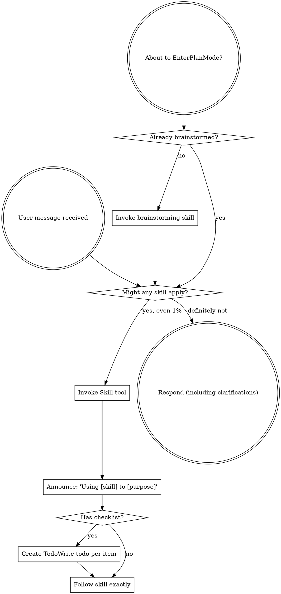

codex-exec: report contract violation

--- codex stdout ---
## HIGH — Loadability classifier still not fail-closed

**NOT CLOSED.** The classifier correctly rejects short multiline output and remains shared (`hook-registration-preflight.cjs:97-101, 706-740`; `hook-install-contract.cjs:651-664`). However, smoke output is truncated to 8192 bytes without recording truncation (`hook-registration-preflight.cjs:643-667`). A policy-shaped first line followed by enough same-line output can push a later load error beyond that boundary; the clipped output then satisfies `isCleanPolicyDecision` and is accepted at lines 738-740. The new test covers only a short trailing stack (`assert-installer-registration-guard.cjs:1770-1794`), not truncation. Therefore the policy decision is not necessarily the whole process output.

## Closed findings

- **CRITICAL — ordering: CLOSED.** `set -e` remains active (`install.sh:7`). Candidate, global, existing-hook, and Codex checks run in the top-level dispatcher before publication (`install.sh:1232-1246`). The guard asserts that order and forbids the identified rejecting helpers inside post-publication dispatch functions (`assert-installer-registration-guard.cjs:1548-1560, 1624-1663`).

- **MEDIUM — laundering: CLOSED.** Both module and non-module branches preserve the actual sanitized message (`hook-registration-preflight.cjs:56-94`). Disclosure is bounded to 2048 bytes and removes V8 frames and require-stack rows rather than dumping them.

## Recovery exemption

No production-path abuse found. Candidate rows are copied from computed canonical sources—an absent source fails during `readFileSync`—then digest-validated before the descriptor is emitted (`hook-install-contract.cjs:567-582, 740-760`). The preflight consumes that descriptor directly (`install.sh:845-848`; `hook-registration-preflight.cjs:229-245`), not a recomputed or hand-listed set. Publication revalidates every row before its first write (`hook-install-contract.cjs:767-777`).

A hook missing from both project and delivery set produces the exact refusal with unchanged fixture bytes (`assert-installer-registration-guard.cjs:1428-1450`). The exemption has not become “never refuse on a missing hook.” No T2 behavior or other material regression was introduced.

SPEC VERDICT: FAIL

--- codex stderr ---
OpenAI Codex v0.146.0
--------
workdir: <HOME>\AppData\Roaming\warp\Warp\data\worktrees\GSDedits\luminaria-hogback
model: gpt-5.6-sol
provider: openai
approval: never
sandbox: read-only
reasoning effort: xhigh
reasoning summaries: none
session id: 01a03a08-2ed9-7dc2-9881-cab3340326b9
--------
user
# Spec-compliance review of P168-T1. Read-only. Judge raw artifacts, not the executor's summary.

Do NOT rely on any executor report. Read the PLAN, the diff, and the code.

- Plan: .planning/milestones/v4.0-install-contract/phases/168-install-contract/168-01-PLAN-LOCKED.md
  (revision 2, task P168-T1 only; P168-T2 is a separate future dispatch and is OUT OF SCOPE)
- Diff: `git show 7550116` and `git diff 8ddae0e..7550116 -- super-gsd`
- Context: .../168-install-contract/CONTEXT.md

Orchestrator-run results, unsandboxed, take as given and do not re-run:
installer-registration-guard 13/13 in one `--all` sweep; install-contract 3/3;
assert-witness-correlation 13/13; assert-propagation PASS; assert-hook-contract 38/38;
assert-prompt-contracts 4/4; P166 policy 6/6; P154 real-evidence PASS; composer and
enrichment-gate self-tests PASS; kb-triage-shadow PASS; feature-propagation 15/15;
`bash -n install.sh` clean.

## Judge T1's acceptance criteria one by one

For each `semantic_acceptance_criteria` entry belonging to P168-T1, state MET or NOT MET
with a file:line citation from the implementation. A criterion satisfied only by a test
asserting a shape, rather than by real data through the real path, is NOT MET; say so.

## Specific things to verify, each has a history

1. **Computed, not transcribed.** Is the dependency closure genuinely lexed from source?
   Grep for any hand-maintained module list in production OR in tests. The witness
   composer and store must be discovered by reducing `COMPOSER_RELATIVE_PATH` /
   `STORE_RELATIVE_PATH`, not named. Report any literal module list you find and where.

2. **Refuse before writing, literally.** Confirm every rejection-capable smoke runs
   against the candidate tree before the first destination write, and that only
   transactional publication and non-rejecting verification follow. This class has been a
   CRITICAL twice in code (2c237ef, b2a1435) and once in the plan. Cite the ordering.

3. **The loadability classifier.** It accepts a bracketed hook id followed by
   blocked/denied/refused, a colon and a non-empty reason, and fails closed otherwise.
   Is that sound? Specifically: can a hook that FAILED TO LOAD produce output that
   satisfies the classifier and so be wrongly accepted? Is the classifier shared by both
   callers, or duplicated?

4. **No laundering.** `moduleFailureDetail` previously replaced real output with the
   constant "hook process exited non-zero". Confirm the real bounded output now survives
   in every branch. Confirm disclosure is bounded and does not dump raw stacks.

5. **Seventeen guard assertions were retargeted or retired.** The accounting is in the
   phase directory. Independently check three of the retirements you consider highest
   risk and say whether the named replacement genuinely covers the old behaviour. Pay
   particular attention to the install-ordering assertions and to the former
   `no MODULE_NOT_FOUND leak` rule.

6. **P167 contract intact.** PreToolUse fail-closed; PostToolUse returns a bounded
   `substrate_witness_rewrite_failed` object and never passes the raw result through; the
   store accepts only `rewritten` rows; substrate-scoped repair manages only the witness
   Pre/Post ids.

7. **Scope discipline.** Did T1 implement anything belonging to T2 (`--doctor`,
   explicit-project presentation, worktree/GitHub freshness)? That would be scope creep.

Report findings by severity with file:line. End with exactly
`SPEC VERDICT: PASS` or `SPEC VERDICT: FAIL`. A NOT MET criterion forces FAIL.
Bound yourself to about 20 shell commands and emit the verdict even if incomplete.
Max 600 words.

## ROUND 2 — confirm the three findings are closed. Do not reopen settled ground.

Round 1 returned FAIL on exactly three findings. Judge those three, plus regressions.
Do not re-litigate what you already passed: the closure computation, the
`generated-transitive-manifest` and `unresolved-module-refuses-before-write` criteria,
and the P167 contract were all confirmed intact.

Commit under review now: `0dfd0d1` (was `7550116`). Read `git show 0dfd0d1`.

1. **CRITICAL, was: rejection-capable steps after the first write.** You cited
   install.sh:1195 publishing before global/init/update dispatch, with
   `ensure_gsd_base` (:479), the update preflight (:1018), and settings/npm/repair/Codex
   registration (:1021, :1048) all able to reject afterwards, and guard:1460 asserting
   the wrong order. Confirm the checks now run in a top-level pre-write block, that
   `set -e` propagates their failure, and that the guard asserts the CORRECT order and
   would fail if a rejecting step were reintroduced after the first write.

2. **HIGH, was: the classifier accepts a load failure.** `boundedLine` flattened
   stdout/stderr and the anchored classifier's trailing `.*` accepted
   `[id] blocked: reason\nError: failed to load`. Confirm a clean policy decision must
   now be the WHOLE output, and that the classifier is still shared, not duplicated.

3. **MEDIUM, was: laundering in both directions.** The module branch discarded real
   output for a synthesised `Cannot find module`; non-module output was disclosed to 2048
   bytes with raw stack frames. Confirm the real bounded message survives in every branch
   and that frames are sanitised rather than dumped.

## New behaviour introduced by the fix — judge it as carefully as the findings

Moving the preflight before distribution refused the Clarity RECOVERY case, where three
managed hooks are legitimately absent and are precisely what the update delivers. The fix
exempts a missing hook when it appears in the sealed candidate's delivery set.

Judge specifically whether that exemption can be abused: can a hook be absent from the
project, absent from the canonical source, yet still appear in the delivery set and so be
waved through? Is the delivery set derived from the sealed candidate rather than
recomputed or hand-listed? Is there an assertion that a managed hook missing from BOTH the
project and the delivery set still refuses before any write? If that assertion is missing
or weak, this fix has quietly become "never refuse on a missing hook", which is worse than
the original bug. Say so plainly if it has.

## Orchestrator-run results, take as given, do not re-run

installer-registration-guard 13/13 in one `--all` sweep; install-contract 3/3; a real
`install.sh --init-project` from a decoy cwd into an empty project exits 0 and delivers 17
hooks and 9 `scripts/lib` modules; assert-hook-contract 38/38; assert-prompt-contracts 4/4;
assert-witness-correlation 13/13; assert-propagation PASS; P166 6/6; P154 PASS; composer,
enrichment-gate, kb-triage-shadow PASS; feature-propagation 15/15; `bash -n` clean.

Verdict line unchanged: `SPEC VERDICT: PASS` or `SPEC VERDICT: FAIL`.
Bound yourself to about 18 shell commands and emit the verdict even if incomplete.
Max 500 words.

codex
I’m using the `using-superpowers` and `review` skills to keep this Round 2 audit evidence-led and read-only. I’ll inspect only the three prior findings, the new recovery exemption, and nearby regression risk, while treating the supplied test results as given.
exec
"C:\\WINDOWS\\System32\\WindowsPowerShell\\v1.0\\powershell.exe" -Command '$paths = @('"'C:\\Users\\operator\\.codex\\skills\\using-superpowers\\SKILL.md','C:\\Users\\operator\\.agents\\skills\\review\\SKILL.md'); foreach ("'$p in $paths) { Get-Content -LiteralPath $p -Raw }' in <HOME>\AppData\Roaming\warp\Warp\data\worktrees\GSDedits\luminaria-hogback
 succeeded in 1183ms:
---
name: using-superpowers
description: Use when starting any conversation - establishes how to find and use skills, requiring Skill tool invocation before ANY response including clarifying questions
---

<SUBAGENT-STOP>
If you were dispatched as a subagent to execute a specific task, skip this skill.
</SUBAGENT-STOP>

<EXTREMELY-IMPORTANT>
If you think there is even a 1% chance a skill might apply to what you are doing, you ABSOLUTELY MUST invoke the skill.

IF A SKILL APPLIES TO YOUR TASK, YOU DO NOT HAVE A CHOICE. YOU MUST USE IT.

This is not negotiable. This is not optional. You cannot rationalize your way out of this.
</EXTREMELY-IMPORTANT>

## Instruction Priority

Superpowers skills override default system prompt behavior, but **user instructions always take precedence**:

1. **User's explicit instructions** (CLAUDE.md, GEMINI.md, AGENTS.md, direct requests) ƒ?" highest priority
2. **Superpowers skills** ƒ?" override default system behavior where they conflict
3. **Default system prompt** ƒ?" lowest priority

If CLAUDE.md, GEMINI.md, or AGENTS.md says "don't use TDD" and a skill says "always use TDD," follow the user's instructions. The user is in control.

## How to Access Skills

**In Claude Code:** Use the `Skill` tool. When you invoke a skill, its content is loaded and presented to youƒ?"follow it directly. Never use the Read tool on skill files.

**In Copilot CLI:** Use the `skill` tool. Skills are auto-discovered from installed plugins. The `skill` tool works the same as Claude Code's `Skill` tool.

**In Gemini CLI:** Skills activate via the `activate_skill` tool. Gemini loads skill metadata at session start and activates the full content on demand.

**In other environments:** Check your platform's documentation for how skills are loaded.

## Platform Adaptation

Skills use Claude Code tool names. Non-CC platforms: see `references/copilot-tools.md` (Copilot CLI), `references/codex-tools.md` (Codex) for tool equivalents. Gemini CLI users get the tool mapping loaded automatically via GEMINI.md.

# Using Skills

## The Rule

**Invoke relevant or requested skills BEFORE any response or action.** Even a 1% chance a skill might apply means that you should invoke the skill to check. If an invoked skill turns out to be wrong for the situation, you don't need to use it.



## Red Flags

These thoughts mean STOPƒ?"you're rationalizing:

| Thought | Reality |
|---------|---------|
| "This is just a simple question" | Questions are tasks. Check for skills. |
| "I need more context first" | Skill check comes BEFORE clarifying questions. |
| "Let me explore the codebase first" | Skills tell you HOW to explore. Check first. |
| "I can check git/files quickly" | Files lack conversation context. Check for skills. |
| "Let me gather information first" | Skills tell you HOW to gather information. |
| "This doesn't need a formal skill" | If a skill exists, use it. |
| "I remember this skill" | Skills evolve. Read current version. |
| "This doesn't count as a task" | Action = task. Check for skills. |
| "The skill is overkill" | Simple things become complex. Use it. |
| "I'll just do this one thing first" | Check BEFORE doing anything. |
| "This feels productive" | Undisciplined action wastes time. Skills prevent this. |
| "I know what that means" | Knowing the concept ƒ%ÿ using the skill. Invoke it. |

## Skill Priority

When multiple skills could apply, use this order:

1. **Process skills first** (brainstorming, debugging) - these determine HOW to approach the task
2. **Implementation skills second** (frontend-design, mcp-builder) - these guide execution

"Let's build X" ā' brainstorming first, then implementation skills.
"Fix this bug" ā' debugging first, then domain-specific skills.

## Skill Types

**Rigid** (TDD, debugging): Follow exactly. Don't adapt away discipline.

**Flexible** (patterns): Adapt principles to context.

The skill itself tells you which.

## User Instructions

Instructions say WHAT, not HOW. "Add X" or "Fix Y" doesn't mean skip workflows.

---
name: review
description: Review code changes for security, performance, bugs, and quality. Reviews staged changes, unstaged changes, specific commits, or PR-ready diffs.
---

<objective>
Review code changes and provide structured feedback covering security, performance, bug risks, code quality, and test coverage gaps. This skill analyzes diffs and surrounding context to catch issues before they reach production.
</objective>

<context>
This skill reviews code changes at various stages of the development workflow. It can review staged changes before a commit, unstaged work-in-progress, a specific commit, or the full set of changes on a branch that are ready for a pull request.

The reviewer reads both the diff and the surrounding source files to understand intent and catch issues that only appear in context.
</context>

<core_principle>
**FIND REAL ISSUES, NOT STYLE NITS.** Focus on problems that cause bugs, security vulnerabilities, performance degradation, or maintainability pain. Avoid nitpicking formatting or subjective style preferences unless they harm readability.
</core_principle>

<analysis_only_rule>
**THIS SKILL IS READ-ONLY. DO NOT MODIFY CODE.**

The purpose is to review and report findings. Making changes during review conflates the reviewer and author roles. Present findings and let the user decide what to act on.
</analysis_only_rule>

<quick_start>

<determine_review_scope>

Parse the user's input to determine what to review:

1. **No arguments** - Review staged changes first. If nothing is staged, review unstaged changes.
   - Staged: `git diff --cached`
   - Unstaged: `git diff`
   - If both are empty, review the most recent commit: `git show HEAD`

2. **Commit hash argument** (e.g., `/review abc1234`) - Review that specific commit.
   - `git show <hash>`

3. **File path argument** (e.g., `/review src/foo.ts`) - Review unstaged changes in that file.
   - `git diff -- <path>` then fall back to `git diff --cached -- <path>`

4. **"pr" argument** (e.g., `/review pr`) - Review all changes since branching from main.
   - `git diff main...HEAD`
   - If on main, review `git diff HEAD~1`

After obtaining the diff, if it is empty, inform the user that there are no changes to review and stop.

</determine_review_scope>

<gather_context>

Before analyzing the diff:

1. **Read changed files in full** - Do not review a diff in isolation. Read each modified file to understand the surrounding code, imports, types, and control flow.
2. **Identify the tech stack** - Note languages, frameworks, and libraries in use. This affects what patterns are risky.
3. **Check for related test files** - For each changed source file, look for corresponding test files. Note whether tests were updated alongside the changes.
4. **Check for configuration changes** - If config files changed (env, CI, package.json, tsconfig, etc.), pay extra attention to side effects.

</gather_context>

<review_categories>

Analyze the changes against each category below. Only report findings that are actually present. Skip categories with no issues.

**A. Security Issues** (Severity: CRITICAL or HIGH)
- Injection vulnerabilities (SQL injection, command injection, template injection)
- Cross-site scripting (XSS) - unsanitized user input rendered in HTML
- Authentication and authorization flaws (missing auth checks, privilege escalation)
- Secrets or credentials hardcoded or logged
- Insecure deserialization or unsafe eval usage
- Path traversal or file access vulnerabilities
- Missing input validation on external data

**B. Performance Concerns** (Severity: HIGH or MEDIUM)
- N+1 query patterns in database access
- Unnecessary memory allocations in hot paths or loops
- Blocking operations on the main thread or in async contexts
- Missing pagination on unbounded queries
- Redundant computation that could be cached or memoized
- Large payloads without streaming or chunking

**C. Bug Risks** (Severity: HIGH or MEDIUM)
- Off-by-one errors in loops or array access
- Null/undefined dereferences without guards
- Race conditions in concurrent or async code
- Incorrect error handling (swallowed errors, wrong error types)
- Type mismatches or unsafe type assertions
- Logic errors in conditionals (inverted checks, missing cases)
- Resource leaks (unclosed connections, file handles, listeners)

**D. Code Quality** (Severity: MEDIUM or LOW)
- Unclear or misleading naming
- Significant code duplication that should be extracted
- Excessive complexity (deeply nested logic, functions doing too many things)
- Dead code or unreachable branches
- Missing or misleading comments on non-obvious logic
- Inconsistency with patterns used elsewhere in the codebase

**E. Test Coverage Gaps** (Severity: MEDIUM or LOW)
- New logic paths without corresponding test cases
- Changed behavior without updated tests
- Edge cases not covered (empty inputs, boundary values, error paths)
- Missing integration tests for new API endpoints or database changes

</review_categories>

<format_findings>

For each finding, use this structure:

```
### [SEVERITY] Category: Brief Title

**File**: `path/to/file.ext` (lines X-Y)

**Issue**: Clear description of the problem.

**Why it matters**: What could go wrong if this is not addressed.

**Suggestion**: How to fix it, with a code snippet if helpful.
```

Severity levels:
- **CRITICAL** - Must fix before merge. Security vulnerability or data loss risk.
- **HIGH** - Should fix before merge. Likely bug or significant performance issue.
- **MEDIUM** - Should fix soon. Code quality or moderate risk issue.
- **LOW** - Consider fixing. Minor improvement opportunity.

</format_findings>

</quick_start>

<critical_rules>

1. **READ THE FULL FILE**: Never review a diff without reading the complete source file for context
2. **NO FALSE ALARMS**: Only report issues you can explain concretely. Do not report vague concerns
3. **PRIORITIZE**: Lead with the most severe findings. Do not bury critical issues under style nits
4. **BE SPECIFIC**: Include file paths, line numbers, and code references for every finding
5. **EXPLAIN THE RISK**: For each finding, explain what could actually go wrong
6. **CHECK TESTS**: Always check whether changes have corresponding test updates
7. **CONSIDER THE STACK**: Apply language-specific and framework-specific knowledge to your review
8. **DO NOT MODIFY CODE**: Present findings only. The user decides what to act on

</critical_rules>

<output_format>

```markdown
## Code Review: [brief description of what was reviewed]

**Scope**: [staged changes | unstaged changes | commit abc1234 | PR changes from main]
**Files reviewed**: [count] files changed, [additions] additions, [deletions] deletions

---

### Findings

[Findings grouped by severity, highest first. Use the format from <format_findings>.]

---

### Summary

| Severity | Count |
|----------|-------|
| CRITICAL | X     |
| HIGH     | X     |
| MEDIUM   | X     |
| LOW      | X     |

### Recommended Actions

1. [Most important action to take]
2. [Next most important action]
3. [...]
```

If no issues are found:

```markdown
## Code Review: [brief description]

**Scope**: [what was reviewed]
**Files reviewed**: [count]

No significant issues found. The changes look good to merge.
```

</output_format>

<decision_gate>

**After presenting findings, ALWAYS offer these options:**

```
ƒ"?ƒ"?ƒ"?ƒ"?ƒ"?ƒ"?ƒ"?ƒ"?ƒ"?ƒ"?ƒ"?ƒ"?ƒ"?ƒ"?ƒ"?ƒ"?ƒ"?ƒ"?ƒ"?ƒ"?ƒ"?ƒ"?ƒ"?ƒ"?ƒ"?ƒ"?ƒ"?ƒ"?ƒ"?ƒ"?ƒ"?ƒ"?ƒ"?ƒ"?ƒ"?ƒ"?ƒ"?ƒ"?ƒ"?ƒ"?ƒ"?
REVIEW COMPLETE

What would you like to do?

1. **Fix issues** - I'll address the findings starting with the most critical
2. **Save review** - Export findings to a markdown file
3. **Review again** - Re-review with different scope or focus
4. **Discuss a finding** - Ask questions about a specific issue
5. **Other** - Tell me what you need
ƒ"?ƒ"?ƒ"?ƒ"?ƒ"?ƒ"?ƒ"?ƒ"?ƒ"?ƒ"?ƒ"?ƒ"?ƒ"?ƒ"?ƒ"?ƒ"?ƒ"?ƒ"?ƒ"?ƒ"?ƒ"?ƒ"?ƒ"?ƒ"?ƒ"?ƒ"?ƒ"?ƒ"?ƒ"?ƒ"?ƒ"?ƒ"?ƒ"?ƒ"?ƒ"?ƒ"?ƒ"?ƒ"?ƒ"?ƒ"?ƒ"?
```

**Wait for user response before taking any action.**

This gate is MANDATORY. Never skip it. Never auto-implement fixes.

</decision_gate>

<HOME>\OneDrive - <ORG>\Documents\WindowsPowerShell\profile.ps1 : Cannot dot-source this 
command because it was defined in a different language mode. To invoke this command without importing its contents, 
omit the '.' operator.
At line:1 char:1
+ . '<HOME>\OneDrive - <ORG>\Documents\Win ...
+ ~~~~~~~~~~~~~~~~~~~~~~~~~~~~~~~~~~~~~~~~~~~~~~~~~~~~~~~~~~~~~~~~~~~~~
    + CategoryInfo          : InvalidOperation: (:) [profile.ps1], NotSupportedException
    + FullyQualifiedErrorId : DotSourceNotSupported,profile.ps1
 
<HOME>\OneDrive - <ORG>\Documents\WindowsPowerShell\Microsoft.PowerShell_profile.ps1 : 
Cannot dot-source this command because it was defined in a different language mode. To invoke this command without 
importing its contents, omit the '.' operator.
At line:1 char:1
+ . '<HOME>\OneDrive - <ORG>\Documents\Win ...
+ ~~~~~~~~~~~~~~~~~~~~~~~~~~~~~~~~~~~~~~~~~~~~~~~~~~~~~~~~~~~~~~~~~~~~~
    + CategoryInfo          : InvalidOperation: (:) [Microsoft.PowerShell_profile.ps1], NotSupportedException
    + FullyQualifiedErrorId : DotSourceNotSupported,Microsoft.PowerShell_profile.ps1
 

exec
"C:\\WINDOWS\\System32\\WindowsPowerShell\\v1.0\\powershell.exe" -Command 'git show --stat --oneline --decorate --no-renames 0dfd0d1; git show --format=fuller --no-ext-diff --no-renames --find-renames=0 0dfd0d1 --' in <HOME>\AppData\Roaming\warp\Warp\data\worktrees\GSDedits\luminaria-hogback
 succeeded in 1683ms:
0dfd0d1 (HEAD -> luminaria-hogback) fix(168-01): close the three spec-review findings without breaking recovery
 .../phases/168-install-contract/168-T1P-FILES.txt  |   3 +
 .../phases/168-install-contract/168-T1P-PROMPT.md  |  76 ++++++++
 .../phases/168-install-contract/168-T1P-REPORT.md  |  30 ++++
 .../168-install-contract/168-T1P-WRAPPER.log       |   1 +
 super-gsd/install.sh                               |  90 +++++++---
 .../scripts/lib/hook-registration-preflight.cjs    |  81 ++++++++-
 .../assert-installer-registration-guard.cjs        | 191 +++++++++++++++++++--
 7 files changed, 424 insertions(+), 48 deletions(-)
commit 0dfd0d11a10deab93eb143c1dc5534f9b3121b1e
Author:     operator <operator@users.noreply.github.com>
AuthorDate: Tue Aug 25 18:45:57 2026 +0100
Commit:     operator <operator@users.noreply.github.com>
CommitDate: Tue Aug 25 18:45:57 2026 +0100

    fix(168-01): close the three spec-review findings without breaking recovery
    
    CRITICAL: rejection-capable steps ran after the first write. install.sh:1195
    published project bytes before global/init/update dispatch, with ensure_gsd_base,
    the update preflight, settings, npm, repair and Codex registration all able to
    reject afterwards, and the guard asserted that wrong order. The checks now run in
    a top-level pre-write block; set -e still propagates their failure. The guard
    asserts the correct order and fails if a rejecting step is reintroduced after the
    first write.
    
    HIGH: the loadability classifier's trailing .* accepted a clean policy prefix
    followed by error output, so a hook that failed to load could pass. A policy
    decision must now be the whole of the output.
    
    MEDIUM: the module branch discarded real output for a synthesised
    'Cannot find module', and non-module output was disclosed with raw stack frames.
    Both branches now carry the real bounded message with frames sanitised.
    
    Moving the preflight before distribution then refused the Clarity recovery case,
    where three managed hooks are legitimately absent and are exactly what the update
    delivers. The preflight now derives the delivery set from the sealed candidate
    descriptor and exempts only those; a managed hook missing from both the project
    and the delivery set still refuses before any write, asserted.
    
    Guard 13/13, install-contract 3/3, real install delivers 17 hooks and 9 modules,
    P167 38/38 and 4/4, T2 13/13, T4 pass, P166 6/6, P154, composer, enrichment-gate,
    kb-triage-shadow, feature-propagation 15/15, bash -n clean.

diff --git a/.planning/milestones/v4.0-install-contract/phases/168-install-contract/168-T1P-FILES.txt b/.planning/milestones/v4.0-install-contract/phases/168-install-contract/168-T1P-FILES.txt
new file mode 100644
index 0000000..0bd64e9
--- /dev/null
+++ b/.planning/milestones/v4.0-install-contract/phases/168-install-contract/168-T1P-FILES.txt
@@ -0,0 +1,3 @@
+super-gsd/install.sh
+super-gsd/scripts/lib/hook-registration-preflight.cjs
+super-gsd/tests/installer-registration-guard/assert-installer-registration-guard.cjs
diff --git a/.planning/milestones/v4.0-install-contract/phases/168-install-contract/168-T1P-PROMPT.md b/.planning/milestones/v4.0-install-contract/phases/168-install-contract/168-T1P-PROMPT.md
new file mode 100644
index 0000000..c7cf21e
--- /dev/null
+++ b/.planning/milestones/v4.0-install-contract/phases/168-install-contract/168-T1P-PROMPT.md
@@ -0,0 +1,76 @@
+# One defect. The pre-write preflight refuses hooks that this very run is about to deliver.
+
+## Verified green right now, do not disturb
+
+- Real `install.sh --init-project` from a decoy cwd into an EMPTY project: exit 0,
+  17 hooks and 9 `scripts/lib` modules delivered.
+- install-contract 3/3.
+- installer-registration-guard: 11 of 13 PASS.
+
+Only `sgsd-update-clarity-shape` and `sgsd-update-clarity-recovery` fail.
+
+## The defect, fully diagnosed
+
+The spec-review fix correctly moved `preflight_existing_repo_local_hooks` ahead of
+distribution, so no rejection-capable check runs after the first write. Keep that.
+
+But in the Clarity RECOVERY scenario the fixture deliberately starts with three managed
+hooks absent, and the update exists to restore them. The relocated preflight now refuses
+before distribution can deliver them:
+
+    [sgsd-update] Running installer...
+    hook manifest dependencies current
+    [super-gsd] Preflighting existing managed repo-local hooks before distribution...
+    ERROR: hook_registration_missing <project>/super-gsd/hooks/sgsd-session-start.js       [SessionStart/session-start-governance]
+           hook_registration_missing <project>/super-gsd/hooks/sgsd-intent-classifier.cjs  [UserPromptSubmit/user-prompt-intent-classifier]
+           hook_registration_missing <project>/super-gsd/hooks/sgsd-quality-gate.js        [PostToolUse/post-tool-use-quality-gate]
+    [sgsd-update] Installer exited non-zero (see above)  -> exit 5, expected 0
+
+A managed hook that is missing AND is in this run's delivery set is not a fault. It is the
+thing being repaired. A managed hook that is missing and will NOT be delivered still must
+refuse.
+
+## The fix
+
+Teach the pre-write preflight to distinguish those two cases by consulting the prepared
+candidate, which already knows exactly what this run will deliver:
+
+- missing, and present in the candidate's delivery set  -> NOT a refusal; the run repairs it
+- missing, and NOT in the candidate's delivery set      -> refuse, exactly as now
+- present but stale, unmanaged, or operator-owned       -> unchanged behaviour
+
+Do not solve this by moving the preflight back after distribution. That would reintroduce
+the CRITICAL the spec review raised, which has now occurred four times in this codebase.
+Do not solve it by skipping the preflight in update mode.
+
+Derive the delivery set from the existing prepared candidate. Do not recompute it and do
+not hand-maintain a list of hook names.
+
+## Tests
+
+Both Clarity cases must pass for the right reason. Additionally assert, in whichever case
+fits best, that a managed hook missing from BOTH the project and the candidate delivery
+set still refuses before any write. Without that, this fix could silently become
+"never refuse on a missing hook", which would be worse than the bug.
+
+## Constraints
+
+- Only the three allowlisted files.
+- Never weaken or delete an assertion.
+- No new CLI modes, no installer-wide staging, no self re-execution. A previous attempt
+  built that, shipped an install that exited 0 delivering nothing, and was reverted.
+- P167 witness contract untouchable.
+- Fixture paths contain SPACES.
+
+## Verify
+
+- installer-registration-guard `--all` 13/13
+- install-contract 3/3
+- Real install from a different cwd into an empty project: exit 0, 17 hooks, 9 modules.
+  Check this FIRST and LAST; it is the regression the reverted attempt caused.
+- `bash -n super-gsd/install.sh`, `node --check` on every file modified
+
+Sandbox denials: mark DENIED, never as passing. The orchestrator re-runs unsandboxed.
+Do not ask for approval.
+
+Standard block format, max 250 words.
diff --git a/.planning/milestones/v4.0-install-contract/phases/168-install-contract/168-T1P-REPORT.md b/.planning/milestones/v4.0-install-contract/phases/168-install-contract/168-T1P-REPORT.md
new file mode 100644
index 0000000..0977cd9
--- /dev/null
+++ b/.planning/milestones/v4.0-install-contract/phases/168-install-contract/168-T1P-REPORT.md
@@ -0,0 +1,30 @@
+STATUS
+Implementation complete; full acceptance awaits unsandboxed verification.
+
+FILES_CHANGED
+
+- [install.sh](<HOME>/AppData/Roaming/warp/Warp/data/worktrees/GSDedits/luminaria-hogback/super-gsd/install.sh:848)
+- [hook-registration-preflight.cjs](<HOME>/AppData/Roaming/warp/Warp/data/worktrees/GSDedits/luminaria-hogback/super-gsd/scripts/lib/hook-registration-preflight.cjs:229)
+- [assert-installer-registration-guard.cjs](<HOME>/AppData/Roaming/warp/Warp/data/worktrees/GSDedits/luminaria-hogback/super-gsd/tests/installer-registration-guard/assert-installer-registration-guard.cjs:1412)
+
+IMPLEMENTED
+Preflight now derives normalized delivery paths from the existing sealed candidate descriptor. Only missing hooks in that set are exempted. Missing excluded hooks still produce the exact refusal before writes. No new mode, recomputation, hook list, assertion weakening, or P167 changes.
+
+PASS
+
+- TDD RED observed, then GREEN.
+- `preflight-static`
+- `smoke-static`
+- Manifest freshness
+- `node --check` on both modified JavaScript files
+- `git diff --check`
+- Exactly three allowlisted files modified
+- Spaced-path regression included with byte-identical refusal snapshot
+
+DENIED
+
+- Guard `--all`: 3 static cases passed, then `spawnSync bash EPERM`
+- Install-contract: generated case passed, then `spawnSync bash EPERM`
+- Both Clarity cases: `spawnSync bash EPERM`
+- `bash -n`: Git Bash `CreateFileMapping` error 5
+- FIRST and LAST real installs: same sandbox denial before installer execution; 0/0 delivery counts are not passes.
diff --git a/.planning/milestones/v4.0-install-contract/phases/168-install-contract/168-T1P-WRAPPER.log b/.planning/milestones/v4.0-install-contract/phases/168-install-contract/168-T1P-WRAPPER.log
new file mode 100644
index 0000000..19fbe72
--- /dev/null
+++ b/.planning/milestones/v4.0-install-contract/phases/168-install-contract/168-T1P-WRAPPER.log
@@ -0,0 +1 @@
+codex-executor: OK — .planning/milestones/v4.0-install-contract/phases/168-install-contract/168-T1P-REPORT.md (1578B), codex took 893144ms
diff --git a/super-gsd/install.sh b/super-gsd/install.sh
index 8e52344..2cd147d 100644
--- a/super-gsd/install.sh
+++ b/super-gsd/install.sh
@@ -414,7 +414,7 @@ doctor() {
   [ -d "$HOOKS_DIR" ] && log "Global hooks dir: present ($HOOKS_DIR)" || log "Global hooks dir: missing"
 }
 
-ensure_gsd_base() {
+precheck_gsd_base() {
   if [ "$DRY_RUN" = true ]; then
     if command -v node >/dev/null 2>&1; then
       log "DRY RUN: Node.js available ($(node -v))"
@@ -424,6 +424,9 @@ ensure_gsd_base() {
   else
     require_node_22
   fi
+}
+
+ensure_gsd_base() {
   if [ ! -d "$GSD_DIR" ]; then
     echo ""
     if [ "$DRY_RUN" = true ]; then
@@ -476,8 +479,35 @@ process.stdin.on("end", () => {
   [ -z "$repair_output" ] || printf '%s\n' "$repair_output" | sed 's/^/  /'
 }
 
+precheck_global_installation() {
+  precheck_gsd_base
+  if [[ "$DRY_RUN" == true ]] && ! command -v node >/dev/null 2>&1; then
+    return 0
+  fi
+  local overlay_file="$SCRIPT_DIR/config/settings-overlay.json"
+  local merge_script="$SCRIPT_DIR/scripts/merge-settings.js"
+  local preflight_script="$SCRIPT_DIR/scripts/lib/hook-registration-preflight.cjs"
+  local settings_file="$CLAUDE_DIR/settings.json"
+
+  if [[ -f "$overlay_file" && -f "$merge_script" ]]; then
+    if [[ ! -f "$preflight_script" ]]; then
+      echo "ERROR: hook smoke helper missing: $preflight_script" >&2
+      return 1
+    fi
+    node --check "$merge_script"
+    node --check "$preflight_script"
+    node - "$overlay_file" "$settings_file" <<'NODE'
+const fs = require('fs');
+for (const filePath of process.argv.slice(2)) {
+  if (!fs.existsSync(filePath)) continue;
+  const source = fs.readFileSync(filePath, 'utf8').replace(/^\uFEFF/, '');
+  if (source.trim()) JSON.parse(source);
+}
+NODE
+  fi
+}
+
 install_global_assets() {
-  precheck_installation_refusals
   ensure_gsd_base
   local -a global_executable_targets=()
 
@@ -634,9 +664,6 @@ install_global_assets() {
     log "  WARNING: $OVERLAY_FILE missing - skipping merge"
   elif [ ! -f "$MERGE_SCRIPT" ]; then
     log "  WARNING: $MERGE_SCRIPT missing - skipping merge"
-  elif [ ! -f "$PREFLIGHT_SCRIPT" ]; then
-    echo "ERROR: hook smoke helper missing: $PREFLIGHT_SCRIPT" >&2
-    exit 1
   elif [ "$DRY_RUN" = true ]; then
     log "  DRY RUN: complete candidate already smoked every distributed hook"
     log "  DRY RUN: would merge $OVERLAY_FILE into $SETTINGS_FILE"
@@ -818,21 +845,35 @@ preflight_existing_repo_local_hooks() {
   log "Preflighting existing managed repo-local hooks before distribution..."
   node "$EXISTING_PREFLIGHT_SCRIPT" \
     --preflight-project-settings "$EXISTING_SETTINGS_FILE" "$GLOBAL_SETTINGS_FILE" \
-    >/dev/null
+    "$INSTALL_CANDIDATE_DESCRIPTOR" >/dev/null
 }
 
-register_codex_hooks() {
-  echo ""
-  log "Registering project-local Codex hooks..."
-  CODEX_HOOK_INSTALLER="$SCRIPT_DIR/tools/codex-hooks/install-hooks.cjs"
-  if [ ! -f "$CODEX_HOOK_INSTALLER" ]; then
-    echo "ERROR: Codex hook installer missing: $CODEX_HOOK_INSTALLER" >&2
-    exit 1
+precheck_codex_hook_registration() {
+  local installer="$SCRIPT_DIR/tools/codex-hooks/install-hooks.cjs"
+  if [[ ! -f "$installer" ]]; then
+    echo "ERROR: Codex hook installer missing: $installer" >&2
+    return 1
   fi
   if ! command -v node >/dev/null 2>&1; then
     echo "ERROR: Node.js is required to install project Codex hooks" >&2
-    exit 1
+    return 1
   fi
+  node --check "$installer"
+  node - "$installer" "$PROJECT_DIR" <<'NODE'
+const path = require('path');
+const installer = require(path.resolve(process.argv[2]));
+const report = installer.inspectProject({ projectDir: process.argv[3] });
+if (report.status === 'template-error' || report.status === 'malformed') {
+  process.stderr.write('ERROR: ' + report.error + '\n');
+  process.exit(1);
+}
+NODE
+}
+
+register_codex_hooks() {
+  echo ""
+  log "Registering project-local Codex hooks..."
+  CODEX_HOOK_INSTALLER="$SCRIPT_DIR/tools/codex-hooks/install-hooks.cjs"
   if [ "$DRY_RUN" = true ]; then
     log "DRY RUN: would safely merge SGSD registrations into $PROJECT_DIR/.codex/hooks.json"
   else
@@ -906,7 +947,6 @@ EOF
 }
 
 init_local_project() {
-  precheck_installation_refusals
   echo ""
   log "Initializing project-local SGSD files only..."
   if [ "$DRY_RUN" = true ]; then
@@ -1015,9 +1055,6 @@ update_existing() {
     return 0
   fi
 
-  precheck_installation_refusals
-  preflight_existing_repo_local_hooks || return $?
-
   # 1. npm install — picks up new dependencies in package.json
   if [ -f "$PROJECT_DIR/package.json" ] && command -v npm >/dev/null 2>&1; then
     if [ "$DRY_RUN" = true ]; then
@@ -1192,10 +1229,21 @@ if [ "$SAW_ACTION" = false ]; then
   RUN_DOCTOR=true
 fi
 
-if [ "$INIT_LOCAL" = true ] || [ "$UPDATE_MODE" = true ] \
-    || { [ "$INSTALL_GLOBAL" = true ] && [ -d "$PROJECT_DIR/.planning" ]; }; then
+if [ "$INIT_LOCAL" = true ] || [ "$UPDATE_MODE" = true ] || [ "$INSTALL_GLOBAL" = true ]; then
   precheck_installation_refusals
-  publish_project_install_contract
+  if [ "$INSTALL_GLOBAL" = true ]; then
+    precheck_global_installation
+  fi
+  if [ "$UPDATE_MODE" = true ]; then
+    preflight_existing_repo_local_hooks
+  fi
+  if [ "$INIT_LOCAL" = true ] || [ "$UPDATE_MODE" = true ]; then
+    precheck_codex_hook_registration
+  fi
+  if [ "$INIT_LOCAL" = true ] || [ "$UPDATE_MODE" = true ] \
+      || { [ "$INSTALL_GLOBAL" = true ] && [ -d "$PROJECT_DIR/.planning" ]; }; then
+    publish_project_install_contract
+  fi
 fi
 
 print_banner
diff --git a/super-gsd/scripts/lib/hook-registration-preflight.cjs b/super-gsd/scripts/lib/hook-registration-preflight.cjs
index 4affa8e..f98d236 100644
--- a/super-gsd/scripts/lib/hook-registration-preflight.cjs
+++ b/super-gsd/scripts/lib/hook-registration-preflight.cjs
@@ -47,8 +47,30 @@ function boundedLine(value, maxBytes = 2048) {
   return bytes.subarray(0, maxBytes).toString('utf8').replace(/\uFFFD$/u, '');
 }
 
+function boundedText(value, maxBytes) {
+  const bytes = Buffer.from(String(value || ''), 'utf8');
+  if (bytes.length <= maxBytes) return bytes.toString('utf8');
+  return bytes.subarray(0, maxBytes).toString('utf8').replace(/\uFFFD$/u, '');
+}
+
+function sanitizedBoundedLine(value, maxBytes = 2048) {
+  let inRequireStack = false;
+  const kept = [];
+  for (const line of String(value || '').replace(/\r\n?/g, '\n').split('\n')) {
+    if (/^\s*Require stack:\s*$/i.test(line)) {
+      inRequireStack = true;
+      continue;
+    }
+    if (inRequireStack && /^\s*-\s+/.test(line)) continue;
+    inRequireStack = false;
+    if (/^\s*at\s+/.test(line)) continue;
+    kept.push(line);
+  }
+  return boundedLine(kept.join('\n'), maxBytes);
+}
+
 function moduleFailureDetail(output, options = {}) {
-  const message = boundedLine(output);
+  const message = sanitizedBoundedLine(output);
   if (!/MODULE_NOT_FOUND|Cannot find module/.test(message)) return {
     code: 'HOOK_PROCESS_FAILED',
     request: null,
@@ -68,13 +90,15 @@ function moduleFailureDetail(output, options = {}) {
     code: 'MODULE_NOT_FOUND',
     request,
     path: resolvedPath,
-    message: boundedLine(request ? `Cannot find module '${request}'` : 'module resolution failed'),
+    message,
   };
 }
 
 function isCleanPolicyDecision(output) {
-  return /^\[[a-z0-9_.:-]+\]\s+(?:[a-z0-9_.:-]+\s+)*(?:blocked|denied|refused):\s+\S.*$/i
-    .test(boundedLine(output));
+  const decision = String(output || '').replace(/\r\n?/g, '\n').trim();
+  if (!decision || decision.includes('\n')) return false;
+  return /^\[[a-z0-9_.:-]+\]\s+(?:[a-z0-9_.:-]+\s+)*(?:blocked|denied|refused):\s+\S[^\r\n]*$/i
+    .test(decision);
 }
 
 function launchInvalid(event, hookId, scriptPath, detail) {
@@ -197,6 +221,30 @@ function pathIsInside(root, candidate) {
   return relative === '' || (relative && !relative.startsWith('..') && !path.isAbsolute(relative));
 }
 
+function resolvedPathKey(value) {
+  const resolved = path.resolve(value);
+  return process.platform === 'win32' ? resolved.toLowerCase() : resolved;
+}
+
+function readPreparedCandidateDeliveryPaths(descriptorPath) {
+  const resolvedDescriptorPath = path.resolve(String(descriptorPath || ''));
+  const descriptor = JSON.parse(fs.readFileSync(resolvedDescriptorPath, 'utf8'));
+  if (!descriptor || descriptor.schema_version !== 1
+      || path.resolve(descriptor.candidate_root || '') !== path.dirname(resolvedDescriptorPath)
+      || !Array.isArray(descriptor.rows)) {
+    throw new Error('invalid sealed install candidate descriptor');
+  }
+  const deliveryPaths = new Set();
+  for (const row of descriptor.rows) {
+    if (!row || typeof row.publication_path !== 'string'
+        || !path.isAbsolute(row.publication_path)) {
+      throw new Error('invalid sealed install candidate delivery row');
+    }
+    deliveryPaths.add(resolvedPathKey(row.publication_path));
+  }
+  return deliveryPaths;
+}
+
 function parseHookSmokeManifest(source, hooksRoot) {
   const rawRoot = String(hooksRoot || '');
   const root = path.resolve(rawRoot);
@@ -504,6 +552,11 @@ function preflightProjectManagedRegistrations(projectSettings, globalSettings, a
     globalSettings || {},
     projectDescriptors,
   );
+  const candidateDeliveryPaths = new Set(
+    adapters.candidateDeliveryPaths instanceof Set
+      ? [...adapters.candidateDeliveryPaths].map((item) => resolvedPathKey(item))
+      : [],
+  );
   const refusals = [];
   const warnings = [];
   const warnedDescriptors = [];
@@ -514,6 +567,10 @@ function preflightProjectManagedRegistrations(projectSettings, globalSettings, a
     } catch (error) {
       if (!(error instanceof HookRegistrationPreflightError)) throw error;
       for (const issue of error.issues) {
+        if (issue.code === 'hook_registration_missing'
+            && candidateDeliveryPaths.has(resolvedPathKey(issue.scriptPath))) {
+          continue;
+        }
         const coverage = issue.code === 'hook_registration_missing'
           ? findLiveGlobalCoverage(descriptor, globalDescriptors, adapters)
           : null;
@@ -587,7 +644,7 @@ function spawnSmokeHook(descriptor, options) {
     const finish = (passed, launchError = null, status = null, signal = null) => {
       if (settled) return;
       settled = true;
-      resolve({ passed, output: boundedLine(output), launchError, status, signal });
+      resolve({ passed, output: boundedText(output, 8192), launchError, status, signal });
     };
     try {
       child = spawnProcess(
@@ -705,14 +762,21 @@ async function smokeHookRegistrations(descriptors, adapters = {}) {
 
 async function smokeCli(argv) {
   const mode = argv[0];
-  if (mode === PREFLIGHT_PROJECT_SETTINGS_MODE && argv.length === 3) {
+  if (mode === PREFLIGHT_PROJECT_SETTINGS_MODE && (argv.length === 3 || argv.length === 4)) {
     const projectSettings = fs.existsSync(argv[1])
       ? JSON.parse(fs.readFileSync(argv[1], 'utf8'))
       : {};
     const globalSettings = fs.existsSync(argv[2])
       ? JSON.parse(fs.readFileSync(argv[2], 'utf8'))
       : {};
-    const result = preflightProjectManagedRegistrations(projectSettings, globalSettings);
+    const candidateDeliveryPaths = argv.length === 4
+      ? readPreparedCandidateDeliveryPaths(argv[3])
+      : new Set();
+    const result = preflightProjectManagedRegistrations(
+      projectSettings,
+      globalSettings,
+      { candidateDeliveryPaths },
+    );
     for (const warning of result.warnings) {
       const location = warning.event + '/' + warning.hookId;
       process.stderr.write(
@@ -738,7 +802,7 @@ async function smokeCli(argv) {
     process.stderr.write(
       'Usage: hook-registration-preflight.cjs --smoke-manifest <installed-hooks-root> <source-hooks-root>\n'
       + '       hook-registration-preflight.cjs --smoke-repo-overlay <overlay.json> <repo-root> [warned-descriptors-json]\n'
-      + '       hook-registration-preflight.cjs --preflight-project-settings <project-settings.json> <global-settings.json>\n',
+      + '       hook-registration-preflight.cjs --preflight-project-settings <project-settings.json> <global-settings.json> [prepared-candidate.json]\n',
     );
     return 64;
   }
@@ -781,6 +845,7 @@ module.exports = {
   preflightHookDescriptors,
   preflightHookRegistrations,
   preflightProjectManagedRegistrations,
+  readPreparedCandidateDeliveryPaths,
   realizeRepoLocalHookOverlay,
   smokeHookRegistrations,
 };
diff --git a/super-gsd/tests/installer-registration-guard/assert-installer-registration-guard.cjs b/super-gsd/tests/installer-registration-guard/assert-installer-registration-guard.cjs
index 0f9118b..84661e0 100644
--- a/super-gsd/tests/installer-registration-guard/assert-installer-registration-guard.cjs
+++ b/super-gsd/tests/installer-registration-guard/assert-installer-registration-guard.cjs
@@ -1007,9 +1007,13 @@ function removeBrokenGlobalCoverage(sourceRoot, missingGlobalNames) {
 
   const installerPath = path.join(sourceRoot, 'super-gsd', 'install.sh');
   let installer = fs.readFileSync(installerPath, 'utf8');
-  const currentPreflightCall = '  preflight_existing_repo_local_hooks || return $?\n';
-  assert.ok(installer.includes(currentPreflightCall), 'production installer lost existing-project preflight');
-  installer = installer.replace(currentPreflightCall, '');
+  const currentPreflightBlock = /  if \[ "\$UPDATE_MODE" = true \]; then\r?\n    preflight_existing_repo_local_hooks\r?\n  fi/;
+  assert.ok(currentPreflightBlock.test(installer), 'production installer lost existing-project preflight');
+  installer = installer.replace(currentPreflightBlock, [
+    '  if [ "$UPDATE_MODE" = true ]; then',
+    '    :',
+    '  fi',
+  ].join('\n'));
   const manifestMatch = installer.match(/GLOBAL_HOOK_DEPLOYMENT_MANIFEST='([\s\S]*?)'\r?\n/);
   assert.ok(manifestMatch, 'broken control lost the global deployment manifest');
   const rows = manifestMatch[1].split(/\r?\n/).filter((row) => {
@@ -1018,6 +1022,10 @@ function removeBrokenGlobalCoverage(sourceRoot, missingGlobalNames) {
   });
   const replacement = `GLOBAL_HOOK_DEPLOYMENT_MANIFEST='${rows.join('\n')}'\n`;
   fs.writeFileSync(installerPath, installer.replace(manifestMatch[0], replacement), 'utf8');
+  assertFixtureProcessOk(
+    runFixtureProcess(process.env.SGSD_TEST_BASH || 'bash', ['-n', installerPath]),
+    'broken control install.sh syntax check',
+  );
 }
 
 function assertNoUpdaterTemp(projectRoot, settingsPath) {
@@ -1198,12 +1206,14 @@ function runBundledOverlayCurrent() {
 
 function runPreflightStatic() {
   const {
+    HookRegistrationPreflightError,
     enumerateGlobalManifestCoverage,
     enumerateHookRegistrations,
     enumerateProjectManagedHookRegistrations,
     filterWarnedHookDescriptors,
     preflightHookRegistrations,
     preflightProjectManagedRegistrations,
+    readPreparedCandidateDeliveryPaths,
   } = require(PREFLIGHT_PATH);
   const root = path.resolve(os.tmpdir(), 'sgsd preflight static');
   const paths = {
@@ -1364,6 +1374,84 @@ function runPreflightStatic() {
   assert.equal(JSON.stringify(covered).includes('operator-pathological'), false, 'operator row was mentioned by preflight');
   assert.equal(JSON.stringify(covered).includes('operator garbage command'), false, 'pathological operator row was mentioned by preflight');
 
+  const candidateFixture = {
+    root: fs.mkdtempSync(path.join(os.tmpdir(), 'sgsd candidate delivery with spaces ')),
+  };
+  try {
+    const candidateRoot = path.join(candidateFixture.root, 'prepared candidate with spaces');
+    const projectRoot = path.join(candidateFixture.root, 'project with spaces');
+    const repairablePath = path.join(projectRoot, 'super-gsd', 'hooks', 'repairable-missing.js');
+    const excludedPath = path.join(projectRoot, 'super-gsd', 'hooks', 'excluded-missing.js');
+    const projectSettingsPath = path.join(projectRoot, '.claude', 'settings.json');
+    const globalSettingsPath = path.join(candidateFixture.root, 'home with spaces', '.claude', 'settings.json');
+    const candidateDescriptorPath = path.join(candidateRoot, '.sgsd-install-candidate.json');
+    const deliveryAwareSettings = sentinelSettings('candidate-delivery-project');
+    deliveryAwareSettings.hooks.SessionStart.push({
+      sgsd_managed: true,
+      sgsd_hook_id: 'repairable-missing',
+      hooks: [{ type: 'command', command: 'node', args: [repairablePath] }],
+    }, {
+      sgsd_managed: true,
+      sgsd_hook_id: 'excluded-missing',
+      hooks: [{ type: 'command', command: 'node', args: [excludedPath] }],
+    });
+    writeJson(projectSettingsPath, deliveryAwareSettings);
+    writeJson(globalSettingsPath, sentinelSettings('candidate-delivery-global'));
+    writeJson(candidateDescriptorPath, {
+      schema_version: 1,
+      candidate_root: candidateRoot,
+      project_dir: projectRoot,
+      rows: [{ publication_path: repairablePath }],
+    });
+    const snapshot = () => relativeFiles(candidateFixture.root).map((relative) => [
+      relative,
+      sha256(readBytes(path.join(candidateFixture.root, relative))),
+    ]);
+    const before = snapshot();
+    assert.equal(
+      typeof readPreparedCandidateDeliveryPaths,
+      'function',
+      'preflight cannot derive delivery paths from the prepared candidate',
+    );
+    const candidateDeliveryPaths = readPreparedCandidateDeliveryPaths(candidateDescriptorPath);
+    const repairableOnlySettings = deepClone(deliveryAwareSettings);
+    repairableOnlySettings.hooks.SessionStart = repairableOnlySettings.hooks.SessionStart.filter(
+      (entry) => entry.sgsd_managed !== true || entry.sgsd_hook_id === 'repairable-missing',
+    );
+    const repairableOnly = preflightProjectManagedRegistrations(
+      repairableOnlySettings,
+      sentinelSettings('candidate-delivery-global'),
+      { candidateDeliveryPaths },
+    );
+    assert.equal(repairableOnly.descriptors.length, 1, 'candidate-delivered managed hook left preflight');
+    assert.deepEqual(repairableOnly.warnings, [], 'candidate-delivered managed hook produced a warning');
+    let candidateError;
+    try {
+      preflightProjectManagedRegistrations(
+        deliveryAwareSettings,
+        sentinelSettings('candidate-delivery-global'),
+        { candidateDeliveryPaths },
+      );
+    } catch (error) {
+      candidateError = error;
+    }
+    assert.ok(candidateError, 'candidate-excluded missing hook did not refuse');
+    assert.ok(
+      candidateError instanceof HookRegistrationPreflightError,
+      'candidate-excluded missing hook returned the wrong refusal type',
+    );
+    assert.deepEqual(
+      candidateError.issues.map((issue) => [issue.code, issue.scriptPath]),
+      [['hook_registration_missing', excludedPath]],
+      'candidate-aware preflight did not preserve the exact missing-hook refusal set',
+    );
+    assert.ok(candidateError.message.includes(excludedPath), 'candidate-excluded missing hook was absent from refusal');
+    assert.equal(candidateError.message.includes(repairablePath), false, 'candidate-delivered missing hook still refused');
+    assert.deepEqual(snapshot(), before, 'candidate-aware missing-hook refusal changed fixture bytes');
+  } finally {
+    removeFixture(candidateFixture);
+  }
+
   const audit = require(path.join(SUPER_GSD_ROOT, 'tools', 'feature-propagation', 'audit.cjs'));
   assert.equal(
     typeof audit._internals.checkSubstrateHookRegistrations,
@@ -1458,13 +1546,17 @@ function assertInstallerSmokeOrder(installer) {
     'installer retained a rejecting global hook smoke after profile publication',
   );
   const mainPrecheck = installer.lastIndexOf('  precheck_installation_refusals');
+  const mainGlobalPrecheck = installer.lastIndexOf('    precheck_global_installation');
+  const mainUpdatePreflight = installer.lastIndexOf('    preflight_existing_repo_local_hooks');
+  const mainCodexPrecheck = installer.lastIndexOf('    precheck_codex_hook_registration');
   const mainPublication = installer.lastIndexOf('  publish_project_install_contract');
-  const bannerCall = installer.lastIndexOf('\nprint_banner');
-  const globalDispatch = installer.lastIndexOf('\nif [ "$INSTALL_GLOBAL" = true ]');
   assert.ok(
-    mainPrecheck >= 0 && mainPrecheck < mainPublication
-      && mainPublication < bannerCall && bannerCall < globalDispatch,
-    'sealed candidate precheck/publication does not precede global profile dispatch in required order',
+    mainPrecheck >= 0
+      && mainPrecheck < mainGlobalPrecheck
+      && mainGlobalPrecheck < mainUpdatePreflight
+      && mainUpdatePreflight < mainCodexPrecheck
+      && mainCodexPrecheck < mainPublication,
+    'dispatcher does not finish every rejection-capable install check before first publication',
   );
   assert.ok(globalMerge > globalDistribution, 'global settings merge is absent after sealed candidate smoke');
 
@@ -1532,37 +1624,43 @@ function assertInstallerSmokeOrder(installer) {
   const repairPaths = [
     ['install_global_assets()', '  ensure_gsd_base'],
     ['init_local_project()', '  echo'],
-    ['update_existing()', '  preflight_existing_repo_local_hooks'],
+    ['update_existing()', '  echo'],
   ];
   const repairCalls = installer.match(/^[ \t]+repair_substrate_capability$/gm) || [];
   assert.equal(repairCalls.length, repairPaths.length, 'installer has an unenumerated substrate repair entry point');
   for (const [functionName, firstWriterBoundary] of repairPaths) {
     const functionStart = installer.indexOf(functionName);
     const functionEnd = installer.indexOf('\n}\n', functionStart);
-    const combinedPrecheckCall = installer.indexOf('  precheck_installation_refusals', functionStart);
     const firstWriter = installer.indexOf(firstWriterBoundary, functionStart);
     const repairCall = installer.indexOf('repair_substrate_capability', functionStart);
+    const functionBody = installer.slice(functionStart, functionEnd);
     assert.ok(
       functionStart >= 0 && functionEnd > functionStart
-        && combinedPrecheckCall > functionStart && combinedPrecheckCall < firstWriter
-        && firstWriter < functionEnd && repairCall > combinedPrecheckCall && repairCall < functionEnd,
-      `${functionName} can reach substrate repair before the complete refusal set precedes its first writer`,
+        && firstWriter > functionStart && firstWriter < functionEnd
+        && repairCall > firstWriter && repairCall < functionEnd
+        && !/precheck_installation_refusals|precheck_substrate_capability|precheck_global_installation|preflight_existing_repo_local_hooks|precheck_codex_hook_registration/.test(functionBody),
+      `${functionName} reintroduced a rejection-capable check after dispatcher preflight`,
     );
   }
   assert.match(
     installer,
-    /install_global_assets\(\) \{\r?\n  precheck_installation_refusals\r?\n  ensure_gsd_base/,
-    'global installation does not make the combined refusal pre-check unconditional before its first writer',
+    /install_global_assets\(\) \{\r?\n  ensure_gsd_base/,
+    'global installation reintroduced a local rejection check after dispatcher preflight',
+  );
+  assert.match(
+    installer,
+    /init_local_project\(\) \{\r?\n  echo/,
+    'project initialization reintroduced a local rejection check after dispatcher preflight',
   );
   assert.match(
     installer,
-    /init_local_project\(\) \{\r?\n  precheck_installation_refusals\r?\n  echo/,
-    'project initialization does not make the combined refusal pre-check unconditional before its first writer',
+    /if \[ \x22\$UPDATE_MODE\x22 = true \]; then\r?\n    preflight_existing_repo_local_hooks\r?\n  fi\r?\n  if \[ \x22\$INIT_LOCAL\x22 = true \] \|\| \[ \x22\$UPDATE_MODE\x22 = true \]; then\r?\n    precheck_codex_hook_registration/,
+    'update and Codex rejection checks are not both in the pre-publication dispatcher',
   );
   assert.match(
     installer,
-    /return 0\r?\n  fi\r?\n\r?\n  precheck_installation_refusals\r?\n  preflight_existing_repo_local_hooks/,
-    'project update can pass its no-project return and write before the combined refusal pre-check',
+    /--preflight-project-settings \x22\$EXISTING_SETTINGS_FILE\x22 \x22\$GLOBAL_SETTINGS_FILE\x22 \\\r?\n    \x22\$INSTALL_CANDIDATE_DESCRIPTOR\x22/,
+    'existing-project preflight does not consume the already prepared candidate delivery set',
   );
   assert.doesNotMatch(
     installer,
@@ -1668,6 +1766,61 @@ async function assertSmokeFailures(descriptor, smokeCwd, smokeHome, smokeHookReg
     }),
   }));
   assert.deepEqual(policyDecision, [descriptor], 'clean policy decision was mistaken for a load failure');
+
+  let taintedPolicyError;
+  try {
+    await smokeHookRegistrations([descriptor], smokeAdapters({
+      cwd: smokeCwd,
+      home: smokeHome,
+      spawn: () => fakeSmokeChild(() => {}, {
+        status: 1,
+        stderr: '[validate-stop-contract] blocked: missing_report\nError: failed to load\n'
+          + '    at Object.<anonymous> (C:\\private\\hook.cjs:7:3)\n',
+      }),
+    }));
+  } catch (error) {
+    taintedPolicyError = error;
+  }
+  assert.ok(taintedPolicyError, 'policy prefix laundered a trailing load failure');
+  assert.equal(taintedPolicyError.underlyingError.code, 'HOOK_PROCESS_FAILED');
+  assert.ok(
+    taintedPolicyError.underlyingError.message.includes('Error: failed to load'),
+    'tainted policy refusal omitted the trailing load failure',
+  );
+  assert.doesNotMatch(
+    taintedPolicyError.underlyingError.message,
+    /C:\\private\\hook\.cjs|\bat Object\.<anonymous>/,
+    'tainted policy refusal disclosed a stack frame',
+  );
+
+  let moduleError;
+  try {
+    await smokeHookRegistrations([descriptor], smokeAdapters({
+      cwd: smokeCwd,
+      home: smokeHome,
+      spawn: () => fakeSmokeChild(() => {}, {
+        status: 1,
+        stderr: 'Error: Cannot find module \'../scripts/lib/missing.cjs\'\n'
+          + 'loader retained marker\nRequire stack:\n- C:\\private\\hook.cjs\n'
+          + '    at Module._resolveFilename (node:internal/modules/cjs/loader:1:2)\n',
+      }),
+    }));
+  } catch (error) {
+    moduleError = error;
+  }
+  assert.ok(moduleError, 'module load failure did not refuse installation');
+  assert.equal(moduleError.underlyingError.code, 'MODULE_NOT_FOUND');
+  assert.equal(moduleError.underlyingError.request, '../scripts/lib/missing.cjs');
+  assert.match(
+    moduleError.underlyingError.message,
+    /Error: Cannot find module .*missing\.cjs.*loader retained marker/,
+    'module refusal discarded real loader diagnostics',
+  );
+  assert.doesNotMatch(
+    moduleError.underlyingError.message,
+    /Require stack:|C:\\private\\hook\.cjs|\bat Module\._resolveFilename/,
+    'module refusal disclosed stack frames',
+  );
 }
 
 async function runSmokeStatic() {
<HOME>\OneDrive - <ORG>\Documents\WindowsPowerShell\profile.ps1 : Cannot dot-source this 
command because it was defined in a different language mode. To invoke this command without importing its contents, 
omit the '.' operator.
At line:1 char:1
+ . '<HOME>\OneDrive - <ORG>\Documents\Win ...
+ ~~~~~~~~~~~~~~~~~~~~~~~~~~~~~~~~~~~~~~~~~~~~~~~~~~~~~~~~~~~~~~~~~~~~~
    + CategoryInfo          : InvalidOperation: (:) [profile.ps1], NotSupportedException
    + FullyQualifiedErrorId : DotSourceNotSupported,profile.ps1
 
<HOME>\OneDrive - <ORG>\Documents\WindowsPowerShell\Microsoft.PowerShell_profile.ps1 : 
Cannot dot-source this command because it was defined in a different language mode. To invoke this command without 
importing its contents, omit the '.' operator.
At line:1 char:1
+ . '<HOME>\OneDrive - <ORG>\Documents\Win ...
+ ~~~~~~~~~~~~~~~~~~~~~~~~~~~~~~~~~~~~~~~~~~~~~~~~~~~~~~~~~~~~~~~~~~~~~
    + CategoryInfo          : InvalidOperation: (:) [Microsoft.PowerShell_profile.ps1], NotSupportedException
    + FullyQualifiedErrorId : DotSourceNotSupported,Microsoft.PowerShell_profile.ps1
 

codex
The patch directly addresses all three cited areas, but I’m checking the complete control flow now—especially whether any nominal “post-publication” helper still contains a hidden reject path, and whether the candidate-delivery exemption is truly tied to the sealed descriptor.
exec
"C:\\WINDOWS\\System32\\WindowsPowerShell\\v1.0\\powershell.exe" -Command '$n=0; git show 0dfd0d1:super-gsd/install.sh | ForEach-Object { $n++; '"'{0,5}: {1}' -f "'$n, $_ }' in <HOME>\AppData\Roaming\warp\Warp\data\worktrees\GSDedits\luminaria-hogback
 succeeded in 778ms:
    1: #!/bin/bash
    2: # Super GSD Orchestrator - safe installer
    3: #
    4: # Default behavior is read-only. Global Claude changes and global auto-approve
    5: # are separate explicit opt-ins.
    6: 
    7: set -e
    8: 
    9: if [ -d "$HOME/.local/bin" ]; then
   10:   PATH="$HOME/.local/bin:$PATH"
   11: fi
   12: if [ -d "$HOME/.nvm/versions/node" ]; then
   13:   SGSD_NODE_BIN="$(find "$HOME/.nvm/versions/node" -maxdepth 2 -type d -name bin 2>/dev/null | sort -V | tail -1)"
   14:   if [ -n "$SGSD_NODE_BIN" ]; then
   15:     PATH="$SGSD_NODE_BIN:$PATH"
   16:   fi
   17: fi
   18: export PATH
   19: 
   20: normalize_windows_home() {
   21:   case "$(uname -s 2>/dev/null || echo unknown)" in
   22:     MINGW*|MSYS*|CYGWIN*)
   23:       if command -v cygpath >/dev/null 2>&1 && [ -n "${USERPROFILE:-}" ]; then
   24:         win_home="$(cygpath -u "$USERPROFILE" 2>/dev/null || true)"
   25:         if [ -n "$win_home" ] && [ -d "$win_home" ] && [ "${HOME:-}" != "$win_home" ]; then
   26:           HOME="$win_home"
   27:           export HOME
   28:         fi
   29:       fi
   30:       ;;
   31:   esac
   32: }
   33: 
   34: normalize_windows_home
   35: 
   36: SCRIPT_DIR="$(cd "$(dirname "$0")" && pwd)"
   37: STARTING_CWD="$(pwd)"
   38: PROJECT_DIR="$STARTING_CWD"
   39: CLAUDE_DIR="$HOME/.claude"
   40: GSD_DIR="$CLAUDE_DIR/get-shit-done"
   41: HOOKS_DIR="$CLAUDE_DIR/hooks"
   42: AGENTS_DIR="$CLAUDE_DIR/agents"
   43: COMMANDS_DIR="$CLAUDE_DIR/commands"
   44: TEMPLATES_DIR="$GSD_DIR/templates/super-gsd"
   45: GLOBAL_SCRIPTS_DIR="$CLAUDE_DIR/super-gsd/scripts"
   46: LOCAL_BIN_DIR="$HOME/.local/bin"
   47: INSTALL_CONTRACT_SCRIPT="$SCRIPT_DIR/scripts/lib/hook-install-contract.cjs"
   48: INSTALL_CANDIDATE_DESCRIPTOR=""
   49: INSTALL_CONTRACT_PUBLISHED=false
   50: 
   51: # event|hook-id|interpreter|installed filename|registered timeout seconds
   52: # Smoke contract only: distribution independently copies every regular file in
   53: # hooks/. The first fourteen rows mirror config/settings-overlay.json. The final
   54: # row is the tracked auxiliary PostToolUse hook and is not registered there.
   55: GLOBAL_HOOK_DEPLOYMENT_MANIFEST='statusLine|status-line|node|sgsd-statusline.js|
   56: SessionStart|session-start-context|node|gsd-session-start.js|5
   57: SessionStart|session-state|bash|gsd-session-state.sh|5
   58: SessionStart|vtp-pending|node|sgsd-vtp-pending.js|5
   59: SessionStart|session-start-governance|node|sgsd-session-start.js|5
   60: PreToolUse|activity-logger|node|sgsd-activity-logger.js|2
   61: UserPromptSubmit|intent-classifier|node|sgsd-intent-classifier.cjs|5
   62: PostToolUse|heartbeat|node|sgsd-heartbeat.js|2
   63: PostToolUse|token-logger|node|gsd-token-logger.js|3
   64: PostToolUse|stuck-detector|node|gsd-stuck-detector.js|3
   65: PostToolUse|checkpoint-writer|node|gsd-checkpoint-writer.js|3
   66: PostToolUse|context-monitor|node|gsd-context-monitor.js|3
   67: PostToolUse|quality-gate|node|sgsd-quality-gate.js|10
   68: Stop|stop-handoff|node|sgsd-stop-handoff.js|60
   69: PostToolUse|phase-boundary-auxiliary|bash|gsd-phase-boundary.sh|5'
   70: 
   71: DRY_RUN=false
   72: RUN_DOCTOR=false
   73: INIT_LOCAL=false
   74: INSTALL_GLOBAL=false
   75: ENABLE_AUTOAPPROVE=false
   76: SAW_ACTION=false
   77: # P143.5 cockpit dep handling — opt-in for the ~112MB Chromium download.
   78: SKIP_COCKPIT_DEPS=false
   79: SETUP_COCKPIT_DEPS=false
   80: # P143.6 in-place update of an existing install (no skeleton rewrite, no
   81: # config overwrite — just refresh npm deps + agent registry + memory taxonomy).
   82: UPDATE_MODE=false
   83: INSTALL_COMMIT_GATE=false
   84: UNINSTALL_COMMIT_GATE=false
   85: 
   86: AGENT_COUNT=0
   87: SKILL_COUNT=0
   88: HOOK_COUNT=0
   89: SCRIPT_COUNT=0
   90: 
   91: usage() {
   92:   cat <<'EOF'
   93: Super GSD installer
   94: 
   95: Safe defaults:
   96:   bash super-gsd/install.sh
   97:       Read-only doctor + usage. No writes.
   98: 
   99: Read-only:
  100:   --doctor
  101:       Check Node, Claude, Codex, SGSD git freshness, local config, and visible
  102:       Claude global state. Does not modify files or settings.
  103: 
  104: Commit gate:
  105:   --install-commit-gate
  106:       Install or refresh the SGSD-marked Git pre-commit trampoline at the
  107:       path resolved by 'git rev-parse --git-path hooks/pre-commit'. Refuses
  108:       unmarked existing hooks and never sets core.hooksPath.
  109:   --uninstall-commit-gate
  110:       Remove only an SGSD-marked pre-commit trampoline. Refuses unmarked hooks
  111:       and never invokes the gate during rollback.
  112: 
  113: Local project setup:
  114:   --init-local
  115:   --init-project
  116:       Create/update only project-local SGSD files in the current directory:
  117:       .planning/, .planning/config.json, metrics skeleton, CLAUDE.md when
  118:       absent, repo-local .claude/settings.json hooks, and safely merged
  119:       project .codex/hooks.json registrations. --init-project
  120:       is kept as a backward-compatible safe alias.
  121:   --update
  122:       Refresh an existing SGSD install in place. Re-runs npm install + agent
  123:       registry sync + memory taxonomy ensure + repo-local Claude/Codex hook
  124:       merges, but does
  125:       NOT recreate the .planning/ skeleton, overwrite CLAUDE.md, or replace
  126:       config.json. Safe to run after a `git pull` to pick up new dependencies
  127:       and registry entries. Pair with --install-global to also refresh ~/.claude
  128:       assets.
  129: 
  130: Global Claude install:
  131:   --install-global
  132:       Copy SGSD agents, commands, hooks, templates, workflows, config, and
  133:       scripts into ~/.claude. Does not enable auto-approve.
  134: 
  135: Dangerous permission change:
  136:   --enable-autoapprove
  137:       Explicitly run claude config set --global autoApprove for autonomous mode.
  138:       This affects every Claude Code session for the current OS user.
  139: 
  140: Optional:
  141:   --project-dir PATH
  142:       Resolve and use exactly PATH for project-local inspection and writes.
  143:       Walk-up discovery is never used when this option is present.
  144:   --skip-brv
  145:       Accepted for older docs/scripts as a no-op. Current SGSD memory is
  146:       project-local .planning/memory, not BRV/ByteRover.
  147:   --skip-cockpit-deps
  148:       Skip 'npm install' for cockpit tooling during --init-project. Use when
  149:       you'll manage dependencies separately. The ATC playwright gate will not
  150:       work until 'npm install' is run.
  151:   --setup-cockpit-deps
  152:       Pair with --init-project to also download the Chromium binary
  153:       (~112MB) via 'npx playwright install chromium'. Required for the
  154:       ATC visual gate. Without this flag, the operator runs it manually:
  155:       'npm run cockpit:setup'.
  156:   --dry-run
  157:       Print actions without writing.
  158:   --help
  159:       Show this help.
  160: 
  161: Examples:
  162:   bash super-gsd/install.sh --doctor
  163:   bash super-gsd/install.sh --init-project
  164:   bash super-gsd/install.sh --init-project --setup-cockpit-deps
  165:   bash super-gsd/install.sh --update
  166:   bash super-gsd/install.sh --update --install-global
  167:   bash super-gsd/install.sh --install-global --dry-run
  168:   bash super-gsd/install.sh --enable-autoapprove
  169: EOF
  170: }
  171: 
  172: log() { echo "  [super-gsd] $1"; }
  173: 
  174: run() {
  175:   if [ "$DRY_RUN" = true ]; then
  176:     log "DRY RUN: $*"
  177:   else
  178:     "$@"
  179:   fi
  180: }
  181: 
  182: copy_file() {
  183:   local source_path="$1"
  184:   local target_path="$2"
  185:   local target_parent
  186:   if [[ "$DRY_RUN" == true ]]; then
  187:     log "DRY RUN: $1 -> $2"
  188:   else
  189:     if [[ -e "$target_path" && "$source_path" -ef "$target_path" ]]; then
  190:       log "  same file, skipping copy: $target_path"
  191:       return 0
  192:     fi
  193:     target_parent="${target_path%/*}"
  194:     [[ "$target_parent" == "$target_path" ]] && target_parent="."
  195:     mkdir -p "$target_parent"
  196:     if [[ -d "$source_path" ]]; then
  197:       cp -R "$source_path" "$target_path"
  198:     else
  199:       cp "$source_path" "$target_path"
  200:     fi
  201:   fi
  202: }
  203: 
  204: copy_files_to_root() {
  205:   local target_root="$1"
  206:   shift
  207:   local source_path target_path
  208:   local -a copy_sources=()
  209: 
  210:   for source_path in "$@"; do
  211:     [[ -f "$source_path" ]] || continue
  212:     target_path="$target_root/${source_path##*/}"
  213:     if [[ -e "$target_path" && "$source_path" -ef "$target_path" ]]; then
  214:       log "  same file, skipping copy: $target_path"
  215:       continue
  216:     fi
  217:     if [[ "$DRY_RUN" == true ]]; then
  218:       log "DRY RUN: $source_path -> $target_path"
  219:     else
  220:       copy_sources+=("$source_path")
  221:     fi
  222:   done
  223: 
  224:   if [[ "$DRY_RUN" == false ]]; then
  225:     mkdir -p "$target_root"
  226:     if ((${#copy_sources[@]} > 0)); then
  227:       cp "${copy_sources[@]}" "$target_root/"
  228:     fi
  229:   fi
  230: }
  231: 
  232: copy_entries_to_root() {
  233:   local target_root="$1"
  234:   shift
  235:   local source_path target_path
  236:   local -a copy_sources=()
  237: 
  238:   for source_path in "$@"; do
  239:     [[ -e "$source_path" ]] || continue
  240:     target_path="$target_root/${source_path##*/}"
  241:     if [[ -e "$target_path" && "$source_path" -ef "$target_path" ]]; then
  242:       log "  same file, skipping copy: $target_path"
  243:       continue
  244:     fi
  245:     if [[ "$DRY_RUN" == true ]]; then
  246:       log "DRY RUN: $source_path -> $target_path"
  247:     else
  248:       copy_sources+=("$source_path")
  249:     fi
  250:   done
  251: 
  252:   if [[ "$DRY_RUN" == false ]]; then
  253:     mkdir -p "$target_root"
  254:     if ((${#copy_sources[@]} > 0)); then
  255:       cp -R "${copy_sources[@]}" "$target_root/"
  256:     fi
  257:   fi
  258: }
  259: 
  260: copy_tree_files() {
  261:   local source_root="$1"
  262:   local target_root="$2"
  263:   if [[ ! -d "$source_root" ]]; then
  264:     echo "ERROR: required runtime directory missing: $source_root" >&2
  265:     exit 1
  266:   fi
  267:   if [[ "$DRY_RUN" == true ]]; then
  268:     log "DRY RUN: $source_root/. -> $target_root"
  269:   elif [[ -e "$target_root" && "$source_root" -ef "$target_root" ]]; then
  270:     log "  same directory, skipping copy: $target_root"
  271:   else
  272:     mkdir -p "$target_root"
  273:     cp -R "$source_root/." "$target_root/"
  274:   fi
  275: }
  276: 
  277: remove_path_if_exists() {
  278:   target="$1"
  279:   if [ "$DRY_RUN" = true ]; then
  280:     log "DRY RUN: would remove legacy asset $target"
  281:     return 0
  282:   fi
  283:   if [ -e "$target" ]; then
  284:     rm -rf "$target"
  285:     log "  removed legacy asset: $target"
  286:   fi
  287: }
  288: 
  289: is_legacy_brv_asset() {
  290:   case "${1##*/}" in
  291:     *brv*|*BRV*) return 0 ;;
  292:     *) return 1 ;;
  293:   esac
  294: }
  295: 
  296: remove_legacy_global_assets() {
  297:   remove_path_if_exists "$COMMANDS_DIR/sgsd-brv-setup"
  298:   remove_path_if_exists "$HOOKS_DIR/brv-query-local.js"
  299:   remove_path_if_exists "$HOOKS_DIR/brv-curate-local.js"
  300:   remove_path_if_exists "$TEMPLATES_DIR/brv-seed"
  301:   remove_path_if_exists "$TEMPLATES_DIR/executor-brv-overlay.xml"
  302:   remove_path_if_exists "$TEMPLATES_DIR/planner-brv-overlay.xml"
  303:   remove_path_if_exists "$TEMPLATES_DIR/verifier-brv-overlay.xml"
  304:   remove_path_if_exists "$TEMPLATES_DIR/overwatcher/brv-query-local.js"
  305:   remove_path_if_exists "$TEMPLATES_DIR/overwatcher/brv-curate-local.js"
  306: }
  307: 
  308: frontmatter_field() {
  309:   local field="$2"
  310:   local line value
  311:   local in_frontmatter=false
  312:   FRONTMATTER_VALUE=""
  313:   while IFS= read -r line; do
  314:     if [[ "$line" =~ ^---[[:space:]]*$ ]]; then
  315:       [[ "$in_frontmatter" == true ]] && return 0
  316:       in_frontmatter=true
  317:       continue
  318:     fi
  319:     if [[ "$in_frontmatter" == true && "$line" == "$field:"* ]]; then
  320:       value="${line#"$field:"}"
  321:       while [[ "$value" == [[:space:]]* ]]; do value="${value#?}"; done
  322:       [[ "$value" == \"* ]] && value="${value#\"}"
  323:       [[ "$value" == *\" ]] && value="${value%\"}"
  324:       [[ "$value" == \'* ]] && value="${value#\'}"
  325:       [[ "$value" == *\' ]] && value="${value%\'}"
  326:       FRONTMATTER_VALUE="$value"
  327:       return 0
  328:     fi
  329:   done < "$1"
  330: }
  331: 
  332: require_node_22() {
  333:   if ! command -v node >/dev/null 2>&1; then
  334:     echo "ERROR: Node.js not found. Install Node.js >= 22 first."
  335:     exit 1
  336:   fi
  337:   NODE_MAJOR="$(node -v | sed 's/v//' | cut -d. -f1)"
  338:   if [ "$NODE_MAJOR" -lt 22 ]; then
  339:     echo "ERROR: Node.js >= 22 required (found $(node -v))"
  340:     exit 1
  341:   fi
  342: }
  343: 
  344: print_banner() {
  345:   echo ""
  346:   echo "========================================"
  347:   echo "   Super GSD Orchestrator - Installer   "
  348:   echo "========================================"
  349:   echo ""
  350: }
  351: 
  352: doctor() {
  353:   echo ""
  354:   log "Doctor mode is read-only."
  355: 
  356:   if command -v node >/dev/null 2>&1; then
  357:     log "Node.js: $(node -v)"
  358:   else
  359:     log "Node.js: missing"
  360:   fi
  361: 
  362:   if command -v claude >/dev/null 2>&1; then
  363:     CLAUDE_VERSION="$(claude --version 2>/dev/null | head -1 || true)"
  364:     log "Claude CLI: ${CLAUDE_VERSION:-found}"
  365:     AUTOAPPROVE="$(claude config get --global autoApprove 2>/dev/null || true)"
  366:     if [ -n "$AUTOAPPROVE" ]; then
  367:       log "Claude global autoApprove: $AUTOAPPROVE"
  368:     else
  369:       log "Claude global autoApprove: empty or unavailable"
  370:     fi
  371:   else
  372:     log "Claude CLI: missing"
  373:   fi
  374: 
  375:   if command -v codex >/dev/null 2>&1; then
  376:     CODEX_VERSION="$(codex --version 2>/dev/null | head -1 || true)"
  377:     log "Codex CLI: ${CODEX_VERSION:-found}"
  378:     CODEX_STATUS="$(codex login status 2>&1 || true)"
  379:     if echo "$CODEX_STATUS" | grep -qi "logged in"; then
  380:       log "Codex login: available"
  381:     else
  382:       log "Codex login: not ready ($CODEX_STATUS)"
  383:     fi
  384:   else
  385:     log "Codex CLI: missing"
  386:   fi
  387: 
  388:   if [ -d "$PROJECT_DIR/.git" ]; then
  389:     LOCAL_HEAD="$( ( cd "$PROJECT_DIR" && git rev-parse HEAD ) 2>/dev/null || true )"
  390:     REMOTE_HEAD="$(git ls-remote https://github.com/Berrowj/super-gsd.git refs/heads/master 2>/dev/null | awk '{print $1}' || true)"
  391:     log "Project git HEAD: ${LOCAL_HEAD:-unknown}"
  392:     log "SGSD GitHub master: ${REMOTE_HEAD:-unavailable}"
  393:     if [ -n "$LOCAL_HEAD" ] && [ -n "$REMOTE_HEAD" ] && [ "$LOCAL_HEAD" = "$REMOTE_HEAD" ]; then
  394:       log "Freshness: local repo matches SGSD GitHub master"
  395:     elif [ -n "$REMOTE_HEAD" ]; then
  396:       log "Freshness: local repo differs from SGSD GitHub master"
  397:     fi
  398:   else
  399:     log "Project git HEAD: not a git repo"
  400:   fi
  401: 
  402:   if [ -f "$PROJECT_DIR/.planning/config.json" ]; then
  403:     log "Project .planning/config.json: present"
  404:     if command -v node >/dev/null 2>&1; then
  405:       node -e "JSON.parse(require('fs').readFileSync(process.argv[1],'utf8')); console.log('  [super-gsd] Project config JSON: valid')" "$PROJECT_DIR/.planning/config.json" 2>/dev/null || \
  406:         log "Project config JSON: invalid"
  407:     fi
  408:   else
  409:     log "Project .planning/config.json: missing"
  410:   fi
  411: 
  412:   [ -d "$AGENTS_DIR" ] && log "Global agents dir: present ($AGENTS_DIR)" || log "Global agents dir: missing"
  413:   [ -d "$COMMANDS_DIR" ] && log "Global commands dir: present ($COMMANDS_DIR)" || log "Global commands dir: missing"
  414:   [ -d "$HOOKS_DIR" ] && log "Global hooks dir: present ($HOOKS_DIR)" || log "Global hooks dir: missing"
  415: }
  416: 
  417: precheck_gsd_base() {
  418:   if [ "$DRY_RUN" = true ]; then
  419:     if command -v node >/dev/null 2>&1; then
  420:       log "DRY RUN: Node.js available ($(node -v))"
  421:     else
  422:       log "DRY RUN: Node.js missing; actual --install-global requires Node.js >= 22"
  423:     fi
  424:   else
  425:     require_node_22
  426:   fi
  427: }
  428: 
  429: ensure_gsd_base() {
  430:   if [ ! -d "$GSD_DIR" ]; then
  431:     echo ""
  432:     if [ "$DRY_RUN" = true ]; then
  433:       log "DRY RUN: would install GSD 1.0 via npx get-shit-done-cc@latest"
  434:     else
  435:       log "GSD 1.0 not found. Installing because --install-global was requested..."
  436:       run npx get-shit-done-cc@latest
  437:     fi
  438:   fi
  439:   log "GSD 1.0: $GSD_DIR"
  440: }
  441: 
  442: repair_substrate_capability() {
  443:   local audit_script="$SCRIPT_DIR/tools/feature-propagation/audit.cjs"
  444:   if [ ! -f "$audit_script" ]; then
  445:     echo "ERROR: substrate capability audit missing: $audit_script" >&2
  446:     return 1
  447:   fi
  448:   if ! command -v node >/dev/null 2>&1; then
  449:     echo "ERROR: Node.js is required to provision the substrate witness capability" >&2
  450:     return 1
  451:   fi
  452:   if [ "$DRY_RUN" = true ]; then
  453:     log "DRY RUN: would provision the witness key, merge project Pre/Post hooks, broker vtp-kb, then derive installed grants"
  454:     return 0
  455:   fi
  456:   local repair_output
  457:   local -a repair_args=(--repair-substrate-capability --project-dir "$PROJECT_DIR")
  458:   [ "$INSTALL_GLOBAL" = true ] && repair_args+=(--install-global)
  459:   [ "$INIT_LOCAL" = true ] && repair_args+=(--init-local)
  460:   [ "$UPDATE_MODE" = true ] && repair_args+=(--update)
  461:   if ! repair_output="$(node "$audit_script" "${repair_args[@]}" 2>&1)"; then
  462:     local repair_detail
  463:     repair_detail="$(printf '%s\n' "$repair_output" | node -e '
  464: let input = "";
  465: process.stdin.setEncoding("utf8");
  466: process.stdin.on("data", (chunk) => { input += chunk; });
  467: process.stdin.on("end", () => {
  468:   try {
  469:     const parsed = JSON.parse(input);
  470:     if (parsed && typeof parsed.detail === "string") process.stdout.write(parsed.detail);
  471:   } catch (_) {}
  472: });
  473: ')" || repair_detail=""
  474:     [ -z "$repair_detail" ] || printf '%s\n' "$repair_detail" | sed 's/^/  /' >&2
  475:     [ -z "$repair_output" ] || printf '%s\n' "$repair_output" | sed 's/^/  /' >&2
  476:     echo "ERROR: substrate enforcement was not current; refusing grant-bearing agent installation" >&2
  477:     return 1
  478:   fi
  479:   [ -z "$repair_output" ] || printf '%s\n' "$repair_output" | sed 's/^/  /'
  480: }
  481: 
  482: precheck_global_installation() {
  483:   precheck_gsd_base
  484:   if [[ "$DRY_RUN" == true ]] && ! command -v node >/dev/null 2>&1; then
  485:     return 0
  486:   fi
  487:   local overlay_file="$SCRIPT_DIR/config/settings-overlay.json"
  488:   local merge_script="$SCRIPT_DIR/scripts/merge-settings.js"
  489:   local preflight_script="$SCRIPT_DIR/scripts/lib/hook-registration-preflight.cjs"
  490:   local settings_file="$CLAUDE_DIR/settings.json"
  491: 
  492:   if [[ -f "$overlay_file" && -f "$merge_script" ]]; then
  493:     if [[ ! -f "$preflight_script" ]]; then
  494:       echo "ERROR: hook smoke helper missing: $preflight_script" >&2
  495:       return 1
  496:     fi
  497:     node --check "$merge_script"
  498:     node --check "$preflight_script"
  499:     node - "$overlay_file" "$settings_file" <<'NODE'
  500: const fs = require('fs');
  501: for (const filePath of process.argv.slice(2)) {
  502:   if (!fs.existsSync(filePath)) continue;
  503:   const source = fs.readFileSync(filePath, 'utf8').replace(/^\uFEFF/, '');
  504:   if (source.trim()) JSON.parse(source);
  505: }
  506: NODE
  507:   fi
  508: }
  509: 
  510: install_global_assets() {
  511:   ensure_gsd_base
  512:   local -a global_executable_targets=()
  513: 
  514:   echo ""
  515:   log "Installing global Claude agents..."
  516:   AGENT_COUNT=0
  517:   local -a agent_sources=()
  518:   for agent in "$SCRIPT_DIR/agents/"*.md; do
  519:     [[ -f "$agent" ]] || continue
  520:     name="${agent##*/}"
  521:     frontmatter_field "$agent" model
  522:     agent_model="$FRONTMATTER_VALUE"
  523:     case "$agent_model" in
  524:       sonnet|haiku)
  525:         log "  skipping legacy Claude agent $name ($agent_model not a fresh-clone route)"
  526:         continue
  527:         ;;
  528:     esac
  529:     agent_sources+=("$agent")
  530:     AGENT_COUNT=$((AGENT_COUNT + 1))
  531:   done
  532:   copy_files_to_root "$AGENTS_DIR" "${agent_sources[@]}"
  533:   if [[ -f "$SCRIPT_DIR/agents/sgsd-executor.md" ]]; then
  534:     copy_file "$SCRIPT_DIR/agents/sgsd-executor.md" "$AGENTS_DIR/gsd-executor.md"
  535:     log "  legacy gsd-executor disabled -> Codex executor only"
  536:   fi
  537:   log "  $AGENT_COUNT agents installed"
  538: 
  539:   echo ""
  540:   log "Installing global Claude commands..."
  541:   SKILL_COUNT=0
  542:   local -a skill_sources=()
  543:   for skill_dir in "$SCRIPT_DIR/skills/"*/; do
  544:     [[ -f "$skill_dir/SKILL.md" ]] || continue
  545:     skill_dir="${skill_dir%/}"
  546:     name="${skill_dir##*/}"
  547:     [[ "$name" == "sgsd-brv-setup" ]] && continue
  548:     skill_sources+=("$skill_dir")
  549:     SKILL_COUNT=$((SKILL_COUNT + 1))
  550:   done
  551:   copy_entries_to_root "$COMMANDS_DIR" "${skill_sources[@]}"
  552:   log "  $SKILL_COUNT commands installed"
  553: 
  554:   echo ""
  555:   log "Installing global hooks..."
  556:   HOOK_COUNT=0
  557:   local -a hook_sources=()
  558:   for hook in "$SCRIPT_DIR/hooks/"*; do
  559:     [[ -f "$hook" ]] || continue
  560:     name="${hook##*/}"
  561:     hook_sources+=("$hook")
  562:     case "$name" in
  563:       *.sh) global_executable_targets+=("$HOOKS_DIR/$name") ;;
  564:     esac
  565:     HOOK_COUNT=$((HOOK_COUNT + 1))
  566:   done
  567:   copy_files_to_root "$HOOKS_DIR" "${hook_sources[@]}"
  568:   log "  $HOOK_COUNT hooks installed"
  569: 
  570:   echo ""
  571:   log "Installing templates + overwatcher..."
  572:   local -a template_sources=()
  573:   for template in "$SCRIPT_DIR/templates/"*; do
  574:     [[ -e "$template" ]] || continue
  575:     is_legacy_brv_asset "$template" && continue
  576:     template_sources+=("$template")
  577:   done
  578:   copy_entries_to_root "$TEMPLATES_DIR" "${template_sources[@]}"
  579:   local -a overwatcher_sources=()
  580:   for ow in "$SCRIPT_DIR/overwatcher/"*.js "$SCRIPT_DIR/overwatcher/"*.md; do
  581:     [[ -f "$ow" ]] || continue
  582:     is_legacy_brv_asset "$ow" && continue
  583:     overwatcher_sources+=("$ow")
  584:   done
  585:   copy_files_to_root "$TEMPLATES_DIR/overwatcher" "${overwatcher_sources[@]}"
  586:   remove_legacy_global_assets
  587:   log "  Templates + overwatcher installed"
  588: 
  589:   echo ""
  590:   log "Installing workflows and config..."
  591:   local -a workflow_sources=()
  592:   for workflow in "$SCRIPT_DIR/workflows/"*; do
  593:     [[ -e "$workflow" ]] || continue
  594:     workflow_sources+=("$workflow")
  595:   done
  596:   copy_entries_to_root "$GSD_DIR/workflows" "${workflow_sources[@]}"
  597:   copy_file "$SCRIPT_DIR/config/model-routing.json" "$GSD_DIR/config/model-routing.json"
  598:   log "  Workflows + model routing config installed"
  599: 
  600:   echo ""
  601:   log "Installing SGSD scripts globally..."
  602:   SCRIPT_COUNT=0
  603:   local -a script_sources=()
  604:   for f in "$SCRIPT_DIR/scripts/"*.sh "$SCRIPT_DIR/scripts/"*.ps1; do
  605:     [[ -f "$f" ]] || continue
  606:     name="${f##*/}"
  607:     script_sources+=("$f")
  608:     case "$name" in
  609:       *.sh) global_executable_targets+=("$GLOBAL_SCRIPTS_DIR/$name") ;;
  610:     esac
  611:     SCRIPT_COUNT=$((SCRIPT_COUNT + 1))
  612:   done
  613:   if [[ -f "$SCRIPT_DIR/scripts/sgsd" ]]; then
  614:     script_sources+=("$SCRIPT_DIR/scripts/sgsd")
  615:     global_executable_targets+=("$GLOBAL_SCRIPTS_DIR/sgsd" "$LOCAL_BIN_DIR/sgsd")
  616:     SCRIPT_COUNT=$((SCRIPT_COUNT + 1))
  617:   fi
  618:   copy_files_to_root "$GLOBAL_SCRIPTS_DIR" "${script_sources[@]}"
  619:   if [[ -f "$SCRIPT_DIR/scripts/sgsd" ]]; then
  620:     copy_file "$SCRIPT_DIR/scripts/sgsd" "$LOCAL_BIN_DIR/sgsd"
  621:   fi
  622:   local -a script_lib_sources=()
  623:   if [[ -d "$SCRIPT_DIR/scripts/lib" ]]; then
  624:     for f in "$SCRIPT_DIR/scripts/lib/"*; do
  625:       [[ -f "$f" ]] || continue
  626:       script_lib_sources+=("$f")
  627:     done
  628:   fi
  629:   copy_files_to_root "$GLOBAL_SCRIPTS_DIR/lib" "${script_lib_sources[@]}"
  630:   if [[ -f "$SCRIPT_DIR/tools/state-resolver/resolve.cjs" ]]; then
  631:     copy_file "$SCRIPT_DIR/tools/state-resolver/resolve.cjs" "$CLAUDE_DIR/super-gsd/tools/state-resolver/resolve.cjs"
  632:   fi
  633:   local -a watchdog_sources=()
  634:   if [[ -d "$SCRIPT_DIR/scripts/watchdogs" ]]; then
  635:     for f in "$SCRIPT_DIR/scripts/watchdogs/"*; do
  636:       [[ -f "$f" ]] || continue
  637:       name="${f##*/}"
  638:       watchdog_sources+=("$f")
  639:       case "$name" in
  640:         *.sh) global_executable_targets+=("$GLOBAL_SCRIPTS_DIR/watchdogs/$name") ;;
  641:       esac
  642:     done
  643:   fi
  644:   copy_files_to_root "$GLOBAL_SCRIPTS_DIR/watchdogs" "${watchdog_sources[@]}"
  645:   if [[ "$DRY_RUN" == false && ${#global_executable_targets[@]} -gt 0 ]]; then
  646:     chmod +x "${global_executable_targets[@]}"
  647:   fi
  648:   log "  $SCRIPT_COUNT scripts + lib + watchdogs installed to $GLOBAL_SCRIPTS_DIR"
  649: 
  650:   echo ""
  651:   log "Installing sibling runtime for flat global hooks..."
  652:   copy_tree_files "$SCRIPT_DIR/scripts/lib" "$CLAUDE_DIR/scripts/lib"
  653:   copy_tree_files "$SCRIPT_DIR/registry" "$CLAUDE_DIR/registry"
  654:   copy_tree_files "$SCRIPT_DIR/tools/vtp-readiness" "$CLAUDE_DIR/tools/vtp-readiness"
  655:   log "  Hook scripts/lib, registry, and VTP readiness runtime installed"
  656: 
  657:   echo ""
  658:   log "Smoke-testing and registering hooks in ~/.claude/settings.json..."
  659:   SETTINGS_FILE="$CLAUDE_DIR/settings.json"
  660:   OVERLAY_FILE="$SCRIPT_DIR/config/settings-overlay.json"
  661:   MERGE_SCRIPT="$SCRIPT_DIR/scripts/merge-settings.js"
  662:   PREFLIGHT_SCRIPT="$SCRIPT_DIR/scripts/lib/hook-registration-preflight.cjs"
  663:   if [ ! -f "$OVERLAY_FILE" ]; then
  664:     log "  WARNING: $OVERLAY_FILE missing - skipping merge"
  665:   elif [ ! -f "$MERGE_SCRIPT" ]; then
  666:     log "  WARNING: $MERGE_SCRIPT missing - skipping merge"
  667:   elif [ "$DRY_RUN" = true ]; then
  668:     log "  DRY RUN: complete candidate already smoked every distributed hook"
  669:     log "  DRY RUN: would merge $OVERLAY_FILE into $SETTINGS_FILE"
  670:   else
  671:     if MERGE_OUTPUT="$(node "$MERGE_SCRIPT" "$OVERLAY_FILE" "$SETTINGS_FILE" 2>&1)"; then
  672:       [ -z "$MERGE_OUTPUT" ] || printf '%s\n' "$MERGE_OUTPUT" | sed 's/^/  /'
  673:     else
  674:       MERGE_STATUS=$?
  675:       [ -z "$MERGE_OUTPUT" ] || printf '%s\n' "$MERGE_OUTPUT" | sed 's/^/  /' >&2
  676:       exit "$MERGE_STATUS"
  677:     fi
  678:   fi
  679: 
  680:   if [ -d "$PROJECT_DIR/.planning" ] && [ "$INIT_LOCAL" = false ] && [ "$UPDATE_MODE" = false ]; then
  681:     repair_substrate_capability
  682:   fi
  683: 
  684:   echo ""
  685:   log "Global install complete. Launcher installed at $LOCAL_BIN_DIR/sgsd."
  686: }
  687: 
  688: configured_codex_hook_entry_names() {
  689:   node - "$1" <<'NODE'
  690: const fs = require('fs');
  691: const config = JSON.parse(fs.readFileSync(process.argv[2], 'utf8'));
  692: const names = new Set();
  693: 
  694: function visit(value) {
  695:   if (Array.isArray(value)) {
  696:     value.forEach(visit);
  697:     return;
  698:   }
  699:   if (!value || typeof value !== 'object') return;
  700:   if (typeof value.command === 'string') {
  701:     const match = value.command.match(/^node\s+super-gsd\/tools\/codex-hooks\/([^/\s]+)$/);
  702:     if (!match) throw new Error('unsupported Codex hook command: ' + value.command);
  703:     names.add(match[1]);
  704:   }
  705:   Object.values(value).forEach(visit);
  706: }
  707: 
  708: visit(config);
  709: process.stdout.write([...names].sort().join('\n'));
  710: NODE
  711: }
  712: 
  713: detect_codex_hook_entry_sources() {
  714:   CODEX_HOOK_CONFIG="$SCRIPT_DIR/config/codex-hooks.json"
  715:   if [[ ! -f "$CODEX_HOOK_CONFIG" ]]; then
  716:     echo "ERROR: Codex hook config missing: $CODEX_HOOK_CONFIG" >&2
  717:     exit 1
  718:   fi
  719:   if ! command -v node >/dev/null 2>&1; then
  720:     echo "ERROR: Node.js is required to resolve project Codex hook entries" >&2
  721:     exit 1
  722:   fi
  723:   CODEX_ENTRY_NAMES="$(configured_codex_hook_entry_names "$CODEX_HOOK_CONFIG")"
  724:   if [[ -z "$CODEX_ENTRY_NAMES" ]]; then
  725:     echo "ERROR: Codex hook config contains no executable entries: $CODEX_HOOK_CONFIG" >&2
  726:     exit 1
  727:   fi
  728: 
  729:   CODEX_HOOK_COUNT=0
  730:   CODEX_HOOK_MISSING_TARGETS=""
  731:   CODEX_HOOK_ENTRY_SOURCES=()
  732:   local name source_entry target_entry
  733:   while IFS= read -r name; do
  734:     [[ -n "$name" ]] || continue
  735:     source_entry="$SCRIPT_DIR/tools/codex-hooks/$name"
  736:     target_entry="$PROJECT_DIR/super-gsd/tools/codex-hooks/$name"
  737:     if [[ ! -f "$source_entry" ]]; then
  738:       if [[ -n "$CODEX_HOOK_MISSING_TARGETS" ]]; then
  739:         CODEX_HOOK_MISSING_TARGETS="$CODEX_HOOK_MISSING_TARGETS
  740: $target_entry"
  741:       else
  742:         CODEX_HOOK_MISSING_TARGETS="$target_entry"
  743:       fi
  744:       continue
  745:     fi
  746:     CODEX_HOOK_ENTRY_SOURCES+=("$source_entry")
  747:     CODEX_HOOK_COUNT=$((CODEX_HOOK_COUNT + 1))
  748:   done <<< "$CODEX_ENTRY_NAMES"
  749: }
  750: 
  751: refuse_missing_codex_hook_entry_sources() {
  752:   [[ -n "$CODEX_HOOK_MISSING_TARGETS" ]] || return 0
  753:   while IFS= read -r missing_target; do
  754:     [[ -n "$missing_target" ]] || continue
  755:     printf '%s\n' "hook_registration_missing $missing_target [Codex/project-entry]" >&2
  756:   done <<< "$CODEX_HOOK_MISSING_TARGETS"
  757:   return 1
  758: }
  759: 
  760: distribute_project_hooks() {
  761:   publish_project_install_contract
  762: }
  763: 
  764: precheck_substrate_capability() {
  765:   local audit_script="$SCRIPT_DIR/tools/feature-propagation/audit.cjs"
  766:   local precheck_output=""
  767:   local precheck_failed=false
  768:   if [[ ! -f "$audit_script" ]]; then
  769:     precheck_failed=true
  770:     precheck_output="ERROR: substrate capability audit missing: $audit_script"
  771:   elif ! command -v node >/dev/null 2>&1; then
  772:     precheck_failed=true
  773:     precheck_output="ERROR: Node.js is required to check the substrate witness capability"
  774:   else
  775:     local -a precheck_args=(--check-substrate-capability --project-dir "$PROJECT_DIR")
  776:     [[ "$INIT_LOCAL" == true ]] && precheck_args+=(--init-local)
  777:     [[ "$UPDATE_MODE" == true ]] && precheck_args+=(--update)
  778:     if ! precheck_output="$(node "$audit_script" "${precheck_args[@]}" 2>&1)"; then
  779:       precheck_failed=true
  780:     fi
  781:   fi
  782: 
  783:   local refused=false
  784:   refuse_missing_codex_hook_entry_sources || refused=true
  785:   if [[ "$precheck_failed" == true ]]; then
  786:     [[ -z "$precheck_output" ]] || printf '%s\n' "$precheck_output" >&2
  787:     refused=true
  788:   fi
  789:   [[ "$refused" == false ]] || exit 1
  790: }
  791: 
  792: precheck_installation_refusals() {
  793:   [[ "$INSTALL_CONTRACT_PUBLISHED" == false ]] || return 0
  794:   [[ -z "$INSTALL_CANDIDATE_DESCRIPTOR" ]] || return 0
  795:   detect_codex_hook_entry_sources
  796:   if [[ ! -f "$INSTALL_CONTRACT_SCRIPT" ]]; then
  797:     echo "ERROR: hook install contract missing: $INSTALL_CONTRACT_SCRIPT" >&2
  798:     exit 1
  799:   fi
  800:   node "$INSTALL_CONTRACT_SCRIPT" --check-manifest || exit $?
  801:   local candidate_output
  802:   if candidate_output="$(node "$INSTALL_CONTRACT_SCRIPT" --prepare-candidate --project-dir "$PROJECT_DIR" 2>&1)"; then
  803:     :
  804:   else
  805:     local candidate_status=$?
  806:     [[ -z "$candidate_output" ]] || printf '%s\n' "$candidate_output" >&2
  807:     exit "$candidate_status"
  808:   fi
  809:   INSTALL_CANDIDATE_DESCRIPTOR="$(printf '%s\n' "$candidate_output" | tail -1)"
  810:   [[ -n "$INSTALL_CANDIDATE_DESCRIPTOR" && -f "$INSTALL_CANDIDATE_DESCRIPTOR" ]] || {
  811:     echo "ERROR: hook install candidate descriptor was not created" >&2
  812:     exit 1
  813:   }
  814:   precheck_substrate_capability
  815: }
  816: 
  817: publish_project_install_contract() {
  818:   [[ "$INSTALL_CONTRACT_PUBLISHED" == false ]] || return 0
  819:   precheck_installation_refusals
  820:   if [[ "$DRY_RUN" == true ]]; then
  821:     log "DRY RUN: candidate project hook dependency closure passed smoke"
  822:     return 0
  823:   fi
  824:   node "$INSTALL_CONTRACT_SCRIPT" --apply-candidate "$INSTALL_CANDIDATE_DESCRIPTOR" >/dev/null
  825:   INSTALL_CANDIDATE_DESCRIPTOR=""
  826:   INSTALL_CONTRACT_PUBLISHED=true
  827:   log "Project hook dependency closure published transactionally"
  828: }
  829: 
  830: preflight_existing_repo_local_hooks() {
  831:   EXISTING_SETTINGS_FILE="$PROJECT_DIR/.claude/settings.json"
  832:   GLOBAL_SETTINGS_FILE="$CLAUDE_DIR/settings.json"
  833:   EXISTING_PREFLIGHT_SCRIPT="$SCRIPT_DIR/scripts/lib/hook-registration-preflight.cjs"
  834:   if [[ ! -f "$EXISTING_SETTINGS_FILE" ]]; then
  835:     return 0
  836:   fi
  837:   if [[ ! -f "$EXISTING_PREFLIGHT_SCRIPT" ]]; then
  838:     echo "ERROR: hook preflight helper missing: $EXISTING_PREFLIGHT_SCRIPT" >&2
  839:     return 1
  840:   fi
  841:   if ! command -v node >/dev/null 2>&1; then
  842:     echo "ERROR: Node.js is required to preflight existing repo-local hooks" >&2
  843:     return 1
  844:   fi
  845:   log "Preflighting existing managed repo-local hooks before distribution..."
  846:   node "$EXISTING_PREFLIGHT_SCRIPT" \
  847:     --preflight-project-settings "$EXISTING_SETTINGS_FILE" "$GLOBAL_SETTINGS_FILE" \
  848:     "$INSTALL_CANDIDATE_DESCRIPTOR" >/dev/null
  849: }
  850: 
  851: precheck_codex_hook_registration() {
  852:   local installer="$SCRIPT_DIR/tools/codex-hooks/install-hooks.cjs"
  853:   if [[ ! -f "$installer" ]]; then
  854:     echo "ERROR: Codex hook installer missing: $installer" >&2
  855:     return 1
  856:   fi
  857:   if ! command -v node >/dev/null 2>&1; then
  858:     echo "ERROR: Node.js is required to install project Codex hooks" >&2
  859:     return 1
  860:   fi
  861:   node --check "$installer"
  862:   node - "$installer" "$PROJECT_DIR" <<'NODE'
  863: const path = require('path');
  864: const installer = require(path.resolve(process.argv[2]));
  865: const report = installer.inspectProject({ projectDir: process.argv[3] });
  866: if (report.status === 'template-error' || report.status === 'malformed') {
  867:   process.stderr.write('ERROR: ' + report.error + '\n');
  868:   process.exit(1);
  869: }
  870: NODE
  871: }
  872: 
  873: register_codex_hooks() {
  874:   echo ""
  875:   log "Registering project-local Codex hooks..."
  876:   CODEX_HOOK_INSTALLER="$SCRIPT_DIR/tools/codex-hooks/install-hooks.cjs"
  877:   if [ "$DRY_RUN" = true ]; then
  878:     log "DRY RUN: would safely merge SGSD registrations into $PROJECT_DIR/.codex/hooks.json"
  879:   else
  880:     node "$CODEX_HOOK_INSTALLER" --project "$PROJECT_DIR"
  881:   fi
  882: }
  883: 
  884: run_commit_gate_installer() {
  885:   mode="$1"
  886:   INSTALLER_SCRIPT="$SCRIPT_DIR/scripts/install-commit-gate.cjs"
  887:   echo ""
  888:   log "Commit gate ${mode} requested."
  889:   if [ ! -f "$INSTALLER_SCRIPT" ]; then
  890:     echo "[SGSD] commit-gate installer installer_script_missing: $INSTALLER_SCRIPT" >&2
  891:     exit 1
  892:   fi
  893:   if ! command -v node >/dev/null 2>&1; then
  894:     echo "[SGSD] commit-gate installer installer_node_missing: Node.js is required to ${mode} the commit gate" >&2
  895:     exit 1
  896:   fi
  897:   if [ "$mode" = "install" ]; then
  898:     action="--install"
  899:   elif [ "$mode" = "uninstall" ]; then
  900:     action="--uninstall"
  901:   else
  902:     echo "[SGSD] commit-gate installer usage_unknown_action: $mode" >&2
  903:     exit 1
  904:   fi
  905:   if [ "$DRY_RUN" = true ]; then
  906:     node "$INSTALLER_SCRIPT" "$action" --dry-run
  907:   else
  908:     node "$INSTALLER_SCRIPT" "$action"
  909:   fi
  910: }
  911: 
  912: ensure_memory_tree() {
  913:   echo ""
  914:   log "Ensuring project-local .planning/memory store..."
  915:   if [ "$DRY_RUN" = true ]; then
  916:     log "DRY RUN: would create .planning/memory taxonomy + MEMORY.md"
  917:     return 0
  918:   fi
  919: 
  920:   mkdir -p "$PROJECT_DIR/.planning/memory/architecture/patterns" \
  921:            "$PROJECT_DIR/.planning/memory/architecture/anti-patterns" \
  922:            "$PROJECT_DIR/.planning/memory/architecture/decisions" \
  923:            "$PROJECT_DIR/.planning/memory/architecture/expertise" \
  924:            "$PROJECT_DIR/.planning/memory/code" \
  925:            "$PROJECT_DIR/.planning/memory/domain" \
  926:            "$PROJECT_DIR/.planning/memory/workflow/user" \
  927:            "$PROJECT_DIR/.planning/memory/workflow/feedback" \
  928:            "$PROJECT_DIR/.planning/memory/workflow/preferences" \
  929:            "$PROJECT_DIR/.planning/memory/project" \
  930:            "$PROJECT_DIR/.planning/memory/reference" \
  931:            "$PROJECT_DIR/.planning/memory/errors" \
  932:            "$PROJECT_DIR/.planning/memory/trajectory/hypothesis" \
  933:            "$PROJECT_DIR/.planning/memory/trajectory/candidate" \
  934:            "$PROJECT_DIR/.planning/memory/trajectory/lesson"
  935: 
  936:   MEMORY_MD="$PROJECT_DIR/.planning/memory/MEMORY.md"
  937:   if [ ! -f "$MEMORY_MD" ]; then
  938:     cat > "$MEMORY_MD" <<'EOF'
  939: # Memory Index
  940: 
  941: Format: one markdown list item per file, readable by auto-memory and sgsd-recall.
  942: EOF
  943:     log "  Created .planning/memory/MEMORY.md"
  944:   else
  945:     log "  .planning/memory/MEMORY.md already exists"
  946:   fi
  947: }
  948: 
  949: init_local_project() {
  950:   echo ""
  951:   log "Initializing project-local SGSD files only..."
  952:   if [ "$DRY_RUN" = true ]; then
  953:     log "DRY RUN: would create .planning skeleton under $PROJECT_DIR"
  954:   else
  955:     mkdir -p "$PROJECT_DIR/.planning/metrics" \
  956:              "$PROJECT_DIR/.planning/briefs" \
  957:              "$PROJECT_DIR/.planning/decisions" \
  958:              "$PROJECT_DIR/.planning/deliberations" \
  959:              "$PROJECT_DIR/.planning/overwatcher"
  960:   fi
  961: 
  962:   if [ ! -f "$PROJECT_DIR/.planning/config.json" ]; then
  963:     copy_file "$SCRIPT_DIR/config/planning-config-overlay.json" "$PROJECT_DIR/.planning/config.json"
  964:   else
  965:     log "  .planning/config.json already exists - leaving untouched"
  966:   fi
  967: 
  968:   if [ "$DRY_RUN" = true ]; then
  969:     log "DRY RUN: would ensure .planning/metrics/token-log.jsonl exists"
  970:   else
  971:     touch "$PROJECT_DIR/.planning/metrics/token-log.jsonl"
  972:   fi
  973: 
  974:   if [ ! -f "$PROJECT_DIR/CLAUDE.md" ]; then
  975:     copy_file "$SCRIPT_DIR/CLAUDE-OVERLAY.md" "$PROJECT_DIR/CLAUDE.md"
  976:     log "  Created CLAUDE.md from overlay"
  977:   else
  978:     log "  CLAUDE.md already exists - append super-gsd/CLAUDE-OVERLAY.md manually"
  979:   fi
  980: 
  981:   if [ -x "$SCRIPT_DIR/scripts/sgsd-registry-sync.sh" ] && [ "$DRY_RUN" = false ]; then
  982:     bash "$SCRIPT_DIR/scripts/sgsd-registry-sync.sh" --root "$PROJECT_DIR" 2>/dev/null \
  983:       | sed 's/^/  /' \
  984:       || log "  WARNING: registry sync failed (non-blocking)"
  985:   elif [ -x "$SCRIPT_DIR/scripts/sgsd-registry-sync.sh" ]; then
  986:     log "DRY RUN: would sync agent registry under .planning/resource-registry"
  987:   fi
  988: 
  989:   ensure_memory_tree
  990:   distribute_project_hooks
  991:   repair_substrate_capability
  992:   register_codex_hooks
  993: 
  994:   # P143.5: cockpit dependencies. Skipped if no package.json at PROJECT_DIR
  995:   # (operators using SGSD as an embedded subdir of a different project don't
  996:   # have a root package.json and shouldn't be forced into one). Skipped if
  997:   # --skip-cockpit-deps was passed. The chromium binary is ~112MB; running it
  998:   # requires explicit operator consent on bandwidth-constrained machines, so
  999:   # we print the command and only run it when --setup-cockpit-deps is given.
 1000:   if [ "$SKIP_COCKPIT_DEPS" = true ]; then
 1001:     log "Skipping cockpit dep install (--skip-cockpit-deps)."
 1002:   elif [ -f "$PROJECT_DIR/package.json" ] && command -v npm >/dev/null 2>&1; then
 1003:     if [ "$DRY_RUN" = true ]; then
 1004:       log "DRY RUN: would run 'npm install' in $PROJECT_DIR"
 1005:       log "DRY RUN: would run 'npm run cockpit:setup' (downloads ~112MB Chromium)"
 1006:     else
 1007:       log "Installing cockpit npm deps (includes Playwright for ATC visual gate)..."
 1008:       ( cd "$PROJECT_DIR" && npm install --no-audit --no-fund 2>&1 | sed 's/^/  /' ) \
 1009:         || log "  WARNING: npm install failed (run manually: npm install)"
 1010:       if [ "$SETUP_COCKPIT_DEPS" = true ]; then
 1011:         # P143.6 — on Linux, Chromium needs apt-installed system libs to
 1012:         # actually launch (libnss3, libatk-bridge2.0-0, etc.). The Linux
 1013:         # variant uses `--with-deps`; it requires sudo. On Windows/macOS
 1014:         # the binary download alone is sufficient.
 1015:         if [ "$(uname -s 2>/dev/null)" = "Linux" ]; then
 1016:           log "Detected Linux. Chromium needs system libs (libnss3 etc.)."
 1017:           if [ "$EUID" = "0" ] || [ "$(id -u)" = "0" ]; then
 1018:             log "Running 'npm run cockpit:setup-linux' (apt-installs deps + downloads Chromium)..."
 1019:             ( cd "$PROJECT_DIR" && npm run --silent cockpit:setup-linux 2>&1 | sed 's/^/  /' ) \
 1020:               || log "  WARNING: chromium install failed"
 1021:           else
 1022:             log "  Not running as root. Run manually with sudo:"
 1023:             log "    sudo npm run cockpit:setup-linux"
 1024:             log "  Or skip system libs (Chromium will fail to launch without them):"
 1025:             log "    npm run cockpit:setup"
 1026:           fi
 1027:         else
 1028:           log "Downloading Chromium binary for Playwright (one-time, ~112MB)..."
 1029:           ( cd "$PROJECT_DIR" && npm run --silent cockpit:setup 2>&1 | sed 's/^/  /' ) \
 1030:             || log "  WARNING: chromium install failed (run manually: npm run cockpit:setup)"
 1031:         fi
 1032:       else
 1033:         log "  Chromium binary NOT downloaded. Run manually when ready:"
 1034:         log "    cd $PROJECT_DIR && npm run cockpit:setup"
 1035:         log "  (~112MB; required for the ATC playwright gate to work)"
 1036:       fi
 1037:     fi
 1038:   fi
 1039: 
 1040:   log "Project-local initialization complete."
 1041: }
 1042: 
 1043: update_existing() {
 1044:   # P143.6 surgical update of an existing SGSD install. Never touches
 1045:   # operator state (.planning/, CLAUDE.md, config.json) — only refreshes
 1046:   # the things that legitimately need a pull after a git update: npm deps,
 1047:   # agent registry, memory taxonomy, and repo-local hook settings.
 1048:   echo ""
 1049:   log "Updating existing SGSD install in $PROJECT_DIR..."
 1050: 
 1051:   if [ ! -f "$PROJECT_DIR/.planning/config.json" ] && [ ! -d "$PROJECT_DIR/.planning" ]; then
 1052:     log "  WARN: no .planning/ directory found at $PROJECT_DIR"
 1053:     log "  This looks like a first install, not an update."
 1054:     log "  Run: bash super-gsd/install.sh --init-project"
 1055:     return 0
 1056:   fi
 1057: 
 1058:   # 1. npm install — picks up new dependencies in package.json
 1059:   if [ -f "$PROJECT_DIR/package.json" ] && command -v npm >/dev/null 2>&1; then
 1060:     if [ "$DRY_RUN" = true ]; then
 1061:       log "DRY RUN: would run 'npm install' in $PROJECT_DIR"
 1062:     else
 1063:       log "Refreshing npm dependencies..."
 1064:       ( cd "$PROJECT_DIR" && npm install --no-audit --no-fund 2>&1 | sed 's/^/  /' ) \
 1065:         || log "  WARNING: npm install failed (re-run manually)"
 1066:     fi
 1067:   else
 1068:     log "  Skipping npm install (no package.json or npm not in PATH)"
 1069:   fi
 1070: 
 1071:   # 2. Agent registry sync — picks up newly-added agents/commands/skills
 1072:   if [ -x "$SCRIPT_DIR/scripts/sgsd-registry-sync.sh" ]; then
 1073:     if [ "$DRY_RUN" = true ]; then
 1074:       log "DRY RUN: would sync agent registry under .planning/resource-registry"
 1075:     else
 1076:       log "Syncing agent / skill / command registry..."
 1077:       bash "$SCRIPT_DIR/scripts/sgsd-registry-sync.sh" --root "$PROJECT_DIR" 2>/dev/null \
 1078:         | sed 's/^/  /' \
 1079:         || log "  WARNING: registry sync failed (non-blocking)"
 1080:     fi
 1081:   fi
 1082: 
 1083:   # 3. Memory taxonomy — ensure new memory dirs exist if the schema grew.
 1084:   # ensure_memory_tree is idempotent; existing entries are left untouched.
 1085:   ensure_memory_tree
 1086:   distribute_project_hooks
 1087:   repair_substrate_capability
 1088:   register_codex_hooks
 1089: 
 1090:   # 4. Diff check for CLAUDE.md — DO NOT overwrite. Just tell the operator
 1091:   # if the bundled overlay has diverged from their CLAUDE.md so they can
 1092:   # merge manually.
 1093:   if [ -f "$PROJECT_DIR/CLAUDE.md" ] && [ -f "$SCRIPT_DIR/CLAUDE-OVERLAY.md" ]; then
 1094:     if ! diff -q "$PROJECT_DIR/CLAUDE.md" "$SCRIPT_DIR/CLAUDE-OVERLAY.md" >/dev/null 2>&1; then
 1095:       log "  NOTE: CLAUDE.md differs from super-gsd/CLAUDE-OVERLAY.md"
 1096:       log "  This is expected if you customized CLAUDE.md. Compare manually:"
 1097:       log "    diff CLAUDE.md super-gsd/CLAUDE-OVERLAY.md"
 1098:     fi
 1099:   fi
 1100: 
 1101:   # 5. Diff check for config.json. Same policy — never overwrite.
 1102:   if [ -f "$PROJECT_DIR/.planning/config.json" ] && [ -f "$SCRIPT_DIR/config/planning-config-overlay.json" ]; then
 1103:     if ! diff -q "$PROJECT_DIR/.planning/config.json" "$SCRIPT_DIR/config/planning-config-overlay.json" >/dev/null 2>&1; then
 1104:       log "  NOTE: .planning/config.json differs from the bundled overlay."
 1105:       log "  Compare manually if you want to pick up new defaults:"
 1106:       log "    diff .planning/config.json super-gsd/config/planning-config-overlay.json"
 1107:     fi
 1108:   fi
 1109: 
 1110:   # 6. Cockpit deps (Chromium) — opt-in same as --init-project.
 1111:   if [ "$SETUP_COCKPIT_DEPS" = true ] && [ -f "$PROJECT_DIR/package.json" ]; then
 1112:     if [ "$DRY_RUN" = true ]; then
 1113:       log "DRY RUN: would run cockpit:setup (Linux uses --with-deps under sudo)"
 1114:     elif [ "$(uname -s 2>/dev/null)" = "Linux" ]; then
 1115:       if [ "$EUID" = "0" ] || [ "$(id -u)" = "0" ]; then
 1116:         log "Detected Linux + root. Running 'npm run cockpit:setup-linux'..."
 1117:         ( cd "$PROJECT_DIR" && npm run --silent cockpit:setup-linux 2>&1 | sed 's/^/  /' ) \
 1118:           || log "  WARNING: chromium install failed"
 1119:       else
 1120:         log "Detected Linux. Run as root for system libs:"
 1121:         log "  sudo npm run cockpit:setup-linux"
 1122:       fi
 1123:     else
 1124:       log "Downloading Chromium binary for Playwright..."
 1125:       ( cd "$PROJECT_DIR" && npm run --silent cockpit:setup 2>&1 | sed 's/^/  /' ) \
 1126:         || log "  WARNING: chromium install failed"
 1127:     fi
 1128:   fi
 1129: 
 1130:   log "Update complete. Operator state (.planning/, CLAUDE.md, config.json) untouched."
 1131: }
 1132: 
 1133: enable_autoapprove() {
 1134:   echo ""
 1135:   log "Enabling global Claude autoApprove because --enable-autoapprove was requested."
 1136:   log "This affects every Claude Code session for this OS user."
 1137:   if [ "$DRY_RUN" = true ]; then
 1138:     log "DRY RUN: would run claude config set --global autoApprove \"Bash,Read,Write,Edit,Glob,Grep,Agent,WebFetch,WebSearch\""
 1139:     return 0
 1140:   fi
 1141:   if ! command -v claude >/dev/null 2>&1; then
 1142:     echo "ERROR: claude CLI not found. Cannot set autoApprove."
 1143:     exit 1
 1144:   fi
 1145:   claude config set --global autoApprove "Bash,Read,Write,Edit,Glob,Grep,Agent,WebFetch,WebSearch"
 1146:   log "Global autoApprove enabled."
 1147: }
 1148: 
 1149: while [ "$#" -gt 0 ]; do
 1150:   arg="$1"
 1151:   case "$arg" in
 1152:     --doctor)
 1153:       RUN_DOCTOR=true
 1154:       SAW_ACTION=true
 1155:       ;;
 1156:     --init-local|--init-project)
 1157:       INIT_LOCAL=true
 1158:       SAW_ACTION=true
 1159:       ;;
 1160:     --update)
 1161:       UPDATE_MODE=true
 1162:       SAW_ACTION=true
 1163:       ;;
 1164:     --install-global)
 1165:       INSTALL_GLOBAL=true
 1166:       SAW_ACTION=true
 1167:       ;;
 1168:     --install-commit-gate)
 1169:       INSTALL_COMMIT_GATE=true
 1170:       SAW_ACTION=true
 1171:       ;;
 1172:     --uninstall-commit-gate)
 1173:       UNINSTALL_COMMIT_GATE=true
 1174:       SAW_ACTION=true
 1175:       ;;
 1176:     --enable-autoapprove)
 1177:       ENABLE_AUTOAPPROVE=true
 1178:       SAW_ACTION=true
 1179:       ;;
 1180:     --skip-brv)
 1181:       log "--skip-brv accepted as a no-op; current SGSD uses .planning/memory."
 1182:       ;;
 1183:     --skip-cockpit-deps)
 1184:       SKIP_COCKPIT_DEPS=true
 1185:       ;;
 1186:     --setup-cockpit-deps)
 1187:       # Opt-in for the ~112MB Chromium download as part of --init-project.
 1188:       SETUP_COCKPIT_DEPS=true
 1189:       ;;
 1190:     --project-dir)
 1191:       if [ "$#" -lt 2 ]; then
 1192:         echo "ERROR: --project-dir requires a path" >&2
 1193:         exit 1
 1194:       fi
 1195:       PROJECT_DIR="$(node -e 'process.stdout.write(require("path").resolve(process.argv[1]))' "$2")"
 1196:       shift 2
 1197:       continue
 1198:       ;;
 1199:     --project-dir=*)
 1200:       PROJECT_DIR="$(node -e 'process.stdout.write(require("path").resolve(process.argv[1]))' "${arg#*=}")"
 1201:       ;;
 1202:     --with-brv)
 1203:       echo "ERROR: --with-brv is no longer supported. Current SGSD uses .planning/memory; run sgsd-memory-migrate for legacy BRV projects."
 1204:       exit 1
 1205:       ;;
 1206:     --dry-run)
 1207:       DRY_RUN=true
 1208:       ;;
 1209:     --help|-h)
 1210:       usage
 1211:       exit 0
 1212:       ;;
 1213:     *)
 1214:       echo "ERROR: unknown argument '$arg'"
 1215:       echo ""
 1216:       usage
 1217:       exit 1
 1218:       ;;
 1219:   esac
 1220:   shift
 1221: done
 1222: 
 1223: if [ "$INSTALL_COMMIT_GATE" = true ] && [ "$UNINSTALL_COMMIT_GATE" = true ]; then
 1224:   echo "[SGSD] commit-gate installer usage_conflict: choose install or uninstall, not both" >&2
 1225:   exit 1
 1226: fi
 1227: 
 1228: if [ "$SAW_ACTION" = false ]; then
 1229:   RUN_DOCTOR=true
 1230: fi
 1231: 
 1232: if [ "$INIT_LOCAL" = true ] || [ "$UPDATE_MODE" = true ] || [ "$INSTALL_GLOBAL" = true ]; then
 1233:   precheck_installation_refusals
 1234:   if [ "$INSTALL_GLOBAL" = true ]; then
 1235:     precheck_global_installation
 1236:   fi
 1237:   if [ "$UPDATE_MODE" = true ]; then
 1238:     preflight_existing_repo_local_hooks
 1239:   fi
 1240:   if [ "$INIT_LOCAL" = true ] || [ "$UPDATE_MODE" = true ]; then
 1241:     precheck_codex_hook_registration
 1242:   fi
 1243:   if [ "$INIT_LOCAL" = true ] || [ "$UPDATE_MODE" = true ] \
 1244:       || { [ "$INSTALL_GLOBAL" = true ] && [ -d "$PROJECT_DIR/.planning" ]; }; then
 1245:     publish_project_install_contract
 1246:   fi
 1247: fi
 1248: 
 1249: print_banner
 1250: 
 1251: if [ "$RUN_DOCTOR" = true ]; then
 1252:   doctor
 1253: fi
 1254: 
 1255: if [ "$INSTALL_GLOBAL" = true ]; then
 1256:   install_global_assets
 1257: fi
 1258: 
 1259: if [ "$INIT_LOCAL" = true ]; then
 1260:   init_local_project
 1261: fi
 1262: 
 1263: if [ "$UPDATE_MODE" = true ]; then
 1264:   update_existing
 1265: fi
 1266: 
 1267: if [ "$INSTALL_COMMIT_GATE" = true ]; then
 1268:   run_commit_gate_installer install
 1269: fi
 1270: 
 1271: if [ "$UNINSTALL_COMMIT_GATE" = true ]; then
 1272:   run_commit_gate_installer uninstall
 1273: fi
 1274: 
 1275: if [ "$ENABLE_AUTOAPPROVE" = true ]; then
 1276:   enable_autoapprove
 1277: fi
 1278: 
 1279: echo ""
 1280: echo "========================================"
 1281: echo "       SGSD Installer Summary           "
 1282: echo "========================================"
 1283: echo ""
 1284: echo "Actions:"
 1285: [ "$RUN_DOCTOR" = true ] && echo "  doctor: read-only checks"
 1286: [ "$INSTALL_GLOBAL" = true ] && echo "  install-global: ~/.claude assets updated"
 1287: [ "$INIT_LOCAL" = true ] && echo "  init-local: project-local SGSD files and Claude/Codex hooks updated"
 1288: [ "$UPDATE_MODE" = true ] && echo "  update: refreshed npm + registry + repo-local Claude/Codex hooks"
 1289: [ "$INSTALL_COMMIT_GATE" = true ] && echo "  install-commit-gate: Git pre-commit trampoline installed/refreshed"
 1290: [ "$UNINSTALL_COMMIT_GATE" = true ] && echo "  uninstall-commit-gate: SGSD-marked Git pre-commit trampoline removed/no-op"
 1291: [ "$ENABLE_AUTOAPPROVE" = true ] && echo "  enable-autoapprove: global Claude permissions changed"
 1292: echo "  memory: .planning/memory"
 1293: echo ""
 1294: echo "Next safe commands:"
 1295: echo "  bash super-gsd/install.sh --doctor"
 1296: echo "  bash super-gsd/install.sh --init-project"
 1297: echo "  bash super-gsd/install.sh --update"
 1298: echo "  bash super-gsd/install.sh --install-commit-gate --dry-run"
 1299: echo "  bash super-gsd/install.sh --uninstall-commit-gate --dry-run"
 1300: echo "  bash super-gsd/install.sh --install-global --dry-run"
 1301: echo ""
 1302: if [ "$SAW_ACTION" = false ]; then
 1303:   usage
 1304: fi
 1305: 
 1306: if [ -n "$INSTALL_CANDIDATE_DESCRIPTOR" ]; then
 1307:   node "$INSTALL_CONTRACT_SCRIPT" --discard-candidate "$INSTALL_CANDIDATE_DESCRIPTOR" >/dev/null 2>&1 || true
 1308:   INSTALL_CANDIDATE_DESCRIPTOR=""
 1309: fi
<HOME>\OneDrive - <ORG>\Documents\WindowsPowerShell\profile.ps1 : Cannot dot-source this 
command because it was defined in a different language mode. To invoke this command without importing its contents, 
omit the '.' operator.
At line:1 char:1
+ . '<HOME>\OneDrive - <ORG>\Documents\Win ...
+ ~~~~~~~~~~~~~~~~~~~~~~~~~~~~~~~~~~~~~~~~~~~~~~~~~~~~~~~~~~~~~~~~~~~~~
    + CategoryInfo          : InvalidOperation: (:) [profile.ps1], NotSupportedException
    + FullyQualifiedErrorId : DotSourceNotSupported,profile.ps1
 
<HOME>\OneDrive - <ORG>\Documents\WindowsPowerShell\Microsoft.PowerShell_profile.ps1 : 
Cannot dot-source this command because it was defined in a different language mode. To invoke this command without 
importing its contents, omit the '.' operator.
At line:1 char:1
+ . '<HOME>\OneDrive - <ORG>\Documents\Win ...
+ ~~~~~~~~~~~~~~~~~~~~~~~~~~~~~~~~~~~~~~~~~~~~~~~~~~~~~~~~~~~~~~~~~~~~~
    + CategoryInfo          : InvalidOperation: (:) [Microsoft.PowerShell_profile.ps1], NotSupportedException
    + FullyQualifiedErrorId : DotSourceNotSupported,Microsoft.PowerShell_profile.ps1
 

exec
"C:\\WINDOWS\\System32\\WindowsPowerShell\\v1.0\\powershell.exe" -Command '$lines = @(git show 0dfd0d1:super-gsd/install.sh); for ($i=480; $i -le 910; $i++) { '"'{0,5}: {1}' -f "'$i, $lines[$i-1] }' in <HOME>\AppData\Roaming\warp\Warp\data\worktrees\GSDedits\luminaria-hogback
 succeeded in 1401ms:
  480: }
  481: 
  482: precheck_global_installation() {
  483:   precheck_gsd_base
  484:   if [[ "$DRY_RUN" == true ]] && ! command -v node >/dev/null 2>&1; then
  485:     return 0
  486:   fi
  487:   local overlay_file="$SCRIPT_DIR/config/settings-overlay.json"
  488:   local merge_script="$SCRIPT_DIR/scripts/merge-settings.js"
  489:   local preflight_script="$SCRIPT_DIR/scripts/lib/hook-registration-preflight.cjs"
  490:   local settings_file="$CLAUDE_DIR/settings.json"
  491: 
  492:   if [[ -f "$overlay_file" && -f "$merge_script" ]]; then
  493:     if [[ ! -f "$preflight_script" ]]; then
  494:       echo "ERROR: hook smoke helper missing: $preflight_script" >&2
  495:       return 1
  496:     fi
  497:     node --check "$merge_script"
  498:     node --check "$preflight_script"
  499:     node - "$overlay_file" "$settings_file" <<'NODE'
  500: const fs = require('fs');
  501: for (const filePath of process.argv.slice(2)) {
  502:   if (!fs.existsSync(filePath)) continue;
  503:   const source = fs.readFileSync(filePath, 'utf8').replace(/^\uFEFF/, '');
  504:   if (source.trim()) JSON.parse(source);
  505: }
  506: NODE
  507:   fi
  508: }
  509: 
  510: install_global_assets() {
  511:   ensure_gsd_base
  512:   local -a global_executable_targets=()
  513: 
  514:   echo ""
  515:   log "Installing global Claude agents..."
  516:   AGENT_COUNT=0
  517:   local -a agent_sources=()
  518:   for agent in "$SCRIPT_DIR/agents/"*.md; do
  519:     [[ -f "$agent" ]] || continue
  520:     name="${agent##*/}"
  521:     frontmatter_field "$agent" model
  522:     agent_model="$FRONTMATTER_VALUE"
  523:     case "$agent_model" in
  524:       sonnet|haiku)
  525:         log "  skipping legacy Claude agent $name ($agent_model not a fresh-clone route)"
  526:         continue
  527:         ;;
  528:     esac
  529:     agent_sources+=("$agent")
  530:     AGENT_COUNT=$((AGENT_COUNT + 1))
  531:   done
  532:   copy_files_to_root "$AGENTS_DIR" "${agent_sources[@]}"
  533:   if [[ -f "$SCRIPT_DIR/agents/sgsd-executor.md" ]]; then
  534:     copy_file "$SCRIPT_DIR/agents/sgsd-executor.md" "$AGENTS_DIR/gsd-executor.md"
  535:     log "  legacy gsd-executor disabled -> Codex executor only"
  536:   fi
  537:   log "  $AGENT_COUNT agents installed"
  538: 
  539:   echo ""
  540:   log "Installing global Claude commands..."
  541:   SKILL_COUNT=0
  542:   local -a skill_sources=()
  543:   for skill_dir in "$SCRIPT_DIR/skills/"*/; do
  544:     [[ -f "$skill_dir/SKILL.md" ]] || continue
  545:     skill_dir="${skill_dir%/}"
  546:     name="${skill_dir##*/}"
  547:     [[ "$name" == "sgsd-brv-setup" ]] && continue
  548:     skill_sources+=("$skill_dir")
  549:     SKILL_COUNT=$((SKILL_COUNT + 1))
  550:   done
  551:   copy_entries_to_root "$COMMANDS_DIR" "${skill_sources[@]}"
  552:   log "  $SKILL_COUNT commands installed"
  553: 
  554:   echo ""
  555:   log "Installing global hooks..."
  556:   HOOK_COUNT=0
  557:   local -a hook_sources=()
  558:   for hook in "$SCRIPT_DIR/hooks/"*; do
  559:     [[ -f "$hook" ]] || continue
  560:     name="${hook##*/}"
  561:     hook_sources+=("$hook")
  562:     case "$name" in
  563:       *.sh) global_executable_targets+=("$HOOKS_DIR/$name") ;;
  564:     esac
  565:     HOOK_COUNT=$((HOOK_COUNT + 1))
  566:   done
  567:   copy_files_to_root "$HOOKS_DIR" "${hook_sources[@]}"
  568:   log "  $HOOK_COUNT hooks installed"
  569: 
  570:   echo ""
  571:   log "Installing templates + overwatcher..."
  572:   local -a template_sources=()
  573:   for template in "$SCRIPT_DIR/templates/"*; do
  574:     [[ -e "$template" ]] || continue
  575:     is_legacy_brv_asset "$template" && continue
  576:     template_sources+=("$template")
  577:   done
  578:   copy_entries_to_root "$TEMPLATES_DIR" "${template_sources[@]}"
  579:   local -a overwatcher_sources=()
  580:   for ow in "$SCRIPT_DIR/overwatcher/"*.js "$SCRIPT_DIR/overwatcher/"*.md; do
  581:     [[ -f "$ow" ]] || continue
  582:     is_legacy_brv_asset "$ow" && continue
  583:     overwatcher_sources+=("$ow")
  584:   done
  585:   copy_files_to_root "$TEMPLATES_DIR/overwatcher" "${overwatcher_sources[@]}"
  586:   remove_legacy_global_assets
  587:   log "  Templates + overwatcher installed"
  588: 
  589:   echo ""
  590:   log "Installing workflows and config..."
  591:   local -a workflow_sources=()
  592:   for workflow in "$SCRIPT_DIR/workflows/"*; do
  593:     [[ -e "$workflow" ]] || continue
  594:     workflow_sources+=("$workflow")
  595:   done
  596:   copy_entries_to_root "$GSD_DIR/workflows" "${workflow_sources[@]}"
  597:   copy_file "$SCRIPT_DIR/config/model-routing.json" "$GSD_DIR/config/model-routing.json"
  598:   log "  Workflows + model routing config installed"
  599: 
  600:   echo ""
  601:   log "Installing SGSD scripts globally..."
  602:   SCRIPT_COUNT=0
  603:   local -a script_sources=()
  604:   for f in "$SCRIPT_DIR/scripts/"*.sh "$SCRIPT_DIR/scripts/"*.ps1; do
  605:     [[ -f "$f" ]] || continue
  606:     name="${f##*/}"
  607:     script_sources+=("$f")
  608:     case "$name" in
  609:       *.sh) global_executable_targets+=("$GLOBAL_SCRIPTS_DIR/$name") ;;
  610:     esac
  611:     SCRIPT_COUNT=$((SCRIPT_COUNT + 1))
  612:   done
  613:   if [[ -f "$SCRIPT_DIR/scripts/sgsd" ]]; then
  614:     script_sources+=("$SCRIPT_DIR/scripts/sgsd")
  615:     global_executable_targets+=("$GLOBAL_SCRIPTS_DIR/sgsd" "$LOCAL_BIN_DIR/sgsd")
  616:     SCRIPT_COUNT=$((SCRIPT_COUNT + 1))
  617:   fi
  618:   copy_files_to_root "$GLOBAL_SCRIPTS_DIR" "${script_sources[@]}"
  619:   if [[ -f "$SCRIPT_DIR/scripts/sgsd" ]]; then
  620:     copy_file "$SCRIPT_DIR/scripts/sgsd" "$LOCAL_BIN_DIR/sgsd"
  621:   fi
  622:   local -a script_lib_sources=()
  623:   if [[ -d "$SCRIPT_DIR/scripts/lib" ]]; then
  624:     for f in "$SCRIPT_DIR/scripts/lib/"*; do
  625:       [[ -f "$f" ]] || continue
  626:       script_lib_sources+=("$f")
  627:     done
  628:   fi
  629:   copy_files_to_root "$GLOBAL_SCRIPTS_DIR/lib" "${script_lib_sources[@]}"
  630:   if [[ -f "$SCRIPT_DIR/tools/state-resolver/resolve.cjs" ]]; then
  631:     copy_file "$SCRIPT_DIR/tools/state-resolver/resolve.cjs" "$CLAUDE_DIR/super-gsd/tools/state-resolver/resolve.cjs"
  632:   fi
  633:   local -a watchdog_sources=()
  634:   if [[ -d "$SCRIPT_DIR/scripts/watchdogs" ]]; then
  635:     for f in "$SCRIPT_DIR/scripts/watchdogs/"*; do
  636:       [[ -f "$f" ]] || continue
  637:       name="${f##*/}"
  638:       watchdog_sources+=("$f")
  639:       case "$name" in
  640:         *.sh) global_executable_targets+=("$GLOBAL_SCRIPTS_DIR/watchdogs/$name") ;;
  641:       esac
  642:     done
  643:   fi
  644:   copy_files_to_root "$GLOBAL_SCRIPTS_DIR/watchdogs" "${watchdog_sources[@]}"
  645:   if [[ "$DRY_RUN" == false && ${#global_executable_targets[@]} -gt 0 ]]; then
  646:     chmod +x "${global_executable_targets[@]}"
  647:   fi
  648:   log "  $SCRIPT_COUNT scripts + lib + watchdogs installed to $GLOBAL_SCRIPTS_DIR"
  649: 
  650:   echo ""
  651:   log "Installing sibling runtime for flat global hooks..."
  652:   copy_tree_files "$SCRIPT_DIR/scripts/lib" "$CLAUDE_DIR/scripts/lib"
  653:   copy_tree_files "$SCRIPT_DIR/registry" "$CLAUDE_DIR/registry"
  654:   copy_tree_files "$SCRIPT_DIR/tools/vtp-readiness" "$CLAUDE_DIR/tools/vtp-readiness"
  655:   log "  Hook scripts/lib, registry, and VTP readiness runtime installed"
  656: 
  657:   echo ""
  658:   log "Smoke-testing and registering hooks in ~/.claude/settings.json..."
  659:   SETTINGS_FILE="$CLAUDE_DIR/settings.json"
  660:   OVERLAY_FILE="$SCRIPT_DIR/config/settings-overlay.json"
  661:   MERGE_SCRIPT="$SCRIPT_DIR/scripts/merge-settings.js"
  662:   PREFLIGHT_SCRIPT="$SCRIPT_DIR/scripts/lib/hook-registration-preflight.cjs"
  663:   if [ ! -f "$OVERLAY_FILE" ]; then
  664:     log "  WARNING: $OVERLAY_FILE missing - skipping merge"
  665:   elif [ ! -f "$MERGE_SCRIPT" ]; then
  666:     log "  WARNING: $MERGE_SCRIPT missing - skipping merge"
  667:   elif [ "$DRY_RUN" = true ]; then
  668:     log "  DRY RUN: complete candidate already smoked every distributed hook"
  669:     log "  DRY RUN: would merge $OVERLAY_FILE into $SETTINGS_FILE"
  670:   else
  671:     if MERGE_OUTPUT="$(node "$MERGE_SCRIPT" "$OVERLAY_FILE" "$SETTINGS_FILE" 2>&1)"; then
  672:       [ -z "$MERGE_OUTPUT" ] || printf '%s\n' "$MERGE_OUTPUT" | sed 's/^/  /'
  673:     else
  674:       MERGE_STATUS=$?
  675:       [ -z "$MERGE_OUTPUT" ] || printf '%s\n' "$MERGE_OUTPUT" | sed 's/^/  /' >&2
  676:       exit "$MERGE_STATUS"
  677:     fi
  678:   fi
  679: 
  680:   if [ -d "$PROJECT_DIR/.planning" ] && [ "$INIT_LOCAL" = false ] && [ "$UPDATE_MODE" = false ]; then
  681:     repair_substrate_capability
  682:   fi
  683: 
  684:   echo ""
  685:   log "Global install complete. Launcher installed at $LOCAL_BIN_DIR/sgsd."
  686: }
  687: 
  688: configured_codex_hook_entry_names() {
  689:   node - "$1" <<'NODE'
  690: const fs = require('fs');
  691: const config = JSON.parse(fs.readFileSync(process.argv[2], 'utf8'));
  692: const names = new Set();
  693: 
  694: function visit(value) {
  695:   if (Array.isArray(value)) {
  696:     value.forEach(visit);
  697:     return;
  698:   }
  699:   if (!value || typeof value !== 'object') return;
  700:   if (typeof value.command === 'string') {
  701:     const match = value.command.match(/^node\s+super-gsd\/tools\/codex-hooks\/([^/\s]+)$/);
  702:     if (!match) throw new Error('unsupported Codex hook command: ' + value.command);
  703:     names.add(match[1]);
  704:   }
  705:   Object.values(value).forEach(visit);
  706: }
  707: 
  708: visit(config);
  709: process.stdout.write([...names].sort().join('\n'));
  710: NODE
  711: }
  712: 
  713: detect_codex_hook_entry_sources() {
  714:   CODEX_HOOK_CONFIG="$SCRIPT_DIR/config/codex-hooks.json"
  715:   if [[ ! -f "$CODEX_HOOK_CONFIG" ]]; then
  716:     echo "ERROR: Codex hook config missing: $CODEX_HOOK_CONFIG" >&2
  717:     exit 1
  718:   fi
  719:   if ! command -v node >/dev/null 2>&1; then
  720:     echo "ERROR: Node.js is required to resolve project Codex hook entries" >&2
  721:     exit 1
  722:   fi
  723:   CODEX_ENTRY_NAMES="$(configured_codex_hook_entry_names "$CODEX_HOOK_CONFIG")"
  724:   if [[ -z "$CODEX_ENTRY_NAMES" ]]; then
  725:     echo "ERROR: Codex hook config contains no executable entries: $CODEX_HOOK_CONFIG" >&2
  726:     exit 1
  727:   fi
  728: 
  729:   CODEX_HOOK_COUNT=0
  730:   CODEX_HOOK_MISSING_TARGETS=""
  731:   CODEX_HOOK_ENTRY_SOURCES=()
  732:   local name source_entry target_entry
  733:   while IFS= read -r name; do
  734:     [[ -n "$name" ]] || continue
  735:     source_entry="$SCRIPT_DIR/tools/codex-hooks/$name"
  736:     target_entry="$PROJECT_DIR/super-gsd/tools/codex-hooks/$name"
  737:     if [[ ! -f "$source_entry" ]]; then
  738:       if [[ -n "$CODEX_HOOK_MISSING_TARGETS" ]]; then
  739:         CODEX_HOOK_MISSING_TARGETS="$CODEX_HOOK_MISSING_TARGETS
  740: $target_entry"
  741:       else
  742:         CODEX_HOOK_MISSING_TARGETS="$target_entry"
  743:       fi
  744:       continue
  745:     fi
  746:     CODEX_HOOK_ENTRY_SOURCES+=("$source_entry")
  747:     CODEX_HOOK_COUNT=$((CODEX_HOOK_COUNT + 1))
  748:   done <<< "$CODEX_ENTRY_NAMES"
  749: }
  750: 
  751: refuse_missing_codex_hook_entry_sources() {
  752:   [[ -n "$CODEX_HOOK_MISSING_TARGETS" ]] || return 0
  753:   while IFS= read -r missing_target; do
  754:     [[ -n "$missing_target" ]] || continue
  755:     printf '%s\n' "hook_registration_missing $missing_target [Codex/project-entry]" >&2
  756:   done <<< "$CODEX_HOOK_MISSING_TARGETS"
  757:   return 1
  758: }
  759: 
  760: distribute_project_hooks() {
  761:   publish_project_install_contract
  762: }
  763: 
  764: precheck_substrate_capability() {
  765:   local audit_script="$SCRIPT_DIR/tools/feature-propagation/audit.cjs"
  766:   local precheck_output=""
  767:   local precheck_failed=false
  768:   if [[ ! -f "$audit_script" ]]; then
  769:     precheck_failed=true
  770:     precheck_output="ERROR: substrate capability audit missing: $audit_script"
  771:   elif ! command -v node >/dev/null 2>&1; then
  772:     precheck_failed=true
  773:     precheck_output="ERROR: Node.js is required to check the substrate witness capability"
  774:   else
  775:     local -a precheck_args=(--check-substrate-capability --project-dir "$PROJECT_DIR")
  776:     [[ "$INIT_LOCAL" == true ]] && precheck_args+=(--init-local)
  777:     [[ "$UPDATE_MODE" == true ]] && precheck_args+=(--update)
  778:     if ! precheck_output="$(node "$audit_script" "${precheck_args[@]}" 2>&1)"; then
  779:       precheck_failed=true
  780:     fi
  781:   fi
  782: 
  783:   local refused=false
  784:   refuse_missing_codex_hook_entry_sources || refused=true
  785:   if [[ "$precheck_failed" == true ]]; then
  786:     [[ -z "$precheck_output" ]] || printf '%s\n' "$precheck_output" >&2
  787:     refused=true
  788:   fi
  789:   [[ "$refused" == false ]] || exit 1
  790: }
  791: 
  792: precheck_installation_refusals() {
  793:   [[ "$INSTALL_CONTRACT_PUBLISHED" == false ]] || return 0
  794:   [[ -z "$INSTALL_CANDIDATE_DESCRIPTOR" ]] || return 0
  795:   detect_codex_hook_entry_sources
  796:   if [[ ! -f "$INSTALL_CONTRACT_SCRIPT" ]]; then
  797:     echo "ERROR: hook install contract missing: $INSTALL_CONTRACT_SCRIPT" >&2
  798:     exit 1
  799:   fi
  800:   node "$INSTALL_CONTRACT_SCRIPT" --check-manifest || exit $?
  801:   local candidate_output
  802:   if candidate_output="$(node "$INSTALL_CONTRACT_SCRIPT" --prepare-candidate --project-dir "$PROJECT_DIR" 2>&1)"; then
  803:     :
  804:   else
  805:     local candidate_status=$?
  806:     [[ -z "$candidate_output" ]] || printf '%s\n' "$candidate_output" >&2
  807:     exit "$candidate_status"
  808:   fi
  809:   INSTALL_CANDIDATE_DESCRIPTOR="$(printf '%s\n' "$candidate_output" | tail -1)"
  810:   [[ -n "$INSTALL_CANDIDATE_DESCRIPTOR" && -f "$INSTALL_CANDIDATE_DESCRIPTOR" ]] || {
  811:     echo "ERROR: hook install candidate descriptor was not created" >&2
  812:     exit 1
  813:   }
  814:   precheck_substrate_capability
  815: }
  816: 
  817: publish_project_install_contract() {
  818:   [[ "$INSTALL_CONTRACT_PUBLISHED" == false ]] || return 0
  819:   precheck_installation_refusals
  820:   if [[ "$DRY_RUN" == true ]]; then
  821:     log "DRY RUN: candidate project hook dependency closure passed smoke"
  822:     return 0
  823:   fi
  824:   node "$INSTALL_CONTRACT_SCRIPT" --apply-candidate "$INSTALL_CANDIDATE_DESCRIPTOR" >/dev/null
  825:   INSTALL_CANDIDATE_DESCRIPTOR=""
  826:   INSTALL_CONTRACT_PUBLISHED=true
  827:   log "Project hook dependency closure published transactionally"
  828: }
  829: 
  830: preflight_existing_repo_local_hooks() {
  831:   EXISTING_SETTINGS_FILE="$PROJECT_DIR/.claude/settings.json"
  832:   GLOBAL_SETTINGS_FILE="$CLAUDE_DIR/settings.json"
  833:   EXISTING_PREFLIGHT_SCRIPT="$SCRIPT_DIR/scripts/lib/hook-registration-preflight.cjs"
  834:   if [[ ! -f "$EXISTING_SETTINGS_FILE" ]]; then
  835:     return 0
  836:   fi
  837:   if [[ ! -f "$EXISTING_PREFLIGHT_SCRIPT" ]]; then
  838:     echo "ERROR: hook preflight helper missing: $EXISTING_PREFLIGHT_SCRIPT" >&2
  839:     return 1
  840:   fi
  841:   if ! command -v node >/dev/null 2>&1; then
  842:     echo "ERROR: Node.js is required to preflight existing repo-local hooks" >&2
  843:     return 1
  844:   fi
  845:   log "Preflighting existing managed repo-local hooks before distribution..."
  846:   node "$EXISTING_PREFLIGHT_SCRIPT" \
  847:     --preflight-project-settings "$EXISTING_SETTINGS_FILE" "$GLOBAL_SETTINGS_FILE" \
  848:     "$INSTALL_CANDIDATE_DESCRIPTOR" >/dev/null
  849: }
  850: 
  851: precheck_codex_hook_registration() {
  852:   local installer="$SCRIPT_DIR/tools/codex-hooks/install-hooks.cjs"
  853:   if [[ ! -f "$installer" ]]; then
  854:     echo "ERROR: Codex hook installer missing: $installer" >&2
  855:     return 1
  856:   fi
  857:   if ! command -v node >/dev/null 2>&1; then
  858:     echo "ERROR: Node.js is required to install project Codex hooks" >&2
  859:     return 1
  860:   fi
  861:   node --check "$installer"
  862:   node - "$installer" "$PROJECT_DIR" <<'NODE'
  863: const path = require('path');
  864: const installer = require(path.resolve(process.argv[2]));
  865: const report = installer.inspectProject({ projectDir: process.argv[3] });
  866: if (report.status === 'template-error' || report.status === 'malformed') {
  867:   process.stderr.write('ERROR: ' + report.error + '\n');
  868:   process.exit(1);
  869: }
  870: NODE
  871: }
  872: 
  873: register_codex_hooks() {
  874:   echo ""
  875:   log "Registering project-local Codex hooks..."
  876:   CODEX_HOOK_INSTALLER="$SCRIPT_DIR/tools/codex-hooks/install-hooks.cjs"
  877:   if [ "$DRY_RUN" = true ]; then
  878:     log "DRY RUN: would safely merge SGSD registrations into $PROJECT_DIR/.codex/hooks.json"
  879:   else
  880:     node "$CODEX_HOOK_INSTALLER" --project "$PROJECT_DIR"
  881:   fi
  882: }
  883: 
  884: run_commit_gate_installer() {
  885:   mode="$1"
  886:   INSTALLER_SCRIPT="$SCRIPT_DIR/scripts/install-commit-gate.cjs"
  887:   echo ""
  888:   log "Commit gate ${mode} requested."
  889:   if [ ! -f "$INSTALLER_SCRIPT" ]; then
  890:     echo "[SGSD] commit-gate installer installer_script_missing: $INSTALLER_SCRIPT" >&2
  891:     exit 1
  892:   fi
  893:   if ! command -v node >/dev/null 2>&1; then
  894:     echo "[SGSD] commit-gate installer installer_node_missing: Node.js is required to ${mode} the commit gate" >&2
  895:     exit 1
  896:   fi
  897:   if [ "$mode" = "install" ]; then
  898:     action="--install"
  899:   elif [ "$mode" = "uninstall" ]; then
  900:     action="--uninstall"
  901:   else
  902:     echo "[SGSD] commit-gate installer usage_unknown_action: $mode" >&2
  903:     exit 1
  904:   fi
  905:   if [ "$DRY_RUN" = true ]; then
  906:     node "$INSTALLER_SCRIPT" "$action" --dry-run
  907:   else
  908:     node "$INSTALLER_SCRIPT" "$action"
  909:   fi
  910: }
<HOME>\OneDrive - <ORG>\Documents\WindowsPowerShell\profile.ps1 : Cannot dot-source this 
command because it was defined in a different language mode. To invoke this command without importing its contents, 
omit the '.' operator.
At line:1 char:1
+ . '<HOME>\OneDrive - <ORG>\Documents\Win ...
+ ~~~~~~~~~~~~~~~~~~~~~~~~~~~~~~~~~~~~~~~~~~~~~~~~~~~~~~~~~~~~~~~~~~~~~
    + CategoryInfo          : InvalidOperation: (:) [profile.ps1], NotSupportedException
    + FullyQualifiedErrorId : DotSourceNotSupported,profile.ps1
 
<HOME>\OneDrive - <ORG>\Documents\WindowsPowerShell\Microsoft.PowerShell_profile.ps1 : 
Cannot dot-source this command because it was defined in a different language mode. To invoke this command without 
importing its contents, omit the '.' operator.
At line:1 char:1
+ . '<HOME>\OneDrive - <ORG>\Documents\Win ...
+ ~~~~~~~~~~~~~~~~~~~~~~~~~~~~~~~~~~~~~~~~~~~~~~~~~~~~~~~~~~~~~~~~~~~~~
    + CategoryInfo          : InvalidOperation: (:) [Microsoft.PowerShell_profile.ps1], NotSupportedException
    + FullyQualifiedErrorId : DotSourceNotSupported,Microsoft.PowerShell_profile.ps1
 

exec
"C:\\WINDOWS\\System32\\WindowsPowerShell\\v1.0\\powershell.exe" -Command "rg -n \"function inspectProject|inspectProject|template-error|malformed|process\\.exit|throw new Error|return \\{ status|module\\.exports|require\\.main\" super-gsd/tools/codex-hooks/install-hooks.cjs; "'$n=0; Get-Content -LiteralPath super-gsd/tools/codex-hooks/install-hooks.cjs | ForEach-Object { $n++; if ($n -ge 1 -and $n -le 360) { '"'{0,5}: {1}' -f "'$n, $_ } }' in <HOME>\AppData\Roaming\warp\Warp\data\worktrees\GSDedits\luminaria-hogback
 succeeded in 806ms:
47:    throw new HookInstallError(`${label} JSON is malformed at ${filePath}: ${error.message}`, {
247:function inspectProject(options = {}) {
256:      status: 'template-error',
291:      status: 'malformed',
390:  const verified = inspectProject({ projectDir, templatePath: templateInfo.path });
463:    const result = args.includes('--check') ? inspectProject(options) : installHooks(options);
476:if (require.main === module) process.exitCode = main(process.argv);
478:module.exports = {
481:  inspectProject,
    1: #!/usr/bin/env node
    2: 'use strict';
    3: 
    4: const fs = require('node:fs');
    5: const path = require('node:path');
    6: 
    7: const DEFAULT_TEMPLATE = path.resolve(__dirname, '..', '..', 'config', 'codex-hooks.json');
    8: const TARGET_RELATIVE = path.join('.codex', 'hooks.json');
    9: 
   10: class HookInstallError extends Error {
   11:   constructor(message, details = {}) {
   12:     super(message);
   13:     this.name = 'HookInstallError';
   14:     Object.assign(this, details);
   15:   }
   16: }
   17: 
   18: function isObject(value) {
   19:   return Boolean(value) && typeof value === 'object' && !Array.isArray(value);
   20: }
   21: 
   22: function clone(value) {
   23:   return JSON.parse(JSON.stringify(value));
   24: }
   25: 
   26: function defaultTemplatePath() {
   27:   return DEFAULT_TEMPLATE;
   28: }
   29: 
   30: function targetPathFor(projectDir) {
   31:   return path.resolve(projectDir || process.cwd(), TARGET_RELATIVE);
   32: }
   33: 
   34: function readParsedJson(filePath, label) {
   35:   let bytes;
   36:   try {
   37:     bytes = fs.readFileSync(filePath);
   38:   } catch (error) {
   39:     throw new HookInstallError(`${label} is unreadable at ${filePath}: ${error.message}`, {
   40:       cause: error,
   41:       errorPath: filePath,
   42:     });
   43:   }
   44:   try {
   45:     return { bytes, value: JSON.parse(bytes.toString('utf8')) };
   46:   } catch (error) {
   47:     throw new HookInstallError(`${label} JSON is malformed at ${filePath}: ${error.message}`, {
   48:       cause: error,
   49:       errorPath: filePath,
   50:       originalBytes: bytes,
   51:     });
   52:   }
   53: }
   54: 
   55: function validateHookDocument(value, filePath, canonical) {
   56:   if (!isObject(value)) {
   57:     throw new HookInstallError(`hook JSON root must be an object at ${filePath}`, { errorPath: filePath });
   58:   }
   59:   if (!Object.prototype.hasOwnProperty.call(value, 'hooks')) {
   60:     if (canonical) {
   61:       throw new HookInstallError(`canonical hook JSON is missing hooks at ${filePath}`, { errorPath: filePath });
   62:     }
   63:     return;
   64:   }
   65:   if (!isObject(value.hooks)) {
   66:     throw new HookInstallError(`hooks must be an object at ${filePath}`, { errorPath: filePath });
   67:   }
   68:   for (const [event, groups] of Object.entries(value.hooks)) {
   69:     if (!Array.isArray(groups)) {
   70:       throw new HookInstallError(`hook event ${event} must be an array at ${filePath}`, { errorPath: filePath });
   71:     }
   72:     for (const group of groups) {
   73:       if (!isObject(group)) {
   74:         throw new HookInstallError(`hook matcher group for ${event} must be an object at ${filePath}`, { errorPath: filePath });
   75:       }
   76:       if (Object.prototype.hasOwnProperty.call(group, 'hooks') && !Array.isArray(group.hooks)) {
   77:         throw new HookInstallError(`hooks for event ${event} must be an array at ${filePath}`, { errorPath: filePath });
   78:       }
   79:       if (!canonical) continue;
   80:       if (typeof group.matcher !== 'string' || !Array.isArray(group.hooks)) {
   81:         throw new HookInstallError(`canonical matcher group for ${event} is incomplete at ${filePath}`, { errorPath: filePath });
   82:       }
   83:       for (const hook of group.hooks) {
   84:         if (!isObject(hook) || typeof hook.type !== 'string' || typeof hook.command !== 'string'
   85:           || !hook.type.trim() || !hook.command.trim()) {
   86:           throw new HookInstallError(`canonical hook for ${event} is incomplete at ${filePath}`, { errorPath: filePath });
   87:         }
   88:       }
   89:     }
   90:   }
   91: }
   92: 
   93: function managedPathFromCommand(command, managedPaths) {
   94:   if (typeof command !== 'string') return null;
   95:   const normalized = command.replace(/\\/g, '/');
   96:   for (const managedPath of managedPaths) {
   97:     const index = normalized.indexOf(managedPath);
   98:     if (index === -1) continue;
   99:     const before = index === 0 ? '' : normalized[index - 1];
  100:     const after = normalized[index + managedPath.length] || '';
  101:     if ((!before || /[\s'=.\/]/.test(before)) && (!after || /[\s']/.test(after))) {
  102:       return managedPath;
  103:     }
  104:   }
  105:   return null;
  106: }
  107: 
  108: function flattenTemplate(template, templatePath) {
  109:   validateHookDocument(template, templatePath, true);
  110:   const registrations = [];
  111:   for (const [event, groups] of Object.entries(template.hooks)) {
  112:     for (const group of groups) {
  113:       for (const hook of group.hooks) {
  114:         const normalized = hook.command.replace(/\\/g, '/');
  115:         const match = normalized.match(/super-gsd\/tools\/codex-hooks\/[A-Za-z0-9._-]+\.cjs/);
  116:         if (!match) {
  117:           throw new HookInstallError(`canonical command is not an SGSD hook path at ${templatePath}`, {
  118:             errorPath: templatePath,
  119:           });
  120:         }
  121:         registrations.push({
  122:           event,
  123:           matcher: group.matcher,
  124:           type: hook.type,
  125:           command: hook.command,
  126:           managedPath: match[0],
  127:           hook: clone(hook),
  128:         });
  129:       }
  130:     }
  131:   }
  132:   if (registrations.length === 0) {
  133:     throw new HookInstallError(`canonical template has no managed registrations at ${templatePath}`, {
  134:       errorPath: templatePath,
  135:     });
  136:   }
  137:   const keys = new Set();
  138:   for (const registration of registrations) {
  139:     const key = [registration.event, registration.matcher, registration.type, registration.managedPath].join('\n');
  140:     if (keys.has(key)) {
  141:       throw new HookInstallError(`canonical template duplicates ${registration.managedPath} at ${templatePath}`, {
  142:         errorPath: templatePath,
  143:       });
  144:     }
  145:     keys.add(key);
  146:   }
  147:   return registrations;
  148: }
  149: 
  150: function loadTemplate(templatePath = defaultTemplatePath()) {
  151:   const resolved = path.resolve(templatePath);
  152:   const parsed = readParsedJson(resolved, 'canonical hook template');
  153:   const registrations = flattenTemplate(parsed.value, resolved);
  154:   return { path: resolved, value: parsed.value, registrations };
  155: }
  156: 
  157: function matchingGroups(document, registration) {
  158:   const groups = document.hooks[registration.event] || [];
  159:   return groups.filter((group) => isObject(group)
  160:     && group.matcher === registration.matcher
  161:     && Array.isArray(group.hooks));
  162: }
  163: 
  164: function mergeManagedRegistrations(target, templateInfo) {
  165:   const merged = clone(target);
  166:   if (!isObject(merged.hooks)) merged.hooks = {};
  167:   const managedPaths = templateInfo.registrations.map((registration) => registration.managedPath);
  168: 
  169:   for (const registration of templateInfo.registrations) {
  170:     if (!Array.isArray(merged.hooks[registration.event])) {
  171:       merged.hooks[registration.event] = [];
  172:     }
  173:     let groups = matchingGroups(merged, registration);
  174:     let first = null;
  175:     for (const group of groups) {
  176:       group.hooks = group.hooks.filter((hook) => {
  177:         if (!isObject(hook)
  178:           || managedPathFromCommand(hook.command, managedPaths) !== registration.managedPath) {
  179:           return true;
  180:         }
  181:         if (first) return false;
  182:         first = hook;
  183:         return true;
  184:       });
  185:     }
  186:     if (first) {
  187:       Object.assign(first, registration.hook);
  188:       continue;
  189:     }
  190:     if (groups.length === 0) {
  191:       const group = { matcher: registration.matcher, hooks: [] };
  192:       merged.hooks[registration.event].push(group);
  193:       groups = [group];
  194:     }
  195:     groups[0].hooks.push(clone(registration.hook));
  196:   }
  197:   return merged;
  198: }
  199: 
  200: function inspectDocument(target, templateInfo, targetPath) {
  201:   validateHookDocument(target, targetPath, false);
  202:   const managedPaths = templateInfo.registrations.map((registration) => registration.managedPath);
  203:   const missing = [];
  204:   const stale = [];
  205:   const duplicates = [];
  206: 
  207:   for (const registration of templateInfo.registrations) {
  208:     const candidates = [];
  209:     for (const group of matchingGroups(target, registration)) {
  210:       for (const hook of group.hooks) {
  211:         if (isObject(hook)
  212:           && managedPathFromCommand(hook.command, managedPaths) === registration.managedPath) {
  213:           candidates.push(hook);
  214:         }
  215:       }
  216:     }
  217:     const exact = candidates.filter((hook) => hook.type === registration.type
  218:       && hook.command === registration.command);
  219:     const detail = {
  220:       event: registration.event,
  221:       matcher: registration.matcher,
  222:       type: registration.type,
  223:       command: registration.command,
  224:       managed_path: registration.managedPath,
  225:     };
  226:     if (exact.length === 0) {
  227:       if (candidates.length === 0) missing.push(detail);
  228:       else stale.push({ ...detail, observed: candidates.map((hook) => clone(hook)) });
  229:     }
  230:     if (candidates.length > 1) {
  231:       duplicates.push({ ...detail, count: candidates.length });
  232:     }
  233:   }
  234: 
  235:   return {
  236:     ok: missing.length === 0 && stale.length === 0 && duplicates.length === 0,
  237:     status: missing.length || stale.length || duplicates.length ? 'stale' : 'current',
  238:     target: targetPath,
  239:     target_exists: true,
  240:     managed_registrations: templateInfo.registrations.length,
  241:     missing,
  242:     stale,
  243:     duplicates,
  244:   };
  245: }
  246: 
  247: function inspectProject(options = {}) {
  248:   const projectDir = path.resolve(options.projectDir || process.cwd());
  249:   const targetPath = targetPathFor(projectDir);
  250:   let templateInfo;
  251:   try {
  252:     templateInfo = loadTemplate(options.templatePath);
  253:   } catch (error) {
  254:     return {
  255:       ok: false,
  256:       status: 'template-error',
  257:       target: targetPath,
  258:       target_exists: fs.existsSync(targetPath),
  259:       managed_registrations: 0,
  260:       missing: [],
  261:       stale: [],
  262:       duplicates: [],
  263:       error: error.message,
  264:       error_path: error.errorPath || options.templatePath || defaultTemplatePath(),
  265:     };
  266:   }
  267:   if (!fs.existsSync(targetPath)) {
  268:     return {
  269:       ok: false,
  270:       status: 'missing',
  271:       target: targetPath,
  272:       target_exists: false,
  273:       managed_registrations: templateInfo.registrations.length,
  274:       missing: templateInfo.registrations.map((registration) => ({
  275:         event: registration.event,
  276:         matcher: registration.matcher,
  277:         type: registration.type,
  278:         command: registration.command,
  279:         managed_path: registration.managedPath,
  280:       })),
  281:       stale: [],
  282:       duplicates: [],
  283:     };
  284:   }
  285:   try {
  286:     const parsed = readParsedJson(targetPath, 'project hook configuration');
  287:     return inspectDocument(parsed.value, templateInfo, targetPath);
  288:   } catch (error) {
  289:     return {
  290:       ok: false,
  291:       status: 'malformed',
  292:       target: targetPath,
  293:       target_exists: true,
  294:       managed_registrations: templateInfo.registrations.length,
  295:       missing: [],
  296:       stale: [],
  297:       duplicates: [],
  298:       error: error.message,
  299:       error_path: error.errorPath || targetPath,
  300:     };
  301:   }
  302: }
  303: 
  304: function backupBytes(targetPath, bytes) {
  305:   const backupPath = `${targetPath}.sgsd-error-${Date.now()}-${process.pid}.bak`;
  306:   fs.writeFileSync(backupPath, bytes, { flag: 'wx' });
  307:   return backupPath;
  308: }
  309: 
  310: function attachBackup(error, targetPath, bytes) {
  311:   let backupPath = null;
  312:   try {
  313:     backupPath = backupBytes(targetPath, bytes);
  314:   } catch (backupError) {
  315:     error.backupError = backupError.message;
  316:   }
  317:   error.backupPath = backupPath;
  318:   error.errorPath = error.errorPath || targetPath;
  319:   return error;
  320: }
  321: 
  322: function atomicWrite(targetPath, text, renameFile) {
  323:   fs.mkdirSync(path.dirname(targetPath), { recursive: true });
  324:   const tempPath = path.join(
  325:     path.dirname(targetPath),
  326:     `.${path.basename(targetPath)}.tmp-${process.pid}-${Date.now()}`,
  327:   );
  328:   let descriptor = null;
  329:   try {
  330:     descriptor = fs.openSync(tempPath, 'wx', 0o600);
  331:     fs.writeFileSync(descriptor, text, 'utf8');
  332:     fs.fsyncSync(descriptor);
  333:     fs.closeSync(descriptor);
  334:     descriptor = null;
  335:     (renameFile || fs.renameSync)(tempPath, targetPath);
  336:   } catch (error) {
  337:     if (descriptor !== null) {
  338:       try { fs.closeSync(descriptor); } catch (_closeError) {}
  339:     }
  340:     try { fs.unlinkSync(tempPath); } catch (_unlinkError) {}
  341:     throw error;
  342:   }
  343: }
  344: 
  345: function installHooks(options = {}) {
  346:   const projectDir = path.resolve(options.projectDir || process.cwd());
  347:   const targetPath = targetPathFor(projectDir);
  348:   const templateInfo = loadTemplate(options.templatePath);
  349:   let originalBytes = null;
  350:   let target = {};
  351: 
  352:   if (fs.existsSync(targetPath)) {
  353:     let parsed;
  354:     try {
  355:       parsed = readParsedJson(targetPath, 'project hook configuration');
  356:       validateHookDocument(parsed.value, targetPath, false);
  357:     } catch (error) {
  358:       if (error.originalBytes) throw attachBackup(error, targetPath, error.originalBytes);
  359:       throw error;
  360:     }
<HOME>\OneDrive - <ORG>\Documents\WindowsPowerShell\profile.ps1 : Cannot dot-source this 
command because it was defined in a different language mode. To invoke this command without importing its contents, 
omit the '.' operator.
At line:1 char:1
+ . '<HOME>\OneDrive - <ORG>\Documents\Win ...
+ ~~~~~~~~~~~~~~~~~~~~~~~~~~~~~~~~~~~~~~~~~~~~~~~~~~~~~~~~~~~~~~~~~~~~~
    + CategoryInfo          : InvalidOperation: (:) [profile.ps1], NotSupportedException
    + FullyQualifiedErrorId : DotSourceNotSupported,profile.ps1
 
<HOME>\OneDrive - <ORG>\Documents\WindowsPowerShell\Microsoft.PowerShell_profile.ps1 : 
Cannot dot-source this command because it was defined in a different language mode. To invoke this command without 
importing its contents, omit the '.' operator.
At line:1 char:1
+ . '<HOME>\OneDrive - <ORG>\Documents\Win ...
+ ~~~~~~~~~~~~~~~~~~~~~~~~~~~~~~~~~~~~~~~~~~~~~~~~~~~~~~~~~~~~~~~~~~~~~
    + CategoryInfo          : InvalidOperation: (:) [Microsoft.PowerShell_profile.ps1], NotSupportedException
    + FullyQualifiedErrorId : DotSourceNotSupported,Microsoft.PowerShell_profile.ps1
 

exec
"C:\\WINDOWS\\System32\\WindowsPowerShell\\v1.0\\powershell.exe" -Command '$lines = @(git show 0dfd0d1:super-gsd/scripts/lib/hook-registration-preflight.cjs); for ($i=1; $i -le [Math]::Min(450,$lines.Count); $i++) { '"'{0,5}: {1}' -f "'$i, $lines[$i-1] }' in <HOME>\AppData\Roaming\warp\Warp\data\worktrees\GSDedits\luminaria-hogback
2026-08-25T17:48:52.750358Z ERROR codex_core::tools::router: error=Exit code: 1
Wall time: 0.8 seconds
Output:
<HOME>\OneDrive - <ORG>\Documents\WindowsPowerShell\profile.ps1 : Cannot dot-source this 
command because it was defined in a different language mode. To invoke this command without importing its contents, 
omit the '.' operator.
At line:1 char:1
+ . '<HOME>\OneDrive - <ORG>\Documents\Win ...
+ ~~~~~~~~~~~~~~~~~~~~~~~~~~~~~~~~~~~~~~~~~~~~~~~~~~~~~~~~~~~~~~~~~~~~~
    + CategoryInfo          : InvalidOperation: (:) [profile.ps1], NotSupportedException
    + FullyQualifiedErrorId : DotSourceNotSupported,profile.ps1
 
<HOME>\OneDrive - <ORG>\Documents\WindowsPowerShell\Microsoft.PowerShell_profile.ps1 : 
Cannot dot-source this command because it was defined in a different language mode. To invoke this command without 
importing its contents, omit the '.' operator.
At line:1 char:1
+ . '<HOME>\OneDrive - <ORG>\Documents\Win ...
+ ~~~~~~~~~~~~~~~~~~~~~~~~~~~~~~~~~~~~~~~~~~~~~~~~~~~~~~~~~~~~~~~~~~~~~
    + CategoryInfo          : InvalidOperation: (:) [Microsoft.PowerShell_profile.ps1], NotSupportedException
    + FullyQualifiedErrorId : DotSourceNotSupported,Microsoft.PowerShell_profile.ps1
 
Cannot invoke method. Method invocation is supported only on core types in this language mode.
At line:2 char:96
+ ... eflight.cjs); for ($i=1; $i -le [Math]::Min(450,$lines.Count); $i++)  ...
+                              ~~~~~~~~~~~~~~~~~~~~~~~~~~~~~~~~~~~~
    + CategoryInfo          : InvalidOperation: (:) [], RuntimeException
    + FullyQualifiedErrorId : MethodInvocationNotSupportedInConstrainedLanguage
 

 exited 1 in 781ms:
<HOME>\OneDrive - <ORG>\Documents\WindowsPowerShell\profile.ps1 : Cannot dot-source this 
command because it was defined in a different language mode. To invoke this command without importing its contents, 
omit the '.' operator.
At line:1 char:1
+ . '<HOME>\OneDrive - <ORG>\Documents\Win ...
+ ~~~~~~~~~~~~~~~~~~~~~~~~~~~~~~~~~~~~~~~~~~~~~~~~~~~~~~~~~~~~~~~~~~~~~
    + CategoryInfo          : InvalidOperation: (:) [profile.ps1], NotSupportedException
    + FullyQualifiedErrorId : DotSourceNotSupported,profile.ps1
 
<HOME>\OneDrive - <ORG>\Documents\WindowsPowerShell\Microsoft.PowerShell_profile.ps1 : 
Cannot dot-source this command because it was defined in a different language mode. To invoke this command without 
importing its contents, omit the '.' operator.
At line:1 char:1
+ . '<HOME>\OneDrive - <ORG>\Documents\Win ...
+ ~~~~~~~~~~~~~~~~~~~~~~~~~~~~~~~~~~~~~~~~~~~~~~~~~~~~~~~~~~~~~~~~~~~~~
    + CategoryInfo          : InvalidOperation: (:) [Microsoft.PowerShell_profile.ps1], NotSupportedException
    + FullyQualifiedErrorId : DotSourceNotSupported,Microsoft.PowerShell_profile.ps1
 
Cannot invoke method. Method invocation is supported only on core types in this language mode.
At line:2 char:96
+ ... eflight.cjs); for ($i=1; $i -le [Math]::Min(450,$lines.Count); $i++)  ...
+                              ~~~~~~~~~~~~~~~~~~~~~~~~~~~~~~~~~~~~
    + CategoryInfo          : InvalidOperation: (:) [], RuntimeException
    + FullyQualifiedErrorId : MethodInvocationNotSupportedInConstrainedLanguage
 

exec
"C:\\WINDOWS\\System32\\WindowsPowerShell\\v1.0\\powershell.exe" -Command '$lines = @(git show 0dfd0d1:super-gsd/scripts/lib/hook-registration-preflight.cjs); for ($i=1; $i -le 450; $i++) { '"'{0,5}: {1}' -f "'$i, $lines[$i-1] }' in <HOME>\AppData\Roaming\warp\Warp\data\worktrees\GSDedits\luminaria-hogback
 succeeded in 1014ms:
    1: #!/usr/bin/env node
    2: 'use strict';
    3: 
    4: const fs = require('node:fs');
    5: const os = require('node:os');
    6: const path = require('node:path');
    7: const { spawn, spawnSync } = require('node:child_process');
    8: 
    9: const CHECK_TIMEOUT_MS = 5_000;
   10: const SMOKE_TIMEOUT_FLOOR_MS = 15_000;
   11: const SMOKE_TIMEOUT_MS = SMOKE_TIMEOUT_FLOOR_MS;
   12: const SMOKE_CONCURRENCY = 4;
   13: const SMOKE_MANIFEST_MODE = '--smoke-manifest';
   14: const SMOKE_REPO_OVERLAY_MODE = '--smoke-repo-overlay';
   15: const PREFLIGHT_PROJECT_SETTINGS_MODE = '--preflight-project-settings';
   16: const SUPPORTED_INTERPRETERS = new Set(['node', 'bash']);
   17: 
   18: class HookRegistrationPreflightError extends Error {
   19:   constructor(issues) {
   20:     const lines = issues.map((issue) => {
   21:       const location = `${issue.event}/${issue.hookId}`;
   22:       const detail = issue.detail ? ` (${issue.detail})` : '';
   23:       return `${issue.code} ${issue.scriptPath} [${location}]${detail}`;
   24:     });
   25:     super(lines.join('\n'));
   26:     this.name = 'HookRegistrationPreflightError';
   27:     this.issues = issues;
   28:   }
   29: }
   30: 
   31: class HookSmokeError extends Error {
   32:   constructor(descriptor, underlyingError = null) {
   33:     const location = descriptor.event + '/' + descriptor.hookId;
   34:     super('hook_smoke_failed ' + descriptor.scriptPath + ' [' + location + ']');
   35:     this.name = 'HookSmokeError';
   36:     this.descriptor = descriptor;
   37:     this.code = 'hook_smoke_failed';
   38:     this.underlyingError = underlyingError;
   39:     this.underlying_error = underlyingError;
   40:   }
   41: }
   42: 
   43: function boundedLine(value, maxBytes = 2048) {
   44:   const oneLine = String(value || '').replace(/[\r\n\t]+/g, ' ').replace(/\s+/g, ' ').trim();
   45:   const bytes = Buffer.from(oneLine, 'utf8');
   46:   if (bytes.length <= maxBytes) return oneLine;
   47:   return bytes.subarray(0, maxBytes).toString('utf8').replace(/\uFFFD$/u, '');
   48: }
   49: 
   50: function boundedText(value, maxBytes) {
   51:   const bytes = Buffer.from(String(value || ''), 'utf8');
   52:   if (bytes.length <= maxBytes) return bytes.toString('utf8');
   53:   return bytes.subarray(0, maxBytes).toString('utf8').replace(/\uFFFD$/u, '');
   54: }
   55: 
   56: function sanitizedBoundedLine(value, maxBytes = 2048) {
   57:   let inRequireStack = false;
   58:   const kept = [];
   59:   for (const line of String(value || '').replace(/\r\n?/g, '\n').split('\n')) {
   60:     if (/^\s*Require stack:\s*$/i.test(line)) {
   61:       inRequireStack = true;
   62:       continue;
   63:     }
   64:     if (inRequireStack && /^\s*-\s+/.test(line)) continue;
   65:     inRequireStack = false;
   66:     if (/^\s*at\s+/.test(line)) continue;
   67:     kept.push(line);
   68:   }
   69:   return boundedLine(kept.join('\n'), maxBytes);
   70: }
   71: 
   72: function moduleFailureDetail(output, options = {}) {
   73:   const message = sanitizedBoundedLine(output);
   74:   if (!/MODULE_NOT_FOUND|Cannot find module/.test(message)) return {
   75:     code: 'HOOK_PROCESS_FAILED',
   76:     request: null,
   77:     path: null,
   78:     message,
   79:   };
   80:   const requestMatch = message.match(/Cannot find module\s+['\u0022]([^'\u0022]+)['\u0022]/);
   81:   const request = requestMatch ? requestMatch[1] : null;
   82:   let resolvedPath = request && path.isAbsolute(request) ? path.resolve(request) : null;
   83:   if (resolvedPath && options.candidateRoot && options.targetRoot) {
   84:     const relative = path.relative(path.resolve(options.candidateRoot), resolvedPath);
   85:     if (relative && !relative.startsWith('..') && !path.isAbsolute(relative)) {
   86:       resolvedPath = path.resolve(options.targetRoot, relative);
   87:     }
   88:   }
   89:   return {
   90:     code: 'MODULE_NOT_FOUND',
   91:     request,
   92:     path: resolvedPath,
   93:     message,
   94:   };
   95: }
   96: 
   97: function isCleanPolicyDecision(output) {
   98:   const decision = String(output || '').replace(/\r\n?/g, '\n').trim();
   99:   if (!decision || decision.includes('\n')) return false;
  100:   return /^\[[a-z0-9_.:-]+\]\s+(?:[a-z0-9_.:-]+\s+)*(?:blocked|denied|refused):\s+\S[^\r\n]*$/i
  101:     .test(decision);
  102: }
  103: 
  104: function launchInvalid(event, hookId, scriptPath, detail) {
  105:   throw new HookRegistrationPreflightError([{
  106:     code: 'hook_registration_launch_invalid',
  107:     event,
  108:     hookId,
  109:     scriptPath: scriptPath || '<unresolved>',
  110:     detail,
  111:   }]);
  112: }
  113: 
  114: function normalizeScriptPath(rawValue, allowUnquotedWhitespace) {
  115:   const raw = typeof rawValue === 'string' ? rawValue.trim() : '';
  116:   const quoted = raw.match(/^(?:"([^"]+)"|'([^']+)')$/);
  117:   if (quoted) return quoted[1] || quoted[2];
  118:   if (!raw || (!allowUnquotedWhitespace && /\s/.test(raw))) return null;
  119:   return raw;
  120: }
  121: 
  122: function parseScriptPath(rawValue, event, hookId, allowUnquotedWhitespace) {
  123:   const scriptPath = normalizeScriptPath(rawValue, allowUnquotedWhitespace);
  124:   if (!scriptPath) launchInvalid(event, hookId, null, 'expected exactly one script path');
  125:   return scriptPath;
  126: }
  127: 
  128: function parseCombinedCommand(command, event, hookId) {
  129:   const raw = typeof command === 'string' ? command.trim() : '';
  130:   const match = raw.match(/^(node|bash)\s+(.+)$/i);
  131:   if (!match) launchInvalid(event, hookId, null, 'expected node|bash followed by exactly one script path');
  132:   return {
  133:     interpreter: match[1].toLowerCase(),
  134:     scriptPath: parseScriptPath(match[2], event, hookId, false),
  135:   };
  136: }
  137: 
  138: function descriptorFor(hook, event, hookId, matcher = null) {
  139:   if (!hook || typeof hook !== 'object' || Array.isArray(hook)) {
  140:     launchInvalid(event, hookId, null, 'command hook must be an object');
  141:   }
  142:   const command = typeof hook.command === 'string' ? hook.command.trim() : '';
  143:   if (!command) launchInvalid(event, hookId, null, 'command hook has no command');
  144: 
  145:   let interpreter;
  146:   let scriptPath;
  147:   let argv = [];
  148:   const normalizedCommand = command.toLowerCase();
  149:   if (SUPPORTED_INTERPRETERS.has(normalizedCommand)) {
  150:     if (!Array.isArray(hook.args) || hook.args.length < 1 || typeof hook.args[0] !== 'string') {
  151:       launchInvalid(event, hookId, null, 'split launch requires a script path in args[0]');
  152:     }
  153:     interpreter = normalizedCommand;
  154:     scriptPath = parseScriptPath(hook.args[0], event, hookId, true);
  155:     argv = hook.args.slice(1).map((value) => String(value));
  156:   } else {
  157:     if (Object.prototype.hasOwnProperty.call(hook, 'args')
  158:       && (!Array.isArray(hook.args) || hook.args.length > 0)) {
  159:       launchInvalid(event, hookId, null, 'combined launch cannot also declare args');
  160:     }
  161:     ({ interpreter, scriptPath } = parseCombinedCommand(command, event, hookId));
  162:   }
  163: 
  164:   if (!scriptPath || !path.isAbsolute(scriptPath)) {
  165:     launchInvalid(event, hookId, scriptPath, 'script path must already be realized and absolute');
  166:   }
  167:   return {
  168:     event,
  169:     hookId,
  170:     interpreter,
  171:     scriptPath: path.resolve(scriptPath),
  172:     timeout: Number.isFinite(hook.timeout) ? hook.timeout : null,
  173:     argv,
  174:     matcher: typeof matcher === 'string' ? matcher : null,
  175:   };
  176: }
  177: 
  178: function enumerateHookRegistrations(overlay) {
  179:   const descriptors = [];
  180:   if (!overlay || typeof overlay !== 'object' || Array.isArray(overlay)) {
  181:     launchInvalid('overlay', 'root', null, 'overlay must be an object');
  182:   }
  183:   if (overlay.hooks === undefined) return descriptors;
  184:   if (!overlay.hooks || typeof overlay.hooks !== 'object' || Array.isArray(overlay.hooks)) {
  185:     launchInvalid('hooks', 'root', null, 'hooks must be an event object');
  186:   }
  187:   for (const [event, entries] of Object.entries(overlay.hooks)) {
  188:     if (event === '_comment') continue;
  189:     if (!Array.isArray(entries)) launchInvalid(event, 'event', null, 'hook event must be an array');
  190:     entries.forEach((entry, entryIndex) => {
  191:       if (!entry || typeof entry !== 'object' || Array.isArray(entry) || !Array.isArray(entry.hooks)) {
  192:         launchInvalid(
  193:           event,
  194:           `${event}[${entryIndex}]`,
  195:           null,
  196:           'hook entry must contain a hooks array',
  197:         );
  198:       }
  199:       entry.hooks.forEach((hook, hookIndex) => {
  200:         if (!hook || typeof hook !== 'object' || Array.isArray(hook)) {
  201:           launchInvalid(
  202:             event,
  203:             `${event}[${entryIndex}].hooks[${hookIndex}]`,
  204:             null,
  205:             'hook must be an object',
  206:           );
  207:         }
  208:         if (hook.type !== 'command') return;
  209:         const hookId = typeof entry.sgsd_hook_id === 'string' && entry.sgsd_hook_id.trim()
  210:           ? entry.sgsd_hook_id.trim()
  211:           : `${event}[${entryIndex}].hooks[${hookIndex}]`;
  212:         descriptors.push(descriptorFor(hook, event, hookId, entry.matcher));
  213:       });
  214:     });
  215:   }
  216:   return descriptors;
  217: }
  218: 
  219: function pathIsInside(root, candidate) {
  220:   const relative = path.relative(root, candidate);
  221:   return relative === '' || (relative && !relative.startsWith('..') && !path.isAbsolute(relative));
  222: }
  223: 
  224: function resolvedPathKey(value) {
  225:   const resolved = path.resolve(value);
  226:   return process.platform === 'win32' ? resolved.toLowerCase() : resolved;
  227: }
  228: 
  229: function readPreparedCandidateDeliveryPaths(descriptorPath) {
  230:   const resolvedDescriptorPath = path.resolve(String(descriptorPath || ''));
  231:   const descriptor = JSON.parse(fs.readFileSync(resolvedDescriptorPath, 'utf8'));
  232:   if (!descriptor || descriptor.schema_version !== 1
  233:       || path.resolve(descriptor.candidate_root || '') !== path.dirname(resolvedDescriptorPath)
  234:       || !Array.isArray(descriptor.rows)) {
  235:     throw new Error('invalid sealed install candidate descriptor');
  236:   }
  237:   const deliveryPaths = new Set();
  238:   for (const row of descriptor.rows) {
  239:     if (!row || typeof row.publication_path !== 'string'
  240:         || !path.isAbsolute(row.publication_path)) {
  241:       throw new Error('invalid sealed install candidate delivery row');
  242:     }
  243:     deliveryPaths.add(resolvedPathKey(row.publication_path));
  244:   }
  245:   return deliveryPaths;
  246: }
  247: 
  248: function parseHookSmokeManifest(source, hooksRoot) {
  249:   const rawRoot = String(hooksRoot || '');
  250:   const root = path.resolve(rawRoot);
  251:   if (!rawRoot || !path.isAbsolute(rawRoot)) {
  252:     launchInvalid('manifest', 'root', root || null, 'hook deployment root must be absolute');
  253:   }
  254:   const descriptors = [];
  255:   const lines = String(source || '').split(/\r?\n/);
  256:   lines.forEach((rawLine, index) => {
  257:     const line = rawLine.trim();
  258:     if (!line || line.startsWith('#')) return;
  259:     const fields = line.split('|');
  260:     if (fields.length !== 5) {
  261:       launchInvalid('manifest', 'line-' + (index + 1), null, 'expected event|hook-id|interpreter|script|timeout');
  262:     }
  263:     const [event, hookId, rawInterpreter, scriptName, rawTimeout] = fields.map((field) => field.trim());
  264:     const interpreter = rawInterpreter.toLowerCase();
  265:     if (!event || !hookId || !SUPPORTED_INTERPRETERS.has(interpreter) || !scriptName) {
  266:       launchInvalid(event || 'manifest', hookId || ('line-' + (index + 1)), scriptName, 'manifest descriptor is incomplete');
  267:     }
  268:     const timeout = rawTimeout === '' ? null : Number(rawTimeout);
  269:     if (timeout !== null && (!Number.isFinite(timeout) || timeout <= 0)) {
  270:       launchInvalid(event, hookId, scriptName, 'timeout must be a positive number of seconds');
  271:     }
  272:     const scriptPath = path.resolve(root, scriptName);
  273:     if (!pathIsInside(root, scriptPath)) {
  274:       launchInvalid(event, hookId, scriptPath, 'manifest script escapes hook deployment root');
  275:     }
  276:     descriptors.push({ event, hookId, interpreter, scriptPath, timeout });
  277:   });
  278:   return descriptors;
  279: }
  280: 
  281: function preflightHookDeploymentSources(descriptors, sourceRoot, adapters = {}) {
  282:   if (!Array.isArray(descriptors)) {
  283:     launchInvalid('deployment-sources', 'root', null, 'descriptors must be an array');
  284:   }
  285:   const rawRoot = String(sourceRoot || '');
  286:   const root = path.resolve(rawRoot);
  287:   if (!rawRoot || !path.isAbsolute(rawRoot)) {
  288:     launchInvalid('deployment-sources', 'root', root || null, 'hook source root must be absolute');
  289:   }
  290:   const isFile = adapters.isFile || defaultIsFile;
  291:   const issues = [];
  292:   for (const descriptor of descriptors) {
  293:     const sourcePath = path.resolve(root, path.basename(descriptor.scriptPath));
  294:     let present = false;
  295:     try {
  296:       present = isFile(sourcePath, descriptor) === true;
  297:     } catch (_error) {
  298:       present = false;
  299:     }
  300:     if (!present) {
  301:       issues.push({
  302:         code: 'hook_registration_missing',
  303:         event: descriptor.event,
  304:         hookId: descriptor.hookId,
  305:         scriptPath: descriptor.scriptPath,
  306:       });
  307:     }
  308:   }
  309:   if (issues.length > 0) throw new HookRegistrationPreflightError(issues);
  310:   return descriptors;
  311: }
  312: 
  313: function realizeRepoLocalHookOverlay(value, repoRoot) {
  314:   const rawRoot = String(repoRoot || '');
  315:   const root = path.resolve(rawRoot);
  316:   if (!rawRoot || !path.isAbsolute(rawRoot)) {
  317:     launchInvalid('repo-overlay', 'root', root || null, 'repo root must be absolute');
  318:   }
  319:   if (Array.isArray(value)) return value.map((child) => realizeRepoLocalHookOverlay(child, root));
  320:   if (!value || typeof value !== 'object') return value;
  321:   const out = {};
  322:   for (const [key, child] of Object.entries(value)) {
  323:     out[key] = realizeRepoLocalHookOverlay(child, root);
  324:   }
  325:   if (out.type === 'command' && Array.isArray(out.args) && typeof out.args[0] === 'string') {
  326:     const scriptPath = path.resolve(root, out.args[0]);
  327:     if (!pathIsInside(root, scriptPath)) {
  328:       launchInvalid('repo-overlay', 'command', scriptPath, 'repo-local hook escapes repo root');
  329:     }
  330:     out.args = [scriptPath, ...out.args.slice(1)];
  331:   }
  332:   return out;
  333: }
  334: 
  335: function defaultIsFile(scriptPath) {
  336:   try {
  337:     return fs.statSync(scriptPath).isFile();
  338:   } catch (_error) {
  339:     return false;
  340:   }
  341: }
  342: 
  343: function defaultNodeCheck(scriptPath) {
  344:   return spawnSync(process.execPath, ['--check', scriptPath], {
  345:     shell: false,
  346:     stdio: 'ignore',
  347:     timeout: CHECK_TIMEOUT_MS,
  348:     windowsHide: true,
  349:   });
  350: }
  351: 
  352: function defaultShellCheck(scriptPath) {
  353:   return spawnSync(process.env.SGSD_BASH_PATH || 'bash', ['-n', scriptPath], {
  354:     shell: false,
  355:     stdio: 'ignore',
  356:     timeout: CHECK_TIMEOUT_MS,
  357:     windowsHide: true,
  358:   });
  359: }
  360: 
  361: function checkPassed(result) {
  362:   if (result === true) return true;
  363:   return Boolean(result)
  364:     && !result.error
  365:     && !result.signal
  366:     && result.status === 0;
  367: }
  368: 
  369: function preflightHookDescriptors(descriptors, adapters = {}) {
  370:   if (!Array.isArray(descriptors)) {
  371:     launchInvalid('descriptors', 'root', null, 'descriptors must be an array');
  372:   }
  373:   const isFile = adapters.isFile || defaultIsFile;
  374:   const nodeCheck = adapters.nodeCheck || defaultNodeCheck;
  375:   const shellCheck = adapters.shellCheck || defaultShellCheck;
  376:   const issues = [];
  377: 
  378:   for (const descriptor of descriptors) {
  379:     let present = false;
  380:     try {
  381:       present = isFile(descriptor.scriptPath, descriptor) === true;
  382:     } catch (_error) {
  383:       present = false;
  384:     }
  385:     if (!present) {
  386:       issues.push({
  387:         code: 'hook_registration_missing',
  388:         event: descriptor.event,
  389:         hookId: descriptor.hookId,
  390:         scriptPath: descriptor.scriptPath,
  391:       });
  392:       continue;
  393:     }
  394: 
  395:     const checker = descriptor.interpreter === 'node' ? nodeCheck : shellCheck;
  396:     let result;
  397:     try {
  398:       result = checker(descriptor.scriptPath, descriptor);
  399:     } catch (_error) {
  400:       result = null;
  401:     }
  402:     if (!checkPassed(result)) {
  403:       issues.push({
  404:         code: descriptor.interpreter === 'node'
  405:           ? 'hook_registration_node_check_failed'
  406:           : 'hook_registration_shell_check_failed',
  407:         event: descriptor.event,
  408:         hookId: descriptor.hookId,
  409:         scriptPath: descriptor.scriptPath,
  410:       });
  411:     }
  412:   }
  413: 
  414:   if (issues.length > 0) throw new HookRegistrationPreflightError(issues);
  415:   return descriptors;
  416: }
  417: 
  418: function preflightHookRegistrations(overlay, adapters = {}) {
  419:   return preflightHookDescriptors(enumerateHookRegistrations(overlay), adapters);
  420: }
  421: 
  422: function enumerateProjectManagedHookRegistrations(settings) {
  423:   const managed = { hooks: {} };
  424:   for (const [event, entries] of Object.entries((settings && settings.hooks) || {})) {
  425:     if (!Array.isArray(entries)) continue;
  426:     const selected = entries.filter((entry) => entry && entry.sgsd_managed === true);
  427:     if (selected.length > 0) managed.hooks[event] = selected;
  428:   }
  429:   return enumerateHookRegistrations(managed);
  430: }
  431: 
  432: function hookMatchesDescriptorIdentity(hook, event, manifestDescriptor) {
  433:   if (event !== manifestDescriptor.event
  434:     || !hook
  435:     || typeof hook !== 'object'
  436:     || Array.isArray(hook)
  437:     || hook.type !== 'command') {
  438:     return false;
  439:   }
  440:   const command = typeof hook.command === 'string' ? hook.command.trim() : '';
  441:   if (!command) return false;
  442: 
  443:   let interpreter;
  444:   let scriptPath;
  445:   const normalizedCommand = command.toLowerCase();
  446:   if (SUPPORTED_INTERPRETERS.has(normalizedCommand)) {
  447:     if (!Array.isArray(hook.args) || typeof hook.args[0] !== 'string') return false;
  448:     interpreter = normalizedCommand;
  449:     scriptPath = normalizeScriptPath(hook.args[0], true);
  450:   } else {
<HOME>\OneDrive - <ORG>\Documents\WindowsPowerShell\profile.ps1 : Cannot dot-source this 
command because it was defined in a different language mode. To invoke this command without importing its contents, 
omit the '.' operator.
At line:1 char:1
+ . '<HOME>\OneDrive - <ORG>\Documents\Win ...
+ ~~~~~~~~~~~~~~~~~~~~~~~~~~~~~~~~~~~~~~~~~~~~~~~~~~~~~~~~~~~~~~~~~~~~~
    + CategoryInfo          : InvalidOperation: (:) [profile.ps1], NotSupportedException
    + FullyQualifiedErrorId : DotSourceNotSupported,profile.ps1
 
<HOME>\OneDrive - <ORG>\Documents\WindowsPowerShell\Microsoft.PowerShell_profile.ps1 : 
Cannot dot-source this command because it was defined in a different language mode. To invoke this command without 
importing its contents, omit the '.' operator.
At line:1 char:1
+ . '<HOME>\OneDrive - <ORG>\Documents\Win ...
+ ~~~~~~~~~~~~~~~~~~~~~~~~~~~~~~~~~~~~~~~~~~~~~~~~~~~~~~~~~~~~~~~~~~~~~
    + CategoryInfo          : InvalidOperation: (:) [Microsoft.PowerShell_profile.ps1], NotSupportedException
    + FullyQualifiedErrorId : DotSourceNotSupported,Microsoft.PowerShell_profile.ps1
 

exec
"C:\\WINDOWS\\System32\\WindowsPowerShell\\v1.0\\powershell.exe" -Command '$lines = @(git show 0dfd0d1:super-gsd/scripts/lib/hook-registration-preflight.cjs); for ($i=451; $i -le $lines.Count; $i++) { '"'{0,5}: {1}' -f "'$i, $lines[$i-1] }' in <HOME>\AppData\Roaming\warp\Warp\data\worktrees\GSDedits\luminaria-hogback
 succeeded in 1083ms:
  451:     const match = command.match(/^(node|bash)\s+(.+)$/i);
  452:     if (!match) return false;
  453:     interpreter = match[1].toLowerCase();
  454:     scriptPath = normalizeScriptPath(match[2], false);
  455:   }
  456:   if (!scriptPath || !path.isAbsolute(scriptPath)) return false;
  457:   return interpreter === manifestDescriptor.interpreter
  458:     && path.basename(scriptPath).toLowerCase()
  459:       === path.basename(manifestDescriptor.scriptPath).toLowerCase();
  460: }
  461: 
  462: function enumerateGlobalManifestCoverage(settings, manifestDescriptors) {
  463:   if (!Array.isArray(manifestDescriptors)) {
  464:     launchInvalid('coverage-manifest', 'root', null, 'manifest descriptors must be an array');
  465:   }
  466:   const hooks = settings
  467:     && typeof settings === 'object'
  468:     && !Array.isArray(settings)
  469:     && settings.hooks
  470:     && typeof settings.hooks === 'object'
  471:     && !Array.isArray(settings.hooks)
  472:     ? settings.hooks
  473:     : {};
  474:   const descriptors = [];
  475:   const seenRows = new Set();
  476: 
  477:   for (const manifestDescriptor of manifestDescriptors) {
  478:     const entries = hooks[manifestDescriptor.event];
  479:     if (!Array.isArray(entries)) continue;
  480:     entries.forEach((entry, entryIndex) => {
  481:       if (!entry || typeof entry !== 'object' || Array.isArray(entry) || !Array.isArray(entry.hooks)) return;
  482:       entry.hooks.forEach((hook, hookIndex) => {
  483:         if (!hookMatchesDescriptorIdentity(hook, manifestDescriptor.event, manifestDescriptor)) return;
  484:         const rowIdentity = `${manifestDescriptor.event}/${entryIndex}/${hookIndex}`;
  485:         if (seenRows.has(rowIdentity)) return;
  486:         const hookId = typeof entry.sgsd_hook_id === 'string' && entry.sgsd_hook_id.trim()
  487:           ? entry.sgsd_hook_id.trim()
  488:           : `${manifestDescriptor.event}[${entryIndex}].hooks[${hookIndex}]`;
  489:         try {
  490:           const descriptor = descriptorFor(hook, manifestDescriptor.event, hookId, entry.matcher);
  491:           if (!sameHookRegistration(manifestDescriptor, descriptor)) return;
  492:           seenRows.add(rowIdentity);
  493:           descriptors.push(descriptor);
  494:         } catch (error) {
  495:           if (!(error instanceof HookRegistrationPreflightError)) throw error;
  496:           // Unparseable global rows are non-coverage and remain operator-silent.
  497:         }
  498:       });
  499:     });
  500:   }
  501:   return descriptors;
  502: }
  503: 
  504: function sameHookRegistration(projectDescriptor, globalDescriptor) {
  505:   return projectDescriptor.event === globalDescriptor.event
  506:     && projectDescriptor.interpreter === globalDescriptor.interpreter
  507:     && JSON.stringify(projectDescriptor.argv || []) === JSON.stringify(globalDescriptor.argv || [])
  508:     && path.basename(projectDescriptor.scriptPath).toLowerCase()
  509:       === path.basename(globalDescriptor.scriptPath).toLowerCase();
  510: }
  511: 
  512: function hookDescriptorIdentity(descriptor) {
  513:   const scriptPath = path.resolve(descriptor.scriptPath);
  514:   return JSON.stringify([
  515:     descriptor.event,
  516:     descriptor.hookId,
  517:     descriptor.interpreter,
  518:     descriptor.argv || [],
  519:     process.platform === 'win32' ? scriptPath.toLowerCase() : scriptPath,
  520:   ]);
  521: }
  522: 
  523: function filterWarnedHookDescriptors(descriptors, warnedDescriptors, adapters = {}) {
  524:   const warnedIdentities = new Set(warnedDescriptors.map(hookDescriptorIdentity));
  525:   const isFile = adapters.isFile || defaultIsFile;
  526:   return descriptors.filter((descriptor) => {
  527:     if (!warnedIdentities.has(hookDescriptorIdentity(descriptor))) return true;
  528:     try {
  529:       return isFile(descriptor.scriptPath, descriptor) === true;
  530:     } catch (_error) {
  531:       return false;
  532:     }
  533:   });
  534: }
  535: 
  536: function findLiveGlobalCoverage(projectDescriptor, globalDescriptors, adapters) {
  537:   for (const globalDescriptor of globalDescriptors) {
  538:     if (!sameHookRegistration(projectDescriptor, globalDescriptor)) continue;
  539:     try {
  540:       preflightHookDescriptors([globalDescriptor], adapters);
  541:       return globalDescriptor;
  542:     } catch (_error) {
  543:       // A matching registration without a live deployed script is not coverage.
  544:     }
  545:   }
  546:   return null;
  547: }
  548: 
  549: function preflightProjectManagedRegistrations(projectSettings, globalSettings, adapters = {}) {
  550:   const projectDescriptors = enumerateProjectManagedHookRegistrations(projectSettings);
  551:   const globalDescriptors = enumerateGlobalManifestCoverage(
  552:     globalSettings || {},
  553:     projectDescriptors,
  554:   );
  555:   const candidateDeliveryPaths = new Set(
  556:     adapters.candidateDeliveryPaths instanceof Set
  557:       ? [...adapters.candidateDeliveryPaths].map((item) => resolvedPathKey(item))
  558:       : [],
  559:   );
  560:   const refusals = [];
  561:   const warnings = [];
  562:   const warnedDescriptors = [];
  563: 
  564:   for (const descriptor of projectDescriptors) {
  565:     try {
  566:       preflightHookDescriptors([descriptor], adapters);
  567:     } catch (error) {
  568:       if (!(error instanceof HookRegistrationPreflightError)) throw error;
  569:       for (const issue of error.issues) {
  570:         if (issue.code === 'hook_registration_missing'
  571:             && candidateDeliveryPaths.has(resolvedPathKey(issue.scriptPath))) {
  572:           continue;
  573:         }
  574:         const coverage = issue.code === 'hook_registration_missing'
  575:           ? findLiveGlobalCoverage(descriptor, globalDescriptors, adapters)
  576:           : null;
  577:         if (coverage) {
  578:           warnedDescriptors.push(descriptor);
  579:           warnings.push({
  580:             ...issue,
  581:             code: 'project_hook_registration_missing_global_covered',
  582:             globalScriptPath: coverage.scriptPath,
  583:           });
  584:         } else {
  585:           refusals.push(issue);
  586:         }
  587:       }
  588:     }
  589:   }
  590: 
  591:   if (refusals.length > 0) {
  592:     throw new HookRegistrationPreflightError(refusals);
  593:   }
  594:   return { descriptors: projectDescriptors, warnings, warnedDescriptors };
  595: }
  596: 
  597: function descriptorSmokeTimeout(descriptor) {
  598:   const registeredBudget = Number.isFinite(descriptor.timeout) && descriptor.timeout > 0
  599:     ? descriptor.timeout * 1000
  600:     : SMOKE_TIMEOUT_MS;
  601:   return Math.max(SMOKE_TIMEOUT_FLOOR_MS, registeredBudget);
  602: }
  603: 
  604: function smokePayload(descriptor, cwd) {
  605:   const event = descriptor.event;
  606:   const matcher = descriptor.matcher && descriptor.matcher !== '*'
  607:     ? descriptor.matcher.split('|')[0]
  608:     : 'Read';
  609:   const mcp = matcher.startsWith('mcp__');
  610:   const payload = {
  611:     hook_event_name: event,
  612:     cwd,
  613:     session_id: 'sgsd-installer-hook-smoke',
  614:     prompt: 'SGSD installer dependency smoke',
  615:     tool_name: matcher,
  616:     tool_input: mcp
  617:       ? { schema_version: 'vtp-mcp-input-schemas.v2', query: 'installer dependency smoke' }
  618:       : { file_path: 'sgsd-hook-smoke.txt' },
  619:     tool_response: { ok: true },
  620:   };
  621:   if (mcp) {
  622:     payload.tool_use_id = 'sgsd-installer-hook-smoke-tool';
  623:     payload.tool_response = {
  624:       content: [{ type: 'text', text: JSON.stringify({ hits: [] }) }],
  625:     };
  626:   }
  627:   return payload;
  628: }
  629: 
  630: function spawnSmokeHook(descriptor, options) {
  631:   const {
  632:     bashPath,
  633:     cwd,
  634:     home,
  635:     nodePath,
  636:     spawnProcess,
  637:     env,
  638:   } = options;
  639:   const input = JSON.stringify(smokePayload(descriptor, cwd)) + '\n';
  640:   return new Promise((resolve) => {
  641:     let child;
  642:     let settled = false;
  643:     let output = '';
  644:     const finish = (passed, launchError = null, status = null, signal = null) => {
  645:       if (settled) return;
  646:       settled = true;
  647:       resolve({ passed, output: boundedText(output, 8192), launchError, status, signal });
  648:     };
  649:     try {
  650:       child = spawnProcess(
  651:         descriptor.interpreter === 'node' ? nodePath : bashPath,
  652:         [descriptor.scriptPath, ...(descriptor.argv || [])],
  653:         {
  654:           cwd,
  655:           env: env || { ...process.env, HOME: home, USERPROFILE: home },
  656:           shell: false,
  657:           stdio: ['pipe', 'pipe', 'pipe'],
  658:           timeout: descriptorSmokeTimeout(descriptor),
  659:           windowsHide: true,
  660:         },
  661:       );
  662:       if (child.stdout && typeof child.stdout.on === 'function') {
  663:         child.stdout.on('data', (chunk) => { if (output.length < 8192) output += chunk; });
  664:       }
  665:       if (child.stderr && typeof child.stderr.on === 'function') {
  666:         child.stderr.on('data', (chunk) => { if (output.length < 8192) output += chunk; });
  667:       }
  668:       child.once('error', (error) => finish(false, error));
  669:       child.once('close', (status, signal) => (
  670:         finish(checkPassed({ status, signal }), null, status, signal)
  671:       ));
  672:       if (child.stdin && typeof child.stdin.once === 'function') {
  673:         child.stdin.once('error', () => {
  674:           // The child close status remains authoritative, as with spawnSync.
  675:         });
  676:       }
  677:       child.stdin.end(input);
  678:     } catch (_error) {
  679:       if (child && typeof child.kill === 'function') {
  680:         try {
  681:           child.kill();
  682:         } catch (_killError) {
  683:           // Preserve the launch failure as the smoke result.
  684:         }
  685:       }
  686:       finish(false, _error);
  687:     }
  688:   });
  689: }
  690: 
  691: async function mapWithConcurrency(items, concurrency, task) {
  692:   const results = new Array(items.length);
  693:   let nextIndex = 0;
  694:   async function worker() {
  695:     while (nextIndex < items.length) {
  696:       const index = nextIndex;
  697:       nextIndex += 1;
  698:       results[index] = await task(items[index]);
  699:     }
  700:   }
  701:   const workerCount = Math.min(concurrency, items.length);
  702:   await Promise.all(Array.from({ length: workerCount }, () => worker()));
  703:   return results;
  704: }
  705: 
  706: async function smokeHookRegistrations(descriptors, adapters = {}) {
  707:   const checked = preflightHookDescriptors(descriptors, adapters);
  708:   const spawnProcess = adapters.spawn || spawn;
  709:   const nodePath = adapters.nodePath || process.execPath;
  710:   const bashPath = adapters.bashPath || process.env.SGSD_BASH_PATH || 'bash';
  711:   const home = path.resolve(adapters.home || os.homedir());
  712:   const ownsCwd = !adapters.cwd;
  713:   const cwd = adapters.cwd
  714:     ? path.resolve(adapters.cwd)
  715:     : fs.mkdtempSync(path.join(os.tmpdir(), 'sgsd-hook-smoke-'));
  716: 
  717:   try {
  718:     const results = await mapWithConcurrency(checked, SMOKE_CONCURRENCY, (descriptor) => (
  719:       spawnSmokeHook(descriptor, {
  720:         bashPath,
  721:         cwd,
  722:         env: adapters.env,
  723:         home,
  724:         nodePath,
  725:         spawnProcess,
  726:       })
  727:     ));
  728:     const failureDetails = results.map((result) => {
  729:       if (result.passed) return null;
  730:       const raw = result.launchError && result.launchError.message
  731:         ? result.launchError.message
  732:         : result.output;
  733:       const detail = moduleFailureDetail(raw, {
  734:         candidateRoot: adapters.candidateRoot,
  735:         targetRoot: adapters.targetRoot,
  736:       });
  737:       if (detail.code === 'MODULE_NOT_FOUND') return detail;
  738:       if (!result.launchError && !result.signal && result.status !== null
  739:         && isCleanPolicyDecision(raw)) {
  740:         return null;
  741:       }
  742:       return detail;
  743:     });
  744:     const failedIndex = failureDetails.findIndex(Boolean);
  745:     if (failedIndex >= 0) {
  746:       throw new HookSmokeError(
  747:         checked[failedIndex],
  748:         failureDetails[failedIndex],
  749:       );
  750:     }
  751:   } finally {
  752:     if (ownsCwd) {
  753:       try {
  754:         fs.rmSync(cwd, { recursive: true, force: true });
  755:       } catch (_error) {
  756:         // Preserve the hook result as the primary installer outcome.
  757:       }
  758:     }
  759:   }
  760:   return checked;
  761: }
  762: 
  763: async function smokeCli(argv) {
  764:   const mode = argv[0];
  765:   if (mode === PREFLIGHT_PROJECT_SETTINGS_MODE && (argv.length === 3 || argv.length === 4)) {
  766:     const projectSettings = fs.existsSync(argv[1])
  767:       ? JSON.parse(fs.readFileSync(argv[1], 'utf8'))
  768:       : {};
  769:     const globalSettings = fs.existsSync(argv[2])
  770:       ? JSON.parse(fs.readFileSync(argv[2], 'utf8'))
  771:       : {};
  772:     const candidateDeliveryPaths = argv.length === 4
  773:       ? readPreparedCandidateDeliveryPaths(argv[3])
  774:       : new Set();
  775:     const result = preflightProjectManagedRegistrations(
  776:       projectSettings,
  777:       globalSettings,
  778:       { candidateDeliveryPaths },
  779:     );
  780:     for (const warning of result.warnings) {
  781:       const location = warning.event + '/' + warning.hookId;
  782:       process.stderr.write(
  783:         'WARN ' + warning.code + ' ' + warning.scriptPath
  784:         + ' [' + location + '] (global=' + warning.globalScriptPath + ')\n',
  785:       );
  786:     }
  787:     process.stdout.write(JSON.stringify(result.warnedDescriptors));
  788:     return 0;
  789:   }
  790: 
  791:   let descriptors;
  792:   if (mode === SMOKE_MANIFEST_MODE && argv.length === 3) {
  793:     descriptors = parseHookSmokeManifest(fs.readFileSync(0, 'utf8'), argv[1]);
  794:     preflightHookDeploymentSources(descriptors, argv[2]);
  795:   } else if (mode === SMOKE_REPO_OVERLAY_MODE && (argv.length === 3 || argv.length === 4)) {
  796:     const overlay = JSON.parse(fs.readFileSync(argv[1], 'utf8'));
  797:     descriptors = enumerateHookRegistrations(realizeRepoLocalHookOverlay(overlay, argv[2]));
  798:     if (argv.length === 4) {
  799:       descriptors = filterWarnedHookDescriptors(descriptors, JSON.parse(argv[3]));
  800:     }
  801:   } else {
  802:     process.stderr.write(
  803:       'Usage: hook-registration-preflight.cjs --smoke-manifest <installed-hooks-root> <source-hooks-root>\n'
  804:       + '       hook-registration-preflight.cjs --smoke-repo-overlay <overlay.json> <repo-root> [warned-descriptors-json]\n'
  805:       + '       hook-registration-preflight.cjs --preflight-project-settings <project-settings.json> <global-settings.json> [prepared-candidate.json]\n',
  806:     );
  807:     return 64;
  808:   }
  809:   await smokeHookRegistrations(descriptors);
  810:   return 0;
  811: }
  812: 
  813: if (require.main === module) {
  814:   smokeCli(process.argv.slice(2)).then((exitCode) => {
  815:     process.exitCode = exitCode;
  816:   }, (error) => {
  817:     if (error instanceof HookSmokeError) {
  818:       process.stderr.write(JSON.stringify({
  819:         ok: false,
  820:         reason: 'hook_smoke_failed',
  821:         detail: error.message,
  822:         underlying_error: error.underlyingError,
  823:       }) + '\n');
  824:     } else {
  825:       process.stderr.write('ERROR: ' + error.message + '\n');
  826:     }
  827:     process.exitCode = 4;
  828:   });
  829: }
  830: 
  831: module.exports = {
  832:   CHECK_TIMEOUT_MS,
  833:   SMOKE_CONCURRENCY,
  834:   SMOKE_TIMEOUT_FLOOR_MS,
  835:   SMOKE_TIMEOUT_MS,
  836:   HookRegistrationPreflightError,
  837:   HookSmokeError,
  838:   enumerateGlobalManifestCoverage,
  839:   enumerateHookRegistrations,
  840:   enumerateProjectManagedHookRegistrations,
  841:   filterWarnedHookDescriptors,
  842:   isCleanPolicyDecision,
  843:   parseHookSmokeManifest,
  844:   preflightHookDeploymentSources,
  845:   preflightHookDescriptors,
  846:   preflightHookRegistrations,
  847:   preflightProjectManagedRegistrations,
  848:   readPreparedCandidateDeliveryPaths,
  849:   realizeRepoLocalHookOverlay,
  850:   smokeHookRegistrations,
  851: };
<HOME>\OneDrive - <ORG>\Documents\WindowsPowerShell\profile.ps1 : Cannot dot-source this 
command because it was defined in a different language mode. To invoke this command without importing its contents, 
omit the '.' operator.
At line:1 char:1
+ . '<HOME>\OneDrive - <ORG>\Documents\Win ...
+ ~~~~~~~~~~~~~~~~~~~~~~~~~~~~~~~~~~~~~~~~~~~~~~~~~~~~~~~~~~~~~~~~~~~~~
    + CategoryInfo          : InvalidOperation: (:) [profile.ps1], NotSupportedException
    + FullyQualifiedErrorId : DotSourceNotSupported,profile.ps1
 
<HOME>\OneDrive - <ORG>\Documents\WindowsPowerShell\Microsoft.PowerShell_profile.ps1 : 
Cannot dot-source this command because it was defined in a different language mode. To invoke this command without 
importing its contents, omit the '.' operator.
At line:1 char:1
+ . '<HOME>\OneDrive - <ORG>\Documents\Win ...
+ ~~~~~~~~~~~~~~~~~~~~~~~~~~~~~~~~~~~~~~~~~~~~~~~~~~~~~~~~~~~~~~~~~~~~~
    + CategoryInfo          : InvalidOperation: (:) [Microsoft.PowerShell_profile.ps1], NotSupportedException
    + FullyQualifiedErrorId : DotSourceNotSupported,Microsoft.PowerShell_profile.ps1
 

exec
"C:\\WINDOWS\\System32\\WindowsPowerShell\\v1.0\\powershell.exe" -Command "rg -n \"isCleanPolicyDecision|moduleFailureDetail|sanitizedBoundedLine|hook process exited non-zero|Cannot find module\" super-gsd --glob '"'!node_modules/**'"' --glob '"'!tests/fixtures/**'"'" in <HOME>\AppData\Roaming\warp\Warp\data\worktrees\GSDedits\luminaria-hogback
 succeeded in 3977ms:
super-gsd\scripts\lib\hook-registration-preflight.cjs:56:function sanitizedBoundedLine(value, maxBytes = 2048) {
super-gsd\scripts\lib\hook-registration-preflight.cjs:72:function moduleFailureDetail(output, options = {}) {
super-gsd\scripts\lib\hook-registration-preflight.cjs:73:  const message = sanitizedBoundedLine(output);
super-gsd\scripts\lib\hook-registration-preflight.cjs:74:  if (!/MODULE_NOT_FOUND|Cannot find module/.test(message)) return {
super-gsd\scripts\lib\hook-registration-preflight.cjs:80:  const requestMatch = message.match(/Cannot find module\s+['\u0022]([^'\u0022]+)['\u0022]/);
super-gsd\scripts\lib\hook-registration-preflight.cjs:97:function isCleanPolicyDecision(output) {
super-gsd\scripts\lib\hook-registration-preflight.cjs:733:      const detail = moduleFailureDetail(raw, {
super-gsd\scripts\lib\hook-registration-preflight.cjs:739:        && isCleanPolicyDecision(raw)) {
super-gsd\scripts\lib\hook-registration-preflight.cjs:842:  isCleanPolicyDecision,
super-gsd\skills\sgsd-write-plan\SKILL.md:221:| `Cannot find module 'ajv'` | npm install not run | `cd super-gsd/tools/plan-schema && npm install` |
super-gsd\tools\context-cache\build.test.cjs:458:      "    const e = new Error(\"Cannot find module 'better-sqlite3'\");\n" +
super-gsd\tests\installer-registration-guard\assert-installer-registration-guard.cjs:1803:        stderr: 'Error: Cannot find module \'../scripts/lib/missing.cjs\'\n'
super-gsd\tests\installer-registration-guard\assert-installer-registration-guard.cjs:1816:    /Error: Cannot find module .*missing\.cjs.*loader retained marker/,
super-gsd\tests\install-contract\assert-install-contract.cjs:16:const { isCleanPolicyDecision } = require(path.join(
super-gsd\tests\install-contract\assert-install-contract.cjs:334:        && isCleanPolicyDecision(`${result.stdout}\n${result.stderr}`)) {
<HOME>\OneDrive - <ORG>\Documents\WindowsPowerShell\profile.ps1 : Cannot dot-source this 
command because it was defined in a different language mode. To invoke this command without importing its contents, 
omit the '.' operator.
At line:1 char:1
+ . '<HOME>\OneDrive - <ORG>\Documents\Win ...
+ ~~~~~~~~~~~~~~~~~~~~~~~~~~~~~~~~~~~~~~~~~~~~~~~~~~~~~~~~~~~~~~~~~~~~~
    + CategoryInfo          : InvalidOperation: (:) [profile.ps1], NotSupportedException
    + FullyQualifiedErrorId : DotSourceNotSupported,profile.ps1
 
<HOME>\OneDrive - <ORG>\Documents\WindowsPowerShell\Microsoft.PowerShell_profile.ps1 : 
Cannot dot-source this command because it was defined in a different language mode. To invoke this command without 
importing its contents, omit the '.' operator.
At line:1 char:1
+ . '<HOME>\OneDrive - <ORG>\Documents\Win ...
+ ~~~~~~~~~~~~~~~~~~~~~~~~~~~~~~~~~~~~~~~~~~~~~~~~~~~~~~~~~~~~~~~~~~~~~
    + CategoryInfo          : InvalidOperation: (:) [Microsoft.PowerShell_profile.ps1], NotSupportedException
    + FullyQualifiedErrorId : DotSourceNotSupported,Microsoft.PowerShell_profile.ps1
 

exec
"C:\\WINDOWS\\System32\\WindowsPowerShell\\v1.0\\powershell.exe" -Command 'rg -n "hook-registration-preflight|smokeHookRegistrations|isCleanPolicyDecision|spawnSync|hook_smoke" super-gsd/scripts/lib/hook-install-contract.cjs super-gsd/tests/install-contract/assert-install-contract.cjs; $lines=Get-Content -LiteralPath super-gsd/tests/install-contract/assert-install-contract.cjs; for($i=1;$i -le 365;$i++){ if(($i -le 35) -or ($i -ge 300)){ '"'{0,5}: {1}' -f "'$i,$lines[$i-1] } }' in <HOME>\AppData\Roaming\warp\Warp\data\worktrees\GSDedits\luminaria-hogback
 succeeded in 973ms:
super-gsd/scripts/lib/hook-install-contract.cjs:652:  const preflight = require('./hook-registration-preflight.cjs');
super-gsd/scripts/lib/hook-install-contract.cjs:657:    await preflight.smokeHookRegistrations(descriptors, {
super-gsd/scripts/lib/hook-install-contract.cjs:666:    if (error && error.code === 'hook_smoke_failed') throw error;
super-gsd/scripts/lib/hook-install-contract.cjs:869:    const closedReason = error && error.code === 'hook_smoke_failed'
super-gsd/scripts/lib/hook-install-contract.cjs:870:      ? 'hook_smoke_failed'
super-gsd/scripts/lib/hook-install-contract.cjs:872:        ? 'hook_smoke_failed'
super-gsd/tests/install-contract/assert-install-contract.cjs:9:const { spawnSync } = require('child_process');
super-gsd/tests/install-contract/assert-install-contract.cjs:16:const { isCleanPolicyDecision } = require(path.join(
super-gsd/tests/install-contract/assert-install-contract.cjs:17:  SUPER_GSD_ROOT, 'scripts', 'lib', 'hook-registration-preflight.cjs',
super-gsd/tests/install-contract/assert-install-contract.cjs:55:  return spawnSync(command, args, {
super-gsd/tests/install-contract/assert-install-contract.cjs:334:        && isCleanPolicyDecision(`${result.stdout}\n${result.stderr}`)) {
super-gsd/tests/install-contract/assert-install-contract.cjs:404:    assert.match(output, /hook_smoke_failed/);
    1: #!/usr/bin/env node
    2: 'use strict';
    3: 
    4: const assert = require('assert/strict');
    5: const crypto = require('crypto');
    6: const fs = require('fs');
    7: const os = require('os');
    8: const path = require('path');
    9: const { spawnSync } = require('child_process');
   10: const Module = require('module');
   11: 
   12: const SUPER_GSD_ROOT = path.resolve(__dirname, '..', '..');
   13: const CONTRACT_PATH = path.join(SUPER_GSD_ROOT, 'scripts', 'lib', 'hook-install-contract.cjs');
   14: const MANIFEST_PATH = path.join(SUPER_GSD_ROOT, 'config', 'hook-manifest.json');
   15: const INSTALL_PATH = path.join(SUPER_GSD_ROOT, 'install.sh');
   16: const { isCleanPolicyDecision } = require(path.join(
   17:   SUPER_GSD_ROOT, 'scripts', 'lib', 'hook-registration-preflight.cjs',
   18: ));
   19: 
   20: function sha256(value) {
   21:   return crypto.createHash('sha256').update(value).digest('hex');
   22: }
   23: 
   24: function write(filePath, value) {
   25:   fs.mkdirSync(path.dirname(filePath), { recursive: true });
   26:   fs.writeFileSync(filePath, value);
   27: }
   28: 
   29: function inventory(root) {
   30:   if (!fs.existsSync(root)) return [];
   31:   const rows = [];
   32:   function visit(directory) {
   33:     for (const entry of fs.readdirSync(directory, { withFileTypes: true })) {
   34:       const absolute = path.join(directory, entry.name);
   35:       if (entry.isDirectory()) visit(absolute);
  300:         ? disposition.command.trim().split(/\s+/)
  301:         : [];
  302:       const argv = command.length >= 2 ? command.slice(2) : [];
  303:       const identity = JSON.stringify([entry.source_path, event, argv]);
  304:       if (seen.has(identity)) continue;
  305:       seen.add(identity);
  306:       const matcher = disposition.matcher && disposition.matcher !== '*'
  307:         ? disposition.matcher.split('|')[0]
  308:         : 'Read';
  309:       const mcp = matcher.startsWith('mcp__');
  310:       const payload = {
  311:         hook_event_name: event,
  312:         cwd: projectDir,
  313:         session_id: 'sgsd-final-install-smoke',
  314:         prompt: 'final installed hook smoke',
  315:         tool_name: matcher,
  316:         tool_input: mcp
  317:           ? { schema_version: 'vtp-mcp-input-schemas.v2', query: 'final installed hook smoke' }
  318:           : { file_path: 'sgsd-hook-smoke.txt' },
  319:         tool_response: mcp
  320:           ? { content: [{ type: 'text', text: JSON.stringify({ hits: [] }) }] }
  321:           : { ok: true },
  322:       };
  323:       if (mcp) payload.tool_use_id = 'sgsd-final-install-smoke-tool';
  324:       const scriptPath = path.join(projectDir, 'super-gsd', entry.source_path);
  325:       const executable = entry.interpreter === 'node'
  326:         ? process.execPath
  327:         : process.env.SGSD_TEST_BASH || 'bash';
  328:       const result = run(executable, [scriptPath, ...argv], {
  329:         cwd: projectDir,
  330:         env,
  331:         input: JSON.stringify(payload) + '\n',
  332:       });
  333:       if (!result.error && !result.signal && result.status !== null && result.status !== 0
  334:         && isCleanPolicyDecision(`${result.stdout}\n${result.stderr}`)) {
  335:         continue;
  336:       }
  337:       assertSpawn(result, `final installed hook failed: ${entry.source_path} ${event}`);
  338:     }
  339:   }
  340:   return seen.size;
  341: }
  342: 
  343: async function emptyModuleTreeRealInstall() {
  344:   const contract = require(CONTRACT_PATH);
  345:   const root = fixtureRoot('real-install');
  346:   try {
  347:     const projectDir = path.join(root, 'target project');
  348:     const decoy = path.join(root, 'decoy cwd');
  349:     const home = path.join(root, 'isolated home');
  350:     fs.mkdirSync(projectDir, { recursive: true });
  351:     fs.mkdirSync(decoy, { recursive: true });
  352:     const env = isolatedEnv(home);
  353:     const result = run(process.env.SGSD_TEST_BASH || 'bash', [
  354:       INSTALL_PATH, '--init-project', '--skip-cockpit-deps', '--project-dir', projectDir,
  355:     ], { cwd: decoy, env });
  356:     assertSpawn(result, 'real empty-tree installation failed');
  357:     const report = contract.inspectProjectInstall({ projectDir, sgsdRoot: SUPER_GSD_ROOT });
  358:     assert.equal(report.requiredFiles.every((row) => row.status === 'current'), true);
  359:     assert.deepEqual(inventory(decoy), [], 'explicit project install touched decoy cwd');
  360:     assert.ok(finalHookExecutions(projectDir, env) > 0, 'no final installed hook was executed');
  361: 
  362:     const dependency = report.graph.entries.flatMap((entry) => entry.dependencies)[0];
  363:     assert.ok(dependency, 'real graph has no transitive dependency fixture');
  364:     const stalePath = path.join(projectDir, 'super-gsd', dependency);
  365:     fs.appendFileSync(stalePath, '\nstale dependency fixture\n');
<HOME>\OneDrive - <ORG>\Documents\WindowsPowerShell\profile.ps1 : Cannot dot-source this 
command because it was defined in a different language mode. To invoke this command without importing its contents, 
omit the '.' operator.
At line:1 char:1
+ . '<HOME>\OneDrive - <ORG>\Documents\Win ...
+ ~~~~~~~~~~~~~~~~~~~~~~~~~~~~~~~~~~~~~~~~~~~~~~~~~~~~~~~~~~~~~~~~~~~~~
    + CategoryInfo          : InvalidOperation: (:) [profile.ps1], NotSupportedException
    + FullyQualifiedErrorId : DotSourceNotSupported,profile.ps1
 
<HOME>\OneDrive - <ORG>\Documents\WindowsPowerShell\Microsoft.PowerShell_profile.ps1 : 
Cannot dot-source this command because it was defined in a different language mode. To invoke this command without 
importing its contents, omit the '.' operator.
At line:1 char:1
+ . '<HOME>\OneDrive - <ORG>\Documents\Win ...
+ ~~~~~~~~~~~~~~~~~~~~~~~~~~~~~~~~~~~~~~~~~~~~~~~~~~~~~~~~~~~~~~~~~~~~~
    + CategoryInfo          : InvalidOperation: (:) [Microsoft.PowerShell_profile.ps1], NotSupportedException
    + FullyQualifiedErrorId : DotSourceNotSupported,Microsoft.PowerShell_profile.ps1
 

exec
"C:\\WINDOWS\\System32\\WindowsPowerShell\\v1.0\\powershell.exe" -Command 'rg -n "candidate_root|publication_path|schema_version|prepareCandidate|prepare-candidate|apply-candidate|descriptor|seal|rows:" super-gsd/scripts/lib/hook-install-contract.cjs' in <HOME>\AppData\Roaming\warp\Warp\data\worktrees\GSDedits\luminaria-hogback
 succeeded in 1209ms:
581:      publication_path: required.target_path,
598:  const descriptors = [];
615:      descriptors.push({
626:  return descriptors;
653:  const descriptors = manifestSmokeDescriptors(report.graph.manifest, candidateRoot);
654:  if (!descriptors.length) throw new Error('candidate hook descriptor set is empty');
657:    await preflight.smokeHookRegistrations(descriptors, {
669:  return descriptors;
691:      if (fs.existsSync(row.publication_path)) {
692:        previous = fs.readFileSync(row.publication_path);
693:        mode = fs.statSync(row.publication_path).mode;
695:      snapshots.push({ path: row.publication_path, previous, mode });
696:      fs.mkdirSync(path.dirname(row.publication_path), { recursive: true });
697:      fs.writeFileSync(row.publication_path, fs.readFileSync(row.candidate_path));
698:      if (mode !== null) fs.chmodSync(row.publication_path, mode);
702:        target_path: row.publication_path,
734:    return { ok: true, candidate_root: candidateRoot, rows: candidateRows, actions };
753:    const descriptorPath = path.join(candidateRoot, '.sgsd-install-candidate.json');
754:    fs.writeFileSync(descriptorPath, JSON.stringify({
755:      schema_version: 1,
756:      candidate_root: candidateRoot,
760:    return { candidateRoot, descriptorPath, report, rows };
767:function applyPreparedProjectInstall(descriptorPath) {
768:  const resolved = path.resolve(descriptorPath);
769:  const descriptor = JSON.parse(fs.readFileSync(resolved, 'utf8'));
770:  if (!descriptor || descriptor.schema_version !== 1
771:      || path.resolve(descriptor.candidate_root) !== path.dirname(resolved)
772:      || !Array.isArray(descriptor.rows)) {
773:    throw new Error('invalid sealed install candidate descriptor');
776:    validateSealedRows(descriptor.rows);
777:    const actions = publishSealedRows(descriptor.rows);
778:    return { ok: true, actions, rows: descriptor.rows };
780:    try { fs.rmSync(descriptor.candidate_root, { recursive: true, force: true }); } catch (_) { /* Best effort. */ }
808:  if (argv.includes('--prepare-candidate')) {
815:    process.stdout.write(prepared.descriptorPath + '\n');
818:  if (argv.includes('--apply-candidate')) {
819:    const descriptorPath = argValue(argv, '--apply-candidate');
820:    if (!descriptorPath) throw new Error('--apply-candidate requires a descriptor path');
821:    const applied = applyPreparedProjectInstall(descriptorPath);
826:    const descriptorPath = argValue(argv, '--discard-candidate');
827:    if (!descriptorPath) return 0;
828:    const resolved = path.resolve(descriptorPath);
860:    + '|--prepare-candidate --project-dir DIR|--apply-candidate FILE|--inspect-project\n');
<HOME>\OneDrive - <ORG>\Documents\WindowsPowerShell\profile.ps1 : Cannot dot-source this 
command because it was defined in a different language mode. To invoke this command without importing its contents, 
omit the '.' operator.
At line:1 char:1
+ . '<HOME>\OneDrive - <ORG>\Documents\Win ...
+ ~~~~~~~~~~~~~~~~~~~~~~~~~~~~~~~~~~~~~~~~~~~~~~~~~~~~~~~~~~~~~~~~~~~~~
    + CategoryInfo          : InvalidOperation: (:) [profile.ps1], NotSupportedException
    + FullyQualifiedErrorId : DotSourceNotSupported,profile.ps1
 
<HOME>\OneDrive - <ORG>\Documents\WindowsPowerShell\Microsoft.PowerShell_profile.ps1 : 
Cannot dot-source this command because it was defined in a different language mode. To invoke this command without 
importing its contents, omit the '.' operator.
At line:1 char:1
+ . '<HOME>\OneDrive - <ORG>\Documents\Win ...
+ ~~~~~~~~~~~~~~~~~~~~~~~~~~~~~~~~~~~~~~~~~~~~~~~~~~~~~~~~~~~~~~~~~~~~~
    + CategoryInfo          : InvalidOperation: (:) [Microsoft.PowerShell_profile.ps1], NotSupportedException
    + FullyQualifiedErrorId : DotSourceNotSupported,Microsoft.PowerShell_profile.ps1
 

exec
"C:\\WINDOWS\\System32\\WindowsPowerShell\\v1.0\\powershell.exe" -Command '$lines=Get-Content -LiteralPath super-gsd/scripts/lib/hook-install-contract.cjs; for($i=540;$i -le 790;$i++){ '"'{0,5}: {1}' -f "'$i,$lines[$i-1] }' in <HOME>\AppData\Roaming\warp\Warp\data\worktrees\GSDedits\luminaria-hogback
 succeeded in 1229ms:
  540:   });
  541:   const entryStatus = graph.entries.map((entry) => {
  542:     const rows = requiredFiles.filter((row) => row.required_by.includes(entry.source_path));
  543:     return {
  544:       source_path: entry.source_path,
  545:       dependencies: entry.dependencies,
  546:       requiredFiles: rows,
  547:       missing: rows.filter((row) => row.status === 'missing'),
  548:       stale: rows.filter((row) => row.status === 'stale'),
  549:       current: rows.filter((row) => row.status === 'current'),
  550:       status: rows.every((row) => row.status === 'current') ? 'current' : 'missing_or_stale',
  551:     };
  552:   });
  553:   return {
  554:     ok: requiredFiles.every((row) => row.status === 'current'),
  555:     project_dir: projectDir,
  556:     sgsd_root: graph.sgsd_root,
  557:     graph,
  558:     manifest_drift,
  559:     entries: entryStatus,
  560:     requiredFiles,
  561:     missing: requiredFiles.filter((row) => row.status === 'missing'),
  562:     stale: requiredFiles.filter((row) => row.status === 'stale'),
  563:     current: requiredFiles.filter((row) => row.status === 'current'),
  564:   };
  565: }
  566: 
  567: function copyCandidateRows(report, candidateRoot) {
  568:   fs.mkdirSync(path.join(candidateRoot, '.planning'), { recursive: true });
  569:   fs.writeFileSync(path.join(candidateRoot, '.planning', 'config.json'), '{}\n');
  570:   const rows = [];
  571:   for (const required of report.requiredFiles) {
  572:     const candidatePath = path.join(candidateRoot, 'super-gsd', required.relative_path);
  573:     const bytes = fs.readFileSync(required.source_path);
  574:     fs.mkdirSync(path.dirname(candidatePath), { recursive: true });
  575:     fs.writeFileSync(candidatePath, bytes);
  576:     fs.chmodSync(candidatePath, fs.statSync(required.source_path).mode);
  577:     rows.push({
  578:       ...required,
  579:       candidate_path: candidatePath,
  580:       candidate_sha256: digest(bytes),
  581:       publication_path: required.target_path,
  582:     });
  583:   }
  584:   for (const [sourceRelative, targetRelative] of [
  585:     ['config/repo-settings-overlay.json', '.claude/settings.json'],
  586:     ['config/codex-hooks.json', '.codex/hooks.json'],
  587:   ]) {
  588:     const sourcePath = path.join(report.sgsd_root, sourceRelative);
  589:     if (!fs.existsSync(sourcePath)) continue;
  590:     const targetPath = path.join(candidateRoot, targetRelative);
  591:     fs.mkdirSync(path.dirname(targetPath), { recursive: true });
  592:     fs.copyFileSync(sourcePath, targetPath);
  593:   }
  594:   return rows;
  595: }
  596: 
  597: function manifestSmokeDescriptors(manifest, candidateRoot) {
  598:   const descriptors = [];
  599:   const seen = new Set();
  600:   for (const entry of manifest.entries) {
  601:     if (!entry.distribution_targets.some((target) => PROJECT_TARGETS.has(target))) continue;
  602:     for (const disposition of entry.dispositions || []) {
  603:       const event = disposition.kind === 'registered'
  604:         ? disposition.event
  605:         : disposition.smoke_event;
  606:       if (!event) continue;
  607:       const command = typeof disposition.command === 'string'
  608:         ? disposition.command.trim().split(/\s+/)
  609:         : [];
  610:       const argv = command.length >= 2 ? command.slice(2) : [];
  611:       const scriptPath = path.join(candidateRoot, 'super-gsd', entry.source_path);
  612:       const identity = JSON.stringify([entry.source_path, event, argv]);
  613:       if (seen.has(identity)) continue;
  614:       seen.add(identity);
  615:       descriptors.push({
  616:         event,
  617:         hookId: disposition.hook_id || `${event}-${path.basename(entry.source_path)}`,
  618:         interpreter: entry.interpreter,
  619:         scriptPath,
  620:         argv,
  621:         matcher: disposition.matcher || null,
  622:         timeout: disposition.timeout_seconds || disposition.smoke_timeout_seconds || null,
  623:       });
  624:     }
  625:   }
  626:   return descriptors;
  627: }
  628: 
  629: function isolatedCandidateEnv(candidateRoot) {
  630:   const home = path.join(candidateRoot, '.home');
  631:   const rows = {
  632:     HOME: home,
  633:     USERPROFILE: home,
  634:     APPDATA: path.join(home, 'AppData', 'Roaming'),
  635:     LOCALAPPDATA: path.join(home, 'AppData', 'Local'),
  636:     XDG_CONFIG_HOME: path.join(home, '.config'),
  637:     XDG_DATA_HOME: path.join(home, '.local', 'share'),
  638:     XDG_STATE_HOME: path.join(home, '.local', 'state'),
  639:     XDG_CACHE_HOME: path.join(home, '.cache'),
  640:     TMPDIR: path.join(candidateRoot, '.tmp'),
  641:     TEMP: path.join(candidateRoot, '.tmp'),
  642:     TMP: path.join(candidateRoot, '.tmp'),
  643:   };
  644:   for (const directory of new Set(Object.values(rows))) fs.mkdirSync(directory, { recursive: true });
  645:   for (const name of ['PATH', 'SystemRoot', 'ComSpec', 'PATHEXT', 'WINDIR', 'LANG', 'LC_ALL']) {
  646:     if (process.env[name]) rows[name] = process.env[name];
  647:   }
  648:   return rows;
  649: }
  650: 
  651: async function smokeCandidateProject(report, candidateRoot, options = {}) {
  652:   const preflight = require('./hook-registration-preflight.cjs');
  653:   const descriptors = manifestSmokeDescriptors(report.graph.manifest, candidateRoot);
  654:   if (!descriptors.length) throw new Error('candidate hook descriptor set is empty');
  655:   const environment = isolatedCandidateEnv(candidateRoot);
  656:   try {
  657:     await preflight.smokeHookRegistrations(descriptors, {
  658:       bashPath: options.bashPath || process.env.SGSD_BASH_PATH || 'bash',
  659:       candidateRoot,
  660:       cwd: candidateRoot,
  661:       env: environment,
  662:       home: environment.HOME,
  663:       targetRoot: report.project_dir,
  664:     });
  665:   } catch (error) {
  666:     if (error && error.code === 'hook_smoke_failed') throw error;
  667:     throw error;
  668:   }
  669:   return descriptors;
  670: }
  671: 
  672: function validateSealedRows(rows) {
  673:   for (const row of rows) {
  674:     const sourceDigest = digest(fs.readFileSync(row.source_path));
  675:     const candidateDigest = digest(fs.readFileSync(row.candidate_path));
  676:     if (sourceDigest !== row.expected_sha256 || candidateDigest !== row.expected_sha256) {
  677:       const error = new Error(`candidate digest changed before publication: ${row.relative_path}`);
  678:       error.code = 'HOOK_CANDIDATE_DIGEST_CHANGED';
  679:       throw error;
  680:     }
  681:   }
  682: }
  683: 
  684: function publishSealedRows(rows) {
  685:   const snapshots = [];
  686:   const actions = [];
  687:   try {
  688:     for (const row of rows.filter((candidate) => candidate.status !== 'current')) {
  689:       let previous = null;
  690:       let mode = null;
  691:       if (fs.existsSync(row.publication_path)) {
  692:         previous = fs.readFileSync(row.publication_path);
  693:         mode = fs.statSync(row.publication_path).mode;
  694:       }
  695:       snapshots.push({ path: row.publication_path, previous, mode });
  696:       fs.mkdirSync(path.dirname(row.publication_path), { recursive: true });
  697:       fs.writeFileSync(row.publication_path, fs.readFileSync(row.candidate_path));
  698:       if (mode !== null) fs.chmodSync(row.publication_path, mode);
  699:       actions.push({
  700:         action: 'publish_project_hook_dependency',
  701:         relative_path: row.relative_path,
  702:         target_path: row.publication_path,
  703:         sha256: row.expected_sha256,
  704:         required_by: row.required_by,
  705:       });
  706:     }
  707:     return actions;
  708:   } catch (error) {
  709:     for (const snapshot of snapshots.reverse()) {
  710:       try {
  711:         if (snapshot.previous === null) fs.rmSync(snapshot.path, { force: true });
  712:         else {
  713:           fs.mkdirSync(path.dirname(snapshot.path), { recursive: true });
  714:           fs.writeFileSync(snapshot.path, snapshot.previous);
  715:           if (snapshot.mode !== null) fs.chmodSync(snapshot.path, snapshot.mode);
  716:         }
  717:       } catch (_) { /* Preserve the mechanical publication failure. */ }
  718:     }
  719:     throw error;
  720:   }
  721: }
  722: 
  723: async function applyProjectInstall(reportOrOptions = {}, options = {}) {
  724:   const report = Array.isArray(reportOrOptions.requiredFiles)
  725:     ? reportOrOptions
  726:     : inspectProjectInstall(reportOrOptions);
  727:   const candidateRoot = fs.mkdtempSync(path.join(os.tmpdir(), 'sgsd-install-candidate-'));
  728:   try {
  729:     const candidateRows = copyCandidateRows(report, candidateRoot);
  730:     validateSealedRows(candidateRows);
  731:     if (options.smoke !== false) await smokeCandidateProject(report, candidateRoot, options);
  732:     validateSealedRows(candidateRows);
  733:     const actions = publishSealedRows(candidateRows);
  734:     return { ok: true, candidate_root: candidateRoot, rows: candidateRows, actions };
  735:   } finally {
  736:     try { fs.rmSync(candidateRoot, { recursive: true, force: true }); } catch (_) { /* Best effort. */ }
  737:   }
  738: }
  739: 
  740: async function prepareProjectInstall(options = {}) {
  741:   const report = inspectProjectInstall(options);
  742:   const missingPackage = report.graph.packages.find((row) => !row.present);
  743:   if (missingPackage) {
  744:     throw dependencyError('MODULE_NOT_FOUND', missingPackage.required_by[0],
  745:       missingPackage.package, missingPackage.package, null, 'required package is missing');
  746:   }
  747:   const candidateRoot = fs.mkdtempSync(path.join(os.tmpdir(), 'sgsd-install-candidate-'));
  748:   try {
  749:     const rows = copyCandidateRows(report, candidateRoot);
  750:     validateSealedRows(rows);
  751:     await smokeCandidateProject(report, candidateRoot, options);
  752:     validateSealedRows(rows);
  753:     const descriptorPath = path.join(candidateRoot, '.sgsd-install-candidate.json');
  754:     fs.writeFileSync(descriptorPath, JSON.stringify({
  755:       schema_version: 1,
  756:       candidate_root: candidateRoot,
  757:       project_dir: report.project_dir,
  758:       rows,
  759:     }, null, 2) + '\n');
  760:     return { candidateRoot, descriptorPath, report, rows };
  761:   } catch (error) {
  762:     try { fs.rmSync(candidateRoot, { recursive: true, force: true }); } catch (_) { /* Best effort. */ }
  763:     throw error;
  764:   }
  765: }
  766: 
  767: function applyPreparedProjectInstall(descriptorPath) {
  768:   const resolved = path.resolve(descriptorPath);
  769:   const descriptor = JSON.parse(fs.readFileSync(resolved, 'utf8'));
  770:   if (!descriptor || descriptor.schema_version !== 1
  771:       || path.resolve(descriptor.candidate_root) !== path.dirname(resolved)
  772:       || !Array.isArray(descriptor.rows)) {
  773:     throw new Error('invalid sealed install candidate descriptor');
  774:   }
  775:   try {
  776:     validateSealedRows(descriptor.rows);
  777:     const actions = publishSealedRows(descriptor.rows);
  778:     return { ok: true, actions, rows: descriptor.rows };
  779:   } finally {
  780:     try { fs.rmSync(descriptor.candidate_root, { recursive: true, force: true }); } catch (_) { /* Best effort. */ }
  781:   }
  782: }
  783: 
  784: function boundedUnderlyingError(error) {
  785:   const raw = error && (error.underlyingError || error.underlying_error);
  786:   if (raw) return raw;
  787:   if (!error || error.code !== 'MODULE_NOT_FOUND') return null;
  788:   return {
  789:     code: 'MODULE_NOT_FOUND',
  790:     request: error.request || null,
<HOME>\OneDrive - <ORG>\Documents\WindowsPowerShell\profile.ps1 : Cannot dot-source this 
command because it was defined in a different language mode. To invoke this command without importing its contents, 
omit the '.' operator.
At line:1 char:1
+ . '<HOME>\OneDrive - <ORG>\Documents\Win ...
+ ~~~~~~~~~~~~~~~~~~~~~~~~~~~~~~~~~~~~~~~~~~~~~~~~~~~~~~~~~~~~~~~~~~~~~
    + CategoryInfo          : InvalidOperation: (:) [profile.ps1], NotSupportedException
    + FullyQualifiedErrorId : DotSourceNotSupported,profile.ps1
 
<HOME>\OneDrive - <ORG>\Documents\WindowsPowerShell\Microsoft.PowerShell_profile.ps1 : 
Cannot dot-source this command because it was defined in a different language mode. To invoke this command without 
importing its contents, omit the '.' operator.
At line:1 char:1
+ . '<HOME>\OneDrive - <ORG>\Documents\Win ...
+ ~~~~~~~~~~~~~~~~~~~~~~~~~~~~~~~~~~~~~~~~~~~~~~~~~~~~~~~~~~~~~~~~~~~~~
    + CategoryInfo          : InvalidOperation: (:) [Microsoft.PowerShell_profile.ps1], NotSupportedException
    + FullyQualifiedErrorId : DotSourceNotSupported,Microsoft.PowerShell_profile.ps1
 

exec
"C:\\WINDOWS\\System32\\WindowsPowerShell\\v1.0\\powershell.exe" -Command '$lines=@(git show 0dfd0d1:super-gsd/tests/installer-registration-guard/assert-installer-registration-guard.cjs); for($i=1;$i -le 1000;$i++){ '"'{0,5}: {1}' -f "'$i,$lines[$i-1] }' in <HOME>\AppData\Roaming\warp\Warp\data\worktrees\GSDedits\luminaria-hogback
 succeeded in 910ms:
    1: #!/usr/bin/env node
    2: 'use strict';
    3: 
    4: const assert = require('node:assert/strict');
    5: const crypto = require('node:crypto');
    6: const fs = require('node:fs');
    7: const os = require('node:os');
    8: const path = require('node:path');
    9: const { spawnSync } = require('node:child_process');
   10: const { EventEmitter } = require('node:events');
   11: 
   12: const SUPER_GSD_ROOT = path.resolve(__dirname, '..', '..');
   13: const REPOSITORY_ROOT = path.dirname(SUPER_GSD_ROOT);
   14: const INSTALL_PATH = path.join(SUPER_GSD_ROOT, 'install.sh');
   15: const UPDATE_PATH = path.join(SUPER_GSD_ROOT, 'scripts', 'sgsd-update.sh');
   16: const PREFLIGHT_PATH = path.join(SUPER_GSD_ROOT, 'scripts', 'lib', 'hook-registration-preflight.cjs');
   17: const BUNDLED_OVERLAY_PATH = path.join(SUPER_GSD_ROOT, 'CLAUDE-OVERLAY.md');
   18: const GLOBAL_OVERLAY_PATH = path.join(SUPER_GSD_ROOT, 'config', 'settings-overlay.json');
   19: const REPO_OVERLAY_PATH = path.join(SUPER_GSD_ROOT, 'config', 'repo-settings-overlay.json');
   20: const CODEX_HOOK_CONFIG_PATH = path.join(SUPER_GSD_ROOT, 'config', 'codex-hooks.json');
   21: const HOOK_MANIFEST_PATH = path.join(SUPER_GSD_ROOT, 'config', 'hook-manifest.json');
   22: const HOOK_INSTALL_CONTRACT_PATH = path.join(SUPER_GSD_ROOT, 'scripts', 'lib', 'hook-install-contract.cjs');
   23: const WITNESS_STORE_PATH = path.join(SUPER_GSD_ROOT, 'scripts', 'lib', 'substrate-invocation-witness-store.cjs');
   24: const COMMIT_GATE_INSTALLER_PATH = path.join(SUPER_GSD_ROOT, 'scripts', 'install-commit-gate.cjs');
   25: const UPDATE_SKILL_PATH = path.join(SUPER_GSD_ROOT, 'skills', 'sgsd-update', 'SKILL.md');
   26: const STALE_OVERLAY_MARKERS = Object.freeze([
   27:   Object.freeze({
   28:     id: 'query_byterover',
   29:     pattern: /\bQuery ByteRover\b/i,
   30:     mutation: 'Query ByteRover before dispatching.',
   31:   }),
   32:   Object.freeze({
   33:     id: 'byterover_results',
   34:     pattern: /\bByteRover\b/i,
   35:     mutation: 'Inject ByteRover results into the agent prompt.',
   36:   }),
   37:   Object.freeze({
   38:     id: 'brv_queries',
   39:     pattern: /(?:\bbrv[-_]queries\b|\bBRV\b(?!\/context-tree))/i,
   40:     mutation: 'Return brv_queries with the selected files.',
   41:   }),
   42:   Object.freeze({
   43:     id: 'brv_context_tree_route',
   44:     pattern: /\.brv\/context-tree\/?/i,
   45:     mutation: 'Route live memory through .brv/context-tree/.',
   46:   }),
   47:   Object.freeze({
   48:     id: 'haiku_agent_dispatch',
   49:     pattern: /\bHaiku\b/i,
   50:     mutation: 'Run a Haiku classifier agent.',
   51:     outsideProviderLock: true,
   52:   }),
   53:   Object.freeze({
   54:     id: 'legacy_sonnet_role_row',
   55:     pattern: /^\s*\|\s*[^|\r\n]+\s*\|\s*Sonnet(?:\s+unless specified)?\s*\|/im,
   56:     mutation: '| Verifier/checker/board | Sonnet unless specified | Bounded review |',
   57:     outsideProviderLock: true,
   58:   }),
   59:   Object.freeze({
   60:     id: 'sonnet_agent_dispatch',
   61:     pattern: /\bSonnet\b/i,
   62:     mutation: 'Dispatch readiness through a Sonnet agent.',
   63:     outsideProviderLock: true,
   64:   }),
   65: ]);
   66: const CLARITY_NINE_HOOKS = Object.freeze([
   67:   'gsd-checkpoint-writer.js',
   68:   'gsd-context-monitor.js',
   69:   'gsd-session-start.js',
   70:   'gsd-stuck-detector.js',
   71:   'gsd-token-logger.js',
   72:   'sgsd-activity-logger.js',
   73:   'sgsd-heartbeat.js',
   74:   'sgsd-session-start.js',
   75:   'sgsd-statusline.js',
   76: ]);
   77: const DEFAULT_INSTALLER_SPAWN_TIMEOUT_MS = 150_000;
   78: const BATCHED_GLOBAL_INSTALLER_SPAWN_TIMEOUT_MS = 3 * 90_000;
   79: const REAL_UPDATE_SPAWN_TIMEOUT_MS = 3 * 90_000;
   80: const FIXTURE_GIT_SPAWN_TIMEOUT_MS = 30_000;
   81: const SHIPPED_HOOK_NAMES = Object.freeze([
   82:   'gsd-checkpoint-writer.js',
   83:   'gsd-context-monitor.js',
   84:   'gsd-phase-boundary.sh',
   85:   'gsd-session-start.js',
   86:   'gsd-session-state.sh',
   87:   'gsd-stuck-detector.js',
   88:   'gsd-token-logger.js',
   89:   'sgsd-activity-logger.js',
   90:   'sgsd-commit-gate.cjs',
   91:   'sgsd-heartbeat.js',
   92:   'sgsd-intent-classifier.cjs',
   93:   'sgsd-quality-gate.js',
   94:   'sgsd-session-start.js',
   95:   'sgsd-statusline.js',
   96:   'sgsd-stop-handoff.js',
   97:   'sgsd-substrate-invocation-witness.cjs',
   98:   'sgsd-vtp-pending.js',
   99: ]);
  100: const EXPECTED_CODEX_ENTRY_NAMES = Object.freeze([
  101:   'block-forbidden-write.cjs',
  102:   'block-secret-leak.cjs',
  103:   'enforce-allowed-files.cjs',
  104:   'log-tool-event.cjs',
  105:   'validate-stop-contract.cjs',
  106: ]);
  107: const REPO_REGISTRATIONS = Object.freeze([
  108:   ['PreToolUse', 'pre-tool-use-substrate-invocation-witness', 'super-gsd/hooks/sgsd-substrate-invocation-witness.cjs'],
  109:   ['SessionStart', 'session-start-governance', 'super-gsd/hooks/sgsd-session-start.js'],
  110:   ['UserPromptSubmit', 'user-prompt-intent-classifier', 'super-gsd/hooks/sgsd-intent-classifier.cjs'],
  111:   ['UserPromptSubmit', 'user-prompt-secret-leak-guard', 'super-gsd/tools/codex-hooks/block-secret-leak.cjs'],
  112:   ['PostToolUse', 'post-tool-use-substrate-invocation-witness', 'super-gsd/hooks/sgsd-substrate-invocation-witness.cjs'],
  113:   ['PostToolUse', 'post-tool-use-quality-gate', 'super-gsd/hooks/sgsd-quality-gate.js'],
  114: ]);
  115: const CLARITY_HISTORICAL_IDS = Object.freeze([
  116:   'session-start-governance',
  117:   'user-prompt-intent-classifier',
  118:   'post-tool-use-quality-gate',
  119: ]);
  120: const GLOBAL_SCRIPT_NAMES = Object.freeze([
  121:   'sgsd-statusline.js',
  122:   'gsd-session-start.js',
  123:   'gsd-session-state.sh',
  124:   'sgsd-vtp-pending.js',
  125:   'sgsd-session-start.js',
  126:   'sgsd-activity-logger.js',
  127:   'sgsd-intent-classifier.cjs',
  128:   'sgsd-heartbeat.js',
  129:   'gsd-token-logger.js',
  130:   'gsd-stuck-detector.js',
  131:   'gsd-checkpoint-writer.js',
  132:   'gsd-context-monitor.js',
  133:   'sgsd-quality-gate.js',
  134:   'sgsd-stop-handoff.js',
  135: ]);
  136: const HOOK_MANIFEST_SURFACES = Object.freeze([
  137:   'claude-global hooks',
  138:   'claude-global statusLine',
  139:   'claude-project',
  140:   'codex-project',
  141:   'git-pre-commit',
  142:   'auxiliary-only',
  143: ]);
  144: const HOOK_DISTRIBUTION_TARGETS = Object.freeze([
  145:   'claude-global',
  146:   'claude-project',
  147:   'codex-project',
  148: ]);
  149: 
  150: function sha256(bytes) {
  151:   return crypto.createHash('sha256').update(bytes).digest('hex');
  152: }
  153: 
  154: function readBytes(filePath) {
  155:   return fs.readFileSync(filePath);
  156: }
  157: 
  158: function writeJson(filePath, value) {
  159:   fs.mkdirSync(path.dirname(filePath), { recursive: true });
  160:   fs.writeFileSync(filePath, `${JSON.stringify(value, null, 2)}\n`, 'utf8');
  161: }
  162: 
  163: function sentinelSettings(label) {
  164:   return {
  165:     unrelatedProjectKey: { label, survives: true },
  166:     hooks: {
  167:       Notification: [{
  168:         matcher: 'permission_prompt',
  169:         hooks: [{ type: 'prompt', prompt: `sentinel:${label}` }],
  170:       }],
  171:       SessionStart: [{
  172:         matcher: `operator-pathological:${label}`,
  173:         hooks: [{
  174:           type: 'command',
  175:           command: `operator garbage command:${label}`,
  176:           args: { deliberately: 'not-an-array' },
  177:         }],
  178:       }],
  179:     },
  180:   };
  181: }
  182: 
  183: function operatorRowsBytes(settings) {
  184:   const hooks = (settings && settings.hooks) || {};
  185:   return Buffer.from(JSON.stringify({
  186:     Notification: Array.isArray(hooks.Notification) ? hooks.Notification : [],
  187:     SessionStart: Array.isArray(hooks.SessionStart) ? hooks.SessionStart.slice(0, 1) : [],
  188:   }));
  189: }
  190: 
  191: let classifiedFixturePackageRows = null;
  192: 
  193: function fixturePackageRows() {
  194:   if (classifiedFixturePackageRows === null) {
  195:     const { computeHookDependencyGraph } = require(HOOK_INSTALL_CONTRACT_PATH);
  196:     classifiedFixturePackageRows = computeHookDependencyGraph({ sgsdRoot: SUPER_GSD_ROOT }).packages;
  197:   }
  198:   return classifiedFixturePackageRows;
  199: }
  200: 
  201: function resolveFixturePackageRoot(packageName) {
  202:   let resolvedEntry;
  203:   try {
  204:     resolvedEntry = require.resolve(packageName, { paths: [REPOSITORY_ROOT] });
  205:   } catch (cause) {
  206:     const error = new Error(`fixture bare package is missing: ${packageName}: ${cause.message}`);
  207:     error.code = 'FIXTURE_PACKAGE_MISSING';
  208:     error.package = packageName;
  209:     error.cause = cause;
  210:     throw error;
  211:   }
  212: 
  213:   const packageParts = packageName.split('/');
  214:   let current = fs.statSync(resolvedEntry).isDirectory() ? resolvedEntry : path.dirname(resolvedEntry);
  215:   while (true) {
  216:     let nodeModulesParent = current;
  217:     let matchesPackagePath = true;
  218:     for (let index = packageParts.length - 1; index >= 0; index -= 1) {
  219:       if (path.basename(nodeModulesParent) !== packageParts[index]) {
  220:         matchesPackagePath = false;
  221:         break;
  222:       }
  223:       nodeModulesParent = path.dirname(nodeModulesParent);
  224:     }
  225:     const packageJsonPath = path.join(current, 'package.json');
  226:     if (matchesPackagePath && path.basename(nodeModulesParent) === 'node_modules'
  227:         && fs.existsSync(packageJsonPath)) {
  228:       try {
  229:         if (JSON.parse(fs.readFileSync(packageJsonPath, 'utf8')).name === packageName) return current;
  230:       } catch (_) { /* Keep walking to the resolved node_modules package root. */ }
  231:     }
  232:     const parent = path.dirname(current);
  233:     if (parent === current) break;
  234:     current = parent;
  235:   }
  236: 
  237:   const error = new Error(`fixture bare package root is missing: ${packageName} at ${resolvedEntry}`);
  238:   error.code = 'FIXTURE_PACKAGE_MISSING';
  239:   error.package = packageName;
  240:   throw error;
  241: }
  242: 
  243: function linkFixturePackage(packageName, sourceRoot, fixturePath) {
  244:   fs.mkdirSync(path.dirname(fixturePath), { recursive: true });
  245:   let mechanism = process.platform === 'win32' ? 'junction' : 'symlink';
  246:   try {
  247:     fs.symlinkSync(sourceRoot, fixturePath, process.platform === 'win32' ? 'junction' : 'dir');
  248:   } catch (linkError) {
  249:     mechanism = 'copy';
  250:     try {
  251:       fs.cpSync(sourceRoot, fixturePath, { recursive: true });
  252:     } catch (copyError) {
  253:       const error = new Error(
  254:         `fixture bare package provisioning failed: ${packageName}: `
  255:         + `link=${linkError.message}; copy=${copyError.message}`,
  256:       );
  257:       error.code = 'FIXTURE_PACKAGE_PROVISION_FAILED';
  258:       error.package = packageName;
  259:       error.cause = copyError;
  260:       throw error;
  261:     }
  262:   }
  263:   return {
  264:     fixture_path: fixturePath,
  265:     mechanism,
  266:     package: packageName,
  267:     source_root: sourceRoot,
  268:   };
  269: }
  270: 
  271: function provisionFixtureHookPackages(fixtureRoot) {
  272:   return fixturePackageRows().map((packageRow) => {
  273:     const packageName = packageRow.package;
  274:     const sourceRoot = resolveFixturePackageRoot(packageName);
  275:     const fixturePath = path.join(fixtureRoot, 'node_modules', ...packageName.split('/'));
  276:     return linkFixturePackage(packageName, sourceRoot, fixturePath);
  277:   });
  278: }
  279: 
  280: function fixturePackageRelativePath(packageRow) {
  281:   const fallback = path.join('node_modules', ...packageRow.package.split('/'));
  282:   if (typeof packageRow.source_path !== 'string') return fallback;
  283:   const packageParts = packageRow.package.split('/');
  284:   let current = path.resolve(packageRow.source_path);
  285:   try {
  286:     if (fs.statSync(current).isFile()) current = path.dirname(current);
  287:   } catch (_) { /* A missing package may still name its intended fixture path. */ }
  288:   while (true) {
  289:     let nodeModulesParent = current;
  290:     let matchesPackagePath = true;
  291:     for (let index = packageParts.length - 1; index >= 0; index -= 1) {
  292:       if (path.basename(nodeModulesParent) !== packageParts[index]) {
  293:         matchesPackagePath = false;
  294:         break;
  295:       }
  296:       nodeModulesParent = path.dirname(nodeModulesParent);
  297:     }
  298:     if (matchesPackagePath && path.basename(nodeModulesParent) === 'node_modules') {
  299:       const relative = path.relative(SUPER_GSD_ROOT, current);
  300:       if (relative && !path.isAbsolute(relative) && relative !== '..'
  301:           && !relative.startsWith(`..${path.sep}`)) return relative;
  302:       return fallback;
  303:     }
  304:     const parent = path.dirname(current);
  305:     if (parent === current) return fallback;
  306:     current = parent;
  307:   }
  308: }
  309: 
  310: function provisionFixtureSourcePackages(vendoredRoot) {
  311:   return fixturePackageRows().map((packageRow) => {
  312:     const packageName = packageRow.package;
  313:     const sourceRoot = resolveFixturePackageRoot(packageName);
  314:     return linkFixturePackage(
  315:       packageName,
  316:       sourceRoot,
  317:       path.join(vendoredRoot, fixturePackageRelativePath(packageRow)),
  318:     );
  319:   });
  320: }
  321: 
  322: function fixtureTempEnv(fixtureRoot) {
  323:   const resolved = path.resolve(fixtureRoot);
  324:   return { TEMP: resolved, TMP: resolved, TMPDIR: resolved };
  325: }
  326: 
  327: function copyFixtureSupport(projectRoot, options = {}) {
  328:   const vendoredRoot = path.join(projectRoot, 'super-gsd');
  329:   fs.mkdirSync(vendoredRoot, { recursive: true });
  330:   for (const name of ['install.sh', 'CLAUDE-OVERLAY.md']) {
  331:     fs.copyFileSync(path.join(SUPER_GSD_ROOT, name), path.join(vendoredRoot, name));
  332:   }
  333:   for (const relative of ['agents', 'config', 'hooks', 'registry', 'scripts']) {
  334:     fs.cpSync(path.join(SUPER_GSD_ROOT, relative), path.join(vendoredRoot, relative), { recursive: true });
  335:   }
  336:   for (const relative of [
  337:     path.join('tools', 'codex-hooks'),
  338:     path.join('tools', 'feature-propagation'),
  339:     path.join('tools', 'state-resolver'),
  340:     path.join('tools', 'vtp-readiness'),
  341:   ]) {
  342:     fs.cpSync(path.join(SUPER_GSD_ROOT, relative), path.join(vendoredRoot, relative), { recursive: true });
  343:   }
  344:   fs.copyFileSync(
  345:     path.join(SUPER_GSD_ROOT, 'tools', 'substrate-capability-broker.cjs'),
  346:     path.join(vendoredRoot, 'tools', 'substrate-capability-broker.cjs'),
  347:   );
  348:   if (options.provisionPackages !== false) provisionFixtureSourcePackages(vendoredRoot);
  349:   return vendoredRoot;
  350: }
  351: 
  352: function createFixture(label) {
  353:   const root = fs.mkdtempSync(path.join(os.tmpdir(), `sgsd-registration-${label}-`));
  354:   provisionFixtureHookPackages(root);
  355:   const projectRoot = path.join(root, 'target project');
  356:   const homeRoot = path.join(root, 'fixture home');
  357:   fs.mkdirSync(projectRoot, { recursive: true });
  358:   fs.mkdirSync(path.join(homeRoot, '.claude', 'get-shit-done'), { recursive: true });
  359:   const vendoredRoot = copyFixtureSupport(projectRoot);
  360:   return {
  361:     root,
  362:     projectRoot,
  363:     homeRoot,
  364:     vendoredRoot,
  365:     repoSettings: path.join(projectRoot, '.claude', 'settings.json'),
  366:     globalSettings: path.join(homeRoot, '.claude', 'settings.json'),
  367:   };
  368: }
  369: 
  370: function boundGlobalSmokeFixture(fixture, scriptNames) {
  371:   const installerPath = path.join(fixture.vendoredRoot, 'install.sh');
  372:   const installer = fs.readFileSync(installerPath, 'utf8');
  373:   const manifestMatch = installer.match(/GLOBAL_HOOK_DEPLOYMENT_MANIFEST='([\s\S]*?)'\r?\n/);
  374:   assert.ok(manifestMatch, 'fixture installer lost the global hook manifest');
  375:   const selected = manifestMatch[1].split(/\r?\n/).filter((row) => {
  376:     const fields = row.split('|');
  377:     return scriptNames.includes(fields[3]);
  378:   });
  379:   assert.equal(selected.length, scriptNames.length, 'bounded fixture smoke selection is incomplete');
  380:   assert.equal(selected.every((row) => row.split('|')[2] === 'node'), true, 'bounded fixture smoke must remain node-only');
  381:   const replacement = 'GLOBAL_HOOK_DEPLOYMENT_MANIFEST=\'' + selected.join('\n') + '\'\n';
  382:   fs.writeFileSync(installerPath, installer.replace(manifestMatch[0], replacement), 'utf8');
  383: 
  384:   const installedHooksRoot = path.join(fixture.homeRoot, '.claude', 'hooks');
  385:   fs.mkdirSync(installedHooksRoot, { recursive: true });
  386:   for (const name of GLOBAL_SCRIPT_NAMES) {
  387:     fs.copyFileSync(
  388:       path.join(fixture.vendoredRoot, 'hooks', name),
  389:       path.join(installedHooksRoot, name),
  390:     );
  391:   }
  392: }
  393: 
  394: function removeFixture(fixture) {
  395:   try {
  396:     fs.rmSync(fixture.root, {
  397:       recursive: true,
  398:       force: true,
  399:       maxRetries: 5,
  400:       retryDelay: 100,
  401:     });
  402:   } catch (error) {
  403:     process.stderr.write(
  404:       `[installer-registration-guard] WARN: fixture cleanup failed for ${fixture.root}: ${error.message}\n`,
  405:     );
  406:   }
  407: }
  408: 
  409: function hookFiles(hooksRoot) {
  410:   return fs.readdirSync(hooksRoot)
  411:     .filter((name) => fs.statSync(path.join(hooksRoot, name)).isFile())
  412:     .sort();
  413: }
  414: 
  415: function relativeFiles(root) {
  416:   const files = [];
  417:   function visit(current, prefix) {
  418:     for (const entry of fs.readdirSync(current, { withFileTypes: true })) {
  419:       const relative = prefix ? path.join(prefix, entry.name) : entry.name;
  420:       const absolute = path.join(current, entry.name);
  421:       if (entry.isDirectory()) visit(absolute, relative);
  422:       else if (entry.isFile()) files.push(relative);
  423:     }
  424:   }
  425:   visit(root, '');
  426:   return files.sort();
  427: }
  428: 
  429: function configuredCodexEntryNames() {
  430:   const config = JSON.parse(fs.readFileSync(CODEX_HOOK_CONFIG_PATH, 'utf8'));
  431:   const names = new Set();
  432:   function visit(value) {
  433:     if (Array.isArray(value)) {
  434:       value.forEach(visit);
  435:       return;
  436:     }
  437:     if (!value || typeof value !== 'object') return;
  438:     if (typeof value.command === 'string') {
  439:       const match = value.command.match(/^node\s+super-gsd\/tools\/codex-hooks\/([^/\s]+)$/);
  440:       assert.ok(match, 'unexpected Codex hook command shape: ' + value.command);
  441:       names.add(match[1]);
  442:     }
  443:     Object.values(value).forEach(visit);
  444:   }
  445:   visit(config);
  446:   return [...names].sort();
  447: }
  448: 
  449: function deepClone(value) {
  450:   return JSON.parse(JSON.stringify(value));
  451: }
  452: 
  453: function manifestFailure(code, sourcePath, surface) {
  454:   throw new Error(`${code} ${sourcePath} [${surface}]`);
  455: }
  456: 
  457: function commandSourcePath(command, args = []) {
  458:   const launch = [command, ...args].join(' ').replace(/\\/g, '/');
  459:   let match = launch.match(/^(?:node|bash)\s+~\/\.claude\/hooks\/([^\s]+)$/);
  460:   if (match) return `hooks/${match[1]}`;
  461:   match = launch.match(/^(?:node|bash)\s+super-gsd\/(hooks\/[^\s]+|tools\/codex-hooks\/[^\s]+)(?:\s+.*)?$/);
  462:   return match ? match[1] : null;
  463: }
  464: 
  465: function configuredRegistrationRecords(globalOverlay, repoOverlay, codexConfig, installer, commitGateInstaller) {
  466:   const records = [];
  467:   function addHooks(config, authority, surface) {
  468:     for (const [event, groups] of Object.entries(config.hooks || {})) {
  469:       for (const group of groups || []) {
  470:         for (const hook of group.hooks || []) {
  471:           if (hook.type !== 'command') {
  472:             records.push({ source_path: null, authority, surface, event });
  473:             continue;
  474:           }
  475:           records.push({
  476:             source_path: commandSourcePath(hook.command, hook.args),
  477:             authority,
  478:             surface,
  479:             event,
  480:             matcher: group.matcher ?? null,
  481:             timeout_seconds: hook.timeout ?? null,
  482:             command: [hook.command, ...(hook.args || [])].join(' '),
  483:             hook_id: group.sgsd_hook_id ?? null,
  484:           });
  485:         }
  486:       }
  487:     }
  488:   }
  489: 
  490:   if (globalOverlay.statusLine && globalOverlay.statusLine.type === 'command') {
  491:     records.push({
  492:       source_path: commandSourcePath(globalOverlay.statusLine.command),
  493:       authority: 'config/settings-overlay.json',
  494:       surface: 'claude-global statusLine',
  495:       event: 'statusLine',
  496:       matcher: null,
  497:       timeout_seconds: globalOverlay.statusLine.timeout ?? null,
  498:       command: globalOverlay.statusLine.command,
  499:       hook_id: null,
  500:     });
  501:   }
  502:   addHooks(globalOverlay, 'config/settings-overlay.json', 'claude-global hooks');
  503:   addHooks(repoOverlay, 'config/repo-settings-overlay.json', 'claude-project');
  504:   addHooks(codexConfig, 'config/codex-hooks.json', 'codex-project');
  505:   const quote = String.fromCharCode(34);
  506:   const lifecyclePresent = installer.includes('run_commit_gate_installer()')
  507:     && installer.includes('INSTALLER_SCRIPT=' + quote + '$SCRIPT_DIR/scripts/install-commit-gate.cjs' + quote)
  508:     && installer.includes('run_commit_gate_installer install');
  509:   const targetPresent = /path\.resolve\(repoRoot, 'super-gsd', 'hooks', 'sgsd-commit-gate\.cjs'\)/
  510:     .test(commitGateInstaller);
  511:   if (lifecyclePresent && targetPresent) {
  512:     records.push({
  513:       source_path: 'hooks/sgsd-commit-gate.cjs',
  514:       authority: 'install.sh --install-commit-gate',
  515:       surface: 'git-pre-commit',
  516:       event: 'pre-commit',
  517:       matcher: null,
  518:       timeout_seconds: null,
  519:       command: 'node super-gsd/hooks/sgsd-commit-gate.cjs',
  520:       hook_id: null,
  521:     });
  522:   }
  523:   return records;
  524: }
  525: 
  526: function registrationKey(record) {
  527:   return JSON.stringify([
  528:     record.source_path,
  529:     record.authority,
  530:     record.surface,
  531:     record.event,
  532:     record.matcher ?? null,
  533:     record.timeout_seconds ?? null,
  534:     record.command,
  535:     record.hook_id ?? null,
  536:   ]);
  537: }
  538: 
  539: function validateManifestInventory(snapshot) {
  540:   const entries = snapshot.manifest && Array.isArray(snapshot.manifest.entries)
  541:     ? snapshot.manifest.entries
  542:     : [];
  543:   const inventory = [...snapshot.hookInventory, ...snapshot.codexInventory].sort();
  544:   const entryPaths = entries.map((entry) => entry.source_path);
  545:   const entryPathSet = new Set(entryPaths);
  546:   const inventorySet = new Set(inventory);
  547:   for (const sourcePath of inventory) {
  548:     if (!entryPathSet.has(sourcePath)) manifestFailure('hook_manifest_entry_missing', sourcePath, 'inventory');
  549:   }
  550:   for (const sourcePath of entryPaths) {
  551:     if (!inventorySet.has(sourcePath)) manifestFailure('hook_manifest_entry_unexpected', sourcePath, 'inventory');
  552:   }
  553:   if (entryPathSet.size !== entryPaths.length) {
  554:     const duplicate = entryPaths.find((sourcePath, index) => entryPaths.indexOf(sourcePath) !== index);
  555:     manifestFailure('hook_manifest_entry_unexpected', duplicate, 'manifest');
  556:   }
  557:   assert.equal(snapshot.codexInventory.length, 5, 'hook manifest inventory must contain exactly five Codex entries');
  558:   return { entries, inventorySet, shippedSet: new Set(snapshot.shippedInventory) };
  559: }
  560: 
  561: function validateDistribution(entry) {
  562:   const expectedInterpreter = entry.source_path.endsWith('.sh') ? 'bash' : 'node';
  563:   if (entry.interpreter !== expectedInterpreter) {
  564:     manifestFailure('hook_manifest_interpreter_invalid', entry.source_path, 'manifest');
  565:   }
  566:   const expectedTargets = entry.source_path.startsWith('hooks/')
  567:     ? ['claude-global', 'claude-project']
  568:     : ['codex-project'];
  569:   const targets = Array.isArray(entry.distribution_targets) ? [...entry.distribution_targets].sort() : [];
  570:   if (targets.some((target) => !HOOK_DISTRIBUTION_TARGETS.includes(target))
  571:     || JSON.stringify(targets) !== JSON.stringify(expectedTargets)) {
  572:     manifestFailure('hook_manifest_distribution_invalid', entry.source_path, 'distribution');
  573:   }
  574: }
  575: 
  576: function manifestExpectations(entries) {
  577:   const registrations = [];
  578:   const smoke = [];
  579:   const authorities = {
  580:     'claude-global hooks': 'config/settings-overlay.json',
  581:     'claude-global statusLine': 'config/settings-overlay.json',
  582:     'claude-project': 'config/repo-settings-overlay.json',
  583:     'codex-project': 'config/codex-hooks.json',
  584:     'git-pre-commit': 'install.sh --install-commit-gate',
  585:   };
  586:   for (const entry of entries) {
  587:     validateDistribution(entry);
  588:     if (!Array.isArray(entry.dispositions) || entry.dispositions.length === 0) {
  589:       manifestFailure('hook_manifest_reason_missing', entry.source_path, 'disposition');
  590:     }
  591:     for (const disposition of entry.dispositions || []) {
  592:       if (!HOOK_MANIFEST_SURFACES.includes(disposition.surface)) {
  593:         manifestFailure('hook_manifest_surface_invalid', entry.source_path, disposition.surface || 'missing');
  594:       }
  595:       if (disposition.kind === 'intentionally_unregistered') {
  596:         if (typeof disposition.reason !== 'string' || disposition.reason.trim() === '') {
  597:           manifestFailure('hook_manifest_reason_missing', entry.source_path, disposition.surface);
  598:         }
  599:         if (disposition.surface === 'auxiliary-only') {
  600:           smoke.push({
  601:             source_path: entry.source_path,
  602:             event: disposition.smoke_event,
  603:             interpreter: entry.interpreter,
  604:             timeout_seconds: disposition.smoke_timeout_seconds ?? null,
  605:             surface: disposition.surface,
  606:           });
  607:         }
  608:         continue;
  609:       }
  610:       if (disposition.kind !== 'registered') {
  611:         manifestFailure('hook_manifest_reason_missing', entry.source_path, disposition.surface);
  612:       }
  613:       const expectedAuthority = authorities[disposition.surface];
  614:       if (!expectedAuthority || disposition.authority !== expectedAuthority) {
  615:         manifestFailure('hook_manifest_registration_missing', entry.source_path, disposition.surface);
  616:       }
  617:       registrations.push({
  618:         source_path: entry.source_path,
  619:         authority: disposition.authority,
  620:         surface: disposition.surface,
  621:         event: disposition.event,
  622:         matcher: disposition.matcher ?? null,
  623:         timeout_seconds: disposition.timeout_seconds ?? null,
  624:         command: disposition.command,
  625:         hook_id: disposition.hook_id ?? null,
  626:       });
  627:       if (disposition.surface.startsWith('claude-global')) {
  628:         smoke.push({
  629:           source_path: entry.source_path,
  630:           event: disposition.event,
  631:           interpreter: entry.interpreter,
  632:           timeout_seconds: disposition.timeout_seconds ?? null,
  633:           surface: disposition.surface,
  634:         });
  635:       }
  636:     }
  637:   }
  638:   return { registrations, smoke };
  639: }
  640: 
  641: function validateConfiguredRegistrations(snapshot, inventorySet, shippedSet, expected) {
  642:   const actual = configuredRegistrationRecords(
  643:     snapshot.globalOverlay,
  644:     snapshot.repoOverlay,
  645:     snapshot.codexConfig,
  646:     snapshot.installer,
  647:     snapshot.commitGateInstaller,
  648:   );
  649:   const actualEventKeys = new Set();
  650:   for (const record of actual) {
  651:     if (!record.source_path || !inventorySet.has(record.source_path) || !shippedSet.has(record.source_path)) {
  652:       manifestFailure('hook_manifest_registration_unexpected', record.source_path || 'unsupported-command', record.surface);
  653:     }
  654:     const eventKey = JSON.stringify([record.source_path, record.surface, record.event]);
  655:     if (actualEventKeys.has(eventKey)) {
  656:       manifestFailure('hook_manifest_registration_unexpected', record.source_path, record.surface);
  657:     }
  658:     actualEventKeys.add(eventKey);
  659:   }
  660:   const actualCounts = new Map();
  661:   for (const record of actual) {
  662:     const key = registrationKey(record);
  663:     actualCounts.set(key, (actualCounts.get(key) || 0) + 1);
  664:   }
  665:   for (const record of expected) {
  666:     const key = registrationKey(record);
  667:     const count = actualCounts.get(key) || 0;
  668:     if (count === 0) manifestFailure('hook_manifest_registration_missing', record.source_path, record.surface);
  669:     actualCounts.set(key, count - 1);
  670:   }
  671:   const unexpected = actual.find((record) => (actualCounts.get(registrationKey(record)) || 0) > 0);
  672:   if (unexpected) manifestFailure('hook_manifest_registration_unexpected', unexpected.source_path, unexpected.surface);
  673: }
  674: 
  675: function validateManifestSmoke(smokeManifest, expected) {
  676:   const actual = smokeManifest.split(/\r?\n/).filter(Boolean).map((row) => {
  677:     const [event, , interpreter, fileName, timeout] = row.split('|');
  678:     return {
  679:       source_path: `hooks/${fileName}`,
  680:       event,
  681:       interpreter,
  682:       timeout_seconds: timeout === '' ? null : Number(timeout),
  683:     };
  684:   });
  685:   const keyOf = (record) => JSON.stringify([
  686:     record.source_path,
  687:     record.event,
  688:     record.interpreter,
  689:     record.timeout_seconds ?? null,
  690:   ]);
  691:   assert.equal(new Set(actual.map(keyOf)).size, actual.length, 'hook manifest smoke contains a duplicate entry');
  692:   const actualKeys = new Set(actual.map(keyOf));
  693:   for (const record of expected) {
  694:     const key = keyOf(record);
  695:     if (!actualKeys.has(key)) manifestFailure('hook_manifest_registration_missing', record.source_path, record.surface);
  696:     actualKeys.delete(key);
  697:   }
  698:   if (actualKeys.size > 0) {
  699:     const extra = actual.find((record) => actualKeys.has(keyOf(record)));
  700:     manifestFailure('hook_manifest_registration_unexpected', extra.source_path, 'auxiliary-only');
  701:   }
  702: }
  703: 
  704: function validateHookManifest(snapshot) {
  705:   const { entries, inventorySet, shippedSet } = validateManifestInventory(snapshot);
  706:   const expected = manifestExpectations(entries);
  707:   validateConfiguredRegistrations(snapshot, inventorySet, shippedSet, expected.registrations);
  708:   validateManifestSmoke(snapshot.smokeManifest, expected.smoke);
  709:   return { entries: entries.length, registrations: expected.registrations.length, smoke: expected.smoke.length };
  710: }
  711: 
  712: function hookManifestSnapshot() {
  713:   const hookInventory = hookFiles(path.join(SUPER_GSD_ROOT, 'hooks')).map((name) => `hooks/${name}`);
  714:   const codexInventory = configuredCodexEntryNames().map((name) => `tools/codex-hooks/${name}`);
  715:   return {
  716:     manifest: JSON.parse(fs.readFileSync(HOOK_MANIFEST_PATH, 'utf8')),
  717:     hookInventory,
  718:     codexInventory,
  719:     shippedInventory: [
  720:       ...hookInventory,
  721:       ...codexInventory.filter((sourcePath) => {
  722:         const absolute = path.join(SUPER_GSD_ROOT, sourcePath);
  723:         return fs.existsSync(absolute) && fs.statSync(absolute).isFile();
  724:       }),
  725:     ],
  726:     globalOverlay: JSON.parse(fs.readFileSync(GLOBAL_OVERLAY_PATH, 'utf8')),
  727:     repoOverlay: JSON.parse(fs.readFileSync(REPO_OVERLAY_PATH, 'utf8')),
  728:     codexConfig: JSON.parse(fs.readFileSync(CODEX_HOOK_CONFIG_PATH, 'utf8')),
  729:     installer: fs.readFileSync(INSTALL_PATH, 'utf8'),
  730:     commitGateInstaller: fs.readFileSync(COMMIT_GATE_INSTALLER_PATH, 'utf8'),
  731:     smokeManifest: readGlobalDeploymentManifest(),
  732:   };
  733: }
  734: 
  735: function assertManifestMutationRefused(base, mutate, code, sourcePath, surface) {
  736:   const fixture = deepClone(base);
  737:   mutate(fixture);
  738:   assert.throws(
  739:     () => validateHookManifest(fixture),
  740:     (error) => error.message === `${code} ${sourcePath} [${surface}]`,
  741:     `${code} mutation passed silently for ${sourcePath} [${surface}]`,
  742:   );
  743: }
  744: 
  745: function assertFixtureBarePackageSupport() {
  746:   const root = fs.mkdtempSync(path.join(os.tmpdir(), 'sgsd fixture package support '));
  747:   try {
  748:     const expected = fixturePackageRows().map((row) => row.package).sort();
  749:     const provisioned = provisionFixtureHookPackages(root);
  750:     assert.deepEqual(provisioned.map((row) => row.package).sort(), expected);
  751:     for (const row of provisioned) {
  752:       assert.ok(fs.existsSync(row.fixture_path), `fixture package link is missing: ${row.package}`);
  753:       assert.ok(['junction', 'symlink', 'copy'].includes(row.mechanism),
  754:         `fixture package used an unknown provisioning mechanism: ${row.package}`);
  755:       if (row.mechanism === 'copy') {
  756:         assert.equal(fs.lstatSync(row.fixture_path).isSymbolicLink(), false,
  757:           `fixture package copy fallback remained a link: ${row.package}`);
  758:       } else {
  759:         assert.equal(fs.lstatSync(row.fixture_path).isSymbolicLink(), true,
  760:           `fixture package was copied while linking was available: ${row.package}`);
  761:         assert.equal(
  762:           fs.realpathSync(row.fixture_path),
  763:           fs.realpathSync(row.source_root),
  764:           `fixture package link does not target the resolved package root: ${row.package}`,
  765:         );
  766:       }
  767:       assert.ok(
  768:         require.resolve(row.package, { paths: [path.join(root, 'consumer with spaces')] }),
  769:         `fixture package cannot be required: ${row.package}`,
  770:       );
  771:     }
  772:     const trimmedRoot = copyFixtureSupport(path.join(root, 'trimmed checkout with spaces'));
  773:     const { computeHookDependencyGraph } = require(HOOK_INSTALL_CONTRACT_PATH);
  774:     const trimmedPackages = computeHookDependencyGraph({
  775:       sgsdRoot: trimmedRoot,
  776:       projectDir: path.dirname(trimmedRoot),
  777:     }).packages;
  778:     assert.deepEqual(trimmedPackages.map((row) => row.package).sort(), expected);
  779:     assert.equal(trimmedPackages.every((row) => row.present), true,
  780:       'trimmed fixture closure still reports a required bare package missing');
  781:     const missing = 'sgsd-deliberately-absent-fixture-package';
  782:     assert.throws(
  783:       () => resolveFixturePackageRoot(missing),
  784:       (error) => error.code === 'FIXTURE_PACKAGE_MISSING' && error.message.includes(missing),
  785:       'an absent closure package did not fail loudly by name',
  786:     );
  787:   } finally {
  788:     removeFixture({ root });
  789:   }
  790: }
  791: 
  792: function runHookManifestCompleteness() {
  793:   assertFixtureBarePackageSupport();
  794:   const snapshot = hookManifestSnapshot();
  795:   assert.deepEqual(validateHookManifest(snapshot), { entries: 22, registrations: 26, smoke: 15 });
  796: 
  797:   assertManifestMutationRefused(snapshot, (fixture) => {
  798:     fixture.globalOverlay.hooks.SessionStart = fixture.globalOverlay.hooks.SessionStart
  799:       .filter((group) => group.hooks[0].command !== 'node ~/.claude/hooks/sgsd-session-start.js');
  800:   }, 'hook_manifest_registration_missing', 'hooks/sgsd-session-start.js', 'claude-global hooks');
  801:   assertManifestMutationRefused(snapshot, (fixture) => {
  802:     const entry = fixture.manifest.entries.find((candidate) => candidate.source_path === 'hooks/sgsd-statusline.js');
  803:     entry.dispositions.find((item) => item.kind === 'intentionally_unregistered').reason = '   ';
  804:   }, 'hook_manifest_reason_missing', 'hooks/sgsd-statusline.js', 'claude-global hooks');
  805:   assertManifestMutationRefused(snapshot, (fixture) => {
  806:     fixture.globalOverlay.hooks.PostToolUse.push({
  807:       matcher: '*',
  808:       hooks: [{ type: 'command', command: 'node ~/.claude/hooks/sgsd-commit-gate.cjs', timeout: 5 }],
  809:     });
  810:   }, 'hook_manifest_registration_unexpected', 'hooks/sgsd-commit-gate.cjs', 'claude-global hooks');
  811:   assertManifestMutationRefused(snapshot, (fixture) => {
  812:     fixture.hookInventory.push('hooks/unmanifested-source.js');
  813:   }, 'hook_manifest_entry_missing', 'hooks/unmanifested-source.js', 'inventory');
  814:   assertManifestMutationRefused(snapshot, (fixture) => {
  815:     const quality = fixture.globalOverlay.hooks.PostToolUse.find(
  816:       (group) => group.hooks[0].command === 'node ~/.claude/hooks/sgsd-quality-gate.js',
  817:     );
  818:     fixture.globalOverlay.hooks.PostToolUse.push(deepClone(quality));
  819:   }, 'hook_manifest_registration_unexpected', 'hooks/sgsd-quality-gate.js', 'claude-global hooks');
  820:   assertManifestMutationRefused(snapshot, (fixture) => {
  821:     fixture.globalOverlay.hooks.PostToolUse.push({
  822:       matcher: '*',
  823:       hooks: [{ type: 'command', command: 'node ~/.claude/hooks/not-shipped.js', timeout: 5 }],
  824:     });
  825:   }, 'hook_manifest_registration_unexpected', 'hooks/not-shipped.js', 'claude-global hooks');
  826:   assertManifestMutationRefused(snapshot, (fixture) => {
  827:     fixture.shippedInventory = fixture.shippedInventory
  828:       .filter((sourcePath) => sourcePath !== 'tools/codex-hooks/block-forbidden-write.cjs');
  829:   }, 'hook_manifest_registration_unexpected', 'tools/codex-hooks/block-forbidden-write.cjs', 'codex-project');
  830: }
  831: 
  832: function createDistributionFixture(label) {
  833:   const root = fs.mkdtempSync(path.join(os.tmpdir(), `sgsd-registration-${label}-`));
  834:   provisionFixtureHookPackages(root);
  835:   const sourceCheckout = path.join(root, 'source checkout');
  836:   const projectRoot = path.join(root, 'target project');
  837:   const homeRoot = path.join(root, 'fixture home');
  838:   fs.mkdirSync(projectRoot, { recursive: true });
  839:   fs.mkdirSync(path.join(homeRoot, '.claude', 'get-shit-done'), { recursive: true });
  840:   const vendoredRoot = copyFixtureSupport(sourceCheckout);
  841: 
  842:   const projectSgsdRoot = path.join(projectRoot, 'super-gsd');
  843:   for (const relative of [
  844:     path.join('scripts', 'lib'),
  845:     'registry',
  846:     path.join('tools', 'vtp-readiness'),
  847:   ]) {
  848:     const target = path.join(projectSgsdRoot, relative);
  849:     fs.mkdirSync(path.dirname(target), { recursive: true });
  850:     fs.cpSync(path.join(vendoredRoot, relative), target, { recursive: true });
  851:   }
  852:   provisionFixtureSourcePackages(projectSgsdRoot);
  853:   const systemdRoot = path.join(projectSgsdRoot, 'hooks', 'systemd');
  854:   const systemdSentinel = path.join(systemdRoot, 'operator-owned.service');
  855:   fs.mkdirSync(systemdRoot, { recursive: true });
  856:   fs.writeFileSync(systemdSentinel, 'operator-owned-systemd-sentinel\n', 'utf8');
  857:   assert.deepEqual(
  858:     fs.readdirSync(path.dirname(systemdRoot)).sort(),
  859:     ['systemd'],
  860:     'distribution target did not start with only systemd/',
  861:   );
  862: 
  863:   return {
  864:     root,
  865:     sourceCheckout,
  866:     projectRoot,
  867:     homeRoot,
  868:     vendoredRoot,
  869:     systemdSentinel,
  870:     repoSettings: path.join(projectRoot, '.claude', 'settings.json'),
  871:     globalSettings: path.join(homeRoot, '.claude', 'settings.json'),
  872:   };
  873: }
  874: 
  875: function assertNamedFilesMatch(sourceRoot, targetRoot, names, label) {
  876:   const failures = [];
  877:   for (const name of names) {
  878:     const source = path.join(sourceRoot, name);
  879:     const target = path.join(targetRoot, name);
  880:     if (!fs.existsSync(target) || !fs.statSync(target).isFile()) failures.push(`missing:${name}`);
  881:     else if (!readBytes(target).equals(readBytes(source))) failures.push(`bytes:${name}`);
  882:   }
  883:   if (failures.length > 0) throw new Error(`hook_distribution_incomplete ${label} ${failures.join(',')}`);
  884:   assert.deepEqual(hookFiles(targetRoot), [...names].sort(), `${label} contains an unexpected regular file`);
  885: }
  886: 
  887: function assertTreeMatches(sourceRoot, targetRoot, label) {
  888:   const sourceFiles = relativeFiles(sourceRoot);
  889:   assert.deepEqual(relativeFiles(targetRoot), sourceFiles, `${label} file inventory drifted`);
  890:   for (const relative of sourceFiles) {
  891:     assert.deepEqual(
  892:       readBytes(path.join(targetRoot, relative)),
  893:       readBytes(path.join(sourceRoot, relative)),
  894:       `${label} bytes drifted for ${relative}`,
  895:     );
  896:   }
  897: }
  898: 
  899: function assertLegacyHookGlobIsRejected(sourceHooksRoot, fixtureRoot) {
  900:   for (const site of ['global', 'repo-local']) {
  901:     const targetRoot = path.join(fixtureRoot, `legacy-${site}-hooks`);
  902:     fs.mkdirSync(targetRoot, { recursive: true });
  903:     for (const name of hookFiles(sourceHooksRoot).filter((entry) => /\.(?:js|sh)$/.test(entry))) {
  904:       fs.copyFileSync(path.join(sourceHooksRoot, name), path.join(targetRoot, name));
  905:     }
  906:     assert.throws(
  907:       () => assertNamedFilesMatch(sourceHooksRoot, targetRoot, SHIPPED_HOOK_NAMES, site),
  908:       (error) => error.message.includes('hook_distribution_incomplete')
  909:         && error.message.includes('missing:sgsd-commit-gate.cjs')
  910:         && error.message.includes('missing:sgsd-intent-classifier.cjs'),
  911:       `${site} old .js/.sh glob was not rejected`,
  912:     );
  913:   }
  914: }
  915: 
  916: function assertUndistributedProjectRefusesFour(projectRoot) {
  917:   const {
  918:     preflightHookRegistrations,
  919:     realizeRepoLocalHookOverlay,
  920:   } = require(PREFLIGHT_PATH);
  921:   const overlay = realizeRepoLocalHookOverlay(
  922:     JSON.parse(fs.readFileSync(REPO_OVERLAY_PATH, 'utf8')),
  923:     projectRoot,
  924:   );
  925:   let refusal;
  926:   try {
  927:     preflightHookRegistrations(overlay);
  928:   } catch (error) {
  929:     refusal = error;
  930:   }
  931:   assert.ok(refusal, 'undistributed project unexpectedly passed registration preflight');
  932:   assert.match(refusal.message, /hook_registration_missing/);
  933:   for (const [, , relative] of REPO_REGISTRATIONS) {
  934:     assert.ok(
  935:       refusal.message.includes(path.resolve(projectRoot, relative)),
  936:       `pre-fix refusal omitted ${relative}`,
  937:     );
  938:   }
  939: }
  940: 
  941: function retainClarityNine(vendoredRoot) {
  942:   const hooksRoot = path.join(vendoredRoot, 'hooks');
  943:   for (const name of hookFiles(hooksRoot)) {
  944:     if (!CLARITY_NINE_HOOKS.includes(name)) fs.rmSync(path.join(hooksRoot, name));
  945:   }
  946:   fs.rmSync(path.join(vendoredRoot, 'tools', 'codex-hooks', 'block-secret-leak.cjs'));
  947:   assert.deepEqual(hookFiles(hooksRoot), [...CLARITY_NINE_HOOKS].sort(), 'fixture is not the exact Clarity nine-hook shape');
  948: }
  949: 
  950: function runInstaller(fixture, args, timeoutMs = DEFAULT_INSTALLER_SPAWN_TIMEOUT_MS) {
  951:   const bash = process.env.SGSD_TEST_BASH || 'bash';
  952:   return spawnSync(
  953:     bash,
  954:     [path.join(fixture.vendoredRoot, 'install.sh'), ...args],
  955:     {
  956:       cwd: fixture.projectRoot,
  957:       env: {
  958:         ...process.env,
  959:         HOME: fixture.homeRoot,
  960:         USERPROFILE: fixture.homeRoot,
  961:         APPDATA: path.join(fixture.homeRoot, 'AppData', 'Roaming'),
  962:         XDG_CONFIG_HOME: path.join(fixture.homeRoot, '.config'),
  963:         ...fixtureTempEnv(fixture.root),
  964:       },
  965:       encoding: 'utf8',
  966:       shell: false,
  967:       timeout: timeoutMs,
  968:       windowsHide: true,
  969:     },
  970:   );
  971: }
  972: 
  973: function runFixtureProcess(command, args, options = {}) {
  974:   return spawnSync(command, args, {
  975:     cwd: options.cwd,
  976:     env: options.env || process.env,
  977:     encoding: 'utf8',
  978:     shell: false,
  979:     timeout: options.timeoutMs || FIXTURE_GIT_SPAWN_TIMEOUT_MS,
  980:     windowsHide: true,
  981:   });
  982: }
  983: 
  984: function assertFixtureProcessOk(result, label) {
  985:   if (result.error) throw result.error;
  986:   assert.equal(result.status, 0, `${label} failed:\n${result.stderr || ''}\n${result.stdout || ''}`);
  987:   return String(result.stdout || '').trim();
  988: }
  989: 
  990: function runFixtureGit(args, cwd, label) {
  991:   return assertFixtureProcessOk(
  992:     runFixtureProcess(process.env.SGSD_TEST_GIT || 'git', args, { cwd }),
  993:     label,
  994:   );
  995: }
  996: 
  997: function removeBrokenGlobalCoverage(sourceRoot, missingGlobalNames) {
  998:   const overlayPath = path.join(sourceRoot, 'super-gsd', 'config', 'settings-overlay.json');
  999:   const overlay = JSON.parse(fs.readFileSync(overlayPath, 'utf8'));
 1000:   for (const event of Object.keys(overlay.hooks || {})) {
<HOME>\OneDrive - <ORG>\Documents\WindowsPowerShell\profile.ps1 : Cannot dot-source this 
command because it was defined in a different language mode. To invoke this command without importing its contents, 
omit the '.' operator.
At line:1 char:1
+ . '<HOME>\OneDrive - <ORG>\Documents\Win ...
+ ~~~~~~~~~~~~~~~~~~~~~~~~~~~~~~~~~~~~~~~~~~~~~~~~~~~~~~~~~~~~~~~~~~~~~
    + CategoryInfo          : InvalidOperation: (:) [profile.ps1], NotSupportedException
    + FullyQualifiedErrorId : DotSourceNotSupported,profile.ps1
 
<HOME>\OneDrive - <ORG>\Documents\WindowsPowerShell\Microsoft.PowerShell_profile.ps1 : 
Cannot dot-source this command because it was defined in a different language mode. To invoke this command without 
importing its contents, omit the '.' operator.
At line:1 char:1
+ . '<HOME>\OneDrive - <ORG>\Documents\Win ...
+ ~~~~~~~~~~~~~~~~~~~~~~~~~~~~~~~~~~~~~~~~~~~~~~~~~~~~~~~~~~~~~~~~~~~~~
    + CategoryInfo          : InvalidOperation: (:) [Microsoft.PowerShell_profile.ps1], NotSupportedException
    + FullyQualifiedErrorId : DotSourceNotSupported,Microsoft.PowerShell_profile.ps1
 

exec
"C:\\WINDOWS\\System32\\WindowsPowerShell\\v1.0\\powershell.exe" -Command '$lines=@(git show 0dfd0d1:super-gsd/tests/installer-registration-guard/assert-installer-registration-guard.cjs); for($i=1001;$i -le $lines.Count;$i++){ '"'{0,5}: {1}' -f "'$i,$lines[$i-1] }' in <HOME>\AppData\Roaming\warp\Warp\data\worktrees\GSDedits\luminaria-hogback
 succeeded in 1382ms:
 1001:     overlay.hooks[event] = overlay.hooks[event].filter((entry) => !(entry.hooks || []).some((hook) => {
 1002:       const launch = [hook.command, ...(hook.args || [])].join(' ');
 1003:       return missingGlobalNames.some((name) => launch.includes(name));
 1004:     }));
 1005:   }
 1006:   writeJson(overlayPath, overlay);
 1007: 
 1008:   const installerPath = path.join(sourceRoot, 'super-gsd', 'install.sh');
 1009:   let installer = fs.readFileSync(installerPath, 'utf8');
 1010:   const currentPreflightBlock = /  if \[ "\$UPDATE_MODE" = true \]; then\r?\n    preflight_existing_repo_local_hooks\r?\n  fi/;
 1011:   assert.ok(currentPreflightBlock.test(installer), 'production installer lost existing-project preflight');
 1012:   installer = installer.replace(currentPreflightBlock, [
 1013:     '  if [ "$UPDATE_MODE" = true ]; then',
 1014:     '    :',
 1015:     '  fi',
 1016:   ].join('\n'));
 1017:   const manifestMatch = installer.match(/GLOBAL_HOOK_DEPLOYMENT_MANIFEST='([\s\S]*?)'\r?\n/);
 1018:   assert.ok(manifestMatch, 'broken control lost the global deployment manifest');
 1019:   const rows = manifestMatch[1].split(/\r?\n/).filter((row) => {
 1020:     const fileName = row.split('|')[3];
 1021:     return !missingGlobalNames.includes(fileName);
 1022:   });
 1023:   const replacement = `GLOBAL_HOOK_DEPLOYMENT_MANIFEST='${rows.join('\n')}'\n`;
 1024:   fs.writeFileSync(installerPath, installer.replace(manifestMatch[0], replacement), 'utf8');
 1025:   assertFixtureProcessOk(
 1026:     runFixtureProcess(process.env.SGSD_TEST_BASH || 'bash', ['-n', installerPath]),
 1027:     'broken control install.sh syntax check',
 1028:   );
 1029: }
 1030: 
 1031: function assertNoUpdaterTemp(projectRoot, settingsPath) {
 1032:   assert.equal(fs.existsSync(`${settingsPath}.tmp`), false, 'settings temp artifact remains');
 1033:   assert.equal(
 1034:     fs.readdirSync(projectRoot).some((name) => name.startsWith('.super-gsd-version.tmp.')),
 1035:     false,
 1036:     'project pin temp artifact remains',
 1037:   );
 1038: }
 1039: 
 1040: function seedTarget(filePath, label) {
 1041:   writeJson(filePath, sentinelSettings(label));
 1042:   const bytes = readBytes(filePath);
 1043:   return { bytes, hash: sha256(bytes) };
 1044: }
 1045: 
 1046: function assertRefused(result, targetPath, before, expectedFragments) {
 1047:   if (result.error) throw result.error;
 1048:   const output = `${result.stderr || ''}\n${result.stdout || ''}`;
 1049:   assert.notEqual(result.status, 0, `installer unexpectedly succeeded:\n${output}`);
 1050:   for (const fragment of expectedFragments) {
 1051:     assert.ok(output.includes(fragment), `refusal did not name ${fragment}:\n${output}`);
 1052:   }
 1053:   const after = readBytes(targetPath);
 1054:   assert.equal(sha256(after), before.hash, `settings hash changed at ${targetPath}`);
 1055:   assert.deepEqual(after, before.bytes, `settings bytes changed at ${targetPath}`);
 1056:   assert.equal(fs.existsSync(`${targetPath}.tmp`), false, `temporary settings artifact remains at ${targetPath}.tmp`);
 1057: }
 1058: 
 1059: function assertModuleNotFoundPayload(output, expected) {
 1060:   let refusal = null;
 1061:   let refusalLine = null;
 1062:   for (const line of String(output || '').split(/\r?\n/)) {
 1063:     if (!line.trim().startsWith('{')) continue;
 1064:     try {
 1065:       const candidate = JSON.parse(line);
 1066:       if (candidate && candidate.ok === false) {
 1067:         refusal = candidate;
 1068:         refusalLine = line.trim();
 1069:       }
 1070:     } catch (_) { /* Non-JSON installer diagnostics remain available to the caller. */ }
 1071:   }
 1072:   assert.ok(refusal, 'refusal omitted its structured payload:\n' + output);
 1073:   assert.ok(refusalLine, 'refusal omitted its single-line JSON disclosure');
 1074:   assert.equal(refusal.reason, 'hook_smoke_failed', 'refusal changed its closed reason');
 1075:   assert.ok(refusal.underlying_error, 'refusal omitted its underlying module error');
 1076:   assert.deepEqual(Object.keys(refusal.underlying_error).sort(), ['code', 'message', 'path', 'request']);
 1077:   assert.equal(refusal.underlying_error.code, 'MODULE_NOT_FOUND');
 1078:   assert.equal(refusal.underlying_error.request, expected.request);
 1079:   assert.equal(refusal.underlying_error.path, expected.path);
 1080:   assert.equal(typeof refusal.underlying_error.message, 'string', 'refusal omitted its bounded message');
 1081:   assert.ok(
 1082:     Buffer.byteLength(refusal.underlying_error.message, 'utf8') <= 2048,
 1083:     'refusal message exceeded the 2048-byte bounded-line limit',
 1084:   );
 1085:   assert.doesNotMatch(
 1086:     refusal.underlying_error.message,
 1087:     /[\r\n\t]/,
 1088:     'refusal message disclosed multi-line raw hook output',
 1089:   );
 1090:   for (const fragment of expected.messageFragments || [expected.request]) {
 1091:     assert.ok(
 1092:       refusal.underlying_error.message.includes(fragment),
 1093:       'bounded module error omitted ' + fragment + ': ' + refusal.underlying_error.message,
 1094:     );
 1095:   }
 1096:   return refusal;
 1097: }
 1098: 
 1099: function assertModuleNotFoundRefused(result, targetPath, before, expected) {
 1100:   assertRefused(result, targetPath, before, [
 1101:     'hook_smoke_failed',
 1102:     'MODULE_NOT_FOUND',
 1103:     expected.request,
 1104:   ]);
 1105:   return assertModuleNotFoundPayload(
 1106:     (result.stderr || '') + '\n' + (result.stdout || ''),
 1107:     expected,
 1108:   );
 1109: }
 1110: 
 1111: function countManagedHook(settings, event, hookId) {
 1112:   return ((settings.hooks && settings.hooks[event]) || [])
 1113:     .filter((entry) => entry.sgsd_managed === true && entry.sgsd_hook_id === hookId)
 1114:     .length;
 1115: }
 1116: 
 1117: function providerLockRange(overlay) {
 1118:   const heading = /^## CURRENT PROVIDER LOCK\s*$/m;
 1119:   const match = heading.exec(overlay);
 1120:   assert.ok(match, 'bundled overlay lost CURRENT PROVIDER LOCK');
 1121:   const start = match.index;
 1122:   const afterHeading = start + match[0].length;
 1123:   const nextHeading = /^##\s+/m.exec(overlay.slice(afterHeading));
 1124:   const end = nextHeading ? afterHeading + nextHeading.index : overlay.length;
 1125:   return { start, end, text: overlay.slice(start, end) };
 1126: }
 1127: 
 1128: function markdownSection(overlay, heading) {
 1129:   const match = heading.exec(overlay);
 1130:   assert.ok(match, 'bundled overlay lost load-bearing section');
 1131:   const afterHeading = match.index + match[0].length;
 1132:   const nextHeading = /^#{1,3}\s+/m.exec(overlay.slice(afterHeading));
 1133:   const end = nextHeading ? afterHeading + nextHeading.index : overlay.length;
 1134:   return overlay.slice(match.index, end);
 1135: }
 1136: 
 1137: function assertBundledOverlayCurrent(overlay) {
 1138:   const providerLock = providerLockRange(overlay);
 1139:   const outsideProviderLock = overlay.slice(0, providerLock.start) + overlay.slice(providerLock.end);
 1140: 
 1141:   for (const marker of STALE_OVERLAY_MARKERS) {
 1142:     const scanned = marker.outsideProviderLock ? outsideProviderLock : overlay;
 1143:     if (marker.pattern.test(scanned)) {
 1144:       throw new Error('bundled_overlay_stale ' + marker.id);
 1145:     }
 1146:   }
 1147: 
 1148:   assert.match(providerLock.text, /\bCodex gpt-5\.6-sol\b/i, 'provider lock lost Codex gpt-5.6-sol');
 1149:   assert.match(
 1150:     providerLock.text,
 1151:     /Sonnet is not a fresh-clone default provider and is not a Codex fallback/i,
 1152:     'provider lock lost its explicit Sonnet prohibition',
 1153:   );
 1154:   const memorySection = markdownSection(overlay, /^### Memory Retrieval\b.*$/m);
 1155:   assert.match(memorySection, /\.planning\/memory\//, 'bundled overlay lost the DLB-01 memory root');
 1156:   assert.match(memorySection, /\bMEMORY\.md\b/, 'bundled overlay lost the memory catalogue');
 1157:   assert.match(memorySection, /sgsd-recall/, 'bundled overlay lost the recall wrapper');
 1158:   assert.match(memorySection, /sgsd-curate/, 'bundled overlay lost the curate wrapper');
 1159: 
 1160:   const modelSection = markdownSection(overlay, /^### Model Routing\s*$/m);
 1161:   assert.match(modelSection, /\| Classifier \| Codex\/local \|/, 'model routing lost local classification');
 1162:   assert.match(modelSection, /\| Context selector \| Codex\/local \|/, 'model routing lost local context selection');
 1163:   assert.match(modelSection, /\| Code execution \| Codex gpt-5\.6-sol\/xhigh \|/, 'model routing lost delivery provider');
 1164: 
 1165:   const commitSection = markdownSection(overlay, /^### Commit Discipline\s*$/m);
 1166:   assert.match(
 1167:     commitSection,
 1168:     /Commit after EVERY unit\. Never batch\. Never skip\. Never amend\./,
 1169:     'bundled overlay lost commit discipline',
 1170:   );
 1171: }
 1172: 
 1173: function runBundledOverlayStatic() {
 1174:   const overlay = fs.readFileSync(BUNDLED_OVERLAY_PATH, 'utf8');
 1175:   assertBundledOverlayCurrent(overlay);
 1176: 
 1177:   for (const marker of STALE_OVERLAY_MARKERS) {
 1178:     const mutated = overlay.trimEnd() + '\n' + marker.mutation + '\n';
 1179:     let rejection;
 1180:     try {
 1181:       assertBundledOverlayCurrent(mutated);
 1182:     } catch (error) {
 1183:       rejection = error;
 1184:     }
 1185:     assert.ok(rejection, 'stale overlay mutation passed: ' + marker.id);
 1186:     assert.equal(rejection.message, 'bundled_overlay_stale ' + marker.id);
 1187:     assert.equal(rejection.message.includes(marker.mutation), false, 'stale line leaked for ' + marker.id);
 1188:   }
 1189: }
 1190: 
 1191: function runBundledOverlayCurrent() {
 1192:   const overlay = readBytes(BUNDLED_OVERLAY_PATH);
 1193:   assertBundledOverlayCurrent(overlay.toString('utf8'));
 1194:   const fixture = createFixture('bundled-overlay');
 1195:   try {
 1196:     const installedPath = path.join(fixture.projectRoot, 'CLAUDE.md');
 1197:     assert.equal(fs.existsSync(installedPath), false, 'fresh fixture already has CLAUDE.md');
 1198:     const result = runInstaller(fixture, ['--init-project', '--skip-cockpit-deps']);
 1199:     if (result.error) throw result.error;
 1200:     assert.equal(result.status, 0, 'fresh overlay install failed:\n' + result.stderr + '\n' + result.stdout);
 1201:     assert.deepEqual(readBytes(installedPath), overlay, 'fresh CLAUDE.md differs from bundled overlay');
 1202:   } finally {
 1203:     removeFixture(fixture);
 1204:   }
 1205: }
 1206: 
 1207: function runPreflightStatic() {
 1208:   const {
 1209:     HookRegistrationPreflightError,
 1210:     enumerateGlobalManifestCoverage,
 1211:     enumerateHookRegistrations,
 1212:     enumerateProjectManagedHookRegistrations,
 1213:     filterWarnedHookDescriptors,
 1214:     preflightHookRegistrations,
 1215:     preflightProjectManagedRegistrations,
 1216:     readPreparedCandidateDeliveryPaths,
 1217:   } = require(PREFLIGHT_PATH);
 1218:   const root = path.resolve(os.tmpdir(), 'sgsd preflight static');
 1219:   const paths = {
 1220:     status: path.join(root, 'status line.js'),
 1221:     session: path.join(root, 'session.js'),
 1222:     state: path.join(root, 'session state.sh'),
 1223:     quality: path.join(root, 'quality.js'),
 1224:   };
 1225:   const quote = String.fromCharCode(34);
 1226:   const overlay = {
 1227:     statusLine: { type: 'command', command: `node ${quote}${paths.status}${quote}` },
 1228:     hooks: {
 1229:       SessionStart: [{
 1230:         sgsd_managed: true,
 1231:         sgsd_hook_id: 'session-governance',
 1232:         hooks: [
 1233:           { type: 'command', command: 'node', args: [paths.session], timeout: 5 },
 1234:           { type: 'command', command: `bash ${quote}${paths.state}${quote}`, timeout: 5 },
 1235:         ],
 1236:       }],
 1237:       PostToolUse: [{ hooks: [{ type: 'command', command: 'node', args: [paths.quality] }] }],
 1238:     },
 1239:   };
 1240:   const descriptors = enumerateHookRegistrations(overlay);
 1241:   assert.equal(descriptors.length, 3);
 1242:   assert.deepEqual(descriptors.map((item) => item.event), ['SessionStart', 'SessionStart', 'PostToolUse']);
 1243:   assert.equal(descriptors[0].hookId, 'session-governance');
 1244:   assert.equal(descriptors[2].hookId, 'PostToolUse[0].hooks[0]');
 1245: 
 1246:   const checked = [];
 1247:   const passed = preflightHookRegistrations(overlay, {
 1248:     isFile: () => true,
 1249:     nodeCheck: (scriptPath) => { checked.push(`node:${scriptPath}`); return { status: 0 }; },
 1250:     shellCheck: (scriptPath) => { checked.push(`bash:${scriptPath}`); return { status: 0 }; },
 1251:   });
 1252:   assert.equal(passed.length, 3);
 1253:   assert.deepEqual(checked, [
 1254:     `node:${paths.session}`,
 1255:     `bash:${paths.state}`,
 1256:     `node:${paths.quality}`,
 1257:   ]);
 1258: 
 1259:   let aggregateError;
 1260:   try {
 1261:     preflightHookRegistrations(overlay, {
 1262:       isFile: (scriptPath) => scriptPath !== paths.session && scriptPath !== paths.state,
 1263:       nodeCheck: (scriptPath) => ({ status: scriptPath === paths.quality ? 1 : 0 }),
 1264:       shellCheck: () => ({ status: 0 }),
 1265:     });
 1266:   } catch (error) {
 1267:     aggregateError = error;
 1268:   }
 1269:   assert.ok(aggregateError, 'aggregate refusal was not thrown');
 1270:   assert.match(aggregateError.message, /hook_registration_missing/);
 1271:   assert.match(aggregateError.message, /hook_registration_node_check_failed/);
 1272:   for (const expectedPath of [paths.session, paths.state, paths.quality]) {
 1273:     assert.ok(aggregateError.message.includes(expectedPath), `aggregate refusal omitted ${expectedPath}`);
 1274:   }
 1275:   assert.equal(aggregateError.message.includes(paths.status), false, 'passing path was reported as failed');
 1276: 
 1277:   const nodeOnly = { hooks: { Stop: [{ hooks: [{ type: 'command', command: 'node', args: [paths.quality] }] }] } };
 1278:   for (const failedResult of [
 1279:     { error: Object.assign(new Error('do-not-leak-spawn'), { code: 'EPERM' }), status: null },
 1280:     { signal: 'SIGTERM', status: null, stderr: 'do-not-leak-signal' },
 1281:     { error: Object.assign(new Error('do-not-leak-timeout'), { code: 'ETIMEDOUT' }), status: null },
 1282:     { status: 1, stdout: 'do-not-leak-stdout', stderr: 'do-not-leak-stderr' },
 1283:   ]) {
 1284:     let checkError;
 1285:     try {
 1286:       preflightHookRegistrations(nodeOnly, {
 1287:         isFile: () => true,
 1288:         nodeCheck: () => failedResult,
 1289:       });
 1290:     } catch (error) {
 1291:       checkError = error;
 1292:     }
 1293:     assert.ok(checkError && checkError.message.includes(`hook_registration_node_check_failed ${paths.quality}`));
 1294:     assert.equal(checkError.message.includes('do-not-leak'), false, 'raw checker output leaked into refusal');
 1295:   }
 1296: 
 1297:   assert.throws(
 1298:     () => preflightHookRegistrations({
 1299:       hooks: { Stop: [{ hooks: [{ type: 'command', command: `bash ${quote}${paths.state}${quote}` }] }] },
 1300:     }, {
 1301:       isFile: () => true,
 1302:       shellCheck: () => ({ status: 1 }),
 1303:     }),
 1304:     new RegExp(`hook_registration_shell_check_failed.*${paths.state.replace(/[.*+?^${}()|[\]\\]/g, '\\$&')}`),
 1305:   );
 1306: 
 1307:   assert.deepEqual(
 1308:     enumerateHookRegistrations({ statusLine: { type: 'command', command: `python ${paths.status}` } }),
 1309:     [],
 1310:     'native statusLine entered event-hook launch validation',
 1311:   );
 1312:   assert.throws(
 1313:     () => enumerateHookRegistrations({
 1314:       hooks: { SessionStart: [{ hooks: [{ type: 'command', command: 'node', args: ['relative.js'] }] }] },
 1315:     }),
 1316:     /hook_registration_launch_invalid.*SessionStart\[0\]\.hooks\[0\]/,
 1317:   );
 1318: 
 1319:   const projectSettings = sentinelSettings('preflight-operator-project');
 1320:   projectSettings.hooks.PostToolUse = [{
 1321:     sgsd_managed: true,
 1322:     sgsd_hook_id: 'managed-quality',
 1323:     hooks: [{ type: 'command', command: 'node', args: [paths.quality] }],
 1324:   }];
 1325:   const globalQuality = path.join(root, 'global', 'quality.js');
 1326:   const globalSettings = sentinelSettings('preflight-operator-global');
 1327:   globalSettings.hooks.PostToolUse = [{
 1328:     hooks: [{ type: 'command', command: `node ${quote}${globalQuality}${quote}` }],
 1329:   }];
 1330:   const projectOperatorBefore = operatorRowsBytes(projectSettings);
 1331:   const globalOperatorBefore = operatorRowsBytes(globalSettings);
 1332:   const managedDescriptors = enumerateProjectManagedHookRegistrations(projectSettings);
 1333:   assert.equal(managedDescriptors.length, 1, 'operator project rows entered managed enumeration');
 1334:   const coverageDescriptors = enumerateGlobalManifestCoverage(globalSettings, managedDescriptors);
 1335:   assert.equal(coverageDescriptors.length, 1, 'matching global manifest coverage was not isolated');
 1336: 
 1337:   const coverageChecks = [];
 1338:   const covered = preflightProjectManagedRegistrations(projectSettings, globalSettings, {
 1339:     isFile: (scriptPath) => scriptPath === globalQuality,
 1340:     nodeCheck: (scriptPath) => {
 1341:       coverageChecks.push(scriptPath);
 1342:       return { status: 0 };
 1343:     },
 1344:   });
 1345:   assert.deepEqual(coverageChecks, [globalQuality], 'operator or foreign global row entered coverage validation');
 1346:   assert.equal(covered.warnings.length, 1);
 1347:   assert.equal(covered.warnings[0].code, 'project_hook_registration_missing_global_covered');
 1348:   assert.equal(Object.prototype.hasOwnProperty.call(covered, 'globalIssues'), false, 'operator diagnostics leaked from coverage lookup');
 1349:   assert.deepEqual(
 1350:     filterWarnedHookDescriptors(managedDescriptors, covered.warnedDescriptors, {
 1351:       isFile: () => false,
 1352:     }),
 1353:     [],
 1354:     'operator project row entered the repo smoke set',
 1355:   );
 1356:   const postDistributionChecks = [];
 1357:   assert.deepEqual(
 1358:     filterWarnedHookDescriptors(managedDescriptors, covered.warnedDescriptors, {
 1359:       isFile: (scriptPath) => {
 1360:         postDistributionChecks.push(scriptPath);
 1361:         return true;
 1362:       },
 1363:     }),
 1364:     managedDescriptors,
 1365:     'distributed warned descriptor did not re-enter the repo smoke set',
 1366:   );
 1367:   assert.deepEqual(
 1368:     postDistributionChecks,
 1369:     [paths.quality],
 1370:     'warned descriptor existence was not re-evaluated after distribution',
 1371:   );
 1372:   assert.deepEqual(operatorRowsBytes(projectSettings), projectOperatorBefore, 'project operator rows changed during preflight');
 1373:   assert.deepEqual(operatorRowsBytes(globalSettings), globalOperatorBefore, 'global operator rows changed during coverage lookup');
 1374:   assert.equal(JSON.stringify(covered).includes('operator-pathological'), false, 'operator row was mentioned by preflight');
 1375:   assert.equal(JSON.stringify(covered).includes('operator garbage command'), false, 'pathological operator row was mentioned by preflight');
 1376: 
 1377:   const candidateFixture = {
 1378:     root: fs.mkdtempSync(path.join(os.tmpdir(), 'sgsd candidate delivery with spaces ')),
 1379:   };
 1380:   try {
 1381:     const candidateRoot = path.join(candidateFixture.root, 'prepared candidate with spaces');
 1382:     const projectRoot = path.join(candidateFixture.root, 'project with spaces');
 1383:     const repairablePath = path.join(projectRoot, 'super-gsd', 'hooks', 'repairable-missing.js');
 1384:     const excludedPath = path.join(projectRoot, 'super-gsd', 'hooks', 'excluded-missing.js');
 1385:     const projectSettingsPath = path.join(projectRoot, '.claude', 'settings.json');
 1386:     const globalSettingsPath = path.join(candidateFixture.root, 'home with spaces', '.claude', 'settings.json');
 1387:     const candidateDescriptorPath = path.join(candidateRoot, '.sgsd-install-candidate.json');
 1388:     const deliveryAwareSettings = sentinelSettings('candidate-delivery-project');
 1389:     deliveryAwareSettings.hooks.SessionStart.push({
 1390:       sgsd_managed: true,
 1391:       sgsd_hook_id: 'repairable-missing',
 1392:       hooks: [{ type: 'command', command: 'node', args: [repairablePath] }],
 1393:     }, {
 1394:       sgsd_managed: true,
 1395:       sgsd_hook_id: 'excluded-missing',
 1396:       hooks: [{ type: 'command', command: 'node', args: [excludedPath] }],
 1397:     });
 1398:     writeJson(projectSettingsPath, deliveryAwareSettings);
 1399:     writeJson(globalSettingsPath, sentinelSettings('candidate-delivery-global'));
 1400:     writeJson(candidateDescriptorPath, {
 1401:       schema_version: 1,
 1402:       candidate_root: candidateRoot,
 1403:       project_dir: projectRoot,
 1404:       rows: [{ publication_path: repairablePath }],
 1405:     });
 1406:     const snapshot = () => relativeFiles(candidateFixture.root).map((relative) => [
 1407:       relative,
 1408:       sha256(readBytes(path.join(candidateFixture.root, relative))),
 1409:     ]);
 1410:     const before = snapshot();
 1411:     assert.equal(
 1412:       typeof readPreparedCandidateDeliveryPaths,
 1413:       'function',
 1414:       'preflight cannot derive delivery paths from the prepared candidate',
 1415:     );
 1416:     const candidateDeliveryPaths = readPreparedCandidateDeliveryPaths(candidateDescriptorPath);
 1417:     const repairableOnlySettings = deepClone(deliveryAwareSettings);
 1418:     repairableOnlySettings.hooks.SessionStart = repairableOnlySettings.hooks.SessionStart.filter(
 1419:       (entry) => entry.sgsd_managed !== true || entry.sgsd_hook_id === 'repairable-missing',
 1420:     );
 1421:     const repairableOnly = preflightProjectManagedRegistrations(
 1422:       repairableOnlySettings,
 1423:       sentinelSettings('candidate-delivery-global'),
 1424:       { candidateDeliveryPaths },
 1425:     );
 1426:     assert.equal(repairableOnly.descriptors.length, 1, 'candidate-delivered managed hook left preflight');
 1427:     assert.deepEqual(repairableOnly.warnings, [], 'candidate-delivered managed hook produced a warning');
 1428:     let candidateError;
 1429:     try {
 1430:       preflightProjectManagedRegistrations(
 1431:         deliveryAwareSettings,
 1432:         sentinelSettings('candidate-delivery-global'),
 1433:         { candidateDeliveryPaths },
 1434:       );
 1435:     } catch (error) {
 1436:       candidateError = error;
 1437:     }
 1438:     assert.ok(candidateError, 'candidate-excluded missing hook did not refuse');
 1439:     assert.ok(
 1440:       candidateError instanceof HookRegistrationPreflightError,
 1441:       'candidate-excluded missing hook returned the wrong refusal type',
 1442:     );
 1443:     assert.deepEqual(
 1444:       candidateError.issues.map((issue) => [issue.code, issue.scriptPath]),
 1445:       [['hook_registration_missing', excludedPath]],
 1446:       'candidate-aware preflight did not preserve the exact missing-hook refusal set',
 1447:     );
 1448:     assert.ok(candidateError.message.includes(excludedPath), 'candidate-excluded missing hook was absent from refusal');
 1449:     assert.equal(candidateError.message.includes(repairablePath), false, 'candidate-delivered missing hook still refused');
 1450:     assert.deepEqual(snapshot(), before, 'candidate-aware missing-hook refusal changed fixture bytes');
 1451:   } finally {
 1452:     removeFixture(candidateFixture);
 1453:   }
 1454: 
 1455:   const audit = require(path.join(SUPER_GSD_ROOT, 'tools', 'feature-propagation', 'audit.cjs'));
 1456:   assert.equal(
 1457:     typeof audit._internals.checkSubstrateHookRegistrations,
 1458:     'function',
 1459:     'feature propagation audit lacks the shared non-mutating substrate registration check',
 1460:   );
 1461:   const fixture = createFixture('substrate-precheck');
 1462:   try {
 1463:     fs.mkdirSync(path.join(fixture.root, '.planning'), { recursive: true });
 1464:     assert.equal(
 1465:       audit.runAudit({ projectDir: fixture.projectRoot }).project_dir,
 1466:       path.resolve(fixture.projectRoot),
 1467:       'explicit project destination was overridden by ancestor .planning discovery',
 1468:     );
 1469:     retainClarityNine(fixture.vendoredRoot);
 1470:     const snapshot = () => relativeFiles(fixture.root).map((relative) => [
 1471:       relative,
 1472:       sha256(readBytes(path.join(fixture.root, relative))),
 1473:     ]);
 1474:     const before = snapshot();
 1475:     const result = audit._internals.checkSubstrateHookRegistrations({
 1476:       projectDir: fixture.projectRoot,
 1477:       sgsdRoot: fixture.vendoredRoot,
 1478:     }, { repairProjectHooks: true });
 1479:     const expectedLines = REPO_REGISTRATIONS
 1480:       .filter(([, hookId]) => hookId !== 'session-start-governance')
 1481:       .map(([event, hookId, relative]) => (
 1482:         `hook_registration_missing ${path.resolve(fixture.projectRoot, relative)} [${event}/${hookId}]`
 1483:       ));
 1484:     assert.equal(result.ok, false, 'incomplete substrate registration sources passed the read-only check');
 1485:     assert.deepEqual(result.detail.split(/\r?\n/), expectedLines, 'read-only check did not return the complete refusal set');
 1486:     assert.deepEqual(snapshot(), before, 'read-only substrate registration check mutated its fixture');
 1487:     const repairActions = [];
 1488:     const repair = audit._internals.repairClaudeSubstrateWitness({
 1489:       projectDir: fixture.projectRoot,
 1490:       sgsdRoot: fixture.vendoredRoot,
 1491:     }, repairActions, { repairProjectHooks: true });
 1492:     assert.equal(repair.ok, false, 'repair path bypassed the shared registration refusal');
 1493:     assert.deepEqual(repair.detail.split(/\r?\n/), expectedLines, 'repair and read-only checks disagreed');
 1494:     assert.deepEqual(repairActions, [], 'repair mutated capability state after the shared refusal was known');
 1495:     assert.deepEqual(snapshot(), before, 'repair path mutated its fixture after the shared refusal was known');
 1496:   } finally {
 1497:     removeFixture(fixture);
 1498:   }
 1499: }
 1500: 
 1501: function realizeGlobalOverlayForStatic(value, hooksRoot) {
 1502:   if (Array.isArray(value)) return value.map((child) => realizeGlobalOverlayForStatic(child, hooksRoot));
 1503:   if (!value || typeof value !== 'object') return value;
 1504:   const out = {};
 1505:   for (const [key, child] of Object.entries(value)) {
 1506:     if (key !== 'command' || typeof child !== 'string') {
 1507:       out[key] = realizeGlobalOverlayForStatic(child, hooksRoot);
 1508:       continue;
 1509:     }
 1510:     const match = child.match(/^(node|bash)\s+~\/\.claude\/hooks\/([^\s]+)$/);
 1511:     assert.ok(match, 'unexpected global overlay launch shape: ' + child);
 1512:     const quote = String.fromCharCode(34);
 1513:     out[key] = match[1] + ' ' + quote + path.resolve(hooksRoot, match[2]) + quote;
 1514:   }
 1515:   return out;
 1516: }
 1517: 
 1518: function assertInstallerSmokeOrder(installer) {
 1519:   const quote = String.fromCharCode(34);
 1520:   const globalHookBatch = 'copy_files_to_root ' + quote + '$HOOKS_DIR' + quote
 1521:     + ' ' + quote + '${hook_sources[@]}' + quote;
 1522:   const projectHookBatch = 'copy_files_to_root ' + quote + '$PROJECT_HOOKS_DIR' + quote
 1523:     + ' ' + quote + '${project_hook_sources[@]}' + quote;
 1524:   const globalHooks = installer.indexOf('Installing global hooks...');
 1525:   const globalDistribution = installer.indexOf(globalHookBatch, globalHooks);
 1526:   const stateResolverCopy = installer.indexOf('tools/state-resolver/resolve.cjs');
 1527:   const scriptsReady = installer.indexOf('scripts + lib + watchdogs installed');
 1528:   const globalMergeLaunch = 'node ' + quote + '$MERGE_SCRIPT' + quote
 1529:     + ' ' + quote + '$OVERLAY_FILE' + quote + ' ' + quote + '$SETTINGS_FILE' + quote;
 1530:   const globalMerge = installer.indexOf(globalMergeLaunch, globalDistribution);
 1531:   assert.ok(globalHooks >= 0 && globalHooks < globalDistribution, 'global regular-file hook distribution is missing');
 1532:   assert.ok(stateResolverCopy >= 0 && stateResolverCopy < scriptsReady, 'state resolver is not deployed before scripts-ready boundary');
 1533:   for (const dependencyCopy of [
 1534:     'copy_tree_files ' + quote + '$SCRIPT_DIR/scripts/lib' + quote + ' ' + quote + '$CLAUDE_DIR/scripts/lib' + quote,
 1535:     'copy_tree_files ' + quote + '$SCRIPT_DIR/registry' + quote + ' ' + quote + '$CLAUDE_DIR/registry' + quote,
 1536:     'copy_tree_files ' + quote + '$SCRIPT_DIR/tools/vtp-readiness' + quote + ' ' + quote + '$CLAUDE_DIR/tools/vtp-readiness' + quote,
 1537:   ]) {
 1538:     const dependencyIndex = installer.indexOf(dependencyCopy);
 1539:     assert.ok(dependencyIndex >= 0 && dependencyIndex < globalMerge, `${dependencyCopy} is absent before global settings merge`);
 1540:   }
 1541:   // P168 replacement reason: the legacy installed-global smoke was a rejecting
 1542:   // spawn after profile writes. Candidate smoke now runs before the first writer.
 1543:   assert.doesNotMatch(
 1544:     installer,
 1545:     /node \x22\$PREFLIGHT_SCRIPT\x22 --smoke-manifest/,
 1546:     'installer retained a rejecting global hook smoke after profile publication',
 1547:   );
 1548:   const mainPrecheck = installer.lastIndexOf('  precheck_installation_refusals');
 1549:   const mainGlobalPrecheck = installer.lastIndexOf('    precheck_global_installation');
 1550:   const mainUpdatePreflight = installer.lastIndexOf('    preflight_existing_repo_local_hooks');
 1551:   const mainCodexPrecheck = installer.lastIndexOf('    precheck_codex_hook_registration');
 1552:   const mainPublication = installer.lastIndexOf('  publish_project_install_contract');
 1553:   assert.ok(
 1554:     mainPrecheck >= 0
 1555:       && mainPrecheck < mainGlobalPrecheck
 1556:       && mainGlobalPrecheck < mainUpdatePreflight
 1557:       && mainUpdatePreflight < mainCodexPrecheck
 1558:       && mainCodexPrecheck < mainPublication,
 1559:     'dispatcher does not finish every rejection-capable install check before first publication',
 1560:   );
 1561:   assert.ok(globalMerge > globalDistribution, 'global settings merge is absent after sealed candidate smoke');
 1562: 
 1563:   const distributionFunction = installer.indexOf('distribute_project_hooks()');
 1564:   const contractDelegation = installer.indexOf('  publish_project_install_contract', distributionFunction);
 1565:   const codexDetectorDefinitions = installer.match(/^detect_codex_hook_entry_sources\(\) \{/gm) || [];
 1566:   const codexDetectorFunction = installer.indexOf('detect_codex_hook_entry_sources()');
 1567:   const codexDistribution = installer.indexOf('$PROJECT_DIR/super-gsd/tools/codex-hooks/$name', codexDetectorFunction);
 1568:   const codexMissingRefusal = installer.indexOf('hook_registration_missing $missing_target', codexDistribution);
 1569:   const substratePrecheckFunction = installer.indexOf('precheck_substrate_capability()');
 1570:   const combinedPrecheckFunction = installer.indexOf('precheck_installation_refusals()');
 1571:   const combinedPrecheckEnd = installer.indexOf('\n}\n', combinedPrecheckFunction);
 1572:   const combinedDetectorCall = installer.indexOf('  detect_codex_hook_entry_sources', combinedPrecheckFunction);
 1573:   const combinedCandidateCall = installer.indexOf('--prepare-candidate', combinedPrecheckFunction);
 1574:   const combinedSubstrateCall = installer.indexOf('  precheck_substrate_capability', combinedPrecheckFunction);
 1575:   // P168 replacement reason: the legacy unjournaled project copier assertions
 1576:   // are superseded by a stronger sealed-candidate delegation assertion. Keeping
 1577:   // the old batch-copy expectation would require the forbidden competing writer.
 1578:   assert.ok(
 1579:     distributionFunction >= 0 && contractDelegation > distributionFunction,
 1580:     'project hook distribution does not delegate to the transactional install contract',
 1581:   );
 1582:   assert.doesNotMatch(
 1583:     installer.slice(distributionFunction, installer.indexOf('\n}\n', distributionFunction)),
 1584:     /copy_files_to_root|\bcp\b|\bmkdir\b|chmod/,
 1585:     'project hook distribution retained a writer outside the sealed publication seam',
 1586:   );
 1587:   assert.equal(codexDetectorDefinitions.length, 1, 'Codex hook entry source detector is missing or duplicated');
 1588:   assert.ok(codexDetectorFunction >= 0 && codexDetectorFunction < codexDistribution, 'shared Codex entry detector lacks its source inventory');
 1589:   assert.ok(codexDistribution < codexMissingRefusal, 'Codex distribution refusal does not name missing targets');
 1590:   assert.ok(substratePrecheckFunction >= 0, 'installer lacks a non-mutating substrate capability pre-check');
 1591:   assert.ok(
 1592:     combinedPrecheckFunction >= 0
 1593:       && combinedPrecheckFunction < combinedDetectorCall
 1594:       && combinedDetectorCall < combinedCandidateCall
 1595:       && combinedCandidateCall < combinedSubstrateCall
 1596:       && combinedSubstrateCall < combinedPrecheckEnd,
 1597:     'combined refusal pre-check does not detect Codex, smoke the candidate, then check substrate before publication',
 1598:   );
 1599:   assert.doesNotMatch(
 1600:     installer,
 1601:     /CODEX_HOOK_DISTRIBUTION_INCOMPLETE/,
 1602:     'installer retained deferred Codex refusal state across the mutating repair boundary',
 1603:   );
 1604:   assert.doesNotMatch(installer, /register_repo_local_hooks/, 'installer retained a second repo settings merge path');
 1605:   for (const functionName of ['init_local_project()', 'update_existing()']) {
 1606:     const functionStart = installer.indexOf(functionName);
 1607:     const distributionCall = installer.indexOf('  distribute_project_hooks', functionStart);
 1608:     const repairCall = installer.indexOf('  repair_substrate_capability', functionStart);
 1609:     const codexCall = installer.indexOf('  register_codex_hooks', functionStart);
 1610:     // P168 replacement reason: the old post-distribution rejection assertion is
 1611:     // invalid once distribution consumes a pre-smoked sealed candidate. The
 1612:     // stronger assertion forbids any rejection-capable precheck after it.
 1613:     assert.ok(
 1614:       functionStart >= 0 && functionStart < distributionCall
 1615:         && distributionCall < repairCall && repairCall < codexCall,
 1616:       `${functionName} does not preserve sealed publication before repair and registration`,
 1617:     );
 1618:     assert.equal(
 1619:       installer.slice(distributionCall, repairCall).includes('precheck_substrate_capability'),
 1620:       false,
 1621:       `${functionName} performs a rejection-capable substrate precheck after publication`,
 1622:     );
 1623:   }
 1624:   const repairPaths = [
 1625:     ['install_global_assets()', '  ensure_gsd_base'],
 1626:     ['init_local_project()', '  echo'],
 1627:     ['update_existing()', '  echo'],
 1628:   ];
 1629:   const repairCalls = installer.match(/^[ \t]+repair_substrate_capability$/gm) || [];
 1630:   assert.equal(repairCalls.length, repairPaths.length, 'installer has an unenumerated substrate repair entry point');
 1631:   for (const [functionName, firstWriterBoundary] of repairPaths) {
 1632:     const functionStart = installer.indexOf(functionName);
 1633:     const functionEnd = installer.indexOf('\n}\n', functionStart);
 1634:     const firstWriter = installer.indexOf(firstWriterBoundary, functionStart);
 1635:     const repairCall = installer.indexOf('repair_substrate_capability', functionStart);
 1636:     const functionBody = installer.slice(functionStart, functionEnd);
 1637:     assert.ok(
 1638:       functionStart >= 0 && functionEnd > functionStart
 1639:         && firstWriter > functionStart && firstWriter < functionEnd
 1640:         && repairCall > firstWriter && repairCall < functionEnd
 1641:         && !/precheck_installation_refusals|precheck_substrate_capability|precheck_global_installation|preflight_existing_repo_local_hooks|precheck_codex_hook_registration/.test(functionBody),
 1642:       `${functionName} reintroduced a rejection-capable check after dispatcher preflight`,
 1643:     );
 1644:   }
 1645:   assert.match(
 1646:     installer,
 1647:     /install_global_assets\(\) \{\r?\n  ensure_gsd_base/,
 1648:     'global installation reintroduced a local rejection check after dispatcher preflight',
 1649:   );
 1650:   assert.match(
 1651:     installer,
 1652:     /init_local_project\(\) \{\r?\n  echo/,
 1653:     'project initialization reintroduced a local rejection check after dispatcher preflight',
 1654:   );
 1655:   assert.match(
 1656:     installer,
 1657:     /if \[ \x22\$UPDATE_MODE\x22 = true \]; then\r?\n    preflight_existing_repo_local_hooks\r?\n  fi\r?\n  if \[ \x22\$INIT_LOCAL\x22 = true \] \|\| \[ \x22\$UPDATE_MODE\x22 = true \]; then\r?\n    precheck_codex_hook_registration/,
 1658:     'update and Codex rejection checks are not both in the pre-publication dispatcher',
 1659:   );
 1660:   assert.match(
 1661:     installer,
 1662:     /--preflight-project-settings \x22\$EXISTING_SETTINGS_FILE\x22 \x22\$GLOBAL_SETTINGS_FILE\x22 \\\r?\n    \x22\$INSTALL_CANDIDATE_DESCRIPTOR\x22/,
 1663:     'existing-project preflight does not consume the already prepared candidate delivery set',
 1664:   );
 1665:   assert.doesNotMatch(
 1666:     installer,
 1667:     /\$SCRIPT_DIR\/hooks\/\x22?\*\.(?:js|cjs|sh)/,
 1668:     'hook distribution reverted to an extension-filtered glob',
 1669:   );
 1670:   assert.match(installer, /copy_files_to_root\(\)/, 'installer lost its batched regular-file copier');
 1671:   assert.match(installer, /copy_entries_to_root\(\)/, 'installer lost its batched recursive-entry copier');
 1672:   assert.doesNotMatch(installer, /copy_file \x22\$source_file\x22/, 'runtime trees reverted to per-file copies');
 1673:   assert.doesNotMatch(installer, /\$\(basename\s/, 'installer reverted to forked basename calls');
 1674:   assert.doesNotMatch(installer, /\$\(frontmatter_field\s/, 'agent filtering reverted to a per-file subshell');
 1675:   assert.match(
 1676:     installer,
 1677:     /chmod \+x \x22\$\{global_executable_targets\[@\]\}\x22/,
 1678:     'global executable bits are not applied in one batch',
 1679:   );
 1680:   // P168 replacement reason: project modes are sealed per computed row instead
 1681:   // of being chmodded by the removed unjournaled batch copier.
 1682:   assert.match(
 1683:     fs.readFileSync(path.join(SUPER_GSD_ROOT, 'scripts', 'lib', 'hook-install-contract.cjs'), 'utf8'),
 1684:     /fs\.chmodSync\(candidatePath, fs\.statSync\(required\.source_path\)\.mode\)/,
 1685:     'sealed project publication does not preserve executable source modes',
 1686:   );
 1687: }
 1688: 
 1689: function readGlobalDeploymentManifest() {
 1690:   const installer = fs.readFileSync(INSTALL_PATH, 'utf8');
 1691:   assertInstallerSmokeOrder(installer);
 1692:   const match = installer.match(/GLOBAL_HOOK_DEPLOYMENT_MANIFEST='([\s\S]*?)'\r?\n/);
 1693:   assert.ok(match, 'install.sh lost GLOBAL_HOOK_DEPLOYMENT_MANIFEST');
 1694:   assert.doesNotMatch(installer, /hooks\/(?:(?:\x22\*)|\*)\.js/, 'global hook deployment reverted to a flattening JS glob');
 1695:   return match[1];
 1696: }
 1697: 
 1698: function smokeAdapters(overrides = {}) {
 1699:   return {
 1700:     isFile: () => true,
 1701:     nodeCheck: () => ({ status: 0 }),
 1702:     shellCheck: () => ({ status: 0 }),
 1703:     ...overrides,
 1704:   };
 1705: }
 1706: 
 1707: function fakeSmokeChild(onInput, result, onComplete = () => {}) {
 1708:   const child = new EventEmitter();
 1709:   child.stdout = new EventEmitter();
 1710:   child.stderr = new EventEmitter();
 1711:   child.stdin = {
 1712:     end(input) {
 1713:       onInput(input);
 1714:       setImmediate(() => {
 1715:         if (result.stdout) child.stdout.emit('data', result.stdout);
 1716:         if (result.stderr) child.stderr.emit('data', result.stderr);
 1717:         onComplete();
 1718:         if (result.error) child.emit('error', result.error);
 1719:         else child.emit('close', result.status, result.signal || null);
 1720:       });
 1721:     },
 1722:   };
 1723:   return child;
 1724: }
 1725: 
 1726: async function assertSmokeFailures(descriptor, smokeCwd, smokeHome, smokeHookRegistrations) {
 1727:   for (const failedResult of [
 1728:     { error: Object.assign(new Error('do-not-leak-spawn'), { code: 'EPERM' }), status: null },
 1729:     { signal: 'SIGTERM', status: null, stderr: 'do-not-leak-signal' },
 1730:     { error: Object.assign(new Error('do-not-leak-timeout'), { code: 'ETIMEDOUT' }), status: null },
 1731:     { status: 1, stdout: 'do-not-leak-stdout', stderr: 'do-not-leak-stderr' },
 1732:   ]) {
 1733:     let smokeError;
 1734:     let mergeCalls = 0;
 1735:     try {
 1736:       await smokeHookRegistrations([descriptor], smokeAdapters({
 1737:         cwd: smokeCwd,
 1738:         home: smokeHome,
 1739:         spawn: () => fakeSmokeChild(() => {}, failedResult),
 1740:       }));
 1741:       mergeCalls += 1;
 1742:     } catch (error) {
 1743:       smokeError = error;
 1744:     }
 1745:     assert.ok(smokeError, 'failed hook smoke did not refuse installation');
 1746:     assert.match(smokeError.message, /hook_smoke_failed/);
 1747:     assert.ok(smokeError.message.includes(descriptor.scriptPath), 'smoke refusal omitted entry hook path');
 1748:     assert.ok(smokeError.message.includes(descriptor.hookId), 'smoke refusal omitted hook name');
 1749:     assert.equal(smokeError.message.includes('do-not-leak'), false, 'raw child output leaked into smoke refusal');
 1750:     assert.equal(smokeError.message.includes('SGSD installer dependency smoke'), false, 'smoke payload leaked into refusal');
 1751:     const observed = [failedResult.error && failedResult.error.message,
 1752:       failedResult.stdout, failedResult.stderr].filter(Boolean);
 1753:     for (const fragment of observed) {
 1754:       assert.ok(smokeError.underlyingError.message.includes(fragment),
 1755:         'bounded underlying failure omitted observed output: ' + fragment);
 1756:     }
 1757:     assert.equal(mergeCalls, 0, 'settings merge callback ran after smoke refusal');
 1758:   }
 1759: 
 1760:   const policyDecision = await smokeHookRegistrations([descriptor], smokeAdapters({
 1761:     cwd: smokeCwd,
 1762:     home: smokeHome,
 1763:     spawn: () => fakeSmokeChild(() => {}, {
 1764:       status: 1,
 1765:       stderr: '[validate-stop-contract] blocked: missing_report\n',
 1766:     }),
 1767:   }));
 1768:   assert.deepEqual(policyDecision, [descriptor], 'clean policy decision was mistaken for a load failure');
 1769: 
 1770:   let taintedPolicyError;
 1771:   try {
 1772:     await smokeHookRegistrations([descriptor], smokeAdapters({
 1773:       cwd: smokeCwd,
 1774:       home: smokeHome,
 1775:       spawn: () => fakeSmokeChild(() => {}, {
 1776:         status: 1,
 1777:         stderr: '[validate-stop-contract] blocked: missing_report\nError: failed to load\n'
 1778:           + '    at Object.<anonymous> (C:\\private\\hook.cjs:7:3)\n',
 1779:       }),
 1780:     }));
 1781:   } catch (error) {
 1782:     taintedPolicyError = error;
 1783:   }
 1784:   assert.ok(taintedPolicyError, 'policy prefix laundered a trailing load failure');
 1785:   assert.equal(taintedPolicyError.underlyingError.code, 'HOOK_PROCESS_FAILED');
 1786:   assert.ok(
 1787:     taintedPolicyError.underlyingError.message.includes('Error: failed to load'),
 1788:     'tainted policy refusal omitted the trailing load failure',
 1789:   );
 1790:   assert.doesNotMatch(
 1791:     taintedPolicyError.underlyingError.message,
 1792:     /C:\\private\\hook\.cjs|\bat Object\.<anonymous>/,
 1793:     'tainted policy refusal disclosed a stack frame',
 1794:   );
 1795: 
 1796:   let moduleError;
 1797:   try {
 1798:     await smokeHookRegistrations([descriptor], smokeAdapters({
 1799:       cwd: smokeCwd,
 1800:       home: smokeHome,
 1801:       spawn: () => fakeSmokeChild(() => {}, {
 1802:         status: 1,
 1803:         stderr: 'Error: Cannot find module \'../scripts/lib/missing.cjs\'\n'
 1804:           + 'loader retained marker\nRequire stack:\n- C:\\private\\hook.cjs\n'
 1805:           + '    at Module._resolveFilename (node:internal/modules/cjs/loader:1:2)\n',
 1806:       }),
 1807:     }));
 1808:   } catch (error) {
 1809:     moduleError = error;
 1810:   }
 1811:   assert.ok(moduleError, 'module load failure did not refuse installation');
 1812:   assert.equal(moduleError.underlyingError.code, 'MODULE_NOT_FOUND');
 1813:   assert.equal(moduleError.underlyingError.request, '../scripts/lib/missing.cjs');
 1814:   assert.match(
 1815:     moduleError.underlyingError.message,
 1816:     /Error: Cannot find module .*missing\.cjs.*loader retained marker/,
 1817:     'module refusal discarded real loader diagnostics',
 1818:   );
 1819:   assert.doesNotMatch(
 1820:     moduleError.underlyingError.message,
 1821:     /Require stack:|C:\\private\\hook\.cjs|\bat Module\._resolveFilename/,
 1822:     'module refusal disclosed stack frames',
 1823:   );
 1824: }
 1825: 
 1826: async function runSmokeStatic() {
 1827:   const {
 1828:     SMOKE_CONCURRENCY,
 1829:     SMOKE_TIMEOUT_FLOOR_MS,
 1830:     SMOKE_TIMEOUT_MS,
 1831:     enumerateHookRegistrations,
 1832:     parseHookSmokeManifest,
 1833:     preflightHookDeploymentSources,
 1834:     realizeRepoLocalHookOverlay,
 1835:     smokeHookRegistrations,
 1836:   } = require(PREFLIGHT_PATH);
 1837:   const staticRoot = path.resolve(os.tmpdir(), 'sgsd hook smoke static');
 1838:   const hooksRoot = path.join(staticRoot, 'installed hooks');
 1839:   const repoRoot = path.join(staticRoot, 'target repo');
 1840:   const smokeCwd = path.join(staticRoot, 'non-sgsd cwd');
 1841:   const smokeHome = path.join(staticRoot, 'isolated home');
 1842:   fs.mkdirSync(smokeCwd, { recursive: true });
 1843:   fs.mkdirSync(smokeHome, { recursive: true });
 1844: 
 1845:   const globalDescriptors = parseHookSmokeManifest(readGlobalDeploymentManifest(), hooksRoot);
 1846:   assert.equal(globalDescriptors.length, GLOBAL_SCRIPT_NAMES.length + 1, 'global manifest must contain 14 registered hooks plus one auxiliary');
 1847:   const overlay = realizeGlobalOverlayForStatic(JSON.parse(fs.readFileSync(GLOBAL_OVERLAY_PATH, 'utf8')), hooksRoot);
 1848:   const registeredDescriptors = enumerateHookRegistrations(overlay);
 1849:   assert.deepEqual(
 1850:     globalDescriptors.slice(0, -1)
 1851:       .filter((item) => item.event !== 'statusLine')
 1852:       .map((item) => [item.event, item.interpreter, path.basename(item.scriptPath), item.timeout]),
 1853:     registeredDescriptors.map((item) => [item.event, item.interpreter, path.basename(item.scriptPath), item.timeout]),
 1854:     'global event-hook deployment manifest drifted from settings-overlay.json',
 1855:   );
 1856:   assert.deepEqual(
 1857:     globalDescriptors.map((item) => path.basename(item.scriptPath)),
 1858:     [...GLOBAL_SCRIPT_NAMES, 'gsd-phase-boundary.sh'],
 1859:   );
 1860:   assert.deepEqual(globalDescriptors.at(-1), {
 1861:     event: 'PostToolUse',
 1862:     hookId: 'phase-boundary-auxiliary',
 1863:     interpreter: 'bash',
 1864:     scriptPath: path.resolve(hooksRoot, 'gsd-phase-boundary.sh'),
 1865:     timeout: 5,
 1866:   });
 1867:   assert.equal(
 1868:     globalDescriptors.some((item) => path.basename(item.scriptPath) === 'sgsd-commit-gate.cjs'),
 1869:     false,
 1870:     'Git pre-commit gate was misregistered as a global Claude event hook',
 1871:   );
 1872: 
 1873:   let sourceError;
 1874:   try {
 1875:     preflightHookDeploymentSources(globalDescriptors.slice(0, 2), path.join(staticRoot, 'source hooks'), {
 1876:       isFile: (sourcePath) => path.basename(sourcePath) !== path.basename(globalDescriptors[1].scriptPath),
 1877:     });
 1878:   } catch (error) {
 1879:     sourceError = error;
 1880:   }
 1881:   assert.ok(sourceError, 'missing deployment source did not refuse registration');
 1882:   assert.match(sourceError.message, /hook_registration_missing/);
 1883:   assert.ok(
 1884:     sourceError.message.includes(globalDescriptors[1].scriptPath),
 1885:     'deployment-source refusal omitted the normalized installed hook path',
 1886:   );
 1887: 
 1888:   const repoOverlay = realizeRepoLocalHookOverlay(
 1889:     JSON.parse(fs.readFileSync(REPO_OVERLAY_PATH, 'utf8')),
 1890:     repoRoot,
 1891:   );
 1892:   const repoDescriptors = enumerateHookRegistrations(repoOverlay);
 1893:   assert.equal(repoDescriptors.length, REPO_REGISTRATIONS.length, 'repo smoke did not realize all six overlay commands');
 1894:   assert.deepEqual(
 1895:     repoDescriptors.map((item) => [item.event, item.hookId, item.scriptPath]),
 1896:     REPO_REGISTRATIONS.map(([event, hookId, relative]) => [event, hookId, path.resolve(repoRoot, relative)]),
 1897:   );
 1898: 
 1899:   const descriptors = [...globalDescriptors, ...repoDescriptors];
 1900:   const calls = [];
 1901:   let active = 0;
 1902:   let maxActive = 0;
 1903:   const passed = await smokeHookRegistrations(descriptors, smokeAdapters({
 1904:     cwd: smokeCwd,
 1905:     home: smokeHome,
 1906:     nodePath: 'fixture-node',
 1907:     bashPath: 'fixture-bash',
 1908:     spawn: (command, args, options) => {
 1909:       active += 1;
 1910:       maxActive = Math.max(maxActive, active);
 1911:       const call = { command, args, options, input: null };
 1912:       calls.push(call);
 1913:       return fakeSmokeChild((input) => {
 1914:         call.input = input;
 1915:       }, { status: 0 }, () => {
 1916:         active -= 1;
 1917:       });
 1918:     },
 1919:   }));
 1920:   assert.deepEqual(passed, descriptors);
 1921:   assert.equal(SMOKE_CONCURRENCY, 4, 'smoke concurrency drifted from the bounded four-worker contract');
 1922:   assert.equal(maxActive, SMOKE_CONCURRENCY, 'hook smoke did not exercise four-way bounded concurrency');
 1923:   assert.equal(calls.length, descriptors.length, 'a deployed descriptor was skipped or spawned twice');
 1924:   descriptors.forEach((descriptor) => {
 1925:     const call = calls.find((candidate) => candidate.args[0] === descriptor.scriptPath
 1926:       && JSON.parse(candidate.input).hook_event_name === descriptor.event);
 1927:     assert.ok(call, `hook smoke omitted ${descriptor.scriptPath}`);
 1928:     const payload = JSON.parse(call.input);
 1929:     assert.equal(call.command, descriptor.interpreter === 'node' ? 'fixture-node' : 'fixture-bash');
 1930:     assert.deepEqual(call.args, [descriptor.scriptPath, ...(descriptor.argv || [])]);
 1931:     assert.equal(call.options.shell, false);
 1932:     assert.deepEqual(call.options.stdio, ['pipe', 'pipe', 'pipe']);
 1933:     assert.equal(call.options.cwd, smokeCwd);
 1934:     assert.equal(call.options.env.HOME, smokeHome);
 1935:     assert.equal(call.options.env.USERPROFILE, smokeHome);
 1936:     const registeredBudget = descriptor.timeout === null ? SMOKE_TIMEOUT_MS : descriptor.timeout * 1000;
 1937:     assert.equal(call.options.timeout, Math.max(SMOKE_TIMEOUT_FLOOR_MS, registeredBudget));
 1938:     assert.ok(call.options.timeout >= registeredBudget, 'smoke ignored the registered timeout budget');
 1939:     assert.equal(call.input.endsWith('\n'), true, 'child stdin was not closed with a complete payload');
 1940:     const expectedPayloadKeys = [
 1941:       'cwd', 'hook_event_name', 'prompt', 'session_id',
 1942:       'tool_input', 'tool_name', 'tool_response',
 1943:     ];
 1944:     if (descriptor.matcher && descriptor.matcher.startsWith('mcp__')) {
 1945:       expectedPayloadKeys.push('tool_use_id');
 1946:     }
 1947:     assert.deepEqual(Object.keys(payload).sort(), expectedPayloadKeys.sort());
 1948:     assert.equal(payload.hook_event_name, descriptor.event);
 1949:     assert.equal(payload.cwd, smokeCwd);
 1950:     assert.equal(payload.session_id, 'sgsd-installer-hook-smoke');
 1951:     assert.equal(payload.prompt, 'SGSD installer dependency smoke');
 1952:     const expectedTool = descriptor.matcher && descriptor.matcher !== '*'
 1953:       ? descriptor.matcher.split('|')[0]
 1954:       : 'Read';
 1955:     assert.equal(payload.tool_name, expectedTool);
 1956:     if (expectedTool.startsWith('mcp__')) {
 1957:       assert.equal(payload.tool_use_id, 'sgsd-installer-hook-smoke-tool');
 1958:       assert.equal(payload.tool_input.schema_version, 'vtp-mcp-input-schemas.v2');
 1959:       assert.deepEqual(JSON.parse(payload.tool_response.content[0].text), { hits: [] });
 1960:     } else {
 1961:       assert.deepEqual(payload.tool_input, { file_path: 'sgsd-hook-smoke.txt' });
 1962:       assert.deepEqual(payload.tool_response, { ok: true });
 1963:     }
 1964:   });
 1965: 
 1966:   await assertSmokeFailures(repoDescriptors[0], smokeCwd, smokeHome, smokeHookRegistrations);
 1967: }
 1968: 
 1969: function runVendoredNineHook() {
 1970:   const fixture = createFixture('vendored-nine');
 1971:   try {
 1972:     retainClarityNine(fixture.vendoredRoot);
 1973:     const before = seedTarget(fixture.repoSettings, 'vendored-nine-hook');
 1974:     const request = 'hooks/gsd-phase-boundary.sh';
 1975:     const result = runInstaller(fixture, ['--init-project', '--skip-cockpit-deps']);
 1976:     assertModuleNotFoundRefused(result, fixture.repoSettings, before, {
 1977:       request,
 1978:       path: path.join(fixture.vendoredRoot, request),
 1979:     });
 1980:     const settings = JSON.parse(readBytes(fixture.repoSettings).toString('utf8'));
 1981:     for (const [event, hookId] of REPO_REGISTRATIONS) {
 1982:       assert.equal(countManagedHook(settings, event, hookId), 0, `${hookId} was partially registered`);
 1983:     }
 1984:   } finally {
 1985:     removeFixture(fixture);
 1986:   }
 1987: }
 1988: 
 1989: function runFailureDirection(label, site, failure) {
 1990:   const fixture = createFixture(`${site}-${failure}`);
 1991:   try {
 1992:     const global = site === 'global';
 1993:     const sourcePath = global
 1994:       ? path.join(fixture.vendoredRoot, 'hooks', 'sgsd-heartbeat.js')
 1995:       : path.join(fixture.vendoredRoot, 'hooks', 'sgsd-quality-gate.js');
 1996:     if (failure === 'missing') fs.rmSync(sourcePath);
 1997:     else fs.writeFileSync(sourcePath, 'const = invalid javascript;\n', 'utf8');
 1998:     const targetPath = global ? fixture.globalSettings : fixture.repoSettings;
 1999:     const before = seedTarget(targetPath, label);
 2000:     const args = global
 2001:       ? ['--install-global']
 2002:       : ['--init-project', '--skip-cockpit-deps'];
 2003:     if (failure === 'missing') {
 2004:       const request = global ? 'hooks/sgsd-heartbeat.js' : 'hooks/sgsd-quality-gate.js';
 2005:       const result = runInstaller(fixture, args, BATCHED_GLOBAL_INSTALLER_SPAWN_TIMEOUT_MS);
 2006:       assertModuleNotFoundRefused(result, targetPath, before, {
 2007:         request,
 2008:         path: sourcePath,
 2009:       });
 2010:       return;
 2011:     }
 2012: 
 2013:     // P168 candidate preparation still invokes this node check, but its CLI
 2014:     // currently drops HookRegistrationPreflightError artifact details. Preserve
 2015:     // exact two-site syntax coverage here instead of accepting a generic refusal.
 2016:     const {
 2017:       HookRegistrationPreflightError,
 2018:       preflightHookDescriptors,
 2019:     } = require(PREFLIGHT_PATH);
 2020:     let refusal;
 2021:     try {
 2022:       preflightHookDescriptors([{
 2023:         event: 'PostToolUse',
 2024:         hookId: label,
 2025:         interpreter: 'node',
 2026:         scriptPath: sourcePath,
 2027:       }]);
 2028:     } catch (error) {
 2029:       refusal = error;
 2030:     }
 2031:     assert.ok(refusal instanceof HookRegistrationPreflightError, site + ' invalid source did not refuse node check');
 2032:     assert.deepEqual(refusal.issues, [{
 2033:       code: 'hook_registration_node_check_failed',
 2034:       event: 'PostToolUse',
 2035:       hookId: label,
 2036:       scriptPath: sourcePath,
 2037:     }]);
 2038:     const after = readBytes(targetPath);
 2039:     assert.equal(sha256(after), before.hash, 'node check changed settings hash at ' + targetPath);
 2040:     assert.deepEqual(after, before.bytes, 'node check changed settings bytes at ' + targetPath);
 2041:     assert.equal(fs.existsSync(targetPath + '.tmp'), false, 'node check left temporary settings at ' + targetPath);
 2042:   } finally {
 2043:     removeFixture(fixture);
 2044:   }
 2045: }
 2046: 
 2047: function runNodeCheckBothSites() {
 2048:   runFailureDirection('global-missing-source', 'global', 'missing');
 2049:   runFailureDirection('global-invalid-source', 'global', 'invalid');
 2050:   runFailureDirection('repo-missing-source', 'repo', 'missing');
 2051:   runFailureDirection('repo-invalid-source', 'repo', 'invalid');
 2052: }
 2053: 
 2054: function assertGlobalSettings(fixture) {
 2055:   const {
 2056:     enumerateGlobalManifestCoverage,
 2057:     enumerateHookRegistrations,
 2058:     preflightHookDescriptors,
 2059:   } = require(PREFLIGHT_PATH);
 2060:   const globalSettings = JSON.parse(readBytes(fixture.globalSettings).toString('utf8'));
 2061:   assert.equal(globalSettings.unrelatedProjectKey.survives, true);
 2062: 
 2063:   const manifestDescriptors = enumerateHookRegistrations(realizeGlobalOverlayForStatic(
 2064:     JSON.parse(fs.readFileSync(GLOBAL_OVERLAY_PATH, 'utf8')),
 2065:     path.join(fixture.homeRoot, '.claude', 'hooks'),
 2066:   ));
 2067:   const globalDescriptors = enumerateGlobalManifestCoverage(globalSettings, manifestDescriptors);
 2068:   preflightHookDescriptors(globalDescriptors);
 2069:   const globalEventScriptNames = GLOBAL_SCRIPT_NAMES.filter((name) => name !== 'sgsd-statusline.js');
 2070:   assert.equal(globalDescriptors.length, globalEventScriptNames.length);
 2071:   assert.equal(globalSettings.statusLine && globalSettings.statusLine.type, 'command');
 2072:   assert.equal(globalDescriptors.some((item) => item.event === 'statusLine'), false);
 2073:   for (const name of globalEventScriptNames) {
 2074:     assert.equal(globalDescriptors.filter((item) => path.basename(item.scriptPath) === name).length, 1, `${name} is missing or duplicated globally`);
 2075:   }
 2076: }
 2077: 
 2078: function assertRepoSettings(fixture) {
 2079:   const {
 2080:     enumerateProjectManagedHookRegistrations,
 2081:     preflightHookDescriptors,
 2082:   } = require(PREFLIGHT_PATH);
 2083:   const repoSettings = JSON.parse(readBytes(fixture.repoSettings).toString('utf8'));
 2084:   assert.equal(repoSettings.unrelatedProjectKey.survives, true);
 2085: 
 2086:   const repoDescriptors = enumerateProjectManagedHookRegistrations(repoSettings);
 2087:   assert.equal(repoDescriptors.length, REPO_REGISTRATIONS.length);
 2088:   preflightHookDescriptors(repoDescriptors);
 2089:   for (const [event, hookId, relative] of REPO_REGISTRATIONS) {
 2090:     assert.equal(countManagedHook(repoSettings, event, hookId), 1, `${hookId} is missing or duplicated repo-locally`);
 2091:     assert.ok(repoDescriptors.some((item) => item.event === event
 2092:       && item.hookId === hookId
 2093:       && item.scriptPath === path.resolve(fixture.projectRoot, relative)), `${hookId} did not realize to its target repository`);
 2094:   }
 2095: }
 2096: 
 2097: function assertCanonicalSettings(fixture) {
 2098:   assertGlobalSettings(fixture);
 2099:   assertRepoSettings(fixture);
 2100: }
 2101: 
 2102: function runHookDistributionAllTypes() {
 2103:   assert.deepEqual(
 2104:     hookFiles(path.join(SUPER_GSD_ROOT, 'hooks')),
 2105:     [...SHIPPED_HOOK_NAMES],
 2106:     'source hook inventory drifted from the locked basenames',
 2107:   );
 2108:   const codexEntryNames = configuredCodexEntryNames();
 2109:   assert.deepEqual(
 2110:     codexEntryNames,
 2111:     [...EXPECTED_CODEX_ENTRY_NAMES],
 2112:     'config/codex-hooks.json no longer resolves to the locked five entries',
 2113:   );
 2114: 
 2115:   const fixture = createDistributionFixture('all-hook-types');
 2116:   try {
 2117:     for (const target of [fixture.projectRoot, fixture.homeRoot]) {
 2118:       const relativeSource = path.relative(target, fixture.vendoredRoot);
 2119:       assert.ok(
 2120:         relativeSource === '..' || relativeSource.startsWith(`..${path.sep}`),
 2121:         'source checkout is nested under a deployment target',
 2122:       );
 2123:     }
 2124:     const sourceHooksRoot = path.join(fixture.vendoredRoot, 'hooks');
 2125:     assertUndistributedProjectRefusesFour(fixture.projectRoot);
 2126:     assertLegacyHookGlobIsRejected(sourceHooksRoot, fixture.root);
 2127:     seedTarget(fixture.globalSettings, 'distribution-global');
 2128:     seedTarget(fixture.repoSettings, 'distribution-repo');
 2129:     boundGlobalSmokeFixture(fixture, ['sgsd-heartbeat.js']);
 2130: 
 2131:     const args = ['--install-global', '--init-project', '--skip-cockpit-deps'];
 2132:     const first = runInstaller(fixture, args, BATCHED_GLOBAL_INSTALLER_SPAWN_TIMEOUT_MS);
 2133:     if (first.error) throw first.error;
 2134:     assert.equal(first.status, 0, `all-types install failed:\n${first.stderr}\n${first.stdout}`);
 2135: 
 2136:     assertNamedFilesMatch(
 2137:       sourceHooksRoot,
 2138:       path.join(fixture.homeRoot, '.claude', 'hooks'),
 2139:       SHIPPED_HOOK_NAMES,
 2140:       'global',
 2141:     );
 2142:     assertNamedFilesMatch(
 2143:       sourceHooksRoot,
 2144:       path.join(fixture.projectRoot, 'super-gsd', 'hooks'),
 2145:       SHIPPED_HOOK_NAMES,
 2146:       'repo-local',
 2147:     );
 2148:     assertNamedFilesMatch(
 2149:       path.join(fixture.vendoredRoot, 'tools', 'codex-hooks'),
 2150:       path.join(fixture.projectRoot, 'super-gsd', 'tools', 'codex-hooks'),
 2151:       codexEntryNames,
 2152:       'Codex project entries',
 2153:     );
 2154:     for (const [sourceRelative, targetRelative] of [
 2155:       [path.join('scripts', 'lib'), path.join('scripts', 'lib')],
 2156:       ['registry', 'registry'],
 2157:       [path.join('tools', 'vtp-readiness'), path.join('tools', 'vtp-readiness')],
 2158:     ]) {
 2159:       assertTreeMatches(
 2160:         path.join(fixture.vendoredRoot, sourceRelative),
 2161:         path.join(fixture.homeRoot, '.claude', targetRelative),
 2162:         `global hook runtime ${sourceRelative}`,
 2163:       );
 2164:     }
 2165:     assert.deepEqual(
 2166:       readBytes(fixture.systemdSentinel),
 2167:       Buffer.from('operator-owned-systemd-sentinel\n'),
 2168:       'repo distribution removed or changed systemd/',
 2169:     );
 2170:     assertCanonicalSettings(fixture);
 2171:   } finally {
 2172:     removeFixture(fixture);
 2173:   }
 2174: }
 2175: 
 2176: function runDeployedHookSmoke() {
 2177:   const fixture = createDistributionFixture('deployed-hook-smoke');
 2178:   try {
 2179:     seedTarget(fixture.globalSettings, 'smoke-global');
 2180:     seedTarget(fixture.repoSettings, 'smoke-repo');
 2181:     boundGlobalSmokeFixture(fixture, ['sgsd-intent-classifier.cjs']);
 2182:     const healthyArgs = ['--install-global', '--init-project', '--skip-cockpit-deps'];
 2183:     const healthy = runInstaller(fixture, healthyArgs, BATCHED_GLOBAL_INSTALLER_SPAWN_TIMEOUT_MS);
 2184:     if (healthy.error) throw healthy.error;
 2185:     assert.equal(
 2186:       healthy.status,
 2187:       0,
 2188:       'healthy deployed hook smoke failed:\n' + healthy.stderr + '\n' + healthy.stdout,
 2189:     );
 2190:     assertRepoSettings(fixture);
 2191: 
 2192:     const beforeGlobal = { bytes: readBytes(fixture.globalSettings) };
 2193:     beforeGlobal.hash = sha256(beforeGlobal.bytes);
 2194:     const beforeRepo = { bytes: readBytes(fixture.repoSettings) };
 2195:     beforeRepo.hash = sha256(beforeRepo.bytes);
 2196:     const dependencyRelative = path.join('scripts', 'lib', 'skill-routing-registry.cjs');
 2197:     const sourceDependencyPath = path.join(fixture.vendoredRoot, dependencyRelative);
 2198:     const targetDependencyPath = path.join(fixture.projectRoot, 'super-gsd', dependencyRelative);
 2199:     const sourceEntryPath = path.join(fixture.vendoredRoot, 'hooks', 'sgsd-intent-classifier.cjs');
 2200:     const targetEntryPath = path.join(fixture.projectRoot, 'super-gsd', 'hooks', 'sgsd-intent-classifier.cjs');
 2201:     fs.rmSync(sourceDependencyPath);
 2202:     fs.rmSync(targetDependencyPath);
 2203:     fs.rmSync(targetEntryPath);
 2204:     assert.equal(fs.existsSync(sourceEntryPath), true, 'dependency break removed the source entry hook');
 2205:     assert.equal(fs.existsSync(targetEntryPath), false, 'recovery entry still existed before distribution');
 2206: 
 2207:     const syntax = spawnSync(process.execPath, ['--check', sourceEntryPath], {
 2208:       encoding: 'utf8',
 2209:       shell: false,
 2210:       timeout: 5_000,
 2211:       windowsHide: true,
 2212:     });
 2213:     if (syntax.error) throw syntax.error;
 2214:     assert.equal(syntax.status, 0, 'entry hook stopped being node --check-clean: ' + syntax.stderr);
 2215: 
 2216:     const loadRoot = path.join(fixture.root, 'non-sgsd-load-root');
 2217:     fs.mkdirSync(loadRoot, { recursive: true });
 2218:     const load = spawnSync(process.execPath, [sourceEntryPath], {
 2219:       cwd: loadRoot,
 2220:       env: {
 2221:         ...process.env,
 2222:         HOME: fixture.homeRoot,
 2223:         USERPROFILE: fixture.homeRoot,
 2224:         APPDATA: path.join(fixture.homeRoot, 'AppData', 'Roaming'),
 2225:         XDG_CONFIG_HOME: path.join(fixture.homeRoot, '.config'),
 2226:       },
 2227:       input: JSON.stringify({ hook_event_name: 'SessionStart', cwd: loadRoot }) + '\n',
 2228:       encoding: 'utf8',
 2229:       shell: false,
 2230:       timeout: 5_000,
 2231:       windowsHide: true,
 2232:     });
 2233:     if (load.error) throw load.error;
 2234:     assert.notEqual(load.status, 0, 'missing sibling dependency still loaded');
 2235:     assert.match(load.stderr, /MODULE_NOT_FOUND/, 'broken fixture did not prove the real load error');
 2236: 
 2237:     const refused = runInstaller(fixture, ['--update', '--skip-cockpit-deps']);
 2238:     assertModuleNotFoundRefused(refused, fixture.repoSettings, beforeRepo, {
 2239:       request: '../scripts/lib/skill-routing-registry.cjs',
 2240:       path: sourceDependencyPath,
 2241:       messageFragments: [
 2242:         'hooks/sgsd-intent-classifier.cjs',
 2243:         '../scripts/lib/skill-routing-registry.cjs',
 2244:       ],
 2245:     });
 2246:     const output = (refused.stderr || '') + '\n' + (refused.stdout || '');
 2247:     assert.equal(output.includes('Require stack:'), false, 'unbounded installed-hook stack leaked from refusal');
 2248:     assert.deepEqual(readBytes(fixture.globalSettings), beforeGlobal.bytes, 'global settings changed during broken reinstall');
 2249:     assert.equal(sha256(readBytes(fixture.globalSettings)), beforeGlobal.hash, 'global settings hash changed during broken reinstall');
 2250:     assert.equal(fs.existsSync(fixture.globalSettings + '.tmp'), false, 'global settings temp artifact remains');
 2251:   } finally {
 2252:     removeFixture(fixture);
 2253:   }
 2254: }
 2255: 
 2256: function commitClarityUpdateSource(seedRoot, missingRows) {
 2257:   const seedSuperGsd = copyFixtureSupport(seedRoot, { provisionPackages: false });
 2258:   assert.deepEqual(
 2259:     fs.readFileSync(path.join(seedSuperGsd, 'scripts', 'sgsd-update.sh')),
 2260:     fs.readFileSync(UPDATE_PATH),
 2261:     'fixture updater is not the real production script',
 2262:   );
 2263:   removeBrokenGlobalCoverage(seedRoot, [
 2264:     'sgsd-session-start.js',
 2265:     'sgsd-intent-classifier.cjs',
 2266:     'sgsd-quality-gate.js',
 2267:   ]);
 2268:   for (const relative of new Set(missingRows.map(([, , item]) => item))) {
 2269:     fs.rmSync(path.join(seedRoot, relative));
 2270:   }
 2271:   fs.chmodSync(path.join(seedSuperGsd, 'install.sh'), 0o755);
 2272:   fs.chmodSync(path.join(seedSuperGsd, 'scripts', 'sgsd-update.sh'), 0o755);
 2273: 
 2274:   runFixtureGit(['init', '--initial-branch=master'], seedRoot, 'initialize upstream seed');
 2275:   runFixtureGit(['config', 'user.name', 'SGSD fixture'], seedRoot, 'configure fixture author');
 2276:   runFixtureGit(['config', 'user.email', 'sgsd-fixture@example.invalid'], seedRoot, 'configure fixture email');
 2277:   runFixtureGit(['config', 'commit.gpgsign', 'false'], seedRoot, 'disable fixture signing');
 2278:   runFixtureGit(['config', 'core.autocrlf', 'false'], seedRoot, 'disable fixture autocrlf');
 2279:   runFixtureGit(['add', '.'], seedRoot, 'stage broken source');
 2280:   runFixtureGit(['commit', '-m', 'broken hook distribution control'], seedRoot, 'commit broken source');
 2281:   const oldSha = runFixtureGit(['rev-parse', 'HEAD'], seedRoot, 'resolve broken source SHA');
 2282: 
 2283:   for (const relative of [
 2284:     'install.sh',
 2285:     path.join('config', 'settings-overlay.json'),
 2286:     path.join('hooks', 'sgsd-session-start.js'),
 2287:     path.join('hooks', 'sgsd-intent-classifier.cjs'),
 2288:     path.join('hooks', 'sgsd-quality-gate.js'),
 2289:     path.join('hooks', 'sgsd-substrate-invocation-witness.cjs'),
 2290:     path.join('tools', 'codex-hooks', 'block-secret-leak.cjs'),
 2291:   ]) {
 2292:     const target = path.join(seedSuperGsd, relative);
 2293:     fs.mkdirSync(path.dirname(target), { recursive: true });
 2294:     fs.copyFileSync(path.join(SUPER_GSD_ROOT, relative), target);
 2295:   }
 2296:   fs.chmodSync(path.join(seedSuperGsd, 'install.sh'), 0o755);
 2297:   runFixtureGit(['add', '.'], seedRoot, 'stage repaired source');
 2298:   runFixtureGit(['commit', '-m', 'post-T2 production source'], seedRoot, 'commit repaired source');
 2299:   const fixedSha = runFixtureGit(['rev-parse', 'HEAD'], seedRoot, 'resolve repaired source SHA');
 2300:   assert.match(oldSha, /^[0-9a-f]{40}$/);
 2301:   assert.match(fixedSha, /^[0-9a-f]{40}$/);
 2302:   assert.notEqual(fixedSha, oldSha, 'two-commit upstream collapsed to one SHA');
 2303:   return { fixedSha, oldSha };
 2304: }
 2305: 
 2306: function writeClarityGitSshRouter(sshRouterPath) {
 2307:   fs.writeFileSync(sshRouterPath, [
 2308:     '#!/usr/bin/env bash',
 2309:     'set -eu',
 2310:     'remote_command=${*: -1}',
 2311:     'printf \'%s\\n\' $remote_command >> $SGSD_TEST_SSH_LOG',
 2312:     'case $remote_command in',
 2313:     '  *Berrowj/super-gsd.git*) ;;',
 2314:     '  *) printf \'unexpected fixture SSH command\\n\' >&2; exit 97 ;;',
 2315:     'esac',
 2316:     'exec git-upload-pack $SGSD_TEST_BARE_REPO',
 2317:     '',
 2318:   ].join('\n'), 'utf8');
 2319:   fs.chmodSync(sshRouterPath, 0o755);
 2320: }
 2321: 
 2322: function createClarityUpdateGitFixture(fixtureRoot, missingRows) {
 2323:   const seedRoot = path.join(fixtureRoot, 'upstream seed');
 2324:   const bareRoot = path.join(fixtureRoot, 'upstream.git');
 2325:   const sourceRoot = path.join(fixtureRoot, 'canonical source');
 2326:   const sshRouterPath = path.join(fixtureRoot, 'fixture-git-ssh.sh');
 2327:   const sshLogPath = path.join(fixtureRoot, 'fixture-git-ssh.log');
 2328:   const canonicalOrigin = 'git@github.com:Berrowj/super-gsd.git';
 2329:   fs.mkdirSync(seedRoot, { recursive: true });
 2330:   const { fixedSha, oldSha } = commitClarityUpdateSource(seedRoot, missingRows);
 2331:   runFixtureGit(['clone', '--bare', seedRoot, bareRoot], fixtureRoot, 'create bare upstream');
 2332:   runFixtureGit(['--git-dir', bareRoot, 'update-ref', 'refs/heads/master', oldSha], fixtureRoot, 'pin bare upstream to broken SHA');
 2333:   runFixtureGit(['clone', bareRoot, sourceRoot], fixtureRoot, 'clone canonical source at broken SHA');
 2334:   const sourcePackageLinks = provisionFixtureSourcePackages(path.join(sourceRoot, 'super-gsd'));
 2335:   fs.appendFileSync(
 2336:     path.join(sourceRoot, '.git', 'info', 'exclude'),
 2337:     sourcePackageLinks.map((row) => (
 2338:       `/${path.relative(sourceRoot, row.fixture_path).replace(/\\/g, '/')}`
 2339:     )).join('\n') + '\n',
 2340:   );
 2341:   runFixtureGit(['remote', 'set-url', 'origin', canonicalOrigin], sourceRoot, 'set canonical stored origin');
 2342:   assert.equal(
 2343:     runFixtureGit(['remote', 'get-url', 'origin'], sourceRoot, 'read canonical stored origin'),
 2344:     canonicalOrigin,
 2345:   );
 2346:   assert.equal(runFixtureGit(['rev-parse', 'HEAD'], sourceRoot, 'read initial source HEAD'), oldSha);
 2347:   writeClarityGitSshRouter(sshRouterPath);
 2348:   return { bareRoot, fixedSha, oldSha, sourceRoot, sshLogPath, sshRouterPath };
 2349: }
 2350: 
 2351: function seedClarityUpdateProject(fixtureRoot, oldSha) {
 2352:   const projectRoot = path.join(fixtureRoot, 'clarity project');
 2353:   const homeRoot = path.join(fixtureRoot, 'isolated home');
 2354:   const projectMcpPath = path.join(projectRoot, '.mcp.json');
 2355:   const repoSettingsPath = path.join(projectRoot, '.claude', 'settings.json');
 2356:   const globalSettingsPath = path.join(homeRoot, '.claude', 'settings.json');
 2357:   const projectPinPath = path.join(projectRoot, '.super-gsd-version');
 2358:   const systemdSentinel = path.join(projectRoot, 'super-gsd', 'hooks', 'systemd', 'operator-owned');
 2359:   fs.mkdirSync(path.join(homeRoot, '.claude'), { recursive: true });
 2360:   fs.mkdirSync(path.dirname(systemdSentinel), { recursive: true });
 2361:   fs.writeFileSync(systemdSentinel, 'operator-owned-systemd-sentinel\n', 'utf8');
 2362:   fs.mkdirSync(path.join(projectRoot, '.planning'), { recursive: true });
 2363:   fs.writeFileSync(projectPinPath, oldSha + '\n', 'utf8');
 2364: 
 2365:   const upstreamDefinition = {
 2366:     command: 'node',
 2367:     args: [path.join(projectRoot, 'VTP upstream with spaces', 'server.cjs'), '--stdio'],
 2368:     env: { CLARITY_FIXTURE: 'preserved-private-upstream' },
 2369:   };
 2370:   writeJson(projectMcpPath, {
 2371:     unrelatedMcpKey: { survives: true },
 2372:     mcpServers: { 'vtp-kb': upstreamDefinition },
 2373:   });
 2374: 
 2375:   for (const relative of [
 2376:     path.join('scripts', 'lib'),
 2377:     'registry',
 2378:     path.join('tools', 'vtp-readiness'),
 2379:   ]) {
 2380:     const target = path.join(projectRoot, 'super-gsd', relative);
 2381:     fs.mkdirSync(path.dirname(target), { recursive: true });
 2382:     fs.cpSync(path.join(SUPER_GSD_ROOT, relative), target, { recursive: true });
 2383:   }
 2384:   provisionFixtureSourcePackages(path.join(projectRoot, 'super-gsd'));
 2385:   const { realizeRepoLocalHookOverlay } = require(PREFLIGHT_PATH);
 2386:   const realizedOverlay = realizeRepoLocalHookOverlay(
 2387:     JSON.parse(fs.readFileSync(REPO_OVERLAY_PATH, 'utf8')),
 2388:     projectRoot,
 2389:   );
 2390:   const historicalIds = new Set(CLARITY_HISTORICAL_IDS);
 2391:   const originalManagedRows = [];
 2392:   const globalSettings = sentinelSettings('sgsd-update-clarity-recovery-global');
 2393:   writeJson(globalSettingsPath, globalSettings);
 2394:   const claritySettings = sentinelSettings('sgsd-update-clarity-recovery');
 2395:   for (const [event, entries] of Object.entries(realizedOverlay.hooks)) {
 2396:     for (const entry of entries) {
 2397:       if (!historicalIds.has(entry.sgsd_hook_id)) continue;
 2398:       const original = deepClone(entry);
 2399:       originalManagedRows.push([event, original]);
 2400:       if (!claritySettings.hooks[event]) claritySettings.hooks[event] = [];
 2401:       claritySettings.hooks[event].push(deepClone(original));
 2402:     }
 2403:   }
 2404:   assert.equal(originalManagedRows.length, 3, 'fixture did not seed exactly three historical managed rows');
 2405:   writeJson(repoSettingsPath, claritySettings);
 2406:   assert.deepEqual(
 2407:     relativeFiles(path.join(projectRoot, 'super-gsd', 'hooks')),
 2408:     [path.join('systemd', 'operator-owned')],
 2409:   );
 2410:   return {
 2411:     globalSettingsPath,
 2412:     homeRoot,
 2413:     globalOperatorRowsBefore: operatorRowsBytes(globalSettings),
 2414:     originalManagedRows,
 2415:     projectOperatorRowsBefore: operatorRowsBytes(claritySettings),
 2416:     projectMcpPath,
 2417:     projectPinPath,
 2418:     projectRoot,
 2419:     repoSettingsPath,
 2420:     settingsBeforeBroken: readBytes(repoSettingsPath),
 2421:     mcpBeforeBroken: readBytes(projectMcpPath),
 2422:     systemdSentinel,
 2423:     upstreamDefinition,
 2424:     witnessEnv: {
 2425:       HOME: homeRoot,
 2426:       USERPROFILE: homeRoot,
 2427:       APPDATA: path.join(homeRoot, 'AppData', 'Roaming'),
 2428:       XDG_CONFIG_HOME: path.join(homeRoot, '.config'),
 2429:     },
 2430:   };
 2431: }
 2432: 
 2433: function assertBrokenClarityUpdate(result, project, sourceRoot, oldSha) {
 2434:   if (result.error) throw result.error;
 2435:   const output = (result.stderr || '') + '\n' + (result.stdout || '');
 2436:   assert.equal(result.status, 5, 'broken updater control did not exit 5:\n' + output);
 2437:   assert.equal(output.includes('hook_registration_launch_invalid'), false, 'operator row entered broken-run validation:\n' + output);
 2438:   assert.equal(output.includes('operator-pathological'), false, 'operator sentinel was mentioned by broken run:\n' + output);
 2439:   assert.equal(output.includes('operator garbage command'), false, 'pathological operator command was mentioned by broken run:\n' + output);
 2440:   const missingRequest = 'hooks/sgsd-intent-classifier.cjs';
 2441:   assertModuleNotFoundPayload(output, {
 2442:     request: missingRequest,
 2443:     path: path.join(sourceRoot, 'super-gsd', missingRequest),
 2444:   });
 2445:   assert.deepEqual(
 2446:     readBytes(project.repoSettingsPath),
 2447:     project.settingsBeforeBroken,
 2448:     'broken updater changed project settings bytes',
 2449:   );
 2450:   assert.deepEqual(
 2451:     readBytes(project.projectMcpPath),
 2452:     project.mcpBeforeBroken,
 2453:     'broken updater changed the direct Clarity upstream before refusal',
 2454:   );
 2455:   assert.equal(
 2456:     fs.readFileSync(project.projectPinPath, 'utf8'),
 2457:     oldSha + '\n',
 2458:     'broken updater advanced the project pin',
 2459:   );
 2460:   assert.equal(runFixtureGit(['rev-parse', 'HEAD'], sourceRoot, 'read broken-run source HEAD'), oldSha);
 2461:   assert.deepEqual(
 2462:     operatorRowsBytes(JSON.parse(fs.readFileSync(project.globalSettingsPath, 'utf8'))),
 2463:     project.globalOperatorRowsBefore,
 2464:     'broken updater changed global operator rows',
 2465:   );
 2466:   assertNoUpdaterTemp(project.projectRoot, project.repoSettingsPath);
 2467: }
 2468: 
 2469: function assertUncoveredProjectRowsRefuse(project) {
 2470:   const {
 2471:     HookRegistrationPreflightError,
 2472:     preflightProjectManagedRegistrations,
 2473:   } = require(PREFLIGHT_PATH);
 2474:   let outcome;
 2475:   let didThrow = false;
 2476:   try {
 2477:     outcome = preflightProjectManagedRegistrations(
 2478:       JSON.parse(fs.readFileSync(project.repoSettingsPath, 'utf8')),
 2479:       fs.existsSync(project.globalSettingsPath)
 2480:         ? JSON.parse(fs.readFileSync(project.globalSettingsPath, 'utf8'))
 2481:         : {},
 2482:     );
 2483:   } catch (error) {
 2484:     didThrow = true;
 2485:     outcome = error;
 2486:   }
 2487:   const issueCodes = didThrow && Array.isArray(outcome && outcome.issues)
 2488:     ? outcome.issues.map((issue) => issue && issue.code)
 2489:     : [];
 2490:   const warningCodes = !didThrow && Array.isArray(outcome && outcome.warnings)
 2491:     ? outcome.warnings.map((warning) => warning && warning.code)
 2492:     : [];
 2493:   const outcomeDetail = didThrow
 2494:     ? 'threw=' + (outcome && outcome.constructor ? outcome.constructor.name : typeof outcome)
 2495:       + ' issue_codes=' + JSON.stringify(issueCodes)
 2496:       + ' issues_length=' + issueCodes.length
 2497:     : 'returned warning_codes=' + JSON.stringify(warningCodes);
 2498:   assert.ok(
 2499:     didThrow
 2500:       && outcome instanceof HookRegistrationPreflightError
 2501:       && issueCodes.length === 3
 2502:       && issueCodes.every((code) => code === 'hook_registration_missing'),
 2503:     'dead managed project rows without live global coverage did not refuse: ' + outcomeDetail,
 2504:   );
 2505:   const unmanagedSettings = sentinelSettings('sgsd-update-unmanaged-only');
 2506:   unmanagedSettings.hooks.PostToolUse = [{
 2507:     hooks: [{
 2508:       type: 'command',
 2509:       command: 'node',
 2510:       args: [path.join(project.projectRoot, 'unmanaged-dead.js')],
 2511:     }],
 2512:   }];
 2513:   const unmanagedOutcome = preflightProjectManagedRegistrations(unmanagedSettings, sentinelSettings('global-unmanaged-only'));
 2514:   assert.deepEqual(unmanagedOutcome.warnings, [], 'unmanaged project entry entered the managed downgrade path');
 2515:   assert.deepEqual(unmanagedOutcome.descriptors, [], 'unmanaged project entry was enumerated');
 2516:   assert.equal(Object.prototype.hasOwnProperty.call(unmanagedOutcome, 'globalIssues'), false, 'operator diagnostics leaked from coverage lookup');
 2517: }
 2518: 
 2519: function assertRepairedClarityUpdate(result, project, sourceRoot, fixedSha) {
 2520:   if (result.error) throw result.error;
 2521:   const output = (result.stderr || '') + '\n' + (result.stdout || '');
 2522:   assert.equal(result.status, 0, 'repaired updater failed:\n' + output);
 2523:   assert.equal(output.includes('hook_registration_launch_invalid'), false, 'operator row entered repaired-run validation:\n' + output);
 2524:   assert.equal(output.includes('operator-pathological'), false, 'operator sentinel was mentioned by repaired run:\n' + output);
 2525:   assert.equal(output.includes('operator garbage command'), false, 'pathological operator command was mentioned by repaired run:\n' + output);
 2526:   assert.ok(output.includes('source_sha=' + fixedSha), 'repaired updater omitted fetched source SHA');
 2527:   assert.ok(output.includes('project_pin=' + fixedSha), 'repaired updater omitted advanced project pin');
 2528:   assert.equal(
 2529:     fs.readFileSync(project.projectPinPath, 'utf8'),
 2530:     fixedSha + '\n',
 2531:     'project pin did not advance to fetched SHA',
 2532:   );
 2533:   assert.equal(runFixtureGit(['rev-parse', 'FETCH_HEAD'], sourceRoot, 'read fetched SHA'), fixedSha);
 2534:   assert.equal(runFixtureGit(['rev-parse', 'HEAD'], sourceRoot, 'read repaired source HEAD'), fixedSha);
 2535: 
 2536:   const capabilityReports = output.split(/\r?\n/).flatMap((line) => {
 2537:     try {
 2538:       const report = JSON.parse(line.trim());
 2539:       return report && Object.prototype.hasOwnProperty.call(report, 'capability_status') ? [report] : [];
 2540:     } catch (_) {
 2541:       return [];
 2542:     }
 2543:   });
 2544:   assert.ok(capabilityReports.length > 0, 'repaired updater omitted its capability result:\n' + output);
 2545:   const capability = capabilityReports.at(-1);
 2546:   assert.equal(capability.ok, true, 'repaired updater did not approve the provisioned Clarity upstream');
 2547:   assert.equal(capability.witness_status, 'current');
 2548:   assert.equal(capability.capability_status, 'current');
 2549:   assert.deepEqual(capability.reasons, []);
 2550:   assert.equal(capability.substrate_granted, true);
 2551: 
 2552:   const warningLines = output.split(/\r?\n/)
 2553:     .filter((line) => line.includes('WARN project_hook_registration_missing_global_covered'));
 2554:   assert.equal(warningLines.length, 0, 'transactionally healed project hooks were still reported missing:\n' + output);
 2555:   const historicalIds = new Set(CLARITY_HISTORICAL_IDS);
 2556:   for (const [event, hookId, relative] of REPO_REGISTRATIONS.filter(([, id]) => historicalIds.has(id))) {
 2557:     const expectedPath = path.resolve(project.projectRoot, relative);
 2558:     assert.ok(
 2559:       fs.statSync(expectedPath).isFile(),
 2560:       `transactional recovery did not heal ${expectedPath} [${event}/${hookId}]`,
 2561:     );
 2562:   }
 2563:   assert.equal(
 2564:     warningLines.some((line) => line.includes('user-prompt-secret-leak-guard')),
 2565:     false,
 2566:     'new secret-leak registration was incorrectly reported as a stale project row',
 2567:   );
 2568: 
 2569:   const brokeredMcp = JSON.parse(fs.readFileSync(project.projectMcpPath, 'utf8'));
 2570:   assert.equal(brokeredMcp.unrelatedMcpKey.survives, true, 'Clarity MCP sentinel was removed');
 2571:   assert.equal(brokeredMcp.mcpServers['vtp-kb'].command, 'node');
 2572:   assert.equal(
 2573:     path.basename(brokeredMcp.mcpServers['vtp-kb'].args[0]),
 2574:     'substrate-capability-broker.cjs',
 2575:     'Clarity upstream was not replaced by the SGSD broker',
 2576:   );
 2577:   const witnessStore = require(WITNESS_STORE_PATH);
 2578:   const upstreamManifest = JSON.parse(fs.readFileSync(
 2579:     witnessStore.resolveWitnessPaths(project.projectRoot, project.witnessEnv).upstream_manifest_path,
 2580:     'utf8',
 2581:   ));
 2582:   assert.equal(upstreamManifest.active_scope, 'project');
 2583:   assert.deepEqual(upstreamManifest.servers.project.definition, project.upstreamDefinition);
 2584: 
 2585:   const {
 2586:     enumerateGlobalManifestCoverage,
 2587:     enumerateHookRegistrations,
 2588:     enumerateProjectManagedHookRegistrations,
 2589:     preflightHookDescriptors,
 2590:   } = require(PREFLIGHT_PATH);
 2591:   const globalSettings = JSON.parse(fs.readFileSync(project.globalSettingsPath, 'utf8'));
 2592:   const manifestDescriptors = enumerateHookRegistrations(realizeGlobalOverlayForStatic(
 2593:     JSON.parse(fs.readFileSync(GLOBAL_OVERLAY_PATH, 'utf8')),
 2594:     path.join(project.homeRoot, '.claude', 'hooks'),
 2595:   ));
 2596:   const globalDescriptors = enumerateGlobalManifestCoverage(globalSettings, manifestDescriptors);
 2597:   preflightHookDescriptors(globalDescriptors);
 2598:   const globalEventScriptNames = GLOBAL_SCRIPT_NAMES.filter((name) => name !== 'sgsd-statusline.js');
 2599:   assert.equal(globalDescriptors.length, globalEventScriptNames.length, 'global event-hook coverage is incomplete after update');
 2600:   assert.equal(globalSettings.statusLine && globalSettings.statusLine.type, 'command');
 2601:   assert.equal(globalDescriptors.some((descriptor) => descriptor.event === 'statusLine'), false);
 2602:   assert.equal(
 2603:     new Set(globalDescriptors.map((descriptor) => [
 2604:       descriptor.event,
 2605:       path.basename(descriptor.scriptPath),
 2606:     ].join('|'))).size,
 2607:     globalDescriptors.length,
 2608:     'global registrations are duplicated',
 2609:   );
 2610: 
 2611:   const repairedSettings = JSON.parse(fs.readFileSync(project.repoSettingsPath, 'utf8'));
 2612:   assert.equal(repairedSettings.unrelatedProjectKey.survives, true, 'unrelated settings sentinel was removed');
 2613:   assert.deepEqual(operatorRowsBytes(globalSettings), project.globalOperatorRowsBefore, 'global operator rows changed during recovery');
 2614:   assert.deepEqual(operatorRowsBytes(repairedSettings), project.projectOperatorRowsBefore, 'project operator rows changed during recovery');
 2615:   for (const [event, original] of project.originalManagedRows) {
 2616:     const survivors = repairedSettings.hooks[event].filter(
 2617:       (entry) => entry.sgsd_managed === true && entry.sgsd_hook_id === original.sgsd_hook_id,
 2618:     );
 2619:     assert.equal(survivors.length, 1, original.sgsd_hook_id + ' is missing or duplicated');
 2620:     assert.deepEqual(survivors[0], original, original.sgsd_hook_id + ' was changed instead of preserved');
 2621:   }
 2622:   for (const [event, hookId] of REPO_REGISTRATIONS) {
 2623:     assert.equal(countManagedHook(repairedSettings, event, hookId), 1, hookId + ' is not uniquely registered');
 2624:   }
 2625:   assert.equal(enumerateProjectManagedHookRegistrations(repairedSettings).length, REPO_REGISTRATIONS.length);
 2626:   assert.deepEqual(readBytes(project.systemdSentinel), Buffer.from('operator-owned-systemd-sentinel\n'));
 2627:   assertNoUpdaterTemp(project.projectRoot, project.repoSettingsPath);
 2628: }
 2629: 
 2630: function assertClarityRecoveryRunbook() {
 2631:   const skill = fs.readFileSync(UPDATE_SKILL_PATH, 'utf8');
 2632:   const orderedFragments = [
 2633:     'Back up `.claude/settings.json`',
 2634:     'prove `source_sha` and `project_pin`',
 2635:     'live global file plus registration coverage',
 2636:     'Remove only reviewed obsolete `sgsd_managed` rows',
 2637:     'Validate the edited settings as JSON',
 2638:     'Start a fresh client',
 2639:     'Verify hook evidence',
 2640:   ];
 2641:   let previous = -1;
 2642:   for (const fragment of orderedFragments) {
 2643:     const index = skill.indexOf(fragment);
 2644:     assert.ok(index > previous, 'sgsd-update cleanup order missing or out of order: ' + fragment);
 2645:     previous = index;
 2646:   }
 2647:   assert.match(
 2648:     skill,
 2649:     /sgsd-update never (?:performs|automates) deletion/i,
 2650:     'sgsd-update skill does not state its no-deletion boundary',
 2651:   );
 2652:   assert.match(
 2653:     skill,
 2654:     /remove the dead per-project entries only once global registration is confirmed live, otherwise the project is left with no coverage at all/i,
 2655:     '2026-08-13 report ordering is not preserved verbatim',
 2656:   );
 2657: }
 2658: 
 2659: function runBrokeredSubstrateCapability() {
 2660:   const overlay = JSON.parse(fs.readFileSync(REPO_OVERLAY_PATH, 'utf8'));
 2661:   const manifest = JSON.parse(fs.readFileSync(HOOK_MANIFEST_PATH, 'utf8'));
 2662:   const sourcePath = path.join(SUPER_GSD_ROOT, 'hooks', 'sgsd-substrate-invocation-witness.cjs');
 2663:   const sourceDigest = sha256(readBytes(sourcePath));
 2664:   const matcher = ['mcp__vtp-kb__vtp', 'search', 'substrate'].join('_');
 2665:   const expected = [
 2666:     ['PreToolUse', 'pre-tool-use-substrate-invocation-witness'],
 2667:     ['PostToolUse', 'post-tool-use-substrate-invocation-witness'],
 2668:   ];
 2669:   for (const [event, hookId] of expected) {
 2670:     const rows = (overlay.hooks[event] || []).filter((entry) => entry.sgsd_hook_id === hookId);
 2671:     assert.equal(rows.length, 1, `${event} witness registration is missing or duplicated`);
 2672:     assert.equal(rows[0].sgsd_managed, true);
 2673:     assert.equal(rows[0].matcher, matcher);
 2674:     assert.equal(rows[0].sgsd_source_sha256, sourceDigest);
 2675:     assert.deepEqual(rows[0].hooks[0].args, [
 2676:       'super-gsd/hooks/sgsd-substrate-invocation-witness.cjs', '--event', event,
 2677:     ]);
 2678:     assert.equal(rows[0].hooks[0].timeout, 5);
 2679:   }
 2680:   const manifestEntry = manifest.entries.find((entry) => entry.source_path === 'hooks/sgsd-substrate-invocation-witness.cjs');
 2681:   assert.ok(manifestEntry, 'witness source is absent from hook manifest');
 2682:   assert.equal(manifestEntry.dispositions.filter((row) => row.kind === 'registered').length, 2);
 2683:   assert.equal(manifestEntry.dispositions.filter((row) => row.kind === 'intentionally_unregistered'
 2684:     && row.surface === 'claude-global hooks').length, 1);
 2685: 
 2686:   const mergeSource = fs.readFileSync(path.join(SUPER_GSD_ROOT, 'scripts', 'merge-settings.js'), 'utf8');
 2687:   assert.match(mergeSource, /if \(require\.main === module\) main\(\);/);
 2688:   const merge = require(path.join(SUPER_GSD_ROOT, 'scripts', 'merge-settings.js'));
 2689:   assert.equal(typeof merge.mergeSettingsFiles, 'function');
 2690:   const auditPath = path.join(SUPER_GSD_ROOT, 'tools', 'feature-propagation', 'audit.cjs');
 2691:   const auditSource = fs.readFileSync(auditPath, 'utf8');
 2692:   const audit = require(auditPath);
 2693:   assert.equal(typeof audit._internals.auditClaudeSubstrateWitness, 'function');
 2694:   assert.equal(typeof audit._internals.auditClaudeSubstrateCapability, 'function');
 2695:   assert.match(auditSource, /--smoke-repo-overlay/, 'substrate repair omits the deployed hook smoke');
 2696: 
 2697:   const installer = fs.readFileSync(INSTALL_PATH, 'utf8');
 2698:   assert.match(installer, /repair_substrate_capability\(\)/);
 2699:   assert.match(installer, /refusing grant-bearing agent installation/);
 2700:   assert.match(installer, /repair_args\+=\(--install-global\)/, 'global substrate mutation is not gated by the global opt-in');
 2701:   for (const functionName of ['init_local_project()', 'update_existing()']) {
 2702:     const start = installer.indexOf(functionName);
 2703:     const distributionIndex = installer.indexOf('  distribute_project_hooks', start);
 2704:     const repairIndex = installer.indexOf('  repair_substrate_capability', start);
 2705:     const codexIndex = installer.indexOf('  register_codex_hooks', start);
 2706:     assert.ok(
 2707:       start >= 0 && distributionIndex > start && repairIndex > distributionIndex && codexIndex > repairIndex,
 2708:       `${functionName} does not perform one distribution and substrate repair sequence`,
 2709:     );
 2710:   }
 2711: 
 2712:   const fixture = createDistributionFixture('brokered-substrate-capability');
 2713:   try {
 2714:     const secret = 'P167_INSTALLER_PRIVATE_UPSTREAM_VALUE';
 2715:     const repoSeed = sentinelSettings('p167-repo');
 2716:     const stalePre = deepClone(overlay.hooks.PreToolUse[0]);
 2717:     stalePre.hooks[0].command = 'node-stale';
 2718:     const stalePost = deepClone(overlay.hooks.PostToolUse[0]);
 2719:     stalePost.hooks[0].args[2] = 'PreToolUse';
 2720:     repoSeed.hooks.PreToolUse = [stalePre, deepClone(stalePre)];
 2721:     repoSeed.hooks.PostToolUse = [deepClone(stalePre), stalePost, deepClone(stalePost)];
 2722:     writeJson(fixture.repoSettings, repoSeed);
 2723: 
 2724:     const globalSeed = sentinelSettings('p167-global');
 2725:     globalSeed.hooks.PreToolUse = [deepClone(overlay.hooks.PreToolUse[0])];
 2726:     writeJson(fixture.globalSettings, globalSeed);
 2727:     const configPath = path.join(fixture.projectRoot, '.planning', 'config.json');
 2728:     const customisedConfig = Buffer.from('{\r\n  "operator_custom": "P167_INSTALLER_CONFIG_BYTES"\r\n}\r\n', 'utf8');
 2729:     fs.mkdirSync(path.dirname(configPath), { recursive: true });
 2730:     fs.writeFileSync(configPath, customisedConfig);
 2731: 
 2732:     const projectMcpPath = path.join(fixture.projectRoot, '.mcp.json');
 2733:     const localMcpPath = path.join(fixture.projectRoot, '.claude', 'settings.local.json');
 2734:     const userMcpPath = path.join(fixture.homeRoot, '.claude.json');
 2735:     writeJson(projectMcpPath, {
 2736:       unrelated: { survives: true },
 2737:       mcpServers: {
 2738:         unrelated: { command: 'unrelated-command', args: ['--preserve'] },
 2739:         'vtp-kb': { command: 'node', args: ['project-upstream.cjs'], env: { PRIVATE_VALUE: secret } },
 2740:       },
 2741:     });
 2742:     writeJson(localMcpPath, {
 2743:       unrelatedLocal: true,
 2744:       mcpServers: { 'vtp-kb': { command: 'node', args: ['local-settings-upstream.cjs'] } },
 2745:     });
 2746:     writeJson(userMcpPath, {
 2747:       unrelatedUser: true,
 2748:       mcpServers: { 'vtp-kb': { command: 'node', args: ['user-upstream.cjs'] } },
 2749:       projects: {
 2750:         [fixture.projectRoot]: {
 2751:           unrelatedProjectState: true,
 2752:           mcpServers: { 'vtp-kb': { command: 'node', args: ['local-profile-upstream.cjs'] } },
 2753:         },
 2754:       },
 2755:     });
 2756: 
 2757:     const legacyDir = path.join(fixture.homeRoot, '.claude', 'agents');
 2758:     fs.mkdirSync(legacyDir, { recursive: true });
 2759:     for (const [name, marker] of [
 2760:       ['gsd-phase-researcher.md', 'phase_research'],
 2761:       ['gsd-planner.md', 'planning'],
 2762:     ]) {
 2763:       fs.writeFileSync(
 2764:         path.join(legacyDir, name),
 2765:         `---\ntools: Read, Bash\n---\noperator-owned ${name}\n<sgsd_vtp_substrate_policy_p166_${marker}>old P166 content</sgsd_vtp_substrate_policy_p166_${marker}>\n`,
 2766:         'utf8',
 2767:       );
 2768:     }
 2769: 
 2770:     const targetWitness = path.join(fixture.projectRoot, 'super-gsd', 'hooks', 'sgsd-substrate-invocation-witness.cjs');
 2771:     fs.mkdirSync(path.dirname(targetWitness), { recursive: true });
 2772:     fs.writeFileSync(targetWitness, fs.readFileSync(sourcePath, 'utf8') + '\n// stale target source\n', 'utf8');
 2773: 
 2774:     const localOnlyArgs = ['--init-project', '--skip-cockpit-deps'];
 2775:     const globalBeforeRefusal = readBytes(fixture.globalSettings);
 2776:     const refused = runInstaller(fixture, localOnlyArgs, BATCHED_GLOBAL_INSTALLER_SPAWN_TIMEOUT_MS);
 2777:     if (refused.error) throw refused.error;
 2778:     assert.notEqual(refused.status, 0, 'project-local install silently removed a global witness registration');
 2779:     assert.deepEqual(readBytes(fixture.globalSettings), globalBeforeRefusal, 'project-local install changed global settings without opt-in');
 2780:     assert.deepEqual(readBytes(configPath), customisedConfig, 'refused substrate repair rewrote customised config bytes');
 2781: 
 2782:     const args = ['--install-global', '--init-project', '--skip-cockpit-deps'];
 2783:     const first = runInstaller(fixture, args, BATCHED_GLOBAL_INSTALLER_SPAWN_TIMEOUT_MS);
 2784:     if (first.error) throw first.error;
 2785:     const firstOutput = `${first.stderr || ''}\n${first.stdout || ''}`;
 2786:     assert.equal(first.status, 0, `brokered capability install failed:\n${firstOutput}`);
 2787:     assert.equal(firstOutput.includes(secret), false, 'installer output exposed private upstream data');
 2788:     assert.equal(sha256(readBytes(targetWitness)), sourceDigest, 'installer did not refresh the stale witness source');
 2789:     assert.deepEqual(readBytes(configPath), customisedConfig, 'substrate repair rewrote customised config bytes');
 2790: 
 2791:     const installedRepo = JSON.parse(readBytes(fixture.repoSettings).toString('utf8'));
 2792:     assert.equal(installedRepo.unrelatedProjectKey.survives, true);
 2793:     for (const [event, hookId] of expected) assert.equal(countManagedHook(installedRepo, event, hookId), 1);
 2794:     const installedGlobal = JSON.parse(readBytes(fixture.globalSettings).toString('utf8'));
 2795:     assert.equal(installedGlobal.unrelatedProjectKey.survives, true);
 2796:     assert.equal(JSON.stringify(installedGlobal).includes('substrate-invocation-witness'), false);
 2797: 
 2798:     const installedLocal = JSON.parse(readBytes(localMcpPath).toString('utf8'));
 2799:     const installedUser = JSON.parse(readBytes(userMcpPath).toString('utf8'));
 2800:     const definitions = [
 2801:       JSON.parse(readBytes(projectMcpPath).toString('utf8')).mcpServers['vtp-kb'],
 2802:       installedLocal.mcpServers['vtp-kb'],
 2803:       installedUser.mcpServers['vtp-kb'],
 2804:       installedUser.projects[fixture.projectRoot].mcpServers['vtp-kb'],
 2805:     ];
 2806:     for (const definition of definitions) {
 2807:       assert.equal(path.basename(definition.args[0]), 'substrate-capability-broker.cjs');
 2808:       assert.equal(Object.prototype.hasOwnProperty.call(definition, 'env'), false);
 2809:     }
 2810:     assert.equal(JSON.parse(readBytes(projectMcpPath).toString('utf8')).unrelated.survives, true);
 2811:     assert.equal(installedLocal.unrelatedLocal, true);
 2812:     assert.equal(installedUser.unrelatedUser, true);
 2813: 
 2814:     const witnessStore = require(WITNESS_STORE_PATH);
 2815:     const isolatedEnv = {
 2816:       HOME: fixture.homeRoot,
 2817:       USERPROFILE: fixture.homeRoot,
 2818:       APPDATA: path.join(fixture.homeRoot, 'AppData', 'Roaming'),
 2819:       XDG_CONFIG_HOME: path.join(fixture.homeRoot, '.config'),
 2820:     };
 2821:     const manifestPath = witnessStore.resolveWitnessPaths(fixture.projectRoot, isolatedEnv).upstream_manifest_path;
 2822:     assert.equal(readBytes(manifestPath).includes(Buffer.from(secret)), true, 'private manifest did not preserve upstream secret bytes');
 2823: 
 2824:     const installedAgents = [
 2825:       path.join(legacyDir, 'sgsd-vtp-enrichment.md'),
 2826:       path.join(legacyDir, 'sgsd-board-researcher.md'),
 2827:       path.join(legacyDir, 'gsd-phase-researcher.md'),
 2828:       path.join(legacyDir, 'gsd-planner.md'),
 2829:     ];
 2830:     for (const agentPath of installedAgents) {
 2831:       const text = readBytes(agentPath).toString('utf8');
 2832:       assert.match(text.split(/---/)[1], new RegExp(matcher));
 2833:       assert.match(text, /<sgsd_vtp_substrate_witness_p167>/);
 2834:       assert.doesNotMatch(text, /\btool_use_id\b/);
 2835:       assert.doesNotMatch(text, /truncate it in memory to its first 16000 JavaScript characters/);
 2836:     }
 2837: 
 2838:     const stablePaths = [
 2839:       fixture.repoSettings,
 2840:       fixture.globalSettings,
 2841:       configPath,
 2842:       projectMcpPath,
 2843:       localMcpPath,
 2844:       userMcpPath,
 2845:       manifestPath,
 2846:       targetWitness,
 2847:       ...installedAgents,
 2848:     ];
 2849:     const firstBytes = new Map(stablePaths.map((filePath) => [filePath, readBytes(filePath)]));
 2850:     const second = runInstaller(fixture, args, BATCHED_GLOBAL_INSTALLER_SPAWN_TIMEOUT_MS);
 2851:     if (second.error) throw second.error;
 2852:     assert.equal(second.status, 0, `brokered capability reinstall failed:\n${second.stderr || ''}\n${second.stdout || ''}`);
 2853:     for (const filePath of stablePaths) assert.deepEqual(readBytes(filePath), firstBytes.get(filePath), `second install changed ${filePath}`);
 2854:   } finally {
 2855:     removeFixture(fixture);
 2856:   }
 2857: }
 2858: 
 2859: function runSgsdUpdateClarityRecovery() {
 2860:   const fixtureRoot = fs.mkdtempSync(path.join(os.tmpdir(), 'sgsd-update-clarity-recovery-'));
 2861:   try {
 2862:     provisionFixtureHookPackages(fixtureRoot);
 2863:     const gitFixture = createClarityUpdateGitFixture(fixtureRoot, REPO_REGISTRATIONS);
 2864:     const project = seedClarityUpdateProject(fixtureRoot, gitFixture.oldSha);
 2865:     const updaterEnv = {
 2866:       ...process.env,
 2867:       HOME: project.homeRoot,
 2868:       USERPROFILE: project.homeRoot,
 2869:       APPDATA: path.join(project.homeRoot, 'AppData', 'Roaming'),
 2870:       XDG_CONFIG_HOME: path.join(project.homeRoot, '.config'),
 2871:       GIT_SSH_COMMAND: gitFixture.sshRouterPath.replace(/\\/g, '/'),
 2872:       GIT_SSH_VARIANT: 'ssh',
 2873:       GIT_TERMINAL_PROMPT: '0',
 2874:       SGSD_TEST_BARE_REPO: gitFixture.bareRoot,
 2875:       SGSD_TEST_SSH_LOG: gitFixture.sshLogPath,
 2876:       ...fixtureTempEnv(fixtureRoot),
 2877:     };
 2878:     const runUpdater = () => runFixtureProcess(
 2879:       process.env.SGSD_TEST_BASH || 'bash',
 2880:       [
 2881:         path.join(gitFixture.sourceRoot, 'super-gsd', 'scripts', 'sgsd-update.sh'),
 2882:         '--source',
 2883:         gitFixture.sourceRoot,
 2884:       ],
 2885:       {
 2886:         cwd: project.projectRoot,
 2887:         env: updaterEnv,
 2888:         timeoutMs: REAL_UPDATE_SPAWN_TIMEOUT_MS,
 2889:       },
 2890:     );
 2891: 
 2892:     assertBrokenClarityUpdate(
 2893:       runUpdater(),
 2894:       project,
 2895:       gitFixture.sourceRoot,
 2896:       gitFixture.oldSha,
 2897:     );
 2898:     assertUncoveredProjectRowsRefuse(project);
 2899:     runFixtureGit(
 2900:       ['--git-dir', gitFixture.bareRoot, 'update-ref', 'refs/heads/master', gitFixture.fixedSha],
 2901:       fixtureRoot,
 2902:       'advance bare upstream to repaired SHA',
 2903:     );
 2904:     assertRepairedClarityUpdate(
 2905:       runUpdater(),
 2906:       project,
 2907:       gitFixture.sourceRoot,
 2908:       gitFixture.fixedSha,
 2909:     );
 2910:     assert.ok(
 2911:       fs.readFileSync(gitFixture.sshLogPath, 'utf8').trim().length > 0,
 2912:       'fixture SSH transport was not exercised',
 2913:     );
 2914:     assertClarityRecoveryRunbook();
 2915:   } finally {
 2916:     removeFixture({ root: fixtureRoot });
 2917:   }
 2918: }
 2919: 
 2920: function runWitnessRepairSmokeNoMutation() {
 2921:   const audit = require(path.join(SUPER_GSD_ROOT, 'tools', 'feature-propagation', 'audit.cjs'));
 2922:   const fixture = createDistributionFixture('witness-repair-smoke-no-mutation');
 2923:   const savedProfileEnv = Object.fromEntries(
 2924:     ['HOME', 'USERPROFILE', 'APPDATA', 'XDG_CONFIG_HOME'].map((name) => [name, process.env[name]]),
 2925:   );
 2926:   try {
 2927:     const targetHooksRoot = path.join(fixture.projectRoot, 'super-gsd', 'hooks');
 2928:     fs.mkdirSync(targetHooksRoot, { recursive: true });
 2929:     for (const name of SHIPPED_HOOK_NAMES) {
 2930:       fs.copyFileSync(path.join(fixture.vendoredRoot, 'hooks', name), path.join(targetHooksRoot, name));
 2931:     }
 2932:     const targetCodexRoot = path.join(fixture.projectRoot, 'super-gsd', 'tools', 'codex-hooks');
 2933:     fs.mkdirSync(targetCodexRoot, { recursive: true });
 2934:     for (const name of EXPECTED_CODEX_ENTRY_NAMES) {
 2935:       fs.copyFileSync(path.join(fixture.vendoredRoot, 'tools', 'codex-hooks', name), path.join(targetCodexRoot, name));
 2936:     }
 2937: 
 2938:     const repoOverlay = JSON.parse(readBytes(REPO_OVERLAY_PATH).toString('utf8'));
 2939:     writeJson(fixture.repoSettings, sentinelSettings('repair-smoke-project'));
 2940:     const globalSettings = sentinelSettings('repair-smoke-global');
 2941:     globalSettings.hooks.PreToolUse = [deepClone(repoOverlay.hooks.PreToolUse[0])];
 2942:     writeJson(fixture.globalSettings, globalSettings);
 2943: 
 2944:     fs.writeFileSync(
 2945:       path.join(targetHooksRoot, 'sgsd-quality-gate.js'),
 2946:       "#!/usr/bin/env node\n'use strict';\nprocess.exitCode = 23;\n",
 2947:       'utf8',
 2948:     );
 2949:     const targetBroker = path.join(fixture.projectRoot, 'super-gsd', 'tools', 'substrate-capability-broker.cjs');
 2950:     assert.equal(fs.existsSync(targetBroker), false, 'fixture unexpectedly starts with the substrate broker installed');
 2951: 
 2952:     process.env.HOME = fixture.homeRoot;
 2953:     process.env.USERPROFILE = fixture.homeRoot;
 2954:     process.env.APPDATA = path.join(fixture.homeRoot, 'AppData', 'Roaming');
 2955:     process.env.XDG_CONFIG_HOME = path.join(fixture.homeRoot, '.config');
 2956:     const snapshot = () => relativeFiles(fixture.root).map((relative) => [
 2957:       relative,
 2958:       sha256(readBytes(path.join(fixture.root, relative))),
 2959:     ]);
 2960:     const before = snapshot();
 2961:     const actions = [];
 2962:     const repair = audit._internals.repairClaudeSubstrateWitness({
 2963:       projectDir: fixture.projectRoot,
 2964:       sgsdRoot: fixture.vendoredRoot,
 2965:     }, actions, { allowGlobalRepair: true, repairProjectHooks: true });
 2966: 
 2967:     assert.equal(repair.ok, false, 'failing repo hook overlay smoke did not refuse witness repair');
 2968:     assert.deepEqual(repair.reasons, ['witness_repair_failed']);
 2969:     assert.deepEqual(actions, [], 'failed repo hook overlay smoke recorded repair mutations');
 2970:     assert.deepEqual(snapshot(), before, 'failed repo hook overlay smoke changed fixture bytes');
 2971:   } finally {
 2972:     for (const [name, value] of Object.entries(savedProfileEnv)) {
 2973:       if (value === undefined) delete process.env[name]; else process.env[name] = value;
 2974:     }
 2975:     removeFixture(fixture);
 2976:   }
 2977: }
 2978: 
 2979: const CASES = Object.freeze({
 2980:   'preflight-static': runPreflightStatic,
 2981:   'smoke-static': runSmokeStatic,
 2982:   'bundled-overlay-static': runBundledOverlayStatic,
 2983:   'bundled-overlay-current': runBundledOverlayCurrent,
 2984:   'vendored-nine-hook': runVendoredNineHook,
 2985:   'node-check-both-sites': runNodeCheckBothSites,
 2986:   'deployed-hook-smoke': runDeployedHookSmoke,
 2987:   'hook-distribution-all-types': runHookDistributionAllTypes,
 2988:   'hook-manifest-completeness': runHookManifestCompleteness,
 2989:   'brokered-substrate-capability': runBrokeredSubstrateCapability,
 2990:   'witness-repair-smoke-no-mutation': runWitnessRepairSmokeNoMutation,
 2991:   'sgsd-update-clarity-shape': runSgsdUpdateClarityRecovery,
 2992:   'sgsd-update-clarity-recovery': runSgsdUpdateClarityRecovery,
 2993: });
 2994: 
 2995: async function main(argv) {
 2996:   if (argv.includes('--all')) {
 2997:     for (const [name, runCase] of Object.entries(CASES)) {
 2998:       await runCase();
 2999:       process.stdout.write(`[installer-registration-guard] ${name} PASS\n`);
 3000:     }
 3001:     return 0;
 3002:   }
 3003:   const caseIndex = argv.indexOf('--case');
 3004:   const caseName = caseIndex >= 0 ? argv[caseIndex + 1] : null;
 3005:   if (!caseName || !CASES[caseName]) {
 3006:     process.stderr.write(`Usage: ${path.basename(__filename)} --all|--case ${Object.keys(CASES).join('|')}\n`);
 3007:     return 64;
 3008:   }
 3009:   await CASES[caseName]();
 3010:   process.stdout.write(`[installer-registration-guard] ${caseName} PASS\n`);
 3011:   return 0;
 3012: }
 3013: 
 3014: main(process.argv.slice(2)).then((exitCode) => {
 3015:   process.exitCode = exitCode;
 3016: }, (error) => {
 3017:   process.stderr.write(`[installer-registration-guard] FAIL: ${error.stack || error.message}\n`);
 3018:   process.exitCode = 1;
 3019: });
<HOME>\OneDrive - <ORG>\Documents\WindowsPowerShell\profile.ps1 : Cannot dot-source this 
command because it was defined in a different language mode. To invoke this command without importing its contents, 
omit the '.' operator.
At line:1 char:1
+ . '<HOME>\OneDrive - <ORG>\Documents\Win ...
+ ~~~~~~~~~~~~~~~~~~~~~~~~~~~~~~~~~~~~~~~~~~~~~~~~~~~~~~~~~~~~~~~~~~~~~
    + CategoryInfo          : InvalidOperation: (:) [profile.ps1], NotSupportedException
    + FullyQualifiedErrorId : DotSourceNotSupported,profile.ps1
 
<HOME>\OneDrive - <ORG>\Documents\WindowsPowerShell\Microsoft.PowerShell_profile.ps1 : 
Cannot dot-source this command because it was defined in a different language mode. To invoke this command without 
importing its contents, omit the '.' operator.
At line:1 char:1
+ . '<HOME>\OneDrive - <ORG>\Documents\Win ...
+ ~~~~~~~~~~~~~~~~~~~~~~~~~~~~~~~~~~~~~~~~~~~~~~~~~~~~~~~~~~~~~~~~~~~~~
    + CategoryInfo          : InvalidOperation: (:) [Microsoft.PowerShell_profile.ps1], NotSupportedException
    + FullyQualifiedErrorId : DotSourceNotSupported,Microsoft.PowerShell_profile.ps1
 

exec
"C:\\WINDOWS\\System32\\WindowsPowerShell\\v1.0\\powershell.exe" -Command '$lines=Get-Content -LiteralPath super-gsd/tests/installer-registration-guard/assert-installer-registration-guard.cjs; for($i=1370;$i -le 1840;$i++){ '"'{0,5}: {1}' -f "'$i,$lines[$i-1] }' in <HOME>\AppData\Roaming\warp\Warp\data\worktrees\GSDedits\luminaria-hogback
 succeeded in 957ms:
 1370:     'warned descriptor existence was not re-evaluated after distribution',
 1371:   );
 1372:   assert.deepEqual(operatorRowsBytes(projectSettings), projectOperatorBefore, 'project operator rows changed during preflight');
 1373:   assert.deepEqual(operatorRowsBytes(globalSettings), globalOperatorBefore, 'global operator rows changed during coverage lookup');
 1374:   assert.equal(JSON.stringify(covered).includes('operator-pathological'), false, 'operator row was mentioned by preflight');
 1375:   assert.equal(JSON.stringify(covered).includes('operator garbage command'), false, 'pathological operator row was mentioned by preflight');
 1376: 
 1377:   const candidateFixture = {
 1378:     root: fs.mkdtempSync(path.join(os.tmpdir(), 'sgsd candidate delivery with spaces ')),
 1379:   };
 1380:   try {
 1381:     const candidateRoot = path.join(candidateFixture.root, 'prepared candidate with spaces');
 1382:     const projectRoot = path.join(candidateFixture.root, 'project with spaces');
 1383:     const repairablePath = path.join(projectRoot, 'super-gsd', 'hooks', 'repairable-missing.js');
 1384:     const excludedPath = path.join(projectRoot, 'super-gsd', 'hooks', 'excluded-missing.js');
 1385:     const projectSettingsPath = path.join(projectRoot, '.claude', 'settings.json');
 1386:     const globalSettingsPath = path.join(candidateFixture.root, 'home with spaces', '.claude', 'settings.json');
 1387:     const candidateDescriptorPath = path.join(candidateRoot, '.sgsd-install-candidate.json');
 1388:     const deliveryAwareSettings = sentinelSettings('candidate-delivery-project');
 1389:     deliveryAwareSettings.hooks.SessionStart.push({
 1390:       sgsd_managed: true,
 1391:       sgsd_hook_id: 'repairable-missing',
 1392:       hooks: [{ type: 'command', command: 'node', args: [repairablePath] }],
 1393:     }, {
 1394:       sgsd_managed: true,
 1395:       sgsd_hook_id: 'excluded-missing',
 1396:       hooks: [{ type: 'command', command: 'node', args: [excludedPath] }],
 1397:     });
 1398:     writeJson(projectSettingsPath, deliveryAwareSettings);
 1399:     writeJson(globalSettingsPath, sentinelSettings('candidate-delivery-global'));
 1400:     writeJson(candidateDescriptorPath, {
 1401:       schema_version: 1,
 1402:       candidate_root: candidateRoot,
 1403:       project_dir: projectRoot,
 1404:       rows: [{ publication_path: repairablePath }],
 1405:     });
 1406:     const snapshot = () => relativeFiles(candidateFixture.root).map((relative) => [
 1407:       relative,
 1408:       sha256(readBytes(path.join(candidateFixture.root, relative))),
 1409:     ]);
 1410:     const before = snapshot();
 1411:     assert.equal(
 1412:       typeof readPreparedCandidateDeliveryPaths,
 1413:       'function',
 1414:       'preflight cannot derive delivery paths from the prepared candidate',
 1415:     );
 1416:     const candidateDeliveryPaths = readPreparedCandidateDeliveryPaths(candidateDescriptorPath);
 1417:     const repairableOnlySettings = deepClone(deliveryAwareSettings);
 1418:     repairableOnlySettings.hooks.SessionStart = repairableOnlySettings.hooks.SessionStart.filter(
 1419:       (entry) => entry.sgsd_managed !== true || entry.sgsd_hook_id === 'repairable-missing',
 1420:     );
 1421:     const repairableOnly = preflightProjectManagedRegistrations(
 1422:       repairableOnlySettings,
 1423:       sentinelSettings('candidate-delivery-global'),
 1424:       { candidateDeliveryPaths },
 1425:     );
 1426:     assert.equal(repairableOnly.descriptors.length, 1, 'candidate-delivered managed hook left preflight');
 1427:     assert.deepEqual(repairableOnly.warnings, [], 'candidate-delivered managed hook produced a warning');
 1428:     let candidateError;
 1429:     try {
 1430:       preflightProjectManagedRegistrations(
 1431:         deliveryAwareSettings,
 1432:         sentinelSettings('candidate-delivery-global'),
 1433:         { candidateDeliveryPaths },
 1434:       );
 1435:     } catch (error) {
 1436:       candidateError = error;
 1437:     }
 1438:     assert.ok(candidateError, 'candidate-excluded missing hook did not refuse');
 1439:     assert.ok(
 1440:       candidateError instanceof HookRegistrationPreflightError,
 1441:       'candidate-excluded missing hook returned the wrong refusal type',
 1442:     );
 1443:     assert.deepEqual(
 1444:       candidateError.issues.map((issue) => [issue.code, issue.scriptPath]),
 1445:       [['hook_registration_missing', excludedPath]],
 1446:       'candidate-aware preflight did not preserve the exact missing-hook refusal set',
 1447:     );
 1448:     assert.ok(candidateError.message.includes(excludedPath), 'candidate-excluded missing hook was absent from refusal');
 1449:     assert.equal(candidateError.message.includes(repairablePath), false, 'candidate-delivered missing hook still refused');
 1450:     assert.deepEqual(snapshot(), before, 'candidate-aware missing-hook refusal changed fixture bytes');
 1451:   } finally {
 1452:     removeFixture(candidateFixture);
 1453:   }
 1454: 
 1455:   const audit = require(path.join(SUPER_GSD_ROOT, 'tools', 'feature-propagation', 'audit.cjs'));
 1456:   assert.equal(
 1457:     typeof audit._internals.checkSubstrateHookRegistrations,
 1458:     'function',
 1459:     'feature propagation audit lacks the shared non-mutating substrate registration check',
 1460:   );
 1461:   const fixture = createFixture('substrate-precheck');
 1462:   try {
 1463:     fs.mkdirSync(path.join(fixture.root, '.planning'), { recursive: true });
 1464:     assert.equal(
 1465:       audit.runAudit({ projectDir: fixture.projectRoot }).project_dir,
 1466:       path.resolve(fixture.projectRoot),
 1467:       'explicit project destination was overridden by ancestor .planning discovery',
 1468:     );
 1469:     retainClarityNine(fixture.vendoredRoot);
 1470:     const snapshot = () => relativeFiles(fixture.root).map((relative) => [
 1471:       relative,
 1472:       sha256(readBytes(path.join(fixture.root, relative))),
 1473:     ]);
 1474:     const before = snapshot();
 1475:     const result = audit._internals.checkSubstrateHookRegistrations({
 1476:       projectDir: fixture.projectRoot,
 1477:       sgsdRoot: fixture.vendoredRoot,
 1478:     }, { repairProjectHooks: true });
 1479:     const expectedLines = REPO_REGISTRATIONS
 1480:       .filter(([, hookId]) => hookId !== 'session-start-governance')
 1481:       .map(([event, hookId, relative]) => (
 1482:         `hook_registration_missing ${path.resolve(fixture.projectRoot, relative)} [${event}/${hookId}]`
 1483:       ));
 1484:     assert.equal(result.ok, false, 'incomplete substrate registration sources passed the read-only check');
 1485:     assert.deepEqual(result.detail.split(/\r?\n/), expectedLines, 'read-only check did not return the complete refusal set');
 1486:     assert.deepEqual(snapshot(), before, 'read-only substrate registration check mutated its fixture');
 1487:     const repairActions = [];
 1488:     const repair = audit._internals.repairClaudeSubstrateWitness({
 1489:       projectDir: fixture.projectRoot,
 1490:       sgsdRoot: fixture.vendoredRoot,
 1491:     }, repairActions, { repairProjectHooks: true });
 1492:     assert.equal(repair.ok, false, 'repair path bypassed the shared registration refusal');
 1493:     assert.deepEqual(repair.detail.split(/\r?\n/), expectedLines, 'repair and read-only checks disagreed');
 1494:     assert.deepEqual(repairActions, [], 'repair mutated capability state after the shared refusal was known');
 1495:     assert.deepEqual(snapshot(), before, 'repair path mutated its fixture after the shared refusal was known');
 1496:   } finally {
 1497:     removeFixture(fixture);
 1498:   }
 1499: }
 1500: 
 1501: function realizeGlobalOverlayForStatic(value, hooksRoot) {
 1502:   if (Array.isArray(value)) return value.map((child) => realizeGlobalOverlayForStatic(child, hooksRoot));
 1503:   if (!value || typeof value !== 'object') return value;
 1504:   const out = {};
 1505:   for (const [key, child] of Object.entries(value)) {
 1506:     if (key !== 'command' || typeof child !== 'string') {
 1507:       out[key] = realizeGlobalOverlayForStatic(child, hooksRoot);
 1508:       continue;
 1509:     }
 1510:     const match = child.match(/^(node|bash)\s+~\/\.claude\/hooks\/([^\s]+)$/);
 1511:     assert.ok(match, 'unexpected global overlay launch shape: ' + child);
 1512:     const quote = String.fromCharCode(34);
 1513:     out[key] = match[1] + ' ' + quote + path.resolve(hooksRoot, match[2]) + quote;
 1514:   }
 1515:   return out;
 1516: }
 1517: 
 1518: function assertInstallerSmokeOrder(installer) {
 1519:   const quote = String.fromCharCode(34);
 1520:   const globalHookBatch = 'copy_files_to_root ' + quote + '$HOOKS_DIR' + quote
 1521:     + ' ' + quote + '${hook_sources[@]}' + quote;
 1522:   const projectHookBatch = 'copy_files_to_root ' + quote + '$PROJECT_HOOKS_DIR' + quote
 1523:     + ' ' + quote + '${project_hook_sources[@]}' + quote;
 1524:   const globalHooks = installer.indexOf('Installing global hooks...');
 1525:   const globalDistribution = installer.indexOf(globalHookBatch, globalHooks);
 1526:   const stateResolverCopy = installer.indexOf('tools/state-resolver/resolve.cjs');
 1527:   const scriptsReady = installer.indexOf('scripts + lib + watchdogs installed');
 1528:   const globalMergeLaunch = 'node ' + quote + '$MERGE_SCRIPT' + quote
 1529:     + ' ' + quote + '$OVERLAY_FILE' + quote + ' ' + quote + '$SETTINGS_FILE' + quote;
 1530:   const globalMerge = installer.indexOf(globalMergeLaunch, globalDistribution);
 1531:   assert.ok(globalHooks >= 0 && globalHooks < globalDistribution, 'global regular-file hook distribution is missing');
 1532:   assert.ok(stateResolverCopy >= 0 && stateResolverCopy < scriptsReady, 'state resolver is not deployed before scripts-ready boundary');
 1533:   for (const dependencyCopy of [
 1534:     'copy_tree_files ' + quote + '$SCRIPT_DIR/scripts/lib' + quote + ' ' + quote + '$CLAUDE_DIR/scripts/lib' + quote,
 1535:     'copy_tree_files ' + quote + '$SCRIPT_DIR/registry' + quote + ' ' + quote + '$CLAUDE_DIR/registry' + quote,
 1536:     'copy_tree_files ' + quote + '$SCRIPT_DIR/tools/vtp-readiness' + quote + ' ' + quote + '$CLAUDE_DIR/tools/vtp-readiness' + quote,
 1537:   ]) {
 1538:     const dependencyIndex = installer.indexOf(dependencyCopy);
 1539:     assert.ok(dependencyIndex >= 0 && dependencyIndex < globalMerge, `${dependencyCopy} is absent before global settings merge`);
 1540:   }
 1541:   // P168 replacement reason: the legacy installed-global smoke was a rejecting
 1542:   // spawn after profile writes. Candidate smoke now runs before the first writer.
 1543:   assert.doesNotMatch(
 1544:     installer,
 1545:     /node \x22\$PREFLIGHT_SCRIPT\x22 --smoke-manifest/,
 1546:     'installer retained a rejecting global hook smoke after profile publication',
 1547:   );
 1548:   const mainPrecheck = installer.lastIndexOf('  precheck_installation_refusals');
 1549:   const mainGlobalPrecheck = installer.lastIndexOf('    precheck_global_installation');
 1550:   const mainUpdatePreflight = installer.lastIndexOf('    preflight_existing_repo_local_hooks');
 1551:   const mainCodexPrecheck = installer.lastIndexOf('    precheck_codex_hook_registration');
 1552:   const mainPublication = installer.lastIndexOf('  publish_project_install_contract');
 1553:   assert.ok(
 1554:     mainPrecheck >= 0
 1555:       && mainPrecheck < mainGlobalPrecheck
 1556:       && mainGlobalPrecheck < mainUpdatePreflight
 1557:       && mainUpdatePreflight < mainCodexPrecheck
 1558:       && mainCodexPrecheck < mainPublication,
 1559:     'dispatcher does not finish every rejection-capable install check before first publication',
 1560:   );
 1561:   assert.ok(globalMerge > globalDistribution, 'global settings merge is absent after sealed candidate smoke');
 1562: 
 1563:   const distributionFunction = installer.indexOf('distribute_project_hooks()');
 1564:   const contractDelegation = installer.indexOf('  publish_project_install_contract', distributionFunction);
 1565:   const codexDetectorDefinitions = installer.match(/^detect_codex_hook_entry_sources\(\) \{/gm) || [];
 1566:   const codexDetectorFunction = installer.indexOf('detect_codex_hook_entry_sources()');
 1567:   const codexDistribution = installer.indexOf('$PROJECT_DIR/super-gsd/tools/codex-hooks/$name', codexDetectorFunction);
 1568:   const codexMissingRefusal = installer.indexOf('hook_registration_missing $missing_target', codexDistribution);
 1569:   const substratePrecheckFunction = installer.indexOf('precheck_substrate_capability()');
 1570:   const combinedPrecheckFunction = installer.indexOf('precheck_installation_refusals()');
 1571:   const combinedPrecheckEnd = installer.indexOf('\n}\n', combinedPrecheckFunction);
 1572:   const combinedDetectorCall = installer.indexOf('  detect_codex_hook_entry_sources', combinedPrecheckFunction);
 1573:   const combinedCandidateCall = installer.indexOf('--prepare-candidate', combinedPrecheckFunction);
 1574:   const combinedSubstrateCall = installer.indexOf('  precheck_substrate_capability', combinedPrecheckFunction);
 1575:   // P168 replacement reason: the legacy unjournaled project copier assertions
 1576:   // are superseded by a stronger sealed-candidate delegation assertion. Keeping
 1577:   // the old batch-copy expectation would require the forbidden competing writer.
 1578:   assert.ok(
 1579:     distributionFunction >= 0 && contractDelegation > distributionFunction,
 1580:     'project hook distribution does not delegate to the transactional install contract',
 1581:   );
 1582:   assert.doesNotMatch(
 1583:     installer.slice(distributionFunction, installer.indexOf('\n}\n', distributionFunction)),
 1584:     /copy_files_to_root|\bcp\b|\bmkdir\b|chmod/,
 1585:     'project hook distribution retained a writer outside the sealed publication seam',
 1586:   );
 1587:   assert.equal(codexDetectorDefinitions.length, 1, 'Codex hook entry source detector is missing or duplicated');
 1588:   assert.ok(codexDetectorFunction >= 0 && codexDetectorFunction < codexDistribution, 'shared Codex entry detector lacks its source inventory');
 1589:   assert.ok(codexDistribution < codexMissingRefusal, 'Codex distribution refusal does not name missing targets');
 1590:   assert.ok(substratePrecheckFunction >= 0, 'installer lacks a non-mutating substrate capability pre-check');
 1591:   assert.ok(
 1592:     combinedPrecheckFunction >= 0
 1593:       && combinedPrecheckFunction < combinedDetectorCall
 1594:       && combinedDetectorCall < combinedCandidateCall
 1595:       && combinedCandidateCall < combinedSubstrateCall
 1596:       && combinedSubstrateCall < combinedPrecheckEnd,
 1597:     'combined refusal pre-check does not detect Codex, smoke the candidate, then check substrate before publication',
 1598:   );
 1599:   assert.doesNotMatch(
 1600:     installer,
 1601:     /CODEX_HOOK_DISTRIBUTION_INCOMPLETE/,
 1602:     'installer retained deferred Codex refusal state across the mutating repair boundary',
 1603:   );
 1604:   assert.doesNotMatch(installer, /register_repo_local_hooks/, 'installer retained a second repo settings merge path');
 1605:   for (const functionName of ['init_local_project()', 'update_existing()']) {
 1606:     const functionStart = installer.indexOf(functionName);
 1607:     const distributionCall = installer.indexOf('  distribute_project_hooks', functionStart);
 1608:     const repairCall = installer.indexOf('  repair_substrate_capability', functionStart);
 1609:     const codexCall = installer.indexOf('  register_codex_hooks', functionStart);
 1610:     // P168 replacement reason: the old post-distribution rejection assertion is
 1611:     // invalid once distribution consumes a pre-smoked sealed candidate. The
 1612:     // stronger assertion forbids any rejection-capable precheck after it.
 1613:     assert.ok(
 1614:       functionStart >= 0 && functionStart < distributionCall
 1615:         && distributionCall < repairCall && repairCall < codexCall,
 1616:       `${functionName} does not preserve sealed publication before repair and registration`,
 1617:     );
 1618:     assert.equal(
 1619:       installer.slice(distributionCall, repairCall).includes('precheck_substrate_capability'),
 1620:       false,
 1621:       `${functionName} performs a rejection-capable substrate precheck after publication`,
 1622:     );
 1623:   }
 1624:   const repairPaths = [
 1625:     ['install_global_assets()', '  ensure_gsd_base'],
 1626:     ['init_local_project()', '  echo'],
 1627:     ['update_existing()', '  echo'],
 1628:   ];
 1629:   const repairCalls = installer.match(/^[ \t]+repair_substrate_capability$/gm) || [];
 1630:   assert.equal(repairCalls.length, repairPaths.length, 'installer has an unenumerated substrate repair entry point');
 1631:   for (const [functionName, firstWriterBoundary] of repairPaths) {
 1632:     const functionStart = installer.indexOf(functionName);
 1633:     const functionEnd = installer.indexOf('\n}\n', functionStart);
 1634:     const firstWriter = installer.indexOf(firstWriterBoundary, functionStart);
 1635:     const repairCall = installer.indexOf('repair_substrate_capability', functionStart);
 1636:     const functionBody = installer.slice(functionStart, functionEnd);
 1637:     assert.ok(
 1638:       functionStart >= 0 && functionEnd > functionStart
 1639:         && firstWriter > functionStart && firstWriter < functionEnd
 1640:         && repairCall > firstWriter && repairCall < functionEnd
 1641:         && !/precheck_installation_refusals|precheck_substrate_capability|precheck_global_installation|preflight_existing_repo_local_hooks|precheck_codex_hook_registration/.test(functionBody),
 1642:       `${functionName} reintroduced a rejection-capable check after dispatcher preflight`,
 1643:     );
 1644:   }
 1645:   assert.match(
 1646:     installer,
 1647:     /install_global_assets\(\) \{\r?\n  ensure_gsd_base/,
 1648:     'global installation reintroduced a local rejection check after dispatcher preflight',
 1649:   );
 1650:   assert.match(
 1651:     installer,
 1652:     /init_local_project\(\) \{\r?\n  echo/,
 1653:     'project initialization reintroduced a local rejection check after dispatcher preflight',
 1654:   );
 1655:   assert.match(
 1656:     installer,
 1657:     /if \[ \x22\$UPDATE_MODE\x22 = true \]; then\r?\n    preflight_existing_repo_local_hooks\r?\n  fi\r?\n  if \[ \x22\$INIT_LOCAL\x22 = true \] \|\| \[ \x22\$UPDATE_MODE\x22 = true \]; then\r?\n    precheck_codex_hook_registration/,
 1658:     'update and Codex rejection checks are not both in the pre-publication dispatcher',
 1659:   );
 1660:   assert.match(
 1661:     installer,
 1662:     /--preflight-project-settings \x22\$EXISTING_SETTINGS_FILE\x22 \x22\$GLOBAL_SETTINGS_FILE\x22 \\\r?\n    \x22\$INSTALL_CANDIDATE_DESCRIPTOR\x22/,
 1663:     'existing-project preflight does not consume the already prepared candidate delivery set',
 1664:   );
 1665:   assert.doesNotMatch(
 1666:     installer,
 1667:     /\$SCRIPT_DIR\/hooks\/\x22?\*\.(?:js|cjs|sh)/,
 1668:     'hook distribution reverted to an extension-filtered glob',
 1669:   );
 1670:   assert.match(installer, /copy_files_to_root\(\)/, 'installer lost its batched regular-file copier');
 1671:   assert.match(installer, /copy_entries_to_root\(\)/, 'installer lost its batched recursive-entry copier');
 1672:   assert.doesNotMatch(installer, /copy_file \x22\$source_file\x22/, 'runtime trees reverted to per-file copies');
 1673:   assert.doesNotMatch(installer, /\$\(basename\s/, 'installer reverted to forked basename calls');
 1674:   assert.doesNotMatch(installer, /\$\(frontmatter_field\s/, 'agent filtering reverted to a per-file subshell');
 1675:   assert.match(
 1676:     installer,
 1677:     /chmod \+x \x22\$\{global_executable_targets\[@\]\}\x22/,
 1678:     'global executable bits are not applied in one batch',
 1679:   );
 1680:   // P168 replacement reason: project modes are sealed per computed row instead
 1681:   // of being chmodded by the removed unjournaled batch copier.
 1682:   assert.match(
 1683:     fs.readFileSync(path.join(SUPER_GSD_ROOT, 'scripts', 'lib', 'hook-install-contract.cjs'), 'utf8'),
 1684:     /fs\.chmodSync\(candidatePath, fs\.statSync\(required\.source_path\)\.mode\)/,
 1685:     'sealed project publication does not preserve executable source modes',
 1686:   );
 1687: }
 1688: 
 1689: function readGlobalDeploymentManifest() {
 1690:   const installer = fs.readFileSync(INSTALL_PATH, 'utf8');
 1691:   assertInstallerSmokeOrder(installer);
 1692:   const match = installer.match(/GLOBAL_HOOK_DEPLOYMENT_MANIFEST='([\s\S]*?)'\r?\n/);
 1693:   assert.ok(match, 'install.sh lost GLOBAL_HOOK_DEPLOYMENT_MANIFEST');
 1694:   assert.doesNotMatch(installer, /hooks\/(?:(?:\x22\*)|\*)\.js/, 'global hook deployment reverted to a flattening JS glob');
 1695:   return match[1];
 1696: }
 1697: 
 1698: function smokeAdapters(overrides = {}) {
 1699:   return {
 1700:     isFile: () => true,
 1701:     nodeCheck: () => ({ status: 0 }),
 1702:     shellCheck: () => ({ status: 0 }),
 1703:     ...overrides,
 1704:   };
 1705: }
 1706: 
 1707: function fakeSmokeChild(onInput, result, onComplete = () => {}) {
 1708:   const child = new EventEmitter();
 1709:   child.stdout = new EventEmitter();
 1710:   child.stderr = new EventEmitter();
 1711:   child.stdin = {
 1712:     end(input) {
 1713:       onInput(input);
 1714:       setImmediate(() => {
 1715:         if (result.stdout) child.stdout.emit('data', result.stdout);
 1716:         if (result.stderr) child.stderr.emit('data', result.stderr);
 1717:         onComplete();
 1718:         if (result.error) child.emit('error', result.error);
 1719:         else child.emit('close', result.status, result.signal || null);
 1720:       });
 1721:     },
 1722:   };
 1723:   return child;
 1724: }
 1725: 
 1726: async function assertSmokeFailures(descriptor, smokeCwd, smokeHome, smokeHookRegistrations) {
 1727:   for (const failedResult of [
 1728:     { error: Object.assign(new Error('do-not-leak-spawn'), { code: 'EPERM' }), status: null },
 1729:     { signal: 'SIGTERM', status: null, stderr: 'do-not-leak-signal' },
 1730:     { error: Object.assign(new Error('do-not-leak-timeout'), { code: 'ETIMEDOUT' }), status: null },
 1731:     { status: 1, stdout: 'do-not-leak-stdout', stderr: 'do-not-leak-stderr' },
 1732:   ]) {
 1733:     let smokeError;
 1734:     let mergeCalls = 0;
 1735:     try {
 1736:       await smokeHookRegistrations([descriptor], smokeAdapters({
 1737:         cwd: smokeCwd,
 1738:         home: smokeHome,
 1739:         spawn: () => fakeSmokeChild(() => {}, failedResult),
 1740:       }));
 1741:       mergeCalls += 1;
 1742:     } catch (error) {
 1743:       smokeError = error;
 1744:     }
 1745:     assert.ok(smokeError, 'failed hook smoke did not refuse installation');
 1746:     assert.match(smokeError.message, /hook_smoke_failed/);
 1747:     assert.ok(smokeError.message.includes(descriptor.scriptPath), 'smoke refusal omitted entry hook path');
 1748:     assert.ok(smokeError.message.includes(descriptor.hookId), 'smoke refusal omitted hook name');
 1749:     assert.equal(smokeError.message.includes('do-not-leak'), false, 'raw child output leaked into smoke refusal');
 1750:     assert.equal(smokeError.message.includes('SGSD installer dependency smoke'), false, 'smoke payload leaked into refusal');
 1751:     const observed = [failedResult.error && failedResult.error.message,
 1752:       failedResult.stdout, failedResult.stderr].filter(Boolean);
 1753:     for (const fragment of observed) {
 1754:       assert.ok(smokeError.underlyingError.message.includes(fragment),
 1755:         'bounded underlying failure omitted observed output: ' + fragment);
 1756:     }
 1757:     assert.equal(mergeCalls, 0, 'settings merge callback ran after smoke refusal');
 1758:   }
 1759: 
 1760:   const policyDecision = await smokeHookRegistrations([descriptor], smokeAdapters({
 1761:     cwd: smokeCwd,
 1762:     home: smokeHome,
 1763:     spawn: () => fakeSmokeChild(() => {}, {
 1764:       status: 1,
 1765:       stderr: '[validate-stop-contract] blocked: missing_report\n',
 1766:     }),
 1767:   }));
 1768:   assert.deepEqual(policyDecision, [descriptor], 'clean policy decision was mistaken for a load failure');
 1769: 
 1770:   let taintedPolicyError;
 1771:   try {
 1772:     await smokeHookRegistrations([descriptor], smokeAdapters({
 1773:       cwd: smokeCwd,
 1774:       home: smokeHome,
 1775:       spawn: () => fakeSmokeChild(() => {}, {
 1776:         status: 1,
 1777:         stderr: '[validate-stop-contract] blocked: missing_report\nError: failed to load\n'
 1778:           + '    at Object.<anonymous> (C:\\private\\hook.cjs:7:3)\n',
 1779:       }),
 1780:     }));
 1781:   } catch (error) {
 1782:     taintedPolicyError = error;
 1783:   }
 1784:   assert.ok(taintedPolicyError, 'policy prefix laundered a trailing load failure');
 1785:   assert.equal(taintedPolicyError.underlyingError.code, 'HOOK_PROCESS_FAILED');
 1786:   assert.ok(
 1787:     taintedPolicyError.underlyingError.message.includes('Error: failed to load'),
 1788:     'tainted policy refusal omitted the trailing load failure',
 1789:   );
 1790:   assert.doesNotMatch(
 1791:     taintedPolicyError.underlyingError.message,
 1792:     /C:\\private\\hook\.cjs|\bat Object\.<anonymous>/,
 1793:     'tainted policy refusal disclosed a stack frame',
 1794:   );
 1795: 
 1796:   let moduleError;
 1797:   try {
 1798:     await smokeHookRegistrations([descriptor], smokeAdapters({
 1799:       cwd: smokeCwd,
 1800:       home: smokeHome,
 1801:       spawn: () => fakeSmokeChild(() => {}, {
 1802:         status: 1,
 1803:         stderr: 'Error: Cannot find module \'../scripts/lib/missing.cjs\'\n'
 1804:           + 'loader retained marker\nRequire stack:\n- C:\\private\\hook.cjs\n'
 1805:           + '    at Module._resolveFilename (node:internal/modules/cjs/loader:1:2)\n',
 1806:       }),
 1807:     }));
 1808:   } catch (error) {
 1809:     moduleError = error;
 1810:   }
 1811:   assert.ok(moduleError, 'module load failure did not refuse installation');
 1812:   assert.equal(moduleError.underlyingError.code, 'MODULE_NOT_FOUND');
 1813:   assert.equal(moduleError.underlyingError.request, '../scripts/lib/missing.cjs');
 1814:   assert.match(
 1815:     moduleError.underlyingError.message,
 1816:     /Error: Cannot find module .*missing\.cjs.*loader retained marker/,
 1817:     'module refusal discarded real loader diagnostics',
 1818:   );
 1819:   assert.doesNotMatch(
 1820:     moduleError.underlyingError.message,
 1821:     /Require stack:|C:\\private\\hook\.cjs|\bat Module\._resolveFilename/,
 1822:     'module refusal disclosed stack frames',
 1823:   );
 1824: }
 1825: 
 1826: async function runSmokeStatic() {
 1827:   const {
 1828:     SMOKE_CONCURRENCY,
 1829:     SMOKE_TIMEOUT_FLOOR_MS,
 1830:     SMOKE_TIMEOUT_MS,
 1831:     enumerateHookRegistrations,
 1832:     parseHookSmokeManifest,
 1833:     preflightHookDeploymentSources,
 1834:     realizeRepoLocalHookOverlay,
 1835:     smokeHookRegistrations,
 1836:   } = require(PREFLIGHT_PATH);
 1837:   const staticRoot = path.resolve(os.tmpdir(), 'sgsd hook smoke static');
 1838:   const hooksRoot = path.join(staticRoot, 'installed hooks');
 1839:   const repoRoot = path.join(staticRoot, 'target repo');
 1840:   const smokeCwd = path.join(staticRoot, 'non-sgsd cwd');
<HOME>\OneDrive - <ORG>\Documents\WindowsPowerShell\profile.ps1 : Cannot dot-source this 
command because it was defined in a different language mode. To invoke this command without importing its contents, 
omit the '.' operator.
At line:1 char:1
+ . '<HOME>\OneDrive - <ORG>\Documents\Win ...
+ ~~~~~~~~~~~~~~~~~~~~~~~~~~~~~~~~~~~~~~~~~~~~~~~~~~~~~~~~~~~~~~~~~~~~~
    + CategoryInfo          : InvalidOperation: (:) [profile.ps1], NotSupportedException
    + FullyQualifiedErrorId : DotSourceNotSupported,profile.ps1
 
<HOME>\OneDrive - <ORG>\Documents\WindowsPowerShell\Microsoft.PowerShell_profile.ps1 : 
Cannot dot-source this command because it was defined in a different language mode. To invoke this command without 
importing its contents, omit the '.' operator.
At line:1 char:1
+ . '<HOME>\OneDrive - <ORG>\Documents\Win ...
+ ~~~~~~~~~~~~~~~~~~~~~~~~~~~~~~~~~~~~~~~~~~~~~~~~~~~~~~~~~~~~~~~~~~~~~
    + CategoryInfo          : InvalidOperation: (:) [Microsoft.PowerShell_profile.ps1], NotSupportedException
    + FullyQualifiedErrorId : DotSourceNotSupported,Microsoft.PowerShell_profile.ps1
 

exec
"C:\\WINDOWS\\System32\\WindowsPowerShell\\v1.0\\powershell.exe" -Command 'rg -n "function assertUncoveredProjectRowsRefuse|assertUncoveredProjectRowsRefuse|before any write|missing.*delivery|candidate.*excluded|candidateDelivery|assertInstallerSmokeOrder|function assertBrokenClarityUpdate|function assertRepairedClarityUpdate" super-gsd/tests/installer-registration-guard/assert-installer-registration-guard.cjs; $lines=Get-Content -LiteralPath super-gsd/tests/installer-registration-guard/assert-installer-registration-guard.cjs; for($i=2200;$i -le 2530;$i++){ '"'{0,5}: {1}' -f "'$i,$lines[$i-1] }' in <HOME>\AppData\Roaming\warp\Warp\data\worktrees\GSDedits\luminaria-hogback
 succeeded in 996ms:
1416:    const candidateDeliveryPaths = readPreparedCandidateDeliveryPaths(candidateDescriptorPath);
1424:      { candidateDeliveryPaths },
1433:        { candidateDeliveryPaths },
1438:    assert.ok(candidateError, 'candidate-excluded missing hook did not refuse');
1441:      'candidate-excluded missing hook returned the wrong refusal type',
1448:    assert.ok(candidateError.message.includes(excludedPath), 'candidate-excluded missing hook was absent from refusal');
1518:function assertInstallerSmokeOrder(installer) {
1691:  assertInstallerSmokeOrder(installer);
2433:function assertBrokenClarityUpdate(result, project, sourceRoot, oldSha) {
2469:function assertUncoveredProjectRowsRefuse(project) {
2519:function assertRepairedClarityUpdate(result, project, sourceRoot, fixedSha) {
2898:    assertUncoveredProjectRowsRefuse(project);
 2200:     const targetEntryPath = path.join(fixture.projectRoot, 'super-gsd', 'hooks', 'sgsd-intent-classifier.cjs');
 2201:     fs.rmSync(sourceDependencyPath);
 2202:     fs.rmSync(targetDependencyPath);
 2203:     fs.rmSync(targetEntryPath);
 2204:     assert.equal(fs.existsSync(sourceEntryPath), true, 'dependency break removed the source entry hook');
 2205:     assert.equal(fs.existsSync(targetEntryPath), false, 'recovery entry still existed before distribution');
 2206: 
 2207:     const syntax = spawnSync(process.execPath, ['--check', sourceEntryPath], {
 2208:       encoding: 'utf8',
 2209:       shell: false,
 2210:       timeout: 5_000,
 2211:       windowsHide: true,
 2212:     });
 2213:     if (syntax.error) throw syntax.error;
 2214:     assert.equal(syntax.status, 0, 'entry hook stopped being node --check-clean: ' + syntax.stderr);
 2215: 
 2216:     const loadRoot = path.join(fixture.root, 'non-sgsd-load-root');
 2217:     fs.mkdirSync(loadRoot, { recursive: true });
 2218:     const load = spawnSync(process.execPath, [sourceEntryPath], {
 2219:       cwd: loadRoot,
 2220:       env: {
 2221:         ...process.env,
 2222:         HOME: fixture.homeRoot,
 2223:         USERPROFILE: fixture.homeRoot,
 2224:         APPDATA: path.join(fixture.homeRoot, 'AppData', 'Roaming'),
 2225:         XDG_CONFIG_HOME: path.join(fixture.homeRoot, '.config'),
 2226:       },
 2227:       input: JSON.stringify({ hook_event_name: 'SessionStart', cwd: loadRoot }) + '\n',
 2228:       encoding: 'utf8',
 2229:       shell: false,
 2230:       timeout: 5_000,
 2231:       windowsHide: true,
 2232:     });
 2233:     if (load.error) throw load.error;
 2234:     assert.notEqual(load.status, 0, 'missing sibling dependency still loaded');
 2235:     assert.match(load.stderr, /MODULE_NOT_FOUND/, 'broken fixture did not prove the real load error');
 2236: 
 2237:     const refused = runInstaller(fixture, ['--update', '--skip-cockpit-deps']);
 2238:     assertModuleNotFoundRefused(refused, fixture.repoSettings, beforeRepo, {
 2239:       request: '../scripts/lib/skill-routing-registry.cjs',
 2240:       path: sourceDependencyPath,
 2241:       messageFragments: [
 2242:         'hooks/sgsd-intent-classifier.cjs',
 2243:         '../scripts/lib/skill-routing-registry.cjs',
 2244:       ],
 2245:     });
 2246:     const output = (refused.stderr || '') + '\n' + (refused.stdout || '');
 2247:     assert.equal(output.includes('Require stack:'), false, 'unbounded installed-hook stack leaked from refusal');
 2248:     assert.deepEqual(readBytes(fixture.globalSettings), beforeGlobal.bytes, 'global settings changed during broken reinstall');
 2249:     assert.equal(sha256(readBytes(fixture.globalSettings)), beforeGlobal.hash, 'global settings hash changed during broken reinstall');
 2250:     assert.equal(fs.existsSync(fixture.globalSettings + '.tmp'), false, 'global settings temp artifact remains');
 2251:   } finally {
 2252:     removeFixture(fixture);
 2253:   }
 2254: }
 2255: 
 2256: function commitClarityUpdateSource(seedRoot, missingRows) {
 2257:   const seedSuperGsd = copyFixtureSupport(seedRoot, { provisionPackages: false });
 2258:   assert.deepEqual(
 2259:     fs.readFileSync(path.join(seedSuperGsd, 'scripts', 'sgsd-update.sh')),
 2260:     fs.readFileSync(UPDATE_PATH),
 2261:     'fixture updater is not the real production script',
 2262:   );
 2263:   removeBrokenGlobalCoverage(seedRoot, [
 2264:     'sgsd-session-start.js',
 2265:     'sgsd-intent-classifier.cjs',
 2266:     'sgsd-quality-gate.js',
 2267:   ]);
 2268:   for (const relative of new Set(missingRows.map(([, , item]) => item))) {
 2269:     fs.rmSync(path.join(seedRoot, relative));
 2270:   }
 2271:   fs.chmodSync(path.join(seedSuperGsd, 'install.sh'), 0o755);
 2272:   fs.chmodSync(path.join(seedSuperGsd, 'scripts', 'sgsd-update.sh'), 0o755);
 2273: 
 2274:   runFixtureGit(['init', '--initial-branch=master'], seedRoot, 'initialize upstream seed');
 2275:   runFixtureGit(['config', 'user.name', 'SGSD fixture'], seedRoot, 'configure fixture author');
 2276:   runFixtureGit(['config', 'user.email', 'sgsd-fixture@example.invalid'], seedRoot, 'configure fixture email');
 2277:   runFixtureGit(['config', 'commit.gpgsign', 'false'], seedRoot, 'disable fixture signing');
 2278:   runFixtureGit(['config', 'core.autocrlf', 'false'], seedRoot, 'disable fixture autocrlf');
 2279:   runFixtureGit(['add', '.'], seedRoot, 'stage broken source');
 2280:   runFixtureGit(['commit', '-m', 'broken hook distribution control'], seedRoot, 'commit broken source');
 2281:   const oldSha = runFixtureGit(['rev-parse', 'HEAD'], seedRoot, 'resolve broken source SHA');
 2282: 
 2283:   for (const relative of [
 2284:     'install.sh',
 2285:     path.join('config', 'settings-overlay.json'),
 2286:     path.join('hooks', 'sgsd-session-start.js'),
 2287:     path.join('hooks', 'sgsd-intent-classifier.cjs'),
 2288:     path.join('hooks', 'sgsd-quality-gate.js'),
 2289:     path.join('hooks', 'sgsd-substrate-invocation-witness.cjs'),
 2290:     path.join('tools', 'codex-hooks', 'block-secret-leak.cjs'),
 2291:   ]) {
 2292:     const target = path.join(seedSuperGsd, relative);
 2293:     fs.mkdirSync(path.dirname(target), { recursive: true });
 2294:     fs.copyFileSync(path.join(SUPER_GSD_ROOT, relative), target);
 2295:   }
 2296:   fs.chmodSync(path.join(seedSuperGsd, 'install.sh'), 0o755);
 2297:   runFixtureGit(['add', '.'], seedRoot, 'stage repaired source');
 2298:   runFixtureGit(['commit', '-m', 'post-T2 production source'], seedRoot, 'commit repaired source');
 2299:   const fixedSha = runFixtureGit(['rev-parse', 'HEAD'], seedRoot, 'resolve repaired source SHA');
 2300:   assert.match(oldSha, /^[0-9a-f]{40}$/);
 2301:   assert.match(fixedSha, /^[0-9a-f]{40}$/);
 2302:   assert.notEqual(fixedSha, oldSha, 'two-commit upstream collapsed to one SHA');
 2303:   return { fixedSha, oldSha };
 2304: }
 2305: 
 2306: function writeClarityGitSshRouter(sshRouterPath) {
 2307:   fs.writeFileSync(sshRouterPath, [
 2308:     '#!/usr/bin/env bash',
 2309:     'set -eu',
 2310:     'remote_command=${*: -1}',
 2311:     'printf \'%s\\n\' $remote_command >> $SGSD_TEST_SSH_LOG',
 2312:     'case $remote_command in',
 2313:     '  *Berrowj/super-gsd.git*) ;;',
 2314:     '  *) printf \'unexpected fixture SSH command\\n\' >&2; exit 97 ;;',
 2315:     'esac',
 2316:     'exec git-upload-pack $SGSD_TEST_BARE_REPO',
 2317:     '',
 2318:   ].join('\n'), 'utf8');
 2319:   fs.chmodSync(sshRouterPath, 0o755);
 2320: }
 2321: 
 2322: function createClarityUpdateGitFixture(fixtureRoot, missingRows) {
 2323:   const seedRoot = path.join(fixtureRoot, 'upstream seed');
 2324:   const bareRoot = path.join(fixtureRoot, 'upstream.git');
 2325:   const sourceRoot = path.join(fixtureRoot, 'canonical source');
 2326:   const sshRouterPath = path.join(fixtureRoot, 'fixture-git-ssh.sh');
 2327:   const sshLogPath = path.join(fixtureRoot, 'fixture-git-ssh.log');
 2328:   const canonicalOrigin = 'git@github.com:Berrowj/super-gsd.git';
 2329:   fs.mkdirSync(seedRoot, { recursive: true });
 2330:   const { fixedSha, oldSha } = commitClarityUpdateSource(seedRoot, missingRows);
 2331:   runFixtureGit(['clone', '--bare', seedRoot, bareRoot], fixtureRoot, 'create bare upstream');
 2332:   runFixtureGit(['--git-dir', bareRoot, 'update-ref', 'refs/heads/master', oldSha], fixtureRoot, 'pin bare upstream to broken SHA');
 2333:   runFixtureGit(['clone', bareRoot, sourceRoot], fixtureRoot, 'clone canonical source at broken SHA');
 2334:   const sourcePackageLinks = provisionFixtureSourcePackages(path.join(sourceRoot, 'super-gsd'));
 2335:   fs.appendFileSync(
 2336:     path.join(sourceRoot, '.git', 'info', 'exclude'),
 2337:     sourcePackageLinks.map((row) => (
 2338:       `/${path.relative(sourceRoot, row.fixture_path).replace(/\\/g, '/')}`
 2339:     )).join('\n') + '\n',
 2340:   );
 2341:   runFixtureGit(['remote', 'set-url', 'origin', canonicalOrigin], sourceRoot, 'set canonical stored origin');
 2342:   assert.equal(
 2343:     runFixtureGit(['remote', 'get-url', 'origin'], sourceRoot, 'read canonical stored origin'),
 2344:     canonicalOrigin,
 2345:   );
 2346:   assert.equal(runFixtureGit(['rev-parse', 'HEAD'], sourceRoot, 'read initial source HEAD'), oldSha);
 2347:   writeClarityGitSshRouter(sshRouterPath);
 2348:   return { bareRoot, fixedSha, oldSha, sourceRoot, sshLogPath, sshRouterPath };
 2349: }
 2350: 
 2351: function seedClarityUpdateProject(fixtureRoot, oldSha) {
 2352:   const projectRoot = path.join(fixtureRoot, 'clarity project');
 2353:   const homeRoot = path.join(fixtureRoot, 'isolated home');
 2354:   const projectMcpPath = path.join(projectRoot, '.mcp.json');
 2355:   const repoSettingsPath = path.join(projectRoot, '.claude', 'settings.json');
 2356:   const globalSettingsPath = path.join(homeRoot, '.claude', 'settings.json');
 2357:   const projectPinPath = path.join(projectRoot, '.super-gsd-version');
 2358:   const systemdSentinel = path.join(projectRoot, 'super-gsd', 'hooks', 'systemd', 'operator-owned');
 2359:   fs.mkdirSync(path.join(homeRoot, '.claude'), { recursive: true });
 2360:   fs.mkdirSync(path.dirname(systemdSentinel), { recursive: true });
 2361:   fs.writeFileSync(systemdSentinel, 'operator-owned-systemd-sentinel\n', 'utf8');
 2362:   fs.mkdirSync(path.join(projectRoot, '.planning'), { recursive: true });
 2363:   fs.writeFileSync(projectPinPath, oldSha + '\n', 'utf8');
 2364: 
 2365:   const upstreamDefinition = {
 2366:     command: 'node',
 2367:     args: [path.join(projectRoot, 'VTP upstream with spaces', 'server.cjs'), '--stdio'],
 2368:     env: { CLARITY_FIXTURE: 'preserved-private-upstream' },
 2369:   };
 2370:   writeJson(projectMcpPath, {
 2371:     unrelatedMcpKey: { survives: true },
 2372:     mcpServers: { 'vtp-kb': upstreamDefinition },
 2373:   });
 2374: 
 2375:   for (const relative of [
 2376:     path.join('scripts', 'lib'),
 2377:     'registry',
 2378:     path.join('tools', 'vtp-readiness'),
 2379:   ]) {
 2380:     const target = path.join(projectRoot, 'super-gsd', relative);
 2381:     fs.mkdirSync(path.dirname(target), { recursive: true });
 2382:     fs.cpSync(path.join(SUPER_GSD_ROOT, relative), target, { recursive: true });
 2383:   }
 2384:   provisionFixtureSourcePackages(path.join(projectRoot, 'super-gsd'));
 2385:   const { realizeRepoLocalHookOverlay } = require(PREFLIGHT_PATH);
 2386:   const realizedOverlay = realizeRepoLocalHookOverlay(
 2387:     JSON.parse(fs.readFileSync(REPO_OVERLAY_PATH, 'utf8')),
 2388:     projectRoot,
 2389:   );
 2390:   const historicalIds = new Set(CLARITY_HISTORICAL_IDS);
 2391:   const originalManagedRows = [];
 2392:   const globalSettings = sentinelSettings('sgsd-update-clarity-recovery-global');
 2393:   writeJson(globalSettingsPath, globalSettings);
 2394:   const claritySettings = sentinelSettings('sgsd-update-clarity-recovery');
 2395:   for (const [event, entries] of Object.entries(realizedOverlay.hooks)) {
 2396:     for (const entry of entries) {
 2397:       if (!historicalIds.has(entry.sgsd_hook_id)) continue;
 2398:       const original = deepClone(entry);
 2399:       originalManagedRows.push([event, original]);
 2400:       if (!claritySettings.hooks[event]) claritySettings.hooks[event] = [];
 2401:       claritySettings.hooks[event].push(deepClone(original));
 2402:     }
 2403:   }
 2404:   assert.equal(originalManagedRows.length, 3, 'fixture did not seed exactly three historical managed rows');
 2405:   writeJson(repoSettingsPath, claritySettings);
 2406:   assert.deepEqual(
 2407:     relativeFiles(path.join(projectRoot, 'super-gsd', 'hooks')),
 2408:     [path.join('systemd', 'operator-owned')],
 2409:   );
 2410:   return {
 2411:     globalSettingsPath,
 2412:     homeRoot,
 2413:     globalOperatorRowsBefore: operatorRowsBytes(globalSettings),
 2414:     originalManagedRows,
 2415:     projectOperatorRowsBefore: operatorRowsBytes(claritySettings),
 2416:     projectMcpPath,
 2417:     projectPinPath,
 2418:     projectRoot,
 2419:     repoSettingsPath,
 2420:     settingsBeforeBroken: readBytes(repoSettingsPath),
 2421:     mcpBeforeBroken: readBytes(projectMcpPath),
 2422:     systemdSentinel,
 2423:     upstreamDefinition,
 2424:     witnessEnv: {
 2425:       HOME: homeRoot,
 2426:       USERPROFILE: homeRoot,
 2427:       APPDATA: path.join(homeRoot, 'AppData', 'Roaming'),
 2428:       XDG_CONFIG_HOME: path.join(homeRoot, '.config'),
 2429:     },
 2430:   };
 2431: }
 2432: 
 2433: function assertBrokenClarityUpdate(result, project, sourceRoot, oldSha) {
 2434:   if (result.error) throw result.error;
 2435:   const output = (result.stderr || '') + '\n' + (result.stdout || '');
 2436:   assert.equal(result.status, 5, 'broken updater control did not exit 5:\n' + output);
 2437:   assert.equal(output.includes('hook_registration_launch_invalid'), false, 'operator row entered broken-run validation:\n' + output);
 2438:   assert.equal(output.includes('operator-pathological'), false, 'operator sentinel was mentioned by broken run:\n' + output);
 2439:   assert.equal(output.includes('operator garbage command'), false, 'pathological operator command was mentioned by broken run:\n' + output);
 2440:   const missingRequest = 'hooks/sgsd-intent-classifier.cjs';
 2441:   assertModuleNotFoundPayload(output, {
 2442:     request: missingRequest,
 2443:     path: path.join(sourceRoot, 'super-gsd', missingRequest),
 2444:   });
 2445:   assert.deepEqual(
 2446:     readBytes(project.repoSettingsPath),
 2447:     project.settingsBeforeBroken,
 2448:     'broken updater changed project settings bytes',
 2449:   );
 2450:   assert.deepEqual(
 2451:     readBytes(project.projectMcpPath),
 2452:     project.mcpBeforeBroken,
 2453:     'broken updater changed the direct Clarity upstream before refusal',
 2454:   );
 2455:   assert.equal(
 2456:     fs.readFileSync(project.projectPinPath, 'utf8'),
 2457:     oldSha + '\n',
 2458:     'broken updater advanced the project pin',
 2459:   );
 2460:   assert.equal(runFixtureGit(['rev-parse', 'HEAD'], sourceRoot, 'read broken-run source HEAD'), oldSha);
 2461:   assert.deepEqual(
 2462:     operatorRowsBytes(JSON.parse(fs.readFileSync(project.globalSettingsPath, 'utf8'))),
 2463:     project.globalOperatorRowsBefore,
 2464:     'broken updater changed global operator rows',
 2465:   );
 2466:   assertNoUpdaterTemp(project.projectRoot, project.repoSettingsPath);
 2467: }
 2468: 
 2469: function assertUncoveredProjectRowsRefuse(project) {
 2470:   const {
 2471:     HookRegistrationPreflightError,
 2472:     preflightProjectManagedRegistrations,
 2473:   } = require(PREFLIGHT_PATH);
 2474:   let outcome;
 2475:   let didThrow = false;
 2476:   try {
 2477:     outcome = preflightProjectManagedRegistrations(
 2478:       JSON.parse(fs.readFileSync(project.repoSettingsPath, 'utf8')),
 2479:       fs.existsSync(project.globalSettingsPath)
 2480:         ? JSON.parse(fs.readFileSync(project.globalSettingsPath, 'utf8'))
 2481:         : {},
 2482:     );
 2483:   } catch (error) {
 2484:     didThrow = true;
 2485:     outcome = error;
 2486:   }
 2487:   const issueCodes = didThrow && Array.isArray(outcome && outcome.issues)
 2488:     ? outcome.issues.map((issue) => issue && issue.code)
 2489:     : [];
 2490:   const warningCodes = !didThrow && Array.isArray(outcome && outcome.warnings)
 2491:     ? outcome.warnings.map((warning) => warning && warning.code)
 2492:     : [];
 2493:   const outcomeDetail = didThrow
 2494:     ? 'threw=' + (outcome && outcome.constructor ? outcome.constructor.name : typeof outcome)
 2495:       + ' issue_codes=' + JSON.stringify(issueCodes)
 2496:       + ' issues_length=' + issueCodes.length
 2497:     : 'returned warning_codes=' + JSON.stringify(warningCodes);
 2498:   assert.ok(
 2499:     didThrow
 2500:       && outcome instanceof HookRegistrationPreflightError
 2501:       && issueCodes.length === 3
 2502:       && issueCodes.every((code) => code === 'hook_registration_missing'),
 2503:     'dead managed project rows without live global coverage did not refuse: ' + outcomeDetail,
 2504:   );
 2505:   const unmanagedSettings = sentinelSettings('sgsd-update-unmanaged-only');
 2506:   unmanagedSettings.hooks.PostToolUse = [{
 2507:     hooks: [{
 2508:       type: 'command',
 2509:       command: 'node',
 2510:       args: [path.join(project.projectRoot, 'unmanaged-dead.js')],
 2511:     }],
 2512:   }];
 2513:   const unmanagedOutcome = preflightProjectManagedRegistrations(unmanagedSettings, sentinelSettings('global-unmanaged-only'));
 2514:   assert.deepEqual(unmanagedOutcome.warnings, [], 'unmanaged project entry entered the managed downgrade path');
 2515:   assert.deepEqual(unmanagedOutcome.descriptors, [], 'unmanaged project entry was enumerated');
 2516:   assert.equal(Object.prototype.hasOwnProperty.call(unmanagedOutcome, 'globalIssues'), false, 'operator diagnostics leaked from coverage lookup');
 2517: }
 2518: 
 2519: function assertRepairedClarityUpdate(result, project, sourceRoot, fixedSha) {
 2520:   if (result.error) throw result.error;
 2521:   const output = (result.stderr || '') + '\n' + (result.stdout || '');
 2522:   assert.equal(result.status, 0, 'repaired updater failed:\n' + output);
 2523:   assert.equal(output.includes('hook_registration_launch_invalid'), false, 'operator row entered repaired-run validation:\n' + output);
 2524:   assert.equal(output.includes('operator-pathological'), false, 'operator sentinel was mentioned by repaired run:\n' + output);
 2525:   assert.equal(output.includes('operator garbage command'), false, 'pathological operator command was mentioned by repaired run:\n' + output);
 2526:   assert.ok(output.includes('source_sha=' + fixedSha), 'repaired updater omitted fetched source SHA');
 2527:   assert.ok(output.includes('project_pin=' + fixedSha), 'repaired updater omitted advanced project pin');
 2528:   assert.equal(
 2529:     fs.readFileSync(project.projectPinPath, 'utf8'),
 2530:     fixedSha + '\n',
<HOME>\OneDrive - <ORG>\Documents\WindowsPowerShell\profile.ps1 : Cannot dot-source this 
command because it was defined in a different language mode. To invoke this command without importing its contents, 
omit the '.' operator.
At line:1 char:1
+ . '<HOME>\OneDrive - <ORG>\Documents\Win ...
+ ~~~~~~~~~~~~~~~~~~~~~~~~~~~~~~~~~~~~~~~~~~~~~~~~~~~~~~~~~~~~~~~~~~~~~
    + CategoryInfo          : InvalidOperation: (:) [profile.ps1], NotSupportedException
    + FullyQualifiedErrorId : DotSourceNotSupported,profile.ps1
 
<HOME>\OneDrive - <ORG>\Documents\WindowsPowerShell\Microsoft.PowerShell_profile.ps1 : 
Cannot dot-source this command because it was defined in a different language mode. To invoke this command without 
importing its contents, omit the '.' operator.
At line:1 char:1
+ . '<HOME>\OneDrive - <ORG>\Documents\Win ...
+ ~~~~~~~~~~~~~~~~~~~~~~~~~~~~~~~~~~~~~~~~~~~~~~~~~~~~~~~~~~~~~~~~~~~~~
    + CategoryInfo          : InvalidOperation: (:) [Microsoft.PowerShell_profile.ps1], NotSupportedException
    + FullyQualifiedErrorId : DotSourceNotSupported,Microsoft.PowerShell_profile.ps1
 

codex
Two areas now look solid: the real recovery delivery set originates from candidate rows whose source bytes were actually copied and digest-validated, and the missing-from-both case has a byte-snapshot refusal assertion. I’m doing one final fail-closed check on the classifier’s bounded-output edge before assigning the verdict.
exec
"C:\\WINDOWS\\System32\\WindowsPowerShell\\v1.0\\powershell.exe" -Command "node -e \"const {isCleanPolicyDecision}=require('./super-gsd/scripts/lib/hook-registration-preflight.cjs'); const full='[hook] blocked: reason '+ 'x'.repeat(9000) +'\\nError: failed to load'; const captured=Buffer.from(full).subarray(0,8192).toString('utf8'); console.log(JSON.stringify({capturedBytes:Buffer.byteLength(captured),capturedAccepted:isCleanPolicyDecision(captured),fullAccepted:isCleanPolicyDecision(full)}));\"" in <HOME>\AppData\Roaming\warp\Warp\data\worktrees\GSDedits\luminaria-hogback
 succeeded in 1064ms:
{"capturedBytes":8192,"capturedAccepted":true,"fullAccepted":false}
<HOME>\OneDrive - <ORG>\Documents\WindowsPowerShell\profile.ps1 : Cannot dot-source this 
command because it was defined in a different language mode. To invoke this command without importing its contents, 
omit the '.' operator.
At line:1 char:1
+ . '<HOME>\OneDrive - <ORG>\Documents\Win ...
+ ~~~~~~~~~~~~~~~~~~~~~~~~~~~~~~~~~~~~~~~~~~~~~~~~~~~~~~~~~~~~~~~~~~~~~
    + CategoryInfo          : InvalidOperation: (:) [profile.ps1], NotSupportedException
    + FullyQualifiedErrorId : DotSourceNotSupported,profile.ps1
 
<HOME>\OneDrive - <ORG>\Documents\WindowsPowerShell\Microsoft.PowerShell_profile.ps1 : 
Cannot dot-source this command because it was defined in a different language mode. To invoke this command without 
importing its contents, omit the '.' operator.
At line:1 char:1
+ . '<HOME>\OneDrive - <ORG>\Documents\Win ...
+ ~~~~~~~~~~~~~~~~~~~~~~~~~~~~~~~~~~~~~~~~~~~~~~~~~~~~~~~~~~~~~~~~~~~~~
    + CategoryInfo          : InvalidOperation: (:) [Microsoft.PowerShell_profile.ps1], NotSupportedException
    + FullyQualifiedErrorId : DotSourceNotSupported,Microsoft.PowerShell_profile.ps1
 

codex
## HIGH — Loadability classifier still not fail-closed

**NOT CLOSED.** The classifier correctly rejects short multiline output and remains shared (`hook-registration-preflight.cjs:97-101, 706-740`; `hook-install-contract.cjs:651-664`). However, smoke output is truncated to 8192 bytes without recording truncation (`hook-registration-preflight.cjs:643-667`). A policy-shaped first line followed by enough same-line output can push a later load error beyond that boundary; the clipped output then satisfies `isCleanPolicyDecision` and is accepted at lines 738-740. The new test covers only a short trailing stack (`assert-installer-registration-guard.cjs:1770-1794`), not truncation. Therefore the policy decision is not necessarily the whole process output.

## Closed findings

- **CRITICAL — ordering: CLOSED.** `set -e` remains active (`install.sh:7`). Candidate, global, existing-hook, and Codex checks run in the top-level dispatcher before publication (`install.sh:1232-1246`). The guard asserts that order and forbids the identified rejecting helpers inside post-publication dispatch functions (`assert-installer-registration-guard.cjs:1548-1560, 1624-1663`).

- **MEDIUM — laundering: CLOSED.** Both module and non-module branches preserve the actual sanitized message (`hook-registration-preflight.cjs:56-94`). Disclosure is bounded to 2048 bytes and removes V8 frames and require-stack rows rather than dumping them.

## Recovery exemption

No production-path abuse found. Candidate rows are copied from computed canonical sources—an absent source fails during `readFileSync`—then digest-validated before the descriptor is emitted (`hook-install-contract.cjs:567-582, 740-760`). The preflight consumes that descriptor directly (`install.sh:845-848`; `hook-registration-preflight.cjs:229-245`), not a recomputed or hand-listed set. Publication revalidates every row before its first write (`hook-install-contract.cjs:767-777`).

A hook missing from both project and delivery set produces the exact refusal with unchanged fixture bytes (`assert-installer-registration-guard.cjs:1428-1450`). The exemption has not become “never refuse on a missing hook.” No T2 behavior or other material regression was introduced.

SPEC VERDICT: FAIL
tokens used
147,423
