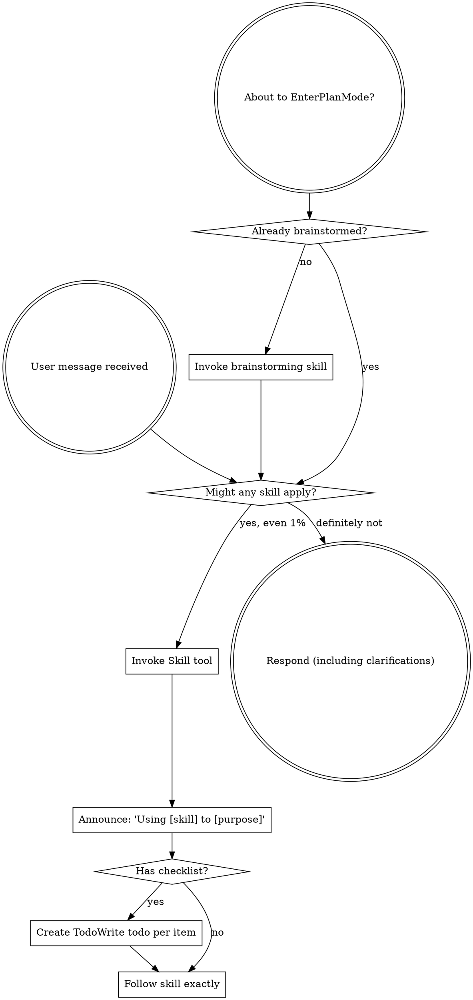

codex-exec: report contract violation

--- codex stdout ---
## HIGH — Exit-code contract incomplete

With explicit `--project-dir`, argument parsing invokes `node` before `doctor()` (`super-gsd/install.sh:1211-1217`). If Node is unavailable, `set -e` (`install.sh:7`) exits 127, never reaching doctor’s intended status 2 path (`install.sh:356-375`). Tests assert 0 and 10, but never 2; the writer-conflict test asserts only nonzero, not the coherent usage-error code 1 (`assert-install-contract.cjs:539-554,577-583`).

### T2 semantic criteria

- **Shared inspection, formatting, strict read-only — MET.** `inspectProjectInstall` creates the report once (`hook-install-contract.cjs:509-567`); `formatProjectInstallStatus` only transforms supplied rows (`:570-608`). The CLI calls inspection once and passes that report directly to the formatter (`:880-888`). Writer combinations are rejected before prechecks/publication (`install.sh:1249-1277`). No reachable writer exists: no `applyProjectInstall`, candidate preparation, npm, settings merge, keys, broker, or grants.
- **Worktree freshness and 0/10/2 outcomes — NOT MET.** Git detection itself is correct: `git -C … rev-parse` handles `.git` directories, linked-worktree files, and submodule-style gitdir pointers; non-Git directories take the clean reporting branch (`install.sh:403-420`). Remote unavailability is separately reported (`:405-415`). However, the explicit-project missing-Node path escapes the promised exit-code set as described above.
- **Real-process proof and T1 regression wall — MET.** Tests cover normal `.git` directory and linked-worktree `.git` file shapes, exact drift output, byte identity, repair, and refusal-before-write (`assert-install-contract.cjs:483-611`). Supplied all-suite results establish the requested regression run.

### Specific judgments

1. Doctor call graph: genuinely read-only; no reachable writer.
2. Formatter recomputation: none.
3. Worktree detection: correct and complete by Git semantics; remote failure is not conflated with non-repository.
4. Exit codes: 0/10 asserted; 2 unasserted and bypassed on one inability path; conflict refusal is coherent but only generically asserted.
5. T1 regression: none found. T2 adds report metadata/presentation only; closure, delivery, refusal ordering, classifier, and bounded fail-closed truncation remain unchanged.

SPEC VERDICT: FAIL

--- codex stderr ---
OpenAI Codex v0.146.0
--------
workdir: <HOME>\AppData\Roaming\warp\Warp\data\worktrees\GSDedits\luminaria-hogback
model: gpt-5.6-sol
provider: openai
approval: never
sandbox: read-only
reasoning effort: xhigh
reasoning summaries: none
session id: 01a03a4e-871c-71c0-be34-55a874c188d3
--------
user
# Spec-compliance review of P168-T2. Read-only. Judge raw artifacts, not the executor report.

Plan: .../168-install-contract/168-01-PLAN-LOCKED.md, task `P168-T2` only.
Diff: `git show fc30be7`. T1 was reviewed separately and returned PASS; do not re-review it
except to confirm T2 did not regress it.

Orchestrator-run, take as given, do not re-run:
install-contract 4/4 (including `doctor-real-git-worktree-staleness`),
installer-registration-guard 13/13, a real `install.sh --init-project` from a decoy cwd
into an empty project exits 0 delivering 17 hooks and 9 `scripts/lib` modules,
assert-hook-contract 38/38, assert-prompt-contracts 4/4, assert-witness-correlation 13/13,
assert-propagation PASS, P166 6/6, P154 PASS, composer/enrichment-gate/kb-triage-shadow
PASS, feature-propagation 15/15, `bash -n` clean.

Judge each P168-T2 `semantic_acceptance_criteria` entry MET or NOT MET with a file:line
citation. Then judge these specifically:

1. **Is `--doctor` genuinely read-only on every path?** The plan forbids it calling
   `applyProjectInstall`, npm, the settings merge, key provisioning, or broker/grant
   repair. Trace the actual call graph, do not trust the byte-identity test alone: a test
   fixture may not exercise a branch that writes. Name any reachable writer.

2. **Does `formatProjectInstallStatus` recompute state?** The contract says consume T1's
   `inspectProjectInstall` report. Recomputation would reintroduce the drift this phase
   exists to remove.

3. **Is the worktree detection correct and complete?** It replaced
   `[ -d "$PROJECT_DIR/.git" ]`. Check it handles: `.git` as a directory, `.git` as a
   worktree file, a submodule-style gitdir pointer, and a genuinely non-git directory,
   which must still report cleanly rather than erroring. Confirm the remote-unavailable
   case is distinguished from "not a repository", because conflating them is how the
   original bug hid.

4. **Exit codes.** The executor claims 0/10/2 and a refusal when doctor is combined with a
   writer action. Are those coherent and asserted?

5. **Regression.** Did T2 change any T1 behaviour: delivery, the closure, refuse-before-
   write ordering, the classifier, or the truncation fail-closed rule?

Report findings by severity with file:line. End with exactly
`SPEC VERDICT: PASS` or `SPEC VERDICT: FAIL`. A NOT MET criterion forces FAIL.
Bound yourself to about 18 shell commands. Max 500 words.

codex
I’m using the mandatory `using-superpowers` workflow plus the `review` skill, because this is a commit-level spec review. I’ll keep the repository untouched, treat the supplied test results as evidence, and independently trace T2’s raw implementation and call graph.
exec
"C:\\WINDOWS\\System32\\WindowsPowerShell\\v1.0\\powershell.exe" -Command '$paths = @('"'C:\\Users\\operator\\.codex\\skills\\using-superpowers\\SKILL.md','C:\\Users\\operator\\.agents\\skills\\review\\SKILL.md'); foreach ("'$p in $paths) { "===== $p ====="; Get-Content -LiteralPath $p -Raw }' in <HOME>\AppData\Roaming\warp\Warp\data\worktrees\GSDedits\luminaria-hogback
 succeeded in 973ms:
===== <HOME>\.codex\skills\using-superpowers\SKILL.md =====
---
name: using-superpowers
description: Use when starting any conversation - establishes how to find and use skills, requiring Skill tool invocation before ANY response including clarifying questions
---

<SUBAGENT-STOP>
If you were dispatched as a subagent to execute a specific task, skip this skill.
</SUBAGENT-STOP>

<EXTREMELY-IMPORTANT>
If you think there is even a 1% chance a skill might apply to what you are doing, you ABSOLUTELY MUST invoke the skill.

IF A SKILL APPLIES TO YOUR TASK, YOU DO NOT HAVE A CHOICE. YOU MUST USE IT.

This is not negotiable. This is not optional. You cannot rationalize your way out of this.
</EXTREMELY-IMPORTANT>

## Instruction Priority

Superpowers skills override default system prompt behavior, but **user instructions always take precedence**:

1. **User's explicit instructions** (CLAUDE.md, GEMINI.md, AGENTS.md, direct requests) ƒ?" highest priority
2. **Superpowers skills** ƒ?" override default system behavior where they conflict
3. **Default system prompt** ƒ?" lowest priority

If CLAUDE.md, GEMINI.md, or AGENTS.md says "don't use TDD" and a skill says "always use TDD," follow the user's instructions. The user is in control.

## How to Access Skills

**In Claude Code:** Use the `Skill` tool. When you invoke a skill, its content is loaded and presented to youƒ?"follow it directly. Never use the Read tool on skill files.

**In Copilot CLI:** Use the `skill` tool. Skills are auto-discovered from installed plugins. The `skill` tool works the same as Claude Code's `Skill` tool.

**In Gemini CLI:** Skills activate via the `activate_skill` tool. Gemini loads skill metadata at session start and activates the full content on demand.

**In other environments:** Check your platform's documentation for how skills are loaded.

## Platform Adaptation

Skills use Claude Code tool names. Non-CC platforms: see `references/copilot-tools.md` (Copilot CLI), `references/codex-tools.md` (Codex) for tool equivalents. Gemini CLI users get the tool mapping loaded automatically via GEMINI.md.

# Using Skills

## The Rule

**Invoke relevant or requested skills BEFORE any response or action.** Even a 1% chance a skill might apply means that you should invoke the skill to check. If an invoked skill turns out to be wrong for the situation, you don't need to use it.



## Red Flags

These thoughts mean STOPƒ?"you're rationalizing:

| Thought | Reality |
|---------|---------|
| "This is just a simple question" | Questions are tasks. Check for skills. |
| "I need more context first" | Skill check comes BEFORE clarifying questions. |
| "Let me explore the codebase first" | Skills tell you HOW to explore. Check first. |
| "I can check git/files quickly" | Files lack conversation context. Check for skills. |
| "Let me gather information first" | Skills tell you HOW to gather information. |
| "This doesn't need a formal skill" | If a skill exists, use it. |
| "I remember this skill" | Skills evolve. Read current version. |
| "This doesn't count as a task" | Action = task. Check for skills. |
| "The skill is overkill" | Simple things become complex. Use it. |
| "I'll just do this one thing first" | Check BEFORE doing anything. |
| "This feels productive" | Undisciplined action wastes time. Skills prevent this. |
| "I know what that means" | Knowing the concept ƒ%ÿ using the skill. Invoke it. |

## Skill Priority

When multiple skills could apply, use this order:

1. **Process skills first** (brainstorming, debugging) - these determine HOW to approach the task
2. **Implementation skills second** (frontend-design, mcp-builder) - these guide execution

"Let's build X" ā' brainstorming first, then implementation skills.
"Fix this bug" ā' debugging first, then domain-specific skills.

## Skill Types

**Rigid** (TDD, debugging): Follow exactly. Don't adapt away discipline.

**Flexible** (patterns): Adapt principles to context.

The skill itself tells you which.

## User Instructions

Instructions say WHAT, not HOW. "Add X" or "Fix Y" doesn't mean skip workflows.

===== <HOME>\.agents\skills\review\SKILL.md =====
---
name: review
description: Review code changes for security, performance, bugs, and quality. Reviews staged changes, unstaged changes, specific commits, or PR-ready diffs.
---

<objective>
Review code changes and provide structured feedback covering security, performance, bug risks, code quality, and test coverage gaps. This skill analyzes diffs and surrounding context to catch issues before they reach production.
</objective>

<context>
This skill reviews code changes at various stages of the development workflow. It can review staged changes before a commit, unstaged work-in-progress, a specific commit, or the full set of changes on a branch that are ready for a pull request.

The reviewer reads both the diff and the surrounding source files to understand intent and catch issues that only appear in context.
</context>

<core_principle>
**FIND REAL ISSUES, NOT STYLE NITS.** Focus on problems that cause bugs, security vulnerabilities, performance degradation, or maintainability pain. Avoid nitpicking formatting or subjective style preferences unless they harm readability.
</core_principle>

<analysis_only_rule>
**THIS SKILL IS READ-ONLY. DO NOT MODIFY CODE.**

The purpose is to review and report findings. Making changes during review conflates the reviewer and author roles. Present findings and let the user decide what to act on.
</analysis_only_rule>

<quick_start>

<determine_review_scope>

Parse the user's input to determine what to review:

1. **No arguments** - Review staged changes first. If nothing is staged, review unstaged changes.
   - Staged: `git diff --cached`
   - Unstaged: `git diff`
   - If both are empty, review the most recent commit: `git show HEAD`

2. **Commit hash argument** (e.g., `/review abc1234`) - Review that specific commit.
   - `git show <hash>`

3. **File path argument** (e.g., `/review src/foo.ts`) - Review unstaged changes in that file.
   - `git diff -- <path>` then fall back to `git diff --cached -- <path>`

4. **"pr" argument** (e.g., `/review pr`) - Review all changes since branching from main.
   - `git diff main...HEAD`
   - If on main, review `git diff HEAD~1`

After obtaining the diff, if it is empty, inform the user that there are no changes to review and stop.

</determine_review_scope>

<gather_context>

Before analyzing the diff:

1. **Read changed files in full** - Do not review a diff in isolation. Read each modified file to understand the surrounding code, imports, types, and control flow.
2. **Identify the tech stack** - Note languages, frameworks, and libraries in use. This affects what patterns are risky.
3. **Check for related test files** - For each changed source file, look for corresponding test files. Note whether tests were updated alongside the changes.
4. **Check for configuration changes** - If config files changed (env, CI, package.json, tsconfig, etc.), pay extra attention to side effects.

</gather_context>

<review_categories>

Analyze the changes against each category below. Only report findings that are actually present. Skip categories with no issues.

**A. Security Issues** (Severity: CRITICAL or HIGH)
- Injection vulnerabilities (SQL injection, command injection, template injection)
- Cross-site scripting (XSS) - unsanitized user input rendered in HTML
- Authentication and authorization flaws (missing auth checks, privilege escalation)
- Secrets or credentials hardcoded or logged
- Insecure deserialization or unsafe eval usage
- Path traversal or file access vulnerabilities
- Missing input validation on external data

**B. Performance Concerns** (Severity: HIGH or MEDIUM)
- N+1 query patterns in database access
- Unnecessary memory allocations in hot paths or loops
- Blocking operations on the main thread or in async contexts
- Missing pagination on unbounded queries
- Redundant computation that could be cached or memoized
- Large payloads without streaming or chunking

**C. Bug Risks** (Severity: HIGH or MEDIUM)
- Off-by-one errors in loops or array access
- Null/undefined dereferences without guards
- Race conditions in concurrent or async code
- Incorrect error handling (swallowed errors, wrong error types)
- Type mismatches or unsafe type assertions
- Logic errors in conditionals (inverted checks, missing cases)
- Resource leaks (unclosed connections, file handles, listeners)

**D. Code Quality** (Severity: MEDIUM or LOW)
- Unclear or misleading naming
- Significant code duplication that should be extracted
- Excessive complexity (deeply nested logic, functions doing too many things)
- Dead code or unreachable branches
- Missing or misleading comments on non-obvious logic
- Inconsistency with patterns used elsewhere in the codebase

**E. Test Coverage Gaps** (Severity: MEDIUM or LOW)
- New logic paths without corresponding test cases
- Changed behavior without updated tests
- Edge cases not covered (empty inputs, boundary values, error paths)
- Missing integration tests for new API endpoints or database changes

</review_categories>

<format_findings>

For each finding, use this structure:

```
### [SEVERITY] Category: Brief Title

**File**: `path/to/file.ext` (lines X-Y)

**Issue**: Clear description of the problem.

**Why it matters**: What could go wrong if this is not addressed.

**Suggestion**: How to fix it, with a code snippet if helpful.
```

Severity levels:
- **CRITICAL** - Must fix before merge. Security vulnerability or data loss risk.
- **HIGH** - Should fix before merge. Likely bug or significant performance issue.
- **MEDIUM** - Should fix soon. Code quality or moderate risk issue.
- **LOW** - Consider fixing. Minor improvement opportunity.

</format_findings>

</quick_start>

<critical_rules>

1. **READ THE FULL FILE**: Never review a diff without reading the complete source file for context
2. **NO FALSE ALARMS**: Only report issues you can explain concretely. Do not report vague concerns
3. **PRIORITIZE**: Lead with the most severe findings. Do not bury critical issues under style nits
4. **BE SPECIFIC**: Include file paths, line numbers, and code references for every finding
5. **EXPLAIN THE RISK**: For each finding, explain what could actually go wrong
6. **CHECK TESTS**: Always check whether changes have corresponding test updates
7. **CONSIDER THE STACK**: Apply language-specific and framework-specific knowledge to your review
8. **DO NOT MODIFY CODE**: Present findings only. The user decides what to act on

</critical_rules>

<output_format>

```markdown
## Code Review: [brief description of what was reviewed]

**Scope**: [staged changes | unstaged changes | commit abc1234 | PR changes from main]
**Files reviewed**: [count] files changed, [additions] additions, [deletions] deletions

---

### Findings

[Findings grouped by severity, highest first. Use the format from <format_findings>.]

---

### Summary

| Severity | Count |
|----------|-------|
| CRITICAL | X     |
| HIGH     | X     |
| MEDIUM   | X     |
| LOW      | X     |

### Recommended Actions

1. [Most important action to take]
2. [Next most important action]
3. [...]
```

If no issues are found:

```markdown
## Code Review: [brief description]

**Scope**: [what was reviewed]
**Files reviewed**: [count]

No significant issues found. The changes look good to merge.
```

</output_format>

<decision_gate>

**After presenting findings, ALWAYS offer these options:**

```
ƒ"?ƒ"?ƒ"?ƒ"?ƒ"?ƒ"?ƒ"?ƒ"?ƒ"?ƒ"?ƒ"?ƒ"?ƒ"?ƒ"?ƒ"?ƒ"?ƒ"?ƒ"?ƒ"?ƒ"?ƒ"?ƒ"?ƒ"?ƒ"?ƒ"?ƒ"?ƒ"?ƒ"?ƒ"?ƒ"?ƒ"?ƒ"?ƒ"?ƒ"?ƒ"?ƒ"?ƒ"?ƒ"?ƒ"?ƒ"?ƒ"?
REVIEW COMPLETE

What would you like to do?

1. **Fix issues** - I'll address the findings starting with the most critical
2. **Save review** - Export findings to a markdown file
3. **Review again** - Re-review with different scope or focus
4. **Discuss a finding** - Ask questions about a specific issue
5. **Other** - Tell me what you need
ƒ"?ƒ"?ƒ"?ƒ"?ƒ"?ƒ"?ƒ"?ƒ"?ƒ"?ƒ"?ƒ"?ƒ"?ƒ"?ƒ"?ƒ"?ƒ"?ƒ"?ƒ"?ƒ"?ƒ"?ƒ"?ƒ"?ƒ"?ƒ"?ƒ"?ƒ"?ƒ"?ƒ"?ƒ"?ƒ"?ƒ"?ƒ"?ƒ"?ƒ"?ƒ"?ƒ"?ƒ"?ƒ"?ƒ"?ƒ"?ƒ"?
```

**Wait for user response before taking any action.**

This gate is MANDATORY. Never skip it. Never auto-implement fixes.

</decision_gate>

<HOME>\OneDrive - <ORG>\Documents\WindowsPowerShell\profile.ps1 : Cannot dot-source this 
command because it was defined in a different language mode. To invoke this command without importing its contents, 
omit the '.' operator.
At line:1 char:1
+ . '<HOME>\OneDrive - <ORG>\Documents\Win ...
+ ~~~~~~~~~~~~~~~~~~~~~~~~~~~~~~~~~~~~~~~~~~~~~~~~~~~~~~~~~~~~~~~~~~~~~
    + CategoryInfo          : InvalidOperation: (:) [profile.ps1], NotSupportedException
    + FullyQualifiedErrorId : DotSourceNotSupported,profile.ps1
 
<HOME>\OneDrive - <ORG>\Documents\WindowsPowerShell\Microsoft.PowerShell_profile.ps1 : 
Cannot dot-source this command because it was defined in a different language mode. To invoke this command without 
importing its contents, omit the '.' operator.
At line:1 char:1
+ . '<HOME>\OneDrive - <ORG>\Documents\Win ...
+ ~~~~~~~~~~~~~~~~~~~~~~~~~~~~~~~~~~~~~~~~~~~~~~~~~~~~~~~~~~~~~~~~~~~~~
    + CategoryInfo          : InvalidOperation: (:) [Microsoft.PowerShell_profile.ps1], NotSupportedException
    + FullyQualifiedErrorId : DotSourceNotSupported,Microsoft.PowerShell_profile.ps1
 

  → Read P168-T2 plan criteria and isolate commit changes
  • Trace doctor, formatter, worktree, exit-code, and T1-regression behavior
  • Cross-check tests and produce criterion-by-criterion verdict
exec
"C:\\WINDOWS\\System32\\WindowsPowerShell\\v1.0\\powershell.exe" -NoProfile -Command "rg --files .planning | rg \"168-01-PLAN-LOCKED\\.md"'$"' in <HOME>\AppData\Roaming\warp\Warp\data\worktrees\GSDedits\luminaria-hogback
2026-08-25T19:04:38.373074Z ERROR codex_core::tools::router: error=Exit code: 1
Wall time: 1.2 seconds
Output:

 exited 1 in 1200ms:
exec
"C:\\WINDOWS\\System32\\WindowsPowerShell\\v1.0\\powershell.exe" -NoProfile -Command 'rg --files -g "168-01-PLAN-LOCKED.md"' in <HOME>\AppData\Roaming\warp\Warp\data\worktrees\GSDedits\luminaria-hogback
2026-08-25T19:04:43.921351Z ERROR codex_core::tools::router: error=Exit code: 1
Wall time: 0.5 seconds
Output:

 exited 1 in 497ms:
exec
"C:\\WINDOWS\\System32\\WindowsPowerShell\\v1.0\\powershell.exe" -NoProfile -Command 'rg --files -uu | rg "168.*PLAN"' in <HOME>\AppData\Roaming\warp\Warp\data\worktrees\GSDedits\luminaria-hogback
 succeeded in 1061ms:
.planning\milestones\v4.0-install-contract\phases\168-install-contract\168-PLANREVIEW2.md
.planning\milestones\v4.0-install-contract\phases\168-install-contract\168-PLANREVIEW2-WRAPPER.log
.planning\milestones\v4.0-install-contract\phases\168-install-contract\168-PLANREVIEW2-PROMPT.md
.planning\milestones\v4.0-install-contract\phases\168-install-contract\168-PLANREVIEW.md
.planning\milestones\v4.0-install-contract\phases\168-install-contract\168-PLANREVIEW-WRAPPER.log
.planning\milestones\v4.0-install-contract\phases\168-install-contract\168-PLANREVIEW-PROMPT.md
.planning\milestones\v4.0-install-contract\phases\168-install-contract\168-PLAN-WRAPPER2.log
.planning\milestones\v4.0-install-contract\phases\168-install-contract\168-PLAN-WRAPPER.log
.planning\milestones\v4.0-install-contract\phases\168-install-contract\168-PLAN-REV2-WRAPPER.log
.planning\milestones\v4.0-install-contract\phases\168-install-contract\168-PLAN-REV2-REPORT.md
.planning\milestones\v4.0-install-contract\phases\168-install-contract\168-PLAN-REV2-PROMPT.md
.planning\milestones\v4.0-install-contract\phases\168-install-contract\168-PLAN-REV2-FILES.txt
.planning\milestones\v4.0-install-contract\phases\168-install-contract\168-PLAN-REPORT2.md
.planning\milestones\v4.0-install-contract\phases\168-install-contract\168-PLAN-REPORT.md
.planning\milestones\v4.0-install-contract\phases\168-install-contract\168-PLAN-PROMPT.md
.planning\milestones\v4.0-install-contract\phases\168-install-contract\168-PLAN-FILES.txt
.planning\milestones\v4.0-install-contract\phases\168-install-contract\168-01-PLAN-LOCKED.md

exec
"C:\\WINDOWS\\System32\\WindowsPowerShell\\v1.0\\powershell.exe" -NoProfile -Command '$p='"'.planning\\milestones\\v4.0-install-contract\\phases\\168-install-contract\\168-01-PLAN-LOCKED.md'; "'$n=0; Get-Content -LiteralPath $p | ForEach-Object { $n++; '"'{0,5}: {1}' -f "'$n,$_ }' in <HOME>\AppData\Roaming\warp\Warp\data\worktrees\GSDedits\luminaria-hogback
 succeeded in 3026ms:
    1: ---
    2: schema_version: 2
    3: phase: 168
    4: slug: install-contract
    5: milestone: v4.0-install-contract
    6: status: PLANNED
    7: revision: 2
    8: governing_decision: .planning/milestones/v4.0-install-contract/phases/168-install-contract/CONTEXT.md
    9: evidence_paths:
   10:   - .planning/milestones/v4.0-install-contract/INTENT.md
   11:   - .planning/milestones/v4.0-install-contract/phases/168-install-contract/CONTEXT.md
   12:   - .planning/milestones/v3.9-substrate-hygiene/phases/167-substrate-invocation-witness/SUMMARY.md
   13:   - .planning/milestones/v3.9-substrate-hygiene/phases/167-substrate-invocation-witness/AUDIT.md
   14: depends_on: []
   15: intent: >
   16:   Make project installation one closed contract: compute every repository-owned
   17:   module needed by distributed hooks from the hook sources, declare the computed
   18:   closure in the hook manifest, deliver and refresh that exact closure, execute
   19:   every prospective project hook in a complete candidate before the first write,
   20:   prove every installed target hook after successful publication, preserve the
   21:   underlying module-resolution error beside the existing closed reason code, and
   22:   expose one read-only command that identifies hook and module drift for an
   23:   explicit project, including projects whose .git entry is a worktree file.
   24: execution_mode: two-dependent-codex-tasks-with-orchestrator-spawn-gates
   25: expected_ATC_tier: GATE
   26: skip_gates: []
   27: lessons_path: null
   28: prior_errors_lookup: true
   29: lock_status: locked
   30: locked_at: 2026-08-25T11:08:08+01:00
   31: locked_by: codex
   32: allowed_files:
   33:   - super-gsd/scripts/lib/hook-install-contract.cjs
   34:   - super-gsd/config/hook-manifest.json
   35:   - super-gsd/scripts/lib/hook-registration-preflight.cjs
   36:   - super-gsd/tools/feature-propagation/audit.cjs
   37:   - super-gsd/install.sh
   38:   - super-gsd/tests/install-contract/assert-install-contract.cjs
   39:   - super-gsd/tests/installer-registration-guard/assert-installer-registration-guard.cjs
   40: forbidden_files:
   41:   - super-gsd/hooks/sgsd-substrate-invocation-witness.cjs
   42:   - super-gsd/scripts/lib/substrate-invocation-witness-store.cjs
   43:   - super-gsd/scripts/lib/vtp-context-composer.cjs
   44:   - super-gsd/tools/substrate-capability-broker.cjs
   45:   - super-gsd/schemas/vtp-mcp-input-schemas.v1.json
   46:   - .planning/milestones/v3.6-vtp-bridge/phases/154-mcp-arg-contract/154-REAL-MCP-EVIDENCE.json
   47:   - .planning/STATE.md
   48:   - .planning/milestones/v4.0-install-contract/ROADMAP.md
   49:   - package.json
   50:   - package-lock.json
   51:   - wiki/LINT-REPORT.md
   52: invariants:
   53:   - Project dependency delivery is the mechanically computed transitive closure; no production array, shell glob, test constant, or manifest field may hand-list the closure.
   54:   - Manifest policy remains human-authored, but every dependency field is generated and verified against the same computation used by delivery and status.
   55:   - Every rejection-capable source, manifest, destination, package, registration, and all-hook smoke check completes against one complete project-shaped candidate before the first project, profile, npm, key, settings, broker, or grant mutation.
   56:   - The candidate lives under a fresh OS temporary directory outside the project and profile, contains the exact prospective project paths, uses an isolated HOME/USERPROFILE, and resolves requires naturally from candidate hook paths without NODE_PATH or canonical-source fallback.
   57:   - After the first destination write, production performs only rollback-journaled publication of the already-smoked immutable candidate bytes; it never spawns a hook or runs another rejection-capable validation, and any publication I/O failure restores project/profile bytes and the actions array exactly.
   58:   - An explicit --project-dir is normalized and used exactly; walk-up occurs only when no explicit project directory is supplied.
   59:   - Read-only status, installer precheck, and repair consume one inspectProjectInstall result; no second detector or dependency list is permitted.
   60:   - Closed reasons are unchanged; MODULE_NOT_FOUND code, request, resolved path, and bounded message travel in underlying_error/detail beside the existing reason.
   61:   - P167 remains unchanged: PreToolUse fails closed, PostToolUse emits bounded substrate_witness_rewrite_failed without raw passthrough, and only rewritten rows are accepted.
   62:   - Existing guard assertions are preserved or strengthened; none is weakened to obtain a pass.
   63: acceptance_commands:
   64:   - node super-gsd/scripts/lib/hook-install-contract.cjs --check-manifest
   65:   - node super-gsd/tests/install-contract/assert-install-contract.cjs --all
   66:   - node super-gsd/tests/installer-registration-guard/assert-installer-registration-guard.cjs --all
   67:   - node super-gsd/tests/substrate-invocation-witness/assert-hook-contract.cjs
   68:   - node super-gsd/tests/substrate-invocation-witness/assert-propagation.cjs
   69: rollback_plan: >
   70:   Revert P168-T2 before P168-T1. T1 is the indivisible declaration,
   71:   graph/detector, delivery, all-hook smoke, diagnosis, and proof commit; never
   72:   retain dependency fields without their verifier or copying without smoke.
   73:   T2 adds only the dependent doctor/worktree presentation seam. Run the
   74:   pre-P168 installer guard and P167 suites after either rollback.
   75: risk_rating: high
   76: operator_checkpoints:
   77:   - The orchestrator runs spawn-bound real install, refusal, and worktree cases outside any sandbox that returns spawnSync EPERM.
   78:   - Phase close is NOGO until both dependent tasks pass; manifest generation, delivery, smoke, and diagnosis remain one T1 commit, while T2 cannot ship without T1.
   79:   - Phase close is NOGO if any refused entry point changes a snapshotted project/profile byte or records a repair action.
   80: semantic_acceptance_criteria:
   81:   - input: >
   82:       A disposable on-disk SGSD project whose project-local
   83:       super-gsd/scripts/lib and other computed project-module destinations start
   84:       empty, an isolated real HOME/USERPROFILE, and a separate canonical source
   85:       checkout. Production install.sh is launched by Bash with --init-project,
   86:       --skip-cockpit-deps, and --project-dir pointing at that project while cwd
   87:       is a different decoy directory. No mocked copier, dependency adapter,
   88:       staged target, or direct hook-function call is used. After installation,
   89:       one delivered transitive module is changed and production --update runs.
   90:     expected_outcome: >
   91:       Before its first destination write, the production installer creates its
   92:       complete candidate outside the project/profile, spawns every candidate
   93:       Claude and Codex project hook/registration with natural candidate-relative
   94:       resolution, and seals the exact bytes that publication will copy. The
   95:       installer then publishes those bytes transactionally and exits 0 with
   96:       every computed dependency byte-identical in the final target. Only after
   97:       the installer has returned, the test harness independently spawns every
   98:       final installed hook from its real path with cwd equal to the explicit
   99:       project; this is non-rejecting verification of the completed install, not
  100:       a staged shortcut or a post-write installer refusal. Update restores the
  101:       changed module after repeating candidate smoke. No hook reports an
  102:       unresolved dependency, and the decoy cwd and ancestors remain untouched.
  103:     verification_cmd: >
  104:       node super-gsd/tests/install-contract/assert-install-contract.cjs
  105:       --case empty-module-tree-real-install
  106:   - input: >
  107:       A second real install against seeded project and profile trees after a
  108:       temporary canonical hook source is given a relative require whose resolved
  109:       repository file does not exist. The test snapshots every file and SHA-256
  110:       under both destinations and plants an npm preinstall sentinel that records
  111:       if mutation begins. It invokes production combined --install-global
  112:       --update, not an exported detector in isolation.
  113:     expected_outcome: >
  114:       Installation refuses before npm, hook or module copying, settings merge,
  115:       key provisioning, broker/grant repair, or global installation. The closed
  116:       reason remains hook_smoke_failed or witness_repair_failed as appropriate,
  117:       while underlying_error carries MODULE_NOT_FOUND, the original request, the
  118:       exact normalized missing module path, and a bounded sanitized message.
  119:       Project/profile inventories and hashes are byte-identical, the npm sentinel
  120:       is absent, and repair actions are empty. Raw hook output, payloads, secrets,
  121:       and unbounded stacks are not exposed.
  122:     verification_cmd: >
  123:       node super-gsd/tests/install-contract/assert-install-contract.cjs
  124:       --case unresolved-module-refuses-before-write
  125:   - input: >
  126:       The real canonical hook sources and hook-manifest.json, followed by a
  127:       test-only Node loader trace that executes the selected real hook sources
  128:       from a complete temporary source checkout and records actual parent to
  129:       resolved-child repository edges per manifest entry. That independent
  130:       source execution, rather than a maintained expected-closure list, is the
  131:       oracle. A generated mutation then adds runtime-named relative requires
  132:       covering extensionless-to-.js, explicit .js, explicit .json, package-main
  133:       directory, index directory, and a transitive child; the fixture paths and
  134:       expected edges are emitted by the generator from the mutated sources, not
  135:       transcribed into the test. The production graph, manifest renderer, check,
  136:       delivery, and inspection APIs run on the same temporary checkout.
  137:     expected_outcome: >
  138:       The committed manifest is byte-equivalent to its deterministic generated
  139:       dependency projection. For each traced or generated parent-child edge,
  140:       the same originating manifest entry owns the edge in the computed
  141:       per-entry closure, that entry's generated manifest projection, delivery
  142:       provenance and candidate/final bytes, and missing/stale/current inspection
  143:       rows. Equality is tested per entry, never at union level. This necessarily
  144:       proves the witness entry owns both composer and store edges and the
  145:       sgsd-quality-gate.js entry owns sgsd-intent-classifier.cjs even while the
  146:       classifier remains a separate manifest root. Every generated .js/.json/
  147:       directory/transitive resolution follows the same four surfaces. The
  148:       unchanged temporary manifest is rejected as stale and names exact paths.
  149:       An unresolvable dynamic repository-local require is rejected rather than
  150:       omitted; built-ins are excluded, bare packages are classified rather than
  151:       copied from ignored node_modules, ordering is stable, and cycles terminate
  152:       without duplicate artifacts.
  153:     verification_cmd: >
  154:       node super-gsd/tests/install-contract/assert-install-contract.cjs
  155:       --case generated-transitive-manifest
  156:   - input: >
  157:       A real temporary Git repository with a linked worktree, so the selected
  158:       project has a .git file, plus one missing installed hook, one stale
  159:       transitive module, and one current module. From a different cwd, the
  160:       operator runs bash super-gsd/install.sh --doctor --project-dir with the
  161:       worktree path, repairs through --update, and repeats doctor.
  162:     expected_outcome: >
  163:       The first doctor run is read-only, recognizes the linked checkout as a Git
  164:       worktree, prints its real HEAD rather than not-a-git-repo, and reports a
  165:       non-current install with the exact missing hook and stale module paths,
  166:       expected/actual digests, and canonical source revision. It does not report
  167:       the current module as behind, and it reaches the existing GitHub-master
  168:       comparison; remote unavailability is named separately from the local
  169:       verdict. After update, doctor exits current with no missing or stale hook/
  170:       module rows. Only the explicit worktree is inspected and repaired.
  171:     verification_cmd: >
  172:       node super-gsd/tests/install-contract/assert-install-contract.cjs
  173:       --case doctor-real-git-worktree-staleness
  174:   - input: >
  175:       The complete pre-existing installer-registration guard suite and P167
  176:       witness hook/propagation suites run after P168, including broken deployed
  177:       hook and witness-repair-no-mutation controls.
  178:     expected_outcome: >
  179:       Every prior guard passes with its original or stronger assertion. The
  180:       witness hook source, store, composer, broker, response bound, substrate
  181:       reasons, rewritten-only acceptance, and no-raw-result behavior are
  182:       unchanged. The prior broken module control now exposes the exact missing
  183:       path beside its closed reason, and refused repair still leaves
  184:       byte-identical trees and an empty actions array.
  185:     verification_cmd: >
  186:       node super-gsd/tests/installer-registration-guard/assert-installer-registration-guard.cjs --all &&
  187:       node super-gsd/tests/substrate-invocation-witness/assert-hook-contract.cjs &&
  188:       node super-gsd/tests/substrate-invocation-witness/assert-propagation.cjs
  189: known_deadends:
  190:   - Do not encode known hook dependencies in install.sh, hook-manifest.json, tests, or an exceptions table. That second-source pattern caused this failure.
  191:   - Do not blanket-copy scripts/lib, tools, or node_modules. Deliver only computed repository-owned files and classify package prerequisites; a missing package is named and refused.
  192:   - Do not generate the whole manifest. Targets, dispositions, authorities, matchers, timeouts, and intentional-unregistration reasons are human policy; only dependencies are generated.
  193:   - Do not accept node --check, existence, mocked spawn, direct exported-function calls, or the pre-publication candidate alone as deployed end-to-end semantic proof; the harness must execute every final target hook after production install.
  194:   - Do not begin externally visible install writes until every source, manifest, destination, package, registration, and project-shaped prospective-smoke check has passed.
  195:   - Do not spawn a hook or run any other rejection-capable check after the first destination write. Publication consumes only sealed candidate bytes; final-target execution belongs to the post-success test harness and cannot change the installer verdict.
  196:   - Do not add a second staleness implementation to doctor or audit. Both format the same inspectProjectInstall report consumed by repair.
  197:   - Do not replace the closed refusal vocabulary with MODULE_NOT_FOUND. Preserve the reason and attach bounded structured underlying_error/detail.
  198:   - Do not test Git repositories with a .git directory predicate. Use git -C with rev-parse for normal repositories and linked worktrees.
  199:   - Do not change a P167 hook, witness-store, composer, or broker contract to make smoke pass. Adapt smoke and diagnosis around production.
  200:   - Do not merge this branch; publication to master remains an operator decision.
  201:   - Do not treat selective hook closure as whole-tree parity. The unrelated remainder of the measured approximately 55-file project/global gap is deliberately outside P168.
  202: tasks:
  203:   - id: P168-T1
  204:     type: computed-hook-install-contract-delivery-smoke-and-diagnosis
  205:     agent: codex
  206:     model: codex
  207:     depends_on: []
  208:     files_touched:
  209:       - super-gsd/scripts/lib/hook-install-contract.cjs
  210:       - super-gsd/config/hook-manifest.json
  211:       - super-gsd/scripts/lib/hook-registration-preflight.cjs
  212:       - super-gsd/tools/feature-propagation/audit.cjs
  213:       - super-gsd/install.sh
  214:       - super-gsd/tests/install-contract/assert-install-contract.cjs
  215:       - super-gsd/tests/installer-registration-guard/assert-installer-registration-guard.cjs
  216:     input_contract: >
  217:       Treat CONTEXT.md's measured delivery trace and P167 SUMMARY/AUDIT
  218:       constraints as settled facts; do not reproduce or redesign the root cause.
  219:       Work red-first in the focused assert-install-contract.cjs suite and
  220:       strengthen, never relax, the existing installer-registration guard.
  221: 
  222:       Create hook-install-contract.cjs as the single authority and export
  223:       computeHookDependencyGraph, renderManifestDependencies,
  224:       inspectProjectInstall, and applyProjectInstall. Start from every manifest
  225:       entry distributed to
  226:       claude-project or codex-project and lex actual CommonJS source while
  227:       ignoring comments and string/template text. Resolve literal relative
  228:       requires with Node file/directory rules and recursively walk
  229:       repository-owned modules. Symbolically reduce string constants and
  230:       path.join/path.resolve expressions rooted at __dirname or runtime project
  231:       root so the witness COMPOSER_RELATIVE_PATH and STORE_RELATIVE_PATH are
  232:       discovered from source, never named in a production exception. Exclude
  233:       built-ins, classify bare packages without copying ignored node_modules,
  234:       detect cycles, deduplicate, sort by normalized POSIX path, reject root
  235:       escapes, and fail closed with source plus expression for an unresolved
  236:       local dynamic require. Return per-entry closure, union, source/target
  237:       paths, SHA-256, packages, source errors, and target
  238:       missing/stale/current rows.
  239: 
  240:       Keep hook-manifest.json as reviewed policy. Add a generated dependency
  241:       field to every entry. Implement --write-manifest to rewrite only those
  242:       fields deterministically and --check-manifest to compare committed data
  243:       with a fresh computeHookDependencyGraph result. Installer, audit, tests,
  244:       delivery, and status all call the check and never trust committed
  245:       dependency bytes without recomputation. This generated-and-verified
  246:       choice preserves human policy while eliminating a second dependency
  247:       authority.
  248: 
  249:       Make inspectProjectInstall the only detector. With explicit projectDir,
  250:       path.resolve that exact argument and never call findPlanningRoot; only an
  251:       absent argument may walk up. audit.cjs read-only output, precheck,
  252:       repairClaudeSubstrateWitness, and install.sh precheck consume this
  253:       report. applyProjectInstall copies only report.requiredFiles that are
  254:       missing/stale into projectDir/super-gsd. It snapshots every affected path,
  255:       preserves unrelated files, and retains the originating manifest entry as
  256:       required_by provenance on every inspection, candidate, publication, and
  257:       status row so a union root cannot mask a missing per-entry edge. It
  258:       revalidates source and candidate digests before the first destination
  259:       write, copies only sealed candidate bytes, records actions only after
  260:       complete publication, and restores absent files as absent and existing
  261:       files byte-exactly if a publication I/O operation fails.
  262:       A second run is byte-idempotent. Remove installSubstrateRuntime's
  263:       three-file special-case as a competing writer; the broker stays in its
  264:       dedicated capability path because it is not a hook-import dependency.
  265:       Route init_local_project, update_existing, combined
  266:       --install-global/--update, and project-hook repair through this contract.
  267:       distribute_project_hooks must not remain a standalone unjournaled writer:
  268:       either delegate it to applyProjectInstall or reduce it to a private step
  269:       inside the same candidate/publication transaction.
  270: 
  271:       Preserve refuse-before-write on all entry points. Refactor install.sh
  272:       parsing to consume --project-dir VALUE and parse full argv before
  273:       dispatch. Default remains starting cwd; explicit value is authoritative.
  274:       precheck_installation_refusals computes and validates the graph, generated
  275:       manifest, destinations, Codex sources, substrate sources, packages, and
  276:       prospective all-hook smoke against the one complete OS-temporary candidate
  277:       described below before ensure_gsd_base, npm,
  278:       skeleton/memory, project/global copies, settings, keys, broker state, or
  279:       grants. Candidate writes are isolated from project/profile destinations and
  280:       are not accepted as deployed semantic proof. Run the same precheck at the
  281:       top of direct --repair-safe, --repair,
  282:       --repair-substrate-capability, and exported repairClaudeSubstrateWitness
  283:       paths. Prove ordering with whole-tree hashes and an npm preinstall
  284:       sentinel, not source-index assertions alone.
  285: 
  286:       Extend hook-registration-preflight.cjs so descriptors preserve complete
  287:       interpreter argv and derive safe event/matcher-aware stdin from manifest
  288:       dispositions. Execute every candidate project hook/registration represented by
  289:       claude-project or codex-project, including both witness events and
  290:       intentionally unregistered distributed sources with declared smoke event;
  291:       deduplicate only identical source/event/argv tuples. Spawn real candidate
  292:       files with shell false, cwd equal to the candidate project root, isolated
  293:       HOME and USERPROFILE, bounded concurrency, and at least registered timeout. File
  294:       existence and node --check remain preliminary. Capture bounded output. On
  295:       failure HookSmokeError retains hook_smoke_failed and adds underlyingError
  296:       with code, request, normalized path, and a sanitized single-line message
  297:       bounded to 2048 UTF-8 characters. Parse MODULE_NOT_FOUND and its require
  298:       stack for the exact candidate path, rebase that path to the intended
  299:       explicit-project destination for operator output, and do not forward
  300:       arbitrary child output, stdin, or stack text. audit.cjs carries this in
  301:       detail/underlying_error beside witness_repair_failed, and install.sh prints
  302:       it before the existing refusal summary.
  303: 
  304:       Create the complete candidate with
  305:       fs.mkdtempSync(path.join(os.tmpdir(), 'sgsd-install-candidate-')); its
  306:       returned directory is the candidate project root and its .home child is
  307:       the isolated HOME/USERPROFILE. Materialize the effective .planning marker,
  308:       every prospective project hook/registration, every per-entry computed
  309:       repository dependency, and the prospective settings bytes at the same
  310:       relative paths they will have under the explicit project. This is one
  311:       complete project-shaped candidate, not one scratch tree per hook. Rebase
  312:       every descriptor script path to candidateRoot/super-gsd/..., spawn with
  313:       shell false, cwd and payload.cwd equal to candidateRoot, and bind HOME,
  314:       USERPROFILE, APPDATA, LOCALAPPDATA, XDG_CONFIG_HOME, XDG_DATA_HOME,
  315:       XDG_STATE_HOME, XDG_CACHE_HOME, TMPDIR, TEMP, and TMP to children of the
  316:       candidate. Use a sanitized environment with no NODE_PATH/NODE_OPTIONS,
  317:       canonical-checkout path, target/profile path, or target-tree fallback.
  318:       Consequently
  319:       ordinary relative requires resolve from the candidate hook file, while
  320:       the witness findProjectRoot sees candidateRoot/.planning and loads its
  321:       composer and store from candidateRoot/super-gsd/scripts/lib.
  322: 
  323:       Run the full event-aware descriptor set in that candidate, then rehash and
  324:       seal its publication rows before any project/profile mutation. A missing
  325:       canonical dependency, candidate mutation, or smoke failure refuses while
  326:       all external snapshots remain unchanged. The sealed publication function
  327:       is a one-way seam: after its first destination write it performs only the
  328:       rollback-journaled file operations in those rows and action commit. It
  329:       cannot call inspection, source/manifest/package validation, digest gates,
  330:       or hook spawn. Only a mechanical publication I/O failure can abort and
  331:       roll back; final-target hook execution occurs solely in the post-success
  332:       semantic harness and is non-rejecting with respect to installer state. An
  333:       exit-zero project_runtime_unavailable witness response
  334:       is not dependency success; computed runtime modules must resolve while the
  335:       P167 deny/rewrite contract stays untouched.
  336: 
  337:       New tests use real filesystem trees, Bash/Node processes, production
  338:       install.sh, and production audit/repair. Cover
  339:       graph mutation without a maintained expected closure, manifest drift,
  340:       empty module install, stale refresh/idempotence, exact MODULE_NOT_FOUND,
  341:       no-mutation on every entry, and explicit-project isolation. Generate an
  342:       independent Node loader-trace preload at runtime and execute the selected
  343:       real sources in a complete temporary checkout with the same event-aware
  344:       payloads used by candidate smokeƒ?"including both witness events with the
  345:       target MCP tool so its runtime loader executesƒ?"to obtain observed parent
  346:       to resolved-child edges per manifest entry. Compare that source-execution
  347:       oracle, not a transcribed closure fixture, with computation, the same
  348:       entry's manifest projection, required_by delivery provenance and candidate/
  349:       final bytes, and missing/stale/current status. This must cover the witness
  350:       composer/store edges and quality-gate-to-classifier edge per entry even
  351:       though the classifier is another root. Generate source mutations and
  352:       fixture metadata at runtime for extensionless-to-.js, explicit .js,
  353:       explicit .json, package-main directory, index directory, and transitive
  354:       resolution, and require all four surfaces to follow each edge. Add --all
  355:       to the existing installer guard as an
  356:       additive runner over every CASES entry; keep every individual --case and
  357:       assertion. Run P167 hook and propagation suites unchanged.
  358:     output_contract: >
  359:       One independently revertible commit contains the source-derived graph,
  360:       generated-and-verified manifest dependencies, selective project module
  361:       delivery, complete prewrite candidate all-hook smoke, bounded exact
  362:       diagnosis, shared read/repair inspection, and real final-target semantic
  363:       proofs. A clean module tree is bootstrapped and a stale tree refreshed;
  364:       no partial install reports success. Refusal names the exact module beside
  365:       the existing reason and leaves project/profile bytes and actions
  366:       unchanged. No P167 production file, second installer/detector/list,
  367:       blanket tree copy, or node_modules vendor is introduced.
  368:     hypothesis: >
  369:       If one deterministic source-derived graph generates and verifies manifest
  370:       dependencies, plans selective copies, inspects target drift, and drives a
  371:       complete project-shaped candidate smoke before writes, then hooks and
  372:       runtime modules cannot drift
  373:       independently or produce successful partial installs; a missing edge is
  374:       repaired or refused before observable mutation with exact diagnosis.
  375:     falsifier: >
  376:       A dependency is named in a maintained list; witness runtime files are an
  377:       exception rather than discovered; the witness composer/store or quality-
  378:       gate-to-classifier edge is absent from its own entry while present in the
  379:       union; a generated extensionless, explicit .js, explicit .json, directory,
  380:       or transitive edge does not change that entry's computation, manifest,
  381:       delivery provenance/bytes, and status together; a dynamic local require is
  382:       ignored; delivery copies whole trees; a clean target remains empty; stale
  383:       bytes remain; any candidate hook is not spawned before writes, any
  384:       rejection-capable check runs after the first destination write, or any
  385:       final installed hook is absent from the independent semantic execution;
  386:       node --check or candidate-only proof is accepted as sufficient; a require failure becomes only a
  387:       generic reason or leaks raw output; a refused combined/direct entry runs
  388:       npm, changes bytes, provisions state, or records action; explicit project
  389:       is replaced by walk-up; a guard is weakened; P167 changes; or declaration
  390:       and enforcement land separately.
  391:     stop_rule: >
  392:       Stop only when --check-manifest is clean; real empty-tree install and stale
  393:       refresh pass prewrite candidate smoke and the harness executes every final
  394:       project hook; injected missing
  395:       require refuses relevant entry points with exact MODULE_NOT_FOUND and
  396:       byte-identical snapshots; per-entry and extension resolution falsifiers
  397:       pass; full installer guard and P167 suites pass; the T1 diff is confined
  398:       to its seven files; and declaration, enforcement, and proof land in one
  399:       commit.
  400:       Sandbox EPERM on a spawn-bound command is ORCHESTRATOR_REQUIRED, never PASS
  401:       or SKIP-PASS.
  402:     verification_cmd: >
  403:       node --check super-gsd/scripts/lib/hook-install-contract.cjs &&
  404:       node --check super-gsd/scripts/lib/hook-registration-preflight.cjs &&
  405:       node --check super-gsd/tools/feature-propagation/audit.cjs &&
  406:       node --check super-gsd/tests/install-contract/assert-install-contract.cjs &&
  407:       node super-gsd/scripts/lib/hook-install-contract.cjs --check-manifest &&
  408:       node super-gsd/tests/install-contract/assert-install-contract.cjs --case empty-module-tree-real-install &&
  409:       node super-gsd/tests/install-contract/assert-install-contract.cjs --case unresolved-module-refuses-before-write &&
  410:       node super-gsd/tests/install-contract/assert-install-contract.cjs --case generated-transitive-manifest &&
  411:       node super-gsd/tests/installer-registration-guard/assert-installer-registration-guard.cjs --all &&
  412:       node super-gsd/tests/substrate-invocation-witness/assert-hook-contract.cjs &&
  413:       node super-gsd/tests/substrate-invocation-witness/assert-propagation.cjs
  414:     expected_ATC_tier: GATE
  415:     known_deadends:
  416:       - A hand-written dependency array is not an implementation even if it matches today's importing hooks.
  417:       - Smoke limited to repo-settings registrations misses distributed unregistered or global-only project copies; derive inventory from manifest dispositions.
  418:       - A generic Read payload does not exercise witness runtime. Use event and matcher aware smoke plus computed resolution without editing the witness.
  419:       - Rollback after a rejection-capable hook failure is too late. The complete candidate must fail before the first destination writer; rollback is only for mechanical publication errors.
  420:       - A final-target smoke inside production after publication repeats the prior CRITICAL; final-target execution is an external post-success assertion only.
  421:   - id: P168-T2
  422:     type: project-install-status-doctor-and-worktree-freshness
  423:     agent: codex
  424:     model: codex
  425:     depends_on:
  426:       - P168-T1
  427:     files_touched:
  428:       - super-gsd/scripts/lib/hook-install-contract.cjs
  429:       - super-gsd/install.sh
  430:       - super-gsd/tests/install-contract/assert-install-contract.cjs
  431:     input_contract: >
  432:       Consume P168-T1's inspectProjectInstall report without recomputing hook or
  433:       module state. Add formatProjectInstallStatus and the one operator command,
  434:       bash super-gsd/install.sh --doctor --project-dir PATH. The formatter names
  435:       every missing/stale hook and module with normalized path and
  436:       expected/actual SHA-256, summarizes current rows, and prints canonical
  437:       source revision. Doctor is strictly read-only and must not call
  438:       applyProjectInstall, npm, settings merge, key provisioning, broker/grant
  439:       repair, or any writer.
  440: 
  441:       Preserve T1/P167 destination derivation: --project-dir is parsed as a
  442:       value during full argv parsing, path-resolved, and honored exactly; only
  443:       absence permits walk-up. Replace install.sh's [ -d $PROJECT_DIR/.git ]
  444:       freshness gate with git -C $PROJECT_DIR rev-parse
  445:       --is-inside-work-tree and git -C $PROJECT_DIR rev-parse HEAD, so both a
  446:       normal checkout and a linked worktree whose .git is a file reach the
  447:       GitHub-master comparison. Remote unavailability is reported separately
  448:       and never erases the local hook/module verdict. Return 0 when locally
  449:       current, 10 for known local install drift, and 2 only when local
  450:       comparison cannot complete.
  451: 
  452:       Extend the real-process suite with a temporary Git repository and linked
  453:       worktree. Seed one missing hook, one stale transitive module, and one
  454:       current module. Run production doctor from a decoy cwd, snapshot the
  455:       worktree to prove the first call is read-only, update through production
  456:       install.sh, and rerun doctor. Assert the .git file is recognized, real
  457:       HEAD is printed, only exact behind rows appear, and the shared inspection
  458:       result used by repair and doctor agrees byte-for-byte on paths and
  459:       digests. Run all T1 cases again after this dependent change.
  460:     output_contract: >
  461:       A second independently revertible commit adds only presentation and
  462:       worktree-aware freshness over T1's detector. One read-only doctor command
  463:       reports exact project hook/module drift for an explicit normal repository
  464:       or linked worktree, update makes it current, and no alternative detector
  465:       or dependency authority is introduced. The phase cannot close or ship
  466:       until this dependent commit and the atomic T1 contract both pass.
  467:     hypothesis: >
  468:       If doctor formats the exact inspectProjectInstall result used by repair
  469:       and uses Git commands rather than .git directory shape, an operator can
  470:       identify every stale hook/module in one explicit repositoryƒ?"including a
  471:       linked worktreeƒ?"without status and repair drifting.
  472:     falsifier: >
  473:       Doctor compares only hooks; reports generic behind without paths or
  474:       digests; recomputes a second dependency list; mutates the project; walks
  475:       away from explicit --project-dir; treats a .git file as not-a-repo; skips
  476:       the GitHub-master comparison; remote failure erases a valid local verdict;
  477:       exit codes conflate drift and inability; update and doctor disagree; or
  478:       T2 can pass while a T1 semantic case fails.
  479:     stop_rule: >
  480:       Stop only when the real linked-worktree case reports exact stale/missing
  481:       paths and actual HEAD without mutation, production update makes the same
  482:       explicit worktree current, all P168 install-contract cases pass together,
  483:       the task diff is confined to its three files, and T2 lands after T1.
  484:       Sandbox EPERM on real Bash/Git spawn is ORCHESTRATOR_REQUIRED, never PASS
  485:       or SKIP-PASS.
  486:     verification_cmd: >
  487:       node --check super-gsd/scripts/lib/hook-install-contract.cjs &&
  488:       node --check super-gsd/tests/install-contract/assert-install-contract.cjs &&
  489:       node super-gsd/tests/install-contract/assert-install-contract.cjs --case doctor-real-git-worktree-staleness &&
  490:       node super-gsd/tests/install-contract/assert-install-contract.cjs --all &&
  491:       node super-gsd/tests/installer-registration-guard/assert-installer-registration-guard.cjs --all
  492:     expected_ATC_tier: GATE
  493:     known_deadends:
  494:       - Do not create an install.sh-only hook comparison; format the shared detector's hook and module rows.
  495:       - Do not use .git directory existence as repository detection; linked worktrees intentionally expose a .git file.
  496:       - Do not make network freshness authoritative over the local install verdict.
  497:       - Do not fold T2 into T1's declaration/delivery commit; the dependent presentation seam is independently revertible.
  498: ---
  499: 
  500: # P168 - Install Contract
  501: 
  502: This phase has two dependent tasks. T1 is deliberately atomic: a dependency
  503: manifest without delivery and candidate smoke recreates the false-success path,
  504: and smoke without exact diagnosis repeats the refusal that hid MODULE_NOT_FOUND.
  505: T2 consumes T1's detector to add doctor/worktree presentation in a separately
  506: revertible commit. The phase-level stop rule prevents either task shipping alone.
  507: 
  508: ## Architecture and ownership
  509: 
  510: | File | Responsibility |
  511: | --- | --- |
  512: | super-gsd/scripts/lib/hook-install-contract.cjs | Single graph, generated dependency projection, project inspection, selective apply/rollback, and status formatting. |
  513: | super-gsd/config/hook-manifest.json | Human policy plus generated per-entry dependencies. |
  514: | super-gsd/scripts/lib/hook-registration-preflight.cjs | Real installed-hook execution and bounded underlying-error capture. |
  515: | super-gsd/tools/feature-propagation/audit.cjs | Shared inspection for read-only reporting and repair; closed reasons plus detail. |
  516: | super-gsd/install.sh | Refuse-before-write ordering, explicit destination, apply, doctor output, and worktree-aware freshness. |
  517: | super-gsd/tests/install-contract/assert-install-contract.cjs | Real-process semantic proofs for graph, install, refusal, status, and worktrees. |
  518: | super-gsd/tests/installer-registration-guard/assert-installer-registration-guard.cjs | Historical regression wall plus additive all-cases runner. |
  519: 
  520: ## Manifest decision
  521: 
  522: Generate only dependency fields, then verify them wherever consumed. The manifest
  523: also contains policy source analysis cannot infer: surfaces, authorities, matchers,
  524: timeouts, and intentional non-registration reasons. Generating the whole file would
  525: make operator-reviewed choices implicit. Merely checking a dependency list written
  526: by hand would retain two authorities. --write-manifest is deterministic authoring;
  527: --check-manifest turns stale derived data into refusal.
  528: 
  529: ## Refusal and publication order
  530: 
  531: 1. Parse all flags and resolve the explicit destination.
  532: 2. Under `fs.mkdtempSync(path.join(os.tmpdir(), 'sgsd-install-candidate-'))`,
  533:    build one complete candidate project with `.planning`, prospective settings,
  534:    every distributed project hook, and its computed closure at final relative
  535:    paths. Rebase descriptor paths, cwd, payload cwd, HOME, and USERPROFILE to
  536:    that candidate so Node and the witness resolve only candidate files.
  537: 3. Compute the source graph, verify manifest/source/package/destination state,
  538:    execute every event-aware candidate hook, rehash the candidate, and seal the
  539:    immutable publication rows.
  540: 4. Refuse any known failure before project/profile writers, npm, keys, settings,
  541:    broker, or grants. Retain the sealed candidate until publication completes;
  542:    it is the byte source, not accepted end-to-end proof.
  543: 5. Publish the sealed rows under one rollback journal. After the first
  544:    destination write, the publisher can perform only those filesystem operations
  545:    and action commit; it cannot re-enter inspection, validation, digest gates, or
  546:    hook execution.
  547: 6. On mechanical publication failure, restore exact prior bytes before returning
  548:    refusal, with no actions.
  549: 7. Run only already-prechecked publication steps and non-rejecting reporting,
  550:    then clean up the candidate best-effort without changing a committed verdict.
  551:    The independent test harness may execute final target hooks after the
  552:    installer returns, but cannot alter its state or verdict.
  553: 
  554: The production installer catches dependency failure through natural resolution in
  555: the complete candidate before writing. The semantic harness separately executes
  556: every final on-disk target hook after install, because candidate execution alone
  557: is not accepted as proof of the measured target-relative defect.
  558: 
  559: ## Deliberate boundary
  560: 
  561: P168 delivers only the source-derived repository-owned closure required by
  562: distributed hooks. It intentionally does not copy the unrelated remainder of the
  563: approximately 55 files observed missing between a real project and the global
  564: profile; that parity gap is not evidence of an omitted closure edge. Likewise,
  565: merging this branch to master remains an operator decision. P168 reports GitHub
  566: freshness in T2 but does not perform the merge.

codex
The locked plan confirms T2 is deliberately narrow: three files, shared-report formatting, a strictly read-only doctor, worktree-aware Git freshness, distinct 0/10/2 outcomes, and full T1 regression coverage. I’m now checking whether the implementation matches that shape—not whether the supplied green runs merely appear consistent with it.
exec
"C:\\WINDOWS\\System32\\WindowsPowerShell\\v1.0\\powershell.exe" -NoProfile -Command 'git show --no-renames --format=fuller --stat --name-status fc30be7' in <HOME>\AppData\Roaming\warp\Warp\data\worktrees\GSDedits\luminaria-hogback
 succeeded in 2609ms:
commit fc30be7d21a536e0d863a9c240bc337d1a318957
Author:     operator <operator@users.noreply.github.com>
AuthorDate: Tue Aug 25 20:02:52 2026 +0100
Commit:     operator <operator@users.noreply.github.com>
CommitDate: Tue Aug 25 20:02:52 2026 +0100

    feat(168-02): read-only doctor, and the freshness check finally works in a worktree
    
    install.sh guarded its freshness comparison with [ -d $PROJECT_DIR/.git ]. In a
    git worktree .git is a FILE holding a gitdir pointer, so the guard was false, the
    whole block including the ls-remote comparison against master was skipped, and the
    doctor reported 'not a git repo'. Every worktree checkout has therefore been unable
    to tell the operator it was stale. Detection is now shape-agnostic via git -C, with
    a separate verdict when the remote is unreachable, and a case asserts the
    comparison runs with .git as both a directory and a file.
    
    In this repository the doctor now reports a real HEAD and
    'Freshness: local repo differs from SGSD GitHub master'.
    
    formatProjectInstallStatus consumes T1's inspectProjectInstall report rather than
    recomputing state, naming every missing or stale hook and module with normalised
    path and expected/actual SHA-256. bash super-gsd/install.sh --doctor
    --project-dir PATH is strictly read-only, asserted by snapshotting the whole
    fixture by sha256 before and after and requiring byte-identity, and it refuses
    when combined with a writer action.
    
    install-contract 4/4 including doctor-real-git-worktree-staleness, guard 13/13,
    real install still exits 0 delivering 17 hooks and 9 modules, P167 38/38 and 4/4,
    T2 13/13, T4 pass, P166 6/6, P154, composer, enrichment-gate, kb-triage-shadow,
    feature-propagation 15/15, bash -n clean.

A	.planning/milestones/v4.0-install-contract/phases/168-install-contract/168-T1-SPEC-REVIEW3.md
A	.planning/milestones/v4.0-install-contract/phases/168-install-contract/168-T1-SPEC3-PROMPT.md
A	.planning/milestones/v4.0-install-contract/phases/168-install-contract/168-T1-SPEC3-WRAPPER.log
A	.planning/milestones/v4.0-install-contract/phases/168-install-contract/168-T2-FILES.txt
A	.planning/milestones/v4.0-install-contract/phases/168-install-contract/168-T2-PROMPT.md
A	.planning/milestones/v4.0-install-contract/phases/168-install-contract/168-T2-REPORT.md
A	.planning/milestones/v4.0-install-contract/phases/168-install-contract/168-T2-WRAPPER.log
M	super-gsd/install.sh
M	super-gsd/scripts/lib/hook-install-contract.cjs
M	super-gsd/tests/install-contract/assert-install-contract.cjs

exec
"C:\\WINDOWS\\System32\\WindowsPowerShell\\v1.0\\powershell.exe" -NoProfile -Command 'git diff --numstat fc30be7''^ fc30be7 -- super-gsd/install.sh super-gsd/scripts/lib/hook-install-contract.cjs super-gsd/tests/install-contract/assert-install-contract.cjs; git diff --check fc30be7''^ fc30be7 -- super-gsd/install.sh super-gsd/scripts/lib/hook-install-contract.cjs super-gsd/tests/install-contract/assert-install-contract.cjs' in <HOME>\AppData\Roaming\warp\Warp\data\worktrees\GSDedits\luminaria-hogback
 succeeded in 2555ms:
33	3	super-gsd/install.sh
57	1	super-gsd/scripts/lib/hook-install-contract.cjs
204	0	super-gsd/tests/install-contract/assert-install-contract.cjs

exec
"C:\\WINDOWS\\System32\\WindowsPowerShell\\v1.0\\powershell.exe" -NoProfile -Command 'git diff --no-ext-diff --unified=25 fc30be7''^ fc30be7 -- super-gsd/install.sh super-gsd/scripts/lib/hook-install-contract.cjs super-gsd/tests/install-contract/assert-install-contract.cjs' in <HOME>\AppData\Roaming\warp\Warp\data\worktrees\GSDedits\luminaria-hogback
 succeeded in 777ms:
diff --git a/super-gsd/install.sh b/super-gsd/install.sh
index 2cd147d..eb3de63 100644
--- a/super-gsd/install.sh
+++ b/super-gsd/install.sh
@@ -331,109 +331,130 @@ frontmatter_field() {
 
 require_node_22() {
   if ! command -v node >/dev/null 2>&1; then
     echo "ERROR: Node.js not found. Install Node.js >= 22 first."
     exit 1
   fi
   NODE_MAJOR="$(node -v | sed 's/v//' | cut -d. -f1)"
   if [ "$NODE_MAJOR" -lt 22 ]; then
     echo "ERROR: Node.js >= 22 required (found $(node -v))"
     exit 1
   fi
 }
 
 print_banner() {
   echo ""
   echo "========================================"
   echo "   Super GSD Orchestrator - Installer   "
   echo "========================================"
   echo ""
 }
 
 doctor() {
   echo ""
   log "Doctor mode is read-only."
 
+  local install_status=2
+  local install_output=""
   if command -v node >/dev/null 2>&1; then
     log "Node.js: $(node -v)"
+    local canonical_source_revision
+    canonical_source_revision="$(git -C "$SCRIPT_DIR/.." rev-parse HEAD 2>/dev/null || true)"
+    [ -n "$canonical_source_revision" ] || canonical_source_revision="unavailable"
+    if install_output="$(node "$INSTALL_CONTRACT_SCRIPT" --format-project-status --project-dir "$PROJECT_DIR" --canonical-source-revision "$canonical_source_revision" 2>&1)"; then
+      install_status=0
+    else
+      install_status=$?
+    fi
+    printf '%s\n' "$install_output" | sed 's/^/  [super-gsd] /'
+    case "$install_status" in
+      0|10) ;;
+      *) install_status=2 ;;
+    esac
   else
     log "Node.js: missing"
   fi
 
   if command -v claude >/dev/null 2>&1; then
     CLAUDE_VERSION="$(claude --version 2>/dev/null | head -1 || true)"
     log "Claude CLI: ${CLAUDE_VERSION:-found}"
     AUTOAPPROVE="$(claude config get --global autoApprove 2>/dev/null || true)"
     if [ -n "$AUTOAPPROVE" ]; then
       log "Claude global autoApprove: $AUTOAPPROVE"
     else
       log "Claude global autoApprove: empty or unavailable"
     fi
   else
     log "Claude CLI: missing"
   fi
 
   if command -v codex >/dev/null 2>&1; then
     CODEX_VERSION="$(codex --version 2>/dev/null | head -1 || true)"
     log "Codex CLI: ${CODEX_VERSION:-found}"
     CODEX_STATUS="$(codex login status 2>&1 || true)"
     if echo "$CODEX_STATUS" | grep -qi "logged in"; then
       log "Codex login: available"
     else
       log "Codex login: not ready ($CODEX_STATUS)"
     fi
   else
     log "Codex CLI: missing"
   fi
 
-  if [ -d "$PROJECT_DIR/.git" ]; then
-    LOCAL_HEAD="$( ( cd "$PROJECT_DIR" && git rev-parse HEAD ) 2>/dev/null || true )"
+  if git -C "$PROJECT_DIR" rev-parse --is-inside-work-tree >/dev/null 2>&1; then
+    LOCAL_HEAD="$(git -C "$PROJECT_DIR" rev-parse HEAD 2>/dev/null || true)"
     REMOTE_HEAD="$(git ls-remote https://github.com/Berrowj/super-gsd.git refs/heads/master 2>/dev/null | awk '{print $1}' || true)"
     log "Project git HEAD: ${LOCAL_HEAD:-unknown}"
     log "SGSD GitHub master: ${REMOTE_HEAD:-unavailable}"
     if [ -n "$LOCAL_HEAD" ] && [ -n "$REMOTE_HEAD" ] && [ "$LOCAL_HEAD" = "$REMOTE_HEAD" ]; then
       log "Freshness: local repo matches SGSD GitHub master"
-    elif [ -n "$REMOTE_HEAD" ]; then
+    elif [ -n "$LOCAL_HEAD" ] && [ -n "$REMOTE_HEAD" ]; then
       log "Freshness: local repo differs from SGSD GitHub master"
+    elif [ -z "$REMOTE_HEAD" ]; then
+      log "Freshness: GitHub master unavailable; local install verdict unchanged"
+    else
+      log "Freshness: local Git HEAD unavailable; local install verdict unchanged"
     fi
   else
     log "Project git HEAD: not a git repo"
+    log "Freshness: local Git comparison unavailable; local install verdict unchanged"
   fi
 
   if [ -f "$PROJECT_DIR/.planning/config.json" ]; then
     log "Project .planning/config.json: present"
     if command -v node >/dev/null 2>&1; then
       node -e "JSON.parse(require('fs').readFileSync(process.argv[1],'utf8')); console.log('  [super-gsd] Project config JSON: valid')" "$PROJECT_DIR/.planning/config.json" 2>/dev/null || \
         log "Project config JSON: invalid"
     fi
   else
     log "Project .planning/config.json: missing"
   fi
 
   [ -d "$AGENTS_DIR" ] && log "Global agents dir: present ($AGENTS_DIR)" || log "Global agents dir: missing"
   [ -d "$COMMANDS_DIR" ] && log "Global commands dir: present ($COMMANDS_DIR)" || log "Global commands dir: missing"
   [ -d "$HOOKS_DIR" ] && log "Global hooks dir: present ($HOOKS_DIR)" || log "Global hooks dir: missing"
+  return "$install_status"
 }
 
 precheck_gsd_base() {
   if [ "$DRY_RUN" = true ]; then
     if command -v node >/dev/null 2>&1; then
       log "DRY RUN: Node.js available ($(node -v))"
     else
       log "DRY RUN: Node.js missing; actual --install-global requires Node.js >= 22"
     fi
   else
     require_node_22
   fi
 }
 
 ensure_gsd_base() {
   if [ ! -d "$GSD_DIR" ]; then
     echo ""
     if [ "$DRY_RUN" = true ]; then
       log "DRY RUN: would install GSD 1.0 via npx get-shit-done-cc@latest"
     else
       log "GSD 1.0 not found. Installing because --install-global was requested..."
       run npx get-shit-done-cc@latest
     fi
   fi
   log "GSD 1.0: $GSD_DIR"
@@ -1203,50 +1224,59 @@ while [ "$#" -gt 0 ]; do
       echo "ERROR: --with-brv is no longer supported. Current SGSD uses .planning/memory; run sgsd-memory-migrate for legacy BRV projects."
       exit 1
       ;;
     --dry-run)
       DRY_RUN=true
       ;;
     --help|-h)
       usage
       exit 0
       ;;
     *)
       echo "ERROR: unknown argument '$arg'"
       echo ""
       usage
       exit 1
       ;;
   esac
   shift
 done
 
 if [ "$INSTALL_COMMIT_GATE" = true ] && [ "$UNINSTALL_COMMIT_GATE" = true ]; then
   echo "[SGSD] commit-gate installer usage_conflict: choose install or uninstall, not both" >&2
   exit 1
 fi
 
+if [ "$RUN_DOCTOR" = true ]; then
+  if [ "$INIT_LOCAL" = true ] || [ "$UPDATE_MODE" = true ] \
+      || [ "$INSTALL_GLOBAL" = true ] || [ "$ENABLE_AUTOAPPROVE" = true ] \
+      || [ "$INSTALL_COMMIT_GATE" = true ] || [ "$UNINSTALL_COMMIT_GATE" = true ]; then
+    echo "ERROR: --doctor cannot be combined with a writing action" >&2
+    exit 1
+  fi
+fi
+
 if [ "$SAW_ACTION" = false ]; then
   RUN_DOCTOR=true
 fi
 
 if [ "$INIT_LOCAL" = true ] || [ "$UPDATE_MODE" = true ] || [ "$INSTALL_GLOBAL" = true ]; then
   precheck_installation_refusals
   if [ "$INSTALL_GLOBAL" = true ]; then
     precheck_global_installation
   fi
   if [ "$UPDATE_MODE" = true ]; then
     preflight_existing_repo_local_hooks
   fi
   if [ "$INIT_LOCAL" = true ] || [ "$UPDATE_MODE" = true ]; then
     precheck_codex_hook_registration
   fi
   if [ "$INIT_LOCAL" = true ] || [ "$UPDATE_MODE" = true ] \
       || { [ "$INSTALL_GLOBAL" = true ] && [ -d "$PROJECT_DIR/.planning" ]; }; then
     publish_project_install_contract
   fi
 fi
 
 print_banner
 
 if [ "$RUN_DOCTOR" = true ]; then
   doctor
diff --git a/super-gsd/scripts/lib/hook-install-contract.cjs b/super-gsd/scripts/lib/hook-install-contract.cjs
index b47f2f7..346edf2 100644
--- a/super-gsd/scripts/lib/hook-install-contract.cjs
+++ b/super-gsd/scripts/lib/hook-install-contract.cjs
@@ -499,93 +499,137 @@ function manifestDependencyDrift(manifest, rendered) {
       stale.push({
         source_path: rendered.entries[index].source_path,
         expected,
         actual,
       });
     }
   }
   return stale;
 }
 
 function inspectProjectInstall(options = {}) {
   const projectDir = options.projectDir === undefined
     ? findProjectRoot(options.cwd)
     : path.resolve(options.projectDir);
   const graph = computeHookDependencyGraph({ ...options, projectDir });
   const rendered = renderManifestDependencies(graph.manifest, graph);
   const manifest_drift = manifestDependencyDrift(graph.manifest, rendered);
   if (options.checkManifest !== false && manifest_drift.length) {
     const error = new Error('hook manifest dependencies are stale: '
       + manifest_drift.map((row) => row.source_path).join(', '));
     error.code = 'HOOK_MANIFEST_STALE';
     error.stale_paths = manifest_drift.map((row) => row.source_path);
     throw error;
   }
   const rootByDependency = new Map();
+  const rootSources = new Set(graph.entries.map((entry) => entry.source_path));
   for (const entry of graph.entries) {
     for (const relative of entry.required_files) {
       if (!rootByDependency.has(relative)) rootByDependency.set(relative, []);
       rootByDependency.get(relative).push(entry.source_path);
     }
   }
   const requiredFiles = graph.files.map((row) => {
     let actual = null;
     try { actual = digest(fs.readFileSync(row.target_path)); } catch (_) { /* Missing target. */ }
     return {
       ...row,
+      kind: rootSources.has(row.relative_path) ? 'hook' : 'module',
       root_source_path: rootByDependency.get(row.relative_path).sort()[0],
       expected_sha256: row.sha256,
       actual_sha256: actual,
       status: actual === null ? 'missing' : actual === row.sha256 ? 'current' : 'stale',
     };
   });
   const entryStatus = graph.entries.map((entry) => {
     const rows = requiredFiles.filter((row) => row.required_by.includes(entry.source_path));
     return {
       source_path: entry.source_path,
       dependencies: entry.dependencies,
       requiredFiles: rows,
       missing: rows.filter((row) => row.status === 'missing'),
       stale: rows.filter((row) => row.status === 'stale'),
       current: rows.filter((row) => row.status === 'current'),
       status: rows.every((row) => row.status === 'current') ? 'current' : 'missing_or_stale',
     };
   });
   return {
     ok: requiredFiles.every((row) => row.status === 'current'),
     project_dir: projectDir,
     sgsd_root: graph.sgsd_root,
+    canonical_source_revision: options.canonicalSourceRevision || null,
     graph,
     manifest_drift,
     entries: entryStatus,
     requiredFiles,
     missing: requiredFiles.filter((row) => row.status === 'missing'),
     stale: requiredFiles.filter((row) => row.status === 'stale'),
     current: requiredFiles.filter((row) => row.status === 'current'),
   };
 }
 
+function formatProjectInstallStatus(report) {
+  if (!report || !Array.isArray(report.requiredFiles)) {
+    throw new TypeError('formatProjectInstallStatus requires an inspectProjectInstall report');
+  }
+  const rows = report.requiredFiles.map((row) => {
+    if (row.kind !== 'hook' && row.kind !== 'module') {
+      throw new TypeError('project install status row has no hook/module kind');
+    }
+    return { ...row, relative_path: posix(row.relative_path) };
+  });
+  const lines = [
+    'Project install status: ' + (report.ok ? 'current' : 'drift'),
+    'Project directory: ' + posix(path.resolve(report.project_dir)),
+    'Canonical source revision: '
+      + boundedMessage(report.canonical_source_revision || 'unavailable'),
+  ];
+  for (const [status, heading] of [
+    ['missing', 'Missing'],
+    ['stale', 'Stale'],
+  ]) {
+    for (const [kind, label] of [['hook', 'hooks'], ['module', 'modules']]) {
+      const selected = rows.filter((row) => row.status === status && row.kind === kind);
+      lines.push(heading + ' ' + label + ': ' + selected.length);
+      for (const row of selected) {
+        lines.push('  ' + kind + ' path=' + row.relative_path
+          + ' expected_sha256=' + row.expected_sha256
+          + ' actual_sha256=' + (row.actual_sha256 || '<missing>'));
+      }
+    }
+  }
+  const currentHooks = rows.filter(
+    (row) => row.status === 'current' && row.kind === 'hook',
+  ).length;
+  const currentModules = rows.filter(
+    (row) => row.status === 'current' && row.kind === 'module',
+  ).length;
+  lines.push('Current rows: hooks=' + currentHooks + ' modules=' + currentModules
+    + ' total=' + (currentHooks + currentModules) + '/' + rows.length);
+  return lines.join('\n') + '\n';
+}
+
 function copyCandidateRows(report, candidateRoot) {
   fs.mkdirSync(path.join(candidateRoot, '.planning'), { recursive: true });
   fs.writeFileSync(path.join(candidateRoot, '.planning', 'config.json'), '{}\n');
   const rows = [];
   for (const required of report.requiredFiles) {
     const candidatePath = path.join(candidateRoot, 'super-gsd', required.relative_path);
     const bytes = fs.readFileSync(required.source_path);
     fs.mkdirSync(path.dirname(candidatePath), { recursive: true });
     fs.writeFileSync(candidatePath, bytes);
     fs.chmodSync(candidatePath, fs.statSync(required.source_path).mode);
     rows.push({
       ...required,
       candidate_path: candidatePath,
       candidate_sha256: digest(bytes),
       publication_path: required.target_path,
     });
   }
   for (const [sourceRelative, targetRelative] of [
     ['config/repo-settings-overlay.json', '.claude/settings.json'],
     ['config/codex-hooks.json', '.codex/hooks.json'],
   ]) {
     const sourcePath = path.join(report.sgsd_root, sourceRelative);
     if (!fs.existsSync(sourcePath)) continue;
     const targetPath = path.join(candidateRoot, targetRelative);
     fs.mkdirSync(path.dirname(targetPath), { recursive: true });
@@ -811,80 +855,92 @@ async function cli(argv) {
       sgsdRoot,
       manifestPath,
       projectDir: path.resolve(projectDir),
     });
     process.stdout.write(prepared.descriptorPath + '\n');
     return 0;
   }
   if (argv.includes('--apply-candidate')) {
     const descriptorPath = argValue(argv, '--apply-candidate');
     if (!descriptorPath) throw new Error('--apply-candidate requires a descriptor path');
     const applied = applyPreparedProjectInstall(descriptorPath);
     process.stdout.write(JSON.stringify({ ok: true, actions: applied.actions }) + '\n');
     return 0;
   }
   if (argv.includes('--discard-candidate')) {
     const descriptorPath = argValue(argv, '--discard-candidate');
     if (!descriptorPath) return 0;
     const resolved = path.resolve(descriptorPath);
     const candidateRoot = path.dirname(resolved);
     const expectedPrefix = path.resolve(os.tmpdir(), 'sgsd-install-candidate-');
     if (candidateRoot.startsWith(expectedPrefix) && fs.existsSync(resolved)) {
       fs.rmSync(candidateRoot, { recursive: true, force: true });
     }
     return 0;
   }
+  if (argv.includes('--format-project-status')) {
+    const report = inspectProjectInstall({
+      sgsdRoot,
+      manifestPath,
+      projectDir,
+      canonicalSourceRevision: argValue(argv, '--canonical-source-revision') || 'unavailable',
+    });
+    process.stdout.write(formatProjectInstallStatus(report));
+    return report.ok ? 0 : 10;
+  }
   if (argv.includes('--inspect-project')) {
     const report = inspectProjectInstall({ sgsdRoot, manifestPath, projectDir });
     process.stdout.write(JSON.stringify(report, null, 2) + '\n');
     return report.ok ? 0 : 2;
   }
   if (argv.includes('--write-manifest') || argv.includes('--check-manifest')) {
     const manifest = JSON.parse(fs.readFileSync(manifestPath, 'utf8'));
     const graph = computeHookDependencyGraph({ sgsdRoot, manifest });
     const rendered = renderManifestDependencies(manifest, graph);
     const drift = manifestDependencyDrift(manifest, rendered);
     if (argv.includes('--write-manifest')) {
       fs.writeFileSync(manifestPath, JSON.stringify(rendered, null, 2) + '\n');
       process.stdout.write(`hook manifest dependencies written: ${manifestPath}\n`);
       return 0;
     }
     if (drift.length) {
       process.stderr.write('hook manifest dependencies stale: '
         + drift.map((row) => row.source_path).join(', ') + '\n');
       return 2;
     }
     process.stdout.write('hook manifest dependencies current\n');
     return 0;
   }
   process.stderr.write('Usage: hook-install-contract.cjs --check-manifest|--write-manifest'
-    + '|--prepare-candidate --project-dir DIR|--apply-candidate FILE|--inspect-project\n');
+    + '|--prepare-candidate --project-dir DIR|--apply-candidate FILE'
+    + '|--inspect-project|--format-project-status\n');
   return 64;
 }
 
 if (require.main === module) {
   cli(process.argv.slice(2)).then((status) => {
     process.exitCode = status;
   }, (error) => {
     const underlying = boundedUnderlyingError(error);
     const closedReason = error && error.code === 'hook_smoke_failed'
       ? 'hook_smoke_failed'
       : error && error.code === 'MODULE_NOT_FOUND'
         ? 'hook_smoke_failed'
         : 'hook_install_contract_failed';
     process.stderr.write(JSON.stringify({
       ok: false,
       reason: closedReason,
       underlying_error: underlying,
     }) + '\n');
     process.exitCode = 2;
   });
 }
 
 module.exports = {
   applyProjectInstall,
   applyPreparedProjectInstall,
   computeHookDependencyGraph,
+  formatProjectInstallStatus,
   inspectProjectInstall,
   prepareProjectInstall,
   renderManifestDependencies,
 };
diff --git a/super-gsd/tests/install-contract/assert-install-contract.cjs b/super-gsd/tests/install-contract/assert-install-contract.cjs
index 83c35ed..3fb290c 100644
--- a/super-gsd/tests/install-contract/assert-install-contract.cjs
+++ b/super-gsd/tests/install-contract/assert-install-contract.cjs
@@ -334,50 +334,56 @@ function finalHookExecutions(projectDir, env) {
         && isCleanPolicyDecision(`${result.stdout}\n${result.stderr}`)) {
         continue;
       }
       assertSpawn(result, `final installed hook failed: ${entry.source_path} ${event}`);
     }
   }
   return seen.size;
 }
 
 async function emptyModuleTreeRealInstall() {
   const contract = require(CONTRACT_PATH);
   const root = fixtureRoot('real-install');
   try {
     const projectDir = path.join(root, 'target project');
     const decoy = path.join(root, 'decoy cwd');
     const home = path.join(root, 'isolated home');
     fs.mkdirSync(projectDir, { recursive: true });
     fs.mkdirSync(decoy, { recursive: true });
     const env = isolatedEnv(home);
     const result = run(process.env.SGSD_TEST_BASH || 'bash', [
       INSTALL_PATH, '--init-project', '--skip-cockpit-deps', '--project-dir', projectDir,
     ], { cwd: decoy, env });
     assertSpawn(result, 'real empty-tree installation failed');
     const report = contract.inspectProjectInstall({ projectDir, sgsdRoot: SUPER_GSD_ROOT });
     assert.equal(report.requiredFiles.every((row) => row.status === 'current'), true);
+    assert.equal(report.requiredFiles.filter(
+      (row) => row.relative_path.startsWith('hooks/'),
+    ).length, 17, 'real install did not deliver all 17 hook files');
+    assert.equal(report.requiredFiles.filter(
+      (row) => row.relative_path.startsWith('scripts/lib/'),
+    ).length, 9, 'real install did not deliver all 9 scripts/lib modules');
     assert.deepEqual(inventory(decoy), [], 'explicit project install touched decoy cwd');
     assert.ok(finalHookExecutions(projectDir, env) > 0, 'no final installed hook was executed');
 
     const dependency = report.graph.entries.flatMap((entry) => entry.dependencies)[0];
     assert.ok(dependency, 'real graph has no transitive dependency fixture');
     const stalePath = path.join(projectDir, 'super-gsd', dependency);
     fs.appendFileSync(stalePath, '\nstale dependency fixture\n');
     const updated = run(process.env.SGSD_TEST_BASH || 'bash', [
       INSTALL_PATH, '--update', '--skip-cockpit-deps', '--project-dir', projectDir,
     ], { cwd: decoy, env });
     assertSpawn(updated, 'real stale dependency update failed');
     const refreshed = contract.inspectProjectInstall({ projectDir, sgsdRoot: SUPER_GSD_ROOT });
     assert.equal(refreshed.requiredFiles.every((row) => row.status === 'current'), true);
   } finally {
     fs.rmSync(root, { recursive: true, force: true });
   }
 }
 
 async function unresolvedModuleRefusesBeforeWrite() {
   const root = fixtureRoot('refusal');
   try {
     const upstream = path.join(root, 'upstream seed', 'super-gsd');
     copyTree(SUPER_GSD_ROOT, upstream);
     const manifest = JSON.parse(fs.readFileSync(path.join(upstream, 'config', 'hook-manifest.json')));
     const entry = manifest.entries.find((row) => row.interpreter === 'node'
@@ -389,45 +395,243 @@ async function unresolvedModuleRefusesBeforeWrite() {
     const home = path.join(root, 'isolated home');
     const decoy = path.join(root, 'decoy cwd');
     write(path.join(projectDir, '.planning', 'config.json'), '{\n}\n');
     write(path.join(projectDir, 'operator.txt'), 'project sentinel\n');
     write(path.join(home, '.claude', 'settings.json'), '{\n}\n');
     fs.mkdirSync(decoy, { recursive: true });
     const projectBefore = inventory(projectDir);
     const homeBefore = inventory(home);
     const result = run(process.env.SGSD_TEST_BASH || 'bash', [
       path.join(upstream, 'install.sh'), '--install-global', '--update',
       '--skip-cockpit-deps', '--project-dir', projectDir,
     ], { cwd: decoy, env: isolatedEnv(home) });
     if (result.error) throw result.error;
     assert.notEqual(result.status, 0, 'missing dependency did not refuse');
     const output = `${result.stderr}\n${result.stdout}`;
     assert.match(output, /hook_smoke_failed/);
     assert.match(output, /MODULE_NOT_FOUND/);
     assert.match(output, /generated-missing-refusal\.cjs/);
     assert.deepEqual(inventory(projectDir), projectBefore, 'refusal changed project bytes');
     assert.deepEqual(inventory(home), homeBefore, 'refusal changed profile bytes');
   } finally {
     fs.rmSync(root, { recursive: true, force: true });
   }
 }
 
+function seedProjectInstall(report) {
+  for (const row of report.requiredFiles) {
+    write(row.target_path, fs.readFileSync(row.source_path));
+  }
+}
+
+function gitRun(args, cwd) {
+  const result = run('git', args, { cwd });
+  assertSpawn(result, 'git ' + args.join(' ') + ' failed');
+  return result.stdout.trim();
+}
+
+async function doctorRealGitWorktreeStaleness() {
+  const contract = require(CONTRACT_PATH);
+  const root = fixtureRoot('doctor worktree');
+  try {
+    const fakeRevision = 'a'.repeat(40);
+    const formatted = contract.formatProjectInstallStatus(Object.freeze({
+      ok: false,
+      project_dir: path.join(root, 'formatter project'),
+      canonical_source_revision: fakeRevision,
+      requiredFiles: [
+        { kind: 'hook', relative_path: 'hooks\\missing.cjs', status: 'missing',
+          expected_sha256: '1'.repeat(64), actual_sha256: null },
+        { kind: 'hook', relative_path: 'hooks/stale.cjs', status: 'stale',
+          expected_sha256: '2'.repeat(64), actual_sha256: '3'.repeat(64) },
+        { kind: 'module', relative_path: 'scripts\\lib\\missing.cjs', status: 'missing',
+          expected_sha256: '4'.repeat(64), actual_sha256: null },
+        { kind: 'module', relative_path: 'scripts/lib/stale.cjs', status: 'stale',
+          expected_sha256: '5'.repeat(64), actual_sha256: '6'.repeat(64) },
+        { kind: 'hook', relative_path: 'hooks/current.cjs', status: 'current',
+          expected_sha256: '7'.repeat(64), actual_sha256: '7'.repeat(64) },
+        { kind: 'module', relative_path: 'scripts/lib/current.cjs', status: 'current',
+          expected_sha256: '8'.repeat(64), actual_sha256: '8'.repeat(64) },
+      ],
+    }));
+    assert.match(formatted, /Project install status: drift/);
+    assert.equal(formatted.includes('Canonical source revision: ' + fakeRevision), true);
+    assert.equal(formatted.includes(
+      'hook path=hooks/missing.cjs expected_sha256=' + '1'.repeat(64)
+      + ' actual_sha256=<missing>',
+    ), true);
+    assert.equal(formatted.includes(
+      'hook path=hooks/stale.cjs expected_sha256=' + '2'.repeat(64)
+      + ' actual_sha256=' + '3'.repeat(64),
+    ), true);
+    assert.equal(formatted.includes(
+      'module path=scripts/lib/missing.cjs expected_sha256=' + '4'.repeat(64)
+      + ' actual_sha256=<missing>',
+    ), true);
+    assert.equal(formatted.includes(
+      'module path=scripts/lib/stale.cjs expected_sha256=' + '5'.repeat(64)
+      + ' actual_sha256=' + '6'.repeat(64),
+    ), true);
+    assert.match(formatted, /Current rows: hooks=1 modules=1 total=2\/6/);
+    assert.doesNotMatch(formatted, /hooks\/current\.cjs|scripts\/lib\/current\.cjs/);
+
+    const repository = path.join(root, 'primary repository');
+    const worktree = path.join(root, 'linked worktree project');
+    const decoy = path.join(root, 'decoy cwd');
+    const home = path.join(root, 'isolated home');
+    fs.mkdirSync(repository, { recursive: true });
+    fs.mkdirSync(decoy, { recursive: true });
+    gitRun(['init', '--initial-branch=main'], repository);
+    gitRun(['config', 'user.email', 'doctor-fixture@example.invalid'], repository);
+    gitRun(['config', 'user.name', 'Doctor Fixture'], repository);
+    write(path.join(repository, '.planning', 'config.json'), '{}\n');
+    gitRun(['add', '.planning/config.json'], repository);
+    gitRun(['commit', '-m', 'seed doctor fixture'], repository);
+    gitRun(['worktree', 'add', '-b', 'doctor-linked-fixture', worktree], repository);
+    assert.equal(fs.statSync(path.join(repository, '.git')).isDirectory(), true,
+      'primary repository does not have .git directory shape');
+    assert.equal(fs.statSync(path.join(worktree, '.git')).isFile(), true,
+      'linked worktree does not have .git file shape');
+
+    const normalReport = contract.inspectProjectInstall({
+      projectDir: repository,
+      sgsdRoot: SUPER_GSD_ROOT,
+    });
+    seedProjectInstall(normalReport);
+    const seededWorktree = contract.inspectProjectInstall({
+      projectDir: worktree,
+      sgsdRoot: SUPER_GSD_ROOT,
+    });
+    seedProjectInstall(seededWorktree);
+    const missingHook = seededWorktree.requiredFiles.find(
+      (row) => row.kind === 'hook' && row.relative_path.startsWith('hooks/'),
+    );
+    const modules = seededWorktree.requiredFiles.filter(
+      (row) => row.kind === 'module' && row.relative_path.startsWith('scripts/lib/'),
+    );
+    assert.ok(missingHook, 'fixture has no project hook row');
+    assert.ok(modules.length >= 2, 'fixture has fewer than two transitive module rows');
+    const [staleModule, currentModule] = modules;
+    fs.rmSync(missingHook.target_path);
+    fs.appendFileSync(staleModule.target_path, '\nstale doctor fixture\n');
+
+    const expected = contract.inspectProjectInstall({
+      projectDir: worktree,
+      sgsdRoot: SUPER_GSD_ROOT,
+    });
+    assert.equal(expected.missing.length, 1);
+    assert.equal(expected.stale.length, 1);
+    assert.equal(expected.missing[0].relative_path, missingHook.relative_path);
+    assert.equal(expected.stale[0].relative_path, staleModule.relative_path);
+    assert.equal(expected.current.some(
+      (row) => row.relative_path === currentModule.relative_path,
+    ), true);
+
+    const env = isolatedEnv(home);
+    const bash = process.env.SGSD_TEST_BASH || 'bash';
+    const sourceRevision = gitRun(['rev-parse', 'HEAD'], path.dirname(SUPER_GSD_ROOT));
+    const normalHead = gitRun(['rev-parse', 'HEAD'], repository);
+    const normalBefore = inventory(root);
+    const normalDoctor = run(bash, [INSTALL_PATH, '--doctor', '--project-dir', repository], {
+      cwd: decoy,
+      env,
+    });
+    if (normalDoctor.error) throw normalDoctor.error;
+    assert.equal(normalDoctor.status, 0,
+      'normal-repository doctor failed\nstdout:\n' + normalDoctor.stdout
+      + '\nstderr:\n' + normalDoctor.stderr);
+    assert.match(normalDoctor.stdout, /Project install status: current/);
+    assert.equal(normalDoctor.stdout.includes('Project git HEAD: ' + normalHead), true);
+    assert.match(normalDoctor.stdout, /SGSD GitHub master: (?:[0-9a-f]{40}|unavailable)/);
+    assert.match(normalDoctor.stdout, /Freshness: /);
+    assert.deepEqual(inventory(root), normalBefore, 'normal-repository doctor changed fixture bytes');
+
+    const before = inventory(root);
+    const firstDoctor = run(bash, [INSTALL_PATH, '--doctor', '--project-dir', worktree], {
+      cwd: decoy,
+      env,
+    });
+    if (firstDoctor.error) throw firstDoctor.error;
+    assert.equal(firstDoctor.status, 10,
+      'drifted worktree doctor exit mismatch\nstdout:\n' + firstDoctor.stdout
+      + '\nstderr:\n' + firstDoctor.stderr);
+    const linkedHead = gitRun(['rev-parse', 'HEAD'], worktree);
+    assert.equal(firstDoctor.stdout.includes('Project git HEAD: ' + linkedHead), true);
+    assert.doesNotMatch(firstDoctor.stdout, /Project git HEAD: not a git repo/);
+    assert.match(firstDoctor.stdout, /SGSD GitHub master: (?:[0-9a-f]{40}|unavailable)/);
+    assert.match(firstDoctor.stdout, /Freshness: /);
+    assert.equal(firstDoctor.stdout.includes('Canonical source revision: ' + sourceRevision), true);
+    assert.equal(firstDoctor.stdout.includes(
+      'hook path=' + missingHook.relative_path
+      + ' expected_sha256=' + missingHook.expected_sha256
+      + ' actual_sha256=<missing>',
+    ), true);
+    assert.equal(firstDoctor.stdout.includes(
+      'module path=' + staleModule.relative_path
+      + ' expected_sha256=' + staleModule.expected_sha256
+      + ' actual_sha256=' + expected.stale[0].actual_sha256,
+    ), true);
+    assert.equal(firstDoctor.stdout.includes(currentModule.relative_path), false,
+      'doctor named a current module as behind');
+    assert.deepEqual(inventory(root), before, 'linked-worktree doctor changed fixture bytes');
+
+    const conflictBefore = inventory(root);
+    const conflictingDoctor = run(bash, [
+      INSTALL_PATH, '--doctor', '--update', '--project-dir', worktree,
+    ], { cwd: decoy, env });
+    if (conflictingDoctor.error) throw conflictingDoctor.error;
+    assert.notEqual(conflictingDoctor.status, 0, 'doctor/update usage conflict was accepted');
+    assert.deepEqual(inventory(root), conflictBefore, 'doctor/update conflict changed fixture bytes');
+
+    const primaryBeforeUpdate = inventory(repository);
+    const updated = run(bash, [
+      INSTALL_PATH, '--update', '--skip-cockpit-deps', '--project-dir', worktree,
+    ], { cwd: decoy, env });
+    assertSpawn(updated, 'production worktree update failed');
+    const repaired = contract.inspectProjectInstall({
+      projectDir: worktree,
+      sgsdRoot: SUPER_GSD_ROOT,
+    });
+    assert.equal(repaired.ok, true);
+    assert.equal(repaired.requiredFiles.every(
+      (row) => row.expected_sha256 === row.actual_sha256,
+    ), true);
+    assert.deepEqual(inventory(repository), primaryBeforeUpdate,
+      'explicit worktree update changed the primary checkout');
+    assert.deepEqual(inventory(decoy), [], 'explicit worktree update changed the decoy cwd');
+
+    const finalDoctor = run(bash, [INSTALL_PATH, '--doctor', '--project-dir', worktree], {
+      cwd: decoy,
+      env,
+    });
+    assertSpawn(finalDoctor, 'current worktree doctor failed');
+    assert.match(finalDoctor.stdout, /Project install status: current/);
+    assert.match(finalDoctor.stdout, /Missing hooks: 0/);
+    assert.match(finalDoctor.stdout, /Stale hooks: 0/);
+    assert.match(finalDoctor.stdout, /Missing modules: 0/);
+    assert.match(finalDoctor.stdout, /Stale modules: 0/);
+  } finally {
+    fs.rmSync(root, { recursive: true, force: true });
+  }
+}
+
 const CASES = Object.freeze({
   'generated-transitive-manifest': generatedTransitiveManifest,
   'empty-module-tree-real-install': emptyModuleTreeRealInstall,
   'unresolved-module-refuses-before-write': unresolvedModuleRefusesBeforeWrite,
+  'doctor-real-git-worktree-staleness': doctorRealGitWorktreeStaleness,
 });
 
 async function main(argv) {
   const caseIndex = argv.indexOf('--case');
   const names = caseIndex >= 0 ? [argv[caseIndex + 1]] : Object.keys(CASES);
   for (const name of names) {
     if (!CASES[name]) throw new Error(`unknown case: ${name || '<missing>'}`);
     await CASES[name]();
     process.stdout.write(`[install-contract] ${name} PASS\n`);
   }
 }
 
 main(process.argv.slice(2)).catch((error) => {
   process.stderr.write(`[install-contract] FAIL: ${error.stack || error.message}\n`);
   process.exitCode = 1;
 });

exec
"C:\\WINDOWS\\System32\\WindowsPowerShell\\v1.0\\powershell.exe" -NoProfile -Command "rg -n -C 3 \"RUN_DOCTOR|SAW_ACTION|doctor\\(\\)|format-project-status|install_status|applyProjectInstall|publish_project_install_contract|precheck_installation_refusals|npm|autoApprove|key|broker|grant|merge\" super-gsd/install.sh" in <HOME>\AppData\Roaming\warp\Warp\data\worktrees\GSDedits\luminaria-hogback
 succeeded in 643ms:
69-PostToolUse|phase-boundary-auxiliary|bash|gsd-phase-boundary.sh|5'
70-
71-DRY_RUN=false
72:RUN_DOCTOR=false
73-INIT_LOCAL=false
74-INSTALL_GLOBAL=false
75-ENABLE_AUTOAPPROVE=false
76:SAW_ACTION=false
77-# P143.5 cockpit dep handling — opt-in for the ~112MB Chromium download.
78-SKIP_COCKPIT_DEPS=false
79-SETUP_COCKPIT_DEPS=false
80-# P143.6 in-place update of an existing install (no skeleton rewrite, no
81:# config overwrite — just refresh npm deps + agent registry + memory taxonomy).
82-UPDATE_MODE=false
83-INSTALL_COMMIT_GATE=false
84-UNINSTALL_COMMIT_GATE=false
--
115-  --init-project
116-      Create/update only project-local SGSD files in the current directory:
117-      .planning/, .planning/config.json, metrics skeleton, CLAUDE.md when
118:      absent, repo-local .claude/settings.json hooks, and safely merged
119-      project .codex/hooks.json registrations. --init-project
120-      is kept as a backward-compatible safe alias.
121-  --update
122:      Refresh an existing SGSD install in place. Re-runs npm install + agent
123-      registry sync + memory taxonomy ensure + repo-local Claude/Codex hook
124:      merges, but does
125-      NOT recreate the .planning/ skeleton, overwrite CLAUDE.md, or replace
126-      config.json. Safe to run after a `git pull` to pick up new dependencies
127-      and registry entries. Pair with --install-global to also refresh ~/.claude
--
134-
135-Dangerous permission change:
136-  --enable-autoapprove
137:      Explicitly run claude config set --global autoApprove for autonomous mode.
138-      This affects every Claude Code session for the current OS user.
139-
140-Optional:
--
145-      Accepted for older docs/scripts as a no-op. Current SGSD memory is
146-      project-local .planning/memory, not BRV/ByteRover.
147-  --skip-cockpit-deps
148:      Skip 'npm install' for cockpit tooling during --init-project. Use when
149-      you'll manage dependencies separately. The ATC playwright gate will not
150:      work until 'npm install' is run.
151-  --setup-cockpit-deps
152-      Pair with --init-project to also download the Chromium binary
153-      (~112MB) via 'npx playwright install chromium'. Required for the
154-      ATC visual gate. Without this flag, the operator runs it manually:
155:      'npm run cockpit:setup'.
156-  --dry-run
157-      Print actions without writing.
158-  --help
--
349-  echo ""
350-}
351-
352:doctor() {
353-  echo ""
354-  log "Doctor mode is read-only."
355-
356:  local install_status=2
357-  local install_output=""
358-  if command -v node >/dev/null 2>&1; then
359-    log "Node.js: $(node -v)"
360-    local canonical_source_revision
361-    canonical_source_revision="$(git -C "$SCRIPT_DIR/.." rev-parse HEAD 2>/dev/null || true)"
362-    [ -n "$canonical_source_revision" ] || canonical_source_revision="unavailable"
363:    if install_output="$(node "$INSTALL_CONTRACT_SCRIPT" --format-project-status --project-dir "$PROJECT_DIR" --canonical-source-revision "$canonical_source_revision" 2>&1)"; then
364:      install_status=0
365-    else
366:      install_status=$?
367-    fi
368-    printf '%s\n' "$install_output" | sed 's/^/  [super-gsd] /'
369:    case "$install_status" in
370-      0|10) ;;
371:      *) install_status=2 ;;
372-    esac
373-  else
374-    log "Node.js: missing"
--
377-  if command -v claude >/dev/null 2>&1; then
378-    CLAUDE_VERSION="$(claude --version 2>/dev/null | head -1 || true)"
379-    log "Claude CLI: ${CLAUDE_VERSION:-found}"
380:    AUTOAPPROVE="$(claude config get --global autoApprove 2>/dev/null || true)"
381-    if [ -n "$AUTOAPPROVE" ]; then
382:      log "Claude global autoApprove: $AUTOAPPROVE"
383-    else
384:      log "Claude global autoApprove: empty or unavailable"
385-    fi
386-  else
387-    log "Claude CLI: missing"
--
432-  [ -d "$AGENTS_DIR" ] && log "Global agents dir: present ($AGENTS_DIR)" || log "Global agents dir: missing"
433-  [ -d "$COMMANDS_DIR" ] && log "Global commands dir: present ($COMMANDS_DIR)" || log "Global commands dir: missing"
434-  [ -d "$HOOKS_DIR" ] && log "Global hooks dir: present ($HOOKS_DIR)" || log "Global hooks dir: missing"
435:  return "$install_status"
436-}
437-
438-precheck_gsd_base() {
--
471-    return 1
472-  fi
473-  if [ "$DRY_RUN" = true ]; then
474:    log "DRY RUN: would provision the witness key, merge project Pre/Post hooks, broker vtp-kb, then derive installed grants"
475-    return 0
476-  fi
477-  local repair_output
--
494-')" || repair_detail=""
495-    [ -z "$repair_detail" ] || printf '%s\n' "$repair_detail" | sed 's/^/  /' >&2
496-    [ -z "$repair_output" ] || printf '%s\n' "$repair_output" | sed 's/^/  /' >&2
497:    echo "ERROR: substrate enforcement was not current; refusing grant-bearing agent installation" >&2
498-    return 1
499-  fi
500-  [ -z "$repair_output" ] || printf '%s\n' "$repair_output" | sed 's/^/  /'
--
506-    return 0
507-  fi
508-  local overlay_file="$SCRIPT_DIR/config/settings-overlay.json"
509:  local merge_script="$SCRIPT_DIR/scripts/merge-settings.js"
510-  local preflight_script="$SCRIPT_DIR/scripts/lib/hook-registration-preflight.cjs"
511-  local settings_file="$CLAUDE_DIR/settings.json"
512-
513:  if [[ -f "$overlay_file" && -f "$merge_script" ]]; then
514-    if [[ ! -f "$preflight_script" ]]; then
515-      echo "ERROR: hook smoke helper missing: $preflight_script" >&2
516-      return 1
517-    fi
518:    node --check "$merge_script"
519-    node --check "$preflight_script"
520-    node - "$overlay_file" "$settings_file" <<'NODE'
521-const fs = require('fs');
--
679-  log "Smoke-testing and registering hooks in ~/.claude/settings.json..."
680-  SETTINGS_FILE="$CLAUDE_DIR/settings.json"
681-  OVERLAY_FILE="$SCRIPT_DIR/config/settings-overlay.json"
682:  MERGE_SCRIPT="$SCRIPT_DIR/scripts/merge-settings.js"
683-  PREFLIGHT_SCRIPT="$SCRIPT_DIR/scripts/lib/hook-registration-preflight.cjs"
684-  if [ ! -f "$OVERLAY_FILE" ]; then
685:    log "  WARNING: $OVERLAY_FILE missing - skipping merge"
686-  elif [ ! -f "$MERGE_SCRIPT" ]; then
687:    log "  WARNING: $MERGE_SCRIPT missing - skipping merge"
688-  elif [ "$DRY_RUN" = true ]; then
689-    log "  DRY RUN: complete candidate already smoked every distributed hook"
690:    log "  DRY RUN: would merge $OVERLAY_FILE into $SETTINGS_FILE"
691-  else
692-    if MERGE_OUTPUT="$(node "$MERGE_SCRIPT" "$OVERLAY_FILE" "$SETTINGS_FILE" 2>&1)"; then
693-      [ -z "$MERGE_OUTPUT" ] || printf '%s\n' "$MERGE_OUTPUT" | sed 's/^/  /'
--
779-}
780-
781-distribute_project_hooks() {
782:  publish_project_install_contract
783-}
784-
785-precheck_substrate_capability() {
--
810-  [[ "$refused" == false ]] || exit 1
811-}
812-
813:precheck_installation_refusals() {
814-  [[ "$INSTALL_CONTRACT_PUBLISHED" == false ]] || return 0
815-  [[ -z "$INSTALL_CANDIDATE_DESCRIPTOR" ]] || return 0
816-  detect_codex_hook_entry_sources
--
835-  precheck_substrate_capability
836-}
837-
838:publish_project_install_contract() {
839-  [[ "$INSTALL_CONTRACT_PUBLISHED" == false ]] || return 0
840:  precheck_installation_refusals
841-  if [[ "$DRY_RUN" == true ]]; then
842-    log "DRY RUN: candidate project hook dependency closure passed smoke"
843-    return 0
--
896-  log "Registering project-local Codex hooks..."
897-  CODEX_HOOK_INSTALLER="$SCRIPT_DIR/tools/codex-hooks/install-hooks.cjs"
898-  if [ "$DRY_RUN" = true ]; then
899:    log "DRY RUN: would safely merge SGSD registrations into $PROJECT_DIR/.codex/hooks.json"
900-  else
901-    node "$CODEX_HOOK_INSTALLER" --project "$PROJECT_DIR"
902-  fi
--
1020-  # we print the command and only run it when --setup-cockpit-deps is given.
1021-  if [ "$SKIP_COCKPIT_DEPS" = true ]; then
1022-    log "Skipping cockpit dep install (--skip-cockpit-deps)."
1023:  elif [ -f "$PROJECT_DIR/package.json" ] && command -v npm >/dev/null 2>&1; then
1024-    if [ "$DRY_RUN" = true ]; then
1025:      log "DRY RUN: would run 'npm install' in $PROJECT_DIR"
1026:      log "DRY RUN: would run 'npm run cockpit:setup' (downloads ~112MB Chromium)"
1027-    else
1028:      log "Installing cockpit npm deps (includes Playwright for ATC visual gate)..."
1029:      ( cd "$PROJECT_DIR" && npm install --no-audit --no-fund 2>&1 | sed 's/^/  /' ) \
1030:        || log "  WARNING: npm install failed (run manually: npm install)"
1031-      if [ "$SETUP_COCKPIT_DEPS" = true ]; then
1032-        # P143.6 — on Linux, Chromium needs apt-installed system libs to
1033-        # actually launch (libnss3, libatk-bridge2.0-0, etc.). The Linux
--
1036-        if [ "$(uname -s 2>/dev/null)" = "Linux" ]; then
1037-          log "Detected Linux. Chromium needs system libs (libnss3 etc.)."
1038-          if [ "$EUID" = "0" ] || [ "$(id -u)" = "0" ]; then
1039:            log "Running 'npm run cockpit:setup-linux' (apt-installs deps + downloads Chromium)..."
1040:            ( cd "$PROJECT_DIR" && npm run --silent cockpit:setup-linux 2>&1 | sed 's/^/  /' ) \
1041-              || log "  WARNING: chromium install failed"
1042-          else
1043-            log "  Not running as root. Run manually with sudo:"
1044:            log "    sudo npm run cockpit:setup-linux"
1045-            log "  Or skip system libs (Chromium will fail to launch without them):"
1046:            log "    npm run cockpit:setup"
1047-          fi
1048-        else
1049-          log "Downloading Chromium binary for Playwright (one-time, ~112MB)..."
1050:          ( cd "$PROJECT_DIR" && npm run --silent cockpit:setup 2>&1 | sed 's/^/  /' ) \
1051:            || log "  WARNING: chromium install failed (run manually: npm run cockpit:setup)"
1052-        fi
1053-      else
1054-        log "  Chromium binary NOT downloaded. Run manually when ready:"
1055:        log "    cd $PROJECT_DIR && npm run cockpit:setup"
1056-        log "  (~112MB; required for the ATC playwright gate to work)"
1057-      fi
1058-    fi
--
1064-update_existing() {
1065-  # P143.6 surgical update of an existing SGSD install. Never touches
1066-  # operator state (.planning/, CLAUDE.md, config.json) — only refreshes
1067:  # the things that legitimately need a pull after a git update: npm deps,
1068-  # agent registry, memory taxonomy, and repo-local hook settings.
1069-  echo ""
1070-  log "Updating existing SGSD install in $PROJECT_DIR..."
--
1076-    return 0
1077-  fi
1078-
1079:  # 1. npm install — picks up new dependencies in package.json
1080:  if [ -f "$PROJECT_DIR/package.json" ] && command -v npm >/dev/null 2>&1; then
1081-    if [ "$DRY_RUN" = true ]; then
1082:      log "DRY RUN: would run 'npm install' in $PROJECT_DIR"
1083-    else
1084:      log "Refreshing npm dependencies..."
1085:      ( cd "$PROJECT_DIR" && npm install --no-audit --no-fund 2>&1 | sed 's/^/  /' ) \
1086:        || log "  WARNING: npm install failed (re-run manually)"
1087-    fi
1088-  else
1089:    log "  Skipping npm install (no package.json or npm not in PATH)"
1090-  fi
1091-
1092-  # 2. Agent registry sync — picks up newly-added agents/commands/skills
--
1110-
1111-  # 4. Diff check for CLAUDE.md — DO NOT overwrite. Just tell the operator
1112-  # if the bundled overlay has diverged from their CLAUDE.md so they can
1113:  # merge manually.
1114-  if [ -f "$PROJECT_DIR/CLAUDE.md" ] && [ -f "$SCRIPT_DIR/CLAUDE-OVERLAY.md" ]; then
1115-    if ! diff -q "$PROJECT_DIR/CLAUDE.md" "$SCRIPT_DIR/CLAUDE-OVERLAY.md" >/dev/null 2>&1; then
1116-      log "  NOTE: CLAUDE.md differs from super-gsd/CLAUDE-OVERLAY.md"
--
1134-      log "DRY RUN: would run cockpit:setup (Linux uses --with-deps under sudo)"
1135-    elif [ "$(uname -s 2>/dev/null)" = "Linux" ]; then
1136-      if [ "$EUID" = "0" ] || [ "$(id -u)" = "0" ]; then
1137:        log "Detected Linux + root. Running 'npm run cockpit:setup-linux'..."
1138:        ( cd "$PROJECT_DIR" && npm run --silent cockpit:setup-linux 2>&1 | sed 's/^/  /' ) \
1139-          || log "  WARNING: chromium install failed"
1140-      else
1141-        log "Detected Linux. Run as root for system libs:"
1142:        log "  sudo npm run cockpit:setup-linux"
1143-      fi
1144-    else
1145-      log "Downloading Chromium binary for Playwright..."
1146:      ( cd "$PROJECT_DIR" && npm run --silent cockpit:setup 2>&1 | sed 's/^/  /' ) \
1147-        || log "  WARNING: chromium install failed"
1148-    fi
1149-  fi
--
1153-
1154-enable_autoapprove() {
1155-  echo ""
1156:  log "Enabling global Claude autoApprove because --enable-autoapprove was requested."
1157-  log "This affects every Claude Code session for this OS user."
1158-  if [ "$DRY_RUN" = true ]; then
1159:    log "DRY RUN: would run claude config set --global autoApprove \"Bash,Read,Write,Edit,Glob,Grep,Agent,WebFetch,WebSearch\""
1160-    return 0
1161-  fi
1162-  if ! command -v claude >/dev/null 2>&1; then
1163:    echo "ERROR: claude CLI not found. Cannot set autoApprove."
1164-    exit 1
1165-  fi
1166:  claude config set --global autoApprove "Bash,Read,Write,Edit,Glob,Grep,Agent,WebFetch,WebSearch"
1167:  log "Global autoApprove enabled."
1168-}
1169-
1170-while [ "$#" -gt 0 ]; do
1171-  arg="$1"
1172-  case "$arg" in
1173-    --doctor)
1174:      RUN_DOCTOR=true
1175:      SAW_ACTION=true
1176-      ;;
1177-    --init-local|--init-project)
1178-      INIT_LOCAL=true
1179:      SAW_ACTION=true
1180-      ;;
1181-    --update)
1182-      UPDATE_MODE=true
1183:      SAW_ACTION=true
1184-      ;;
1185-    --install-global)
1186-      INSTALL_GLOBAL=true
1187:      SAW_ACTION=true
1188-      ;;
1189-    --install-commit-gate)
1190-      INSTALL_COMMIT_GATE=true
1191:      SAW_ACTION=true
1192-      ;;
1193-    --uninstall-commit-gate)
1194-      UNINSTALL_COMMIT_GATE=true
1195:      SAW_ACTION=true
1196-      ;;
1197-    --enable-autoapprove)
1198-      ENABLE_AUTOAPPROVE=true
1199:      SAW_ACTION=true
1200-      ;;
1201-    --skip-brv)
1202-      log "--skip-brv accepted as a no-op; current SGSD uses .planning/memory."
--
1246-  exit 1
1247-fi
1248-
1249:if [ "$RUN_DOCTOR" = true ]; then
1250-  if [ "$INIT_LOCAL" = true ] || [ "$UPDATE_MODE" = true ] \
1251-      || [ "$INSTALL_GLOBAL" = true ] || [ "$ENABLE_AUTOAPPROVE" = true ] \
1252-      || [ "$INSTALL_COMMIT_GATE" = true ] || [ "$UNINSTALL_COMMIT_GATE" = true ]; then
--
1255-  fi
1256-fi
1257-
1258:if [ "$SAW_ACTION" = false ]; then
1259:  RUN_DOCTOR=true
1260-fi
1261-
1262-if [ "$INIT_LOCAL" = true ] || [ "$UPDATE_MODE" = true ] || [ "$INSTALL_GLOBAL" = true ]; then
1263:  precheck_installation_refusals
1264-  if [ "$INSTALL_GLOBAL" = true ]; then
1265-    precheck_global_installation
1266-  fi
--
1272-  fi
1273-  if [ "$INIT_LOCAL" = true ] || [ "$UPDATE_MODE" = true ] \
1274-      || { [ "$INSTALL_GLOBAL" = true ] && [ -d "$PROJECT_DIR/.planning" ]; }; then
1275:    publish_project_install_contract
1276-  fi
1277-fi
1278-
1279-print_banner
1280-
1281:if [ "$RUN_DOCTOR" = true ]; then
1282-  doctor
1283-fi
1284-
--
1312-echo "========================================"
1313-echo ""
1314-echo "Actions:"
1315:[ "$RUN_DOCTOR" = true ] && echo "  doctor: read-only checks"
1316-[ "$INSTALL_GLOBAL" = true ] && echo "  install-global: ~/.claude assets updated"
1317-[ "$INIT_LOCAL" = true ] && echo "  init-local: project-local SGSD files and Claude/Codex hooks updated"
1318:[ "$UPDATE_MODE" = true ] && echo "  update: refreshed npm + registry + repo-local Claude/Codex hooks"
1319-[ "$INSTALL_COMMIT_GATE" = true ] && echo "  install-commit-gate: Git pre-commit trampoline installed/refreshed"
1320-[ "$UNINSTALL_COMMIT_GATE" = true ] && echo "  uninstall-commit-gate: SGSD-marked Git pre-commit trampoline removed/no-op"
1321-[ "$ENABLE_AUTOAPPROVE" = true ] && echo "  enable-autoapprove: global Claude permissions changed"
--
1329-echo "  bash super-gsd/install.sh --uninstall-commit-gate --dry-run"
1330-echo "  bash super-gsd/install.sh --install-global --dry-run"
1331-echo ""
1332:if [ "$SAW_ACTION" = false ]; then
1333-  usage
1334-fi
1335-

exec
"C:\\WINDOWS\\System32\\WindowsPowerShell\\v1.0\\powershell.exe" -NoProfile -Command 'rg -n "''^(async )?function |fs'"\\.(write|append|mkdir|rm|rename|copy|chmod|unlink)|spawnSync|execFile|child_process|applyProjectInstall|prepareProjectInstall|formatProjectInstallStatus|inspectProjectInstall|computeHookDependencyGraph\" super-gsd/scripts/lib/hook-install-contract.cjs" in <HOME>\AppData\Roaming\warp\Warp\data\worktrees\GSDedits\luminaria-hogback
 succeeded in 1174ms:
17:function posix(value) {
21:function digest(value) {
25:function inside(root, candidate) {
31:function boundedMessage(value, maxBytes = 2048) {
38:function dependencyError(code, sourcePath, expression, request, resolvedPath, message) {
48:function codeMask(source) {
93:function readBalanced(source, openIndex) {
132:function scanRequires(source) {
147:function splitTopLevel(source, delimiter) {
171:function statementExpression(source, start) {
189:function constantExpressions(source) {
201:function parseQuoted(expression) {
222:function stripOuterParens(expression) {
232:function evaluateExpression(raw, environment, context) {
259:function symbolicEnvironment(source, context) {
281:function resolveNodeFile(requestPath) {
309:function packageName(request) {
318:function loadManifest(options, sgsdRoot) {
325:function computeHookDependencyGraph(options = {}) {
472:function renderManifestDependencies(manifestOrGraph, maybeGraph) {
483:function findProjectRoot(start) {
493:function manifestDependencyDrift(manifest, rendered) {
509:function inspectProjectInstall(options = {}) {
513:  const graph = computeHookDependencyGraph({ ...options, projectDir });
570:function formatProjectInstallStatus(report) {
572:    throw new TypeError('formatProjectInstallStatus requires an inspectProjectInstall report');
611:function copyCandidateRows(report, candidateRoot) {
612:  fs.mkdirSync(path.join(candidateRoot, '.planning'), { recursive: true });
613:  fs.writeFileSync(path.join(candidateRoot, '.planning', 'config.json'), '{}\n');
618:    fs.mkdirSync(path.dirname(candidatePath), { recursive: true });
619:    fs.writeFileSync(candidatePath, bytes);
620:    fs.chmodSync(candidatePath, fs.statSync(required.source_path).mode);
635:    fs.mkdirSync(path.dirname(targetPath), { recursive: true });
636:    fs.copyFileSync(sourcePath, targetPath);
641:function manifestSmokeDescriptors(manifest, candidateRoot) {
673:function isolatedCandidateEnv(candidateRoot) {
688:  for (const directory of new Set(Object.values(rows))) fs.mkdirSync(directory, { recursive: true });
695:async function smokeCandidateProject(report, candidateRoot, options = {}) {
716:function validateSealedRows(rows) {
728:function publishSealedRows(rows) {
740:      fs.mkdirSync(path.dirname(row.publication_path), { recursive: true });
741:      fs.writeFileSync(row.publication_path, fs.readFileSync(row.candidate_path));
742:      if (mode !== null) fs.chmodSync(row.publication_path, mode);
755:        if (snapshot.previous === null) fs.rmSync(snapshot.path, { force: true });
757:          fs.mkdirSync(path.dirname(snapshot.path), { recursive: true });
758:          fs.writeFileSync(snapshot.path, snapshot.previous);
759:          if (snapshot.mode !== null) fs.chmodSync(snapshot.path, snapshot.mode);
767:async function applyProjectInstall(reportOrOptions = {}, options = {}) {
770:    : inspectProjectInstall(reportOrOptions);
780:    try { fs.rmSync(candidateRoot, { recursive: true, force: true }); } catch (_) { /* Best effort. */ }
784:async function prepareProjectInstall(options = {}) {
785:  const report = inspectProjectInstall(options);
798:    fs.writeFileSync(descriptorPath, JSON.stringify({
806:    try { fs.rmSync(candidateRoot, { recursive: true, force: true }); } catch (_) { /* Best effort. */ }
811:function applyPreparedProjectInstall(descriptorPath) {
824:    try { fs.rmSync(descriptor.candidate_root, { recursive: true, force: true }); } catch (_) { /* Best effort. */ }
828:function boundedUnderlyingError(error) {
840:function argValue(argv, name) {
847:async function cli(argv) {
854:    const prepared = await prepareProjectInstall({
876:      fs.rmSync(candidateRoot, { recursive: true, force: true });
881:    const report = inspectProjectInstall({
887:    process.stdout.write(formatProjectInstallStatus(report));
891:    const report = inspectProjectInstall({ sgsdRoot, manifestPath, projectDir });
897:    const graph = computeHookDependencyGraph({ sgsdRoot, manifest });
901:      fs.writeFileSync(manifestPath, JSON.stringify(rendered, null, 2) + '\n');
939:  applyProjectInstall,
941:  computeHookDependencyGraph,
942:  formatProjectInstallStatus,
943:  inspectProjectInstall,
944:  prepareProjectInstall,

exec
"C:\\WINDOWS\\System32\\WindowsPowerShell\\v1.0\\powershell.exe" -NoProfile -Command '$p='"'super-gsd/install.sh'; "'$a=Get-Content -LiteralPath $p; foreach($range in @(@(1,180),@(1170,1335))) { $s=$range[0]; $e=$range[1]; for($i=$s;$i -le [Math]::Min($e,$a.Count);$i++){ '"'{0,5}: {1}' -f "'$i,$a[$i-1] } }' in <HOME>\AppData\Roaming\warp\Warp\data\worktrees\GSDedits\luminaria-hogback
2026-08-25T19:06:16.974640Z ERROR codex_core::tools::router: error=Exit code: 1
Wall time: 0.9 seconds
Output:
Cannot invoke method. Method invocation is supported only on core types in this language mode.
At line:2 char:144
+ ... e[0]; $e=$range[1]; for($i=$s;$i -le [Math]::Min($e,$a.Count);$i++){  ...
+                                   ~~~~~~~~~~~~~~~~~~~~~~~~~~~~~~~
    + CategoryInfo          : InvalidOperation: (:) [], RuntimeException
    + FullyQualifiedErrorId : MethodInvocationNotSupportedInConstrainedLanguage
 
Cannot invoke method. Method invocation is supported only on core types in this language mode.
At line:2 char:144
+ ... e[0]; $e=$range[1]; for($i=$s;$i -le [Math]::Min($e,$a.Count);$i++){  ...
+                                   ~~~~~~~~~~~~~~~~~~~~~~~~~~~~~~~
    + CategoryInfo          : InvalidOperation: (:) [], RuntimeException
    + FullyQualifiedErrorId : MethodInvocationNotSupportedInConstrainedLanguage
 

 exited 1 in 892ms:
Cannot invoke method. Method invocation is supported only on core types in this language mode.
At line:2 char:144
+ ... e[0]; $e=$range[1]; for($i=$s;$i -le [Math]::Min($e,$a.Count);$i++){  ...
+                                   ~~~~~~~~~~~~~~~~~~~~~~~~~~~~~~~
    + CategoryInfo          : InvalidOperation: (:) [], RuntimeException
    + FullyQualifiedErrorId : MethodInvocationNotSupportedInConstrainedLanguage
 
Cannot invoke method. Method invocation is supported only on core types in this language mode.
At line:2 char:144
+ ... e[0]; $e=$range[1]; for($i=$s;$i -le [Math]::Min($e,$a.Count);$i++){  ...
+                                   ~~~~~~~~~~~~~~~~~~~~~~~~~~~~~~~
    + CategoryInfo          : InvalidOperation: (:) [], RuntimeException
    + FullyQualifiedErrorId : MethodInvocationNotSupportedInConstrainedLanguage
 

exec
"C:\\WINDOWS\\System32\\WindowsPowerShell\\v1.0\\powershell.exe" -NoProfile -Command '$p='"'super-gsd/install.sh'; "'$a=Get-Content -LiteralPath $p; for($i=1;$i -le 180;$i++){ '"'{0,5}: {1}' -f "'$i,$a[$i-1] }; for($i=1170;$i -le $a.Count;$i++){ '"'{0,5}: {1}' -f "'$i,$a[$i-1] }' in <HOME>\AppData\Roaming\warp\Warp\data\worktrees\GSDedits\luminaria-hogback
 succeeded in 725ms:
    1: #!/bin/bash
    2: # Super GSD Orchestrator - safe installer
    3: #
    4: # Default behavior is read-only. Global Claude changes and global auto-approve
    5: # are separate explicit opt-ins.
    6: 
    7: set -e
    8: 
    9: if [ -d "$HOME/.local/bin" ]; then
   10:   PATH="$HOME/.local/bin:$PATH"
   11: fi
   12: if [ -d "$HOME/.nvm/versions/node" ]; then
   13:   SGSD_NODE_BIN="$(find "$HOME/.nvm/versions/node" -maxdepth 2 -type d -name bin 2>/dev/null | sort -V | tail -1)"
   14:   if [ -n "$SGSD_NODE_BIN" ]; then
   15:     PATH="$SGSD_NODE_BIN:$PATH"
   16:   fi
   17: fi
   18: export PATH
   19: 
   20: normalize_windows_home() {
   21:   case "$(uname -s 2>/dev/null || echo unknown)" in
   22:     MINGW*|MSYS*|CYGWIN*)
   23:       if command -v cygpath >/dev/null 2>&1 && [ -n "${USERPROFILE:-}" ]; then
   24:         win_home="$(cygpath -u "$USERPROFILE" 2>/dev/null || true)"
   25:         if [ -n "$win_home" ] && [ -d "$win_home" ] && [ "${HOME:-}" != "$win_home" ]; then
   26:           HOME="$win_home"
   27:           export HOME
   28:         fi
   29:       fi
   30:       ;;
   31:   esac
   32: }
   33: 
   34: normalize_windows_home
   35: 
   36: SCRIPT_DIR="$(cd "$(dirname "$0")" && pwd)"
   37: STARTING_CWD="$(pwd)"
   38: PROJECT_DIR="$STARTING_CWD"
   39: CLAUDE_DIR="$HOME/.claude"
   40: GSD_DIR="$CLAUDE_DIR/get-shit-done"
   41: HOOKS_DIR="$CLAUDE_DIR/hooks"
   42: AGENTS_DIR="$CLAUDE_DIR/agents"
   43: COMMANDS_DIR="$CLAUDE_DIR/commands"
   44: TEMPLATES_DIR="$GSD_DIR/templates/super-gsd"
   45: GLOBAL_SCRIPTS_DIR="$CLAUDE_DIR/super-gsd/scripts"
   46: LOCAL_BIN_DIR="$HOME/.local/bin"
   47: INSTALL_CONTRACT_SCRIPT="$SCRIPT_DIR/scripts/lib/hook-install-contract.cjs"
   48: INSTALL_CANDIDATE_DESCRIPTOR=""
   49: INSTALL_CONTRACT_PUBLISHED=false
   50: 
   51: # event|hook-id|interpreter|installed filename|registered timeout seconds
   52: # Smoke contract only: distribution independently copies every regular file in
   53: # hooks/. The first fourteen rows mirror config/settings-overlay.json. The final
   54: # row is the tracked auxiliary PostToolUse hook and is not registered there.
   55: GLOBAL_HOOK_DEPLOYMENT_MANIFEST='statusLine|status-line|node|sgsd-statusline.js|
   56: SessionStart|session-start-context|node|gsd-session-start.js|5
   57: SessionStart|session-state|bash|gsd-session-state.sh|5
   58: SessionStart|vtp-pending|node|sgsd-vtp-pending.js|5
   59: SessionStart|session-start-governance|node|sgsd-session-start.js|5
   60: PreToolUse|activity-logger|node|sgsd-activity-logger.js|2
   61: UserPromptSubmit|intent-classifier|node|sgsd-intent-classifier.cjs|5
   62: PostToolUse|heartbeat|node|sgsd-heartbeat.js|2
   63: PostToolUse|token-logger|node|gsd-token-logger.js|3
   64: PostToolUse|stuck-detector|node|gsd-stuck-detector.js|3
   65: PostToolUse|checkpoint-writer|node|gsd-checkpoint-writer.js|3
   66: PostToolUse|context-monitor|node|gsd-context-monitor.js|3
   67: PostToolUse|quality-gate|node|sgsd-quality-gate.js|10
   68: Stop|stop-handoff|node|sgsd-stop-handoff.js|60
   69: PostToolUse|phase-boundary-auxiliary|bash|gsd-phase-boundary.sh|5'
   70: 
   71: DRY_RUN=false
   72: RUN_DOCTOR=false
   73: INIT_LOCAL=false
   74: INSTALL_GLOBAL=false
   75: ENABLE_AUTOAPPROVE=false
   76: SAW_ACTION=false
   77: # P143.5 cockpit dep handling ƒ?" opt-in for the ~112MB Chromium download.
   78: SKIP_COCKPIT_DEPS=false
   79: SETUP_COCKPIT_DEPS=false
   80: # P143.6 in-place update of an existing install (no skeleton rewrite, no
   81: # config overwrite ƒ?" just refresh npm deps + agent registry + memory taxonomy).
   82: UPDATE_MODE=false
   83: INSTALL_COMMIT_GATE=false
   84: UNINSTALL_COMMIT_GATE=false
   85: 
   86: AGENT_COUNT=0
   87: SKILL_COUNT=0
   88: HOOK_COUNT=0
   89: SCRIPT_COUNT=0
   90: 
   91: usage() {
   92:   cat <<'EOF'
   93: Super GSD installer
   94: 
   95: Safe defaults:
   96:   bash super-gsd/install.sh
   97:       Read-only doctor + usage. No writes.
   98: 
   99: Read-only:
  100:   --doctor
  101:       Check Node, Claude, Codex, SGSD git freshness, local config, and visible
  102:       Claude global state. Does not modify files or settings.
  103: 
  104: Commit gate:
  105:   --install-commit-gate
  106:       Install or refresh the SGSD-marked Git pre-commit trampoline at the
  107:       path resolved by 'git rev-parse --git-path hooks/pre-commit'. Refuses
  108:       unmarked existing hooks and never sets core.hooksPath.
  109:   --uninstall-commit-gate
  110:       Remove only an SGSD-marked pre-commit trampoline. Refuses unmarked hooks
  111:       and never invokes the gate during rollback.
  112: 
  113: Local project setup:
  114:   --init-local
  115:   --init-project
  116:       Create/update only project-local SGSD files in the current directory:
  117:       .planning/, .planning/config.json, metrics skeleton, CLAUDE.md when
  118:       absent, repo-local .claude/settings.json hooks, and safely merged
  119:       project .codex/hooks.json registrations. --init-project
  120:       is kept as a backward-compatible safe alias.
  121:   --update
  122:       Refresh an existing SGSD install in place. Re-runs npm install + agent
  123:       registry sync + memory taxonomy ensure + repo-local Claude/Codex hook
  124:       merges, but does
  125:       NOT recreate the .planning/ skeleton, overwrite CLAUDE.md, or replace
  126:       config.json. Safe to run after a `git pull` to pick up new dependencies
  127:       and registry entries. Pair with --install-global to also refresh ~/.claude
  128:       assets.
  129: 
  130: Global Claude install:
  131:   --install-global
  132:       Copy SGSD agents, commands, hooks, templates, workflows, config, and
  133:       scripts into ~/.claude. Does not enable auto-approve.
  134: 
  135: Dangerous permission change:
  136:   --enable-autoapprove
  137:       Explicitly run claude config set --global autoApprove for autonomous mode.
  138:       This affects every Claude Code session for the current OS user.
  139: 
  140: Optional:
  141:   --project-dir PATH
  142:       Resolve and use exactly PATH for project-local inspection and writes.
  143:       Walk-up discovery is never used when this option is present.
  144:   --skip-brv
  145:       Accepted for older docs/scripts as a no-op. Current SGSD memory is
  146:       project-local .planning/memory, not BRV/ByteRover.
  147:   --skip-cockpit-deps
  148:       Skip 'npm install' for cockpit tooling during --init-project. Use when
  149:       you'll manage dependencies separately. The ATC playwright gate will not
  150:       work until 'npm install' is run.
  151:   --setup-cockpit-deps
  152:       Pair with --init-project to also download the Chromium binary
  153:       (~112MB) via 'npx playwright install chromium'. Required for the
  154:       ATC visual gate. Without this flag, the operator runs it manually:
  155:       'npm run cockpit:setup'.
  156:   --dry-run
  157:       Print actions without writing.
  158:   --help
  159:       Show this help.
  160: 
  161: Examples:
  162:   bash super-gsd/install.sh --doctor
  163:   bash super-gsd/install.sh --init-project
  164:   bash super-gsd/install.sh --init-project --setup-cockpit-deps
  165:   bash super-gsd/install.sh --update
  166:   bash super-gsd/install.sh --update --install-global
  167:   bash super-gsd/install.sh --install-global --dry-run
  168:   bash super-gsd/install.sh --enable-autoapprove
  169: EOF
  170: }
  171: 
  172: log() { echo "  [super-gsd] $1"; }
  173: 
  174: run() {
  175:   if [ "$DRY_RUN" = true ]; then
  176:     log "DRY RUN: $*"
  177:   else
  178:     "$@"
  179:   fi
  180: }
 1170: while [ "$#" -gt 0 ]; do
 1171:   arg="$1"
 1172:   case "$arg" in
 1173:     --doctor)
 1174:       RUN_DOCTOR=true
 1175:       SAW_ACTION=true
 1176:       ;;
 1177:     --init-local|--init-project)
 1178:       INIT_LOCAL=true
 1179:       SAW_ACTION=true
 1180:       ;;
 1181:     --update)
 1182:       UPDATE_MODE=true
 1183:       SAW_ACTION=true
 1184:       ;;
 1185:     --install-global)
 1186:       INSTALL_GLOBAL=true
 1187:       SAW_ACTION=true
 1188:       ;;
 1189:     --install-commit-gate)
 1190:       INSTALL_COMMIT_GATE=true
 1191:       SAW_ACTION=true
 1192:       ;;
 1193:     --uninstall-commit-gate)
 1194:       UNINSTALL_COMMIT_GATE=true
 1195:       SAW_ACTION=true
 1196:       ;;
 1197:     --enable-autoapprove)
 1198:       ENABLE_AUTOAPPROVE=true
 1199:       SAW_ACTION=true
 1200:       ;;
 1201:     --skip-brv)
 1202:       log "--skip-brv accepted as a no-op; current SGSD uses .planning/memory."
 1203:       ;;
 1204:     --skip-cockpit-deps)
 1205:       SKIP_COCKPIT_DEPS=true
 1206:       ;;
 1207:     --setup-cockpit-deps)
 1208:       # Opt-in for the ~112MB Chromium download as part of --init-project.
 1209:       SETUP_COCKPIT_DEPS=true
 1210:       ;;
 1211:     --project-dir)
 1212:       if [ "$#" -lt 2 ]; then
 1213:         echo "ERROR: --project-dir requires a path" >&2
 1214:         exit 1
 1215:       fi
 1216:       PROJECT_DIR="$(node -e 'process.stdout.write(require("path").resolve(process.argv[1]))' "$2")"
 1217:       shift 2
 1218:       continue
 1219:       ;;
 1220:     --project-dir=*)
 1221:       PROJECT_DIR="$(node -e 'process.stdout.write(require("path").resolve(process.argv[1]))' "${arg#*=}")"
 1222:       ;;
 1223:     --with-brv)
 1224:       echo "ERROR: --with-brv is no longer supported. Current SGSD uses .planning/memory; run sgsd-memory-migrate for legacy BRV projects."
 1225:       exit 1
 1226:       ;;
 1227:     --dry-run)
 1228:       DRY_RUN=true
 1229:       ;;
 1230:     --help|-h)
 1231:       usage
 1232:       exit 0
 1233:       ;;
 1234:     *)
 1235:       echo "ERROR: unknown argument '$arg'"
 1236:       echo ""
 1237:       usage
 1238:       exit 1
 1239:       ;;
 1240:   esac
 1241:   shift
 1242: done
 1243: 
 1244: if [ "$INSTALL_COMMIT_GATE" = true ] && [ "$UNINSTALL_COMMIT_GATE" = true ]; then
 1245:   echo "[SGSD] commit-gate installer usage_conflict: choose install or uninstall, not both" >&2
 1246:   exit 1
 1247: fi
 1248: 
 1249: if [ "$RUN_DOCTOR" = true ]; then
 1250:   if [ "$INIT_LOCAL" = true ] || [ "$UPDATE_MODE" = true ] \
 1251:       || [ "$INSTALL_GLOBAL" = true ] || [ "$ENABLE_AUTOAPPROVE" = true ] \
 1252:       || [ "$INSTALL_COMMIT_GATE" = true ] || [ "$UNINSTALL_COMMIT_GATE" = true ]; then
 1253:     echo "ERROR: --doctor cannot be combined with a writing action" >&2
 1254:     exit 1
 1255:   fi
 1256: fi
 1257: 
 1258: if [ "$SAW_ACTION" = false ]; then
 1259:   RUN_DOCTOR=true
 1260: fi
 1261: 
 1262: if [ "$INIT_LOCAL" = true ] || [ "$UPDATE_MODE" = true ] || [ "$INSTALL_GLOBAL" = true ]; then
 1263:   precheck_installation_refusals
 1264:   if [ "$INSTALL_GLOBAL" = true ]; then
 1265:     precheck_global_installation
 1266:   fi
 1267:   if [ "$UPDATE_MODE" = true ]; then
 1268:     preflight_existing_repo_local_hooks
 1269:   fi
 1270:   if [ "$INIT_LOCAL" = true ] || [ "$UPDATE_MODE" = true ]; then
 1271:     precheck_codex_hook_registration
 1272:   fi
 1273:   if [ "$INIT_LOCAL" = true ] || [ "$UPDATE_MODE" = true ] \
 1274:       || { [ "$INSTALL_GLOBAL" = true ] && [ -d "$PROJECT_DIR/.planning" ]; }; then
 1275:     publish_project_install_contract
 1276:   fi
 1277: fi
 1278: 
 1279: print_banner
 1280: 
 1281: if [ "$RUN_DOCTOR" = true ]; then
 1282:   doctor
 1283: fi
 1284: 
 1285: if [ "$INSTALL_GLOBAL" = true ]; then
 1286:   install_global_assets
 1287: fi
 1288: 
 1289: if [ "$INIT_LOCAL" = true ]; then
 1290:   init_local_project
 1291: fi
 1292: 
 1293: if [ "$UPDATE_MODE" = true ]; then
 1294:   update_existing
 1295: fi
 1296: 
 1297: if [ "$INSTALL_COMMIT_GATE" = true ]; then
 1298:   run_commit_gate_installer install
 1299: fi
 1300: 
 1301: if [ "$UNINSTALL_COMMIT_GATE" = true ]; then
 1302:   run_commit_gate_installer uninstall
 1303: fi
 1304: 
 1305: if [ "$ENABLE_AUTOAPPROVE" = true ]; then
 1306:   enable_autoapprove
 1307: fi
 1308: 
 1309: echo ""
 1310: echo "========================================"
 1311: echo "       SGSD Installer Summary           "
 1312: echo "========================================"
 1313: echo ""
 1314: echo "Actions:"
 1315: [ "$RUN_DOCTOR" = true ] && echo "  doctor: read-only checks"
 1316: [ "$INSTALL_GLOBAL" = true ] && echo "  install-global: ~/.claude assets updated"
 1317: [ "$INIT_LOCAL" = true ] && echo "  init-local: project-local SGSD files and Claude/Codex hooks updated"
 1318: [ "$UPDATE_MODE" = true ] && echo "  update: refreshed npm + registry + repo-local Claude/Codex hooks"
 1319: [ "$INSTALL_COMMIT_GATE" = true ] && echo "  install-commit-gate: Git pre-commit trampoline installed/refreshed"
 1320: [ "$UNINSTALL_COMMIT_GATE" = true ] && echo "  uninstall-commit-gate: SGSD-marked Git pre-commit trampoline removed/no-op"
 1321: [ "$ENABLE_AUTOAPPROVE" = true ] && echo "  enable-autoapprove: global Claude permissions changed"
 1322: echo "  memory: .planning/memory"
 1323: echo ""
 1324: echo "Next safe commands:"
 1325: echo "  bash super-gsd/install.sh --doctor"
 1326: echo "  bash super-gsd/install.sh --init-project"
 1327: echo "  bash super-gsd/install.sh --update"
 1328: echo "  bash super-gsd/install.sh --install-commit-gate --dry-run"
 1329: echo "  bash super-gsd/install.sh --uninstall-commit-gate --dry-run"
 1330: echo "  bash super-gsd/install.sh --install-global --dry-run"
 1331: echo ""
 1332: if [ "$SAW_ACTION" = false ]; then
 1333:   usage
 1334: fi
 1335: 
 1336: if [ -n "$INSTALL_CANDIDATE_DESCRIPTOR" ]; then
 1337:   node "$INSTALL_CONTRACT_SCRIPT" --discard-candidate "$INSTALL_CANDIDATE_DESCRIPTOR" >/dev/null 2>&1 || true
 1338:   INSTALL_CANDIDATE_DESCRIPTOR=""
 1339: fi

exec
"C:\\WINDOWS\\System32\\WindowsPowerShell\\v1.0\\powershell.exe" -NoProfile -Command '$p='"'super-gsd/scripts/lib/hook-install-contract.cjs'; "'$a=Get-Content -LiteralPath $p; for($i=318;$i -le 610;$i++){ '"'{0,5}: {1}' -f "'$i,$a[$i-1] }; for($i=840;$i -le $a.Count;$i++){ '"'{0,5}: {1}' -f "'$i,$a[$i-1] }' in <HOME>\AppData\Roaming\warp\Warp\data\worktrees\GSDedits\luminaria-hogback
 succeeded in 549ms:
  318: function loadManifest(options, sgsdRoot) {
  319:   if (options.manifest) return JSON.parse(JSON.stringify(options.manifest));
  320:   const manifestPath = path.resolve(options.manifestPath
  321:     || path.join(sgsdRoot, 'config', 'hook-manifest.json'));
  322:   return JSON.parse(fs.readFileSync(manifestPath, 'utf8'));
  323: }
  324: 
  325: function computeHookDependencyGraph(options = {}) {
  326:   const sgsdRoot = path.resolve(options.sgsdRoot || DEFAULT_ROOT);
  327:   const runtimeRoot = path.resolve(options.projectDir || path.dirname(sgsdRoot));
  328:   const runtimeSgsdRoot = path.join(runtimeRoot, 'super-gsd');
  329:   const manifest = loadManifest(options, sgsdRoot);
  330:   const selected = manifest.entries.filter((entry) => Array.isArray(entry.distribution_targets)
  331:     && entry.distribution_targets.some((target) => PROJECT_TARGETS.has(target)));
  332:   const packages = new Map();
  333:   const packageLocations = new Map();
  334:   const entries = [];
  335:   const union = new Map();
  336: 
  337:   for (const manifestEntry of selected) {
  338:     const rootRelative = posix(manifestEntry.source_path);
  339:     const rootSource = path.resolve(sgsdRoot, rootRelative);
  340:     if (!inside(sgsdRoot, rootSource) || !fs.existsSync(rootSource)) {
  341:       throw dependencyError('MODULE_NOT_FOUND', rootRelative, rootRelative, rootRelative,
  342:         path.join(runtimeSgsdRoot, rootRelative),
  343:         inside(sgsdRoot, rootSource) ? 'source module is missing' : 'source escapes root');
  344:     }
  345:     const closure = new Set();
  346:     const visited = new Set();
  347:     const entryPackages = new Set();
  348: 
  349:     function addFile(absolutePath) {
  350:       const resolved = path.resolve(absolutePath);
  351:       if (!inside(sgsdRoot, resolved)) {
  352:         throw dependencyError('MODULE_NOT_FOUND', rootRelative, resolved, null, resolved,
  353:           'resolved dependency escapes root');
  354:       }
  355:       closure.add(posix(path.relative(sgsdRoot, resolved)));
  356:     }
  357: 
  358:     function walk(sourcePath) {
  359:       const canonical = path.resolve(sourcePath);
  360:       if (visited.has(canonical)) return;
  361:       visited.add(canonical);
  362:       if (path.extname(canonical) === '.json') return;
  363:       const source = fs.readFileSync(canonical, 'utf8');
  364:       const context = { dirname: path.dirname(canonical), runtimeRoot };
  365:       const environment = symbolicEnvironment(source, context);
  366:       for (const expression of scanRequires(source)) {
  367:         const request = evaluateExpression(expression, environment, context);
  368:         if (typeof request !== 'string') {
  369:           throw dependencyError('MODULE_NOT_FOUND', posix(path.relative(sgsdRoot, canonical)),
  370:             expression, null, null, 'unresolved dynamic local require');
  371:         }
  372:         if (BUILTINS.has(request)) continue;
  373:         if (!request.startsWith('.') && !path.isAbsolute(request)) {
  374:           const name = packageName(request);
  375:           if (!packages.has(name)) packages.set(name, new Set());
  376:           packages.get(name).add(rootRelative);
  377:           entryPackages.add(name);
  378:           if (!packageLocations.has(name)) {
  379:             let location = null;
  380:             try { location = require.resolve(request, { paths: [path.dirname(canonical)] }); } catch (_) { /* Classified absent package. */ }
  381:             packageLocations.set(name, location);
  382:           }
  383:           continue;
  384:         }
  385:         if (posix(request).includes('/node_modules/')) {
  386:           const name = packageName(request);
  387:           if (!packages.has(name)) packages.set(name, new Set());
  388:           packages.get(name).add(rootRelative);
  389:           entryPackages.add(name);
  390:           if (!packageLocations.has(name)) packageLocations.set(name, request);
  391:           continue;
  392:         }
  393:         let requestedPath;
  394:         if (path.isAbsolute(request)) {
  395:           if (inside(runtimeSgsdRoot, request)) {
  396:             requestedPath = path.join(sgsdRoot, path.relative(runtimeSgsdRoot, request));
  397:           } else if (inside(sgsdRoot, request)) {
  398:             requestedPath = request;
  399:           } else {
  400:             throw dependencyError('MODULE_NOT_FOUND', posix(path.relative(sgsdRoot, canonical)),
  401:               expression, request, request, 'resolved dependency escapes root');
  402:           }
  403:         } else {
  404:           requestedPath = path.resolve(path.dirname(canonical), request);
  405:         }
  406:         if (!inside(sgsdRoot, requestedPath)) {
  407:           throw dependencyError('MODULE_NOT_FOUND', posix(path.relative(sgsdRoot, canonical)),
  408:             expression, request, requestedPath, 'resolved dependency escapes root');
  409:         }
  410:         const resolution = resolveNodeFile(requestedPath);
  411:         if (!resolution) {
  412:           const targetMissingPath = inside(sgsdRoot, requestedPath)
  413:             ? path.join(runtimeSgsdRoot, path.relative(sgsdRoot, requestedPath))
  414:             : requestedPath;
  415:           throw dependencyError('MODULE_NOT_FOUND', posix(path.relative(sgsdRoot, canonical)),
  416:             expression, request, targetMissingPath, 'source module is missing');
  417:         }
  418:         for (const supportPath of resolution.support) addFile(supportPath);
  419:         addFile(resolution.file);
  420:         walk(resolution.file);
  421:       }
  422:     }
  423: 
  424:     walk(rootSource);
  425:     closure.delete(rootRelative);
  426:     const dependencies = [...closure].sort();
  427:     const entryRow = {
  428:       source_path: rootRelative,
  429:       source_absolute_path: rootSource,
  430:       target_path: path.join(runtimeSgsdRoot, rootRelative),
  431:       sha256: digest(fs.readFileSync(rootSource)),
  432:       dependencies,
  433:       required_files: [rootRelative, ...dependencies].sort(),
  434:       packages: [...entryPackages].sort(),
  435:     };
  436:     entries.push(entryRow);
  437:     for (const relative of entryRow.required_files) {
  438:       if (!union.has(relative)) union.set(relative, new Set());
  439:       union.get(relative).add(rootRelative);
  440:     }
  441:   }
  442: 
  443:   const files = [...union.entries()].sort(([left], [right]) => left.localeCompare(right))
  444:     .map(([relative, requiredBy]) => {
  445:       const sourcePath = path.join(sgsdRoot, relative);
  446:       return {
  447:         relative_path: relative,
  448:         source_path: sourcePath,
  449:         target_path: path.join(runtimeSgsdRoot, relative),
  450:         sha256: digest(fs.readFileSync(sourcePath)),
  451:         required_by: [...requiredBy].sort(),
  452:       };
  453:     });
  454:   return {
  455:     sgsd_root: sgsdRoot,
  456:     project_dir: runtimeRoot,
  457:     manifest,
  458:     entries: entries.sort((left, right) => left.source_path.localeCompare(right.source_path)),
  459:     files,
  460:     union: files.map((row) => row.relative_path),
  461:     packages: [...packages.entries()].sort(([left], [right]) => left.localeCompare(right))
  462:       .map(([name, requiredBy]) => ({
  463:         package: name,
  464:         required_by: [...requiredBy].sort(),
  465:         source_path: packageLocations.get(name) || null,
  466:         present: Boolean(packageLocations.get(name) && fs.existsSync(packageLocations.get(name))),
  467:       })),
  468:     source_errors: [],
  469:   };
  470: }
  471: 
  472: function renderManifestDependencies(manifestOrGraph, maybeGraph) {
  473:   const graph = maybeGraph || manifestOrGraph;
  474:   const manifest = maybeGraph ? manifestOrGraph : graph.manifest;
  475:   const dependencies = new Map(graph.entries.map((entry) => [entry.source_path, entry.dependencies]));
  476:   const rendered = JSON.parse(JSON.stringify(manifest));
  477:   for (const entry of rendered.entries) {
  478:     entry.dependencies = dependencies.get(posix(entry.source_path)) || [];
  479:   }
  480:   return rendered;
  481: }
  482: 
  483: function findProjectRoot(start) {
  484:   let current = path.resolve(start || process.cwd());
  485:   for (;;) {
  486:     if (fs.existsSync(path.join(current, '.planning'))) return current;
  487:     const parent = path.dirname(current);
  488:     if (parent === current) return path.resolve(start || process.cwd());
  489:     current = parent;
  490:   }
  491: }
  492: 
  493: function manifestDependencyDrift(manifest, rendered) {
  494:   const stale = [];
  495:   for (let index = 0; index < rendered.entries.length; index += 1) {
  496:     const expected = rendered.entries[index].dependencies || [];
  497:     const actual = manifest.entries[index].dependencies || [];
  498:     if (JSON.stringify(actual) !== JSON.stringify(expected)) {
  499:       stale.push({
  500:         source_path: rendered.entries[index].source_path,
  501:         expected,
  502:         actual,
  503:       });
  504:     }
  505:   }
  506:   return stale;
  507: }
  508: 
  509: function inspectProjectInstall(options = {}) {
  510:   const projectDir = options.projectDir === undefined
  511:     ? findProjectRoot(options.cwd)
  512:     : path.resolve(options.projectDir);
  513:   const graph = computeHookDependencyGraph({ ...options, projectDir });
  514:   const rendered = renderManifestDependencies(graph.manifest, graph);
  515:   const manifest_drift = manifestDependencyDrift(graph.manifest, rendered);
  516:   if (options.checkManifest !== false && manifest_drift.length) {
  517:     const error = new Error('hook manifest dependencies are stale: '
  518:       + manifest_drift.map((row) => row.source_path).join(', '));
  519:     error.code = 'HOOK_MANIFEST_STALE';
  520:     error.stale_paths = manifest_drift.map((row) => row.source_path);
  521:     throw error;
  522:   }
  523:   const rootByDependency = new Map();
  524:   const rootSources = new Set(graph.entries.map((entry) => entry.source_path));
  525:   for (const entry of graph.entries) {
  526:     for (const relative of entry.required_files) {
  527:       if (!rootByDependency.has(relative)) rootByDependency.set(relative, []);
  528:       rootByDependency.get(relative).push(entry.source_path);
  529:     }
  530:   }
  531:   const requiredFiles = graph.files.map((row) => {
  532:     let actual = null;
  533:     try { actual = digest(fs.readFileSync(row.target_path)); } catch (_) { /* Missing target. */ }
  534:     return {
  535:       ...row,
  536:       kind: rootSources.has(row.relative_path) ? 'hook' : 'module',
  537:       root_source_path: rootByDependency.get(row.relative_path).sort()[0],
  538:       expected_sha256: row.sha256,
  539:       actual_sha256: actual,
  540:       status: actual === null ? 'missing' : actual === row.sha256 ? 'current' : 'stale',
  541:     };
  542:   });
  543:   const entryStatus = graph.entries.map((entry) => {
  544:     const rows = requiredFiles.filter((row) => row.required_by.includes(entry.source_path));
  545:     return {
  546:       source_path: entry.source_path,
  547:       dependencies: entry.dependencies,
  548:       requiredFiles: rows,
  549:       missing: rows.filter((row) => row.status === 'missing'),
  550:       stale: rows.filter((row) => row.status === 'stale'),
  551:       current: rows.filter((row) => row.status === 'current'),
  552:       status: rows.every((row) => row.status === 'current') ? 'current' : 'missing_or_stale',
  553:     };
  554:   });
  555:   return {
  556:     ok: requiredFiles.every((row) => row.status === 'current'),
  557:     project_dir: projectDir,
  558:     sgsd_root: graph.sgsd_root,
  559:     canonical_source_revision: options.canonicalSourceRevision || null,
  560:     graph,
  561:     manifest_drift,
  562:     entries: entryStatus,
  563:     requiredFiles,
  564:     missing: requiredFiles.filter((row) => row.status === 'missing'),
  565:     stale: requiredFiles.filter((row) => row.status === 'stale'),
  566:     current: requiredFiles.filter((row) => row.status === 'current'),
  567:   };
  568: }
  569: 
  570: function formatProjectInstallStatus(report) {
  571:   if (!report || !Array.isArray(report.requiredFiles)) {
  572:     throw new TypeError('formatProjectInstallStatus requires an inspectProjectInstall report');
  573:   }
  574:   const rows = report.requiredFiles.map((row) => {
  575:     if (row.kind !== 'hook' && row.kind !== 'module') {
  576:       throw new TypeError('project install status row has no hook/module kind');
  577:     }
  578:     return { ...row, relative_path: posix(row.relative_path) };
  579:   });
  580:   const lines = [
  581:     'Project install status: ' + (report.ok ? 'current' : 'drift'),
  582:     'Project directory: ' + posix(path.resolve(report.project_dir)),
  583:     'Canonical source revision: '
  584:       + boundedMessage(report.canonical_source_revision || 'unavailable'),
  585:   ];
  586:   for (const [status, heading] of [
  587:     ['missing', 'Missing'],
  588:     ['stale', 'Stale'],
  589:   ]) {
  590:     for (const [kind, label] of [['hook', 'hooks'], ['module', 'modules']]) {
  591:       const selected = rows.filter((row) => row.status === status && row.kind === kind);
  592:       lines.push(heading + ' ' + label + ': ' + selected.length);
  593:       for (const row of selected) {
  594:         lines.push('  ' + kind + ' path=' + row.relative_path
  595:           + ' expected_sha256=' + row.expected_sha256
  596:           + ' actual_sha256=' + (row.actual_sha256 || '<missing>'));
  597:       }
  598:     }
  599:   }
  600:   const currentHooks = rows.filter(
  601:     (row) => row.status === 'current' && row.kind === 'hook',
  602:   ).length;
  603:   const currentModules = rows.filter(
  604:     (row) => row.status === 'current' && row.kind === 'module',
  605:   ).length;
  606:   lines.push('Current rows: hooks=' + currentHooks + ' modules=' + currentModules
  607:     + ' total=' + (currentHooks + currentModules) + '/' + rows.length);
  608:   return lines.join('\n') + '\n';
  609: }
  610: 
  840: function argValue(argv, name) {
  841:   const index = argv.indexOf(name);
  842:   if (index >= 0) return argv[index + 1];
  843:   const prefixed = argv.find((row) => row.startsWith(`${name}=`));
  844:   return prefixed ? prefixed.slice(name.length + 1) : null;
  845: }
  846: 
  847: async function cli(argv) {
  848:   const sgsdRoot = path.resolve(argValue(argv, '--sgsd-root') || DEFAULT_ROOT);
  849:   const manifestPath = path.resolve(argValue(argv, '--manifest')
  850:     || path.join(sgsdRoot, 'config', 'hook-manifest.json'));
  851:   const projectDir = argValue(argv, '--project-dir');
  852:   if (argv.includes('--prepare-candidate')) {
  853:     if (!projectDir) throw new Error('--project-dir is required for candidate preparation');
  854:     const prepared = await prepareProjectInstall({
  855:       sgsdRoot,
  856:       manifestPath,
  857:       projectDir: path.resolve(projectDir),
  858:     });
  859:     process.stdout.write(prepared.descriptorPath + '\n');
  860:     return 0;
  861:   }
  862:   if (argv.includes('--apply-candidate')) {
  863:     const descriptorPath = argValue(argv, '--apply-candidate');
  864:     if (!descriptorPath) throw new Error('--apply-candidate requires a descriptor path');
  865:     const applied = applyPreparedProjectInstall(descriptorPath);
  866:     process.stdout.write(JSON.stringify({ ok: true, actions: applied.actions }) + '\n');
  867:     return 0;
  868:   }
  869:   if (argv.includes('--discard-candidate')) {
  870:     const descriptorPath = argValue(argv, '--discard-candidate');
  871:     if (!descriptorPath) return 0;
  872:     const resolved = path.resolve(descriptorPath);
  873:     const candidateRoot = path.dirname(resolved);
  874:     const expectedPrefix = path.resolve(os.tmpdir(), 'sgsd-install-candidate-');
  875:     if (candidateRoot.startsWith(expectedPrefix) && fs.existsSync(resolved)) {
  876:       fs.rmSync(candidateRoot, { recursive: true, force: true });
  877:     }
  878:     return 0;
  879:   }
  880:   if (argv.includes('--format-project-status')) {
  881:     const report = inspectProjectInstall({
  882:       sgsdRoot,
  883:       manifestPath,
  884:       projectDir,
  885:       canonicalSourceRevision: argValue(argv, '--canonical-source-revision') || 'unavailable',
  886:     });
  887:     process.stdout.write(formatProjectInstallStatus(report));
  888:     return report.ok ? 0 : 10;
  889:   }
  890:   if (argv.includes('--inspect-project')) {
  891:     const report = inspectProjectInstall({ sgsdRoot, manifestPath, projectDir });
  892:     process.stdout.write(JSON.stringify(report, null, 2) + '\n');
  893:     return report.ok ? 0 : 2;
  894:   }
  895:   if (argv.includes('--write-manifest') || argv.includes('--check-manifest')) {
  896:     const manifest = JSON.parse(fs.readFileSync(manifestPath, 'utf8'));
  897:     const graph = computeHookDependencyGraph({ sgsdRoot, manifest });
  898:     const rendered = renderManifestDependencies(manifest, graph);
  899:     const drift = manifestDependencyDrift(manifest, rendered);
  900:     if (argv.includes('--write-manifest')) {
  901:       fs.writeFileSync(manifestPath, JSON.stringify(rendered, null, 2) + '\n');
  902:       process.stdout.write(`hook manifest dependencies written: ${manifestPath}\n`);
  903:       return 0;
  904:     }
  905:     if (drift.length) {
  906:       process.stderr.write('hook manifest dependencies stale: '
  907:         + drift.map((row) => row.source_path).join(', ') + '\n');
  908:       return 2;
  909:     }
  910:     process.stdout.write('hook manifest dependencies current\n');
  911:     return 0;
  912:   }
  913:   process.stderr.write('Usage: hook-install-contract.cjs --check-manifest|--write-manifest'
  914:     + '|--prepare-candidate --project-dir DIR|--apply-candidate FILE'
  915:     + '|--inspect-project|--format-project-status\n');
  916:   return 64;
  917: }
  918: 
  919: if (require.main === module) {
  920:   cli(process.argv.slice(2)).then((status) => {
  921:     process.exitCode = status;
  922:   }, (error) => {
  923:     const underlying = boundedUnderlyingError(error);
  924:     const closedReason = error && error.code === 'hook_smoke_failed'
  925:       ? 'hook_smoke_failed'
  926:       : error && error.code === 'MODULE_NOT_FOUND'
  927:         ? 'hook_smoke_failed'
  928:         : 'hook_install_contract_failed';
  929:     process.stderr.write(JSON.stringify({
  930:       ok: false,
  931:       reason: closedReason,
  932:       underlying_error: underlying,
  933:     }) + '\n');
  934:     process.exitCode = 2;
  935:   });
  936: }
  937: 
  938: module.exports = {
  939:   applyProjectInstall,
  940:   applyPreparedProjectInstall,
  941:   computeHookDependencyGraph,
  942:   formatProjectInstallStatus,
  943:   inspectProjectInstall,
  944:   prepareProjectInstall,
  945:   renderManifestDependencies,
  946: };

exec
"C:\\WINDOWS\\System32\\WindowsPowerShell\\v1.0\\powershell.exe" -NoProfile -Command '$p='"'super-gsd/scripts/lib/hook-install-contract.cjs'; "'$a=Get-Content -LiteralPath $p; for($i=1;$i -le 317;$i++){ '"'{0,5}: {1}' -f "'$i,$a[$i-1] }; for($i=611;$i -le 839;$i++){ '"'{0,5}: {1}' -f "'$i,$a[$i-1] }' in <HOME>\AppData\Roaming\warp\Warp\data\worktrees\GSDedits\luminaria-hogback
 succeeded in 811ms:
    1: #!/usr/bin/env node
    2: 'use strict';
    3: 
    4: const crypto = require('crypto');
    5: const fs = require('fs');
    6: const moduleBuiltin = require('module');
    7: const os = require('os');
    8: const path = require('path');
    9: 
   10: const PROJECT_TARGETS = new Set(['claude-project', 'codex-project']);
   11: const SOURCE_EXTENSIONS = ['', '.js', '.cjs', '.json'];
   12: const BUILTINS = new Set(moduleBuiltin.builtinModules.flatMap((name) => [name, `node:${name}`]));
   13: const DEFAULT_ROOT = path.resolve(__dirname, '..', '..');
   14: const DOUBLE_QUOTE = String.fromCharCode(34);
   15: const SINGLE_QUOTE = String.fromCharCode(39);
   16: 
   17: function posix(value) {
   18:   return value.replace(/\\/g, '/');
   19: }
   20: 
   21: function digest(value) {
   22:   return crypto.createHash('sha256').update(value).digest('hex');
   23: }
   24: 
   25: function inside(root, candidate) {
   26:   const relative = path.relative(root, candidate);
   27:   return relative === '' || (!path.isAbsolute(relative) && relative !== '..'
   28:     && !relative.startsWith(`..${path.sep}`));
   29: }
   30: 
   31: function boundedMessage(value, maxBytes = 2048) {
   32:   const oneLine = String(value || '').replace(/[\r\n\t]+/g, ' ').replace(/\s+/g, ' ').trim();
   33:   const bytes = Buffer.from(oneLine, 'utf8');
   34:   if (bytes.length <= maxBytes) return oneLine;
   35:   return bytes.subarray(0, maxBytes).toString('utf8').replace(/\uFFFD$/u, '');
   36: }
   37: 
   38: function dependencyError(code, sourcePath, expression, request, resolvedPath, message) {
   39:   const error = new Error(boundedMessage(`${sourcePath}: ${message}: ${expression}`));
   40:   error.code = code;
   41:   error.source_path = sourcePath;
   42:   error.expression = expression;
   43:   error.request = request || null;
   44:   error.resolved_path = resolvedPath || null;
   45:   return error;
   46: }
   47: 
   48: function codeMask(source) {
   49:   const out = source.split('');
   50:   let state = 'code';
   51:   let quote = null;
   52:   for (let index = 0; index < source.length; index += 1) {
   53:     const char = source[index];
   54:     const next = source[index + 1];
   55:     if (state === 'line') {
   56:       if (char === '\n') state = 'code'; else out[index] = ' ';
   57:       continue;
   58:     }
   59:     if (state === 'block') {
   60:       out[index] = char === '\n' ? '\n' : ' ';
   61:       if (char === '*' && next === '/') {
   62:         out[index + 1] = ' ';
   63:         index += 1;
   64:         state = 'code';
   65:       }
   66:       continue;
   67:     }
   68:     if (state === 'string') {
   69:       out[index] = char === '\n' ? '\n' : ' ';
   70:       if (char === '\\') {
   71:         if (index + 1 < source.length) out[index + 1] = ' ';
   72:         index += 1;
   73:       } else if (char === quote) state = 'code';
   74:       continue;
   75:     }
   76:     if (char === '/' && next === '/') {
   77:       out[index] = out[index + 1] = ' ';
   78:       index += 1;
   79:       state = 'line';
   80:     } else if (char === '/' && next === '*') {
   81:       out[index] = out[index + 1] = ' ';
   82:       index += 1;
   83:       state = 'block';
   84:     } else if (char === SINGLE_QUOTE || char === DOUBLE_QUOTE || char === '`') {
   85:       quote = char;
   86:       out[index] = ' ';
   87:       state = 'string';
   88:     }
   89:   }
   90:   return out.join('');
   91: }
   92: 
   93: function readBalanced(source, openIndex) {
   94:   let depth = 0;
   95:   let quote = null;
   96:   let line = false;
   97:   let block = false;
   98:   for (let index = openIndex; index < source.length; index += 1) {
   99:     const char = source[index];
  100:     const next = source[index + 1];
  101:     if (line) {
  102:       if (char === '\n') line = false;
  103:       continue;
  104:     }
  105:     if (block) {
  106:       if (char === '*' && next === '/') { block = false; index += 1; }
  107:       continue;
  108:     }
  109:     if (quote) {
  110:       if (char === '\\') index += 1;
  111:       else if (char === quote) quote = null;
  112:       continue;
  113:     }
  114:     if (char === '/' && next === '/') { line = true; index += 1; continue; }
  115:     if (char === '/' && next === '*') { block = true; index += 1; continue; }
  116:     if (char === SINGLE_QUOTE || char === DOUBLE_QUOTE || char === '`') {
  117:       quote = char;
  118:       continue;
  119:     }
  120:     if (char === '(') depth += 1;
  121:     else if (char === ')') {
  122:       depth -= 1;
  123:       if (depth === 0) return {
  124:         expression: source.slice(openIndex + 1, index),
  125:         end: index,
  126:       };
  127:     }
  128:   }
  129:   return null;
  130: }
  131: 
  132: function scanRequires(source) {
  133:   const mask = codeMask(source);
  134:   const expressions = [];
  135:   const pattern = /\brequire\s*\(/g;
  136:   let match;
  137:   while ((match = pattern.exec(mask))) {
  138:     const openIndex = mask.indexOf('(', match.index);
  139:     const row = readBalanced(source, openIndex);
  140:     if (!row) throw new Error('unterminated require expression');
  141:     expressions.push(row.expression.trim());
  142:     pattern.lastIndex = row.end + 1;
  143:   }
  144:   return expressions;
  145: }
  146: 
  147: function splitTopLevel(source, delimiter) {
  148:   const rows = [];
  149:   let start = 0;
  150:   let depth = 0;
  151:   let quote = null;
  152:   for (let index = 0; index < source.length; index += 1) {
  153:     const char = source[index];
  154:     if (quote) {
  155:       if (char === '\\') index += 1;
  156:       else if (char === quote) quote = null;
  157:       continue;
  158:     }
  159:     if (char === SINGLE_QUOTE || char === DOUBLE_QUOTE || char === '`') { quote = char; continue; }
  160:     if (char === '(' || char === '[' || char === '{') depth += 1;
  161:     else if (char === ')' || char === ']' || char === '}') depth -= 1;
  162:     else if (char === delimiter && depth === 0) {
  163:       rows.push(source.slice(start, index).trim());
  164:       start = index + 1;
  165:     }
  166:   }
  167:   rows.push(source.slice(start).trim());
  168:   return rows;
  169: }
  170: 
  171: function statementExpression(source, start) {
  172:   let depth = 0;
  173:   let quote = null;
  174:   for (let index = start; index < source.length; index += 1) {
  175:     const char = source[index];
  176:     if (quote) {
  177:       if (char === '\\') index += 1;
  178:       else if (char === quote) quote = null;
  179:       continue;
  180:     }
  181:     if (char === SINGLE_QUOTE || char === DOUBLE_QUOTE || char === '`') { quote = char; continue; }
  182:     if (char === '(' || char === '[' || char === '{') depth += 1;
  183:     else if (char === ')' || char === ']' || char === '}') depth -= 1;
  184:     else if (char === ';' && depth === 0) return source.slice(start, index).trim();
  185:   }
  186:   return source.slice(start).trim();
  187: }
  188: 
  189: function constantExpressions(source) {
  190:   const mask = codeMask(source);
  191:   const rows = [];
  192:   const pattern = /\bconst\s+([A-Za-z_$][\w$]*)\s*=/g;
  193:   let match;
  194:   while ((match = pattern.exec(mask))) {
  195:     const equalIndex = mask.indexOf('=', match.index);
  196:     rows.push([match[1], statementExpression(source, equalIndex + 1)]);
  197:   }
  198:   return rows;
  199: }
  200: 
  201: function parseQuoted(expression) {
  202:   const quote = expression[0];
  203:   if (expression.length < 2 || expression.at(-1) !== quote) return undefined;
  204:   if (quote === '`' && expression.includes('${')) return undefined;
  205:   if (quote === DOUBLE_QUOTE) {
  206:     try { return JSON.parse(expression); } catch (_) { return undefined; }
  207:   }
  208:   let value = '';
  209:   for (let index = 1; index < expression.length - 1; index += 1) {
  210:     const char = expression[index];
  211:     if (char !== '\\') { value += char; continue; }
  212:     index += 1;
  213:     const escaped = expression[index];
  214:     if (escaped === 'n') value += '\n';
  215:     else if (escaped === 'r') value += '\r';
  216:     else if (escaped === 't') value += '\t';
  217:     else value += escaped;
  218:   }
  219:   return value;
  220: }
  221: 
  222: function stripOuterParens(expression) {
  223:   let value = expression.trim();
  224:   while (value.startsWith('(') && value.endsWith(')')) {
  225:     const balanced = readBalanced(value, 0);
  226:     if (!balanced || balanced.end !== value.length - 1) break;
  227:     value = balanced.expression.trim();
  228:   }
  229:   return value;
  230: }
  231: 
  232: function evaluateExpression(raw, environment, context) {
  233:   const expression = stripOuterParens(raw);
  234:   const quoted = parseQuoted(expression);
  235:   if (quoted !== undefined) return quoted;
  236:   if (Object.prototype.hasOwnProperty.call(environment, expression)) return environment[expression];
  237:   if (expression === '__dirname') return context.dirname;
  238:   if (/^process\.cwd\(\)$/.test(expression)) return context.runtimeRoot;
  239: 
  240:   const plus = splitTopLevel(expression, '+');
  241:   if (plus.length > 1) {
  242:     const values = plus.map((part) => evaluateExpression(part, environment, context));
  243:     return values.every((value) => typeof value === 'string') ? values.join('') : undefined;
  244:   }
  245: 
  246:   const pathCall = expression.match(/^path\.(join|resolve)\s*\(/);
  247:   if (pathCall) {
  248:     const openIndex = expression.indexOf('(');
  249:     const balanced = readBalanced(expression, openIndex);
  250:     if (!balanced || balanced.end !== expression.length - 1) return undefined;
  251:     const values = splitTopLevel(balanced.expression, ',')
  252:       .map((part) => evaluateExpression(part, environment, context));
  253:     if (!values.length || values.some((value) => typeof value !== 'string')) return undefined;
  254:     return path[pathCall[1]](...values);
  255:   }
  256:   return undefined;
  257: }
  258: 
  259: function symbolicEnvironment(source, context) {
  260:   const environment = {
  261:     projectRoot: context.runtimeRoot,
  262:     repoRoot: context.runtimeRoot,
  263:     root: context.runtimeRoot,
  264:   };
  265:   const pending = constantExpressions(source);
  266:   for (let pass = 0; pass <= pending.length; pass += 1) {
  267:     let changed = false;
  268:     for (const [name, expression] of pending) {
  269:       if (Object.prototype.hasOwnProperty.call(environment, name)) continue;
  270:       const value = evaluateExpression(expression, environment, context);
  271:       if (typeof value === 'string') {
  272:         environment[name] = value;
  273:         changed = true;
  274:       }
  275:     }
  276:     if (!changed) break;
  277:   }
  278:   return environment;
  279: }
  280: 
  281: function resolveNodeFile(requestPath) {
  282:   for (const extension of SOURCE_EXTENSIONS) {
  283:     const candidate = requestPath + extension;
  284:     try {
  285:       if (fs.statSync(candidate).isFile()) return { file: candidate, support: [] };
  286:     } catch (_) { /* Try the next Node resolution form. */ }
  287:   }
  288:   try {
  289:     if (fs.statSync(requestPath).isDirectory()) {
  290:       const packagePath = path.join(requestPath, 'package.json');
  291:       if (fs.existsSync(packagePath)) {
  292:         const packageRow = JSON.parse(fs.readFileSync(packagePath, 'utf8'));
  293:         if (typeof packageRow.main === 'string') {
  294:           const main = resolveNodeFile(path.resolve(requestPath, packageRow.main));
  295:           if (main) return { file: main.file, support: [packagePath, ...main.support] };
  296:         }
  297:       }
  298:       for (const extension of ['.js', '.cjs', '.json']) {
  299:         const indexPath = path.join(requestPath, `index${extension}`);
  300:         if (fs.existsSync(indexPath) && fs.statSync(indexPath).isFile()) {
  301:           return { file: indexPath, support: [] };
  302:         }
  303:       }
  304:     }
  305:   } catch (_) { /* Report unresolved below. */ }
  306:   return null;
  307: }
  308: 
  309: function packageName(request) {
  310:   const normalized = posix(request);
  311:   const marker = '/node_modules/';
  312:   const markerIndex = normalized.lastIndexOf(marker);
  313:   const bare = markerIndex >= 0 ? normalized.slice(markerIndex + marker.length) : normalized;
  314:   const parts = bare.split('/');
  315:   return bare.startsWith('@') ? parts.slice(0, 2).join('/') : parts[0];
  316: }
  317: 
  611: function copyCandidateRows(report, candidateRoot) {
  612:   fs.mkdirSync(path.join(candidateRoot, '.planning'), { recursive: true });
  613:   fs.writeFileSync(path.join(candidateRoot, '.planning', 'config.json'), '{}\n');
  614:   const rows = [];
  615:   for (const required of report.requiredFiles) {
  616:     const candidatePath = path.join(candidateRoot, 'super-gsd', required.relative_path);
  617:     const bytes = fs.readFileSync(required.source_path);
  618:     fs.mkdirSync(path.dirname(candidatePath), { recursive: true });
  619:     fs.writeFileSync(candidatePath, bytes);
  620:     fs.chmodSync(candidatePath, fs.statSync(required.source_path).mode);
  621:     rows.push({
  622:       ...required,
  623:       candidate_path: candidatePath,
  624:       candidate_sha256: digest(bytes),
  625:       publication_path: required.target_path,
  626:     });
  627:   }
  628:   for (const [sourceRelative, targetRelative] of [
  629:     ['config/repo-settings-overlay.json', '.claude/settings.json'],
  630:     ['config/codex-hooks.json', '.codex/hooks.json'],
  631:   ]) {
  632:     const sourcePath = path.join(report.sgsd_root, sourceRelative);
  633:     if (!fs.existsSync(sourcePath)) continue;
  634:     const targetPath = path.join(candidateRoot, targetRelative);
  635:     fs.mkdirSync(path.dirname(targetPath), { recursive: true });
  636:     fs.copyFileSync(sourcePath, targetPath);
  637:   }
  638:   return rows;
  639: }
  640: 
  641: function manifestSmokeDescriptors(manifest, candidateRoot) {
  642:   const descriptors = [];
  643:   const seen = new Set();
  644:   for (const entry of manifest.entries) {
  645:     if (!entry.distribution_targets.some((target) => PROJECT_TARGETS.has(target))) continue;
  646:     for (const disposition of entry.dispositions || []) {
  647:       const event = disposition.kind === 'registered'
  648:         ? disposition.event
  649:         : disposition.smoke_event;
  650:       if (!event) continue;
  651:       const command = typeof disposition.command === 'string'
  652:         ? disposition.command.trim().split(/\s+/)
  653:         : [];
  654:       const argv = command.length >= 2 ? command.slice(2) : [];
  655:       const scriptPath = path.join(candidateRoot, 'super-gsd', entry.source_path);
  656:       const identity = JSON.stringify([entry.source_path, event, argv]);
  657:       if (seen.has(identity)) continue;
  658:       seen.add(identity);
  659:       descriptors.push({
  660:         event,
  661:         hookId: disposition.hook_id || `${event}-${path.basename(entry.source_path)}`,
  662:         interpreter: entry.interpreter,
  663:         scriptPath,
  664:         argv,
  665:         matcher: disposition.matcher || null,
  666:         timeout: disposition.timeout_seconds || disposition.smoke_timeout_seconds || null,
  667:       });
  668:     }
  669:   }
  670:   return descriptors;
  671: }
  672: 
  673: function isolatedCandidateEnv(candidateRoot) {
  674:   const home = path.join(candidateRoot, '.home');
  675:   const rows = {
  676:     HOME: home,
  677:     USERPROFILE: home,
  678:     APPDATA: path.join(home, 'AppData', 'Roaming'),
  679:     LOCALAPPDATA: path.join(home, 'AppData', 'Local'),
  680:     XDG_CONFIG_HOME: path.join(home, '.config'),
  681:     XDG_DATA_HOME: path.join(home, '.local', 'share'),
  682:     XDG_STATE_HOME: path.join(home, '.local', 'state'),
  683:     XDG_CACHE_HOME: path.join(home, '.cache'),
  684:     TMPDIR: path.join(candidateRoot, '.tmp'),
  685:     TEMP: path.join(candidateRoot, '.tmp'),
  686:     TMP: path.join(candidateRoot, '.tmp'),
  687:   };
  688:   for (const directory of new Set(Object.values(rows))) fs.mkdirSync(directory, { recursive: true });
  689:   for (const name of ['PATH', 'SystemRoot', 'ComSpec', 'PATHEXT', 'WINDIR', 'LANG', 'LC_ALL']) {
  690:     if (process.env[name]) rows[name] = process.env[name];
  691:   }
  692:   return rows;
  693: }
  694: 
  695: async function smokeCandidateProject(report, candidateRoot, options = {}) {
  696:   const preflight = require('./hook-registration-preflight.cjs');
  697:   const descriptors = manifestSmokeDescriptors(report.graph.manifest, candidateRoot);
  698:   if (!descriptors.length) throw new Error('candidate hook descriptor set is empty');
  699:   const environment = isolatedCandidateEnv(candidateRoot);
  700:   try {
  701:     await preflight.smokeHookRegistrations(descriptors, {
  702:       bashPath: options.bashPath || process.env.SGSD_BASH_PATH || 'bash',
  703:       candidateRoot,
  704:       cwd: candidateRoot,
  705:       env: environment,
  706:       home: environment.HOME,
  707:       targetRoot: report.project_dir,
  708:     });
  709:   } catch (error) {
  710:     if (error && error.code === 'hook_smoke_failed') throw error;
  711:     throw error;
  712:   }
  713:   return descriptors;
  714: }
  715: 
  716: function validateSealedRows(rows) {
  717:   for (const row of rows) {
  718:     const sourceDigest = digest(fs.readFileSync(row.source_path));
  719:     const candidateDigest = digest(fs.readFileSync(row.candidate_path));
  720:     if (sourceDigest !== row.expected_sha256 || candidateDigest !== row.expected_sha256) {
  721:       const error = new Error(`candidate digest changed before publication: ${row.relative_path}`);
  722:       error.code = 'HOOK_CANDIDATE_DIGEST_CHANGED';
  723:       throw error;
  724:     }
  725:   }
  726: }
  727: 
  728: function publishSealedRows(rows) {
  729:   const snapshots = [];
  730:   const actions = [];
  731:   try {
  732:     for (const row of rows.filter((candidate) => candidate.status !== 'current')) {
  733:       let previous = null;
  734:       let mode = null;
  735:       if (fs.existsSync(row.publication_path)) {
  736:         previous = fs.readFileSync(row.publication_path);
  737:         mode = fs.statSync(row.publication_path).mode;
  738:       }
  739:       snapshots.push({ path: row.publication_path, previous, mode });
  740:       fs.mkdirSync(path.dirname(row.publication_path), { recursive: true });
  741:       fs.writeFileSync(row.publication_path, fs.readFileSync(row.candidate_path));
  742:       if (mode !== null) fs.chmodSync(row.publication_path, mode);
  743:       actions.push({
  744:         action: 'publish_project_hook_dependency',
  745:         relative_path: row.relative_path,
  746:         target_path: row.publication_path,
  747:         sha256: row.expected_sha256,
  748:         required_by: row.required_by,
  749:       });
  750:     }
  751:     return actions;
  752:   } catch (error) {
  753:     for (const snapshot of snapshots.reverse()) {
  754:       try {
  755:         if (snapshot.previous === null) fs.rmSync(snapshot.path, { force: true });
  756:         else {
  757:           fs.mkdirSync(path.dirname(snapshot.path), { recursive: true });
  758:           fs.writeFileSync(snapshot.path, snapshot.previous);
  759:           if (snapshot.mode !== null) fs.chmodSync(snapshot.path, snapshot.mode);
  760:         }
  761:       } catch (_) { /* Preserve the mechanical publication failure. */ }
  762:     }
  763:     throw error;
  764:   }
  765: }
  766: 
  767: async function applyProjectInstall(reportOrOptions = {}, options = {}) {
  768:   const report = Array.isArray(reportOrOptions.requiredFiles)
  769:     ? reportOrOptions
  770:     : inspectProjectInstall(reportOrOptions);
  771:   const candidateRoot = fs.mkdtempSync(path.join(os.tmpdir(), 'sgsd-install-candidate-'));
  772:   try {
  773:     const candidateRows = copyCandidateRows(report, candidateRoot);
  774:     validateSealedRows(candidateRows);
  775:     if (options.smoke !== false) await smokeCandidateProject(report, candidateRoot, options);
  776:     validateSealedRows(candidateRows);
  777:     const actions = publishSealedRows(candidateRows);
  778:     return { ok: true, candidate_root: candidateRoot, rows: candidateRows, actions };
  779:   } finally {
  780:     try { fs.rmSync(candidateRoot, { recursive: true, force: true }); } catch (_) { /* Best effort. */ }
  781:   }
  782: }
  783: 
  784: async function prepareProjectInstall(options = {}) {
  785:   const report = inspectProjectInstall(options);
  786:   const missingPackage = report.graph.packages.find((row) => !row.present);
  787:   if (missingPackage) {
  788:     throw dependencyError('MODULE_NOT_FOUND', missingPackage.required_by[0],
  789:       missingPackage.package, missingPackage.package, null, 'required package is missing');
  790:   }
  791:   const candidateRoot = fs.mkdtempSync(path.join(os.tmpdir(), 'sgsd-install-candidate-'));
  792:   try {
  793:     const rows = copyCandidateRows(report, candidateRoot);
  794:     validateSealedRows(rows);
  795:     await smokeCandidateProject(report, candidateRoot, options);
  796:     validateSealedRows(rows);
  797:     const descriptorPath = path.join(candidateRoot, '.sgsd-install-candidate.json');
  798:     fs.writeFileSync(descriptorPath, JSON.stringify({
  799:       schema_version: 1,
  800:       candidate_root: candidateRoot,
  801:       project_dir: report.project_dir,
  802:       rows,
  803:     }, null, 2) + '\n');
  804:     return { candidateRoot, descriptorPath, report, rows };
  805:   } catch (error) {
  806:     try { fs.rmSync(candidateRoot, { recursive: true, force: true }); } catch (_) { /* Best effort. */ }
  807:     throw error;
  808:   }
  809: }
  810: 
  811: function applyPreparedProjectInstall(descriptorPath) {
  812:   const resolved = path.resolve(descriptorPath);
  813:   const descriptor = JSON.parse(fs.readFileSync(resolved, 'utf8'));
  814:   if (!descriptor || descriptor.schema_version !== 1
  815:       || path.resolve(descriptor.candidate_root) !== path.dirname(resolved)
  816:       || !Array.isArray(descriptor.rows)) {
  817:     throw new Error('invalid sealed install candidate descriptor');
  818:   }
  819:   try {
  820:     validateSealedRows(descriptor.rows);
  821:     const actions = publishSealedRows(descriptor.rows);
  822:     return { ok: true, actions, rows: descriptor.rows };
  823:   } finally {
  824:     try { fs.rmSync(descriptor.candidate_root, { recursive: true, force: true }); } catch (_) { /* Best effort. */ }
  825:   }
  826: }
  827: 
  828: function boundedUnderlyingError(error) {
  829:   const raw = error && (error.underlyingError || error.underlying_error);
  830:   if (raw) return raw;
  831:   if (!error || error.code !== 'MODULE_NOT_FOUND') return null;
  832:   return {
  833:     code: 'MODULE_NOT_FOUND',
  834:     request: error.request || null,
  835:     path: error.resolved_path || null,
  836:     message: boundedMessage(error.message),
  837:   };
  838: }
  839: 

codex
The call graph is clean on the main doctor path: argument conflict is rejected before prechecks, doctor invokes only inspection/formatting, and all project/profile writers sit behind mutually exclusive writer flags. One exit-path discrepancy has emerged, so I’m checking whether it is explicitly covered or merely masked by the happy-path fixture.
exec
"C:\\WINDOWS\\System32\\WindowsPowerShell\\v1.0\\powershell.exe" -NoProfile -Command "rg -n -C 2 \"status, (0|1|2|10)|status === (0|1|2|10)|notEqual\\(["'^'"\\n]*status|--doctor|formatProjectInstallStatus|not a git repo|GitHub master unavailable|cannot be combined\" super-gsd/tests/install-contract/assert-install-contract.cjs super-gsd/tests/installer-registration-guard/assert-installer-registration-guard.cjs" in <HOME>\AppData\Roaming\warp\Warp\data\worktrees\GSDedits\luminaria-hogback
 succeeded in 428ms:
super-gsd/tests/install-contract/assert-install-contract.cjs-65-function assertSpawn(result, context) {
super-gsd/tests/install-contract/assert-install-contract.cjs-66-  if (result.error) throw result.error;
super-gsd/tests/install-contract/assert-install-contract.cjs:67:  assert.equal(result.status, 0, `${context}\nstdout:\n${result.stdout}\nstderr:\n${result.stderr}`);
super-gsd/tests/install-contract/assert-install-contract.cjs-68-}
super-gsd/tests/install-contract/assert-install-contract.cjs-69-
--
super-gsd/tests/install-contract/assert-install-contract.cjs-406-    ], { cwd: decoy, env: isolatedEnv(home) });
super-gsd/tests/install-contract/assert-install-contract.cjs-407-    if (result.error) throw result.error;
super-gsd/tests/install-contract/assert-install-contract.cjs:408:    assert.notEqual(result.status, 0, 'missing dependency did not refuse');
super-gsd/tests/install-contract/assert-install-contract.cjs-409-    const output = `${result.stderr}\n${result.stdout}`;
super-gsd/tests/install-contract/assert-install-contract.cjs-410-    assert.match(output, /hook_smoke_failed/);
--
super-gsd/tests/install-contract/assert-install-contract.cjs-435-  try {
super-gsd/tests/install-contract/assert-install-contract.cjs-436-    const fakeRevision = 'a'.repeat(40);
super-gsd/tests/install-contract/assert-install-contract.cjs:437:    const formatted = contract.formatProjectInstallStatus(Object.freeze({
super-gsd/tests/install-contract/assert-install-contract.cjs-438-      ok: false,
super-gsd/tests/install-contract/assert-install-contract.cjs-439-      project_dir: path.join(root, 'formatter project'),
--
super-gsd/tests/install-contract/assert-install-contract.cjs-532-    const normalHead = gitRun(['rev-parse', 'HEAD'], repository);
super-gsd/tests/install-contract/assert-install-contract.cjs-533-    const normalBefore = inventory(root);
super-gsd/tests/install-contract/assert-install-contract.cjs:534:    const normalDoctor = run(bash, [INSTALL_PATH, '--doctor', '--project-dir', repository], {
super-gsd/tests/install-contract/assert-install-contract.cjs-535-      cwd: decoy,
super-gsd/tests/install-contract/assert-install-contract.cjs-536-      env,
super-gsd/tests/install-contract/assert-install-contract.cjs-537-    });
super-gsd/tests/install-contract/assert-install-contract.cjs-538-    if (normalDoctor.error) throw normalDoctor.error;
super-gsd/tests/install-contract/assert-install-contract.cjs:539:    assert.equal(normalDoctor.status, 0,
super-gsd/tests/install-contract/assert-install-contract.cjs-540-      'normal-repository doctor failed\nstdout:\n' + normalDoctor.stdout
super-gsd/tests/install-contract/assert-install-contract.cjs-541-      + '\nstderr:\n' + normalDoctor.stderr);
--
super-gsd/tests/install-contract/assert-install-contract.cjs-547-
super-gsd/tests/install-contract/assert-install-contract.cjs-548-    const before = inventory(root);
super-gsd/tests/install-contract/assert-install-contract.cjs:549:    const firstDoctor = run(bash, [INSTALL_PATH, '--doctor', '--project-dir', worktree], {
super-gsd/tests/install-contract/assert-install-contract.cjs-550-      cwd: decoy,
super-gsd/tests/install-contract/assert-install-contract.cjs-551-      env,
super-gsd/tests/install-contract/assert-install-contract.cjs-552-    });
super-gsd/tests/install-contract/assert-install-contract.cjs-553-    if (firstDoctor.error) throw firstDoctor.error;
super-gsd/tests/install-contract/assert-install-contract.cjs:554:    assert.equal(firstDoctor.status, 10,
super-gsd/tests/install-contract/assert-install-contract.cjs-555-      'drifted worktree doctor exit mismatch\nstdout:\n' + firstDoctor.stdout
super-gsd/tests/install-contract/assert-install-contract.cjs-556-      + '\nstderr:\n' + firstDoctor.stderr);
super-gsd/tests/install-contract/assert-install-contract.cjs-557-    const linkedHead = gitRun(['rev-parse', 'HEAD'], worktree);
super-gsd/tests/install-contract/assert-install-contract.cjs-558-    assert.equal(firstDoctor.stdout.includes('Project git HEAD: ' + linkedHead), true);
super-gsd/tests/install-contract/assert-install-contract.cjs:559:    assert.doesNotMatch(firstDoctor.stdout, /Project git HEAD: not a git repo/);
super-gsd/tests/install-contract/assert-install-contract.cjs-560-    assert.match(firstDoctor.stdout, /SGSD GitHub master: (?:[0-9a-f]{40}|unavailable)/);
super-gsd/tests/install-contract/assert-install-contract.cjs-561-    assert.match(firstDoctor.stdout, /Freshness: /);
--
super-gsd/tests/install-contract/assert-install-contract.cjs-577-    const conflictBefore = inventory(root);
super-gsd/tests/install-contract/assert-install-contract.cjs-578-    const conflictingDoctor = run(bash, [
super-gsd/tests/install-contract/assert-install-contract.cjs:579:      INSTALL_PATH, '--doctor', '--update', '--project-dir', worktree,
super-gsd/tests/install-contract/assert-install-contract.cjs-580-    ], { cwd: decoy, env });
super-gsd/tests/install-contract/assert-install-contract.cjs-581-    if (conflictingDoctor.error) throw conflictingDoctor.error;
super-gsd/tests/install-contract/assert-install-contract.cjs:582:    assert.notEqual(conflictingDoctor.status, 0, 'doctor/update usage conflict was accepted');
super-gsd/tests/install-contract/assert-install-contract.cjs-583-    assert.deepEqual(inventory(root), conflictBefore, 'doctor/update conflict changed fixture bytes');
super-gsd/tests/install-contract/assert-install-contract.cjs-584-
--
super-gsd/tests/install-contract/assert-install-contract.cjs-600-    assert.deepEqual(inventory(decoy), [], 'explicit worktree update changed the decoy cwd');
super-gsd/tests/install-contract/assert-install-contract.cjs-601-
super-gsd/tests/install-contract/assert-install-contract.cjs:602:    const finalDoctor = run(bash, [INSTALL_PATH, '--doctor', '--project-dir', worktree], {
super-gsd/tests/install-contract/assert-install-contract.cjs-603-      cwd: decoy,
super-gsd/tests/install-contract/assert-install-contract.cjs-604-      env,
--
super-gsd/tests/installer-registration-guard/assert-installer-registration-guard.cjs-984-function assertFixtureProcessOk(result, label) {
super-gsd/tests/installer-registration-guard/assert-installer-registration-guard.cjs-985-  if (result.error) throw result.error;
super-gsd/tests/installer-registration-guard/assert-installer-registration-guard.cjs:986:  assert.equal(result.status, 0, `${label} failed:\n${result.stderr || ''}\n${result.stdout || ''}`);
super-gsd/tests/installer-registration-guard/assert-installer-registration-guard.cjs-987-  return String(result.stdout || '').trim();
super-gsd/tests/installer-registration-guard/assert-installer-registration-guard.cjs-988-}
--
super-gsd/tests/installer-registration-guard/assert-installer-registration-guard.cjs-1047-  if (result.error) throw result.error;
super-gsd/tests/installer-registration-guard/assert-installer-registration-guard.cjs-1048-  const output = `${result.stderr || ''}\n${result.stdout || ''}`;
super-gsd/tests/installer-registration-guard/assert-installer-registration-guard.cjs:1049:  assert.notEqual(result.status, 0, `installer unexpectedly succeeded:\n${output}`);
super-gsd/tests/installer-registration-guard/assert-installer-registration-guard.cjs-1050-  for (const fragment of expectedFragments) {
super-gsd/tests/installer-registration-guard/assert-installer-registration-guard.cjs-1051-    assert.ok(output.includes(fragment), `refusal did not name ${fragment}:\n${output}`);
--
super-gsd/tests/installer-registration-guard/assert-installer-registration-guard.cjs-1198-    const result = runInstaller(fixture, ['--init-project', '--skip-cockpit-deps']);
super-gsd/tests/installer-registration-guard/assert-installer-registration-guard.cjs-1199-    if (result.error) throw result.error;
super-gsd/tests/installer-registration-guard/assert-installer-registration-guard.cjs:1200:    assert.equal(result.status, 0, 'fresh overlay install failed:\n' + result.stderr + '\n' + result.stdout);
super-gsd/tests/installer-registration-guard/assert-installer-registration-guard.cjs-1201-    assert.deepEqual(readBytes(installedPath), overlay, 'fresh CLAUDE.md differs from bundled overlay');
super-gsd/tests/installer-registration-guard/assert-installer-registration-guard.cjs-1202-  } finally {
--
super-gsd/tests/installer-registration-guard/assert-installer-registration-guard.cjs-2205-    const first = runInstaller(fixture, args, BATCHED_GLOBAL_INSTALLER_SPAWN_TIMEOUT_MS);
super-gsd/tests/installer-registration-guard/assert-installer-registration-guard.cjs-2206-    if (first.error) throw first.error;
super-gsd/tests/installer-registration-guard/assert-installer-registration-guard.cjs:2207:    assert.equal(first.status, 0, `all-types install failed:\n${first.stderr}\n${first.stdout}`);
super-gsd/tests/installer-registration-guard/assert-installer-registration-guard.cjs-2208-
super-gsd/tests/installer-registration-guard/assert-installer-registration-guard.cjs-2209-    assertNamedFilesMatch(
--
super-gsd/tests/installer-registration-guard/assert-installer-registration-guard.cjs-2285-    });
super-gsd/tests/installer-registration-guard/assert-installer-registration-guard.cjs-2286-    if (syntax.error) throw syntax.error;
super-gsd/tests/installer-registration-guard/assert-installer-registration-guard.cjs:2287:    assert.equal(syntax.status, 0, 'entry hook stopped being node --check-clean: ' + syntax.stderr);
super-gsd/tests/installer-registration-guard/assert-installer-registration-guard.cjs-2288-
super-gsd/tests/installer-registration-guard/assert-installer-registration-guard.cjs-2289-    const loadRoot = path.join(fixture.root, 'non-sgsd-load-root');
--
super-gsd/tests/installer-registration-guard/assert-installer-registration-guard.cjs-2305-    });
super-gsd/tests/installer-registration-guard/assert-installer-registration-guard.cjs-2306-    if (load.error) throw load.error;
super-gsd/tests/installer-registration-guard/assert-installer-registration-guard.cjs:2307:    assert.notEqual(load.status, 0, 'missing sibling dependency still loaded');
super-gsd/tests/installer-registration-guard/assert-installer-registration-guard.cjs-2308-    assert.match(load.stderr, /MODULE_NOT_FOUND/, 'broken fixture did not prove the real load error');
super-gsd/tests/installer-registration-guard/assert-installer-registration-guard.cjs-2309-
--
super-gsd/tests/installer-registration-guard/assert-installer-registration-guard.cjs-2593-  if (result.error) throw result.error;
super-gsd/tests/installer-registration-guard/assert-installer-registration-guard.cjs-2594-  const output = (result.stderr || '') + '\n' + (result.stdout || '');
super-gsd/tests/installer-registration-guard/assert-installer-registration-guard.cjs:2595:  assert.equal(result.status, 0, 'repaired updater failed:\n' + output);
super-gsd/tests/installer-registration-guard/assert-installer-registration-guard.cjs-2596-  assert.equal(output.includes('hook_registration_launch_invalid'), false, 'operator row entered repaired-run validation:\n' + output);
super-gsd/tests/installer-registration-guard/assert-installer-registration-guard.cjs-2597-  assert.equal(output.includes('operator-pathological'), false, 'operator sentinel was mentioned by repaired run:\n' + output);
--
super-gsd/tests/installer-registration-guard/assert-installer-registration-guard.cjs-2849-    const refused = runInstaller(fixture, localOnlyArgs, BATCHED_GLOBAL_INSTALLER_SPAWN_TIMEOUT_MS);
super-gsd/tests/installer-registration-guard/assert-installer-registration-guard.cjs-2850-    if (refused.error) throw refused.error;
super-gsd/tests/installer-registration-guard/assert-installer-registration-guard.cjs:2851:    assert.notEqual(refused.status, 0, 'project-local install silently removed a global witness registration');
super-gsd/tests/installer-registration-guard/assert-installer-registration-guard.cjs-2852-    assert.deepEqual(readBytes(fixture.globalSettings), globalBeforeRefusal, 'project-local install changed global settings without opt-in');
super-gsd/tests/installer-registration-guard/assert-installer-registration-guard.cjs-2853-    assert.deepEqual(readBytes(configPath), customisedConfig, 'refused substrate repair rewrote customised config bytes');
--
super-gsd/tests/installer-registration-guard/assert-installer-registration-guard.cjs-2857-    if (first.error) throw first.error;
super-gsd/tests/installer-registration-guard/assert-installer-registration-guard.cjs-2858-    const firstOutput = `${first.stderr || ''}\n${first.stdout || ''}`;
super-gsd/tests/installer-registration-guard/assert-installer-registration-guard.cjs:2859:    assert.equal(first.status, 0, `brokered capability install failed:\n${firstOutput}`);
super-gsd/tests/installer-registration-guard/assert-installer-registration-guard.cjs-2860-    assert.equal(firstOutput.includes(secret), false, 'installer output exposed private upstream data');
super-gsd/tests/installer-registration-guard/assert-installer-registration-guard.cjs-2861-    assert.equal(sha256(readBytes(targetWitness)), sourceDigest, 'installer did not refresh the stale witness source');
--
super-gsd/tests/installer-registration-guard/assert-installer-registration-guard.cjs-2923-    const second = runInstaller(fixture, args, BATCHED_GLOBAL_INSTALLER_SPAWN_TIMEOUT_MS);
super-gsd/tests/installer-registration-guard/assert-installer-registration-guard.cjs-2924-    if (second.error) throw second.error;
super-gsd/tests/installer-registration-guard/assert-installer-registration-guard.cjs:2925:    assert.equal(second.status, 0, `brokered capability reinstall failed:\n${second.stderr || ''}\n${second.stdout || ''}`);
super-gsd/tests/installer-registration-guard/assert-installer-registration-guard.cjs-2926-    for (const filePath of stablePaths) assert.deepEqual(readBytes(filePath), firstBytes.get(filePath), `second install changed ${filePath}`);
super-gsd/tests/installer-registration-guard/assert-installer-registration-guard.cjs-2927-  } finally {

exec
"C:\\WINDOWS\\System32\\WindowsPowerShell\\v1.0\\powershell.exe" -NoProfile -Command '$p='"'super-gsd/tests/install-contract/assert-install-contract.cjs'; "'$a=Get-Content -LiteralPath $p; for($i=1;$i -le 330;$i++){ '"'{0,5}: {1}' -f "'$i,$a[$i-1] }' in <HOME>\AppData\Roaming\warp\Warp\data\worktrees\GSDedits\luminaria-hogback
 succeeded in 438ms:
    1: #!/usr/bin/env node
    2: 'use strict';
    3: 
    4: const assert = require('assert/strict');
    5: const crypto = require('crypto');
    6: const fs = require('fs');
    7: const os = require('os');
    8: const path = require('path');
    9: const { spawnSync } = require('child_process');
   10: const Module = require('module');
   11: 
   12: const SUPER_GSD_ROOT = path.resolve(__dirname, '..', '..');
   13: const CONTRACT_PATH = path.join(SUPER_GSD_ROOT, 'scripts', 'lib', 'hook-install-contract.cjs');
   14: const MANIFEST_PATH = path.join(SUPER_GSD_ROOT, 'config', 'hook-manifest.json');
   15: const INSTALL_PATH = path.join(SUPER_GSD_ROOT, 'install.sh');
   16: const { isCleanPolicyDecision } = require(path.join(
   17:   SUPER_GSD_ROOT, 'scripts', 'lib', 'hook-registration-preflight.cjs',
   18: ));
   19: 
   20: function sha256(value) {
   21:   return crypto.createHash('sha256').update(value).digest('hex');
   22: }
   23: 
   24: function write(filePath, value) {
   25:   fs.mkdirSync(path.dirname(filePath), { recursive: true });
   26:   fs.writeFileSync(filePath, value);
   27: }
   28: 
   29: function inventory(root) {
   30:   if (!fs.existsSync(root)) return [];
   31:   const rows = [];
   32:   function visit(directory) {
   33:     for (const entry of fs.readdirSync(directory, { withFileTypes: true })) {
   34:       const absolute = path.join(directory, entry.name);
   35:       if (entry.isDirectory()) visit(absolute);
   36:       else if (entry.isFile()) rows.push([
   37:         path.relative(root, absolute).replace(/\\/g, '/'),
   38:         sha256(fs.readFileSync(absolute)),
   39:       ]);
   40:     }
   41:   }
   42:   visit(root);
   43:   return rows.sort((left, right) => left[0].localeCompare(right[0]));
   44: }
   45: 
   46: function fixtureRoot(label) {
   47:   return fs.mkdtempSync(path.join(os.tmpdir(), `sgsd-install-contract-${label}-`));
   48: }
   49: 
   50: function copyTree(source, target) {
   51:   fs.cpSync(source, target, { recursive: true });
   52: }
   53: 
   54: function run(command, args, options = {}) {
   55:   return spawnSync(command, args, {
   56:     cwd: options.cwd,
   57:     env: options.env || process.env,
   58:     encoding: 'utf8',
   59:     shell: false,
   60:     timeout: options.timeout || 180_000,
   61:     input: options.input,
   62:   });
   63: }
   64: 
   65: function assertSpawn(result, context) {
   66:   if (result.error) throw result.error;
   67:   assert.equal(result.status, 0, `${context}\nstdout:\n${result.stdout}\nstderr:\n${result.stderr}`);
   68: }
   69: 
   70: function syntheticManifest(sourcePath) {
   71:   return {
   72:     version: 1,
   73:     entries: [{
   74:       source_path: sourcePath,
   75:       interpreter: 'node',
   76:       distribution_targets: ['claude-project'],
   77:       dispositions: [{
   78:         kind: 'intentionally_unregistered',
   79:         surface: 'fixture',
   80:         smoke_event: 'PostToolUse',
   81:         smoke_timeout_seconds: 5,
   82:         reason: 'Generated fixture entry.',
   83:       }],
   84:     }],
   85:   };
   86: }
   87: 
   88: function generatedResolutionFixture(root) {
   89:   const sgsdRoot = path.join(root, 'upstream seed', 'super-gsd');
   90:   const generated = [];
   91:   const add = (relative, source) => {
   92:     write(path.join(sgsdRoot, relative), source);
   93:     generated.push(relative.replace(/\\/g, '/'));
   94:   };
   95:   add('scripts/lib/extensionless.js', `module.exports = require('./transitive.js');\n`);
   96:   add('scripts/lib/transitive.js', 'module.exports = true;\n');
   97:   add('scripts/lib/explicit.js', 'module.exports = true;\n');
   98:   add('scripts/lib/data.json', JSON.stringify({ ok: true }) + '\n');
   99:   add('scripts/lib/package-directory/package.json', JSON.stringify({ main: 'main.cjs' }) + '\n');
  100:   add('scripts/lib/package-directory/main.cjs', 'module.exports = true;\n');
  101:   add('scripts/lib/index-directory/index.js', 'module.exports = true;\n');
  102:   add('scripts/lib/cycle-a.cjs', `module.exports = require('./cycle-b.cjs');\n`);
  103:   add('scripts/lib/cycle-b.cjs', `module.exports = require('./cycle-a.cjs');\n`);
  104:   const expressions = [
  105:     'extensionless', 'explicit.js', 'data.json', 'package-directory',
  106:     'index-directory', 'cycle-a.cjs',
  107:   ].map((name) => `require('../scripts/lib/${name}');`).join('\n');
  108:   add('hooks/generated-entry.cjs', expressions + `\nrequire('node:fs');\nrequire('fixture-package');\n`);
  109:   return {
  110:     sgsdRoot,
  111:     manifest: syntheticManifest('hooks/generated-entry.cjs'),
  112:     generated: generated.filter((relative) => relative !== 'hooks/generated-entry.cjs').sort(),
  113:   };
  114: }
  115: 
  116: function loaderTrace(entryPath, sourceRoot) {
  117:   const originalLoad = Module._load;
  118:   const observed = new Set();
  119:   Module._load = function tracedLoad(request, parent, isMain) {
  120:     if (request === 'fixture-package') return {};
  121:     let resolved = null;
  122:     try { resolved = Module._resolveFilename(request, parent, isMain); } catch (_) { /* Preserve loader result. */ }
  123:     if (typeof resolved === 'string' && resolved.startsWith(sourceRoot + path.sep)) {
  124:       observed.add(path.relative(sourceRoot, resolved).replace(/\\/g, '/'));
  125:     }
  126:     return originalLoad.apply(this, arguments);
  127:   };
  128:   try {
  129:     require(entryPath);
  130:   } finally {
  131:     Module._load = originalLoad;
  132:     for (const cachePath of Object.keys(require.cache)) {
  133:       if (cachePath.startsWith(sourceRoot + path.sep)) delete require.cache[cachePath];
  134:     }
  135:   }
  136:   observed.delete(path.relative(sourceRoot, entryPath).replace(/\\/g, '/'));
  137:   return [...observed].sort();
  138: }
  139: 
  140: function realEntryLoaderTrace(entry, sourceRoot) {
  141:   const entryPath = path.join(sourceRoot, entry.source_path);
  142:   const originalLoad = Module._load;
  143:   const observed = new Set();
  144:   Module._load = function tracedLoad(request, parent, isMain) {
  145:     let resolved = null;
  146:     try { resolved = Module._resolveFilename(request, parent, isMain); } catch (_) { /* Preserve loader result. */ }
  147:     if (typeof resolved === 'string' && resolved.startsWith(sourceRoot + path.sep)) {
  148:       observed.add(path.relative(sourceRoot, resolved).replace(/\\/g, '/'));
  149:     }
  150:     return originalLoad.apply(this, arguments);
  151:   };
  152:   try {
  153:     const loaded = require(entryPath);
  154:     const mcpDisposition = (entry.dispositions || []).find(
  155:       (row) => typeof row.matcher === 'string' && row.matcher.startsWith('mcp__'),
  156:     );
  157:     if (loaded && typeof loaded.processHookPayload === 'function' && mcpDisposition) {
  158:       loaded.processHookPayload({
  159:         hook_event_name: mcpDisposition.event,
  160:         cwd: path.dirname(sourceRoot),
  161:         session_id: 'sgsd-loader-trace',
  162:         tool_use_id: 'sgsd-loader-trace-tool',
  163:         tool_name: mcpDisposition.matcher,
  164:         tool_input: {},
  165:       }, { expectedEvent: mcpDisposition.event, env: {} });
  166:     }
  167:   } finally {
  168:     Module._load = originalLoad;
  169:     for (const cachePath of Object.keys(require.cache)) {
  170:       if (cachePath.startsWith(sourceRoot + path.sep)) delete require.cache[cachePath];
  171:     }
  172:   }
  173:   observed.delete(entry.source_path);
  174:   return [...observed].sort();
  175: }
  176: 
  177: async function generatedTransitiveManifest() {
  178:   const contract = require(CONTRACT_PATH);
  179:   const root = fixtureRoot('generated');
  180:   try {
  181:     const fixture = generatedResolutionFixture(root);
  182:     const graph = contract.computeHookDependencyGraph({
  183:       sgsdRoot: fixture.sgsdRoot,
  184:       manifest: fixture.manifest,
  185:       projectDir: path.join(root, 'target project'),
  186:     });
  187:     assert.deepEqual(graph.entries[0].dependencies, fixture.generated);
  188:     for (const observed of loaderTrace(
  189:       path.join(fixture.sgsdRoot, 'hooks', 'generated-entry.cjs'), fixture.sgsdRoot,
  190:     )) {
  191:       assert.equal(graph.entries[0].dependencies.includes(observed), true,
  192:         `runtime loader edge omitted from generated closure: ${observed}`);
  193:     }
  194:     assert.deepEqual(graph.packages.map((row) => row.package), ['fixture-package']);
  195:     assert.deepEqual(
  196:       contract.renderManifestDependencies(fixture.manifest, graph).entries[0].dependencies,
  197:       fixture.generated,
  198:     );
  199:     const report = contract.inspectProjectInstall({
  200:       sgsdRoot: fixture.sgsdRoot,
  201:       manifest: fixture.manifest,
  202:       projectDir: path.join(root, 'target project'),
  203:       checkManifest: false,
  204:     });
  205:     assert.equal(report.requiredFiles.every((row) => row.status === 'missing'), true);
  206:     for (const row of report.requiredFiles) {
  207:       assert.deepEqual(row.required_by, ['hooks/generated-entry.cjs']);
  208:     }
  209:     const applied = await contract.applyProjectInstall(report, { smoke: false });
  210:     assert.equal(applied.ok, true);
  211:     const current = contract.inspectProjectInstall({
  212:       sgsdRoot: fixture.sgsdRoot,
  213:       manifest: fixture.manifest,
  214:       projectDir: path.join(root, 'target project'),
  215:       checkManifest: false,
  216:     });
  217:     assert.equal(current.requiredFiles.every((row) => row.status === 'current'), true);
  218:     assert.deepEqual((await contract.applyProjectInstall(current, { smoke: false })).actions, []);
  219: 
  220:     const fixtureSource = path.join(fixture.sgsdRoot, 'hooks', 'generated-entry.cjs');
  221:     const originalSource = fs.readFileSync(fixtureSource);
  222:     fs.appendFileSync(fixtureSource, '\nrequire(path.join(__dirname, unresolvedName));\n');
  223:     assert.throws(() => contract.computeHookDependencyGraph({
  224:       sgsdRoot: fixture.sgsdRoot,
  225:       manifest: fixture.manifest,
  226:     }), /generated-entry\.cjs.*unresolvedName|unresolvedName.*generated-entry\.cjs/);
  227:     fs.writeFileSync(fixtureSource, `require('../../outside-root.cjs');\n`);
  228:     assert.throws(() => contract.computeHookDependencyGraph({
  229:       sgsdRoot: fixture.sgsdRoot,
  230:       manifest: fixture.manifest,
  231:     }), /escape/i);
  232:     fs.writeFileSync(fixtureSource, `require('../scripts/lib/generated-missing.cjs');\n`);
  233:     let missingError;
  234:     try {
  235:       contract.computeHookDependencyGraph({
  236:         sgsdRoot: fixture.sgsdRoot,
  237:         manifest: fixture.manifest,
  238:         projectDir: path.join(root, 'target project'),
  239:       });
  240:     } catch (error) {
  241:       missingError = error;
  242:     }
  243:     assert.equal(missingError.code, 'MODULE_NOT_FOUND');
  244:     assert.equal(missingError.request, '../scripts/lib/generated-missing.cjs');
  245:     assert.equal(
  246:       missingError.resolved_path,
  247:       path.join(root, 'target project', 'super-gsd', 'scripts', 'lib', 'generated-missing.cjs'),
  248:     );
  249:     assert.equal(Buffer.byteLength(missingError.message, 'utf8') <= 2048, true);
  250:     fs.writeFileSync(fixtureSource, originalSource);
  251: 
  252:     const committed = JSON.parse(fs.readFileSync(MANIFEST_PATH, 'utf8'));
  253:     const realGraph = contract.computeHookDependencyGraph({ sgsdRoot: SUPER_GSD_ROOT, manifest: committed });
  254:     const traceEntries = committed.entries.filter((entry) => entry.interpreter === 'node'
  255:       && fs.readFileSync(path.join(SUPER_GSD_ROOT, entry.source_path), 'utf8')
  256:         .includes('if (require.main === module)'));
  257:     for (const manifestEntry of traceEntries) {
  258:       const graphEntry = realGraph.entries.find((entry) => entry.source_path === manifestEntry.source_path);
  259:       assert.ok(graphEntry, `real graph entry missing: ${manifestEntry.source_path}`);
  260:       for (const observed of realEntryLoaderTrace(manifestEntry, SUPER_GSD_ROOT)
  261:         .filter((relative) => !relative.includes('/node_modules/'))) {
  262:         assert.equal(graphEntry.dependencies.includes(observed), true,
  263:           `runtime loader edge lacks per-entry ownership: ${manifestEntry.source_path} -> ${observed}`);
  264:       }
  265:     }
  266:     assert.deepEqual(contract.renderManifestDependencies(committed, realGraph), committed);
  267:   } finally {
  268:     fs.rmSync(root, { recursive: true, force: true });
  269:   }
  270: }
  271: 
  272: function isolatedEnv(home) {
  273:   const env = { ...process.env };
  274:   const values = {
  275:     HOME: home,
  276:     USERPROFILE: home,
  277:     APPDATA: path.join(home, 'AppData', 'Roaming'),
  278:     LOCALAPPDATA: path.join(home, 'AppData', 'Local'),
  279:     XDG_CONFIG_HOME: path.join(home, '.config'),
  280:     XDG_DATA_HOME: path.join(home, '.local', 'share'),
  281:     XDG_STATE_HOME: path.join(home, '.local', 'state'),
  282:     XDG_CACHE_HOME: path.join(home, '.cache'),
  283:   };
  284:   for (const directory of Object.values(values)) fs.mkdirSync(directory, { recursive: true });
  285:   Object.assign(env, values);
  286:   delete env.NODE_PATH;
  287:   delete env.NODE_OPTIONS;
  288:   return env;
  289: }
  290: 
  291: function finalHookExecutions(projectDir, env) {
  292:   const manifest = JSON.parse(fs.readFileSync(MANIFEST_PATH, 'utf8'));
  293:   const seen = new Set();
  294:   for (const entry of manifest.entries) {
  295:     if (!entry.distribution_targets.some((target) => target.endsWith('-project'))) continue;
  296:     for (const disposition of entry.dispositions || []) {
  297:       const event = disposition.kind === 'registered' ? disposition.event : disposition.smoke_event;
  298:       if (!event) continue;
  299:       const command = typeof disposition.command === 'string'
  300:         ? disposition.command.trim().split(/\s+/)
  301:         : [];
  302:       const argv = command.length >= 2 ? command.slice(2) : [];
  303:       const identity = JSON.stringify([entry.source_path, event, argv]);
  304:       if (seen.has(identity)) continue;
  305:       seen.add(identity);
  306:       const matcher = disposition.matcher && disposition.matcher !== '*'
  307:         ? disposition.matcher.split('|')[0]
  308:         : 'Read';
  309:       const mcp = matcher.startsWith('mcp__');
  310:       const payload = {
  311:         hook_event_name: event,
  312:         cwd: projectDir,
  313:         session_id: 'sgsd-final-install-smoke',
  314:         prompt: 'final installed hook smoke',
  315:         tool_name: matcher,
  316:         tool_input: mcp
  317:           ? { schema_version: 'vtp-mcp-input-schemas.v2', query: 'final installed hook smoke' }
  318:           : { file_path: 'sgsd-hook-smoke.txt' },
  319:         tool_response: mcp
  320:           ? { content: [{ type: 'text', text: JSON.stringify({ hits: [] }) }] }
  321:           : { ok: true },
  322:       };
  323:       if (mcp) payload.tool_use_id = 'sgsd-final-install-smoke-tool';
  324:       const scriptPath = path.join(projectDir, 'super-gsd', entry.source_path);
  325:       const executable = entry.interpreter === 'node'
  326:         ? process.execPath
  327:         : process.env.SGSD_TEST_BASH || 'bash';
  328:       const result = run(executable, [scriptPath, ...argv], {
  329:         cwd: projectDir,
  330:         env,

exec
"C:\\WINDOWS\\System32\\WindowsPowerShell\\v1.0\\powershell.exe" -NoProfile -Command '$p='"'super-gsd/tests/install-contract/assert-install-contract.cjs'; "'$a=Get-Content -LiteralPath $p; for($i=331;$i -le $a.Count;$i++){ '"'{0,5}: {1}' -f "'$i,$a[$i-1] }' in <HOME>\AppData\Roaming\warp\Warp\data\worktrees\GSDedits\luminaria-hogback
 succeeded in 424ms:
  331:         input: JSON.stringify(payload) + '\n',
  332:       });
  333:       if (!result.error && !result.signal && result.status !== null && result.status !== 0
  334:         && isCleanPolicyDecision(`${result.stdout}\n${result.stderr}`)) {
  335:         continue;
  336:       }
  337:       assertSpawn(result, `final installed hook failed: ${entry.source_path} ${event}`);
  338:     }
  339:   }
  340:   return seen.size;
  341: }
  342: 
  343: async function emptyModuleTreeRealInstall() {
  344:   const contract = require(CONTRACT_PATH);
  345:   const root = fixtureRoot('real-install');
  346:   try {
  347:     const projectDir = path.join(root, 'target project');
  348:     const decoy = path.join(root, 'decoy cwd');
  349:     const home = path.join(root, 'isolated home');
  350:     fs.mkdirSync(projectDir, { recursive: true });
  351:     fs.mkdirSync(decoy, { recursive: true });
  352:     const env = isolatedEnv(home);
  353:     const result = run(process.env.SGSD_TEST_BASH || 'bash', [
  354:       INSTALL_PATH, '--init-project', '--skip-cockpit-deps', '--project-dir', projectDir,
  355:     ], { cwd: decoy, env });
  356:     assertSpawn(result, 'real empty-tree installation failed');
  357:     const report = contract.inspectProjectInstall({ projectDir, sgsdRoot: SUPER_GSD_ROOT });
  358:     assert.equal(report.requiredFiles.every((row) => row.status === 'current'), true);
  359:     assert.equal(report.requiredFiles.filter(
  360:       (row) => row.relative_path.startsWith('hooks/'),
  361:     ).length, 17, 'real install did not deliver all 17 hook files');
  362:     assert.equal(report.requiredFiles.filter(
  363:       (row) => row.relative_path.startsWith('scripts/lib/'),
  364:     ).length, 9, 'real install did not deliver all 9 scripts/lib modules');
  365:     assert.deepEqual(inventory(decoy), [], 'explicit project install touched decoy cwd');
  366:     assert.ok(finalHookExecutions(projectDir, env) > 0, 'no final installed hook was executed');
  367: 
  368:     const dependency = report.graph.entries.flatMap((entry) => entry.dependencies)[0];
  369:     assert.ok(dependency, 'real graph has no transitive dependency fixture');
  370:     const stalePath = path.join(projectDir, 'super-gsd', dependency);
  371:     fs.appendFileSync(stalePath, '\nstale dependency fixture\n');
  372:     const updated = run(process.env.SGSD_TEST_BASH || 'bash', [
  373:       INSTALL_PATH, '--update', '--skip-cockpit-deps', '--project-dir', projectDir,
  374:     ], { cwd: decoy, env });
  375:     assertSpawn(updated, 'real stale dependency update failed');
  376:     const refreshed = contract.inspectProjectInstall({ projectDir, sgsdRoot: SUPER_GSD_ROOT });
  377:     assert.equal(refreshed.requiredFiles.every((row) => row.status === 'current'), true);
  378:   } finally {
  379:     fs.rmSync(root, { recursive: true, force: true });
  380:   }
  381: }
  382: 
  383: async function unresolvedModuleRefusesBeforeWrite() {
  384:   const root = fixtureRoot('refusal');
  385:   try {
  386:     const upstream = path.join(root, 'upstream seed', 'super-gsd');
  387:     copyTree(SUPER_GSD_ROOT, upstream);
  388:     const manifest = JSON.parse(fs.readFileSync(path.join(upstream, 'config', 'hook-manifest.json')));
  389:     const entry = manifest.entries.find((row) => row.interpreter === 'node'
  390:       && row.distribution_targets.some((target) => target.endsWith('-project')));
  391:     assert.ok(entry, 'no generated project fixture root');
  392:     fs.appendFileSync(path.join(upstream, entry.source_path),
  393:       `\nrequire('../scripts/lib/generated-missing-refusal.cjs');\n`);
  394:     const projectDir = path.join(root, 'target project');
  395:     const home = path.join(root, 'isolated home');
  396:     const decoy = path.join(root, 'decoy cwd');
  397:     write(path.join(projectDir, '.planning', 'config.json'), '{\n}\n');
  398:     write(path.join(projectDir, 'operator.txt'), 'project sentinel\n');
  399:     write(path.join(home, '.claude', 'settings.json'), '{\n}\n');
  400:     fs.mkdirSync(decoy, { recursive: true });
  401:     const projectBefore = inventory(projectDir);
  402:     const homeBefore = inventory(home);
  403:     const result = run(process.env.SGSD_TEST_BASH || 'bash', [
  404:       path.join(upstream, 'install.sh'), '--install-global', '--update',
  405:       '--skip-cockpit-deps', '--project-dir', projectDir,
  406:     ], { cwd: decoy, env: isolatedEnv(home) });
  407:     if (result.error) throw result.error;
  408:     assert.notEqual(result.status, 0, 'missing dependency did not refuse');
  409:     const output = `${result.stderr}\n${result.stdout}`;
  410:     assert.match(output, /hook_smoke_failed/);
  411:     assert.match(output, /MODULE_NOT_FOUND/);
  412:     assert.match(output, /generated-missing-refusal\.cjs/);
  413:     assert.deepEqual(inventory(projectDir), projectBefore, 'refusal changed project bytes');
  414:     assert.deepEqual(inventory(home), homeBefore, 'refusal changed profile bytes');
  415:   } finally {
  416:     fs.rmSync(root, { recursive: true, force: true });
  417:   }
  418: }
  419: 
  420: function seedProjectInstall(report) {
  421:   for (const row of report.requiredFiles) {
  422:     write(row.target_path, fs.readFileSync(row.source_path));
  423:   }
  424: }
  425: 
  426: function gitRun(args, cwd) {
  427:   const result = run('git', args, { cwd });
  428:   assertSpawn(result, 'git ' + args.join(' ') + ' failed');
  429:   return result.stdout.trim();
  430: }
  431: 
  432: async function doctorRealGitWorktreeStaleness() {
  433:   const contract = require(CONTRACT_PATH);
  434:   const root = fixtureRoot('doctor worktree');
  435:   try {
  436:     const fakeRevision = 'a'.repeat(40);
  437:     const formatted = contract.formatProjectInstallStatus(Object.freeze({
  438:       ok: false,
  439:       project_dir: path.join(root, 'formatter project'),
  440:       canonical_source_revision: fakeRevision,
  441:       requiredFiles: [
  442:         { kind: 'hook', relative_path: 'hooks\\missing.cjs', status: 'missing',
  443:           expected_sha256: '1'.repeat(64), actual_sha256: null },
  444:         { kind: 'hook', relative_path: 'hooks/stale.cjs', status: 'stale',
  445:           expected_sha256: '2'.repeat(64), actual_sha256: '3'.repeat(64) },
  446:         { kind: 'module', relative_path: 'scripts\\lib\\missing.cjs', status: 'missing',
  447:           expected_sha256: '4'.repeat(64), actual_sha256: null },
  448:         { kind: 'module', relative_path: 'scripts/lib/stale.cjs', status: 'stale',
  449:           expected_sha256: '5'.repeat(64), actual_sha256: '6'.repeat(64) },
  450:         { kind: 'hook', relative_path: 'hooks/current.cjs', status: 'current',
  451:           expected_sha256: '7'.repeat(64), actual_sha256: '7'.repeat(64) },
  452:         { kind: 'module', relative_path: 'scripts/lib/current.cjs', status: 'current',
  453:           expected_sha256: '8'.repeat(64), actual_sha256: '8'.repeat(64) },
  454:       ],
  455:     }));
  456:     assert.match(formatted, /Project install status: drift/);
  457:     assert.equal(formatted.includes('Canonical source revision: ' + fakeRevision), true);
  458:     assert.equal(formatted.includes(
  459:       'hook path=hooks/missing.cjs expected_sha256=' + '1'.repeat(64)
  460:       + ' actual_sha256=<missing>',
  461:     ), true);
  462:     assert.equal(formatted.includes(
  463:       'hook path=hooks/stale.cjs expected_sha256=' + '2'.repeat(64)
  464:       + ' actual_sha256=' + '3'.repeat(64),
  465:     ), true);
  466:     assert.equal(formatted.includes(
  467:       'module path=scripts/lib/missing.cjs expected_sha256=' + '4'.repeat(64)
  468:       + ' actual_sha256=<missing>',
  469:     ), true);
  470:     assert.equal(formatted.includes(
  471:       'module path=scripts/lib/stale.cjs expected_sha256=' + '5'.repeat(64)
  472:       + ' actual_sha256=' + '6'.repeat(64),
  473:     ), true);
  474:     assert.match(formatted, /Current rows: hooks=1 modules=1 total=2\/6/);
  475:     assert.doesNotMatch(formatted, /hooks\/current\.cjs|scripts\/lib\/current\.cjs/);
  476: 
  477:     const repository = path.join(root, 'primary repository');
  478:     const worktree = path.join(root, 'linked worktree project');
  479:     const decoy = path.join(root, 'decoy cwd');
  480:     const home = path.join(root, 'isolated home');
  481:     fs.mkdirSync(repository, { recursive: true });
  482:     fs.mkdirSync(decoy, { recursive: true });
  483:     gitRun(['init', '--initial-branch=main'], repository);
  484:     gitRun(['config', 'user.email', 'doctor-fixture@example.invalid'], repository);
  485:     gitRun(['config', 'user.name', 'Doctor Fixture'], repository);
  486:     write(path.join(repository, '.planning', 'config.json'), '{}\n');
  487:     gitRun(['add', '.planning/config.json'], repository);
  488:     gitRun(['commit', '-m', 'seed doctor fixture'], repository);
  489:     gitRun(['worktree', 'add', '-b', 'doctor-linked-fixture', worktree], repository);
  490:     assert.equal(fs.statSync(path.join(repository, '.git')).isDirectory(), true,
  491:       'primary repository does not have .git directory shape');
  492:     assert.equal(fs.statSync(path.join(worktree, '.git')).isFile(), true,
  493:       'linked worktree does not have .git file shape');
  494: 
  495:     const normalReport = contract.inspectProjectInstall({
  496:       projectDir: repository,
  497:       sgsdRoot: SUPER_GSD_ROOT,
  498:     });
  499:     seedProjectInstall(normalReport);
  500:     const seededWorktree = contract.inspectProjectInstall({
  501:       projectDir: worktree,
  502:       sgsdRoot: SUPER_GSD_ROOT,
  503:     });
  504:     seedProjectInstall(seededWorktree);
  505:     const missingHook = seededWorktree.requiredFiles.find(
  506:       (row) => row.kind === 'hook' && row.relative_path.startsWith('hooks/'),
  507:     );
  508:     const modules = seededWorktree.requiredFiles.filter(
  509:       (row) => row.kind === 'module' && row.relative_path.startsWith('scripts/lib/'),
  510:     );
  511:     assert.ok(missingHook, 'fixture has no project hook row');
  512:     assert.ok(modules.length >= 2, 'fixture has fewer than two transitive module rows');
  513:     const [staleModule, currentModule] = modules;
  514:     fs.rmSync(missingHook.target_path);
  515:     fs.appendFileSync(staleModule.target_path, '\nstale doctor fixture\n');
  516: 
  517:     const expected = contract.inspectProjectInstall({
  518:       projectDir: worktree,
  519:       sgsdRoot: SUPER_GSD_ROOT,
  520:     });
  521:     assert.equal(expected.missing.length, 1);
  522:     assert.equal(expected.stale.length, 1);
  523:     assert.equal(expected.missing[0].relative_path, missingHook.relative_path);
  524:     assert.equal(expected.stale[0].relative_path, staleModule.relative_path);
  525:     assert.equal(expected.current.some(
  526:       (row) => row.relative_path === currentModule.relative_path,
  527:     ), true);
  528: 
  529:     const env = isolatedEnv(home);
  530:     const bash = process.env.SGSD_TEST_BASH || 'bash';
  531:     const sourceRevision = gitRun(['rev-parse', 'HEAD'], path.dirname(SUPER_GSD_ROOT));
  532:     const normalHead = gitRun(['rev-parse', 'HEAD'], repository);
  533:     const normalBefore = inventory(root);
  534:     const normalDoctor = run(bash, [INSTALL_PATH, '--doctor', '--project-dir', repository], {
  535:       cwd: decoy,
  536:       env,
  537:     });
  538:     if (normalDoctor.error) throw normalDoctor.error;
  539:     assert.equal(normalDoctor.status, 0,
  540:       'normal-repository doctor failed\nstdout:\n' + normalDoctor.stdout
  541:       + '\nstderr:\n' + normalDoctor.stderr);
  542:     assert.match(normalDoctor.stdout, /Project install status: current/);
  543:     assert.equal(normalDoctor.stdout.includes('Project git HEAD: ' + normalHead), true);
  544:     assert.match(normalDoctor.stdout, /SGSD GitHub master: (?:[0-9a-f]{40}|unavailable)/);
  545:     assert.match(normalDoctor.stdout, /Freshness: /);
  546:     assert.deepEqual(inventory(root), normalBefore, 'normal-repository doctor changed fixture bytes');
  547: 
  548:     const before = inventory(root);
  549:     const firstDoctor = run(bash, [INSTALL_PATH, '--doctor', '--project-dir', worktree], {
  550:       cwd: decoy,
  551:       env,
  552:     });
  553:     if (firstDoctor.error) throw firstDoctor.error;
  554:     assert.equal(firstDoctor.status, 10,
  555:       'drifted worktree doctor exit mismatch\nstdout:\n' + firstDoctor.stdout
  556:       + '\nstderr:\n' + firstDoctor.stderr);
  557:     const linkedHead = gitRun(['rev-parse', 'HEAD'], worktree);
  558:     assert.equal(firstDoctor.stdout.includes('Project git HEAD: ' + linkedHead), true);
  559:     assert.doesNotMatch(firstDoctor.stdout, /Project git HEAD: not a git repo/);
  560:     assert.match(firstDoctor.stdout, /SGSD GitHub master: (?:[0-9a-f]{40}|unavailable)/);
  561:     assert.match(firstDoctor.stdout, /Freshness: /);
  562:     assert.equal(firstDoctor.stdout.includes('Canonical source revision: ' + sourceRevision), true);
  563:     assert.equal(firstDoctor.stdout.includes(
  564:       'hook path=' + missingHook.relative_path
  565:       + ' expected_sha256=' + missingHook.expected_sha256
  566:       + ' actual_sha256=<missing>',
  567:     ), true);
  568:     assert.equal(firstDoctor.stdout.includes(
  569:       'module path=' + staleModule.relative_path
  570:       + ' expected_sha256=' + staleModule.expected_sha256
  571:       + ' actual_sha256=' + expected.stale[0].actual_sha256,
  572:     ), true);
  573:     assert.equal(firstDoctor.stdout.includes(currentModule.relative_path), false,
  574:       'doctor named a current module as behind');
  575:     assert.deepEqual(inventory(root), before, 'linked-worktree doctor changed fixture bytes');
  576: 
  577:     const conflictBefore = inventory(root);
  578:     const conflictingDoctor = run(bash, [
  579:       INSTALL_PATH, '--doctor', '--update', '--project-dir', worktree,
  580:     ], { cwd: decoy, env });
  581:     if (conflictingDoctor.error) throw conflictingDoctor.error;
  582:     assert.notEqual(conflictingDoctor.status, 0, 'doctor/update usage conflict was accepted');
  583:     assert.deepEqual(inventory(root), conflictBefore, 'doctor/update conflict changed fixture bytes');
  584: 
  585:     const primaryBeforeUpdate = inventory(repository);
  586:     const updated = run(bash, [
  587:       INSTALL_PATH, '--update', '--skip-cockpit-deps', '--project-dir', worktree,
  588:     ], { cwd: decoy, env });
  589:     assertSpawn(updated, 'production worktree update failed');
  590:     const repaired = contract.inspectProjectInstall({
  591:       projectDir: worktree,
  592:       sgsdRoot: SUPER_GSD_ROOT,
  593:     });
  594:     assert.equal(repaired.ok, true);
  595:     assert.equal(repaired.requiredFiles.every(
  596:       (row) => row.expected_sha256 === row.actual_sha256,
  597:     ), true);
  598:     assert.deepEqual(inventory(repository), primaryBeforeUpdate,
  599:       'explicit worktree update changed the primary checkout');
  600:     assert.deepEqual(inventory(decoy), [], 'explicit worktree update changed the decoy cwd');
  601: 
  602:     const finalDoctor = run(bash, [INSTALL_PATH, '--doctor', '--project-dir', worktree], {
  603:       cwd: decoy,
  604:       env,
  605:     });
  606:     assertSpawn(finalDoctor, 'current worktree doctor failed');
  607:     assert.match(finalDoctor.stdout, /Project install status: current/);
  608:     assert.match(finalDoctor.stdout, /Missing hooks: 0/);
  609:     assert.match(finalDoctor.stdout, /Stale hooks: 0/);
  610:     assert.match(finalDoctor.stdout, /Missing modules: 0/);
  611:     assert.match(finalDoctor.stdout, /Stale modules: 0/);
  612:   } finally {
  613:     fs.rmSync(root, { recursive: true, force: true });
  614:   }
  615: }
  616: 
  617: const CASES = Object.freeze({
  618:   'generated-transitive-manifest': generatedTransitiveManifest,
  619:   'empty-module-tree-real-install': emptyModuleTreeRealInstall,
  620:   'unresolved-module-refuses-before-write': unresolvedModuleRefusesBeforeWrite,
  621:   'doctor-real-git-worktree-staleness': doctorRealGitWorktreeStaleness,
  622: });
  623: 
  624: async function main(argv) {
  625:   const caseIndex = argv.indexOf('--case');
  626:   const names = caseIndex >= 0 ? [argv[caseIndex + 1]] : Object.keys(CASES);
  627:   for (const name of names) {
  628:     if (!CASES[name]) throw new Error(`unknown case: ${name || '<missing>'}`);
  629:     await CASES[name]();
  630:     process.stdout.write(`[install-contract] ${name} PASS\n`);
  631:   }
  632: }
  633: 
  634: main(process.argv.slice(2)).catch((error) => {
  635:   process.stderr.write(`[install-contract] FAIL: ${error.stack || error.message}\n`);
  636:   process.exitCode = 1;
  637: });

exec
"C:\\WINDOWS\\System32\\WindowsPowerShell\\v1.0\\powershell.exe" -NoProfile -Command '$p='"'super-gsd/install.sh'; "'$a=Get-Content -LiteralPath $p; for($i=350;$i -le 440;$i++){ '"'{0,5}: {1}' -f "'$i,$a[$i-1] }' in <HOME>\AppData\Roaming\warp\Warp\data\worktrees\GSDedits\luminaria-hogback
 succeeded in 1446ms:
  350: }
  351: 
  352: doctor() {
  353:   echo ""
  354:   log "Doctor mode is read-only."
  355: 
  356:   local install_status=2
  357:   local install_output=""
  358:   if command -v node >/dev/null 2>&1; then
  359:     log "Node.js: $(node -v)"
  360:     local canonical_source_revision
  361:     canonical_source_revision="$(git -C "$SCRIPT_DIR/.." rev-parse HEAD 2>/dev/null || true)"
  362:     [ -n "$canonical_source_revision" ] || canonical_source_revision="unavailable"
  363:     if install_output="$(node "$INSTALL_CONTRACT_SCRIPT" --format-project-status --project-dir "$PROJECT_DIR" --canonical-source-revision "$canonical_source_revision" 2>&1)"; then
  364:       install_status=0
  365:     else
  366:       install_status=$?
  367:     fi
  368:     printf '%s\n' "$install_output" | sed 's/^/  [super-gsd] /'
  369:     case "$install_status" in
  370:       0|10) ;;
  371:       *) install_status=2 ;;
  372:     esac
  373:   else
  374:     log "Node.js: missing"
  375:   fi
  376: 
  377:   if command -v claude >/dev/null 2>&1; then
  378:     CLAUDE_VERSION="$(claude --version 2>/dev/null | head -1 || true)"
  379:     log "Claude CLI: ${CLAUDE_VERSION:-found}"
  380:     AUTOAPPROVE="$(claude config get --global autoApprove 2>/dev/null || true)"
  381:     if [ -n "$AUTOAPPROVE" ]; then
  382:       log "Claude global autoApprove: $AUTOAPPROVE"
  383:     else
  384:       log "Claude global autoApprove: empty or unavailable"
  385:     fi
  386:   else
  387:     log "Claude CLI: missing"
  388:   fi
  389: 
  390:   if command -v codex >/dev/null 2>&1; then
  391:     CODEX_VERSION="$(codex --version 2>/dev/null | head -1 || true)"
  392:     log "Codex CLI: ${CODEX_VERSION:-found}"
  393:     CODEX_STATUS="$(codex login status 2>&1 || true)"
  394:     if echo "$CODEX_STATUS" | grep -qi "logged in"; then
  395:       log "Codex login: available"
  396:     else
  397:       log "Codex login: not ready ($CODEX_STATUS)"
  398:     fi
  399:   else
  400:     log "Codex CLI: missing"
  401:   fi
  402: 
  403:   if git -C "$PROJECT_DIR" rev-parse --is-inside-work-tree >/dev/null 2>&1; then
  404:     LOCAL_HEAD="$(git -C "$PROJECT_DIR" rev-parse HEAD 2>/dev/null || true)"
  405:     REMOTE_HEAD="$(git ls-remote https://github.com/Berrowj/super-gsd.git refs/heads/master 2>/dev/null | awk '{print $1}' || true)"
  406:     log "Project git HEAD: ${LOCAL_HEAD:-unknown}"
  407:     log "SGSD GitHub master: ${REMOTE_HEAD:-unavailable}"
  408:     if [ -n "$LOCAL_HEAD" ] && [ -n "$REMOTE_HEAD" ] && [ "$LOCAL_HEAD" = "$REMOTE_HEAD" ]; then
  409:       log "Freshness: local repo matches SGSD GitHub master"
  410:     elif [ -n "$LOCAL_HEAD" ] && [ -n "$REMOTE_HEAD" ]; then
  411:       log "Freshness: local repo differs from SGSD GitHub master"
  412:     elif [ -z "$REMOTE_HEAD" ]; then
  413:       log "Freshness: GitHub master unavailable; local install verdict unchanged"
  414:     else
  415:       log "Freshness: local Git HEAD unavailable; local install verdict unchanged"
  416:     fi
  417:   else
  418:     log "Project git HEAD: not a git repo"
  419:     log "Freshness: local Git comparison unavailable; local install verdict unchanged"
  420:   fi
  421: 
  422:   if [ -f "$PROJECT_DIR/.planning/config.json" ]; then
  423:     log "Project .planning/config.json: present"
  424:     if command -v node >/dev/null 2>&1; then
  425:       node -e "JSON.parse(require('fs').readFileSync(process.argv[1],'utf8')); console.log('  [super-gsd] Project config JSON: valid')" "$PROJECT_DIR/.planning/config.json" 2>/dev/null || \
  426:         log "Project config JSON: invalid"
  427:     fi
  428:   else
  429:     log "Project .planning/config.json: missing"
  430:   fi
  431: 
  432:   [ -d "$AGENTS_DIR" ] && log "Global agents dir: present ($AGENTS_DIR)" || log "Global agents dir: missing"
  433:   [ -d "$COMMANDS_DIR" ] && log "Global commands dir: present ($COMMANDS_DIR)" || log "Global commands dir: missing"
  434:   [ -d "$HOOKS_DIR" ] && log "Global hooks dir: present ($HOOKS_DIR)" || log "Global hooks dir: missing"
  435:   return "$install_status"
  436: }
  437: 
  438: precheck_gsd_base() {
  439:   if [ "$DRY_RUN" = true ]; then
  440:     if command -v node >/dev/null 2>&1; then

Reviewed the locked T2 contract, commit diff, complete changed implementation/test files, and the doctor/formatter call graph without executing the supplied test commands.
  ✓ Read P168-T2 plan criteria and isolate commit changes
  ✓ Trace doctor, formatter, worktree, exit-code, and T1-regression behavior
  ✓ Cross-check tests and produce criterion-by-criterion verdict
codex
## HIGH — Exit-code contract incomplete

With explicit `--project-dir`, argument parsing invokes `node` before `doctor()` (`super-gsd/install.sh:1211-1217`). If Node is unavailable, `set -e` (`install.sh:7`) exits 127, never reaching doctor’s intended status 2 path (`install.sh:356-375`). Tests assert 0 and 10, but never 2; the writer-conflict test asserts only nonzero, not the coherent usage-error code 1 (`assert-install-contract.cjs:539-554,577-583`).

### T2 semantic criteria

- **Shared inspection, formatting, strict read-only — MET.** `inspectProjectInstall` creates the report once (`hook-install-contract.cjs:509-567`); `formatProjectInstallStatus` only transforms supplied rows (`:570-608`). The CLI calls inspection once and passes that report directly to the formatter (`:880-888`). Writer combinations are rejected before prechecks/publication (`install.sh:1249-1277`). No reachable writer exists: no `applyProjectInstall`, candidate preparation, npm, settings merge, keys, broker, or grants.
- **Worktree freshness and 0/10/2 outcomes — NOT MET.** Git detection itself is correct: `git -C … rev-parse` handles `.git` directories, linked-worktree files, and submodule-style gitdir pointers; non-Git directories take the clean reporting branch (`install.sh:403-420`). Remote unavailability is separately reported (`:405-415`). However, the explicit-project missing-Node path escapes the promised exit-code set as described above.
- **Real-process proof and T1 regression wall — MET.** Tests cover normal `.git` directory and linked-worktree `.git` file shapes, exact drift output, byte identity, repair, and refusal-before-write (`assert-install-contract.cjs:483-611`). Supplied all-suite results establish the requested regression run.

### Specific judgments

1. Doctor call graph: genuinely read-only; no reachable writer.
2. Formatter recomputation: none.
3. Worktree detection: correct and complete by Git semantics; remote failure is not conflated with non-repository.
4. Exit codes: 0/10 asserted; 2 unasserted and bypassed on one inability path; conflict refusal is coherent but only generically asserted.
5. T1 regression: none found. T2 adds report metadata/presentation only; closure, delivery, refusal ordering, classifier, and bounded fail-closed truncation remain unchanged.

SPEC VERDICT: FAIL
tokens used
99,091
