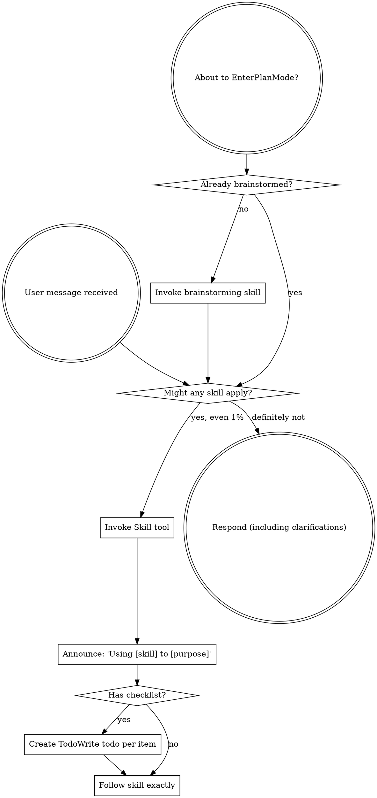

codex-exec: report contract violation

--- codex stdout ---
No remaining findings.

1. **Exit codes — MET.** Exact assertions cover 2/unavailable (`assert-install-contract.cjs:559-570`), 0/current (`:574-586`), 10/drift (`:589-615`), and 1/usage conflict (`:617-623`). Implementation preserves 0/10, coerces inability to 2 (`install.sh:358-374,437`), and rejects conflicts with 1 (`:1253-1259`).

2. **Deferred normalisation — MET.** Input is only stored while parsing (`install.sh:1213-1226`); argument and conflict validation precede quoted normalization (`:1248-1268`). Writers are unreachable until `:1279`; without Node, writer actions refuse at `:1273-1275`. Node-less doctor uses the raw value only in quoted, read-only probes.

3. **`set -e` and read-only — MET.** `set -e` remains enabled (`install.sh:7`). Doctor/writer conflict rejection precedes normalization, writer prechecks, and dispatch (`:1253-1299`); the reorder introduces no reachable writer.

- Doctor read-only: reconfirmed (`install.sh:354-437`).
- Formatter does not recompute: reconfirmed (`hook-install-contract.cjs:570-608`).
- Worktree/non-repository/remote-unavailable distinctions: reconfirmed (`install.sh:405-421`).
- T1 behavior: reconfirmed unchanged; the production delta is confined to deferred argument normalization (`install.sh:1213-1277`).

SPEC VERDICT: PASS

--- codex stderr ---
OpenAI Codex v0.146.0
--------
workdir: <HOME>\AppData\Roaming\warp\Warp\data\worktrees\GSDedits\luminaria-hogback
model: gpt-5.6-sol
provider: openai
approval: never
sandbox: read-only
reasoning effort: xhigh
reasoning summaries: none
session id: 01a03a74-e19d-7563-b954-70cd483cf1a9
--------
user
# Spec-compliance review of P168-T2. Read-only. Judge raw artifacts, not the executor report.

Plan: .../168-install-contract/168-01-PLAN-LOCKED.md, task `P168-T2` only.
Diff: `git show fc30be7`. T1 was reviewed separately and returned PASS; do not re-review it
except to confirm T2 did not regress it.

Orchestrator-run, take as given, do not re-run:
install-contract 4/4 (including `doctor-real-git-worktree-staleness`),
installer-registration-guard 13/13, a real `install.sh --init-project` from a decoy cwd
into an empty project exits 0 delivering 17 hooks and 9 `scripts/lib` modules,
assert-hook-contract 38/38, assert-prompt-contracts 4/4, assert-witness-correlation 13/13,
assert-propagation PASS, P166 6/6, P154 PASS, composer/enrichment-gate/kb-triage-shadow
PASS, feature-propagation 15/15, `bash -n` clean.

Judge each P168-T2 `semantic_acceptance_criteria` entry MET or NOT MET with a file:line
citation. Then judge these specifically:

1. **Is `--doctor` genuinely read-only on every path?** The plan forbids it calling
   `applyProjectInstall`, npm, the settings merge, key provisioning, or broker/grant
   repair. Trace the actual call graph, do not trust the byte-identity test alone: a test
   fixture may not exercise a branch that writes. Name any reachable writer.

2. **Does `formatProjectInstallStatus` recompute state?** The contract says consume T1's
   `inspectProjectInstall` report. Recomputation would reintroduce the drift this phase
   exists to remove.

3. **Is the worktree detection correct and complete?** It replaced
   `[ -d "$PROJECT_DIR/.git" ]`. Check it handles: `.git` as a directory, `.git` as a
   worktree file, a submodule-style gitdir pointer, and a genuinely non-git directory,
   which must still report cleanly rather than erroring. Confirm the remote-unavailable
   case is distinguished from "not a repository", because conflating them is how the
   original bug hid.

4. **Exit codes.** The executor claims 0/10/2 and a refusal when doctor is combined with a
   writer action. Are those coherent and asserted?

5. **Regression.** Did T2 change any T1 behaviour: delivery, the closure, refuse-before-
   write ordering, the classifier, or the truncation fail-closed rule?

Report findings by severity with file:line. End with exactly
`SPEC VERDICT: PASS` or `SPEC VERDICT: FAIL`. A NOT MET criterion forces FAIL.
Bound yourself to about 18 shell commands. Max 500 words.

## ROUND 2 — one finding only

Round 1 returned FAIL on exactly one HIGH and marked everything else MET: doctor is
genuinely read-only with no reachable writer, the formatter does not recompute, worktree
detection is correct and complete, and there is no T1 regression. Re-confirm each in one
line and do not reopen them.

The open item was:

> With explicit `--project-dir`, argument parsing invokes `node` before `doctor()`
> (install.sh:1211-1217). If Node is unavailable, `set -e` exits 127, never reaching
> doctor's status 2 path. Tests assert 0 and 10 but never 2; the writer-conflict test
> asserts only nonzero, not the coherent usage-error code 1.

The fix defers explicit-project normalisation until after argument and conflict
validation, adds a PATH-based node-unavailable case using space-bearing paths, and
tightens the conflict assertion to exactly 1. Claimed contract: 0 current, 10 drift,
2 inability, 1 usage conflict, all reachable and asserted.

Judge only:

1. Is every one of 0/10/2/1 genuinely reachable, and is each asserted by a test that
   would fail if the code changed?
2. Does deferring normalisation introduce any path where an invalid or hostile
   `--project-dir` is acted on before validation?
3. Is `set -e` still enabled, and is doctor still strictly read-only after the reorder?

Orchestrator-run, take as given: install-contract 5/5, installer-registration-guard 13/13,
real install exits 0 delivering 17 hooks and 9 modules, doctor in this worktree reports a
real HEAD and a freshness comparison, `bash -n` clean.

Verdict line unchanged. Bound yourself to about 12 shell commands. Max 350 words.

codex
I’m using the `using-superpowers` and `review` skills to keep this a read-only, raw-artifact review. I’ll inspect only the Round 2 fix and the three reopened questions, without re-reviewing the already-MET areas.
exec
"C:\\WINDOWS\\System32\\WindowsPowerShell\\v1.0\\powershell.exe" -Command '$files = @('"'C:\\Users\\operator\\.codex\\skills\\using-superpowers\\SKILL.md','C:\\Users\\operator\\.agents\\skills\\review\\SKILL.md'); foreach ("'$file in $files) { Write-Output "FILE: $file"; Get-Content -LiteralPath $file }' in <HOME>\AppData\Roaming\warp\Warp\data\worktrees\GSDedits\luminaria-hogback
 succeeded in 992ms:
FILE: <HOME>\.codex\skills\using-superpowers\SKILL.md
---
name: using-superpowers
description: Use when starting any conversation - establishes how to find and use skills, requiring Skill tool invocation before ANY response including clarifying questions
---

<SUBAGENT-STOP>
If you were dispatched as a subagent to execute a specific task, skip this skill.
</SUBAGENT-STOP>

<EXTREMELY-IMPORTANT>
If you think there is even a 1% chance a skill might apply to what you are doing, you ABSOLUTELY MUST invoke the skill.

IF A SKILL APPLIES TO YOUR TASK, YOU DO NOT HAVE A CHOICE. YOU MUST USE IT.

This is not negotiable. This is not optional. You cannot rationalize your way out of this.
</EXTREMELY-IMPORTANT>

## Instruction Priority

Superpowers skills override default system prompt behavior, but **user instructions always take precedence**:

1. **User's explicit instructions** (CLAUDE.md, GEMINI.md, AGENTS.md, direct requests) ƒ?" highest priority
2. **Superpowers skills** ƒ?" override default system behavior where they conflict
3. **Default system prompt** ƒ?" lowest priority

If CLAUDE.md, GEMINI.md, or AGENTS.md says "don't use TDD" and a skill says "always use TDD," follow the user's instructions. The user is in control.

## How to Access Skills

**In Claude Code:** Use the `Skill` tool. When you invoke a skill, its content is loaded and presented to youƒ?"follow it directly. Never use the Read tool on skill files.

**In Copilot CLI:** Use the `skill` tool. Skills are auto-discovered from installed plugins. The `skill` tool works the same as Claude Code's `Skill` tool.

**In Gemini CLI:** Skills activate via the `activate_skill` tool. Gemini loads skill metadata at session start and activates the full content on demand.

**In other environments:** Check your platform's documentation for how skills are loaded.

## Platform Adaptation

Skills use Claude Code tool names. Non-CC platforms: see `references/copilot-tools.md` (Copilot CLI), `references/codex-tools.md` (Codex) for tool equivalents. Gemini CLI users get the tool mapping loaded automatically via GEMINI.md.

# Using Skills

## The Rule

**Invoke relevant or requested skills BEFORE any response or action.** Even a 1% chance a skill might apply means that you should invoke the skill to check. If an invoked skill turns out to be wrong for the situation, you don't need to use it.



## Red Flags

These thoughts mean STOPƒ?"you're rationalizing:

| Thought | Reality |
|---------|---------|
| "This is just a simple question" | Questions are tasks. Check for skills. |
| "I need more context first" | Skill check comes BEFORE clarifying questions. |
| "Let me explore the codebase first" | Skills tell you HOW to explore. Check first. |
| "I can check git/files quickly" | Files lack conversation context. Check for skills. |
| "Let me gather information first" | Skills tell you HOW to gather information. |
| "This doesn't need a formal skill" | If a skill exists, use it. |
| "I remember this skill" | Skills evolve. Read current version. |
| "This doesn't count as a task" | Action = task. Check for skills. |
| "The skill is overkill" | Simple things become complex. Use it. |
| "I'll just do this one thing first" | Check BEFORE doing anything. |
| "This feels productive" | Undisciplined action wastes time. Skills prevent this. |
| "I know what that means" | Knowing the concept ƒ%ÿ using the skill. Invoke it. |

## Skill Priority

When multiple skills could apply, use this order:

1. **Process skills first** (brainstorming, debugging) - these determine HOW to approach the task
2. **Implementation skills second** (frontend-design, mcp-builder) - these guide execution

"Let's build X" ā' brainstorming first, then implementation skills.
"Fix this bug" ā' debugging first, then domain-specific skills.

## Skill Types

**Rigid** (TDD, debugging): Follow exactly. Don't adapt away discipline.

**Flexible** (patterns): Adapt principles to context.

The skill itself tells you which.

## User Instructions

Instructions say WHAT, not HOW. "Add X" or "Fix Y" doesn't mean skip workflows.
FILE: <HOME>\.agents\skills\review\SKILL.md
---
name: review
description: Review code changes for security, performance, bugs, and quality. Reviews staged changes, unstaged changes, specific commits, or PR-ready diffs.
---

<objective>
Review code changes and provide structured feedback covering security, performance, bug risks, code quality, and test coverage gaps. This skill analyzes diffs and surrounding context to catch issues before they reach production.
</objective>

<context>
This skill reviews code changes at various stages of the development workflow. It can review staged changes before a commit, unstaged work-in-progress, a specific commit, or the full set of changes on a branch that are ready for a pull request.

The reviewer reads both the diff and the surrounding source files to understand intent and catch issues that only appear in context.
</context>

<core_principle>
**FIND REAL ISSUES, NOT STYLE NITS.** Focus on problems that cause bugs, security vulnerabilities, performance degradation, or maintainability pain. Avoid nitpicking formatting or subjective style preferences unless they harm readability.
</core_principle>

<analysis_only_rule>
**THIS SKILL IS READ-ONLY. DO NOT MODIFY CODE.**

The purpose is to review and report findings. Making changes during review conflates the reviewer and author roles. Present findings and let the user decide what to act on.
</analysis_only_rule>

<quick_start>

<determine_review_scope>

Parse the user's input to determine what to review:

1. **No arguments** - Review staged changes first. If nothing is staged, review unstaged changes.
   - Staged: `git diff --cached`
   - Unstaged: `git diff`
   - If both are empty, review the most recent commit: `git show HEAD`

2. **Commit hash argument** (e.g., `/review abc1234`) - Review that specific commit.
   - `git show <hash>`

3. **File path argument** (e.g., `/review src/foo.ts`) - Review unstaged changes in that file.
   - `git diff -- <path>` then fall back to `git diff --cached -- <path>`

4. **"pr" argument** (e.g., `/review pr`) - Review all changes since branching from main.
   - `git diff main...HEAD`
   - If on main, review `git diff HEAD~1`

After obtaining the diff, if it is empty, inform the user that there are no changes to review and stop.

</determine_review_scope>

<gather_context>

Before analyzing the diff:

1. **Read changed files in full** - Do not review a diff in isolation. Read each modified file to understand the surrounding code, imports, types, and control flow.
2. **Identify the tech stack** - Note languages, frameworks, and libraries in use. This affects what patterns are risky.
3. **Check for related test files** - For each changed source file, look for corresponding test files. Note whether tests were updated alongside the changes.
4. **Check for configuration changes** - If config files changed (env, CI, package.json, tsconfig, etc.), pay extra attention to side effects.

</gather_context>

<review_categories>

Analyze the changes against each category below. Only report findings that are actually present. Skip categories with no issues.

**A. Security Issues** (Severity: CRITICAL or HIGH)
- Injection vulnerabilities (SQL injection, command injection, template injection)
- Cross-site scripting (XSS) - unsanitized user input rendered in HTML
- Authentication and authorization flaws (missing auth checks, privilege escalation)
- Secrets or credentials hardcoded or logged
- Insecure deserialization or unsafe eval usage
- Path traversal or file access vulnerabilities
- Missing input validation on external data

**B. Performance Concerns** (Severity: HIGH or MEDIUM)
- N+1 query patterns in database access
- Unnecessary memory allocations in hot paths or loops
- Blocking operations on the main thread or in async contexts
- Missing pagination on unbounded queries
- Redundant computation that could be cached or memoized
- Large payloads without streaming or chunking

**C. Bug Risks** (Severity: HIGH or MEDIUM)
- Off-by-one errors in loops or array access
- Null/undefined dereferences without guards
- Race conditions in concurrent or async code
- Incorrect error handling (swallowed errors, wrong error types)
- Type mismatches or unsafe type assertions
- Logic errors in conditionals (inverted checks, missing cases)
- Resource leaks (unclosed connections, file handles, listeners)

**D. Code Quality** (Severity: MEDIUM or LOW)
- Unclear or misleading naming
- Significant code duplication that should be extracted
- Excessive complexity (deeply nested logic, functions doing too many things)
- Dead code or unreachable branches
- Missing or misleading comments on non-obvious logic
- Inconsistency with patterns used elsewhere in the codebase

**E. Test Coverage Gaps** (Severity: MEDIUM or LOW)
- New logic paths without corresponding test cases
- Changed behavior without updated tests
- Edge cases not covered (empty inputs, boundary values, error paths)
- Missing integration tests for new API endpoints or database changes

</review_categories>

<format_findings>

For each finding, use this structure:

```
### [SEVERITY] Category: Brief Title

**File**: `path/to/file.ext` (lines X-Y)

**Issue**: Clear description of the problem.

**Why it matters**: What could go wrong if this is not addressed.

**Suggestion**: How to fix it, with a code snippet if helpful.
```

Severity levels:
- **CRITICAL** - Must fix before merge. Security vulnerability or data loss risk.
- **HIGH** - Should fix before merge. Likely bug or significant performance issue.
- **MEDIUM** - Should fix soon. Code quality or moderate risk issue.
- **LOW** - Consider fixing. Minor improvement opportunity.

</format_findings>

</quick_start>

<critical_rules>

1. **READ THE FULL FILE**: Never review a diff without reading the complete source file for context
2. **NO FALSE ALARMS**: Only report issues you can explain concretely. Do not report vague concerns
3. **PRIORITIZE**: Lead with the most severe findings. Do not bury critical issues under style nits
4. **BE SPECIFIC**: Include file paths, line numbers, and code references for every finding
5. **EXPLAIN THE RISK**: For each finding, explain what could actually go wrong
6. **CHECK TESTS**: Always check whether changes have corresponding test updates
7. **CONSIDER THE STACK**: Apply language-specific and framework-specific knowledge to your review
8. **DO NOT MODIFY CODE**: Present findings only. The user decides what to act on

</critical_rules>

<output_format>

```markdown
## Code Review: [brief description of what was reviewed]

**Scope**: [staged changes | unstaged changes | commit abc1234 | PR changes from main]
**Files reviewed**: [count] files changed, [additions] additions, [deletions] deletions

---

### Findings

[Findings grouped by severity, highest first. Use the format from <format_findings>.]

---

### Summary

| Severity | Count |
|----------|-------|
| CRITICAL | X     |
| HIGH     | X     |
| MEDIUM   | X     |
| LOW      | X     |

### Recommended Actions

1. [Most important action to take]
2. [Next most important action]
3. [...]
```

If no issues are found:

```markdown
## Code Review: [brief description]

**Scope**: [what was reviewed]
**Files reviewed**: [count]

No significant issues found. The changes look good to merge.
```

</output_format>

<decision_gate>

**After presenting findings, ALWAYS offer these options:**

```
ƒ"?ƒ"?ƒ"?ƒ"?ƒ"?ƒ"?ƒ"?ƒ"?ƒ"?ƒ"?ƒ"?ƒ"?ƒ"?ƒ"?ƒ"?ƒ"?ƒ"?ƒ"?ƒ"?ƒ"?ƒ"?ƒ"?ƒ"?ƒ"?ƒ"?ƒ"?ƒ"?ƒ"?ƒ"?ƒ"?ƒ"?ƒ"?ƒ"?ƒ"?ƒ"?ƒ"?ƒ"?ƒ"?ƒ"?ƒ"?ƒ"?
REVIEW COMPLETE

What would you like to do?

1. **Fix issues** - I'll address the findings starting with the most critical
2. **Save review** - Export findings to a markdown file
3. **Review again** - Re-review with different scope or focus
4. **Discuss a finding** - Ask questions about a specific issue
5. **Other** - Tell me what you need
ƒ"?ƒ"?ƒ"?ƒ"?ƒ"?ƒ"?ƒ"?ƒ"?ƒ"?ƒ"?ƒ"?ƒ"?ƒ"?ƒ"?ƒ"?ƒ"?ƒ"?ƒ"?ƒ"?ƒ"?ƒ"?ƒ"?ƒ"?ƒ"?ƒ"?ƒ"?ƒ"?ƒ"?ƒ"?ƒ"?ƒ"?ƒ"?ƒ"?ƒ"?ƒ"?ƒ"?ƒ"?ƒ"?ƒ"?ƒ"?ƒ"?
```

**Wait for user response before taking any action.**

This gate is MANDATORY. Never skip it. Never auto-implement fixes.

</decision_gate>
<HOME>\OneDrive - <ORG>\Documents\WindowsPowerShell\profile.ps1 : Cannot dot-source this 
command because it was defined in a different language mode. To invoke this command without importing its contents, 
omit the '.' operator.
At line:1 char:1
+ . '<HOME>\OneDrive - <ORG>\Documents\Win ...
+ ~~~~~~~~~~~~~~~~~~~~~~~~~~~~~~~~~~~~~~~~~~~~~~~~~~~~~~~~~~~~~~~~~~~~~
    + CategoryInfo          : InvalidOperation: (:) [profile.ps1], NotSupportedException
    + FullyQualifiedErrorId : DotSourceNotSupported,profile.ps1
 
<HOME>\OneDrive - <ORG>\Documents\WindowsPowerShell\Microsoft.PowerShell_profile.ps1 : 
Cannot dot-source this command because it was defined in a different language mode. To invoke this command without 
importing its contents, omit the '.' operator.
At line:1 char:1
+ . '<HOME>\OneDrive - <ORG>\Documents\Win ...
+ ~~~~~~~~~~~~~~~~~~~~~~~~~~~~~~~~~~~~~~~~~~~~~~~~~~~~~~~~~~~~~~~~~~~~~
    + CategoryInfo          : InvalidOperation: (:) [Microsoft.PowerShell_profile.ps1], NotSupportedException
    + FullyQualifiedErrorId : DotSourceNotSupported,Microsoft.PowerShell_profile.ps1
 

exec
"C:\\WINDOWS\\System32\\WindowsPowerShell\\v1.0\\powershell.exe" -Command 'git status --short; git log --oneline -8' in <HOME>\AppData\Roaming\warp\Warp\data\worktrees\GSDedits\luminaria-hogback
 succeeded in 719ms:
?? .planning/milestones/v4.0-install-contract/phases/168-install-contract/168-T2-SPEC2-PROMPT.md
?? .planning/milestones/v4.0-install-contract/phases/168-install-contract/168-T2-SPEC2-WRAPPER.log
?? .planning/tmp/
e919000 fix(168-02): the doctor exit-code contract now holds on the explicit-project path
fc30be7 feat(168-02): read-only doctor, and the freshness check finally works in a worktree
7234cb2 fix(168-01): truncated smoke output can no longer read as a clean policy decision
0dfd0d1 fix(168-01): close the three spec-review findings without breaking recovery
c867978 chore(checkpoint): P168 T1 delivered and green; spec fixes parked as a patch
7550116 feat(168-01): deliver the modules hooks require, and prove it on an empty tree
d3eba2d docs(168): plan rev 2 GO after NOGO, refuse-before-write made literal
55de820 docs(168): plan authored and schema-VALID, one atomic GATE-tier task
<HOME>\OneDrive - <ORG>\Documents\WindowsPowerShell\profile.ps1 : Cannot dot-source this 
command because it was defined in a different language mode. To invoke this command without importing its contents, 
omit the '.' operator.
At line:1 char:1
+ . '<HOME>\OneDrive - <ORG>\Documents\Win ...
+ ~~~~~~~~~~~~~~~~~~~~~~~~~~~~~~~~~~~~~~~~~~~~~~~~~~~~~~~~~~~~~~~~~~~~~
    + CategoryInfo          : InvalidOperation: (:) [profile.ps1], NotSupportedException
    + FullyQualifiedErrorId : DotSourceNotSupported,profile.ps1
 
<HOME>\OneDrive - <ORG>\Documents\WindowsPowerShell\Microsoft.PowerShell_profile.ps1 : 
Cannot dot-source this command because it was defined in a different language mode. To invoke this command without 
importing its contents, omit the '.' operator.
At line:1 char:1
+ . '<HOME>\OneDrive - <ORG>\Documents\Win ...
+ ~~~~~~~~~~~~~~~~~~~~~~~~~~~~~~~~~~~~~~~~~~~~~~~~~~~~~~~~~~~~~~~~~~~~~
    + CategoryInfo          : InvalidOperation: (:) [Microsoft.PowerShell_profile.ps1], NotSupportedException
    + FullyQualifiedErrorId : DotSourceNotSupported,Microsoft.PowerShell_profile.ps1
 

exec
"C:\\WINDOWS\\System32\\WindowsPowerShell\\v1.0\\powershell.exe" -Command 'git show --stat --oneline e919000; git show --format=fuller --find-renames --find-copies e919000 --' in <HOME>\AppData\Roaming\warp\Warp\data\worktrees\GSDedits\luminaria-hogback
 succeeded in 1016ms:
e919000 fix(168-02): the doctor exit-code contract now holds on the explicit-project path
 .../phases/168-install-contract/168-MUDA-PROMPT.md |   36 +
 .../168-install-contract/168-MUDA-WRAPPER.log      |    1 +
 .../168-install-contract/168-T2-SPEC-PROMPT.md     |   42 +
 .../168-install-contract/168-T2-SPEC-REVIEW.md     | 4535 +++++++++++
 .../168-install-contract/168-T2-SPEC-WRAPPER.log   |    1 +
 .../phases/168-install-contract/168-T2B-FILES.txt  |    2 +
 .../phases/168-install-contract/168-T2B-PROMPT.md  |   60 +
 .../phases/168-install-contract/168-T2B-REPORT.md  |   33 +
 .../168-install-contract/168-T2B-WRAPPER.log       |    1 +
 .../phases/168-install-contract/168-WASTE.md       | 7894 ++++++++++++++++++++
 super-gsd/install.sh                               |   21 +-
 .../install-contract/assert-install-contract.cjs   |   42 +-
 12 files changed, 12665 insertions(+), 3 deletions(-)
commit e9190007f3cb37420f8d0c18d771b1fb67f7edf6
Author:     operator <operator@users.noreply.github.com>
AuthorDate: Tue Aug 25 20:45:25 2026 +0100
Commit:     operator <operator@users.noreply.github.com>
CommitDate: Tue Aug 25 20:45:25 2026 +0100

    fix(168-02): the doctor exit-code contract now holds on the explicit-project path
    
    With --project-dir, argument parsing normalised the path via node before doctor()
    ran, so on a machine without node set -e exited 127 and never reached doctor's
    status 2. The promised codes were also under-asserted: 2 was never tested and the
    writer conflict asserted only nonzero.
    
    Normalisation is deferred until after argument and conflict validation, so a
    missing node reaches the status 2 inability path with set -e still enabled. The
    new case makes node genuinely unavailable via PATH rather than stubbing an
    internal, and uses space-bearing paths. The writer conflict now asserts exactly 1.
    
    Exit codes, each reachable and asserted: 0 current, 10 drift, 2 inability,
    1 usage conflict.
    
    install-contract 5/5, guard 13/13, real install exits 0 delivering 17 hooks and
    9 modules, doctor in this worktree reports a real HEAD and freshness, bash -n clean.

diff --git a/.planning/milestones/v4.0-install-contract/phases/168-install-contract/168-MUDA-PROMPT.md b/.planning/milestones/v4.0-install-contract/phases/168-install-contract/168-MUDA-PROMPT.md
new file mode 100644
index 0000000..bfa56bd
--- /dev/null
+++ b/.planning/milestones/v4.0-install-contract/phases/168-install-contract/168-MUDA-PROMPT.md
@@ -0,0 +1,36 @@
+# MUDA audit — phase 168 Install Contract. Read-only, do not edit.
+
+Scope: commits from `c01baa7` to HEAD on branch luminaria-hogback.
+
+For each of the 8 wastes give OK or WARN with concrete evidence: file:line, commit, or a
+counted figure. No waste may be marked OK without a stated reason.
+
+1. Overproduction — code, tests or artifacts beyond the locked plan.
+2. Waiting — serialized dispatches that could have been parallel; time lost to
+   sandbox-denied commands the orchestrator then re-ran unsandboxed.
+3. Transport — context repackaged between agents more than necessary.
+4. Over-processing — rework rounds. This phase ran roughly 20 executor dispatches.
+   Identify the root causes and say which rounds were avoidable, with evidence. Note in
+   particular: one dispatch built a 1,458-line transactional installer that ended with
+   `install.sh` exiting 0 delivering nothing and was reverted wholesale; three dispatches
+   were killed mid-implementation (two timeouts, one by a wrapper false positive that
+   greps stderr for "auth").
+5. Inventory — half-finished work, dead scaffolding, uncommitted state, orphaned fixtures
+   or temp dirs. Two abandoned patches are deliberately retained as evidence
+   (`168-ABANDONED-STAGED-INSTALLER.patch`, `168-SPECFIX-WIP.patch`); judge whether
+   keeping them is evidence or clutter.
+6. Motion — repeated navigation, re-reading, suites re-run without change.
+7. Defects — bugs that escaped into a commit and were fixed later in the same phase.
+   Count them and name the ones that reached production code.
+8. Unused talent — work given to the wrong model or tool.
+
+Then answer two questions directly:
+
+- The spec-compliance gate FAILed twice before passing, and the plan review NOGOed once.
+  Was that gate spend justified by what it caught, or was it rework the plan should have
+  prevented? Be concrete about what each gate actually caught.
+- This phase's single most expensive mistake was scope over-reach by an executor. What is
+  the smallest process change that would have caught it within the first dispatch rather
+  than after four?
+
+End with exactly `MUDA VERDICT: PASS` or `MUDA VERDICT: WARN`. Max 500 words.
diff --git a/.planning/milestones/v4.0-install-contract/phases/168-install-contract/168-MUDA-WRAPPER.log b/.planning/milestones/v4.0-install-contract/phases/168-install-contract/168-MUDA-WRAPPER.log
new file mode 100644
index 0000000..a3ed11e
--- /dev/null
+++ b/.planning/milestones/v4.0-install-contract/phases/168-install-contract/168-MUDA-WRAPPER.log
@@ -0,0 +1 @@
+codex-exec: report contract violation — one or more of FINDINGS/CRITICAL/WARNINGS/PASS_RATE/ONE_LINER missing from codex stdout
diff --git a/.planning/milestones/v4.0-install-contract/phases/168-install-contract/168-T2-SPEC-PROMPT.md b/.planning/milestones/v4.0-install-contract/phases/168-install-contract/168-T2-SPEC-PROMPT.md
new file mode 100644
index 0000000..b341446
--- /dev/null
+++ b/.planning/milestones/v4.0-install-contract/phases/168-install-contract/168-T2-SPEC-PROMPT.md
@@ -0,0 +1,42 @@
+# Spec-compliance review of P168-T2. Read-only. Judge raw artifacts, not the executor report.
+
+Plan: .../168-install-contract/168-01-PLAN-LOCKED.md, task `P168-T2` only.
+Diff: `git show fc30be7`. T1 was reviewed separately and returned PASS; do not re-review it
+except to confirm T2 did not regress it.
+
+Orchestrator-run, take as given, do not re-run:
+install-contract 4/4 (including `doctor-real-git-worktree-staleness`),
+installer-registration-guard 13/13, a real `install.sh --init-project` from a decoy cwd
+into an empty project exits 0 delivering 17 hooks and 9 `scripts/lib` modules,
+assert-hook-contract 38/38, assert-prompt-contracts 4/4, assert-witness-correlation 13/13,
+assert-propagation PASS, P166 6/6, P154 PASS, composer/enrichment-gate/kb-triage-shadow
+PASS, feature-propagation 15/15, `bash -n` clean.
+
+Judge each P168-T2 `semantic_acceptance_criteria` entry MET or NOT MET with a file:line
+citation. Then judge these specifically:
+
+1. **Is `--doctor` genuinely read-only on every path?** The plan forbids it calling
+   `applyProjectInstall`, npm, the settings merge, key provisioning, or broker/grant
+   repair. Trace the actual call graph, do not trust the byte-identity test alone: a test
+   fixture may not exercise a branch that writes. Name any reachable writer.
+
+2. **Does `formatProjectInstallStatus` recompute state?** The contract says consume T1's
+   `inspectProjectInstall` report. Recomputation would reintroduce the drift this phase
+   exists to remove.
+
+3. **Is the worktree detection correct and complete?** It replaced
+   `[ -d "$PROJECT_DIR/.git" ]`. Check it handles: `.git` as a directory, `.git` as a
+   worktree file, a submodule-style gitdir pointer, and a genuinely non-git directory,
+   which must still report cleanly rather than erroring. Confirm the remote-unavailable
+   case is distinguished from "not a repository", because conflating them is how the
+   original bug hid.
+
+4. **Exit codes.** The executor claims 0/10/2 and a refusal when doctor is combined with a
+   writer action. Are those coherent and asserted?
+
+5. **Regression.** Did T2 change any T1 behaviour: delivery, the closure, refuse-before-
+   write ordering, the classifier, or the truncation fail-closed rule?
+
+Report findings by severity with file:line. End with exactly
+`SPEC VERDICT: PASS` or `SPEC VERDICT: FAIL`. A NOT MET criterion forces FAIL.
+Bound yourself to about 18 shell commands. Max 500 words.
diff --git a/.planning/milestones/v4.0-install-contract/phases/168-install-contract/168-T2-SPEC-REVIEW.md b/.planning/milestones/v4.0-install-contract/phases/168-install-contract/168-T2-SPEC-REVIEW.md
new file mode 100644
index 0000000..d0c5ad2
--- /dev/null
+++ b/.planning/milestones/v4.0-install-contract/phases/168-install-contract/168-T2-SPEC-REVIEW.md
@@ -0,0 +1,4535 @@
+codex-exec: report contract violation
+
+--- codex stdout ---
+## HIGH — Exit-code contract incomplete
+
+With explicit `--project-dir`, argument parsing invokes `node` before `doctor()` (`super-gsd/install.sh:1211-1217`). If Node is unavailable, `set -e` (`install.sh:7`) exits 127, never reaching doctor’s intended status 2 path (`install.sh:356-375`). Tests assert 0 and 10, but never 2; the writer-conflict test asserts only nonzero, not the coherent usage-error code 1 (`assert-install-contract.cjs:539-554,577-583`).
+
+### T2 semantic criteria
+
+- **Shared inspection, formatting, strict read-only — MET.** `inspectProjectInstall` creates the report once (`hook-install-contract.cjs:509-567`); `formatProjectInstallStatus` only transforms supplied rows (`:570-608`). The CLI calls inspection once and passes that report directly to the formatter (`:880-888`). Writer combinations are rejected before prechecks/publication (`install.sh:1249-1277`). No reachable writer exists: no `applyProjectInstall`, candidate preparation, npm, settings merge, keys, broker, or grants.
+- **Worktree freshness and 0/10/2 outcomes — NOT MET.** Git detection itself is correct: `git -C … rev-parse` handles `.git` directories, linked-worktree files, and submodule-style gitdir pointers; non-Git directories take the clean reporting branch (`install.sh:403-420`). Remote unavailability is separately reported (`:405-415`). However, the explicit-project missing-Node path escapes the promised exit-code set as described above.
+- **Real-process proof and T1 regression wall — MET.** Tests cover normal `.git` directory and linked-worktree `.git` file shapes, exact drift output, byte identity, repair, and refusal-before-write (`assert-install-contract.cjs:483-611`). Supplied all-suite results establish the requested regression run.
+
+### Specific judgments
+
+1. Doctor call graph: genuinely read-only; no reachable writer.
+2. Formatter recomputation: none.
+3. Worktree detection: correct and complete by Git semantics; remote failure is not conflated with non-repository.
+4. Exit codes: 0/10 asserted; 2 unasserted and bypassed on one inability path; conflict refusal is coherent but only generically asserted.
+5. T1 regression: none found. T2 adds report metadata/presentation only; closure, delivery, refusal ordering, classifier, and bounded fail-closed truncation remain unchanged.
+
+SPEC VERDICT: FAIL
+
+--- codex stderr ---
+OpenAI Codex v0.146.0
+--------
+workdir: <HOME>\AppData\Roaming\warp\Warp\data\worktrees\GSDedits\luminaria-hogback
+model: gpt-5.6-sol
+provider: openai
+approval: never
+sandbox: read-only
+reasoning effort: xhigh
+reasoning summaries: none
+session id: 01a03a4e-871c-71c0-be34-55a874c188d3
+--------
+user
+# Spec-compliance review of P168-T2. Read-only. Judge raw artifacts, not the executor report.
+
+Plan: .../168-install-contract/168-01-PLAN-LOCKED.md, task `P168-T2` only.
+Diff: `git show fc30be7`. T1 was reviewed separately and returned PASS; do not re-review it
+except to confirm T2 did not regress it.
+
+Orchestrator-run, take as given, do not re-run:
+install-contract 4/4 (including `doctor-real-git-worktree-staleness`),
+installer-registration-guard 13/13, a real `install.sh --init-project` from a decoy cwd
+into an empty project exits 0 delivering 17 hooks and 9 `scripts/lib` modules,
+assert-hook-contract 38/38, assert-prompt-contracts 4/4, assert-witness-correlation 13/13,
+assert-propagation PASS, P166 6/6, P154 PASS, composer/enrichment-gate/kb-triage-shadow
+PASS, feature-propagation 15/15, `bash -n` clean.
+
+Judge each P168-T2 `semantic_acceptance_criteria` entry MET or NOT MET with a file:line
+citation. Then judge these specifically:
+
+1. **Is `--doctor` genuinely read-only on every path?** The plan forbids it calling
+   `applyProjectInstall`, npm, the settings merge, key provisioning, or broker/grant
+   repair. Trace the actual call graph, do not trust the byte-identity test alone: a test
+   fixture may not exercise a branch that writes. Name any reachable writer.
+
+2. **Does `formatProjectInstallStatus` recompute state?** The contract says consume T1's
+   `inspectProjectInstall` report. Recomputation would reintroduce the drift this phase
+   exists to remove.
+
+3. **Is the worktree detection correct and complete?** It replaced
+   `[ -d "$PROJECT_DIR/.git" ]`. Check it handles: `.git` as a directory, `.git` as a
+   worktree file, a submodule-style gitdir pointer, and a genuinely non-git directory,
+   which must still report cleanly rather than erroring. Confirm the remote-unavailable
+   case is distinguished from "not a repository", because conflating them is how the
+   original bug hid.
+
+4. **Exit codes.** The executor claims 0/10/2 and a refusal when doctor is combined with a
+   writer action. Are those coherent and asserted?
+
+5. **Regression.** Did T2 change any T1 behaviour: delivery, the closure, refuse-before-
+   write ordering, the classifier, or the truncation fail-closed rule?
+
+Report findings by severity with file:line. End with exactly
+`SPEC VERDICT: PASS` or `SPEC VERDICT: FAIL`. A NOT MET criterion forces FAIL.
+Bound yourself to about 18 shell commands. Max 500 words.
+
+codex
+I’m using the mandatory `using-superpowers` workflow plus the `review` skill, because this is a commit-level spec review. I’ll keep the repository untouched, treat the supplied test results as evidence, and independently trace T2’s raw implementation and call graph.
+exec
+"C:\\WINDOWS\\System32\\WindowsPowerShell\\v1.0\\powershell.exe" -Command '$paths = @('"'C:\\Users\\operator\\.codex\\skills\\using-superpowers\\SKILL.md','C:\\Users\\operator\\.agents\\skills\\review\\SKILL.md'); foreach ("'$p in $paths) { "===== $p ====="; Get-Content -LiteralPath $p -Raw }' in <HOME>\AppData\Roaming\warp\Warp\data\worktrees\GSDedits\luminaria-hogback
+ succeeded in 973ms:
+===== <HOME>\.codex\skills\using-superpowers\SKILL.md =====
+---
+name: using-superpowers
+description: Use when starting any conversation - establishes how to find and use skills, requiring Skill tool invocation before ANY response including clarifying questions
+---
+
+<SUBAGENT-STOP>
+If you were dispatched as a subagent to execute a specific task, skip this skill.
+</SUBAGENT-STOP>
+
+<EXTREMELY-IMPORTANT>
+If you think there is even a 1% chance a skill might apply to what you are doing, you ABSOLUTELY MUST invoke the skill.
+
+IF A SKILL APPLIES TO YOUR TASK, YOU DO NOT HAVE A CHOICE. YOU MUST USE IT.
+
+This is not negotiable. This is not optional. You cannot rationalize your way out of this.
+</EXTREMELY-IMPORTANT>
+
+## Instruction Priority
+
+Superpowers skills override default system prompt behavior, but **user instructions always take precedence**:
+
+1. **User's explicit instructions** (CLAUDE.md, GEMINI.md, AGENTS.md, direct requests) ƒ?" highest priority
+2. **Superpowers skills** ƒ?" override default system behavior where they conflict
+3. **Default system prompt** ƒ?" lowest priority
+
+If CLAUDE.md, GEMINI.md, or AGENTS.md says "don't use TDD" and a skill says "always use TDD," follow the user's instructions. The user is in control.
+
+## How to Access Skills
+
+**In Claude Code:** Use the `Skill` tool. When you invoke a skill, its content is loaded and presented to youƒ?"follow it directly. Never use the Read tool on skill files.
+
+**In Copilot CLI:** Use the `skill` tool. Skills are auto-discovered from installed plugins. The `skill` tool works the same as Claude Code's `Skill` tool.
+
+**In Gemini CLI:** Skills activate via the `activate_skill` tool. Gemini loads skill metadata at session start and activates the full content on demand.
+
+**In other environments:** Check your platform's documentation for how skills are loaded.
+
+## Platform Adaptation
+
+Skills use Claude Code tool names. Non-CC platforms: see `references/copilot-tools.md` (Copilot CLI), `references/codex-tools.md` (Codex) for tool equivalents. Gemini CLI users get the tool mapping loaded automatically via GEMINI.md.
+
+# Using Skills
+
+## The Rule
+
+**Invoke relevant or requested skills BEFORE any response or action.** Even a 1% chance a skill might apply means that you should invoke the skill to check. If an invoked skill turns out to be wrong for the situation, you don't need to use it.
+
+```dot
+digraph skill_flow {
+    "User message received" [shape=doublecircle];
+    "About to EnterPlanMode?" [shape=doublecircle];
+    "Already brainstormed?" [shape=diamond];
+    "Invoke brainstorming skill" [shape=box];
+    "Might any skill apply?" [shape=diamond];
+    "Invoke Skill tool" [shape=box];
+    "Announce: 'Using [skill] to [purpose]'" [shape=box];
+    "Has checklist?" [shape=diamond];
+    "Create TodoWrite todo per item" [shape=box];
+    "Follow skill exactly" [shape=box];
+    "Respond (including clarifications)" [shape=doublecircle];
+
+    "About to EnterPlanMode?" -> "Already brainstormed?";
+    "Already brainstormed?" -> "Invoke brainstorming skill" [label="no"];
+    "Already brainstormed?" -> "Might any skill apply?" [label="yes"];
+    "Invoke brainstorming skill" -> "Might any skill apply?";
+
+    "User message received" -> "Might any skill apply?";
+    "Might any skill apply?" -> "Invoke Skill tool" [label="yes, even 1%"];
+    "Might any skill apply?" -> "Respond (including clarifications)" [label="definitely not"];
+    "Invoke Skill tool" -> "Announce: 'Using [skill] to [purpose]'";
+    "Announce: 'Using [skill] to [purpose]'" -> "Has checklist?";
+    "Has checklist?" -> "Create TodoWrite todo per item" [label="yes"];
+    "Has checklist?" -> "Follow skill exactly" [label="no"];
+    "Create TodoWrite todo per item" -> "Follow skill exactly";
+}
+```
+
+## Red Flags
+
+These thoughts mean STOPƒ?"you're rationalizing:
+
+| Thought | Reality |
+|---------|---------|
+| "This is just a simple question" | Questions are tasks. Check for skills. |
+| "I need more context first" | Skill check comes BEFORE clarifying questions. |
+| "Let me explore the codebase first" | Skills tell you HOW to explore. Check first. |
+| "I can check git/files quickly" | Files lack conversation context. Check for skills. |
+| "Let me gather information first" | Skills tell you HOW to gather information. |
+| "This doesn't need a formal skill" | If a skill exists, use it. |
+| "I remember this skill" | Skills evolve. Read current version. |
+| "This doesn't count as a task" | Action = task. Check for skills. |
+| "The skill is overkill" | Simple things become complex. Use it. |
+| "I'll just do this one thing first" | Check BEFORE doing anything. |
+| "This feels productive" | Undisciplined action wastes time. Skills prevent this. |
+| "I know what that means" | Knowing the concept ƒ%ÿ using the skill. Invoke it. |
+
+## Skill Priority
+
+When multiple skills could apply, use this order:
+
+1. **Process skills first** (brainstorming, debugging) - these determine HOW to approach the task
+2. **Implementation skills second** (frontend-design, mcp-builder) - these guide execution
+
+"Let's build X" ā' brainstorming first, then implementation skills.
+"Fix this bug" ā' debugging first, then domain-specific skills.
+
+## Skill Types
+
+**Rigid** (TDD, debugging): Follow exactly. Don't adapt away discipline.
+
+**Flexible** (patterns): Adapt principles to context.
+
+The skill itself tells you which.
+
+## User Instructions
+
+Instructions say WHAT, not HOW. "Add X" or "Fix Y" doesn't mean skip workflows.
+
+===== <HOME>\.agents\skills\review\SKILL.md =====
+---
+name: review
+description: Review code changes for security, performance, bugs, and quality. Reviews staged changes, unstaged changes, specific commits, or PR-ready diffs.
+---
+
+<objective>
+Review code changes and provide structured feedback covering security, performance, bug risks, code quality, and test coverage gaps. This skill analyzes diffs and surrounding context to catch issues before they reach production.
+</objective>
+
+<context>
+This skill reviews code changes at various stages of the development workflow. It can review staged changes before a commit, unstaged work-in-progress, a specific commit, or the full set of changes on a branch that are ready for a pull request.
+
+The reviewer reads both the diff and the surrounding source files to understand intent and catch issues that only appear in context.
+</context>
+
+<core_principle>
+**FIND REAL ISSUES, NOT STYLE NITS.** Focus on problems that cause bugs, security vulnerabilities, performance degradation, or maintainability pain. Avoid nitpicking formatting or subjective style preferences unless they harm readability.
+</core_principle>
+
+<analysis_only_rule>
+**THIS SKILL IS READ-ONLY. DO NOT MODIFY CODE.**
+
+The purpose is to review and report findings. Making changes during review conflates the reviewer and author roles. Present findings and let the user decide what to act on.
+</analysis_only_rule>
+
+<quick_start>
+
+<determine_review_scope>
+
+Parse the user's input to determine what to review:
+
+1. **No arguments** - Review staged changes first. If nothing is staged, review unstaged changes.
+   - Staged: `git diff --cached`
+   - Unstaged: `git diff`
+   - If both are empty, review the most recent commit: `git show HEAD`
+
+2. **Commit hash argument** (e.g., `/review abc1234`) - Review that specific commit.
+   - `git show <hash>`
+
+3. **File path argument** (e.g., `/review src/foo.ts`) - Review unstaged changes in that file.
+   - `git diff -- <path>` then fall back to `git diff --cached -- <path>`
+
+4. **"pr" argument** (e.g., `/review pr`) - Review all changes since branching from main.
+   - `git diff main...HEAD`
+   - If on main, review `git diff HEAD~1`
+
+After obtaining the diff, if it is empty, inform the user that there are no changes to review and stop.
+
+</determine_review_scope>
+
+<gather_context>
+
+Before analyzing the diff:
+
+1. **Read changed files in full** - Do not review a diff in isolation. Read each modified file to understand the surrounding code, imports, types, and control flow.
+2. **Identify the tech stack** - Note languages, frameworks, and libraries in use. This affects what patterns are risky.
+3. **Check for related test files** - For each changed source file, look for corresponding test files. Note whether tests were updated alongside the changes.
+4. **Check for configuration changes** - If config files changed (env, CI, package.json, tsconfig, etc.), pay extra attention to side effects.
+
+</gather_context>
+
+<review_categories>
+
+Analyze the changes against each category below. Only report findings that are actually present. Skip categories with no issues.
+
+**A. Security Issues** (Severity: CRITICAL or HIGH)
+- Injection vulnerabilities (SQL injection, command injection, template injection)
+- Cross-site scripting (XSS) - unsanitized user input rendered in HTML
+- Authentication and authorization flaws (missing auth checks, privilege escalation)
+- Secrets or credentials hardcoded or logged
+- Insecure deserialization or unsafe eval usage
+- Path traversal or file access vulnerabilities
+- Missing input validation on external data
+
+**B. Performance Concerns** (Severity: HIGH or MEDIUM)
+- N+1 query patterns in database access
+- Unnecessary memory allocations in hot paths or loops
+- Blocking operations on the main thread or in async contexts
+- Missing pagination on unbounded queries
+- Redundant computation that could be cached or memoized
+- Large payloads without streaming or chunking
+
+**C. Bug Risks** (Severity: HIGH or MEDIUM)
+- Off-by-one errors in loops or array access
+- Null/undefined dereferences without guards
+- Race conditions in concurrent or async code
+- Incorrect error handling (swallowed errors, wrong error types)
+- Type mismatches or unsafe type assertions
+- Logic errors in conditionals (inverted checks, missing cases)
+- Resource leaks (unclosed connections, file handles, listeners)
+
+**D. Code Quality** (Severity: MEDIUM or LOW)
+- Unclear or misleading naming
+- Significant code duplication that should be extracted
+- Excessive complexity (deeply nested logic, functions doing too many things)
+- Dead code or unreachable branches
+- Missing or misleading comments on non-obvious logic
+- Inconsistency with patterns used elsewhere in the codebase
+
+**E. Test Coverage Gaps** (Severity: MEDIUM or LOW)
+- New logic paths without corresponding test cases
+- Changed behavior without updated tests
+- Edge cases not covered (empty inputs, boundary values, error paths)
+- Missing integration tests for new API endpoints or database changes
+
+</review_categories>
+
+<format_findings>
+
+For each finding, use this structure:
+
+```
+### [SEVERITY] Category: Brief Title
+
+**File**: `path/to/file.ext` (lines X-Y)
+
+**Issue**: Clear description of the problem.
+
+**Why it matters**: What could go wrong if this is not addressed.
+
+**Suggestion**: How to fix it, with a code snippet if helpful.
+```
+
+Severity levels:
+- **CRITICAL** - Must fix before merge. Security vulnerability or data loss risk.
+- **HIGH** - Should fix before merge. Likely bug or significant performance issue.
+- **MEDIUM** - Should fix soon. Code quality or moderate risk issue.
+- **LOW** - Consider fixing. Minor improvement opportunity.
+
+</format_findings>
+
+</quick_start>
+
+<critical_rules>
+
+1. **READ THE FULL FILE**: Never review a diff without reading the complete source file for context
+2. **NO FALSE ALARMS**: Only report issues you can explain concretely. Do not report vague concerns
+3. **PRIORITIZE**: Lead with the most severe findings. Do not bury critical issues under style nits
+4. **BE SPECIFIC**: Include file paths, line numbers, and code references for every finding
+5. **EXPLAIN THE RISK**: For each finding, explain what could actually go wrong
+6. **CHECK TESTS**: Always check whether changes have corresponding test updates
+7. **CONSIDER THE STACK**: Apply language-specific and framework-specific knowledge to your review
+8. **DO NOT MODIFY CODE**: Present findings only. The user decides what to act on
+
+</critical_rules>
+
+<output_format>
+
+```markdown
+## Code Review: [brief description of what was reviewed]
+
+**Scope**: [staged changes | unstaged changes | commit abc1234 | PR changes from main]
+**Files reviewed**: [count] files changed, [additions] additions, [deletions] deletions
+
+---
+
+### Findings
+
+[Findings grouped by severity, highest first. Use the format from <format_findings>.]
+
+---
+
+### Summary
+
+| Severity | Count |
+|----------|-------|
+| CRITICAL | X     |
+| HIGH     | X     |
+| MEDIUM   | X     |
+| LOW      | X     |
+
+### Recommended Actions
+
+1. [Most important action to take]
+2. [Next most important action]
+3. [...]
+```
+
+If no issues are found:
+
+```markdown
+## Code Review: [brief description]
+
+**Scope**: [what was reviewed]
+**Files reviewed**: [count]
+
+No significant issues found. The changes look good to merge.
+```
+
+</output_format>
+
+<decision_gate>
+
+**After presenting findings, ALWAYS offer these options:**
+
+```
+ƒ"?ƒ"?ƒ"?ƒ"?ƒ"?ƒ"?ƒ"?ƒ"?ƒ"?ƒ"?ƒ"?ƒ"?ƒ"?ƒ"?ƒ"?ƒ"?ƒ"?ƒ"?ƒ"?ƒ"?ƒ"?ƒ"?ƒ"?ƒ"?ƒ"?ƒ"?ƒ"?ƒ"?ƒ"?ƒ"?ƒ"?ƒ"?ƒ"?ƒ"?ƒ"?ƒ"?ƒ"?ƒ"?ƒ"?ƒ"?ƒ"?
+REVIEW COMPLETE
+
+What would you like to do?
+
+1. **Fix issues** - I'll address the findings starting with the most critical
+2. **Save review** - Export findings to a markdown file
+3. **Review again** - Re-review with different scope or focus
+4. **Discuss a finding** - Ask questions about a specific issue
+5. **Other** - Tell me what you need
+ƒ"?ƒ"?ƒ"?ƒ"?ƒ"?ƒ"?ƒ"?ƒ"?ƒ"?ƒ"?ƒ"?ƒ"?ƒ"?ƒ"?ƒ"?ƒ"?ƒ"?ƒ"?ƒ"?ƒ"?ƒ"?ƒ"?ƒ"?ƒ"?ƒ"?ƒ"?ƒ"?ƒ"?ƒ"?ƒ"?ƒ"?ƒ"?ƒ"?ƒ"?ƒ"?ƒ"?ƒ"?ƒ"?ƒ"?ƒ"?ƒ"?
+```
+
+**Wait for user response before taking any action.**
+
+This gate is MANDATORY. Never skip it. Never auto-implement fixes.
+
+</decision_gate>
+
+<HOME>\OneDrive - <ORG>\Documents\WindowsPowerShell\profile.ps1 : Cannot dot-source this 
+command because it was defined in a different language mode. To invoke this command without importing its contents, 
+omit the '.' operator.
+At line:1 char:1
++ . '<HOME>\OneDrive - <ORG>\Documents\Win ...
++ ~~~~~~~~~~~~~~~~~~~~~~~~~~~~~~~~~~~~~~~~~~~~~~~~~~~~~~~~~~~~~~~~~~~~~
+    + CategoryInfo          : InvalidOperation: (:) [profile.ps1], NotSupportedException
+    + FullyQualifiedErrorId : DotSourceNotSupported,profile.ps1
+ 
+<HOME>\OneDrive - <ORG>\Documents\WindowsPowerShell\Microsoft.PowerShell_profile.ps1 : 
+Cannot dot-source this command because it was defined in a different language mode. To invoke this command without 
+importing its contents, omit the '.' operator.
+At line:1 char:1
++ . '<HOME>\OneDrive - <ORG>\Documents\Win ...
++ ~~~~~~~~~~~~~~~~~~~~~~~~~~~~~~~~~~~~~~~~~~~~~~~~~~~~~~~~~~~~~~~~~~~~~
+    + CategoryInfo          : InvalidOperation: (:) [Microsoft.PowerShell_profile.ps1], NotSupportedException
+    + FullyQualifiedErrorId : DotSourceNotSupported,Microsoft.PowerShell_profile.ps1
+ 
+
+  → Read P168-T2 plan criteria and isolate commit changes
+  • Trace doctor, formatter, worktree, exit-code, and T1-regression behavior
+  • Cross-check tests and produce criterion-by-criterion verdict
+exec
+"C:\\WINDOWS\\System32\\WindowsPowerShell\\v1.0\\powershell.exe" -NoProfile -Command "rg --files .planning | rg \"168-01-PLAN-LOCKED\\.md"'$"' in <HOME>\AppData\Roaming\warp\Warp\data\worktrees\GSDedits\luminaria-hogback
+2026-08-25T19:04:38.373074Z ERROR codex_core::tools::router: error=Exit code: 1
+Wall time: 1.2 seconds
+Output:
+
+ exited 1 in 1200ms:
+exec
+"C:\\WINDOWS\\System32\\WindowsPowerShell\\v1.0\\powershell.exe" -NoProfile -Command 'rg --files -g "168-01-PLAN-LOCKED.md"' in <HOME>\AppData\Roaming\warp\Warp\data\worktrees\GSDedits\luminaria-hogback
+2026-08-25T19:04:43.921351Z ERROR codex_core::tools::router: error=Exit code: 1
+Wall time: 0.5 seconds
+Output:
+
+ exited 1 in 497ms:
+exec
+"C:\\WINDOWS\\System32\\WindowsPowerShell\\v1.0\\powershell.exe" -NoProfile -Command 'rg --files -uu | rg "168.*PLAN"' in <HOME>\AppData\Roaming\warp\Warp\data\worktrees\GSDedits\luminaria-hogback
+ succeeded in 1061ms:
+.planning\milestones\v4.0-install-contract\phases\168-install-contract\168-PLANREVIEW2.md
+.planning\milestones\v4.0-install-contract\phases\168-install-contract\168-PLANREVIEW2-WRAPPER.log
+.planning\milestones\v4.0-install-contract\phases\168-install-contract\168-PLANREVIEW2-PROMPT.md
+.planning\milestones\v4.0-install-contract\phases\168-install-contract\168-PLANREVIEW.md
+.planning\milestones\v4.0-install-contract\phases\168-install-contract\168-PLANREVIEW-WRAPPER.log
+.planning\milestones\v4.0-install-contract\phases\168-install-contract\168-PLANREVIEW-PROMPT.md
+.planning\milestones\v4.0-install-contract\phases\168-install-contract\168-PLAN-WRAPPER2.log
+.planning\milestones\v4.0-install-contract\phases\168-install-contract\168-PLAN-WRAPPER.log
+.planning\milestones\v4.0-install-contract\phases\168-install-contract\168-PLAN-REV2-WRAPPER.log
+.planning\milestones\v4.0-install-contract\phases\168-install-contract\168-PLAN-REV2-REPORT.md
+.planning\milestones\v4.0-install-contract\phases\168-install-contract\168-PLAN-REV2-PROMPT.md
+.planning\milestones\v4.0-install-contract\phases\168-install-contract\168-PLAN-REV2-FILES.txt
+.planning\milestones\v4.0-install-contract\phases\168-install-contract\168-PLAN-REPORT2.md
+.planning\milestones\v4.0-install-contract\phases\168-install-contract\168-PLAN-REPORT.md
+.planning\milestones\v4.0-install-contract\phases\168-install-contract\168-PLAN-PROMPT.md
+.planning\milestones\v4.0-install-contract\phases\168-install-contract\168-PLAN-FILES.txt
+.planning\milestones\v4.0-install-contract\phases\168-install-contract\168-01-PLAN-LOCKED.md
+
+exec
+"C:\\WINDOWS\\System32\\WindowsPowerShell\\v1.0\\powershell.exe" -NoProfile -Command '$p='"'.planning\\milestones\\v4.0-install-contract\\phases\\168-install-contract\\168-01-PLAN-LOCKED.md'; "'$n=0; Get-Content -LiteralPath $p | ForEach-Object { $n++; '"'{0,5}: {1}' -f "'$n,$_ }' in <HOME>\AppData\Roaming\warp\Warp\data\worktrees\GSDedits\luminaria-hogback
+ succeeded in 3026ms:
+    1: ---
+    2: schema_version: 2
+    3: phase: 168
+    4: slug: install-contract
+    5: milestone: v4.0-install-contract
+    6: status: PLANNED
+    7: revision: 2
+    8: governing_decision: .planning/milestones/v4.0-install-contract/phases/168-install-contract/CONTEXT.md
+    9: evidence_paths:
+   10:   - .planning/milestones/v4.0-install-contract/INTENT.md
+   11:   - .planning/milestones/v4.0-install-contract/phases/168-install-contract/CONTEXT.md
+   12:   - .planning/milestones/v3.9-substrate-hygiene/phases/167-substrate-invocation-witness/SUMMARY.md
+   13:   - .planning/milestones/v3.9-substrate-hygiene/phases/167-substrate-invocation-witness/AUDIT.md
+   14: depends_on: []
+   15: intent: >
+   16:   Make project installation one closed contract: compute every repository-owned
+   17:   module needed by distributed hooks from the hook sources, declare the computed
+   18:   closure in the hook manifest, deliver and refresh that exact closure, execute
+   19:   every prospective project hook in a complete candidate before the first write,
+   20:   prove every installed target hook after successful publication, preserve the
+   21:   underlying module-resolution error beside the existing closed reason code, and
+   22:   expose one read-only command that identifies hook and module drift for an
+   23:   explicit project, including projects whose .git entry is a worktree file.
+   24: execution_mode: two-dependent-codex-tasks-with-orchestrator-spawn-gates
+   25: expected_ATC_tier: GATE
+   26: skip_gates: []
+   27: lessons_path: null
+   28: prior_errors_lookup: true
+   29: lock_status: locked
+   30: locked_at: 2026-08-25T11:08:08+01:00
+   31: locked_by: codex
+   32: allowed_files:
+   33:   - super-gsd/scripts/lib/hook-install-contract.cjs
+   34:   - super-gsd/config/hook-manifest.json
+   35:   - super-gsd/scripts/lib/hook-registration-preflight.cjs
+   36:   - super-gsd/tools/feature-propagation/audit.cjs
+   37:   - super-gsd/install.sh
+   38:   - super-gsd/tests/install-contract/assert-install-contract.cjs
+   39:   - super-gsd/tests/installer-registration-guard/assert-installer-registration-guard.cjs
+   40: forbidden_files:
+   41:   - super-gsd/hooks/sgsd-substrate-invocation-witness.cjs
+   42:   - super-gsd/scripts/lib/substrate-invocation-witness-store.cjs
+   43:   - super-gsd/scripts/lib/vtp-context-composer.cjs
+   44:   - super-gsd/tools/substrate-capability-broker.cjs
+   45:   - super-gsd/schemas/vtp-mcp-input-schemas.v1.json
+   46:   - .planning/milestones/v3.6-vtp-bridge/phases/154-mcp-arg-contract/154-REAL-MCP-EVIDENCE.json
+   47:   - .planning/STATE.md
+   48:   - .planning/milestones/v4.0-install-contract/ROADMAP.md
+   49:   - package.json
+   50:   - package-lock.json
+   51:   - wiki/LINT-REPORT.md
+   52: invariants:
+   53:   - Project dependency delivery is the mechanically computed transitive closure; no production array, shell glob, test constant, or manifest field may hand-list the closure.
+   54:   - Manifest policy remains human-authored, but every dependency field is generated and verified against the same computation used by delivery and status.
+   55:   - Every rejection-capable source, manifest, destination, package, registration, and all-hook smoke check completes against one complete project-shaped candidate before the first project, profile, npm, key, settings, broker, or grant mutation.
+   56:   - The candidate lives under a fresh OS temporary directory outside the project and profile, contains the exact prospective project paths, uses an isolated HOME/USERPROFILE, and resolves requires naturally from candidate hook paths without NODE_PATH or canonical-source fallback.
+   57:   - After the first destination write, production performs only rollback-journaled publication of the already-smoked immutable candidate bytes; it never spawns a hook or runs another rejection-capable validation, and any publication I/O failure restores project/profile bytes and the actions array exactly.
+   58:   - An explicit --project-dir is normalized and used exactly; walk-up occurs only when no explicit project directory is supplied.
+   59:   - Read-only status, installer precheck, and repair consume one inspectProjectInstall result; no second detector or dependency list is permitted.
+   60:   - Closed reasons are unchanged; MODULE_NOT_FOUND code, request, resolved path, and bounded message travel in underlying_error/detail beside the existing reason.
+   61:   - P167 remains unchanged: PreToolUse fails closed, PostToolUse emits bounded substrate_witness_rewrite_failed without raw passthrough, and only rewritten rows are accepted.
+   62:   - Existing guard assertions are preserved or strengthened; none is weakened to obtain a pass.
+   63: acceptance_commands:
+   64:   - node super-gsd/scripts/lib/hook-install-contract.cjs --check-manifest
+   65:   - node super-gsd/tests/install-contract/assert-install-contract.cjs --all
+   66:   - node super-gsd/tests/installer-registration-guard/assert-installer-registration-guard.cjs --all
+   67:   - node super-gsd/tests/substrate-invocation-witness/assert-hook-contract.cjs
+   68:   - node super-gsd/tests/substrate-invocation-witness/assert-propagation.cjs
+   69: rollback_plan: >
+   70:   Revert P168-T2 before P168-T1. T1 is the indivisible declaration,
+   71:   graph/detector, delivery, all-hook smoke, diagnosis, and proof commit; never
+   72:   retain dependency fields without their verifier or copying without smoke.
+   73:   T2 adds only the dependent doctor/worktree presentation seam. Run the
+   74:   pre-P168 installer guard and P167 suites after either rollback.
+   75: risk_rating: high
+   76: operator_checkpoints:
+   77:   - The orchestrator runs spawn-bound real install, refusal, and worktree cases outside any sandbox that returns spawnSync EPERM.
+   78:   - Phase close is NOGO until both dependent tasks pass; manifest generation, delivery, smoke, and diagnosis remain one T1 commit, while T2 cannot ship without T1.
+   79:   - Phase close is NOGO if any refused entry point changes a snapshotted project/profile byte or records a repair action.
+   80: semantic_acceptance_criteria:
+   81:   - input: >
+   82:       A disposable on-disk SGSD project whose project-local
+   83:       super-gsd/scripts/lib and other computed project-module destinations start
+   84:       empty, an isolated real HOME/USERPROFILE, and a separate canonical source
+   85:       checkout. Production install.sh is launched by Bash with --init-project,
+   86:       --skip-cockpit-deps, and --project-dir pointing at that project while cwd
+   87:       is a different decoy directory. No mocked copier, dependency adapter,
+   88:       staged target, or direct hook-function call is used. After installation,
+   89:       one delivered transitive module is changed and production --update runs.
+   90:     expected_outcome: >
+   91:       Before its first destination write, the production installer creates its
+   92:       complete candidate outside the project/profile, spawns every candidate
+   93:       Claude and Codex project hook/registration with natural candidate-relative
+   94:       resolution, and seals the exact bytes that publication will copy. The
+   95:       installer then publishes those bytes transactionally and exits 0 with
+   96:       every computed dependency byte-identical in the final target. Only after
+   97:       the installer has returned, the test harness independently spawns every
+   98:       final installed hook from its real path with cwd equal to the explicit
+   99:       project; this is non-rejecting verification of the completed install, not
+  100:       a staged shortcut or a post-write installer refusal. Update restores the
+  101:       changed module after repeating candidate smoke. No hook reports an
+  102:       unresolved dependency, and the decoy cwd and ancestors remain untouched.
+  103:     verification_cmd: >
+  104:       node super-gsd/tests/install-contract/assert-install-contract.cjs
+  105:       --case empty-module-tree-real-install
+  106:   - input: >
+  107:       A second real install against seeded project and profile trees after a
+  108:       temporary canonical hook source is given a relative require whose resolved
+  109:       repository file does not exist. The test snapshots every file and SHA-256
+  110:       under both destinations and plants an npm preinstall sentinel that records
+  111:       if mutation begins. It invokes production combined --install-global
+  112:       --update, not an exported detector in isolation.
+  113:     expected_outcome: >
+  114:       Installation refuses before npm, hook or module copying, settings merge,
+  115:       key provisioning, broker/grant repair, or global installation. The closed
+  116:       reason remains hook_smoke_failed or witness_repair_failed as appropriate,
+  117:       while underlying_error carries MODULE_NOT_FOUND, the original request, the
+  118:       exact normalized missing module path, and a bounded sanitized message.
+  119:       Project/profile inventories and hashes are byte-identical, the npm sentinel
+  120:       is absent, and repair actions are empty. Raw hook output, payloads, secrets,
+  121:       and unbounded stacks are not exposed.
+  122:     verification_cmd: >
+  123:       node super-gsd/tests/install-contract/assert-install-contract.cjs
+  124:       --case unresolved-module-refuses-before-write
+  125:   - input: >
+  126:       The real canonical hook sources and hook-manifest.json, followed by a
+  127:       test-only Node loader trace that executes the selected real hook sources
+  128:       from a complete temporary source checkout and records actual parent to
+  129:       resolved-child repository edges per manifest entry. That independent
+  130:       source execution, rather than a maintained expected-closure list, is the
+  131:       oracle. A generated mutation then adds runtime-named relative requires
+  132:       covering extensionless-to-.js, explicit .js, explicit .json, package-main
+  133:       directory, index directory, and a transitive child; the fixture paths and
+  134:       expected edges are emitted by the generator from the mutated sources, not
+  135:       transcribed into the test. The production graph, manifest renderer, check,
+  136:       delivery, and inspection APIs run on the same temporary checkout.
+  137:     expected_outcome: >
+  138:       The committed manifest is byte-equivalent to its deterministic generated
+  139:       dependency projection. For each traced or generated parent-child edge,
+  140:       the same originating manifest entry owns the edge in the computed
+  141:       per-entry closure, that entry's generated manifest projection, delivery
+  142:       provenance and candidate/final bytes, and missing/stale/current inspection
+  143:       rows. Equality is tested per entry, never at union level. This necessarily
+  144:       proves the witness entry owns both composer and store edges and the
+  145:       sgsd-quality-gate.js entry owns sgsd-intent-classifier.cjs even while the
+  146:       classifier remains a separate manifest root. Every generated .js/.json/
+  147:       directory/transitive resolution follows the same four surfaces. The
+  148:       unchanged temporary manifest is rejected as stale and names exact paths.
+  149:       An unresolvable dynamic repository-local require is rejected rather than
+  150:       omitted; built-ins are excluded, bare packages are classified rather than
+  151:       copied from ignored node_modules, ordering is stable, and cycles terminate
+  152:       without duplicate artifacts.
+  153:     verification_cmd: >
+  154:       node super-gsd/tests/install-contract/assert-install-contract.cjs
+  155:       --case generated-transitive-manifest
+  156:   - input: >
+  157:       A real temporary Git repository with a linked worktree, so the selected
+  158:       project has a .git file, plus one missing installed hook, one stale
+  159:       transitive module, and one current module. From a different cwd, the
+  160:       operator runs bash super-gsd/install.sh --doctor --project-dir with the
+  161:       worktree path, repairs through --update, and repeats doctor.
+  162:     expected_outcome: >
+  163:       The first doctor run is read-only, recognizes the linked checkout as a Git
+  164:       worktree, prints its real HEAD rather than not-a-git-repo, and reports a
+  165:       non-current install with the exact missing hook and stale module paths,
+  166:       expected/actual digests, and canonical source revision. It does not report
+  167:       the current module as behind, and it reaches the existing GitHub-master
+  168:       comparison; remote unavailability is named separately from the local
+  169:       verdict. After update, doctor exits current with no missing or stale hook/
+  170:       module rows. Only the explicit worktree is inspected and repaired.
+  171:     verification_cmd: >
+  172:       node super-gsd/tests/install-contract/assert-install-contract.cjs
+  173:       --case doctor-real-git-worktree-staleness
+  174:   - input: >
+  175:       The complete pre-existing installer-registration guard suite and P167
+  176:       witness hook/propagation suites run after P168, including broken deployed
+  177:       hook and witness-repair-no-mutation controls.
+  178:     expected_outcome: >
+  179:       Every prior guard passes with its original or stronger assertion. The
+  180:       witness hook source, store, composer, broker, response bound, substrate
+  181:       reasons, rewritten-only acceptance, and no-raw-result behavior are
+  182:       unchanged. The prior broken module control now exposes the exact missing
+  183:       path beside its closed reason, and refused repair still leaves
+  184:       byte-identical trees and an empty actions array.
+  185:     verification_cmd: >
+  186:       node super-gsd/tests/installer-registration-guard/assert-installer-registration-guard.cjs --all &&
+  187:       node super-gsd/tests/substrate-invocation-witness/assert-hook-contract.cjs &&
+  188:       node super-gsd/tests/substrate-invocation-witness/assert-propagation.cjs
+  189: known_deadends:
+  190:   - Do not encode known hook dependencies in install.sh, hook-manifest.json, tests, or an exceptions table. That second-source pattern caused this failure.
+  191:   - Do not blanket-copy scripts/lib, tools, or node_modules. Deliver only computed repository-owned files and classify package prerequisites; a missing package is named and refused.
+  192:   - Do not generate the whole manifest. Targets, dispositions, authorities, matchers, timeouts, and intentional-unregistration reasons are human policy; only dependencies are generated.
+  193:   - Do not accept node --check, existence, mocked spawn, direct exported-function calls, or the pre-publication candidate alone as deployed end-to-end semantic proof; the harness must execute every final target hook after production install.
+  194:   - Do not begin externally visible install writes until every source, manifest, destination, package, registration, and project-shaped prospective-smoke check has passed.
+  195:   - Do not spawn a hook or run any other rejection-capable check after the first destination write. Publication consumes only sealed candidate bytes; final-target execution belongs to the post-success test harness and cannot change the installer verdict.
+  196:   - Do not add a second staleness implementation to doctor or audit. Both format the same inspectProjectInstall report consumed by repair.
+  197:   - Do not replace the closed refusal vocabulary with MODULE_NOT_FOUND. Preserve the reason and attach bounded structured underlying_error/detail.
+  198:   - Do not test Git repositories with a .git directory predicate. Use git -C with rev-parse for normal repositories and linked worktrees.
+  199:   - Do not change a P167 hook, witness-store, composer, or broker contract to make smoke pass. Adapt smoke and diagnosis around production.
+  200:   - Do not merge this branch; publication to master remains an operator decision.
+  201:   - Do not treat selective hook closure as whole-tree parity. The unrelated remainder of the measured approximately 55-file project/global gap is deliberately outside P168.
+  202: tasks:
+  203:   - id: P168-T1
+  204:     type: computed-hook-install-contract-delivery-smoke-and-diagnosis
+  205:     agent: codex
+  206:     model: codex
+  207:     depends_on: []
+  208:     files_touched:
+  209:       - super-gsd/scripts/lib/hook-install-contract.cjs
+  210:       - super-gsd/config/hook-manifest.json
+  211:       - super-gsd/scripts/lib/hook-registration-preflight.cjs
+  212:       - super-gsd/tools/feature-propagation/audit.cjs
+  213:       - super-gsd/install.sh
+  214:       - super-gsd/tests/install-contract/assert-install-contract.cjs
+  215:       - super-gsd/tests/installer-registration-guard/assert-installer-registration-guard.cjs
+  216:     input_contract: >
+  217:       Treat CONTEXT.md's measured delivery trace and P167 SUMMARY/AUDIT
+  218:       constraints as settled facts; do not reproduce or redesign the root cause.
+  219:       Work red-first in the focused assert-install-contract.cjs suite and
+  220:       strengthen, never relax, the existing installer-registration guard.
+  221: 
+  222:       Create hook-install-contract.cjs as the single authority and export
+  223:       computeHookDependencyGraph, renderManifestDependencies,
+  224:       inspectProjectInstall, and applyProjectInstall. Start from every manifest
+  225:       entry distributed to
+  226:       claude-project or codex-project and lex actual CommonJS source while
+  227:       ignoring comments and string/template text. Resolve literal relative
+  228:       requires with Node file/directory rules and recursively walk
+  229:       repository-owned modules. Symbolically reduce string constants and
+  230:       path.join/path.resolve expressions rooted at __dirname or runtime project
+  231:       root so the witness COMPOSER_RELATIVE_PATH and STORE_RELATIVE_PATH are
+  232:       discovered from source, never named in a production exception. Exclude
+  233:       built-ins, classify bare packages without copying ignored node_modules,
+  234:       detect cycles, deduplicate, sort by normalized POSIX path, reject root
+  235:       escapes, and fail closed with source plus expression for an unresolved
+  236:       local dynamic require. Return per-entry closure, union, source/target
+  237:       paths, SHA-256, packages, source errors, and target
+  238:       missing/stale/current rows.
+  239: 
+  240:       Keep hook-manifest.json as reviewed policy. Add a generated dependency
+  241:       field to every entry. Implement --write-manifest to rewrite only those
+  242:       fields deterministically and --check-manifest to compare committed data
+  243:       with a fresh computeHookDependencyGraph result. Installer, audit, tests,
+  244:       delivery, and status all call the check and never trust committed
+  245:       dependency bytes without recomputation. This generated-and-verified
+  246:       choice preserves human policy while eliminating a second dependency
+  247:       authority.
+  248: 
+  249:       Make inspectProjectInstall the only detector. With explicit projectDir,
+  250:       path.resolve that exact argument and never call findPlanningRoot; only an
+  251:       absent argument may walk up. audit.cjs read-only output, precheck,
+  252:       repairClaudeSubstrateWitness, and install.sh precheck consume this
+  253:       report. applyProjectInstall copies only report.requiredFiles that are
+  254:       missing/stale into projectDir/super-gsd. It snapshots every affected path,
+  255:       preserves unrelated files, and retains the originating manifest entry as
+  256:       required_by provenance on every inspection, candidate, publication, and
+  257:       status row so a union root cannot mask a missing per-entry edge. It
+  258:       revalidates source and candidate digests before the first destination
+  259:       write, copies only sealed candidate bytes, records actions only after
+  260:       complete publication, and restores absent files as absent and existing
+  261:       files byte-exactly if a publication I/O operation fails.
+  262:       A second run is byte-idempotent. Remove installSubstrateRuntime's
+  263:       three-file special-case as a competing writer; the broker stays in its
+  264:       dedicated capability path because it is not a hook-import dependency.
+  265:       Route init_local_project, update_existing, combined
+  266:       --install-global/--update, and project-hook repair through this contract.
+  267:       distribute_project_hooks must not remain a standalone unjournaled writer:
+  268:       either delegate it to applyProjectInstall or reduce it to a private step
+  269:       inside the same candidate/publication transaction.
+  270: 
+  271:       Preserve refuse-before-write on all entry points. Refactor install.sh
+  272:       parsing to consume --project-dir VALUE and parse full argv before
+  273:       dispatch. Default remains starting cwd; explicit value is authoritative.
+  274:       precheck_installation_refusals computes and validates the graph, generated
+  275:       manifest, destinations, Codex sources, substrate sources, packages, and
+  276:       prospective all-hook smoke against the one complete OS-temporary candidate
+  277:       described below before ensure_gsd_base, npm,
+  278:       skeleton/memory, project/global copies, settings, keys, broker state, or
+  279:       grants. Candidate writes are isolated from project/profile destinations and
+  280:       are not accepted as deployed semantic proof. Run the same precheck at the
+  281:       top of direct --repair-safe, --repair,
+  282:       --repair-substrate-capability, and exported repairClaudeSubstrateWitness
+  283:       paths. Prove ordering with whole-tree hashes and an npm preinstall
+  284:       sentinel, not source-index assertions alone.
+  285: 
+  286:       Extend hook-registration-preflight.cjs so descriptors preserve complete
+  287:       interpreter argv and derive safe event/matcher-aware stdin from manifest
+  288:       dispositions. Execute every candidate project hook/registration represented by
+  289:       claude-project or codex-project, including both witness events and
+  290:       intentionally unregistered distributed sources with declared smoke event;
+  291:       deduplicate only identical source/event/argv tuples. Spawn real candidate
+  292:       files with shell false, cwd equal to the candidate project root, isolated
+  293:       HOME and USERPROFILE, bounded concurrency, and at least registered timeout. File
+  294:       existence and node --check remain preliminary. Capture bounded output. On
+  295:       failure HookSmokeError retains hook_smoke_failed and adds underlyingError
+  296:       with code, request, normalized path, and a sanitized single-line message
+  297:       bounded to 2048 UTF-8 characters. Parse MODULE_NOT_FOUND and its require
+  298:       stack for the exact candidate path, rebase that path to the intended
+  299:       explicit-project destination for operator output, and do not forward
+  300:       arbitrary child output, stdin, or stack text. audit.cjs carries this in
+  301:       detail/underlying_error beside witness_repair_failed, and install.sh prints
+  302:       it before the existing refusal summary.
+  303: 
+  304:       Create the complete candidate with
+  305:       fs.mkdtempSync(path.join(os.tmpdir(), 'sgsd-install-candidate-')); its
+  306:       returned directory is the candidate project root and its .home child is
+  307:       the isolated HOME/USERPROFILE. Materialize the effective .planning marker,
+  308:       every prospective project hook/registration, every per-entry computed
+  309:       repository dependency, and the prospective settings bytes at the same
+  310:       relative paths they will have under the explicit project. This is one
+  311:       complete project-shaped candidate, not one scratch tree per hook. Rebase
+  312:       every descriptor script path to candidateRoot/super-gsd/..., spawn with
+  313:       shell false, cwd and payload.cwd equal to candidateRoot, and bind HOME,
+  314:       USERPROFILE, APPDATA, LOCALAPPDATA, XDG_CONFIG_HOME, XDG_DATA_HOME,
+  315:       XDG_STATE_HOME, XDG_CACHE_HOME, TMPDIR, TEMP, and TMP to children of the
+  316:       candidate. Use a sanitized environment with no NODE_PATH/NODE_OPTIONS,
+  317:       canonical-checkout path, target/profile path, or target-tree fallback.
+  318:       Consequently
+  319:       ordinary relative requires resolve from the candidate hook file, while
+  320:       the witness findProjectRoot sees candidateRoot/.planning and loads its
+  321:       composer and store from candidateRoot/super-gsd/scripts/lib.
+  322: 
+  323:       Run the full event-aware descriptor set in that candidate, then rehash and
+  324:       seal its publication rows before any project/profile mutation. A missing
+  325:       canonical dependency, candidate mutation, or smoke failure refuses while
+  326:       all external snapshots remain unchanged. The sealed publication function
+  327:       is a one-way seam: after its first destination write it performs only the
+  328:       rollback-journaled file operations in those rows and action commit. It
+  329:       cannot call inspection, source/manifest/package validation, digest gates,
+  330:       or hook spawn. Only a mechanical publication I/O failure can abort and
+  331:       roll back; final-target hook execution occurs solely in the post-success
+  332:       semantic harness and is non-rejecting with respect to installer state. An
+  333:       exit-zero project_runtime_unavailable witness response
+  334:       is not dependency success; computed runtime modules must resolve while the
+  335:       P167 deny/rewrite contract stays untouched.
+  336: 
+  337:       New tests use real filesystem trees, Bash/Node processes, production
+  338:       install.sh, and production audit/repair. Cover
+  339:       graph mutation without a maintained expected closure, manifest drift,
+  340:       empty module install, stale refresh/idempotence, exact MODULE_NOT_FOUND,
+  341:       no-mutation on every entry, and explicit-project isolation. Generate an
+  342:       independent Node loader-trace preload at runtime and execute the selected
+  343:       real sources in a complete temporary checkout with the same event-aware
+  344:       payloads used by candidate smokeƒ?"including both witness events with the
+  345:       target MCP tool so its runtime loader executesƒ?"to obtain observed parent
+  346:       to resolved-child edges per manifest entry. Compare that source-execution
+  347:       oracle, not a transcribed closure fixture, with computation, the same
+  348:       entry's manifest projection, required_by delivery provenance and candidate/
+  349:       final bytes, and missing/stale/current status. This must cover the witness
+  350:       composer/store edges and quality-gate-to-classifier edge per entry even
+  351:       though the classifier is another root. Generate source mutations and
+  352:       fixture metadata at runtime for extensionless-to-.js, explicit .js,
+  353:       explicit .json, package-main directory, index directory, and transitive
+  354:       resolution, and require all four surfaces to follow each edge. Add --all
+  355:       to the existing installer guard as an
+  356:       additive runner over every CASES entry; keep every individual --case and
+  357:       assertion. Run P167 hook and propagation suites unchanged.
+  358:     output_contract: >
+  359:       One independently revertible commit contains the source-derived graph,
+  360:       generated-and-verified manifest dependencies, selective project module
+  361:       delivery, complete prewrite candidate all-hook smoke, bounded exact
+  362:       diagnosis, shared read/repair inspection, and real final-target semantic
+  363:       proofs. A clean module tree is bootstrapped and a stale tree refreshed;
+  364:       no partial install reports success. Refusal names the exact module beside
+  365:       the existing reason and leaves project/profile bytes and actions
+  366:       unchanged. No P167 production file, second installer/detector/list,
+  367:       blanket tree copy, or node_modules vendor is introduced.
+  368:     hypothesis: >
+  369:       If one deterministic source-derived graph generates and verifies manifest
+  370:       dependencies, plans selective copies, inspects target drift, and drives a
+  371:       complete project-shaped candidate smoke before writes, then hooks and
+  372:       runtime modules cannot drift
+  373:       independently or produce successful partial installs; a missing edge is
+  374:       repaired or refused before observable mutation with exact diagnosis.
+  375:     falsifier: >
+  376:       A dependency is named in a maintained list; witness runtime files are an
+  377:       exception rather than discovered; the witness composer/store or quality-
+  378:       gate-to-classifier edge is absent from its own entry while present in the
+  379:       union; a generated extensionless, explicit .js, explicit .json, directory,
+  380:       or transitive edge does not change that entry's computation, manifest,
+  381:       delivery provenance/bytes, and status together; a dynamic local require is
+  382:       ignored; delivery copies whole trees; a clean target remains empty; stale
+  383:       bytes remain; any candidate hook is not spawned before writes, any
+  384:       rejection-capable check runs after the first destination write, or any
+  385:       final installed hook is absent from the independent semantic execution;
+  386:       node --check or candidate-only proof is accepted as sufficient; a require failure becomes only a
+  387:       generic reason or leaks raw output; a refused combined/direct entry runs
+  388:       npm, changes bytes, provisions state, or records action; explicit project
+  389:       is replaced by walk-up; a guard is weakened; P167 changes; or declaration
+  390:       and enforcement land separately.
+  391:     stop_rule: >
+  392:       Stop only when --check-manifest is clean; real empty-tree install and stale
+  393:       refresh pass prewrite candidate smoke and the harness executes every final
+  394:       project hook; injected missing
+  395:       require refuses relevant entry points with exact MODULE_NOT_FOUND and
+  396:       byte-identical snapshots; per-entry and extension resolution falsifiers
+  397:       pass; full installer guard and P167 suites pass; the T1 diff is confined
+  398:       to its seven files; and declaration, enforcement, and proof land in one
+  399:       commit.
+  400:       Sandbox EPERM on a spawn-bound command is ORCHESTRATOR_REQUIRED, never PASS
+  401:       or SKIP-PASS.
+  402:     verification_cmd: >
+  403:       node --check super-gsd/scripts/lib/hook-install-contract.cjs &&
+  404:       node --check super-gsd/scripts/lib/hook-registration-preflight.cjs &&
+  405:       node --check super-gsd/tools/feature-propagation/audit.cjs &&
+  406:       node --check super-gsd/tests/install-contract/assert-install-contract.cjs &&
+  407:       node super-gsd/scripts/lib/hook-install-contract.cjs --check-manifest &&
+  408:       node super-gsd/tests/install-contract/assert-install-contract.cjs --case empty-module-tree-real-install &&
+  409:       node super-gsd/tests/install-contract/assert-install-contract.cjs --case unresolved-module-refuses-before-write &&
+  410:       node super-gsd/tests/install-contract/assert-install-contract.cjs --case generated-transitive-manifest &&
+  411:       node super-gsd/tests/installer-registration-guard/assert-installer-registration-guard.cjs --all &&
+  412:       node super-gsd/tests/substrate-invocation-witness/assert-hook-contract.cjs &&
+  413:       node super-gsd/tests/substrate-invocation-witness/assert-propagation.cjs
+  414:     expected_ATC_tier: GATE
+  415:     known_deadends:
+  416:       - A hand-written dependency array is not an implementation even if it matches today's importing hooks.
+  417:       - Smoke limited to repo-settings registrations misses distributed unregistered or global-only project copies; derive inventory from manifest dispositions.
+  418:       - A generic Read payload does not exercise witness runtime. Use event and matcher aware smoke plus computed resolution without editing the witness.
+  419:       - Rollback after a rejection-capable hook failure is too late. The complete candidate must fail before the first destination writer; rollback is only for mechanical publication errors.
+  420:       - A final-target smoke inside production after publication repeats the prior CRITICAL; final-target execution is an external post-success assertion only.
+  421:   - id: P168-T2
+  422:     type: project-install-status-doctor-and-worktree-freshness
+  423:     agent: codex
+  424:     model: codex
+  425:     depends_on:
+  426:       - P168-T1
+  427:     files_touched:
+  428:       - super-gsd/scripts/lib/hook-install-contract.cjs
+  429:       - super-gsd/install.sh
+  430:       - super-gsd/tests/install-contract/assert-install-contract.cjs
+  431:     input_contract: >
+  432:       Consume P168-T1's inspectProjectInstall report without recomputing hook or
+  433:       module state. Add formatProjectInstallStatus and the one operator command,
+  434:       bash super-gsd/install.sh --doctor --project-dir PATH. The formatter names
+  435:       every missing/stale hook and module with normalized path and
+  436:       expected/actual SHA-256, summarizes current rows, and prints canonical
+  437:       source revision. Doctor is strictly read-only and must not call
+  438:       applyProjectInstall, npm, settings merge, key provisioning, broker/grant
+  439:       repair, or any writer.
+  440: 
+  441:       Preserve T1/P167 destination derivation: --project-dir is parsed as a
+  442:       value during full argv parsing, path-resolved, and honored exactly; only
+  443:       absence permits walk-up. Replace install.sh's [ -d $PROJECT_DIR/.git ]
+  444:       freshness gate with git -C $PROJECT_DIR rev-parse
+  445:       --is-inside-work-tree and git -C $PROJECT_DIR rev-parse HEAD, so both a
+  446:       normal checkout and a linked worktree whose .git is a file reach the
+  447:       GitHub-master comparison. Remote unavailability is reported separately
+  448:       and never erases the local hook/module verdict. Return 0 when locally
+  449:       current, 10 for known local install drift, and 2 only when local
+  450:       comparison cannot complete.
+  451: 
+  452:       Extend the real-process suite with a temporary Git repository and linked
+  453:       worktree. Seed one missing hook, one stale transitive module, and one
+  454:       current module. Run production doctor from a decoy cwd, snapshot the
+  455:       worktree to prove the first call is read-only, update through production
+  456:       install.sh, and rerun doctor. Assert the .git file is recognized, real
+  457:       HEAD is printed, only exact behind rows appear, and the shared inspection
+  458:       result used by repair and doctor agrees byte-for-byte on paths and
+  459:       digests. Run all T1 cases again after this dependent change.
+  460:     output_contract: >
+  461:       A second independently revertible commit adds only presentation and
+  462:       worktree-aware freshness over T1's detector. One read-only doctor command
+  463:       reports exact project hook/module drift for an explicit normal repository
+  464:       or linked worktree, update makes it current, and no alternative detector
+  465:       or dependency authority is introduced. The phase cannot close or ship
+  466:       until this dependent commit and the atomic T1 contract both pass.
+  467:     hypothesis: >
+  468:       If doctor formats the exact inspectProjectInstall result used by repair
+  469:       and uses Git commands rather than .git directory shape, an operator can
+  470:       identify every stale hook/module in one explicit repositoryƒ?"including a
+  471:       linked worktreeƒ?"without status and repair drifting.
+  472:     falsifier: >
+  473:       Doctor compares only hooks; reports generic behind without paths or
+  474:       digests; recomputes a second dependency list; mutates the project; walks
+  475:       away from explicit --project-dir; treats a .git file as not-a-repo; skips
+  476:       the GitHub-master comparison; remote failure erases a valid local verdict;
+  477:       exit codes conflate drift and inability; update and doctor disagree; or
+  478:       T2 can pass while a T1 semantic case fails.
+  479:     stop_rule: >
+  480:       Stop only when the real linked-worktree case reports exact stale/missing
+  481:       paths and actual HEAD without mutation, production update makes the same
+  482:       explicit worktree current, all P168 install-contract cases pass together,
+  483:       the task diff is confined to its three files, and T2 lands after T1.
+  484:       Sandbox EPERM on real Bash/Git spawn is ORCHESTRATOR_REQUIRED, never PASS
+  485:       or SKIP-PASS.
+  486:     verification_cmd: >
+  487:       node --check super-gsd/scripts/lib/hook-install-contract.cjs &&
+  488:       node --check super-gsd/tests/install-contract/assert-install-contract.cjs &&
+  489:       node super-gsd/tests/install-contract/assert-install-contract.cjs --case doctor-real-git-worktree-staleness &&
+  490:       node super-gsd/tests/install-contract/assert-install-contract.cjs --all &&
+  491:       node super-gsd/tests/installer-registration-guard/assert-installer-registration-guard.cjs --all
+  492:     expected_ATC_tier: GATE
+  493:     known_deadends:
+  494:       - Do not create an install.sh-only hook comparison; format the shared detector's hook and module rows.
+  495:       - Do not use .git directory existence as repository detection; linked worktrees intentionally expose a .git file.
+  496:       - Do not make network freshness authoritative over the local install verdict.
+  497:       - Do not fold T2 into T1's declaration/delivery commit; the dependent presentation seam is independently revertible.
+  498: ---
+  499: 
+  500: # P168 - Install Contract
+  501: 
+  502: This phase has two dependent tasks. T1 is deliberately atomic: a dependency
+  503: manifest without delivery and candidate smoke recreates the false-success path,
+  504: and smoke without exact diagnosis repeats the refusal that hid MODULE_NOT_FOUND.
+  505: T2 consumes T1's detector to add doctor/worktree presentation in a separately
+  506: revertible commit. The phase-level stop rule prevents either task shipping alone.
+  507: 
+  508: ## Architecture and ownership
+  509: 
+  510: | File | Responsibility |
+  511: | --- | --- |
+  512: | super-gsd/scripts/lib/hook-install-contract.cjs | Single graph, generated dependency projection, project inspection, selective apply/rollback, and status formatting. |
+  513: | super-gsd/config/hook-manifest.json | Human policy plus generated per-entry dependencies. |
+  514: | super-gsd/scripts/lib/hook-registration-preflight.cjs | Real installed-hook execution and bounded underlying-error capture. |
+  515: | super-gsd/tools/feature-propagation/audit.cjs | Shared inspection for read-only reporting and repair; closed reasons plus detail. |
+  516: | super-gsd/install.sh | Refuse-before-write ordering, explicit destination, apply, doctor output, and worktree-aware freshness. |
+  517: | super-gsd/tests/install-contract/assert-install-contract.cjs | Real-process semantic proofs for graph, install, refusal, status, and worktrees. |
+  518: | super-gsd/tests/installer-registration-guard/assert-installer-registration-guard.cjs | Historical regression wall plus additive all-cases runner. |
+  519: 
+  520: ## Manifest decision
+  521: 
+  522: Generate only dependency fields, then verify them wherever consumed. The manifest
+  523: also contains policy source analysis cannot infer: surfaces, authorities, matchers,
+  524: timeouts, and intentional non-registration reasons. Generating the whole file would
+  525: make operator-reviewed choices implicit. Merely checking a dependency list written
+  526: by hand would retain two authorities. --write-manifest is deterministic authoring;
+  527: --check-manifest turns stale derived data into refusal.
+  528: 
+  529: ## Refusal and publication order
+  530: 
+  531: 1. Parse all flags and resolve the explicit destination.
+  532: 2. Under `fs.mkdtempSync(path.join(os.tmpdir(), 'sgsd-install-candidate-'))`,
+  533:    build one complete candidate project with `.planning`, prospective settings,
+  534:    every distributed project hook, and its computed closure at final relative
+  535:    paths. Rebase descriptor paths, cwd, payload cwd, HOME, and USERPROFILE to
+  536:    that candidate so Node and the witness resolve only candidate files.
+  537: 3. Compute the source graph, verify manifest/source/package/destination state,
+  538:    execute every event-aware candidate hook, rehash the candidate, and seal the
+  539:    immutable publication rows.
+  540: 4. Refuse any known failure before project/profile writers, npm, keys, settings,
+  541:    broker, or grants. Retain the sealed candidate until publication completes;
+  542:    it is the byte source, not accepted end-to-end proof.
+  543: 5. Publish the sealed rows under one rollback journal. After the first
+  544:    destination write, the publisher can perform only those filesystem operations
+  545:    and action commit; it cannot re-enter inspection, validation, digest gates, or
+  546:    hook execution.
+  547: 6. On mechanical publication failure, restore exact prior bytes before returning
+  548:    refusal, with no actions.
+  549: 7. Run only already-prechecked publication steps and non-rejecting reporting,
+  550:    then clean up the candidate best-effort without changing a committed verdict.
+  551:    The independent test harness may execute final target hooks after the
+  552:    installer returns, but cannot alter its state or verdict.
+  553: 
+  554: The production installer catches dependency failure through natural resolution in
+  555: the complete candidate before writing. The semantic harness separately executes
+  556: every final on-disk target hook after install, because candidate execution alone
+  557: is not accepted as proof of the measured target-relative defect.
+  558: 
+  559: ## Deliberate boundary
+  560: 
+  561: P168 delivers only the source-derived repository-owned closure required by
+  562: distributed hooks. It intentionally does not copy the unrelated remainder of the
+  563: approximately 55 files observed missing between a real project and the global
+  564: profile; that parity gap is not evidence of an omitted closure edge. Likewise,
+  565: merging this branch to master remains an operator decision. P168 reports GitHub
+  566: freshness in T2 but does not perform the merge.
+
+codex
+The locked plan confirms T2 is deliberately narrow: three files, shared-report formatting, a strictly read-only doctor, worktree-aware Git freshness, distinct 0/10/2 outcomes, and full T1 regression coverage. I’m now checking whether the implementation matches that shape—not whether the supplied green runs merely appear consistent with it.
+exec
+"C:\\WINDOWS\\System32\\WindowsPowerShell\\v1.0\\powershell.exe" -NoProfile -Command 'git show --no-renames --format=fuller --stat --name-status fc30be7' in <HOME>\AppData\Roaming\warp\Warp\data\worktrees\GSDedits\luminaria-hogback
+ succeeded in 2609ms:
+commit fc30be7d21a536e0d863a9c240bc337d1a318957
+Author:     operator <operator@users.noreply.github.com>
+AuthorDate: Tue Aug 25 20:02:52 2026 +0100
+Commit:     operator <operator@users.noreply.github.com>
+CommitDate: Tue Aug 25 20:02:52 2026 +0100
+
+    feat(168-02): read-only doctor, and the freshness check finally works in a worktree
+    
+    install.sh guarded its freshness comparison with [ -d $PROJECT_DIR/.git ]. In a
+    git worktree .git is a FILE holding a gitdir pointer, so the guard was false, the
+    whole block including the ls-remote comparison against master was skipped, and the
+    doctor reported 'not a git repo'. Every worktree checkout has therefore been unable
+    to tell the operator it was stale. Detection is now shape-agnostic via git -C, with
+    a separate verdict when the remote is unreachable, and a case asserts the
+    comparison runs with .git as both a directory and a file.
+    
+    In this repository the doctor now reports a real HEAD and
+    'Freshness: local repo differs from SGSD GitHub master'.
+    
+    formatProjectInstallStatus consumes T1's inspectProjectInstall report rather than
+    recomputing state, naming every missing or stale hook and module with normalised
+    path and expected/actual SHA-256. bash super-gsd/install.sh --doctor
+    --project-dir PATH is strictly read-only, asserted by snapshotting the whole
+    fixture by sha256 before and after and requiring byte-identity, and it refuses
+    when combined with a writer action.
+    
+    install-contract 4/4 including doctor-real-git-worktree-staleness, guard 13/13,
+    real install still exits 0 delivering 17 hooks and 9 modules, P167 38/38 and 4/4,
+    T2 13/13, T4 pass, P166 6/6, P154, composer, enrichment-gate, kb-triage-shadow,
+    feature-propagation 15/15, bash -n clean.
+
+A	.planning/milestones/v4.0-install-contract/phases/168-install-contract/168-T1-SPEC-REVIEW3.md
+A	.planning/milestones/v4.0-install-contract/phases/168-install-contract/168-T1-SPEC3-PROMPT.md
+A	.planning/milestones/v4.0-install-contract/phases/168-install-contract/168-T1-SPEC3-WRAPPER.log
+A	.planning/milestones/v4.0-install-contract/phases/168-install-contract/168-T2-FILES.txt
+A	.planning/milestones/v4.0-install-contract/phases/168-install-contract/168-T2-PROMPT.md
+A	.planning/milestones/v4.0-install-contract/phases/168-install-contract/168-T2-REPORT.md
+A	.planning/milestones/v4.0-install-contract/phases/168-install-contract/168-T2-WRAPPER.log
+M	super-gsd/install.sh
+M	super-gsd/scripts/lib/hook-install-contract.cjs
+M	super-gsd/tests/install-contract/assert-install-contract.cjs
+
+exec
+"C:\\WINDOWS\\System32\\WindowsPowerShell\\v1.0\\powershell.exe" -NoProfile -Command 'git diff --numstat fc30be7''^ fc30be7 -- super-gsd/install.sh super-gsd/scripts/lib/hook-install-contract.cjs super-gsd/tests/install-contract/assert-install-contract.cjs; git diff --check fc30be7''^ fc30be7 -- super-gsd/install.sh super-gsd/scripts/lib/hook-install-contract.cjs super-gsd/tests/install-contract/assert-install-contract.cjs' in <HOME>\AppData\Roaming\warp\Warp\data\worktrees\GSDedits\luminaria-hogback
+ succeeded in 2555ms:
+33	3	super-gsd/install.sh
+57	1	super-gsd/scripts/lib/hook-install-contract.cjs
+204	0	super-gsd/tests/install-contract/assert-install-contract.cjs
+
+exec
+"C:\\WINDOWS\\System32\\WindowsPowerShell\\v1.0\\powershell.exe" -NoProfile -Command 'git diff --no-ext-diff --unified=25 fc30be7''^ fc30be7 -- super-gsd/install.sh super-gsd/scripts/lib/hook-install-contract.cjs super-gsd/tests/install-contract/assert-install-contract.cjs' in <HOME>\AppData\Roaming\warp\Warp\data\worktrees\GSDedits\luminaria-hogback
+ succeeded in 777ms:
+diff --git a/super-gsd/install.sh b/super-gsd/install.sh
+index 2cd147d..eb3de63 100644
+--- a/super-gsd/install.sh
++++ b/super-gsd/install.sh
+@@ -331,109 +331,130 @@ frontmatter_field() {
+ 
+ require_node_22() {
+   if ! command -v node >/dev/null 2>&1; then
+     echo "ERROR: Node.js not found. Install Node.js >= 22 first."
+     exit 1
+   fi
+   NODE_MAJOR="$(node -v | sed 's/v//' | cut -d. -f1)"
+   if [ "$NODE_MAJOR" -lt 22 ]; then
+     echo "ERROR: Node.js >= 22 required (found $(node -v))"
+     exit 1
+   fi
+ }
+ 
+ print_banner() {
+   echo ""
+   echo "========================================"
+   echo "   Super GSD Orchestrator - Installer   "
+   echo "========================================"
+   echo ""
+ }
+ 
+ doctor() {
+   echo ""
+   log "Doctor mode is read-only."
+ 
++  local install_status=2
++  local install_output=""
+   if command -v node >/dev/null 2>&1; then
+     log "Node.js: $(node -v)"
++    local canonical_source_revision
++    canonical_source_revision="$(git -C "$SCRIPT_DIR/.." rev-parse HEAD 2>/dev/null || true)"
++    [ -n "$canonical_source_revision" ] || canonical_source_revision="unavailable"
++    if install_output="$(node "$INSTALL_CONTRACT_SCRIPT" --format-project-status --project-dir "$PROJECT_DIR" --canonical-source-revision "$canonical_source_revision" 2>&1)"; then
++      install_status=0
++    else
++      install_status=$?
++    fi
++    printf '%s\n' "$install_output" | sed 's/^/  [super-gsd] /'
++    case "$install_status" in
++      0|10) ;;
++      *) install_status=2 ;;
++    esac
+   else
+     log "Node.js: missing"
+   fi
+ 
+   if command -v claude >/dev/null 2>&1; then
+     CLAUDE_VERSION="$(claude --version 2>/dev/null | head -1 || true)"
+     log "Claude CLI: ${CLAUDE_VERSION:-found}"
+     AUTOAPPROVE="$(claude config get --global autoApprove 2>/dev/null || true)"
+     if [ -n "$AUTOAPPROVE" ]; then
+       log "Claude global autoApprove: $AUTOAPPROVE"
+     else
+       log "Claude global autoApprove: empty or unavailable"
+     fi
+   else
+     log "Claude CLI: missing"
+   fi
+ 
+   if command -v codex >/dev/null 2>&1; then
+     CODEX_VERSION="$(codex --version 2>/dev/null | head -1 || true)"
+     log "Codex CLI: ${CODEX_VERSION:-found}"
+     CODEX_STATUS="$(codex login status 2>&1 || true)"
+     if echo "$CODEX_STATUS" | grep -qi "logged in"; then
+       log "Codex login: available"
+     else
+       log "Codex login: not ready ($CODEX_STATUS)"
+     fi
+   else
+     log "Codex CLI: missing"
+   fi
+ 
+-  if [ -d "$PROJECT_DIR/.git" ]; then
+-    LOCAL_HEAD="$( ( cd "$PROJECT_DIR" && git rev-parse HEAD ) 2>/dev/null || true )"
++  if git -C "$PROJECT_DIR" rev-parse --is-inside-work-tree >/dev/null 2>&1; then
++    LOCAL_HEAD="$(git -C "$PROJECT_DIR" rev-parse HEAD 2>/dev/null || true)"
+     REMOTE_HEAD="$(git ls-remote https://github.com/Berrowj/super-gsd.git refs/heads/master 2>/dev/null | awk '{print $1}' || true)"
+     log "Project git HEAD: ${LOCAL_HEAD:-unknown}"
+     log "SGSD GitHub master: ${REMOTE_HEAD:-unavailable}"
+     if [ -n "$LOCAL_HEAD" ] && [ -n "$REMOTE_HEAD" ] && [ "$LOCAL_HEAD" = "$REMOTE_HEAD" ]; then
+       log "Freshness: local repo matches SGSD GitHub master"
+-    elif [ -n "$REMOTE_HEAD" ]; then
++    elif [ -n "$LOCAL_HEAD" ] && [ -n "$REMOTE_HEAD" ]; then
+       log "Freshness: local repo differs from SGSD GitHub master"
++    elif [ -z "$REMOTE_HEAD" ]; then
++      log "Freshness: GitHub master unavailable; local install verdict unchanged"
++    else
++      log "Freshness: local Git HEAD unavailable; local install verdict unchanged"
+     fi
+   else
+     log "Project git HEAD: not a git repo"
++    log "Freshness: local Git comparison unavailable; local install verdict unchanged"
+   fi
+ 
+   if [ -f "$PROJECT_DIR/.planning/config.json" ]; then
+     log "Project .planning/config.json: present"
+     if command -v node >/dev/null 2>&1; then
+       node -e "JSON.parse(require('fs').readFileSync(process.argv[1],'utf8')); console.log('  [super-gsd] Project config JSON: valid')" "$PROJECT_DIR/.planning/config.json" 2>/dev/null || \
+         log "Project config JSON: invalid"
+     fi
+   else
+     log "Project .planning/config.json: missing"
+   fi
+ 
+   [ -d "$AGENTS_DIR" ] && log "Global agents dir: present ($AGENTS_DIR)" || log "Global agents dir: missing"
+   [ -d "$COMMANDS_DIR" ] && log "Global commands dir: present ($COMMANDS_DIR)" || log "Global commands dir: missing"
+   [ -d "$HOOKS_DIR" ] && log "Global hooks dir: present ($HOOKS_DIR)" || log "Global hooks dir: missing"
++  return "$install_status"
+ }
+ 
+ precheck_gsd_base() {
+   if [ "$DRY_RUN" = true ]; then
+     if command -v node >/dev/null 2>&1; then
+       log "DRY RUN: Node.js available ($(node -v))"
+     else
+       log "DRY RUN: Node.js missing; actual --install-global requires Node.js >= 22"
+     fi
+   else
+     require_node_22
+   fi
+ }
+ 
+ ensure_gsd_base() {
+   if [ ! -d "$GSD_DIR" ]; then
+     echo ""
+     if [ "$DRY_RUN" = true ]; then
+       log "DRY RUN: would install GSD 1.0 via npx get-shit-done-cc@latest"
+     else
+       log "GSD 1.0 not found. Installing because --install-global was requested..."
+       run npx get-shit-done-cc@latest
+     fi
+   fi
+   log "GSD 1.0: $GSD_DIR"
+@@ -1203,50 +1224,59 @@ while [ "$#" -gt 0 ]; do
+       echo "ERROR: --with-brv is no longer supported. Current SGSD uses .planning/memory; run sgsd-memory-migrate for legacy BRV projects."
+       exit 1
+       ;;
+     --dry-run)
+       DRY_RUN=true
+       ;;
+     --help|-h)
+       usage
+       exit 0
+       ;;
+     *)
+       echo "ERROR: unknown argument '$arg'"
+       echo ""
+       usage
+       exit 1
+       ;;
+   esac
+   shift
+ done
+ 
+ if [ "$INSTALL_COMMIT_GATE" = true ] && [ "$UNINSTALL_COMMIT_GATE" = true ]; then
+   echo "[SGSD] commit-gate installer usage_conflict: choose install or uninstall, not both" >&2
+   exit 1
+ fi
+ 
++if [ "$RUN_DOCTOR" = true ]; then
++  if [ "$INIT_LOCAL" = true ] || [ "$UPDATE_MODE" = true ] \
++      || [ "$INSTALL_GLOBAL" = true ] || [ "$ENABLE_AUTOAPPROVE" = true ] \
++      || [ "$INSTALL_COMMIT_GATE" = true ] || [ "$UNINSTALL_COMMIT_GATE" = true ]; then
++    echo "ERROR: --doctor cannot be combined with a writing action" >&2
++    exit 1
++  fi
++fi
++
+ if [ "$SAW_ACTION" = false ]; then
+   RUN_DOCTOR=true
+ fi
+ 
+ if [ "$INIT_LOCAL" = true ] || [ "$UPDATE_MODE" = true ] || [ "$INSTALL_GLOBAL" = true ]; then
+   precheck_installation_refusals
+   if [ "$INSTALL_GLOBAL" = true ]; then
+     precheck_global_installation
+   fi
+   if [ "$UPDATE_MODE" = true ]; then
+     preflight_existing_repo_local_hooks
+   fi
+   if [ "$INIT_LOCAL" = true ] || [ "$UPDATE_MODE" = true ]; then
+     precheck_codex_hook_registration
+   fi
+   if [ "$INIT_LOCAL" = true ] || [ "$UPDATE_MODE" = true ] \
+       || { [ "$INSTALL_GLOBAL" = true ] && [ -d "$PROJECT_DIR/.planning" ]; }; then
+     publish_project_install_contract
+   fi
+ fi
+ 
+ print_banner
+ 
+ if [ "$RUN_DOCTOR" = true ]; then
+   doctor
+diff --git a/super-gsd/scripts/lib/hook-install-contract.cjs b/super-gsd/scripts/lib/hook-install-contract.cjs
+index b47f2f7..346edf2 100644
+--- a/super-gsd/scripts/lib/hook-install-contract.cjs
++++ b/super-gsd/scripts/lib/hook-install-contract.cjs
+@@ -499,93 +499,137 @@ function manifestDependencyDrift(manifest, rendered) {
+       stale.push({
+         source_path: rendered.entries[index].source_path,
+         expected,
+         actual,
+       });
+     }
+   }
+   return stale;
+ }
+ 
+ function inspectProjectInstall(options = {}) {
+   const projectDir = options.projectDir === undefined
+     ? findProjectRoot(options.cwd)
+     : path.resolve(options.projectDir);
+   const graph = computeHookDependencyGraph({ ...options, projectDir });
+   const rendered = renderManifestDependencies(graph.manifest, graph);
+   const manifest_drift = manifestDependencyDrift(graph.manifest, rendered);
+   if (options.checkManifest !== false && manifest_drift.length) {
+     const error = new Error('hook manifest dependencies are stale: '
+       + manifest_drift.map((row) => row.source_path).join(', '));
+     error.code = 'HOOK_MANIFEST_STALE';
+     error.stale_paths = manifest_drift.map((row) => row.source_path);
+     throw error;
+   }
+   const rootByDependency = new Map();
++  const rootSources = new Set(graph.entries.map((entry) => entry.source_path));
+   for (const entry of graph.entries) {
+     for (const relative of entry.required_files) {
+       if (!rootByDependency.has(relative)) rootByDependency.set(relative, []);
+       rootByDependency.get(relative).push(entry.source_path);
+     }
+   }
+   const requiredFiles = graph.files.map((row) => {
+     let actual = null;
+     try { actual = digest(fs.readFileSync(row.target_path)); } catch (_) { /* Missing target. */ }
+     return {
+       ...row,
++      kind: rootSources.has(row.relative_path) ? 'hook' : 'module',
+       root_source_path: rootByDependency.get(row.relative_path).sort()[0],
+       expected_sha256: row.sha256,
+       actual_sha256: actual,
+       status: actual === null ? 'missing' : actual === row.sha256 ? 'current' : 'stale',
+     };
+   });
+   const entryStatus = graph.entries.map((entry) => {
+     const rows = requiredFiles.filter((row) => row.required_by.includes(entry.source_path));
+     return {
+       source_path: entry.source_path,
+       dependencies: entry.dependencies,
+       requiredFiles: rows,
+       missing: rows.filter((row) => row.status === 'missing'),
+       stale: rows.filter((row) => row.status === 'stale'),
+       current: rows.filter((row) => row.status === 'current'),
+       status: rows.every((row) => row.status === 'current') ? 'current' : 'missing_or_stale',
+     };
+   });
+   return {
+     ok: requiredFiles.every((row) => row.status === 'current'),
+     project_dir: projectDir,
+     sgsd_root: graph.sgsd_root,
++    canonical_source_revision: options.canonicalSourceRevision || null,
+     graph,
+     manifest_drift,
+     entries: entryStatus,
+     requiredFiles,
+     missing: requiredFiles.filter((row) => row.status === 'missing'),
+     stale: requiredFiles.filter((row) => row.status === 'stale'),
+     current: requiredFiles.filter((row) => row.status === 'current'),
+   };
+ }
+ 
++function formatProjectInstallStatus(report) {
++  if (!report || !Array.isArray(report.requiredFiles)) {
++    throw new TypeError('formatProjectInstallStatus requires an inspectProjectInstall report');
++  }
++  const rows = report.requiredFiles.map((row) => {
++    if (row.kind !== 'hook' && row.kind !== 'module') {
++      throw new TypeError('project install status row has no hook/module kind');
++    }
++    return { ...row, relative_path: posix(row.relative_path) };
++  });
++  const lines = [
++    'Project install status: ' + (report.ok ? 'current' : 'drift'),
++    'Project directory: ' + posix(path.resolve(report.project_dir)),
++    'Canonical source revision: '
++      + boundedMessage(report.canonical_source_revision || 'unavailable'),
++  ];
++  for (const [status, heading] of [
++    ['missing', 'Missing'],
++    ['stale', 'Stale'],
++  ]) {
++    for (const [kind, label] of [['hook', 'hooks'], ['module', 'modules']]) {
++      const selected = rows.filter((row) => row.status === status && row.kind === kind);
++      lines.push(heading + ' ' + label + ': ' + selected.length);
++      for (const row of selected) {
++        lines.push('  ' + kind + ' path=' + row.relative_path
++          + ' expected_sha256=' + row.expected_sha256
++          + ' actual_sha256=' + (row.actual_sha256 || '<missing>'));
++      }
++    }
++  }
++  const currentHooks = rows.filter(
++    (row) => row.status === 'current' && row.kind === 'hook',
++  ).length;
++  const currentModules = rows.filter(
++    (row) => row.status === 'current' && row.kind === 'module',
++  ).length;
++  lines.push('Current rows: hooks=' + currentHooks + ' modules=' + currentModules
++    + ' total=' + (currentHooks + currentModules) + '/' + rows.length);
++  return lines.join('\n') + '\n';
++}
++
+ function copyCandidateRows(report, candidateRoot) {
+   fs.mkdirSync(path.join(candidateRoot, '.planning'), { recursive: true });
+   fs.writeFileSync(path.join(candidateRoot, '.planning', 'config.json'), '{}\n');
+   const rows = [];
+   for (const required of report.requiredFiles) {
+     const candidatePath = path.join(candidateRoot, 'super-gsd', required.relative_path);
+     const bytes = fs.readFileSync(required.source_path);
+     fs.mkdirSync(path.dirname(candidatePath), { recursive: true });
+     fs.writeFileSync(candidatePath, bytes);
+     fs.chmodSync(candidatePath, fs.statSync(required.source_path).mode);
+     rows.push({
+       ...required,
+       candidate_path: candidatePath,
+       candidate_sha256: digest(bytes),
+       publication_path: required.target_path,
+     });
+   }
+   for (const [sourceRelative, targetRelative] of [
+     ['config/repo-settings-overlay.json', '.claude/settings.json'],
+     ['config/codex-hooks.json', '.codex/hooks.json'],
+   ]) {
+     const sourcePath = path.join(report.sgsd_root, sourceRelative);
+     if (!fs.existsSync(sourcePath)) continue;
+     const targetPath = path.join(candidateRoot, targetRelative);
+     fs.mkdirSync(path.dirname(targetPath), { recursive: true });
+@@ -811,80 +855,92 @@ async function cli(argv) {
+       sgsdRoot,
+       manifestPath,
+       projectDir: path.resolve(projectDir),
+     });
+     process.stdout.write(prepared.descriptorPath + '\n');
+     return 0;
+   }
+   if (argv.includes('--apply-candidate')) {
+     const descriptorPath = argValue(argv, '--apply-candidate');
+     if (!descriptorPath) throw new Error('--apply-candidate requires a descriptor path');
+     const applied = applyPreparedProjectInstall(descriptorPath);
+     process.stdout.write(JSON.stringify({ ok: true, actions: applied.actions }) + '\n');
+     return 0;
+   }
+   if (argv.includes('--discard-candidate')) {
+     const descriptorPath = argValue(argv, '--discard-candidate');
+     if (!descriptorPath) return 0;
+     const resolved = path.resolve(descriptorPath);
+     const candidateRoot = path.dirname(resolved);
+     const expectedPrefix = path.resolve(os.tmpdir(), 'sgsd-install-candidate-');
+     if (candidateRoot.startsWith(expectedPrefix) && fs.existsSync(resolved)) {
+       fs.rmSync(candidateRoot, { recursive: true, force: true });
+     }
+     return 0;
+   }
++  if (argv.includes('--format-project-status')) {
++    const report = inspectProjectInstall({
++      sgsdRoot,
++      manifestPath,
++      projectDir,
++      canonicalSourceRevision: argValue(argv, '--canonical-source-revision') || 'unavailable',
++    });
++    process.stdout.write(formatProjectInstallStatus(report));
++    return report.ok ? 0 : 10;
++  }
+   if (argv.includes('--inspect-project')) {
+     const report = inspectProjectInstall({ sgsdRoot, manifestPath, projectDir });
+     process.stdout.write(JSON.stringify(report, null, 2) + '\n');
+     return report.ok ? 0 : 2;
+   }
+   if (argv.includes('--write-manifest') || argv.includes('--check-manifest')) {
+     const manifest = JSON.parse(fs.readFileSync(manifestPath, 'utf8'));
+     const graph = computeHookDependencyGraph({ sgsdRoot, manifest });
+     const rendered = renderManifestDependencies(manifest, graph);
+     const drift = manifestDependencyDrift(manifest, rendered);
+     if (argv.includes('--write-manifest')) {
+       fs.writeFileSync(manifestPath, JSON.stringify(rendered, null, 2) + '\n');
+       process.stdout.write(`hook manifest dependencies written: ${manifestPath}\n`);
+       return 0;
+     }
+     if (drift.length) {
+       process.stderr.write('hook manifest dependencies stale: '
+         + drift.map((row) => row.source_path).join(', ') + '\n');
+       return 2;
+     }
+     process.stdout.write('hook manifest dependencies current\n');
+     return 0;
+   }
+   process.stderr.write('Usage: hook-install-contract.cjs --check-manifest|--write-manifest'
+-    + '|--prepare-candidate --project-dir DIR|--apply-candidate FILE|--inspect-project\n');
++    + '|--prepare-candidate --project-dir DIR|--apply-candidate FILE'
++    + '|--inspect-project|--format-project-status\n');
+   return 64;
+ }
+ 
+ if (require.main === module) {
+   cli(process.argv.slice(2)).then((status) => {
+     process.exitCode = status;
+   }, (error) => {
+     const underlying = boundedUnderlyingError(error);
+     const closedReason = error && error.code === 'hook_smoke_failed'
+       ? 'hook_smoke_failed'
+       : error && error.code === 'MODULE_NOT_FOUND'
+         ? 'hook_smoke_failed'
+         : 'hook_install_contract_failed';
+     process.stderr.write(JSON.stringify({
+       ok: false,
+       reason: closedReason,
+       underlying_error: underlying,
+     }) + '\n');
+     process.exitCode = 2;
+   });
+ }
+ 
+ module.exports = {
+   applyProjectInstall,
+   applyPreparedProjectInstall,
+   computeHookDependencyGraph,
++  formatProjectInstallStatus,
+   inspectProjectInstall,
+   prepareProjectInstall,
+   renderManifestDependencies,
+ };
+diff --git a/super-gsd/tests/install-contract/assert-install-contract.cjs b/super-gsd/tests/install-contract/assert-install-contract.cjs
+index 83c35ed..3fb290c 100644
+--- a/super-gsd/tests/install-contract/assert-install-contract.cjs
++++ b/super-gsd/tests/install-contract/assert-install-contract.cjs
+@@ -334,50 +334,56 @@ function finalHookExecutions(projectDir, env) {
+         && isCleanPolicyDecision(`${result.stdout}\n${result.stderr}`)) {
+         continue;
+       }
+       assertSpawn(result, `final installed hook failed: ${entry.source_path} ${event}`);
+     }
+   }
+   return seen.size;
+ }
+ 
+ async function emptyModuleTreeRealInstall() {
+   const contract = require(CONTRACT_PATH);
+   const root = fixtureRoot('real-install');
+   try {
+     const projectDir = path.join(root, 'target project');
+     const decoy = path.join(root, 'decoy cwd');
+     const home = path.join(root, 'isolated home');
+     fs.mkdirSync(projectDir, { recursive: true });
+     fs.mkdirSync(decoy, { recursive: true });
+     const env = isolatedEnv(home);
+     const result = run(process.env.SGSD_TEST_BASH || 'bash', [
+       INSTALL_PATH, '--init-project', '--skip-cockpit-deps', '--project-dir', projectDir,
+     ], { cwd: decoy, env });
+     assertSpawn(result, 'real empty-tree installation failed');
+     const report = contract.inspectProjectInstall({ projectDir, sgsdRoot: SUPER_GSD_ROOT });
+     assert.equal(report.requiredFiles.every((row) => row.status === 'current'), true);
++    assert.equal(report.requiredFiles.filter(
++      (row) => row.relative_path.startsWith('hooks/'),
++    ).length, 17, 'real install did not deliver all 17 hook files');
++    assert.equal(report.requiredFiles.filter(
++      (row) => row.relative_path.startsWith('scripts/lib/'),
++    ).length, 9, 'real install did not deliver all 9 scripts/lib modules');
+     assert.deepEqual(inventory(decoy), [], 'explicit project install touched decoy cwd');
+     assert.ok(finalHookExecutions(projectDir, env) > 0, 'no final installed hook was executed');
+ 
+     const dependency = report.graph.entries.flatMap((entry) => entry.dependencies)[0];
+     assert.ok(dependency, 'real graph has no transitive dependency fixture');
+     const stalePath = path.join(projectDir, 'super-gsd', dependency);
+     fs.appendFileSync(stalePath, '\nstale dependency fixture\n');
+     const updated = run(process.env.SGSD_TEST_BASH || 'bash', [
+       INSTALL_PATH, '--update', '--skip-cockpit-deps', '--project-dir', projectDir,
+     ], { cwd: decoy, env });
+     assertSpawn(updated, 'real stale dependency update failed');
+     const refreshed = contract.inspectProjectInstall({ projectDir, sgsdRoot: SUPER_GSD_ROOT });
+     assert.equal(refreshed.requiredFiles.every((row) => row.status === 'current'), true);
+   } finally {
+     fs.rmSync(root, { recursive: true, force: true });
+   }
+ }
+ 
+ async function unresolvedModuleRefusesBeforeWrite() {
+   const root = fixtureRoot('refusal');
+   try {
+     const upstream = path.join(root, 'upstream seed', 'super-gsd');
+     copyTree(SUPER_GSD_ROOT, upstream);
+     const manifest = JSON.parse(fs.readFileSync(path.join(upstream, 'config', 'hook-manifest.json')));
+     const entry = manifest.entries.find((row) => row.interpreter === 'node'
+@@ -389,45 +395,243 @@ async function unresolvedModuleRefusesBeforeWrite() {
+     const home = path.join(root, 'isolated home');
+     const decoy = path.join(root, 'decoy cwd');
+     write(path.join(projectDir, '.planning', 'config.json'), '{\n}\n');
+     write(path.join(projectDir, 'operator.txt'), 'project sentinel\n');
+     write(path.join(home, '.claude', 'settings.json'), '{\n}\n');
+     fs.mkdirSync(decoy, { recursive: true });
+     const projectBefore = inventory(projectDir);
+     const homeBefore = inventory(home);
+     const result = run(process.env.SGSD_TEST_BASH || 'bash', [
+       path.join(upstream, 'install.sh'), '--install-global', '--update',
+       '--skip-cockpit-deps', '--project-dir', projectDir,
+     ], { cwd: decoy, env: isolatedEnv(home) });
+     if (result.error) throw result.error;
+     assert.notEqual(result.status, 0, 'missing dependency did not refuse');
+     const output = `${result.stderr}\n${result.stdout}`;
+     assert.match(output, /hook_smoke_failed/);
+     assert.match(output, /MODULE_NOT_FOUND/);
+     assert.match(output, /generated-missing-refusal\.cjs/);
+     assert.deepEqual(inventory(projectDir), projectBefore, 'refusal changed project bytes');
+     assert.deepEqual(inventory(home), homeBefore, 'refusal changed profile bytes');
+   } finally {
+     fs.rmSync(root, { recursive: true, force: true });
+   }
+ }
+ 
++function seedProjectInstall(report) {
++  for (const row of report.requiredFiles) {
++    write(row.target_path, fs.readFileSync(row.source_path));
++  }
++}
++
++function gitRun(args, cwd) {
++  const result = run('git', args, { cwd });
++  assertSpawn(result, 'git ' + args.join(' ') + ' failed');
++  return result.stdout.trim();
++}
++
++async function doctorRealGitWorktreeStaleness() {
++  const contract = require(CONTRACT_PATH);
++  const root = fixtureRoot('doctor worktree');
++  try {
++    const fakeRevision = 'a'.repeat(40);
++    const formatted = contract.formatProjectInstallStatus(Object.freeze({
++      ok: false,
++      project_dir: path.join(root, 'formatter project'),
++      canonical_source_revision: fakeRevision,
++      requiredFiles: [
++        { kind: 'hook', relative_path: 'hooks\\missing.cjs', status: 'missing',
++          expected_sha256: '1'.repeat(64), actual_sha256: null },
++        { kind: 'hook', relative_path: 'hooks/stale.cjs', status: 'stale',
++          expected_sha256: '2'.repeat(64), actual_sha256: '3'.repeat(64) },
++        { kind: 'module', relative_path: 'scripts\\lib\\missing.cjs', status: 'missing',
++          expected_sha256: '4'.repeat(64), actual_sha256: null },
++        { kind: 'module', relative_path: 'scripts/lib/stale.cjs', status: 'stale',
++          expected_sha256: '5'.repeat(64), actual_sha256: '6'.repeat(64) },
++        { kind: 'hook', relative_path: 'hooks/current.cjs', status: 'current',
++          expected_sha256: '7'.repeat(64), actual_sha256: '7'.repeat(64) },
++        { kind: 'module', relative_path: 'scripts/lib/current.cjs', status: 'current',
++          expected_sha256: '8'.repeat(64), actual_sha256: '8'.repeat(64) },
++      ],
++    }));
++    assert.match(formatted, /Project install status: drift/);
++    assert.equal(formatted.includes('Canonical source revision: ' + fakeRevision), true);
++    assert.equal(formatted.includes(
++      'hook path=hooks/missing.cjs expected_sha256=' + '1'.repeat(64)
++      + ' actual_sha256=<missing>',
++    ), true);
++    assert.equal(formatted.includes(
++      'hook path=hooks/stale.cjs expected_sha256=' + '2'.repeat(64)
++      + ' actual_sha256=' + '3'.repeat(64),
++    ), true);
++    assert.equal(formatted.includes(
++      'module path=scripts/lib/missing.cjs expected_sha256=' + '4'.repeat(64)
++      + ' actual_sha256=<missing>',
++    ), true);
++    assert.equal(formatted.includes(
++      'module path=scripts/lib/stale.cjs expected_sha256=' + '5'.repeat(64)
++      + ' actual_sha256=' + '6'.repeat(64),
++    ), true);
++    assert.match(formatted, /Current rows: hooks=1 modules=1 total=2\/6/);
++    assert.doesNotMatch(formatted, /hooks\/current\.cjs|scripts\/lib\/current\.cjs/);
++
++    const repository = path.join(root, 'primary repository');
++    const worktree = path.join(root, 'linked worktree project');
++    const decoy = path.join(root, 'decoy cwd');
++    const home = path.join(root, 'isolated home');
++    fs.mkdirSync(repository, { recursive: true });
++    fs.mkdirSync(decoy, { recursive: true });
++    gitRun(['init', '--initial-branch=main'], repository);
++    gitRun(['config', 'user.email', 'doctor-fixture@example.invalid'], repository);
++    gitRun(['config', 'user.name', 'Doctor Fixture'], repository);
++    write(path.join(repository, '.planning', 'config.json'), '{}\n');
++    gitRun(['add', '.planning/config.json'], repository);
++    gitRun(['commit', '-m', 'seed doctor fixture'], repository);
++    gitRun(['worktree', 'add', '-b', 'doctor-linked-fixture', worktree], repository);
++    assert.equal(fs.statSync(path.join(repository, '.git')).isDirectory(), true,
++      'primary repository does not have .git directory shape');
++    assert.equal(fs.statSync(path.join(worktree, '.git')).isFile(), true,
++      'linked worktree does not have .git file shape');
++
++    const normalReport = contract.inspectProjectInstall({
++      projectDir: repository,
++      sgsdRoot: SUPER_GSD_ROOT,
++    });
++    seedProjectInstall(normalReport);
++    const seededWorktree = contract.inspectProjectInstall({
++      projectDir: worktree,
++      sgsdRoot: SUPER_GSD_ROOT,
++    });
++    seedProjectInstall(seededWorktree);
++    const missingHook = seededWorktree.requiredFiles.find(
++      (row) => row.kind === 'hook' && row.relative_path.startsWith('hooks/'),
++    );
++    const modules = seededWorktree.requiredFiles.filter(
++      (row) => row.kind === 'module' && row.relative_path.startsWith('scripts/lib/'),
++    );
++    assert.ok(missingHook, 'fixture has no project hook row');
++    assert.ok(modules.length >= 2, 'fixture has fewer than two transitive module rows');
++    const [staleModule, currentModule] = modules;
++    fs.rmSync(missingHook.target_path);
++    fs.appendFileSync(staleModule.target_path, '\nstale doctor fixture\n');
++
++    const expected = contract.inspectProjectInstall({
++      projectDir: worktree,
++      sgsdRoot: SUPER_GSD_ROOT,
++    });
++    assert.equal(expected.missing.length, 1);
++    assert.equal(expected.stale.length, 1);
++    assert.equal(expected.missing[0].relative_path, missingHook.relative_path);
++    assert.equal(expected.stale[0].relative_path, staleModule.relative_path);
++    assert.equal(expected.current.some(
++      (row) => row.relative_path === currentModule.relative_path,
++    ), true);
++
++    const env = isolatedEnv(home);
++    const bash = process.env.SGSD_TEST_BASH || 'bash';
++    const sourceRevision = gitRun(['rev-parse', 'HEAD'], path.dirname(SUPER_GSD_ROOT));
++    const normalHead = gitRun(['rev-parse', 'HEAD'], repository);
++    const normalBefore = inventory(root);
++    const normalDoctor = run(bash, [INSTALL_PATH, '--doctor', '--project-dir', repository], {
++      cwd: decoy,
++      env,
++    });
++    if (normalDoctor.error) throw normalDoctor.error;
++    assert.equal(normalDoctor.status, 0,
++      'normal-repository doctor failed\nstdout:\n' + normalDoctor.stdout
++      + '\nstderr:\n' + normalDoctor.stderr);
++    assert.match(normalDoctor.stdout, /Project install status: current/);
++    assert.equal(normalDoctor.stdout.includes('Project git HEAD: ' + normalHead), true);
++    assert.match(normalDoctor.stdout, /SGSD GitHub master: (?:[0-9a-f]{40}|unavailable)/);
++    assert.match(normalDoctor.stdout, /Freshness: /);
++    assert.deepEqual(inventory(root), normalBefore, 'normal-repository doctor changed fixture bytes');
++
++    const before = inventory(root);
++    const firstDoctor = run(bash, [INSTALL_PATH, '--doctor', '--project-dir', worktree], {
++      cwd: decoy,
++      env,
++    });
++    if (firstDoctor.error) throw firstDoctor.error;
++    assert.equal(firstDoctor.status, 10,
++      'drifted worktree doctor exit mismatch\nstdout:\n' + firstDoctor.stdout
++      + '\nstderr:\n' + firstDoctor.stderr);
++    const linkedHead = gitRun(['rev-parse', 'HEAD'], worktree);
++    assert.equal(firstDoctor.stdout.includes('Project git HEAD: ' + linkedHead), true);
++    assert.doesNotMatch(firstDoctor.stdout, /Project git HEAD: not a git repo/);
++    assert.match(firstDoctor.stdout, /SGSD GitHub master: (?:[0-9a-f]{40}|unavailable)/);
++    assert.match(firstDoctor.stdout, /Freshness: /);
++    assert.equal(firstDoctor.stdout.includes('Canonical source revision: ' + sourceRevision), true);
++    assert.equal(firstDoctor.stdout.includes(
++      'hook path=' + missingHook.relative_path
++      + ' expected_sha256=' + missingHook.expected_sha256
++      + ' actual_sha256=<missing>',
++    ), true);
++    assert.equal(firstDoctor.stdout.includes(
++      'module path=' + staleModule.relative_path
++      + ' expected_sha256=' + staleModule.expected_sha256
++      + ' actual_sha256=' + expected.stale[0].actual_sha256,
++    ), true);
++    assert.equal(firstDoctor.stdout.includes(currentModule.relative_path), false,
++      'doctor named a current module as behind');
++    assert.deepEqual(inventory(root), before, 'linked-worktree doctor changed fixture bytes');
++
++    const conflictBefore = inventory(root);
++    const conflictingDoctor = run(bash, [
++      INSTALL_PATH, '--doctor', '--update', '--project-dir', worktree,
++    ], { cwd: decoy, env });
++    if (conflictingDoctor.error) throw conflictingDoctor.error;
++    assert.notEqual(conflictingDoctor.status, 0, 'doctor/update usage conflict was accepted');
++    assert.deepEqual(inventory(root), conflictBefore, 'doctor/update conflict changed fixture bytes');
++
++    const primaryBeforeUpdate = inventory(repository);
++    const updated = run(bash, [
++      INSTALL_PATH, '--update', '--skip-cockpit-deps', '--project-dir', worktree,
++    ], { cwd: decoy, env });
++    assertSpawn(updated, 'production worktree update failed');
++    const repaired = contract.inspectProjectInstall({
++      projectDir: worktree,
++      sgsdRoot: SUPER_GSD_ROOT,
++    });
++    assert.equal(repaired.ok, true);
++    assert.equal(repaired.requiredFiles.every(
++      (row) => row.expected_sha256 === row.actual_sha256,
++    ), true);
++    assert.deepEqual(inventory(repository), primaryBeforeUpdate,
++      'explicit worktree update changed the primary checkout');
++    assert.deepEqual(inventory(decoy), [], 'explicit worktree update changed the decoy cwd');
++
++    const finalDoctor = run(bash, [INSTALL_PATH, '--doctor', '--project-dir', worktree], {
++      cwd: decoy,
++      env,
++    });
++    assertSpawn(finalDoctor, 'current worktree doctor failed');
++    assert.match(finalDoctor.stdout, /Project install status: current/);
++    assert.match(finalDoctor.stdout, /Missing hooks: 0/);
++    assert.match(finalDoctor.stdout, /Stale hooks: 0/);
++    assert.match(finalDoctor.stdout, /Missing modules: 0/);
++    assert.match(finalDoctor.stdout, /Stale modules: 0/);
++  } finally {
++    fs.rmSync(root, { recursive: true, force: true });
++  }
++}
++
+ const CASES = Object.freeze({
+   'generated-transitive-manifest': generatedTransitiveManifest,
+   'empty-module-tree-real-install': emptyModuleTreeRealInstall,
+   'unresolved-module-refuses-before-write': unresolvedModuleRefusesBeforeWrite,
++  'doctor-real-git-worktree-staleness': doctorRealGitWorktreeStaleness,
+ });
+ 
+ async function main(argv) {
+   const caseIndex = argv.indexOf('--case');
+   const names = caseIndex >= 0 ? [argv[caseIndex + 1]] : Object.keys(CASES);
+   for (const name of names) {
+     if (!CASES[name]) throw new Error(`unknown case: ${name || '<missing>'}`);
+     await CASES[name]();
+     process.stdout.write(`[install-contract] ${name} PASS\n`);
+   }
+ }
+ 
+ main(process.argv.slice(2)).catch((error) => {
+   process.stderr.write(`[install-contract] FAIL: ${error.stack || error.message}\n`);
+   process.exitCode = 1;
+ });
+
+exec
+"C:\\WINDOWS\\System32\\WindowsPowerShell\\v1.0\\powershell.exe" -NoProfile -Command "rg -n -C 3 \"RUN_DOCTOR|SAW_ACTION|doctor\\(\\)|format-project-status|install_status|applyProjectInstall|publish_project_install_contract|precheck_installation_refusals|npm|autoApprove|key|broker|grant|merge\" super-gsd/install.sh" in <HOME>\AppData\Roaming\warp\Warp\data\worktrees\GSDedits\luminaria-hogback
+ succeeded in 643ms:
+69-PostToolUse|phase-boundary-auxiliary|bash|gsd-phase-boundary.sh|5'
+70-
+71-DRY_RUN=false
+72:RUN_DOCTOR=false
+73-INIT_LOCAL=false
+74-INSTALL_GLOBAL=false
+75-ENABLE_AUTOAPPROVE=false
+76:SAW_ACTION=false
+77-# P143.5 cockpit dep handling — opt-in for the ~112MB Chromium download.
+78-SKIP_COCKPIT_DEPS=false
+79-SETUP_COCKPIT_DEPS=false
+80-# P143.6 in-place update of an existing install (no skeleton rewrite, no
+81:# config overwrite — just refresh npm deps + agent registry + memory taxonomy).
+82-UPDATE_MODE=false
+83-INSTALL_COMMIT_GATE=false
+84-UNINSTALL_COMMIT_GATE=false
+--
+115-  --init-project
+116-      Create/update only project-local SGSD files in the current directory:
+117-      .planning/, .planning/config.json, metrics skeleton, CLAUDE.md when
+118:      absent, repo-local .claude/settings.json hooks, and safely merged
+119-      project .codex/hooks.json registrations. --init-project
+120-      is kept as a backward-compatible safe alias.
+121-  --update
+122:      Refresh an existing SGSD install in place. Re-runs npm install + agent
+123-      registry sync + memory taxonomy ensure + repo-local Claude/Codex hook
+124:      merges, but does
+125-      NOT recreate the .planning/ skeleton, overwrite CLAUDE.md, or replace
+126-      config.json. Safe to run after a `git pull` to pick up new dependencies
+127-      and registry entries. Pair with --install-global to also refresh ~/.claude
+--
+134-
+135-Dangerous permission change:
+136-  --enable-autoapprove
+137:      Explicitly run claude config set --global autoApprove for autonomous mode.
+138-      This affects every Claude Code session for the current OS user.
+139-
+140-Optional:
+--
+145-      Accepted for older docs/scripts as a no-op. Current SGSD memory is
+146-      project-local .planning/memory, not BRV/ByteRover.
+147-  --skip-cockpit-deps
+148:      Skip 'npm install' for cockpit tooling during --init-project. Use when
+149-      you'll manage dependencies separately. The ATC playwright gate will not
+150:      work until 'npm install' is run.
+151-  --setup-cockpit-deps
+152-      Pair with --init-project to also download the Chromium binary
+153-      (~112MB) via 'npx playwright install chromium'. Required for the
+154-      ATC visual gate. Without this flag, the operator runs it manually:
+155:      'npm run cockpit:setup'.
+156-  --dry-run
+157-      Print actions without writing.
+158-  --help
+--
+349-  echo ""
+350-}
+351-
+352:doctor() {
+353-  echo ""
+354-  log "Doctor mode is read-only."
+355-
+356:  local install_status=2
+357-  local install_output=""
+358-  if command -v node >/dev/null 2>&1; then
+359-    log "Node.js: $(node -v)"
+360-    local canonical_source_revision
+361-    canonical_source_revision="$(git -C "$SCRIPT_DIR/.." rev-parse HEAD 2>/dev/null || true)"
+362-    [ -n "$canonical_source_revision" ] || canonical_source_revision="unavailable"
+363:    if install_output="$(node "$INSTALL_CONTRACT_SCRIPT" --format-project-status --project-dir "$PROJECT_DIR" --canonical-source-revision "$canonical_source_revision" 2>&1)"; then
+364:      install_status=0
+365-    else
+366:      install_status=$?
+367-    fi
+368-    printf '%s\n' "$install_output" | sed 's/^/  [super-gsd] /'
+369:    case "$install_status" in
+370-      0|10) ;;
+371:      *) install_status=2 ;;
+372-    esac
+373-  else
+374-    log "Node.js: missing"
+--
+377-  if command -v claude >/dev/null 2>&1; then
+378-    CLAUDE_VERSION="$(claude --version 2>/dev/null | head -1 || true)"
+379-    log "Claude CLI: ${CLAUDE_VERSION:-found}"
+380:    AUTOAPPROVE="$(claude config get --global autoApprove 2>/dev/null || true)"
+381-    if [ -n "$AUTOAPPROVE" ]; then
+382:      log "Claude global autoApprove: $AUTOAPPROVE"
+383-    else
+384:      log "Claude global autoApprove: empty or unavailable"
+385-    fi
+386-  else
+387-    log "Claude CLI: missing"
+--
+432-  [ -d "$AGENTS_DIR" ] && log "Global agents dir: present ($AGENTS_DIR)" || log "Global agents dir: missing"
+433-  [ -d "$COMMANDS_DIR" ] && log "Global commands dir: present ($COMMANDS_DIR)" || log "Global commands dir: missing"
+434-  [ -d "$HOOKS_DIR" ] && log "Global hooks dir: present ($HOOKS_DIR)" || log "Global hooks dir: missing"
+435:  return "$install_status"
+436-}
+437-
+438-precheck_gsd_base() {
+--
+471-    return 1
+472-  fi
+473-  if [ "$DRY_RUN" = true ]; then
+474:    log "DRY RUN: would provision the witness key, merge project Pre/Post hooks, broker vtp-kb, then derive installed grants"
+475-    return 0
+476-  fi
+477-  local repair_output
+--
+494-')" || repair_detail=""
+495-    [ -z "$repair_detail" ] || printf '%s\n' "$repair_detail" | sed 's/^/  /' >&2
+496-    [ -z "$repair_output" ] || printf '%s\n' "$repair_output" | sed 's/^/  /' >&2
+497:    echo "ERROR: substrate enforcement was not current; refusing grant-bearing agent installation" >&2
+498-    return 1
+499-  fi
+500-  [ -z "$repair_output" ] || printf '%s\n' "$repair_output" | sed 's/^/  /'
+--
+506-    return 0
+507-  fi
+508-  local overlay_file="$SCRIPT_DIR/config/settings-overlay.json"
+509:  local merge_script="$SCRIPT_DIR/scripts/merge-settings.js"
+510-  local preflight_script="$SCRIPT_DIR/scripts/lib/hook-registration-preflight.cjs"
+511-  local settings_file="$CLAUDE_DIR/settings.json"
+512-
+513:  if [[ -f "$overlay_file" && -f "$merge_script" ]]; then
+514-    if [[ ! -f "$preflight_script" ]]; then
+515-      echo "ERROR: hook smoke helper missing: $preflight_script" >&2
+516-      return 1
+517-    fi
+518:    node --check "$merge_script"
+519-    node --check "$preflight_script"
+520-    node - "$overlay_file" "$settings_file" <<'NODE'
+521-const fs = require('fs');
+--
+679-  log "Smoke-testing and registering hooks in ~/.claude/settings.json..."
+680-  SETTINGS_FILE="$CLAUDE_DIR/settings.json"
+681-  OVERLAY_FILE="$SCRIPT_DIR/config/settings-overlay.json"
+682:  MERGE_SCRIPT="$SCRIPT_DIR/scripts/merge-settings.js"
+683-  PREFLIGHT_SCRIPT="$SCRIPT_DIR/scripts/lib/hook-registration-preflight.cjs"
+684-  if [ ! -f "$OVERLAY_FILE" ]; then
+685:    log "  WARNING: $OVERLAY_FILE missing - skipping merge"
+686-  elif [ ! -f "$MERGE_SCRIPT" ]; then
+687:    log "  WARNING: $MERGE_SCRIPT missing - skipping merge"
+688-  elif [ "$DRY_RUN" = true ]; then
+689-    log "  DRY RUN: complete candidate already smoked every distributed hook"
+690:    log "  DRY RUN: would merge $OVERLAY_FILE into $SETTINGS_FILE"
+691-  else
+692-    if MERGE_OUTPUT="$(node "$MERGE_SCRIPT" "$OVERLAY_FILE" "$SETTINGS_FILE" 2>&1)"; then
+693-      [ -z "$MERGE_OUTPUT" ] || printf '%s\n' "$MERGE_OUTPUT" | sed 's/^/  /'
+--
+779-}
+780-
+781-distribute_project_hooks() {
+782:  publish_project_install_contract
+783-}
+784-
+785-precheck_substrate_capability() {
+--
+810-  [[ "$refused" == false ]] || exit 1
+811-}
+812-
+813:precheck_installation_refusals() {
+814-  [[ "$INSTALL_CONTRACT_PUBLISHED" == false ]] || return 0
+815-  [[ -z "$INSTALL_CANDIDATE_DESCRIPTOR" ]] || return 0
+816-  detect_codex_hook_entry_sources
+--
+835-  precheck_substrate_capability
+836-}
+837-
+838:publish_project_install_contract() {
+839-  [[ "$INSTALL_CONTRACT_PUBLISHED" == false ]] || return 0
+840:  precheck_installation_refusals
+841-  if [[ "$DRY_RUN" == true ]]; then
+842-    log "DRY RUN: candidate project hook dependency closure passed smoke"
+843-    return 0
+--
+896-  log "Registering project-local Codex hooks..."
+897-  CODEX_HOOK_INSTALLER="$SCRIPT_DIR/tools/codex-hooks/install-hooks.cjs"
+898-  if [ "$DRY_RUN" = true ]; then
+899:    log "DRY RUN: would safely merge SGSD registrations into $PROJECT_DIR/.codex/hooks.json"
+900-  else
+901-    node "$CODEX_HOOK_INSTALLER" --project "$PROJECT_DIR"
+902-  fi
+--
+1020-  # we print the command and only run it when --setup-cockpit-deps is given.
+1021-  if [ "$SKIP_COCKPIT_DEPS" = true ]; then
+1022-    log "Skipping cockpit dep install (--skip-cockpit-deps)."
+1023:  elif [ -f "$PROJECT_DIR/package.json" ] && command -v npm >/dev/null 2>&1; then
+1024-    if [ "$DRY_RUN" = true ]; then
+1025:      log "DRY RUN: would run 'npm install' in $PROJECT_DIR"
+1026:      log "DRY RUN: would run 'npm run cockpit:setup' (downloads ~112MB Chromium)"
+1027-    else
+1028:      log "Installing cockpit npm deps (includes Playwright for ATC visual gate)..."
+1029:      ( cd "$PROJECT_DIR" && npm install --no-audit --no-fund 2>&1 | sed 's/^/  /' ) \
+1030:        || log "  WARNING: npm install failed (run manually: npm install)"
+1031-      if [ "$SETUP_COCKPIT_DEPS" = true ]; then
+1032-        # P143.6 — on Linux, Chromium needs apt-installed system libs to
+1033-        # actually launch (libnss3, libatk-bridge2.0-0, etc.). The Linux
+--
+1036-        if [ "$(uname -s 2>/dev/null)" = "Linux" ]; then
+1037-          log "Detected Linux. Chromium needs system libs (libnss3 etc.)."
+1038-          if [ "$EUID" = "0" ] || [ "$(id -u)" = "0" ]; then
+1039:            log "Running 'npm run cockpit:setup-linux' (apt-installs deps + downloads Chromium)..."
+1040:            ( cd "$PROJECT_DIR" && npm run --silent cockpit:setup-linux 2>&1 | sed 's/^/  /' ) \
+1041-              || log "  WARNING: chromium install failed"
+1042-          else
+1043-            log "  Not running as root. Run manually with sudo:"
+1044:            log "    sudo npm run cockpit:setup-linux"
+1045-            log "  Or skip system libs (Chromium will fail to launch without them):"
+1046:            log "    npm run cockpit:setup"
+1047-          fi
+1048-        else
+1049-          log "Downloading Chromium binary for Playwright (one-time, ~112MB)..."
+1050:          ( cd "$PROJECT_DIR" && npm run --silent cockpit:setup 2>&1 | sed 's/^/  /' ) \
+1051:            || log "  WARNING: chromium install failed (run manually: npm run cockpit:setup)"
+1052-        fi
+1053-      else
+1054-        log "  Chromium binary NOT downloaded. Run manually when ready:"
+1055:        log "    cd $PROJECT_DIR && npm run cockpit:setup"
+1056-        log "  (~112MB; required for the ATC playwright gate to work)"
+1057-      fi
+1058-    fi
+--
+1064-update_existing() {
+1065-  # P143.6 surgical update of an existing SGSD install. Never touches
+1066-  # operator state (.planning/, CLAUDE.md, config.json) — only refreshes
+1067:  # the things that legitimately need a pull after a git update: npm deps,
+1068-  # agent registry, memory taxonomy, and repo-local hook settings.
+1069-  echo ""
+1070-  log "Updating existing SGSD install in $PROJECT_DIR..."
+--
+1076-    return 0
+1077-  fi
+1078-
+1079:  # 1. npm install — picks up new dependencies in package.json
+1080:  if [ -f "$PROJECT_DIR/package.json" ] && command -v npm >/dev/null 2>&1; then
+1081-    if [ "$DRY_RUN" = true ]; then
+1082:      log "DRY RUN: would run 'npm install' in $PROJECT_DIR"
+1083-    else
+1084:      log "Refreshing npm dependencies..."
+1085:      ( cd "$PROJECT_DIR" && npm install --no-audit --no-fund 2>&1 | sed 's/^/  /' ) \
+1086:        || log "  WARNING: npm install failed (re-run manually)"
+1087-    fi
+1088-  else
+1089:    log "  Skipping npm install (no package.json or npm not in PATH)"
+1090-  fi
+1091-
+1092-  # 2. Agent registry sync — picks up newly-added agents/commands/skills
+--
+1110-
+1111-  # 4. Diff check for CLAUDE.md — DO NOT overwrite. Just tell the operator
+1112-  # if the bundled overlay has diverged from their CLAUDE.md so they can
+1113:  # merge manually.
+1114-  if [ -f "$PROJECT_DIR/CLAUDE.md" ] && [ -f "$SCRIPT_DIR/CLAUDE-OVERLAY.md" ]; then
+1115-    if ! diff -q "$PROJECT_DIR/CLAUDE.md" "$SCRIPT_DIR/CLAUDE-OVERLAY.md" >/dev/null 2>&1; then
+1116-      log "  NOTE: CLAUDE.md differs from super-gsd/CLAUDE-OVERLAY.md"
+--
+1134-      log "DRY RUN: would run cockpit:setup (Linux uses --with-deps under sudo)"
+1135-    elif [ "$(uname -s 2>/dev/null)" = "Linux" ]; then
+1136-      if [ "$EUID" = "0" ] || [ "$(id -u)" = "0" ]; then
+1137:        log "Detected Linux + root. Running 'npm run cockpit:setup-linux'..."
+1138:        ( cd "$PROJECT_DIR" && npm run --silent cockpit:setup-linux 2>&1 | sed 's/^/  /' ) \
+1139-          || log "  WARNING: chromium install failed"
+1140-      else
+1141-        log "Detected Linux. Run as root for system libs:"
+1142:        log "  sudo npm run cockpit:setup-linux"
+1143-      fi
+1144-    else
+1145-      log "Downloading Chromium binary for Playwright..."
+1146:      ( cd "$PROJECT_DIR" && npm run --silent cockpit:setup 2>&1 | sed 's/^/  /' ) \
+1147-        || log "  WARNING: chromium install failed"
+1148-    fi
+1149-  fi
+--
+1153-
+1154-enable_autoapprove() {
+1155-  echo ""
+1156:  log "Enabling global Claude autoApprove because --enable-autoapprove was requested."
+1157-  log "This affects every Claude Code session for this OS user."
+1158-  if [ "$DRY_RUN" = true ]; then
+1159:    log "DRY RUN: would run claude config set --global autoApprove \"Bash,Read,Write,Edit,Glob,Grep,Agent,WebFetch,WebSearch\""
+1160-    return 0
+1161-  fi
+1162-  if ! command -v claude >/dev/null 2>&1; then
+1163:    echo "ERROR: claude CLI not found. Cannot set autoApprove."
+1164-    exit 1
+1165-  fi
+1166:  claude config set --global autoApprove "Bash,Read,Write,Edit,Glob,Grep,Agent,WebFetch,WebSearch"
+1167:  log "Global autoApprove enabled."
+1168-}
+1169-
+1170-while [ "$#" -gt 0 ]; do
+1171-  arg="$1"
+1172-  case "$arg" in
+1173-    --doctor)
+1174:      RUN_DOCTOR=true
+1175:      SAW_ACTION=true
+1176-      ;;
+1177-    --init-local|--init-project)
+1178-      INIT_LOCAL=true
+1179:      SAW_ACTION=true
+1180-      ;;
+1181-    --update)
+1182-      UPDATE_MODE=true
+1183:      SAW_ACTION=true
+1184-      ;;
+1185-    --install-global)
+1186-      INSTALL_GLOBAL=true
+1187:      SAW_ACTION=true
+1188-      ;;
+1189-    --install-commit-gate)
+1190-      INSTALL_COMMIT_GATE=true
+1191:      SAW_ACTION=true
+1192-      ;;
+1193-    --uninstall-commit-gate)
+1194-      UNINSTALL_COMMIT_GATE=true
+1195:      SAW_ACTION=true
+1196-      ;;
+1197-    --enable-autoapprove)
+1198-      ENABLE_AUTOAPPROVE=true
+1199:      SAW_ACTION=true
+1200-      ;;
+1201-    --skip-brv)
+1202-      log "--skip-brv accepted as a no-op; current SGSD uses .planning/memory."
+--
+1246-  exit 1
+1247-fi
+1248-
+1249:if [ "$RUN_DOCTOR" = true ]; then
+1250-  if [ "$INIT_LOCAL" = true ] || [ "$UPDATE_MODE" = true ] \
+1251-      || [ "$INSTALL_GLOBAL" = true ] || [ "$ENABLE_AUTOAPPROVE" = true ] \
+1252-      || [ "$INSTALL_COMMIT_GATE" = true ] || [ "$UNINSTALL_COMMIT_GATE" = true ]; then
+--
+1255-  fi
+1256-fi
+1257-
+1258:if [ "$SAW_ACTION" = false ]; then
+1259:  RUN_DOCTOR=true
+1260-fi
+1261-
+1262-if [ "$INIT_LOCAL" = true ] || [ "$UPDATE_MODE" = true ] || [ "$INSTALL_GLOBAL" = true ]; then
+1263:  precheck_installation_refusals
+1264-  if [ "$INSTALL_GLOBAL" = true ]; then
+1265-    precheck_global_installation
+1266-  fi
+--
+1272-  fi
+1273-  if [ "$INIT_LOCAL" = true ] || [ "$UPDATE_MODE" = true ] \
+1274-      || { [ "$INSTALL_GLOBAL" = true ] && [ -d "$PROJECT_DIR/.planning" ]; }; then
+1275:    publish_project_install_contract
+1276-  fi
+1277-fi
+1278-
+1279-print_banner
+1280-
+1281:if [ "$RUN_DOCTOR" = true ]; then
+1282-  doctor
+1283-fi
+1284-
+--
+1312-echo "========================================"
+1313-echo ""
+1314-echo "Actions:"
+1315:[ "$RUN_DOCTOR" = true ] && echo "  doctor: read-only checks"
+1316-[ "$INSTALL_GLOBAL" = true ] && echo "  install-global: ~/.claude assets updated"
+1317-[ "$INIT_LOCAL" = true ] && echo "  init-local: project-local SGSD files and Claude/Codex hooks updated"
+1318:[ "$UPDATE_MODE" = true ] && echo "  update: refreshed npm + registry + repo-local Claude/Codex hooks"
+1319-[ "$INSTALL_COMMIT_GATE" = true ] && echo "  install-commit-gate: Git pre-commit trampoline installed/refreshed"
+1320-[ "$UNINSTALL_COMMIT_GATE" = true ] && echo "  uninstall-commit-gate: SGSD-marked Git pre-commit trampoline removed/no-op"
+1321-[ "$ENABLE_AUTOAPPROVE" = true ] && echo "  enable-autoapprove: global Claude permissions changed"
+--
+1329-echo "  bash super-gsd/install.sh --uninstall-commit-gate --dry-run"
+1330-echo "  bash super-gsd/install.sh --install-global --dry-run"
+1331-echo ""
+1332:if [ "$SAW_ACTION" = false ]; then
+1333-  usage
+1334-fi
+1335-
+
+exec
+"C:\\WINDOWS\\System32\\WindowsPowerShell\\v1.0\\powershell.exe" -NoProfile -Command 'rg -n "''^(async )?function |fs'"\\.(write|append|mkdir|rm|rename|copy|chmod|unlink)|spawnSync|execFile|child_process|applyProjectInstall|prepareProjectInstall|formatProjectInstallStatus|inspectProjectInstall|computeHookDependencyGraph\" super-gsd/scripts/lib/hook-install-contract.cjs" in <HOME>\AppData\Roaming\warp\Warp\data\worktrees\GSDedits\luminaria-hogback
+ succeeded in 1174ms:
+17:function posix(value) {
+21:function digest(value) {
+25:function inside(root, candidate) {
+31:function boundedMessage(value, maxBytes = 2048) {
+38:function dependencyError(code, sourcePath, expression, request, resolvedPath, message) {
+48:function codeMask(source) {
+93:function readBalanced(source, openIndex) {
+132:function scanRequires(source) {
+147:function splitTopLevel(source, delimiter) {
+171:function statementExpression(source, start) {
+189:function constantExpressions(source) {
+201:function parseQuoted(expression) {
+222:function stripOuterParens(expression) {
+232:function evaluateExpression(raw, environment, context) {
+259:function symbolicEnvironment(source, context) {
+281:function resolveNodeFile(requestPath) {
+309:function packageName(request) {
+318:function loadManifest(options, sgsdRoot) {
+325:function computeHookDependencyGraph(options = {}) {
+472:function renderManifestDependencies(manifestOrGraph, maybeGraph) {
+483:function findProjectRoot(start) {
+493:function manifestDependencyDrift(manifest, rendered) {
+509:function inspectProjectInstall(options = {}) {
+513:  const graph = computeHookDependencyGraph({ ...options, projectDir });
+570:function formatProjectInstallStatus(report) {
+572:    throw new TypeError('formatProjectInstallStatus requires an inspectProjectInstall report');
+611:function copyCandidateRows(report, candidateRoot) {
+612:  fs.mkdirSync(path.join(candidateRoot, '.planning'), { recursive: true });
+613:  fs.writeFileSync(path.join(candidateRoot, '.planning', 'config.json'), '{}\n');
+618:    fs.mkdirSync(path.dirname(candidatePath), { recursive: true });
+619:    fs.writeFileSync(candidatePath, bytes);
+620:    fs.chmodSync(candidatePath, fs.statSync(required.source_path).mode);
+635:    fs.mkdirSync(path.dirname(targetPath), { recursive: true });
+636:    fs.copyFileSync(sourcePath, targetPath);
+641:function manifestSmokeDescriptors(manifest, candidateRoot) {
+673:function isolatedCandidateEnv(candidateRoot) {
+688:  for (const directory of new Set(Object.values(rows))) fs.mkdirSync(directory, { recursive: true });
+695:async function smokeCandidateProject(report, candidateRoot, options = {}) {
+716:function validateSealedRows(rows) {
+728:function publishSealedRows(rows) {
+740:      fs.mkdirSync(path.dirname(row.publication_path), { recursive: true });
+741:      fs.writeFileSync(row.publication_path, fs.readFileSync(row.candidate_path));
+742:      if (mode !== null) fs.chmodSync(row.publication_path, mode);
+755:        if (snapshot.previous === null) fs.rmSync(snapshot.path, { force: true });
+757:          fs.mkdirSync(path.dirname(snapshot.path), { recursive: true });
+758:          fs.writeFileSync(snapshot.path, snapshot.previous);
+759:          if (snapshot.mode !== null) fs.chmodSync(snapshot.path, snapshot.mode);
+767:async function applyProjectInstall(reportOrOptions = {}, options = {}) {
+770:    : inspectProjectInstall(reportOrOptions);
+780:    try { fs.rmSync(candidateRoot, { recursive: true, force: true }); } catch (_) { /* Best effort. */ }
+784:async function prepareProjectInstall(options = {}) {
+785:  const report = inspectProjectInstall(options);
+798:    fs.writeFileSync(descriptorPath, JSON.stringify({
+806:    try { fs.rmSync(candidateRoot, { recursive: true, force: true }); } catch (_) { /* Best effort. */ }
+811:function applyPreparedProjectInstall(descriptorPath) {
+824:    try { fs.rmSync(descriptor.candidate_root, { recursive: true, force: true }); } catch (_) { /* Best effort. */ }
+828:function boundedUnderlyingError(error) {
+840:function argValue(argv, name) {
+847:async function cli(argv) {
+854:    const prepared = await prepareProjectInstall({
+876:      fs.rmSync(candidateRoot, { recursive: true, force: true });
+881:    const report = inspectProjectInstall({
+887:    process.stdout.write(formatProjectInstallStatus(report));
+891:    const report = inspectProjectInstall({ sgsdRoot, manifestPath, projectDir });
+897:    const graph = computeHookDependencyGraph({ sgsdRoot, manifest });
+901:      fs.writeFileSync(manifestPath, JSON.stringify(rendered, null, 2) + '\n');
+939:  applyProjectInstall,
+941:  computeHookDependencyGraph,
+942:  formatProjectInstallStatus,
+943:  inspectProjectInstall,
+944:  prepareProjectInstall,
+
+exec
+"C:\\WINDOWS\\System32\\WindowsPowerShell\\v1.0\\powershell.exe" -NoProfile -Command '$p='"'super-gsd/install.sh'; "'$a=Get-Content -LiteralPath $p; foreach($range in @(@(1,180),@(1170,1335))) { $s=$range[0]; $e=$range[1]; for($i=$s;$i -le [Math]::Min($e,$a.Count);$i++){ '"'{0,5}: {1}' -f "'$i,$a[$i-1] } }' in <HOME>\AppData\Roaming\warp\Warp\data\worktrees\GSDedits\luminaria-hogback
+2026-08-25T19:06:16.974640Z ERROR codex_core::tools::router: error=Exit code: 1
+Wall time: 0.9 seconds
+Output:
+Cannot invoke method. Method invocation is supported only on core types in this language mode.
+At line:2 char:144
++ ... e[0]; $e=$range[1]; for($i=$s;$i -le [Math]::Min($e,$a.Count);$i++){  ...
++                                   ~~~~~~~~~~~~~~~~~~~~~~~~~~~~~~~
+    + CategoryInfo          : InvalidOperation: (:) [], RuntimeException
+    + FullyQualifiedErrorId : MethodInvocationNotSupportedInConstrainedLanguage
+ 
+Cannot invoke method. Method invocation is supported only on core types in this language mode.
+At line:2 char:144
++ ... e[0]; $e=$range[1]; for($i=$s;$i -le [Math]::Min($e,$a.Count);$i++){  ...
++                                   ~~~~~~~~~~~~~~~~~~~~~~~~~~~~~~~
+    + CategoryInfo          : InvalidOperation: (:) [], RuntimeException
+    + FullyQualifiedErrorId : MethodInvocationNotSupportedInConstrainedLanguage
+ 
+
+ exited 1 in 892ms:
+Cannot invoke method. Method invocation is supported only on core types in this language mode.
+At line:2 char:144
++ ... e[0]; $e=$range[1]; for($i=$s;$i -le [Math]::Min($e,$a.Count);$i++){  ...
++                                   ~~~~~~~~~~~~~~~~~~~~~~~~~~~~~~~
+    + CategoryInfo          : InvalidOperation: (:) [], RuntimeException
+    + FullyQualifiedErrorId : MethodInvocationNotSupportedInConstrainedLanguage
+ 
+Cannot invoke method. Method invocation is supported only on core types in this language mode.
+At line:2 char:144
++ ... e[0]; $e=$range[1]; for($i=$s;$i -le [Math]::Min($e,$a.Count);$i++){  ...
++                                   ~~~~~~~~~~~~~~~~~~~~~~~~~~~~~~~
+    + CategoryInfo          : InvalidOperation: (:) [], RuntimeException
+    + FullyQualifiedErrorId : MethodInvocationNotSupportedInConstrainedLanguage
+ 
+
+exec
+"C:\\WINDOWS\\System32\\WindowsPowerShell\\v1.0\\powershell.exe" -NoProfile -Command '$p='"'super-gsd/install.sh'; "'$a=Get-Content -LiteralPath $p; for($i=1;$i -le 180;$i++){ '"'{0,5}: {1}' -f "'$i,$a[$i-1] }; for($i=1170;$i -le $a.Count;$i++){ '"'{0,5}: {1}' -f "'$i,$a[$i-1] }' in <HOME>\AppData\Roaming\warp\Warp\data\worktrees\GSDedits\luminaria-hogback
+ succeeded in 725ms:
+    1: #!/bin/bash
+    2: # Super GSD Orchestrator - safe installer
+    3: #
+    4: # Default behavior is read-only. Global Claude changes and global auto-approve
+    5: # are separate explicit opt-ins.
+    6: 
+    7: set -e
+    8: 
+    9: if [ -d "$HOME/.local/bin" ]; then
+   10:   PATH="$HOME/.local/bin:$PATH"
+   11: fi
+   12: if [ -d "$HOME/.nvm/versions/node" ]; then
+   13:   SGSD_NODE_BIN="$(find "$HOME/.nvm/versions/node" -maxdepth 2 -type d -name bin 2>/dev/null | sort -V | tail -1)"
+   14:   if [ -n "$SGSD_NODE_BIN" ]; then
+   15:     PATH="$SGSD_NODE_BIN:$PATH"
+   16:   fi
+   17: fi
+   18: export PATH
+   19: 
+   20: normalize_windows_home() {
+   21:   case "$(uname -s 2>/dev/null || echo unknown)" in
+   22:     MINGW*|MSYS*|CYGWIN*)
+   23:       if command -v cygpath >/dev/null 2>&1 && [ -n "${USERPROFILE:-}" ]; then
+   24:         win_home="$(cygpath -u "$USERPROFILE" 2>/dev/null || true)"
+   25:         if [ -n "$win_home" ] && [ -d "$win_home" ] && [ "${HOME:-}" != "$win_home" ]; then
+   26:           HOME="$win_home"
+   27:           export HOME
+   28:         fi
+   29:       fi
+   30:       ;;
+   31:   esac
+   32: }
+   33: 
+   34: normalize_windows_home
+   35: 
+   36: SCRIPT_DIR="$(cd "$(dirname "$0")" && pwd)"
+   37: STARTING_CWD="$(pwd)"
+   38: PROJECT_DIR="$STARTING_CWD"
+   39: CLAUDE_DIR="$HOME/.claude"
+   40: GSD_DIR="$CLAUDE_DIR/get-shit-done"
+   41: HOOKS_DIR="$CLAUDE_DIR/hooks"
+   42: AGENTS_DIR="$CLAUDE_DIR/agents"
+   43: COMMANDS_DIR="$CLAUDE_DIR/commands"
+   44: TEMPLATES_DIR="$GSD_DIR/templates/super-gsd"
+   45: GLOBAL_SCRIPTS_DIR="$CLAUDE_DIR/super-gsd/scripts"
+   46: LOCAL_BIN_DIR="$HOME/.local/bin"
+   47: INSTALL_CONTRACT_SCRIPT="$SCRIPT_DIR/scripts/lib/hook-install-contract.cjs"
+   48: INSTALL_CANDIDATE_DESCRIPTOR=""
+   49: INSTALL_CONTRACT_PUBLISHED=false
+   50: 
+   51: # event|hook-id|interpreter|installed filename|registered timeout seconds
+   52: # Smoke contract only: distribution independently copies every regular file in
+   53: # hooks/. The first fourteen rows mirror config/settings-overlay.json. The final
+   54: # row is the tracked auxiliary PostToolUse hook and is not registered there.
+   55: GLOBAL_HOOK_DEPLOYMENT_MANIFEST='statusLine|status-line|node|sgsd-statusline.js|
+   56: SessionStart|session-start-context|node|gsd-session-start.js|5
+   57: SessionStart|session-state|bash|gsd-session-state.sh|5
+   58: SessionStart|vtp-pending|node|sgsd-vtp-pending.js|5
+   59: SessionStart|session-start-governance|node|sgsd-session-start.js|5
+   60: PreToolUse|activity-logger|node|sgsd-activity-logger.js|2
+   61: UserPromptSubmit|intent-classifier|node|sgsd-intent-classifier.cjs|5
+   62: PostToolUse|heartbeat|node|sgsd-heartbeat.js|2
+   63: PostToolUse|token-logger|node|gsd-token-logger.js|3
+   64: PostToolUse|stuck-detector|node|gsd-stuck-detector.js|3
+   65: PostToolUse|checkpoint-writer|node|gsd-checkpoint-writer.js|3
+   66: PostToolUse|context-monitor|node|gsd-context-monitor.js|3
+   67: PostToolUse|quality-gate|node|sgsd-quality-gate.js|10
+   68: Stop|stop-handoff|node|sgsd-stop-handoff.js|60
+   69: PostToolUse|phase-boundary-auxiliary|bash|gsd-phase-boundary.sh|5'
+   70: 
+   71: DRY_RUN=false
+   72: RUN_DOCTOR=false
+   73: INIT_LOCAL=false
+   74: INSTALL_GLOBAL=false
+   75: ENABLE_AUTOAPPROVE=false
+   76: SAW_ACTION=false
+   77: # P143.5 cockpit dep handling ƒ?" opt-in for the ~112MB Chromium download.
+   78: SKIP_COCKPIT_DEPS=false
+   79: SETUP_COCKPIT_DEPS=false
+   80: # P143.6 in-place update of an existing install (no skeleton rewrite, no
+   81: # config overwrite ƒ?" just refresh npm deps + agent registry + memory taxonomy).
+   82: UPDATE_MODE=false
+   83: INSTALL_COMMIT_GATE=false
+   84: UNINSTALL_COMMIT_GATE=false
+   85: 
+   86: AGENT_COUNT=0
+   87: SKILL_COUNT=0
+   88: HOOK_COUNT=0
+   89: SCRIPT_COUNT=0
+   90: 
+   91: usage() {
+   92:   cat <<'EOF'
+   93: Super GSD installer
+   94: 
+   95: Safe defaults:
+   96:   bash super-gsd/install.sh
+   97:       Read-only doctor + usage. No writes.
+   98: 
+   99: Read-only:
+  100:   --doctor
+  101:       Check Node, Claude, Codex, SGSD git freshness, local config, and visible
+  102:       Claude global state. Does not modify files or settings.
+  103: 
+  104: Commit gate:
+  105:   --install-commit-gate
+  106:       Install or refresh the SGSD-marked Git pre-commit trampoline at the
+  107:       path resolved by 'git rev-parse --git-path hooks/pre-commit'. Refuses
+  108:       unmarked existing hooks and never sets core.hooksPath.
+  109:   --uninstall-commit-gate
+  110:       Remove only an SGSD-marked pre-commit trampoline. Refuses unmarked hooks
+  111:       and never invokes the gate during rollback.
+  112: 
+  113: Local project setup:
+  114:   --init-local
+  115:   --init-project
+  116:       Create/update only project-local SGSD files in the current directory:
+  117:       .planning/, .planning/config.json, metrics skeleton, CLAUDE.md when
+  118:       absent, repo-local .claude/settings.json hooks, and safely merged
+  119:       project .codex/hooks.json registrations. --init-project
+  120:       is kept as a backward-compatible safe alias.
+  121:   --update
+  122:       Refresh an existing SGSD install in place. Re-runs npm install + agent
+  123:       registry sync + memory taxonomy ensure + repo-local Claude/Codex hook
+  124:       merges, but does
+  125:       NOT recreate the .planning/ skeleton, overwrite CLAUDE.md, or replace
+  126:       config.json. Safe to run after a `git pull` to pick up new dependencies
+  127:       and registry entries. Pair with --install-global to also refresh ~/.claude
+  128:       assets.
+  129: 
+  130: Global Claude install:
+  131:   --install-global
+  132:       Copy SGSD agents, commands, hooks, templates, workflows, config, and
+  133:       scripts into ~/.claude. Does not enable auto-approve.
+  134: 
+  135: Dangerous permission change:
+  136:   --enable-autoapprove
+  137:       Explicitly run claude config set --global autoApprove for autonomous mode.
+  138:       This affects every Claude Code session for the current OS user.
+  139: 
+  140: Optional:
+  141:   --project-dir PATH
+  142:       Resolve and use exactly PATH for project-local inspection and writes.
+  143:       Walk-up discovery is never used when this option is present.
+  144:   --skip-brv
+  145:       Accepted for older docs/scripts as a no-op. Current SGSD memory is
+  146:       project-local .planning/memory, not BRV/ByteRover.
+  147:   --skip-cockpit-deps
+  148:       Skip 'npm install' for cockpit tooling during --init-project. Use when
+  149:       you'll manage dependencies separately. The ATC playwright gate will not
+  150:       work until 'npm install' is run.
+  151:   --setup-cockpit-deps
+  152:       Pair with --init-project to also download the Chromium binary
+  153:       (~112MB) via 'npx playwright install chromium'. Required for the
+  154:       ATC visual gate. Without this flag, the operator runs it manually:
+  155:       'npm run cockpit:setup'.
+  156:   --dry-run
+  157:       Print actions without writing.
+  158:   --help
+  159:       Show this help.
+  160: 
+  161: Examples:
+  162:   bash super-gsd/install.sh --doctor
+  163:   bash super-gsd/install.sh --init-project
+  164:   bash super-gsd/install.sh --init-project --setup-cockpit-deps
+  165:   bash super-gsd/install.sh --update
+  166:   bash super-gsd/install.sh --update --install-global
+  167:   bash super-gsd/install.sh --install-global --dry-run
+  168:   bash super-gsd/install.sh --enable-autoapprove
+  169: EOF
+  170: }
+  171: 
+  172: log() { echo "  [super-gsd] $1"; }
+  173: 
+  174: run() {
+  175:   if [ "$DRY_RUN" = true ]; then
+  176:     log "DRY RUN: $*"
+  177:   else
+  178:     "$@"
+  179:   fi
+  180: }
+ 1170: while [ "$#" -gt 0 ]; do
+ 1171:   arg="$1"
+ 1172:   case "$arg" in
+ 1173:     --doctor)
+ 1174:       RUN_DOCTOR=true
+ 1175:       SAW_ACTION=true
+ 1176:       ;;
+ 1177:     --init-local|--init-project)
+ 1178:       INIT_LOCAL=true
+ 1179:       SAW_ACTION=true
+ 1180:       ;;
+ 1181:     --update)
+ 1182:       UPDATE_MODE=true
+ 1183:       SAW_ACTION=true
+ 1184:       ;;
+ 1185:     --install-global)
+ 1186:       INSTALL_GLOBAL=true
+ 1187:       SAW_ACTION=true
+ 1188:       ;;
+ 1189:     --install-commit-gate)
+ 1190:       INSTALL_COMMIT_GATE=true
+ 1191:       SAW_ACTION=true
+ 1192:       ;;
+ 1193:     --uninstall-commit-gate)
+ 1194:       UNINSTALL_COMMIT_GATE=true
+ 1195:       SAW_ACTION=true
+ 1196:       ;;
+ 1197:     --enable-autoapprove)
+ 1198:       ENABLE_AUTOAPPROVE=true
+ 1199:       SAW_ACTION=true
+ 1200:       ;;
+ 1201:     --skip-brv)
+ 1202:       log "--skip-brv accepted as a no-op; current SGSD uses .planning/memory."
+ 1203:       ;;
+ 1204:     --skip-cockpit-deps)
+ 1205:       SKIP_COCKPIT_DEPS=true
+ 1206:       ;;
+ 1207:     --setup-cockpit-deps)
+ 1208:       # Opt-in for the ~112MB Chromium download as part of --init-project.
+ 1209:       SETUP_COCKPIT_DEPS=true
+ 1210:       ;;
+ 1211:     --project-dir)
+ 1212:       if [ "$#" -lt 2 ]; then
+ 1213:         echo "ERROR: --project-dir requires a path" >&2
+ 1214:         exit 1
+ 1215:       fi
+ 1216:       PROJECT_DIR="$(node -e 'process.stdout.write(require("path").resolve(process.argv[1]))' "$2")"
+ 1217:       shift 2
+ 1218:       continue
+ 1219:       ;;
+ 1220:     --project-dir=*)
+ 1221:       PROJECT_DIR="$(node -e 'process.stdout.write(require("path").resolve(process.argv[1]))' "${arg#*=}")"
+ 1222:       ;;
+ 1223:     --with-brv)
+ 1224:       echo "ERROR: --with-brv is no longer supported. Current SGSD uses .planning/memory; run sgsd-memory-migrate for legacy BRV projects."
+ 1225:       exit 1
+ 1226:       ;;
+ 1227:     --dry-run)
+ 1228:       DRY_RUN=true
+ 1229:       ;;
+ 1230:     --help|-h)
+ 1231:       usage
+ 1232:       exit 0
+ 1233:       ;;
+ 1234:     *)
+ 1235:       echo "ERROR: unknown argument '$arg'"
+ 1236:       echo ""
+ 1237:       usage
+ 1238:       exit 1
+ 1239:       ;;
+ 1240:   esac
+ 1241:   shift
+ 1242: done
+ 1243: 
+ 1244: if [ "$INSTALL_COMMIT_GATE" = true ] && [ "$UNINSTALL_COMMIT_GATE" = true ]; then
+ 1245:   echo "[SGSD] commit-gate installer usage_conflict: choose install or uninstall, not both" >&2
+ 1246:   exit 1
+ 1247: fi
+ 1248: 
+ 1249: if [ "$RUN_DOCTOR" = true ]; then
+ 1250:   if [ "$INIT_LOCAL" = true ] || [ "$UPDATE_MODE" = true ] \
+ 1251:       || [ "$INSTALL_GLOBAL" = true ] || [ "$ENABLE_AUTOAPPROVE" = true ] \
+ 1252:       || [ "$INSTALL_COMMIT_GATE" = true ] || [ "$UNINSTALL_COMMIT_GATE" = true ]; then
+ 1253:     echo "ERROR: --doctor cannot be combined with a writing action" >&2
+ 1254:     exit 1
+ 1255:   fi
+ 1256: fi
+ 1257: 
+ 1258: if [ "$SAW_ACTION" = false ]; then
+ 1259:   RUN_DOCTOR=true
+ 1260: fi
+ 1261: 
+ 1262: if [ "$INIT_LOCAL" = true ] || [ "$UPDATE_MODE" = true ] || [ "$INSTALL_GLOBAL" = true ]; then
+ 1263:   precheck_installation_refusals
+ 1264:   if [ "$INSTALL_GLOBAL" = true ]; then
+ 1265:     precheck_global_installation
+ 1266:   fi
+ 1267:   if [ "$UPDATE_MODE" = true ]; then
+ 1268:     preflight_existing_repo_local_hooks
+ 1269:   fi
+ 1270:   if [ "$INIT_LOCAL" = true ] || [ "$UPDATE_MODE" = true ]; then
+ 1271:     precheck_codex_hook_registration
+ 1272:   fi
+ 1273:   if [ "$INIT_LOCAL" = true ] || [ "$UPDATE_MODE" = true ] \
+ 1274:       || { [ "$INSTALL_GLOBAL" = true ] && [ -d "$PROJECT_DIR/.planning" ]; }; then
+ 1275:     publish_project_install_contract
+ 1276:   fi
+ 1277: fi
+ 1278: 
+ 1279: print_banner
+ 1280: 
+ 1281: if [ "$RUN_DOCTOR" = true ]; then
+ 1282:   doctor
+ 1283: fi
+ 1284: 
+ 1285: if [ "$INSTALL_GLOBAL" = true ]; then
+ 1286:   install_global_assets
+ 1287: fi
+ 1288: 
+ 1289: if [ "$INIT_LOCAL" = true ]; then
+ 1290:   init_local_project
+ 1291: fi
+ 1292: 
+ 1293: if [ "$UPDATE_MODE" = true ]; then
+ 1294:   update_existing
+ 1295: fi
+ 1296: 
+ 1297: if [ "$INSTALL_COMMIT_GATE" = true ]; then
+ 1298:   run_commit_gate_installer install
+ 1299: fi
+ 1300: 
+ 1301: if [ "$UNINSTALL_COMMIT_GATE" = true ]; then
+ 1302:   run_commit_gate_installer uninstall
+ 1303: fi
+ 1304: 
+ 1305: if [ "$ENABLE_AUTOAPPROVE" = true ]; then
+ 1306:   enable_autoapprove
+ 1307: fi
+ 1308: 
+ 1309: echo ""
+ 1310: echo "========================================"
+ 1311: echo "       SGSD Installer Summary           "
+ 1312: echo "========================================"
+ 1313: echo ""
+ 1314: echo "Actions:"
+ 1315: [ "$RUN_DOCTOR" = true ] && echo "  doctor: read-only checks"
+ 1316: [ "$INSTALL_GLOBAL" = true ] && echo "  install-global: ~/.claude assets updated"
+ 1317: [ "$INIT_LOCAL" = true ] && echo "  init-local: project-local SGSD files and Claude/Codex hooks updated"
+ 1318: [ "$UPDATE_MODE" = true ] && echo "  update: refreshed npm + registry + repo-local Claude/Codex hooks"
+ 1319: [ "$INSTALL_COMMIT_GATE" = true ] && echo "  install-commit-gate: Git pre-commit trampoline installed/refreshed"
+ 1320: [ "$UNINSTALL_COMMIT_GATE" = true ] && echo "  uninstall-commit-gate: SGSD-marked Git pre-commit trampoline removed/no-op"
+ 1321: [ "$ENABLE_AUTOAPPROVE" = true ] && echo "  enable-autoapprove: global Claude permissions changed"
+ 1322: echo "  memory: .planning/memory"
+ 1323: echo ""
+ 1324: echo "Next safe commands:"
+ 1325: echo "  bash super-gsd/install.sh --doctor"
+ 1326: echo "  bash super-gsd/install.sh --init-project"
+ 1327: echo "  bash super-gsd/install.sh --update"
+ 1328: echo "  bash super-gsd/install.sh --install-commit-gate --dry-run"
+ 1329: echo "  bash super-gsd/install.sh --uninstall-commit-gate --dry-run"
+ 1330: echo "  bash super-gsd/install.sh --install-global --dry-run"
+ 1331: echo ""
+ 1332: if [ "$SAW_ACTION" = false ]; then
+ 1333:   usage
+ 1334: fi
+ 1335: 
+ 1336: if [ -n "$INSTALL_CANDIDATE_DESCRIPTOR" ]; then
+ 1337:   node "$INSTALL_CONTRACT_SCRIPT" --discard-candidate "$INSTALL_CANDIDATE_DESCRIPTOR" >/dev/null 2>&1 || true
+ 1338:   INSTALL_CANDIDATE_DESCRIPTOR=""
+ 1339: fi
+
+exec
+"C:\\WINDOWS\\System32\\WindowsPowerShell\\v1.0\\powershell.exe" -NoProfile -Command '$p='"'super-gsd/scripts/lib/hook-install-contract.cjs'; "'$a=Get-Content -LiteralPath $p; for($i=318;$i -le 610;$i++){ '"'{0,5}: {1}' -f "'$i,$a[$i-1] }; for($i=840;$i -le $a.Count;$i++){ '"'{0,5}: {1}' -f "'$i,$a[$i-1] }' in <HOME>\AppData\Roaming\warp\Warp\data\worktrees\GSDedits\luminaria-hogback
+ succeeded in 549ms:
+  318: function loadManifest(options, sgsdRoot) {
+  319:   if (options.manifest) return JSON.parse(JSON.stringify(options.manifest));
+  320:   const manifestPath = path.resolve(options.manifestPath
+  321:     || path.join(sgsdRoot, 'config', 'hook-manifest.json'));
+  322:   return JSON.parse(fs.readFileSync(manifestPath, 'utf8'));
+  323: }
+  324: 
+  325: function computeHookDependencyGraph(options = {}) {
+  326:   const sgsdRoot = path.resolve(options.sgsdRoot || DEFAULT_ROOT);
+  327:   const runtimeRoot = path.resolve(options.projectDir || path.dirname(sgsdRoot));
+  328:   const runtimeSgsdRoot = path.join(runtimeRoot, 'super-gsd');
+  329:   const manifest = loadManifest(options, sgsdRoot);
+  330:   const selected = manifest.entries.filter((entry) => Array.isArray(entry.distribution_targets)
+  331:     && entry.distribution_targets.some((target) => PROJECT_TARGETS.has(target)));
+  332:   const packages = new Map();
+  333:   const packageLocations = new Map();
+  334:   const entries = [];
+  335:   const union = new Map();
+  336: 
+  337:   for (const manifestEntry of selected) {
+  338:     const rootRelative = posix(manifestEntry.source_path);
+  339:     const rootSource = path.resolve(sgsdRoot, rootRelative);
+  340:     if (!inside(sgsdRoot, rootSource) || !fs.existsSync(rootSource)) {
+  341:       throw dependencyError('MODULE_NOT_FOUND', rootRelative, rootRelative, rootRelative,
+  342:         path.join(runtimeSgsdRoot, rootRelative),
+  343:         inside(sgsdRoot, rootSource) ? 'source module is missing' : 'source escapes root');
+  344:     }
+  345:     const closure = new Set();
+  346:     const visited = new Set();
+  347:     const entryPackages = new Set();
+  348: 
+  349:     function addFile(absolutePath) {
+  350:       const resolved = path.resolve(absolutePath);
+  351:       if (!inside(sgsdRoot, resolved)) {
+  352:         throw dependencyError('MODULE_NOT_FOUND', rootRelative, resolved, null, resolved,
+  353:           'resolved dependency escapes root');
+  354:       }
+  355:       closure.add(posix(path.relative(sgsdRoot, resolved)));
+  356:     }
+  357: 
+  358:     function walk(sourcePath) {
+  359:       const canonical = path.resolve(sourcePath);
+  360:       if (visited.has(canonical)) return;
+  361:       visited.add(canonical);
+  362:       if (path.extname(canonical) === '.json') return;
+  363:       const source = fs.readFileSync(canonical, 'utf8');
+  364:       const context = { dirname: path.dirname(canonical), runtimeRoot };
+  365:       const environment = symbolicEnvironment(source, context);
+  366:       for (const expression of scanRequires(source)) {
+  367:         const request = evaluateExpression(expression, environment, context);
+  368:         if (typeof request !== 'string') {
+  369:           throw dependencyError('MODULE_NOT_FOUND', posix(path.relative(sgsdRoot, canonical)),
+  370:             expression, null, null, 'unresolved dynamic local require');
+  371:         }
+  372:         if (BUILTINS.has(request)) continue;
+  373:         if (!request.startsWith('.') && !path.isAbsolute(request)) {
+  374:           const name = packageName(request);
+  375:           if (!packages.has(name)) packages.set(name, new Set());
+  376:           packages.get(name).add(rootRelative);
+  377:           entryPackages.add(name);
+  378:           if (!packageLocations.has(name)) {
+  379:             let location = null;
+  380:             try { location = require.resolve(request, { paths: [path.dirname(canonical)] }); } catch (_) { /* Classified absent package. */ }
+  381:             packageLocations.set(name, location);
+  382:           }
+  383:           continue;
+  384:         }
+  385:         if (posix(request).includes('/node_modules/')) {
+  386:           const name = packageName(request);
+  387:           if (!packages.has(name)) packages.set(name, new Set());
+  388:           packages.get(name).add(rootRelative);
+  389:           entryPackages.add(name);
+  390:           if (!packageLocations.has(name)) packageLocations.set(name, request);
+  391:           continue;
+  392:         }
+  393:         let requestedPath;
+  394:         if (path.isAbsolute(request)) {
+  395:           if (inside(runtimeSgsdRoot, request)) {
+  396:             requestedPath = path.join(sgsdRoot, path.relative(runtimeSgsdRoot, request));
+  397:           } else if (inside(sgsdRoot, request)) {
+  398:             requestedPath = request;
+  399:           } else {
+  400:             throw dependencyError('MODULE_NOT_FOUND', posix(path.relative(sgsdRoot, canonical)),
+  401:               expression, request, request, 'resolved dependency escapes root');
+  402:           }
+  403:         } else {
+  404:           requestedPath = path.resolve(path.dirname(canonical), request);
+  405:         }
+  406:         if (!inside(sgsdRoot, requestedPath)) {
+  407:           throw dependencyError('MODULE_NOT_FOUND', posix(path.relative(sgsdRoot, canonical)),
+  408:             expression, request, requestedPath, 'resolved dependency escapes root');
+  409:         }
+  410:         const resolution = resolveNodeFile(requestedPath);
+  411:         if (!resolution) {
+  412:           const targetMissingPath = inside(sgsdRoot, requestedPath)
+  413:             ? path.join(runtimeSgsdRoot, path.relative(sgsdRoot, requestedPath))
+  414:             : requestedPath;
+  415:           throw dependencyError('MODULE_NOT_FOUND', posix(path.relative(sgsdRoot, canonical)),
+  416:             expression, request, targetMissingPath, 'source module is missing');
+  417:         }
+  418:         for (const supportPath of resolution.support) addFile(supportPath);
+  419:         addFile(resolution.file);
+  420:         walk(resolution.file);
+  421:       }
+  422:     }
+  423: 
+  424:     walk(rootSource);
+  425:     closure.delete(rootRelative);
+  426:     const dependencies = [...closure].sort();
+  427:     const entryRow = {
+  428:       source_path: rootRelative,
+  429:       source_absolute_path: rootSource,
+  430:       target_path: path.join(runtimeSgsdRoot, rootRelative),
+  431:       sha256: digest(fs.readFileSync(rootSource)),
+  432:       dependencies,
+  433:       required_files: [rootRelative, ...dependencies].sort(),
+  434:       packages: [...entryPackages].sort(),
+  435:     };
+  436:     entries.push(entryRow);
+  437:     for (const relative of entryRow.required_files) {
+  438:       if (!union.has(relative)) union.set(relative, new Set());
+  439:       union.get(relative).add(rootRelative);
+  440:     }
+  441:   }
+  442: 
+  443:   const files = [...union.entries()].sort(([left], [right]) => left.localeCompare(right))
+  444:     .map(([relative, requiredBy]) => {
+  445:       const sourcePath = path.join(sgsdRoot, relative);
+  446:       return {
+  447:         relative_path: relative,
+  448:         source_path: sourcePath,
+  449:         target_path: path.join(runtimeSgsdRoot, relative),
+  450:         sha256: digest(fs.readFileSync(sourcePath)),
+  451:         required_by: [...requiredBy].sort(),
+  452:       };
+  453:     });
+  454:   return {
+  455:     sgsd_root: sgsdRoot,
+  456:     project_dir: runtimeRoot,
+  457:     manifest,
+  458:     entries: entries.sort((left, right) => left.source_path.localeCompare(right.source_path)),
+  459:     files,
+  460:     union: files.map((row) => row.relative_path),
+  461:     packages: [...packages.entries()].sort(([left], [right]) => left.localeCompare(right))
+  462:       .map(([name, requiredBy]) => ({
+  463:         package: name,
+  464:         required_by: [...requiredBy].sort(),
+  465:         source_path: packageLocations.get(name) || null,
+  466:         present: Boolean(packageLocations.get(name) && fs.existsSync(packageLocations.get(name))),
+  467:       })),
+  468:     source_errors: [],
+  469:   };
+  470: }
+  471: 
+  472: function renderManifestDependencies(manifestOrGraph, maybeGraph) {
+  473:   const graph = maybeGraph || manifestOrGraph;
+  474:   const manifest = maybeGraph ? manifestOrGraph : graph.manifest;
+  475:   const dependencies = new Map(graph.entries.map((entry) => [entry.source_path, entry.dependencies]));
+  476:   const rendered = JSON.parse(JSON.stringify(manifest));
+  477:   for (const entry of rendered.entries) {
+  478:     entry.dependencies = dependencies.get(posix(entry.source_path)) || [];
+  479:   }
+  480:   return rendered;
+  481: }
+  482: 
+  483: function findProjectRoot(start) {
+  484:   let current = path.resolve(start || process.cwd());
+  485:   for (;;) {
+  486:     if (fs.existsSync(path.join(current, '.planning'))) return current;
+  487:     const parent = path.dirname(current);
+  488:     if (parent === current) return path.resolve(start || process.cwd());
+  489:     current = parent;
+  490:   }
+  491: }
+  492: 
+  493: function manifestDependencyDrift(manifest, rendered) {
+  494:   const stale = [];
+  495:   for (let index = 0; index < rendered.entries.length; index += 1) {
+  496:     const expected = rendered.entries[index].dependencies || [];
+  497:     const actual = manifest.entries[index].dependencies || [];
+  498:     if (JSON.stringify(actual) !== JSON.stringify(expected)) {
+  499:       stale.push({
+  500:         source_path: rendered.entries[index].source_path,
+  501:         expected,
+  502:         actual,
+  503:       });
+  504:     }
+  505:   }
+  506:   return stale;
+  507: }
+  508: 
+  509: function inspectProjectInstall(options = {}) {
+  510:   const projectDir = options.projectDir === undefined
+  511:     ? findProjectRoot(options.cwd)
+  512:     : path.resolve(options.projectDir);
+  513:   const graph = computeHookDependencyGraph({ ...options, projectDir });
+  514:   const rendered = renderManifestDependencies(graph.manifest, graph);
+  515:   const manifest_drift = manifestDependencyDrift(graph.manifest, rendered);
+  516:   if (options.checkManifest !== false && manifest_drift.length) {
+  517:     const error = new Error('hook manifest dependencies are stale: '
+  518:       + manifest_drift.map((row) => row.source_path).join(', '));
+  519:     error.code = 'HOOK_MANIFEST_STALE';
+  520:     error.stale_paths = manifest_drift.map((row) => row.source_path);
+  521:     throw error;
+  522:   }
+  523:   const rootByDependency = new Map();
+  524:   const rootSources = new Set(graph.entries.map((entry) => entry.source_path));
+  525:   for (const entry of graph.entries) {
+  526:     for (const relative of entry.required_files) {
+  527:       if (!rootByDependency.has(relative)) rootByDependency.set(relative, []);
+  528:       rootByDependency.get(relative).push(entry.source_path);
+  529:     }
+  530:   }
+  531:   const requiredFiles = graph.files.map((row) => {
+  532:     let actual = null;
+  533:     try { actual = digest(fs.readFileSync(row.target_path)); } catch (_) { /* Missing target. */ }
+  534:     return {
+  535:       ...row,
+  536:       kind: rootSources.has(row.relative_path) ? 'hook' : 'module',
+  537:       root_source_path: rootByDependency.get(row.relative_path).sort()[0],
+  538:       expected_sha256: row.sha256,
+  539:       actual_sha256: actual,
+  540:       status: actual === null ? 'missing' : actual === row.sha256 ? 'current' : 'stale',
+  541:     };
+  542:   });
+  543:   const entryStatus = graph.entries.map((entry) => {
+  544:     const rows = requiredFiles.filter((row) => row.required_by.includes(entry.source_path));
+  545:     return {
+  546:       source_path: entry.source_path,
+  547:       dependencies: entry.dependencies,
+  548:       requiredFiles: rows,
+  549:       missing: rows.filter((row) => row.status === 'missing'),
+  550:       stale: rows.filter((row) => row.status === 'stale'),
+  551:       current: rows.filter((row) => row.status === 'current'),
+  552:       status: rows.every((row) => row.status === 'current') ? 'current' : 'missing_or_stale',
+  553:     };
+  554:   });
+  555:   return {
+  556:     ok: requiredFiles.every((row) => row.status === 'current'),
+  557:     project_dir: projectDir,
+  558:     sgsd_root: graph.sgsd_root,
+  559:     canonical_source_revision: options.canonicalSourceRevision || null,
+  560:     graph,
+  561:     manifest_drift,
+  562:     entries: entryStatus,
+  563:     requiredFiles,
+  564:     missing: requiredFiles.filter((row) => row.status === 'missing'),
+  565:     stale: requiredFiles.filter((row) => row.status === 'stale'),
+  566:     current: requiredFiles.filter((row) => row.status === 'current'),
+  567:   };
+  568: }
+  569: 
+  570: function formatProjectInstallStatus(report) {
+  571:   if (!report || !Array.isArray(report.requiredFiles)) {
+  572:     throw new TypeError('formatProjectInstallStatus requires an inspectProjectInstall report');
+  573:   }
+  574:   const rows = report.requiredFiles.map((row) => {
+  575:     if (row.kind !== 'hook' && row.kind !== 'module') {
+  576:       throw new TypeError('project install status row has no hook/module kind');
+  577:     }
+  578:     return { ...row, relative_path: posix(row.relative_path) };
+  579:   });
+  580:   const lines = [
+  581:     'Project install status: ' + (report.ok ? 'current' : 'drift'),
+  582:     'Project directory: ' + posix(path.resolve(report.project_dir)),
+  583:     'Canonical source revision: '
+  584:       + boundedMessage(report.canonical_source_revision || 'unavailable'),
+  585:   ];
+  586:   for (const [status, heading] of [
+  587:     ['missing', 'Missing'],
+  588:     ['stale', 'Stale'],
+  589:   ]) {
+  590:     for (const [kind, label] of [['hook', 'hooks'], ['module', 'modules']]) {
+  591:       const selected = rows.filter((row) => row.status === status && row.kind === kind);
+  592:       lines.push(heading + ' ' + label + ': ' + selected.length);
+  593:       for (const row of selected) {
+  594:         lines.push('  ' + kind + ' path=' + row.relative_path
+  595:           + ' expected_sha256=' + row.expected_sha256
+  596:           + ' actual_sha256=' + (row.actual_sha256 || '<missing>'));
+  597:       }
+  598:     }
+  599:   }
+  600:   const currentHooks = rows.filter(
+  601:     (row) => row.status === 'current' && row.kind === 'hook',
+  602:   ).length;
+  603:   const currentModules = rows.filter(
+  604:     (row) => row.status === 'current' && row.kind === 'module',
+  605:   ).length;
+  606:   lines.push('Current rows: hooks=' + currentHooks + ' modules=' + currentModules
+  607:     + ' total=' + (currentHooks + currentModules) + '/' + rows.length);
+  608:   return lines.join('\n') + '\n';
+  609: }
+  610: 
+  840: function argValue(argv, name) {
+  841:   const index = argv.indexOf(name);
+  842:   if (index >= 0) return argv[index + 1];
+  843:   const prefixed = argv.find((row) => row.startsWith(`${name}=`));
+  844:   return prefixed ? prefixed.slice(name.length + 1) : null;
+  845: }
+  846: 
+  847: async function cli(argv) {
+  848:   const sgsdRoot = path.resolve(argValue(argv, '--sgsd-root') || DEFAULT_ROOT);
+  849:   const manifestPath = path.resolve(argValue(argv, '--manifest')
+  850:     || path.join(sgsdRoot, 'config', 'hook-manifest.json'));
+  851:   const projectDir = argValue(argv, '--project-dir');
+  852:   if (argv.includes('--prepare-candidate')) {
+  853:     if (!projectDir) throw new Error('--project-dir is required for candidate preparation');
+  854:     const prepared = await prepareProjectInstall({
+  855:       sgsdRoot,
+  856:       manifestPath,
+  857:       projectDir: path.resolve(projectDir),
+  858:     });
+  859:     process.stdout.write(prepared.descriptorPath + '\n');
+  860:     return 0;
+  861:   }
+  862:   if (argv.includes('--apply-candidate')) {
+  863:     const descriptorPath = argValue(argv, '--apply-candidate');
+  864:     if (!descriptorPath) throw new Error('--apply-candidate requires a descriptor path');
+  865:     const applied = applyPreparedProjectInstall(descriptorPath);
+  866:     process.stdout.write(JSON.stringify({ ok: true, actions: applied.actions }) + '\n');
+  867:     return 0;
+  868:   }
+  869:   if (argv.includes('--discard-candidate')) {
+  870:     const descriptorPath = argValue(argv, '--discard-candidate');
+  871:     if (!descriptorPath) return 0;
+  872:     const resolved = path.resolve(descriptorPath);
+  873:     const candidateRoot = path.dirname(resolved);
+  874:     const expectedPrefix = path.resolve(os.tmpdir(), 'sgsd-install-candidate-');
+  875:     if (candidateRoot.startsWith(expectedPrefix) && fs.existsSync(resolved)) {
+  876:       fs.rmSync(candidateRoot, { recursive: true, force: true });
+  877:     }
+  878:     return 0;
+  879:   }
+  880:   if (argv.includes('--format-project-status')) {
+  881:     const report = inspectProjectInstall({
+  882:       sgsdRoot,
+  883:       manifestPath,
+  884:       projectDir,
+  885:       canonicalSourceRevision: argValue(argv, '--canonical-source-revision') || 'unavailable',
+  886:     });
+  887:     process.stdout.write(formatProjectInstallStatus(report));
+  888:     return report.ok ? 0 : 10;
+  889:   }
+  890:   if (argv.includes('--inspect-project')) {
+  891:     const report = inspectProjectInstall({ sgsdRoot, manifestPath, projectDir });
+  892:     process.stdout.write(JSON.stringify(report, null, 2) + '\n');
+  893:     return report.ok ? 0 : 2;
+  894:   }
+  895:   if (argv.includes('--write-manifest') || argv.includes('--check-manifest')) {
+  896:     const manifest = JSON.parse(fs.readFileSync(manifestPath, 'utf8'));
+  897:     const graph = computeHookDependencyGraph({ sgsdRoot, manifest });
+  898:     const rendered = renderManifestDependencies(manifest, graph);
+  899:     const drift = manifestDependencyDrift(manifest, rendered);
+  900:     if (argv.includes('--write-manifest')) {
+  901:       fs.writeFileSync(manifestPath, JSON.stringify(rendered, null, 2) + '\n');
+  902:       process.stdout.write(`hook manifest dependencies written: ${manifestPath}\n`);
+  903:       return 0;
+  904:     }
+  905:     if (drift.length) {
+  906:       process.stderr.write('hook manifest dependencies stale: '
+  907:         + drift.map((row) => row.source_path).join(', ') + '\n');
+  908:       return 2;
+  909:     }
+  910:     process.stdout.write('hook manifest dependencies current\n');
+  911:     return 0;
+  912:   }
+  913:   process.stderr.write('Usage: hook-install-contract.cjs --check-manifest|--write-manifest'
+  914:     + '|--prepare-candidate --project-dir DIR|--apply-candidate FILE'
+  915:     + '|--inspect-project|--format-project-status\n');
+  916:   return 64;
+  917: }
+  918: 
+  919: if (require.main === module) {
+  920:   cli(process.argv.slice(2)).then((status) => {
+  921:     process.exitCode = status;
+  922:   }, (error) => {
+  923:     const underlying = boundedUnderlyingError(error);
+  924:     const closedReason = error && error.code === 'hook_smoke_failed'
+  925:       ? 'hook_smoke_failed'
+  926:       : error && error.code === 'MODULE_NOT_FOUND'
+  927:         ? 'hook_smoke_failed'
+  928:         : 'hook_install_contract_failed';
+  929:     process.stderr.write(JSON.stringify({
+  930:       ok: false,
+  931:       reason: closedReason,
+  932:       underlying_error: underlying,
+  933:     }) + '\n');
+  934:     process.exitCode = 2;
+  935:   });
+  936: }
+  937: 
+  938: module.exports = {
+  939:   applyProjectInstall,
+  940:   applyPreparedProjectInstall,
+  941:   computeHookDependencyGraph,
+  942:   formatProjectInstallStatus,
+  943:   inspectProjectInstall,
+  944:   prepareProjectInstall,
+  945:   renderManifestDependencies,
+  946: };
+
+exec
+"C:\\WINDOWS\\System32\\WindowsPowerShell\\v1.0\\powershell.exe" -NoProfile -Command '$p='"'super-gsd/scripts/lib/hook-install-contract.cjs'; "'$a=Get-Content -LiteralPath $p; for($i=1;$i -le 317;$i++){ '"'{0,5}: {1}' -f "'$i,$a[$i-1] }; for($i=611;$i -le 839;$i++){ '"'{0,5}: {1}' -f "'$i,$a[$i-1] }' in <HOME>\AppData\Roaming\warp\Warp\data\worktrees\GSDedits\luminaria-hogback
+ succeeded in 811ms:
+    1: #!/usr/bin/env node
+    2: 'use strict';
+    3: 
+    4: const crypto = require('crypto');
+    5: const fs = require('fs');
+    6: const moduleBuiltin = require('module');
+    7: const os = require('os');
+    8: const path = require('path');
+    9: 
+   10: const PROJECT_TARGETS = new Set(['claude-project', 'codex-project']);
+   11: const SOURCE_EXTENSIONS = ['', '.js', '.cjs', '.json'];
+   12: const BUILTINS = new Set(moduleBuiltin.builtinModules.flatMap((name) => [name, `node:${name}`]));
+   13: const DEFAULT_ROOT = path.resolve(__dirname, '..', '..');
+   14: const DOUBLE_QUOTE = String.fromCharCode(34);
+   15: const SINGLE_QUOTE = String.fromCharCode(39);
+   16: 
+   17: function posix(value) {
+   18:   return value.replace(/\\/g, '/');
+   19: }
+   20: 
+   21: function digest(value) {
+   22:   return crypto.createHash('sha256').update(value).digest('hex');
+   23: }
+   24: 
+   25: function inside(root, candidate) {
+   26:   const relative = path.relative(root, candidate);
+   27:   return relative === '' || (!path.isAbsolute(relative) && relative !== '..'
+   28:     && !relative.startsWith(`..${path.sep}`));
+   29: }
+   30: 
+   31: function boundedMessage(value, maxBytes = 2048) {
+   32:   const oneLine = String(value || '').replace(/[\r\n\t]+/g, ' ').replace(/\s+/g, ' ').trim();
+   33:   const bytes = Buffer.from(oneLine, 'utf8');
+   34:   if (bytes.length <= maxBytes) return oneLine;
+   35:   return bytes.subarray(0, maxBytes).toString('utf8').replace(/\uFFFD$/u, '');
+   36: }
+   37: 
+   38: function dependencyError(code, sourcePath, expression, request, resolvedPath, message) {
+   39:   const error = new Error(boundedMessage(`${sourcePath}: ${message}: ${expression}`));
+   40:   error.code = code;
+   41:   error.source_path = sourcePath;
+   42:   error.expression = expression;
+   43:   error.request = request || null;
+   44:   error.resolved_path = resolvedPath || null;
+   45:   return error;
+   46: }
+   47: 
+   48: function codeMask(source) {
+   49:   const out = source.split('');
+   50:   let state = 'code';
+   51:   let quote = null;
+   52:   for (let index = 0; index < source.length; index += 1) {
+   53:     const char = source[index];
+   54:     const next = source[index + 1];
+   55:     if (state === 'line') {
+   56:       if (char === '\n') state = 'code'; else out[index] = ' ';
+   57:       continue;
+   58:     }
+   59:     if (state === 'block') {
+   60:       out[index] = char === '\n' ? '\n' : ' ';
+   61:       if (char === '*' && next === '/') {
+   62:         out[index + 1] = ' ';
+   63:         index += 1;
+   64:         state = 'code';
+   65:       }
+   66:       continue;
+   67:     }
+   68:     if (state === 'string') {
+   69:       out[index] = char === '\n' ? '\n' : ' ';
+   70:       if (char === '\\') {
+   71:         if (index + 1 < source.length) out[index + 1] = ' ';
+   72:         index += 1;
+   73:       } else if (char === quote) state = 'code';
+   74:       continue;
+   75:     }
+   76:     if (char === '/' && next === '/') {
+   77:       out[index] = out[index + 1] = ' ';
+   78:       index += 1;
+   79:       state = 'line';
+   80:     } else if (char === '/' && next === '*') {
+   81:       out[index] = out[index + 1] = ' ';
+   82:       index += 1;
+   83:       state = 'block';
+   84:     } else if (char === SINGLE_QUOTE || char === DOUBLE_QUOTE || char === '`') {
+   85:       quote = char;
+   86:       out[index] = ' ';
+   87:       state = 'string';
+   88:     }
+   89:   }
+   90:   return out.join('');
+   91: }
+   92: 
+   93: function readBalanced(source, openIndex) {
+   94:   let depth = 0;
+   95:   let quote = null;
+   96:   let line = false;
+   97:   let block = false;
+   98:   for (let index = openIndex; index < source.length; index += 1) {
+   99:     const char = source[index];
+  100:     const next = source[index + 1];
+  101:     if (line) {
+  102:       if (char === '\n') line = false;
+  103:       continue;
+  104:     }
+  105:     if (block) {
+  106:       if (char === '*' && next === '/') { block = false; index += 1; }
+  107:       continue;
+  108:     }
+  109:     if (quote) {
+  110:       if (char === '\\') index += 1;
+  111:       else if (char === quote) quote = null;
+  112:       continue;
+  113:     }
+  114:     if (char === '/' && next === '/') { line = true; index += 1; continue; }
+  115:     if (char === '/' && next === '*') { block = true; index += 1; continue; }
+  116:     if (char === SINGLE_QUOTE || char === DOUBLE_QUOTE || char === '`') {
+  117:       quote = char;
+  118:       continue;
+  119:     }
+  120:     if (char === '(') depth += 1;
+  121:     else if (char === ')') {
+  122:       depth -= 1;
+  123:       if (depth === 0) return {
+  124:         expression: source.slice(openIndex + 1, index),
+  125:         end: index,
+  126:       };
+  127:     }
+  128:   }
+  129:   return null;
+  130: }
+  131: 
+  132: function scanRequires(source) {
+  133:   const mask = codeMask(source);
+  134:   const expressions = [];
+  135:   const pattern = /\brequire\s*\(/g;
+  136:   let match;
+  137:   while ((match = pattern.exec(mask))) {
+  138:     const openIndex = mask.indexOf('(', match.index);
+  139:     const row = readBalanced(source, openIndex);
+  140:     if (!row) throw new Error('unterminated require expression');
+  141:     expressions.push(row.expression.trim());
+  142:     pattern.lastIndex = row.end + 1;
+  143:   }
+  144:   return expressions;
+  145: }
+  146: 
+  147: function splitTopLevel(source, delimiter) {
+  148:   const rows = [];
+  149:   let start = 0;
+  150:   let depth = 0;
+  151:   let quote = null;
+  152:   for (let index = 0; index < source.length; index += 1) {
+  153:     const char = source[index];
+  154:     if (quote) {
+  155:       if (char === '\\') index += 1;
+  156:       else if (char === quote) quote = null;
+  157:       continue;
+  158:     }
+  159:     if (char === SINGLE_QUOTE || char === DOUBLE_QUOTE || char === '`') { quote = char; continue; }
+  160:     if (char === '(' || char === '[' || char === '{') depth += 1;
+  161:     else if (char === ')' || char === ']' || char === '}') depth -= 1;
+  162:     else if (char === delimiter && depth === 0) {
+  163:       rows.push(source.slice(start, index).trim());
+  164:       start = index + 1;
+  165:     }
+  166:   }
+  167:   rows.push(source.slice(start).trim());
+  168:   return rows;
+  169: }
+  170: 
+  171: function statementExpression(source, start) {
+  172:   let depth = 0;
+  173:   let quote = null;
+  174:   for (let index = start; index < source.length; index += 1) {
+  175:     const char = source[index];
+  176:     if (quote) {
+  177:       if (char === '\\') index += 1;
+  178:       else if (char === quote) quote = null;
+  179:       continue;
+  180:     }
+  181:     if (char === SINGLE_QUOTE || char === DOUBLE_QUOTE || char === '`') { quote = char; continue; }
+  182:     if (char === '(' || char === '[' || char === '{') depth += 1;
+  183:     else if (char === ')' || char === ']' || char === '}') depth -= 1;
+  184:     else if (char === ';' && depth === 0) return source.slice(start, index).trim();
+  185:   }
+  186:   return source.slice(start).trim();
+  187: }
+  188: 
+  189: function constantExpressions(source) {
+  190:   const mask = codeMask(source);
+  191:   const rows = [];
+  192:   const pattern = /\bconst\s+([A-Za-z_$][\w$]*)\s*=/g;
+  193:   let match;
+  194:   while ((match = pattern.exec(mask))) {
+  195:     const equalIndex = mask.indexOf('=', match.index);
+  196:     rows.push([match[1], statementExpression(source, equalIndex + 1)]);
+  197:   }
+  198:   return rows;
+  199: }
+  200: 
+  201: function parseQuoted(expression) {
+  202:   const quote = expression[0];
+  203:   if (expression.length < 2 || expression.at(-1) !== quote) return undefined;
+  204:   if (quote === '`' && expression.includes('${')) return undefined;
+  205:   if (quote === DOUBLE_QUOTE) {
+  206:     try { return JSON.parse(expression); } catch (_) { return undefined; }
+  207:   }
+  208:   let value = '';
+  209:   for (let index = 1; index < expression.length - 1; index += 1) {
+  210:     const char = expression[index];
+  211:     if (char !== '\\') { value += char; continue; }
+  212:     index += 1;
+  213:     const escaped = expression[index];
+  214:     if (escaped === 'n') value += '\n';
+  215:     else if (escaped === 'r') value += '\r';
+  216:     else if (escaped === 't') value += '\t';
+  217:     else value += escaped;
+  218:   }
+  219:   return value;
+  220: }
+  221: 
+  222: function stripOuterParens(expression) {
+  223:   let value = expression.trim();
+  224:   while (value.startsWith('(') && value.endsWith(')')) {
+  225:     const balanced = readBalanced(value, 0);
+  226:     if (!balanced || balanced.end !== value.length - 1) break;
+  227:     value = balanced.expression.trim();
+  228:   }
+  229:   return value;
+  230: }
+  231: 
+  232: function evaluateExpression(raw, environment, context) {
+  233:   const expression = stripOuterParens(raw);
+  234:   const quoted = parseQuoted(expression);
+  235:   if (quoted !== undefined) return quoted;
+  236:   if (Object.prototype.hasOwnProperty.call(environment, expression)) return environment[expression];
+  237:   if (expression === '__dirname') return context.dirname;
+  238:   if (/^process\.cwd\(\)$/.test(expression)) return context.runtimeRoot;
+  239: 
+  240:   const plus = splitTopLevel(expression, '+');
+  241:   if (plus.length > 1) {
+  242:     const values = plus.map((part) => evaluateExpression(part, environment, context));
+  243:     return values.every((value) => typeof value === 'string') ? values.join('') : undefined;
+  244:   }
+  245: 
+  246:   const pathCall = expression.match(/^path\.(join|resolve)\s*\(/);
+  247:   if (pathCall) {
+  248:     const openIndex = expression.indexOf('(');
+  249:     const balanced = readBalanced(expression, openIndex);
+  250:     if (!balanced || balanced.end !== expression.length - 1) return undefined;
+  251:     const values = splitTopLevel(balanced.expression, ',')
+  252:       .map((part) => evaluateExpression(part, environment, context));
+  253:     if (!values.length || values.some((value) => typeof value !== 'string')) return undefined;
+  254:     return path[pathCall[1]](...values);
+  255:   }
+  256:   return undefined;
+  257: }
+  258: 
+  259: function symbolicEnvironment(source, context) {
+  260:   const environment = {
+  261:     projectRoot: context.runtimeRoot,
+  262:     repoRoot: context.runtimeRoot,
+  263:     root: context.runtimeRoot,
+  264:   };
+  265:   const pending = constantExpressions(source);
+  266:   for (let pass = 0; pass <= pending.length; pass += 1) {
+  267:     let changed = false;
+  268:     for (const [name, expression] of pending) {
+  269:       if (Object.prototype.hasOwnProperty.call(environment, name)) continue;
+  270:       const value = evaluateExpression(expression, environment, context);
+  271:       if (typeof value === 'string') {
+  272:         environment[name] = value;
+  273:         changed = true;
+  274:       }
+  275:     }
+  276:     if (!changed) break;
+  277:   }
+  278:   return environment;
+  279: }
+  280: 
+  281: function resolveNodeFile(requestPath) {
+  282:   for (const extension of SOURCE_EXTENSIONS) {
+  283:     const candidate = requestPath + extension;
+  284:     try {
+  285:       if (fs.statSync(candidate).isFile()) return { file: candidate, support: [] };
+  286:     } catch (_) { /* Try the next Node resolution form. */ }
+  287:   }
+  288:   try {
+  289:     if (fs.statSync(requestPath).isDirectory()) {
+  290:       const packagePath = path.join(requestPath, 'package.json');
+  291:       if (fs.existsSync(packagePath)) {
+  292:         const packageRow = JSON.parse(fs.readFileSync(packagePath, 'utf8'));
+  293:         if (typeof packageRow.main === 'string') {
+  294:           const main = resolveNodeFile(path.resolve(requestPath, packageRow.main));
+  295:           if (main) return { file: main.file, support: [packagePath, ...main.support] };
+  296:         }
+  297:       }
+  298:       for (const extension of ['.js', '.cjs', '.json']) {
+  299:         const indexPath = path.join(requestPath, `index${extension}`);
+  300:         if (fs.existsSync(indexPath) && fs.statSync(indexPath).isFile()) {
+  301:           return { file: indexPath, support: [] };
+  302:         }
+  303:       }
+  304:     }
+  305:   } catch (_) { /* Report unresolved below. */ }
+  306:   return null;
+  307: }
+  308: 
+  309: function packageName(request) {
+  310:   const normalized = posix(request);
+  311:   const marker = '/node_modules/';
+  312:   const markerIndex = normalized.lastIndexOf(marker);
+  313:   const bare = markerIndex >= 0 ? normalized.slice(markerIndex + marker.length) : normalized;
+  314:   const parts = bare.split('/');
+  315:   return bare.startsWith('@') ? parts.slice(0, 2).join('/') : parts[0];
+  316: }
+  317: 
+  611: function copyCandidateRows(report, candidateRoot) {
+  612:   fs.mkdirSync(path.join(candidateRoot, '.planning'), { recursive: true });
+  613:   fs.writeFileSync(path.join(candidateRoot, '.planning', 'config.json'), '{}\n');
+  614:   const rows = [];
+  615:   for (const required of report.requiredFiles) {
+  616:     const candidatePath = path.join(candidateRoot, 'super-gsd', required.relative_path);
+  617:     const bytes = fs.readFileSync(required.source_path);
+  618:     fs.mkdirSync(path.dirname(candidatePath), { recursive: true });
+  619:     fs.writeFileSync(candidatePath, bytes);
+  620:     fs.chmodSync(candidatePath, fs.statSync(required.source_path).mode);
+  621:     rows.push({
+  622:       ...required,
+  623:       candidate_path: candidatePath,
+  624:       candidate_sha256: digest(bytes),
+  625:       publication_path: required.target_path,
+  626:     });
+  627:   }
+  628:   for (const [sourceRelative, targetRelative] of [
+  629:     ['config/repo-settings-overlay.json', '.claude/settings.json'],
+  630:     ['config/codex-hooks.json', '.codex/hooks.json'],
+  631:   ]) {
+  632:     const sourcePath = path.join(report.sgsd_root, sourceRelative);
+  633:     if (!fs.existsSync(sourcePath)) continue;
+  634:     const targetPath = path.join(candidateRoot, targetRelative);
+  635:     fs.mkdirSync(path.dirname(targetPath), { recursive: true });
+  636:     fs.copyFileSync(sourcePath, targetPath);
+  637:   }
+  638:   return rows;
+  639: }
+  640: 
+  641: function manifestSmokeDescriptors(manifest, candidateRoot) {
+  642:   const descriptors = [];
+  643:   const seen = new Set();
+  644:   for (const entry of manifest.entries) {
+  645:     if (!entry.distribution_targets.some((target) => PROJECT_TARGETS.has(target))) continue;
+  646:     for (const disposition of entry.dispositions || []) {
+  647:       const event = disposition.kind === 'registered'
+  648:         ? disposition.event
+  649:         : disposition.smoke_event;
+  650:       if (!event) continue;
+  651:       const command = typeof disposition.command === 'string'
+  652:         ? disposition.command.trim().split(/\s+/)
+  653:         : [];
+  654:       const argv = command.length >= 2 ? command.slice(2) : [];
+  655:       const scriptPath = path.join(candidateRoot, 'super-gsd', entry.source_path);
+  656:       const identity = JSON.stringify([entry.source_path, event, argv]);
+  657:       if (seen.has(identity)) continue;
+  658:       seen.add(identity);
+  659:       descriptors.push({
+  660:         event,
+  661:         hookId: disposition.hook_id || `${event}-${path.basename(entry.source_path)}`,
+  662:         interpreter: entry.interpreter,
+  663:         scriptPath,
+  664:         argv,
+  665:         matcher: disposition.matcher || null,
+  666:         timeout: disposition.timeout_seconds || disposition.smoke_timeout_seconds || null,
+  667:       });
+  668:     }
+  669:   }
+  670:   return descriptors;
+  671: }
+  672: 
+  673: function isolatedCandidateEnv(candidateRoot) {
+  674:   const home = path.join(candidateRoot, '.home');
+  675:   const rows = {
+  676:     HOME: home,
+  677:     USERPROFILE: home,
+  678:     APPDATA: path.join(home, 'AppData', 'Roaming'),
+  679:     LOCALAPPDATA: path.join(home, 'AppData', 'Local'),
+  680:     XDG_CONFIG_HOME: path.join(home, '.config'),
+  681:     XDG_DATA_HOME: path.join(home, '.local', 'share'),
+  682:     XDG_STATE_HOME: path.join(home, '.local', 'state'),
+  683:     XDG_CACHE_HOME: path.join(home, '.cache'),
+  684:     TMPDIR: path.join(candidateRoot, '.tmp'),
+  685:     TEMP: path.join(candidateRoot, '.tmp'),
+  686:     TMP: path.join(candidateRoot, '.tmp'),
+  687:   };
+  688:   for (const directory of new Set(Object.values(rows))) fs.mkdirSync(directory, { recursive: true });
+  689:   for (const name of ['PATH', 'SystemRoot', 'ComSpec', 'PATHEXT', 'WINDIR', 'LANG', 'LC_ALL']) {
+  690:     if (process.env[name]) rows[name] = process.env[name];
+  691:   }
+  692:   return rows;
+  693: }
+  694: 
+  695: async function smokeCandidateProject(report, candidateRoot, options = {}) {
+  696:   const preflight = require('./hook-registration-preflight.cjs');
+  697:   const descriptors = manifestSmokeDescriptors(report.graph.manifest, candidateRoot);
+  698:   if (!descriptors.length) throw new Error('candidate hook descriptor set is empty');
+  699:   const environment = isolatedCandidateEnv(candidateRoot);
+  700:   try {
+  701:     await preflight.smokeHookRegistrations(descriptors, {
+  702:       bashPath: options.bashPath || process.env.SGSD_BASH_PATH || 'bash',
+  703:       candidateRoot,
+  704:       cwd: candidateRoot,
+  705:       env: environment,
+  706:       home: environment.HOME,
+  707:       targetRoot: report.project_dir,
+  708:     });
+  709:   } catch (error) {
+  710:     if (error && error.code === 'hook_smoke_failed') throw error;
+  711:     throw error;
+  712:   }
+  713:   return descriptors;
+  714: }
+  715: 
+  716: function validateSealedRows(rows) {
+  717:   for (const row of rows) {
+  718:     const sourceDigest = digest(fs.readFileSync(row.source_path));
+  719:     const candidateDigest = digest(fs.readFileSync(row.candidate_path));
+  720:     if (sourceDigest !== row.expected_sha256 || candidateDigest !== row.expected_sha256) {
+  721:       const error = new Error(`candidate digest changed before publication: ${row.relative_path}`);
+  722:       error.code = 'HOOK_CANDIDATE_DIGEST_CHANGED';
+  723:       throw error;
+  724:     }
+  725:   }
+  726: }
+  727: 
+  728: function publishSealedRows(rows) {
+  729:   const snapshots = [];
+  730:   const actions = [];
+  731:   try {
+  732:     for (const row of rows.filter((candidate) => candidate.status !== 'current')) {
+  733:       let previous = null;
+  734:       let mode = null;
+  735:       if (fs.existsSync(row.publication_path)) {
+  736:         previous = fs.readFileSync(row.publication_path);
+  737:         mode = fs.statSync(row.publication_path).mode;
+  738:       }
+  739:       snapshots.push({ path: row.publication_path, previous, mode });
+  740:       fs.mkdirSync(path.dirname(row.publication_path), { recursive: true });
+  741:       fs.writeFileSync(row.publication_path, fs.readFileSync(row.candidate_path));
+  742:       if (mode !== null) fs.chmodSync(row.publication_path, mode);
+  743:       actions.push({
+  744:         action: 'publish_project_hook_dependency',
+  745:         relative_path: row.relative_path,
+  746:         target_path: row.publication_path,
+  747:         sha256: row.expected_sha256,
+  748:         required_by: row.required_by,
+  749:       });
+  750:     }
+  751:     return actions;
+  752:   } catch (error) {
+  753:     for (const snapshot of snapshots.reverse()) {
+  754:       try {
+  755:         if (snapshot.previous === null) fs.rmSync(snapshot.path, { force: true });
+  756:         else {
+  757:           fs.mkdirSync(path.dirname(snapshot.path), { recursive: true });
+  758:           fs.writeFileSync(snapshot.path, snapshot.previous);
+  759:           if (snapshot.mode !== null) fs.chmodSync(snapshot.path, snapshot.mode);
+  760:         }
+  761:       } catch (_) { /* Preserve the mechanical publication failure. */ }
+  762:     }
+  763:     throw error;
+  764:   }
+  765: }
+  766: 
+  767: async function applyProjectInstall(reportOrOptions = {}, options = {}) {
+  768:   const report = Array.isArray(reportOrOptions.requiredFiles)
+  769:     ? reportOrOptions
+  770:     : inspectProjectInstall(reportOrOptions);
+  771:   const candidateRoot = fs.mkdtempSync(path.join(os.tmpdir(), 'sgsd-install-candidate-'));
+  772:   try {
+  773:     const candidateRows = copyCandidateRows(report, candidateRoot);
+  774:     validateSealedRows(candidateRows);
+  775:     if (options.smoke !== false) await smokeCandidateProject(report, candidateRoot, options);
+  776:     validateSealedRows(candidateRows);
+  777:     const actions = publishSealedRows(candidateRows);
+  778:     return { ok: true, candidate_root: candidateRoot, rows: candidateRows, actions };
+  779:   } finally {
+  780:     try { fs.rmSync(candidateRoot, { recursive: true, force: true }); } catch (_) { /* Best effort. */ }
+  781:   }
+  782: }
+  783: 
+  784: async function prepareProjectInstall(options = {}) {
+  785:   const report = inspectProjectInstall(options);
+  786:   const missingPackage = report.graph.packages.find((row) => !row.present);
+  787:   if (missingPackage) {
+  788:     throw dependencyError('MODULE_NOT_FOUND', missingPackage.required_by[0],
+  789:       missingPackage.package, missingPackage.package, null, 'required package is missing');
+  790:   }
+  791:   const candidateRoot = fs.mkdtempSync(path.join(os.tmpdir(), 'sgsd-install-candidate-'));
+  792:   try {
+  793:     const rows = copyCandidateRows(report, candidateRoot);
+  794:     validateSealedRows(rows);
+  795:     await smokeCandidateProject(report, candidateRoot, options);
+  796:     validateSealedRows(rows);
+  797:     const descriptorPath = path.join(candidateRoot, '.sgsd-install-candidate.json');
+  798:     fs.writeFileSync(descriptorPath, JSON.stringify({
+  799:       schema_version: 1,
+  800:       candidate_root: candidateRoot,
+  801:       project_dir: report.project_dir,
+  802:       rows,
+  803:     }, null, 2) + '\n');
+  804:     return { candidateRoot, descriptorPath, report, rows };
+  805:   } catch (error) {
+  806:     try { fs.rmSync(candidateRoot, { recursive: true, force: true }); } catch (_) { /* Best effort. */ }
+  807:     throw error;
+  808:   }
+  809: }
+  810: 
+  811: function applyPreparedProjectInstall(descriptorPath) {
+  812:   const resolved = path.resolve(descriptorPath);
+  813:   const descriptor = JSON.parse(fs.readFileSync(resolved, 'utf8'));
+  814:   if (!descriptor || descriptor.schema_version !== 1
+  815:       || path.resolve(descriptor.candidate_root) !== path.dirname(resolved)
+  816:       || !Array.isArray(descriptor.rows)) {
+  817:     throw new Error('invalid sealed install candidate descriptor');
+  818:   }
+  819:   try {
+  820:     validateSealedRows(descriptor.rows);
+  821:     const actions = publishSealedRows(descriptor.rows);
+  822:     return { ok: true, actions, rows: descriptor.rows };
+  823:   } finally {
+  824:     try { fs.rmSync(descriptor.candidate_root, { recursive: true, force: true }); } catch (_) { /* Best effort. */ }
+  825:   }
+  826: }
+  827: 
+  828: function boundedUnderlyingError(error) {
+  829:   const raw = error && (error.underlyingError || error.underlying_error);
+  830:   if (raw) return raw;
+  831:   if (!error || error.code !== 'MODULE_NOT_FOUND') return null;
+  832:   return {
+  833:     code: 'MODULE_NOT_FOUND',
+  834:     request: error.request || null,
+  835:     path: error.resolved_path || null,
+  836:     message: boundedMessage(error.message),
+  837:   };
+  838: }
+  839: 
+
+codex
+The call graph is clean on the main doctor path: argument conflict is rejected before prechecks, doctor invokes only inspection/formatting, and all project/profile writers sit behind mutually exclusive writer flags. One exit-path discrepancy has emerged, so I’m checking whether it is explicitly covered or merely masked by the happy-path fixture.
+exec
+"C:\\WINDOWS\\System32\\WindowsPowerShell\\v1.0\\powershell.exe" -NoProfile -Command "rg -n -C 2 \"status, (0|1|2|10)|status === (0|1|2|10)|notEqual\\(["'^'"\\n]*status|--doctor|formatProjectInstallStatus|not a git repo|GitHub master unavailable|cannot be combined\" super-gsd/tests/install-contract/assert-install-contract.cjs super-gsd/tests/installer-registration-guard/assert-installer-registration-guard.cjs" in <HOME>\AppData\Roaming\warp\Warp\data\worktrees\GSDedits\luminaria-hogback
+ succeeded in 428ms:
+super-gsd/tests/install-contract/assert-install-contract.cjs-65-function assertSpawn(result, context) {
+super-gsd/tests/install-contract/assert-install-contract.cjs-66-  if (result.error) throw result.error;
+super-gsd/tests/install-contract/assert-install-contract.cjs:67:  assert.equal(result.status, 0, `${context}\nstdout:\n${result.stdout}\nstderr:\n${result.stderr}`);
+super-gsd/tests/install-contract/assert-install-contract.cjs-68-}
+super-gsd/tests/install-contract/assert-install-contract.cjs-69-
+--
+super-gsd/tests/install-contract/assert-install-contract.cjs-406-    ], { cwd: decoy, env: isolatedEnv(home) });
+super-gsd/tests/install-contract/assert-install-contract.cjs-407-    if (result.error) throw result.error;
+super-gsd/tests/install-contract/assert-install-contract.cjs:408:    assert.notEqual(result.status, 0, 'missing dependency did not refuse');
+super-gsd/tests/install-contract/assert-install-contract.cjs-409-    const output = `${result.stderr}\n${result.stdout}`;
+super-gsd/tests/install-contract/assert-install-contract.cjs-410-    assert.match(output, /hook_smoke_failed/);
+--
+super-gsd/tests/install-contract/assert-install-contract.cjs-435-  try {
+super-gsd/tests/install-contract/assert-install-contract.cjs-436-    const fakeRevision = 'a'.repeat(40);
+super-gsd/tests/install-contract/assert-install-contract.cjs:437:    const formatted = contract.formatProjectInstallStatus(Object.freeze({
+super-gsd/tests/install-contract/assert-install-contract.cjs-438-      ok: false,
+super-gsd/tests/install-contract/assert-install-contract.cjs-439-      project_dir: path.join(root, 'formatter project'),
+--
+super-gsd/tests/install-contract/assert-install-contract.cjs-532-    const normalHead = gitRun(['rev-parse', 'HEAD'], repository);
+super-gsd/tests/install-contract/assert-install-contract.cjs-533-    const normalBefore = inventory(root);
+super-gsd/tests/install-contract/assert-install-contract.cjs:534:    const normalDoctor = run(bash, [INSTALL_PATH, '--doctor', '--project-dir', repository], {
+super-gsd/tests/install-contract/assert-install-contract.cjs-535-      cwd: decoy,
+super-gsd/tests/install-contract/assert-install-contract.cjs-536-      env,
+super-gsd/tests/install-contract/assert-install-contract.cjs-537-    });
+super-gsd/tests/install-contract/assert-install-contract.cjs-538-    if (normalDoctor.error) throw normalDoctor.error;
+super-gsd/tests/install-contract/assert-install-contract.cjs:539:    assert.equal(normalDoctor.status, 0,
+super-gsd/tests/install-contract/assert-install-contract.cjs-540-      'normal-repository doctor failed\nstdout:\n' + normalDoctor.stdout
+super-gsd/tests/install-contract/assert-install-contract.cjs-541-      + '\nstderr:\n' + normalDoctor.stderr);
+--
+super-gsd/tests/install-contract/assert-install-contract.cjs-547-
+super-gsd/tests/install-contract/assert-install-contract.cjs-548-    const before = inventory(root);
+super-gsd/tests/install-contract/assert-install-contract.cjs:549:    const firstDoctor = run(bash, [INSTALL_PATH, '--doctor', '--project-dir', worktree], {
+super-gsd/tests/install-contract/assert-install-contract.cjs-550-      cwd: decoy,
+super-gsd/tests/install-contract/assert-install-contract.cjs-551-      env,
+super-gsd/tests/install-contract/assert-install-contract.cjs-552-    });
+super-gsd/tests/install-contract/assert-install-contract.cjs-553-    if (firstDoctor.error) throw firstDoctor.error;
+super-gsd/tests/install-contract/assert-install-contract.cjs:554:    assert.equal(firstDoctor.status, 10,
+super-gsd/tests/install-contract/assert-install-contract.cjs-555-      'drifted worktree doctor exit mismatch\nstdout:\n' + firstDoctor.stdout
+super-gsd/tests/install-contract/assert-install-contract.cjs-556-      + '\nstderr:\n' + firstDoctor.stderr);
+super-gsd/tests/install-contract/assert-install-contract.cjs-557-    const linkedHead = gitRun(['rev-parse', 'HEAD'], worktree);
+super-gsd/tests/install-contract/assert-install-contract.cjs-558-    assert.equal(firstDoctor.stdout.includes('Project git HEAD: ' + linkedHead), true);
+super-gsd/tests/install-contract/assert-install-contract.cjs:559:    assert.doesNotMatch(firstDoctor.stdout, /Project git HEAD: not a git repo/);
+super-gsd/tests/install-contract/assert-install-contract.cjs-560-    assert.match(firstDoctor.stdout, /SGSD GitHub master: (?:[0-9a-f]{40}|unavailable)/);
+super-gsd/tests/install-contract/assert-install-contract.cjs-561-    assert.match(firstDoctor.stdout, /Freshness: /);
+--
+super-gsd/tests/install-contract/assert-install-contract.cjs-577-    const conflictBefore = inventory(root);
+super-gsd/tests/install-contract/assert-install-contract.cjs-578-    const conflictingDoctor = run(bash, [
+super-gsd/tests/install-contract/assert-install-contract.cjs:579:      INSTALL_PATH, '--doctor', '--update', '--project-dir', worktree,
+super-gsd/tests/install-contract/assert-install-contract.cjs-580-    ], { cwd: decoy, env });
+super-gsd/tests/install-contract/assert-install-contract.cjs-581-    if (conflictingDoctor.error) throw conflictingDoctor.error;
+super-gsd/tests/install-contract/assert-install-contract.cjs:582:    assert.notEqual(conflictingDoctor.status, 0, 'doctor/update usage conflict was accepted');
+super-gsd/tests/install-contract/assert-install-contract.cjs-583-    assert.deepEqual(inventory(root), conflictBefore, 'doctor/update conflict changed fixture bytes');
+super-gsd/tests/install-contract/assert-install-contract.cjs-584-
+--
+super-gsd/tests/install-contract/assert-install-contract.cjs-600-    assert.deepEqual(inventory(decoy), [], 'explicit worktree update changed the decoy cwd');
+super-gsd/tests/install-contract/assert-install-contract.cjs-601-
+super-gsd/tests/install-contract/assert-install-contract.cjs:602:    const finalDoctor = run(bash, [INSTALL_PATH, '--doctor', '--project-dir', worktree], {
+super-gsd/tests/install-contract/assert-install-contract.cjs-603-      cwd: decoy,
+super-gsd/tests/install-contract/assert-install-contract.cjs-604-      env,
+--
+super-gsd/tests/installer-registration-guard/assert-installer-registration-guard.cjs-984-function assertFixtureProcessOk(result, label) {
+super-gsd/tests/installer-registration-guard/assert-installer-registration-guard.cjs-985-  if (result.error) throw result.error;
+super-gsd/tests/installer-registration-guard/assert-installer-registration-guard.cjs:986:  assert.equal(result.status, 0, `${label} failed:\n${result.stderr || ''}\n${result.stdout || ''}`);
+super-gsd/tests/installer-registration-guard/assert-installer-registration-guard.cjs-987-  return String(result.stdout || '').trim();
+super-gsd/tests/installer-registration-guard/assert-installer-registration-guard.cjs-988-}
+--
+super-gsd/tests/installer-registration-guard/assert-installer-registration-guard.cjs-1047-  if (result.error) throw result.error;
+super-gsd/tests/installer-registration-guard/assert-installer-registration-guard.cjs-1048-  const output = `${result.stderr || ''}\n${result.stdout || ''}`;
+super-gsd/tests/installer-registration-guard/assert-installer-registration-guard.cjs:1049:  assert.notEqual(result.status, 0, `installer unexpectedly succeeded:\n${output}`);
+super-gsd/tests/installer-registration-guard/assert-installer-registration-guard.cjs-1050-  for (const fragment of expectedFragments) {
+super-gsd/tests/installer-registration-guard/assert-installer-registration-guard.cjs-1051-    assert.ok(output.includes(fragment), `refusal did not name ${fragment}:\n${output}`);
+--
+super-gsd/tests/installer-registration-guard/assert-installer-registration-guard.cjs-1198-    const result = runInstaller(fixture, ['--init-project', '--skip-cockpit-deps']);
+super-gsd/tests/installer-registration-guard/assert-installer-registration-guard.cjs-1199-    if (result.error) throw result.error;
+super-gsd/tests/installer-registration-guard/assert-installer-registration-guard.cjs:1200:    assert.equal(result.status, 0, 'fresh overlay install failed:\n' + result.stderr + '\n' + result.stdout);
+super-gsd/tests/installer-registration-guard/assert-installer-registration-guard.cjs-1201-    assert.deepEqual(readBytes(installedPath), overlay, 'fresh CLAUDE.md differs from bundled overlay');
+super-gsd/tests/installer-registration-guard/assert-installer-registration-guard.cjs-1202-  } finally {
+--
+super-gsd/tests/installer-registration-guard/assert-installer-registration-guard.cjs-2205-    const first = runInstaller(fixture, args, BATCHED_GLOBAL_INSTALLER_SPAWN_TIMEOUT_MS);
+super-gsd/tests/installer-registration-guard/assert-installer-registration-guard.cjs-2206-    if (first.error) throw first.error;
+super-gsd/tests/installer-registration-guard/assert-installer-registration-guard.cjs:2207:    assert.equal(first.status, 0, `all-types install failed:\n${first.stderr}\n${first.stdout}`);
+super-gsd/tests/installer-registration-guard/assert-installer-registration-guard.cjs-2208-
+super-gsd/tests/installer-registration-guard/assert-installer-registration-guard.cjs-2209-    assertNamedFilesMatch(
+--
+super-gsd/tests/installer-registration-guard/assert-installer-registration-guard.cjs-2285-    });
+super-gsd/tests/installer-registration-guard/assert-installer-registration-guard.cjs-2286-    if (syntax.error) throw syntax.error;
+super-gsd/tests/installer-registration-guard/assert-installer-registration-guard.cjs:2287:    assert.equal(syntax.status, 0, 'entry hook stopped being node --check-clean: ' + syntax.stderr);
+super-gsd/tests/installer-registration-guard/assert-installer-registration-guard.cjs-2288-
+super-gsd/tests/installer-registration-guard/assert-installer-registration-guard.cjs-2289-    const loadRoot = path.join(fixture.root, 'non-sgsd-load-root');
+--
+super-gsd/tests/installer-registration-guard/assert-installer-registration-guard.cjs-2305-    });
+super-gsd/tests/installer-registration-guard/assert-installer-registration-guard.cjs-2306-    if (load.error) throw load.error;
+super-gsd/tests/installer-registration-guard/assert-installer-registration-guard.cjs:2307:    assert.notEqual(load.status, 0, 'missing sibling dependency still loaded');
+super-gsd/tests/installer-registration-guard/assert-installer-registration-guard.cjs-2308-    assert.match(load.stderr, /MODULE_NOT_FOUND/, 'broken fixture did not prove the real load error');
+super-gsd/tests/installer-registration-guard/assert-installer-registration-guard.cjs-2309-
+--
+super-gsd/tests/installer-registration-guard/assert-installer-registration-guard.cjs-2593-  if (result.error) throw result.error;
+super-gsd/tests/installer-registration-guard/assert-installer-registration-guard.cjs-2594-  const output = (result.stderr || '') + '\n' + (result.stdout || '');
+super-gsd/tests/installer-registration-guard/assert-installer-registration-guard.cjs:2595:  assert.equal(result.status, 0, 'repaired updater failed:\n' + output);
+super-gsd/tests/installer-registration-guard/assert-installer-registration-guard.cjs-2596-  assert.equal(output.includes('hook_registration_launch_invalid'), false, 'operator row entered repaired-run validation:\n' + output);
+super-gsd/tests/installer-registration-guard/assert-installer-registration-guard.cjs-2597-  assert.equal(output.includes('operator-pathological'), false, 'operator sentinel was mentioned by repaired run:\n' + output);
+--
+super-gsd/tests/installer-registration-guard/assert-installer-registration-guard.cjs-2849-    const refused = runInstaller(fixture, localOnlyArgs, BATCHED_GLOBAL_INSTALLER_SPAWN_TIMEOUT_MS);
+super-gsd/tests/installer-registration-guard/assert-installer-registration-guard.cjs-2850-    if (refused.error) throw refused.error;
+super-gsd/tests/installer-registration-guard/assert-installer-registration-guard.cjs:2851:    assert.notEqual(refused.status, 0, 'project-local install silently removed a global witness registration');
+super-gsd/tests/installer-registration-guard/assert-installer-registration-guard.cjs-2852-    assert.deepEqual(readBytes(fixture.globalSettings), globalBeforeRefusal, 'project-local install changed global settings without opt-in');
+super-gsd/tests/installer-registration-guard/assert-installer-registration-guard.cjs-2853-    assert.deepEqual(readBytes(configPath), customisedConfig, 'refused substrate repair rewrote customised config bytes');
+--
+super-gsd/tests/installer-registration-guard/assert-installer-registration-guard.cjs-2857-    if (first.error) throw first.error;
+super-gsd/tests/installer-registration-guard/assert-installer-registration-guard.cjs-2858-    const firstOutput = `${first.stderr || ''}\n${first.stdout || ''}`;
+super-gsd/tests/installer-registration-guard/assert-installer-registration-guard.cjs:2859:    assert.equal(first.status, 0, `brokered capability install failed:\n${firstOutput}`);
+super-gsd/tests/installer-registration-guard/assert-installer-registration-guard.cjs-2860-    assert.equal(firstOutput.includes(secret), false, 'installer output exposed private upstream data');
+super-gsd/tests/installer-registration-guard/assert-installer-registration-guard.cjs-2861-    assert.equal(sha256(readBytes(targetWitness)), sourceDigest, 'installer did not refresh the stale witness source');
+--
+super-gsd/tests/installer-registration-guard/assert-installer-registration-guard.cjs-2923-    const second = runInstaller(fixture, args, BATCHED_GLOBAL_INSTALLER_SPAWN_TIMEOUT_MS);
+super-gsd/tests/installer-registration-guard/assert-installer-registration-guard.cjs-2924-    if (second.error) throw second.error;
+super-gsd/tests/installer-registration-guard/assert-installer-registration-guard.cjs:2925:    assert.equal(second.status, 0, `brokered capability reinstall failed:\n${second.stderr || ''}\n${second.stdout || ''}`);
+super-gsd/tests/installer-registration-guard/assert-installer-registration-guard.cjs-2926-    for (const filePath of stablePaths) assert.deepEqual(readBytes(filePath), firstBytes.get(filePath), `second install changed ${filePath}`);
+super-gsd/tests/installer-registration-guard/assert-installer-registration-guard.cjs-2927-  } finally {
+
+exec
+"C:\\WINDOWS\\System32\\WindowsPowerShell\\v1.0\\powershell.exe" -NoProfile -Command '$p='"'super-gsd/tests/install-contract/assert-install-contract.cjs'; "'$a=Get-Content -LiteralPath $p; for($i=1;$i -le 330;$i++){ '"'{0,5}: {1}' -f "'$i,$a[$i-1] }' in <HOME>\AppData\Roaming\warp\Warp\data\worktrees\GSDedits\luminaria-hogback
+ succeeded in 438ms:
+    1: #!/usr/bin/env node
+    2: 'use strict';
+    3: 
+    4: const assert = require('assert/strict');
+    5: const crypto = require('crypto');
+    6: const fs = require('fs');
+    7: const os = require('os');
+    8: const path = require('path');
+    9: const { spawnSync } = require('child_process');
+   10: const Module = require('module');
+   11: 
+   12: const SUPER_GSD_ROOT = path.resolve(__dirname, '..', '..');
+   13: const CONTRACT_PATH = path.join(SUPER_GSD_ROOT, 'scripts', 'lib', 'hook-install-contract.cjs');
+   14: const MANIFEST_PATH = path.join(SUPER_GSD_ROOT, 'config', 'hook-manifest.json');
+   15: const INSTALL_PATH = path.join(SUPER_GSD_ROOT, 'install.sh');
+   16: const { isCleanPolicyDecision } = require(path.join(
+   17:   SUPER_GSD_ROOT, 'scripts', 'lib', 'hook-registration-preflight.cjs',
+   18: ));
+   19: 
+   20: function sha256(value) {
+   21:   return crypto.createHash('sha256').update(value).digest('hex');
+   22: }
+   23: 
+   24: function write(filePath, value) {
+   25:   fs.mkdirSync(path.dirname(filePath), { recursive: true });
+   26:   fs.writeFileSync(filePath, value);
+   27: }
+   28: 
+   29: function inventory(root) {
+   30:   if (!fs.existsSync(root)) return [];
+   31:   const rows = [];
+   32:   function visit(directory) {
+   33:     for (const entry of fs.readdirSync(directory, { withFileTypes: true })) {
+   34:       const absolute = path.join(directory, entry.name);
+   35:       if (entry.isDirectory()) visit(absolute);
+   36:       else if (entry.isFile()) rows.push([
+   37:         path.relative(root, absolute).replace(/\\/g, '/'),
+   38:         sha256(fs.readFileSync(absolute)),
+   39:       ]);
+   40:     }
+   41:   }
+   42:   visit(root);
+   43:   return rows.sort((left, right) => left[0].localeCompare(right[0]));
+   44: }
+   45: 
+   46: function fixtureRoot(label) {
+   47:   return fs.mkdtempSync(path.join(os.tmpdir(), `sgsd-install-contract-${label}-`));
+   48: }
+   49: 
+   50: function copyTree(source, target) {
+   51:   fs.cpSync(source, target, { recursive: true });
+   52: }
+   53: 
+   54: function run(command, args, options = {}) {
+   55:   return spawnSync(command, args, {
+   56:     cwd: options.cwd,
+   57:     env: options.env || process.env,
+   58:     encoding: 'utf8',
+   59:     shell: false,
+   60:     timeout: options.timeout || 180_000,
+   61:     input: options.input,
+   62:   });
+   63: }
+   64: 
+   65: function assertSpawn(result, context) {
+   66:   if (result.error) throw result.error;
+   67:   assert.equal(result.status, 0, `${context}\nstdout:\n${result.stdout}\nstderr:\n${result.stderr}`);
+   68: }
+   69: 
+   70: function syntheticManifest(sourcePath) {
+   71:   return {
+   72:     version: 1,
+   73:     entries: [{
+   74:       source_path: sourcePath,
+   75:       interpreter: 'node',
+   76:       distribution_targets: ['claude-project'],
+   77:       dispositions: [{
+   78:         kind: 'intentionally_unregistered',
+   79:         surface: 'fixture',
+   80:         smoke_event: 'PostToolUse',
+   81:         smoke_timeout_seconds: 5,
+   82:         reason: 'Generated fixture entry.',
+   83:       }],
+   84:     }],
+   85:   };
+   86: }
+   87: 
+   88: function generatedResolutionFixture(root) {
+   89:   const sgsdRoot = path.join(root, 'upstream seed', 'super-gsd');
+   90:   const generated = [];
+   91:   const add = (relative, source) => {
+   92:     write(path.join(sgsdRoot, relative), source);
+   93:     generated.push(relative.replace(/\\/g, '/'));
+   94:   };
+   95:   add('scripts/lib/extensionless.js', `module.exports = require('./transitive.js');\n`);
+   96:   add('scripts/lib/transitive.js', 'module.exports = true;\n');
+   97:   add('scripts/lib/explicit.js', 'module.exports = true;\n');
+   98:   add('scripts/lib/data.json', JSON.stringify({ ok: true }) + '\n');
+   99:   add('scripts/lib/package-directory/package.json', JSON.stringify({ main: 'main.cjs' }) + '\n');
+  100:   add('scripts/lib/package-directory/main.cjs', 'module.exports = true;\n');
+  101:   add('scripts/lib/index-directory/index.js', 'module.exports = true;\n');
+  102:   add('scripts/lib/cycle-a.cjs', `module.exports = require('./cycle-b.cjs');\n`);
+  103:   add('scripts/lib/cycle-b.cjs', `module.exports = require('./cycle-a.cjs');\n`);
+  104:   const expressions = [
+  105:     'extensionless', 'explicit.js', 'data.json', 'package-directory',
+  106:     'index-directory', 'cycle-a.cjs',
+  107:   ].map((name) => `require('../scripts/lib/${name}');`).join('\n');
+  108:   add('hooks/generated-entry.cjs', expressions + `\nrequire('node:fs');\nrequire('fixture-package');\n`);
+  109:   return {
+  110:     sgsdRoot,
+  111:     manifest: syntheticManifest('hooks/generated-entry.cjs'),
+  112:     generated: generated.filter((relative) => relative !== 'hooks/generated-entry.cjs').sort(),
+  113:   };
+  114: }
+  115: 
+  116: function loaderTrace(entryPath, sourceRoot) {
+  117:   const originalLoad = Module._load;
+  118:   const observed = new Set();
+  119:   Module._load = function tracedLoad(request, parent, isMain) {
+  120:     if (request === 'fixture-package') return {};
+  121:     let resolved = null;
+  122:     try { resolved = Module._resolveFilename(request, parent, isMain); } catch (_) { /* Preserve loader result. */ }
+  123:     if (typeof resolved === 'string' && resolved.startsWith(sourceRoot + path.sep)) {
+  124:       observed.add(path.relative(sourceRoot, resolved).replace(/\\/g, '/'));
+  125:     }
+  126:     return originalLoad.apply(this, arguments);
+  127:   };
+  128:   try {
+  129:     require(entryPath);
+  130:   } finally {
+  131:     Module._load = originalLoad;
+  132:     for (const cachePath of Object.keys(require.cache)) {
+  133:       if (cachePath.startsWith(sourceRoot + path.sep)) delete require.cache[cachePath];
+  134:     }
+  135:   }
+  136:   observed.delete(path.relative(sourceRoot, entryPath).replace(/\\/g, '/'));
+  137:   return [...observed].sort();
+  138: }
+  139: 
+  140: function realEntryLoaderTrace(entry, sourceRoot) {
+  141:   const entryPath = path.join(sourceRoot, entry.source_path);
+  142:   const originalLoad = Module._load;
+  143:   const observed = new Set();
+  144:   Module._load = function tracedLoad(request, parent, isMain) {
+  145:     let resolved = null;
+  146:     try { resolved = Module._resolveFilename(request, parent, isMain); } catch (_) { /* Preserve loader result. */ }
+  147:     if (typeof resolved === 'string' && resolved.startsWith(sourceRoot + path.sep)) {
+  148:       observed.add(path.relative(sourceRoot, resolved).replace(/\\/g, '/'));
+  149:     }
+  150:     return originalLoad.apply(this, arguments);
+  151:   };
+  152:   try {
+  153:     const loaded = require(entryPath);
+  154:     const mcpDisposition = (entry.dispositions || []).find(
+  155:       (row) => typeof row.matcher === 'string' && row.matcher.startsWith('mcp__'),
+  156:     );
+  157:     if (loaded && typeof loaded.processHookPayload === 'function' && mcpDisposition) {
+  158:       loaded.processHookPayload({
+  159:         hook_event_name: mcpDisposition.event,
+  160:         cwd: path.dirname(sourceRoot),
+  161:         session_id: 'sgsd-loader-trace',
+  162:         tool_use_id: 'sgsd-loader-trace-tool',
+  163:         tool_name: mcpDisposition.matcher,
+  164:         tool_input: {},
+  165:       }, { expectedEvent: mcpDisposition.event, env: {} });
+  166:     }
+  167:   } finally {
+  168:     Module._load = originalLoad;
+  169:     for (const cachePath of Object.keys(require.cache)) {
+  170:       if (cachePath.startsWith(sourceRoot + path.sep)) delete require.cache[cachePath];
+  171:     }
+  172:   }
+  173:   observed.delete(entry.source_path);
+  174:   return [...observed].sort();
+  175: }
+  176: 
+  177: async function generatedTransitiveManifest() {
+  178:   const contract = require(CONTRACT_PATH);
+  179:   const root = fixtureRoot('generated');
+  180:   try {
+  181:     const fixture = generatedResolutionFixture(root);
+  182:     const graph = contract.computeHookDependencyGraph({
+  183:       sgsdRoot: fixture.sgsdRoot,
+  184:       manifest: fixture.manifest,
+  185:       projectDir: path.join(root, 'target project'),
+  186:     });
+  187:     assert.deepEqual(graph.entries[0].dependencies, fixture.generated);
+  188:     for (const observed of loaderTrace(
+  189:       path.join(fixture.sgsdRoot, 'hooks', 'generated-entry.cjs'), fixture.sgsdRoot,
+  190:     )) {
+  191:       assert.equal(graph.entries[0].dependencies.includes(observed), true,
+  192:         `runtime loader edge omitted from generated closure: ${observed}`);
+  193:     }
+  194:     assert.deepEqual(graph.packages.map((row) => row.package), ['fixture-package']);
+  195:     assert.deepEqual(
+  196:       contract.renderManifestDependencies(fixture.manifest, graph).entries[0].dependencies,
+  197:       fixture.generated,
+  198:     );
+  199:     const report = contract.inspectProjectInstall({
+  200:       sgsdRoot: fixture.sgsdRoot,
+  201:       manifest: fixture.manifest,
+  202:       projectDir: path.join(root, 'target project'),
+  203:       checkManifest: false,
+  204:     });
+  205:     assert.equal(report.requiredFiles.every((row) => row.status === 'missing'), true);
+  206:     for (const row of report.requiredFiles) {
+  207:       assert.deepEqual(row.required_by, ['hooks/generated-entry.cjs']);
+  208:     }
+  209:     const applied = await contract.applyProjectInstall(report, { smoke: false });
+  210:     assert.equal(applied.ok, true);
+  211:     const current = contract.inspectProjectInstall({
+  212:       sgsdRoot: fixture.sgsdRoot,
+  213:       manifest: fixture.manifest,
+  214:       projectDir: path.join(root, 'target project'),
+  215:       checkManifest: false,
+  216:     });
+  217:     assert.equal(current.requiredFiles.every((row) => row.status === 'current'), true);
+  218:     assert.deepEqual((await contract.applyProjectInstall(current, { smoke: false })).actions, []);
+  219: 
+  220:     const fixtureSource = path.join(fixture.sgsdRoot, 'hooks', 'generated-entry.cjs');
+  221:     const originalSource = fs.readFileSync(fixtureSource);
+  222:     fs.appendFileSync(fixtureSource, '\nrequire(path.join(__dirname, unresolvedName));\n');
+  223:     assert.throws(() => contract.computeHookDependencyGraph({
+  224:       sgsdRoot: fixture.sgsdRoot,
+  225:       manifest: fixture.manifest,
+  226:     }), /generated-entry\.cjs.*unresolvedName|unresolvedName.*generated-entry\.cjs/);
+  227:     fs.writeFileSync(fixtureSource, `require('../../outside-root.cjs');\n`);
+  228:     assert.throws(() => contract.computeHookDependencyGraph({
+  229:       sgsdRoot: fixture.sgsdRoot,
+  230:       manifest: fixture.manifest,
+  231:     }), /escape/i);
+  232:     fs.writeFileSync(fixtureSource, `require('../scripts/lib/generated-missing.cjs');\n`);
+  233:     let missingError;
+  234:     try {
+  235:       contract.computeHookDependencyGraph({
+  236:         sgsdRoot: fixture.sgsdRoot,
+  237:         manifest: fixture.manifest,
+  238:         projectDir: path.join(root, 'target project'),
+  239:       });
+  240:     } catch (error) {
+  241:       missingError = error;
+  242:     }
+  243:     assert.equal(missingError.code, 'MODULE_NOT_FOUND');
+  244:     assert.equal(missingError.request, '../scripts/lib/generated-missing.cjs');
+  245:     assert.equal(
+  246:       missingError.resolved_path,
+  247:       path.join(root, 'target project', 'super-gsd', 'scripts', 'lib', 'generated-missing.cjs'),
+  248:     );
+  249:     assert.equal(Buffer.byteLength(missingError.message, 'utf8') <= 2048, true);
+  250:     fs.writeFileSync(fixtureSource, originalSource);
+  251: 
+  252:     const committed = JSON.parse(fs.readFileSync(MANIFEST_PATH, 'utf8'));
+  253:     const realGraph = contract.computeHookDependencyGraph({ sgsdRoot: SUPER_GSD_ROOT, manifest: committed });
+  254:     const traceEntries = committed.entries.filter((entry) => entry.interpreter === 'node'
+  255:       && fs.readFileSync(path.join(SUPER_GSD_ROOT, entry.source_path), 'utf8')
+  256:         .includes('if (require.main === module)'));
+  257:     for (const manifestEntry of traceEntries) {
+  258:       const graphEntry = realGraph.entries.find((entry) => entry.source_path === manifestEntry.source_path);
+  259:       assert.ok(graphEntry, `real graph entry missing: ${manifestEntry.source_path}`);
+  260:       for (const observed of realEntryLoaderTrace(manifestEntry, SUPER_GSD_ROOT)
+  261:         .filter((relative) => !relative.includes('/node_modules/'))) {
+  262:         assert.equal(graphEntry.dependencies.includes(observed), true,
+  263:           `runtime loader edge lacks per-entry ownership: ${manifestEntry.source_path} -> ${observed}`);
+  264:       }
+  265:     }
+  266:     assert.deepEqual(contract.renderManifestDependencies(committed, realGraph), committed);
+  267:   } finally {
+  268:     fs.rmSync(root, { recursive: true, force: true });
+  269:   }
+  270: }
+  271: 
+  272: function isolatedEnv(home) {
+  273:   const env = { ...process.env };
+  274:   const values = {
+  275:     HOME: home,
+  276:     USERPROFILE: home,
+  277:     APPDATA: path.join(home, 'AppData', 'Roaming'),
+  278:     LOCALAPPDATA: path.join(home, 'AppData', 'Local'),
+  279:     XDG_CONFIG_HOME: path.join(home, '.config'),
+  280:     XDG_DATA_HOME: path.join(home, '.local', 'share'),
+  281:     XDG_STATE_HOME: path.join(home, '.local', 'state'),
+  282:     XDG_CACHE_HOME: path.join(home, '.cache'),
+  283:   };
+  284:   for (const directory of Object.values(values)) fs.mkdirSync(directory, { recursive: true });
+  285:   Object.assign(env, values);
+  286:   delete env.NODE_PATH;
+  287:   delete env.NODE_OPTIONS;
+  288:   return env;
+  289: }
+  290: 
+  291: function finalHookExecutions(projectDir, env) {
+  292:   const manifest = JSON.parse(fs.readFileSync(MANIFEST_PATH, 'utf8'));
+  293:   const seen = new Set();
+  294:   for (const entry of manifest.entries) {
+  295:     if (!entry.distribution_targets.some((target) => target.endsWith('-project'))) continue;
+  296:     for (const disposition of entry.dispositions || []) {
+  297:       const event = disposition.kind === 'registered' ? disposition.event : disposition.smoke_event;
+  298:       if (!event) continue;
+  299:       const command = typeof disposition.command === 'string'
+  300:         ? disposition.command.trim().split(/\s+/)
+  301:         : [];
+  302:       const argv = command.length >= 2 ? command.slice(2) : [];
+  303:       const identity = JSON.stringify([entry.source_path, event, argv]);
+  304:       if (seen.has(identity)) continue;
+  305:       seen.add(identity);
+  306:       const matcher = disposition.matcher && disposition.matcher !== '*'
+  307:         ? disposition.matcher.split('|')[0]
+  308:         : 'Read';
+  309:       const mcp = matcher.startsWith('mcp__');
+  310:       const payload = {
+  311:         hook_event_name: event,
+  312:         cwd: projectDir,
+  313:         session_id: 'sgsd-final-install-smoke',
+  314:         prompt: 'final installed hook smoke',
+  315:         tool_name: matcher,
+  316:         tool_input: mcp
+  317:           ? { schema_version: 'vtp-mcp-input-schemas.v2', query: 'final installed hook smoke' }
+  318:           : { file_path: 'sgsd-hook-smoke.txt' },
+  319:         tool_response: mcp
+  320:           ? { content: [{ type: 'text', text: JSON.stringify({ hits: [] }) }] }
+  321:           : { ok: true },
+  322:       };
+  323:       if (mcp) payload.tool_use_id = 'sgsd-final-install-smoke-tool';
+  324:       const scriptPath = path.join(projectDir, 'super-gsd', entry.source_path);
+  325:       const executable = entry.interpreter === 'node'
+  326:         ? process.execPath
+  327:         : process.env.SGSD_TEST_BASH || 'bash';
+  328:       const result = run(executable, [scriptPath, ...argv], {
+  329:         cwd: projectDir,
+  330:         env,
+
+exec
+"C:\\WINDOWS\\System32\\WindowsPowerShell\\v1.0\\powershell.exe" -NoProfile -Command '$p='"'super-gsd/tests/install-contract/assert-install-contract.cjs'; "'$a=Get-Content -LiteralPath $p; for($i=331;$i -le $a.Count;$i++){ '"'{0,5}: {1}' -f "'$i,$a[$i-1] }' in <HOME>\AppData\Roaming\warp\Warp\data\worktrees\GSDedits\luminaria-hogback
+ succeeded in 424ms:
+  331:         input: JSON.stringify(payload) + '\n',
+  332:       });
+  333:       if (!result.error && !result.signal && result.status !== null && result.status !== 0
+  334:         && isCleanPolicyDecision(`${result.stdout}\n${result.stderr}`)) {
+  335:         continue;
+  336:       }
+  337:       assertSpawn(result, `final installed hook failed: ${entry.source_path} ${event}`);
+  338:     }
+  339:   }
+  340:   return seen.size;
+  341: }
+  342: 
+  343: async function emptyModuleTreeRealInstall() {
+  344:   const contract = require(CONTRACT_PATH);
+  345:   const root = fixtureRoot('real-install');
+  346:   try {
+  347:     const projectDir = path.join(root, 'target project');
+  348:     const decoy = path.join(root, 'decoy cwd');
+  349:     const home = path.join(root, 'isolated home');
+  350:     fs.mkdirSync(projectDir, { recursive: true });
+  351:     fs.mkdirSync(decoy, { recursive: true });
+  352:     const env = isolatedEnv(home);
+  353:     const result = run(process.env.SGSD_TEST_BASH || 'bash', [
+  354:       INSTALL_PATH, '--init-project', '--skip-cockpit-deps', '--project-dir', projectDir,
+  355:     ], { cwd: decoy, env });
+  356:     assertSpawn(result, 'real empty-tree installation failed');
+  357:     const report = contract.inspectProjectInstall({ projectDir, sgsdRoot: SUPER_GSD_ROOT });
+  358:     assert.equal(report.requiredFiles.every((row) => row.status === 'current'), true);
+  359:     assert.equal(report.requiredFiles.filter(
+  360:       (row) => row.relative_path.startsWith('hooks/'),
+  361:     ).length, 17, 'real install did not deliver all 17 hook files');
+  362:     assert.equal(report.requiredFiles.filter(
+  363:       (row) => row.relative_path.startsWith('scripts/lib/'),
+  364:     ).length, 9, 'real install did not deliver all 9 scripts/lib modules');
+  365:     assert.deepEqual(inventory(decoy), [], 'explicit project install touched decoy cwd');
+  366:     assert.ok(finalHookExecutions(projectDir, env) > 0, 'no final installed hook was executed');
+  367: 
+  368:     const dependency = report.graph.entries.flatMap((entry) => entry.dependencies)[0];
+  369:     assert.ok(dependency, 'real graph has no transitive dependency fixture');
+  370:     const stalePath = path.join(projectDir, 'super-gsd', dependency);
+  371:     fs.appendFileSync(stalePath, '\nstale dependency fixture\n');
+  372:     const updated = run(process.env.SGSD_TEST_BASH || 'bash', [
+  373:       INSTALL_PATH, '--update', '--skip-cockpit-deps', '--project-dir', projectDir,
+  374:     ], { cwd: decoy, env });
+  375:     assertSpawn(updated, 'real stale dependency update failed');
+  376:     const refreshed = contract.inspectProjectInstall({ projectDir, sgsdRoot: SUPER_GSD_ROOT });
+  377:     assert.equal(refreshed.requiredFiles.every((row) => row.status === 'current'), true);
+  378:   } finally {
+  379:     fs.rmSync(root, { recursive: true, force: true });
+  380:   }
+  381: }
+  382: 
+  383: async function unresolvedModuleRefusesBeforeWrite() {
+  384:   const root = fixtureRoot('refusal');
+  385:   try {
+  386:     const upstream = path.join(root, 'upstream seed', 'super-gsd');
+  387:     copyTree(SUPER_GSD_ROOT, upstream);
+  388:     const manifest = JSON.parse(fs.readFileSync(path.join(upstream, 'config', 'hook-manifest.json')));
+  389:     const entry = manifest.entries.find((row) => row.interpreter === 'node'
+  390:       && row.distribution_targets.some((target) => target.endsWith('-project')));
+  391:     assert.ok(entry, 'no generated project fixture root');
+  392:     fs.appendFileSync(path.join(upstream, entry.source_path),
+  393:       `\nrequire('../scripts/lib/generated-missing-refusal.cjs');\n`);
+  394:     const projectDir = path.join(root, 'target project');
+  395:     const home = path.join(root, 'isolated home');
+  396:     const decoy = path.join(root, 'decoy cwd');
+  397:     write(path.join(projectDir, '.planning', 'config.json'), '{\n}\n');
+  398:     write(path.join(projectDir, 'operator.txt'), 'project sentinel\n');
+  399:     write(path.join(home, '.claude', 'settings.json'), '{\n}\n');
+  400:     fs.mkdirSync(decoy, { recursive: true });
+  401:     const projectBefore = inventory(projectDir);
+  402:     const homeBefore = inventory(home);
+  403:     const result = run(process.env.SGSD_TEST_BASH || 'bash', [
+  404:       path.join(upstream, 'install.sh'), '--install-global', '--update',
+  405:       '--skip-cockpit-deps', '--project-dir', projectDir,
+  406:     ], { cwd: decoy, env: isolatedEnv(home) });
+  407:     if (result.error) throw result.error;
+  408:     assert.notEqual(result.status, 0, 'missing dependency did not refuse');
+  409:     const output = `${result.stderr}\n${result.stdout}`;
+  410:     assert.match(output, /hook_smoke_failed/);
+  411:     assert.match(output, /MODULE_NOT_FOUND/);
+  412:     assert.match(output, /generated-missing-refusal\.cjs/);
+  413:     assert.deepEqual(inventory(projectDir), projectBefore, 'refusal changed project bytes');
+  414:     assert.deepEqual(inventory(home), homeBefore, 'refusal changed profile bytes');
+  415:   } finally {
+  416:     fs.rmSync(root, { recursive: true, force: true });
+  417:   }
+  418: }
+  419: 
+  420: function seedProjectInstall(report) {
+  421:   for (const row of report.requiredFiles) {
+  422:     write(row.target_path, fs.readFileSync(row.source_path));
+  423:   }
+  424: }
+  425: 
+  426: function gitRun(args, cwd) {
+  427:   const result = run('git', args, { cwd });
+  428:   assertSpawn(result, 'git ' + args.join(' ') + ' failed');
+  429:   return result.stdout.trim();
+  430: }
+  431: 
+  432: async function doctorRealGitWorktreeStaleness() {
+  433:   const contract = require(CONTRACT_PATH);
+  434:   const root = fixtureRoot('doctor worktree');
+  435:   try {
+  436:     const fakeRevision = 'a'.repeat(40);
+  437:     const formatted = contract.formatProjectInstallStatus(Object.freeze({
+  438:       ok: false,
+  439:       project_dir: path.join(root, 'formatter project'),
+  440:       canonical_source_revision: fakeRevision,
+  441:       requiredFiles: [
+  442:         { kind: 'hook', relative_path: 'hooks\\missing.cjs', status: 'missing',
+  443:           expected_sha256: '1'.repeat(64), actual_sha256: null },
+  444:         { kind: 'hook', relative_path: 'hooks/stale.cjs', status: 'stale',
+  445:           expected_sha256: '2'.repeat(64), actual_sha256: '3'.repeat(64) },
+  446:         { kind: 'module', relative_path: 'scripts\\lib\\missing.cjs', status: 'missing',
+  447:           expected_sha256: '4'.repeat(64), actual_sha256: null },
+  448:         { kind: 'module', relative_path: 'scripts/lib/stale.cjs', status: 'stale',
+  449:           expected_sha256: '5'.repeat(64), actual_sha256: '6'.repeat(64) },
+  450:         { kind: 'hook', relative_path: 'hooks/current.cjs', status: 'current',
+  451:           expected_sha256: '7'.repeat(64), actual_sha256: '7'.repeat(64) },
+  452:         { kind: 'module', relative_path: 'scripts/lib/current.cjs', status: 'current',
+  453:           expected_sha256: '8'.repeat(64), actual_sha256: '8'.repeat(64) },
+  454:       ],
+  455:     }));
+  456:     assert.match(formatted, /Project install status: drift/);
+  457:     assert.equal(formatted.includes('Canonical source revision: ' + fakeRevision), true);
+  458:     assert.equal(formatted.includes(
+  459:       'hook path=hooks/missing.cjs expected_sha256=' + '1'.repeat(64)
+  460:       + ' actual_sha256=<missing>',
+  461:     ), true);
+  462:     assert.equal(formatted.includes(
+  463:       'hook path=hooks/stale.cjs expected_sha256=' + '2'.repeat(64)
+  464:       + ' actual_sha256=' + '3'.repeat(64),
+  465:     ), true);
+  466:     assert.equal(formatted.includes(
+  467:       'module path=scripts/lib/missing.cjs expected_sha256=' + '4'.repeat(64)
+  468:       + ' actual_sha256=<missing>',
+  469:     ), true);
+  470:     assert.equal(formatted.includes(
+  471:       'module path=scripts/lib/stale.cjs expected_sha256=' + '5'.repeat(64)
+  472:       + ' actual_sha256=' + '6'.repeat(64),
+  473:     ), true);
+  474:     assert.match(formatted, /Current rows: hooks=1 modules=1 total=2\/6/);
+  475:     assert.doesNotMatch(formatted, /hooks\/current\.cjs|scripts\/lib\/current\.cjs/);
+  476: 
+  477:     const repository = path.join(root, 'primary repository');
+  478:     const worktree = path.join(root, 'linked worktree project');
+  479:     const decoy = path.join(root, 'decoy cwd');
+  480:     const home = path.join(root, 'isolated home');
+  481:     fs.mkdirSync(repository, { recursive: true });
+  482:     fs.mkdirSync(decoy, { recursive: true });
+  483:     gitRun(['init', '--initial-branch=main'], repository);
+  484:     gitRun(['config', 'user.email', 'doctor-fixture@example.invalid'], repository);
+  485:     gitRun(['config', 'user.name', 'Doctor Fixture'], repository);
+  486:     write(path.join(repository, '.planning', 'config.json'), '{}\n');
+  487:     gitRun(['add', '.planning/config.json'], repository);
+  488:     gitRun(['commit', '-m', 'seed doctor fixture'], repository);
+  489:     gitRun(['worktree', 'add', '-b', 'doctor-linked-fixture', worktree], repository);
+  490:     assert.equal(fs.statSync(path.join(repository, '.git')).isDirectory(), true,
+  491:       'primary repository does not have .git directory shape');
+  492:     assert.equal(fs.statSync(path.join(worktree, '.git')).isFile(), true,
+  493:       'linked worktree does not have .git file shape');
+  494: 
+  495:     const normalReport = contract.inspectProjectInstall({
+  496:       projectDir: repository,
+  497:       sgsdRoot: SUPER_GSD_ROOT,
+  498:     });
+  499:     seedProjectInstall(normalReport);
+  500:     const seededWorktree = contract.inspectProjectInstall({
+  501:       projectDir: worktree,
+  502:       sgsdRoot: SUPER_GSD_ROOT,
+  503:     });
+  504:     seedProjectInstall(seededWorktree);
+  505:     const missingHook = seededWorktree.requiredFiles.find(
+  506:       (row) => row.kind === 'hook' && row.relative_path.startsWith('hooks/'),
+  507:     );
+  508:     const modules = seededWorktree.requiredFiles.filter(
+  509:       (row) => row.kind === 'module' && row.relative_path.startsWith('scripts/lib/'),
+  510:     );
+  511:     assert.ok(missingHook, 'fixture has no project hook row');
+  512:     assert.ok(modules.length >= 2, 'fixture has fewer than two transitive module rows');
+  513:     const [staleModule, currentModule] = modules;
+  514:     fs.rmSync(missingHook.target_path);
+  515:     fs.appendFileSync(staleModule.target_path, '\nstale doctor fixture\n');
+  516: 
+  517:     const expected = contract.inspectProjectInstall({
+  518:       projectDir: worktree,
+  519:       sgsdRoot: SUPER_GSD_ROOT,
+  520:     });
+  521:     assert.equal(expected.missing.length, 1);
+  522:     assert.equal(expected.stale.length, 1);
+  523:     assert.equal(expected.missing[0].relative_path, missingHook.relative_path);
+  524:     assert.equal(expected.stale[0].relative_path, staleModule.relative_path);
+  525:     assert.equal(expected.current.some(
+  526:       (row) => row.relative_path === currentModule.relative_path,
+  527:     ), true);
+  528: 
+  529:     const env = isolatedEnv(home);
+  530:     const bash = process.env.SGSD_TEST_BASH || 'bash';
+  531:     const sourceRevision = gitRun(['rev-parse', 'HEAD'], path.dirname(SUPER_GSD_ROOT));
+  532:     const normalHead = gitRun(['rev-parse', 'HEAD'], repository);
+  533:     const normalBefore = inventory(root);
+  534:     const normalDoctor = run(bash, [INSTALL_PATH, '--doctor', '--project-dir', repository], {
+  535:       cwd: decoy,
+  536:       env,
+  537:     });
+  538:     if (normalDoctor.error) throw normalDoctor.error;
+  539:     assert.equal(normalDoctor.status, 0,
+  540:       'normal-repository doctor failed\nstdout:\n' + normalDoctor.stdout
+  541:       + '\nstderr:\n' + normalDoctor.stderr);
+  542:     assert.match(normalDoctor.stdout, /Project install status: current/);
+  543:     assert.equal(normalDoctor.stdout.includes('Project git HEAD: ' + normalHead), true);
+  544:     assert.match(normalDoctor.stdout, /SGSD GitHub master: (?:[0-9a-f]{40}|unavailable)/);
+  545:     assert.match(normalDoctor.stdout, /Freshness: /);
+  546:     assert.deepEqual(inventory(root), normalBefore, 'normal-repository doctor changed fixture bytes');
+  547: 
+  548:     const before = inventory(root);
+  549:     const firstDoctor = run(bash, [INSTALL_PATH, '--doctor', '--project-dir', worktree], {
+  550:       cwd: decoy,
+  551:       env,
+  552:     });
+  553:     if (firstDoctor.error) throw firstDoctor.error;
+  554:     assert.equal(firstDoctor.status, 10,
+  555:       'drifted worktree doctor exit mismatch\nstdout:\n' + firstDoctor.stdout
+  556:       + '\nstderr:\n' + firstDoctor.stderr);
+  557:     const linkedHead = gitRun(['rev-parse', 'HEAD'], worktree);
+  558:     assert.equal(firstDoctor.stdout.includes('Project git HEAD: ' + linkedHead), true);
+  559:     assert.doesNotMatch(firstDoctor.stdout, /Project git HEAD: not a git repo/);
+  560:     assert.match(firstDoctor.stdout, /SGSD GitHub master: (?:[0-9a-f]{40}|unavailable)/);
+  561:     assert.match(firstDoctor.stdout, /Freshness: /);
+  562:     assert.equal(firstDoctor.stdout.includes('Canonical source revision: ' + sourceRevision), true);
+  563:     assert.equal(firstDoctor.stdout.includes(
+  564:       'hook path=' + missingHook.relative_path
+  565:       + ' expected_sha256=' + missingHook.expected_sha256
+  566:       + ' actual_sha256=<missing>',
+  567:     ), true);
+  568:     assert.equal(firstDoctor.stdout.includes(
+  569:       'module path=' + staleModule.relative_path
+  570:       + ' expected_sha256=' + staleModule.expected_sha256
+  571:       + ' actual_sha256=' + expected.stale[0].actual_sha256,
+  572:     ), true);
+  573:     assert.equal(firstDoctor.stdout.includes(currentModule.relative_path), false,
+  574:       'doctor named a current module as behind');
+  575:     assert.deepEqual(inventory(root), before, 'linked-worktree doctor changed fixture bytes');
+  576: 
+  577:     const conflictBefore = inventory(root);
+  578:     const conflictingDoctor = run(bash, [
+  579:       INSTALL_PATH, '--doctor', '--update', '--project-dir', worktree,
+  580:     ], { cwd: decoy, env });
+  581:     if (conflictingDoctor.error) throw conflictingDoctor.error;
+  582:     assert.notEqual(conflictingDoctor.status, 0, 'doctor/update usage conflict was accepted');
+  583:     assert.deepEqual(inventory(root), conflictBefore, 'doctor/update conflict changed fixture bytes');
+  584: 
+  585:     const primaryBeforeUpdate = inventory(repository);
+  586:     const updated = run(bash, [
+  587:       INSTALL_PATH, '--update', '--skip-cockpit-deps', '--project-dir', worktree,
+  588:     ], { cwd: decoy, env });
+  589:     assertSpawn(updated, 'production worktree update failed');
+  590:     const repaired = contract.inspectProjectInstall({
+  591:       projectDir: worktree,
+  592:       sgsdRoot: SUPER_GSD_ROOT,
+  593:     });
+  594:     assert.equal(repaired.ok, true);
+  595:     assert.equal(repaired.requiredFiles.every(
+  596:       (row) => row.expected_sha256 === row.actual_sha256,
+  597:     ), true);
+  598:     assert.deepEqual(inventory(repository), primaryBeforeUpdate,
+  599:       'explicit worktree update changed the primary checkout');
+  600:     assert.deepEqual(inventory(decoy), [], 'explicit worktree update changed the decoy cwd');
+  601: 
+  602:     const finalDoctor = run(bash, [INSTALL_PATH, '--doctor', '--project-dir', worktree], {
+  603:       cwd: decoy,
+  604:       env,
+  605:     });
+  606:     assertSpawn(finalDoctor, 'current worktree doctor failed');
+  607:     assert.match(finalDoctor.stdout, /Project install status: current/);
+  608:     assert.match(finalDoctor.stdout, /Missing hooks: 0/);
+  609:     assert.match(finalDoctor.stdout, /Stale hooks: 0/);
+  610:     assert.match(finalDoctor.stdout, /Missing modules: 0/);
+  611:     assert.match(finalDoctor.stdout, /Stale modules: 0/);
+  612:   } finally {
+  613:     fs.rmSync(root, { recursive: true, force: true });
+  614:   }
+  615: }
+  616: 
+  617: const CASES = Object.freeze({
+  618:   'generated-transitive-manifest': generatedTransitiveManifest,
+  619:   'empty-module-tree-real-install': emptyModuleTreeRealInstall,
+  620:   'unresolved-module-refuses-before-write': unresolvedModuleRefusesBeforeWrite,
+  621:   'doctor-real-git-worktree-staleness': doctorRealGitWorktreeStaleness,
+  622: });
+  623: 
+  624: async function main(argv) {
+  625:   const caseIndex = argv.indexOf('--case');
+  626:   const names = caseIndex >= 0 ? [argv[caseIndex + 1]] : Object.keys(CASES);
+  627:   for (const name of names) {
+  628:     if (!CASES[name]) throw new Error(`unknown case: ${name || '<missing>'}`);
+  629:     await CASES[name]();
+  630:     process.stdout.write(`[install-contract] ${name} PASS\n`);
+  631:   }
+  632: }
+  633: 
+  634: main(process.argv.slice(2)).catch((error) => {
+  635:   process.stderr.write(`[install-contract] FAIL: ${error.stack || error.message}\n`);
+  636:   process.exitCode = 1;
+  637: });
+
+exec
+"C:\\WINDOWS\\System32\\WindowsPowerShell\\v1.0\\powershell.exe" -NoProfile -Command '$p='"'super-gsd/install.sh'; "'$a=Get-Content -LiteralPath $p; for($i=350;$i -le 440;$i++){ '"'{0,5}: {1}' -f "'$i,$a[$i-1] }' in <HOME>\AppData\Roaming\warp\Warp\data\worktrees\GSDedits\luminaria-hogback
+ succeeded in 1446ms:
+  350: }
+  351: 
+  352: doctor() {
+  353:   echo ""
+  354:   log "Doctor mode is read-only."
+  355: 
+  356:   local install_status=2
+  357:   local install_output=""
+  358:   if command -v node >/dev/null 2>&1; then
+  359:     log "Node.js: $(node -v)"
+  360:     local canonical_source_revision
+  361:     canonical_source_revision="$(git -C "$SCRIPT_DIR/.." rev-parse HEAD 2>/dev/null || true)"
+  362:     [ -n "$canonical_source_revision" ] || canonical_source_revision="unavailable"
+  363:     if install_output="$(node "$INSTALL_CONTRACT_SCRIPT" --format-project-status --project-dir "$PROJECT_DIR" --canonical-source-revision "$canonical_source_revision" 2>&1)"; then
+  364:       install_status=0
+  365:     else
+  366:       install_status=$?
+  367:     fi
+  368:     printf '%s\n' "$install_output" | sed 's/^/  [super-gsd] /'
+  369:     case "$install_status" in
+  370:       0|10) ;;
+  371:       *) install_status=2 ;;
+  372:     esac
+  373:   else
+  374:     log "Node.js: missing"
+  375:   fi
+  376: 
+  377:   if command -v claude >/dev/null 2>&1; then
+  378:     CLAUDE_VERSION="$(claude --version 2>/dev/null | head -1 || true)"
+  379:     log "Claude CLI: ${CLAUDE_VERSION:-found}"
+  380:     AUTOAPPROVE="$(claude config get --global autoApprove 2>/dev/null || true)"
+  381:     if [ -n "$AUTOAPPROVE" ]; then
+  382:       log "Claude global autoApprove: $AUTOAPPROVE"
+  383:     else
+  384:       log "Claude global autoApprove: empty or unavailable"
+  385:     fi
+  386:   else
+  387:     log "Claude CLI: missing"
+  388:   fi
+  389: 
+  390:   if command -v codex >/dev/null 2>&1; then
+  391:     CODEX_VERSION="$(codex --version 2>/dev/null | head -1 || true)"
+  392:     log "Codex CLI: ${CODEX_VERSION:-found}"
+  393:     CODEX_STATUS="$(codex login status 2>&1 || true)"
+  394:     if echo "$CODEX_STATUS" | grep -qi "logged in"; then
+  395:       log "Codex login: available"
+  396:     else
+  397:       log "Codex login: not ready ($CODEX_STATUS)"
+  398:     fi
+  399:   else
+  400:     log "Codex CLI: missing"
+  401:   fi
+  402: 
+  403:   if git -C "$PROJECT_DIR" rev-parse --is-inside-work-tree >/dev/null 2>&1; then
+  404:     LOCAL_HEAD="$(git -C "$PROJECT_DIR" rev-parse HEAD 2>/dev/null || true)"
+  405:     REMOTE_HEAD="$(git ls-remote https://github.com/Berrowj/super-gsd.git refs/heads/master 2>/dev/null | awk '{print $1}' || true)"
+  406:     log "Project git HEAD: ${LOCAL_HEAD:-unknown}"
+  407:     log "SGSD GitHub master: ${REMOTE_HEAD:-unavailable}"
+  408:     if [ -n "$LOCAL_HEAD" ] && [ -n "$REMOTE_HEAD" ] && [ "$LOCAL_HEAD" = "$REMOTE_HEAD" ]; then
+  409:       log "Freshness: local repo matches SGSD GitHub master"
+  410:     elif [ -n "$LOCAL_HEAD" ] && [ -n "$REMOTE_HEAD" ]; then
+  411:       log "Freshness: local repo differs from SGSD GitHub master"
+  412:     elif [ -z "$REMOTE_HEAD" ]; then
+  413:       log "Freshness: GitHub master unavailable; local install verdict unchanged"
+  414:     else
+  415:       log "Freshness: local Git HEAD unavailable; local install verdict unchanged"
+  416:     fi
+  417:   else
+  418:     log "Project git HEAD: not a git repo"
+  419:     log "Freshness: local Git comparison unavailable; local install verdict unchanged"
+  420:   fi
+  421: 
+  422:   if [ -f "$PROJECT_DIR/.planning/config.json" ]; then
+  423:     log "Project .planning/config.json: present"
+  424:     if command -v node >/dev/null 2>&1; then
+  425:       node -e "JSON.parse(require('fs').readFileSync(process.argv[1],'utf8')); console.log('  [super-gsd] Project config JSON: valid')" "$PROJECT_DIR/.planning/config.json" 2>/dev/null || \
+  426:         log "Project config JSON: invalid"
+  427:     fi
+  428:   else
+  429:     log "Project .planning/config.json: missing"
+  430:   fi
+  431: 
+  432:   [ -d "$AGENTS_DIR" ] && log "Global agents dir: present ($AGENTS_DIR)" || log "Global agents dir: missing"
+  433:   [ -d "$COMMANDS_DIR" ] && log "Global commands dir: present ($COMMANDS_DIR)" || log "Global commands dir: missing"
+  434:   [ -d "$HOOKS_DIR" ] && log "Global hooks dir: present ($HOOKS_DIR)" || log "Global hooks dir: missing"
+  435:   return "$install_status"
+  436: }
+  437: 
+  438: precheck_gsd_base() {
+  439:   if [ "$DRY_RUN" = true ]; then
+  440:     if command -v node >/dev/null 2>&1; then
+
+Reviewed the locked T2 contract, commit diff, complete changed implementation/test files, and the doctor/formatter call graph without executing the supplied test commands.
+  ✓ Read P168-T2 plan criteria and isolate commit changes
+  ✓ Trace doctor, formatter, worktree, exit-code, and T1-regression behavior
+  ✓ Cross-check tests and produce criterion-by-criterion verdict
+codex
+## HIGH — Exit-code contract incomplete
+
+With explicit `--project-dir`, argument parsing invokes `node` before `doctor()` (`super-gsd/install.sh:1211-1217`). If Node is unavailable, `set -e` (`install.sh:7`) exits 127, never reaching doctor’s intended status 2 path (`install.sh:356-375`). Tests assert 0 and 10, but never 2; the writer-conflict test asserts only nonzero, not the coherent usage-error code 1 (`assert-install-contract.cjs:539-554,577-583`).
+
+### T2 semantic criteria
+
+- **Shared inspection, formatting, strict read-only — MET.** `inspectProjectInstall` creates the report once (`hook-install-contract.cjs:509-567`); `formatProjectInstallStatus` only transforms supplied rows (`:570-608`). The CLI calls inspection once and passes that report directly to the formatter (`:880-888`). Writer combinations are rejected before prechecks/publication (`install.sh:1249-1277`). No reachable writer exists: no `applyProjectInstall`, candidate preparation, npm, settings merge, keys, broker, or grants.
+- **Worktree freshness and 0/10/2 outcomes — NOT MET.** Git detection itself is correct: `git -C … rev-parse` handles `.git` directories, linked-worktree files, and submodule-style gitdir pointers; non-Git directories take the clean reporting branch (`install.sh:403-420`). Remote unavailability is separately reported (`:405-415`). However, the explicit-project missing-Node path escapes the promised exit-code set as described above.
+- **Real-process proof and T1 regression wall — MET.** Tests cover normal `.git` directory and linked-worktree `.git` file shapes, exact drift output, byte identity, repair, and refusal-before-write (`assert-install-contract.cjs:483-611`). Supplied all-suite results establish the requested regression run.
+
+### Specific judgments
+
+1. Doctor call graph: genuinely read-only; no reachable writer.
+2. Formatter recomputation: none.
+3. Worktree detection: correct and complete by Git semantics; remote failure is not conflated with non-repository.
+4. Exit codes: 0/10 asserted; 2 unasserted and bypassed on one inability path; conflict refusal is coherent but only generically asserted.
+5. T1 regression: none found. T2 adds report metadata/presentation only; closure, delivery, refusal ordering, classifier, and bounded fail-closed truncation remain unchanged.
+
+SPEC VERDICT: FAIL
+tokens used
+99,091
diff --git a/.planning/milestones/v4.0-install-contract/phases/168-install-contract/168-T2-SPEC-WRAPPER.log b/.planning/milestones/v4.0-install-contract/phases/168-install-contract/168-T2-SPEC-WRAPPER.log
new file mode 100644
index 0000000..a3ed11e
--- /dev/null
+++ b/.planning/milestones/v4.0-install-contract/phases/168-install-contract/168-T2-SPEC-WRAPPER.log
@@ -0,0 +1 @@
+codex-exec: report contract violation — one or more of FINDINGS/CRITICAL/WARNINGS/PASS_RATE/ONE_LINER missing from codex stdout
diff --git a/.planning/milestones/v4.0-install-contract/phases/168-install-contract/168-T2B-FILES.txt b/.planning/milestones/v4.0-install-contract/phases/168-install-contract/168-T2B-FILES.txt
new file mode 100644
index 0000000..6311b9c
--- /dev/null
+++ b/.planning/milestones/v4.0-install-contract/phases/168-install-contract/168-T2B-FILES.txt
@@ -0,0 +1,2 @@
+super-gsd/install.sh
+super-gsd/tests/install-contract/assert-install-contract.cjs
diff --git a/.planning/milestones/v4.0-install-contract/phases/168-install-contract/168-T2B-PROMPT.md b/.planning/milestones/v4.0-install-contract/phases/168-install-contract/168-T2B-PROMPT.md
new file mode 100644
index 0000000..7ef7141
--- /dev/null
+++ b/.planning/milestones/v4.0-install-contract/phases/168-install-contract/168-T2B-PROMPT.md
@@ -0,0 +1,60 @@
+# One HIGH finding on T2. Everything else MET. Bounded fix.
+
+Confirmed MET by the reviewer, do not disturb:
+- doctor is genuinely read-only, no reachable writer on any path
+- `formatProjectInstallStatus` consumes the report, no recomputation
+- worktree detection is correct and complete: `.git` directory, linked-worktree file, and
+  submodule-style gitdir pointer all handled; non-git directories report cleanly; remote
+  unavailability is not conflated with "not a repository"
+- no T1 regression
+
+## HIGH — exit-code contract incomplete, verbatim
+
+> With explicit `--project-dir`, argument parsing invokes `node` before `doctor()`
+> (install.sh:1211-1217). If Node is unavailable, `set -e` (install.sh:7) exits 127, never
+> reaching doctor's intended status 2 path (install.sh:356-375). Tests assert 0 and 10,
+> but never 2; the writer-conflict test asserts only nonzero, not the coherent usage-error
+> code 1 (assert-install-contract.cjs:539-554, 577-583).
+
+## Fix
+
+1. The promised exit-code set must hold on the explicit-project path too. Node being
+   unavailable is exactly the inability doctor's status 2 exists to report, so it must not
+   escape as 127 from argument parsing. Either resolve `--project-dir` without requiring
+   Node, or detect the inability before parsing needs it and take the status-2 path
+   deliberately. Do not suppress `set -e` globally to achieve this.
+
+2. Assert status 2. A promised exit code with no test is not a contract. Drive it by
+   making Node genuinely unavailable to the installer for that case, for example via PATH,
+   rather than by stubbing an internal.
+
+3. Assert the writer-conflict refusal is the specific usage-error code, not merely
+   nonzero.
+
+State in your report the full exit-code table as implemented, with the file:line where
+each is produced and the test that asserts it. If any code cannot be reached in practice,
+say so rather than leaving it documented but dead.
+
+## Constraints
+
+- Only the two allowlisted files.
+- Never weaken or delete an assertion.
+- Doctor stays strictly read-only.
+- No installer staging, no self re-execution.
+- P167 witness contract untouchable.
+- Fixture paths contain SPACES.
+
+## Verify
+
+- install-contract suite, all cases including yours
+- installer-registration-guard `--all` 13/13
+- Real install from a decoy cwd into an empty project: exit 0, 17 hooks, 9 modules.
+  Check FIRST and LAST.
+- `bash super-gsd/install.sh --doctor` in this repository still reports a real HEAD and a
+  freshness comparison
+- `bash -n super-gsd/install.sh`, `node --check` on every file modified
+
+Sandbox denials: mark DENIED, never as passing. The orchestrator re-runs unsandboxed.
+Do not ask for approval.
+
+Standard block format, max 250 words.
diff --git a/.planning/milestones/v4.0-install-contract/phases/168-install-contract/168-T2B-REPORT.md b/.planning/milestones/v4.0-install-contract/phases/168-install-contract/168-T2B-REPORT.md
new file mode 100644
index 0000000..b007250
--- /dev/null
+++ b/.planning/milestones/v4.0-install-contract/phases/168-install-contract/168-T2B-REPORT.md
@@ -0,0 +1,33 @@
+P168-T2B RESULT
+
+STATUS: **IMPLEMENTED — ORCHESTRATOR_REQUIRED**
+
+CHANGED:
+
+- [install.sh](/<HOME>/AppData/Roaming/warp/Warp/data/worktrees/GSDedits/luminaria-hogback/super-gsd/install.sh:1213)
+- [assert-install-contract.cjs](/<HOME>/AppData/Roaming/warp/Warp/data/worktrees/GSDedits/luminaria-hogback/super-gsd/tests/install-contract/assert-install-contract.cjs:543)
+
+DELIVERED:
+
+- Deferred explicit-project normalization until after complete argument/conflict validation.
+- Missing Node now reaches doctor’s status 2 path; `set -e` remains enabled.
+- PATH-based Node-unavailable test uses space-bearing paths.
+- Writer conflict assertion strengthened to exact status 1.
+- No P167, writer, staging, or self-reexecution changes.
+
+EXIT-CODE CONTRACT — all reachable:
+
+- `0` current: [contract:888](/<HOME>/AppData/Roaming/warp/Warp/data/worktrees/GSDedits/luminaria-hogback/super-gsd/scripts/lib/hook-install-contract.cjs:888); asserted [test:579](/<HOME>/AppData/Roaming/warp/Warp/data/worktrees/GSDedits/luminaria-hogback/super-gsd/tests/install-contract/assert-install-contract.cjs:579).
+- `10` drift: contract:888, propagated [install:437](/<HOME>/AppData/Roaming/warp/Warp/data/worktrees/GSDedits/luminaria-hogback/super-gsd/install.sh:437); asserted test:594.
+- `2` inability: [install:358](/<HOME>/AppData/Roaming/warp/Warp/data/worktrees/GSDedits/luminaria-hogback/super-gsd/install.sh:358), coerced at 373, returned at 437; asserted test:566.
+- `1` usage conflict: [install:1258](/<HOME>/AppData/Roaming/warp/Warp/data/worktrees/GSDedits/luminaria-hogback/super-gsd/install.sh:1258); asserted test:622.
+
+PASS:
+
+- Node syntax, manifest check, generated-transitive case, diff check.
+- Inventory: 17 hooks and 9 modules; FIRST/LAST checked.
+- Independent review: 0 findings.
+
+DENIED:
+
+- `bash -n`, full suite, guard 13/13, real install, focused doctor, and live repository doctor: sandbox returned `EPERM`/Win32 access denial. None counted as passing.
diff --git a/.planning/milestones/v4.0-install-contract/phases/168-install-contract/168-T2B-WRAPPER.log b/.planning/milestones/v4.0-install-contract/phases/168-install-contract/168-T2B-WRAPPER.log
new file mode 100644
index 0000000..8f201f3
--- /dev/null
+++ b/.planning/milestones/v4.0-install-contract/phases/168-install-contract/168-T2B-WRAPPER.log
@@ -0,0 +1 @@
+codex-executor: OK — .planning/milestones/v4.0-install-contract/phases/168-install-contract/168-T2B-REPORT.md (2061B), codex took 1374635ms
diff --git a/.planning/milestones/v4.0-install-contract/phases/168-install-contract/168-WASTE.md b/.planning/milestones/v4.0-install-contract/phases/168-install-contract/168-WASTE.md
new file mode 100644
index 0000000..c18330a
--- /dev/null
+++ b/.planning/milestones/v4.0-install-contract/phases/168-install-contract/168-WASTE.md
@@ -0,0 +1,7894 @@
+codex-exec: report contract violation
+
+--- codex stdout ---
+Scope verified: 8 commits, 106 changed files, HEAD `fc30be7`.
+
+1. **Overproduction — WARN.** Production stayed within all seven allowed files (`168-01-PLAN-LOCKED.md:32-39`; diff count 7), but 94 phase artifacts include six raw session captures totalling 48,410 lines—far beyond useful evidence.
+2. **Waiting — WARN.** Shared-file dependencies justified most serialization, but 13 executor reports retried spawn-bound suites despite the plan declaring sandbox EPERM `ORCHESTRATOR_REQUIRED` (`:400,484`). Two 3,000-second deaths are recorded in `168-T1-WRAPPER.log:1` and `168-T1H-WRAPPER.log:1`.
+3. **Transport — WARN.** Twenty-three prompts—15 for T1 implementation/repair—repacked the locked constraints and green baselines; the three cumulative spec captures alone contain 33,346 lines.
+4. **Over-processing — WARN.** Root causes were an oversized first dispatch, incomplete integration/fixtures (T1B–G), then unbounded redesign. T1 and T1H timeouts and T1J’s false `auth-denied` kill were avoidable; H–K’s four-round staged-installer branch was wholly avoidable. It added 1,458 lines, delivered zero, and was reverted; the explicitly bounded M round then succeeded (`168-T1M-PROMPT.md:6-16,32`).
+5. **Inventory — WARN.** The two committed patches (1,458+411 lines, `c867978`) are labelled, bounded forensic evidence, not live WIP/clutter. However HEAD has five untracked phase-168 artifacts plus `.planning/tmp/` (305 files, 1,004,410 bytes; apparently pre-existing).
+6. **Motion — WARN.** After T1B documented `spawnSync bash EPERM` (`168-T1B-REPORT.md:23`), 12 later reports again attempted sandbox-blocked full suites before unsandboxed reruns.
+7. **Defects — WARN.** Four reached production code: `7550116` shipped post-write rejection ordering, multiline classifier fail-open, and error laundering/raw-stack disclosure (`168-T1-SPEC-REVIEW.md:6-24`); `0dfd0d1` left truncation fail-open, fixed by `7234cb2` (`168-T1-SPEC-REVIEW2.md:4-6`).
+8. **Unused talent — WARN.** `gpt-5.6-sol` xhigh (`.planning/config.json:194-195`) handled mechanical one-file work such as T1N’s stale marker; the sandboxed executor was also the wrong runner for known spawn tests.
+
+**Gate spend:** justified as containment, but partly preventable. Plan NOGO caught missing independent closure falsifiers, post-write smoke, and the safe T1/T2 seam (`168-PLANREVIEW.md:6-16`). Spec FAIL 1 caught three committed production defects; ordering was explicit in the locked plan, so that portion was executor rework the plan already prevented. FAIL 2 caught a new truncation edge introduced by the repair; that review was justified.
+
+**Smallest process change:** add one first-dispatch diff stop-rule: reject any `*-installer-stage` mode, self-reexecution, or whole-root snapshot; require the known-good 17-hook/9-module smoke before continuing. T1M’s identical prohibition converted four failed rounds into one.
+
+MUDA VERDICT: WARN
+
+--- codex stderr ---
+OpenAI Codex v0.146.0
+--------
+workdir: <HOME>\AppData\Roaming\warp\Warp\data\worktrees\GSDedits\luminaria-hogback
+model: gpt-5.6-sol
+provider: openai
+approval: never
+sandbox: read-only
+reasoning effort: xhigh
+reasoning summaries: none
+session id: 01a03a4e-8743-7b10-9e62-a55f1b2207a2
+--------
+user
+# MUDA audit — phase 168 Install Contract. Read-only, do not edit.
+
+Scope: commits from `c01baa7` to HEAD on branch luminaria-hogback.
+
+For each of the 8 wastes give OK or WARN with concrete evidence: file:line, commit, or a
+counted figure. No waste may be marked OK without a stated reason.
+
+1. Overproduction — code, tests or artifacts beyond the locked plan.
+2. Waiting — serialized dispatches that could have been parallel; time lost to
+   sandbox-denied commands the orchestrator then re-ran unsandboxed.
+3. Transport — context repackaged between agents more than necessary.
+4. Over-processing — rework rounds. This phase ran roughly 20 executor dispatches.
+   Identify the root causes and say which rounds were avoidable, with evidence. Note in
+   particular: one dispatch built a 1,458-line transactional installer that ended with
+   `install.sh` exiting 0 delivering nothing and was reverted wholesale; three dispatches
+   were killed mid-implementation (two timeouts, one by a wrapper false positive that
+   greps stderr for "auth").
+5. Inventory — half-finished work, dead scaffolding, uncommitted state, orphaned fixtures
+   or temp dirs. Two abandoned patches are deliberately retained as evidence
+   (`168-ABANDONED-STAGED-INSTALLER.patch`, `168-SPECFIX-WIP.patch`); judge whether
+   keeping them is evidence or clutter.
+6. Motion — repeated navigation, re-reading, suites re-run without change.
+7. Defects — bugs that escaped into a commit and were fixed later in the same phase.
+   Count them and name the ones that reached production code.
+8. Unused talent — work given to the wrong model or tool.
+
+Then answer two questions directly:
+
+- The spec-compliance gate FAILed twice before passing, and the plan review NOGOed once.
+  Was that gate spend justified by what it caught, or was it rework the plan should have
+  prevented? Be concrete about what each gate actually caught.
+- This phase's single most expensive mistake was scope over-reach by an executor. What is
+  the smallest process change that would have caught it within the first dispatch rather
+  than after four?
+
+End with exactly `MUDA VERDICT: PASS` or `MUDA VERDICT: WARN`. Max 500 words.
+
+codex
+I’m using the mandatory `using-superpowers` skill to select the audit workflow, then I’ll trace phase 168’s plan, commit history, gate evidence, retained patches, and dispatch records. Everything will remain read-only.
+exec
+"C:\\WINDOWS\\System32\\WindowsPowerShell\\v1.0\\powershell.exe" -Command "Get-Content -Raw 'C:\\Users\\operator\\.codex\\skills\\using-superpowers\\SKILL.md'" in <HOME>\AppData\Roaming\warp\Warp\data\worktrees\GSDedits\luminaria-hogback
+ succeeded in 1349ms:
+---
+name: using-superpowers
+description: Use when starting any conversation - establishes how to find and use skills, requiring Skill tool invocation before ANY response including clarifying questions
+---
+
+<SUBAGENT-STOP>
+If you were dispatched as a subagent to execute a specific task, skip this skill.
+</SUBAGENT-STOP>
+
+<EXTREMELY-IMPORTANT>
+If you think there is even a 1% chance a skill might apply to what you are doing, you ABSOLUTELY MUST invoke the skill.
+
+IF A SKILL APPLIES TO YOUR TASK, YOU DO NOT HAVE A CHOICE. YOU MUST USE IT.
+
+This is not negotiable. This is not optional. You cannot rationalize your way out of this.
+</EXTREMELY-IMPORTANT>
+
+## Instruction Priority
+
+Superpowers skills override default system prompt behavior, but **user instructions always take precedence**:
+
+1. **User's explicit instructions** (CLAUDE.md, GEMINI.md, AGENTS.md, direct requests) ƒ?" highest priority
+2. **Superpowers skills** ƒ?" override default system behavior where they conflict
+3. **Default system prompt** ƒ?" lowest priority
+
+If CLAUDE.md, GEMINI.md, or AGENTS.md says "don't use TDD" and a skill says "always use TDD," follow the user's instructions. The user is in control.
+
+## How to Access Skills
+
+**In Claude Code:** Use the `Skill` tool. When you invoke a skill, its content is loaded and presented to youƒ?"follow it directly. Never use the Read tool on skill files.
+
+**In Copilot CLI:** Use the `skill` tool. Skills are auto-discovered from installed plugins. The `skill` tool works the same as Claude Code's `Skill` tool.
+
+**In Gemini CLI:** Skills activate via the `activate_skill` tool. Gemini loads skill metadata at session start and activates the full content on demand.
+
+**In other environments:** Check your platform's documentation for how skills are loaded.
+
+## Platform Adaptation
+
+Skills use Claude Code tool names. Non-CC platforms: see `references/copilot-tools.md` (Copilot CLI), `references/codex-tools.md` (Codex) for tool equivalents. Gemini CLI users get the tool mapping loaded automatically via GEMINI.md.
+
+# Using Skills
+
+## The Rule
+
+**Invoke relevant or requested skills BEFORE any response or action.** Even a 1% chance a skill might apply means that you should invoke the skill to check. If an invoked skill turns out to be wrong for the situation, you don't need to use it.
+
+```dot
+digraph skill_flow {
+    "User message received" [shape=doublecircle];
+    "About to EnterPlanMode?" [shape=doublecircle];
+    "Already brainstormed?" [shape=diamond];
+    "Invoke brainstorming skill" [shape=box];
+    "Might any skill apply?" [shape=diamond];
+    "Invoke Skill tool" [shape=box];
+    "Announce: 'Using [skill] to [purpose]'" [shape=box];
+    "Has checklist?" [shape=diamond];
+    "Create TodoWrite todo per item" [shape=box];
+    "Follow skill exactly" [shape=box];
+    "Respond (including clarifications)" [shape=doublecircle];
+
+    "About to EnterPlanMode?" -> "Already brainstormed?";
+    "Already brainstormed?" -> "Invoke brainstorming skill" [label="no"];
+    "Already brainstormed?" -> "Might any skill apply?" [label="yes"];
+    "Invoke brainstorming skill" -> "Might any skill apply?";
+
+    "User message received" -> "Might any skill apply?";
+    "Might any skill apply?" -> "Invoke Skill tool" [label="yes, even 1%"];
+    "Might any skill apply?" -> "Respond (including clarifications)" [label="definitely not"];
+    "Invoke Skill tool" -> "Announce: 'Using [skill] to [purpose]'";
+    "Announce: 'Using [skill] to [purpose]'" -> "Has checklist?";
+    "Has checklist?" -> "Create TodoWrite todo per item" [label="yes"];
+    "Has checklist?" -> "Follow skill exactly" [label="no"];
+    "Create TodoWrite todo per item" -> "Follow skill exactly";
+}
+```
+
+## Red Flags
+
+These thoughts mean STOPƒ?"you're rationalizing:
+
+| Thought | Reality |
+|---------|---------|
+| "This is just a simple question" | Questions are tasks. Check for skills. |
+| "I need more context first" | Skill check comes BEFORE clarifying questions. |
+| "Let me explore the codebase first" | Skills tell you HOW to explore. Check first. |
+| "I can check git/files quickly" | Files lack conversation context. Check for skills. |
+| "Let me gather information first" | Skills tell you HOW to gather information. |
+| "This doesn't need a formal skill" | If a skill exists, use it. |
+| "I remember this skill" | Skills evolve. Read current version. |
+| "This doesn't count as a task" | Action = task. Check for skills. |
+| "The skill is overkill" | Simple things become complex. Use it. |
+| "I'll just do this one thing first" | Check BEFORE doing anything. |
+| "This feels productive" | Undisciplined action wastes time. Skills prevent this. |
+| "I know what that means" | Knowing the concept ƒ%ÿ using the skill. Invoke it. |
+
+## Skill Priority
+
+When multiple skills could apply, use this order:
+
+1. **Process skills first** (brainstorming, debugging) - these determine HOW to approach the task
+2. **Implementation skills second** (frontend-design, mcp-builder) - these guide execution
+
+"Let's build X" ā' brainstorming first, then implementation skills.
+"Fix this bug" ā' debugging first, then domain-specific skills.
+
+## Skill Types
+
+**Rigid** (TDD, debugging): Follow exactly. Don't adapt away discipline.
+
+**Flexible** (patterns): Adapt principles to context.
+
+The skill itself tells you which.
+
+## User Instructions
+
+Instructions say WHAT, not HOW. "Add X" or "Fix Y" doesn't mean skip workflows.
+
+<HOME>\OneDrive - <ORG>\Documents\WindowsPowerShell\profile.ps1 : Cannot dot-source this 
+command because it was defined in a different language mode. To invoke this command without importing its contents, 
+omit the '.' operator.
+At line:1 char:1
++ . '<HOME>\OneDrive - <ORG>\Documents\Win ...
++ ~~~~~~~~~~~~~~~~~~~~~~~~~~~~~~~~~~~~~~~~~~~~~~~~~~~~~~~~~~~~~~~~~~~~~
+    + CategoryInfo          : InvalidOperation: (:) [profile.ps1], NotSupportedException
+    + FullyQualifiedErrorId : DotSourceNotSupported,profile.ps1
+ 
+<HOME>\OneDrive - <ORG>\Documents\WindowsPowerShell\Microsoft.PowerShell_profile.ps1 : 
+Cannot dot-source this command because it was defined in a different language mode. To invoke this command without 
+importing its contents, omit the '.' operator.
+At line:1 char:1
++ . '<HOME>\OneDrive - <ORG>\Documents\Win ...
++ ~~~~~~~~~~~~~~~~~~~~~~~~~~~~~~~~~~~~~~~~~~~~~~~~~~~~~~~~~~~~~~~~~~~~~
+    + CategoryInfo          : InvalidOperation: (:) [Microsoft.PowerShell_profile.ps1], NotSupportedException
+    + FullyQualifiedErrorId : DotSourceNotSupported,Microsoft.PowerShell_profile.ps1
+ 
+
+codex
+The task also directly matches `review` for commit-range analysis and `sgsd-gate-triage` for the two gate failures. I’m loading both before inspecting evidence; the gate-triage skill keeps this read-only and prohibits bypasses.
+exec
+"C:\\WINDOWS\\System32\\WindowsPowerShell\\v1.0\\powershell.exe" -Command "Get-Content -Raw 'C:\\Users\\operator\\.agents\\skills\\review\\SKILL.md'" in <HOME>\AppData\Roaming\warp\Warp\data\worktrees\GSDedits\luminaria-hogback
+exec
+"C:\\WINDOWS\\System32\\WindowsPowerShell\\v1.0\\powershell.exe" -Command "Get-Content -Raw '.agents\\skills\\sgsd-gate-triage\\SKILL.md'" in <HOME>\AppData\Roaming\warp\Warp\data\worktrees\GSDedits\luminaria-hogback
+ succeeded in 1163ms:
+---
+name: sgsd-gate-triage
+description: |
+  Explain a gate failure ƒ?" read gate-value-log + review-ledger, surface the
+  failing gate's evidence_path, suggest next repair path. NEVER bypass.
+---
+
+# Skill: SGSD Gate Triage
+
+When a gate fails or warns, this skill helps the operator understand WHY
+and what to do next. Strictly explanatory; never bypasses gates.
+
+## Procedure
+
+1. Call MCP `sgsd_gate_status` ƒ?" fetch latest gate verdicts.
+2. Identify the failing gate (verdict `warn` or `fail`).
+3. Read the gate's `evidence_path` (typically `.planning/.../{NN}-ATC-REVIEW.md`).
+4. Summarize the finding:
+   - Critical findings (CRIT)
+   - Warning findings (WARN)
+   - Anti-slop checklist hits
+5. Suggest next repair path:
+   - In-loop fix (re-dispatch executor with fix scope)
+   - Backlog (log to CRIT-BACKLOG.md, advance with degraded status)
+   - Design adjustment (next-phase plan addresses)
+
+## Hard rule (from AGENTS.md)
+
+DO NOT recommend bypassing gates. AGENTS.md hard rule 2 forbids
+re-implementing gate logic; same applies to bypassing it. If a gate
+fails, the failure is real. Either fix the underlying issue or
+honestly downgrade the phase status.
+
+## Output template
+
+```
+GATE TRIAGE ƒ?" <gate name> at phase <NN>
+  Verdict:    <pass|warn|fail>
+  Evidence:   <path>
+  Critical:   <count>
+  Warnings:   <count>
+  Top finding: <one-liner>
+Recommended action:
+  <one of: in-loop fix / backlog / design adjustment>
+Why:
+  <2-line justification citing the evidence>
+```
+
+## Related
+
+- AGENTS.md hard rule 2.
+- super-gsd/registry/gates.yaml ƒ?" gate definitions.
+- v1.7 Phase 33 ƒ?" repair_instruction contract (mandatory text on all 13 gates).
+
+<HOME>\OneDrive - <ORG>\Documents\WindowsPowerShell\profile.ps1 : Cannot dot-source this 
+command because it was defined in a different language mode. To invoke this command without importing its contents, 
+omit the '.' operator.
+At line:1 char:1
++ . '<HOME>\OneDrive - <ORG>\Documents\Win ...
++ ~~~~~~~~~~~~~~~~~~~~~~~~~~~~~~~~~~~~~~~~~~~~~~~~~~~~~~~~~~~~~~~~~~~~~
+    + CategoryInfo          : InvalidOperation: (:) [profile.ps1], NotSupportedException
+    + FullyQualifiedErrorId : DotSourceNotSupported,profile.ps1
+ 
+<HOME>\OneDrive - <ORG>\Documents\WindowsPowerShell\Microsoft.PowerShell_profile.ps1 : 
+Cannot dot-source this command because it was defined in a different language mode. To invoke this command without 
+importing its contents, omit the '.' operator.
+At line:1 char:1
++ . '<HOME>\OneDrive - <ORG>\Documents\Win ...
++ ~~~~~~~~~~~~~~~~~~~~~~~~~~~~~~~~~~~~~~~~~~~~~~~~~~~~~~~~~~~~~~~~~~~~~
+    + CategoryInfo          : InvalidOperation: (:) [Microsoft.PowerShell_profile.ps1], NotSupportedException
+    + FullyQualifiedErrorId : DotSourceNotSupported,Microsoft.PowerShell_profile.ps1
+ 
+
+ succeeded in 1242ms:
+---
+name: review
+description: Review code changes for security, performance, bugs, and quality. Reviews staged changes, unstaged changes, specific commits, or PR-ready diffs.
+---
+
+<objective>
+Review code changes and provide structured feedback covering security, performance, bug risks, code quality, and test coverage gaps. This skill analyzes diffs and surrounding context to catch issues before they reach production.
+</objective>
+
+<context>
+This skill reviews code changes at various stages of the development workflow. It can review staged changes before a commit, unstaged work-in-progress, a specific commit, or the full set of changes on a branch that are ready for a pull request.
+
+The reviewer reads both the diff and the surrounding source files to understand intent and catch issues that only appear in context.
+</context>
+
+<core_principle>
+**FIND REAL ISSUES, NOT STYLE NITS.** Focus on problems that cause bugs, security vulnerabilities, performance degradation, or maintainability pain. Avoid nitpicking formatting or subjective style preferences unless they harm readability.
+</core_principle>
+
+<analysis_only_rule>
+**THIS SKILL IS READ-ONLY. DO NOT MODIFY CODE.**
+
+The purpose is to review and report findings. Making changes during review conflates the reviewer and author roles. Present findings and let the user decide what to act on.
+</analysis_only_rule>
+
+<quick_start>
+
+<determine_review_scope>
+
+Parse the user's input to determine what to review:
+
+1. **No arguments** - Review staged changes first. If nothing is staged, review unstaged changes.
+   - Staged: `git diff --cached`
+   - Unstaged: `git diff`
+   - If both are empty, review the most recent commit: `git show HEAD`
+
+2. **Commit hash argument** (e.g., `/review abc1234`) - Review that specific commit.
+   - `git show <hash>`
+
+3. **File path argument** (e.g., `/review src/foo.ts`) - Review unstaged changes in that file.
+   - `git diff -- <path>` then fall back to `git diff --cached -- <path>`
+
+4. **"pr" argument** (e.g., `/review pr`) - Review all changes since branching from main.
+   - `git diff main...HEAD`
+   - If on main, review `git diff HEAD~1`
+
+After obtaining the diff, if it is empty, inform the user that there are no changes to review and stop.
+
+</determine_review_scope>
+
+<gather_context>
+
+Before analyzing the diff:
+
+1. **Read changed files in full** - Do not review a diff in isolation. Read each modified file to understand the surrounding code, imports, types, and control flow.
+2. **Identify the tech stack** - Note languages, frameworks, and libraries in use. This affects what patterns are risky.
+3. **Check for related test files** - For each changed source file, look for corresponding test files. Note whether tests were updated alongside the changes.
+4. **Check for configuration changes** - If config files changed (env, CI, package.json, tsconfig, etc.), pay extra attention to side effects.
+
+</gather_context>
+
+<review_categories>
+
+Analyze the changes against each category below. Only report findings that are actually present. Skip categories with no issues.
+
+**A. Security Issues** (Severity: CRITICAL or HIGH)
+- Injection vulnerabilities (SQL injection, command injection, template injection)
+- Cross-site scripting (XSS) - unsanitized user input rendered in HTML
+- Authentication and authorization flaws (missing auth checks, privilege escalation)
+- Secrets or credentials hardcoded or logged
+- Insecure deserialization or unsafe eval usage
+- Path traversal or file access vulnerabilities
+- Missing input validation on external data
+
+**B. Performance Concerns** (Severity: HIGH or MEDIUM)
+- N+1 query patterns in database access
+- Unnecessary memory allocations in hot paths or loops
+- Blocking operations on the main thread or in async contexts
+- Missing pagination on unbounded queries
+- Redundant computation that could be cached or memoized
+- Large payloads without streaming or chunking
+
+**C. Bug Risks** (Severity: HIGH or MEDIUM)
+- Off-by-one errors in loops or array access
+- Null/undefined dereferences without guards
+- Race conditions in concurrent or async code
+- Incorrect error handling (swallowed errors, wrong error types)
+- Type mismatches or unsafe type assertions
+- Logic errors in conditionals (inverted checks, missing cases)
+- Resource leaks (unclosed connections, file handles, listeners)
+
+**D. Code Quality** (Severity: MEDIUM or LOW)
+- Unclear or misleading naming
+- Significant code duplication that should be extracted
+- Excessive complexity (deeply nested logic, functions doing too many things)
+- Dead code or unreachable branches
+- Missing or misleading comments on non-obvious logic
+- Inconsistency with patterns used elsewhere in the codebase
+
+**E. Test Coverage Gaps** (Severity: MEDIUM or LOW)
+- New logic paths without corresponding test cases
+- Changed behavior without updated tests
+- Edge cases not covered (empty inputs, boundary values, error paths)
+- Missing integration tests for new API endpoints or database changes
+
+</review_categories>
+
+<format_findings>
+
+For each finding, use this structure:
+
+```
+### [SEVERITY] Category: Brief Title
+
+**File**: `path/to/file.ext` (lines X-Y)
+
+**Issue**: Clear description of the problem.
+
+**Why it matters**: What could go wrong if this is not addressed.
+
+**Suggestion**: How to fix it, with a code snippet if helpful.
+```
+
+Severity levels:
+- **CRITICAL** - Must fix before merge. Security vulnerability or data loss risk.
+- **HIGH** - Should fix before merge. Likely bug or significant performance issue.
+- **MEDIUM** - Should fix soon. Code quality or moderate risk issue.
+- **LOW** - Consider fixing. Minor improvement opportunity.
+
+</format_findings>
+
+</quick_start>
+
+<critical_rules>
+
+1. **READ THE FULL FILE**: Never review a diff without reading the complete source file for context
+2. **NO FALSE ALARMS**: Only report issues you can explain concretely. Do not report vague concerns
+3. **PRIORITIZE**: Lead with the most severe findings. Do not bury critical issues under style nits
+4. **BE SPECIFIC**: Include file paths, line numbers, and code references for every finding
+5. **EXPLAIN THE RISK**: For each finding, explain what could actually go wrong
+6. **CHECK TESTS**: Always check whether changes have corresponding test updates
+7. **CONSIDER THE STACK**: Apply language-specific and framework-specific knowledge to your review
+8. **DO NOT MODIFY CODE**: Present findings only. The user decides what to act on
+
+</critical_rules>
+
+<output_format>
+
+```markdown
+## Code Review: [brief description of what was reviewed]
+
+**Scope**: [staged changes | unstaged changes | commit abc1234 | PR changes from main]
+**Files reviewed**: [count] files changed, [additions] additions, [deletions] deletions
+
+---
+
+### Findings
+
+[Findings grouped by severity, highest first. Use the format from <format_findings>.]
+
+---
+
+### Summary
+
+| Severity | Count |
+|----------|-------|
+| CRITICAL | X     |
+| HIGH     | X     |
+| MEDIUM   | X     |
+| LOW      | X     |
+
+### Recommended Actions
+
+1. [Most important action to take]
+2. [Next most important action]
+3. [...]
+```
+
+If no issues are found:
+
+```markdown
+## Code Review: [brief description]
+
+**Scope**: [what was reviewed]
+**Files reviewed**: [count]
+
+No significant issues found. The changes look good to merge.
+```
+
+</output_format>
+
+<decision_gate>
+
+**After presenting findings, ALWAYS offer these options:**
+
+```
+ƒ"?ƒ"?ƒ"?ƒ"?ƒ"?ƒ"?ƒ"?ƒ"?ƒ"?ƒ"?ƒ"?ƒ"?ƒ"?ƒ"?ƒ"?ƒ"?ƒ"?ƒ"?ƒ"?ƒ"?ƒ"?ƒ"?ƒ"?ƒ"?ƒ"?ƒ"?ƒ"?ƒ"?ƒ"?ƒ"?ƒ"?ƒ"?ƒ"?ƒ"?ƒ"?ƒ"?ƒ"?ƒ"?ƒ"?ƒ"?ƒ"?
+REVIEW COMPLETE
+
+What would you like to do?
+
+1. **Fix issues** - I'll address the findings starting with the most critical
+2. **Save review** - Export findings to a markdown file
+3. **Review again** - Re-review with different scope or focus
+4. **Discuss a finding** - Ask questions about a specific issue
+5. **Other** - Tell me what you need
+ƒ"?ƒ"?ƒ"?ƒ"?ƒ"?ƒ"?ƒ"?ƒ"?ƒ"?ƒ"?ƒ"?ƒ"?ƒ"?ƒ"?ƒ"?ƒ"?ƒ"?ƒ"?ƒ"?ƒ"?ƒ"?ƒ"?ƒ"?ƒ"?ƒ"?ƒ"?ƒ"?ƒ"?ƒ"?ƒ"?ƒ"?ƒ"?ƒ"?ƒ"?ƒ"?ƒ"?ƒ"?ƒ"?ƒ"?ƒ"?ƒ"?
+```
+
+**Wait for user response before taking any action.**
+
+This gate is MANDATORY. Never skip it. Never auto-implement fixes.
+
+</decision_gate>
+
+<HOME>\OneDrive - <ORG>\Documents\WindowsPowerShell\profile.ps1 : Cannot dot-source this 
+command because it was defined in a different language mode. To invoke this command without importing its contents, 
+omit the '.' operator.
+At line:1 char:1
++ . '<HOME>\OneDrive - <ORG>\Documents\Win ...
++ ~~~~~~~~~~~~~~~~~~~~~~~~~~~~~~~~~~~~~~~~~~~~~~~~~~~~~~~~~~~~~~~~~~~~~
+    + CategoryInfo          : InvalidOperation: (:) [profile.ps1], NotSupportedException
+    + FullyQualifiedErrorId : DotSourceNotSupported,profile.ps1
+ 
+<HOME>\OneDrive - <ORG>\Documents\WindowsPowerShell\Microsoft.PowerShell_profile.ps1 : 
+Cannot dot-source this command because it was defined in a different language mode. To invoke this command without 
+importing its contents, omit the '.' operator.
+At line:1 char:1
++ . '<HOME>\OneDrive - <ORG>\Documents\Win ...
++ ~~~~~~~~~~~~~~~~~~~~~~~~~~~~~~~~~~~~~~~~~~~~~~~~~~~~~~~~~~~~~~~~~~~~~
+    + CategoryInfo          : InvalidOperation: (:) [Microsoft.PowerShell_profile.ps1], NotSupportedException
+    + FullyQualifiedErrorId : DotSourceNotSupported,Microsoft.PowerShell_profile.ps1
+ 
+
+  → Map phase 168 plan, commits, changed files, and worktree state
+  • Trace executor rounds, timeouts, wrapper kill, reverts, and repeated verification
+  • Read gate/review evidence and classify all eight wastes
+  • Cross-check counts and deliver the ≤500-word verdict
+exec
+"C:\\WINDOWS\\System32\\WindowsPowerShell\\v1.0\\powershell.exe" -NoProfile -Command 'git status --short --branch' in <HOME>\AppData\Roaming\warp\Warp\data\worktrees\GSDedits\luminaria-hogback
+exec
+"C:\\WINDOWS\\System32\\WindowsPowerShell\\v1.0\\powershell.exe" -NoProfile -Command "git log --reverse --date=iso-strict --format='%h|%ad|%an|%s' c01baa7"'^..HEAD' in <HOME>\AppData\Roaming\warp\Warp\data\worktrees\GSDedits\luminaria-hogback
+exec
+"C:\\WINDOWS\\System32\\WindowsPowerShell\\v1.0\\powershell.exe" -NoProfile -Command 'git diff --stat c01baa7''^..HEAD' in <HOME>\AppData\Roaming\warp\Warp\data\worktrees\GSDedits\luminaria-hogback
+exec
+"C:\\WINDOWS\\System32\\WindowsPowerShell\\v1.0\\powershell.exe" -NoProfile -Command "rg --files .planning | rg '("'^|['"\\\\/])168-|phase.?168|168-'" in <HOME>\AppData\Roaming\warp\Warp\data\worktrees\GSDedits\luminaria-hogback
+exec
+"C:\\WINDOWS\\System32\\WindowsPowerShell\\v1.0\\powershell.exe" -NoProfile -Command "rg -n -i 'phase 168|168-|spec.compliance|NOGO|abandoned|1458|1,458|timeout|auth|executor|dispatch' .planning" in <HOME>\AppData\Roaming\warp\Warp\data\worktrees\GSDedits\luminaria-hogback
+ succeeded in 1356ms:
+c01baa7|2026-08-25T10:06:36+01:00|operator|docs(168): exact require chain traced, plus the diagnosis-laundering requirement
+55de820|2026-08-25T10:56:45+01:00|operator|docs(168): plan authored and schema-VALID, one atomic GATE-tier task
+d3eba2d|2026-08-25T11:16:51+01:00|operator|docs(168): plan rev 2 GO after NOGO, refuse-before-write made literal
+7550116|2026-08-25T14:57:24+01:00|operator|feat(168-01): deliver the modules hooks require, and prove it on an empty tree
+c867978|2026-08-25T17:53:09+01:00|operator|chore(checkpoint): P168 T1 delivered and green; spec fixes parked as a patch
+0dfd0d1|2026-08-25T18:45:57+01:00|operator|fix(168-01): close the three spec-review findings without breaking recovery
+7234cb2|2026-08-25T19:19:59+01:00|operator|fix(168-01): truncated smoke output can no longer read as a clean policy decision
+fc30be7|2026-08-25T20:02:52+01:00|operator|feat(168-02): read-only doctor, and the freshness check finally works in a worktree
+
+ succeeded in 1407ms:
+## luminaria-hogback...origin/luminaria-hogback [ahead 8]
+?? .planning/milestones/v4.0-install-contract/phases/168-install-contract/168-MUDA-PROMPT.md
+?? .planning/milestones/v4.0-install-contract/phases/168-install-contract/168-MUDA-WRAPPER.log
+?? .planning/milestones/v4.0-install-contract/phases/168-install-contract/168-T2-SPEC-PROMPT.md
+?? .planning/milestones/v4.0-install-contract/phases/168-install-contract/168-T2-SPEC-WRAPPER.log
+?? .planning/tmp/
+
+ succeeded in 2662ms:
+.planning\milestones\v4.0-install-contract\phases\168-install-contract\CONTEXT.md
+.planning\milestones\v4.0-install-contract\phases\168-install-contract\168-T2-WRAPPER.log
+.planning\milestones\v4.0-install-contract\phases\168-install-contract\168-T2-SPEC-WRAPPER.log
+.planning\milestones\v4.0-install-contract\phases\168-install-contract\168-T2-SPEC-PROMPT.md
+.planning\milestones\v4.0-install-contract\phases\168-install-contract\168-T2-REPORT.md
+.planning\milestones\v4.0-install-contract\phases\168-install-contract\168-T2-PROMPT.md
+.planning\milestones\v4.0-install-contract\phases\168-install-contract\168-T2-FILES.txt
+.planning\milestones\v4.0-install-contract\phases\168-install-contract\168-T1Q-WRAPPER.log
+.planning\milestones\v4.0-install-contract\phases\168-install-contract\168-T1Q-REPORT.md
+.planning\milestones\v4.0-install-contract\phases\168-install-contract\168-T1Q-PROMPT.md
+.planning\milestones\v4.0-install-contract\phases\168-install-contract\168-T1Q-FILES.txt
+.planning\milestones\v4.0-install-contract\phases\168-install-contract\168-T1P-WRAPPER.log
+.planning\milestones\v4.0-install-contract\phases\168-install-contract\168-T1P-REPORT.md
+.planning\milestones\v4.0-install-contract\phases\168-install-contract\168-T1P-PROMPT.md
+.planning\milestones\v4.0-install-contract\phases\168-install-contract\168-T1P-FILES.txt
+.planning\milestones\v4.0-install-contract\phases\168-install-contract\168-T1N-WRAPPER.log
+.planning\milestones\v4.0-install-contract\phases\168-install-contract\168-T1N-REPORT.md
+.planning\milestones\v4.0-install-contract\phases\168-install-contract\168-T1N-PROMPT.md
+.planning\milestones\v4.0-install-contract\phases\168-install-contract\168-T1N-FILES.txt
+.planning\milestones\v4.0-install-contract\phases\168-install-contract\168-T1M-WRAPPER.log
+.planning\milestones\v4.0-install-contract\phases\168-install-contract\168-T1M-REPORT.md
+.planning\milestones\v4.0-install-contract\phases\168-install-contract\168-T1M-PROMPT.md
+.planning\milestones\v4.0-install-contract\phases\168-install-contract\168-T1M-FILES.txt
+.planning\milestones\v4.0-install-contract\phases\168-install-contract\168-T1K-WRAPPER.log
+.planning\milestones\v4.0-install-contract\phases\168-install-contract\168-T1K-REPORT.md
+.planning\milestones\v4.0-install-contract\phases\168-install-contract\168-T1K-PROMPT.md
+.planning\milestones\v4.0-install-contract\phases\168-install-contract\168-T1K-FILES.txt
+.planning\milestones\v4.0-install-contract\phases\168-install-contract\168-T1J-WRAPPER.log
+.planning\milestones\v4.0-install-contract\phases\168-install-contract\168-T1J-REPORT.md
+.planning\milestones\v4.0-install-contract\phases\168-install-contract\168-T1J-PROMPT.md
+.planning\milestones\v4.0-install-contract\phases\168-install-contract\168-T1J-FILES.txt
+.planning\milestones\v4.0-install-contract\phases\168-install-contract\168-T1I-WRAPPER.log
+.planning\milestones\v4.0-install-contract\phases\168-install-contract\168-T1I-REPORT.md
+.planning\milestones\v4.0-install-contract\phases\168-install-contract\168-T1I-PROMPT.md
+.planning\milestones\v4.0-install-contract\phases\168-install-contract\168-T1I-FILES.txt
+.planning\milestones\v4.0-install-contract\phases\168-install-contract\168-T1H-WRAPPER.log
+.planning\milestones\v4.0-install-contract\phases\168-install-contract\168-T1H-REPORT.md
+.planning\milestones\v4.0-install-contract\phases\168-install-contract\168-T1H-PROMPT.md
+.planning\milestones\v4.0-install-contract\phases\168-install-contract\168-T1H-FILES.txt
+.planning\milestones\v4.0-install-contract\phases\168-install-contract\168-T1G-WRAPPER.log
+.planning\milestones\v4.0-install-contract\phases\168-install-contract\168-T1G-REPORT.md
+.planning\milestones\v4.0-install-contract\phases\168-install-contract\168-T1G-PROMPT.md
+.planning\milestones\v4.0-install-contract\phases\168-install-contract\168-T1G-FILES.txt
+.planning\milestones\v4.0-install-contract\phases\168-install-contract\168-T1F-WRAPPER.log
+.planning\milestones\v4.0-install-contract\phases\168-install-contract\168-T1F-REPORT.md
+.planning\milestones\v4.0-install-contract\phases\168-install-contract\168-T1F-PROMPT.md
+.planning\milestones\v4.0-install-contract\phases\168-install-contract\168-T1F-FILES.txt
+.planning\milestones\v4.0-install-contract\phases\168-install-contract\168-T1E-WRAPPER.log
+.planning\milestones\v4.0-install-contract\phases\168-install-contract\168-T1E-REPORT.md
+.planning\milestones\v4.0-install-contract\phases\168-install-contract\168-T1E-PROMPT.md
+.planning\milestones\v4.0-install-contract\phases\168-install-contract\168-T1E-FILES.txt
+.planning\milestones\v4.0-install-contract\phases\168-install-contract\168-T1D-WRAPPER.log
+.planning\milestones\v4.0-install-contract\phases\168-install-contract\168-T1D-REPORT.md
+.planning\milestones\v4.0-install-contract\phases\168-install-contract\168-T1D-PROMPT.md
+.planning\milestones\v4.0-install-contract\phases\168-install-contract\168-T1D-FILES.txt
+.planning\milestones\v4.0-install-contract\phases\168-install-contract\168-T1C-WRAPPER.log
+.planning\milestones\v4.0-install-contract\phases\168-install-contract\168-T1C-REPORT.md
+.planning\milestones\v4.0-install-contract\phases\168-install-contract\168-T1C-PROMPT.md
+.planning\milestones\v4.0-install-contract\phases\168-install-contract\168-T1C-FILES.txt
+.planning\milestones\v4.0-install-contract\phases\168-install-contract\168-T1B-WRAPPER.log
+.planning\milestones\v4.0-install-contract\phases\168-install-contract\168-T1B-REPORT.md
+.planning\milestones\v4.0-install-contract\phases\168-install-contract\168-T1B-PROMPT.md
+.planning\milestones\v4.0-install-contract\phases\168-install-contract\168-T1B-FILES.txt
+.planning\milestones\v4.0-install-contract\phases\168-install-contract\168-T1-WRAPPER.log
+.planning\milestones\v4.0-install-contract\phases\168-install-contract\168-T1-SPEC3-WRAPPER.log
+.planning\milestones\v4.0-install-contract\phases\168-install-contract\168-T1-SPEC3-PROMPT.md
+.planning\milestones\v4.0-install-contract\phases\168-install-contract\168-T1-SPEC2-WRAPPER.log
+.planning\milestones\v4.0-install-contract\phases\168-install-contract\168-T1-SPEC2-PROMPT.md
+.planning\milestones\v4.0-install-contract\phases\168-install-contract\168-T1-SPEC-WRAPPER.log
+.planning\milestones\v4.0-install-contract\phases\168-install-contract\168-T1-SPEC-REVIEW3.md
+.planning\milestones\v4.0-install-contract\phases\168-install-contract\168-T1-SPEC-REVIEW2.md
+.planning\milestones\v4.0-install-contract\phases\168-install-contract\168-T1-SPEC-REVIEW.md
+.planning\milestones\v4.0-install-contract\phases\168-install-contract\168-T1-SPEC-PROMPT.md
+.planning\milestones\v4.0-install-contract\phases\168-install-contract\168-T1-REPORT.md
+.planning\milestones\v4.0-install-contract\phases\168-install-contract\168-T1-PROMPT.md
+.planning\milestones\v4.0-install-contract\phases\168-install-contract\168-T1-FILES.txt
+.planning\milestones\v4.0-install-contract\phases\168-install-contract\168-SPECFIX-WIP.patch
+.planning\milestones\v4.0-install-contract\phases\168-install-contract\168-REMOVED-ASSERTIONS.txt
+.planning\milestones\v4.0-install-contract\phases\168-install-contract\168-PLANREVIEW2.md
+.planning\milestones\v4.0-install-contract\phases\168-install-contract\168-PLANREVIEW2-WRAPPER.log
+.planning\milestones\v4.0-install-contract\phases\168-install-contract\168-PLANREVIEW2-PROMPT.md
+.planning\milestones\v4.0-install-contract\phases\168-install-contract\168-PLANREVIEW.md
+.planning\milestones\v4.0-install-contract\phases\168-install-contract\168-PLANREVIEW-WRAPPER.log
+.planning\milestones\v4.0-install-contract\phases\168-install-contract\168-PLANREVIEW-PROMPT.md
+.planning\milestones\v4.0-install-contract\phases\168-install-contract\168-PLAN-WRAPPER2.log
+.planning\milestones\v4.0-install-contract\phases\168-install-contract\168-PLAN-WRAPPER.log
+.planning\milestones\v4.0-install-contract\phases\168-install-contract\168-PLAN-REV2-WRAPPER.log
+.planning\milestones\v4.0-install-contract\phases\168-install-contract\168-PLAN-REV2-REPORT.md
+.planning\milestones\v4.0-install-contract\phases\168-install-contract\168-PLAN-REV2-PROMPT.md
+.planning\milestones\v4.0-install-contract\phases\168-install-contract\168-PLAN-REV2-FILES.txt
+.planning\milestones\v4.0-install-contract\phases\168-install-contract\168-PLAN-REPORT2.md
+.planning\milestones\v4.0-install-contract\phases\168-install-contract\168-PLAN-REPORT.md
+.planning\milestones\v4.0-install-contract\phases\168-install-contract\168-PLAN-PROMPT.md
+.planning\milestones\v4.0-install-contract\phases\168-install-contract\168-PLAN-FILES.txt
+.planning\milestones\v4.0-install-contract\phases\168-install-contract\168-MUDA-WRAPPER.log
+.planning\milestones\v4.0-install-contract\phases\168-install-contract\168-MUDA-PROMPT.md
+.planning\milestones\v4.0-install-contract\phases\168-install-contract\168-FIX-REPAIR-ORDER-WRAPPER.log
+.planning\milestones\v4.0-install-contract\phases\168-install-contract\168-FIX-REPAIR-ORDER-REPORT.md
+.planning\milestones\v4.0-install-contract\phases\168-install-contract\168-FIX-REPAIR-ORDER-PROMPT.md
+.planning\milestones\v4.0-install-contract\phases\168-install-contract\168-FIX-REPAIR-ORDER-FILES.txt
+.planning\milestones\v4.0-install-contract\phases\168-install-contract\168-ABANDONED-STAGED-INSTALLER.patch
+.planning\milestones\v4.0-install-contract\phases\168-install-contract\168-01-PLAN-LOCKED.md
+
+ succeeded in 4440ms:
+ .planning/memory/MEMORY.md                         |     8 +
+ ...ont-rebuild-the-world-to-fix-an-ordering-bug.md |    37 +
+ .../error-laundering-closed-vocabulary.md          |    33 +
+ .../anti-patterns/mutate-then-refuse.md            |    36 +
+ .../codex-executor-auth-denied-false-positive.md   |    32 +
+ .../168-install-contract/168-01-PLAN-LOCKED.md     |   566 +
+ .../168-ABANDONED-STAGED-INSTALLER.patch           |  1458 ++
+ .../phases/168-install-contract/168-PLAN-FILES.txt |     1 +
+ .../phases/168-install-contract/168-PLAN-PROMPT.md |    84 +
+ .../phases/168-install-contract/168-PLAN-REPORT.md |  8699 +++++++++++
+ .../168-install-contract/168-PLAN-REPORT2.md       |     0
+ .../168-install-contract/168-PLAN-REV2-FILES.txt   |     1 +
+ .../168-install-contract/168-PLAN-REV2-PROMPT.md   |    73 +
+ .../168-install-contract/168-PLAN-REV2-REPORT.md   |     6 +
+ .../168-install-contract/168-PLAN-REV2-WRAPPER.log |     1 +
+ .../168-install-contract/168-PLAN-WRAPPER.log      |     1 +
+ .../168-install-contract/168-PLAN-WRAPPER2.log     |     1 +
+ .../168-install-contract/168-PLANREVIEW-PROMPT.md  |    54 +
+ .../168-PLANREVIEW-WRAPPER.log                     |     1 +
+ .../phases/168-install-contract/168-PLANREVIEW.md  |  3930 +++++
+ .../168-install-contract/168-PLANREVIEW2-PROMPT.md |    88 +
+ .../168-PLANREVIEW2-WRAPPER.log                    |     1 +
+ .../phases/168-install-contract/168-PLANREVIEW2.md |  2435 ++++
+ .../168-REMOVED-ASSERTIONS.txt                     |    17 +
+ .../168-install-contract/168-SPECFIX-WIP.patch     |   411 +
+ .../phases/168-install-contract/168-T1-FILES.txt   |     7 +
+ .../phases/168-install-contract/168-T1-PROMPT.md   |    67 +
+ .../phases/168-install-contract/168-T1-REPORT.md   |     0
+ .../168-install-contract/168-T1-SPEC-PROMPT.md     |    62 +
+ .../168-install-contract/168-T1-SPEC-REVIEW.md     |  9910 +++++++++++++
+ .../168-install-contract/168-T1-SPEC-REVIEW2.md    |  8901 ++++++++++++
+ .../168-install-contract/168-T1-SPEC-REVIEW3.md    | 14535 +++++++++++++++++++
+ .../168-install-contract/168-T1-SPEC-WRAPPER.log   |     1 +
+ .../168-install-contract/168-T1-SPEC2-PROMPT.md    |   115 +
+ .../168-install-contract/168-T1-SPEC2-WRAPPER.log  |     1 +
+ .../168-install-contract/168-T1-SPEC3-PROMPT.md    |   149 +
+ .../168-install-contract/168-T1-SPEC3-WRAPPER.log  |     1 +
+ .../phases/168-install-contract/168-T1-WRAPPER.log |     1 +
+ .../phases/168-install-contract/168-T1B-FILES.txt  |     3 +
+ .../phases/168-install-contract/168-T1B-PROMPT.md  |    79 +
+ .../phases/168-install-contract/168-T1B-REPORT.md  |    23 +
+ .../168-install-contract/168-T1B-WRAPPER.log       |     2 +
+ .../phases/168-install-contract/168-T1C-FILES.txt  |     2 +
+ .../phases/168-install-contract/168-T1C-PROMPT.md  |    44 +
+ .../phases/168-install-contract/168-T1C-REPORT.md  |    18 +
+ .../168-install-contract/168-T1C-WRAPPER.log       |     1 +
+ .../phases/168-install-contract/168-T1D-FILES.txt  |     2 +
+ .../phases/168-install-contract/168-T1D-PROMPT.md  |    79 +
+ .../phases/168-install-contract/168-T1D-REPORT.md  |    25 +
+ .../168-install-contract/168-T1D-WRAPPER.log       |     2 +
+ .../phases/168-install-contract/168-T1E-FILES.txt  |     1 +
+ .../phases/168-install-contract/168-T1E-PROMPT.md  |    73 +
+ .../phases/168-install-contract/168-T1E-REPORT.md  |    24 +
+ .../168-install-contract/168-T1E-WRAPPER.log       |     1 +
+ .../phases/168-install-contract/168-T1F-FILES.txt  |     2 +
+ .../phases/168-install-contract/168-T1F-PROMPT.md  |    71 +
+ .../phases/168-install-contract/168-T1F-REPORT.md  |    29 +
+ .../168-install-contract/168-T1F-WRAPPER.log       |     1 +
+ .../phases/168-install-contract/168-T1G-FILES.txt  |     3 +
+ .../phases/168-install-contract/168-T1G-PROMPT.md  |    78 +
+ .../phases/168-install-contract/168-T1G-REPORT.md  |    22 +
+ .../168-install-contract/168-T1G-WRAPPER.log       |     1 +
+ .../phases/168-install-contract/168-T1H-FILES.txt  |     5 +
+ .../phases/168-install-contract/168-T1H-PROMPT.md  |    82 +
+ .../phases/168-install-contract/168-T1H-REPORT.md  |     0
+ .../168-install-contract/168-T1H-WRAPPER.log       |     1 +
+ .../phases/168-install-contract/168-T1I-FILES.txt  |     3 +
+ .../phases/168-install-contract/168-T1I-PROMPT.md  |    82 +
+ .../phases/168-install-contract/168-T1I-REPORT.md  |    25 +
+ .../168-install-contract/168-T1I-WRAPPER.log       |     1 +
+ .../phases/168-install-contract/168-T1J-FILES.txt  |     3 +
+ .../phases/168-install-contract/168-T1J-PROMPT.md  |    72 +
+ .../phases/168-install-contract/168-T1J-REPORT.md  |     0
+ .../168-install-contract/168-T1J-WRAPPER.log       |     5 +
+ .../phases/168-install-contract/168-T1K-FILES.txt  |     4 +
+ .../phases/168-install-contract/168-T1K-PROMPT.md  |    79 +
+ .../phases/168-install-contract/168-T1K-REPORT.md  |    26 +
+ .../168-install-contract/168-T1K-WRAPPER.log       |     1 +
+ .../phases/168-install-contract/168-T1M-FILES.txt  |     3 +
+ .../phases/168-install-contract/168-T1M-PROMPT.md  |    85 +
+ .../phases/168-install-contract/168-T1M-REPORT.md  |    32 +
+ .../168-install-contract/168-T1M-WRAPPER.log       |     1 +
+ .../phases/168-install-contract/168-T1N-FILES.txt  |     1 +
+ .../phases/168-install-contract/168-T1N-PROMPT.md  |    78 +
+ .../phases/168-install-contract/168-T1N-REPORT.md  |    22 +
+ .../168-install-contract/168-T1N-WRAPPER.log       |     1 +
+ .../phases/168-install-contract/168-T1P-FILES.txt  |     3 +
+ .../phases/168-install-contract/168-T1P-PROMPT.md  |    76 +
+ .../phases/168-install-contract/168-T1P-REPORT.md  |    30 +
+ .../168-install-contract/168-T1P-WRAPPER.log       |     1 +
+ .../phases/168-install-contract/168-T1Q-FILES.txt  |     2 +
+ .../phases/168-install-contract/168-T1Q-PROMPT.md  |    62 +
+ .../phases/168-install-contract/168-T1Q-REPORT.md  |    22 +
+ .../168-install-contract/168-T1Q-WRAPPER.log       |     1 +
+ .../phases/168-install-contract/168-T2-FILES.txt   |     3 +
+ .../phases/168-install-contract/168-T2-PROMPT.md   |    62 +
+ .../phases/168-install-contract/168-T2-REPORT.md   |    33 +
+ .../phases/168-install-contract/168-T2-WRAPPER.log |     1 +
+ .../phases/168-install-contract/CONTEXT.md         |    62 +
+ super-gsd/config/hook-manifest.json                |   478 +-
+ super-gsd/install.sh                               |   222 +-
+ super-gsd/scripts/lib/hook-install-contract.cjs    |   946 ++
+ .../scripts/lib/hook-registration-preflight.cjs    |   248 +-
+ .../install-contract/assert-install-contract.cjs   |   637 +
+ .../assert-installer-registration-guard.cjs        |   801 +-
+ super-gsd/tools/feature-propagation/audit.cjs      |   143 +-
+ 106 files changed, 56498 insertions(+), 257 deletions(-)
+
+2026-08-25T19:05:13.033823Z ERROR codex_core::tools::router: error=Exit code: 124
+Wall time: 20.5 seconds
+Total output lines: 2968
+Output:
+command timed out after 20457 milliseconds
+.planning\config.json:39:    "load_timeout_ms": 15000,
+.planning\config.json:145:    "executor": "codex",
+.planning\config.json:193:    "executor_provider": "codex",
+.planning\config.json:194:    "codex_executor_model": "gpt-5.6-sol",
+.planning\config.json:195:    "codex_executor_reasoning_effort": "xhigh",
+.planning\config.json:199:    "codex_timeout_seconds": 180,
+.planning\config.json:200:    "codex_timeout_tiers": {
+.planning\CRIT-BACKLOG.md:20:| `2026-04-27T00-51-47-707Z-6299` | phase_atc | 29 | WARN deferred: path schema drift — PLAN said super-gsd/scripts/tests/, executor shipped super-gsd/tests/mission-strip/ (functionally equivalent) | `.planning/milestones/v1.6/phases/29-agent-codex-lanes/29-ATC-REVIEW.md` | 0 | next-debt-milestone |
+.planning\discussions\2026-04-26-mass-discuss.md:43:- Per-dispatch ATC (Codex + Claude reviewers — dual-provider contract from v1.5)
+.planning\discussions\2026-04-26-mass-discuss.md:46:- `gsd-verifier` real dispatch before phase close
+.planning\discussions\2026-04-26-mass-discuss.md:53:| Per-dispatch ATC CRIT | 3 fix attempts → `CRIT-BACKLOG.md` → continue |
+.planning\discussions\2026-04-26-mass-discuss.md:110:  "kind": "per_dispatch_atc | phase_atc | verifier_fail | edge_guard_miss | cleared",
+.planning\discussions\2026-04-26-mass-discuss.md:171:| **26.3 `repair_command` field** | Optional alongside mandatory `repair_instruction:` text. Allowed only if **deterministic AND safe AND local AND auth-free**. Disallowed: `git push`, `rm -rf`, `curl`/`wget`/HTTP calls, token-bearing commands, `--force` flags, destructive flags on shared files. Schema-load checker rejects offending commands. |
+.planning\discussions\2026-04-26-mass-discuss.md:178:| **30.1 Acceptance breadth** | All 8 scenarios mandatory. Fixture-based verification permitted for the 3 hard cases (codex-timeout, forced-restart, codex-warned). No "live-only deferral" — every scenario produces evidence (live or fixture). |
+.planning\discussions\2026-04-26-mass-discuss.md:242:| 47 | Dispatch Routing Substitution | Local script first, Codex for review, Claude for synthesis, VTP for uncertainty |
+.planning\discussions\2026-04-26-mass-discuss.md:266:Sub-agent dispatches receive the locked decision verbatim in their compressed
+.planning\discussions\2026-04-26-mass-discuss.md:272:3. Notes the choice in the dispatch's report under `DEVIATIONS:`
+.planning\briefs\2026-04-08-memory-layer-indexing.md:5:The Super GSD framework uses a local BM25 query engine to retrieve relevant decisions, patterns, and scripts from `.brv/context-tree/` before each agent dispatch. The current implementation in `brv-query-local.js` performs a linear scan over all files in the context tree on every query, scoring each against the query terms. Phase 2 built this with ~40 seed files. Phase 3 confirmed it works. However, as the context tree grows (estimated 200-500 files by Phase 7 install), the linear scan creates two risks: (1) latency exceeds the 100ms requirement from MEM-01, and (2) the orchestrator injects irrelevant context noise when BM25 scores are uniformly low across a large corpus. No index is built on write; the query reads every file every time. The current seed set is small enough that this hasn't been a measured problem, but Phase 7 install will seed 40+ files at once, and production projects may add hundreds more over months.
+.planning\briefs\2026-04-08-memory-layer-indexing.md:9:If BM25 query degrades past 100ms, MEM-01 is violated and the orchestrator must either skip context injection (reducing agent quality) or block on slow queries (increasing dispatch latency). If context injection becomes noisy at scale, agents receive irrelevant EXISTING: hints, which actively misleads them. The indexing decision affects Phase 2 (brv-query-local.js), Phase 3 (orchestrator dispatch loop), Phase 7 (install seeder), and every future project using Super GSD — 4 phases total. Getting this wrong means a rewrite during Phase 7 integration testing, the worst possible time.
+.planning\briefs\2026-04-08-memory-layer-indexing.md:14:- No API keys — Max plan OAuth only
+.planning\archive\superseded\v1.9-knowledge-memory-governance\PHASES-41-45.md:20:**Goal**: `knowledge-providers.yaml` registry + dispatch shim
+.planning\archive\superseded\v1.9-knowledge-memory-governance\README.md:51:| Phase 41: getProvider() shim with fallback chain | Phase 62 dispatch routing substitution | COVERED |
+.planning\deliberations\2026-04-19-intent-continuity\round-2-rebuttals.md:4:Abandoned presence-check INTENT block as theater. Adopted Contrarian's `outcome_delivered:` field as the right primitive. **Key insight**: "Structural injection — outcome pasted into every executor prompt header — is the only enforcement that survives a lazy author, because the LLM context window enforces it, not a regex."
+.planning\deliberations\2026-04-19-intent-continuity\round-2-rebuttals.md:5:- Final Q1: ship `outcome_delivered:` field + executor prompt injection + cascade CLAUDE.md rule as one Day 3 commit
+.planning\deliberations\2026-04-19-intent-continuity\round-2-rebuttals.md:13:- Final Q2: partial concede — outcome_delivered field is passive without a reader; prefix hard-block is only intervention that breaks dispatch at point-of-burn
+.planning\deliberations\2026-04-19-intent-continuity\round-2-rebuttals.md:15:- Updated effort: Moonshot's runtime gate = 16h not 8h (threshold calibration requires real dispatch data that doesn't exist)
+.planning\deliberations\2026-04-19-intent-continuity\round-2-rebuttals.md:22:- **Kill condition proposed**: measure whether INTENT blocks are actually referenced in executor deviations. If not after one milestone, the intervention isn't working — even though it passes regex checks.
+.planning\deliberations\2026-04-19-intent-continuity\round-2-rebuttals.md:28:- Final Q2: **8h minimum-viable** — `intent-gate.sh` as standalone; Haiku scorer on executor dispatches only; log score+reason to metrics/intent-log.jsonl; hard-block <0.4, warn 0.4-0.6. No embedding, no cascade rewrite.
+.planning\deliberations\2026-04-19-intent-continuity\round-2-rebuttals.md:29:- Final Q3: calibration needs 20-30 real dispatch pairs first. "Without that, 0.6 threshold will false-positive on creative pivots and erode trust."
+.planning\deliberations\2026-04-19-intent-continuity\round-2-rebuttals.md:41:- **Architect's "structural injection"** = inject `outcome_delivered` verbatim into every executor prompt header as a constraint clause. Contrarian's concession (content-quality critique survives at Q2 only) implicitly accepts this. Moonshot's "exogenous scoring" instinct is satisfied by structural injection (the prompt-window becomes the exogenous constraint). Pragmatist stages to this via Contrarian-first.
+.planning\deliberations\2026-04-19-intent-continuity\round-1-positions.md:22:- Q1: collapse all 5 into `intent-runtime.sh` called at every dispatch
+.planning\deliberations\2026-04-19-intent-continuity\round-1-positions.md:23:- Q2: `intent_score(phase_goal, milestone_intent) -> float`; <0.6 = refuse dispatch; orphan work thermodynamically impossible
+.planning\deliberations\2026-04-19-intent-continuity\deliberation-log.md:22:  - Architect synthesised: abandoned presence-check theater, adopted Contrarian's `outcome_delivered:` field, proposed **structural injection** as the only non-theatre enforcement
+.planning\benchmarks\ahe-paper-smoke\RUN.json:20:      "gate": "per-dispatch-ATC",
+.planning\benchmarks\ahe-paper-smoke\RUN.json:143:      "name": "gate row is well formed: per-dispatch-ATC",
+.planning\benchmarks\ahe-paper-smoke\RUN.json:273:      "name": "per-dispatch-ATC: fires for full ATC code change",
+.planning\benchmarks\ahe-paper-smoke\RUN.json:278:      "gate": "per-dispatch-ATC",
+.planning\benchmarks\ahe-paper-smoke\RUN.json:283:      "name": "per-dispatch-ATC: does not fire when no code changed",
+.planning\benchmarks\ahe-paper-smoke\RUN.json:288:      "gate": "per-dispatch-ATC",
+.planning\benchmarks\ahe-paper-smoke\REPORT.md:21:- per-dispatch-ATC: positive=1, negative=1, mismatches=0
+.planning\benchmarks\2026-04-29-token-efficiency-pre-double-agent.md:1:# Token Efficiency Benchmark: Pre Double-Agent Executor Adoption
+.planning\benchmarks\2026-04-29-token-efficiency-pre-double-agent.md:4:Purpose: fixed before/after anchor for measuring whether the double-agent executor reduces Claude token spend, especially executor/planner/orchestrator context mass.
+.planning\benchmarks\2026-04-29-token-efficiency-pre-double-agent.md:6:This benchmark was captured after the double-agent executor code landed, but before any real SGSD phase/milestone execution was routed through it. Smoke tests were run only with `--self-test`, `--route-only`, or `log:false`; there are no production `execution_route` rows yet.
+.planning\benchmarks\2026-04-29-token-efficiency-pre-double-agent.md:28:node super-gsd/tools/double-agent-executor/scorecard.cjs --json
+.planning\benchmarks\2026-04-29-token-efficiency-pre-double-agent.md:60:| executor | 3,567 | 203,212,589 | 56,970 | 90.7% | 23 |
+.planning\benchmarks\2026-04-29-token-efficiency-pre-double-agent.md:75:| Codex | 75 | 125,433 | 1,672 | 0.0% | 58 ok, 11 timeout, 6 warn |
+.planning\benchmarks\2026-04-29-token-efficiency-pre-double-agent.md:81:- The double-agent executor has a clear measurement target: shift bounded executor tasks away from Claude without raising rework, timeout, or scope-violation rates.
+.planning\benchmarks\2026-04-29-token-efficiency-pre-double-agent.md:97:| executor | 205 | 12,080,605 | 58,930 | 83.8% | 160 |
+.planning\benchmarks\2026-04-29-token-efficiency-pre-double-agent.md:102:- v1.9 improved execution density: executor had 160 useful findings per 100k.
+.planning\benchmarks\2026-04-29-token-efficiency-pre-double-agent.md:104:- Executor was not the largest v1.9 spender; but it is the easiest role to safely split between local/Codex/Claude.
+.planning\benchmarks\2026-04-29-token-efficiency-pre-double-agent.md:123:- This reinforces the need for `execution_route` rows: post-double-agent runs should prove exactly which executor provider handled each task.
+.planning\benchmarks\2026-04-29-token-efficiency-pre-double-agent.md:173:| executor_context_packet_candidate | 2,741 |
+.planning\benchmarks\2026-04-29-token-efficiency-pre-double-agent.md:179:- The key benchmark is whether future runs reduce these counts, especially `executor_context_packet_candidate` and `codex_reviewer_fallback_candidate`.
+.planning\benchmarks\2026-04-29-token-efficiency-pre-double-agent.md:181:## Double-Agent Executor Baseline
+.planning\benchmarks\2026-04-29-token-efficiency-pre-double-agent.md:186:node super-gsd/tools/double-agent-executor/scorecard.cjs --json
+.planning\benchmarks\2026-04-29-token-efficiency-pre-double-agent.md:199:| timeouts | 0 |
+.planning\benchmarks\2026-04-29-token-efficiency-pre-double-agent.md:202:This is expected. The double-agent executor has been implemented and self-tested, but has not yet been used for production SGSD phase execution.
+.planning\benchmarks\2026-04-29-token-efficiency-pre-double-agent.md:206:After a real phase/milestone run with the double-agent executor enabled, compare:
+.planning\benchmarks\2026-04-29-token-efficiency-pre-double-agent.md:210:| executor total attributed tokens | 203,212,589 all-time / 12,080,605 in v1.9 | down for similar task count |
+.planning\benchmarks\2026-04-29-token-efficiency-pre-double-agent.md:211:| executor avg tokens/call | 56,970 all-time / 58,930 in v1.9 | down |
+.planning\benchmarks\2026-04-29-token-efficiency-pre-double-agent.md:228:node super-gsd/tools/double-agent-executor/scorecard.cjs --json
+.planning\benchmarks\2026-04-29-token-efficiency-pre-double-agent.md:236:node super-gsd/tools/double-agent-executor/scorecard.cjs --json
+.planning\benchmarks\2026-04-29-token-efficiency-pre-double-agent.md:248:5. Executor average tokens for the pilot < v1.9 executor average of 58,930.
+.planning\deliberations\2026-04-19-muda-learning-loop\deliberation-log.md:24:  - Contrarian correctly observed the 12 audit findings are INSTALLATION defects, not dispatch-pattern waste — defusing the seed-library argument
+.planning\deliberations\2026-04-19-muda-learning-loop\round-2-rebuttals.md:20:**Critical observation**: the 12 audit findings are **installation defects** (typos, missing config keys, broken aliases) — NOT dispatch-pattern waste. Seeding the store with install-time bugs teaches the classifier nothing about runtime dispatch waste.
+.planning\deliberations\2026-04-19-muda-learning-loop\round-2-rebuttals.md:21:- Final Q1: build NARROWLY — write path only; read path only after 2 milestones of real dispatch data
+.planning\deliberations\2026-04-19-muda-learning-loop\round-2-rebuttals.md:28:Accepted Contrarian's insight that today's 12 are install defects, not dispatch waste. Stripped seed library + hit_count + fold entirely.
+.planning\briefs\2026-04-19-intent-continuity.md:24:If shipped: phases stop drifting. Agents stop working blind. The product emerges from phases rather than being an afterthought of the code. If ignored: code ships, gates pass, milestones complete, product fails to arrive — the frustrating failure mode already observed. If only partially shipped (e.g., INTENT block without cascade, or cascade without agent-prefix injection), the intent leaks on its way to the executor and the symptom persists.
+.planning\briefs\2026-04-19-intent-continuity.md:29:- "Non-optional" enforcement is critical — any step the orchestrator can silently skip will be skipped under time pressure. Enforcement must be visible (plan blocked, verifier fails, dispatch refuses).
+.planning\briefs\2026-04-19-intent-continuity.md:40:   (b) orchestrator dispatch refuses to compose an agent prompt without intent prefix,
+.planning\deliberations\2026-04-20-vtp-audit-sharpening\round-2-rebuttals.md:21:WHERE YOU HELD: Moonshot's retype-MUDA is rejected overreach. DLB-02 was explicit: "read path (classifier consults memory pre-dispatch) deferred until 2 milestones of real dispatch data exist." Moonshot's framing — "Process Mining's 7 anomaly patterns ARE the read-path algorithm" — is reframing, not unlock. It does not produce the 2 milestones of validated dispatch data DLB-02 mandated. Substitutes theoretical taxonomy for operational evidence. Structural injection in DLB-03 R2 was genuine unlock because it eliminated a class of mechanism entirely; retype-MUDA does the opposite — proposes richer mechanism while evidence floor for any mechanism hasn't been met. Pragmatist's 5-probe breadth is incoherent with (1b) evidence-collection stance. Contrarian's "4/4 converged, cap never fired" attack on (1b) defense: at ~30 min implementation cost, below threshold where evidence-before-machinery applies.
+.planning\deliberations\2026-04-20-vtp-audit-sharpening\round-2-rebuttals.md:33:WHERE YOU MOVED: Q2 defer to Q2b. Architect right that metric-only conformance writing to conformance-log.jsonl does not touch 6.x dispatch chain. Could not identify concrete file/line where Q2b breaks phase 4 execution. Regression risk was overcooked for metric-only variant. Q3 narrowed from 5 stubs to 2 probes. Moonshot's retype-MUDA is FINDING-18-style risk — DLB-02 deferred read path for documented reasons and activating it without memory tier resolved is a half-built loop. Don't wire a read path to a dead store. Q4c clarified: not "never reopen" — "reopen at v1.3 when Gate 3 results are actually available."
+.planning\deliberations\2026-04-20-vtp-audit-sharpening\round-2-rebuttals.md:45:KEY ARGUMENT: Moonshot's retype is (B) — terminology trick, not fair flank. DLB-02's explicit gate was "two milestones of recurrence data before activation." Calling the same pre-dispatch classifier query a "read-path algorithm spec" instead of "adding probes" doesn't reset that clock. Zero recurrence data still exists. The brief itself (MUDA, line 22) acknowledges "read-first means dispatch queries an empty store" — Moonshot's position is to activate exactly that empty-store query, dressed in Process Mining vocabulary. Sample-of-one fallacy wears different shirt; still same fallacy. On Q4: two research sources converging is not operational evidence. It is two literature sources agreeing with each other. On Q2b: withdraw the "single field in existing log" condition. It is Contrarian-cosplay. If metric is measurement-only and cheap, proliferation risk is negligible at two logs.
+.planning\deliberations\2026-04-20-vtp-audit-sharpening\round-2-rebuttals.md:47:THE RETYPE-MUDA VERDICT: (B) — terminology trick. Same empty-store activation problem, DLB-02 gate still unmet, no recurrence data exists. Process Mining framing is relabeling of same pre-dispatch query Moonshot could not justify yesterday.
+.planning\deliberations\2026-04-20-vtp-audit-sharpening\round-2-rebuttals.md:59:RETYPE-MUDA: SPEC-NOW. DLB-02's recurrence gate applies to the retype. The retype is Option A: adopt 7 Process Mining anomaly patterns as specification for which waste classes trigger the eventual read-path wiring, while leaving that wiring gated on DLB-02's 2-milestone rule. DLB-02 decision memo explicit — "read path deferred until 2 milestones of real dispatch data exist." Retype does not bypass this. What it does is name the algorithm that DLB-02 left unnamed: when read path activates, here are 7 pattern templates it queries against, not a guess-at-threshold per probe. Spec contribution, not gate violation.
+.planning\deliberations\2026-04-20-vtp-audit-sharpening\round-2-rebuttals.md:61:WHERE YOU MOVED: Concede Q1 to (1b). Factual record decisive — DLB-03 crossed 80k in Round 1 before synthesizing, DLB-04 crossed 80k. Hard cap at 80k would have killed both successful deliberations mid-convergence. Not a research argument — a counter-example. Honest move is soft-warn with number calibrated to real data, not cap that contradicts four deliberations of evidence. Concede Q4 to (4b). Two-source convergence argument is research. I have no factual refutation analogous to DLB-04 "phases 1-7 are dispatch-heavy not install-audit" move. Deferring is the DLB-04 pattern I claimed credit for.
+.planning\deliberations\2026-04-20-vtp-audit-sharpening\round-1-positions.md:31:EXECUTION RISK: Q2 gate chain at `super-gsd/skills/sgsd-orchestrate/SKILL.md` already has four sequenced steps (6, 6.5, 6.55, 6.6); inserting 6.8 requires touching step numbering + phase-close path + dispatch table. Phases 4/5/7 not closed. Regression mid-milestone doesn't announce itself — silently drops phases through without the gate firing, exactly the failure Process Mining's conformance was designed to catch.
+.planning\deliberations\2026-04-20-vtp-audit-sharpening\round-1-positions.md:59:THE 10X VISION: Every deliberation has a dollar cost stamped on it. Every phase close emits a conformance score. Every dispatch queries a live waste-pattern classifier that gets smarter per phase. Every distillation fires at phase-close, not milestone-close. By v1.3 the orchestrator has a measurable learning curve — tokens-per-decision falling, drift-events falling, budget-per-deliberation shrinking — and you can show it on a graph.
+.planning\deliberations\2026-04-20-vtp-audit-sharpening\round-1-positions.md:61:MECHANISM UNLOCK: The loop closes at the read path. DLB-02 deferred the classifier-consults-memory wire-up. The MUDA brief names this explicitly: write without read = open loop, no learning despite cost. The 7 Process Mining anomaly patterns are not a taxonomy addition — they are the read-path algorithm. Each pattern is a query template the classifier fires pre-dispatch. That retyping of MUDA from post-hoc audit to live classifier consult is what closes the loop. Budget cap (Q1a) forces convergence; conformance metric (Q2b) measures drift; the classifier read-path (Q3 retype) learns from both. These three are one mechanism, not three features.
+.planning\analyses\2026-04-27-age…252155 tokens truncated…all-contract\168-T1-SPEC-REVIEW2.md:3880:  347:     timeout: CHECK_TIMEOUT_MS,
+.planning\milestones\v4.0-install-contract\phases\168-install-contract\168-T1-SPEC-REVIEW2.md:3889:  356:     timeout: CHECK_TIMEOUT_MS,
+.planning\milestones\v4.0-install-contract\phases\168-install-contract\168-T1-SPEC-REVIEW2.md:4152:  597: function descriptorSmokeTimeout(descriptor) {
+.planning\milestones\v4.0-install-contract\phases\168-install-contract\168-T1-SPEC-REVIEW2.md:4153:  598:   const registeredBudget = Number.isFinite(descriptor.timeout) && descriptor.timeout > 0
+.planning\milestones\v4.0-install-contract\phases\168-install-contract\168-T1-SPEC-REVIEW2.md:4154:  599:     ? descriptor.timeout * 1000
+.planning\milestones\v4.0-install-contract\phases\168-install-contract\168-T1-SPEC-REVIEW2.md:4155:  600:     : SMOKE_TIMEOUT_MS;
+.planning\milestones\v4.0-install-contract\phases\168-install-contract\168-T1-SPEC-REVIEW2.md:4156:  601:   return Math.max(SMOKE_TIMEOUT_FLOOR_MS, registeredBudget);
+.planning\milestones\v4.0-install-contract\phases\168-install-contract\168-T1-SPEC-REVIEW2.md:4213:  658:           timeout: descriptorSmokeTimeout(descriptor),
+.planning\milestones\v4.0-install-contract\phases\168-install-contract\168-T1-SPEC-REVIEW2.md:4229:  674:           // The child close status remains authoritative, as with spawnSync.
+.planning\milestones\v4.0-install-contract\phases\168-install-contract\168-T1-SPEC-REVIEW2.md:4387:  832:   CHECK_TIMEOUT_MS,
+.planning\milestones\v4.0-install-contract\phases\168-install-contract\168-T1-SPEC-REVIEW2.md:4389:  834:   SMOKE_TIMEOUT_FLOOR_MS,
+.planning\milestones\v4.0-install-contract\phases\168-install-contract\168-T1-SPEC-REVIEW2.md:4390:  835:   SMOKE_TIMEOUT_MS,
+.planning\milestones\v4.0-install-contract\phases\168-install-contract\168-T1-SPEC-REVIEW2.md:4748:  622:         timeout: disposition.timeout_seconds || disposition.smoke_timeout_seconds || null,
+.planning\milestones\v4.0-install-contract\phases\168-install-contract\168-T1-SPEC-REVIEW2.md:4968:   30:     mutation: 'Query ByteRover before dispatching.',
+.planning\milestones\v4.0-install-contract\phases\168-install-contract\168-T1-SPEC-REVIEW2.md:4986:   48:     id: 'haiku_agent_dispatch',
+.planning\milestones\v4.0-install-contract\phases\168-install-contract\168-T1-SPEC-REVIEW2.md:4998:   60:     id: 'sonnet_agent_dispatch',
+.planning\milestones\v4.0-install-contract\phases\168-install-contract\168-T1-SPEC-REVIEW2.md:5000:   62:     mutation: 'Dispatch readiness through a Sonnet agent.',
+.planning\milestones\v4.0-install-contract\phases\168-install-contract\168-T1-SPEC-REVIEW2.md:5015:   77: const DEFAULT_INSTALLER_SPAWN_TIMEOUT_MS = 150_000;
+.planning\milestones\v4.0-install-contract\phases\168-install-contract\168-T1-SPEC-REVIEW2.md:5016:   78: const BATCHED_GLOBAL_INSTALLER_SPAWN_TIMEOUT_MS = 3 * 90_000;
+.planning\milestones\v4.0-install-contract\phases\168-install-contract\168-T1-SPEC-REVIEW2.md:5017:   79: const REAL_UPDATE_SPAWN_TIMEOUT_MS = 3 * 90_000;
+.planning\milestones\v4.0-install-contract\phases\168-install-contract\168-T1-SPEC-REVIEW2.md:5018:   80: const FIXTURE_GIT_SPAWN_TIMEOUT_MS = 30_000;
+.planning\milestones\v4.0-install-contract\phases\168-install-contract\168-T1-SPEC-REVIEW2.md:5405:  467:   function addHooks(config, authority, surface) {
+.planning\milestones\v4.0-install-contract\phases\168-install-contract\168-T1-SPEC-REVIEW2.md:5410:  472:             records.push({ source_path: null, authority, surface, event });
+.planning\milestones\v4.0-install-contract\phases\168-install-contract\168-T1-SPEC-REVIEW2.md:5415:  477:             authority,
+.planning\milestones\v4.0-install-contract\phases\168-install-contract\168-T1-SPEC-REVIEW2.md:5419:  481:             timeout_seconds: hook.timeout ?? null,
+.planning\milestones\v4.0-install-contract\phases\168-install-contract\168-T1-SPEC-REVIEW2.md:5431:  493:       authority: 'config/settings-overlay.json',
+.planning\milestones\v4.0-install-contract\phases\168-install-contract\168-T1-SPEC-REVIEW2.md:5435:  497:       timeout_seconds: globalOverlay.statusLine.timeout ?? null,
+.planning\milestones\v4.0-install-contract\phases\168-install-contract\168-T1-SPEC-REVIEW2.md:5452:  514:       authority: 'install.sh --install-commit-gate',
+.planning\milestones\v4.0-install-contract\phases\168-install-contract\168-T1-SPEC-REVIEW2.md:5456:  518:       timeout_seconds: null,
+.planning\milestones\v4.0-install-contract\phases\168-install-contract\168-T1-SPEC-REVIEW2.md:5467:  529:     record.authority,
+.planning\milestones\v4.0-install-contract\phases\168-install-contract\168-T1-SPEC-REVIEW2.md:5471:  533:     record.timeout_seconds ?? null,
+.planning\milestones\v4.0-install-contract\phases\168-install-contract\168-T1-SPEC-REVIEW2.md:5517:  579:   const authorities = {
+.planning\milestones\v4.0-install-contract\phases\168-install-contract\168-T1-SPEC-REVIEW2.md:5542:  604:             timeout_seconds: disposition.smoke_timeout_seconds ?? null,
+.planning\milestones\v4.0-install-contract\phases\168-install-contract\168-T1-SPEC-REVIEW2.md:5551:  613:       const expectedAuthority = authorities[disposition.surface];
+.planning\milestones\v4.0-install-contract\phases\168-install-contract\168-T1-SPEC-REVIEW2.md:5552:  614:       if (!expectedAuthority || disposition.authority !== expectedAuthority) {
+.planning\milestones\v4.0-install-contract\phases\168-install-contract\168-T1-SPEC-REVIEW2.md:5557:  619:         authority: disposition.authority,
+.planning\milestones\v4.0-install-contract\phases\168-install-contract\168-T1-SPEC-REVIEW2.md:5561:  623:         timeout_seconds: disposition.timeout_seconds ?? null,
+.planning\milestones\v4.0-install-contract\phases\168-install-contract\168-T1-SPEC-REVIEW2.md:5570:  632:           timeout_seconds: disposition.timeout_seconds ?? null,
+.planning\milestones\v4.0-install-contract\phases\168-install-contract\168-T1-SPEC-REVIEW2.md:5615:  677:     const [event, , interpreter, fileName, timeout] = row.split('|');
+.planning\milestones\v4.0-install-contract\phases\168-install-contract\168-T1-SPEC-REVIEW2.md:5620:  682:       timeout_seconds: timeout === '' ? null : Number(timeout),
+.planning\milestones\v4.0-install-contract\phases\168-install-contract\168-T1-SPEC-REVIEW2.md:5627:  689:     record.timeout_seconds ?? null,
+.planning\milestones\v4.0-install-contract\phases\168-install-contract\168-T1-SPEC-REVIEW2.md:5746:  808:       hooks: [{ type: 'command', command: 'node ~/.claude/hooks/sgsd-commit-gate.cjs', timeout: 5 }],
+.planning\milestones\v4.0-install-contract\phases\168-install-contract\168-T1-SPEC-REVIEW2.md:5761:  823:       hooks: [{ type: 'command', command: 'node ~/.claude/hooks/not-shipped.js', timeout: 5 }],
+.planning\milestones\v4.0-install-contract\phases\168-install-contract\168-T1-SPEC-REVIEW2.md:5888:  950: function runInstaller(fixture, args, timeoutMs = DEFAULT_INSTALLER_SPAWN_TIMEOUT_MS) {
+.planning\milestones\v4.0-install-contract\phases\168-install-contract\168-T1-SPEC-REVIEW2.md:5905:  967:       timeout: timeoutMs,
+.planning\milestones\v4.0-install-contract\phases\168-install-contract\168-T1-SPEC-REVIEW2.md:5917:  979:     timeout: options.timeoutMs || FIXTURE_GIT_SPAWN_TIMEOUT_MS,
+.planning\milestones\v4.0-install-contract\phases\168-install-contract\168-T1-SPEC-REVIEW2.md:6193: 1233:           { type: 'command', command: 'node', args: [paths.session], timeout: 5 },
+.planning\milestones\v4.0-install-contract\phases\168-install-contract\168-T1-SPEC-REVIEW2.md:6194: 1234:           { type: 'command', command: `bash ${quote}${paths.state}${quote}`, timeout: 5 },
+.planning\milestones\v4.0-install-contract\phases\168-install-contract\168-T1-SPEC-REVIEW2.md:6241: 1281:     { error: Object.assign(new Error('do-not-leak-timeout'), { code: 'ETIMEDOUT' }), status: null },
+.planning\milestones\v4.0-install-contract\phases\168-install-contract\168-T1-SPEC-REVIEW2.md:6418: 1458:     'function',
+.planning\milestones\v4.0-install-contract\phases\168-install-contract\168-T1-SPEC-REVIEW2.md:6519: 1559:     'dispatcher does not finish every rejection-capable install check before first publication',
+.planning\milestones\v4.0-install-contract\phases\168-install-contract\168-T1-SPEC-REVIEW2.md:6602: 1642:       `${functionName} reintroduced a rejection-capable check after dispatcher preflight`,
+.planning\milestones\v4.0-install-contract\phases\168-install-contract\168-T1-SPEC-REVIEW2.md:6608: 1648:     'global installation reintroduced a local rejection check after dispatcher preflight',
+.planning\milestones\v4.0-install-contract\phases\168-install-contract\168-T1-SPEC-REVIEW2.md:6613: 1653:     'project initialization reintroduced a local rejection check after dispatcher preflight',
+.planning\milestones\v4.0-install-contract\phases\168-install-contract\168-T1-SPEC-REVIEW2.md:6618: 1658:     'update and Codex rejection checks are not both in the pre-publication dispatcher',
+.planning\milestones\v4.0-install-contract\phases\168-install-contract\168-T1-SPEC-REVIEW2.md:6690: 1730:     { error: Object.assign(new Error('do-not-leak-timeout'), { code: 'ETIMEDOUT' }), status: null },
+.planning\milestones\v4.0-install-contract\phases\168-install-contract\168-T1-SPEC-REVIEW2.md:6789: 1829:     SMOKE_TIMEOUT_FLOOR_MS,
+.planning\milestones\v4.0-install-contract\phases\168-install-contract\168-T1-SPEC-REVIEW2.md:6790: 1830:     SMOKE_TIMEOUT_MS,
+.planning\milestones\v4.0-install-contract\phases\168-install-contract\168-T1-SPEC-REVIEW2.md:6812: 1852:       .map((item) => [item.event, item.interpreter, path.basename(item.scriptPath), item.timeout]),
+.planning\milestones\v4.0-install-contract\phases\168-install-contract\168-T1-SPEC-REVIEW2.md:6813: 1853:     registeredDescriptors.map((item) => [item.event, item.interpreter, path.basename(item.scriptPath), item.timeout]),
+.planning\milestones\v4.0-install-contract\phases\168-install-contract\168-T1-SPEC-REVIEW2.md:6825: 1865:     timeout: 5,
+.planning\milestones\v4.0-install-contract\phases\168-install-contract\168-T1-SPEC-REVIEW2.md:6896: 1936:     const registeredBudget = descriptor.timeout === null ? SMOKE_TIMEOUT_MS : descriptor.timeout * 1000;
+.planning\milestones\v4.0-install-contract\phases\168-install-contract\168-T1-SPEC-REVIEW2.md:6897: 1937:     assert.equal(call.options.timeout, Math.max(SMOKE_TIMEOUT_FLOOR_MS, registeredBudget));
+.planning\milestones\v4.0-install-contract\phases\168-install-contract\168-T1-SPEC-REVIEW2.md:6898: 1938:     assert.ok(call.options.timeout >= registeredBudget, 'smoke ignored the registered timeout budget');
+.planning\milestones\v4.0-install-contract\phases\168-install-contract\168-T1-SPEC-REVIEW2.md:6965: 2005:       const result = runInstaller(fixture, args, BATCHED_GLOBAL_INSTALLER_SPAWN_TIMEOUT_MS);
+.planning\milestones\v4.0-install-contract\phases\168-install-contract\168-T1-SPEC-REVIEW2.md:7092: 2132:     const first = runInstaller(fixture, args, BATCHED_GLOBAL_INSTALLER_SPAWN_TIMEOUT_MS);
+.planning\milestones\v4.0-install-contract\phases\168-install-contract\168-T1-SPEC-REVIEW2.md:7143: 2183:     const healthy = runInstaller(fixture, healthyArgs, BATCHED_GLOBAL_INSTALLER_SPAWN_TIMEOUT_MS);
+.planning\milestones\v4.0-install-contract\phases\168-install-contract\168-T1-SPEC-REVIEW2.md:7170: 2210:       timeout: 5_000,
+.planning\milestones\v4.0-install-contract\phases\168-install-contract\168-T1-SPEC-REVIEW2.md:7190: 2230:       timeout: 5_000,
+.planning\milestones\v4.0-install-contract\phases\168-install-contract\168-T1-SPEC-REVIEW2.md:7235: 2275:   runFixtureGit(['config', 'user.name', 'SGSD fixture'], seedRoot, 'configure fixture author');
+.planning\milestones\v4.0-install-contract\phases\168-install-contract\168-T1-SPEC-REVIEW2.md:7638: 2678:     assert.equal(rows[0].hooks[0].timeout, 5);
+.planning\milestones\v4.0-install-contract\phases\168-install-contract\168-T1-SPEC-REVIEW2.md:7736: 2776:     const refused = runInstaller(fixture, localOnlyArgs, BATCHED_GLOBAL_INSTALLER_SPAWN_TIMEOUT_MS);
+.planning\milestones\v4.0-install-contract\phases\168-install-contract\168-T1-SPEC-REVIEW2.md:7743: 2783:     const first = runInstaller(fixture, args, BATCHED_GLOBAL_INSTALLER_SPAWN_TIMEOUT_MS);
+.planning\milestones\v4.0-install-contract\phases\168-install-contract\168-T1-SPEC-REVIEW2.md:7810: 2850:     const second = runInstaller(fixture, args, BATCHED_GLOBAL_INSTALLER_SPAWN_TIMEOUT_MS);
+.planning\milestones\v4.0-install-contract\phases\168-install-contract\168-T1-SPEC-REVIEW2.md:7848: 2888:         timeoutMs: REAL_UPDATE_SPAWN_TIMEOUT_MS,
+.planning\milestones\v4.0-install-contract\phases\168-install-contract\168-T1-SPEC-REVIEW2.md:8090: 1458:     'function',
+.planning\milestones\v4.0-install-contract\phases\168-install-contract\168-T1-SPEC-REVIEW2.md:8191: 1559:     'dispatcher does not finish every rejection-capable install check before first publication',
+.planning\milestones\v4.0-install-contract\phases\168-install-contract\168-T1-SPEC-REVIEW2.md:8274: 1642:       `${functionName} reintroduced a rejection-capable check after dispatcher preflight`,
+.planning\milestones\v4.0-install-contract\phases\168-install-contract\168-T1-SPEC-REVIEW2.md:8280: 1648:     'global installation reintroduced a local rejection check after dispatcher preflight',
+.planning\milestones\v4.0-install-contract\phases\168-install-contract\168-T1-SPEC-REVIEW2.md:8285: 1653:     'project initialization reintroduced a local rejection check after dispatcher preflight',
+.planning\milestones\v4.0-install-contract\phases\168-install-contract\168-T1-SPEC-REVIEW2.md:8290: 1658:     'update and Codex rejection checks are not both in the pre-publication dispatcher',
+.planning\milestones\v4.0-install-contract\phases\168-install-contract\168-T1-SPEC-REVIEW2.md:8362: 1730:     { error: Object.assign(new Error('do-not-leak-timeout'), { code: 'ETIMEDOUT' }), status: null },
+.planning\milestones\v4.0-install-contract\phases\168-install-contract\168-T1-SPEC-REVIEW2.md:8461: 1829:     SMOKE_TIMEOUT_FLOOR_MS,
+.planning\milestones\v4.0-install-contract\phases\168-install-contract\168-T1-SPEC-REVIEW2.md:8462: 1830:     SMOKE_TIMEOUT_MS,
+.planning\milestones\v4.0-install-contract\phases\168-install-contract\168-T1-SPEC-REVIEW2.md:8517: 2210:       timeout: 5_000,
+.planning\milestones\v4.0-install-contract\phases\168-install-contract\168-T1-SPEC-REVIEW2.md:8537: 2230:       timeout: 5_000,
+.planning\milestones\v4.0-install-contract\phases\168-install-contract\168-T1-SPEC-REVIEW2.md:8582: 2275:   runFixtureGit(['config', 'user.name', 'SGSD fixture'], seedRoot, 'configure fixture author');
+.planning\milestones\v4.0-install-contract\phases\168-install-contract\168-T1-SPEC-REVIEW2.md:8889:- **CRITICAL — ordering: CLOSED.** `set -e` remains active (`install.sh:7`). Candidate, global, existing-hook, and Codex checks run in the top-level dispatcher before publication (`install.sh:1232-1246`). The guard asserts that order and forbids the identified rejecting helpers inside post-publication dispatch functions (`assert-installer-registration-guard.cjs:1548-1560, 1624-1663`).
+.planning\milestones\v4.0-install-contract\phases\168-install-contract\168-T1-SPEC-REVIEW.md:8:The dispatcher publishes project bytes before global/init/update dispatch ([install.sh:1195](/<HOME>/AppData/Roaming/warp/Warp/data/worktrees/GSDedits/luminaria-hogback/super-gsd/install.sh:1195)). Rejection-capable work follows:
+.planning\milestones\v4.0-install-contract\phases\168-install-contract\168-T1-SPEC-REVIEW.md:14:The guard now explicitly asserts this incorrect `publication < global dispatch` ordering ([guard:1460](/<HOME>/AppData/Roaming/warp/Warp/data/worktrees/GSDedits/luminaria-hogback/super-gsd/tests/installer-registration-guard/assert-installer-registration-guard.cjs:1460)).
+.planning\milestones\v4.0-install-contract\phases\168-install-contract\168-T1-SPEC-REVIEW.md:56:# Spec-compliance review of P168-T1. Read-only. Judge raw artifacts, not the executor's summary.
+.planning\milestones\v4.0-install-contract\phases\168-install-contract\168-T1-SPEC-REVIEW.md:58:Do NOT rely on any executor report. Read the PLAN, the diff, and the code.
+.planning\milestones\v4.0-install-contract\phases\168-install-contract\168-T1-SPEC-REVIEW.md:60:- Plan: .planning/milestones/v4.0-install-contract/phases/168-install-contract/168-01-PLAN-LOCKED.md
+.planning\milestones\v4.0-install-contract\phases\168-install-contract\168-T1-SPEC-REVIEW.md:61:  (revision 2, task P168-T1 only; P168-T2 is a separate future dispatch and is OUT OF SCOPE)
+.planning\milestones\v4.0-install-contract\phases\168-install-contract\168-T1-SPEC-REVIEW.md:63:- Context: .../168-install-contract/CONTEXT.md
+.planning\milestones\v4.0-install-contract\phases\168-install-contract\168-T1-SPEC-REVIEW.md:74:For each `semantic_acceptance_criteria` entry belonging to P168-T1, state MET or NOT MET
+.planning\milestones\v4.0-install-contract\phases\168-install-contract\168-T1-SPEC-REVIEW.md:120:I’m using the `using-superpowers` and `review` skills to structure this as a raw-artifact, evidence-first compliance review. I’ll stay read-only, treat the supplied test results as authoritative, and keep the investigation within roughly 20 shell commands.
+.planning\milestones\v4.0-install-contract\phases\168-install-contract\168-T1-SPEC-REVIEW.md:130:If you were dispatched as a subagent to execute a specific task, skip this skill.
+.planning\milestones\v4.0-install-contract\phases\168-install-contract\168-T1-SPEC-REVIEW.md:264:The purpose is to review and report findings. Making changes during review conflates the reviewer and author roles. Present findings and let the user decide what to act on.
+.planning\milestones\v4.0-install-contract\phases\168-install-contract\168-T1-SPEC-REVIEW.md:310:- Authentication and authorization flaws (missing auth checks, privilege escalation)
+.planning\milestones\v4.0-install-contract\phases\168-install-contract\168-T1-SPEC-REVIEW.md:476:  → Extract P168-T1 criteria and phase retirement accounting
+.planning\milestones\v4.0-install-contract\phases\168-install-contract\168-T1-SPEC-REVIEW.md:482:"C:\\WINDOWS\\System32\\WindowsPowerShell\\v1.0\\powershell.exe" -Command "Get-Content -Raw '.planning/milestones/v4.0-install-contract/phases/168-install-contract/168-01-PLAN-LOCKED.md'
+.planning\milestones\v4.0-install-contract\phases\168-install-contract\168-T1-SPEC-REVIEW.md:483:Get-Content -Raw '.planning/milestones/v4.0-install-contract/phases/168-install-contract/CONTEXT.md'" in <HOME>\AppData\Roaming\warp\Warp\data\worktrees\GSDedits\luminaria-hogback
+.planning\milestones\v4.0-install-contract\phases\168-install-contract\168-T1-SPEC-REVIEW.md:492:governing_decision: .planning/milestones/v4.0-install-contract/phases/168-install-contract/CONTEXT.md
+.planning\milestones\v4.0-install-contract\phases\168-install-contract\168-T1-SPEC-REVIEW.md:495:  - .planning/milestones/v4.0-install-contract/phases/168-install-contract/CONTEXT.md
+.planning\milestones\v4.0-install-contract\phases\168-install-contract\168-T1-SPEC-REVIEW.md:538:  - Manifest policy remains human-authored, but every dependency field is generated and verified against the same computation used by delivery and status.
+.planning\milestones\v4.0-install-contract\phases\168-install-contract\168-T1-SPEC-REVIEW.md:554:  Revert P168-T2 before P168-T1. T1 is the indivisible declaration,
+.planning\milestones\v4.0-install-contract\phases\168-install-contract\168-T1-SPEC-REVIEW.md:562:  - Phase close is NOGO until both dependent tasks pass; manifest generation, delivery, smoke, and diagnosis remain one T1 commit, while T2 cannot ship without T1.
+.planning\milestones\v4.0-install-contract\phases\168-install-contract\168-T1-SPEC-REVIEW.md:563:  - Phase close is NOGO if any refused entry point changes a snapshotted project/profile byte or records a repair action.
+.planning\milestones\v4.0-install-contract\phases\168-install-contract\168-T1-SPEC-REVIEW.md:676:  - Do not generate the whole manifest. Targets, dispositions, authorities, matchers,
+ exited 124 in 20457ms:
+.planning\config.json:39:    "load_timeout_ms": 15000,
+.planning\config.json:145:    "executor": "codex",
+.planning\config.json:193:    "executor_provider": "codex",
+.planning\config.json:194:    "codex_executor_model": "gpt-5.6-sol",
+.planning\config.json:195:    "codex_executor_reasoning_effort": "xhigh",
+.planning\config.json:199:    "codex_timeout_seconds": 180,
+.planning\config.json:200:    "codex_timeout_tiers": {
+.planning\CRIT-BACKLOG.md:20:| `2026-04-27T00-51-47-707Z-6299` | phase_atc | 29 | WARN deferred: path schema drift — PLAN said super-gsd/scripts/tests/, executor shipped super-gsd/tests/mission-strip/ (functionally equivalent) | `.planning/milestones/v1.6/phases/29-agent-codex-lanes/29-ATC-REVIEW.md` | 0 | next-debt-milestone |
+.planning\discussions\2026-04-26-mass-discuss.md:43:- Per-dispatch ATC (Codex + Claude reviewers — dual-provider contract from v1.5)
+.planning\discussions\2026-04-26-mass-discuss.md:46:- `gsd-verifier` real dispatch before phase close
+.planning\discussions\2026-04-26-mass-discuss.md:53:| Per-dispatch ATC CRIT | 3 fix attempts → `CRIT-BACKLOG.md` → continue |
+.planning\discussions\2026-04-26-mass-discuss.md:110:  "kind": "per_dispatch_atc | phase_atc | verifier_fail | edge_guard_miss | cleared",
+.planning\discussions\2026-04-26-mass-discuss.md:171:| **26.3 `repair_command` field** | Optional alongside mandatory `repair_instruction:` text. Allowed only if **deterministic AND safe AND local AND auth-free**. Disallowed: `git push`, `rm -rf`, `curl`/`wget`/HTTP calls, token-bearing commands, `--force` flags, destructive flags on shared files. Schema-load checker rejects offending commands. |
+.planning\discussions\2026-04-26-mass-discuss.md:178:| **30.1 Acceptance breadth** | All 8 scenarios mandatory. Fixture-based verification permitted for the 3 hard cases (codex-timeout, forced-restart, codex-warned). No "live-only deferral" — every scenario produces evidence (live or fixture). |
+.planning\discussions\2026-04-26-mass-discuss.md:242:| 47 | Dispatch Routing Substitution | Local script first, Codex for review, Claude for synthesis, VTP for uncertainty |
+.planning\discussions\2026-04-26-mass-discuss.md:266:Sub-agent dispatches receive the locked decision verbatim in their compressed
+.planning\discussions\2026-04-26-mass-discuss.md:272:3. Notes the choice in the dispatch's report under `DEVIATIONS:`
+.planning\briefs\2026-04-08-memory-layer-indexing.md:5:The Super GSD framework uses a local BM25 query engine to retrieve relevant decisions, patterns, and scripts from `.brv/context-tree/` before each agent dispatch. The current implementation in `brv-query-local.js` performs a linear scan over all files in the context tree on every query, scoring each against the query terms. Phase 2 built this with ~40 seed files. Phase 3 confirmed it works. However, as the context tree grows (estimated 200-500 files by Phase 7 install), the linear scan creates two risks: (1) latency exceeds the 100ms requirement from MEM-01, and (2) the orchestrator injects irrelevant context noise when BM25 scores are uniformly low across a large corpus. No index is built on write; the query reads every file every time. The current seed set is small enough that this hasn't been a measured problem, but Phase 7 install will seed 40+ files at once, and production projects may add hundreds more over months.
+.planning\briefs\2026-04-08-memory-layer-indexing.md:9:If BM25 query degrades past 100ms, MEM-01 is violated and the orchestrator must either skip context injection (reducing agent quality) or block on slow queries (increasing dispatch latency). If context injection becomes noisy at scale, agents receive irrelevant EXISTING: hints, which actively misleads them. The indexing decision affects Phase 2 (brv-query-local.js), Phase 3 (orchestrator dispatch loop), Phase 7 (install seeder), and every future project using Super GSD — 4 phases total. Getting this wrong means a rewrite during Phase 7 integration testing, the worst possible time.
+.planning\briefs\2026-04-08-memory-layer-indexing.md:14:- No API keys — Max plan OAuth only
+.planning\archive\superseded\v1.9-knowledge-memory-governance\PHASES-41-45.md:20:**Goal**: `knowledge-providers.yaml` registry + dispatch shim
+.planning\archive\superseded\v1.9-knowledge-memory-governance\README.md:51:| Phase 41: getProvider() shim with fallback chain | Phase 62 dispatch routing substitution | COVERED |
+.planning\deliberations\2026-04-19-intent-continuity\round-2-rebuttals.md:4:Abandoned presence-check INTENT block as theater. Adopted Contrarian's `outcome_delivered:` field as the right primitive. **Key insight**: "Structural injection — outcome pasted into every executor prompt header — is the only enforcement that survives a lazy author, because the LLM context window enforces it, not a regex."
+.planning\deliberations\2026-04-19-intent-continuity\round-2-rebuttals.md:5:- Final Q1: ship `outcome_delivered:` field + executor prompt injection + cascade CLAUDE.md rule as one Day 3 commit
+.planning\deliberations\2026-04-19-intent-continuity\round-2-rebuttals.md:13:- Final Q2: partial concede — outcome_delivered field is passive without a reader; prefix hard-block is only intervention that breaks dispatch at point-of-burn
+.planning\deliberations\2026-04-19-intent-continuity\round-2-rebuttals.md:15:- Updated effort: Moonshot's runtime gate = 16h not 8h (threshold calibration requires real dispatch data that doesn't exist)
+.planning\deliberations\2026-04-19-intent-continuity\round-2-rebuttals.md:22:- **Kill condition proposed**: measure whether INTENT blocks are actually referenced in executor deviations. If not after one milestone, the intervention isn't working — even though it passes regex checks.
+.planning\deliberations\2026-04-19-intent-continuity\round-2-rebuttals.md:28:- Final Q2: **8h minimum-viable** — `intent-gate.sh` as standalone; Haiku scorer on executor dispatches only; log score+reason to metrics/intent-log.jsonl; hard-block <0.4, warn 0.4-0.6. No embedding, no cascade rewrite.
+.planning\deliberations\2026-04-19-intent-continuity\round-2-rebuttals.md:29:- Final Q3: calibration needs 20-30 real dispatch pairs first. "Without that, 0.6 threshold will false-positive on creative pivots and erode trust."
+.planning\deliberations\2026-04-19-intent-continuity\round-2-rebuttals.md:41:- **Architect's "structural injection"** = inject `outcome_delivered` verbatim into every executor prompt header as a constraint clause. Contrarian's concession (content-quality critique survives at Q2 only) implicitly accepts this. Moonshot's "exogenous scoring" instinct is satisfied by structural injection (the prompt-window becomes the exogenous constraint). Pragmatist stages to this via Contrarian-first.
+.planning\deliberations\2026-04-19-intent-continuity\round-1-positions.md:22:- Q1: collapse all 5 into `intent-runtime.sh` called at every dispatch
+.planning\deliberations\2026-04-19-intent-continuity\round-1-positions.md:23:- Q2: `intent_score(phase_goal, milestone_intent) -> float`; <0.6 = refuse dispatch; orphan work thermodynamically impossible
+.planning\deliberations\2026-04-19-intent-continuity\deliberation-log.md:22:  - Architect synthesised: abandoned presence-check theater, adopted Contrarian's `outcome_delivered:` field, proposed **structural injection** as the only non-theatre enforcement
+.planning\benchmarks\ahe-paper-smoke\RUN.json:20:      "gate": "per-dispatch-ATC",
+.planning\benchmarks\ahe-paper-smoke\RUN.json:143:      "name": "gate row is well formed: per-dispatch-ATC",
+.planning\benchmarks\ahe-paper-smoke\RUN.json:273:      "name": "per-dispatch-ATC: fires for full ATC code change",
+.planning\benchmarks\ahe-paper-smoke\RUN.json:278:      "gate": "per-dispatch-ATC",
+.planning\benchmarks\ahe-paper-smoke\RUN.json:283:      "name": "per-dispatch-ATC: does not fire when no code changed",
+.planning\benchmarks\ahe-paper-smoke\RUN.json:288:      "gate": "per-dispatch-ATC",
+.planning\benchmarks\ahe-paper-smoke\REPORT.md:21:- per-dispatch-ATC: positive=1, negative=1, mismatches=0
+.planning\benchmarks\2026-04-29-token-efficiency-pre-double-agent.md:1:# Token Efficiency Benchmark: Pre Double-Agent Executor Adoption
+.planning\benchmarks\2026-04-29-token-efficiency-pre-double-agent.md:4:Purpose: fixed before/after anchor for measuring whether the double-agent executor reduces Claude token spend, especially executor/planner/orchestrator context mass.
+.planning\benchmarks\2026-04-29-token-efficiency-pre-double-agent.md:6:This benchmark was captured after the double-agent executor code landed, but before any real SGSD phase/milestone execution was routed through it. Smoke tests were run only with `--self-test`, `--route-only`, or `log:false`; there are no production `execution_route` rows yet.
+.planning\benchmarks\2026-04-29-token-efficiency-pre-double-agent.md:28:node super-gsd/tools/double-agent-executor/scorecard.cjs --json
+.planning\benchmarks\2026-04-29-token-efficiency-pre-double-agent.md:60:| executor | 3,567 | 203,212,589 | 56,970 | 90.7% | 23 |
+.planning\benchmarks\2026-04-29-token-efficiency-pre-double-agent.md:75:| Codex | 75 | 125,433 | 1,672 | 0.0% | 58 ok, 11 timeout, 6 warn |
+.planning\benchmarks\2026-04-29-token-efficiency-pre-double-agent.md:81:- The double-agent executor has a clear measurement target: shift bounded executor tasks away from Claude without raising rework, timeout, or scope-violation rates.
+.planning\benchmarks\2026-04-29-token-efficiency-pre-double-agent.md:97:| executor | 205 | 12,080,605 | 58,930 | 83.8% | 160 |
+.planning\benchmarks\2026-04-29-token-efficiency-pre-double-agent.md:102:- v1.9 improved execution density: executor had 160 useful findings per 100k.
+.planning\benchmarks\2026-04-29-token-efficiency-pre-double-agent.md:104:- Executor was not the largest v1.9 spender; but it is the easiest role to safely split between local/Codex/Claude.
+.planning\benchmarks\2026-04-29-token-efficiency-pre-double-agent.md:123:- This reinforces the need for `execution_route` rows: post-double-agent runs should prove exactly which executor provider handled each task.
+.planning\benchmarks\2026-04-29-token-efficiency-pre-double-agent.md:173:| executor_context_packet_candidate | 2,741 |
+.planning\benchmarks\2026-04-29-token-efficiency-pre-double-agent.md:179:- The key benchmark is whether future runs reduce these counts, especially `executor_context_packet_candidate` and `codex_reviewer_fallback_candidate`.
+.planning\benchmarks\2026-04-29-token-efficiency-pre-double-agent.md:181:## Double-Agent Executor Baseline
+.planning\benchmarks\2026-04-29-token-efficiency-pre-double-agent.md:186:node super-gsd/tools/double-agent-executor/scorecard.cjs --json
+.planning\benchmarks\2026-04-29-token-efficiency-pre-double-agent.md:199:| timeouts | 0 |
+.planning\benchmarks\2026-04-29-token-efficiency-pre-double-agent.md:202:This is expected. The double-agent executor has been implemented and self-tested, but has not yet been used for production SGSD phase execution.
+.planning\benchmarks\2026-04-29-token-efficiency-pre-double-agent.md:206:After a real phase/milestone run with the double-agent executor enabled, compare:
+.planning\benchmarks\2026-04-29-token-efficiency-pre-double-agent.md:210:| executor total attributed tokens | 203,212,589 all-time / 12,080,605 in v1.9 | down for similar task count |
+.planning\benchmarks\2026-04-29-token-efficiency-pre-double-agent.md:211:| executor avg tokens/call | 56,970 all-time / 58,930 in v1.9 | down |
+.planning\benchmarks\2026-04-29-token-efficiency-pre-double-agent.md:228:node super-gsd/tools/double-agent-executor/scorecard.cjs --json
+.planning\benchmarks\2026-04-29-token-efficiency-pre-double-agent.md:236:node super-gsd/tools/double-agent-executor/scorecard.cjs --json
+.planning\benchmarks\2026-04-29-token-efficiency-pre-double-agent.md:248:5. Executor average tokens for the pilot < v1.9 executor average of 58,930.
+.planning\deliberations\2026-04-19-muda-learning-loop\deliberation-log.md:24:  - Contrarian correctly observed the 12 audit findings are INSTALLATION defects, not dispatch-pattern waste — defusing the seed-library argument
+.planning\deliberations\2026-04-19-muda-learning-loop\round-2-rebuttals.md:20:**Critical observation**: the 12 audit findings are **installation defects** (typos, missing config keys, broken aliases) — NOT dispatch-pattern waste. Seeding the store with install-time bugs teaches the classifier nothing about runtime dispatch waste.
+.planning\deliberations\2026-04-19-muda-learning-loop\round-2-rebuttals.md:21:- Final Q1: build NARROWLY — write path only; read path only after 2 milestones of real dispatch data
+.planning\deliberations\2026-04-19-muda-learning-loop\round-2-rebuttals.md:28:Accepted Contrarian's insight that today's 12 are install defects, not dispatch waste. Stripped seed library + hit_count + fold entirely.
+.planning\briefs\2026-04-19-intent-continuity.md:24:If shipped: phases stop drifting. Agents stop working blind. The product emerges from phases rather than being an afterthought of the code. If ignored: code ships, gates pass, milestones complete, product fails to arrive — the frustrating failure mode already observed. If only partially shipped (e.g., INTENT block without cascade, or cascade without agent-prefix injection), the intent leaks on its way to the executor and the symptom persists.
+.planning\briefs\2026-04-19-intent-continuity.md:29:- "Non-optional" enforcement is critical — any step the orchestrator can silently skip will be skipped under time pressure. Enforcement must be visible (plan blocked, verifier fails, dispatch refuses).
+.planning\briefs\2026-04-19-intent-continuity.md:40:   (b) orchestrator dispatch refuses to compose an agent prompt without intent prefix,
+.planning\deliberations\2026-04-20-vtp-audit-sharpening\round-2-rebuttals.md:21:WHERE YOU HELD: Moonshot's retype-MUDA is rejected overreach. DLB-02 was explicit: "read path (classifier consults memory pre-dispatch) deferred until 2 milestones of real dispatch data exist." Moonshot's framing — "Process Mining's 7 anomaly patterns ARE the read-path algorithm" — is reframing, not unlock. It does not produce the 2 milestones of validated dispatch data DLB-02 mandated. Substitutes theoretical taxonomy for operational evidence. Structural injection in DLB-03 R2 was genuine unlock because it eliminated a class of mechanism entirely; retype-MUDA does the opposite — proposes richer mechanism while evidence floor for any mechanism hasn't been met. Pragmatist's 5-probe breadth is incoherent with (1b) evidence-collection stance. Contrarian's "4/4 converged, cap never fired" attack on (1b) defense: at ~30 min implementation cost, below threshold where evidence-before-machinery applies.
+.planning\deliberations\2026-04-20-vtp-audit-sharpening\round-2-rebuttals.md:33:WHERE YOU MOVED: Q2 defer to Q2b. Architect right that metric-only conformance writing to conformance-log.jsonl does not touch 6.x dispatch chain. Could not identify concrete file/line where Q2b breaks phase 4 execution. Regression risk was overcooked for metric-only variant. Q3 narrowed from 5 stubs to 2 probes. Moonshot's retype-MUDA is FINDING-18-style risk — DLB-02 deferred read path for documented reasons and activating it without memory tier resolved is a half-built loop. Don't wire a read path to a dead store. Q4c clarified: not "never reopen" — "reopen at v1.3 when Gate 3 results are actually available."
+.planning\deliberations\2026-04-20-vtp-audit-sharpening\round-2-rebuttals.md:45:KEY ARGUMENT: Moonshot's retype is (B) — terminology trick, not fair flank. DLB-02's explicit gate was "two milestones of recurrence data before activation." Calling the same pre-dispatch classifier query a "read-path algorithm spec" instead of "adding probes" doesn't reset that clock. Zero recurrence data still exists. The brief itself (MUDA, line 22) acknowledges "read-first means dispatch queries an empty store" — Moonshot's position is to activate exactly that empty-store query, dressed in Process Mining vocabulary. Sample-of-one fallacy wears different shirt; still same fallacy. On Q4: two research sources converging is not operational evidence. It is two literature sources agreeing with each other. On Q2b: withdraw the "single field in existing log" condition. It is Contrarian-cosplay. If metric is measurement-only and cheap, proliferation risk is negligible at two logs.
+.planning\deliberations\2026-04-20-vtp-audit-sharpening\round-2-rebuttals.md:47:THE RETYPE-MUDA VERDICT: (B) — terminology trick. Same empty-store activation problem, DLB-02 gate still unmet, no recurrence data exists. Process Mining framing is relabeling of same pre-dispatch query Moonshot could not justify yesterday.
+.planning\deliberations\2026-04-20-vtp-audit-sharpening\round-2-rebuttals.md:59:RETYPE-MUDA: SPEC-NOW. DLB-02's recurrence gate applies to the retype. The retype is Option A: adopt 7 Process Mining anomaly patterns as specification for which waste classes trigger the eventual read-path wiring, while leaving that wiring gated on DLB-02's 2-milestone rule. DLB-02 decision memo explicit — "read path deferred until 2 milestones of real dispatch data exist." Retype does not bypass this. What it does is name the algorithm that DLB-02 left unnamed: when read path activates, here are 7 pattern templates it queries against, not a guess-at-threshold per probe. Spec contribution, not gate violation.
+.planning\deliberations\2026-04-20-vtp-audit-sharpening\round-2-rebuttals.md:61:WHERE YOU MOVED: Concede Q1 to (1b). Factual record decisive — DLB-03 crossed 80k in Round 1 before synthesizing, DLB-04 crossed 80k. Hard cap at 80k would have killed both successful deliberations mid-convergence. Not a research argument — a counter-example. Honest move is soft-warn with number calibrated to real data, not cap that contradicts four deliberations of evidence. Concede Q4 to (4b). Two-source convergence argument is research. I have no factual refutation analogous to DLB-04 "phases 1-7 are dispatch-heavy not install-audit" move. Deferring is the DLB-04 pattern I claimed credit for.
+.planning\deliberations\2026-04-20-vtp-audit-sharpening\round-1-positions.md:31:EXECUTION RISK: Q2 gate chain at `super-gsd/skills/sgsd-orchestrate/SKILL.md` already has four sequenced steps (6, 6.5, 6.55, 6.6); inserting 6.8 requires touching step numbering + phase-close path + dispatch table. Phases 4/5/7 not closed. Regression mid-milestone doesn't announce itself — silently drops phases through without the gate firing, exactly the failure Process Mining's conformance was designed to catch.
+.planning\deliberations\2026-04-20-vtp-audit-sharpening\round-1-positions.md:59:THE 10X VISION: Every deliberation has a dollar cost stamped on it. Every phase close emits a conformance score. Every dispatch queries a live waste-pattern classifier that gets smarter per phase. Every distillation fires at phase-close, not milestone-close. By v1.3 the orchestrator has a measurable learning curve — tokens-per-decision falling, drift-events falling, budget-per-deliberation shrinking — and you can show it on a graph.
+.planning\deliberations\2026-04-20-vtp-audit-sharpening\round-1-positions.md:61:MECHANISM UNLOCK: The loop closes at the read path. DLB-02 deferred the classifier-consults-memory wire-up. The MUDA brief names this explicitly: write without read = open loop, no learning despite cost. The 7 Process Mining anomaly patterns are not a taxonomy addition — they are the read-path algorithm. Each pattern is a query template the classifier fires pre-dispatch. That retyping of MUDA from post-hoc audit to live classifier consult is what closes the loop. Budget cap (Q1a) forces convergence; conformance metric (Q2b) measures drift; the classifier read-path (Q3 retype) learns from both. These three are one mechanism, not three features.
+.planning\analyses\2026-04-27-agent-context-bloat-vtp-crosscheck.md:105:- It is the controlled observation surface for a dispatch.
+.planning\analyses\2026-04-27-agent-context-bloat-vtp-crosscheck.md:209:- An executor should write touched surface, exact artifacts, and tests, not a
+.planning\analyses\2026-04-27-agent-context-bloat-vtp-crosscheck.md:517:- agent dispatched
+.planning\analyses\2026-04-27-agent-context-bloat-vtp-crosscheck.md:570:For cockpit and agent dispatch:
+.planning\analyses\2026-04-27-agent-context-bloat-vtp-crosscheck.md:597:- executor hard warning above 40k input tokens unless high-risk code phase
+.planning\analyses\2026-04-27-agent-context-bloat-vtp-crosscheck.md:629:- build role-specific dispatch packets
+.planning\analyses\2026-04-27-agent-context-bloat-vtp-crosscheck.md:638:- `--role executor`
+.planning\analyses\2026-04-27-agent-context-bloat-vtp-crosscheck.md:843:4. Route bounded roles through isolated dispatch and Codex.
+.planning\analyses\2026-04-27-agent-context-bloat-vtp-crosscheck.md:889:- isolated dispatch
+.planning\analyses\2026-04-27-agent-context-bloat-vtp-crosscheck.md:906:normal dispatch surface.
+.planning\analyses\2026-04-27-agent-context-bloat-audit.md:49:3. Dispatch cheap/repetitive roles in isolated context, not inherited context.
+.planning\analyses\2026-04-27-agent-context-bloat-audit.md:74:- Use compact structured prompts for planners/executors.
+.planning\analyses\2026-04-27-agent-context-bloat-audit.md:115:turns even before dispatching a researcher, planner, executor, or verifier.
+.planning\analyses\2026-04-27-agent-context-bloat-audit.md:123:| `gsd-executor` | 69 | 5,086,443 | 73,717 | 7.6 min | Medium Codex candidate |
+.planning\analyses\2026-04-27-agent-context-bloat-audit.md:228:- Step 6.b dispatches `gsd-phase-researcher`.
+.planning\analyses\2026-04-27-agent-context-bloat-audit.md:229:- Step 6.b.5 dispatches `sgsd-vtp-enrichment` only if enabled and healthy.
+.planning\analyses\2026-04-27-agent-context-bloat-audit.md:486:    "executor": null,
+.planning\analyses\2026-04-27-agent-context-bloat-audit.md:522:dispatch:
+.planning\analyses\2026-04-27-agent-context-bloat-audit.md:564:If the packet is over budget, the orchestrator must compact it before dispatch.
+.planning\analyses\2026-04-27-agent-context-bloat-audit.md:581:| `gsd-executor` | 80k | Keep Claude unless patch is deterministic and scoped |
+.planning\analyses\2026-04-27-agent-context-bloat-audit.md:593:    required_action: isolated_dispatch_or_context_packet
+.planning\analyses\2026-04-27-agent-context-bloat-audit.md:646:- Do not blindly move executor to Codex; use it for deterministic local patches
+.planning\analyses\2026-04-27-agent-context-bloat-audit.md:760:### Stage 4: Isolated Dispatch
+.planning\analyses\2026-04-27-agent-context-bloat-audit.md:762:Change sub-agent dispatch so cheap/bounded roles can run outside the inherited
+.planning\analyses\2026-04-27-agent-context-bloat-audit.md:770:Use isolated dispatch first for:
+.planning\analyses\2026-04-27-agent-context-bloat-audit.md:777:Keep ordinary Claude agent dispatch for:
+.planning\analyses\2026-04-27-agent-context-bloat-audit.md:780:- high-risk executor work
+.planning\analyses\2026-04-27-intent-english-meaning-compiler.md:194:Route to context-packet builder for cockpit role, then executor/reviewer.
+.planning\overwatcher\signal-map.html:104:  <div class="name">Phase 12: Machinery** — Orchestrator Q6a-d sharpenings: classifier-skip, parallel/sequential auto-dispatch, checkpoint schema expansion, adversarial verifier sampling (SHIPPED 2026-04-22 — 6 plans / ~24 commits; PASS: 3 new lib modules (classifier-cache per-plan sidecar, dispatch-planner Kahn topo-sort, context-gauge opt-in mechanical 85% threshold), SKILL.md integrations across 5 sections, checkpoint template +4 fields, adversarial verifier Step 9.6 with verifier_adversarial_rate=0.2, patch-gsd-tools-known-keys.sh idempotent installer shipped + README documented; ATC WARN 0 critical / 8.75/10 anti-slop / 2 warnings deferred to ergonomics sweep; MUDA clean; Agent() parallel fan-out confirmed concurrent in 12-02-00 spike; Phase 10 WR-01/02/03 ergonomics closed; Phase 11 IN-03 still deferred to infra phase)</div>
+.planning\overwatcher\signal-map.html:207:<tr><td>Ship outcome_delivered field + executor prompt injection + cascade CLAUDE.md rule as one Day 3 commit. Defer V-model, pre-mortem, runtime scoring gate. Accept Contrarian's content-quality kill condition.</td><td>2026-04-19</td><td>4-0 CONVERGENT on structural-injection synthesis (Architect R2 pattern adopted by all)</td></tr>
+.planning\overwatcher\signal-map.html:216:<tr><td>Add lineaged role-filtered cognitive memory underneath SGSD's existing control plane. Steal the invariants of Pi2Pi (operational pattern) and Mesh Memory Protocol (formal protocol); copy neither implementation. Mesh-shaped memory, central-shaped runtime. Seven typed CMB classes. No Pi/sym-mesh dependencies. No executor-authored CMBs in MVP.</td><td>2026-05-20</td><td>-</td></tr>
+.planning\OVERNIGHT-CONTRACT.md:8:   execute -> spec review -> per-dispatch ATC (one fix round max) -> commit -> WASTE
+.planning\OVERNIGHT-CONTRACT.md:10:2. Revision cap: a SECOND NOGO/CRITICAL at any gate = phase closes
+.planning\OVERNIGHT-CONTRACT.md:16:   them; prefer executor-safe modes. If account quota exhausts, phases close on
+.planning\OVERNIGHT-CONTRACT.md:17:   executor-safe evidence with live probes recorded as morning follow-ups.
+.planning\MILESTONES.md:11:3. **Phase 3 — Orchestrator Engine:** Dispatch loop with model routing (Opus/Sonnet/Haiku), checkpoint protocol, context cap, compressed agent-report format, end-to-end dry-run integration test.
+.planning\MILESTONES.md:26:- SGSD v2 Phase A-E — registry scaffold, 8 specialized executors, heartbeat + statusline + mission-control tile
+.planning\MILESTONES.md:42:4. **Phase 12 — Machinery:** Orchestrator Q6a-d sharpenings: classifier-skip, parallel/sequential auto-dispatch, checkpoint schema expansion, adversarial verifier sampling. 3 new lib modules, SKILL.md integrations across 5 sections, Phase 10 WR-01/02/03 ergonomics closed. PASS.
+.planning\MILESTONES.md:57:1. **Phase 14 — Codex CLI Provider Substrate:** Reviewer-provider abstraction shipped DARK (`codex_enabled: false`) — `codex-exec.sh` wrapper, `review-providers.yaml` registry, `providers-registry.cjs` dispatch indirection, `gates.yaml` `reviewer_provider:` schema extension, `contract-check.mjs` pure-parser harness with fixtures. 4 plans, 6/6 V-predicates verified.
+.planning\MILESTONES.md:58:2. **Phase 15 — Codex-Routed Gates + Qualitative MUDA Probe:** Flipped the switch LIVE — 3 gates.yaml rows route to `codex-cli-reviewer`, SKILL.md Steps 6.5+9.5 wired via `resolveReviewerProvider` + `shellDispatch` + `GATE_PROVIDER_FALLBACK` (HiveMind centralized-retry), Step 9.6 adversarial challenger always non-primary vendor, sgsd-muda-audit 4th qualitative probe, token-log provider field + Multimodal Review Offload dashboard tile, sgsd-token-audit `--milestone-close-check` kill condition + sgsd-complete-milestone Step 3 renumbering. 5 plans across 4 serialized waves, 6/6 V-predicates, verify.mjs 9/9 invariants.
+.planning\MILESTONES.md:61:**Historic artifact:** First live Codex invocation captured 2026-04-24T02:39:05Z during MUDA qualitative probe run. `.planning/metrics/codex-log.jsonl` + `codex-live.json` prove the config → `resolveReviewerProvider` → `shellDispatch` → `codex-exec.sh` → `codex exec` pipe is operational end-to-end (`model: gpt-5.4, provider: openai, sandbox: read-only`). Invocation timed out at 60s on a 35KB qualitative-analysis prompt — tuning is tech debt, not wiring failure.
+.planning\MILESTONES.md:65:- Phase 16 → 15 — `vtp_route_and_retrieve` returned real doc-IDs to Phase 15's planner dispatch (query frame `qf_08971fd9c2`, 4 citable docs, 8 AGP principles, reflection verdict surfaced honestly)
+.planning\MILESTONES.md:67:**Milestone audit:** `passed` (initial audit `gaps_found` due to Phase 16 missing VERIFICATION.md artifact; closed retroactively via `gsd-verifier` dispatch, status flipped to `passed`). See `.planning/milestones/v1.3-MILESTONE-AUDIT.md`.
+.planning\MILESTONES.md:69:**Tech debt carried to v1.4 (7 items, all non-blocking):** codex_timeout_seconds tuning, providers-registry.cjs WR-01/WR-02 (stale JSDoc + dead branch), MUDA WASTE.md display inconsistency, 2 missing plan SUMMARYs (15-01, 15-03), P5 Codex Monitor artifact backfill (commit c8b2d25 without `.planning/` artifact), REQUIREMENTS.md staleness (still v1.2 scope).
+.planning\MILESTONES.md:139:## v3.0 SGSD-PRO — Codex-native + Mesh Memory Lite + Context Authority (Shipped: 2026-05-21)
+.planning\MILESTONES.md:152:- **DLB-10 Context Authority** — 6 per-milestone YAML capsule templates
+.planning\backlog\v15-vtp-enrichment-gates.md:9:Operator has invested heavily in curating the VTP knowledge library (books, academic papers, prior research). Today the orchestrator reads VTP only during dispatch (per `feedback_vtp_enriched_dispatch` memory + Phase 16 VTP substrate), but there is no **gate-level** enforcement that forces library consultation at decision-making points.
+.planning\backlog\v15-vtp-enrichment-gates.md:15:New gate `sgsd-vtp-enrichment` fires after `gsd-phase-researcher` produces `RESEARCH.md`, before `gsd-planner` dispatches.
+.planning\backlog\v15-vtp-enrichment-gates.md:57:- `feedback_vtp_enriched_dispatch` memory — existing expectation of VTP-consuming dispatch; this formalizes as gate
+.planning\backlog\v15-vtp-enrichment-gates.md:63:- Every `gsd-phase-researcher` dispatch is followed by a `sgsd-vtp-enrichment` gate dispatch
+.planning\backlog\v15-vtp-enrichment-gates.md:65:- Every `gsd-planner` dispatch explicitly injects VTP-ENRICHMENT.md alongside RESEARCH.md
+.planning\backlog\trust-probe-ledger-routing.md:13:after a live codex dispatch. The guard fired correctly (codex reported
+.planning\backlog\sgsd-cockpit-session-token-tracking.md:28:- **`.planning/metrics/token-log.jsonl` write path.** The per-milestone aggregate in the Cost box (existing `O $0.54 / S $2.72 / = $3.26`) reads from this log. Last entry is `2026-04-21T23:15` (Phase 11) — meaning Phase 12, 13, 16-discuss, 16-plan, 16-wave-A dispatches didn't log. Going forward, the orchestrator loop needs to append a routing-log row per sub-agent dispatch (the SGSD Orchestrator overlay mandates this but the path wasn't wired). This is a separate fix from the cockpit display — needs a hook or orchestrator-level logger.
+.planning\backlog\session-workspace-locking.md:5:target: post-v3.5 cycle, alongside dispatch-progress-contract-standard
+.planning\backlog\session-workspace-locking.md:14:live SGSD session with a full-auto Codex executor (started 18:59) writing
+.planning\backlog\session-workspace-locking.md:24:   worktree gets a loud warning + read-only suggestion, and executor dispatches
+.planning\backlog\dispatch-watchdog-phases-b-c.md:2:slug: dispatch-watchdog-phases-b-c
+.planning\backlog\dispatch-watchdog-phases-b-c.md:5:parked_from: ".planning/proposals/2026-05-24-orphaned-dispatch-watchdog.md"
+.planning\backlog\dispatch-watchdog-phases-b-c.md:8:unblocks: full self-healing autonomous loop (no operator intervention on silent dispatch deaths)
+.planning\backlog\dispatch-watchdog-phases-b-c.md:12:# Backlog — Dispatch Watchdog Phases B + C
+.planning\backlog\dispatch-watchdog-phases-b-c.md:15:Discipline rule shipped 2026-05-24 via memory entry `workflow/feedback/feedback_orphaned_dispatch_no_wait.md`. Future Claude sessions inherit it automatically. Catches the 3-hour silent-wait pattern observed in the wild.
+.planning\backlog\dispatch-watchdog-phases-b-c.md:17:## Phase B — Heartbeat + dispatch-watchdog.cjs (~30 min, 1 Codex dispatch)
+.planning\backlog\dispatch-watchdog-phases-b-c.md:19:1. Modify `super-gsd/scripts/codex-executor.sh`:
+.planning\backlog\dispatch-watchdog-phases-b-c.md:24:2. Create `super-gsd/scripts/lib/dispatch-watchdog.cjs` exposing:
+.planning\backlog\dispatch-watchdog-phases-b-c.md:30:## Phase C — `/sgsd-dispatch-watchdog` skill + automatic recovery (~1 hour, 1 dispatch)
+.planning\backlog\dispatch-watchdog-phases-b-c.md:32:1. New skill at `super-gsd/skills/sgsd-dispatch-watchdog/SKILL.md` that:
+.planning\backlog\dispatch-watchdog-phases-b-c.md:34:   - Invokes `dispatch-watchdog.cjs::checkLiveness`
+.planning\backlog\dispatch-watchdog-phases-b-c.md:35:   - Decides: continue-wait / reschedule-wakeup / declare-lost-and-redispatch / report-blocker
+.planning\backlog\dispatch-watchdog-phases-b-c.md:36:   - On lost: emits `PushNotification` + re-invokes `codex-executor.sh` with same prompt
+.planning\backlog\dispatch-watchdog-phases-b-c.md:39:2. Orchestrator pattern update: after every Codex dispatch, also `ScheduleWakeup(delaySeconds = expected_runtime + 60, prompt: "/sgsd-dispatch-watchdog ${planTag}")` as backstop.
+.planning\backlog\dispatch-watchdog-phases-b-c.md:46:- OR if a real double-dispatch incident occurs (would also pull in the `--idempotent-key` lockfile work)
+.planning\backlog\dispatch-watchdog-phases-b-c.md:49:- `.planning/proposals/2026-05-24-orphaned-dispatch-watchdog.md` — full proposal with VTP-grounded rationale
+.planning\backlog\dispatch-watchdog-phases-b-c.md:50:- Memory: `workflow/feedback/feedback_orphaned_dispatch_no_wait.md` (Phase A live)
+.planning\backlog\dispatch-watchdog-phases-b-c.md:51:- DDIA / Database Internals — 3PC cohort-side timeouts; phi-accrual failure detector
+.planning\backlog\dispatch-progress-contract-standard.md:8:# Standardize dispatch progress contract across all SGSD instances
+.planning\backlog\dispatch-progress-contract-standard.md:10:Operator instruction (2026-08-09, verbatim intent): the dispatch
+.planning\backlog\dispatch-progress-contract-standard.md:16:1. **codex-executor.sh (and codex-exec.sh for long steps): mechanically append
+.planning\backlog\dispatch-progress-contract-standard.md:17:   the PROGRESS CONTRACT block to every prompt file** before dispatch — do not
+.planning\backlog\dispatch-progress-contract-standard.md:20:   `.planning/metrics/dispatch-progress.txt`, and is instructed: if running
+.planning\backlog\dispatch-progress-contract-standard.md:22:   partial report beats a timeout kill.
+.planning\backlog\dispatch-progress-contract-standard.md:23:2. **super-gsd/scripts/sgsd-dispatch-watch.sh**: the quiescence watcher as a
+.planning\backlog\dispatch-progress-contract-standard.md:25:   escalate at 6; also surface stage lines from dispatch-progress.txt). Usable
+.planning\backlog\dispatch-progress-contract-standard.md:27:3. **sgsd-orchestrate SKILL.md**: dispatch steps reference the contract as the
+.planning\backlog\dispatch-progress-contract-standard.md:30:   a fixture dispatch produces stage lines.
+.planning\backlog\dispatch-progress-contract-standard.md:34:- Curated pattern: .planning/memory/architecture/patterns/codex-dispatch-progress-contract.md
+.planning\backlog\dispatch-progress-contract-standard.md:35:- v3.5 P149/P150 ran ~15 executor dispatches; majority hit the 1200s wrapper
+.planning\backlog\dispatch-progress-contract-standard.md:36:  timeout with report_bytes=0, each costing an orchestrator salvage round.
+.planning\milestones\CLAUDE-AUTO-HANDOVER-v1.6-COCKPIT-2.0.md:222:- Codex timeout is visible as state, not repeated generic event spam;
+.planning\milestones\CLAUDE-AUTO-HANDOVER-FULL-ROADMAP.md:183:### Codex Timeout
+.planning\milestones\CLAUDE-AUTO-HANDOVER-FULL-ROADMAP.md:350:- 48 Provider Backpressure And Timeout Circuits
+.planning\milestones\COCKPIT-2.0-SCOPE.md:68:- HiveMind: expose provider contention and timeout state.
+.planning\milestones\COCKPIT-2.0-SCOPE.md:183:Codex timeout should be visible as a state, not repeated as generic event rows.
+.planning\deliberations\2026-04-19-self-evolving-resource-substrate\round-2-rebuttals.md:21:WHERE YOU HELD: Contrarian's point — `/sgsd-deliberate` is already propose→assess→commit — lands against SEPL automation, not against the manifest. Resource-grain gap is real but narrow. However, I am not naming a v1.2 consumer of the manifest. Reading the briefs: MUDA-brief's classifier pre-dispatch query needs to know which agents ran and what they returned — that IS a resource-grain query, and that IS a v1.2 consumer. Manifest stays, scoped to Agents only (not Environments).
+.planning\deliberations\2026-04-19-self-evolving-resource-substrate\round-2-rebuttals.md:47:THE TRAJECTORY-DISTILLATION QUESTION: Partial concession. Moonshot's distinction is real and worth taking seriously. Trajectories (what the orchestrator actually did across 8 phases) exist regardless of whether waste recurred. Haiku extraction over phase-close narratives isn't sample-of-one in the same way a single waste-finding is. Concede this. However: v1.1's trajectories are dominated by install-audit behaviour. That corpus is systematically unrepresentative of steady-state dispatch. Distilling from it produces priors trained on anomaly, not normal operation. Moonshot's case is structurally sound but empirically premature — schedule 3b-trajectory for v1.2 milestone close (not v1.3) contingent on at least two milestones of non-install-audit phases contributing to the corpus.
+.planning\deliberations\2026-04-19-self-evolving-resource-substrate\round-2-rebuttals.md:61:THE TRAJECTORY DEFENCE: Contrarian's "install-audit-heavy" claim is empirically wrong. Phases 1-3 are pure orchestrator dispatch wiring, model routing, and report-processing architecture. Phases 4-5 are ATC quality gates and strategic deliberation machinery. Phase 6 is overwatcher monitoring. Phase 7 is integration. Phase 8 is self-audit and does dominate *waste findings*, but the distillation target is TRAJECTORIES — the sequence of dispatch decisions across all eight phases — not the waste findings alone. Trajectory corpus contains 7 phases of real feature-build dispatch behaviour including misclassifications, plan-check loops, and verifier cycles. That is precisely the signal `sgsd-distill-milestone` needs. Contrarian is attacking a straw man.
+.planning\deliberations\2026-04-19-self-evolving-resource-substrate\round-2-rebuttals.md:67:WHERE YOU HELD: 3b with trajectory variant. This is not a seed library (DLB-02 failure: no grounding data, pattern invented from zero). This is not a runtime intent score (DLB-03 failure: unverifiable signal injected into live dispatch). Trajectory distillation has grounding — eight closed phases, committed summaries, real WASTE.md outputs, verifiable git history. The difference: the corpus exists before the script runs.
+.planning\deliberations\2026-04-19-self-evolving-resource-substrate\round-1-positions.md:25:BLIND SPOTS: Registry useful only if classifier reads it pre-dispatch. Without Wave D wiring, this IS the write-only trap DLB-02 nearly fell into. Legitimate push-back: why build the registry vs. relying on `ls + git log`? Counter is forward-looking (Wave D wiring), which is YAGNI. If board cannot commit to Wave D within v1.2, manifest has no justification and collapses to 1c-as-no-op.
+.planning\deliberations\2026-04-19-self-evolving-resource-substrate\round-1-positions.md:57:MECHANISM UNLOCK: Board is debating the registry because it's most structurally novel. Wrong fight. The registry NAMES resources; EvolveR-style trajectory distillation is what actually UPDATES BEHAVIOUR. RSPL without distillation is a labelling exercise. Distillation without a resource model is already what MUDA writes — lacks only the retrieval trigger. Unlock: wire milestone-close to a distillation pass converting ~16 phase trajectories into retrievable abstract principles before v1.3 planning. One milestone's patterns = next milestone's dispatch priors. That is the compounding loop closing.
+.planning\deliberations\2026-04-19-self-evolving-resource-substrate\round-1-positions.md:59:CHEAP MVP: At milestone-close, run `sgsd-distill-milestone` — a 60-line shell, single Haiku pass over all phase WASTE.md + verifier reports for the closed milestone, extracts abstract patterns into memory tier with `type=trajectory-lesson`. Orchestrator's pre-dispatch query already hits memory tier. Wire read path with ≥2-recurrence gate across milestones (not findings). ~3h.
+.planning\deliberations\2026-04-19-self-evolving-resource-substrate\deliberation-log.md:70:4. **Moonshot R1 → R2**: 1b → 1c (conceded without-consumer = no-op); 2b → 2a (conceded auto-commit violates operator-decides invariant); held 3b-trajectory with factual rebuttal of Contrarian's install-audit-heavy premise (phases 1-7 are dispatch-heavy, not install-audit).
+.planning\deliberations\2026-04-20-central-distribution\round-1-positions.md:19:TECHNICAL RISK: Symlink option (1b) has concrete Windows portability trap — junction points work on directories, mklink file-symlinks require Developer Mode or admin elevation on Windows 11, `~/.claude/commands/` contains non-super-gsd skills that cannot be junctioned wholesale. Risk is bounded but real and wastes 4-8h debugging. Naive path rejected — (1c) HTTP mirror + sync daemon has unacceptable operational surface: 60 req/hr unauthenticated ceiling fails a team of 3 doing concurrent session starts; authenticated tokens mean secret management; LAN server violates DLB-01 no-always-on-servers invariant.
+.planning\deliberations\2026-04-20-central-distribution\round-1-positions.md:61:KEY ARGUMENT: The laptop-B drift is NOT hypothetical — the gsd-executor overlay the operator Add-Content'd this morning on laptop A via `Add-Content` does not exist on laptop B. Open ERP on laptop B tomorrow and the gap we closed at 09:00 silently reopens. Concrete pending incident, not zero-incidents infrastructure-search. Symlink mechanism (1b) closes this class of incident permanently: `git pull` in source IS the update, no reinstall, every project symlinked to source picks up next session.
+.planning\phases\14\commit-reviews.jsonl:1:{"ts":"2026-04-23T23:38:44Z","plan":"14-01","tier":"full","verdict":"warn","critical":0,"warning":2,"one_liner":"codex-exec.sh wrapper ships correctly with 6-exit semantics, OAuth gate first, 11-field JSONL, atomic write; 2 non-blocking warnings (unvalidated JSONL tag types; plan text drift on unset OPENAI_API_KEY)."}
+.planning\phases\14\commit-reviews.jsonl:3:{"ts":"2026-04-24T01:10:00Z","plan":"14-phase","tier":"full","scope":"phase","verdict":"pass-with-warnings","critical":0,"warning":5,"info":3,"one_liner":"Phase 14 delivers coherent reviewer-provider substrate; 6/6 verify.mjs invariants green, contract-check exit 0, dark-ship intact, zero D-24 violations; 5 warnings carried from per-dispatch ATCs (all non-blocking Phase-15 pickups)."}
+.planning\phases\15\15-02-per-dispatch-ATC.md:1:# 15-02 Per-Dispatch ATC Review
+.planning\phases\15\15-02-per-dispatch-ATC.md:89:  to the `DISPATCH_CONTEXT_FIELDS` comment block is correct and complete.
+.planning\phases\15\15-01-per-dispatch-ATC.md:1:# Phase 15 Plan 01 — Per-Dispatch ATC Review
+.planning\phases\15\15-01-per-dispatch-ATC.md:7:**Reviewer:** claude-sonnet-reviewer (via per-dispatch ATC gate, self-review of 15-01)
+.planning\phases\15\15-01-per-dispatch-ATC.md:13:Three commits (T1/T2/T3) ship the CODEX-07 provider-dispatch switch-flip. The core mechanics are
+.planning\phases\15\15-01-per-dispatch-ATC.md:33:imply they'd be dispatched to a code reviewer.
+.planning\phases\15\15-01-per-dispatch-ATC.md:101:| Fallback retry is single (non-cascading) | PASS | SKILL.md Steps 6.5+9.5: one `await Agent()` call in the `dispatchResult.exit !== 0` branch; no loop, no recursion |
+.planning\phases\15\15-01-per-dispatch-ATC.md:103:| Fallback fires only on codex-exec.sh exit != 0 | PASS | Guarded by `dispatchResult.exit !== 0` |
+.planning\briefs\2026-04-19-muda-learning-loop.md:5:SGSD has no mechanism to detect, capture, or learn from waste across phases. This session's CPU audit uncovered 12 consecutive silent Haiku failures, an N+1 `git log | git show` pattern that spawned 21 git processes per render, a 74-minute stale narrative cache, 8.7% of a core burning continuously on one dashboard, and a 319-file session-dir rescan per tick — all accumulated over days and none surfaced by any existing audit. The orchestrator's classifier has no memory of prior misclassifications, so the same waste-producing dispatch decisions recur every phase. Meanwhile the Toyota canon offers a ready-made vocabulary (MUDA's 8 wastes: defects, overproduction, waiting, non-utilized talent, transportation, inventory, motion, extra-processing) and a remediation workflow (TBP's 8-step problem solving). VTP KB searched for prior MUDA research — zero hits across 5 queries. Planned design: `sgsd-muda-audit` (per-phase write path producing WASTE.md + memory findings), `sgsd-memory-curate` (periodic promote findings→lessons), classifier-consults-memory wire-up (per-dispatch read path).
+.planning\briefs\2026-04-19-muda-learning-loop.md:9:If built: every phase makes the classifier measurably smarter; waste patterns identified in phase N become dispatch rules by phase N+3; tokens compound. If ignored: same classes of waste recur forever, with the 8.7% CPU-core symptom being the visible tip of a much larger invisible bleed. If built halfway — write without read path, or read path without threshold discipline — the loop is open and delivers no learning despite the token cost.
+.planning\briefs\2026-04-19-muda-learning-loop.md:13:- Classifier pre-dispatch query must be cheap (~200 tokens, Haiku).
+.planning\briefs\2026-04-19-muda-learning-loop.md:14:- Must attach to the existing `sgsd-orchestrate` dispatch path; no parallel engine.
+.planning\briefs\2026-04-19-muda-learning-loop.md:16:- Threshold discipline required — classifier consulting hundreds of raw findings per dispatch is itself waste.
+.planning\briefs\2026-04-19-muda-learning-loop.md:21:1. **Build order.** Ship (a) write path first (audit captures evidence, classifier not yet wired), (b) read path first (classifier consults memory even with zero lessons, so machinery is in place and next phase's findings flow into a live loop), or (c) both in one phase despite doubled cost? Write-first means phase-close produces data nobody reads; read-first means dispatch queries an empty store. Which asymmetry is less bad?
+.planning\briefs\2026-04-19-muda-learning-loop.md:23:2. **Curation cadence.** Findings vs lessons separation: threshold-of-3 before a finding becomes a lesson surfaced to the classifier (slow, clean), or every finding immediately queryable as a lesson (fast learning, risk of noise flooding Haiku pre-dispatch context). Is a two-tier compromise (all findings queryable with `type=waste-finding`, only threshold-3 patterns get `type=waste-lesson` returned by default) worth the extra machinery, or does it add complexity for marginal benefit?
+.planning\briefs\2026-04-19-muda-learning-loop.md:39:<!-- 6 = sgsd-orchestrate dispatch + every future phase-close step + classifier + verifier
+.planning\briefs\2026-04-19-memory-topology.md:15:- Two-tier scope is non-negotiable: PROJECT-local knowledge (SAP quirks, domain) stays isolated; ORCHESTRATOR-global patterns (dispatch rules, waste lessons, anti-patterns) must be queryable from any project.
+.planning\briefs\2026-04-19-memory-topology.md:16:- Retrieval must be callable from both Claude Code sessions (via MCP tools) and from SGSD sub-agents dispatched during a loop (via whatever interface the orchestrator composes into their prompts).
+.planning\briefs\2026-04-19-memory-topology.md:26:2. **Migration of the 12 existing `.brv/context-tree/` files.** Once topology is chosen, do we (a) leave them in place and have agents find them via whatever the chosen tier offers, (b) import them into clarity-memory (if topology = a), or (c) treat them as authoritative and build retrieval around them?
+.planning\briefs\2026-04-19-memory-topology.md:28:3. **Retrieval interface at the dispatch layer.** SGSD's orchestrator composes agent prompts. Should memory retrieval be (a) invoked by the orchestrator (Opus) during prompt composition and injected as plain text into each sub-agent prompt, or (b) exposed as an MCP tool each sub-agent can call itself during execution? (a) keeps sub-agent prompts tight; (b) lets sub-agents explore when their initial context misses the right angle.
+.planning\briefs\2026-04-19-self-evolving-resource-substrate.md:29:5. No classifier consultation of distilled lessons pre-dispatch. DLB-02 explicitly deferred this as the read-path.
+.planning\briefs\2026-04-19-self-evolving-resource-substrate.md:49:* Token budget: any per-dispatch overhead ≤ 100 tokens. We're already at Step 5.5 + Step 9.5 conditional costs — another always-on hook needs justification.
+.planning\REQUIREMENTS.md:21:- [x] **VTPE-01**: Research→Planning boundary enrichment gate. New `sgsd-vtp-enrichment` gate fires after `gsd-phase-researcher` produces `RESEARCH.md`, before `gsd-planner` dispatches. Queries `vtp_search` + `vtp_search_substrate` + `vtp_search_research` + `vtp_route_and_retrieve` + `vtp_advise_service_enrichment` with phase CONTEXT.md + RESEARCH.md + REQ-IDs. Writes `.planning/milestones/{version}/phases/{NN}-*/{NN}-VTP-ENRICHMENT.md` with library citations, gaps, alternative framings. Planner prompt MUST include VTP-ENRICHMENT.md alongside RESEARCH.md.
+.planning\REQUIREMENTS.md:26:- [x] **VTPE-06**: Researcher board member for deliberation. New agent file `super-gsd/agents/sgsd-board-researcher.md` joins existing 4-member board (architect/pragmatist/contrarian/moonshot). Role: queries VTP library during `sgsd-deliberate` rounds to propose or confirm approaches with book/paper precedent. `config.deliberation.board` append; `sgsd-ceo` workflow updated to dispatch 5th round-robin voice. Estimated +3-5k tokens per deliberation round.
+.planning\REQUIREMENTS.md:42:- [x] **CONTRACT-01**: FINDINGS_DETAIL prompt-engineering pass. ✓ shipped 2026-04-25 via Plan 24-01 (commit eee3256). Active prompt directive at both phase-level-ATC + per-dispatch-ATC sites; strengthened wording ("you SHOULD emit ... specifics, not interpretations").
+.planning\REQUIREMENTS.md:55:- [x] **INSTR-02**: Dashboard offload math audit — ✓ shipped 2026-04-25 via Plan 25-03. Inline audit comments in Get-SgsdCodexStatus document semantics for tokenRows/codexDispatches/fallbackCount/claudeTokensSaved/fallback_rate. Existing math sound; documentation prevents future drift.
+.planning\REQUIREMENTS.md:56:- [x] **INSTR-03**: Timeout observability metric — ✓ shipped 2026-04-25 via Plan 25-03. New `.planning/metrics/codex-timeout-observability.jsonl` row emitted at RC=124 timeout branch in codex-exec.sh. Includes `tier_actual_via_retry` distinguishing timeout-then-retry from timeout-then-exit.
+.planning\REQUIREMENTS.md:84:| INSTR-03   | Timeout observability metric                       | 25    | 25-03       |
+.planning\REQUIREMENTS.md:107:- Phase 21 is the heaviest (4 plans) because VTPE introduces a new gate surface touching multiple dispatch paths.
+.planning\memory\errors\toml-literal-strings-cannot-contain-single-quotes.md:43:  hand-authored TOML — not Warp-specific.
+.planning\memory\errors\codex-executor-auth-denied-false-positive.md:2:name: codex-executor-auth-denied-false-positive
+.planning\memory\errors\codex-executor-auth-denied-false-positive.md:3:description: codex-executor.sh greps stderr for "auth" and kills healthy dispatches whose prompt echoes that substring
+.planning\memory\errors\codex-executor-auth-denied-false-positive.md:8:# codex-executor kills good runs on an "auth" substring
+.planning\memory\errors\codex-executor-auth-denied-false-positive.md:10:`super-gsd/scripts/codex-executor.sh:374` greps the child's stderr for `auth` and reports
+.planning\memory\errors\codex-executor-auth-denied-false-positive.md:11:`codex-executor: auth-denied`. Codex echoes the prompt into stderr, so ANY prompt
+.planning\memory\errors\codex-executor-auth-denied-false-positive.md:14:Observed twice. Most recently 2026-08-25 in P168: a dispatch was killed after ~4 minutes
+.planning\memory\errors\codex-executor-auth-denied-false-positive.md:15:with `codex-executor: auth-denied` having already written 124 lines into `install.sh`,
+.planning\memory\errors\codex-executor-auth-denied-false-positive.md:20:incomplete, `auth-denied` in the wrapper log.
+.planning\memory\errors\codex-executor-auth-denied-false-positive.md:24:- When a dispatch dies unusually fast, check the wrapper log for `auth-denied` BEFORE
+.planning\memory\errors\codex-exec-auth-denied-false-positive.md:2:name: codex-exec-auth-denied-false-positive
+.planning\memory\errors\codex-exec-auth-denied-false-positive.md:3:description: codex-executor reports auth-denied whenever the PROMPT contains the substring "auth"; it greps stderr, and codex echoes the prompt there
+.planning\memory\errors\codex-exec-auth-denied-false-positive.md:8:# "codex-executor: auth-denied" usually is not an auth failure
+.planning\memory\errors\codex-exec-auth-denied-false-positive.md:10:`super-gsd/scripts/codex-executor.sh:374`:
+.planning\memory\errors\codex-exec-auth-denied-false-positive.md:13:if grep -qiE '(auth|401|unauthori[sz]ed)' "$STDERR_TMP" 2>/dev/null; then
+.planning\memory\errors\codex-exec-auth-denied-false-positive.md:16:Codex echoes the submitted prompt into stderr. So any prompt containing `auth`
+.planning\memory\errors\codex-exec-auth-denied-false-positive.md:17:as a SUBSTRING trips it: "authority", "authenticated", "author". Observed
+.planning\memory\errors\codex-exec-auth-denied-false-positive.md:18:2026-08-23 on P167 prompts containing "project-root authority".
+.planning\memory\errors\codex-exec-auth-denied-false-positive.md:32:If that returns `PROBE_OK`, auth is fine and the label is noise. Also check
+.planning\memory\errors\codex-exec-auth-denied-false-positive.md:36:**Workaround until fixed:** avoid `auth*` words in dispatch prompts. **Real
+.planning\memory\errors\codex-exec-auth-denied-false-positive.md:38:anchor the pattern to actual auth-failure phrasing.
+.planning\analyses\2026-04-29-sgsd-warp-convergence-audit.md:37:| Agent execution | Warp Agent for ad-hoc tasks; Claude/Codex CLI utility bars | SGSD orchestrator dispatch loop | third-party CLI detection, MCP |
+.planning\analyses\2026-04-29-sgsd-warp-convergence-audit.md:408:- Author docs in repo.
+.planning\analyses\2026-04-29-sgsd-warp-convergence-audit.md:518:- `dispatching`
+.planning\analyses\2026-04-29-sgsd-warp-convergence-audit.md:548:- `agent_dispatched`
+.planning\analyses\2026-04-29-double-agent-executor-token-audit.md:1:# Double-Agent Executor Token Audit
+.planning\analyses\2026-04-29-double-agent-executor-token-audit.md:8:SGSD should not solve token waste by simply "using Codex more." It should solve it by routing each unit of work to the cheapest competent executor with a small, explicit task capsule.
+.planning\analyses\2026-04-29-double-agent-executor-token-audit.md:15:4. Never send full phase/milestone context to an executor by default.
+.planning\analyses\2026-04-29-double-agent-executor-token-audit.md:16:5. Record every routing decision and compare actual cost, rework, defect catches, and timeouts.
+.planning\analyses\2026-04-29-double-agent-executor-token-audit.md:24:- Phase 47 dispatch-router.
+.planning\analyses\2026-04-29-double-agent-executor-token-audit.md:27:The next layer should be a "Double-Agent Executor": a router plus execution contract that chooses the primary doer and, when needed, a cheaper challenger.
+.planning\analyses\2026-04-29-double-agent-executor-token-audit.md:37:node super-gsd/tools/dispatch-router/route.cjs --self-test
+.planning\analyses\2026-04-29-double-agent-executor-token-audit.md:48:| executor | 3,567 | 203,212,589 | 56,970 | 90.7% | 23 |
+.planning\analyses\2026-04-29-double-agent-executor-token-audit.md:54:- The executor is worth optimizing, but planner and orchestrator are the main burn.
+.planning\analyses\2026-04-29-double-agent-executor-token-audit.md:55:- Executor has the best useful-finding density of the high-volume roles, so blindly replacing it would be wrong.
+.planning\analyses\2026-04-29-double-agent-executor-token-audit.md:64:| Codex | 75 | 125,433 | 1,672 | 58 ok, 11 timeout, 6 warn |
+.planning\analyses\2026-04-29-double-agent-executor-token-audit.md:70:- Codex timeout rate is real: 11/75 = 14.7%. Routing must avoid sending broad or under-scoped work to Codex.
+.planning\analyses\2026-04-29-double-agent-executor-token-audit.md:90:| executor_context_packet_candidate | 2,741 |
+.planning\analyses\2026-04-29-double-agent-executor-token-audit.md:96:- The executor problem is real, but the bigger problem is that executor dispatches are still often reached through bloated orchestration and planning context.
+.planning\analyses\2026-04-29-double-agent-executor-token-audit.md:101:### Dispatch Router
+.planning\analyses\2026-04-29-double-agent-executor-token-audit.md:103:Source: `super-gsd/tools/dispatch-router/route.cjs`
+.planning\analyses\2026-04-29-double-agent-executor-token-audit.md:133:dispatch-router self-test: 15 pass, 0 fail
+.planning\analyses\2026-04-29-double-agent-executor-token-audit.md:148:This means the double-agent executor should not invent a new context system. It should consume a smaller, stricter execution packet built from the existing context-packet surface.
+.planning\analyses\2026-04-29-double-agent-executor-token-audit.md:161:That is correct for ATC/code review. It is not yet an executor.
+.planning\analyses\2026-04-29-double-agent-executor-token-audit.md:230:## Double-Agent Executor Design
+.planning\analyses\2026-04-29-double-agent-executor-token-audit.md:244:  "role": "executor",
+.planning\analyses\2026-04-29-double-agent-executor-token-audit.md:245:  "goal": "Add route logging for Codex executor tasks.",
+.planning\analyses\2026-04-29-double-agent-executor-token-audit.md:247:    "super-gsd/tools/dual-executor/router.cjs",
+.planning\analyses\2026-04-29-double-agent-executor-token-audit.md:255:    "super-gsd/tools/dispatch-router/route.cjs"
+.planning\analyses\2026-04-29-double-agent-executor-token-audit.md:258:    "node super-gsd/tools/dual-executor/router.cjs --self-test",
+.planning\analyses\2026-04-29-double-agent-executor-token-audit.md:259:    "node super-gsd/tools/dispatch-router/route.cjs --self-test"
+.planning\analyses\2026-04-29-double-agent-executor-token-audit.md:279:Add a scoring layer above the existing dispatch-router:
+.planning\analyses\2026-04-29-double-agent-executor-token-audit.md:291:| `codex_timeout_history` | Whether this task shape has recently timed out. |
+.planning\analyses\2026-04-29-double-agent-executor-token-audit.md:294:### Stage 3: Pick The Primary Executor
+.planning\analyses\2026-04-29-double-agent-executor-token-audit.md:306:| code review | Codex | Claude only on WARN/CRIT or timeout | Codex is already review substrate. |
+.planning\analyses\2026-04-29-double-agent-executor-token-audit.md:337:  "role": "executor",
+.planning\analyses\2026-04-29-double-agent-executor-token-audit.md:365:- the primary executor produced a warning,
+.planning\analyses\2026-04-29-double-agent-executor-token-audit.md:402:### 2. Add Codex Executor Wrapper
+.planning\analyses\2026-04-29-double-agent-executor-token-audit.md:433:### 4. Wire Router Before Executor Dispatch
+.planning\analyses\2026-04-29-double-agent-executor-token-audit.md:435:Current `sgsd-orchestrate/SKILL.md` already says to consult `routeDispatch` before agent invocation.
+.planning\analyses\2026-04-29-double-agent-executor-token-audit.md:439:- If route says `codex` for a bounded executor task, do not spawn `gsd-executor` first.
+.planning\analyses\2026-04-29-double-agent-executor-token-audit.md:441:- Run Codex executor.
+.planning\analyses\2026-04-29-double-agent-executor-token-audit.md:442:- Only escalate to Claude executor if Codex fails, times out, or violates boundaries.
+.planning\analyses\2026-04-29-double-agent-executor-token-audit.md:454:saved: Claude executor avoided
+.planning\analyses\2026-04-29-double-agent-executor-token-audit.md:490:- context-packet builder can produce executor capsules.
+.planning\analyses\2026-04-29-double-agent-executor-token-audit.md:493:### Phase C: Codex Executor Sandbox
+.planning\analyses\2026-04-29-double-agent-executor-token-audit.md:504:- logs actual token/timeout status.
+.planning\analyses\2026-04-29-double-agent-executor-token-audit.md:510:- Use router decision to choose Codex/local/Claude before executor dispatch.
+.planning\analyses\2026-04-29-double-agent-executor-token-audit.md:514:- bounded low-risk executor task routes Codex-first.
+.planning\analyses\2026-04-29-double-agent-executor-token-audit.md:529:- timeout and fallback counts.
+.planning\analyses\2026-04-29-double-agent-executor-token-audit.md:546:Pick 10 historical executor tasks:
+.planning\analyses\2026-04-29-double-agent-executor-token-audit.md:560:5. Compare with original Claude executor output.
+.planning\analyses\2026-04-29-double-agent-executor-token-audit.md:569:Do not enable Codex executor broadly until this benchmark proves the boundary is safe.
+.planning\analyses\2026-04-29-double-agent-executor-token-audit.md:573:1. No executor gets full milestone context by default.
+.planning\analyses\2026-04-29-double-agent-executor-token-audit.md:584:The biggest quick win is not replacing the executor outright. It is forcing every executor dispatch through a small task capsule and then letting the router choose:
+.planning\analyses\2026-04-29-sgsd-warp-incorporation-plan.md:11:- Warp's server, Warp Drive backend, hosted auth, and Oz orchestration are not open source.
+.planning\analyses\2026-04-29-sgsd-warp-incorporation-plan.md:266:- Hosted auth is proprietary.
+.planning\memory\MEMORY.md:10:- [codex-executor auth-denied is usually false](errors/codex-exec-auth-denied-false-positive.md) - it greps stderr for "auth" and codex echoes the prompt; probe before believing it
+.planning\memory\MEMORY.md:14:- [codex-executor auth-denied false positive](errors/codex-executor-auth-denied-false-positive.md) — greps stderr for "auth"; kills healthy dispatches half-applied (2026-08-25)
+.planning\memory\MEMORY.md:43:- [A blind agent root cause is a hypothesis](architecture/anti-patterns/blind-agent-root-cause-is-a-hypothesis.md) - measure before dispatching a fix built on a non-executing agent's diagnosis; cost 4 rounds (P167)
+.planning\memory\MEMORY.md:49:- [Bound the executor scope or it redesigns the system](architecture/anti-patterns/dont-rebuild-the-world-to-fix-an-ordering-bug.md) - 1458-line over-reach shipped nothing; name the forbidden design when re-dispatching (2026-08-25)
+.planning\memory\MEMORY.md:123:- [codex dispatch prompt calibration](architecture/patterns/codex-dispatch-prompt-calibration.md) - Forbid execution, not reading; bound output to blocks that change
+.planning\memory\MEMORY.md:125:- [codex dispatch progress contract](architecture/patterns/codex-dispatch-progress-contract.md) - Executor prompts carry progress contract; Monitors watch live-output silence
+.planning\memory\MEMORY.md:164:- [After Phase 16 ships, every research/planning/pattern/assumptions dispatch must consume VTP](workflow/feedback/feedback_vtp_enriched_dispatch.md) - Orchestrator writes VTP-EVIDENCE.md before agent dispatch; agents explicitly instructed to use their Phase-16 VTP tools with doc-ID citations. Silent bypass regresses the primitive.
+.planning\memory\MEMORY.md:168:- [Default to executing commands via powershell.exe -Command through the Bash tool; only hand paste-blocks for destructive / interactive-TTY / UAC / first-time-auth operations](workflow/feedback/feedback_run_commands_directly.md) - Default to executing commands via powershell.exe -Command through the Bash tool; only hand paste-blocks for destructive / interactive-TTY / UAC / first-time-auth operations
+.planning\memory\MEMORY.md:172:- [Never wait silently for a background task notification — inspect Bash response first](workflow/feedback/feedback_orphaned_dispatch_no_wait.md) — 2026-05-24: operator observed 3h silent wait after codex-executor.sh dispatch errored at submit. If response has no task ID, treat as immediate failure. ScheduleWakeup as backstop for long dispatches.
+.planning\memory\MEMORY.md:175:- [Never silent-batch tool calls — narrate every dispatch + ETA](workflow/feedback/feedback_narrate_between_tool_calls.md) — 2026-05-26 (project-clarity-erp screenshot): stop the "Ran a command / Ran 2 commands / Ran 3 commands" wall. Before any >5s background dispatch say what + ETA; for long waits use ScheduleWakeup/Monitor not polling; never >2 consecutive tool calls without text; surface silent crashes immediately; "how's it getting on" = the wait is already too long.
+.planning\deliberations\2026-04-20-central-distribution\round-2-rebuttals.md:29:ONE RESERVED OBJECTION: (2b) session-start prompt adds a `git fetch` network call on every cold start. If GitHub is unreachable — VPN, corporate proxy, offline travel — the hook must timeout gracefully or users will face a 30-second hang before their session loads. The brief's offline-safe constraint covers this in principle, but the implementation must hardcode a short fetch timeout (2-3 seconds, fail-open) or (2b) degrades into a reliability hazard that makes users disable the hook entirely, returning us to (2a) by attrition.
+.planning\deliberations\2026-04-20-central-distribution\round-2-rebuttals.md:63:THE ONE 10X MOVE: (4c) read-only seed sync. Here is why it compounds differently than everything else. The symlink gradient is a distribution mechanic — it solves "how does the file get there." The seed sync is a knowledge mechanic — it solves "what does every project know about the framework by default." Cross-project framework-wisdom inheritance means every new project starts with opinionated defaults about token efficiency, ATC tiers, and dispatch patterns without any operator action. That is the flywheel. (1b) symlinks are the delivery pipe; (4c) is what flows through the pipe. Pipe without content is infrastructure theater.
+.planning\phases\06-overwatcher-monitoring\06-01-SUMMARY.md:73:None. No new network endpoints, auth paths, or trust boundaries introduced.
+.planning\proposals\2026-05-24-orphaned-dispatch-watchdog.md:1:# Proposal — Orphaned-Dispatch Watchdog
+.planning\proposals\2026-05-24-orphaned-dispatch-watchdog.md:3:> **The recurring failure:** Claude orchestrator dispatches a background task via `Bash(run_in_background=true)`. The dispatch tool errors before emitting a task ID. Claude assumes a notification is coming, waits silently — **3 hours observed in the wild**.
+.planning\proposals\2026-05-24-orphaned-dispatch-watchdog.md:21:This is a **2-Phase Commit failure mode** where the cohort (Claude) is waiting for a coordinator (harness) prepare-result message that the coordinator never sent because it errored during propose. The cohort has no timeout → indefinite wait.
+.planning\proposals\2026-05-24-orphaned-dispatch-watchdog.md:26:- **Database Internals — 3PC with cohort-side timeouts**: *"timeouts on both sides... allow cohorts to proceed with either commit or abort in the event of coordinator failure."* The cohort makes a decision even when the coordinator goes silent.
+.planning\proposals\2026-05-24-orphaned-dispatch-watchdog.md:27:- **Strategic Monoliths and Microservices — Resilience primitives**: Failure supervision · Circuit breakers · Retries with capped exponential backoff · **Idempotent receivers** (so a re-dispatch doesn't double-execute).
+.planning\proposals\2026-05-24-orphaned-dispatch-watchdog.md:40:  NO  → dispatch FAILED at submit. Do NOT wait. Read the error. Decide:
+.planning\proposals\2026-05-24-orphaned-dispatch-watchdog.md:41:        - fix args / env and re-dispatch
+.planning\proposals\2026-05-24-orphaned-dispatch-watchdog.md:48:> **Background dispatch discipline (mandatory):**
+.planning\proposals\2026-05-24-orphaned-dispatch-watchdog.md:51:> 3. For long-running dispatches (>5 min expected), additionally `ScheduleWakeup(delaySeconds = expected_runtime + 60, ...)` as a backstop. When the wakeup fires before any task-notification, ps-check + report-file check; if dead, re-dispatch.
+.planning\proposals\2026-05-24-orphaned-dispatch-watchdog.md:57:For each dispatched task, immediately schedule a wakeup at `expected_runtime + 60s`. On wakeup, before assuming the task is still running:
+.planning\proposals\2026-05-24-orphaned-dispatch-watchdog.md:69:- `PushNotification` to operator: "Task <ID> lost — re-dispatching"
+.planning\proposals\2026-05-24-orphaned-dispatch-watchdog.md:70:- Re-dispatch the same prompt (idempotent — script is safe to re-run)
+.planning\proposals\2026-05-24-orphaned-dispatch-watchdog.md:72:**Cost:** trivial — one `ScheduleWakeup` per dispatch. **Coverage:** catches both submit-failures AND mid-flight silent deaths.
+.planning\proposals\2026-05-24-orphaned-dispatch-watchdog.md:74:### Layer 3 — codex-executor.sh heartbeat (script-side; small modification)
+.planning\proposals\2026-05-24-orphaned-dispatch-watchdog.md:76:Modify `super-gsd/scripts/codex-executor.sh` to:
+.planning\proposals\2026-05-24-orphaned-dispatch-watchdog.md:109:| Response has no task ID | Submit failure (Layer 1 catch) | Read error, fix, re-dispatch |
+.planning\proposals\2026-05-24-orphaned-dispatch-watchdog.md:111:| Response has task ID; scheduled wakeup fires; PID gone; heartbeat >2min old; no report | **Orphaned** (silent death) | Push notification; re-dispatch |
+.planning\proposals\2026-05-24-orphaned-dispatch-watchdog.md:116:The Codex executor script must be safe to re-run with the same prompt-file/report-out without harm. Current behavior: re-running overwrites the report file and lets Codex re-mutate the workspace. The risk: Codex re-applies edits that already landed.
+.planning\proposals\2026-05-24-orphaned-dispatch-watchdog.md:120:**Belt-and-braces:** add `--idempotent-key {plan_id}-{task_id}` to codex-executor.sh; if the lockfile `.planning/runtime/codex-${KEY}.lock` exists AND is <max-runtime old, exit 0 (assume the other instance is finishing). Optional — only if double-dispatch becomes a real risk.
+.planning\proposals\2026-05-24-orphaned-dispatch-watchdog.md:125:1. Update `CLAUDE.md` § "Background dispatch discipline" with the Layer 1 check.
+.planning\proposals\2026-05-24-orphaned-dispatch-watchdog.md:128:**Phase B — heartbeat + watchdog** (~30 min of code, 1 dispatch):
+.planning\proposals\2026-05-24-orphaned-dispatch-watchdog.md:129:1. Modify `super-gsd/scripts/codex-executor.sh` to write heartbeat + PID files.
+.planning\proposals\2026-05-24-orphaned-dispatch-watchdog.md:130:2. Add helper `super-gsd/scripts/lib/dispatch-watchdog.cjs` exposing `checkLiveness(plan_tag)` returning `{alive, heartbeat_age_seconds, report_bytes}`.
+.planning\proposals\2026-05-24-orphaned-dispatch-watchdog.md:131:3. Update orchestrator pattern: after every Codex dispatch, `ScheduleWakeup(delaySeconds = max(expected_runtime+60, 600), prompt: "/dispatch-watchdog ${plan_tag}")`.
+.planning\proposals\2026-05-24-orphaned-dispatch-watchdog.md:133:**Phase C — automatic recovery** (~1 hour, 1 dispatch):
+.planning\proposals\2026-05-24-orphaned-dispatch-watchdog.md:134:1. New skill `/sgsd-dispatch-watchdog` that runs the liveness check + decides recovery action.
+.planning\proposals\2026-05-24-orphaned-dispatch-watchdog.md:136:3. If recovery is needed, the skill re-dispatches with the same prompt + emits `PushNotification`.
+.planning\proposals\2026-05-24-orphaned-dispatch-watchdog.md:140:This whole incident becomes a feedback memory. Slug: `feedback_orphaned_dispatch_no_wait`. Contents: the 3-hour incident, the discipline rule, the 2PC analogy. Save so future sessions can be reminded.
+.planning\proposals\2026-05-24-orphaned-dispatch-watchdog.md:145:   - Codex executor: 600s timeout default → wakeup at 660s ✓
+.planning\proposals\2026-05-24-orphaned-dispatch-watchdog.md:149:3. **Re-dispatch limits:** how many silent-death retries before giving up? Strategic Monoliths suggests capped exponential backoff — propose 3 retries with 60s/300s/600s delays.
+.planning\proposals\2026-05-20-sgsd-pro-mode-codex-context-authority-plan.md:1:# SGSD Pro Mode: Codex Integration, ATC Reliability, and Context Authority Plan
+.planning\proposals\2026-05-20-sgsd-pro-mode-codex-context-authority-plan.md:5:**Intended repo location:** `docs/SGSD_PRO_MODE_CODEX_CONTEXT_AUTHORITY_PLAN.md` or `.planning/proposals/SGSD_PRO_MODE_CODEX_CONTEXT_AUTHORITY_PLAN.md`  
+.planning\proposals\2026-05-20-sgsd-pro-mode-codex-context-authority-plan.md:19:ATC = evidence-backed review authority
+.planning\proposals\2026-05-20-sgsd-pro-mode-codex-context-authority-plan.md:20:Context Authority = why/who/what memory layer
+.planning\proposals\2026-05-20-sgsd-pro-mode-codex-context-authority-plan.md:22:Real Operator = final authority only when context/authority genuinely runs out
+.planning\proposals\2026-05-20-sgsd-pro-mode-codex-context-authority-plan.md:35:3. **Context Authority + Pseudo Operator**  
+.planning\proposals\2026-05-20-sgsd-pro-mode-codex-context-authority-plan.md:51:Codex should not be treated as a single generic executor. Different tasks need different modes:
+.planning\proposals\2026-05-20-sgsd-pro-mode-codex-context-authority-plan.md:113:### 2.1 SGSD remains the authority
+.planning\proposals\2026-05-20-sgsd-pro-mode-codex-context-authority-plan.md:115:Codex should execute, review, plan, and investigate. It should not own phase promotion, safety policy, operator authority, production boundaries, or milestone intent.
+.planning\proposals\2026-05-20-sgsd-pro-mode-codex-context-authority-plan.md:124:Bad dispatch:
+.planning\proposals\2026-05-20-sgsd-pro-mode-codex-context-authority-plan.md:130:Good dispatch:
+.planning\proposals\2026-05-20-sgsd-pro-mode-codex-context-authority-plan.md:167:- pseudo operator authority is exceeded.
+.planning\proposals\2026-05-20-sgsd-pro-mode-codex-context-authority-plan.md:173:Qdrant/vector retrieval should help locate and compose relevant context, not become the authority itself.
+.planning\proposals\2026-05-20-sgsd-pro-mode-codex-context-authority-plan.md:175:### 2.6 Context must inherit from milestone to phase to dispatch to review
+.planning\proposals\2026-05-20-sgsd-pro-mode-codex-context-authority-plan.md:193:    A --> D[Context Authority Layer]
+.planning\proposals\2026-05-20-sgsd-pro-mode-codex-context-authority-plan.md:199:    C --> C3[Bounded Executor]
+.planning\proposals\2026-05-20-sgsd-pro-mode-codex-context-authority-plan.md:200:    C --> C4[Patch Executor]
+.planning\proposals\2026-05-20-sgsd-pro-mode-codex-context-authority-plan.md:319:GREEN → bounded executor
+.planning\proposals\2026-05-20-sgsd-pro-mode-codex-context-authority-plan.md:362:super-gsd/scripts/codex-goal-executor.sh
+.planning\proposals\2026-05-20-sgsd-pro-mode-codex-context-authority-plan.md:422:→ PLAN-LOCKED.md becomes execution authority
+.planning\proposals\2026-05-20-sgsd-pro-mode-codex-context-authority-plan.md:464:Executor produces diff
+.planning\proposals\2026-05-20-sgsd-pro-mode-codex-context-authority-plan.md:548:- GO / NOGO
+.planning\proposals\2026-05-20-sgsd-pro-mode-codex-context-authority-plan.md:583:  "consensus": "NOGO",
+.planning\proposals\2026-05-20-sgsd-pro-mode-codex-context-authority-plan.md:689:ATC should not return loose prose as the authoritative gate decision.
+.planning\proposals\2026-05-20-sgsd-pro-mode-codex-context-authority-plan.md:967:## 6. Workstream C — Context Authority and Pseudo Operator
+.planning\proposals\2026-05-20-sgsd-pro-mode-codex-context-authority-plan.md:971:The Context Authority layer makes SGSD aware of:
+.planning\proposals\2026-05-20-sgsd-pro-mode-codex-context-authority-plan.md:1047:  sap: authoritative commercial/order data
+.planning\proposals\2026-05-20-sgsd-pro-mode-codex-context-authority-plan.md:1272:super-gsd/tools/context-authority/context-composer.cjs
+.planning\proposals\2026-05-20-sgsd-pro-mode-codex-context-authority-plan.md:1281:  "question": "ATC returned CRIT but executor says review is hallucinated. What now?",
+.planning\proposals\2026-05-20-sgsd-pro-mode-codex-context-authority-plan.md:1315:super-gsd/tools/context-authority/pseudo-operator.cjs
+.planning\proposals\2026-05-20-sgsd-pro-mode-codex-context-authority-plan.md:1339:#### Authority levels
+.planning\proposals\2026-05-20-sgsd-pro-mode-codex-context-authority-plan.md:1368:  "authority_level": 2,
+.planning\proposals\2026-05-20-sgsd-pro-mode-codex-context-authority-plan.md:1394:super-gsd/tools/context-authority/escalation-gate.cjs
+.planning\proposals\2026-05-20-sgsd-pro-mode-codex-context-authority-plan.md:1505:  "authority": "operator_approved",
+.planning\proposals\2026-05-20-sgsd-pro-mode-codex-context-authority-plan.md:1603:    context-authority/
+.planning\proposals\2026-05-20-sgsd-pro-mode-codex-context-authority-plan.md:1626:    codex-goal-executor.sh
+.planning\proposals\2026-05-20-sgsd-pro-mode-codex-context-authority-plan.md:1707:  "context_authority": {
+.planning\proposals\2026-05-20-sgsd-pro-mode-codex-context-authority-plan.md:1755:   GREEN → bounded executor
+.planning\proposals\2026-05-20-sgsd-pro-mode-codex-context-authority-plan.md:1760:   bounded Codex executor
+.planning\proposals\2026-05-20-sgsd-pro-mode-codex-context-authority-plan.md:1761:   patch executor
+.planning\proposals\2026-05-20-sgsd-pro-mode-codex-context-authority-plan.md:1762:   goal executor
+.planning\proposals\2026-05-20-sgsd-pro-mode-codex-context-authority-plan.md:1799:    C -->|Authority uncertain| G[Pseudo Operator]
+.planning\proposals\2026-05-20-sgsd-pro-mode-codex-context-authority-plan.md:1808:    G --> L{Authority Level}
+.planning\proposals\2026-05-20-sgsd-pro-mode-codex-context-authority-plan.md:1819:→ Pseudo operator produces recommendation + confidence + authority level
+.planning\proposals\2026-05-20-sgsd-pro-mode-codex-context-authority-plan.md:1958:### 13.1 Codex goal dispatch template
+.planning\proposals\2026-05-20-sgsd-pro-mode-codex-context-authority-plan.md:2031:2. Authority level used.
+.planning\proposals\2026-05-20-sgsd-pro-mode-codex-context-authority-plan.md:2068:<specific authority/context gap>
+.planning\proposals\2026-05-20-sgsd-pro-mode-codex-context-authority-plan.md:2143:super-gsd/tools/context-authority/context-health.cjs
+.planning\proposals\2026-05-20-sgsd-pro-mode-codex-context-authority-plan.md:2159:super-gsd/tools/context-authority/context-composer.cjs
+.planning\proposals\2026-05-20-sgsd-pro-mode-codex-context-authority-plan.md:2160:super-gsd/tools/context-authority/pseudo-operator.cjs
+.planning\proposals\2026-05-20-sgsd-pro-mode-codex-context-authority-plan.md:2161:super-gsd/tools/context-authority/escalation-gate.cjs
+.planning\proposals\2026-05-20-sgsd-pro-mode-codex-context-authority-plan.md:2168:- Pseudo operator returns authority level, recommendation, confidence, evidence, and real_operator_required.
+.planning\proposals\2026-05-20-sgsd-pro-mode-codex-context-authority-plan.md:2214:super-gsd/scripts/codex-goal-executor.sh
+.planning\proposals\2026-05-20-sgsd-pro-mode-codex-context-authority-plan.md:2233:super-gsd/tools/context-authority/context-indexer.cjs
+.planning\proposals\2026-05-20-sgsd-pro-mode-codex-context-authority-plan.md:2234:super-gsd/tools/context-authority/context-query.cjs
+.planning\proposals\2026-05-20-sgsd-pro-mode-codex-context-authority-plan.md:2235:super-gsd/tools/context-authority/lexicon-disambiguator.cjs
+.planning\proposals\2026-05-20-sgsd-pro-mode-codex-context-authority-plan.md:2317:   - context-authority/context-composer.cjs
+.planning\proposals\2026-05-20-sgsd-pro-mode-codex-context-authority-plan.md:2318:   - context-authority/pseudo-operator.cjs
+.planning\PROJECT.md:13:executor (Codex GPT-5.5 at xhigh) does the bounded code work, one locked plan at
+.planning\PROJECT.md:39:  DLB-10 Context Authority. 7 phases (P106-P112); 232 self-test assertions
+.planning\PROJECT.md:52:dispatch, synthesis, gates, promotion. Codex GPT-5.5 at xhigh reasoning effort
+.planning\PROJECT.md:63:read-block so executor dispatches stop needing full-file in-report emission.
+.planning\PROJECT.md:72:- D006: No API keys — Max plan OAuth only
+.planning\PROJECT.md:86:- No API keys — everything via Claude Code Max plan OAuth
+.planning\plans\2026-05-24-cockpit-v3.3-implementation.md:5:> **For SGSD orchestrator:** This is the comprehensive plan. P128 has full bite-sized TDD steps. P129-P134 have scoped summaries — author each phase's SGSD-shaped PLAN.md via `sgsd-write-plan` when its turn comes (mirrors v3.2 pattern: per-phase Codex-authored PLAN-LOCKED.md against `plan-schema-v2`). Each phase's tasks dispatch via `super-gsd/scripts/codex-executor.sh` with fresh-context bounded prompts.
+.planning\plans\2026-05-24-cockpit-v3.3-implementation.md:58:CONTEXT.md is now a **phase precondition** (must exist before pipeline starts), not a stage marker. In auto-mode the orchestrator synthesizes it; in interactive mode the operator authors it.
+.planning\plans\2026-05-24-cockpit-v3.3-implementation.md:120:  Object.freeze({ name: 'execute',     owner: 'codex/xhigh',     sla_minutes: 90, artifact_glob: '*executor*' }),
+.planning\plans\2026-05-24-cockpit-v3.3-implementation.md:426:- [ ] **Step 2: Run `sgsd-write-plan` to author the PLAN-LOCKED.md**
+.planning\plans\2026-05-24-cockpit-v3.3-implementation.md:428:The SGSD-native plan skill emits the YAML-frontmatter v2 PLAN-LOCKED.md against `plan-schema-v2.json` with `semantic_acceptance_criteria` enforced. Invoke with the P128 task summary from this plan as input. (Or have Codex via `codex-executor.sh` author it; either path uses the v3.2 shape as gold reference.)
+.planning\plans\2026-05-24-cockpit-v3.3-implementation.md:430:- [ ] **Step 3: Author 128-CONTEXT.md**
+.planning\plans\2026-05-24-cockpit-v3.3-implementation.md:432:Mirror v3.2 P125-CONTEXT.md. Frontmatter: `phase: 128`, `milestone: v3.3`, `predecessors: [127]`, `unlocks: [129, 130, 132]`. Body: derive from the brief — what this phase delivers (stage-pipeline data model), why now (foundation for P129-P132), invariants (Lock-13, additive --json), open questions (Q-D 6 stage names — operator should confirm before dispatch).
+.planning\plans\2026-05-24-cockpit-v3.3-implementation.md:434:- [ ] **Step 4: Author 128-VERIFICATION.md AFTER the code is committed**
+.planning\plans\2026-05-24-cockpit-v3.3-implementation.md:459:- Modify: `super-gsd/tools/cockpit-sidecar/cockpit-sidecar.cjs` — rewrite `renderText`, `renderBrief`. Add Band 1 / Band 2 sections. Wire sparklines into the trend strip (fog / dispatches / tokens).
+.planning\plans\2026-05-24-cockpit-v3.3-implementation.md:463:**Semantic acceptance criteria (operator confirms before dispatch):**
+.planning\plans\2026-05-24-cockpit-v3.3-implementation.md:467:- SAC-P129-04: Band 2 renders a 3-line trend strip with inline ANSI sparklines for `fog_score`, `dispatch_count`, `token_spend` (24h window). Sparkline width is ≤16 chars.
+.planning\plans\2026-05-24-cockpit-v3.3-implementation.md:528:- Create: `super-gsd/tools/cockpit-sidecar/serve.cjs` — Node http server. Endpoints: `GET /` → HTML shell; `GET /events` → SSE stream; `GET /snapshot` → on-demand JSON. Uses `fs.watch` on the 5 ledgers (`STATE.md`, `chronicle/INDEX.jsonl`, `validator-log.jsonl`, `codex-executor-log.jsonl`, `token-attribution.jsonl`). On any change, re-runs `cockpit-sidecar.cjs --json` via in-process require, diffs against last broadcast, pushes diff over SSE.
+.planning\plans\2026-05-24-cockpit-v3.3-implementation.md:532:- Modify: `cockpit-sidecar.cjs` — replace inline `renderHtml()` with `require('./render-html.cjs').renderHtml()`. Keep `--html` mode working for snapshot use (Codex executor reports, chronicle archive).
+.planning\plans\2026-05-24-cockpit-v3.3-implementation.md:541:- SAC-P132-06: `renderHtml()` continues to work as a static snapshot (Codex executor still emits HTML reports to file).
+.planning\plans\2026-05-24-cockpit-v3.3-implementation.md:545:**Spike validation note (optional, before T1):** The operator may opt to spike `serve.cjs` first as a ~2-hour validation before formal P132 dispatch. The brief acknowledges this. If chosen, the spike output IS the P132 starting point — no re-work.
+.planning\plans\2026-05-24-cockpit-v3.3-implementation.md:551:**Goal:** Apply the keep/kill audit (see brief lines 168-189) to `sgsd-codex-monitor.ps1`. Port survivors to the 3-band terminal-fallback layout. Off-stage everything that fails the audit. Lighter than originally scoped because localhost HTML (P132) is the primary surface now.
+.planning\plans\2026-05-24-cockpit-v3.3-implementation.md:615:| Q-D | 6 stage names confirmed | P128 dispatch | Ship with the default 6 (discuss → research → vtp-enrich → plan → execute → verify); rename via a 1-line PR if operator decides differently after P128 |
+.planning\plans\2026-05-24-cockpit-v3.3-implementation.md:647:**1. Subagent-Driven (recommended for non-SGSD work, but SGSD has its own dispatch path)** — fresh subagent per task, review between tasks, fast iteration. Uses `superpowers:subagent-driven-development`.
+.planning\plans\2026-05-24-cockpit-v3.3-implementation.md:651:**3. SGSD-native dispatch (the way SGSD actually runs)** — route this plan's P128 section through `sgsd-write-plan` to emit a YAML-frontmatter `128-01-stage-pipeline-PLAN-LOCKED.md` conforming to `plan-schema-v2.json` (with `semantic_acceptance_criteria` enforced per DLB-07 / SCHEMA-09). Then dispatch via `super-gsd/scripts/codex-executor.sh` with a fresh-context bounded Codex prompt. This is what `/sgsd-orchestrate auto` would do.
+.planning\plans\2026-05-24-cockpit-v3.3-implementation.md:655:For SGSD I'd recommend **option 3** — it's how the v3.2 phases shipped, the format Codex executor expects, and the conformance/audit gates already cover it. Options 1 and 2 are available if you want to drive the work via Claude directly without the Codex hand-off.
+.planning\briefs\2026-04-21-orchestrator-contract.md:13:**Problem 2 — Gates skipped silently.** On the operator's follow-up "did you use orchestrator or plain GSD?", the loop admitted skipping ~9 of the CLAUDE-OVERLAY.md orchestrator steps: Haiku classifier (Step 2), Haiku context-selector (Step 4), ByteRover queries (Step 5), INTENT.md injection (Step 5.5), per-dispatch ATC (Step 9.5), phase-level ATC (Step 6.5), MUDA waste audit (Step 6.55), sgsd-curate learnings (Step 10), token-log (Step 11). Justification given: "plan already granular, context was in CONTEXT.md, gates would have burned tokens for marginal gain." Operator pushed back: you cannot claim no bloat without running the check designed to detect bloat — that's circular. A retroactive ATC against phase 147 is running now and will produce empirical finding count.
+.planning\briefs\2026-04-21-orchestrator-contract.md:15:**Problem 3 — Plan-schema gap.** Today `superpowers:writing-plans` emits free-form markdown plans. The orchestrator re-parses these via the Haiku classifier (Step 2) to extract per-task model/agent/tier. The operator wants `superpowers:writing-plans` to emit a schema the orchestrator consumes natively — each task declaring `agent`, `model`, `depends_on`, `files_touched`, `lessons_path`, `prior_errors_lookup`, `expected_ATC_tier`, `verification_cmd`. This would eliminate Steps 2 and 4, collapse classifier/selector tokens to zero, and force planning discipline at author-time rather than re-discovering it at dispatch-time.
+.planning\briefs\2026-04-21-orchestrator-contract.md:21:**If gates are theatre and we keep them:** every phase pays their tax (per-dispatch ATC = ~2k tokens/dispatch × ~15 dispatches/phase = 30k tokens; phase-level ATC = ~8k; MUDA = ~3k). At ~2 phases/day the tax compounds to ~80k tokens/day of pure overhead across the whole fleet.
+.planning\briefs\2026-04-21-orchestrator-contract.md:27:**If plan-schema stays free-form:** Haiku classifier + context-selector keep burning 150 tokens per dispatch to re-parse what the plan author already knew. At ~15 dispatches/phase × ~60 phases/milestone = 900 × 150 = 135k tokens/milestone of pure re-derivation. Plans are the natural place to declare intent; the orchestrator should be a consumer, not a re-parser. Missing this locks the fleet into classifier-overhead forever.
+.planning\briefs\2026-04-21-orchestrator-contract.md:49:- Q1b: Extend activity-log.jsonl with a `step_start` event per orchestrator step (not just per dispatch). Cheaper — one log line vs one file rewrite.
+.planning\briefs\2026-04-21-orchestrator-contract.md:59:- If retroactive ATC finds ≥3 real bloat issues → per-dispatch ATC (Step 9.5) + phase-level ATC (Step 6.5) are LOAD-BEARING → hard-gate, orchestrator halts on skip.
+.planning\briefs\2026-04-21-orchestrator-contract.md:65:- ByteRover queries (Step 5): **keep but move upstream** — the plan's `prior_errors_lookup` field declares queries at author-time, orchestrator just executes.
+.planning\briefs\2026-04-21-orchestrator-contract.md:78:- Option B: Inline YAML task blocks (`<task id=T1 agent=gsd-executor model=sonnet .../>`) interleaved with prose.
+.planning\briefs\2026-04-21-orchestrator-contract.md:117:- **HCC-P-08 "shape context-growth curve, not just compress peaks"** — SGSD1 tile should plot token/dispatch/commit *growth rates* over the phase, not just current values. Slope (flat = stable, steep = about to exhaust) drives smarter checkpoint triggers.
+.planning\briefs\2026-04-21-orchestrator-contract.md:126:- **HCC-P-05 "decouple model selection by task tier — promotion overhead amortized only if infrequent"** — evidence for the existing per-dispatch vs phase-level distinction. Expensive gates (full ATC, MUDA) fire at boundaries; cheap gates (lint) fire per-dispatch.
+.planning\briefs\2026-04-21-orchestrator-contract.md:131:**New sub-question R-Q2c:** Should ATC gates fire with N=2 reviewers (gsd-code-reviewer + contrarian-challenger) instead of N=1, at least for FULL-tier dispatches? LLMS-P-08 says yes; token cost is 2x but false-positive-pass rate drops.
+.planning\briefs\2026-04-21-orchestrator-contract.md:135:- **HCC-P-10 "design prompts to enforce information flow contracts — prompts are contracts, not suggestions"** — each task block in the plan is a contract between planner and executor. Add mandatory `input_contract:` + `output_contract:` fields.
+.planning\briefs\2026-04-21-orchestrator-contract.md:138:- **AGP-P-02 "treat all system components as first-class versioned resources"** — plans register with `schema_version` in resource-registry. Orchestrator reads registry, dispatches matching parser. Backward-compat via v1 → Haiku-classifier fallback, v2 → direct parse.
+.planning\briefs\2026-04-21-orchestrator-contract.md:186:- R-Q6a-iii: Cache classifier result per plan (one classify per plan, not per dispatch). Simpler. No entropy needed. Loses adaptivity mid-plan.
+.planning\briefs\2026-04-21-orchestrator-contract.md:190:### R-Q6b — Parallel vs sequential dispatch auto-detection (SEV-P-01 + MET-P-07)
+.planning\briefs\2026-04-21-orchestrator-contract.md:196:- R-Q6b-ii: Add task_shape field to the Q3 plan schema (`shape: reasoning | retrieval | mixed`). Orchestrator reads field, dispatches accordingly. Parallel for `retrieval`, sequential-refinement for `reasoning`, asks operator for `mixed`.
+.planning\briefs\2026-04-21-orchestrator-contract.md:208:   - `approaches_tried_and_abandoned: []` — what this session ruled out
+.planning\briefs\2026-04-21-orchestrator-contract.md:210:   - `dispatches_summary: { total, by_agent, by_outcome }` — compressed session metrics
+.planning\briefs\2026-04-21-orchestrator-contract.md:211:3. Structured memory format for abandoned approaches follows ASS-P-03: `pattern`, `approach`, `failure_mode`, `rule`.
+.planning\briefs\2026-04-21-orchestrator-contract.md:271:- Custom boards per decision domain (add `SecurityExpert` for auth briefs, `DataEthicist` for PII)
+.planning\briefs\2026-04-21-orchestrator-contract.md:333:### R-Q8a — Specialized executor naming (replaces single-flavor `gsd-executor`)
+.planning\briefs\2026-04-21-orchestrator-contract.md:335:Currently every dispatch shows orange `gsd-executor` tag regardless of work type. Proposal: 8 specialized `sgsd-exec-*` agents (backend, ui, test, refactor, fix, config, docs, integration) as thin wrappers over `sgsd-executor` with role-specific expertise files. Orchestrator picks via (a) Q3 plan v2 explicit `agent:` declaration or (b) file-extension heuristic fallback. See manifest §1.2.
+.planning\briefs\2026-04-21-orchestrator-contract.md:351:Extend SGSD1 dashboard with: "last heartbeat Ns ago" / "last pulse Ns ago" / "last gate verdict" tiles. HCC-P-08: plot growth curves (tokens/dispatch/commit over phase duration), not just latest values.
+.planning\briefs\2026-04-21-orchestrator-contract.md:402:       Q6b parallel-sequential dispatch detection (~1h)
+.planning\briefs\2026-04-21-orchestrator-contract.md:406:     q1_revertable=false: schema changes cascade to every plan authored after
+.planning\briefs\2026-04-20-vtp-audit-sharpening.md:31:* Per-dispatch token overhead ≤ 100 tokens. We're already at Step 5.5 (intent injection) + Step 9.5 (per-dispatch ATC) + registry-lookup conditional costs.
+.planning\briefs\2026-04-20-vtp-audit-sharpening.md:32:* Must not introduce external paid infrastructure. Local filesystem + git + Claude Code Max plan OAuth only.
+.planning\briefs\2026-04-20-central-distribution.md:9:The realistic "HTTP source of truth" for super-gsd is therefore **centralised distribution with auto-sync**: one canonical source (either the existing git repo or a served HTTP mirror), plus a sync mechanism that keeps every machine's local installation up-to-date automatically. The sync writes files to disk — Claude Code still reads from disk — but the files arrive from one authoritative source rather than manual git-pull-then-install cycles.
+.planning\briefs\2026-04-20-central-distribution.md:30:* Must respect GitHub rate limits (60 req/hr unauthenticated, 5000/hr authenticated). Sync frequency bounded.
+.planning\briefs\2026-04-20-central-distribution.md:39:* **(a) Git-repo authoritative, `super-gsd update` does the pull + install.** Existing `github.com/Berrowj/super-gsd` remains the source. New `super-gsd/scripts/sgsd-update.ps1` and `.sh` run `git pull` in a canonical clone (e.g. `~/.claude/super-gsd/source/`) then re-run `install.sh`. One command replaces the manual flow.
+.planning\briefs\2026-04-21-sgsd-v2-retro-and-forward.md:27:| Q8a-d visibility + executor naming | Shipped end-to-end | Phase C, E1-E4 |
+.planning\briefs\2026-04-21-sgsd-v2-retro-and-forward.md:39:**Governance stakes:** Five phases shipped without deliberation on a brief that self-declares `q1_revertable: false` is the exact pattern DLB-06's DELIBERATION-FLOOR was added to prevent. Either (a) the FLOOR was calibrated wrong (too permissive at "FLOOR-executable sub-question" grain), (b) the operator drifted around it, or (c) the brief's own split of FLOOR vs non-FLOOR sub-questions was a legitimate pre-authorization. Board must rule.
+.planning\briefs\2026-04-21-sgsd-v2-retro-and-forward.md:53:### RQ1 — 8-executor partition (Phase C retro)
+.planning\briefs\2026-04-21-sgsd-v2-retro-and-forward.md:59:- RQ1b: Collapse to 5 — fold `refactor`→`fix`, `integration`→`backend`. Rationale: lower registry surface, less expertise-file maintenance, likely <10% dispatch share for merged variants.
+.planning\briefs\2026-04-21-sgsd-v2-retro-and-forward.md:62:**Board question:** Does any current executor have (a) expected <10% dispatch share over the next milestone, or (b) >60% expertise-file overlap with another executor? If yes to either for ≥2 executors, consolidate. Otherwise keep.
+.planning\briefs\2026-04-21-sgsd-v2-retro-and-forward.md:73:- RQ2a: Accept as principled execution within the AGP umbrella the brief authorized. Close with noted expansion in DLB-07.
+.planning\briefs\2026-04-21-sgsd-v2-retro-and-forward.md:74:- RQ2b: Flag as governance drift — registries beyond the brief's 3 need parent-brief amendment + DLB-07 re-pass before the 5 extras are considered authoritative.
+.planning\briefs\2026-04-21-sgsd-v2-retro-and-forward.md:101:- **v1.2-A: Schema-first.** Q3 schema v2 → Q6a (classifier skip becomes free) → Q6b (dispatch auto-detect from schema) → Q2 → Q7. Rationale: Q3 unblocks the most downstream wins.
+.planning\briefs\2026-04-30-claude-handover-compiled-context-codex-handoff.md:26:The current double-agent executor treats:
+.planning\briefs\2026-04-30-claude-handover-compiled-context-codex-handoff.md:54:- `super-gsd/tools/double-agent-executor/run.cjs`
+.planning\briefs\2026-04-30-claude-handover-compiled-context-codex-handoff.md:55:- `super-gsd/tools/double-agent-executor/task-capsule.schema.json`
+.planning\briefs\2026-04-30-claude-handover-compiled-context-codex-handoff.md:56:- `super-gsd/tools/double-agent-executor/README.md`
+.planning\briefs\2026-04-30-claude-handover-compiled-context-codex-handoff.md:136:super-gsd/tools/double-agent-executor/task-capsule.schema.json
+.planning\briefs\2026-04-30-claude-handover-compiled-context-codex-handoff.md:153:super-gsd/tools/double-agent-executor/run.cjs
+.planning\briefs\2026-04-30-claude-handover-compiled-context-codex-handoff.md:181:super-gsd/tools/double-agent-executor/run.cjs
+.planning\briefs\2026-04-30-claude-handover-compiled-context-codex-handoff.md:222:super-gsd/tools/double-agent-executor/run.cjs
+.planning\briefs\2026-04-30-claude-handover-compiled-context-codex-handoff.md:243:super-gsd/tools/double-agent-executor/README.md
+.planning\briefs\2026-04-30-claude-handover-compiled-context-codex-handoff.md:303:node --check super-gsd/tools/double-agent-executor/run.cjs
+.planning\briefs\2026-04-30-claude-handover-compiled-context-codex-handoff.md:304:node super-gsd/tools/double-agent-executor/run.cjs --self-test
+.planning\briefs\2026-04-30-claude-handover-compiled-context-codex-handoff.md:305:node super-gsd/tools/double-agent-executor/scorecard.cjs --self-test
+.planning\briefs\2026-04-30-claude-handover-compiled-context-codex-handoff.md:352:to the double-agent executor, task-capsule schema, README, cockpit route reason
+.planning\resource-registry\agents.jsonl:7:{"id":"sgsd-classifier","path":"super-gsd/agents/sgsd-classifier.md","sha":"4060f094d8e0d7692b95226f26811556c55fb219","mtime":1778663765,"model":"haiku","tools":"Read, Grep, Glob","description":"Lightweight task classifier. Scores complexity, selects model, determines ATC tier. Spawned by orchestrator before dispatch.","status":"legacy-disabled"}
+.planning\resource-registry\agents.jsonl:9:{"id":"sgsd-codex-reviewer","path":"super-gsd/agents/sgsd-codex-reviewer.md","sha":"d675d5ae1f7305bed6ae643085b4dfdd281f0042","mtime":1778663727,"model":"external","tools":"Read, Grep, Glob","description":"External code reviewer backed by Codex CLI (OAuth). Mirrors sgsd-code-reviewer report contract exactly so phase-level contract-check harness can compare dual-provider reviews byte-for-byte. Not dispatched via Agent() — invocation is shell-shellout to super-gsd/scripts/codex-exec.sh. This file is a contract declaration (invocation discriminator + report_contract version) that Phase 15 consumers will read.","status":"active"}
+.planning\resource-registry\agents.jsonl:11:{"id":"sgsd-exec-backend","path":"super-gsd/agents/sgsd-exec-backend.md","sha":"76a0885a6564e852a799df1fd4d2d05e2aa419a4","mtime":1776779979,"model":"codex","tools":"Read, Write, Edit, Bash, Grep, Glob, mcp__context7__*","description":"SGSD v2 specialized executor for backend work — API routes, data models, services, ORM code. Fires when the plan's task_touched files match *.py / *.go / *.ts server code. Enforces contract-first discipline and idempotency.","status":"active"}
+.planning\resource-registry\agents.jsonl:12:{"id":"sgsd-exec-config","path":"super-gsd/agents/sgsd-exec-config.md","sha":"e76105fb8167437c8118b6c72c8aec080679f598","mtime":1776780103,"model":"codex","tools":"Read, Write, Edit, Bash, Grep, Glob, mcp__context7__*","description":"SGSD v2 specialized executor for CI/Docker/env/infra changes. Fires when task files are config-shaped (*.yaml, *.yml, Dockerfile, .env*, docker-compose, .github/workflows, terraform). Enforces idempotence, revert-safety, and staged rollout.","status":"active"}
+.planning\resource-registry\agents.jsonl:13:{"id":"sgsd-exec-docs","path":"super-gsd/agents/sgsd-exec-docs.md","sha":"b746431e8fae7f685e679b709ce45adca8a33eda","mtime":1776780129,"model":"codex","tools":"Read, Write, Edit, Bash, Grep, Glob, mcp__context7__*","description":"SGSD v2 specialized executor for markdown-only tasks. Fires when all task files match *.md. Enforces concision, verify-against-code, cross-link discipline, and audience-calibrated depth.","status":"active"}
+.planning\resource-registry\agents.jsonl:14:{"id":"sgsd-exec-fix","path":"super-gsd/agents/sgsd-exec-fix.md","sha":"62a525c14b07143033e19b01a7d118b4e504624f","mtime":1776780078,"model":"codex","tools":"Read, Write, Edit, Bash, Grep, Glob, mcp__context7__*","description":"SGSD v2 specialized executor for bug fixes. Fires when task goal is correcting an observed defect. Enforces reproduce-first, failing-test-first, minimal-diff discipline + mandatory regression guard.","status":"active"}
+.planning\resource-registry\agents.jsonl:15:{"id":"sgsd-exec-integration","path":"super-gsd/agents/sgsd-exec-integration.md","sha":"7d25c176b0327ff3b30596bda0993ec00827b7f4","mtime":1776780153,"model":"codex","tools":"Read, Write, Edit, Bash, Grep, Glob, mcp__context7__*","description":"SGSD v2 specialized executor for wiring pre-built parts together. Fires when the task is connecting existing modules/services (no new business logic, no new UI, just the connections). Enforces contract-matching, boundary tests, and error propagation.","status":"active"}
+.planning\resource-registry\agents.jsonl:16:{"id":"sgsd-exec-refactor","path":"super-gsd/agents/sgsd-exec-refactor.md","sha":"5d28082777ab9b999b7c8cd0e8c47a3a67fa7946","mtime":1776780051,"model":"codex","tools":"Read, Write, Edit, Bash, Grep, Glob, mcp__context7__*","description":"SGSD v2 specialized executor for zero-behavior-change refactors. Fires when the task's goal is structural improvement without functional change. Enforces ΔComplexity ≤ 0, invariant preservation, and git-bisect-safe staged commits.","status":"active"}
+.planning\resource-registry\agents.jsonl:17:{"id":"sgsd-exec-test","path":"super-gsd/agents/sgsd-exec-test.md","sha":"22edd7bc34c988c7a104c6cf3184f648f5e78add","mtime":1776780024,"model":"codex","tools":"Read, Write, Edit, Bash, Grep, Glob, mcp__context7__*","description":"SGSD v2 specialized executor for writing tests as the primary artifact. Fires when the task's explicit goal is test coverage (not bundled fix/feature tests). Enforces AAA pattern, fixture isolation, and falsifiable experiment discipline.","status":"active"}
+.planning\resource-registry\agents.jsonl:18:{"id":"sgsd-exec-ui","path":"super-gsd/agents/sgsd-exec-ui.md","sha":"522f3b4dffb59951e67f7d1ca43af012b9e6898a","mtime":1776779999,"model":"codex","tools":"Read, Write, Edit, Bash, Grep, Glob, mcp__context7__*","description":"SGSD v2 specialized executor for frontend UI work — React/Vue/Svelte/plain-JS components and CSS. Fires when task files match *.tsx / *.jsx / *.vue / *.svelte / *.css / *.scss. Enforces component purity, a11y, and design-system adherence.","status":"active"}
+.planning\resource-registry\agents.jsonl:19:{"id":"gsd-executor","path":"super-gsd/agents/sgsd-executor.md","sha":"dcb8b7234e41309b5bb66150f802f5d68d624a1b","mtime":1777918986,"model":"unspecified","tools":"Read, Grep, Glob","description":"DISABLED for code execution. SGSD is hardwired so Claude orchestrates only; code-mutating executor work must run through Codex GPT-5.5 xhigh via super-gsd/scripts/codex-executor.sh.","status":"disabled"}
+.planning\resource-registry\agents.jsonl:20:{"id":"sgsd-milestone-readiness","path":"super-gsd/agents/sgsd-milestone-readiness.md","sha":"a5f460c43ac6bff8c4e65a2ce90f9b310a72db6c","mtime":1778663780,"model":"sonnet","tools":"Read, Write, Bash, Grep, Glob","description":"Pre-flight readiness auditor for an entire milestone. Walks every phase's PLAN.md, extracts external dependencies (services, binaries, env vars, upstream artifacts), runs live probes, and produces MILESTONE-READINESS.md with GO / BLOCKED / WILL-BLOCK / DEGRADED-PATH sections. Must run once before the first executor dispatch of a milestone so unattended auto-runs either complete or fail in the first 2 minutes.","status":"legacy-disabled"}
+.planning\resource-registry\agents.jsonl:21:{"id":"sgsd-phase-readiness","path":"super-gsd/agents/sgsd-phase-readiness.md","sha":"7a8b7efa9dba69834ea0c60b44c9cbd66b63935b","mtime":1778663765,"model":"haiku","tools":"Read, Write, Bash, Grep","description":"Lightweight per-phase dependency re-probe. Runs immediately before the first executor dispatch of each phase to catch environmental drift (service died mid-run, VPN dropped, container stopped). Reads the phase's slice of MILESTONE-READINESS.md and re-runs only that phase's probes. Fast, cheap, and the second line of defence after the milestone-level audit.","status":"legacy-disabled"}
+.planning\memory\trajectory\hypothesis\v1.1-ipc-guard-structured-data.md:21:Phase 01 added @file: guard in SKILL.md cold_start section (5 occurrences); Phase 03 used gsd-tools find-phase with @file: guard for safe JSON parsing in dispatch conditions; Phase 07 validation confirmed all interfaces operate via local IPC with zero external network calls.
+.planning\analyses\2026-04-29-sgsd-warp-native-research-plan.md:67:Warp is now open source, but not all of Warp is open. The client code is public. The cloud services, Drive backend, hosted auth, and Oz orchestration are still separate product surfaces. The repository licensing is also mixed: most of the client is AGPL v3, while `warpui_core` and `warpui` are MIT.
+.planning\analyses\2026-04-29-sgsd-warp-native-research-plan.md:187:- Design review of SGSD milestone batches before dispatch.
+.planning\analyses\2026-04-29-sgsd-warp-native-research-plan.md:379:  - `agent_dispatched`
+.planning\memory\workflow\feedback\feedback_auto_advance_phase_stages.md:3:description: After any phase-stage command completes, immediately dispatch the next stage. Do not ask the operator what next. Missing discuss/context is auto-synthesized in auto mode.
+.planning\memory\workflow\feedback\feedback_auto_advance_phase_stages.md:8:**Rule:** After `/gsd-research-phase` completes, immediately dispatch
+.planning\memory\workflow\feedback\feedback_auto_advance_phase_stages.md:9:`/gsd-plan-phase`. After plan completes, immediately dispatch plan-check
+.planning\memory\workflow\feedback\feedback_auto_advance_phase_stages.md:10:(optional) then executor. After executor, verifier + phase-ATC + MUDA + phase
+.planning\memory\workflow\feedback\feedback_auto_advance_phase_stages.md:32:- research done -> dispatch planner
+.planning\memory\workflow\feedback\feedback_auto_advance_phase_stages.md:33:- plan done -> dispatch plan-checker if configured -> executor
+.planning\memory\workflow\feedback\feedback_auto_advance_phase_stages.md:34:- executor done -> next executor if pending OR verifier if all plans shipped
+.planning\memory\workflow\feedback\feedback_auto_advance_phase_stages.md:39:  decision record from roadmap/checkpoint/audit evidence, then dispatch
+.planning\memory\workflow\feedback\feedback_auto_advance_phase_stages.md:59:The only text between stage completions is brief status, "dispatching next
+.planning\memory\workflow\feedback\feedback_auto_fix_on_critical.md:3:description: When phase-level or per-dispatch ATC surfaces a CRITICAL finding in auto mode, the default action is to investigate + fix + re-verify inline. Do NOT present 3-option menus asking operator to choose fix-now vs defer vs pause.
+.planning\memory\workflow\feedback\feedback_auto_fix_on_critical.md:7:**Rule:** In auto mode, CRITICAL findings from any gate (per-dispatch-ATC / phase-level-ATC / MUDA / verifier) trigger IMMEDIATE investigate-and-fix behavior, NOT operator-menu. The only reason we stop and ask is if I've attempted fix + re-verify and it STILL has CRITs (actual stall, not style nit).
+.planning\memory\workflow\feedback\feedback_auto_fix_on_critical.md:18:4. Re-run the gate (re-dispatch Codex ATC)
+.planning\memory\workflow\feedback\feedback_auto_mode_no_pausing.md:15:was never in doubt: poll dispatch, run suite, run capture, fix, commit, run the
+.planning\memory\workflow\feedback\feedback_auto_mode_no_pausing.md:26:next call in the same response. Poll long dispatches in a loop rather than
+.planning\decisions\2026-08-02-always-on-gate-substrate.md:23:shadow evidence before any blocking authority.
+.planning\decisions\2026-08-02-always-on-gate-substrate.md:38:`super-gsd/scripts/codex-executor.sh:155,204,211` runs `codex exec --full-auto`
+.planning\decisions\2026-08-02-always-on-gate-substrate.md:73:  `require`, or cold-Node timeout block all editing everywhere. Finding #4 today
+.planning\decisions\2026-08-02-always-on-gate-substrate.md:100:  `codex-executor.sh --full-auto`. Any control that must see SGSD's source
+.planning\decisions\2026-08-02-always-on-gate-substrate.md:130:   `PLAN.md:366`. `shellDispatch` / `logDeviation` / `runBlockerRecoveryHardLoop`
+.planning\decisions\2026-08-02-always-on-gate-substrate.md:143:Routing must therefore be a **runtime dispatch decision**, not documentation, and
+.planning\decisions\2026-04-21-sgsd-v2-retro.md:22:**RQ1 — 8-executor partition.** KEEP pending dispatch data. Re-evaluate at v1.2 close using two signals: (a) per-executor dispatch-log share from `.planning/metrics/activity-log.jsonl`, (b) expertise-file cosine overlap between neighbouring executors. Auto-merge trigger: any executor <10% share AND >60% expertise overlap with a peer for two consecutive milestones.
+.planning\decisions\2026-04-21-sgsd-v2-retro.md:42:- [ ] At v1.2 close: re-evaluate RQ1 (dispatch data + expertise overlap) and this whole note. FLOOR retrospect-at-milestone-close.
+.planning\decisions\2026-04-21-sgsd-v2-retro.md:47:- RQ1 dispatch data shows merge/split needed
+.planning\decisions\2026-04-21-sgsd-v2-retro.md:61:| RQ4 v1.2 order | ~0 min | Re-scope before first phase dispatched |
+.planning\decisions\2026-08-11-cross-pollination-BOARD-MEMO.md:28:  its D-08 degraded/timeout path and cached vtp_available; never inline-blocking),
+.planning\decisions\2026-08-11-cross-pollination-BOARD-MEMO.md:38:2. All triage calls inherit Step 6.b.5's bounded-timeout degraded path; all
+.planning\decisions\2026-08-11-cross-pollination-BOARD-MEMO.md:41:   dispatch or phase close. (Architect)
+.planning\decisions\2026-08-11-cross-pollination-BOARD-MEMO.md:81:3. **Step 6.b.5 has no ENFORCED timeout** and can STACK triage on top of the
+.planning\decisions\2026-08-11-cross-pollination-BOARD-MEMO.md:82:   existing 5-tool cascade + the per-dispatch bridge + planner MCP calls → an
+.planning\decisions\2026-08-11-cross-pollination-BOARD-MEMO.md:84:   path" assumed a timeout that isn't actually enforced.
+.planning\decisions\2026-08-11-cross-pollination-BOARD-MEMO.md:101:  mutual exclusion across triage/cascade/bridge/planner; real timeout +
+.planning\decisions\2026-08-11-cross-pollination-CODEX-CHALLENGE-PROMPT.md:46:  its D-08 degraded/timeout path and cached vtp_available; never inline-blocking),
+.planning\decisions\2026-08-11-cross-pollination-CODEX-CHALLENGE-PROMPT.md:56:2. All triage calls inherit Step 6.b.5's bounded-timeout degraded path; all
+.planning\decisions\2026-08-11-cross-pollination-CODEX-CHALLENGE-PROMPT.md:59:   dispatch or phase close. (Architect)
+.planning\decisions\2026-08-11-cross-pollination-CODEX-CHALLENGE-PROMPT.md:93:audience: SGSD orchestrator + skill authors (Codex-executed)
+.planning\decisions\2026-08-11-cross-pollination-CODEX-CHALLENGE-PROMPT.md:122:  weeks). SGSD's dozens of daily dispatch questions are that stream.
+.planning\decisions\2026-08-11-cross-pollination-CODEX-CHALLENGE-PROMPT.md:128:| `vtp_triage` | LIVE | Input: question + optional context. Output: compiled advisory route (archetype, tool plan, BLOCKING_AMBIGUITY first), `execution.performed=false`, zero writes. Classifier-only authority: the caller follows or overrides. |
+.planning\decisions\2026-08-11-cross-pollination-CODEX-CHALLENGE-PROMPT.md:146:- **Trigger:** before every research, planning, or blocker dispatch
+.planning\decisions\2026-08-11-cross-pollination-CODEX-CHALLENGE-PROMPT.md:185:- **Trigger:** phase-planning time (before gsd-planner dispatch).
+.planning\phases\05-strategic-deliberation\05-02-SUMMARY.md:61:None. No new network endpoints, auth paths, file access patterns, or schema changes.
+.planning\phases\05-strategic-deliberation\05-01-SUMMARY.md:69:None. No new network endpoints, auth paths, or schema changes introduced.
+.planning\milestones\v1.1-ROADMAP.md:17:- [x] **Phase 3: Orchestrator Engine** - Dispatch loop, model routing, checkpoint survival, agent reports, and atomic commits (completed 2026-04-09)
+.planning\milestones\v1.1-ROADMAP.md:27:**Goal**: Every dispatch logs token usage, hooks handle cross-platform paths safely, and the foundation patterns (atomic writes, patch markers) are proven before anything builds on them
+.planning\milestones\v1.1-ROADMAP.md:31:  1. After any agent dispatch, a JSONL entry appears in .planning/metrics/token-log.jsonl with model, role, and token count
+.planning\milestones\v1.1-ROADMAP.md:43:**Goal**: Orchestrator can query local context before dispatching agents and curate new knowledge after, with zero API keys
+.planning\milestones\v1.1-ROADMAP.md:48:  2. Before each agent dispatch, orchestrator injects relevant decisions/patterns/scripts from context-tree into the agent prompt
+.planning\milestones\v1.1-ROADMAP.md:56:- [x] 02-02-PLAN.md — Wire script registry + EXISTING: format into prompt-composer and executor overlay, end-to-end smoke test
+.planning\milestones\v1.1-ROADMAP.md:59:**Goal**: The autonomous dispatch loop runs end-to-end: reads state, selects model, dispatches agent, processes report, commits atomically, and survives context exhaustion
+.planning\milestones\v1.1-ROADMAP.md:63:  1. Orchestrator reads STATE.md frontmatter and dispatches the correct next action without user intervention
+.planning\milestones\v1.1-ROADMAP.md:64:  2. Each agent dispatch uses the correct model (Opus/Sonnet/Haiku) as specified in config-driven routing table
+.planning\milestones\v1.1-ROADMAP.md:71:- [x] 03-01-PLAN.md — Wire dispatch conditions to gsd-tools, model routing from config.json, report processing + atomic commit rule
+.planning\milestones\v1.1-ROADMAP.md:73:- [x] 03-03-PLAN.md — End-to-end dry-run: Phase 4 context generated, dispatch trace validated, Phase 3 VERIFICATION.md written
+.planning\milestones\v1.1-ROADMAP.md:128:  3. Install requires zero API keys -- everything runs via Claude Code Max plan OAuth
+.planning\milestones\v1.1-REQUIREMENTS.md:14:- [x] **ORCH-01**: Orchestrator can read STATE.md frontmatter and determine next dispatch action via first-match rule table
+.planning\milestones\v1.1-REQUIREMENTS.md:15:- [x] **ORCH-02**: Orchestrator dispatches sub-agents with correct model (Opus/Sonnet/Haiku) from config-driven routing table
+.planning\milestones\v1.1-REQUIREMENTS.md:20:- [ ] **ORCH-07**: Orchestrator logs token usage per unit to .planning/metrics/token-log.jsonl after every dispatch
+.planning\milestones\v1.1-REQUIREMENTS.md:28:- [x] **MEM-02**: Orchestrator queries ByteRover before each dispatch and injects relevant decisions/patterns/scripts into agent prompt
+.planning\milestones\v1.1-REQUIREMENTS.md:59:- [x] **INST-03**: Install does not require any API keys — everything runs via Claude Code Max plan OAuth
+.planning\milestones\v1.1-REQUIREMENTS.md:120:- API key management — Max plan OAuth only
+.planning\analyses\2026-04-29-warp-plan-import-test\v2-x-draft\phases\03-implementation\03-RESEARCH.md:17:Imported from Warp Plan: "Simple Warp Plan -- Auth Refactor"
+.planning\analyses\2026-04-29-warp-plan-import-test\v2-x-draft\phases\03-implementation\03-CONTEXT.md:17:Imported from Warp Plan: "Simple Warp Plan -- Auth Refactor"
+.planning\analyses\2026-04-29-warp-plan-import-test\v2-x-draft\phases\03-implementation\03-01-implementation-PLAN.md:17:Imported from Warp Plan: "Simple Warp Plan -- Auth Refactor" (slug: implementation).
+.planning\phases\04-atc-quality-gates\04-02-SUMMARY.md:60:None — no new network endpoints, auth paths, or schema changes at trust boundaries introduced.
+.planning\phases\04-atc-quality-gates\04-01-SUMMARY.md:35:Inserted between Step 8 (Process Result) and Step 9 (Curate Learnings). Gate reads `config.atc.enabled`, applies complexity floor (files>3 OR lines>100 escalates from skip/lite to full), dispatches Haiku classifier (~50 tokens), then runs tier-appropriate checks: LITE via Haiku delete+simplify (~200 tokens), FULL/GATE via Sonnet 7-step+checklist (~500 tokens). Issues append to DEVIATIONS. GATE tier non-auto path emits deliberation suggestion and stops.
+.planning\phases\04-atc-quality-gates\04-01-PLAN.md:22:      Insert Step 8.5 ATC gate block into orchestrate-loop.md between Step 8 (Process Result) and Step 12 (Git Commit). Block must: (a) check config.atc.enabled, (b) compute complexity floor (files_changed>3 OR diff_lines>100 escalates to full regardless of Haiku output), (c) dispatch Haiku classifier with files/lines/new_files/has_api_change, (d) for LITE dispatch Haiku delete+simplify check (~200 tokens), (e) for FULL/GATE dispatch Sonnet 7-step+checklist (~500 tokens), (f) for GATE add deliberation suggestion block, (g) append issues to DEVIATIONS, (h) add gate flag to token log entry.
+.planning\research\SUMMARY.md:36:6. **Hook timeout cascade** (MEDIUM) — keep hooks under 200ms
+.planning\research\STACK.md:30:The local fallback (`brv-query-local.js`) uses zero npm packages and is already authored. It is the primary query path for API-free operation. ByteRover MCP connector exposes `brv-query` / `brv-curate` as tools when the API key is configured; local engine is the default.
+.planning\research\STACK.md:83:| `dotenv` | No secrets in config; Claude Code OAuth handles auth |
+.planning\research\PITFALLS.md:42:**What goes wrong:** Checkpoint files (STATE.md, PLAN.md) are written mid-loop when a crash, timeout, or hook failure interrupts the write. The file contains a partial JSON or truncated frontmatter. On restart, the orchestrator reads corrupt state and either panics or silently runs on garbage.
+.planning\research\PITFALLS.md:52:**What goes wrong:** Hooks, scripts, and agent dispatches mix Windows paths (`C:\Users\...`) with WSL2 Unix paths (`/mnt/c/Users/...`). Node.js scripts running in WSL2 receive Windows paths from Claude Code's working directory injection and fail silently or produce wrong file reads.
+.planning\research\PITFALLS.md:61:### Pitfall 6: Hook Timeout Cascade
+.planning\research\PITFALLS.md:62:**What goes wrong:** The `gsd-token-logger.js` PostToolUse hook runs synchronously on every Agent tool call. If it takes >2s (cold Node.js start, large file read), Claude Code may timeout the hook, log an error, and continue — but subsequent hooks in the chain assume the token log was written and read stale or missing data.
+.planning\research\PITFALLS.md:63:**Why it happens:** PostToolUse hooks share a timeout budget. Node.js cold start on WSL2 is 800-1200ms. A single slow hook can eat the entire budget.
+.planning\research\PITFALLS.md:82:**What goes wrong:** Autonomous mode has agents committing directly on the working branch. Two agents (e.g., executor + verifier) both write files and commit in overlapping windows. The second commit creates a merge conflict that halts the loop.
+.planning\research\PITFALLS.md:83:**Why it happens:** Agent dispatches are parallel by default in the orchestrator design. File writes from two agents on the same files = conflict.
+.planning\research\PITFALLS.md:87:**Phase:** Phase 3 (orchestrator engine) — enforce single-committer rule in dispatch design.
+.planning\research\PITFALLS.md:118:**What goes wrong:** CONTEXT.md files grow across phases as decisions are added. Reading them injects 3-5K tokens per dispatch instead of the targeted <1K.
+.planning\research\PITFALLS.md:133:| Phase 1: Hook wiring | Windows path contamination + hook timeout | Normalize paths at entry; keep hooks <200ms |
+.planning\research\ARCHITECTURE.md:29:for dispatch. New agents (gsd-classifier, gsd-context-selector) need entries added to
+.planning\research\ARCHITECTURE.md:37:is a new contract that must be added for all orchestrator-dispatched agents.
+.planning\briefs\2026-05-24-cockpit-v3.3-assessment.html:225:        <span class="label">dispatches</span>
+.planning\briefs\2026-05-24-cockpit-v3.3-assessment.html:329:      <p>Codex dispatch panel shows <em>cause running</em> + <em>predicted finish</em>. ETA derived from rolling P50 of last 5 same-stage runs.</p>
+.planning\briefs\2026-05-24-cockpit-v3.3-assessment.html:344:      <p>12-px inline sparkline next to <code>fog_score</code>, <code>dispatch_count</code>, <code>token_spend</code> showing 24h trend. (See the live demo in Band 2 above.)</p>
+.planning\briefs\2026-05-24-cockpit-v3.3-assessment.html:429:      <div class="where">Band 2 trend strip (fog · dispatches · tokens). Inline 12-px sparklines.</div>
+.planning\briefs\2026-05-24-cockpit-v3.3-assessment.html:636:    <li><code>.planning/metrics/vtp-routing-log.jsonl</code> — VTP routing log (triage + brainstorm enrichment dispatches, 2026-05-24)</li>
+.planning\briefs\2026-04-30-claude-handover-double-agent-routing-and-codex-blue.md:1:# Claude Handover - Double-Agent Executor Routing + Codex Blue
+.planning\briefs\2026-04-30-claude-handover-double-agent-routing-and-codex-blue.md:8:Codex, and local scripts, then show the chosen executor clearly in the cockpit.
+.planning\briefs\2026-04-30-claude-handover-double-agent-routing-and-codex-blue.md:32:- `super-gsd/tools/double-agent-executor/run.cjs`
+.planning\briefs\2026-04-30-claude-handover-double-agent-routing-and-codex-blue.md:33:- `super-gsd/tools/double-agent-executor/README.md`
+.planning\briefs\2026-04-30-claude-handover-double-agent-routing-and-codex-blue.md:42:Before every `gsd-executor` dispatch, the orchestrator must build a task capsule
+.planning\briefs\2026-04-30-claude-handover-double-agent-routing-and-codex-blue.md:43:and run the double-agent executor route decision.
+.planning\briefs\2026-04-30-claude-handover-double-agent-routing-and-codex-blue.md:48:sgsd-orchestrate Step 7.6 - DOUBLE-AGENT EXECUTOR ROUTE
+.planning\briefs\2026-04-30-claude-handover-double-agent-routing-and-codex-blue.md:54:phase needs executor work
+.planning\briefs\2026-04-30-claude-handover-double-agent-routing-and-codex-blue.md:56:  -> run double-agent-executor route
+.planning\briefs\2026-04-30-claude-handover-double-agent-routing-and-codex-blue.md:59:  -> cockpit shows EXECUTOR and WHY
+.planning\briefs\2026-04-30-claude-handover-double-agent-routing-and-codex-blue.md:62:Do not bypass Step 7.6 for executor work. If an executor agent is launched
+.planning\briefs\2026-04-30-claude-handover-double-agent-routing-and-codex-blue.md:77:  "role": "executor",
+.planning\briefs\2026-04-30-claude-handover-double-agent-routing-and-codex-blue.md:99:node super-gsd/tools/double-agent-executor/run.cjs --capsule .planning/tasks/example.json --route-only --json
+.planning\briefs\2026-04-30-claude-handover-double-agent-routing-and-codex-blue.md:105:node super-gsd/tools/double-agent-executor/run.cjs --capsule .planning/tasks/example.json --execute
+.planning\briefs\2026-04-30-claude-handover-double-agent-routing-and-codex-blue.md:122:- role is `executor`
+.planning\briefs\2026-04-30-claude-handover-double-agent-routing-and-codex-blue.md:230:EXECUTOR <provider> ...
+.planning\briefs\2026-04-30-claude-handover-double-agent-routing-and-codex-blue.md:244:If the operator points at an orange `gsd-executor` badge inside the Claude Code
+.planning\briefs\2026-04-30-claude-handover-double-agent-routing-and-codex-blue.md:255:node --check super-gsd/tools/double-agent-executor/run.cjs
+.planning\briefs\2026-04-30-claude-handover-double-agent-routing-and-codex-blue.md:256:node super-gsd/tools/double-agent-executor/run.cjs --self-test
+.planning\briefs\2026-04-30-claude-handover-double-agent-routing-and-codex-blue.md:257:node super-gsd/tools/double-agent-executor/scorecard.cjs --self-test
+.planning\briefs\2026-04-30-claude-handover-double-agent-routing-and-codex-blue.md:279:double-agent-executor self-test: 15 pass, 0 fail
+.planning\briefs\2026-04-30-claude-handover-double-agent-routing-and-codex-blue.md:297:Then resume SGSD normally. For every future gsd-executor dispatch, use Step 7.6:
+.planning\briefs\2026-04-30-claude-handover-double-agent-routing-and-codex-blue.md:298:build a task capsule, run double-agent-executor route-only, obey the selected
+.planning\briefs\2026-05-24-cockpit-v3.3-assessment.md:4:author: operator + Claude (Opus 4.7)
+.planning\briefs\2026-05-24-cockpit-v3.3-assessment.md:71:| **P2** | **Cause + ETA on every >1s operation** | Norman, *Design of Everyday Things* `[VTP-SUBSTRATE]` | Codex dispatch panel shows cause + predicted finish, not just elapsed time. ETA is derived from rolling P50 of last 5 same-stage runs. |
+.planning\briefs\2026-05-24-cockpit-v3.3-assessment.md:74:| **P5** | **Sparklines for trend at zero space cost** | Tufte (sparklines) `[VTP-SUBSTRATE]` | 12-px inline sparkline next to `fog_score`, `dispatch_count`, `token_spend` showing 24h trend. Reveals direction without a separate panel. |
+.planning\briefs\2026-05-24-cockpit-v3.3-assessment.md:124:| **how much** (fog, dispatches, tokens) | inline sparkline (12-px) | Band 2 supporting line |
+.planning\briefs\2026-05-24-cockpit-v3.3-assessment.md:228:- `.planning/metrics/vtp-routing-log.jsonl` — 4 rows from sgsd-triage + sgsd-triage-step1-brainstorm-enrichment dispatches, 2026-05-24
+.planning\briefs\2026-08-02-always-on-gate-substrate.md:21:SGSD declares quality gates (`per-dispatch-ATC` at `enforcement_mode: hard-halt`,
+.planning\briefs\2026-08-02-always-on-gate-substrate.md:22:phase-ATC, spec-compliance, MUDA) in `super-gsd/registry/gates.yaml`, backed by a
+.planning\briefs\2026-08-02-always-on-gate-substrate.md:24:No executable code calls `shouldFire()` for a dispatch decision. The only consumer
+.planning\briefs\2026-08-02-always-on-gate-substrate.md:33:   abandoned `.gsd/milestones/M*/slices/` layout; exits 0 on every real payload.
+.planning\briefs\2026-08-02-always-on-gate-substrate.md:34:3. `codex-exec.sh` — tier ladder overrode explicit `--timeout`, capping dispatches
+.planning\briefs\2026-08-02-always-on-gate-substrate.md:51:at all. Three real defects — an acceptance-criterion over-claim, an authorization
+.planning\briefs\2026-08-02-always-on-gate-substrate.md:74:- Claude orchestrates; Codex authors all SGSD orchestration code.
+.planning\briefs\2026-08-02-always-on-gate-substrate.md:84:that it did not run; a dispatch that produced nothing must not exit 0). It does
+.planning\briefs\2026-08-02-always-on-gate-substrate.md:93:SGSD already runs per-dispatch ATC, phase ATC, spec-compliance, MUDA, plan-check,
+.planning\briefs\2026-08-02-always-on-gate-substrate.md:108:whose functions (`shellDispatch`, `logDeviation`, `runBlockerRecoveryHardLoop`)
+.planning\briefs\2026-08-02-always-on-gate-substrate.md:121:  Below floor on cost. **BUT it is an operator authority/security decision, not a
+.planning\ROADMAP-AGENT.md:15:Every phase's required dispatches, kill conditions, movement detectors, and
+.planning\ROADMAP-AGENT.md:18:verbatim before the first dispatch in each phase.
+.planning\ROADMAP-AGENT.md:39:| Step | Dispatch / action | Output | Required? |
+.planning\ROADMAP-AGENT.md:46:| 6 | `gsd-executor` (per-task; per-dispatch ATC fires on code commits) | task commits + `commit-reviews.jsonl` | yes |
+.planning\ROADMAP-AGENT.md:52:**Per-dispatch ATC** (Step 6 sub-loop): when an executor commit changes code
+.planning\ROADMAP-AGENT.md:58:between any two consecutive Step 6 dispatches. If 30 minutes elapse with no
+.planning\ROADMAP-AGENT.md:102:re-dispatches the missing step or appends to `CRIT-BACKLOG.md` if all retries
+.planning\ROADMAP-AGENT.md:114:- the live action (e.g., real Codex dispatch), OR
+.planning\ROADMAP-AGENT.md:123:If the live action is unreachable (Codex auth missing, network down, MCP off):
+.planning\ROADMAP-AGENT.md:167:Step 7 (MUDA) skipped. Step 6 executor produces docs only (no code commits;
+.planning\ROADMAP-AGENT.md:168:no per-dispatch ATC fires).
+.planning\ROADMAP-AGENT.md:186:stamping requirement into PLAN (touched in Phase 28's executor or as a
+.planning\ROADMAP-AGENT.md:215:(diff_lines ≥ 100 + phase_type in {code}). Per-dispatch ATC fires.
+.planning\ROADMAP-AGENT.md:233:activity-log Task dispatches grouped by current phase. Q5/Q6 lanes wired
+.planning\ROADMAP-AGENT.md:245:- Agents pane lists only agents whose latest dispatch target path resolves to current phase folder
+.planning\ROADMAP-AGENT.md:246:- Status vocabulary maps Codex `running/timeout/idle` → cockpit `running/timed-out/idle` correctly
+.planning\ROADMAP-AGENT.md:251:fixture-based evidence for the 3 hard scenarios (codex-timeout, forced-restart,
+.planning\ROADMAP-AGENT.md:311:- Live-or-local: dispatching one Codex review (or running the local-fallback test
+.planning\ROADMAP-AGENT.md:351:- Live-or-local: dispatching a Codex review (or running the local-fallback that
+.planning\ROADMAP-AGENT.md:388:- Edit: orchestrator SKILL.md to call `logGateValue()` on phase-level-ATC + per-dispatch-ATC fires
+.planning\ROADMAP-AGENT.md:479:researcher/planner/executor/verifier consumers by role, phase, provider,
+.planning\ROADMAP-AGENT.md:525:(researcher/planner/executor/verifier/reviewer/cockpit modes). Pulls
+.planning\ROADMAP-AGENT.md:544:### Phase 47 — Dispatch Routing Substitution
+.planning\ROADMAP-AGENT.md:662:### Phase 55 — Provider Backpressure + Timeout Circuits
+.planning\ROADMAP-AGENT.md:664:**Goal**: Existing timeout-tier hardening + circuit breaker (N consecutive
+.planning\ROADMAP-AGENT.md:795:2. The locked DISCUSS file before each phase's Step 3 dispatch
+.planning\ROADMAP.md:18:- ✅ **v3.0 SGSD-PRO — Codex-native + Mesh Memory Lite + Context Authority** — Phases 106-112 (shipped 2026-05-21; ALL-PHASES-CLOSED PASS; 4/4 MVP fixtures green) — [summary](milestones/v3.0/SUMMARY.md)
+.planning\ROADMAP.md:32:Scope: elevate VTP knowledge library from passive MCP server into active enrichment gate on every research + audit decision; close Phase 20 Codex-acknowledged security surfaces; calibrate MUDA aggregation across 3-phase accumulated findings; fully adopt richer-output contract Codex began emitting spontaneously in v1.4 Phase 20; land Phase 17-19 carryover WARNs; wire edge-guard layer + dashboard math audit + timeout observability.
+.planning\ROADMAP.md:49:  - 25-03: INSTR-02..03 — dashboard math audit + timeout observability
+.planning\ROADMAP.md:52:  - 25-03: Dashboard math + timeout observability (INSTR-02, INSTR-03)
+.planning\ROADMAP.md:54:**Dependencies:** Phase 21 (VTPE) ∥ Phase 22 (SEC) ∥ Phase 23 (MUDAC) ∥ Phase 24 (CONTRACT) — all four independent. Phase 25 serializes AFTER 22+23 (INSTR-01 edge-guard consumes dispatch hooks that SEC/MUDAC may touch). Design invariant preserved: `/gsd-discuss-phase` remains interactive; VTPE gates + audit cross-ref + all other stages run autonomous. VTP enrichment `challenger_mode: false` (enrich-only) per Q2=B scoping.
+.planning\ROADMAP.md:68:  - [x] 17-03: Milestone close debt (CLEAN-06 v1.2 retroactive close + tag, CLEAN-07 codex_timeout tiers) — Codex ATC cleared after fix-up
+.planning\ROADMAP.md:75:  - **Codex dogfood**: 2 invocations this phase (1 meta-dogfood per-dispatch + 1 phase-level), both exit 0, validateContract first-live-fire clean
+.planning\ROADMAP.md:79:  - **Phase ATC**: 0 CRITICAL + 5 WARNINGS (PASS_RATE 2/6) deferred to Phase 20 or post-v1.4 (timeout reliability, offload telemetry accuracy, narrative race conditions, retry path edge cases)
+.planning\ROADMAP.md:80:  - **Codex dogfood**: 4 invocations, 522.5s wall-clock (1 review-tier timeout + 3 analysis-tier successes). Session cumulative: 11 invocations, 1364s, ~22k Claude tokens saved.
+.planning\ROADMAP.md:130:- [x] **Phase 12: Machinery** — Orchestrator Q6a-d sharpenings: classifier-skip, parallel/sequential auto-dispatch, checkpoint schema expansion, adversarial verifier sampling (SHIPPED 2026-04-22 — 6 plans / ~24 commits; PASS: 3 new lib modules (classifier-cache per-plan sidecar, dispatch-planner Kahn topo-sort, context-gauge opt-in mechanical 85% threshold), SKILL.md integrations across 5 sections, checkpoint template +4 fields, adversarial verifier Step 9.6 with verifier_adversarial_rate=0.2, patch-gsd-tools-known-keys.sh idempotent installer shipped + README documented; ATC WARN 0 critical / 8.75/10 anti-slop / 2 warnings deferred to ergonomics sweep; MUDA clean; Agent() parallel fan-out confirmed concurrent in 12-02-00 spike; Phase 10 WR-01/02/03 ergonomics closed; Phase 11 IN-03 still deferred to infra phase)
+.planning\ROADMAP.md:148:**Depends on:** External `project-clarity-erp` Phase 147 retroactive ATC landing in that repo (out-of-scope-to-this-repo execution). This phase is SCOPED now; execution deferred until the external dep is unblocked. Operator must verify `project-clarity-erp/.planning/phases/147-clarity-relay-map-w1/147-ATC-REVIEW.md` exists before dispatching Phase 9 plans.
+.planning\ROADMAP.md:155:3. A gate-bypass audit enumerates the 9 CLAUDE-OVERLAY gates Phase 147 skipped (Haiku classifier, context-selector, ByteRover query, INTENT injection, per-dispatch ATC, phase-level ATC, MUDA, sgsd-curate, token-log) with a token-cost estimate per gate (ATC-147-03).
+.planning\ROADMAP.md:176:2. `super-gsd/registry/gates.yaml` exists and encodes per-gate enforcement mode for both per-dispatch Step 9.5 and phase-level Step 6.5 — read by sgsd-orchestrate at dispatch time, not parsed from prose (GATE-02).
+.planning\ROADMAP.md:188:**Depends on:** Nothing (can start in parallel with Phase 9 evidence collection). Enables Phase 12 Q6a/b classifier-skip + dispatch-routing and Phase 13 board-members.yaml registry-ownership precedent.
+.planning\ROADMAP.md:194:2. The parser enforces required per-task fields — `id`, `agent`, `model`, `files_touched`, `input_contract`, `output_contract`, `hypothesis`, `falsifier`, `stop_rule` — and rejects malformed tasks at plan-load time rather than at dispatch time (SCHEMA-02).
+.planning\ROADMAP.md:205:**Goal:** Apply four orchestrator-internal sharpenings (Q6a-d) that compound on top of the v2 schema and gate matrix — classifier-skip, parallel/sequential dispatch, checkpoint-schema expansion, and adversarial verifier sampling — to reduce per-phase overhead and catch verifier blind spots.
+.planning\ROADMAP.md:207:**Depends on:** Phase 11 (MACH-01 classifier-skip and MACH-02 dispatch auto-detect both consume schema v2 fields), Phase 10 (MACH-01 kill-condition precedent is keyed off the gate matrix's classifier row).
+.planning\ROADMAP.md:213:2. Parallel/sequential dispatch auto-detection works on v2 plans — orchestrator reads `depends_on` + `files_touched`, dispatches independent tasks in parallel and dependents in sequence. v1 plans fall back to the existing sequential-only path (MACH-02).
+.planning\ROADMAP.md:214:3. The checkpoint schema is expanded with `approaches_tried_and_abandoned: []`, `rules_learned_this_session: []`, and `dispatches_summary: {total, by_agent, by_outcome}`, AND the checkpoint trigger changes from `context >70%` to `(phase_boundary OR plan_boundary) AND context >70%` (MACH-03).
+.planning\ROADMAP.md:255:1. `super-gsd/scripts/codex-exec.sh` exists with timeout, provenance logging, OAuth-only posture, and report-contract parsing (CODEX-01).
+.planning\ROADMAP.md:268:**Goal:** Turn on the staged substrate only at the review-shaped surfaces where cross-vendor signal and quota offload are defensible: phase-level ATC, per-dispatch ATC, adversarial verifier challenge, and a qualitative overproduction probe inside MUDA.
+.planning\ROADMAP.md:275:1. `phase-level-ATC` and `per-dispatch-ATC` resolve through `reviewer_provider: codex-cli-reviewer`, with single-retry Claude fallback and no evidence-path drift in `commit-reviews.jsonl` or `{NN}-ATC-REVIEW.md` (CODEX-07).
+.planning\ROADMAP.md:297:- **11 → 12:** Phase 12's classifier-skip (MACH-01) and parallel/sequential dispatch (MACH-02) both consume schema v2 task fields.
+.planning\memory\architecture\patterns\codex-dispatch-prompt-calibration.md:2:title: codex dispatch prompt calibration
+.planning\memory\architecture\patterns\codex-dispatch-prompt-calibration.md:3:tags: [codex, dispatch, prompting, p145, p146]
+.planning\memory\architecture\patterns\codex-dispatch-prompt-calibration.md:9:# Pattern: Codex Dispatch Prompt Calibration
+.planning\memory\architecture\patterns\codex-dispatch-prompt-calibration.md:11:Empirical findings from ~40 Codex dispatches across v3.5 P145-P146.
+.planning\memory\architecture\patterns\codex-dispatch-prompt-calibration.md:13:## Too loose → timeout by exploration
+.planning\memory\architecture\patterns\codex-dispatch-prompt-calibration.md:14:Three dispatches burned their full budget wandering the repo (one phase-ATC
+.planning\memory\architecture\patterns\codex-dispatch-prompt-calibration.md:16:research dispatch returned 2.6MB of raw stream around 8KB of content.
+.planning\memory\architecture\patterns\codex-dispatch-prompt-calibration.md:47:Citing prior CRITICALs by task and defect class at the TOP of the executor
+.planning\memory\architecture\patterns\codex-dispatch-prompt-calibration.md:53:- Timeout with work already complete → reconstruct the report from the raw diff
+.planning\memory\architecture\patterns\codex-dispatch-prompt-calibration.md:54:  and host runs; label it reconstructed. Do not re-dispatch.
+.planning\memory\architecture\patterns\codex-dispatch-prompt-calibration.md:55:- Killed mid-flight having written tests but not implementation → re-dispatch as
+.planning\memory\architecture\patterns\codex-dispatch-progress-contract.md:2:title: codex dispatch progress contract
+.planning\memory\architecture\patterns\codex-dispatch-progress-contract.md:3:tags: [codex, dispatch, observability]
+.planning\memory\architecture\patterns\codex-dispatch-progress-contract.md:9:Operator request 2026-08-09: stop discovering codex dispatch outcomes at the
+.planning\memory\architecture\patterns\codex-dispatch-progress-contract.md:10:1200s wrapper timeout. Two-part pattern:
+.planning\memory\architecture\patterns\codex-dispatch-progress-contract.md:12:1. **Progress contract in every executor prompt**: codex appends stage lines
+.planning\memory\architecture\patterns\codex-dispatch-progress-contract.md:14:   `.planning/metrics/dispatch-progress.txt`, and is told: if running short on
+.planning\memory\architecture\patterns\codex-dispatch-progress-contract.md:16:   beats a timeout kill.
+.planning\memory\architecture\patterns\codex-dispatch-progress-contract.md:17:2. **Quiescence watcher Monitor** tailing `codex-executor-live.txt` byte
+.planning\memory\architecture\patterns\codex-dispatch-progress-contract.md:19:   dispatch is dead or done inside a long window.
+.planning\memory\architecture\patterns\codex-dispatch-progress-contract.md:21:**Why:** wrapper timeouts kill mid-work dispatches with report_bytes=0; the
+.planning\milestones\v1.1\DISTILL-REQUEST.md:19:Orchestrator dispatches Haiku with this prompt, pipes output JSON to --ingest.
+.planning\milestones\v1.1\DISTILL-PROMPT.txt:254:tags: [brv, script-registry, injection, orchestrator, executor, smoke-test]
+.planning\milestones\v1.1\DISTILL-PROMPT.txt:257:  provides: [orchestrator-script-registry-pattern, executor-overlay-format, scripts-domain-seed]
+.planning\milestones\v1.1\DISTILL-PROMPT.txt:258:  affects: [orchestrator-prompt-composer.md, executor-brv-overlay.xml, context-tree/scripts]
+.planning\milestones\v1.1\DISTILL-PROMPT.txt:269:    - super-gsd/templates/executor-brv-overlay.xml
+.planning\milestones\v1.1\DISTILL-PROMPT.txt:284:**One-liner:** EXISTING: injection pattern wired end-to-end — orchestrator Step 3 queries scripts domain with brv-query-local.js, formats hits as EXISTING: lines, executor overlay documents the contract, all 4 smoke tests pass.
+.planning\milestones\v1.1\DISTILL-PROMPT.txt:295:### Task 2: executor-brv-overlay.xml + smoke tests (commit a6438cb)
+.planning\milestones\v1.1\DISTILL-PROMPT.txt:334:- `super-gsd/templates/executor-brv-overlay.xml` — modified (commit a6438cb)
+.planning\milestones\v1.1\DISTILL-PROMPT.txt:347:tags: [dispatch, model-routing, report-processing, commit-discipline]
+.planning\milestones\v1.1\DISTILL-PROMPT.txt:350:  provides: [dispatch-table-wired, model-routing-wired, report-processing-spec, commit-discipline]
+.planning\milestones\v1.1\DISTILL-PROMPT.txt:351:  affects: [super-gsd/workflows/dispatch-table.md, super-gsd/workflows/orchestrate-loop.md, super-gsd/skills/gsd-orchestrate/SKILL.md]
+.planning\milestones\v1.1\DISTILL-PROMPT.txt:357:    - super-gsd/workflows/dispatch-table.md
+.planning\milestones\v1.1\DISTILL-PROMPT.txt:361:  - Dispatch conditions use gsd-tools find-phase with @file: IPC guard for safe JSON parsing
+.planning\milestones\v1.1\DISTILL-PROMPT.txt:372:# Phase 3 Plan 01: Dispatch Wiring + Model Routing + Report Processing Summary
+.planning\milestones\v1.1\DISTILL-PROMPT.txt:374:Executable orchestrator loop: dispatch-table wired to gsd-tools find-phase, Step 7 model routing reads config.json with @file: guard, SKILL.md enforces 4-exit rule, 6-section report parsing, and atomic commit discipline.
+.planning\milestones\v1.1\DISTILL-PROMPT.txt:380:| 1 | Wire dispatch-table conditions to gsd-tools + config model routing | 5f18262 |
+.planning\milestones\v1.1\DISTILL-PROMPT.txt:385:**dispatch-table.md:** "How to Check Each Condition" section replaced with executable bash. Each rule now calls `node "$GSD_TOOLS" find-phase "$PHASE"` with @file: IPC guard and derives PHASE_DIR for all subsequent file checks. Added "Model Routing from config.json" section with node one-liners reading `model_routing.executor/classifier/orchestrator`.
+.planning\milestones\v1.1\DISTILL-PROMPT.txt:387:**orchestrate-loop.md Step 7:** Replaced `"{from classifier or routing table}"` placeholder with a bash block that resolves `DISPATCH_MODEL` — classifier output (`$CLASSIFIER_MODEL`) takes precedence, falls back to `config.json model_routing[role]`. @file: guard applied to gsd-tools output.
+.planning\milestones\v1.1\DISTILL-PROMPT.txt:400:- `super-gsd/workflows/dispatch-table.md` — FOUND, contains find-phase + @file:
+.planning\milestones\v1.1\DISTILL-PROMPT.txt:445:- Added `Checkpoint Write — Exact Sequence` with explicit write-then-stop-DO NOT dispatch sequence
+.planning\milestones\v1.1\DISTILL-PROMPT.txt:482:tags: [dry-run, verification, phase-4-context, dispatch-trace]
+.planning\milestones\v1.1\DISTILL-PROMPT.txt:485:  provides: [phase-3-verified, phase-4-context, dispatch-trace-annotated]
+.planning\milestones\v1.1\DISTILL-PROMPT.txt:492:  patterns: [dispatch-dry-run-trace, first-match-rule-validation]
+.planning\milestones\v1.1\DISTILL-PROMPT.txt:500:  - Rule 3 fires for Phase 4 (researcher dispatch, model=sonnet) — confirmed by dry-run
+.planning\milestones\v1.1\DISTILL-PROMPT.txt:511:Phase 4 context seeded and dispatch dry-run confirms Rule 3 fires correctly; all 5 Phase 3 ROADMAP success criteria verified by grep evidence with status=passed.
+.planning\milestones\v1.1\DISTILL-PROMPT.txt:517:| 1 | Phase 4 CONTEXT.md + dispatch dry-run trace annotation in orchestrate-loop.md | 8289749 |
+.planning\milestones\v1.1\DISTILL-PROMPT.txt:558:| 1 | Reads STATE.md, dispatches via first-match rule | grep find-phase in dispatch-table.md | PASS |
+.planning\milestones\v1.1\DISTILL-PROMPT.txt:568:| ORCH-01 | 03-01 Task 1 (dispatch-table wiring) | PASS |
+.planning\milestones\v1.1\DISTILL-PROMPT.txt:578:## Dispatch Dry-Run Evidence
+.planning\milestones\v1.1\DISTILL-PROMPT.txt:583:- Rule 3: MATCH → dispatch gsd-phase-researcher, model=sonnet (config.model_routing.researcher)
+.planning\milestones\v1.1\DISTILL-PROMPT.txt:627:Inserted between Step 8 (Process Result) and Step 9 (Curate Learnings). Gate reads `config.atc.enabled`, applies complexity floor (files>3 OR lines>100 escalates from skip/lite to full), dispatches Haiku classifier (~50 tokens), then runs tier-appropriate checks: LITE via Haiku delete+simplify (~200 tokens), FULL/GATE via Sonnet 7-step+checklist (~500 tokens). Issues append to DEVIATIONS. GATE tier non-auto path emits deliberation suggestion and stops.
+.planning\milestones\v1.1\DISTILL-PROMPT.txt:710:None — no new network endpoints, auth paths, or schema changes at trust boundaries introduced.
+.planning\milestones\v1.1\DISTILL-PROMPT.txt:792:None. No new network endpoints, auth paths, or schema changes introduced.
+.planning\milestones\v1.1\DISTILL-PROMPT.txt:864:None. No new network endpoints, auth paths, file access patterns, or schema changes.
+.planning\milestones\v1.1\DISTILL-PROMPT.txt:951:None. No new network endpoints, auth paths, or trust boundaries introduced.
+.planning\milestones\v1.1\DISTILL-PROMPT.txt:1061:**One-liner:** Dry-run validated all 8 install steps; portability audit clean; zero API key refs; CLAUDE-OVERLAY dispatch table, exit conditions, checkpoint, and token rules all confirmed present.
+.planning\milestones\v1.1\DISTILL-PROMPT.txt:1070:| 4 | CLAUDE-OVERLAY completeness | PASS — 9 dispatch rules, 4 exit conditions, Write checkpoint, brv ops |
+.planning\milestones\v1.1\DISTILL-PROMPT.txt:1081:**Agent naming:** `gsd-executor`, `gsd-planner`, etc. in CLAUDE-OVERLAY dispatch table are GSD 1.0 core agents. install.sh pre-check installs GSD 1.0 if absent. Super GSD ships only its 7 additive agents.
+.planning\milestones\v1.1\DISTILL-PROMPT.txt:1191:### INST-03: No API keys required — everything via Max plan OAuth
+.planning\milestones\v1.1\DISTILL-PROMPT.txt:1196:- Zero occurrences of `ANTHROPIC_API_KEY`, `API_KEY`, `Bearer ` (in auth context)
+.planning\milestones\v1.1\DISTILL-PROMPT.txt:1200:- `CLAUDE-OVERLAY.md`: "everything runs via Claude Code Max plan OAuth" implicit in design; ByteRover runs locally via `brv-query-local.js`
+.planning\milestones\v1.1\DISTILL-PROMPT.txt:1209:- [x] Dispatch table: 9 rows (conditions 1-9) with agent names matching GSD 1.0 installed agents
+.planning\milestones\v1.1\DISTILL-PROMPT.txt:1217:Note: `gsd-phase-researcher`, `gsd-planner`, `gsd-plan-checker`, `gsd-executor`, `gsd-verifier` are GSD 1.0 core agents (installed as prerequisites). Super GSD installs only its additive agents (CEO, board members, classifier, context-selector).
+.planning\milestones\v1.1\DISTILL-OUTPUT.json:21:    "evidence": "Phase 01 added @file: guard in SKILL.md cold_start section (5 occurrences); Phase 03 used gsd-tools find-phase with @file: guard for safe JSON parsing in dispatch conditions; Phase 07 validation confirmed all interfaces operate via local IPC with zero external network calls."
+.planning\milestones\HANDBOOK-FUTURE-ROADMAP.md:12:  (Legal Context Registry), 47 (Dispatch Routing Substitution), 48 (Selective
+.planning\milestones\HANDBOOK-FUTURE-ROADMAP.md:107:| HiveMind: OS-Inspired Scheduling for Concurrent LLM Agent Workloads | Shared LLM providers behave like constrained resources, not infinite sinks. | v2.0 should add timeout tiers, admission/backpressure policy, and circuit-breaker evidence only where provider failures recur. |
+.planning\milestones\HANDBOOK-FUTURE-ROADMAP.md:124:| Filter/classify context before acting | Work mode, risk, retrieval failure, and gate tier should be classified before dispatch or retry. | v1.7 route ledgers, v1.8 gate sampling, and v1.9 retrieval failure taxonomy should all record classification reasons. |
+.planning\milestones\HANDBOOK-FUTURE-ROADMAP.md:263:typed before retry. HiveMind says provider contention and timeouts need visible
+.planning\milestones\HANDBOOK-FUTURE-ROADMAP.md:366:- For Codex, show state, scope, report, critical count, warnings, timeout, and
+.planning\milestones\HANDBOOK-FUTURE-ROADMAP.md:398:- Run cockpit acceptance scenarios: active work, blocked gate, Codex timeout,
+.planning\milestones\HANDBOOK-FUTURE-ROADMAP.md:874:stale evidence, provider timeouts, poisoned memory, restart interruptions, and
+.planning\milestones\HANDBOOK-FUTURE-ROADMAP.md:914:## Phase 48: Provider Backpressure And Timeout Circuits
+.planning\milestones\HANDBOOK-FUTURE-ROADMAP.md:922:Design provider budgets, retry tiers, timeout escalation, and circuit-breaking
+.planning\milestones\HANDBOOK-FUTURE-ROADMAP.md:923:using actual Codex/Claude/VTP timeout data.
+.planning\milestones\HANDBOOK-FUTURE-ROADMAP.md:929:- Timeout tiers are data-backed.
+.planning\milestones\HANDBOOK-FUTURE-ROADMAP.md:941:VTP-empty-hit phase, Codex-timeout phase, and milestone close.
+.planning\milestones\HANDBOOK-FUTURE-IMPLEMENTATION-AUDIT.md:92:  timeout tiers, and `FINDINGS_DETAIL` instructions.
+.planning\milestones\HANDBOOK-FUTURE-IMPLEMENTATION-AUDIT.md:122:  `review_providers.codex_timeout_tiers`, and `muda.inventory_thresholds`.
+.planning\milestones\HANDBOOK-FUTURE-IMPLEMENTATION-AUDIT.md:211:| 48 | Provider Backpressure And Timeout Circuits | Partial | Codex timeout tiers and fallback | Add global provider budget/circuit only if recurring failures justify it. |
+.planning\milestones\v1.2-ROADMAP.md:8:This archive is the authoritative record of Phases 9-13 delivered under milestone v1.2.
+.planning\milestones\v1.2-ROADMAP.md:26:- [x] **Phase 12: Machinery** — SHIPPED 2026-04-22 — 6 plans / ~24 commits; PASS: 3 new lib modules (classifier-cache per-plan sidecar, dispatch-planner Kahn topo-sort, context-gauge opt-in mechanical 85% threshold), SKILL.md integrations across 5 sections, checkpoint template +4 fields, adversarial verifier Step 9.6 with verifier_adversarial_rate=0.2, patch-gsd-tools-known-keys.sh idempotent installer shipped + README documented; ATC WARN 0 critical / 8.75/10 anti-slop / 2 warnings deferred to ergonomics sweep; MUDA clean; Agent() parallel fan-out confirmed concurrent in 12-02-00 spike; Phase 10 WR-01/02/03 ergonomics closed; Phase 11 IN-03 still deferred to infra phase
+.planning\milestones\v1.2-ROADMAP.md:63:2. `super-gsd/registry/gates.yaml` exists and encodes per-gate enforcement mode for both per-dispatch Step 9.5 and phase-level Step 6.5 (GATE-02).
+.planning\milestones\v1.2-ROADMAP.md:92:**Goal:** Apply four orchestrator-internal sharpenings (Q6a-d) — classifier-skip, parallel/sequential dispatch, checkpoint-schema expansion, and adversarial verifier sampling — to reduce per-phase overhead and catch verifier blind spots.
+.planning\milestones\v1.2-ROADMAP.md:100:2. Parallel/sequential dispatch auto-detection works on v2 plans — orchestrator reads `depends_on` + `files_touched` (MACH-02).
+.planning\milestones\v1.2-ROADMAP.md:101:3. Checkpoint schema expanded with `approaches_tried_and_abandoned`, `rules_learned_this_session`, `dispatches_summary`; trigger changed to `(phase_boundary OR plan_boundary) AND context >70%` (MACH-03).
+.planning\milestones\v1.2-ROADMAP.md:141:- **11 → 12:** Phase 12's classifier-skip and parallel/sequential dispatch both consume schema v2 task fields.
+.planning\milestones\v1.2-REQUIREMENTS.md:20:- [ ] **GATE-02**: ATC gate firing policy (per-dispatch Step 9.5 and phase-level Step 6.5) lands in `super-gsd/registry/gates.yaml` with enforcement mode, not prose.
+.planning\milestones\v1.2-REQUIREMENTS.md:35:- [ ] **MACH-02** (Q6b): Parallel/sequential dispatch auto-detection — orchestrator reads `depends_on` + `files_touched` from schema v2, parallelizes independent tasks, serializes dependents; falls back to sequential for v1 plans.
+.planning\milestones\v1.2-REQUIREMENTS.md:36:- [ ] **MACH-03** (Q6c): Checkpoint schema expanded with `approaches_tried_and_abandoned: []`, `rules_learned_this_session: []`, `dispatches_summary: {total, by_agent, by_outcome}`; trigger changes from `context >70%` to `(phase_boundary OR plan_boundary) AND context >70%`.
+.planning\analyses\2026-04-29-warp-plan-import-test\v2-x-draft\phases\02-design\02-RESEARCH.md:17:Imported from Warp Plan: "Simple Warp Plan -- Auth Refactor"
+.planning\analyses\2026-04-29-warp-plan-import-test\v2-x-draft\phases\02-design\02-CONTEXT.md:17:Imported from Warp Plan: "Simple Warp Plan -- Auth Refactor"
+.planning\analyses\2026-04-29-warp-plan-import-test\v2-x-draft\phases\02-design\02-01-design-PLAN.md:17:Imported from Warp Plan: "Simple Warp Plan -- Auth Refactor" (slug: design).
+.planning\briefs\2026-08-19-canonical-work-identity.md:44:- Claude orchestrates; Codex gpt-5.6-sol authors all source.
+.planning\briefs\2026-08-11-cross-pollination-handover.md:6:audience: SGSD orchestrator + skill authors (Codex-executed)
+.planning\briefs\2026-08-11-cross-pollination-handover.md:35:  weeks). SGSD's dozens of daily dispatch questions are that stream.
+.planning\briefs\2026-08-11-cross-pollination-handover.md:41:| `vtp_triage` | LIVE | Input: question + optional context. Output: compiled advisory route (archetype, tool plan, BLOCKING_AMBIGUITY first), `execution.performed=false`, zero writes. Classifier-only authority: the caller follows or overrides. |
+.planning\briefs\2026-08-11-cross-pollination-handover.md:59:- **Trigger:** before every research, planning, or blocker dispatch
+.planning\briefs\2026-08-11-cross-pollination-handover.md:98:- **Trigger:** phase-planning time (before gsd-planner dispatch).
+.planning\briefs\2026-08-11-cross-pollination-ANALYSIS.md:4:source: 2026-08-11-cross-pollination-handover.md (VTP-authored, BOARD-MEMO 3 SUPPORT/1 OPPOSE)
+.planning\briefs\2026-08-11-cross-pollination-ANALYSIS.md:26:- The bridge is mutually load-bearing: SGSD's dispatch volume IS the organic
+.planning\briefs\2026-08-04-orchestration-always-on-VTP-EVIDENCE.md:17:2. `doc:e73e3139a642` — wiki/meetings/langchain-vs-langgraph.md — stateful multi-agent graph routing vs sequential chains; relevant to structural (runtime) dispatch vs prose routing.
+.planning\briefs\2026-08-04-orchestration-always-on-VTP-EVIDENCE.md:24:- `.planning/decisions/2026-08-02-always-on-gate-substrate.md` — board memo: NO edit-seam blocking; report-only gate scoped repo-local; blocking (if ever) at commit seam; **grant Codex hook trust = highest-leverage item**; Tasks 10-13 land unbundled; operator addendum: routing must be a runtime dispatch decision in ALL session types.
+.planning\memory\architecture\patterns\orchestrator-patterns.md:3:tags: [orchestrator, autonomous, dispatch, loop, checkpoint]
+.planning\memory\architecture\patterns\orchestrator-patterns.md:4:keywords: [auto loop, dispatch, sub-agent, checkpoint, context survival, state machine]
+.planning\memory\architecture\patterns\orchestrator-patterns.md:15:dispatches a sub-agent, processes the result, commits, and loops. It never does heavy
+.planning\memory\architecture\patterns\orchestrator-patterns.md:25:5. Dispatch sub-agent (Sonnet, fresh context)
+.planning\memory\architecture\patterns\orchestrator-patterns.md:39:### Dispatch Rules (first match wins)
+.planning\memory\architecture\patterns\orchestrator-patterns.md:41:2. No RESEARCH.md → dispatch researcher (Sonnet)
+.planning\memory\architecture\patterns\orchestrator-patterns.md:42:3. No PLAN.md → dispatch planner (Sonnet)
+.planning\memory\architecture\patterns\orchestrator-patterns.md:43:4. Plans need checking → dispatch plan-checker (Sonnet)
+.planning\memory\architecture\patterns\orchestrator-patterns.md:44:5. Pending tasks → dispatch executor (Sonnet)
+.planning\memory\architecture\patterns\orchestrator-patterns.md:45:6. All plans done → dispatch verifier (Sonnet)
+.planning\memory\architecture\patterns\orchestrator-patterns.md:47:8. Verification failed → dispatch planner --gaps
+.planning\memory\architecture\patterns\muda-read-path-spec.md:13:**Gate**: DLB-02's 2-milestone recurrence rule ("classifier consults memory pre-dispatch is deferred until 2 milestones of real dispatch data exist").
+.planning\memory\architecture\patterns\muda-read-path-spec.md:20:Fills the gap DLB-02 explicitly left open: the read-path's query templates were never specified. DLB-04 Contrarian Gate 3 and DLB-05 Moonshot's retype-MUDA conversation surfaced Process Mining's 7 anomaly patterns as a structured vocabulary for pre-dispatch classifier queries. This file commits the vocabulary without committing to the wiring.
+.planning\memory\architecture\patterns\muda-read-path-spec.md:24:Each template maps a Process Mining anomaly pattern (from the 2026-03-15 Technical Briefing, §9) to a pre-dispatch query the classifier would run against the MUDA write-path corpus IF the read-path were active.
+.planning\memory\architecture\patterns\muda-read-path-spec.md:28:**Query template**: "For phase-type `<type>`, are there MUDA findings where a single dispatch consumed >N% of phase-total tokens?"
+.planning\memory\architecture\patterns\muda-read-path-spec.md:29:**Classifier use**: pre-dispatch, warn if the planned unit of work matches a historical bottleneck signature.
+.planning\memory\architecture\patterns\muda-read-path-spec.md:33:**Query template**: "For task-pattern `<p>`, are there MUDA findings of Rule-1 deviations (planner→executor corrections) in the last 3 phases?"
+.planning\memory\architecture\patterns\muda-read-path-spec.md:34:**Classifier use**: pre-dispatch, surface prior rework history for similar tasks.
+.planning\memory\architecture\patterns\muda-read-path-spec.md:44:**Classifier use**: pre-dispatch, flag if the selected model is historically wasteful on this task class.
+.planning\memory\architecture\patterns\muda-read-path-spec.md:59:**Classifier use**: pre-dispatch, surface handoff waste history.
+.planning\memory\architecture\patterns\muda-read-path-spec.md:63:DLB-05 Moonshot R2 concession: "The retype is Option A: adopt 7 Process Mining anomaly patterns as specification for which waste classes trigger the eventual read-path wiring, while leaving that wiring gated on DLB-02's 2-milestone rule. The DLB-02 decision memo is explicit — 'read path deferred until 2 milestones of real dispatch data exist.' The retype does not bypass this. What it does is name the algorithm that DLB-02 left unnamed."
+.planning\memory\architecture\patterns\muda-read-path-spec.md:65:Contrarian R2 (C-verdict): "Same empty-store activation problem, DLB-02 gate still unmet, no recurrence data exists. The Process Mining framing is a relabeling of the same pre-dispatch query."
+.planning\memory\architecture\patterns\model-routing-rules.md:27:| Executor | Sonnet | 0.2x | Code implementation |
+.planning\memory\architecture\patterns\model-routing-rules.md:30:| Classifier | Haiku | 0.05x | Every dispatch |
+.planning\memory\architecture\patterns\model-routing-rules.md:31:| Context selector | Haiku | 0.05x | Every dispatch |
+.planning\memory\architecture\patterns\model-routing-rules.md:41:- Classifier agent determines model for each dispatch
+.planning\memory\architecture\patterns\model-routing-rules.md:46:  statement: Orchestrator is always Opus — it makes dispatch decisions
+.planning\memory\architecture\patterns\commit-discipline.md:23:- NEVER leave work uncommitted before dispatching next unit
+.planning\memory\architecture\patterns\cold-start-runbook.md:30:### Dispatch Table (Quick Reference)
+.planning\memory\architecture\patterns\cold-start-runbook.md:34:| No RESEARCH.md | Dispatch researcher |
+.planning\memory\architecture\patterns\cold-start-runbook.md:35:| No PLAN.md | Dispatch planner |
+.planning\memory\architecture\patterns\cold-start-runbook.md:36:| Plans unchecked | Dispatch plan-checker |
+.planning\memory\architecture\patterns\cold-start-runbook.md:37:| Pending tasks | Dispatch executor |
+.planning\memory\architecture\patterns\cold-start-runbook.md:38:| All tasks done | Dispatch verifier |
+.planning\memory\architecture\patterns\orchestrator-verification-discipline.md:58:- **Verify claimed blockers by stashing.** An executor reported adapter
+.planning\memory\architecture\patterns\orchestrator-runs-spawn-bound-suites.md:15:`staged-vtp-oversized-response` in every dispatch, and blocked two reviewer runs
+.planning\memory\architecture\patterns\orchestrator-runs-spawn-bound-suites.md:23:orchestrator runs it." Every P166 dispatch that carried this line came back with
+.planning\memory\architecture\patterns\orchestrator-runs-spawn-bound-suites.md:25:one dispatch that did not carry it was cut off mid-run and reported nothing.
+.planning\memory\architecture\patterns\orchestrator-runs-spawn-bound-suites.md:32:Related: [[codex-dispatch-edits-first-division]], [[codex-dispatch-progress-contract]].
+.planning\phases\03-orchestrator-engine\03-01-PLAN.md:8:  - super-gsd/workflows/dispatch-table.md
+.planning\phases\03-orchestrator-engine\03-01-PLAN.md:16:    - "dispatch-table.md conditions include exact bash commands that call gsd-tools find-phase and grep-based file checks"
+.planning\phases\03-orchestrator-engine\03-01-PLAN.md:17:    - "orchestrate-loop.md Step 5 references config.json model_routing table for agent dispatch model selection"
+.planning\phases\03-orchestrator-engine\03-01-PLAN.md:21:    - path: "super-gsd/workflows/dispatch-table.md"
+.planning\phases\03-orchestrator-engine\03-01-PLAN.md:26:    - from: "dispatch-table.md conditions"
+.planning\phases\03-orchestrator-engine\03-01-PLAN.md:37:Wire dispatch conditions and model routing to produce an executable loop spec.
+.planning\phases\03-orchestrator-engine\03-01-PLAN.md:39:Purpose: The 13-step orchestrate-loop and 12-rule dispatch-table are currently documentation — not yet wired to gsd-tools calls. This plan replaces pseudocode with real bash+gsd-tools invocations so the orchestrator can execute the loop without interpretation.
+.planning\phases\03-orchestrator-engine\03-01-PLAN.md:41:Output: dispatch-table.md with live condition checks, orchestrate-loop.md with model routing from config.json, and SKILL.md golden rules enforcing tool-call chaining and atomic commits.
+.planning\phases\03-orchestrator-engine\03-01-PLAN.md:53:@super-gsd/workflows/dispatch-table.md
+.planning\phases\03-orchestrator-engine\03-01-PLAN.md:61:  <name>Task 1: Wire dispatch-table conditions to gsd-tools + config model routing</name>
+.planning\phases\03-orchestrator-engine\03-01-PLAN.md:62:  <files>super-gsd/workflows/dispatch-table.md, super-gsd/workflows/orchestrate-loop.md</files>
+.planning\phases\03-orchestrator-engine\03-01-PLAN.md:64:**dispatch-table.md — "How to Check Each Condition" section:**
+.planning\phases\03-orchestrator-engine\03-01-PLAN.md:112:MODEL_EXECUTOR=$(echo "$CONFIG" | node -e "const c=JSON.parse(require('fs').readFileSync('/dev/stdin','utf8'));process.stdout.write(c.model_routing?.executor||'sonnet')")
+.planning\phases\03-orchestrator-engine\03-01-PLAN.md:117:**orchestrate-loop.md — Step 7 Dispatch block:**
+.planning\phases\03-orchestrator-engine\03-01-PLAN.md:125:  const role=process.env.AGENT_ROLE||'executor';
+.planning\phases\03-orchestrator-engine\03-01-PLAN.md:128:DISPATCH_MODEL="${CLASSIFIER_MODEL:-$CONFIG_MODEL}"
+.planning\phases\03-orchestrator-engine\03-01-PLAN.md:138:    <automated>grep -q "find-phase" "C:/Users/user/GSDedits/super-gsd/workflows/dispatch-table.md" && grep -q "model_routing" "C:/Users/user/GSDedits/super-gsd/workflows/orchestrate-loop.md" && grep -q "@file:" "C:/Users/user/GSDedits/super-gsd/workflows/dispatch-table.md" && echo "PASS"</automated>
+.planning\phases\03-orchestrator-engine\03-01-PLAN.md:140:  <done>dispatch-table.md contains executable bash calling gsd-tools find-phase; orchestrate-loop.md Step 7 reads model from config.json model_routing with @file: guard; both files committed.</done>
+.planning\phases\03-orchestrator-engine\03-01-PLAN.md:165:After the existing Step 9 dispatch block, add a "PROCESS RESULT" subsection:
+.planning\phases\03-orchestrator-engine\03-01-PLAN.md:221:| T-03-01 | Tampering | dispatch-table.md bash conditions | mitigate | All gsd-tools calls use @file: IPC guard; malformed output defaults to safe value (empty = rule not matched) |
+.planning\phases\03-orchestrator-engine\03-01-PLAN.md:229:1. dispatch-table.md contains "find-phase" call
+.planning\phases\03-orchestrator-engine\03-01-PLAN.md:235:- Dispatch conditions reference live gsd-tools bash commands (not pseudocode)
+.planning\analyses\2026-04-29-warp-plan-import-test\v2-x-draft\phases\01-discovery\01-RESEARCH.md:17:Imported from Warp Plan: "Simple Warp Plan -- Auth Refactor"
+.planning\analyses\2026-04-29-warp-plan-import-test\v2-x-draft\phases\01-discovery\01-CONTEXT.md:17:Imported from Warp Plan: "Simple Warp Plan -- Auth Refactor"
+.planning\analyses\2026-04-29-warp-plan-import-test\v2-x-draft\phases\01-discovery\01-CONTEXT.md:25:- Audit current auth surface across services
+.planning\analyses\2026-04-29-warp-plan-import-test\v2-x-draft\phases\01-discovery\01-01-discovery-PLAN.md:17:Imported from Warp Plan: "Simple Warp Plan -- Auth Refactor" (slug: discovery).
+.planning\analyses\2026-04-29-warp-plan-import-test\v2-x-draft\phases\01-discovery\01-01-discovery-PLAN.md:23:| 1 | Audit current auth surface across services | <!-- TODO: define acceptance --> |
+.planning\analyses\2026-04-29-warp-plan-import-test\v2-x-draft\IMPORT-MANIFEST.md:7:source_title: Simple Warp Plan -- Auth Refactor
+.planning\analyses\2026-04-29-warp-plan-import-test\v2-x-draft\IMPORT-MANIFEST.md:16:Title: Simple Warp Plan -- Auth Refactor
+.planning\analyses\2026-05-21-sgsd-v3-user-guide.html:181:  .cls-claim-auth { background: rgba(253,186,116,0.15); color: var(--orange); }
+.planning\analyses\2026-05-21-sgsd-v3-user-guide.html:336:    Operator user guide for the v3.0 substrate: mesh-shaped cognitive memory + Codex-native execution lanes + Context Authority capsule.
+.planning\analyses\2026-05-21-sgsd-v3-user-guide.html:359:      <li><a href="#context-authority">Context Authority</a></li>
+.planning\analyses\2026-05-21-sgsd-v3-user-guide.html:399:      <h4>DLB-10 Context Authority</h4>
+.planning\analyses\2026-05-21-sgsd-v3-user-guide.html:414:Real operator    = commander, only called when authority is exceeded
+.planning\analyses\2026-05-21-sgsd-v3-user-guide.html:438:    <div class="layer"><span><strong>Operator</strong></span><span class="role">final authority; called only when carve-outs fire</span></div>
+.planning\analyses\2026-05-21-sgsd-v3-user-guide.html:439:    <div class="layer"><span><strong>SGSD Orchestrator (Claude/Opus)</strong></span><span class="role">central control plane; dispatches; promotes</span></div>
+.planning\analyses\2026-05-21-sgsd-v3-user-guide.html:442:    <div class="layer"><span><strong>Codex Executor (GPT-5.5 / xhigh)</strong></span><span class="role">bounded source mutations; emits raw report</span></div>
+.planning\analyses\2026-05-21-sgsd-v3-user-guide.html:449:    <div class="layer"><span><strong>Context Authority (DLB-10)</strong></span><span class="role">YAML capsule → context_anchor CMBs</span></div>
+.planning\analyses\2026-05-21-sgsd-v3-user-guide.html:469:    <li>An <code>authority_level</code> declaring its cognitive class</li>
+.planning\analyses\2026-05-21-sgsd-v3-user-guide.html:488:      <span class="cls cls-claim-auth">claim w/ authority</span>
+.planning\analyses\2026-05-21-sgsd-v3-user-guide.html:499:      <p><strong>Body:</strong> <code>recommendation</code>, <code>authority_level</code> (1-3), <code>confidence</code> (0-1), <code>real_operator_required</code>, <code>context_pack_id</code>, <code>carve_outs_triggered</code></p>
+.planning\analyses\2026-05-21-sgsd-v3-user-guide.html:505:      <p><strong>Purpose:</strong> Make operator decisions reusable. Highest authority unless superseded.</p>
+.planning\analyses\2026-05-21-sgsd-v3-user-guide.html:511:      <p><strong>Who emits:</strong> context_authority (composer)</p>
+.planning\analyses\2026-05-21-sgsd-v3-user-guide.html:537:    <div class="flow-node"><span class="num">2</span><span>SGSD dispatches Codex to author PLAN-LOCKED.md (v2-schema + lock metadata).</span></div>
+.planning\analyses\2026-05-21-sgsd-v3-user-guide.html:541:    <div class="flow-node"><span class="num">4</span><span>stoplight classifies dispatch context as GREEN / AMBER / RED.</span></div>
+.planning\analyses\2026-05-21-sgsd-v3-user-guide.html:543:    <div class="flow-node"><span class="num">5</span><span>GREEN: Codex executor dispatched with hooks active. AMBER: goal lane or app-lab. RED: stop; route to escalation_gate.</span></div>
+.planning\analyses\2026-05-21-sgsd-v3-user-guide.html:571:  <p>SGSD no longer "sends it to Codex" generically. Every dispatch resolves to one of 10 typed profiles, each with its own sandbox / approval / write-permission / hooks-requirement.</p>
+.planning\analyses\2026-05-21-sgsd-v3-user-guide.html:579:      <tr><td><code>codex.plan</code></td><td>read-only</td><td>Authoring a PLAN.md or PLAN-LOCKED.md</td><td>—</td></tr>
+.planning\analyses\2026-05-21-sgsd-v3-user-guide.html:597:      <p>Bounded executor runs.</p>
+.planning\analyses\2026-05-21-sgsd-v3-user-guide.html:643:    <div class="text"><strong>credential_or_security</strong>Any reference to <code>*.env</code>, <code>secrets/</code>, <code>credentials/</code>, tokens, keys, certs, or auth/security changes</div>
+.planning\analyses\2026-05-21-sgsd-v3-user-guide.html:663:    <strong>Fixture D — proved by SAC-P109-05:</strong> A test case where pseudo-operator has VERIFIED_CRIT evidence + LLM-judge confidence 0.95 + target_systems=[<code>sap</code>] returns <code>real_operator_required: true</code> with <code>carve_outs_triggered: ['production_mutation']</code>. The duty officer knows when to pick up the red phone. Autonomous loop cannot bypass real operator authority on production mutation regardless of how confident the LLM judge is.
+.planning\analyses\2026-05-21-sgsd-v3-user-guide.html:667:<section id="context-authority">
+.planning\analyses\2026-05-21-sgsd-v3-user-guide.html:668:  <h2>8. Context Authority capsule</h2>
+.planning\analyses\2026-05-21-sgsd-v3-user-guide.html:670:  <p>Every v3.0+ milestone gets 6 hand-authored YAML files under <code>.planning/milestones/{milestone}/context/</code>:</p>
+.planning\analyses\2026-05-21-sgsd-v3-user-guide.html:691:      <p>Per data-class: authoritative system + canonical path (file or DB). Where to look when there's a conflict.</p>
+.planning\analyses\2026-05-21-sgsd-v3-user-guide.html:703:    <p>YAML files live in git and can be hand-edited / reviewed / diff'd by humans. Mesh CMBs are projections — fast for agents to consume but not authoritative. If the two diverge, YAML wins and the anchor gets re-projected. This prevents the mesh layer from becoming a second source of truth that nobody can audit.</p>
+.planning\analyses\2026-05-21-sgsd-v3-user-guide.html:714:4. Author the 6 Context Authority YAML files:
+.planning\analyses\2026-05-21-sgsd-v3-user-guide.html:720:     node super-gsd/tools/context-authority/context-composer.cjs \
+.planning\analyses\2026-05-21-sgsd-v3-user-guide.html:725:  <h3>Authoring a phase</h3>
+.planning\analyses\2026-05-21-sgsd-v3-user-guide.html:730:2. SGSD auto-dispatches Codex to author PLAN-LOCKED.md
+.planning\analyses\2026-05-21-sgsd-v3-user-guide.html:731:3. SGSD auto-dispatches Codex executor under stoplight + hooks
+.planning\analyses\2026-05-21-sgsd-v3-user-guide.html:733:5. Author {NN}-VERIFICATION.md
+.planning\analyses\2026-05-21-sgsd-v3-user-guide.html:741:      <tr><td><code>/sgsd-orchestrate auto</code></td><td>Enter auto mode; SGSD runs the dispatch loop without further confirmation</td></tr>
+.planning\analyses\2026-05-21-sgsd-v3-user-guide.html:742:      <tr><td><code>go</code> / <code>carry on</code> / <code>continue</code></td><td>Same as auto-mode trigger; advance to next dispatch</td></tr>
+.planning\analyses\2026-05-21-sgsd-v3-user-guide.html:749:      <tr><td><code>node super-gsd/tools/context-authority/run-self-test.cjs</code></td><td>Run the 17-assertion Context Authority self-test</td></tr>
+.planning\analyses\2026-05-21-sgsd-v3-user-guide.html:781:      <li>Codex executor implements a schema change in <code>app/services/models.py</code>.</li>
+.planning\analyses\2026-05-21-sgsd-v3-user-guide.html:787:      <li><code>pseudo_operator_peer</code> emits <code>decision_recommendation</code>: recommendation="PASS_WITH_REFUTED_REVIEW", authority_level=3, confidence=0.93, real_operator_required=false.</li>
+.planning\analyses\2026-05-21-sgsd-v3-user-guide.html:798:      <li>SGSD does NOT dispatch Codex. Instead routes to escalation_gate.</li>
+.planning\analyses\2026-05-21-sgsd-v3-user-guide.html:802:      <li><strong>Operator IS woken</strong> with full context. This is the right outcome — production writes need human authority.</li>
+.planning\analyses\2026-05-21-sgsd-v3-user-guide.html:819:    <summary><strong>Example 4 — Context Authority resolves a persona conflict</strong></summary>
+.planning\analyses\2026-05-21-sgsd-v3-user-guide.html:848:      <tr><td>Context Authority tools</td><td><code>super-gsd/tools/context-authority/</code></td></tr>
+.planning\analyses\2026-05-21-sgsd-v3-user-guide.html:849:      <tr><td>Context Authority templates</td><td><code>super-gsd/templates/*.template.yaml</code></td></tr>
+.planning\analyses\2026-05-21-sgsd-v3-user-guide.html:866:      <tr><td>DLB-10</td><td>Context Authority (capsule + projection)</td><td>v3.0 P112</td></tr>
+.planning\analyses\2026-05-21-sgsd-v3-user-guide.html:888:    <p>Anthropic's OAuth Terms of Service forbid non-Anthropic harnesses calling Claude via OAuth. Operator constraint; not a technical limitation.</p>
+.planning\analyses\2026-05-21-sgsd-v3-user-guide.html:902:    <summary>Why don't executors emit CMBs?</summary>
+.planning\analyses\2026-05-21-sgsd-v3-user-guide.html:903:    <p>Agents emit claims. SGSD emits observations. Conflating the two is how model-generated memory becomes fake truth. SGSD's <code>execution_receipt.cjs</code> wraps the executor and emits an observation CMB from observable facts (git diff, test results, report hash). The executor itself never authors a CMB in MVP.</p>
+.planning\analyses\2026-05-21-sgsd-v3-user-guide.html:913:    <p><code>SCHEMA-09</code> is from v2.9 / DLB-07 / plan-schema-v2: rejects PLAN.md files without <code>semantic_acceptance_criteria</code>. <code>SCHEMA-MML-02</code> is from v3.0 / DLB-08 / cmb.schema.json: rejects CMBs where the <code>created_by</code> role doesn't match the CMB type (e.g. an agent trying to author an execution_receipt).</p>
+.planning\analyses\2026-05-21-sgsd-v3-user-guide.html:932:    <summary>Can I use v3.0 without DLB-10 (Context Authority)?</summary>
+.planning\analyses\2026-05-21-sgsd-v3-user-guide.html:939:  · DLB-08 Mesh Memory Lite + DLB-09 Codex Pro Mode + DLB-10 Context Authority
+.planning\analyses\2026-05-20-sgsd-pro-mode-codex-infographic.html:621:          <div class="metric"><div class="num">1</div><div class="label">Final authority: SGSD ATC</div></div>
+.planning\analyses\2026-05-20-sgsd-pro-mode-codex-infographic.html:642:          <h3>Codex executor lock</h3>
+.planning\analyses\2026-05-20-sgsd-pro-mode-codex-infographic.html:643:          <p>Source-changing executor work is already routed through `super-gsd/scripts/codex-executor.sh`, with read-pack patch fallback for Windows host read blocks.</p>
+.planning\analyses\2026-05-20-sgsd-pro-mode-codex-infographic.html:666:          <span class="badge green">Authority</span>
+.planning\analyses\2026-05-20-sgsd-pro-mode-codex-infographic.html:689:        <div class="section-note">A single control plane dispatches typed Codex lanes, while hooks, skills and gates enforce behaviour around every run.</div>
+.planning\analyses\2026-05-20-sgsd-pro-mode-codex-infographic.html:726:            <text x="600" y="379" text-anchor="middle" fill="#dbeafe" font-size="14">Reads PLAN-LOCKED.md and dispatches typed Codex lanes</text>
+.planning\analyses\2026-05-20-sgsd-pro-mode-codex-infographic.html:728:            <text x="600" y="417" text-anchor="middle" fill="#cffafe" font-size="14" font-weight="800">Final authority: ATC</text>
+.planning\analyses\2026-05-20-sgsd-pro-mode-codex-infographic.html:742:            <text x="211" y="334" text-anchor="middle" fill="#86efac" font-size="22" font-weight="900">Bounded executor</text>
+.planning\analyses\2026-05-20-sgsd-pro-mode-codex-infographic.html:824:              <text x="939" y="314" text-anchor="middle">execution authority</text>
+.planning\analyses\2026-05-20-sgsd-pro-mode-codex-infographic.html:961:            <div class="stack-item"><div class="stack-num">5</div><div><span class="strong">SGSD ATC</span><br><span class="small">Final promotion authority checks evidence, safety and phase contract.</span></div><span class="badge green">authority</span></div>
+.planning\analyses\2026-05-20-sgsd-pro-mode-codex-infographic.html:989:        <div class="role">SGSD / Opus</div><div>Reads state, classifies phase, assembles context.</div><div>Dispatches lane only after route decision.</div><div>Runs ATC/spec compliance.</div><div>Final authority.</div><div>Updates checkpoint and ledgers.</div>
+.planning\analyses\2026-05-20-sgsd-pro-mode-codex-infographic.html:992:        <div class="role">Operator</div><div>Approves high-risk plans.</div><div>Unblocks credentials or prod boundaries.</div><div>Checks NOGO/P0 items.</div><div>Approves merge/promote.</div><div>Signs off milestone.</div>
+.planning\analyses\2026-05-20-sgsd-pro-mode-codex-infographic.html:1091:            <span class="new">super-gsd/scripts/codex-goal-executor.sh</span><br>
+.planning\analyses\2026-05-20-sgsd-pro-mode-codex-infographic.html:1143:  "executor": "codex.goal",
+.planning\analyses\2026-05-20-sgsd-pro-mode-codex-infographic.html:1191:          <p><span class="strong">SGSD = control plane.</span> Codex = specialist execution fabric. Hooks = guardrails. Skills = reusable behaviours. `/plan` = plan drafting. `/goal` = long-running phase finisher. `/review` = independent code reviewer. ATC = final authority.</p>
+.planning\analyses\2026-05-20-sgsd-pro-mode-codex-infographic.html:1204:        <li><a href="https://github.com/Berrowj/super-gsd" target="_blank" rel="noreferrer">Berrowj/super-gsd public repository</a> — runtime roles, executor lock, double-agent executor.</li>
+.planning\analyses\2026-05-20-sgsd-pro-mode-codex-infographic.html:1244:        bullets: ["Agents: security, regression, tests, contract, MUDA.", "Outputs: consensus GO/NOGO and finding list.", "Gate: no parallel writers in the same workspace."]
+.planning\analyses\2026-05-01-sgsd-warp-user-guide.html:931:            <p>Shows latest Codex dispatch state, freshness, and verdict.</p>
+.planning\analyses\2026-05-01-sgsd-warp-user-guide.html:1152:                <tr><td>sgsd_codex_status</td><td>Codex dispatch and freshness state.</td></tr>
+.planning\analyses\2026-05-01-sgsd-warp-user-guide.html:1376:          setTimeout(() => { button.textContent = "Copy"; }, 1200);
+.planning\analyses\2026-05-01-sgsd-warp-user-guide.html:1379:          setTimeout(() => { button.textContent = "Copy"; }, 1200);
+.planning\analyses\2026-07-13-sgsd-audit-execution-assurance.md:4:**Lane:** Codex execution, context authority, review, gates, repair, and release assurance
+.planning\analyses\2026-07-13-sgsd-audit-execution-assurance.md:6:**OBSERVED — Evidence boundary:** repository/config inspection plus a bounded Windows launcher reproduction. The audit checkout has no `.planning/metrics/` directory and no `.planning/mesh/memory/cmbs.jsonl`; therefore this report does **not** claim live dispatch frequency, token spend, latency, gate yield, or repair success rates.
+.planning\analyses\2026-07-13-sgsd-audit-execution-assurance.md:10:**CONFIGURED.** Claude/Opus is the control plane and Codex is the delivery fabric (`CLAUDE.md:168-176`).
+.planning\analyses\2026-07-13-sgsd-audit-execution-assurance.md:12:**OBSERVED.** The checkout contains ten typed profiles, a context registry and packet builder, a detached-worktree executor, host-side patch application checks, independent review contracts, ATC/MUDA/edge/release gates, repair vocabularies, and append-only evidence writers.
+.planning\analyses\2026-07-13-sgsd-audit-execution-assurance.md:16:1. **OBSERVED:** the generic executor wrapper launches Codex with workspace write access in the caller's checkout, while `requires_worktree`, `allowed_write_roots`, hook requirements, and locked-plan declarations live in registry metadata (`super-gsd/registry/codex-profiles.yaml:26-120`; `super-gsd/scripts/codex-executor.sh:115-120`; `super-gsd/scripts/codex-executor.sh:204-212`).
+.planning\analyses\2026-07-13-sgsd-audit-execution-assurance.md:17:2. **OBSERVED:** the double-agent live mode creates a detached worktree, checks an allowlist and acceptance, captures a patch, and can apply it back; however, both changed-file enumeration and patch capture use plain unstaged `git diff`, omitting staged and untracked changes. The orchestrator invokes the tool only in `--route-only` mode before the generic wrapper (`super-gsd/tools/double-agent-executor/run.cjs:542-548`; `super-gsd/tools/double-agent-executor/run.cjs:584-681`; `super-gsd/skills/sgsd-orchestrate/SKILL.md:1962-2019`).
+.planning\analyses\2026-07-13-sgsd-audit-execution-assurance.md:19:4. **OBSERVED:** delivery is hard-locked to Codex, while router tables and failure paths can fall back to Claude when Codex health is missing/unhealthy; the required health ledger is absent here (`super-gsd/skills/sgsd-orchestrate/SKILL.md:387-419`; `super-gsd/tools/dispatch-router/route.cjs:143-168`; `super-gsd/tools/dispatch-router/route.cjs:295-315`; `super-gsd/tools/dispatch-router/route.cjs:530-608`).
+.planning\analyses\2026-07-13-sgsd-audit-execution-assurance.md:21:6. **OBSERVED:** any recognized `profile_override` wins before role mapping, with no trust marker or compatibility check preventing a role from gaining write authority or weakening its worktree, lock, review, or file-count policy (`super-gsd/tools/codex-pro/profile-resolver.cjs:98-116`).
+.planning\analyses\2026-07-13-sgsd-audit-execution-assurance.md:22:7. **OBSERVED:** the patch profile requires PLAN-LOCKED and max 20 changed files, while its wrapper binds neither constraint and parses patch paths with ad-hoc whitespace-delimited AWK before `git apply` (`super-gsd/registry/codex-profiles.yaml:50-60`; `super-gsd/scripts/codex-patch-executor.sh:23-49`; `super-gsd/scripts/codex-patch-executor.sh:273-316`). **INFERRED:** quoted or rename paths accepted by Git can evade the intended allowlist enumeration.
+.planning\analyses\2026-07-13-sgsd-audit-execution-assurance.md:24:**RECOMMENDED.** Create one typed **Execution Authority** as the only delivery entry point. It should atomically resolve role → profile → model/effort → packet → detached worktree/sandbox → hooks/plan lock → output schema → independent reviewer → gate evidence. The orchestrator should pass a command envelope and receive a report envelope; it should not independently re-resolve those decisions. Reuse the existing gates and executors as its enforcement spine; do not duplicate ATC, verifier, MUDA, release-readiness, or edge-guard logic. This recommendation is governed by every non-KEEP execution and gate entry in the decision/repair register below.
+.planning\analyses\2026-07-13-sgsd-audit-execution-assurance.md:51:  |             +--> generic codex-executor.sh --full-auto --+
+.planning\analyses\2026-07-13-sgsd-audit-execution-assurance.md:54:  +--> spec reviewer --> per-dispatch ATC --> repair branch   |
+.planning\analyses\2026-07-13-sgsd-audit-execution-assurance.md:60:**CONFIGURED.** Claude orchestrates and Codex owns research, planning, plan checking, readiness, execution, spec review, ATC, verification, and MUDA (`CLAUDE.md:168-208`; `CLAUDE.md:302-344`). The orchestration skill restates the hard lock, pinned model/effort, no Claude delivery fallback, and serial-writer constraint (`super-gsd/skills/sgsd-orchestrate/SKILL.md:387-419`).
+.planning\analyses\2026-07-13-sgsd-audit-execution-assurance.md:62:**OBSERVED.** A separate double-agent live mode implements detached-worktree execution, allowlist and acceptance checks, patch application, and evidence, but the configured orchestration path invokes only its route-only mode (`super-gsd/tools/double-agent-executor/run.cjs:584-710`; `super-gsd/skills/sgsd-orchestrate/SKILL.md:1962-2019`).
+.planning\analyses\2026-07-13-sgsd-audit-execution-assurance.md:64:**INFERRED.** Enforcement is distributed across prose, YAML, wrappers, hooks, and specialized tools rather than one fail-closed dispatch transaction.
+.planning\analyses\2026-07-13-sgsd-audit-execution-assurance.md:70:1. **A — authority clarity (0–4):** one unambiguous owner, trigger, and write boundary.
+.planning\analyses\2026-07-13-sgsd-audit-execution-assurance.md:76:**DOCUMENTED — Audit scoring rule.** The printed score is `A/I/C/E/R = total/20`. A `20/20` means a caller cannot bypass the role's authority, isolation, packet, evidence, or independent review through the normal entry point. A `0/20` means none is established. Intermediate values measure checked-in mechanisms, not operational value; missing live metrics cannot change the score. Matrix and assurance verdicts use only **KEEP, STRENGTHEN, MERGE, REPLACE, AUTOMATE, REMOVE**.
+.planning\analyses\2026-07-13-sgsd-audit-execution-assurance.md:80:| Role/profile | Trigger | Model/reasoning | Context source | Write authority | Sandbox/worktree | Output contract | Review/gate | Failure/fallback | Evidence | Score | Verdict |
+.planning\analyses\2026-07-13-sgsd-audit-execution-assurance.md:83:| E02 — Planner / `codex.plan` | `phase_type: plan` | CONFIGURED GPT-5.5/xhigh | phase context, research, packet | registry permits `.planning/`, max 1 | CONFIGURED read-only, no worktree; write-root declaration conflicts with sandbox | PLAN artifact | plan-final review | ambiguous authorship/apply boundary; raw prompt fallback | CONFIGURED — exact registry profile; wrapper enforcement not established | 3/1/2/3/3 = **12/20** | REPLACE |
+.planning\analyses\2026-07-13-sgsd-audit-execution-assurance.md:84:| E03 — Goal executor / `codex.goal` | `phase_type: goal` | CONFIGURED GPT-5.5/xhigh | locked plan + packet | workspace write, max 12; registry roots empty | CONFIGURED worktree/locked-plan/hooks/native review required; OBSERVED generic wrapper does not enforce them | report/checkpoint/acceptance | native review required by profile | generic path can run caller workspace; no live profile-envelope binding found | CONFIGURED registry policy versus OBSERVED wrapper gap | 3/1/2/2/2 = **10/20** | MERGE |
+.planning\analyses\2026-07-13-sgsd-audit-execution-assurance.md:85:| E04 — Bounded executor / `codex.execute.bounded` | low-risk execute with at most six allowed files | CONFIGURED GPT-5.5/xhigh | capsule + packet, else legacy prompt | workspace write, max 6; registry roots empty | CONFIGURED worktree/locked-plan/hooks/native review required; OBSERVED generic wrapper runs caller workspace | task report, tests, changed files | spec review then per-dispatch ATC | route-only double-agent precedes generic wrapper; router/circuit paths conflict with no-fallback lock | CONFIGURED exact profile; OBSERVED route/wrapper path; live ledgers absent | 3/2/2/3/3 = **13/20** | REPLACE |
+.planning\analyses\2026-07-13-sgsd-audit-execution-assurance.md:86:| E05 — Patch executor / `codex.execute.patch` | execute with patch fallback | CONFIGURED GPT-5.5/xhigh | bounded read pack + explicit repair | CONFIGURED host-applied diff, max 20; OBSERVED wrapper does not enforce count | CONFIGURED read-only/locked-plan profile; OBSERVED wrapper does not bind PLAN-LOCKED | unified diff + apply result | caller reruns acceptance/review | provided-path/read-pack/apply failures close; ad-hoc parser can miss Git-accepted quoted/rename paths | CONFIGURED profile versus OBSERVED wrapper/parser gaps (`super-gsd/registry/codex-profiles.yaml:50-60`; `super-gsd/scripts/codex-patch-executor.sh:97-149`; `super-gsd/scripts/codex-patch-executor.sh:273-316`) | 3/2/2/3/2 = **12/20** | STRENGTHEN |
+.planning\analyses\2026-07-13-sgsd-audit-execution-assurance.md:93:| E12 — Spec reviewer, profile not mechanically bound | after executor, before ATC | CONFIGURED Codex-only/high-reasoning intent | CONFIGURED raw PLAN, diff, report, tests | none intended | CONFIGURED read-only intent; no bound wrapper/profile/session | CONFIGURED `pass` / `fix_required` findings | intended repair branch then ATC | no bound wrapper or provider/malformed-output failure path found in the searched contract | CONFIGURED orchestration intent; review rows absent (`super-gsd/skills/sgsd-orchestrate/SKILL.md:2112-2159`) | 3/1/3/2/2 = **11/20** | STRENGTHEN |
+.planning\analyses\2026-07-13-sgsd-audit-execution-assurance.md:94:| E13 — ATC reviewer, profile not mechanically bound | sampled/mandatory code review | CONFIGURED Codex-only/high reasoning | raw PLAN/diff/report/tests | none | read-only review contract | severity, verdict, repair target | per-dispatch or phase ATC | critical path repairs/stops; evidence append can fail without blocking | CONFIGURED gate/orchestration path; live review rows absent | 4/3/3/3/4 = **17/20** | KEEP |
+.planning\analyses\2026-07-13-sgsd-audit-execution-assurance.md:100:**INFERRED.** The strongest row is E13 ATC at 17/20: it has clear ownership, independent Codex review, a repair branch, and defined evidence, but append-only evidence is not transactionally required and configured path topology is partly stale. The weakest row is E11 classifier/context selector at 9/20 because it has no dedicated enforced profile and can change provider on missing health evidence. No row earns 20 because no current public delivery entry point binds all five dimensions. `codex.review.swarm` is scored as the read-only review profile it actually is, never as a workspace-writing executor.
+.planning\analyses\2026-07-13-sgsd-audit-execution-assurance.md:108:**OBSERVED.** The generic executor hard-pins the model/effort and invokes `codex` with `--full-auto`, which grants workspace-write, in the caller's working directory (`super-gsd/scripts/codex-executor.sh:115-120`; `super-gsd/scripts/codex-executor.sh:154-155`; `super-gsd/scripts/codex-executor.sh:204-212`). In the searched production surfaces, it does not call the profile resolver, create a worktree, install the declared hooks, or check the profile's changed-file maximum. The more general read-only wrapper accepts configuration overrides despite surrounding pinned-model language (`super-gsd/scripts/codex-exec.sh:169-195`; `super-gsd/scripts/codex-exec.sh:630-635`).
+.planning\analyses\2026-07-13-sgsd-audit-execution-assurance.md:110:**OBSERVED.** `codex.plan` declares both `sandbox: read-only` and `.planning/` in `allowed_write_roots`, leaving plan authorship mechanically ambiguous (`super-gsd/registry/codex-profiles.yaml:14-24`).
+.planning\analyses\2026-07-13-sgsd-audit-execution-assurance.md:114:**RECOMMENDED.** Make the profile resolver return a fully validated execution envelope and make the Execution Authority the sole consumer. Reject contradictory profiles at registry load. Only trusted policy—not task/request payload—may override a profile, and an override must be monotonic: it cannot add write authority or weaken sandbox, worktree, allowed-root, PLAN-LOCKED, hook, native-review, or changed-file constraints required by the role. Convert `codex.plan` to either (a) workspace-write restricted to an isolated `.planning/` overlay, or (b) read-only generation whose host side validates and atomically applies one PLAN artifact. Prove every role/profile pair with negative privilege-escalation and downgrade tests plus forbidden root, missing worktree, missing locked plan, hook rejection, too many changed files, and output-schema failure (E01–E11).
+.planning\analyses\2026-07-13-sgsd-audit-execution-assurance.md:116:### F2 — The strongest executor is present but not used as the live backbone
+.planning\analyses\2026-07-13-sgsd-audit-execution-assurance.md:118:**OBSERVED.** The double-agent live path scores task boundedness, vetoes unsafe routes, creates a detached temporary worktree, and runs Codex with ephemeral workspace-write. Its changed-file enumeration is `git diff --name-only` and patch capture is `git diff --binary`; neither includes staged or untracked changes, so current allowlist/evidence/apply coverage is not HEAD-complete (`super-gsd/tools/double-agent-executor/run.cjs:230-351`; `super-gsd/tools/double-agent-executor/run.cjs:517-548`; `super-gsd/tools/double-agent-executor/run.cjs:584-681`).
+.planning\analyses\2026-07-13-sgsd-audit-execution-assurance.md:120:**OBSERVED.** The orchestration contract calls that tool with `--route-only`, then invokes the generic executor wrapper (`super-gsd/tools/double-agent-executor/run.cjs:822-850`; `super-gsd/skills/sgsd-orchestrate/SKILL.md:1962-2019`). It also reroutes specialist executor commands to the generic path (`super-gsd/skills/sgsd-orchestrate/SKILL.md:2021-2025`).
+.planning\analyses\2026-07-13-sgsd-audit-execution-assurance.md:122:**RECOMMENDED.** MERGE the detached-worktree lifecycle—but not its current diff accounting—the patch executor's host-side apply boundary, profile resolver, packet builder, hooks, and reviewers behind one Execution Authority. Before reuse, enumerate staged, unstaged, and untracked state relative to HEAD using canonical NUL-safe Git output; deterministically materialize every accepted change; reject any changed path/content absent from the patch/materialization manifest; and prove staged-only, untracked, binary, rename, quoted-space, deletion, and mixed-state cases. Deprecate `--route-only` as a production handoff. Keep it only as a dry-run diagnostic that emits the exact envelope the live run would execute.
+.planning\analyses\2026-07-13-sgsd-audit-execution-assurance.md:126:**CONFIGURED.** The agent registry declares eight active Codex executor specialists with handover v2 and specialist expertise (`super-gsd/registry/agents.yaml:42-218`). The handover registry defines bounded input, token/time constraints, task/context fields, report fields, and preflight claims (`super-gsd/registry/handover-contract-v2.yaml:22-156`). Several `emits` examples still use legacy `.planning/phases/{N}` paths (`super-gsd/registry/agents.yaml:42-218`; `super-gsd/registry/handover-contract-v2.yaml:90-121`).
+.planning\analyses\2026-07-13-sgsd-audit-execution-assurance.md:128:**INFERRED.** No production specialist selector consumer was found in the searched orchestrator, executor-wrapper, profile-resolver, context-packet, or dispatch-router surfaces. This is not a repository-wide proof of non-use. The orchestration skill's explicit reroute to the generic executor is affirmative evidence that specialist identity is not the primary live execution boundary.
+.planning\analyses\2026-07-13-sgsd-audit-execution-assurance.md:136:**CONFIGURED.** G01 plan-final review is a separate path: the orchestration contract directly names `super-gsd/scripts/codex-exec.sh` with `--step`, `--timeout-tier`, `--phase`, `--plan`, and `--project`, then branches PASS versus a bounded planner-revision/checkpoint loop (`super-gsd/skills/sgsd-orchestrate/SKILL.md:819-838`). **OBSERVED.** The selected wrapper accepts those named flags (`super-gsd/scripts/codex-exec.sh:93-128`). Post-execution spec review E12 is also a distinct orchestration edge (`super-gsd/skills/sgsd-orchestrate/SKILL.md:2112-2159`).
+.planning\analyses\2026-07-13-sgsd-audit-execution-assurance.md:140:**RECOMMENDED.** Route native review through the Execution Authority with a schema-valid review envelope, or teach exactly one wrapper the flags and remove wrapper candidate ambiguity. Add an end-to-end test with a fake Codex binary that asserts argv, read-only sandbox, diff payload, nonzero propagation, finding parsing, and CMB emission to a temporary ledger.
+.planning\analyses\2026-07-13-sgsd-audit-execution-assurance.md:144:**CONFIGURED.** Project model routing assigns classifier, reviewer, context selector, executor, plan checker, planner, researcher, and verifier to Codex and orchestration to Opus (`.planning/config.json:140-150`). Codex is enabled with GPT-5.5/xhigh and fallback disabled (`.planning/config.json:190-208`). The provider registry marks the Claude reviewer inactive and Codex reviewer active (`super-gsd/registry/review-providers.yaml:36-58`).
+.planning\analyses\2026-07-13-sgsd-audit-execution-assurance.md:146:**OBSERVED.** The dispatch router still defines Claude fallbacks for bounded code review, treats Claude/local as healthy, derives Codex health from a metrics ledger, may apply structural route overrides, and walks fallbacks when Codex is unhealthy (`super-gsd/tools/dispatch-router/route.cjs:143-168`; `super-gsd/tools/dispatch-router/route.cjs:295-315`; `super-gsd/tools/dispatch-router/route.cjs:481-608`). The orchestration contract tells the caller to consult it before every dispatch and safe-defaults to Claude on null/error (`super-gsd/skills/sgsd-orchestrate/SKILL.md:855-944`). Separately, the Codex wrapper's circuit-open message tells the caller to route a Claude reviewer (`super-gsd/scripts/codex-exec.sh:603-608`). These paths contradict the hard lock.
+.planning\analyses\2026-07-13-sgsd-audit-execution-assurance.md:148:**RECOMMENDED.** Split *availability* from *authority*. A delivery route with Codex unavailable must produce `DELIVERY_PROVIDER_UNAVAILABLE` and checkpoint; it must never change owner. Claude fallback remains legal only for synthesis/orchestration roles declared as such. Make the hard-lock policy the router's schema input and add truth-table tests for missing ledger, stale ledger, circuit open, router exception, and explicit fallback disabled.
+.planning\analyses\2026-07-13-sgsd-audit-execution-assurance.md:150:## Context authority and intent
+.planning\analyses\2026-07-13-sgsd-audit-execution-assurance.md:154:**OBSERVED.** The context registry walks canonical sources, records hashes, restricts writes to legal keys, and writes atomically (`super-gsd/tools/context-registry/build.cjs:4-13`; `super-gsd/tools/context-registry/build.cjs:676-718`). Its checker validates references and staleness (`super-gsd/tools/context-registry/check.cjs:235-287`). The packet builder resolves registry/capsule/intent inputs, applies token budgets, persists a typed packet, and returns complaints (`super-gsd/tools/context-packet/build.cjs:306-326`; `super-gsd/tools/context-packet/build.cjs:677-905`). Context authority can hash a composed snapshot and emit a lineage-linked context-anchor CMB (`super-gsd/tools/context-authority/context-anchor-writer.cjs:136-260`).
+.planning\analyses\2026-07-13-sgsd-audit-execution-assurance.md:158:**OBSERVED.** The packet builder accepts only six role names—researcher, planner, executor, verifier, reviewer, cockpit—while the live architecture also names classifier, readiness, ATC, and orchestrator roles (`super-gsd/tools/context-packet/build.cjs:56-58`). Missing intent can synthesize a minimal intent in its supported path (`super-gsd/tools/context-packet/build.cjs:656-672`). Invalid role/intent returns a falsey result (`super-gsd/tools/context-packet/build.cjs:634-654`).
+.planning\analyses\2026-07-13-sgsd-audit-execution-assurance.md:164:**RECOMMENDED.** Extend the packet role vocabulary to every dispatchable role, make packet failure a typed stop rather than a raw-prompt exception, and permit a fallback packet only when it is itself schema-valid and explicitly tagged `context_quality: degraded`. The fallback must contain immutable task, plan lock, allowed files, acceptance commands, authority, source hashes, and a repair reason. Bind packet ID/hash into the command envelope, report envelope, review row, gate row, and context-anchor CMB.
+.planning\analyses\2026-07-13-sgsd-audit-execution-assurance.md:170:| G01 — plan-final review | plan-check returns GO, before plans commit/execution | CONFIGURED direct Codex GPT-5.5/xhigh plan-set ATC+MUDA through `codex-exec.sh`; named flags are OBSERVED supported (`super-gsd/skills/sgsd-orchestrate/SKILL.md:819-838`; `super-gsd/scripts/codex-exec.sh:93-128`) | CONFIGURED `{phaseNum}-PLAN-CODEX-FINAL-REVIEW.md`; live artifact/decision row absent | non-pass redispatches planner; max two loops, then checkpoint | commit plans/proceed or block | no live signal; configured report/branch only | no live latency/tokens | distinct from E06 native runner and E12 post-execution spec review | STRENGTHEN |
+.planning\analyses\2026-07-13-sgsd-audit-execution-assurance.md:171:| G02 — spec compliance | every executor result before ATC | CONFIGURED raw PLAN/diff/report/tests and `fix_required` branch | CONFIGURED review/gate-value append; live rows absent | executor repair/patch then review | eligible for ATC | configured branch, no live yield | documented overhead only | requirement compliance before quality review | KEEP |
+.planning\analyses\2026-07-13-sgsd-audit-execution-assurance.md:172:| G03 — per-dispatch ATC | code task crosses registry thresholds/mandatory condition | CONFIGURED critical halt/Codex reviewer/AUTO repair | CONFIGURED legacy commit-review path + ledgers; live rows absent | direct fix/replan then tests/review | accept, repair, or stop | configured severity/verdict only | DOCUMENTED about 300 tokens/dispatch | preserves independence from spec review | KEEP |
+.planning\analyses\2026-07-13-sgsd-audit-execution-assurance.md:176:| G07 — browser gate | frontend routes/globs require runtime evidence | CONFIGURED console/network checks; AUTO may continue on UNPROVEN | CONFIGURED screenshot/HAR/console/API/deferral paths | restore app/browser and rerun | prove/defer/block by config | executable evidence types, no current rows | timeout configured, latency absent | specialized verifier adapter | STRENGTHEN |
+.planning\analyses\2026-07-13-sgsd-audit-execution-assurance.md:185:**RECOMMENDED.** Keep that registry as gate truth and reuse it; do not reproduce gate predicates in the proposed Execution Authority.
+.planning\analyses\2026-07-13-sgsd-audit-execution-assurance.md:187:**CONFIGURED.** Per-dispatch ATC is mandatory for qualifying code, phase ATC is amortized with escalation, and MUDA is soft/thresholded (`super-gsd/registry/gates.yaml:37-74`; `super-gsd/registry/gates.yaml:136-184`). Spec review precedes per-dispatch ATC; `fix_required` and critical findings enter the documented repair/stop branches (`super-gsd/skills/sgsd-orchestrate/SKILL.md:2112-2409`).
+.planning\analyses\2026-07-13-sgsd-audit-execution-assurance.md:195:## Trace 1A — CONFIGURED CURRENT successful bounded dispatch
+.planning\analyses\2026-07-13-sgsd-audit-execution-assurance.md:197:**CONFIGURED.** This source-faithful trace describes the current orchestration contract; it does not claim that a live dispatch occurred in this checkout.
+.planning\analyses\2026-07-13-sgsd-audit-execution-assurance.md:202:| 2. Consult router | Claude + dispatch router | closed enums, risk, context pressure, provider health | provider hint | route ledger intended | null/error or unhealthy Codex can select Claude | packet/dispatch (`super-gsd/skills/sgsd-orchestrate/SKILL.md:855-944`) |
+.planning\analyses\2026-07-13-sgsd-audit-execution-assurance.md:204:| 4. Route only | double-agent executor | capsule and routing facts | route decision only; no worktree execution | route row optional/nonblocking | non-Codex code route is ignored/rerouted | generic wrapper (`super-gsd/tools/double-agent-executor/run.cjs:822-850`; `super-gsd/skills/sgsd-orchestrate/SKILL.md:1962-2019`) |
+.planning\analyses\2026-07-13-sgsd-audit-execution-assurance.md:205:| 5. Execute generic | `codex-executor.sh` | prompt/capsule and caller checkout | workspace writes in caller directory | wrapper/live output intended | profile resolver, `requires_worktree`, hooks, max files, and native review are not bound here | spec reviewer (`super-gsd/scripts/codex-executor.sh:115-120`; `super-gsd/scripts/codex-executor.sh:154-155`; `super-gsd/scripts/codex-executor.sh:204-212`) |
+.planning\analyses\2026-07-13-sgsd-audit-execution-assurance.md:206:| 6. Spec review | configured Codex read-only review intent; no bound wrapper/profile/session | raw PLAN, diff, executor report, verification | intended pass or `fix_required` | review/gate-value append intended | valid `fix_required` enters repair; provider/malformed-output behavior is not bound | per-dispatch ATC (`super-gsd/skills/sgsd-orchestrate/SKILL.md:2112-2159`) |
+.planning\analyses\2026-07-13-sgsd-audit-execution-assurance.md:207:| 7. per-dispatch ATC | Codex reviewer | raw artifacts plus spec result | severity/verdict | legacy-path review row and gate-value row; append can fail without halting | critical stops interactively or triggers current AUTO repair branch | task transition (`super-gsd/skills/sgsd-orchestrate/SKILL.md:2161-2409`) |
+.planning\analyses\2026-07-13-sgsd-audit-execution-assurance.md:210:## Trace 1B — RECOMMENDED TARGET successful bounded dispatch
+.planning\analyses\2026-07-13-sgsd-audit-execution-assurance.md:216:| 1. Resolve transaction | typed Execution Authority | command envelope + task/plan IDs; trusted policy identity | exact role-compatible profile/policy envelope | trace ID and policy hash | unknown, untrusted, privilege-adding, or constraint-weakening override fails closed | packet builder |
+.planning\analyses\2026-07-13-sgsd-audit-execution-assurance.md:217:| 2. Build typed packet | context authority | role-complete intent, registry, capsule, plan lock | packet or explicit typed degradation | packet/source hashes | missing mandatory safety field checkpoints | isolated executor |
+.planning\analyses\2026-07-13-sgsd-audit-execution-assurance.md:220:| 5. Review/gate | existing spec review + per-dispatch ATC | raw plan/diff/report/tests | pass findings | durable decision IDs linked to trace | non-pass enters target repair trace | reconciled transition |
+.planning\analyses\2026-07-13-sgsd-audit-execution-assurance.md:225:**CONFIGURED.** The present loop branches on in-memory spec/ATC results and re-dispatches work; its evidence appends are not a required transaction with the control-flow decision.
+.planning\analyses\2026-07-13-sgsd-audit-execution-assurance.md:229:| 1. Finding | configured spec-review intent or per-dispatch ATC | PLAN/diff/report/tests | valid `fix_required` or severity finding | review/gate row attempted | spec provider/malformed-output behavior is unbound; ATC follows its configured stop/repair rules | Claude repair branch |
+.planning\analyses\2026-07-13-sgsd-audit-execution-assurance.md:230:| 2. Choose branch | Claude orchestration contract | finding severity and task scope | direct fix, patch fallback, or replan instruction | current checkpoint/report prose | later review evidence is not mechanically related to this finding | Codex planner/executor (`super-gsd/skills/sgsd-orchestrate/SKILL.md:2286-2409`) |
+.planning\analyses\2026-07-13-sgsd-audit-execution-assurance.md:231:| 3. Replan when required | Codex planner/checker | original context + finding | amended plan | plan artifact/review intended | plan review failure repeats/stops | executor |
+.planning\analyses\2026-07-13-sgsd-audit-execution-assurance.md:232:| 4. Re-execute | generic executor or patch wrapper | repair prompt/read pack/allowlist | caller-workspace edits or host-applied patch | wrapper output | generic path retains profile/worktree gaps; patch wrapper lacks profile lock/count binding and canonical path enumeration | tests/review |
+.planning\analyses\2026-07-13-sgsd-audit-execution-assurance.md:245:| 2. Bound repair | Execution Authority | finding, plan lock, authority | direct fix/patch/replan envelope | shared trace/attempt IDs | scope cannot silently expand | Codex repair role |
+.planning\analyses\2026-07-13-sgsd-audit-execution-assurance.md:246:| 3. Execute/re-accept | isolated executor + host validator | repair envelope | checked patch and exact test results | packet/report/patch hashes | failure leaves repair open and target unchanged | independent reviewer |
+.planning\analyses\2026-07-13-sgsd-audit-execution-assurance.md:247:| 4. Supersede | reviewer independent of author | prior decision + new evidence | closed/narrowed/still-open verdict | superseding row | bounded-attempt exhaustion checkpoints | reconciliation |
+.planning\analyses\2026-07-13-sgsd-audit-execution-assurance.md:256:**RECOMMENDED fallback prompt:** do not provide a free-form legacy prompt. Emit a schema-valid `degraded_context_packet` containing task ID, plan path/hash, exact allowed files, exact acceptance commands, role/profile, authority, source hashes available, missing sources, token budget, `degradation_reason`, and `operator_visibility: required`. If any mandatory safety field is missing, checkpoint rather than dispatch.
+.planning\analyses\2026-07-13-sgsd-audit-execution-assurance.md:260:**OBSERVED.** Not on the generic current path. The write profiles require worktrees/locked plans/hooks/native review, while the generic executor uses `--full-auto` in the caller workspace (`super-gsd/registry/codex-profiles.yaml:26-48`; `super-gsd/registry/codex-profiles.yaml:98-120`; `super-gsd/scripts/codex-executor.sh:154-155`; `super-gsd/scripts/codex-executor.sh:204-212`). Double-agent proves detached-worktree creation but its default diff misses staged/untracked state; the patch wrapper proves local `git apply` checks but not profile lock/count or canonical path enforcement (`super-gsd/tools/double-agent-executor/run.cjs:542-548`; `super-gsd/tools/double-agent-executor/run.cjs:652-675`; `super-gsd/scripts/codex-patch-executor.sh:273-316`).
+.planning\analyses\2026-07-13-sgsd-audit-execution-assurance.md:270:**RECOMMENDED.** Record executor/reviewer identity, model, session, and packet hash, and reject the same execution session as reviewer (E06/E12).
+.planning\analyses\2026-07-13-sgsd-audit-execution-assurance.md:274:**OBSERVED.** Yes. The hard lock prohibits Claude delivery fallback, while router tables, missing-health/error behavior, and circuit-open text can select or recommend Claude (`super-gsd/skills/sgsd-orchestrate/SKILL.md:387-419`; `super-gsd/tools/dispatch-router/route.cjs:143-168`; `super-gsd/tools/dispatch-router/route.cjs:295-315`; `super-gsd/tools/dispatch-router/route.cjs:530-608`; `super-gsd/scripts/codex-exec.sh:603-608`).
+.planning\analyses\2026-07-13-sgsd-audit-execution-assurance.md:276:**RECOMMENDED.** Availability failure must stop/checkpoint without changing delivery authority (E11/E15).
+.planning\analyses\2026-07-13-sgsd-audit-execution-assurance.md:290:**DOCUMENTED.** The orchestration contract estimates roughly 300 tokens per ATC dispatch; that is not observed spend (`super-gsd/skills/sgsd-orchestrate/SKILL.md:2407-2409`).
+.planning\analyses\2026-07-13-sgsd-audit-execution-assurance.md:292:**RECOMMENDED.** Attribute by role/profile/provider/phase/plan/dispatch/attempt/gate decision with wall/queue time, model tokens, packet size, changed lines, finding yield, repair outcome, and supersession. Use one trace ID at the Execution Authority boundary (E01–E12/G01–G10).
+.planning\analyses\2026-07-13-sgsd-audit-execution-assurance.md:328:**OBSERVED.** The wrapper has CRLF line endings in this checkout (106 CRLF pairs observed). When invoked explicitly under WSL after only path conversion, CRLF becomes a second compatibility blocker for shell tokens such as `set -euo pipefail` and control-flow terminators. The wrapper also has a fixed canonical log path and no test-only override (`super-gsd/scripts/chronicle-validate.sh:57-60`; `super-gsd/scripts/chronicle-validate.sh:89-100`), which makes a successful self-test mutate project metrics. Its `timeout 20s` protects the validator *after the wrapper starts* (`super-gsd/scripts/chronicle-validate.sh:70-83`); the Node `spawnSync('bash', ...)` itself has no timeout, so an unhealthy WSL launch can hang the test before that protection exists.
+.planning\analyses\2026-07-13-sgsd-audit-execution-assurance.md:348:3. **RECOMMENDED:** if neither exists, fail quickly with an actionable installation/path message and a bounded spawn timeout.
+.planning\analyses\2026-07-13-sgsd-audit-execution-assurance.md:367:| Timeout | stalled interpreter and stalled validator both terminate with distinct classified failures |
+.planning\analyses\2026-07-13-sgsd-audit-execution-assurance.md:376:| ID | Finding / verdict | Concrete bounded repair | Accountable authority owner | Dependencies | Migration / compatibility risk | Rollback / reversibility | Falsifiable acceptance proof |
+.planning\analyses\2026-07-13-sgsd-audit-execution-assurance.md:378:| E01 | **CONFIGURED — STRENGTHEN:** `codex.readonly.audit` is exactly read-only/xhigh/max 0, but packet and release-readiness invocation are not unavoidable. | **RECOMMENDED:** bind audit/readiness resolution to the typed authority; reject writes and raw fallback. | **RECOMMENDED:** context/readiness authority owner. | **RECOMMENDED:** E11, G10, packet schema. | **INFERRED:** medium; stricter context can expose callers relying on raw prompts. | **RECOMMENDED:** retain a typed degraded read-only packet adapter; never restore write or provider fallback. | **RECOMMENDED:** every audit/readiness fixture resolves E01, writes zero files, records packet/profile hashes, and G10 proves invocation. |
+.planning\analyses\2026-07-13-sgsd-audit-execution-assurance.md:379:| E02 | **CONFIGURED — REPLACE:** `codex.plan` combines read-only sandboxing with a `.planning/` write root, so authorship/apply authority is contradictory. | **RECOMMENDED:** generate one schema-valid PLAN artifact read-only, then have the host validate and atomically apply only that artifact. | **RECOMMENDED:** planning-artifact authority owner. | **RECOMMENDED:** command envelope, plan schema, plan-final review. | **INFERRED:** high; existing planners may assume direct `.planning/` writes. | **RECOMMENDED:** feature-gated host adapter can consume the old planner output while preserving read-only model execution. | **RECOMMENDED:** valid PLAN applies atomically; second/out-of-root writes, malformed PLAN, or failed G01 leave target unchanged. |
+.planning\analyses\2026-07-13-sgsd-audit-execution-assurance.md:380:| E03 | **CONFIGURED — MERGE:** `codex.goal` requires worktree, lock, hooks, and native review, but the generic live path does not bind those requirements. | **RECOMMENDED:** execute it only through the corrected detached-worktree transaction after HEAD-complete staged, unstaged, and untracked accounting, plus profile, packet, hook, and review enforcement. | **RECOMMENDED:** Execution Authority owner. | **RECOMMENDED:** E05, E06, E11, corrected worktree transaction, plan-lock/hooks. | **INFERRED:** high; isolation and complete accounting may reveal undeclared files or implicit caller-workspace state. | **RECOMMENDED:** checkpoint and preserve the isolated change manifest/evidence; an explicit diagnostic-only legacy flag may resolve but never apply. | **RECOMMENDED:** positive fixture enforces worktree/lock/hooks/review/max 12; staged-only and untracked changes are represented; each missing or unrepresented invariant fails before target mutation. |
+.planning\analyses\2026-07-13-sgsd-audit-execution-assurance.md:381:| E04 | **OBSERVED — REPLACE:** `codex.execute.bounded` is configured for bounded isolation, while current orchestration route-checks then uses the caller-workspace generic wrapper. | **RECOMMENDED:** replace the production route-only handoff with the corrected isolated transaction and strengthened E05 host-side apply boundary. | **RECOMMENDED:** Execution Authority owner. | **RECOMMENDED:** E03, E05, E06, HEAD-complete change accounting, canonical apply. | **INFERRED:** high; callers with incomplete allowlists, unrepresented changes, or acceptance commands will fail closed. | **RECOMMENDED:** dry-run emits the identical envelope; failed live attempts retain diagnostics and discard the worktree. | **RECOMMENDED:** max-six/allowlist/acceptance fixtures plus staged-only, untracked, and mixed-state cases prove exact HEAD-to-result tree equivalence, no caller-workspace write before validated apply, and identical dry/live policy hashes. |
+.planning\analyses\2026-07-13-sgsd-audit-execution-assurance.md:382:| E05 | **OBSERVED — STRENGTHEN:** `codex.execute.patch` requires PLAN-LOCKED and max 20 by profile, but the wrapper binds neither, and its whitespace-based AWK parser is not a canonical representation of Git-accepted quoted or rename paths (`super-gsd/registry/codex-profiles.yaml:50-60`; `super-gsd/scripts/codex-patch-executor.sh:97-149`; `super-gsd/scripts/codex-patch-executor.sh:273-316`). | **RECOMMENDED:** bind the exact E05 profile and immutable plan lock; derive one deduplicated canonical path set through a Git-backed NUL-safe parser or isolated apply/diff; enforce roots, task allowlist, and max 20 against that set; reject any path/content absent from the materialization manifest. | **RECOMMENDED:** patch-execution authority owner. | **RECOMMENDED:** E11 trusted override policy, exact profile resolver, PLAN-LOCKED, canonical Git parser/materializer. | **INFERRED:** medium; quoted, renamed, copied, or previously tolerated patches may newly fail closed. | **RECOMMENDED:** retain the raw patch and classified report for repair, but do not apply when profile, lock, count, parsing, or representation proof fails. | **RECOMMENDED:** quoted-space, rename, copy, delete, binary, traversal, over-20, missing-lock, incompatible-override, and unrepresented-change fixtures either produce the exact expected tree or leave the target byte-identical. |
+.planning\analyses\2026-07-13-sgsd-audit-execution-assurance.md:383:| E06 | **OBSERVED — STRENGTHEN:** `codex.review.native` is read-only/xhigh/max 0, but runner argv does not match the selected wrapper contract. | **RECOMMENDED:** expose one supported native-review entry point with a versioned finding schema and independent session identity. | **RECOMMENDED:** review-provider owner. | **RECOMMENDED:** review registry, CMB writer, fake provider. | **INFERRED:** medium; tightening argv/output parsing can reject tolerated legacy text. | **RECOMMENDED:** preserve the prior wrapper as an opt-in read-only diagnostic while blocking approval without schema-valid findings. | **RECOMMENDED:** fake-provider end-to-end test observes exact argv, distinct executor/reviewer sessions, zero writes, and a durable schema-valid row. |
+.planning\analyses\2026-07-13-sgsd-audit-execution-assurance.md:386:| E09 | **CONFIGURED — MERGE:** `codex.app_lab` requires workspace-write/worktree/lock/hooks/native review/max 25, but no searched production binding enforces the transaction. | **RECOMMENDED:** route app-lab work through the authority with the existing isolated apply path and an explicit app-environment adapter. | **RECOMMENDED:** app-lab execution owner. | **RECOMMENDED:** E03, E06, environment capability schema. | **INFERRED:** high; UI/runtime tooling may depend on host-local services or undeclared files. | **RECOMMENDED:** disable app-lab mutation and retain a read-only diagnostic envelope when capabilities are unavailable. | **RECOMMENDED:** a fake app service proves worktree/lock/hooks/review/max 25 and no host mutation outside validated apply. |
+.planning\analyses\2026-07-13-sgsd-audit-execution-assurance.md:387:| E10 | **CONFIGURED — MERGE:** `codex.cloud_lab` has the same write/isolation/review/max-25 policy, but no searched production binding enforces it. | **RECOMMENDED:** route cloud-lab work through the authority and a deny-by-default cloud capability adapter with fake-service tests. | **RECOMMENDED:** cloud-lab execution owner. | **RECOMMENDED:** E03, E06, credential/capability policy. | **INFERRED:** high; accidental external side effects and credential assumptions are the principal migration risk. | **RECOMMENDED:** default the cloud adapter to disabled/read-only simulation and checkpoint before any unsupported capability. | **RECOMMENDED:** fake cloud fixtures prove scoped credentials, worktree/lock/hooks/review/max 25, and zero real network-side mutation. |
+.planning\analyses\2026-07-13-sgsd-audit-execution-assurance.md:388:| E11 | **OBSERVED — MERGE:** classifier/router policy has no dedicated profile, missing health can transfer delivery to Claude despite the hard lock, and any recognized `profile_override` wins before role mapping without caller-trust or compatibility checks (`super-gsd/tools/codex-pro/profile-resolver.cjs:98-116`). | **RECOMMENDED:** separate immutable authority from availability and accept overrides only from trusted policy; an override must be monotonic and cannot weaken the role's sandbox, worktree, roots, PLAN-LOCKED, hooks, review, or changed-file limit. Health may select retry/backoff/checkpoint, never a new delivery owner. | **RECOMMENDED:** control-plane routing and profile-policy owner. | **RECOMMENDED:** provider health schema, profile registry/resolver, E01–E05, E08–E10, E15. | **INFERRED:** high; outages and request-supplied overrides that previously continued will now stop explicitly. | **RECOMMENDED:** a fail-closed compatibility adapter can emit the old route explanation without executing its forbidden fallback or weaker profile. | **RECOMMENDED:** health truth-table tests never select Claude for delivery; unknown/untrusted overrides fail; read-only→goal, plan→cloud, and max-6→less-bounded overrides are rejected; a stricter compatible policy override preserves or narrows every authority dimension. |
+.planning\analyses\2026-07-13-sgsd-audit-execution-assurance.md:390:| E14 | **OBSERVED — STRENGTHEN:** verifier/browser/semantic mechanisms exist, but semantic core-loop invocation was not found and AUTO browser UNPROVEN can continue. | **RECOMMENDED:** compose the existing verifier, semantic-audit, and browser adapters at their declared edges with explicit prove/defer/block policy. | **RECOMMENDED:** phase-assurance owner. | **RECOMMENDED:** G06, G07, verifier evidence schema. | **INFERRED:** medium; phases lacking real services/data will produce visible deferrals or blocks. | **RECOMMENDED:** preserve existing verifier artifacts and allow only policy-authorized, typed warn-level deferral. | **RECOMMENDED:** real-data semantic and frontend fixtures fire existing tools once, distinguish PROVEN/UNPROVEN/BLOCKED, and never accept fixture-only proof. |
+.planning\analyses\2026-07-13-sgsd-audit-execution-assurance.md:391:| E15 | **CONFIGURED — STRENGTHEN:** Claude owns synthesis only, while router null/error paths can still safe-default delivery to Claude. | **RECOMMENDED:** constrain orchestration to command envelopes and state transitions; unavailable delivery creates retry/checkpoint, never code execution. | **RECOMMENDED:** control-plane contract owner. | **RECOMMENDED:** E11, Execution Authority, checkpoint schema. | **INFERRED:** high; the stricter boundary converts silent continuation into operator-visible stops. | **RECOMMENDED:** retain interactive synthesis/recovery guidance while leaving delivery unavailable. | **RECOMMENDED:** injected router/provider failures show no Claude code write or delivery call and produce a resumable checkpoint with unchanged target. |
+.planning\analyses\2026-07-13-sgsd-audit-execution-assurance.md:401:### P0 — One typed Execution Authority
+.planning\analyses\2026-07-13-sgsd-audit-execution-assurance.md:403:**INFERRED — RCA (E01–E12, E14–E15):** authority decisions are duplicated across orchestration prose, dispatch router, provider registry, profile YAML, wrappers, double-agent, packet builder, hooks, and reviewers. Their contradictions are currently resolved by call order rather than a typed invariant.
+.planning\analyses\2026-07-13-sgsd-audit-execution-assurance.md:408:- **RECOMMENDED:** context registry/packet/authority for typed context;
+.planning\analyses\2026-07-13-sgsd-audit-execution-assurance.md:410:- **RECOMMENDED:** Codex executor for the model process and the patch executor's host-side apply pattern after E05 profile, lock, count, canonical-path, and representation enforcement;
+.planning\analyses\2026-07-13-sgsd-audit-execution-assurance.md:412:- **RECOMMENDED:** provider registry for availability without authority fallback;
+.planning\analyses\2026-07-13-sgsd-audit-execution-assurance.md:416:**RECOMMENDED — acceptance proof (E01–E12, E14–E15):** no production call site invokes `codex` or delivery wrappers outside the authority; policy conformance tests cover all ten exact profiles and reject untrusted or weaker overrides; staged, unstaged, and untracked changes are completely represented and the applied result is tree-equivalent to the accepted isolated result; a trace joins route through repair/closure; pre-apply failure leaves target unchanged; post-apply/pre-evidence failure forces reconciliation/checkpoint; worktree cleanup is proven.
+.planning\analyses\2026-07-13-sgsd-audit-execution-assurance.md:424:### P0 — Remove delivery authority fallback
+.planning\analyses\2026-07-13-sgsd-audit-execution-assurance.md:428:**RECOMMENDED (E11, E15):** make authority immutable; availability yields retry/backoff/checkpoint only. Accept profile overrides only from trusted policy and only when every role constraint is preserved or narrowed. Separate Claude synthesis routes from Codex delivery routes in the router schema.
+.planning\analyses\2026-07-13-sgsd-audit-execution-assurance.md:434:**RECOMMENDED (E01–E04, E08–E12):** use a role-complete schema, typed degraded packets, packet/hash propagation, authority CMB join, and no free-form fallback.
+.planning\analyses\2026-07-13-sgsd-audit-execution-assurance.md:462:### P2 — Value instrumentation at the authority boundary
+.planning\analyses\2026-07-13-sgsd-audit-execution-assurance.md:466:**RECOMMENDED (all non-KEEP register entries):** use one trace ID and joinable timestamps/tokens/outcomes across dispatch attempts and gates. Measure defects found before merge, unique findings, repair closure, reopened debt, escaped defects, and discarded work—not only gate-row count.
+.planning\analyses\2026-07-13-sgsd-audit-execution-assurance.md:470:- **RECOMMENDED:** keep Claude/Opus as orchestration-only and Codex as delivery-only (`CLAUDE.md:168-176`).
+.planning\analyses\2026-07-13-sgsd-audit-execution-assurance.md:471:- **RECOMMENDED:** keep per-dispatch ATC and phase ATC distinct; do not collapse task-local and cross-plan review.
+.planning\analyses\2026-07-13-sgsd-audit-execution-assurance.md:472:- **RECOMMENDED:** keep the patch executor's host-side apply pattern, while replacing its path parsing and adding E05 profile/lock/count enforcement (`super-gsd/scripts/codex-patch-executor.sh:275-314`).
+.planning\analyses\2026-07-13-sgsd-audit-execution-assurance.md:473:- **RECOMMENDED:** keep the detached-worktree lifecycle from double-agent live mode, while replacing its incomplete diff accounting (`super-gsd/tools/double-agent-executor/run.cjs:584-710`).
+.planning\analyses\2026-07-13-sgsd-audit-execution-assurance.md:496:14. `super-gsd/scripts/codex-executor.sh`
+.planning\analyses\2026-07-13-sgsd-audit-execution-assurance.md:498:16. `super-gsd/scripts/codex-patch-executor.sh`
+.planning\analyses\2026-07-13-sgsd-audit-execution-assurance.md:499:17. `super-gsd/tools/double-agent-executor/run.cjs`
+.planning\analyses\2026-07-13-sgsd-audit-execution-assurance.md:503:21. `super-gsd/tools/context-authority/context-anchor-writer.cjs`
+.planning\analyses\2026-07-13-sgsd-audit-execution-assurance.md:504:22. `super-gsd/tools/dispatch-router/route.cjs`
+.planning\analyses\2026-07-13-sgsd-audit-execution-assurance.md:523:1. **RECOMMENDED:** every delivery role resolves to exactly one profile and immutable authority; unknown, untrusted, or constraint-weakening `profile_override` values fail closed.
+.planning\analyses\2026-07-13-sgsd-audit-execution-assurance.md:526:4. **RECOMMENDED:** every dispatch receives a typed packet; degraded context remains typed and visible.
+.planning\analyses\2026-07-13-sgsd-audit-execution-assurance.md:528:6. **RECOMMENDED:** executor and reviewer sessions are independently identifiable.
+.planning\analyses\2026-07-13-sgsd-audit-execution-assurance.md:529:7. **RECOMMENDED:** spec review, per-dispatch ATC, phase ATC, verifier, semantic audit, browser gate, MUDA, edge guard, and release readiness each fire from the existing registry/policy at their intended edge.
+.planning\analyses\2026-05-22-chronicle-html-book-research.html:73:<tr><td>Resonate — Duarte</td><td style="color:var(--red);">ABSENT</td><td>—</td><td>Author-name + concept queries against both collections returned 0 Duarte records.</td></tr>
+.planning\analyses\2026-05-22-chronicle-html-book-research.html:248:<td>Low — a layout heuristic for diagram authoring.</td>
+.planning\analyses\2026-05-22-chronicle-html-book-research.html:400:<p class="muted">Helps the operator: see where their authority was exercised on their behalf.</p>
+.planning\analyses\2026-05-22-chronicle-html-book-research.html:471:<div class="after"><div class="lbl">After</div><p><span class="strong">Same mistake, three times this milestone: Codex keeps authoring fixtures in an out-of-date schema shape.</span> It happened in P113, P116 and P117 — each time the orchestrator had to regenerate the fixture by hand. <span class="strong">Fix that pays forward:</span> inline the current schema shape into the executor prompt so Codex can't guess.</p></div>
+.planning\analyses\2026-05-22-chronicle-html-book-research.html:477:<div class="before"><div class="lbl">Before</div><p>fog_score: { value: 58, tier: "medium", breakdown: { dispatch_count: 36, plan_revisions: 32, token_spend: 14.5, review_loops: 10, ... } }</p></div>
+.planning\analyses\2026-05-22-chronicle-html-book-research.html:667:<li><span class="strong">The expert is the problem.</span> Stick's Curse of Knowledge, Minto's "readers impose their own grouping logic", and Napkin's "audience gets it before you stop explaining" all say: the author over-estimates the reader's context.</li>
+.planning\analyses\2026-07-13-sgsd-audit-skills-routing.md:12:**INFERRED:** SGSD has a strong autonomous delivery engine, but it does not yet have one authoritative mode-and-intent controller. The autonomous path is mechanically rich; the user's common Interactive operator-led path is a Claude greeting plus prose contracts. Triage, board deliberation, plan authoring, plan-level concurrency, and several Warp helper skills expose overlapping or disconnected policies. The highest-leverage skills-routing amendment is therefore a typed, deterministic control-plane router that names every operating mode, applies one precedence table, emits a continuation envelope, and makes the next skill consume that envelope. This is a lane conclusion, not the final cross-lane verdict.
+.planning\analyses\2026-07-13-sgsd-audit-skills-routing.md:19:- **CONFIGURED:** that same triage skill invokes `superpowers:writing-plans` even though `super-gsd/skills/sgsd-write-plan/SKILL.md` declares itself the canonical replacement for SGSD plan authoring. Both skills still write/read `.planning/phases/`, while `AGENTS.md` names the current truth under `.planning/milestones/{milestone}/phases/`.
+.planning\analyses\2026-07-13-sgsd-audit-skills-routing.md:54:| `node super-gsd/tools/dispatch-router/route.cjs --self-test` | 15 pass, 0 fail | **OBSERVED:** the structural dispatch router and safe fallback behavior work in isolation. |
+.planning\analyses\2026-07-13-sgsd-audit-skills-routing.md:80:| Token-spend diagnosis | `.agents/skills/sgsd-token-triage/SKILL.md` | **DOCUMENTED:** “where are tokens going?” or spend anomaly | Skill invocation using `sgsd_token_spend` | MCP token ledger available | Anomaly summary and compression advice | **DOCUMENTED:** operator only; no typed repair dispatch | NRU — `.planning/metrics/` **ABSENT** | Duplicates analysis in `super-gsd/skills/sgsd-token-audit/SKILL.md` | `3/2/3/1/2/3/2/2 = 18` | **MERGE** — retain Warp presentation over the canonical token-audit engine |
+.planning\analyses\2026-07-13-sgsd-audit-skills-routing.md:88:| Strategic board deliberation | `super-gsd/skills/sgsd-deliberate/SKILL.md` | **CONFIGURED:** explicit deliberate or triage Path A for ≥3-phase, non-trivial decisions | `/sgsd-deliberate new` or `/sgsd-deliberate <brief-path>` | Brief fields; ≥3 phases; not <2h-and-revertible | Decision memo, debate logs, token row | **CONFIGURED:** operator/manual next action; orchestrator consumes it only in the special blocker-recovery path | NRU — historical `.planning/decisions/` is past-artifact evidence only | Skill directly dispatches roster while `sgsd-ceo` also claims board orchestration | `3/2/1/2/3/1/2/3 = 17` | **STRENGTHEN** — keep adversarial reasoning, make one roster/synthesizer path authoritative |
+.planning\analyses\2026-07-13-sgsd-audit-skills-routing.md:89:| Schema-native plan authoring | `super-gsd/skills/sgsd-write-plan/SKILL.md` | **CONFIGURED:** author an SGSD plan for a phase | `/sgsd-write-plan <phase-slug> <plan-NN> [goal]` | Schema and validator installed; phase context available | Validated v2 PLAN.md, currently targeted at legacy `.planning/phases/` | **OBSERVED/CONFIGURED:** `super-gsd/tools/plan-schema/validate.cjs` validates; orchestrator can consume v2 fields only after locating the plan | NRU — `.planning/metrics/` **ABSENT** | Triage invokes generic writing-plans; current truth uses per-milestone phase paths | `4/2/1/4/3/3/2/3 = 22` | **STRENGTHEN** — retain schema admission but use the current milestone phase resolver before triage adopts it |
+.planning\analyses\2026-07-13-sgsd-audit-skills-routing.md:94:| MUDA waste audit | `super-gsd/skills/sgsd-muda-audit/SKILL.md` | **CONFIGURED:** phase close above file/line threshold or retrospective waste query | `/sgsd-muda-audit [phase]` | `files_changed>=4` or `diff_lines>=100` unless operator invokes analysis | WASTE.md and curated anti-patterns | **CONFIGURED:** complete-milestone recurrence audit; pre-dispatch read path remains documented as deferred | NRU — `.planning/metrics/` **ABSENT** | Plan-final MUDA, token audit, generic audit | `3/2/2/3/3/2/2/3 = 20` | **STRENGTHEN** — close the learning-to-routing read path or retire redundant probes |
+.planning\analyses\2026-07-13-sgsd-audit-skills-routing.md:101:| Browser/UI verification | `super-gsd/skills/sgsd-browser/SKILL.md` | **CONFIGURED:** open, screenshot, verify, test form, debug, or visual diff | `/sgsd-browser [open\|screenshot\|verify\|test-form\|debug\|diff]` | Browser CLI/dev server; frontend scope for gate use | Snapshots, screenshots, console/a11y findings, debug evidence | **CONFIGURED:** orchestrator browser gate and verifier consume applicable evidence | NRU — `.planning/metrics/` **ABSENT** | Browser_verify config and phase-verifier | `3/3/3/3/3/2/3/3 = 23` | **KEEP** — retain as specialist executor behind one gate contract |
+.planning\analyses\2026-07-13-sgsd-audit-skills-routing.md:103:| Resource-grain proposals | `super-gsd/skills/sgsd-sepl/SKILL.md` | **CONFIGURED:** propose/list/apply/reject a small single-file improvement | `/sgsd-sepl` modes; `super-gsd/scripts/sgsd-sepl-propose.sh` and `super-gsd/scripts/sgsd-sepl-commit.sh` | Single-file/resource-grain scope; operator gate | Pending proposal, apply/reject result, SEPL log | **OBSERVED/CONFIGURED:** commit script consumes approved proposal; operator remains authority | NRU — `.planning/metrics/` **ABSENT** | Deliberation handles architecture-grain decisions | `3/2/3/3/3/2/3/3 = 22` | **KEEP** — explicit grain boundary and operator gate are useful; improve discoverability |
+.planning\analyses\2026-07-13-sgsd-audit-skills-routing.md:120:| `B=1` | cockpit-review, triage, deliberate, write-plan | Cockpit-review declares completeness after ten sections while the current adapter freezes and asserts 12, omitting `staleness` and `harness_evolution` from its diagnostic boundary; triage invokes the wrong plan-author abstraction, writes legacy phase paths, and ends before continuation; deliberation has skill-versus-CEO orchestration and config-versus-registry roster splits; write-plan validates content but targets the legacy root rather than the current per-milestone truth path. |
+.planning\analyses\2026-07-13-sgsd-audit-skills-routing.md:121:| `M=1` | token-triage, status-brief, roadmap-planner, release-check, gate-triage, cockpit-review, triage, overwatcher, VTP-advise | Each returns prose, a draft, or a dashboard to the operator without a required typed downstream consumer. Roadmap/release deliberately retain operator authority; that safety does not change the mechanical-consumption score. |
+.planning\analyses\2026-07-13-sgsd-audit-skills-routing.md:134:| 3. Direct build request — `CLAUDE.md` and `AGENTS.md` | Operator asks for a specific code change, which triage exclusions classify as direct execution/mid-build | Claude/Opus | Operator request and project truth | Assumptions, success criteria, bounded plan/dispatch intent | No default-launch `interactive` event emission or persisted mode transition | **CONFIGURED:** direct-execution exclusion and control-plane-only project rule; `super-gsd/docs/ORCHESTRATOR-LIVE-EVENTS.md` defines an interactive event value for orchestrated runs | No executable user-intent matcher; Claude may instead regard wording as planning intent | Plan author or Codex dispatch |
+.planning\analyses\2026-07-13-sgsd-audit-skills-routing.md:135:| 4. Plan boundary — `super-gsd/skills/sgsd-write-plan/SKILL.md` | Work requires a source-changing plan | Claude invokes plan author; Codex owns delivery planning under project contract | Context/research and goal | Schema-v2 PLAN.md | Writes planning artifact only | **CONFIGURED:** validator-before-write; **CONFIGURED drift:** target path is legacy `.planning/phases/` | In the common unlooped path, invocation is not mandatory; triage may call generic writing-plans, and either output may miss the active per-milestone phase | Codex executor only after canonical path resolution |
+.planning\analyses\2026-07-13-sgsd-audit-skills-routing.md:136:| 5. Bounded code execution — `super-gsd/skills/sgsd-orchestrate/SKILL.md` and `super-gsd/scripts/codex-executor.sh` | Approved pending task/plan | Codex GPT-5.5/xhigh; Claude composes and processes handoff | Minimal files, plan, constraints, sandbox/worktree policy | Code diff, structured executor report, verification output | Source changes by Codex only | **CONFIGURED:** hard lock says Claude must not author code delta | Direct Codex → read-pack patch → configured remote/Linux Codex; otherwise blocker | Spec reviewer/gates |
+.planning\analyses\2026-07-13-sgsd-audit-skills-routing.md:137:| 6. Independent review/gates — `super-gsd/skills/sgsd-audit/SKILL.md` and `super-gsd/registry/gates.yaml` | Files changed or phase claim needs proof | Codex/local gate surfaces | Raw PLAN, diff, report, verification | Review verdict and evidence path | Evidence artifacts; may block/repair | **CONFIGURED:** gate contracts exist; recent firing cannot be proven | Repair/re-dispatch; never bypass | Claude synthesizer/operator |
+.planning\analyses\2026-07-13-sgsd-audit-skills-routing.md:138:| 7. Interactive stop/report — `CLAUDE.md`, `super-gsd/docs/ORCHESTRATOR-LIVE-EVENTS.md`, and `super-gsd/scripts/Install-SgsdShortcut.ps1` | One requested unit is complete or operator decision is needed | Claude/Opus | Executor and gate outputs | Concise outcome and next choice | Possible planning progress/commit, but no required loop continuation | **CONFIGURED/INFERRED:** `run_started.data.mode` permits `interactive`, but default `sg` greet/wait does not invoke orchestrate or mechanically emit that event | Session can end with results only in scrollback unless artifacts were written | Operator |
+.planning\analyses\2026-07-13-sgsd-audit-skills-routing.md:153:**Boundary result:** yes, triage can terminate cleanly with no mechanical continuation; that is its explicit current contract. The repair is not to remove operator authority. It is to emit a typed `route_proposal` with `next_command`, `artifact_refs`, `approval_required`, and a stable ID that the approved continuation consumes.
+.planning\analyses\2026-07-13-sgsd-audit-skills-routing.md:161:| 3. Runtime roster — `super-gsd/scripts/lib/board-registry.cjs` and `super-gsd/registry/board-members.yaml` | Pre-gates pass | Deterministic Node resolver | Registry + optional round-one votes | Architect + Contrarian + CEO in round one | None | **OBSERVED:** 2/2 roster tests pass; disabled Pragmatist/Moonshot excluded | Missing member throws; disabled escalation members are silently not added by design | Board dispatch |
+.planning\analyses\2026-07-13-sgsd-audit-skills-routing.md:162:| 4. Competing orchestration contracts — `super-gsd/skills/sgsd-deliberate/SKILL.md` and `super-gsd/agents/sgsd-ceo.md` | Resolved roster is dispatched | Claude agents | Brief, context, role | Structured positions or CEO-orchestrated nested board | Debate outputs | **CONFIGURED conflict:** skill says dispatch every resolved member and validate a 10-field position; CEO agent says it itself spawns config.deliberation.board and returns a different summary contract | CEO can be treated simultaneously as board member and board orchestrator; the runtime registry disables Pragmatist/Moonshot, while config includes a Researcher omitted from that registry | Skill or CEO synthesis |
+.planning\analyses\2026-07-13-sgsd-audit-skills-routing.md:166:**Boundary result:** the strategic reasoning capability is worth retaining, but its authority is split. `.planning/config.json` lists Architect, Pragmatist, Contrarian, Moonshot, Researcher; `super-gsd/registry/board-members.yaml` resolves Architect, Contrarian, CEO, marks only Pragmatist/Moonshot legacy-disabled, and has no Researcher entry; and the deliberate memo template hardcodes Architect/Pragmatist/Contrarian/Moonshot. The separate generated inventory at `.planning/resource-registry/agents.jsonl` contains a disabled Researcher agent, but it is not a runtime board-registry member. One runtime roster and one synthesizer must own both execution and recorded provenance.
+.planning\analyses\2026-07-13-sgsd-audit-skills-routing.md:174:| 3. First-match dispatch selection — `CLAUDE.md` and `super-gsd/skills/sgsd-orchestrate/SKILL.md` | Current phase artifact state | Claude/Opus | Plan frontmatter/cache/state | Research, plan, review, readiness, execute, verify, repair, close, or exit step | Token/intent/task events when ledgers exist | **CONFIGURED:** ordered rules 0–9 | Auto-mode classifier deliberation is skipped; blocker deliberation occurs later | Intent/packet pipeline |
+.planning\analyses\2026-07-13-sgsd-audit-skills-routing.md:175:| 4. Intent map and role packet — `super-gsd/tools/intent-map/build.cjs` and `super-gsd/tools/context-packet/build.cjs` | Before Codex/local delivery dispatch | Deterministic Node tools | Raw turn, milestone/phase, role, evidence refs | Closed-vocabulary intent and bounded role packet | Intent-map/context-packet ledgers when directory exists | **OBSERVED in isolation:** 10/10 and 15/15 self-tests | Falsey/error falls back to legacy composed prompt and logs deviation by contract | Dispatch router |
+.planning\analyses\2026-07-13-sgsd-audit-skills-routing.md:176:| 5. Provider routing — `super-gsd/tools/dispatch-router/route.cjs` | Before every Agent/delivery dispatch | Deterministic router | Task kind, uncertainty, file/line count, role/spend, gate | Provider/fallback decision | Route-decision envelope when metrics path exists | **OBSERVED in isolation:** 15/15 self-test | Never throws upward; safe Claude/default fallback is logged by contract | Codex/local/VTP/Claude synthesis |
+.planning\analyses\2026-07-13-sgsd-audit-skills-routing.md:177:| 6. Delivery execution — `super-gsd/scripts/codex-executor.sh` and `super-gsd/skills/sgsd-orchestrate/SKILL.md` | Pending research/plan/task/review/verification | Codex GPT-5.5/xhigh | Bounded packet, plan, allowlist | Research/plan/diff/review/verifier report | Phase/source artifacts | **CONFIGURED:** Codex hard lock; one task/plan and no parallel file writers | Direct Codex → patch mode → configured remote route → board+Codex challenge | Gates |
+.planning\analyses\2026-07-13-sgsd-audit-skills-routing.md:190:| Does Claude ever duplicate research, planning, coding, or verification owned by Codex? | **Configured planning duplication exists; code duplication is forbidden; runtime compliance is unproven.** | `super-gsd/skills/sgsd-triage/SKILL.md` performs brainstorming plus generic writing-plans before Path B later enters Codex planning. `super-gsd/skills/sgsd-orchestrate/SKILL.md` explicitly forbids Claude from research, planning, verification, gates, and code-mutating executor work in auto mode, and `AGENTS.md` globally says Claude never writes code. With `.planning/metrics/` absent, this audit cannot prove recent provider compliance. |
+.planning\analyses\2026-07-13-sgsd-audit-skills-routing.md:192:| Are trigger precedence and fall-through behavior explicit? | **Explicit inside auto dispatch; only prose-level across user-intent skills.** | `CLAUDE.md` declares auto dispatch “first match wins” and lists planning positives/exclusions. However, there is no executable first-match user-intent table, `super-gsd/registry/decisions.yaml` is empty, and ambiguous planning falls through to a question. Board/config and planner/triage splits show the prose policy is not a single authority. |
+.planning\analyses\2026-07-13-sgsd-audit-skills-routing.md:205:6. Once auto is active, ordered dispatch rules are first-match-wins.
+.planning\analyses\2026-07-13-sgsd-audit-skills-routing.md:207:That sequence is readable, but items 1–5 are Claude prose, not an executable policy. The “first match wins” label begins only at auto dispatch rules. `super-gsd/tools/intent-map/build.cjs` compiles operator text for bounded dispatch packets after orchestration has selected work; it is not the user-facing skill selector. `super-gsd/tools/dispatch-router/route.cjs` selects providers for an already-classified dispatch; it does not decide triage versus deliberate versus orchestrate.
+.planning\analyses\2026-07-13-sgsd-audit-skills-routing.md:243:| Triage Step 2 versus SGSD-native plan author | **CONFIGURED:** `super-gsd/skills/sgsd-triage/SKILL.md` calls generic writing-plans; `super-gsd/skills/sgsd-write-plan/SKILL.md` says it replaces that skill, while both still target legacy `.planning/phases/` | A triaged executable plan can bypass v2 validation or land outside the active milestone and then be replanned by Codex | **REPLACE** triage's planning step with route classification first; repair a shared current-phase resolver, then call `sgsd-write-plan` after executable-work selection |
+.planning\analyses\2026-07-13-sgsd-audit-skills-routing.md:245:| Project config board versus registry board | **OBSERVED/CONFIGURED:** `.planning/config.json` names five perspectives; `super-gsd/registry/board-members.yaml` resolves Architect/Contrarian/CEO, disables Pragmatist/Moonshot, and omits Researcher | Operator cannot know which board a call means; the config's Researcher has no runtime board-registry entry | Make `super-gsd/registry/board-members.yaml` sole roster authority; generate config display from it or remove the config array |
+.planning\analyses\2026-07-13-sgsd-audit-skills-routing.md:246:| Plan-level parallel config versus serial executor hard lock | **CONFIGURED with no consumer found:** config enables three plan-level agents/skip checkpoints; orchestrate serializes every writer | Misleading control surface; operator may believe concurrency is active | Split policy into `max_concurrent_readers` and `max_concurrent_writers=1`; only enable isolated-worktree plan concurrency after ownership tests |
+.planning\analyses\2026-07-13-sgsd-audit-skills-routing.md:249:| Gate triage versus audit remediation | **CONFIGURED:** both interpret failure evidence and suggest repair | Operator must translate explanation into a new dispatch | Gate triage emits an existing-orchestrator repair envelope referencing the original gate; no bypass |
+.planning\analyses\2026-07-13-sgsd-audit-skills-routing.md:294:- each Codex executor dispatch is one fresh task/plan;
+.planning\analyses\2026-07-13-sgsd-audit-skills-routing.md:296:- “Parallel executor waves must serialize.”
+.planning\analyses\2026-07-13-sgsd-audit-skills-routing.md:319:**RECOMMENDED repair:** do not hand-maintain a second truth. Extract a compact canonical control-route registry, validate it, and generate the human-facing command table from it. If SGSD is not prepared to consume the registry, remove the empty scaffold until it is; an empty “authoritative” registry is worse than an honestly prose-owned contract.
+.planning\analyses\2026-07-13-sgsd-audit-skills-routing.md:327:| Executable substrates | **OBSERVED:** board resolver, intent compiler, dispatch router, and packet builder self-tests pass | That the prose skill engine called them in this worktree |
+.planning\analyses\2026-07-13-sgsd-audit-skills-routing.md:340:| 2 | Repair triage's planning boundary | Triage calls generic writing-plans; SGSD write-plan declares replacement but targets the legacy phase root | Add one current-milestone phase resolver; classify before expensive planning; invoke `sgsd-write-plan` only for SGSD executable work | A Path-B fixture writes only under `.planning/milestones/{active}/phases/` and cannot write PLAN.md unless `validate.cjs --mode write` passes; Path A/C never pays plan-author cost |
+.planning\analyses\2026-07-13-sgsd-audit-skills-routing.md:341:| 3 | Consolidate board authority | Skill/CEO duplicate orchestration; config/registry roster mismatch | Registry owns roster; deterministic skill owns schema/rounds/vote; CEO is synthesis-only | One board fixture dispatches Architect + Contrarian once, invokes CEO once after positions, and never references disabled config entries |
+.planning\analyses\2026-07-13-sgsd-audit-skills-routing.md:342:| 4 | Reconcile parallelism with isolation | Config enables plan concurrency; writer hard lock serializes; no config consumer found | Explicit reader/writer concurrency policy; optional worktree-isolated plan waves | Two disjoint plan fixtures run concurrently in separate worktrees and merge/revalidate; overlapping ownership is rejected before dispatch |
+.planning\analyses\2026-07-13-sgsd-audit-skills-routing.md:352:4. **STRENGTHEN board reasoning after removing duplicate authority.** The current registry mechanics pass, but active instructions disagree on who dispatches, which roster is real, and what schema CEO returns.
+.planning\analyses\2026-07-13-sgsd-audit-skills-routing.md:354:6. **Turn operator-only skill outputs into typed proposals, not automatic authority.** Mechanical consumption can preserve approval requirements.
+.planning\analyses\2026-07-13-sgsd-audit-skills-routing.md:379:- `super-gsd/skills/sgsd-write-plan/SKILL.md` — canonical schema-v2 plan author.
+.planning\analyses\2026-07-13-sgsd-audit-skills-routing.md:386:- `super-gsd/tools/context-packet/build.cjs` — role-specific dispatch packet builder.
+.planning\analyses\2026-07-13-sgsd-audit-skills-routing.md:387:- `super-gsd/tools/dispatch-router/route.cjs` — structural provider router.
+.planning\analyses\2026-07-13-sgsd-audit-skills-routing.md:390:- `super-gsd/scripts/codex-executor.sh` — required code-mutating executor path.
+.planning\memory\workflow\feedback\feedback_no_context_pauses.md:13:- waiting for operator confirmation to dispatch next phase
+.planning\memory\workflow\feedback\feedback_no_context_pauses.md:18:2. Hard blocker requiring human input (auth credentials, destructive operation outside repo, privacy/security judgment, runtime cannot continue, explicit operator approval)
+.planning\memory\workflow\feedback\feedback_no_context_pauses.md:21:**How to apply:** When closing a phase, the next response must include the next phase's first dispatch (researcher) as a tool call. End-of-phase narration is fine; ending without a tool call is forbidden. If context is heavy, the runtime compacts — that is the context-management mechanism, not a pause trigger.
+.planning\memory\workflow\feedback\feedback_narrate_between_tool_calls.md:3:description: "Operator (2026-05-26, project-clarity-erp screenshot) is frustrated by walls of \"Ran a command / Ran 2 commands / Ran 3 commands\" with sparse text. Never go silent across consecutive tool calls. Narrate before each background dispatch, give an ETA up front, surface mid-progress at natural checkpoints, and use ScheduleWakeup / Monitor instead of polling for long waits."
+.planning\memory\workflow\feedback\feedback_narrate_between_tool_calls.md:34:1. **Before a background dispatch >5s, narrate the intent + ETA.**
+.planning\memory\workflow\feedback\feedback_narrate_between_tool_calls.md:36:   - Not: just dispatching with no preface.
+.planning\memory\workflow\feedback\feedback_narrate_between_tool_calls.md:66:- [[feedback-orphaned-dispatch-no-wait]] — never wait silently for a background
+.planning\memory\workflow\feedback\feedback_playwright_atc_gate.md:38:respect real EventSource event-name dispatch, doesn't model real font
+.planning\memory\workflow\feedback\feedback_orphaned_dispatch_no_wait.md:2:name: feedback-orphaned-dispatch-no-wait
+.planning\memory\workflow\feedback\feedback_orphaned_dispatch_no_wait.md:10:After every `Bash(run_in_background=true)` call, inspect the response BEFORE assuming the task is running. If the response does NOT contain `Command running in background with ID: <ID>`, the dispatch failed at submit-time. There will be no task-notification — waiting silently means waiting forever.
+.planning\memory\workflow\feedback\feedback_orphaned_dispatch_no_wait.md:12:**Why:** 2026-05-24 incident — operator observed a 3-hour silent wait after a `codex-executor.sh` dispatch errored at submit. Claude assumed a notification was coming and never checked. The harness only emits task-notifications for tasks that actually started; submit-failures return error text inline. This is a 2-Phase Commit cohort-without-timeout failure mode (Database Internals reference).
+.planning\memory\workflow\feedback\feedback_orphaned_dispatch_no_wait.md:17:- If absent: treat as immediate failure. Read the error. Decide: fix args/env and re-dispatch, fall back to foreground, or report blocker to operator. Do NOT keep waiting.
+.planning\memory\workflow\feedback\feedback_orphaned_dispatch_no_wait.md:18:- For dispatches expected to run >5 minutes: additionally `ScheduleWakeup(delaySeconds=expected_runtime+60, ...)` as a backstop. If wakeup fires before notification, ps-check via Bash + check the report-out file size.
+.planning\memory\workflow\feedback\feedback_orphaned_dispatch_no_wait.md:19:- Long-term: see [[orphaned-dispatch-watchdog-proposal]] for the heartbeat-file + watchdog-script approach (Layers 2+3).
+.planning\memory\workflow\feedback\feedback_orphaned_dispatch_no_wait.md:23:- DDIA / Database Internals 3PC: cohort-side timeout is the canonical fix.
+.planning\memory\workflow\feedback\feedback_run_commands_directly.md:3:description: Default to executing commands via powershell.exe -Command through the Bash tool; only hand paste-blocks for destructive / interactive-TTY / UAC / first-time-auth operations
+.planning\memory\workflow\feedback\feedback_run_commands_directly.md:15:4. First-time auth flows (`gcloud auth login`, `gh auth login`, SSH key passphrase generation).
+.planning\milestones\v1.2\INTENT.md:35:cost at 9,340–18,940 tokens across 16 T-commit dispatches.
+.planning\milestones\v1.2\gate-drift-audit.md:16:`sgsd-orchestrate` SKILL.md emit to the log only during live dispatch runs.
+.planning\milestones\v1.2\gate-drift-audit.md:17:v1.2 itself was the first milestone using the new edge-guard layer; no dispatches
+.planning\milestones\v1.2\gate-drift-audit.md:28:| haiku-classifier | per-dispatch | 0 (no data) | — |
+.planning\milestones\v1.2\gate-drift-audit.md:29:| context-selector | per-dispatch | 0 (no data) | — |
+.planning\milestones\v1.2\gate-drift-audit.md:30:| byterover-query | per-dispatch | 0 (no data) | — |
+.planning\milestones\v1.2\gate-drift-audit.md:31:| intent-injection | per-dispatch | 0 (no data) | — |
+.planning\milestones\v1.2\gate-drift-audit.md:32:| per-dispatch-atc | per-dispatch | 0 (no data) | — |
+.planning\milestones\v1.2\gate-drift-audit.md:35:| sgsd-curate | per-dispatch | 0 (no data) | — |
+.planning\milestones\v1.2\gate-drift-audit.md:36:| token-log | per-dispatch | 0 (no data) | — |
+.planning\memory\architecture\expertise\gsd-workflow-expertise.md:4:keywords: [phase, plan, execute, verify, autonomous, dispatch]
+.planning\memory\architecture\expertise\gsd-workflow-expertise.md:40:- Orchestrator doing heavy work (should dispatch)
+.planning\milestones\v1.2\SUMMARY.md:43:- classifier-cache.cjs + dispatch-planner.cjs + context-gauge.cjs: machinery sharpenings
+.planning\milestones\v1.2\SUMMARY.md:50:1. Evidence-before-policy: Phase 9 finding count validated HARD-HALT on per-dispatch-ATC gate.
+.planning\milestones\v1.2\SUMMARY.md:51:2. Gate registry beats prose: shouldFire at dispatch time is safer than CLAUDE.md prose rules.
+.planning\milestones\v1.2\evidence\147-review.md:23:Total gate-bypass cost across 16 T-commit dispatches: **9,340–18,940 tokens** (lower bound assumes
+.planning\milestones\v1.2\evidence\147-review.md:24:per-dispatch ATC at LITE/SKIP tier; upper bound assumes FULL-tier ATC on all 16 dispatches).
+.planning\milestones\v1.2\evidence\147-review.md:46:| 2 | Haiku classifier | per-dispatch | 50 | 16 | 800 | | Was the bypass defensible because all 16 T-commits were same-type linear TDD tasks? Phase 10 to decide the skip-rule predicate for homogeneous phases. |
+.planning\milestones\v1.2\evidence\147-review.md:47:| 4 | Haiku context-selector | per-dispatch | 100 | 16 | 1600 | | Does context-selection add signal on homogeneous-task phases, or only on mixed-concern phases? Phase 10 decides whether to gate-skip on low-novelty phases. |
+.planning\milestones\v1.2\evidence\147-review.md:48:| 5 | ByteRover query injection | per-dispatch | 600 | 16 | 9600 | | Does ByteRover query injection warrant 600 tokens/dispatch on a fresh-codebase phase with no prior similar patterns to recall? Phase 10 decides entropy-gating. |
+.planning\milestones\v1.2\evidence\147-review.md:49:| 5.5 | INTENT injection | per-dispatch | 30 | 16 | 480 | | 30 tokens × 16 = 480 is tiny. Argument for kill is friction, not cost. Phase 10 weighs whether INTENT injection friction outweighs its orientation value on repeated-pattern phases. |
+.planning\milestones\v1.2\evidence\147-review.md:50:| 9.5 | Per-dispatch ATC (Step 9.5) | per-dispatch | 300 | 16 | 4800 | | The ATC review's own §5 says per-dispatch ATC would NOT have caught W1/W2 (cross-task integration gaps); only phase-level review could. Phase 10 decides if per-dispatch ATC keeps value for intra-task issues only. |
+.planning\milestones\v1.2\evidence\147-review.md:53:| 10 | sgsd-curate learnings (Step 10) | per-dispatch | 50 | 16 | 800 | | 50 tokens × 16 = 800. On a phase with low novelty (TDD repeated pattern), curate may produce zero new patterns. Phase 10 decides entropy-gating (skip curate when dispatch is a repeat of a prior-task pattern). |
+.planning\milestones\v1.2\evidence\147-review.md:54:| 11 | Token-log JSONL (Step 11) | per-dispatch | 10 | 16 | 160 | | Near-zero cost (A1 assumption: ~10 tokens). Keep by default; kill only if logging itself causes observable issues. Even at 5× the estimate, gate 11 is <1% of total bypass cost. |
+.planning\analyses\2026-07-13-sgsd-audit-state-operations.md:5:Scope: state authority, persistence and recovery, cockpit and MCP projections, local Warp startup, SSH/tmux operation, optional VTP degradation, project memory and CMB feedback, metrics, and harness learning
+.planning\analyses\2026-07-13-sgsd-audit-state-operations.md:8:Overall verdict: **STRENGTHEN before the next autonomous milestone; replace the split state/checkpoint authority before claiming crash-safe operation**
+.planning\analyses\2026-07-13-sgsd-audit-state-operations.md:16:**OBSERVED — Recovery is not transactionally closed, and the watchdog is another recovery writer.** Pause writes and commits `active_milestone`/`active_phase`; resume deletes and commits before the next dispatch; the resolver recognizes `milestone` plus `current_phase` or `phase`; chaos validation requires a different six-field vocabulary. Separately, the watchdog can write recovery/metric artifacts, optionally write the shared checkpoint with its own schema, and start a fresh Claude in another PowerShell process without killing the existing Claude. `super-gsd/skills/sgsd-pause/SKILL.md:36-78` `super-gsd/skills/sgsd-resume/SKILL.md:22-36` `super-gsd/templates/checkpoint.md:1-32` `super-gsd/tools/state-resolver/resolve.cjs:489-515` `super-gsd/tools/chaos-restart/manifest-validator.cjs:51-63` `super-gsd/tools/autopilot-watchdog/check.cjs:161-175` `super-gsd/tools/autopilot-watchdog/check.cjs:272-367` `super-gsd/scripts/sgsd-autopilot-watchdog.ps1:82-109`
+.planning\analyses\2026-07-13-sgsd-audit-state-operations.md:24:**OBSERVED — Optional VTP failure handling is safer than VTP success wiring.** Unhealthy/timeout paths return empty results and log failures; the bridge transport throws unless a test-only response is supplied; the orchestrator example does not supply that shim; and context-packet currently assigns `vtpPackets=[]`. Absence degrades locally as required, while successful enrichment reaching a future dispatch is not established. `AGENTS.md:29-39` `super-gsd/tools/vtp-bridge/classify.cjs:476-527` `super-gsd/tools/vtp-bridge/classify.cjs:578-639` `super-gsd/skills/sgsd-orchestrate/SKILL.md:948-1007` `super-gsd/tools/context-packet/build.cjs:727-809`
+.planning\analyses\2026-07-13-sgsd-audit-state-operations.md:26:**OBSERVED — CMB authority boundaries are strong in schema but weak in live composition.** The schema binds seven types to producer roles; writers validate/append individual records. The browser sidecar instead reads a machine-specific Claude memory path and renders a static five-node lineage, so the display is not proof of a live CMB transaction. `super-gsd/schemas/cmb.schema.json:88-105` `super-gsd/schemas/cmb.schema.json:306-514` `super-gsd/tools/mesh-memory/execution-receipt.cjs:87-136` `super-gsd/tools/mesh-memory/review-finding-writer.cjs:88-136` `super-gsd/tools/cockpit-sidecar/cockpit-sidecar.cjs:1516-1569` `super-gsd/tools/cockpit-sidecar/serve.cjs:247-255`
+.planning\analyses\2026-07-13-sgsd-audit-state-operations.md:28:**OBSERVED — Harness learning is component-tested, not closed-loop.** The distiller can read seven streams, but the runner declares `loadDistill` without invoking it and `apply-candidate` is route-only. Cockpit/MCP expose counts/latest verdicts; those projections do not prove evidence changed a future dispatch. `super-gsd/tools/harness-evidence/distill.cjs:31-38` `super-gsd/tools/harness-evidence/distill.cjs:222-340` `super-gsd/tools/harness-evolution/run.cjs:28-31` `super-gsd/tools/harness-evolution/run.cjs:193-225` `super-gsd/tools/harness-evolution/README.md:18-45` `super-gsd/tools/cockpit-state/adapter.cjs:1230-1314`
+.planning\analyses\2026-07-13-sgsd-audit-state-operations.md:45:- 5 — single-authority, crash-tested, closed-loop, and continuously enforced
+.planning\analyses\2026-07-13-sgsd-audit-state-operations.md:49:| Surface | Authority | Producer | Consumer | Freshness rule | Mutation policy | Degraded behavior | Recovery role | Evidence | Score | Verdict |
+.planning\analyses\2026-07-13-sgsd-audit-state-operations.md:51:| D01 — State authority contract | AGENTS.md says STATE.md is canonical; resolver says it is legacy projection | Orchestrator plus derived evidence streams | Every CLI, MCP, cockpit, and agent | Conflicting rules: canonical frontmatter versus priority/TTL resolver | Control plane writes STATE; resolver is read-only | Consumers choose different truths | Determines cold-start position | `AGENTS.md:15-18` `super-gsd/tools/state-resolver/resolve.cjs:3-31` | 1 | REPLACE |
+.planning\analyses\2026-07-13-sgsd-audit-state-operations.md:53:| D03 — Milestone roadmap and phase artifacts | Per-milestone ROADMAP plus CONTEXT/PLAN/VERIFICATION | Planner/orchestrator/executors | Resolver, cockpit, gates, operators | Folder presence and verification status heuristics | Plan-bound writes | Missing roadmap/context silently falls back to folders/prose | Reconstructs position | `AGENTS.md:15-18` `.planning/milestones/v3.4/phases/999-localhost-startup-wiring/999-01-localhost-startup-wiring-PLAN-LOCKED.md:1-37` | 1 | STRENGTHEN |
+.planning\analyses\2026-07-13-sgsd-audit-state-operations.md:56:| D06 — Checkpoint lifecycle | Checkpoint file and git commit | Pause/resume skill | Next Claude session | Presence/mtime only; no claim/ack/close state | Resume deletes before dispatch | Falls to STATE/folder inference after deletion | Exact interrupted-unit handoff | `CLAUDE.md:369-392` `super-gsd/skills/sgsd-resume/SKILL.md:22-36` | 1 | REPLACE |
+.planning\analyses\2026-07-13-sgsd-audit-state-operations.md:67:| D17 — CMB type and authority contract | cmb.schema.json role/type/authority constraints | Specialized writers/validators | Chronicle, context tools, future decision path | Hash, lineage, status, revalidation rules | Append-only JSONL writers | Missing ledger generally returns empty/degraded | Could reconstruct evidence lineage | `super-gsd/schemas/cmb.schema.json:88-105` `super-gsd/schemas/cmb.schema.json:306-514` | 4 | KEEP |
+.planning\analyses\2026-07-13-sgsd-audit-state-operations.md:68:| D18 — Live CMB feedback chain | Intended CMB ledger | Executor/reviewer/evidence/pseudo-operator writers | Future dispatch/context/cockpit | No continuous completeness check | Independent appendFileSync writers | Static/empty views | Not proven | `super-gsd/tools/mesh-memory/execution-receipt.cjs:87-136` `super-gsd/tools/mesh-memory/review-finding-writer.cjs:88-136` `super-gsd/tools/mesh-memory/pseudo-operator-peer.cjs:408-474` | 0 | AUTOMATE |
+.planning\analyses\2026-07-13-sgsd-audit-state-operations.md:71:| D21 — Harness evidence distiller | Seven metrics streams plus optional benchmark | Explicit distillRun invocation | Human/candidate author | Optional since/until filter | Writes run corpus | Malformed rows isolated; empty corpus returns not-ok | Post-run diagnosis | `super-gsd/tools/harness-evidence/distill.cjs:31-69` `super-gsd/tools/harness-evidence/distill.cjs:222-340` | 3 | KEEP |
+.planning\analyses\2026-07-13-sgsd-audit-state-operations.md:72:| D22 — Harness evolution loop | Candidate spec and protected-surface registry | Explicit runner modes | Manifest/attribution/cockpit counters | No scheduler or future-dispatch policy consumer | Proposal/log writes; apply is route-only | Returns safe refusal/sentinel | None automatic | `super-gsd/tools/harness-evolution/run.cjs:28-31` `super-gsd/tools/harness-evolution/run.cjs:193-225` `super-gsd/tools/harness-evolution/README.md:18-45` | 1 | AUTOMATE |
+.planning\analyses\2026-07-13-sgsd-audit-state-operations.md:103:**RECOMMENDED — Replace delete-on-read and merge watchdog checkpoint writes into one two-phase handoff record.** Define one versioned schema consumed by pause, resolver, MCP, resume, watchdog, headless mode, and chaos tests. Required lifecycle states should be open → claimed → acknowledged/closed. Resume records a fenced claim/dispatch and closes only after successor state/evidence is durable; watchdog may propose recovery but cannot create a second writer without the same lease. `super-gsd/skills/sgsd-resume/SKILL.md:27-36` `super-gsd/tools/autopilot-watchdog/check.cjs:161-175` `super-gsd/scripts/sgsd-autopilot-watchdog.ps1:82-109`
+.planning\analyses\2026-07-13-sgsd-audit-state-operations.md:105:**Proof test:** create checkpoints through the pause writer and watchdog writer, then kill at five boundaries: before commit, after checkpoint commit, after claim commit, after dispatch start, and after successor evidence. Restart through actual resume and a simultaneous watchdog stale trigger. Assert one fenced control-plane owner, exactly one bounded dispatch, no lost `next_unit`, resolver source=checkpoint while open/claimed, and closure linked to successor evidence. Run both writer fixtures through chaos-restart and Warp MCP recovery. `super-gsd/skills/sgsd-pause/SKILL.md:36-78` `super-gsd/tools/autopilot-watchdog/check.cjs:498-527` `super-gsd/tools/warp-mcp/server.cjs:1322-1478`
+.planning\analyses\2026-07-13-sgsd-audit-state-operations.md:119:9. **INFERRED:** current agreement on P999 is convergence by independent heuristics, not one authority; a different status string/folder can split consumers. `super-gsd/tools/state-resolver/resolve.cjs:18-24` `super-gsd/tools/cockpit-sidecar/cockpit-sidecar.cjs:498-550` `super-gsd/tools/autopilot-watchdog/check.cjs:109-149`
+.planning\analyses\2026-07-13-sgsd-audit-state-operations.md:123:**RECOMMENDED — Establish a single transition authority and make projections mechanically consistent.** The least disruptive migration is: (a) version a small state-transition envelope with milestone, phase, plan, state, source event, predecessor hash, and timestamp; (b) make the control plane the only writer; (c) derive STATE frontmatter and cockpit/MCP views from the same resolver library; (d) make a pre-dispatch consistency gate fail closed when canonical and required roadmap/artifacts conflict; and (e) explicitly decide whether STATE is authoritative or a projection, updating AGENTS.md and resolver comments together.
+.planning\analyses\2026-07-13-sgsd-audit-state-operations.md:125:**Proof test:** fixture matrix covering stale top-level STATE, stale nested roadmap_run, missing active ROADMAP, plan-only phase, closed highest folder, synthetic P999, old/fresh checkpoint, conflicting pulse, malformed artifact, and watchdog stale trigger. Assert resolver, current-state, recovery, MCP cockpit, browser `/snapshot`, watchdog, and startup greeting return byte-equal scope/freshness. Assert unresolved same-tier conflict blocks dispatch and watchdog cannot launch a second control-plane owner without a lease. `super-gsd/tools/state-resolver/resolve.cjs:923-1037` `super-gsd/scripts/sgsd-autopilot-watchdog.ps1:82-109`
+.planning\analyses\2026-07-13-sgsd-audit-state-operations.md:172:4. **OBSERVED:** unhealthy/timeout fixtures return empty results and log closed failure codes without injecting error text as evidence. `super-gsd/tools/vtp-bridge/classify.cjs:476-494` `super-gsd/tools/vtp-bridge/classify.cjs:756-880`
+.planning\analyses\2026-07-13-sgsd-audit-state-operations.md:179:**RECOMMENDED — Preserve the safe degraded contract while completing one production transport/admission seam.** Make the bridge accept an explicit production MCP adapter supplied by the orchestrator, with timeout ownership and a non-test name. Validate the resulting evidence packet once. Have context-packet admit only validated packets when route_hint.use_vtp is true, carry provenance hashes and elision metadata, and otherwise emit an explicit unavailable_or_bypassed status—not fabricated evidence.
+.planning\analyses\2026-07-13-sgsd-audit-state-operations.md:181:**Proof test:** one end-to-end contract suite with (a) VTP absent, (b) timeout/error, (c) healthy empty results, (d) healthy valid results, and (e) invalid provenance/oversize results. Assert a–c continue locally with no VTP research content; d appears by reference in the exact future dispatch packet; e is rejected/elided. Run with the actual MCP adapter boundary mocked at transport level, not _force_vtp_tool_response inside the bridge.
+.planning\analyses\2026-07-13-sgsd-audit-state-operations.md:183:## Flow trace 6 — memory observation → CMB/decision/distill → future dispatch
+.planning\analyses\2026-07-13-sgsd-audit-state-operations.md:188:2. **OBSERVED:** the schema defines seven CMB types and binds each to role/authority constraints. `super-gsd/schemas/cmb.schema.json:88-105` `super-gsd/schemas/cmb.schema.json:306-514`
+.planning\analyses\2026-07-13-sgsd-audit-state-operations.md:189:3. **OBSERVED:** specialized tools validate/append execution receipts, review findings, evidence verdicts, recommendations, and context anchors. `super-gsd/tools/mesh-memory/execution-receipt.cjs:87-136` `super-gsd/tools/mesh-memory/review-finding-writer.cjs:88-136` `super-gsd/tools/mesh-memory/evidence-validator.cjs:1-44` `super-gsd/tools/mesh-memory/pseudo-operator-peer.cjs:408-474` `super-gsd/tools/context-authority/context-anchor-writer.cjs:193-234`
+.planning\analyses\2026-07-13-sgsd-audit-state-operations.md:194:8. **INFERRED:** recall can affect a future prompt, but a governed CMB-to-distill-to-next-dispatch loop is not proven. `super-gsd/skills/sgsd-orchestrate/SKILL.md:685-690` `super-gsd/tools/harness-evolution/run.cjs:193-225`
+.planning\analyses\2026-07-13-sgsd-audit-state-operations.md:198:**RECOMMENDED — Automate one bounded, auditable feedback transaction.** After an executor report is verified, the orchestrator should emit an execution receipt, link reviewer findings, run the evidence validator, request a pseudo-operator recommendation subject to real-operator carve-outs, and write promotion/closure. A separate governed projection may curate only promoted, non-stale learnings into project memory. Harness distill should consume the same transition/metric/CMB references and may propose one bounded candidate; future dispatch policy changes only after protected-surface checks, transfer/ablation evidence, attribution, and operator approval where required. The cockpit must render live ledger nodes and their consumer links, not a static chain.
+.planning\analyses\2026-07-13-sgsd-audit-state-operations.md:200:**Proof test:** use a synthetic phase with one successful finding, one refuted critical finding, and one production-mutation recommendation. Assert creator-role schema, parent/ancestor hashes, no claim promoted as observation, production mutation requires a real operator, promoted learning becomes recallable, revoked/stale learning is excluded, distill links rather than copies source evidence, one approved candidate changes the next dispatch decision, and rollback restores the prior policy. Parallel-writer stress must prove JSONL integrity or motivate a single ledger writer/lock.
+.planning\analyses\2026-07-13-sgsd-audit-state-operations.md:276:| D01 | **REPLACE:** two incompatible definitions of state authority make every read path conditional. | Version one transition authority; explicitly designate STATE as authority or projection; update all contracts together. | Control plane owns transitions; execution fabric supplies evidence only. | High: affects startup, recovery, gates, and docs. | Cross-consumer byte-equality fixture and unauthorized-writer rejection. |
+.planning\analyses\2026-07-13-sgsd-audit-state-operations.md:281:| D06 | **REPLACE:** delete-before-dispatch creates an acknowledgement gap. | Two-phase open/claimed/closed lifecycle with dispatch/receipt linkage and idempotency key. | Orchestrator controls lifecycle; executor cannot close itself. | High but bounded to recovery. | Five kill-point chaos matrix with exactly-once bounded dispatch. |
+.planning\analyses\2026-07-13-sgsd-audit-state-operations.md:289:| D14 | **KEEP:** VTP absent/error isolation meets the optional-KB rule. | Preserve empty-packet and status-note behavior. | VTP bridge may report, never block local delivery. | Low. | Keep 11/11 and add actual adapter timeout test. |
+.planning\analyses\2026-07-13-sgsd-audit-state-operations.md:290:| D15 | **STRENGTHEN:** success transport is a test shim and packet builder discards packets. | Production MCP adapter plus validated context-packet admission. | Orchestrator owns MCP call; packet builder owns validation/composition. | Medium-high for privacy/provenance. | Five-case end-to-end VTP contract with future-dispatch assertion. |
+.planning\analyses\2026-07-13-sgsd-audit-state-operations.md:292:| D17 | **KEEP:** CMB schema encodes genuine role and authority separation. | Retain closed vocab and validation-before-admit. | Specialized producer roles; validator independent. | Low. | Schema negative fixtures and lineage/hash tamper tests remain mandatory. |
+.planning\analyses\2026-07-13-sgsd-audit-state-operations.md:293:| D18 | **AUTOMATE:** components do not form a live evidence-to-decision transaction. | Wire one bounded orchestration chain and a single append/locking boundary; emit completeness status. | Orchestrator sequences; each role only emits its allowed CMB. | High: risks false authority. | Full chain, refutation, carve-out, concurrency, revocation, and future-consumption tests. |
+.planning\analyses\2026-07-13-sgsd-audit-state-operations.md:297:| D22 | **AUTOMATE:** runner advertises an outer loop but neither invokes distill nor applies/feeds candidates. | Compose evaluate → distill → propose → protected route → sandbox test → attribute → approve → future policy with rollback. | Harness may propose; protected edits/operator decisions remain gated. | High. | Held-out transfer, ablation, critical-regression block, one-candidate limit, rollback, next-dispatch delta. |
+.planning\analyses\2026-07-13-sgsd-audit-state-operations.md:298:| D23 | **MERGE:** watchdog has useful external stall detection but independently resolves state, writes recovery/checkpoint artifacts, and can start a second Claude process. `super-gsd/tools/autopilot-watchdog/check.cjs:93-175` `super-gsd/scripts/sgsd-autopilot-watchdog.ps1:82-109` | Reuse shared resolver/checkpoint schema; add ownership lease/fencing; default to evidence-only recovery when a healthy owner exists. | External detector may report; canonical transition/launch authority remains fenced control plane. | High: concurrent orchestrators can race state/gates. | Writer-schema round trip, stale-trigger with healthy Claude, expired-owner takeover, and exactly-one recovery launch. |
+.planning\analyses\2026-07-13-sgsd-audit-state-operations.md:308:**RECOMMENDED — Add a metrics manifest and run-closure receipt.** Each stream should declare schema version, authoritative producer, consumers, whether it is decision-bearing or display-only, freshness/retention, privacy class, and required stages. At checkpoint/phase close, emit a receipt listing required streams, last valid row/hash, and intentional absences. Cockpit must display that receipt rather than converting every missing stream to benign zero.
+.planning\analyses\2026-07-13-sgsd-audit-state-operations.md:324:### Rank 1 — Transactional state and checkpoint authority
+.planning\analyses\2026-07-13-sgsd-audit-state-operations.md:328:- **Owner boundary:** control plane is sole transition writer; resolver/MCP/cockpit are read-only; executor contributes evidence only.
+.planning\analyses\2026-07-13-sgsd-audit-state-operations.md:330:- **Exit proof:** pause and watchdog checkpoint producers plus five kill-point chaos suite; every state consumer byte-agrees; simultaneous stale trigger and active Claude produce no duplicate writer/dispatch.
+.planning\analyses\2026-07-13-sgsd-audit-state-operations.md:362:- **Exit proof:** absent/error/empty/success/invalid five-case suite with exact dispatch-packet assertions.
+.planning\analyses\2026-07-13-sgsd-audit-state-operations.md:364:### Rank 6 — Operationalize CMB evidence without faking authority
+.planning\analyses\2026-07-13-sgsd-audit-state-operations.md:367:- **Outcome:** live role-bound chain, governed promotion/revocation, project-relative cockpit view, future dispatch consumption.
+.planning\analyses\2026-07-13-sgsd-audit-state-operations.md:370:- **Exit proof:** end-to-end chain including refuted CRIT, production escalation, revocation, parallel append integrity, and recall/dispatch delta.
+.planning\analyses\2026-07-13-sgsd-audit-state-operations.md:378:- **Exit proof:** held-out transfer and ablation, critical-regression blocker, rollback drill, one observable next-dispatch change.
+.planning\analyses\2026-07-13-sgsd-audit-state-operations.md:392:| `node super-gsd/tools/state-resolver/resolve.cjs --json` | PASS, v3.4/P999 from phase_folders, projection_stale=true | Live resolver detects current conflict | Does not repair or block dispatch |
+.planning\analyses\2026-07-13-sgsd-audit-state-operations.md:414:- **INFERRED — uncertainty:** no SSH connection to devcp or another remote host was authorized/executed. The remote PowerShell launcher was dry-run and the vendored bash helper was locally executed under WSL only.
+.planning\analyses\2026-07-13-sgsd-audit-state-operations.md:424:**OBSERVED:** SGSD is rich in typed components and graceful sentinels, but state/recovery truth is split and several “learning” paths stop at representation. The immediate architectural priority is one transactional state/checkpoint authority exercised by every consumer, including the watchdog, with fenced recovery at handoff boundaries. The immediate concrete bug is the rationale parser’s loss of folded YAML semantics. The immediate remote defect is checkout policy: blobs/index are LF, but this Windows worktree becomes CRLF and fails through WSL; native-Linux SSH/tmux remains unproven. `super-gsd/tools/autopilot-watchdog/check.cjs:93-175` `super-gsd/scripts/sgsd-autopilot-watchdog.ps1:82-109` `super-gsd/tools/cockpit-sidecar/rationale.cjs:78-92` `super-gsd/scripts/sgsd-remote-launch.ps1:58-98`
+.planning\analyses\2026-07-13-sgsd-audit-state-operations.md:426:**RECOMMENDED:** execute candidate packets 1–3 before expanding autonomy, then unify cockpit projection, complete optional VTP success admission, operationalize governed CMB lineage, and only then allow harness evidence to change future dispatch behavior. Preserve the existing gates and authority carve-outs throughout; none of these repairs requires bypassing ATC, verifier, MUDA, release-readiness, or edge-guard.
+.planning\memory\architecture\decisions\rejected-ideas.md:23:executor is overengineering for the problem space.
+.planning\memory\architecture\decisions\pi-death-migration.md:3:tags: [decision, pi, oauth, migration, architecture]
+.planning\memory\architecture\decisions\pi-death-migration.md:4:keywords: [pi, oauth, death, migration, claude code, gsd 2.0, harness]
+.planning\memory\architecture\decisions\pi-death-migration.md:11:Anthropic disabled OAuth, killing PI agent harness and GSD 2.0. Decision: replicate PI's
+.planning\memory\architecture\decisions\codex-model-gpt-5-6-sol.md:9:Operator instruction 2026-08-08: Codex dispatches run gpt-5.6, and the ONLY
+.planning\memory\architecture\decisions\codex-model-gpt-5-6-sol.md:16:(cli_profiles group is what codex-exec.sh/codex-executor.sh resolve; change via
+.planning\memory\architecture\decisions\codex-model-gpt-5-6-sol.md:20:hardcode gpt-5.5 (codex-exec.sh:474, codex-executor.sh:119-120) until the
+.planning\memory\architecture\patterns\semantic-vs-structural-verification.md:46:- `[[orchestrator-patterns]]` — orchestrator must read this rule at plan-check before dispatching Codex
+.planning\phases\03-orchestrator-engine\03-02-SUMMARY.md:40:- Added `Checkpoint Write — Exact Sequence` with explicit write-then-stop-DO NOT dispatch sequence
+.planning\phases\03-orchestrator-engine\03-02-PLAN.md:75:### Context Cap Check (run EVERY iteration — before dispatch)
+.planning\phases\03-orchestrator-engine\03-02-PLAN.md:102:   - next_unit: the plan that would have been dispatched next
+.planning\phases\03-orchestrator-engine\03-02-PLAN.md:103:   - units_this_session: count of dispatches this session
+.planning\phases\03-orchestrator-engine\03-02-PLAN.md:114:   DO NOT dispatch another agent. DO NOT read STATE.md again. Just stop.
+.planning\phases\03-orchestrator-engine\03-02-PLAN.md:153:  - Include "## Next Action" with the exact next dispatch description
+.planning\phases\03-orchestrator-engine\03-02-PLAN.md:191:UNITS_THIS_SESSION=0    # total dispatches this session
+.planning\phases\03-orchestrator-engine\03-01-SUMMARY.md:5:tags: [dispatch, model-routing, report-processing, commit-discipline]
+.planning\phases\03-orchestrator-engine\03-01-SUMMARY.md:8:  provides: [dispatch-table-wired, model-routing-wired, report-processing-spec, commit-discipline]
+.planning\phases\03-orchestrator-engine\03-01-SUMMARY.md:9:  affects: [super-gsd/workflows/dispatch-table.md, super-gsd/workflows/orchestrate-loop.md, super-gsd/skills/gsd-orchestrate/SKILL.md]
+.planning\phases\03-orchestrator-engine\03-01-SUMMARY.md:15:    - super-gsd/workflows/dispatch-table.md
+.planning\phases\03-orchestrator-engine\03-01-SUMMARY.md:19:  - Dispatch conditions use gsd-tools find-phase with @file: IPC guard for safe JSON parsing
+.planning\phases\03-orchestrator-engine\03-01-SUMMARY.md:30:# Phase 3 Plan 01: Dispatch Wiring + Model Routing + Report Processing Summary
+.planning\phases\03-orchestrator-engine\03-01-SUMMARY.md:32:Executable orchestrator loop: dispatch-table wired to gsd-tools find-phase, Step 7 model routing reads config.json with @file: guard, SKILL.md enforces 4-exit rule, 6-section report parsing, and atomic commit discipline.
+.planning\phases\03-orchestrator-engine\03-01-SUMMARY.md:38:| 1 | Wire dispatch-table conditions to gsd-tools + config model routing | 5f18262 |
+.planning\phases\03-orchestrator-engine\03-01-SUMMARY.md:43:**dispatch-table.md:** "How to Check Each Condition" section replaced with executable bash. Each rule now calls `node "$GSD_TOOLS" find-phase "$PHASE"` with @file: IPC guard and derives PHASE_DIR for all subsequent file checks. Added "Model Routing from config.json" section with node one-liners reading `model_routing.executor/classifier/orchestrator`.
+.planning\phases\03-orchestrator-engine\03-01-SUMMARY.md:45:**orchestrate-loop.md Step 7:** Replaced `"{from classifier or routing table}"` placeholder with a bash block that resolves `DISPATCH_MODEL` — classifier output (`$CLASSIFIER_MODEL`) takes precedence, falls back to `config.json model_routing[role]`. @file: guard applied to gsd-tools output.
+.planning\phases\03-orchestrator-engine\03-01-SUMMARY.md:58:- `super-gsd/workflows/dispatch-table.md` — FOUND, contains find-phase + @file:
+.planning\phases\03-orchestrator-engine\03-03-SUMMARY.md:5:tags: [dry-run, verification, phase-4-context, dispatch-trace]
+.planning\phases\03-orchestrator-engine\03-03-SUMMARY.md:8:  provides: [phase-3-verified, phase-4-context, dispatch-trace-annotated]
+.planning\phases\03-orchestrator-engine\03-03-SUMMARY.md:15:  patterns: [dispatch-dry-run-trace, first-match-rule-validation]
+.planning\phases\03-orchestrator-engine\03-03-SUMMARY.md:23:  - Rule 3 fires for Phase 4 (researcher dispatch, model=sonnet) — confirmed by dry-run
+.planning\phases\03-orchestrator-engine\03-03-SUMMARY.md:34:Phase 4 context seeded and dispatch dry-run confirms Rule 3 fires correctly; all 5 Phase 3 ROADMAP success criteria verified by grep evidence with status=passed.
+.planning\phases\03-orchestrator-engine\03-03-SUMMARY.md:40:| 1 | Phase 4 CONTEXT.md + dispatch dry-run trace annotation in orchestrate-loop.md | 8289749 |
+.planning\phases\03-orchestrator-engine\03-03-PLAN.md:17:    - "orchestrate-loop.md dispatch walk-through trace shows the correct rule matching for Phase 4"
+.planning\phases\03-orchestrator-engine\03-03-PLAN.md:18:    - "A dry-run trace document or inline annotation shows which dispatch rule fires for Phase 4"
+.planning\phases\03-orchestrator-engine\03-03-PLAN.md:22:      provides: "synthetic context for Phase 4 to enable dispatch table dry-run"
+.planning\phases\03-orchestrator-engine\03-03-PLAN.md:26:    - from: "dispatch-table.md Rule 3"
+.planning\phases\03-orchestrator-engine\03-03-PLAN.md:28:      via: "Rule 3 check: ls phases/04-*/*.RESEARCH.md → not found → dispatch researcher"
+.planning\phases\03-orchestrator-engine\03-03-PLAN.md:39:Purpose: Plans 01 and 02 wired the dispatch table, model routing, report processing, checkpoint protocol, and safety caps. This plan proves they work together: generate Phase 4 context (giving the loop something real to dispatch against), walk the dispatch table to confirm the correct rule fires, and verify all 9 Phase 3 requirements are met.
+.planning\phases\03-orchestrator-engine\03-03-PLAN.md:41:Output: Phase 4 CONTEXT.md (enables future dispatch), a dispatch trace annotation in orchestrate-loop.md, and Phase 3 VERIFICATION.md recording the results.
+.planning\phases\03-orchestrator-engine\03-03-PLAN.md:53:@super-gsd/workflows/dispatch-table.md
+.planning\phases\03-orchestrator-engine\03-03-PLAN.md:65:  <name>Task 1: Generate Phase 4 CONTEXT.md and walk dispatch table dry-run</name>
+.planning\phases\03-orchestrator-engine\03-03-PLAN.md:106:**Step 2 — Walk the dispatch table for Phase 4:**
+.planning\phases\03-orchestrator-engine\03-03-PLAN.md:108:Execute each Rule check from dispatch-table.md against the Phase 4 directory using bash:
+.planning\phases\03-orchestrator-engine\03-03-PLAN.md:121:ls "$PHASE_DIR/04-RESEARCH.md" 2>/dev/null && echo "Rule 3: no match (RESEARCH exists)" || echo "Rule 3: MATCH → dispatch gsd-phase-researcher (sonnet)"
+.planning\phases\03-orchestrator-engine\03-03-PLAN.md:127:Record the trace output. The expected result: Rule 0 = no match, Rule 2 = no match (CONTEXT exists), Rule 3 = MATCH → dispatch gsd-phase-researcher(sonnet). This confirms ORCH-01 (reads state, determines next dispatch) and ORCH-02 (correct model from routing table).
+.planning\phases\03-orchestrator-engine\03-03-PLAN.md:129:**Step 3 — Add dispatch trace annotation to orchestrate-loop.md Step 5:**
+.planning\phases\03-orchestrator-engine\03-03-PLAN.md:131:In the "Determine Dispatch" section, add a "Trace Example" callout:
+.planning\phases\03-orchestrator-engine\03-03-PLAN.md:144:Rule 3: MATCH → dispatch gsd-phase-researcher, model=sonnet (from config.model_routing.researcher)
+.planning\phases\03-orchestrator-engine\03-03-PLAN.md:145:→ Correct dispatch confirmed.
+.planning\phases\03-orchestrator-engine\03-03-PLAN.md:153:  <done>Phase 4 CONTEXT.md exists with goal and decisions; dispatch-table dry-run trace recorded in orchestrate-loop.md Step 5 showing Rule 3 fires correctly for Phase 4.</done>
+.planning\phases\03-orchestrator-engine\03-03-PLAN.md:164:**Criterion 1:** "Orchestrator reads STATE.md frontmatter and dispatches the correct next action without user intervention"
+.planning\phases\03-orchestrator-engine\03-03-PLAN.md:166:grep -q "find-phase" super-gsd/workflows/dispatch-table.md && echo "C1: PASS" || echo "C1: FAIL"
+.planning\phases\03-orchestrator-engine\03-03-PLAN.md:169:**Criterion 2:** "Each agent dispatch uses the correct model (Opus/Sonnet/Haiku) as specified in config-driven routing table"
+.planning\phases\03-orchestrator-engine\03-03-PLAN.md:206:| 1 | Reads STATE.md, dispatches via first-match rule | grep find-phase in dispatch-table.md | {PASS/FAIL} |
+.planning\phases\03-orchestrator-engine\03-03-PLAN.md:216:| ORCH-01 | 03-01 Task 1 (dispatch-table wiring) | {status} |
+.planning\phases\03-orchestrator-engine\03-03-PLAN.md:241:    Phase 3 end-to-end: dispatch-table wired to gsd-tools, model routing from config, report processing with 6 sections, atomic commit rule, context cap, report format enforcement, checkpoint write/resume, Phase 4 context created, dry-run trace recorded, VERIFICATION.md written.
+.planning\phases\03-orchestrator-engine\03-03-PLAN.md:245:    2. Check dispatch-table wiring: `grep "find-phase" super-gsd/workflows/dispatch-table.md` — should return the bash block
+.planning\phases\03-orchestrator-engine\03-03-PLAN.md:265:| Phase 4 CONTEXT.md → future dispatch | Synthetic context must be accurate enough for dispatcher to proceed correctly |
+.planning\phases\03-orchestrator-engine\03-03-PLAN.md:280:4. dispatch-table.md, orchestrate-loop.md, SKILL.md, CLAUDE-OVERLAY.md all have the expected grep targets from Plans 01+02
+.planning\phases\03-orchestrator-engine\03-03-PLAN.md:286:- Phase 4 CONTEXT.md enables the dispatch loop to proceed from Rule 3 (researcher dispatch) in the next session
+.planning\phases\03-orchestrator-engine\03-CONTEXT.md:10:The autonomous dispatch loop runs end-to-end: reads state, selects model, dispatches agent, processes report, commits atomically, and survives context exhaustion via checkpoint protocol.
+.planning\phases\03-orchestrator-engine\03-CONTEXT.md:18:All implementation choices are at Claude's discretion — infrastructure phase. The orchestrate-loop.md workflow already defines the 13-step loop. This phase wires it to actually work with gsd-tools.cjs and real agent dispatches.
+.planning\phases\03-orchestrator-engine\03-CONTEXT.md:36:- super-gsd/workflows/dispatch-table.md — 12-rule first-match dispatch reference
+.planning\phases\03-orchestrator-engine\03-CONTEXT.md:38:- super-gsd/templates/executor-brv-overlay.xml — overlay with EXISTING: injection
+.planning\phases\03-orchestrator-engine\03-CONTEXT.md:53:1. Validate the loop actually runs — dispatch a real agent, process the report, commit
+.planning\phases\03-orchestrator-engine\03-CONTEXT.md:57:5. Wire the dispatch table to actually call gsd-tools init phase-op for condition checks
+.planning\milestones\v1.2\phases\09-atc-147-evidence\09-ATC-REVIEW.md:56:### WR-01: `dispatches_denominator` is declared but never validated by the verifier
+.planning\milestones\v1.2\phases\09-atc-147-evidence\09-ATC-REVIEW.md:58:**File:** `.planning/phases/09-atc-147-evidence/09-gate-bypass.yaml` — `dispatches_denominator: 16` (line 7), each audit row's `dispatches_bypassed: 16` (lines 15, 21, 27, 33, 40, 61, 79, 85)
+.planning\milestones\v1.2\phases\09-atc-147-evidence\09-ATC-REVIEW.md:60:**Issue:** The verifier hardcodes the expected audit array length (9) and per-phase step numbers ([6, 7]) but does not assert that `total_bypass_cost === per_dispatch_tokens × dispatches_bypassed` for any row, and does not cross-check `dispatches_bypassed` against `dispatches_denominator`. A future edit that changes the denominator (e.g., a different phase with 8 T-commits) could produce inconsistent arithmetic that passes all 7 invariants undetected.
+.planning\milestones\v1.2\phases\09-atc-147-evidence\09-ATC-REVIEW.md:64:// Invariant 4b: per-dispatch rows total_bypass_cost === per_dispatch_tokens × dispatches_bypassed
+.planning\milestones\v1.2\phases\09-atc-147-evidence\09-ATC-REVIEW.md:65:for (const row of gbp.audit.filter(r => r.class === 'per-dispatch')) {
+.planning\milestones\v1.2\phases\09-atc-147-evidence\09-ATC-REVIEW.md:66:  const expected = row.per_dispatch_tokens * row.dispatches_bypassed;
+.planning\milestones\v1.2\phases\09-atc-147-evidence\09-ATC-REVIEW.md:68:    fail(4, `row "${row.gate}" total_bypass_cost ${row.total_bypass_cost} !== ${row.per_dispatch_tokens} × ${row.dispatches_bypassed}`);
+.planning\milestones\v1.2\phases\09-atc-147-evidence\09-CONTEXT.md:24:- **D-01a:** Classification is performed by a Sonnet sub-agent dispatched via Phase 9's plan. The agent reads the external review (`../project-clarity-erp/.planning/phases/147-clarity-relay-map-w1/147-ATC-REVIEW.md`) and assigns each of the 10 findings (W1–W4, I1–I6) to one of the four buckets with a ≤20-word justification per assignment.
+.planning\milestones\v1.2\phases\09-atc-147-evidence\09-CONTEXT.md:33:- **D-02b:** Deliberately **NOT** adopting the "per-gate would-have-caught-N-findings" table — that inference is speculative because Phase-147's review was phase-level, and attributing phase-level findings back to per-dispatch gates is not reliably derivable. Per-gate impact analysis belongs in Phase 10's keep/kill deliberation, not here.
+.planning\milestones\v1.2\phases\09-atc-147-evidence\09-CONTEXT.md:41:  5. Per-dispatch ATC (Step 9.5)
+.planning\milestones\v1.2\phases\09-atc-147-evidence\09-CONTEXT.md:46:- **D-03a:** **Theoretical per-dispatch cost estimation** — read token budgets from `.planning/config.json` and `sgsd-orchestrate/SKILL.md`, multiply by Phase-147's **16 T-commits** (plus 1 phase-close commit). Produces reproducible numbers anchored to the framework spec. Do NOT re-simulate (cross-repo boundary + agent non-determinism make replay fragile); do NOT use free-form reasoned estimates (inconsistent across reviewers).
+.planning\milestones\v1.2\phases\09-atc-147-evidence\09-CONTEXT.md:47:- **D-03b:** Per-gate audit row format: `{ gate: "...", step: N, per_dispatch_tokens: N, dispatches_bypassed: 16, total_bypass_cost: N, fired_retroactively: bool, verdict_pointer_to_phase_10: "..." }`. The last field is a one-line pointer to what Phase 10's keep/kill deliberation will need to resolve (e.g., "classifier: was the bypass defensible because all 16 T-commits were same-type linear tasks? Phase 10 to decide the skip-rule predicate.").
+.planning\milestones\v1.2\phases\09-atc-147-evidence\09-CONTEXT.md:55:- **D-04c:** The milestone evidence dir (`.planning/milestones/v1.2/evidence/`) does not exist yet — Phase 9's plan includes a task to create it AND to author `.planning/milestones/v1.2/INTENT.md` (closes the checkpoint's `INTENT_MISSING` deviation).
+.planning\milestones\v1.2\phases\09-atc-147-evidence\09-CONTEXT.md:59:- Whether to run the classification via a single sub-agent pass or split per-bucket (W-findings vs I-findings) is executor-driven.
+.planning\milestones\v1.2\phases\09-atc-147-evidence\09-CONTEXT.md:84:- `super-gsd/skills/sgsd-orchestrate/SKILL.md` — Source of truth for the 9 gate steps, per-step token budgets (Step 2 classifier ~50, Step 4 context-selector ~100, Step 9.5 per-dispatch ATC ~300, Step 6.5 phase ATC ~600, Step 6.55 MUDA ~100, etc.), and exit conditions.
+.planning\milestones\v1.2\phases\09-atc-147-evidence\09-CONTEXT.md:112:- The ATC-147 review itself called out point 5 of its "Recommended follow-ups": *"the auto-mode skip was defensible because every finding here is cross-task (ATC #1 and #2 fail at integration boundaries between T5/T8/T9/T10) and per-dispatch ATC would NOT have caught these; only a phase-level review could."* — Phase 9's gate-bypass audit should quote/reference this conclusion when evaluating the per-dispatch-ATC gate's would-have-caught value (D-03b verdict_pointer field).
+.planning\milestones\v1.2\phases\09-atc-147-evidence\09-DISCUSSION-LOG.md:37:| Per-gate would-have-caught table | Each of the 9 bypassed gates gets a row. Answers Phase 10's question directly but inference-heavy — ATC-147 was phase-level, attributing to per-dispatch gates is speculative. | |
+.planning\milestones\v1.2\phases\09-atc-147-evidence\09-DISCUSSION-LOG.md:50:| Theoretical per-dispatch from orchestrator config | Read .planning/config.json + sgsd-orchestrate/SKILL.md per-step token budgets (classifier ~50, context-selector ~100, per-dispatch ATC ~300, phase-ATC ~600, etc.), multiply by Phase-147's 16 T-commits. Reproducible. | ✓ |
+.planning\milestones\v1.2\phases\09-atc-147-evidence\09-DISCUSSION-LOG.md:54:**User's choice:** Theoretical per-dispatch from orchestrator config.
+.planning\milestones\v1.2\phases\09-atc-147-evidence\09-DISCUSSION-LOG.md:70:**Notes:** SHA range for the pin is `ca5be16b..c41634c4` (from the ATC review's frontmatter). The milestone evidence directory `.planning/milestones/v1.2/evidence/` does not exist yet; Phase 9's plan must include a task to create it AND to author `.planning/milestones/v1.2/INTENT.md` (closes the `INTENT_MISSING` deviation logged in the v1.2 checkpoint).
+.planning\analyses\2026-07-13-sgsd-frontier-amendment-draft-roadmap.md:3:goal: Prove a typed run and authority spine in shadow, close observed authority and recovery holes, and migrate only after replay, parity, failure-injection, and human-controlled canary evidence pass.
+.planning\analyses\2026-07-13-sgsd-frontier-amendment-draft-roadmap.md:13:  authorizes_direct_state_mutation: false
+.planning\analyses\2026-07-13-sgsd-frontier-amendment-draft-roadmap.md:16:# Draft Amendment Roadmap — Typed Run and Authority Spine
+.planning\analyses\2026-07-13-sgsd-frontier-amendment-draft-roadmap.md:20:This is a draft milestone candidate under `.planning/analyses/`. It does not activate a milestone, add a phase to an active roadmap, modify `.planning/STATE.md`, or authorize a source mutation outside a promoted SGSD plan.
+.planning\analyses\2026-07-13-sgsd-frontier-amendment-draft-roadmap.md:22:Operator execution approval was received on 2026-07-13. That approval authorizes the orchestrator to perform the normal activation handoff after canonical truth is reconciled; it does not make this analysis file an active roadmap and does not waive `operator_review_required: true` or `state_mutation: forbidden`.
+.planning\analyses\2026-07-13-sgsd-frontier-amendment-draft-roadmap.md:29:- `.planning/ROADMAP.md` and `.planning/MILESTONES.md` provide historical format through v3.2, not authority to infer the missing v3.4 transition.
+.planning\analyses\2026-07-13-sgsd-frontier-amendment-draft-roadmap.md:31:Before P144 can dispatch, the orchestrator must reconcile or explicitly supersede the v3.4/P999/no-roadmap truth, promote this candidate through the existing SGSD milestone, phase, CONTEXT, RESEARCH, PLAN, VERIFICATION, and review artifacts, and only then dispatch P144 through the established execution fabric. This draft invents no activation command and performs no state mutation.
+.planning\analyses\2026-07-13-sgsd-frontier-amendment-draft-roadmap.md:35:SGSD already contains strong typed profiles, context packets, isolated-worktree machinery, gates, evidence writers, state resolvers, recovery helpers, operator projections, memory governance, and learning components. The highest-leverage change is not a rewrite: it is to make those mechanisms unavoidable behind one typed, replayable authority path and prove that path in shadow before any cutover.
+.planning\analyses\2026-07-13-sgsd-frontier-amendment-draft-roadmap.md:40:2. runs the highest-ranked typed authority-spine experiment in shadow with no live effect authority;
+.planning\analyses\2026-07-13-sgsd-frontier-amendment-draft-roadmap.md:50:| 1 | Shadow typed authority spine | Shadow only until parity, replay, and failure-injection evidence pass; no cutover or claimed benefit. |
+.planning\analyses\2026-07-13-sgsd-frontier-amendment-draft-roadmap.md:51:| 2 | Fail-closed authority holes | Provider unavailability never transfers delivery to Claude; profile overrides cannot weaken authority; unsupported closure cannot return success. |
+.planning\analyses\2026-07-13-sgsd-frontier-amendment-draft-roadmap.md:59:| 10 | Learning admission last and canary-only | Observations remain non-authoritative; one bounded evaluated candidate may affect policy only after admission and rollback proof. |
+.planning\analyses\2026-07-13-sgsd-frontier-amendment-draft-roadmap.md:70:| P147 | Shadow typed run and authority spine | R1 | Skills control-route findings; E03-E05, E11, E15; F1, F2, F5; D01, D04; clean-sheet §§5, 17-18 |
+.planning\analyses\2026-07-13-sgsd-frontier-amendment-draft-roadmap.md:71:| P148 | Transactional state, checkpoint, and watchdog authority | R3 | D01-D07, D23; CON-001, CON-002, CON-003, CON-005, CON-007 |
+.planning\analyses\2026-07-13-sgsd-frontier-amendment-draft-roadmap.md:72:| P149 | Control route, skill handoffs, and board authority | R1, R2 | Triage/planner, board/CEO, roster, parallelism, and empty-decision-registry findings |
+.planning\analyses\2026-07-13-sgsd-frontier-amendment-draft-roadmap.md:73:| P150 | Execution Authority and HEAD-complete change accounting | R1, R2 | E01-E12, E14-E15; F1-F5 |
+.planning\analyses\2026-07-13-sgsd-frontier-amendment-draft-roadmap.md:77:| P154 | Staged migration and authority canary | R1-R10 | Clean-sheet migration posture and authority-activation proof |
+.planning\analyses\2026-07-13-sgsd-frontier-amendment-draft-roadmap.md:85:- **Dispatch:** executor; orchestrator consumes evidence only
+.planning\analyses\2026-07-13-sgsd-frontier-amendment-draft-roadmap.md:88:- **Bounded scope:** Shared shell resolver, argv/path conversion, LF policy for the relevant wrapper, log override, classified interpreter/validator timeouts, and focused regression fixtures.
+.planning\analyses\2026-07-13-sgsd-frontier-amendment-draft-roadmap.md:91:- **Authority owner:** Host-process boundary owns interpreter selection and invocation. Chronicle validator retains verdict authority; the host adapter cannot convert a failed verdict to pass.
+.planning\analyses\2026-07-13-sgsd-frontier-amendment-draft-roadmap.md:92:- **Acceptance proof:** Run the full host matrix: System32-first PATH, Git-Bash-first PATH, Windows path with spaces, Git Bash absent, POSIX native Bash, explicit WSL with every argument converted, CRLF regression, interpreter timeout, validator timeout, and temporary logging. The good fixture returns the expected pass; the bad fixture returns its deliberate nonzero verdict; exactly one schema-valid row reaches the temporary log; canonical metrics remain untouched; `SAC-P116-10`, `SAC-P116-11`, and `STRUCT-P116-22` all pass.
+.planning\analyses\2026-07-13-sgsd-frontier-amendment-draft-roadmap.md:100:- **Dispatch:** executor
+.planning\analyses\2026-07-13-sgsd-frontier-amendment-draft-roadmap.md:106:- **Authority owner:** Shared parser owns YAML semantics; state resolver owns phase-completeness facts; cockpit remains a read-only projection.
+.planning\analyses\2026-07-13-sgsd-frontier-amendment-draft-roadmap.md:115:- **Dispatch:** executor
+.planning\analyses\2026-07-13-sgsd-frontier-amendment-draft-roadmap.md:121:- **Authority owner:** Remote launcher owns process topology and tunnel setup only. The control plane remains the sole lifecycle writer.
+.planning\analyses\2026-07-13-sgsd-frontier-amendment-draft-roadmap.md:127:## Chunk B — Shadow and control authority
+.planning\analyses\2026-07-13-sgsd-frontier-amendment-draft-roadmap.md:129:### P147 — Shadow Typed Run and Authority Spine
+.planning\analyses\2026-07-13-sgsd-frontier-amendment-draft-roadmap.md:132:- **Dispatch:** executor
+.planning\analyses\2026-07-13-sgsd-frontier-amendment-draft-roadmap.md:133:- **Problem evidence:** Authority choices are duplicated across orchestration prose, routing, profiles, wrappers, state readers, and evidence writers. Current strong components are not one enforced transaction, and absent live metrics prevent a measured-benefit claim.
+.planning\analyses\2026-07-13-sgsd-frontier-amendment-draft-roadmap.md:138:- **Authority owner:** Shadow Transition Kernel may authorize shadow lifecycle events; the shadow Durable Journal is sole physical shadow writer. Neither owns current SGSD authority. Human approval remains mandatory for later activation.
+.planning\analyses\2026-07-13-sgsd-frontier-amendment-draft-roadmap.md:139:- **Acceptance proof:** Representative interactive, one-unit, autonomous, repair, pause/resume, and blocked scenarios emit shadow decisions linked to the current trace. Replay produces identical aggregate/projector results. Zero-unit, wrong aggregate/control type, stale CAS, duplicate/gapped journal position, crossed lifecycle/recovery authorizer, reused key with changed payload, and factor-provenance fixtures reject with zero mutation. The shadow path has no effect-adapter or current-state credential, and any parity divergence is visible but cannot alter live control flow.
+.planning\analyses\2026-07-13-sgsd-frontier-amendment-draft-roadmap.md:144:### P148 — Transactional State, Checkpoint, and Watchdog Authority
+.planning\analyses\2026-07-13-sgsd-frontier-amendment-draft-roadmap.md:147:- **Dispatch:** executor
+.planning\analyses\2026-07-13-sgsd-frontier-amendment-draft-roadmap.md:148:- **Problem evidence:** STATE, resolver, sidecar, watchdog, pause/resume, chaos tests, and checkpoint writers use conflicting authority and schemas. Resume deletes before successor evidence, while watchdog can write recovery/checkpoint artifacts and launch a second Claude process.
+.planning\analyses\2026-07-13-sgsd-frontier-amendment-draft-roadmap.md:149:- **Intended outcome:** One versioned transition/checkpoint record with `open → claimed → acknowledged/closed`, one fenced control-plane owner, an explicit legacy reader/migrator, and a watchdog that reports or proposes unless takeover authority is proven.
+.planning\analyses\2026-07-13-sgsd-frontier-amendment-draft-roadmap.md:153:- **Authority owner:** Control plane is sole transition/checkpoint writer. Resolver, MCP, cockpit, and watchdog are read-only; watchdog takeover requires the same fenced authority protocol.
+.planning\analyses\2026-07-13-sgsd-frontier-amendment-draft-roadmap.md:154:- **Acceptance proof:** Pause and watchdog producer fixtures round-trip through resolver, MCP recovery, startup, sidecar, and chaos validation. Kill at five points: before checkpoint commit, after commit, after claim, after dispatch start, and after successor evidence. Simultaneously trigger watchdog staleness with a healthy owner and with an expired owner. Assert exactly one owner and bounded dispatch, no lost `next_unit`, no double launch, and byte-equal scope/freshness across all consumers.
+.planning\analyses\2026-07-13-sgsd-frontier-amendment-draft-roadmap.md:159:### P149 — Control Route, Skill Handoffs, and Board Authority
+.planning\analyses\2026-07-13-sgsd-frontier-amendment-draft-roadmap.md:162:- **Dispatch:** executor
+.planning\analyses\2026-07-13-sgsd-frontier-amendment-draft-roadmap.md:166:- **Non-goals:** No automatic operator approval, no direct source mutation, no model-selected authority, no generic planner for SGSD executable work, and no parallel shared-workspace writers.
+.planning\analyses\2026-07-13-sgsd-frontier-amendment-draft-roadmap.md:168:- **Authority owner:** Control-route policy owns deterministic selection. Board registry owns roster. CEO owns synthesis only. Operator owns approval of ambiguous or consequential routes.
+.planning\analyses\2026-07-13-sgsd-frontier-amendment-draft-roadmap.md:169:- **Acceptance proof:** Every explicit, governed-continuation, planning, diagnostic, strategic, recovery, stop, direct-execution, and ambiguous utterance fixture maps to exactly one route. Approved continuation consumes the same route ID; decline is terminal and durable. Path B can write only under the active milestone after schema validation. Architect and Contrarian run once; CEO runs once afterward; disabled/config-only members never dispatch. Every concurrency config key is enforced or rejected as stale.
+.planning\analyses\2026-07-13-sgsd-frontier-amendment-draft-roadmap.md:176:### P150 — Execution Authority and HEAD-Complete Change Accounting
+.planning\analyses\2026-07-13-sgsd-frontier-amendment-draft-roadmap.md:179:- **Dispatch:** executor
+.planning\analyses\2026-07-13-sgsd-frontier-amendment-draft-roadmap.md:180:- **Problem evidence:** Profiles declare isolation, locks, hooks, review, and file limits, but the generic wrapper writes in the caller checkout. The stronger detached-worktree path is route-only and misses staged/untracked changes. Patch path parsing is not canonical, profile override can weaken authority, and availability routing can transfer delivery to Claude.
+.planning\analyses\2026-07-13-sgsd-frontier-amendment-draft-roadmap.md:181:- **Intended outcome:** One Execution Authority is the only delivery-Codex launch/apply boundary and atomically binds trusted role/profile policy, typed context, isolated worktree, PLAN-LOCKED, hooks, limits, complete change manifest, host apply, and independent review identity.
+.planning\analyses\2026-07-13-sgsd-frontier-amendment-draft-roadmap.md:185:- **Authority owner:** Execution Authority alone launches delivery Codex and applies accepted changes. Host Git validator owns materialization proof. Existing reviewer/gate owners remain independent.
+.planning\analyses\2026-07-13-sgsd-frontier-amendment-draft-roadmap.md:186:- **Acceptance proof:** A production call-site census finds no delivery Codex/wrapper launch outside the authority. Every exact profile has positive and forbidden-root/worktree/lock/hook/review/file-limit tests; untrusted or weaker overrides reject. Staged-only, unstaged, untracked, mixed, binary, rename, copy, delete, quoted-space, traversal, and over-limit cases are represented or rejected. Accepted isolated and target trees are identical; every pre-apply failure leaves target byte-identical; post-apply/pre-evidence failure checkpoints for reconciliation; worktree cleanup is proven.
+.planning\analyses\2026-07-13-sgsd-frontier-amendment-draft-roadmap.md:194:- **Dispatch:** executor
+.planning\analyses\2026-07-13-sgsd-frontier-amendment-draft-roadmap.md:199:- **Dependencies:** P148 authoritative state and P150 trace/execution boundary.
+.planning\analyses\2026-07-13-sgsd-frontier-amendment-draft-roadmap.md:200:- **Authority owner:** Each existing gate retains its verdict owner. Repair lifecycle owns relations only. Release-closure owner consumes existing scorer/gates and may close only after durable evidence.
+.planning\analyses\2026-07-13-sgsd-frontier-amendment-draft-roadmap.md:209:- **Dispatch:** executor
+.planning\analyses\2026-07-13-sgsd-frontier-amendment-draft-roadmap.md:213:- **Non-goals:** No projection write authority, no fabricated zero for missing streams, no machine/user literal paths, no VTP critical-path dependency, and no embedded private evidence when a reference suffices.
+.planning\analyses\2026-07-13-sgsd-frontier-amendment-draft-roadmap.md:215:- **Authority owner:** Shared resolver/projector owns read semantics only. VTP transport is orchestrator-owned; bridge owns validation; context-packet owns admission. Local delivery authority never depends on VTP availability.
+.planning\analyses\2026-07-13-sgsd-frontier-amendment-draft-roadmap.md:216:- **Acceptance proof:** A contradictory-state matrix produces byte-equal scope/freshness/conflict semantics through resolver, startup greeting, MCP current/recovery, cockpit adapter, browser `/snapshot`, and watchdog. The adapter self-test remains 19/19 and a cockpit-review fixture enumerates exactly the adapter's 12 keys, including `staleness` and `harness_evolution`; omission of either returns degraded/incomplete rather than complete. Missing required streams are explicitly degraded; relocation, changed user/home, and two-worktree fixtures prove path isolation. VTP cases cover absent, timeout/error, healthy-empty, healthy-valid, and invalid/oversize provenance. The first three continue locally with no private content; valid evidence appears by reference in the exact future packet; invalid evidence rejects or elides with reason.
+.planning\analyses\2026-07-13-sgsd-frontier-amendment-draft-roadmap.md:226:- **Dispatch:** executor
+.planning\analyses\2026-07-13-sgsd-frontier-amendment-draft-roadmap.md:227:- **Problem evidence:** CMB role/type boundaries and individual writers are strong, but the live ledger is absent and browser lineage is static. Harness distillation is not invoked by the runner, apply is route-only, and no evidence shows that learning changed a future dispatch.
+.planning\analyses\2026-07-13-sgsd-frontier-amendment-draft-roadmap.md:232:- **Authority owner:** Specialized producers emit only their permitted CMB types. Evidence validator is independent. Learning controller proposes/evaluates. Policy Catalog and authenticated human mandate own admission and high-risk promotion.
+.planning\analyses\2026-07-13-sgsd-frontier-amendment-draft-roadmap.md:233:- **Acceptance proof:** A synthetic run contains one valid finding, one refuted critical finding, and one production-mutation recommendation. Assert creator-role schema, parent/ancestor hashes, no claim/observation confusion, real-operator carve-out, revocation/staleness exclusion, append integrity under concurrency, and live projector nodes only. Harness proof includes actual distill invocation, frozen held-out transfer, ablation, critical-regression block, one-candidate ceiling, attribution, approved next-dispatch delta, and rollback to the prior immutable policy.
+.planning\analyses\2026-07-13-sgsd-frontier-amendment-draft-roadmap.md:238:### P154 — Staged Migration and Authority Canary
+.planning\analyses\2026-07-13-sgsd-frontier-amendment-draft-roadmap.md:241:- **Dispatch:** executor
+.planning\analyses\2026-07-13-sgsd-frontier-amendment-draft-roadmap.md:242:- **Problem evidence:** A correct shadow architecture is not activation evidence. Clean-sheet migration requires safety fencing, projection, factor schemas, approval consumption, parity, replay, interruption, and rollback proof before positive authority moves.
+.planning\analyses\2026-07-13-sgsd-frontier-amendment-draft-roadmap.md:247:- **Authority owner:** Authenticated operator owns activation. Migration controller validates stage prerequisites. Transition/Execution authorities own only their admitted stage. Safety Fence Service has negative authority only and cannot clear itself unilaterally.
+.planning\analyses\2026-07-13-sgsd-frontier-amendment-draft-roadmap.md:248:- **Acceptance proof:** Authority activation rejects with each prerequisite absent in turn: safety store, run/unit projector, factor schemas, approval-consumption ledger, parity/replay evidence, failure-injection evidence, or rollback procedure. Before any positive-authority stage, an authenticated human approval must bind the exact stage subject, scope, revision, risk summary, replay key, and consumption limit; model/service issuers plus expired, revoked, superseded, stale-subject, or altered approvals reject. An approval already consumed by a different scoped request rejects; an identical scoped retry returns the prior consumption and never consumes or debits twice. Lease fixtures prove at most one unexpired effect-bearing lease per unit; competing/stale leases reject, expiry or revocation denies further effects, and a new lease waits for effect inventory and reconciliation. Stable effect-key fixtures return the original receipt for an identical action, reject changed payload under the same key, and deny grants when adapter idempotency is unsupported. Budget is reserved before work and debited from signed receipts in the lifecycle commit; insufficient, stale, double-debit, or unreserved requests reject without authority change. Accepted shadow/canary samples meet predeclared parity. Each stage proves no dual writer and an immediate rollback to the recorded last-good revision. Integrity failure fences effects; only exact human-approved continuation genesis plus predecessor/epoch/adapter-acknowledgement proof permits clearance and new grants.
+.planning\analyses\2026-07-13-sgsd-frontier-amendment-draft-roadmap.md:249:- **Rollback/reversibility:** Revert only the current stage to its recorded prior authority path. Preserve shadow/canary evidence and keep learning influence disabled after any rollback.
+.planning\analyses\2026-07-13-sgsd-frontier-amendment-draft-roadmap.md:251:- **Linked findings:** Clean-sheet migration posture, targeted authority-activation proof, and all accepted phase findings.
+.planning\analyses\2026-07-13-sgsd-frontier-amendment-draft-roadmap.md:256:- **Dispatch:** executor for verification/gates; orchestrator records only accepted state transitions
+.planning\analyses\2026-07-13-sgsd-frontier-amendment-draft-roadmap.md:257:- **Problem evidence:** Registries and component self-tests cannot prove sustained authority, recovery, remote, evidence, or rollback behavior. Current generic closure can no-op, and measured benefit remains unavailable until the candidate itself emits joined evidence.
+.planning\analyses\2026-07-13-sgsd-frontier-amendment-draft-roadmap.md:258:- **Intended outcome:** Retire only proven-obsolete authority fallbacks after the accepted canary, run the complete operational and release proof, emit a durable closure receipt, and close only through the existing fail-closed milestone process.
+.planning\analyses\2026-07-13-sgsd-frontier-amendment-draft-roadmap.md:262:- **Authority owner:** Release-closure owner consumes existing gates/scorer. Authenticated operator approves final cutover. Orchestrator may record close only after durable closure evidence; executors cannot close themselves.
+.planning\analyses\2026-07-13-sgsd-frontier-amendment-draft-roadmap.md:264:- **Rollback/reversibility:** Abort close and remain at the last accepted P154 canary stage. Do not delete the prior authority path until the durable close and human cutover decision both succeed.
+.planning\analyses\2026-07-13-sgsd-frontier-amendment-draft-roadmap.md:282:                  P150 Execution Authority
+.planning\analyses\2026-07-13-sgsd-frontier-amendment-draft-roadmap.md:300:P144 and P145 are causally independent; P146 consumes the host-boundary conventions from P144. P147 waits for all three because its parity and failure proofs depend on trustworthy local, projection, and remote test boundaries. From P147 onward, serialization is intentional: each phase strengthens the authority/evidence substrate consumed by the next.
+.planning\analyses\2026-07-13-sgsd-frontier-amendment-draft-roadmap.md:309:2. Record the resulting milestone/phase authority through existing SGSD planning truth and review mechanisms.
+.planning\analyses\2026-07-13-sgsd-frontier-amendment-draft-roadmap.md:311:4. Confirm P144 is the admitted next phase and only then dispatch its approved plan through the execution fabric.
+.planning\analyses\2026-07-13-sgsd-clean-sheet-architecture.md:11:The system converts operator intent into verified software outcomes. It must preserve the operator's meaning while making authority, uncertainty, work, evidence, and recovery explicit enough that another person or process can understand and continue the run without private conversational context.
+.planning\analyses\2026-07-13-sgsd-clean-sheet-architecture.md:18:4. Give executors the minimum sufficient context and bounded authority.
+.planning\analyses\2026-07-13-sgsd-clean-sheet-architecture.md:21:7. Let learning alter future decisions only through an admission process; observations never become authority by themselves.
+.planning\analyses\2026-07-13-sgsd-clean-sheet-architecture.md:28:- **One durable account of truth.** Every authoritative transition is represented by a hash-linked event in an append-only journal. Projections are disposable views, not competing truth stores.
+.planning\analyses\2026-07-13-sgsd-clean-sheet-architecture.md:30:- **Authority is capability-scoped.** An executor receives an expiring grant for named actions over named resources, with quantitative limits and explicit denied actions.
+.planning\analyses\2026-07-13-sgsd-clean-sheet-architecture.md:31:- **Claims require evidence.** Completion means that contract claims have independent verdicts supported by durable evidence, not merely that an executor stopped successfully.
+.planning\analyses\2026-07-13-sgsd-clean-sheet-architecture.md:34:- **Recovery is replay.** A new process can reconstruct the authoritative position from the journal and resume from a safe boundary without relying on hidden memory.
+.planning\analyses\2026-07-13-sgsd-clean-sheet-architecture.md:35:- **Learning has no direct write path.** Operational observations can propose policy changes but cannot modify authoritative policy or acceptance criteria.
+.planning\analyses\2026-07-13-sgsd-clean-sheet-architecture.md:56:  |        +--> Context Projector --> Authority Broker
+.planning\analyses\2026-07-13-sgsd-clean-sheet-architecture.md:62:  |                                Executor Pool
+.planning\analyses\2026-07-13-sgsd-clean-sheet-architecture.md:93:The Transition Kernel and Durable Journal form the positive lifecycle-authority spine. Lifecycle components consume an authoritative aggregate revision, produce a typed proposal or receipt, and ask the kernel for a transition. The Safety Fence Service and recovery control path instead use their separately signed `SAFETY_DOMAIN` and `JOURNAL_GENERATION` protocols; neither asks the lifecycle kernel to manufacture control authority. This prevents an intelligent component from silently changing the lifecycle it is reasoning about while preserving an independent negative-authority boundary.
+.planning\analyses\2026-07-13-sgsd-clean-sheet-architecture.md:95:## 3. Authority and trust model
+.planning\analyses\2026-07-13-sgsd-clean-sheet-architecture.md:97:Authority is not inferred from which component produced a value. Every envelope declares an `authority_class`, and the kernel permits each class to support only certain transitions.
+.planning\analyses\2026-07-13-sgsd-clean-sheet-architecture.md:99:| Class | Meaning | May authorize | Must never authorize |
+.planning\analyses\2026-07-13-sgsd-clean-sheet-architecture.md:101:| `HUMAN_MANDATE` | Explicit operator decision authenticated to an exact typed aggregate or control subject | Intent acceptance, risk exceptions, policy-required approvals, cancellation, approved journal continuation | Evidence claims it did not independently establish |
+.planning\analyses\2026-07-13-sgsd-clean-sheet-architecture.md:103:| `VERIFIED_CLAIM` | Independent verdict over identified evidence and contract claims | Claim satisfaction, acceptance, bounded repair eligibility | Expansion of scope, authority, or acceptance criteria |
+.planning\analyses\2026-07-13-sgsd-clean-sheet-architecture.md:105:| `SAFETY_FENCE` | Signed negative authority from the independent integrity boundary | Denial of new effects, grant fencing, and declaration of the last verified journal prefix | Lifecycle progress, approval, policy mutation, or any positive effect authority |
+.planning\analyses\2026-07-13-sgsd-clean-sheet-architecture.md:107:| `OBSERVATION` | Telemetry, receipt, heuristic, or unverified report | Nothing directly; it may support investigation or a learning candidate | Policy mutation, claim satisfaction, authority expansion |
+.planning\analyses\2026-07-13-sgsd-clean-sheet-architecture.md:135:authority_class: enum
+.planning\analyses\2026-07-13-sgsd-clean-sheet-architecture.md:136:authoritative_revision: integer # aggregate/control CAS revision; never a journal position
+.planning\analyses\2026-07-13-sgsd-clean-sheet-architecture.md:155:- Journal topology is pinned as `PER_RUN` or `GLOBAL`. A per-run generation contains exactly one run and its units; its integrity fence affects that run. A global generation contains a closed indexed run set; the complete sorted run-ID set and its hash define the generation scope, and a journal-integrity fence affects every run/unit in that set. A safety-domain record may span generations but has negative authority only, and lists every affected generation and complete run set/hash.
+.planning\analyses\2026-07-13-sgsd-clean-sheet-architecture.md:156:- `TransitionRequest` and `TransitionEvent` require `RUN` or `UNIT`. `JournalContinuationEvent` requires `JOURNAL_GENERATION`; its header `authoritative_revision` is generation-control CAS revision `0`, while its payload `generation_local_revision` is journal position `0`. `SafetyFenceRecord` requires `SAFETY_DOMAIN`; its header revision is the monotonic safety-domain record revision. A consumer rejects any payload/header type disagreement.
+.planning\analyses\2026-07-13-sgsd-clean-sheet-architecture.md:157:- `authoritative_revision` is the signed scope-local CAS revision, never the journal append position: for `RUN` or `UNIT` it is that aggregate's revision; for `JOURNAL_GENERATION` it is the generation control revision (genesis `0`); for `SAFETY_DOMAIN` it is the safety-domain record revision. A producer built from an older revision in its own scope is rejected or explicitly rebased; it is never silently accepted. Separately, `TransitionEvent.revision` and `JournalContinuationEvent.generation_local_revision` are unique, strictly increasing positions inside one journal generation. Two aggregates may both commit aggregate revision `8`, but their events cannot occupy the same generation-local position.
+.planning\analyses\2026-07-13-sgsd-clean-sheet-architecture.md:159:- For `TransitionRequest`, payload `from_revision` and `idempotency_key` must equal header `authoritative_revision` and `replay_key`; any disagreement invalidates the envelope.
+.planning\analyses\2026-07-13-sgsd-clean-sheet-architecture.md:161:- `sha-256-v1` is `SHA-256(UTF8(JCS(payload)))`. `ed25519-jcs-sha256-v1` signs `UTF8("frontier-envelope/v1" + U+0000) || UTF8(JCS(header_without_signature.value))`; that header includes the payload-hash object, key ID, signature profile, authority class, aggregate identity, and crypto-policy version.
+.planning\analyses\2026-07-13-sgsd-clean-sheet-architecture.md:162:- Journal profile `sha256-jcs-event-v1` calculates `SHA-256(UTF8("frontier-journal-event/v1" + U+0000) || previous_event_hash_raw32 || UTF8(JCS(event_payload_without_event_hash)))`. Genesis uses 32 zero bytes. Event payloads include journal ID, journal generation, their unique generation-local `revision`, and the declared profile. Aggregate CAS uses the signed header `authoritative_revision`; journal ordering and the event hash use the payload position, so equal revisions on different aggregates remain unambiguous.
+.planning\analyses\2026-07-13-sgsd-clean-sheet-architecture.md:164:- Expired envelopes can remain as evidence but cannot grant authority.
+.planning\analyses\2026-07-13-sgsd-clean-sheet-architecture.md:171:| `IntentEnvelope` | `objective`, `constraints[]`, `non_goals[]`, `risk_tolerance`, `success_signals[]`, `requested_scope`, `time_horizon`, `operator_questions[]`, `source_refs[]` | Intent Gateway | Contract Compiler interprets; no lifecycle authority by itself |
+.planning\analyses\2026-07-13-sgsd-clean-sheet-architecture.md:175:| `DecisionFactorSet` | `factor_set_id`, `decision_kind`, `subject_refs[]`, `factor_schema_version`, `factors[]{factor_id,value,unit,uncertainty_interval,provenance_kind,producer_ref,evidence_refs[],observed_at,fresh_until}`, `judgment_provenance|null` | Contract Compiler, Evidence Recorder, or Deliberation Cell | Kernel validates a closed factor schema; never grants authority by itself |
+.planning\analyses\2026-07-13-sgsd-clean-sheet-architecture.md:176:| `DeliberationRequest` | `decision_id`, `factor_set_ref`, `question`, `decision_options[]`, `uncertainties[]`, `perspective_specs[]`, `cost_ceiling`, `deadline` | Contract Compiler or kernel | Deliberation Cell returns proposals without transition authority |
+.planning\analyses\2026-07-13-sgsd-clean-sheet-architecture.md:179:| `ContextBundle` | `unit_ref`, `contract_slice`, `dependency_outputs[]`, `relevant_decisions[]`, `resource_descriptors[]`, `tool_contracts[]`, `evidence_duties[]`, `exclusions[]`, `context_hash`, `omission_manifest[]` | Context Projector | Executor receives only material required for its unit |
+.planning\analyses\2026-07-13-sgsd-clean-sheet-architecture.md:180:| `CapabilityGrant` | `grant_id`, `principal_id`, `unit_ref`, `allowed_actions[]`, `resource_selectors[]`, `denied_actions[]`, `effect_ceiling`, `token_ceiling`, `wall_time_ceiling_ms`, `concurrency_ceiling`, `valid_from`, `valid_until`, `revocation_ref` | Authority Broker after kernel approval | Effect adapters enforce; executor cannot widen it |
+.planning\analyses\2026-07-13-sgsd-clean-sheet-architecture.md:181:| `AssignmentEnvelope` | `assignment_id`, `unit_ref`, `context_ref`, `grant_ref`, `expected_receipts[]`, `heartbeat_interval_ms`, `lease_until`, `attempt`, `return_endpoint` | Kernel and Authority Broker | Executor performs one bounded unit under one lease |
+.planning\analyses\2026-07-13-sgsd-clean-sheet-architecture.md:182:| `ExecutionReceipt` | `assignment_ref`, `attempt`, `start_revision`, `end_time`, `actions[]`, `outputs[]`, `effect_receipts[]`, `resource_usage`, `warnings[]`, `exit_class`, `executor_attestation` | Executor and effect adapters | Evidence Recorder validates provenance and completeness |
+.planning\analyses\2026-07-13-sgsd-clean-sheet-architecture.md:183:| `EvidenceItem` | `evidence_id`, `claim_refs[]`, `kind`, `locator`, `content_hash`, `producer`, `collection_method`, `environment`, `observed_at`, `fresh_until`, `tamper_proof`, `redaction`, `availability` | Evidence Recorder | Verifier reads evidence without trusting executor narration |
+.planning\analyses\2026-07-13-sgsd-clean-sheet-architecture.md:188:| `LearningCandidate` | `candidate_id`, `observation_refs[]`, `hypothesis`, `target_decision`, `proposed_change`, `expected_benefit`, `known_risks[]`, `confounders[]`, `evaluation_plan`, `data_class` | Learning Admission Controller | Evaluation queue only; it has no policy-write authority |
+.planning\analyses\2026-07-13-sgsd-clean-sheet-architecture.md:189:| `PolicyChangeProposal` | `proposal_id`, `candidate_ref`, `policy_key`, `current_version`, `proposed_version`, `evaluation_results[]`, `safety_argument`, `approval_requirement`, `canary_plan`, `rollback_rule` | Learning Admission Controller | Policy may waive approval for an already authorized low-risk path; when approval is required, only a human `HUMAN_MANDATE` may issue it |
+.planning\analyses\2026-07-13-sgsd-clean-sheet-architecture.md:190:| `ApprovalEnvelope` | `approval_id`, `approval_version`, `supersedes_approval_ref|null`, `subject{aggregate_ref|null,control_subject_ref|null,kind,ref,hash,revision,decision_type,recovery_subject|null}`, `decision`, `scope`, `constraints[]`, `issuer`, `single_use`, `max_consumptions` plus common time/replay/signature fields | Authenticated human principal with `HUMAN_MANDATE` | Kernel validates and consumes lifecycle approvals atomically with a transition and recovery approval atomically with continuation genesis; issue/expiry/revocation times are derived as defined in §14 |
+.planning\analyses\2026-07-13-sgsd-clean-sheet-architecture.md:191:| `TransitionRequest` | `aggregate_ref{aggregate_type,aggregate_id,run_id}`, `from_revision`, `from_status`, `to_status`, `reason_code`, `supporting_refs[]`, `requested_by`, `idempotency_key` | Any authorized component | Kernel validates all guards; a request never changes status directly |
+.planning\analyses\2026-07-13-sgsd-clean-sheet-architecture.md:193:| `JournalContinuationEvent` | `control_subject_ref{type=JOURNAL_GENERATION,id,hash}`, `old{journal_id,generation,generation_id,last_good_revision,last_good_hash,canonicalization_profile,event_hash_profile,signature_profile,crypto_policy_version}`, `new{journal_id,generation,generation_id,canonicalization_profile,event_hash_profile,signature_profile,crypto_policy_version}`, `topology`, `affected_run_ids[]`, `affected_run_set_hash`, `continuation_subject_hash_profile`, `generation_local_revision=0`, `previous_event_hash=zero64`, `event_hash_profile`, `event_hash`, `recovery_source_hash`, `quarantined_tail_hashes[]`, `fence_ref`, `recovery_approval_ref`, `recovery_approval_consumption`, `aggregate_hash` | Recovery kernel under human approval | `JOURNAL_GENERATION` genesis record links new authority to the verified prior prefix |
+.planning\analyses\2026-07-13-sgsd-clean-sheet-architecture.md:195:| `SafetyFenceRecord` | `subject: SafetyDomainSubject`, `control_subject_ref{type=SAFETY_DOMAIN,id,hash}`, `fence_id`, `state`, `detected_at`, `last_good_refs[]`, `reason_code`, `grant_epoch`, `revoked_grant_refs[]`, `adapter_ack_refs[]`, `recovery_generation_refs[]`, `predecessor_fence_ref{envelope_id,authoritative_revision,payload_hash}|null`, `clearance_proof|null` | Safety Fence Service under `SAFETY_DOMAIN` identity | Effect adapters deny under `ACTIVE`; a verified append-only `CLEARED` successor can remove denial but cannot grant positive authority |
+.planning\analyses\2026-07-13-sgsd-clean-sheet-architecture.md:215:The subject hash changes if and only if `safety_domain_id`, `fence_lineage_id`, topology, either affected set, its derived run-set hash, subject schema, or subject-hash profile changes. Record state, timestamps, last-good refs, reason, grant epoch, revoked grants, acknowledgements, recovery refs, predecessor, common-header `authoritative_revision`, payload hash, and signature are mutable record payload and never enter the subject hash. They change only by appending a newly hashed and signed record under safety-domain CAS; no record is edited in place.
+.planning\analyses\2026-07-13-sgsd-clean-sheet-architecture.md:217:The schemas intentionally separate an executor's receipt, a recorder's evidence, and a verifier's verdict. They can refer to one another, but none can impersonate another's authority.
+.planning\analyses\2026-07-13-sgsd-clean-sheet-architecture.md:223:| Component | Responsibility | Input schema | Output schema | Authority and mechanism | Failure state | Required evidence | Downstream consumer |
+.planning\analyses\2026-07-13-sgsd-clean-sheet-architecture.md:225:| **Intent Gateway** | Authenticate the operator, capture intent faithfully, preserve source material, and identify missing mandatory fields without solving the problem | Human/API request, identity proof | `IntentEnvelope` | Deterministic validation plus human-owned meaning; cannot infer approval | `CLARIFICATION_REQUIRED` for missing or contradictory mandate; `BLOCKED` for failed authentication | Source hashes, identity result, normalization warnings | Contract Compiler; Operations Projector |
+.planning\analyses\2026-07-13-sgsd-clean-sheet-architecture.md:226:| **Contract Compiler** | Convert intent into claims, at least one work unit, risks, approvals, budgets, rollback expectations, and proposed decision factors | `IntentEnvelope`, policy slice, optional `DecisionRecord` | `OutcomeContract`, `DecisionFactorSet`, `DeliberationRequest`, clarification questions | Model-owned synthesis; deterministic schema/policy validation; no transition authority | Zero-unit or otherwise invalid contracts cannot reach `CONTRACTED`; bounded regeneration then clarification/blocking policy applies | Signed input/prompt refs, assumptions, unit-to-claim coverage, factor provenance, policy version, validation results | Operator, Deliberation Cell, Transition Kernel |
+.planning\analyses\2026-07-13-sgsd-clean-sheet-architecture.md:228:| **Transition Kernel** | Select eligible work deterministically; validate aggregate guards, revisions, factors, approvals, budgets, leases, transitions, and invariants | `TransitionRequest`, ready-unit projection, `DecisionFactorSet`, `ApprovalEnvelope`, referenced envelopes, pinned policy, scope-local authoritative revision | `AssignmentEnvelope`, `TransitionEvent`, lifecycle append authorization, approval-consumption ref, or typed rejection | Sole lifecycle-transition authorizer and scheduling function; has no physical journal-write credential and no creative authority | Status remains unchanged; an active safety fence disables commits and positive authority | Eligibility/guard/factor trace, policy version, approval result, conflict revision, append authorization and resulting receipt/refusal | Every component through journal projections |
+.planning\analyses\2026-07-13-sgsd-clean-sheet-architecture.md:229:| **Durable Journal** | Physically append and persist ordered, hash-linked lifecycle events and continuation genesis records; store sealed envelopes; replay aggregates and create verified snapshots | Transition-Kernel-authorized `TransitionEvent`, Recovery-kernel-authorized `JournalContinuationEvent`, immutable blobs, snapshot revision request | Commit receipt or typed append rejection, event stream, verified prefix, `RecoverySnapshot` | Sole physical journal writer; validates the closed append authorization cases below and cannot interpret product meaning or originate authority | No receipt means no transition or continuation; unauthorized/wrong-position append rejects without mutation; integrity failure freezes authority at the last verified prefix and requests an external safety fence | Authorizer identity, envelope/profile/hash/position validation, approval-consumption and fence refs for genesis, commit/replica receipt or rejection reason, chain and snapshot hashes, integrity scans | Transition Kernel, Recovery kernel, Safety Fence Service, Operations Projector, auditors |
+.planning\analyses\2026-07-13-sgsd-clean-sheet-architecture.md:230:| **Safety Fence Service** | Independently deny new effects when journal integrity is unknown and attest last-good-prefix recovery | Integrity failure, journal identity/profile, last verified prefix, open grants, adapter endpoints | Signed `SafetyFenceRecord`, revocation notices, immutable `CLEARED` successor | Deterministic negative authority only; separate key/store from the journal; cannot commit lifecycle status or clear unilaterally; may append `CLEARED` only after verifying the existing Recovery-kernel-recorded human recovery-approval consumption in the approved continuation, the continuation itself, the exact `ACTIVE` predecessor, consecutive epoch/revision, and complete adapter acknowledgements | Unknown fence state fails closed at effect adapters; any missing or invalid clearance prerequisite leaves `ACTIVE` | Integrity proof, prefix hash, revoked grants, exact predecessor, human approval consumption, verified continuation, epoch proof, complete adapter acknowledgements | Effect adapters, Transition Kernel, Operations Projector, recovery operator |
+.planning\analyses\2026-07-13-sgsd-clean-sheet-architecture.md:231:| **Context Projector** | Produce the smallest context sufficient for one unit while declaring omissions | Accepted contract, unit, dependency results, decisions, policy | `ContextBundle` | Deterministic selection where rules suffice; model-owned compression allowed but must preserve refs and exclusions | Unit remains `READY`; `BLOCKED` if required context is unavailable or too large after bounded compression | Inclusion reasons, omission manifest, source hashes, size and token estimate | Authority Broker, Executor, Repair Composer |
+.planning\analyses\2026-07-13-sgsd-clean-sheet-architecture.md:232:| **Authority Broker** | Derive and issue least-privilege, expiring grants and revoke them on lifecycle changes | Work unit, `ContextBundle`, risk and effect policy, budget balance | `CapabilityGrant`, revocation event request | Deterministic policy evaluation; cannot grant an undeclared effect | Unit remains `READY`; `APPROVAL_REQUIRED` for policy-listed effects; `BLOCKED` if safe scoping is impossible | Policy decision log, resource selectors, limits, approval ref | Executor and effect adapters; Transition Kernel |
+.planning\analyses\2026-07-13-sgsd-clean-sheet-architecture.md:233:| **Executor Pool** | Perform one assigned work unit and report actions, effects, outputs, and consumption | `AssignmentEnvelope`, `ContextBundle`, `CapabilityGrant` | `ExecutionReceipt`, output refs, heartbeat observations | Model-owned or deterministic worker; effect authority exists only through enforced grant | `EVIDENCE_PENDING` on ordinary completion; `REPAIRABLE` or `BLOCKED` only after verdict; lease expiry stops effects | Tool/effect receipts, output hashes, resource use, exit class, executor attestation | Evidence Recorder; Operations Projector |
+.planning\analyses\2026-07-13-sgsd-clean-sheet-architecture.md:234:| **Effect Adapter** | Enforce grants and external safety fences, fence leases, make idempotent effects, reconcile uncertainty, and issue receipts | Effect request, `CapabilityGrant`, lease, latest `SafetyFenceRecord`, resource version, effect key | Effect result/denial, receipt, reconciliation result, revocation acknowledgement | Deterministic enforcement; sole writer for its resource class; no model judgment | Deny if grant/fence state is invalid or unknown; uncertain result fences the resource | Grant/lease/fence decision, before/after versions, effect key, provider receipt, reconciliation proof | Executor, Evidence Recorder, Transition Kernel, rollback work |
+.planning\analyses\2026-07-13-sgsd-clean-sheet-architecture.md:236:| **Independent Verifier** | Evaluate every unit or run claim against declared acceptance rules using its sealed aggregate bundle, without inheriting executor conclusions | `OutcomeContract`, aggregate-specific `EvidenceBundle`, verifier policy | `VerificationVerdict` | Deterministic checks where possible; model judgment allowed for semantic claims but can only emit a signed verdict | `SATISFIED`, `REPAIRABLE`, or `BLOCKED` proposed according to typed result; kernel commits | Per-claim result, local/child evidence refs, method versions, independence attestation, uncertainties | Transition Kernel, Repair Composer, operator |
+.planning\analyses\2026-07-13-sgsd-clean-sheet-architecture.md:238:| **Learning Admission Controller** | Turn repeated observations into testable policy proposals, evaluate them, and control canary promotion or reversion | Observation refs, verdict history, resource outcomes, operator feedback | `LearningCandidate`, `PolicyChangeProposal`, evaluation record | Model-owned hypothesis generation; deterministic admission thresholds plus human approval for high-risk policy | Candidate remains non-authoritative as `REJECTED`, `MORE_EVIDENCE_REQUIRED`, or `CANARY_PENDING` | Dataset lineage, evaluation results, confounders, safety argument, approval ref | Policy Catalog, operator, auditors |
+.planning\analyses\2026-07-13-sgsd-clean-sheet-architecture.md:239:| **Policy Catalog** | Version lifecycle guards, budgets, capability rules, reasoning triggers, approval rules, and schema support | Approved policy proposal or explicit human mandate | Immutable policy version, activation event request, prior-version pointer | Deterministic, versioned reads; writes require admitted authority; every run pins versions | Current version remains active on failed admission; invalid catalog enters read-only `BLOCKED` operation | Signed policy blob, approval/evaluation refs, activation and rollback records | Transition Kernel and all policy consumers |
+.planning\analyses\2026-07-13-sgsd-clean-sheet-architecture.md:240:| **Operations Projector** | Build local and remote views from journal events, fence records, and evidence availability | Verified event prefix, latest `SafetyFenceRecord`, immutable envelope metadata, projection schema | Run summary/progress, timelines, alerts, handoff packet, authority-health/freshness signals | Deterministic projection; strictly read-only | Shows `STALE`, `DEGRADED`, or `FENCED` and never invents status beyond the verified prefix | Last consumed/verified revisions, fence ref, projection version, lag, missing refs | Operator, remote clients, recovery process |
+.planning\analyses\2026-07-13-sgsd-clean-sheet-architecture.md:244:The execution principal cannot sign its final verdict; reused probes must be rerun or independently validated. Model-owned components never receive the journal credential, raw learning observations cannot activate policy, and grant revocation reaches effect adapters without executor cooperation. Projection failure stops work only when explicit risk policy requires remote visibility.
+.planning\analyses\2026-07-13-sgsd-clean-sheet-architecture.md:246:The Durable Journal append API has exactly two authorization cases. A lifecycle append authorization is signed by the Transition Kernel, names one already validated `TransitionEvent`, and may append only at the next position of an existing healthy generation. A recovery genesis append authorization is signed by the Recovery kernel and may name only one fully validated `JournalContinuationEvent` for a previously nonexistent generation at position `0`; it must carry the exact human recovery-approval consumption, active-fence/predecessor proof, continuation subject/hash/profile, topology, and affected-run set required by §§11.3 and 14. The Recovery kernel cannot authorize a `TransitionEvent`, any later generation position, a second genesis, or a general envelope append. The append service revalidates authorizer class, event type, generation existence, position, prior hash, signatures, profiles, fence state, and recovery refs atomically. It returns a signed commit receipt containing generation/position/event hash and replica result, or a typed rejection containing the request hash, authorizer, failed predicate, current generation head, and zero-mutation attestation.
+.planning\analyses\2026-07-13-sgsd-clean-sheet-architecture.md:250:Runs and units use one transition protocol and vocabulary but are distinct aggregates. Every authoritative request/event targets an `AggregateRef {aggregate_type, aggregate_id, run_id}`; the kernel rejects a header whose aggregate identity differs from that ref.
+.planning\analyses\2026-07-13-sgsd-clean-sheet-architecture.md:259:| Authoritative lifecycle | `RUN.status` is committed only by run-targeted events and never inferred merely from one child | `UNIT.status` is committed only by unit-targeted events |
+.planning\analyses\2026-07-13-sgsd-clean-sheet-architecture.md:260:| Derived projection | `run_progress` is recomputed from the non-empty child set as `WAITING`, `ACTIVE`, `COLLECTING_EVIDENCE`, `VERIFYING`, `HAS_REPAIR`, `HAS_BLOCKER`, or `ALL_REQUIRED_UNITS_SATISFIED`; it is not transition authority | Dependency readiness and contribution to parent progress are projections; neither changes status |
+.planning\analyses\2026-07-13-sgsd-clean-sheet-architecture.md:270:4. A blocked child changes derived `run_progress`. The run becomes authoritatively `BLOCKED` only when a run-targeted failure proves no eligible required work or repair can progress. Run satisfaction and rollback completion likewise require aggregate verdicts.
+.planning\analyses\2026-07-13-sgsd-clean-sheet-architecture.md:314:`SATISFIED`, `ROLLED_BACK`, and `CANCELLED` are terminal. `BLOCKED` is non-progressing but can leave only through a new authorized input that resolves its recorded blocker, an approved rollback, or cancellation. No process may translate `BLOCKED` to `READY` merely by retrying.
+.planning\analyses\2026-07-13-sgsd-clean-sheet-architecture.md:320:| `RUN` | `RECEIVED` | `CLARIFICATION_REQUIRED` | Mandatory intent field absent, contradictory, or unauthenticated meaning needs operator input | Validation result and questions | Remain `RECEIVED`; emit rejection if reason is invalid |
+.planning\analyses\2026-07-13-sgsd-clean-sheet-architecture.md:321:| `RUN` | `CLARIFICATION_REQUIRED` | `RECEIVED` | Authenticated answer resolves every recorded question or contradiction | Clarification ref and revised `IntentEnvelope` | Stay `CLARIFICATION_REQUIRED` |
+.planning\analyses\2026-07-13-sgsd-clean-sheet-architecture.md:327:| `UNIT` | `READY` | `LEASED` | Context/grant valid; executor eligible; no conflicting lease; parent run permits work; budget available | Assignment, context, grant, run revision, reservation | Remain `READY` |
+.planning\analyses\2026-07-13-sgsd-clean-sheet-architecture.md:328:| `UNIT` | `LEASED` | `EXECUTING` | Executor acknowledges before expiry and adapters recognize grant/fence epoch | Signed acknowledgement and fence ref | Revoke lease; use reconciliation row for retry |
+.planning\analyses\2026-07-13-sgsd-clean-sheet-architecture.md:338:| `RUN or UNIT` | Any eligible nonterminal | `BLOCKED` | Typed failure proves no safe eligible transition can progress under current authority | `FailureEnvelope` and its `resume_target` | Remain current |
+.planning\analyses\2026-07-13-sgsd-clean-sheet-architecture.md:339:| `RUN or UNIT` | `BLOCKED` | `FailureEnvelope.resume_target.status` | Authorized input resolves every blocker and ordinary target guard passes at current revision | Resolution evidence and target support | Stay `BLOCKED` |
+.planning\analyses\2026-07-13-sgsd-clean-sheet-architecture.md:342:| `RUN or UNIT` | Any rollback-eligible status | `ROLLING_BACK` | Rollback recipe/authority exist and current effects are known; run child set frozen | Rollback plan, effect inventory, child-set hash if run, approval if required | Request `BLOCKED` |
+.planning\analyses\2026-07-13-sgsd-clean-sheet-architecture.md:344:| `RUN or UNIT` | Any eligible nonterminal | `CANCELLED` | Cancellation authenticated; effects reconciled/residual-approved; run child propagation complete | Mandate, revocations, effect inventory, child-set hash if run | Remain current or request `ROLLING_BACK` |
+.planning\analyses\2026-07-13-sgsd-clean-sheet-architecture.md:348:Every transition is compare-and-commit against `from_revision`. Every status change named elsewhere is shorthand for a new `TransitionRequest` that must use one table row; “On failed guard” never changes status. Transition rejection is a durable diagnostic envelope but does not advance the authoritative revision unless policy records diagnostics in the journal.
+.planning\analyses\2026-07-13-sgsd-clean-sheet-architecture.md:383:The assurance loop contains only checks that protect a distinct irreversible or authority-bearing decision.
+.planning\analyses\2026-07-13-sgsd-clean-sheet-architecture.md:387:| Contract validity | Whether the system is solving an authorized, testable problem | Authenticated intent, accepted claims, assumptions, risk and budget | Without it, later success can be unrelated to operator intent |
+.planning\analyses\2026-07-13-sgsd-clean-sheet-architecture.md:388:| Capability and boundary validity | Whether a worker may create a particular effect | Unit scope, least-privilege grant, policy result, approval refs | Without it, correct reasoning can still cause unauthorized effects |
+.planning\analyses\2026-07-13-sgsd-clean-sheet-architecture.md:391:| Independent claim verdict | Whether the contracted outcome is actually satisfied | Per-claim result, evidence refs, independence attestation, uncertainty | Without it, executor confidence becomes self-approval |
+.planning\analyses\2026-07-13-sgsd-clean-sheet-architecture.md:392:| Atomic transition commit | Whether acceptance, budgets, leases, and lifecycle position agree | Guard trace, prior revision, event hash, budget and lease deltas | Without it, concurrent processes can create contradictory authority |
+.planning\analyses\2026-07-13-sgsd-clean-sheet-architecture.md:420:5. The repair does not weaken acceptance rules, remove failed claims, or let the prior executor become its own verifier.
+.planning\analyses\2026-07-13-sgsd-clean-sheet-architecture.md:444:| Stage | Input | Deterministic admission rule | Output authority |
+.planning\analyses\2026-07-13-sgsd-clean-sheet-architecture.md:448:| Evaluation | Frozen candidate and evaluation plan | Predeclared measures, baseline, holdout or historical replay, cost and safety measures | Evaluation evidence; no live authority |
+.planning\analyses\2026-07-13-sgsd-clean-sheet-architecture.md:450:| Approval | Proposal, risk class, evaluation evidence | Authenticated human with `HUMAN_MANDATE`, correct role/scope, and signature | Authorization for a limited canary only |
+.planning\analyses\2026-07-13-sgsd-clean-sheet-architecture.md:451:| Canary | Versioned policy on a bounded population | Exposure ceiling, monitoring evidence, abort threshold, time window | Temporary, scope-limited policy authority |
+.planning\analyses\2026-07-13-sgsd-clean-sheet-architecture.md:453:| Reversion | Abort threshold or later regression | Deterministic threshold or authorized human request | Prior version reactivated; evidence retained |
+.planning\analyses\2026-07-13-sgsd-clean-sheet-architecture.md:457:- Raw observations, generated summaries, popularity, and repeated suggestions never become policy authority.
+.planning\analyses\2026-07-13-sgsd-clean-sheet-architecture.md:466:Failures are data with declared effect on authority. A process crash is not automatically a work failure, and a successful process exit is not automatically an outcome success.
+.planning\analyses\2026-07-13-sgsd-clean-sheet-architecture.md:468:| Failure | Authoritative consequence | Retry rule | Evidence and escalation |
+.planning\analyses\2026-07-13-sgsd-clean-sheet-architecture.md:471:| Executor process loss before effects | Lease expires and unit returns to `READY` | New attempt if retry limit and budget allow | Heartbeat gap, adapter effect inventory, lease revocation |
+.planning\analyses\2026-07-13-sgsd-clean-sheet-architecture.md:472:| Executor loss after possible effects | Freeze new effects; reconcile before any retry | Never retry until effect identity and compensation status are known | Adapter receipts, resource inventory; `BLOCKED` on uncertainty |
+.planning\analyses\2026-07-13-sgsd-clean-sheet-architecture.md:480:| Kernel process loss before commit receipt | Authority unchanged unless journal proves commit | Query by idempotency key, then continue | Journal result and prefix integrity |
+.planning\analyses\2026-07-13-sgsd-clean-sheet-architecture.md:481:| Journal integrity failure | Lifecycle status freezes at the last verified prefix; external `authority_health=FENCED` denies new effects | Restore a verified prefix into a new journal generation; never append to or skip the suspect tail | `SafetyFenceRecord`, chain/profile validation, replica comparison, adapter acknowledgements, recovery approval |
+.planning\analyses\2026-07-13-sgsd-clean-sheet-architecture.md:483:| Rollback action failure | `BLOCKED`; uncompensated effects remain explicit | Bounded compensation alternative only under authority | Effect inventory, attempted compensation, independent rollback verdict |
+.planning\analyses\2026-07-13-sgsd-clean-sheet-architecture.md:491:- Lifecycle commits are keyed by `(aggregate_ref, idempotency_key)`, where `idempotency_key=header.replay_key`; generation and safety control commits are keyed by `(control_subject_ref, replay_key)`. The ref type/ID must equal the common header and, for a control subject, its exact independently recomputed subject hash. An `ACTIVE` and its `CLEARED` successor share the immutable safety subject but use distinct replay keys and consecutive safety-domain CAS revisions. The authoritative store returns the original event/record for an identical scoped repeat and rejects different content under the same scoped key.
+.planning\analyses\2026-07-13-sgsd-clean-sheet-architecture.md:495:- Notifications and projection rebuilds are at-least-once and consumer-idempotent. They carry authoritative revision and projection version.
+.planning\analyses\2026-07-13-sgsd-clean-sheet-architecture.md:501:1. **Authority replay** reconstructs statuses, balances, leases, approvals, and pinned policies solely from verified journal events. It performs no external effect and calls no model.
+.planning\analyses\2026-07-13-sgsd-clean-sheet-architecture.md:502:2. **Work replay** intentionally repeats a unit attempt under a new lease and attempt ID. It is allowed only after authority replay, external-effect reconciliation, and a fresh grant.
+.planning\analyses\2026-07-13-sgsd-clean-sheet-architecture.md:504:A `RecoverySnapshot` accelerates authority replay. The recovery process verifies the journal prefix hash represented by the snapshot, then replays all later events in strictly increasing generation-local `TransitionEvent.revision` order. For each event it separately verifies the target aggregate's signed `authoritative_revision`; equal aggregate revisions on different aggregates do not collide because their journal positions are unique. If verification fails, recovery starts from an earlier trusted snapshot or genesis. Snapshot contents can never override events.
+.planning\analyses\2026-07-13-sgsd-clean-sheet-architecture.md:508:Journal integrity failure cannot commit `BLOCKED` because the suspect journal cannot create trustworthy authority. The last verified prefix remains the complete lifecycle truth; later status is `UNKNOWN`, not inferred. A separately keyed Safety Fence Service writes an immutable `SAFETY_DOMAIN` envelope to an independent replicated safety store and exposes `authority_health=NORMAL|FENCED|RECOVERING`. Under `PER_RUN`, its affected set is one run journal; under `GLOBAL`, it includes every run indexed in the affected generation. This health is a negative interlock, not a lifecycle status and never grants positive authority.
+.planning\analyses\2026-07-13-sgsd-clean-sheet-architecture.md:510:Under `FENCED`, effect adapters reject all old/new grants for the affected journal generation and acknowledge the fence's `grant_epoch`. The kernel stops commits and lease issuance. The Operations Projector shows the last-good revision/hash/profile, suspected tail, fence time/reason, adapter acknowledgement coverage, and recovery owner; it must not display a post-prefix status as authoritative.
+.planning\analyses\2026-07-13-sgsd-clean-sheet-architecture.md:512:Authority resumes only through this sequence:
+.planning\analyses\2026-07-13-sgsd-clean-sheet-architecture.md:516:3. Create the `JOURNAL_GENERATION` envelope for the new generation and atomically consume that approval in its revision-`0` genesis commit. The common header names the new journal/generation ID, safety domain, profiles, and generation-control `authoritative_revision=0`. The payload records the corresponding control-subject ref; topology and affected run set/hash; all old/new canonicalization, event-hash, signature, and crypto profiles; old/new journal and generation IDs; last-good revision/hash; recovery source and quarantined-tail hashes; fence/approval/consumption refs; aggregate hash; journal position `generation_local_revision=0`; `previous_event_hash=zero64`; and the event-hash profile/value calculated by the new profile. This is both the genesis rule and the cross-generation link.
+.planning\analyses\2026-07-13-sgsd-clean-sheet-architecture.md:518:5. Append an immutable `SafetyFenceRecord(state=CLEARED)` successor under the same recomputed `SafetyDomainSubject`. Its `predecessor_fence_ref` must identify the latest signed `ACTIVE` record by envelope ID, safety-domain `authoritative_revision`, and payload hash. Its `clearance_proof` contains the verified continuation ref/hash, consumed recovery-approval ref, prior and successor grant epochs, the closed expected-adapter set/hash, and acknowledgement refs covering that exact set at the successor epoch. The Safety Fence Service verifies the predecessor signature and payload hash, exact subject equality, current-domain CAS, `ACTIVE→CLEARED` state change, successor revision `predecessor+1`, successor epoch `predecessor+1`, continuation scope equality, approval consumption, and complete acknowledgements before append. Any changed subject field starts a different lineage and cannot clear the predecessor; any mutable-field alteration without a new payload hash/signature is rejected. Adapters acknowledge the successor epoch before the kernel issues fresh grants. No valid predecessor, continuation, approval consumption, or acknowledgement means the `ACTIVE` record remains effective and authority does not resume.
+.planning\analyses\2026-07-13-sgsd-clean-sheet-architecture.md:536:| Journal position | Durable Journal append service (sole physical writer) | For lifecycle events, the Transition Kernel authorizes only the next unique `TransitionEvent.revision` in an existing generation; its header `authoritative_revision` is `RUN`/`UNIT` aggregate CAS. For recovery genesis, the Recovery kernel authorizes only the human-approved `JournalContinuationEvent.generation_local_revision=0` in a previously nonexistent generation; its header `authoritative_revision=0` is `JOURNAL_GENERATION` control CAS. | Unauthorized type/position, collision/gap, duplicate genesis, or aggregate/control CAS failure returns a typed zero-mutation rejection; only a lifecycle producer may rebase an otherwise eligible request |
+.planning\analyses\2026-07-13-sgsd-clean-sheet-architecture.md:539:| Safety fence | Safety Fence Service | Independent append-only safety-domain CAS chain; one immutable subject per lineage and monotonically increasing grant epoch | Subject/predecessor/revision/epoch conflict denies effects; it cannot authorize work |
+.planning\analyses\2026-07-13-sgsd-clean-sheet-architecture.md:542:| Contract | Kernel after human/policy authority | Immutable version; amendment creates successor linked to predecessor | In-flight units pin old version unless migrated by event |
+.planning\analyses\2026-07-13-sgsd-clean-sheet-architecture.md:546:| Projection | Projection instance | Single consumer offset per instance; rebuild is disposable | Lag/staleness shown; no authority conflict |
+.planning\analyses\2026-07-13-sgsd-clean-sheet-architecture.md:554:Hard ceilings stop new authority grants. Soft thresholds trigger a forecast event and, where useful, a cheaper policy. The kernel never treats a soft threshold as permission to weaken claim acceptance.
+.planning\analyses\2026-07-13-sgsd-clean-sheet-architecture.md:569:The formula variables above are factor IDs in that closed schema. The kernel validates provenance/freshness, uses the schema's normalization, rounding, missing-value, and tie-break rules, and records the factor set plus result in the lease transition. The estimate selects among authorized actions and cannot override an invariant. Estimates and actuals are retained for learning admission. Verification budget is reserved before execution.
+.planning\analyses\2026-07-13-sgsd-clean-sheet-architecture.md:585:Only an authenticated human principal with `HUMAN_MANDATE` can produce `ApprovalEnvelope`. Deterministic policy may state that a transition requires no approval, but no model, kernel, policy rule, or service can synthesize approval authority.
+.planning\analyses\2026-07-13-sgsd-clean-sheet-architecture.md:622:    authority_class: HUMAN_MANDATE
+.planning\analyses\2026-07-13-sgsd-clean-sheet-architecture.md:623:    authority_source_ref: uuid
+.planning\analyses\2026-07-13-sgsd-clean-sheet-architecture.md:646:3. A recovery subject uses `control_subject_ref.type=JOURNAL_GENERATION`, `kind=decision_type=recovery_subject.decision_kind=RECOVERY_CONTINUATION`, and the proposed new generation ID. Its control-subject hash, `subject.hash`, and `recovery_subject.continuation_subject_hash` are identical and must verify under the signed `sha256-jcs-recovery-subject-v1` profile and omission preimage defined above. Its common header names that generation and has generation-control `authoritative_revision=subject.revision=0`; the continuation payload separately has generation-local journal position `0`. Every old/new generation ID, profile, last-good/source/tail hash, topology, and run-set value must equal the frozen continuation subject and active fence. `scope.allowed_control_action=CREATE_JOURNAL_CONTINUATION`, its generation list names only that new generation, and its run IDs/hash equal the subject. `PER_RUN` requires its one indexed run; `GLOBAL` requires the complete sorted indexed set and its hash, never an unresolved hash or wildcard.
+.planning\analyses\2026-07-13-sgsd-clean-sheet-architecture.md:648:5. For lifecycle authority, the kernel records `(approval_id, version, transition_request.replay_key, consumption_ordinal)` in the same journal commit as the permitted action. For recovery authority, the recovery kernel records `(approval_id, version, control_subject_ref, approval.replay_key, consumption_ordinal)` in the revision-`0` `JournalContinuationEvent`. Repeating the same scoped request returns the prior consumption. A recovery approval is single-use with `max_consumptions=1`; all other envelopes stop at their declared count, and `single_use=true` always requires that value.
+.planning\analyses\2026-07-13-sgsd-clean-sheet-architecture.md:649:6. Revocation never edits an issued record. It is a higher-version `decision=REVOKE` envelope whose `supersedes_approval_ref` and `subject.ref` identify the prior approval. The effective view derives `revocation_ref := revoke.header.envelope_id` and `revoked_at := revoke.header.created_at`; neither derived field appears in the signed payload. The human issuer needs equal-or-greater mandate authority. The kernel rejects expired, revoked, superseded, consumed, stale-subject, or denied authority. Revoking a consumed recovery approval cannot erase or invalidate its already committed generation; a later recovery requires a new exact subject and approval.
+.planning\analyses\2026-07-13-sgsd-clean-sheet-architecture.md:662:Approval validity is checked at lifecycle-transition or continuation-commit time. A changed subject hash, expired identity, revoked role, newer conflicting mandate, or altered risk summary invalidates the approval. Refusal and timeout are durable outcomes with their own reason codes.
+.planning\analyses\2026-07-13-sgsd-clean-sheet-architecture.md:666:The Operations Projector emits a renderer-independent `RunView` with run ID; authoritative `run_status`; derived `run_progress` and child counts; source/projection revisions; `authority_health=NORMAL|FENCED|RECOVERING`; last-good and fence refs; freshness/lag; objective/contract version; unit statuses, leases, and deadlines; claims; blockers/approvals; budgets; decisions; evidence health; disclosure/omission manifest; recovery actions/handoff ref; and verified-prefix revision plus projection hash.
+.planning\analyses\2026-07-13-sgsd-clean-sheet-architecture.md:668:Any text UI, web UI, command-line view, notification service, or remote client can render this schema. A remote client can acknowledge alerts or submit an authenticated approval through the Intent Gateway, but it cannot mutate the projection or journal directly.
+.planning\analyses\2026-07-13-sgsd-clean-sheet-architecture.md:670:Minimum remote alerts are: approval required, blocked, budget threshold, lease/effect uncertainty, evidence deadline, integrity failure, rollback failure, and terminal verdict. Each alert carries the run ID, authoritative revision, severity, subject, evidence refs, permissible responses, and expiry.
+.planning\analyses\2026-07-13-sgsd-clean-sheet-architecture.md:697:1. **Single positive-authority spine:** every status, lease, approval consumption, budget debit, and policy activation is derivable from the verified journal; the external safety fence can only deny authority.
+.planning\analyses\2026-07-13-sgsd-clean-sheet-architecture.md:698:2. **No model transition writes:** no model-owned component can append a `TransitionEvent` or modify an authoritative aggregate directly.
+.planning\analyses\2026-07-13-sgsd-clean-sheet-architecture.md:702:6. **Least authority:** every attempted effect is inside the accepted contract, work unit, capability grant, remaining budget, and approval constraints.
+.planning\analyses\2026-07-13-sgsd-clean-sheet-architecture.md:708:12. **Recoverable authority:** a fresh process can reconstruct all non-secret authority-bearing status without conversational memory.
+.planning\analyses\2026-07-13-sgsd-clean-sheet-architecture.md:716:20. **Approval consumption:** lifecycle or recovery approval subject, scope-local revision, scope, validity, replay key, and remaining consumption are checked and committed atomically with the authorized transition or continuation genesis.
+.planning\analyses\2026-07-13-sgsd-clean-sheet-architecture.md:719:23. **Human approval:** every approval/revocation producer is an authenticated `HUMAN_MANDATE`; absence of a requirement is not synthetic approval.
+.planning\analyses\2026-07-13-sgsd-clean-sheet-architecture.md:721:25. **Revision-domain separation:** signed `authoritative_revision` drives aggregate/control CAS, while a transition event's generation-local `revision` drives journal order and hash chaining; neither value substitutes for the other.
+.planning\analyses\2026-07-13-sgsd-clean-sheet-architecture.md:732:| Human approval | Identical approval payloads signed by a model/service key and by an authorized human key; duplicate, over-consumption, and revocation cases | Non-human producer rejects; human record is idempotent; consumption commits once; derived revocation time/ref prevents later use |
+.planning\analyses\2026-07-13-sgsd-clean-sheet-architecture.md:736:| Aggregate CAS and journal position | Two aggregates both compare at authoritative revision `7` and commit revision `8` into one generation at consecutive event revisions; then duplicate/swap event positions or substitute a journal position for aggregate CAS | Both untouched commits append and replay unambiguously in event-position order while each aggregate reaches `8`; duplicate/gapped/swapped hash-chain positions and every CAS/position substitution reject |
+.planning\analyses\2026-07-13-sgsd-clean-sheet-architecture.md:737:| Journal append authority | Submit a valid Transition-Kernel lifecycle event and a valid Recovery-kernel position-0 continuation for a new generation; then exchange authorizers/types, use a later position, reuse the generation, omit approval/fence refs, corrupt the prior hash, or request a general recovery append | The sole append service commits each valid case once with a signed receipt; every crossed, later-position, duplicate-genesis, incomplete, corrupt, or general recovery request returns a typed zero-mutation rejection |
+.planning\analyses\2026-07-13-sgsd-clean-sheet-architecture.md:741:| Authority activation | Shadow system with each of these absent in turn: safety store, run/unit projector, factor schemas, approval-consumption ledger, parity/replay/failure evidence | Authority activation rejects until every prerequisite and proof is present and a human authorizes activation |
+.planning\analyses\2026-07-13-sgsd-clean-sheet-architecture.md:751:| **Control, routes, and deliberation.** **DOCUMENTED:** `CLAUDE.md` assigns orchestration, triggers, checkpoints, and exits (SRC-003). **CONFIGURED:** autonomous, deliberate, pause, and resume paths exist (SRC-020, SRC-022, SRC-025, SRC-026). **OBSERVED:** the decision registry is empty (SRC-044), and the routing analysis records conflicting deliberation ownership. | **RECOMMENDED:** Intent Gateway, Contract Compiler, Deliberation Cell, and Transition Kernel; all operating behavior is policy over one lifecycle. | **INFERRED:** role separation and adversarial perspectives are valuable. **INFERRED:** precedence and roster ownership repeat in prose, while decisions lack typed consumption. | **RECOMMENDED:** add a versioned route policy, one roster authority, typed proposals, and a contract-bound decision record; shadow current results before activation. **RECOMMENDED:** Future amendment: remove prose precedence only after fixture parity. |
+.planning\analyses\2026-07-13-sgsd-clean-sheet-architecture.md:752:| **Intent, context, and bounded execution.** **OBSERVED:** tested intent/context builders emit closed-vocabulary intent and role-specific packets, and execution wrappers bound invocation/logging (SRC-054–SRC-059, SRC-080, SRC-081). **CONFIGURED:** handovers/profiles declare budgets, evidence, isolation, hooks, and change limits (SRC-045, SRC-047). | **RECOMMENDED:** retain these mechanics behind `IntentEnvelope`, `ContextBundle`, `AssignmentEnvelope`, `CapabilityGrant`, and `ExecutionReceipt`. | **INFERRED:** this is a strong migration base. **OBSERVED:** intent classification follows work selection. **INFERRED:** a profile is not an expiring effect grant, and wrapper success is not an outcome verdict. | **RECOMMENDED:** adapt rather than replace; add revisions, omissions, leases, enforced effects, and idempotent receipts. **RECOMMENDED:** Future amendment: keep provider details below the authority protocol and tune context from outcomes. |
+.planning\analyses\2026-07-13-sgsd-clean-sheet-architecture.md:754:| **Truth, recovery, and operator views.** **OBSERVED:** planning truth expresses position but the census records missing/stale signals; degraded-aware views, separated MCP authority, liveness, and remote entry exist (SRC-004–SRC-006, SRC-069–SRC-075). **CONFIGURED:** checkpoint recovery exists (SRC-025, SRC-026, SRC-079). | **RECOMMENDED:** Durable Journal, replay snapshots, Operations Projector, signed approvals, and handoff packets. | **INFERRED:** checkpoints, read/write separation, degraded views, and remote entry are strong assets. **OBSERVED:** one review covers only 10 of 12 adapter sections. **INFERRED:** mutable sources can conflict. | **RECOMMENDED:** shadow typed events beside current writes, block on divergence, then derive documents and one `RunView` from replay. **RECOMMENDED:** Future amendment: snapshots accelerate but never replace journal authority. |
+.planning\analyses\2026-07-13-sgsd-clean-sheet-architecture.md:755:| **Memory and learning.** **OBSERVED:** deterministic memory admission, revocation, revalidation, lineage, and evidence validation exist (SRC-066–SRC-068, SRC-084). **OBSERVED:** no recent ledger proves curated learning changed a route. | **RECOMMENDED:** Learning Admission Controller feeds a distinct Policy Catalog path through evaluation, approval, canary, and reversion. | **INFERRED:** admission and lineage closely fit the trust boundary. **INFERRED:** knowledge promotion is not policy authority, and consumption is unproven. | **RECOMMENDED:** retain memory governance; admitted records may only create learning candidates. **RECOMMENDED:** Future amendment: enable policy influence only after contamination, rollback, and counterfactual tests. |
+.planning\analyses\2026-07-13-sgsd-clean-sheet-architecture.md:763:1. **RECOMMENDED:** standardize envelopes and provision the independent safety-fence store, typed run/unit projector, pinned factor schemas, and append-only approval-consumption ledger before any new positive authority.
+.planning\analyses\2026-07-13-sgsd-clean-sheet-architecture.md:764:2. **RECOMMENDED:** add journal/kernel writes in shadow while current entry points remain authoritative; dual-read every aggregate projection and compare route, factor, approval, budget, lease, verdict, and recovery results without creating effects.
+.planning\analyses\2026-07-13-sgsd-clean-sheet-architecture.md:767:5. **RECOMMENDED:** connect learning to policy last, through evaluation and canary admission; observations remain non-authoritative.
+.planning\milestones\v1.2\phases\09-atc-147-evidence\09-gate-bypass.yaml:7:dispatches_denominator: 16       # T-commits in Phase 147 per SUMMARY.md T1→T16; 1 dispatch = 1 T-task = 1 commit
+.planning\milestones\v1.2\phases\09-atc-147-evidence\09-gate-bypass.yaml:13:    class: per-dispatch
+.planning\milestones\v1.2\phases\09-atc-147-evidence\09-gate-bypass.yaml:14:    per_dispatch_tokens: 50
+.planning\milestones\v1.2\phases\09-atc-147-evidence\09-gate-bypass.yaml:15:    dispatches_bypassed: 16
+.planning\milestones\v1.2\phases\09-atc-147-evidence\09-gate-bypass.yaml:22:    class: per-dispatch
+.planning\milestones\v1.2\phases\09-atc-147-evidence\09-gate-bypass.yaml:23:    per_dispatch_tokens: 100
+.planning\milestones\v1.2\phases\09-atc-147-evidence\09-gate-bypass.yaml:24:    dispatches_bypassed: 16
+.planning\milestones\v1.2\phases\09-atc-147-evidence\09-gate-bypass.yaml:31:    class: per-dispatch
+.planning\milestones\v1.2\phases\09-atc-147-evidence\09-gate-bypass.yaml:32:    per_dispatch_tokens: 600   # 3 queries × 200 tokens each; bounded by config max_queries_per_dispatch: 3
+.planning\milestones\v1.2\phases\09-atc-147-evidence\09-gate-bypass.yaml:33:    dispatches_bypassed: 16
+.planning\milestones\v1.2\phases\09-atc-147-evidence\09-gate-bypass.yaml:36:    verdict_pointer_to_phase_10: "Does ByteRover query injection warrant 600 tokens/dispatch on a fresh-codebase phase with no prior similar patterns to recall? Phase 10 decides entropy-gating."
+.planning\milestones\v1.2\phases\09-atc-147-evidence\09-gate-bypass.yaml:40:    class: per-dispatch
+.planning\milestones\v1.2\phases\09-atc-147-evidence\09-gate-bypass.yaml:41:    per_dispatch_tokens: 30
+.planning\milestones\v1.2\phases\09-atc-147-evidence\09-gate-bypass.yaml:42:    dispatches_bypassed: 16
+.planning\milestones\v1.2\phases\09-atc-147-evidence\09-gate-bypass.yaml:47:  - gate: "Per-dispatch ATC (Step 9.5)"
+.planning\milestones\v1.2\phases\09-atc-147-evidence\09-gate-bypass.yaml:49:    class: per-dispatch
+.planning\milestones\v1.2\phases\09-atc-147-evidence\09-gate-bypass.yaml:50:    per_dispatch_tokens: 300   # FULL tier (250 review + 50 JSONL append); LITE/SKIP pay 0 — hence lower bound
+.planning\milestones\v1.2\phases\09-atc-147-evidence\09-gate-bypass.yaml:51:    dispatches_bypassed: 16
+.planning\milestones\v1.2\phases\09-atc-147-evidence\09-gate-bypass.yaml:54:    verdict_pointer_to_phase_10: "The ATC review's own §5 says per-dispatch ATC would NOT have caught W1/W2 (cross-task integration gaps); only phase-level review could. Phase 10 decides if per-dispatch ATC keeps value for intra-task issues only."
+.planning\milestones\v1.2\phases\09-atc-147-evidence\09-gate-bypass.yaml:59:    per_dispatch_tokens: 600   # 50 classify + 550 review — per-phase budget, NOT per-dispatch
+.planning\milestones\v1.2\phases\09-atc-147-evidence\09-gate-bypass.yaml:60:    dispatches_bypassed: 1
+.planning\milestones\v1.2\phases\09-atc-147-evidence\09-gate-bypass.yaml:68:    per_dispatch_tokens: 100   # per-phase budget — fires once at phase close, NOT per dispatch
+.planning\milestones\v1.2\phases\09-atc-147-evidence\09-gate-bypass.yaml:69:    dispatches_bypassed: 1
+.planning\milestones\v1.2\phases\09-atc-147-evidence\09-gate-bypass.yaml:76:    class: per-dispatch
+.planning\milestones\v1.2\phases\09-atc-147-evidence\09-gate-bypass.yaml:77:    per_dispatch_tokens: 50
+.planning\milestones\v1.2\phases\09-atc-147-evidence\09-gate-bypass.yaml:78:    dispatches_bypassed: 16
+.planning\milestones\v1.2\phases\09-atc-147-evidence\09-gate-bypass.yaml:81:    verdict_pointer_to_phase_10: "50 tokens × 16 = 800. On a phase with low novelty (TDD repeated pattern), curate may produce zero new patterns. Phase 10 decides entropy-gating (skip curate when dispatch is a repeat of a prior-task pattern)."
+.planning\milestones\v1.2\phases\09-atc-147-evidence\09-gate-bypass.yaml:85:    class: per-dispatch
+.planning\milestones\v1.2\phases\09-atc-147-evidence\09-gate-bypass.yaml:86:    per_dispatch_tokens: 10   # ASSUMPTION A1 — conservative; SKILL.md does not declare an explicit number for Step 11
+.planning\milestones\v1.2\phases\09-atc-147-evidence\09-gate-bypass.yaml:87:    dispatches_bypassed: 16
+.planning\milestones\v1.2\phases\09-atc-147-evidence\09-gate-bypass.yaml:93:  upper_bound_tokens: 18940    # all 9 gates firing at declared budgets, per-dispatch ATC at FULL tier for all 16 dispatches
+.planning\milestones\v1.2\phases\09-atc-147-evidence\09-gate-bypass.yaml:95:  note: "Upper (18,940) assumes all 9 gates fire at declared budgets across 16 dispatches + 1 phase close, including per-dispatch ATC at FULL tier (300 × 16 = 4,800). Lower (9,340) = upper − 9,600 (ByteRover disabled per config.byterover.enabled=false), holding the other 8 gates at their declared budgets. An even lower floor of 4,540 is reachable if per-dispatch ATC also drops to LITE/SKIP across all 16 dispatches (saving a further 4,800), but that's a Phase-10 keep/kill outcome rather than the current baseline."
+.planning\milestones\v1.2\phases\09-atc-147-evidence\09-gate-bypass.yaml:99:    claim: "Token-log Step 11 costs ~10 tokens per dispatch"
+.planning\milestones\v1.2\phases\09-atc-147-evidence\09-gate-bypass.yaml:100:    source: "09-RESEARCH.md §Per-Gate Token Budget row 9 — SKILL.md does not declare an explicit number for Step 11; conservative based on brief's 'near-zero cost' framing. Even at 50 tokens/dispatch the gate-9 total changes from 160 → 800, <5% of upper-bound total."
+.planning\milestones\v1.2\phases\09-atc-147-evidence\09-gate-bypass.yaml:103:    claim: "Phase 147's 1 dispatch = 1 T-task = 1 commit pattern held uniformly, giving 16-dispatch denominator"
+.planning\milestones\v1.2\phases\09-atc-147-evidence\09-gate-bypass.yaml:104:    source: "09-RESEARCH.md §Dispatch Counting Semantics — verified against external SUMMARY.md T1→T16 commit table and SHA range ca5be16b..c41634c4. If future retrospective is on a phase with multi-dispatch tasks, the multiplier changes."
+.planning\analyses\2026-07-13-sgsd-frontier-architecture-audit-design.md:60:2. **Claude control plane** — interactive operator-led mode, autonomous phase loop, shared inspection/decision/dispatch/synthesis responsibilities, and authority boundaries.
+.planning\analyses\2026-07-13-sgsd-frontier-architecture-audit-design.md:63:5. **Gate and repair loop** — per-dispatch ATC, phase ATC, verifier, semantic acceptance, MUDA/waste, edge guard, release readiness, repair dispatch, debt, and closure.
+.planning\analyses\2026-07-13-sgsd-frontier-architecture-audit-design.md:64:6. **Evidence and memory** — append-only ledgers, token/route/gate evidence, recall/curation, typed CMB lineage, context authority, harness evolution, and optional VTP enrichment.
+.planning\analyses\2026-07-13-sgsd-frontier-architecture-audit-design.md:96:Audit truth authority, staleness, checkpointing, recall/curate flow, CMB lineage, context authority, optional VTP degradation, trajectory evidence, harness evolution, and whether lessons change future dispatches.
+.planning\analyses\2026-07-13-sgsd-frontier-architecture-audit-design.md:109:4. Gate failure and repair: failed verdict → evidence path → repair classification → Codex re-dispatch → re-verification.
+.planning\analyses\2026-07-13-sgsd-frontier-architecture-audit-design.md:110:5. Recovery from interruption or stale state: watchdog/checkpoint/state authority → recovery packet → resumed work.
+.planning\analyses\2026-07-13-sgsd-frontier-architecture-audit-design.md:122:- Inputs and authority level.
+.planning\analyses\2026-07-13-sgsd-frontier-architecture-audit-design.md:156:Source authority follows repository rules: `.planning/` is runtime truth; executable code and registries establish mechanics; tests establish tested behavior; docs explain intent but do not override contradictory runtime evidence.
+.planning\analyses\2026-07-13-sgsd-frontier-architecture-audit-design.md:168:The primary author independently reads the core contracts and synthesises all lanes. Findings are accepted only when tied to paths and checked for cross-lane contradictions.
+.planning\analyses\2026-07-13-sgsd-frontier-architecture-audit-design.md:177:- Executors receive minimal sufficient context and bounded authority.
+.planning\analyses\2026-07-13-sgsd-frontier-architecture-audit-design.md:180:- Learning changes later decisions without letting untrusted observations become authority.
+.planning\analyses\2026-07-13-sgsd-frontier-architecture-audit-design.md:186:- Conflicting truth is shown side by side with authority ranking and freshness.
+.planning\memory\workflow\feedback\feedback_step9_downgrades_step8_verdict.md:19:1. Order matters: dispatch Step 8 verifier first; Step 9 phase-level ATC second.
+.planning\memory\workflow\feedback\feedback_step9_downgrades_step8_verdict.md:36:contract (Codex + Claude) means Step 9 has independent authority to surface
+.planning\phases\03-orchestrator-engine\03-VERIFICATION.md:15:| 1 | Reads STATE.md, dispatches via first-match rule | grep find-phase in dispatch-table.md | PASS |
+.planning\phases\03-orchestrator-engine\03-VERIFICATION.md:25:| ORCH-01 | 03-01 Task 1 (dispatch-table wiring) | PASS |
+.planning\phases\03-orchestrator-engine\03-VERIFICATION.md:35:## Dispatch Dry-Run Evidence
+.planning\phases\03-orchestrator-engine\03-VERIFICATION.md:40:- Rule 3: MATCH → dispatch gsd-phase-researcher, model=sonnet (config.model_routing.researcher)
+.planning\memory\workflow\feedback\feedback_vtp_enriched_dispatch.md:2:name: After Phase 16 ships, every research / planning / pattern / assumptions dispatch must consume VTP
+.planning\memory\workflow\feedback\feedback_vtp_enriched_dispatch.md:3:description: Post-v1.3-Phase-16 enforcement — orchestrator writes VTP-EVIDENCE.md before agent dispatch, agents explicitly instructed to use their VTP tools with doc-ID citations. Phase 16 agent-patches gave gsd-phase-researcher / gsd-planner / gsd-codebase-mapper / gsd-assumptions-analyzer VTP tool access; the orchestrator must actually USE them.
+.planning\memory\workflow\feedback\feedback_vtp_enriched_dispatch.md:7:**Rule:** After Phase 16 (v1.3) ships the VTP primitive, every /gsd-plan-phase / /gsd-research-phase / /gsd-pattern-mapper / /gsd-assumptions-analyzer dispatch in this repo MUST:
+.planning\memory\workflow\feedback\feedback_vtp_enriched_dispatch.md:9:1. Ensure `.planning/phases/{N}/VTP-EVIDENCE.md` (or milestone-nested equivalent) EXISTS at the phase dir before the first agent is dispatched. If missing, the orchestrator must call `mcp__vtp-kb__vtp_route_and_retrieve` with a well-framed phase-level `raw_query`, persist the framing (`selected_query`, `retrieval_mode`, `reflection.verdict`, top-3 evidence `doc_id`s) to VTP-EVIDENCE.md per D-04's framing-only contract.
+.planning\memory\workflow\feedback\feedback_vtp_enriched_dispatch.md:11:2. Include the phase's `VTP-EVIDENCE.md` in every dispatched agent's `<files_to_read>` list — this is the phase-level framing prelude.
+.planning\memory\workflow\feedback\feedback_vtp_enriched_dispatch.md:20:**Why:** Phase 16's domain statement was explicit: "so the system stops issuing ungrounded suggestions and starts answering against routed evidence by default." Shipping the primitive and then dispatching the next phase's research without using it defeats the entire thesis. Silent bypass is the worst failure mode — it lets the system regress while the commit history says it didn't.
+.planning\memory\workflow\feedback\feedback_vtp_enriched_dispatch.md:24:**Post-Phase-16, before any Agent dispatch for research/planning/pattern/assumptions:**
+.planning\memory\workflow\feedback\feedback_vtp_enriched_dispatch.md:31:- THEN dispatch the agent with VTP-EVIDENCE.md in `<files_to_read>` and VTP-tool instructions in the prompt body.
+.planning\memory\workflow\feedback\feedback_vtp_enriched_dispatch.md:36:- If `vtp-kb` MCP is unavailable, log the skip in the agent prompt (agents still can be dispatched, just without VTP grounding — graceful-fail per D-07 contract).
+.planning\memory\workflow\feedback\feedback_vtp_search_layer_routing.md:7:For VTP-enriched dispatch, route search queries by the layer of content you want:
+.planning\milestones\v1.2\phases\13-governance\13-CONTEXT.md:32:- `super-gsd/skills/sgsd-deliberate/SKILL.md` (211 lines; hardcoded Architect/Contrarian dispatches at lines 103-112) — GOV-04 migration target.
+.planning\milestones\v1.2\phases\13-governance\13-CONTEXT.md:70:- **D-05** — **Re-dispatch each board agent on the ORIGINAL brief** of DLB-01..06 with the new rubric (self-rate 1-5 confidence). Produces empirically-grounded confidences rather than inferred-from-prose. Cost: 6 DLBs × 4 agents = 24 sub-agent dispatches at Sonnet. Budget: ~50k tokens. Output: `DLB-NN-RESCORE.md` alongside each original DLB.
+.planning\milestones\v1.2\phases\13-governance\13-CONTEXT.md:94:- **D-08** — `sgsd-deliberate/SKILL.md` lines 103-112 (hardcoded Architect + Contrarian Agent() dispatches) rewrite to iterate over `boardRegistry.resolveRoster(brief)`. The iteration respects the escalation_policy: minimal-2 roster first (Architect + Contrarian), then check escalation predicates after first-round results, optionally add Pragmatist/Moonshot for second round.
+.planning\milestones\v1.2\phases\13-governance\13-CONTEXT.md:137:- **D-14a** — Reflection is appended as `## Post-Synthesis Reflection` section in the memo footer. NOT a separate Agent() dispatch — same CEO-orchestrator context completes the reflection after synthesis. Adds ~200 tokens to the CEO cost budget per deliberation.
+.planning\milestones\v1.2\phases\13-governance\13-CONTEXT.md:162:      NO  → Continue to next phase per existing dispatch rules.
+.planning\milestones\v1.2\phases\13-governance\13-CONTEXT.md:163:      YES → Auto-dispatch sgsd-complete-milestone (no operator prompt).
+.planning\milestones\v1.2\phases\13-governance\13-CONTEXT.md:165:  Auto-trigger runs inside the sgsd-orchestrate loop just like any other Agent() dispatch — TaskCreate wrapper, bypassPermissions mode, report parsed on return. The skill itself remains idempotent (running twice on the same milestone is a no-op with PASS exit), so re-entry during resume is safe.
+.planning\milestones\v1.2\phases\13-governance\13-CONTEXT.md:246:3. **Milestone close:** after Phase 13 ships and the orchestrator marks its phase complete, `sgsd-orchestrate` auto-detects "all milestone phases [x]" and auto-dispatches `/sgsd-complete-milestone v1.2` (no operator prompt per D-18a). The skill generates the v1.2 retrospective, publishes to VTP with classification `Milestone`, archives phase dirs, bumps STATE.md to next milestone. Operator can run manually with `/sgsd-complete-milestone {version}` if needed — the skill is idempotent.
+.planning\milestones\v1.2\phases\13-governance\13-PLAN-CHECK.md:173:D-18a is fully addressed with concrete insertion point, conditional logic, dispatch form, and
+.planning\milestones\v1.2\phases\13-governance\13-PLAN-CHECK.md:196:- Each DLB task dispatches 4 parallel Agent() calls (run_in_background: true) on original brief
+.planning\milestones\v1.2\phases\13-governance\13-PLAN-CHECK.md:224:| 6 | 13-07 | No | Depends on all prior waves; authors verify.mjs + full-suite close |
+.planning\phases\02-memory-layer\02-CONTEXT.md:10:Orchestrator can query local context before dispatching agents and curate new knowledge after, with zero API keys. ByteRover context tree with BM25 local search replaces flat memory file loading.
+.planning\phases\02-memory-layer\02-CONTEXT.md:34:- super-gsd/templates/executor-brv-overlay.xml — template for injecting context into executor prompts
+.planning\phases\02-memory-layer\02-02-SUMMARY.md:5:tags: [brv, script-registry, injection, orchestrator, executor, smoke-test]
+.planning\phases\02-memory-layer\02-02-SUMMARY.md:8:  provides: [orchestrator-script-registry-pattern, executor-overlay-format, scripts-domain-seed]
+.planning\phases\02-memory-layer\02-02-SUMMARY.md:9:  affects: [orchestrator-prompt-composer.md, executor-brv-overlay.xml, context-tree/scripts]
+.planning\phases\02-memory-layer\02-02-SUMMARY.md:20:    - super-gsd/templates/executor-brv-overlay.xml
+.planning\phases\02-memory-layer\02-02-SUMMARY.md:35:**One-liner:** EXISTING: injection pattern wired end-to-end — orchestrator Step 3 queries scripts domain with brv-query-local.js, formats hits as EXISTING: lines, executor overlay documents the contract, all 4 smoke tests pass.
+.planning\phases\02-memory-layer\02-02-SUMMARY.md:46:### Task 2: executor-brv-overlay.xml + smoke tests (commit a6438cb)
+.planning\phases\02-memory-layer\02-02-SUMMARY.md:85:- `super-gsd/templates/executor-brv-overlay.xml` — modified (commit a6438cb)
+.planning\phases\02-memory-layer\02-02-PLAN.md:9:  - super-gsd/templates/executor-brv-overlay.xml
+.planning\phases\02-memory-layer\02-02-PLAN.md:16:    - "When a script match is found, executor overlay injects 'EXISTING: {path} — {snippet}' into the agent prompt"
+.planning\phases\02-memory-layer\02-02-PLAN.md:17:    - "executor-brv-overlay.xml {EXISTING_SCRIPTS} placeholder is documented with the EXISTING: prefix format"
+.planning\phases\02-memory-layer\02-02-PLAN.md:24:    - path: "super-gsd/templates/executor-brv-overlay.xml"
+.planning\phases\02-memory-layer\02-02-PLAN.md:30:    - from: "executor-brv-overlay.xml {EXISTING_SCRIPTS}"
+.planning\phases\02-memory-layer\02-02-PLAN.md:36:Wire the script registry query pattern into the orchestrator prompt composer, document the EXISTING: injection format in the executor overlay, and validate the full pipeline end-to-end against the 9 existing seed files.
+.planning\phases\02-memory-layer\02-02-PLAN.md:39:Output: orchestrator-prompt-composer.md updated (Step 3 + Step 5), executor-brv-overlay.xml {EXISTING_SCRIPTS} block documented, end-to-end smoke test passing.
+.planning\phases\02-memory-layer\02-02-PLAN.md:56:# Executor overlay — {EXISTING_SCRIPTS} placeholder needs format documentation
+.planning\phases\02-memory-layer\02-02-PLAN.md:57:@super-gsd/templates/executor-brv-overlay.xml
+.planning\phases\02-memory-layer\02-02-PLAN.md:68:<!-- executor-brv-overlay.xml placeholder contract -->
+.planning\phases\02-memory-layer\02-02-PLAN.md:69:{EXISTING_SCRIPTS} — replaced by orchestrator before dispatch
+.planning\phases\02-memory-layer\02-02-PLAN.md:111:    CHANGE 2 — In "Step 5: Compose Final Prompt", under the executor template, update the EXISTING_SCRIPTS comment line to be explicit about format. Replace:
+.planning\phases\02-memory-layer\02-02-PLAN.md:133:  <files>super-gsd/templates/executor-brv-overlay.xml</files>
+.planning\phases\02-memory-layer\02-02-PLAN.md:135:    PART A — Update executor-brv-overlay.xml.
+.planning\phases\02-memory-layer\02-02-PLAN.md:191:    <automated>node -e "const f=require('fs'); const c=f.readFileSync('super-gsd/templates/executor-brv-overlay.xml','utf8'); const updated=c.includes('EXISTING: {path}'); console.log(updated ? 'PASS: overlay documented' : 'FAIL: missing EXISTING format in overlay')"</automated>
+.planning\phases\02-memory-layer\02-02-PLAN.md:193:  <done>executor-brv-overlay.xml existing_scripts comment documents the EXISTING: format. All 4 smoke tests pass: query returns results in &lt;100ms, script registry returns hits, seed files have valid frontmatter, curate-then-query roundtrip succeeds.</done>
+.planning\phases\02-memory-layer\02-02-PLAN.md:217:2. grep -n "EXISTING:" super-gsd/templates/executor-brv-overlay.xml — returns the format comment line
+.planning\phases\02-memory-layer\02-02-PLAN.md:225:- executor-brv-overlay.xml {EXISTING_SCRIPTS} comment explicitly documents the EXISTING: format
+.planning\phases\02-memory-layer\02-01-PLAN.md:17:    - "orchestrate-loop.md Step 4 calls brv-query-local.js with correct args before dispatch"
+.planning\phases\02-memory-layer\02-01-PLAN.md:39:Purpose: Phase 2 goal — orchestrator can query local context before dispatching and curate new knowledge after. This plan delivers the missing write-side of that pipeline plus makes the loop document authoritative and executable.
+.planning\milestones\v2.4\phases\78-launch-config-templates\78-RESEARCH.md:5:authored_by: orchestrator (Opus)
+.planning\milestones\v2.4\phases\78-launch-config-templates\78-01-templates-PLAN.md:17:| 1 | Author sgsd-operator-workspace.yaml | 4 panes (SGSD main + cockpit + token/codex/gate watch + shell); name/windows/tabs/cwd-absolute |
+.planning\milestones\v2.4\phases\78-launch-config-templates\78-01-templates-PLAN.md:18:| 2 | Author sgsd-cockpit-only.yaml | 3 cockpit panes + shell |
+.planning\milestones\v2.4\phases\78-launch-config-templates\78-01-templates-PLAN.md:19:| 3 | Author README.md | install + caveats + verify path + M4 caveat + Related |
+.planning\milestones\warp-integration\ROADMAP.md:509:  - `agent_dispatched`
+.planning\milestones\VIO-ROADMAP-ENRICHMENT.md:124:  provider timeout paths before v2.1 distribution.
+.planning\milestones\VIO-ROADMAP-ENRICHMENT.md:131:- classify work type before dispatch,
+.planning\milestones\v1.2\phases\09-atc-147-evidence\verify.mjs:62:// Invariant 8 (WR-01): per-dispatch rows: total_bypass_cost === per_dispatch_tokens × dispatches_bypassed
+.planning\milestones\v1.2\phases\09-atc-147-evidence\verify.mjs:63:for (const row of gbp.audit.filter(r => r.class === 'per-dispatch')) {
+.planning\milestones\v1.2\phases\09-atc-147-evidence\verify.mjs:64:  const expected = row.per_dispatch_tokens * row.dispatches_bypassed;
+.planning\milestones\v1.2\phases\09-atc-147-evidence\verify.mjs:66:    fail(8, `row "${row.gate}" total_bypass_cost ${row.total_bypass_cost} !== ${row.per_dispatch_tokens} × ${row.dispatches_bypassed} (${expected})`);
+.planning\phases\08-sgsd-self-audit\scratch-findings.md:3:Appended by Wave 1 executor. Format: FINDING-N per RESEARCH.md section 3.
+.planning\phases\08-sgsd-self-audit\scratch-findings.md:7:## FINDING-1 — Board agents dispatched by description, never by subagent_type
+.planning\phases\08-sgsd-self-audit\scratch-findings.md:12:Analysis: sgsd-deliberate dispatches all four board members using a bare description string ("Architect analysis", "Pragmatist analysis", etc.) with no `subagent_type` binding. Claude Code's agent resolution matches `subagent_type` against the installed agent's `name:` frontmatter field. Without `subagent_type`, the four installed board agent files (sgsd-board-architect.md, sgsd-board-contrarian.md, sgsd-board-moonshot.md, sgsd-board-pragmatist.md) are never definitively selected — Claude Code may pick any installed agent with a vaguely matching description or invent behavior. The board agents are installed but functionally unlinked from their dispatch site.
+.planning\phases\08-sgsd-self-audit\scratch-findings.md:17:## FINDING-2 — sgsd-ceo listed in dispatch-table.md but never invoked by sgsd-deliberate SKILL.md
+.planning\phases\08-sgsd-self-audit\scratch-findings.md:20:File: super-gsd/workflows/dispatch-table.md:18
+.planning\phases\08-sgsd-self-audit\scratch-findings.md:24:Analysis: The dispatch-table documents that rule 1 (deliberation needed) routes to the `sgsd-ceo` agent (model: opus). In practice, sgsd-deliberate/SKILL.md implements the entire board deliberation inline — it spawns board members directly and synthesizes the memo itself; sgsd-ceo is never dispatched via `subagent_type: "sgsd-ceo"` anywhere in any skill. The sgsd-ceo agent is installed and has the correct workflow, but the invocation path documented in dispatch-table.md does not match the actual execution path in the skill. A user reading the dispatch-table expects /sgsd-deliberate to hand off to sgsd-ceo; instead it handles everything itself.
+.planning\phases\08-sgsd-self-audit\scratch-findings.md:25:Fix (one line): Either update dispatch-table.md row 1 to reflect the inline execution path, or refactor sgsd-deliberate to dispatch `Agent(subagent_type: "sgsd-ceo", ...)` and remove the duplicated board orchestration logic.
+.planning\phases\08-sgsd-self-audit\scratch-findings.md:36:Analysis: The `name:` frontmatter field is the key Claude Code uses to resolve `subagent_type:` lookups. Five of seven sgsd agent files have mangled name values: sgsd-ceo.md has `name: ssgsd-ceo` (double-s prefix), all four board agent files have `name: sgsd-sgsd-board-*` (doubled prefix). sgsd-classifier.md has `name: ssgsd-classifier` and sgsd-context-selector.md has `name: ssgsd-context-selector`. Only the board agents and ceo are reached today via description-only dispatch (FINDING-1), but sgsd-classifier and sgsd-context-selector ARE dispatched via `subagent_type: "sgsd-classifier"` (orchestrate SKILL.md:94) and `subagent_type: "sgsd-context-selector"` (orchestrate SKILL.md:119). If Claude Code resolves subagent_type by exact name match, these two agents will silently fail to match and Claude will pick a fallback or fail. This is a critical routing breakage for the orchestrate loop.
+.planning\phases\08-sgsd-self-audit\scratch-findings.md:61:## FINDING-6 — sgsd-deliberate SKILL.md does not dispatch sgsd-ceo; workflow is fully inlined, creating duplicate logic with sgsd-ceo.md
+.planning\phases\08-sgsd-self-audit\scratch-findings.md:69:Fix (one line): Remove the inline board orchestration from sgsd-deliberate/SKILL.md and replace Steps 3-5 with a single `Agent(subagent_type: "sgsd-ceo", ...)` dispatch.
+.planning\phases\08-sgsd-self-audit\scratch-findings.md:75:Appended by Wave 2 executor.
+.planning\phases\08-sgsd-self-audit\scratch-findings.md:149:Appended by Wave 3 executor.
+.planning\phases\08-sgsd-self-audit\scratch-findings.md:232:Appended by Wave 4 executor. Covers super-gsd/README.md, USER-GUIDE.md, CLAUDE-OVERLAY.md, docs/SESSION-DEBRIEF.md.
+.planning\phases\08-sgsd-self-audit\scratch-findings.md:243:Analysis: Both the README Manual Install "Step 3" and the USER-GUIDE "# 3. Copy skills" block iterate `super-gsd/skills/gsd-*/` and copy each matched directory's SKILL.md to `~/.claude/commands/`. `ls super-gsd/skills/` returns only `sgsd-*` directories (sgsd-browser, sgsd-brv-setup, sgsd-deliberate, sgsd-orchestrate, sgsd-overwatcher, sgsd-pause, sgsd-readiness, sgsd-resume, sgsd-token-audit, sgsd-transition) — the `gsd-*` glob matches ZERO directories. A user following either manual-install path will copy zero skills, then restart Claude Code and find none of /sgsd-orchestrate, /sgsd-deliberate, /sgsd-pause, etc. exist. The same bug is present in TWO user-facing docs, suggesting the original author copied the wrong glob from an early naming scheme (when skills were `gsd-*`). The automated `install.sh` likely has the correct glob (separate to this audit), so only manual installers hit this.
+.planning\phases\08-sgsd-self-audit\scratch-findings.md:273:Analysis: `ls ~/.claude/commands/` returns only sgsd-* directories + VTPidea.md — none of gsd-discuss-phase, gsd-plan-phase, gsd-execute-phase exist. These are GSD 1.0-era command names that were never installed by the Super GSD base or the GSD 1.0 base on this machine (confirmed via directory listing). The USER-GUIDE "Project Setup" section (rows 361-365) presents them as standard commands and CLAUDE-OVERLAY.md Dispatch Rule 1 instructs the orchestrator to "Suggest /gsd-discuss-phase" when a phase is undiscussed. A user who types `/gsd-discuss-phase 1` hits an unknown-command error; the orchestrator following the dispatch table suggests a command that the user cannot run. Either the commands need to be installed (under a gsd-* or sgsd-* equivalent) or the docs need to drop the references.
+.planning\phases\08-sgsd-self-audit\scratch-findings.md:278:## FINDING-22 — Shipped CLAUDE-OVERLAY.md dispatch table is missing readiness gates (rules 0, 0.5, 4.5, 4.6) present in project CLAUDE.md
+.planning\phases\08-sgsd-self-audit\scratch-findings.md:282:Evidence: "### Dispatch Rules (first match wins)\n\n| # | Condition | Action | Agent | Model |\n|---|-----------|--------|-------|-------|\n| 1 | Phase not discussed | ..."
+.planning\phases\08-sgsd-self-audit\scratch-findings.md:283:Analysis: `super-gsd/CLAUDE-OVERLAY.md` is the file users install as their project CLAUDE.md (README.md:95: `cp super-gsd/CLAUDE-OVERLAY.md CLAUDE.md`). Its Dispatch Rules section (lines 168-178) lists rules 1-9 only. The project CLAUDE.md in this repo (which IS the source of truth for the mature framework) contains additional rules 0 (milestone readiness pre-flight), 0.5 (BLOCKED/PARTIAL handling), 4.5 (phase-readiness re-probe), and 4.6 (DRIFT checkpoint) — plus a full "Readiness Gates — unattended-run contract" subsection explaining the unattended-run contract. None of this is in the shipped overlay. Every new project that installs Super GSD via the documented path will receive a pre-readiness-era dispatch table and will never trigger the rule 0 milestone audit or the rule 4.5 phase drift check — exactly the gates that make unattended "go and walk away" runs safe. Worse, this is the very file users copy verbatim into their project CLAUDE.md, so the divergence silently propagates with every install.
+.planning\phases\08-sgsd-self-audit\scratch-findings.md:284:Fix (one line): Re-sync super-gsd/CLAUDE-OVERLAY.md dispatch table and Readiness Gates section with the current project CLAUDE.md, then add a version stamp header so future drift is detectable.
+.planning\phases\08-sgsd-self-audit\scratch-findings.md:292:Evidence: "**Dates**: 2026-04-08 to 2026-04-09\n**Objective**: Process reference material for building multi-agent strategic decision capabilities into Claude Code / GSD 1.0, following the death of PI harness (OAuth disabled)"
+.planning\phases\08-sgsd-self-audit\AUDIT.md:30:Elapsed: 2.2s. No timeouts.
+.planning\phases\08-sgsd-self-audit\AUDIT.md:44:Elapsed: 2.3s. No timeouts.
+.planning\phases\08-sgsd-self-audit\08-VERIFICATION.md:74:- **FINDING-22** (missing readiness gates): cites `CLAUDE-OVERLAY.md:168`, shows dispatch table starts at rule 1, demonstrates rules 0/0.5/4.5/4.6 from project CLAUDE.md are absent.
+.planning\phases\08-sgsd-self-audit\08-VERIFICATION.md:89:- **FINDING-2** (dispatch-table vs SKILL.md conflict): shows `dispatch-table.md:18` claims sgsd-ceo routing AND `sgsd-deliberate/SKILL.md:84` implements inline, with both quoted.
+.planning\phases\08-sgsd-self-audit\08-VERIFICATION.md:102:- Waves 1-3 (pre-checkpoint, 2026-04-12 executor dispatches) appended only to `scratch-findings.md` per the plan's "DOCS ONLY" clause.
+.planning\phases\08-sgsd-self-audit\08-VERIFICATION.md:111:The Plan's "DOCS ONLY — no framework code changes permitted" clause applies to what Phase 8's executors (Waves 1-5) modified. Both Wave 4 and Wave 5 task commits stayed strictly within `docs/audits/` and `.planning/phases/08-sgsd-self-audit/`. Criterion met.
+.planning\phases\08-sgsd-self-audit\08-RESEARCH.md:20:**Primary recommendation:** Executor should audit each scope area sequentially using direct file reads
+.planning\phases\08-sgsd-self-audit\08-RESEARCH.md:48:| Agent File | Installed to `.claude/agents/` | Dispatched By |
+.planning\phases\08-sgsd-self-audit\08-RESEARCH.md:54:| sgsd-ceo.md | yes | dispatch-table.md (row 1) — not from deliberate SKILL.md |
+.planning\phases\08-sgsd-self-audit\08-RESEARCH.md:60:Key finding: `sgsd-deliberate/SKILL.md` dispatches board members via inline `Agent(description: "Architect
+.planning\phases\08-sgsd-self-audit\08-RESEARCH.md:62:by their filename anywhere in skills. The `sgsd-ceo` agent is listed only in `workflows/dispatch-table.md`
+.planning\phases\08-sgsd-self-audit\08-RESEARCH.md:63:row 1, not in `sgsd-deliberate/SKILL.md`. Executor must verify whether these agents are live or vestigial.
+.planning\phases\08-sgsd-self-audit\08-RESEARCH.md:65:Also installed in `.claude/agents/`: 24 base GSD agents (gsd-executor, gsd-planner, etc.) — these are
+.planning\phases\08-sgsd-self-audit\08-RESEARCH.md:66:owned by the base GSD framework, not super-gsd. They are dispatched by sgsd-orchestrate SKILL.md.
+.planning\phases\08-sgsd-self-audit\08-RESEARCH.md:151:| Skill | Agents Dispatched |
+.planning\phases\08-sgsd-self-audit\08-RESEARCH.md:153:| sgsd-orchestrate | sgsd-classifier (line 94), sgsd-context-selector (line 119), gsd-code-reviewer (line 176), gsd-phase-researcher, gsd-planner, gsd-plan-checker, gsd-executor, gsd-verifier (by name only, no subagent_type) |
+.planning\phases\08-sgsd-self-audit\08-RESEARCH.md:154:| sgsd-deliberate | Board inline (no subagent_type binding); sgsd-ceo listed in dispatch-table.md only |
+.planning\phases\08-sgsd-self-audit\08-RESEARCH.md:199:### Recommended Executor Workflow
+.planning\phases\08-sgsd-self-audit\08-RESEARCH.md:224:# Agents installed but never dispatched by subagent_type
+.planning\phases\08-sgsd-self-audit\08-RESEARCH.md:228:**Per-finding output format (executor must use exactly this):**
+.planning\phases\08-sgsd-self-audit\08-RESEARCH.md:260:   reads, all agent dispatches, all tool invocations — verify each has a concrete implementation.
+.planning\phases\08-sgsd-self-audit\08-RESEARCH.md:271:- Cross-reference every agent dispatch (`subagent_type`, `Agent(description:`, agent name mentions)
+.planning\phases\08-sgsd-self-audit\08-RESEARCH.md:274:- Flag: sgsd-board-* agent wiring, sgsd-ceo dispatch path, VTPidea.md orphan
+.planning\phases\08-sgsd-self-audit\08-RESEARCH.md:323:High-confidence pre-identified gaps (executor will confirm with line numbers):
+.planning\phases\08-sgsd-self-audit\08-RESEARCH.md:333:| G7 | Board agents (sgsd-board-*.md) installed but never dispatched by filename/subagent_type | Agents | high |
+.planning\phases\08-sgsd-self-audit\08-RESEARCH.md:334:| G8 | sgsd-ceo.md listed in dispatch-table.md only; not invoked from sgsd-deliberate SKILL.md | Agents | high |
+.planning\phases\08-sgsd-self-audit\08-RESEARCH.md:346:| A1 | Board agents are never dispatched by subagent_type — sgsd-deliberate uses inline Agent() with description only | Section 2 | If Claude Code resolves Agent(description="Architect") to sgsd-board-architect.md automatically, G7/G8 are not gaps |
+.planning\phases\08-sgsd-self-audit\08-RESEARCH.md:354:1. **Board agent dispatch mechanism** — Does Claude Code match `Agent(description: "Architect analysis")` to
+.planning\phases\08-sgsd-self-audit\08-RESEARCH.md:356:   Recommendation: executor checks the installed board agent files for a `description:` frontmatter field
+.planning\phases\08-sgsd-self-audit\08-RESEARCH.md:361:   `~/.claude/templates/overwatcher/`. Executor should verify whether workflows reference the templates
+.planning\phases\08-sgsd-self-audit\08-RESEARCH.md:364:3. **sgsd-dashboard.ps1 vs sgsd-mission-control.ps1** — Both are "full stats" dashboards. Executor should
+.planning\phases\08-sgsd-self-audit\08-RESEARCH.md:378:- `super-gsd/skills/sgsd-orchestrate/SKILL.md` — agent dispatch and config key reads
+.planning\phases\08-sgsd-self-audit\08-RESEARCH.md:379:- `super-gsd/skills/sgsd-deliberate/SKILL.md` — board agent dispatch pattern
+.planning\phases\08-sgsd-self-audit\08-RESEARCH.md:393:- Pre-identified gaps: HIGH for G1-G3, G10-G11 (grep-confirmed); MEDIUM for G7-G8 (pending executor disambiguation of Agent() dispatch mechanism)
+.planning\phases\08-sgsd-self-audit\08-CONTEXT.md:14:This phase is **DOCS ONLY**. No framework code changes are permitted; the Karpathy Surgical constraint (added to every executor dispatch at Step 7) should catch and flag any code edit attempts as DEVIATIONS.
+.planning\phases\08-sgsd-self-audit\08-CONTEXT.md:31:2. **Agents** (`super-gsd/agents/*.md`) — every agent, cross-reference against `~/.claude/agents/`, and identify which are actually dispatched by some skill
+.planning\phases\08-sgsd-self-audit\08-CONTEXT.md:85:## Ready-to-dispatch signal
+.planning\phases\08-sgsd-self-audit\08-ATC-REVIEW.md:189:   scope. Aligns with the dispatch prompt's "DO NOT review parallel work" clause.
+.planning\phases\08-sgsd-self-audit\08-ATC-REVIEW.md:191:   the codebase it describes, per the dispatch prompt's explicit adaptation guidance.
+.planning\phases\08-sgsd-self-audit\08-01-PLANCHECK.md:54:All tasks have explicit file lists, specific actions, and measurable done criteria. Verify block is at plan level -- valid for a single-executor sequential plan.
+.planning\phases\08-sgsd-self-audit\08-01-PLANCHECK.md:123:| OQ1: Board agent dispatch mechanism | Task 1: checks whether board agents use subagent_type frontmatter (resolves assumption A1) |
+.planning\phases\08-sgsd-self-audit\08-01-PLANCHECK.md:127:All 3 questions delegated to executor resolution. Acceptable for this plan type.
+.planning\phases\08-sgsd-self-audit\08-01-PLANCHECK.md:141:Risk: Executor writes duplicate findings with only one evidence block, causing SC-4 to fail at manual review.
+.planning\phases\08-sgsd-self-audit\08-01-PLANCHECK.md:192:Proceed to execution. The plan is structurally sound and will achieve the phase goal. Both warnings are low-risk and addressable during execution without plan revision. The executor should:
+.planning\phases\08-sgsd-self-audit\08-01-PLAN.md:24:patterns for each gap class, and specific line-number references that the executor must
+.planning\phases\08-sgsd-self-audit\08-01-PLAN.md:33:- Board agents (sgsd-board-*.md) installed but dispatched inline without subagent_type binding (G7)
+.planning\phases\08-sgsd-self-audit\08-01-PLAN.md:52:Cross-reference every agent dispatch against what is installed in `.claude/agents/` and
+.planning\phases\08-sgsd-self-audit\08-01-PLAN.md:54:dispatched purely by inline description (resolves research assumption A1). Flag sgsd-ceo
+.planning\phases\08-sgsd-self-audit\08-01-PLAN.md:55:dispatch path discrepancy (dispatch-table.md vs sgsd-deliberate SKILL.md). Flag VTPidea.md
+.planning\phases\08-sgsd-self-audit\08-01-PLAN.md:90:`super-gsd/workflows/dispatch-table.md`
+.planning\tmp\vy.out:6:P153 executor regression PASS checks=5
+.planning\tmp\vf.out:6:P153 executor regression PASS checks=5
+.planning\tmp\v5.out:6:P153 executor regression PASS checks=5
+.planning\tmp\v4.out:6:P153 executor regression PASS checks=5
+.planning\tmp\v2.out:6:P153 executor regression PASS checks=5
+.planning\tmp\try.out:7:{"type":"system","subtype":"init","cwd":"C:\\Users\\operator\\AppData\\Roaming\\warp\\Warp\\data\\worktrees\\GSDedits\\luminaria-hogback","session_id":"4b678f53-291d-40c5-b745-7121f8f518bf","tools":["Task","Bash","CronCreate","CronDelete","CronList","DesignSync","Edit","EnterWorktree","ExitWorktree","Glob","Grep","Monitor","NotebookEdit","PowerShell","PushNotification","Read","RemoteTrigger","ReportFindings","ScheduleWakeup","SendMessage","Skill","TaskOutput","TaskStop","ToolSearch","WebFetch","WebSearch","Workflow","Write"],"mcp_servers":[{"name":"jcl-products","status":"failed"},{"name":"vtp-kb","status":"pending"},{"name":"claude.ai Gamma","status":"pending"},{"name":"claude.ai Google Drive","status":"needs-auth"},{"name":"claude.ai Google Calendar","status":"needs-auth"},{"name":"claude.ai Gmail","status":"needs-auth"}],"model":"claude-opus-5[1m]","permissionMode":"default","slash_commands":["deep-research","design-sync","dataviz","update-config","verify","debug","code-review","simplify","batch","fewer-permission-prompts","doctor","loop","schedule","claude-api","run","run-skill-generator","agents","auto-mode-setup","autocompact","clear","color","compact","config","context","effort","fast","heapdump","init","mcp","import","model","__remote-workflow","workflow-launch-exec","reload-skills","rename","ultrareview","security-review","usage-credits","extra-usage","usage","insights","recap","goal","design","design-consent","design-revoke","team-onboarding"],"terminal_slash_commands":["doctor","color"],"apiKeySource":"none","claude_code_version":"2.1.234","output_style":"default","agents":["claude","Explore","general-purpose","Plan","statusline-setup"],"skills":["deep-research","design-sync","dataviz","update-config","verify","debug","code-review","simplify","batch","fewer-permission-prompts","doctor","loop","schedule","claude-api","run","run-skill-generator"],"plugins":[],"capabilities":["interrupt_receipt_v1","interrupt_cancel_queued_v1","msg_lifecycle_v1"],"analytics_disabled":false,"product_feedback_disabled":false,"uuid":"2d623cbe-9a71-4490-80a0-8954b5eafbf2","memory_paths":{"auto":"C:\\Users\\operator\\.claude\\projects\\C--Users-jack-berrow-GSDedits\\memory\\"},"fast_mode_state":"off","fast_mode_disabled_reason":"sdk_opt_in_required"}
+.planning\tmp\t4fix.log:1:codex-executor: OK — .planning/milestones/v3.6-vtp-bridge/phases/155-propagation-readiness/155-T4-FIX-REPORT.md (404B), codex took 433813ms
+.planning\tmp\t4bfix4.log:1:codex-executor: OK — .planning/milestones/v3.6-vtp-bridge/phases/155-propagation-readiness/155-T4b-FIX4-REPORT.md (590B), codex took 860388ms
+.planning\tmp\t4bfix3.log:1:codex-executor: OK — .planning/milestones/v3.6-vtp-bridge/phases/155-propagation-readiness/155-T4b-FIX3-REPORT.md (706B), codex took 369373ms
+.planning\tmp\t4bfix2.log:1:codex-executor: OK — .planning/milestones/v3.6-vtp-bridge/phases/155-propagation-readiness/155-T4b-FIX2-REPORT.md (619B), codex took 515857ms
+.planning\tmp\t4bfix.log:1:codex-executor: OK — .planning/milestones/v3.6-vtp-bridge/phases/155-propagation-readiness/155-T4b-FIX-REPORT.md (636B), codex took 491870ms
+.planning\tmp\t2t3fix5.log:1:codex-executor: OK — .planning/milestones/v3.6-vtp-bridge/phases/155-propagation-readiness/155-T2T3-FIX5-REPORT.md (438B), codex took 153589ms
+.planning\tmp\t2t3fix4.log:1:codex-executor: OK — .planning/milestones/v3.6-vtp-bridge/phases/155-propagation-readiness/155-T2T3-FIX4-REPORT.md (557B), codex took 653056ms
+.planning\tmp\t2t3fix3.log:1:codex-executor: timeout after 1200s
+.planning\tmp\t2t3fix2.log:1:codex-executor: OK — .planning/milestones/v3.6-vtp-bridge/phases/155-propagation-readiness/155-T2T3-FIX2-REPORT.md (818B), codex took 324752ms
+.planning\tmp\t2t3fix.log:1:codex-executor: OK — .planning/milestones/v3.6-vtp-bridge/phases/155-propagation-readiness/155-T2T3-FIX-REPORT.md (697B), codex took 847226ms
+.planning\tmp\t2e.log:1:codex-executor: OK — .planning/milestones/v3.6-vtp-bridge/phases/153-hook-transport-completion/153-T2e-REPORT.md (375B), codex took 402911ms
+.planning\tmp\t2d-dispatch.log:1:codex-executor: OK — .planning/milestones/v3.6-vtp-bridge/phases/153-hook-transport-completion/153-T2d-REPORT.md (368B), codex took 682224ms
+.planning\tmp\t2c-dispatch.log:1:codex-executor: OK — .planning/milestones/v3.6-vtp-bridge/phases/153-hook-transport-completion/153-T2c-REPORT.md (426B), codex took 500669ms
+.planning\tmp\t2b-dispatch.log:1:codex-executor: OK — .planning/milestones/v3.6-vtp-bridge/phases/153-hook-transport-completion/153-T2b-REPORT.md (390B), codex took 439294ms
+.planning\tmp\t2-dispatch.log:1:codex-executor: OK — .planning/milestones/v3.6-vtp-bridge/phases/153-hook-transport-completion/153-T2-REPORT.md (958B), codex took 818211ms
+.planning\tmp\t1check.out:6:P153 executor regression PASS checks=5
+.planning\tmp\t1c-dispatch.log:1:codex-executor: OK — .planning/milestones/v3.6-vtp-bridge/phases/153-hook-transport-completion/153-T1c-REPORT.md (496B), codex took 466085ms
+.planning\tmp\t1block.txt:27:      output in the executor task report; do not accept a test that is green before
+.planning\tmp\t1b-dispatch.log:1:codex-executor: OK — .planning/milestones/v3.6-vtp-bridge/phases/153-hook-transport-completion/153-T1b-REPORT.md (739B), codex took 835454ms
+.planning\tmp\t1a-dispatch.log:1:codex-executor: OK — .planning/milestones/v3.6-vtp-bridge/phases/153-hook-transport-completion/153-T1a-REPORT.md (486B), codex took 434596ms
+.planning\tmp\sse-probe.txt:3:data: {"ok":true,"present":true,"source_file":"codex-executor-live.txt","text":" ERROR codex_core::tools::router: error=Exit code: 1\nWall time: 3.5 seconds\nOutput:\nPASS page_right_rail_stacks_codex_live_over_collapsed_raw\r\nPASS page_has_only_exact_loopback_service_url\r\nPASS page_has_no_remote_or_dependency_surfaces\r\nPASS page_server_uses_fixed_three_path_allowlist\r\nPASS page_manual_phone_section_is_explicit\r\nPASS page_manual_has___host_0_0_0_0\r\nPASS page_manual_has_trusted_network_firewall\r\nPASS page_manual_has_http____LAN_IP__7777_\r\nPASS page_manual_has_device__browser__time__and_result\r\nPASS page_manual_has_lane_rail_is_first\r\nPASS page_manual_has_all_rows_select\r\nPASS page_manual_has_status_dot_is_not_the_sole_cue\r\nPASS page_manual_has_44px_targets\r\nPASS page_manual_has_centre_and_raw_content_follow\r\nPASS page_manual_has_no_page_wide_horizontal_overflow\r\nPASS page_manual_has_cache_age_remains_visible\r\nPASS page_manual_has_last_render_under_a_banner\r\nPASS page_manual_has_refreshing_recovers\r\nPASS page_manual_has_hash_deep_link_restores_a_lane\r\nPASS page_manual_has_browser_network_log\r\nPASS page_manual_result_is_unchecked_and_operator_owned\r\nPASS page_manual_disclaims_automated_phone_pass\r\nSKIP manual_phone_over_lan_pending_operator_observation  (MANUAL PENDING: documentation checked; no phone usability result asserted)\r\n\r\nSelf-test: 616/619 passed, 2 skipped\r\n\n exited 1 in 3534ms:\nPASS page_right_rail_stacks_codex_live_over_collapsed_raw\r\nPASS page_has_only_exact_loopback_service_url\r\nPASS page_has_no_remote_or_dependency_surfaces\r\nPASS page_server_uses_fixed_three_path_allowlist\r\nPASS page_manual_phone_section_is_explicit\r\nPASS page_manual_has___host_0_0_0_0\r\nPASS page_manual_has_trusted_network_firewall\r\nPASS page_manual_has_http____LAN_IP__7777_\r\nPASS page_manual_has_device__browser__time__and_result\r\nPASS page_manual_has_lane_rail_is_first\r\nPASS page_manual_has_all_rows_select\r\nPASS page_manual_has_status_dot_is_not_the_sole_cue\r\nPASS page_manual_has_44px_targets\r\nPASS page_manual_has_centre_and_raw_content_follow\r\nPASS page_manual_has_no_page_wide_horizontal_overflow\r\nPASS page_manual_has_cache_age_remains_visible\r\nPASS page_manual_has_last_render_under_a_banner\r\nPASS page_manual_has_refreshing_recovers\r\nPASS page_manual_has_hash_deep_link_restores_a_lane\r\nPASS page_manual_has_browser_network_log\r\nPASS page_manual_result_is_unchecked_and_operator_owned\r\nPASS page_manual_disclaims_automated_phone_pass\r\nSKIP manual_phone_over_lan_pending_operator_observation  (MANUAL PENDING: documentation checked; no phone usability result asserted)\r\n\r\nSelf-test: 616/619 passed, 2 skipped\r\n\ncodex\nThe full suite exposed three failures outside the focused case (616/619, with two documented skips). I’m isolating their labels and evidence before deciding whether they relate to these two hunks; I won’t broaden scope or mask them.\nexec\n\"C:\\\\WINDOWS\\\\System32\\\\WindowsPowerShell\\\\v1.0\\\\powershell.exe\" -Command '$testOutput = & node super-gsd/tools/fleet-cockpit/run-self-test.cjs 2>&1; $testCode = $LASTEXITCODE; $testOutput | Where-Object { $_ -match '\"'\"'^(FAIL|Self-test:)'\"' }; exit \"'$testCode' in C:\\Users\\operator\\AppData\\Roaming\\warp\\Warp\\data\\worktrees\\GSDedits\\luminaria-hogback\n2026-08-21T13:39:57.863834Z ERROR codex_core::tools::router: error=Exit code: 1\nWall time: 2.7 seconds\nOutput:\nFAIL fixture-git-discovery_threw  (spawnSync git EPERM)\r\nFAIL production-discovery_threw  (spawnSync git EPERM)\r\nFAIL lane-failure-isolation_threw  (spawnSync git EPERM)\r\nSelf-test: 616/619 passed, 2 skipped\r\n\n exited 1 in 2738ms:\nFAIL fixture-git-discovery_threw  (spawnSync git EPERM)\r\nFAIL production-discovery_threw  (spawnSync git EPERM)\r\nFAIL lane-failure-isolation_threw  (spawnSync git EPERM)\r\nSelf-test: 616/619 passed, 2 skipped\r\n\nexec\n\"C:\\\\WINDOWS\\\\System32\\\\WindowsPowerShell\\\\v1.0\\\\powershell.exe\" -Command 'node super-gsd/tools/fleet-cockpit/run-self-test.cjs --case page-behaviour-structure; if ($LASTEXITCODE -ne 0) { exit $LASTEXITCODE }; node super-gsd/tools/fleet-cockpit/run-self-test.cjs --case sse-stream; if ($LASTEXITCODE -ne 0) { exit $LASTEXITCODE }; rg -n '\"'CODEX_LIVE_TEXT_LIMIT|codexLivePendingName|codexLiveLoadFired|flushPendingCodexLiveStream|new window.EventSource|page_behaviour_codex_live_waits|page_behaviour_codex_live_append_buffer' super-gsd/tools/fleet-cockpit/public/app.js super-gsd/tools/fleet-cockpit/run-self-test.cjs; git diff --check -- super-gsd/tools/fleet-cockpit/public/app.js super-gsd/tools/fleet-cockpit/run-self-test.cjs\" in C:\\Users\\operator\\AppData\\Roaming\\warp\\Warp\\data\\worktrees\\GSDedits\\luminaria-hogback\n succeeded in 1350ms:\nPASS fixture_attention_schema_v1\nPASS fixture_attention_has_exactly_twelve_sections  (keys=agents,artifacts,blockers,codex,gates,harness_evolution,now,objective,resume_command,staleness,tokens,unlock)\nPASS fixture_attention_has_adapter_metadata\nPASS fixture_running_schema_v1\nPASS fixture_running_has_exactly_twelve_sections  (keys=agents,artifacts,blockers,codex,gates,harness_evolution,now,objective,resume_command,staleness,tokens,unlock)\nPASS fixture_running_has_adapter_metadata\nPASS fixture_stale_schema_v1\nPASS fixture_stale_has_exactly_twelve_sections  (keys=agents,artifacts,blockers,codex,gates,harness_evolution,now,objective,resume_command,staleness,tokens,unlock)\nPASS fixture_stale_has_adapter_metadata\nPASS fixture_idle_schema_v1\nPASS fixture_idle_has_exactly_twelve_sections  (keys=agents,artifacts,blockers,codex,gates,harness_evolution,now,objective,resume_command,staleness,tokens,unlock)\nPASS fixture_idle_has_adapter_metadata\nPASS fixture_build-error_schema_v1\nPASS fixture_build-error_has_exactly_twelve_sections  (keys=agents,artifacts,blockers,codex,gates,harness_evolution,now,objective,resume_command,staleness,tokens,unlock)\nPASS fixture_build-error_has_adapter_metadata\nPASS fixture_noise-agent-tools_schema_v1\nPASS fixture_noise-agent-tools_has_exactly_twelve_sections  (keys=agents,artifacts,blockers,codex,gates,harness_evolution,now,objective,resume_command,staleness,tokens,unlock)\nPASS fixture_noise-agent-tools_has_adapter_metadata\nPASS fixture_noise-tokens-absent_schema_v1\nPASS fixture_noise-tokens-absent_has_exactly_twelve_sections  (keys=agents,artifacts,blockers,codex,gates,harness_evolution,now,objective,resume_command,staleness,tokens,unlock)\nPASS fixture_noise-tokens-absent_has_adapter_metadata\nPASS fixture_noise-gates-empty_schema_v1\nPASS fixture_noise-gates-empty_has_exactly_twelve_sections  (keys=agents,artifacts,blockers,codex,gates,harness_evolution,now,objective,resume_command,staleness,tokens,unlock)\nPASS fixture_noise-gates-empty_has_adapter_metadata\nPASS fixture_noise-artifacts-source_schema_v1\nPASS fixture_noise-artifacts-source_has_exactly_twelve_sections  (keys=agents,artifacts,blockers,codex,gates,harness_evolution,now,objective,resume_command,staleness,tokens,unlock)\nPASS fixture_noise-artifacts-source_has_adapter_metadata\nPASS fixture_projection-conflict_schema_v1\nPASS fixture_projection-conflict_has_exactly_twelve_sections  (keys=agents,artifacts,blockers,codex,gates,harness_evolution,now,objective,resume_command,staleness,tokens,unlock)\nPASS fixture_projection-conflict_has_adapter_metadata\nPASS fixture_checkpoint-attention_schema_v1\nPASS fixture_checkpoint-attention_has_exactly_twelve_sections  (keys=agents,artifacts,blockers,codex,gates,harness_evolution,now,objective,resume_command,staleness,tokens,unlock)\nPASS fixture_checkpoint-attention_has_adapter_metadata\nPASS fixture_agent-in-flight_schema_v1\nPASS fixture_agent-in-flight_has_exactly_twelve_sections  (keys=agents,artifacts,blockers,codex,gates,harness_evolution,now,objective,resume_command,staleness,tokens,unlock)\nPASS fixture_agent-in-flight_has_adapter_metadata\nPASS page_behaviour_structural_not_browser_execution  (STRUCTURAL: no supported browser or DOM implementation is used)\nPASS page_behaviour_polls_only_fleet_5000ms\nPASS page_behaviour_has_encoded_detail_and_sse_stream_paths\nPASS page_behaviour_file_and_http_base_is_exact\nPASS page_behaviour_deep_link_parse_write_hashchange\nPASS page_behaviour_cache_age_is_permanent_and_zero_safe\nPASS page_behaviour_guards_poll_and_stale_detail\nPASS page_behaviour_codex_live_uses_one_eventsource_per_selection\nPASS page_behaviour_codex_live_waits_for_window_load\nPASS page_behaviour_codex_live_append_buffer_is_bounded_64kb\nPASS page_behaviour_codex_live_appends_and_respects_scroll_pin\nPASS page_fleet_failure_banner_keeps_last_good\nPASS page_lane_failure_banner_keeps_last_good\nPASS page_success_clears_banner_and_keeps_last_good_state\n\nSelf-test: 50/50 passed\nPASS fixture_attention_schema_v1\nPASS fixture_attention_has_exactly_twelve_sections  (keys=agents,artifacts,blockers,codex,gates,harness_evolution,now,objective,resume_command,staleness,tokens,unlock)\nPASS fixture_attention_has_adapter_metadata\nPASS fixture_running_schema_v1\nPASS fixture_running_has_exactly_twelve_sections  (keys=agents,artifacts,blockers,codex,gates,harness_evolution,now,objective,resume_command,staleness,tokens,unlock)\nPASS fixture_running_has_adapter_metadata\nPASS fixture_stale_schema_v1\nPASS fixture_stale_has_exactly_twelve_sections  (keys=agents,artifacts,blockers,codex,gates,harness_evolution,now,objective,resume_command,staleness,tokens,unlock)\nPASS fixture_stale_has_adapter_metadata\nPASS fixture_idle_schema_v1\nPASS fixture_idle_has_exactly_twelve_sections  (keys=agents,artifacts,blockers,codex,gates,harness_evolution,now,objective,resume_command,staleness,tokens,unlock)\nPASS fixture_idle_has_adapter_metadata\nPASS fixture_build-error_schema_v1\nPASS fixture_build-error_has_exactly_twelve_sections  (keys=agents,artifacts,blockers,codex,gates,harness_evolution,now,objective,resume_command,staleness,tokens,unlock)\nPASS fixture_build-error_has_adapter_metadata\nPASS fixture_noise-agent-tools_schema_v1\nPASS fixture_noise-agent-tools_has_exactly_twelve_sections  (keys=agents,artifacts,blockers,codex,gates,harness_evolution,now,objective,resume_command,staleness,tokens,unlock)\nPASS fixture_noise-agent-tools_has_adapter_metadata\nPASS fixture_noise-tokens-absent_schema_v1\nPASS fixture_noise-tokens-absent_has_exactly_twelve_sections  (keys=agents,artifacts,blockers,codex,gates,harness_evolution,now,objective,resume_command,staleness,tokens,unlock)\nPASS fixture_noise-tokens-absent_has_adapter_metadata\nPASS fixture_noise-gates-empty_schema_v1\nPASS fixture_noise-gates-empty_has_exactly_twelve_sections  (keys=agents,artifacts,blockers,codex,gates,harness_evolution,now,objective,resume_command,staleness,tokens,unlock)\nPASS fixture_noise-gates-empty_has_adapter_metadata\nPASS fixture_noise-artifacts-source_schema_v1\nPASS fixture_noise-artifacts-source_has_exactly_twelve_sections  (keys=agents,artifacts,blockers,codex,gates,harness_evolution,now,objective,resume_command,staleness,tokens,unlock)\nPASS fixture_noise-artifacts-source_has_adapter_metadata\nPASS fixture_projection-conflict_schema_v1\nPASS fixture_projection-conflict_has_exactly_twelve_sections  (keys=agents,artifacts,blockers,codex,gates,harness_evolution,now,objective,resume_command,staleness,tokens,unlock)\nPASS fixture_projection-conflict_has_adapter_metadata\nPASS fixture_checkpoint-attention_schema_v1\nPASS fixture_checkpoint-attention_has_exactly_twelve_sections  (keys=agents,artifacts,blockers,codex,gates,harness_evolution,now,objective,resume_command,staleness,tokens,unlock)\nPASS fixture_checkpoint-attention_has_adapter_metadata\nPASS fixture_agent-in-flight_schema_v1\nPASS fixture_agent-in-flight_has_exactly_twelve_sections  (keys=agents,artifacts,blockers,codex,gates,harness_evolution,now,objective,resume_command,staleness,tokens,unlock)\nPASS fixture_agent-in-flight_has_adapter_metadata\nPASS server_module_available\nPASS sse_stream_holds_open_with_required_headers\nPASS sse_stream_has_exact_15s_comment_heartbeat\nPASS sse_stream_connect_sends_current_tail\nPASS sse_stream_multiple_subscribers_have_independent_watchers\nPASS sse_stream_growth_pushes_only_appended_bytes\nPASS sse_stream_disconnect_frees_only_its_watchers\nPASS sse_stream_other_subscriber_survives_disconnect\nPASS sse_stream_truncation_resends_tail\nPASS sse_stream_rotation_resends_tail\nPASS sse_stream_disconnect_frees_all_watchers\nPASS sse_stream_absent_file_stays_connected\nPASS sse_stream_creation_pushes_new_tail\n\nSelf-test: 49/49 passed\nsuper-gsd/tools/fleet-cockpit/public/app.js:373:  var CODEX_LIVE_TEXT_LIMIT = 64 * 1024;\nsuper-gsd/tools/fleet-cockpit/public/app.js:380:  var codexLivePendingName = null;\nsuper-gsd/tools/fleet-cockpit/public/app.js:381:  var codexLiveLoadFired = document.readyState === 'complete';\nsuper-gsd/tools/fleet-cockpit/public/app.js:555:    if (elements.codexLive.textContent.length > CODEX_LIVE_TEXT_LIMIT) {\nsuper-gsd/tools/fleet-cockpit/public/app.js:556:      elements.codexLive.textContent = elements.codexLive.textContent.slice(-CODEX_LIVE_TEXT_LIMIT);\nsuper-gsd/tools/fleet-cockpit/public/app.js:575:    codexLivePendingName = null;\nsuper-gsd/tools/fleet-cockpit/public/app.js:686:  function flushPendingCodexLiveStream() {\nsuper-gsd/tools/fleet-cockpit/public/app.js:687:    var name = codexLivePendingName;\nsuper-gsd/tools/fleet-cockpit/public/app.js:688:    codexLivePendingName = null;\nsuper-gsd/tools/fleet-cockpit/public/app.js:694:    if (!codexLiveLoadFired) {\nsuper-gsd/tools/fleet-cockpit/public/app.js:695:      codexLivePendingName = name;\nsuper-gsd/tools/fleet-cockpit/public/app.js:698:    codexLivePendingName = null;\nsuper-gsd/tools/fleet-cockpit/public/app.js:701:    var source = new window.EventSource(API_BASE + pathname);\nsuper-gsd/tools/fleet-cockpit/public/app.js:811:  if (!codexLiveLoadFired) {\nsuper-gsd/tools/fleet-cockpit/public/app.js:813:      codexLiveLoadFired = true;\nsuper-gsd/tools/fleet-cockpit/public/app.js:814:      window.setTimeout(flushPendingCodexLiveStream, 0);\nsuper-gsd/tools/fleet-cockpit/run-self-test.cjs:2208:    appSource.indexOf('new window.EventSource') !== -1\nsuper-gsd/tools/fleet-cockpit/run-self-test.cjs:2215:  check.assert('page_behaviour_codex_live_waits_for_window_load',\nsuper-gsd/tools/fleet-cockpit/run-self-test.cjs:2216:    /var codexLiveLoadFired\\s*=\\s*document\\.readyState\\s*===\\s*'complete'/.test(\nsuper-gsd/tools/fleet-cockpit/run-self-test.cjs:2219:    && /window\\.setTimeout\\(flushPendingCodexLiveStream,\\s*0\\)/.test(appSource)\nsuper-gsd/tools/fleet-cockpit/run-self-test.cjs:2220:    && /if \\(!codexLiveLoadFired\\)\\s*\\{[\\s\\S]*codexLivePendingName\\s*=\\s*name;[\\s\\S]*return;[\\s\\S]*new window\\.EventSource/.test(\nsuper-gsd/tools/fleet-cockpit/run-self-test.cjs:2226:    'slice(-CODEX_LIVE_TEXT_LIMIT)');\nsuper-gsd/tools/fleet-cockpit/run-self-test.cjs:2227:  check.assert('page_behaviour_codex_live_append_buffer_is_bounded_64kb',\nsuper-gsd/tools/fleet-cockpit/run-self-test.cjs:2228:    /var CODEX_LIVE_TEXT_LIMIT\\s*=\\s*64\\s*\\*\\s*1024/.test(appSource)\nsuper-gsd/tools/fleet-cockpit/run-self-test.cjs:2231:    && /textContent\\.length\\s*>\\s*CODEX_LIVE_TEXT_LIMIT/.test(\n\ncodex\nFILES_CHANGED: [app.js](/<HOME>/AppData/Roaming/warp/Warp/data/worktrees/GSDedits/luminaria-hogback/super-gsd/tools/fleet-cockpit/public/app.js), [run-self-test.cjs](/<HOME>/AppData/Roaming/warp/Warp/data/worktrees/GSDedits/luminaria-hogback/super-gsd/tools/fleet-cockpit/run-self-test.cjs)\n\nVERIFICATION: Syntax/diff checks PASS; structural 50/50; SSE 49/49. Full suite 616/619, 2 skipped.\n\nDEVIATIONS: None. No commit made.\n\nBLOCKERS: Three unrelated discovery tests hit sandbox `spawnSync git EPERM`.\n\nONE_LINER: EventSource now waits for load; Codex DOM output stays capped at 64KB.\ntokens used\n146,994\nFILES_CHANGED: [app.js](/<HOME>/AppData/Roaming/warp/Warp/data/worktrees/GSDedits/luminaria-hogback/super-gsd/tools/fleet-cockpit/public/app.js), [run-self-test.cjs](/<HOME>/AppData/Roaming/warp/Warp/data/worktrees/GSDedits/luminaria-hogback/super-gsd/tools/fleet-cockpit/run-self-test.cjs)\n\nVERIFICATION: Syntax/diff checks PASS; structural 50/50; SSE 49/49. Full suite 616/619, 2 skipped.\n\nDEVIATIONS: None. No commit made.\n\nBLOCKERS: Three unrelated discovery tests hit sandbox `spawnSync git EPERM`.\n\nONE_LINER: EventSource now waits for load; Codex DOM output stays capped at 64KB.\n\n============================================================\ncodex-executor END    exit=0  duration=476s\n============================================================\n[LIVE-STREAM-PROOF 14:45:57] marker-7A9 pushed while page open, no refresh\n","mtime":"2026-08-21T13:45:57.235Z","age_seconds":76,"truncated":true,"reset":true}
+.planning\tmp\sse-probe.txt:5:data: {"ok":true,"present":true,"source_file":"codex-executor-live.txt","text":"[DELTA-PROOF 14:47:17] marker-B42\n","mtime":"2026-08-21T13:47:17.323Z","age_seconds":0,"truncated":false,"reset":false}
+.planning\tmp\sgsd-triage-vtp-153-25308-2026-08-19T14-51-54-728Z-route-response.json:13:{"id":"MSOV-P-03","title":"Compression amplifies whatever it ingests","text":"Summarisation and distillation promote inputs to higher weight and authority."}],
+.planning\tmp\sgsd-triage-vtp-153-2096-2026-08-19T14-53-06-931Z-fallback-reflection_null-response.json.meta.json:1:{"routePayload":{"raw_query":"Two coupled architectural asks.\n\nASK 1 canonicalisation skill: wash and unify all historical milestones and phases so numbering is canonical across the GSD to SGSD transition. Measured: dual layout, legacy .planning/phases holds 01-token-foundation through 08-sgsd-self-audit plus bare dirs 14 and 15, while .planning/milestones/{vX.Y}/phases holds 09 onwards, so phase numbers 14 and 15 exist in BOTH trees. 24 milestone dirs v1.1 to v3.6 but 16 loose .md files at milestones root. Another instance uses M038 milestone ids and v30-06.8 phase ids. At least three schemes must reconcile.\n\nASK 2 universal triage routing: every unit of work from a one-line fix to a full milestone routed by triage to an appointed planner, landing in its own reference folder with its own PLAN.md so the historical tree is walkable.\n\nDesign tension to challenge: forcing a full phase folder onto a one-line fix is the overproduction waste DELIBERATION-FLOOR and MUDA exist to prevent. Candidate resolution is a tiered work unit where the record scales with the work, one canonical index spanning all tiers.\n\nPrior art that must be consumed not rebuilt: state-resolver/resolve.cjs already treats STATE.md as a legacy projection with 7 evidence tiers and a projection_stale flag but only 3 of 63 consumers call it; phase-capsule/write.cjs already derives per-phase handover with 83 capsules carrying downstream_contract.\n\nConstraint: renumbering rewrites ids appearing in commit messages, memory, capsules, ledgers and 63 consumer files, so canonicalisation must preserve an old-to-canonical mapping rather than destroy the old.","context":{"repo":"luminaria-hogback","current_task":"phase:153,plan:01","recent_turns":["Two coupled architectural asks.\n\nASK 1 canonicalisation skill: wash and unify all historical milestones and phases so numbering is canonical across the GSD to SGSD transition. Measured: dual layout, legacy .planning/phases holds 01-token-foundation through 08-sgsd-self-audit plus bare dirs 14 and 15, while .planning/milestones/{vX.Y}/phases holds 09 onwards, so phase numbers 14 and 15 exist in BOTH trees. 24 milestone dirs v1.1 to v3.6 but 16 loose .md files at milestones root. Another instance uses M038 milestone ids and v30-06.8 phase ids. At least three schemes must reconcile.\n\nASK 2 universal triage routing: every unit of work from a one-line fix to a full milestone routed by triage to an appointed planner, landing in its own reference folder with its own PLAN.md so the historical tree is walkable.\n\nDesign tension to challenge: forcing a full phase folder onto a one-line fix is the overproduction waste DELIBERATION-FLOOR and MUDA exist to prevent. Candidate resolution is a tiered work unit where the record scales with the work, one canonical index spanning all tiers.\n\nPrior art that must be consumed not rebuilt: state-resolver/resolve.cjs already treats STATE.md as a legacy projection with 7 evidence tiers and a projection_stale flag but only 3 of 63 consumers call it; phase-capsule/write.cjs already derives per-phase handover with 83 capsules carrying downstream_contract.\n\nConstraint: renumbering rewrites ids appearing in commit messages, memory, capsules, ledgers and 63 consumer files, so canonicalisation must preserve an old-to-canonical mapping rather than destroy the old."],"explicit_constraints":[]}},"routeResponse":{"context_summary":{"current_goal":"phase:153,plan:01","mode":"planning"},"query_frame":{"intent_type":"debug_assistance","answer_shape":"practical_checklist","confidence":0.53},"decision_matrix":{"answer_strategy_scores":{"checklist":0.84},"enrichment_scores":{"multi_query_expansion":0.92}},"evidence":{"hits":[{"chunk_id":"chunk:95b3ee904e1d","rel_path":"wiki/research/security-of-long-term-memory-llm-agents-survey.md","source_type":"research_paper","score":0.162,"text":"Six-phase memory lifecycle. A poisoned entry may be written during Phase 1 Write but not activated until Phase 3 Retrieve, possibly days later in a different task context. Temporal decoupling distinguishes memory attacks from single-session prompt injection."},{"chunk_id":"chunk:1d134cd929a1","rel_path":"wiki/meetings/multi-agent-framework.md","source_type":"wiki_page","score":0.132,"text":"Idea 3 Moonshot agent. Verdict MODIFY dumb_score 10. Always-on moonshot thinking is counterproductive. Milestone-gated activation with concrete output requirements makes this practical. Activates ONLY during milestone-level and architecture decisions."},{"chunk_id":"chunk:20968408112d","rel_path":"wiki/meetings/langchain-vs-langgraph.md","source_type":"wiki_page","score":0.124,"text":"Idea 1 intent routing. Verdict MODIFY dumb_score 20. Core intent-routing already exists in GSD. The genuine addition is the hub-return pattern ensuring the orchestrator always returns to a decision point after each action."},{"chunk_id":"chunk:23b90a07daa3","rel_path":"wiki/books/agile-software-development.md","source_type":"wiki_page","score":0.124,"text":"Role-Deliverable-Milestone wall chart put people to sleep. Most people only wanted the section that affected them. Even a tiny methodology with four roles, four work products per role and three milestones has 68 interlocking parts to describe. Methodology texts are large."},{"chunk_id":"chunk:55275eb23ede","rel_path":"wiki/meetings/langchain-vs-langgraph.md","source_type":"wiki_page","score":0.093,"text":"Idea 0 graph model. Verdict MODIFY dumb_score 15. Do not restructure GSD sequential execution. gsd-insert-phase already allows decimal phases. The graph model is a mental model, not a code rewrite. A full graph execution engine is over-engineering."}],"entities":[{"id":"MSOV-P-05","title":"Provenance is infrastructure, not metadata","text":"Source, principal, context and sensitivity labels attached at ingestion are the structural prerequisite for trust-aware retrieval, scoped access, rollback and verified forgetting."},{"id":"MSOV-P-08","title":"Deletion is a protocol, not an operation","text":"Removing a row is not forgetting if the content survives in summaries, indices, derived lessons or parametric substrates. Verified forgetting requires propagation semantics across substrates plus a post-deletion check that can fail loudly."},{"id":"MSOV-P-03","title":"Compression amplifies whatever it ingests","text":"Summarisation and distillation promote inputs to higher weight and authority."}],"documents":[{"doc_id":"doc:e73e3139a642","rel_path":"wiki/meetings/langchain-vs-langgraph.md"},{"doc_id":"doc:146ffc8c3436","rel_path":"wiki/meetings/multi-agent-framework.md"},{"doc_id":"doc:5e6e7334ce6f","rel_path":"wiki/research/security-of-long-term-memory-llm-agents-survey.md"}]},"reflection":null},"fallbackPayload":{"raw_query":"Two coupled architectural asks.\n\nASK 1 canonicalisation skill: wash and unify all historical milestones and phases so numbering is canonical across the GSD to SGSD transition. Measured: dual layout, legacy .planning/phases holds 01-token-foundation through 08-sgsd-self-audit plus bare dirs 14 and 15, while .planning/milestones/{vX.Y}/phases holds 09 onwards, so phase numbers 14 and 15 exist in BOTH trees. 24 milestone dirs v1.1 to v3.6 but 16 loose .md files at milestones root. Another instance uses M038 milestone ids and v30-06.8 phase ids. At least three schemes must reconcile.\n\nASK 2 universal triage routing: every unit of work from a one-line fix to a full milestone routed by triage to an appointed planner, landing in its own reference folder with its own PLAN.md so the historical tree is walkable.\n\nDesign tension to challenge: forcing a full phase folder onto a one-line fix is the overproduction waste DELIBERATION-FLOOR and MUDA exist to prevent. Candidate resolution is a tiered work unit where the record scales with the work, one canonical index spanning all tiers.\n\nPrior art that must be consumed not rebuilt: state-resolver/resolve.cjs already treats STATE.md as a legacy projection with 7 evidence tiers and a projection_stale flag but only 3 of 63 consumers call it; phase-capsule/write.cjs already derives per-phase handover with 83 capsules carrying downstream_contract.\n\nConstraint: renumbering rewrites ids appearing in commit messages, memory, capsules, ledgers and 63 consumer files, so canonicalisation must preserve an old-to-canonical mapping rather than destroy the old.","query":"Two coupled architectural asks.\n\nASK 1 canonicalisation skill: wash and unify all historical milestones and phases so numbering is canonical across the GSD to SGSD transition. Measured: dual layout, legacy .planning/phases holds 01-token-foundation through 08-sgsd-self-audit plus bare dirs 14 and 15, while .planning/milestones/{vX.Y}/phases holds 09 onwards, so phase numbers 14 and 15 exist in BOTH trees. 24 milestone dirs v1.1 to v3.6 but 16 loose .md files at milestones root. Another instance uses M038 milestone ids and v30-06.8 phase ids. At least three schemes must reconcile.\n\nASK 2 universal triage routing: every unit of work from a one-line fix to a full milestone routed by triage to an appointed planner, landing in its own reference folder with its own PLAN.md so the historical tree is walkable.\n\nDesign tension to challenge: forcing a full phase folder onto a one-line fix is the overproduction waste DELIBERATION-FLOOR and MUDA exist to prevent. Candidate resolution is a tiered work unit where the record scales with the work, one canonical index spanning all tiers.\n\nPrior art that must be consumed not rebuilt: state-resolver/resolve.cjs already treats STATE.md as a legacy projection with 7 evidence tiers and a projection_stale flag but only 3 of 63 consumers call it; phase-capsule/write.cjs already derives per-phase handover with 83 capsules carrying downstream_contract.\n\nConstraint: renumbering rewrites ids appearing in commit messages, memory, capsules, ledgers and 63 consumer files, so canonicalisation must preserve an old-to-canonical mapping rather than destroy the old.","context":{"repo":"luminaria-hogback","current_task":"phase:153,plan:01","recent_turns":["Two coupled architectural asks.\n\nASK 1 canonicalisation skill: wash and unify all historical milestones and phases so numbering is canonical across the GSD to SGSD transition. Measured: dual layout, legacy .planning/phases holds 01-token-foundation through 08-sgsd-self-audit plus bare dirs 14 and 15, while .planning/milestones/{vX.Y}/phases holds 09 onwards, so phase numbers 14 and 15 exist in BOTH trees. 24 milestone dirs v1.1 to v3.6 but 16 loose .md files at milestones root. Another instance uses M038 milestone ids and v30-06.8 phase ids. At least three schemes must reconcile.\n\nASK 2 universal triage routing: every unit of work from a one-line fix to a full milestone routed by triage to an appointed planner, landing in its own reference folder with its own PLAN.md so the historical tree is walkable.\n\nDesign tension to challenge: forcing a full phase folder onto a one-line fix is the overproduction waste DELIBERATION-FLOOR and MUDA exist to prevent. Candidate resolution is a tiered work unit where the record scales with the work, one canonical index spanning all tiers.\n\nPrior art that must be consumed not rebuilt: state-resolver/resolve.cjs already treats STATE.md as a legacy projection with 7 evidence tiers and a projection_stale flag but only 3 of 63 consumers call it; phase-capsule/write.cjs already derives per-phase handover with 83 capsules carrying downstream_contract.\n\nConstraint: renumbering rewrites ids appearing in commit messages, memory, capsules, ledgers and 63 consumer files, so canonicalisation must preserve an old-to-canonical mapping rather than destroy the old."],"explicit_constraints":[]},"fallback_reason":"reflection_null"},"fallbackPredicate":"reflection_null","evidenceRel":".planning\\milestones\\v3.6-vtp-bridge\\phases\\153-hook-transport-completion\\VTP-EVIDENCE.md"}
+.planning\tmp\sgsd-triage-vtp-150-9480-2026-08-18T12-34-41-042Z-fallback-reflection_null-response.json.meta.json:1:{"routePayload":{"raw_query":"okay new phase it is, lets plan, then impliment\n\nNew phase for v3.6: \"Hook Transport Completion - bind SGSD governance policy to Claude Code's full event surface\".\n\nEVIDENCE GATHERED THIS SESSION (verified, not assumed):\n1. super-gsd/hooks/sgsd-intent-classifier.cjs declares itself a UserPromptSubmit hook (line 5), parses payload.prompt, evaluates session-governance-hooks.yaml routes, and drives planning-triage + kb-lookup-triage + P149 skill-routing.\n2. Live ~/.claude/settings.json registers ONLY: SessionStart, PreToolUse, PostToolUse, Stop. No UserPromptSubmit.\n3. No project-level .claude/settings.json exists in worktree luminaria-hogback.\n4. super-gsd/config/repo-settings-overlay.json DOES wire UserPromptSubmit -> node, but was never merged into the live config here.\nCONSEQUENCE: the classifier behind P149 skill-routing, P151 demand baseline, and P152 KB-triage shadow never fires in a live session. Instance #7 of the harness-production-seam-four-layers anti-pattern (mechanism built, production caller absent).\n\nREFERENCE REPO: https://github.com/disler/claude-code-hooks-mastery (3.9k stars, NO LICENSE FILE = all-rights-reserved; fork OK per GitHub ToS, vendoring source is legally murky - reference only, do not copy source).\n\nCOVERAGE GAP: SGSD binds 5 of 13 Claude Code hook events. Unbound: UserPromptSubmit, PostToolUseFailure, SubagentStart, SubagentStop, PermissionRequest, Notification, SessionEnd, Setup.\n\nPROPOSED SCOPE:\n- T1 (highest value, smallest diff): merge repo-settings-overlay.json so UserPromptSubmit fires; prove classifier runs live with a falsifier both directions.\n- T2: adopt exit-code-2 blocking primitive as a fourth enforcement kind alongside directive/report_only/shadow, so P152 shadow routes can graduate to a hard gate when the 28-day locked metric unlocks. Do NOT flip P152 to blocking in this phase - build transport only.\n- T3: bind PostToolUseFailure to the existing blocker-recovery policy (board -> Codex challenge), currently CLAUDE.md prose only.\n- T4: bind SubagentStart/SubagentStop for Codex executor + board dispatch lifecycle instrumentation.\n- T5: cheap deterministic PostToolUse validators as pre-filter in front of expensive per-dispatch Codex ATC (token-cost win).\n- T6: bind PermissionRequest (audit trail for bypassPermissions auto mode), Notification (PushNotification policy currently model-discretion prose), SessionEnd (checkpoint-writer currently hangs off Stop), Setup.\n\nHARD CONSTRAINT: do NOT port disler's Python/uv hooks. SGSD hooks.yaml sets timeout_sec: 2 and uv cold-start on Windows blows that budget every tool call. Take event taxonomy + settings.json shape + exit-code semantics ONLY; keep Node .cjs implementations.\n\nOPERATOR INTENT: wants plan followed by execution, not just a brief.","context":{"repo":"luminaria-hogback","current_task":"phase:150,plan:01","recent_turns":["okay new phase it is, lets plan, then impliment\n\nNew phase for v3.6: \"Hook Transport Completion - bind SGSD governance policy to Claude Code's full event surface\".\n\nEVIDENCE GATHERED THIS SESSION (verified, not assumed):\n1. super-gsd/hooks/sgsd-intent-classifier.cjs declares itself a UserPromptSubmit hook (line 5), parses payload.prompt, evaluates session-governance-hooks.yaml routes, and drives planning-triage + kb-lookup-triage + P149 skill-routing.\n2. Live ~/.claude/settings.json registers ONLY: SessionStart, PreToolUse, PostToolUse, Stop. No UserPromptSubmit.\n3. No project-level .claude/settings.json exists in worktree luminaria-hogback.\n4. super-gsd/config/repo-settings-overlay.json DOES wire UserPromptSubmit -> node, but was never merged into the live config here.\nCONSEQUENCE: the classifier behind P149 skill-routing, P151 demand baseline, and P152 KB-triage shadow never fires in a live session. Instance #7 of the harness-production-seam-four-layers anti-pattern (mechanism built, production caller absent).\n\nREFERENCE REPO: https://github.com/disler/claude-code-hooks-mastery (3.9k stars, NO LICENSE FILE = all-rights-reserved; fork OK per GitHub ToS, vendoring source is legally murky - reference only, do not copy source).\n\nCOVERAGE GAP: SGSD binds 5 of 13 Claude Code hook events. Unbound: UserPromptSubmit, PostToolUseFailure, SubagentStart, SubagentStop, PermissionRequest, Notification, SessionEnd, Setup.\n\nPROPOSED SCOPE:\n- T1 (highest value, smallest diff): merge repo-settings-overlay.json so UserPromptSubmit fires; prove classifier runs live with a falsifier both directions.\n- T2: adopt exit-code-2 blocking primitive as a fourth enforcement kind alongside directive/report_only/shadow, so P152 shadow routes can graduate to a hard gate when the 28-day locked metric unlocks. Do NOT flip P152 to blocking in this phase - build transport only.\n- T3: bind PostToolUseFailure to the existing blocker-recovery policy (board -> Codex challenge), currently CLAUDE.md prose only.\n- T4: bind SubagentStart/SubagentStop for Codex executor + board dispatch lifecycle instrumentation.\n- T5: cheap deterministic PostToolUse validators as pre-filter in front of expensive per-dispatch Codex ATC (token-cost win).\n- T6: bind PermissionRequest (audit trail for bypassPermissions auto mode), Notification (PushNotification policy currently model-discretion prose), SessionEnd (checkpoint-writer currently hangs off Stop), Setup.\n\nHARD CONSTRAINT: do NOT port disler's Python/uv hooks. SGSD hooks.yaml sets timeout_sec: 2 and uv cold-start on Windows blows that budget every tool call. Take event taxonomy + settings.json shape + exit-code semantics ONLY; keep Node .cjs implementations.\n\nOPERATOR INTENT: wants plan followed by execution, not just a brief."],"explicit_constraints":[]}},"routeResponse":{"context_summary":{"current_goal":"phase:150,plan:01","active_artifact":null,"mode":"planning","recent_topics":["claude","userpromptsubmit","json","live","hook"],"blockers":[],"recent_errors":[],"context_scope":{"repo":"luminaria-hogback","language":null,"artifact":null,"active_file":null},"constraints":["fit the active repository context"],"provenance_signals":["repo_state","recent_turns","current_task"]},"project_intent_state":{"project_id":"voice-text-plan","current_phase":"28","active_milestone":"Phases 28-32 -- LLM Wiki baseline, MCP-native knowledge substrate, and intent-aware routing","primary_objectives":["Phase 28 -- LLM Wiki Foundation (planned, ready to execute). Phases 31-32 now define the MCP/database and intent-routing follow-on architecture."],"architectural_biases":["structured_outputs","evidence_first","hybrid_retrieval","mcp_native","deterministic_artifacts"],"retrieval_priority_profile":{"repo_specific":0.86,"architecture_notes":0.8,"generic_advice":0.22,"intent_routed":0.9},"recent_decisions":["[v4-roadmap]: Role-adjusted score stored as `running_role_score` -- never overwrites `running_sqs` (Pitfall 1 prevention)","[v4-roadmap]: New role data in separate `role-weight-profiles.json` KB file, linked by `role_id` (Pitfall 3 prevention)","[v4-roadmap]: All 7 new signals batched into single extraction pass (Pitfall 10 prevention)","[v4-roadmap]: Coaching insights require 3+ meeting trend before surfacing (Pitfall 6 prevention)","[v4-roadmap]: Human-in-the-loop role tier confirmation during JD onboarding (Pitfall 2 prevention)","[20-01]: General profile weights identical to SQS_WEIGHTS (scoring parity when no role assigned)","[20-01]: All new schema fields use .default() for zero-migration backward compatibility","[20-02]: Keyword classifier flattens all categories, sorts longest-first (cross-category conflict prevention)"],"open_questions":["which retrieval surface should be prioritized for ambiguous tasks?"],"provenance":{"state_path":".planning/STATE.md","roadmap_path":".planning/ROADMAP.md"}},"routing_weights":{"schema_version":1,"context":{"session":1,"repo":1,"phase":1,"long_term":1,"generic":1},"retrieval":{"semantic":1.1,"lexical":1,"architecture":1,"entity":1},"enrichment":{"expansion":1.1,"contextual_reframing":1,"reflection":1},"answer":{"code_examples":1,"architecture_proposal":1,"evidence_bundle":1}},"query_frame":{"query_frame_id":"qf_75fac23deb","session_id":"session_unknown","raw_query":"okay new phase it is, lets plan, then impliment\n\nNew phase for v3.6: \"Hook Transport Completion - bind SGSD governance policy to Claude Code's full event surface\".\n\nEVIDENCE GATHERED THIS SESSION (verified, not assumed):\n1. super-gsd/hooks/sgsd-intent-classifier.cjs declares itself a UserPromptSubmit hook (line 5), parses payload.prompt, evaluates session-governance-hooks.yaml routes, and drives planning-triage + kb-lookup-triage + P149 skill-routing.\n2. Live ~/.claude/settings.json registers ONLY: SessionStart, PreToolUse, PostToolUse, Stop. No UserPromptSubmit.\n3. No project-level .claude/settings.json exists in worktree luminaria-hogback.\n4. super-gsd/config/repo-settings-overlay.json DOES wire UserPromptSubmit -> node, but was never merged into the live config here.\nCONSEQUENCE: the classifier behind P149 skill-routing, P151 demand baseline, and P152 KB-triage shadow never fires in a live session. Instance #7 of the harness-production-seam-four-layers anti-pattern (mechanism built, production caller absent).\n\nREFERENCE REPO: https://github.com/disler/claude-code-hooks-mastery (3.9k stars, NO LICENSE FILE = all-rights-reserved; fork OK per GitHub ToS, vendoring source is legally murky - reference only, do not copy source).\n\nCOVERAGE GAP: SGSD binds 5 of 13 Claude Code hook events. Unbound: UserPromptSubmit, PostToolUseFailure, SubagentStart, SubagentStop, PermissionRequest, Notification, SessionEnd, Setup.\n\nPROPOSED SCOPE:\n- T1 (highest value, smallest diff): merge repo-settings-overlay.json so UserPromptSubmit fires; prove classifier runs live with a falsifier both directions.\n- T2: adopt exit-code-2 blocking primitive as a fourth enforcement kind alongside directive/report_only/shadow, so P152 shadow routes can graduate to a hard gate when the 28-day locked metric unlocks. Do NOT flip P152 to blocking in this phase - build transport only.\n- T3: bind PostToolUseFailure to the existing blocker-recovery policy (board -> Codex challenge), currently CLAUDE.md prose ...[truncated:773]","interpreted_goal":"retrieve evidence relevant to the active task behind \"okay new phase it is, lets plan, then impliment\n\nNew phase for v3.6: \"Hook Transport Completion - bind SGSD governance policy to Claude Code's full event surface\".\n\nEVIDENCE GATHERED THIS SESSION (verified, not assumed):\n1. super-gsd/hooks/sgsd-intent-classifier.cjs declares itself a UserPromptSubmit hook (line 5), parses payload.prompt, evaluates session-governance-hooks.yaml routes, and drives planning-triage + kb-lookup-triage + P149 skill-routing.\n2. Live ~/.claude/settings.json registers ONLY: SessionStart, PreToolUse, PostToolUse, Stop. No UserPromptSubmit.\n3. No project-level .claude/settings.json exists in worktree luminaria-hogback.\n4. super-gsd/config/repo-settings-overlay.json DOES wire UserPromptSubmit -> node, but was never merged into the live config here.\nCONSEQUENCE: the classifier behind P149 skill-routing, P151 demand baseline, and P152 KB-triage shadow never fires in a live session. Instance #7 of the harness-production-seam-four-layers anti-pattern (mechanism built, production caller absent).\n\nREFERENCE REPO: https://github.com/disler/claude-code-hooks-mastery (3.9k stars, NO LICENSE FILE = all-rights-reserved; fork OK per GitHub ToS, vendoring source is legally murky - reference only, do not copy source).\n\nCOVERAGE GAP: SGSD binds 5 of 13 Claude Code hook events. Unbound: UserPromptSubmit, PostToolUseFailure, SubagentStart, SubagentStop, PermissionRequest, Notification, SessionEnd, Setup.\n\nPROPOSED SCOPE:\n- T1 (highest value, smallest diff): merge repo-settings-overlay.json so UserPromptSubmit fires; prove classifier runs live with a falsifier both directions.\n- T2: adopt exit-code-2 blocking primitive as a fourth enforcement kind alongside directive/report_only/shadow, so P152 shadow routes can graduate to a hard gate when the 28-day locked metric unlocks. Do NOT flip P152 to blocking in this phase - build transport only.\n- T3: bind PostToolUseFailure to the existing blocker-recovery policy (board -> Codex challenge), currently CLAUDE.md prose ...[truncated:773]\"","intent_type":"research_lookup","context_scope":{"repo":"luminaria-hogback","language":null,"artifact":null,"active_file":null},"constraints":["fit the active repository context","structured outputs","evidence first","hybrid retrieval","mcp native","deterministic artifacts"],"candidate_interpretations":[{"label":"repo_specific_execution","weight":0.35,"rationale":"Active repo/file context suggests the query is about the current codebase, not generic advice."},{"label":"mcp_architecture_reasoning","weight":0.26,"rationale":"Current task context strongly points at MCP/query architecture work."},{"label":"phase_aligned_project_work","weight":0.2,"rationale":"The active planning phase and milestone indicate the query may be shorthand for current roadmap execution."},{"label":"general_best_practices","weight":0.19,"rationale":"The surface query can often be read as generic guidance without extra context."}],"expanded_queries":["okay new phase it is, lets plan, then impliment\n\nNew phase for v3.6: \"Hook Transport Completion - bind SGSD governance policy to Claude Code's full event surface\".\n\nEVIDENCE GATHERED THIS SESSION (verified, not assumed):\n1. super-gsd/hooks/sgsd-intent-classifier.cjs declares itself a UserPromptSubmit hook (line 5), parses payload.prompt, evaluates session-governance-hooks.yaml routes, and drives planning-triage + kb-lookup-triage + P149 skill-routing.\n2. Live ~/.claude/settings.json registers ONLY: SessionStart, PreToolUse, PostToolUse, Stop. No UserPromptSubmit.\n3. No project-level .claude/settings.json exists in worktree luminaria-hogback.\n4. super-gsd/config/repo-settings-overlay.json DOES wire UserPromptSubmit -> node, but was never merged into the live config here.\nCONSEQUENCE: the classifier behind P149 skill-routing, P151 demand baseline, and P152 KB-triage shadow never fires in a live session. Instance #7 of the harness-production-seam-four-layers anti-pattern (mechanism built, production caller absent).\n\nREFERENCE REPO: https://github.com/disler/claude-code-hooks-mastery (3.9k stars, NO LICENSE FILE = all-rights-reserved; fork OK per GitHub ToS, vendoring source is legally murky - reference only, do not copy source).\n\nCOVERAGE GAP: SGSD binds 5 of 13 Claude Code hook events. Unbound: UserPromptSubmit, PostToolUseFailure, SubagentStart, SubagentStop, PermissionRequest, Notification, SessionEnd, Setup.\n\nPROPOSED SCOPE:\n- T1 (highest value, smallest diff): merge repo-settings-overlay.json so UserPromptSubmit fires; prove classifier runs live with a falsifier both directions.\n- T2: adopt exit-code-2 blocking primitive as a fourth enforcement kind alongside directive/report_only/shadow, so P152 shadow routes can graduate to a hard gate when the 28-day locked metric unlocks. Do NOT flip P152 to blocking in this phase - build transport only.\n- T3: bind PostToolUseFailure to the existing blocker-recovery policy (board -> Codex challenge), currently CLAUDE.md prose ...[truncated:773]","phase:150,plan:01","how to structure intent-aware retrieval services for MCP","repo conventions and examples for the active artifact","okay new phase it is, lets plan, then impliment\n\nNew phase for v3.6: \"Hook Transport Completion - bind SGSD governance policy to Claude Code's full event surface\".\n\nEVIDENCE GATHERED THIS SESSION (verified, not assumed):\n1. super-gsd/hooks/sgsd-intent-classifier.cjs declares itself a UserPromptSubmit hook (line 5), parses payload.prompt, evaluates session-governance-hooks.yaml routes, and drives planning-triage + kb-lookup-triage + P149 skill-routing.\n2. Live ~/.claude/settings.json registers ONLY: SessionStart, PreToolUse, PostToolUse, Stop. No UserPromptSubmit.\n3. No project-level .claude/settings.json exists in worktree luminaria-hogback.\n4. super-gsd/config/repo-settings-overlay.json DOES wire UserPromptSubmit -> node, but was never merged into the live config here.\nCONSEQUENCE: the classifier behind P149 skill-routing, P151 demand baseline, and P152 KB-triage shadow never fires in a live session. Instance #7 of the harness-production-seam-four-layers anti-pattern (mechanism built, production caller absent).\n\nREFERENCE REPO: https://github.com/disler/claude-code-hooks-mastery (3.9k stars, NO LICENSE FILE = all-rights-reserved; fork OK per GitHub ToS, vendoring source is legally murky - reference only, do not copy source).\n\nCOVERAGE GAP: SGSD binds 5 of 13 Claude Code hook events. Unbound: UserPromptSubmit, PostToolUseFailure, SubagentStart, SubagentStop, PermissionRequest, Notification, SessionEnd, Setup.\n\nPROPOSED SCOPE:\n- T1 (highest value, smallest diff): merge repo-settings-overlay.json so UserPromptSubmit fires; prove classifier runs live with a falsifier both directions.\n- T2: adopt exit-code-2 blocking primitive as a fourth enforcement kind alongside directive/report_only/shadow, so P152 shadow routes can graduate to a hard gate when the 28-day locked metric unlocks. Do NOT flip P152 to blocking in this phase - build transport only.\n- T3: bind PostToolUseFailure to the existing blocker-recovery policy (board -> Codex challenge), currently CLAUDE.md prose ...[truncated:773] aligned with Phases 28-32 -- LLM Wiki baseline, MCP-native knowledge substrate, and intent-aware routing"],"answer_shape":"evidence_bundle","confidence":0.53,"provenance":{"derived_from_turns":["recent_turn_1"],"signals_used":["repo_state","recent_turns","current_task"]}},"decision_matrix":{"matrix_id":"wdm_e7bbf98d5e","query_frame_id":"qf_75fac23deb","intent_scores":{"implement":0.24,"debug":0.12,"explore":0.74,"compare":0.1,"refactor":0.14,"decide":0.18,"explain":0.22},"context_dependency_scores":{"session_context":0.57,"repo_state":0.88,"recent_turns":0.22,"project_phase":0.74,"long_term_memory":0.32,"novelty_score":0.26,"context_break_score":0.16},"retrieval_strategy_scores":{"chunk_retrieval":0.9,"entity_lookup":0.52,"code_symbol_lookup":0.18,"architecture_notes":0.28,"graph_traversal":0.24,"lexical_search":0.62,"semantic_search":0.92},"enrichment_scores":{"no_enrichment":0.16,"light_rewrite":0.42,"multi_query_expansion":0.92,"contextual_reframing":0.73,"reflection_loop":0.13},"answer_strategy_scores":{"direct_answer":0.28,"checklist":0.32,"architecture_proposal":0.24,"code_examples":0.26,"comparison_matrix":0.12,"evidence_bundle":0.88},"routing_decisions":["inject_repo_context","expand_query_multi_hypothesis","deprioritize_generic_advice"]},"expanded_queries":["okay new phase it is, lets plan, then impliment\n\nNew phase for v3.6: \"Hook Transport Completion - bind SGSD governance policy to Claude Code's full event surface\".\n\nEVIDENCE GATHERED THIS SESSION (verified, not assumed):\n1. super-gsd/hooks/sgsd-intent-classifier.cjs declares itself a UserPromptSubmit hook (line 5), parses payload.prompt, evaluates session-governance-hooks.yaml routes, and drives planning-triage + kb-lookup-triage + P149 skill-routing.\n2. Live ~/.claude/settings.json registers ONLY: SessionStart, PreToolUse, PostToolUse, Stop. No UserPromptSubmit.\n3. No project-level .claude/settings.json exists in worktree luminaria-hogback.\n4. super-gsd/config/repo-settings-overlay.json DOES wire UserPromptSubmit -> node, but was never merged into the live config here.\nCONSEQUENCE: the classifier behind P149 skill-routing, P151 demand baseline, and P152 KB-triage shadow never fires in a live session. Instance #7 of the harness-production-seam-four-layers anti-pattern (mechanism built, production caller absent).\n\nREFERENCE REPO: https://github.com/disler/claude-code-hooks-mastery (3.9k stars, NO LICENSE FILE = all-rights-reserved; fork OK per GitHub ToS, vendoring source is legally murky - reference only, do not copy source).\n\nCOVERAGE GAP: SGSD binds 5 of 13 Claude Code hook events. Unbound: UserPromptSubmit, PostToolUseFailure, SubagentStart, SubagentStop, PermissionRequest, Notification, SessionEnd, Setup.\n\nPROPOSED SCOPE:\n- T1 (highest value, smallest diff): merge repo-settings-overlay.json so UserPromptSubmit fires; prove classifier runs live with a falsifier both directions.\n- T2: adopt exit-code-2 blocking primitive as a fourth enforcement kind alongside directive/report_only/shadow, so P152 shadow routes can graduate to a hard gate when the 28-day locked metric unlocks. Do NOT flip P152 to blocking in this phase - build transport only.\n- T3: bind PostToolUseFailure to the existing blocker-recovery policy (board -> Codex challenge), currently CLAUDE.md prose ...[truncated:773]","how to structure intent-aware retrieval services for MCP","okay new phase it is, lets plan, then impliment\n\nNew phase for v3.6: \"Hook Transport Completion - bind SGSD governance policy to Claude Code's full event surface\".\n\nEVIDENCE GATHERED THIS SESSION (verified, not assumed):\n1. super-gsd/hooks/sgsd-intent-classifier.cjs declares itself a UserPromptSubmit hook (line 5), parses payload.prompt, evaluates session-governance-hooks.yaml routes, and drives planning-triage + kb-lookup-triage + P149 skill-routing.\n2. Live ~/.claude/settings.json registers ONLY: SessionStart, PreToolUse, PostToolUse, Stop. No UserPromptSubmit.\n3. No project-level .claude/settings.json exists in worktree luminaria-hogback.\n4. super-gsd/config/repo-settings-overlay.json DOES wire UserPromptSubmit -> node, but was never merged into the live config here.\nCONSEQUENCE: the classifier behind P149 skill-routing, P151 demand baseline, and P152 KB-triage shadow never fires in a live session. Instance #7 of the harness-production-seam-four-layers anti-pattern (mechanism built, production caller absent).\n\nREFERENCE REPO: https://github.com/disler/claude-code-hooks-mastery (3.9k stars, NO LICENSE FILE = all-rights-reserved; fork OK per GitHub ToS, vendoring source is legally murky - reference only, do not copy source).\n\nCOVERAGE GAP: SGSD binds 5 of 13 Claude Code hook events. Unbound: UserPromptSubmit, PostToolUseFailure, SubagentStart, SubagentStop, PermissionRequest, Notification, SessionEnd, Setup.\n\nPROPOSED SCOPE:\n- T1 (highest value, smallest diff): merge repo-settings-overlay.json so UserPromptSubmit fires; prove classifier runs live with a falsifier both directions.\n- T2: adopt exit-code-2 blocking primitive as a fourth enforcement kind alongside directive/report_only/shadow, so P152 shadow routes can graduate to a hard gate when the 28-day locked metric unlocks. Do NOT flip P152 to blocking in this phase - build transport only.\n- T3: bind PostToolUseFailure to the existing blocker-recovery policy (board -> Codex challenge), currently CLAUDE.md prose ...[truncated:773] aligned with Phases 28-32 -- LLM Wiki baseline, MCP-native knowledge substrate, and intent-aware routing","phase:150,plan:01"],"retrieval_plan":{"retrieval_plan_id":"rp_e7bbf98d5e","query_frame_id":"qf_75fac23deb","matrix_id":"wdm_e7bbf98d5e","selected_query":"okay new phase it is, lets plan, then impliment\n\nNew phase for v3.6: \"Hook Transport Completion - bind SGSD governance policy to Claude Code's full event surface\".\n\nEVIDENCE GATHERED THIS SESSION (verified, not assumed):\n1. super-gsd/hooks/sgsd-intent-classifier.cjs declares itself a UserPromptSubmit hook (line 5), parses payload.prompt, evaluates session-governance-hooks.yaml routes, and drives planning-triage + kb-lookup-triage + P149 skill-routing.\n2. Live ~/.claude/settings.json registers ONLY: SessionStart, PreToolUse, PostToolUse, Stop. No UserPromptSubmit.\n3. No project-level .claude/settings.json exists in worktree luminaria-hogback.\n4. super-gsd/config/repo-settings-overlay.json DOES wire UserPromptSubmit -> node, but was never merged into the live config here.\nCONSEQUENCE: the classifier behind P149 skill-routing, P151 demand baseline, and P152 KB-triage shadow never fires in a live session. Instance #7 of the harness-production-seam-four-layers anti-pattern (mechanism built, production caller absent).\n\nREFERENCE REPO: https://github.com/disler/claude-code-hooks-mastery (3.9k stars, NO LICENSE FILE = all-rights-reserved; fork OK per GitHub ToS, vendoring source is legally murky - reference only, do not copy source).\n\nCOVERAGE GAP: SGSD binds 5 of 13 Claude Code hook events. Unbound: UserPromptSubmit, PostToolUseFailure, SubagentStart, SubagentStop, PermissionRequest, Notification, SessionEnd, Setup.\n\nPROPOSED SCOPE:\n- T1 (highest value, smallest diff): merge repo-settings-overlay.json so UserPromptSubmit fires; prove classifier runs live with a falsifier both directions.\n- T2: adopt exit-code-2 blocking primitive as a fourth enforcement kind alongside directive/report_only/shadow, so P152 shadow routes can graduate to a hard gate when the 28-day locked metric unlocks. Do NOT flip P152 to blocking in this phase - build transport only.\n- T3: bind PostToolUseFailure to the existing blocker-recovery policy (board -> Codex challenge), currently CLAUDE.md prose ...[truncated:773]","alternate_queries":["how to structure intent-aware retrieval services for MCP","okay new phase it is, lets plan, then impliment\n\nNew phase for v3.6: \"Hook Transport Completion - bind SGSD governance policy to Claude Code's full event surface\".\n\nEVIDENCE GATHERED THIS SESSION (verified, not assumed):\n1. super-gsd/hooks/sgsd-intent-classifier.cjs declares itself a UserPromptSubmit hook (line 5), parses payload.prompt, evaluates session-governance-hooks.yaml routes, and drives planning-triage + kb-lookup-triage + P149 skill-routing.\n2. Live ~/.claude/settings.json registers ONLY: SessionStart, PreToolUse, PostToolUse, Stop. No UserPromptSubmit.\n3. No project-level .claude/settings.json exists in worktree luminaria-hogback.\n4. super-gsd/config/repo-settings-overlay.json DOES wire UserPromptSubmit -> node, but was never merged into the live config here.\nCONSEQUENCE: the classifier behind P149 skill-routing, P151 demand baseline, and P152 KB-triage shadow never fires in a live session. Instance #7 of the harness-production-seam-four-layers anti-pattern (mechanism built, production caller absent).\n\nREFERENCE REPO: https://github.com/disler/claude-code-hooks-mastery (3.9k stars, NO LICENSE FILE = all-rights-reserved; fork OK per GitHub ToS, vendoring source is legally murky - reference only, do not copy source).\n\nCOVERAGE GAP: SGSD binds 5 of 13 Claude Code hook events. Unbound: UserPromptSubmit, PostToolUseFailure, SubagentStart, SubagentStop, PermissionRequest, Notification, SessionEnd, Setup.\n\nPROPOSED SCOPE:\n- T1 (highest value, smallest diff): merge repo-settings-overlay.json so UserPromptSubmit fires; prove classifier runs live with a falsifier both directions.\n- T2: adopt exit-code-2 blocking primitive as a fourth enforcement kind alongside directive/report_only/shadow, so P152 shadow routes can graduate to a hard gate when the 28-day locked metric unlocks. Do NOT flip P152 to blocking in this phase - build transport only.\n- T3: bind PostToolUseFailure to the existing blocker-recovery policy (board -> Codex challenge), currently CLAUDE.md prose ...[truncated:773] aligned with Phases 28-32 -- LLM Wiki baseline, MCP-native knowledge substrate, and intent-aware routing","phase:150,plan:01"],"retrieval_mode":"chunk_hybrid","filters":{"sourceTypes":["research_paper"],"entityTypes":[],"projectIds":[],"speakerIds":[],"topics":["intent","routing"],"meetingIds":[]},"answer_shape":"evidence_bundle","reflection_recommended":false,"evidence_strategy":"deep_bundle","rationale":["Repo state is highly relevant, so retrieval should stay grounded in current codebase context.","The query is ambiguous/context-heavy enough to justify bounded multi-query expansion.","Chunk-level hybrid retrieval remains the most balanced default for this query."]},"evidence":{"hits":[{"chunk_id":"chunk:b1ff7af9c9fd","rel_path":"qmd-docs/meetings/process-mining-briefing.md","section_title":"process-mining-briefing","source_type":"meeting_doc","score":0.3207412687099074,"text":"---\n**[0:00:00] JCL Research Programme:** Process Mining & Intelligent Automation Platform — Full Technical Briefing. Date 2026-03-15. Author JCL Research Programme. Classification Internal — Confidential. Status Deep Research Phase — Pre-Development. Audience: technical review, strategic planning, investor briefing.\n10.\n---\nWe are building an end-to-end process mining and intelligent automation platform. The platform does five things: 1. **Captures** every interaction employees have with their business software — clicks, workflows, navigation, data entry, copy-paste, application switching — via a lightweight desktop agent installed on their workstations. 2. **Profiles** how each person and department actually works — not how the manual says they should work, but how they really do it. Every workflow pattern, every workaround, every bottleneck. 3. **Analyses** those patterns using process discovery algorithms and ML models to find inefficiencies, anomalies, rework loops, and automation opportunities.\nThen deploys multi-agent AI research systems to search across other industries for better ways to solve the same problems. 4. **Deploys** optimised workflows back into the client's ERP system — deciding what can be fully automated (RPA/workflow engines), what needs human-in-the-loop, and what stays manual but gets streamlined. 5. **Reports** the full findings to the client: every inefficiency found, every improvement proposed, and exactly how much money each one saves — translated into annual cost savings, FTE equivalents, and ROI. **Primary target ERP:** SAP Business One (the SME version of SAP, used by 80,000+ companies globally).\n**Key differentiator:** No competitor combines process mining + task mining + cross-industry AI research + ML-tuned optimisation + full-service deployment for the SME market. Celonis does process mining for enterprises at $50-150/user/month. We do the full pipeline for SMEs that Celonis can't or won't serve. **Market opportunity:** The process mining market is growing at ~50% CAGR. Celonis alone is valued at $13B. The entire enterprise space is well-served, but SMEs running SAP Business One (80,000+ companies, typically 20-500 employees) have no accessible solution.\nThe Problem Every company has processes. Order-to-cash. Procure-to-pay. Inventory management. Customer service. These processes involve people clicking through software — SAP, email, spreadsheets, browsers, custom apps — often in ways that are wildly inefficient but invisible to management.\nThe typical company has no idea: - How their staff actually use their software day-to-day - Where time is being wasted on manual steps that could be automated - Which processes have the most variants (meaning inconsistency and risk) - How much money they're losing to inefficiency - Whether solutions exist in other industries for the exact problems they face Enterprise companies use Celonis (starting at ~$500K/year) to solve this. SMEs have nothing. The Solution We install a tracker. We watch everything. We build a digital twin of how the company actually operates.\nThen we use AI to find every possible improvement, research how other industries have solved the same problems, build the solutions, deploy them, and hand the client a report showing exactly how much money we saved them.\nStage 1: Capture A lightweight desktop agent is installed on every monitored workstation. The agent runs as a Windows service and captures: | What We Capture | How We Capture It | Why It Matters | |---|---|---| | Mouse clicks (x/y, target element, button) | Windows low-level hook (WH_MOUSE_LL) | Maps every user action to a specific UI element | | Keyboard patterns (special keys, shortcuts, counts) | Windows low-level hook (WH_KEYBOARD_LL) | Identifies workflow shortcuts vs.\nmanual data entry | | Active application & window title | Win32 API (GetForegroundWindow) | Tracks which software is being used and which screen | | UI element context (control type, name, value) | Microsoft UI Automation API | Knows *what* was clicked, not just *where* | | Screenshots at key moments | GDI+/DXGI capture with OCR | Handles apps with no accessibility tree (Citrix, legacy) | | Browser activity | Chrome/Edge extension (Manifest V3) | Captures web app interactions, URLs, form fields | | Form field interactions | UI Automation ValuePattern + DOM hooks | Tracks data entry without capturing the actual values | | Clipboard operations | Win32 clipboard chain listener | Detects copy-paste workflows between applications | | Application switching patterns | WinEventHook (EVENT_SYSTEM_FOREGROUND) | Maps handoffs between systems | | File operations | ReadDirectoryChangesW | Tracks document creation, modification, file-based workflows | **Agent architecture:** ``` ``` **Resource footprint targets:** CPU < 2%, RAM < 50MB, disk I/O < 5MB/min, network < 1MB/min compressed.\n**Deployment:** MSI package pushed via Group Policy (GPO) or Microsoft Intune. No user interaction required. Silently installs and begins monitoring at next machine restart.\nStage 2: Profile Raw desktop events are abstracted up through five layers to build behavioural profiles: ``` Layer 1: Raw Desktop Events (click at x=320 y=324, key press Enter, window switch) Layer 2: UI Actions (click \"Add\" button in SAP, type in \"CardCode\" field, select from dropdown) Layer 3: Task Steps (\"Enter customer code\", \"Select delivery date\", \"Add line item\") Layer 4: Business Activities (\"Create Sales Order\", \"Generate Invoice\", \"Process Payment\") Layer 5: Business Process (Order-to-Cash: Create SO → Confirm → Pick → Ship → Invoice → Payment) ``` **Key techniques:** - **Sequential pattern mining** (PrefixSpan, GSP) identifies frequently repeated action sequences - **Time-based segmentation** — gaps in activity signal task boundaries - **Application-switch detection** — moving between apps often signals task transitions - **ML clustering** (k-means, DBSCAN) groups similar action sequences into named activities - **Supervised learning** — analysts label a sample, ML classifies the rest - **Case ID assignment** — the hardest problem: which desktop actions belong to which business case?\nSolved by extracting identifiers from screen content (order numbers via OCR), correlating with SAP event logs by timestamp, and using application-specific rules **Output:** Per-user and per-department behavioural profiles showing actual workflows, time allocation, decision patterns, and deviations from standard operating procedures. Stage 3: Analyse & Research Three analysis engines work in parallel: **Process Mining Engine (PM4Py-based):** - Applies discovery algorithms to reconstruct actual process models from event logs - Runs conformance checking against ideal processes (how much does reality deviate?\nStage 4: Optimise & Deploy Each discovered process is scored and routed to one of three tracks: | Score | Track | Technology | Example | |---|---|---|---| | > 4.0 | **Full automation** | RPA bots (UiPath/Power Automate) or Camunda workflows | Invoice matching, data entry, report generation | | 2.5-4.0 | **Human-in-the-loop** | Workflow engine with decision points | Approval routing, exception handling, quality checks | | < 2.\n3.\n---\nMarket Size and Growth The process mining market is one of the fastest-growing segments in enterprise software: - **2024 market size:** ~$2.5B - **Projected 2028:** ~$12B+ (approximately 50% CAGR) - Celonis alone is valued at $13B (last funding round 2022) - Human-centric/process intelligence is identified by Gartner as a top strategic technology trend Competitive Deep Dive Celonis — The Market Leader Celonis is the benchmark.\nThree-layer architecture: **DataCore (Data Infrastructure Layer):** - Extracts data from 100+ source systems via pre-built connectors - Real-time streaming via Apache Kafka for zero-latency data flow - SAP extraction via RFC-based connector reading tables directly (BKPF, BSEG, EKKO, EKPO, VBAK, VBAP, LIKP, LIPS) - Change Document tables (CDHDR, CDPOS) for timestamp-based event creation - Data organised into Data Pools (raw) and Data Models (structured) - Handles up to 20x more data than competitors (their claim) **Process Intelligence Graph (PIG):** - \"Living digital twin of operations\" — the intelligence layer - Combines raw system data with business context (KPIs, benchmarks, custom rules) - Maps relationships between documents, materials, and people - Cross-system process visibility across Supply Chain, Finance, IT - AI Annotation Builder enriches data using generative AI (email classification, ticket categorisation) - Celonis claims this cannot be replicated by LLMs alone — requires operational context **Studio (Application Layer):** - Low-code/no-code development environment - Knowledge Models (semantic business objects layer) - Analyses (visual dashboards), Views (reusable UI components) - Action Flows (automated workflows triggered by findings) - Process Query Language (PQL) — proprietary analytical query language - PyCelonis SDK for Python integration **Celonis Task Mining:** - Desktop agent (~30MB) capturing clicks, keyboard counts, screenshots, URLs - Pseudonymization at capture (SHA-256 with per-tenant salt) - Event Processing Rules transform raw events into business activities - Integrates directly into EMS alongside system event logs - Pricing: $50-150/user/month bundled with full platform **Why Celonis doesn't serve our market:** - Minimum engagement typically $500K+/year - Requires dedicated data engineering team to implement - Optimised for SAP S/4HANA and large ERP systems, not SAP Business One - Onboarding takes months, not days - No cross-industry research capability - No full-service diagnostic — it's a tool, not a service Other Competitors | Platform | Architecture | Strengths | Weaknesses | Why We Win | |---|---|---|---|---| | **UiPath Task Mining** | Recorder → AI clustering → XAML output → RPA bots | Seamless RPA pipeline; can generate robot definitions from observations | Focused solely on feeding UiPath's RPA platform; not independent analysis | We provide full diagnostic, not just RPA candidates | | **SAP Signavio** | SAP-native process intelligence | Deep SAP integration; part of the SAP ecosystem | Only SAP; limited task mining; acquired by SAP so innovation pace slowed | We're ERP-agnostic with deeper task mining | | **ABBYY Timeline (FortressIQ)** | Computer vision-first approach | Works with ANY application (Citrix, mainframe, legacy); PEG privacy gateway | Higher compute cost; privacy concerns with continuous screenshots; limited process mining depth | Better process mining algorithms; cross-industry intelligence | | **Soroco Scout** | \"Work Graph\" data model | Novel graph-based analysis; cross-application data flow mapping | Enterprise pricing; limited process mining algorithms; no automation deployment | Full pipeline from discovery to deployment | | **Kryon/Nintex** | Patented CV engine with real-time discovery | Real-time feedback during recording; automatic PDD generation | RPA-first mindset; discovery is secondary; limited ML/AI | ML-first with RL optimisation | | **QPR ProcessAnalyzer** | Snowflake-powered analytics | Cost-effective for organisations already on Snowflake | Limited task mining; no desktop capture | Desktop capture is our core capability | | **IBM Process Mining** | watsonx AI integration | Enterprise AI capabilities; strong analytics | Complex; expensive; limited SME presence | Built for SMEs, not enterprises | | **Microsoft Process Mining** | Power Automate integration | Free tier available; low barrier to entry | Basic capabilities; limited discovery algorithms; no task mining | Enterprise-grade algorithms at SME pricing | Our Positioning ``` Enterprise SME ``` **No one is in our quadrant.\n** Full pipeline for SMEs does not exist today.\nOS-Level Hooks (Windows) The Windows API `SetWindowsHookEx` provides system-wide event interception: **WH_MOUSE_LL (Hook ID 14)** — Intercepts all mouse events before any application receives them. Captures: - Click events (WM_LBUTTONDOWN, WM_RBUTTONDOWN, WM_MBUTTONDOWN) - Scroll (WM_MOUSEWHEEL — direction and delta) - Mouse movement (WM_MOUSEMOVE — throttled to reduce volume) - MSLLHOOKSTRUCT provides coordinates, mouseData, timestamp, extra info **WH_KEYBOARD_LL (Hook ID 13)** — Global keyboard interception.\nKBDLLHOOKSTRUCT provides: - vkCode (virtual key code), scanCode (hardware scan code) - Flags (extended key, injected, alt-down, key-up) - Millisecond timestamp **Critical constraint:** Low-level hook callbacks must complete within 300ms (Windows default LowLevelHooksTimeout). If exceeded, Windows silently unhooks. Solution: capture raw events into a lock-free ring buffer and process asynchronously. **32-bit / 64-bit consideration:** 32-bit DLLs only hook 32-bit processes; 64-bit DLLs only hook 64-bit processes. For full coverage, deploy both architectures. UI Automation API Microsoft UI Automation (UIA) provides a structured accessibility tree for every application.\nThis tells us *what* was clicked, not just *where*. **Core interfaces:** - `IUIAutomation` — entry point; tree-walking methods - `IUIAutomationElement` — single UI element with properties: - `CurrentName` (e.g., \"Save\"), `CurrentControlType` (Button, Edit, ComboBox...\n) - `CurrentAutomationId` (developer-assigned stable ID), `CurrentClassName` (Win32 class) - `CurrentBoundingRectangle` (screen coordinates) **Control Patterns** expose capabilities: | Pattern | Purpose | Controls | |---|---|---| | ValuePattern | Read/write text values | Text boxes, dropdowns | | InvokePattern | Trigger actions (click equivalent) | Buttons, menu items | | SelectionPattern | Query selected items | List boxes, tabs | | TogglePattern | Check/uncheck state | Checkboxes, toggles | | ScrollPattern | Scroll position | Scroll containers | | TablePattern | Row/column structure | Data grids, tables | | TextPattern | Rich text content | Document editors | | WindowPattern | Window state | Top-level windows | **Element identification priority:** AutomationId (most stable) → Name + ControlType + Parent chain → ClassName → BoundingRect (last resort, fragile) Computer Vision / OCR Pipeline For applications with no accessibility tree (Citrix, remote desktop, legacy apps, mainframes): ``` Layer 1: UI Automation Tree (fastest — ~1ms per query) → If element found with Name + ControlType: use directly → Else: fall through Layer 2: OCR Text Extraction (~50-200ms per region) → Capture screenshot region around click point → Run OCR (Tesseract / Azure CV / Google Vision) → Match nearest text to click coordinates → Else: fall through Layer 3: Deep Learning Visual Recognition (~100-500ms GPU, ~1-5s CPU) → CNN object detector on screenshot → Classify UI elements: button, input, dropdown, checkbox, icon, etc.\n→ Models: YOLOv8-small (best trade-off) or Faster R-CNN Layer 4: NLP Context Classification → Combine OCR text + visual element type → Classify semantic meaning: \"Save\" button, \"Customer Name\" field, etc. ``` **OCR engine comparison:** | Engine | Deployment | Speed | Accuracy | Cost | |---|---|---|---|---| | Tesseract 5.x | Local | ~800ms | 92-95% | Free | | Azure Computer Vision | Cloud | ~200ms | 97-99% | $1.50/1K images | | Google Cloud Vision | Cloud | ~250ms | 97-99% | $1.50/1K images | | PaddleOCR | Local | ~400ms (GPU) | 95-97% | Free | **CNN model comparison for UI element detection:** | Model | mAP@0.\n5 | GPU Inference | CPU Inference | Size | |---|---|---|---|---| | YOLOv8-nano | 78% | 5ms | 45ms | 6MB | | YOLOv8-small | 84% | 8ms | 80ms | 22MB | | YOLOv8-medium | 88% | 15ms | 180ms | 50MB | | Faster R-CNN | 90% | 40ms | 800ms | 170MB | Browser Extension Architecture For tracking interactions within web-based applications (Chrome/Edge): **Manifest V3 structure:** background service worker + content scripts injected into pages.\nSAP Business One is the primary target ERP. Three API layers available for data extraction: DI API (Data Interface API) COM-based API for programmatic access to SAP B1 business objects: - Connects via `SAPbobsCOM.Company` object (server, database, credentials) - Full CRUD on business objects: Orders, Invoices, Purchase Orders, Business Partners, Items - All DI API operations generate log entries — useful for event trail - Primary use: reading business object state changes and constructing event timelines Service Layer REST API OData-compliant REST API (available in SAP B1 versions 9.\n2+): - Base URL: `https://<server>:50000/b1s/v1/` - Authentication: POST to `/Login` with CompanyDB + UserName + Password → session cookie - Supports: GET (query with $filter, $select, $orderby, $top, $skip), POST (create), PATCH (update), DELETE - Batch operations supported for bulk extraction - Primary use: real-time data extraction and webhook-based event capture HANA SQL Direct Access For SAP B1 on HANA (the standard deployment since 2018): - Direct SQL queries against HANA database - Key tables for process mining: | Table | Description | Process Mining Use | |---|---|---| | **ORDR** | Sales Orders header | Order-to-Cash start events | | **RDR1** | Sales Order lines | Line-level activity tracking | | **OINV** | A/R Invoices header | Invoicing events | | **OPOR** | Purchase Orders header | Procure-to-Pay start events | | **OPCH** | A/P Invoices header | Vendor payment events | | **OWTR** | Inventory transfers | Warehouse movement events | | **OITM** | Items master | Product reference data | | **OCRD** | Business Partners | Customer/vendor reference data | | **OUSR** | User master | Resource attribution | | **USR5** | Access Log | Login/logout events | | **USR9** | Print Log | Document printing events | | **BOLG** | BO Audit Log | Business object change events | | **OLOG** / **ADOC** | Change Document Log | Field-level change tracking | Constructing Event Logs from SAP B1 **Three approaches:** **Approach 1 — Change Log Mining (database-level):** Query OLOG/ADOC tables to build chronological event sequences from document status changes.\nEach change record provides: user, timestamp, object type, field changed, old value, new value. This is the richest source for process mining. **Approach 2 — UI API Event Capture (application-level):** Build a SAP B1 add-on using the SAPbouiCOM UI API. The add-on subscribes to form events and captures every user interaction within SAP B1: - `et_CLICK` — button/link clicks - `et_KEY_DOWN` — keyboard input in fields - `et_GOT_FOCUS` / `et_LOST_FOCUS` — field navigation - Form type, item UID, row/column for grids, event type This captures the *intent* of every action within SAP B1 at the application level — far richer than database change logs, which only show the result.\n**Approach 3 — External Desktop Agent:** Our desktop agent can monitor SAP B1 specifically: - Detect SAP B1 window via `GetWindowText()` matching - Read the accessibility tree of the SAP B1 window using `uiautomation` - Capture which form is open (Sales Order, Invoice, etc.) from window title - Log all interactions with timestamps **Recommended approach:** Combine all three. The UI API add-on captures in-SAP interactions with full context. The external desktop agent captures everything outside SAP. The change log provides the ground truth for what actually happened in the database. Cross-referencing all three gives complete process visibility.\nWhat Process Discovery Does Process discovery takes an event log (a sequence of timestamped activities per case) and reconstructs the actual process model — without any prior knowledge of what the process should look like. This is the core of process mining. Algorithm Deep Dive Alpha Miner (van der Aalst et al., 2004) The foundational algorithm.\n- `a > b` (a directly follows b) - `a → b` (causal: a causes b) - `a || b` (parallel: a and b occur in both orders) - `a # b` (independent: never directly follow each other)\n**Pros:** Fast, simple, educational. **Cons:** Cannot handle noise, loops, duplicates, non-local dependencies. Produces unsound models on real-world data. **When to use:** Never in production. Academic/educational only. Heuristic Miner Extends Alpha with frequency-based filtering: **Dependency measure:** `|a →H b| = (|a > b| - |b > a|) / (|a > b| + |b > a| + 1)` Ranges from -1 (b always before a) to +1 (a always before b). Apply configurable thresholds to filter noise. **Key parameters:** dependency threshold, relative-to-best threshold, length-1 loop threshold, length-2 loop threshold. **Pros:** Best F1 score among classic algorithms; handles noise well; best for loops.\n**Cons:** No soundness guarantee; parameter tuning required. **When to use:** Real-world logs with noise; processes with loops; when you need accuracy + speed. Inductive Miner (Leemans et al.\n**Variants:** IM (basic), IMf (infrequent — filters noise), IMd (directly-follows — faster on large logs). **Pros:** Guarantees sound models; highest fitness scores; robust theoretical foundation. **Cons:** May produce overly general models on noisy data. **When to use:** The default for most cases. When soundness is mandatory; compliance checking; when you need guaranteed replay fitness. Split Miner (Augusto et al., 2019) Filters the directly-follows graph to produce BPMN directly: **Pros:** Best balance of fitness, precision, and simplicity; fast; produces business-friendly BPMN. **Cons:** Newer, less tooling. **When to use:** When you want BPMN output; need accuracy + readability.\nFuzzy Miner (Günther & van der Aalst, 2007) Designed for \"spaghetti processes\" — uses significance/correlation metrics to adaptively simplify: **Pros:** Handles very complex, unstructured processes; produces readable models from chaos. **Cons:** Abstract/imprecise; not for formal conformance checking. **When to use:** Exploratory analysis of complex processes; initial understanding before applying formal algorithms.\nAlgorithm Comparison | Algorithm | Fitness | Precision | Generalisation | Noise Handling | Soundness | Speed | Output | |---|---|---|---|---|---|---|---| | Alpha Miner | Low | Medium | Low | None | No | Fast | Petri net | | Heuristic Miner | High | Medium | Medium | Good | No | Fast | C-net | | Inductive Miner | Highest | Medium | High | Good (IMf) | **Yes** | Medium | Process tree | | Split Miner | High | High | High | Good | No | Fast | BPMN | | Fuzzy Miner | N/A | Low | High | Excellent | No | Fast | Fuzzy model | Conformance Checking After discovering the \"as-is\" process, conformance checking measures how well reality matches the model: **Token-based replay:** Replays each trace on the Petri net, counting produced/consumed/missing/remaining tokens.\nFast but can produce misleading results (token flooding). **Alignment-based:** Exhaustive A* search for optimal alignment between trace and model. Guaranteed optimal but computationally expensive (NP-hard). The gold standard. **Model quality metrics:** Fitness (can the model reproduce observed behaviour?), Precision (does the model allow too much behaviour?), Generalisation (does the model generalise beyond observed cases?), Simplicity (Occam's razor — prefer simpler models).\nReference Architecture ``` [Desktop Agents] [SAP B1] [Other ERPs] [Browser Extensions] ``` Component Details Apache Kafka — Event Streaming Backbone **Role:** Every event from every desktop agent, every SAP change log entry, every browser interaction flows through Kafka. It's the central nervous system. **Architecture:** Distributed commit log with partitioned topics.\n**Key features for process mining:** - Topics partitioned by client ID for isolation - Exactly-once semantics guarantee no duplicate events - Configurable retention (keep raw events for months/years) - Connect API with pre-built connectors for databases (Debezium CDC), files, REST APIs - Kafka Streams for lightweight stream processing **Debezium for Change Data Capture (CDC):** Monitors SAP B1's HANA database and emits change events to Kafka topics in real-time. Every INSERT, UPDATE, DELETE on monitored tables becomes a Kafka message — giving us a real-time event stream from SAP without polling.\nApache Flink — Stream Processing **Role:** Processes the raw event stream in real-time — enriching events, detecting patterns, computing metrics. **Key capabilities:** - Event-time processing with watermarks (handles out-of-order events from distributed agents) - Exactly-once state consistency - Complex Event Processing (CEP) for pattern detection: - \"If user creates sales order then switches to Excel for >5 minutes then returns to SAP\" → flag as potential data quality issue - \"If same document is edited by >3 users within 1 hour\" → flag as rework - Sub-10ms latency ClickHouse — Analytical Database **Role:** Primary store for process mining queries.\nColumnar OLAP database with extreme query performance. **Key features:** - MergeTree engine family optimised for time-series and event data - Can query 1B+ rows per second on a single node - SQL-compatible (PM4Py can query directly) - Excellent compression (10-20x on event log data) - Ideal for: variant analysis, throughput time calculations, aggregations across millions of events Apache Airflow — Pipeline Orchestration **Role:** Schedules and monitors the end-to-end process mining pipeline.\n**Typical DAG:** ``` Extract events from SAP (hourly) → Transform to event log format → Run process discovery (Inductive Miner) → Compute conformance scores → Run anomaly detection → Update dashboards → Alert on significant deviations ``` Apache Superset — Dashboards & Visualisation **Role:** Client-facing dashboards showing process performance, KPIs, trends, and anomalies. **Features:** Rich chart library, SQL-based exploration, role-based access, native connectors to ClickHouse and Elasticsearch.\nMicroservices Architecture 10 core services: | Service | Responsibility | Technology | |---|---|---| | **Ingestion** | Receive events from agents, validate, route to Kafka | Go/Rust (high throughput) | | **Event Store** | Persist events, manage retention, serve queries | ClickHouse + Elasticsearch | | **Discovery** | Run process discovery algorithms on event logs | Python (PM4Py) | | **Conformance** | Check process instances against models | Python (PM4Py) | | **Analytics** | Compute KPIs, bottleneck analysis, variant analysis | Python + SQL | | **ML** | Train and serve predictive/anomaly models | Python (PyTorch, scikit-learn) | | **Visualisation** | Generate process maps, serve dashboards | Superset + custom rendering | | **Connector** | Manage ERP integrations (SAP, Xero, etc.\nPredictive Process Monitoring Train models on completed process instances to predict outcomes of running cases: | Prediction Task | Model Architecture | Use Case | |---|---|---| | Next activity | LSTM / ProcessTransformer | Anticipate next step; suggest shortcuts | | Remaining time | LSTM / XGBoost | SLA monitoring; workload forecasting | | Case outcome | XGBoost / Transformer | Early warning for at-risk orders | | Next timestamp | LSTM | Schedule planning | **ProcessTransformer (Bukhsh et al., 2021):** Purpose-built Transformer for process mining. Self-attention over activity/time embeddings. Significantly outperforms LSTM on remaining time prediction.\nAttention weights provide interpretability — you can see which earlier activities most influenced the prediction. **XGBoost:** Often outperforms deep learning on tabular process features. Faster inference, built-in feature importance. Best when interpretability matters. **GNN approaches (2024-2025):** For object-centric process mining where events link to multiple objects. Graph Convolutional Networks and Heterogeneous GNNs significantly improve accuracy over flattened data.\nAnomaly Detection | Technique | How It Works | Accuracy | Best For | |---|---|---|---| | Isolation Forest | Ensemble of random trees; anomalies isolated in fewer splits | 84-86% | Unusual process instances | | Autoencoder | Train on \"normal\" traces; high reconstruction error = anomaly | 87-89% | Process deviations | | VAE | Probabilistic encoding; captures process variability | 88-90% | Complex process variants | | Hybrid (AE + IF) | Autoencoder learns compact representation, IF applied in latent space | 90-93% | Reducing false positives | **Specific anomaly types we detect:** | Anomaly | Detection Method | |---|---| | Bottlenecks | Statistical analysis of waiting times; queue theory metrics | | Rework loops | Loop detection in directly-follows graphs; re-execution counting | | Process deviations | Conformance checking (alignment-based) | | Resource anomalies | Clustering resource behaviour; outlier detection on resource-activity matrices | | Temporal anomalies | Time-series analysis on durations; DBSCAN on timestamp features | | Unusual variants | Variant frequency analysis; rare path detection | | Excessive handoffs | Counting resource changes per case; detecting ping-pong patterns | Reinforcement Learning for Optimisation Model the business process as a Markov Decision Process: - **State:** Current process state (activities completed, resource availability, queue lengths, case attributes) - **Action:** Which activity to execute next, which resource to assign, whether to escalate/reroute - **Reward:** Negative of cycle time, cost, SLA violations; positive for throughput, quality **Algorithms:** - **DQN** — learns optimal resource allocation and task routing - **PPO** — handles continuous action spaces; balances exploration and exploitation - **Actor-Critic (A2C)** — balances multiple objectives simultaneously **Training environment:** Digital twin built with SimPy (discrete event simulation), interfaced as a Gymnasium environment.\nThe RL agent learns by interacting with the simulated process, then deployments are tested in the digital twin before going to production. LLM Integration **Natural language process queries:** Users ask \"What's the average cycle time for orders above $10K?\" → system translates to PM4Py/SQL queries → LLM generates human-readable answer with context. **Automated report generation:** LLM takes structured process mining findings and generates narrative client reports with explanations, recommendations, and prioritised actions. **BPMN from text:** LLM generates BPMN process models from textual descriptions — useful for documenting optimised processes.\nThis is our key differentiator. No competitor does this. The Concept When we discover an inefficiency in a client's process, we don't just report it — we deploy AI research agents to find solutions from other industries that solve the same underlying problem. **Example:** A manufacturing client's warehouse picking process has a 34% rework rate because pickers visit locations in suboptimal order. Our research agents discover that hospital logistics teams solved identical problems using zone-based clustering from the healthcare operations research literature. We adapt the algorithm to the client's warehouse layout and reduce rework to 8%.\nArchitecture ``` ``` Agent Roles | Agent | Model | Tools | Output | |---|---|---|---| | Domain Scanner | GPT-4 / Claude | Web search, academic APIs, patent databases | Candidate solutions from 5+ industries | | Analogical Reasoner | Claude (strong reasoning) | Knowledge graph, problem-solution mapping | Ranked list of analogous solutions with adaptation notes | | Feasibility Assessor | GPT-4 | Client tech stack profile, cost models | Feasibility scores with implementation estimates | | Synthesis Agent | Claude (strong writing) | Report templates, ROI calculator | Actionable recommendation with business case | Framework Selection | Framework | Architecture | Best For | |---|---|---| | **CrewAI** | Role-based crews | Structured research teams; sequential/hierarchical | | **LangGraph** | Graph-based DAGs | Complex workflows with conditional logic; stateful | | **AutoGen** (Microsoft) | Conversational | Research debate; multi-perspective analysis | **Recommendation:** LangGraph for the core orchestration (v1.\n0 reached late 2025, now the default LangChain agent runtime) with CrewAI-style role definitions for agent specialisation. Knowledge Graph for Solution Patterns A persistent knowledge graph stores cross-industry solutions as the system learns: **Node types:** Problem patterns, Solution approaches, Industries, Technologies, Constraints **Edge types:** SOLVES, USED_IN, REQUIRES, SIMILAR_TO, ADAPTED_FROM Over time, the system builds a compound learning effect — each client engagement makes the research agents smarter for the next one.\nAutomation Opportunity Scoring Every discovered process is scored on 9 dimensions: | Dimension | Weight | Scoring Criteria | |---|---|---| | Volume | High | How frequently executed (daily/weekly/monthly) | | Standardisation | High | How rule-based and predictable; % happy path | | Manual effort | High | Person-hours per execution; number of handoffs | | Digital readiness | Medium | Are inputs electronic and structured?\n| | Error rate | Medium | Current error frequency; cost per error | | Stability | Medium | How often the process changes | | Complexity | Medium | Number of decision points; exceptions; variants | | Strategic value | Low-Med | Alignment with business goals | | ROI potential | High | Expected savings vs implementation cost | **Composite score:** `Automation_Score = Σ(Weight_i × Score_i) / Σ(Weight_i)` **Decision matrix:** | Score | Decision | Technology Track | |---|---|---| | > 4.0 | Full automation | RPA bots, API integrations, scheduled workflows | | 3.0-4.0 | Mostly automated, exception routing | Workflow engine + human review queue | | 2.5-3.\n0 | Human-in-the-loop | Workflow engine with approval gates | | 1.5-2.5 | Optimised manual | Redesigned SOP, streamlined UI, training | | < 1.\n**DMN Decision Tables:** For rule-based routing at decision points. FEEL (Friendly Enough Expression Language) for conditions. Hit policies: UNIQUE (one rule matches), FIRST (first match wins), COLLECT (all matching rules aggregate), RULE ORDER (all rules in order). Feedback Loop Architecture ``` Deploy automation → Monitor with process mining → Detect drift/degradation ``` Continuous conformance checking on deployed automations. If the automation's behaviour drifts from the intended process (new exceptions, changed business rules), alert and retune.\nProcess Digital Twins A virtual replica of a business process, continuously updated with real process data, enabling what-if analysis without disrupting live operations.\n- Case arrival rates (how often new cases start) - Activity durations fitted to statistical distributions (exponential, normal, log-normal, gamma) - Routing probabilities at decision points (how often does each path get taken?\n- SimPy (Python) for discrete event simulation - Each activity modelled as a resource-consuming process with duration distribution - Decision points modelled with observed routing probabilities - Resources modelled with availability calendars\n- Run simulation with same arrival patterns as historical period - Compare simulated outputs (cycle times, throughput, utilisation) against actual - Calibrate until simulation matches reality within 5%\n- Add/remove resources → what happens to cycle time? - Reorder activities → does the process get faster? - Automate specific steps → how much capacity is freed? - Double the volume → where do bottlenecks emerge? RL Training Environment The digital twin serves as the training environment for reinforcement learning: - RL agent proposes process changes (resource allocation, routing decisions) - Digital twin simulates the outcome - Agent receives reward (positive for efficiency, negative for SLA breach) - Iterate until optimal policy found - Test policy in digital twin with stress scenarios before production deployment Market Context Digital twin market: $24.\n5B (2025) → $259B+ (2032), CAGR >40%.\nWhy This Matters Desktop activity monitoring is classified as **high-risk processing** under GDPR/UK DPA 2018. Getting this wrong means: - ICO enforcement action (fines up to 4% of global turnover) - Employee trust destruction - Client liability - Reputational damage We must be privacy-first by design, not as a bolt-on.\nLegal Basis for Monitoring | Basis | Viability | Notes | |---|---|---| | **Legitimate interest** | **Preferred** | Requires documented balancing test; most flexible per ICO guidance | | Consent | Rarely valid | Power imbalance in employment makes \"free\" consent impossible | | Contractual necessity | Sector-specific | When monitoring is essential to job performance | | Legal obligation | Sector-specific | Banking, trading, healthcare with audit mandates | **Key principle:** Legitimate interest is the recommended basis, but requires a Legitimate Interest Assessment (LIA) demonstrating that the processing is necessary, proportionate, and balanced against employee rights.\nWhat Can and Cannot Be Tracked | Data Type | GDPR Status | Our Approach | |---|---|---| | Application usage time | Generally permissible | Track | | Window titles | Permissible if anonymised | Track with PII redaction | | Keystrokes (individual) | **Prohibited** unless contractually necessary | Do NOT capture individual keystrokes.\nCapture counts and special keys only | | Continuous screenshots | Problematic | Capture on-click only, with automatic PII redaction | | Email content | Limited to work accounts | Do NOT capture email content | | Browsing history | Work-related during business hours only | Track business apps only via allowlist | | Clipboard data | Generally prohibited | Do NOT capture clipboard content | | Form field values | Only business-relevant | Capture field names and types, NOT values | | Mouse coordinates | Permissible | Track (needed for UI element correlation) | DPIA Requirement A Data Protection Impact Assessment is **mandatory** for this type of processing.\nTechnical Privacy Architecture ``` Desktop Agent ``` Data Retention Policy | Data Type | Retention | Justification | |---|---|---| | Raw activity events | 90 days | Processing and analysis | | Screenshots | 30 days | OCR processing then delete | | Process models | 2 years | Trend analysis and comparison | | Client reports | 5 years | Contractual obligation | | Anonymised aggregates | Indefinite | No personal data | Employee Notification Requirements Before monitoring begins, must disclose: - What is monitored and what is NOT monitored - Why (specific business purpose) - How data is used and who has access - Retention period - Employee rights (access, rectification, erasure, objection) - Must be clear, timely, and easily accessible ---\nROI Calculation Methodology **Core formula:** ``` ROI (%) = [(Financial Benefits - Project Costs) / Project Costs] × 100 ``` **FTE savings calculation:** ```\n``` **Why the 60-70% realisation factor?** Saved time fragments across the day (5 minutes here, 10 minutes there) don't automatically become productive work. Studies show only 60-70% of nominally saved time translates to measurable output gains. Advanced ROI Metrics | Metric | Formula | What It Tells You | |---|---|---| | NPV | Σ[Cash_flow_t / (1 + r)^t] | Present value of all future savings, accounting for time value of money | | BCR | PV(Benefits) / PV(Costs) | > 1.\n- Current state process map (discovered) - Conformance score (how much does reality deviate from optimal?) - Bottleneck analysis with time impact - Variant analysis (how many ways is this process done?\n---\nTechnology Stack Summary | Layer | Technology | Role | |---|---|---| | **Desktop Agent** | Python/C++ (Windows hooks, UIA, pynput) | Capture desktop interactions | | **Browser Extension** | Chrome/Edge Manifest V3 (JS) | Capture web app interactions | | **SAP Integration** | DI API, Service Layer REST, SAPbouiCOM UI API | SAP B1 deep integration | | **Event Streaming** | Apache Kafka | Real-time event backbone | | **CDC** | Debezium | Database change capture from SAP HANA | | **Stream Processing** | Apache Flink | Real-time enrichment, CEP, conformance | | **Batch Processing** | Apache Spark | Historical analysis, ML training | | **OLAP Storage** | ClickHouse | Sub-second analytics on billions of events | | **Search** | Elasticsearch | Full-text search and event log queries | | **Long-term Storage** | Delta Lake (Parquet) | Historical archive, data lake | | **Process Mining** | PM4Py | Discovery, conformance, enhancement | | **ML/DL** | PyTorch, scikit-learn, XGBoost | Prediction, anomaly detection | | **RL** | Stable-Baselines3, Gymnasium | Process optimisation | | **Simulation** | SimPy | Digital twin, what-if analysis | | **LLM Integration** | Claude API, GPT-4 | Analysis, reporting, research agents | | **Multi-Agent** | LangGraph + CrewAI patterns | Cross-industry research | | **Workflow Engine** | Camunda/Zeebe | Deploy optimised processes | | **Decision Engine** | DMN (FEEL) | Rule-based routing | | **Dashboards** | Apache Superset | Client-facing process dashboards | | **Orchestration** | Apache Airflow | Pipeline scheduling | | **Infrastructure** | Kubernetes | Container orchestration | | **Data Standards** | XES (IEEE 1849-2023), OCEL 2.\n0 | Event log interchange | Data Standards **XES (IEEE 1849-2023):** The standard format for process mining event logs. XML-based hierarchy: Log → Trace (one per case) → Event (one per activity occurrence). Standard extensions: Concept (activity name, case ID), Time (timestamp), Lifecycle (start/complete/suspend/resume), Organizational (resource, role, group), Cost. **OCEL 2.0 (Object-Centric Event Logs):** Newer format solving XES's single-case limitation. Events can relate to multiple objects simultaneously (e.g., a \"Create Invoice\" event relates to order, customer, and product objects). Schema: events, objects, object types, qualifiers, relationships. Storage: JSON, XML, SQLite, MongoDB.\n| Phase | Topic | Requirements | Plans | Status | |---|---|---|---|---| | 00 | Process Mining Fundamentals & Industry Landscape | 6 | 1 | Planned | | 01 | Event Log Architecture & Data Standards (XES, OCEL) | 6 | 2 | Planned | | 02 | Desktop Activity Tracking & Task Mining | 7 | 3 | Planned | | 03 | SAP Business One Integration & Data Extraction | 7 | 3 | Planned | | 04 | Process Discovery & Conformance Algorithms | 6 | 2 | Planned | | 05 | Technology Stack & Microservices Architecture | 7 | 3 | Planned | | 06 | ML/AI for Process Optimisation | 7 | 3 | Planned | | 07 | Multi-Agent Research & Cross-Industry Intelligence | 6 | 2 | Planned | | 08 | Automation Assessment & RPA Integration | 6 | 2 | Planned | | 09 | Digital Twin & Process Simulation | 5 | 2 | Planned | | 10 | Privacy, GDPR & Compliance | 6 | 2 | Planned | | 11 | Reporting, ROI & Client Deliverables | 6 | 2 | Planned | | 12 | Platform Productisation & Deployment | 5 | 2 | Planned | | 13 | Implementation Roadmap & Go-to-Market | 5 | 2 | Planned | | **Total** | | **85** | **29** | | **Dependency structure:** - Phases 00-03 and 10 can run in parallel (no dependencies) - Phase 04 depends on Phase 01 - Phase 05 informed by Phases 01-04 - Phases 06-09 depend on Phases 04-05 - Phase 11 depends on Phases 06, 08, 09 - Phase 12 depends on Phases 05, 10 - Phase 13 depends on all phases ---\nStrategic Questions 1. **Build vs buy vs partner** for the desktop agent — build custom (full control, IP ownership) or licence FortressIQ/similar technology?\n5. **Patent strategy** — which components of the platform are patentable (cross-industry research methodology, SAP B1 extraction approach, scoring framework)?\n3. **Multi-tenant vs single-tenant** — for SME clients, is a shared platform acceptable or do they need isolated infrastructure?\nImmediate Next Steps\n--- *Document generated: 2026-03-15* *Research sources: Celonis platform documentation, SAP B1 SDK documentation, PM4Py documentation, Apache project documentation, IEEE XES/OCEL standards, GDPR/ICO guidance, academic papers (van der Aalst, Bukhsh, Leemans, Augusto, Günther, Tax, Berti, Metzger), commercial platform documentation (UiPath, ABBYY, Soroco, Kryon, QPR, IBM, Microsoft)*"},{"chunk_id":"chunk:dc3f53e226f9","rel_path":"wiki/research/mesh-memory-protocol.md","section_title":"Mesh Memory Protocol: Semantic Infrastructure for Multi-Agent LLM Systems","source_type":"research_paper","score":0.15251897860593513,"text":"{\n\"key\": \"cmb-5418e27910dbfa9b559de3d3fc760b8b\",\n\"source\": \"claude-code-mac\",\n\"tier\": \"hot\", \"lifecycle\": \"observed\", \"storedAt\": 1776675953398,\n\"cmb\": {\n\"key\": \"cmb-5418e27910dbfa9b559de3d3fc760b8b\",\n\"createdBy\": \"claude-code-mac\", \"createdAt\": 1776675953396,\n\"fields\": {\n\"focus\":\n{\"text\": \"mac-win-mesh-0.2.0-rollout\",\n\"vector\": \"[32 floats]\"},\n\"issue\":\n{\"text\": \"verify-concurrent-multi-session-protocol-level-coordination\",\"vector\": \"[32 floats]\"},\n\"intent\":\n{\"text\": \"capture-cto-side-emit-frame-during-rollout\",\n\"vector\": \"[32 floats]\"},\n\"motivation\":\n{\"text\": \"confirm-schema-interop-across-three-claude-code-sessions\",\n\"vector\": \"[32 floats]\"},\n\"commitment\":\n{\"text\": \"post-rollout-verification-required-before-closing-ship-cycle\",\"vector\": \"[32 floats]\"},\n\"perspective\": {\"text\": \"cto-mac\",\n\"vector\": \"[32 floats]\"},\n\"mood\":\n{\"text\": \"focused\", \"valence\": 0.2, \"arousal\": 0.3,\n\"vector\": \"[32 floats]\"}\n},\n\"lineage\": {\"parents\": [], \"ancestors\": [], \"method\": null}\n}\n}\nListing 2: Live-captured emit-side CMB frame from the daily-operations mesh on 2026-04-20, illustrating the wire shape used across all cross-role decisions on this mesh (sprint waves, release rollouts, routine observations). This particular frame happens to be from a release-coordination episode and is not sprint-specific; sprint-specific evidence appears in §4.2. claude-code-mac (CTO\nrole) emitted this self-observation via sym_observe; the frame is the shape stored in the sender’s own meshmem immediately after emission, before any receiver runs SVAF. Compared with the receive-side form in Listing 1: source here is the sender’s own node name (claude-code-mac)\nrather than the fused \"claude-code-mac+claude-research-win\" format receivers produce; there is no svaf block (SVAF runs only at receive time, MMP §9.2); lineage.parents is empty because this is a first-observation emission with no prior CMB to remix from. Vectors redacted as [32\nfloats]. Field values are declarative English compounds rather than internal code names — the seven CAT7 fields carry the full semantic content; MMP §4.2 does not include an out-of-band body block, so task-specific detail lives in the fields’ text where SVAF can evaluate it per-field.\ncaptured live from the daily-operations mesh on 2026-04-20, both outside the 14-wave sprint context\n(the sprint itself is the subject of §4.2’s observed behaviours, not of the wire-shape illustrations).\nListing 2 is an emit-side frame: the CTO role (claude-code-mac) emitted via sym_observe, and the frame is stored in the sender’s own meshmem (each peer’s persistent local CMB store; MMP\n§2.4) immediately after emission, before any receiver runs SVAF. Listing 1 (shown earlier, in §3.1)\nis a complementary receive-side post-SVAF fused entry, captured from a different CMB flowing the other direction across the same mesh. Together the two figures show both ends of the protocol path:\nemission on one side, SVAF admission and remix storage on the other. The sprint-specific evidence of protocol behaviour follows in §4.2.\nThe cmb.fields block is what SVAF evaluates per-dimension — the fixed seven fields, universal across all agents and tasks — with per-field {text, vector} objects where the text carries the field’s semantic content and the vector is its 32-dimensional unit-normalised embedding (§3.1). Node identity (createdBy) is transport-layer metadata, separate from the cognitive-level perspective field in the header which names whose role-lens the CMB is emitted through.\nIn the shipped plugin, mesh events reach the receiver as compact MCP channel notifications —\na four-keyword-regex signal tag (HALT / DIRECTIVE / RESULT / ACK) plus a focus snippet —\nwhile the full CMB body is preserved intact in receiver meshmem and retrievable via sym_recall /\nsym_fetch. This compaction is plugin-side presentation (sym-mesh-channel), not an MMP-level property: the protocol payload itself is lossless end-to-end.\n16"},{"chunk_id":"chunk:5fea7c286af3","rel_path":"wiki/meetings/langchain-vs-langgraph.md","section_title":"Idea 3 — Use LangChain's multi-model-per-step pattern explicitly in GSD: different models for classification (Haiku), planning (Sonnet), and strategic synthesis (Opus) — formalize the model routing as a first-class chain concept","source_type":"wiki_page","score":0.14061704510742287,"text":"**Verdict:** MODIFY · **dumb_score:** 22 · **specificity:** 0.8 · **project_confidence:** HIGH\n\n**Stage 1 — Gate Check:** PASSED (26 words).\n\n**Stage 2 — First Principles core:** GSD's model routing (Opus for orchestration, Sonnet for execution, Haiku for classification) exists in practice but isn't formalized. Different skills and agents use different models ad-hoc. There's no central model routing configuration.\n\nAssumptions challenged: *Formalizing model routing improves outcomes* → modify\n\n*Minimal approach:* Document the existing model routing pattern in CLAUDE.md rather than building a configuration system. The pattern is: Opus = orchestrator session, Sonnet = worker agents, Haiku = quick classification agents. This is already working — just make it explicit.\n\n**Stage 3 — Triage Debate:** MODIFY. This is mostly already done. The value is documentation and awareness, not new infrastructure. Super GSD's model-routing.json already exists. Just ensure it's documented and understood.\n\n*Modified idea:* Document the existing Opus/Sonnet/Haiku routing pattern explicitly in GSD documentation and CLAUDE.md. Maintain the existing model-routing.json config for override capability. Don't build a new system — the current ad-hoc approach works.\n\n**Stage 4 — Formalization imperative:** GSD SHALL document its model routing pattern (Opus=orchestration, Sonnet=execution, Haiku=classification) explicitly in CLAUDE.md and maintain model-routing.json for override capability.\n\n**Stage 5 — Stakeholder lens (primary):** Jack Berrow — Engineering (neutral). Top concern: *Over-documenting something that already works*. Top opportunity: *Clearer onboarding for new users*.\n\n**Stage 6 — KB integration:** GSD 2.0 PI Framework (Model routing is already part of the Super GSD architecture)\n\n**Stage 7 — Cross-domain finding:** *(Machine learning)* Mixture of Experts (MoE) in ML routes different tokens to different expert networks — conceptually similar to routing different task types to different model sizes — The principle of 'right-sized compute for each subtask' is well-established in ML architecture"},{"chunk_id":"chunk:20968408112d","rel_path":"wiki/meetings/langchain-vs-langgraph.md","section_title":"Idea 1 — Implement LangGraph's intent-routing pattern in GSD: a central 'process-input' node that classifies user requests and routes to the right GSD skill — replacing the current flat skill list with intelligent routing","source_type":"wiki_page","score":0.12171909436986576,"text":"**Verdict:** MODIFY · **dumb_score:** 20 · **specificity:** 0.85 · **project_confidence:** HIGH\n\n**Stage 1 — Gate Check:** PASSED (28 words).\n\n**Stage 2 — First Principles core:** GSD has 68+ skills. Users must know which skill to invoke. Typing 'fix this bug' should auto-route to /gsd-debug. Typing 'plan phase 5' should route to /gsd-plan-phase 5. Currently the user must know the exact command.\n\nAssumptions challenged: *Users struggle to find the right GSD command* → modify\n\n*Minimal approach:* Improve /gsd-do's routing accuracy rather than building a new system. Add the LangGraph pattern of returning to a central 'hub' after each action — so after /gsd-plan-phase completes, it automatically asks 'what next?' and routes again.\n\n**Stage 3 — Triage Debate:** MODIFY. The core intent-routing already exists in GSD. The genuine addition is the hub-return pattern ensuring the orchestrator always returns to a decision point after each action. This is already how /gsd-orchestrate works — just make it more robust.\n\n*Modified idea:* Enhance /gsd-do and the orchestrator's classify step with LangGraph's hub-and-spoke return pattern: after completing any action, return to a central routing node that re-reads state and asks 'what's next?' This is already partially implemented in /gsd-orchestrate — formalize it.\n\n**Stage 4 — Formalization imperative:** The GSD orchestrator SHALL always return to a central routing state after completing any dispatched action, re-reading STATE.md and classifying the next action — formalizing the hub-and-spoke pattern from LangGraph.\n\n**Stage 5 — Stakeholder lens (primary):** Jack Berrow — Engineering (supportive). Top concern: *Don't break existing /gsd-do routing*. Top opportunity: *More adaptive autonomous execution*.\n\n**Stage 6 — KB integration:** GSD 2.0 PI Framework (Orchestrator loop formalization)"},{"chunk_id":"chunk:bc18515351de","rel_path":"wiki/research/architecture-matters-more-than-scale.md","section_title":"Architecture Matters More Than Scale: A Comparative Study of Retrieval and Memory Augmentation for Financial QA Under SME Compute Constraints","source_type":"research_paper","score":0.11500388198757763,"text":"This formulation captures the primary structural signal identified in our experiments: the presence of dialogue history serves as a reliable proxy for referential ambiguity.\nPractical Routing Rule. The routing rule can be stated precisely in operational terms.\nIf there is no prior conversation history and the current question explicitly specifies the metric and time period, Structured\nMem0 is used. If there is any prior conversation history, or if the question depends on context from earlier turns, RAG is selected.\nThe most reliable signal is whether a dialogue history exists. This criterion is computationally trivial and effectively separates single-turn deterministic queries from multi-turn conversational queries without requiring semantic parsing of the question.\nA secondary signal is whether the question is self-contained.\nFor example, “what was the operating margin in 2021?”\ncontains all necessary information for deterministic retrieval, whereas “how does that compare to last year?” depends on prior context. In self-contained single-turn queries, Structured\nMem0 performs best; in all other cases, RAG provides more robust performance.\nTable VI reports combined accuracy under four routing conditions: each single architecture applied uniformly across both benchmarks, a keyword-heuristic router, and an oracle router. The oracle router selects the empirically strongest architecture per task type (Structured Mem0 for FinQA, RAG\nfor ConvFinQA) and represents the upper bound achievable with perfect task-type classification.\nThe oracle router achieves a combined close accuracy of\n50.8%—a +2.9 percentage point improvement over the best single architecture (RAG, 47.9%), with no change in model or inference cost. This confirms that architectural inversion is not a theoretical observation but a practically exploitable property: selecting the right architecture for the task type yields consistent gains across both benchmarks simultaneously.\nThe keyword-heuristic router (routing questions containing implicit reference language to RAG, explicit operand questions to Structured Mem0) does not improve over RAG alone. This is informative: single-turn FinQA questions also contain words such as “change,” “ratio,” and “percentage,” making lexical features insufficient for distinguishing task structure. Effective routing therefore requires structural signals—specifically, whether a dialogue history is present—rather than questionlevel keyword matching. This aligns directly with the routing function defined above, where dialogue history serves as the primary decision signal. This finding directly motivates the lightweight task-structure classifier proposed in Section VIIIA as a practical path to realizing oracle-level routing gains at deployment.\nE. Practical Deployment Roadmap\nBased on cross-dataset findings, we propose a four-phase staged deployment roadmap as design guidance. Phase 1\n(Retrieval-First Baseline): deploy evidence-grounded QA\nwith optimized row-level retrieval and entity filtering, avoiding persistent conversational memory initially. Phase 2 (Deterministic Numeric Verification): add symbolic normalization, percent/fraction harmonization, and post-generation arithmetic checking. Phase 3 (Context-Aware Routing): dynamically route deterministic tasks to structured symbolic execution and ambiguous conversational queries to retrieval-based grounding, using dialogue-history presence as the primary routing signal. Phase 4 (Supervised Enhancement, Optional): introduce supervised pointer grounding only when conversational query complexity justifies the cost.\nF. Breaking the 50% Ceiling\nAcross ConvFinQA, accuracy stabilizes near ∼50–55%\nunder unsupervised architectures. This ceiling reflects conversational entity ambiguity rather than arithmetic weakness, suggesting that breaking it likely requires supervised entitygrounding models, explicit pointer-resolution training, and multi-hypothesis conversational state tracking. Scaling model size alone is unlikely to resolve denominator ambiguity or referential drift—supervised entity identification models outperform LLM-based few-shot approaches on entity tracking tasks even when the underlying LLM is large [19], suggesting that architectural inductive biases for entity persistence require targeted supervision beyond generic pretraining. For organizations evaluating AI investments, this implies that performance improvements beyond moderate accuracy require labeled data and task-specific training, not merely larger foundation models.\nVIII. CONCLUSION AND FUTURE WORK\nThis work presented a systematic evaluation of four financial QA architectures across FinQA and ConvFinQA, revealing a fundamental architectural inversion. In deterministic, operand-explicit environments, structured symbolic reasoning and memory-enhanced execution improve numeric precision.\nIn conversational, reference-implicit environments, retrievaldriven re-grounding consistently outperforms persistent memory systems. The same architectural persistence that improves precision under semantic stability degrades robustness under referential ambiguity.\nAcross both datasets, arithmetic computation was not the primary bottleneck. Performance ceilings emerged from conversational grounding challenges—denominator disambiguation, entity drift, and early semantic commitment. These results shift the design perspective from model scaling to architectural alignment: financial QA performance depends less on foundation model size and more on whether architectural bias matches the task’s uncertainty structure.\nBeyond benchmark comparison, this study contributes a controlled cross-dataset contrast revealing task-dependent architectural inversion, an uncertainty-alignment framing explaining when persistence helps and when it harms, costaware evaluation incorporating latency and token economics, and a deployment-oriented design framework applicable to enterprises and SMEs. All code, configurations, and per-"},{"chunk_id":"chunk:88426654ba27","rel_path":"wiki/meetings/lightplan-business-chat-with-lightplan.md","section_title":"Idea 1. Install a JCL 'Pod 2.0' / 'Lighting Booth 2.0' inside the new Lightplan Dublin showroom, dedicated to JCL product, used as the 'walk-the-client-into-the-experience' conversion engine for Irish interior designers and architects.","source_type":"wiki_page","score":0.10308555399719495,"text":"- **Proposed by:** Jack Berrow\n- **Reception:** positive\n- **Gate check:** PASS (specificity 0.86)\n\n**First principles**\n\n- Core problem: JCL cannot scale Ireland past Jack's personal lunch-meeting cadence because the product is structurally a four-dimensional, controlled-lighting experience and 2D collateral converts at a vanishingly low rate. Without a physical Irish pod, every Irish prospect has to be flown to King's Road or trusted on faith — which Jack's own data ('one £25k project in two years' from the North London arrangement) confirms doesn't work at distance. The pod is not a marketing surface; it is the only known reliable conversion mechanic for layered light to lay-prospects.\n- Minimal approach: Phase 1 (Q1 2026): single product board + small stock allocation in the Lightplan showroom with 'Pod 2.0 — coming soon' messaging. Phase 2 (Q2-Q3 2026): build a controlled-lighting sub-space inside the refreshed showroom (Marina-led) with a defined Pod 2.0 spec from JCL — including which fittings, which demonstration sequence, and a simple operator playbook for Marina and Des. Phase 3: launch party + sustained channel programme (electrician walk-throughs, monthly designer events). Treat the pod as an operating system, not a piece of furniture.\n\n**Triage debate**\n\n- Verdict: **modify** · dumb-score **22/100**\n- Justification: Idea is strategically sound — Marina's bright-showroom-fails diagnosis confirms a pod is necessary, not optional. But the original framing (single-phase commitment, no spec for what '2.0' means, no operator playbook, no Phase 1 → Phase 2 gating) carries unfunded execution risk. Modify into a gated two-phase rollout with explicit success metrics tying Phase 2 capex to Phase 1 demand evidence.\n\n**Formalization**"},{"chunk_id":"chunk:891fce918fe6","rel_path":"wiki/videos/sap-examples/sap-purchase-orders-walkthrough-20260527.sap-report.md","section_title":"Next SGSD actions","source_type":"video_doc","score":0.10258152173913043,"text":"- `/sgsd-discuss-phase` for the Clarity Purchase Request module — feed it this report + the canonical `.md` so it gathers gaps in #1-#4 before planning.\n- Validate the UDF list against the live SAP UDF metadata (run `SELECT TableID, FieldID, AliasID, Descr, TypeOfField FROM CUFD WHERE TableID IN ('PQT1','OPQT')` via DI API or the read-only Mongo mirror noted in `reference_jcl_mongo_location.md`).\n- After plan-phase, this report's per-element sections become acceptance criteria: every UDF here must have a Clarity column with documented type + observed-value range.\n\n---\n_Generated by Voice-Text-Plan video pipeline from `wiki/videos/sap-examples/sap-purchase-orders-walkthrough-20260527.md`. See companion `.video.json` for per-frame metadata and `assets/sap-purchase-orders-walkthrough-20260527/distinct-elements.json` for the raw element-level groupings._"},{"chunk_id":"chunk:95716f27379c","rel_path":"wiki/books/sql-tuning-generating-optimal-execution-plans.md","section_title":"SQL Tuning: Generating Optimal Execution Plans","source_type":"wiki_page","score":0.05935127674258109,"text":"This is the Title of the Book, eMatter Edition\nCopyright © 2007 O’Reilly & Associates, Inc. All rights reserved.\nQueries with Set Operations\n|\n225\nCode_Translations table. The latter possibility is unlikely or should be eliminated by repairing referential integrity. However, null foreign keys are common, and if the column can be null, you should consider adding an explicit Status_Code\nIS\nNOT\nNULL condition before eliminating the join, to emulate the implicit filtering function of the inner join. More likely, the developer using the view did not even think about the implicit filtering function of the view, and the implicit filter was entirely unintentional and undesirable. Therefore, before emulating the old behavior in a basetable-only query that eliminates the unneeded join, check whether the old behavior was even correct. If your change will subtly change behavior, even for the better, warn testers that regression test results might change for this corner case.\nQueries with Set Operations\nOccasionally, you must tune multipart queries that use set operations like UNION,\nUNION ALL, INTERSECT, and EXCEPT to combine results of two or more simple queries.\nThe extension of the SQL-diagramming tuning method to these multipart queries is usually straightforward: diagram and tune each part independently, as if it were a standalone query. When the parts are fast, combining the results with set operations generally works well.\nEXCEPT is the keyword specified by the ANSI SQL standard for the set operation to find the difference between two sets. DB2 and SQL Server follow the standard by supporting EXCEPT. Oracle, however, uses MINUS\nfor the same operation, most likely because it supported the operation before the standard existed.\nHowever, some of these set operations deserve a little extra discussion. The UNION\noperation, in addition to combining the parts, also must sort them and discard duplicates. This last step is often unnecessary, especially if you design the parts to avoid duplicates in the first place. In Oracle, you can replace the UNION operation with\nUNION ALL when you determine that duplicates are either impossible or need not be discarded. In databases that do not support UNION ALL, you can skip the duplicateeliminating step by replacing the single UNION query with two or more simple queries, combining the results in the application layer, rather than in the database.\nThe INTERSECT operation can generally be profitably replaced with an EXISTS-type subquery that looks for the matching row that the second part would produce. For example, if you had two Employees tables, you might look for shared employee records with this:\nSELECT Employee_ID FROM Employees1\nINTERSECT\nSELECT Employee_ID FROM Employees2"}],"entities":[{"id":"1dfd5de2-aa94-4ad4-b9e1-cc033effc41a","entity_type":"claim","title":"factual","text":"ProcessTransformer > LSTM on remaining-time prediction (Bukhsh 2021).","status":"active","confidence":0.9,"source_doc_ids":["doc:c6c83218ddeb"],"source_refs":["C:\\Users\\operator\\.vtp\\uploads\\process-mining-briefing-parsed.json"],"speaker_ids":["jcl-research-programme"],"project_ids":["unknown"],"meeting_ids":["5d663e28-cdad-4e96-9e83-3b102836bb27"],"topics":["factual"],"created_at":"2026-04-26T16:15:22.978Z","updated_at":"2026-04-26T16:15:22.978Z"},{"id":"2797a8cf-f5a6-41f8-ab07-48222838f3c8","entity_type":"claim","title":"factual","text":"No competitor offers full-pipeline process+task+research+optimise+deploy for SMEs.","status":"active","confidence":0.7,"source_doc_ids":["doc:c6c83218ddeb"],"source_refs":["C:\\Users\\operator\\.vtp\\uploads\\process-mining-briefing-parsed.json"],"speaker_ids":["jcl-research-programme"],"project_ids":["unknown"],"meeting_ids":["5d663e28-cdad-4e96-9e83-3b102836bb27"],"topics":["factual"],"created_at":"2026-04-26T16:15:22.978Z","updated_at":"2026-04-26T16:15:22.978Z"},{"id":"3216ace0-ca25-4805-95cc-fa036fe631bc","entity_type":"claim","title":"factual","text":"WH_*_LL hook callback timeout = 300ms (LowLevelHooksTimeout).","status":"active","confidence":0.95,"source_doc_ids":["doc:c6c83218ddeb"],"source_refs":["C:\\Users\\operator\\.vtp\\uploads\\process-mining-briefing-parsed.json"],"speaker_ids":["jcl-research-programme"],"project_ids":["unknown"],"meeting_ids":["5d663e28-cdad-4e96-9e83-3b102836bb27"],"topics":["factual"],"created_at":"2026-04-26T16:15:22.978Z","updated_at":"2026-04-26T16:15:22.978Z"},{"id":"347a0a38-180e-467f-93ce-939eae5fd7cb","entity_type":"claim","title":"factual","text":"OCEL 2.0 ⊃ XES — supports multi-object events.","status":"active","confidence":0.9,"source_doc_ids":["doc:c6c83218ddeb"],"source_refs":["C:\\Users\\operator\\.vtp\\uploads\\process-mining-briefing-parsed.json"],"speaker_ids":["jcl-research-programme"],"project_ids":["unknown"],"meeting_ids":["5d663e28-cdad-4e96-9e83-3b102836bb27"],"topics":["factual"],"created_at":"2026-04-26T16:15:22.978Z","updated_at":"2026-04-26T16:15:22.978Z"},{"id":"3f0ac5d6-c15f-4120-9926-affe80feea21","entity_type":"claim","title":"factual","text":"Conformance: alignment-based = gold standard, NP-hard; token replay can flood.","status":"active","confidence":0.85,"source_doc_ids":["doc:c6c83218ddeb"],"source_refs":["C:\\Users\\operator\\.vtp\\uploads\\process-mining-briefing-parsed.json"],"speaker_ids":["jcl-research-programme"],"project_ids":["unknown"],"meeting_ids":["5d663e28-cdad-4e96-9e83-3b102836bb27"],"topics":["factual"],"created_at":"2026-04-26T16:15:22.978Z","updated_at":"2026-04-26T16:15:22.978Z"},{"id":"46761fd7-c0d7-40df-ae01-5e806a6368dd","entity_type":"claim","title":"capability","text":"ClickHouse: ≥1B rows/sec/node, 10–20× event-log compression.","status":"active","confidence":0.8,"source_doc_ids":["doc:c6c83218ddeb"],"source_refs":["C:\\Users\\operator\\.vtp\\uploads\\process-mining-briefing-parsed.json"],"speaker_ids":["jcl-research-programme"],"project_ids":["unknown"],"meeting_ids":["5d663e28-cdad-4e96-9e83-3b102836bb27"],"topics":["capability"],"created_at":"2026-04-26T16:15:22.978Z","updated_at":"2026-04-26T16:15:22.978Z"},{"id":"4d28ea9a-6978-47b3-bbd4-e7be8d6580ff","entity_type":"claim","title":"normative","text":"Employment GDPR consent invalid; legitimate interest is the only practical basis.","status":"active","confidence":0.6,"source_doc_ids":["doc:c6c83218ddeb"],"source_refs":["C:\\Users\\operator\\.vtp\\uploads\\process-mining-briefing-parsed.json"],"speaker_ids":["jcl-research-programme"],"project_ids":["unknown"],"meeting_ids":["5d663e28-cdad-4e96-9e83-3b102836bb27"],"topics":["normative"],"created_at":"2026-04-26T16:15:22.978Z","updated_at":"2026-04-26T16:15:22.978Z"},{"id":"6039ca8b-5d54-4842-beb5-245fbaab9a96","entity_type":"claim","title":"predictive","text":"SME 50-user deployment infra cost $500–$1,500/month.","status":"active","confidence":0.8,"source_doc_ids":["doc:c6c83218ddeb"],"source_refs":["C:\\Users\\operator\\.vtp\\uploads\\process-mining-briefing-parsed.json"],"speaker_ids":["jcl-research-programme"],"project_ids":["unknown"],"meeting_ids":["5d663e28-cdad-4e96-9e83-3b102836bb27"],"topics":["predictive"],"created_at":"2026-04-26T16:15:22.978Z","updated_at":"2026-04-26T16:15:22.978Z"},{"id":"668ecfa7-5beb-4f0e-a0ae-183f2e2f7bbc","entity_type":"claim","title":"factual","text":"SAP B1 installed base ≥80,000 companies.","status":"active","confidence":0.9,"source_doc_ids":["doc:c6c83218ddeb"],"source_refs":["C:\\Users\\operator\\.vtp\\uploads\\process-mining-briefing-parsed.json"],"speaker_ids":["jcl-research-programme"],"project_ids":["unknown"],"meeting_ids":["5d663e28-cdad-4e96-9e83-3b102836bb27"],"topics":["factual"],"created_at":"2026-04-26T16:15:22.978Z","updated_at":"2026-04-26T16:15:22.978Z"},{"id":"74ed8bb4-5388-4c67-b1ef-af504bc0b7c5","entity_type":"claim","title":"normative","text":"Continuous screenshot capture = GDPR-problematic; on-click + PII redaction only.","status":"active","confidence":0.7,"source_doc_ids":["doc:c6c83218ddeb"],"source_refs":["C:\\Users\\operator\\.vtp\\uploads\\process-mining-briefing-parsed.json"],"speaker_ids":["jcl-research-programme"],"project_ids":["unknown"],"meeting_ids":["5d663e28-cdad-4e96-9e83-3b102836bb27"],"topics":["normative"],"created_at":"2026-04-26T16:15:22.978Z","updated_at":"2026-04-26T16:15:22.978Z"},{"id":"8c68042a-b1f8-4a33-bff0-8e1480eb5fe9","entity_type":"claim","title":"factual","text":"FTE-savings realisation factor 60–70%.","status":"active","confidence":0.7,"source_doc_ids":["doc:c6c83218ddeb"],"source_refs":["C:\\Users\\operator\\.vtp\\uploads\\process-mining-briefing-parsed.json"],"speaker_ids":["jcl-research-programme"],"project_ids":["unknown"],"meeting_ids":["5d663e28-cdad-4e96-9e83-3b102836bb27"],"topics":["factual"],"created_at":"2026-04-26T16:15:22.978Z","updated_at":"2026-04-26T16:15:22.978Z"},{"id":"944e7f78-b4b9-4337-8e91-7b68636ba2db","entity_type":"claim","title":"factual","text":"AE+IF hybrid anomaly detection: 90–93% accuracy.","status":"active","confidence":0.85,"source_doc_ids":["doc:c6c83218ddeb"],"source_refs":["C:\\Users\\operator\\.vtp\\uploads\\process-mining-briefing-parsed.json"],"speaker_ids":["jcl-research-programme"],"project_ids":["unknown"],"meeting_ids":["5d663e28-cdad-4e96-9e83-3b102836bb27"],"topics":["factual"],"created_at":"2026-04-26T16:15:22.978Z","updated_at":"2026-04-26T16:15:22.978Z"},{"id":"9551d1d4-b7cf-4e26-91f0-8db828249058","entity_type":"claim","title":"factual","text":"Inductive Miner guarantees soundness; Alpha/Heuristic do not.","status":"active","confidence":0.95,"source_doc_ids":["doc:c6c83218ddeb"],"source_refs":["C:\\Users\\operator\\.vtp\\uploads\\process-mining-briefing-parsed.json"],"speaker_ids":["jcl-research-programme"],"project_ids":["unknown"],"meeting_ids":["5d663e28-cdad-4e96-9e83-3b102836bb27"],"topics":["factual"],"created_at":"2026-04-26T16:15:22.978Z","updated_at":"2026-04-26T16:15:22.978Z"},{"id":"9c95dd7c-3b91-4042-9f5d-8bf8d77e9cf8","entity_type":"claim","title":"factual","text":"Celonis valuation $13B as of 2022 funding round.","status":"active","confidence":0.95,"source_doc_ids":["doc:c6c83218ddeb"],"source_refs":["C:\\Users\\operator\\.vtp\\uploads\\process-mining-briefing-parsed.json"],"speaker_ids":["jcl-research-programme"],"project_ids":["unknown"],"meeting_ids":["5d663e28-cdad-4e96-9e83-3b102836bb27"],"topics":["factual"],"created_at":"2026-04-26T16:15:22.978Z","updated_at":"2026-04-26T16:15:22.978Z"},{"id":"b80f2759-7f0f-4e0b-8ad4-e2f18bd55df3","entity_type":"claim","title":"factual","text":"LangGraph v1.0 = default LangChain agent runtime (late 2025).","status":"active","confidence":0.95,"source_doc_ids":["doc:c6c83218ddeb"],"source_refs":["C:\\Users\\operator\\.vtp\\uploads\\process-mining-briefing-parsed.json"],"speaker_ids":["jcl-research-programme"],"project_ids":["unknown"],"meeting_ids":["5d663e28-cdad-4e96-9e83-3b102836bb27"],"topics":["factual"],"created_at":"2026-04-26T16:15:22.978Z","updated_at":"2026-04-26T16:15:22.978Z"},{"id":"d1404af1-7b48-4030-b3bc-91f67a7e2ecd","entity_type":"claim","title":"predictive","text":"Process mining market: $2.5B (2024) → $12B+ (2028) @ ~50% CAGR.","status":"active","confidence":0.85,"source_doc_ids":["doc:c6c83218ddeb"],"source_refs":["C:\\Users\\operator\\.vtp\\uploads\\process-mining-briefing-parsed.json"],"speaker_ids":["jcl-research-programme"],"project_ids":["unknown"],"meeting_ids":["5d663e28-cdad-4e96-9e83-3b102836bb27"],"topics":["predictive"],"created_at":"2026-04-26T16:15:22.978Z","updated_at":"2026-04-26T16:15:22.978Z"},{"id":"e2004cd5-02ef-40da-afc9-38e38a410d55","entity_type":"claim","title":"predictive","text":"Cross-industry KG → compounding agent intelligence per engagement.","status":"active","confidence":0.55,"source_doc_ids":["doc:c6c83218ddeb"],"source_refs":["C:\\Users\\operator\\.vtp\\uploads\\process-mining-briefing-parsed.json"],"speaker_ids":["jcl-research-programme"],"project_ids":["unknown"],"meeting_ids":["5d663e28-cdad-4e96-9e83-3b102836bb27"],"topics":["predictive"],"created_at":"2026-04-26T16:15:22.978Z","updated_at":"2026-04-26T16:15:22.978Z"},{"id":"e8cb499a-1fa1-452f-91a2-673a4416ceb1","entity_type":"claim","title":"factual","text":"Celonis floor ~$500K/yr + dedicated data engineering required.","status":"active","confidence":0.7,"source_doc_ids":["doc:c6c83218ddeb"],"source_refs":["C:\\Users\\operator\\.vtp\\uploads\\process-mining-briefing-parsed.json"],"speaker_ids":["jcl-research-programme"],"project_ids":["unknown"],"meeting_ids":["5d663e28-cdad-4e96-9e83-3b102836bb27"],"topics":["factual"],"created_at":"2026-04-26T16:15:22.978Z","updated_at":"2026-04-26T16:15:22.978Z"},{"id":"08083305-8057-4fdd-ad94-64db612cdec2","entity_type":"commitment","title":"made","text":"Adopt LangGraph (with CrewAI roles) as the multi-agent orchestration substrate.","status":"made","confidence":null,"source_doc_ids":["doc:c6c83218ddeb"],"source_refs":["C:\\Users\\operator\\.vtp\\uploads\\process-mining-briefing-parsed.json"],"speaker_ids":["jcl-research-programme"],"project_ids":["unknown"],"meeting_ids":["5d663e28-cdad-4e96-9e83-3b102836bb27"],"topics":["commitment"],"created_at":"2026-04-26T16:15:23.013Z","updated_at":"2026-04-26T16:15:23.013Z"},{"id":"1e17e6dc-c5a7-46cb-a290-ac96e41add27","entity_type":"commitment","title":"made","text":"Use Inductive Miner (with IMf for noisy logs) as the production-default discovery algorithm.","status":"made","confidence":null,"source_doc_ids":["doc:c6c83218ddeb"],"source_refs":["C:\\Users\\operator\\.vtp\\uploads\\process-mining-briefing-parsed.json"],"speaker_ids":["jcl-research-programme"],"project_ids":["unknown"],"meeting_ids":["5d663e28-cdad-4e96-9e83-3b102836bb27"],"topics":["commitment"],"created_at":"2026-04-26T16:15:23.013Z","updated_at":"2026-04-26T16:15:23.013Z"},{"id":"65771b78-453b-4e2d-9c6a-c1877a161e65","entity_type":"commitment","title":"made","text":"Combine database change-log mining + UI API add-on + external desktop agent for SAP B1 visibility.","status":"made","confidence":null,"source_doc_ids":["doc:c6c83218ddeb"],"source_refs":["C:\\Users\\operator\\.vtp\\uploads\\process-mining-briefing-parsed.json"],"speaker_ids":["jcl-research-programme"],"project_ids":["unknown"],"meeting_ids":["5d663e28-cdad-4e96-9e83-3b102836bb27"],"topics":["commitment"],"created_at":"2026-04-26T16:15:23.013Z","updated_at":"2026-04-26T16:15:23.013Z"},{"id":"7150c2c4-2258-445e-8c2b-d1d1f3770595","entity_type":"commitment","title":"made","text":"Deploy a proof-of-concept desktop agent on JCL’s own workstations.","status":"made","confidence":null,"source_doc_ids":["doc:c6c83218ddeb"],"source_refs":["C:\\Users\\operator\\.vtp\\uploads\\process-mining-briefing-parsed.json"],"speaker_ids":["jcl-research-programme"],"project_ids":["unknown"],"meeting_ids":["5d663e28-cdad-4e96-9e83-3b102836bb27"],"topics":["commitment"],"created_at":"2026-04-26T16:15:23.013Z","updated_at":"2026-04-26T16:15:23.013Z"},{"id":"97f6bc17-538d-421e-9dd6-e54e98562ad1","entity_type":"commitment","title":"made","text":"Calibrate digital-twin simulations until they match historical reality within 5% before any RL deployment.","status":"made","confidence":null,"source_doc_ids":["doc:c6c83218ddeb"],"source_refs":["C:\\Users\\operator\\.vtp\\uploads\\process-mining-briefing-parsed.json"],"speaker_ids":["jcl-research-programme"],"project_ids":["unknown"],"meeting_ids":["5d663e28-cdad-4e96-9e83-3b102836bb27"],"topics":["commitment"],"created_at":"2026-04-26T16:15:23.013Z","updated_at":"2026-04-26T16:15:23.013Z"},{"id":"a5413a75-6cae-4de2-a19c-a98d423d4a70","entity_type":"commitment","title":"made","text":"Extract event logs from JCL’s SAP B1 instance and run initial process discovery.","status":"made","confidence":null,"source_doc_ids":["doc:c6c83218ddeb"],"source_refs":["C:\\Users\\operator\\.vtp\\uploads\\process-mining-briefing-parsed.json"],"speaker_ids":["jcl-research-programme"],"project_ids":["unknown"],"meeting_ids":["5d663e28-cdad-4e96-9e83-3b102836bb27"],"topics":["commitment"],"created_at":"2026-04-26T16:15:23.013Z","updated_at":"2026-04-26T16:15:23.013Z"}],"documents":[{"doc_id":"doc:c6c83218ddeb","uri":"vtp://resource/qmd-docs/meetings/process-mining-briefing.md","rel_path":"qmd-docs/meetings/process-mining-briefing.md","slug":"process-mining-briefing","title":"process-mining-briefing","mime_type":"text/markdown","source_type":"meeting_doc","created_at":"2026-03-15","updated_at":"2026-04-26T16:15:05.983Z","status":"active","topics":["automation-scoring-and-deployment","data-pipeline-and-infrastructure","desktop-activity-tracking-and-task-mining","digital-twins-and-simulation","meeting-doc","ml-ai-for-process-optimisation","multi-agent-cross-industry-research-the-differentiator","open-strategic-and-technical-questions","privacy-gdpr-and-compliance","process-discovery-algorithms","reporting-and-roi-framework","sap-business-one-integration","vision-and-market-positioning"],"project_ids":["unknown"],"speaker_ids":["jcl-research-programme"],"meeting_ids":["5d663e28-cdad-4e96-9e83-3b102836bb27"],"headings":["process-mining-briefing"],"word_count":6638},{"doc_id":"doc:9c328d39d182","uri":"vtp://resource/wiki/books/sql-tuning-generating-optimal-execution-plans.md","rel_path":"wiki/books/sql-tuning-generating-optimal-execution-plans.md","slug":"sql-tuning-generating-optimal-execution-plans","title":"SQL Tuning: Generating Optimal Execution Plans","mime_type":"text/markdown","source_type":"wiki_page","created_at":"2026-05-31T16:55:37+00:00","updated_at":"2026-05-31T16:55:37+00:00","status":"active","topics":["wiki-page"],"project_ids":[],"speaker_ids":[],"meeting_ids":[],"headings":["SQL Tuning: Generating Optimal Execution Plans"],"word_count":132762},{"doc_id":"doc:e73e3139a642","uri":"vtp://resource/wiki/meetings/langchain-vs-langgraph.md","rel_path":"wiki/meetings/langchain-vs-langgraph.md","slug":"langchain-vs-langgraph","title":"LangChain vs LangGraph — Sequential Chains vs Stateful Multi-Agent Graph Workflows","mime_type":"text/markdown","source_type":"wiki_page","created_at":"2026-04-26T09:17:04.429Z","updated_at":"2026-04-26T09:17:04.431Z","status":"active","topics":["wiki-page"],"project_ids":["gsd-2-0-pi-framework"],"speaker_ids":[],"meeting_ids":[],"headings":["LangChain vs LangGraph — Sequential Chains vs Stateful Multi-Agent Graph Workflows — 9 Apr 2026","Executive Summary","Topics Discussed","Decisions","Actions","Problems","Ideas (Full 7-Stage Development)","Idea 0 — Map GSD's orchestrator loop to a LangGraph-style graph: STATE.md as shared state, phases as nodes, discuss/plan/execute as edges — enabling non-linear phase execution and revisiting previous phases","Idea 1 — Implement LangGraph's intent-routing pattern in GSD: a central 'process-input' node that classifies user requests and routes to the right GSD skill — replacing the current flat skill list with intelligent routing","Idea 2 — Adopt LangGraph's shared-state pattern for CEO/Board deliberation: a state object that all board member agents can read and modify, tracking positions, tensions, and vote counts across debate rounds","Idea 3 — Use LangChain's multi-model-per-step pattern explicitly in GSD: different models for classification (Haiku), planning (Sonnet), and strategic synthesis (Opus) — formalize the model routing as a first-class chain concept","Idea 4 — Build a GSD graph visualizer that renders the current workflow state as a node-edge graph (like LangGraph) — showing which phase is active, which are complete, and what transitions are available","Key Info","Open Questions","Claims (DK-risk badged)","Commitments","Skeptic Verdict","Challenged Items"],"word_count":2776},{"doc_id":"doc:6af4c17e080c","uri":"vtp://resource/wiki/meetings/lightplan-business-chat-with-lightplan.md","rel_path":"wiki/meetings/lightplan-business-chat-with-lightplan.md","slug":"lightplan-business-chat-with-lightplan","title":"Lightplan business chat — JCL × Lightplan Ireland partnership scoping","mime_type":"text/markdown","source_type":"wiki_page","created_at":"2026-04-26T09:02:00.779Z","updated_at":"2026-04-26T09:03:39.053Z","status":"active","topics":["wiki-page"],"project_ids":[],"speaker_ids":[],"meeting_ids":[],"headings":["Lightplan business chat — JCL × Lightplan Ireland partnership scoping","Participants","Executive summary","Unresolved threads","Next-meeting agenda","Topics discussed","Marina's onboarding and Lightplan's design-led pivot","Lightplan business shape and trade dynamics","Why JCL needs a Dublin physical presence","Pod 2.0, layered light and the conversion mechanic","Stock policy, marketing 50/50 and launch sequencing","Governance and approval choreography","Decisions","Actions","Problems","Ideas — 9-stage pipeline (8 ideas, all 7 stages completed)","Idea 1. Install a JCL 'Pod 2.0' / 'Lighting Booth 2.0' inside the new Lightplan Dublin showroom, dedicated to JCL product, used as the 'walk-the-client-into-the-experience' conversion engine for Irish interior designers and architects.","Idea 2. Use the Dublin Lightplan pod as a 'lend-out' booth for Jack's existing London-based, Irish-shipping interior designers (Turnbull Studios, Hug Interiors, Claude de Fay) — they take their Irish clients into the Lightplan pod instead of flying them to King's Road.","Idea 3. Convert electricians into JCL evangelists: invite a handful (10-ish) of Irish electricians into the Dublin showroom to sit in the Pod and learn layered light — they then carry the message into the high-end residential jobs they already wire, including the M&E-driven €2.5m+ Dublin builds.","Idea 4. Position Lightplan as JCL's 'main Irish partner and distributor' (not re-seller, not licensee) — language that matches Lightplan's lighting-led identity and excludes the North-London-style overspill arrangement.","Idea 5. Phased stock rollout: small initial JCL stock allocation + a single product board with 'coming soon Pod 2.0' messaging, BEFORE the full pod ships — to build interest, surface real demand and de-risk the £150k stock-stranding scenario.","Idea 6. Twin launch parties: a Pod 2.0 opening party in the Dublin showroom for Irish interior designers, developers, architects and garden designers, paired with a CDQ (King's Road) party in London — a single co-branded JCL x Lightplan campaign.","Idea 7. Refresh parts of the Lightplan Dublin showroom to be more focused on residential/commercial lighting projects — including a dedicated dark room — so the pod sits inside a coherent, design-led customer journey rather than a commodity electrical floor.","Idea 8. Three-year geographic roadmap for the partnership: Year 1 = Dublin pod + initial stock; Year 2 = scale Dublin (deeper trade engagement, repeat business); Year 3 = optionally Cork; Year 4+ = copy-paste the model into the UK regions.","Key info","Claims (DK-graded)","Commitments (lifecycle-tracked)","Skeptic verdict","Challenged items","Cross-pass conflicts","9-stage idea-pipeline summary"],"word_count":10133},{"doc_id":"doc:891acce9fb14","uri":"vtp://resource/wiki/research/architecture-matters-more-than-scale.md","rel_path":"wiki/research/architecture-matters-more-than-scale.md","slug":"architecture-matters-more-than-scale-a-comparative-study-of-retrieval-and-memory","title":"Architecture Matters More Than Scale: A Comparative Study of Retrieval and Memory Augmentation for Financial QA Under SME Compute Constraints","mime_type":"text/markdown","source_type":"research_paper","created_at":"2026-04-23T17:58:29+00:00","updated_at":"2026-04-23T17:58:29+00:00","status":"active","topics":["architecture-comparison","financial-qa","memory-augmented-agents","research-paper","retrieval-augmented-generation","sme-deployment","uncertainty-decomposition"],"project_ids":[],"speaker_ids":[],"meeting_ids":[],"headings":["Architecture Matters More Than Scale: A Comparative Study of Retrieval and Memory Augmentation for Financial QA Under SME Compute Constraints"],"word_count":7483},{"doc_id":"doc:1643e8367e80","uri":"vtp://resource/wiki/research/mesh-memory-protocol.md","rel_path":"wiki/research/mesh-memory-protocol.md","slug":"mesh-memory-protocol-semantic-infrastructure-for-multi-agent-llm-systems","title":"Mesh Memory Protocol: Semantic Infrastructure for Multi-Agent LLM Systems","mime_type":"text/markdown","source_type":"research_paper","created_at":"2026-04-23T17:58:31+00:00","updated_at":"2026-04-23T17:58:31+00:00","status":"active","topics":["agent-memory","distributed-cognition","multi-agent-systems","protocol-design","provenance","research-paper","semantic-infrastructure"],"project_ids":[],"speaker_ids":[],"meeting_ids":[],"headings":["Mesh Memory Protocol: Semantic Infrastructure for Multi-Agent LLM Systems"],"word_count":10382},{"doc_id":"doc:53cf0b3dd8b6","uri":"vtp://resource/wiki/videos/sap-examples/sap-purchase-orders-walkthrough-20260527.sap-report.md","rel_path":"wiki/videos/sap-examples/sap-purchase-orders-walkthrough-20260527.sap-report.md","slug":"sap-purchase-orders-walkthrough-20260527.sap-report","title":"SGSD Handover — SAP B1 Purchase Order/Dropship Flow → Clarity Build Spec","mime_type":"text/markdown","source_type":"video_doc","created_at":"2026-05-27T12:49:12.826Z","updated_at":"2026-05-27T12:49:12.828Z","status":"active","topics":["video-doc"],"project_ids":[],"speaker_ids":[],"meeting_ids":[],"headings":["SGSD Handover — SAP B1 Purchase Order / Dropship Flow","Executive summary","How to read this report","Element-by-element (39 distinct SAP UI elements)","#1 — `Form=1470000953 Item=1470000006 Variable=305` `_F0_P_IntegerVar`","#2 — `Form=1470000953 Item=1470000006 Variable=344` `_F0_P_SumVar`","#3 — `Form=1470000953 Item=1470000006 Variable=301` `_F0_P_StringVar`","#4 — `Form=1470000953 Item=1470000006 Variable=310` `_F0_P_SumVar`","#5 — `Form=169 Item=8 Variable=?`","#6 — `Form=1470000953 Item=1470000006 Variable=302` `_F0_P_StringVar`","#7 — `Form=-9876 Item=3 Variable=1`","#8 — `Form=540000011 Item=1000001 Variable=?`","#9 — `Form=1470000953 Item=1470000006 Variable=304` `_F0_P_StringVar`","#10 — `Form=169 Item=6 Variable=?`","#11 — `Form=1470000953 Item=1470000006 Variable=299` `_F0_P_FlagVar`","#12 — `Form=1470000953 Item=1470000006 Variable=303` `_F0_P_StringVar`","#13 — `Form=1470000953 Item=1470000006 Variable=307` `_F0_P_SumVar`","#14 — `Form=149 Item=104 Variable=1`","#15 — `Form=139 Item=234000000 Variable=1`","#16 — `Form=139 Item=104 Variable=1`","#17 — `Form=1470000200 Item=38 Variable=11`","#18 — `Form=1470000953 Item=1470000006 Variable=304` `_F0_P,StringVar`","#19 — `Form=1470000950 Item=540000003 Variable=?`","#20 — `Form=149 Item=38 Variable=11`","#21 — `Form=149 Item=114 Variable=208`","#22 — `Form=149 Item=234000000 Variable=1`","#23 — `Form=139 Item=114 Variable=208`","#24 — `Form=139 Item=136 Variable=1`","#25 — `Form=1470000950 Item=1470000089 Variable=160` `_F0_P,FlagVar`","#26 — `Form=1470000953 Item=1470000004 Variable=200` `_F0_P_FlagVar`","#27 — `Form=1470000953 Item=1470000009 Variable=61` `_F0_P_IntegerVar`","#28 — `Form=1470000953 Item=1470000006 Variable=308` `_F0_P_DateVar`","#29 — `Form=149 Item=92 Variable=1`","#30 — `Form=139 Item=38 Variable=11`","#31 — `Form=139 Item=BUY_99_2 Variable=?`","#32 — `Form=1470000200 Item=1470002168 Variable=1`","#33 — `Form=1470000953 Item=1470000006 Variable=301` `_F0_P,StringVar`","#34 — `Form=1470000950 Item=540000051 Variable=?` `OPQ1,DocType`","#35 — `Form=1470000950 Item=1470000060 Variable=120` `OPRQ,DocNum`","#36 — `Form=1470000953 Item=1470000006 Variable=302` `_F0_P,StringVar`","#37 — `Form=1470000953 Item=1470000006 Variable=333` `_F0_P_SumVar`","#38 — `Form=1470000953 Item=1470000006 Variable=1` `OPRQ,0_BOY_E0_CC`","#39 — `Form=1470000953 Item=1470000006 Variable=1` `OPRQ,0_DelDate`","Caveats & gaps for SGSD discuss-phase","Next SGSD actions"],"word_count":8365}]},"reflection":null},"fallbackPayload":{"raw_query":"okay new phase it is, lets plan, then impliment\n\nNew phase for v3.6: \"Hook Transport Completion - bind SGSD governance policy to Claude Code's full event surface\".\n\nEVIDENCE GATHERED THIS SESSION (verified, not assumed):\n1. super-gsd/hooks/sgsd-intent-classifier.cjs declares itself a UserPromptSubmit hook (line 5), parses payload.prompt, evaluates session-governance-hooks.yaml routes, and drives planning-triage + kb-lookup-triage + P149 skill-routing.\n2. Live ~/.claude/settings.json registers ONLY: SessionStart, PreToolUse, PostToolUse, Stop. No UserPromptSubmit.\n3. No project-level .claude/settings.json exists in worktree luminaria-hogback.\n4. super-gsd/config/repo-settings-overlay.json DOES wire UserPromptSubmit -> node, but was never merged into the live config here.\nCONSEQUENCE: the classifier behind P149 skill-routing, P151 demand baseline, and P152 KB-triage shadow never fires in a live session. Instance #7 of the harness-production-seam-four-layers anti-pattern (mechanism built, production caller absent).\n\nREFERENCE REPO: https://github.com/disler/claude-code-hooks-mastery (3.9k stars, NO LICENSE FILE = all-rights-reserved; fork OK per GitHub ToS, vendoring source is legally murky - reference only, do not copy source).\n\nCOVERAGE GAP: SGSD binds 5 of 13 Claude Code hook events. Unbound: UserPromptSubmit, PostToolUseFailure, SubagentStart, SubagentStop, PermissionRequest, Notification, SessionEnd, Setup.\n\nPROPOSED SCOPE:\n- T1 (highest value, smallest diff): merge repo-settings-overlay.json so UserPromptSubmit fires; prove classifier runs live with a falsifier both directions.\n- T2: adopt exit-code-2 blocking primitive as a fourth enforcement kind alongside directive/report_only/shadow, so P152 shadow routes can graduate to a hard gate when the 28-day locked metric unlocks. Do NOT flip P152 to blocking in this phase - build transport only.\n- T3: bind PostToolUseFailure to the existing blocker-recovery policy (board -> Codex challenge), currently CLAUDE.md prose only.\n- T4: bind SubagentStart/SubagentStop for Codex executor + board dispatch lifecycle instrumentation.\n- T5: cheap deterministic PostToolUse validators as pre-filter in front of expensive per-dispatch Codex ATC (token-cost win).\n- T6: bind PermissionRequest (audit trail for bypassPermissions auto mode), Notification (PushNotification policy currently model-discretion prose), SessionEnd (checkpoint-writer currently hangs off Stop), Setup.\n\nHARD CONSTRAINT: do NOT port disler's Python/uv hooks. SGSD hooks.yaml sets timeout_sec: 2 and uv cold-start on Windows blows that budget every tool call. Take event taxonomy + settings.json shape + exit-code semantics ONLY; keep Node .cjs implementations.\n\nOPERATOR INTENT: wants plan followed by execution, not just a brief.","query":"okay new phase it is, lets plan, then impliment\n\nNew phase for v3.6: \"Hook Transport Completion - bind SGSD governance policy to Claude Code's full event surface\".\n\nEVIDENCE GATHERED THIS SESSION (verified, not assumed):\n1. super-gsd/hooks/sgsd-intent-classifier.cjs declares itself a UserPromptSubmit hook (line 5), parses payload.prompt, evaluates session-governance-hooks.yaml routes, and drives planning-triage + kb-lookup-triage + P149 skill-routing.\n2. Live ~/.claude/settings.json registers ONLY: SessionStart, PreToolUse, PostToolUse, Stop. No UserPromptSubmit.\n3. No project-level .claude/settings.json exists in worktree luminaria-hogback.\n4. super-gsd/config/repo-settings-overlay.json DOES wire UserPromptSubmit -> node, but was never merged into the live config here.\nCONSEQUENCE: the classifier behind P149 skill-routing, P151 demand baseline, and P152 KB-triage shadow never fires in a live session. Instance #7 of the harness-production-seam-four-layers anti-pattern (mechanism built, production caller absent).\n\nREFERENCE REPO: https://github.com/disler/claude-code-hooks-mastery (3.9k stars, NO LICENSE FILE = all-rights-reserved; fork OK per GitHub ToS, vendoring source is legally murky - reference only, do not copy source).\n\nCOVERAGE GAP: SGSD binds 5 of 13 Claude Code hook events. Unbound: UserPromptSubmit, PostToolUseFailure, SubagentStart, SubagentStop, PermissionRequest, Notification, SessionEnd, Setup.\n\nPROPOSED SCOPE:\n- T1 (highest value, smallest diff): merge repo-settings-overlay.json so UserPromptSubmit fires; prove classifier runs live with a falsifier both directions.\n- T2: adopt exit-code-2 blocking primitive as a fourth enforcement kind alongside directive/report_only/shadow, so P152 shadow routes can graduate to a hard gate when the 28-day locked metric unlocks. Do NOT flip P152 to blocking in this phase - build transport only.\n- T3: bind PostToolUseFailure to the existing blocker-recovery policy (board -> Codex challenge), currently CLAUDE.md prose only.\n- T4: bind SubagentStart/SubagentStop for Codex executor + board dispatch lifecycle instrumentation.\n- T5: cheap deterministic PostToolUse validators as pre-filter in front of expensive per-dispatch Codex ATC (token-cost win).\n- T6: bind PermissionRequest (audit trail for bypassPermissions auto mode), Notification (PushNotification policy currently model-discretion prose), SessionEnd (checkpoint-writer currently hangs off Stop), Setup.\n\nHARD CONSTRAINT: do NOT port disler's Python/uv hooks. SGSD hooks.yaml sets timeout_sec: 2 and uv cold-start on Windows blows that budget every tool call. Take event taxonomy + settings.json shape + exit-code semantics ONLY; keep Node .cjs implementations.\n\nOPERATOR INTENT: wants plan followed by execution, not just a brief.","context":{"repo":"luminaria-hogback","current_task":"phase:150,plan:01","recent_turns":["okay new phase it is, lets plan, then impliment\n\nNew phase for v3.6: \"Hook Transport Completion - bind SGSD governance policy to Claude Code's full event surface\".\n\nEVIDENCE GATHERED THIS SESSION (verified, not assumed):\n1. super-gsd/hooks/sgsd-intent-classifier.cjs declares itself a UserPromptSubmit hook (line 5), parses payload.prompt, evaluates session-governance-hooks.yaml routes, and drives planning-triage + kb-lookup-triage + P149 skill-routing.\n2. Live ~/.claude/settings.json registers ONLY: SessionStart, PreToolUse, PostToolUse, Stop. No UserPromptSubmit.\n3. No project-level .claude/settings.json exists in worktree luminaria-hogback.\n4. super-gsd/config/repo-settings-overlay.json DOES wire UserPromptSubmit -> node, but was never merged into the live config here.\nCONSEQUENCE: the classifier behind P149 skill-routing, P151 demand baseline, and P152 KB-triage shadow never fires in a live session. Instance #7 of the harness-production-seam-four-layers anti-pattern (mechanism built, production caller absent).\n\nREFERENCE REPO: https://github.com/disler/claude-code-hooks-mastery (3.9k stars, NO LICENSE FILE = all-rights-reserved; fork OK per GitHub ToS, vendoring source is legally murky - reference only, do not copy source).\n\nCOVERAGE GAP: SGSD binds 5 of 13 Claude Code hook events. Unbound: UserPromptSubmit, PostToolUseFailure, SubagentStart, SubagentStop, PermissionRequest, Notification, SessionEnd, Setup.\n\nPROPOSED SCOPE:\n- T1 (highest value, smallest diff): merge repo-settings-overlay.json so UserPromptSubmit fires; prove classifier runs live with a falsifier both directions.\n- T2: adopt exit-code-2 blocking primitive as a fourth enforcement kind alongside directive/report_only/shadow, so P152 shadow routes can graduate to a hard gate when the 28-day locked metric unlocks. Do NOT flip P152 to blocking in this phase - build transport only.\n- T3: bind PostToolUseFailure to the existing blocker-recovery policy (board -> Codex challenge), currently CLAUDE.md prose only.\n- T4: bind SubagentStart/SubagentStop for Codex executor + board dispatch lifecycle instrumentation.\n- T5: cheap deterministic PostToolUse validators as pre-filter in front of expensive per-dispatch Codex ATC (token-cost win).\n- T6: bind PermissionRequest (audit trail for bypassPermissions auto mode), Notification (PushNotification policy currently model-discretion prose), SessionEnd (checkpoint-writer currently hangs off Stop), Setup.\n\nHARD CONSTRAINT: do NOT port disler's Python/uv hooks. SGSD hooks.yaml sets timeout_sec: 2 and uv cold-start on Windows blows that budget every tool call. Take event taxonomy + settings.json shape + exit-code semantics ONLY; keep Node .cjs implementations.\n\nOPERATOR INTENT: wants plan followed by execution, not just a brief."],"explicit_constraints":[]},"fallback_reason":"reflection_null"},"fallbackPredicate":"reflection_null","evidenceRel":".planning\\milestones\\v3.5\\phases\\150-propagation-trust-runbook\\VTP-EVIDENCE.md"}
+.planning\tmp\sgsd-triage-vtp-150-9480-2026-08-18T12-34-41-042Z-fallback-reflection_null-response.json:2:{"chunk_id":"chunk:991fe857b2e2","doc_id":"doc:20ba2de511aa","rel_path":"wiki/research/agentic-harness-engineering-observability-driven-automatic-evolution-of-coding-a.md","section_title":"Quality Criteria","source_type":"research_paper","entity_types":["principle"],"score":0.16438786735816438,"text":"chg-1 iteration 1 commit c0b8a05 level prompt. Appended a contract-first workflow of eight numbered rules. Failure pattern fixed: agent submitted on a self-invented proxy check instead of reproducing the evaluator literal assertions. chg-2 iteration 1 commit 169c34c level tool: exposed per-call timeout_ms on the shell tool. Iteration-6 middleware had already emitted the right warnings about clean-layout violation and inline-helper validation, but the warnings were appended only to the tool output, and on the very next model turn the agent ignored them and published. After the iteration-8 changes are installed, configure-git-webserver flips from 0/2 to 2/2, having the cleanup commands refused at the shell layer with hard-block messages naming the protected web root and protected ref. Iteration 8 overall score lands at 76.97, the run high-water mark, the single biggest jump of the run."},
+.planning\tmp\sgsd-triage-vtp-150-9480-2026-08-18T12-34-41-042Z-fallback-reflection_null-response.json:3:{"chunk_id":"chunk:20968408112d","doc_id":"doc:e73e3139a642","rel_path":"wiki/meetings/langchain-vs-langgraph.md","section_title":"Idea 1 - Implement LangGraph intent-routing pattern in GSD","source_type":"wiki_page","entity_types":[],"score":0.16097093580325775,"text":"Verdict MODIFY dumb_score 20 specificity 0.85 project_confidence HIGH. GSD has 68+ skills. Users must know which skill to invoke. Typing fix this bug should auto-route to /gsd-debug. Formalization imperative: the GSD orchestrator SHALL always return to a central routing state after completing any dispatched action, re-reading STATE.md and classifying the next action."},
+.planning\tmp\sgsd-triage-vtp-150-42680-2026-08-18T12-32-27-092Z-route-response.json:1:{"context_summary":{"current_goal":"phase:150,plan:01","active_artifact":null,"mode":"planning","recent_topics":["claude","userpromptsubmit","json","live","hook"],"blockers":[],"recent_errors":[],"context_scope":{"repo":"luminaria-hogback","language":null,"artifact":null,"active_file":null},"constraints":["fit the active repository context"],"provenance_signals":["repo_state","recent_turns","current_task"]},"project_intent_state":{"project_id":"voice-text-plan","current_phase":"28","active_milestone":"Phases 28-32 -- LLM Wiki baseline, MCP-native knowledge substrate, and intent-aware routing","primary_objectives":["Phase 28 -- LLM Wiki Foundation (planned, ready to execute). Phases 31-32 now define the MCP/database and intent-routing follow-on architecture."],"architectural_biases":["structured_outputs","evidence_first","hybrid_retrieval","mcp_native","deterministic_artifacts"],"retrieval_priority_profile":{"repo_specific":0.86,"architecture_notes":0.8,"generic_advice":0.22,"intent_routed":0.9},"recent_decisions":["[v4-roadmap]: Role-adjusted score stored as `running_role_score` -- never overwrites `running_sqs` (Pitfall 1 prevention)","[v4-roadmap]: New role data in separate `role-weight-profiles.json` KB file, linked by `role_id` (Pitfall 3 prevention)","[v4-roadmap]: All 7 new signals batched into single extraction pass (Pitfall 10 prevention)","[v4-roadmap]: Coaching insights require 3+ meeting trend before surfacing (Pitfall 6 prevention)","[v4-roadmap]: Human-in-the-loop role tier confirmation during JD onboarding (Pitfall 2 prevention)","[20-01]: General profile weights identical to SQS_WEIGHTS (scoring parity when no role assigned)","[20-01]: All new schema fields use .default() for zero-migration backward compatibility","[20-02]: Keyword classifier flattens all categories, sorts longest-first (cross-category conflict prevention)"],"open_questions":["which retrieval surface should be prioritized for ambiguous tasks?"],"provenance":{"state_path":".planning/STATE.md","roadmap_path":".planning/ROADMAP.md"}},"routing_weights":{"schema_version":1,"context":{"session":1,"repo":1,"phase":1,"long_term":1,"generic":1},"retrieval":{"semantic":1.1,"lexical":1,"architecture":1,"entity":1},"enrichment":{"expansion":1.1,"contextual_reframing":1,"reflection":1},"answer":{"code_examples":1,"architecture_proposal":1,"evidence_bundle":1}},"query_frame":{"query_frame_id":"qf_75fac23deb","session_id":"session_unknown","raw_query":"okay new phase it is, lets plan, then impliment\n\nNew phase for v3.6: \"Hook Transport Completion - bind SGSD governance policy to Claude Code's full event surface\".\n\nEVIDENCE GATHERED THIS SESSION (verified, not assumed):\n1. super-gsd/hooks/sgsd-intent-classifier.cjs declares itself a UserPromptSubmit hook (line 5), parses payload.prompt, evaluates session-governance-hooks.yaml routes, and drives planning-triage + kb-lookup-triage + P149 skill-routing.\n2. Live ~/.claude/settings.json registers ONLY: SessionStart, PreToolUse, PostToolUse, Stop. No UserPromptSubmit.\n3. No project-level .claude/settings.json exists in worktree luminaria-hogback.\n4. super-gsd/config/repo-settings-overlay.json DOES wire UserPromptSubmit -> node, but was never merged into the live config here.\nCONSEQUENCE: the classifier behind P149 skill-routing, P151 demand baseline, and P152 KB-triage shadow never fires in a live session. Instance #7 of the harness-production-seam-four-layers anti-pattern (mechanism built, production caller absent).\n\nREFERENCE REPO: https://github.com/disler/claude-code-hooks-mastery (3.9k stars, NO LICENSE FILE = all-rights-reserved; fork OK per GitHub ToS, vendoring source is legally murky - reference only, do not copy source).\n\nCOVERAGE GAP: SGSD binds 5 of 13 Claude Code hook events. Unbound: UserPromptSubmit, PostToolUseFailure, SubagentStart, SubagentStop, PermissionRequest, Notification, SessionEnd, Setup.\n\nPROPOSED SCOPE:\n- T1 (highest value, smallest diff): merge repo-settings-overlay.json so UserPromptSubmit fires; prove classifier runs live with a falsifier both directions.\n- T2: adopt exit-code-2 blocking primitive as a fourth enforcement kind alongside directive/report_only/shadow, so P152 shadow routes can graduate to a hard gate when the 28-day locked metric unlocks. Do NOT flip P152 to blocking in this phase - build transport only.\n- T3: bind PostToolUseFailure to the existing blocker-recovery policy (board -> Codex challenge), currently CLAUDE.md prose ...[truncated:773]","interpreted_goal":"retrieve evidence relevant to the active task behind \"okay new phase it is, lets plan, then impliment\n\nNew phase for v3.6: \"Hook Transport Completion - bind SGSD governance policy to Claude Code's full event surface\".\n\nEVIDENCE GATHERED THIS SESSION (verified, not assumed):\n1. super-gsd/hooks/sgsd-intent-classifier.cjs declares itself a UserPromptSubmit hook (line 5), parses payload.prompt, evaluates session-governance-hooks.yaml routes, and drives planning-triage + kb-lookup-triage + P149 skill-routing.\n2. Live ~/.claude/settings.json registers ONLY: SessionStart, PreToolUse, PostToolUse, Stop. No UserPromptSubmit.\n3. No project-level .claude/settings.json exists in worktree luminaria-hogback.\n4. super-gsd/config/repo-settings-overlay.json DOES wire UserPromptSubmit -> node, but was never merged into the live config here.\nCONSEQUENCE: the classifier behind P149 skill-routing, P151 demand baseline, and P152 KB-triage shadow never fires in a live session. Instance #7 of the harness-production-seam-four-layers anti-pattern (mechanism built, production caller absent).\n\nREFERENCE REPO: https://github.com/disler/claude-code-hooks-mastery (3.9k stars, NO LICENSE FILE = all-rights-reserved; fork OK per GitHub ToS, vendoring source is legally murky - reference only, do not copy source).\n\nCOVERAGE GAP: SGSD binds 5 of 13 Claude Code hook events. Unbound: UserPromptSubmit, PostToolUseFailure, SubagentStart, SubagentStop, PermissionRequest, Notification, SessionEnd, Setup.\n\nPROPOSED SCOPE:\n- T1 (highest value, smallest diff): merge repo-settings-overlay.json so UserPromptSubmit fires; prove classifier runs live with a falsifier both directions.\n- T2: adopt exit-code-2 blocking primitive as a fourth enforcement kind alongside directive/report_only/shadow, so P152 shadow routes can graduate to a hard gate when the 28-day locked metric unlocks. Do NOT flip P152 to blocking in this phase - build transport only.\n- T3: bind PostToolUseFailure to the existing blocker-recovery policy (board -> Codex challenge), currently CLAUDE.md prose ...[truncated:773]\"","intent_type":"research_lookup","context_scope":{"repo":"luminaria-hogback","language":null,"artifact":null,"active_file":null},"constraints":["fit the active repository context","structured outputs","evidence first","hybrid retrieval","mcp native","deterministic artifacts"],"candidate_interpretations":[{"label":"repo_specific_execution","weight":0.35,"rationale":"Active repo/file context suggests the query is about the current codebase, not generic advice."},{"label":"mcp_architecture_reasoning","weight":0.26,"rationale":"Current task context strongly points at MCP/query architecture work."},{"label":"phase_aligned_project_work","weight":0.2,"rationale":"The active planning phase and milestone indicate the query may be shorthand for current roadmap execution."},{"label":"general_best_practices","weight":0.19,"rationale":"The surface query can often be read as generic guidance without extra context."}],"expanded_queries":["okay new phase it is, lets plan, then impliment\n\nNew phase for v3.6: \"Hook Transport Completion - bind SGSD governance policy to Claude Code's full event surface\".\n\nEVIDENCE GATHERED THIS SESSION (verified, not assumed):\n1. super-gsd/hooks/sgsd-intent-classifier.cjs declares itself a UserPromptSubmit hook (line 5), parses payload.prompt, evaluates session-governance-hooks.yaml routes, and drives planning-triage + kb-lookup-triage + P149 skill-routing.\n2. Live ~/.claude/settings.json registers ONLY: SessionStart, PreToolUse, PostToolUse, Stop. No UserPromptSubmit.\n3. No project-level .claude/settings.json exists in worktree luminaria-hogback.\n4. super-gsd/config/repo-settings-overlay.json DOES wire UserPromptSubmit -> node, but was never merged into the live config here.\nCONSEQUENCE: the classifier behind P149 skill-routing, P151 demand baseline, and P152 KB-triage shadow never fires in a live session. Instance #7 of the harness-production-seam-four-layers anti-pattern (mechanism built, production caller absent).\n\nREFERENCE REPO: https://github.com/disler/claude-code-hooks-mastery (3.9k stars, NO LICENSE FILE = all-rights-reserved; fork OK per GitHub ToS, vendoring source is legally murky - reference only, do not copy source).\n\nCOVERAGE GAP: SGSD binds 5 of 13 Claude Code hook events. Unbound: UserPromptSubmit, PostToolUseFailure, SubagentStart, SubagentStop, PermissionRequest, Notification, SessionEnd, Setup.\n\nPROPOSED SCOPE:\n- T1 (highest value, smallest diff): merge repo-settings-overlay.json so UserPromptSubmit fires; prove classifier runs live with a falsifier both directions.\n- T2: adopt exit-code-2 blocking primitive as a fourth enforcement kind alongside directive/report_only/shadow, so P152 shadow routes can graduate to a hard gate when the 28-day locked metric unlocks. Do NOT flip P152 to blocking in this phase - build transport only.\n- T3: bind PostToolUseFailure to the existing blocker-recovery policy (board -> Codex challenge), currently CLAUDE.md prose ...[truncated:773]","phase:150,plan:01","how to structure intent-aware retrieval services for MCP","repo conventions and examples for the active artifact","okay new phase it is, lets plan, then impliment\n\nNew phase for v3.6: \"Hook Transport Completion - bind SGSD governance policy to Claude Code's full event surface\".\n\nEVIDENCE GATHERED THIS SESSION (verified, not assumed):\n1. super-gsd/hooks/sgsd-intent-classifier.cjs declares itself a UserPromptSubmit hook (line 5), parses payload.prompt, evaluates session-governance-hooks.yaml routes, and drives planning-triage + kb-lookup-triage + P149 skill-routing.\n2. Live ~/.claude/settings.json registers ONLY: SessionStart, PreToolUse, PostToolUse, Stop. No UserPromptSubmit.\n3. No project-level .claude/settings.json exists in worktree luminaria-hogback.\n4. super-gsd/config/repo-settings-overlay.json DOES wire UserPromptSubmit -> node, but was never merged into the live config here.\nCONSEQUENCE: the classifier behind P149 skill-routing, P151 demand baseline, and P152 KB-triage shadow never fires in a live session. Instance #7 of the harness-production-seam-four-layers anti-pattern (mechanism built, production caller absent).\n\nREFERENCE REPO: https://github.com/disler/claude-code-hooks-mastery (3.9k stars, NO LICENSE FILE = all-rights-reserved; fork OK per GitHub ToS, vendoring source is legally murky - reference only, do not copy source).\n\nCOVERAGE GAP: SGSD binds 5 of 13 Claude Code hook events. Unbound: UserPromptSubmit, PostToolUseFailure, SubagentStart, SubagentStop, PermissionRequest, Notification, SessionEnd, Setup.\n\nPROPOSED SCOPE:\n- T1 (highest value, smallest diff): merge repo-settings-overlay.json so UserPromptSubmit fires; prove classifier runs live with a falsifier both directions.\n- T2: adopt exit-code-2 blocking primitive as a fourth enforcement kind alongside directive/report_only/shadow, so P152 shadow routes can graduate to a hard gate when the 28-day locked metric unlocks. Do NOT flip P152 to blocking in this phase - build transport only.\n- T3: bind PostToolUseFailure to the existing blocker-recovery policy (board -> Codex challenge), currently CLAUDE.md prose ...[truncated:773] aligned with Phases 28-32 -- LLM Wiki baseline, MCP-native knowledge substrate, and intent-aware routing"],"answer_shape":"evidence_bundle","confidence":0.53,"provenance":{"derived_from_turns":["recent_turn_1"],"signals_used":["repo_state","recent_turns","current_task"]}},"decision_matrix":{"matrix_id":"wdm_e7bbf98d5e","query_frame_id":"qf_75fac23deb","intent_scores":{"implement":0.24,"debug":0.12,"explore":0.74,"compare":0.1,"refactor":0.14,"decide":0.18,"explain":0.22},"context_dependency_scores":{"session_context":0.57,"repo_state":0.88,"recent_turns":0.22,"project_phase":0.74,"long_term_memory":0.32,"novelty_score":0.26,"context_break_score":0.16},"retrieval_strategy_scores":{"chunk_retrieval":0.9,"entity_lookup":0.52,"code_symbol_lookup":0.18,"architecture_notes":0.28,"graph_traversal":0.24,"lexical_search":0.62,"semantic_search":0.92},"enrichment_scores":{"no_enrichment":0.16,"light_rewrite":0.42,"multi_query_expansion":0.92,"contextual_reframing":0.73,"reflection_loop":0.13},"answer_strategy_scores":{"direct_answer":0.28,"checklist":0.32,"architecture_proposal":0.24,"code_examples":0.26,"comparison_matrix":0.12,"evidence_bundle":0.88},"routing_decisions":["inject_repo_context","expand_query_multi_hypothesis","deprioritize_generic_advice"]},"expanded_queries":["okay new phase it is, lets plan, then impliment\n\nNew phase for v3.6: \"Hook Transport Completion - bind SGSD governance policy to Claude Code's full event surface\".\n\nEVIDENCE GATHERED THIS SESSION (verified, not assumed):\n1. super-gsd/hooks/sgsd-intent-classifier.cjs declares itself a UserPromptSubmit hook (line 5), parses payload.prompt, evaluates session-governance-hooks.yaml routes, and drives planning-triage + kb-lookup-triage + P149 skill-routing.\n2. Live ~/.claude/settings.json registers ONLY: SessionStart, PreToolUse, PostToolUse, Stop. No UserPromptSubmit.\n3. No project-level .claude/settings.json exists in worktree luminaria-hogback.\n4. super-gsd/config/repo-settings-overlay.json DOES wire UserPromptSubmit -> node, but was never merged into the live config here.\nCONSEQUENCE: the classifier behind P149 skill-routing, P151 demand baseline, and P152 KB-triage shadow never fires in a live session. Instance #7 of the harness-production-seam-four-layers anti-pattern (mechanism built, production caller absent).\n\nREFERENCE REPO: https://github.com/disler/claude-code-hooks-mastery (3.9k stars, NO LICENSE FILE = all-rights-reserved; fork OK per GitHub ToS, vendoring source is legally murky - reference only, do not copy source).\n\nCOVERAGE GAP: SGSD binds 5 of 13 Claude Code hook events. Unbound: UserPromptSubmit, PostToolUseFailure, SubagentStart, SubagentStop, PermissionRequest, Notification, SessionEnd, Setup.\n\nPROPOSED SCOPE:\n- T1 (highest value, smallest diff): merge repo-settings-overlay.json so UserPromptSubmit fires; prove classifier runs live with a falsifier both directions.\n- T2: adopt exit-code-2 blocking primitive as a fourth enforcement kind alongside directive/report_only/shadow, so P152 shadow routes can graduate to a hard gate when the 28-day locked metric unlocks. Do NOT flip P152 to blocking in this phase - build transport only.\n- T3: bind PostToolUseFailure to the existing blocker-recovery policy (board -> Codex challenge), currently CLAUDE.md prose ...[truncated:773]","how to structure intent-aware retrieval services for MCP","okay new phase it is, lets plan, then impliment\n\nNew phase for v3.6: \"Hook Transport Completion - bind SGSD governance policy to Claude Code's full event surface\".\n\nEVIDENCE GATHERED THIS SESSION (verified, not assumed):\n1. super-gsd/hooks/sgsd-intent-classifier.cjs declares itself a UserPromptSubmit hook (line 5), parses payload.prompt, evaluates session-governance-hooks.yaml routes, and drives planning-triage + kb-lookup-triage + P149 skill-routing.\n2. Live ~/.claude/settings.json registers ONLY: SessionStart, PreToolUse, PostToolUse, Stop. No UserPromptSubmit.\n3. No project-level .claude/settings.json exists in worktree luminaria-hogback.\n4. super-gsd/config/repo-settings-overlay.json DOES wire UserPromptSubmit -> node, but was never merged into the live config here.\nCONSEQUENCE: the classifier behind P149 skill-routing, P151 demand baseline, and P152 KB-triage shadow never fires in a live session. Instance #7 of the harness-production-seam-four-layers anti-pattern (mechanism built, production caller absent).\n\nREFERENCE REPO: https://github.com/disler/claude-code-hooks-mastery (3.9k stars, NO LICENSE FILE = all-rights-reserved; fork OK per GitHub ToS, vendoring source is legally murky - reference only, do not copy source).\n\nCOVERAGE GAP: SGSD binds 5 of 13 Claude Code hook events. Unbound: UserPromptSubmit, PostToolUseFailure, SubagentStart, SubagentStop, PermissionRequest, Notification, SessionEnd, Setup.\n\nPROPOSED SCOPE:\n- T1 (highest value, smallest diff): merge repo-settings-overlay.json so UserPromptSubmit fires; prove classifier runs live with a falsifier both directions.\n- T2: adopt exit-code-2 blocking primitive as a fourth enforcement kind alongside directive/report_only/shadow, so P152 shadow routes can graduate to a hard gate when the 28-day locked metric unlocks. Do NOT flip P152 to blocking in this phase - build transport only.\n- T3: bind PostToolUseFailure to the existing blocker-recovery policy (board -> Codex challenge), currently CLAUDE.md prose ...[truncated:773] aligned with Phases 28-32 -- LLM Wiki baseline, MCP-native knowledge substrate, and intent-aware routing","phase:150,plan:01"],"retrieval_plan":{"retrieval_plan_id":"rp_e7bbf98d5e","query_frame_id":"qf_75fac23deb","matrix_id":"wdm_e7bbf98d5e","selected_query":"okay new phase it is, lets plan, then impliment\n\nNew phase for v3.6: \"Hook Transport Completion - bind SGSD governance policy to Claude Code's full event surface\".\n\nEVIDENCE GATHERED THIS SESSION (verified, not assumed):\n1. super-gsd/hooks/sgsd-intent-classifier.cjs declares itself a UserPromptSubmit hook (line 5), parses payload.prompt, evaluates session-governance-hooks.yaml routes, and drives planning-triage + kb-lookup-triage + P149 skill-routing.\n2. Live ~/.claude/settings.json registers ONLY: SessionStart, PreToolUse, PostToolUse, Stop. No UserPromptSubmit.\n3. No project-level .claude/settings.json exists in worktree luminaria-hogback.\n4. super-gsd/config/repo-settings-overlay.json DOES wire UserPromptSubmit -> node, but was never merged into the live config here.\nCONSEQUENCE: the classifier behind P149 skill-routing, P151 demand baseline, and P152 KB-triage shadow never fires in a live session. Instance #7 of the harness-production-seam-four-layers anti-pattern (mechanism built, production caller absent).\n\nREFERENCE REPO: https://github.com/disler/claude-code-hooks-mastery (3.9k stars, NO LICENSE FILE = all-rights-reserved; fork OK per GitHub ToS, vendoring source is legally murky - reference only, do not copy source).\n\nCOVERAGE GAP: SGSD binds 5 of 13 Claude Code hook events. Unbound: UserPromptSubmit, PostToolUseFailure, SubagentStart, SubagentStop, PermissionRequest, Notification, SessionEnd, Setup.\n\nPROPOSED SCOPE:\n- T1 (highest value, smallest diff): merge repo-settings-overlay.json so UserPromptSubmit fires; prove classifier runs live with a falsifier both directions.\n- T2: adopt exit-code-2 blocking primitive as a fourth enforcement kind alongside directive/report_only/shadow, so P152 shadow routes can graduate to a hard gate when the 28-day locked metric unlocks. Do NOT flip P152 to blocking in this phase - build transport only.\n- T3: bind PostToolUseFailure to the existing blocker-recovery policy (board -> Codex challenge), currently CLAUDE.md prose ...[truncated:773]","alternate_queries":["how to structure intent-aware retrieval services for MCP","okay new phase it is, lets plan, then impliment\n\nNew phase for v3.6: \"Hook Transport Completion - bind SGSD governance policy to Claude Code's full event surface\".\n\nEVIDENCE GATHERED THIS SESSION (verified, not assumed):\n1. super-gsd/hooks/sgsd-intent-classifier.cjs declares itself a UserPromptSubmit hook (line 5), parses payload.prompt, evaluates session-governance-hooks.yaml routes, and drives planning-triage + kb-lookup-triage + P149 skill-routing.\n2. Live ~/.claude/settings.json registers ONLY: SessionStart, PreToolUse, PostToolUse, Stop. No UserPromptSubmit.\n3. No project-level .claude/settings.json exists in worktree luminaria-hogback.\n4. super-gsd/config/repo-settings-overlay.json DOES wire UserPromptSubmit -> node, but was never merged into the live config here.\nCONSEQUENCE: the classifier behind P149 skill-routing, P151 demand baseline, and P152 KB-triage shadow never fires in a live session. Instance #7 of the harness-production-seam-four-layers anti-pattern (mechanism built, production caller absent).\n\nREFERENCE REPO: https://github.com/disler/claude-code-hooks-mastery (3.9k stars, NO LICENSE FILE = all-rights-reserved; fork OK per GitHub ToS, vendoring source is legally murky - reference only, do not copy source).\n\nCOVERAGE GAP: SGSD binds 5 of 13 Claude Code hook events. Unbound: UserPromptSubmit, PostToolUseFailure, SubagentStart, SubagentStop, PermissionRequest, Notification, SessionEnd, Setup.\n\nPROPOSED SCOPE:\n- T1 (highest value, smallest diff): merge repo-settings-overlay.json so UserPromptSubmit fires; prove classifier runs live with a falsifier both directions.\n- T2: adopt exit-code-2 blocking primitive as a fourth enforcement kind alongside directive/report_only/shadow, so P152 shadow routes can graduate to a hard gate when the 28-day locked metric unlocks. Do NOT flip P152 to blocking in this phase - build transport only.\n- T3: bind PostToolUseFailure to the existing blocker-recovery policy (board -> Codex challenge), currently CLAUDE.md prose ...[truncated:773] aligned with Phases 28-32 -- LLM Wiki baseline, MCP-native knowledge substrate, and intent-aware routing","phase:150,plan:01"],"retrieval_mode":"chunk_hybrid","filters":{"sourceTypes":["research_paper"],"entityTypes":[],"projectIds":[],"speakerIds":[],"topics":["intent","routing"],"meetingIds":[]},"answer_shape":"evidence_bundle","reflection_recommended":false,"evidence_strategy":"deep_bundle","rationale":["Repo state is highly relevant, so retrieval should stay grounded in current codebase context.","The query is ambiguous/context-heavy enough to justify bounded multi-query expansion.","Chunk-level hybrid retrieval remains the most balanced default for this query."]},"evidence":{"hits":[{"chunk_id":"chunk:b1ff7af9c9fd","rel_path":"qmd-docs/meetings/process-mining-briefing.md","section_title":"process-mining-briefing","source_type":"meeting_doc","score":0.3207412687099074,"text":"---\n**[0:00:00] JCL Research Programme:** Process Mining & Intelligent Automation Platform — Full Technical Briefing. Date 2026-03-15. Author JCL Research Programme. Classification Internal — Confidential. Status Deep Research Phase — Pre-Development. Audience: technical review, strategic planning, investor briefing.\n10.\n---\nWe are building an end-to-end process mining and intelligent automation platform. The platform does five things: 1. **Captures** every interaction employees have with their business software — clicks, workflows, navigation, data entry, copy-paste, application switching — via a lightweight desktop agent installed on their workstations. 2. **Profiles** how each person and department actually works — not how the manual says they should work, but how they really do it. Every workflow pattern, every workaround, every bottleneck. 3. **Analyses** those patterns using process discovery algorithms and ML models to find inefficiencies, anomalies, rework loops, and automation opportunities.\nThen deploys multi-agent AI research systems to search across other industries for better ways to solve the same problems. 4. **Deploys** optimised workflows back into the client's ERP system — deciding what can be fully automated (RPA/workflow engines), what needs human-in-the-loop, and what stays manual but gets streamlined. 5. **Reports** the full findings to the client: every inefficiency found, every improvement proposed, and exactly how much money each one saves — translated into annual cost savings, FTE equivalents, and ROI. **Primary target ERP:** SAP Business One (the SME version of SAP, used by 80,000+ companies globally).\n**Key differentiator:** No competitor combines process mining + task mining + cross-industry AI research + ML-tuned optimisation + full-service deployment for the SME market. Celonis does process mining for enterprises at $50-150/user/month. We do the full pipeline for SMEs that Celonis can't or won't serve. **Market opportunity:** The process mining market is growing at ~50% CAGR. Celonis alone is valued at $13B. The entire enterprise space is well-served, but SMEs running SAP Business One (80,000+ companies, typically 20-500 employees) have no accessible solution.\nThe Problem Every company has processes. Order-to-cash. Procure-to-pay. Inventory management. Customer service. These processes involve people clicking through software — SAP, email, spreadsheets, browsers, custom apps — often in ways that are wildly inefficient but invisible to management.\nThe typical company has no idea: - How their staff actually use their software day-to-day - Where time is being wasted on manual steps that could be automated - Which processes have the most variants (meaning inconsistency and risk) - How much money they're losing to inefficiency - Whether solutions exist in other industries for the exact problems they face Enterprise companies use Celonis (starting at ~$500K/year) to solve this. SMEs have nothing. The Solution We install a tracker. We watch everything. We build a digital twin of how the company actually operates.\nThen we use AI to find every possible improvement, research how other industries have solved the same problems, build the solutions, deploy them, and hand the client a report showing exactly how much money we saved them.\nStage 1: Capture A lightweight desktop agent is installed on every monitored workstation. The agent runs as a Windows service and captures: | What We Capture | How We Capture It | Why It Matters | |---|---|---| | Mouse clicks (x/y, target element, button) | Windows low-level hook (WH_MOUSE_LL) | Maps every user action to a specific UI element | | Keyboard patterns (special keys, shortcuts, counts) | Windows low-level hook (WH_KEYBOARD_LL) | Identifies workflow shortcuts vs.\nmanual data entry | | Active application & window title | Win32 API (GetForegroundWindow) | Tracks which software is being used and which screen | | UI element context (control type, name, value) | Microsoft UI Automation API | Knows *what* was clicked, not just *where* | | Screenshots at key moments | GDI+/DXGI capture with OCR | Handles apps with no accessibility tree (Citrix, legacy) | | Browser activity | Chrome/Edge extension (Manifest V3) | Captures web app interactions, URLs, form fields | | Form field interactions | UI Automation ValuePattern + DOM hooks | Tracks data entry without capturing the actual values | | Clipboard operations | Win32 clipboard chain listener | Detects copy-paste workflows between applications | | Application switching patterns | WinEventHook (EVENT_SYSTEM_FOREGROUND) | Maps handoffs between systems | | File operations | ReadDirectoryChangesW | Tracks document creation, modification, file-based workflows | **Agent architecture:** ``` ``` **Resource footprint targets:** CPU < 2%, RAM < 50MB, disk I/O < 5MB/min, network < 1MB/min compressed.\n**Deployment:** MSI package pushed via Group Policy (GPO) or Microsoft Intune. No user interaction required. Silently installs and begins monitoring at next machine restart.\nStage 2: Profile Raw desktop events are abstracted up through five layers to build behavioural profiles: ``` Layer 1: Raw Desktop Events (click at x=320 y=324, key press Enter, window switch) Layer 2: UI Actions (click \"Add\" button in SAP, type in \"CardCode\" field, select from dropdown) Layer 3: Task Steps (\"Enter customer code\", \"Select delivery date\", \"Add line item\") Layer 4: Business Activities (\"Create Sales Order\", \"Generate Invoice\", \"Process Payment\") Layer 5: Business Process (Order-to-Cash: Create SO → Confirm → Pick → Ship → Invoice → Payment) ``` **Key techniques:** - **Sequential pattern mining** (PrefixSpan, GSP) identifies frequently repeated action sequences - **Time-based segmentation** — gaps in activity signal task boundaries - **Application-switch detection** — moving between apps often signals task transitions - **ML clustering** (k-means, DBSCAN) groups similar action sequences into named activities - **Supervised learning** — analysts label a sample, ML classifies the rest - **Case ID assignment** — the hardest problem: which desktop actions belong to which business case?\nSolved by extracting identifiers from screen content (order numbers via OCR), correlating with SAP event logs by timestamp, and using application-specific rules **Output:** Per-user and per-department behavioural profiles showing actual workflows, time allocation, decision patterns, and deviations from standard operating procedures. Stage 3: Analyse & Research Three analysis engines work in parallel: **Process Mining Engine (PM4Py-based):** - Applies discovery algorithms to reconstruct actual process models from event logs - Runs conformance checking against ideal processes (how much does reality deviate?\nStage 4: Optimise & Deploy Each discovered process is scored and routed to one of three tracks: | Score | Track | Technology | Example | |---|---|---|---| | > 4.0 | **Full automation** | RPA bots (UiPath/Power Automate) or Camunda workflows | Invoice matching, data entry, report generation | | 2.5-4.0 | **Human-in-the-loop** | Workflow engine with decision points | Approval routing, exception handling, quality checks | | < 2.\n3.\n---\nMarket Size and Growth The process mining market is one of the fastest-growing segments in enterprise software: - **2024 market size:** ~$2.5B - **Projected 2028:** ~$12B+ (approximately 50% CAGR) - Celonis alone is valued at $13B (last funding round 2022) - Human-centric/process intelligence is identified by Gartner as a top strategic technology trend Competitive Deep Dive Celonis — The Market Leader Celonis is the benchmark.\nThree-layer architecture: **DataCore (Data Infrastructure Layer):** - Extracts data from 100+ source systems via pre-built connectors - Real-time streaming via Apache Kafka for zero-latency data flow - SAP extraction via RFC-based connector reading tables directly (BKPF, BSEG, EKKO, EKPO, VBAK, VBAP, LIKP, LIPS) - Change Document tables (CDHDR, CDPOS) for timestamp-based event creation - Data organised into Data Pools (raw) and Data Models (structured) - Handles up to 20x more data than competitors (their claim) **Process Intelligence Graph (PIG):** - \"Living digital twin of operations\" — the intelligence layer - Combines raw system data with business context (KPIs, benchmarks, custom rules) - Maps relationships between documents, materials, and people - Cross-system process visibility across Supply Chain, Finance, IT - AI Annotation Builder enriches data using generative AI (email classification, ticket categorisation) - Celonis claims this cannot be replicated by LLMs alone — requires operational context **Studio (Application Layer):** - Low-code/no-code development environment - Knowledge Models (semantic business objects layer) - Analyses (visual dashboards), Views (reusable UI components) - Action Flows (automated workflows triggered by findings) - Process Query Language (PQL) — proprietary analytical query language - PyCelonis SDK for Python integration **Celonis Task Mining:** - Desktop agent (~30MB) capturing clicks, keyboard counts, screenshots, URLs - Pseudonymization at capture (SHA-256 with per-tenant salt) - Event Processing Rules transform raw events into business activities - Integrates directly into EMS alongside system event logs - Pricing: $50-150/user/month bundled with full platform **Why Celonis doesn't serve our market:** - Minimum engagement typically $500K+/year - Requires dedicated data engineering team to implement - Optimised for SAP S/4HANA and large ERP systems, not SAP Business One - Onboarding takes months, not days - No cross-industry research capability - No full-service diagnostic — it's a tool, not a service Other Competitors | Platform | Architecture | Strengths | Weaknesses | Why We Win | |---|---|---|---|---| | **UiPath Task Mining** | Recorder → AI clustering → XAML output → RPA bots | Seamless RPA pipeline; can generate robot definitions from observations | Focused solely on feeding UiPath's RPA platform; not independent analysis | We provide full diagnostic, not just RPA candidates | | **SAP Signavio** | SAP-native process intelligence | Deep SAP integration; part of the SAP ecosystem | Only SAP; limited task mining; acquired by SAP so innovation pace slowed | We're ERP-agnostic with deeper task mining | | **ABBYY Timeline (FortressIQ)** | Computer vision-first approach | Works with ANY application (Citrix, mainframe, legacy); PEG privacy gateway | Higher compute cost; privacy concerns with continuous screenshots; limited process mining depth | Better process mining algorithms; cross-industry intelligence | | **Soroco Scout** | \"Work Graph\" data model | Novel graph-based analysis; cross-application data flow mapping | Enterprise pricing; limited process mining algorithms; no automation deployment | Full pipeline from discovery to deployment | | **Kryon/Nintex** | Patented CV engine with real-time discovery | Real-time feedback during recording; automatic PDD generation | RPA-first mindset; discovery is secondary; limited ML/AI | ML-first with RL optimisation | | **QPR ProcessAnalyzer** | Snowflake-powered analytics | Cost-effective for organisations already on Snowflake | Limited task mining; no desktop capture | Desktop capture is our core capability | | **IBM Process Mining** | watsonx AI integration | Enterprise AI capabilities; strong analytics | Complex; expensive; limited SME presence | Built for SMEs, not enterprises | | **Microsoft Process Mining** | Power Automate integration | Free tier available; low barrier to entry | Basic capabilities; limited discovery algorithms; no task mining | Enterprise-grade algorithms at SME pricing | Our Positioning ``` Enterprise SME ``` **No one is in our quadrant.\n** Full pipeline for SMEs does not exist today.\nOS-Level Hooks (Windows) The Windows API `SetWindowsHookEx` provides system-wide event interception: **WH_MOUSE_LL (Hook ID 14)** — Intercepts all mouse events before any application receives them. Captures: - Click events (WM_LBUTTONDOWN, WM_RBUTTONDOWN, WM_MBUTTONDOWN) - Scroll (WM_MOUSEWHEEL — direction and delta) - Mouse movement (WM_MOUSEMOVE — throttled to reduce volume) - MSLLHOOKSTRUCT provides coordinates, mouseData, timestamp, extra info **WH_KEYBOARD_LL (Hook ID 13)** — Global keyboard interception.\nKBDLLHOOKSTRUCT provides: - vkCode (virtual key code), scanCode (hardware scan code) - Flags (extended key, injected, alt-down, key-up) - Millisecond timestamp **Critical constraint:** Low-level hook callbacks must complete within 300ms (Windows default LowLevelHooksTimeout). If exceeded, Windows silently unhooks. Solution: capture raw events into a lock-free ring buffer and process asynchronously. **32-bit / 64-bit consideration:** 32-bit DLLs only hook 32-bit processes; 64-bit DLLs only hook 64-bit processes. For full coverage, deploy both architectures. UI Automation API Microsoft UI Automation (UIA) provides a structured accessibility tree for every application.\nThis tells us *what* was clicked, not just *where*. **Core interfaces:** - `IUIAutomation` — entry point; tree-walking methods - `IUIAutomationElement` — single UI element with properties: - `CurrentName` (e.g., \"Save\"), `CurrentControlType` (Button, Edit, ComboBox...\n) - `CurrentAutomationId` (developer-assigned stable ID), `CurrentClassName` (Win32 class) - `CurrentBoundingRectangle` (screen coordinates) **Control Patterns** expose capabilities: | Pattern | Purpose | Controls | |---|---|---| | ValuePattern | Read/write text values | Text boxes, dropdowns | | InvokePattern | Trigger actions (click equivalent) | Buttons, menu items | | SelectionPattern | Query selected items | List boxes, tabs | | TogglePattern | Check/uncheck state | Checkboxes, toggles | | ScrollPattern | Scroll position | Scroll containers | | TablePattern | Row/column structure | Data grids, tables | | TextPattern | Rich text content | Document editors | | WindowPattern | Window state | Top-level windows | **Element identification priority:** AutomationId (most stable) → Name + ControlType + Parent chain → ClassName → BoundingRect (last resort, fragile) Computer Vision / OCR Pipeline For applications with no accessibility tree (Citrix, remote desktop, legacy apps, mainframes): ``` Layer 1: UI Automation Tree (fastest — ~1ms per query) → If element found with Name + ControlType: use directly → Else: fall through Layer 2: OCR Text Extraction (~50-200ms per region) → Capture screenshot region around click point → Run OCR (Tesseract / Azure CV / Google Vision) → Match nearest text to click coordinates → Else: fall through Layer 3: Deep Learning Visual Recognition (~100-500ms GPU, ~1-5s CPU) → CNN object detector on screenshot → Classify UI elements: button, input, dropdown, checkbox, icon, etc.\n→ Models: YOLOv8-small (best trade-off) or Faster R-CNN Layer 4: NLP Context Classification → Combine OCR text + visual element type → Classify semantic meaning: \"Save\" button, \"Customer Name\" field, etc. ``` **OCR engine comparison:** | Engine | Deployment | Speed | Accuracy | Cost | |---|---|---|---|---| | Tesseract 5.x | Local | ~800ms | 92-95% | Free | | Azure Computer Vision | Cloud | ~200ms | 97-99% | $1.50/1K images | | Google Cloud Vision | Cloud | ~250ms | 97-99% | $1.50/1K images | | PaddleOCR | Local | ~400ms (GPU) | 95-97% | Free | **CNN model comparison for UI element detection:** | Model | mAP@0.\n5 | GPU Inference | CPU Inference | Size | |---|---|---|---|---| | YOLOv8-nano | 78% | 5ms | 45ms | 6MB | | YOLOv8-small | 84% | 8ms | 80ms | 22MB | | YOLOv8-medium | 88% | 15ms | 180ms | 50MB | | Faster R-CNN | 90% | 40ms | 800ms | 170MB | Browser Extension Architecture For tracking interactions within web-based applications (Chrome/Edge): **Manifest V3 structure:** background service worker + content scripts injected into pages.\nSAP Business One is the primary target ERP. Three API layers available for data extraction: DI API (Data Interface API) COM-based API for programmatic access to SAP B1 business objects: - Connects via `SAPbobsCOM.Company` object (server, database, credentials) - Full CRUD on business objects: Orders, Invoices, Purchase Orders, Business Partners, Items - All DI API operations generate log entries — useful for event trail - Primary use: reading business object state changes and constructing event timelines Service Layer REST API OData-compliant REST API (available in SAP B1 versions 9.\n2+): - Base URL: `https://<server>:50000/b1s/v1/` - Authentication: POST to `/Login` with CompanyDB + UserName + Password → session cookie - Supports: GET (query with $filter, $select, $orderby, $top, $skip), POST (create), PATCH (update), DELETE - Batch operations supported for bulk extraction - Primary use: real-time data extraction and webhook-based event capture HANA SQL Direct Access For SAP B1 on HANA (the standard deployment since 2018): - Direct SQL queries against HANA database - Key tables for process mining: | Table | Description | Process Mining Use | |---|---|---| | **ORDR** | Sales Orders header | Order-to-Cash start events | | **RDR1** | Sales Order lines | Line-level activity tracking | | **OINV** | A/R Invoices header | Invoicing events | | **OPOR** | Purchase Orders header | Procure-to-Pay start events | | **OPCH** | A/P Invoices header | Vendor payment events | | **OWTR** | Inventory transfers | Warehouse movement events | | **OITM** | Items master | Product reference data | | **OCRD** | Business Partners | Customer/vendor reference data | | **OUSR** | User master | Resource attribution | | **USR5** | Access Log | Login/logout events | | **USR9** | Print Log | Document printing events | | **BOLG** | BO Audit Log | Business object change events | | **OLOG** / **ADOC** | Change Document Log | Field-level change tracking | Constructing Event Logs from SAP B1 **Three approaches:** **Approach 1 — Change Log Mining (database-level):** Query OLOG/ADOC tables to build chronological event sequences from document status changes.\nEach change record provides: user, timestamp, object type, field changed, old value, new value. This is the richest source for process mining. **Approach 2 — UI API Event Capture (application-level):** Build a SAP B1 add-on using the SAPbouiCOM UI API. The add-on subscribes to form events and captures every user interaction within SAP B1: - `et_CLICK` — button/link clicks - `et_KEY_DOWN` — keyboard input in fields - `et_GOT_FOCUS` / `et_LOST_FOCUS` — field navigation - Form type, item UID, row/column for grids, event type This captures the *intent* of every action within SAP B1 at the application level — far richer than database change logs, which only show the result.\n**Approach 3 — External Desktop Agent:** Our desktop agent can monitor SAP B1 specifically: - Detect SAP B1 window via `GetWindowText()` matching - Read the accessibility tree of the SAP B1 window using `uiautomation` - Capture which form is open (Sales Order, Invoice, etc.) from window title - Log all interactions with timestamps **Recommended approach:** Combine all three. The UI API add-on captures in-SAP interactions with full context. The external desktop agent captures everything outside SAP. The change log provides the ground truth for what actually happened in the database. Cross-referencing all three gives complete process visibility.\nWhat Process Discovery Does Process discovery takes an event log (a sequence of timestamped activities per case) and reconstructs the actual process model — without any prior knowledge of what the process should look like. This is the core of process mining. Algorithm Deep Dive Alpha Miner (van der Aalst et al., 2004) The foundational algorithm.\n- `a > b` (a directly follows b) - `a → b` (causal: a causes b) - `a || b` (parallel: a and b occur in both orders) - `a # b` (independent: never directly follow each other)\n**Pros:** Fast, simple, educational. **Cons:** Cannot handle noise, loops, duplicates, non-local dependencies. Produces unsound models on real-world data. **When to use:** Never in production. Academic/educational only. Heuristic Miner Extends Alpha with frequency-based filtering: **Dependency measure:** `|a →H b| = (|a > b| - |b > a|) / (|a > b| + |b > a| + 1)` Ranges from -1 (b always before a) to +1 (a always before b). Apply configurable thresholds to filter noise. **Key parameters:** dependency threshold, relative-to-best threshold, length-1 loop threshold, length-2 loop threshold. **Pros:** Best F1 score among classic algorithms; handles noise well; best for loops.\n**Cons:** No soundness guarantee; parameter tuning required. **When to use:** Real-world logs with noise; processes with loops; when you need accuracy + speed. Inductive Miner (Leemans et al.\n**Variants:** IM (basic), IMf (infrequent — filters noise), IMd (directly-follows — faster on large logs). **Pros:** Guarantees sound models; highest fitness scores; robust theoretical foundation. **Cons:** May produce overly general models on noisy data. **When to use:** The default for most cases. When soundness is mandatory; compliance checking; when you need guaranteed replay fitness. Split Miner (Augusto et al., 2019) Filters the directly-follows graph to produce BPMN directly: **Pros:** Best balance of fitness, precision, and simplicity; fast; produces business-friendly BPMN. **Cons:** Newer, less tooling. **When to use:** When you want BPMN output; need accuracy + readability.\nFuzzy Miner (Günther & van der Aalst, 2007) Designed for \"spaghetti processes\" — uses significance/correlation metrics to adaptively simplify: **Pros:** Handles very complex, unstructured processes; produces readable models from chaos. **Cons:** Abstract/imprecise; not for formal conformance checking. **When to use:** Exploratory analysis of complex processes; initial understanding before applying formal algorithms.\nAlgorithm Comparison | Algorithm | Fitness | Precision | Generalisation | Noise Handling | Soundness | Speed | Output | |---|---|---|---|---|---|---|---| | Alpha Miner | Low | Medium | Low | None | No | Fast | Petri net | | Heuristic Miner | High | Medium | Medium | Good | No | Fast | C-net | | Inductive Miner | Highest | Medium | High | Good (IMf) | **Yes** | Medium | Process tree | | Split Miner | High | High | High | Good | No | Fast | BPMN | | Fuzzy Miner | N/A | Low | High | Excellent | No | Fast | Fuzzy model | Conformance Checking After discovering the \"as-is\" process, conformance checking measures how well reality matches the model: **Token-based replay:** Replays each trace on the Petri net, counting produced/consumed/missing/remaining tokens.\nFast but can produce misleading results (token flooding). **Alignment-based:** Exhaustive A* search for optimal alignment between trace and model. Guaranteed optimal but computationally expensive (NP-hard). The gold standard. **Model quality metrics:** Fitness (can the model reproduce observed behaviour?), Precision (does the model allow too much behaviour?), Generalisation (does the model generalise beyond observed cases?), Simplicity (Occam's razor — prefer simpler models).\nReference Architecture ``` [Desktop Agents] [SAP B1] [Other ERPs] [Browser Extensions] ``` Component Details Apache Kafka — Event Streaming Backbone **Role:** Every event from every desktop agent, every SAP change log entry, every browser interaction flows through Kafka. It's the central nervous system. **Architecture:** Distributed commit log with partitioned topics.\n**Key features for process mining:** - Topics partitioned by client ID for isolation - Exactly-once semantics guarantee no duplicate events - Configurable retention (keep raw events for months/years) - Connect API with pre-built connectors for databases (Debezium CDC), files, REST APIs - Kafka Streams for lightweight stream processing **Debezium for Change Data Capture (CDC):** Monitors SAP B1's HANA database and emits change events to Kafka topics in real-time. Every INSERT, UPDATE, DELETE on monitored tables becomes a Kafka message — giving us a real-time event stream from SAP without polling.\nApache Flink — Stream Processing **Role:** Processes the raw event stream in real-time — enriching events, detecting patterns, computing metrics. **Key capabilities:** - Event-time processing with watermarks (handles out-of-order events from distributed agents) - Exactly-once state consistency - Complex Event Processing (CEP) for pattern detection: - \"If user creates sales order then switches to Excel for >5 minutes then returns to SAP\" → flag as potential data quality issue - \"If same document is edited by >3 users within 1 hour\" → flag as rework - Sub-10ms latency ClickHouse — Analytical Database **Role:** Primary store for process mining queries.\nColumnar OLAP database with extreme query performance. **Key features:** - MergeTree engine family optimised for time-series and event data - Can query 1B+ rows per second on a single node - SQL-compatible (PM4Py can query directly) - Excellent compression (10-20x on event log data) - Ideal for: variant analysis, throughput time calculations, aggregations across millions of events Apache Airflow — Pipeline Orchestration **Role:** Schedules and monitors the end-to-end process mining pipeline.\n**Typical DAG:** ``` Extract events from SAP (hourly) → Transform to event log format → Run process discovery (Inductive Miner) → Compute conformance scores → Run anomaly detection → Update dashboards → Alert on significant deviations ``` Apache Superset — Dashboards & Visualisation **Role:** Client-facing dashboards showing process performance, KPIs, trends, and anomalies. **Features:** Rich chart library, SQL-based exploration, role-based access, native connectors to ClickHouse and Elasticsearch.\nMicroservices Architecture 10 core services: | Service | Responsibility | Technology | |---|---|---| | **Ingestion** | Receive events from agents, validate, route to Kafka | Go/Rust (high throughput) | | **Event Store** | Persist events, manage retention, serve queries | ClickHouse + Elasticsearch | | **Discovery** | Run process discovery algorithms on event logs | Python (PM4Py) | | **Conformance** | Check process instances against models | Python (PM4Py) | | **Analytics** | Compute KPIs, bottleneck analysis, variant analysis | Python + SQL | | **ML** | Train and serve predictive/anomaly models | Python (PyTorch, scikit-learn) | | **Visualisation** | Generate process maps, serve dashboards | Superset + custom rendering | | **Connector** | Manage ERP integrations (SAP, Xero, etc.\nPredictive Process Monitoring Train models on completed process instances to predict outcomes of running cases: | Prediction Task | Model Architecture | Use Case | |---|---|---| | Next activity | LSTM / ProcessTransformer | Anticipate next step; suggest shortcuts | | Remaining time | LSTM / XGBoost | SLA monitoring; workload forecasting | | Case outcome | XGBoost / Transformer | Early warning for at-risk orders | | Next timestamp | LSTM | Schedule planning | **ProcessTransformer (Bukhsh et al., 2021):** Purpose-built Transformer for process mining. Self-attention over activity/time embeddings. Significantly outperforms LSTM on remaining time prediction.\nAttention weights provide interpretability — you can see which earlier activities most influenced the prediction. **XGBoost:** Often outperforms deep learning on tabular process features. Faster inference, built-in feature importance. Best when interpretability matters. **GNN approaches (2024-2025):** For object-centric process mining where events link to multiple objects. Graph Convolutional Networks and Heterogeneous GNNs significantly improve accuracy over flattened data.\nAnomaly Detection | Technique | How It Works | Accuracy | Best For | |---|---|---|---| | Isolation Forest | Ensemble of random trees; anomalies isolated in fewer splits | 84-86% | Unusual process instances | | Autoencoder | Train on \"normal\" traces; high reconstruction error = anomaly | 87-89% | Process deviations | | VAE | Probabilistic encoding; captures process variability | 88-90% | Complex process variants | | Hybrid (AE + IF) | Autoencoder learns compact representation, IF applied in latent space | 90-93% | Reducing false positives | **Specific anomaly types we detect:** | Anomaly | Detection Method | |---|---| | Bottlenecks | Statistical analysis of waiting times; queue theory metrics | | Rework loops | Loop detection in directly-follows graphs; re-execution counting | | Process deviations | Conformance checking (alignment-based) | | Resource anomalies | Clustering resource behaviour; outlier detection on resource-activity matrices | | Temporal anomalies | Time-series analysis on durations; DBSCAN on timestamp features | | Unusual variants | Variant frequency analysis; rare path detection | | Excessive handoffs | Counting resource changes per case; detecting ping-pong patterns | Reinforcement Learning for Optimisation Model the business process as a Markov Decision Process: - **State:** Current process state (activities completed, resource availability, queue lengths, case attributes) - **Action:** Which activity to execute next, which resource to assign, whether to escalate/reroute - **Reward:** Negative of cycle time, cost, SLA violations; positive for throughput, quality **Algorithms:** - **DQN** — learns optimal resource allocation and task routing - **PPO** — handles continuous action spaces; balances exploration and exploitation - **Actor-Critic (A2C)** — balances multiple objectives simultaneously **Training environment:** Digital twin built with SimPy (discrete event simulation), interfaced as a Gymnasium environment.\nThe RL agent learns by interacting with the simulated process, then deployments are tested in the digital twin before going to production. LLM Integration **Natural language process queries:** Users ask \"What's the average cycle time for orders above $10K?\" → system translates to PM4Py/SQL queries → LLM generates human-readable answer with context. **Automated report generation:** LLM takes structured process mining findings and generates narrative client reports with explanations, recommendations, and prioritised actions. **BPMN from text:** LLM generates BPMN process models from textual descriptions — useful for documenting optimised processes.\nThis is our key differentiator. No competitor does this. The Concept When we discover an inefficiency in a client's process, we don't just report it — we deploy AI research agents to find solutions from other industries that solve the same underlying problem. **Example:** A manufacturing client's warehouse picking process has a 34% rework rate because pickers visit locations in suboptimal order. Our research agents discover that hospital logistics teams solved identical problems using zone-based clustering from the healthcare operations research literature. We adapt the algorithm to the client's warehouse layout and reduce rework to 8%.\nArchitecture ``` ``` Agent Roles | Agent | Model | Tools | Output | |---|---|---|---| | Domain Scanner | GPT-4 / Claude | Web search, academic APIs, patent databases | Candidate solutions from 5+ industries | | Analogical Reasoner | Claude (strong reasoning) | Knowledge graph, problem-solution mapping | Ranked list of analogous solutions with adaptation notes | | Feasibility Assessor | GPT-4 | Client tech stack profile, cost models | Feasibility scores with implementation estimates | | Synthesis Agent | Claude (strong writing) | Report templates, ROI calculator | Actionable recommendation with business case | Framework Selection | Framework | Architecture | Best For | |---|---|---| | **CrewAI** | Role-based crews | Structured research teams; sequential/hierarchical | | **LangGraph** | Graph-based DAGs | Complex workflows with conditional logic; stateful | | **AutoGen** (Microsoft) | Conversational | Research debate; multi-perspective analysis | **Recommendation:** LangGraph for the core orchestration (v1.\n0 reached late 2025, now the default LangChain agent runtime) with CrewAI-style role definitions for agent specialisation. Knowledge Graph for Solution Patterns A persistent knowledge graph stores cross-industry solutions as the system learns: **Node types:** Problem patterns, Solution approaches, Industries, Technologies, Constraints **Edge types:** SOLVES, USED_IN, REQUIRES, SIMILAR_TO, ADAPTED_FROM Over time, the system builds a compound learning effect — each client engagement makes the research agents smarter for the next one.\nAutomation Opportunity Scoring Every discovered process is scored on 9 dimensions: | Dimension | Weight | Scoring Criteria | |---|---|---| | Volume | High | How frequently executed (daily/weekly/monthly) | | Standardisation | High | How rule-based and predictable; % happy path | | Manual effort | High | Person-hours per execution; number of handoffs | | Digital readiness | Medium | Are inputs electronic and structured?\n| | Error rate | Medium | Current error frequency; cost per error | | Stability | Medium | How often the process changes | | Complexity | Medium | Number of decision points; exceptions; variants | | Strategic value | Low-Med | Alignment with business goals | | ROI potential | High | Expected savings vs implementation cost | **Composite score:** `Automation_Score = Σ(Weight_i × Score_i) / Σ(Weight_i)` **Decision matrix:** | Score | Decision | Technology Track | |---|---|---| | > 4.0 | Full automation | RPA bots, API integrations, scheduled workflows | | 3.0-4.0 | Mostly automated, exception routing | Workflow engine + human review queue | | 2.5-3.\n0 | Human-in-the-loop | Workflow engine with approval gates | | 1.5-2.5 | Optimised manual | Redesigned SOP, streamlined UI, training | | < 1.\n**DMN Decision Tables:** For rule-based routing at decision points. FEEL (Friendly Enough Expression Language) for conditions. Hit policies: UNIQUE (one rule matches), FIRST (first match wins), COLLECT (all matching rules aggregate), RULE ORDER (all rules in order). Feedback Loop Architecture ``` Deploy automation → Monitor with process mining → Detect drift/degradation ``` Continuous conformance checking on deployed automations. If the automation's behaviour drifts from the intended process (new exceptions, changed business rules), alert and retune.\nProcess Digital Twins A virtual replica of a business process, continuously updated with real process data, enabling what-if analysis without disrupting live operations.\n- Case arrival rates (how often new cases start) - Activity durations fitted to statistical distributions (exponential, normal, log-normal, gamma) - Routing probabilities at decision points (how often does each path get taken?\n- SimPy (Python) for discrete event simulation - Each activity modelled as a resource-consuming process with duration distribution - Decision points modelled with observed routing probabilities - Resources modelled with availability calendars\n- Run simulation with same arrival patterns as historical period - Compare simulated outputs (cycle times, throughput, utilisation) against actual - Calibrate until simulation matches reality within 5%\n- Add/remove resources → what happens to cycle time? - Reorder activities → does the process get faster? - Automate specific steps → how much capacity is freed? - Double the volume → where do bottlenecks emerge? RL Training Environment The digital twin serves as the training environment for reinforcement learning: - RL agent proposes process changes (resource allocation, routing decisions) - Digital twin simulates the outcome - Agent receives reward (positive for efficiency, negative for SLA breach) - Iterate until optimal policy found - Test policy in digital twin with stress scenarios before production deployment Market Context Digital twin market: $24.\n5B (2025) → $259B+ (2032), CAGR >40%.\nWhy This Matters Desktop activity monitoring is classified as **high-risk processing** under GDPR/UK DPA 2018. Getting this wrong means: - ICO enforcement action (fines up to 4% of global turnover) - Employee trust destruction - Client liability - Reputational damage We must be privacy-first by design, not as a bolt-on.\nLegal Basis for Monitoring | Basis | Viability | Notes | |---|---|---| | **Legitimate interest** | **Preferred** | Requires documented balancing test; most flexible per ICO guidance | | Consent | Rarely valid | Power imbalance in employment makes \"free\" consent impossible | | Contractual necessity | Sector-specific | When monitoring is essential to job performance | | Legal obligation | Sector-specific | Banking, trading, healthcare with audit mandates | **Key principle:** Legitimate interest is the recommended basis, but requires a Legitimate Interest Assessment (LIA) demonstrating that the processing is necessary, proportionate, and balanced against employee rights.\nWhat Can and Cannot Be Tracked | Data Type | GDPR Status | Our Approach | |---|---|---| | Application usage time | Generally permissible | Track | | Window titles | Permissible if anonymised | Track with PII redaction | | Keystrokes (individual) | **Prohibited** unless contractually necessary | Do NOT capture individual keystrokes.\nCapture counts and special keys only | | Continuous screenshots | Problematic | Capture on-click only, with automatic PII redaction | | Email content | Limited to work accounts | Do NOT capture email content | | Browsing history | Work-related during business hours only | Track business apps only via allowlist | | Clipboard data | Generally prohibited | Do NOT capture clipboard content | | Form field values | Only business-relevant | Capture field names and types, NOT values | | Mouse coordinates | Permissible | Track (needed for UI element correlation) | DPIA Requirement A Data Protection Impact Assessment is **mandatory** for this type of processing.\nTechnical Privacy Architecture ``` Desktop Agent ``` Data Retention Policy | Data Type | Retention | Justification | |---|---|---| | Raw activity events | 90 days | Processing and analysis | | Screenshots | 30 days | OCR processing then delete | | Process models | 2 years | Trend analysis and comparison | | Client reports | 5 years | Contractual obligation | | Anonymised aggregates | Indefinite | No personal data | Employee Notification Requirements Before monitoring begins, must disclose: - What is monitored and what is NOT monitored - Why (specific business purpose) - How data is used and who has access - Retention period - Employee rights (access, rectification, erasure, objection) - Must be clear, timely, and easily accessible ---\nROI Calculation Methodology **Core formula:** ``` ROI (%) = [(Financial Benefits - Project Costs) / Project Costs] × 100 ``` **FTE savings calculation:** ```\n``` **Why the 60-70% realisation factor?** Saved time fragments across the day (5 minutes here, 10 minutes there) don't automatically become productive work. Studies show only 60-70% of nominally saved time translates to measurable output gains. Advanced ROI Metrics | Metric | Formula | What It Tells You | |---|---|---| | NPV | Σ[Cash_flow_t / (1 + r)^t] | Present value of all future savings, accounting for time value of money | | BCR | PV(Benefits) / PV(Costs) | > 1.\n- Current state process map (discovered) - Conformance score (how much does reality deviate from optimal?) - Bottleneck analysis with time impact - Variant analysis (how many ways is this process done?\n---\nTechnology Stack Summary | Layer | Technology | Role | |---|---|---| | **Desktop Agent** | Python/C++ (Windows hooks, UIA, pynput) | Capture desktop interactions | | **Browser Extension** | Chrome/Edge Manifest V3 (JS) | Capture web app interactions | | **SAP Integration** | DI API, Service Layer REST, SAPbouiCOM UI API | SAP B1 deep integration | | **Event Streaming** | Apache Kafka | Real-time event backbone | | **CDC** | Debezium | Database change capture from SAP HANA | | **Stream Processing** | Apache Flink | Real-time enrichment, CEP, conformance | | **Batch Processing** | Apache Spark | Historical analysis, ML training | | **OLAP Storage** | ClickHouse | Sub-second analytics on billions of events | | **Search** | Elasticsearch | Full-text search and event log queries | | **Long-term Storage** | Delta Lake (Parquet) | Historical archive, data lake | | **Process Mining** | PM4Py | Discovery, conformance, enhancement | | **ML/DL** | PyTorch, scikit-learn, XGBoost | Prediction, anomaly detection | | **RL** | Stable-Baselines3, Gymnasium | Process optimisation | | **Simulation** | SimPy | Digital twin, what-if analysis | | **LLM Integration** | Claude API, GPT-4 | Analysis, reporting, research agents | | **Multi-Agent** | LangGraph + CrewAI patterns | Cross-industry research | | **Workflow Engine** | Camunda/Zeebe | Deploy optimised processes | | **Decision Engine** | DMN (FEEL) | Rule-based routing | | **Dashboards** | Apache Superset | Client-facing process dashboards | | **Orchestration** | Apache Airflow | Pipeline scheduling | | **Infrastructure** | Kubernetes | Container orchestration | | **Data Standards** | XES (IEEE 1849-2023), OCEL 2.\n0 | Event log interchange | Data Standards **XES (IEEE 1849-2023):** The standard format for process mining event logs. XML-based hierarchy: Log → Trace (one per case) → Event (one per activity occurrence). Standard extensions: Concept (activity name, case ID), Time (timestamp), Lifecycle (start/complete/suspend/resume), Organizational (resource, role, group), Cost. **OCEL 2.0 (Object-Centric Event Logs):** Newer format solving XES's single-case limitation. Events can relate to multiple objects simultaneously (e.g., a \"Create Invoice\" event relates to order, customer, and product objects). Schema: events, objects, object types, qualifiers, relationships. Storage: JSON, XML, SQLite, MongoDB.\n| Phase | Topic | Requirements | Plans | Status | |---|---|---|---|---| | 00 | Process Mining Fundamentals & Industry Landscape | 6 | 1 | Planned | | 01 | Event Log Architecture & Data Standards (XES, OCEL) | 6 | 2 | Planned | | 02 | Desktop Activity Tracking & Task Mining | 7 | 3 | Planned | | 03 | SAP Business One Integration & Data Extraction | 7 | 3 | Planned | | 04 | Process Discovery & Conformance Algorithms | 6 | 2 | Planned | | 05 | Technology Stack & Microservices Architecture | 7 | 3 | Planned | | 06 | ML/AI for Process Optimisation | 7 | 3 | Planned | | 07 | Multi-Agent Research & Cross-Industry Intelligence | 6 | 2 | Planned | | 08 | Automation Assessment & RPA Integration | 6 | 2 | Planned | | 09 | Digital Twin & Process Simulation | 5 | 2 | Planned | | 10 | Privacy, GDPR & Compliance | 6 | 2 | Planned | | 11 | Reporting, ROI & Client Deliverables | 6 | 2 | Planned | | 12 | Platform Productisation & Deployment | 5 | 2 | Planned | | 13 | Implementation Roadmap & Go-to-Market | 5 | 2 | Planned | | **Total** | | **85** | **29** | | **Dependency structure:** - Phases 00-03 and 10 can run in parallel (no dependencies) - Phase 04 depends on Phase 01 - Phase 05 informed by Phases 01-04 - Phases 06-09 depend on Phases 04-05 - Phase 11 depends on Phases 06, 08, 09 - Phase 12 depends on Phases 05, 10 - Phase 13 depends on all phases ---\nStrategic Questions 1. **Build vs buy vs partner** for the desktop agent — build custom (full control, IP ownership) or licence FortressIQ/similar technology?\n5. **Patent strategy** — which components of the platform are patentable (cross-industry research methodology, SAP B1 extraction approach, scoring framework)?\n3. **Multi-tenant vs single-tenant** — for SME clients, is a shared platform acceptable or do they need isolated infrastructure?\nImmediate Next Steps\n--- *Document generated: 2026-03-15* *Research sources: Celonis platform documentation, SAP B1 SDK documentation, PM4Py documentation, Apache project documentation, IEEE XES/OCEL standards, GDPR/ICO guidance, academic papers (van der Aalst, Bukhsh, Leemans, Augusto, Günther, Tax, Berti, Metzger), commercial platform documentation (UiPath, ABBYY, Soroco, Kryon, QPR, IBM, Microsoft)*"},{"chunk_id":"chunk:dc3f53e226f9","rel_path":"wiki/research/mesh-memory-protocol.md","section_title":"Mesh Memory Protocol: Semantic Infrastructure for Multi-Agent LLM Systems","source_type":"research_paper","score":0.15251897860593513,"text":"{\n\"key\": \"cmb-5418e27910dbfa9b559de3d3fc760b8b\",\n\"source\": \"claude-code-mac\",\n\"tier\": \"hot\", \"lifecycle\": \"observed\", \"storedAt\": 1776675953398,\n\"cmb\": {\n\"key\": \"cmb-5418e27910dbfa9b559de3d3fc760b8b\",\n\"createdBy\": \"claude-code-mac\", \"createdAt\": 1776675953396,\n\"fields\": {\n\"focus\":\n{\"text\": \"mac-win-mesh-0.2.0-rollout\",\n\"vector\": \"[32 floats]\"},\n\"issue\":\n{\"text\": \"verify-concurrent-multi-session-protocol-level-coordination\",\"vector\": \"[32 floats]\"},\n\"intent\":\n{\"text\": \"capture-cto-side-emit-frame-during-rollout\",\n\"vector\": \"[32 floats]\"},\n\"motivation\":\n{\"text\": \"confirm-schema-interop-across-three-claude-code-sessions\",\n\"vector\": \"[32 floats]\"},\n\"commitment\":\n{\"text\": \"post-rollout-verification-required-before-closing-ship-cycle\",\"vector\": \"[32 floats]\"},\n\"perspective\": {\"text\": \"cto-mac\",\n\"vector\": \"[32 floats]\"},\n\"mood\":\n{\"text\": \"focused\", \"valence\": 0.2, \"arousal\": 0.3,\n\"vector\": \"[32 floats]\"}\n},\n\"lineage\": {\"parents\": [], \"ancestors\": [], \"method\": null}\n}\n}\nListing 2: Live-captured emit-side CMB frame from the daily-operations mesh on 2026-04-20, illustrating the wire shape used across all cross-role decisions on this mesh (sprint waves, release rollouts, routine observations). This particular frame happens to be from a release-coordination episode and is not sprint-specific; sprint-specific evidence appears in §4.2. claude-code-mac (CTO\nrole) emitted this self-observation via sym_observe; the frame is the shape stored in the sender’s own meshmem immediately after emission, before any receiver runs SVAF. Compared with the receive-side form in Listing 1: source here is the sender’s own node name (claude-code-mac)\nrather than the fused \"claude-code-mac+claude-research-win\" format receivers produce; there is no svaf block (SVAF runs only at receive time, MMP §9.2); lineage.parents is empty because this is a first-observation emission with no prior CMB to remix from. Vectors redacted as [32\nfloats]. Field values are declarative English compounds rather than internal code names — the seven CAT7 fields carry the full semantic content; MMP §4.2 does not include an out-of-band body block, so task-specific detail lives in the fields’ text where SVAF can evaluate it per-field.\ncaptured live from the daily-operations mesh on 2026-04-20, both outside the 14-wave sprint context\n(the sprint itself is the subject of §4.2’s observed behaviours, not of the wire-shape illustrations).\nListing 2 is an emit-side frame: the CTO role (claude-code-mac) emitted via sym_observe, and the frame is stored in the sender’s own meshmem (each peer’s persistent local CMB store; MMP\n§2.4) immediately after emission, before any receiver runs SVAF. Listing 1 (shown earlier, in §3.1)\nis a complementary receive-side post-SVAF fused entry, captured from a different CMB flowing the other direction across the same mesh. Together the two figures show both ends of the protocol path:\nemission on one side, SVAF admission and remix storage on the other. The sprint-specific evidence of protocol behaviour follows in §4.2.\nThe cmb.fields block is what SVAF evaluates per-dimension — the fixed seven fields, universal across all agents and tasks — with per-field {text, vector} objects where the text carries the field’s semantic content and the vector is its 32-dimensional unit-normalised embedding (§3.1). Node identity (createdBy) is transport-layer metadata, separate from the cognitive-level perspective field in the header which names whose role-lens the CMB is emitted through.\nIn the shipped plugin, mesh events reach the receiver as compact MCP channel notifications —\na four-keyword-regex signal tag (HALT / DIRECTIVE / RESULT / ACK) plus a focus snippet —\nwhile the full CMB body is preserved intact in receiver meshmem and retrievable via sym_recall /\nsym_fetch. This compaction is plugin-side presentation (sym-mesh-channel), not an MMP-level property: the protocol payload itself is lossless end-to-end.\n16"},{"chunk_id":"chunk:5fea7c286af3","rel_path":"wiki/meetings/langchain-vs-langgraph.md","section_title":"Idea 3 — Use LangChain's multi-model-per-step pattern explicitly in GSD: different models for classification (Haiku), planning (Sonnet), and strategic synthesis (Opus) — formalize the model routing as a first-class chain concept","source_type":"wiki_page","score":0.14061704510742287,"text":"**Verdict:** MODIFY · **dumb_score:** 22 · **specificity:** 0.8 · **project_confidence:** HIGH\n\n**Stage 1 — Gate Check:** PASSED (26 words).\n\n**Stage 2 — First Principles core:** GSD's model routing (Opus for orchestration, Sonnet for execution, Haiku for classification) exists in practice but isn't formalized. Different skills and agents use different models ad-hoc. There's no central model routing configuration.\n\nAssumptions challenged: *Formalizing model routing improves outcomes* → modify\n\n*Minimal approach:* Document the existing model routing pattern in CLAUDE.md rather than building a configuration system. The pattern is: Opus = orchestrator session, Sonnet = worker agents, Haiku = quick classification agents. This is already working — just make it explicit.\n\n**Stage 3 — Triage Debate:** MODIFY. This is mostly already done. The value is documentation and awareness, not new infrastructure. Super GSD's model-routing.json already exists. Just ensure it's documented and understood.\n\n*Modified idea:* Document the existing Opus/Sonnet/Haiku routing pattern explicitly in GSD documentation and CLAUDE.md. Maintain the existing model-routing.json config for override capability. Don't build a new system — the current ad-hoc approach works.\n\n**Stage 4 — Formalization imperative:** GSD SHALL document its model routing pattern (Opus=orchestration, Sonnet=execution, Haiku=classification) explicitly in CLAUDE.md and maintain model-routing.json for override capability.\n\n**Stage 5 — Stakeholder lens (primary):** Jack Berrow — Engineering (neutral). Top concern: *Over-documenting something that already works*. Top opportunity: *Clearer onboarding for new users*.\n\n**Stage 6 — KB integration:** GSD 2.0 PI Framework (Model routing is already part of the Super GSD architecture)\n\n**Stage 7 — Cross-domain finding:** *(Machine learning)* Mixture of Experts (MoE) in ML routes different tokens to different expert networks — conceptually similar to routing different task types to different model sizes — The principle of 'right-sized compute for each subtask' is well-established in ML architecture"},{"chunk_id":"chunk:20968408112d","rel_path":"wiki/meetings/langchain-vs-langgraph.md","section_title":"Idea 1 — Implement LangGraph's intent-routing pattern in GSD: a central 'process-input' node that classifies user requests and routes to the right GSD skill — replacing the current flat skill list with intelligent routing","source_type":"wiki_page","score":0.12171909436986576,"text":"**Verdict:** MODIFY · **dumb_score:** 20 · **specificity:** 0.85 · **project_confidence:** HIGH\n\n**Stage 1 — Gate Check:** PASSED (28 words).\n\n**Stage 2 — First Principles core:** GSD has 68+ skills. Users must know which skill to invoke. Typing 'fix this bug' should auto-route to /gsd-debug. Typing 'plan phase 5' should route to /gsd-plan-phase 5. Currently the user must know the exact command.\n\nAssumptions challenged: *Users struggle to find the right GSD command* → modify\n\n*Minimal approach:* Improve /gsd-do's routing accuracy rather than building a new system. Add the LangGraph pattern of returning to a central 'hub' after each action — so after /gsd-plan-phase completes, it automatically asks 'what next?' and routes again.\n\n**Stage 3 — Triage Debate:** MODIFY. The core intent-routing already exists in GSD. The genuine addition is the hub-return pattern ensuring the orchestrator always returns to a decision point after each action. This is already how /gsd-orchestrate works — just make it more robust.\n\n*Modified idea:* Enhance /gsd-do and the orchestrator's classify step with LangGraph's hub-and-spoke return pattern: after completing any action, return to a central routing node that re-reads state and asks 'what's next?' This is already partially implemented in /gsd-orchestrate — formalize it.\n\n**Stage 4 — Formalization imperative:** The GSD orchestrator SHALL always return to a central routing state after completing any dispatched action, re-reading STATE.md and classifying the next action — formalizing the hub-and-spoke pattern from LangGraph.\n\n**Stage 5 — Stakeholder lens (primary):** Jack Berrow — Engineering (supportive). Top concern: *Don't break existing /gsd-do routing*. Top opportunity: *More adaptive autonomous execution*.\n\n**Stage 6 — KB integration:** GSD 2.0 PI Framework (Orchestrator loop formalization)"},{"chunk_id":"chunk:bc18515351de","rel_path":"wiki/research/architecture-matters-more-than-scale.md","section_title":"Architecture Matters More Than Scale: A Comparative Study of Retrieval and Memory Augmentation for Financial QA Under SME Compute Constraints","source_type":"research_paper","score":0.11500388198757763,"text":"This formulation captures the primary structural signal identified in our experiments: the presence of dialogue history serves as a reliable proxy for referential ambiguity.\nPractical Routing Rule. The routing rule can be stated precisely in operational terms.\nIf there is no prior conversation history and the current question explicitly specifies the metric and time period, Structured\nMem0 is used. If there is any prior conversation history, or if the question depends on context from earlier turns, RAG is selected.\nThe most reliable signal is whether a dialogue history exists. This criterion is computationally trivial and effectively separates single-turn deterministic queries from multi-turn conversational queries without requiring semantic parsing of the question.\nA secondary signal is whether the question is self-contained.\nFor example, “what was the operating margin in 2021?”\ncontains all necessary information for deterministic retrieval, whereas “how does that compare to last year?” depends on prior context. In self-contained single-turn queries, Structured\nMem0 performs best; in all other cases, RAG provides more robust performance.\nTable VI reports combined accuracy under four routing conditions: each single architecture applied uniformly across both benchmarks, a keyword-heuristic router, and an oracle router. The oracle router selects the empirically strongest architecture per task type (Structured Mem0 for FinQA, RAG\nfor ConvFinQA) and represents the upper bound achievable with perfect task-type classification.\nThe oracle router achieves a combined close accuracy of\n50.8%—a +2.9 percentage point improvement over the best single architecture (RAG, 47.9%), with no change in model or inference cost. This confirms that architectural inversion is not a theoretical observation but a practically exploitable property: selecting the right architecture for the task type yields consistent gains across both benchmarks simultaneously.\nThe keyword-heuristic router (routing questions containing implicit reference language to RAG, explicit operand questions to Structured Mem0) does not improve over RAG alone. This is informative: single-turn FinQA questions also contain words such as “change,” “ratio,” and “percentage,” making lexical features insufficient for distinguishing task structure. Effective routing therefore requires structural signals—specifically, whether a dialogue history is present—rather than questionlevel keyword matching. This aligns directly with the routing function defined above, where dialogue history serves as the primary decision signal. This finding directly motivates the lightweight task-structure classifier proposed in Section VIIIA as a practical path to realizing oracle-level routing gains at deployment.\nE. Practical Deployment Roadmap\nBased on cross-dataset findings, we propose a four-phase staged deployment roadmap as design guidance. Phase 1\n(Retrieval-First Baseline): deploy evidence-grounded QA\nwith optimized row-level retrieval and entity filtering, avoiding persistent conversational memory initially. Phase 2 (Deterministic Numeric Verification): add symbolic normalization, percent/fraction harmonization, and post-generation arithmetic checking. Phase 3 (Context-Aware Routing): dynamically route deterministic tasks to structured symbolic execution and ambiguous conversational queries to retrieval-based grounding, using dialogue-history presence as the primary routing signal. Phase 4 (Supervised Enhancement, Optional): introduce supervised pointer grounding only when conversational query complexity justifies the cost.\nF. Breaking the 50% Ceiling\nAcross ConvFinQA, accuracy stabilizes near ∼50–55%\nunder unsupervised architectures. This ceiling reflects conversational entity ambiguity rather than arithmetic weakness, suggesting that breaking it likely requires supervised entitygrounding models, explicit pointer-resolution training, and multi-hypothesis conversational state tracking. Scaling model size alone is unlikely to resolve denominator ambiguity or referential drift—supervised entity identification models outperform LLM-based few-shot approaches on entity tracking tasks even when the underlying LLM is large [19], suggesting that architectural inductive biases for entity persistence require targeted supervision beyond generic pretraining. For organizations evaluating AI investments, this implies that performance improvements beyond moderate accuracy require labeled data and task-specific training, not merely larger foundation models.\nVIII. CONCLUSION AND FUTURE WORK\nThis work presented a systematic evaluation of four financial QA architectures across FinQA and ConvFinQA, revealing a fundamental architectural inversion. In deterministic, operand-explicit environments, structured symbolic reasoning and memory-enhanced execution improve numeric precision.\nIn conversational, reference-implicit environments, retrievaldriven re-grounding consistently outperforms persistent memory systems. The same architectural persistence that improves precision under semantic stability degrades robustness under referential ambiguity.\nAcross both datasets, arithmetic computation was not the primary bottleneck. Performance ceilings emerged from conversational grounding challenges—denominator disambiguation, entity drift, and early semantic commitment. These results shift the design perspective from model scaling to architectural alignment: financial QA performance depends less on foundation model size and more on whether architectural bias matches the task’s uncertainty structure.\nBeyond benchmark comparison, this study contributes a controlled cross-dataset contrast revealing task-dependent architectural inversion, an uncertainty-alignment framing explaining when persistence helps and when it harms, costaware evaluation incorporating latency and token economics, and a deployment-oriented design framework applicable to enterprises and SMEs. All code, configurations, and per-"},{"chunk_id":"chunk:88426654ba27","rel_path":"wiki/meetings/lightplan-business-chat-with-lightplan.md","section_title":"Idea 1. Install a JCL 'Pod 2.0' / 'Lighting Booth 2.0' inside the new Lightplan Dublin showroom, dedicated to JCL product, used as the 'walk-the-client-into-the-experience' conversion engine for Irish interior designers and architects.","source_type":"wiki_page","score":0.10308555399719495,"text":"- **Proposed by:** Jack Berrow\n- **Reception:** positive\n- **Gate check:** PASS (specificity 0.86)\n\n**First principles**\n\n- Core problem: JCL cannot scale Ireland past Jack's personal lunch-meeting cadence because the product is structurally a four-dimensional, controlled-lighting experience and 2D collateral converts at a vanishingly low rate. Without a physical Irish pod, every Irish prospect has to be flown to King's Road or trusted on faith — which Jack's own data ('one £25k project in two years' from the North London arrangement) confirms doesn't work at distance. The pod is not a marketing surface; it is the only known reliable conversion mechanic for layered light to lay-prospects.\n- Minimal approach: Phase 1 (Q1 2026): single product board + small stock allocation in the Lightplan showroom with 'Pod 2.0 — coming soon' messaging. Phase 2 (Q2-Q3 2026): build a controlled-lighting sub-space inside the refreshed showroom (Marina-led) with a defined Pod 2.0 spec from JCL — including which fittings, which demonstration sequence, and a simple operator playbook for Marina and Des. Phase 3: launch party + sustained channel programme (electrician walk-throughs, monthly designer events). Treat the pod as an operating system, not a piece of furniture.\n\n**Triage debate**\n\n- Verdict: **modify** · dumb-score **22/100**\n- Justification: Idea is strategically sound — Marina's bright-showroom-fails diagnosis confirms a pod is necessary, not optional. But the original framing (single-phase commitment, no spec for what '2.0' means, no operator playbook, no Phase 1 → Phase 2 gating) carries unfunded execution risk. Modify into a gated two-phase rollout with explicit success metrics tying Phase 2 capex to Phase 1 demand evidence.\n\n**Formalization**"},{"chunk_id":"chunk:891fce918fe6","rel_path":"wiki/videos/sap-examples/sap-purchase-orders-walkthrough-20260527.sap-report.md","section_title":"Next SGSD actions","source_type":"video_doc","score":0.10258152173913043,"text":"- `/sgsd-discuss-phase` for the Clarity Purchase Request module — feed it this report + the canonical `.md` so it gathers gaps in #1-#4 before planning.\n- Validate the UDF list against the live SAP UDF metadata (run `SELECT TableID, FieldID, AliasID, Descr, TypeOfField FROM CUFD WHERE TableID IN ('PQT1','OPQT')` via DI API or the read-only Mongo mirror noted in `reference_jcl_mongo_location.md`).\n- After plan-phase, this report's per-element sections become acceptance criteria: every UDF here must have a Clarity column with documented type + observed-value range.\n\n---\n_Generated by Voice-Text-Plan video pipeline from `wiki/videos/sap-examples/sap-purchase-orders-walkthrough-20260527.md`. See companion `.video.json` for per-frame metadata and `assets/sap-purchase-orders-walkthrough-20260527/distinct-elements.json` for the raw element-level groupings._"},{"chunk_id":"chunk:95716f27379c","rel_path":"wiki/books/sql-tuning-generating-optimal-execution-plans.md","section_title":"SQL Tuning: Generating Optimal Execution Plans","source_type":"wiki_page","score":0.05935127674258109,"text":"This is the Title of the Book, eMatter Edition\nCopyright © 2007 O’Reilly & Associates, Inc. All rights reserved.\nQueries with Set Operations\n|\n225\nCode_Translations table. The latter possibility is unlikely or should be eliminated by repairing referential integrity. However, null foreign keys are common, and if the column can be null, you should consider adding an explicit Status_Code\nIS\nNOT\nNULL condition before eliminating the join, to emulate the implicit filtering function of the inner join. More likely, the developer using the view did not even think about the implicit filtering function of the view, and the implicit filter was entirely unintentional and undesirable. Therefore, before emulating the old behavior in a basetable-only query that eliminates the unneeded join, check whether the old behavior was even correct. If your change will subtly change behavior, even for the better, warn testers that regression test results might change for this corner case.\nQueries with Set Operations\nOccasionally, you must tune multipart queries that use set operations like UNION,\nUNION ALL, INTERSECT, and EXCEPT to combine results of two or more simple queries.\nThe extension of the SQL-diagramming tuning method to these multipart queries is usually straightforward: diagram and tune each part independently, as if it were a standalone query. When the parts are fast, combining the results with set operations generally works well.\nEXCEPT is the keyword specified by the ANSI SQL standard for the set operation to find the difference between two sets. DB2 and SQL Server follow the standard by supporting EXCEPT. Oracle, however, uses MINUS\nfor the same operation, most likely because it supported the operation before the standard existed.\nHowever, some of these set operations deserve a little extra discussion. The UNION\noperation, in addition to combining the parts, also must sort them and discard duplicates. This last step is often unnecessary, especially if you design the parts to avoid duplicates in the first place. In Oracle, you can replace the UNION operation with\nUNION ALL when you determine that duplicates are either impossible or need not be discarded. In databases that do not support UNION ALL, you can skip the duplicateeliminating step by replacing the single UNION query with two or more simple queries, combining the results in the application layer, rather than in the database.\nThe INTERSECT operation can generally be profitably replaced with an EXISTS-type subquery that looks for the matching row that the second part would produce. For example, if you had two Employees tables, you might look for shared employee records with this:\nSELECT Employee_ID FROM Employees1\nINTERSECT\nSELECT Employee_ID FROM Employees2"}],"entities":[{"id":"1dfd5de2-aa94-4ad4-b9e1-cc033effc41a","entity_type":"claim","title":"factual","text":"ProcessTransformer > LSTM on remaining-time prediction (Bukhsh 2021).","status":"active","confidence":0.9,"source_doc_ids":["doc:c6c83218ddeb"],"source_refs":["C:\\Users\\operator\\.vtp\\uploads\\process-mining-briefing-parsed.json"],"speaker_ids":["jcl-research-programme"],"project_ids":["unknown"],"meeting_ids":["5d663e28-cdad-4e96-9e83-3b102836bb27"],"topics":["factual"],"created_at":"2026-04-26T16:15:22.978Z","updated_at":"2026-04-26T16:15:22.978Z"},{"id":"2797a8cf-f5a6-41f8-ab07-48222838f3c8","entity_type":"claim","title":"factual","text":"No competitor offers full-pipeline process+task+research+optimise+deploy for SMEs.","status":"active","confidence":0.7,"source_doc_ids":["doc:c6c83218ddeb"],"source_refs":["C:\\Users\\operator\\.vtp\\uploads\\process-mining-briefing-parsed.json"],"speaker_ids":["jcl-research-programme"],"project_ids":["unknown"],"meeting_ids":["5d663e28-cdad-4e96-9e83-3b102836bb27"],"topics":["factual"],"created_at":"2026-04-26T16:15:22.978Z","updated_at":"2026-04-26T16:15:22.978Z"},{"id":"3216ace0-ca25-4805-95cc-fa036fe631bc","entity_type":"claim","title":"factual","text":"WH_*_LL hook callback timeout = 300ms (LowLevelHooksTimeout).","status":"active","confidence":0.95,"source_doc_ids":["doc:c6c83218ddeb"],"source_refs":["C:\\Users\\operator\\.vtp\\uploads\\process-mining-briefing-parsed.json"],"speaker_ids":["jcl-research-programme"],"project_ids":["unknown"],"meeting_ids":["5d663e28-cdad-4e96-9e83-3b102836bb27"],"topics":["factual"],"created_at":"2026-04-26T16:15:22.978Z","updated_at":"2026-04-26T16:15:22.978Z"},{"id":"347a0a38-180e-467f-93ce-939eae5fd7cb","entity_type":"claim","title":"factual","text":"OCEL 2.0 ⊃ XES — supports multi-object events.","status":"active","confidence":0.9,"source_doc_ids":["doc:c6c83218ddeb"],"source_refs":["C:\\Users\\operator\\.vtp\\uploads\\process-mining-briefing-parsed.json"],"speaker_ids":["jcl-research-programme"],"project_ids":["unknown"],"meeting_ids":["5d663e28-cdad-4e96-9e83-3b102836bb27"],"topics":["factual"],"created_at":"2026-04-26T16:15:22.978Z","updated_at":"2026-04-26T16:15:22.978Z"},{"id":"3f0ac5d6-c15f-4120-9926-affe80feea21","entity_type":"claim","title":"factual","text":"Conformance: alignment-based = gold standard, NP-hard; token replay can flood.","status":"active","confidence":0.85,"source_doc_ids":["doc:c6c83218ddeb"],"source_refs":["C:\\Users\\operator\\.vtp\\uploads\\process-mining-briefing-parsed.json"],"speaker_ids":["jcl-research-programme"],"project_ids":["unknown"],"meeting_ids":["5d663e28-cdad-4e96-9e83-3b102836bb27"],"topics":["factual"],"created_at":"2026-04-26T16:15:22.978Z","updated_at":"2026-04-26T16:15:22.978Z"},{"id":"46761fd7-c0d7-40df-ae01-5e806a6368dd","entity_type":"claim","title":"capability","text":"ClickHouse: ≥1B rows/sec/node, 10–20× event-log compression.","status":"active","confidence":0.8,"source_doc_ids":["doc:c6c83218ddeb"],"source_refs":["C:\\Users\\operator\\.vtp\\uploads\\process-mining-briefing-parsed.json"],"speaker_ids":["jcl-research-programme"],"project_ids":["unknown"],"meeting_ids":["5d663e28-cdad-4e96-9e83-3b102836bb27"],"topics":["capability"],"created_at":"2026-04-26T16:15:22.978Z","updated_at":"2026-04-26T16:15:22.978Z"},{"id":"4d28ea9a-6978-47b3-bbd4-e7be8d6580ff","entity_type":"claim","title":"normative","text":"Employment GDPR consent invalid; legitimate interest is the only practical basis.","status":"active","confidence":0.6,"source_doc_ids":["doc:c6c83218ddeb"],"source_refs":["C:\\Users\\operator\\.vtp\\uploads\\process-mining-briefing-parsed.json"],"speaker_ids":["jcl-research-programme"],"project_ids":["unknown"],"meeting_ids":["5d663e28-cdad-4e96-9e83-3b102836bb27"],"topics":["normative"],"created_at":"2026-04-26T16:15:22.978Z","updated_at":"2026-04-26T16:15:22.978Z"},{"id":"6039ca8b-5d54-4842-beb5-245fbaab9a96","entity_type":"claim","title":"predictive","text":"SME 50-user deployment infra cost $500–$1,500/month.","status":"active","confidence":0.8,"source_doc_ids":["doc:c6c83218ddeb"],"source_refs":["C:\\Users\\operator\\.vtp\\uploads\\process-mining-briefing-parsed.json"],"speaker_ids":["jcl-research-programme"],"project_ids":["unknown"],"meeting_ids":["5d663e28-cdad-4e96-9e83-3b102836bb27"],"topics":["predictive"],"created_at":"2026-04-26T16:15:22.978Z","updated_at":"2026-04-26T16:15:22.978Z"},{"id":"668ecfa7-5beb-4f0e-a0ae-183f2e2f7bbc","entity_type":"claim","title":"factual","text":"SAP B1 installed base ≥80,000 companies.","status":"active","confidence":0.9,"source_doc_ids":["doc:c6c83218ddeb"],"source_refs":["C:\\Users\\operator\\.vtp\\uploads\\process-mining-briefing-parsed.json"],"speaker_ids":["jcl-research-programme"],"project_ids":["unknown"],"meeting_ids":["5d663e28-cdad-4e96-9e83-3b102836bb27"],"topics":["factual"],"created_at":"2026-04-26T16:15:22.978Z","updated_at":"2026-04-26T16:15:22.978Z"},{"id":"74ed8bb4-5388-4c67-b1ef-af504bc0b7c5","entity_type":"claim","title":"normative","text":"Continuous screenshot capture = GDPR-problematic; on-click + PII redaction only.","status":"active","confidence":0.7,"source_doc_ids":["doc:c6c83218ddeb"],"source_refs":["C:\\Users\\operator\\.vtp\\uploads\\process-mining-briefing-parsed.json"],"speaker_ids":["jcl-research-programme"],"project_ids":["unknown"],"meeting_ids":["5d663e28-cdad-4e96-9e83-3b102836bb27"],"topics":["normative"],"created_at":"2026-04-26T16:15:22.978Z","updated_at":"2026-04-26T16:15:22.978Z"},{"id":"8c68042a-b1f8-4a33-bff0-8e1480eb5fe9","entity_type":"claim","title":"factual","text":"FTE-savings realisation factor 60–70%.","status":"active","confidence":0.7,"source_doc_ids":["doc:c6c83218ddeb"],"source_refs":["C:\\Users\\operator\\.vtp\\uploads\\process-mining-briefing-parsed.json"],"speaker_ids":["jcl-research-programme"],"project_ids":["unknown"],"meeting_ids":["5d663e28-cdad-4e96-9e83-3b102836bb27"],"topics":["factual"],"created_at":"2026-04-26T16:15:22.978Z","updated_at":"2026-04-26T16:15:22.978Z"},{"id":"944e7f78-b4b9-4337-8e91-7b68636ba2db","entity_type":"claim","title":"factual","text":"AE+IF hybrid anomaly detection: 90–93% accuracy.","status":"active","confidence":0.85,"source_doc_ids":["doc:c6c83218ddeb"],"source_refs":["C:\\Users\\operator\\.vtp\\uploads\\process-mining-briefing-parsed.json"],"speaker_ids":["jcl-research-programme"],"project_ids":["unknown"],"meeting_ids":["5d663e28-cdad-4e96-9e83-3b102836bb27"],"topics":["factual"],"created_at":"2026-04-26T16:15:22.978Z","updated_at":"2026-04-26T16:15:22.978Z"},{"id":"9551d1d4-b7cf-4e26-91f0-8db828249058","entity_type":"claim","title":"factual","text":"Inductive Miner guarantees soundness; Alpha/Heuristic do not.","status":"active","confidence":0.95,"source_doc_ids":["doc:c6c83218ddeb"],"source_refs":["C:\\Users\\operator\\.vtp\\uploads\\process-mining-briefing-parsed.json"],"speaker_ids":["jcl-research-programme"],"project_ids":["unknown"],"meeting_ids":["5d663e28-cdad-4e96-9e83-3b102836bb27"],"topics":["factual"],"created_at":"2026-04-26T16:15:22.978Z","updated_at":"2026-04-26T16:15:22.978Z"},{"id":"9c95dd7c-3b91-4042-9f5d-8bf8d77e9cf8","entity_type":"claim","title":"factual","text":"Celonis valuation $13B as of 2022 funding round.","status":"active","confidence":0.95,"source_doc_ids":["doc:c6c83218ddeb"],"source_refs":["C:\\Users\\operator\\.vtp\\uploads\\process-mining-briefing-parsed.json"],"speaker_ids":["jcl-research-programme"],"project_ids":["unknown"],"meeting_ids":["5d663e28-cdad-4e96-9e83-3b102836bb27"],"topics":["factual"],"created_at":"2026-04-26T16:15:22.978Z","updated_at":"2026-04-26T16:15:22.978Z"},{"id":"b80f2759-7f0f-4e0b-8ad4-e2f18bd55df3","entity_type":"claim","title":"factual","text":"LangGraph v1.0 = default LangChain agent runtime (late 2025).","status":"active","confidence":0.95,"source_doc_ids":["doc:c6c83218ddeb"],"source_refs":["C:\\Users\\operator\\.vtp\\uploads\\process-mining-briefing-parsed.json"],"speaker_ids":["jcl-research-programme"],"project_ids":["unknown"],"meeting_ids":["5d663e28-cdad-4e96-9e83-3b102836bb27"],"topics":["factual"],"created_at":"2026-04-26T16:15:22.978Z","updated_at":"2026-04-26T16:15:22.978Z"},{"id":"d1404af1-7b48-4030-b3bc-91f67a7e2ecd","entity_type":"claim","title":"predictive","text":"Process mining market: $2.5B (2024) → $12B+ (2028) @ ~50% CAGR.","status":"active","confidence":0.85,"source_doc_ids":["doc:c6c83218ddeb"],"source_refs":["C:\\Users\\operator\\.vtp\\uploads\\process-mining-briefing-parsed.json"],"speaker_ids":["jcl-research-programme"],"project_ids":["unknown"],"meeting_ids":["5d663e28-cdad-4e96-9e83-3b102836bb27"],"topics":["predictive"],"created_at":"2026-04-26T16:15:22.978Z","updated_at":"2026-04-26T16:15:22.978Z"},{"id":"e2004cd5-02ef-40da-afc9-38e38a410d55","entity_type":"claim","title":"predictive","text":"Cross-industry KG → compounding agent intelligence per engagement.","status":"active","confidence":0.55,"source_doc_ids":["doc:c6c83218ddeb"],"source_refs":["C:\\Users\\operator\\.vtp\\uploads\\process-mining-briefing-parsed.json"],"speaker_ids":["jcl-research-programme"],"project_ids":["unknown"],"meeting_ids":["5d663e28-cdad-4e96-9e83-3b102836bb27"],"topics":["predictive"],"created_at":"2026-04-26T16:15:22.978Z","updated_at":"2026-04-26T16:15:22.978Z"},{"id":"e8cb499a-1fa1-452f-91a2-673a4416ceb1","entity_type":"claim","title":"factual","text":"Celonis floor ~$500K/yr + dedicated data engineering required.","status":"active","confidence":0.7,"source_doc_ids":["doc:c6c83218ddeb"],"source_refs":["C:\\Users\\operator\\.vtp\\uploads\\process-mining-briefing-parsed.json"],"speaker_ids":["jcl-research-programme"],"project_ids":["unknown"],"meeting_ids":["5d663e28-cdad-4e96-9e83-3b102836bb27"],"topics":["factual"],"created_at":"2026-04-26T16:15:22.978Z","updated_at":"2026-04-26T16:15:22.978Z"},{"id":"08083305-8057-4fdd-ad94-64db612cdec2","entity_type":"commitment","title":"made","text":"Adopt LangGraph (with CrewAI roles) as the multi-agent orchestration substrate.","status":"made","confidence":null,"source_doc_ids":["doc:c6c83218ddeb"],"source_refs":["C:\\Users\\operator\\.vtp\\uploads\\process-mining-briefing-parsed.json"],"speaker_ids":["jcl-research-programme"],"project_ids":["unknown"],"meeting_ids":["5d663e28-cdad-4e96-9e83-3b102836bb27"],"topics":["commitment"],"created_at":"2026-04-26T16:15:23.013Z","updated_at":"2026-04-26T16:15:23.013Z"},{"id":"1e17e6dc-c5a7-46cb-a290-ac96e41add27","entity_type":"commitment","title":"made","text":"Use Inductive Miner (with IMf for noisy logs) as the production-default discovery algorithm.","status":"made","confidence":null,"source_doc_ids":["doc:c6c83218ddeb"],"source_refs":["C:\\Users\\operator\\.vtp\\uploads\\process-mining-briefing-parsed.json"],"speaker_ids":["jcl-research-programme"],"project_ids":["unknown"],"meeting_ids":["5d663e28-cdad-4e96-9e83-3b102836bb27"],"topics":["commitment"],"created_at":"2026-04-26T16:15:23.013Z","updated_at":"2026-04-26T16:15:23.013Z"},{"id":"65771b78-453b-4e2d-9c6a-c1877a161e65","entity_type":"commitment","title":"made","text":"Combine database change-log mining + UI API add-on + external desktop agent for SAP B1 visibility.","status":"made","confidence":null,"source_doc_ids":["doc:c6c83218ddeb"],"source_refs":["C:\\Users\\operator\\.vtp\\uploads\\process-mining-briefing-parsed.json"],"speaker_ids":["jcl-research-programme"],"project_ids":["unknown"],"meeting_ids":["5d663e28-cdad-4e96-9e83-3b102836bb27"],"topics":["commitment"],"created_at":"2026-04-26T16:15:23.013Z","updated_at":"2026-04-26T16:15:23.013Z"},{"id":"7150c2c4-2258-445e-8c2b-d1d1f3770595","entity_type":"commitment","title":"made","text":"Deploy a proof-of-concept desktop agent on JCL’s own workstations.","status":"made","confidence":null,"source_doc_ids":["doc:c6c83218ddeb"],"source_refs":["C:\\Users\\operator\\.vtp\\uploads\\process-mining-briefing-parsed.json"],"speaker_ids":["jcl-research-programme"],"project_ids":["unknown"],"meeting_ids":["5d663e28-cdad-4e96-9e83-3b102836bb27"],"topics":["commitment"],"created_at":"2026-04-26T16:15:23.013Z","updated_at":"2026-04-26T16:15:23.013Z"},{"id":"97f6bc17-538d-421e-9dd6-e54e98562ad1","entity_type":"commitment","title":"made","text":"Calibrate digital-twin simulations until they match historical reality within 5% before any RL deployment.","status":"made","confidence":null,"source_doc_ids":["doc:c6c83218ddeb"],"source_refs":["C:\\Users\\operator\\.vtp\\uploads\\process-mining-briefing-parsed.json"],"speaker_ids":["jcl-research-programme"],"project_ids":["unknown"],"meeting_ids":["5d663e28-cdad-4e96-9e83-3b102836bb27"],"topics":["commitment"],"created_at":"2026-04-26T16:15:23.013Z","updated_at":"2026-04-26T16:15:23.013Z"},{"id":"a5413a75-6cae-4de2-a19c-a98d423d4a70","entity_type":"commitment","title":"made","text":"Extract event logs from JCL’s SAP B1 instance and run initial process discovery.","status":"made","confidence":null,"source_doc_ids":["doc:c6c83218ddeb"],"source_refs":["C:\\Users\\operator\\.vtp\\uploads\\process-mining-briefing-parsed.json"],"speaker_ids":["jcl-research-programme"],"project_ids":["unknown"],"meeting_ids":["5d663e28-cdad-4e96-9e83-3b102836bb27"],"topics":["commitment"],"created_at":"2026-04-26T16:15:23.013Z","updated_at":"2026-04-26T16:15:23.013Z"}],"documents":[{"doc_id":"doc:c6c83218ddeb","uri":"vtp://resource/qmd-docs/meetings/process-mining-briefing.md","rel_path":"qmd-docs/meetings/process-mining-briefing.md","slug":"process-mining-briefing","title":"process-mining-briefing","mime_type":"text/markdown","source_type":"meeting_doc","created_at":"2026-03-15","updated_at":"2026-04-26T16:15:05.983Z","status":"active","topics":["automation-scoring-and-deployment","data-pipeline-and-infrastructure","desktop-activity-tracking-and-task-mining","digital-twins-and-simulation","meeting-doc","ml-ai-for-process-optimisation","multi-agent-cross-industry-research-the-differentiator","open-strategic-and-technical-questions","privacy-gdpr-and-compliance","process-discovery-algorithms","reporting-and-roi-framework","sap-business-one-integration","vision-and-market-positioning"],"project_ids":["unknown"],"speaker_ids":["jcl-research-programme"],"meeting_ids":["5d663e28-cdad-4e96-9e83-3b102836bb27"],"headings":["process-mining-briefing"],"word_count":6638},{"doc_id":"doc:9c328d39d182","uri":"vtp://resource/wiki/books/sql-tuning-generating-optimal-execution-plans.md","rel_path":"wiki/books/sql-tuning-generating-optimal-execution-plans.md","slug":"sql-tuning-generating-optimal-execution-plans","title":"SQL Tuning: Generating Optimal Execution Plans","mime_type":"text/markdown","source_type":"wiki_page","created_at":"2026-05-31T16:55:37+00:00","updated_at":"2026-05-31T16:55:37+00:00","status":"active","topics":["wiki-page"],"project_ids":[],"speaker_ids":[],"meeting_ids":[],"headings":["SQL Tuning: Generating Optimal Execution Plans"],"word_count":132762},{"doc_id":"doc:e73e3139a642","uri":"vtp://resource/wiki/meetings/langchain-vs-langgraph.md","rel_path":"wiki/meetings/langchain-vs-langgraph.md","slug":"langchain-vs-langgraph","title":"LangChain vs LangGraph — Sequential Chains vs Stateful Multi-Agent Graph Workflows","mime_type":"text/markdown","source_type":"wiki_page","created_at":"2026-04-26T09:17:04.429Z","updated_at":"2026-04-26T09:17:04.431Z","status":"active","topics":["wiki-page"],"project_ids":["gsd-2-0-pi-framework"],"speaker_ids":[],"meeting_ids":[],"headings":["LangChain vs LangGraph — Sequential Chains vs Stateful Multi-Agent Graph Workflows — 9 Apr 2026","Executive Summary","Topics Discussed","Decisions","Actions","Problems","Ideas (Full 7-Stage Development)","Idea 0 — Map GSD's orchestrator loop to a LangGraph-style graph: STATE.md as shared state, phases as nodes, discuss/plan/execute as edges — enabling non-linear phase execution and revisiting previous phases","Idea 1 — Implement LangGraph's intent-routing pattern in GSD: a central 'process-input' node that classifies user requests and routes to the right GSD skill — replacing the current flat skill list with intelligent routing","Idea 2 — Adopt LangGraph's shared-state pattern for CEO/Board deliberation: a state object that all board member agents can read and modify, tracking positions, tensions, and vote counts across debate rounds","Idea 3 — Use LangChain's multi-model-per-step pattern explicitly in GSD: different models for classification (Haiku), planning (Sonnet), and strategic synthesis (Opus) — formalize the model routing as a first-class chain concept","Idea 4 — Build a GSD graph visualizer that renders the current workflow state as a node-edge graph (like LangGraph) — showing which phase is active, which are complete, and what transitions are available","Key Info","Open Questions","Claims (DK-risk badged)","Commitments","Skeptic Verdict","Challenged Items"],"word_count":2776},{"doc_id":"doc:6af4c17e080c","uri":"vtp://resource/wiki/meetings/lightplan-business-chat-with-lightplan.md","rel_path":"wiki/meetings/lightplan-business-chat-with-lightplan.md","slug":"lightplan-business-chat-with-lightplan","title":"Lightplan business chat — JCL × Lightplan Ireland partnership scoping","mime_type":"text/markdown","source_type":"wiki_page","created_at":"2026-04-26T09:02:00.779Z","updated_at":"2026-04-26T09:03:39.053Z","status":"active","topics":["wiki-page"],"project_ids":[],"speaker_ids":[],"meeting_ids":[],"headings":["Lightplan business chat — JCL × Lightplan Ireland partnership scoping","Participants","Executive summary","Unresolved threads","Next-meeting agenda","Topics discussed","Marina's onboarding and Lightplan's design-led pivot","Lightplan business shape and trade dynamics","Why JCL needs a Dublin physical presence","Pod 2.0, layered light and the conversion mechanic","Stock policy, marketing 50/50 and launch sequencing","Governance and approval choreography","Decisions","Actions","Problems","Ideas — 9-stage pipeline (8 ideas, all 7 stages completed)","Idea 1. Install a JCL 'Pod 2.0' / 'Lighting Booth 2.0' inside the new Lightplan Dublin showroom, dedicated to JCL product, used as the 'walk-the-client-into-the-experience' conversion engine for Irish interior designers and architects.","Idea 2. Use the Dublin Lightplan pod as a 'lend-out' booth for Jack's existing London-based, Irish-shipping interior designers (Turnbull Studios, Hug Interiors, Claude de Fay) — they take their Irish clients into the Lightplan pod instead of flying them to King's Road.","Idea 3. Convert electricians into JCL evangelists: invite a handful (10-ish) of Irish electricians into the Dublin showroom to sit in the Pod and learn layered light — they then carry the message into the high-end residential jobs they already wire, including the M&E-driven €2.5m+ Dublin builds.","Idea 4. Position Lightplan as JCL's 'main Irish partner and distributor' (not re-seller, not licensee) — language that matches Lightplan's lighting-led identity and excludes the North-London-style overspill arrangement.","Idea 5. Phased stock rollout: small initial JCL stock allocation + a single product board with 'coming soon Pod 2.0' messaging, BEFORE the full pod ships — to build interest, surface real demand and de-risk the £150k stock-stranding scenario.","Idea 6. Twin launch parties: a Pod 2.0 opening party in the Dublin showroom for Irish interior designers, developers, architects and garden designers, paired with a CDQ (King's Road) party in London — a single co-branded JCL x Lightplan campaign.","Idea 7. Refresh parts of the Lightplan Dublin showroom to be more focused on residential/commercial lighting projects — including a dedicated dark room — so the pod sits inside a coherent, design-led customer journey rather than a commodity electrical floor.","Idea 8. Three-year geographic roadmap for the partnership: Year 1 = Dublin pod + initial stock; Year 2 = scale Dublin (deeper trade engagement, repeat business); Year 3 = optionally Cork; Year 4+ = copy-paste the model into the UK regions.","Key info","Claims (DK-graded)","Commitments (lifecycle-tracked)","Skeptic verdict","Challenged items","Cross-pass conflicts","9-stage idea-pipeline summary"],"word_count":10133},{"doc_id":"doc:891acce9fb14","uri":"vtp://resource/wiki/research/architecture-matters-more-than-scale.md","rel_path":"wiki/research/architecture-matters-more-than-scale.md","slug":"architecture-matters-more-than-scale-a-comparative-study-of-retrieval-and-memory","title":"Architecture Matters More Than Scale: A Comparative Study of Retrieval and Memory Augmentation for Financial QA Under SME Compute Constraints","mime_type":"text/markdown","source_type":"research_paper","created_at":"2026-04-23T17:58:29+00:00","updated_at":"2026-04-23T17:58:29+00:00","status":"active","topics":["architecture-comparison","financial-qa","memory-augmented-agents","research-paper","retrieval-augmented-generation","sme-deployment","uncertainty-decomposition"],"project_ids":[],"speaker_ids":[],"meeting_ids":[],"headings":["Architecture Matters More Than Scale: A Comparative Study of Retrieval and Memory Augmentation for Financial QA Under SME Compute Constraints"],"word_count":7483},{"doc_id":"doc:1643e8367e80","uri":"vtp://resource/wiki/research/mesh-memory-protocol.md","rel_path":"wiki/research/mesh-memory-protocol.md","slug":"mesh-memory-protocol-semantic-infrastructure-for-multi-agent-llm-systems","title":"Mesh Memory Protocol: Semantic Infrastructure for Multi-Agent LLM Systems","mime_type":"text/markdown","source_type":"research_paper","created_at":"2026-04-23T17:58:31+00:00","updated_at":"2026-04-23T17:58:31+00:00","status":"active","topics":["agent-memory","distributed-cognition","multi-agent-systems","protocol-design","provenance","research-paper","semantic-infrastructure"],"project_ids":[],"speaker_ids":[],"meeting_ids":[],"headings":["Mesh Memory Protocol: Semantic Infrastructure for Multi-Agent LLM Systems"],"word_count":10382},{"doc_id":"doc:53cf0b3dd8b6","uri":"vtp://resource/wiki/videos/sap-examples/sap-purchase-orders-walkthrough-20260527.sap-report.md","rel_path":"wiki/videos/sap-examples/sap-purchase-orders-walkthrough-20260527.sap-report.md","slug":"sap-purchase-orders-walkthrough-20260527.sap-report","title":"SGSD Handover — SAP B1 Purchase Order/Dropship Flow → Clarity Build Spec","mime_type":"text/markdown","source_type":"video_doc","created_at":"2026-05-27T12:49:12.826Z","updated_at":"2026-05-27T12:49:12.828Z","status":"active","topics":["video-doc"],"project_ids":[],"speaker_ids":[],"meeting_ids":[],"headings":["SGSD Handover — SAP B1 Purchase Order / Dropship Flow","Executive summary","How to read this report","Element-by-element (39 distinct SAP UI elements)","#1 — `Form=1470000953 Item=1470000006 Variable=305` `_F0_P_IntegerVar`","#2 — `Form=1470000953 Item=1470000006 Variable=344` `_F0_P_SumVar`","#3 — `Form=1470000953 Item=1470000006 Variable=301` `_F0_P_StringVar`","#4 — `Form=1470000953 Item=1470000006 Variable=310` `_F0_P_SumVar`","#5 — `Form=169 Item=8 Variable=?`","#6 — `Form=1470000953 Item=1470000006 Variable=302` `_F0_P_StringVar`","#7 — `Form=-9876 Item=3 Variable=1`","#8 — `Form=540000011 Item=1000001 Variable=?`","#9 — `Form=1470000953 Item=1470000006 Variable=304` `_F0_P_StringVar`","#10 — `Form=169 Item=6 Variable=?`","#11 — `Form=1470000953 Item=1470000006 Variable=299` `_F0_P_FlagVar`","#12 — `Form=1470000953 Item=1470000006 Variable=303` `_F0_P_StringVar`","#13 — `Form=1470000953 Item=1470000006 Variable=307` `_F0_P_SumVar`","#14 — `Form=149 Item=104 Variable=1`","#15 — `Form=139 Item=234000000 Variable=1`","#16 — `Form=139 Item=104 Variable=1`","#17 — `Form=1470000200 Item=38 Variable=11`","#18 — `Form=1470000953 Item=1470000006 Variable=304` `_F0_P,StringVar`","#19 — `Form=1470000950 Item=540000003 Variable=?`","#20 — `Form=149 Item=38 Variable=11`","#21 — `Form=149 Item=114 Variable=208`","#22 — `Form=149 Item=234000000 Variable=1`","#23 — `Form=139 Item=114 Variable=208`","#24 — `Form=139 Item=136 Variable=1`","#25 — `Form=1470000950 Item=1470000089 Variable=160` `_F0_P,FlagVar`","#26 — `Form=1470000953 Item=1470000004 Variable=200` `_F0_P_FlagVar`","#27 — `Form=1470000953 Item=1470000009 Variable=61` `_F0_P_IntegerVar`","#28 — `Form=1470000953 Item=1470000006 Variable=308` `_F0_P_DateVar`","#29 — `Form=149 Item=92 Variable=1`","#30 — `Form=139 Item=38 Variable=11`","#31 — `Form=139 Item=BUY_99_2 Variable=?`","#32 — `Form=1470000200 Item=1470002168 Variable=1`","#33 — `Form=1470000953 Item=1470000006 Variable=301` `_F0_P,StringVar`","#34 — `Form=1470000950 Item=540000051 Variable=?` `OPQ1,DocType`","#35 — `Form=1470000950 Item=1470000060 Variable=120` `OPRQ,DocNum`","#36 — `Form=1470000953 Item=1470000006 Variable=302` `_F0_P,StringVar`","#37 — `Form=1470000953 Item=1470000006 Variable=333` `_F0_P_SumVar`","#38 — `Form=1470000953 Item=1470000006 Variable=1` `OPRQ,0_BOY_E0_CC`","#39 — `Form=1470000953 Item=1470000006 Variable=1` `OPRQ,0_DelDate`","Caveats & gaps for SGSD discuss-phase","Next SGSD actions"],"word_count":8365}]},"reflection":null}
+.planning\tmp\sgsd-triage-query-20260818T123150Z-44842.txt:20:- T4: bind SubagentStart/SubagentStop for Codex executor + board dispatch lifecycle instrumentation.
+.planning\tmp\sgsd-triage-query-20260818T123150Z-44842.txt:21:- T5: cheap deterministic PostToolUse validators as pre-filter in front of expensive per-dispatch Codex ATC (token-cost win).
+.planning\tmp\sgsd-triage-query-20260818T123150Z-44842.txt:24:HARD CONSTRAINT: do NOT port disler's Python/uv hooks. SGSD hooks.yaml sets timeout_sec: 2 and uv cold-start on Windows blows that budget every tool call. Take event taxonomy + settings.json shape + exit-code semantics ONLY; keep Node .cjs implementations.
+.planning\tmp\settings-restore.json:14:            "timeout": 5
+.planning\tmp\settings-pre-guard.json:14:            "timeout": 5
+.planning\tmp\settings-falsifier-restore.json:14:            "timeout": 5
+.planning\tmp\settings-falsifier-restore.json:28:            "timeout": 5
+.planning\tmp\settings-bypass-restore.json:14:            "timeout": 5
+.planning\tmp\settings-bypass-restore.json:28:            "timeout": 5
+.planning\tmp\phase-files.txt:6:super-gsd/tests/hook-transport/assert-live-dispatch.cjs
+.planning\tmp\p155-t4b.log:1:codex-executor: OK — .planning/milestones/v3.6-vtp-bridge/phases/155-propagation-readiness/155-T4b-REPORT.md (892B), codex took 1975960ms
+.planning\tmp\p155-t4.log:1:codex-executor: OK — .planning/milestones/v3.6-vtp-bridge/phases/155-propagation-readiness/155-T4-REPORT.md (551B), codex took 1272282ms
+.planning\tmp\p155-t2t3.log:1:codex-executor: OK — .planning/milestones/v3.6-vtp-bridge/phases/155-propagation-readiness/155-T2T3-REPORT.md (1450B), codex took 2359117ms
+.planning\tmp\p155-t1.log:1:codex-executor: OK — .planning/milestones/v3.6-vtp-bridge/phases/155-propagation-readiness/155-T1-REPORT.md (828B), codex took 545880ms
+.planning\tmp\p155-rev2.log:1:codex-executor: OK — .planning/milestones/v3.6-vtp-bridge/phases/155-propagation-readiness/155-01-PLAN-REV2-REPORT.md (571B), codex took 700090ms
+.planning\tmp\p155-plan.log:1:codex-executor: timeout after 1500s
+.planning\tmp\p154-t1b.log:1:codex-executor: OK — .planning/milestones/v3.6-vtp-bridge/phases/154-mcp-arg-contract/154-T1B-REPORT.md (1569B), codex took 1398354ms
+.planning\tmp\p154-t1.log:1:codex-executor: OK — .planning/milestones/v3.6-vtp-bridge/phases/154-mcp-arg-contract/154-T1-REPORT.md (860B), codex took 405222ms
+.planning\tmp\p154-plan.log:1:codex-executor: OK — .planning/milestones/v3.6-vtp-bridge/phases/154-mcp-arg-contract/154-01-PLAN-REPORT.md (537B), codex took 791572ms
+.planning\tmp\p152.out:1:live dispatch FAIL: headless Claude failed: {"status":null,"signal":"SIGTERM","spawn_error":null,"stdout":"{\"type\":\"rate_limit_event\",\"rate_limit_info\":{\"status\":\"allowed\",\"resetsAt\":1787076000,\"rateLimitType\":\"five_hour\",\"overageStatus\":\"rejected\",\"overageDisabledReason\":\"out_of_credits\",\"isUsingOverage\":false},\"uuid\":\"e4f07205-bff7-4242-904a-e7e5109d53a0\",\"session_id\":\"54eb4635-d683-4747-a912-f21f879ad2a1\"}\n{\"type\":\"system\",\"subtype\":\"hook_started\",\"hook_id\":\"25cbdd78-77dd-4c06-9f1c-91851ebf2c3f\",\"hook_name\":\"UserPromptSubmit\",\"hook_event\":\"UserPromptSubmit\",\"uuid\":\"0e3863d5-5c2a-4d9f-9d14-5c020173280c\",\"session_id\":\"54eb4635-d683-4747-a912-f21f879ad2a1\"}\n{\"type\":\"system\",\"subtype\":\"hook_started\",\"hook_id\":\"7063103d-8e99-46ef-92f7-6fa1d9ef3669\",\"hook_name\":\"UserPromptSubmit\",\"hook_event\":\"UserPromptSubmit\",\"uuid\":\"61beb567-64cc-4cd7-9737-ece8f962510c\",\"session_id\":\"54eb4635-d683-4747-a912-f21f879ad2a1\"}\n{\"type\":\"system\",\"subtype\":\"hook_response\",\"hook_id\":\"7063103d-8e99-46ef-92f7-6fa1d9ef3669\",\"hook_name\":\"UserPromptSubmit\",\"hook_event\":\"UserPromptSubmit\",\"output\":\"\",\"stdout\":\"\",\"stderr\":\"\",\"exit_code\":0,\"outcome\":\"success\",\"uuid\":\"197480e5-a94f-42e1-8e77-3893a9666b91\",\"session_id\":\"54eb4635-d683-4747-a912-f21f879ad2a1\"}\n{\"type\":\"system\",\"subtype\":\"hook_response\",\"hook_id\":\"25cbdd78-77dd-4c06-9f1c-91851ebf2c3f\",\"hook_na<HOME>\OneDrive - <ORG>\Documents\WindowsPowerShell\profile.ps1 : Cannot dot-source this 
command because it was defined in a different language mode. To invoke this command without importing its contents, 
omit the '.' operator.
At line:1 char:1
+ . '<HOME>\OneDrive - <ORG>\Documents\Win ...
+ ~~~~~~~~~~~~~~~~~~~~~~~~~~~~~~~~~~~~~~~~~~~~~~~~~~~~~~~~~~~~~~~~~~~~~
    + CategoryInfo          : InvalidOperation: (:) [profile.ps1], NotSupportedException
    + FullyQualifiedErrorId : DotSourceNotSupported,profile.ps1
 
<HOME>\OneDrive - <ORG>\Documents\WindowsPowerShell\Microsoft.PowerShell_profile.ps1 : 
Cannot dot-source this command because it was defined in a different language mode. To invoke this command without 
importing its contents, omit the '.' operator.
At line:1 char:1
+ . '<HOME>\OneDrive - <ORG>\Documents\Win ...
+ ~~~~~~~~~~~~~~~~~~~~~~~~~~~~~~~~~~~~~~~~~~~~~~~~~~~~~~~~~~~~~~~~~~~~~
    + CategoryInfo          : InvalidOperation: (:) [Microsoft.PowerShell_profile.ps1], NotSupportedException
    + FullyQualifiedErrorId : DotSourceNotSupported,Microsoft.PowerShell_profile.ps1
 

codex
The Round 2 fix is commit `e919000`. I’m narrowing inspection to its two executable artifacts (`install.sh` and the install-contract test) and will cite current line numbers.
exec
"C:\\WINDOWS\\System32\\WindowsPowerShell\\v1.0\\powershell.exe" -Command 'git diff --unified=80 fc30be7 e919000 -- super-gsd/install.sh super-gsd/tests/install-contract/assert-install-contract.cjs' in <HOME>\AppData\Roaming\warp\Warp\data\worktrees\GSDedits\luminaria-hogback
 succeeded in 631ms:
diff --git a/super-gsd/install.sh b/super-gsd/install.sh
index eb3de63..c866e41 100644
--- a/super-gsd/install.sh
+++ b/super-gsd/install.sh
@@ -1,118 +1,120 @@
 #!/bin/bash
 # Super GSD Orchestrator - safe installer
 #
 # Default behavior is read-only. Global Claude changes and global auto-approve
 # are separate explicit opt-ins.
 
 set -e
 
 if [ -d "$HOME/.local/bin" ]; then
   PATH="$HOME/.local/bin:$PATH"
 fi
 if [ -d "$HOME/.nvm/versions/node" ]; then
   SGSD_NODE_BIN="$(find "$HOME/.nvm/versions/node" -maxdepth 2 -type d -name bin 2>/dev/null | sort -V | tail -1)"
   if [ -n "$SGSD_NODE_BIN" ]; then
     PATH="$SGSD_NODE_BIN:$PATH"
   fi
 fi
 export PATH
 
 normalize_windows_home() {
   case "$(uname -s 2>/dev/null || echo unknown)" in
     MINGW*|MSYS*|CYGWIN*)
       if command -v cygpath >/dev/null 2>&1 && [ -n "${USERPROFILE:-}" ]; then
         win_home="$(cygpath -u "$USERPROFILE" 2>/dev/null || true)"
         if [ -n "$win_home" ] && [ -d "$win_home" ] && [ "${HOME:-}" != "$win_home" ]; then
           HOME="$win_home"
           export HOME
         fi
       fi
       ;;
   esac
 }
 
 normalize_windows_home
 
 SCRIPT_DIR="$(cd "$(dirname "$0")" && pwd)"
 STARTING_CWD="$(pwd)"
 PROJECT_DIR="$STARTING_CWD"
+PROJECT_DIR_INPUT="$STARTING_CWD"
+PROJECT_DIR_EXPLICIT=false
 CLAUDE_DIR="$HOME/.claude"
 GSD_DIR="$CLAUDE_DIR/get-shit-done"
 HOOKS_DIR="$CLAUDE_DIR/hooks"
 AGENTS_DIR="$CLAUDE_DIR/agents"
 COMMANDS_DIR="$CLAUDE_DIR/commands"
 TEMPLATES_DIR="$GSD_DIR/templates/super-gsd"
 GLOBAL_SCRIPTS_DIR="$CLAUDE_DIR/super-gsd/scripts"
 LOCAL_BIN_DIR="$HOME/.local/bin"
 INSTALL_CONTRACT_SCRIPT="$SCRIPT_DIR/scripts/lib/hook-install-contract.cjs"
 INSTALL_CANDIDATE_DESCRIPTOR=""
 INSTALL_CONTRACT_PUBLISHED=false
 
 # event|hook-id|interpreter|installed filename|registered timeout seconds
 # Smoke contract only: distribution independently copies every regular file in
 # hooks/. The first fourteen rows mirror config/settings-overlay.json. The final
 # row is the tracked auxiliary PostToolUse hook and is not registered there.
 GLOBAL_HOOK_DEPLOYMENT_MANIFEST='statusLine|status-line|node|sgsd-statusline.js|
 SessionStart|session-start-context|node|gsd-session-start.js|5
 SessionStart|session-state|bash|gsd-session-state.sh|5
 SessionStart|vtp-pending|node|sgsd-vtp-pending.js|5
 SessionStart|session-start-governance|node|sgsd-session-start.js|5
 PreToolUse|activity-logger|node|sgsd-activity-logger.js|2
 UserPromptSubmit|intent-classifier|node|sgsd-intent-classifier.cjs|5
 PostToolUse|heartbeat|node|sgsd-heartbeat.js|2
 PostToolUse|token-logger|node|gsd-token-logger.js|3
 PostToolUse|stuck-detector|node|gsd-stuck-detector.js|3
 PostToolUse|checkpoint-writer|node|gsd-checkpoint-writer.js|3
 PostToolUse|context-monitor|node|gsd-context-monitor.js|3
 PostToolUse|quality-gate|node|sgsd-quality-gate.js|10
 Stop|stop-handoff|node|sgsd-stop-handoff.js|60
 PostToolUse|phase-boundary-auxiliary|bash|gsd-phase-boundary.sh|5'
 
 DRY_RUN=false
 RUN_DOCTOR=false
 INIT_LOCAL=false
 INSTALL_GLOBAL=false
 ENABLE_AUTOAPPROVE=false
 SAW_ACTION=false
 # P143.5 cockpit dep handling — opt-in for the ~112MB Chromium download.
 SKIP_COCKPIT_DEPS=false
 SETUP_COCKPIT_DEPS=false
 # P143.6 in-place update of an existing install (no skeleton rewrite, no
 # config overwrite — just refresh npm deps + agent registry + memory taxonomy).
 UPDATE_MODE=false
 INSTALL_COMMIT_GATE=false
 UNINSTALL_COMMIT_GATE=false
 
 AGENT_COUNT=0
 SKILL_COUNT=0
 HOOK_COUNT=0
 SCRIPT_COUNT=0
 
 usage() {
   cat <<'EOF'
 Super GSD installer
 
 Safe defaults:
   bash super-gsd/install.sh
       Read-only doctor + usage. No writes.
 
 Read-only:
   --doctor
       Check Node, Claude, Codex, SGSD git freshness, local config, and visible
       Claude global state. Does not modify files or settings.
 
 Commit gate:
   --install-commit-gate
       Install or refresh the SGSD-marked Git pre-commit trampoline at the
       path resolved by 'git rev-parse --git-path hooks/pre-commit'. Refuses
       unmarked existing hooks and never sets core.hooksPath.
   --uninstall-commit-gate
       Remove only an SGSD-marked pre-commit trampoline. Refuses unmarked hooks
       and never invokes the gate during rollback.
 
 Local project setup:
   --init-local
   --init-project
       Create/update only project-local SGSD files in the current directory:
       .planning/, .planning/config.json, metrics skeleton, CLAUDE.md when
       absent, repo-local .claude/settings.json hooks, and safely merged
@@ -1136,204 +1138,219 @@ update_existing() {
       if [ "$EUID" = "0" ] || [ "$(id -u)" = "0" ]; then
         log "Detected Linux + root. Running 'npm run cockpit:setup-linux'..."
         ( cd "$PROJECT_DIR" && npm run --silent cockpit:setup-linux 2>&1 | sed 's/^/  /' ) \
           || log "  WARNING: chromium install failed"
       else
         log "Detected Linux. Run as root for system libs:"
         log "  sudo npm run cockpit:setup-linux"
       fi
     else
       log "Downloading Chromium binary for Playwright..."
       ( cd "$PROJECT_DIR" && npm run --silent cockpit:setup 2>&1 | sed 's/^/  /' ) \
         || log "  WARNING: chromium install failed"
     fi
   fi
 
   log "Update complete. Operator state (.planning/, CLAUDE.md, config.json) untouched."
 }
 
 enable_autoapprove() {
   echo ""
   log "Enabling global Claude autoApprove because --enable-autoapprove was requested."
   log "This affects every Claude Code session for this OS user."
   if [ "$DRY_RUN" = true ]; then
     log "DRY RUN: would run claude config set --global autoApprove \"Bash,Read,Write,Edit,Glob,Grep,Agent,WebFetch,WebSearch\""
     return 0
   fi
   if ! command -v claude >/dev/null 2>&1; then
     echo "ERROR: claude CLI not found. Cannot set autoApprove."
     exit 1
   fi
   claude config set --global autoApprove "Bash,Read,Write,Edit,Glob,Grep,Agent,WebFetch,WebSearch"
   log "Global autoApprove enabled."
 }
 
 while [ "$#" -gt 0 ]; do
   arg="$1"
   case "$arg" in
     --doctor)
       RUN_DOCTOR=true
       SAW_ACTION=true
       ;;
     --init-local|--init-project)
       INIT_LOCAL=true
       SAW_ACTION=true
       ;;
     --update)
       UPDATE_MODE=true
       SAW_ACTION=true
       ;;
     --install-global)
       INSTALL_GLOBAL=true
       SAW_ACTION=true
       ;;
     --install-commit-gate)
       INSTALL_COMMIT_GATE=true
       SAW_ACTION=true
       ;;
     --uninstall-commit-gate)
       UNINSTALL_COMMIT_GATE=true
       SAW_ACTION=true
       ;;
     --enable-autoapprove)
       ENABLE_AUTOAPPROVE=true
       SAW_ACTION=true
       ;;
     --skip-brv)
       log "--skip-brv accepted as a no-op; current SGSD uses .planning/memory."
       ;;
     --skip-cockpit-deps)
       SKIP_COCKPIT_DEPS=true
       ;;
     --setup-cockpit-deps)
       # Opt-in for the ~112MB Chromium download as part of --init-project.
       SETUP_COCKPIT_DEPS=true
       ;;
     --project-dir)
       if [ "$#" -lt 2 ]; then
         echo "ERROR: --project-dir requires a path" >&2
         exit 1
       fi
-      PROJECT_DIR="$(node -e 'process.stdout.write(require("path").resolve(process.argv[1]))' "$2")"
+      PROJECT_DIR_INPUT="$2"
+      PROJECT_DIR_EXPLICIT=true
       shift 2
       continue
       ;;
     --project-dir=*)
-      PROJECT_DIR="$(node -e 'process.stdout.write(require("path").resolve(process.argv[1]))' "${arg#*=}")"
+      PROJECT_DIR_INPUT="${arg#*=}"
+      PROJECT_DIR_EXPLICIT=true
       ;;
     --with-brv)
       echo "ERROR: --with-brv is no longer supported. Current SGSD uses .planning/memory; run sgsd-memory-migrate for legacy BRV projects."
       exit 1
       ;;
     --dry-run)
       DRY_RUN=true
       ;;
     --help|-h)
       usage
       exit 0
       ;;
     *)
       echo "ERROR: unknown argument '$arg'"
       echo ""
       usage
       exit 1
       ;;
   esac
   shift
 done
 
 if [ "$INSTALL_COMMIT_GATE" = true ] && [ "$UNINSTALL_COMMIT_GATE" = true ]; then
   echo "[SGSD] commit-gate installer usage_conflict: choose install or uninstall, not both" >&2
   exit 1
 fi
 
 if [ "$RUN_DOCTOR" = true ]; then
   if [ "$INIT_LOCAL" = true ] || [ "$UPDATE_MODE" = true ] \
       || [ "$INSTALL_GLOBAL" = true ] || [ "$ENABLE_AUTOAPPROVE" = true ] \
       || [ "$INSTALL_COMMIT_GATE" = true ] || [ "$UNINSTALL_COMMIT_GATE" = true ]; then
     echo "ERROR: --doctor cannot be combined with a writing action" >&2
     exit 1
   fi
 fi
 
 if [ "$SAW_ACTION" = false ]; then
   RUN_DOCTOR=true
 fi
 
+if [ "$PROJECT_DIR_EXPLICIT" = true ]; then
+  if command -v node >/dev/null 2>&1; then
+    PROJECT_DIR="$(node -e 'process.stdout.write(require("path").resolve(process.argv[1]))' "$PROJECT_DIR_INPUT")"
+  elif [ "$RUN_DOCTOR" = true ]; then
+    # Doctor owns the status-2 inability result. Preserve the explicit argument
+    # so parsing cannot escape through set -e before doctor reports it.
+    PROJECT_DIR="$PROJECT_DIR_INPUT"
+  else
+    echo "ERROR: Node.js not found. Install Node.js >= 22 first." >&2
+    exit 1
+  fi
+fi
+
 if [ "$INIT_LOCAL" = true ] || [ "$UPDATE_MODE" = true ] || [ "$INSTALL_GLOBAL" = true ]; then
   precheck_installation_refusals
   if [ "$INSTALL_GLOBAL" = true ]; then
     precheck_global_installation
   fi
   if [ "$UPDATE_MODE" = true ]; then
     preflight_existing_repo_local_hooks
   fi
   if [ "$INIT_LOCAL" = true ] || [ "$UPDATE_MODE" = true ]; then
     precheck_codex_hook_registration
   fi
   if [ "$INIT_LOCAL" = true ] || [ "$UPDATE_MODE" = true ] \
       || { [ "$INSTALL_GLOBAL" = true ] && [ -d "$PROJECT_DIR/.planning" ]; }; then
     publish_project_install_contract
   fi
 fi
 
 print_banner
 
 if [ "$RUN_DOCTOR" = true ]; then
   doctor
 fi
 
 if [ "$INSTALL_GLOBAL" = true ]; then
   install_global_assets
 fi
 
 if [ "$INIT_LOCAL" = true ]; then
   init_local_project
 fi
 
 if [ "$UPDATE_MODE" = true ]; then
   update_existing
 fi
 
 if [ "$INSTALL_COMMIT_GATE" = true ]; then
   run_commit_gate_installer install
 fi
 
 if [ "$UNINSTALL_COMMIT_GATE" = true ]; then
   run_commit_gate_installer uninstall
 fi
 
 if [ "$ENABLE_AUTOAPPROVE" = true ]; then
   enable_autoapprove
 fi
 
 echo ""
 echo "========================================"
 echo "       SGSD Installer Summary           "
 echo "========================================"
 echo ""
 echo "Actions:"
 [ "$RUN_DOCTOR" = true ] && echo "  doctor: read-only checks"
 [ "$INSTALL_GLOBAL" = true ] && echo "  install-global: ~/.claude assets updated"
 [ "$INIT_LOCAL" = true ] && echo "  init-local: project-local SGSD files and Claude/Codex hooks updated"
 [ "$UPDATE_MODE" = true ] && echo "  update: refreshed npm + registry + repo-local Claude/Codex hooks"
 [ "$INSTALL_COMMIT_GATE" = true ] && echo "  install-commit-gate: Git pre-commit trampoline installed/refreshed"
 [ "$UNINSTALL_COMMIT_GATE" = true ] && echo "  uninstall-commit-gate: SGSD-marked Git pre-commit trampoline removed/no-op"
 [ "$ENABLE_AUTOAPPROVE" = true ] && echo "  enable-autoapprove: global Claude permissions changed"
 echo "  memory: .planning/memory"
 echo ""
 echo "Next safe commands:"
 echo "  bash super-gsd/install.sh --doctor"
 echo "  bash super-gsd/install.sh --init-project"
 echo "  bash super-gsd/install.sh --update"
 echo "  bash super-gsd/install.sh --install-commit-gate --dry-run"
 echo "  bash super-gsd/install.sh --uninstall-commit-gate --dry-run"
 echo "  bash super-gsd/install.sh --install-global --dry-run"
 echo ""
 if [ "$SAW_ACTION" = false ]; then
   usage
 fi
 
 if [ -n "$INSTALL_CANDIDATE_DESCRIPTOR" ]; then
   node "$INSTALL_CONTRACT_SCRIPT" --discard-candidate "$INSTALL_CANDIDATE_DESCRIPTOR" >/dev/null 2>&1 || true
   INSTALL_CANDIDATE_DESCRIPTOR=""
 fi
diff --git a/super-gsd/tests/install-contract/assert-install-contract.cjs b/super-gsd/tests/install-contract/assert-install-contract.cjs
index 3fb290c..1b25f55 100644
--- a/super-gsd/tests/install-contract/assert-install-contract.cjs
+++ b/super-gsd/tests/install-contract/assert-install-contract.cjs
@@ -1,144 +1,159 @@
 #!/usr/bin/env node
 'use strict';
 
 const assert = require('assert/strict');
 const crypto = require('crypto');
 const fs = require('fs');
 const os = require('os');
 const path = require('path');
 const { spawnSync } = require('child_process');
 const Module = require('module');
 
 const SUPER_GSD_ROOT = path.resolve(__dirname, '..', '..');
 const CONTRACT_PATH = path.join(SUPER_GSD_ROOT, 'scripts', 'lib', 'hook-install-contract.cjs');
 const MANIFEST_PATH = path.join(SUPER_GSD_ROOT, 'config', 'hook-manifest.json');
 const INSTALL_PATH = path.join(SUPER_GSD_ROOT, 'install.sh');
 const { isCleanPolicyDecision } = require(path.join(
   SUPER_GSD_ROOT, 'scripts', 'lib', 'hook-registration-preflight.cjs',
 ));
 
 function sha256(value) {
   return crypto.createHash('sha256').update(value).digest('hex');
 }
 
 function write(filePath, value) {
   fs.mkdirSync(path.dirname(filePath), { recursive: true });
   fs.writeFileSync(filePath, value);
 }
 
 function inventory(root) {
   if (!fs.existsSync(root)) return [];
   const rows = [];
   function visit(directory) {
     for (const entry of fs.readdirSync(directory, { withFileTypes: true })) {
       const absolute = path.join(directory, entry.name);
       if (entry.isDirectory()) visit(absolute);
       else if (entry.isFile()) rows.push([
         path.relative(root, absolute).replace(/\\/g, '/'),
         sha256(fs.readFileSync(absolute)),
       ]);
     }
   }
   visit(root);
   return rows.sort((left, right) => left[0].localeCompare(right[0]));
 }
 
 function fixtureRoot(label) {
   return fs.mkdtempSync(path.join(os.tmpdir(), `sgsd-install-contract-${label}-`));
 }
 
 function copyTree(source, target) {
   fs.cpSync(source, target, { recursive: true });
 }
 
 function run(command, args, options = {}) {
   return spawnSync(command, args, {
     cwd: options.cwd,
     env: options.env || process.env,
     encoding: 'utf8',
     shell: false,
     timeout: options.timeout || 180_000,
     input: options.input,
   });
 }
 
+function resolveExecutable(command) {
+  if (path.isAbsolute(command)) return command;
+  const extensions = process.platform === 'win32'
+    ? ['', ...(process.env.PATHEXT || '.EXE;.CMD;.BAT;.COM').split(';')]
+    : [''];
+  for (const directory of (process.env.PATH || '').split(path.delimiter)) {
+    if (!directory) continue;
+    for (const extension of extensions) {
+      const candidate = path.join(directory, command + extension);
+      if (fs.existsSync(candidate) && fs.statSync(candidate).isFile()) return candidate;
+    }
+  }
+  throw new Error(`executable not found on PATH: ${command}`);
+}
+
 function assertSpawn(result, context) {
   if (result.error) throw result.error;
   assert.equal(result.status, 0, `${context}\nstdout:\n${result.stdout}\nstderr:\n${result.stderr}`);
 }
 
 function syntheticManifest(sourcePath) {
   return {
     version: 1,
     entries: [{
       source_path: sourcePath,
       interpreter: 'node',
       distribution_targets: ['claude-project'],
       dispositions: [{
         kind: 'intentionally_unregistered',
         surface: 'fixture',
         smoke_event: 'PostToolUse',
         smoke_timeout_seconds: 5,
         reason: 'Generated fixture entry.',
       }],
     }],
   };
 }
 
 function generatedResolutionFixture(root) {
   const sgsdRoot = path.join(root, 'upstream seed', 'super-gsd');
   const generated = [];
   const add = (relative, source) => {
     write(path.join(sgsdRoot, relative), source);
     generated.push(relative.replace(/\\/g, '/'));
   };
   add('scripts/lib/extensionless.js', `module.exports = require('./transitive.js');\n`);
   add('scripts/lib/transitive.js', 'module.exports = true;\n');
   add('scripts/lib/explicit.js', 'module.exports = true;\n');
   add('scripts/lib/data.json', JSON.stringify({ ok: true }) + '\n');
   add('scripts/lib/package-directory/package.json', JSON.stringify({ main: 'main.cjs' }) + '\n');
   add('scripts/lib/package-directory/main.cjs', 'module.exports = true;\n');
   add('scripts/lib/index-directory/index.js', 'module.exports = true;\n');
   add('scripts/lib/cycle-a.cjs', `module.exports = require('./cycle-b.cjs');\n`);
   add('scripts/lib/cycle-b.cjs', `module.exports = require('./cycle-a.cjs');\n`);
   const expressions = [
     'extensionless', 'explicit.js', 'data.json', 'package-directory',
     'index-directory', 'cycle-a.cjs',
   ].map((name) => `require('../scripts/lib/${name}');`).join('\n');
   add('hooks/generated-entry.cjs', expressions + `\nrequire('node:fs');\nrequire('fixture-package');\n`);
   return {
     sgsdRoot,
     manifest: syntheticManifest('hooks/generated-entry.cjs'),
     generated: generated.filter((relative) => relative !== 'hooks/generated-entry.cjs').sort(),
   };
 }
 
 function loaderTrace(entryPath, sourceRoot) {
   const originalLoad = Module._load;
   const observed = new Set();
   Module._load = function tracedLoad(request, parent, isMain) {
     if (request === 'fixture-package') return {};
     let resolved = null;
     try { resolved = Module._resolveFilename(request, parent, isMain); } catch (_) { /* Preserve loader result. */ }
     if (typeof resolved === 'string' && resolved.startsWith(sourceRoot + path.sep)) {
       observed.add(path.relative(sourceRoot, resolved).replace(/\\/g, '/'));
     }
     return originalLoad.apply(this, arguments);
   };
   try {
     require(entryPath);
   } finally {
     Module._load = originalLoad;
     for (const cachePath of Object.keys(require.cache)) {
       if (cachePath.startsWith(sourceRoot + path.sep)) delete require.cache[cachePath];
     }
   }
   observed.delete(path.relative(sourceRoot, entryPath).replace(/\\/g, '/'));
   return [...observed].sort();
 }
 
 function realEntryLoaderTrace(entry, sourceRoot) {
   const entryPath = path.join(sourceRoot, entry.source_path);
   const originalLoad = Module._load;
   const observed = new Set();
   Module._load = function tracedLoad(request, parent, isMain) {
@@ -451,187 +466,212 @@ async function doctorRealGitWorktreeStaleness() {
           expected_sha256: '7'.repeat(64), actual_sha256: '7'.repeat(64) },
         { kind: 'module', relative_path: 'scripts/lib/current.cjs', status: 'current',
           expected_sha256: '8'.repeat(64), actual_sha256: '8'.repeat(64) },
       ],
     }));
     assert.match(formatted, /Project install status: drift/);
     assert.equal(formatted.includes('Canonical source revision: ' + fakeRevision), true);
     assert.equal(formatted.includes(
       'hook path=hooks/missing.cjs expected_sha256=' + '1'.repeat(64)
       + ' actual_sha256=<missing>',
     ), true);
     assert.equal(formatted.includes(
       'hook path=hooks/stale.cjs expected_sha256=' + '2'.repeat(64)
       + ' actual_sha256=' + '3'.repeat(64),
     ), true);
     assert.equal(formatted.includes(
       'module path=scripts/lib/missing.cjs expected_sha256=' + '4'.repeat(64)
       + ' actual_sha256=<missing>',
     ), true);
     assert.equal(formatted.includes(
       'module path=scripts/lib/stale.cjs expected_sha256=' + '5'.repeat(64)
       + ' actual_sha256=' + '6'.repeat(64),
     ), true);
     assert.match(formatted, /Current rows: hooks=1 modules=1 total=2\/6/);
     assert.doesNotMatch(formatted, /hooks\/current\.cjs|scripts\/lib\/current\.cjs/);
 
     const repository = path.join(root, 'primary repository');
     const worktree = path.join(root, 'linked worktree project');
     const decoy = path.join(root, 'decoy cwd');
     const home = path.join(root, 'isolated home');
     fs.mkdirSync(repository, { recursive: true });
     fs.mkdirSync(decoy, { recursive: true });
     gitRun(['init', '--initial-branch=main'], repository);
     gitRun(['config', 'user.email', 'doctor-fixture@example.invalid'], repository);
     gitRun(['config', 'user.name', 'Doctor Fixture'], repository);
     write(path.join(repository, '.planning', 'config.json'), '{}\n');
     gitRun(['add', '.planning/config.json'], repository);
     gitRun(['commit', '-m', 'seed doctor fixture'], repository);
     gitRun(['worktree', 'add', '-b', 'doctor-linked-fixture', worktree], repository);
     assert.equal(fs.statSync(path.join(repository, '.git')).isDirectory(), true,
       'primary repository does not have .git directory shape');
     assert.equal(fs.statSync(path.join(worktree, '.git')).isFile(), true,
       'linked worktree does not have .git file shape');
 
     const normalReport = contract.inspectProjectInstall({
       projectDir: repository,
       sgsdRoot: SUPER_GSD_ROOT,
     });
     seedProjectInstall(normalReport);
     const seededWorktree = contract.inspectProjectInstall({
       projectDir: worktree,
       sgsdRoot: SUPER_GSD_ROOT,
     });
     seedProjectInstall(seededWorktree);
     const missingHook = seededWorktree.requiredFiles.find(
       (row) => row.kind === 'hook' && row.relative_path.startsWith('hooks/'),
     );
     const modules = seededWorktree.requiredFiles.filter(
       (row) => row.kind === 'module' && row.relative_path.startsWith('scripts/lib/'),
     );
     assert.ok(missingHook, 'fixture has no project hook row');
     assert.ok(modules.length >= 2, 'fixture has fewer than two transitive module rows');
     const [staleModule, currentModule] = modules;
     fs.rmSync(missingHook.target_path);
     fs.appendFileSync(staleModule.target_path, '\nstale doctor fixture\n');
 
     const expected = contract.inspectProjectInstall({
       projectDir: worktree,
       sgsdRoot: SUPER_GSD_ROOT,
     });
     assert.equal(expected.missing.length, 1);
     assert.equal(expected.stale.length, 1);
     assert.equal(expected.missing[0].relative_path, missingHook.relative_path);
     assert.equal(expected.stale[0].relative_path, staleModule.relative_path);
     assert.equal(expected.current.some(
       (row) => row.relative_path === currentModule.relative_path,
     ), true);
 
     const env = isolatedEnv(home);
     const bash = process.env.SGSD_TEST_BASH || 'bash';
+    const bashExecutable = resolveExecutable(bash);
+    const noNodeBin = path.join(root, 'PATH without Node');
+    const dirnameShim = path.join(noNodeBin, 'dirname');
+    write(dirnameShim, `#!/bin/bash
+value="\${1//\\\\//}"
+case "$value" in
+  */*) value="\${value%/*}"; [ -n "$value" ] || value=/ ;;
+  *) value=. ;;
+esac
+printf '%s\\n' "$value"
+`);
+    fs.chmodSync(dirnameShim, 0o755);
+    const noNodeEnv = { ...env, PATH: noNodeBin };
+    const nodeProbe = run(bashExecutable, ['-c', 'command -v node'], { env: noNodeEnv });
+    assert.equal(nodeProbe.status, 1, 'Node remained available in the status-2 fixture');
+    const unableBefore = inventory(root);
+    const unableDoctor = run(bashExecutable, [
+      INSTALL_PATH, '--project-dir', worktree, '--doctor',
+    ], { cwd: decoy, env: noNodeEnv });
+    if (unableDoctor.error) throw unableDoctor.error;
+    assert.equal(unableDoctor.status, 2,
+      'Node-unavailable doctor exit mismatch\nstdout:\n' + unableDoctor.stdout
+      + '\nstderr:\n' + unableDoctor.stderr);
+    assert.match(unableDoctor.stdout, /Node\.js: missing/);
+    assert.deepEqual(inventory(root), unableBefore, 'Node-unavailable doctor changed fixture bytes');
     const sourceRevision = gitRun(['rev-parse', 'HEAD'], path.dirname(SUPER_GSD_ROOT));
     const normalHead = gitRun(['rev-parse', 'HEAD'], repository);
     const normalBefore = inventory(root);
     const normalDoctor = run(bash, [INSTALL_PATH, '--doctor', '--project-dir', repository], {
       cwd: decoy,
       env,
     });
     if (normalDoctor.error) throw normalDoctor.error;
     assert.equal(normalDoctor.status, 0,
       'normal-repository doctor failed\nstdout:\n' + normalDoctor.stdout
       + '\nstderr:\n' + normalDoctor.stderr);
     assert.match(normalDoctor.stdout, /Project install status: current/);
     assert.equal(normalDoctor.stdout.includes('Project git HEAD: ' + normalHead), true);
     assert.match(normalDoctor.stdout, /SGSD GitHub master: (?:[0-9a-f]{40}|unavailable)/);
     assert.match(normalDoctor.stdout, /Freshness: /);
     assert.deepEqual(inventory(root), normalBefore, 'normal-repository doctor changed fixture bytes');
 
     const before = inventory(root);
     const firstDoctor = run(bash, [INSTALL_PATH, '--doctor', '--project-dir', worktree], {
       cwd: decoy,
       env,
     });
     if (firstDoctor.error) throw firstDoctor.error;
     assert.equal(firstDoctor.status, 10,
       'drifted worktree doctor exit mismatch\nstdout:\n' + firstDoctor.stdout
       + '\nstderr:\n' + firstDoctor.stderr);
     const linkedHead = gitRun(['rev-parse', 'HEAD'], worktree);
     assert.equal(firstDoctor.stdout.includes('Project git HEAD: ' + linkedHead), true);
     assert.doesNotMatch(firstDoctor.stdout, /Project git HEAD: not a git repo/);
     assert.match(firstDoctor.stdout, /SGSD GitHub master: (?:[0-9a-f]{40}|unavailable)/);
     assert.match(firstDoctor.stdout, /Freshness: /);
     assert.equal(firstDoctor.stdout.includes('Canonical source revision: ' + sourceRevision), true);
     assert.equal(firstDoctor.stdout.includes(
       'hook path=' + missingHook.relative_path
       + ' expected_sha256=' + missingHook.expected_sha256
       + ' actual_sha256=<missing>',
     ), true);
     assert.equal(firstDoctor.stdout.includes(
       'module path=' + staleModule.relative_path
       + ' expected_sha256=' + staleModule.expected_sha256
       + ' actual_sha256=' + expected.stale[0].actual_sha256,
     ), true);
     assert.equal(firstDoctor.stdout.includes(currentModule.relative_path), false,
       'doctor named a current module as behind');
     assert.deepEqual(inventory(root), before, 'linked-worktree doctor changed fixture bytes');
 
     const conflictBefore = inventory(root);
     const conflictingDoctor = run(bash, [
       INSTALL_PATH, '--doctor', '--update', '--project-dir', worktree,
     ], { cwd: decoy, env });
     if (conflictingDoctor.error) throw conflictingDoctor.error;
-    assert.notEqual(conflictingDoctor.status, 0, 'doctor/update usage conflict was accepted');
+    assert.equal(conflictingDoctor.status, 1, 'doctor/update usage conflict exit mismatch');
     assert.deepEqual(inventory(root), conflictBefore, 'doctor/update conflict changed fixture bytes');
 
     const primaryBeforeUpdate = inventory(repository);
     const updated = run(bash, [
       INSTALL_PATH, '--update', '--skip-cockpit-deps', '--project-dir', worktree,
     ], { cwd: decoy, env });
     assertSpawn(updated, 'production worktree update failed');
     const repaired = contract.inspectProjectInstall({
       projectDir: worktree,
       sgsdRoot: SUPER_GSD_ROOT,
     });
     assert.equal(repaired.ok, true);
     assert.equal(repaired.requiredFiles.every(
       (row) => row.expected_sha256 === row.actual_sha256,
     ), true);
     assert.deepEqual(inventory(repository), primaryBeforeUpdate,
       'explicit worktree update changed the primary checkout');
     assert.deepEqual(inventory(decoy), [], 'explicit worktree update changed the decoy cwd');
 
     const finalDoctor = run(bash, [INSTALL_PATH, '--doctor', '--project-dir', worktree], {
       cwd: decoy,
       env,
     });
     assertSpawn(finalDoctor, 'current worktree doctor failed');
     assert.match(finalDoctor.stdout, /Project install status: current/);
     assert.match(finalDoctor.stdout, /Missing hooks: 0/);
     assert.match(finalDoctor.stdout, /Stale hooks: 0/);
     assert.match(finalDoctor.stdout, /Missing modules: 0/);
     assert.match(finalDoctor.stdout, /Stale modules: 0/);
   } finally {
     fs.rmSync(root, { recursive: true, force: true });
   }
 }
 
 const CASES = Object.freeze({
   'generated-transitive-manifest': generatedTransitiveManifest,
   'empty-module-tree-real-install': emptyModuleTreeRealInstall,
   'unresolved-module-refuses-before-write': unresolvedModuleRefusesBeforeWrite,
   'doctor-real-git-worktree-staleness': doctorRealGitWorktreeStaleness,
 });
 
 async function main(argv) {
   const caseIndex = argv.indexOf('--case');
   const names = caseIndex >= 0 ? [argv[caseIndex + 1]] : Object.keys(CASES);
   for (const name of names) {
     if (!CASES[name]) throw new Error(`unknown case: ${name || '<missing>'}`);
     await CASES[name]();
     process.stdout.write(`[install-contract] ${name} PASS\n`);
   }
 }
 
 main(process.argv.slice(2)).catch((error) => {
   process.stderr.write(`[install-contract] FAIL: ${error.stack || error.message}\n`);
   process.exitCode = 1;
 });
<HOME>\OneDrive - <ORG>\Documents\WindowsPowerShell\profile.ps1 : Cannot dot-source this 
command because it was defined in a different language mode. To invoke this command without importing its contents, 
omit the '.' operator.
At line:1 char:1
+ . '<HOME>\OneDrive - <ORG>\Documents\Win ...
+ ~~~~~~~~~~~~~~~~~~~~~~~~~~~~~~~~~~~~~~~~~~~~~~~~~~~~~~~~~~~~~~~~~~~~~
    + CategoryInfo          : InvalidOperation: (:) [profile.ps1], NotSupportedException
    + FullyQualifiedErrorId : DotSourceNotSupported,profile.ps1
 
<HOME>\OneDrive - <ORG>\Documents\WindowsPowerShell\Microsoft.PowerShell_profile.ps1 : 
Cannot dot-source this command because it was defined in a different language mode. To invoke this command without 
importing its contents, omit the '.' operator.
At line:1 char:1
+ . '<HOME>\OneDrive - <ORG>\Documents\Win ...
+ ~~~~~~~~~~~~~~~~~~~~~~~~~~~~~~~~~~~~~~~~~~~~~~~~~~~~~~~~~~~~~~~~~~~~~
    + CategoryInfo          : InvalidOperation: (:) [Microsoft.PowerShell_profile.ps1], NotSupportedException
    + FullyQualifiedErrorId : DotSourceNotSupported,Microsoft.PowerShell_profile.ps1
 

exec
"C:\\WINDOWS\\System32\\WindowsPowerShell\\v1.0\\powershell.exe" -Command 'rg -n -C 8 "''^(set -e|doctor'"\\(\\)|while \\[|if \\[ \\\"\\"'$RUN_DOCTOR'"\\\"|if \\[ \\\"\\"'$PROJECT_DIR_EXPLICIT'"\\\"|PROJECT_DIR_INPUT=|PROJECT_DIR_EXPLICIT=|PROJECT_DIR=\\\"\\"'$PROJECT_DIR_INPUT'"\\\"|PROJECT_DIR=\\\"\\"'$'"\\(node|precheck_installation_refusals|print_banner|  doctor"'$)" super-gsd/install.sh' in <HOME>\AppData\Roaming\warp\Warp\data\worktrees\GSDedits\luminaria-hogback
2026-08-25T19:46:55.025285Z ERROR codex_core::tools::router: error=Exit code: 1
Wall time: 0.5 seconds
Output:
<HOME>\OneDrive - <ORG>\Documents\WindowsPowerShell\profile.ps1 : Cannot dot-source this 
command because it was defined in a different language mode. To invoke this command without importing its contents, 
omit the '.' operator.
At line:1 char:1
+ . '<HOME>\OneDrive - <ORG>\Documents\Win ...
+ ~~~~~~~~~~~~~~~~~~~~~~~~~~~~~~~~~~~~~~~~~~~~~~~~~~~~~~~~~~~~~~~~~~~~~
    + CategoryInfo          : InvalidOperation: (:) [profile.ps1], NotSupportedException
    + FullyQualifiedErrorId : DotSourceNotSupported,profile.ps1
 
<HOME>\OneDrive - <ORG>\Documents\WindowsPowerShell\Microsoft.PowerShell_profile.ps1 : 
Cannot dot-source this command because it was defined in a different language mode. To invoke this command without 
importing its contents, omit the '.' operator.
At line:1 char:1
+ . '<HOME>\OneDrive - <ORG>\Documents\Win ...
+ ~~~~~~~~~~~~~~~~~~~~~~~~~~~~~~~~~~~~~~~~~~~~~~~~~~~~~~~~~~~~~~~~~~~~~
    + CategoryInfo          : InvalidOperation: (:) [Microsoft.PowerShell_profile.ps1], NotSupportedException
    + FullyQualifiedErrorId : DotSourceNotSupported,Microsoft.PowerShell_profile.ps1
 
The string is missing the terminator: ".
    + CategoryInfo          : ParserError: (:) [], ParentContainsErrorRecordException
    + FullyQualifiedErrorId : TerminatorExpectedAtEndOfString
 

 exited 1 in 512ms:
<HOME>\OneDrive - <ORG>\Documents\WindowsPowerShell\profile.ps1 : Cannot dot-source this 
command because it was defined in a different language mode. To invoke this command without importing its contents, 
omit the '.' operator.
At line:1 char:1
+ . '<HOME>\OneDrive - <ORG>\Documents\Win ...
+ ~~~~~~~~~~~~~~~~~~~~~~~~~~~~~~~~~~~~~~~~~~~~~~~~~~~~~~~~~~~~~~~~~~~~~
    + CategoryInfo          : InvalidOperation: (:) [profile.ps1], NotSupportedException
    + FullyQualifiedErrorId : DotSourceNotSupported,profile.ps1
 
<HOME>\OneDrive - <ORG>\Documents\WindowsPowerShell\Microsoft.PowerShell_profile.ps1 : 
Cannot dot-source this command because it was defined in a different language mode. To invoke this command without 
importing its contents, omit the '.' operator.
At line:1 char:1
+ . '<HOME>\OneDrive - <ORG>\Documents\Win ...
+ ~~~~~~~~~~~~~~~~~~~~~~~~~~~~~~~~~~~~~~~~~~~~~~~~~~~~~~~~~~~~~~~~~~~~~
    + CategoryInfo          : InvalidOperation: (:) [Microsoft.PowerShell_profile.ps1], NotSupportedException
    + FullyQualifiedErrorId : DotSourceNotSupported,Microsoft.PowerShell_profile.ps1
 
The string is missing the terminator: ".
    + CategoryInfo          : ParserError: (:) [], ParentContainsErrorRecordException
    + FullyQualifiedErrorId : TerminatorExpectedAtEndOfString
 

exec
"C:\\WINDOWS\\System32\\WindowsPowerShell\\v1.0\\powershell.exe" -Command "rg -n -C 5 'set -e|"'^doctor'"\\(\\)|PROJECT_DIR_INPUT|PROJECT_DIR_EXPLICIT|RUN_DOCTOR.*true|precheck_installation_refusals|"'^print_banner$|''^  doctor$'"' super-gsd/install.sh" in <HOME>\AppData\Roaming\warp\Warp\data\worktrees\GSDedits\luminaria-hogback
 succeeded in 525ms:
2-# Super GSD Orchestrator - safe installer
3-#
4-# Default behavior is read-only. Global Claude changes and global auto-approve
5-# are separate explicit opt-ins.
6-
7:set -e
8-
9-if [ -d "$HOME/.local/bin" ]; then
10-  PATH="$HOME/.local/bin:$PATH"
11-fi
12-if [ -d "$HOME/.nvm/versions/node" ]; then
--
34-normalize_windows_home
35-
36-SCRIPT_DIR="$(cd "$(dirname "$0")" && pwd)"
37-STARTING_CWD="$(pwd)"
38-PROJECT_DIR="$STARTING_CWD"
39:PROJECT_DIR_INPUT="$STARTING_CWD"
40:PROJECT_DIR_EXPLICIT=false
41-CLAUDE_DIR="$HOME/.claude"
42-GSD_DIR="$CLAUDE_DIR/get-shit-done"
43-HOOKS_DIR="$CLAUDE_DIR/hooks"
44-AGENTS_DIR="$CLAUDE_DIR/agents"
45-COMMANDS_DIR="$CLAUDE_DIR/commands"
--
349-  echo "   Super GSD Orchestrator - Installer   "
350-  echo "========================================"
351-  echo ""
352-}
353-
354:doctor() {
355-  echo ""
356-  log "Doctor mode is read-only."
357-
358-  local install_status=2
359-  local install_output=""
--
810-    refused=true
811-  fi
812-  [[ "$refused" == false ]] || exit 1
813-}
814-
815:precheck_installation_refusals() {
816-  [[ "$INSTALL_CONTRACT_PUBLISHED" == false ]] || return 0
817-  [[ -z "$INSTALL_CANDIDATE_DESCRIPTOR" ]] || return 0
818-  detect_codex_hook_entry_sources
819-  if [[ ! -f "$INSTALL_CONTRACT_SCRIPT" ]]; then
820-    echo "ERROR: hook install contract missing: $INSTALL_CONTRACT_SCRIPT" >&2
--
837-  precheck_substrate_capability
838-}
839-
840-publish_project_install_contract() {
841-  [[ "$INSTALL_CONTRACT_PUBLISHED" == false ]] || return 0
842:  precheck_installation_refusals
843-  if [[ "$DRY_RUN" == true ]]; then
844-    log "DRY RUN: candidate project hook dependency closure passed smoke"
845-    return 0
846-  fi
847-  node "$INSTALL_CONTRACT_SCRIPT" --apply-candidate "$INSTALL_CANDIDATE_DESCRIPTOR" >/dev/null
--
1171-
1172-while [ "$#" -gt 0 ]; do
1173-  arg="$1"
1174-  case "$arg" in
1175-    --doctor)
1176:      RUN_DOCTOR=true
1177-      SAW_ACTION=true
1178-      ;;
1179-    --init-local|--init-project)
1180-      INIT_LOCAL=true
1181-      SAW_ACTION=true
--
1213-    --project-dir)
1214-      if [ "$#" -lt 2 ]; then
1215-        echo "ERROR: --project-dir requires a path" >&2
1216-        exit 1
1217-      fi
1218:      PROJECT_DIR_INPUT="$2"
1219:      PROJECT_DIR_EXPLICIT=true
1220-      shift 2
1221-      continue
1222-      ;;
1223-    --project-dir=*)
1224:      PROJECT_DIR_INPUT="${arg#*=}"
1225:      PROJECT_DIR_EXPLICIT=true
1226-      ;;
1227-    --with-brv)
1228-      echo "ERROR: --with-brv is no longer supported. Current SGSD uses .planning/memory; run sgsd-memory-migrate for legacy BRV projects."
1229-      exit 1
1230-      ;;
--
1248-if [ "$INSTALL_COMMIT_GATE" = true ] && [ "$UNINSTALL_COMMIT_GATE" = true ]; then
1249-  echo "[SGSD] commit-gate installer usage_conflict: choose install or uninstall, not both" >&2
1250-  exit 1
1251-fi
1252-
1253:if [ "$RUN_DOCTOR" = true ]; then
1254-  if [ "$INIT_LOCAL" = true ] || [ "$UPDATE_MODE" = true ] \
1255-      || [ "$INSTALL_GLOBAL" = true ] || [ "$ENABLE_AUTOAPPROVE" = true ] \
1256-      || [ "$INSTALL_COMMIT_GATE" = true ] || [ "$UNINSTALL_COMMIT_GATE" = true ]; then
1257-    echo "ERROR: --doctor cannot be combined with a writing action" >&2
1258-    exit 1
1259-  fi
1260-fi
1261-
1262-if [ "$SAW_ACTION" = false ]; then
1263:  RUN_DOCTOR=true
1264-fi
1265-
1266:if [ "$PROJECT_DIR_EXPLICIT" = true ]; then
1267-  if command -v node >/dev/null 2>&1; then
1268:    PROJECT_DIR="$(node -e 'process.stdout.write(require("path").resolve(process.argv[1]))' "$PROJECT_DIR_INPUT")"
1269:  elif [ "$RUN_DOCTOR" = true ]; then
1270-    # Doctor owns the status-2 inability result. Preserve the explicit argument
1271:    # so parsing cannot escape through set -e before doctor reports it.
1272:    PROJECT_DIR="$PROJECT_DIR_INPUT"
1273-  else
1274-    echo "ERROR: Node.js not found. Install Node.js >= 22 first." >&2
1275-    exit 1
1276-  fi
1277-fi
1278-
1279-if [ "$INIT_LOCAL" = true ] || [ "$UPDATE_MODE" = true ] || [ "$INSTALL_GLOBAL" = true ]; then
1280:  precheck_installation_refusals
1281-  if [ "$INSTALL_GLOBAL" = true ]; then
1282-    precheck_global_installation
1283-  fi
1284-  if [ "$UPDATE_MODE" = true ]; then
1285-    preflight_existing_repo_local_hooks
--
1291-      || { [ "$INSTALL_GLOBAL" = true ] && [ -d "$PROJECT_DIR/.planning" ]; }; then
1292-    publish_project_install_contract
1293-  fi
1294-fi
1295-
1296:print_banner
1297-
1298:if [ "$RUN_DOCTOR" = true ]; then
1299:  doctor
1300-fi
1301-
1302-if [ "$INSTALL_GLOBAL" = true ]; then
1303-  install_global_assets
1304-fi
--
1327-echo "========================================"
1328-echo "       SGSD Installer Summary           "
1329-echo "========================================"
1330-echo ""
1331-echo "Actions:"
1332:[ "$RUN_DOCTOR" = true ] && echo "  doctor: read-only checks"
1333-[ "$INSTALL_GLOBAL" = true ] && echo "  install-global: ~/.claude assets updated"
1334-[ "$INIT_LOCAL" = true ] && echo "  init-local: project-local SGSD files and Claude/Codex hooks updated"
1335-[ "$UPDATE_MODE" = true ] && echo "  update: refreshed npm + registry + repo-local Claude/Codex hooks"
1336-[ "$INSTALL_COMMIT_GATE" = true ] && echo "  install-commit-gate: Git pre-commit trampoline installed/refreshed"
1337-[ "$UNINSTALL_COMMIT_GATE" = true ] && echo "  uninstall-commit-gate: SGSD-marked Git pre-commit trampoline removed/no-op"
<HOME>\OneDrive - <ORG>\Documents\WindowsPowerShell\profile.ps1 : Cannot dot-source this 
command because it was defined in a different language mode. To invoke this command without importing its contents, 
omit the '.' operator.
At line:1 char:1
+ . '<HOME>\OneDrive - <ORG>\Documents\Win ...
+ ~~~~~~~~~~~~~~~~~~~~~~~~~~~~~~~~~~~~~~~~~~~~~~~~~~~~~~~~~~~~~~~~~~~~~
    + CategoryInfo          : InvalidOperation: (:) [profile.ps1], NotSupportedException
    + FullyQualifiedErrorId : DotSourceNotSupported,profile.ps1
 
<HOME>\OneDrive - <ORG>\Documents\WindowsPowerShell\Microsoft.PowerShell_profile.ps1 : 
Cannot dot-source this command because it was defined in a different language mode. To invoke this command without 
importing its contents, omit the '.' operator.
At line:1 char:1
+ . '<HOME>\OneDrive - <ORG>\Documents\Win ...
+ ~~~~~~~~~~~~~~~~~~~~~~~~~~~~~~~~~~~~~~~~~~~~~~~~~~~~~~~~~~~~~~~~~~~~~
    + CategoryInfo          : InvalidOperation: (:) [Microsoft.PowerShell_profile.ps1], NotSupportedException
    + FullyQualifiedErrorId : DotSourceNotSupported,Microsoft.PowerShell_profile.ps1
 

exec
"C:\\WINDOWS\\System32\\WindowsPowerShell\\v1.0\\powershell.exe" -Command '$file='"'super-gsd/install.sh'; "'$lines=Get-Content -LiteralPath $file; for($i=353; $i -le 430; $i++){ '"'{0,5}: {1}' -f ("'$i+1), $lines[$i] }' in <HOME>\AppData\Roaming\warp\Warp\data\worktrees\GSDedits\luminaria-hogback
 succeeded in 556ms:
  354: doctor() {
  355:   echo ""
  356:   log "Doctor mode is read-only."
  357: 
  358:   local install_status=2
  359:   local install_output=""
  360:   if command -v node >/dev/null 2>&1; then
  361:     log "Node.js: $(node -v)"
  362:     local canonical_source_revision
  363:     canonical_source_revision="$(git -C "$SCRIPT_DIR/.." rev-parse HEAD 2>/dev/null || true)"
  364:     [ -n "$canonical_source_revision" ] || canonical_source_revision="unavailable"
  365:     if install_output="$(node "$INSTALL_CONTRACT_SCRIPT" --format-project-status --project-dir "$PROJECT_DIR" --canonical-source-revision "$canonical_source_revision" 2>&1)"; then
  366:       install_status=0
  367:     else
  368:       install_status=$?
  369:     fi
  370:     printf '%s\n' "$install_output" | sed 's/^/  [super-gsd] /'
  371:     case "$install_status" in
  372:       0|10) ;;
  373:       *) install_status=2 ;;
  374:     esac
  375:   else
  376:     log "Node.js: missing"
  377:   fi
  378: 
  379:   if command -v claude >/dev/null 2>&1; then
  380:     CLAUDE_VERSION="$(claude --version 2>/dev/null | head -1 || true)"
  381:     log "Claude CLI: ${CLAUDE_VERSION:-found}"
  382:     AUTOAPPROVE="$(claude config get --global autoApprove 2>/dev/null || true)"
  383:     if [ -n "$AUTOAPPROVE" ]; then
  384:       log "Claude global autoApprove: $AUTOAPPROVE"
  385:     else
  386:       log "Claude global autoApprove: empty or unavailable"
  387:     fi
  388:   else
  389:     log "Claude CLI: missing"
  390:   fi
  391: 
  392:   if command -v codex >/dev/null 2>&1; then
  393:     CODEX_VERSION="$(codex --version 2>/dev/null | head -1 || true)"
  394:     log "Codex CLI: ${CODEX_VERSION:-found}"
  395:     CODEX_STATUS="$(codex login status 2>&1 || true)"
  396:     if echo "$CODEX_STATUS" | grep -qi "logged in"; then
  397:       log "Codex login: available"
  398:     else
  399:       log "Codex login: not ready ($CODEX_STATUS)"
  400:     fi
  401:   else
  402:     log "Codex CLI: missing"
  403:   fi
  404: 
  405:   if git -C "$PROJECT_DIR" rev-parse --is-inside-work-tree >/dev/null 2>&1; then
  406:     LOCAL_HEAD="$(git -C "$PROJECT_DIR" rev-parse HEAD 2>/dev/null || true)"
  407:     REMOTE_HEAD="$(git ls-remote https://github.com/Berrowj/super-gsd.git refs/heads/master 2>/dev/null | awk '{print $1}' || true)"
  408:     log "Project git HEAD: ${LOCAL_HEAD:-unknown}"
  409:     log "SGSD GitHub master: ${REMOTE_HEAD:-unavailable}"
  410:     if [ -n "$LOCAL_HEAD" ] && [ -n "$REMOTE_HEAD" ] && [ "$LOCAL_HEAD" = "$REMOTE_HEAD" ]; then
  411:       log "Freshness: local repo matches SGSD GitHub master"
  412:     elif [ -n "$LOCAL_HEAD" ] && [ -n "$REMOTE_HEAD" ]; then
  413:       log "Freshness: local repo differs from SGSD GitHub master"
  414:     elif [ -z "$REMOTE_HEAD" ]; then
  415:       log "Freshness: GitHub master unavailable; local install verdict unchanged"
  416:     else
  417:       log "Freshness: local Git HEAD unavailable; local install verdict unchanged"
  418:     fi
  419:   else
  420:     log "Project git HEAD: not a git repo"
  421:     log "Freshness: local Git comparison unavailable; local install verdict unchanged"
  422:   fi
  423: 
  424:   if [ -f "$PROJECT_DIR/.planning/config.json" ]; then
  425:     log "Project .planning/config.json: present"
  426:     if command -v node >/dev/null 2>&1; then
  427:       node -e "JSON.parse(require('fs').readFileSync(process.argv[1],'utf8')); console.log('  [super-gsd] Project config JSON: valid')" "$PROJECT_DIR/.planning/config.json" 2>/dev/null || \
  428:         log "Project config JSON: invalid"
  429:     fi
  430:   else
  431:     log "Project .planning/config.json: missing"
<HOME>\OneDrive - <ORG>\Documents\WindowsPowerShell\profile.ps1 : Cannot dot-source this 
command because it was defined in a different language mode. To invoke this command without importing its contents, 
omit the '.' operator.
At line:1 char:1
+ . '<HOME>\OneDrive - <ORG>\Documents\Win ...
+ ~~~~~~~~~~~~~~~~~~~~~~~~~~~~~~~~~~~~~~~~~~~~~~~~~~~~~~~~~~~~~~~~~~~~~
    + CategoryInfo          : InvalidOperation: (:) [profile.ps1], NotSupportedException
    + FullyQualifiedErrorId : DotSourceNotSupported,profile.ps1
 
<HOME>\OneDrive - <ORG>\Documents\WindowsPowerShell\Microsoft.PowerShell_profile.ps1 : 
Cannot dot-source this command because it was defined in a different language mode. To invoke this command without 
importing its contents, omit the '.' operator.
At line:1 char:1
+ . '<HOME>\OneDrive - <ORG>\Documents\Win ...
+ ~~~~~~~~~~~~~~~~~~~~~~~~~~~~~~~~~~~~~~~~~~~~~~~~~~~~~~~~~~~~~~~~~~~~~
    + CategoryInfo          : InvalidOperation: (:) [Microsoft.PowerShell_profile.ps1], NotSupportedException
    + FullyQualifiedErrorId : DotSourceNotSupported,Microsoft.PowerShell_profile.ps1
 

exec
"C:\\WINDOWS\\System32\\WindowsPowerShell\\v1.0\\powershell.exe" -Command '$file='"'super-gsd/install.sh'; "'$lines=Get-Content -LiteralPath $file; for($i=430; $i -le 465; $i++){ '"'{0,5}: {1}' -f ("'$i+1), $lines[$i] }' in <HOME>\AppData\Roaming\warp\Warp\data\worktrees\GSDedits\luminaria-hogback
 succeeded in 610ms:
  431:     log "Project .planning/config.json: missing"
  432:   fi
  433: 
  434:   [ -d "$AGENTS_DIR" ] && log "Global agents dir: present ($AGENTS_DIR)" || log "Global agents dir: missing"
  435:   [ -d "$COMMANDS_DIR" ] && log "Global commands dir: present ($COMMANDS_DIR)" || log "Global commands dir: missing"
  436:   [ -d "$HOOKS_DIR" ] && log "Global hooks dir: present ($HOOKS_DIR)" || log "Global hooks dir: missing"
  437:   return "$install_status"
  438: }
  439: 
  440: precheck_gsd_base() {
  441:   if [ "$DRY_RUN" = true ]; then
  442:     if command -v node >/dev/null 2>&1; then
  443:       log "DRY RUN: Node.js available ($(node -v))"
  444:     else
  445:       log "DRY RUN: Node.js missing; actual --install-global requires Node.js >= 22"
  446:     fi
  447:   else
  448:     require_node_22
  449:   fi
  450: }
  451: 
  452: ensure_gsd_base() {
  453:   if [ ! -d "$GSD_DIR" ]; then
  454:     echo ""
  455:     if [ "$DRY_RUN" = true ]; then
  456:       log "DRY RUN: would install GSD 1.0 via npx get-shit-done-cc@latest"
  457:     else
  458:       log "GSD 1.0 not found. Installing because --install-global was requested..."
  459:       run npx get-shit-done-cc@latest
  460:     fi
  461:   fi
  462:   log "GSD 1.0: $GSD_DIR"
  463: }
  464: 
  465: repair_substrate_capability() {
  466:   local audit_script="$SCRIPT_DIR/tools/feature-propagation/audit.cjs"
<HOME>\OneDrive - <ORG>\Documents\WindowsPowerShell\profile.ps1 : Cannot dot-source this 
command because it was defined in a different language mode. To invoke this command without importing its contents, 
omit the '.' operator.
At line:1 char:1
+ . '<HOME>\OneDrive - <ORG>\Documents\Win ...
+ ~~~~~~~~~~~~~~~~~~~~~~~~~~~~~~~~~~~~~~~~~~~~~~~~~~~~~~~~~~~~~~~~~~~~~
    + CategoryInfo          : InvalidOperation: (:) [profile.ps1], NotSupportedException
    + FullyQualifiedErrorId : DotSourceNotSupported,profile.ps1
 
<HOME>\OneDrive - <ORG>\Documents\WindowsPowerShell\Microsoft.PowerShell_profile.ps1 : 
Cannot dot-source this command because it was defined in a different language mode. To invoke this command without 
importing its contents, omit the '.' operator.
At line:1 char:1
+ . '<HOME>\OneDrive - <ORG>\Documents\Win ...
+ ~~~~~~~~~~~~~~~~~~~~~~~~~~~~~~~~~~~~~~~~~~~~~~~~~~~~~~~~~~~~~~~~~~~~~
    + CategoryInfo          : InvalidOperation: (:) [Microsoft.PowerShell_profile.ps1], NotSupportedException
    + FullyQualifiedErrorId : DotSourceNotSupported,Microsoft.PowerShell_profile.ps1
 

exec
"C:\\WINDOWS\\System32\\WindowsPowerShell\\v1.0\\powershell.exe" -Command "rg -n -C 4 'resolveExecutable|Node remained available|unableDoctor\\.status|normalDoctor\\.status|firstDoctor\\.status|conflictingDoctor\\.status|inventory\\(root\\).*unable|doctor/update conflict changed|normal-repository doctor changed|linked-worktree doctor changed' super-gsd/tests/install-contract/assert-install-contract.cjs" in <HOME>\AppData\Roaming\warp\Warp\data\worktrees\GSDedits\luminaria-hogback
 succeeded in 580ms:
61-    input: options.input,
62-  });
63-}
64-
65:function resolveExecutable(command) {
66-  if (path.isAbsolute(command)) return command;
67-  const extensions = process.platform === 'win32'
68-    ? ['', ...(process.env.PATHEXT || '.EXE;.CMD;.BAT;.COM').split(';')]
69-    : [''];
--
542-    ), true);
543-
544-    const env = isolatedEnv(home);
545-    const bash = process.env.SGSD_TEST_BASH || 'bash';
546:    const bashExecutable = resolveExecutable(bash);
547-    const noNodeBin = path.join(root, 'PATH without Node');
548-    const dirnameShim = path.join(noNodeBin, 'dirname');
549-    write(dirnameShim, `#!/bin/bash
550-value="\${1//\\\\//}"
--
556-`);
557-    fs.chmodSync(dirnameShim, 0o755);
558-    const noNodeEnv = { ...env, PATH: noNodeBin };
559-    const nodeProbe = run(bashExecutable, ['-c', 'command -v node'], { env: noNodeEnv });
560:    assert.equal(nodeProbe.status, 1, 'Node remained available in the status-2 fixture');
561-    const unableBefore = inventory(root);
562-    const unableDoctor = run(bashExecutable, [
563-      INSTALL_PATH, '--project-dir', worktree, '--doctor',
564-    ], { cwd: decoy, env: noNodeEnv });
565-    if (unableDoctor.error) throw unableDoctor.error;
566:    assert.equal(unableDoctor.status, 2,
567-      'Node-unavailable doctor exit mismatch\nstdout:\n' + unableDoctor.stdout
568-      + '\nstderr:\n' + unableDoctor.stderr);
569-    assert.match(unableDoctor.stdout, /Node\.js: missing/);
570:    assert.deepEqual(inventory(root), unableBefore, 'Node-unavailable doctor changed fixture bytes');
571-    const sourceRevision = gitRun(['rev-parse', 'HEAD'], path.dirname(SUPER_GSD_ROOT));
572-    const normalHead = gitRun(['rev-parse', 'HEAD'], repository);
573-    const normalBefore = inventory(root);
574-    const normalDoctor = run(bash, [INSTALL_PATH, '--doctor', '--project-dir', repository], {
575-      cwd: decoy,
576-      env,
577-    });
578-    if (normalDoctor.error) throw normalDoctor.error;
579:    assert.equal(normalDoctor.status, 0,
580-      'normal-repository doctor failed\nstdout:\n' + normalDoctor.stdout
581-      + '\nstderr:\n' + normalDoctor.stderr);
582-    assert.match(normalDoctor.stdout, /Project install status: current/);
583-    assert.equal(normalDoctor.stdout.includes('Project git HEAD: ' + normalHead), true);
584-    assert.match(normalDoctor.stdout, /SGSD GitHub master: (?:[0-9a-f]{40}|unavailable)/);
585-    assert.match(normalDoctor.stdout, /Freshness: /);
586:    assert.deepEqual(inventory(root), normalBefore, 'normal-repository doctor changed fixture bytes');
587-
588-    const before = inventory(root);
589-    const firstDoctor = run(bash, [INSTALL_PATH, '--doctor', '--project-dir', worktree], {
590-      cwd: decoy,
591-      env,
592-    });
593-    if (firstDoctor.error) throw firstDoctor.error;
594:    assert.equal(firstDoctor.status, 10,
595-      'drifted worktree doctor exit mismatch\nstdout:\n' + firstDoctor.stdout
596-      + '\nstderr:\n' + firstDoctor.stderr);
597-    const linkedHead = gitRun(['rev-parse', 'HEAD'], worktree);
598-    assert.equal(firstDoctor.stdout.includes('Project git HEAD: ' + linkedHead), true);
--
611-      + ' actual_sha256=' + expected.stale[0].actual_sha256,
612-    ), true);
613-    assert.equal(firstDoctor.stdout.includes(currentModule.relative_path), false,
614-      'doctor named a current module as behind');
615:    assert.deepEqual(inventory(root), before, 'linked-worktree doctor changed fixture bytes');
616-
617-    const conflictBefore = inventory(root);
618-    const conflictingDoctor = run(bash, [
619-      INSTALL_PATH, '--doctor', '--update', '--project-dir', worktree,
620-    ], { cwd: decoy, env });
621-    if (conflictingDoctor.error) throw conflictingDoctor.error;
622:    assert.equal(conflictingDoctor.status, 1, 'doctor/update usage conflict exit mismatch');
623:    assert.deepEqual(inventory(root), conflictBefore, 'doctor/update conflict changed fixture bytes');
624-
625-    const primaryBeforeUpdate = inventory(repository);
626-    const updated = run(bash, [
627-      INSTALL_PATH, '--update', '--skip-cockpit-deps', '--project-dir', worktree,
<HOME>\OneDrive - <ORG>\Documents\WindowsPowerShell\profile.ps1 : Cannot dot-source this 
command because it was defined in a different language mode. To invoke this command without importing its contents, 
omit the '.' operator.
At line:1 char:1
+ . '<HOME>\OneDrive - <ORG>\Documents\Win ...
+ ~~~~~~~~~~~~~~~~~~~~~~~~~~~~~~~~~~~~~~~~~~~~~~~~~~~~~~~~~~~~~~~~~~~~~
    + CategoryInfo          : InvalidOperation: (:) [profile.ps1], NotSupportedException
    + FullyQualifiedErrorId : DotSourceNotSupported,profile.ps1
 
<HOME>\OneDrive - <ORG>\Documents\WindowsPowerShell\Microsoft.PowerShell_profile.ps1 : 
Cannot dot-source this command because it was defined in a different language mode. To invoke this command without 
importing its contents, omit the '.' operator.
At line:1 char:1
+ . '<HOME>\OneDrive - <ORG>\Documents\Win ...
+ ~~~~~~~~~~~~~~~~~~~~~~~~~~~~~~~~~~~~~~~~~~~~~~~~~~~~~~~~~~~~~~~~~~~~~
    + CategoryInfo          : InvalidOperation: (:) [Microsoft.PowerShell_profile.ps1], NotSupportedException
    + FullyQualifiedErrorId : DotSourceNotSupported,Microsoft.PowerShell_profile.ps1
 

exec
"C:\\WINDOWS\\System32\\WindowsPowerShell\\v1.0\\powershell.exe" -Command '$lines=Get-Content -LiteralPath '"'super-gsd/install.sh'; "'$lines[0..699]' in <HOME>\AppData\Roaming\warp\Warp\data\worktrees\GSDedits\luminaria-hogback
 succeeded in 700ms:
#!/bin/bash
# Super GSD Orchestrator - safe installer
#
# Default behavior is read-only. Global Claude changes and global auto-approve
# are separate explicit opt-ins.

set -e

if [ -d "$HOME/.local/bin" ]; then
  PATH="$HOME/.local/bin:$PATH"
fi
if [ -d "$HOME/.nvm/versions/node" ]; then
  SGSD_NODE_BIN="$(find "$HOME/.nvm/versions/node" -maxdepth 2 -type d -name bin 2>/dev/null | sort -V | tail -1)"
  if [ -n "$SGSD_NODE_BIN" ]; then
    PATH="$SGSD_NODE_BIN:$PATH"
  fi
fi
export PATH

normalize_windows_home() {
  case "$(uname -s 2>/dev/null || echo unknown)" in
    MINGW*|MSYS*|CYGWIN*)
      if command -v cygpath >/dev/null 2>&1 && [ -n "${USERPROFILE:-}" ]; then
        win_home="$(cygpath -u "$USERPROFILE" 2>/dev/null || true)"
        if [ -n "$win_home" ] && [ -d "$win_home" ] && [ "${HOME:-}" != "$win_home" ]; then
          HOME="$win_home"
          export HOME
        fi
      fi
      ;;
  esac
}

normalize_windows_home

SCRIPT_DIR="$(cd "$(dirname "$0")" && pwd)"
STARTING_CWD="$(pwd)"
PROJECT_DIR="$STARTING_CWD"
PROJECT_DIR_INPUT="$STARTING_CWD"
PROJECT_DIR_EXPLICIT=false
CLAUDE_DIR="$HOME/.claude"
GSD_DIR="$CLAUDE_DIR/get-shit-done"
HOOKS_DIR="$CLAUDE_DIR/hooks"
AGENTS_DIR="$CLAUDE_DIR/agents"
COMMANDS_DIR="$CLAUDE_DIR/commands"
TEMPLATES_DIR="$GSD_DIR/templates/super-gsd"
GLOBAL_SCRIPTS_DIR="$CLAUDE_DIR/super-gsd/scripts"
LOCAL_BIN_DIR="$HOME/.local/bin"
INSTALL_CONTRACT_SCRIPT="$SCRIPT_DIR/scripts/lib/hook-install-contract.cjs"
INSTALL_CANDIDATE_DESCRIPTOR=""
INSTALL_CONTRACT_PUBLISHED=false

# event|hook-id|interpreter|installed filename|registered timeout seconds
# Smoke contract only: distribution independently copies every regular file in
# hooks/. The first fourteen rows mirror config/settings-overlay.json. The final
# row is the tracked auxiliary PostToolUse hook and is not registered there.
GLOBAL_HOOK_DEPLOYMENT_MANIFEST='statusLine|status-line|node|sgsd-statusline.js|
SessionStart|session-start-context|node|gsd-session-start.js|5
SessionStart|session-state|bash|gsd-session-state.sh|5
SessionStart|vtp-pending|node|sgsd-vtp-pending.js|5
SessionStart|session-start-governance|node|sgsd-session-start.js|5
PreToolUse|activity-logger|node|sgsd-activity-logger.js|2
UserPromptSubmit|intent-classifier|node|sgsd-intent-classifier.cjs|5
PostToolUse|heartbeat|node|sgsd-heartbeat.js|2
PostToolUse|token-logger|node|gsd-token-logger.js|3
PostToolUse|stuck-detector|node|gsd-stuck-detector.js|3
PostToolUse|checkpoint-writer|node|gsd-checkpoint-writer.js|3
PostToolUse|context-monitor|node|gsd-context-monitor.js|3
PostToolUse|quality-gate|node|sgsd-quality-gate.js|10
Stop|stop-handoff|node|sgsd-stop-handoff.js|60
PostToolUse|phase-boundary-auxiliary|bash|gsd-phase-boundary.sh|5'

DRY_RUN=false
RUN_DOCTOR=false
INIT_LOCAL=false
INSTALL_GLOBAL=false
ENABLE_AUTOAPPROVE=false
SAW_ACTION=false
# P143.5 cockpit dep handling ƒ?" opt-in for the ~112MB Chromium download.
SKIP_COCKPIT_DEPS=false
SETUP_COCKPIT_DEPS=false
# P143.6 in-place update of an existing install (no skeleton rewrite, no
# config overwrite ƒ?" just refresh npm deps + agent registry + memory taxonomy).
UPDATE_MODE=false
INSTALL_COMMIT_GATE=false
UNINSTALL_COMMIT_GATE=false

AGENT_COUNT=0
SKILL_COUNT=0
HOOK_COUNT=0
SCRIPT_COUNT=0

usage() {
  cat <<'EOF'
Super GSD installer

Safe defaults:
  bash super-gsd/install.sh
      Read-only doctor + usage. No writes.

Read-only:
  --doctor
      Check Node, Claude, Codex, SGSD git freshness, local config, and visible
      Claude global state. Does not modify files or settings.

Commit gate:
  --install-commit-gate
      Install or refresh the SGSD-marked Git pre-commit trampoline at the
      path resolved by 'git rev-parse --git-path hooks/pre-commit'. Refuses
      unmarked existing hooks and never sets core.hooksPath.
  --uninstall-commit-gate
      Remove only an SGSD-marked pre-commit trampoline. Refuses unmarked hooks
      and never invokes the gate during rollback.

Local project setup:
  --init-local
  --init-project
      Create/update only project-local SGSD files in the current directory:
      .planning/, .planning/config.json, metrics skeleton, CLAUDE.md when
      absent, repo-local .claude/settings.json hooks, and safely merged
      project .codex/hooks.json registrations. --init-project
      is kept as a backward-compatible safe alias.
  --update
      Refresh an existing SGSD install in place. Re-runs npm install + agent
      registry sync + memory taxonomy ensure + repo-local Claude/Codex hook
      merges, but does
      NOT recreate the .planning/ skeleton, overwrite CLAUDE.md, or replace
      config.json. Safe to run after a `git pull` to pick up new dependencies
      and registry entries. Pair with --install-global to also refresh ~/.claude
      assets.

Global Claude install:
  --install-global
      Copy SGSD agents, commands, hooks, templates, workflows, config, and
      scripts into ~/.claude. Does not enable auto-approve.

Dangerous permission change:
  --enable-autoapprove
      Explicitly run claude config set --global autoApprove for autonomous mode.
      This affects every Claude Code session for the current OS user.

Optional:
  --project-dir PATH
      Resolve and use exactly PATH for project-local inspection and writes.
      Walk-up discovery is never used when this option is present.
  --skip-brv
      Accepted for older docs/scripts as a no-op. Current SGSD memory is
      project-local .planning/memory, not BRV/ByteRover.
  --skip-cockpit-deps
      Skip 'npm install' for cockpit tooling during --init-project. Use when
      you'll manage dependencies separately. The ATC playwright gate will not
      work until 'npm install' is run.
  --setup-cockpit-deps
      Pair with --init-project to also download the Chromium binary
      (~112MB) via 'npx playwright install chromium'. Required for the
      ATC visual gate. Without this flag, the operator runs it manually:
      'npm run cockpit:setup'.
  --dry-run
      Print actions without writing.
  --help
      Show this help.

Examples:
  bash super-gsd/install.sh --doctor
  bash super-gsd/install.sh --init-project
  bash super-gsd/install.sh --init-project --setup-cockpit-deps
  bash super-gsd/install.sh --update
  bash super-gsd/install.sh --update --install-global
  bash super-gsd/install.sh --install-global --dry-run
  bash super-gsd/install.sh --enable-autoapprove
EOF
}

log() { echo "  [super-gsd] $1"; }

run() {
  if [ "$DRY_RUN" = true ]; then
    log "DRY RUN: $*"
  else
    "$@"
  fi
}

copy_file() {
  local source_path="$1"
  local target_path="$2"
  local target_parent
  if [[ "$DRY_RUN" == true ]]; then
    log "DRY RUN: $1 -> $2"
  else
    if [[ -e "$target_path" && "$source_path" -ef "$target_path" ]]; then
      log "  same file, skipping copy: $target_path"
      return 0
    fi
    target_parent="${target_path%/*}"
    [[ "$target_parent" == "$target_path" ]] && target_parent="."
    mkdir -p "$target_parent"
    if [[ -d "$source_path" ]]; then
      cp -R "$source_path" "$target_path"
    else
      cp "$source_path" "$target_path"
    fi
  fi
}

copy_files_to_root() {
  local target_root="$1"
  shift
  local source_path target_path
  local -a copy_sources=()

  for source_path in "$@"; do
    [[ -f "$source_path" ]] || continue
    target_path="$target_root/${source_path##*/}"
    if [[ -e "$target_path" && "$source_path" -ef "$target_path" ]]; then
      log "  same file, skipping copy: $target_path"
      continue
    fi
    if [[ "$DRY_RUN" == true ]]; then
      log "DRY RUN: $source_path -> $target_path"
    else
      copy_sources+=("$source_path")
    fi
  done

  if [[ "$DRY_RUN" == false ]]; then
    mkdir -p "$target_root"
    if ((${#copy_sources[@]} > 0)); then
      cp "${copy_sources[@]}" "$target_root/"
    fi
  fi
}

copy_entries_to_root() {
  local target_root="$1"
  shift
  local source_path target_path
  local -a copy_sources=()

  for source_path in "$@"; do
    [[ -e "$source_path" ]] || continue
    target_path="$target_root/${source_path##*/}"
    if [[ -e "$target_path" && "$source_path" -ef "$target_path" ]]; then
      log "  same file, skipping copy: $target_path"
      continue
    fi
    if [[ "$DRY_RUN" == true ]]; then
      log "DRY RUN: $source_path -> $target_path"
    else
      copy_sources+=("$source_path")
    fi
  done

  if [[ "$DRY_RUN" == false ]]; then
    mkdir -p "$target_root"
    if ((${#copy_sources[@]} > 0)); then
      cp -R "${copy_sources[@]}" "$target_root/"
    fi
  fi
}

copy_tree_files() {
  local source_root="$1"
  local target_root="$2"
  if [[ ! -d "$source_root" ]]; then
    echo "ERROR: required runtime directory missing: $source_root" >&2
    exit 1
  fi
  if [[ "$DRY_RUN" == true ]]; then
    log "DRY RUN: $source_root/. -> $target_root"
  elif [[ -e "$target_root" && "$source_root" -ef "$target_root" ]]; then
    log "  same directory, skipping copy: $target_root"
  else
    mkdir -p "$target_root"
    cp -R "$source_root/." "$target_root/"
  fi
}

remove_path_if_exists() {
  target="$1"
  if [ "$DRY_RUN" = true ]; then
    log "DRY RUN: would remove legacy asset $target"
    return 0
  fi
  if [ -e "$target" ]; then
    rm -rf "$target"
    log "  removed legacy asset: $target"
  fi
}

is_legacy_brv_asset() {
  case "${1##*/}" in
    *brv*|*BRV*) return 0 ;;
    *) return 1 ;;
  esac
}

remove_legacy_global_assets() {
  remove_path_if_exists "$COMMANDS_DIR/sgsd-brv-setup"
  remove_path_if_exists "$HOOKS_DIR/brv-query-local.js"
  remove_path_if_exists "$HOOKS_DIR/brv-curate-local.js"
  remove_path_if_exists "$TEMPLATES_DIR/brv-seed"
  remove_path_if_exists "$TEMPLATES_DIR/executor-brv-overlay.xml"
  remove_path_if_exists "$TEMPLATES_DIR/planner-brv-overlay.xml"
  remove_path_if_exists "$TEMPLATES_DIR/verifier-brv-overlay.xml"
  remove_path_if_exists "$TEMPLATES_DIR/overwatcher/brv-query-local.js"
  remove_path_if_exists "$TEMPLATES_DIR/overwatcher/brv-curate-local.js"
}

frontmatter_field() {
  local field="$2"
  local line value
  local in_frontmatter=false
  FRONTMATTER_VALUE=""
  while IFS= read -r line; do
    if [[ "$line" =~ ^---[[:space:]]*$ ]]; then
      [[ "$in_frontmatter" == true ]] && return 0
      in_frontmatter=true
      continue
    fi
    if [[ "$in_frontmatter" == true && "$line" == "$field:"* ]]; then
      value="${line#"$field:"}"
      while [[ "$value" == [[:space:]]* ]]; do value="${value#?}"; done
      [[ "$value" == \"* ]] && value="${value#\"}"
      [[ "$value" == *\" ]] && value="${value%\"}"
      [[ "$value" == \'* ]] && value="${value#\'}"
      [[ "$value" == *\' ]] && value="${value%\'}"
      FRONTMATTER_VALUE="$value"
      return 0
    fi
  done < "$1"
}

require_node_22() {
  if ! command -v node >/dev/null 2>&1; then
    echo "ERROR: Node.js not found. Install Node.js >= 22 first."
    exit 1
  fi
  NODE_MAJOR="$(node -v | sed 's/v//' | cut -d. -f1)"
  if [ "$NODE_MAJOR" -lt 22 ]; then
    echo "ERROR: Node.js >= 22 required (found $(node -v))"
    exit 1
  fi
}

print_banner() {
  echo ""
  echo "========================================"
  echo "   Super GSD Orchestrator - Installer   "
  echo "========================================"
  echo ""
}

doctor() {
  echo ""
  log "Doctor mode is read-only."

  local install_status=2
  local install_output=""
  if command -v node >/dev/null 2>&1; then
    log "Node.js: $(node -v)"
    local canonical_source_revision
    canonical_source_revision="$(git -C "$SCRIPT_DIR/.." rev-parse HEAD 2>/dev/null || true)"
    [ -n "$canonical_source_revision" ] || canonical_source_revision="unavailable"
    if install_output="$(node "$INSTALL_CONTRACT_SCRIPT" --format-project-status --project-dir "$PROJECT_DIR" --canonical-source-revision "$canonical_source_revision" 2>&1)"; then
      install_status=0
    else
      install_status=$?
    fi
    printf '%s\n' "$install_output" | sed 's/^/  [super-gsd] /'
    case "$install_status" in
      0|10) ;;
      *) install_status=2 ;;
    esac
  else
    log "Node.js: missing"
  fi

  if command -v claude >/dev/null 2>&1; then
    CLAUDE_VERSION="$(claude --version 2>/dev/null | head -1 || true)"
    log "Claude CLI: ${CLAUDE_VERSION:-found}"
    AUTOAPPROVE="$(claude config get --global autoApprove 2>/dev/null || true)"
    if [ -n "$AUTOAPPROVE" ]; then
      log "Claude global autoApprove: $AUTOAPPROVE"
    else
      log "Claude global autoApprove: empty or unavailable"
    fi
  else
    log "Claude CLI: missing"
  fi

  if command -v codex >/dev/null 2>&1; then
    CODEX_VERSION="$(codex --version 2>/dev/null | head -1 || true)"
    log "Codex CLI: ${CODEX_VERSION:-found}"
    CODEX_STATUS="$(codex login status 2>&1 || true)"
    if echo "$CODEX_STATUS" | grep -qi "logged in"; then
      log "Codex login: available"
    else
      log "Codex login: not ready ($CODEX_STATUS)"
    fi
  else
    log "Codex CLI: missing"
  fi

  if git -C "$PROJECT_DIR" rev-parse --is-inside-work-tree >/dev/null 2>&1; then
    LOCAL_HEAD="$(git -C "$PROJECT_DIR" rev-parse HEAD 2>/dev/null || true)"
    REMOTE_HEAD="$(git ls-remote https://github.com/Berrowj/super-gsd.git refs/heads/master 2>/dev/null | awk '{print $1}' || true)"
    log "Project git HEAD: ${LOCAL_HEAD:-unknown}"
    log "SGSD GitHub master: ${REMOTE_HEAD:-unavailable}"
    if [ -n "$LOCAL_HEAD" ] && [ -n "$REMOTE_HEAD" ] && [ "$LOCAL_HEAD" = "$REMOTE_HEAD" ]; then
      log "Freshness: local repo matches SGSD GitHub master"
    elif [ -n "$LOCAL_HEAD" ] && [ -n "$REMOTE_HEAD" ]; then
      log "Freshness: local repo differs from SGSD GitHub master"
    elif [ -z "$REMOTE_HEAD" ]; then
      log "Freshness: GitHub master unavailable; local install verdict unchanged"
    else
      log "Freshness: local Git HEAD unavailable; local install verdict unchanged"
    fi
  else
    log "Project git HEAD: not a git repo"
    log "Freshness: local Git comparison unavailable; local install verdict unchanged"
  fi

  if [ -f "$PROJECT_DIR/.planning/config.json" ]; then
    log "Project .planning/config.json: present"
    if command -v node >/dev/null 2>&1; then
      node -e "JSON.parse(require('fs').readFileSync(process.argv[1],'utf8')); console.log('  [super-gsd] Project config JSON: valid')" "$PROJECT_DIR/.planning/config.json" 2>/dev/null || \
        log "Project config JSON: invalid"
    fi
  else
    log "Project .planning/config.json: missing"
  fi

  [ -d "$AGENTS_DIR" ] && log "Global agents dir: present ($AGENTS_DIR)" || log "Global agents dir: missing"
  [ -d "$COMMANDS_DIR" ] && log "Global commands dir: present ($COMMANDS_DIR)" || log "Global commands dir: missing"
  [ -d "$HOOKS_DIR" ] && log "Global hooks dir: present ($HOOKS_DIR)" || log "Global hooks dir: missing"
  return "$install_status"
}

precheck_gsd_base() {
  if [ "$DRY_RUN" = true ]; then
    if command -v node >/dev/null 2>&1; then
      log "DRY RUN: Node.js available ($(node -v))"
    else
      log "DRY RUN: Node.js missing; actual --install-global requires Node.js >= 22"
    fi
  else
    require_node_22
  fi
}

ensure_gsd_base() {
  if [ ! -d "$GSD_DIR" ]; then
    echo ""
    if [ "$DRY_RUN" = true ]; then
      log "DRY RUN: would install GSD 1.0 via npx get-shit-done-cc@latest"
    else
      log "GSD 1.0 not found. Installing because --install-global was requested..."
      run npx get-shit-done-cc@latest
    fi
  fi
  log "GSD 1.0: $GSD_DIR"
}

repair_substrate_capability() {
  local audit_script="$SCRIPT_DIR/tools/feature-propagation/audit.cjs"
  if [ ! -f "$audit_script" ]; then
    echo "ERROR: substrate capability audit missing: $audit_script" >&2
    return 1
  fi
  if ! command -v node >/dev/null 2>&1; then
    echo "ERROR: Node.js is required to provision the substrate witness capability" >&2
    return 1
  fi
  if [ "$DRY_RUN" = true ]; then
    log "DRY RUN: would provision the witness key, merge project Pre/Post hooks, broker vtp-kb, then derive installed grants"
    return 0
  fi
  local repair_output
  local -a repair_args=(--repair-substrate-capability --project-dir "$PROJECT_DIR")
  [ "$INSTALL_GLOBAL" = true ] && repair_args+=(--install-global)
  [ "$INIT_LOCAL" = true ] && repair_args+=(--init-local)
  [ "$UPDATE_MODE" = true ] && repair_args+=(--update)
  if ! repair_output="$(node "$audit_script" "${repair_args[@]}" 2>&1)"; then
    local repair_detail
    repair_detail="$(printf '%s\n' "$repair_output" | node -e '
let input = "";
process.stdin.setEncoding("utf8");
process.stdin.on("data", (chunk) => { input += chunk; });
process.stdin.on("end", () => {
  try {
    const parsed = JSON.parse(input);
    if (parsed && typeof parsed.detail === "string") process.stdout.write(parsed.detail);
  } catch (_) {}
});
')" || repair_detail=""
    [ -z "$repair_detail" ] || printf '%s\n' "$repair_detail" | sed 's/^/  /' >&2
    [ -z "$repair_output" ] || printf '%s\n' "$repair_output" | sed 's/^/  /' >&2
    echo "ERROR: substrate enforcement was not current; refusing grant-bearing agent installation" >&2
    return 1
  fi
  [ -z "$repair_output" ] || printf '%s\n' "$repair_output" | sed 's/^/  /'
}

precheck_global_installation() {
  precheck_gsd_base
  if [[ "$DRY_RUN" == true ]] && ! command -v node >/dev/null 2>&1; then
    return 0
  fi
  local overlay_file="$SCRIPT_DIR/config/settings-overlay.json"
  local merge_script="$SCRIPT_DIR/scripts/merge-settings.js"
  local preflight_script="$SCRIPT_DIR/scripts/lib/hook-registration-preflight.cjs"
  local settings_file="$CLAUDE_DIR/settings.json"

  if [[ -f "$overlay_file" && -f "$merge_script" ]]; then
    if [[ ! -f "$preflight_script" ]]; then
      echo "ERROR: hook smoke helper missing: $preflight_script" >&2
      return 1
    fi
    node --check "$merge_script"
    node --check "$preflight_script"
    node - "$overlay_file" "$settings_file" <<'NODE'
const fs = require('fs');
for (const filePath of process.argv.slice(2)) {
  if (!fs.existsSync(filePath)) continue;
  const source = fs.readFileSync(filePath, 'utf8').replace(/^\uFEFF/, '');
  if (source.trim()) JSON.parse(source);
}
NODE
  fi
}

install_global_assets() {
  ensure_gsd_base
  local -a global_executable_targets=()

  echo ""
  log "Installing global Claude agents..."
  AGENT_COUNT=0
  local -a agent_sources=()
  for agent in "$SCRIPT_DIR/agents/"*.md; do
    [[ -f "$agent" ]] || continue
    name="${agent##*/}"
    frontmatter_field "$agent" model
    agent_model="$FRONTMATTER_VALUE"
    case "$agent_model" in
      sonnet|haiku)
        log "  skipping legacy Claude agent $name ($agent_model not a fresh-clone route)"
        continue
        ;;
    esac
    agent_sources+=("$agent")
    AGENT_COUNT=$((AGENT_COUNT + 1))
  done
  copy_files_to_root "$AGENTS_DIR" "${agent_sources[@]}"
  if [[ -f "$SCRIPT_DIR/agents/sgsd-executor.md" ]]; then
    copy_file "$SCRIPT_DIR/agents/sgsd-executor.md" "$AGENTS_DIR/gsd-executor.md"
    log "  legacy gsd-executor disabled -> Codex executor only"
  fi
  log "  $AGENT_COUNT agents installed"

  echo ""
  log "Installing global Claude commands..."
  SKILL_COUNT=0
  local -a skill_sources=()
  for skill_dir in "$SCRIPT_DIR/skills/"*/; do
    [[ -f "$skill_dir/SKILL.md" ]] || continue
    skill_dir="${skill_dir%/}"
    name="${skill_dir##*/}"
    [[ "$name" == "sgsd-brv-setup" ]] && continue
    skill_sources+=("$skill_dir")
    SKILL_COUNT=$((SKILL_COUNT + 1))
  done
  copy_entries_to_root "$COMMANDS_DIR" "${skill_sources[@]}"
  log "  $SKILL_COUNT commands installed"

  echo ""
  log "Installing global hooks..."
  HOOK_COUNT=0
  local -a hook_sources=()
  for hook in "$SCRIPT_DIR/hooks/"*; do
    [[ -f "$hook" ]] || continue
    name="${hook##*/}"
    hook_sources+=("$hook")
    case "$name" in
      *.sh) global_executable_targets+=("$HOOKS_DIR/$name") ;;
    esac
    HOOK_COUNT=$((HOOK_COUNT + 1))
  done
  copy_files_to_root "$HOOKS_DIR" "${hook_sources[@]}"
  log "  $HOOK_COUNT hooks installed"

  echo ""
  log "Installing templates + overwatcher..."
  local -a template_sources=()
  for template in "$SCRIPT_DIR/templates/"*; do
    [[ -e "$template" ]] || continue
    is_legacy_brv_asset "$template" && continue
    template_sources+=("$template")
  done
  copy_entries_to_root "$TEMPLATES_DIR" "${template_sources[@]}"
  local -a overwatcher_sources=()
  for ow in "$SCRIPT_DIR/overwatcher/"*.js "$SCRIPT_DIR/overwatcher/"*.md; do
    [[ -f "$ow" ]] || continue
    is_legacy_brv_asset "$ow" && continue
    overwatcher_sources+=("$ow")
  done
  copy_files_to_root "$TEMPLATES_DIR/overwatcher" "${overwatcher_sources[@]}"
  remove_legacy_global_assets
  log "  Templates + overwatcher installed"

  echo ""
  log "Installing workflows and config..."
  local -a workflow_sources=()
  for workflow in "$SCRIPT_DIR/workflows/"*; do
    [[ -e "$workflow" ]] || continue
    workflow_sources+=("$workflow")
  done
  copy_entries_to_root "$GSD_DIR/workflows" "${workflow_sources[@]}"
  copy_file "$SCRIPT_DIR/config/model-routing.json" "$GSD_DIR/config/model-routing.json"
  log "  Workflows + model routing config installed"

  echo ""
  log "Installing SGSD scripts globally..."
  SCRIPT_COUNT=0
  local -a script_sources=()
  for f in "$SCRIPT_DIR/scripts/"*.sh "$SCRIPT_DIR/scripts/"*.ps1; do
    [[ -f "$f" ]] || continue
    name="${f##*/}"
    script_sources+=("$f")
    case "$name" in
      *.sh) global_executable_targets+=("$GLOBAL_SCRIPTS_DIR/$name") ;;
    esac
    SCRIPT_COUNT=$((SCRIPT_COUNT + 1))
  done
  if [[ -f "$SCRIPT_DIR/scripts/sgsd" ]]; then
    script_sources+=("$SCRIPT_DIR/scripts/sgsd")
    global_executable_targets+=("$GLOBAL_SCRIPTS_DIR/sgsd" "$LOCAL_BIN_DIR/sgsd")
    SCRIPT_COUNT=$((SCRIPT_COUNT + 1))
  fi
  copy_files_to_root "$GLOBAL_SCRIPTS_DIR" "${script_sources[@]}"
  if [[ -f "$SCRIPT_DIR/scripts/sgsd" ]]; then
    copy_file "$SCRIPT_DIR/scripts/sgsd" "$LOCAL_BIN_DIR/sgsd"
  fi
  local -a script_lib_sources=()
  if [[ -d "$SCRIPT_DIR/scripts/lib" ]]; then
    for f in "$SCRIPT_DIR/scripts/lib/"*; do
      [[ -f "$f" ]] || continue
      script_lib_sources+=("$f")
    done
  fi
  copy_files_to_root "$GLOBAL_SCRIPTS_DIR/lib" "${script_lib_sources[@]}"
  if [[ -f "$SCRIPT_DIR/tools/state-resolver/resolve.cjs" ]]; then
    copy_file "$SCRIPT_DIR/tools/state-resolver/resolve.cjs" "$CLAUDE_DIR/super-gsd/tools/state-resolver/resolve.cjs"
  fi
  local -a watchdog_sources=()
  if [[ -d "$SCRIPT_DIR/scripts/watchdogs" ]]; then
    for f in "$SCRIPT_DIR/scripts/watchdogs/"*; do
      [[ -f "$f" ]] || continue
      name="${f##*/}"
      watchdog_sources+=("$f")
      case "$name" in
        *.sh) global_executable_targets+=("$GLOBAL_SCRIPTS_DIR/watchdogs/$name") ;;
      esac
    done
  fi
  copy_files_to_root "$GLOBAL_SCRIPTS_DIR/watchdogs" "${watchdog_sources[@]}"
  if [[ "$DRY_RUN" == false && ${#global_executable_targets[@]} -gt 0 ]]; then
    chmod +x "${global_executable_targets[@]}"
  fi
  log "  $SCRIPT_COUNT scripts + lib + watchdogs installed to $GLOBAL_SCRIPTS_DIR"

  echo ""
  log "Installing sibling runtime for flat global hooks..."
  copy_tree_files "$SCRIPT_DIR/scripts/lib" "$CLAUDE_DIR/scripts/lib"
  copy_tree_files "$SCRIPT_DIR/registry" "$CLAUDE_DIR/registry"
  copy_tree_files "$SCRIPT_DIR/tools/vtp-readiness" "$CLAUDE_DIR/tools/vtp-readiness"
  log "  Hook scripts/lib, registry, and VTP readiness runtime installed"

  echo ""
  log "Smoke-testing and registering hooks in ~/.claude/settings.json..."
  SETTINGS_FILE="$CLAUDE_DIR/settings.json"
  OVERLAY_FILE="$SCRIPT_DIR/config/settings-overlay.json"
  MERGE_SCRIPT="$SCRIPT_DIR/scripts/merge-settings.js"
  PREFLIGHT_SCRIPT="$SCRIPT_DIR/scripts/lib/hook-registration-preflight.cjs"
  if [ ! -f "$OVERLAY_FILE" ]; then
    log "  WARNING: $OVERLAY_FILE missing - skipping merge"
  elif [ ! -f "$MERGE_SCRIPT" ]; then
    log "  WARNING: $MERGE_SCRIPT missing - skipping merge"
  elif [ "$DRY_RUN" = true ]; then
    log "  DRY RUN: complete candidate already smoked every distributed hook"
    log "  DRY RUN: would merge $OVERLAY_FILE into $SETTINGS_FILE"
  else
    if MERGE_OUTPUT="$(node "$MERGE_SCRIPT" "$OVERLAY_FILE" "$SETTINGS_FILE" 2>&1)"; then
      [ -z "$MERGE_OUTPUT" ] || printf '%s\n' "$MERGE_OUTPUT" | sed 's/^/  /'
    else
      MERGE_STATUS=$?
      [ -z "$MERGE_OUTPUT" ] || printf '%s\n' "$MERGE_OUTPUT" | sed 's/^/  /' >&2
      exit "$MERGE_STATUS"
    fi
<HOME>\OneDrive - <ORG>\Documents\WindowsPowerShell\profile.ps1 : Cannot dot-source this 
command because it was defined in a different language mode. To invoke this command without importing its contents, 
omit the '.' operator.
At line:1 char:1
+ . '<HOME>\OneDrive - <ORG>\Documents\Win ...
+ ~~~~~~~~~~~~~~~~~~~~~~~~~~~~~~~~~~~~~~~~~~~~~~~~~~~~~~~~~~~~~~~~~~~~~
    + CategoryInfo          : InvalidOperation: (:) [profile.ps1], NotSupportedException
    + FullyQualifiedErrorId : DotSourceNotSupported,profile.ps1
 
<HOME>\OneDrive - <ORG>\Documents\WindowsPowerShell\Microsoft.PowerShell_profile.ps1 : 
Cannot dot-source this command because it was defined in a different language mode. To invoke this command without 
importing its contents, omit the '.' operator.
At line:1 char:1
+ . '<HOME>\OneDrive - <ORG>\Documents\Win ...
+ ~~~~~~~~~~~~~~~~~~~~~~~~~~~~~~~~~~~~~~~~~~~~~~~~~~~~~~~~~~~~~~~~~~~~~
    + CategoryInfo          : InvalidOperation: (:) [Microsoft.PowerShell_profile.ps1], NotSupportedException
    + FullyQualifiedErrorId : DotSourceNotSupported,Microsoft.PowerShell_profile.ps1
 

exec
"C:\\WINDOWS\\System32\\WindowsPowerShell\\v1.0\\powershell.exe" -Command '$lines=Get-Content -LiteralPath '"'super-gsd/install.sh'; "'$lines[700..($lines.Length-1)]' in <HOME>\AppData\Roaming\warp\Warp\data\worktrees\GSDedits\luminaria-hogback
 succeeded in 599ms:
  fi

  if [ -d "$PROJECT_DIR/.planning" ] && [ "$INIT_LOCAL" = false ] && [ "$UPDATE_MODE" = false ]; then
    repair_substrate_capability
  fi

  echo ""
  log "Global install complete. Launcher installed at $LOCAL_BIN_DIR/sgsd."
}

configured_codex_hook_entry_names() {
  node - "$1" <<'NODE'
const fs = require('fs');
const config = JSON.parse(fs.readFileSync(process.argv[2], 'utf8'));
const names = new Set();

function visit(value) {
  if (Array.isArray(value)) {
    value.forEach(visit);
    return;
  }
  if (!value || typeof value !== 'object') return;
  if (typeof value.command === 'string') {
    const match = value.command.match(/^node\s+super-gsd\/tools\/codex-hooks\/([^/\s]+)$/);
    if (!match) throw new Error('unsupported Codex hook command: ' + value.command);
    names.add(match[1]);
  }
  Object.values(value).forEach(visit);
}

visit(config);
process.stdout.write([...names].sort().join('\n'));
NODE
}

detect_codex_hook_entry_sources() {
  CODEX_HOOK_CONFIG="$SCRIPT_DIR/config/codex-hooks.json"
  if [[ ! -f "$CODEX_HOOK_CONFIG" ]]; then
    echo "ERROR: Codex hook config missing: $CODEX_HOOK_CONFIG" >&2
    exit 1
  fi
  if ! command -v node >/dev/null 2>&1; then
    echo "ERROR: Node.js is required to resolve project Codex hook entries" >&2
    exit 1
  fi
  CODEX_ENTRY_NAMES="$(configured_codex_hook_entry_names "$CODEX_HOOK_CONFIG")"
  if [[ -z "$CODEX_ENTRY_NAMES" ]]; then
    echo "ERROR: Codex hook config contains no executable entries: $CODEX_HOOK_CONFIG" >&2
    exit 1
  fi

  CODEX_HOOK_COUNT=0
  CODEX_HOOK_MISSING_TARGETS=""
  CODEX_HOOK_ENTRY_SOURCES=()
  local name source_entry target_entry
  while IFS= read -r name; do
    [[ -n "$name" ]] || continue
    source_entry="$SCRIPT_DIR/tools/codex-hooks/$name"
    target_entry="$PROJECT_DIR/super-gsd/tools/codex-hooks/$name"
    if [[ ! -f "$source_entry" ]]; then
      if [[ -n "$CODEX_HOOK_MISSING_TARGETS" ]]; then
        CODEX_HOOK_MISSING_TARGETS="$CODEX_HOOK_MISSING_TARGETS
$target_entry"
      else
        CODEX_HOOK_MISSING_TARGETS="$target_entry"
      fi
      continue
    fi
    CODEX_HOOK_ENTRY_SOURCES+=("$source_entry")
    CODEX_HOOK_COUNT=$((CODEX_HOOK_COUNT + 1))
  done <<< "$CODEX_ENTRY_NAMES"
}

refuse_missing_codex_hook_entry_sources() {
  [[ -n "$CODEX_HOOK_MISSING_TARGETS" ]] || return 0
  while IFS= read -r missing_target; do
    [[ -n "$missing_target" ]] || continue
    printf '%s\n' "hook_registration_missing $missing_target [Codex/project-entry]" >&2
  done <<< "$CODEX_HOOK_MISSING_TARGETS"
  return 1
}

distribute_project_hooks() {
  publish_project_install_contract
}

precheck_substrate_capability() {
  local audit_script="$SCRIPT_DIR/tools/feature-propagation/audit.cjs"
  local precheck_output=""
  local precheck_failed=false
  if [[ ! -f "$audit_script" ]]; then
    precheck_failed=true
    precheck_output="ERROR: substrate capability audit missing: $audit_script"
  elif ! command -v node >/dev/null 2>&1; then
    precheck_failed=true
    precheck_output="ERROR: Node.js is required to check the substrate witness capability"
  else
    local -a precheck_args=(--check-substrate-capability --project-dir "$PROJECT_DIR")
    [[ "$INIT_LOCAL" == true ]] && precheck_args+=(--init-local)
    [[ "$UPDATE_MODE" == true ]] && precheck_args+=(--update)
    if ! precheck_output="$(node "$audit_script" "${precheck_args[@]}" 2>&1)"; then
      precheck_failed=true
    fi
  fi

  local refused=false
  refuse_missing_codex_hook_entry_sources || refused=true
  if [[ "$precheck_failed" == true ]]; then
    [[ -z "$precheck_output" ]] || printf '%s\n' "$precheck_output" >&2
    refused=true
  fi
  [[ "$refused" == false ]] || exit 1
}

precheck_installation_refusals() {
  [[ "$INSTALL_CONTRACT_PUBLISHED" == false ]] || return 0
  [[ -z "$INSTALL_CANDIDATE_DESCRIPTOR" ]] || return 0
  detect_codex_hook_entry_sources
  if [[ ! -f "$INSTALL_CONTRACT_SCRIPT" ]]; then
    echo "ERROR: hook install contract missing: $INSTALL_CONTRACT_SCRIPT" >&2
    exit 1
  fi
  node "$INSTALL_CONTRACT_SCRIPT" --check-manifest || exit $?
  local candidate_output
  if candidate_output="$(node "$INSTALL_CONTRACT_SCRIPT" --prepare-candidate --project-dir "$PROJECT_DIR" 2>&1)"; then
    :
  else
    local candidate_status=$?
    [[ -z "$candidate_output" ]] || printf '%s\n' "$candidate_output" >&2
    exit "$candidate_status"
  fi
  INSTALL_CANDIDATE_DESCRIPTOR="$(printf '%s\n' "$candidate_output" | tail -1)"
  [[ -n "$INSTALL_CANDIDATE_DESCRIPTOR" && -f "$INSTALL_CANDIDATE_DESCRIPTOR" ]] || {
    echo "ERROR: hook install candidate descriptor was not created" >&2
    exit 1
  }
  precheck_substrate_capability
}

publish_project_install_contract() {
  [[ "$INSTALL_CONTRACT_PUBLISHED" == false ]] || return 0
  precheck_installation_refusals
  if [[ "$DRY_RUN" == true ]]; then
    log "DRY RUN: candidate project hook dependency closure passed smoke"
    return 0
  fi
  node "$INSTALL_CONTRACT_SCRIPT" --apply-candidate "$INSTALL_CANDIDATE_DESCRIPTOR" >/dev/null
  INSTALL_CANDIDATE_DESCRIPTOR=""
  INSTALL_CONTRACT_PUBLISHED=true
  log "Project hook dependency closure published transactionally"
}

preflight_existing_repo_local_hooks() {
  EXISTING_SETTINGS_FILE="$PROJECT_DIR/.claude/settings.json"
  GLOBAL_SETTINGS_FILE="$CLAUDE_DIR/settings.json"
  EXISTING_PREFLIGHT_SCRIPT="$SCRIPT_DIR/scripts/lib/hook-registration-preflight.cjs"
  if [[ ! -f "$EXISTING_SETTINGS_FILE" ]]; then
    return 0
  fi
  if [[ ! -f "$EXISTING_PREFLIGHT_SCRIPT" ]]; then
    echo "ERROR: hook preflight helper missing: $EXISTING_PREFLIGHT_SCRIPT" >&2
    return 1
  fi
  if ! command -v node >/dev/null 2>&1; then
    echo "ERROR: Node.js is required to preflight existing repo-local hooks" >&2
    return 1
  fi
  log "Preflighting existing managed repo-local hooks before distribution..."
  node "$EXISTING_PREFLIGHT_SCRIPT" \
    --preflight-project-settings "$EXISTING_SETTINGS_FILE" "$GLOBAL_SETTINGS_FILE" \
    "$INSTALL_CANDIDATE_DESCRIPTOR" >/dev/null
}

precheck_codex_hook_registration() {
  local installer="$SCRIPT_DIR/tools/codex-hooks/install-hooks.cjs"
  if [[ ! -f "$installer" ]]; then
    echo "ERROR: Codex hook installer missing: $installer" >&2
    return 1
  fi
  if ! command -v node >/dev/null 2>&1; then
    echo "ERROR: Node.js is required to install project Codex hooks" >&2
    return 1
  fi
  node --check "$installer"
  node - "$installer" "$PROJECT_DIR" <<'NODE'
const path = require('path');
const installer = require(path.resolve(process.argv[2]));
const report = installer.inspectProject({ projectDir: process.argv[3] });
if (report.status === 'template-error' || report.status === 'malformed') {
  process.stderr.write('ERROR: ' + report.error + '\n');
  process.exit(1);
}
NODE
}

register_codex_hooks() {
  echo ""
  log "Registering project-local Codex hooks..."
  CODEX_HOOK_INSTALLER="$SCRIPT_DIR/tools/codex-hooks/install-hooks.cjs"
  if [ "$DRY_RUN" = true ]; then
    log "DRY RUN: would safely merge SGSD registrations into $PROJECT_DIR/.codex/hooks.json"
  else
    node "$CODEX_HOOK_INSTALLER" --project "$PROJECT_DIR"
  fi
}

run_commit_gate_installer() {
  mode="$1"
  INSTALLER_SCRIPT="$SCRIPT_DIR/scripts/install-commit-gate.cjs"
  echo ""
  log "Commit gate ${mode} requested."
  if [ ! -f "$INSTALLER_SCRIPT" ]; then
    echo "[SGSD] commit-gate installer installer_script_missing: $INSTALLER_SCRIPT" >&2
    exit 1
  fi
  if ! command -v node >/dev/null 2>&1; then
    echo "[SGSD] commit-gate installer installer_node_missing: Node.js is required to ${mode} the commit gate" >&2
    exit 1
  fi
  if [ "$mode" = "install" ]; then
    action="--install"
  elif [ "$mode" = "uninstall" ]; then
    action="--uninstall"
  else
    echo "[SGSD] commit-gate installer usage_unknown_action: $mode" >&2
    exit 1
  fi
  if [ "$DRY_RUN" = true ]; then
    node "$INSTALLER_SCRIPT" "$action" --dry-run
  else
    node "$INSTALLER_SCRIPT" "$action"
  fi
}

ensure_memory_tree() {
  echo ""
  log "Ensuring project-local .planning/memory store..."
  if [ "$DRY_RUN" = true ]; then
    log "DRY RUN: would create .planning/memory taxonomy + MEMORY.md"
    return 0
  fi

  mkdir -p "$PROJECT_DIR/.planning/memory/architecture/patterns" \
           "$PROJECT_DIR/.planning/memory/architecture/anti-patterns" \
           "$PROJECT_DIR/.planning/memory/architecture/decisions" \
           "$PROJECT_DIR/.planning/memory/architecture/expertise" \
           "$PROJECT_DIR/.planning/memory/code" \
           "$PROJECT_DIR/.planning/memory/domain" \
           "$PROJECT_DIR/.planning/memory/workflow/user" \
           "$PROJECT_DIR/.planning/memory/workflow/feedback" \
           "$PROJECT_DIR/.planning/memory/workflow/preferences" \
           "$PROJECT_DIR/.planning/memory/project" \
           "$PROJECT_DIR/.planning/memory/reference" \
           "$PROJECT_DIR/.planning/memory/errors" \
           "$PROJECT_DIR/.planning/memory/trajectory/hypothesis" \
           "$PROJECT_DIR/.planning/memory/trajectory/candidate" \
           "$PROJECT_DIR/.planning/memory/trajectory/lesson"

  MEMORY_MD="$PROJECT_DIR/.planning/memory/MEMORY.md"
  if [ ! -f "$MEMORY_MD" ]; then
    cat > "$MEMORY_MD" <<'EOF'
# Memory Index

Format: one markdown list item per file, readable by auto-memory and sgsd-recall.
EOF
    log "  Created .planning/memory/MEMORY.md"
  else
    log "  .planning/memory/MEMORY.md already exists"
  fi
}

init_local_project() {
  echo ""
  log "Initializing project-local SGSD files only..."
  if [ "$DRY_RUN" = true ]; then
    log "DRY RUN: would create .planning skeleton under $PROJECT_DIR"
  else
    mkdir -p "$PROJECT_DIR/.planning/metrics" \
             "$PROJECT_DIR/.planning/briefs" \
             "$PROJECT_DIR/.planning/decisions" \
             "$PROJECT_DIR/.planning/deliberations" \
             "$PROJECT_DIR/.planning/overwatcher"
  fi

  if [ ! -f "$PROJECT_DIR/.planning/config.json" ]; then
    copy_file "$SCRIPT_DIR/config/planning-config-overlay.json" "$PROJECT_DIR/.planning/config.json"
  else
    log "  .planning/config.json already exists - leaving untouched"
  fi

  if [ "$DRY_RUN" = true ]; then
    log "DRY RUN: would ensure .planning/metrics/token-log.jsonl exists"
  else
    touch "$PROJECT_DIR/.planning/metrics/token-log.jsonl"
  fi

  if [ ! -f "$PROJECT_DIR/CLAUDE.md" ]; then
    copy_file "$SCRIPT_DIR/CLAUDE-OVERLAY.md" "$PROJECT_DIR/CLAUDE.md"
    log "  Created CLAUDE.md from overlay"
  else
    log "  CLAUDE.md already exists - append super-gsd/CLAUDE-OVERLAY.md manually"
  fi

  if [ -x "$SCRIPT_DIR/scripts/sgsd-registry-sync.sh" ] && [ "$DRY_RUN" = false ]; then
    bash "$SCRIPT_DIR/scripts/sgsd-registry-sync.sh" --root "$PROJECT_DIR" 2>/dev/null \
      | sed 's/^/  /' \
      || log "  WARNING: registry sync failed (non-blocking)"
  elif [ -x "$SCRIPT_DIR/scripts/sgsd-registry-sync.sh" ]; then
    log "DRY RUN: would sync agent registry under .planning/resource-registry"
  fi

  ensure_memory_tree
  distribute_project_hooks
  repair_substrate_capability
  register_codex_hooks

  # P143.5: cockpit dependencies. Skipped if no package.json at PROJECT_DIR
  # (operators using SGSD as an embedded subdir of a different project don't
  # have a root package.json and shouldn't be forced into one). Skipped if
  # --skip-cockpit-deps was passed. The chromium binary is ~112MB; running it
  # requires explicit operator consent on bandwidth-constrained machines, so
  # we print the command and only run it when --setup-cockpit-deps is given.
  if [ "$SKIP_COCKPIT_DEPS" = true ]; then
    log "Skipping cockpit dep install (--skip-cockpit-deps)."
  elif [ -f "$PROJECT_DIR/package.json" ] && command -v npm >/dev/null 2>&1; then
    if [ "$DRY_RUN" = true ]; then
      log "DRY RUN: would run 'npm install' in $PROJECT_DIR"
      log "DRY RUN: would run 'npm run cockpit:setup' (downloads ~112MB Chromium)"
    else
      log "Installing cockpit npm deps (includes Playwright for ATC visual gate)..."
      ( cd "$PROJECT_DIR" && npm install --no-audit --no-fund 2>&1 | sed 's/^/  /' ) \
        || log "  WARNING: npm install failed (run manually: npm install)"
      if [ "$SETUP_COCKPIT_DEPS" = true ]; then
        # P143.6 ƒ?" on Linux, Chromium needs apt-installed system libs to
        # actually launch (libnss3, libatk-bridge2.0-0, etc.). The Linux
        # variant uses `--with-deps`; it requires sudo. On Windows/macOS
        # the binary download alone is sufficient.
        if [ "$(uname -s 2>/dev/null)" = "Linux" ]; then
          log "Detected Linux. Chromium needs system libs (libnss3 etc.)."
          if [ "$EUID" = "0" ] || [ "$(id -u)" = "0" ]; then
            log "Running 'npm run cockpit:setup-linux' (apt-installs deps + downloads Chromium)..."
            ( cd "$PROJECT_DIR" && npm run --silent cockpit:setup-linux 2>&1 | sed 's/^/  /' ) \
              || log "  WARNING: chromium install failed"
          else
            log "  Not running as root. Run manually with sudo:"
            log "    sudo npm run cockpit:setup-linux"
            log "  Or skip system libs (Chromium will fail to launch without them):"
            log "    npm run cockpit:setup"
          fi
        else
          log "Downloading Chromium binary for Playwright (one-time, ~112MB)..."
          ( cd "$PROJECT_DIR" && npm run --silent cockpit:setup 2>&1 | sed 's/^/  /' ) \
            || log "  WARNING: chromium install failed (run manually: npm run cockpit:setup)"
        fi
      else
        log "  Chromium binary NOT downloaded. Run manually when ready:"
        log "    cd $PROJECT_DIR && npm run cockpit:setup"
        log "  (~112MB; required for the ATC playwright gate to work)"
      fi
    fi
  fi

  log "Project-local initialization complete."
}

update_existing() {
  # P143.6 surgical update of an existing SGSD install. Never touches
  # operator state (.planning/, CLAUDE.md, config.json) ƒ?" only refreshes
  # the things that legitimately need a pull after a git update: npm deps,
  # agent registry, memory taxonomy, and repo-local hook settings.
  echo ""
  log "Updating existing SGSD install in $PROJECT_DIR..."

  if [ ! -f "$PROJECT_DIR/.planning/config.json" ] && [ ! -d "$PROJECT_DIR/.planning" ]; then
    log "  WARN: no .planning/ directory found at $PROJECT_DIR"
    log "  This looks like a first install, not an update."
    log "  Run: bash super-gsd/install.sh --init-project"
    return 0
  fi

  # 1. npm install ƒ?" picks up new dependencies in package.json
  if [ -f "$PROJECT_DIR/package.json" ] && command -v npm >/dev/null 2>&1; then
    if [ "$DRY_RUN" = true ]; then
      log "DRY RUN: would run 'npm install' in $PROJECT_DIR"
    else
      log "Refreshing npm dependencies..."
      ( cd "$PROJECT_DIR" && npm install --no-audit --no-fund 2>&1 | sed 's/^/  /' ) \
        || log "  WARNING: npm install failed (re-run manually)"
    fi
  else
    log "  Skipping npm install (no package.json or npm not in PATH)"
  fi

  # 2. Agent registry sync ƒ?" picks up newly-added agents/commands/skills
  if [ -x "$SCRIPT_DIR/scripts/sgsd-registry-sync.sh" ]; then
    if [ "$DRY_RUN" = true ]; then
      log "DRY RUN: would sync agent registry under .planning/resource-registry"
    else
      log "Syncing agent / skill / command registry..."
      bash "$SCRIPT_DIR/scripts/sgsd-registry-sync.sh" --root "$PROJECT_DIR" 2>/dev/null \
        | sed 's/^/  /' \
        || log "  WARNING: registry sync failed (non-blocking)"
    fi
  fi

  # 3. Memory taxonomy ƒ?" ensure new memory dirs exist if the schema grew.
  # ensure_memory_tree is idempotent; existing entries are left untouched.
  ensure_memory_tree
  distribute_project_hooks
  repair_substrate_capability
  register_codex_hooks

  # 4. Diff check for CLAUDE.md ƒ?" DO NOT overwrite. Just tell the operator
  # if the bundled overlay has diverged from their CLAUDE.md so they can
  # merge manually.
  if [ -f "$PROJECT_DIR/CLAUDE.md" ] && [ -f "$SCRIPT_DIR/CLAUDE-OVERLAY.md" ]; then
    if ! diff -q "$PROJECT_DIR/CLAUDE.md" "$SCRIPT_DIR/CLAUDE-OVERLAY.md" >/dev/null 2>&1; then
      log "  NOTE: CLAUDE.md differs from super-gsd/CLAUDE-OVERLAY.md"
      log "  This is expected if you customized CLAUDE.md. Compare manually:"
      log "    diff CLAUDE.md super-gsd/CLAUDE-OVERLAY.md"
    fi
  fi

  # 5. Diff check for config.json. Same policy ƒ?" never overwrite.
  if [ -f "$PROJECT_DIR/.planning/config.json" ] && [ -f "$SCRIPT_DIR/config/planning-config-overlay.json" ]; then
    if ! diff -q "$PROJECT_DIR/.planning/config.json" "$SCRIPT_DIR/config/planning-config-overlay.json" >/dev/null 2>&1; then
      log "  NOTE: .planning/config.json differs from the bundled overlay."
      log "  Compare manually if you want to pick up new defaults:"
      log "    diff .planning/config.json super-gsd/config/planning-config-overlay.json"
    fi
  fi

  # 6. Cockpit deps (Chromium) ƒ?" opt-in same as --init-project.
  if [ "$SETUP_COCKPIT_DEPS" = true ] && [ -f "$PROJECT_DIR/package.json" ]; then
    if [ "$DRY_RUN" = true ]; then
      log "DRY RUN: would run cockpit:setup (Linux uses --with-deps under sudo)"
    elif [ "$(uname -s 2>/dev/null)" = "Linux" ]; then
      if [ "$EUID" = "0" ] || [ "$(id -u)" = "0" ]; then
        log "Detected Linux + root. Running 'npm run cockpit:setup-linux'..."
        ( cd "$PROJECT_DIR" && npm run --silent cockpit:setup-linux 2>&1 | sed 's/^/  /' ) \
          || log "  WARNING: chromium install failed"
      else
        log "Detected Linux. Run as root for system libs:"
        log "  sudo npm run cockpit:setup-linux"
      fi
    else
      log "Downloading Chromium binary for Playwright..."
      ( cd "$PROJECT_DIR" && npm run --silent cockpit:setup 2>&1 | sed 's/^/  /' ) \
        || log "  WARNING: chromium install failed"
    fi
  fi

  log "Update complete. Operator state (.planning/, CLAUDE.md, config.json) untouched."
}

enable_autoapprove() {
  echo ""
  log "Enabling global Claude autoApprove because --enable-autoapprove was requested."
  log "This affects every Claude Code session for this OS user."
  if [ "$DRY_RUN" = true ]; then
    log "DRY RUN: would run claude config set --global autoApprove \"Bash,Read,Write,Edit,Glob,Grep,Agent,WebFetch,WebSearch\""
    return 0
  fi
  if ! command -v claude >/dev/null 2>&1; then
    echo "ERROR: claude CLI not found. Cannot set autoApprove."
    exit 1
  fi
  claude config set --global autoApprove "Bash,Read,Write,Edit,Glob,Grep,Agent,WebFetch,WebSearch"
  log "Global autoApprove enabled."
}

while [ "$#" -gt 0 ]; do
  arg="$1"
  case "$arg" in
    --doctor)
      RUN_DOCTOR=true
      SAW_ACTION=true
      ;;
    --init-local|--init-project)
      INIT_LOCAL=true
      SAW_ACTION=true
      ;;
    --update)
      UPDATE_MODE=true
      SAW_ACTION=true
      ;;
    --install-global)
      INSTALL_GLOBAL=true
      SAW_ACTION=true
      ;;
    --install-commit-gate)
      INSTALL_COMMIT_GATE=true
      SAW_ACTION=true
      ;;
    --uninstall-commit-gate)
      UNINSTALL_COMMIT_GATE=true
      SAW_ACTION=true
      ;;
    --enable-autoapprove)
      ENABLE_AUTOAPPROVE=true
      SAW_ACTION=true
      ;;
    --skip-brv)
      log "--skip-brv accepted as a no-op; current SGSD uses .planning/memory."
      ;;
    --skip-cockpit-deps)
      SKIP_COCKPIT_DEPS=true
      ;;
    --setup-cockpit-deps)
      # Opt-in for the ~112MB Chromium download as part of --init-project.
      SETUP_COCKPIT_DEPS=true
      ;;
    --project-dir)
      if [ "$#" -lt 2 ]; then
        echo "ERROR: --project-dir requires a path" >&2
        exit 1
      fi
      PROJECT_DIR_INPUT="$2"
      PROJECT_DIR_EXPLICIT=true
      shift 2
      continue
      ;;
    --project-dir=*)
      PROJECT_DIR_INPUT="${arg#*=}"
      PROJECT_DIR_EXPLICIT=true
      ;;
    --with-brv)
      echo "ERROR: --with-brv is no longer supported. Current SGSD uses .planning/memory; run sgsd-memory-migrate for legacy BRV projects."
      exit 1
      ;;
    --dry-run)
      DRY_RUN=true
      ;;
    --help|-h)
      usage
      exit 0
      ;;
    *)
      echo "ERROR: unknown argument '$arg'"
      echo ""
      usage
      exit 1
      ;;
  esac
  shift
done

if [ "$INSTALL_COMMIT_GATE" = true ] && [ "$UNINSTALL_COMMIT_GATE" = true ]; then
  echo "[SGSD] commit-gate installer usage_conflict: choose install or uninstall, not both" >&2
  exit 1
fi

if [ "$RUN_DOCTOR" = true ]; then
  if [ "$INIT_LOCAL" = true ] || [ "$UPDATE_MODE" = true ] \
      || [ "$INSTALL_GLOBAL" = true ] || [ "$ENABLE_AUTOAPPROVE" = true ] \
      || [ "$INSTALL_COMMIT_GATE" = true ] || [ "$UNINSTALL_COMMIT_GATE" = true ]; then
    echo "ERROR: --doctor cannot be combined with a writing action" >&2
    exit 1
  fi
fi

if [ "$SAW_ACTION" = false ]; then
  RUN_DOCTOR=true
fi

if [ "$PROJECT_DIR_EXPLICIT" = true ]; then
  if command -v node >/dev/null 2>&1; then
    PROJECT_DIR="$(node -e 'process.stdout.write(require("path").resolve(process.argv[1]))' "$PROJECT_DIR_INPUT")"
  elif [ "$RUN_DOCTOR" = true ]; then
    # Doctor owns the status-2 inability result. Preserve the explicit argument
    # so parsing cannot escape through set -e before doctor reports it.
    PROJECT_DIR="$PROJECT_DIR_INPUT"
  else
    echo "ERROR: Node.js not found. Install Node.js >= 22 first." >&2
    exit 1
  fi
fi

if [ "$INIT_LOCAL" = true ] || [ "$UPDATE_MODE" = true ] || [ "$INSTALL_GLOBAL" = true ]; then
  precheck_installation_refusals
  if [ "$INSTALL_GLOBAL" = true ]; then
    precheck_global_installation
  fi
  if [ "$UPDATE_MODE" = true ]; then
    preflight_existing_repo_local_hooks
  fi
  if [ "$INIT_LOCAL" = true ] || [ "$UPDATE_MODE" = true ]; then
    precheck_codex_hook_registration
  fi
  if [ "$INIT_LOCAL" = true ] || [ "$UPDATE_MODE" = true ] \
      || { [ "$INSTALL_GLOBAL" = true ] && [ -d "$PROJECT_DIR/.planning" ]; }; then
    publish_project_install_contract
  fi
fi

print_banner

if [ "$RUN_DOCTOR" = true ]; then
  doctor
fi

if [ "$INSTALL_GLOBAL" = true ]; then
  install_global_assets
fi

if [ "$INIT_LOCAL" = true ]; then
  init_local_project
fi

if [ "$UPDATE_MODE" = true ]; then
  update_existing
fi

if [ "$INSTALL_COMMIT_GATE" = true ]; then
  run_commit_gate_installer install
fi

if [ "$UNINSTALL_COMMIT_GATE" = true ]; then
  run_commit_gate_installer uninstall
fi

if [ "$ENABLE_AUTOAPPROVE" = true ]; then
  enable_autoapprove
fi

echo ""
echo "========================================"
echo "       SGSD Installer Summary           "
echo "========================================"
echo ""
echo "Actions:"
[ "$RUN_DOCTOR" = true ] && echo "  doctor: read-only checks"
[ "$INSTALL_GLOBAL" = true ] && echo "  install-global: ~/.claude assets updated"
[ "$INIT_LOCAL" = true ] && echo "  init-local: project-local SGSD files and Claude/Codex hooks updated"
[ "$UPDATE_MODE" = true ] && echo "  update: refreshed npm + registry + repo-local Claude/Codex hooks"
[ "$INSTALL_COMMIT_GATE" = true ] && echo "  install-commit-gate: Git pre-commit trampoline installed/refreshed"
[ "$UNINSTALL_COMMIT_GATE" = true ] && echo "  uninstall-commit-gate: SGSD-marked Git pre-commit trampoline removed/no-op"
[ "$ENABLE_AUTOAPPROVE" = true ] && echo "  enable-autoapprove: global Claude permissions changed"
echo "  memory: .planning/memory"
echo ""
echo "Next safe commands:"
echo "  bash super-gsd/install.sh --doctor"
echo "  bash super-gsd/install.sh --init-project"
echo "  bash super-gsd/install.sh --update"
echo "  bash super-gsd/install.sh --install-commit-gate --dry-run"
echo "  bash super-gsd/install.sh --uninstall-commit-gate --dry-run"
echo "  bash super-gsd/install.sh --install-global --dry-run"
echo ""
if [ "$SAW_ACTION" = false ]; then
  usage
fi

if [ -n "$INSTALL_CANDIDATE_DESCRIPTOR" ]; then
  node "$INSTALL_CONTRACT_SCRIPT" --discard-candidate "$INSTALL_CANDIDATE_DESCRIPTOR" >/dev/null 2>&1 || true
  INSTALL_CANDIDATE_DESCRIPTOR=""
fi
<HOME>\OneDrive - <ORG>\Documents\WindowsPowerShell\profile.ps1 : Cannot dot-source this 
command because it was defined in a different language mode. To invoke this command without importing its contents, 
omit the '.' operator.
At line:1 char:1
+ . '<HOME>\OneDrive - <ORG>\Documents\Win ...
+ ~~~~~~~~~~~~~~~~~~~~~~~~~~~~~~~~~~~~~~~~~~~~~~~~~~~~~~~~~~~~~~~~~~~~~
    + CategoryInfo          : InvalidOperation: (:) [profile.ps1], NotSupportedException
    + FullyQualifiedErrorId : DotSourceNotSupported,profile.ps1
 
<HOME>\OneDrive - <ORG>\Documents\WindowsPowerShell\Microsoft.PowerShell_profile.ps1 : 
Cannot dot-source this command because it was defined in a different language mode. To invoke this command without 
importing its contents, omit the '.' operator.
At line:1 char:1
+ . '<HOME>\OneDrive - <ORG>\Documents\Win ...
+ ~~~~~~~~~~~~~~~~~~~~~~~~~~~~~~~~~~~~~~~~~~~~~~~~~~~~~~~~~~~~~~~~~~~~~
    + CategoryInfo          : InvalidOperation: (:) [Microsoft.PowerShell_profile.ps1], NotSupportedException
    + FullyQualifiedErrorId : DotSourceNotSupported,Microsoft.PowerShell_profile.ps1
 

exec
"C:\\WINDOWS\\System32\\WindowsPowerShell\\v1.0\\powershell.exe" -Command "Get-Content -LiteralPath 'super-gsd/tests/install-contract/assert-install-contract.cjs'" in <HOME>\AppData\Roaming\warp\Warp\data\worktrees\GSDedits\luminaria-hogback
 succeeded in 626ms:
#!/usr/bin/env node
'use strict';

const assert = require('assert/strict');
const crypto = require('crypto');
const fs = require('fs');
const os = require('os');
const path = require('path');
const { spawnSync } = require('child_process');
const Module = require('module');

const SUPER_GSD_ROOT = path.resolve(__dirname, '..', '..');
const CONTRACT_PATH = path.join(SUPER_GSD_ROOT, 'scripts', 'lib', 'hook-install-contract.cjs');
const MANIFEST_PATH = path.join(SUPER_GSD_ROOT, 'config', 'hook-manifest.json');
const INSTALL_PATH = path.join(SUPER_GSD_ROOT, 'install.sh');
const { isCleanPolicyDecision } = require(path.join(
  SUPER_GSD_ROOT, 'scripts', 'lib', 'hook-registration-preflight.cjs',
));

function sha256(value) {
  return crypto.createHash('sha256').update(value).digest('hex');
}

function write(filePath, value) {
  fs.mkdirSync(path.dirname(filePath), { recursive: true });
  fs.writeFileSync(filePath, value);
}

function inventory(root) {
  if (!fs.existsSync(root)) return [];
  const rows = [];
  function visit(directory) {
    for (const entry of fs.readdirSync(directory, { withFileTypes: true })) {
      const absolute = path.join(directory, entry.name);
      if (entry.isDirectory()) visit(absolute);
      else if (entry.isFile()) rows.push([
        path.relative(root, absolute).replace(/\\/g, '/'),
        sha256(fs.readFileSync(absolute)),
      ]);
    }
  }
  visit(root);
  return rows.sort((left, right) => left[0].localeCompare(right[0]));
}

function fixtureRoot(label) {
  return fs.mkdtempSync(path.join(os.tmpdir(), `sgsd-install-contract-${label}-`));
}

function copyTree(source, target) {
  fs.cpSync(source, target, { recursive: true });
}

function run(command, args, options = {}) {
  return spawnSync(command, args, {
    cwd: options.cwd,
    env: options.env || process.env,
    encoding: 'utf8',
    shell: false,
    timeout: options.timeout || 180_000,
    input: options.input,
  });
}

function resolveExecutable(command) {
  if (path.isAbsolute(command)) return command;
  const extensions = process.platform === 'win32'
    ? ['', ...(process.env.PATHEXT || '.EXE;.CMD;.BAT;.COM').split(';')]
    : [''];
  for (const directory of (process.env.PATH || '').split(path.delimiter)) {
    if (!directory) continue;
    for (const extension of extensions) {
      const candidate = path.join(directory, command + extension);
      if (fs.existsSync(candidate) && fs.statSync(candidate).isFile()) return candidate;
    }
  }
  throw new Error(`executable not found on PATH: ${command}`);
}

function assertSpawn(result, context) {
  if (result.error) throw result.error;
  assert.equal(result.status, 0, `${context}\nstdout:\n${result.stdout}\nstderr:\n${result.stderr}`);
}

function syntheticManifest(sourcePath) {
  return {
    version: 1,
    entries: [{
      source_path: sourcePath,
      interpreter: 'node',
      distribution_targets: ['claude-project'],
      dispositions: [{
        kind: 'intentionally_unregistered',
        surface: 'fixture',
        smoke_event: 'PostToolUse',
        smoke_timeout_seconds: 5,
        reason: 'Generated fixture entry.',
      }],
    }],
  };
}

function generatedResolutionFixture(root) {
  const sgsdRoot = path.join(root, 'upstream seed', 'super-gsd');
  const generated = [];
  const add = (relative, source) => {
    write(path.join(sgsdRoot, relative), source);
    generated.push(relative.replace(/\\/g, '/'));
  };
  add('scripts/lib/extensionless.js', `module.exports = require('./transitive.js');\n`);
  add('scripts/lib/transitive.js', 'module.exports = true;\n');
  add('scripts/lib/explicit.js', 'module.exports = true;\n');
  add('scripts/lib/data.json', JSON.stringify({ ok: true }) + '\n');
  add('scripts/lib/package-directory/package.json', JSON.stringify({ main: 'main.cjs' }) + '\n');
  add('scripts/lib/package-directory/main.cjs', 'module.exports = true;\n');
  add('scripts/lib/index-directory/index.js', 'module.exports = true;\n');
  add('scripts/lib/cycle-a.cjs', `module.exports = require('./cycle-b.cjs');\n`);
  add('scripts/lib/cycle-b.cjs', `module.exports = require('./cycle-a.cjs');\n`);
  const expressions = [
    'extensionless', 'explicit.js', 'data.json', 'package-directory',
    'index-directory', 'cycle-a.cjs',
  ].map((name) => `require('../scripts/lib/${name}');`).join('\n');
  add('hooks/generated-entry.cjs', expressions + `\nrequire('node:fs');\nrequire('fixture-package');\n`);
  return {
    sgsdRoot,
    manifest: syntheticManifest('hooks/generated-entry.cjs'),
    generated: generated.filter((relative) => relative !== 'hooks/generated-entry.cjs').sort(),
  };
}

function loaderTrace(entryPath, sourceRoot) {
  const originalLoad = Module._load;
  const observed = new Set();
  Module._load = function tracedLoad(request, parent, isMain) {
    if (request === 'fixture-package') return {};
    let resolved = null;
    try { resolved = Module._resolveFilename(request, parent, isMain); } catch (_) { /* Preserve loader result. */ }
    if (typeof resolved === 'string' && resolved.startsWith(sourceRoot + path.sep)) {
      observed.add(path.relative(sourceRoot, resolved).replace(/\\/g, '/'));
    }
    return originalLoad.apply(this, arguments);
  };
  try {
    require(entryPath);
  } finally {
    Module._load = originalLoad;
    for (const cachePath of Object.keys(require.cache)) {
      if (cachePath.startsWith(sourceRoot + path.sep)) delete require.cache[cachePath];
    }
  }
  observed.delete(path.relative(sourceRoot, entryPath).replace(/\\/g, '/'));
  return [...observed].sort();
}

function realEntryLoaderTrace(entry, sourceRoot) {
  const entryPath = path.join(sourceRoot, entry.source_path);
  const originalLoad = Module._load;
  const observed = new Set();
  Module._load = function tracedLoad(request, parent, isMain) {
    let resolved = null;
    try { resolved = Module._resolveFilename(request, parent, isMain); } catch (_) { /* Preserve loader result. */ }
    if (typeof resolved === 'string' && resolved.startsWith(sourceRoot + path.sep)) {
      observed.add(path.relative(sourceRoot, resolved).replace(/\\/g, '/'));
    }
    return originalLoad.apply(this, arguments);
  };
  try {
    const loaded = require(entryPath);
    const mcpDisposition = (entry.dispositions || []).find(
      (row) => typeof row.matcher === 'string' && row.matcher.startsWith('mcp__'),
    );
    if (loaded && typeof loaded.processHookPayload === 'function' && mcpDisposition) {
      loaded.processHookPayload({
        hook_event_name: mcpDisposition.event,
        cwd: path.dirname(sourceRoot),
        session_id: 'sgsd-loader-trace',
        tool_use_id: 'sgsd-loader-trace-tool',
        tool_name: mcpDisposition.matcher,
        tool_input: {},
      }, { expectedEvent: mcpDisposition.event, env: {} });
    }
  } finally {
    Module._load = originalLoad;
    for (const cachePath of Object.keys(require.cache)) {
      if (cachePath.startsWith(sourceRoot + path.sep)) delete require.cache[cachePath];
    }
  }
  observed.delete(entry.source_path);
  return [...observed].sort();
}

async function generatedTransitiveManifest() {
  const contract = require(CONTRACT_PATH);
  const root = fixtureRoot('generated');
  try {
    const fixture = generatedResolutionFixture(root);
    const graph = contract.computeHookDependencyGraph({
      sgsdRoot: fixture.sgsdRoot,
      manifest: fixture.manifest,
      projectDir: path.join(root, 'target project'),
    });
    assert.deepEqual(graph.entries[0].dependencies, fixture.generated);
    for (const observed of loaderTrace(
      path.join(fixture.sgsdRoot, 'hooks', 'generated-entry.cjs'), fixture.sgsdRoot,
    )) {
      assert.equal(graph.entries[0].dependencies.includes(observed), true,
        `runtime loader edge omitted from generated closure: ${observed}`);
    }
    assert.deepEqual(graph.packages.map((row) => row.package), ['fixture-package']);
    assert.deepEqual(
      contract.renderManifestDependencies(fixture.manifest, graph).entries[0].dependencies,
      fixture.generated,
    );
    const report = contract.inspectProjectInstall({
      sgsdRoot: fixture.sgsdRoot,
      manifest: fixture.manifest,
      projectDir: path.join(root, 'target project'),
      checkManifest: false,
    });
    assert.equal(report.requiredFiles.every((row) => row.status === 'missing'), true);
    for (const row of report.requiredFiles) {
      assert.deepEqual(row.required_by, ['hooks/generated-entry.cjs']);
    }
    const applied = await contract.applyProjectInstall(report, { smoke: false });
    assert.equal(applied.ok, true);
    const current = contract.inspectProjectInstall({
      sgsdRoot: fixture.sgsdRoot,
      manifest: fixture.manifest,
      projectDir: path.join(root, 'target project'),
      checkManifest: false,
    });
    assert.equal(current.requiredFiles.every((row) => row.status === 'current'), true);
    assert.deepEqual((await contract.applyProjectInstall(current, { smoke: false })).actions, []);

    const fixtureSource = path.join(fixture.sgsdRoot, 'hooks', 'generated-entry.cjs');
    const originalSource = fs.readFileSync(fixtureSource);
    fs.appendFileSync(fixtureSource, '\nrequire(path.join(__dirname, unresolvedName));\n');
    assert.throws(() => contract.computeHookDependencyGraph({
      sgsdRoot: fixture.sgsdRoot,
      manifest: fixture.manifest,
    }), /generated-entry\.cjs.*unresolvedName|unresolvedName.*generated-entry\.cjs/);
    fs.writeFileSync(fixtureSource, `require('../../outside-root.cjs');\n`);
    assert.throws(() => contract.computeHookDependencyGraph({
      sgsdRoot: fixture.sgsdRoot,
      manifest: fixture.manifest,
    }), /escape/i);
    fs.writeFileSync(fixtureSource, `require('../scripts/lib/generated-missing.cjs');\n`);
    let missingError;
    try {
      contract.computeHookDependencyGraph({
        sgsdRoot: fixture.sgsdRoot,
        manifest: fixture.manifest,
        projectDir: path.join(root, 'target project'),
      });
    } catch (error) {
      missingError = error;
    }
    assert.equal(missingError.code, 'MODULE_NOT_FOUND');
    assert.equal(missingError.request, '../scripts/lib/generated-missing.cjs');
    assert.equal(
      missingError.resolved_path,
      path.join(root, 'target project', 'super-gsd', 'scripts', 'lib', 'generated-missing.cjs'),
    );
    assert.equal(Buffer.byteLength(missingError.message, 'utf8') <= 2048, true);
    fs.writeFileSync(fixtureSource, originalSource);

    const committed = JSON.parse(fs.readFileSync(MANIFEST_PATH, 'utf8'));
    const realGraph = contract.computeHookDependencyGraph({ sgsdRoot: SUPER_GSD_ROOT, manifest: committed });
    const traceEntries = committed.entries.filter((entry) => entry.interpreter === 'node'
      && fs.readFileSync(path.join(SUPER_GSD_ROOT, entry.source_path), 'utf8')
        .includes('if (require.main === module)'));
    for (const manifestEntry of traceEntries) {
      const graphEntry = realGraph.entries.find((entry) => entry.source_path === manifestEntry.source_path);
      assert.ok(graphEntry, `real graph entry missing: ${manifestEntry.source_path}`);
      for (const observed of realEntryLoaderTrace(manifestEntry, SUPER_GSD_ROOT)
        .filter((relative) => !relative.includes('/node_modules/'))) {
        assert.equal(graphEntry.dependencies.includes(observed), true,
          `runtime loader edge lacks per-entry ownership: ${manifestEntry.source_path} -> ${observed}`);
      }
    }
    assert.deepEqual(contract.renderManifestDependencies(committed, realGraph), committed);
  } finally {
    fs.rmSync(root, { recursive: true, force: true });
  }
}

function isolatedEnv(home) {
  const env = { ...process.env };
  const values = {
    HOME: home,
    USERPROFILE: home,
    APPDATA: path.join(home, 'AppData', 'Roaming'),
    LOCALAPPDATA: path.join(home, 'AppData', 'Local'),
    XDG_CONFIG_HOME: path.join(home, '.config'),
    XDG_DATA_HOME: path.join(home, '.local', 'share'),
    XDG_STATE_HOME: path.join(home, '.local', 'state'),
    XDG_CACHE_HOME: path.join(home, '.cache'),
  };
  for (const directory of Object.values(values)) fs.mkdirSync(directory, { recursive: true });
  Object.assign(env, values);
  delete env.NODE_PATH;
  delete env.NODE_OPTIONS;
  return env;
}

function finalHookExecutions(projectDir, env) {
  const manifest = JSON.parse(fs.readFileSync(MANIFEST_PATH, 'utf8'));
  const seen = new Set();
  for (const entry of manifest.entries) {
    if (!entry.distribution_targets.some((target) => target.endsWith('-project'))) continue;
    for (const disposition of entry.dispositions || []) {
      const event = disposition.kind === 'registered' ? disposition.event : disposition.smoke_event;
      if (!event) continue;
      const command = typeof disposition.command === 'string'
        ? disposition.command.trim().split(/\s+/)
        : [];
      const argv = command.length >= 2 ? command.slice(2) : [];
      const identity = JSON.stringify([entry.source_path, event, argv]);
      if (seen.has(identity)) continue;
      seen.add(identity);
      const matcher = disposition.matcher && disposition.matcher !== '*'
        ? disposition.matcher.split('|')[0]
        : 'Read';
      const mcp = matcher.startsWith('mcp__');
      const payload = {
        hook_event_name: event,
        cwd: projectDir,
        session_id: 'sgsd-final-install-smoke',
        prompt: 'final installed hook smoke',
        tool_name: matcher,
        tool_input: mcp
          ? { schema_version: 'vtp-mcp-input-schemas.v2', query: 'final installed hook smoke' }
          : { file_path: 'sgsd-hook-smoke.txt' },
        tool_response: mcp
          ? { content: [{ type: 'text', text: JSON.stringify({ hits: [] }) }] }
          : { ok: true },
      };
      if (mcp) payload.tool_use_id = 'sgsd-final-install-smoke-tool';
      const scriptPath = path.join(projectDir, 'super-gsd', entry.source_path);
      const executable = entry.interpreter === 'node'
        ? process.execPath
        : process.env.SGSD_TEST_BASH || 'bash';
      const result = run(executable, [scriptPath, ...argv], {
        cwd: projectDir,
        env,
        input: JSON.stringify(payload) + '\n',
      });
      if (!result.error && !result.signal && result.status !== null && result.status !== 0
        && isCleanPolicyDecision(`${result.stdout}\n${result.stderr}`)) {
        continue;
      }
      assertSpawn(result, `final installed hook failed: ${entry.source_path} ${event}`);
    }
  }
  return seen.size;
}

async function emptyModuleTreeRealInstall() {
  const contract = require(CONTRACT_PATH);
  const root = fixtureRoot('real-install');
  try {
    const projectDir = path.join(root, 'target project');
    const decoy = path.join(root, 'decoy cwd');
    const home = path.join(root, 'isolated home');
    fs.mkdirSync(projectDir, { recursive: true });
    fs.mkdirSync(decoy, { recursive: true });
    const env = isolatedEnv(home);
    const result = run(process.env.SGSD_TEST_BASH || 'bash', [
      INSTALL_PATH, '--init-project', '--skip-cockpit-deps', '--project-dir', projectDir,
    ], { cwd: decoy, env });
    assertSpawn(result, 'real empty-tree installation failed');
    const report = contract.inspectProjectInstall({ projectDir, sgsdRoot: SUPER_GSD_ROOT });
    assert.equal(report.requiredFiles.every((row) => row.status === 'current'), true);
    assert.equal(report.requiredFiles.filter(
      (row) => row.relative_path.startsWith('hooks/'),
    ).length, 17, 'real install did not deliver all 17 hook files');
    assert.equal(report.requiredFiles.filter(
      (row) => row.relative_path.startsWith('scripts/lib/'),
    ).length, 9, 'real install did not deliver all 9 scripts/lib modules');
    assert.deepEqual(inventory(decoy), [], 'explicit project install touched decoy cwd');
    assert.ok(finalHookExecutions(projectDir, env) > 0, 'no final installed hook was executed');

    const dependency = report.graph.entries.flatMap((entry) => entry.dependencies)[0];
    assert.ok(dependency, 'real graph has no transitive dependency fixture');
    const stalePath = path.join(projectDir, 'super-gsd', dependency);
    fs.appendFileSync(stalePath, '\nstale dependency fixture\n');
    const updated = run(process.env.SGSD_TEST_BASH || 'bash', [
      INSTALL_PATH, '--update', '--skip-cockpit-deps', '--project-dir', projectDir,
    ], { cwd: decoy, env });
    assertSpawn(updated, 'real stale dependency update failed');
    const refreshed = contract.inspectProjectInstall({ projectDir, sgsdRoot: SUPER_GSD_ROOT });
    assert.equal(refreshed.requiredFiles.every((row) => row.status === 'current'), true);
  } finally {
    fs.rmSync(root, { recursive: true, force: true });
  }
}

async function unresolvedModuleRefusesBeforeWrite() {
  const root = fixtureRoot('refusal');
  try {
    const upstream = path.join(root, 'upstream seed', 'super-gsd');
    copyTree(SUPER_GSD_ROOT, upstream);
    const manifest = JSON.parse(fs.readFileSync(path.join(upstream, 'config', 'hook-manifest.json')));
    const entry = manifest.entries.find((row) => row.interpreter === 'node'
      && row.distribution_targets.some((target) => target.endsWith('-project')));
    assert.ok(entry, 'no generated project fixture root');
    fs.appendFileSync(path.join(upstream, entry.source_path),
      `\nrequire('../scripts/lib/generated-missing-refusal.cjs');\n`);
    const projectDir = path.join(root, 'target project');
    const home = path.join(root, 'isolated home');
    const decoy = path.join(root, 'decoy cwd');
    write(path.join(projectDir, '.planning', 'config.json'), '{\n}\n');
    write(path.join(projectDir, 'operator.txt'), 'project sentinel\n');
    write(path.join(home, '.claude', 'settings.json'), '{\n}\n');
    fs.mkdirSync(decoy, { recursive: true });
    const projectBefore = inventory(projectDir);
    const homeBefore = inventory(home);
    const result = run(process.env.SGSD_TEST_BASH || 'bash', [
      path.join(upstream, 'install.sh'), '--install-global', '--update',
      '--skip-cockpit-deps', '--project-dir', projectDir,
    ], { cwd: decoy, env: isolatedEnv(home) });
    if (result.error) throw result.error;
    assert.notEqual(result.status, 0, 'missing dependency did not refuse');
    const output = `${result.stderr}\n${result.stdout}`;
    assert.match(output, /hook_smoke_failed/);
    assert.match(output, /MODULE_NOT_FOUND/);
    assert.match(output, /generated-missing-refusal\.cjs/);
    assert.deepEqual(inventory(projectDir), projectBefore, 'refusal changed project bytes');
    assert.deepEqual(inventory(home), homeBefore, 'refusal changed profile bytes');
  } finally {
    fs.rmSync(root, { recursive: true, force: true });
  }
}

function seedProjectInstall(report) {
  for (const row of report.requiredFiles) {
    write(row.target_path, fs.readFileSync(row.source_path));
  }
}

function gitRun(args, cwd) {
  const result = run('git', args, { cwd });
  assertSpawn(result, 'git ' + args.join(' ') + ' failed');
  return result.stdout.trim();
}

async function doctorRealGitWorktreeStaleness() {
  const contract = require(CONTRACT_PATH);
  const root = fixtureRoot('doctor worktree');
  try {
    const fakeRevision = 'a'.repeat(40);
    const formatted = contract.formatProjectInstallStatus(Object.freeze({
      ok: false,
      project_dir: path.join(root, 'formatter project'),
      canonical_source_revision: fakeRevision,
      requiredFiles: [
        { kind: 'hook', relative_path: 'hooks\\missing.cjs', status: 'missing',
          expected_sha256: '1'.repeat(64), actual_sha256: null },
        { kind: 'hook', relative_path: 'hooks/stale.cjs', status: 'stale',
          expected_sha256: '2'.repeat(64), actual_sha256: '3'.repeat(64) },
        { kind: 'module', relative_path: 'scripts\\lib\\missing.cjs', status: 'missing',
          expected_sha256: '4'.repeat(64), actual_sha256: null },
        { kind: 'module', relative_path: 'scripts/lib/stale.cjs', status: 'stale',
          expected_sha256: '5'.repeat(64), actual_sha256: '6'.repeat(64) },
        { kind: 'hook', relative_path: 'hooks/current.cjs', status: 'current',
          expected_sha256: '7'.repeat(64), actual_sha256: '7'.repeat(64) },
        { kind: 'module', relative_path: 'scripts/lib/current.cjs', status: 'current',
          expected_sha256: '8'.repeat(64), actual_sha256: '8'.repeat(64) },
      ],
    }));
    assert.match(formatted, /Project install status: drift/);
    assert.equal(formatted.includes('Canonical source revision: ' + fakeRevision), true);
    assert.equal(formatted.includes(
      'hook path=hooks/missing.cjs expected_sha256=' + '1'.repeat(64)
      + ' actual_sha256=<missing>',
    ), true);
    assert.equal(formatted.includes(
      'hook path=hooks/stale.cjs expected_sha256=' + '2'.repeat(64)
      + ' actual_sha256=' + '3'.repeat(64),
    ), true);
    assert.equal(formatted.includes(
      'module path=scripts/lib/missing.cjs expected_sha256=' + '4'.repeat(64)
      + ' actual_sha256=<missing>',
    ), true);
    assert.equal(formatted.includes(
      'module path=scripts/lib/stale.cjs expected_sha256=' + '5'.repeat(64)
      + ' actual_sha256=' + '6'.repeat(64),
    ), true);
    assert.match(formatted, /Current rows: hooks=1 modules=1 total=2\/6/);
    assert.doesNotMatch(formatted, /hooks\/current\.cjs|scripts\/lib\/current\.cjs/);

    const repository = path.join(root, 'primary repository');
    const worktree = path.join(root, 'linked worktree project');
    const decoy = path.join(root, 'decoy cwd');
    const home = path.join(root, 'isolated home');
    fs.mkdirSync(repository, { recursive: true });
    fs.mkdirSync(decoy, { recursive: true });
    gitRun(['init', '--initial-branch=main'], repository);
    gitRun(['config', 'user.email', 'doctor-fixture@example.invalid'], repository);
    gitRun(['config', 'user.name', 'Doctor Fixture'], repository);
    write(path.join(repository, '.planning', 'config.json'), '{}\n');
    gitRun(['add', '.planning/config.json'], repository);
    gitRun(['commit', '-m', 'seed doctor fixture'], repository);
    gitRun(['worktree', 'add', '-b', 'doctor-linked-fixture', worktree], repository);
    assert.equal(fs.statSync(path.join(repository, '.git')).isDirectory(), true,
      'primary repository does not have .git directory shape');
    assert.equal(fs.statSync(path.join(worktree, '.git')).isFile(), true,
      'linked worktree does not have .git file shape');

    const normalReport = contract.inspectProjectInstall({
      projectDir: repository,
      sgsdRoot: SUPER_GSD_ROOT,
    });
    seedProjectInstall(normalReport);
    const seededWorktree = contract.inspectProjectInstall({
      projectDir: worktree,
      sgsdRoot: SUPER_GSD_ROOT,
    });
    seedProjectInstall(seededWorktree);
    const missingHook = seededWorktree.requiredFiles.find(
      (row) => row.kind === 'hook' && row.relative_path.startsWith('hooks/'),
    );
    const modules = seededWorktree.requiredFiles.filter(
      (row) => row.kind === 'module' && row.relative_path.startsWith('scripts/lib/'),
    );
    assert.ok(missingHook, 'fixture has no project hook row');
    assert.ok(modules.length >= 2, 'fixture has fewer than two transitive module rows');
    const [staleModule, currentModule] = modules;
    fs.rmSync(missingHook.target_path);
    fs.appendFileSync(staleModule.target_path, '\nstale doctor fixture\n');

    const expected = contract.inspectProjectInstall({
      projectDir: worktree,
      sgsdRoot: SUPER_GSD_ROOT,
    });
    assert.equal(expected.missing.length, 1);
    assert.equal(expected.stale.length, 1);
    assert.equal(expected.missing[0].relative_path, missingHook.relative_path);
    assert.equal(expected.stale[0].relative_path, staleModule.relative_path);
    assert.equal(expected.current.some(
      (row) => row.relative_path === currentModule.relative_path,
    ), true);

    const env = isolatedEnv(home);
    const bash = process.env.SGSD_TEST_BASH || 'bash';
    const bashExecutable = resolveExecutable(bash);
    const noNodeBin = path.join(root, 'PATH without Node');
    const dirnameShim = path.join(noNodeBin, 'dirname');
    write(dirnameShim, `#!/bin/bash
value="\${1//\\\\//}"
case "$value" in
  */*) value="\${value%/*}"; [ -n "$value" ] || value=/ ;;
  *) value=. ;;
esac
printf '%s\\n' "$value"
`);
    fs.chmodSync(dirnameShim, 0o755);
    const noNodeEnv = { ...env, PATH: noNodeBin };
    const nodeProbe = run(bashExecutable, ['-c', 'command -v node'], { env: noNodeEnv });
    assert.equal(nodeProbe.status, 1, 'Node remained available in the status-2 fixture');
    const unableBefore = inventory(root);
    const unableDoctor = run(bashExecutable, [
      INSTALL_PATH, '--project-dir', worktree, '--doctor',
    ], { cwd: decoy, env: noNodeEnv });
    if (unableDoctor.error) throw unableDoctor.error;
    assert.equal(unableDoctor.status, 2,
      'Node-unavailable doctor exit mismatch\nstdout:\n' + unableDoctor.stdout
      + '\nstderr:\n' + unableDoctor.stderr);
    assert.match(unableDoctor.stdout, /Node\.js: missing/);
    assert.deepEqual(inventory(root), unableBefore, 'Node-unavailable doctor changed fixture bytes');
    const sourceRevision = gitRun(['rev-parse', 'HEAD'], path.dirname(SUPER_GSD_ROOT));
    const normalHead = gitRun(['rev-parse', 'HEAD'], repository);
    const normalBefore = inventory(root);
    const normalDoctor = run(bash, [INSTALL_PATH, '--doctor', '--project-dir', repository], {
      cwd: decoy,
      env,
    });
    if (normalDoctor.error) throw normalDoctor.error;
    assert.equal(normalDoctor.status, 0,
      'normal-repository doctor failed\nstdout:\n' + normalDoctor.stdout
      + '\nstderr:\n' + normalDoctor.stderr);
    assert.match(normalDoctor.stdout, /Project install status: current/);
    assert.equal(normalDoctor.stdout.includes('Project git HEAD: ' + normalHead), true);
    assert.match(normalDoctor.stdout, /SGSD GitHub master: (?:[0-9a-f]{40}|unavailable)/);
    assert.match(normalDoctor.stdout, /Freshness: /);
    assert.deepEqual(inventory(root), normalBefore, 'normal-repository doctor changed fixture bytes');

    const before = inventory(root);
    const firstDoctor = run(bash, [INSTALL_PATH, '--doctor', '--project-dir', worktree], {
      cwd: decoy,
      env,
    });
    if (firstDoctor.error) throw firstDoctor.error;
    assert.equal(firstDoctor.status, 10,
      'drifted worktree doctor exit mismatch\nstdout:\n' + firstDoctor.stdout
      + '\nstderr:\n' + firstDoctor.stderr);
    const linkedHead = gitRun(['rev-parse', 'HEAD'], worktree);
    assert.equal(firstDoctor.stdout.includes('Project git HEAD: ' + linkedHead), true);
    assert.doesNotMatch(firstDoctor.stdout, /Project git HEAD: not a git repo/);
    assert.match(firstDoctor.stdout, /SGSD GitHub master: (?:[0-9a-f]{40}|unavailable)/);
    assert.match(firstDoctor.stdout, /Freshness: /);
    assert.equal(firstDoctor.stdout.includes('Canonical source revision: ' + sourceRevision), true);
    assert.equal(firstDoctor.stdout.includes(
      'hook path=' + missingHook.relative_path
      + ' expected_sha256=' + missingHook.expected_sha256
      + ' actual_sha256=<missing>',
    ), true);
    assert.equal(firstDoctor.stdout.includes(
      'module path=' + staleModule.relative_path
      + ' expected_sha256=' + staleModule.expected_sha256
      + ' actual_sha256=' + expected.stale[0].actual_sha256,
    ), true);
    assert.equal(firstDoctor.stdout.includes(currentModule.relative_path), false,
      'doctor named a current module as behind');
    assert.deepEqual(inventory(root), before, 'linked-worktree doctor changed fixture bytes');

    const conflictBefore = inventory(root);
    const conflictingDoctor = run(bash, [
      INSTALL_PATH, '--doctor', '--update', '--project-dir', worktree,
    ], { cwd: decoy, env });
    if (conflictingDoctor.error) throw conflictingDoctor.error;
    assert.equal(conflictingDoctor.status, 1, 'doctor/update usage conflict exit mismatch');
    assert.deepEqual(inventory(root), conflictBefore, 'doctor/update conflict changed fixture bytes');

    const primaryBeforeUpdate = inventory(repository);
    const updated = run(bash, [
      INSTALL_PATH, '--update', '--skip-cockpit-deps', '--project-dir', worktree,
    ], { cwd: decoy, env });
    assertSpawn(updated, 'production worktree update failed');
    const repaired = contract.inspectProjectInstall({
      projectDir: worktree,
      sgsdRoot: SUPER_GSD_ROOT,
    });
    assert.equal(repaired.ok, true);
    assert.equal(repaired.requiredFiles.every(
      (row) => row.expected_sha256 === row.actual_sha256,
    ), true);
    assert.deepEqual(inventory(repository), primaryBeforeUpdate,
      'explicit worktree update changed the primary checkout');
    assert.deepEqual(inventory(decoy), [], 'explicit worktree update changed the decoy cwd');

    const finalDoctor = run(bash, [INSTALL_PATH, '--doctor', '--project-dir', worktree], {
      cwd: decoy,
      env,
    });
    assertSpawn(finalDoctor, 'current worktree doctor failed');
    assert.match(finalDoctor.stdout, /Project install status: current/);
    assert.match(finalDoctor.stdout, /Missing hooks: 0/);
    assert.match(finalDoctor.stdout, /Stale hooks: 0/);
    assert.match(finalDoctor.stdout, /Missing modules: 0/);
    assert.match(finalDoctor.stdout, /Stale modules: 0/);
  } finally {
    fs.rmSync(root, { recursive: true, force: true });
  }
}

const CASES = Object.freeze({
  'generated-transitive-manifest': generatedTransitiveManifest,
  'empty-module-tree-real-install': emptyModuleTreeRealInstall,
  'unresolved-module-refuses-before-write': unresolvedModuleRefusesBeforeWrite,
  'doctor-real-git-worktree-staleness': doctorRealGitWorktreeStaleness,
});

async function main(argv) {
  const caseIndex = argv.indexOf('--case');
  const names = caseIndex >= 0 ? [argv[caseIndex + 1]] : Object.keys(CASES);
  for (const name of names) {
    if (!CASES[name]) throw new Error(`unknown case: ${name || '<missing>'}`);
    await CASES[name]();
    process.stdout.write(`[install-contract] ${name} PASS\n`);
  }
}

main(process.argv.slice(2)).catch((error) => {
  process.stderr.write(`[install-contract] FAIL: ${error.stack || error.message}\n`);
  process.exitCode = 1;
});
<HOME>\OneDrive - <ORG>\Documents\WindowsPowerShell\profile.ps1 : Cannot dot-source this 
command because it was defined in a different language mode. To invoke this command without importing its contents, 
omit the '.' operator.
At line:1 char:1
+ . '<HOME>\OneDrive - <ORG>\Documents\Win ...
+ ~~~~~~~~~~~~~~~~~~~~~~~~~~~~~~~~~~~~~~~~~~~~~~~~~~~~~~~~~~~~~~~~~~~~~
    + CategoryInfo          : InvalidOperation: (:) [profile.ps1], NotSupportedException
    + FullyQualifiedErrorId : DotSourceNotSupported,profile.ps1
 
<HOME>\OneDrive - <ORG>\Documents\WindowsPowerShell\Microsoft.PowerShell_profile.ps1 : 
Cannot dot-source this command because it was defined in a different language mode. To invoke this command without 
importing its contents, omit the '.' operator.
At line:1 char:1
+ . '<HOME>\OneDrive - <ORG>\Documents\Win ...
+ ~~~~~~~~~~~~~~~~~~~~~~~~~~~~~~~~~~~~~~~~~~~~~~~~~~~~~~~~~~~~~~~~~~~~~
    + CategoryInfo          : InvalidOperation: (:) [Microsoft.PowerShell_profile.ps1], NotSupportedException
    + FullyQualifiedErrorId : DotSourceNotSupported,Microsoft.PowerShell_profile.ps1
 

codex
No remaining findings.

1. **Exit codes — MET.** Exact assertions cover 2/unavailable (`assert-install-contract.cjs:559-570`), 0/current (`:574-586`), 10/drift (`:589-615`), and 1/usage conflict (`:617-623`). Implementation preserves 0/10, coerces inability to 2 (`install.sh:358-374,437`), and rejects conflicts with 1 (`:1253-1259`).

2. **Deferred normalisation — MET.** Input is only stored while parsing (`install.sh:1213-1226`); argument and conflict validation precede quoted normalization (`:1248-1268`). Writers are unreachable until `:1279`; without Node, writer actions refuse at `:1273-1275`. Node-less doctor uses the raw value only in quoted, read-only probes.

3. **`set -e` and read-only — MET.** `set -e` remains enabled (`install.sh:7`). Doctor/writer conflict rejection precedes normalization, writer prechecks, and dispatch (`:1253-1299`); the reorder introduces no reachable writer.

- Doctor read-only: reconfirmed (`install.sh:354-437`).
- Formatter does not recompute: reconfirmed (`hook-install-contract.cjs:570-608`).
- Worktree/non-repository/remote-unavailable distinctions: reconfirmed (`install.sh:405-421`).
- T1 behavior: reconfirmed unchanged; the production delta is confined to deferred argument normalization (`install.sh:1213-1277`).

SPEC VERDICT: PASS
tokens used
77,595
