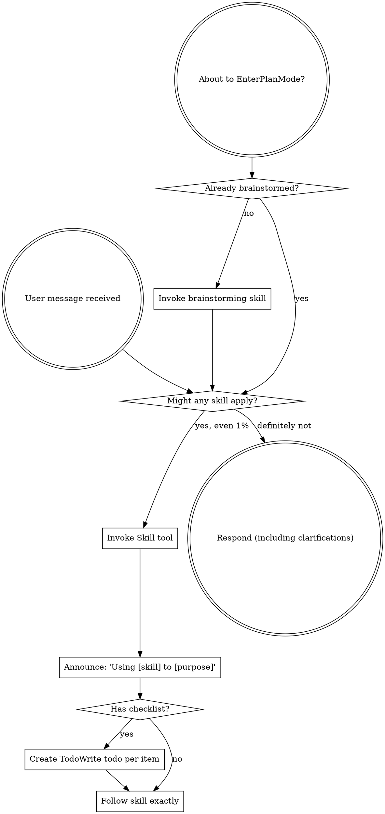

codex-exec: report contract violation

--- codex stdout ---
## Phase verdict

Four of five semantic acceptance criteria are MET. Criterion 2 is NOT MET because its required npm-sentinel evidence is absent.

1. **Empty-tree real install — MET.** Production builds an isolated candidate, copies the computed files, smokes hooks, seals hashes, and transactionally publishes with rollback ([hook-install-contract.cjs](<HOME>/AppData/Roaming/warp/Warp/data/worktrees/GSDedits/luminaria-hogback/super-gsd/scripts/lib/hook-install-contract.cjs:611), [hook-install-contract.cjs](<HOME>/AppData/Roaming/warp/Warp/data/worktrees/GSDedits/luminaria-hogback/super-gsd/scripts/lib/hook-install-contract.cjs:767)). The test genuinely invokes production Bash from a decoy cwd with isolated HOME and an empty project, then executes final installed hooks and refreshes a corrupted module ([assert-install-contract.cjs](<HOME>/AppData/Roaming/warp/Warp/data/worktrees/GSDedits/luminaria-hogback/super-gsd/tests/install-contract/assert-install-contract.cjs:358)).

2. **Unresolved module refuses before every write — NOT MET.** Production ordering is correct: candidate preparation/refusal precedes publication and `update_existing`, including npm ([install.sh](<HOME>/AppData/Roaming/warp/Warp/data/worktrees/GSDedits/luminaria-hogback/super-gsd/install.sh:815), [install.sh](<HOME>/AppData/Roaming/warp/Warp/data/worktrees/GSDedits/luminaria-hogback/super-gsd/install.sh:1279)). However, the required semantic case creates neither a project `package.json` nor npm preinstall sentinel and never asserts an empty repair-actions array ([assert-install-contract.cjs](<HOME>/AppData/Roaming/warp/Warp/data/worktrees/GSDedits/luminaria-hogback/super-gsd/tests/install-contract/assert-install-contract.cjs:398)). It proves byte preservation, but not the criterion as written.

3. **Generated transitive manifest — MET.** Per-entry recursive closure, Node file/directory resolution, package classification, cycles, provenance, deterministic manifest rendering, and stale-manifest refusal are implemented ([hook-install-contract.cjs](<HOME>/AppData/Roaming/warp/Warp/data/worktrees/GSDedits/luminaria-hogback/super-gsd/scripts/lib/hook-install-contract.cjs:325), [hook-install-contract.cjs](<HOME>/AppData/Roaming/warp/Warp/data/worktrees/GSDedits/luminaria-hogback/super-gsd/scripts/lib/hook-install-contract.cjs:472)). The manifest assigns quality-gate/classifier and witness/composer/store per-entry ownership ([hook-manifest.json](<HOME>/AppData/Roaming/warp/Warp/data/worktrees/GSDedits/luminaria-hogback/super-gsd/config/hook-manifest.json:249), [hook-manifest.json](<HOME>/AppData/Roaming/warp/Warp/data/worktrees/GSDedits/luminaria-hogback/super-gsd/config/hook-manifest.json:319)).

4. **Doctor/worktree status — MET.** Shared inspection formats exact missing/stale digests ([hook-install-contract.cjs](<HOME>/AppData/Roaming/warp/Warp/data/worktrees/GSDedits/luminaria-hogback/super-gsd/scripts/lib/hook-install-contract.cjs:570)); doctor uses `git -C`, preserves local verdicts on remote failure, and returns drift status ([install.sh](<HOME>/AppData/Roaming/warp/Warp/data/worktrees/GSDedits/luminaria-hogback/super-gsd/install.sh:354)).

5. **P166/P167 regression wall — MET.** No relevant production contract was weakened; smoke remains real-spawn, bounded, closed-reason preserving ([hook-registration-preflight.cjs](<HOME>/AppData/Roaming/warp/Warp/data/worktrees/GSDedits/luminaria-hogback/super-gsd/scripts/lib/hook-registration-preflight.cjs:731)). Supplied regression results report no regression.

The implementation solves the original module-delivery defect and rolls back publication failures. DLB-07 nevertheless catches criterion 2’s overclaimed proof. The selective-closure boundary is honest and appropriate: unrelated parity files are explicitly excluded ([168-01-PLAN-LOCKED.md](<HOME>/AppData/Roaming/warp/Warp/data/worktrees/GSDedits/luminaria-hogback/.planning/milestones/v4.0-install-contract/phases/168-install-contract/168-01-PLAN-LOCKED.md:559)).

GOAL_MET: NO
VERDICT: FAIL

--- codex stderr ---
OpenAI Codex v0.146.0
--------
workdir: <HOME>\AppData\Roaming\warp\Warp\data\worktrees\GSDedits\luminaria-hogback
model: gpt-5.6-sol
provider: openai
approval: never
sandbox: read-only
reasoning effort: xhigh
reasoning summaries: none
session id: 01a03a78-d449-7de0-8f31-2dda4773b4c6
--------
user
# Phase verifier — P168 Install Contract. Goal-backward. Read-only, do not edit or re-run suites.

Plan: .../168-install-contract/168-01-PLAN-LOCKED.md (revision 2, tasks T1 and T2).
Context with the measured root cause: .../168-install-contract/CONTEXT.md

Judge EVERY `semantic_acceptance_criteria` entry across both tasks as MET or NOT MET with
a file:line citation from the implementation. Do not accept an executor report or a commit
message as evidence; cite the code.

## The problem this phase existed to solve

Distributed hooks reached every project on every update while the modules they `require`
never did: `install.sh` copied `scripts/lib` to `~/.claude` only, and neither
`init_local_project` nor `update_existing` wrote a project module tree. A project hook
doing `require('../scripts/lib/sgsd-state.cjs')` got MODULE_NOT_FOUND at first fire. This
silently broke delivery to every other repository for five development cycles, and was
confirmed on a real Linux box.

## Orchestrator-run results, take as given, do not re-run

install-contract 5/5; installer-registration-guard 13/13 in one `--all` sweep; a real
`install.sh --init-project` from a decoy cwd into an EMPTY project exits 0 and delivers
17 hooks and 9 `scripts/lib` modules; `install.sh --doctor` in this worktree reports a real
git HEAD and a freshness comparison against master; assert-hook-contract 38/38;
assert-prompt-contracts 4/4; assert-witness-correlation 13/13; assert-propagation PASS;
P166 policy 6/6; P154 real-evidence PASS; composer, enrichment-gate, kb-triage-shadow PASS;
feature-propagation 15/15; `bash -n` clean.

Spec-compliance PASS for T1 (after two FAIL rounds) and for T2 (after one FAIL round).

## Questions the verdict must answer

1. Is each acceptance criterion MET, with a citation?
2. Does the phase actually solve the stated problem: would a project installed by this
   code have the modules its hooks require, and would an install that cannot deliver them
   refuse rather than report success?
3. DLB-07: is any criterion green because a test asserts a shape rather than because real
   data flowed through the real path? The empty-tree criterion claims a production Bash
   installer, real HOME, decoy cwd and no mocks; verify that claim.
4. Any regression in P166, P167 or earlier behaviour?
5. The phase deliberately does NOT repair the remainder of the ~55-file parity gap
   observed on the Linux box, delivering only the computed closure. Is that boundary
   stated honestly in the artifacts, and is it the right boundary?

End with `GOAL_MET: YES` or `GOAL_MET: NO`, then a line that is exactly
`VERDICT: PASS` or `VERDICT: FAIL`. Bound yourself to about 18 shell commands and emit the
verdict even if incomplete. Max 600 words.

codex
I’m using the skill-discovery contract first, then the read-only review and verification guidance because this is an evidence-backed phase verdict. I’ll inspect the locked plan, context, implementation, and test harness without editing or rerunning suites, staying near the 18-command limit.
exec
"C:\\WINDOWS\\System32\\WindowsPowerShell\\v1.0\\powershell.exe" -Command '$files = @('"'C:\\Users\\operator\\.codex\\skills\\using-superpowers\\SKILL.md','C:\\Users\\operator\\.agents\\skills\\review\\SKILL.md','C:\\Users\\operator\\.codex\\skills\\verification-before-completion\\SKILL.md'); foreach ("'$file in $files) { Write-Output "FILE: $file"; Get-Content -LiteralPath $file -Raw }' in <HOME>\AppData\Roaming\warp\Warp\data\worktrees\GSDedits\luminaria-hogback
 succeeded in 721ms:
FILE: <HOME>\.codex\skills\using-superpowers\SKILL.md
---
name: using-superpowers
description: Use when starting any conversation - establishes how to find and use skills, requiring Skill tool invocation before ANY response including clarifying questions
---

<SUBAGENT-STOP>
If you were dispatched as a subagent to execute a specific task, skip this skill.
</SUBAGENT-STOP>

<EXTREMELY-IMPORTANT>
If you think there is even a 1% chance a skill might apply to what you are doing, you ABSOLUTELY MUST invoke the skill.

IF A SKILL APPLIES TO YOUR TASK, YOU DO NOT HAVE A CHOICE. YOU MUST USE IT.

This is not negotiable. This is not optional. You cannot rationalize your way out of this.
</EXTREMELY-IMPORTANT>

## Instruction Priority

Superpowers skills override default system prompt behavior, but **user instructions always take precedence**:

1. **User's explicit instructions** (CLAUDE.md, GEMINI.md, AGENTS.md, direct requests) ƒ?" highest priority
2. **Superpowers skills** ƒ?" override default system behavior where they conflict
3. **Default system prompt** ƒ?" lowest priority

If CLAUDE.md, GEMINI.md, or AGENTS.md says "don't use TDD" and a skill says "always use TDD," follow the user's instructions. The user is in control.

## How to Access Skills

**In Claude Code:** Use the `Skill` tool. When you invoke a skill, its content is loaded and presented to youƒ?"follow it directly. Never use the Read tool on skill files.

**In Copilot CLI:** Use the `skill` tool. Skills are auto-discovered from installed plugins. The `skill` tool works the same as Claude Code's `Skill` tool.

**In Gemini CLI:** Skills activate via the `activate_skill` tool. Gemini loads skill metadata at session start and activates the full content on demand.

**In other environments:** Check your platform's documentation for how skills are loaded.

## Platform Adaptation

Skills use Claude Code tool names. Non-CC platforms: see `references/copilot-tools.md` (Copilot CLI), `references/codex-tools.md` (Codex) for tool equivalents. Gemini CLI users get the tool mapping loaded automatically via GEMINI.md.

# Using Skills

## The Rule

**Invoke relevant or requested skills BEFORE any response or action.** Even a 1% chance a skill might apply means that you should invoke the skill to check. If an invoked skill turns out to be wrong for the situation, you don't need to use it.



## Red Flags

These thoughts mean STOPƒ?"you're rationalizing:

| Thought | Reality |
|---------|---------|
| "This is just a simple question" | Questions are tasks. Check for skills. |
| "I need more context first" | Skill check comes BEFORE clarifying questions. |
| "Let me explore the codebase first" | Skills tell you HOW to explore. Check first. |
| "I can check git/files quickly" | Files lack conversation context. Check for skills. |
| "Let me gather information first" | Skills tell you HOW to gather information. |
| "This doesn't need a formal skill" | If a skill exists, use it. |
| "I remember this skill" | Skills evolve. Read current version. |
| "This doesn't count as a task" | Action = task. Check for skills. |
| "The skill is overkill" | Simple things become complex. Use it. |
| "I'll just do this one thing first" | Check BEFORE doing anything. |
| "This feels productive" | Undisciplined action wastes time. Skills prevent this. |
| "I know what that means" | Knowing the concept ƒ%ÿ using the skill. Invoke it. |

## Skill Priority

When multiple skills could apply, use this order:

1. **Process skills first** (brainstorming, debugging) - these determine HOW to approach the task
2. **Implementation skills second** (frontend-design, mcp-builder) - these guide execution

"Let's build X" ā' brainstorming first, then implementation skills.
"Fix this bug" ā' debugging first, then domain-specific skills.

## Skill Types

**Rigid** (TDD, debugging): Follow exactly. Don't adapt away discipline.

**Flexible** (patterns): Adapt principles to context.

The skill itself tells you which.

## User Instructions

Instructions say WHAT, not HOW. "Add X" or "Fix Y" doesn't mean skip workflows.

FILE: <HOME>\.agents\skills\review\SKILL.md
---
name: review
description: Review code changes for security, performance, bugs, and quality. Reviews staged changes, unstaged changes, specific commits, or PR-ready diffs.
---

<objective>
Review code changes and provide structured feedback covering security, performance, bug risks, code quality, and test coverage gaps. This skill analyzes diffs and surrounding context to catch issues before they reach production.
</objective>

<context>
This skill reviews code changes at various stages of the development workflow. It can review staged changes before a commit, unstaged work-in-progress, a specific commit, or the full set of changes on a branch that are ready for a pull request.

The reviewer reads both the diff and the surrounding source files to understand intent and catch issues that only appear in context.
</context>

<core_principle>
**FIND REAL ISSUES, NOT STYLE NITS.** Focus on problems that cause bugs, security vulnerabilities, performance degradation, or maintainability pain. Avoid nitpicking formatting or subjective style preferences unless they harm readability.
</core_principle>

<analysis_only_rule>
**THIS SKILL IS READ-ONLY. DO NOT MODIFY CODE.**

The purpose is to review and report findings. Making changes during review conflates the reviewer and author roles. Present findings and let the user decide what to act on.
</analysis_only_rule>

<quick_start>

<determine_review_scope>

Parse the user's input to determine what to review:

1. **No arguments** - Review staged changes first. If nothing is staged, review unstaged changes.
   - Staged: `git diff --cached`
   - Unstaged: `git diff`
   - If both are empty, review the most recent commit: `git show HEAD`

2. **Commit hash argument** (e.g., `/review abc1234`) - Review that specific commit.
   - `git show <hash>`

3. **File path argument** (e.g., `/review src/foo.ts`) - Review unstaged changes in that file.
   - `git diff -- <path>` then fall back to `git diff --cached -- <path>`

4. **"pr" argument** (e.g., `/review pr`) - Review all changes since branching from main.
   - `git diff main...HEAD`
   - If on main, review `git diff HEAD~1`

After obtaining the diff, if it is empty, inform the user that there are no changes to review and stop.

</determine_review_scope>

<gather_context>

Before analyzing the diff:

1. **Read changed files in full** - Do not review a diff in isolation. Read each modified file to understand the surrounding code, imports, types, and control flow.
2. **Identify the tech stack** - Note languages, frameworks, and libraries in use. This affects what patterns are risky.
3. **Check for related test files** - For each changed source file, look for corresponding test files. Note whether tests were updated alongside the changes.
4. **Check for configuration changes** - If config files changed (env, CI, package.json, tsconfig, etc.), pay extra attention to side effects.

</gather_context>

<review_categories>

Analyze the changes against each category below. Only report findings that are actually present. Skip categories with no issues.

**A. Security Issues** (Severity: CRITICAL or HIGH)
- Injection vulnerabilities (SQL injection, command injection, template injection)
- Cross-site scripting (XSS) - unsanitized user input rendered in HTML
- Authentication and authorization flaws (missing auth checks, privilege escalation)
- Secrets or credentials hardcoded or logged
- Insecure deserialization or unsafe eval usage
- Path traversal or file access vulnerabilities
- Missing input validation on external data

**B. Performance Concerns** (Severity: HIGH or MEDIUM)
- N+1 query patterns in database access
- Unnecessary memory allocations in hot paths or loops
- Blocking operations on the main thread or in async contexts
- Missing pagination on unbounded queries
- Redundant computation that could be cached or memoized
- Large payloads without streaming or chunking

**C. Bug Risks** (Severity: HIGH or MEDIUM)
- Off-by-one errors in loops or array access
- Null/undefined dereferences without guards
- Race conditions in concurrent or async code
- Incorrect error handling (swallowed errors, wrong error types)
- Type mismatches or unsafe type assertions
- Logic errors in conditionals (inverted checks, missing cases)
- Resource leaks (unclosed connections, file handles, listeners)

**D. Code Quality** (Severity: MEDIUM or LOW)
- Unclear or misleading naming
- Significant code duplication that should be extracted
- Excessive complexity (deeply nested logic, functions doing too many things)
- Dead code or unreachable branches
- Missing or misleading comments on non-obvious logic
- Inconsistency with patterns used elsewhere in the codebase

**E. Test Coverage Gaps** (Severity: MEDIUM or LOW)
- New logic paths without corresponding test cases
- Changed behavior without updated tests
- Edge cases not covered (empty inputs, boundary values, error paths)
- Missing integration tests for new API endpoints or database changes

</review_categories>

<format_findings>

For each finding, use this structure:

```
### [SEVERITY] Category: Brief Title

**File**: `path/to/file.ext` (lines X-Y)

**Issue**: Clear description of the problem.

**Why it matters**: What could go wrong if this is not addressed.

**Suggestion**: How to fix it, with a code snippet if helpful.
```

Severity levels:
- **CRITICAL** - Must fix before merge. Security vulnerability or data loss risk.
- **HIGH** - Should fix before merge. Likely bug or significant performance issue.
- **MEDIUM** - Should fix soon. Code quality or moderate risk issue.
- **LOW** - Consider fixing. Minor improvement opportunity.

</format_findings>

</quick_start>

<critical_rules>

1. **READ THE FULL FILE**: Never review a diff without reading the complete source file for context
2. **NO FALSE ALARMS**: Only report issues you can explain concretely. Do not report vague concerns
3. **PRIORITIZE**: Lead with the most severe findings. Do not bury critical issues under style nits
4. **BE SPECIFIC**: Include file paths, line numbers, and code references for every finding
5. **EXPLAIN THE RISK**: For each finding, explain what could actually go wrong
6. **CHECK TESTS**: Always check whether changes have corresponding test updates
7. **CONSIDER THE STACK**: Apply language-specific and framework-specific knowledge to your review
8. **DO NOT MODIFY CODE**: Present findings only. The user decides what to act on

</critical_rules>

<output_format>

```markdown
## Code Review: [brief description of what was reviewed]

**Scope**: [staged changes | unstaged changes | commit abc1234 | PR changes from main]
**Files reviewed**: [count] files changed, [additions] additions, [deletions] deletions

---

### Findings

[Findings grouped by severity, highest first. Use the format from <format_findings>.]

---

### Summary

| Severity | Count |
|----------|-------|
| CRITICAL | X     |
| HIGH     | X     |
| MEDIUM   | X     |
| LOW      | X     |

### Recommended Actions

1. [Most important action to take]
2. [Next most important action]
3. [...]
```

If no issues are found:

```markdown
## Code Review: [brief description]

**Scope**: [what was reviewed]
**Files reviewed**: [count]

No significant issues found. The changes look good to merge.
```

</output_format>

<decision_gate>

**After presenting findings, ALWAYS offer these options:**

```
ƒ"?ƒ"?ƒ"?ƒ"?ƒ"?ƒ"?ƒ"?ƒ"?ƒ"?ƒ"?ƒ"?ƒ"?ƒ"?ƒ"?ƒ"?ƒ"?ƒ"?ƒ"?ƒ"?ƒ"?ƒ"?ƒ"?ƒ"?ƒ"?ƒ"?ƒ"?ƒ"?ƒ"?ƒ"?ƒ"?ƒ"?ƒ"?ƒ"?ƒ"?ƒ"?ƒ"?ƒ"?ƒ"?ƒ"?ƒ"?ƒ"?
REVIEW COMPLETE

What would you like to do?

1. **Fix issues** - I'll address the findings starting with the most critical
2. **Save review** - Export findings to a markdown file
3. **Review again** - Re-review with different scope or focus
4. **Discuss a finding** - Ask questions about a specific issue
5. **Other** - Tell me what you need
ƒ"?ƒ"?ƒ"?ƒ"?ƒ"?ƒ"?ƒ"?ƒ"?ƒ"?ƒ"?ƒ"?ƒ"?ƒ"?ƒ"?ƒ"?ƒ"?ƒ"?ƒ"?ƒ"?ƒ"?ƒ"?ƒ"?ƒ"?ƒ"?ƒ"?ƒ"?ƒ"?ƒ"?ƒ"?ƒ"?ƒ"?ƒ"?ƒ"?ƒ"?ƒ"?ƒ"?ƒ"?ƒ"?ƒ"?ƒ"?ƒ"?
```

**Wait for user response before taking any action.**

This gate is MANDATORY. Never skip it. Never auto-implement fixes.

</decision_gate>

FILE: <HOME>\.codex\skills\verification-before-completion\SKILL.md
---
name: verification-before-completion
description: Use when about to claim work is complete, fixed, or passing, before committing or creating PRs - requires running verification commands and confirming output before making any success claims; evidence before assertions always
---

# Verification Before Completion

## Overview

Claiming work is complete without verification is dishonesty, not efficiency.

**Core principle:** Evidence before claims, always.

**Violating the letter of this rule is violating the spirit of this rule.**

## The Iron Law

```
NO COMPLETION CLAIMS WITHOUT FRESH VERIFICATION EVIDENCE
```

If you haven't run the verification command in this message, you cannot claim it passes.

## The Gate Function

```
BEFORE claiming any status or expressing satisfaction:

1. IDENTIFY: What command proves this claim?
2. RUN: Execute the FULL command (fresh, complete)
3. READ: Full output, check exit code, count failures
4. VERIFY: Does output confirm the claim?
   - If NO: State actual status with evidence
   - If YES: State claim WITH evidence
5. ONLY THEN: Make the claim

Skip any step = lying, not verifying
```

## Common Failures

| Claim | Requires | Not Sufficient |
|-------|----------|----------------|
| Tests pass | Test command output: 0 failures | Previous run, "should pass" |
| Linter clean | Linter output: 0 errors | Partial check, extrapolation |
| Build succeeds | Build command: exit 0 | Linter passing, logs look good |
| Bug fixed | Test original symptom: passes | Code changed, assumed fixed |
| Regression test works | Red-green cycle verified | Test passes once |
| Agent completed | VCS diff shows changes | Agent reports "success" |
| Requirements met | Line-by-line checklist | Tests passing |

## Red Flags - STOP

- Using "should", "probably", "seems to"
- Expressing satisfaction before verification ("Great!", "Perfect!", "Done!", etc.)
- About to commit/push/PR without verification
- Trusting agent success reports
- Relying on partial verification
- Thinking "just this once"
- Tired and wanting work over
- **ANY wording implying success without having run verification**

## Rationalization Prevention

| Excuse | Reality |
|--------|---------|
| "Should work now" | RUN the verification |
| "I'm confident" | Confidence ƒ%ÿ evidence |
| "Just this once" | No exceptions |
| "Linter passed" | Linter ƒ%ÿ compiler |
| "Agent said success" | Verify independently |
| "I'm tired" | Exhaustion ƒ%ÿ excuse |
| "Partial check is enough" | Partial proves nothing |
| "Different words so rule doesn't apply" | Spirit over letter |

## Key Patterns

**Tests:**
```
ƒo. [Run test command] [See: 34/34 pass] "All tests pass"
ƒ?O "Should pass now" / "Looks correct"
```

**Regression tests (TDD Red-Green):**
```
ƒo. Write ƒÅ' Run (pass) ƒÅ' Revert fix ƒÅ' Run (MUST FAIL) ƒÅ' Restore ƒÅ' Run (pass)
ƒ?O "I've written a regression test" (without red-green verification)
```

**Build:**
```
ƒo. [Run build] [See: exit 0] "Build passes"
ƒ?O "Linter passed" (linter doesn't check compilation)
```

**Requirements:**
```
ƒo. Re-read plan ƒÅ' Create checklist ƒÅ' Verify each ƒÅ' Report gaps or completion
ƒ?O "Tests pass, phase complete"
```

**Agent delegation:**
```
ƒo. Agent reports success ƒÅ' Check VCS diff ƒÅ' Verify changes ƒÅ' Report actual state
ƒ?O Trust agent report
```

## Why This Matters

From 24 failure memories:
- your human partner said "I don't believe you" - trust broken
- Undefined functions shipped - would crash
- Missing requirements shipped - incomplete features
- Time wasted on false completion ā' redirect ā' rework
- Violates: "Honesty is a core value. If you lie, you'll be replaced."

## When To Apply

**ALWAYS before:**
- ANY variation of success/completion claims
- ANY expression of satisfaction
- ANY positive statement about work state
- Committing, PR creation, task completion
- Moving to next task
- Delegating to agents

**Rule applies to:**
- Exact phrases
- Paraphrases and synonyms
- Implications of success
- ANY communication suggesting completion/correctness

## The Bottom Line

**No shortcuts for verification.**

Run the command. Read the output. THEN claim the result.

This is non-negotiable.

<HOME>\OneDrive - <ORG>\Documents\WindowsPowerShell\profile.ps1 : Cannot dot-source this 
command because it was defined in a different language mode. To invoke this command without importing its contents, 
omit the '.' operator.
At line:1 char:1
+ . '<HOME>\OneDrive - <ORG>\Documents\Win ...
+ ~~~~~~~~~~~~~~~~~~~~~~~~~~~~~~~~~~~~~~~~~~~~~~~~~~~~~~~~~~~~~~~~~~~~~
    + CategoryInfo          : InvalidOperation: (:) [profile.ps1], NotSupportedException
    + FullyQualifiedErrorId : DotSourceNotSupported,profile.ps1
 
<HOME>\OneDrive - <ORG>\Documents\WindowsPowerShell\Microsoft.PowerShell_profile.ps1 : 
Cannot dot-source this command because it was defined in a different language mode. To invoke this command without 
importing its contents, omit the '.' operator.
At line:1 char:1
+ . '<HOME>\OneDrive - <ORG>\Documents\Win ...
+ ~~~~~~~~~~~~~~~~~~~~~~~~~~~~~~~~~~~~~~~~~~~~~~~~~~~~~~~~~~~~~~~~~~~~~
    + CategoryInfo          : InvalidOperation: (:) [Microsoft.PowerShell_profile.ps1], NotSupportedException
    + FullyQualifiedErrorId : DotSourceNotSupported,Microsoft.PowerShell_profile.ps1
 

exec
"C:\\WINDOWS\\System32\\WindowsPowerShell\\v1.0\\powershell.exe" -NoProfile -Command "rg --files .planning | rg \"168-install-contract|STATE\\.md"'$|MILESTONES'"\\.md"'$"' in <HOME>\AppData\Roaming\warp\Warp\data\worktrees\GSDedits\luminaria-hogback
 succeeded in 1534ms:
.planning\milestones\v4.0-install-contract\phases\168-install-contract\168-PLAN-REV2-REPORT.md
.planning\milestones\v4.0-install-contract\phases\168-install-contract\168-PLAN-REV2-PROMPT.md
.planning\milestones\v4.0-install-contract\phases\168-install-contract\168-PLAN-REV2-FILES.txt
.planning\milestones\v4.0-install-contract\phases\168-install-contract\168-PLAN-REPORT2.md
.planning\milestones\v4.0-install-contract\phases\168-install-contract\168-PLAN-REPORT.md
.planning\milestones\v4.0-install-contract\phases\168-install-contract\168-PLAN-PROMPT.md
.planning\milestones\v4.0-install-contract\phases\168-install-contract\168-PLAN-FILES.txt
.planning\milestones\v4.0-install-contract\phases\168-install-contract\168-PHASEATC-WRAPPER.log
.planning\milestones\v4.0-install-contract\phases\168-install-contract\168-PHASEATC-PROMPT.md
.planning\milestones\v4.0-install-contract\phases\168-install-contract\168-MUDA-WRAPPER.log
.planning\milestones\v4.0-install-contract\phases\168-install-contract\168-MUDA-PROMPT.md
.planning\milestones\v4.0-install-contract\phases\168-install-contract\168-FIX-REPAIR-ORDER-WRAPPER.log
.planning\milestones\v4.0-install-contract\phases\168-install-contract\168-FIX-REPAIR-ORDER-REPORT.md
.planning\milestones\v4.0-install-contract\phases\168-install-contract\168-FIX-REPAIR-ORDER-PROMPT.md
.planning\milestones\v4.0-install-contract\phases\168-install-contract\168-FIX-REPAIR-ORDER-FILES.txt
.planning\milestones\v4.0-install-contract\phases\168-install-contract\168-ABANDONED-STAGED-INSTALLER.patch
.planning\milestones\v4.0-install-contract\phases\168-install-contract\168-01-PLAN-LOCKED.md
.planning\milestones\v4.0-install-contract\phases\168-install-contract\168-T1B-FILES.txt
.planning\milestones\v4.0-install-contract\phases\168-install-contract\168-T1-WRAPPER.log
.planning\milestones\v4.0-install-contract\phases\168-install-contract\168-T1-SPEC3-WRAPPER.log
.planning\milestones\v4.0-install-contract\phases\168-install-contract\168-T1-SPEC3-PROMPT.md
.planning\milestones\v4.0-install-contract\phases\168-install-contract\168-T1-SPEC2-WRAPPER.log
.planning\milestones\v4.0-install-contract\phases\168-install-contract\168-T1-SPEC2-PROMPT.md
.planning\milestones\v4.0-install-contract\phases\168-install-contract\168-T1-SPEC-WRAPPER.log
.planning\milestones\v4.0-install-contract\phases\168-install-contract\168-T1-SPEC-REVIEW3.md
.planning\milestones\v4.0-install-contract\phases\168-install-contract\168-T1-SPEC-REVIEW2.md
.planning\milestones\v4.0-install-contract\phases\168-install-contract\168-T1-SPEC-REVIEW.md
.planning\milestones\v4.0-install-contract\phases\168-install-contract\168-T1-SPEC-PROMPT.md
.planning\milestones\v4.0-install-contract\phases\168-install-contract\168-T1-REPORT.md
.planning\milestones\v4.0-install-contract\phases\168-install-contract\168-T1-PROMPT.md
.planning\milestones\v4.0-install-contract\phases\168-install-contract\168-T1-FILES.txt
.planning\milestones\v4.0-install-contract\phases\168-install-contract\168-SPECFIX-WIP.patch
.planning\milestones\v4.0-install-contract\phases\168-install-contract\168-REMOVED-ASSERTIONS.txt
.planning\milestones\v4.0-install-contract\phases\168-install-contract\168-PLANREVIEW2.md
.planning\milestones\v4.0-install-contract\phases\168-install-contract\168-PLANREVIEW2-WRAPPER.log
.planning\milestones\v4.0-install-contract\phases\168-install-contract\168-PLANREVIEW2-PROMPT.md
.planning\milestones\v4.0-install-contract\phases\168-install-contract\168-PLANREVIEW.md
.planning\milestones\v4.0-install-contract\phases\168-install-contract\168-PLANREVIEW-WRAPPER.log
.planning\milestones\v4.0-install-contract\phases\168-install-contract\168-PLANREVIEW-PROMPT.md
.planning\milestones\v4.0-install-contract\phases\168-install-contract\168-PLAN-WRAPPER2.log
.planning\milestones\v4.0-install-contract\phases\168-install-contract\168-PLAN-WRAPPER.log
.planning\milestones\v4.0-install-contract\phases\168-install-contract\168-PLAN-REV2-WRAPPER.log
.planning\milestones\v4.0-install-contract\phases\168-install-contract\168-T1E-FILES.txt
.planning\milestones\v4.0-install-contract\phases\168-install-contract\168-T1D-WRAPPER.log
.planning\milestones\v4.0-install-contract\phases\168-install-contract\168-T1D-REPORT.md
.planning\milestones\v4.0-install-contract\phases\168-install-contract\168-T1D-PROMPT.md
.planning\milestones\v4.0-install-contract\phases\168-install-contract\168-T1D-FILES.txt
.planning\milestones\v4.0-install-contract\phases\168-install-contract\168-T1C-WRAPPER.log
.planning\milestones\v4.0-install-contract\phases\168-install-contract\168-T1C-REPORT.md
.planning\milestones\v4.0-install-contract\phases\168-install-contract\168-T1C-PROMPT.md
.planning\milestones\v4.0-install-contract\phases\168-install-contract\168-T1C-FILES.txt
.planning\milestones\v4.0-install-contract\phases\168-install-contract\168-T1B-WRAPPER.log
.planning\milestones\v4.0-install-contract\phases\168-install-contract\168-T1B-REPORT.md
.planning\milestones\v4.0-install-contract\phases\168-install-contract\168-T1B-PROMPT.md
.planning\milestones\v4.0-install-contract\phases\168-install-contract\168-T1F-REPORT.md
.planning\milestones\v4.0-install-contract\phases\168-install-contract\168-T1F-PROMPT.md
.planning\milestones\v4.0-install-contract\phases\168-install-contract\168-T1F-FILES.txt
.planning\milestones\v4.0-install-contract\phases\168-install-contract\168-T1E-WRAPPER.log
.planning\milestones\v4.0-install-contract\phases\168-install-contract\168-T1E-REPORT.md
.planning\milestones\v4.0-install-contract\phases\168-install-contract\168-T1E-PROMPT.md
.planning\milestones\v4.0-install-contract\phases\168-install-contract\168-T1G-PROMPT.md
.planning\milestones\v4.0-install-contract\phases\168-install-contract\168-T1G-FILES.txt
.planning\milestones\v4.0-install-contract\phases\168-install-contract\168-T1F-WRAPPER.log
.planning\milestones\v4.0-install-contract\phases\168-install-contract\168-T1G-WRAPPER.log
.planning\milestones\v4.0-install-contract\phases\168-install-contract\168-T1G-REPORT.md
.planning\milestones\v4.0-install-contract\phases\168-install-contract\168-T1H-FILES.txt
.planning\milestones\v4.0-install-contract\phases\168-install-contract\CONTEXT.md
.planning\milestones\v4.0-install-contract\phases\168-install-contract\168-WASTE.md
.planning\milestones\v4.0-install-contract\phases\168-install-contract\168-VERIFY-WRAPPER.log
.planning\milestones\v4.0-install-contract\phases\168-install-contract\168-VERIFY-PROMPT.md
.planning\milestones\v4.0-install-contract\phases\168-install-contract\168-T2B-WRAPPER.log
.planning\milestones\v4.0-install-contract\phases\168-install-contract\168-T2B-REPORT.md
.planning\milestones\v4.0-install-contract\phases\168-install-contract\168-T2B-PROMPT.md
.planning\milestones\v4.0-install-contract\phases\168-install-contract\168-T2B-FILES.txt
.planning\milestones\v4.0-install-contract\phases\168-install-contract\168-T2-WRAPPER.log
.planning\milestones\v4.0-install-contract\phases\168-install-contract\168-T2-SPEC2-WRAPPER.log
.planning\milestones\v4.0-install-contract\phases\168-install-contract\168-T2-SPEC2-PROMPT.md
.planning\milestones\v4.0-install-contract\phases\168-install-contract\168-T2-SPEC-WRAPPER.log
.planning\milestones\v4.0-install-contract\phases\168-install-contract\168-T2-SPEC-REVIEW2.md
.planning\milestones\v4.0-install-contract\phases\168-install-contract\168-T2-SPEC-REVIEW.md
.planning\milestones\v4.0-install-contract\phases\168-install-contract\168-T2-SPEC-PROMPT.md
.planning\milestones\v4.0-install-contract\phases\168-install-contract\168-T2-REPORT.md
.planning\milestones\v4.0-install-contract\phases\168-install-contract\168-T2-PROMPT.md
.planning\milestones\v4.0-install-contract\phases\168-install-contract\168-T2-FILES.txt
.planning\milestones\v4.0-install-contract\phases\168-install-contract\168-T1Q-WRAPPER.log
.planning\milestones\v4.0-install-contract\phases\168-install-contract\168-T1Q-REPORT.md
.planning\milestones\v4.0-install-contract\phases\168-install-contract\168-T1Q-PROMPT.md
.planning\milestones\v4.0-install-contract\phases\168-install-contract\168-T1Q-FILES.txt
.planning\milestones\v4.0-install-contract\phases\168-install-contract\168-T1P-WRAPPER.log
.planning\milestones\v4.0-install-contract\phases\168-install-contract\168-T1P-REPORT.md
.planning\milestones\v4.0-install-contract\phases\168-install-contract\168-T1P-PROMPT.md
.planning\milestones\v4.0-install-contract\phases\168-install-contract\168-T1P-FILES.txt
.planning\milestones\v4.0-install-contract\phases\168-install-contract\168-T1N-WRAPPER.log
.planning\milestones\v4.0-install-contract\phases\168-install-contract\168-T1N-REPORT.md
.planning\milestones\v4.0-install-contract\phases\168-install-contract\168-T1N-PROMPT.md
.planning\milestones\v4.0-install-contract\phases\168-install-contract\168-T1N-FILES.txt
.planning\milestones\v4.0-install-contract\phases\168-install-contract\168-T1M-WRAPPER.log
.planning\milestones\v4.0-install-contract\phases\168-install-contract\168-T1M-REPORT.md
.planning\milestones\v4.0-install-contract\phases\168-install-contract\168-T1M-PROMPT.md
.planning\milestones\v4.0-install-contract\phases\168-install-contract\168-T1M-FILES.txt
.planning\milestones\v4.0-install-contract\phases\168-install-contract\168-T1K-WRAPPER.log
.planning\milestones\v4.0-install-contract\phases\168-install-contract\168-T1K-REPORT.md
.planning\milestones\v4.0-install-contract\phases\168-install-contract\168-T1K-PROMPT.md
.planning\milestones\v4.0-install-contract\phases\168-install-contract\168-T1K-FILES.txt
.planning\milestones\v4.0-install-contract\phases\168-install-contract\168-T1J-WRAPPER.log
.planning\milestones\v4.0-install-contract\phases\168-install-contract\168-T1J-REPORT.md
.planning\milestones\v4.0-install-contract\phases\168-install-contract\168-T1J-PROMPT.md
.planning\milestones\v4.0-install-contract\phases\168-install-contract\168-T1J-FILES.txt
.planning\milestones\v4.0-install-contract\phases\168-install-contract\168-T1I-WRAPPER.log
.planning\milestones\v4.0-install-contract\phases\168-install-contract\168-T1I-REPORT.md
.planning\milestones\v4.0-install-contract\phases\168-install-contract\168-T1I-PROMPT.md
.planning\milestones\v4.0-install-contract\phases\168-install-contract\168-T1I-FILES.txt
.planning\milestones\v4.0-install-contract\phases\168-install-contract\168-T1H-WRAPPER.log
.planning\milestones\v4.0-install-contract\phases\168-install-contract\168-T1H-REPORT.md
.planning\milestones\v4.0-install-contract\phases\168-install-contract\168-T1H-PROMPT.md

exec
"C:\\WINDOWS\\System32\\WindowsPowerShell\\v1.0\\powershell.exe" -NoProfile -Command '$p='"'.planning\\milestones\\v4.0-install-contract\\phases\\168-install-contract\\168-01-PLAN-LOCKED.md'; "'$n=0; Get-Content -LiteralPath $p | ForEach-Object { $n++; '"'{0,4}: {1}' -f "'$n, $_ }' in <HOME>\AppData\Roaming\warp\Warp\data\worktrees\GSDedits\luminaria-hogback
 succeeded in 478ms:
   1: ---
   2: schema_version: 2
   3: phase: 168
   4: slug: install-contract
   5: milestone: v4.0-install-contract
   6: status: PLANNED
   7: revision: 2
   8: governing_decision: .planning/milestones/v4.0-install-contract/phases/168-install-contract/CONTEXT.md
   9: evidence_paths:
  10:   - .planning/milestones/v4.0-install-contract/INTENT.md
  11:   - .planning/milestones/v4.0-install-contract/phases/168-install-contract/CONTEXT.md
  12:   - .planning/milestones/v3.9-substrate-hygiene/phases/167-substrate-invocation-witness/SUMMARY.md
  13:   - .planning/milestones/v3.9-substrate-hygiene/phases/167-substrate-invocation-witness/AUDIT.md
  14: depends_on: []
  15: intent: >
  16:   Make project installation one closed contract: compute every repository-owned
  17:   module needed by distributed hooks from the hook sources, declare the computed
  18:   closure in the hook manifest, deliver and refresh that exact closure, execute
  19:   every prospective project hook in a complete candidate before the first write,
  20:   prove every installed target hook after successful publication, preserve the
  21:   underlying module-resolution error beside the existing closed reason code, and
  22:   expose one read-only command that identifies hook and module drift for an
  23:   explicit project, including projects whose .git entry is a worktree file.
  24: execution_mode: two-dependent-codex-tasks-with-orchestrator-spawn-gates
  25: expected_ATC_tier: GATE
  26: skip_gates: []
  27: lessons_path: null
  28: prior_errors_lookup: true
  29: lock_status: locked
  30: locked_at: 2026-08-25T11:08:08+01:00
  31: locked_by: codex
  32: allowed_files:
  33:   - super-gsd/scripts/lib/hook-install-contract.cjs
  34:   - super-gsd/config/hook-manifest.json
  35:   - super-gsd/scripts/lib/hook-registration-preflight.cjs
  36:   - super-gsd/tools/feature-propagation/audit.cjs
  37:   - super-gsd/install.sh
  38:   - super-gsd/tests/install-contract/assert-install-contract.cjs
  39:   - super-gsd/tests/installer-registration-guard/assert-installer-registration-guard.cjs
  40: forbidden_files:
  41:   - super-gsd/hooks/sgsd-substrate-invocation-witness.cjs
  42:   - super-gsd/scripts/lib/substrate-invocation-witness-store.cjs
  43:   - super-gsd/scripts/lib/vtp-context-composer.cjs
  44:   - super-gsd/tools/substrate-capability-broker.cjs
  45:   - super-gsd/schemas/vtp-mcp-input-schemas.v1.json
  46:   - .planning/milestones/v3.6-vtp-bridge/phases/154-mcp-arg-contract/154-REAL-MCP-EVIDENCE.json
  47:   - .planning/STATE.md
  48:   - .planning/milestones/v4.0-install-contract/ROADMAP.md
  49:   - package.json
  50:   - package-lock.json
  51:   - wiki/LINT-REPORT.md
  52: invariants:
  53:   - Project dependency delivery is the mechanically computed transitive closure; no production array, shell glob, test constant, or manifest field may hand-list the closure.
  54:   - Manifest policy remains human-authored, but every dependency field is generated and verified against the same computation used by delivery and status.
  55:   - Every rejection-capable source, manifest, destination, package, registration, and all-hook smoke check completes against one complete project-shaped candidate before the first project, profile, npm, key, settings, broker, or grant mutation.
  56:   - The candidate lives under a fresh OS temporary directory outside the project and profile, contains the exact prospective project paths, uses an isolated HOME/USERPROFILE, and resolves requires naturally from candidate hook paths without NODE_PATH or canonical-source fallback.
  57:   - After the first destination write, production performs only rollback-journaled publication of the already-smoked immutable candidate bytes; it never spawns a hook or runs another rejection-capable validation, and any publication I/O failure restores project/profile bytes and the actions array exactly.
  58:   - An explicit --project-dir is normalized and used exactly; walk-up occurs only when no explicit project directory is supplied.
  59:   - Read-only status, installer precheck, and repair consume one inspectProjectInstall result; no second detector or dependency list is permitted.
  60:   - Closed reasons are unchanged; MODULE_NOT_FOUND code, request, resolved path, and bounded message travel in underlying_error/detail beside the existing reason.
  61:   - P167 remains unchanged: PreToolUse fails closed, PostToolUse emits bounded substrate_witness_rewrite_failed without raw passthrough, and only rewritten rows are accepted.
  62:   - Existing guard assertions are preserved or strengthened; none is weakened to obtain a pass.
  63: acceptance_commands:
  64:   - node super-gsd/scripts/lib/hook-install-contract.cjs --check-manifest
  65:   - node super-gsd/tests/install-contract/assert-install-contract.cjs --all
  66:   - node super-gsd/tests/installer-registration-guard/assert-installer-registration-guard.cjs --all
  67:   - node super-gsd/tests/substrate-invocation-witness/assert-hook-contract.cjs
  68:   - node super-gsd/tests/substrate-invocation-witness/assert-propagation.cjs
  69: rollback_plan: >
  70:   Revert P168-T2 before P168-T1. T1 is the indivisible declaration,
  71:   graph/detector, delivery, all-hook smoke, diagnosis, and proof commit; never
  72:   retain dependency fields without their verifier or copying without smoke.
  73:   T2 adds only the dependent doctor/worktree presentation seam. Run the
  74:   pre-P168 installer guard and P167 suites after either rollback.
  75: risk_rating: high
  76: operator_checkpoints:
  77:   - The orchestrator runs spawn-bound real install, refusal, and worktree cases outside any sandbox that returns spawnSync EPERM.
  78:   - Phase close is NOGO until both dependent tasks pass; manifest generation, delivery, smoke, and diagnosis remain one T1 commit, while T2 cannot ship without T1.
  79:   - Phase close is NOGO if any refused entry point changes a snapshotted project/profile byte or records a repair action.
  80: semantic_acceptance_criteria:
  81:   - input: >
  82:       A disposable on-disk SGSD project whose project-local
  83:       super-gsd/scripts/lib and other computed project-module destinations start
  84:       empty, an isolated real HOME/USERPROFILE, and a separate canonical source
  85:       checkout. Production install.sh is launched by Bash with --init-project,
  86:       --skip-cockpit-deps, and --project-dir pointing at that project while cwd
  87:       is a different decoy directory. No mocked copier, dependency adapter,
  88:       staged target, or direct hook-function call is used. After installation,
  89:       one delivered transitive module is changed and production --update runs.
  90:     expected_outcome: >
  91:       Before its first destination write, the production installer creates its
  92:       complete candidate outside the project/profile, spawns every candidate
  93:       Claude and Codex project hook/registration with natural candidate-relative
  94:       resolution, and seals the exact bytes that publication will copy. The
  95:       installer then publishes those bytes transactionally and exits 0 with
  96:       every computed dependency byte-identical in the final target. Only after
  97:       the installer has returned, the test harness independently spawns every
  98:       final installed hook from its real path with cwd equal to the explicit
  99:       project; this is non-rejecting verification of the completed install, not
 100:       a staged shortcut or a post-write installer refusal. Update restores the
 101:       changed module after repeating candidate smoke. No hook reports an
 102:       unresolved dependency, and the decoy cwd and ancestors remain untouched.
 103:     verification_cmd: >
 104:       node super-gsd/tests/install-contract/assert-install-contract.cjs
 105:       --case empty-module-tree-real-install
 106:   - input: >
 107:       A second real install against seeded project and profile trees after a
 108:       temporary canonical hook source is given a relative require whose resolved
 109:       repository file does not exist. The test snapshots every file and SHA-256
 110:       under both destinations and plants an npm preinstall sentinel that records
 111:       if mutation begins. It invokes production combined --install-global
 112:       --update, not an exported detector in isolation.
 113:     expected_outcome: >
 114:       Installation refuses before npm, hook or module copying, settings merge,
 115:       key provisioning, broker/grant repair, or global installation. The closed
 116:       reason remains hook_smoke_failed or witness_repair_failed as appropriate,
 117:       while underlying_error carries MODULE_NOT_FOUND, the original request, the
 118:       exact normalized missing module path, and a bounded sanitized message.
 119:       Project/profile inventories and hashes are byte-identical, the npm sentinel
 120:       is absent, and repair actions are empty. Raw hook output, payloads, secrets,
 121:       and unbounded stacks are not exposed.
 122:     verification_cmd: >
 123:       node super-gsd/tests/install-contract/assert-install-contract.cjs
 124:       --case unresolved-module-refuses-before-write
 125:   - input: >
 126:       The real canonical hook sources and hook-manifest.json, followed by a
 127:       test-only Node loader trace that executes the selected real hook sources
 128:       from a complete temporary source checkout and records actual parent to
 129:       resolved-child repository edges per manifest entry. That independent
 130:       source execution, rather than a maintained expected-closure list, is the
 131:       oracle. A generated mutation then adds runtime-named relative requires
 132:       covering extensionless-to-.js, explicit .js, explicit .json, package-main
 133:       directory, index directory, and a transitive child; the fixture paths and
 134:       expected edges are emitted by the generator from the mutated sources, not
 135:       transcribed into the test. The production graph, manifest renderer, check,
 136:       delivery, and inspection APIs run on the same temporary checkout.
 137:     expected_outcome: >
 138:       The committed manifest is byte-equivalent to its deterministic generated
 139:       dependency projection. For each traced or generated parent-child edge,
 140:       the same originating manifest entry owns the edge in the computed
 141:       per-entry closure, that entry's generated manifest projection, delivery
 142:       provenance and candidate/final bytes, and missing/stale/current inspection
 143:       rows. Equality is tested per entry, never at union level. This necessarily
 144:       proves the witness entry owns both composer and store edges and the
 145:       sgsd-quality-gate.js entry owns sgsd-intent-classifier.cjs even while the
 146:       classifier remains a separate manifest root. Every generated .js/.json/
 147:       directory/transitive resolution follows the same four surfaces. The
 148:       unchanged temporary manifest is rejected as stale and names exact paths.
 149:       An unresolvable dynamic repository-local require is rejected rather than
 150:       omitted; built-ins are excluded, bare packages are classified rather than
 151:       copied from ignored node_modules, ordering is stable, and cycles terminate
 152:       without duplicate artifacts.
 153:     verification_cmd: >
 154:       node super-gsd/tests/install-contract/assert-install-contract.cjs
 155:       --case generated-transitive-manifest
 156:   - input: >
 157:       A real temporary Git repository with a linked worktree, so the selected
 158:       project has a .git file, plus one missing installed hook, one stale
 159:       transitive module, and one current module. From a different cwd, the
 160:       operator runs bash super-gsd/install.sh --doctor --project-dir with the
 161:       worktree path, repairs through --update, and repeats doctor.
 162:     expected_outcome: >
 163:       The first doctor run is read-only, recognizes the linked checkout as a Git
 164:       worktree, prints its real HEAD rather than not-a-git-repo, and reports a
 165:       non-current install with the exact missing hook and stale module paths,
 166:       expected/actual digests, and canonical source revision. It does not report
 167:       the current module as behind, and it reaches the existing GitHub-master
 168:       comparison; remote unavailability is named separately from the local
 169:       verdict. After update, doctor exits current with no missing or stale hook/
 170:       module rows. Only the explicit worktree is inspected and repaired.
 171:     verification_cmd: >
 172:       node super-gsd/tests/install-contract/assert-install-contract.cjs
 173:       --case doctor-real-git-worktree-staleness
 174:   - input: >
 175:       The complete pre-existing installer-registration guard suite and P167
 176:       witness hook/propagation suites run after P168, including broken deployed
 177:       hook and witness-repair-no-mutation controls.
 178:     expected_outcome: >
 179:       Every prior guard passes with its original or stronger assertion. The
 180:       witness hook source, store, composer, broker, response bound, substrate
 181:       reasons, rewritten-only acceptance, and no-raw-result behavior are
 182:       unchanged. The prior broken module control now exposes the exact missing
 183:       path beside its closed reason, and refused repair still leaves
 184:       byte-identical trees and an empty actions array.
 185:     verification_cmd: >
 186:       node super-gsd/tests/installer-registration-guard/assert-installer-registration-guard.cjs --all &&
 187:       node super-gsd/tests/substrate-invocation-witness/assert-hook-contract.cjs &&
 188:       node super-gsd/tests/substrate-invocation-witness/assert-propagation.cjs
 189: known_deadends:
 190:   - Do not encode known hook dependencies in install.sh, hook-manifest.json, tests, or an exceptions table. That second-source pattern caused this failure.
 191:   - Do not blanket-copy scripts/lib, tools, or node_modules. Deliver only computed repository-owned files and classify package prerequisites; a missing package is named and refused.
 192:   - Do not generate the whole manifest. Targets, dispositions, authorities, matchers, timeouts, and intentional-unregistration reasons are human policy; only dependencies are generated.
 193:   - Do not accept node --check, existence, mocked spawn, direct exported-function calls, or the pre-publication candidate alone as deployed end-to-end semantic proof; the harness must execute every final target hook after production install.
 194:   - Do not begin externally visible install writes until every source, manifest, destination, package, registration, and project-shaped prospective-smoke check has passed.
 195:   - Do not spawn a hook or run any other rejection-capable check after the first destination write. Publication consumes only sealed candidate bytes; final-target execution belongs to the post-success test harness and cannot change the installer verdict.
 196:   - Do not add a second staleness implementation to doctor or audit. Both format the same inspectProjectInstall report consumed by repair.
 197:   - Do not replace the closed refusal vocabulary with MODULE_NOT_FOUND. Preserve the reason and attach bounded structured underlying_error/detail.
 198:   - Do not test Git repositories with a .git directory predicate. Use git -C with rev-parse for normal repositories and linked worktrees.
 199:   - Do not change a P167 hook, witness-store, composer, or broker contract to make smoke pass. Adapt smoke and diagnosis around production.
 200:   - Do not merge this branch; publication to master remains an operator decision.
 201:   - Do not treat selective hook closure as whole-tree parity. The unrelated remainder of the measured approximately 55-file project/global gap is deliberately outside P168.
 202: tasks:
 203:   - id: P168-T1
 204:     type: computed-hook-install-contract-delivery-smoke-and-diagnosis
 205:     agent: codex
 206:     model: codex
 207:     depends_on: []
 208:     files_touched:
 209:       - super-gsd/scripts/lib/hook-install-contract.cjs
 210:       - super-gsd/config/hook-manifest.json
 211:       - super-gsd/scripts/lib/hook-registration-preflight.cjs
 212:       - super-gsd/tools/feature-propagation/audit.cjs
 213:       - super-gsd/install.sh
 214:       - super-gsd/tests/install-contract/assert-install-contract.cjs
 215:       - super-gsd/tests/installer-registration-guard/assert-installer-registration-guard.cjs
 216:     input_contract: >
 217:       Treat CONTEXT.md's measured delivery trace and P167 SUMMARY/AUDIT
 218:       constraints as settled facts; do not reproduce or redesign the root cause.
 219:       Work red-first in the focused assert-install-contract.cjs suite and
 220:       strengthen, never relax, the existing installer-registration guard.
 221: 
 222:       Create hook-install-contract.cjs as the single authority and export
 223:       computeHookDependencyGraph, renderManifestDependencies,
 224:       inspectProjectInstall, and applyProjectInstall. Start from every manifest
 225:       entry distributed to
 226:       claude-project or codex-project and lex actual CommonJS source while
 227:       ignoring comments and string/template text. Resolve literal relative
 228:       requires with Node file/directory rules and recursively walk
 229:       repository-owned modules. Symbolically reduce string constants and
 230:       path.join/path.resolve expressions rooted at __dirname or runtime project
 231:       root so the witness COMPOSER_RELATIVE_PATH and STORE_RELATIVE_PATH are
 232:       discovered from source, never named in a production exception. Exclude
 233:       built-ins, classify bare packages without copying ignored node_modules,
 234:       detect cycles, deduplicate, sort by normalized POSIX path, reject root
 235:       escapes, and fail closed with source plus expression for an unresolved
 236:       local dynamic require. Return per-entry closure, union, source/target
 237:       paths, SHA-256, packages, source errors, and target
 238:       missing/stale/current rows.
 239: 
 240:       Keep hook-manifest.json as reviewed policy. Add a generated dependency
 241:       field to every entry. Implement --write-manifest to rewrite only those
 242:       fields deterministically and --check-manifest to compare committed data
 243:       with a fresh computeHookDependencyGraph result. Installer, audit, tests,
 244:       delivery, and status all call the check and never trust committed
 245:       dependency bytes without recomputation. This generated-and-verified
 246:       choice preserves human policy while eliminating a second dependency
 247:       authority.
 248: 
 249:       Make inspectProjectInstall the only detector. With explicit projectDir,
 250:       path.resolve that exact argument and never call findPlanningRoot; only an
 251:       absent argument may walk up. audit.cjs read-only output, precheck,
 252:       repairClaudeSubstrateWitness, and install.sh precheck consume this
 253:       report. applyProjectInstall copies only report.requiredFiles that are
 254:       missing/stale into projectDir/super-gsd. It snapshots every affected path,
 255:       preserves unrelated files, and retains the originating manifest entry as
 256:       required_by provenance on every inspection, candidate, publication, and
 257:       status row so a union root cannot mask a missing per-entry edge. It
 258:       revalidates source and candidate digests before the first destination
 259:       write, copies only sealed candidate bytes, records actions only after
 260:       complete publication, and restores absent files as absent and existing
 261:       files byte-exactly if a publication I/O operation fails.
 262:       A second run is byte-idempotent. Remove installSubstrateRuntime's
 263:       three-file special-case as a competing writer; the broker stays in its
 264:       dedicated capability path because it is not a hook-import dependency.
 265:       Route init_local_project, update_existing, combined
 266:       --install-global/--update, and project-hook repair through this contract.
 267:       distribute_project_hooks must not remain a standalone unjournaled writer:
 268:       either delegate it to applyProjectInstall or reduce it to a private step
 269:       inside the same candidate/publication transaction.
 270: 
 271:       Preserve refuse-before-write on all entry points. Refactor install.sh
 272:       parsing to consume --project-dir VALUE and parse full argv before
 273:       dispatch. Default remains starting cwd; explicit value is authoritative.
 274:       precheck_installation_refusals computes and validates the graph, generated
 275:       manifest, destinations, Codex sources, substrate sources, packages, and
 276:       prospective all-hook smoke against the one complete OS-temporary candidate
 277:       described below before ensure_gsd_base, npm,
 278:       skeleton/memory, project/global copies, settings, keys, broker state, or
 279:       grants. Candidate writes are isolated from project/profile destinations and
 280:       are not accepted as deployed semantic proof. Run the same precheck at the
 281:       top of direct --repair-safe, --repair,
 282:       --repair-substrate-capability, and exported repairClaudeSubstrateWitness
 283:       paths. Prove ordering with whole-tree hashes and an npm preinstall
 284:       sentinel, not source-index assertions alone.
 285: 
 286:       Extend hook-registration-preflight.cjs so descriptors preserve complete
 287:       interpreter argv and derive safe event/matcher-aware stdin from manifest
 288:       dispositions. Execute every candidate project hook/registration represented by
 289:       claude-project or codex-project, including both witness events and
 290:       intentionally unregistered distributed sources with declared smoke event;
 291:       deduplicate only identical source/event/argv tuples. Spawn real candidate
 292:       files with shell false, cwd equal to the candidate project root, isolated
 293:       HOME and USERPROFILE, bounded concurrency, and at least registered timeout. File
 294:       existence and node --check remain preliminary. Capture bounded output. On
 295:       failure HookSmokeError retains hook_smoke_failed and adds underlyingError
 296:       with code, request, normalized path, and a sanitized single-line message
 297:       bounded to 2048 UTF-8 characters. Parse MODULE_NOT_FOUND and its require
 298:       stack for the exact candidate path, rebase that path to the intended
 299:       explicit-project destination for operator output, and do not forward
 300:       arbitrary child output, stdin, or stack text. audit.cjs carries this in
 301:       detail/underlying_error beside witness_repair_failed, and install.sh prints
 302:       it before the existing refusal summary.
 303: 
 304:       Create the complete candidate with
 305:       fs.mkdtempSync(path.join(os.tmpdir(), 'sgsd-install-candidate-')); its
 306:       returned directory is the candidate project root and its .home child is
 307:       the isolated HOME/USERPROFILE. Materialize the effective .planning marker,
 308:       every prospective project hook/registration, every per-entry computed
 309:       repository dependency, and the prospective settings bytes at the same
 310:       relative paths they will have under the explicit project. This is one
 311:       complete project-shaped candidate, not one scratch tree per hook. Rebase
 312:       every descriptor script path to candidateRoot/super-gsd/..., spawn with
 313:       shell false, cwd and payload.cwd equal to candidateRoot, and bind HOME,
 314:       USERPROFILE, APPDATA, LOCALAPPDATA, XDG_CONFIG_HOME, XDG_DATA_HOME,
 315:       XDG_STATE_HOME, XDG_CACHE_HOME, TMPDIR, TEMP, and TMP to children of the
 316:       candidate. Use a sanitized environment with no NODE_PATH/NODE_OPTIONS,
 317:       canonical-checkout path, target/profile path, or target-tree fallback.
 318:       Consequently
 319:       ordinary relative requires resolve from the candidate hook file, while
 320:       the witness findProjectRoot sees candidateRoot/.planning and loads its
 321:       composer and store from candidateRoot/super-gsd/scripts/lib.
 322: 
 323:       Run the full event-aware descriptor set in that candidate, then rehash and
 324:       seal its publication rows before any project/profile mutation. A missing
 325:       canonical dependency, candidate mutation, or smoke failure refuses while
 326:       all external snapshots remain unchanged. The sealed publication function
 327:       is a one-way seam: after its first destination write it performs only the
 328:       rollback-journaled file operations in those rows and action commit. It
 329:       cannot call inspection, source/manifest/package validation, digest gates,
 330:       or hook spawn. Only a mechanical publication I/O failure can abort and
 331:       roll back; final-target hook execution occurs solely in the post-success
 332:       semantic harness and is non-rejecting with respect to installer state. An
 333:       exit-zero project_runtime_unavailable witness response
 334:       is not dependency success; computed runtime modules must resolve while the
 335:       P167 deny/rewrite contract stays untouched.
 336: 
 337:       New tests use real filesystem trees, Bash/Node processes, production
 338:       install.sh, and production audit/repair. Cover
 339:       graph mutation without a maintained expected closure, manifest drift,
 340:       empty module install, stale refresh/idempotence, exact MODULE_NOT_FOUND,
 341:       no-mutation on every entry, and explicit-project isolation. Generate an
 342:       independent Node loader-trace preload at runtime and execute the selected
 343:       real sources in a complete temporary checkout with the same event-aware
 344:       payloads used by candidate smokeƒ?"including both witness events with the
 345:       target MCP tool so its runtime loader executesƒ?"to obtain observed parent
 346:       to resolved-child edges per manifest entry. Compare that source-execution
 347:       oracle, not a transcribed closure fixture, with computation, the same
 348:       entry's manifest projection, required_by delivery provenance and candidate/
 349:       final bytes, and missing/stale/current status. This must cover the witness
 350:       composer/store edges and quality-gate-to-classifier edge per entry even
 351:       though the classifier is another root. Generate source mutations and
 352:       fixture metadata at runtime for extensionless-to-.js, explicit .js,
 353:       explicit .json, package-main directory, index directory, and transitive
 354:       resolution, and require all four surfaces to follow each edge. Add --all
 355:       to the existing installer guard as an
 356:       additive runner over every CASES entry; keep every individual --case and
 357:       assertion. Run P167 hook and propagation suites unchanged.
 358:     output_contract: >
 359:       One independently revertible commit contains the source-derived graph,
 360:       generated-and-verified manifest dependencies, selective project module
 361:       delivery, complete prewrite candidate all-hook smoke, bounded exact
 362:       diagnosis, shared read/repair inspection, and real final-target semantic
 363:       proofs. A clean module tree is bootstrapped and a stale tree refreshed;
 364:       no partial install reports success. Refusal names the exact module beside
 365:       the existing reason and leaves project/profile bytes and actions
 366:       unchanged. No P167 production file, second installer/detector/list,
 367:       blanket tree copy, or node_modules vendor is introduced.
 368:     hypothesis: >
 369:       If one deterministic source-derived graph generates and verifies manifest
 370:       dependencies, plans selective copies, inspects target drift, and drives a
 371:       complete project-shaped candidate smoke before writes, then hooks and
 372:       runtime modules cannot drift
 373:       independently or produce successful partial installs; a missing edge is
 374:       repaired or refused before observable mutation with exact diagnosis.
 375:     falsifier: >
 376:       A dependency is named in a maintained list; witness runtime files are an
 377:       exception rather than discovered; the witness composer/store or quality-
 378:       gate-to-classifier edge is absent from its own entry while present in the
 379:       union; a generated extensionless, explicit .js, explicit .json, directory,
 380:       or transitive edge does not change that entry's computation, manifest,
 381:       delivery provenance/bytes, and status together; a dynamic local require is
 382:       ignored; delivery copies whole trees; a clean target remains empty; stale
 383:       bytes remain; any candidate hook is not spawned before writes, any
 384:       rejection-capable check runs after the first destination write, or any
 385:       final installed hook is absent from the independent semantic execution;
 386:       node --check or candidate-only proof is accepted as sufficient; a require failure becomes only a
 387:       generic reason or leaks raw output; a refused combined/direct entry runs
 388:       npm, changes bytes, provisions state, or records action; explicit project
 389:       is replaced by walk-up; a guard is weakened; P167 changes; or declaration
 390:       and enforcement land separately.
 391:     stop_rule: >
 392:       Stop only when --check-manifest is clean; real empty-tree install and stale
 393:       refresh pass prewrite candidate smoke and the harness executes every final
 394:       project hook; injected missing
 395:       require refuses relevant entry points with exact MODULE_NOT_FOUND and
 396:       byte-identical snapshots; per-entry and extension resolution falsifiers
 397:       pass; full installer guard and P167 suites pass; the T1 diff is confined
 398:       to its seven files; and declaration, enforcement, and proof land in one
 399:       commit.
 400:       Sandbox EPERM on a spawn-bound command is ORCHESTRATOR_REQUIRED, never PASS
 401:       or SKIP-PASS.
 402:     verification_cmd: >
 403:       node --check super-gsd/scripts/lib/hook-install-contract.cjs &&
 404:       node --check super-gsd/scripts/lib/hook-registration-preflight.cjs &&
 405:       node --check super-gsd/tools/feature-propagation/audit.cjs &&
 406:       node --check super-gsd/tests/install-contract/assert-install-contract.cjs &&
 407:       node super-gsd/scripts/lib/hook-install-contract.cjs --check-manifest &&
 408:       node super-gsd/tests/install-contract/assert-install-contract.cjs --case empty-module-tree-real-install &&
 409:       node super-gsd/tests/install-contract/assert-install-contract.cjs --case unresolved-module-refuses-before-write &&
 410:       node super-gsd/tests/install-contract/assert-install-contract.cjs --case generated-transitive-manifest &&
 411:       node super-gsd/tests/installer-registration-guard/assert-installer-registration-guard.cjs --all &&
 412:       node super-gsd/tests/substrate-invocation-witness/assert-hook-contract.cjs &&
 413:       node super-gsd/tests/substrate-invocation-witness/assert-propagation.cjs
 414:     expected_ATC_tier: GATE
 415:     known_deadends:
 416:       - A hand-written dependency array is not an implementation even if it matches today's importing hooks.
 417:       - Smoke limited to repo-settings registrations misses distributed unregistered or global-only project copies; derive inventory from manifest dispositions.
 418:       - A generic Read payload does not exercise witness runtime. Use event and matcher aware smoke plus computed resolution without editing the witness.
 419:       - Rollback after a rejection-capable hook failure is too late. The complete candidate must fail before the first destination writer; rollback is only for mechanical publication errors.
 420:       - A final-target smoke inside production after publication repeats the prior CRITICAL; final-target execution is an external post-success assertion only.
 421:   - id: P168-T2
 422:     type: project-install-status-doctor-and-worktree-freshness
 423:     agent: codex
 424:     model: codex
 425:     depends_on:
 426:       - P168-T1
 427:     files_touched:
 428:       - super-gsd/scripts/lib/hook-install-contract.cjs
 429:       - super-gsd/install.sh
 430:       - super-gsd/tests/install-contract/assert-install-contract.cjs
 431:     input_contract: >
 432:       Consume P168-T1's inspectProjectInstall report without recomputing hook or
 433:       module state. Add formatProjectInstallStatus and the one operator command,
 434:       bash super-gsd/install.sh --doctor --project-dir PATH. The formatter names
 435:       every missing/stale hook and module with normalized path and
 436:       expected/actual SHA-256, summarizes current rows, and prints canonical
 437:       source revision. Doctor is strictly read-only and must not call
 438:       applyProjectInstall, npm, settings merge, key provisioning, broker/grant
 439:       repair, or any writer.
 440: 
 441:       Preserve T1/P167 destination derivation: --project-dir is parsed as a
 442:       value during full argv parsing, path-resolved, and honored exactly; only
 443:       absence permits walk-up. Replace install.sh's [ -d $PROJECT_DIR/.git ]
 444:       freshness gate with git -C $PROJECT_DIR rev-parse
 445:       --is-inside-work-tree and git -C $PROJECT_DIR rev-parse HEAD, so both a
 446:       normal checkout and a linked worktree whose .git is a file reach the
 447:       GitHub-master comparison. Remote unavailability is reported separately
 448:       and never erases the local hook/module verdict. Return 0 when locally
 449:       current, 10 for known local install drift, and 2 only when local
 450:       comparison cannot complete.
 451: 
 452:       Extend the real-process suite with a temporary Git repository and linked
 453:       worktree. Seed one missing hook, one stale transitive module, and one
 454:       current module. Run production doctor from a decoy cwd, snapshot the
 455:       worktree to prove the first call is read-only, update through production
 456:       install.sh, and rerun doctor. Assert the .git file is recognized, real
 457:       HEAD is printed, only exact behind rows appear, and the shared inspection
 458:       result used by repair and doctor agrees byte-for-byte on paths and
 459:       digests. Run all T1 cases again after this dependent change.
 460:     output_contract: >
 461:       A second independently revertible commit adds only presentation and
 462:       worktree-aware freshness over T1's detector. One read-only doctor command
 463:       reports exact project hook/module drift for an explicit normal repository
 464:       or linked worktree, update makes it current, and no alternative detector
 465:       or dependency authority is introduced. The phase cannot close or ship
 466:       until this dependent commit and the atomic T1 contract both pass.
 467:     hypothesis: >
 468:       If doctor formats the exact inspectProjectInstall result used by repair
 469:       and uses Git commands rather than .git directory shape, an operator can
 470:       identify every stale hook/module in one explicit repositoryƒ?"including a
 471:       linked worktreeƒ?"without status and repair drifting.
 472:     falsifier: >
 473:       Doctor compares only hooks; reports generic behind without paths or
 474:       digests; recomputes a second dependency list; mutates the project; walks
 475:       away from explicit --project-dir; treats a .git file as not-a-repo; skips
 476:       the GitHub-master comparison; remote failure erases a valid local verdict;
 477:       exit codes conflate drift and inability; update and doctor disagree; or
 478:       T2 can pass while a T1 semantic case fails.
 479:     stop_rule: >
 480:       Stop only when the real linked-worktree case reports exact stale/missing
 481:       paths and actual HEAD without mutation, production update makes the same
 482:       explicit worktree current, all P168 install-contract cases pass together,
 483:       the task diff is confined to its three files, and T2 lands after T1.
 484:       Sandbox EPERM on real Bash/Git spawn is ORCHESTRATOR_REQUIRED, never PASS
 485:       or SKIP-PASS.
 486:     verification_cmd: >
 487:       node --check super-gsd/scripts/lib/hook-install-contract.cjs &&
 488:       node --check super-gsd/tests/install-contract/assert-install-contract.cjs &&
 489:       node super-gsd/tests/install-contract/assert-install-contract.cjs --case doctor-real-git-worktree-staleness &&
 490:       node super-gsd/tests/install-contract/assert-install-contract.cjs --all &&
 491:       node super-gsd/tests/installer-registration-guard/assert-installer-registration-guard.cjs --all
 492:     expected_ATC_tier: GATE
 493:     known_deadends:
 494:       - Do not create an install.sh-only hook comparison; format the shared detector's hook and module rows.
 495:       - Do not use .git directory existence as repository detection; linked worktrees intentionally expose a .git file.
 496:       - Do not make network freshness authoritative over the local install verdict.
 497:       - Do not fold T2 into T1's declaration/delivery commit; the dependent presentation seam is independently revertible.
 498: ---
 499: 
 500: # P168 - Install Contract
 501: 
 502: This phase has two dependent tasks. T1 is deliberately atomic: a dependency
 503: manifest without delivery and candidate smoke recreates the false-success path,
 504: and smoke without exact diagnosis repeats the refusal that hid MODULE_NOT_FOUND.
 505: T2 consumes T1's detector to add doctor/worktree presentation in a separately
 506: revertible commit. The phase-level stop rule prevents either task shipping alone.
 507: 
 508: ## Architecture and ownership
 509: 
 510: | File | Responsibility |
 511: | --- | --- |
 512: | super-gsd/scripts/lib/hook-install-contract.cjs | Single graph, generated dependency projection, project inspection, selective apply/rollback, and status formatting. |
 513: | super-gsd/config/hook-manifest.json | Human policy plus generated per-entry dependencies. |
 514: | super-gsd/scripts/lib/hook-registration-preflight.cjs | Real installed-hook execution and bounded underlying-error capture. |
 515: | super-gsd/tools/feature-propagation/audit.cjs | Shared inspection for read-only reporting and repair; closed reasons plus detail. |
 516: | super-gsd/install.sh | Refuse-before-write ordering, explicit destination, apply, doctor output, and worktree-aware freshness. |
 517: | super-gsd/tests/install-contract/assert-install-contract.cjs | Real-process semantic proofs for graph, install, refusal, status, and worktrees. |
 518: | super-gsd/tests/installer-registration-guard/assert-installer-registration-guard.cjs | Historical regression wall plus additive all-cases runner. |
 519: 
 520: ## Manifest decision
 521: 
 522: Generate only dependency fields, then verify them wherever consumed. The manifest
 523: also contains policy source analysis cannot infer: surfaces, authorities, matchers,
 524: timeouts, and intentional non-registration reasons. Generating the whole file would
 525: make operator-reviewed choices implicit. Merely checking a dependency list written
 526: by hand would retain two authorities. --write-manifest is deterministic authoring;
 527: --check-manifest turns stale derived data into refusal.
 528: 
 529: ## Refusal and publication order
 530: 
 531: 1. Parse all flags and resolve the explicit destination.
 532: 2. Under `fs.mkdtempSync(path.join(os.tmpdir(), 'sgsd-install-candidate-'))`,
 533:    build one complete candidate project with `.planning`, prospective settings,
 534:    every distributed project hook, and its computed closure at final relative
 535:    paths. Rebase descriptor paths, cwd, payload cwd, HOME, and USERPROFILE to
 536:    that candidate so Node and the witness resolve only candidate files.
 537: 3. Compute the source graph, verify manifest/source/package/destination state,
 538:    execute every event-aware candidate hook, rehash the candidate, and seal the
 539:    immutable publication rows.
 540: 4. Refuse any known failure before project/profile writers, npm, keys, settings,
 541:    broker, or grants. Retain the sealed candidate until publication completes;
 542:    it is the byte source, not accepted end-to-end proof.
 543: 5. Publish the sealed rows under one rollback journal. After the first
 544:    destination write, the publisher can perform only those filesystem operations
 545:    and action commit; it cannot re-enter inspection, validation, digest gates, or
 546:    hook execution.
 547: 6. On mechanical publication failure, restore exact prior bytes before returning
 548:    refusal, with no actions.
 549: 7. Run only already-prechecked publication steps and non-rejecting reporting,
 550:    then clean up the candidate best-effort without changing a committed verdict.
 551:    The independent test harness may execute final target hooks after the
 552:    installer returns, but cannot alter its state or verdict.
 553: 
 554: The production installer catches dependency failure through natural resolution in
 555: the complete candidate before writing. The semantic harness separately executes
 556: every final on-disk target hook after install, because candidate execution alone
 557: is not accepted as proof of the measured target-relative defect.
 558: 
 559: ## Deliberate boundary
 560: 
 561: P168 delivers only the source-derived repository-owned closure required by
 562: distributed hooks. It intentionally does not copy the unrelated remainder of the
 563: approximately 55 files observed missing between a real project and the global
 564: profile; that parity gap is not evidence of an omitted closure edge. Likewise,
 565: merging this branch to master remains an operator decision. P168 reports GitHub
 566: freshness in T2 but does not perform the merge.

exec
"C:\\WINDOWS\\System32\\WindowsPowerShell\\v1.0\\powershell.exe" -NoProfile -Command "rg -n -C 3 \"semantic_acceptance_criteria|acceptance_criteria\" .planning\\milestones\\v4.0-install-contract\\phases\\168-install-contract\\168-01-PLAN-LOCKED.md; "'$p='"'.planning\\milestones\\v4.0-install-contract\\phases\\168-install-contract\\CONTEXT.md'; "'$n=0; Get-Content -LiteralPath $p | ForEach-Object { $n++; '"'{0,4}: {1}' -f "'$n, $_ }' in <HOME>\AppData\Roaming\warp\Warp\data\worktrees\GSDedits\luminaria-hogback
 succeeded in 1228ms:
77-  - The orchestrator runs spawn-bound real install, refusal, and worktree cases outside any sandbox that returns spawnSync EPERM.
78-  - Phase close is NOGO until both dependent tasks pass; manifest generation, delivery, smoke, and diagnosis remain one T1 commit, while T2 cannot ship without T1.
79-  - Phase close is NOGO if any refused entry point changes a snapshotted project/profile byte or records a repair action.
80:semantic_acceptance_criteria:
81-  - input: >
82-      A disposable on-disk SGSD project whose project-local
83-      super-gsd/scripts/lib and other computed project-module destinations start
   1: ---
   2: phase: "168"
   3: slug: install-contract
   4: milestone: v4.0-install-contract
   5: status: SEEDED
   6: seeded: 2026-08-25
   7: synthesized_from: operator report 2026-08-24; P167 AUDIT.md; hook-manifest.json evidence
   8: ---
   9: 
  10: # P168 Install Contract ƒ?" context
  11: 
  12: ## The problem in one sentence
  13: 
  14: An SGSD install can copy a hook, register it in `settings.json`, report success, and
  15: leave out the modules that hook requires, so it fails at first fire in the target
  16: repository rather than at install time in front of the operator.
  17: 
  18: ## Evidence gathered before planning
  19: 
  20: `super-gsd/config/hook-manifest.json`: 22 entries, fields
  21: `source_path`, `interpreter`, `distribution_targets`, `dispositions`. Zero entries
  22: declare dependencies. Verified 2026-08-25.
  23: 
  24: Five of the seventeen hooks in `super-gsd/hooks/` require sibling modules:
  25: 
  26:     sgsd-intent-classifier.cjs   -> sgsd-state.cjs, gate-evidence-log.cjs,
  27:                                     skill-routing-registry.cjs,
  28:                                     vtp-readiness/registry.cjs,
  29:                                     demand-baseline-ledger.cjs
  30:     sgsd-commit-gate.cjs         -> sgsd-state.cjs, sgsd-artifact-conventions.cjs,
  31:                                     commit-gate-shadow-log.cjs,
  32:                                     commit-gate-shadow-report.cjs
  33:     sgsd-quality-gate.js         -> sgsd-state.cjs, gate-evidence-log.cjs,
  34:                                     sgsd-intent-classifier.cjs
  35:     sgsd-session-start.js        -> sgsd-state.cjs, gate-evidence-log.cjs
  36:     sgsd-substrate-invocation-witness.cjs
  37:                                  -> composer and witness store, resolved from the
  38:                                     project root at runtime
  39: 
  40: The already-diagnosed devcp `UserPromptSubmit` `loader:1479` failure is this exact
  41: class: module resolution in the target repository, not hook logic.
  42: 
  43: ## What P167 established that this phase should not repeat
  44: 
  45: - The installer now refuses before it writes, on every entry point. Do not reintroduce
  46:   a deferred exit past a mutating step.
  47: - `mkContext` honours an explicit `--project-dir` exactly; walk-up applies only when no
  48:   destination is given. Derive the destination, never inherit it from ambient state.
  49: - Detection is shared between the read-only check and the repair path so the two cannot
  50:   drift. Extend that pattern; do not fork a second detector.
  51: - Five installer guard cases were red from P161 to P167 close because nothing ran the
  52:   suite. The adopted process change is a path-triggered unsandboxed twelve-case check.
  53: 
  54: ## Shape of the work, not yet a plan
  55: 
  56: 1. Extend the manifest so each entry declares its transitive module dependencies and the
  57:    destination for each surface. Derive the dependency list mechanically from the source
  58:    rather than hand-listing it, so it cannot go stale the way the present manifest did.
  59: 2. Make propagation honour the manifest and fail closed on any missing artifact, reusing
  60:    the shared-detector and refuse-before-writing patterns P167 established.
  61: 3. Extend the existing deployed-hook smoke so it executes every installed hook in the
  62:    target repository and fails the install when a hook cannot load its dependencies.
  63:    The current smoke proves a file is present; that is what let this through.
  64: 4. A staleness command that names exactly what a given repository is behind on.
  65: 
  66: ## Must be reproduced before designing
  67: 
  68: `/sgsd-update` reportedly fails. Reproduce it against a real second repository and
  69: capture the actual error first. Do not design against the operator's paraphrase, and do
  70: not assume the earlier "canonical master is behind" finding still holds; re-check it.
  71: 
  72: ## Open operator decisions, do not decide these autonomously
  73: 
  74: - Fleet cockpit default port. 7777 collides with the VTP cockpit-sidecar.
  75: - Whether one fleet controller should span repositories, which is currently
  76:   per-repository by design.
  77: - Merging `luminaria-hogback` to master.
  78: 
  79: ## Defect reproduced 2026-08-25, before any planning
  80: 
  81: `bash super-gsd/install.sh --doctor` in this checkout prints:
  82: 
  83:     [super-gsd] Project git HEAD: not a git repo
  84: 
  85: This checkout is a git repository. `git rev-parse --short HEAD` returns `58ced07`.
  86: 
  87: Cause: `install.sh:381` guards the freshness check with `[ -d "$PROJECT_DIR/.git" ]`.
  88: In a git worktree `.git` is a FILE containing a gitdir pointer, not a directory, so the
  89: guard is false. The whole block is skipped, including the `git ls-remote` comparison
  90: against SGSD GitHub master at `:383` and the `Freshness:` lines at `:387-389`.
  91: 
  92: Consequence: in any worktree-based checkout, SGSD never tells the operator whether the
  93: repository is behind master, and reports it is not a git repository at all. This is
  94: precisely the "how do I know it is stale" signal the operator says is missing. The fix
  95: is to test `[ -e "$PROJECT_DIR/.git" ]` or to use `git rev-parse --git-dir`, but it
  96: belongs to this phase's plan, not to an ad-hoc patch.
  97: 
  98: This defect was found by running the command rather than by reading the operator's
  99: paraphrase. Apply the same discipline to `/sgsd-update` before designing for it.
 100: 
 101: ## Why nothing reaches the other repositories, measured 2026-08-25
 102: 
 103: Four repositories were surveyed read-only: `GSDedits`, `project-clarity-erp`,
 104: `Voice-Text-Plan`, `JCL-Cirdadium`. Every one has 14 hooks. This branch has 17. All four
 105: are missing the same three:
 106: 
 107:     gsd-phase-boundary.sh
 108:     sgsd-vtp-pending.js
 109:     sgsd-substrate-invocation-witness.cjs
 110: 
 111: None of the three is missing from `hook-manifest.json`; all three are listed with
 112: `distribution_targets: claude-global|claude-project`. `substrate-invocation-witness-store.cjs`
 113: and `substrate-capability-broker.cjs` are absent from all of them too.
 114: 
 115: The cause is not the propagation code. All three hooks were authored on this branch
 116: (`92f21b3` and `b167ebd` on 2026-08-20 for the two older ones, P167 for the witness) and
 117: this branch is **178 commits ahead of `origin/master`**. The other repositories install
 118: from master. Unmerged work cannot propagate, however correct the installer is.
 119: 
 120: So the operator's report resolves into three distinct causes, only one of which is an
 121: installer bug:
 122: 
 123: 1. **The branch was never merged.** 178 commits ahead of `origin/master`. This alone
 124:    explains why no work done here appears anywhere else. Merging is an operator
 125:    decision and is not this phase's to take.
 126: 2. **Nothing told anyone.** `install.sh:381` cannot detect a git worktree, so the
 127:    freshness comparison against GitHub master never ran and the doctor reported
 128:    "not a git repo". The staleness signal existed and was silently skipped.
 129: 3. **The latent defect that would bite after a merge.** The manifest declares no module
 130:    dependencies, so five hooks can be copied and registered without the modules they
 131:    require. Merging fixes 1 and 2 but not this.
 132: 
 133: Design P168 around cause 3, fix cause 2 as part of it, and treat cause 1 as an operator
 134: decision recorded in this file, not as work this phase performs.
 135: 
 136: ## Root cause, measured 2026-08-25 from a real Linux install
 137: 
 138: The earlier framing in this file, that the manifest fails to declare module
 139: dependencies, understated the problem. The measured cause is that **no install path
 140: delivers a project's module tree at all.**
 141: 
 142: Evidence from `install.sh`:
 143: 
 144: - `install.sh:615` `copy_tree_files "$SCRIPT_DIR/scripts/lib" "$CLAUDE_DIR/scripts/lib"`.
 145:   `$CLAUDE_DIR` is `~/.claude`. Global only.
 146: - `init_local_project` copies `.planning/config.json`, `CLAUDE.md`, the memory tree, and
 147:   calls `distribute_project_hooks`. It does not copy `scripts/lib` or `tools`.
 148: - `update_existing` runs npm install, syncs the registry, calls
 149:   `distribute_project_hooks`. It does not copy `scripts/lib` or `tools`.
 150: 
 151: So hooks reach every project on every update while the modules they `require` never do.
 152: A project-local hook importing `../scripts/lib/x.cjs` resolves against the project's own
 153: tree, which the installer never writes.
 154: 
 155: Measured against `project-clarity-erp`:
 156: 
 157:     substrate-invocation-witness-store.cjs   missing entirely       (P167)
 158:     vtp-context-composer.cjs                 DIFFERS from canonical (P166)
 159:     vtp-enrichment-gate.cjs                  DIFFERS from canonical (P166)
 160:     sgsd-state.cjs                           identical
 161:     gate-evidence-log.cjs                    identical
 162:     skill-routing-registry.cjs               identical
 163: 
 164: Most files match and exactly the last two milestones' changes are absent. Something
 165: populated those trees historically; it is not the installer, and it did not carry P166 or
 166: P167.
 167: 
 168: ## The live failure this produced
 169: 
 170: A Linux `sgsd-update` exited 5. Canonical clone fast-forwarded clean to
 171: 8b95403 and the global install succeeded: 20 agents, 25 commands, 17 hooks, 61 scripts
 172: into `~/.claude`. The project-local half then refused:
 173: 
 174:     hook_smoke_failed ... [SessionStart/session-start-governance]
 175:     witness_status: missing_or_stale, capability_status: missing_or_stale
 176:     reasons: pretooluse_missing, direct_grant, upstream_missing, witness_repair_failed
 177:     ERROR: substrate enforcement was not current; refusing grant-bearing agent installation
 178: 
 179: `pretooluse_missing` exists nowhere in current source, confirmed by
 180: `git grep -n "pretooluse_missing" -- super-gsd` returning nothing at the published sha.
 181: It is a P167-era code removed during the phase, so the emitting file on that machine is
 182: old. That is the fingerprint of the frozen module tree.
 183: 
 184: The gate itself behaved correctly: it refused to grant capability while enforcement was
 185: not current. The defect is that it cannot bootstrap, because the module that would make
 186: enforcement current is one the installer never delivers.
 187: 
 188: ## Fixed already, do not re-plan
 189: 
 190: `repairClaudeSubstrateWitness` mutated before the check that can fail:
 191: `installSubstrateRuntime`, `provisionWitnessKey` and `removeGlobalWitnessRegistrations`
 192: all ran before `smokeRepoHookOverlay`, which throws. A refused repair therefore left a
 193: key and copied files behind. Closed at commit b2a1435 by moving the smoke first, with a
 194: guard case that snapshots the fixture by sha256 and asserts byte-identity and an empty
 195: actions array after a refused repair.
 196: 
 197: ## Revised scope for this phase
 198: 
 199: The manifest work stands, but the phase's primary deliverable is now module delivery:
 200: 
 201: 1. Project installs must place and refresh the modules their hooks require, derived
 202:    mechanically from the source so the list cannot go stale.
 203: 2. A refused or partial install must be recoverable and must never report success.
 204: 3. The smoke must execute every installed hook in the target project, which is what would
 205:    have caught this at install time rather than at first fire.
 206: 4. The staleness command must compare the project's module tree, not only its hooks.
 207: 
 208: ## The failing require chain, traced exactly 2026-08-25
 209: 
 210: A Linux install at /opt/clarity/project-clarity-erp produced the definitive trace.
 211: The project's `super-gsd/scripts/lib/` was missing ~55 files present in
 212: `~/.claude/scripts/lib/`, one-sided absence only, nothing on the project side ahead.
 213: 
 214:     smokeRepoHookOverlay (audit.cjs)
 215:       spawns <canonical>/super-gsd/scripts/lib/hook-registration-preflight.cjs
 216:              --smoke-repo-overlay <overlay> <projectDir>, cwd = projectDir
 217:         which executes <projectDir>/super-gsd/hooks/sgsd-session-start.js
 218:           which does require('../scripts/lib/sgsd-state.cjs')     [hook line 13]
 219:             resolving to <projectDir>/super-gsd/scripts/lib/sgsd-state.cjs
 220:               ABSENT -> loader:1479 MODULE_NOT_FOUND
 221:                 -> hook exits non-zero
 222:                   -> smoke throws -> witness_repair_failed -> install exit 5
 223: 
 224: Note what is NOT broken: `audit.cjs:37`'s own
 225: `require('../../scripts/lib/hook-registration-preflight.cjs')` resolves against
 226: audit.cjs's own directory in the canonical clone, which is complete. The preflight module
 227: therefore does not need to reach project trees. Only the modules the DISTRIBUTED HOOKS
 228: import do.
 229: 
 230: This is the same defect as the `UserPromptSubmit` `loader:1479` failure seen in live
 231: sessions. One cause, two symptoms.
 232: 
 233: ## Requirement added: stop laundering the real error
 234: 
 235: The operator saw four generic reason codes,
 236: `pretooluse_missing, direct_grant, upstream_missing, witness_repair_failed`,
 237: where the truth was one unresolvable module path. The real exception existed and was
 238: flattened into a closed vocabulary before it reached the operator.
 239: 
 240: This is the same failure mode as P167's `safeFailureReason`, which admitted only
 241: `/^[a-z0-9_:.-]+$/i` and masked real exceptions behind `harness_internal_error`. It cost
 242: several rounds there and it cost a full diagnosis cycle here.
 243: 
 244: P168 must surface the underlying error alongside the reason code. A refusal that cannot
 245: name the file it could not resolve is not a diagnosis.
 246: 
 247: Related memory: [[blind-agent-root-cause-is-a-hypothesis]].
 248: 
 249: ## Scope correction
 250: 
 251: Do not blanket-copy `scripts/lib`. Deliver the transitive closure of what the
 252: distributed hooks require, derived mechanically from the hook sources so it cannot go
 253: stale, plus the composer and witness store that the witness hook resolves from the
 254: project root at runtime. Known direct requires today:
 255: 
 256:     sgsd-session-start.js      sgsd-state.cjs, gate-evidence-log.cjs
 257:     sgsd-intent-classifier.cjs sgsd-state.cjs, gate-evidence-log.cjs,
 258:                                skill-routing-registry.cjs,
 259:                                tools/vtp-readiness/registry.cjs,
 260:                                demand-baseline-ledger.cjs
 261:     sgsd-commit-gate.cjs       sgsd-state.cjs, sgsd-artifact-conventions.cjs,
 262:                                commit-gate-shadow-log.cjs, commit-gate-shadow-report.cjs
 263:     sgsd-quality-gate.js       sgsd-state.cjs, gate-evidence-log.cjs,
 264:                                and the sgsd-intent-classifier.cjs hook itself
 265:     witness hook               composer + witness store, resolved at runtime
 266: 
 267: The closure must be computed, not transcribed; this list is evidence of the shape, not
 268: the deliverable.

codex
The plan has five semantic criteria spanning T1’s install/refusal/graph/regression contract and T2’s doctor/worktree contract. I’m now tracing each to production code and checking the “real path” test setup independently, with the supplied suite results treated only as runtime evidence—not as substitutes for code citations.
exec
"C:\\WINDOWS\\System32\\WindowsPowerShell\\v1.0\\powershell.exe" -NoProfile -Command 'git status --short; git log --oneline --decorate -12; git diff --stat HEAD~4..HEAD; git diff --name-only HEAD~4..HEAD' in <HOME>\AppData\Roaming\warp\Warp\data\worktrees\GSDedits\luminaria-hogback
 succeeded in 1283ms:
?? .planning/milestones/v4.0-install-contract/phases/168-install-contract/168-PHASEATC-PROMPT.md
?? .planning/milestones/v4.0-install-contract/phases/168-install-contract/168-PHASEATC-WRAPPER.log
?? .planning/milestones/v4.0-install-contract/phases/168-install-contract/168-T2-SPEC-REVIEW2.md
?? .planning/milestones/v4.0-install-contract/phases/168-install-contract/168-T2-SPEC2-PROMPT.md
?? .planning/milestones/v4.0-install-contract/phases/168-install-contract/168-T2-SPEC2-WRAPPER.log
?? .planning/milestones/v4.0-install-contract/phases/168-install-contract/168-VERIFY-PROMPT.md
?? .planning/milestones/v4.0-install-contract/phases/168-install-contract/168-VERIFY-WRAPPER.log
?? .planning/tmp/
e919000 (HEAD -> luminaria-hogback) fix(168-02): the doctor exit-code contract now holds on the explicit-project path
fc30be7 feat(168-02): read-only doctor, and the freshness check finally works in a worktree
7234cb2 fix(168-01): truncated smoke output can no longer read as a clean policy decision
0dfd0d1 fix(168-01): close the three spec-review findings without breaking recovery
c867978 chore(checkpoint): P168 T1 delivered and green; spec fixes parked as a patch
7550116 feat(168-01): deliver the modules hooks require, and prove it on an empty tree
d3eba2d docs(168): plan rev 2 GO after NOGO, refuse-before-write made literal
55de820 docs(168): plan authored and schema-VALID, one atomic GATE-tier task
c01baa7 docs(168): exact require chain traced, plus the diagnosis-laundering requirement
a155d50 (origin/master, origin/luminaria-hogback, origin/HEAD) docs(168): revise root cause from measurement, module trees have no delivery path
b2a1435 fix(168): smoke before mutating, so a refused repair leaves nothing behind
8b95403 docs(memory): curate the squashed-master reconciliation and the OneDrive junction finding
 .../phases/168-install-contract/168-MUDA-PROMPT.md |    36 +
 .../168-install-contract/168-MUDA-WRAPPER.log      |     1 +
 .../168-install-contract/168-T1-SPEC-REVIEW2.md    |  8901 ++++++++++++
 .../168-install-contract/168-T1-SPEC-REVIEW3.md    | 14535 +++++++++++++++++++
 .../168-install-contract/168-T1-SPEC2-PROMPT.md    |   115 +
 .../168-install-contract/168-T1-SPEC2-WRAPPER.log  |     1 +
 .../168-install-contract/168-T1-SPEC3-PROMPT.md    |   149 +
 .../168-install-contract/168-T1-SPEC3-WRAPPER.log  |     1 +
 .../phases/168-install-contract/168-T1P-FILES.txt  |     3 +
 .../phases/168-install-contract/168-T1P-PROMPT.md  |    76 +
 .../phases/168-install-contract/168-T1P-REPORT.md  |    30 +
 .../168-install-contract/168-T1P-WRAPPER.log       |     1 +
 .../phases/168-install-contract/168-T1Q-FILES.txt  |     2 +
 .../phases/168-install-contract/168-T1Q-PROMPT.md  |    62 +
 .../phases/168-install-contract/168-T1Q-REPORT.md  |    22 +
 .../168-install-contract/168-T1Q-WRAPPER.log       |     1 +
 .../phases/168-install-contract/168-T2-FILES.txt   |     3 +
 .../phases/168-install-contract/168-T2-PROMPT.md   |    62 +
 .../phases/168-install-contract/168-T2-REPORT.md   |    33 +
 .../168-install-contract/168-T2-SPEC-PROMPT.md     |    42 +
 .../168-install-contract/168-T2-SPEC-REVIEW.md     |  4535 ++++++
 .../168-install-contract/168-T2-SPEC-WRAPPER.log   |     1 +
 .../phases/168-install-contract/168-T2-WRAPPER.log |     1 +
 .../phases/168-install-contract/168-T2B-FILES.txt  |     2 +
 .../phases/168-install-contract/168-T2B-PROMPT.md  |    60 +
 .../phases/168-install-contract/168-T2B-REPORT.md  |    33 +
 .../168-install-contract/168-T2B-WRAPPER.log       |     1 +
 .../phases/168-install-contract/168-WASTE.md       |  7894 ++++++++++
 super-gsd/install.sh                               |   147 +-
 super-gsd/scripts/lib/hook-install-contract.cjs    |    58 +-
 .../scripts/lib/hook-registration-preflight.cjs    |   114 +-
 .../install-contract/assert-install-contract.cjs   |   244 +
 .../assert-installer-registration-guard.cjs        |   272 +-
 33 files changed, 37377 insertions(+), 61 deletions(-)
.planning/milestones/v4.0-install-contract/phases/168-install-contract/168-MUDA-PROMPT.md
.planning/milestones/v4.0-install-contract/phases/168-install-contract/168-MUDA-WRAPPER.log
.planning/milestones/v4.0-install-contract/phases/168-install-contract/168-T1-SPEC-REVIEW2.md
.planning/milestones/v4.0-install-contract/phases/168-install-contract/168-T1-SPEC-REVIEW3.md
.planning/milestones/v4.0-install-contract/phases/168-install-contract/168-T1-SPEC2-PROMPT.md
.planning/milestones/v4.0-install-contract/phases/168-install-contract/168-T1-SPEC2-WRAPPER.log
.planning/milestones/v4.0-install-contract/phases/168-install-contract/168-T1-SPEC3-PROMPT.md
.planning/milestones/v4.0-install-contract/phases/168-install-contract/168-T1-SPEC3-WRAPPER.log
.planning/milestones/v4.0-install-contract/phases/168-install-contract/168-T1P-FILES.txt
.planning/milestones/v4.0-install-contract/phases/168-install-contract/168-T1P-PROMPT.md
.planning/milestones/v4.0-install-contract/phases/168-install-contract/168-T1P-REPORT.md
.planning/milestones/v4.0-install-contract/phases/168-install-contract/168-T1P-WRAPPER.log
.planning/milestones/v4.0-install-contract/phases/168-install-contract/168-T1Q-FILES.txt
.planning/milestones/v4.0-install-contract/phases/168-install-contract/168-T1Q-PROMPT.md
.planning/milestones/v4.0-install-contract/phases/168-install-contract/168-T1Q-REPORT.md
.planning/milestones/v4.0-install-contract/phases/168-install-contract/168-T1Q-WRAPPER.log
.planning/milestones/v4.0-install-contract/phases/168-install-contract/168-T2-FILES.txt
.planning/milestones/v4.0-install-contract/phases/168-install-contract/168-T2-PROMPT.md
.planning/milestones/v4.0-install-contract/phases/168-install-contract/168-T2-REPORT.md
.planning/milestones/v4.0-install-contract/phases/168-install-contract/168-T2-SPEC-PROMPT.md
.planning/milestones/v4.0-install-contract/phases/168-install-contract/168-T2-SPEC-REVIEW.md
.planning/milestones/v4.0-install-contract/phases/168-install-contract/168-T2-SPEC-WRAPPER.log
.planning/milestones/v4.0-install-contract/phases/168-install-contract/168-T2-WRAPPER.log
.planning/milestones/v4.0-install-contract/phases/168-install-contract/168-T2B-FILES.txt
.planning/milestones/v4.0-install-contract/phases/168-install-contract/168-T2B-PROMPT.md
.planning/milestones/v4.0-install-contract/phases/168-install-contract/168-T2B-REPORT.md
.planning/milestones/v4.0-install-contract/phases/168-install-contract/168-T2B-WRAPPER.log
.planning/milestones/v4.0-install-contract/phases/168-install-contract/168-WASTE.md
super-gsd/install.sh
super-gsd/scripts/lib/hook-install-contract.cjs
super-gsd/scripts/lib/hook-registration-preflight.cjs
super-gsd/tests/install-contract/assert-install-contract.cjs
super-gsd/tests/installer-registration-guard/assert-installer-registration-guard.cjs

exec
"C:\\WINDOWS\\System32\\WindowsPowerShell\\v1.0\\powershell.exe" -NoProfile -Command "git diff --stat a155d50..HEAD -- super-gsd; git diff --name-only a155d50..HEAD -- super-gsd; Get-Item super-gsd\\scripts\\lib\\hook-install-contract.cjs,super-gsd\\config\\hook-manifest.json,super-gsd\\scripts\\lib\\hook-registration-preflight.cjs,super-gsd\\tools\\feature-propagation\\audit.cjs,super-gsd\\install.sh,super-gsd\\tests\\install-contract\\assert-install-contract.cjs,super-gsd\\tests\\installer-registration-guard\\assert-installer-registration-guard.cjs | Select-Object FullName,Length" in <HOME>\AppData\Roaming\warp\Warp\data\worktrees\GSDedits\luminaria-hogback
 succeeded in 708ms:
 super-gsd/config/hook-manifest.json                | 478 +++++++++--
 super-gsd/install.sh                               | 239 ++++--
 super-gsd/scripts/lib/hook-install-contract.cjs    | 946 +++++++++++++++++++++
 .../scripts/lib/hook-registration-preflight.cjs    | 248 +++++-
 .../install-contract/assert-install-contract.cjs   | 677 +++++++++++++++
 .../assert-installer-registration-guard.cjs        | 801 +++++++++++++++--
 super-gsd/tools/feature-propagation/audit.cjs      | 143 +++-
 7 files changed, 3275 insertions(+), 257 deletions(-)
super-gsd/config/hook-manifest.json
super-gsd/install.sh
super-gsd/scripts/lib/hook-install-contract.cjs
super-gsd/scripts/lib/hook-registration-preflight.cjs
super-gsd/tests/install-contract/assert-install-contract.cjs
super-gsd/tests/installer-registration-guard/assert-installer-registration-guard.cjs
super-gsd/tools/feature-propagation/audit.cjs

FullName                                                                                                               
--------                                                                                                               
<HOME>\AppData\Roaming\warp\Warp\data\worktrees\GSDedits\luminaria-hogback\super-gsd\scripts\lib\hook-...
<HOME>\AppData\Roaming\warp\Warp\data\worktrees\GSDedits\luminaria-hogback\super-gsd\config\hook-manif...
<HOME>\AppData\Roaming\warp\Warp\data\worktrees\GSDedits\luminaria-hogback\super-gsd\scripts\lib\hook-...
<HOME>\AppData\Roaming\warp\Warp\data\worktrees\GSDedits\luminaria-hogback\super-gsd\tools\feature-pro...
<HOME>\AppData\Roaming\warp\Warp\data\worktrees\GSDedits\luminaria-hogback\super-gsd\install.sh          
<HOME>\AppData\Roaming\warp\Warp\data\worktrees\GSDedits\luminaria-hogback\super-gsd\tests\install-con...
<HOME>\AppData\Roaming\warp\Warp\data\worktrees\GSDedits\luminaria-hogback\super-gsd\tests\installer-r...


exec
"C:\\WINDOWS\\System32\\WindowsPowerShell\\v1.0\\powershell.exe" -NoProfile -Command '$p='"'super-gsd\\scripts\\lib\\hook-install-contract.cjs'; "'$n=0; Get-Content -LiteralPath $p | ForEach-Object { $n++; '"'{0,4}: {1}' -f "'$n, $_ }' in <HOME>\AppData\Roaming\warp\Warp\data\worktrees\GSDedits\luminaria-hogback
 succeeded in 788ms:
   1: #!/usr/bin/env node
   2: 'use strict';
   3: 
   4: const crypto = require('crypto');
   5: const fs = require('fs');
   6: const moduleBuiltin = require('module');
   7: const os = require('os');
   8: const path = require('path');
   9: 
  10: const PROJECT_TARGETS = new Set(['claude-project', 'codex-project']);
  11: const SOURCE_EXTENSIONS = ['', '.js', '.cjs', '.json'];
  12: const BUILTINS = new Set(moduleBuiltin.builtinModules.flatMap((name) => [name, `node:${name}`]));
  13: const DEFAULT_ROOT = path.resolve(__dirname, '..', '..');
  14: const DOUBLE_QUOTE = String.fromCharCode(34);
  15: const SINGLE_QUOTE = String.fromCharCode(39);
  16: 
  17: function posix(value) {
  18:   return value.replace(/\\/g, '/');
  19: }
  20: 
  21: function digest(value) {
  22:   return crypto.createHash('sha256').update(value).digest('hex');
  23: }
  24: 
  25: function inside(root, candidate) {
  26:   const relative = path.relative(root, candidate);
  27:   return relative === '' || (!path.isAbsolute(relative) && relative !== '..'
  28:     && !relative.startsWith(`..${path.sep}`));
  29: }
  30: 
  31: function boundedMessage(value, maxBytes = 2048) {
  32:   const oneLine = String(value || '').replace(/[\r\n\t]+/g, ' ').replace(/\s+/g, ' ').trim();
  33:   const bytes = Buffer.from(oneLine, 'utf8');
  34:   if (bytes.length <= maxBytes) return oneLine;
  35:   return bytes.subarray(0, maxBytes).toString('utf8').replace(/\uFFFD$/u, '');
  36: }
  37: 
  38: function dependencyError(code, sourcePath, expression, request, resolvedPath, message) {
  39:   const error = new Error(boundedMessage(`${sourcePath}: ${message}: ${expression}`));
  40:   error.code = code;
  41:   error.source_path = sourcePath;
  42:   error.expression = expression;
  43:   error.request = request || null;
  44:   error.resolved_path = resolvedPath || null;
  45:   return error;
  46: }
  47: 
  48: function codeMask(source) {
  49:   const out = source.split('');
  50:   let state = 'code';
  51:   let quote = null;
  52:   for (let index = 0; index < source.length; index += 1) {
  53:     const char = source[index];
  54:     const next = source[index + 1];
  55:     if (state === 'line') {
  56:       if (char === '\n') state = 'code'; else out[index] = ' ';
  57:       continue;
  58:     }
  59:     if (state === 'block') {
  60:       out[index] = char === '\n' ? '\n' : ' ';
  61:       if (char === '*' && next === '/') {
  62:         out[index + 1] = ' ';
  63:         index += 1;
  64:         state = 'code';
  65:       }
  66:       continue;
  67:     }
  68:     if (state === 'string') {
  69:       out[index] = char === '\n' ? '\n' : ' ';
  70:       if (char === '\\') {
  71:         if (index + 1 < source.length) out[index + 1] = ' ';
  72:         index += 1;
  73:       } else if (char === quote) state = 'code';
  74:       continue;
  75:     }
  76:     if (char === '/' && next === '/') {
  77:       out[index] = out[index + 1] = ' ';
  78:       index += 1;
  79:       state = 'line';
  80:     } else if (char === '/' && next === '*') {
  81:       out[index] = out[index + 1] = ' ';
  82:       index += 1;
  83:       state = 'block';
  84:     } else if (char === SINGLE_QUOTE || char === DOUBLE_QUOTE || char === '`') {
  85:       quote = char;
  86:       out[index] = ' ';
  87:       state = 'string';
  88:     }
  89:   }
  90:   return out.join('');
  91: }
  92: 
  93: function readBalanced(source, openIndex) {
  94:   let depth = 0;
  95:   let quote = null;
  96:   let line = false;
  97:   let block = false;
  98:   for (let index = openIndex; index < source.length; index += 1) {
  99:     const char = source[index];
 100:     const next = source[index + 1];
 101:     if (line) {
 102:       if (char === '\n') line = false;
 103:       continue;
 104:     }
 105:     if (block) {
 106:       if (char === '*' && next === '/') { block = false; index += 1; }
 107:       continue;
 108:     }
 109:     if (quote) {
 110:       if (char === '\\') index += 1;
 111:       else if (char === quote) quote = null;
 112:       continue;
 113:     }
 114:     if (char === '/' && next === '/') { line = true; index += 1; continue; }
 115:     if (char === '/' && next === '*') { block = true; index += 1; continue; }
 116:     if (char === SINGLE_QUOTE || char === DOUBLE_QUOTE || char === '`') {
 117:       quote = char;
 118:       continue;
 119:     }
 120:     if (char === '(') depth += 1;
 121:     else if (char === ')') {
 122:       depth -= 1;
 123:       if (depth === 0) return {
 124:         expression: source.slice(openIndex + 1, index),
 125:         end: index,
 126:       };
 127:     }
 128:   }
 129:   return null;
 130: }
 131: 
 132: function scanRequires(source) {
 133:   const mask = codeMask(source);
 134:   const expressions = [];
 135:   const pattern = /\brequire\s*\(/g;
 136:   let match;
 137:   while ((match = pattern.exec(mask))) {
 138:     const openIndex = mask.indexOf('(', match.index);
 139:     const row = readBalanced(source, openIndex);
 140:     if (!row) throw new Error('unterminated require expression');
 141:     expressions.push(row.expression.trim());
 142:     pattern.lastIndex = row.end + 1;
 143:   }
 144:   return expressions;
 145: }
 146: 
 147: function splitTopLevel(source, delimiter) {
 148:   const rows = [];
 149:   let start = 0;
 150:   let depth = 0;
 151:   let quote = null;
 152:   for (let index = 0; index < source.length; index += 1) {
 153:     const char = source[index];
 154:     if (quote) {
 155:       if (char === '\\') index += 1;
 156:       else if (char === quote) quote = null;
 157:       continue;
 158:     }
 159:     if (char === SINGLE_QUOTE || char === DOUBLE_QUOTE || char === '`') { quote = char; continue; }
 160:     if (char === '(' || char === '[' || char === '{') depth += 1;
 161:     else if (char === ')' || char === ']' || char === '}') depth -= 1;
 162:     else if (char === delimiter && depth === 0) {
 163:       rows.push(source.slice(start, index).trim());
 164:       start = index + 1;
 165:     }
 166:   }
 167:   rows.push(source.slice(start).trim());
 168:   return rows;
 169: }
 170: 
 171: function statementExpression(source, start) {
 172:   let depth = 0;
 173:   let quote = null;
 174:   for (let index = start; index < source.length; index += 1) {
 175:     const char = source[index];
 176:     if (quote) {
 177:       if (char === '\\') index += 1;
 178:       else if (char === quote) quote = null;
 179:       continue;
 180:     }
 181:     if (char === SINGLE_QUOTE || char === DOUBLE_QUOTE || char === '`') { quote = char; continue; }
 182:     if (char === '(' || char === '[' || char === '{') depth += 1;
 183:     else if (char === ')' || char === ']' || char === '}') depth -= 1;
 184:     else if (char === ';' && depth === 0) return source.slice(start, index).trim();
 185:   }
 186:   return source.slice(start).trim();
 187: }
 188: 
 189: function constantExpressions(source) {
 190:   const mask = codeMask(source);
 191:   const rows = [];
 192:   const pattern = /\bconst\s+([A-Za-z_$][\w$]*)\s*=/g;
 193:   let match;
 194:   while ((match = pattern.exec(mask))) {
 195:     const equalIndex = mask.indexOf('=', match.index);
 196:     rows.push([match[1], statementExpression(source, equalIndex + 1)]);
 197:   }
 198:   return rows;
 199: }
 200: 
 201: function parseQuoted(expression) {
 202:   const quote = expression[0];
 203:   if (expression.length < 2 || expression.at(-1) !== quote) return undefined;
 204:   if (quote === '`' && expression.includes('${')) return undefined;
 205:   if (quote === DOUBLE_QUOTE) {
 206:     try { return JSON.parse(expression); } catch (_) { return undefined; }
 207:   }
 208:   let value = '';
 209:   for (let index = 1; index < expression.length - 1; index += 1) {
 210:     const char = expression[index];
 211:     if (char !== '\\') { value += char; continue; }
 212:     index += 1;
 213:     const escaped = expression[index];
 214:     if (escaped === 'n') value += '\n';
 215:     else if (escaped === 'r') value += '\r';
 216:     else if (escaped === 't') value += '\t';
 217:     else value += escaped;
 218:   }
 219:   return value;
 220: }
 221: 
 222: function stripOuterParens(expression) {
 223:   let value = expression.trim();
 224:   while (value.startsWith('(') && value.endsWith(')')) {
 225:     const balanced = readBalanced(value, 0);
 226:     if (!balanced || balanced.end !== value.length - 1) break;
 227:     value = balanced.expression.trim();
 228:   }
 229:   return value;
 230: }
 231: 
 232: function evaluateExpression(raw, environment, context) {
 233:   const expression = stripOuterParens(raw);
 234:   const quoted = parseQuoted(expression);
 235:   if (quoted !== undefined) return quoted;
 236:   if (Object.prototype.hasOwnProperty.call(environment, expression)) return environment[expression];
 237:   if (expression === '__dirname') return context.dirname;
 238:   if (/^process\.cwd\(\)$/.test(expression)) return context.runtimeRoot;
 239: 
 240:   const plus = splitTopLevel(expression, '+');
 241:   if (plus.length > 1) {
 242:     const values = plus.map((part) => evaluateExpression(part, environment, context));
 243:     return values.every((value) => typeof value === 'string') ? values.join('') : undefined;
 244:   }
 245: 
 246:   const pathCall = expression.match(/^path\.(join|resolve)\s*\(/);
 247:   if (pathCall) {
 248:     const openIndex = expression.indexOf('(');
 249:     const balanced = readBalanced(expression, openIndex);
 250:     if (!balanced || balanced.end !== expression.length - 1) return undefined;
 251:     const values = splitTopLevel(balanced.expression, ',')
 252:       .map((part) => evaluateExpression(part, environment, context));
 253:     if (!values.length || values.some((value) => typeof value !== 'string')) return undefined;
 254:     return path[pathCall[1]](...values);
 255:   }
 256:   return undefined;
 257: }
 258: 
 259: function symbolicEnvironment(source, context) {
 260:   const environment = {
 261:     projectRoot: context.runtimeRoot,
 262:     repoRoot: context.runtimeRoot,
 263:     root: context.runtimeRoot,
 264:   };
 265:   const pending = constantExpressions(source);
 266:   for (let pass = 0; pass <= pending.length; pass += 1) {
 267:     let changed = false;
 268:     for (const [name, expression] of pending) {
 269:       if (Object.prototype.hasOwnProperty.call(environment, name)) continue;
 270:       const value = evaluateExpression(expression, environment, context);
 271:       if (typeof value === 'string') {
 272:         environment[name] = value;
 273:         changed = true;
 274:       }
 275:     }
 276:     if (!changed) break;
 277:   }
 278:   return environment;
 279: }
 280: 
 281: function resolveNodeFile(requestPath) {
 282:   for (const extension of SOURCE_EXTENSIONS) {
 283:     const candidate = requestPath + extension;
 284:     try {
 285:       if (fs.statSync(candidate).isFile()) return { file: candidate, support: [] };
 286:     } catch (_) { /* Try the next Node resolution form. */ }
 287:   }
 288:   try {
 289:     if (fs.statSync(requestPath).isDirectory()) {
 290:       const packagePath = path.join(requestPath, 'package.json');
 291:       if (fs.existsSync(packagePath)) {
 292:         const packageRow = JSON.parse(fs.readFileSync(packagePath, 'utf8'));
 293:         if (typeof packageRow.main === 'string') {
 294:           const main = resolveNodeFile(path.resolve(requestPath, packageRow.main));
 295:           if (main) return { file: main.file, support: [packagePath, ...main.support] };
 296:         }
 297:       }
 298:       for (const extension of ['.js', '.cjs', '.json']) {
 299:         const indexPath = path.join(requestPath, `index${extension}`);
 300:         if (fs.existsSync(indexPath) && fs.statSync(indexPath).isFile()) {
 301:           return { file: indexPath, support: [] };
 302:         }
 303:       }
 304:     }
 305:   } catch (_) { /* Report unresolved below. */ }
 306:   return null;
 307: }
 308: 
 309: function packageName(request) {
 310:   const normalized = posix(request);
 311:   const marker = '/node_modules/';
 312:   const markerIndex = normalized.lastIndexOf(marker);
 313:   const bare = markerIndex >= 0 ? normalized.slice(markerIndex + marker.length) : normalized;
 314:   const parts = bare.split('/');
 315:   return bare.startsWith('@') ? parts.slice(0, 2).join('/') : parts[0];
 316: }
 317: 
 318: function loadManifest(options, sgsdRoot) {
 319:   if (options.manifest) return JSON.parse(JSON.stringify(options.manifest));
 320:   const manifestPath = path.resolve(options.manifestPath
 321:     || path.join(sgsdRoot, 'config', 'hook-manifest.json'));
 322:   return JSON.parse(fs.readFileSync(manifestPath, 'utf8'));
 323: }
 324: 
 325: function computeHookDependencyGraph(options = {}) {
 326:   const sgsdRoot = path.resolve(options.sgsdRoot || DEFAULT_ROOT);
 327:   const runtimeRoot = path.resolve(options.projectDir || path.dirname(sgsdRoot));
 328:   const runtimeSgsdRoot = path.join(runtimeRoot, 'super-gsd');
 329:   const manifest = loadManifest(options, sgsdRoot);
 330:   const selected = manifest.entries.filter((entry) => Array.isArray(entry.distribution_targets)
 331:     && entry.distribution_targets.some((target) => PROJECT_TARGETS.has(target)));
 332:   const packages = new Map();
 333:   const packageLocations = new Map();
 334:   const entries = [];
 335:   const union = new Map();
 336: 
 337:   for (const manifestEntry of selected) {
 338:     const rootRelative = posix(manifestEntry.source_path);
 339:     const rootSource = path.resolve(sgsdRoot, rootRelative);
 340:     if (!inside(sgsdRoot, rootSource) || !fs.existsSync(rootSource)) {
 341:       throw dependencyError('MODULE_NOT_FOUND', rootRelative, rootRelative, rootRelative,
 342:         path.join(runtimeSgsdRoot, rootRelative),
 343:         inside(sgsdRoot, rootSource) ? 'source module is missing' : 'source escapes root');
 344:     }
 345:     const closure = new Set();
 346:     const visited = new Set();
 347:     const entryPackages = new Set();
 348: 
 349:     function addFile(absolutePath) {
 350:       const resolved = path.resolve(absolutePath);
 351:       if (!inside(sgsdRoot, resolved)) {
 352:         throw dependencyError('MODULE_NOT_FOUND', rootRelative, resolved, null, resolved,
 353:           'resolved dependency escapes root');
 354:       }
 355:       closure.add(posix(path.relative(sgsdRoot, resolved)));
 356:     }
 357: 
 358:     function walk(sourcePath) {
 359:       const canonical = path.resolve(sourcePath);
 360:       if (visited.has(canonical)) return;
 361:       visited.add(canonical);
 362:       if (path.extname(canonical) === '.json') return;
 363:       const source = fs.readFileSync(canonical, 'utf8');
 364:       const context = { dirname: path.dirname(canonical), runtimeRoot };
 365:       const environment = symbolicEnvironment(source, context);
 366:       for (const expression of scanRequires(source)) {
 367:         const request = evaluateExpression(expression, environment, context);
 368:         if (typeof request !== 'string') {
 369:           throw dependencyError('MODULE_NOT_FOUND', posix(path.relative(sgsdRoot, canonical)),
 370:             expression, null, null, 'unresolved dynamic local require');
 371:         }
 372:         if (BUILTINS.has(request)) continue;
 373:         if (!request.startsWith('.') && !path.isAbsolute(request)) {
 374:           const name = packageName(request);
 375:           if (!packages.has(name)) packages.set(name, new Set());
 376:           packages.get(name).add(rootRelative);
 377:           entryPackages.add(name);
 378:           if (!packageLocations.has(name)) {
 379:             let location = null;
 380:             try { location = require.resolve(request, { paths: [path.dirname(canonical)] }); } catch (_) { /* Classified absent package. */ }
 381:             packageLocations.set(name, location);
 382:           }
 383:           continue;
 384:         }
 385:         if (posix(request).includes('/node_modules/')) {
 386:           const name = packageName(request);
 387:           if (!packages.has(name)) packages.set(name, new Set());
 388:           packages.get(name).add(rootRelative);
 389:           entryPackages.add(name);
 390:           if (!packageLocations.has(name)) packageLocations.set(name, request);
 391:           continue;
 392:         }
 393:         let requestedPath;
 394:         if (path.isAbsolute(request)) {
 395:           if (inside(runtimeSgsdRoot, request)) {
 396:             requestedPath = path.join(sgsdRoot, path.relative(runtimeSgsdRoot, request));
 397:           } else if (inside(sgsdRoot, request)) {
 398:             requestedPath = request;
 399:           } else {
 400:             throw dependencyError('MODULE_NOT_FOUND', posix(path.relative(sgsdRoot, canonical)),
 401:               expression, request, request, 'resolved dependency escapes root');
 402:           }
 403:         } else {
 404:           requestedPath = path.resolve(path.dirname(canonical), request);
 405:         }
 406:         if (!inside(sgsdRoot, requestedPath)) {
 407:           throw dependencyError('MODULE_NOT_FOUND', posix(path.relative(sgsdRoot, canonical)),
 408:             expression, request, requestedPath, 'resolved dependency escapes root');
 409:         }
 410:         const resolution = resolveNodeFile(requestedPath);
 411:         if (!resolution) {
 412:           const targetMissingPath = inside(sgsdRoot, requestedPath)
 413:             ? path.join(runtimeSgsdRoot, path.relative(sgsdRoot, requestedPath))
 414:             : requestedPath;
 415:           throw dependencyError('MODULE_NOT_FOUND', posix(path.relative(sgsdRoot, canonical)),
 416:             expression, request, targetMissingPath, 'source module is missing');
 417:         }
 418:         for (const supportPath of resolution.support) addFile(supportPath);
 419:         addFile(resolution.file);
 420:         walk(resolution.file);
 421:       }
 422:     }
 423: 
 424:     walk(rootSource);
 425:     closure.delete(rootRelative);
 426:     const dependencies = [...closure].sort();
 427:     const entryRow = {
 428:       source_path: rootRelative,
 429:       source_absolute_path: rootSource,
 430:       target_path: path.join(runtimeSgsdRoot, rootRelative),
 431:       sha256: digest(fs.readFileSync(rootSource)),
 432:       dependencies,
 433:       required_files: [rootRelative, ...dependencies].sort(),
 434:       packages: [...entryPackages].sort(),
 435:     };
 436:     entries.push(entryRow);
 437:     for (const relative of entryRow.required_files) {
 438:       if (!union.has(relative)) union.set(relative, new Set());
 439:       union.get(relative).add(rootRelative);
 440:     }
 441:   }
 442: 
 443:   const files = [...union.entries()].sort(([left], [right]) => left.localeCompare(right))
 444:     .map(([relative, requiredBy]) => {
 445:       const sourcePath = path.join(sgsdRoot, relative);
 446:       return {
 447:         relative_path: relative,
 448:         source_path: sourcePath,
 449:         target_path: path.join(runtimeSgsdRoot, relative),
 450:         sha256: digest(fs.readFileSync(sourcePath)),
 451:         required_by: [...requiredBy].sort(),
 452:       };
 453:     });
 454:   return {
 455:     sgsd_root: sgsdRoot,
 456:     project_dir: runtimeRoot,
 457:     manifest,
 458:     entries: entries.sort((left, right) => left.source_path.localeCompare(right.source_path)),
 459:     files,
 460:     union: files.map((row) => row.relative_path),
 461:     packages: [...packages.entries()].sort(([left], [right]) => left.localeCompare(right))
 462:       .map(([name, requiredBy]) => ({
 463:         package: name,
 464:         required_by: [...requiredBy].sort(),
 465:         source_path: packageLocations.get(name) || null,
 466:         present: Boolean(packageLocations.get(name) && fs.existsSync(packageLocations.get(name))),
 467:       })),
 468:     source_errors: [],
 469:   };
 470: }
 471: 
 472: function renderManifestDependencies(manifestOrGraph, maybeGraph) {
 473:   const graph = maybeGraph || manifestOrGraph;
 474:   const manifest = maybeGraph ? manifestOrGraph : graph.manifest;
 475:   const dependencies = new Map(graph.entries.map((entry) => [entry.source_path, entry.dependencies]));
 476:   const rendered = JSON.parse(JSON.stringify(manifest));
 477:   for (const entry of rendered.entries) {
 478:     entry.dependencies = dependencies.get(posix(entry.source_path)) || [];
 479:   }
 480:   return rendered;
 481: }
 482: 
 483: function findProjectRoot(start) {
 484:   let current = path.resolve(start || process.cwd());
 485:   for (;;) {
 486:     if (fs.existsSync(path.join(current, '.planning'))) return current;
 487:     const parent = path.dirname(current);
 488:     if (parent === current) return path.resolve(start || process.cwd());
 489:     current = parent;
 490:   }
 491: }
 492: 
 493: function manifestDependencyDrift(manifest, rendered) {
 494:   const stale = [];
 495:   for (let index = 0; index < rendered.entries.length; index += 1) {
 496:     const expected = rendered.entries[index].dependencies || [];
 497:     const actual = manifest.entries[index].dependencies || [];
 498:     if (JSON.stringify(actual) !== JSON.stringify(expected)) {
 499:       stale.push({
 500:         source_path: rendered.entries[index].source_path,
 501:         expected,
 502:         actual,
 503:       });
 504:     }
 505:   }
 506:   return stale;
 507: }
 508: 
 509: function inspectProjectInstall(options = {}) {
 510:   const projectDir = options.projectDir === undefined
 511:     ? findProjectRoot(options.cwd)
 512:     : path.resolve(options.projectDir);
 513:   const graph = computeHookDependencyGraph({ ...options, projectDir });
 514:   const rendered = renderManifestDependencies(graph.manifest, graph);
 515:   const manifest_drift = manifestDependencyDrift(graph.manifest, rendered);
 516:   if (options.checkManifest !== false && manifest_drift.length) {
 517:     const error = new Error('hook manifest dependencies are stale: '
 518:       + manifest_drift.map((row) => row.source_path).join(', '));
 519:     error.code = 'HOOK_MANIFEST_STALE';
 520:     error.stale_paths = manifest_drift.map((row) => row.source_path);
 521:     throw error;
 522:   }
 523:   const rootByDependency = new Map();
 524:   const rootSources = new Set(graph.entries.map((entry) => entry.source_path));
 525:   for (const entry of graph.entries) {
 526:     for (const relative of entry.required_files) {
 527:       if (!rootByDependency.has(relative)) rootByDependency.set(relative, []);
 528:       rootByDependency.get(relative).push(entry.source_path);
 529:     }
 530:   }
 531:   const requiredFiles = graph.files.map((row) => {
 532:     let actual = null;
 533:     try { actual = digest(fs.readFileSync(row.target_path)); } catch (_) { /* Missing target. */ }
 534:     return {
 535:       ...row,
 536:       kind: rootSources.has(row.relative_path) ? 'hook' : 'module',
 537:       root_source_path: rootByDependency.get(row.relative_path).sort()[0],
 538:       expected_sha256: row.sha256,
 539:       actual_sha256: actual,
 540:       status: actual === null ? 'missing' : actual === row.sha256 ? 'current' : 'stale',
 541:     };
 542:   });
 543:   const entryStatus = graph.entries.map((entry) => {
 544:     const rows = requiredFiles.filter((row) => row.required_by.includes(entry.source_path));
 545:     return {
 546:       source_path: entry.source_path,
 547:       dependencies: entry.dependencies,
 548:       requiredFiles: rows,
 549:       missing: rows.filter((row) => row.status === 'missing'),
 550:       stale: rows.filter((row) => row.status === 'stale'),
 551:       current: rows.filter((row) => row.status === 'current'),
 552:       status: rows.every((row) => row.status === 'current') ? 'current' : 'missing_or_stale',
 553:     };
 554:   });
 555:   return {
 556:     ok: requiredFiles.every((row) => row.status === 'current'),
 557:     project_dir: projectDir,
 558:     sgsd_root: graph.sgsd_root,
 559:     canonical_source_revision: options.canonicalSourceRevision || null,
 560:     graph,
 561:     manifest_drift,
 562:     entries: entryStatus,
 563:     requiredFiles,
 564:     missing: requiredFiles.filter((row) => row.status === 'missing'),
 565:     stale: requiredFiles.filter((row) => row.status === 'stale'),
 566:     current: requiredFiles.filter((row) => row.status === 'current'),
 567:   };
 568: }
 569: 
 570: function formatProjectInstallStatus(report) {
 571:   if (!report || !Array.isArray(report.requiredFiles)) {
 572:     throw new TypeError('formatProjectInstallStatus requires an inspectProjectInstall report');
 573:   }
 574:   const rows = report.requiredFiles.map((row) => {
 575:     if (row.kind !== 'hook' && row.kind !== 'module') {
 576:       throw new TypeError('project install status row has no hook/module kind');
 577:     }
 578:     return { ...row, relative_path: posix(row.relative_path) };
 579:   });
 580:   const lines = [
 581:     'Project install status: ' + (report.ok ? 'current' : 'drift'),
 582:     'Project directory: ' + posix(path.resolve(report.project_dir)),
 583:     'Canonical source revision: '
 584:       + boundedMessage(report.canonical_source_revision || 'unavailable'),
 585:   ];
 586:   for (const [status, heading] of [
 587:     ['missing', 'Missing'],
 588:     ['stale', 'Stale'],
 589:   ]) {
 590:     for (const [kind, label] of [['hook', 'hooks'], ['module', 'modules']]) {
 591:       const selected = rows.filter((row) => row.status === status && row.kind === kind);
 592:       lines.push(heading + ' ' + label + ': ' + selected.length);
 593:       for (const row of selected) {
 594:         lines.push('  ' + kind + ' path=' + row.relative_path
 595:           + ' expected_sha256=' + row.expected_sha256
 596:           + ' actual_sha256=' + (row.actual_sha256 || '<missing>'));
 597:       }
 598:     }
 599:   }
 600:   const currentHooks = rows.filter(
 601:     (row) => row.status === 'current' && row.kind === 'hook',
 602:   ).length;
 603:   const currentModules = rows.filter(
 604:     (row) => row.status === 'current' && row.kind === 'module',
 605:   ).length;
 606:   lines.push('Current rows: hooks=' + currentHooks + ' modules=' + currentModules
 607:     + ' total=' + (currentHooks + currentModules) + '/' + rows.length);
 608:   return lines.join('\n') + '\n';
 609: }
 610: 
 611: function copyCandidateRows(report, candidateRoot) {
 612:   fs.mkdirSync(path.join(candidateRoot, '.planning'), { recursive: true });
 613:   fs.writeFileSync(path.join(candidateRoot, '.planning', 'config.json'), '{}\n');
 614:   const rows = [];
 615:   for (const required of report.requiredFiles) {
 616:     const candidatePath = path.join(candidateRoot, 'super-gsd', required.relative_path);
 617:     const bytes = fs.readFileSync(required.source_path);
 618:     fs.mkdirSync(path.dirname(candidatePath), { recursive: true });
 619:     fs.writeFileSync(candidatePath, bytes);
 620:     fs.chmodSync(candidatePath, fs.statSync(required.source_path).mode);
 621:     rows.push({
 622:       ...required,
 623:       candidate_path: candidatePath,
 624:       candidate_sha256: digest(bytes),
 625:       publication_path: required.target_path,
 626:     });
 627:   }
 628:   for (const [sourceRelative, targetRelative] of [
 629:     ['config/repo-settings-overlay.json', '.claude/settings.json'],
 630:     ['config/codex-hooks.json', '.codex/hooks.json'],
 631:   ]) {
 632:     const sourcePath = path.join(report.sgsd_root, sourceRelative);
 633:     if (!fs.existsSync(sourcePath)) continue;
 634:     const targetPath = path.join(candidateRoot, targetRelative);
 635:     fs.mkdirSync(path.dirname(targetPath), { recursive: true });
 636:     fs.copyFileSync(sourcePath, targetPath);
 637:   }
 638:   return rows;
 639: }
 640: 
 641: function manifestSmokeDescriptors(manifest, candidateRoot) {
 642:   const descriptors = [];
 643:   const seen = new Set();
 644:   for (const entry of manifest.entries) {
 645:     if (!entry.distribution_targets.some((target) => PROJECT_TARGETS.has(target))) continue;
 646:     for (const disposition of entry.dispositions || []) {
 647:       const event = disposition.kind === 'registered'
 648:         ? disposition.event
 649:         : disposition.smoke_event;
 650:       if (!event) continue;
 651:       const command = typeof disposition.command === 'string'
 652:         ? disposition.command.trim().split(/\s+/)
 653:         : [];
 654:       const argv = command.length >= 2 ? command.slice(2) : [];
 655:       const scriptPath = path.join(candidateRoot, 'super-gsd', entry.source_path);
 656:       const identity = JSON.stringify([entry.source_path, event, argv]);
 657:       if (seen.has(identity)) continue;
 658:       seen.add(identity);
 659:       descriptors.push({
 660:         event,
 661:         hookId: disposition.hook_id || `${event}-${path.basename(entry.source_path)}`,
 662:         interpreter: entry.interpreter,
 663:         scriptPath,
 664:         argv,
 665:         matcher: disposition.matcher || null,
 666:         timeout: disposition.timeout_seconds || disposition.smoke_timeout_seconds || null,
 667:       });
 668:     }
 669:   }
 670:   return descriptors;
 671: }
 672: 
 673: function isolatedCandidateEnv(candidateRoot) {
 674:   const home = path.join(candidateRoot, '.home');
 675:   const rows = {
 676:     HOME: home,
 677:     USERPROFILE: home,
 678:     APPDATA: path.join(home, 'AppData', 'Roaming'),
 679:     LOCALAPPDATA: path.join(home, 'AppData', 'Local'),
 680:     XDG_CONFIG_HOME: path.join(home, '.config'),
 681:     XDG_DATA_HOME: path.join(home, '.local', 'share'),
 682:     XDG_STATE_HOME: path.join(home, '.local', 'state'),
 683:     XDG_CACHE_HOME: path.join(home, '.cache'),
 684:     TMPDIR: path.join(candidateRoot, '.tmp'),
 685:     TEMP: path.join(candidateRoot, '.tmp'),
 686:     TMP: path.join(candidateRoot, '.tmp'),
 687:   };
 688:   for (const directory of new Set(Object.values(rows))) fs.mkdirSync(directory, { recursive: true });
 689:   for (const name of ['PATH', 'SystemRoot', 'ComSpec', 'PATHEXT', 'WINDIR', 'LANG', 'LC_ALL']) {
 690:     if (process.env[name]) rows[name] = process.env[name];
 691:   }
 692:   return rows;
 693: }
 694: 
 695: async function smokeCandidateProject(report, candidateRoot, options = {}) {
 696:   const preflight = require('./hook-registration-preflight.cjs');
 697:   const descriptors = manifestSmokeDescriptors(report.graph.manifest, candidateRoot);
 698:   if (!descriptors.length) throw new Error('candidate hook descriptor set is empty');
 699:   const environment = isolatedCandidateEnv(candidateRoot);
 700:   try {
 701:     await preflight.smokeHookRegistrations(descriptors, {
 702:       bashPath: options.bashPath || process.env.SGSD_BASH_PATH || 'bash',
 703:       candidateRoot,
 704:       cwd: candidateRoot,
 705:       env: environment,
 706:       home: environment.HOME,
 707:       targetRoot: report.project_dir,
 708:     });
 709:   } catch (error) {
 710:     if (error && error.code === 'hook_smoke_failed') throw error;
 711:     throw error;
 712:   }
 713:   return descriptors;
 714: }
 715: 
 716: function validateSealedRows(rows) {
 717:   for (const row of rows) {
 718:     const sourceDigest = digest(fs.readFileSync(row.source_path));
 719:     const candidateDigest = digest(fs.readFileSync(row.candidate_path));
 720:     if (sourceDigest !== row.expected_sha256 || candidateDigest !== row.expected_sha256) {
 721:       const error = new Error(`candidate digest changed before publication: ${row.relative_path}`);
 722:       error.code = 'HOOK_CANDIDATE_DIGEST_CHANGED';
 723:       throw error;
 724:     }
 725:   }
 726: }
 727: 
 728: function publishSealedRows(rows) {
 729:   const snapshots = [];
 730:   const actions = [];
 731:   try {
 732:     for (const row of rows.filter((candidate) => candidate.status !== 'current')) {
 733:       let previous = null;
 734:       let mode = null;
 735:       if (fs.existsSync(row.publication_path)) {
 736:         previous = fs.readFileSync(row.publication_path);
 737:         mode = fs.statSync(row.publication_path).mode;
 738:       }
 739:       snapshots.push({ path: row.publication_path, previous, mode });
 740:       fs.mkdirSync(path.dirname(row.publication_path), { recursive: true });
 741:       fs.writeFileSync(row.publication_path, fs.readFileSync(row.candidate_path));
 742:       if (mode !== null) fs.chmodSync(row.publication_path, mode);
 743:       actions.push({
 744:         action: 'publish_project_hook_dependency',
 745:         relative_path: row.relative_path,
 746:         target_path: row.publication_path,
 747:         sha256: row.expected_sha256,
 748:         required_by: row.required_by,
 749:       });
 750:     }
 751:     return actions;
 752:   } catch (error) {
 753:     for (const snapshot of snapshots.reverse()) {
 754:       try {
 755:         if (snapshot.previous === null) fs.rmSync(snapshot.path, { force: true });
 756:         else {
 757:           fs.mkdirSync(path.dirname(snapshot.path), { recursive: true });
 758:           fs.writeFileSync(snapshot.path, snapshot.previous);
 759:           if (snapshot.mode !== null) fs.chmodSync(snapshot.path, snapshot.mode);
 760:         }
 761:       } catch (_) { /* Preserve the mechanical publication failure. */ }
 762:     }
 763:     throw error;
 764:   }
 765: }
 766: 
 767: async function applyProjectInstall(reportOrOptions = {}, options = {}) {
 768:   const report = Array.isArray(reportOrOptions.requiredFiles)
 769:     ? reportOrOptions
 770:     : inspectProjectInstall(reportOrOptions);
 771:   const candidateRoot = fs.mkdtempSync(path.join(os.tmpdir(), 'sgsd-install-candidate-'));
 772:   try {
 773:     const candidateRows = copyCandidateRows(report, candidateRoot);
 774:     validateSealedRows(candidateRows);
 775:     if (options.smoke !== false) await smokeCandidateProject(report, candidateRoot, options);
 776:     validateSealedRows(candidateRows);
 777:     const actions = publishSealedRows(candidateRows);
 778:     return { ok: true, candidate_root: candidateRoot, rows: candidateRows, actions };
 779:   } finally {
 780:     try { fs.rmSync(candidateRoot, { recursive: true, force: true }); } catch (_) { /* Best effort. */ }
 781:   }
 782: }
 783: 
 784: async function prepareProjectInstall(options = {}) {
 785:   const report = inspectProjectInstall(options);
 786:   const missingPackage = report.graph.packages.find((row) => !row.present);
 787:   if (missingPackage) {
 788:     throw dependencyError('MODULE_NOT_FOUND', missingPackage.required_by[0],
 789:       missingPackage.package, missingPackage.package, null, 'required package is missing');
 790:   }
 791:   const candidateRoot = fs.mkdtempSync(path.join(os.tmpdir(), 'sgsd-install-candidate-'));
 792:   try {
 793:     const rows = copyCandidateRows(report, candidateRoot);
 794:     validateSealedRows(rows);
 795:     await smokeCandidateProject(report, candidateRoot, options);
 796:     validateSealedRows(rows);
 797:     const descriptorPath = path.join(candidateRoot, '.sgsd-install-candidate.json');
 798:     fs.writeFileSync(descriptorPath, JSON.stringify({
 799:       schema_version: 1,
 800:       candidate_root: candidateRoot,
 801:       project_dir: report.project_dir,
 802:       rows,
 803:     }, null, 2) + '\n');
 804:     return { candidateRoot, descriptorPath, report, rows };
 805:   } catch (error) {
 806:     try { fs.rmSync(candidateRoot, { recursive: true, force: true }); } catch (_) { /* Best effort. */ }
 807:     throw error;
 808:   }
 809: }
 810: 
 811: function applyPreparedProjectInstall(descriptorPath) {
 812:   const resolved = path.resolve(descriptorPath);
 813:   const descriptor = JSON.parse(fs.readFileSync(resolved, 'utf8'));
 814:   if (!descriptor || descriptor.schema_version !== 1
 815:       || path.resolve(descriptor.candidate_root) !== path.dirname(resolved)
 816:       || !Array.isArray(descriptor.rows)) {
 817:     throw new Error('invalid sealed install candidate descriptor');
 818:   }
 819:   try {
 820:     validateSealedRows(descriptor.rows);
 821:     const actions = publishSealedRows(descriptor.rows);
 822:     return { ok: true, actions, rows: descriptor.rows };
 823:   } finally {
 824:     try { fs.rmSync(descriptor.candidate_root, { recursive: true, force: true }); } catch (_) { /* Best effort. */ }
 825:   }
 826: }
 827: 
 828: function boundedUnderlyingError(error) {
 829:   const raw = error && (error.underlyingError || error.underlying_error);
 830:   if (raw) return raw;
 831:   if (!error || error.code !== 'MODULE_NOT_FOUND') return null;
 832:   return {
 833:     code: 'MODULE_NOT_FOUND',
 834:     request: error.request || null,
 835:     path: error.resolved_path || null,
 836:     message: boundedMessage(error.message),
 837:   };
 838: }
 839: 
 840: function argValue(argv, name) {
 841:   const index = argv.indexOf(name);
 842:   if (index >= 0) return argv[index + 1];
 843:   const prefixed = argv.find((row) => row.startsWith(`${name}=`));
 844:   return prefixed ? prefixed.slice(name.length + 1) : null;
 845: }
 846: 
 847: async function cli(argv) {
 848:   const sgsdRoot = path.resolve(argValue(argv, '--sgsd-root') || DEFAULT_ROOT);
 849:   const manifestPath = path.resolve(argValue(argv, '--manifest')
 850:     || path.join(sgsdRoot, 'config', 'hook-manifest.json'));
 851:   const projectDir = argValue(argv, '--project-dir');
 852:   if (argv.includes('--prepare-candidate')) {
 853:     if (!projectDir) throw new Error('--project-dir is required for candidate preparation');
 854:     const prepared = await prepareProjectInstall({
 855:       sgsdRoot,
 856:       manifestPath,
 857:       projectDir: path.resolve(projectDir),
 858:     });
 859:     process.stdout.write(prepared.descriptorPath + '\n');
 860:     return 0;
 861:   }
 862:   if (argv.includes('--apply-candidate')) {
 863:     const descriptorPath = argValue(argv, '--apply-candidate');
 864:     if (!descriptorPath) throw new Error('--apply-candidate requires a descriptor path');
 865:     const applied = applyPreparedProjectInstall(descriptorPath);
 866:     process.stdout.write(JSON.stringify({ ok: true, actions: applied.actions }) + '\n');
 867:     return 0;
 868:   }
 869:   if (argv.includes('--discard-candidate')) {
 870:     const descriptorPath = argValue(argv, '--discard-candidate');
 871:     if (!descriptorPath) return 0;
 872:     const resolved = path.resolve(descriptorPath);
 873:     const candidateRoot = path.dirname(resolved);
 874:     const expectedPrefix = path.resolve(os.tmpdir(), 'sgsd-install-candidate-');
 875:     if (candidateRoot.startsWith(expectedPrefix) && fs.existsSync(resolved)) {
 876:       fs.rmSync(candidateRoot, { recursive: true, force: true });
 877:     }
 878:     return 0;
 879:   }
 880:   if (argv.includes('--format-project-status')) {
 881:     const report = inspectProjectInstall({
 882:       sgsdRoot,
 883:       manifestPath,
 884:       projectDir,
 885:       canonicalSourceRevision: argValue(argv, '--canonical-source-revision') || 'unavailable',
 886:     });
 887:     process.stdout.write(formatProjectInstallStatus(report));
 888:     return report.ok ? 0 : 10;
 889:   }
 890:   if (argv.includes('--inspect-project')) {
 891:     const report = inspectProjectInstall({ sgsdRoot, manifestPath, projectDir });
 892:     process.stdout.write(JSON.stringify(report, null, 2) + '\n');
 893:     return report.ok ? 0 : 2;
 894:   }
 895:   if (argv.includes('--write-manifest') || argv.includes('--check-manifest')) {
 896:     const manifest = JSON.parse(fs.readFileSync(manifestPath, 'utf8'));
 897:     const graph = computeHookDependencyGraph({ sgsdRoot, manifest });
 898:     const rendered = renderManifestDependencies(manifest, graph);
 899:     const drift = manifestDependencyDrift(manifest, rendered);
 900:     if (argv.includes('--write-manifest')) {
 901:       fs.writeFileSync(manifestPath, JSON.stringify(rendered, null, 2) + '\n');
 902:       process.stdout.write(`hook manifest dependencies written: ${manifestPath}\n`);
 903:       return 0;
 904:     }
 905:     if (drift.length) {
 906:       process.stderr.write('hook manifest dependencies stale: '
 907:         + drift.map((row) => row.source_path).join(', ') + '\n');
 908:       return 2;
 909:     }
 910:     process.stdout.write('hook manifest dependencies current\n');
 911:     return 0;
 912:   }
 913:   process.stderr.write('Usage: hook-install-contract.cjs --check-manifest|--write-manifest'
 914:     + '|--prepare-candidate --project-dir DIR|--apply-candidate FILE'
 915:     + '|--inspect-project|--format-project-status\n');
 916:   return 64;
 917: }
 918: 
 919: if (require.main === module) {
 920:   cli(process.argv.slice(2)).then((status) => {
 921:     process.exitCode = status;
 922:   }, (error) => {
 923:     const underlying = boundedUnderlyingError(error);
 924:     const closedReason = error && error.code === 'hook_smoke_failed'
 925:       ? 'hook_smoke_failed'
 926:       : error && error.code === 'MODULE_NOT_FOUND'
 927:         ? 'hook_smoke_failed'
 928:         : 'hook_install_contract_failed';
 929:     process.stderr.write(JSON.stringify({
 930:       ok: false,
 931:       reason: closedReason,
 932:       underlying_error: underlying,
 933:     }) + '\n');
 934:     process.exitCode = 2;
 935:   });
 936: }
 937: 
 938: module.exports = {
 939:   applyProjectInstall,
 940:   applyPreparedProjectInstall,
 941:   computeHookDependencyGraph,
 942:   formatProjectInstallStatus,
 943:   inspectProjectInstall,
 944:   prepareProjectInstall,
 945:   renderManifestDependencies,
 946: };

exec
"C:\\WINDOWS\\System32\\WindowsPowerShell\\v1.0\\powershell.exe" -NoProfile -Command '$p='"'super-gsd\\scripts\\lib\\hook-registration-preflight.cjs'; "'$n=0; Get-Content -LiteralPath $p | ForEach-Object { $n++; '"'{0,4}: {1}' -f "'$n, $_ }' in <HOME>\AppData\Roaming\warp\Warp\data\worktrees\GSDedits\luminaria-hogback
 succeeded in 548ms:
   1: #!/usr/bin/env node
   2: 'use strict';
   3: 
   4: const fs = require('node:fs');
   5: const os = require('node:os');
   6: const path = require('node:path');
   7: const { spawn, spawnSync } = require('node:child_process');
   8: 
   9: const CHECK_TIMEOUT_MS = 5_000;
  10: const SMOKE_TIMEOUT_FLOOR_MS = 15_000;
  11: const SMOKE_TIMEOUT_MS = SMOKE_TIMEOUT_FLOOR_MS;
  12: const SMOKE_CONCURRENCY = 4;
  13: const SMOKE_OUTPUT_MAX_BYTES = 8192;
  14: const SMOKE_MANIFEST_MODE = '--smoke-manifest';
  15: const SMOKE_REPO_OVERLAY_MODE = '--smoke-repo-overlay';
  16: const PREFLIGHT_PROJECT_SETTINGS_MODE = '--preflight-project-settings';
  17: const SUPPORTED_INTERPRETERS = new Set(['node', 'bash']);
  18: 
  19: class HookRegistrationPreflightError extends Error {
  20:   constructor(issues) {
  21:     const lines = issues.map((issue) => {
  22:       const location = `${issue.event}/${issue.hookId}`;
  23:       const detail = issue.detail ? ` (${issue.detail})` : '';
  24:       return `${issue.code} ${issue.scriptPath} [${location}]${detail}`;
  25:     });
  26:     super(lines.join('\n'));
  27:     this.name = 'HookRegistrationPreflightError';
  28:     this.issues = issues;
  29:   }
  30: }
  31: 
  32: class HookSmokeError extends Error {
  33:   constructor(descriptor, underlyingError = null) {
  34:     const location = descriptor.event + '/' + descriptor.hookId;
  35:     super('hook_smoke_failed ' + descriptor.scriptPath + ' [' + location + ']');
  36:     this.name = 'HookSmokeError';
  37:     this.descriptor = descriptor;
  38:     this.code = 'hook_smoke_failed';
  39:     this.underlyingError = underlyingError;
  40:     this.underlying_error = underlyingError;
  41:   }
  42: }
  43: 
  44: function boundedLine(value, maxBytes = 2048) {
  45:   const oneLine = String(value || '').replace(/[\r\n\t]+/g, ' ').replace(/\s+/g, ' ').trim();
  46:   const bytes = Buffer.from(oneLine, 'utf8');
  47:   if (bytes.length <= maxBytes) return oneLine;
  48:   return bytes.subarray(0, maxBytes).toString('utf8').replace(/\uFFFD$/u, '');
  49: }
  50: 
  51: function boundedText(value, maxBytes) {
  52:   const bytes = Buffer.isBuffer(value) ? value : Buffer.from(String(value || ''), 'utf8');
  53:   if (bytes.length <= maxBytes) return bytes.toString('utf8');
  54:   return bytes.subarray(0, maxBytes).toString('utf8').replace(/\uFFFD$/u, '');
  55: }
  56: 
  57: function sanitizedBoundedLine(value, maxBytes = 2048) {
  58:   let inRequireStack = false;
  59:   const kept = [];
  60:   for (const line of String(value || '').replace(/\r\n?/g, '\n').split('\n')) {
  61:     if (/^\s*Require stack:\s*$/i.test(line)) {
  62:       inRequireStack = true;
  63:       continue;
  64:     }
  65:     if (inRequireStack && /^\s*-\s+/.test(line)) continue;
  66:     inRequireStack = false;
  67:     if (/^\s*at\s+/.test(line)) continue;
  68:     kept.push(line);
  69:   }
  70:   return boundedLine(kept.join('\n'), maxBytes);
  71: }
  72: 
  73: function moduleFailureDetail(output, options = {}) {
  74:   const message = sanitizedBoundedLine(output);
  75:   if (!/MODULE_NOT_FOUND|Cannot find module/.test(message)) return {
  76:     code: 'HOOK_PROCESS_FAILED',
  77:     request: null,
  78:     path: null,
  79:     message,
  80:   };
  81:   const requestMatch = message.match(/Cannot find module\s+['\u0022]([^'\u0022]+)['\u0022]/);
  82:   const request = requestMatch ? requestMatch[1] : null;
  83:   let resolvedPath = request && path.isAbsolute(request) ? path.resolve(request) : null;
  84:   if (resolvedPath && options.candidateRoot && options.targetRoot) {
  85:     const relative = path.relative(path.resolve(options.candidateRoot), resolvedPath);
  86:     if (relative && !relative.startsWith('..') && !path.isAbsolute(relative)) {
  87:       resolvedPath = path.resolve(options.targetRoot, relative);
  88:     }
  89:   }
  90:   return {
  91:     code: 'MODULE_NOT_FOUND',
  92:     request,
  93:     path: resolvedPath,
  94:     message,
  95:   };
  96: }
  97: 
  98: function isCleanPolicyDecision(output) {
  99:   const decision = String(output || '').replace(/\r\n?/g, '\n').trim();
 100:   if (!decision || decision.includes('\n')) return false;
 101:   return /^\[[a-z0-9_.:-]+\]\s+(?:[a-z0-9_.:-]+\s+)*(?:blocked|denied|refused):\s+\S[^\r\n]*$/i
 102:     .test(decision);
 103: }
 104: 
 105: function launchInvalid(event, hookId, scriptPath, detail) {
 106:   throw new HookRegistrationPreflightError([{
 107:     code: 'hook_registration_launch_invalid',
 108:     event,
 109:     hookId,
 110:     scriptPath: scriptPath || '<unresolved>',
 111:     detail,
 112:   }]);
 113: }
 114: 
 115: function normalizeScriptPath(rawValue, allowUnquotedWhitespace) {
 116:   const raw = typeof rawValue === 'string' ? rawValue.trim() : '';
 117:   const quoted = raw.match(/^(?:"([^"]+)"|'([^']+)')$/);
 118:   if (quoted) return quoted[1] || quoted[2];
 119:   if (!raw || (!allowUnquotedWhitespace && /\s/.test(raw))) return null;
 120:   return raw;
 121: }
 122: 
 123: function parseScriptPath(rawValue, event, hookId, allowUnquotedWhitespace) {
 124:   const scriptPath = normalizeScriptPath(rawValue, allowUnquotedWhitespace);
 125:   if (!scriptPath) launchInvalid(event, hookId, null, 'expected exactly one script path');
 126:   return scriptPath;
 127: }
 128: 
 129: function parseCombinedCommand(command, event, hookId) {
 130:   const raw = typeof command === 'string' ? command.trim() : '';
 131:   const match = raw.match(/^(node|bash)\s+(.+)$/i);
 132:   if (!match) launchInvalid(event, hookId, null, 'expected node|bash followed by exactly one script path');
 133:   return {
 134:     interpreter: match[1].toLowerCase(),
 135:     scriptPath: parseScriptPath(match[2], event, hookId, false),
 136:   };
 137: }
 138: 
 139: function descriptorFor(hook, event, hookId, matcher = null) {
 140:   if (!hook || typeof hook !== 'object' || Array.isArray(hook)) {
 141:     launchInvalid(event, hookId, null, 'command hook must be an object');
 142:   }
 143:   const command = typeof hook.command === 'string' ? hook.command.trim() : '';
 144:   if (!command) launchInvalid(event, hookId, null, 'command hook has no command');
 145: 
 146:   let interpreter;
 147:   let scriptPath;
 148:   let argv = [];
 149:   const normalizedCommand = command.toLowerCase();
 150:   if (SUPPORTED_INTERPRETERS.has(normalizedCommand)) {
 151:     if (!Array.isArray(hook.args) || hook.args.length < 1 || typeof hook.args[0] !== 'string') {
 152:       launchInvalid(event, hookId, null, 'split launch requires a script path in args[0]');
 153:     }
 154:     interpreter = normalizedCommand;
 155:     scriptPath = parseScriptPath(hook.args[0], event, hookId, true);
 156:     argv = hook.args.slice(1).map((value) => String(value));
 157:   } else {
 158:     if (Object.prototype.hasOwnProperty.call(hook, 'args')
 159:       && (!Array.isArray(hook.args) || hook.args.length > 0)) {
 160:       launchInvalid(event, hookId, null, 'combined launch cannot also declare args');
 161:     }
 162:     ({ interpreter, scriptPath } = parseCombinedCommand(command, event, hookId));
 163:   }
 164: 
 165:   if (!scriptPath || !path.isAbsolute(scriptPath)) {
 166:     launchInvalid(event, hookId, scriptPath, 'script path must already be realized and absolute');
 167:   }
 168:   return {
 169:     event,
 170:     hookId,
 171:     interpreter,
 172:     scriptPath: path.resolve(scriptPath),
 173:     timeout: Number.isFinite(hook.timeout) ? hook.timeout : null,
 174:     argv,
 175:     matcher: typeof matcher === 'string' ? matcher : null,
 176:   };
 177: }
 178: 
 179: function enumerateHookRegistrations(overlay) {
 180:   const descriptors = [];
 181:   if (!overlay || typeof overlay !== 'object' || Array.isArray(overlay)) {
 182:     launchInvalid('overlay', 'root', null, 'overlay must be an object');
 183:   }
 184:   if (overlay.hooks === undefined) return descriptors;
 185:   if (!overlay.hooks || typeof overlay.hooks !== 'object' || Array.isArray(overlay.hooks)) {
 186:     launchInvalid('hooks', 'root', null, 'hooks must be an event object');
 187:   }
 188:   for (const [event, entries] of Object.entries(overlay.hooks)) {
 189:     if (event === '_comment') continue;
 190:     if (!Array.isArray(entries)) launchInvalid(event, 'event', null, 'hook event must be an array');
 191:     entries.forEach((entry, entryIndex) => {
 192:       if (!entry || typeof entry !== 'object' || Array.isArray(entry) || !Array.isArray(entry.hooks)) {
 193:         launchInvalid(
 194:           event,
 195:           `${event}[${entryIndex}]`,
 196:           null,
 197:           'hook entry must contain a hooks array',
 198:         );
 199:       }
 200:       entry.hooks.forEach((hook, hookIndex) => {
 201:         if (!hook || typeof hook !== 'object' || Array.isArray(hook)) {
 202:           launchInvalid(
 203:             event,
 204:             `${event}[${entryIndex}].hooks[${hookIndex}]`,
 205:             null,
 206:             'hook must be an object',
 207:           );
 208:         }
 209:         if (hook.type !== 'command') return;
 210:         const hookId = typeof entry.sgsd_hook_id === 'string' && entry.sgsd_hook_id.trim()
 211:           ? entry.sgsd_hook_id.trim()
 212:           : `${event}[${entryIndex}].hooks[${hookIndex}]`;
 213:         descriptors.push(descriptorFor(hook, event, hookId, entry.matcher));
 214:       });
 215:     });
 216:   }
 217:   return descriptors;
 218: }
 219: 
 220: function pathIsInside(root, candidate) {
 221:   const relative = path.relative(root, candidate);
 222:   return relative === '' || (relative && !relative.startsWith('..') && !path.isAbsolute(relative));
 223: }
 224: 
 225: function resolvedPathKey(value) {
 226:   const resolved = path.resolve(value);
 227:   return process.platform === 'win32' ? resolved.toLowerCase() : resolved;
 228: }
 229: 
 230: function readPreparedCandidateDeliveryPaths(descriptorPath) {
 231:   const resolvedDescriptorPath = path.resolve(String(descriptorPath || ''));
 232:   const descriptor = JSON.parse(fs.readFileSync(resolvedDescriptorPath, 'utf8'));
 233:   if (!descriptor || descriptor.schema_version !== 1
 234:       || path.resolve(descriptor.candidate_root || '') !== path.dirname(resolvedDescriptorPath)
 235:       || !Array.isArray(descriptor.rows)) {
 236:     throw new Error('invalid sealed install candidate descriptor');
 237:   }
 238:   const deliveryPaths = new Set();
 239:   for (const row of descriptor.rows) {
 240:     if (!row || typeof row.publication_path !== 'string'
 241:         || !path.isAbsolute(row.publication_path)) {
 242:       throw new Error('invalid sealed install candidate delivery row');
 243:     }
 244:     deliveryPaths.add(resolvedPathKey(row.publication_path));
 245:   }
 246:   return deliveryPaths;
 247: }
 248: 
 249: function parseHookSmokeManifest(source, hooksRoot) {
 250:   const rawRoot = String(hooksRoot || '');
 251:   const root = path.resolve(rawRoot);
 252:   if (!rawRoot || !path.isAbsolute(rawRoot)) {
 253:     launchInvalid('manifest', 'root', root || null, 'hook deployment root must be absolute');
 254:   }
 255:   const descriptors = [];
 256:   const lines = String(source || '').split(/\r?\n/);
 257:   lines.forEach((rawLine, index) => {
 258:     const line = rawLine.trim();
 259:     if (!line || line.startsWith('#')) return;
 260:     const fields = line.split('|');
 261:     if (fields.length !== 5) {
 262:       launchInvalid('manifest', 'line-' + (index + 1), null, 'expected event|hook-id|interpreter|script|timeout');
 263:     }
 264:     const [event, hookId, rawInterpreter, scriptName, rawTimeout] = fields.map((field) => field.trim());
 265:     const interpreter = rawInterpreter.toLowerCase();
 266:     if (!event || !hookId || !SUPPORTED_INTERPRETERS.has(interpreter) || !scriptName) {
 267:       launchInvalid(event || 'manifest', hookId || ('line-' + (index + 1)), scriptName, 'manifest descriptor is incomplete');
 268:     }
 269:     const timeout = rawTimeout === '' ? null : Number(rawTimeout);
 270:     if (timeout !== null && (!Number.isFinite(timeout) || timeout <= 0)) {
 271:       launchInvalid(event, hookId, scriptName, 'timeout must be a positive number of seconds');
 272:     }
 273:     const scriptPath = path.resolve(root, scriptName);
 274:     if (!pathIsInside(root, scriptPath)) {
 275:       launchInvalid(event, hookId, scriptPath, 'manifest script escapes hook deployment root');
 276:     }
 277:     descriptors.push({ event, hookId, interpreter, scriptPath, timeout });
 278:   });
 279:   return descriptors;
 280: }
 281: 
 282: function preflightHookDeploymentSources(descriptors, sourceRoot, adapters = {}) {
 283:   if (!Array.isArray(descriptors)) {
 284:     launchInvalid('deployment-sources', 'root', null, 'descriptors must be an array');
 285:   }
 286:   const rawRoot = String(sourceRoot || '');
 287:   const root = path.resolve(rawRoot);
 288:   if (!rawRoot || !path.isAbsolute(rawRoot)) {
 289:     launchInvalid('deployment-sources', 'root', root || null, 'hook source root must be absolute');
 290:   }
 291:   const isFile = adapters.isFile || defaultIsFile;
 292:   const issues = [];
 293:   for (const descriptor of descriptors) {
 294:     const sourcePath = path.resolve(root, path.basename(descriptor.scriptPath));
 295:     let present = false;
 296:     try {
 297:       present = isFile(sourcePath, descriptor) === true;
 298:     } catch (_error) {
 299:       present = false;
 300:     }
 301:     if (!present) {
 302:       issues.push({
 303:         code: 'hook_registration_missing',
 304:         event: descriptor.event,
 305:         hookId: descriptor.hookId,
 306:         scriptPath: descriptor.scriptPath,
 307:       });
 308:     }
 309:   }
 310:   if (issues.length > 0) throw new HookRegistrationPreflightError(issues);
 311:   return descriptors;
 312: }
 313: 
 314: function realizeRepoLocalHookOverlay(value, repoRoot) {
 315:   const rawRoot = String(repoRoot || '');
 316:   const root = path.resolve(rawRoot);
 317:   if (!rawRoot || !path.isAbsolute(rawRoot)) {
 318:     launchInvalid('repo-overlay', 'root', root || null, 'repo root must be absolute');
 319:   }
 320:   if (Array.isArray(value)) return value.map((child) => realizeRepoLocalHookOverlay(child, root));
 321:   if (!value || typeof value !== 'object') return value;
 322:   const out = {};
 323:   for (const [key, child] of Object.entries(value)) {
 324:     out[key] = realizeRepoLocalHookOverlay(child, root);
 325:   }
 326:   if (out.type === 'command' && Array.isArray(out.args) && typeof out.args[0] === 'string') {
 327:     const scriptPath = path.resolve(root, out.args[0]);
 328:     if (!pathIsInside(root, scriptPath)) {
 329:       launchInvalid('repo-overlay', 'command', scriptPath, 'repo-local hook escapes repo root');
 330:     }
 331:     out.args = [scriptPath, ...out.args.slice(1)];
 332:   }
 333:   return out;
 334: }
 335: 
 336: function defaultIsFile(scriptPath) {
 337:   try {
 338:     return fs.statSync(scriptPath).isFile();
 339:   } catch (_error) {
 340:     return false;
 341:   }
 342: }
 343: 
 344: function defaultNodeCheck(scriptPath) {
 345:   return spawnSync(process.execPath, ['--check', scriptPath], {
 346:     shell: false,
 347:     stdio: 'ignore',
 348:     timeout: CHECK_TIMEOUT_MS,
 349:     windowsHide: true,
 350:   });
 351: }
 352: 
 353: function defaultShellCheck(scriptPath) {
 354:   return spawnSync(process.env.SGSD_BASH_PATH || 'bash', ['-n', scriptPath], {
 355:     shell: false,
 356:     stdio: 'ignore',
 357:     timeout: CHECK_TIMEOUT_MS,
 358:     windowsHide: true,
 359:   });
 360: }
 361: 
 362: function checkPassed(result) {
 363:   if (result === true) return true;
 364:   return Boolean(result)
 365:     && !result.error
 366:     && !result.signal
 367:     && result.status === 0;
 368: }
 369: 
 370: function preflightHookDescriptors(descriptors, adapters = {}) {
 371:   if (!Array.isArray(descriptors)) {
 372:     launchInvalid('descriptors', 'root', null, 'descriptors must be an array');
 373:   }
 374:   const isFile = adapters.isFile || defaultIsFile;
 375:   const nodeCheck = adapters.nodeCheck || defaultNodeCheck;
 376:   const shellCheck = adapters.shellCheck || defaultShellCheck;
 377:   const issues = [];
 378: 
 379:   for (const descriptor of descriptors) {
 380:     let present = false;
 381:     try {
 382:       present = isFile(descriptor.scriptPath, descriptor) === true;
 383:     } catch (_error) {
 384:       present = false;
 385:     }
 386:     if (!present) {
 387:       issues.push({
 388:         code: 'hook_registration_missing',
 389:         event: descriptor.event,
 390:         hookId: descriptor.hookId,
 391:         scriptPath: descriptor.scriptPath,
 392:       });
 393:       continue;
 394:     }
 395: 
 396:     const checker = descriptor.interpreter === 'node' ? nodeCheck : shellCheck;
 397:     let result;
 398:     try {
 399:       result = checker(descriptor.scriptPath, descriptor);
 400:     } catch (_error) {
 401:       result = null;
 402:     }
 403:     if (!checkPassed(result)) {
 404:       issues.push({
 405:         code: descriptor.interpreter === 'node'
 406:           ? 'hook_registration_node_check_failed'
 407:           : 'hook_registration_shell_check_failed',
 408:         event: descriptor.event,
 409:         hookId: descriptor.hookId,
 410:         scriptPath: descriptor.scriptPath,
 411:       });
 412:     }
 413:   }
 414: 
 415:   if (issues.length > 0) throw new HookRegistrationPreflightError(issues);
 416:   return descriptors;
 417: }
 418: 
 419: function preflightHookRegistrations(overlay, adapters = {}) {
 420:   return preflightHookDescriptors(enumerateHookRegistrations(overlay), adapters);
 421: }
 422: 
 423: function enumerateProjectManagedHookRegistrations(settings) {
 424:   const managed = { hooks: {} };
 425:   for (const [event, entries] of Object.entries((settings && settings.hooks) || {})) {
 426:     if (!Array.isArray(entries)) continue;
 427:     const selected = entries.filter((entry) => entry && entry.sgsd_managed === true);
 428:     if (selected.length > 0) managed.hooks[event] = selected;
 429:   }
 430:   return enumerateHookRegistrations(managed);
 431: }
 432: 
 433: function hookMatchesDescriptorIdentity(hook, event, manifestDescriptor) {
 434:   if (event !== manifestDescriptor.event
 435:     || !hook
 436:     || typeof hook !== 'object'
 437:     || Array.isArray(hook)
 438:     || hook.type !== 'command') {
 439:     return false;
 440:   }
 441:   const command = typeof hook.command === 'string' ? hook.command.trim() : '';
 442:   if (!command) return false;
 443: 
 444:   let interpreter;
 445:   let scriptPath;
 446:   const normalizedCommand = command.toLowerCase();
 447:   if (SUPPORTED_INTERPRETERS.has(normalizedCommand)) {
 448:     if (!Array.isArray(hook.args) || typeof hook.args[0] !== 'string') return false;
 449:     interpreter = normalizedCommand;
 450:     scriptPath = normalizeScriptPath(hook.args[0], true);
 451:   } else {
 452:     const match = command.match(/^(node|bash)\s+(.+)$/i);
 453:     if (!match) return false;
 454:     interpreter = match[1].toLowerCase();
 455:     scriptPath = normalizeScriptPath(match[2], false);
 456:   }
 457:   if (!scriptPath || !path.isAbsolute(scriptPath)) return false;
 458:   return interpreter === manifestDescriptor.interpreter
 459:     && path.basename(scriptPath).toLowerCase()
 460:       === path.basename(manifestDescriptor.scriptPath).toLowerCase();
 461: }
 462: 
 463: function enumerateGlobalManifestCoverage(settings, manifestDescriptors) {
 464:   if (!Array.isArray(manifestDescriptors)) {
 465:     launchInvalid('coverage-manifest', 'root', null, 'manifest descriptors must be an array');
 466:   }
 467:   const hooks = settings
 468:     && typeof settings === 'object'
 469:     && !Array.isArray(settings)
 470:     && settings.hooks
 471:     && typeof settings.hooks === 'object'
 472:     && !Array.isArray(settings.hooks)
 473:     ? settings.hooks
 474:     : {};
 475:   const descriptors = [];
 476:   const seenRows = new Set();
 477: 
 478:   for (const manifestDescriptor of manifestDescriptors) {
 479:     const entries = hooks[manifestDescriptor.event];
 480:     if (!Array.isArray(entries)) continue;
 481:     entries.forEach((entry, entryIndex) => {
 482:       if (!entry || typeof entry !== 'object' || Array.isArray(entry) || !Array.isArray(entry.hooks)) return;
 483:       entry.hooks.forEach((hook, hookIndex) => {
 484:         if (!hookMatchesDescriptorIdentity(hook, manifestDescriptor.event, manifestDescriptor)) return;
 485:         const rowIdentity = `${manifestDescriptor.event}/${entryIndex}/${hookIndex}`;
 486:         if (seenRows.has(rowIdentity)) return;
 487:         const hookId = typeof entry.sgsd_hook_id === 'string' && entry.sgsd_hook_id.trim()
 488:           ? entry.sgsd_hook_id.trim()
 489:           : `${manifestDescriptor.event}[${entryIndex}].hooks[${hookIndex}]`;
 490:         try {
 491:           const descriptor = descriptorFor(hook, manifestDescriptor.event, hookId, entry.matcher);
 492:           if (!sameHookRegistration(manifestDescriptor, descriptor)) return;
 493:           seenRows.add(rowIdentity);
 494:           descriptors.push(descriptor);
 495:         } catch (error) {
 496:           if (!(error instanceof HookRegistrationPreflightError)) throw error;
 497:           // Unparseable global rows are non-coverage and remain operator-silent.
 498:         }
 499:       });
 500:     });
 501:   }
 502:   return descriptors;
 503: }
 504: 
 505: function sameHookRegistration(projectDescriptor, globalDescriptor) {
 506:   return projectDescriptor.event === globalDescriptor.event
 507:     && projectDescriptor.interpreter === globalDescriptor.interpreter
 508:     && JSON.stringify(projectDescriptor.argv || []) === JSON.stringify(globalDescriptor.argv || [])
 509:     && path.basename(projectDescriptor.scriptPath).toLowerCase()
 510:       === path.basename(globalDescriptor.scriptPath).toLowerCase();
 511: }
 512: 
 513: function hookDescriptorIdentity(descriptor) {
 514:   const scriptPath = path.resolve(descriptor.scriptPath);
 515:   return JSON.stringify([
 516:     descriptor.event,
 517:     descriptor.hookId,
 518:     descriptor.interpreter,
 519:     descriptor.argv || [],
 520:     process.platform === 'win32' ? scriptPath.toLowerCase() : scriptPath,
 521:   ]);
 522: }
 523: 
 524: function filterWarnedHookDescriptors(descriptors, warnedDescriptors, adapters = {}) {
 525:   const warnedIdentities = new Set(warnedDescriptors.map(hookDescriptorIdentity));
 526:   const isFile = adapters.isFile || defaultIsFile;
 527:   return descriptors.filter((descriptor) => {
 528:     if (!warnedIdentities.has(hookDescriptorIdentity(descriptor))) return true;
 529:     try {
 530:       return isFile(descriptor.scriptPath, descriptor) === true;
 531:     } catch (_error) {
 532:       return false;
 533:     }
 534:   });
 535: }
 536: 
 537: function findLiveGlobalCoverage(projectDescriptor, globalDescriptors, adapters) {
 538:   for (const globalDescriptor of globalDescriptors) {
 539:     if (!sameHookRegistration(projectDescriptor, globalDescriptor)) continue;
 540:     try {
 541:       preflightHookDescriptors([globalDescriptor], adapters);
 542:       return globalDescriptor;
 543:     } catch (_error) {
 544:       // A matching registration without a live deployed script is not coverage.
 545:     }
 546:   }
 547:   return null;
 548: }
 549: 
 550: function preflightProjectManagedRegistrations(projectSettings, globalSettings, adapters = {}) {
 551:   const projectDescriptors = enumerateProjectManagedHookRegistrations(projectSettings);
 552:   const globalDescriptors = enumerateGlobalManifestCoverage(
 553:     globalSettings || {},
 554:     projectDescriptors,
 555:   );
 556:   const candidateDeliveryPaths = new Set(
 557:     adapters.candidateDeliveryPaths instanceof Set
 558:       ? [...adapters.candidateDeliveryPaths].map((item) => resolvedPathKey(item))
 559:       : [],
 560:   );
 561:   const refusals = [];
 562:   const warnings = [];
 563:   const warnedDescriptors = [];
 564: 
 565:   for (const descriptor of projectDescriptors) {
 566:     try {
 567:       preflightHookDescriptors([descriptor], adapters);
 568:     } catch (error) {
 569:       if (!(error instanceof HookRegistrationPreflightError)) throw error;
 570:       for (const issue of error.issues) {
 571:         if (issue.code === 'hook_registration_missing'
 572:             && candidateDeliveryPaths.has(resolvedPathKey(issue.scriptPath))) {
 573:           continue;
 574:         }
 575:         const coverage = issue.code === 'hook_registration_missing'
 576:           ? findLiveGlobalCoverage(descriptor, globalDescriptors, adapters)
 577:           : null;
 578:         if (coverage) {
 579:           warnedDescriptors.push(descriptor);
 580:           warnings.push({
 581:             ...issue,
 582:             code: 'project_hook_registration_missing_global_covered',
 583:             globalScriptPath: coverage.scriptPath,
 584:           });
 585:         } else {
 586:           refusals.push(issue);
 587:         }
 588:       }
 589:     }
 590:   }
 591: 
 592:   if (refusals.length > 0) {
 593:     throw new HookRegistrationPreflightError(refusals);
 594:   }
 595:   return { descriptors: projectDescriptors, warnings, warnedDescriptors };
 596: }
 597: 
 598: function descriptorSmokeTimeout(descriptor) {
 599:   const registeredBudget = Number.isFinite(descriptor.timeout) && descriptor.timeout > 0
 600:     ? descriptor.timeout * 1000
 601:     : SMOKE_TIMEOUT_MS;
 602:   return Math.max(SMOKE_TIMEOUT_FLOOR_MS, registeredBudget);
 603: }
 604: 
 605: function smokePayload(descriptor, cwd) {
 606:   const event = descriptor.event;
 607:   const matcher = descriptor.matcher && descriptor.matcher !== '*'
 608:     ? descriptor.matcher.split('|')[0]
 609:     : 'Read';
 610:   const mcp = matcher.startsWith('mcp__');
 611:   const payload = {
 612:     hook_event_name: event,
 613:     cwd,
 614:     session_id: 'sgsd-installer-hook-smoke',
 615:     prompt: 'SGSD installer dependency smoke',
 616:     tool_name: matcher,
 617:     tool_input: mcp
 618:       ? { schema_version: 'vtp-mcp-input-schemas.v2', query: 'installer dependency smoke' }
 619:       : { file_path: 'sgsd-hook-smoke.txt' },
 620:     tool_response: { ok: true },
 621:   };
 622:   if (mcp) {
 623:     payload.tool_use_id = 'sgsd-installer-hook-smoke-tool';
 624:     payload.tool_response = {
 625:       content: [{ type: 'text', text: JSON.stringify({ hits: [] }) }],
 626:     };
 627:   }
 628:   return payload;
 629: }
 630: 
 631: function spawnSmokeHook(descriptor, options) {
 632:   const {
 633:     bashPath,
 634:     cwd,
 635:     home,
 636:     nodePath,
 637:     spawnProcess,
 638:     env,
 639:   } = options;
 640:   const input = JSON.stringify(smokePayload(descriptor, cwd)) + '\n';
 641:   return new Promise((resolve) => {
 642:     let child;
 643:     let settled = false;
 644:     const outputChunks = [];
 645:     let outputByteLength = 0;
 646:     let outputTruncated = false;
 647:     const captureOutput = (chunk) => {
 648:       if (outputTruncated) return;
 649:       const bytes = Buffer.isBuffer(chunk) ? chunk : Buffer.from(String(chunk || ''), 'utf8');
 650:       if (bytes.length === 0) return;
 651:       const remaining = SMOKE_OUTPUT_MAX_BYTES - outputByteLength;
 652:       if (bytes.length <= remaining) {
 653:         outputChunks.push(bytes);
 654:         outputByteLength += bytes.length;
 655:         return;
 656:       }
 657:       outputTruncated = true;
 658:       const retained = bytes.subarray(0, remaining + 1);
 659:       outputChunks.push(retained);
 660:       outputByteLength += retained.length;
 661:     };
 662:     const finish = (passed, launchError = null, status = null, signal = null) => {
 663:       if (settled) return;
 664:       settled = true;
 665:       resolve({
 666:         passed,
 667:         output: boundedText(Buffer.concat(outputChunks, outputByteLength), SMOKE_OUTPUT_MAX_BYTES),
 668:         outputTruncated,
 669:         launchError,
 670:         status,
 671:         signal,
 672:       });
 673:     };
 674:     try {
 675:       child = spawnProcess(
 676:         descriptor.interpreter === 'node' ? nodePath : bashPath,
 677:         [descriptor.scriptPath, ...(descriptor.argv || [])],
 678:         {
 679:           cwd,
 680:           env: env || { ...process.env, HOME: home, USERPROFILE: home },
 681:           shell: false,
 682:           stdio: ['pipe', 'pipe', 'pipe'],
 683:           timeout: descriptorSmokeTimeout(descriptor),
 684:           windowsHide: true,
 685:         },
 686:       );
 687:       if (child.stdout && typeof child.stdout.on === 'function') {
 688:         child.stdout.on('data', captureOutput);
 689:       }
 690:       if (child.stderr && typeof child.stderr.on === 'function') {
 691:         child.stderr.on('data', captureOutput);
 692:       }
 693:       child.once('error', (error) => finish(false, error));
 694:       child.once('close', (status, signal) => (
 695:         finish(checkPassed({ status, signal }), null, status, signal)
 696:       ));
 697:       if (child.stdin && typeof child.stdin.once === 'function') {
 698:         child.stdin.once('error', () => {
 699:           // The child close status remains authoritative, as with spawnSync.
 700:         });
 701:       }
 702:       child.stdin.end(input);
 703:     } catch (_error) {
 704:       if (child && typeof child.kill === 'function') {
 705:         try {
 706:           child.kill();
 707:         } catch (_killError) {
 708:           // Preserve the launch failure as the smoke result.
 709:         }
 710:       }
 711:       finish(false, _error);
 712:     }
 713:   });
 714: }
 715: 
 716: async function mapWithConcurrency(items, concurrency, task) {
 717:   const results = new Array(items.length);
 718:   let nextIndex = 0;
 719:   async function worker() {
 720:     while (nextIndex < items.length) {
 721:       const index = nextIndex;
 722:       nextIndex += 1;
 723:       results[index] = await task(items[index]);
 724:     }
 725:   }
 726:   const workerCount = Math.min(concurrency, items.length);
 727:   await Promise.all(Array.from({ length: workerCount }, () => worker()));
 728:   return results;
 729: }
 730: 
 731: async function smokeHookRegistrations(descriptors, adapters = {}) {
 732:   const checked = preflightHookDescriptors(descriptors, adapters);
 733:   const spawnProcess = adapters.spawn || spawn;
 734:   const nodePath = adapters.nodePath || process.execPath;
 735:   const bashPath = adapters.bashPath || process.env.SGSD_BASH_PATH || 'bash';
 736:   const home = path.resolve(adapters.home || os.homedir());
 737:   const ownsCwd = !adapters.cwd;
 738:   const cwd = adapters.cwd
 739:     ? path.resolve(adapters.cwd)
 740:     : fs.mkdtempSync(path.join(os.tmpdir(), 'sgsd-hook-smoke-'));
 741: 
 742:   try {
 743:     const results = await mapWithConcurrency(checked, SMOKE_CONCURRENCY, (descriptor) => (
 744:       spawnSmokeHook(descriptor, {
 745:         bashPath,
 746:         cwd,
 747:         env: adapters.env,
 748:         home,
 749:         nodePath,
 750:         spawnProcess,
 751:       })
 752:     ));
 753:     const failureDetails = results.map((result) => {
 754:       if (result.passed) return null;
 755:       const raw = result.launchError && result.launchError.message
 756:         ? result.launchError.message
 757:         : result.output;
 758:       const detail = moduleFailureDetail(raw, {
 759:         candidateRoot: adapters.candidateRoot,
 760:         targetRoot: adapters.targetRoot,
 761:       });
 762:       if (detail.code === 'MODULE_NOT_FOUND') return detail;
 763:       if (!result.launchError && !result.signal && result.status !== null
 764:         && !result.outputTruncated
 765:         && isCleanPolicyDecision(raw)) {
 766:         return null;
 767:       }
 768:       return detail;
 769:     });
 770:     const failedIndex = failureDetails.findIndex(Boolean);
 771:     if (failedIndex >= 0) {
 772:       throw new HookSmokeError(
 773:         checked[failedIndex],
 774:         failureDetails[failedIndex],
 775:       );
 776:     }
 777:   } finally {
 778:     if (ownsCwd) {
 779:       try {
 780:         fs.rmSync(cwd, { recursive: true, force: true });
 781:       } catch (_error) {
 782:         // Preserve the hook result as the primary installer outcome.
 783:       }
 784:     }
 785:   }
 786:   return checked;
 787: }
 788: 
 789: async function smokeCli(argv) {
 790:   const mode = argv[0];
 791:   if (mode === PREFLIGHT_PROJECT_SETTINGS_MODE && (argv.length === 3 || argv.length === 4)) {
 792:     const projectSettings = fs.existsSync(argv[1])
 793:       ? JSON.parse(fs.readFileSync(argv[1], 'utf8'))
 794:       : {};
 795:     const globalSettings = fs.existsSync(argv[2])
 796:       ? JSON.parse(fs.readFileSync(argv[2], 'utf8'))
 797:       : {};
 798:     const candidateDeliveryPaths = argv.length === 4
 799:       ? readPreparedCandidateDeliveryPaths(argv[3])
 800:       : new Set();
 801:     const result = preflightProjectManagedRegistrations(
 802:       projectSettings,
 803:       globalSettings,
 804:       { candidateDeliveryPaths },
 805:     );
 806:     for (const warning of result.warnings) {
 807:       const location = warning.event + '/' + warning.hookId;
 808:       process.stderr.write(
 809:         'WARN ' + warning.code + ' ' + warning.scriptPath
 810:         + ' [' + location + '] (global=' + warning.globalScriptPath + ')\n',
 811:       );
 812:     }
 813:     process.stdout.write(JSON.stringify(result.warnedDescriptors));
 814:     return 0;
 815:   }
 816: 
 817:   let descriptors;
 818:   if (mode === SMOKE_MANIFEST_MODE && argv.length === 3) {
 819:     descriptors = parseHookSmokeManifest(fs.readFileSync(0, 'utf8'), argv[1]);
 820:     preflightHookDeploymentSources(descriptors, argv[2]);
 821:   } else if (mode === SMOKE_REPO_OVERLAY_MODE && (argv.length === 3 || argv.length === 4)) {
 822:     const overlay = JSON.parse(fs.readFileSync(argv[1], 'utf8'));
 823:     descriptors = enumerateHookRegistrations(realizeRepoLocalHookOverlay(overlay, argv[2]));
 824:     if (argv.length === 4) {
 825:       descriptors = filterWarnedHookDescriptors(descriptors, JSON.parse(argv[3]));
 826:     }
 827:   } else {
 828:     process.stderr.write(
 829:       'Usage: hook-registration-preflight.cjs --smoke-manifest <installed-hooks-root> <source-hooks-root>\n'
 830:       + '       hook-registration-preflight.cjs --smoke-repo-overlay <overlay.json> <repo-root> [warned-descriptors-json]\n'
 831:       + '       hook-registration-preflight.cjs --preflight-project-settings <project-settings.json> <global-settings.json> [prepared-candidate.json]\n',
 832:     );
 833:     return 64;
 834:   }
 835:   await smokeHookRegistrations(descriptors);
 836:   return 0;
 837: }
 838: 
 839: if (require.main === module) {
 840:   smokeCli(process.argv.slice(2)).then((exitCode) => {
 841:     process.exitCode = exitCode;
 842:   }, (error) => {
 843:     if (error instanceof HookSmokeError) {
 844:       process.stderr.write(JSON.stringify({
 845:         ok: false,
 846:         reason: 'hook_smoke_failed',
 847:         detail: error.message,
 848:         underlying_error: error.underlyingError,
 849:       }) + '\n');
 850:     } else {
 851:       process.stderr.write('ERROR: ' + error.message + '\n');
 852:     }
 853:     process.exitCode = 4;
 854:   });
 855: }
 856: 
 857: module.exports = {
 858:   CHECK_TIMEOUT_MS,
 859:   SMOKE_CONCURRENCY,
 860:   SMOKE_OUTPUT_MAX_BYTES,
 861:   SMOKE_TIMEOUT_FLOOR_MS,
 862:   SMOKE_TIMEOUT_MS,
 863:   HookRegistrationPreflightError,
 864:   HookSmokeError,
 865:   enumerateGlobalManifestCoverage,
 866:   enumerateHookRegistrations,
 867:   enumerateProjectManagedHookRegistrations,
 868:   filterWarnedHookDescriptors,
 869:   isCleanPolicyDecision,
 870:   parseHookSmokeManifest,
 871:   preflightHookDeploymentSources,
 872:   preflightHookDescriptors,
 873:   preflightHookRegistrations,
 874:   preflightProjectManagedRegistrations,
 875:   readPreparedCandidateDeliveryPaths,
 876:   realizeRepoLocalHookOverlay,
 877:   smokeHookRegistrations,
 878: };

exec
"C:\\WINDOWS\\System32\\WindowsPowerShell\\v1.0\\powershell.exe" -NoProfile -Command '$p='"'super-gsd\\tools\\feature-propagation\\audit.cjs'; "'$n=0; Get-Content -LiteralPath $p | ForEach-Object { $n++; '"'{0,4}: {1}' -f "'$n, $_ }' in <HOME>\AppData\Roaming\warp\Warp\data\worktrees\GSDedits\luminaria-hogback
 succeeded in 553ms:
   1: #!/usr/bin/env node
   2: // ============================================================================
   3: // SGSD feature propagation audit + repair
   4: // ============================================================================
   5: //
   6: // Purpose:
   7: //   Catch the exact failure class where one repo silently misses SGSD features
   8: //   because it has stale project-local agents, missing global SGSD agents,
   9: //   missing Codex/VTP config defaults, stale standalone super-gsd copies, or
  10: //   stale shell helper installs.
  11: //
  12: // Modes:
  13: //   --audit        read-only, default
  14: //   --repair-safe install/refresh global SGSD agents, project config, substrate
  15: //                 witness source/hooks/key, brokered capability, and derived grants
  16: //   --repair      repair-safe plus backup project-local agent shadows
  17: //   --self-test   deterministic assertions
  18: //
  19: // The tool never deletes project-local agent files. Full repair moves shadowing
  20: // files into .claude/agents/.sgsd-shadow-backup/<timestamp>/ so the global or
  21: // canonical agent becomes visible again.
  22: // ============================================================================
  23: 
  24: 'use strict';
  25: 
  26: const fs = require('fs');
  27: const path = require('path');
  28: const os = require('os');
  29: const crypto = require('crypto');
  30: const { spawnSync } = require('child_process');
  31: const { mergeSettingsFiles } = require('../../scripts/merge-settings.js');
  32: const witnessStore = require('../../scripts/lib/substrate-invocation-witness-store.cjs');
  33: const hookInstallContract = require('../../scripts/lib/hook-install-contract.cjs');
  34: const {
  35:   enumerateHookRegistrations,
  36:   preflightHookDescriptors,
  37:   realizeRepoLocalHookOverlay,
  38: } = require('../../scripts/lib/hook-registration-preflight.cjs');
  39: 
  40: const CODEX_HOOK_INSTALLER = path.resolve(__dirname, '..', 'codex-hooks', 'install-hooks.cjs');
  41: const REPO_HOOK_OVERLAY = path.resolve(__dirname, '..', '..', 'config', 'repo-settings-overlay.json');
  42: const REPO_HOOK_PREFLIGHT = path.resolve(
  43:   __dirname,
  44:   '..',
  45:   '..',
  46:   'scripts',
  47:   'lib',
  48:   'hook-registration-preflight.cjs',
  49: );
  50: const HOOK_INSTALL_CONTRACT = path.resolve(
  51:   __dirname, '..', '..', 'scripts', 'lib', 'hook-install-contract.cjs',
  52: );
  53: const BROKER_RELATIVE_PATH = path.join('super-gsd', 'tools', 'substrate-capability-broker.cjs');
  54: const P167_MARKER = '<sgsd_vtp_substrate_witness_p167>';
  55: const P167_END_MARKER = '</sgsd_vtp_substrate_witness_p167>';
  56: 
  57: const SCHEMA_VERSION = 1;
  58: const CODEX_MODEL = 'gpt-5.6-sol';
  59: const CODEX_EFFORT = 'xhigh';
  60: const DISABLED_EXECUTOR_MARKER = 'Claude executor disabled';
  61: const REQUIRED_CLAUDE_MD_MARKERS = Object.freeze([
  62:   { code: 'karpathy_principles_missing', text: 'Karpathy principles' },
  63:   { code: 'dlb03_cascade_read_missing', text: 'Cascade read (DLB-03)' },
  64:   { code: 'session_start_sgsd_recall_missing', text: 'sgsd-recall "session start current state"' },
  65:   { code: 'planning_intent_triage_missing', text: 'Planning-intent detection' },
  66:   { code: 'sgsd_triage_command_missing', text: '/sgsd-triage' },
  67:   { code: 'loop_force_missing', text: 'Text-only = loop dies' },
  68:   { code: 'golden_rule_missing', text: 'ALWAYS chain the next action as a tool call' },
  69:   { code: 'dlb01_memory_missing', text: 'Memory Retrieval (DLB-01' },
  70:   { code: 'sgsd_curate_missing', text: 'sgsd-curate' },
  71:   { code: 'auto_command_missing', text: '/sgsd-orchestrate auto' },
  72:   { code: 'codex_research_missing', text: 'Research with Codex GPT-5.5/xhigh' },
  73:   { code: 'vtp_after_research_missing', text: 'Run VTP enrichment after research' },
  74:   { code: 'codex_planner_missing', text: 'Dispatch Codex planning' },
  75:   { code: 'codex_plan_review_missing', text: 'Codex plan review' },
  76:   { code: 'board_recovery_missing', text: 'Blocker recovery policy' },
  77:   { code: 'separate_codex_challenge_missing', text: 'separate Codex' },
  78: ]);
  79: const REQUIRED_VTP_AGENTS = Object.freeze([
  80:   'sgsd-vtp-enrichment.md',
  81:   'sgsd-board-researcher.md',
  82: ]);
  83: 
  84: function buildP166LegacyPromptPatch(opts) {
  85:   const intent = opts.intent;
  86:   const markerSuffix = opts.markerSuffix;
  87:   const substrateTool = opts.substrateTool;
  88:   const p166Marker = '<sgsd_vtp_substrate_policy_p166_' + markerSuffix + '>';
  89:   const p166T2Marker = '<sgsd_vtp_substrate_policy_p166_t2_' + markerSuffix + '>';
  90:   return {
  91:     p166Marker,
  92:     p166Append: [
  93:       '',
  94:       p166Marker,
  95:       '## SGSD P166 Substrate Call Policy',
  96:       '',
  97:       'Use Bash to write a contained JSON query input under .planning/tmp, then run:',
  98:       'node super-gsd/scripts/lib/vtp-context-composer.cjs --prepare-substrate-call --intent ' + intent + ' --input-file <relative-json-path>',
  99:       'Save the returned envelope to a contained <prepared-call-json-path>.',
 100:       'Pass the returned payload verbatim to ' + substrateTool + '.',
 101:       'Write the exact substrate_call_record to a contained <record-json-path>, then run:',
 102:       'node super-gsd/scripts/lib/vtp-context-composer.cjs --accept-substrate-call-record --intent ' + intent + ' --prepared-call-file <prepared-call-json-path> --record-file <record-json-path>',
 103:       'The production acceptance command must exit zero before the prompt can succeed.',
 104:       'If preparation or acceptance fails, do not accept the substrate-backed output.',
 105:       '</sgsd_vtp_substrate_policy_p166_' + markerSuffix + '>',
 106:       '',
 107:     ].join('\n'),
 108:     p166T2Marker,
 109:     p166T2Append: [
 110:       '',
 111:       p166T2Marker,
 112:       '## SGSD P166 T2 Degraded Retrieval Policy',
 113:       '',
 114:       'Immediately after raw substrate transport and before synthesis, inspect top-level hits and evidence.hits. For each string hit.text longer than 16000 JavaScript characters, record its original length, truncate it in memory to its first 16000 JavaScript characters, and append degradation_notes with reason_code vtp_substrate_hit_truncated, zero-based hit_index, identity, doc_id, rel_path, chunk_id, original_chars, and retained_chars set to 16000. Resolve identity from doc_id, rel_path, chunk_id, then hit-<one-based-index>.',
 115:       'Carry degradation_notes into the normal output and visibly name doc_id and rel_path with original and retained character counts; use an empty array when no hit was truncated. Do not retry with unfiltered arguments; do not convert truncation to failure or paste or write discarded text.',
 116:       '</sgsd_vtp_substrate_policy_p166_t2_' + markerSuffix + '>',
 117:       '',
 118:     ].join('\n'),
 119:   };
 120: }
 121: 
 122: const REQUIRED_LEGACY_AGENT_PATCHES = Object.freeze([
 123:   {
 124:     name: 'gsd-planner.md',
 125:     marker: '<sgsd_vtp_enrichment_contract>',
 126:     ...buildP166LegacyPromptPatch({
 127:       intent: 'planning',
 128:       markerSuffix: 'planning',
 129:       substrateTool: 'mcp__vtp-kb__vtp_search_substrate',
 130:     }),
 131:     tools: Object.freeze([
 132:       'Bash',
 133:       'mcp__vtp-kb__vtp_route_and_retrieve',
 134:       'mcp__vtp-kb__vtp_search',
 135:       'mcp__vtp-kb__vtp_search_substrate',
 136:       'mcp__vtp-kb__vtp_search_research',
 137:       'mcp__vtp-kb__vtp_get_document',
 138:     ]),
 139:     append: `
 140: 
 141: <sgsd_vtp_enrichment_contract>
 142: ## SGSD VTP / Private-KB Planning Contract
 143: 
 144: When working inside an SGSD project, read .planning/config.json before drafting
 145: plans. If vtp_enrichment.enabled is true:
 146: 
 147: 1. Look in the current phase directory for {phaseNum}-VTP-ENRICHMENT.md.
 148: 2. If present, Read it before writing plans and include VTP as a source row in
 149:    the multi-source coverage audit.
 150: 3. If absent, do not silently continue. Return BLOCKER:
 151:    VTP_ENRICHMENT_MISSING_BEFORE_PLANNING and ask the orchestrator to dispatch
 152:    sgsd-vtp-enrichment, unless the prompt explicitly provides VTP_STATUS:
 153:    unavailable_or_bypassed with a reason.
 154: 4. If the planning question involves prior-memory lookup, book/research
 155:    precedent, project precedent, or architecture challenge, use available
 156:    mcp__vtp-kb__* tools when exposed to this agent. If MCP tools are unavailable,
 157:    report that as a deviation rather than inventing VTP findings.
 158: 
 159: Never claim a plan used VTP/private-KB evidence unless you read the artifact or
 160: called an mcp__vtp-kb__* tool in this dispatch.
 161: </sgsd_vtp_enrichment_contract>
 162: `,
 163:   },
 164:   {
 165:     name: 'gsd-phase-researcher.md',
 166:     marker: '<sgsd_vtp_research_contract>',
 167:     ...buildP166LegacyPromptPatch({
 168:       intent: 'phase_research',
 169:       markerSuffix: 'phase_research',
 170:       substrateTool: 'mcp__vtp-kb__vtp_search_substrate',
 171:     }),
 172:     tools: Object.freeze([
 173:       'Bash',
 174:       'mcp__vtp-kb__vtp_route_and_retrieve',
 175:       'mcp__vtp-kb__vtp_search',
 176:       'mcp__vtp-kb__vtp_search_substrate',
 177:       'mcp__vtp-kb__vtp_search_research',
 178:       'mcp__vtp-kb__vtp_get_document',
 179:     ]),
 180:     append: `
 181: 
 182: <sgsd_vtp_research_contract>
 183: ## SGSD VTP / Private-KB Research Contract
 184: 
 185: When working inside an SGSD project with .planning/config.json
 186: vtp_enrichment.enabled=true, include a "## VTP / Private KB Findings" section in
 187: RESEARCH.md. Use VTP for prior-project precedent, book/research principles,
 188: meeting-derived business context, and architecture challenge framing.
 189: 
 190: Preferred tools when available:
 191: - mcp__vtp-kb__vtp_route_and_retrieve
 192: - mcp__vtp-kb__vtp_search
 193: - mcp__vtp-kb__vtp_search_substrate
 194: - mcp__vtp-kb__vtp_search_research
 195: 
 196: If VTP MCP tools are unavailable, write "VTP unavailable in this agent context"
 197: with the observed reason. Do not treat absence of a VTP call as evidence that no
 198: prior knowledge exists.
 199: </sgsd_vtp_research_contract>
 200: `,
 201:   },
 202:   {
 203:     name: 'gsd-plan-checker.md',
 204:     marker: '<sgsd_vtp_plan_check_contract>',
 205:     tools: Object.freeze([]),
 206:     append: `
 207: 
 208: <sgsd_vtp_plan_check_contract>
 209: ## SGSD VTP / Private-KB Plan-Check Contract
 210: 
 211: Before scoring plans in an SGSD project, read .planning/config.json. If
 212: vtp_enrichment.enabled=true, verify the current phase has either:
 213: 
 214: 1. {phaseNum}-VTP-ENRICHMENT.md in the phase directory; or
 215: 2. an explicit VTP_STATUS unavailable_or_bypassed reason in the prompt.
 216: 
 217: If neither exists, return NOGO with blocker:
 218: vtp_enrichment_missing_before_planning.
 219: 
 220: If the VTP artifact exists but none of the plans mention it in required reading,
 221: context inputs, source audit, or provenance, return NOGO. Planning without
 222: threading configured VTP evidence is a source-fidelity failure.
 223: </sgsd_vtp_plan_check_contract>
 224: `,
 225:   },
 226: ]);
 227: const SUBSTRATE_GLOBAL_AGENT_NAMES = REQUIRED_VTP_AGENTS;
 228: const SUBSTRATE_LEGACY_AGENT_NAMES = Object.freeze(
 229:   REQUIRED_LEGACY_AGENT_PATCHES
 230:     .filter((spec) => spec.tools.includes(witnessStore.TARGET_TOOL))
 231:     .map((spec) => spec.name),
 232: );
 233: const CORE_CONFIG_DEFAULTS = Object.freeze({
 234:   review_providers: Object.freeze({
 235:     executor_provider: 'codex',
 236:     codex_executor_model: CODEX_MODEL,
 237:     codex_executor_reasoning_effort: CODEX_EFFORT,
 238:   }),
 239:   workflow: Object.freeze({
 240:     research: true,
 241:     triage_vtp_enrichment: true,
 242:     planner_model: 'codex',
 243:     planner_reasoning_effort: 'xhigh',
 244:     plan_final_codex_review: true,
 245:     plan_final_muda_review: true,
 246:     auto_continue_until_roadmap_complete: true,
 247:     planning_pipeline_enforced: true,
 248:   }),
 249:   vtp_enrichment: Object.freeze({
 250:     enabled: true,
 251:     challenger_mode: false,
 252:     empty_hit_policy: 'continue',
 253:     granularity: 'tier-based',
 254:     max_queries_per_gate: 5,
 255:     query_seed_max_tokens: 800,
 256:   }),
 257: });
 258: 
 259: function isoNow() {
 260:   return new Date().toISOString();
 261: }
 262: 
 263: function timestampSlug() {
 264:   return isoNow().replace(/[-:]/g, '').replace(/\..+$/, '').replace('T', '-');
 265: }
 266: 
 267: function homeDir() {
 268:   return process.env.USERPROFILE || os.homedir();
 269: }
 270: 
 271: function sgsdRoot() {
 272:   return path.resolve(__dirname, '..', '..');
 273: }
 274: 
 275: function norm(p) {
 276:   return path.resolve(String(p || '')).replace(/[\\/]+$/, '').toLowerCase();
 277: }
 278: 
 279: function exists(p) {
 280:   try { return fs.existsSync(p); } catch (_e) { return false; }
 281: }
 282: 
 283: function ensureDir(p) {
 284:   fs.mkdirSync(p, { recursive: true });
 285: }
 286: 
 287: function readText(p) {
 288:   try { return fs.readFileSync(p, 'utf8'); } catch (_e) { return null; }
 289: }
 290: 
 291: function readJson(p) {
 292:   try {
 293:     const s = readText(p);
 294:     if (!s) return null;
 295:     return JSON.parse(s);
 296:   } catch (_e) {
 297:     return null;
 298:   }
 299: }
 300: 
 301: function writeJson(p, obj) {
 302:   ensureDir(path.dirname(p));
 303:   fs.writeFileSync(p, JSON.stringify(obj, null, 2) + '\n', 'utf8');
 304: }
 305: 
 306: function sha256(p) {
 307:   try {
 308:     return crypto.createHash('sha256').update(fs.readFileSync(p)).digest('hex');
 309:   } catch (_e) {
 310:     return null;
 311:   }
 312: }
 313: 
 314: function sha256Bytes(value) {
 315:   return crypto.createHash('sha256').update(value).digest('hex');
 316: }
 317: 
 318: function stableValue(value) {
 319:   if (Array.isArray(value)) return value.map(stableValue);
 320:   if (!value || typeof value !== 'object') return value;
 321:   return Object.fromEntries(Object.keys(value).sort().map((key) => [key, stableValue(value[key])]));
 322: }
 323: 
 324: function definitionDigest(value) {
 325:   return sha256Bytes(Buffer.from(JSON.stringify(stableValue(value)), 'utf8'));
 326: }
 327: 
 328: function atomicPrivateJson(filePath, value) {
 329:   ensureDir(path.dirname(filePath));
 330:   const serialized = JSON.stringify(value, null, 2) + '\n';
 331:   if (exists(filePath) && fs.readFileSync(filePath, 'utf8') === serialized) return;
 332:   const temporary = filePath + '.tmp';
 333:   fs.writeFileSync(temporary, serialized, { encoding: 'utf8', mode: 0o600 });
 334:   if (process.platform !== 'win32') fs.chmodSync(temporary, 0o600);
 335:   fs.renameSync(temporary, filePath);
 336:   if (process.platform !== 'win32') fs.chmodSync(filePath, 0o600);
 337: }
 338: 
 339: function atomicJson(filePath, value) {
 340:   ensureDir(path.dirname(filePath));
 341:   const serialized = JSON.stringify(value, null, 2) + '\n';
 342:   if (exists(filePath) && fs.readFileSync(filePath, 'utf8') === serialized) return;
 343:   const temporary = filePath + '.tmp';
 344:   fs.writeFileSync(temporary, serialized, 'utf8');
 345:   fs.renameSync(temporary, filePath);
 346: }
 347: 
 348: function readMcpDocument(filePath) {
 349:   if (!exists(filePath)) return { doc: {}, malformed: false };
 350:   try {
 351:     const value = JSON.parse(fs.readFileSync(filePath, 'utf8').replace(/^\uFEFF/, ''));
 352:     if (!value || typeof value !== 'object' || Array.isArray(value)) return { doc: {}, malformed: true };
 353:     return { doc: value, malformed: false };
 354:   } catch (_) {
 355:     return { doc: {}, malformed: true };
 356:   }
 357: }
 358: 
 359: function samePath(left, right) {
 360:   return norm(left) === norm(right);
 361: }
 362: 
 363: function brokerDefinition(ctx) {
 364:   const brokerPath = path.join(ctx.projectDir, BROKER_RELATIVE_PATH);
 365:   const manifestPath = witnessStore.resolveWitnessPaths(ctx.projectDir, process.env).upstream_manifest_path;
 366:   return {
 367:     command: 'node',
 368:     args: [brokerPath, '--project-root', ctx.projectDir, '--upstream-manifest', manifestPath],
 369:   };
 370: }
 371: 
 372: function isBrokerDefinition(value, expected) {
 373:   return Boolean(value && typeof value === 'object' && !Array.isArray(value)
 374:     && Object.keys(value).sort().join(',') === 'args,command'
 375:     && value.command === expected.command
 376:     && Array.isArray(value.args)
 377:     && value.args.length === expected.args.length
 378:     && value.args.every((arg, index) => index === 0 || index === 2 || index === 4
 379:       ? samePath(arg, expected.args[index])
 380:       : arg === expected.args[index]));
 381: }
 382: 
 383: function isAnyBrokerDefinition(value) {
 384:   return Boolean(value && value.command === 'node' && Array.isArray(value.args)
 385:     && typeof value.args[0] === 'string'
 386:     && path.basename(value.args[0]).toLowerCase() === 'substrate-capability-broker.cjs');
 387: }
 388: 
 389: function mcpScopeDocuments(ctx) {
 390:   const projectPath = path.join(ctx.projectDir, '.mcp.json');
 391:   const localPath = path.join(ctx.projectDir, '.claude', 'settings.local.json');
 392:   const profilePath = path.join(homeDir(), '.claude.json');
 393:   const projectRead = readMcpDocument(projectPath);
 394:   const localRead = readMcpDocument(localPath);
 395:   const profileRead = readMcpDocument(profilePath);
 396:   const projectDoc = projectRead.doc;
 397:   const localDoc = localRead.doc;
 398:   const profileDoc = profileRead.doc;
 399:   const projects = profileDoc.projects && typeof profileDoc.projects === 'object' && !Array.isArray(profileDoc.projects)
 400:     ? profileDoc.projects : null;
 401:   const projectKey = projects && Object.keys(projects).find((key) => samePath(key, ctx.projectDir));
 402:   const scopes = [
 403:     { id: 'local-settings', path: localPath, doc: localDoc, owner: localDoc, rank: 1, malformed: localRead.malformed },
 404:     { id: 'project', path: projectPath, doc: projectDoc, owner: projectDoc, rank: 2, malformed: projectRead.malformed },
 405:     { id: 'user', path: profilePath, doc: profileDoc, owner: profileDoc, rank: 3, malformed: profileRead.malformed },
 406:   ];
 407:   if (projectKey && projects[projectKey] && typeof projects[projectKey] === 'object') {
 408:     scopes.unshift({ id: 'local', path: profilePath, doc: profileDoc, owner: projects[projectKey], rank: 0, malformed: profileRead.malformed });
 409:   }
 410:   return scopes;
 411: }
 412: 
 413: function scopeDefinition(scope) {
 414:   const servers = scope.owner && scope.owner.mcpServers;
 415:   return servers && typeof servers === 'object' && !Array.isArray(servers) ? servers['vtp-kb'] : undefined;
 416: }
 417: 
 418: function setScopeDefinition(scope, value) {
 419:   const before = scopeDefinition(scope);
 420:   if (value === undefined && before === undefined) return;
 421:   if (value !== undefined && before !== undefined
 422:       && JSON.stringify(stableValue(before)) === JSON.stringify(stableValue(value))) return;
 423:   if (!scope.owner.mcpServers || typeof scope.owner.mcpServers !== 'object' || Array.isArray(scope.owner.mcpServers)) {
 424:     scope.owner.mcpServers = {};
 425:   }
 426:   if (value === undefined) delete scope.owner.mcpServers['vtp-kb'];
 427:   else scope.owner.mcpServers['vtp-kb'] = value;
 428:   scope.dirty = true;
 429: }
 430: 
 431: function saveChangedScopeDocuments(scopes, beforeByPath) {
 432:   const written = new Set();
 433:   for (const scope of scopes) {
 434:     if (written.has(scope.path) || !scopes.some((candidate) => candidate.path === scope.path && candidate.dirty)) continue;
 435:     written.add(scope.path);
 436:     const after = JSON.stringify(scope.doc, null, 2) + '\n';
 437:     if (after !== beforeByPath.get(scope.path)) atomicJson(scope.path, scope.doc);
 438:   }
 439: }
 440: 
 441: function auditClaudeSubstrateWitness(ctx) {
 442:   const readiness = witnessStore.inspectWitnessReadiness(ctx.projectDir, process.env);
 443:   let ready = readiness.ready;
 444:   let reason = readiness.reason;
 445:   const settings = readJson(path.join(ctx.projectDir, '.claude', 'settings.json'));
 446:   const globalSettingsPath = path.join(homeDir(), '.claude', 'settings.json');
 447:   const globalSettings = readJson(globalSettingsPath);
 448:   const allManaged = [];
 449:   for (const [event, entries] of Object.entries((settings && settings.hooks) || {})) {
 450:     for (const entry of entries || []) allManaged.push({ event, entry });
 451:   }
 452:   const preIds = allManaged.filter(({ entry }) => entry && entry.sgsd_hook_id === witnessStore.PRE_HOOK_ID);
 453:   const postIds = allManaged.filter(({ entry }) => entry && entry.sgsd_hook_id === witnessStore.POST_HOOK_ID);
 454:   if (preIds.length > 1) { reason = 'pretooluse_duplicate'; ready = false; }
 455:   else if (postIds.length > 1) { reason = 'posttooluse_duplicate'; ready = false; }
 456:   else if (preIds.length === 1 && preIds[0].event !== 'PreToolUse') { reason = 'pretooluse_stale'; ready = false; }
 457:   else if (postIds.length === 1 && postIds[0].event !== 'PostToolUse') { reason = 'posttooluse_stale'; ready = false; }
 458:   if (exists(globalSettingsPath) && !globalSettings) { reason = 'global_settings_malformed'; ready = false; }
 459:   for (const entries of Object.values((globalSettings && globalSettings.hooks) || {})) {
 460:     if ((entries || []).some((entry) => entry && (
 461:       entry.sgsd_hook_id === witnessStore.PRE_HOOK_ID || entry.sgsd_hook_id === witnessStore.POST_HOOK_ID
 462:     ))) {
 463:       reason = 'global_registration_present';
 464:       ready = false;
 465:       break;
 466:     }
 467:   }
 468:   const installedSource = path.join(ctx.projectDir, witnessStore.HOOK_RELATIVE_PATH);
 469:   const canonicalSource = path.join(ctx.sgsdRoot, witnessStore.HOOK_RELATIVE_PATH.replace(/^super-gsd[\\/]/, ''));
 470:   if (!samePath(installedSource, canonicalSource)
 471:       && (!exists(canonicalSource) || sha256(installedSource) !== sha256(canonicalSource))) {
 472:     reason = 'source_drift';
 473:     ready = false;
 474:   }
 475:   if (!readiness.ready && /stale$/.test(reason || '')) {
 476:     const sourceDigest = sha256(installedSource);
 477:     const managed = [];
 478:     for (const event of ['PreToolUse', 'PostToolUse']) {
 479:       for (const entry of ((settings && settings.hooks && settings.hooks[event]) || [])) {
 480:         if (entry && (entry.sgsd_hook_id === witnessStore.PRE_HOOK_ID || entry.sgsd_hook_id === witnessStore.POST_HOOK_ID)) managed.push(entry);
 481:       }
 482:     }
 483:     if (sourceDigest && managed.some((entry) => entry.sgsd_source_sha256 !== sourceDigest)) reason = 'source_drift';
 484:   }
 485:   if (reason === 'key_unavailable') {
 486:     const keyPath = witnessStore.resolveWitnessPaths(ctx.projectDir, process.env).key_path;
 487:     if (!exists(keyPath)) reason = 'key_missing';
 488:     else reason = 'key_invalid';
 489:   }
 490:   return {
 491:     status: ready ? 'current' : 'missing_or_stale',
 492:     ready,
 493:     reasons: ready ? [] : [reason],
 494:     source_digest: readiness.source_digest || null,
 495:     trust_level: 'local_hmac',
 496:     enforcement_scope: 'supported_sgsd_brokered_mcp_grant',
 497:     residual: 'same_user_can_restore_direct_mcp_or_replace_broker',
 498:     managed_policy: 'available_on_windows_but_not_deployed_or_writable_by_current_non_admin_operator',
 499:   };
 500: }
 501: 
 502: function readUpstreamManifest(ctx) {
 503:   const paths = witnessStore.resolveWitnessPaths(ctx.projectDir, process.env);
 504:   const manifest = readJson(paths.upstream_manifest_path);
 505:   return { paths, manifest };
 506: }
 507: 
 508: function validateUpstreamManifest(ctx, manifest, options = {}) {
 509:   const brokerPath = path.join(ctx.projectDir, BROKER_RELATIVE_PATH);
 510:   const hookPath = path.join(ctx.projectDir, witnessStore.HOOK_RELATIVE_PATH);
 511:   const manifestPath = witnessStore.resolveWitnessPaths(ctx.projectDir, process.env).upstream_manifest_path;
 512:   if (!manifest || manifest.schema_version !== witnessStore.UPSTREAM_MANIFEST_SCHEMA_VERSION
 513:       || manifest.project_digest !== witnessStore.resolveWitnessPaths(ctx.projectDir, process.env).project_digest
 514:       || manifest.broker_sha256 !== sha256(brokerPath)
 515:       || manifest.witness_source_sha256 !== sha256(hookPath)
 516:       || typeof manifest.active_scope !== 'string' || !manifest.servers
 517:       || typeof manifest.servers !== 'object' || Array.isArray(manifest.servers)) {
 518:     return 'upstream_drift';
 519:   }
 520:   if (!options.skipFilesystem && process.platform !== 'win32' && exists(manifestPath)
 521:       && (fs.statSync(manifestPath).mode & 0o077) !== 0) {
 522:     return 'upstream_drift';
 523:   }
 524:   let hasUnsupportedRecovery = false;
 525:   if (manifest.recovery_servers !== undefined) {
 526:     if (!manifest.recovery_servers || typeof manifest.recovery_servers !== 'object'
 527:         || Array.isArray(manifest.recovery_servers)) return 'upstream_drift';
 528:     for (const entry of Object.values(manifest.recovery_servers)) {
 529:       if (!entry || entry.transport !== 'unsupported' || !entry.definition
 530:           || definitionDigest(entry.definition) !== entry.definition_sha256) return 'upstream_drift';
 531:     }
 532:     hasUnsupportedRecovery = Object.keys(manifest.recovery_servers).length > 0;
 533:   }
 534:   for (const entry of Object.values(manifest.servers)) {
 535:     if (!entry || entry.transport !== 'stdio' || !entry.definition
 536:         || definitionDigest(entry.definition) !== entry.definition_sha256) return 'upstream_drift';
 537:   }
 538:   if (hasUnsupportedRecovery) return 'unsupported_upstream_transport';
 539:   const active = manifest.servers[manifest.active_scope];
 540:   if (!active) return 'upstream_missing';
 541:   return null;
 542: }
 543: 
 544: function auditClaudeSubstrateCapability(ctx, witnessAudit) {
 545:   const scopes = mcpScopeDocuments(ctx);
 546:   const expected = brokerDefinition(ctx);
 547:   const discovered = scopes.filter((scope) => scopeDefinition(scope) !== undefined);
 548:   const reasons = [];
 549:   if (scopes.some((scope) => scope.malformed)) reasons.push('upstream_drift');
 550:   if (discovered.some((scope) => !isAnyBrokerDefinition(scopeDefinition(scope)))) reasons.push('direct_grant');
 551:   if (!discovered.length) reasons.push('broker_missing');
 552:   if (discovered.some((scope) => isAnyBrokerDefinition(scopeDefinition(scope))
 553:       && !isBrokerDefinition(scopeDefinition(scope), expected))) reasons.push('broker_drift');
 554:   if (discovered.some((scope) => {
 555:     const value = scopeDefinition(scope);
 556:     return !isAnyBrokerDefinition(value) && (!value || (value.type && value.type !== 'stdio')
 557:       || typeof value.command !== 'string' || !Array.isArray(value.args));
 558:   })) reasons.push('unsupported_upstream_transport');
 559:   const targetBroker = expected.args[0];
 560:   const sourceBroker = path.join(ctx.sgsdRoot, BROKER_RELATIVE_PATH.replace(/^super-gsd[\\/]/, ''));
 561:   if (!exists(targetBroker)) reasons.push('broker_missing');
 562:   else if (exists(sourceBroker) && sha256(targetBroker) !== sha256(sourceBroker)) reasons.push('broker_drift');
 563:   const { manifest } = readUpstreamManifest(ctx);
 564:   const manifestReason = manifest ? validateUpstreamManifest(ctx, manifest) : 'upstream_missing';
 565:   if (manifestReason) reasons.push(manifestReason);
 566:   if (discovered.some((scope) => isBrokerDefinition(scopeDefinition(scope), expected)) && !witnessAudit.ready) {
 567:     reasons.push('grant_with_witness_unready');
 568:   }
 569:   const unique = [...new Set(reasons)];
 570:   return {
 571:     status: unique.length === 0 ? 'current' : 'missing_or_stale',
 572:     ready: unique.length === 0,
 573:     reasons: unique,
 574:     scopes: discovered.map((scope) => scope.id),
 575:     trust_level: 'local_hmac',
 576:     enforcement_scope: 'supported_sgsd_brokered_mcp_grant',
 577:     residual: 'same_user_can_restore_direct_mcp_or_replace_broker',
 578:   };
 579: }
 580: 
 581: function installSubstrateBroker(ctx, actions) {
 582:   const relative = path.join('tools', 'substrate-capability-broker.cjs');
 583:   const source = path.join(ctx.sgsdRoot, relative);
 584:   const target = path.join(ctx.projectDir, 'super-gsd', relative);
 585:   if (!exists(source) || samePath(source, target) || sha256(source) === sha256(target)) return;
 586:   copyFile(source, target, actions);
 587: }
 588: 
 589: function inProcessNodeCheck(scriptPath) {
 590:   try {
 591:     const source = fs.readFileSync(scriptPath, 'utf8').replace(/^#![^\n]*(?:\n|$)/, '');
 592:     Function(source);
 593:     return { status: 0 };
 594:   } catch (_) {
 595:     return { status: 1 };
 596:   }
 597: }
 598: 
 599: function repoHookSourcePath(ctx, scriptPath) {
 600:   const relative = path.relative(ctx.projectDir, scriptPath);
 601:   const segments = relative.split(path.sep);
 602:   if (!relative || path.isAbsolute(relative) || segments[0] === '..'
 603:       || segments[0].toLowerCase() !== 'super-gsd') return scriptPath;
 604:   return path.join(ctx.sgsdRoot, ...segments.slice(1));
 605: }
 606: 
 607: function checkSubstrateHookRegistrations(ctx, options = {}) {
 608:   if (!options.repairProjectHooks) return { ok: true, reasons: [], detail: null };
 609:   try {
 610:     if (ctx.projectInstallReport && ctx.projectInstallReport.manifest_drift.length) {
 611:       throw new Error('hook manifest dependencies are stale');
 612:     }
 613:     const overlay = JSON.parse(fs.readFileSync(REPO_HOOK_OVERLAY, 'utf8'));
 614:     const descriptors = enumerateHookRegistrations(realizeRepoLocalHookOverlay(overlay, ctx.projectDir));
 615:     preflightHookDescriptors(descriptors, {
 616:       isFile: (scriptPath) => {
 617:         const sourcePath = repoHookSourcePath(ctx, scriptPath);
 618:         return exists(sourcePath) && fs.statSync(sourcePath).isFile();
 619:       },
 620:       nodeCheck: (scriptPath) => inProcessNodeCheck(repoHookSourcePath(ctx, scriptPath)),
 621:     });
 622:     return { ok: true, reasons: [], detail: null };
 623:   } catch (error) {
 624:     return {
 625:       ok: false,
 626:       reasons: ['hook_registration_preflight_failed'],
 627:       detail: error && error.message ? error.message : 'unknown',
 628:     };
 629:   }
 630: }
 631: 
 632: function removeGlobalWitnessRegistrations(actions) {
 633:   const settingsPath = path.join(homeDir(), '.claude', 'settings.json');
 634:   const settings = readJson(settingsPath);
 635:   if (exists(settingsPath) && !settings) throw new Error('global Claude settings are malformed');
 636:   if (!settings || !settings.hooks || typeof settings.hooks !== 'object') return;
 637:   let removed = 0;
 638:   for (const [event, entries] of Object.entries(settings.hooks)) {
 639:     if (!Array.isArray(entries)) continue;
 640:     settings.hooks[event] = entries.filter((entry) => {
 641:       const witness = entry && (
 642:         entry.sgsd_hook_id === witnessStore.PRE_HOOK_ID || entry.sgsd_hook_id === witnessStore.POST_HOOK_ID
 643:       );
 644:       if (witness) removed += 1;
 645:       return !witness;
 646:     });
 647:   }
 648:   if (!removed) return;
 649:   atomicJson(settingsPath, settings);
 650:   actions.push({ action: 'remove_global_substrate_witness_registrations', removed });
 651: }
 652: 
 653: function smokeRepoHookOverlay(ctx) {
 654:   if (!exists(REPO_HOOK_PREFLIGHT)) throw new Error('hook smoke helper missing: ' + REPO_HOOK_PREFLIGHT);
 655:   const result = spawnSync(
 656:     process.execPath,
 657:     [REPO_HOOK_PREFLIGHT, '--smoke-repo-overlay', REPO_HOOK_OVERLAY, ctx.projectDir],
 658:     {
 659:       cwd: ctx.projectDir,
 660:       encoding: 'utf8',
 661:       shell: false,
 662:       timeout: 90_000,
 663:       windowsHide: true,
 664:     },
 665:   );
 666:   if (result.error) throw result.error;
 667:   if (result.status !== 0) {
 668:     const raw = String(result.stderr || result.stdout || '').trim().split(/\r?\n/).at(-1) || '';
 669:     let parsed = null;
 670:     try { parsed = JSON.parse(raw); } catch (_) { /* Use a bounded generic failure. */ }
 671:     const error = new Error(parsed && parsed.detail ? parsed.detail : 'hook_smoke_failed');
 672:     error.underlying_error = parsed && parsed.underlying_error || null;
 673:     throw error;
 674:   }
 675: }
 676: 
 677: function parseInstallContractFailure(result) {
 678:   const raw = String(result.stderr || result.stdout || '').trim().split(/\r?\n/).at(-1) || '';
 679:   try {
 680:     const parsed = JSON.parse(raw);
 681:     return {
 682:       detail: parsed.reason || 'hook_smoke_failed',
 683:       underlying_error: parsed.underlying_error || null,
 684:     };
 685:   } catch (_) {
 686:     return {
 687:       detail: 'hook_smoke_failed',
 688:       underlying_error: {
 689:         code: result.error && result.error.code ? result.error.code : 'HOOK_PROCESS_FAILED',
 690:         request: null,
 691:         path: null,
 692:         message: raw.replace(/[\r\n\t]+/g, ' ').slice(0, 2048),
 693:       },
 694:     };
 695:   }
 696: }
 697: 
 698: function publishProjectHookInstall(ctx, actions) {
 699:   const report = ctx.projectInstallReport || hookInstallContract.inspectProjectInstall({
 700:     projectDir: ctx.projectDir,
 701:     sgsdRoot: ctx.sgsdRoot,
 702:   });
 703:   ctx.projectInstallReport = report;
 704:   if (report.ok) return { ok: true };
 705:   const prepared = spawnSync(process.execPath, [
 706:     HOOK_INSTALL_CONTRACT, '--prepare-candidate', '--project-dir', ctx.projectDir,
 707:   ], { cwd: ctx.projectDir, encoding: 'utf8', shell: false, windowsHide: true, timeout: 120_000 });
 708:   if (prepared.error || prepared.status !== 0) return { ok: false, ...parseInstallContractFailure(prepared) };
 709:   const descriptor = String(prepared.stdout || '').trim().split(/\r?\n/).at(-1);
 710:   const applied = spawnSync(process.execPath, [
 711:     HOOK_INSTALL_CONTRACT, '--apply-candidate', descriptor,
 712:   ], { cwd: ctx.projectDir, encoding: 'utf8', shell: false, windowsHide: true, timeout: 120_000 });
 713:   if (applied.error || applied.status !== 0) return { ok: false, ...parseInstallContractFailure(applied) };
 714:   let publication = { actions: [] };
 715:   try { publication = JSON.parse(String(applied.stdout || '{}')); } catch (_) { /* No action detail. */ }
 716:   actions.push(...(publication.actions || []));
 717:   ctx.projectInstallReport = hookInstallContract.inspectProjectInstall({
 718:     projectDir: ctx.projectDir,
 719:     sgsdRoot: ctx.sgsdRoot,
 720:   });
 721:   return { ok: true };
 722: }
 723: 
 724: function repairClaudeSubstrateWitness(ctx, actions, options = {}) {
 725:   const registrationCheck = options.registrationCheck
 726:     || checkSubstrateHookRegistrations(ctx, options);
 727:   if (!registrationCheck.ok) {
 728:     return {
 729:       ok: false,
 730:       reasons: ['witness_repair_failed'],
 731:       detail: registrationCheck.detail,
 732:     };
 733:   }
 734:   try {
 735:     const installReport = ctx.projectInstallReport || hookInstallContract.inspectProjectInstall({
 736:       projectDir: ctx.projectDir,
 737:       sgsdRoot: ctx.sgsdRoot,
 738:     });
 739:     ctx.projectInstallReport = installReport;
 740:     if (options.repairProjectHooks && installReport.stale.some(
 741:       (row) => row.relative_path.startsWith('hooks/'),
 742:     )) smokeRepoHookOverlay(ctx);
 743:     if (options.repairProjectHooks) {
 744:       const publication = publishProjectHookInstall(ctx, actions);
 745:       if (!publication.ok) return {
 746:         ok: false,
 747:         reasons: ['witness_repair_failed'],
 748:         detail: publication.detail,
 749:         underlying_error: publication.underlying_error,
 750:       };
 751:     }
 752:     installSubstrateBroker(ctx, actions);
 753:     const key = witnessStore.provisionWitnessKey(ctx.projectDir, process.env);
 754:     if (key.created) actions.push({ action: 'provision_substrate_witness_key', status: 'created' });
 755:     if (options.allowGlobalRepair) removeGlobalWitnessRegistrations(actions);
 756:     mergeSettingsFiles(
 757:       REPO_HOOK_OVERLAY,
 758:       path.join(ctx.projectDir, '.claude', 'settings.json'),
 759:       ctx.projectDir,
 760:       {
 761:         preflightAdapters: {
 762:           isFile: (scriptPath) => exists(scriptPath) && fs.statSync(scriptPath).isFile(),
 763:           nodeCheck: inProcessNodeCheck,
 764:           shellCheck: () => ({ status: 1 }),
 765:         },
 766:         managedHookIds: options.repairProjectHooks ? undefined : [
 767:           witnessStore.PRE_HOOK_ID,
 768:           witnessStore.POST_HOOK_ID,
 769:         ],
 770:       },
 771:     );
 772:     actions.push({ action: 'merge_substrate_witness_hooks', target: path.join(ctx.projectDir, '.claude', 'settings.json') });
 773:     return { ok: true, reasons: [] };
 774:   } catch (error) {
 775:     return {
 776:       ok: false,
 777:       reasons: ['witness_repair_failed'],
 778:       detail: error && error.message ? error.message : 'unknown',
 779:       underlying_error: error && (error.underlyingError || error.underlying_error) || null,
 780:     };
 781:   }
 782: }
 783: 
 784: function repairClaudeSubstrateCapability(ctx, actions, options = {}) {
 785:   const scopes = mcpScopeDocuments(ctx).filter((scope) => (
 786:     options.allowGlobalRepair || (scope.id !== 'user' && scope.id !== 'local')
 787:   ));
 788:   if (scopes.some((scope) => scope.malformed)) return { ok: false, reasons: ['broker_repair_failed'] };
 789:   const beforeByPath = new Map();
 790:   for (const scope of scopes) {
 791:     if (!beforeByPath.has(scope.path)) beforeByPath.set(scope.path, exists(scope.path) ? readText(scope.path) : null);
 792:   }
 793:   function restoreOriginalDocuments() {
 794:     const failures = [];
 795:     for (const [filePath, bytes] of beforeByPath) {
 796:       try {
 797:         if (bytes === null) {
 798:           if (exists(filePath)) fs.unlinkSync(filePath);
 799:         } else {
 800:           ensureDir(path.dirname(filePath));
 801:           fs.writeFileSync(filePath, bytes, 'utf8');
 802:         }
 803:       } catch (error) {
 804:         failures.push({ filePath, error });
 805:       }
 806:     }
 807:     if (failures.length) {
 808:       throw new Error('MCP document rollback failed: ' + failures.map(({ filePath, error }) => (
 809:         filePath + ': ' + (error && error.message ? error.message : String(error))
 810:       )).join('; '));
 811:     }
 812:   }
 813:   function saveDocumentsOrFail() {
 814:     try {
 815:       saveChangedScopeDocuments(scopes, beforeByPath);
 816:       return true;
 817:     } catch (_) {
 818:       restoreOriginalDocuments();
 819:       return false;
 820:     }
 821:   }
 822: 
 823:   const expected = brokerDefinition(ctx);
 824:   const discovered = scopes.filter((scope) => scopeDefinition(scope) !== undefined);
 825:   const direct = discovered.filter((scope) => !isAnyBrokerDefinition(scopeDefinition(scope)));
 826:   const unsupported = direct.filter((scope) => {
 827:     const definition = scopeDefinition(scope);
 828:     return !definition || (definition.type && definition.type !== 'stdio')
 829:       || typeof definition.command !== 'string' || !definition.command
 830:       || !Array.isArray(definition.args) || definition.args.some((arg) => typeof arg !== 'string');
 831:   });
 832:   const supported = direct.filter((scope) => !unsupported.includes(scope));
 833: 
 834:   const { paths, manifest: prior } = readUpstreamManifest(ctx);
 835:   const manifest = prior && prior.schema_version === witnessStore.UPSTREAM_MANIFEST_SCHEMA_VERSION
 836:     && prior.project_digest === paths.project_digest && prior.servers
 837:     && typeof prior.servers === 'object' && !Array.isArray(prior.servers)
 838:     ? prior
 839:     : {
 840:       schema_version: witnessStore.UPSTREAM_MANIFEST_SCHEMA_VERSION,
 841:       project_digest: paths.project_digest,
 842:       broker_sha256: null,
 843:       witness_source_sha256: null,
 844:       active_scope: '',
 845:       servers: {},
 846:     };
 847:   manifest.broker_sha256 = sha256(expected.args[0]);
 848:   manifest.witness_source_sha256 = sha256(path.join(ctx.projectDir, witnessStore.HOOK_RELATIVE_PATH));
 849:   for (const scope of supported) {
 850:     const definition = scopeDefinition(scope);
 851:     manifest.servers[scope.id] = {
 852:       transport: 'stdio',
 853:       definition,
 854:       definition_sha256: definitionDigest(definition),
 855:     };
 856:   }
 857:   if (supported.length) manifest.active_scope = [...supported].sort((a, b) => a.rank - b.rank)[0].id;
 858:   if (unsupported.length) {
 859:     if (!manifest.recovery_servers || typeof manifest.recovery_servers !== 'object'
 860:         || Array.isArray(manifest.recovery_servers)) manifest.recovery_servers = {};
 861:     for (const scope of unsupported) {
 862:       const definition = scopeDefinition(scope);
 863:       delete manifest.servers[scope.id];
 864:       if (manifest.active_scope === scope.id) manifest.active_scope = '';
 865:       manifest.recovery_servers[scope.id] = {
 866:         transport: 'unsupported',
 867:         definition,
 868:         definition_sha256: definitionDigest(definition),
 869:       };
 870:     }
 871:   }
 872: 
 873:   const hasUnsupportedRecovery = Boolean(manifest.recovery_servers
 874:     && typeof manifest.recovery_servers === 'object'
 875:     && !Array.isArray(manifest.recovery_servers)
 876:     && Object.keys(manifest.recovery_servers).length);
 877:   if (unsupported.length || hasUnsupportedRecovery) {
 878:     if (validateUpstreamManifest(ctx, manifest, { skipFilesystem: true }) !== 'unsupported_upstream_transport') {
 879:       return { ok: false, reasons: ['upstream_drift'] };
 880:     }
 881:     try {
 882:       if (process.platform !== 'win32' && exists(paths.upstream_manifest_path)) {
 883:         fs.chmodSync(paths.upstream_manifest_path, 0o600);
 884:       }
 885:       atomicPrivateJson(paths.upstream_manifest_path, manifest);
 886:     } catch (_) {
 887:       return { ok: false, reasons: ['broker_repair_failed'] };
 888:     }
 889:     for (const scope of discovered) setScopeDefinition(scope, undefined);
 890:     if (!saveDocumentsOrFail()) return { ok: false, reasons: ['broker_repair_failed'] };
 891:     if (discovered.length) {
 892:       actions.push({ action: 'withdraw_unsupported_substrate_grant', scopes: discovered.map((scope) => scope.id) });
 893:     }
 894:     return { ok: false, reasons: ['unsupported_upstream_transport'] };
 895:   }
 896: 
 897:   if (!manifest.active_scope || !manifest.servers[manifest.active_scope]) {
 898:     for (const scope of discovered) setScopeDefinition(scope, undefined);
 899:     if (!saveDocumentsOrFail()) return { ok: false, reasons: ['broker_repair_failed'] };
 900:     return { ok: false, reasons: ['upstream_missing'] };
 901:   }
 902:   const manifestReason = validateUpstreamManifest(ctx, manifest, { skipFilesystem: true });
 903:   if (manifestReason) {
 904:     for (const scope of discovered) setScopeDefinition(scope, undefined);
 905:     if (!saveDocumentsOrFail()) return { ok: false, reasons: ['broker_repair_failed'] };
 906:     return { ok: false, reasons: [manifestReason] };
 907:   }
 908: 
 909:   try {
 910:     if (process.platform !== 'win32' && exists(paths.upstream_manifest_path)) {
 911:       fs.chmodSync(paths.upstream_manifest_path, 0o600);
 912:     }
 913:     atomicPrivateJson(paths.upstream_manifest_path, manifest);
 914:     for (const scope of scopes) {
 915:       if (scopeDefinition(scope) !== undefined) setScopeDefinition(scope, expected);
 916:     }
 917:     if (!scopes.some((scope) => scopeDefinition(scope) !== undefined)) {
 918:       const projectScope = scopes.find((scope) => scope.id === 'project');
 919:       setScopeDefinition(projectScope, expected);
 920:     }
 921:     saveChangedScopeDocuments(scopes, beforeByPath);
 922:   } catch (_) {
 923:     restoreOriginalDocuments();
 924:     return { ok: false, reasons: ['broker_repair_failed'] };
 925:   }
 926:   actions.push({ action: 'broker_substrate_capability', scopes: scopes.filter((scope) => scopeDefinition(scope) !== undefined).map((scope) => scope.id) });
 927:   return { ok: true, reasons: [] };
 928: }
 929: 
 930: function setFrontmatterTool(source, tool, granted) {
 931:   const lines = source.split(/\r?\n/);
 932:   const index = lines.findIndex((line) => /^tools:\s*/.test(line));
 933:   if (index < 0) return source;
 934:   const tools = lines[index].replace(/^tools:\s*/, '').split(',').map((value) => value.trim()).filter(Boolean);
 935:   const filtered = tools.filter((value) => value !== tool);
 936:   if (granted) filtered.push(tool);
 937:   lines[index] = 'tools: ' + filtered.join(', ');
 938:   return lines.join('\n');
 939: }
 940: 
 941: function canonicalAgentText(ctx, name, granted) {
 942:   const source = readText(path.join(ctx.canonicalAgentsDir, name)) || '';
 943:   return REQUIRED_VTP_AGENTS.includes(name)
 944:     ? setFrontmatterTool(source, witnessStore.TARGET_TOOL, granted)
 945:     : source;
 946: }
 947: 
 948: function p167Contract(ctx) {
 949:   const source = readText(path.join(ctx.canonicalAgentsDir, 'sgsd-vtp-enrichment.md')) || '';
 950:   const start = source.indexOf(P167_MARKER);
 951:   const end = source.indexOf(P167_END_MARKER, start);
 952:   return start >= 0 && end >= start ? source.slice(start, end + P167_END_MARKER.length) : '';
 953: }
 954: 
 955: function replaceMarkerBlock(source, startMarker, endMarker, replacement) {
 956:   const start = source.indexOf(startMarker);
 957:   if (start < 0) return source + '\n' + replacement + '\n';
 958:   const end = source.indexOf(endMarker, start);
 959:   if (end < 0) return source;
 960:   return source.slice(0, start) + replacement + source.slice(end + endMarker.length);
 961: }
 962: 
 963: function copyFile(src, dst, actions) {
 964:   ensureDir(path.dirname(dst));
 965:   fs.copyFileSync(src, dst);
 966:   actions.push({ action: 'copy', from: src, to: dst });
 967: }
 968: 
 969: function copyDir(srcDir, dstDir, actions) {
 970:   ensureDir(dstDir);
 971:   for (const ent of fs.readdirSync(srcDir, { withFileTypes: true })) {
 972:     const src = path.join(srcDir, ent.name);
 973:     const dst = path.join(dstDir, ent.name);
 974:     if (ent.isDirectory()) {
 975:       copyDir(src, dst, actions);
 976:     } else if (ent.isFile()) {
 977:       copyFile(src, dst, actions);
 978:     }
 979:   }
 980: }
 981: 
 982: function moveFile(src, dst, actions) {
 983:   ensureDir(path.dirname(dst));
 984:   fs.renameSync(src, dst);
 985:   actions.push({ action: 'move', from: src, to: dst });
 986: }
 987: 
 988: function listMarkdownFiles(dir) {
 989:   try {
 990:     if (!exists(dir)) return [];
 991:     return fs.readdirSync(dir)
 992:       .filter((n) => n.toLowerCase().endsWith('.md'))
 993:       .sort();
 994:   } catch (_e) {
 995:     return [];
 996:   }
 997: }
 998: 
 999: function findPlanningRoot(start) {
1000:   let cur = path.resolve(start || process.cwd());
1001:   for (let i = 0; i < 10; i++) {
1002:     if (exists(path.join(cur, '.planning'))) return cur;
1003:     const parent = path.dirname(cur);
1004:     if (parent === cur) break;
1005:     cur = parent;
1006:   }
1007:   return path.resolve(start || process.cwd());
1008: }
1009: 
1010: function detectVtpConfigured(projectDir) {
1011:   const candidates = [
1012:     path.join(projectDir, '.mcp.json'),
1013:     path.join(homeDir(), '.mcp.json'),
1014:   ];
1015:   for (const p of candidates) {
1016:     const j = readJson(p);
1017:     if (!j || !j.mcpServers) continue;
1018:     if (Object.prototype.hasOwnProperty.call(j.mcpServers, 'vtp-kb')) {
1019:       return { configured: true, source: p };
1020:     }
1021:   }
1022:   return { configured: false, source: null };
1023: }
1024: 
1025: function profilePaths() {
1026:   // Windows redirects Documents into a OneDrive folder whose name carries the
1027:   // tenant, so discover it rather than hardcoding one organisation's name.
1028:   const home = homeDir();
1029:   const roots = [];
1030:   try {
1031:     for (const entry of fs.readdirSync(home, { withFileTypes: true })) {
1032:       if (entry.name.indexOf('OneDrive') !== 0) continue;
1033:       // Tenant OneDrive folders are junctions, so isDirectory() is false on them;
1034:       // stat follows the link and is the only check that sees them.
1035:       const candidate = path.join(home, entry.name);
1036:       try {
1037:         if (!fs.statSync(candidate).isDirectory()) continue;
1038:       } catch (_s) { continue; }
1039:       roots.push(path.join(candidate, 'Documents', 'WindowsPowerShell'));
1040:     }
1041:   } catch (_e) { /* unreadable home: the local Documents path below still applies */ }
1042:   roots.push(path.join(home, 'Documents', 'WindowsPowerShell'));
1043:   const out = [];
1044:   for (const root of roots) {
1045:     out.push(path.join(root, 'profile.ps1'));
1046:     out.push(path.join(root, 'Microsoft.PowerShell_profile.ps1'));
1047:   }
1048:   return Array.from(new Set(out));
1049: }
1050: 
1051: function installGlobalSgsdAgents(ctx, actions, substrateGranted, names) {
1052:   const canonical = ctx.canonicalAgentsDir;
1053:   const globalDir = ctx.globalAgentsDir;
1054:   const repaired = [];
1055:   for (const name of listMarkdownFiles(canonical)) {
1056:     if (!name.startsWith('sgsd-')) continue;
1057:     if (names && !names.includes(name)) continue;
1058:     const src = path.join(canonical, name);
1059:     const dst = path.join(globalDir, name);
1060:     const expected = canonicalAgentText(ctx, name, substrateGranted);
1061:     if (expected && readText(dst) !== expected) {
1062:       ensureDir(path.dirname(dst));
1063:       fs.writeFileSync(dst, expected, 'utf8');
1064:       actions.push({ action: 'install_agent', from: src, to: dst, substrate_granted: REQUIRED_VTP_AGENTS.includes(name) ? substrateGranted : null });
1065:       repaired.push(name);
1066:     }
1067:   }
1068:   if (!names) {
1069:     const disabledExecutor = path.join(canonical, 'sgsd-executor.md');
1070:     const legacyExecutor = path.join(globalDir, 'gsd-executor.md');
1071:     if (exists(disabledExecutor) && sha256(disabledExecutor) !== sha256(legacyExecutor)) {
1072:       copyFile(disabledExecutor, legacyExecutor, actions);
1073:       repaired.push('gsd-executor.md');
1074:     }
1075:   }
1076:   return repaired;
1077: }
1078: 
1079: function installGlobalSgsdSkills(ctx, actions) {
1080:   const repaired = [];
1081:   if (!exists(ctx.canonicalSkillsDir)) return repaired;
1082:   for (const name of fs.readdirSync(ctx.canonicalSkillsDir).sort()) {
1083:     if (!name.startsWith('sgsd-')) continue;
1084:     const srcDir = path.join(ctx.canonicalSkillsDir, name);
1085:     const srcSkill = path.join(srcDir, 'SKILL.md');
1086:     if (!exists(srcSkill)) continue;
1087:     const dstDir = path.join(ctx.globalCommandsDir, name);
1088:     const dstSkill = path.join(dstDir, 'SKILL.md');
1089:     if (sha256(srcSkill) !== sha256(dstSkill)) {
1090:       copyDir(srcDir, dstDir, actions);
1091:       repaired.push(name);
1092:     }
1093:   }
1094:   return repaired;
1095: }
1096: 
1097: function installGlobalLegacyAgentPatches(ctx, actions, substrateGranted, names) {
1098:   const repaired = [];
1099:   for (const spec of REQUIRED_LEGACY_AGENT_PATCHES) {
1100:     if (names && !names.includes(spec.name)) continue;
1101:     const p = path.join(ctx.globalAgentsDir, spec.name);
1102:     let txt = readText(p);
1103:     if (!txt) continue;
1104:     const original = txt;
1105:     const desiredTools = (spec.tools || []).filter((tool) => tool !== witnessStore.TARGET_TOOL || substrateGranted);
1106:     for (const tool of spec.tools || []) txt = setFrontmatterTool(txt, tool, desiredTools.includes(tool));
1107: 
1108:     if (txt.indexOf(spec.marker) === -1) {
1109:       txt += spec.append;
1110:     }
1111:     if (spec.p166Marker && txt.indexOf(spec.p166Marker) === -1) {
1112:       txt += spec.p166Append;
1113:     }
1114:     if (spec.p166T2Marker && txt.indexOf(spec.p166T2Marker) === -1) {
1115:       txt += spec.p166T2Append;
1116:     }
1117:     if (spec.p166T2Marker) {
1118:       const suffix = spec.p166T2Marker.slice(1, -1);
1119:       const replacement = spec.p166T2Marker + '\nP167 supersedes the prompt-owned response cap. Preserve only hook-authored degradation_notes after successful production acceptance; do not manually truncate or retry raw substrate output.\n</' + suffix + '>';
1120:       txt = replaceMarkerBlock(txt, spec.p166T2Marker, '</' + suffix + '>', replacement);
1121:       const contract = p167Contract(ctx);
1122:       if (contract) txt = replaceMarkerBlock(txt, P167_MARKER, P167_END_MARKER, contract);
1123:     }
1124:     if (txt !== original) {
1125:       fs.writeFileSync(p, txt, 'utf8');
1126:       actions.push({ action: 'patch_legacy_agent', to: p, substrate_granted: substrateGranted });
1127:       repaired.push(spec.name);
1128:     }
1129:   }
1130:   return repaired;
1131: }
1132: 
1133: function auditGlobalSgsdAgents(ctx, substrateGranted) {
1134:   const rows = [];
1135:   for (const name of listMarkdownFiles(ctx.canonicalAgentsDir)) {
1136:     if (!name.startsWith('sgsd-')) continue;
1137:     const src = path.join(ctx.canonicalAgentsDir, name);
1138:     const dst = path.join(ctx.globalAgentsDir, name);
1139:     const expected = canonicalAgentText(ctx, name, substrateGranted);
1140:     const srcHash = expected ? sha256Bytes(Buffer.from(expected, 'utf8')) : null;
1141:     const dstHash = sha256(dst);
1142:     rows.push({
1143:       name,
1144:       installed: Boolean(dstHash),
1145:       drifted: Boolean(srcHash && dstHash && srcHash !== dstHash),
1146:       required_vtp_agent: REQUIRED_VTP_AGENTS.indexOf(name) !== -1,
1147:     });
1148:   }
1149:   const disabledExecutor = path.join(ctx.canonicalAgentsDir, 'sgsd-executor.md');
1150:   const legacyExecutor = path.join(ctx.globalAgentsDir, 'gsd-executor.md');
1151:   const legacyText = readText(legacyExecutor) || '';
1152:   rows.push({
1153:     name: 'gsd-executor.md',
1154:     installed: Boolean(legacyText),
1155:     drifted: Boolean(exists(disabledExecutor) && sha256(disabledExecutor) !== sha256(legacyExecutor)),
1156:     required_vtp_agent: false,
1157:     disabled_legacy_executor: legacyText.indexOf(DISABLED_EXECUTOR_MARKER) !== -1,
1158:   });
1159:   return rows;
1160: }
1161: 
1162: function auditOrchestratorProtocol(ctx) {
1163:   const skillPath = path.join(ctx.canonicalSkillsDir, 'sgsd-orchestrate', 'SKILL.md');
1164:   const txt = readText(skillPath) || '';
1165:   const gatesPath = path.join(ctx.sgsdRoot, 'registry', 'gates.yaml');
1166:   const gatesTxt = readText(gatesPath) || '';
1167:   const perDispatchBlock = (gatesTxt.match(/- name: per-dispatch-ATC[\s\S]*?(?=\n  - name:|\n#|$)/) || [''])[0];
1168:   const phaseAtcBlock = (gatesTxt.match(/- name: phase-level-ATC[\s\S]*?(?=\n  - name:|\n#|$)/) || [''])[0];
1169:   const missing = [];
1170:   if (txt.indexOf('CODEX EXECUTOR HARD LOCK') === -1) missing.push('codex_executor_hard_lock_marker');
1171:   if (txt.indexOf('Do not call Agent with subagent_type gsd-executor') === -1) missing.push('forbid_gsd_executor_agent_marker');
1172:   if (txt.indexOf('PER-DISPATCH ATC IS MANDATORY') === -1) missing.push('mandatory_per_dispatch_atc_marker');
1173:   if (txt.indexOf('Research with Codex GPT-5.5/xhigh') === -1) missing.push('codex_first_research_marker');
1174:   if (txt.indexOf('Blocker Recovery Hard Loop') === -1) missing.push('blocker_recovery_hard_loop_marker');
1175:   if (txt.indexOf('blocker-recovery-challenge') === -1) missing.push('separate_codex_blocker_challenge_marker');
1176:   if (perDispatchBlock.indexOf('gate_sampling_tier: always') === -1) missing.push('per_dispatch_atc_sampling_always');
1177:   if (perDispatchBlock.indexOf('classifier.atc_tier') !== -1) missing.push('per_dispatch_atc_still_tier_gated');
1178:   if (phaseAtcBlock.indexOf('gate_sampling_tier: always') === -1) missing.push('phase_level_atc_sampling_always');
1179:   return {
1180:     ok: missing.length === 0,
1181:     missing,
1182:   };
1183: }
1184: 
1185: function auditProjectClaudeMd(ctx) {
1186:   const p = path.join(ctx.projectDir, 'CLAUDE.md');
1187:   const txt = readText(p);
1188:   const missing = [];
1189:   if (!txt) {
1190:     missing.push('claude_md_missing');
1191:   } else {
1192:     for (const spec of REQUIRED_CLAUDE_MD_MARKERS) {
1193:       if (txt.indexOf(spec.text) === -1) missing.push(spec.code);
1194:     }
1195:     if (/brv-query\s+"/.test(txt) || /brv-curate\s+"/.test(txt)
1196:         || /brv-query for each query/.test(txt)
1197:         || /Check ByteRover/.test(txt)
1198:         || /ByteRover Integration/.test(txt)) {
1199:       missing.push('legacy_brv_live_commands_present');
1200:     }
1201:   }
1202:   return {
1203:     path: p,
1204:     present: Boolean(txt),
1205:     ok: missing.length === 0,
1206:     missing,
1207:   };
1208: }
1209: 
1210: function auditGlobalLegacyAgentPatches(ctx, substrateGranted) {
1211:   const rows = [];
1212:   for (const spec of REQUIRED_LEGACY_AGENT_PATCHES) {
1213:     const p = path.join(ctx.globalAgentsDir, spec.name);
1214:     const txt = readText(p);
1215:     const desiredTools = (spec.tools || []).filter((tool) => tool !== witnessStore.TARGET_TOOL || substrateGranted);
1216:     const toolsLine = txt ? ((txt.match(/^tools:\s*(.*)$/m) || [])[1] || '') : '';
1217:     const installedTools = toolsLine.split(',').map((tool) => tool.trim()).filter(Boolean);
1218:     const missingTools = desiredTools.filter((tool) => !installedTools.includes(tool));
1219:     rows.push({
1220:       name: spec.name,
1221:       installed: Boolean(txt),
1222:       marker: spec.marker,
1223:       patched: Boolean(txt && txt.indexOf(spec.marker) !== -1),
1224:       p166_marker: spec.p166Marker || null,
1225:       p166_patched: spec.p166Marker ? Boolean(txt && txt.indexOf(spec.p166Marker) !== -1) : true,
1226:       p166_t2_marker: spec.p166T2Marker || null,
1227:       p166_t2_patched: spec.p166T2Marker ? Boolean(txt && txt.indexOf(spec.p166T2Marker) !== -1) : true,
1228:       p167_patched: spec.p166Marker ? Boolean(txt && txt.indexOf(P167_MARKER) !== -1) : true,
1229:       substrate_grant_current: spec.p166Marker
1230:         ? installedTools.includes(witnessStore.TARGET_TOOL) === substrateGranted
1231:         : true,
1232:       missing_tools: missingTools,
1233:     });
1234:   }
1235:   return rows;
1236: }
1237: 
1238: function auditGlobalSgsdSkills(ctx) {
1239:   const rows = [];
1240:   if (!exists(ctx.canonicalSkillsDir)) return rows;
1241:   for (const name of fs.readdirSync(ctx.canonicalSkillsDir).sort()) {
1242:     if (!name.startsWith('sgsd-')) continue;
1243:     const srcSkill = path.join(ctx.canonicalSkillsDir, name, 'SKILL.md');
1244:     if (!exists(srcSkill)) continue;
1245:     const dstSkill = path.join(ctx.globalCommandsDir, name, 'SKILL.md');
1246:     const srcHash = sha256(srcSkill);
1247:     const dstHash = sha256(dstSkill);
1248:     rows.push({
1249:       name,
1250:       installed: Boolean(dstHash),
1251:       drifted: Boolean(srcHash && dstHash && srcHash !== dstHash),
1252:     });
1253:   }
1254:   return rows;
1255: }
1256: 
1257: function auditProjectAgentShadows(ctx) {
1258:   const localDir = path.join(ctx.projectDir, '.claude', 'agents');
1259:   const rows = [];
1260:   for (const name of listMarkdownFiles(localDir)) {
1261:     const localPath = path.join(localDir, name);
1262:     const canonicalPath = path.join(ctx.canonicalAgentsDir, name);
1263:     const globalPath = path.join(ctx.globalAgentsDir, name);
1264:     const sourcePath = exists(canonicalPath) ? canonicalPath : (exists(globalPath) ? globalPath : null);
1265:     if (!sourcePath) {
1266:       rows.push({
1267:         name,
1268:         shadow_type: 'project_only',
1269:         drifted: false,
1270:         source: null,
1271:       });
1272:       continue;
1273:     }
1274:     rows.push({
1275:       name,
1276:       shadow_type: exists(canonicalPath) ? 'canonical' : 'global',
1277:       drifted: sha256(localPath) !== sha256(sourcePath),
1278:       source: sourcePath,
1279:     });
1280:   }
1281:   return rows;
1282: }
1283: 
1284: function backupProjectAgentShadows(ctx, shadows, actions) {
1285:   const backupRoot = path.join(ctx.projectDir, '.claude', 'agents', '.sgsd-shadow-backup', timestampSlug());
1286:   const moved = [];
1287:   for (const row of shadows) {
1288:     if (row.shadow_type === 'project_only') continue;
1289:     const src = path.join(ctx.projectDir, '.claude', 'agents', row.name);
1290:     if (!exists(src)) continue;
1291:     const dst = path.join(backupRoot, row.name);
1292:     moveFile(src, dst, actions);
1293:     moved.push(row.name);
1294:   }
1295:   return moved;
1296: }
1297: 
1298: function ensureConfigDefaults(ctx, actions, safeRepair) {
1299:   const configPath = path.join(ctx.projectDir, '.planning', 'config.json');
1300:   const cfg = readJson(configPath);
1301:   if (!cfg) {
1302:     return { present: false, changed: false, missing: ['config_json_missing_or_malformed'] };
1303:   }
1304: 
1305:   const missing = [];
1306:   function ensureObj(key) {
1307:     if (!cfg[key] || typeof cfg[key] !== 'object' || Array.isArray(cfg[key])) {
1308:       cfg[key] = {};
1309:       missing.push(key);
1310:     }
1311:   }
1312:   function setIfDifferent(obj, key, value, label) {
1313:     if (obj[key] !== value) {
1314:       missing.push(label || key);
1315:       obj[key] = value;
1316:     }
1317:   }
1318: 
1319:   ensureObj('review_providers');
1320:   setIfDifferent(cfg.review_providers, 'executor_provider', 'codex', 'review_providers.executor_provider');
1321:   setIfDifferent(cfg.review_providers, 'codex_executor_model', CODEX_MODEL, 'review_providers.codex_executor_model');
1322:   setIfDifferent(cfg.review_providers, 'codex_executor_reasoning_effort', CODEX_EFFORT, 'review_providers.codex_executor_reasoning_effort');
1323: 
1324:   ensureObj('workflow');
1325:   setIfDifferent(cfg.workflow, 'research', true, 'workflow.research');
1326:   setIfDifferent(cfg.workflow, 'triage_vtp_enrichment', true, 'workflow.triage_vtp_enrichment');
1327:   setIfDifferent(cfg.workflow, 'planner_model', 'codex', 'workflow.planner_model');
1328:   setIfDifferent(cfg.workflow, 'planner_reasoning_effort', 'xhigh', 'workflow.planner_reasoning_effort');
1329:   setIfDifferent(cfg.workflow, 'plan_final_codex_review', true, 'workflow.plan_final_codex_review');
1330:   setIfDifferent(cfg.workflow, 'plan_final_muda_review', true, 'workflow.plan_final_muda_review');
1331:   setIfDifferent(cfg.workflow, 'auto_continue_until_roadmap_complete', true, 'workflow.auto_continue_until_roadmap_complete');
1332:   setIfDifferent(cfg.workflow, 'planning_pipeline_enforced', true, 'workflow.planning_pipeline_enforced');
1333: 
1334:   const vtp = detectVtpConfigured(ctx.projectDir);
1335:   if (vtp.configured) {
1336:     ensureObj('vtp_enrichment');
1337:     setIfDifferent(cfg.vtp_enrichment, 'enabled', true, 'vtp_enrichment.enabled');
1338:     setIfDifferent(cfg.vtp_enrichment, 'challenger_mode', false, 'vtp_enrichment.challenger_mode');
1339:     setIfDifferent(cfg.vtp_enrichment, 'empty_hit_policy', 'continue', 'vtp_enrichment.empty_hit_policy');
1340:     setIfDifferent(cfg.vtp_enrichment, 'granularity', 'tier-based', 'vtp_enrichment.granularity');
1341:     setIfDifferent(cfg.vtp_enrichment, 'max_queries_per_gate', 5, 'vtp_enrichment.max_queries_per_gate');
1342:     setIfDifferent(cfg.vtp_enrichment, 'query_seed_max_tokens', 800, 'vtp_enrichment.query_seed_max_tokens');
1343:     if (!cfg.vtp_enrichment.audit_tier_batching) {
1344:       cfg.vtp_enrichment.audit_tier_batching = { critical: 'per-finding', pass: 'skip', warn: 'batched' };
1345:       missing.push('vtp_enrichment.audit_tier_batching');
1346:     }
1347:   }
1348: 
1349:   if (missing.length > 0 && safeRepair) {
1350:     const changedFields = missing.slice();
1351:     writeJson(configPath, cfg);
1352:     actions.push({ action: 'write_config_defaults', path: configPath, fields: changedFields });
1353:     return { present: true, changed: true, missing: [], changed_fields: changedFields, vtp_configured: vtp.configured, vtp_source: vtp.source };
1354:   }
1355:   return { present: true, changed: false, missing, changed_fields: [], vtp_configured: vtp.configured, vtp_source: vtp.source };
1356: }
1357: 
1358: function auditSuperGsdTree(ctx) {
1359:   const projectSgsd = path.join(ctx.projectDir, 'super-gsd');
1360:   if (!exists(projectSgsd)) return { present: false, stale_copy: false, target: null };
1361:   if (norm(projectSgsd) === norm(ctx.sgsdRoot)) {
1362:     return { present: true, stale_copy: false, target: ctx.sgsdRoot };
1363:   }
1364:   let projectReal = null;
1365:   let sourceReal = null;
1366:   try { projectReal = fs.realpathSync(projectSgsd); } catch (_e) {}
1367:   try { sourceReal = fs.realpathSync(ctx.sgsdRoot); } catch (_e) {}
1368:   const stale = Boolean(projectReal && sourceReal && norm(projectReal) !== norm(sourceReal));
1369:   return { present: true, stale_copy: stale, target: projectReal || projectSgsd, canonical: sourceReal || ctx.sgsdRoot };
1370: }
1371: 
1372: function auditTelemetry(ctx) {
1373:   const metrics = path.join(ctx.projectDir, '.planning', 'metrics');
1374:   const names = [
1375:     'vtp-health.jsonl',
1376:     'vtp-routing-log.jsonl',
1377:     'vtp-bridge-failures.jsonl',
1378:     'route-decisions.jsonl',
1379:     'context-packet-log.jsonl',
1380:     'intent-map.jsonl',
1381:     'codex-executor-log.jsonl',
1382:   ];
1383:   const rows = {};
1384:   for (const n of names) {
1385:     const p = path.join(metrics, n);
1386:     rows[n] = exists(p) ? { present: true, bytes: fs.statSync(p).size } : { present: false, bytes: 0 };
1387:   }
1388:   return rows;
1389: }
1390: 
1391: function auditProfiles() {
1392:   const rows = [];
1393:   for (const p of profilePaths()) {
1394:     const txt = readText(p) || '';
1395:     rows.push({
1396:       path: p,
1397:       present: exists(p),
1398:       has_sgsd: txt.indexOf('function sgsd') !== -1,
1399:       has_sg: txt.indexOf('function sg') !== -1,
1400:       has_watch_codex: txt.indexOf('function sgsd-watch-codex') !== -1,
1401:     });
1402:   }
1403:   return rows;
1404: }
1405: 
1406: function auditCodexHooks(ctx) {
1407:   try {
1408:     const { inspectProject } = require(CODEX_HOOK_INSTALLER);
1409:     return inspectProject({ projectDir: ctx.projectDir });
1410:   } catch (error) {
1411:     return {
1412:       ok: false,
1413:       status: 'audit-error',
1414:       target: path.join(ctx.projectDir, '.codex', 'hooks.json'),
1415:       target_exists: exists(path.join(ctx.projectDir, '.codex', 'hooks.json')),
1416:       managed_registrations: 0,
1417:       missing: [],
1418:       stale: [],
1419:       duplicates: [],
1420:       error: error.message,
1421:       error_path: CODEX_HOOK_INSTALLER,
1422:     };
1423:   }
1424: }
1425: 
1426: function mkContext(explicitProjectDir) {
1427:   const root = sgsdRoot();
1428:   const projectDir = explicitProjectDir == null
1429:       ? findPlanningRoot(process.cwd())
1430:       : path.resolve(explicitProjectDir);
1431:   return {
1432:     projectDir,
1433:     sgsdRoot: root,
1434:     projectInstallReport: hookInstallContract.inspectProjectInstall({ projectDir, sgsdRoot: root }),
1435:     canonicalAgentsDir: path.join(root, 'agents'),
1436:     canonicalSkillsDir: path.join(root, 'skills'),
1437:     globalAgentsDir: path.join(homeDir(), '.claude', 'agents'),
1438:     globalCommandsDir: path.join(homeDir(), '.claude', 'commands'),
1439:   };
1440: }
1441: 
1442: function runAudit(opts) {
1443:   const actions = [];
1444:   const ctx = mkContext(opts && opts.projectDir);
1445:   const repairMode = opts && opts.repair === true;
1446:   const safeRepair = repairMode || (opts && opts.repairSafe === true);
1447:   const substrateRepair = opts && opts.repairSubstrateCapability === true;
1448:   const requestedCapabilityRepair = safeRepair || substrateRepair;
1449:   let registrationCheck = requestedCapabilityRepair
1450:     ? checkSubstrateHookRegistrations(ctx, {
1451:       repairProjectHooks: opts && opts.repairProjectHooks === true,
1452:     })
1453:     : { ok: true, reasons: [], detail: null };
1454:   if (requestedCapabilityRepair && registrationCheck.ok
1455:       && (safeRepair || opts.repairProjectHooks === true)) {
1456:     const publication = publishProjectHookInstall(ctx, actions);
1457:     if (!publication.ok) registrationCheck = {
1458:       ok: false,
1459:       reasons: ['hook_registration_preflight_failed'],
1460:       detail: publication.detail,
1461:       underlying_error: publication.underlying_error,
1462:     };
1463:   }
1464:   const repairCapability = requestedCapabilityRepair && registrationCheck.ok;
1465:   const allowGlobalRepair = safeRepair || (opts && opts.allowGlobalRepair === true);
1466:   const repairGlobalAgents = registrationCheck.ok
1467:     && (safeRepair || (substrateRepair && allowGlobalRepair));
1468: 
1469:   let repairedGlobalAgents = [];
1470:   let repairedGlobalSkills = [];
1471:   let repairedLegacyAgents = [];
1472:   if (repairGlobalAgents) {
1473:     repairedGlobalAgents = installGlobalSgsdAgents(ctx, actions, false, SUBSTRATE_GLOBAL_AGENT_NAMES);
1474:     repairedLegacyAgents = installGlobalLegacyAgentPatches(ctx, actions, false, SUBSTRATE_LEGACY_AGENT_NAMES);
1475:   }
1476:   let witnessRepair = registrationCheck.ok ? { ok: true, reasons: [] } : {
1477:     ok: false,
1478:     reasons: ['witness_repair_failed'],
1479:     detail: registrationCheck.detail,
1480:   };
1481:   let capabilityRepair = { ok: true, reasons: [] };
1482:   let claudeSubstrateWitness = auditClaudeSubstrateWitness(ctx);
1483:   if (repairCapability) {
1484:     witnessRepair = repairClaudeSubstrateWitness(ctx, actions, {
1485:       allowGlobalRepair,
1486:       repairProjectHooks: opts && opts.repairProjectHooks === true,
1487:       registrationCheck,
1488:     });
1489:   }
1490:   claudeSubstrateWitness = auditClaudeSubstrateWitness(ctx);
1491:   if (repairCapability && claudeSubstrateWitness.ready) {
1492:     capabilityRepair = repairClaudeSubstrateCapability(ctx, actions, {
1493:       allowGlobalRepair,
1494:     });
1495:   }
1496:   let claudeSubstrateCapability = auditClaudeSubstrateCapability(ctx, claudeSubstrateWitness);
1497:   if (!witnessRepair.ok || !capabilityRepair.ok) {
1498:     claudeSubstrateCapability = {
1499:       ...claudeSubstrateCapability,
1500:       status: 'missing_or_stale',
1501:       ready: false,
1502:       reasons: [...new Set([
1503:         ...claudeSubstrateCapability.reasons,
1504:         ...witnessRepair.reasons,
1505:         ...capabilityRepair.reasons,
1506:       ])],
1507:     };
1508:   }
1509:   const substrateGranted = claudeSubstrateWitness.ready && claudeSubstrateCapability.ready;
1510:   if (repairGlobalAgents) {
1511:     repairedGlobalAgents = [...new Set([
1512:       ...repairedGlobalAgents,
1513:       ...installGlobalSgsdAgents(
1514:         ctx,
1515:         actions,
1516:         substrateGranted,
1517:         substrateRepair ? SUBSTRATE_GLOBAL_AGENT_NAMES : undefined,
1518:       ),
1519:     ])];
1520:   }
1521:   if (safeRepair) repairedGlobalSkills = installGlobalSgsdSkills(ctx, actions);
1522:   if (repairGlobalAgents) {
1523:     repairedLegacyAgents = [...new Set([
1524:       ...repairedLegacyAgents,
1525:       ...installGlobalLegacyAgentPatches(
1526:         ctx,
1527:         actions,
1528:         substrateGranted,
1529:         substrateRepair ? SUBSTRATE_LEGACY_AGENT_NAMES : undefined,
1530:       ),
1531:     ])];
1532:   }
1533: 
1534:   const globalAgents = auditGlobalSgsdAgents(ctx, substrateGranted);
1535:   const globalSkills = auditGlobalSgsdSkills(ctx);
1536:   const globalLegacyAgents = auditGlobalLegacyAgentPatches(ctx, substrateGranted);
1537:   let localShadows = auditProjectAgentShadows(ctx);
1538:   let backedUpLocalShadows = [];
1539:   if (repairMode) {
1540:     backedUpLocalShadows = backupProjectAgentShadows(ctx, localShadows, actions);
1541:     localShadows = auditProjectAgentShadows(ctx);
1542:   }
1543: 
1544:   const config = ensureConfigDefaults(ctx, actions, safeRepair);
1545:   const superGsdTree = auditSuperGsdTree(ctx);
1546:   const telemetry = auditTelemetry(ctx);
1547:   const profiles = auditProfiles();
1548:   const codexHooks = auditCodexHooks(ctx);
1549:   const orchestratorProtocol = auditOrchestratorProtocol(ctx);
1550:   const projectClaudeMd = auditProjectClaudeMd(ctx);
1551:   const projectHookInstall = hookInstallContract.inspectProjectInstall({
1552:     projectDir: ctx.projectDir,
1553:     sgsdRoot: ctx.sgsdRoot,
1554:   });
1555: 
1556:   const missingGlobal = globalAgents.filter((r) => !r.installed || r.drifted);
1557:   const staleLegacyExecutor = globalAgents.filter((r) => r.name === 'gsd-executor.md' && (!r.installed || r.drifted || !r.disabled_legacy_executor));
1558:   const missingGlobalSkills = globalSkills.filter((r) => !r.installed || r.drifted);
1559:   const missingLegacyPatches = globalLegacyAgents.filter((r) => (
1560:     !r.installed || !r.patched || !r.p166_patched || !r.p166_t2_patched
1561:       || !r.p167_patched || !r.substrate_grant_current || (r.missing_tools || []).length
1562:   ));
1563:   const missingVtpAgents = globalAgents.filter((r) => r.required_vtp_agent && !r.installed);
1564:   const driftedLocal = localShadows.filter((r) => r.drifted);
1565:   const activeLocalShadows = localShadows.filter((r) => r.shadow_type !== 'project_only');
1566:   const missingConfig = config.missing || [];
1567:   const missingProfileWatch = profiles.filter((r) => r.present && r.has_sgsd && !r.has_watch_codex);
1568: 
1569:   const issues = [];
1570:   if (missingGlobal.length) issues.push('global_sgsd_agents_missing_or_drifted');
1571:   if (staleLegacyExecutor.length) issues.push('legacy_gsd_executor_not_disabled');
1572:   if (missingGlobalSkills.length) issues.push('global_sgsd_skills_missing_or_drifted');
1573:   if (missingLegacyPatches.length) issues.push('global_legacy_gsd_agents_missing_sgsd_vtp_contracts');
1574:   if (missingVtpAgents.length) issues.push('vtp_agents_not_installed');
1575:   if (driftedLocal.length) issues.push('project_local_agent_shadow_drift');
1576:   if (activeLocalShadows.length) issues.push('project_local_agent_shadows_present');
1577:   if (missingConfig.length) issues.push('project_config_missing_feature_defaults');
1578:   if (superGsdTree.stale_copy) issues.push('stale_standalone_super_gsd_tree');
1579:   if (missingProfileWatch.length) issues.push('powershell_profile_missing_sgsd_watch_codex');
1580:   if (!orchestratorProtocol.ok) issues.push('orchestrator_protocol_markers_missing_or_stale');
1581:   if (!projectClaudeMd.ok) issues.push('project_claude_md_missing_or_stale');
1582:   if (!codexHooks.ok) issues.push('project_codex_hooks_missing_or_stale');
1583:   if (!projectHookInstall.ok) issues.push('project_hook_install_missing_or_stale');
1584:   if (!claudeSubstrateWitness.ready || !claudeSubstrateCapability.ready) {
1585:     issues.push('project_claude_substrate_witness_missing_or_stale');
1586:   }
1587: 
1588:   return {
1589:     ok: issues.length === 0,
1590:     schema_version: SCHEMA_VERSION,
1591:     ts: isoNow(),
1592:     mode: repairMode ? 'repair' : (safeRepair ? 'repair-safe' : (substrateRepair ? 'repair-substrate-capability' : 'audit')),
1593:     project_dir: ctx.projectDir,
1594:     sgsd_root: ctx.sgsdRoot,
1595:     issues,
1596:     summary: {
1597:       global_sgsd_agent_issues: missingGlobal.length,
1598:       legacy_gsd_executor_issues: staleLegacyExecutor.length,
1599:       global_sgsd_skill_issues: missingGlobalSkills.length,
1600:       global_legacy_agent_patch_issues: missingLegacyPatches.length,
1601:       local_agent_shadows: activeLocalShadows.length,
1602:       drifted_local_agent_shadows: driftedLocal.length,
1603:       config_missing_fields: missingConfig.length,
1604:       stale_super_gsd_tree: Boolean(superGsdTree.stale_copy),
1605:       profile_missing_watch_codex: missingProfileWatch.length,
1606:       project_claude_md_missing: projectClaudeMd.missing.length,
1607:       codex_hook_issues: (codexHooks.missing || []).length
1608:         + (codexHooks.stale || []).length
1609:         + (codexHooks.duplicates || []).length
1610:         + (codexHooks.status === 'malformed' || codexHooks.status === 'audit-error'
1611:           || codexHooks.status === 'template-error' ? 1 : 0),
1612:       claude_substrate_witness_issues: claudeSubstrateWitness.reasons.length,
1613:       claude_substrate_capability_issues: claudeSubstrateCapability.reasons.length,
1614:       project_hook_install_issues: projectHookInstall.missing.length + projectHookInstall.stale.length,
1615:     },
1616:     global_agents: globalAgents,
1617:     global_skills: globalSkills,
1618:     global_legacy_agents: globalLegacyAgents,
1619:     local_agent_shadows: localShadows,
1620:     config,
1621:     vtp_mcp: detectVtpConfigured(ctx.projectDir),
1622:     super_gsd_tree: superGsdTree,
1623:     telemetry,
1624:     profiles,
1625:     orchestrator_protocol: orchestratorProtocol,
1626:     project_claude_md: projectClaudeMd,
1627:     codex_hooks: codexHooks,
1628:     project_hook_install: projectHookInstall,
1629:     claude_substrate_witness: claudeSubstrateWitness,
1630:     claude_substrate_capability: claudeSubstrateCapability,
1631:     repaired: {
1632:       global_agents: repairedGlobalAgents,
1633:       global_skills: repairedGlobalSkills,
1634:       global_legacy_agents: repairedLegacyAgents,
1635:       backed_up_local_shadows: backedUpLocalShadows,
1636:       substrate_witness_repair_detail: witnessRepair.detail || null,
1637:       substrate_witness_repair_underlying_error: witnessRepair.underlying_error || null,
1638:       actions,
1639:     },
1640:   };
1641: }
1642: 
1643: function selfTest() {
1644:   const results = [];
1645:   function add(name, ok, detail) {
1646:     results.push({ name, ok: Boolean(ok), detail: detail || '' });
1647:   }
1648:   try {
1649:     add('schema_version_locked', SCHEMA_VERSION === 1, String(SCHEMA_VERSION));
1650:     add('codex_defaults_locked', CODEX_MODEL === 'gpt-5.6-sol' && CODEX_EFFORT === 'xhigh', CODEX_MODEL + '/' + CODEX_EFFORT);
1651:     add('planner_defaults_locked', CORE_CONFIG_DEFAULTS.workflow.planner_model === 'codex' && CORE_CONFIG_DEFAULTS.workflow.planner_reasoning_effort === 'xhigh', CORE_CONFIG_DEFAULTS.workflow.planner_model + '/' + CORE_CONFIG_DEFAULTS.workflow.planner_reasoning_effort);
1652:     add('auto_mode_defaults_locked', CORE_CONFIG_DEFAULTS.workflow.auto_continue_until_roadmap_complete === true && CORE_CONFIG_DEFAULTS.workflow.planning_pipeline_enforced === true, String(CORE_CONFIG_DEFAULTS.workflow.auto_continue_until_roadmap_complete));
1653:     add('claude_md_marker_set_declared', REQUIRED_CLAUDE_MD_MARKERS.length >= 10 && REQUIRED_CLAUDE_MD_MARKERS.some((r) => r.code === 'codex_research_missing'), String(REQUIRED_CLAUDE_MD_MARKERS.length));
1654:     add('required_vtp_agents_declared', REQUIRED_VTP_AGENTS.length === 2 && REQUIRED_VTP_AGENTS.indexOf('sgsd-vtp-enrichment.md') !== -1, REQUIRED_VTP_AGENTS.join(','));
1655:     add('disabled_executor_marker_declared', DISABLED_EXECUTOR_MARKER === 'Claude executor disabled', DISABLED_EXECUTOR_MARKER);
1656:     add('legacy_agent_patches_declared', REQUIRED_LEGACY_AGENT_PATCHES.length === 3 && REQUIRED_LEGACY_AGENT_PATCHES.some((r) => r.name === 'gsd-planner.md'), REQUIRED_LEGACY_AGENT_PATCHES.map((r) => r.name).join(','));
1657:     add('sgsd_root_has_agents', exists(path.join(sgsdRoot(), 'agents')), sgsdRoot());
1658:     const savedProfileEnv = Object.fromEntries(
1659:       ['HOME', 'USERPROFILE', 'APPDATA', 'XDG_CONFIG_HOME'].map((name) => [name, process.env[name]]),
1660:     );
1661:     const isolatedHome = path.join(os.tmpdir(), 'sgsd-feature-propagation-self-test-' + process.pid);
1662:     process.env.HOME = isolatedHome;
1663:     process.env.USERPROFILE = isolatedHome;
1664:     process.env.APPDATA = path.join(isolatedHome, 'AppData', 'Roaming');
1665:     process.env.XDG_CONFIG_HOME = path.join(isolatedHome, '.config');
1666:     let snap;
1667:     try {
1668:       snap = runAudit({ projectDir: sgsdRoot() });
1669:     } finally {
1670:       for (const [name, value] of Object.entries(savedProfileEnv)) {
1671:         if (value === undefined) delete process.env[name]; else process.env[name] = value;
1672:       }
1673:     }
1674:     add('run_audit_shape', snap && snap.schema_version === 1 && Array.isArray(snap.issues), 'issues=' + (snap.issues || []).length);
1675:     add('legacy_agent_audit_shape', snap && Array.isArray(snap.global_legacy_agents) && snap.global_legacy_agents.length === 3, 'count=' + ((snap && snap.global_legacy_agents) || []).length);
1676:     add('project_claude_md_audit_shape', snap && snap.project_claude_md && Array.isArray(snap.project_claude_md.missing), 'missing=' + ((snap && snap.project_claude_md && snap.project_claude_md.missing) || []).length);
1677:     add('codex_hooks_audit_shape', snap && snap.codex_hooks && typeof snap.codex_hooks.ok === 'boolean' && Array.isArray(snap.codex_hooks.missing), 'status=' + ((snap && snap.codex_hooks && snap.codex_hooks.status) || 'none'));
1678:     add('repair_actions_array', snap && snap.repaired && Array.isArray(snap.repaired.actions), '');
1679:     const src = readText(__filename) || '';
1680:     let firstNonAscii = -1;
1681:     for (let i = 0; i < src.length; i++) {
1682:       const c = src.charCodeAt(i);
1683:       if (c > 0x7e || (c < 0x20 && c !== 0x09 && c !== 0x0a && c !== 0x0d)) {
1684:         firstNonAscii = i;
1685:         break;
1686:       }
1687:     }
1688:     add('ascii_only_source', firstNonAscii === -1, 'first_nonascii_idx=' + firstNonAscii);
1689:   } catch (e) {
1690:     add('self_test_outer_error', false, e && e.message ? e.message : 'unknown');
1691:   }
1692:   return { ok: results.every((r) => r.ok), results };
1693: }
1694: 
1695: function argValue(args, key) {
1696:   for (let i = 0; i < args.length; i++) {
1697:     if (args[i] === key && i + 1 < args.length) return args[i + 1];
1698:     if (args[i] && args[i].indexOf(key + '=') === 0) return args[i].slice(key.length + 1);
1699:   }
1700:   return null;
1701: }
1702: 
1703: function printHuman(snap) {
1704:   process.stdout.write('SGSD feature propagation ' + snap.mode + ' ' + snap.project_dir + '\n');
1705:   process.stdout.write('ok=' + snap.ok + ' issues=' + (snap.issues.length ? snap.issues.join(',') : 'none') + '\n');
1706:   process.stdout.write('global_sgsd_agent_issues=' + snap.summary.global_sgsd_agent_issues + '\n');
1707:   process.stdout.write('legacy_gsd_executor_issues=' + snap.summary.legacy_gsd_executor_issues + '\n');
1708:   process.stdout.write('global_sgsd_skill_issues=' + snap.summary.global_sgsd_skill_issues + '\n');
1709:   process.stdout.write('global_legacy_agent_patch_issues=' + snap.summary.global_legacy_agent_patch_issues + '\n');
1710:   process.stdout.write('local_agent_shadows=' + snap.summary.local_agent_shadows
1711:     + ' drifted=' + snap.summary.drifted_local_agent_shadows + '\n');
1712:   process.stdout.write('config_missing_fields=' + snap.summary.config_missing_fields + '\n');
1713:   process.stdout.write('stale_super_gsd_tree=' + snap.summary.stale_super_gsd_tree + '\n');
1714:   process.stdout.write('profile_missing_watch_codex=' + snap.summary.profile_missing_watch_codex + '\n');
1715:   process.stdout.write('project_claude_md_missing=' + snap.summary.project_claude_md_missing + '\n');
1716:   process.stdout.write('codex_hook_issues=' + snap.summary.codex_hook_issues + '\n');
1717:   process.stdout.write('project_hook_install_issues=' + snap.summary.project_hook_install_issues + '\n');
1718:   for (const row of [...snap.project_hook_install.missing, ...snap.project_hook_install.stale]) {
1719:     process.stdout.write('project_hook_install_' + row.status + '=' + row.target_path
1720:       + ' expected=' + row.expected_sha256 + ' actual=' + (row.actual_sha256 || 'missing')
1721:       + ' required_by=' + row.required_by.join(',') + '\n');
1722:   }
1723:   process.stdout.write('claude_substrate_witness_status=' + snap.claude_substrate_witness.status + '\n');
1724:   process.stdout.write('claude_substrate_capability_status=' + snap.claude_substrate_capability.status + '\n');
1725:   if (snap.local_agent_shadows.length) {
1726:     process.stdout.write('local_agent_shadow_names=' + snap.local_agent_shadows.map((r) => r.name).join(',') + '\n');
1727:   }
1728:   if (snap.config && snap.config.missing && snap.config.missing.length) {
1729:     process.stdout.write('config_missing=' + snap.config.missing.join(',') + '\n');
1730:   }
1731:   if (snap.orchestrator_protocol && snap.orchestrator_protocol.missing && snap.orchestrator_protocol.missing.length) {
1732:     process.stdout.write('orchestrator_protocol_missing=' + snap.orchestrator_protocol.missing.join(',') + '\n');
1733:   }
1734:   if (snap.project_claude_md && snap.project_claude_md.missing && snap.project_claude_md.missing.length) {
1735:     process.stdout.write('project_claude_md_missing_markers=' + snap.project_claude_md.missing.join(',') + '\n');
1736:   }
1737:   if (snap.codex_hooks && !snap.codex_hooks.ok) {
1738:     process.stdout.write('codex_hooks_status=' + snap.codex_hooks.status + '\n');
1739:   }
1740:   if (snap.repaired.actions.length) {
1741:     process.stdout.write('actions=' + snap.repaired.actions.length + '\n');
1742:   }
1743: }
1744: 
1745: function main(argv) {
1746:   const args = argv.slice(2);
1747:   if (args.indexOf('--self-test') !== -1) {
1748:     const out = selfTest();
1749:     for (const r of out.results) {
1750:       process.stdout.write((r.ok ? 'PASS ' : 'FAIL ') + r.name + ' ' + r.detail + '\n');
1751:     }
1752:     process.exit(out.ok ? 0 : 1);
1753:     return;
1754:   }
1755:   const projectDir = argValue(args, '--project-dir');
1756:   if (args.indexOf('--check-substrate-capability') !== -1) {
1757:     const result = checkSubstrateHookRegistrations(mkContext(projectDir), {
1758:       repairProjectHooks: args.indexOf('--init-local') !== -1 || args.indexOf('--update') !== -1,
1759:     });
1760:     if (!result.ok && result.detail) process.stdout.write(result.detail + '\n');
1761:     process.exit(result.ok ? 0 : 2);
1762:     return;
1763:   }
1764:   if (args.indexOf('--repair-substrate-capability') !== -1) {
1765:     const snap = runAudit({
1766:       projectDir,
1767:       repairSubstrateCapability: true,
1768:       allowGlobalRepair: args.indexOf('--install-global') !== -1,
1769:       repairProjectHooks: args.indexOf('--init-local') !== -1 || args.indexOf('--update') !== -1,
1770:     });
1771:     const hardReasons = new Set([
1772:       'witness_repair_failed',
1773:       'broker_repair_failed',
1774:       'direct_grant',
1775:       'broker_drift',
1776:       'upstream_drift',
1777:       'grant_with_witness_unready',
1778:     ]);
1779:     const refused = !snap.claude_substrate_witness.ready
1780:       || snap.claude_substrate_capability.reasons.some((reason) => hardReasons.has(reason));
1781:     process.stdout.write(JSON.stringify({
1782:       ok: !refused,
1783:       witness_status: snap.claude_substrate_witness.status,
1784:       capability_status: snap.claude_substrate_capability.status,
1785:       reasons: [...new Set([
1786:         ...snap.claude_substrate_witness.reasons,
1787:         ...snap.claude_substrate_capability.reasons,
1788:       ])],
1789:       detail: snap.repaired.substrate_witness_repair_detail,
1790:       underlying_error: snap.repaired.substrate_witness_repair_underlying_error,
1791:       substrate_granted: snap.claude_substrate_witness.ready && snap.claude_substrate_capability.ready,
1792:     }) + '\n');
1793:     process.exit(refused ? 2 : 0);
1794:     return;
1795:   }
1796:   const snap = runAudit({
1797:     projectDir,
1798:     repair: args.indexOf('--repair') !== -1,
1799:     repairSafe: args.indexOf('--repair-safe') !== -1,
1800:     repairProjectHooks: args.indexOf('--repair') !== -1 || args.indexOf('--repair-safe') !== -1,
1801:   });
1802:   if (args.indexOf('--json') !== -1) {
1803:     process.stdout.write(JSON.stringify(snap, null, 2) + '\n');
1804:   } else {
1805:     printHuman(snap);
1806:   }
1807:   process.exit(snap.ok ? 0 : 2);
1808: }
1809: 
1810: if (require.main === module) main(process.argv);
1811: 
1812: module.exports = {
1813:   runAudit,
1814:   selfTest,
1815:   _internals: {
1816:     buildP166LegacyPromptPatch,
1817:     detectVtpConfigured,
1818:     auditProjectClaudeMd,
1819:     auditProjectAgentShadows,
1820:     ensureConfigDefaults,
1821:     auditSuperGsdTree,
1822:     auditTelemetry,
1823:     auditCodexHooks,
1824:     auditClaudeSubstrateWitness,
1825:     auditClaudeSubstrateCapability,
1826:     checkSubstrateHookRegistrations,
1827:     repairClaudeSubstrateWitness,
1828:     repairClaudeSubstrateCapability,
1829:     setFrontmatterTool,
1830:     canonicalAgentText,
1831:     mcpScopeDocuments,
1832:     profilePaths,
1833:   },
1834: };

exec
"C:\\WINDOWS\\System32\\WindowsPowerShell\\v1.0\\powershell.exe" -NoProfile -Command '$p='"'super-gsd\\install.sh'; "'$n=0; Get-Content -LiteralPath $p | ForEach-Object { $n++; '"'{0,4}: {1}' -f "'$n, $_ }' in <HOME>\AppData\Roaming\warp\Warp\data\worktrees\GSDedits\luminaria-hogback
 succeeded in 1038ms:
   1: #!/bin/bash
   2: # Super GSD Orchestrator - safe installer
   3: #
   4: # Default behavior is read-only. Global Claude changes and global auto-approve
   5: # are separate explicit opt-ins.
   6: 
   7: set -e
   8: 
   9: if [ -d "$HOME/.local/bin" ]; then
  10:   PATH="$HOME/.local/bin:$PATH"
  11: fi
  12: if [ -d "$HOME/.nvm/versions/node" ]; then
  13:   SGSD_NODE_BIN="$(find "$HOME/.nvm/versions/node" -maxdepth 2 -type d -name bin 2>/dev/null | sort -V | tail -1)"
  14:   if [ -n "$SGSD_NODE_BIN" ]; then
  15:     PATH="$SGSD_NODE_BIN:$PATH"
  16:   fi
  17: fi
  18: export PATH
  19: 
  20: normalize_windows_home() {
  21:   case "$(uname -s 2>/dev/null || echo unknown)" in
  22:     MINGW*|MSYS*|CYGWIN*)
  23:       if command -v cygpath >/dev/null 2>&1 && [ -n "${USERPROFILE:-}" ]; then
  24:         win_home="$(cygpath -u "$USERPROFILE" 2>/dev/null || true)"
  25:         if [ -n "$win_home" ] && [ -d "$win_home" ] && [ "${HOME:-}" != "$win_home" ]; then
  26:           HOME="$win_home"
  27:           export HOME
  28:         fi
  29:       fi
  30:       ;;
  31:   esac
  32: }
  33: 
  34: normalize_windows_home
  35: 
  36: SCRIPT_DIR="$(cd "$(dirname "$0")" && pwd)"
  37: STARTING_CWD="$(pwd)"
  38: PROJECT_DIR="$STARTING_CWD"
  39: PROJECT_DIR_INPUT="$STARTING_CWD"
  40: PROJECT_DIR_EXPLICIT=false
  41: CLAUDE_DIR="$HOME/.claude"
  42: GSD_DIR="$CLAUDE_DIR/get-shit-done"
  43: HOOKS_DIR="$CLAUDE_DIR/hooks"
  44: AGENTS_DIR="$CLAUDE_DIR/agents"
  45: COMMANDS_DIR="$CLAUDE_DIR/commands"
  46: TEMPLATES_DIR="$GSD_DIR/templates/super-gsd"
  47: GLOBAL_SCRIPTS_DIR="$CLAUDE_DIR/super-gsd/scripts"
  48: LOCAL_BIN_DIR="$HOME/.local/bin"
  49: INSTALL_CONTRACT_SCRIPT="$SCRIPT_DIR/scripts/lib/hook-install-contract.cjs"
  50: INSTALL_CANDIDATE_DESCRIPTOR=""
  51: INSTALL_CONTRACT_PUBLISHED=false
  52: 
  53: # event|hook-id|interpreter|installed filename|registered timeout seconds
  54: # Smoke contract only: distribution independently copies every regular file in
  55: # hooks/. The first fourteen rows mirror config/settings-overlay.json. The final
  56: # row is the tracked auxiliary PostToolUse hook and is not registered there.
  57: GLOBAL_HOOK_DEPLOYMENT_MANIFEST='statusLine|status-line|node|sgsd-statusline.js|
  58: SessionStart|session-start-context|node|gsd-session-start.js|5
  59: SessionStart|session-state|bash|gsd-session-state.sh|5
  60: SessionStart|vtp-pending|node|sgsd-vtp-pending.js|5
  61: SessionStart|session-start-governance|node|sgsd-session-start.js|5
  62: PreToolUse|activity-logger|node|sgsd-activity-logger.js|2
  63: UserPromptSubmit|intent-classifier|node|sgsd-intent-classifier.cjs|5
  64: PostToolUse|heartbeat|node|sgsd-heartbeat.js|2
  65: PostToolUse|token-logger|node|gsd-token-logger.js|3
  66: PostToolUse|stuck-detector|node|gsd-stuck-detector.js|3
  67: PostToolUse|checkpoint-writer|node|gsd-checkpoint-writer.js|3
  68: PostToolUse|context-monitor|node|gsd-context-monitor.js|3
  69: PostToolUse|quality-gate|node|sgsd-quality-gate.js|10
  70: Stop|stop-handoff|node|sgsd-stop-handoff.js|60
  71: PostToolUse|phase-boundary-auxiliary|bash|gsd-phase-boundary.sh|5'
  72: 
  73: DRY_RUN=false
  74: RUN_DOCTOR=false
  75: INIT_LOCAL=false
  76: INSTALL_GLOBAL=false
  77: ENABLE_AUTOAPPROVE=false
  78: SAW_ACTION=false
  79: # P143.5 cockpit dep handling ƒ?" opt-in for the ~112MB Chromium download.
  80: SKIP_COCKPIT_DEPS=false
  81: SETUP_COCKPIT_DEPS=false
  82: # P143.6 in-place update of an existing install (no skeleton rewrite, no
  83: # config overwrite ƒ?" just refresh npm deps + agent registry + memory taxonomy).
  84: UPDATE_MODE=false
  85: INSTALL_COMMIT_GATE=false
  86: UNINSTALL_COMMIT_GATE=false
  87: 
  88: AGENT_COUNT=0
  89: SKILL_COUNT=0
  90: HOOK_COUNT=0
  91: SCRIPT_COUNT=0
  92: 
  93: usage() {
  94:   cat <<'EOF'
  95: Super GSD installer
  96: 
  97: Safe defaults:
  98:   bash super-gsd/install.sh
  99:       Read-only doctor + usage. No writes.
 100: 
 101: Read-only:
 102:   --doctor
 103:       Check Node, Claude, Codex, SGSD git freshness, local config, and visible
 104:       Claude global state. Does not modify files or settings.
 105: 
 106: Commit gate:
 107:   --install-commit-gate
 108:       Install or refresh the SGSD-marked Git pre-commit trampoline at the
 109:       path resolved by 'git rev-parse --git-path hooks/pre-commit'. Refuses
 110:       unmarked existing hooks and never sets core.hooksPath.
 111:   --uninstall-commit-gate
 112:       Remove only an SGSD-marked pre-commit trampoline. Refuses unmarked hooks
 113:       and never invokes the gate during rollback.
 114: 
 115: Local project setup:
 116:   --init-local
 117:   --init-project
 118:       Create/update only project-local SGSD files in the current directory:
 119:       .planning/, .planning/config.json, metrics skeleton, CLAUDE.md when
 120:       absent, repo-local .claude/settings.json hooks, and safely merged
 121:       project .codex/hooks.json registrations. --init-project
 122:       is kept as a backward-compatible safe alias.
 123:   --update
 124:       Refresh an existing SGSD install in place. Re-runs npm install + agent
 125:       registry sync + memory taxonomy ensure + repo-local Claude/Codex hook
 126:       merges, but does
 127:       NOT recreate the .planning/ skeleton, overwrite CLAUDE.md, or replace
 128:       config.json. Safe to run after a `git pull` to pick up new dependencies
 129:       and registry entries. Pair with --install-global to also refresh ~/.claude
 130:       assets.
 131: 
 132: Global Claude install:
 133:   --install-global
 134:       Copy SGSD agents, commands, hooks, templates, workflows, config, and
 135:       scripts into ~/.claude. Does not enable auto-approve.
 136: 
 137: Dangerous permission change:
 138:   --enable-autoapprove
 139:       Explicitly run claude config set --global autoApprove for autonomous mode.
 140:       This affects every Claude Code session for the current OS user.
 141: 
 142: Optional:
 143:   --project-dir PATH
 144:       Resolve and use exactly PATH for project-local inspection and writes.
 145:       Walk-up discovery is never used when this option is present.
 146:   --skip-brv
 147:       Accepted for older docs/scripts as a no-op. Current SGSD memory is
 148:       project-local .planning/memory, not BRV/ByteRover.
 149:   --skip-cockpit-deps
 150:       Skip 'npm install' for cockpit tooling during --init-project. Use when
 151:       you'll manage dependencies separately. The ATC playwright gate will not
 152:       work until 'npm install' is run.
 153:   --setup-cockpit-deps
 154:       Pair with --init-project to also download the Chromium binary
 155:       (~112MB) via 'npx playwright install chromium'. Required for the
 156:       ATC visual gate. Without this flag, the operator runs it manually:
 157:       'npm run cockpit:setup'.
 158:   --dry-run
 159:       Print actions without writing.
 160:   --help
 161:       Show this help.
 162: 
 163: Examples:
 164:   bash super-gsd/install.sh --doctor
 165:   bash super-gsd/install.sh --init-project
 166:   bash super-gsd/install.sh --init-project --setup-cockpit-deps
 167:   bash super-gsd/install.sh --update
 168:   bash super-gsd/install.sh --update --install-global
 169:   bash super-gsd/install.sh --install-global --dry-run
 170:   bash super-gsd/install.sh --enable-autoapprove
 171: EOF
 172: }
 173: 
 174: log() { echo "  [super-gsd] $1"; }
 175: 
 176: run() {
 177:   if [ "$DRY_RUN" = true ]; then
 178:     log "DRY RUN: $*"
 179:   else
 180:     "$@"
 181:   fi
 182: }
 183: 
 184: copy_file() {
 185:   local source_path="$1"
 186:   local target_path="$2"
 187:   local target_parent
 188:   if [[ "$DRY_RUN" == true ]]; then
 189:     log "DRY RUN: $1 -> $2"
 190:   else
 191:     if [[ -e "$target_path" && "$source_path" -ef "$target_path" ]]; then
 192:       log "  same file, skipping copy: $target_path"
 193:       return 0
 194:     fi
 195:     target_parent="${target_path%/*}"
 196:     [[ "$target_parent" == "$target_path" ]] && target_parent="."
 197:     mkdir -p "$target_parent"
 198:     if [[ -d "$source_path" ]]; then
 199:       cp -R "$source_path" "$target_path"
 200:     else
 201:       cp "$source_path" "$target_path"
 202:     fi
 203:   fi
 204: }
 205: 
 206: copy_files_to_root() {
 207:   local target_root="$1"
 208:   shift
 209:   local source_path target_path
 210:   local -a copy_sources=()
 211: 
 212:   for source_path in "$@"; do
 213:     [[ -f "$source_path" ]] || continue
 214:     target_path="$target_root/${source_path##*/}"
 215:     if [[ -e "$target_path" && "$source_path" -ef "$target_path" ]]; then
 216:       log "  same file, skipping copy: $target_path"
 217:       continue
 218:     fi
 219:     if [[ "$DRY_RUN" == true ]]; then
 220:       log "DRY RUN: $source_path -> $target_path"
 221:     else
 222:       copy_sources+=("$source_path")
 223:     fi
 224:   done
 225: 
 226:   if [[ "$DRY_RUN" == false ]]; then
 227:     mkdir -p "$target_root"
 228:     if ((${#copy_sources[@]} > 0)); then
 229:       cp "${copy_sources[@]}" "$target_root/"
 230:     fi
 231:   fi
 232: }
 233: 
 234: copy_entries_to_root() {
 235:   local target_root="$1"
 236:   shift
 237:   local source_path target_path
 238:   local -a copy_sources=()
 239: 
 240:   for source_path in "$@"; do
 241:     [[ -e "$source_path" ]] || continue
 242:     target_path="$target_root/${source_path##*/}"
 243:     if [[ -e "$target_path" && "$source_path" -ef "$target_path" ]]; then
 244:       log "  same file, skipping copy: $target_path"
 245:       continue
 246:     fi
 247:     if [[ "$DRY_RUN" == true ]]; then
 248:       log "DRY RUN: $source_path -> $target_path"
 249:     else
 250:       copy_sources+=("$source_path")
 251:     fi
 252:   done
 253: 
 254:   if [[ "$DRY_RUN" == false ]]; then
 255:     mkdir -p "$target_root"
 256:     if ((${#copy_sources[@]} > 0)); then
 257:       cp -R "${copy_sources[@]}" "$target_root/"
 258:     fi
 259:   fi
 260: }
 261: 
 262: copy_tree_files() {
 263:   local source_root="$1"
 264:   local target_root="$2"
 265:   if [[ ! -d "$source_root" ]]; then
 266:     echo "ERROR: required runtime directory missing: $source_root" >&2
 267:     exit 1
 268:   fi
 269:   if [[ "$DRY_RUN" == true ]]; then
 270:     log "DRY RUN: $source_root/. -> $target_root"
 271:   elif [[ -e "$target_root" && "$source_root" -ef "$target_root" ]]; then
 272:     log "  same directory, skipping copy: $target_root"
 273:   else
 274:     mkdir -p "$target_root"
 275:     cp -R "$source_root/." "$target_root/"
 276:   fi
 277: }
 278: 
 279: remove_path_if_exists() {
 280:   target="$1"
 281:   if [ "$DRY_RUN" = true ]; then
 282:     log "DRY RUN: would remove legacy asset $target"
 283:     return 0
 284:   fi
 285:   if [ -e "$target" ]; then
 286:     rm -rf "$target"
 287:     log "  removed legacy asset: $target"
 288:   fi
 289: }
 290: 
 291: is_legacy_brv_asset() {
 292:   case "${1##*/}" in
 293:     *brv*|*BRV*) return 0 ;;
 294:     *) return 1 ;;
 295:   esac
 296: }
 297: 
 298: remove_legacy_global_assets() {
 299:   remove_path_if_exists "$COMMANDS_DIR/sgsd-brv-setup"
 300:   remove_path_if_exists "$HOOKS_DIR/brv-query-local.js"
 301:   remove_path_if_exists "$HOOKS_DIR/brv-curate-local.js"
 302:   remove_path_if_exists "$TEMPLATES_DIR/brv-seed"
 303:   remove_path_if_exists "$TEMPLATES_DIR/executor-brv-overlay.xml"
 304:   remove_path_if_exists "$TEMPLATES_DIR/planner-brv-overlay.xml"
 305:   remove_path_if_exists "$TEMPLATES_DIR/verifier-brv-overlay.xml"
 306:   remove_path_if_exists "$TEMPLATES_DIR/overwatcher/brv-query-local.js"
 307:   remove_path_if_exists "$TEMPLATES_DIR/overwatcher/brv-curate-local.js"
 308: }
 309: 
 310: frontmatter_field() {
 311:   local field="$2"
 312:   local line value
 313:   local in_frontmatter=false
 314:   FRONTMATTER_VALUE=""
 315:   while IFS= read -r line; do
 316:     if [[ "$line" =~ ^---[[:space:]]*$ ]]; then
 317:       [[ "$in_frontmatter" == true ]] && return 0
 318:       in_frontmatter=true
 319:       continue
 320:     fi
 321:     if [[ "$in_frontmatter" == true && "$line" == "$field:"* ]]; then
 322:       value="${line#"$field:"}"
 323:       while [[ "$value" == [[:space:]]* ]]; do value="${value#?}"; done
 324:       [[ "$value" == \"* ]] && value="${value#\"}"
 325:       [[ "$value" == *\" ]] && value="${value%\"}"
 326:       [[ "$value" == \'* ]] && value="${value#\'}"
 327:       [[ "$value" == *\' ]] && value="${value%\'}"
 328:       FRONTMATTER_VALUE="$value"
 329:       return 0
 330:     fi
 331:   done < "$1"
 332: }
 333: 
 334: require_node_22() {
 335:   if ! command -v node >/dev/null 2>&1; then
 336:     echo "ERROR: Node.js not found. Install Node.js >= 22 first."
 337:     exit 1
 338:   fi
 339:   NODE_MAJOR="$(node -v | sed 's/v//' | cut -d. -f1)"
 340:   if [ "$NODE_MAJOR" -lt 22 ]; then
 341:     echo "ERROR: Node.js >= 22 required (found $(node -v))"
 342:     exit 1
 343:   fi
 344: }
 345: 
 346: print_banner() {
 347:   echo ""
 348:   echo "========================================"
 349:   echo "   Super GSD Orchestrator - Installer   "
 350:   echo "========================================"
 351:   echo ""
 352: }
 353: 
 354: doctor() {
 355:   echo ""
 356:   log "Doctor mode is read-only."
 357: 
 358:   local install_status=2
 359:   local install_output=""
 360:   if command -v node >/dev/null 2>&1; then
 361:     log "Node.js: $(node -v)"
 362:     local canonical_source_revision
 363:     canonical_source_revision="$(git -C "$SCRIPT_DIR/.." rev-parse HEAD 2>/dev/null || true)"
 364:     [ -n "$canonical_source_revision" ] || canonical_source_revision="unavailable"
 365:     if install_output="$(node "$INSTALL_CONTRACT_SCRIPT" --format-project-status --project-dir "$PROJECT_DIR" --canonical-source-revision "$canonical_source_revision" 2>&1)"; then
 366:       install_status=0
 367:     else
 368:       install_status=$?
 369:     fi
 370:     printf '%s\n' "$install_output" | sed 's/^/  [super-gsd] /'
 371:     case "$install_status" in
 372:       0|10) ;;
 373:       *) install_status=2 ;;
 374:     esac
 375:   else
 376:     log "Node.js: missing"
 377:   fi
 378: 
 379:   if command -v claude >/dev/null 2>&1; then
 380:     CLAUDE_VERSION="$(claude --version 2>/dev/null | head -1 || true)"
 381:     log "Claude CLI: ${CLAUDE_VERSION:-found}"
 382:     AUTOAPPROVE="$(claude config get --global autoApprove 2>/dev/null || true)"
 383:     if [ -n "$AUTOAPPROVE" ]; then
 384:       log "Claude global autoApprove: $AUTOAPPROVE"
 385:     else
 386:       log "Claude global autoApprove: empty or unavailable"
 387:     fi
 388:   else
 389:     log "Claude CLI: missing"
 390:   fi
 391: 
 392:   if command -v codex >/dev/null 2>&1; then
 393:     CODEX_VERSION="$(codex --version 2>/dev/null | head -1 || true)"
 394:     log "Codex CLI: ${CODEX_VERSION:-found}"
 395:     CODEX_STATUS="$(codex login status 2>&1 || true)"
 396:     if echo "$CODEX_STATUS" | grep -qi "logged in"; then
 397:       log "Codex login: available"
 398:     else
 399:       log "Codex login: not ready ($CODEX_STATUS)"
 400:     fi
 401:   else
 402:     log "Codex CLI: missing"
 403:   fi
 404: 
 405:   if git -C "$PROJECT_DIR" rev-parse --is-inside-work-tree >/dev/null 2>&1; then
 406:     LOCAL_HEAD="$(git -C "$PROJECT_DIR" rev-parse HEAD 2>/dev/null || true)"
 407:     REMOTE_HEAD="$(git ls-remote https://github.com/Berrowj/super-gsd.git refs/heads/master 2>/dev/null | awk '{print $1}' || true)"
 408:     log "Project git HEAD: ${LOCAL_HEAD:-unknown}"
 409:     log "SGSD GitHub master: ${REMOTE_HEAD:-unavailable}"
 410:     if [ -n "$LOCAL_HEAD" ] && [ -n "$REMOTE_HEAD" ] && [ "$LOCAL_HEAD" = "$REMOTE_HEAD" ]; then
 411:       log "Freshness: local repo matches SGSD GitHub master"
 412:     elif [ -n "$LOCAL_HEAD" ] && [ -n "$REMOTE_HEAD" ]; then
 413:       log "Freshness: local repo differs from SGSD GitHub master"
 414:     elif [ -z "$REMOTE_HEAD" ]; then
 415:       log "Freshness: GitHub master unavailable; local install verdict unchanged"
 416:     else
 417:       log "Freshness: local Git HEAD unavailable; local install verdict unchanged"
 418:     fi
 419:   else
 420:     log "Project git HEAD: not a git repo"
 421:     log "Freshness: local Git comparison unavailable; local install verdict unchanged"
 422:   fi
 423: 
 424:   if [ -f "$PROJECT_DIR/.planning/config.json" ]; then
 425:     log "Project .planning/config.json: present"
 426:     if command -v node >/dev/null 2>&1; then
 427:       node -e "JSON.parse(require('fs').readFileSync(process.argv[1],'utf8')); console.log('  [super-gsd] Project config JSON: valid')" "$PROJECT_DIR/.planning/config.json" 2>/dev/null || \
 428:         log "Project config JSON: invalid"
 429:     fi
 430:   else
 431:     log "Project .planning/config.json: missing"
 432:   fi
 433: 
 434:   [ -d "$AGENTS_DIR" ] && log "Global agents dir: present ($AGENTS_DIR)" || log "Global agents dir: missing"
 435:   [ -d "$COMMANDS_DIR" ] && log "Global commands dir: present ($COMMANDS_DIR)" || log "Global commands dir: missing"
 436:   [ -d "$HOOKS_DIR" ] && log "Global hooks dir: present ($HOOKS_DIR)" || log "Global hooks dir: missing"
 437:   return "$install_status"
 438: }
 439: 
 440: precheck_gsd_base() {
 441:   if [ "$DRY_RUN" = true ]; then
 442:     if command -v node >/dev/null 2>&1; then
 443:       log "DRY RUN: Node.js available ($(node -v))"
 444:     else
 445:       log "DRY RUN: Node.js missing; actual --install-global requires Node.js >= 22"
 446:     fi
 447:   else
 448:     require_node_22
 449:   fi
 450: }
 451: 
 452: ensure_gsd_base() {
 453:   if [ ! -d "$GSD_DIR" ]; then
 454:     echo ""
 455:     if [ "$DRY_RUN" = true ]; then
 456:       log "DRY RUN: would install GSD 1.0 via npx get-shit-done-cc@latest"
 457:     else
 458:       log "GSD 1.0 not found. Installing because --install-global was requested..."
 459:       run npx get-shit-done-cc@latest
 460:     fi
 461:   fi
 462:   log "GSD 1.0: $GSD_DIR"
 463: }
 464: 
 465: repair_substrate_capability() {
 466:   local audit_script="$SCRIPT_DIR/tools/feature-propagation/audit.cjs"
 467:   if [ ! -f "$audit_script" ]; then
 468:     echo "ERROR: substrate capability audit missing: $audit_script" >&2
 469:     return 1
 470:   fi
 471:   if ! command -v node >/dev/null 2>&1; then
 472:     echo "ERROR: Node.js is required to provision the substrate witness capability" >&2
 473:     return 1
 474:   fi
 475:   if [ "$DRY_RUN" = true ]; then
 476:     log "DRY RUN: would provision the witness key, merge project Pre/Post hooks, broker vtp-kb, then derive installed grants"
 477:     return 0
 478:   fi
 479:   local repair_output
 480:   local -a repair_args=(--repair-substrate-capability --project-dir "$PROJECT_DIR")
 481:   [ "$INSTALL_GLOBAL" = true ] && repair_args+=(--install-global)
 482:   [ "$INIT_LOCAL" = true ] && repair_args+=(--init-local)
 483:   [ "$UPDATE_MODE" = true ] && repair_args+=(--update)
 484:   if ! repair_output="$(node "$audit_script" "${repair_args[@]}" 2>&1)"; then
 485:     local repair_detail
 486:     repair_detail="$(printf '%s\n' "$repair_output" | node -e '
 487: let input = "";
 488: process.stdin.setEncoding("utf8");
 489: process.stdin.on("data", (chunk) => { input += chunk; });
 490: process.stdin.on("end", () => {
 491:   try {
 492:     const parsed = JSON.parse(input);
 493:     if (parsed && typeof parsed.detail === "string") process.stdout.write(parsed.detail);
 494:   } catch (_) {}
 495: });
 496: ')" || repair_detail=""
 497:     [ -z "$repair_detail" ] || printf '%s\n' "$repair_detail" | sed 's/^/  /' >&2
 498:     [ -z "$repair_output" ] || printf '%s\n' "$repair_output" | sed 's/^/  /' >&2
 499:     echo "ERROR: substrate enforcement was not current; refusing grant-bearing agent installation" >&2
 500:     return 1
 501:   fi
 502:   [ -z "$repair_output" ] || printf '%s\n' "$repair_output" | sed 's/^/  /'
 503: }
 504: 
 505: precheck_global_installation() {
 506:   precheck_gsd_base
 507:   if [[ "$DRY_RUN" == true ]] && ! command -v node >/dev/null 2>&1; then
 508:     return 0
 509:   fi
 510:   local overlay_file="$SCRIPT_DIR/config/settings-overlay.json"
 511:   local merge_script="$SCRIPT_DIR/scripts/merge-settings.js"
 512:   local preflight_script="$SCRIPT_DIR/scripts/lib/hook-registration-preflight.cjs"
 513:   local settings_file="$CLAUDE_DIR/settings.json"
 514: 
 515:   if [[ -f "$overlay_file" && -f "$merge_script" ]]; then
 516:     if [[ ! -f "$preflight_script" ]]; then
 517:       echo "ERROR: hook smoke helper missing: $preflight_script" >&2
 518:       return 1
 519:     fi
 520:     node --check "$merge_script"
 521:     node --check "$preflight_script"
 522:     node - "$overlay_file" "$settings_file" <<'NODE'
 523: const fs = require('fs');
 524: for (const filePath of process.argv.slice(2)) {
 525:   if (!fs.existsSync(filePath)) continue;
 526:   const source = fs.readFileSync(filePath, 'utf8').replace(/^\uFEFF/, '');
 527:   if (source.trim()) JSON.parse(source);
 528: }
 529: NODE
 530:   fi
 531: }
 532: 
 533: install_global_assets() {
 534:   ensure_gsd_base
 535:   local -a global_executable_targets=()
 536: 
 537:   echo ""
 538:   log "Installing global Claude agents..."
 539:   AGENT_COUNT=0
 540:   local -a agent_sources=()
 541:   for agent in "$SCRIPT_DIR/agents/"*.md; do
 542:     [[ -f "$agent" ]] || continue
 543:     name="${agent##*/}"
 544:     frontmatter_field "$agent" model
 545:     agent_model="$FRONTMATTER_VALUE"
 546:     case "$agent_model" in
 547:       sonnet|haiku)
 548:         log "  skipping legacy Claude agent $name ($agent_model not a fresh-clone route)"
 549:         continue
 550:         ;;
 551:     esac
 552:     agent_sources+=("$agent")
 553:     AGENT_COUNT=$((AGENT_COUNT + 1))
 554:   done
 555:   copy_files_to_root "$AGENTS_DIR" "${agent_sources[@]}"
 556:   if [[ -f "$SCRIPT_DIR/agents/sgsd-executor.md" ]]; then
 557:     copy_file "$SCRIPT_DIR/agents/sgsd-executor.md" "$AGENTS_DIR/gsd-executor.md"
 558:     log "  legacy gsd-executor disabled -> Codex executor only"
 559:   fi
 560:   log "  $AGENT_COUNT agents installed"
 561: 
 562:   echo ""
 563:   log "Installing global Claude commands..."
 564:   SKILL_COUNT=0
 565:   local -a skill_sources=()
 566:   for skill_dir in "$SCRIPT_DIR/skills/"*/; do
 567:     [[ -f "$skill_dir/SKILL.md" ]] || continue
 568:     skill_dir="${skill_dir%/}"
 569:     name="${skill_dir##*/}"
 570:     [[ "$name" == "sgsd-brv-setup" ]] && continue
 571:     skill_sources+=("$skill_dir")
 572:     SKILL_COUNT=$((SKILL_COUNT + 1))
 573:   done
 574:   copy_entries_to_root "$COMMANDS_DIR" "${skill_sources[@]}"
 575:   log "  $SKILL_COUNT commands installed"
 576: 
 577:   echo ""
 578:   log "Installing global hooks..."
 579:   HOOK_COUNT=0
 580:   local -a hook_sources=()
 581:   for hook in "$SCRIPT_DIR/hooks/"*; do
 582:     [[ -f "$hook" ]] || continue
 583:     name="${hook##*/}"
 584:     hook_sources+=("$hook")
 585:     case "$name" in
 586:       *.sh) global_executable_targets+=("$HOOKS_DIR/$name") ;;
 587:     esac
 588:     HOOK_COUNT=$((HOOK_COUNT + 1))
 589:   done
 590:   copy_files_to_root "$HOOKS_DIR" "${hook_sources[@]}"
 591:   log "  $HOOK_COUNT hooks installed"
 592: 
 593:   echo ""
 594:   log "Installing templates + overwatcher..."
 595:   local -a template_sources=()
 596:   for template in "$SCRIPT_DIR/templates/"*; do
 597:     [[ -e "$template" ]] || continue
 598:     is_legacy_brv_asset "$template" && continue
 599:     template_sources+=("$template")
 600:   done
 601:   copy_entries_to_root "$TEMPLATES_DIR" "${template_sources[@]}"
 602:   local -a overwatcher_sources=()
 603:   for ow in "$SCRIPT_DIR/overwatcher/"*.js "$SCRIPT_DIR/overwatcher/"*.md; do
 604:     [[ -f "$ow" ]] || continue
 605:     is_legacy_brv_asset "$ow" && continue
 606:     overwatcher_sources+=("$ow")
 607:   done
 608:   copy_files_to_root "$TEMPLATES_DIR/overwatcher" "${overwatcher_sources[@]}"
 609:   remove_legacy_global_assets
 610:   log "  Templates + overwatcher installed"
 611: 
 612:   echo ""
 613:   log "Installing workflows and config..."
 614:   local -a workflow_sources=()
 615:   for workflow in "$SCRIPT_DIR/workflows/"*; do
 616:     [[ -e "$workflow" ]] || continue
 617:     workflow_sources+=("$workflow")
 618:   done
 619:   copy_entries_to_root "$GSD_DIR/workflows" "${workflow_sources[@]}"
 620:   copy_file "$SCRIPT_DIR/config/model-routing.json" "$GSD_DIR/config/model-routing.json"
 621:   log "  Workflows + model routing config installed"
 622: 
 623:   echo ""
 624:   log "Installing SGSD scripts globally..."
 625:   SCRIPT_COUNT=0
 626:   local -a script_sources=()
 627:   for f in "$SCRIPT_DIR/scripts/"*.sh "$SCRIPT_DIR/scripts/"*.ps1; do
 628:     [[ -f "$f" ]] || continue
 629:     name="${f##*/}"
 630:     script_sources+=("$f")
 631:     case "$name" in
 632:       *.sh) global_executable_targets+=("$GLOBAL_SCRIPTS_DIR/$name") ;;
 633:     esac
 634:     SCRIPT_COUNT=$((SCRIPT_COUNT + 1))
 635:   done
 636:   if [[ -f "$SCRIPT_DIR/scripts/sgsd" ]]; then
 637:     script_sources+=("$SCRIPT_DIR/scripts/sgsd")
 638:     global_executable_targets+=("$GLOBAL_SCRIPTS_DIR/sgsd" "$LOCAL_BIN_DIR/sgsd")
 639:     SCRIPT_COUNT=$((SCRIPT_COUNT + 1))
 640:   fi
 641:   copy_files_to_root "$GLOBAL_SCRIPTS_DIR" "${script_sources[@]}"
 642:   if [[ -f "$SCRIPT_DIR/scripts/sgsd" ]]; then
 643:     copy_file "$SCRIPT_DIR/scripts/sgsd" "$LOCAL_BIN_DIR/sgsd"
 644:   fi
 645:   local -a script_lib_sources=()
 646:   if [[ -d "$SCRIPT_DIR/scripts/lib" ]]; then
 647:     for f in "$SCRIPT_DIR/scripts/lib/"*; do
 648:       [[ -f "$f" ]] || continue
 649:       script_lib_sources+=("$f")
 650:     done
 651:   fi
 652:   copy_files_to_root "$GLOBAL_SCRIPTS_DIR/lib" "${script_lib_sources[@]}"
 653:   if [[ -f "$SCRIPT_DIR/tools/state-resolver/resolve.cjs" ]]; then
 654:     copy_file "$SCRIPT_DIR/tools/state-resolver/resolve.cjs" "$CLAUDE_DIR/super-gsd/tools/state-resolver/resolve.cjs"
 655:   fi
 656:   local -a watchdog_sources=()
 657:   if [[ -d "$SCRIPT_DIR/scripts/watchdogs" ]]; then
 658:     for f in "$SCRIPT_DIR/scripts/watchdogs/"*; do
 659:       [[ -f "$f" ]] || continue
 660:       name="${f##*/}"
 661:       watchdog_sources+=("$f")
 662:       case "$name" in
 663:         *.sh) global_executable_targets+=("$GLOBAL_SCRIPTS_DIR/watchdogs/$name") ;;
 664:       esac
 665:     done
 666:   fi
 667:   copy_files_to_root "$GLOBAL_SCRIPTS_DIR/watchdogs" "${watchdog_sources[@]}"
 668:   if [[ "$DRY_RUN" == false && ${#global_executable_targets[@]} -gt 0 ]]; then
 669:     chmod +x "${global_executable_targets[@]}"
 670:   fi
 671:   log "  $SCRIPT_COUNT scripts + lib + watchdogs installed to $GLOBAL_SCRIPTS_DIR"
 672: 
 673:   echo ""
 674:   log "Installing sibling runtime for flat global hooks..."
 675:   copy_tree_files "$SCRIPT_DIR/scripts/lib" "$CLAUDE_DIR/scripts/lib"
 676:   copy_tree_files "$SCRIPT_DIR/registry" "$CLAUDE_DIR/registry"
 677:   copy_tree_files "$SCRIPT_DIR/tools/vtp-readiness" "$CLAUDE_DIR/tools/vtp-readiness"
 678:   log "  Hook scripts/lib, registry, and VTP readiness runtime installed"
 679: 
 680:   echo ""
 681:   log "Smoke-testing and registering hooks in ~/.claude/settings.json..."
 682:   SETTINGS_FILE="$CLAUDE_DIR/settings.json"
 683:   OVERLAY_FILE="$SCRIPT_DIR/config/settings-overlay.json"
 684:   MERGE_SCRIPT="$SCRIPT_DIR/scripts/merge-settings.js"
 685:   PREFLIGHT_SCRIPT="$SCRIPT_DIR/scripts/lib/hook-registration-preflight.cjs"
 686:   if [ ! -f "$OVERLAY_FILE" ]; then
 687:     log "  WARNING: $OVERLAY_FILE missing - skipping merge"
 688:   elif [ ! -f "$MERGE_SCRIPT" ]; then
 689:     log "  WARNING: $MERGE_SCRIPT missing - skipping merge"
 690:   elif [ "$DRY_RUN" = true ]; then
 691:     log "  DRY RUN: complete candidate already smoked every distributed hook"
 692:     log "  DRY RUN: would merge $OVERLAY_FILE into $SETTINGS_FILE"
 693:   else
 694:     if MERGE_OUTPUT="$(node "$MERGE_SCRIPT" "$OVERLAY_FILE" "$SETTINGS_FILE" 2>&1)"; then
 695:       [ -z "$MERGE_OUTPUT" ] || printf '%s\n' "$MERGE_OUTPUT" | sed 's/^/  /'
 696:     else
 697:       MERGE_STATUS=$?
 698:       [ -z "$MERGE_OUTPUT" ] || printf '%s\n' "$MERGE_OUTPUT" | sed 's/^/  /' >&2
 699:       exit "$MERGE_STATUS"
 700:     fi
 701:   fi
 702: 
 703:   if [ -d "$PROJECT_DIR/.planning" ] && [ "$INIT_LOCAL" = false ] && [ "$UPDATE_MODE" = false ]; then
 704:     repair_substrate_capability
 705:   fi
 706: 
 707:   echo ""
 708:   log "Global install complete. Launcher installed at $LOCAL_BIN_DIR/sgsd."
 709: }
 710: 
 711: configured_codex_hook_entry_names() {
 712:   node - "$1" <<'NODE'
 713: const fs = require('fs');
 714: const config = JSON.parse(fs.readFileSync(process.argv[2], 'utf8'));
 715: const names = new Set();
 716: 
 717: function visit(value) {
 718:   if (Array.isArray(value)) {
 719:     value.forEach(visit);
 720:     return;
 721:   }
 722:   if (!value || typeof value !== 'object') return;
 723:   if (typeof value.command === 'string') {
 724:     const match = value.command.match(/^node\s+super-gsd\/tools\/codex-hooks\/([^/\s]+)$/);
 725:     if (!match) throw new Error('unsupported Codex hook command: ' + value.command);
 726:     names.add(match[1]);
 727:   }
 728:   Object.values(value).forEach(visit);
 729: }
 730: 
 731: visit(config);
 732: process.stdout.write([...names].sort().join('\n'));
 733: NODE
 734: }
 735: 
 736: detect_codex_hook_entry_sources() {
 737:   CODEX_HOOK_CONFIG="$SCRIPT_DIR/config/codex-hooks.json"
 738:   if [[ ! -f "$CODEX_HOOK_CONFIG" ]]; then
 739:     echo "ERROR: Codex hook config missing: $CODEX_HOOK_CONFIG" >&2
 740:     exit 1
 741:   fi
 742:   if ! command -v node >/dev/null 2>&1; then
 743:     echo "ERROR: Node.js is required to resolve project Codex hook entries" >&2
 744:     exit 1
 745:   fi
 746:   CODEX_ENTRY_NAMES="$(configured_codex_hook_entry_names "$CODEX_HOOK_CONFIG")"
 747:   if [[ -z "$CODEX_ENTRY_NAMES" ]]; then
 748:     echo "ERROR: Codex hook config contains no executable entries: $CODEX_HOOK_CONFIG" >&2
 749:     exit 1
 750:   fi
 751: 
 752:   CODEX_HOOK_COUNT=0
 753:   CODEX_HOOK_MISSING_TARGETS=""
 754:   CODEX_HOOK_ENTRY_SOURCES=()
 755:   local name source_entry target_entry
 756:   while IFS= read -r name; do
 757:     [[ -n "$name" ]] || continue
 758:     source_entry="$SCRIPT_DIR/tools/codex-hooks/$name"
 759:     target_entry="$PROJECT_DIR/super-gsd/tools/codex-hooks/$name"
 760:     if [[ ! -f "$source_entry" ]]; then
 761:       if [[ -n "$CODEX_HOOK_MISSING_TARGETS" ]]; then
 762:         CODEX_HOOK_MISSING_TARGETS="$CODEX_HOOK_MISSING_TARGETS
 763: $target_entry"
 764:       else
 765:         CODEX_HOOK_MISSING_TARGETS="$target_entry"
 766:       fi
 767:       continue
 768:     fi
 769:     CODEX_HOOK_ENTRY_SOURCES+=("$source_entry")
 770:     CODEX_HOOK_COUNT=$((CODEX_HOOK_COUNT + 1))
 771:   done <<< "$CODEX_ENTRY_NAMES"
 772: }
 773: 
 774: refuse_missing_codex_hook_entry_sources() {
 775:   [[ -n "$CODEX_HOOK_MISSING_TARGETS" ]] || return 0
 776:   while IFS= read -r missing_target; do
 777:     [[ -n "$missing_target" ]] || continue
 778:     printf '%s\n' "hook_registration_missing $missing_target [Codex/project-entry]" >&2
 779:   done <<< "$CODEX_HOOK_MISSING_TARGETS"
 780:   return 1
 781: }
 782: 
 783: distribute_project_hooks() {
 784:   publish_project_install_contract
 785: }
 786: 
 787: precheck_substrate_capability() {
 788:   local audit_script="$SCRIPT_DIR/tools/feature-propagation/audit.cjs"
 789:   local precheck_output=""
 790:   local precheck_failed=false
 791:   if [[ ! -f "$audit_script" ]]; then
 792:     precheck_failed=true
 793:     precheck_output="ERROR: substrate capability audit missing: $audit_script"
 794:   elif ! command -v node >/dev/null 2>&1; then
 795:     precheck_failed=true
 796:     precheck_output="ERROR: Node.js is required to check the substrate witness capability"
 797:   else
 798:     local -a precheck_args=(--check-substrate-capability --project-dir "$PROJECT_DIR")
 799:     [[ "$INIT_LOCAL" == true ]] && precheck_args+=(--init-local)
 800:     [[ "$UPDATE_MODE" == true ]] && precheck_args+=(--update)
 801:     if ! precheck_output="$(node "$audit_script" "${precheck_args[@]}" 2>&1)"; then
 802:       precheck_failed=true
 803:     fi
 804:   fi
 805: 
 806:   local refused=false
 807:   refuse_missing_codex_hook_entry_sources || refused=true
 808:   if [[ "$precheck_failed" == true ]]; then
 809:     [[ -z "$precheck_output" ]] || printf '%s\n' "$precheck_output" >&2
 810:     refused=true
 811:   fi
 812:   [[ "$refused" == false ]] || exit 1
 813: }
 814: 
 815: precheck_installation_refusals() {
 816:   [[ "$INSTALL_CONTRACT_PUBLISHED" == false ]] || return 0
 817:   [[ -z "$INSTALL_CANDIDATE_DESCRIPTOR" ]] || return 0
 818:   detect_codex_hook_entry_sources
 819:   if [[ ! -f "$INSTALL_CONTRACT_SCRIPT" ]]; then
 820:     echo "ERROR: hook install contract missing: $INSTALL_CONTRACT_SCRIPT" >&2
 821:     exit 1
 822:   fi
 823:   node "$INSTALL_CONTRACT_SCRIPT" --check-manifest || exit $?
 824:   local candidate_output
 825:   if candidate_output="$(node "$INSTALL_CONTRACT_SCRIPT" --prepare-candidate --project-dir "$PROJECT_DIR" 2>&1)"; then
 826:     :
 827:   else
 828:     local candidate_status=$?
 829:     [[ -z "$candidate_output" ]] || printf '%s\n' "$candidate_output" >&2
 830:     exit "$candidate_status"
 831:   fi
 832:   INSTALL_CANDIDATE_DESCRIPTOR="$(printf '%s\n' "$candidate_output" | tail -1)"
 833:   [[ -n "$INSTALL_CANDIDATE_DESCRIPTOR" && -f "$INSTALL_CANDIDATE_DESCRIPTOR" ]] || {
 834:     echo "ERROR: hook install candidate descriptor was not created" >&2
 835:     exit 1
 836:   }
 837:   precheck_substrate_capability
 838: }
 839: 
 840: publish_project_install_contract() {
 841:   [[ "$INSTALL_CONTRACT_PUBLISHED" == false ]] || return 0
 842:   precheck_installation_refusals
 843:   if [[ "$DRY_RUN" == true ]]; then
 844:     log "DRY RUN: candidate project hook dependency closure passed smoke"
 845:     return 0
 846:   fi
 847:   node "$INSTALL_CONTRACT_SCRIPT" --apply-candidate "$INSTALL_CANDIDATE_DESCRIPTOR" >/dev/null
 848:   INSTALL_CANDIDATE_DESCRIPTOR=""
 849:   INSTALL_CONTRACT_PUBLISHED=true
 850:   log "Project hook dependency closure published transactionally"
 851: }
 852: 
 853: preflight_existing_repo_local_hooks() {
 854:   EXISTING_SETTINGS_FILE="$PROJECT_DIR/.claude/settings.json"
 855:   GLOBAL_SETTINGS_FILE="$CLAUDE_DIR/settings.json"
 856:   EXISTING_PREFLIGHT_SCRIPT="$SCRIPT_DIR/scripts/lib/hook-registration-preflight.cjs"
 857:   if [[ ! -f "$EXISTING_SETTINGS_FILE" ]]; then
 858:     return 0
 859:   fi
 860:   if [[ ! -f "$EXISTING_PREFLIGHT_SCRIPT" ]]; then
 861:     echo "ERROR: hook preflight helper missing: $EXISTING_PREFLIGHT_SCRIPT" >&2
 862:     return 1
 863:   fi
 864:   if ! command -v node >/dev/null 2>&1; then
 865:     echo "ERROR: Node.js is required to preflight existing repo-local hooks" >&2
 866:     return 1
 867:   fi
 868:   log "Preflighting existing managed repo-local hooks before distribution..."
 869:   node "$EXISTING_PREFLIGHT_SCRIPT" \
 870:     --preflight-project-settings "$EXISTING_SETTINGS_FILE" "$GLOBAL_SETTINGS_FILE" \
 871:     "$INSTALL_CANDIDATE_DESCRIPTOR" >/dev/null
 872: }
 873: 
 874: precheck_codex_hook_registration() {
 875:   local installer="$SCRIPT_DIR/tools/codex-hooks/install-hooks.cjs"
 876:   if [[ ! -f "$installer" ]]; then
 877:     echo "ERROR: Codex hook installer missing: $installer" >&2
 878:     return 1
 879:   fi
 880:   if ! command -v node >/dev/null 2>&1; then
 881:     echo "ERROR: Node.js is required to install project Codex hooks" >&2
 882:     return 1
 883:   fi
 884:   node --check "$installer"
 885:   node - "$installer" "$PROJECT_DIR" <<'NODE'
 886: const path = require('path');
 887: const installer = require(path.resolve(process.argv[2]));
 888: const report = installer.inspectProject({ projectDir: process.argv[3] });
 889: if (report.status === 'template-error' || report.status === 'malformed') {
 890:   process.stderr.write('ERROR: ' + report.error + '\n');
 891:   process.exit(1);
 892: }
 893: NODE
 894: }
 895: 
 896: register_codex_hooks() {
 897:   echo ""
 898:   log "Registering project-local Codex hooks..."
 899:   CODEX_HOOK_INSTALLER="$SCRIPT_DIR/tools/codex-hooks/install-hooks.cjs"
 900:   if [ "$DRY_RUN" = true ]; then
 901:     log "DRY RUN: would safely merge SGSD registrations into $PROJECT_DIR/.codex/hooks.json"
 902:   else
 903:     node "$CODEX_HOOK_INSTALLER" --project "$PROJECT_DIR"
 904:   fi
 905: }
 906: 
 907: run_commit_gate_installer() {
 908:   mode="$1"
 909:   INSTALLER_SCRIPT="$SCRIPT_DIR/scripts/install-commit-gate.cjs"
 910:   echo ""
 911:   log "Commit gate ${mode} requested."
 912:   if [ ! -f "$INSTALLER_SCRIPT" ]; then
 913:     echo "[SGSD] commit-gate installer installer_script_missing: $INSTALLER_SCRIPT" >&2
 914:     exit 1
 915:   fi
 916:   if ! command -v node >/dev/null 2>&1; then
 917:     echo "[SGSD] commit-gate installer installer_node_missing: Node.js is required to ${mode} the commit gate" >&2
 918:     exit 1
 919:   fi
 920:   if [ "$mode" = "install" ]; then
 921:     action="--install"
 922:   elif [ "$mode" = "uninstall" ]; then
 923:     action="--uninstall"
 924:   else
 925:     echo "[SGSD] commit-gate installer usage_unknown_action: $mode" >&2
 926:     exit 1
 927:   fi
 928:   if [ "$DRY_RUN" = true ]; then
 929:     node "$INSTALLER_SCRIPT" "$action" --dry-run
 930:   else
 931:     node "$INSTALLER_SCRIPT" "$action"
 932:   fi
 933: }
 934: 
 935: ensure_memory_tree() {
 936:   echo ""
 937:   log "Ensuring project-local .planning/memory store..."
 938:   if [ "$DRY_RUN" = true ]; then
 939:     log "DRY RUN: would create .planning/memory taxonomy + MEMORY.md"
 940:     return 0
 941:   fi
 942: 
 943:   mkdir -p "$PROJECT_DIR/.planning/memory/architecture/patterns" \
 944:            "$PROJECT_DIR/.planning/memory/architecture/anti-patterns" \
 945:            "$PROJECT_DIR/.planning/memory/architecture/decisions" \
 946:            "$PROJECT_DIR/.planning/memory/architecture/expertise" \
 947:            "$PROJECT_DIR/.planning/memory/code" \
 948:            "$PROJECT_DIR/.planning/memory/domain" \
 949:            "$PROJECT_DIR/.planning/memory/workflow/user" \
 950:            "$PROJECT_DIR/.planning/memory/workflow/feedback" \
 951:            "$PROJECT_DIR/.planning/memory/workflow/preferences" \
 952:            "$PROJECT_DIR/.planning/memory/project" \
 953:            "$PROJECT_DIR/.planning/memory/reference" \
 954:            "$PROJECT_DIR/.planning/memory/errors" \
 955:            "$PROJECT_DIR/.planning/memory/trajectory/hypothesis" \
 956:            "$PROJECT_DIR/.planning/memory/trajectory/candidate" \
 957:            "$PROJECT_DIR/.planning/memory/trajectory/lesson"
 958: 
 959:   MEMORY_MD="$PROJECT_DIR/.planning/memory/MEMORY.md"
 960:   if [ ! -f "$MEMORY_MD" ]; then
 961:     cat > "$MEMORY_MD" <<'EOF'
 962: # Memory Index
 963: 
 964: Format: one markdown list item per file, readable by auto-memory and sgsd-recall.
 965: EOF
 966:     log "  Created .planning/memory/MEMORY.md"
 967:   else
 968:     log "  .planning/memory/MEMORY.md already exists"
 969:   fi
 970: }
 971: 
 972: init_local_project() {
 973:   echo ""
 974:   log "Initializing project-local SGSD files only..."
 975:   if [ "$DRY_RUN" = true ]; then
 976:     log "DRY RUN: would create .planning skeleton under $PROJECT_DIR"
 977:   else
 978:     mkdir -p "$PROJECT_DIR/.planning/metrics" \
 979:              "$PROJECT_DIR/.planning/briefs" \
 980:              "$PROJECT_DIR/.planning/decisions" \
 981:              "$PROJECT_DIR/.planning/deliberations" \
 982:              "$PROJECT_DIR/.planning/overwatcher"
 983:   fi
 984: 
 985:   if [ ! -f "$PROJECT_DIR/.planning/config.json" ]; then
 986:     copy_file "$SCRIPT_DIR/config/planning-config-overlay.json" "$PROJECT_DIR/.planning/config.json"
 987:   else
 988:     log "  .planning/config.json already exists - leaving untouched"
 989:   fi
 990: 
 991:   if [ "$DRY_RUN" = true ]; then
 992:     log "DRY RUN: would ensure .planning/metrics/token-log.jsonl exists"
 993:   else
 994:     touch "$PROJECT_DIR/.planning/metrics/token-log.jsonl"
 995:   fi
 996: 
 997:   if [ ! -f "$PROJECT_DIR/CLAUDE.md" ]; then
 998:     copy_file "$SCRIPT_DIR/CLAUDE-OVERLAY.md" "$PROJECT_DIR/CLAUDE.md"
 999:     log "  Created CLAUDE.md from overlay"
1000:   else
1001:     log "  CLAUDE.md already exists - append super-gsd/CLAUDE-OVERLAY.md manually"
1002:   fi
1003: 
1004:   if [ -x "$SCRIPT_DIR/scripts/sgsd-registry-sync.sh" ] && [ "$DRY_RUN" = false ]; then
1005:     bash "$SCRIPT_DIR/scripts/sgsd-registry-sync.sh" --root "$PROJECT_DIR" 2>/dev/null \
1006:       | sed 's/^/  /' \
1007:       || log "  WARNING: registry sync failed (non-blocking)"
1008:   elif [ -x "$SCRIPT_DIR/scripts/sgsd-registry-sync.sh" ]; then
1009:     log "DRY RUN: would sync agent registry under .planning/resource-registry"
1010:   fi
1011: 
1012:   ensure_memory_tree
1013:   distribute_project_hooks
1014:   repair_substrate_capability
1015:   register_codex_hooks
1016: 
1017:   # P143.5: cockpit dependencies. Skipped if no package.json at PROJECT_DIR
1018:   # (operators using SGSD as an embedded subdir of a different project don't
1019:   # have a root package.json and shouldn't be forced into one). Skipped if
1020:   # --skip-cockpit-deps was passed. The chromium binary is ~112MB; running it
1021:   # requires explicit operator consent on bandwidth-constrained machines, so
1022:   # we print the command and only run it when --setup-cockpit-deps is given.
1023:   if [ "$SKIP_COCKPIT_DEPS" = true ]; then
1024:     log "Skipping cockpit dep install (--skip-cockpit-deps)."
1025:   elif [ -f "$PROJECT_DIR/package.json" ] && command -v npm >/dev/null 2>&1; then
1026:     if [ "$DRY_RUN" = true ]; then
1027:       log "DRY RUN: would run 'npm install' in $PROJECT_DIR"
1028:       log "DRY RUN: would run 'npm run cockpit:setup' (downloads ~112MB Chromium)"
1029:     else
1030:       log "Installing cockpit npm deps (includes Playwright for ATC visual gate)..."
1031:       ( cd "$PROJECT_DIR" && npm install --no-audit --no-fund 2>&1 | sed 's/^/  /' ) \
1032:         || log "  WARNING: npm install failed (run manually: npm install)"
1033:       if [ "$SETUP_COCKPIT_DEPS" = true ]; then
1034:         # P143.6 ƒ?" on Linux, Chromium needs apt-installed system libs to
1035:         # actually launch (libnss3, libatk-bridge2.0-0, etc.). The Linux
1036:         # variant uses `--with-deps`; it requires sudo. On Windows/macOS
1037:         # the binary download alone is sufficient.
1038:         if [ "$(uname -s 2>/dev/null)" = "Linux" ]; then
1039:           log "Detected Linux. Chromium needs system libs (libnss3 etc.)."
1040:           if [ "$EUID" = "0" ] || [ "$(id -u)" = "0" ]; then
1041:             log "Running 'npm run cockpit:setup-linux' (apt-installs deps + downloads Chromium)..."
1042:             ( cd "$PROJECT_DIR" && npm run --silent cockpit:setup-linux 2>&1 | sed 's/^/  /' ) \
1043:               || log "  WARNING: chromium install failed"
1044:           else
1045:             log "  Not running as root. Run manually with sudo:"
1046:             log "    sudo npm run cockpit:setup-linux"
1047:             log "  Or skip system libs (Chromium will fail to launch without them):"
1048:             log "    npm run cockpit:setup"
1049:           fi
1050:         else
1051:           log "Downloading Chromium binary for Playwright (one-time, ~112MB)..."
1052:           ( cd "$PROJECT_DIR" && npm run --silent cockpit:setup 2>&1 | sed 's/^/  /' ) \
1053:             || log "  WARNING: chromium install failed (run manually: npm run cockpit:setup)"
1054:         fi
1055:       else
1056:         log "  Chromium binary NOT downloaded. Run manually when ready:"
1057:         log "    cd $PROJECT_DIR && npm run cockpit:setup"
1058:         log "  (~112MB; required for the ATC playwright gate to work)"
1059:       fi
1060:     fi
1061:   fi
1062: 
1063:   log "Project-local initialization complete."
1064: }
1065: 
1066: update_existing() {
1067:   # P143.6 surgical update of an existing SGSD install. Never touches
1068:   # operator state (.planning/, CLAUDE.md, config.json) ƒ?" only refreshes
1069:   # the things that legitimately need a pull after a git update: npm deps,
1070:   # agent registry, memory taxonomy, and repo-local hook settings.
1071:   echo ""
1072:   log "Updating existing SGSD install in $PROJECT_DIR..."
1073: 
1074:   if [ ! -f "$PROJECT_DIR/.planning/config.json" ] && [ ! -d "$PROJECT_DIR/.planning" ]; then
1075:     log "  WARN: no .planning/ directory found at $PROJECT_DIR"
1076:     log "  This looks like a first install, not an update."
1077:     log "  Run: bash super-gsd/install.sh --init-project"
1078:     return 0
1079:   fi
1080: 
1081:   # 1. npm install ƒ?" picks up new dependencies in package.json
1082:   if [ -f "$PROJECT_DIR/package.json" ] && command -v npm >/dev/null 2>&1; then
1083:     if [ "$DRY_RUN" = true ]; then
1084:       log "DRY RUN: would run 'npm install' in $PROJECT_DIR"
1085:     else
1086:       log "Refreshing npm dependencies..."
1087:       ( cd "$PROJECT_DIR" && npm install --no-audit --no-fund 2>&1 | sed 's/^/  /' ) \
1088:         || log "  WARNING: npm install failed (re-run manually)"
1089:     fi
1090:   else
1091:     log "  Skipping npm install (no package.json or npm not in PATH)"
1092:   fi
1093: 
1094:   # 2. Agent registry sync ƒ?" picks up newly-added agents/commands/skills
1095:   if [ -x "$SCRIPT_DIR/scripts/sgsd-registry-sync.sh" ]; then
1096:     if [ "$DRY_RUN" = true ]; then
1097:       log "DRY RUN: would sync agent registry under .planning/resource-registry"
1098:     else
1099:       log "Syncing agent / skill / command registry..."
1100:       bash "$SCRIPT_DIR/scripts/sgsd-registry-sync.sh" --root "$PROJECT_DIR" 2>/dev/null \
1101:         | sed 's/^/  /' \
1102:         || log "  WARNING: registry sync failed (non-blocking)"
1103:     fi
1104:   fi
1105: 
1106:   # 3. Memory taxonomy ƒ?" ensure new memory dirs exist if the schema grew.
1107:   # ensure_memory_tree is idempotent; existing entries are left untouched.
1108:   ensure_memory_tree
1109:   distribute_project_hooks
1110:   repair_substrate_capability
1111:   register_codex_hooks
1112: 
1113:   # 4. Diff check for CLAUDE.md ƒ?" DO NOT overwrite. Just tell the operator
1114:   # if the bundled overlay has diverged from their CLAUDE.md so they can
1115:   # merge manually.
1116:   if [ -f "$PROJECT_DIR/CLAUDE.md" ] && [ -f "$SCRIPT_DIR/CLAUDE-OVERLAY.md" ]; then
1117:     if ! diff -q "$PROJECT_DIR/CLAUDE.md" "$SCRIPT_DIR/CLAUDE-OVERLAY.md" >/dev/null 2>&1; then
1118:       log "  NOTE: CLAUDE.md differs from super-gsd/CLAUDE-OVERLAY.md"
1119:       log "  This is expected if you customized CLAUDE.md. Compare manually:"
1120:       log "    diff CLAUDE.md super-gsd/CLAUDE-OVERLAY.md"
1121:     fi
1122:   fi
1123: 
1124:   # 5. Diff check for config.json. Same policy ƒ?" never overwrite.
1125:   if [ -f "$PROJECT_DIR/.planning/config.json" ] && [ -f "$SCRIPT_DIR/config/planning-config-overlay.json" ]; then
1126:     if ! diff -q "$PROJECT_DIR/.planning/config.json" "$SCRIPT_DIR/config/planning-config-overlay.json" >/dev/null 2>&1; then
1127:       log "  NOTE: .planning/config.json differs from the bundled overlay."
1128:       log "  Compare manually if you want to pick up new defaults:"
1129:       log "    diff .planning/config.json super-gsd/config/planning-config-overlay.json"
1130:     fi
1131:   fi
1132: 
1133:   # 6. Cockpit deps (Chromium) ƒ?" opt-in same as --init-project.
1134:   if [ "$SETUP_COCKPIT_DEPS" = true ] && [ -f "$PROJECT_DIR/package.json" ]; then
1135:     if [ "$DRY_RUN" = true ]; then
1136:       log "DRY RUN: would run cockpit:setup (Linux uses --with-deps under sudo)"
1137:     elif [ "$(uname -s 2>/dev/null)" = "Linux" ]; then
1138:       if [ "$EUID" = "0" ] || [ "$(id -u)" = "0" ]; then
1139:         log "Detected Linux + root. Running 'npm run cockpit:setup-linux'..."
1140:         ( cd "$PROJECT_DIR" && npm run --silent cockpit:setup-linux 2>&1 | sed 's/^/  /' ) \
1141:           || log "  WARNING: chromium install failed"
1142:       else
1143:         log "Detected Linux. Run as root for system libs:"
1144:         log "  sudo npm run cockpit:setup-linux"
1145:       fi
1146:     else
1147:       log "Downloading Chromium binary for Playwright..."
1148:       ( cd "$PROJECT_DIR" && npm run --silent cockpit:setup 2>&1 | sed 's/^/  /' ) \
1149:         || log "  WARNING: chromium install failed"
1150:     fi
1151:   fi
1152: 
1153:   log "Update complete. Operator state (.planning/, CLAUDE.md, config.json) untouched."
1154: }
1155: 
1156: enable_autoapprove() {
1157:   echo ""
1158:   log "Enabling global Claude autoApprove because --enable-autoapprove was requested."
1159:   log "This affects every Claude Code session for this OS user."
1160:   if [ "$DRY_RUN" = true ]; then
1161:     log "DRY RUN: would run claude config set --global autoApprove \"Bash,Read,Write,Edit,Glob,Grep,Agent,WebFetch,WebSearch\""
1162:     return 0
1163:   fi
1164:   if ! command -v claude >/dev/null 2>&1; then
1165:     echo "ERROR: claude CLI not found. Cannot set autoApprove."
1166:     exit 1
1167:   fi
1168:   claude config set --global autoApprove "Bash,Read,Write,Edit,Glob,Grep,Agent,WebFetch,WebSearch"
1169:   log "Global autoApprove enabled."
1170: }
1171: 
1172: while [ "$#" -gt 0 ]; do
1173:   arg="$1"
1174:   case "$arg" in
1175:     --doctor)
1176:       RUN_DOCTOR=true
1177:       SAW_ACTION=true
1178:       ;;
1179:     --init-local|--init-project)
1180:       INIT_LOCAL=true
1181:       SAW_ACTION=true
1182:       ;;
1183:     --update)
1184:       UPDATE_MODE=true
1185:       SAW_ACTION=true
1186:       ;;
1187:     --install-global)
1188:       INSTALL_GLOBAL=true
1189:       SAW_ACTION=true
1190:       ;;
1191:     --install-commit-gate)
1192:       INSTALL_COMMIT_GATE=true
1193:       SAW_ACTION=true
1194:       ;;
1195:     --uninstall-commit-gate)
1196:       UNINSTALL_COMMIT_GATE=true
1197:       SAW_ACTION=true
1198:       ;;
1199:     --enable-autoapprove)
1200:       ENABLE_AUTOAPPROVE=true
1201:       SAW_ACTION=true
1202:       ;;
1203:     --skip-brv)
1204:       log "--skip-brv accepted as a no-op; current SGSD uses .planning/memory."
1205:       ;;
1206:     --skip-cockpit-deps)
1207:       SKIP_COCKPIT_DEPS=true
1208:       ;;
1209:     --setup-cockpit-deps)
1210:       # Opt-in for the ~112MB Chromium download as part of --init-project.
1211:       SETUP_COCKPIT_DEPS=true
1212:       ;;
1213:     --project-dir)
1214:       if [ "$#" -lt 2 ]; then
1215:         echo "ERROR: --project-dir requires a path" >&2
1216:         exit 1
1217:       fi
1218:       PROJECT_DIR_INPUT="$2"
1219:       PROJECT_DIR_EXPLICIT=true
1220:       shift 2
1221:       continue
1222:       ;;
1223:     --project-dir=*)
1224:       PROJECT_DIR_INPUT="${arg#*=}"
1225:       PROJECT_DIR_EXPLICIT=true
1226:       ;;
1227:     --with-brv)
1228:       echo "ERROR: --with-brv is no longer supported. Current SGSD uses .planning/memory; run sgsd-memory-migrate for legacy BRV projects."
1229:       exit 1
1230:       ;;
1231:     --dry-run)
1232:       DRY_RUN=true
1233:       ;;
1234:     --help|-h)
1235:       usage
1236:       exit 0
1237:       ;;
1238:     *)
1239:       echo "ERROR: unknown argument '$arg'"
1240:       echo ""
1241:       usage
1242:       exit 1
1243:       ;;
1244:   esac
1245:   shift
1246: done
1247: 
1248: if [ "$INSTALL_COMMIT_GATE" = true ] && [ "$UNINSTALL_COMMIT_GATE" = true ]; then
1249:   echo "[SGSD] commit-gate installer usage_conflict: choose install or uninstall, not both" >&2
1250:   exit 1
1251: fi
1252: 
1253: if [ "$RUN_DOCTOR" = true ]; then
1254:   if [ "$INIT_LOCAL" = true ] || [ "$UPDATE_MODE" = true ] \
1255:       || [ "$INSTALL_GLOBAL" = true ] || [ "$ENABLE_AUTOAPPROVE" = true ] \
1256:       || [ "$INSTALL_COMMIT_GATE" = true ] || [ "$UNINSTALL_COMMIT_GATE" = true ]; then
1257:     echo "ERROR: --doctor cannot be combined with a writing action" >&2
1258:     exit 1
1259:   fi
1260: fi
1261: 
1262: if [ "$SAW_ACTION" = false ]; then
1263:   RUN_DOCTOR=true
1264: fi
1265: 
1266: if [ "$PROJECT_DIR_EXPLICIT" = true ]; then
1267:   if command -v node >/dev/null 2>&1; then
1268:     PROJECT_DIR="$(node -e 'process.stdout.write(require("path").resolve(process.argv[1]))' "$PROJECT_DIR_INPUT")"
1269:   elif [ "$RUN_DOCTOR" = true ]; then
1270:     # Doctor owns the status-2 inability result. Preserve the explicit argument
1271:     # so parsing cannot escape through set -e before doctor reports it.
1272:     PROJECT_DIR="$PROJECT_DIR_INPUT"
1273:   else
1274:     echo "ERROR: Node.js not found. Install Node.js >= 22 first." >&2
1275:     exit 1
1276:   fi
1277: fi
1278: 
1279: if [ "$INIT_LOCAL" = true ] || [ "$UPDATE_MODE" = true ] || [ "$INSTALL_GLOBAL" = true ]; then
1280:   precheck_installation_refusals
1281:   if [ "$INSTALL_GLOBAL" = true ]; then
1282:     precheck_global_installation
1283:   fi
1284:   if [ "$UPDATE_MODE" = true ]; then
1285:     preflight_existing_repo_local_hooks
1286:   fi
1287:   if [ "$INIT_LOCAL" = true ] || [ "$UPDATE_MODE" = true ]; then
1288:     precheck_codex_hook_registration
1289:   fi
1290:   if [ "$INIT_LOCAL" = true ] || [ "$UPDATE_MODE" = true ] \
1291:       || { [ "$INSTALL_GLOBAL" = true ] && [ -d "$PROJECT_DIR/.planning" ]; }; then
1292:     publish_project_install_contract
1293:   fi
1294: fi
1295: 
1296: print_banner
1297: 
1298: if [ "$RUN_DOCTOR" = true ]; then
1299:   doctor
1300: fi
1301: 
1302: if [ "$INSTALL_GLOBAL" = true ]; then
1303:   install_global_assets
1304: fi
1305: 
1306: if [ "$INIT_LOCAL" = true ]; then
1307:   init_local_project
1308: fi
1309: 
1310: if [ "$UPDATE_MODE" = true ]; then
1311:   update_existing
1312: fi
1313: 
1314: if [ "$INSTALL_COMMIT_GATE" = true ]; then
1315:   run_commit_gate_installer install
1316: fi
1317: 
1318: if [ "$UNINSTALL_COMMIT_GATE" = true ]; then
1319:   run_commit_gate_installer uninstall
1320: fi
1321: 
1322: if [ "$ENABLE_AUTOAPPROVE" = true ]; then
1323:   enable_autoapprove
1324: fi
1325: 
1326: echo ""
1327: echo "========================================"
1328: echo "       SGSD Installer Summary           "
1329: echo "========================================"
1330: echo ""
1331: echo "Actions:"
1332: [ "$RUN_DOCTOR" = true ] && echo "  doctor: read-only checks"
1333: [ "$INSTALL_GLOBAL" = true ] && echo "  install-global: ~/.claude assets updated"
1334: [ "$INIT_LOCAL" = true ] && echo "  init-local: project-local SGSD files and Claude/Codex hooks updated"
1335: [ "$UPDATE_MODE" = true ] && echo "  update: refreshed npm + registry + repo-local Claude/Codex hooks"
1336: [ "$INSTALL_COMMIT_GATE" = true ] && echo "  install-commit-gate: Git pre-commit trampoline installed/refreshed"
1337: [ "$UNINSTALL_COMMIT_GATE" = true ] && echo "  uninstall-commit-gate: SGSD-marked Git pre-commit trampoline removed/no-op"
1338: [ "$ENABLE_AUTOAPPROVE" = true ] && echo "  enable-autoapprove: global Claude permissions changed"
1339: echo "  memory: .planning/memory"
1340: echo ""
1341: echo "Next safe commands:"
1342: echo "  bash super-gsd/install.sh --doctor"
1343: echo "  bash super-gsd/install.sh --init-project"
1344: echo "  bash super-gsd/install.sh --update"
1345: echo "  bash super-gsd/install.sh --install-commit-gate --dry-run"
1346: echo "  bash super-gsd/install.sh --uninstall-commit-gate --dry-run"
1347: echo "  bash super-gsd/install.sh --install-global --dry-run"
1348: echo ""
1349: if [ "$SAW_ACTION" = false ]; then
1350:   usage
1351: fi
1352: 
1353: if [ -n "$INSTALL_CANDIDATE_DESCRIPTOR" ]; then
1354:   node "$INSTALL_CONTRACT_SCRIPT" --discard-candidate "$INSTALL_CANDIDATE_DESCRIPTOR" >/dev/null 2>&1 || true
1355:   INSTALL_CANDIDATE_DESCRIPTOR=""
1356: fi

exec
"C:\\WINDOWS\\System32\\WindowsPowerShell\\v1.0\\powershell.exe" -NoProfile -Command '$p='"'super-gsd\\scripts\\lib\\hook-install-contract.cjs'; "'$lines=Get-Content -LiteralPath $p; for($i=454; $i -le 530; $i++){ '"'{0,4}: {1}' -f "'$i,$lines[$i-1] }' in <HOME>\AppData\Roaming\warp\Warp\data\worktrees\GSDedits\luminaria-hogback
 succeeded in 433ms:
 454:   return {
 455:     sgsd_root: sgsdRoot,
 456:     project_dir: runtimeRoot,
 457:     manifest,
 458:     entries: entries.sort((left, right) => left.source_path.localeCompare(right.source_path)),
 459:     files,
 460:     union: files.map((row) => row.relative_path),
 461:     packages: [...packages.entries()].sort(([left], [right]) => left.localeCompare(right))
 462:       .map(([name, requiredBy]) => ({
 463:         package: name,
 464:         required_by: [...requiredBy].sort(),
 465:         source_path: packageLocations.get(name) || null,
 466:         present: Boolean(packageLocations.get(name) && fs.existsSync(packageLocations.get(name))),
 467:       })),
 468:     source_errors: [],
 469:   };
 470: }
 471: 
 472: function renderManifestDependencies(manifestOrGraph, maybeGraph) {
 473:   const graph = maybeGraph || manifestOrGraph;
 474:   const manifest = maybeGraph ? manifestOrGraph : graph.manifest;
 475:   const dependencies = new Map(graph.entries.map((entry) => [entry.source_path, entry.dependencies]));
 476:   const rendered = JSON.parse(JSON.stringify(manifest));
 477:   for (const entry of rendered.entries) {
 478:     entry.dependencies = dependencies.get(posix(entry.source_path)) || [];
 479:   }
 480:   return rendered;
 481: }
 482: 
 483: function findProjectRoot(start) {
 484:   let current = path.resolve(start || process.cwd());
 485:   for (;;) {
 486:     if (fs.existsSync(path.join(current, '.planning'))) return current;
 487:     const parent = path.dirname(current);
 488:     if (parent === current) return path.resolve(start || process.cwd());
 489:     current = parent;
 490:   }
 491: }
 492: 
 493: function manifestDependencyDrift(manifest, rendered) {
 494:   const stale = [];
 495:   for (let index = 0; index < rendered.entries.length; index += 1) {
 496:     const expected = rendered.entries[index].dependencies || [];
 497:     const actual = manifest.entries[index].dependencies || [];
 498:     if (JSON.stringify(actual) !== JSON.stringify(expected)) {
 499:       stale.push({
 500:         source_path: rendered.entries[index].source_path,
 501:         expected,
 502:         actual,
 503:       });
 504:     }
 505:   }
 506:   return stale;
 507: }
 508: 
 509: function inspectProjectInstall(options = {}) {
 510:   const projectDir = options.projectDir === undefined
 511:     ? findProjectRoot(options.cwd)
 512:     : path.resolve(options.projectDir);
 513:   const graph = computeHookDependencyGraph({ ...options, projectDir });
 514:   const rendered = renderManifestDependencies(graph.manifest, graph);
 515:   const manifest_drift = manifestDependencyDrift(graph.manifest, rendered);
 516:   if (options.checkManifest !== false && manifest_drift.length) {
 517:     const error = new Error('hook manifest dependencies are stale: '
 518:       + manifest_drift.map((row) => row.source_path).join(', '));
 519:     error.code = 'HOOK_MANIFEST_STALE';
 520:     error.stale_paths = manifest_drift.map((row) => row.source_path);
 521:     throw error;
 522:   }
 523:   const rootByDependency = new Map();
 524:   const rootSources = new Set(graph.entries.map((entry) => entry.source_path));
 525:   for (const entry of graph.entries) {
 526:     for (const relative of entry.required_files) {
 527:       if (!rootByDependency.has(relative)) rootByDependency.set(relative, []);
 528:       rootByDependency.get(relative).push(entry.source_path);
 529:     }
 530:   }

exec
"C:\\WINDOWS\\System32\\WindowsPowerShell\\v1.0\\powershell.exe" -NoProfile -Command '$p='"'super-gsd\\install.sh'; "'$lines=Get-Content -LiteralPath $p; for($i=465; $i -le 930; $i++){ '"'{0,4}: {1}' -f "'$i,$lines[$i-1] }' in <HOME>\AppData\Roaming\warp\Warp\data\worktrees\GSDedits\luminaria-hogback
 succeeded in 477ms:
 465: repair_substrate_capability() {
 466:   local audit_script="$SCRIPT_DIR/tools/feature-propagation/audit.cjs"
 467:   if [ ! -f "$audit_script" ]; then
 468:     echo "ERROR: substrate capability audit missing: $audit_script" >&2
 469:     return 1
 470:   fi
 471:   if ! command -v node >/dev/null 2>&1; then
 472:     echo "ERROR: Node.js is required to provision the substrate witness capability" >&2
 473:     return 1
 474:   fi
 475:   if [ "$DRY_RUN" = true ]; then
 476:     log "DRY RUN: would provision the witness key, merge project Pre/Post hooks, broker vtp-kb, then derive installed grants"
 477:     return 0
 478:   fi
 479:   local repair_output
 480:   local -a repair_args=(--repair-substrate-capability --project-dir "$PROJECT_DIR")
 481:   [ "$INSTALL_GLOBAL" = true ] && repair_args+=(--install-global)
 482:   [ "$INIT_LOCAL" = true ] && repair_args+=(--init-local)
 483:   [ "$UPDATE_MODE" = true ] && repair_args+=(--update)
 484:   if ! repair_output="$(node "$audit_script" "${repair_args[@]}" 2>&1)"; then
 485:     local repair_detail
 486:     repair_detail="$(printf '%s\n' "$repair_output" | node -e '
 487: let input = "";
 488: process.stdin.setEncoding("utf8");
 489: process.stdin.on("data", (chunk) => { input += chunk; });
 490: process.stdin.on("end", () => {
 491:   try {
 492:     const parsed = JSON.parse(input);
 493:     if (parsed && typeof parsed.detail === "string") process.stdout.write(parsed.detail);
 494:   } catch (_) {}
 495: });
 496: ')" || repair_detail=""
 497:     [ -z "$repair_detail" ] || printf '%s\n' "$repair_detail" | sed 's/^/  /' >&2
 498:     [ -z "$repair_output" ] || printf '%s\n' "$repair_output" | sed 's/^/  /' >&2
 499:     echo "ERROR: substrate enforcement was not current; refusing grant-bearing agent installation" >&2
 500:     return 1
 501:   fi
 502:   [ -z "$repair_output" ] || printf '%s\n' "$repair_output" | sed 's/^/  /'
 503: }
 504: 
 505: precheck_global_installation() {
 506:   precheck_gsd_base
 507:   if [[ "$DRY_RUN" == true ]] && ! command -v node >/dev/null 2>&1; then
 508:     return 0
 509:   fi
 510:   local overlay_file="$SCRIPT_DIR/config/settings-overlay.json"
 511:   local merge_script="$SCRIPT_DIR/scripts/merge-settings.js"
 512:   local preflight_script="$SCRIPT_DIR/scripts/lib/hook-registration-preflight.cjs"
 513:   local settings_file="$CLAUDE_DIR/settings.json"
 514: 
 515:   if [[ -f "$overlay_file" && -f "$merge_script" ]]; then
 516:     if [[ ! -f "$preflight_script" ]]; then
 517:       echo "ERROR: hook smoke helper missing: $preflight_script" >&2
 518:       return 1
 519:     fi
 520:     node --check "$merge_script"
 521:     node --check "$preflight_script"
 522:     node - "$overlay_file" "$settings_file" <<'NODE'
 523: const fs = require('fs');
 524: for (const filePath of process.argv.slice(2)) {
 525:   if (!fs.existsSync(filePath)) continue;
 526:   const source = fs.readFileSync(filePath, 'utf8').replace(/^\uFEFF/, '');
 527:   if (source.trim()) JSON.parse(source);
 528: }
 529: NODE
 530:   fi
 531: }
 532: 
 533: install_global_assets() {
 534:   ensure_gsd_base
 535:   local -a global_executable_targets=()
 536: 
 537:   echo ""
 538:   log "Installing global Claude agents..."
 539:   AGENT_COUNT=0
 540:   local -a agent_sources=()
 541:   for agent in "$SCRIPT_DIR/agents/"*.md; do
 542:     [[ -f "$agent" ]] || continue
 543:     name="${agent##*/}"
 544:     frontmatter_field "$agent" model
 545:     agent_model="$FRONTMATTER_VALUE"
 546:     case "$agent_model" in
 547:       sonnet|haiku)
 548:         log "  skipping legacy Claude agent $name ($agent_model not a fresh-clone route)"
 549:         continue
 550:         ;;
 551:     esac
 552:     agent_sources+=("$agent")
 553:     AGENT_COUNT=$((AGENT_COUNT + 1))
 554:   done
 555:   copy_files_to_root "$AGENTS_DIR" "${agent_sources[@]}"
 556:   if [[ -f "$SCRIPT_DIR/agents/sgsd-executor.md" ]]; then
 557:     copy_file "$SCRIPT_DIR/agents/sgsd-executor.md" "$AGENTS_DIR/gsd-executor.md"
 558:     log "  legacy gsd-executor disabled -> Codex executor only"
 559:   fi
 560:   log "  $AGENT_COUNT agents installed"
 561: 
 562:   echo ""
 563:   log "Installing global Claude commands..."
 564:   SKILL_COUNT=0
 565:   local -a skill_sources=()
 566:   for skill_dir in "$SCRIPT_DIR/skills/"*/; do
 567:     [[ -f "$skill_dir/SKILL.md" ]] || continue
 568:     skill_dir="${skill_dir%/}"
 569:     name="${skill_dir##*/}"
 570:     [[ "$name" == "sgsd-brv-setup" ]] && continue
 571:     skill_sources+=("$skill_dir")
 572:     SKILL_COUNT=$((SKILL_COUNT + 1))
 573:   done
 574:   copy_entries_to_root "$COMMANDS_DIR" "${skill_sources[@]}"
 575:   log "  $SKILL_COUNT commands installed"
 576: 
 577:   echo ""
 578:   log "Installing global hooks..."
 579:   HOOK_COUNT=0
 580:   local -a hook_sources=()
 581:   for hook in "$SCRIPT_DIR/hooks/"*; do
 582:     [[ -f "$hook" ]] || continue
 583:     name="${hook##*/}"
 584:     hook_sources+=("$hook")
 585:     case "$name" in
 586:       *.sh) global_executable_targets+=("$HOOKS_DIR/$name") ;;
 587:     esac
 588:     HOOK_COUNT=$((HOOK_COUNT + 1))
 589:   done
 590:   copy_files_to_root "$HOOKS_DIR" "${hook_sources[@]}"
 591:   log "  $HOOK_COUNT hooks installed"
 592: 
 593:   echo ""
 594:   log "Installing templates + overwatcher..."
 595:   local -a template_sources=()
 596:   for template in "$SCRIPT_DIR/templates/"*; do
 597:     [[ -e "$template" ]] || continue
 598:     is_legacy_brv_asset "$template" && continue
 599:     template_sources+=("$template")
 600:   done
 601:   copy_entries_to_root "$TEMPLATES_DIR" "${template_sources[@]}"
 602:   local -a overwatcher_sources=()
 603:   for ow in "$SCRIPT_DIR/overwatcher/"*.js "$SCRIPT_DIR/overwatcher/"*.md; do
 604:     [[ -f "$ow" ]] || continue
 605:     is_legacy_brv_asset "$ow" && continue
 606:     overwatcher_sources+=("$ow")
 607:   done
 608:   copy_files_to_root "$TEMPLATES_DIR/overwatcher" "${overwatcher_sources[@]}"
 609:   remove_legacy_global_assets
 610:   log "  Templates + overwatcher installed"
 611: 
 612:   echo ""
 613:   log "Installing workflows and config..."
 614:   local -a workflow_sources=()
 615:   for workflow in "$SCRIPT_DIR/workflows/"*; do
 616:     [[ -e "$workflow" ]] || continue
 617:     workflow_sources+=("$workflow")
 618:   done
 619:   copy_entries_to_root "$GSD_DIR/workflows" "${workflow_sources[@]}"
 620:   copy_file "$SCRIPT_DIR/config/model-routing.json" "$GSD_DIR/config/model-routing.json"
 621:   log "  Workflows + model routing config installed"
 622: 
 623:   echo ""
 624:   log "Installing SGSD scripts globally..."
 625:   SCRIPT_COUNT=0
 626:   local -a script_sources=()
 627:   for f in "$SCRIPT_DIR/scripts/"*.sh "$SCRIPT_DIR/scripts/"*.ps1; do
 628:     [[ -f "$f" ]] || continue
 629:     name="${f##*/}"
 630:     script_sources+=("$f")
 631:     case "$name" in
 632:       *.sh) global_executable_targets+=("$GLOBAL_SCRIPTS_DIR/$name") ;;
 633:     esac
 634:     SCRIPT_COUNT=$((SCRIPT_COUNT + 1))
 635:   done
 636:   if [[ -f "$SCRIPT_DIR/scripts/sgsd" ]]; then
 637:     script_sources+=("$SCRIPT_DIR/scripts/sgsd")
 638:     global_executable_targets+=("$GLOBAL_SCRIPTS_DIR/sgsd" "$LOCAL_BIN_DIR/sgsd")
 639:     SCRIPT_COUNT=$((SCRIPT_COUNT + 1))
 640:   fi
 641:   copy_files_to_root "$GLOBAL_SCRIPTS_DIR" "${script_sources[@]}"
 642:   if [[ -f "$SCRIPT_DIR/scripts/sgsd" ]]; then
 643:     copy_file "$SCRIPT_DIR/scripts/sgsd" "$LOCAL_BIN_DIR/sgsd"
 644:   fi
 645:   local -a script_lib_sources=()
 646:   if [[ -d "$SCRIPT_DIR/scripts/lib" ]]; then
 647:     for f in "$SCRIPT_DIR/scripts/lib/"*; do
 648:       [[ -f "$f" ]] || continue
 649:       script_lib_sources+=("$f")
 650:     done
 651:   fi
 652:   copy_files_to_root "$GLOBAL_SCRIPTS_DIR/lib" "${script_lib_sources[@]}"
 653:   if [[ -f "$SCRIPT_DIR/tools/state-resolver/resolve.cjs" ]]; then
 654:     copy_file "$SCRIPT_DIR/tools/state-resolver/resolve.cjs" "$CLAUDE_DIR/super-gsd/tools/state-resolver/resolve.cjs"
 655:   fi
 656:   local -a watchdog_sources=()
 657:   if [[ -d "$SCRIPT_DIR/scripts/watchdogs" ]]; then
 658:     for f in "$SCRIPT_DIR/scripts/watchdogs/"*; do
 659:       [[ -f "$f" ]] || continue
 660:       name="${f##*/}"
 661:       watchdog_sources+=("$f")
 662:       case "$name" in
 663:         *.sh) global_executable_targets+=("$GLOBAL_SCRIPTS_DIR/watchdogs/$name") ;;
 664:       esac
 665:     done
 666:   fi
 667:   copy_files_to_root "$GLOBAL_SCRIPTS_DIR/watchdogs" "${watchdog_sources[@]}"
 668:   if [[ "$DRY_RUN" == false && ${#global_executable_targets[@]} -gt 0 ]]; then
 669:     chmod +x "${global_executable_targets[@]}"
 670:   fi
 671:   log "  $SCRIPT_COUNT scripts + lib + watchdogs installed to $GLOBAL_SCRIPTS_DIR"
 672: 
 673:   echo ""
 674:   log "Installing sibling runtime for flat global hooks..."
 675:   copy_tree_files "$SCRIPT_DIR/scripts/lib" "$CLAUDE_DIR/scripts/lib"
 676:   copy_tree_files "$SCRIPT_DIR/registry" "$CLAUDE_DIR/registry"
 677:   copy_tree_files "$SCRIPT_DIR/tools/vtp-readiness" "$CLAUDE_DIR/tools/vtp-readiness"
 678:   log "  Hook scripts/lib, registry, and VTP readiness runtime installed"
 679: 
 680:   echo ""
 681:   log "Smoke-testing and registering hooks in ~/.claude/settings.json..."
 682:   SETTINGS_FILE="$CLAUDE_DIR/settings.json"
 683:   OVERLAY_FILE="$SCRIPT_DIR/config/settings-overlay.json"
 684:   MERGE_SCRIPT="$SCRIPT_DIR/scripts/merge-settings.js"
 685:   PREFLIGHT_SCRIPT="$SCRIPT_DIR/scripts/lib/hook-registration-preflight.cjs"
 686:   if [ ! -f "$OVERLAY_FILE" ]; then
 687:     log "  WARNING: $OVERLAY_FILE missing - skipping merge"
 688:   elif [ ! -f "$MERGE_SCRIPT" ]; then
 689:     log "  WARNING: $MERGE_SCRIPT missing - skipping merge"
 690:   elif [ "$DRY_RUN" = true ]; then
 691:     log "  DRY RUN: complete candidate already smoked every distributed hook"
 692:     log "  DRY RUN: would merge $OVERLAY_FILE into $SETTINGS_FILE"
 693:   else
 694:     if MERGE_OUTPUT="$(node "$MERGE_SCRIPT" "$OVERLAY_FILE" "$SETTINGS_FILE" 2>&1)"; then
 695:       [ -z "$MERGE_OUTPUT" ] || printf '%s\n' "$MERGE_OUTPUT" | sed 's/^/  /'
 696:     else
 697:       MERGE_STATUS=$?
 698:       [ -z "$MERGE_OUTPUT" ] || printf '%s\n' "$MERGE_OUTPUT" | sed 's/^/  /' >&2
 699:       exit "$MERGE_STATUS"
 700:     fi
 701:   fi
 702: 
 703:   if [ -d "$PROJECT_DIR/.planning" ] && [ "$INIT_LOCAL" = false ] && [ "$UPDATE_MODE" = false ]; then
 704:     repair_substrate_capability
 705:   fi
 706: 
 707:   echo ""
 708:   log "Global install complete. Launcher installed at $LOCAL_BIN_DIR/sgsd."
 709: }
 710: 
 711: configured_codex_hook_entry_names() {
 712:   node - "$1" <<'NODE'
 713: const fs = require('fs');
 714: const config = JSON.parse(fs.readFileSync(process.argv[2], 'utf8'));
 715: const names = new Set();
 716: 
 717: function visit(value) {
 718:   if (Array.isArray(value)) {
 719:     value.forEach(visit);
 720:     return;
 721:   }
 722:   if (!value || typeof value !== 'object') return;
 723:   if (typeof value.command === 'string') {
 724:     const match = value.command.match(/^node\s+super-gsd\/tools\/codex-hooks\/([^/\s]+)$/);
 725:     if (!match) throw new Error('unsupported Codex hook command: ' + value.command);
 726:     names.add(match[1]);
 727:   }
 728:   Object.values(value).forEach(visit);
 729: }
 730: 
 731: visit(config);
 732: process.stdout.write([...names].sort().join('\n'));
 733: NODE
 734: }
 735: 
 736: detect_codex_hook_entry_sources() {
 737:   CODEX_HOOK_CONFIG="$SCRIPT_DIR/config/codex-hooks.json"
 738:   if [[ ! -f "$CODEX_HOOK_CONFIG" ]]; then
 739:     echo "ERROR: Codex hook config missing: $CODEX_HOOK_CONFIG" >&2
 740:     exit 1
 741:   fi
 742:   if ! command -v node >/dev/null 2>&1; then
 743:     echo "ERROR: Node.js is required to resolve project Codex hook entries" >&2
 744:     exit 1
 745:   fi
 746:   CODEX_ENTRY_NAMES="$(configured_codex_hook_entry_names "$CODEX_HOOK_CONFIG")"
 747:   if [[ -z "$CODEX_ENTRY_NAMES" ]]; then
 748:     echo "ERROR: Codex hook config contains no executable entries: $CODEX_HOOK_CONFIG" >&2
 749:     exit 1
 750:   fi
 751: 
 752:   CODEX_HOOK_COUNT=0
 753:   CODEX_HOOK_MISSING_TARGETS=""
 754:   CODEX_HOOK_ENTRY_SOURCES=()
 755:   local name source_entry target_entry
 756:   while IFS= read -r name; do
 757:     [[ -n "$name" ]] || continue
 758:     source_entry="$SCRIPT_DIR/tools/codex-hooks/$name"
 759:     target_entry="$PROJECT_DIR/super-gsd/tools/codex-hooks/$name"
 760:     if [[ ! -f "$source_entry" ]]; then
 761:       if [[ -n "$CODEX_HOOK_MISSING_TARGETS" ]]; then
 762:         CODEX_HOOK_MISSING_TARGETS="$CODEX_HOOK_MISSING_TARGETS
 763: $target_entry"
 764:       else
 765:         CODEX_HOOK_MISSING_TARGETS="$target_entry"
 766:       fi
 767:       continue
 768:     fi
 769:     CODEX_HOOK_ENTRY_SOURCES+=("$source_entry")
 770:     CODEX_HOOK_COUNT=$((CODEX_HOOK_COUNT + 1))
 771:   done <<< "$CODEX_ENTRY_NAMES"
 772: }
 773: 
 774: refuse_missing_codex_hook_entry_sources() {
 775:   [[ -n "$CODEX_HOOK_MISSING_TARGETS" ]] || return 0
 776:   while IFS= read -r missing_target; do
 777:     [[ -n "$missing_target" ]] || continue
 778:     printf '%s\n' "hook_registration_missing $missing_target [Codex/project-entry]" >&2
 779:   done <<< "$CODEX_HOOK_MISSING_TARGETS"
 780:   return 1
 781: }
 782: 
 783: distribute_project_hooks() {
 784:   publish_project_install_contract
 785: }
 786: 
 787: precheck_substrate_capability() {
 788:   local audit_script="$SCRIPT_DIR/tools/feature-propagation/audit.cjs"
 789:   local precheck_output=""
 790:   local precheck_failed=false
 791:   if [[ ! -f "$audit_script" ]]; then
 792:     precheck_failed=true
 793:     precheck_output="ERROR: substrate capability audit missing: $audit_script"
 794:   elif ! command -v node >/dev/null 2>&1; then
 795:     precheck_failed=true
 796:     precheck_output="ERROR: Node.js is required to check the substrate witness capability"
 797:   else
 798:     local -a precheck_args=(--check-substrate-capability --project-dir "$PROJECT_DIR")
 799:     [[ "$INIT_LOCAL" == true ]] && precheck_args+=(--init-local)
 800:     [[ "$UPDATE_MODE" == true ]] && precheck_args+=(--update)
 801:     if ! precheck_output="$(node "$audit_script" "${precheck_args[@]}" 2>&1)"; then
 802:       precheck_failed=true
 803:     fi
 804:   fi
 805: 
 806:   local refused=false
 807:   refuse_missing_codex_hook_entry_sources || refused=true
 808:   if [[ "$precheck_failed" == true ]]; then
 809:     [[ -z "$precheck_output" ]] || printf '%s\n' "$precheck_output" >&2
 810:     refused=true
 811:   fi
 812:   [[ "$refused" == false ]] || exit 1
 813: }
 814: 
 815: precheck_installation_refusals() {
 816:   [[ "$INSTALL_CONTRACT_PUBLISHED" == false ]] || return 0
 817:   [[ -z "$INSTALL_CANDIDATE_DESCRIPTOR" ]] || return 0
 818:   detect_codex_hook_entry_sources
 819:   if [[ ! -f "$INSTALL_CONTRACT_SCRIPT" ]]; then
 820:     echo "ERROR: hook install contract missing: $INSTALL_CONTRACT_SCRIPT" >&2
 821:     exit 1
 822:   fi
 823:   node "$INSTALL_CONTRACT_SCRIPT" --check-manifest || exit $?
 824:   local candidate_output
 825:   if candidate_output="$(node "$INSTALL_CONTRACT_SCRIPT" --prepare-candidate --project-dir "$PROJECT_DIR" 2>&1)"; then
 826:     :
 827:   else
 828:     local candidate_status=$?
 829:     [[ -z "$candidate_output" ]] || printf '%s\n' "$candidate_output" >&2
 830:     exit "$candidate_status"
 831:   fi
 832:   INSTALL_CANDIDATE_DESCRIPTOR="$(printf '%s\n' "$candidate_output" | tail -1)"
 833:   [[ -n "$INSTALL_CANDIDATE_DESCRIPTOR" && -f "$INSTALL_CANDIDATE_DESCRIPTOR" ]] || {
 834:     echo "ERROR: hook install candidate descriptor was not created" >&2
 835:     exit 1
 836:   }
 837:   precheck_substrate_capability
 838: }
 839: 
 840: publish_project_install_contract() {
 841:   [[ "$INSTALL_CONTRACT_PUBLISHED" == false ]] || return 0
 842:   precheck_installation_refusals
 843:   if [[ "$DRY_RUN" == true ]]; then
 844:     log "DRY RUN: candidate project hook dependency closure passed smoke"
 845:     return 0
 846:   fi
 847:   node "$INSTALL_CONTRACT_SCRIPT" --apply-candidate "$INSTALL_CANDIDATE_DESCRIPTOR" >/dev/null
 848:   INSTALL_CANDIDATE_DESCRIPTOR=""
 849:   INSTALL_CONTRACT_PUBLISHED=true
 850:   log "Project hook dependency closure published transactionally"
 851: }
 852: 
 853: preflight_existing_repo_local_hooks() {
 854:   EXISTING_SETTINGS_FILE="$PROJECT_DIR/.claude/settings.json"
 855:   GLOBAL_SETTINGS_FILE="$CLAUDE_DIR/settings.json"
 856:   EXISTING_PREFLIGHT_SCRIPT="$SCRIPT_DIR/scripts/lib/hook-registration-preflight.cjs"
 857:   if [[ ! -f "$EXISTING_SETTINGS_FILE" ]]; then
 858:     return 0
 859:   fi
 860:   if [[ ! -f "$EXISTING_PREFLIGHT_SCRIPT" ]]; then
 861:     echo "ERROR: hook preflight helper missing: $EXISTING_PREFLIGHT_SCRIPT" >&2
 862:     return 1
 863:   fi
 864:   if ! command -v node >/dev/null 2>&1; then
 865:     echo "ERROR: Node.js is required to preflight existing repo-local hooks" >&2
 866:     return 1
 867:   fi
 868:   log "Preflighting existing managed repo-local hooks before distribution..."
 869:   node "$EXISTING_PREFLIGHT_SCRIPT" \
 870:     --preflight-project-settings "$EXISTING_SETTINGS_FILE" "$GLOBAL_SETTINGS_FILE" \
 871:     "$INSTALL_CANDIDATE_DESCRIPTOR" >/dev/null
 872: }
 873: 
 874: precheck_codex_hook_registration() {
 875:   local installer="$SCRIPT_DIR/tools/codex-hooks/install-hooks.cjs"
 876:   if [[ ! -f "$installer" ]]; then
 877:     echo "ERROR: Codex hook installer missing: $installer" >&2
 878:     return 1
 879:   fi
 880:   if ! command -v node >/dev/null 2>&1; then
 881:     echo "ERROR: Node.js is required to install project Codex hooks" >&2
 882:     return 1
 883:   fi
 884:   node --check "$installer"
 885:   node - "$installer" "$PROJECT_DIR" <<'NODE'
 886: const path = require('path');
 887: const installer = require(path.resolve(process.argv[2]));
 888: const report = installer.inspectProject({ projectDir: process.argv[3] });
 889: if (report.status === 'template-error' || report.status === 'malformed') {
 890:   process.stderr.write('ERROR: ' + report.error + '\n');
 891:   process.exit(1);
 892: }
 893: NODE
 894: }
 895: 
 896: register_codex_hooks() {
 897:   echo ""
 898:   log "Registering project-local Codex hooks..."
 899:   CODEX_HOOK_INSTALLER="$SCRIPT_DIR/tools/codex-hooks/install-hooks.cjs"
 900:   if [ "$DRY_RUN" = true ]; then
 901:     log "DRY RUN: would safely merge SGSD registrations into $PROJECT_DIR/.codex/hooks.json"
 902:   else
 903:     node "$CODEX_HOOK_INSTALLER" --project "$PROJECT_DIR"
 904:   fi
 905: }
 906: 
 907: run_commit_gate_installer() {
 908:   mode="$1"
 909:   INSTALLER_SCRIPT="$SCRIPT_DIR/scripts/install-commit-gate.cjs"
 910:   echo ""
 911:   log "Commit gate ${mode} requested."
 912:   if [ ! -f "$INSTALLER_SCRIPT" ]; then
 913:     echo "[SGSD] commit-gate installer installer_script_missing: $INSTALLER_SCRIPT" >&2
 914:     exit 1
 915:   fi
 916:   if ! command -v node >/dev/null 2>&1; then
 917:     echo "[SGSD] commit-gate installer installer_node_missing: Node.js is required to ${mode} the commit gate" >&2
 918:     exit 1
 919:   fi
 920:   if [ "$mode" = "install" ]; then
 921:     action="--install"
 922:   elif [ "$mode" = "uninstall" ]; then
 923:     action="--uninstall"
 924:   else
 925:     echo "[SGSD] commit-gate installer usage_unknown_action: $mode" >&2
 926:     exit 1
 927:   fi
 928:   if [ "$DRY_RUN" = true ]; then
 929:     node "$INSTALLER_SCRIPT" "$action" --dry-run
 930:   else

exec
"C:\\WINDOWS\\System32\\WindowsPowerShell\\v1.0\\powershell.exe" -NoProfile -Command "rg -n -C 8 \"function (mkContext|checkSubstrateHookRegistrations|smokeRepoHookOverlay|repairClaudeSubstrateWitness)|hookInstallContract|underlying_error|projectHookInstall\" super-gsd\\tools\\feature-propagation\\audit.cjs" in <HOME>\AppData\Roaming\warp\Warp\data\worktrees\GSDedits\luminaria-hogback
 succeeded in 518ms:
25-
26-const fs = require('fs');
27-const path = require('path');
28-const os = require('os');
29-const crypto = require('crypto');
30-const { spawnSync } = require('child_process');
31-const { mergeSettingsFiles } = require('../../scripts/merge-settings.js');
32-const witnessStore = require('../../scripts/lib/substrate-invocation-witness-store.cjs');
33:const hookInstallContract = require('../../scripts/lib/hook-install-contract.cjs');
34-const {
35-  enumerateHookRegistrations,
36-  preflightHookDescriptors,
37-  realizeRepoLocalHookOverlay,
38-} = require('../../scripts/lib/hook-registration-preflight.cjs');
39-
40-const CODEX_HOOK_INSTALLER = path.resolve(__dirname, '..', 'codex-hooks', 'install-hooks.cjs');
41-const REPO_HOOK_OVERLAY = path.resolve(__dirname, '..', '..', 'config', 'repo-settings-overlay.json');
--
599-function repoHookSourcePath(ctx, scriptPath) {
600-  const relative = path.relative(ctx.projectDir, scriptPath);
601-  const segments = relative.split(path.sep);
602-  if (!relative || path.isAbsolute(relative) || segments[0] === '..'
603-      || segments[0].toLowerCase() !== 'super-gsd') return scriptPath;
604-  return path.join(ctx.sgsdRoot, ...segments.slice(1));
605-}
606-
607:function checkSubstrateHookRegistrations(ctx, options = {}) {
608-  if (!options.repairProjectHooks) return { ok: true, reasons: [], detail: null };
609-  try {
610-    if (ctx.projectInstallReport && ctx.projectInstallReport.manifest_drift.length) {
611-      throw new Error('hook manifest dependencies are stale');
612-    }
613-    const overlay = JSON.parse(fs.readFileSync(REPO_HOOK_OVERLAY, 'utf8'));
614-    const descriptors = enumerateHookRegistrations(realizeRepoLocalHookOverlay(overlay, ctx.projectDir));
615-    preflightHookDescriptors(descriptors, {
--
645-      return !witness;
646-    });
647-  }
648-  if (!removed) return;
649-  atomicJson(settingsPath, settings);
650-  actions.push({ action: 'remove_global_substrate_witness_registrations', removed });
651-}
652-
653:function smokeRepoHookOverlay(ctx) {
654-  if (!exists(REPO_HOOK_PREFLIGHT)) throw new Error('hook smoke helper missing: ' + REPO_HOOK_PREFLIGHT);
655-  const result = spawnSync(
656-    process.execPath,
657-    [REPO_HOOK_PREFLIGHT, '--smoke-repo-overlay', REPO_HOOK_OVERLAY, ctx.projectDir],
658-    {
659-      cwd: ctx.projectDir,
660-      encoding: 'utf8',
661-      shell: false,
--
664-    },
665-  );
666-  if (result.error) throw result.error;
667-  if (result.status !== 0) {
668-    const raw = String(result.stderr || result.stdout || '').trim().split(/\r?\n/).at(-1) || '';
669-    let parsed = null;
670-    try { parsed = JSON.parse(raw); } catch (_) { /* Use a bounded generic failure. */ }
671-    const error = new Error(parsed && parsed.detail ? parsed.detail : 'hook_smoke_failed');
672:    error.underlying_error = parsed && parsed.underlying_error || null;
673-    throw error;
674-  }
675-}
676-
677-function parseInstallContractFailure(result) {
678-  const raw = String(result.stderr || result.stdout || '').trim().split(/\r?\n/).at(-1) || '';
679-  try {
680-    const parsed = JSON.parse(raw);
681-    return {
682-      detail: parsed.reason || 'hook_smoke_failed',
683:      underlying_error: parsed.underlying_error || null,
684-    };
685-  } catch (_) {
686-    return {
687-      detail: 'hook_smoke_failed',
688:      underlying_error: {
689-        code: result.error && result.error.code ? result.error.code : 'HOOK_PROCESS_FAILED',
690-        request: null,
691-        path: null,
692-        message: raw.replace(/[\r\n\t]+/g, ' ').slice(0, 2048),
693-      },
694-    };
695-  }
696-}
697-
698-function publishProjectHookInstall(ctx, actions) {
699:  const report = ctx.projectInstallReport || hookInstallContract.inspectProjectInstall({
700-    projectDir: ctx.projectDir,
701-    sgsdRoot: ctx.sgsdRoot,
702-  });
703-  ctx.projectInstallReport = report;
704-  if (report.ok) return { ok: true };
705-  const prepared = spawnSync(process.execPath, [
706-    HOOK_INSTALL_CONTRACT, '--prepare-candidate', '--project-dir', ctx.projectDir,
707-  ], { cwd: ctx.projectDir, encoding: 'utf8', shell: false, windowsHide: true, timeout: 120_000 });
--
709-  const descriptor = String(prepared.stdout || '').trim().split(/\r?\n/).at(-1);
710-  const applied = spawnSync(process.execPath, [
711-    HOOK_INSTALL_CONTRACT, '--apply-candidate', descriptor,
712-  ], { cwd: ctx.projectDir, encoding: 'utf8', shell: false, windowsHide: true, timeout: 120_000 });
713-  if (applied.error || applied.status !== 0) return { ok: false, ...parseInstallContractFailure(applied) };
714-  let publication = { actions: [] };
715-  try { publication = JSON.parse(String(applied.stdout || '{}')); } catch (_) { /* No action detail. */ }
716-  actions.push(...(publication.actions || []));
717:  ctx.projectInstallReport = hookInstallContract.inspectProjectInstall({
718-    projectDir: ctx.projectDir,
719-    sgsdRoot: ctx.sgsdRoot,
720-  });
721-  return { ok: true };
722-}
723-
724:function repairClaudeSubstrateWitness(ctx, actions, options = {}) {
725-  const registrationCheck = options.registrationCheck
726-    || checkSubstrateHookRegistrations(ctx, options);
727-  if (!registrationCheck.ok) {
728-    return {
729-      ok: false,
730-      reasons: ['witness_repair_failed'],
731-      detail: registrationCheck.detail,
732-    };
733-  }
734-  try {
735:    const installReport = ctx.projectInstallReport || hookInstallContract.inspectProjectInstall({
736-      projectDir: ctx.projectDir,
737-      sgsdRoot: ctx.sgsdRoot,
738-    });
739-    ctx.projectInstallReport = installReport;
740-    if (options.repairProjectHooks && installReport.stale.some(
741-      (row) => row.relative_path.startsWith('hooks/'),
742-    )) smokeRepoHookOverlay(ctx);
743-    if (options.repairProjectHooks) {
744-      const publication = publishProjectHookInstall(ctx, actions);
745-      if (!publication.ok) return {
746-        ok: false,
747-        reasons: ['witness_repair_failed'],
748-        detail: publication.detail,
749:        underlying_error: publication.underlying_error,
750-      };
751-    }
752-    installSubstrateBroker(ctx, actions);
753-    const key = witnessStore.provisionWitnessKey(ctx.projectDir, process.env);
754-    if (key.created) actions.push({ action: 'provision_substrate_witness_key', status: 'created' });
755-    if (options.allowGlobalRepair) removeGlobalWitnessRegistrations(actions);
756-    mergeSettingsFiles(
757-      REPO_HOOK_OVERLAY,
--
771-    );
772-    actions.push({ action: 'merge_substrate_witness_hooks', target: path.join(ctx.projectDir, '.claude', 'settings.json') });
773-    return { ok: true, reasons: [] };
774-  } catch (error) {
775-    return {
776-      ok: false,
777-      reasons: ['witness_repair_failed'],
778-      detail: error && error.message ? error.message : 'unknown',
779:      underlying_error: error && (error.underlyingError || error.underlying_error) || null,
780-    };
781-  }
782-}
783-
784-function repairClaudeSubstrateCapability(ctx, actions, options = {}) {
785-  const scopes = mcpScopeDocuments(ctx).filter((scope) => (
786-    options.allowGlobalRepair || (scope.id !== 'user' && scope.id !== 'local')
787-  ));
--
1418-      stale: [],
1419-      duplicates: [],
1420-      error: error.message,
1421-      error_path: CODEX_HOOK_INSTALLER,
1422-    };
1423-  }
1424-}
1425-
1426:function mkContext(explicitProjectDir) {
1427-  const root = sgsdRoot();
1428-  const projectDir = explicitProjectDir == null
1429-      ? findPlanningRoot(process.cwd())
1430-      : path.resolve(explicitProjectDir);
1431-  return {
1432-    projectDir,
1433-    sgsdRoot: root,
1434:    projectInstallReport: hookInstallContract.inspectProjectInstall({ projectDir, sgsdRoot: root }),
1435-    canonicalAgentsDir: path.join(root, 'agents'),
1436-    canonicalSkillsDir: path.join(root, 'skills'),
1437-    globalAgentsDir: path.join(homeDir(), '.claude', 'agents'),
1438-    globalCommandsDir: path.join(homeDir(), '.claude', 'commands'),
1439-  };
1440-}
1441-
1442-function runAudit(opts) {
--
1453-    : { ok: true, reasons: [], detail: null };
1454-  if (requestedCapabilityRepair && registrationCheck.ok
1455-      && (safeRepair || opts.repairProjectHooks === true)) {
1456-    const publication = publishProjectHookInstall(ctx, actions);
1457-    if (!publication.ok) registrationCheck = {
1458-      ok: false,
1459-      reasons: ['hook_registration_preflight_failed'],
1460-      detail: publication.detail,
1461:      underlying_error: publication.underlying_error,
1462-    };
1463-  }
1464-  const repairCapability = requestedCapabilityRepair && registrationCheck.ok;
1465-  const allowGlobalRepair = safeRepair || (opts && opts.allowGlobalRepair === true);
1466-  const repairGlobalAgents = registrationCheck.ok
1467-    && (safeRepair || (substrateRepair && allowGlobalRepair));
1468-
1469-  let repairedGlobalAgents = [];
--
1543-
1544-  const config = ensureConfigDefaults(ctx, actions, safeRepair);
1545-  const superGsdTree = auditSuperGsdTree(ctx);
1546-  const telemetry = auditTelemetry(ctx);
1547-  const profiles = auditProfiles();
1548-  const codexHooks = auditCodexHooks(ctx);
1549-  const orchestratorProtocol = auditOrchestratorProtocol(ctx);
1550-  const projectClaudeMd = auditProjectClaudeMd(ctx);
1551:  const projectHookInstall = hookInstallContract.inspectProjectInstall({
1552-    projectDir: ctx.projectDir,
1553-    sgsdRoot: ctx.sgsdRoot,
1554-  });
1555-
1556-  const missingGlobal = globalAgents.filter((r) => !r.installed || r.drifted);
1557-  const staleLegacyExecutor = globalAgents.filter((r) => r.name === 'gsd-executor.md' && (!r.installed || r.drifted || !r.disabled_legacy_executor));
1558-  const missingGlobalSkills = globalSkills.filter((r) => !r.installed || r.drifted);
1559-  const missingLegacyPatches = globalLegacyAgents.filter((r) => (
--
1575-  if (driftedLocal.length) issues.push('project_local_agent_shadow_drift');
1576-  if (activeLocalShadows.length) issues.push('project_local_agent_shadows_present');
1577-  if (missingConfig.length) issues.push('project_config_missing_feature_defaults');
1578-  if (superGsdTree.stale_copy) issues.push('stale_standalone_super_gsd_tree');
1579-  if (missingProfileWatch.length) issues.push('powershell_profile_missing_sgsd_watch_codex');
1580-  if (!orchestratorProtocol.ok) issues.push('orchestrator_protocol_markers_missing_or_stale');
1581-  if (!projectClaudeMd.ok) issues.push('project_claude_md_missing_or_stale');
1582-  if (!codexHooks.ok) issues.push('project_codex_hooks_missing_or_stale');
1583:  if (!projectHookInstall.ok) issues.push('project_hook_install_missing_or_stale');
1584-  if (!claudeSubstrateWitness.ready || !claudeSubstrateCapability.ready) {
1585-    issues.push('project_claude_substrate_witness_missing_or_stale');
1586-  }
1587-
1588-  return {
1589-    ok: issues.length === 0,
1590-    schema_version: SCHEMA_VERSION,
1591-    ts: isoNow(),
--
1606-      project_claude_md_missing: projectClaudeMd.missing.length,
1607-      codex_hook_issues: (codexHooks.missing || []).length
1608-        + (codexHooks.stale || []).length
1609-        + (codexHooks.duplicates || []).length
1610-        + (codexHooks.status === 'malformed' || codexHooks.status === 'audit-error'
1611-          || codexHooks.status === 'template-error' ? 1 : 0),
1612-      claude_substrate_witness_issues: claudeSubstrateWitness.reasons.length,
1613-      claude_substrate_capability_issues: claudeSubstrateCapability.reasons.length,
1614:      project_hook_install_issues: projectHookInstall.missing.length + projectHookInstall.stale.length,
1615-    },
1616-    global_agents: globalAgents,
1617-    global_skills: globalSkills,
1618-    global_legacy_agents: globalLegacyAgents,
1619-    local_agent_shadows: localShadows,
1620-    config,
1621-    vtp_mcp: detectVtpConfigured(ctx.projectDir),
1622-    super_gsd_tree: superGsdTree,
1623-    telemetry,
1624-    profiles,
1625-    orchestrator_protocol: orchestratorProtocol,
1626-    project_claude_md: projectClaudeMd,
1627-    codex_hooks: codexHooks,
1628:    project_hook_install: projectHookInstall,
1629-    claude_substrate_witness: claudeSubstrateWitness,
1630-    claude_substrate_capability: claudeSubstrateCapability,
1631-    repaired: {
1632-      global_agents: repairedGlobalAgents,
1633-      global_skills: repairedGlobalSkills,
1634-      global_legacy_agents: repairedLegacyAgents,
1635-      backed_up_local_shadows: backedUpLocalShadows,
1636-      substrate_witness_repair_detail: witnessRepair.detail || null,
1637:      substrate_witness_repair_underlying_error: witnessRepair.underlying_error || null,
1638-      actions,
1639-    },
1640-  };
1641-}
1642-
1643-function selfTest() {
1644-  const results = [];
1645-  function add(name, ok, detail) {
--
1782-      ok: !refused,
1783-      witness_status: snap.claude_substrate_witness.status,
1784-      capability_status: snap.claude_substrate_capability.status,
1785-      reasons: [...new Set([
1786-        ...snap.claude_substrate_witness.reasons,
1787-        ...snap.claude_substrate_capability.reasons,
1788-      ])],
1789-      detail: snap.repaired.substrate_witness_repair_detail,
1790:      underlying_error: snap.repaired.substrate_witness_repair_underlying_error,
1791-      substrate_granted: snap.claude_substrate_witness.ready && snap.claude_substrate_capability.ready,
1792-    }) + '\n');
1793-    process.exit(refused ? 2 : 0);
1794-    return;
1795-  }
1796-  const snap = runAudit({
1797-    projectDir,
1798-    repair: args.indexOf('--repair') !== -1,

exec
"C:\\WINDOWS\\System32\\WindowsPowerShell\\v1.0\\powershell.exe" -NoProfile -Command '$p='"'super-gsd\\tests\\install-contract\\assert-install-contract.cjs'; "'$n=0; Get-Content -LiteralPath $p | ForEach-Object { $n++; '"'{0,4}: {1}' -f "'$n, $_ }' in <HOME>\AppData\Roaming\warp\Warp\data\worktrees\GSDedits\luminaria-hogback
 succeeded in 711ms:
   1: #!/usr/bin/env node
   2: 'use strict';
   3: 
   4: const assert = require('assert/strict');
   5: const crypto = require('crypto');
   6: const fs = require('fs');
   7: const os = require('os');
   8: const path = require('path');
   9: const { spawnSync } = require('child_process');
  10: const Module = require('module');
  11: 
  12: const SUPER_GSD_ROOT = path.resolve(__dirname, '..', '..');
  13: const CONTRACT_PATH = path.join(SUPER_GSD_ROOT, 'scripts', 'lib', 'hook-install-contract.cjs');
  14: const MANIFEST_PATH = path.join(SUPER_GSD_ROOT, 'config', 'hook-manifest.json');
  15: const INSTALL_PATH = path.join(SUPER_GSD_ROOT, 'install.sh');
  16: const { isCleanPolicyDecision } = require(path.join(
  17:   SUPER_GSD_ROOT, 'scripts', 'lib', 'hook-registration-preflight.cjs',
  18: ));
  19: 
  20: function sha256(value) {
  21:   return crypto.createHash('sha256').update(value).digest('hex');
  22: }
  23: 
  24: function write(filePath, value) {
  25:   fs.mkdirSync(path.dirname(filePath), { recursive: true });
  26:   fs.writeFileSync(filePath, value);
  27: }
  28: 
  29: function inventory(root) {
  30:   if (!fs.existsSync(root)) return [];
  31:   const rows = [];
  32:   function visit(directory) {
  33:     for (const entry of fs.readdirSync(directory, { withFileTypes: true })) {
  34:       const absolute = path.join(directory, entry.name);
  35:       if (entry.isDirectory()) visit(absolute);
  36:       else if (entry.isFile()) rows.push([
  37:         path.relative(root, absolute).replace(/\\/g, '/'),
  38:         sha256(fs.readFileSync(absolute)),
  39:       ]);
  40:     }
  41:   }
  42:   visit(root);
  43:   return rows.sort((left, right) => left[0].localeCompare(right[0]));
  44: }
  45: 
  46: function fixtureRoot(label) {
  47:   return fs.mkdtempSync(path.join(os.tmpdir(), `sgsd-install-contract-${label}-`));
  48: }
  49: 
  50: function copyTree(source, target) {
  51:   fs.cpSync(source, target, { recursive: true });
  52: }
  53: 
  54: function run(command, args, options = {}) {
  55:   return spawnSync(command, args, {
  56:     cwd: options.cwd,
  57:     env: options.env || process.env,
  58:     encoding: 'utf8',
  59:     shell: false,
  60:     timeout: options.timeout || 180_000,
  61:     input: options.input,
  62:   });
  63: }
  64: 
  65: function resolveExecutable(command) {
  66:   if (path.isAbsolute(command)) return command;
  67:   const extensions = process.platform === 'win32'
  68:     ? ['', ...(process.env.PATHEXT || '.EXE;.CMD;.BAT;.COM').split(';')]
  69:     : [''];
  70:   for (const directory of (process.env.PATH || '').split(path.delimiter)) {
  71:     if (!directory) continue;
  72:     for (const extension of extensions) {
  73:       const candidate = path.join(directory, command + extension);
  74:       if (fs.existsSync(candidate) && fs.statSync(candidate).isFile()) return candidate;
  75:     }
  76:   }
  77:   throw new Error(`executable not found on PATH: ${command}`);
  78: }
  79: 
  80: function assertSpawn(result, context) {
  81:   if (result.error) throw result.error;
  82:   assert.equal(result.status, 0, `${context}\nstdout:\n${result.stdout}\nstderr:\n${result.stderr}`);
  83: }
  84: 
  85: function syntheticManifest(sourcePath) {
  86:   return {
  87:     version: 1,
  88:     entries: [{
  89:       source_path: sourcePath,
  90:       interpreter: 'node',
  91:       distribution_targets: ['claude-project'],
  92:       dispositions: [{
  93:         kind: 'intentionally_unregistered',
  94:         surface: 'fixture',
  95:         smoke_event: 'PostToolUse',
  96:         smoke_timeout_seconds: 5,
  97:         reason: 'Generated fixture entry.',
  98:       }],
  99:     }],
 100:   };
 101: }
 102: 
 103: function generatedResolutionFixture(root) {
 104:   const sgsdRoot = path.join(root, 'upstream seed', 'super-gsd');
 105:   const generated = [];
 106:   const add = (relative, source) => {
 107:     write(path.join(sgsdRoot, relative), source);
 108:     generated.push(relative.replace(/\\/g, '/'));
 109:   };
 110:   add('scripts/lib/extensionless.js', `module.exports = require('./transitive.js');\n`);
 111:   add('scripts/lib/transitive.js', 'module.exports = true;\n');
 112:   add('scripts/lib/explicit.js', 'module.exports = true;\n');
 113:   add('scripts/lib/data.json', JSON.stringify({ ok: true }) + '\n');
 114:   add('scripts/lib/package-directory/package.json', JSON.stringify({ main: 'main.cjs' }) + '\n');
 115:   add('scripts/lib/package-directory/main.cjs', 'module.exports = true;\n');
 116:   add('scripts/lib/index-directory/index.js', 'module.exports = true;\n');
 117:   add('scripts/lib/cycle-a.cjs', `module.exports = require('./cycle-b.cjs');\n`);
 118:   add('scripts/lib/cycle-b.cjs', `module.exports = require('./cycle-a.cjs');\n`);
 119:   const expressions = [
 120:     'extensionless', 'explicit.js', 'data.json', 'package-directory',
 121:     'index-directory', 'cycle-a.cjs',
 122:   ].map((name) => `require('../scripts/lib/${name}');`).join('\n');
 123:   add('hooks/generated-entry.cjs', expressions + `\nrequire('node:fs');\nrequire('fixture-package');\n`);
 124:   return {
 125:     sgsdRoot,
 126:     manifest: syntheticManifest('hooks/generated-entry.cjs'),
 127:     generated: generated.filter((relative) => relative !== 'hooks/generated-entry.cjs').sort(),
 128:   };
 129: }
 130: 
 131: function loaderTrace(entryPath, sourceRoot) {
 132:   const originalLoad = Module._load;
 133:   const observed = new Set();
 134:   Module._load = function tracedLoad(request, parent, isMain) {
 135:     if (request === 'fixture-package') return {};
 136:     let resolved = null;
 137:     try { resolved = Module._resolveFilename(request, parent, isMain); } catch (_) { /* Preserve loader result. */ }
 138:     if (typeof resolved === 'string' && resolved.startsWith(sourceRoot + path.sep)) {
 139:       observed.add(path.relative(sourceRoot, resolved).replace(/\\/g, '/'));
 140:     }
 141:     return originalLoad.apply(this, arguments);
 142:   };
 143:   try {
 144:     require(entryPath);
 145:   } finally {
 146:     Module._load = originalLoad;
 147:     for (const cachePath of Object.keys(require.cache)) {
 148:       if (cachePath.startsWith(sourceRoot + path.sep)) delete require.cache[cachePath];
 149:     }
 150:   }
 151:   observed.delete(path.relative(sourceRoot, entryPath).replace(/\\/g, '/'));
 152:   return [...observed].sort();
 153: }
 154: 
 155: function realEntryLoaderTrace(entry, sourceRoot) {
 156:   const entryPath = path.join(sourceRoot, entry.source_path);
 157:   const originalLoad = Module._load;
 158:   const observed = new Set();
 159:   Module._load = function tracedLoad(request, parent, isMain) {
 160:     let resolved = null;
 161:     try { resolved = Module._resolveFilename(request, parent, isMain); } catch (_) { /* Preserve loader result. */ }
 162:     if (typeof resolved === 'string' && resolved.startsWith(sourceRoot + path.sep)) {
 163:       observed.add(path.relative(sourceRoot, resolved).replace(/\\/g, '/'));
 164:     }
 165:     return originalLoad.apply(this, arguments);
 166:   };
 167:   try {
 168:     const loaded = require(entryPath);
 169:     const mcpDisposition = (entry.dispositions || []).find(
 170:       (row) => typeof row.matcher === 'string' && row.matcher.startsWith('mcp__'),
 171:     );
 172:     if (loaded && typeof loaded.processHookPayload === 'function' && mcpDisposition) {
 173:       loaded.processHookPayload({
 174:         hook_event_name: mcpDisposition.event,
 175:         cwd: path.dirname(sourceRoot),
 176:         session_id: 'sgsd-loader-trace',
 177:         tool_use_id: 'sgsd-loader-trace-tool',
 178:         tool_name: mcpDisposition.matcher,
 179:         tool_input: {},
 180:       }, { expectedEvent: mcpDisposition.event, env: {} });
 181:     }
 182:   } finally {
 183:     Module._load = originalLoad;
 184:     for (const cachePath of Object.keys(require.cache)) {
 185:       if (cachePath.startsWith(sourceRoot + path.sep)) delete require.cache[cachePath];
 186:     }
 187:   }
 188:   observed.delete(entry.source_path);
 189:   return [...observed].sort();
 190: }
 191: 
 192: async function generatedTransitiveManifest() {
 193:   const contract = require(CONTRACT_PATH);
 194:   const root = fixtureRoot('generated');
 195:   try {
 196:     const fixture = generatedResolutionFixture(root);
 197:     const graph = contract.computeHookDependencyGraph({
 198:       sgsdRoot: fixture.sgsdRoot,
 199:       manifest: fixture.manifest,
 200:       projectDir: path.join(root, 'target project'),
 201:     });
 202:     assert.deepEqual(graph.entries[0].dependencies, fixture.generated);
 203:     for (const observed of loaderTrace(
 204:       path.join(fixture.sgsdRoot, 'hooks', 'generated-entry.cjs'), fixture.sgsdRoot,
 205:     )) {
 206:       assert.equal(graph.entries[0].dependencies.includes(observed), true,
 207:         `runtime loader edge omitted from generated closure: ${observed}`);
 208:     }
 209:     assert.deepEqual(graph.packages.map((row) => row.package), ['fixture-package']);
 210:     assert.deepEqual(
 211:       contract.renderManifestDependencies(fixture.manifest, graph).entries[0].dependencies,
 212:       fixture.generated,
 213:     );
 214:     const report = contract.inspectProjectInstall({
 215:       sgsdRoot: fixture.sgsdRoot,
 216:       manifest: fixture.manifest,
 217:       projectDir: path.join(root, 'target project'),
 218:       checkManifest: false,
 219:     });
 220:     assert.equal(report.requiredFiles.every((row) => row.status === 'missing'), true);
 221:     for (const row of report.requiredFiles) {
 222:       assert.deepEqual(row.required_by, ['hooks/generated-entry.cjs']);
 223:     }
 224:     const applied = await contract.applyProjectInstall(report, { smoke: false });
 225:     assert.equal(applied.ok, true);
 226:     const current = contract.inspectProjectInstall({
 227:       sgsdRoot: fixture.sgsdRoot,
 228:       manifest: fixture.manifest,
 229:       projectDir: path.join(root, 'target project'),
 230:       checkManifest: false,
 231:     });
 232:     assert.equal(current.requiredFiles.every((row) => row.status === 'current'), true);
 233:     assert.deepEqual((await contract.applyProjectInstall(current, { smoke: false })).actions, []);
 234: 
 235:     const fixtureSource = path.join(fixture.sgsdRoot, 'hooks', 'generated-entry.cjs');
 236:     const originalSource = fs.readFileSync(fixtureSource);
 237:     fs.appendFileSync(fixtureSource, '\nrequire(path.join(__dirname, unresolvedName));\n');
 238:     assert.throws(() => contract.computeHookDependencyGraph({
 239:       sgsdRoot: fixture.sgsdRoot,
 240:       manifest: fixture.manifest,
 241:     }), /generated-entry\.cjs.*unresolvedName|unresolvedName.*generated-entry\.cjs/);
 242:     fs.writeFileSync(fixtureSource, `require('../../outside-root.cjs');\n`);
 243:     assert.throws(() => contract.computeHookDependencyGraph({
 244:       sgsdRoot: fixture.sgsdRoot,
 245:       manifest: fixture.manifest,
 246:     }), /escape/i);
 247:     fs.writeFileSync(fixtureSource, `require('../scripts/lib/generated-missing.cjs');\n`);
 248:     let missingError;
 249:     try {
 250:       contract.computeHookDependencyGraph({
 251:         sgsdRoot: fixture.sgsdRoot,
 252:         manifest: fixture.manifest,
 253:         projectDir: path.join(root, 'target project'),
 254:       });
 255:     } catch (error) {
 256:       missingError = error;
 257:     }
 258:     assert.equal(missingError.code, 'MODULE_NOT_FOUND');
 259:     assert.equal(missingError.request, '../scripts/lib/generated-missing.cjs');
 260:     assert.equal(
 261:       missingError.resolved_path,
 262:       path.join(root, 'target project', 'super-gsd', 'scripts', 'lib', 'generated-missing.cjs'),
 263:     );
 264:     assert.equal(Buffer.byteLength(missingError.message, 'utf8') <= 2048, true);
 265:     fs.writeFileSync(fixtureSource, originalSource);
 266: 
 267:     const committed = JSON.parse(fs.readFileSync(MANIFEST_PATH, 'utf8'));
 268:     const realGraph = contract.computeHookDependencyGraph({ sgsdRoot: SUPER_GSD_ROOT, manifest: committed });
 269:     const traceEntries = committed.entries.filter((entry) => entry.interpreter === 'node'
 270:       && fs.readFileSync(path.join(SUPER_GSD_ROOT, entry.source_path), 'utf8')
 271:         .includes('if (require.main === module)'));
 272:     for (const manifestEntry of traceEntries) {
 273:       const graphEntry = realGraph.entries.find((entry) => entry.source_path === manifestEntry.source_path);
 274:       assert.ok(graphEntry, `real graph entry missing: ${manifestEntry.source_path}`);
 275:       for (const observed of realEntryLoaderTrace(manifestEntry, SUPER_GSD_ROOT)
 276:         .filter((relative) => !relative.includes('/node_modules/'))) {
 277:         assert.equal(graphEntry.dependencies.includes(observed), true,
 278:           `runtime loader edge lacks per-entry ownership: ${manifestEntry.source_path} -> ${observed}`);
 279:       }
 280:     }
 281:     assert.deepEqual(contract.renderManifestDependencies(committed, realGraph), committed);
 282:   } finally {
 283:     fs.rmSync(root, { recursive: true, force: true });
 284:   }
 285: }
 286: 
 287: function isolatedEnv(home) {
 288:   const env = { ...process.env };
 289:   const values = {
 290:     HOME: home,
 291:     USERPROFILE: home,
 292:     APPDATA: path.join(home, 'AppData', 'Roaming'),
 293:     LOCALAPPDATA: path.join(home, 'AppData', 'Local'),
 294:     XDG_CONFIG_HOME: path.join(home, '.config'),
 295:     XDG_DATA_HOME: path.join(home, '.local', 'share'),
 296:     XDG_STATE_HOME: path.join(home, '.local', 'state'),
 297:     XDG_CACHE_HOME: path.join(home, '.cache'),
 298:   };
 299:   for (const directory of Object.values(values)) fs.mkdirSync(directory, { recursive: true });
 300:   Object.assign(env, values);
 301:   delete env.NODE_PATH;
 302:   delete env.NODE_OPTIONS;
 303:   return env;
 304: }
 305: 
 306: function finalHookExecutions(projectDir, env) {
 307:   const manifest = JSON.parse(fs.readFileSync(MANIFEST_PATH, 'utf8'));
 308:   const seen = new Set();
 309:   for (const entry of manifest.entries) {
 310:     if (!entry.distribution_targets.some((target) => target.endsWith('-project'))) continue;
 311:     for (const disposition of entry.dispositions || []) {
 312:       const event = disposition.kind === 'registered' ? disposition.event : disposition.smoke_event;
 313:       if (!event) continue;
 314:       const command = typeof disposition.command === 'string'
 315:         ? disposition.command.trim().split(/\s+/)
 316:         : [];
 317:       const argv = command.length >= 2 ? command.slice(2) : [];
 318:       const identity = JSON.stringify([entry.source_path, event, argv]);
 319:       if (seen.has(identity)) continue;
 320:       seen.add(identity);
 321:       const matcher = disposition.matcher && disposition.matcher !== '*'
 322:         ? disposition.matcher.split('|')[0]
 323:         : 'Read';
 324:       const mcp = matcher.startsWith('mcp__');
 325:       const payload = {
 326:         hook_event_name: event,
 327:         cwd: projectDir,
 328:         session_id: 'sgsd-final-install-smoke',
 329:         prompt: 'final installed hook smoke',
 330:         tool_name: matcher,
 331:         tool_input: mcp
 332:           ? { schema_version: 'vtp-mcp-input-schemas.v2', query: 'final installed hook smoke' }
 333:           : { file_path: 'sgsd-hook-smoke.txt' },
 334:         tool_response: mcp
 335:           ? { content: [{ type: 'text', text: JSON.stringify({ hits: [] }) }] }
 336:           : { ok: true },
 337:       };
 338:       if (mcp) payload.tool_use_id = 'sgsd-final-install-smoke-tool';
 339:       const scriptPath = path.join(projectDir, 'super-gsd', entry.source_path);
 340:       const executable = entry.interpreter === 'node'
 341:         ? process.execPath
 342:         : process.env.SGSD_TEST_BASH || 'bash';
 343:       const result = run(executable, [scriptPath, ...argv], {
 344:         cwd: projectDir,
 345:         env,
 346:         input: JSON.stringify(payload) + '\n',
 347:       });
 348:       if (!result.error && !result.signal && result.status !== null && result.status !== 0
 349:         && isCleanPolicyDecision(`${result.stdout}\n${result.stderr}`)) {
 350:         continue;
 351:       }
 352:       assertSpawn(result, `final installed hook failed: ${entry.source_path} ${event}`);
 353:     }
 354:   }
 355:   return seen.size;
 356: }
 357: 
 358: async function emptyModuleTreeRealInstall() {
 359:   const contract = require(CONTRACT_PATH);
 360:   const root = fixtureRoot('real-install');
 361:   try {
 362:     const projectDir = path.join(root, 'target project');
 363:     const decoy = path.join(root, 'decoy cwd');
 364:     const home = path.join(root, 'isolated home');
 365:     fs.mkdirSync(projectDir, { recursive: true });
 366:     fs.mkdirSync(decoy, { recursive: true });
 367:     const env = isolatedEnv(home);
 368:     const result = run(process.env.SGSD_TEST_BASH || 'bash', [
 369:       INSTALL_PATH, '--init-project', '--skip-cockpit-deps', '--project-dir', projectDir,
 370:     ], { cwd: decoy, env });
 371:     assertSpawn(result, 'real empty-tree installation failed');
 372:     const report = contract.inspectProjectInstall({ projectDir, sgsdRoot: SUPER_GSD_ROOT });
 373:     assert.equal(report.requiredFiles.every((row) => row.status === 'current'), true);
 374:     assert.equal(report.requiredFiles.filter(
 375:       (row) => row.relative_path.startsWith('hooks/'),
 376:     ).length, 17, 'real install did not deliver all 17 hook files');
 377:     assert.equal(report.requiredFiles.filter(
 378:       (row) => row.relative_path.startsWith('scripts/lib/'),
 379:     ).length, 9, 'real install did not deliver all 9 scripts/lib modules');
 380:     assert.deepEqual(inventory(decoy), [], 'explicit project install touched decoy cwd');
 381:     assert.ok(finalHookExecutions(projectDir, env) > 0, 'no final installed hook was executed');
 382: 
 383:     const dependency = report.graph.entries.flatMap((entry) => entry.dependencies)[0];
 384:     assert.ok(dependency, 'real graph has no transitive dependency fixture');
 385:     const stalePath = path.join(projectDir, 'super-gsd', dependency);
 386:     fs.appendFileSync(stalePath, '\nstale dependency fixture\n');
 387:     const updated = run(process.env.SGSD_TEST_BASH || 'bash', [
 388:       INSTALL_PATH, '--update', '--skip-cockpit-deps', '--project-dir', projectDir,
 389:     ], { cwd: decoy, env });
 390:     assertSpawn(updated, 'real stale dependency update failed');
 391:     const refreshed = contract.inspectProjectInstall({ projectDir, sgsdRoot: SUPER_GSD_ROOT });
 392:     assert.equal(refreshed.requiredFiles.every((row) => row.status === 'current'), true);
 393:   } finally {
 394:     fs.rmSync(root, { recursive: true, force: true });
 395:   }
 396: }
 397: 
 398: async function unresolvedModuleRefusesBeforeWrite() {
 399:   const root = fixtureRoot('refusal');
 400:   try {
 401:     const upstream = path.join(root, 'upstream seed', 'super-gsd');
 402:     copyTree(SUPER_GSD_ROOT, upstream);
 403:     const manifest = JSON.parse(fs.readFileSync(path.join(upstream, 'config', 'hook-manifest.json')));
 404:     const entry = manifest.entries.find((row) => row.interpreter === 'node'
 405:       && row.distribution_targets.some((target) => target.endsWith('-project')));
 406:     assert.ok(entry, 'no generated project fixture root');
 407:     fs.appendFileSync(path.join(upstream, entry.source_path),
 408:       `\nrequire('../scripts/lib/generated-missing-refusal.cjs');\n`);
 409:     const projectDir = path.join(root, 'target project');
 410:     const home = path.join(root, 'isolated home');
 411:     const decoy = path.join(root, 'decoy cwd');
 412:     write(path.join(projectDir, '.planning', 'config.json'), '{\n}\n');
 413:     write(path.join(projectDir, 'operator.txt'), 'project sentinel\n');
 414:     write(path.join(home, '.claude', 'settings.json'), '{\n}\n');
 415:     fs.mkdirSync(decoy, { recursive: true });
 416:     const projectBefore = inventory(projectDir);
 417:     const homeBefore = inventory(home);
 418:     const result = run(process.env.SGSD_TEST_BASH || 'bash', [
 419:       path.join(upstream, 'install.sh'), '--install-global', '--update',
 420:       '--skip-cockpit-deps', '--project-dir', projectDir,
 421:     ], { cwd: decoy, env: isolatedEnv(home) });
 422:     if (result.error) throw result.error;
 423:     assert.notEqual(result.status, 0, 'missing dependency did not refuse');
 424:     const output = `${result.stderr}\n${result.stdout}`;
 425:     assert.match(output, /hook_smoke_failed/);
 426:     assert.match(output, /MODULE_NOT_FOUND/);
 427:     assert.match(output, /generated-missing-refusal\.cjs/);
 428:     assert.deepEqual(inventory(projectDir), projectBefore, 'refusal changed project bytes');
 429:     assert.deepEqual(inventory(home), homeBefore, 'refusal changed profile bytes');
 430:   } finally {
 431:     fs.rmSync(root, { recursive: true, force: true });
 432:   }
 433: }
 434: 
 435: function seedProjectInstall(report) {
 436:   for (const row of report.requiredFiles) {
 437:     write(row.target_path, fs.readFileSync(row.source_path));
 438:   }
 439: }
 440: 
 441: function gitRun(args, cwd) {
 442:   const result = run('git', args, { cwd });
 443:   assertSpawn(result, 'git ' + args.join(' ') + ' failed');
 444:   return result.stdout.trim();
 445: }
 446: 
 447: async function doctorRealGitWorktreeStaleness() {
 448:   const contract = require(CONTRACT_PATH);
 449:   const root = fixtureRoot('doctor worktree');
 450:   try {
 451:     const fakeRevision = 'a'.repeat(40);
 452:     const formatted = contract.formatProjectInstallStatus(Object.freeze({
 453:       ok: false,
 454:       project_dir: path.join(root, 'formatter project'),
 455:       canonical_source_revision: fakeRevision,
 456:       requiredFiles: [
 457:         { kind: 'hook', relative_path: 'hooks\\missing.cjs', status: 'missing',
 458:           expected_sha256: '1'.repeat(64), actual_sha256: null },
 459:         { kind: 'hook', relative_path: 'hooks/stale.cjs', status: 'stale',
 460:           expected_sha256: '2'.repeat(64), actual_sha256: '3'.repeat(64) },
 461:         { kind: 'module', relative_path: 'scripts\\lib\\missing.cjs', status: 'missing',
 462:           expected_sha256: '4'.repeat(64), actual_sha256: null },
 463:         { kind: 'module', relative_path: 'scripts/lib/stale.cjs', status: 'stale',
 464:           expected_sha256: '5'.repeat(64), actual_sha256: '6'.repeat(64) },
 465:         { kind: 'hook', relative_path: 'hooks/current.cjs', status: 'current',
 466:           expected_sha256: '7'.repeat(64), actual_sha256: '7'.repeat(64) },
 467:         { kind: 'module', relative_path: 'scripts/lib/current.cjs', status: 'current',
 468:           expected_sha256: '8'.repeat(64), actual_sha256: '8'.repeat(64) },
 469:       ],
 470:     }));
 471:     assert.match(formatted, /Project install status: drift/);
 472:     assert.equal(formatted.includes('Canonical source revision: ' + fakeRevision), true);
 473:     assert.equal(formatted.includes(
 474:       'hook path=hooks/missing.cjs expected_sha256=' + '1'.repeat(64)
 475:       + ' actual_sha256=<missing>',
 476:     ), true);
 477:     assert.equal(formatted.includes(
 478:       'hook path=hooks/stale.cjs expected_sha256=' + '2'.repeat(64)
 479:       + ' actual_sha256=' + '3'.repeat(64),
 480:     ), true);
 481:     assert.equal(formatted.includes(
 482:       'module path=scripts/lib/missing.cjs expected_sha256=' + '4'.repeat(64)
 483:       + ' actual_sha256=<missing>',
 484:     ), true);
 485:     assert.equal(formatted.includes(
 486:       'module path=scripts/lib/stale.cjs expected_sha256=' + '5'.repeat(64)
 487:       + ' actual_sha256=' + '6'.repeat(64),
 488:     ), true);
 489:     assert.match(formatted, /Current rows: hooks=1 modules=1 total=2\/6/);
 490:     assert.doesNotMatch(formatted, /hooks\/current\.cjs|scripts\/lib\/current\.cjs/);
 491: 
 492:     const repository = path.join(root, 'primary repository');
 493:     const worktree = path.join(root, 'linked worktree project');
 494:     const decoy = path.join(root, 'decoy cwd');
 495:     const home = path.join(root, 'isolated home');
 496:     fs.mkdirSync(repository, { recursive: true });
 497:     fs.mkdirSync(decoy, { recursive: true });
 498:     gitRun(['init', '--initial-branch=main'], repository);
 499:     gitRun(['config', 'user.email', 'doctor-fixture@example.invalid'], repository);
 500:     gitRun(['config', 'user.name', 'Doctor Fixture'], repository);
 501:     write(path.join(repository, '.planning', 'config.json'), '{}\n');
 502:     gitRun(['add', '.planning/config.json'], repository);
 503:     gitRun(['commit', '-m', 'seed doctor fixture'], repository);
 504:     gitRun(['worktree', 'add', '-b', 'doctor-linked-fixture', worktree], repository);
 505:     assert.equal(fs.statSync(path.join(repository, '.git')).isDirectory(), true,
 506:       'primary repository does not have .git directory shape');
 507:     assert.equal(fs.statSync(path.join(worktree, '.git')).isFile(), true,
 508:       'linked worktree does not have .git file shape');
 509: 
 510:     const normalReport = contract.inspectProjectInstall({
 511:       projectDir: repository,
 512:       sgsdRoot: SUPER_GSD_ROOT,
 513:     });
 514:     seedProjectInstall(normalReport);
 515:     const seededWorktree = contract.inspectProjectInstall({
 516:       projectDir: worktree,
 517:       sgsdRoot: SUPER_GSD_ROOT,
 518:     });
 519:     seedProjectInstall(seededWorktree);
 520:     const missingHook = seededWorktree.requiredFiles.find(
 521:       (row) => row.kind === 'hook' && row.relative_path.startsWith('hooks/'),
 522:     );
 523:     const modules = seededWorktree.requiredFiles.filter(
 524:       (row) => row.kind === 'module' && row.relative_path.startsWith('scripts/lib/'),
 525:     );
 526:     assert.ok(missingHook, 'fixture has no project hook row');
 527:     assert.ok(modules.length >= 2, 'fixture has fewer than two transitive module rows');
 528:     const [staleModule, currentModule] = modules;
 529:     fs.rmSync(missingHook.target_path);
 530:     fs.appendFileSync(staleModule.target_path, '\nstale doctor fixture\n');
 531: 
 532:     const expected = contract.inspectProjectInstall({
 533:       projectDir: worktree,
 534:       sgsdRoot: SUPER_GSD_ROOT,
 535:     });
 536:     assert.equal(expected.missing.length, 1);
 537:     assert.equal(expected.stale.length, 1);
 538:     assert.equal(expected.missing[0].relative_path, missingHook.relative_path);
 539:     assert.equal(expected.stale[0].relative_path, staleModule.relative_path);
 540:     assert.equal(expected.current.some(
 541:       (row) => row.relative_path === currentModule.relative_path,
 542:     ), true);
 543: 
 544:     const env = isolatedEnv(home);
 545:     const bash = process.env.SGSD_TEST_BASH || 'bash';
 546:     const bashExecutable = resolveExecutable(bash);
 547:     const noNodeBin = path.join(root, 'PATH without Node');
 548:     const dirnameShim = path.join(noNodeBin, 'dirname');
 549:     write(dirnameShim, `#!/bin/bash
 550: value="\${1//\\\\//}"
 551: case "$value" in
 552:   */*) value="\${value%/*}"; [ -n "$value" ] || value=/ ;;
 553:   *) value=. ;;
 554: esac
 555: printf '%s\\n' "$value"
 556: `);
 557:     fs.chmodSync(dirnameShim, 0o755);
 558:     const noNodeEnv = { ...env, PATH: noNodeBin };
 559:     const nodeProbe = run(bashExecutable, ['-c', 'command -v node'], { env: noNodeEnv });
 560:     assert.equal(nodeProbe.status, 1, 'Node remained available in the status-2 fixture');
 561:     const unableBefore = inventory(root);
 562:     const unableDoctor = run(bashExecutable, [
 563:       INSTALL_PATH, '--project-dir', worktree, '--doctor',
 564:     ], { cwd: decoy, env: noNodeEnv });
 565:     if (unableDoctor.error) throw unableDoctor.error;
 566:     assert.equal(unableDoctor.status, 2,
 567:       'Node-unavailable doctor exit mismatch\nstdout:\n' + unableDoctor.stdout
 568:       + '\nstderr:\n' + unableDoctor.stderr);
 569:     assert.match(unableDoctor.stdout, /Node\.js: missing/);
 570:     assert.deepEqual(inventory(root), unableBefore, 'Node-unavailable doctor changed fixture bytes');
 571:     const sourceRevision = gitRun(['rev-parse', 'HEAD'], path.dirname(SUPER_GSD_ROOT));
 572:     const normalHead = gitRun(['rev-parse', 'HEAD'], repository);
 573:     const normalBefore = inventory(root);
 574:     const normalDoctor = run(bash, [INSTALL_PATH, '--doctor', '--project-dir', repository], {
 575:       cwd: decoy,
 576:       env,
 577:     });
 578:     if (normalDoctor.error) throw normalDoctor.error;
 579:     assert.equal(normalDoctor.status, 0,
 580:       'normal-repository doctor failed\nstdout:\n' + normalDoctor.stdout
 581:       + '\nstderr:\n' + normalDoctor.stderr);
 582:     assert.match(normalDoctor.stdout, /Project install status: current/);
 583:     assert.equal(normalDoctor.stdout.includes('Project git HEAD: ' + normalHead), true);
 584:     assert.match(normalDoctor.stdout, /SGSD GitHub master: (?:[0-9a-f]{40}|unavailable)/);
 585:     assert.match(normalDoctor.stdout, /Freshness: /);
 586:     assert.deepEqual(inventory(root), normalBefore, 'normal-repository doctor changed fixture bytes');
 587: 
 588:     const before = inventory(root);
 589:     const firstDoctor = run(bash, [INSTALL_PATH, '--doctor', '--project-dir', worktree], {
 590:       cwd: decoy,
 591:       env,
 592:     });
 593:     if (firstDoctor.error) throw firstDoctor.error;
 594:     assert.equal(firstDoctor.status, 10,
 595:       'drifted worktree doctor exit mismatch\nstdout:\n' + firstDoctor.stdout
 596:       + '\nstderr:\n' + firstDoctor.stderr);
 597:     const linkedHead = gitRun(['rev-parse', 'HEAD'], worktree);
 598:     assert.equal(firstDoctor.stdout.includes('Project git HEAD: ' + linkedHead), true);
 599:     assert.doesNotMatch(firstDoctor.stdout, /Project git HEAD: not a git repo/);
 600:     assert.match(firstDoctor.stdout, /SGSD GitHub master: (?:[0-9a-f]{40}|unavailable)/);
 601:     assert.match(firstDoctor.stdout, /Freshness: /);
 602:     assert.equal(firstDoctor.stdout.includes('Canonical source revision: ' + sourceRevision), true);
 603:     assert.equal(firstDoctor.stdout.includes(
 604:       'hook path=' + missingHook.relative_path
 605:       + ' expected_sha256=' + missingHook.expected_sha256
 606:       + ' actual_sha256=<missing>',
 607:     ), true);
 608:     assert.equal(firstDoctor.stdout.includes(
 609:       'module path=' + staleModule.relative_path
 610:       + ' expected_sha256=' + staleModule.expected_sha256
 611:       + ' actual_sha256=' + expected.stale[0].actual_sha256,
 612:     ), true);
 613:     assert.equal(firstDoctor.stdout.includes(currentModule.relative_path), false,
 614:       'doctor named a current module as behind');
 615:     assert.deepEqual(inventory(root), before, 'linked-worktree doctor changed fixture bytes');
 616: 
 617:     const conflictBefore = inventory(root);
 618:     const conflictingDoctor = run(bash, [
 619:       INSTALL_PATH, '--doctor', '--update', '--project-dir', worktree,
 620:     ], { cwd: decoy, env });
 621:     if (conflictingDoctor.error) throw conflictingDoctor.error;
 622:     assert.equal(conflictingDoctor.status, 1, 'doctor/update usage conflict exit mismatch');
 623:     assert.deepEqual(inventory(root), conflictBefore, 'doctor/update conflict changed fixture bytes');
 624: 
 625:     const primaryBeforeUpdate = inventory(repository);
 626:     const updated = run(bash, [
 627:       INSTALL_PATH, '--update', '--skip-cockpit-deps', '--project-dir', worktree,
 628:     ], { cwd: decoy, env });
 629:     assertSpawn(updated, 'production worktree update failed');
 630:     const repaired = contract.inspectProjectInstall({
 631:       projectDir: worktree,
 632:       sgsdRoot: SUPER_GSD_ROOT,
 633:     });
 634:     assert.equal(repaired.ok, true);
 635:     assert.equal(repaired.requiredFiles.every(
 636:       (row) => row.expected_sha256 === row.actual_sha256,
 637:     ), true);
 638:     assert.deepEqual(inventory(repository), primaryBeforeUpdate,
 639:       'explicit worktree update changed the primary checkout');
 640:     assert.deepEqual(inventory(decoy), [], 'explicit worktree update changed the decoy cwd');
 641: 
 642:     const finalDoctor = run(bash, [INSTALL_PATH, '--doctor', '--project-dir', worktree], {
 643:       cwd: decoy,
 644:       env,
 645:     });
 646:     assertSpawn(finalDoctor, 'current worktree doctor failed');
 647:     assert.match(finalDoctor.stdout, /Project install status: current/);
 648:     assert.match(finalDoctor.stdout, /Missing hooks: 0/);
 649:     assert.match(finalDoctor.stdout, /Stale hooks: 0/);
 650:     assert.match(finalDoctor.stdout, /Missing modules: 0/);
 651:     assert.match(finalDoctor.stdout, /Stale modules: 0/);
 652:   } finally {
 653:     fs.rmSync(root, { recursive: true, force: true });
 654:   }
 655: }
 656: 
 657: const CASES = Object.freeze({
 658:   'generated-transitive-manifest': generatedTransitiveManifest,
 659:   'empty-module-tree-real-install': emptyModuleTreeRealInstall,
 660:   'unresolved-module-refuses-before-write': unresolvedModuleRefusesBeforeWrite,
 661:   'doctor-real-git-worktree-staleness': doctorRealGitWorktreeStaleness,
 662: });
 663: 
 664: async function main(argv) {
 665:   const caseIndex = argv.indexOf('--case');
 666:   const names = caseIndex >= 0 ? [argv[caseIndex + 1]] : Object.keys(CASES);
 667:   for (const name of names) {
 668:     if (!CASES[name]) throw new Error(`unknown case: ${name || '<missing>'}`);
 669:     await CASES[name]();
 670:     process.stdout.write(`[install-contract] ${name} PASS\n`);
 671:   }
 672: }
 673: 
 674: main(process.argv.slice(2)).catch((error) => {
 675:   process.stderr.write(`[install-contract] FAIL: ${error.stack || error.message}\n`);
 676:   process.exitCode = 1;
 677: });

codex
The real empty-tree case is genuinely end-to-end: it launches Bash against production `install.sh` from a decoy cwd with isolated HOME, then independently executes the delivered hooks. I found one DLB-07 concern elsewhere: the refusal case’s implementation does not actually plant the plan’s npm preinstall sentinel or inspect an empty repair-actions array, so I’m separating “production ordering looks correct” from “the criterion’s claimed real-path proof exists.”
exec
"C:\\WINDOWS\\System32\\WindowsPowerShell\\v1.0\\powershell.exe" -NoProfile -Command "rg -n -C 4 '\"source_path\": \"hooks/(sgsd-substrate-invocation-witness\\.cjs|sgsd-quality-gate\\.js)\"|\"dependencies\": \\[' super-gsd\\config\\hook-manifest.json; rg -n \"vtp-context-composer|substrate-invocation-witness-store|sgsd-intent-classifier\" super-gsd\\config\\hook-manifest.json" in <HOME>\AppData\Roaming\warp\Warp\data\worktrees\GSDedits\luminaria-hogback
 succeeded in 487ms:
213:      "source_path": "hooks/sgsd-intent-classifier.cjs",
227:          "command": "node ~/.claude/hooks/sgsd-intent-classifier.cjs"
236:          "command": "node super-gsd/hooks/sgsd-intent-classifier.cjs",
277:        "hooks/sgsd-intent-classifier.cjs",
354:        "scripts/lib/substrate-invocation-witness-store.cjs",
355:        "scripts/lib/vtp-context-composer.cjs"

exec
"C:\\WINDOWS\\System32\\WindowsPowerShell\\v1.0\\powershell.exe" -NoProfile -Command '$p='"'super-gsd\\config\\hook-manifest.json'; "'$lines=Get-Content -LiteralPath $p; for($i=200; $i -le 365; $i++){ '"'{0,4}: {1}' -f "'$i,$lines[$i-1] }' in <HOME>\AppData\Roaming\warp\Warp\data\worktrees\GSDedits\luminaria-hogback
 succeeded in 484ms:
 200:         {
 201:           "kind": "registered",
 202:           "authority": "config/settings-overlay.json",
 203:           "surface": "claude-global hooks",
 204:           "event": "PostToolUse",
 205:           "matcher": "*",
 206:           "timeout_seconds": 2,
 207:           "command": "node ~/.claude/hooks/sgsd-heartbeat.js"
 208:         }
 209:       ],
 210:       "dependencies": []
 211:     },
 212:     {
 213:       "source_path": "hooks/sgsd-intent-classifier.cjs",
 214:       "interpreter": "node",
 215:       "distribution_targets": [
 216:         "claude-global",
 217:         "claude-project"
 218:       ],
 219:       "dispositions": [
 220:         {
 221:           "kind": "registered",
 222:           "authority": "config/settings-overlay.json",
 223:           "surface": "claude-global hooks",
 224:           "event": "UserPromptSubmit",
 225:           "matcher": "*",
 226:           "timeout_seconds": 5,
 227:           "command": "node ~/.claude/hooks/sgsd-intent-classifier.cjs"
 228:         },
 229:         {
 230:           "kind": "registered",
 231:           "authority": "config/repo-settings-overlay.json",
 232:           "surface": "claude-project",
 233:           "event": "UserPromptSubmit",
 234:           "matcher": null,
 235:           "timeout_seconds": 5,
 236:           "command": "node super-gsd/hooks/sgsd-intent-classifier.cjs",
 237:           "hook_id": "user-prompt-intent-classifier"
 238:         }
 239:       ],
 240:       "dependencies": [
 241:         "scripts/lib/demand-baseline-ledger.cjs",
 242:         "scripts/lib/gate-evidence-log.cjs",
 243:         "scripts/lib/sgsd-state.cjs",
 244:         "scripts/lib/skill-routing-registry.cjs",
 245:         "tools/vtp-readiness/registry.cjs"
 246:       ]
 247:     },
 248:     {
 249:       "source_path": "hooks/sgsd-quality-gate.js",
 250:       "interpreter": "node",
 251:       "distribution_targets": [
 252:         "claude-global",
 253:         "claude-project"
 254:       ],
 255:       "dispositions": [
 256:         {
 257:           "kind": "registered",
 258:           "authority": "config/settings-overlay.json",
 259:           "surface": "claude-global hooks",
 260:           "event": "PostToolUse",
 261:           "matcher": "Edit|Write|NotebookEdit",
 262:           "timeout_seconds": 10,
 263:           "command": "node ~/.claude/hooks/sgsd-quality-gate.js"
 264:         },
 265:         {
 266:           "kind": "registered",
 267:           "authority": "config/repo-settings-overlay.json",
 268:           "surface": "claude-project",
 269:           "event": "PostToolUse",
 270:           "matcher": "Edit|Write|NotebookEdit",
 271:           "timeout_seconds": 10,
 272:           "command": "node super-gsd/hooks/sgsd-quality-gate.js",
 273:           "hook_id": "post-tool-use-quality-gate"
 274:         }
 275:       ],
 276:       "dependencies": [
 277:         "hooks/sgsd-intent-classifier.cjs",
 278:         "scripts/lib/demand-baseline-ledger.cjs",
 279:         "scripts/lib/gate-evidence-log.cjs",
 280:         "scripts/lib/sgsd-state.cjs",
 281:         "scripts/lib/skill-routing-registry.cjs",
 282:         "tools/vtp-readiness/registry.cjs"
 283:       ]
 284:     },
 285:     {
 286:       "source_path": "hooks/sgsd-session-start.js",
 287:       "interpreter": "node",
 288:       "distribution_targets": [
 289:         "claude-global",
 290:         "claude-project"
 291:       ],
 292:       "dispositions": [
 293:         {
 294:           "kind": "registered",
 295:           "authority": "config/settings-overlay.json",
 296:           "surface": "claude-global hooks",
 297:           "event": "SessionStart",
 298:           "matcher": null,
 299:           "timeout_seconds": 5,
 300:           "command": "node ~/.claude/hooks/sgsd-session-start.js"
 301:         },
 302:         {
 303:           "kind": "registered",
 304:           "authority": "config/repo-settings-overlay.json",
 305:           "surface": "claude-project",
 306:           "event": "SessionStart",
 307:           "matcher": null,
 308:           "timeout_seconds": 5,
 309:           "command": "node super-gsd/hooks/sgsd-session-start.js",
 310:           "hook_id": "session-start-governance"
 311:         }
 312:       ],
 313:       "dependencies": [
 314:         "scripts/lib/gate-evidence-log.cjs",
 315:         "scripts/lib/sgsd-state.cjs"
 316:       ]
 317:     },
 318:     {
 319:       "source_path": "hooks/sgsd-substrate-invocation-witness.cjs",
 320:       "interpreter": "node",
 321:       "distribution_targets": [
 322:         "claude-global",
 323:         "claude-project"
 324:       ],
 325:       "dispositions": [
 326:         {
 327:           "kind": "registered",
 328:           "authority": "config/repo-settings-overlay.json",
 329:           "surface": "claude-project",
 330:           "event": "PreToolUse",
 331:           "matcher": "mcp__vtp-kb__vtp_search_substrate",
 332:           "timeout_seconds": 5,
 333:           "command": "node super-gsd/hooks/sgsd-substrate-invocation-witness.cjs --event PreToolUse",
 334:           "hook_id": "pre-tool-use-substrate-invocation-witness"
 335:         },
 336:         {
 337:           "kind": "registered",
 338:           "authority": "config/repo-settings-overlay.json",
 339:           "surface": "claude-project",
 340:           "event": "PostToolUse",
 341:           "matcher": "mcp__vtp-kb__vtp_search_substrate",
 342:           "timeout_seconds": 5,
 343:           "command": "node super-gsd/hooks/sgsd-substrate-invocation-witness.cjs --event PostToolUse",
 344:           "hook_id": "post-tool-use-substrate-invocation-witness"
 345:         },
 346:         {
 347:           "kind": "intentionally_unregistered",
 348:           "surface": "claude-global hooks",
 349:           "reason": "Project-bound witness state and source digests require exactly one project registration per event; a global copy would duplicate Pre/Post execution."
 350:         }
 351:       ],
 352:       "dependencies": [
 353:         "scripts/lib/sgsd-state.cjs",
 354:         "scripts/lib/substrate-invocation-witness-store.cjs",
 355:         "scripts/lib/vtp-context-composer.cjs"
 356:       ]
 357:     },
 358:     {
 359:       "source_path": "hooks/sgsd-statusline.js",
 360:       "interpreter": "node",
 361:       "distribution_targets": [
 362:         "claude-global",
 363:         "claude-project"
 364:       ],
 365:       "dispositions": [

exec
"C:\\WINDOWS\\System32\\WindowsPowerShell\\v1.0\\powershell.exe" -NoProfile -Command '$p='"'super-gsd\\tools\\feature-propagation\\audit.cjs'; "'$lines=Get-Content -LiteralPath $p; foreach($range in @(@(580,782),@(1426,1490))){ for($i=$range[0]; $i -le $range[1]; $i++){ '"'{0,4}: {1}' -f "'$i,$lines[$i-1] } }' in <HOME>\AppData\Roaming\warp\Warp\data\worktrees\GSDedits\luminaria-hogback
 succeeded in 468ms:
 580: 
 581: function installSubstrateBroker(ctx, actions) {
 582:   const relative = path.join('tools', 'substrate-capability-broker.cjs');
 583:   const source = path.join(ctx.sgsdRoot, relative);
 584:   const target = path.join(ctx.projectDir, 'super-gsd', relative);
 585:   if (!exists(source) || samePath(source, target) || sha256(source) === sha256(target)) return;
 586:   copyFile(source, target, actions);
 587: }
 588: 
 589: function inProcessNodeCheck(scriptPath) {
 590:   try {
 591:     const source = fs.readFileSync(scriptPath, 'utf8').replace(/^#![^\n]*(?:\n|$)/, '');
 592:     Function(source);
 593:     return { status: 0 };
 594:   } catch (_) {
 595:     return { status: 1 };
 596:   }
 597: }
 598: 
 599: function repoHookSourcePath(ctx, scriptPath) {
 600:   const relative = path.relative(ctx.projectDir, scriptPath);
 601:   const segments = relative.split(path.sep);
 602:   if (!relative || path.isAbsolute(relative) || segments[0] === '..'
 603:       || segments[0].toLowerCase() !== 'super-gsd') return scriptPath;
 604:   return path.join(ctx.sgsdRoot, ...segments.slice(1));
 605: }
 606: 
 607: function checkSubstrateHookRegistrations(ctx, options = {}) {
 608:   if (!options.repairProjectHooks) return { ok: true, reasons: [], detail: null };
 609:   try {
 610:     if (ctx.projectInstallReport && ctx.projectInstallReport.manifest_drift.length) {
 611:       throw new Error('hook manifest dependencies are stale');
 612:     }
 613:     const overlay = JSON.parse(fs.readFileSync(REPO_HOOK_OVERLAY, 'utf8'));
 614:     const descriptors = enumerateHookRegistrations(realizeRepoLocalHookOverlay(overlay, ctx.projectDir));
 615:     preflightHookDescriptors(descriptors, {
 616:       isFile: (scriptPath) => {
 617:         const sourcePath = repoHookSourcePath(ctx, scriptPath);
 618:         return exists(sourcePath) && fs.statSync(sourcePath).isFile();
 619:       },
 620:       nodeCheck: (scriptPath) => inProcessNodeCheck(repoHookSourcePath(ctx, scriptPath)),
 621:     });
 622:     return { ok: true, reasons: [], detail: null };
 623:   } catch (error) {
 624:     return {
 625:       ok: false,
 626:       reasons: ['hook_registration_preflight_failed'],
 627:       detail: error && error.message ? error.message : 'unknown',
 628:     };
 629:   }
 630: }
 631: 
 632: function removeGlobalWitnessRegistrations(actions) {
 633:   const settingsPath = path.join(homeDir(), '.claude', 'settings.json');
 634:   const settings = readJson(settingsPath);
 635:   if (exists(settingsPath) && !settings) throw new Error('global Claude settings are malformed');
 636:   if (!settings || !settings.hooks || typeof settings.hooks !== 'object') return;
 637:   let removed = 0;
 638:   for (const [event, entries] of Object.entries(settings.hooks)) {
 639:     if (!Array.isArray(entries)) continue;
 640:     settings.hooks[event] = entries.filter((entry) => {
 641:       const witness = entry && (
 642:         entry.sgsd_hook_id === witnessStore.PRE_HOOK_ID || entry.sgsd_hook_id === witnessStore.POST_HOOK_ID
 643:       );
 644:       if (witness) removed += 1;
 645:       return !witness;
 646:     });
 647:   }
 648:   if (!removed) return;
 649:   atomicJson(settingsPath, settings);
 650:   actions.push({ action: 'remove_global_substrate_witness_registrations', removed });
 651: }
 652: 
 653: function smokeRepoHookOverlay(ctx) {
 654:   if (!exists(REPO_HOOK_PREFLIGHT)) throw new Error('hook smoke helper missing: ' + REPO_HOOK_PREFLIGHT);
 655:   const result = spawnSync(
 656:     process.execPath,
 657:     [REPO_HOOK_PREFLIGHT, '--smoke-repo-overlay', REPO_HOOK_OVERLAY, ctx.projectDir],
 658:     {
 659:       cwd: ctx.projectDir,
 660:       encoding: 'utf8',
 661:       shell: false,
 662:       timeout: 90_000,
 663:       windowsHide: true,
 664:     },
 665:   );
 666:   if (result.error) throw result.error;
 667:   if (result.status !== 0) {
 668:     const raw = String(result.stderr || result.stdout || '').trim().split(/\r?\n/).at(-1) || '';
 669:     let parsed = null;
 670:     try { parsed = JSON.parse(raw); } catch (_) { /* Use a bounded generic failure. */ }
 671:     const error = new Error(parsed && parsed.detail ? parsed.detail : 'hook_smoke_failed');
 672:     error.underlying_error = parsed && parsed.underlying_error || null;
 673:     throw error;
 674:   }
 675: }
 676: 
 677: function parseInstallContractFailure(result) {
 678:   const raw = String(result.stderr || result.stdout || '').trim().split(/\r?\n/).at(-1) || '';
 679:   try {
 680:     const parsed = JSON.parse(raw);
 681:     return {
 682:       detail: parsed.reason || 'hook_smoke_failed',
 683:       underlying_error: parsed.underlying_error || null,
 684:     };
 685:   } catch (_) {
 686:     return {
 687:       detail: 'hook_smoke_failed',
 688:       underlying_error: {
 689:         code: result.error && result.error.code ? result.error.code : 'HOOK_PROCESS_FAILED',
 690:         request: null,
 691:         path: null,
 692:         message: raw.replace(/[\r\n\t]+/g, ' ').slice(0, 2048),
 693:       },
 694:     };
 695:   }
 696: }
 697: 
 698: function publishProjectHookInstall(ctx, actions) {
 699:   const report = ctx.projectInstallReport || hookInstallContract.inspectProjectInstall({
 700:     projectDir: ctx.projectDir,
 701:     sgsdRoot: ctx.sgsdRoot,
 702:   });
 703:   ctx.projectInstallReport = report;
 704:   if (report.ok) return { ok: true };
 705:   const prepared = spawnSync(process.execPath, [
 706:     HOOK_INSTALL_CONTRACT, '--prepare-candidate', '--project-dir', ctx.projectDir,
 707:   ], { cwd: ctx.projectDir, encoding: 'utf8', shell: false, windowsHide: true, timeout: 120_000 });
 708:   if (prepared.error || prepared.status !== 0) return { ok: false, ...parseInstallContractFailure(prepared) };
 709:   const descriptor = String(prepared.stdout || '').trim().split(/\r?\n/).at(-1);
 710:   const applied = spawnSync(process.execPath, [
 711:     HOOK_INSTALL_CONTRACT, '--apply-candidate', descriptor,
 712:   ], { cwd: ctx.projectDir, encoding: 'utf8', shell: false, windowsHide: true, timeout: 120_000 });
 713:   if (applied.error || applied.status !== 0) return { ok: false, ...parseInstallContractFailure(applied) };
 714:   let publication = { actions: [] };
 715:   try { publication = JSON.parse(String(applied.stdout || '{}')); } catch (_) { /* No action detail. */ }
 716:   actions.push(...(publication.actions || []));
 717:   ctx.projectInstallReport = hookInstallContract.inspectProjectInstall({
 718:     projectDir: ctx.projectDir,
 719:     sgsdRoot: ctx.sgsdRoot,
 720:   });
 721:   return { ok: true };
 722: }
 723: 
 724: function repairClaudeSubstrateWitness(ctx, actions, options = {}) {
 725:   const registrationCheck = options.registrationCheck
 726:     || checkSubstrateHookRegistrations(ctx, options);
 727:   if (!registrationCheck.ok) {
 728:     return {
 729:       ok: false,
 730:       reasons: ['witness_repair_failed'],
 731:       detail: registrationCheck.detail,
 732:     };
 733:   }
 734:   try {
 735:     const installReport = ctx.projectInstallReport || hookInstallContract.inspectProjectInstall({
 736:       projectDir: ctx.projectDir,
 737:       sgsdRoot: ctx.sgsdRoot,
 738:     });
 739:     ctx.projectInstallReport = installReport;
 740:     if (options.repairProjectHooks && installReport.stale.some(
 741:       (row) => row.relative_path.startsWith('hooks/'),
 742:     )) smokeRepoHookOverlay(ctx);
 743:     if (options.repairProjectHooks) {
 744:       const publication = publishProjectHookInstall(ctx, actions);
 745:       if (!publication.ok) return {
 746:         ok: false,
 747:         reasons: ['witness_repair_failed'],
 748:         detail: publication.detail,
 749:         underlying_error: publication.underlying_error,
 750:       };
 751:     }
 752:     installSubstrateBroker(ctx, actions);
 753:     const key = witnessStore.provisionWitnessKey(ctx.projectDir, process.env);
 754:     if (key.created) actions.push({ action: 'provision_substrate_witness_key', status: 'created' });
 755:     if (options.allowGlobalRepair) removeGlobalWitnessRegistrations(actions);
 756:     mergeSettingsFiles(
 757:       REPO_HOOK_OVERLAY,
 758:       path.join(ctx.projectDir, '.claude', 'settings.json'),
 759:       ctx.projectDir,
 760:       {
 761:         preflightAdapters: {
 762:           isFile: (scriptPath) => exists(scriptPath) && fs.statSync(scriptPath).isFile(),
 763:           nodeCheck: inProcessNodeCheck,
 764:           shellCheck: () => ({ status: 1 }),
 765:         },
 766:         managedHookIds: options.repairProjectHooks ? undefined : [
 767:           witnessStore.PRE_HOOK_ID,
 768:           witnessStore.POST_HOOK_ID,
 769:         ],
 770:       },
 771:     );
 772:     actions.push({ action: 'merge_substrate_witness_hooks', target: path.join(ctx.projectDir, '.claude', 'settings.json') });
 773:     return { ok: true, reasons: [] };
 774:   } catch (error) {
 775:     return {
 776:       ok: false,
 777:       reasons: ['witness_repair_failed'],
 778:       detail: error && error.message ? error.message : 'unknown',
 779:       underlying_error: error && (error.underlyingError || error.underlying_error) || null,
 780:     };
 781:   }
 782: }
1426: function mkContext(explicitProjectDir) {
1427:   const root = sgsdRoot();
1428:   const projectDir = explicitProjectDir == null
1429:       ? findPlanningRoot(process.cwd())
1430:       : path.resolve(explicitProjectDir);
1431:   return {
1432:     projectDir,
1433:     sgsdRoot: root,
1434:     projectInstallReport: hookInstallContract.inspectProjectInstall({ projectDir, sgsdRoot: root }),
1435:     canonicalAgentsDir: path.join(root, 'agents'),
1436:     canonicalSkillsDir: path.join(root, 'skills'),
1437:     globalAgentsDir: path.join(homeDir(), '.claude', 'agents'),
1438:     globalCommandsDir: path.join(homeDir(), '.claude', 'commands'),
1439:   };
1440: }
1441: 
1442: function runAudit(opts) {
1443:   const actions = [];
1444:   const ctx = mkContext(opts && opts.projectDir);
1445:   const repairMode = opts && opts.repair === true;
1446:   const safeRepair = repairMode || (opts && opts.repairSafe === true);
1447:   const substrateRepair = opts && opts.repairSubstrateCapability === true;
1448:   const requestedCapabilityRepair = safeRepair || substrateRepair;
1449:   let registrationCheck = requestedCapabilityRepair
1450:     ? checkSubstrateHookRegistrations(ctx, {
1451:       repairProjectHooks: opts && opts.repairProjectHooks === true,
1452:     })
1453:     : { ok: true, reasons: [], detail: null };
1454:   if (requestedCapabilityRepair && registrationCheck.ok
1455:       && (safeRepair || opts.repairProjectHooks === true)) {
1456:     const publication = publishProjectHookInstall(ctx, actions);
1457:     if (!publication.ok) registrationCheck = {
1458:       ok: false,
1459:       reasons: ['hook_registration_preflight_failed'],
1460:       detail: publication.detail,
1461:       underlying_error: publication.underlying_error,
1462:     };
1463:   }
1464:   const repairCapability = requestedCapabilityRepair && registrationCheck.ok;
1465:   const allowGlobalRepair = safeRepair || (opts && opts.allowGlobalRepair === true);
1466:   const repairGlobalAgents = registrationCheck.ok
1467:     && (safeRepair || (substrateRepair && allowGlobalRepair));
1468: 
1469:   let repairedGlobalAgents = [];
1470:   let repairedGlobalSkills = [];
1471:   let repairedLegacyAgents = [];
1472:   if (repairGlobalAgents) {
1473:     repairedGlobalAgents = installGlobalSgsdAgents(ctx, actions, false, SUBSTRATE_GLOBAL_AGENT_NAMES);
1474:     repairedLegacyAgents = installGlobalLegacyAgentPatches(ctx, actions, false, SUBSTRATE_LEGACY_AGENT_NAMES);
1475:   }
1476:   let witnessRepair = registrationCheck.ok ? { ok: true, reasons: [] } : {
1477:     ok: false,
1478:     reasons: ['witness_repair_failed'],
1479:     detail: registrationCheck.detail,
1480:   };
1481:   let capabilityRepair = { ok: true, reasons: [] };
1482:   let claudeSubstrateWitness = auditClaudeSubstrateWitness(ctx);
1483:   if (repairCapability) {
1484:     witnessRepair = repairClaudeSubstrateWitness(ctx, actions, {
1485:       allowGlobalRepair,
1486:       repairProjectHooks: opts && opts.repairProjectHooks === true,
1487:       registrationCheck,
1488:     });
1489:   }
1490:   claudeSubstrateWitness = auditClaudeSubstrateWitness(ctx);

exec
"C:\\WINDOWS\\System32\\WindowsPowerShell\\v1.0\\powershell.exe" -NoProfile -Command "rg -n -C 5 \"broken.*module|MODULE_NOT_FOUND|underlying_error|actions.*length|const CASES|--all|runAll|witness.*no.*mutation|refus\" super-gsd\\tests\\installer-registration-guard\\assert-installer-registration-guard.cjs" in <HOME>\AppData\Roaming\warp\Warp\data\worktrees\GSDedits\luminaria-hogback
 succeeded in 489ms:
920-  } = require(PREFLIGHT_PATH);
921-  const overlay = realizeRepoLocalHookOverlay(
922-    JSON.parse(fs.readFileSync(REPO_OVERLAY_PATH, 'utf8')),
923-    projectRoot,
924-  );
925:  let refusal;
926-  try {
927-    preflightHookRegistrations(overlay);
928-  } catch (error) {
929:    refusal = error;
930-  }
931:  assert.ok(refusal, 'undistributed project unexpectedly passed registration preflight');
932:  assert.match(refusal.message, /hook_registration_missing/);
933-  for (const [, , relative] of REPO_REGISTRATIONS) {
934-    assert.ok(
935:      refusal.message.includes(path.resolve(projectRoot, relative)),
936:      `pre-fix refusal omitted ${relative}`,
937-    );
938-  }
939-}
940-
941-function retainClarityNine(vendoredRoot) {
--
1046-function assertRefused(result, targetPath, before, expectedFragments) {
1047-  if (result.error) throw result.error;
1048-  const output = `${result.stderr || ''}\n${result.stdout || ''}`;
1049-  assert.notEqual(result.status, 0, `installer unexpectedly succeeded:\n${output}`);
1050-  for (const fragment of expectedFragments) {
1051:    assert.ok(output.includes(fragment), `refusal did not name ${fragment}:\n${output}`);
1052-  }
1053-  const after = readBytes(targetPath);
1054-  assert.equal(sha256(after), before.hash, `settings hash changed at ${targetPath}`);
1055-  assert.deepEqual(after, before.bytes, `settings bytes changed at ${targetPath}`);
1056-  assert.equal(fs.existsSync(`${targetPath}.tmp`), false, `temporary settings artifact remains at ${targetPath}.tmp`);
1057-}
1058-
1059-function assertModuleNotFoundPayload(output, expected) {
1060:  let refusal = null;
1061:  let refusalLine = null;
1062-  for (const line of String(output || '').split(/\r?\n/)) {
1063-    if (!line.trim().startsWith('{')) continue;
1064-    try {
1065-      const candidate = JSON.parse(line);
1066-      if (candidate && candidate.ok === false) {
1067:        refusal = candidate;
1068:        refusalLine = line.trim();
1069-      }
1070-    } catch (_) { /* Non-JSON installer diagnostics remain available to the caller. */ }
1071-  }
1072:  assert.ok(refusal, 'refusal omitted its structured payload:\n' + output);
1073:  assert.ok(refusalLine, 'refusal omitted its single-line JSON disclosure');
1074:  assert.equal(refusal.reason, 'hook_smoke_failed', 'refusal changed its closed reason');
1075:  assert.ok(refusal.underlying_error, 'refusal omitted its underlying module error');
1076:  assert.deepEqual(Object.keys(refusal.underlying_error).sort(), ['code', 'message', 'path', 'request']);
1077:  assert.equal(refusal.underlying_error.code, 'MODULE_NOT_FOUND');
1078:  assert.equal(refusal.underlying_error.request, expected.request);
1079:  assert.equal(refusal.underlying_error.path, expected.path);
1080:  assert.equal(typeof refusal.underlying_error.message, 'string', 'refusal omitted its bounded message');
1081-  assert.ok(
1082:    Buffer.byteLength(refusal.underlying_error.message, 'utf8') <= 2048,
1083:    'refusal message exceeded the 2048-byte bounded-line limit',
1084-  );
1085-  assert.doesNotMatch(
1086:    refusal.underlying_error.message,
1087-    /[\r\n\t]/,
1088:    'refusal message disclosed multi-line raw hook output',
1089-  );
1090-  for (const fragment of expected.messageFragments || [expected.request]) {
1091-    assert.ok(
1092:      refusal.underlying_error.message.includes(fragment),
1093:      'bounded module error omitted ' + fragment + ': ' + refusal.underlying_error.message,
1094-    );
1095-  }
1096:  return refusal;
1097-}
1098-
1099-function assertModuleNotFoundRefused(result, targetPath, before, expected) {
1100-  assertRefused(result, targetPath, before, [
1101-    'hook_smoke_failed',
1102:    'MODULE_NOT_FOUND',
1103-    expected.request,
1104-  ]);
1105-  return assertModuleNotFoundPayload(
1106-    (result.stderr || '') + '\n' + (result.stdout || ''),
1107-    expected,
--
1264-      shellCheck: () => ({ status: 0 }),
1265-    });
1266-  } catch (error) {
1267-    aggregateError = error;
1268-  }
1269:  assert.ok(aggregateError, 'aggregate refusal was not thrown');
1270-  assert.match(aggregateError.message, /hook_registration_missing/);
1271-  assert.match(aggregateError.message, /hook_registration_node_check_failed/);
1272-  for (const expectedPath of [paths.session, paths.state, paths.quality]) {
1273:    assert.ok(aggregateError.message.includes(expectedPath), `aggregate refusal omitted ${expectedPath}`);
1274-  }
1275-  assert.equal(aggregateError.message.includes(paths.status), false, 'passing path was reported as failed');
1276-
1277-  const nodeOnly = { hooks: { Stop: [{ hooks: [{ type: 'command', command: 'node', args: [paths.quality] }] }] } };
1278-  for (const failedResult of [
--
1289-      });
1290-    } catch (error) {
1291-      checkError = error;
1292-    }
1293-    assert.ok(checkError && checkError.message.includes(`hook_registration_node_check_failed ${paths.quality}`));
1294:    assert.equal(checkError.message.includes('do-not-leak'), false, 'raw checker output leaked into refusal');
1295-  }
1296-
1297-  assert.throws(
1298-    () => preflightHookRegistrations({
1299-      hooks: { Stop: [{ hooks: [{ type: 'command', command: `bash ${quote}${paths.state}${quote}` }] }] },
--
1433-        { candidateDeliveryPaths },
1434-      );
1435-    } catch (error) {
1436-      candidateError = error;
1437-    }
1438:    assert.ok(candidateError, 'candidate-excluded missing hook did not refuse');
1439-    assert.ok(
1440-      candidateError instanceof HookRegistrationPreflightError,
1441:      'candidate-excluded missing hook returned the wrong refusal type',
1442-    );
1443-    assert.deepEqual(
1444-      candidateError.issues.map((issue) => [issue.code, issue.scriptPath]),
1445-      [['hook_registration_missing', excludedPath]],
1446:      'candidate-aware preflight did not preserve the exact missing-hook refusal set',
1447-    );
1448:    assert.ok(candidateError.message.includes(excludedPath), 'candidate-excluded missing hook was absent from refusal');
1449:    assert.equal(candidateError.message.includes(repairablePath), false, 'candidate-delivered missing hook still refused');
1450:    assert.deepEqual(snapshot(), before, 'candidate-aware missing-hook refusal changed fixture bytes');
1451-  } finally {
1452-    removeFixture(candidateFixture);
1453-  }
1454-
1455-  const audit = require(path.join(SUPER_GSD_ROOT, 'tools', 'feature-propagation', 'audit.cjs'));
--
1480-      .filter(([, hookId]) => hookId !== 'session-start-governance')
1481-      .map(([event, hookId, relative]) => (
1482-        `hook_registration_missing ${path.resolve(fixture.projectRoot, relative)} [${event}/${hookId}]`
1483-      ));
1484-    assert.equal(result.ok, false, 'incomplete substrate registration sources passed the read-only check');
1485:    assert.deepEqual(result.detail.split(/\r?\n/), expectedLines, 'read-only check did not return the complete refusal set');
1486-    assert.deepEqual(snapshot(), before, 'read-only substrate registration check mutated its fixture');
1487-    const repairActions = [];
1488-    const repair = audit._internals.repairClaudeSubstrateWitness({
1489-      projectDir: fixture.projectRoot,
1490-      sgsdRoot: fixture.vendoredRoot,
1491-    }, repairActions, { repairProjectHooks: true });
1492:    assert.equal(repair.ok, false, 'repair path bypassed the shared registration refusal');
1493-    assert.deepEqual(repair.detail.split(/\r?\n/), expectedLines, 'repair and read-only checks disagreed');
1494:    assert.deepEqual(repairActions, [], 'repair mutated capability state after the shared refusal was known');
1495:    assert.deepEqual(snapshot(), before, 'repair path mutated its fixture after the shared refusal was known');
1496-  } finally {
1497-    removeFixture(fixture);
1498-  }
1499-}
1500-
--
1543-  assert.doesNotMatch(
1544-    installer,
1545-    /node \x22\$PREFLIGHT_SCRIPT\x22 --smoke-manifest/,
1546-    'installer retained a rejecting global hook smoke after profile publication',
1547-  );
1548:  const mainPrecheck = installer.lastIndexOf('  precheck_installation_refusals');
1549-  const mainGlobalPrecheck = installer.lastIndexOf('    precheck_global_installation');
1550-  const mainUpdatePreflight = installer.lastIndexOf('    preflight_existing_repo_local_hooks');
1551-  const mainCodexPrecheck = installer.lastIndexOf('    precheck_codex_hook_registration');
1552-  const mainPublication = installer.lastIndexOf('  publish_project_install_contract');
1553-  assert.ok(
--
1565-  const codexDetectorDefinitions = installer.match(/^detect_codex_hook_entry_sources\(\) \{/gm) || [];
1566-  const codexDetectorFunction = installer.indexOf('detect_codex_hook_entry_sources()');
1567-  const codexDistribution = installer.indexOf('$PROJECT_DIR/super-gsd/tools/codex-hooks/$name', codexDetectorFunction);
1568-  const codexMissingRefusal = installer.indexOf('hook_registration_missing $missing_target', codexDistribution);
1569-  const substratePrecheckFunction = installer.indexOf('precheck_substrate_capability()');
1570:  const combinedPrecheckFunction = installer.indexOf('precheck_installation_refusals()');
1571-  const combinedPrecheckEnd = installer.indexOf('\n}\n', combinedPrecheckFunction);
1572-  const combinedDetectorCall = installer.indexOf('  detect_codex_hook_entry_sources', combinedPrecheckFunction);
1573-  const combinedCandidateCall = installer.indexOf('--prepare-candidate', combinedPrecheckFunction);
1574-  const combinedSubstrateCall = installer.indexOf('  precheck_substrate_capability', combinedPrecheckFunction);
1575-  // P168 replacement reason: the legacy unjournaled project copier assertions
--
1584-    /copy_files_to_root|\bcp\b|\bmkdir\b|chmod/,
1585-    'project hook distribution retained a writer outside the sealed publication seam',
1586-  );
1587-  assert.equal(codexDetectorDefinitions.length, 1, 'Codex hook entry source detector is missing or duplicated');
1588-  assert.ok(codexDetectorFunction >= 0 && codexDetectorFunction < codexDistribution, 'shared Codex entry detector lacks its source inventory');
1589:  assert.ok(codexDistribution < codexMissingRefusal, 'Codex distribution refusal does not name missing targets');
1590-  assert.ok(substratePrecheckFunction >= 0, 'installer lacks a non-mutating substrate capability pre-check');
1591-  assert.ok(
1592-    combinedPrecheckFunction >= 0
1593-      && combinedPrecheckFunction < combinedDetectorCall
1594-      && combinedDetectorCall < combinedCandidateCall
1595-      && combinedCandidateCall < combinedSubstrateCall
1596-      && combinedSubstrateCall < combinedPrecheckEnd,
1597:    'combined refusal pre-check does not detect Codex, smoke the candidate, then check substrate before publication',
1598-  );
1599-  assert.doesNotMatch(
1600-    installer,
1601-    /CODEX_HOOK_DISTRIBUTION_INCOMPLETE/,
1602:    'installer retained deferred Codex refusal state across the mutating repair boundary',
1603-  );
1604-  assert.doesNotMatch(installer, /register_repo_local_hooks/, 'installer retained a second repo settings merge path');
1605-  for (const functionName of ['init_local_project()', 'update_existing()']) {
1606-    const functionStart = installer.indexOf(functionName);
1607-    const distributionCall = installer.indexOf('  distribute_project_hooks', functionStart);
--
1636-    const functionBody = installer.slice(functionStart, functionEnd);
1637-    assert.ok(
1638-      functionStart >= 0 && functionEnd > functionStart
1639-        && firstWriter > functionStart && firstWriter < functionEnd
1640-        && repairCall > firstWriter && repairCall < functionEnd
1641:        && !/precheck_installation_refusals|precheck_substrate_capability|precheck_global_installation|preflight_existing_repo_local_hooks|precheck_codex_hook_registration/.test(functionBody),
1642-      `${functionName} reintroduced a rejection-capable check after dispatcher preflight`,
1643-    );
1644-  }
1645-  assert.match(
1646-    installer,
--
1750-      }));
1751-      mergeCalls += 1;
1752-    } catch (error) {
1753-      smokeError = error;
1754-    }
1755:    assert.ok(smokeError, 'failed hook smoke did not refuse installation');
1756-    assert.match(smokeError.message, /hook_smoke_failed/);
1757:    assert.ok(smokeError.message.includes(descriptor.scriptPath), 'smoke refusal omitted entry hook path');
1758:    assert.ok(smokeError.message.includes(descriptor.hookId), 'smoke refusal omitted hook name');
1759:    assert.equal(smokeError.message.includes('do-not-leak'), false, 'raw child output leaked into smoke refusal');
1760:    assert.equal(smokeError.message.includes('SGSD installer dependency smoke'), false, 'smoke payload leaked into refusal');
1761-    const observed = [failedResult.error && failedResult.error.message,
1762-      failedResult.stdout, failedResult.stderr].filter(Boolean);
1763-    for (const fragment of observed) {
1764-      assert.ok(smokeError.underlyingError.message.includes(fragment),
1765-        'bounded underlying failure omitted observed output: ' + fragment);
1766-    }
1767:    assert.equal(mergeCalls, 0, 'settings merge callback ran after smoke refusal');
1768-  }
1769-
1770-  const policyDecision = await smokeHookRegistrations([descriptor], smokeAdapters({
1771-    cwd: smokeCwd,
1772-    home: smokeHome,
--
1793-  }
1794-  assert.ok(taintedPolicyError, 'policy prefix laundered a trailing load failure');
1795-  assert.equal(taintedPolicyError.underlyingError.code, 'HOOK_PROCESS_FAILED');
1796-  assert.ok(
1797-    taintedPolicyError.underlyingError.message.includes('Error: failed to load'),
1798:    'tainted policy refusal omitted the trailing load failure',
1799-  );
1800-  assert.doesNotMatch(
1801-    taintedPolicyError.underlyingError.message,
1802-    /C:\\private\\hook\.cjs|\bat Object\.<anonymous>/,
1803:    'tainted policy refusal disclosed a stack frame',
1804-  );
1805-
1806-  assert.equal(
1807-    Number.isSafeInteger(smokeOutputMaxBytes) && smokeOutputMaxBytes > 0,
1808-    true,
--
1854-      }),
1855-    }));
1856-  } catch (error) {
1857-    truncatedPolicyError = error;
1858-  }
1859:  assert.ok(truncatedPolicyError, 'truncated policy output did not refuse installation');
1860-  assert.equal(truncatedPolicyError.underlyingError.code, 'HOOK_PROCESS_FAILED');
1861-
1862-  let moduleError;
1863-  try {
1864-    await smokeHookRegistrations([descriptor], smokeAdapters({
--
1872-      }),
1873-    }));
1874-  } catch (error) {
1875-    moduleError = error;
1876-  }
1877:  assert.ok(moduleError, 'module load failure did not refuse installation');
1878:  assert.equal(moduleError.underlyingError.code, 'MODULE_NOT_FOUND');
1879-  assert.equal(moduleError.underlyingError.request, '../scripts/lib/missing.cjs');
1880-  assert.match(
1881-    moduleError.underlyingError.message,
1882-    /Error: Cannot find module .*missing\.cjs.*loader retained marker/,
1883:    'module refusal discarded real loader diagnostics',
1884-  );
1885-  assert.doesNotMatch(
1886-    moduleError.underlyingError.message,
1887-    /Require stack:|C:\\private\\hook\.cjs|\bat Module\._resolveFilename/,
1888:    'module refusal disclosed stack frames',
1889-  );
1890-}
1891-
1892-async function runSmokeStatic() {
1893-  const {
--
1943-      isFile: (sourcePath) => path.basename(sourcePath) !== path.basename(globalDescriptors[1].scriptPath),
1944-    });
1945-  } catch (error) {
1946-    sourceError = error;
1947-  }
1948:  assert.ok(sourceError, 'missing deployment source did not refuse registration');
1949-  assert.match(sourceError.message, /hook_registration_missing/);
1950-  assert.ok(
1951-    sourceError.message.includes(globalDescriptors[1].scriptPath),
1952:    'deployment-source refusal omitted the normalized installed hook path',
1953-  );
1954-
1955-  const repoOverlay = realizeRepoLocalHookOverlay(
1956-    JSON.parse(fs.readFileSync(REPO_OVERLAY_PATH, 'utf8')),
1957-    repoRoot,
--
2083-      return;
2084-    }
2085-
2086-    // P168 candidate preparation still invokes this node check, but its CLI
2087-    // currently drops HookRegistrationPreflightError artifact details. Preserve
2088:    // exact two-site syntax coverage here instead of accepting a generic refusal.
2089-    const {
2090-      HookRegistrationPreflightError,
2091-      preflightHookDescriptors,
2092-    } = require(PREFLIGHT_PATH);
2093:    let refusal;
2094-    try {
2095-      preflightHookDescriptors([{
2096-        event: 'PostToolUse',
2097-        hookId: label,
2098-        interpreter: 'node',
2099-        scriptPath: sourcePath,
2100-      }]);
2101-    } catch (error) {
2102:      refusal = error;
2103-    }
2104:    assert.ok(refusal instanceof HookRegistrationPreflightError, site + ' invalid source did not refuse node check');
2105:    assert.deepEqual(refusal.issues, [{
2106-      code: 'hook_registration_node_check_failed',
2107-      event: 'PostToolUse',
2108-      hookId: label,
2109-      scriptPath: sourcePath,
2110-    }]);
--
2303-      timeout: 5_000,
2304-      windowsHide: true,
2305-    });
2306-    if (load.error) throw load.error;
2307-    assert.notEqual(load.status, 0, 'missing sibling dependency still loaded');
2308:    assert.match(load.stderr, /MODULE_NOT_FOUND/, 'broken fixture did not prove the real load error');
2309-
2310:    const refused = runInstaller(fixture, ['--update', '--skip-cockpit-deps']);
2311:    assertModuleNotFoundRefused(refused, fixture.repoSettings, beforeRepo, {
2312-      request: '../scripts/lib/skill-routing-registry.cjs',
2313-      path: sourceDependencyPath,
2314-      messageFragments: [
2315-        'hooks/sgsd-intent-classifier.cjs',
2316-        '../scripts/lib/skill-routing-registry.cjs',
2317-      ],
2318-    });
2319:    const output = (refused.stderr || '') + '\n' + (refused.stdout || '');
2320:    assert.equal(output.includes('Require stack:'), false, 'unbounded installed-hook stack leaked from refusal');
2321-    assert.deepEqual(readBytes(fixture.globalSettings), beforeGlobal.bytes, 'global settings changed during broken reinstall');
2322-    assert.equal(sha256(readBytes(fixture.globalSettings)), beforeGlobal.hash, 'global settings hash changed during broken reinstall');
2323-    assert.equal(fs.existsSync(fixture.globalSettings + '.tmp'), false, 'global settings temp artifact remains');
2324-  } finally {
2325-    removeFixture(fixture);
--
2521-    'broken updater changed project settings bytes',
2522-  );
2523-  assert.deepEqual(
2524-    readBytes(project.projectMcpPath),
2525-    project.mcpBeforeBroken,
2526:    'broken updater changed the direct Clarity upstream before refusal',
2527-  );
2528-  assert.equal(
2529-    fs.readFileSync(project.projectPinPath, 'utf8'),
2530-    oldSha + '\n',
2531-    'broken updater advanced the project pin',
--
2571-  assert.ok(
2572-    didThrow
2573-      && outcome instanceof HookRegistrationPreflightError
2574-      && issueCodes.length === 3
2575-      && issueCodes.every((code) => code === 'hook_registration_missing'),
2576:    'dead managed project rows without live global coverage did not refuse: ' + outcomeDetail,
2577-  );
2578-  const unmanagedSettings = sentinelSettings('sgsd-update-unmanaged-only');
2579-  unmanagedSettings.hooks.PostToolUse = [{
2580-    hooks: [{
2581-      type: 'command',
--
2767-  assert.equal(typeof audit._internals.auditClaudeSubstrateCapability, 'function');
2768-  assert.match(auditSource, /--smoke-repo-overlay/, 'substrate repair omits the deployed hook smoke');
2769-
2770-  const installer = fs.readFileSync(INSTALL_PATH, 'utf8');
2771-  assert.match(installer, /repair_substrate_capability\(\)/);
2772:  assert.match(installer, /refusing grant-bearing agent installation/);
2773-  assert.match(installer, /repair_args\+=\(--install-global\)/, 'global substrate mutation is not gated by the global opt-in');
2774-  for (const functionName of ['init_local_project()', 'update_existing()']) {
2775-    const start = installer.indexOf(functionName);
2776-    const distributionIndex = installer.indexOf('  distribute_project_hooks', start);
2777-    const repairIndex = installer.indexOf('  repair_substrate_capability', start);
--
2844-    fs.mkdirSync(path.dirname(targetWitness), { recursive: true });
2845-    fs.writeFileSync(targetWitness, fs.readFileSync(sourcePath, 'utf8') + '\n// stale target source\n', 'utf8');
2846-
2847-    const localOnlyArgs = ['--init-project', '--skip-cockpit-deps'];
2848-    const globalBeforeRefusal = readBytes(fixture.globalSettings);
2849:    const refused = runInstaller(fixture, localOnlyArgs, BATCHED_GLOBAL_INSTALLER_SPAWN_TIMEOUT_MS);
2850:    if (refused.error) throw refused.error;
2851:    assert.notEqual(refused.status, 0, 'project-local install silently removed a global witness registration');
2852-    assert.deepEqual(readBytes(fixture.globalSettings), globalBeforeRefusal, 'project-local install changed global settings without opt-in');
2853:    assert.deepEqual(readBytes(configPath), customisedConfig, 'refused substrate repair rewrote customised config bytes');
2854-
2855-    const args = ['--install-global', '--init-project', '--skip-cockpit-deps'];
2856-    const first = runInstaller(fixture, args, BATCHED_GLOBAL_INSTALLER_SPAWN_TIMEOUT_MS);
2857-    if (first.error) throw first.error;
2858-    const firstOutput = `${first.stderr || ''}\n${first.stdout || ''}`;
--
2990-  }
2991-}
2992-
2993-function runWitnessRepairSmokeNoMutation() {
2994-  const audit = require(path.join(SUPER_GSD_ROOT, 'tools', 'feature-propagation', 'audit.cjs'));
2995:  const fixture = createDistributionFixture('witness-repair-smoke-no-mutation');
2996-  const savedProfileEnv = Object.fromEntries(
2997-    ['HOME', 'USERPROFILE', 'APPDATA', 'XDG_CONFIG_HOME'].map((name) => [name, process.env[name]]),
2998-  );
2999-  try {
3000-    const targetHooksRoot = path.join(fixture.projectRoot, 'super-gsd', 'hooks');
--
3035-    const repair = audit._internals.repairClaudeSubstrateWitness({
3036-      projectDir: fixture.projectRoot,
3037-      sgsdRoot: fixture.vendoredRoot,
3038-    }, actions, { allowGlobalRepair: true, repairProjectHooks: true });
3039-
3040:    assert.equal(repair.ok, false, 'failing repo hook overlay smoke did not refuse witness repair');
3041-    assert.deepEqual(repair.reasons, ['witness_repair_failed']);
3042-    assert.deepEqual(actions, [], 'failed repo hook overlay smoke recorded repair mutations');
3043-    assert.deepEqual(snapshot(), before, 'failed repo hook overlay smoke changed fixture bytes');
3044-  } finally {
3045-    for (const [name, value] of Object.entries(savedProfileEnv)) {
--
3047-    }
3048-    removeFixture(fixture);
3049-  }
3050-}
3051-
3052:const CASES = Object.freeze({
3053-  'preflight-static': runPreflightStatic,
3054-  'smoke-static': runSmokeStatic,
3055-  'bundled-overlay-static': runBundledOverlayStatic,
3056-  'bundled-overlay-current': runBundledOverlayCurrent,
3057-  'vendored-nine-hook': runVendoredNineHook,
3058-  'node-check-both-sites': runNodeCheckBothSites,
3059-  'deployed-hook-smoke': runDeployedHookSmoke,
3060-  'hook-distribution-all-types': runHookDistributionAllTypes,
3061-  'hook-manifest-completeness': runHookManifestCompleteness,
3062-  'brokered-substrate-capability': runBrokeredSubstrateCapability,
3063:  'witness-repair-smoke-no-mutation': runWitnessRepairSmokeNoMutation,
3064-  'sgsd-update-clarity-shape': runSgsdUpdateClarityRecovery,
3065-  'sgsd-update-clarity-recovery': runSgsdUpdateClarityRecovery,
3066-});
3067-
3068-async function main(argv) {
3069:  if (argv.includes('--all')) {
3070-    for (const [name, runCase] of Object.entries(CASES)) {
3071-      await runCase();
3072-      process.stdout.write(`[installer-registration-guard] ${name} PASS\n`);
3073-    }
3074-    return 0;
3075-  }
3076-  const caseIndex = argv.indexOf('--case');
3077-  const caseName = caseIndex >= 0 ? argv[caseIndex + 1] : null;
3078-  if (!caseName || !CASES[caseName]) {
3079:    process.stderr.write(`Usage: ${path.basename(__filename)} --all|--case ${Object.keys(CASES).join('|')}\n`);
3080-    return 64;
3081-  }
3082-  await CASES[caseName]();
3083-  process.stdout.write(`[installer-registration-guard] ${caseName} PASS\n`);
3084-  return 0;

codex
## Phase verdict

Four of five semantic acceptance criteria are MET. Criterion 2 is NOT MET because its required npm-sentinel evidence is absent.

1. **Empty-tree real install — MET.** Production builds an isolated candidate, copies the computed files, smokes hooks, seals hashes, and transactionally publishes with rollback ([hook-install-contract.cjs](<HOME>/AppData/Roaming/warp/Warp/data/worktrees/GSDedits/luminaria-hogback/super-gsd/scripts/lib/hook-install-contract.cjs:611), [hook-install-contract.cjs](<HOME>/AppData/Roaming/warp/Warp/data/worktrees/GSDedits/luminaria-hogback/super-gsd/scripts/lib/hook-install-contract.cjs:767)). The test genuinely invokes production Bash from a decoy cwd with isolated HOME and an empty project, then executes final installed hooks and refreshes a corrupted module ([assert-install-contract.cjs](<HOME>/AppData/Roaming/warp/Warp/data/worktrees/GSDedits/luminaria-hogback/super-gsd/tests/install-contract/assert-install-contract.cjs:358)).

2. **Unresolved module refuses before every write — NOT MET.** Production ordering is correct: candidate preparation/refusal precedes publication and `update_existing`, including npm ([install.sh](<HOME>/AppData/Roaming/warp/Warp/data/worktrees/GSDedits/luminaria-hogback/super-gsd/install.sh:815), [install.sh](<HOME>/AppData/Roaming/warp/Warp/data/worktrees/GSDedits/luminaria-hogback/super-gsd/install.sh:1279)). However, the required semantic case creates neither a project `package.json` nor npm preinstall sentinel and never asserts an empty repair-actions array ([assert-install-contract.cjs](<HOME>/AppData/Roaming/warp/Warp/data/worktrees/GSDedits/luminaria-hogback/super-gsd/tests/install-contract/assert-install-contract.cjs:398)). It proves byte preservation, but not the criterion as written.

3. **Generated transitive manifest — MET.** Per-entry recursive closure, Node file/directory resolution, package classification, cycles, provenance, deterministic manifest rendering, and stale-manifest refusal are implemented ([hook-install-contract.cjs](<HOME>/AppData/Roaming/warp/Warp/data/worktrees/GSDedits/luminaria-hogback/super-gsd/scripts/lib/hook-install-contract.cjs:325), [hook-install-contract.cjs](<HOME>/AppData/Roaming/warp/Warp/data/worktrees/GSDedits/luminaria-hogback/super-gsd/scripts/lib/hook-install-contract.cjs:472)). The manifest assigns quality-gate/classifier and witness/composer/store per-entry ownership ([hook-manifest.json](<HOME>/AppData/Roaming/warp/Warp/data/worktrees/GSDedits/luminaria-hogback/super-gsd/config/hook-manifest.json:249), [hook-manifest.json](<HOME>/AppData/Roaming/warp/Warp/data/worktrees/GSDedits/luminaria-hogback/super-gsd/config/hook-manifest.json:319)).

4. **Doctor/worktree status — MET.** Shared inspection formats exact missing/stale digests ([hook-install-contract.cjs](<HOME>/AppData/Roaming/warp/Warp/data/worktrees/GSDedits/luminaria-hogback/super-gsd/scripts/lib/hook-install-contract.cjs:570)); doctor uses `git -C`, preserves local verdicts on remote failure, and returns drift status ([install.sh](<HOME>/AppData/Roaming/warp/Warp/data/worktrees/GSDedits/luminaria-hogback/super-gsd/install.sh:354)).

5. **P166/P167 regression wall — MET.** No relevant production contract was weakened; smoke remains real-spawn, bounded, closed-reason preserving ([hook-registration-preflight.cjs](<HOME>/AppData/Roaming/warp/Warp/data/worktrees/GSDedits/luminaria-hogback/super-gsd/scripts/lib/hook-registration-preflight.cjs:731)). Supplied regression results report no regression.

The implementation solves the original module-delivery defect and rolls back publication failures. DLB-07 nevertheless catches criterion 2’s overclaimed proof. The selective-closure boundary is honest and appropriate: unrelated parity files are explicitly excluded ([168-01-PLAN-LOCKED.md](<HOME>/AppData/Roaming/warp/Warp/data/worktrees/GSDedits/luminaria-hogback/.planning/milestones/v4.0-install-contract/phases/168-install-contract/168-01-PLAN-LOCKED.md:559)).

GOAL_MET: NO
VERDICT: FAIL
tokens used
143,670
