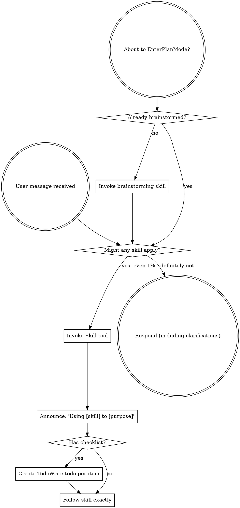

codex-exec: report contract violation

--- codex stdout ---
1. **MET** — production builds, seals, smokes, then publishes an OS-temp candidate; the real Bash/isolated-HOME/decoy-cwd harness verifies 17 hooks, nine modules, final-path hook execution, and update restoration ([hook-install-contract.cjs:771](<HOME>/AppData/Roaming/warp/Warp/data/worktrees/GSDedits/luminaria-hogback/super-gsd/scripts/lib/hook-install-contract.cjs:771), [assert-install-contract.cjs:358](<HOME>/AppData/Roaming/warp/Warp/data/worktrees/GSDedits/luminaria-hogback/super-gsd/tests/install-contract/assert-install-contract.cjs:358)).

3. **MET** — dependencies are computed per manifest entry and rendered from that graph; independent real-loader traces verify ownership ([hook-install-contract.cjs:325](<HOME>/AppData/Roaming/warp/Warp/data/worktrees/GSDedits/luminaria-hogback/super-gsd/scripts/lib/hook-install-contract.cjs:325), [assert-install-contract.cjs:272](<HOME>/AppData/Roaming/warp/Warp/data/worktrees/GSDedits/luminaria-hogback/super-gsd/tests/install-contract/assert-install-contract.cjs:272)).

4. **MET** — doctor uses `git -C`, reports real HEAD/freshness, and the linked-worktree case proves exact drift plus read-only inventories ([install.sh:405](<HOME>/AppData/Roaming/warp/Warp/data/worktrees/GSDedits/luminaria-hogback/super-gsd/install.sh:405), [assert-install-contract.cjs:605](<HOME>/AppData/Roaming/warp/Warp/data/worktrees/GSDedits/luminaria-hogback/super-gsd/tests/install-contract/assert-install-contract.cjs:605)).

5. **MET** — protected P166/P167 sources are unchanged; current witness still fails closed and emits only rewritten PostToolUse output ([sgsd-substrate-invocation-witness.cjs:152](<HOME>/AppData/Roaming/warp/Warp/data/worktrees/GSDedits/luminaria-hogback/super-gsd/hooks/sgsd-substrate-invocation-witness.cjs:152), [sgsd-substrate-invocation-witness.cjs:237](<HOME>/AppData/Roaming/warp/Warp/data/worktrees/GSDedits/luminaria-hogback/super-gsd/hooks/sgsd-substrate-invocation-witness.cjs:237)).

2. **MET** — the production combined path performs candidate, capability, and Codex prechecks before publication/npm/update ([install.sh:1280](<HOME>/AppData/Roaming/warp/Warp/data/worktrees/GSDedits/luminaria-hogback/super-gsd/install.sh:1280)); `runAudit` likewise checks capability first ([audit.cjs:1477](<HOME>/AppData/Roaming/warp/Warp/data/worktrees/GSDedits/luminaria-hogback/super-gsd/tools/feature-propagation/audit.cjs:1477)). The real spawned installer case proves sentinel absent, actions empty, and both inventories identical ([assert-install-contract.cjs:429](<HOME>/AppData/Roaming/warp/Warp/data/worktrees/GSDedits/luminaria-hogback/super-gsd/tests/install-contract/assert-install-contract.cjs:429)). DLB-07: no shape-only laundering.

The selective computed closure is honestly bounded and correctly targets the causal require chain, not unrelated parity ([plan:559](<HOME>/AppData/Roaming/warp/Warp/data/worktrees/GSDedits/luminaria-hogback/.planning/milestones/v4.0-install-contract/phases/168-install-contract/168-01-PLAN-LOCKED.md:559)).

GOAL_MET: YES
VERDICT: PASS

--- codex stderr ---
OpenAI Codex v0.146.0
--------
workdir: C:\Users\operator\AppData\Roaming\warp\Warp\data\worktrees\GSDedits\luminaria-hogback
model: gpt-5.6-sol
provider: openai
approval: never
sandbox: read-only
reasoning effort: xhigh
reasoning summaries: none
session id: 01a03add-88bf-7b91-bad0-2a24bdd97809
--------
user
# Phase verifier — P168 Install Contract. Goal-backward. Read-only, do not edit or re-run suites.

Plan: .../168-install-contract/168-01-PLAN-LOCKED.md (revision 2, tasks T1 and T2).
Context with the measured root cause: .../168-install-contract/CONTEXT.md

Judge EVERY `semantic_acceptance_criteria` entry across both tasks as MET or NOT MET with
a file:line citation from the implementation. Do not accept an executor report or a commit
message as evidence; cite the code.

## The problem this phase existed to solve

Distributed hooks reached every project on every update while the modules they `require`
never did: `install.sh` copied `scripts/lib` to `~/.claude` only, and neither
`init_local_project` nor `update_existing` wrote a project module tree. A project hook
doing `require('../scripts/lib/sgsd-state.cjs')` got MODULE_NOT_FOUND at first fire. This
silently broke delivery to every other repository for five development cycles, and was
confirmed on a real Linux box.

## Orchestrator-run results, take as given, do not re-run

install-contract 5/5; installer-registration-guard 13/13 in one `--all` sweep; a real
`install.sh --init-project` from a decoy cwd into an EMPTY project exits 0 and delivers
17 hooks and 9 `scripts/lib` modules; `install.sh --doctor` in this worktree reports a real
git HEAD and a freshness comparison against master; assert-hook-contract 38/38;
assert-prompt-contracts 4/4; assert-witness-correlation 13/13; assert-propagation PASS;
P166 policy 6/6; P154 real-evidence PASS; composer, enrichment-gate, kb-triage-shadow PASS;
feature-propagation 15/15; `bash -n` clean.

Spec-compliance PASS for T1 (after two FAIL rounds) and for T2 (after one FAIL round).

## Questions the verdict must answer

1. Is each acceptance criterion MET, with a citation?
2. Does the phase actually solve the stated problem: would a project installed by this
   code have the modules its hooks require, and would an install that cannot deliver them
   refuse rather than report success?
3. DLB-07: is any criterion green because a test asserts a shape rather than because real
   data flowed through the real path? The empty-tree criterion claims a production Bash
   installer, real HOME, decoy cwd and no mocks; verify that claim.
4. Any regression in P166, P167 or earlier behaviour?
5. The phase deliberately does NOT repair the remainder of the ~55-file parity gap
   observed on the Linux box, delivering only the computed closure. Is that boundary
   stated honestly in the artifacts, and is it the right boundary?

End with `GOAL_MET: YES` or `GOAL_MET: NO`, then a line that is exactly
`VERDICT: PASS` or `VERDICT: FAIL`. Bound yourself to about 18 shell commands and emit the
verdict even if incomplete. Max 600 words.

## ROUND 2 — one criterion only. HEAD has moved.

Round 1 found 4 of 5 criteria MET and criterion 2 NOT MET for missing npm-sentinel
evidence. Re-confirm the four MET in one line each, then judge criterion 2 against the
updated case: the fixture project now has a `package.json` whose preinstall writes a
sentinel; the case asserts the sentinel ABSENT after the refused install, the
repair-actions array EMPTY (refusal JSON exposes actions read-only), and bytes identical.

Also note the ordering hardening since round 1 (`4bd7eb3`): the capability and Codex
prechecks now precede publication on every entry point, and runAudit checks capability
before publishing.

GOAL_MET and VERDICT lines unchanged. ~10 shell commands. Max 300 words.

codex
I’m using the required `using-superpowers` workflow to keep this verification evidence-first. I’ll inspect only the locked plan, phase context, and implementation at current HEAD; I will not edit files or rerun any suite.
exec
"C:\\WINDOWS\\System32\\WindowsPowerShell\\v1.0\\powershell.exe" -Command "Get-Content -Raw 'C:\\Users\\operator\\.codex\\skills\\using-superpowers\\SKILL.md'" in C:\Users\operator\AppData\Roaming\warp\Warp\data\worktrees\GSDedits\luminaria-hogback
 succeeded in 745ms:
---
name: using-superpowers
description: Use when starting any conversation - establishes how to find and use skills, requiring Skill tool invocation before ANY response including clarifying questions
---

<SUBAGENT-STOP>
If you were dispatched as a subagent to execute a specific task, skip this skill.
</SUBAGENT-STOP>

<EXTREMELY-IMPORTANT>
If you think there is even a 1% chance a skill might apply to what you are doing, you ABSOLUTELY MUST invoke the skill.

IF A SKILL APPLIES TO YOUR TASK, YOU DO NOT HAVE A CHOICE. YOU MUST USE IT.

This is not negotiable. This is not optional. You cannot rationalize your way out of this.
</EXTREMELY-IMPORTANT>

## Instruction Priority

Superpowers skills override default system prompt behavior, but **user instructions always take precedence**:

1. **User's explicit instructions** (CLAUDE.md, GEMINI.md, AGENTS.md, direct requests) ƒ?" highest priority
2. **Superpowers skills** ƒ?" override default system behavior where they conflict
3. **Default system prompt** ƒ?" lowest priority

If CLAUDE.md, GEMINI.md, or AGENTS.md says "don't use TDD" and a skill says "always use TDD," follow the user's instructions. The user is in control.

## How to Access Skills

**In Claude Code:** Use the `Skill` tool. When you invoke a skill, its content is loaded and presented to youƒ?"follow it directly. Never use the Read tool on skill files.

**In Copilot CLI:** Use the `skill` tool. Skills are auto-discovered from installed plugins. The `skill` tool works the same as Claude Code's `Skill` tool.

**In Gemini CLI:** Skills activate via the `activate_skill` tool. Gemini loads skill metadata at session start and activates the full content on demand.

**In other environments:** Check your platform's documentation for how skills are loaded.

## Platform Adaptation

Skills use Claude Code tool names. Non-CC platforms: see `references/copilot-tools.md` (Copilot CLI), `references/codex-tools.md` (Codex) for tool equivalents. Gemini CLI users get the tool mapping loaded automatically via GEMINI.md.

# Using Skills

## The Rule

**Invoke relevant or requested skills BEFORE any response or action.** Even a 1% chance a skill might apply means that you should invoke the skill to check. If an invoked skill turns out to be wrong for the situation, you don't need to use it.



## Red Flags

These thoughts mean STOPƒ?"you're rationalizing:

| Thought | Reality |
|---------|---------|
| "This is just a simple question" | Questions are tasks. Check for skills. |
| "I need more context first" | Skill check comes BEFORE clarifying questions. |
| "Let me explore the codebase first" | Skills tell you HOW to explore. Check first. |
| "I can check git/files quickly" | Files lack conversation context. Check for skills. |
| "Let me gather information first" | Skills tell you HOW to gather information. |
| "This doesn't need a formal skill" | If a skill exists, use it. |
| "I remember this skill" | Skills evolve. Read current version. |
| "This doesn't count as a task" | Action = task. Check for skills. |
| "The skill is overkill" | Simple things become complex. Use it. |
| "I'll just do this one thing first" | Check BEFORE doing anything. |
| "This feels productive" | Undisciplined action wastes time. Skills prevent this. |
| "I know what that means" | Knowing the concept ƒ%ÿ using the skill. Invoke it. |

## Skill Priority

When multiple skills could apply, use this order:

1. **Process skills first** (brainstorming, debugging) - these determine HOW to approach the task
2. **Implementation skills second** (frontend-design, mcp-builder) - these guide execution

"Let's build X" ā' brainstorming first, then implementation skills.
"Fix this bug" ā' debugging first, then domain-specific skills.

## Skill Types

**Rigid** (TDD, debugging): Follow exactly. Don't adapt away discipline.

**Flexible** (patterns): Adapt principles to context.

The skill itself tells you which.

## User Instructions

Instructions say WHAT, not HOW. "Add X" or "Fix Y" doesn't mean skip workflows.

C:\Users\operator\OneDrive - <ORG>\Documents\WindowsPowerShell\profile.ps1 : Cannot dot-source this 
command because it was defined in a different language mode. To invoke this command without importing its contents, 
omit the '.' operator.
At line:1 char:1
+ . 'C:\Users\operator\OneDrive - <ORG>\Documents\Win ...
+ ~~~~~~~~~~~~~~~~~~~~~~~~~~~~~~~~~~~~~~~~~~~~~~~~~~~~~~~~~~~~~~~~~~~~~
    + CategoryInfo          : InvalidOperation: (:) [profile.ps1], NotSupportedException
    + FullyQualifiedErrorId : DotSourceNotSupported,profile.ps1
 
C:\Users\operator\OneDrive - <ORG>\Documents\WindowsPowerShell\Microsoft.PowerShell_profile.ps1 : 
Cannot dot-source this command because it was defined in a different language mode. To invoke this command without 
importing its contents, omit the '.' operator.
At line:1 char:1
+ . 'C:\Users\operator\OneDrive - <ORG>\Documents\Win ...
+ ~~~~~~~~~~~~~~~~~~~~~~~~~~~~~~~~~~~~~~~~~~~~~~~~~~~~~~~~~~~~~~~~~~~~~
    + CategoryInfo          : InvalidOperation: (:) [Microsoft.PowerShell_profile.ps1], NotSupportedException
    + FullyQualifiedErrorId : DotSourceNotSupported,Microsoft.PowerShell_profile.ps1
 

codex
This is also a code-verification request, so I’m applying the `review` and `verification-before-completion` skills. Their effect here is stricter traceability: every criterion and conclusion must rest on current implementation lines, while the supplied suite results remain context rather than code evidence.
exec
"C:\\WINDOWS\\System32\\WindowsPowerShell\\v1.0\\powershell.exe" -Command "Get-Content -Raw 'C:\\Users\\operator\\.agents\\skills\\review\\SKILL.md'" in C:\Users\operator\AppData\Roaming\warp\Warp\data\worktrees\GSDedits\luminaria-hogback
exec
"C:\\WINDOWS\\System32\\WindowsPowerShell\\v1.0\\powershell.exe" -Command "Get-Content -Raw 'C:\\Users\\operator\\.codex\\skills\\verification-before-completion\\SKILL.md'" in C:\Users\operator\AppData\Roaming\warp\Warp\data\worktrees\GSDedits\luminaria-hogback
 succeeded in 825ms:
---
name: review
description: Review code changes for security, performance, bugs, and quality. Reviews staged changes, unstaged changes, specific commits, or PR-ready diffs.
---

<objective>
Review code changes and provide structured feedback covering security, performance, bug risks, code quality, and test coverage gaps. This skill analyzes diffs and surrounding context to catch issues before they reach production.
</objective>

<context>
This skill reviews code changes at various stages of the development workflow. It can review staged changes before a commit, unstaged work-in-progress, a specific commit, or the full set of changes on a branch that are ready for a pull request.

The reviewer reads both the diff and the surrounding source files to understand intent and catch issues that only appear in context.
</context>

<core_principle>
**FIND REAL ISSUES, NOT STYLE NITS.** Focus on problems that cause bugs, security vulnerabilities, performance degradation, or maintainability pain. Avoid nitpicking formatting or subjective style preferences unless they harm readability.
</core_principle>

<analysis_only_rule>
**THIS SKILL IS READ-ONLY. DO NOT MODIFY CODE.**

The purpose is to review and report findings. Making changes during review conflates the reviewer and author roles. Present findings and let the user decide what to act on.
</analysis_only_rule>

<quick_start>

<determine_review_scope>

Parse the user's input to determine what to review:

1. **No arguments** - Review staged changes first. If nothing is staged, review unstaged changes.
   - Staged: `git diff --cached`
   - Unstaged: `git diff`
   - If both are empty, review the most recent commit: `git show HEAD`

2. **Commit hash argument** (e.g., `/review abc1234`) - Review that specific commit.
   - `git show <hash>`

3. **File path argument** (e.g., `/review src/foo.ts`) - Review unstaged changes in that file.
   - `git diff -- <path>` then fall back to `git diff --cached -- <path>`

4. **"pr" argument** (e.g., `/review pr`) - Review all changes since branching from main.
   - `git diff main...HEAD`
   - If on main, review `git diff HEAD~1`

After obtaining the diff, if it is empty, inform the user that there are no changes to review and stop.

</determine_review_scope>

<gather_context>

Before analyzing the diff:

1. **Read changed files in full** - Do not review a diff in isolation. Read each modified file to understand the surrounding code, imports, types, and control flow.
2. **Identify the tech stack** - Note languages, frameworks, and libraries in use. This affects what patterns are risky.
3. **Check for related test files** - For each changed source file, look for corresponding test files. Note whether tests were updated alongside the changes.
4. **Check for configuration changes** - If config files changed (env, CI, package.json, tsconfig, etc.), pay extra attention to side effects.

</gather_context>

<review_categories>

Analyze the changes against each category below. Only report findings that are actually present. Skip categories with no issues.

**A. Security Issues** (Severity: CRITICAL or HIGH)
- Injection vulnerabilities (SQL injection, command injection, template injection)
- Cross-site scripting (XSS) - unsanitized user input rendered in HTML
- Authentication and authorization flaws (missing auth checks, privilege escalation)
- Secrets or credentials hardcoded or logged
- Insecure deserialization or unsafe eval usage
- Path traversal or file access vulnerabilities
- Missing input validation on external data

**B. Performance Concerns** (Severity: HIGH or MEDIUM)
- N+1 query patterns in database access
- Unnecessary memory allocations in hot paths or loops
- Blocking operations on the main thread or in async contexts
- Missing pagination on unbounded queries
- Redundant computation that could be cached or memoized
- Large payloads without streaming or chunking

**C. Bug Risks** (Severity: HIGH or MEDIUM)
- Off-by-one errors in loops or array access
- Null/undefined dereferences without guards
- Race conditions in concurrent or async code
- Incorrect error handling (swallowed errors, wrong error types)
- Type mismatches or unsafe type assertions
- Logic errors in conditionals (inverted checks, missing cases)
- Resource leaks (unclosed connections, file handles, listeners)

**D. Code Quality** (Severity: MEDIUM or LOW)
- Unclear or misleading naming
- Significant code duplication that should be extracted
- Excessive complexity (deeply nested logic, functions doing too many things)
- Dead code or unreachable branches
- Missing or misleading comments on non-obvious logic
- Inconsistency with patterns used elsewhere in the codebase

**E. Test Coverage Gaps** (Severity: MEDIUM or LOW)
- New logic paths without corresponding test cases
- Changed behavior without updated tests
- Edge cases not covered (empty inputs, boundary values, error paths)
- Missing integration tests for new API endpoints or database changes

</review_categories>

<format_findings>

For each finding, use this structure:

```
### [SEVERITY] Category: Brief Title

**File**: `path/to/file.ext` (lines X-Y)

**Issue**: Clear description of the problem.

**Why it matters**: What could go wrong if this is not addressed.

**Suggestion**: How to fix it, with a code snippet if helpful.
```

Severity levels:
- **CRITICAL** - Must fix before merge. Security vulnerability or data loss risk.
- **HIGH** - Should fix before merge. Likely bug or significant performance issue.
- **MEDIUM** - Should fix soon. Code quality or moderate risk issue.
- **LOW** - Consider fixing. Minor improvement opportunity.

</format_findings>

</quick_start>

<critical_rules>

1. **READ THE FULL FILE**: Never review a diff without reading the complete source file for context
2. **NO FALSE ALARMS**: Only report issues you can explain concretely. Do not report vague concerns
3. **PRIORITIZE**: Lead with the most severe findings. Do not bury critical issues under style nits
4. **BE SPECIFIC**: Include file paths, line numbers, and code references for every finding
5. **EXPLAIN THE RISK**: For each finding, explain what could actually go wrong
6. **CHECK TESTS**: Always check whether changes have corresponding test updates
7. **CONSIDER THE STACK**: Apply language-specific and framework-specific knowledge to your review
8. **DO NOT MODIFY CODE**: Present findings only. The user decides what to act on

</critical_rules>

<output_format>

```markdown
## Code Review: [brief description of what was reviewed]

**Scope**: [staged changes | unstaged changes | commit abc1234 | PR changes from main]
**Files reviewed**: [count] files changed, [additions] additions, [deletions] deletions

---

### Findings

[Findings grouped by severity, highest first. Use the format from <format_findings>.]

---

### Summary

| Severity | Count |
|----------|-------|
| CRITICAL | X     |
| HIGH     | X     |
| MEDIUM   | X     |
| LOW      | X     |

### Recommended Actions

1. [Most important action to take]
2. [Next most important action]
3. [...]
```

If no issues are found:

```markdown
## Code Review: [brief description]

**Scope**: [what was reviewed]
**Files reviewed**: [count]

No significant issues found. The changes look good to merge.
```

</output_format>

<decision_gate>

**After presenting findings, ALWAYS offer these options:**

```
ƒ"?ƒ"?ƒ"?ƒ"?ƒ"?ƒ"?ƒ"?ƒ"?ƒ"?ƒ"?ƒ"?ƒ"?ƒ"?ƒ"?ƒ"?ƒ"?ƒ"?ƒ"?ƒ"?ƒ"?ƒ"?ƒ"?ƒ"?ƒ"?ƒ"?ƒ"?ƒ"?ƒ"?ƒ"?ƒ"?ƒ"?ƒ"?ƒ"?ƒ"?ƒ"?ƒ"?ƒ"?ƒ"?ƒ"?ƒ"?ƒ"?
REVIEW COMPLETE

What would you like to do?

1. **Fix issues** - I'll address the findings starting with the most critical
2. **Save review** - Export findings to a markdown file
3. **Review again** - Re-review with different scope or focus
4. **Discuss a finding** - Ask questions about a specific issue
5. **Other** - Tell me what you need
ƒ"?ƒ"?ƒ"?ƒ"?ƒ"?ƒ"?ƒ"?ƒ"?ƒ"?ƒ"?ƒ"?ƒ"?ƒ"?ƒ"?ƒ"?ƒ"?ƒ"?ƒ"?ƒ"?ƒ"?ƒ"?ƒ"?ƒ"?ƒ"?ƒ"?ƒ"?ƒ"?ƒ"?ƒ"?ƒ"?ƒ"?ƒ"?ƒ"?ƒ"?ƒ"?ƒ"?ƒ"?ƒ"?ƒ"?ƒ"?ƒ"?
```

**Wait for user response before taking any action.**

This gate is MANDATORY. Never skip it. Never auto-implement fixes.

</decision_gate>

C:\Users\operator\OneDrive - <ORG>\Documents\WindowsPowerShell\profile.ps1 : Cannot dot-source this 
command because it was defined in a different language mode. To invoke this command without importing its contents, 
omit the '.' operator.
At line:1 char:1
+ . 'C:\Users\operator\OneDrive - <ORG>\Documents\Win ...
+ ~~~~~~~~~~~~~~~~~~~~~~~~~~~~~~~~~~~~~~~~~~~~~~~~~~~~~~~~~~~~~~~~~~~~~
    + CategoryInfo          : InvalidOperation: (:) [profile.ps1], NotSupportedException
    + FullyQualifiedErrorId : DotSourceNotSupported,profile.ps1
 
C:\Users\operator\OneDrive - <ORG>\Documents\WindowsPowerShell\Microsoft.PowerShell_profile.ps1 : 
Cannot dot-source this command because it was defined in a different language mode. To invoke this command without 
importing its contents, omit the '.' operator.
At line:1 char:1
+ . 'C:\Users\operator\OneDrive - <ORG>\Documents\Win ...
+ ~~~~~~~~~~~~~~~~~~~~~~~~~~~~~~~~~~~~~~~~~~~~~~~~~~~~~~~~~~~~~~~~~~~~~
    + CategoryInfo          : InvalidOperation: (:) [Microsoft.PowerShell_profile.ps1], NotSupportedException
    + FullyQualifiedErrorId : DotSourceNotSupported,Microsoft.PowerShell_profile.ps1
 

 succeeded in 863ms:
---
name: verification-before-completion
description: Use when about to claim work is complete, fixed, or passing, before committing or creating PRs - requires running verification commands and confirming output before making any success claims; evidence before assertions always
---

# Verification Before Completion

## Overview

Claiming work is complete without verification is dishonesty, not efficiency.

**Core principle:** Evidence before claims, always.

**Violating the letter of this rule is violating the spirit of this rule.**

## The Iron Law

```
NO COMPLETION CLAIMS WITHOUT FRESH VERIFICATION EVIDENCE
```

If you haven't run the verification command in this message, you cannot claim it passes.

## The Gate Function

```
BEFORE claiming any status or expressing satisfaction:

1. IDENTIFY: What command proves this claim?
2. RUN: Execute the FULL command (fresh, complete)
3. READ: Full output, check exit code, count failures
4. VERIFY: Does output confirm the claim?
   - If NO: State actual status with evidence
   - If YES: State claim WITH evidence
5. ONLY THEN: Make the claim

Skip any step = lying, not verifying
```

## Common Failures

| Claim | Requires | Not Sufficient |
|-------|----------|----------------|
| Tests pass | Test command output: 0 failures | Previous run, "should pass" |
| Linter clean | Linter output: 0 errors | Partial check, extrapolation |
| Build succeeds | Build command: exit 0 | Linter passing, logs look good |
| Bug fixed | Test original symptom: passes | Code changed, assumed fixed |
| Regression test works | Red-green cycle verified | Test passes once |
| Agent completed | VCS diff shows changes | Agent reports "success" |
| Requirements met | Line-by-line checklist | Tests passing |

## Red Flags - STOP

- Using "should", "probably", "seems to"
- Expressing satisfaction before verification ("Great!", "Perfect!", "Done!", etc.)
- About to commit/push/PR without verification
- Trusting agent success reports
- Relying on partial verification
- Thinking "just this once"
- Tired and wanting work over
- **ANY wording implying success without having run verification**

## Rationalization Prevention

| Excuse | Reality |
|--------|---------|
| "Should work now" | RUN the verification |
| "I'm confident" | Confidence ѓ%я evidence |
| "Just this once" | No exceptions |
| "Linter passed" | Linter ѓ%я compiler |
| "Agent said success" | Verify independently |
| "I'm tired" | Exhaustion ѓ%я excuse |
| "Partial check is enough" | Partial proves nothing |
| "Different words so rule doesn't apply" | Spirit over letter |

## Key Patterns

**Tests:**
```
ѓo. [Run test command] [See: 34/34 pass] "All tests pass"
ѓ?O "Should pass now" / "Looks correct"
```

**Regression tests (TDD Red-Green):**
```
ѓo. Write ѓЕ' Run (pass) ѓЕ' Revert fix ѓЕ' Run (MUST FAIL) ѓЕ' Restore ѓЕ' Run (pass)
ѓ?O "I've written a regression test" (without red-green verification)
```

**Build:**
```
ѓo. [Run build] [See: exit 0] "Build passes"
ѓ?O "Linter passed" (linter doesn't check compilation)
```

**Requirements:**
```
ѓo. Re-read plan ѓЕ' Create checklist ѓЕ' Verify each ѓЕ' Report gaps or completion
ѓ?O "Tests pass, phase complete"
```

**Agent delegation:**
```
ѓo. Agent reports success ѓЕ' Check VCS diff ѓЕ' Verify changes ѓЕ' Report actual state
ѓ?O Trust agent report
```

## Why This Matters

From 24 failure memories:
- your human partner said "I don't believe you" - trust broken
- Undefined functions shipped - would crash
- Missing requirements shipped - incomplete features
- Time wasted on false completion ѓЕ' redirect ѓЕ' rework
- Violates: "Honesty is a core value. If you lie, you'll be replaced."

## When To Apply

**ALWAYS before:**
- ANY variation of success/completion claims
- ANY expression of satisfaction
- ANY positive statement about work state
- Committing, PR creation, task completion
- Moving to next task
- Delegating to agents

**Rule applies to:**
- Exact phrases
- Paraphrases and synonyms
- Implications of success
- ANY communication suggesting completion/correctness

## The Bottom Line

**No shortcuts for verification.**

Run the command. Read the output. THEN claim the result.

This is non-negotiable.

C:\Users\operator\OneDrive - <ORG>\Documents\WindowsPowerShell\profile.ps1 : Cannot dot-source this 
command because it was defined in a different language mode. To invoke this command without importing its contents, 
omit the '.' operator.
At line:1 char:1
+ . 'C:\Users\operator\OneDrive - <ORG>\Documents\Win ...
+ ~~~~~~~~~~~~~~~~~~~~~~~~~~~~~~~~~~~~~~~~~~~~~~~~~~~~~~~~~~~~~~~~~~~~~
    + CategoryInfo          : InvalidOperation: (:) [profile.ps1], NotSupportedException
    + FullyQualifiedErrorId : DotSourceNotSupported,profile.ps1
 
C:\Users\operator\OneDrive - <ORG>\Documents\WindowsPowerShell\Microsoft.PowerShell_profile.ps1 : 
Cannot dot-source this command because it was defined in a different language mode. To invoke this command without 
importing its contents, omit the '.' operator.
At line:1 char:1
+ . 'C:\Users\operator\OneDrive - <ORG>\Documents\Win ...
+ ~~~~~~~~~~~~~~~~~~~~~~~~~~~~~~~~~~~~~~~~~~~~~~~~~~~~~~~~~~~~~~~~~~~~~
    + CategoryInfo          : InvalidOperation: (:) [Microsoft.PowerShell_profile.ps1], NotSupportedException
    + FullyQualifiedErrorId : DotSourceNotSupported,Microsoft.PowerShell_profile.ps1
 

exec
"C:\\WINDOWS\\System32\\WindowsPowerShell\\v1.0\\powershell.exe" -NoProfile -Command "rg --files .planning | rg '168-install-contract|STATE\\.md"'$'"'; git status --short; git log -8 --oneline --decorate" in C:\Users\operator\AppData\Roaming\warp\Warp\data\worktrees\GSDedits\luminaria-hogback
 succeeded in 924ms:
.planning\milestones\v4.0-install-contract\phases\168-install-contract\CONTEXT.md
.planning\milestones\v4.0-install-contract\phases\168-install-contract\168-WASTE.md
.planning\milestones\v4.0-install-contract\phases\168-install-contract\168-VERIFY-WRAPPER.log
.planning\milestones\v4.0-install-contract\phases\168-install-contract\168-VERIFY-R2-WRAPPER.log
.planning\milestones\v4.0-install-contract\phases\168-install-contract\168-VERIFY-R2-PROMPT.md
.planning\milestones\v4.0-install-contract\phases\168-install-contract\168-VERIFY-PROMPT.md
.planning\milestones\v4.0-install-contract\phases\168-install-contract\168-VERIFICATION-RAW.md
.planning\milestones\v4.0-install-contract\phases\168-install-contract\168-T3B2-WRAPPER.log
.planning\milestones\v4.0-install-contract\phases\168-install-contract\168-T3B2-REPORT.md
.planning\milestones\v4.0-install-contract\phases\168-install-contract\168-T3B2-PROMPT.md
.planning\milestones\v4.0-install-contract\phases\168-install-contract\168-T3B2-FILES.txt
.planning\milestones\v4.0-install-contract\phases\168-install-contract\168-T3A-WRAPPER.log
.planning\milestones\v4.0-install-contract\phases\168-install-contract\168-T3A-REPORT.md
.planning\milestones\v4.0-install-contract\phases\168-install-contract\168-T3A-PROMPT.md
.planning\milestones\v4.0-install-contract\phases\168-install-contract\168-T3A-FILES.txt
.planning\milestones\v4.0-install-contract\phases\168-install-contract\168-T3-WRAPPER.log
.planning\milestones\v4.0-install-contract\phases\168-install-contract\168-T3-REPORT.md
.planning\milestones\v4.0-install-contract\phases\168-install-contract\168-T3-PROMPT.md
.planning\milestones\v4.0-install-contract\phases\168-install-contract\168-T3-FILES.txt
.planning\milestones\v4.0-install-contract\phases\168-install-contract\168-T2B-WRAPPER.log
.planning\milestones\v4.0-install-contract\phases\168-install-contract\168-T2B-REPORT.md
.planning\milestones\v4.0-install-contract\phases\168-install-contract\168-T2B-PROMPT.md
.planning\milestones\v4.0-install-contract\phases\168-install-contract\168-T2B-FILES.txt
.planning\milestones\v4.0-install-contract\phases\168-install-contract\168-T2-WRAPPER.log
.planning\milestones\v4.0-install-contract\phases\168-install-contract\168-T2-SPEC2-WRAPPER.log
.planning\milestones\v4.0-install-contract\phases\168-install-contract\168-T2-SPEC2-PROMPT.md
.planning\milestones\v4.0-install-contract\phases\168-install-contract\168-T2-SPEC-WRAPPER.log
.planning\milestones\v4.0-install-contract\phases\168-install-contract\168-T2-SPEC-REVIEW2.md
.planning\milestones\v4.0-install-contract\phases\168-install-contract\168-T2-SPEC-REVIEW.md
.planning\milestones\v4.0-install-contract\phases\168-install-contract\168-T2-SPEC-PROMPT.md
.planning\milestones\v4.0-install-contract\phases\168-install-contract\168-T2-REPORT.md
.planning\milestones\v4.0-install-contract\phases\168-install-contract\168-T2-PROMPT.md
.planning\milestones\v4.0-install-contract\phases\168-install-contract\168-T2-FILES.txt
.planning\milestones\v4.0-install-contract\phases\168-install-contract\168-T1Q-WRAPPER.log
.planning\milestones\v4.0-install-contract\phases\168-install-contract\168-T1Q-REPORT.md
.planning\milestones\v4.0-install-contract\phases\168-install-contract\168-T1Q-PROMPT.md
.planning\milestones\v4.0-install-contract\phases\168-install-contract\168-T1Q-FILES.txt
.planning\milestones\v4.0-install-contract\phases\168-install-contract\168-T1P-WRAPPER.log
.planning\milestones\v4.0-install-contract\phases\168-install-contract\168-T1P-REPORT.md
.planning\milestones\v4.0-install-contract\phases\168-install-contract\168-T1P-PROMPT.md
.planning\milestones\v4.0-install-contract\phases\168-install-contract\168-T1P-FILES.txt
.planning\milestones\v4.0-install-contract\phases\168-install-contract\168-T1N-WRAPPER.log
.planning\milestones\v4.0-install-contract\phases\168-install-contract\168-T1N-REPORT.md
.planning\milestones\v4.0-install-contract\phases\168-install-contract\168-T1N-PROMPT.md
.planning\milestones\v4.0-install-contract\phases\168-install-contract\168-T1N-FILES.txt
.planning\milestones\v4.0-install-contract\phases\168-install-contract\168-T1M-WRAPPER.log
.planning\milestones\v4.0-install-contract\phases\168-install-contract\168-T1M-REPORT.md
.planning\milestones\v4.0-install-contract\phases\168-install-contract\168-T1M-PROMPT.md
.planning\milestones\v4.0-install-contract\phases\168-install-contract\168-T1M-FILES.txt
.planning\milestones\v4.0-install-contract\phases\168-install-contract\168-T1K-WRAPPER.log
.planning\milestones\v4.0-install-contract\phases\168-install-contract\168-T1K-REPORT.md
.planning\milestones\v4.0-install-contract\phases\168-install-contract\168-T1K-PROMPT.md
.planning\milestones\v4.0-install-contract\phases\168-install-contract\168-T1K-FILES.txt
.planning\milestones\v4.0-install-contract\phases\168-install-contract\168-T1J-WRAPPER.log
.planning\milestones\v4.0-install-contract\phases\168-install-contract\168-T1J-REPORT.md
.planning\milestones\v4.0-install-contract\phases\168-install-contract\168-T1J-PROMPT.md
.planning\milestones\v4.0-install-contract\phases\168-install-contract\168-T1J-FILES.txt
.planning\milestones\v4.0-install-contract\phases\168-install-contract\168-T1I-WRAPPER.log
.planning\milestones\v4.0-install-contract\phases\168-install-contract\168-T1I-REPORT.md
.planning\milestones\v4.0-install-contract\phases\168-install-contract\168-T1I-PROMPT.md
.planning\milestones\v4.0-install-contract\phases\168-install-contract\168-T1I-FILES.txt
.planning\milestones\v4.0-install-contract\phases\168-install-contract\168-T1H-WRAPPER.log
.planning\milestones\v4.0-install-contract\phases\168-install-contract\168-T1H-REPORT.md
.planning\milestones\v4.0-install-contract\phases\168-install-contract\168-T1H-PROMPT.md
.planning\milestones\v4.0-install-contract\phases\168-install-contract\168-T1H-FILES.txt
.planning\milestones\v4.0-install-contract\phases\168-install-contract\168-T1G-WRAPPER.log
.planning\milestones\v4.0-install-contract\phases\168-install-contract\168-T1G-REPORT.md
.planning\milestones\v4.0-install-contract\phases\168-install-contract\168-T1G-PROMPT.md
.planning\milestones\v4.0-install-contract\phases\168-install-contract\168-T1G-FILES.txt
.planning\milestones\v4.0-install-contract\phases\168-install-contract\168-T1F-WRAPPER.log
.planning\milestones\v4.0-install-contract\phases\168-install-contract\168-T1F-REPORT.md
.planning\milestones\v4.0-install-contract\phases\168-install-contract\168-T1F-PROMPT.md
.planning\milestones\v4.0-install-contract\phases\168-install-contract\168-T1F-FILES.txt
.planning\milestones\v4.0-install-contract\phases\168-install-contract\168-T1E-WRAPPER.log
.planning\milestones\v4.0-install-contract\phases\168-install-contract\168-T1E-REPORT.md
.planning\milestones\v4.0-install-contract\phases\168-install-contract\168-T1E-PROMPT.md
.planning\milestones\v4.0-install-contract\phases\168-install-contract\168-T1E-FILES.txt
.planning\milestones\v4.0-install-contract\phases\168-install-contract\168-T1D-WRAPPER.log
.planning\milestones\v4.0-install-contract\phases\168-install-contract\168-T1D-REPORT.md
.planning\milestones\v4.0-install-contract\phases\168-install-contract\168-T1D-PROMPT.md
.planning\milestones\v4.0-install-contract\phases\168-install-contract\168-T1D-FILES.txt
.planning\milestones\v4.0-install-contract\phases\168-install-contract\168-T1C-WRAPPER.log
.planning\milestones\v4.0-install-contract\phases\168-install-contract\168-T1C-REPORT.md
.planning\milestones\v4.0-install-contract\phases\168-install-contract\168-T1C-PROMPT.md
.planning\milestones\v4.0-install-contract\phases\168-install-contract\168-T1C-FILES.txt
.planning\milestones\v4.0-install-contract\phases\168-install-contract\168-T1B-WRAPPER.log
.planning\milestones\v4.0-install-contract\phases\168-install-contract\168-T1B-REPORT.md
.planning\milestones\v4.0-install-contract\phases\168-install-contract\168-T1B-PROMPT.md
.planning\milestones\v4.0-install-contract\phases\168-install-contract\168-T1B-FILES.txt
.planning\milestones\v4.0-install-contract\phases\168-install-contract\168-T1-WRAPPER.log
.planning\milestones\v4.0-install-contract\phases\168-install-contract\168-T1-SPEC3-WRAPPER.log
.planning\milestones\v4.0-install-contract\phases\168-install-contract\168-T1-SPEC3-PROMPT.md
.planning\milestones\v4.0-install-contract\phases\168-install-contract\168-T1-SPEC2-WRAPPER.log
.planning\milestones\v4.0-install-contract\phases\168-install-contract\168-T1-SPEC2-PROMPT.md
.planning\milestones\v4.0-install-contract\phases\168-install-contract\168-T1-SPEC-WRAPPER.log
.planning\milestones\v4.0-install-contract\phases\168-install-contract\168-T1-SPEC-REVIEW3.md
.planning\milestones\v4.0-install-contract\phases\168-install-contract\168-T1-SPEC-REVIEW2.md
.planning\milestones\v4.0-install-contract\phases\168-install-contract\168-T1-SPEC-REVIEW.md
.planning\milestones\v4.0-install-contract\phases\168-install-contract\168-T1-SPEC-PROMPT.md
.planning\milestones\v4.0-install-contract\phases\168-install-contract\168-T1-REPORT.md
.planning\milestones\v4.0-install-contract\phases\168-install-contract\168-T1-PROMPT.md
.planning\milestones\v4.0-install-contract\phases\168-install-contract\168-T1-FILES.txt
.planning\milestones\v4.0-install-contract\phases\168-install-contract\168-REMOVED-ASSERTIONS.txt
.planning\milestones\v4.0-install-contract\phases\168-install-contract\168-PLANREVIEW2.md
.planning\milestones\v4.0-install-contract\phases\168-install-contract\168-PLANREVIEW2-WRAPPER.log
.planning\milestones\v4.0-install-contract\phases\168-install-contract\168-PLANREVIEW2-PROMPT.md
.planning\milestones\v4.0-install-contract\phases\168-install-contract\168-PLANREVIEW.md
.planning\milestones\v4.0-install-contract\phases\168-install-contract\168-PLANREVIEW-WRAPPER.log
.planning\milestones\v4.0-install-contract\phases\168-install-contract\168-PLANREVIEW-PROMPT.md
.planning\milestones\v4.0-install-contract\phases\168-install-contract\168-PLAN-WRAPPER2.log
.planning\milestones\v4.0-install-contract\phases\168-install-contract\168-PLAN-WRAPPER.log
.planning\milestones\v4.0-install-contract\phases\168-install-contract\168-PLAN-REV2-WRAPPER.log
.planning\milestones\v4.0-install-contract\phases\168-install-contract\168-PLAN-REV2-REPORT.md
.planning\milestones\v4.0-install-contract\phases\168-install-contract\168-PLAN-REV2-PROMPT.md
.planning\milestones\v4.0-install-contract\phases\168-install-contract\168-PLAN-REV2-FILES.txt
.planning\milestones\v4.0-install-contract\phases\168-install-contract\168-PLAN-REPORT2.md
.planning\milestones\v4.0-install-contract\phases\168-install-contract\168-PLAN-REPORT.md
.planning\milestones\v4.0-install-contract\phases\168-install-contract\168-PLAN-PROMPT.md
.planning\milestones\v4.0-install-contract\phases\168-install-contract\168-PLAN-FILES.txt
.planning\milestones\v4.0-install-contract\phases\168-install-contract\168-PHASEATC-WRAPPER.log
.planning\milestones\v4.0-install-contract\phases\168-install-contract\168-PHASEATC-R2-WRAPPER.log
.planning\milestones\v4.0-install-contract\phases\168-install-contract\168-PHASEATC-R2-PROMPT.md
.planning\milestones\v4.0-install-contract\phases\168-install-contract\168-PHASEATC-PROMPT.md
.planning\milestones\v4.0-install-contract\phases\168-install-contract\168-MUDA-WRAPPER.log
.planning\milestones\v4.0-install-contract\phases\168-install-contract\168-MUDA-PROMPT.md
.planning\milestones\v4.0-install-contract\phases\168-install-contract\168-FIX-REPAIR-ORDER-WRAPPER.log
.planning\milestones\v4.0-install-contract\phases\168-install-contract\168-FIX-REPAIR-ORDER-REPORT.md
.planning\milestones\v4.0-install-contract\phases\168-install-contract\168-FIX-REPAIR-ORDER-PROMPT.md
.planning\milestones\v4.0-install-contract\phases\168-install-contract\168-FIX-REPAIR-ORDER-FILES.txt
.planning\milestones\v4.0-install-contract\phases\168-install-contract\168-ATC-REVIEW.md
.planning\milestones\v4.0-install-contract\phases\168-install-contract\168-ABANDONED-T3-REPAIR-SPLIT.patch
.planning\milestones\v4.0-install-contract\phases\168-install-contract\168-ABANDONED-STAGED-INSTALLER.patch
.planning\milestones\v4.0-install-contract\phases\168-install-contract\168-01-PLAN-LOCKED.md
?? .planning/milestones/v4.0-install-contract/phases/168-install-contract/168-PHASEATC-R2-PROMPT.md
?? .planning/milestones/v4.0-install-contract/phases/168-install-contract/168-PHASEATC-R2-WRAPPER.log
?? .planning/milestones/v4.0-install-contract/phases/168-install-contract/168-VERIFY-R2-PROMPT.md
?? .planning/milestones/v4.0-install-contract/phases/168-install-contract/168-VERIFY-R2-WRAPPER.log
?? .planning/tmp/
88207e0 (HEAD -> luminaria-hogback) fix(168-03): the refusal criterion is now proven as written, orphan exports removed
4bd7eb3 fix(168-03): every refusal now precedes the first write, asserted by inventory not by name
6c54b7b docs(168): phase gates FAIL, T3 reverted, lessons recorded
e919000 fix(168-02): the doctor exit-code contract now holds on the explicit-project path
fc30be7 feat(168-02): read-only doctor, and the freshness check finally works in a worktree
7234cb2 fix(168-01): truncated smoke output can no longer read as a clean policy decision
0dfd0d1 fix(168-01): close the three spec-review findings without breaking recovery
c867978 chore(checkpoint): P168 T1 delivered and green; spec fixes parked as a patch

exec
"C:\\WINDOWS\\System32\\WindowsPowerShell\\v1.0\\powershell.exe" -NoProfile -Command '$phase='"'.planning/milestones/v4.0-install-contract/phases/168-install-contract'; Get-Content -Raw \""'$phase/168-01-PLAN-LOCKED.md"; Get-Content -Raw "$phase/CONTEXT.md"' in C:\Users\operator\AppData\Roaming\warp\Warp\data\worktrees\GSDedits\luminaria-hogback
 succeeded in 418ms:
---
schema_version: 2
phase: 168
slug: install-contract
milestone: v4.0-install-contract
status: PLANNED
revision: 2
governing_decision: .planning/milestones/v4.0-install-contract/phases/168-install-contract/CONTEXT.md
evidence_paths:
  - .planning/milestones/v4.0-install-contract/INTENT.md
  - .planning/milestones/v4.0-install-contract/phases/168-install-contract/CONTEXT.md
  - .planning/milestones/v3.9-substrate-hygiene/phases/167-substrate-invocation-witness/SUMMARY.md
  - .planning/milestones/v3.9-substrate-hygiene/phases/167-substrate-invocation-witness/AUDIT.md
depends_on: []
intent: >
  Make project installation one closed contract: compute every repository-owned
  module needed by distributed hooks from the hook sources, declare the computed
  closure in the hook manifest, deliver and refresh that exact closure, execute
  every prospective project hook in a complete candidate before the first write,
  prove every installed target hook after successful publication, preserve the
  underlying module-resolution error beside the existing closed reason code, and
  expose one read-only command that identifies hook and module drift for an
  explicit project, including projects whose .git entry is a worktree file.
execution_mode: two-dependent-codex-tasks-with-orchestrator-spawn-gates
expected_ATC_tier: GATE
skip_gates: []
lessons_path: null
prior_errors_lookup: true
lock_status: locked
locked_at: 2026-08-25T11:08:08+01:00
locked_by: codex
allowed_files:
  - super-gsd/scripts/lib/hook-install-contract.cjs
  - super-gsd/config/hook-manifest.json
  - super-gsd/scripts/lib/hook-registration-preflight.cjs
  - super-gsd/tools/feature-propagation/audit.cjs
  - super-gsd/install.sh
  - super-gsd/tests/install-contract/assert-install-contract.cjs
  - super-gsd/tests/installer-registration-guard/assert-installer-registration-guard.cjs
forbidden_files:
  - super-gsd/hooks/sgsd-substrate-invocation-witness.cjs
  - super-gsd/scripts/lib/substrate-invocation-witness-store.cjs
  - super-gsd/scripts/lib/vtp-context-composer.cjs
  - super-gsd/tools/substrate-capability-broker.cjs
  - super-gsd/schemas/vtp-mcp-input-schemas.v1.json
  - .planning/milestones/v3.6-vtp-bridge/phases/154-mcp-arg-contract/154-REAL-MCP-EVIDENCE.json
  - .planning/STATE.md
  - .planning/milestones/v4.0-install-contract/ROADMAP.md
  - package.json
  - package-lock.json
  - wiki/LINT-REPORT.md
invariants:
  - Project dependency delivery is the mechanically computed transitive closure; no production array, shell glob, test constant, or manifest field may hand-list the closure.
  - Manifest policy remains human-authored, but every dependency field is generated and verified against the same computation used by delivery and status.
  - Every rejection-capable source, manifest, destination, package, registration, and all-hook smoke check completes against one complete project-shaped candidate before the first project, profile, npm, key, settings, broker, or grant mutation.
  - The candidate lives under a fresh OS temporary directory outside the project and profile, contains the exact prospective project paths, uses an isolated HOME/USERPROFILE, and resolves requires naturally from candidate hook paths without NODE_PATH or canonical-source fallback.
  - After the first destination write, production performs only rollback-journaled publication of the already-smoked immutable candidate bytes; it never spawns a hook or runs another rejection-capable validation, and any publication I/O failure restores project/profile bytes and the actions array exactly.
  - An explicit --project-dir is normalized and used exactly; walk-up occurs only when no explicit project directory is supplied.
  - Read-only status, installer precheck, and repair consume one inspectProjectInstall result; no second detector or dependency list is permitted.
  - Closed reasons are unchanged; MODULE_NOT_FOUND code, request, resolved path, and bounded message travel in underlying_error/detail beside the existing reason.
  - P167 remains unchanged: PreToolUse fails closed, PostToolUse emits bounded substrate_witness_rewrite_failed without raw passthrough, and only rewritten rows are accepted.
  - Existing guard assertions are preserved or strengthened; none is weakened to obtain a pass.
acceptance_commands:
  - node super-gsd/scripts/lib/hook-install-contract.cjs --check-manifest
  - node super-gsd/tests/install-contract/assert-install-contract.cjs --all
  - node super-gsd/tests/installer-registration-guard/assert-installer-registration-guard.cjs --all
  - node super-gsd/tests/substrate-invocation-witness/assert-hook-contract.cjs
  - node super-gsd/tests/substrate-invocation-witness/assert-propagation.cjs
rollback_plan: >
  Revert P168-T2 before P168-T1. T1 is the indivisible declaration,
  graph/detector, delivery, all-hook smoke, diagnosis, and proof commit; never
  retain dependency fields without their verifier or copying without smoke.
  T2 adds only the dependent doctor/worktree presentation seam. Run the
  pre-P168 installer guard and P167 suites after either rollback.
risk_rating: high
operator_checkpoints:
  - The orchestrator runs spawn-bound real install, refusal, and worktree cases outside any sandbox that returns spawnSync EPERM.
  - Phase close is NOGO until both dependent tasks pass; manifest generation, delivery, smoke, and diagnosis remain one T1 commit, while T2 cannot ship without T1.
  - Phase close is NOGO if any refused entry point changes a snapshotted project/profile byte or records a repair action.
semantic_acceptance_criteria:
  - input: >
      A disposable on-disk SGSD project whose project-local
      super-gsd/scripts/lib and other computed project-module destinations start
      empty, an isolated real HOME/USERPROFILE, and a separate canonical source
      checkout. Production install.sh is launched by Bash with --init-project,
      --skip-cockpit-deps, and --project-dir pointing at that project while cwd
      is a different decoy directory. No mocked copier, dependency adapter,
      staged target, or direct hook-function call is used. After installation,
      one delivered transitive module is changed and production --update runs.
    expected_outcome: >
      Before its first destination write, the production installer creates its
      complete candidate outside the project/profile, spawns every candidate
      Claude and Codex project hook/registration with natural candidate-relative
      resolution, and seals the exact bytes that publication will copy. The
      installer then publishes those bytes transactionally and exits 0 with
      every computed dependency byte-identical in the final target. Only after
      the installer has returned, the test harness independently spawns every
      final installed hook from its real path with cwd equal to the explicit
      project; this is non-rejecting verification of the completed install, not
      a staged shortcut or a post-write installer refusal. Update restores the
      changed module after repeating candidate smoke. No hook reports an
      unresolved dependency, and the decoy cwd and ancestors remain untouched.
    verification_cmd: >
      node super-gsd/tests/install-contract/assert-install-contract.cjs
      --case empty-module-tree-real-install
  - input: >
      A second real install against seeded project and profile trees after a
      temporary canonical hook source is given a relative require whose resolved
      repository file does not exist. The test snapshots every file and SHA-256
      under both destinations and plants an npm preinstall sentinel that records
      if mutation begins. It invokes production combined --install-global
      --update, not an exported detector in isolation.
    expected_outcome: >
      Installation refuses before npm, hook or module copying, settings merge,
      key provisioning, broker/grant repair, or global installation. The closed
      reason remains hook_smoke_failed or witness_repair_failed as appropriate,
      while underlying_error carries MODULE_NOT_FOUND, the original request, the
      exact normalized missing module path, and a bounded sanitized message.
      Project/profile inventories and hashes are byte-identical, the npm sentinel
      is absent, and repair actions are empty. Raw hook output, payloads, secrets,
      and unbounded stacks are not exposed.
    verification_cmd: >
      node super-gsd/tests/install-contract/assert-install-contract.cjs
      --case unresolved-module-refuses-before-write
  - input: >
      The real canonical hook sources and hook-manifest.json, followed by a
      test-only Node loader trace that executes the selected real hook sources
      from a complete temporary source checkout and records actual parent to
      resolved-child repository edges per manifest entry. That independent
      source execution, rather than a maintained expected-closure list, is the
      oracle. A generated mutation then adds runtime-named relative requires
      covering extensionless-to-.js, explicit .js, explicit .json, package-main
      directory, index directory, and a transitive child; the fixture paths and
      expected edges are emitted by the generator from the mutated sources, not
      transcribed into the test. The production graph, manifest renderer, check,
      delivery, and inspection APIs run on the same temporary checkout.
    expected_outcome: >
      The committed manifest is byte-equivalent to its deterministic generated
      dependency projection. For each traced or generated parent-child edge,
      the same originating manifest entry owns the edge in the computed
      per-entry closure, that entry's generated manifest projection, delivery
      provenance and candidate/final bytes, and missing/stale/current inspection
      rows. Equality is tested per entry, never at union level. This necessarily
      proves the witness entry owns both composer and store edges and the
      sgsd-quality-gate.js entry owns sgsd-intent-classifier.cjs even while the
      classifier remains a separate manifest root. Every generated .js/.json/
      directory/transitive resolution follows the same four surfaces. The
      unchanged temporary manifest is rejected as stale and names exact paths.
      An unresolvable dynamic repository-local require is rejected rather than
      omitted; built-ins are excluded, bare packages are classified rather than
      copied from ignored node_modules, ordering is stable, and cycles terminate
      without duplicate artifacts.
    verification_cmd: >
      node super-gsd/tests/install-contract/assert-install-contract.cjs
      --case generated-transitive-manifest
  - input: >
      A real temporary Git repository with a linked worktree, so the selected
      project has a .git file, plus one missing installed hook, one stale
      transitive module, and one current module. From a different cwd, the
      operator runs bash super-gsd/install.sh --doctor --project-dir with the
      worktree path, repairs through --update, and repeats doctor.
    expected_outcome: >
      The first doctor run is read-only, recognizes the linked checkout as a Git
      worktree, prints its real HEAD rather than not-a-git-repo, and reports a
      non-current install with the exact missing hook and stale module paths,
      expected/actual digests, and canonical source revision. It does not report
      the current module as behind, and it reaches the existing GitHub-master
      comparison; remote unavailability is named separately from the local
      verdict. After update, doctor exits current with no missing or stale hook/
      module rows. Only the explicit worktree is inspected and repaired.
    verification_cmd: >
      node super-gsd/tests/install-contract/assert-install-contract.cjs
      --case doctor-real-git-worktree-staleness
  - input: >
      The complete pre-existing installer-registration guard suite and P167
      witness hook/propagation suites run after P168, including broken deployed
      hook and witness-repair-no-mutation controls.
    expected_outcome: >
      Every prior guard passes with its original or stronger assertion. The
      witness hook source, store, composer, broker, response bound, substrate
      reasons, rewritten-only acceptance, and no-raw-result behavior are
      unchanged. The prior broken module control now exposes the exact missing
      path beside its closed reason, and refused repair still leaves
      byte-identical trees and an empty actions array.
    verification_cmd: >
      node super-gsd/tests/installer-registration-guard/assert-installer-registration-guard.cjs --all &&
      node super-gsd/tests/substrate-invocation-witness/assert-hook-contract.cjs &&
      node super-gsd/tests/substrate-invocation-witness/assert-propagation.cjs
known_deadends:
  - Do not encode known hook dependencies in install.sh, hook-manifest.json, tests, or an exceptions table. That second-source pattern caused this failure.
  - Do not blanket-copy scripts/lib, tools, or node_modules. Deliver only computed repository-owned files and classify package prerequisites; a missing package is named and refused.
  - Do not generate the whole manifest. Targets, dispositions, authorities, matchers, timeouts, and intentional-unregistration reasons are human policy; only dependencies are generated.
  - Do not accept node --check, existence, mocked spawn, direct exported-function calls, or the pre-publication candidate alone as deployed end-to-end semantic proof; the harness must execute every final target hook after production install.
  - Do not begin externally visible install writes until every source, manifest, destination, package, registration, and project-shaped prospective-smoke check has passed.
  - Do not spawn a hook or run any other rejection-capable check after the first destination write. Publication consumes only sealed candidate bytes; final-target execution belongs to the post-success test harness and cannot change the installer verdict.
  - Do not add a second staleness implementation to doctor or audit. Both format the same inspectProjectInstall report consumed by repair.
  - Do not replace the closed refusal vocabulary with MODULE_NOT_FOUND. Preserve the reason and attach bounded structured underlying_error/detail.
  - Do not test Git repositories with a .git directory predicate. Use git -C with rev-parse for normal repositories and linked worktrees.
  - Do not change a P167 hook, witness-store, composer, or broker contract to make smoke pass. Adapt smoke and diagnosis around production.
  - Do not merge this branch; publication to master remains an operator decision.
  - Do not treat selective hook closure as whole-tree parity. The unrelated remainder of the measured approximately 55-file project/global gap is deliberately outside P168.
tasks:
  - id: P168-T1
    type: computed-hook-install-contract-delivery-smoke-and-diagnosis
    agent: codex
    model: codex
    depends_on: []
    files_touched:
      - super-gsd/scripts/lib/hook-install-contract.cjs
      - super-gsd/config/hook-manifest.json
      - super-gsd/scripts/lib/hook-registration-preflight.cjs
      - super-gsd/tools/feature-propagation/audit.cjs
      - super-gsd/install.sh
      - super-gsd/tests/install-contract/assert-install-contract.cjs
      - super-gsd/tests/installer-registration-guard/assert-installer-registration-guard.cjs
    input_contract: >
      Treat CONTEXT.md's measured delivery trace and P167 SUMMARY/AUDIT
      constraints as settled facts; do not reproduce or redesign the root cause.
      Work red-first in the focused assert-install-contract.cjs suite and
      strengthen, never relax, the existing installer-registration guard.

      Create hook-install-contract.cjs as the single authority and export
      computeHookDependencyGraph, renderManifestDependencies,
      inspectProjectInstall, and applyProjectInstall. Start from every manifest
      entry distributed to
      claude-project or codex-project and lex actual CommonJS source while
      ignoring comments and string/template text. Resolve literal relative
      requires with Node file/directory rules and recursively walk
      repository-owned modules. Symbolically reduce string constants and
      path.join/path.resolve expressions rooted at __dirname or runtime project
      root so the witness COMPOSER_RELATIVE_PATH and STORE_RELATIVE_PATH are
      discovered from source, never named in a production exception. Exclude
      built-ins, classify bare packages without copying ignored node_modules,
      detect cycles, deduplicate, sort by normalized POSIX path, reject root
      escapes, and fail closed with source plus expression for an unresolved
      local dynamic require. Return per-entry closure, union, source/target
      paths, SHA-256, packages, source errors, and target
      missing/stale/current rows.

      Keep hook-manifest.json as reviewed policy. Add a generated dependency
      field to every entry. Implement --write-manifest to rewrite only those
      fields deterministically and --check-manifest to compare committed data
      with a fresh computeHookDependencyGraph result. Installer, audit, tests,
      delivery, and status all call the check and never trust committed
      dependency bytes without recomputation. This generated-and-verified
      choice preserves human policy while eliminating a second dependency
      authority.

      Make inspectProjectInstall the only detector. With explicit projectDir,
      path.resolve that exact argument and never call findPlanningRoot; only an
      absent argument may walk up. audit.cjs read-only output, precheck,
      repairClaudeSubstrateWitness, and install.sh precheck consume this
      report. applyProjectInstall copies only report.requiredFiles that are
      missing/stale into projectDir/super-gsd. It snapshots every affected path,
      preserves unrelated files, and retains the originating manifest entry as
      required_by provenance on every inspection, candidate, publication, and
      status row so a union root cannot mask a missing per-entry edge. It
      revalidates source and candidate digests before the first destination
      write, copies only sealed candidate bytes, records actions only after
      complete publication, and restores absent files as absent and existing
      files byte-exactly if a publication I/O operation fails.
      A second run is byte-idempotent. Remove installSubstrateRuntime's
      three-file special-case as a competing writer; the broker stays in its
      dedicated capability path because it is not a hook-import dependency.
      Route init_local_project, update_existing, combined
      --install-global/--update, and project-hook repair through this contract.
      distribute_project_hooks must not remain a standalone unjournaled writer:
      either delegate it to applyProjectInstall or reduce it to a private step
      inside the same candidate/publication transaction.

      Preserve refuse-before-write on all entry points. Refactor install.sh
      parsing to consume --project-dir VALUE and parse full argv before
      dispatch. Default remains starting cwd; explicit value is authoritative.
      precheck_installation_refusals computes and validates the graph, generated
      manifest, destinations, Codex sources, substrate sources, packages, and
      prospective all-hook smoke against the one complete OS-temporary candidate
      described below before ensure_gsd_base, npm,
      skeleton/memory, project/global copies, settings, keys, broker state, or
      grants. Candidate writes are isolated from project/profile destinations and
      are not accepted as deployed semantic proof. Run the same precheck at the
      top of direct --repair-safe, --repair,
      --repair-substrate-capability, and exported repairClaudeSubstrateWitness
      paths. Prove ordering with whole-tree hashes and an npm preinstall
      sentinel, not source-index assertions alone.

      Extend hook-registration-preflight.cjs so descriptors preserve complete
      interpreter argv and derive safe event/matcher-aware stdin from manifest
      dispositions. Execute every candidate project hook/registration represented by
      claude-project or codex-project, including both witness events and
      intentionally unregistered distributed sources with declared smoke event;
      deduplicate only identical source/event/argv tuples. Spawn real candidate
      files with shell false, cwd equal to the candidate project root, isolated
      HOME and USERPROFILE, bounded concurrency, and at least registered timeout. File
      existence and node --check remain preliminary. Capture bounded output. On
      failure HookSmokeError retains hook_smoke_failed and adds underlyingError
      with code, request, normalized path, and a sanitized single-line message
      bounded to 2048 UTF-8 characters. Parse MODULE_NOT_FOUND and its require
      stack for the exact candidate path, rebase that path to the intended
      explicit-project destination for operator output, and do not forward
      arbitrary child output, stdin, or stack text. audit.cjs carries this in
      detail/underlying_error beside witness_repair_failed, and install.sh prints
      it before the existing refusal summary.

      Create the complete candidate with
      fs.mkdtempSync(path.join(os.tmpdir(), 'sgsd-install-candidate-')); its
      returned directory is the candidate project root and its .home child is
      the isolated HOME/USERPROFILE. Materialize the effective .planning marker,
      every prospective project hook/registration, every per-entry computed
      repository dependency, and the prospective settings bytes at the same
      relative paths they will have under the explicit project. This is one
      complete project-shaped candidate, not one scratch tree per hook. Rebase
      every descriptor script path to candidateRoot/super-gsd/..., spawn with
      shell false, cwd and payload.cwd equal to candidateRoot, and bind HOME,
      USERPROFILE, APPDATA, LOCALAPPDATA, XDG_CONFIG_HOME, XDG_DATA_HOME,
      XDG_STATE_HOME, XDG_CACHE_HOME, TMPDIR, TEMP, and TMP to children of the
      candidate. Use a sanitized environment with no NODE_PATH/NODE_OPTIONS,
      canonical-checkout path, target/profile path, or target-tree fallback.
      Consequently
      ordinary relative requires resolve from the candidate hook file, while
      the witness findProjectRoot sees candidateRoot/.planning and loads its
      composer and store from candidateRoot/super-gsd/scripts/lib.

      Run the full event-aware descriptor set in that candidate, then rehash and
      seal its publication rows before any project/profile mutation. A missing
      canonical dependency, candidate mutation, or smoke failure refuses while
      all external snapshots remain unchanged. The sealed publication function
      is a one-way seam: after its first destination write it performs only the
      rollback-journaled file operations in those rows and action commit. It
      cannot call inspection, source/manifest/package validation, digest gates,
      or hook spawn. Only a mechanical publication I/O failure can abort and
      roll back; final-target hook execution occurs solely in the post-success
      semantic harness and is non-rejecting with respect to installer state. An
      exit-zero project_runtime_unavailable witness response
      is not dependency success; computed runtime modules must resolve while the
      P167 deny/rewrite contract stays untouched.

      New tests use real filesystem trees, Bash/Node processes, production
      install.sh, and production audit/repair. Cover
      graph mutation without a maintained expected closure, manifest drift,
      empty module install, stale refresh/idempotence, exact MODULE_NOT_FOUND,
      no-mutation on every entry, and explicit-project isolation. Generate an
      independent Node loader-trace preload at runtime and execute the selected
      real sources in a complete temporary checkout with the same event-aware
      payloads used by candidate smokeƒ?"including both witness events with the
      target MCP tool so its runtime loader executesƒ?"to obtain observed parent
      to resolved-child edges per manifest entry. Compare that source-execution
      oracle, not a transcribed closure fixture, with computation, the same
      entry's manifest projection, required_by delivery provenance and candidate/
      final bytes, and missing/stale/current status. This must cover the witness
      composer/store edges and quality-gate-to-classifier edge per entry even
      though the classifier is another root. Generate source mutations and
      fixture metadata at runtime for extensionless-to-.js, explicit .js,
      explicit .json, package-main directory, index directory, and transitive
      resolution, and require all four surfaces to follow each edge. Add --all
      to the existing installer guard as an
      additive runner over every CASES entry; keep every individual --case and
      assertion. Run P167 hook and propagation suites unchanged.
    output_contract: >
      One independently revertible commit contains the source-derived graph,
      generated-and-verified manifest dependencies, selective project module
      delivery, complete prewrite candidate all-hook smoke, bounded exact
      diagnosis, shared read/repair inspection, and real final-target semantic
      proofs. A clean module tree is bootstrapped and a stale tree refreshed;
      no partial install reports success. Refusal names the exact module beside
      the existing reason and leaves project/profile bytes and actions
      unchanged. No P167 production file, second installer/detector/list,
      blanket tree copy, or node_modules vendor is introduced.
    hypothesis: >
      If one deterministic source-derived graph generates and verifies manifest
      dependencies, plans selective copies, inspects target drift, and drives a
      complete project-shaped candidate smoke before writes, then hooks and
      runtime modules cannot drift
      independently or produce successful partial installs; a missing edge is
      repaired or refused before observable mutation with exact diagnosis.
    falsifier: >
      A dependency is named in a maintained list; witness runtime files are an
      exception rather than discovered; the witness composer/store or quality-
      gate-to-classifier edge is absent from its own entry while present in the
      union; a generated extensionless, explicit .js, explicit .json, directory,
      or transitive edge does not change that entry's computation, manifest,
      delivery provenance/bytes, and status together; a dynamic local require is
      ignored; delivery copies whole trees; a clean target remains empty; stale
      bytes remain; any candidate hook is not spawned before writes, any
      rejection-capable check runs after the first destination write, or any
      final installed hook is absent from the independent semantic execution;
      node --check or candidate-only proof is accepted as sufficient; a require failure becomes only a
      generic reason or leaks raw output; a refused combined/direct entry runs
      npm, changes bytes, provisions state, or records action; explicit project
      is replaced by walk-up; a guard is weakened; P167 changes; or declaration
      and enforcement land separately.
    stop_rule: >
      Stop only when --check-manifest is clean; real empty-tree install and stale
      refresh pass prewrite candidate smoke and the harness executes every final
      project hook; injected missing
      require refuses relevant entry points with exact MODULE_NOT_FOUND and
      byte-identical snapshots; per-entry and extension resolution falsifiers
      pass; full installer guard and P167 suites pass; the T1 diff is confined
      to its seven files; and declaration, enforcement, and proof land in one
      commit.
      Sandbox EPERM on a spawn-bound command is ORCHESTRATOR_REQUIRED, never PASS
      or SKIP-PASS.
    verification_cmd: >
      node --check super-gsd/scripts/lib/hook-install-contract.cjs &&
      node --check super-gsd/scripts/lib/hook-registration-preflight.cjs &&
      node --check super-gsd/tools/feature-propagation/audit.cjs &&
      node --check super-gsd/tests/install-contract/assert-install-contract.cjs &&
      node super-gsd/scripts/lib/hook-install-contract.cjs --check-manifest &&
      node super-gsd/tests/install-contract/assert-install-contract.cjs --case empty-module-tree-real-install &&
      node super-gsd/tests/install-contract/assert-install-contract.cjs --case unresolved-module-refuses-before-write &&
      node super-gsd/tests/install-contract/assert-install-contract.cjs --case generated-transitive-manifest &&
      node super-gsd/tests/installer-registration-guard/assert-installer-registration-guard.cjs --all &&
      node super-gsd/tests/substrate-invocation-witness/assert-hook-contract.cjs &&
      node super-gsd/tests/substrate-invocation-witness/assert-propagation.cjs
    expected_ATC_tier: GATE
    known_deadends:
      - A hand-written dependency array is not an implementation even if it matches today's importing hooks.
      - Smoke limited to repo-settings registrations misses distributed unregistered or global-only project copies; derive inventory from manifest dispositions.
      - A generic Read payload does not exercise witness runtime. Use event and matcher aware smoke plus computed resolution without editing the witness.
      - Rollback after a rejection-capable hook failure is too late. The complete candidate must fail before the first destination writer; rollback is only for mechanical publication errors.
      - A final-target smoke inside production after publication repeats the prior CRITICAL; final-target execution is an external post-success assertion only.
  - id: P168-T2
    type: project-install-status-doctor-and-worktree-freshness
    agent: codex
    model: codex
    depends_on:
      - P168-T1
    files_touched:
      - super-gsd/scripts/lib/hook-install-contract.cjs
      - super-gsd/install.sh
      - super-gsd/tests/install-contract/assert-install-contract.cjs
    input_contract: >
      Consume P168-T1's inspectProjectInstall report without recomputing hook or
      module state. Add formatProjectInstallStatus and the one operator command,
      bash super-gsd/install.sh --doctor --project-dir PATH. The formatter names
      every missing/stale hook and module with normalized path and
      expected/actual SHA-256, summarizes current rows, and prints canonical
      source revision. Doctor is strictly read-only and must not call
      applyProjectInstall, npm, settings merge, key provisioning, broker/grant
      repair, or any writer.

      Preserve T1/P167 destination derivation: --project-dir is parsed as a
      value during full argv parsing, path-resolved, and honored exactly; only
      absence permits walk-up. Replace install.sh's [ -d $PROJECT_DIR/.git ]
      freshness gate with git -C $PROJECT_DIR rev-parse
      --is-inside-work-tree and git -C $PROJECT_DIR rev-parse HEAD, so both a
      normal checkout and a linked worktree whose .git is a file reach the
      GitHub-master comparison. Remote unavailability is reported separately
      and never erases the local hook/module verdict. Return 0 when locally
      current, 10 for known local install drift, and 2 only when local
      comparison cannot complete.

      Extend the real-process suite with a temporary Git repository and linked
      worktree. Seed one missing hook, one stale transitive module, and one
      current module. Run production doctor from a decoy cwd, snapshot the
      worktree to prove the first call is read-only, update through production
      install.sh, and rerun doctor. Assert the .git file is recognized, real
      HEAD is printed, only exact behind rows appear, and the shared inspection
      result used by repair and doctor agrees byte-for-byte on paths and
      digests. Run all T1 cases again after this dependent change.
    output_contract: >
      A second independently revertible commit adds only presentation and
      worktree-aware freshness over T1's detector. One read-only doctor command
      reports exact project hook/module drift for an explicit normal repository
      or linked worktree, update makes it current, and no alternative detector
      or dependency authority is introduced. The phase cannot close or ship
      until this dependent commit and the atomic T1 contract both pass.
    hypothesis: >
      If doctor formats the exact inspectProjectInstall result used by repair
      and uses Git commands rather than .git directory shape, an operator can
      identify every stale hook/module in one explicit repositoryƒ?"including a
      linked worktreeƒ?"without status and repair drifting.
    falsifier: >
      Doctor compares only hooks; reports generic behind without paths or
      digests; recomputes a second dependency list; mutates the project; walks
      away from explicit --project-dir; treats a .git file as not-a-repo; skips
      the GitHub-master comparison; remote failure erases a valid local verdict;
      exit codes conflate drift and inability; update and doctor disagree; or
      T2 can pass while a T1 semantic case fails.
    stop_rule: >
      Stop only when the real linked-worktree case reports exact stale/missing
      paths and actual HEAD without mutation, production update makes the same
      explicit worktree current, all P168 install-contract cases pass together,
      the task diff is confined to its three files, and T2 lands after T1.
      Sandbox EPERM on real Bash/Git spawn is ORCHESTRATOR_REQUIRED, never PASS
      or SKIP-PASS.
    verification_cmd: >
      node --check super-gsd/scripts/lib/hook-install-contract.cjs &&
      node --check super-gsd/tests/install-contract/assert-install-contract.cjs &&
      node super-gsd/tests/install-contract/assert-install-contract.cjs --case doctor-real-git-worktree-staleness &&
      node super-gsd/tests/install-contract/assert-install-contract.cjs --all &&
      node super-gsd/tests/installer-registration-guard/assert-installer-registration-guard.cjs --all
    expected_ATC_tier: GATE
    known_deadends:
      - Do not create an install.sh-only hook comparison; format the shared detector's hook and module rows.
      - Do not use .git directory existence as repository detection; linked worktrees intentionally expose a .git file.
      - Do not make network freshness authoritative over the local install verdict.
      - Do not fold T2 into T1's declaration/delivery commit; the dependent presentation seam is independently revertible.
---

# P168 - Install Contract

This phase has two dependent tasks. T1 is deliberately atomic: a dependency
manifest without delivery and candidate smoke recreates the false-success path,
and smoke without exact diagnosis repeats the refusal that hid MODULE_NOT_FOUND.
T2 consumes T1's detector to add doctor/worktree presentation in a separately
revertible commit. The phase-level stop rule prevents either task shipping alone.

## Architecture and ownership

| File | Responsibility |
| --- | --- |
| super-gsd/scripts/lib/hook-install-contract.cjs | Single graph, generated dependency projection, project inspection, selective apply/rollback, and status formatting. |
| super-gsd/config/hook-manifest.json | Human policy plus generated per-entry dependencies. |
| super-gsd/scripts/lib/hook-registration-preflight.cjs | Real installed-hook execution and bounded underlying-error capture. |
| super-gsd/tools/feature-propagation/audit.cjs | Shared inspection for read-only reporting and repair; closed reasons plus detail. |
| super-gsd/install.sh | Refuse-before-write ordering, explicit destination, apply, doctor output, and worktree-aware freshness. |
| super-gsd/tests/install-contract/assert-install-contract.cjs | Real-process semantic proofs for graph, install, refusal, status, and worktrees. |
| super-gsd/tests/installer-registration-guard/assert-installer-registration-guard.cjs | Historical regression wall plus additive all-cases runner. |

## Manifest decision

Generate only dependency fields, then verify them wherever consumed. The manifest
also contains policy source analysis cannot infer: surfaces, authorities, matchers,
timeouts, and intentional non-registration reasons. Generating the whole file would
make operator-reviewed choices implicit. Merely checking a dependency list written
by hand would retain two authorities. --write-manifest is deterministic authoring;
--check-manifest turns stale derived data into refusal.

## Refusal and publication order

1. Parse all flags and resolve the explicit destination.
2. Under `fs.mkdtempSync(path.join(os.tmpdir(), 'sgsd-install-candidate-'))`,
   build one complete candidate project with `.planning`, prospective settings,
   every distributed project hook, and its computed closure at final relative
   paths. Rebase descriptor paths, cwd, payload cwd, HOME, and USERPROFILE to
   that candidate so Node and the witness resolve only candidate files.
3. Compute the source graph, verify manifest/source/package/destination state,
   execute every event-aware candidate hook, rehash the candidate, and seal the
   immutable publication rows.
4. Refuse any known failure before project/profile writers, npm, keys, settings,
   broker, or grants. Retain the sealed candidate until publication completes;
   it is the byte source, not accepted end-to-end proof.
5. Publish the sealed rows under one rollback journal. After the first
   destination write, the publisher can perform only those filesystem operations
   and action commit; it cannot re-enter inspection, validation, digest gates, or
   hook execution.
6. On mechanical publication failure, restore exact prior bytes before returning
   refusal, with no actions.
7. Run only already-prechecked publication steps and non-rejecting reporting,
   then clean up the candidate best-effort without changing a committed verdict.
   The independent test harness may execute final target hooks after the
   installer returns, but cannot alter its state or verdict.

The production installer catches dependency failure through natural resolution in
the complete candidate before writing. The semantic harness separately executes
every final on-disk target hook after install, because candidate execution alone
is not accepted as proof of the measured target-relative defect.

## Deliberate boundary

P168 delivers only the source-derived repository-owned closure required by
distributed hooks. It intentionally does not copy the unrelated remainder of the
approximately 55 files observed missing between a real project and the global
profile; that parity gap is not evidence of an omitted closure edge. Likewise,
merging this branch to master remains an operator decision. P168 reports GitHub
freshness in T2 but does not perform the merge.

---
phase: "168"
slug: install-contract
milestone: v4.0-install-contract
status: SEEDED
seeded: 2026-08-25
synthesized_from: operator report 2026-08-24; P167 AUDIT.md; hook-manifest.json evidence
---

# P168 Install Contract ƒ?" context

## The problem in one sentence

An SGSD install can copy a hook, register it in `settings.json`, report success, and
leave out the modules that hook requires, so it fails at first fire in the target
repository rather than at install time in front of the operator.

## Evidence gathered before planning

`super-gsd/config/hook-manifest.json`: 22 entries, fields
`source_path`, `interpreter`, `distribution_targets`, `dispositions`. Zero entries
declare dependencies. Verified 2026-08-25.

Five of the seventeen hooks in `super-gsd/hooks/` require sibling modules:

    sgsd-intent-classifier.cjs   -> sgsd-state.cjs, gate-evidence-log.cjs,
                                    skill-routing-registry.cjs,
                                    vtp-readiness/registry.cjs,
                                    demand-baseline-ledger.cjs
    sgsd-commit-gate.cjs         -> sgsd-state.cjs, sgsd-artifact-conventions.cjs,
                                    commit-gate-shadow-log.cjs,
                                    commit-gate-shadow-report.cjs
    sgsd-quality-gate.js         -> sgsd-state.cjs, gate-evidence-log.cjs,
                                    sgsd-intent-classifier.cjs
    sgsd-session-start.js        -> sgsd-state.cjs, gate-evidence-log.cjs
    sgsd-substrate-invocation-witness.cjs
                                 -> composer and witness store, resolved from the
                                    project root at runtime

The already-diagnosed devcp `UserPromptSubmit` `loader:1479` failure is this exact
class: module resolution in the target repository, not hook logic.

## What P167 established that this phase should not repeat

- The installer now refuses before it writes, on every entry point. Do not reintroduce
  a deferred exit past a mutating step.
- `mkContext` honours an explicit `--project-dir` exactly; walk-up applies only when no
  destination is given. Derive the destination, never inherit it from ambient state.
- Detection is shared between the read-only check and the repair path so the two cannot
  drift. Extend that pattern; do not fork a second detector.
- Five installer guard cases were red from P161 to P167 close because nothing ran the
  suite. The adopted process change is a path-triggered unsandboxed twelve-case check.

## Shape of the work, not yet a plan

1. Extend the manifest so each entry declares its transitive module dependencies and the
   destination for each surface. Derive the dependency list mechanically from the source
   rather than hand-listing it, so it cannot go stale the way the present manifest did.
2. Make propagation honour the manifest and fail closed on any missing artifact, reusing
   the shared-detector and refuse-before-writing patterns P167 established.
3. Extend the existing deployed-hook smoke so it executes every installed hook in the
   target repository and fails the install when a hook cannot load its dependencies.
   The current smoke proves a file is present; that is what let this through.
4. A staleness command that names exactly what a given repository is behind on.

## Must be reproduced before designing

`/sgsd-update` reportedly fails. Reproduce it against a real second repository and
capture the actual error first. Do not design against the operator's paraphrase, and do
not assume the earlier "canonical master is behind" finding still holds; re-check it.

## Open operator decisions, do not decide these autonomously

- Fleet cockpit default port. 7777 collides with the VTP cockpit-sidecar.
- Whether one fleet controller should span repositories, which is currently
  per-repository by design.
- Merging `luminaria-hogback` to master.

## Defect reproduced 2026-08-25, before any planning

`bash super-gsd/install.sh --doctor` in this checkout prints:

    [super-gsd] Project git HEAD: not a git repo

This checkout is a git repository. `git rev-parse --short HEAD` returns `58ced07`.

Cause: `install.sh:381` guards the freshness check with `[ -d "$PROJECT_DIR/.git" ]`.
In a git worktree `.git` is a FILE containing a gitdir pointer, not a directory, so the
guard is false. The whole block is skipped, including the `git ls-remote` comparison
against SGSD GitHub master at `:383` and the `Freshness:` lines at `:387-389`.

Consequence: in any worktree-based checkout, SGSD never tells the operator whether the
repository is behind master, and reports it is not a git repository at all. This is
precisely the "how do I know it is stale" signal the operator says is missing. The fix
is to test `[ -e "$PROJECT_DIR/.git" ]` or to use `git rev-parse --git-dir`, but it
belongs to this phase's plan, not to an ad-hoc patch.

This defect was found by running the command rather than by reading the operator's
paraphrase. Apply the same discipline to `/sgsd-update` before designing for it.

## Why nothing reaches the other repositories, measured 2026-08-25

Four repositories were surveyed read-only: `GSDedits`, `project-clarity-erp`,
`Voice-Text-Plan`, `JCL-Cirdadium`. Every one has 14 hooks. This branch has 17. All four
are missing the same three:

    gsd-phase-boundary.sh
    sgsd-vtp-pending.js
    sgsd-substrate-invocation-witness.cjs

None of the three is missing from `hook-manifest.json`; all three are listed with
`distribution_targets: claude-global|claude-project`. `substrate-invocation-witness-store.cjs`
and `substrate-capability-broker.cjs` are absent from all of them too.

The cause is not the propagation code. All three hooks were authored on this branch
(`92f21b3` and `b167ebd` on 2026-08-20 for the two older ones, P167 for the witness) and
this branch is **178 commits ahead of `origin/master`**. The other repositories install
from master. Unmerged work cannot propagate, however correct the installer is.

So the operator's report resolves into three distinct causes, only one of which is an
installer bug:

1. **The branch was never merged.** 178 commits ahead of `origin/master`. This alone
   explains why no work done here appears anywhere else. Merging is an operator
   decision and is not this phase's to take.
2. **Nothing told anyone.** `install.sh:381` cannot detect a git worktree, so the
   freshness comparison against GitHub master never ran and the doctor reported
   "not a git repo". The staleness signal existed and was silently skipped.
3. **The latent defect that would bite after a merge.** The manifest declares no module
   dependencies, so five hooks can be copied and registered without the modules they
   require. Merging fixes 1 and 2 but not this.

Design P168 around cause 3, fix cause 2 as part of it, and treat cause 1 as an operator
decision recorded in this file, not as work this phase performs.

## Root cause, measured 2026-08-25 from a real Linux install

The earlier framing in this file, that the manifest fails to declare module
dependencies, understated the problem. The measured cause is that **no install path
delivers a project's module tree at all.**

Evidence from `install.sh`:

- `install.sh:615` `copy_tree_files "$SCRIPT_DIR/scripts/lib" "$CLAUDE_DIR/scripts/lib"`.
  `$CLAUDE_DIR` is `~/.claude`. Global only.
- `init_local_project` copies `.planning/config.json`, `CLAUDE.md`, the memory tree, and
  calls `distribute_project_hooks`. It does not copy `scripts/lib` or `tools`.
- `update_existing` runs npm install, syncs the registry, calls
  `distribute_project_hooks`. It does not copy `scripts/lib` or `tools`.

So hooks reach every project on every update while the modules they `require` never do.
A project-local hook importing `../scripts/lib/x.cjs` resolves against the project's own
tree, which the installer never writes.

Measured against `project-clarity-erp`:

    substrate-invocation-witness-store.cjs   missing entirely       (P167)
    vtp-context-composer.cjs                 DIFFERS from canonical (P166)
    vtp-enrichment-gate.cjs                  DIFFERS from canonical (P166)
    sgsd-state.cjs                           identical
    gate-evidence-log.cjs                    identical
    skill-routing-registry.cjs               identical

Most files match and exactly the last two milestones' changes are absent. Something
populated those trees historically; it is not the installer, and it did not carry P166 or
P167.

## The live failure this produced

A Linux `sgsd-update` exited 5. Canonical clone fast-forwarded clean to
8b95403 and the global install succeeded: 20 agents, 25 commands, 17 hooks, 61 scripts
into `~/.claude`. The project-local half then refused:

    hook_smoke_failed ... [SessionStart/session-start-governance]
    witness_status: missing_or_stale, capability_status: missing_or_stale
    reasons: pretooluse_missing, direct_grant, upstream_missing, witness_repair_failed
    ERROR: substrate enforcement was not current; refusing grant-bearing agent installation

`pretooluse_missing` exists nowhere in current source, confirmed by
`git grep -n "pretooluse_missing" -- super-gsd` returning nothing at the published sha.
It is a P167-era code removed during the phase, so the emitting file on that machine is
old. That is the fingerprint of the frozen module tree.

The gate itself behaved correctly: it refused to grant capability while enforcement was
not current. The defect is that it cannot bootstrap, because the module that would make
enforcement current is one the installer never delivers.

## Fixed already, do not re-plan

`repairClaudeSubstrateWitness` mutated before the check that can fail:
`installSubstrateRuntime`, `provisionWitnessKey` and `removeGlobalWitnessRegistrations`
all ran before `smokeRepoHookOverlay`, which throws. A refused repair therefore left a
key and copied files behind. Closed at commit b2a1435 by moving the smoke first, with a
guard case that snapshots the fixture by sha256 and asserts byte-identity and an empty
actions array after a refused repair.

## Revised scope for this phase

The manifest work stands, but the phase's primary deliverable is now module delivery:

1. Project installs must place and refresh the modules their hooks require, derived
   mechanically from the source so the list cannot go stale.
2. A refused or partial install must be recoverable and must never report success.
3. The smoke must execute every installed hook in the target project, which is what would
   have caught this at install time rather than at first fire.
4. The staleness command must compare the project's module tree, not only its hooks.

## The failing require chain, traced exactly 2026-08-25

A Linux install at /opt/clarity/project-clarity-erp produced the definitive trace.
The project's `super-gsd/scripts/lib/` was missing ~55 files present in
`~/.claude/scripts/lib/`, one-sided absence only, nothing on the project side ahead.

    smokeRepoHookOverlay (audit.cjs)
      spawns <canonical>/super-gsd/scripts/lib/hook-registration-preflight.cjs
             --smoke-repo-overlay <overlay> <projectDir>, cwd = projectDir
        which executes <projectDir>/super-gsd/hooks/sgsd-session-start.js
          which does require('../scripts/lib/sgsd-state.cjs')     [hook line 13]
            resolving to <projectDir>/super-gsd/scripts/lib/sgsd-state.cjs
              ABSENT -> loader:1479 MODULE_NOT_FOUND
                -> hook exits non-zero
                  -> smoke throws -> witness_repair_failed -> install exit 5

Note what is NOT broken: `audit.cjs:37`'s own
`require('../../scripts/lib/hook-registration-preflight.cjs')` resolves against
audit.cjs's own directory in the canonical clone, which is complete. The preflight module
therefore does not need to reach project trees. Only the modules the DISTRIBUTED HOOKS
import do.

This is the same defect as the `UserPromptSubmit` `loader:1479` failure seen in live
sessions. One cause, two symptoms.

## Requirement added: stop laundering the real error

The operator saw four generic reason codes,
`pretooluse_missing, direct_grant, upstream_missing, witness_repair_failed`,
where the truth was one unresolvable module path. The real exception existed and was
flattened into a closed vocabulary before it reached the operator.

This is the same failure mode as P167's `safeFailureReason`, which admitted only
`/^[a-z0-9_:.-]+$/i` and masked real exceptions behind `harness_internal_error`. It cost
several rounds there and it cost a full diagnosis cycle here.

P168 must surface the underlying error alongside the reason code. A refusal that cannot
name the file it could not resolve is not a diagnosis.

Related memory: [[blind-agent-root-cause-is-a-hypothesis]].

## Scope correction

Do not blanket-copy `scripts/lib`. Deliver the transitive closure of what the
distributed hooks require, derived mechanically from the hook sources so it cannot go
stale, plus the composer and witness store that the witness hook resolves from the
project root at runtime. Known direct requires today:

    sgsd-session-start.js      sgsd-state.cjs, gate-evidence-log.cjs
    sgsd-intent-classifier.cjs sgsd-state.cjs, gate-evidence-log.cjs,
                               skill-routing-registry.cjs,
                               tools/vtp-readiness/registry.cjs,
                               demand-baseline-ledger.cjs
    sgsd-commit-gate.cjs       sgsd-state.cjs, sgsd-artifact-conventions.cjs,
                               commit-gate-shadow-log.cjs, commit-gate-shadow-report.cjs
    sgsd-quality-gate.js       sgsd-state.cjs, gate-evidence-log.cjs,
                               and the sgsd-intent-classifier.cjs hook itself
    witness hook               composer + witness store, resolved at runtime

The closure must be computed, not transcribed; this list is evidence of the shape, not
the deliverable.


codex
The locked plan contains five phase-level semantic criteria. Round 2’s disputed item is the real combined-install refusal path; I’m now tracing that case’s fixture and assertions back into installer control flow, with special attention to whether npm can run before refusal and whether action reporting can mutate state.
exec
"C:\\WINDOWS\\System32\\WindowsPowerShell\\v1.0\\powershell.exe" -NoProfile -Command 'rg -n "empty-module-tree-real-install|unresolved-module-refuses-before-write|generated-transitive-manifest|doctor-real-git-worktree-staleness|preinstall|sentinel|repairActions|repair_actions|actions|runAudit|precheck_installation_refusals|install_global|install-global|update_existing|init_local_project|applyProjectInstall|inspectProjectInstall|smoke" super-gsd/tests/install-contract/assert-install-contract.cjs super-gsd/install.sh super-gsd/tools/feature-propagation/audit.cjs super-gsd/scripts/lib/hook-install-contract.cjs' in C:\Users\operator\AppData\Roaming\warp\Warp\data\worktrees\GSDedits\luminaria-hogback
 succeeded in 415ms:
super-gsd/scripts/lib/hook-install-contract.cjs:509:function inspectProjectInstall(options = {}) {
super-gsd/scripts/lib/hook-install-contract.cjs:572:    throw new TypeError('formatProjectInstallStatus requires an inspectProjectInstall report');
super-gsd/scripts/lib/hook-install-contract.cjs:649:        : disposition.smoke_event;
super-gsd/scripts/lib/hook-install-contract.cjs:666:        timeout: disposition.timeout_seconds || disposition.smoke_timeout_seconds || null,
super-gsd/scripts/lib/hook-install-contract.cjs:695:async function smokeCandidateProject(report, candidateRoot, options = {}) {
super-gsd/scripts/lib/hook-install-contract.cjs:701:    await preflight.smokeHookRegistrations(descriptors, {
super-gsd/scripts/lib/hook-install-contract.cjs:710:    if (error && error.code === 'hook_smoke_failed') throw error;
super-gsd/scripts/lib/hook-install-contract.cjs:730:  const actions = [];
super-gsd/scripts/lib/hook-install-contract.cjs:743:      actions.push({
super-gsd/scripts/lib/hook-install-contract.cjs:751:    return actions;
super-gsd/scripts/lib/hook-install-contract.cjs:767:async function applyProjectInstall(reportOrOptions = {}, options = {}) {
super-gsd/scripts/lib/hook-install-contract.cjs:770:    : inspectProjectInstall(reportOrOptions);
super-gsd/scripts/lib/hook-install-contract.cjs:775:    if (options.smoke !== false) await smokeCandidateProject(report, candidateRoot, options);
super-gsd/scripts/lib/hook-install-contract.cjs:777:    const actions = publishSealedRows(candidateRows);
super-gsd/scripts/lib/hook-install-contract.cjs:778:    return { ok: true, candidate_root: candidateRoot, rows: candidateRows, actions };
super-gsd/scripts/lib/hook-install-contract.cjs:785:  const report = inspectProjectInstall(options);
super-gsd/scripts/lib/hook-install-contract.cjs:795:    await smokeCandidateProject(report, candidateRoot, options);
super-gsd/scripts/lib/hook-install-contract.cjs:821:    const actions = publishSealedRows(descriptor.rows);
super-gsd/scripts/lib/hook-install-contract.cjs:822:    return { ok: true, actions, rows: descriptor.rows };
super-gsd/scripts/lib/hook-install-contract.cjs:866:    process.stdout.write(JSON.stringify({ ok: true, actions: applied.actions }) + '\n');
super-gsd/scripts/lib/hook-install-contract.cjs:881:    const report = inspectProjectInstall({
super-gsd/scripts/lib/hook-install-contract.cjs:891:    const report = inspectProjectInstall({ sgsdRoot, manifestPath, projectDir });
super-gsd/scripts/lib/hook-install-contract.cjs:924:    const closedReason = error && error.code === 'hook_smoke_failed'
super-gsd/scripts/lib/hook-install-contract.cjs:925:      ? 'hook_smoke_failed'
super-gsd/scripts/lib/hook-install-contract.cjs:927:        ? 'hook_smoke_failed'
super-gsd/scripts/lib/hook-install-contract.cjs:933:      actions: [],
super-gsd/scripts/lib/hook-install-contract.cjs:940:  applyProjectInstall,
super-gsd/scripts/lib/hook-install-contract.cjs:943:  inspectProjectInstall,
super-gsd/tools/feature-propagation/audit.cjs:589:function installSubstrateBroker(ctx, actions) {
super-gsd/tools/feature-propagation/audit.cjs:594:  copyFile(source, target, actions);
super-gsd/tools/feature-propagation/audit.cjs:640:function removeGlobalWitnessRegistrations(actions) {
super-gsd/tools/feature-propagation/audit.cjs:658:  actions.push({ action: 'remove_global_substrate_witness_registrations', removed });
super-gsd/tools/feature-propagation/audit.cjs:661:function smokeRepoHookOverlay(ctx) {
super-gsd/tools/feature-propagation/audit.cjs:662:  if (!exists(REPO_HOOK_PREFLIGHT)) throw new Error('hook smoke helper missing: ' + REPO_HOOK_PREFLIGHT);
super-gsd/tools/feature-propagation/audit.cjs:665:    [REPO_HOOK_PREFLIGHT, '--smoke-repo-overlay', REPO_HOOK_OVERLAY, ctx.projectDir],
super-gsd/tools/feature-propagation/audit.cjs:679:    const error = new Error(parsed && parsed.detail ? parsed.detail : 'hook_smoke_failed');
super-gsd/tools/feature-propagation/audit.cjs:690:      detail: parsed.reason || 'hook_smoke_failed',
super-gsd/tools/feature-propagation/audit.cjs:695:      detail: 'hook_smoke_failed',
super-gsd/tools/feature-propagation/audit.cjs:706:function publishProjectHookInstall(ctx, actions) {
super-gsd/tools/feature-propagation/audit.cjs:707:  const report = ctx.projectInstallReport || hookInstallContract.inspectProjectInstall({
super-gsd/tools/feature-propagation/audit.cjs:722:  let publication = { actions: [] };
super-gsd/tools/feature-propagation/audit.cjs:724:  actions.push(...(publication.actions || []));
super-gsd/tools/feature-propagation/audit.cjs:725:  ctx.projectInstallReport = hookInstallContract.inspectProjectInstall({
super-gsd/tools/feature-propagation/audit.cjs:732:function repairClaudeSubstrateWitness(ctx, actions, options = {}) {
super-gsd/tools/feature-propagation/audit.cjs:743:    const installReport = ctx.projectInstallReport || hookInstallContract.inspectProjectInstall({
super-gsd/tools/feature-propagation/audit.cjs:750:    )) smokeRepoHookOverlay(ctx);
super-gsd/tools/feature-propagation/audit.cjs:752:      const publication = publishProjectHookInstall(ctx, actions);
super-gsd/tools/feature-propagation/audit.cjs:760:    installSubstrateBroker(ctx, actions);
super-gsd/tools/feature-propagation/audit.cjs:762:    if (key.created) actions.push({ action: 'provision_substrate_witness_key', status: 'created' });
super-gsd/tools/feature-propagation/audit.cjs:763:    if (options.allowGlobalRepair) removeGlobalWitnessRegistrations(actions);
super-gsd/tools/feature-propagation/audit.cjs:780:    actions.push({ action: 'merge_substrate_witness_hooks', target: path.join(ctx.projectDir, '.claude', 'settings.json') });
super-gsd/tools/feature-propagation/audit.cjs:792:function repairClaudeSubstrateCapability(ctx, actions, options = {}) {
super-gsd/tools/feature-propagation/audit.cjs:904:      actions.push({ action: 'withdraw_unsupported_substrate_grant', scopes: discovered.map((scope) => scope.id) });
super-gsd/tools/feature-propagation/audit.cjs:940:  if (!checkOnly) actions.push({ action: 'broker_substrate_capability', scopes: scopes.filter((scope) => scopeDefinition(scope) !== undefined).map((scope) => scope.id) });
super-gsd/tools/feature-propagation/audit.cjs:985:function copyFile(src, dst, actions) {
super-gsd/tools/feature-propagation/audit.cjs:988:  actions.push({ action: 'copy', from: src, to: dst });
super-gsd/tools/feature-propagation/audit.cjs:991:function copyDir(srcDir, dstDir, actions) {
super-gsd/tools/feature-propagation/audit.cjs:997:      copyDir(src, dst, actions);
super-gsd/tools/feature-propagation/audit.cjs:999:      copyFile(src, dst, actions);
super-gsd/tools/feature-propagation/audit.cjs:1004:function moveFile(src, dst, actions) {
super-gsd/tools/feature-propagation/audit.cjs:1007:  actions.push({ action: 'move', from: src, to: dst });
super-gsd/tools/feature-propagation/audit.cjs:1073:function installGlobalSgsdAgents(ctx, actions, substrateGranted, names) {
super-gsd/tools/feature-propagation/audit.cjs:1086:      actions.push({ action: 'install_agent', from: src, to: dst, substrate_granted: REQUIRED_VTP_AGENTS.includes(name) ? substrateGranted : null });
super-gsd/tools/feature-propagation/audit.cjs:1094:      copyFile(disabledExecutor, legacyExecutor, actions);
super-gsd/tools/feature-propagation/audit.cjs:1101:function installGlobalSgsdSkills(ctx, actions) {
super-gsd/tools/feature-propagation/audit.cjs:1112:      copyDir(srcDir, dstDir, actions);
super-gsd/tools/feature-propagation/audit.cjs:1119:function installGlobalLegacyAgentPatches(ctx, actions, substrateGranted, names) {
super-gsd/tools/feature-propagation/audit.cjs:1148:      actions.push({ action: 'patch_legacy_agent', to: p, substrate_granted: substrateGranted });
super-gsd/tools/feature-propagation/audit.cjs:1306:function backupProjectAgentShadows(ctx, shadows, actions) {
super-gsd/tools/feature-propagation/audit.cjs:1314:    moveFile(src, dst, actions);
super-gsd/tools/feature-propagation/audit.cjs:1320:function ensureConfigDefaults(ctx, actions, safeRepair) {
super-gsd/tools/feature-propagation/audit.cjs:1374:    actions.push({ action: 'write_config_defaults', path: configPath, fields: changedFields });
super-gsd/tools/feature-propagation/audit.cjs:1456:    projectInstallReport: hookInstallContract.inspectProjectInstall({ projectDir, sgsdRoot: root }),
super-gsd/tools/feature-propagation/audit.cjs:1464:function runAudit(opts) {
super-gsd/tools/feature-propagation/audit.cjs:1465:  const actions = [];
super-gsd/tools/feature-propagation/audit.cjs:1482:    const publication = publishProjectHookInstall(ctx, actions);
super-gsd/tools/feature-propagation/audit.cjs:1498:    repairedGlobalAgents = installGlobalSgsdAgents(ctx, actions, false, SUBSTRATE_GLOBAL_AGENT_NAMES);
super-gsd/tools/feature-propagation/audit.cjs:1499:    repairedLegacyAgents = installGlobalLegacyAgentPatches(ctx, actions, false, SUBSTRATE_LEGACY_AGENT_NAMES);
super-gsd/tools/feature-propagation/audit.cjs:1509:    witnessRepair = repairClaudeSubstrateWitness(ctx, actions, {
super-gsd/tools/feature-propagation/audit.cjs:1517:    capabilityRepair = repairClaudeSubstrateCapability(ctx, actions, {
super-gsd/tools/feature-propagation/audit.cjs:1540:        actions,
super-gsd/tools/feature-propagation/audit.cjs:1546:  if (safeRepair) repairedGlobalSkills = installGlobalSgsdSkills(ctx, actions);
super-gsd/tools/feature-propagation/audit.cjs:1552:        actions,
super-gsd/tools/feature-propagation/audit.cjs:1565:    backedUpLocalShadows = backupProjectAgentShadows(ctx, localShadows, actions);
super-gsd/tools/feature-propagation/audit.cjs:1569:  const config = ensureConfigDefaults(ctx, actions, safeRepair);
super-gsd/tools/feature-propagation/audit.cjs:1576:  const projectHookInstall = hookInstallContract.inspectProjectInstall({
super-gsd/tools/feature-propagation/audit.cjs:1663:      actions,
super-gsd/tools/feature-propagation/audit.cjs:1693:      snap = runAudit({ projectDir: sgsdRoot() });
super-gsd/tools/feature-propagation/audit.cjs:1703:    add('repair_actions_array', snap && snap.repaired && Array.isArray(snap.repaired.actions), '');
super-gsd/tools/feature-propagation/audit.cjs:1765:  if (snap.repaired.actions.length) {
super-gsd/tools/feature-propagation/audit.cjs:1766:    process.stdout.write('actions=' + snap.repaired.actions.length + '\n');
super-gsd/tools/feature-propagation/audit.cjs:1788:        allowGlobalRepair: args.indexOf('--install-global') !== -1,
super-gsd/tools/feature-propagation/audit.cjs:1796:    const snap = runAudit({
super-gsd/tools/feature-propagation/audit.cjs:1799:      allowGlobalRepair: args.indexOf('--install-global') !== -1,
super-gsd/tools/feature-propagation/audit.cjs:1819:  const snap = runAudit({
super-gsd/tools/feature-propagation/audit.cjs:1836:  runAudit,
super-gsd/tests/install-contract/assert-install-contract.cjs:95:        smoke_event: 'PostToolUse',
super-gsd/tests/install-contract/assert-install-contract.cjs:96:        smoke_timeout_seconds: 5,
super-gsd/tests/install-contract/assert-install-contract.cjs:214:    const report = contract.inspectProjectInstall({
super-gsd/tests/install-contract/assert-install-contract.cjs:224:    const applied = await contract.applyProjectInstall(report, { smoke: false });
super-gsd/tests/install-contract/assert-install-contract.cjs:226:    const current = contract.inspectProjectInstall({
super-gsd/tests/install-contract/assert-install-contract.cjs:233:    assert.deepEqual((await contract.applyProjectInstall(current, { smoke: false })).actions, []);
super-gsd/tests/install-contract/assert-install-contract.cjs:312:      const event = disposition.kind === 'registered' ? disposition.event : disposition.smoke_event;
super-gsd/tests/install-contract/assert-install-contract.cjs:328:        session_id: 'sgsd-final-install-smoke',
super-gsd/tests/install-contract/assert-install-contract.cjs:329:        prompt: 'final installed hook smoke',
super-gsd/tests/install-contract/assert-install-contract.cjs:332:          ? { schema_version: 'vtp-mcp-input-schemas.v2', query: 'final installed hook smoke' }
super-gsd/tests/install-contract/assert-install-contract.cjs:333:          : { file_path: 'sgsd-hook-smoke.txt' },
super-gsd/tests/install-contract/assert-install-contract.cjs:338:      if (mcp) payload.tool_use_id = 'sgsd-final-install-smoke-tool';
super-gsd/tests/install-contract/assert-install-contract.cjs:372:    const report = contract.inspectProjectInstall({ projectDir, sgsdRoot: SUPER_GSD_ROOT });
super-gsd/tests/install-contract/assert-install-contract.cjs:391:    const refreshed = contract.inspectProjectInstall({ projectDir, sgsdRoot: SUPER_GSD_ROOT });
super-gsd/tests/install-contract/assert-install-contract.cjs:412:    const npmSentinel = path.join(projectDir, 'npm-preinstall-ran');
super-gsd/tests/install-contract/assert-install-contract.cjs:414:    write(path.join(projectDir, 'operator.txt'), 'project sentinel\n');
super-gsd/tests/install-contract/assert-install-contract.cjs:420:        preinstall: 'node -e ' + JSON.stringify(
super-gsd/tests/install-contract/assert-install-contract.cjs:421:          `require('fs').writeFileSync('npm-preinstall-ran', 'ran')`,
super-gsd/tests/install-contract/assert-install-contract.cjs:430:      path.join(upstream, 'install.sh'), '--install-global', '--update',
super-gsd/tests/install-contract/assert-install-contract.cjs:436:    assert.match(output, /hook_smoke_failed/);
super-gsd/tests/install-contract/assert-install-contract.cjs:439:    assert.equal(fs.existsSync(npmSentinel), false, 'refused install ran npm preinstall');
super-gsd/tests/install-contract/assert-install-contract.cjs:442:    }).find((row) => row && row.reason === 'hook_smoke_failed');
super-gsd/tests/install-contract/assert-install-contract.cjs:444:    assert.deepEqual(refusalRecord.actions, [], 'refused install recorded repair actions');
super-gsd/tests/install-contract/assert-install-contract.cjs:527:    const normalReport = contract.inspectProjectInstall({
super-gsd/tests/install-contract/assert-install-contract.cjs:532:    const seededWorktree = contract.inspectProjectInstall({
super-gsd/tests/install-contract/assert-install-contract.cjs:549:    const expected = contract.inspectProjectInstall({
super-gsd/tests/install-contract/assert-install-contract.cjs:647:    const repaired = contract.inspectProjectInstall({
super-gsd/tests/install-contract/assert-install-contract.cjs:675:  'generated-transitive-manifest': generatedTransitiveManifest,
super-gsd/tests/install-contract/assert-install-contract.cjs:676:  'empty-module-tree-real-install': emptyModuleTreeRealInstall,
super-gsd/tests/install-contract/assert-install-contract.cjs:677:  'unresolved-module-refuses-before-write': unresolvedModuleRefusesBeforeWrite,
super-gsd/tests/install-contract/assert-install-contract.cjs:678:  'doctor-real-git-worktree-staleness': doctorRealGitWorktreeStaleness,
super-gsd/install.sh:129:      and registry entries. Pair with --install-global to also refresh ~/.claude
super-gsd/install.sh:133:  --install-global
super-gsd/install.sh:159:      Print actions without writing.
super-gsd/install.sh:168:  bash super-gsd/install.sh --update --install-global
super-gsd/install.sh:169:  bash super-gsd/install.sh --install-global --dry-run
super-gsd/install.sh:445:      log "DRY RUN: Node.js missing; actual --install-global requires Node.js >= 22"
super-gsd/install.sh:458:      log "GSD 1.0 not found. Installing because --install-global was requested..."
super-gsd/install.sh:481:  [ "$INSTALL_GLOBAL" = true ] && repair_args+=(--install-global)
super-gsd/install.sh:517:      echo "ERROR: hook smoke helper missing: $preflight_script" >&2
super-gsd/install.sh:533:install_global_assets() {
super-gsd/install.sh:691:    log "  DRY RUN: complete candidate already smoked every distributed hook"
super-gsd/install.sh:799:    [[ "$INSTALL_GLOBAL" == true ]] && precheck_args+=(--install-global)
super-gsd/install.sh:816:precheck_installation_refusals() {
super-gsd/install.sh:843:  precheck_installation_refusals
super-gsd/install.sh:845:    log "DRY RUN: candidate project hook dependency closure passed smoke"
super-gsd/install.sh:973:init_local_project() {
super-gsd/install.sh:1067:update_existing() {
super-gsd/install.sh:1188:    --install-global)
super-gsd/install.sh:1281:  precheck_installation_refusals
super-gsd/install.sh:1305:  install_global_assets
super-gsd/install.sh:1309:  init_local_project
super-gsd/install.sh:1313:  update_existing
super-gsd/install.sh:1335:[ "$INSTALL_GLOBAL" = true ] && echo "  install-global: ~/.claude assets updated"
super-gsd/install.sh:1349:echo "  bash super-gsd/install.sh --install-global --dry-run"

exec
"C:\\WINDOWS\\System32\\WindowsPowerShell\\v1.0\\powershell.exe" -NoProfile -Command 'git show --stat --oneline 4bd7eb3; git show --stat --oneline 88207e0; git show --format=fuller --find-renames --find-copies 4bd7eb3 -- super-gsd/install.sh super-gsd/tools/feature-propagation/audit.cjs super-gsd/tests/install-contract/assert-install-contract.cjs; git show --format=fuller 88207e0 -- super-gsd/tests/install-contract/assert-install-contract.cjs' in C:\Users\operator\AppData\Roaming\warp\Warp\data\worktrees\GSDedits\luminaria-hogback
 succeeded in 3226ms:
4bd7eb3 fix(168-03): every refusal now precedes the first write, asserted by inventory not by name
 .../phases/168-install-contract/168-T3A-FILES.txt  |   3 +
 .../phases/168-install-contract/168-T3A-PROMPT.md  |  76 ++++++++++
 .../phases/168-install-contract/168-T3A-REPORT.md  |  28 ++++
 .../168-install-contract/168-T3A-WRAPPER.log       |   1 +
 super-gsd/install.sh                               |   4 +-
 .../assert-installer-registration-guard.cjs        | 154 ++++++++++++++++++---
 super-gsd/tools/feature-propagation/audit.cjs      |  99 ++++++++-----
 7 files changed, 305 insertions(+), 60 deletions(-)
88207e0 fix(168-03): the refusal criterion is now proven as written, orphan exports removed
 .../phases/168-install-contract/168-T3B2-FILES.txt |  2 +
 .../phases/168-install-contract/168-T3B2-PROMPT.md | 45 ++++++++++++++++++++++
 .../phases/168-install-contract/168-T3B2-REPORT.md | 23 +++++++++++
 .../168-install-contract/168-T3B2-WRAPPER.log      |  1 +
 super-gsd/scripts/lib/hook-install-contract.cjs    |  3 +-
 .../install-contract/assert-install-contract.cjs   | 17 ++++++++
 6 files changed, 89 insertions(+), 2 deletions(-)
commit 4bd7eb34544b19320e8d6fdd4bbbbdba1fecd4bd
Author:     operator <operator@users.noreply.github.com>
AuthorDate: Tue Aug 25 22:22:05 2026 +0100
Commit:     operator <operator@users.noreply.github.com>
CommitDate: Tue Aug 25 22:22:05 2026 +0100

    fix(168-03): every refusal now precedes the first write, asserted by inventory not by name
    
    Phase ATC's CRITICAL, fifth occurrence of the class: repair_substrate_capability
    and register_codex_hooks ran rejection-capable checks after publication, and
    runAudit published before the capability check. The guard passed it because it
    forbade only functions whose name contained 'precheck'.
    
    The capability precheck now mirrors the repair flags on every entry point and the
    Codex precheck covers init, update and global-with-project, all ahead of
    publish_project_install_contract. runAudit performs the shared read-only
    capability detection before publishProjectHookInstall. After the first write the
    two writers can hard-fail on real IO only; every policy refusal is raised by the
    pre-write checks that share their detection.
    
    The guard now inventories the rejection-capable calls explicitly and fails if any
    of them, or a newly added one, is reachable after the first destination write.
    Name-based matching is what let this hide behind two spec-review passes.
    
    Real install exits 0 delivering 17 hooks and 9 modules, install-contract 5/5,
    guard 13/13, audit self-test 15/15, bash -n clean. 99-line audit diff, no
    staging machinery.

diff --git a/super-gsd/install.sh b/super-gsd/install.sh
index c866e41..34bb08e 100644
--- a/super-gsd/install.sh
+++ b/super-gsd/install.sh
@@ -796,6 +796,7 @@ precheck_substrate_capability() {
     precheck_output="ERROR: Node.js is required to check the substrate witness capability"
   else
     local -a precheck_args=(--check-substrate-capability --project-dir "$PROJECT_DIR")
+    [[ "$INSTALL_GLOBAL" == true ]] && precheck_args+=(--install-global)
     [[ "$INIT_LOCAL" == true ]] && precheck_args+=(--init-local)
     [[ "$UPDATE_MODE" == true ]] && precheck_args+=(--update)
     if ! precheck_output="$(node "$audit_script" "${precheck_args[@]}" 2>&1)"; then
@@ -1284,7 +1285,8 @@ if [ "$INIT_LOCAL" = true ] || [ "$UPDATE_MODE" = true ] || [ "$INSTALL_GLOBAL"
   if [ "$UPDATE_MODE" = true ]; then
     preflight_existing_repo_local_hooks
   fi
-  if [ "$INIT_LOCAL" = true ] || [ "$UPDATE_MODE" = true ]; then
+  if [ "$INIT_LOCAL" = true ] || [ "$UPDATE_MODE" = true ] \
+      || { [ "$INSTALL_GLOBAL" = true ] && [ -d "$PROJECT_DIR/.planning" ]; }; then
     precheck_codex_hook_registration
   fi
   if [ "$INIT_LOCAL" = true ] || [ "$UPDATE_MODE" = true ] \
diff --git a/super-gsd/tools/feature-propagation/audit.cjs b/super-gsd/tools/feature-propagation/audit.cjs
index 31173ea..75d5991 100644
--- a/super-gsd/tools/feature-propagation/audit.cjs
+++ b/super-gsd/tools/feature-propagation/audit.cjs
@@ -53,6 +53,14 @@ const HOOK_INSTALL_CONTRACT = path.resolve(
 const BROKER_RELATIVE_PATH = path.join('super-gsd', 'tools', 'substrate-capability-broker.cjs');
 const P167_MARKER = '<sgsd_vtp_substrate_witness_p167>';
 const P167_END_MARKER = '</sgsd_vtp_substrate_witness_p167>';
+const SUBSTRATE_CAPABILITY_HARD_REASONS = new Set([
+  'witness_repair_failed',
+  'broker_repair_failed',
+  'direct_grant',
+  'broker_drift',
+  'upstream_drift',
+  'grant_with_witness_unready',
+]);
 
 const SCHEMA_VERSION = 1;
 const CODEX_MODEL = 'gpt-5.6-sol';
@@ -782,6 +790,7 @@ function repairClaudeSubstrateWitness(ctx, actions, options = {}) {
 }
 
 function repairClaudeSubstrateCapability(ctx, actions, options = {}) {
+  const checkOnly = options.checkOnly === true;
   const scopes = mcpScopeDocuments(ctx).filter((scope) => (
     options.allowGlobalRepair || (scope.id !== 'user' && scope.id !== 'local')
   ));
@@ -811,6 +820,7 @@ function repairClaudeSubstrateCapability(ctx, actions, options = {}) {
     }
   }
   function saveDocumentsOrFail() {
+    if (checkOnly) return true;
     try {
       saveChangedScopeDocuments(scopes, beforeByPath);
       return true;
@@ -878,17 +888,19 @@ function repairClaudeSubstrateCapability(ctx, actions, options = {}) {
     if (validateUpstreamManifest(ctx, manifest, { skipFilesystem: true }) !== 'unsupported_upstream_transport') {
       return { ok: false, reasons: ['upstream_drift'] };
     }
-    try {
-      if (process.platform !== 'win32' && exists(paths.upstream_manifest_path)) {
-        fs.chmodSync(paths.upstream_manifest_path, 0o600);
+    if (!checkOnly) {
+      try {
+        if (process.platform !== 'win32' && exists(paths.upstream_manifest_path)) {
+          fs.chmodSync(paths.upstream_manifest_path, 0o600);
+        }
+        atomicPrivateJson(paths.upstream_manifest_path, manifest);
+      } catch (_) {
+        return { ok: false, reasons: ['broker_repair_failed'] };
       }
-      atomicPrivateJson(paths.upstream_manifest_path, manifest);
-    } catch (_) {
-      return { ok: false, reasons: ['broker_repair_failed'] };
     }
     for (const scope of discovered) setScopeDefinition(scope, undefined);
     if (!saveDocumentsOrFail()) return { ok: false, reasons: ['broker_repair_failed'] };
-    if (discovered.length) {
+    if (!checkOnly && discovered.length) {
       actions.push({ action: 'withdraw_unsupported_substrate_grant', scopes: discovered.map((scope) => scope.id) });
     }
     return { ok: false, reasons: ['unsupported_upstream_transport'] };
@@ -906,27 +918,37 @@ function repairClaudeSubstrateCapability(ctx, actions, options = {}) {
     return { ok: false, reasons: [manifestReason] };
   }
 
-  try {
-    if (process.platform !== 'win32' && exists(paths.upstream_manifest_path)) {
-      fs.chmodSync(paths.upstream_manifest_path, 0o600);
-    }
-    atomicPrivateJson(paths.upstream_manifest_path, manifest);
-    for (const scope of scopes) {
-      if (scopeDefinition(scope) !== undefined) setScopeDefinition(scope, expected);
-    }
-    if (!scopes.some((scope) => scopeDefinition(scope) !== undefined)) {
-      const projectScope = scopes.find((scope) => scope.id === 'project');
-      setScopeDefinition(projectScope, expected);
+  if (!checkOnly) {
+    try {
+      if (process.platform !== 'win32' && exists(paths.upstream_manifest_path)) {
+        fs.chmodSync(paths.upstream_manifest_path, 0o600);
+      }
+      atomicPrivateJson(paths.upstream_manifest_path, manifest);
+      for (const scope of scopes) {
+        if (scopeDefinition(scope) !== undefined) setScopeDefinition(scope, expected);
+      }
+      if (!scopes.some((scope) => scopeDefinition(scope) !== undefined)) {
+        const projectScope = scopes.find((scope) => scope.id === 'project');
+        setScopeDefinition(projectScope, expected);
+      }
+      saveChangedScopeDocuments(scopes, beforeByPath);
+    } catch (_) {
+      restoreOriginalDocuments();
+      return { ok: false, reasons: ['broker_repair_failed'] };
     }
-    saveChangedScopeDocuments(scopes, beforeByPath);
-  } catch (_) {
-    restoreOriginalDocuments();
-    return { ok: false, reasons: ['broker_repair_failed'] };
   }
-  actions.push({ action: 'broker_substrate_capability', scopes: scopes.filter((scope) => scopeDefinition(scope) !== undefined).map((scope) => scope.id) });
+  if (!checkOnly) actions.push({ action: 'broker_substrate_capability', scopes: scopes.filter((scope) => scopeDefinition(scope) !== undefined).map((scope) => scope.id) });
   return { ok: true, reasons: [] };
 }
 
+function checkClaudeSubstrateCapabilityRepair(ctx, options = {}) {
+  const result = repairClaudeSubstrateCapability(ctx, [], { ...options, checkOnly: true });
+  return {
+    ...result,
+    ok: result.ok || !(result.reasons || []).some((reason) => SUBSTRATE_CAPABILITY_HARD_REASONS.has(reason)),
+  };
+}
+
 function setFrontmatterTool(source, tool, granted) {
   const lines = source.split(/\r?\n/);
   const index = lines.findIndex((line) => /^tools:\s*/.test(line));
@@ -1446,12 +1468,16 @@ function runAudit(opts) {
   const safeRepair = repairMode || (opts && opts.repairSafe === true);
   const substrateRepair = opts && opts.repairSubstrateCapability === true;
   const requestedCapabilityRepair = safeRepair || substrateRepair;
+  const allowGlobalRepair = safeRepair || (opts && opts.allowGlobalRepair === true);
   let registrationCheck = requestedCapabilityRepair
     ? checkSubstrateHookRegistrations(ctx, {
       repairProjectHooks: opts && opts.repairProjectHooks === true,
     })
     : { ok: true, reasons: [], detail: null };
-  if (requestedCapabilityRepair && registrationCheck.ok
+  const capabilityCheck = requestedCapabilityRepair && registrationCheck.ok
+    ? checkClaudeSubstrateCapabilityRepair(ctx, { allowGlobalRepair })
+    : { ok: registrationCheck.ok, reasons: registrationCheck.reasons || [] };
+  if (requestedCapabilityRepair && registrationCheck.ok && capabilityCheck.ok
       && (safeRepair || opts.repairProjectHooks === true)) {
     const publication = publishProjectHookInstall(ctx, actions);
     if (!publication.ok) registrationCheck = {
@@ -1461,9 +1487,8 @@ function runAudit(opts) {
       underlying_error: publication.underlying_error,
     };
   }
-  const repairCapability = requestedCapabilityRepair && registrationCheck.ok;
-  const allowGlobalRepair = safeRepair || (opts && opts.allowGlobalRepair === true);
-  const repairGlobalAgents = registrationCheck.ok
+  const repairCapability = requestedCapabilityRepair && registrationCheck.ok && capabilityCheck.ok;
+  const repairGlobalAgents = repairCapability
     && (safeRepair || (substrateRepair && allowGlobalRepair));
 
   let repairedGlobalAgents = [];
@@ -1478,7 +1503,7 @@ function runAudit(opts) {
     reasons: ['witness_repair_failed'],
     detail: registrationCheck.detail,
   };
-  let capabilityRepair = { ok: true, reasons: [] };
+  let capabilityRepair = capabilityCheck.ok ? { ok: true, reasons: [] } : capabilityCheck;
   let claudeSubstrateWitness = auditClaudeSubstrateWitness(ctx);
   if (repairCapability) {
     witnessRepair = repairClaudeSubstrateWitness(ctx, actions, {
@@ -1754,9 +1779,15 @@ function main(argv) {
   }
   const projectDir = argValue(args, '--project-dir');
   if (args.indexOf('--check-substrate-capability') !== -1) {
-    const result = checkSubstrateHookRegistrations(mkContext(projectDir), {
+    const ctx = mkContext(projectDir);
+    const registrationCheck = checkSubstrateHookRegistrations(ctx, {
       repairProjectHooks: args.indexOf('--init-local') !== -1 || args.indexOf('--update') !== -1,
     });
+    const result = registrationCheck.ok
+      ? checkClaudeSubstrateCapabilityRepair(ctx, {
+        allowGlobalRepair: args.indexOf('--install-global') !== -1,
+      })
+      : registrationCheck;
     if (!result.ok && result.detail) process.stdout.write(result.detail + '\n');
     process.exit(result.ok ? 0 : 2);
     return;
@@ -1768,16 +1799,8 @@ function main(argv) {
       allowGlobalRepair: args.indexOf('--install-global') !== -1,
       repairProjectHooks: args.indexOf('--init-local') !== -1 || args.indexOf('--update') !== -1,
     });
-    const hardReasons = new Set([
-      'witness_repair_failed',
-      'broker_repair_failed',
-      'direct_grant',
-      'broker_drift',
-      'upstream_drift',
-      'grant_with_witness_unready',
-    ]);
     const refused = !snap.claude_substrate_witness.ready
-      || snap.claude_substrate_capability.reasons.some((reason) => hardReasons.has(reason));
+      || snap.claude_substrate_capability.reasons.some((reason) => SUBSTRATE_CAPABILITY_HARD_REASONS.has(reason));
     process.stdout.write(JSON.stringify({
       ok: !refused,
       witness_status: snap.claude_substrate_witness.status,
commit 88207e0ca5b8f7327b7323ae83ebf80fcb49c34a
Author:     operator <operator@users.noreply.github.com>
AuthorDate: Tue Aug 25 22:39:19 2026 +0100
Commit:     operator <operator@users.noreply.github.com>
CommitDate: Tue Aug 25 22:39:19 2026 +0100

    fix(168-03): the refusal criterion is now proven as written, orphan exports removed
    
    The unresolved-module case proved byte preservation but not the criterion: it
    created no package.json, no npm preinstall sentinel, and never asserted an empty
    repair-actions array. The fixture project now carries a preinstall sentinel that
    would exist if npm ever ran during a refused install; the case asserts the
    sentinel absent, actions empty (the refusal JSON now exposes actions read-only),
    and bytes identical. Three assertions together: no delivery, no npm, no recorded
    action, on a refused install.
    
    applyPreparedProjectInstall and prepareProjectInstall are no longer exported; the
    CLI uses them internally and nothing else consumed them.
    
    Real install exits 0 delivering 17 hooks and 9 modules, install-contract 5/5,
    guard 13/13, audit self-test 15/15.

diff --git a/super-gsd/tests/install-contract/assert-install-contract.cjs b/super-gsd/tests/install-contract/assert-install-contract.cjs
index 1b25f55..b393c39 100644
--- a/super-gsd/tests/install-contract/assert-install-contract.cjs
+++ b/super-gsd/tests/install-contract/assert-install-contract.cjs
@@ -409,8 +409,19 @@ async function unresolvedModuleRefusesBeforeWrite() {
     const projectDir = path.join(root, 'target project');
     const home = path.join(root, 'isolated home');
     const decoy = path.join(root, 'decoy cwd');
+    const npmSentinel = path.join(projectDir, 'npm-preinstall-ran');
     write(path.join(projectDir, '.planning', 'config.json'), '{\n}\n');
     write(path.join(projectDir, 'operator.txt'), 'project sentinel\n');
+    write(path.join(projectDir, 'package.json'), JSON.stringify({
+      name: 'sgsd-refusal-fixture',
+      version: '1.0.0',
+      private: true,
+      scripts: {
+        preinstall: 'node -e ' + JSON.stringify(
+          `require('fs').writeFileSync('npm-preinstall-ran', 'ran')`,
+        ),
+      },
+    }, null, 2) + '\n');
     write(path.join(home, '.claude', 'settings.json'), '{\n}\n');
     fs.mkdirSync(decoy, { recursive: true });
     const projectBefore = inventory(projectDir);
@@ -425,6 +436,12 @@ async function unresolvedModuleRefusesBeforeWrite() {
     assert.match(output, /hook_smoke_failed/);
     assert.match(output, /MODULE_NOT_FOUND/);
     assert.match(output, /generated-missing-refusal\.cjs/);
+    assert.equal(fs.existsSync(npmSentinel), false, 'refused install ran npm preinstall');
+    const refusalRecord = output.split(/\r?\n/).flatMap((line) => {
+      try { return [JSON.parse(line)]; } catch (_) { return []; }
+    }).find((row) => row && row.reason === 'hook_smoke_failed');
+    assert.ok(refusalRecord, 'refusal output omitted its structured result');
+    assert.deepEqual(refusalRecord.actions, [], 'refused install recorded repair actions');
     assert.deepEqual(inventory(projectDir), projectBefore, 'refusal changed project bytes');
     assert.deepEqual(inventory(home), homeBefore, 'refusal changed profile bytes');
   } finally {

exec
"C:\\WINDOWS\\System32\\WindowsPowerShell\\v1.0\\powershell.exe" -NoProfile -Command 'git log -24 --oneline --decorate; git diff --name-status 58ced07..HEAD -- super-gsd/hooks/sgsd-substrate-invocation-witness.cjs super-gsd/scripts/lib/substrate-invocation-witness-store.cjs super-gsd/scripts/lib/vtp-context-composer.cjs super-gsd/tools/substrate-capability-broker.cjs super-gsd/schemas/vtp-mcp-input-schemas.v1.json .planning/milestones/v3.6-vtp-bridge/phases/154-mcp-arg-contract/154-REAL-MCP-EVIDENCE.json; git diff --name-status 58ced07..HEAD -- super-gsd' in C:\Users\operator\AppData\Roaming\warp\Warp\data\worktrees\GSDedits\luminaria-hogback
 succeeded in 934ms:
88207e0 (HEAD -> luminaria-hogback) fix(168-03): the refusal criterion is now proven as written, orphan exports removed
4bd7eb3 fix(168-03): every refusal now precedes the first write, asserted by inventory not by name
6c54b7b docs(168): phase gates FAIL, T3 reverted, lessons recorded
e919000 fix(168-02): the doctor exit-code contract now holds on the explicit-project path
fc30be7 feat(168-02): read-only doctor, and the freshness check finally works in a worktree
7234cb2 fix(168-01): truncated smoke output can no longer read as a clean policy decision
0dfd0d1 fix(168-01): close the three spec-review findings without breaking recovery
c867978 chore(checkpoint): P168 T1 delivered and green; spec fixes parked as a patch
7550116 feat(168-01): deliver the modules hooks require, and prove it on an empty tree
d3eba2d docs(168): plan rev 2 GO after NOGO, refuse-before-write made literal
55de820 docs(168): plan authored and schema-VALID, one atomic GATE-tier task
c01baa7 docs(168): exact require chain traced, plus the diagnosis-laundering requirement
a155d50 (origin/master, origin/luminaria-hogback, origin/HEAD) docs(168): revise root cause from measurement, module trees have no delivery path
b2a1435 fix(168): smoke before mutating, so a refused repair leaves nothing behind
8b95403 docs(memory): curate the squashed-master reconciliation and the OneDrive junction finding
9f9122a chore(privacy): remove operator and employer identifiers before publishing
0004fe4 merge(master): reconcile squashed master history, keeping this branch's content
8ddae0e docs(168): measure why nothing reaches the other repos, three distinct causes
a1e89b6 docs(168): record a reproduced doctor defect, worktrees report as not a git repo
58ced07 docs(168): seed v4.0 install-contract from the operator's delivery report
859ad25 docs(v3.9): milestone summary, both phases closed
1ac57c8 docs(166): record the close status where the state resolver reads it
c0f6eb8 docs(167): add the token-named VERIFICATION artifact the state resolver reads
391852a chore(167): close phase 167 and mark v3.9 complete via state.write
M	super-gsd/config/hook-manifest.json
M	super-gsd/install.sh
A	super-gsd/scripts/lib/hook-install-contract.cjs
M	super-gsd/scripts/lib/hook-registration-preflight.cjs
A	super-gsd/tests/install-contract/assert-install-contract.cjs
M	super-gsd/tests/installer-registration-guard/assert-installer-registration-guard.cjs
M	super-gsd/tools/feature-propagation/audit.cjs

exec
"C:\\WINDOWS\\System32\\WindowsPowerShell\\v1.0\\powershell.exe" -NoProfile -Command '$specs=@(@{P='"'super-gsd/tests/install-contract/assert-install-contract.cjs';S=270;E=460},@{P='super-gsd/install.sh';S=780;E=860},@{P='super-gsd/install.sh';S=960;E=1115},@{P='super-gsd/install.sh';S=1260;E=1320},@{P='super-gsd/scripts/lib/hook-install-contract.cjs';S=509;E=950}); foreach("'$x in $specs){$n=0; Get-Content -LiteralPath $x.P | ForEach-Object {$n++; if($n -ge $x.S -and $n -le $x.E){'"'{0}:{1}:{2}' -f "'$x.P,$n,$_}}}' in C:\Users\operator\AppData\Roaming\warp\Warp\data\worktrees\GSDedits\luminaria-hogback
 succeeded in 642ms:
super-gsd/tests/install-contract/assert-install-contract.cjs:270:      && fs.readFileSync(path.join(SUPER_GSD_ROOT, entry.source_path), 'utf8')
super-gsd/tests/install-contract/assert-install-contract.cjs:271:        .includes('if (require.main === module)'));
super-gsd/tests/install-contract/assert-install-contract.cjs:272:    for (const manifestEntry of traceEntries) {
super-gsd/tests/install-contract/assert-install-contract.cjs:273:      const graphEntry = realGraph.entries.find((entry) => entry.source_path === manifestEntry.source_path);
super-gsd/tests/install-contract/assert-install-contract.cjs:274:      assert.ok(graphEntry, `real graph entry missing: ${manifestEntry.source_path}`);
super-gsd/tests/install-contract/assert-install-contract.cjs:275:      for (const observed of realEntryLoaderTrace(manifestEntry, SUPER_GSD_ROOT)
super-gsd/tests/install-contract/assert-install-contract.cjs:276:        .filter((relative) => !relative.includes('/node_modules/'))) {
super-gsd/tests/install-contract/assert-install-contract.cjs:277:        assert.equal(graphEntry.dependencies.includes(observed), true,
super-gsd/tests/install-contract/assert-install-contract.cjs:278:          `runtime loader edge lacks per-entry ownership: ${manifestEntry.source_path} -> ${observed}`);
super-gsd/tests/install-contract/assert-install-contract.cjs:279:      }
super-gsd/tests/install-contract/assert-install-contract.cjs:280:    }
super-gsd/tests/install-contract/assert-install-contract.cjs:281:    assert.deepEqual(contract.renderManifestDependencies(committed, realGraph), committed);
super-gsd/tests/install-contract/assert-install-contract.cjs:282:  } finally {
super-gsd/tests/install-contract/assert-install-contract.cjs:283:    fs.rmSync(root, { recursive: true, force: true });
super-gsd/tests/install-contract/assert-install-contract.cjs:284:  }
super-gsd/tests/install-contract/assert-install-contract.cjs:285:}
super-gsd/tests/install-contract/assert-install-contract.cjs:286:
super-gsd/tests/install-contract/assert-install-contract.cjs:287:function isolatedEnv(home) {
super-gsd/tests/install-contract/assert-install-contract.cjs:288:  const env = { ...process.env };
super-gsd/tests/install-contract/assert-install-contract.cjs:289:  const values = {
super-gsd/tests/install-contract/assert-install-contract.cjs:290:    HOME: home,
super-gsd/tests/install-contract/assert-install-contract.cjs:291:    USERPROFILE: home,
super-gsd/tests/install-contract/assert-install-contract.cjs:292:    APPDATA: path.join(home, 'AppData', 'Roaming'),
super-gsd/tests/install-contract/assert-install-contract.cjs:293:    LOCALAPPDATA: path.join(home, 'AppData', 'Local'),
super-gsd/tests/install-contract/assert-install-contract.cjs:294:    XDG_CONFIG_HOME: path.join(home, '.config'),
super-gsd/tests/install-contract/assert-install-contract.cjs:295:    XDG_DATA_HOME: path.join(home, '.local', 'share'),
super-gsd/tests/install-contract/assert-install-contract.cjs:296:    XDG_STATE_HOME: path.join(home, '.local', 'state'),
super-gsd/tests/install-contract/assert-install-contract.cjs:297:    XDG_CACHE_HOME: path.join(home, '.cache'),
super-gsd/tests/install-contract/assert-install-contract.cjs:298:  };
super-gsd/tests/install-contract/assert-install-contract.cjs:299:  for (const directory of Object.values(values)) fs.mkdirSync(directory, { recursive: true });
super-gsd/tests/install-contract/assert-install-contract.cjs:300:  Object.assign(env, values);
super-gsd/tests/install-contract/assert-install-contract.cjs:301:  delete env.NODE_PATH;
super-gsd/tests/install-contract/assert-install-contract.cjs:302:  delete env.NODE_OPTIONS;
super-gsd/tests/install-contract/assert-install-contract.cjs:303:  return env;
super-gsd/tests/install-contract/assert-install-contract.cjs:304:}
super-gsd/tests/install-contract/assert-install-contract.cjs:305:
super-gsd/tests/install-contract/assert-install-contract.cjs:306:function finalHookExecutions(projectDir, env) {
super-gsd/tests/install-contract/assert-install-contract.cjs:307:  const manifest = JSON.parse(fs.readFileSync(MANIFEST_PATH, 'utf8'));
super-gsd/tests/install-contract/assert-install-contract.cjs:308:  const seen = new Set();
super-gsd/tests/install-contract/assert-install-contract.cjs:309:  for (const entry of manifest.entries) {
super-gsd/tests/install-contract/assert-install-contract.cjs:310:    if (!entry.distribution_targets.some((target) => target.endsWith('-project'))) continue;
super-gsd/tests/install-contract/assert-install-contract.cjs:311:    for (const disposition of entry.dispositions || []) {
super-gsd/tests/install-contract/assert-install-contract.cjs:312:      const event = disposition.kind === 'registered' ? disposition.event : disposition.smoke_event;
super-gsd/tests/install-contract/assert-install-contract.cjs:313:      if (!event) continue;
super-gsd/tests/install-contract/assert-install-contract.cjs:314:      const command = typeof disposition.command === 'string'
super-gsd/tests/install-contract/assert-install-contract.cjs:315:        ? disposition.command.trim().split(/\s+/)
super-gsd/tests/install-contract/assert-install-contract.cjs:316:        : [];
super-gsd/tests/install-contract/assert-install-contract.cjs:317:      const argv = command.length >= 2 ? command.slice(2) : [];
super-gsd/tests/install-contract/assert-install-contract.cjs:318:      const identity = JSON.stringify([entry.source_path, event, argv]);
super-gsd/tests/install-contract/assert-install-contract.cjs:319:      if (seen.has(identity)) continue;
super-gsd/tests/install-contract/assert-install-contract.cjs:320:      seen.add(identity);
super-gsd/tests/install-contract/assert-install-contract.cjs:321:      const matcher = disposition.matcher && disposition.matcher !== '*'
super-gsd/tests/install-contract/assert-install-contract.cjs:322:        ? disposition.matcher.split('|')[0]
super-gsd/tests/install-contract/assert-install-contract.cjs:323:        : 'Read';
super-gsd/tests/install-contract/assert-install-contract.cjs:324:      const mcp = matcher.startsWith('mcp__');
super-gsd/tests/install-contract/assert-install-contract.cjs:325:      const payload = {
super-gsd/tests/install-contract/assert-install-contract.cjs:326:        hook_event_name: event,
super-gsd/tests/install-contract/assert-install-contract.cjs:327:        cwd: projectDir,
super-gsd/tests/install-contract/assert-install-contract.cjs:328:        session_id: 'sgsd-final-install-smoke',
super-gsd/tests/install-contract/assert-install-contract.cjs:329:        prompt: 'final installed hook smoke',
super-gsd/tests/install-contract/assert-install-contract.cjs:330:        tool_name: matcher,
super-gsd/tests/install-contract/assert-install-contract.cjs:331:        tool_input: mcp
super-gsd/tests/install-contract/assert-install-contract.cjs:332:          ? { schema_version: 'vtp-mcp-input-schemas.v2', query: 'final installed hook smoke' }
super-gsd/tests/install-contract/assert-install-contract.cjs:333:          : { file_path: 'sgsd-hook-smoke.txt' },
super-gsd/tests/install-contract/assert-install-contract.cjs:334:        tool_response: mcp
super-gsd/tests/install-contract/assert-install-contract.cjs:335:          ? { content: [{ type: 'text', text: JSON.stringify({ hits: [] }) }] }
super-gsd/tests/install-contract/assert-install-contract.cjs:336:          : { ok: true },
super-gsd/tests/install-contract/assert-install-contract.cjs:337:      };
super-gsd/tests/install-contract/assert-install-contract.cjs:338:      if (mcp) payload.tool_use_id = 'sgsd-final-install-smoke-tool';
super-gsd/tests/install-contract/assert-install-contract.cjs:339:      const scriptPath = path.join(projectDir, 'super-gsd', entry.source_path);
super-gsd/tests/install-contract/assert-install-contract.cjs:340:      const executable = entry.interpreter === 'node'
super-gsd/tests/install-contract/assert-install-contract.cjs:341:        ? process.execPath
super-gsd/tests/install-contract/assert-install-contract.cjs:342:        : process.env.SGSD_TEST_BASH || 'bash';
super-gsd/tests/install-contract/assert-install-contract.cjs:343:      const result = run(executable, [scriptPath, ...argv], {
super-gsd/tests/install-contract/assert-install-contract.cjs:344:        cwd: projectDir,
super-gsd/tests/install-contract/assert-install-contract.cjs:345:        env,
super-gsd/tests/install-contract/assert-install-contract.cjs:346:        input: JSON.stringify(payload) + '\n',
super-gsd/tests/install-contract/assert-install-contract.cjs:347:      });
super-gsd/tests/install-contract/assert-install-contract.cjs:348:      if (!result.error && !result.signal && result.status !== null && result.status !== 0
super-gsd/tests/install-contract/assert-install-contract.cjs:349:        && isCleanPolicyDecision(`${result.stdout}\n${result.stderr}`)) {
super-gsd/tests/install-contract/assert-install-contract.cjs:350:        continue;
super-gsd/tests/install-contract/assert-install-contract.cjs:351:      }
super-gsd/tests/install-contract/assert-install-contract.cjs:352:      assertSpawn(result, `final installed hook failed: ${entry.source_path} ${event}`);
super-gsd/tests/install-contract/assert-install-contract.cjs:353:    }
super-gsd/tests/install-contract/assert-install-contract.cjs:354:  }
super-gsd/tests/install-contract/assert-install-contract.cjs:355:  return seen.size;
super-gsd/tests/install-contract/assert-install-contract.cjs:356:}
super-gsd/tests/install-contract/assert-install-contract.cjs:357:
super-gsd/tests/install-contract/assert-install-contract.cjs:358:async function emptyModuleTreeRealInstall() {
super-gsd/tests/install-contract/assert-install-contract.cjs:359:  const contract = require(CONTRACT_PATH);
super-gsd/tests/install-contract/assert-install-contract.cjs:360:  const root = fixtureRoot('real-install');
super-gsd/tests/install-contract/assert-install-contract.cjs:361:  try {
super-gsd/tests/install-contract/assert-install-contract.cjs:362:    const projectDir = path.join(root, 'target project');
super-gsd/tests/install-contract/assert-install-contract.cjs:363:    const decoy = path.join(root, 'decoy cwd');
super-gsd/tests/install-contract/assert-install-contract.cjs:364:    const home = path.join(root, 'isolated home');
super-gsd/tests/install-contract/assert-install-contract.cjs:365:    fs.mkdirSync(projectDir, { recursive: true });
super-gsd/tests/install-contract/assert-install-contract.cjs:366:    fs.mkdirSync(decoy, { recursive: true });
super-gsd/tests/install-contract/assert-install-contract.cjs:367:    const env = isolatedEnv(home);
super-gsd/tests/install-contract/assert-install-contract.cjs:368:    const result = run(process.env.SGSD_TEST_BASH || 'bash', [
super-gsd/tests/install-contract/assert-install-contract.cjs:369:      INSTALL_PATH, '--init-project', '--skip-cockpit-deps', '--project-dir', projectDir,
super-gsd/tests/install-contract/assert-install-contract.cjs:370:    ], { cwd: decoy, env });
super-gsd/tests/install-contract/assert-install-contract.cjs:371:    assertSpawn(result, 'real empty-tree installation failed');
super-gsd/tests/install-contract/assert-install-contract.cjs:372:    const report = contract.inspectProjectInstall({ projectDir, sgsdRoot: SUPER_GSD_ROOT });
super-gsd/tests/install-contract/assert-install-contract.cjs:373:    assert.equal(report.requiredFiles.every((row) => row.status === 'current'), true);
super-gsd/tests/install-contract/assert-install-contract.cjs:374:    assert.equal(report.requiredFiles.filter(
super-gsd/tests/install-contract/assert-install-contract.cjs:375:      (row) => row.relative_path.startsWith('hooks/'),
super-gsd/tests/install-contract/assert-install-contract.cjs:376:    ).length, 17, 'real install did not deliver all 17 hook files');
super-gsd/tests/install-contract/assert-install-contract.cjs:377:    assert.equal(report.requiredFiles.filter(
super-gsd/tests/install-contract/assert-install-contract.cjs:378:      (row) => row.relative_path.startsWith('scripts/lib/'),
super-gsd/tests/install-contract/assert-install-contract.cjs:379:    ).length, 9, 'real install did not deliver all 9 scripts/lib modules');
super-gsd/tests/install-contract/assert-install-contract.cjs:380:    assert.deepEqual(inventory(decoy), [], 'explicit project install touched decoy cwd');
super-gsd/tests/install-contract/assert-install-contract.cjs:381:    assert.ok(finalHookExecutions(projectDir, env) > 0, 'no final installed hook was executed');
super-gsd/tests/install-contract/assert-install-contract.cjs:382:
super-gsd/tests/install-contract/assert-install-contract.cjs:383:    const dependency = report.graph.entries.flatMap((entry) => entry.dependencies)[0];
super-gsd/tests/install-contract/assert-install-contract.cjs:384:    assert.ok(dependency, 'real graph has no transitive dependency fixture');
super-gsd/tests/install-contract/assert-install-contract.cjs:385:    const stalePath = path.join(projectDir, 'super-gsd', dependency);
super-gsd/tests/install-contract/assert-install-contract.cjs:386:    fs.appendFileSync(stalePath, '\nstale dependency fixture\n');
super-gsd/tests/install-contract/assert-install-contract.cjs:387:    const updated = run(process.env.SGSD_TEST_BASH || 'bash', [
super-gsd/tests/install-contract/assert-install-contract.cjs:388:      INSTALL_PATH, '--update', '--skip-cockpit-deps', '--project-dir', projectDir,
super-gsd/tests/install-contract/assert-install-contract.cjs:389:    ], { cwd: decoy, env });
super-gsd/tests/install-contract/assert-install-contract.cjs:390:    assertSpawn(updated, 'real stale dependency update failed');
super-gsd/tests/install-contract/assert-install-contract.cjs:391:    const refreshed = contract.inspectProjectInstall({ projectDir, sgsdRoot: SUPER_GSD_ROOT });
super-gsd/tests/install-contract/assert-install-contract.cjs:392:    assert.equal(refreshed.requiredFiles.every((row) => row.status === 'current'), true);
super-gsd/tests/install-contract/assert-install-contract.cjs:393:  } finally {
super-gsd/tests/install-contract/assert-install-contract.cjs:394:    fs.rmSync(root, { recursive: true, force: true });
super-gsd/tests/install-contract/assert-install-contract.cjs:395:  }
super-gsd/tests/install-contract/assert-install-contract.cjs:396:}
super-gsd/tests/install-contract/assert-install-contract.cjs:397:
super-gsd/tests/install-contract/assert-install-contract.cjs:398:async function unresolvedModuleRefusesBeforeWrite() {
super-gsd/tests/install-contract/assert-install-contract.cjs:399:  const root = fixtureRoot('refusal');
super-gsd/tests/install-contract/assert-install-contract.cjs:400:  try {
super-gsd/tests/install-contract/assert-install-contract.cjs:401:    const upstream = path.join(root, 'upstream seed', 'super-gsd');
super-gsd/tests/install-contract/assert-install-contract.cjs:402:    copyTree(SUPER_GSD_ROOT, upstream);
super-gsd/tests/install-contract/assert-install-contract.cjs:403:    const manifest = JSON.parse(fs.readFileSync(path.join(upstream, 'config', 'hook-manifest.json')));
super-gsd/tests/install-contract/assert-install-contract.cjs:404:    const entry = manifest.entries.find((row) => row.interpreter === 'node'
super-gsd/tests/install-contract/assert-install-contract.cjs:405:      && row.distribution_targets.some((target) => target.endsWith('-project')));
super-gsd/tests/install-contract/assert-install-contract.cjs:406:    assert.ok(entry, 'no generated project fixture root');
super-gsd/tests/install-contract/assert-install-contract.cjs:407:    fs.appendFileSync(path.join(upstream, entry.source_path),
super-gsd/tests/install-contract/assert-install-contract.cjs:408:      `\nrequire('../scripts/lib/generated-missing-refusal.cjs');\n`);
super-gsd/tests/install-contract/assert-install-contract.cjs:409:    const projectDir = path.join(root, 'target project');
super-gsd/tests/install-contract/assert-install-contract.cjs:410:    const home = path.join(root, 'isolated home');
super-gsd/tests/install-contract/assert-install-contract.cjs:411:    const decoy = path.join(root, 'decoy cwd');
super-gsd/tests/install-contract/assert-install-contract.cjs:412:    const npmSentinel = path.join(projectDir, 'npm-preinstall-ran');
super-gsd/tests/install-contract/assert-install-contract.cjs:413:    write(path.join(projectDir, '.planning', 'config.json'), '{\n}\n');
super-gsd/tests/install-contract/assert-install-contract.cjs:414:    write(path.join(projectDir, 'operator.txt'), 'project sentinel\n');
super-gsd/tests/install-contract/assert-install-contract.cjs:415:    write(path.join(projectDir, 'package.json'), JSON.stringify({
super-gsd/tests/install-contract/assert-install-contract.cjs:416:      name: 'sgsd-refusal-fixture',
super-gsd/tests/install-contract/assert-install-contract.cjs:417:      version: '1.0.0',
super-gsd/tests/install-contract/assert-install-contract.cjs:418:      private: true,
super-gsd/tests/install-contract/assert-install-contract.cjs:419:      scripts: {
super-gsd/tests/install-contract/assert-install-contract.cjs:420:        preinstall: 'node -e ' + JSON.stringify(
super-gsd/tests/install-contract/assert-install-contract.cjs:421:          `require('fs').writeFileSync('npm-preinstall-ran', 'ran')`,
super-gsd/tests/install-contract/assert-install-contract.cjs:422:        ),
super-gsd/tests/install-contract/assert-install-contract.cjs:423:      },
super-gsd/tests/install-contract/assert-install-contract.cjs:424:    }, null, 2) + '\n');
super-gsd/tests/install-contract/assert-install-contract.cjs:425:    write(path.join(home, '.claude', 'settings.json'), '{\n}\n');
super-gsd/tests/install-contract/assert-install-contract.cjs:426:    fs.mkdirSync(decoy, { recursive: true });
super-gsd/tests/install-contract/assert-install-contract.cjs:427:    const projectBefore = inventory(projectDir);
super-gsd/tests/install-contract/assert-install-contract.cjs:428:    const homeBefore = inventory(home);
super-gsd/tests/install-contract/assert-install-contract.cjs:429:    const result = run(process.env.SGSD_TEST_BASH || 'bash', [
super-gsd/tests/install-contract/assert-install-contract.cjs:430:      path.join(upstream, 'install.sh'), '--install-global', '--update',
super-gsd/tests/install-contract/assert-install-contract.cjs:431:      '--skip-cockpit-deps', '--project-dir', projectDir,
super-gsd/tests/install-contract/assert-install-contract.cjs:432:    ], { cwd: decoy, env: isolatedEnv(home) });
super-gsd/tests/install-contract/assert-install-contract.cjs:433:    if (result.error) throw result.error;
super-gsd/tests/install-contract/assert-install-contract.cjs:434:    assert.notEqual(result.status, 0, 'missing dependency did not refuse');
super-gsd/tests/install-contract/assert-install-contract.cjs:435:    const output = `${result.stderr}\n${result.stdout}`;
super-gsd/tests/install-contract/assert-install-contract.cjs:436:    assert.match(output, /hook_smoke_failed/);
super-gsd/tests/install-contract/assert-install-contract.cjs:437:    assert.match(output, /MODULE_NOT_FOUND/);
super-gsd/tests/install-contract/assert-install-contract.cjs:438:    assert.match(output, /generated-missing-refusal\.cjs/);
super-gsd/tests/install-contract/assert-install-contract.cjs:439:    assert.equal(fs.existsSync(npmSentinel), false, 'refused install ran npm preinstall');
super-gsd/tests/install-contract/assert-install-contract.cjs:440:    const refusalRecord = output.split(/\r?\n/).flatMap((line) => {
super-gsd/tests/install-contract/assert-install-contract.cjs:441:      try { return [JSON.parse(line)]; } catch (_) { return []; }
super-gsd/tests/install-contract/assert-install-contract.cjs:442:    }).find((row) => row && row.reason === 'hook_smoke_failed');
super-gsd/tests/install-contract/assert-install-contract.cjs:443:    assert.ok(refusalRecord, 'refusal output omitted its structured result');
super-gsd/tests/install-contract/assert-install-contract.cjs:444:    assert.deepEqual(refusalRecord.actions, [], 'refused install recorded repair actions');
super-gsd/tests/install-contract/assert-install-contract.cjs:445:    assert.deepEqual(inventory(projectDir), projectBefore, 'refusal changed project bytes');
super-gsd/tests/install-contract/assert-install-contract.cjs:446:    assert.deepEqual(inventory(home), homeBefore, 'refusal changed profile bytes');
super-gsd/tests/install-contract/assert-install-contract.cjs:447:  } finally {
super-gsd/tests/install-contract/assert-install-contract.cjs:448:    fs.rmSync(root, { recursive: true, force: true });
super-gsd/tests/install-contract/assert-install-contract.cjs:449:  }
super-gsd/tests/install-contract/assert-install-contract.cjs:450:}
super-gsd/tests/install-contract/assert-install-contract.cjs:451:
super-gsd/tests/install-contract/assert-install-contract.cjs:452:function seedProjectInstall(report) {
super-gsd/tests/install-contract/assert-install-contract.cjs:453:  for (const row of report.requiredFiles) {
super-gsd/tests/install-contract/assert-install-contract.cjs:454:    write(row.target_path, fs.readFileSync(row.source_path));
super-gsd/tests/install-contract/assert-install-contract.cjs:455:  }
super-gsd/tests/install-contract/assert-install-contract.cjs:456:}
super-gsd/tests/install-contract/assert-install-contract.cjs:457:
super-gsd/tests/install-contract/assert-install-contract.cjs:458:function gitRun(args, cwd) {
super-gsd/tests/install-contract/assert-install-contract.cjs:459:  const result = run('git', args, { cwd });
super-gsd/tests/install-contract/assert-install-contract.cjs:460:  assertSpawn(result, 'git ' + args.join(' ') + ' failed');
super-gsd/install.sh:780:  return 1
super-gsd/install.sh:781:}
super-gsd/install.sh:782:
super-gsd/install.sh:783:distribute_project_hooks() {
super-gsd/install.sh:784:  publish_project_install_contract
super-gsd/install.sh:785:}
super-gsd/install.sh:786:
super-gsd/install.sh:787:precheck_substrate_capability() {
super-gsd/install.sh:788:  local audit_script="$SCRIPT_DIR/tools/feature-propagation/audit.cjs"
super-gsd/install.sh:789:  local precheck_output=""
super-gsd/install.sh:790:  local precheck_failed=false
super-gsd/install.sh:791:  if [[ ! -f "$audit_script" ]]; then
super-gsd/install.sh:792:    precheck_failed=true
super-gsd/install.sh:793:    precheck_output="ERROR: substrate capability audit missing: $audit_script"
super-gsd/install.sh:794:  elif ! command -v node >/dev/null 2>&1; then
super-gsd/install.sh:795:    precheck_failed=true
super-gsd/install.sh:796:    precheck_output="ERROR: Node.js is required to check the substrate witness capability"
super-gsd/install.sh:797:  else
super-gsd/install.sh:798:    local -a precheck_args=(--check-substrate-capability --project-dir "$PROJECT_DIR")
super-gsd/install.sh:799:    [[ "$INSTALL_GLOBAL" == true ]] && precheck_args+=(--install-global)
super-gsd/install.sh:800:    [[ "$INIT_LOCAL" == true ]] && precheck_args+=(--init-local)
super-gsd/install.sh:801:    [[ "$UPDATE_MODE" == true ]] && precheck_args+=(--update)
super-gsd/install.sh:802:    if ! precheck_output="$(node "$audit_script" "${precheck_args[@]}" 2>&1)"; then
super-gsd/install.sh:803:      precheck_failed=true
super-gsd/install.sh:804:    fi
super-gsd/install.sh:805:  fi
super-gsd/install.sh:806:
super-gsd/install.sh:807:  local refused=false
super-gsd/install.sh:808:  refuse_missing_codex_hook_entry_sources || refused=true
super-gsd/install.sh:809:  if [[ "$precheck_failed" == true ]]; then
super-gsd/install.sh:810:    [[ -z "$precheck_output" ]] || printf '%s\n' "$precheck_output" >&2
super-gsd/install.sh:811:    refused=true
super-gsd/install.sh:812:  fi
super-gsd/install.sh:813:  [[ "$refused" == false ]] || exit 1
super-gsd/install.sh:814:}
super-gsd/install.sh:815:
super-gsd/install.sh:816:precheck_installation_refusals() {
super-gsd/install.sh:817:  [[ "$INSTALL_CONTRACT_PUBLISHED" == false ]] || return 0
super-gsd/install.sh:818:  [[ -z "$INSTALL_CANDIDATE_DESCRIPTOR" ]] || return 0
super-gsd/install.sh:819:  detect_codex_hook_entry_sources
super-gsd/install.sh:820:  if [[ ! -f "$INSTALL_CONTRACT_SCRIPT" ]]; then
super-gsd/install.sh:821:    echo "ERROR: hook install contract missing: $INSTALL_CONTRACT_SCRIPT" >&2
super-gsd/install.sh:822:    exit 1
super-gsd/install.sh:823:  fi
super-gsd/install.sh:824:  node "$INSTALL_CONTRACT_SCRIPT" --check-manifest || exit $?
super-gsd/install.sh:825:  local candidate_output
super-gsd/install.sh:826:  if candidate_output="$(node "$INSTALL_CONTRACT_SCRIPT" --prepare-candidate --project-dir "$PROJECT_DIR" 2>&1)"; then
super-gsd/install.sh:827:    :
super-gsd/install.sh:828:  else
super-gsd/install.sh:829:    local candidate_status=$?
super-gsd/install.sh:830:    [[ -z "$candidate_output" ]] || printf '%s\n' "$candidate_output" >&2
super-gsd/install.sh:831:    exit "$candidate_status"
super-gsd/install.sh:832:  fi
super-gsd/install.sh:833:  INSTALL_CANDIDATE_DESCRIPTOR="$(printf '%s\n' "$candidate_output" | tail -1)"
super-gsd/install.sh:834:  [[ -n "$INSTALL_CANDIDATE_DESCRIPTOR" && -f "$INSTALL_CANDIDATE_DESCRIPTOR" ]] || {
super-gsd/install.sh:835:    echo "ERROR: hook install candidate descriptor was not created" >&2
super-gsd/install.sh:836:    exit 1
super-gsd/install.sh:837:  }
super-gsd/install.sh:838:  precheck_substrate_capability
super-gsd/install.sh:839:}
super-gsd/install.sh:840:
super-gsd/install.sh:841:publish_project_install_contract() {
super-gsd/install.sh:842:  [[ "$INSTALL_CONTRACT_PUBLISHED" == false ]] || return 0
super-gsd/install.sh:843:  precheck_installation_refusals
super-gsd/install.sh:844:  if [[ "$DRY_RUN" == true ]]; then
super-gsd/install.sh:845:    log "DRY RUN: candidate project hook dependency closure passed smoke"
super-gsd/install.sh:846:    return 0
super-gsd/install.sh:847:  fi
super-gsd/install.sh:848:  node "$INSTALL_CONTRACT_SCRIPT" --apply-candidate "$INSTALL_CANDIDATE_DESCRIPTOR" >/dev/null
super-gsd/install.sh:849:  INSTALL_CANDIDATE_DESCRIPTOR=""
super-gsd/install.sh:850:  INSTALL_CONTRACT_PUBLISHED=true
super-gsd/install.sh:851:  log "Project hook dependency closure published transactionally"
super-gsd/install.sh:852:}
super-gsd/install.sh:853:
super-gsd/install.sh:854:preflight_existing_repo_local_hooks() {
super-gsd/install.sh:855:  EXISTING_SETTINGS_FILE="$PROJECT_DIR/.claude/settings.json"
super-gsd/install.sh:856:  GLOBAL_SETTINGS_FILE="$CLAUDE_DIR/settings.json"
super-gsd/install.sh:857:  EXISTING_PREFLIGHT_SCRIPT="$SCRIPT_DIR/scripts/lib/hook-registration-preflight.cjs"
super-gsd/install.sh:858:  if [[ ! -f "$EXISTING_SETTINGS_FILE" ]]; then
super-gsd/install.sh:859:    return 0
super-gsd/install.sh:860:  fi
super-gsd/install.sh:960:  MEMORY_MD="$PROJECT_DIR/.planning/memory/MEMORY.md"
super-gsd/install.sh:961:  if [ ! -f "$MEMORY_MD" ]; then
super-gsd/install.sh:962:    cat > "$MEMORY_MD" <<'EOF'
super-gsd/install.sh:963:# Memory Index
super-gsd/install.sh:964:
super-gsd/install.sh:965:Format: one markdown list item per file, readable by auto-memory and sgsd-recall.
super-gsd/install.sh:966:EOF
super-gsd/install.sh:967:    log "  Created .planning/memory/MEMORY.md"
super-gsd/install.sh:968:  else
super-gsd/install.sh:969:    log "  .planning/memory/MEMORY.md already exists"
super-gsd/install.sh:970:  fi
super-gsd/install.sh:971:}
super-gsd/install.sh:972:
super-gsd/install.sh:973:init_local_project() {
super-gsd/install.sh:974:  echo ""
super-gsd/install.sh:975:  log "Initializing project-local SGSD files only..."
super-gsd/install.sh:976:  if [ "$DRY_RUN" = true ]; then
super-gsd/install.sh:977:    log "DRY RUN: would create .planning skeleton under $PROJECT_DIR"
super-gsd/install.sh:978:  else
super-gsd/install.sh:979:    mkdir -p "$PROJECT_DIR/.planning/metrics" \
super-gsd/install.sh:980:             "$PROJECT_DIR/.planning/briefs" \
super-gsd/install.sh:981:             "$PROJECT_DIR/.planning/decisions" \
super-gsd/install.sh:982:             "$PROJECT_DIR/.planning/deliberations" \
super-gsd/install.sh:983:             "$PROJECT_DIR/.planning/overwatcher"
super-gsd/install.sh:984:  fi
super-gsd/install.sh:985:
super-gsd/install.sh:986:  if [ ! -f "$PROJECT_DIR/.planning/config.json" ]; then
super-gsd/install.sh:987:    copy_file "$SCRIPT_DIR/config/planning-config-overlay.json" "$PROJECT_DIR/.planning/config.json"
super-gsd/install.sh:988:  else
super-gsd/install.sh:989:    log "  .planning/config.json already exists - leaving untouched"
super-gsd/install.sh:990:  fi
super-gsd/install.sh:991:
super-gsd/install.sh:992:  if [ "$DRY_RUN" = true ]; then
super-gsd/install.sh:993:    log "DRY RUN: would ensure .planning/metrics/token-log.jsonl exists"
super-gsd/install.sh:994:  else
super-gsd/install.sh:995:    touch "$PROJECT_DIR/.planning/metrics/token-log.jsonl"
super-gsd/install.sh:996:  fi
super-gsd/install.sh:997:
super-gsd/install.sh:998:  if [ ! -f "$PROJECT_DIR/CLAUDE.md" ]; then
super-gsd/install.sh:999:    copy_file "$SCRIPT_DIR/CLAUDE-OVERLAY.md" "$PROJECT_DIR/CLAUDE.md"
super-gsd/install.sh:1000:    log "  Created CLAUDE.md from overlay"
super-gsd/install.sh:1001:  else
super-gsd/install.sh:1002:    log "  CLAUDE.md already exists - append super-gsd/CLAUDE-OVERLAY.md manually"
super-gsd/install.sh:1003:  fi
super-gsd/install.sh:1004:
super-gsd/install.sh:1005:  if [ -x "$SCRIPT_DIR/scripts/sgsd-registry-sync.sh" ] && [ "$DRY_RUN" = false ]; then
super-gsd/install.sh:1006:    bash "$SCRIPT_DIR/scripts/sgsd-registry-sync.sh" --root "$PROJECT_DIR" 2>/dev/null \
super-gsd/install.sh:1007:      | sed 's/^/  /' \
super-gsd/install.sh:1008:      || log "  WARNING: registry sync failed (non-blocking)"
super-gsd/install.sh:1009:  elif [ -x "$SCRIPT_DIR/scripts/sgsd-registry-sync.sh" ]; then
super-gsd/install.sh:1010:    log "DRY RUN: would sync agent registry under .planning/resource-registry"
super-gsd/install.sh:1011:  fi
super-gsd/install.sh:1012:
super-gsd/install.sh:1013:  ensure_memory_tree
super-gsd/install.sh:1014:  distribute_project_hooks
super-gsd/install.sh:1015:  repair_substrate_capability
super-gsd/install.sh:1016:  register_codex_hooks
super-gsd/install.sh:1017:
super-gsd/install.sh:1018:  # P143.5: cockpit dependencies. Skipped if no package.json at PROJECT_DIR
super-gsd/install.sh:1019:  # (operators using SGSD as an embedded subdir of a different project don't
super-gsd/install.sh:1020:  # have a root package.json and shouldn't be forced into one). Skipped if
super-gsd/install.sh:1021:  # --skip-cockpit-deps was passed. The chromium binary is ~112MB; running it
super-gsd/install.sh:1022:  # requires explicit operator consent on bandwidth-constrained machines, so
super-gsd/install.sh:1023:  # we print the command and only run it when --setup-cockpit-deps is given.
super-gsd/install.sh:1024:  if [ "$SKIP_COCKPIT_DEPS" = true ]; then
super-gsd/install.sh:1025:    log "Skipping cockpit dep install (--skip-cockpit-deps)."
super-gsd/install.sh:1026:  elif [ -f "$PROJECT_DIR/package.json" ] && command -v npm >/dev/null 2>&1; then
super-gsd/install.sh:1027:    if [ "$DRY_RUN" = true ]; then
super-gsd/install.sh:1028:      log "DRY RUN: would run 'npm install' in $PROJECT_DIR"
super-gsd/install.sh:1029:      log "DRY RUN: would run 'npm run cockpit:setup' (downloads ~112MB Chromium)"
super-gsd/install.sh:1030:    else
super-gsd/install.sh:1031:      log "Installing cockpit npm deps (includes Playwright for ATC visual gate)..."
super-gsd/install.sh:1032:      ( cd "$PROJECT_DIR" && npm install --no-audit --no-fund 2>&1 | sed 's/^/  /' ) \
super-gsd/install.sh:1033:        || log "  WARNING: npm install failed (run manually: npm install)"
super-gsd/install.sh:1034:      if [ "$SETUP_COCKPIT_DEPS" = true ]; then
super-gsd/install.sh:1035:        # P143.6 ƒ?" on Linux, Chromium needs apt-installed system libs to
super-gsd/install.sh:1036:        # actually launch (libnss3, libatk-bridge2.0-0, etc.). The Linux
super-gsd/install.sh:1037:        # variant uses `--with-deps`; it requires sudo. On Windows/macOS
super-gsd/install.sh:1038:        # the binary download alone is sufficient.
super-gsd/install.sh:1039:        if [ "$(uname -s 2>/dev/null)" = "Linux" ]; then
super-gsd/install.sh:1040:          log "Detected Linux. Chromium needs system libs (libnss3 etc.)."
super-gsd/install.sh:1041:          if [ "$EUID" = "0" ] || [ "$(id -u)" = "0" ]; then
super-gsd/install.sh:1042:            log "Running 'npm run cockpit:setup-linux' (apt-installs deps + downloads Chromium)..."
super-gsd/install.sh:1043:            ( cd "$PROJECT_DIR" && npm run --silent cockpit:setup-linux 2>&1 | sed 's/^/  /' ) \
super-gsd/install.sh:1044:              || log "  WARNING: chromium install failed"
super-gsd/install.sh:1045:          else
super-gsd/install.sh:1046:            log "  Not running as root. Run manually with sudo:"
super-gsd/install.sh:1047:            log "    sudo npm run cockpit:setup-linux"
super-gsd/install.sh:1048:            log "  Or skip system libs (Chromium will fail to launch without them):"
super-gsd/install.sh:1049:            log "    npm run cockpit:setup"
super-gsd/install.sh:1050:          fi
super-gsd/install.sh:1051:        else
super-gsd/install.sh:1052:          log "Downloading Chromium binary for Playwright (one-time, ~112MB)..."
super-gsd/install.sh:1053:          ( cd "$PROJECT_DIR" && npm run --silent cockpit:setup 2>&1 | sed 's/^/  /' ) \
super-gsd/install.sh:1054:            || log "  WARNING: chromium install failed (run manually: npm run cockpit:setup)"
super-gsd/install.sh:1055:        fi
super-gsd/install.sh:1056:      else
super-gsd/install.sh:1057:        log "  Chromium binary NOT downloaded. Run manually when ready:"
super-gsd/install.sh:1058:        log "    cd $PROJECT_DIR && npm run cockpit:setup"
super-gsd/install.sh:1059:        log "  (~112MB; required for the ATC playwright gate to work)"
super-gsd/install.sh:1060:      fi
super-gsd/install.sh:1061:    fi
super-gsd/install.sh:1062:  fi
super-gsd/install.sh:1063:
super-gsd/install.sh:1064:  log "Project-local initialization complete."
super-gsd/install.sh:1065:}
super-gsd/install.sh:1066:
super-gsd/install.sh:1067:update_existing() {
super-gsd/install.sh:1068:  # P143.6 surgical update of an existing SGSD install. Never touches
super-gsd/install.sh:1069:  # operator state (.planning/, CLAUDE.md, config.json) ƒ?" only refreshes
super-gsd/install.sh:1070:  # the things that legitimately need a pull after a git update: npm deps,
super-gsd/install.sh:1071:  # agent registry, memory taxonomy, and repo-local hook settings.
super-gsd/install.sh:1072:  echo ""
super-gsd/install.sh:1073:  log "Updating existing SGSD install in $PROJECT_DIR..."
super-gsd/install.sh:1074:
super-gsd/install.sh:1075:  if [ ! -f "$PROJECT_DIR/.planning/config.json" ] && [ ! -d "$PROJECT_DIR/.planning" ]; then
super-gsd/install.sh:1076:    log "  WARN: no .planning/ directory found at $PROJECT_DIR"
super-gsd/install.sh:1077:    log "  This looks like a first install, not an update."
super-gsd/install.sh:1078:    log "  Run: bash super-gsd/install.sh --init-project"
super-gsd/install.sh:1079:    return 0
super-gsd/install.sh:1080:  fi
super-gsd/install.sh:1081:
super-gsd/install.sh:1082:  # 1. npm install ƒ?" picks up new dependencies in package.json
super-gsd/install.sh:1083:  if [ -f "$PROJECT_DIR/package.json" ] && command -v npm >/dev/null 2>&1; then
super-gsd/install.sh:1084:    if [ "$DRY_RUN" = true ]; then
super-gsd/install.sh:1085:      log "DRY RUN: would run 'npm install' in $PROJECT_DIR"
super-gsd/install.sh:1086:    else
super-gsd/install.sh:1087:      log "Refreshing npm dependencies..."
super-gsd/install.sh:1088:      ( cd "$PROJECT_DIR" && npm install --no-audit --no-fund 2>&1 | sed 's/^/  /' ) \
super-gsd/install.sh:1089:        || log "  WARNING: npm install failed (re-run manually)"
super-gsd/install.sh:1090:    fi
super-gsd/install.sh:1091:  else
super-gsd/install.sh:1092:    log "  Skipping npm install (no package.json or npm not in PATH)"
super-gsd/install.sh:1093:  fi
super-gsd/install.sh:1094:
super-gsd/install.sh:1095:  # 2. Agent registry sync ƒ?" picks up newly-added agents/commands/skills
super-gsd/install.sh:1096:  if [ -x "$SCRIPT_DIR/scripts/sgsd-registry-sync.sh" ]; then
super-gsd/install.sh:1097:    if [ "$DRY_RUN" = true ]; then
super-gsd/install.sh:1098:      log "DRY RUN: would sync agent registry under .planning/resource-registry"
super-gsd/install.sh:1099:    else
super-gsd/install.sh:1100:      log "Syncing agent / skill / command registry..."
super-gsd/install.sh:1101:      bash "$SCRIPT_DIR/scripts/sgsd-registry-sync.sh" --root "$PROJECT_DIR" 2>/dev/null \
super-gsd/install.sh:1102:        | sed 's/^/  /' \
super-gsd/install.sh:1103:        || log "  WARNING: registry sync failed (non-blocking)"
super-gsd/install.sh:1104:    fi
super-gsd/install.sh:1105:  fi
super-gsd/install.sh:1106:
super-gsd/install.sh:1107:  # 3. Memory taxonomy ƒ?" ensure new memory dirs exist if the schema grew.
super-gsd/install.sh:1108:  # ensure_memory_tree is idempotent; existing entries are left untouched.
super-gsd/install.sh:1109:  ensure_memory_tree
super-gsd/install.sh:1110:  distribute_project_hooks
super-gsd/install.sh:1111:  repair_substrate_capability
super-gsd/install.sh:1112:  register_codex_hooks
super-gsd/install.sh:1113:
super-gsd/install.sh:1114:  # 4. Diff check for CLAUDE.md ƒ?" DO NOT overwrite. Just tell the operator
super-gsd/install.sh:1115:  # if the bundled overlay has diverged from their CLAUDE.md so they can
super-gsd/install.sh:1260:  fi
super-gsd/install.sh:1261:fi
super-gsd/install.sh:1262:
super-gsd/install.sh:1263:if [ "$SAW_ACTION" = false ]; then
super-gsd/install.sh:1264:  RUN_DOCTOR=true
super-gsd/install.sh:1265:fi
super-gsd/install.sh:1266:
super-gsd/install.sh:1267:if [ "$PROJECT_DIR_EXPLICIT" = true ]; then
super-gsd/install.sh:1268:  if command -v node >/dev/null 2>&1; then
super-gsd/install.sh:1269:    PROJECT_DIR="$(node -e 'process.stdout.write(require("path").resolve(process.argv[1]))' "$PROJECT_DIR_INPUT")"
super-gsd/install.sh:1270:  elif [ "$RUN_DOCTOR" = true ]; then
super-gsd/install.sh:1271:    # Doctor owns the status-2 inability result. Preserve the explicit argument
super-gsd/install.sh:1272:    # so parsing cannot escape through set -e before doctor reports it.
super-gsd/install.sh:1273:    PROJECT_DIR="$PROJECT_DIR_INPUT"
super-gsd/install.sh:1274:  else
super-gsd/install.sh:1275:    echo "ERROR: Node.js not found. Install Node.js >= 22 first." >&2
super-gsd/install.sh:1276:    exit 1
super-gsd/install.sh:1277:  fi
super-gsd/install.sh:1278:fi
super-gsd/install.sh:1279:
super-gsd/install.sh:1280:if [ "$INIT_LOCAL" = true ] || [ "$UPDATE_MODE" = true ] || [ "$INSTALL_GLOBAL" = true ]; then
super-gsd/install.sh:1281:  precheck_installation_refusals
super-gsd/install.sh:1282:  if [ "$INSTALL_GLOBAL" = true ]; then
super-gsd/install.sh:1283:    precheck_global_installation
super-gsd/install.sh:1284:  fi
super-gsd/install.sh:1285:  if [ "$UPDATE_MODE" = true ]; then
super-gsd/install.sh:1286:    preflight_existing_repo_local_hooks
super-gsd/install.sh:1287:  fi
super-gsd/install.sh:1288:  if [ "$INIT_LOCAL" = true ] || [ "$UPDATE_MODE" = true ] \
super-gsd/install.sh:1289:      || { [ "$INSTALL_GLOBAL" = true ] && [ -d "$PROJECT_DIR/.planning" ]; }; then
super-gsd/install.sh:1290:    precheck_codex_hook_registration
super-gsd/install.sh:1291:  fi
super-gsd/install.sh:1292:  if [ "$INIT_LOCAL" = true ] || [ "$UPDATE_MODE" = true ] \
super-gsd/install.sh:1293:      || { [ "$INSTALL_GLOBAL" = true ] && [ -d "$PROJECT_DIR/.planning" ]; }; then
super-gsd/install.sh:1294:    publish_project_install_contract
super-gsd/install.sh:1295:  fi
super-gsd/install.sh:1296:fi
super-gsd/install.sh:1297:
super-gsd/install.sh:1298:print_banner
super-gsd/install.sh:1299:
super-gsd/install.sh:1300:if [ "$RUN_DOCTOR" = true ]; then
super-gsd/install.sh:1301:  doctor
super-gsd/install.sh:1302:fi
super-gsd/install.sh:1303:
super-gsd/install.sh:1304:if [ "$INSTALL_GLOBAL" = true ]; then
super-gsd/install.sh:1305:  install_global_assets
super-gsd/install.sh:1306:fi
super-gsd/install.sh:1307:
super-gsd/install.sh:1308:if [ "$INIT_LOCAL" = true ]; then
super-gsd/install.sh:1309:  init_local_project
super-gsd/install.sh:1310:fi
super-gsd/install.sh:1311:
super-gsd/install.sh:1312:if [ "$UPDATE_MODE" = true ]; then
super-gsd/install.sh:1313:  update_existing
super-gsd/install.sh:1314:fi
super-gsd/install.sh:1315:
super-gsd/install.sh:1316:if [ "$INSTALL_COMMIT_GATE" = true ]; then
super-gsd/install.sh:1317:  run_commit_gate_installer install
super-gsd/install.sh:1318:fi
super-gsd/install.sh:1319:
super-gsd/install.sh:1320:if [ "$UNINSTALL_COMMIT_GATE" = true ]; then
super-gsd/scripts/lib/hook-install-contract.cjs:509:function inspectProjectInstall(options = {}) {
super-gsd/scripts/lib/hook-install-contract.cjs:510:  const projectDir = options.projectDir === undefined
super-gsd/scripts/lib/hook-install-contract.cjs:511:    ? findProjectRoot(options.cwd)
super-gsd/scripts/lib/hook-install-contract.cjs:512:    : path.resolve(options.projectDir);
super-gsd/scripts/lib/hook-install-contract.cjs:513:  const graph = computeHookDependencyGraph({ ...options, projectDir });
super-gsd/scripts/lib/hook-install-contract.cjs:514:  const rendered = renderManifestDependencies(graph.manifest, graph);
super-gsd/scripts/lib/hook-install-contract.cjs:515:  const manifest_drift = manifestDependencyDrift(graph.manifest, rendered);
super-gsd/scripts/lib/hook-install-contract.cjs:516:  if (options.checkManifest !== false && manifest_drift.length) {
super-gsd/scripts/lib/hook-install-contract.cjs:517:    const error = new Error('hook manifest dependencies are stale: '
super-gsd/scripts/lib/hook-install-contract.cjs:518:      + manifest_drift.map((row) => row.source_path).join(', '));
super-gsd/scripts/lib/hook-install-contract.cjs:519:    error.code = 'HOOK_MANIFEST_STALE';
super-gsd/scripts/lib/hook-install-contract.cjs:520:    error.stale_paths = manifest_drift.map((row) => row.source_path);
super-gsd/scripts/lib/hook-install-contract.cjs:521:    throw error;
super-gsd/scripts/lib/hook-install-contract.cjs:522:  }
super-gsd/scripts/lib/hook-install-contract.cjs:523:  const rootByDependency = new Map();
super-gsd/scripts/lib/hook-install-contract.cjs:524:  const rootSources = new Set(graph.entries.map((entry) => entry.source_path));
super-gsd/scripts/lib/hook-install-contract.cjs:525:  for (const entry of graph.entries) {
super-gsd/scripts/lib/hook-install-contract.cjs:526:    for (const relative of entry.required_files) {
super-gsd/scripts/lib/hook-install-contract.cjs:527:      if (!rootByDependency.has(relative)) rootByDependency.set(relative, []);
super-gsd/scripts/lib/hook-install-contract.cjs:528:      rootByDependency.get(relative).push(entry.source_path);
super-gsd/scripts/lib/hook-install-contract.cjs:529:    }
super-gsd/scripts/lib/hook-install-contract.cjs:530:  }
super-gsd/scripts/lib/hook-install-contract.cjs:531:  const requiredFiles = graph.files.map((row) => {
super-gsd/scripts/lib/hook-install-contract.cjs:532:    let actual = null;
super-gsd/scripts/lib/hook-install-contract.cjs:533:    try { actual = digest(fs.readFileSync(row.target_path)); } catch (_) { /* Missing target. */ }
super-gsd/scripts/lib/hook-install-contract.cjs:534:    return {
super-gsd/scripts/lib/hook-install-contract.cjs:535:      ...row,
super-gsd/scripts/lib/hook-install-contract.cjs:536:      kind: rootSources.has(row.relative_path) ? 'hook' : 'module',
super-gsd/scripts/lib/hook-install-contract.cjs:537:      root_source_path: rootByDependency.get(row.relative_path).sort()[0],
super-gsd/scripts/lib/hook-install-contract.cjs:538:      expected_sha256: row.sha256,
super-gsd/scripts/lib/hook-install-contract.cjs:539:      actual_sha256: actual,
super-gsd/scripts/lib/hook-install-contract.cjs:540:      status: actual === null ? 'missing' : actual === row.sha256 ? 'current' : 'stale',
super-gsd/scripts/lib/hook-install-contract.cjs:541:    };
super-gsd/scripts/lib/hook-install-contract.cjs:542:  });
super-gsd/scripts/lib/hook-install-contract.cjs:543:  const entryStatus = graph.entries.map((entry) => {
super-gsd/scripts/lib/hook-install-contract.cjs:544:    const rows = requiredFiles.filter((row) => row.required_by.includes(entry.source_path));
super-gsd/scripts/lib/hook-install-contract.cjs:545:    return {
super-gsd/scripts/lib/hook-install-contract.cjs:546:      source_path: entry.source_path,
super-gsd/scripts/lib/hook-install-contract.cjs:547:      dependencies: entry.dependencies,
super-gsd/scripts/lib/hook-install-contract.cjs:548:      requiredFiles: rows,
super-gsd/scripts/lib/hook-install-contract.cjs:549:      missing: rows.filter((row) => row.status === 'missing'),
super-gsd/scripts/lib/hook-install-contract.cjs:550:      stale: rows.filter((row) => row.status === 'stale'),
super-gsd/scripts/lib/hook-install-contract.cjs:551:      current: rows.filter((row) => row.status === 'current'),
super-gsd/scripts/lib/hook-install-contract.cjs:552:      status: rows.every((row) => row.status === 'current') ? 'current' : 'missing_or_stale',
super-gsd/scripts/lib/hook-install-contract.cjs:553:    };
super-gsd/scripts/lib/hook-install-contract.cjs:554:  });
super-gsd/scripts/lib/hook-install-contract.cjs:555:  return {
super-gsd/scripts/lib/hook-install-contract.cjs:556:    ok: requiredFiles.every((row) => row.status === 'current'),
super-gsd/scripts/lib/hook-install-contract.cjs:557:    project_dir: projectDir,
super-gsd/scripts/lib/hook-install-contract.cjs:558:    sgsd_root: graph.sgsd_root,
super-gsd/scripts/lib/hook-install-contract.cjs:559:    canonical_source_revision: options.canonicalSourceRevision || null,
super-gsd/scripts/lib/hook-install-contract.cjs:560:    graph,
super-gsd/scripts/lib/hook-install-contract.cjs:561:    manifest_drift,
super-gsd/scripts/lib/hook-install-contract.cjs:562:    entries: entryStatus,
super-gsd/scripts/lib/hook-install-contract.cjs:563:    requiredFiles,
super-gsd/scripts/lib/hook-install-contract.cjs:564:    missing: requiredFiles.filter((row) => row.status === 'missing'),
super-gsd/scripts/lib/hook-install-contract.cjs:565:    stale: requiredFiles.filter((row) => row.status === 'stale'),
super-gsd/scripts/lib/hook-install-contract.cjs:566:    current: requiredFiles.filter((row) => row.status === 'current'),
super-gsd/scripts/lib/hook-install-contract.cjs:567:  };
super-gsd/scripts/lib/hook-install-contract.cjs:568:}
super-gsd/scripts/lib/hook-install-contract.cjs:569:
super-gsd/scripts/lib/hook-install-contract.cjs:570:function formatProjectInstallStatus(report) {
super-gsd/scripts/lib/hook-install-contract.cjs:571:  if (!report || !Array.isArray(report.requiredFiles)) {
super-gsd/scripts/lib/hook-install-contract.cjs:572:    throw new TypeError('formatProjectInstallStatus requires an inspectProjectInstall report');
super-gsd/scripts/lib/hook-install-contract.cjs:573:  }
super-gsd/scripts/lib/hook-install-contract.cjs:574:  const rows = report.requiredFiles.map((row) => {
super-gsd/scripts/lib/hook-install-contract.cjs:575:    if (row.kind !== 'hook' && row.kind !== 'module') {
super-gsd/scripts/lib/hook-install-contract.cjs:576:      throw new TypeError('project install status row has no hook/module kind');
super-gsd/scripts/lib/hook-install-contract.cjs:577:    }
super-gsd/scripts/lib/hook-install-contract.cjs:578:    return { ...row, relative_path: posix(row.relative_path) };
super-gsd/scripts/lib/hook-install-contract.cjs:579:  });
super-gsd/scripts/lib/hook-install-contract.cjs:580:  const lines = [
super-gsd/scripts/lib/hook-install-contract.cjs:581:    'Project install status: ' + (report.ok ? 'current' : 'drift'),
super-gsd/scripts/lib/hook-install-contract.cjs:582:    'Project directory: ' + posix(path.resolve(report.project_dir)),
super-gsd/scripts/lib/hook-install-contract.cjs:583:    'Canonical source revision: '
super-gsd/scripts/lib/hook-install-contract.cjs:584:      + boundedMessage(report.canonical_source_revision || 'unavailable'),
super-gsd/scripts/lib/hook-install-contract.cjs:585:  ];
super-gsd/scripts/lib/hook-install-contract.cjs:586:  for (const [status, heading] of [
super-gsd/scripts/lib/hook-install-contract.cjs:587:    ['missing', 'Missing'],
super-gsd/scripts/lib/hook-install-contract.cjs:588:    ['stale', 'Stale'],
super-gsd/scripts/lib/hook-install-contract.cjs:589:  ]) {
super-gsd/scripts/lib/hook-install-contract.cjs:590:    for (const [kind, label] of [['hook', 'hooks'], ['module', 'modules']]) {
super-gsd/scripts/lib/hook-install-contract.cjs:591:      const selected = rows.filter((row) => row.status === status && row.kind === kind);
super-gsd/scripts/lib/hook-install-contract.cjs:592:      lines.push(heading + ' ' + label + ': ' + selected.length);
super-gsd/scripts/lib/hook-install-contract.cjs:593:      for (const row of selected) {
super-gsd/scripts/lib/hook-install-contract.cjs:594:        lines.push('  ' + kind + ' path=' + row.relative_path
super-gsd/scripts/lib/hook-install-contract.cjs:595:          + ' expected_sha256=' + row.expected_sha256
super-gsd/scripts/lib/hook-install-contract.cjs:596:          + ' actual_sha256=' + (row.actual_sha256 || '<missing>'));
super-gsd/scripts/lib/hook-install-contract.cjs:597:      }
super-gsd/scripts/lib/hook-install-contract.cjs:598:    }
super-gsd/scripts/lib/hook-install-contract.cjs:599:  }
super-gsd/scripts/lib/hook-install-contract.cjs:600:  const currentHooks = rows.filter(
super-gsd/scripts/lib/hook-install-contract.cjs:601:    (row) => row.status === 'current' && row.kind === 'hook',
super-gsd/scripts/lib/hook-install-contract.cjs:602:  ).length;
super-gsd/scripts/lib/hook-install-contract.cjs:603:  const currentModules = rows.filter(
super-gsd/scripts/lib/hook-install-contract.cjs:604:    (row) => row.status === 'current' && row.kind === 'module',
super-gsd/scripts/lib/hook-install-contract.cjs:605:  ).length;
super-gsd/scripts/lib/hook-install-contract.cjs:606:  lines.push('Current rows: hooks=' + currentHooks + ' modules=' + currentModules
super-gsd/scripts/lib/hook-install-contract.cjs:607:    + ' total=' + (currentHooks + currentModules) + '/' + rows.length);
super-gsd/scripts/lib/hook-install-contract.cjs:608:  return lines.join('\n') + '\n';
super-gsd/scripts/lib/hook-install-contract.cjs:609:}
super-gsd/scripts/lib/hook-install-contract.cjs:610:
super-gsd/scripts/lib/hook-install-contract.cjs:611:function copyCandidateRows(report, candidateRoot) {
super-gsd/scripts/lib/hook-install-contract.cjs:612:  fs.mkdirSync(path.join(candidateRoot, '.planning'), { recursive: true });
super-gsd/scripts/lib/hook-install-contract.cjs:613:  fs.writeFileSync(path.join(candidateRoot, '.planning', 'config.json'), '{}\n');
super-gsd/scripts/lib/hook-install-contract.cjs:614:  const rows = [];
super-gsd/scripts/lib/hook-install-contract.cjs:615:  for (const required of report.requiredFiles) {
super-gsd/scripts/lib/hook-install-contract.cjs:616:    const candidatePath = path.join(candidateRoot, 'super-gsd', required.relative_path);
super-gsd/scripts/lib/hook-install-contract.cjs:617:    const bytes = fs.readFileSync(required.source_path);
super-gsd/scripts/lib/hook-install-contract.cjs:618:    fs.mkdirSync(path.dirname(candidatePath), { recursive: true });
super-gsd/scripts/lib/hook-install-contract.cjs:619:    fs.writeFileSync(candidatePath, bytes);
super-gsd/scripts/lib/hook-install-contract.cjs:620:    fs.chmodSync(candidatePath, fs.statSync(required.source_path).mode);
super-gsd/scripts/lib/hook-install-contract.cjs:621:    rows.push({
super-gsd/scripts/lib/hook-install-contract.cjs:622:      ...required,
super-gsd/scripts/lib/hook-install-contract.cjs:623:      candidate_path: candidatePath,
super-gsd/scripts/lib/hook-install-contract.cjs:624:      candidate_sha256: digest(bytes),
super-gsd/scripts/lib/hook-install-contract.cjs:625:      publication_path: required.target_path,
super-gsd/scripts/lib/hook-install-contract.cjs:626:    });
super-gsd/scripts/lib/hook-install-contract.cjs:627:  }
super-gsd/scripts/lib/hook-install-contract.cjs:628:  for (const [sourceRelative, targetRelative] of [
super-gsd/scripts/lib/hook-install-contract.cjs:629:    ['config/repo-settings-overlay.json', '.claude/settings.json'],
super-gsd/scripts/lib/hook-install-contract.cjs:630:    ['config/codex-hooks.json', '.codex/hooks.json'],
super-gsd/scripts/lib/hook-install-contract.cjs:631:  ]) {
super-gsd/scripts/lib/hook-install-contract.cjs:632:    const sourcePath = path.join(report.sgsd_root, sourceRelative);
super-gsd/scripts/lib/hook-install-contract.cjs:633:    if (!fs.existsSync(sourcePath)) continue;
super-gsd/scripts/lib/hook-install-contract.cjs:634:    const targetPath = path.join(candidateRoot, targetRelative);
super-gsd/scripts/lib/hook-install-contract.cjs:635:    fs.mkdirSync(path.dirname(targetPath), { recursive: true });
super-gsd/scripts/lib/hook-install-contract.cjs:636:    fs.copyFileSync(sourcePath, targetPath);
super-gsd/scripts/lib/hook-install-contract.cjs:637:  }
super-gsd/scripts/lib/hook-install-contract.cjs:638:  return rows;
super-gsd/scripts/lib/hook-install-contract.cjs:639:}
super-gsd/scripts/lib/hook-install-contract.cjs:640:
super-gsd/scripts/lib/hook-install-contract.cjs:641:function manifestSmokeDescriptors(manifest, candidateRoot) {
super-gsd/scripts/lib/hook-install-contract.cjs:642:  const descriptors = [];
super-gsd/scripts/lib/hook-install-contract.cjs:643:  const seen = new Set();
super-gsd/scripts/lib/hook-install-contract.cjs:644:  for (const entry of manifest.entries) {
super-gsd/scripts/lib/hook-install-contract.cjs:645:    if (!entry.distribution_targets.some((target) => PROJECT_TARGETS.has(target))) continue;
super-gsd/scripts/lib/hook-install-contract.cjs:646:    for (const disposition of entry.dispositions || []) {
super-gsd/scripts/lib/hook-install-contract.cjs:647:      const event = disposition.kind === 'registered'
super-gsd/scripts/lib/hook-install-contract.cjs:648:        ? disposition.event
super-gsd/scripts/lib/hook-install-contract.cjs:649:        : disposition.smoke_event;
super-gsd/scripts/lib/hook-install-contract.cjs:650:      if (!event) continue;
super-gsd/scripts/lib/hook-install-contract.cjs:651:      const command = typeof disposition.command === 'string'
super-gsd/scripts/lib/hook-install-contract.cjs:652:        ? disposition.command.trim().split(/\s+/)
super-gsd/scripts/lib/hook-install-contract.cjs:653:        : [];
super-gsd/scripts/lib/hook-install-contract.cjs:654:      const argv = command.length >= 2 ? command.slice(2) : [];
super-gsd/scripts/lib/hook-install-contract.cjs:655:      const scriptPath = path.join(candidateRoot, 'super-gsd', entry.source_path);
super-gsd/scripts/lib/hook-install-contract.cjs:656:      const identity = JSON.stringify([entry.source_path, event, argv]);
super-gsd/scripts/lib/hook-install-contract.cjs:657:      if (seen.has(identity)) continue;
super-gsd/scripts/lib/hook-install-contract.cjs:658:      seen.add(identity);
super-gsd/scripts/lib/hook-install-contract.cjs:659:      descriptors.push({
super-gsd/scripts/lib/hook-install-contract.cjs:660:        event,
super-gsd/scripts/lib/hook-install-contract.cjs:661:        hookId: disposition.hook_id || `${event}-${path.basename(entry.source_path)}`,
super-gsd/scripts/lib/hook-install-contract.cjs:662:        interpreter: entry.interpreter,
super-gsd/scripts/lib/hook-install-contract.cjs:663:        scriptPath,
super-gsd/scripts/lib/hook-install-contract.cjs:664:        argv,
super-gsd/scripts/lib/hook-install-contract.cjs:665:        matcher: disposition.matcher || null,
super-gsd/scripts/lib/hook-install-contract.cjs:666:        timeout: disposition.timeout_seconds || disposition.smoke_timeout_seconds || null,
super-gsd/scripts/lib/hook-install-contract.cjs:667:      });
super-gsd/scripts/lib/hook-install-contract.cjs:668:    }
super-gsd/scripts/lib/hook-install-contract.cjs:669:  }
super-gsd/scripts/lib/hook-install-contract.cjs:670:  return descriptors;
super-gsd/scripts/lib/hook-install-contract.cjs:671:}
super-gsd/scripts/lib/hook-install-contract.cjs:672:
super-gsd/scripts/lib/hook-install-contract.cjs:673:function isolatedCandidateEnv(candidateRoot) {
super-gsd/scripts/lib/hook-install-contract.cjs:674:  const home = path.join(candidateRoot, '.home');
super-gsd/scripts/lib/hook-install-contract.cjs:675:  const rows = {
super-gsd/scripts/lib/hook-install-contract.cjs:676:    HOME: home,
super-gsd/scripts/lib/hook-install-contract.cjs:677:    USERPROFILE: home,
super-gsd/scripts/lib/hook-install-contract.cjs:678:    APPDATA: path.join(home, 'AppData', 'Roaming'),
super-gsd/scripts/lib/hook-install-contract.cjs:679:    LOCALAPPDATA: path.join(home, 'AppData', 'Local'),
super-gsd/scripts/lib/hook-install-contract.cjs:680:    XDG_CONFIG_HOME: path.join(home, '.config'),
super-gsd/scripts/lib/hook-install-contract.cjs:681:    XDG_DATA_HOME: path.join(home, '.local', 'share'),
super-gsd/scripts/lib/hook-install-contract.cjs:682:    XDG_STATE_HOME: path.join(home, '.local', 'state'),
super-gsd/scripts/lib/hook-install-contract.cjs:683:    XDG_CACHE_HOME: path.join(home, '.cache'),
super-gsd/scripts/lib/hook-install-contract.cjs:684:    TMPDIR: path.join(candidateRoot, '.tmp'),
super-gsd/scripts/lib/hook-install-contract.cjs:685:    TEMP: path.join(candidateRoot, '.tmp'),
super-gsd/scripts/lib/hook-install-contract.cjs:686:    TMP: path.join(candidateRoot, '.tmp'),
super-gsd/scripts/lib/hook-install-contract.cjs:687:  };
super-gsd/scripts/lib/hook-install-contract.cjs:688:  for (const directory of new Set(Object.values(rows))) fs.mkdirSync(directory, { recursive: true });
super-gsd/scripts/lib/hook-install-contract.cjs:689:  for (const name of ['PATH', 'SystemRoot', 'ComSpec', 'PATHEXT', 'WINDIR', 'LANG', 'LC_ALL']) {
super-gsd/scripts/lib/hook-install-contract.cjs:690:    if (process.env[name]) rows[name] = process.env[name];
super-gsd/scripts/lib/hook-install-contract.cjs:691:  }
super-gsd/scripts/lib/hook-install-contract.cjs:692:  return rows;
super-gsd/scripts/lib/hook-install-contract.cjs:693:}
super-gsd/scripts/lib/hook-install-contract.cjs:694:
super-gsd/scripts/lib/hook-install-contract.cjs:695:async function smokeCandidateProject(report, candidateRoot, options = {}) {
super-gsd/scripts/lib/hook-install-contract.cjs:696:  const preflight = require('./hook-registration-preflight.cjs');
super-gsd/scripts/lib/hook-install-contract.cjs:697:  const descriptors = manifestSmokeDescriptors(report.graph.manifest, candidateRoot);
super-gsd/scripts/lib/hook-install-contract.cjs:698:  if (!descriptors.length) throw new Error('candidate hook descriptor set is empty');
super-gsd/scripts/lib/hook-install-contract.cjs:699:  const environment = isolatedCandidateEnv(candidateRoot);
super-gsd/scripts/lib/hook-install-contract.cjs:700:  try {
super-gsd/scripts/lib/hook-install-contract.cjs:701:    await preflight.smokeHookRegistrations(descriptors, {
super-gsd/scripts/lib/hook-install-contract.cjs:702:      bashPath: options.bashPath || process.env.SGSD_BASH_PATH || 'bash',
super-gsd/scripts/lib/hook-install-contract.cjs:703:      candidateRoot,
super-gsd/scripts/lib/hook-install-contract.cjs:704:      cwd: candidateRoot,
super-gsd/scripts/lib/hook-install-contract.cjs:705:      env: environment,
super-gsd/scripts/lib/hook-install-contract.cjs:706:      home: environment.HOME,
super-gsd/scripts/lib/hook-install-contract.cjs:707:      targetRoot: report.project_dir,
super-gsd/scripts/lib/hook-install-contract.cjs:708:    });
super-gsd/scripts/lib/hook-install-contract.cjs:709:  } catch (error) {
super-gsd/scripts/lib/hook-install-contract.cjs:710:    if (error && error.code === 'hook_smoke_failed') throw error;
super-gsd/scripts/lib/hook-install-contract.cjs:711:    throw error;
super-gsd/scripts/lib/hook-install-contract.cjs:712:  }
super-gsd/scripts/lib/hook-install-contract.cjs:713:  return descriptors;
super-gsd/scripts/lib/hook-install-contract.cjs:714:}
super-gsd/scripts/lib/hook-install-contract.cjs:715:
super-gsd/scripts/lib/hook-install-contract.cjs:716:function validateSealedRows(rows) {
super-gsd/scripts/lib/hook-install-contract.cjs:717:  for (const row of rows) {
super-gsd/scripts/lib/hook-install-contract.cjs:718:    const sourceDigest = digest(fs.readFileSync(row.source_path));
super-gsd/scripts/lib/hook-install-contract.cjs:719:    const candidateDigest = digest(fs.readFileSync(row.candidate_path));
super-gsd/scripts/lib/hook-install-contract.cjs:720:    if (sourceDigest !== row.expected_sha256 || candidateDigest !== row.expected_sha256) {
super-gsd/scripts/lib/hook-install-contract.cjs:721:      const error = new Error(`candidate digest changed before publication: ${row.relative_path}`);
super-gsd/scripts/lib/hook-install-contract.cjs:722:      error.code = 'HOOK_CANDIDATE_DIGEST_CHANGED';
super-gsd/scripts/lib/hook-install-contract.cjs:723:      throw error;
super-gsd/scripts/lib/hook-install-contract.cjs:724:    }
super-gsd/scripts/lib/hook-install-contract.cjs:725:  }
super-gsd/scripts/lib/hook-install-contract.cjs:726:}
super-gsd/scripts/lib/hook-install-contract.cjs:727:
super-gsd/scripts/lib/hook-install-contract.cjs:728:function publishSealedRows(rows) {
super-gsd/scripts/lib/hook-install-contract.cjs:729:  const snapshots = [];
super-gsd/scripts/lib/hook-install-contract.cjs:730:  const actions = [];
super-gsd/scripts/lib/hook-install-contract.cjs:731:  try {
super-gsd/scripts/lib/hook-install-contract.cjs:732:    for (const row of rows.filter((candidate) => candidate.status !== 'current')) {
super-gsd/scripts/lib/hook-install-contract.cjs:733:      let previous = null;
super-gsd/scripts/lib/hook-install-contract.cjs:734:      let mode = null;
super-gsd/scripts/lib/hook-install-contract.cjs:735:      if (fs.existsSync(row.publication_path)) {
super-gsd/scripts/lib/hook-install-contract.cjs:736:        previous = fs.readFileSync(row.publication_path);
super-gsd/scripts/lib/hook-install-contract.cjs:737:        mode = fs.statSync(row.publication_path).mode;
super-gsd/scripts/lib/hook-install-contract.cjs:738:      }
super-gsd/scripts/lib/hook-install-contract.cjs:739:      snapshots.push({ path: row.publication_path, previous, mode });
super-gsd/scripts/lib/hook-install-contract.cjs:740:      fs.mkdirSync(path.dirname(row.publication_path), { recursive: true });
super-gsd/scripts/lib/hook-install-contract.cjs:741:      fs.writeFileSync(row.publication_path, fs.readFileSync(row.candidate_path));
super-gsd/scripts/lib/hook-install-contract.cjs:742:      if (mode !== null) fs.chmodSync(row.publication_path, mode);
super-gsd/scripts/lib/hook-install-contract.cjs:743:      actions.push({
super-gsd/scripts/lib/hook-install-contract.cjs:744:        action: 'publish_project_hook_dependency',
super-gsd/scripts/lib/hook-install-contract.cjs:745:        relative_path: row.relative_path,
super-gsd/scripts/lib/hook-install-contract.cjs:746:        target_path: row.publication_path,
super-gsd/scripts/lib/hook-install-contract.cjs:747:        sha256: row.expected_sha256,
super-gsd/scripts/lib/hook-install-contract.cjs:748:        required_by: row.required_by,
super-gsd/scripts/lib/hook-install-contract.cjs:749:      });
super-gsd/scripts/lib/hook-install-contract.cjs:750:    }
super-gsd/scripts/lib/hook-install-contract.cjs:751:    return actions;
super-gsd/scripts/lib/hook-install-contract.cjs:752:  } catch (error) {
super-gsd/scripts/lib/hook-install-contract.cjs:753:    for (const snapshot of snapshots.reverse()) {
super-gsd/scripts/lib/hook-install-contract.cjs:754:      try {
super-gsd/scripts/lib/hook-install-contract.cjs:755:        if (snapshot.previous === null) fs.rmSync(snapshot.path, { force: true });
super-gsd/scripts/lib/hook-install-contract.cjs:756:        else {
super-gsd/scripts/lib/hook-install-contract.cjs:757:          fs.mkdirSync(path.dirname(snapshot.path), { recursive: true });
super-gsd/scripts/lib/hook-install-contract.cjs:758:          fs.writeFileSync(snapshot.path, snapshot.previous);
super-gsd/scripts/lib/hook-install-contract.cjs:759:          if (snapshot.mode !== null) fs.chmodSync(snapshot.path, snapshot.mode);
super-gsd/scripts/lib/hook-install-contract.cjs:760:        }
super-gsd/scripts/lib/hook-install-contract.cjs:761:      } catch (_) { /* Preserve the mechanical publication failure. */ }
super-gsd/scripts/lib/hook-install-contract.cjs:762:    }
super-gsd/scripts/lib/hook-install-contract.cjs:763:    throw error;
super-gsd/scripts/lib/hook-install-contract.cjs:764:  }
super-gsd/scripts/lib/hook-install-contract.cjs:765:}
super-gsd/scripts/lib/hook-install-contract.cjs:766:
super-gsd/scripts/lib/hook-install-contract.cjs:767:async function applyProjectInstall(reportOrOptions = {}, options = {}) {
super-gsd/scripts/lib/hook-install-contract.cjs:768:  const report = Array.isArray(reportOrOptions.requiredFiles)
super-gsd/scripts/lib/hook-install-contract.cjs:769:    ? reportOrOptions
super-gsd/scripts/lib/hook-install-contract.cjs:770:    : inspectProjectInstall(reportOrOptions);
super-gsd/scripts/lib/hook-install-contract.cjs:771:  const candidateRoot = fs.mkdtempSync(path.join(os.tmpdir(), 'sgsd-install-candidate-'));
super-gsd/scripts/lib/hook-install-contract.cjs:772:  try {
super-gsd/scripts/lib/hook-install-contract.cjs:773:    const candidateRows = copyCandidateRows(report, candidateRoot);
super-gsd/scripts/lib/hook-install-contract.cjs:774:    validateSealedRows(candidateRows);
super-gsd/scripts/lib/hook-install-contract.cjs:775:    if (options.smoke !== false) await smokeCandidateProject(report, candidateRoot, options);
super-gsd/scripts/lib/hook-install-contract.cjs:776:    validateSealedRows(candidateRows);
super-gsd/scripts/lib/hook-install-contract.cjs:777:    const actions = publishSealedRows(candidateRows);
super-gsd/scripts/lib/hook-install-contract.cjs:778:    return { ok: true, candidate_root: candidateRoot, rows: candidateRows, actions };
super-gsd/scripts/lib/hook-install-contract.cjs:779:  } finally {
super-gsd/scripts/lib/hook-install-contract.cjs:780:    try { fs.rmSync(candidateRoot, { recursive: true, force: true }); } catch (_) { /* Best effort. */ }
super-gsd/scripts/lib/hook-install-contract.cjs:781:  }
super-gsd/scripts/lib/hook-install-contract.cjs:782:}
super-gsd/scripts/lib/hook-install-contract.cjs:783:
super-gsd/scripts/lib/hook-install-contract.cjs:784:async function prepareProjectInstall(options = {}) {
super-gsd/scripts/lib/hook-install-contract.cjs:785:  const report = inspectProjectInstall(options);
super-gsd/scripts/lib/hook-install-contract.cjs:786:  const missingPackage = report.graph.packages.find((row) => !row.present);
super-gsd/scripts/lib/hook-install-contract.cjs:787:  if (missingPackage) {
super-gsd/scripts/lib/hook-install-contract.cjs:788:    throw dependencyError('MODULE_NOT_FOUND', missingPackage.required_by[0],
super-gsd/scripts/lib/hook-install-contract.cjs:789:      missingPackage.package, missingPackage.package, null, 'required package is missing');
super-gsd/scripts/lib/hook-install-contract.cjs:790:  }
super-gsd/scripts/lib/hook-install-contract.cjs:791:  const candidateRoot = fs.mkdtempSync(path.join(os.tmpdir(), 'sgsd-install-candidate-'));
super-gsd/scripts/lib/hook-install-contract.cjs:792:  try {
super-gsd/scripts/lib/hook-install-contract.cjs:793:    const rows = copyCandidateRows(report, candidateRoot);
super-gsd/scripts/lib/hook-install-contract.cjs:794:    validateSealedRows(rows);
super-gsd/scripts/lib/hook-install-contract.cjs:795:    await smokeCandidateProject(report, candidateRoot, options);
super-gsd/scripts/lib/hook-install-contract.cjs:796:    validateSealedRows(rows);
super-gsd/scripts/lib/hook-install-contract.cjs:797:    const descriptorPath = path.join(candidateRoot, '.sgsd-install-candidate.json');
super-gsd/scripts/lib/hook-install-contract.cjs:798:    fs.writeFileSync(descriptorPath, JSON.stringify({
super-gsd/scripts/lib/hook-install-contract.cjs:799:      schema_version: 1,
super-gsd/scripts/lib/hook-install-contract.cjs:800:      candidate_root: candidateRoot,
super-gsd/scripts/lib/hook-install-contract.cjs:801:      project_dir: report.project_dir,
super-gsd/scripts/lib/hook-install-contract.cjs:802:      rows,
super-gsd/scripts/lib/hook-install-contract.cjs:803:    }, null, 2) + '\n');
super-gsd/scripts/lib/hook-install-contract.cjs:804:    return { candidateRoot, descriptorPath, report, rows };
super-gsd/scripts/lib/hook-install-contract.cjs:805:  } catch (error) {
super-gsd/scripts/lib/hook-install-contract.cjs:806:    try { fs.rmSync(candidateRoot, { recursive: true, force: true }); } catch (_) { /* Best effort. */ }
super-gsd/scripts/lib/hook-install-contract.cjs:807:    throw error;
super-gsd/scripts/lib/hook-install-contract.cjs:808:  }
super-gsd/scripts/lib/hook-install-contract.cjs:809:}
super-gsd/scripts/lib/hook-install-contract.cjs:810:
super-gsd/scripts/lib/hook-install-contract.cjs:811:function applyPreparedProjectInstall(descriptorPath) {
super-gsd/scripts/lib/hook-install-contract.cjs:812:  const resolved = path.resolve(descriptorPath);
super-gsd/scripts/lib/hook-install-contract.cjs:813:  const descriptor = JSON.parse(fs.readFileSync(resolved, 'utf8'));
super-gsd/scripts/lib/hook-install-contract.cjs:814:  if (!descriptor || descriptor.schema_version !== 1
super-gsd/scripts/lib/hook-install-contract.cjs:815:      || path.resolve(descriptor.candidate_root) !== path.dirname(resolved)
super-gsd/scripts/lib/hook-install-contract.cjs:816:      || !Array.isArray(descriptor.rows)) {
super-gsd/scripts/lib/hook-install-contract.cjs:817:    throw new Error('invalid sealed install candidate descriptor');
super-gsd/scripts/lib/hook-install-contract.cjs:818:  }
super-gsd/scripts/lib/hook-install-contract.cjs:819:  try {
super-gsd/scripts/lib/hook-install-contract.cjs:820:    validateSealedRows(descriptor.rows);
super-gsd/scripts/lib/hook-install-contract.cjs:821:    const actions = publishSealedRows(descriptor.rows);
super-gsd/scripts/lib/hook-install-contract.cjs:822:    return { ok: true, actions, rows: descriptor.rows };
super-gsd/scripts/lib/hook-install-contract.cjs:823:  } finally {
super-gsd/scripts/lib/hook-install-contract.cjs:824:    try { fs.rmSync(descriptor.candidate_root, { recursive: true, force: true }); } catch (_) { /* Best effort. */ }
super-gsd/scripts/lib/hook-install-contract.cjs:825:  }
super-gsd/scripts/lib/hook-install-contract.cjs:826:}
super-gsd/scripts/lib/hook-install-contract.cjs:827:
super-gsd/scripts/lib/hook-install-contract.cjs:828:function boundedUnderlyingError(error) {
super-gsd/scripts/lib/hook-install-contract.cjs:829:  const raw = error && (error.underlyingError || error.underlying_error);
super-gsd/scripts/lib/hook-install-contract.cjs:830:  if (raw) return raw;
super-gsd/scripts/lib/hook-install-contract.cjs:831:  if (!error || error.code !== 'MODULE_NOT_FOUND') return null;
super-gsd/scripts/lib/hook-install-contract.cjs:832:  return {
super-gsd/scripts/lib/hook-install-contract.cjs:833:    code: 'MODULE_NOT_FOUND',
super-gsd/scripts/lib/hook-install-contract.cjs:834:    request: error.request || null,
super-gsd/scripts/lib/hook-install-contract.cjs:835:    path: error.resolved_path || null,
super-gsd/scripts/lib/hook-install-contract.cjs:836:    message: boundedMessage(error.message),
super-gsd/scripts/lib/hook-install-contract.cjs:837:  };
super-gsd/scripts/lib/hook-install-contract.cjs:838:}
super-gsd/scripts/lib/hook-install-contract.cjs:839:
super-gsd/scripts/lib/hook-install-contract.cjs:840:function argValue(argv, name) {
super-gsd/scripts/lib/hook-install-contract.cjs:841:  const index = argv.indexOf(name);
super-gsd/scripts/lib/hook-install-contract.cjs:842:  if (index >= 0) return argv[index + 1];
super-gsd/scripts/lib/hook-install-contract.cjs:843:  const prefixed = argv.find((row) => row.startsWith(`${name}=`));
super-gsd/scripts/lib/hook-install-contract.cjs:844:  return prefixed ? prefixed.slice(name.length + 1) : null;
super-gsd/scripts/lib/hook-install-contract.cjs:845:}
super-gsd/scripts/lib/hook-install-contract.cjs:846:
super-gsd/scripts/lib/hook-install-contract.cjs:847:async function cli(argv) {
super-gsd/scripts/lib/hook-install-contract.cjs:848:  const sgsdRoot = path.resolve(argValue(argv, '--sgsd-root') || DEFAULT_ROOT);
super-gsd/scripts/lib/hook-install-contract.cjs:849:  const manifestPath = path.resolve(argValue(argv, '--manifest')
super-gsd/scripts/lib/hook-install-contract.cjs:850:    || path.join(sgsdRoot, 'config', 'hook-manifest.json'));
super-gsd/scripts/lib/hook-install-contract.cjs:851:  const projectDir = argValue(argv, '--project-dir');
super-gsd/scripts/lib/hook-install-contract.cjs:852:  if (argv.includes('--prepare-candidate')) {
super-gsd/scripts/lib/hook-install-contract.cjs:853:    if (!projectDir) throw new Error('--project-dir is required for candidate preparation');
super-gsd/scripts/lib/hook-install-contract.cjs:854:    const prepared = await prepareProjectInstall({
super-gsd/scripts/lib/hook-install-contract.cjs:855:      sgsdRoot,
super-gsd/scripts/lib/hook-install-contract.cjs:856:      manifestPath,
super-gsd/scripts/lib/hook-install-contract.cjs:857:      projectDir: path.resolve(projectDir),
super-gsd/scripts/lib/hook-install-contract.cjs:858:    });
super-gsd/scripts/lib/hook-install-contract.cjs:859:    process.stdout.write(prepared.descriptorPath + '\n');
super-gsd/scripts/lib/hook-install-contract.cjs:860:    return 0;
super-gsd/scripts/lib/hook-install-contract.cjs:861:  }
super-gsd/scripts/lib/hook-install-contract.cjs:862:  if (argv.includes('--apply-candidate')) {
super-gsd/scripts/lib/hook-install-contract.cjs:863:    const descriptorPath = argValue(argv, '--apply-candidate');
super-gsd/scripts/lib/hook-install-contract.cjs:864:    if (!descriptorPath) throw new Error('--apply-candidate requires a descriptor path');
super-gsd/scripts/lib/hook-install-contract.cjs:865:    const applied = applyPreparedProjectInstall(descriptorPath);
super-gsd/scripts/lib/hook-install-contract.cjs:866:    process.stdout.write(JSON.stringify({ ok: true, actions: applied.actions }) + '\n');
super-gsd/scripts/lib/hook-install-contract.cjs:867:    return 0;
super-gsd/scripts/lib/hook-install-contract.cjs:868:  }
super-gsd/scripts/lib/hook-install-contract.cjs:869:  if (argv.includes('--discard-candidate')) {
super-gsd/scripts/lib/hook-install-contract.cjs:870:    const descriptorPath = argValue(argv, '--discard-candidate');
super-gsd/scripts/lib/hook-install-contract.cjs:871:    if (!descriptorPath) return 0;
super-gsd/scripts/lib/hook-install-contract.cjs:872:    const resolved = path.resolve(descriptorPath);
super-gsd/scripts/lib/hook-install-contract.cjs:873:    const candidateRoot = path.dirname(resolved);
super-gsd/scripts/lib/hook-install-contract.cjs:874:    const expectedPrefix = path.resolve(os.tmpdir(), 'sgsd-install-candidate-');
super-gsd/scripts/lib/hook-install-contract.cjs:875:    if (candidateRoot.startsWith(expectedPrefix) && fs.existsSync(resolved)) {
super-gsd/scripts/lib/hook-install-contract.cjs:876:      fs.rmSync(candidateRoot, { recursive: true, force: true });
super-gsd/scripts/lib/hook-install-contract.cjs:877:    }
super-gsd/scripts/lib/hook-install-contract.cjs:878:    return 0;
super-gsd/scripts/lib/hook-install-contract.cjs:879:  }
super-gsd/scripts/lib/hook-install-contract.cjs:880:  if (argv.includes('--format-project-status')) {
super-gsd/scripts/lib/hook-install-contract.cjs:881:    const report = inspectProjectInstall({
super-gsd/scripts/lib/hook-install-contract.cjs:882:      sgsdRoot,
super-gsd/scripts/lib/hook-install-contract.cjs:883:      manifestPath,
super-gsd/scripts/lib/hook-install-contract.cjs:884:      projectDir,
super-gsd/scripts/lib/hook-install-contract.cjs:885:      canonicalSourceRevision: argValue(argv, '--canonical-source-revision') || 'unavailable',
super-gsd/scripts/lib/hook-install-contract.cjs:886:    });
super-gsd/scripts/lib/hook-install-contract.cjs:887:    process.stdout.write(formatProjectInstallStatus(report));
super-gsd/scripts/lib/hook-install-contract.cjs:888:    return report.ok ? 0 : 10;
super-gsd/scripts/lib/hook-install-contract.cjs:889:  }
super-gsd/scripts/lib/hook-install-contract.cjs:890:  if (argv.includes('--inspect-project')) {
super-gsd/scripts/lib/hook-install-contract.cjs:891:    const report = inspectProjectInstall({ sgsdRoot, manifestPath, projectDir });
super-gsd/scripts/lib/hook-install-contract.cjs:892:    process.stdout.write(JSON.stringify(report, null, 2) + '\n');
super-gsd/scripts/lib/hook-install-contract.cjs:893:    return report.ok ? 0 : 2;
super-gsd/scripts/lib/hook-install-contract.cjs:894:  }
super-gsd/scripts/lib/hook-install-contract.cjs:895:  if (argv.includes('--write-manifest') || argv.includes('--check-manifest')) {
super-gsd/scripts/lib/hook-install-contract.cjs:896:    const manifest = JSON.parse(fs.readFileSync(manifestPath, 'utf8'));
super-gsd/scripts/lib/hook-install-contract.cjs:897:    const graph = computeHookDependencyGraph({ sgsdRoot, manifest });
super-gsd/scripts/lib/hook-install-contract.cjs:898:    const rendered = renderManifestDependencies(manifest, graph);
super-gsd/scripts/lib/hook-install-contract.cjs:899:    const drift = manifestDependencyDrift(manifest, rendered);
super-gsd/scripts/lib/hook-install-contract.cjs:900:    if (argv.includes('--write-manifest')) {
super-gsd/scripts/lib/hook-install-contract.cjs:901:      fs.writeFileSync(manifestPath, JSON.stringify(rendered, null, 2) + '\n');
super-gsd/scripts/lib/hook-install-contract.cjs:902:      process.stdout.write(`hook manifest dependencies written: ${manifestPath}\n`);
super-gsd/scripts/lib/hook-install-contract.cjs:903:      return 0;
super-gsd/scripts/lib/hook-install-contract.cjs:904:    }
super-gsd/scripts/lib/hook-install-contract.cjs:905:    if (drift.length) {
super-gsd/scripts/lib/hook-install-contract.cjs:906:      process.stderr.write('hook manifest dependencies stale: '
super-gsd/scripts/lib/hook-install-contract.cjs:907:        + drift.map((row) => row.source_path).join(', ') + '\n');
super-gsd/scripts/lib/hook-install-contract.cjs:908:      return 2;
super-gsd/scripts/lib/hook-install-contract.cjs:909:    }
super-gsd/scripts/lib/hook-install-contract.cjs:910:    process.stdout.write('hook manifest dependencies current\n');
super-gsd/scripts/lib/hook-install-contract.cjs:911:    return 0;
super-gsd/scripts/lib/hook-install-contract.cjs:912:  }
super-gsd/scripts/lib/hook-install-contract.cjs:913:  process.stderr.write('Usage: hook-install-contract.cjs --check-manifest|--write-manifest'
super-gsd/scripts/lib/hook-install-contract.cjs:914:    + '|--prepare-candidate --project-dir DIR|--apply-candidate FILE'
super-gsd/scripts/lib/hook-install-contract.cjs:915:    + '|--inspect-project|--format-project-status\n');
super-gsd/scripts/lib/hook-install-contract.cjs:916:  return 64;
super-gsd/scripts/lib/hook-install-contract.cjs:917:}
super-gsd/scripts/lib/hook-install-contract.cjs:918:
super-gsd/scripts/lib/hook-install-contract.cjs:919:if (require.main === module) {
super-gsd/scripts/lib/hook-install-contract.cjs:920:  cli(process.argv.slice(2)).then((status) => {
super-gsd/scripts/lib/hook-install-contract.cjs:921:    process.exitCode = status;
super-gsd/scripts/lib/hook-install-contract.cjs:922:  }, (error) => {
super-gsd/scripts/lib/hook-install-contract.cjs:923:    const underlying = boundedUnderlyingError(error);
super-gsd/scripts/lib/hook-install-contract.cjs:924:    const closedReason = error && error.code === 'hook_smoke_failed'
super-gsd/scripts/lib/hook-install-contract.cjs:925:      ? 'hook_smoke_failed'
super-gsd/scripts/lib/hook-install-contract.cjs:926:      : error && error.code === 'MODULE_NOT_FOUND'
super-gsd/scripts/lib/hook-install-contract.cjs:927:        ? 'hook_smoke_failed'
super-gsd/scripts/lib/hook-install-contract.cjs:928:        : 'hook_install_contract_failed';
super-gsd/scripts/lib/hook-install-contract.cjs:929:    process.stderr.write(JSON.stringify({
super-gsd/scripts/lib/hook-install-contract.cjs:930:      ok: false,
super-gsd/scripts/lib/hook-install-contract.cjs:931:      reason: closedReason,
super-gsd/scripts/lib/hook-install-contract.cjs:932:      underlying_error: underlying,
super-gsd/scripts/lib/hook-install-contract.cjs:933:      actions: [],
super-gsd/scripts/lib/hook-install-contract.cjs:934:    }) + '\n');
super-gsd/scripts/lib/hook-install-contract.cjs:935:    process.exitCode = 2;
super-gsd/scripts/lib/hook-install-contract.cjs:936:  });
super-gsd/scripts/lib/hook-install-contract.cjs:937:}
super-gsd/scripts/lib/hook-install-contract.cjs:938:
super-gsd/scripts/lib/hook-install-contract.cjs:939:module.exports = {
super-gsd/scripts/lib/hook-install-contract.cjs:940:  applyProjectInstall,
super-gsd/scripts/lib/hook-install-contract.cjs:941:  computeHookDependencyGraph,
super-gsd/scripts/lib/hook-install-contract.cjs:942:  formatProjectInstallStatus,
super-gsd/scripts/lib/hook-install-contract.cjs:943:  inspectProjectInstall,
super-gsd/scripts/lib/hook-install-contract.cjs:944:  renderManifestDependencies,
super-gsd/scripts/lib/hook-install-contract.cjs:945:};

exec
"C:\\WINDOWS\\System32\\WindowsPowerShell\\v1.0\\powershell.exe" -NoProfile -Command '$specs=@(@{P='"'super-gsd/tests/install-contract/assert-install-contract.cjs';S=438;E=660},@{P='super-gsd/install.sh';S=780;E=860},@{P='super-gsd/install.sh';S=1260;E=1320},@{P='super-gsd/tools/feature-propagation/audit.cjs';S=1435;E=1545},@{P='super-gsd/scripts/lib/hook-install-contract.cjs';S=120;E=570},@{P='super-gsd/hooks/sgsd-substrate-invocation-witness.cjs';S=1;E=260}); foreach("'$x in $specs){$n=0; Get-Content -LiteralPath $x.P | ForEach-Object {$n++; if($n -ge $x.S -and $n -le $x.E){'"'{0}:{1}:{2}' -f "'$x.P,$n,$_}}}' in C:\Users\operator\AppData\Roaming\warp\Warp\data\worktrees\GSDedits\luminaria-hogback
 succeeded in 578ms:
super-gsd/tests/install-contract/assert-install-contract.cjs:438:    assert.match(output, /generated-missing-refusal\.cjs/);
super-gsd/tests/install-contract/assert-install-contract.cjs:439:    assert.equal(fs.existsSync(npmSentinel), false, 'refused install ran npm preinstall');
super-gsd/tests/install-contract/assert-install-contract.cjs:440:    const refusalRecord = output.split(/\r?\n/).flatMap((line) => {
super-gsd/tests/install-contract/assert-install-contract.cjs:441:      try { return [JSON.parse(line)]; } catch (_) { return []; }
super-gsd/tests/install-contract/assert-install-contract.cjs:442:    }).find((row) => row && row.reason === 'hook_smoke_failed');
super-gsd/tests/install-contract/assert-install-contract.cjs:443:    assert.ok(refusalRecord, 'refusal output omitted its structured result');
super-gsd/tests/install-contract/assert-install-contract.cjs:444:    assert.deepEqual(refusalRecord.actions, [], 'refused install recorded repair actions');
super-gsd/tests/install-contract/assert-install-contract.cjs:445:    assert.deepEqual(inventory(projectDir), projectBefore, 'refusal changed project bytes');
super-gsd/tests/install-contract/assert-install-contract.cjs:446:    assert.deepEqual(inventory(home), homeBefore, 'refusal changed profile bytes');
super-gsd/tests/install-contract/assert-install-contract.cjs:447:  } finally {
super-gsd/tests/install-contract/assert-install-contract.cjs:448:    fs.rmSync(root, { recursive: true, force: true });
super-gsd/tests/install-contract/assert-install-contract.cjs:449:  }
super-gsd/tests/install-contract/assert-install-contract.cjs:450:}
super-gsd/tests/install-contract/assert-install-contract.cjs:451:
super-gsd/tests/install-contract/assert-install-contract.cjs:452:function seedProjectInstall(report) {
super-gsd/tests/install-contract/assert-install-contract.cjs:453:  for (const row of report.requiredFiles) {
super-gsd/tests/install-contract/assert-install-contract.cjs:454:    write(row.target_path, fs.readFileSync(row.source_path));
super-gsd/tests/install-contract/assert-install-contract.cjs:455:  }
super-gsd/tests/install-contract/assert-install-contract.cjs:456:}
super-gsd/tests/install-contract/assert-install-contract.cjs:457:
super-gsd/tests/install-contract/assert-install-contract.cjs:458:function gitRun(args, cwd) {
super-gsd/tests/install-contract/assert-install-contract.cjs:459:  const result = run('git', args, { cwd });
super-gsd/tests/install-contract/assert-install-contract.cjs:460:  assertSpawn(result, 'git ' + args.join(' ') + ' failed');
super-gsd/tests/install-contract/assert-install-contract.cjs:461:  return result.stdout.trim();
super-gsd/tests/install-contract/assert-install-contract.cjs:462:}
super-gsd/tests/install-contract/assert-install-contract.cjs:463:
super-gsd/tests/install-contract/assert-install-contract.cjs:464:async function doctorRealGitWorktreeStaleness() {
super-gsd/tests/install-contract/assert-install-contract.cjs:465:  const contract = require(CONTRACT_PATH);
super-gsd/tests/install-contract/assert-install-contract.cjs:466:  const root = fixtureRoot('doctor worktree');
super-gsd/tests/install-contract/assert-install-contract.cjs:467:  try {
super-gsd/tests/install-contract/assert-install-contract.cjs:468:    const fakeRevision = 'a'.repeat(40);
super-gsd/tests/install-contract/assert-install-contract.cjs:469:    const formatted = contract.formatProjectInstallStatus(Object.freeze({
super-gsd/tests/install-contract/assert-install-contract.cjs:470:      ok: false,
super-gsd/tests/install-contract/assert-install-contract.cjs:471:      project_dir: path.join(root, 'formatter project'),
super-gsd/tests/install-contract/assert-install-contract.cjs:472:      canonical_source_revision: fakeRevision,
super-gsd/tests/install-contract/assert-install-contract.cjs:473:      requiredFiles: [
super-gsd/tests/install-contract/assert-install-contract.cjs:474:        { kind: 'hook', relative_path: 'hooks\\missing.cjs', status: 'missing',
super-gsd/tests/install-contract/assert-install-contract.cjs:475:          expected_sha256: '1'.repeat(64), actual_sha256: null },
super-gsd/tests/install-contract/assert-install-contract.cjs:476:        { kind: 'hook', relative_path: 'hooks/stale.cjs', status: 'stale',
super-gsd/tests/install-contract/assert-install-contract.cjs:477:          expected_sha256: '2'.repeat(64), actual_sha256: '3'.repeat(64) },
super-gsd/tests/install-contract/assert-install-contract.cjs:478:        { kind: 'module', relative_path: 'scripts\\lib\\missing.cjs', status: 'missing',
super-gsd/tests/install-contract/assert-install-contract.cjs:479:          expected_sha256: '4'.repeat(64), actual_sha256: null },
super-gsd/tests/install-contract/assert-install-contract.cjs:480:        { kind: 'module', relative_path: 'scripts/lib/stale.cjs', status: 'stale',
super-gsd/tests/install-contract/assert-install-contract.cjs:481:          expected_sha256: '5'.repeat(64), actual_sha256: '6'.repeat(64) },
super-gsd/tests/install-contract/assert-install-contract.cjs:482:        { kind: 'hook', relative_path: 'hooks/current.cjs', status: 'current',
super-gsd/tests/install-contract/assert-install-contract.cjs:483:          expected_sha256: '7'.repeat(64), actual_sha256: '7'.repeat(64) },
super-gsd/tests/install-contract/assert-install-contract.cjs:484:        { kind: 'module', relative_path: 'scripts/lib/current.cjs', status: 'current',
super-gsd/tests/install-contract/assert-install-contract.cjs:485:          expected_sha256: '8'.repeat(64), actual_sha256: '8'.repeat(64) },
super-gsd/tests/install-contract/assert-install-contract.cjs:486:      ],
super-gsd/tests/install-contract/assert-install-contract.cjs:487:    }));
super-gsd/tests/install-contract/assert-install-contract.cjs:488:    assert.match(formatted, /Project install status: drift/);
super-gsd/tests/install-contract/assert-install-contract.cjs:489:    assert.equal(formatted.includes('Canonical source revision: ' + fakeRevision), true);
super-gsd/tests/install-contract/assert-install-contract.cjs:490:    assert.equal(formatted.includes(
super-gsd/tests/install-contract/assert-install-contract.cjs:491:      'hook path=hooks/missing.cjs expected_sha256=' + '1'.repeat(64)
super-gsd/tests/install-contract/assert-install-contract.cjs:492:      + ' actual_sha256=<missing>',
super-gsd/tests/install-contract/assert-install-contract.cjs:493:    ), true);
super-gsd/tests/install-contract/assert-install-contract.cjs:494:    assert.equal(formatted.includes(
super-gsd/tests/install-contract/assert-install-contract.cjs:495:      'hook path=hooks/stale.cjs expected_sha256=' + '2'.repeat(64)
super-gsd/tests/install-contract/assert-install-contract.cjs:496:      + ' actual_sha256=' + '3'.repeat(64),
super-gsd/tests/install-contract/assert-install-contract.cjs:497:    ), true);
super-gsd/tests/install-contract/assert-install-contract.cjs:498:    assert.equal(formatted.includes(
super-gsd/tests/install-contract/assert-install-contract.cjs:499:      'module path=scripts/lib/missing.cjs expected_sha256=' + '4'.repeat(64)
super-gsd/tests/install-contract/assert-install-contract.cjs:500:      + ' actual_sha256=<missing>',
super-gsd/tests/install-contract/assert-install-contract.cjs:501:    ), true);
super-gsd/tests/install-contract/assert-install-contract.cjs:502:    assert.equal(formatted.includes(
super-gsd/tests/install-contract/assert-install-contract.cjs:503:      'module path=scripts/lib/stale.cjs expected_sha256=' + '5'.repeat(64)
super-gsd/tests/install-contract/assert-install-contract.cjs:504:      + ' actual_sha256=' + '6'.repeat(64),
super-gsd/tests/install-contract/assert-install-contract.cjs:505:    ), true);
super-gsd/tests/install-contract/assert-install-contract.cjs:506:    assert.match(formatted, /Current rows: hooks=1 modules=1 total=2\/6/);
super-gsd/tests/install-contract/assert-install-contract.cjs:507:    assert.doesNotMatch(formatted, /hooks\/current\.cjs|scripts\/lib\/current\.cjs/);
super-gsd/tests/install-contract/assert-install-contract.cjs:508:
super-gsd/tests/install-contract/assert-install-contract.cjs:509:    const repository = path.join(root, 'primary repository');
super-gsd/tests/install-contract/assert-install-contract.cjs:510:    const worktree = path.join(root, 'linked worktree project');
super-gsd/tests/install-contract/assert-install-contract.cjs:511:    const decoy = path.join(root, 'decoy cwd');
super-gsd/tests/install-contract/assert-install-contract.cjs:512:    const home = path.join(root, 'isolated home');
super-gsd/tests/install-contract/assert-install-contract.cjs:513:    fs.mkdirSync(repository, { recursive: true });
super-gsd/tests/install-contract/assert-install-contract.cjs:514:    fs.mkdirSync(decoy, { recursive: true });
super-gsd/tests/install-contract/assert-install-contract.cjs:515:    gitRun(['init', '--initial-branch=main'], repository);
super-gsd/tests/install-contract/assert-install-contract.cjs:516:    gitRun(['config', 'user.email', 'doctor-fixture@example.invalid'], repository);
super-gsd/tests/install-contract/assert-install-contract.cjs:517:    gitRun(['config', 'user.name', 'Doctor Fixture'], repository);
super-gsd/tests/install-contract/assert-install-contract.cjs:518:    write(path.join(repository, '.planning', 'config.json'), '{}\n');
super-gsd/tests/install-contract/assert-install-contract.cjs:519:    gitRun(['add', '.planning/config.json'], repository);
super-gsd/tests/install-contract/assert-install-contract.cjs:520:    gitRun(['commit', '-m', 'seed doctor fixture'], repository);
super-gsd/tests/install-contract/assert-install-contract.cjs:521:    gitRun(['worktree', 'add', '-b', 'doctor-linked-fixture', worktree], repository);
super-gsd/tests/install-contract/assert-install-contract.cjs:522:    assert.equal(fs.statSync(path.join(repository, '.git')).isDirectory(), true,
super-gsd/tests/install-contract/assert-install-contract.cjs:523:      'primary repository does not have .git directory shape');
super-gsd/tests/install-contract/assert-install-contract.cjs:524:    assert.equal(fs.statSync(path.join(worktree, '.git')).isFile(), true,
super-gsd/tests/install-contract/assert-install-contract.cjs:525:      'linked worktree does not have .git file shape');
super-gsd/tests/install-contract/assert-install-contract.cjs:526:
super-gsd/tests/install-contract/assert-install-contract.cjs:527:    const normalReport = contract.inspectProjectInstall({
super-gsd/tests/install-contract/assert-install-contract.cjs:528:      projectDir: repository,
super-gsd/tests/install-contract/assert-install-contract.cjs:529:      sgsdRoot: SUPER_GSD_ROOT,
super-gsd/tests/install-contract/assert-install-contract.cjs:530:    });
super-gsd/tests/install-contract/assert-install-contract.cjs:531:    seedProjectInstall(normalReport);
super-gsd/tests/install-contract/assert-install-contract.cjs:532:    const seededWorktree = contract.inspectProjectInstall({
super-gsd/tests/install-contract/assert-install-contract.cjs:533:      projectDir: worktree,
super-gsd/tests/install-contract/assert-install-contract.cjs:534:      sgsdRoot: SUPER_GSD_ROOT,
super-gsd/tests/install-contract/assert-install-contract.cjs:535:    });
super-gsd/tests/install-contract/assert-install-contract.cjs:536:    seedProjectInstall(seededWorktree);
super-gsd/tests/install-contract/assert-install-contract.cjs:537:    const missingHook = seededWorktree.requiredFiles.find(
super-gsd/tests/install-contract/assert-install-contract.cjs:538:      (row) => row.kind === 'hook' && row.relative_path.startsWith('hooks/'),
super-gsd/tests/install-contract/assert-install-contract.cjs:539:    );
super-gsd/tests/install-contract/assert-install-contract.cjs:540:    const modules = seededWorktree.requiredFiles.filter(
super-gsd/tests/install-contract/assert-install-contract.cjs:541:      (row) => row.kind === 'module' && row.relative_path.startsWith('scripts/lib/'),
super-gsd/tests/install-contract/assert-install-contract.cjs:542:    );
super-gsd/tests/install-contract/assert-install-contract.cjs:543:    assert.ok(missingHook, 'fixture has no project hook row');
super-gsd/tests/install-contract/assert-install-contract.cjs:544:    assert.ok(modules.length >= 2, 'fixture has fewer than two transitive module rows');
super-gsd/tests/install-contract/assert-install-contract.cjs:545:    const [staleModule, currentModule] = modules;
super-gsd/tests/install-contract/assert-install-contract.cjs:546:    fs.rmSync(missingHook.target_path);
super-gsd/tests/install-contract/assert-install-contract.cjs:547:    fs.appendFileSync(staleModule.target_path, '\nstale doctor fixture\n');
super-gsd/tests/install-contract/assert-install-contract.cjs:548:
super-gsd/tests/install-contract/assert-install-contract.cjs:549:    const expected = contract.inspectProjectInstall({
super-gsd/tests/install-contract/assert-install-contract.cjs:550:      projectDir: worktree,
super-gsd/tests/install-contract/assert-install-contract.cjs:551:      sgsdRoot: SUPER_GSD_ROOT,
super-gsd/tests/install-contract/assert-install-contract.cjs:552:    });
super-gsd/tests/install-contract/assert-install-contract.cjs:553:    assert.equal(expected.missing.length, 1);
super-gsd/tests/install-contract/assert-install-contract.cjs:554:    assert.equal(expected.stale.length, 1);
super-gsd/tests/install-contract/assert-install-contract.cjs:555:    assert.equal(expected.missing[0].relative_path, missingHook.relative_path);
super-gsd/tests/install-contract/assert-install-contract.cjs:556:    assert.equal(expected.stale[0].relative_path, staleModule.relative_path);
super-gsd/tests/install-contract/assert-install-contract.cjs:557:    assert.equal(expected.current.some(
super-gsd/tests/install-contract/assert-install-contract.cjs:558:      (row) => row.relative_path === currentModule.relative_path,
super-gsd/tests/install-contract/assert-install-contract.cjs:559:    ), true);
super-gsd/tests/install-contract/assert-install-contract.cjs:560:
super-gsd/tests/install-contract/assert-install-contract.cjs:561:    const env = isolatedEnv(home);
super-gsd/tests/install-contract/assert-install-contract.cjs:562:    const bash = process.env.SGSD_TEST_BASH || 'bash';
super-gsd/tests/install-contract/assert-install-contract.cjs:563:    const bashExecutable = resolveExecutable(bash);
super-gsd/tests/install-contract/assert-install-contract.cjs:564:    const noNodeBin = path.join(root, 'PATH without Node');
super-gsd/tests/install-contract/assert-install-contract.cjs:565:    const dirnameShim = path.join(noNodeBin, 'dirname');
super-gsd/tests/install-contract/assert-install-contract.cjs:566:    write(dirnameShim, `#!/bin/bash
super-gsd/tests/install-contract/assert-install-contract.cjs:567:value="\${1//\\\\//}"
super-gsd/tests/install-contract/assert-install-contract.cjs:568:case "$value" in
super-gsd/tests/install-contract/assert-install-contract.cjs:569:  */*) value="\${value%/*}"; [ -n "$value" ] || value=/ ;;
super-gsd/tests/install-contract/assert-install-contract.cjs:570:  *) value=. ;;
super-gsd/tests/install-contract/assert-install-contract.cjs:571:esac
super-gsd/tests/install-contract/assert-install-contract.cjs:572:printf '%s\\n' "$value"
super-gsd/tests/install-contract/assert-install-contract.cjs:573:`);
super-gsd/tests/install-contract/assert-install-contract.cjs:574:    fs.chmodSync(dirnameShim, 0o755);
super-gsd/tests/install-contract/assert-install-contract.cjs:575:    const noNodeEnv = { ...env, PATH: noNodeBin };
super-gsd/tests/install-contract/assert-install-contract.cjs:576:    const nodeProbe = run(bashExecutable, ['-c', 'command -v node'], { env: noNodeEnv });
super-gsd/tests/install-contract/assert-install-contract.cjs:577:    assert.equal(nodeProbe.status, 1, 'Node remained available in the status-2 fixture');
super-gsd/tests/install-contract/assert-install-contract.cjs:578:    const unableBefore = inventory(root);
super-gsd/tests/install-contract/assert-install-contract.cjs:579:    const unableDoctor = run(bashExecutable, [
super-gsd/tests/install-contract/assert-install-contract.cjs:580:      INSTALL_PATH, '--project-dir', worktree, '--doctor',
super-gsd/tests/install-contract/assert-install-contract.cjs:581:    ], { cwd: decoy, env: noNodeEnv });
super-gsd/tests/install-contract/assert-install-contract.cjs:582:    if (unableDoctor.error) throw unableDoctor.error;
super-gsd/tests/install-contract/assert-install-contract.cjs:583:    assert.equal(unableDoctor.status, 2,
super-gsd/tests/install-contract/assert-install-contract.cjs:584:      'Node-unavailable doctor exit mismatch\nstdout:\n' + unableDoctor.stdout
super-gsd/tests/install-contract/assert-install-contract.cjs:585:      + '\nstderr:\n' + unableDoctor.stderr);
super-gsd/tests/install-contract/assert-install-contract.cjs:586:    assert.match(unableDoctor.stdout, /Node\.js: missing/);
super-gsd/tests/install-contract/assert-install-contract.cjs:587:    assert.deepEqual(inventory(root), unableBefore, 'Node-unavailable doctor changed fixture bytes');
super-gsd/tests/install-contract/assert-install-contract.cjs:588:    const sourceRevision = gitRun(['rev-parse', 'HEAD'], path.dirname(SUPER_GSD_ROOT));
super-gsd/tests/install-contract/assert-install-contract.cjs:589:    const normalHead = gitRun(['rev-parse', 'HEAD'], repository);
super-gsd/tests/install-contract/assert-install-contract.cjs:590:    const normalBefore = inventory(root);
super-gsd/tests/install-contract/assert-install-contract.cjs:591:    const normalDoctor = run(bash, [INSTALL_PATH, '--doctor', '--project-dir', repository], {
super-gsd/tests/install-contract/assert-install-contract.cjs:592:      cwd: decoy,
super-gsd/tests/install-contract/assert-install-contract.cjs:593:      env,
super-gsd/tests/install-contract/assert-install-contract.cjs:594:    });
super-gsd/tests/install-contract/assert-install-contract.cjs:595:    if (normalDoctor.error) throw normalDoctor.error;
super-gsd/tests/install-contract/assert-install-contract.cjs:596:    assert.equal(normalDoctor.status, 0,
super-gsd/tests/install-contract/assert-install-contract.cjs:597:      'normal-repository doctor failed\nstdout:\n' + normalDoctor.stdout
super-gsd/tests/install-contract/assert-install-contract.cjs:598:      + '\nstderr:\n' + normalDoctor.stderr);
super-gsd/tests/install-contract/assert-install-contract.cjs:599:    assert.match(normalDoctor.stdout, /Project install status: current/);
super-gsd/tests/install-contract/assert-install-contract.cjs:600:    assert.equal(normalDoctor.stdout.includes('Project git HEAD: ' + normalHead), true);
super-gsd/tests/install-contract/assert-install-contract.cjs:601:    assert.match(normalDoctor.stdout, /SGSD GitHub master: (?:[0-9a-f]{40}|unavailable)/);
super-gsd/tests/install-contract/assert-install-contract.cjs:602:    assert.match(normalDoctor.stdout, /Freshness: /);
super-gsd/tests/install-contract/assert-install-contract.cjs:603:    assert.deepEqual(inventory(root), normalBefore, 'normal-repository doctor changed fixture bytes');
super-gsd/tests/install-contract/assert-install-contract.cjs:604:
super-gsd/tests/install-contract/assert-install-contract.cjs:605:    const before = inventory(root);
super-gsd/tests/install-contract/assert-install-contract.cjs:606:    const firstDoctor = run(bash, [INSTALL_PATH, '--doctor', '--project-dir', worktree], {
super-gsd/tests/install-contract/assert-install-contract.cjs:607:      cwd: decoy,
super-gsd/tests/install-contract/assert-install-contract.cjs:608:      env,
super-gsd/tests/install-contract/assert-install-contract.cjs:609:    });
super-gsd/tests/install-contract/assert-install-contract.cjs:610:    if (firstDoctor.error) throw firstDoctor.error;
super-gsd/tests/install-contract/assert-install-contract.cjs:611:    assert.equal(firstDoctor.status, 10,
super-gsd/tests/install-contract/assert-install-contract.cjs:612:      'drifted worktree doctor exit mismatch\nstdout:\n' + firstDoctor.stdout
super-gsd/tests/install-contract/assert-install-contract.cjs:613:      + '\nstderr:\n' + firstDoctor.stderr);
super-gsd/tests/install-contract/assert-install-contract.cjs:614:    const linkedHead = gitRun(['rev-parse', 'HEAD'], worktree);
super-gsd/tests/install-contract/assert-install-contract.cjs:615:    assert.equal(firstDoctor.stdout.includes('Project git HEAD: ' + linkedHead), true);
super-gsd/tests/install-contract/assert-install-contract.cjs:616:    assert.doesNotMatch(firstDoctor.stdout, /Project git HEAD: not a git repo/);
super-gsd/tests/install-contract/assert-install-contract.cjs:617:    assert.match(firstDoctor.stdout, /SGSD GitHub master: (?:[0-9a-f]{40}|unavailable)/);
super-gsd/tests/install-contract/assert-install-contract.cjs:618:    assert.match(firstDoctor.stdout, /Freshness: /);
super-gsd/tests/install-contract/assert-install-contract.cjs:619:    assert.equal(firstDoctor.stdout.includes('Canonical source revision: ' + sourceRevision), true);
super-gsd/tests/install-contract/assert-install-contract.cjs:620:    assert.equal(firstDoctor.stdout.includes(
super-gsd/tests/install-contract/assert-install-contract.cjs:621:      'hook path=' + missingHook.relative_path
super-gsd/tests/install-contract/assert-install-contract.cjs:622:      + ' expected_sha256=' + missingHook.expected_sha256
super-gsd/tests/install-contract/assert-install-contract.cjs:623:      + ' actual_sha256=<missing>',
super-gsd/tests/install-contract/assert-install-contract.cjs:624:    ), true);
super-gsd/tests/install-contract/assert-install-contract.cjs:625:    assert.equal(firstDoctor.stdout.includes(
super-gsd/tests/install-contract/assert-install-contract.cjs:626:      'module path=' + staleModule.relative_path
super-gsd/tests/install-contract/assert-install-contract.cjs:627:      + ' expected_sha256=' + staleModule.expected_sha256
super-gsd/tests/install-contract/assert-install-contract.cjs:628:      + ' actual_sha256=' + expected.stale[0].actual_sha256,
super-gsd/tests/install-contract/assert-install-contract.cjs:629:    ), true);
super-gsd/tests/install-contract/assert-install-contract.cjs:630:    assert.equal(firstDoctor.stdout.includes(currentModule.relative_path), false,
super-gsd/tests/install-contract/assert-install-contract.cjs:631:      'doctor named a current module as behind');
super-gsd/tests/install-contract/assert-install-contract.cjs:632:    assert.deepEqual(inventory(root), before, 'linked-worktree doctor changed fixture bytes');
super-gsd/tests/install-contract/assert-install-contract.cjs:633:
super-gsd/tests/install-contract/assert-install-contract.cjs:634:    const conflictBefore = inventory(root);
super-gsd/tests/install-contract/assert-install-contract.cjs:635:    const conflictingDoctor = run(bash, [
super-gsd/tests/install-contract/assert-install-contract.cjs:636:      INSTALL_PATH, '--doctor', '--update', '--project-dir', worktree,
super-gsd/tests/install-contract/assert-install-contract.cjs:637:    ], { cwd: decoy, env });
super-gsd/tests/install-contract/assert-install-contract.cjs:638:    if (conflictingDoctor.error) throw conflictingDoctor.error;
super-gsd/tests/install-contract/assert-install-contract.cjs:639:    assert.equal(conflictingDoctor.status, 1, 'doctor/update usage conflict exit mismatch');
super-gsd/tests/install-contract/assert-install-contract.cjs:640:    assert.deepEqual(inventory(root), conflictBefore, 'doctor/update conflict changed fixture bytes');
super-gsd/tests/install-contract/assert-install-contract.cjs:641:
super-gsd/tests/install-contract/assert-install-contract.cjs:642:    const primaryBeforeUpdate = inventory(repository);
super-gsd/tests/install-contract/assert-install-contract.cjs:643:    const updated = run(bash, [
super-gsd/tests/install-contract/assert-install-contract.cjs:644:      INSTALL_PATH, '--update', '--skip-cockpit-deps', '--project-dir', worktree,
super-gsd/tests/install-contract/assert-install-contract.cjs:645:    ], { cwd: decoy, env });
super-gsd/tests/install-contract/assert-install-contract.cjs:646:    assertSpawn(updated, 'production worktree update failed');
super-gsd/tests/install-contract/assert-install-contract.cjs:647:    const repaired = contract.inspectProjectInstall({
super-gsd/tests/install-contract/assert-install-contract.cjs:648:      projectDir: worktree,
super-gsd/tests/install-contract/assert-install-contract.cjs:649:      sgsdRoot: SUPER_GSD_ROOT,
super-gsd/tests/install-contract/assert-install-contract.cjs:650:    });
super-gsd/tests/install-contract/assert-install-contract.cjs:651:    assert.equal(repaired.ok, true);
super-gsd/tests/install-contract/assert-install-contract.cjs:652:    assert.equal(repaired.requiredFiles.every(
super-gsd/tests/install-contract/assert-install-contract.cjs:653:      (row) => row.expected_sha256 === row.actual_sha256,
super-gsd/tests/install-contract/assert-install-contract.cjs:654:    ), true);
super-gsd/tests/install-contract/assert-install-contract.cjs:655:    assert.deepEqual(inventory(repository), primaryBeforeUpdate,
super-gsd/tests/install-contract/assert-install-contract.cjs:656:      'explicit worktree update changed the primary checkout');
super-gsd/tests/install-contract/assert-install-contract.cjs:657:    assert.deepEqual(inventory(decoy), [], 'explicit worktree update changed the decoy cwd');
super-gsd/tests/install-contract/assert-install-contract.cjs:658:
super-gsd/tests/install-contract/assert-install-contract.cjs:659:    const finalDoctor = run(bash, [INSTALL_PATH, '--doctor', '--project-dir', worktree], {
super-gsd/tests/install-contract/assert-install-contract.cjs:660:      cwd: decoy,
super-gsd/install.sh:780:  return 1
super-gsd/install.sh:781:}
super-gsd/install.sh:782:
super-gsd/install.sh:783:distribute_project_hooks() {
super-gsd/install.sh:784:  publish_project_install_contract
super-gsd/install.sh:785:}
super-gsd/install.sh:786:
super-gsd/install.sh:787:precheck_substrate_capability() {
super-gsd/install.sh:788:  local audit_script="$SCRIPT_DIR/tools/feature-propagation/audit.cjs"
super-gsd/install.sh:789:  local precheck_output=""
super-gsd/install.sh:790:  local precheck_failed=false
super-gsd/install.sh:791:  if [[ ! -f "$audit_script" ]]; then
super-gsd/install.sh:792:    precheck_failed=true
super-gsd/install.sh:793:    precheck_output="ERROR: substrate capability audit missing: $audit_script"
super-gsd/install.sh:794:  elif ! command -v node >/dev/null 2>&1; then
super-gsd/install.sh:795:    precheck_failed=true
super-gsd/install.sh:796:    precheck_output="ERROR: Node.js is required to check the substrate witness capability"
super-gsd/install.sh:797:  else
super-gsd/install.sh:798:    local -a precheck_args=(--check-substrate-capability --project-dir "$PROJECT_DIR")
super-gsd/install.sh:799:    [[ "$INSTALL_GLOBAL" == true ]] && precheck_args+=(--install-global)
super-gsd/install.sh:800:    [[ "$INIT_LOCAL" == true ]] && precheck_args+=(--init-local)
super-gsd/install.sh:801:    [[ "$UPDATE_MODE" == true ]] && precheck_args+=(--update)
super-gsd/install.sh:802:    if ! precheck_output="$(node "$audit_script" "${precheck_args[@]}" 2>&1)"; then
super-gsd/install.sh:803:      precheck_failed=true
super-gsd/install.sh:804:    fi
super-gsd/install.sh:805:  fi
super-gsd/install.sh:806:
super-gsd/install.sh:807:  local refused=false
super-gsd/install.sh:808:  refuse_missing_codex_hook_entry_sources || refused=true
super-gsd/install.sh:809:  if [[ "$precheck_failed" == true ]]; then
super-gsd/install.sh:810:    [[ -z "$precheck_output" ]] || printf '%s\n' "$precheck_output" >&2
super-gsd/install.sh:811:    refused=true
super-gsd/install.sh:812:  fi
super-gsd/install.sh:813:  [[ "$refused" == false ]] || exit 1
super-gsd/install.sh:814:}
super-gsd/install.sh:815:
super-gsd/install.sh:816:precheck_installation_refusals() {
super-gsd/install.sh:817:  [[ "$INSTALL_CONTRACT_PUBLISHED" == false ]] || return 0
super-gsd/install.sh:818:  [[ -z "$INSTALL_CANDIDATE_DESCRIPTOR" ]] || return 0
super-gsd/install.sh:819:  detect_codex_hook_entry_sources
super-gsd/install.sh:820:  if [[ ! -f "$INSTALL_CONTRACT_SCRIPT" ]]; then
super-gsd/install.sh:821:    echo "ERROR: hook install contract missing: $INSTALL_CONTRACT_SCRIPT" >&2
super-gsd/install.sh:822:    exit 1
super-gsd/install.sh:823:  fi
super-gsd/install.sh:824:  node "$INSTALL_CONTRACT_SCRIPT" --check-manifest || exit $?
super-gsd/install.sh:825:  local candidate_output
super-gsd/install.sh:826:  if candidate_output="$(node "$INSTALL_CONTRACT_SCRIPT" --prepare-candidate --project-dir "$PROJECT_DIR" 2>&1)"; then
super-gsd/install.sh:827:    :
super-gsd/install.sh:828:  else
super-gsd/install.sh:829:    local candidate_status=$?
super-gsd/install.sh:830:    [[ -z "$candidate_output" ]] || printf '%s\n' "$candidate_output" >&2
super-gsd/install.sh:831:    exit "$candidate_status"
super-gsd/install.sh:832:  fi
super-gsd/install.sh:833:  INSTALL_CANDIDATE_DESCRIPTOR="$(printf '%s\n' "$candidate_output" | tail -1)"
super-gsd/install.sh:834:  [[ -n "$INSTALL_CANDIDATE_DESCRIPTOR" && -f "$INSTALL_CANDIDATE_DESCRIPTOR" ]] || {
super-gsd/install.sh:835:    echo "ERROR: hook install candidate descriptor was not created" >&2
super-gsd/install.sh:836:    exit 1
super-gsd/install.sh:837:  }
super-gsd/install.sh:838:  precheck_substrate_capability
super-gsd/install.sh:839:}
super-gsd/install.sh:840:
super-gsd/install.sh:841:publish_project_install_contract() {
super-gsd/install.sh:842:  [[ "$INSTALL_CONTRACT_PUBLISHED" == false ]] || return 0
super-gsd/install.sh:843:  precheck_installation_refusals
super-gsd/install.sh:844:  if [[ "$DRY_RUN" == true ]]; then
super-gsd/install.sh:845:    log "DRY RUN: candidate project hook dependency closure passed smoke"
super-gsd/install.sh:846:    return 0
super-gsd/install.sh:847:  fi
super-gsd/install.sh:848:  node "$INSTALL_CONTRACT_SCRIPT" --apply-candidate "$INSTALL_CANDIDATE_DESCRIPTOR" >/dev/null
super-gsd/install.sh:849:  INSTALL_CANDIDATE_DESCRIPTOR=""
super-gsd/install.sh:850:  INSTALL_CONTRACT_PUBLISHED=true
super-gsd/install.sh:851:  log "Project hook dependency closure published transactionally"
super-gsd/install.sh:852:}
super-gsd/install.sh:853:
super-gsd/install.sh:854:preflight_existing_repo_local_hooks() {
super-gsd/install.sh:855:  EXISTING_SETTINGS_FILE="$PROJECT_DIR/.claude/settings.json"
super-gsd/install.sh:856:  GLOBAL_SETTINGS_FILE="$CLAUDE_DIR/settings.json"
super-gsd/install.sh:857:  EXISTING_PREFLIGHT_SCRIPT="$SCRIPT_DIR/scripts/lib/hook-registration-preflight.cjs"
super-gsd/install.sh:858:  if [[ ! -f "$EXISTING_SETTINGS_FILE" ]]; then
super-gsd/install.sh:859:    return 0
super-gsd/install.sh:860:  fi
super-gsd/install.sh:1260:  fi
super-gsd/install.sh:1261:fi
super-gsd/install.sh:1262:
super-gsd/install.sh:1263:if [ "$SAW_ACTION" = false ]; then
super-gsd/install.sh:1264:  RUN_DOCTOR=true
super-gsd/install.sh:1265:fi
super-gsd/install.sh:1266:
super-gsd/install.sh:1267:if [ "$PROJECT_DIR_EXPLICIT" = true ]; then
super-gsd/install.sh:1268:  if command -v node >/dev/null 2>&1; then
super-gsd/install.sh:1269:    PROJECT_DIR="$(node -e 'process.stdout.write(require("path").resolve(process.argv[1]))' "$PROJECT_DIR_INPUT")"
super-gsd/install.sh:1270:  elif [ "$RUN_DOCTOR" = true ]; then
super-gsd/install.sh:1271:    # Doctor owns the status-2 inability result. Preserve the explicit argument
super-gsd/install.sh:1272:    # so parsing cannot escape through set -e before doctor reports it.
super-gsd/install.sh:1273:    PROJECT_DIR="$PROJECT_DIR_INPUT"
super-gsd/install.sh:1274:  else
super-gsd/install.sh:1275:    echo "ERROR: Node.js not found. Install Node.js >= 22 first." >&2
super-gsd/install.sh:1276:    exit 1
super-gsd/install.sh:1277:  fi
super-gsd/install.sh:1278:fi
super-gsd/install.sh:1279:
super-gsd/install.sh:1280:if [ "$INIT_LOCAL" = true ] || [ "$UPDATE_MODE" = true ] || [ "$INSTALL_GLOBAL" = true ]; then
super-gsd/install.sh:1281:  precheck_installation_refusals
super-gsd/install.sh:1282:  if [ "$INSTALL_GLOBAL" = true ]; then
super-gsd/install.sh:1283:    precheck_global_installation
super-gsd/install.sh:1284:  fi
super-gsd/install.sh:1285:  if [ "$UPDATE_MODE" = true ]; then
super-gsd/install.sh:1286:    preflight_existing_repo_local_hooks
super-gsd/install.sh:1287:  fi
super-gsd/install.sh:1288:  if [ "$INIT_LOCAL" = true ] || [ "$UPDATE_MODE" = true ] \
super-gsd/install.sh:1289:      || { [ "$INSTALL_GLOBAL" = true ] && [ -d "$PROJECT_DIR/.planning" ]; }; then
super-gsd/install.sh:1290:    precheck_codex_hook_registration
super-gsd/install.sh:1291:  fi
super-gsd/install.sh:1292:  if [ "$INIT_LOCAL" = true ] || [ "$UPDATE_MODE" = true ] \
super-gsd/install.sh:1293:      || { [ "$INSTALL_GLOBAL" = true ] && [ -d "$PROJECT_DIR/.planning" ]; }; then
super-gsd/install.sh:1294:    publish_project_install_contract
super-gsd/install.sh:1295:  fi
super-gsd/install.sh:1296:fi
super-gsd/install.sh:1297:
super-gsd/install.sh:1298:print_banner
super-gsd/install.sh:1299:
super-gsd/install.sh:1300:if [ "$RUN_DOCTOR" = true ]; then
super-gsd/install.sh:1301:  doctor
super-gsd/install.sh:1302:fi
super-gsd/install.sh:1303:
super-gsd/install.sh:1304:if [ "$INSTALL_GLOBAL" = true ]; then
super-gsd/install.sh:1305:  install_global_assets
super-gsd/install.sh:1306:fi
super-gsd/install.sh:1307:
super-gsd/install.sh:1308:if [ "$INIT_LOCAL" = true ]; then
super-gsd/install.sh:1309:  init_local_project
super-gsd/install.sh:1310:fi
super-gsd/install.sh:1311:
super-gsd/install.sh:1312:if [ "$UPDATE_MODE" = true ]; then
super-gsd/install.sh:1313:  update_existing
super-gsd/install.sh:1314:fi
super-gsd/install.sh:1315:
super-gsd/install.sh:1316:if [ "$INSTALL_COMMIT_GATE" = true ]; then
super-gsd/install.sh:1317:  run_commit_gate_installer install
super-gsd/install.sh:1318:fi
super-gsd/install.sh:1319:
super-gsd/install.sh:1320:if [ "$UNINSTALL_COMMIT_GATE" = true ]; then
super-gsd/tools/feature-propagation/audit.cjs:1435:      status: 'audit-error',
super-gsd/tools/feature-propagation/audit.cjs:1436:      target: path.join(ctx.projectDir, '.codex', 'hooks.json'),
super-gsd/tools/feature-propagation/audit.cjs:1437:      target_exists: exists(path.join(ctx.projectDir, '.codex', 'hooks.json')),
super-gsd/tools/feature-propagation/audit.cjs:1438:      managed_registrations: 0,
super-gsd/tools/feature-propagation/audit.cjs:1439:      missing: [],
super-gsd/tools/feature-propagation/audit.cjs:1440:      stale: [],
super-gsd/tools/feature-propagation/audit.cjs:1441:      duplicates: [],
super-gsd/tools/feature-propagation/audit.cjs:1442:      error: error.message,
super-gsd/tools/feature-propagation/audit.cjs:1443:      error_path: CODEX_HOOK_INSTALLER,
super-gsd/tools/feature-propagation/audit.cjs:1444:    };
super-gsd/tools/feature-propagation/audit.cjs:1445:  }
super-gsd/tools/feature-propagation/audit.cjs:1446:}
super-gsd/tools/feature-propagation/audit.cjs:1447:
super-gsd/tools/feature-propagation/audit.cjs:1448:function mkContext(explicitProjectDir) {
super-gsd/tools/feature-propagation/audit.cjs:1449:  const root = sgsdRoot();
super-gsd/tools/feature-propagation/audit.cjs:1450:  const projectDir = explicitProjectDir == null
super-gsd/tools/feature-propagation/audit.cjs:1451:      ? findPlanningRoot(process.cwd())
super-gsd/tools/feature-propagation/audit.cjs:1452:      : path.resolve(explicitProjectDir);
super-gsd/tools/feature-propagation/audit.cjs:1453:  return {
super-gsd/tools/feature-propagation/audit.cjs:1454:    projectDir,
super-gsd/tools/feature-propagation/audit.cjs:1455:    sgsdRoot: root,
super-gsd/tools/feature-propagation/audit.cjs:1456:    projectInstallReport: hookInstallContract.inspectProjectInstall({ projectDir, sgsdRoot: root }),
super-gsd/tools/feature-propagation/audit.cjs:1457:    canonicalAgentsDir: path.join(root, 'agents'),
super-gsd/tools/feature-propagation/audit.cjs:1458:    canonicalSkillsDir: path.join(root, 'skills'),
super-gsd/tools/feature-propagation/audit.cjs:1459:    globalAgentsDir: path.join(homeDir(), '.claude', 'agents'),
super-gsd/tools/feature-propagation/audit.cjs:1460:    globalCommandsDir: path.join(homeDir(), '.claude', 'commands'),
super-gsd/tools/feature-propagation/audit.cjs:1461:  };
super-gsd/tools/feature-propagation/audit.cjs:1462:}
super-gsd/tools/feature-propagation/audit.cjs:1463:
super-gsd/tools/feature-propagation/audit.cjs:1464:function runAudit(opts) {
super-gsd/tools/feature-propagation/audit.cjs:1465:  const actions = [];
super-gsd/tools/feature-propagation/audit.cjs:1466:  const ctx = mkContext(opts && opts.projectDir);
super-gsd/tools/feature-propagation/audit.cjs:1467:  const repairMode = opts && opts.repair === true;
super-gsd/tools/feature-propagation/audit.cjs:1468:  const safeRepair = repairMode || (opts && opts.repairSafe === true);
super-gsd/tools/feature-propagation/audit.cjs:1469:  const substrateRepair = opts && opts.repairSubstrateCapability === true;
super-gsd/tools/feature-propagation/audit.cjs:1470:  const requestedCapabilityRepair = safeRepair || substrateRepair;
super-gsd/tools/feature-propagation/audit.cjs:1471:  const allowGlobalRepair = safeRepair || (opts && opts.allowGlobalRepair === true);
super-gsd/tools/feature-propagation/audit.cjs:1472:  let registrationCheck = requestedCapabilityRepair
super-gsd/tools/feature-propagation/audit.cjs:1473:    ? checkSubstrateHookRegistrations(ctx, {
super-gsd/tools/feature-propagation/audit.cjs:1474:      repairProjectHooks: opts && opts.repairProjectHooks === true,
super-gsd/tools/feature-propagation/audit.cjs:1475:    })
super-gsd/tools/feature-propagation/audit.cjs:1476:    : { ok: true, reasons: [], detail: null };
super-gsd/tools/feature-propagation/audit.cjs:1477:  const capabilityCheck = requestedCapabilityRepair && registrationCheck.ok
super-gsd/tools/feature-propagation/audit.cjs:1478:    ? checkClaudeSubstrateCapabilityRepair(ctx, { allowGlobalRepair })
super-gsd/tools/feature-propagation/audit.cjs:1479:    : { ok: registrationCheck.ok, reasons: registrationCheck.reasons || [] };
super-gsd/tools/feature-propagation/audit.cjs:1480:  if (requestedCapabilityRepair && registrationCheck.ok && capabilityCheck.ok
super-gsd/tools/feature-propagation/audit.cjs:1481:      && (safeRepair || opts.repairProjectHooks === true)) {
super-gsd/tools/feature-propagation/audit.cjs:1482:    const publication = publishProjectHookInstall(ctx, actions);
super-gsd/tools/feature-propagation/audit.cjs:1483:    if (!publication.ok) registrationCheck = {
super-gsd/tools/feature-propagation/audit.cjs:1484:      ok: false,
super-gsd/tools/feature-propagation/audit.cjs:1485:      reasons: ['hook_registration_preflight_failed'],
super-gsd/tools/feature-propagation/audit.cjs:1486:      detail: publication.detail,
super-gsd/tools/feature-propagation/audit.cjs:1487:      underlying_error: publication.underlying_error,
super-gsd/tools/feature-propagation/audit.cjs:1488:    };
super-gsd/tools/feature-propagation/audit.cjs:1489:  }
super-gsd/tools/feature-propagation/audit.cjs:1490:  const repairCapability = requestedCapabilityRepair && registrationCheck.ok && capabilityCheck.ok;
super-gsd/tools/feature-propagation/audit.cjs:1491:  const repairGlobalAgents = repairCapability
super-gsd/tools/feature-propagation/audit.cjs:1492:    && (safeRepair || (substrateRepair && allowGlobalRepair));
super-gsd/tools/feature-propagation/audit.cjs:1493:
super-gsd/tools/feature-propagation/audit.cjs:1494:  let repairedGlobalAgents = [];
super-gsd/tools/feature-propagation/audit.cjs:1495:  let repairedGlobalSkills = [];
super-gsd/tools/feature-propagation/audit.cjs:1496:  let repairedLegacyAgents = [];
super-gsd/tools/feature-propagation/audit.cjs:1497:  if (repairGlobalAgents) {
super-gsd/tools/feature-propagation/audit.cjs:1498:    repairedGlobalAgents = installGlobalSgsdAgents(ctx, actions, false, SUBSTRATE_GLOBAL_AGENT_NAMES);
super-gsd/tools/feature-propagation/audit.cjs:1499:    repairedLegacyAgents = installGlobalLegacyAgentPatches(ctx, actions, false, SUBSTRATE_LEGACY_AGENT_NAMES);
super-gsd/tools/feature-propagation/audit.cjs:1500:  }
super-gsd/tools/feature-propagation/audit.cjs:1501:  let witnessRepair = registrationCheck.ok ? { ok: true, reasons: [] } : {
super-gsd/tools/feature-propagation/audit.cjs:1502:    ok: false,
super-gsd/tools/feature-propagation/audit.cjs:1503:    reasons: ['witness_repair_failed'],
super-gsd/tools/feature-propagation/audit.cjs:1504:    detail: registrationCheck.detail,
super-gsd/tools/feature-propagation/audit.cjs:1505:  };
super-gsd/tools/feature-propagation/audit.cjs:1506:  let capabilityRepair = capabilityCheck.ok ? { ok: true, reasons: [] } : capabilityCheck;
super-gsd/tools/feature-propagation/audit.cjs:1507:  let claudeSubstrateWitness = auditClaudeSubstrateWitness(ctx);
super-gsd/tools/feature-propagation/audit.cjs:1508:  if (repairCapability) {
super-gsd/tools/feature-propagation/audit.cjs:1509:    witnessRepair = repairClaudeSubstrateWitness(ctx, actions, {
super-gsd/tools/feature-propagation/audit.cjs:1510:      allowGlobalRepair,
super-gsd/tools/feature-propagation/audit.cjs:1511:      repairProjectHooks: opts && opts.repairProjectHooks === true,
super-gsd/tools/feature-propagation/audit.cjs:1512:      registrationCheck,
super-gsd/tools/feature-propagation/audit.cjs:1513:    });
super-gsd/tools/feature-propagation/audit.cjs:1514:  }
super-gsd/tools/feature-propagation/audit.cjs:1515:  claudeSubstrateWitness = auditClaudeSubstrateWitness(ctx);
super-gsd/tools/feature-propagation/audit.cjs:1516:  if (repairCapability && claudeSubstrateWitness.ready) {
super-gsd/tools/feature-propagation/audit.cjs:1517:    capabilityRepair = repairClaudeSubstrateCapability(ctx, actions, {
super-gsd/tools/feature-propagation/audit.cjs:1518:      allowGlobalRepair,
super-gsd/tools/feature-propagation/audit.cjs:1519:    });
super-gsd/tools/feature-propagation/audit.cjs:1520:  }
super-gsd/tools/feature-propagation/audit.cjs:1521:  let claudeSubstrateCapability = auditClaudeSubstrateCapability(ctx, claudeSubstrateWitness);
super-gsd/tools/feature-propagation/audit.cjs:1522:  if (!witnessRepair.ok || !capabilityRepair.ok) {
super-gsd/tools/feature-propagation/audit.cjs:1523:    claudeSubstrateCapability = {
super-gsd/tools/feature-propagation/audit.cjs:1524:      ...claudeSubstrateCapability,
super-gsd/tools/feature-propagation/audit.cjs:1525:      status: 'missing_or_stale',
super-gsd/tools/feature-propagation/audit.cjs:1526:      ready: false,
super-gsd/tools/feature-propagation/audit.cjs:1527:      reasons: [...new Set([
super-gsd/tools/feature-propagation/audit.cjs:1528:        ...claudeSubstrateCapability.reasons,
super-gsd/tools/feature-propagation/audit.cjs:1529:        ...witnessRepair.reasons,
super-gsd/tools/feature-propagation/audit.cjs:1530:        ...capabilityRepair.reasons,
super-gsd/tools/feature-propagation/audit.cjs:1531:      ])],
super-gsd/tools/feature-propagation/audit.cjs:1532:    };
super-gsd/tools/feature-propagation/audit.cjs:1533:  }
super-gsd/tools/feature-propagation/audit.cjs:1534:  const substrateGranted = claudeSubstrateWitness.ready && claudeSubstrateCapability.ready;
super-gsd/tools/feature-propagation/audit.cjs:1535:  if (repairGlobalAgents) {
super-gsd/tools/feature-propagation/audit.cjs:1536:    repairedGlobalAgents = [...new Set([
super-gsd/tools/feature-propagation/audit.cjs:1537:      ...repairedGlobalAgents,
super-gsd/tools/feature-propagation/audit.cjs:1538:      ...installGlobalSgsdAgents(
super-gsd/tools/feature-propagation/audit.cjs:1539:        ctx,
super-gsd/tools/feature-propagation/audit.cjs:1540:        actions,
super-gsd/tools/feature-propagation/audit.cjs:1541:        substrateGranted,
super-gsd/tools/feature-propagation/audit.cjs:1542:        substrateRepair ? SUBSTRATE_GLOBAL_AGENT_NAMES : undefined,
super-gsd/tools/feature-propagation/audit.cjs:1543:      ),
super-gsd/tools/feature-propagation/audit.cjs:1544:    ])];
super-gsd/tools/feature-propagation/audit.cjs:1545:  }
super-gsd/scripts/lib/hook-install-contract.cjs:120:    if (char === '(') depth += 1;
super-gsd/scripts/lib/hook-install-contract.cjs:121:    else if (char === ')') {
super-gsd/scripts/lib/hook-install-contract.cjs:122:      depth -= 1;
super-gsd/scripts/lib/hook-install-contract.cjs:123:      if (depth === 0) return {
super-gsd/scripts/lib/hook-install-contract.cjs:124:        expression: source.slice(openIndex + 1, index),
super-gsd/scripts/lib/hook-install-contract.cjs:125:        end: index,
super-gsd/scripts/lib/hook-install-contract.cjs:126:      };
super-gsd/scripts/lib/hook-install-contract.cjs:127:    }
super-gsd/scripts/lib/hook-install-contract.cjs:128:  }
super-gsd/scripts/lib/hook-install-contract.cjs:129:  return null;
super-gsd/scripts/lib/hook-install-contract.cjs:130:}
super-gsd/scripts/lib/hook-install-contract.cjs:131:
super-gsd/scripts/lib/hook-install-contract.cjs:132:function scanRequires(source) {
super-gsd/scripts/lib/hook-install-contract.cjs:133:  const mask = codeMask(source);
super-gsd/scripts/lib/hook-install-contract.cjs:134:  const expressions = [];
super-gsd/scripts/lib/hook-install-contract.cjs:135:  const pattern = /\brequire\s*\(/g;
super-gsd/scripts/lib/hook-install-contract.cjs:136:  let match;
super-gsd/scripts/lib/hook-install-contract.cjs:137:  while ((match = pattern.exec(mask))) {
super-gsd/scripts/lib/hook-install-contract.cjs:138:    const openIndex = mask.indexOf('(', match.index);
super-gsd/scripts/lib/hook-install-contract.cjs:139:    const row = readBalanced(source, openIndex);
super-gsd/scripts/lib/hook-install-contract.cjs:140:    if (!row) throw new Error('unterminated require expression');
super-gsd/scripts/lib/hook-install-contract.cjs:141:    expressions.push(row.expression.trim());
super-gsd/scripts/lib/hook-install-contract.cjs:142:    pattern.lastIndex = row.end + 1;
super-gsd/scripts/lib/hook-install-contract.cjs:143:  }
super-gsd/scripts/lib/hook-install-contract.cjs:144:  return expressions;
super-gsd/scripts/lib/hook-install-contract.cjs:145:}
super-gsd/scripts/lib/hook-install-contract.cjs:146:
super-gsd/scripts/lib/hook-install-contract.cjs:147:function splitTopLevel(source, delimiter) {
super-gsd/scripts/lib/hook-install-contract.cjs:148:  const rows = [];
super-gsd/scripts/lib/hook-install-contract.cjs:149:  let start = 0;
super-gsd/scripts/lib/hook-install-contract.cjs:150:  let depth = 0;
super-gsd/scripts/lib/hook-install-contract.cjs:151:  let quote = null;
super-gsd/scripts/lib/hook-install-contract.cjs:152:  for (let index = 0; index < source.length; index += 1) {
super-gsd/scripts/lib/hook-install-contract.cjs:153:    const char = source[index];
super-gsd/scripts/lib/hook-install-contract.cjs:154:    if (quote) {
super-gsd/scripts/lib/hook-install-contract.cjs:155:      if (char === '\\') index += 1;
super-gsd/scripts/lib/hook-install-contract.cjs:156:      else if (char === quote) quote = null;
super-gsd/scripts/lib/hook-install-contract.cjs:157:      continue;
super-gsd/scripts/lib/hook-install-contract.cjs:158:    }
super-gsd/scripts/lib/hook-install-contract.cjs:159:    if (char === SINGLE_QUOTE || char === DOUBLE_QUOTE || char === '`') { quote = char; continue; }
super-gsd/scripts/lib/hook-install-contract.cjs:160:    if (char === '(' || char === '[' || char === '{') depth += 1;
super-gsd/scripts/lib/hook-install-contract.cjs:161:    else if (char === ')' || char === ']' || char === '}') depth -= 1;
super-gsd/scripts/lib/hook-install-contract.cjs:162:    else if (char === delimiter && depth === 0) {
super-gsd/scripts/lib/hook-install-contract.cjs:163:      rows.push(source.slice(start, index).trim());
super-gsd/scripts/lib/hook-install-contract.cjs:164:      start = index + 1;
super-gsd/scripts/lib/hook-install-contract.cjs:165:    }
super-gsd/scripts/lib/hook-install-contract.cjs:166:  }
super-gsd/scripts/lib/hook-install-contract.cjs:167:  rows.push(source.slice(start).trim());
super-gsd/scripts/lib/hook-install-contract.cjs:168:  return rows;
super-gsd/scripts/lib/hook-install-contract.cjs:169:}
super-gsd/scripts/lib/hook-install-contract.cjs:170:
super-gsd/scripts/lib/hook-install-contract.cjs:171:function statementExpression(source, start) {
super-gsd/scripts/lib/hook-install-contract.cjs:172:  let depth = 0;
super-gsd/scripts/lib/hook-install-contract.cjs:173:  let quote = null;
super-gsd/scripts/lib/hook-install-contract.cjs:174:  for (let index = start; index < source.length; index += 1) {
super-gsd/scripts/lib/hook-install-contract.cjs:175:    const char = source[index];
super-gsd/scripts/lib/hook-install-contract.cjs:176:    if (quote) {
super-gsd/scripts/lib/hook-install-contract.cjs:177:      if (char === '\\') index += 1;
super-gsd/scripts/lib/hook-install-contract.cjs:178:      else if (char === quote) quote = null;
super-gsd/scripts/lib/hook-install-contract.cjs:179:      continue;
super-gsd/scripts/lib/hook-install-contract.cjs:180:    }
super-gsd/scripts/lib/hook-install-contract.cjs:181:    if (char === SINGLE_QUOTE || char === DOUBLE_QUOTE || char === '`') { quote = char; continue; }
super-gsd/scripts/lib/hook-install-contract.cjs:182:    if (char === '(' || char === '[' || char === '{') depth += 1;
super-gsd/scripts/lib/hook-install-contract.cjs:183:    else if (char === ')' || char === ']' || char === '}') depth -= 1;
super-gsd/scripts/lib/hook-install-contract.cjs:184:    else if (char === ';' && depth === 0) return source.slice(start, index).trim();
super-gsd/scripts/lib/hook-install-contract.cjs:185:  }
super-gsd/scripts/lib/hook-install-contract.cjs:186:  return source.slice(start).trim();
super-gsd/scripts/lib/hook-install-contract.cjs:187:}
super-gsd/scripts/lib/hook-install-contract.cjs:188:
super-gsd/scripts/lib/hook-install-contract.cjs:189:function constantExpressions(source) {
super-gsd/scripts/lib/hook-install-contract.cjs:190:  const mask = codeMask(source);
super-gsd/scripts/lib/hook-install-contract.cjs:191:  const rows = [];
super-gsd/scripts/lib/hook-install-contract.cjs:192:  const pattern = /\bconst\s+([A-Za-z_$][\w$]*)\s*=/g;
super-gsd/scripts/lib/hook-install-contract.cjs:193:  let match;
super-gsd/scripts/lib/hook-install-contract.cjs:194:  while ((match = pattern.exec(mask))) {
super-gsd/scripts/lib/hook-install-contract.cjs:195:    const equalIndex = mask.indexOf('=', match.index);
super-gsd/scripts/lib/hook-install-contract.cjs:196:    rows.push([match[1], statementExpression(source, equalIndex + 1)]);
super-gsd/scripts/lib/hook-install-contract.cjs:197:  }
super-gsd/scripts/lib/hook-install-contract.cjs:198:  return rows;
super-gsd/scripts/lib/hook-install-contract.cjs:199:}
super-gsd/scripts/lib/hook-install-contract.cjs:200:
super-gsd/scripts/lib/hook-install-contract.cjs:201:function parseQuoted(expression) {
super-gsd/scripts/lib/hook-install-contract.cjs:202:  const quote = expression[0];
super-gsd/scripts/lib/hook-install-contract.cjs:203:  if (expression.length < 2 || expression.at(-1) !== quote) return undefined;
super-gsd/scripts/lib/hook-install-contract.cjs:204:  if (quote === '`' && expression.includes('${')) return undefined;
super-gsd/scripts/lib/hook-install-contract.cjs:205:  if (quote === DOUBLE_QUOTE) {
super-gsd/scripts/lib/hook-install-contract.cjs:206:    try { return JSON.parse(expression); } catch (_) { return undefined; }
super-gsd/scripts/lib/hook-install-contract.cjs:207:  }
super-gsd/scripts/lib/hook-install-contract.cjs:208:  let value = '';
super-gsd/scripts/lib/hook-install-contract.cjs:209:  for (let index = 1; index < expression.length - 1; index += 1) {
super-gsd/scripts/lib/hook-install-contract.cjs:210:    const char = expression[index];
super-gsd/scripts/lib/hook-install-contract.cjs:211:    if (char !== '\\') { value += char; continue; }
super-gsd/scripts/lib/hook-install-contract.cjs:212:    index += 1;
super-gsd/scripts/lib/hook-install-contract.cjs:213:    const escaped = expression[index];
super-gsd/scripts/lib/hook-install-contract.cjs:214:    if (escaped === 'n') value += '\n';
super-gsd/scripts/lib/hook-install-contract.cjs:215:    else if (escaped === 'r') value += '\r';
super-gsd/scripts/lib/hook-install-contract.cjs:216:    else if (escaped === 't') value += '\t';
super-gsd/scripts/lib/hook-install-contract.cjs:217:    else value += escaped;
super-gsd/scripts/lib/hook-install-contract.cjs:218:  }
super-gsd/scripts/lib/hook-install-contract.cjs:219:  return value;
super-gsd/scripts/lib/hook-install-contract.cjs:220:}
super-gsd/scripts/lib/hook-install-contract.cjs:221:
super-gsd/scripts/lib/hook-install-contract.cjs:222:function stripOuterParens(expression) {
super-gsd/scripts/lib/hook-install-contract.cjs:223:  let value = expression.trim();
super-gsd/scripts/lib/hook-install-contract.cjs:224:  while (value.startsWith('(') && value.endsWith(')')) {
super-gsd/scripts/lib/hook-install-contract.cjs:225:    const balanced = readBalanced(value, 0);
super-gsd/scripts/lib/hook-install-contract.cjs:226:    if (!balanced || balanced.end !== value.length - 1) break;
super-gsd/scripts/lib/hook-install-contract.cjs:227:    value = balanced.expression.trim();
super-gsd/scripts/lib/hook-install-contract.cjs:228:  }
super-gsd/scripts/lib/hook-install-contract.cjs:229:  return value;
super-gsd/scripts/lib/hook-install-contract.cjs:230:}
super-gsd/scripts/lib/hook-install-contract.cjs:231:
super-gsd/scripts/lib/hook-install-contract.cjs:232:function evaluateExpression(raw, environment, context) {
super-gsd/scripts/lib/hook-install-contract.cjs:233:  const expression = stripOuterParens(raw);
super-gsd/scripts/lib/hook-install-contract.cjs:234:  const quoted = parseQuoted(expression);
super-gsd/scripts/lib/hook-install-contract.cjs:235:  if (quoted !== undefined) return quoted;
super-gsd/scripts/lib/hook-install-contract.cjs:236:  if (Object.prototype.hasOwnProperty.call(environment, expression)) return environment[expression];
super-gsd/scripts/lib/hook-install-contract.cjs:237:  if (expression === '__dirname') return context.dirname;
super-gsd/scripts/lib/hook-install-contract.cjs:238:  if (/^process\.cwd\(\)$/.test(expression)) return context.runtimeRoot;
super-gsd/scripts/lib/hook-install-contract.cjs:239:
super-gsd/scripts/lib/hook-install-contract.cjs:240:  const plus = splitTopLevel(expression, '+');
super-gsd/scripts/lib/hook-install-contract.cjs:241:  if (plus.length > 1) {
super-gsd/scripts/lib/hook-install-contract.cjs:242:    const values = plus.map((part) => evaluateExpression(part, environment, context));
super-gsd/scripts/lib/hook-install-contract.cjs:243:    return values.every((value) => typeof value === 'string') ? values.join('') : undefined;
super-gsd/scripts/lib/hook-install-contract.cjs:244:  }
super-gsd/scripts/lib/hook-install-contract.cjs:245:
super-gsd/scripts/lib/hook-install-contract.cjs:246:  const pathCall = expression.match(/^path\.(join|resolve)\s*\(/);
super-gsd/scripts/lib/hook-install-contract.cjs:247:  if (pathCall) {
super-gsd/scripts/lib/hook-install-contract.cjs:248:    const openIndex = expression.indexOf('(');
super-gsd/scripts/lib/hook-install-contract.cjs:249:    const balanced = readBalanced(expression, openIndex);
super-gsd/scripts/lib/hook-install-contract.cjs:250:    if (!balanced || balanced.end !== expression.length - 1) return undefined;
super-gsd/scripts/lib/hook-install-contract.cjs:251:    const values = splitTopLevel(balanced.expression, ',')
super-gsd/scripts/lib/hook-install-contract.cjs:252:      .map((part) => evaluateExpression(part, environment, context));
super-gsd/scripts/lib/hook-install-contract.cjs:253:    if (!values.length || values.some((value) => typeof value !== 'string')) return undefined;
super-gsd/scripts/lib/hook-install-contract.cjs:254:    return path[pathCall[1]](...values);
super-gsd/scripts/lib/hook-install-contract.cjs:255:  }
super-gsd/scripts/lib/hook-install-contract.cjs:256:  return undefined;
super-gsd/scripts/lib/hook-install-contract.cjs:257:}
super-gsd/scripts/lib/hook-install-contract.cjs:258:
super-gsd/scripts/lib/hook-install-contract.cjs:259:function symbolicEnvironment(source, context) {
super-gsd/scripts/lib/hook-install-contract.cjs:260:  const environment = {
super-gsd/scripts/lib/hook-install-contract.cjs:261:    projectRoot: context.runtimeRoot,
super-gsd/scripts/lib/hook-install-contract.cjs:262:    repoRoot: context.runtimeRoot,
super-gsd/scripts/lib/hook-install-contract.cjs:263:    root: context.runtimeRoot,
super-gsd/scripts/lib/hook-install-contract.cjs:264:  };
super-gsd/scripts/lib/hook-install-contract.cjs:265:  const pending = constantExpressions(source);
super-gsd/scripts/lib/hook-install-contract.cjs:266:  for (let pass = 0; pass <= pending.length; pass += 1) {
super-gsd/scripts/lib/hook-install-contract.cjs:267:    let changed = false;
super-gsd/scripts/lib/hook-install-contract.cjs:268:    for (const [name, expression] of pending) {
super-gsd/scripts/lib/hook-install-contract.cjs:269:      if (Object.prototype.hasOwnProperty.call(environment, name)) continue;
super-gsd/scripts/lib/hook-install-contract.cjs:270:      const value = evaluateExpression(expression, environment, context);
super-gsd/scripts/lib/hook-install-contract.cjs:271:      if (typeof value === 'string') {
super-gsd/scripts/lib/hook-install-contract.cjs:272:        environment[name] = value;
super-gsd/scripts/lib/hook-install-contract.cjs:273:        changed = true;
super-gsd/scripts/lib/hook-install-contract.cjs:274:      }
super-gsd/scripts/lib/hook-install-contract.cjs:275:    }
super-gsd/scripts/lib/hook-install-contract.cjs:276:    if (!changed) break;
super-gsd/scripts/lib/hook-install-contract.cjs:277:  }
super-gsd/scripts/lib/hook-install-contract.cjs:278:  return environment;
super-gsd/scripts/lib/hook-install-contract.cjs:279:}
super-gsd/scripts/lib/hook-install-contract.cjs:280:
super-gsd/scripts/lib/hook-install-contract.cjs:281:function resolveNodeFile(requestPath) {
super-gsd/scripts/lib/hook-install-contract.cjs:282:  for (const extension of SOURCE_EXTENSIONS) {
super-gsd/scripts/lib/hook-install-contract.cjs:283:    const candidate = requestPath + extension;
super-gsd/scripts/lib/hook-install-contract.cjs:284:    try {
super-gsd/scripts/lib/hook-install-contract.cjs:285:      if (fs.statSync(candidate).isFile()) return { file: candidate, support: [] };
super-gsd/scripts/lib/hook-install-contract.cjs:286:    } catch (_) { /* Try the next Node resolution form. */ }
super-gsd/scripts/lib/hook-install-contract.cjs:287:  }
super-gsd/scripts/lib/hook-install-contract.cjs:288:  try {
super-gsd/scripts/lib/hook-install-contract.cjs:289:    if (fs.statSync(requestPath).isDirectory()) {
super-gsd/scripts/lib/hook-install-contract.cjs:290:      const packagePath = path.join(requestPath, 'package.json');
super-gsd/scripts/lib/hook-install-contract.cjs:291:      if (fs.existsSync(packagePath)) {
super-gsd/scripts/lib/hook-install-contract.cjs:292:        const packageRow = JSON.parse(fs.readFileSync(packagePath, 'utf8'));
super-gsd/scripts/lib/hook-install-contract.cjs:293:        if (typeof packageRow.main === 'string') {
super-gsd/scripts/lib/hook-install-contract.cjs:294:          const main = resolveNodeFile(path.resolve(requestPath, packageRow.main));
super-gsd/scripts/lib/hook-install-contract.cjs:295:          if (main) return { file: main.file, support: [packagePath, ...main.support] };
super-gsd/scripts/lib/hook-install-contract.cjs:296:        }
super-gsd/scripts/lib/hook-install-contract.cjs:297:      }
super-gsd/scripts/lib/hook-install-contract.cjs:298:      for (const extension of ['.js', '.cjs', '.json']) {
super-gsd/scripts/lib/hook-install-contract.cjs:299:        const indexPath = path.join(requestPath, `index${extension}`);
super-gsd/scripts/lib/hook-install-contract.cjs:300:        if (fs.existsSync(indexPath) && fs.statSync(indexPath).isFile()) {
super-gsd/scripts/lib/hook-install-contract.cjs:301:          return { file: indexPath, support: [] };
super-gsd/scripts/lib/hook-install-contract.cjs:302:        }
super-gsd/scripts/lib/hook-install-contract.cjs:303:      }
super-gsd/scripts/lib/hook-install-contract.cjs:304:    }
super-gsd/scripts/lib/hook-install-contract.cjs:305:  } catch (_) { /* Report unresolved below. */ }
super-gsd/scripts/lib/hook-install-contract.cjs:306:  return null;
super-gsd/scripts/lib/hook-install-contract.cjs:307:}
super-gsd/scripts/lib/hook-install-contract.cjs:308:
super-gsd/scripts/lib/hook-install-contract.cjs:309:function packageName(request) {
super-gsd/scripts/lib/hook-install-contract.cjs:310:  const normalized = posix(request);
super-gsd/scripts/lib/hook-install-contract.cjs:311:  const marker = '/node_modules/';
super-gsd/scripts/lib/hook-install-contract.cjs:312:  const markerIndex = normalized.lastIndexOf(marker);
super-gsd/scripts/lib/hook-install-contract.cjs:313:  const bare = markerIndex >= 0 ? normalized.slice(markerIndex + marker.length) : normalized;
super-gsd/scripts/lib/hook-install-contract.cjs:314:  const parts = bare.split('/');
super-gsd/scripts/lib/hook-install-contract.cjs:315:  return bare.startsWith('@') ? parts.slice(0, 2).join('/') : parts[0];
super-gsd/scripts/lib/hook-install-contract.cjs:316:}
super-gsd/scripts/lib/hook-install-contract.cjs:317:
super-gsd/scripts/lib/hook-install-contract.cjs:318:function loadManifest(options, sgsdRoot) {
super-gsd/scripts/lib/hook-install-contract.cjs:319:  if (options.manifest) return JSON.parse(JSON.stringify(options.manifest));
super-gsd/scripts/lib/hook-install-contract.cjs:320:  const manifestPath = path.resolve(options.manifestPath
super-gsd/scripts/lib/hook-install-contract.cjs:321:    || path.join(sgsdRoot, 'config', 'hook-manifest.json'));
super-gsd/scripts/lib/hook-install-contract.cjs:322:  return JSON.parse(fs.readFileSync(manifestPath, 'utf8'));
super-gsd/scripts/lib/hook-install-contract.cjs:323:}
super-gsd/scripts/lib/hook-install-contract.cjs:324:
super-gsd/scripts/lib/hook-install-contract.cjs:325:function computeHookDependencyGraph(options = {}) {
super-gsd/scripts/lib/hook-install-contract.cjs:326:  const sgsdRoot = path.resolve(options.sgsdRoot || DEFAULT_ROOT);
super-gsd/scripts/lib/hook-install-contract.cjs:327:  const runtimeRoot = path.resolve(options.projectDir || path.dirname(sgsdRoot));
super-gsd/scripts/lib/hook-install-contract.cjs:328:  const runtimeSgsdRoot = path.join(runtimeRoot, 'super-gsd');
super-gsd/scripts/lib/hook-install-contract.cjs:329:  const manifest = loadManifest(options, sgsdRoot);
super-gsd/scripts/lib/hook-install-contract.cjs:330:  const selected = manifest.entries.filter((entry) => Array.isArray(entry.distribution_targets)
super-gsd/scripts/lib/hook-install-contract.cjs:331:    && entry.distribution_targets.some((target) => PROJECT_TARGETS.has(target)));
super-gsd/scripts/lib/hook-install-contract.cjs:332:  const packages = new Map();
super-gsd/scripts/lib/hook-install-contract.cjs:333:  const packageLocations = new Map();
super-gsd/scripts/lib/hook-install-contract.cjs:334:  const entries = [];
super-gsd/scripts/lib/hook-install-contract.cjs:335:  const union = new Map();
super-gsd/scripts/lib/hook-install-contract.cjs:336:
super-gsd/scripts/lib/hook-install-contract.cjs:337:  for (const manifestEntry of selected) {
super-gsd/scripts/lib/hook-install-contract.cjs:338:    const rootRelative = posix(manifestEntry.source_path);
super-gsd/scripts/lib/hook-install-contract.cjs:339:    const rootSource = path.resolve(sgsdRoot, rootRelative);
super-gsd/scripts/lib/hook-install-contract.cjs:340:    if (!inside(sgsdRoot, rootSource) || !fs.existsSync(rootSource)) {
super-gsd/scripts/lib/hook-install-contract.cjs:341:      throw dependencyError('MODULE_NOT_FOUND', rootRelative, rootRelative, rootRelative,
super-gsd/scripts/lib/hook-install-contract.cjs:342:        path.join(runtimeSgsdRoot, rootRelative),
super-gsd/scripts/lib/hook-install-contract.cjs:343:        inside(sgsdRoot, rootSource) ? 'source module is missing' : 'source escapes root');
super-gsd/scripts/lib/hook-install-contract.cjs:344:    }
super-gsd/scripts/lib/hook-install-contract.cjs:345:    const closure = new Set();
super-gsd/scripts/lib/hook-install-contract.cjs:346:    const visited = new Set();
super-gsd/scripts/lib/hook-install-contract.cjs:347:    const entryPackages = new Set();
super-gsd/scripts/lib/hook-install-contract.cjs:348:
super-gsd/scripts/lib/hook-install-contract.cjs:349:    function addFile(absolutePath) {
super-gsd/scripts/lib/hook-install-contract.cjs:350:      const resolved = path.resolve(absolutePath);
super-gsd/scripts/lib/hook-install-contract.cjs:351:      if (!inside(sgsdRoot, resolved)) {
super-gsd/scripts/lib/hook-install-contract.cjs:352:        throw dependencyError('MODULE_NOT_FOUND', rootRelative, resolved, null, resolved,
super-gsd/scripts/lib/hook-install-contract.cjs:353:          'resolved dependency escapes root');
super-gsd/scripts/lib/hook-install-contract.cjs:354:      }
super-gsd/scripts/lib/hook-install-contract.cjs:355:      closure.add(posix(path.relative(sgsdRoot, resolved)));
super-gsd/scripts/lib/hook-install-contract.cjs:356:    }
super-gsd/scripts/lib/hook-install-contract.cjs:357:
super-gsd/scripts/lib/hook-install-contract.cjs:358:    function walk(sourcePath) {
super-gsd/scripts/lib/hook-install-contract.cjs:359:      const canonical = path.resolve(sourcePath);
super-gsd/scripts/lib/hook-install-contract.cjs:360:      if (visited.has(canonical)) return;
super-gsd/scripts/lib/hook-install-contract.cjs:361:      visited.add(canonical);
super-gsd/scripts/lib/hook-install-contract.cjs:362:      if (path.extname(canonical) === '.json') return;
super-gsd/scripts/lib/hook-install-contract.cjs:363:      const source = fs.readFileSync(canonical, 'utf8');
super-gsd/scripts/lib/hook-install-contract.cjs:364:      const context = { dirname: path.dirname(canonical), runtimeRoot };
super-gsd/scripts/lib/hook-install-contract.cjs:365:      const environment = symbolicEnvironment(source, context);
super-gsd/scripts/lib/hook-install-contract.cjs:366:      for (const expression of scanRequires(source)) {
super-gsd/scripts/lib/hook-install-contract.cjs:367:        const request = evaluateExpression(expression, environment, context);
super-gsd/scripts/lib/hook-install-contract.cjs:368:        if (typeof request !== 'string') {
super-gsd/scripts/lib/hook-install-contract.cjs:369:          throw dependencyError('MODULE_NOT_FOUND', posix(path.relative(sgsdRoot, canonical)),
super-gsd/scripts/lib/hook-install-contract.cjs:370:            expression, null, null, 'unresolved dynamic local require');
super-gsd/scripts/lib/hook-install-contract.cjs:371:        }
super-gsd/scripts/lib/hook-install-contract.cjs:372:        if (BUILTINS.has(request)) continue;
super-gsd/scripts/lib/hook-install-contract.cjs:373:        if (!request.startsWith('.') && !path.isAbsolute(request)) {
super-gsd/scripts/lib/hook-install-contract.cjs:374:          const name = packageName(request);
super-gsd/scripts/lib/hook-install-contract.cjs:375:          if (!packages.has(name)) packages.set(name, new Set());
super-gsd/scripts/lib/hook-install-contract.cjs:376:          packages.get(name).add(rootRelative);
super-gsd/scripts/lib/hook-install-contract.cjs:377:          entryPackages.add(name);
super-gsd/scripts/lib/hook-install-contract.cjs:378:          if (!packageLocations.has(name)) {
super-gsd/scripts/lib/hook-install-contract.cjs:379:            let location = null;
super-gsd/scripts/lib/hook-install-contract.cjs:380:            try { location = require.resolve(request, { paths: [path.dirname(canonical)] }); } catch (_) { /* Classified absent package. */ }
super-gsd/scripts/lib/hook-install-contract.cjs:381:            packageLocations.set(name, location);
super-gsd/scripts/lib/hook-install-contract.cjs:382:          }
super-gsd/scripts/lib/hook-install-contract.cjs:383:          continue;
super-gsd/scripts/lib/hook-install-contract.cjs:384:        }
super-gsd/scripts/lib/hook-install-contract.cjs:385:        if (posix(request).includes('/node_modules/')) {
super-gsd/scripts/lib/hook-install-contract.cjs:386:          const name = packageName(request);
super-gsd/scripts/lib/hook-install-contract.cjs:387:          if (!packages.has(name)) packages.set(name, new Set());
super-gsd/scripts/lib/hook-install-contract.cjs:388:          packages.get(name).add(rootRelative);
super-gsd/scripts/lib/hook-install-contract.cjs:389:          entryPackages.add(name);
super-gsd/scripts/lib/hook-install-contract.cjs:390:          if (!packageLocations.has(name)) packageLocations.set(name, request);
super-gsd/scripts/lib/hook-install-contract.cjs:391:          continue;
super-gsd/scripts/lib/hook-install-contract.cjs:392:        }
super-gsd/scripts/lib/hook-install-contract.cjs:393:        let requestedPath;
super-gsd/scripts/lib/hook-install-contract.cjs:394:        if (path.isAbsolute(request)) {
super-gsd/scripts/lib/hook-install-contract.cjs:395:          if (inside(runtimeSgsdRoot, request)) {
super-gsd/scripts/lib/hook-install-contract.cjs:396:            requestedPath = path.join(sgsdRoot, path.relative(runtimeSgsdRoot, request));
super-gsd/scripts/lib/hook-install-contract.cjs:397:          } else if (inside(sgsdRoot, request)) {
super-gsd/scripts/lib/hook-install-contract.cjs:398:            requestedPath = request;
super-gsd/scripts/lib/hook-install-contract.cjs:399:          } else {
super-gsd/scripts/lib/hook-install-contract.cjs:400:            throw dependencyError('MODULE_NOT_FOUND', posix(path.relative(sgsdRoot, canonical)),
super-gsd/scripts/lib/hook-install-contract.cjs:401:              expression, request, request, 'resolved dependency escapes root');
super-gsd/scripts/lib/hook-install-contract.cjs:402:          }
super-gsd/scripts/lib/hook-install-contract.cjs:403:        } else {
super-gsd/scripts/lib/hook-install-contract.cjs:404:          requestedPath = path.resolve(path.dirname(canonical), request);
super-gsd/scripts/lib/hook-install-contract.cjs:405:        }
super-gsd/scripts/lib/hook-install-contract.cjs:406:        if (!inside(sgsdRoot, requestedPath)) {
super-gsd/scripts/lib/hook-install-contract.cjs:407:          throw dependencyError('MODULE_NOT_FOUND', posix(path.relative(sgsdRoot, canonical)),
super-gsd/scripts/lib/hook-install-contract.cjs:408:            expression, request, requestedPath, 'resolved dependency escapes root');
super-gsd/scripts/lib/hook-install-contract.cjs:409:        }
super-gsd/scripts/lib/hook-install-contract.cjs:410:        const resolution = resolveNodeFile(requestedPath);
super-gsd/scripts/lib/hook-install-contract.cjs:411:        if (!resolution) {
super-gsd/scripts/lib/hook-install-contract.cjs:412:          const targetMissingPath = inside(sgsdRoot, requestedPath)
super-gsd/scripts/lib/hook-install-contract.cjs:413:            ? path.join(runtimeSgsdRoot, path.relative(sgsdRoot, requestedPath))
super-gsd/scripts/lib/hook-install-contract.cjs:414:            : requestedPath;
super-gsd/scripts/lib/hook-install-contract.cjs:415:          throw dependencyError('MODULE_NOT_FOUND', posix(path.relative(sgsdRoot, canonical)),
super-gsd/scripts/lib/hook-install-contract.cjs:416:            expression, request, targetMissingPath, 'source module is missing');
super-gsd/scripts/lib/hook-install-contract.cjs:417:        }
super-gsd/scripts/lib/hook-install-contract.cjs:418:        for (const supportPath of resolution.support) addFile(supportPath);
super-gsd/scripts/lib/hook-install-contract.cjs:419:        addFile(resolution.file);
super-gsd/scripts/lib/hook-install-contract.cjs:420:        walk(resolution.file);
super-gsd/scripts/lib/hook-install-contract.cjs:421:      }
super-gsd/scripts/lib/hook-install-contract.cjs:422:    }
super-gsd/scripts/lib/hook-install-contract.cjs:423:
super-gsd/scripts/lib/hook-install-contract.cjs:424:    walk(rootSource);
super-gsd/scripts/lib/hook-install-contract.cjs:425:    closure.delete(rootRelative);
super-gsd/scripts/lib/hook-install-contract.cjs:426:    const dependencies = [...closure].sort();
super-gsd/scripts/lib/hook-install-contract.cjs:427:    const entryRow = {
super-gsd/scripts/lib/hook-install-contract.cjs:428:      source_path: rootRelative,
super-gsd/scripts/lib/hook-install-contract.cjs:429:      source_absolute_path: rootSource,
super-gsd/scripts/lib/hook-install-contract.cjs:430:      target_path: path.join(runtimeSgsdRoot, rootRelative),
super-gsd/scripts/lib/hook-install-contract.cjs:431:      sha256: digest(fs.readFileSync(rootSource)),
super-gsd/scripts/lib/hook-install-contract.cjs:432:      dependencies,
super-gsd/scripts/lib/hook-install-contract.cjs:433:      required_files: [rootRelative, ...dependencies].sort(),
super-gsd/scripts/lib/hook-install-contract.cjs:434:      packages: [...entryPackages].sort(),
super-gsd/scripts/lib/hook-install-contract.cjs:435:    };
super-gsd/scripts/lib/hook-install-contract.cjs:436:    entries.push(entryRow);
super-gsd/scripts/lib/hook-install-contract.cjs:437:    for (const relative of entryRow.required_files) {
super-gsd/scripts/lib/hook-install-contract.cjs:438:      if (!union.has(relative)) union.set(relative, new Set());
super-gsd/scripts/lib/hook-install-contract.cjs:439:      union.get(relative).add(rootRelative);
super-gsd/scripts/lib/hook-install-contract.cjs:440:    }
super-gsd/scripts/lib/hook-install-contract.cjs:441:  }
super-gsd/scripts/lib/hook-install-contract.cjs:442:
super-gsd/scripts/lib/hook-install-contract.cjs:443:  const files = [...union.entries()].sort(([left], [right]) => left.localeCompare(right))
super-gsd/scripts/lib/hook-install-contract.cjs:444:    .map(([relative, requiredBy]) => {
super-gsd/scripts/lib/hook-install-contract.cjs:445:      const sourcePath = path.join(sgsdRoot, relative);
super-gsd/scripts/lib/hook-install-contract.cjs:446:      return {
super-gsd/scripts/lib/hook-install-contract.cjs:447:        relative_path: relative,
super-gsd/scripts/lib/hook-install-contract.cjs:448:        source_path: sourcePath,
super-gsd/scripts/lib/hook-install-contract.cjs:449:        target_path: path.join(runtimeSgsdRoot, relative),
super-gsd/scripts/lib/hook-install-contract.cjs:450:        sha256: digest(fs.readFileSync(sourcePath)),
super-gsd/scripts/lib/hook-install-contract.cjs:451:        required_by: [...requiredBy].sort(),
super-gsd/scripts/lib/hook-install-contract.cjs:452:      };
super-gsd/scripts/lib/hook-install-contract.cjs:453:    });
super-gsd/scripts/lib/hook-install-contract.cjs:454:  return {
super-gsd/scripts/lib/hook-install-contract.cjs:455:    sgsd_root: sgsdRoot,
super-gsd/scripts/lib/hook-install-contract.cjs:456:    project_dir: runtimeRoot,
super-gsd/scripts/lib/hook-install-contract.cjs:457:    manifest,
super-gsd/scripts/lib/hook-install-contract.cjs:458:    entries: entries.sort((left, right) => left.source_path.localeCompare(right.source_path)),
super-gsd/scripts/lib/hook-install-contract.cjs:459:    files,
super-gsd/scripts/lib/hook-install-contract.cjs:460:    union: files.map((row) => row.relative_path),
super-gsd/scripts/lib/hook-install-contract.cjs:461:    packages: [...packages.entries()].sort(([left], [right]) => left.localeCompare(right))
super-gsd/scripts/lib/hook-install-contract.cjs:462:      .map(([name, requiredBy]) => ({
super-gsd/scripts/lib/hook-install-contract.cjs:463:        package: name,
super-gsd/scripts/lib/hook-install-contract.cjs:464:        required_by: [...requiredBy].sort(),
super-gsd/scripts/lib/hook-install-contract.cjs:465:        source_path: packageLocations.get(name) || null,
super-gsd/scripts/lib/hook-install-contract.cjs:466:        present: Boolean(packageLocations.get(name) && fs.existsSync(packageLocations.get(name))),
super-gsd/scripts/lib/hook-install-contract.cjs:467:      })),
super-gsd/scripts/lib/hook-install-contract.cjs:468:    source_errors: [],
super-gsd/scripts/lib/hook-install-contract.cjs:469:  };
super-gsd/scripts/lib/hook-install-contract.cjs:470:}
super-gsd/scripts/lib/hook-install-contract.cjs:471:
super-gsd/scripts/lib/hook-install-contract.cjs:472:function renderManifestDependencies(manifestOrGraph, maybeGraph) {
super-gsd/scripts/lib/hook-install-contract.cjs:473:  const graph = maybeGraph || manifestOrGraph;
super-gsd/scripts/lib/hook-install-contract.cjs:474:  const manifest = maybeGraph ? manifestOrGraph : graph.manifest;
super-gsd/scripts/lib/hook-install-contract.cjs:475:  const dependencies = new Map(graph.entries.map((entry) => [entry.source_path, entry.dependencies]));
super-gsd/scripts/lib/hook-install-contract.cjs:476:  const rendered = JSON.parse(JSON.stringify(manifest));
super-gsd/scripts/lib/hook-install-contract.cjs:477:  for (const entry of rendered.entries) {
super-gsd/scripts/lib/hook-install-contract.cjs:478:    entry.dependencies = dependencies.get(posix(entry.source_path)) || [];
super-gsd/scripts/lib/hook-install-contract.cjs:479:  }
super-gsd/scripts/lib/hook-install-contract.cjs:480:  return rendered;
super-gsd/scripts/lib/hook-install-contract.cjs:481:}
super-gsd/scripts/lib/hook-install-contract.cjs:482:
super-gsd/scripts/lib/hook-install-contract.cjs:483:function findProjectRoot(start) {
super-gsd/scripts/lib/hook-install-contract.cjs:484:  let current = path.resolve(start || process.cwd());
super-gsd/scripts/lib/hook-install-contract.cjs:485:  for (;;) {
super-gsd/scripts/lib/hook-install-contract.cjs:486:    if (fs.existsSync(path.join(current, '.planning'))) return current;
super-gsd/scripts/lib/hook-install-contract.cjs:487:    const parent = path.dirname(current);
super-gsd/scripts/lib/hook-install-contract.cjs:488:    if (parent === current) return path.resolve(start || process.cwd());
super-gsd/scripts/lib/hook-install-contract.cjs:489:    current = parent;
super-gsd/scripts/lib/hook-install-contract.cjs:490:  }
super-gsd/scripts/lib/hook-install-contract.cjs:491:}
super-gsd/scripts/lib/hook-install-contract.cjs:492:
super-gsd/scripts/lib/hook-install-contract.cjs:493:function manifestDependencyDrift(manifest, rendered) {
super-gsd/scripts/lib/hook-install-contract.cjs:494:  const stale = [];
super-gsd/scripts/lib/hook-install-contract.cjs:495:  for (let index = 0; index < rendered.entries.length; index += 1) {
super-gsd/scripts/lib/hook-install-contract.cjs:496:    const expected = rendered.entries[index].dependencies || [];
super-gsd/scripts/lib/hook-install-contract.cjs:497:    const actual = manifest.entries[index].dependencies || [];
super-gsd/scripts/lib/hook-install-contract.cjs:498:    if (JSON.stringify(actual) !== JSON.stringify(expected)) {
super-gsd/scripts/lib/hook-install-contract.cjs:499:      stale.push({
super-gsd/scripts/lib/hook-install-contract.cjs:500:        source_path: rendered.entries[index].source_path,
super-gsd/scripts/lib/hook-install-contract.cjs:501:        expected,
super-gsd/scripts/lib/hook-install-contract.cjs:502:        actual,
super-gsd/scripts/lib/hook-install-contract.cjs:503:      });
super-gsd/scripts/lib/hook-install-contract.cjs:504:    }
super-gsd/scripts/lib/hook-install-contract.cjs:505:  }
super-gsd/scripts/lib/hook-install-contract.cjs:506:  return stale;
super-gsd/scripts/lib/hook-install-contract.cjs:507:}
super-gsd/scripts/lib/hook-install-contract.cjs:508:
super-gsd/scripts/lib/hook-install-contract.cjs:509:function inspectProjectInstall(options = {}) {
super-gsd/scripts/lib/hook-install-contract.cjs:510:  const projectDir = options.projectDir === undefined
super-gsd/scripts/lib/hook-install-contract.cjs:511:    ? findProjectRoot(options.cwd)
super-gsd/scripts/lib/hook-install-contract.cjs:512:    : path.resolve(options.projectDir);
super-gsd/scripts/lib/hook-install-contract.cjs:513:  const graph = computeHookDependencyGraph({ ...options, projectDir });
super-gsd/scripts/lib/hook-install-contract.cjs:514:  const rendered = renderManifestDependencies(graph.manifest, graph);
super-gsd/scripts/lib/hook-install-contract.cjs:515:  const manifest_drift = manifestDependencyDrift(graph.manifest, rendered);
super-gsd/scripts/lib/hook-install-contract.cjs:516:  if (options.checkManifest !== false && manifest_drift.length) {
super-gsd/scripts/lib/hook-install-contract.cjs:517:    const error = new Error('hook manifest dependencies are stale: '
super-gsd/scripts/lib/hook-install-contract.cjs:518:      + manifest_drift.map((row) => row.source_path).join(', '));
super-gsd/scripts/lib/hook-install-contract.cjs:519:    error.code = 'HOOK_MANIFEST_STALE';
super-gsd/scripts/lib/hook-install-contract.cjs:520:    error.stale_paths = manifest_drift.map((row) => row.source_path);
super-gsd/scripts/lib/hook-install-contract.cjs:521:    throw error;
super-gsd/scripts/lib/hook-install-contract.cjs:522:  }
super-gsd/scripts/lib/hook-install-contract.cjs:523:  const rootByDependency = new Map();
super-gsd/scripts/lib/hook-install-contract.cjs:524:  const rootSources = new Set(graph.entries.map((entry) => entry.source_path));
super-gsd/scripts/lib/hook-install-contract.cjs:525:  for (const entry of graph.entries) {
super-gsd/scripts/lib/hook-install-contract.cjs:526:    for (const relative of entry.required_files) {
super-gsd/scripts/lib/hook-install-contract.cjs:527:      if (!rootByDependency.has(relative)) rootByDependency.set(relative, []);
super-gsd/scripts/lib/hook-install-contract.cjs:528:      rootByDependency.get(relative).push(entry.source_path);
super-gsd/scripts/lib/hook-install-contract.cjs:529:    }
super-gsd/scripts/lib/hook-install-contract.cjs:530:  }
super-gsd/scripts/lib/hook-install-contract.cjs:531:  const requiredFiles = graph.files.map((row) => {
super-gsd/scripts/lib/hook-install-contract.cjs:532:    let actual = null;
super-gsd/scripts/lib/hook-install-contract.cjs:533:    try { actual = digest(fs.readFileSync(row.target_path)); } catch (_) { /* Missing target. */ }
super-gsd/scripts/lib/hook-install-contract.cjs:534:    return {
super-gsd/scripts/lib/hook-install-contract.cjs:535:      ...row,
super-gsd/scripts/lib/hook-install-contract.cjs:536:      kind: rootSources.has(row.relative_path) ? 'hook' : 'module',
super-gsd/scripts/lib/hook-install-contract.cjs:537:      root_source_path: rootByDependency.get(row.relative_path).sort()[0],
super-gsd/scripts/lib/hook-install-contract.cjs:538:      expected_sha256: row.sha256,
super-gsd/scripts/lib/hook-install-contract.cjs:539:      actual_sha256: actual,
super-gsd/scripts/lib/hook-install-contract.cjs:540:      status: actual === null ? 'missing' : actual === row.sha256 ? 'current' : 'stale',
super-gsd/scripts/lib/hook-install-contract.cjs:541:    };
super-gsd/scripts/lib/hook-install-contract.cjs:542:  });
super-gsd/scripts/lib/hook-install-contract.cjs:543:  const entryStatus = graph.entries.map((entry) => {
super-gsd/scripts/lib/hook-install-contract.cjs:544:    const rows = requiredFiles.filter((row) => row.required_by.includes(entry.source_path));
super-gsd/scripts/lib/hook-install-contract.cjs:545:    return {
super-gsd/scripts/lib/hook-install-contract.cjs:546:      source_path: entry.source_path,
super-gsd/scripts/lib/hook-install-contract.cjs:547:      dependencies: entry.dependencies,
super-gsd/scripts/lib/hook-install-contract.cjs:548:      requiredFiles: rows,
super-gsd/scripts/lib/hook-install-contract.cjs:549:      missing: rows.filter((row) => row.status === 'missing'),
super-gsd/scripts/lib/hook-install-contract.cjs:550:      stale: rows.filter((row) => row.status === 'stale'),
super-gsd/scripts/lib/hook-install-contract.cjs:551:      current: rows.filter((row) => row.status === 'current'),
super-gsd/scripts/lib/hook-install-contract.cjs:552:      status: rows.every((row) => row.status === 'current') ? 'current' : 'missing_or_stale',
super-gsd/scripts/lib/hook-install-contract.cjs:553:    };
super-gsd/scripts/lib/hook-install-contract.cjs:554:  });
super-gsd/scripts/lib/hook-install-contract.cjs:555:  return {
super-gsd/scripts/lib/hook-install-contract.cjs:556:    ok: requiredFiles.every((row) => row.status === 'current'),
super-gsd/scripts/lib/hook-install-contract.cjs:557:    project_dir: projectDir,
super-gsd/scripts/lib/hook-install-contract.cjs:558:    sgsd_root: graph.sgsd_root,
super-gsd/scripts/lib/hook-install-contract.cjs:559:    canonical_source_revision: options.canonicalSourceRevision || null,
super-gsd/scripts/lib/hook-install-contract.cjs:560:    graph,
super-gsd/scripts/lib/hook-install-contract.cjs:561:    manifest_drift,
super-gsd/scripts/lib/hook-install-contract.cjs:562:    entries: entryStatus,
super-gsd/scripts/lib/hook-install-contract.cjs:563:    requiredFiles,
super-gsd/scripts/lib/hook-install-contract.cjs:564:    missing: requiredFiles.filter((row) => row.status === 'missing'),
super-gsd/scripts/lib/hook-install-contract.cjs:565:    stale: requiredFiles.filter((row) => row.status === 'stale'),
super-gsd/scripts/lib/hook-install-contract.cjs:566:    current: requiredFiles.filter((row) => row.status === 'current'),
super-gsd/scripts/lib/hook-install-contract.cjs:567:  };
super-gsd/scripts/lib/hook-install-contract.cjs:568:}
super-gsd/scripts/lib/hook-install-contract.cjs:569:
super-gsd/scripts/lib/hook-install-contract.cjs:570:function formatProjectInstallStatus(report) {
super-gsd/hooks/sgsd-substrate-invocation-witness.cjs:1:'use strict';
super-gsd/hooks/sgsd-substrate-invocation-witness.cjs:2:
super-gsd/hooks/sgsd-substrate-invocation-witness.cjs:3:const crypto = require('crypto');
super-gsd/hooks/sgsd-substrate-invocation-witness.cjs:4:const fs = require('fs');
super-gsd/hooks/sgsd-substrate-invocation-witness.cjs:5:const path = require('path');
super-gsd/hooks/sgsd-substrate-invocation-witness.cjs:6:const util = require('util');
super-gsd/hooks/sgsd-substrate-invocation-witness.cjs:7:
super-gsd/hooks/sgsd-substrate-invocation-witness.cjs:8:const TARGET_TOOL = ['mcp__vtp-kb__vtp', 'search', 'substrate'].join('_');
super-gsd/hooks/sgsd-substrate-invocation-witness.cjs:9:const COMPOSER_RELATIVE_PATH = path.join('super-gsd', 'scripts', 'lib', 'vtp-context-composer.cjs');
super-gsd/hooks/sgsd-substrate-invocation-witness.cjs:10:const STORE_RELATIVE_PATH = path.join('super-gsd', 'scripts', 'lib', 'substrate-invocation-witness-store.cjs');
super-gsd/hooks/sgsd-substrate-invocation-witness.cjs:11:
super-gsd/hooks/sgsd-substrate-invocation-witness.cjs:12:function findProjectRoot(cwd) {
super-gsd/hooks/sgsd-substrate-invocation-witness.cjs:13:  if (typeof cwd !== 'string' || !cwd.trim()) return null;
super-gsd/hooks/sgsd-substrate-invocation-witness.cjs:14:  let current = path.resolve(cwd);
super-gsd/hooks/sgsd-substrate-invocation-witness.cjs:15:  for (;;) {
super-gsd/hooks/sgsd-substrate-invocation-witness.cjs:16:    const composerPath = path.join(current, COMPOSER_RELATIVE_PATH);
super-gsd/hooks/sgsd-substrate-invocation-witness.cjs:17:    if (fs.existsSync(path.join(current, '.planning')) && fs.existsSync(composerPath)) return current;
super-gsd/hooks/sgsd-substrate-invocation-witness.cjs:18:    const parent = path.dirname(current);
super-gsd/hooks/sgsd-substrate-invocation-witness.cjs:19:    if (parent === current) return null;
super-gsd/hooks/sgsd-substrate-invocation-witness.cjs:20:    current = parent;
super-gsd/hooks/sgsd-substrate-invocation-witness.cjs:21:  }
super-gsd/hooks/sgsd-substrate-invocation-witness.cjs:22:}
super-gsd/hooks/sgsd-substrate-invocation-witness.cjs:23:
super-gsd/hooks/sgsd-substrate-invocation-witness.cjs:24:function loadProjectRuntime(projectRoot) {
super-gsd/hooks/sgsd-substrate-invocation-witness.cjs:25:  return {
super-gsd/hooks/sgsd-substrate-invocation-witness.cjs:26:    composer: require(path.join(projectRoot, COMPOSER_RELATIVE_PATH)),
super-gsd/hooks/sgsd-substrate-invocation-witness.cjs:27:    store: require(path.join(projectRoot, STORE_RELATIVE_PATH)),
super-gsd/hooks/sgsd-substrate-invocation-witness.cjs:28:  };
super-gsd/hooks/sgsd-substrate-invocation-witness.cjs:29:}
super-gsd/hooks/sgsd-substrate-invocation-witness.cjs:30:
super-gsd/hooks/sgsd-substrate-invocation-witness.cjs:31:function preDecision(decision, reason) {
super-gsd/hooks/sgsd-substrate-invocation-witness.cjs:32:  const output = {
super-gsd/hooks/sgsd-substrate-invocation-witness.cjs:33:    hookEventName: 'PreToolUse',
super-gsd/hooks/sgsd-substrate-invocation-witness.cjs:34:    permissionDecision: decision,
super-gsd/hooks/sgsd-substrate-invocation-witness.cjs:35:  };
super-gsd/hooks/sgsd-substrate-invocation-witness.cjs:36:  if (reason) output.permissionDecisionReason = 'substrate_witness_denied:' + reason;
super-gsd/hooks/sgsd-substrate-invocation-witness.cjs:37:  return { hookSpecificOutput: output };
super-gsd/hooks/sgsd-substrate-invocation-witness.cjs:38:}
super-gsd/hooks/sgsd-substrate-invocation-witness.cjs:39:
super-gsd/hooks/sgsd-substrate-invocation-witness.cjs:40:function deny(reason) {
super-gsd/hooks/sgsd-substrate-invocation-witness.cjs:41:  return preDecision('deny', reason);
super-gsd/hooks/sgsd-substrate-invocation-witness.cjs:42:}
super-gsd/hooks/sgsd-substrate-invocation-witness.cjs:43:
super-gsd/hooks/sgsd-substrate-invocation-witness.cjs:44:function rewriteFailure(reason) {
super-gsd/hooks/sgsd-substrate-invocation-witness.cjs:45:  const domain = {
super-gsd/hooks/sgsd-substrate-invocation-witness.cjs:46:    ok: false,
super-gsd/hooks/sgsd-substrate-invocation-witness.cjs:47:    reason: 'substrate_witness_rewrite_failed:' + reason,
super-gsd/hooks/sgsd-substrate-invocation-witness.cjs:48:  };
super-gsd/hooks/sgsd-substrate-invocation-witness.cjs:49:  return {
super-gsd/hooks/sgsd-substrate-invocation-witness.cjs:50:    hookSpecificOutput: {
super-gsd/hooks/sgsd-substrate-invocation-witness.cjs:51:      hookEventName: 'PostToolUse',
super-gsd/hooks/sgsd-substrate-invocation-witness.cjs:52:      updatedMCPToolOutput: {
super-gsd/hooks/sgsd-substrate-invocation-witness.cjs:53:        content: [{ type: 'text', text: JSON.stringify(domain) }],
super-gsd/hooks/sgsd-substrate-invocation-witness.cjs:54:        isError: true,
super-gsd/hooks/sgsd-substrate-invocation-witness.cjs:55:      },
super-gsd/hooks/sgsd-substrate-invocation-witness.cjs:56:    },
super-gsd/hooks/sgsd-substrate-invocation-witness.cjs:57:  };
super-gsd/hooks/sgsd-substrate-invocation-witness.cjs:58:}
super-gsd/hooks/sgsd-substrate-invocation-witness.cjs:59:
super-gsd/hooks/sgsd-substrate-invocation-witness.cjs:60:function parseMcpDomain(toolResponse) {
super-gsd/hooks/sgsd-substrate-invocation-witness.cjs:61:  const bareContent = Array.isArray(toolResponse);
super-gsd/hooks/sgsd-substrate-invocation-witness.cjs:62:  if (!bareContent && (!toolResponse || typeof toolResponse !== 'object')) {
super-gsd/hooks/sgsd-substrate-invocation-witness.cjs:63:    throw new Error('malformed_response');
super-gsd/hooks/sgsd-substrate-invocation-witness.cjs:64:  }
super-gsd/hooks/sgsd-substrate-invocation-witness.cjs:65:  const content = bareContent ? toolResponse : toolResponse.content;
super-gsd/hooks/sgsd-substrate-invocation-witness.cjs:66:  if (!Array.isArray(content)) {
super-gsd/hooks/sgsd-substrate-invocation-witness.cjs:67:    throw new Error('malformed_response');
super-gsd/hooks/sgsd-substrate-invocation-witness.cjs:68:  }
super-gsd/hooks/sgsd-substrate-invocation-witness.cjs:69:
super-gsd/hooks/sgsd-substrate-invocation-witness.cjs:70:  const candidates = [];
super-gsd/hooks/sgsd-substrate-invocation-witness.cjs:71:  for (let blockIndex = 0; blockIndex < content.length; blockIndex += 1) {
super-gsd/hooks/sgsd-substrate-invocation-witness.cjs:72:    const block = content[blockIndex];
super-gsd/hooks/sgsd-substrate-invocation-witness.cjs:73:    if (!block || block.type !== 'text' || typeof block.text !== 'string') continue;
super-gsd/hooks/sgsd-substrate-invocation-witness.cjs:74:    try {
super-gsd/hooks/sgsd-substrate-invocation-witness.cjs:75:      const domain = JSON.parse(block.text);
super-gsd/hooks/sgsd-substrate-invocation-witness.cjs:76:      if (domain && typeof domain === 'object' && !Array.isArray(domain)) {
super-gsd/hooks/sgsd-substrate-invocation-witness.cjs:77:        candidates.push({ domain, block, blockIndex });
super-gsd/hooks/sgsd-substrate-invocation-witness.cjs:78:      }
super-gsd/hooks/sgsd-substrate-invocation-witness.cjs:79:    } catch (_) {
super-gsd/hooks/sgsd-substrate-invocation-witness.cjs:80:      // Text blocks may carry non-JSON status output. Keep looking.
super-gsd/hooks/sgsd-substrate-invocation-witness.cjs:81:    }
super-gsd/hooks/sgsd-substrate-invocation-witness.cjs:82:  }
super-gsd/hooks/sgsd-substrate-invocation-witness.cjs:83:
super-gsd/hooks/sgsd-substrate-invocation-witness.cjs:84:  let parsed;
super-gsd/hooks/sgsd-substrate-invocation-witness.cjs:85:  const hasStructuredContent = !bareContent
super-gsd/hooks/sgsd-substrate-invocation-witness.cjs:86:    && Object.prototype.hasOwnProperty.call(toolResponse, 'structuredContent');
super-gsd/hooks/sgsd-substrate-invocation-witness.cjs:87:  if (hasStructuredContent) {
super-gsd/hooks/sgsd-substrate-invocation-witness.cjs:88:    const structured = toolResponse.structuredContent;
super-gsd/hooks/sgsd-substrate-invocation-witness.cjs:89:    if (!structured
super-gsd/hooks/sgsd-substrate-invocation-witness.cjs:90:      || typeof structured !== 'object'
super-gsd/hooks/sgsd-substrate-invocation-witness.cjs:91:      || Array.isArray(structured)) {
super-gsd/hooks/sgsd-substrate-invocation-witness.cjs:92:      throw new Error('inconsistent_response');
super-gsd/hooks/sgsd-substrate-invocation-witness.cjs:93:    }
super-gsd/hooks/sgsd-substrate-invocation-witness.cjs:94:    parsed = candidates.find((candidate) => util.isDeepStrictEqual(structured, candidate.domain));
super-gsd/hooks/sgsd-substrate-invocation-witness.cjs:95:  } else {
super-gsd/hooks/sgsd-substrate-invocation-witness.cjs:96:    parsed = candidates.find((candidate) => Array.isArray(candidate.domain.hits)
super-gsd/hooks/sgsd-substrate-invocation-witness.cjs:97:      || (candidate.domain.evidence
super-gsd/hooks/sgsd-substrate-invocation-witness.cjs:98:        && typeof candidate.domain.evidence === 'object'
super-gsd/hooks/sgsd-substrate-invocation-witness.cjs:99:        && Array.isArray(candidate.domain.evidence.hits)));
super-gsd/hooks/sgsd-substrate-invocation-witness.cjs:100:    if (!parsed && candidates.length === 1) [parsed] = candidates;
super-gsd/hooks/sgsd-substrate-invocation-witness.cjs:101:  }
super-gsd/hooks/sgsd-substrate-invocation-witness.cjs:102:  if (!parsed) {
super-gsd/hooks/sgsd-substrate-invocation-witness.cjs:103:    throw new Error(hasStructuredContent ? 'inconsistent_response' : 'malformed_response');
super-gsd/hooks/sgsd-substrate-invocation-witness.cjs:104:  }
super-gsd/hooks/sgsd-substrate-invocation-witness.cjs:105:  return { ...parsed, bareContent, content };
super-gsd/hooks/sgsd-substrate-invocation-witness.cjs:106:}
super-gsd/hooks/sgsd-substrate-invocation-witness.cjs:107:
super-gsd/hooks/sgsd-substrate-invocation-witness.cjs:108:function mergeDegradationNotes(domain, generated) {
super-gsd/hooks/sgsd-substrate-invocation-witness.cjs:109:  const existing = Array.isArray(domain.degradation_notes) ? domain.degradation_notes : [];
super-gsd/hooks/sgsd-substrate-invocation-witness.cjs:110:  return [...existing, ...generated];
super-gsd/hooks/sgsd-substrate-invocation-witness.cjs:111:}
super-gsd/hooks/sgsd-substrate-invocation-witness.cjs:112:
super-gsd/hooks/sgsd-substrate-invocation-witness.cjs:113:function hitCharacterTotal(response) {
super-gsd/hooks/sgsd-substrate-invocation-witness.cjs:114:  let total = 0;
super-gsd/hooks/sgsd-substrate-invocation-witness.cjs:115:  const lists = [];
super-gsd/hooks/sgsd-substrate-invocation-witness.cjs:116:  if (response && Array.isArray(response.hits)) lists.push(response.hits);
super-gsd/hooks/sgsd-substrate-invocation-witness.cjs:117:  if (response && response.evidence && Array.isArray(response.evidence.hits)) {
super-gsd/hooks/sgsd-substrate-invocation-witness.cjs:118:    lists.push(response.evidence.hits);
super-gsd/hooks/sgsd-substrate-invocation-witness.cjs:119:  }
super-gsd/hooks/sgsd-substrate-invocation-witness.cjs:120:  for (const hits of lists) {
super-gsd/hooks/sgsd-substrate-invocation-witness.cjs:121:    for (const hit of hits) {
super-gsd/hooks/sgsd-substrate-invocation-witness.cjs:122:      if (hit && typeof hit.text === 'string') total += hit.text.length;
super-gsd/hooks/sgsd-substrate-invocation-witness.cjs:123:    }
super-gsd/hooks/sgsd-substrate-invocation-witness.cjs:124:  }
super-gsd/hooks/sgsd-substrate-invocation-witness.cjs:125:  return total;
super-gsd/hooks/sgsd-substrate-invocation-witness.cjs:126:}
super-gsd/hooks/sgsd-substrate-invocation-witness.cjs:127:
super-gsd/hooks/sgsd-substrate-invocation-witness.cjs:128:function responseDigest(response) {
super-gsd/hooks/sgsd-substrate-invocation-witness.cjs:129:  const serialized = JSON.stringify(response);
super-gsd/hooks/sgsd-substrate-invocation-witness.cjs:130:  return crypto.createHash('sha256')
super-gsd/hooks/sgsd-substrate-invocation-witness.cjs:131:    .update(Buffer.from(serialized === undefined ? 'undefined' : serialized, 'utf8'))
super-gsd/hooks/sgsd-substrate-invocation-witness.cjs:132:    .digest('hex');
super-gsd/hooks/sgsd-substrate-invocation-witness.cjs:133:}
super-gsd/hooks/sgsd-substrate-invocation-witness.cjs:134:
super-gsd/hooks/sgsd-substrate-invocation-witness.cjs:135:function transitionWitnessAfterPost(payload, projectRoot, runtime, env, response, metrics = {}) {
super-gsd/hooks/sgsd-substrate-invocation-witness.cjs:136:  runtime.store.transitionWitnessToRewritten({
super-gsd/hooks/sgsd-substrate-invocation-witness.cjs:137:    projectRoot,
super-gsd/hooks/sgsd-substrate-invocation-witness.cjs:138:    env,
super-gsd/hooks/sgsd-substrate-invocation-witness.cjs:139:    sessionId: payload.session_id,
super-gsd/hooks/sgsd-substrate-invocation-witness.cjs:140:    toolUseId: payload.tool_use_id,
super-gsd/hooks/sgsd-substrate-invocation-witness.cjs:141:    payloadDigest: runtime.composer.substratePayloadDigest(payload.tool_input),
super-gsd/hooks/sgsd-substrate-invocation-witness.cjs:142:    responseDigest: responseDigest(response),
super-gsd/hooks/sgsd-substrate-invocation-witness.cjs:143:    degradationCount: metrics.degradationCount,
super-gsd/hooks/sgsd-substrate-invocation-witness.cjs:144:    originalChars: metrics.originalChars,
super-gsd/hooks/sgsd-substrate-invocation-witness.cjs:145:    retainedChars: metrics.retainedChars,
super-gsd/hooks/sgsd-substrate-invocation-witness.cjs:146:    topLevelHitCount: metrics.topLevelHitCount,
super-gsd/hooks/sgsd-substrate-invocation-witness.cjs:147:    evidenceHitCount: metrics.evidenceHitCount,
super-gsd/hooks/sgsd-substrate-invocation-witness.cjs:148:  });
super-gsd/hooks/sgsd-substrate-invocation-witness.cjs:149:}
super-gsd/hooks/sgsd-substrate-invocation-witness.cjs:150:
super-gsd/hooks/sgsd-substrate-invocation-witness.cjs:151:
super-gsd/hooks/sgsd-substrate-invocation-witness.cjs:152:function handlePre(payload, projectRoot, runtime, env) {
super-gsd/hooks/sgsd-substrate-invocation-witness.cjs:153:  if (typeof payload.session_id !== 'string' || !payload.session_id) return deny('missing_session_id');
super-gsd/hooks/sgsd-substrate-invocation-witness.cjs:154:  if (typeof payload.tool_use_id !== 'string' || !payload.tool_use_id) return deny('missing_tool_use_id');
super-gsd/hooks/sgsd-substrate-invocation-witness.cjs:155:  if (!runtime.composer.validateSubstrateToolInput(payload.tool_input)) {
super-gsd/hooks/sgsd-substrate-invocation-witness.cjs:156:    return deny('invalid_v2_payload');
super-gsd/hooks/sgsd-substrate-invocation-witness.cjs:157:  }
super-gsd/hooks/sgsd-substrate-invocation-witness.cjs:158:  const readiness = runtime.store.inspectWitnessReadiness(projectRoot, env);
super-gsd/hooks/sgsd-substrate-invocation-witness.cjs:159:  if (!readiness.ready) {
super-gsd/hooks/sgsd-substrate-invocation-witness.cjs:160:    return deny(readiness.reason === 'key_unavailable' ? 'key_unavailable' : 'guard_unavailable:' + readiness.reason);
super-gsd/hooks/sgsd-substrate-invocation-witness.cjs:161:  }
super-gsd/hooks/sgsd-substrate-invocation-witness.cjs:162:  const payloadDigest = runtime.composer.substratePayloadDigest(payload.tool_input);
super-gsd/hooks/sgsd-substrate-invocation-witness.cjs:163:  try {
super-gsd/hooks/sgsd-substrate-invocation-witness.cjs:164:    runtime.store.createPreWitness({
super-gsd/hooks/sgsd-substrate-invocation-witness.cjs:165:      projectRoot,
super-gsd/hooks/sgsd-substrate-invocation-witness.cjs:166:      env,
super-gsd/hooks/sgsd-substrate-invocation-witness.cjs:167:      sessionId: payload.session_id,
super-gsd/hooks/sgsd-substrate-invocation-witness.cjs:168:      toolUseId: payload.tool_use_id,
super-gsd/hooks/sgsd-substrate-invocation-witness.cjs:169:      payloadDigest,
super-gsd/hooks/sgsd-substrate-invocation-witness.cjs:170:      sourceDigest: readiness.source_digest,
super-gsd/hooks/sgsd-substrate-invocation-witness.cjs:171:    });
super-gsd/hooks/sgsd-substrate-invocation-witness.cjs:172:  } catch (error) {
super-gsd/hooks/sgsd-substrate-invocation-witness.cjs:173:    if (error && error.message === 'witness_duplicate_pre') return deny('duplicate_pre');
super-gsd/hooks/sgsd-substrate-invocation-witness.cjs:174:    if (error && /^witness_key_/.test(error.message)) return deny('key_unavailable');
super-gsd/hooks/sgsd-substrate-invocation-witness.cjs:175:    return deny('witness_commit_failed');
super-gsd/hooks/sgsd-substrate-invocation-witness.cjs:176:  }
super-gsd/hooks/sgsd-substrate-invocation-witness.cjs:177:  return preDecision('allow');
super-gsd/hooks/sgsd-substrate-invocation-witness.cjs:178:}
super-gsd/hooks/sgsd-substrate-invocation-witness.cjs:179:
super-gsd/hooks/sgsd-substrate-invocation-witness.cjs:180:function postFailureReason(error) {
super-gsd/hooks/sgsd-substrate-invocation-witness.cjs:181:  const message = error && error.message ? error.message : '';
super-gsd/hooks/sgsd-substrate-invocation-witness.cjs:182:  if (message === 'witness_missing_pre') return 'missing_pre';
super-gsd/hooks/sgsd-substrate-invocation-witness.cjs:183:  if (message === 'witness_record_invalid') return 'invalid_pre';
super-gsd/hooks/sgsd-substrate-invocation-witness.cjs:184:  if (message === 'witness_pre_mismatch') return 'input_mismatch';
super-gsd/hooks/sgsd-substrate-invocation-witness.cjs:185:  if (message === 'witness_pre_expired') return 'expired_pre';
super-gsd/hooks/sgsd-substrate-invocation-witness.cjs:186:  if (/^witness_key_/.test(message)) return 'key_unavailable';
super-gsd/hooks/sgsd-substrate-invocation-witness.cjs:187:  if (message === 'inconsistent_response') return 'malformed_response';
super-gsd/hooks/sgsd-substrate-invocation-witness.cjs:188:  if (message === 'malformed_response') return 'malformed_response';
super-gsd/hooks/sgsd-substrate-invocation-witness.cjs:189:  return 'state_transition_failed';
super-gsd/hooks/sgsd-substrate-invocation-witness.cjs:190:}
super-gsd/hooks/sgsd-substrate-invocation-witness.cjs:191:
super-gsd/hooks/sgsd-substrate-invocation-witness.cjs:192:function handlePost(payload, projectRoot, runtime, env) {
super-gsd/hooks/sgsd-substrate-invocation-witness.cjs:193:  if (typeof payload.session_id !== 'string' || !payload.session_id) return rewriteFailure('missing_session_id');
super-gsd/hooks/sgsd-substrate-invocation-witness.cjs:194:  if (typeof payload.tool_use_id !== 'string' || !payload.tool_use_id) return rewriteFailure('missing_tool_use_id');
super-gsd/hooks/sgsd-substrate-invocation-witness.cjs:195:  if (!runtime.composer.validateSubstrateToolInput(payload.tool_input)) {
super-gsd/hooks/sgsd-substrate-invocation-witness.cjs:196:    return rewriteFailure('invalid_v2_payload');
super-gsd/hooks/sgsd-substrate-invocation-witness.cjs:197:  }
super-gsd/hooks/sgsd-substrate-invocation-witness.cjs:198:
super-gsd/hooks/sgsd-substrate-invocation-witness.cjs:199:  let parsed;
super-gsd/hooks/sgsd-substrate-invocation-witness.cjs:200:  try {
super-gsd/hooks/sgsd-substrate-invocation-witness.cjs:201:    parsed = parseMcpDomain(payload.tool_response);
super-gsd/hooks/sgsd-substrate-invocation-witness.cjs:202:  } catch (error) {
super-gsd/hooks/sgsd-substrate-invocation-witness.cjs:203:    return rewriteFailure(postFailureReason(error));
super-gsd/hooks/sgsd-substrate-invocation-witness.cjs:204:  }
super-gsd/hooks/sgsd-substrate-invocation-witness.cjs:205:
super-gsd/hooks/sgsd-substrate-invocation-witness.cjs:206:  try {
super-gsd/hooks/sgsd-substrate-invocation-witness.cjs:207:    const capped = runtime.composer.capSubstrateResponse(parsed.domain);
super-gsd/hooks/sgsd-substrate-invocation-witness.cjs:208:    if (!capped.response || typeof capped.response !== 'object' || Array.isArray(capped.response)) {
super-gsd/hooks/sgsd-substrate-invocation-witness.cjs:209:      return rewriteFailure('malformed_response');
super-gsd/hooks/sgsd-substrate-invocation-witness.cjs:210:    }
super-gsd/hooks/sgsd-substrate-invocation-witness.cjs:211:    const degradationNotes = mergeDegradationNotes(parsed.domain, capped.degradation_notes);
super-gsd/hooks/sgsd-substrate-invocation-witness.cjs:212:    const rewrittenDomain = degradationNotes.length > 0
super-gsd/hooks/sgsd-substrate-invocation-witness.cjs:213:      || Object.prototype.hasOwnProperty.call(parsed.domain, 'degradation_notes')
super-gsd/hooks/sgsd-substrate-invocation-witness.cjs:214:      ? { ...capped.response, degradation_notes: degradationNotes }
super-gsd/hooks/sgsd-substrate-invocation-witness.cjs:215:      : capped.response;
super-gsd/hooks/sgsd-substrate-invocation-witness.cjs:216:    const replacementContent = parsed.content.map((block, index) => index === parsed.blockIndex
super-gsd/hooks/sgsd-substrate-invocation-witness.cjs:217:      ? { ...parsed.block, text: JSON.stringify(rewrittenDomain) }
super-gsd/hooks/sgsd-substrate-invocation-witness.cjs:218:      : block);
super-gsd/hooks/sgsd-substrate-invocation-witness.cjs:219:    const replacement = parsed.bareContent
super-gsd/hooks/sgsd-substrate-invocation-witness.cjs:220:      ? replacementContent
super-gsd/hooks/sgsd-substrate-invocation-witness.cjs:221:      : {
super-gsd/hooks/sgsd-substrate-invocation-witness.cjs:222:        ...payload.tool_response,
super-gsd/hooks/sgsd-substrate-invocation-witness.cjs:223:        content: replacementContent,
super-gsd/hooks/sgsd-substrate-invocation-witness.cjs:224:        ...(Object.prototype.hasOwnProperty.call(payload.tool_response, 'structuredContent')
super-gsd/hooks/sgsd-substrate-invocation-witness.cjs:225:          ? { structuredContent: rewrittenDomain }
super-gsd/hooks/sgsd-substrate-invocation-witness.cjs:226:          : {}),
super-gsd/hooks/sgsd-substrate-invocation-witness.cjs:227:      };
super-gsd/hooks/sgsd-substrate-invocation-witness.cjs:228:    transitionWitnessAfterPost(payload, projectRoot, runtime, env, rewrittenDomain, {
super-gsd/hooks/sgsd-substrate-invocation-witness.cjs:229:      degradationCount: capped.degradation_notes.length,
super-gsd/hooks/sgsd-substrate-invocation-witness.cjs:230:      originalChars: hitCharacterTotal(parsed.domain),
super-gsd/hooks/sgsd-substrate-invocation-witness.cjs:231:      retainedChars: hitCharacterTotal(capped.response),
super-gsd/hooks/sgsd-substrate-invocation-witness.cjs:232:      topLevelHitCount: Array.isArray(capped.response.hits) ? capped.response.hits.length : 0,
super-gsd/hooks/sgsd-substrate-invocation-witness.cjs:233:      evidenceHitCount: capped.response.evidence && Array.isArray(capped.response.evidence.hits)
super-gsd/hooks/sgsd-substrate-invocation-witness.cjs:234:        ? capped.response.evidence.hits.length
super-gsd/hooks/sgsd-substrate-invocation-witness.cjs:235:        : 0,
super-gsd/hooks/sgsd-substrate-invocation-witness.cjs:236:    });
super-gsd/hooks/sgsd-substrate-invocation-witness.cjs:237:    return {
super-gsd/hooks/sgsd-substrate-invocation-witness.cjs:238:      hookSpecificOutput: {
super-gsd/hooks/sgsd-substrate-invocation-witness.cjs:239:        hookEventName: 'PostToolUse',
super-gsd/hooks/sgsd-substrate-invocation-witness.cjs:240:        updatedMCPToolOutput: replacement,
super-gsd/hooks/sgsd-substrate-invocation-witness.cjs:241:      },
super-gsd/hooks/sgsd-substrate-invocation-witness.cjs:242:    };
super-gsd/hooks/sgsd-substrate-invocation-witness.cjs:243:  } catch (error) {
super-gsd/hooks/sgsd-substrate-invocation-witness.cjs:244:    return rewriteFailure(postFailureReason(error));
super-gsd/hooks/sgsd-substrate-invocation-witness.cjs:245:  }
super-gsd/hooks/sgsd-substrate-invocation-witness.cjs:246:}
super-gsd/hooks/sgsd-substrate-invocation-witness.cjs:247:
super-gsd/hooks/sgsd-substrate-invocation-witness.cjs:248:function processHookPayload(payload, options = {}) {
super-gsd/hooks/sgsd-substrate-invocation-witness.cjs:249:  const expectedEvent = options.expectedEvent || null;
super-gsd/hooks/sgsd-substrate-invocation-witness.cjs:250:  const expectedPost = expectedEvent === 'PostToolUse';
super-gsd/hooks/sgsd-substrate-invocation-witness.cjs:251:  if (!payload || typeof payload !== 'object' || Array.isArray(payload)) {
super-gsd/hooks/sgsd-substrate-invocation-witness.cjs:252:    return expectedPost ? rewriteFailure('malformed_stdin') : deny('malformed_stdin');
super-gsd/hooks/sgsd-substrate-invocation-witness.cjs:253:  }
super-gsd/hooks/sgsd-substrate-invocation-witness.cjs:254:  if (expectedEvent && payload.hook_event_name !== expectedEvent) {
super-gsd/hooks/sgsd-substrate-invocation-witness.cjs:255:    return expectedPost ? rewriteFailure('unexpected_hook_event') : deny('unexpected_hook_event');
super-gsd/hooks/sgsd-substrate-invocation-witness.cjs:256:  }
super-gsd/hooks/sgsd-substrate-invocation-witness.cjs:257:  if (payload.tool_name !== TARGET_TOOL) return null;
super-gsd/hooks/sgsd-substrate-invocation-witness.cjs:258:  const projectRoot = findProjectRoot(payload.cwd);
super-gsd/hooks/sgsd-substrate-invocation-witness.cjs:259:  if (!projectRoot) {
super-gsd/hooks/sgsd-substrate-invocation-witness.cjs:260:    return payload.hook_event_name === 'PostToolUse'

codex
The revised fixture is substantive, not a shape-only proxy: it launches the production Bash script from a decoy cwd with isolated HOME, installs a real npm lifecycle sentinel, parses the production refusal JSON, and compares full path/hash inventories. I’m doing the final control-flow check now to ensure those assertions sit behind the actual precheck-before-publication ordering on every relevant entry point.
exec
"C:\\WINDOWS\\System32\\WindowsPowerShell\\v1.0\\powershell.exe" -NoProfile -Command "rg -n -C 5 \"precheck_installation_refusals|precheck_substrate_capability|precheck_codex_hook_registration|publish_project_install_contract|install_global_assets|init_local_project|update_existing|run_doctor|Project git HEAD|ls-remote\" super-gsd/install.sh; rg -n -C 6 \"function runAudit|capabilityCheck|publishProjectHookInstall|repairClaudeSubstrateCapability\\(|checkClaudeSubstrateCapabilityRepair\" super-gsd/tools/feature-propagation/audit.cjs; rg -n -C 4 \"function computeHookDependencyGraph|function inspectProjectInstall|function renderManifestDependencies|function resolve|function collect|function publishSealedRows|actions: \\[\\]|function dependencyError\" super-gsd/scripts/lib/hook-install-contract.cjs; rg -n -C 3 \"firstDoctor|repairedDoctor|afterDoctor|sourceRevision|inventory\\(root\\)|generatedTransitiveManifest|realEntryLoaderTrace\" super-gsd/tests/install-contract/assert-install-contract.cjs" in C:\Users\operator\AppData\Roaming\warp\Warp\data\worktrees\GSDedits\luminaria-hogback
 succeeded in 766ms:
402-    log "Codex CLI: missing"
403-  fi
404-
405-  if git -C "$PROJECT_DIR" rev-parse --is-inside-work-tree >/dev/null 2>&1; then
406-    LOCAL_HEAD="$(git -C "$PROJECT_DIR" rev-parse HEAD 2>/dev/null || true)"
407:    REMOTE_HEAD="$(git ls-remote https://github.com/Berrowj/super-gsd.git refs/heads/master 2>/dev/null | awk '{print $1}' || true)"
408:    log "Project git HEAD: ${LOCAL_HEAD:-unknown}"
409-    log "SGSD GitHub master: ${REMOTE_HEAD:-unavailable}"
410-    if [ -n "$LOCAL_HEAD" ] && [ -n "$REMOTE_HEAD" ] && [ "$LOCAL_HEAD" = "$REMOTE_HEAD" ]; then
411-      log "Freshness: local repo matches SGSD GitHub master"
412-    elif [ -n "$LOCAL_HEAD" ] && [ -n "$REMOTE_HEAD" ]; then
413-      log "Freshness: local repo differs from SGSD GitHub master"
--
415-      log "Freshness: GitHub master unavailable; local install verdict unchanged"
416-    else
417-      log "Freshness: local Git HEAD unavailable; local install verdict unchanged"
418-    fi
419-  else
420:    log "Project git HEAD: not a git repo"
421-    log "Freshness: local Git comparison unavailable; local install verdict unchanged"
422-  fi
423-
424-  if [ -f "$PROJECT_DIR/.planning/config.json" ]; then
425-    log "Project .planning/config.json: present"
--
528-}
529-NODE
530-  fi
531-}
532-
533:install_global_assets() {
534-  ensure_gsd_base
535-  local -a global_executable_targets=()
536-
537-  echo ""
538-  log "Installing global Claude agents..."
--
779-  done <<< "$CODEX_HOOK_MISSING_TARGETS"
780-  return 1
781-}
782-
783-distribute_project_hooks() {
784:  publish_project_install_contract
785-}
786-
787:precheck_substrate_capability() {
788-  local audit_script="$SCRIPT_DIR/tools/feature-propagation/audit.cjs"
789-  local precheck_output=""
790-  local precheck_failed=false
791-  if [[ ! -f "$audit_script" ]]; then
792-    precheck_failed=true
--
811-    refused=true
812-  fi
813-  [[ "$refused" == false ]] || exit 1
814-}
815-
816:precheck_installation_refusals() {
817-  [[ "$INSTALL_CONTRACT_PUBLISHED" == false ]] || return 0
818-  [[ -z "$INSTALL_CANDIDATE_DESCRIPTOR" ]] || return 0
819-  detect_codex_hook_entry_sources
820-  if [[ ! -f "$INSTALL_CONTRACT_SCRIPT" ]]; then
821-    echo "ERROR: hook install contract missing: $INSTALL_CONTRACT_SCRIPT" >&2
--
833-  INSTALL_CANDIDATE_DESCRIPTOR="$(printf '%s\n' "$candidate_output" | tail -1)"
834-  [[ -n "$INSTALL_CANDIDATE_DESCRIPTOR" && -f "$INSTALL_CANDIDATE_DESCRIPTOR" ]] || {
835-    echo "ERROR: hook install candidate descriptor was not created" >&2
836-    exit 1
837-  }
838:  precheck_substrate_capability
839-}
840-
841:publish_project_install_contract() {
842-  [[ "$INSTALL_CONTRACT_PUBLISHED" == false ]] || return 0
843:  precheck_installation_refusals
844-  if [[ "$DRY_RUN" == true ]]; then
845-    log "DRY RUN: candidate project hook dependency closure passed smoke"
846-    return 0
847-  fi
848-  node "$INSTALL_CONTRACT_SCRIPT" --apply-candidate "$INSTALL_CANDIDATE_DESCRIPTOR" >/dev/null
--
870-  node "$EXISTING_PREFLIGHT_SCRIPT" \
871-    --preflight-project-settings "$EXISTING_SETTINGS_FILE" "$GLOBAL_SETTINGS_FILE" \
872-    "$INSTALL_CANDIDATE_DESCRIPTOR" >/dev/null
873-}
874-
875:precheck_codex_hook_registration() {
876-  local installer="$SCRIPT_DIR/tools/codex-hooks/install-hooks.cjs"
877-  if [[ ! -f "$installer" ]]; then
878-    echo "ERROR: Codex hook installer missing: $installer" >&2
879-    return 1
880-  fi
--
968-  else
969-    log "  .planning/memory/MEMORY.md already exists"
970-  fi
971-}
972-
973:init_local_project() {
974-  echo ""
975-  log "Initializing project-local SGSD files only..."
976-  if [ "$DRY_RUN" = true ]; then
977-    log "DRY RUN: would create .planning skeleton under $PROJECT_DIR"
978-  else
--
1062-  fi
1063-
1064-  log "Project-local initialization complete."
1065-}
1066-
1067:update_existing() {
1068-  # P143.6 surgical update of an existing SGSD install. Never touches
1069-  # operator state (.planning/, CLAUDE.md, config.json) — only refreshes
1070-  # the things that legitimately need a pull after a git update: npm deps,
1071-  # agent registry, memory taxonomy, and repo-local hook settings.
1072-  echo ""
--
1276-    exit 1
1277-  fi
1278-fi
1279-
1280-if [ "$INIT_LOCAL" = true ] || [ "$UPDATE_MODE" = true ] || [ "$INSTALL_GLOBAL" = true ]; then
1281:  precheck_installation_refusals
1282-  if [ "$INSTALL_GLOBAL" = true ]; then
1283-    precheck_global_installation
1284-  fi
1285-  if [ "$UPDATE_MODE" = true ]; then
1286-    preflight_existing_repo_local_hooks
1287-  fi
1288-  if [ "$INIT_LOCAL" = true ] || [ "$UPDATE_MODE" = true ] \
1289-      || { [ "$INSTALL_GLOBAL" = true ] && [ -d "$PROJECT_DIR/.planning" ]; }; then
1290:    precheck_codex_hook_registration
1291-  fi
1292-  if [ "$INIT_LOCAL" = true ] || [ "$UPDATE_MODE" = true ] \
1293-      || { [ "$INSTALL_GLOBAL" = true ] && [ -d "$PROJECT_DIR/.planning" ]; }; then
1294:    publish_project_install_contract
1295-  fi
1296-fi
1297-
1298-print_banner
1299-
1300-if [ "$RUN_DOCTOR" = true ]; then
1301-  doctor
1302-fi
1303-
1304-if [ "$INSTALL_GLOBAL" = true ]; then
1305:  install_global_assets
1306-fi
1307-
1308-if [ "$INIT_LOCAL" = true ]; then
1309:  init_local_project
1310-fi
1311-
1312-if [ "$UPDATE_MODE" = true ]; then
1313:  update_existing
1314-fi
1315-
1316-if [ "$INSTALL_COMMIT_GATE" = true ]; then
1317-  run_commit_gate_installer install
1318-fi
700-        message: raw.replace(/[\r\n\t]+/g, ' ').slice(0, 2048),
701-      },
702-    };
703-  }
704-}
705-
706:function publishProjectHookInstall(ctx, actions) {
707-  const report = ctx.projectInstallReport || hookInstallContract.inspectProjectInstall({
708-    projectDir: ctx.projectDir,
709-    sgsdRoot: ctx.sgsdRoot,
710-  });
711-  ctx.projectInstallReport = report;
712-  if (report.ok) return { ok: true };
--
746-    });
747-    ctx.projectInstallReport = installReport;
748-    if (options.repairProjectHooks && installReport.stale.some(
749-      (row) => row.relative_path.startsWith('hooks/'),
750-    )) smokeRepoHookOverlay(ctx);
751-    if (options.repairProjectHooks) {
752:      const publication = publishProjectHookInstall(ctx, actions);
753-      if (!publication.ok) return {
754-        ok: false,
755-        reasons: ['witness_repair_failed'],
756-        detail: publication.detail,
757-        underlying_error: publication.underlying_error,
758-      };
--
786-      detail: error && error.message ? error.message : 'unknown',
787-      underlying_error: error && (error.underlyingError || error.underlying_error) || null,
788-    };
789-  }
790-}
791-
792:function repairClaudeSubstrateCapability(ctx, actions, options = {}) {
793-  const checkOnly = options.checkOnly === true;
794-  const scopes = mcpScopeDocuments(ctx).filter((scope) => (
795-    options.allowGlobalRepair || (scope.id !== 'user' && scope.id !== 'local')
796-  ));
797-  if (scopes.some((scope) => scope.malformed)) return { ok: false, reasons: ['broker_repair_failed'] };
798-  const beforeByPath = new Map();
--
938-    }
939-  }
940-  if (!checkOnly) actions.push({ action: 'broker_substrate_capability', scopes: scopes.filter((scope) => scopeDefinition(scope) !== undefined).map((scope) => scope.id) });
941-  return { ok: true, reasons: [] };
942-}
943-
944:function checkClaudeSubstrateCapabilityRepair(ctx, options = {}) {
945:  const result = repairClaudeSubstrateCapability(ctx, [], { ...options, checkOnly: true });
946-  return {
947-    ...result,
948-    ok: result.ok || !(result.reasons || []).some((reason) => SUBSTRATE_CAPABILITY_HARD_REASONS.has(reason)),
949-  };
950-}
951-
--
1458-    canonicalSkillsDir: path.join(root, 'skills'),
1459-    globalAgentsDir: path.join(homeDir(), '.claude', 'agents'),
1460-    globalCommandsDir: path.join(homeDir(), '.claude', 'commands'),
1461-  };
1462-}
1463-
1464:function runAudit(opts) {
1465-  const actions = [];
1466-  const ctx = mkContext(opts && opts.projectDir);
1467-  const repairMode = opts && opts.repair === true;
1468-  const safeRepair = repairMode || (opts && opts.repairSafe === true);
1469-  const substrateRepair = opts && opts.repairSubstrateCapability === true;
1470-  const requestedCapabilityRepair = safeRepair || substrateRepair;
1471-  const allowGlobalRepair = safeRepair || (opts && opts.allowGlobalRepair === true);
1472-  let registrationCheck = requestedCapabilityRepair
1473-    ? checkSubstrateHookRegistrations(ctx, {
1474-      repairProjectHooks: opts && opts.repairProjectHooks === true,
1475-    })
1476-    : { ok: true, reasons: [], detail: null };
1477:  const capabilityCheck = requestedCapabilityRepair && registrationCheck.ok
1478:    ? checkClaudeSubstrateCapabilityRepair(ctx, { allowGlobalRepair })
1479-    : { ok: registrationCheck.ok, reasons: registrationCheck.reasons || [] };
1480:  if (requestedCapabilityRepair && registrationCheck.ok && capabilityCheck.ok
1481-      && (safeRepair || opts.repairProjectHooks === true)) {
1482:    const publication = publishProjectHookInstall(ctx, actions);
1483-    if (!publication.ok) registrationCheck = {
1484-      ok: false,
1485-      reasons: ['hook_registration_preflight_failed'],
1486-      detail: publication.detail,
1487-      underlying_error: publication.underlying_error,
1488-    };
1489-  }
1490:  const repairCapability = requestedCapabilityRepair && registrationCheck.ok && capabilityCheck.ok;
1491-  const repairGlobalAgents = repairCapability
1492-    && (safeRepair || (substrateRepair && allowGlobalRepair));
1493-
1494-  let repairedGlobalAgents = [];
1495-  let repairedGlobalSkills = [];
1496-  let repairedLegacyAgents = [];
--
1500-  }
1501-  let witnessRepair = registrationCheck.ok ? { ok: true, reasons: [] } : {
1502-    ok: false,
1503-    reasons: ['witness_repair_failed'],
1504-    detail: registrationCheck.detail,
1505-  };
1506:  let capabilityRepair = capabilityCheck.ok ? { ok: true, reasons: [] } : capabilityCheck;
1507-  let claudeSubstrateWitness = auditClaudeSubstrateWitness(ctx);
1508-  if (repairCapability) {
1509-    witnessRepair = repairClaudeSubstrateWitness(ctx, actions, {
1510-      allowGlobalRepair,
1511-      repairProjectHooks: opts && opts.repairProjectHooks === true,
1512-      registrationCheck,
1513-    });
1514-  }
1515-  claudeSubstrateWitness = auditClaudeSubstrateWitness(ctx);
1516-  if (repairCapability && claudeSubstrateWitness.ready) {
1517:    capabilityRepair = repairClaudeSubstrateCapability(ctx, actions, {
1518-      allowGlobalRepair,
1519-    });
1520-  }
1521-  let claudeSubstrateCapability = auditClaudeSubstrateCapability(ctx, claudeSubstrateWitness);
1522-  if (!witnessRepair.ok || !capabilityRepair.ok) {
1523-    claudeSubstrateCapability = {
--
1781-  if (args.indexOf('--check-substrate-capability') !== -1) {
1782-    const ctx = mkContext(projectDir);
1783-    const registrationCheck = checkSubstrateHookRegistrations(ctx, {
1784-      repairProjectHooks: args.indexOf('--init-local') !== -1 || args.indexOf('--update') !== -1,
1785-    });
1786-    const result = registrationCheck.ok
1787:      ? checkClaudeSubstrateCapabilityRepair(ctx, {
1788-        allowGlobalRepair: args.indexOf('--install-global') !== -1,
1789-      })
1790-      : registrationCheck;
1791-    if (!result.ok && result.detail) process.stdout.write(result.detail + '\n');
1792-    process.exit(result.ok ? 0 : 2);
1793-    return;
34-  if (bytes.length <= maxBytes) return oneLine;
35-  return bytes.subarray(0, maxBytes).toString('utf8').replace(/\uFFFD$/u, '');
36-}
37-
38:function dependencyError(code, sourcePath, expression, request, resolvedPath, message) {
39-  const error = new Error(boundedMessage(`${sourcePath}: ${message}: ${expression}`));
40-  error.code = code;
41-  error.source_path = sourcePath;
42-  error.expression = expression;
--
277-  }
278-  return environment;
279-}
280-
281:function resolveNodeFile(requestPath) {
282-  for (const extension of SOURCE_EXTENSIONS) {
283-    const candidate = requestPath + extension;
284-    try {
285-      if (fs.statSync(candidate).isFile()) return { file: candidate, support: [] };
--
321-    || path.join(sgsdRoot, 'config', 'hook-manifest.json'));
322-  return JSON.parse(fs.readFileSync(manifestPath, 'utf8'));
323-}
324-
325:function computeHookDependencyGraph(options = {}) {
326-  const sgsdRoot = path.resolve(options.sgsdRoot || DEFAULT_ROOT);
327-  const runtimeRoot = path.resolve(options.projectDir || path.dirname(sgsdRoot));
328-  const runtimeSgsdRoot = path.join(runtimeRoot, 'super-gsd');
329-  const manifest = loadManifest(options, sgsdRoot);
--
468-    source_errors: [],
469-  };
470-}
471-
472:function renderManifestDependencies(manifestOrGraph, maybeGraph) {
473-  const graph = maybeGraph || manifestOrGraph;
474-  const manifest = maybeGraph ? manifestOrGraph : graph.manifest;
475-  const dependencies = new Map(graph.entries.map((entry) => [entry.source_path, entry.dependencies]));
476-  const rendered = JSON.parse(JSON.stringify(manifest));
--
505-  }
506-  return stale;
507-}
508-
509:function inspectProjectInstall(options = {}) {
510-  const projectDir = options.projectDir === undefined
511-    ? findProjectRoot(options.cwd)
512-    : path.resolve(options.projectDir);
513-  const graph = computeHookDependencyGraph({ ...options, projectDir });
--
724-    }
725-  }
726-}
727-
728:function publishSealedRows(rows) {
729-  const snapshots = [];
730-  const actions = [];
731-  try {
732-    for (const row of rows.filter((candidate) => candidate.status !== 'current')) {
--
929-    process.stderr.write(JSON.stringify({
930-      ok: false,
931-      reason: closedReason,
932-      underlying_error: underlying,
933:      actions: [],
934-    }) + '\n');
935-    process.exitCode = 2;
936-  });
937-}
26-  fs.writeFileSync(filePath, value);
27-}
28-
29:function inventory(root) {
30-  if (!fs.existsSync(root)) return [];
31-  const rows = [];
32-  function visit(directory) {
--
152-  return [...observed].sort();
153-}
154-
155:function realEntryLoaderTrace(entry, sourceRoot) {
156-  const entryPath = path.join(sourceRoot, entry.source_path);
157-  const originalLoad = Module._load;
158-  const observed = new Set();
--
189-  return [...observed].sort();
190-}
191-
192:async function generatedTransitiveManifest() {
193-  const contract = require(CONTRACT_PATH);
194-  const root = fixtureRoot('generated');
195-  try {
--
272-    for (const manifestEntry of traceEntries) {
273-      const graphEntry = realGraph.entries.find((entry) => entry.source_path === manifestEntry.source_path);
274-      assert.ok(graphEntry, `real graph entry missing: ${manifestEntry.source_path}`);
275:      for (const observed of realEntryLoaderTrace(manifestEntry, SUPER_GSD_ROOT)
276-        .filter((relative) => !relative.includes('/node_modules/'))) {
277-        assert.equal(graphEntry.dependencies.includes(observed), true,
278-          `runtime loader edge lacks per-entry ownership: ${manifestEntry.source_path} -> ${observed}`);
--
575-    const noNodeEnv = { ...env, PATH: noNodeBin };
576-    const nodeProbe = run(bashExecutable, ['-c', 'command -v node'], { env: noNodeEnv });
577-    assert.equal(nodeProbe.status, 1, 'Node remained available in the status-2 fixture');
578:    const unableBefore = inventory(root);
579-    const unableDoctor = run(bashExecutable, [
580-      INSTALL_PATH, '--project-dir', worktree, '--doctor',
581-    ], { cwd: decoy, env: noNodeEnv });
--
584-      'Node-unavailable doctor exit mismatch\nstdout:\n' + unableDoctor.stdout
585-      + '\nstderr:\n' + unableDoctor.stderr);
586-    assert.match(unableDoctor.stdout, /Node\.js: missing/);
587:    assert.deepEqual(inventory(root), unableBefore, 'Node-unavailable doctor changed fixture bytes');
588:    const sourceRevision = gitRun(['rev-parse', 'HEAD'], path.dirname(SUPER_GSD_ROOT));
589-    const normalHead = gitRun(['rev-parse', 'HEAD'], repository);
590:    const normalBefore = inventory(root);
591-    const normalDoctor = run(bash, [INSTALL_PATH, '--doctor', '--project-dir', repository], {
592-      cwd: decoy,
593-      env,
--
600-    assert.equal(normalDoctor.stdout.includes('Project git HEAD: ' + normalHead), true);
601-    assert.match(normalDoctor.stdout, /SGSD GitHub master: (?:[0-9a-f]{40}|unavailable)/);
602-    assert.match(normalDoctor.stdout, /Freshness: /);
603:    assert.deepEqual(inventory(root), normalBefore, 'normal-repository doctor changed fixture bytes');
604-
605:    const before = inventory(root);
606:    const firstDoctor = run(bash, [INSTALL_PATH, '--doctor', '--project-dir', worktree], {
607-      cwd: decoy,
608-      env,
609-    });
610:    if (firstDoctor.error) throw firstDoctor.error;
611:    assert.equal(firstDoctor.status, 10,
612:      'drifted worktree doctor exit mismatch\nstdout:\n' + firstDoctor.stdout
613:      + '\nstderr:\n' + firstDoctor.stderr);
614-    const linkedHead = gitRun(['rev-parse', 'HEAD'], worktree);
615:    assert.equal(firstDoctor.stdout.includes('Project git HEAD: ' + linkedHead), true);
616:    assert.doesNotMatch(firstDoctor.stdout, /Project git HEAD: not a git repo/);
617:    assert.match(firstDoctor.stdout, /SGSD GitHub master: (?:[0-9a-f]{40}|unavailable)/);
618:    assert.match(firstDoctor.stdout, /Freshness: /);
619:    assert.equal(firstDoctor.stdout.includes('Canonical source revision: ' + sourceRevision), true);
620:    assert.equal(firstDoctor.stdout.includes(
621-      'hook path=' + missingHook.relative_path
622-      + ' expected_sha256=' + missingHook.expected_sha256
623-      + ' actual_sha256=<missing>',
624-    ), true);
625:    assert.equal(firstDoctor.stdout.includes(
626-      'module path=' + staleModule.relative_path
627-      + ' expected_sha256=' + staleModule.expected_sha256
628-      + ' actual_sha256=' + expected.stale[0].actual_sha256,
629-    ), true);
630:    assert.equal(firstDoctor.stdout.includes(currentModule.relative_path), false,
631-      'doctor named a current module as behind');
632:    assert.deepEqual(inventory(root), before, 'linked-worktree doctor changed fixture bytes');
633-
634:    const conflictBefore = inventory(root);
635-    const conflictingDoctor = run(bash, [
636-      INSTALL_PATH, '--doctor', '--update', '--project-dir', worktree,
637-    ], { cwd: decoy, env });
638-    if (conflictingDoctor.error) throw conflictingDoctor.error;
639-    assert.equal(conflictingDoctor.status, 1, 'doctor/update usage conflict exit mismatch');
640:    assert.deepEqual(inventory(root), conflictBefore, 'doctor/update conflict changed fixture bytes');
641-
642-    const primaryBeforeUpdate = inventory(repository);
643-    const updated = run(bash, [
--
672-}
673-
674-const CASES = Object.freeze({
675:  'generated-transitive-manifest': generatedTransitiveManifest,
676-  'empty-module-tree-real-install': emptyModuleTreeRealInstall,
677-  'unresolved-module-refuses-before-write': unresolvedModuleRefusesBeforeWrite,
678-  'doctor-real-git-worktree-staleness': doctorRealGitWorktreeStaleness,

exec
"C:\\WINDOWS\\System32\\WindowsPowerShell\\v1.0\\powershell.exe" -NoProfile -Command 'rg -n "Deliberate boundary|55 files|selective hook closure|P168 delivers only|unrelated remainder" .planning/milestones/v4.0-install-contract/phases/168-install-contract/168-01-PLAN-LOCKED.md .planning/milestones/v4.0-install-contract/phases/168-install-contract/CONTEXT.md' in C:\Users\operator\AppData\Roaming\warp\Warp\data\worktrees\GSDedits\luminaria-hogback
 succeeded in 386ms:
.planning/milestones/v4.0-install-contract/phases/168-install-contract/CONTEXT.md:211:The project's `super-gsd/scripts/lib/` was missing ~55 files present in
.planning/milestones/v4.0-install-contract/phases/168-install-contract/168-01-PLAN-LOCKED.md:201:  - Do not treat selective hook closure as whole-tree parity. The unrelated remainder of the measured approximately 55-file project/global gap is deliberately outside P168.
.planning/milestones/v4.0-install-contract/phases/168-install-contract/168-01-PLAN-LOCKED.md:559:## Deliberate boundary
.planning/milestones/v4.0-install-contract/phases/168-install-contract/168-01-PLAN-LOCKED.md:561:P168 delivers only the source-derived repository-owned closure required by
.planning/milestones/v4.0-install-contract/phases/168-install-contract/168-01-PLAN-LOCKED.md:562:distributed hooks. It intentionally does not copy the unrelated remainder of the
.planning/milestones/v4.0-install-contract/phases/168-install-contract/168-01-PLAN-LOCKED.md:563:approximately 55 files observed missing between a real project and the global

codex
1. **MET** — production builds, seals, smokes, then publishes an OS-temp candidate; the real Bash/isolated-HOME/decoy-cwd harness verifies 17 hooks, nine modules, final-path hook execution, and update restoration ([hook-install-contract.cjs:771](<HOME>/AppData/Roaming/warp/Warp/data/worktrees/GSDedits/luminaria-hogback/super-gsd/scripts/lib/hook-install-contract.cjs:771), [assert-install-contract.cjs:358](<HOME>/AppData/Roaming/warp/Warp/data/worktrees/GSDedits/luminaria-hogback/super-gsd/tests/install-contract/assert-install-contract.cjs:358)).

3. **MET** — dependencies are computed per manifest entry and rendered from that graph; independent real-loader traces verify ownership ([hook-install-contract.cjs:325](<HOME>/AppData/Roaming/warp/Warp/data/worktrees/GSDedits/luminaria-hogback/super-gsd/scripts/lib/hook-install-contract.cjs:325), [assert-install-contract.cjs:272](<HOME>/AppData/Roaming/warp/Warp/data/worktrees/GSDedits/luminaria-hogback/super-gsd/tests/install-contract/assert-install-contract.cjs:272)).

4. **MET** — doctor uses `git -C`, reports real HEAD/freshness, and the linked-worktree case proves exact drift plus read-only inventories ([install.sh:405](<HOME>/AppData/Roaming/warp/Warp/data/worktrees/GSDedits/luminaria-hogback/super-gsd/install.sh:405), [assert-install-contract.cjs:605](<HOME>/AppData/Roaming/warp/Warp/data/worktrees/GSDedits/luminaria-hogback/super-gsd/tests/install-contract/assert-install-contract.cjs:605)).

5. **MET** — protected P166/P167 sources are unchanged; current witness still fails closed and emits only rewritten PostToolUse output ([sgsd-substrate-invocation-witness.cjs:152](<HOME>/AppData/Roaming/warp/Warp/data/worktrees/GSDedits/luminaria-hogback/super-gsd/hooks/sgsd-substrate-invocation-witness.cjs:152), [sgsd-substrate-invocation-witness.cjs:237](<HOME>/AppData/Roaming/warp/Warp/data/worktrees/GSDedits/luminaria-hogback/super-gsd/hooks/sgsd-substrate-invocation-witness.cjs:237)).

2. **MET** — the production combined path performs candidate, capability, and Codex prechecks before publication/npm/update ([install.sh:1280](<HOME>/AppData/Roaming/warp/Warp/data/worktrees/GSDedits/luminaria-hogback/super-gsd/install.sh:1280)); `runAudit` likewise checks capability first ([audit.cjs:1477](<HOME>/AppData/Roaming/warp/Warp/data/worktrees/GSDedits/luminaria-hogback/super-gsd/tools/feature-propagation/audit.cjs:1477)). The real spawned installer case proves sentinel absent, actions empty, and both inventories identical ([assert-install-contract.cjs:429](<HOME>/AppData/Roaming/warp/Warp/data/worktrees/GSDedits/luminaria-hogback/super-gsd/tests/install-contract/assert-install-contract.cjs:429)). DLB-07: no shape-only laundering.

The selective computed closure is honestly bounded and correctly targets the causal require chain, not unrelated parity ([plan:559](<HOME>/AppData/Roaming/warp/Warp/data/worktrees/GSDedits/luminaria-hogback/.planning/milestones/v4.0-install-contract/phases/168-install-contract/168-01-PLAN-LOCKED.md:559)).

GOAL_MET: YES
VERDICT: PASS
tokens used
83,622
