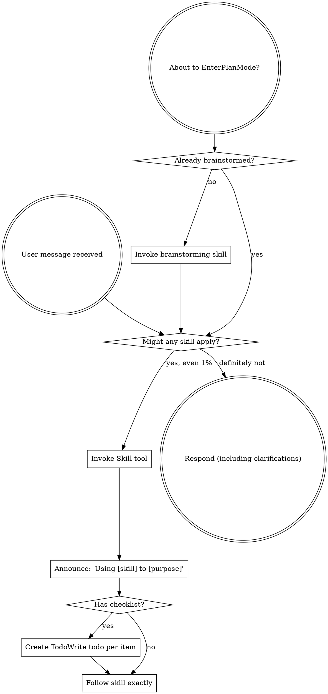

codex-exec: report contract violation

--- codex stdout ---
Scope verified: 8 commits, 106 changed files, HEAD `fc30be7`.

1. **Overproduction — WARN.** Production stayed within all seven allowed files (`168-01-PLAN-LOCKED.md:32-39`; diff count 7), but 94 phase artifacts include six raw session captures totalling 48,410 lines—far beyond useful evidence.
2. **Waiting — WARN.** Shared-file dependencies justified most serialization, but 13 executor reports retried spawn-bound suites despite the plan declaring sandbox EPERM `ORCHESTRATOR_REQUIRED` (`:400,484`). Two 3,000-second deaths are recorded in `168-T1-WRAPPER.log:1` and `168-T1H-WRAPPER.log:1`.
3. **Transport — WARN.** Twenty-three prompts—15 for T1 implementation/repair—repacked the locked constraints and green baselines; the three cumulative spec captures alone contain 33,346 lines.
4. **Over-processing — WARN.** Root causes were an oversized first dispatch, incomplete integration/fixtures (T1B–G), then unbounded redesign. T1 and T1H timeouts and T1J’s false `auth-denied` kill were avoidable; H–K’s four-round staged-installer branch was wholly avoidable. It added 1,458 lines, delivered zero, and was reverted; the explicitly bounded M round then succeeded (`168-T1M-PROMPT.md:6-16,32`).
5. **Inventory — WARN.** The two committed patches (1,458+411 lines, `c867978`) are labelled, bounded forensic evidence, not live WIP/clutter. However HEAD has five untracked phase-168 artifacts plus `.planning/tmp/` (305 files, 1,004,410 bytes; apparently pre-existing).
6. **Motion — WARN.** After T1B documented `spawnSync bash EPERM` (`168-T1B-REPORT.md:23`), 12 later reports again attempted sandbox-blocked full suites before unsandboxed reruns.
7. **Defects — WARN.** Four reached production code: `7550116` shipped post-write rejection ordering, multiline classifier fail-open, and error laundering/raw-stack disclosure (`168-T1-SPEC-REVIEW.md:6-24`); `0dfd0d1` left truncation fail-open, fixed by `7234cb2` (`168-T1-SPEC-REVIEW2.md:4-6`).
8. **Unused talent — WARN.** `gpt-5.6-sol` xhigh (`.planning/config.json:194-195`) handled mechanical one-file work such as T1N’s stale marker; the sandboxed executor was also the wrong runner for known spawn tests.

**Gate spend:** justified as containment, but partly preventable. Plan NOGO caught missing independent closure falsifiers, post-write smoke, and the safe T1/T2 seam (`168-PLANREVIEW.md:6-16`). Spec FAIL 1 caught three committed production defects; ordering was explicit in the locked plan, so that portion was executor rework the plan already prevented. FAIL 2 caught a new truncation edge introduced by the repair; that review was justified.

**Smallest process change:** add one first-dispatch diff stop-rule: reject any `*-installer-stage` mode, self-reexecution, or whole-root snapshot; require the known-good 17-hook/9-module smoke before continuing. T1M’s identical prohibition converted four failed rounds into one.

MUDA VERDICT: WARN

--- codex stderr ---
OpenAI Codex v0.146.0
--------
workdir: <HOME>\AppData\Roaming\warp\Warp\data\worktrees\GSDedits\luminaria-hogback
model: gpt-5.6-sol
provider: openai
approval: never
sandbox: read-only
reasoning effort: xhigh
reasoning summaries: none
session id: 01a03a4e-8743-7b10-9e62-a55f1b2207a2
--------
user
# MUDA audit — phase 168 Install Contract. Read-only, do not edit.

Scope: commits from `c01baa7` to HEAD on branch luminaria-hogback.

For each of the 8 wastes give OK or WARN with concrete evidence: file:line, commit, or a
counted figure. No waste may be marked OK without a stated reason.

1. Overproduction — code, tests or artifacts beyond the locked plan.
2. Waiting — serialized dispatches that could have been parallel; time lost to
   sandbox-denied commands the orchestrator then re-ran unsandboxed.
3. Transport — context repackaged between agents more than necessary.
4. Over-processing — rework rounds. This phase ran roughly 20 executor dispatches.
   Identify the root causes and say which rounds were avoidable, with evidence. Note in
   particular: one dispatch built a 1,458-line transactional installer that ended with
   `install.sh` exiting 0 delivering nothing and was reverted wholesale; three dispatches
   were killed mid-implementation (two timeouts, one by a wrapper false positive that
   greps stderr for "auth").
5. Inventory — half-finished work, dead scaffolding, uncommitted state, orphaned fixtures
   or temp dirs. Two abandoned patches are deliberately retained as evidence
   (`168-ABANDONED-STAGED-INSTALLER.patch`, `168-SPECFIX-WIP.patch`); judge whether
   keeping them is evidence or clutter.
6. Motion — repeated navigation, re-reading, suites re-run without change.
7. Defects — bugs that escaped into a commit and were fixed later in the same phase.
   Count them and name the ones that reached production code.
8. Unused talent — work given to the wrong model or tool.

Then answer two questions directly:

- The spec-compliance gate FAILed twice before passing, and the plan review NOGOed once.
  Was that gate spend justified by what it caught, or was it rework the plan should have
  prevented? Be concrete about what each gate actually caught.
- This phase's single most expensive mistake was scope over-reach by an executor. What is
  the smallest process change that would have caught it within the first dispatch rather
  than after four?

End with exactly `MUDA VERDICT: PASS` or `MUDA VERDICT: WARN`. Max 500 words.

codex
I’m using the mandatory `using-superpowers` skill to select the audit workflow, then I’ll trace phase 168’s plan, commit history, gate evidence, retained patches, and dispatch records. Everything will remain read-only.
exec
"C:\\WINDOWS\\System32\\WindowsPowerShell\\v1.0\\powershell.exe" -Command "Get-Content -Raw 'C:\\Users\\operator\\.codex\\skills\\using-superpowers\\SKILL.md'" in <HOME>\AppData\Roaming\warp\Warp\data\worktrees\GSDedits\luminaria-hogback
 succeeded in 1349ms:
---
name: using-superpowers
description: Use when starting any conversation - establishes how to find and use skills, requiring Skill tool invocation before ANY response including clarifying questions
---

<SUBAGENT-STOP>
If you were dispatched as a subagent to execute a specific task, skip this skill.
</SUBAGENT-STOP>

<EXTREMELY-IMPORTANT>
If you think there is even a 1% chance a skill might apply to what you are doing, you ABSOLUTELY MUST invoke the skill.

IF A SKILL APPLIES TO YOUR TASK, YOU DO NOT HAVE A CHOICE. YOU MUST USE IT.

This is not negotiable. This is not optional. You cannot rationalize your way out of this.
</EXTREMELY-IMPORTANT>

## Instruction Priority

Superpowers skills override default system prompt behavior, but **user instructions always take precedence**:

1. **User's explicit instructions** (CLAUDE.md, GEMINI.md, AGENTS.md, direct requests) ƒ?" highest priority
2. **Superpowers skills** ƒ?" override default system behavior where they conflict
3. **Default system prompt** ƒ?" lowest priority

If CLAUDE.md, GEMINI.md, or AGENTS.md says "don't use TDD" and a skill says "always use TDD," follow the user's instructions. The user is in control.

## How to Access Skills

**In Claude Code:** Use the `Skill` tool. When you invoke a skill, its content is loaded and presented to youƒ?"follow it directly. Never use the Read tool on skill files.

**In Copilot CLI:** Use the `skill` tool. Skills are auto-discovered from installed plugins. The `skill` tool works the same as Claude Code's `Skill` tool.

**In Gemini CLI:** Skills activate via the `activate_skill` tool. Gemini loads skill metadata at session start and activates the full content on demand.

**In other environments:** Check your platform's documentation for how skills are loaded.

## Platform Adaptation

Skills use Claude Code tool names. Non-CC platforms: see `references/copilot-tools.md` (Copilot CLI), `references/codex-tools.md` (Codex) for tool equivalents. Gemini CLI users get the tool mapping loaded automatically via GEMINI.md.

# Using Skills

## The Rule

**Invoke relevant or requested skills BEFORE any response or action.** Even a 1% chance a skill might apply means that you should invoke the skill to check. If an invoked skill turns out to be wrong for the situation, you don't need to use it.



## Red Flags

These thoughts mean STOPƒ?"you're rationalizing:

| Thought | Reality |
|---------|---------|
| "This is just a simple question" | Questions are tasks. Check for skills. |
| "I need more context first" | Skill check comes BEFORE clarifying questions. |
| "Let me explore the codebase first" | Skills tell you HOW to explore. Check first. |
| "I can check git/files quickly" | Files lack conversation context. Check for skills. |
| "Let me gather information first" | Skills tell you HOW to gather information. |
| "This doesn't need a formal skill" | If a skill exists, use it. |
| "I remember this skill" | Skills evolve. Read current version. |
| "This doesn't count as a task" | Action = task. Check for skills. |
| "The skill is overkill" | Simple things become complex. Use it. |
| "I'll just do this one thing first" | Check BEFORE doing anything. |
| "This feels productive" | Undisciplined action wastes time. Skills prevent this. |
| "I know what that means" | Knowing the concept ƒ%ÿ using the skill. Invoke it. |

## Skill Priority

When multiple skills could apply, use this order:

1. **Process skills first** (brainstorming, debugging) - these determine HOW to approach the task
2. **Implementation skills second** (frontend-design, mcp-builder) - these guide execution

"Let's build X" ā' brainstorming first, then implementation skills.
"Fix this bug" ā' debugging first, then domain-specific skills.

## Skill Types

**Rigid** (TDD, debugging): Follow exactly. Don't adapt away discipline.

**Flexible** (patterns): Adapt principles to context.

The skill itself tells you which.

## User Instructions

Instructions say WHAT, not HOW. "Add X" or "Fix Y" doesn't mean skip workflows.

<HOME>\OneDrive - <ORG>\Documents\WindowsPowerShell\profile.ps1 : Cannot dot-source this 
command because it was defined in a different language mode. To invoke this command without importing its contents, 
omit the '.' operator.
At line:1 char:1
+ . '<HOME>\OneDrive - <ORG>\Documents\Win ...
+ ~~~~~~~~~~~~~~~~~~~~~~~~~~~~~~~~~~~~~~~~~~~~~~~~~~~~~~~~~~~~~~~~~~~~~
    + CategoryInfo          : InvalidOperation: (:) [profile.ps1], NotSupportedException
    + FullyQualifiedErrorId : DotSourceNotSupported,profile.ps1
 
<HOME>\OneDrive - <ORG>\Documents\WindowsPowerShell\Microsoft.PowerShell_profile.ps1 : 
Cannot dot-source this command because it was defined in a different language mode. To invoke this command without 
importing its contents, omit the '.' operator.
At line:1 char:1
+ . '<HOME>\OneDrive - <ORG>\Documents\Win ...
+ ~~~~~~~~~~~~~~~~~~~~~~~~~~~~~~~~~~~~~~~~~~~~~~~~~~~~~~~~~~~~~~~~~~~~~
    + CategoryInfo          : InvalidOperation: (:) [Microsoft.PowerShell_profile.ps1], NotSupportedException
    + FullyQualifiedErrorId : DotSourceNotSupported,Microsoft.PowerShell_profile.ps1
 

codex
The task also directly matches `review` for commit-range analysis and `sgsd-gate-triage` for the two gate failures. I’m loading both before inspecting evidence; the gate-triage skill keeps this read-only and prohibits bypasses.
exec
"C:\\WINDOWS\\System32\\WindowsPowerShell\\v1.0\\powershell.exe" -Command "Get-Content -Raw 'C:\\Users\\operator\\.agents\\skills\\review\\SKILL.md'" in <HOME>\AppData\Roaming\warp\Warp\data\worktrees\GSDedits\luminaria-hogback
exec
"C:\\WINDOWS\\System32\\WindowsPowerShell\\v1.0\\powershell.exe" -Command "Get-Content -Raw '.agents\\skills\\sgsd-gate-triage\\SKILL.md'" in <HOME>\AppData\Roaming\warp\Warp\data\worktrees\GSDedits\luminaria-hogback
 succeeded in 1163ms:
---
name: sgsd-gate-triage
description: |
  Explain a gate failure ƒ?" read gate-value-log + review-ledger, surface the
  failing gate's evidence_path, suggest next repair path. NEVER bypass.
---

# Skill: SGSD Gate Triage

When a gate fails or warns, this skill helps the operator understand WHY
and what to do next. Strictly explanatory; never bypasses gates.

## Procedure

1. Call MCP `sgsd_gate_status` ƒ?" fetch latest gate verdicts.
2. Identify the failing gate (verdict `warn` or `fail`).
3. Read the gate's `evidence_path` (typically `.planning/.../{NN}-ATC-REVIEW.md`).
4. Summarize the finding:
   - Critical findings (CRIT)
   - Warning findings (WARN)
   - Anti-slop checklist hits
5. Suggest next repair path:
   - In-loop fix (re-dispatch executor with fix scope)
   - Backlog (log to CRIT-BACKLOG.md, advance with degraded status)
   - Design adjustment (next-phase plan addresses)

## Hard rule (from AGENTS.md)

DO NOT recommend bypassing gates. AGENTS.md hard rule 2 forbids
re-implementing gate logic; same applies to bypassing it. If a gate
fails, the failure is real. Either fix the underlying issue or
honestly downgrade the phase status.

## Output template

```
GATE TRIAGE ƒ?" <gate name> at phase <NN>
  Verdict:    <pass|warn|fail>
  Evidence:   <path>
  Critical:   <count>
  Warnings:   <count>
  Top finding: <one-liner>
Recommended action:
  <one of: in-loop fix / backlog / design adjustment>
Why:
  <2-line justification citing the evidence>
```

## Related

- AGENTS.md hard rule 2.
- super-gsd/registry/gates.yaml ƒ?" gate definitions.
- v1.7 Phase 33 ƒ?" repair_instruction contract (mandatory text on all 13 gates).

<HOME>\OneDrive - <ORG>\Documents\WindowsPowerShell\profile.ps1 : Cannot dot-source this 
command because it was defined in a different language mode. To invoke this command without importing its contents, 
omit the '.' operator.
At line:1 char:1
+ . '<HOME>\OneDrive - <ORG>\Documents\Win ...
+ ~~~~~~~~~~~~~~~~~~~~~~~~~~~~~~~~~~~~~~~~~~~~~~~~~~~~~~~~~~~~~~~~~~~~~
    + CategoryInfo          : InvalidOperation: (:) [profile.ps1], NotSupportedException
    + FullyQualifiedErrorId : DotSourceNotSupported,profile.ps1
 
<HOME>\OneDrive - <ORG>\Documents\WindowsPowerShell\Microsoft.PowerShell_profile.ps1 : 
Cannot dot-source this command because it was defined in a different language mode. To invoke this command without 
importing its contents, omit the '.' operator.
At line:1 char:1
+ . '<HOME>\OneDrive - <ORG>\Documents\Win ...
+ ~~~~~~~~~~~~~~~~~~~~~~~~~~~~~~~~~~~~~~~~~~~~~~~~~~~~~~~~~~~~~~~~~~~~~
    + CategoryInfo          : InvalidOperation: (:) [Microsoft.PowerShell_profile.ps1], NotSupportedException
    + FullyQualifiedErrorId : DotSourceNotSupported,Microsoft.PowerShell_profile.ps1
 

 succeeded in 1242ms:
---
name: review
description: Review code changes for security, performance, bugs, and quality. Reviews staged changes, unstaged changes, specific commits, or PR-ready diffs.
---

<objective>
Review code changes and provide structured feedback covering security, performance, bug risks, code quality, and test coverage gaps. This skill analyzes diffs and surrounding context to catch issues before they reach production.
</objective>

<context>
This skill reviews code changes at various stages of the development workflow. It can review staged changes before a commit, unstaged work-in-progress, a specific commit, or the full set of changes on a branch that are ready for a pull request.

The reviewer reads both the diff and the surrounding source files to understand intent and catch issues that only appear in context.
</context>

<core_principle>
**FIND REAL ISSUES, NOT STYLE NITS.** Focus on problems that cause bugs, security vulnerabilities, performance degradation, or maintainability pain. Avoid nitpicking formatting or subjective style preferences unless they harm readability.
</core_principle>

<analysis_only_rule>
**THIS SKILL IS READ-ONLY. DO NOT MODIFY CODE.**

The purpose is to review and report findings. Making changes during review conflates the reviewer and author roles. Present findings and let the user decide what to act on.
</analysis_only_rule>

<quick_start>

<determine_review_scope>

Parse the user's input to determine what to review:

1. **No arguments** - Review staged changes first. If nothing is staged, review unstaged changes.
   - Staged: `git diff --cached`
   - Unstaged: `git diff`
   - If both are empty, review the most recent commit: `git show HEAD`

2. **Commit hash argument** (e.g., `/review abc1234`) - Review that specific commit.
   - `git show <hash>`

3. **File path argument** (e.g., `/review src/foo.ts`) - Review unstaged changes in that file.
   - `git diff -- <path>` then fall back to `git diff --cached -- <path>`

4. **"pr" argument** (e.g., `/review pr`) - Review all changes since branching from main.
   - `git diff main...HEAD`
   - If on main, review `git diff HEAD~1`

After obtaining the diff, if it is empty, inform the user that there are no changes to review and stop.

</determine_review_scope>

<gather_context>

Before analyzing the diff:

1. **Read changed files in full** - Do not review a diff in isolation. Read each modified file to understand the surrounding code, imports, types, and control flow.
2. **Identify the tech stack** - Note languages, frameworks, and libraries in use. This affects what patterns are risky.
3. **Check for related test files** - For each changed source file, look for corresponding test files. Note whether tests were updated alongside the changes.
4. **Check for configuration changes** - If config files changed (env, CI, package.json, tsconfig, etc.), pay extra attention to side effects.

</gather_context>

<review_categories>

Analyze the changes against each category below. Only report findings that are actually present. Skip categories with no issues.

**A. Security Issues** (Severity: CRITICAL or HIGH)
- Injection vulnerabilities (SQL injection, command injection, template injection)
- Cross-site scripting (XSS) - unsanitized user input rendered in HTML
- Authentication and authorization flaws (missing auth checks, privilege escalation)
- Secrets or credentials hardcoded or logged
- Insecure deserialization or unsafe eval usage
- Path traversal or file access vulnerabilities
- Missing input validation on external data

**B. Performance Concerns** (Severity: HIGH or MEDIUM)
- N+1 query patterns in database access
- Unnecessary memory allocations in hot paths or loops
- Blocking operations on the main thread or in async contexts
- Missing pagination on unbounded queries
- Redundant computation that could be cached or memoized
- Large payloads without streaming or chunking

**C. Bug Risks** (Severity: HIGH or MEDIUM)
- Off-by-one errors in loops or array access
- Null/undefined dereferences without guards
- Race conditions in concurrent or async code
- Incorrect error handling (swallowed errors, wrong error types)
- Type mismatches or unsafe type assertions
- Logic errors in conditionals (inverted checks, missing cases)
- Resource leaks (unclosed connections, file handles, listeners)

**D. Code Quality** (Severity: MEDIUM or LOW)
- Unclear or misleading naming
- Significant code duplication that should be extracted
- Excessive complexity (deeply nested logic, functions doing too many things)
- Dead code or unreachable branches
- Missing or misleading comments on non-obvious logic
- Inconsistency with patterns used elsewhere in the codebase

**E. Test Coverage Gaps** (Severity: MEDIUM or LOW)
- New logic paths without corresponding test cases
- Changed behavior without updated tests
- Edge cases not covered (empty inputs, boundary values, error paths)
- Missing integration tests for new API endpoints or database changes

</review_categories>

<format_findings>

For each finding, use this structure:

```
### [SEVERITY] Category: Brief Title

**File**: `path/to/file.ext` (lines X-Y)

**Issue**: Clear description of the problem.

**Why it matters**: What could go wrong if this is not addressed.

**Suggestion**: How to fix it, with a code snippet if helpful.
```

Severity levels:
- **CRITICAL** - Must fix before merge. Security vulnerability or data loss risk.
- **HIGH** - Should fix before merge. Likely bug or significant performance issue.
- **MEDIUM** - Should fix soon. Code quality or moderate risk issue.
- **LOW** - Consider fixing. Minor improvement opportunity.

</format_findings>

</quick_start>

<critical_rules>

1. **READ THE FULL FILE**: Never review a diff without reading the complete source file for context
2. **NO FALSE ALARMS**: Only report issues you can explain concretely. Do not report vague concerns
3. **PRIORITIZE**: Lead with the most severe findings. Do not bury critical issues under style nits
4. **BE SPECIFIC**: Include file paths, line numbers, and code references for every finding
5. **EXPLAIN THE RISK**: For each finding, explain what could actually go wrong
6. **CHECK TESTS**: Always check whether changes have corresponding test updates
7. **CONSIDER THE STACK**: Apply language-specific and framework-specific knowledge to your review
8. **DO NOT MODIFY CODE**: Present findings only. The user decides what to act on

</critical_rules>

<output_format>

```markdown
## Code Review: [brief description of what was reviewed]

**Scope**: [staged changes | unstaged changes | commit abc1234 | PR changes from main]
**Files reviewed**: [count] files changed, [additions] additions, [deletions] deletions

---

### Findings

[Findings grouped by severity, highest first. Use the format from <format_findings>.]

---

### Summary

| Severity | Count |
|----------|-------|
| CRITICAL | X     |
| HIGH     | X     |
| MEDIUM   | X     |
| LOW      | X     |

### Recommended Actions

1. [Most important action to take]
2. [Next most important action]
3. [...]
```

If no issues are found:

```markdown
## Code Review: [brief description]

**Scope**: [what was reviewed]
**Files reviewed**: [count]

No significant issues found. The changes look good to merge.
```

</output_format>

<decision_gate>

**After presenting findings, ALWAYS offer these options:**

```
ƒ"?ƒ"?ƒ"?ƒ"?ƒ"?ƒ"?ƒ"?ƒ"?ƒ"?ƒ"?ƒ"?ƒ"?ƒ"?ƒ"?ƒ"?ƒ"?ƒ"?ƒ"?ƒ"?ƒ"?ƒ"?ƒ"?ƒ"?ƒ"?ƒ"?ƒ"?ƒ"?ƒ"?ƒ"?ƒ"?ƒ"?ƒ"?ƒ"?ƒ"?ƒ"?ƒ"?ƒ"?ƒ"?ƒ"?ƒ"?ƒ"?
REVIEW COMPLETE

What would you like to do?

1. **Fix issues** - I'll address the findings starting with the most critical
2. **Save review** - Export findings to a markdown file
3. **Review again** - Re-review with different scope or focus
4. **Discuss a finding** - Ask questions about a specific issue
5. **Other** - Tell me what you need
ƒ"?ƒ"?ƒ"?ƒ"?ƒ"?ƒ"?ƒ"?ƒ"?ƒ"?ƒ"?ƒ"?ƒ"?ƒ"?ƒ"?ƒ"?ƒ"?ƒ"?ƒ"?ƒ"?ƒ"?ƒ"?ƒ"?ƒ"?ƒ"?ƒ"?ƒ"?ƒ"?ƒ"?ƒ"?ƒ"?ƒ"?ƒ"?ƒ"?ƒ"?ƒ"?ƒ"?ƒ"?ƒ"?ƒ"?ƒ"?ƒ"?
```

**Wait for user response before taking any action.**

This gate is MANDATORY. Never skip it. Never auto-implement fixes.

</decision_gate>

<HOME>\OneDrive - <ORG>\Documents\WindowsPowerShell\profile.ps1 : Cannot dot-source this 
command because it was defined in a different language mode. To invoke this command without importing its contents, 
omit the '.' operator.
At line:1 char:1
+ . '<HOME>\OneDrive - <ORG>\Documents\Win ...
+ ~~~~~~~~~~~~~~~~~~~~~~~~~~~~~~~~~~~~~~~~~~~~~~~~~~~~~~~~~~~~~~~~~~~~~
    + CategoryInfo          : InvalidOperation: (:) [profile.ps1], NotSupportedException
    + FullyQualifiedErrorId : DotSourceNotSupported,profile.ps1
 
<HOME>\OneDrive - <ORG>\Documents\WindowsPowerShell\Microsoft.PowerShell_profile.ps1 : 
Cannot dot-source this command because it was defined in a different language mode. To invoke this command without 
importing its contents, omit the '.' operator.
At line:1 char:1
+ . '<HOME>\OneDrive - <ORG>\Documents\Win ...
+ ~~~~~~~~~~~~~~~~~~~~~~~~~~~~~~~~~~~~~~~~~~~~~~~~~~~~~~~~~~~~~~~~~~~~~
    + CategoryInfo          : InvalidOperation: (:) [Microsoft.PowerShell_profile.ps1], NotSupportedException
    + FullyQualifiedErrorId : DotSourceNotSupported,Microsoft.PowerShell_profile.ps1
 

  → Map phase 168 plan, commits, changed files, and worktree state
  • Trace executor rounds, timeouts, wrapper kill, reverts, and repeated verification
  • Read gate/review evidence and classify all eight wastes
  • Cross-check counts and deliver the ≤500-word verdict
exec
"C:\\WINDOWS\\System32\\WindowsPowerShell\\v1.0\\powershell.exe" -NoProfile -Command 'git status --short --branch' in <HOME>\AppData\Roaming\warp\Warp\data\worktrees\GSDedits\luminaria-hogback
exec
"C:\\WINDOWS\\System32\\WindowsPowerShell\\v1.0\\powershell.exe" -NoProfile -Command "git log --reverse --date=iso-strict --format='%h|%ad|%an|%s' c01baa7"'^..HEAD' in <HOME>\AppData\Roaming\warp\Warp\data\worktrees\GSDedits\luminaria-hogback
exec
"C:\\WINDOWS\\System32\\WindowsPowerShell\\v1.0\\powershell.exe" -NoProfile -Command 'git diff --stat c01baa7''^..HEAD' in <HOME>\AppData\Roaming\warp\Warp\data\worktrees\GSDedits\luminaria-hogback
exec
"C:\\WINDOWS\\System32\\WindowsPowerShell\\v1.0\\powershell.exe" -NoProfile -Command "rg --files .planning | rg '("'^|['"\\\\/])168-|phase.?168|168-'" in <HOME>\AppData\Roaming\warp\Warp\data\worktrees\GSDedits\luminaria-hogback
exec
"C:\\WINDOWS\\System32\\WindowsPowerShell\\v1.0\\powershell.exe" -NoProfile -Command "rg -n -i 'phase 168|168-|spec.compliance|NOGO|abandoned|1458|1,458|timeout|auth|executor|dispatch' .planning" in <HOME>\AppData\Roaming\warp\Warp\data\worktrees\GSDedits\luminaria-hogback
 succeeded in 1356ms:
c01baa7|2026-08-25T10:06:36+01:00|operator|docs(168): exact require chain traced, plus the diagnosis-laundering requirement
55de820|2026-08-25T10:56:45+01:00|operator|docs(168): plan authored and schema-VALID, one atomic GATE-tier task
d3eba2d|2026-08-25T11:16:51+01:00|operator|docs(168): plan rev 2 GO after NOGO, refuse-before-write made literal
7550116|2026-08-25T14:57:24+01:00|operator|feat(168-01): deliver the modules hooks require, and prove it on an empty tree
c867978|2026-08-25T17:53:09+01:00|operator|chore(checkpoint): P168 T1 delivered and green; spec fixes parked as a patch
0dfd0d1|2026-08-25T18:45:57+01:00|operator|fix(168-01): close the three spec-review findings without breaking recovery
7234cb2|2026-08-25T19:19:59+01:00|operator|fix(168-01): truncated smoke output can no longer read as a clean policy decision
fc30be7|2026-08-25T20:02:52+01:00|operator|feat(168-02): read-only doctor, and the freshness check finally works in a worktree

 succeeded in 1407ms:
## luminaria-hogback...origin/luminaria-hogback [ahead 8]
?? .planning/milestones/v4.0-install-contract/phases/168-install-contract/168-MUDA-PROMPT.md
?? .planning/milestones/v4.0-install-contract/phases/168-install-contract/168-MUDA-WRAPPER.log
?? .planning/milestones/v4.0-install-contract/phases/168-install-contract/168-T2-SPEC-PROMPT.md
?? .planning/milestones/v4.0-install-contract/phases/168-install-contract/168-T2-SPEC-WRAPPER.log
?? .planning/tmp/

 succeeded in 2662ms:
.planning\milestones\v4.0-install-contract\phases\168-install-contract\CONTEXT.md
.planning\milestones\v4.0-install-contract\phases\168-install-contract\168-T2-WRAPPER.log
.planning\milestones\v4.0-install-contract\phases\168-install-contract\168-T2-SPEC-WRAPPER.log
.planning\milestones\v4.0-install-contract\phases\168-install-contract\168-T2-SPEC-PROMPT.md
.planning\milestones\v4.0-install-contract\phases\168-install-contract\168-T2-REPORT.md
.planning\milestones\v4.0-install-contract\phases\168-install-contract\168-T2-PROMPT.md
.planning\milestones\v4.0-install-contract\phases\168-install-contract\168-T2-FILES.txt
.planning\milestones\v4.0-install-contract\phases\168-install-contract\168-T1Q-WRAPPER.log
.planning\milestones\v4.0-install-contract\phases\168-install-contract\168-T1Q-REPORT.md
.planning\milestones\v4.0-install-contract\phases\168-install-contract\168-T1Q-PROMPT.md
.planning\milestones\v4.0-install-contract\phases\168-install-contract\168-T1Q-FILES.txt
.planning\milestones\v4.0-install-contract\phases\168-install-contract\168-T1P-WRAPPER.log
.planning\milestones\v4.0-install-contract\phases\168-install-contract\168-T1P-REPORT.md
.planning\milestones\v4.0-install-contract\phases\168-install-contract\168-T1P-PROMPT.md
.planning\milestones\v4.0-install-contract\phases\168-install-contract\168-T1P-FILES.txt
.planning\milestones\v4.0-install-contract\phases\168-install-contract\168-T1N-WRAPPER.log
.planning\milestones\v4.0-install-contract\phases\168-install-contract\168-T1N-REPORT.md
.planning\milestones\v4.0-install-contract\phases\168-install-contract\168-T1N-PROMPT.md
.planning\milestones\v4.0-install-contract\phases\168-install-contract\168-T1N-FILES.txt
.planning\milestones\v4.0-install-contract\phases\168-install-contract\168-T1M-WRAPPER.log
.planning\milestones\v4.0-install-contract\phases\168-install-contract\168-T1M-REPORT.md
.planning\milestones\v4.0-install-contract\phases\168-install-contract\168-T1M-PROMPT.md
.planning\milestones\v4.0-install-contract\phases\168-install-contract\168-T1M-FILES.txt
.planning\milestones\v4.0-install-contract\phases\168-install-contract\168-T1K-WRAPPER.log
.planning\milestones\v4.0-install-contract\phases\168-install-contract\168-T1K-REPORT.md
.planning\milestones\v4.0-install-contract\phases\168-install-contract\168-T1K-PROMPT.md
.planning\milestones\v4.0-install-contract\phases\168-install-contract\168-T1K-FILES.txt
.planning\milestones\v4.0-install-contract\phases\168-install-contract\168-T1J-WRAPPER.log
.planning\milestones\v4.0-install-contract\phases\168-install-contract\168-T1J-REPORT.md
.planning\milestones\v4.0-install-contract\phases\168-install-contract\168-T1J-PROMPT.md
.planning\milestones\v4.0-install-contract\phases\168-install-contract\168-T1J-FILES.txt
.planning\milestones\v4.0-install-contract\phases\168-install-contract\168-T1I-WRAPPER.log
.planning\milestones\v4.0-install-contract\phases\168-install-contract\168-T1I-REPORT.md
.planning\milestones\v4.0-install-contract\phases\168-install-contract\168-T1I-PROMPT.md
.planning\milestones\v4.0-install-contract\phases\168-install-contract\168-T1I-FILES.txt
.planning\milestones\v4.0-install-contract\phases\168-install-contract\168-T1H-WRAPPER.log
.planning\milestones\v4.0-install-contract\phases\168-install-contract\168-T1H-REPORT.md
.planning\milestones\v4.0-install-contract\phases\168-install-contract\168-T1H-PROMPT.md
.planning\milestones\v4.0-install-contract\phases\168-install-contract\168-T1H-FILES.txt
.planning\milestones\v4.0-install-contract\phases\168-install-contract\168-T1G-WRAPPER.log
.planning\milestones\v4.0-install-contract\phases\168-install-contract\168-T1G-REPORT.md
.planning\milestones\v4.0-install-contract\phases\168-install-contract\168-T1G-PROMPT.md
.planning\milestones\v4.0-install-contract\phases\168-install-contract\168-T1G-FILES.txt
.planning\milestones\v4.0-install-contract\phases\168-install-contract\168-T1F-WRAPPER.log
.planning\milestones\v4.0-install-contract\phases\168-install-contract\168-T1F-REPORT.md
.planning\milestones\v4.0-install-contract\phases\168-install-contract\168-T1F-PROMPT.md
.planning\milestones\v4.0-install-contract\phases\168-install-contract\168-T1F-FILES.txt
.planning\milestones\v4.0-install-contract\phases\168-install-contract\168-T1E-WRAPPER.log
.planning\milestones\v4.0-install-contract\phases\168-install-contract\168-T1E-REPORT.md
.planning\milestones\v4.0-install-contract\phases\168-install-contract\168-T1E-PROMPT.md
.planning\milestones\v4.0-install-contract\phases\168-install-contract\168-T1E-FILES.txt
.planning\milestones\v4.0-install-contract\phases\168-install-contract\168-T1D-WRAPPER.log
.planning\milestones\v4.0-install-contract\phases\168-install-contract\168-T1D-REPORT.md
.planning\milestones\v4.0-install-contract\phases\168-install-contract\168-T1D-PROMPT.md
.planning\milestones\v4.0-install-contract\phases\168-install-contract\168-T1D-FILES.txt
.planning\milestones\v4.0-install-contract\phases\168-install-contract\168-T1C-WRAPPER.log
.planning\milestones\v4.0-install-contract\phases\168-install-contract\168-T1C-REPORT.md
.planning\milestones\v4.0-install-contract\phases\168-install-contract\168-T1C-PROMPT.md
.planning\milestones\v4.0-install-contract\phases\168-install-contract\168-T1C-FILES.txt
.planning\milestones\v4.0-install-contract\phases\168-install-contract\168-T1B-WRAPPER.log
.planning\milestones\v4.0-install-contract\phases\168-install-contract\168-T1B-REPORT.md
.planning\milestones\v4.0-install-contract\phases\168-install-contract\168-T1B-PROMPT.md
.planning\milestones\v4.0-install-contract\phases\168-install-contract\168-T1B-FILES.txt
.planning\milestones\v4.0-install-contract\phases\168-install-contract\168-T1-WRAPPER.log
.planning\milestones\v4.0-install-contract\phases\168-install-contract\168-T1-SPEC3-WRAPPER.log
.planning\milestones\v4.0-install-contract\phases\168-install-contract\168-T1-SPEC3-PROMPT.md
.planning\milestones\v4.0-install-contract\phases\168-install-contract\168-T1-SPEC2-WRAPPER.log
.planning\milestones\v4.0-install-contract\phases\168-install-contract\168-T1-SPEC2-PROMPT.md
.planning\milestones\v4.0-install-contract\phases\168-install-contract\168-T1-SPEC-WRAPPER.log
.planning\milestones\v4.0-install-contract\phases\168-install-contract\168-T1-SPEC-REVIEW3.md
.planning\milestones\v4.0-install-contract\phases\168-install-contract\168-T1-SPEC-REVIEW2.md
.planning\milestones\v4.0-install-contract\phases\168-install-contract\168-T1-SPEC-REVIEW.md
.planning\milestones\v4.0-install-contract\phases\168-install-contract\168-T1-SPEC-PROMPT.md
.planning\milestones\v4.0-install-contract\phases\168-install-contract\168-T1-REPORT.md
.planning\milestones\v4.0-install-contract\phases\168-install-contract\168-T1-PROMPT.md
.planning\milestones\v4.0-install-contract\phases\168-install-contract\168-T1-FILES.txt
.planning\milestones\v4.0-install-contract\phases\168-install-contract\168-SPECFIX-WIP.patch
.planning\milestones\v4.0-install-contract\phases\168-install-contract\168-REMOVED-ASSERTIONS.txt
.planning\milestones\v4.0-install-contract\phases\168-install-contract\168-PLANREVIEW2.md
.planning\milestones\v4.0-install-contract\phases\168-install-contract\168-PLANREVIEW2-WRAPPER.log
.planning\milestones\v4.0-install-contract\phases\168-install-contract\168-PLANREVIEW2-PROMPT.md
.planning\milestones\v4.0-install-contract\phases\168-install-contract\168-PLANREVIEW.md
.planning\milestones\v4.0-install-contract\phases\168-install-contract\168-PLANREVIEW-WRAPPER.log
.planning\milestones\v4.0-install-contract\phases\168-install-contract\168-PLANREVIEW-PROMPT.md
.planning\milestones\v4.0-install-contract\phases\168-install-contract\168-PLAN-WRAPPER2.log
.planning\milestones\v4.0-install-contract\phases\168-install-contract\168-PLAN-WRAPPER.log
.planning\milestones\v4.0-install-contract\phases\168-install-contract\168-PLAN-REV2-WRAPPER.log
.planning\milestones\v4.0-install-contract\phases\168-install-contract\168-PLAN-REV2-REPORT.md
.planning\milestones\v4.0-install-contract\phases\168-install-contract\168-PLAN-REV2-PROMPT.md
.planning\milestones\v4.0-install-contract\phases\168-install-contract\168-PLAN-REV2-FILES.txt
.planning\milestones\v4.0-install-contract\phases\168-install-contract\168-PLAN-REPORT2.md
.planning\milestones\v4.0-install-contract\phases\168-install-contract\168-PLAN-REPORT.md
.planning\milestones\v4.0-install-contract\phases\168-install-contract\168-PLAN-PROMPT.md
.planning\milestones\v4.0-install-contract\phases\168-install-contract\168-PLAN-FILES.txt
.planning\milestones\v4.0-install-contract\phases\168-install-contract\168-MUDA-WRAPPER.log
.planning\milestones\v4.0-install-contract\phases\168-install-contract\168-MUDA-PROMPT.md
.planning\milestones\v4.0-install-contract\phases\168-install-contract\168-FIX-REPAIR-ORDER-WRAPPER.log
.planning\milestones\v4.0-install-contract\phases\168-install-contract\168-FIX-REPAIR-ORDER-REPORT.md
.planning\milestones\v4.0-install-contract\phases\168-install-contract\168-FIX-REPAIR-ORDER-PROMPT.md
.planning\milestones\v4.0-install-contract\phases\168-install-contract\168-FIX-REPAIR-ORDER-FILES.txt
.planning\milestones\v4.0-install-contract\phases\168-install-contract\168-ABANDONED-STAGED-INSTALLER.patch
.planning\milestones\v4.0-install-contract\phases\168-install-contract\168-01-PLAN-LOCKED.md

 succeeded in 4440ms:
 .planning/memory/MEMORY.md                         |     8 +
 ...ont-rebuild-the-world-to-fix-an-ordering-bug.md |    37 +
 .../error-laundering-closed-vocabulary.md          |    33 +
 .../anti-patterns/mutate-then-refuse.md            |    36 +
 .../codex-executor-auth-denied-false-positive.md   |    32 +
 .../168-install-contract/168-01-PLAN-LOCKED.md     |   566 +
 .../168-ABANDONED-STAGED-INSTALLER.patch           |  1458 ++
 .../phases/168-install-contract/168-PLAN-FILES.txt |     1 +
 .../phases/168-install-contract/168-PLAN-PROMPT.md |    84 +
 .../phases/168-install-contract/168-PLAN-REPORT.md |  8699 +++++++++++
 .../168-install-contract/168-PLAN-REPORT2.md       |     0
 .../168-install-contract/168-PLAN-REV2-FILES.txt   |     1 +
 .../168-install-contract/168-PLAN-REV2-PROMPT.md   |    73 +
 .../168-install-contract/168-PLAN-REV2-REPORT.md   |     6 +
 .../168-install-contract/168-PLAN-REV2-WRAPPER.log |     1 +
 .../168-install-contract/168-PLAN-WRAPPER.log      |     1 +
 .../168-install-contract/168-PLAN-WRAPPER2.log     |     1 +
 .../168-install-contract/168-PLANREVIEW-PROMPT.md  |    54 +
 .../168-PLANREVIEW-WRAPPER.log                     |     1 +
 .../phases/168-install-contract/168-PLANREVIEW.md  |  3930 +++++
 .../168-install-contract/168-PLANREVIEW2-PROMPT.md |    88 +
 .../168-PLANREVIEW2-WRAPPER.log                    |     1 +
 .../phases/168-install-contract/168-PLANREVIEW2.md |  2435 ++++
 .../168-REMOVED-ASSERTIONS.txt                     |    17 +
 .../168-install-contract/168-SPECFIX-WIP.patch     |   411 +
 .../phases/168-install-contract/168-T1-FILES.txt   |     7 +
 .../phases/168-install-contract/168-T1-PROMPT.md   |    67 +
 .../phases/168-install-contract/168-T1-REPORT.md   |     0
 .../168-install-contract/168-T1-SPEC-PROMPT.md     |    62 +
 .../168-install-contract/168-T1-SPEC-REVIEW.md     |  9910 +++++++++++++
 .../168-install-contract/168-T1-SPEC-REVIEW2.md    |  8901 ++++++++++++
 .../168-install-contract/168-T1-SPEC-REVIEW3.md    | 14535 +++++++++++++++++++
 .../168-install-contract/168-T1-SPEC-WRAPPER.log   |     1 +
 .../168-install-contract/168-T1-SPEC2-PROMPT.md    |   115 +
 .../168-install-contract/168-T1-SPEC2-WRAPPER.log  |     1 +
 .../168-install-contract/168-T1-SPEC3-PROMPT.md    |   149 +
 .../168-install-contract/168-T1-SPEC3-WRAPPER.log  |     1 +
 .../phases/168-install-contract/168-T1-WRAPPER.log |     1 +
 .../phases/168-install-contract/168-T1B-FILES.txt  |     3 +
 .../phases/168-install-contract/168-T1B-PROMPT.md  |    79 +
 .../phases/168-install-contract/168-T1B-REPORT.md  |    23 +
 .../168-install-contract/168-T1B-WRAPPER.log       |     2 +
 .../phases/168-install-contract/168-T1C-FILES.txt  |     2 +
 .../phases/168-install-contract/168-T1C-PROMPT.md  |    44 +
 .../phases/168-install-contract/168-T1C-REPORT.md  |    18 +
 .../168-install-contract/168-T1C-WRAPPER.log       |     1 +
 .../phases/168-install-contract/168-T1D-FILES.txt  |     2 +
 .../phases/168-install-contract/168-T1D-PROMPT.md  |    79 +
 .../phases/168-install-contract/168-T1D-REPORT.md  |    25 +
 .../168-install-contract/168-T1D-WRAPPER.log       |     2 +
 .../phases/168-install-contract/168-T1E-FILES.txt  |     1 +
 .../phases/168-install-contract/168-T1E-PROMPT.md  |    73 +
 .../phases/168-install-contract/168-T1E-REPORT.md  |    24 +
 .../168-install-contract/168-T1E-WRAPPER.log       |     1 +
 .../phases/168-install-contract/168-T1F-FILES.txt  |     2 +
 .../phases/168-install-contract/168-T1F-PROMPT.md  |    71 +
 .../phases/168-install-contract/168-T1F-REPORT.md  |    29 +
 .../168-install-contract/168-T1F-WRAPPER.log       |     1 +
 .../phases/168-install-contract/168-T1G-FILES.txt  |     3 +
 .../phases/168-install-contract/168-T1G-PROMPT.md  |    78 +
 .../phases/168-install-contract/168-T1G-REPORT.md  |    22 +
 .../168-install-contract/168-T1G-WRAPPER.log       |     1 +
 .../phases/168-install-contract/168-T1H-FILES.txt  |     5 +
 .../phases/168-install-contract/168-T1H-PROMPT.md  |    82 +
 .../phases/168-install-contract/168-T1H-REPORT.md  |     0
 .../168-install-contract/168-T1H-WRAPPER.log       |     1 +
 .../phases/168-install-contract/168-T1I-FILES.txt  |     3 +
 .../phases/168-install-contract/168-T1I-PROMPT.md  |    82 +
 .../phases/168-install-contract/168-T1I-REPORT.md  |    25 +
 .../168-install-contract/168-T1I-WRAPPER.log       |     1 +
 .../phases/168-install-contract/168-T1J-FILES.txt  |     3 +
 .../phases/168-install-contract/168-T1J-PROMPT.md  |    72 +
 .../phases/168-install-contract/168-T1J-REPORT.md  |     0
 .../168-install-contract/168-T1J-WRAPPER.log       |     5 +
 .../phases/168-install-contract/168-T1K-FILES.txt  |     4 +
 .../phases/168-install-contract/168-T1K-PROMPT.md  |    79 +
 .../phases/168-install-contract/168-T1K-REPORT.md  |    26 +
 .../168-install-contract/168-T1K-WRAPPER.log       |     1 +
 .../phases/168-install-contract/168-T1M-FILES.txt  |     3 +
 .../phases/168-install-contract/168-T1M-PROMPT.md  |    85 +
 .../phases/168-install-contract/168-T1M-REPORT.md  |    32 +
 .../168-install-contract/168-T1M-WRAPPER.log       |     1 +
 .../phases/168-install-contract/168-T1N-FILES.txt  |     1 +
 .../phases/168-install-contract/168-T1N-PROMPT.md  |    78 +
 .../phases/168-install-contract/168-T1N-REPORT.md  |    22 +
 .../168-install-contract/168-T1N-WRAPPER.log       |     1 +
 .../phases/168-install-contract/168-T1P-FILES.txt  |     3 +
 .../phases/168-install-contract/168-T1P-PROMPT.md  |    76 +
 .../phases/168-install-contract/168-T1P-REPORT.md  |    30 +
 .../168-install-contract/168-T1P-WRAPPER.log       |     1 +
 .../phases/168-install-contract/168-T1Q-FILES.txt  |     2 +
 .../phases/168-install-contract/168-T1Q-PROMPT.md  |    62 +
 .../phases/168-install-contract/168-T1Q-REPORT.md  |    22 +
 .../168-install-contract/168-T1Q-WRAPPER.log       |     1 +
 .../phases/168-install-contract/168-T2-FILES.txt   |     3 +
 .../phases/168-install-contract/168-T2-PROMPT.md   |    62 +
 .../phases/168-install-contract/168-T2-REPORT.md   |    33 +
 .../phases/168-install-contract/168-T2-WRAPPER.log |     1 +
 .../phases/168-install-contract/CONTEXT.md         |    62 +
 super-gsd/config/hook-manifest.json                |   478 +-
 super-gsd/install.sh                               |   222 +-
 super-gsd/scripts/lib/hook-install-contract.cjs    |   946 ++
 .../scripts/lib/hook-registration-preflight.cjs    |   248 +-
 .../install-contract/assert-install-contract.cjs   |   637 +
 .../assert-installer-registration-guard.cjs        |   801 +-
 super-gsd/tools/feature-propagation/audit.cjs      |   143 +-
 106 files changed, 56498 insertions(+), 257 deletions(-)

2026-08-25T19:05:13.033823Z ERROR codex_core::tools::router: error=Exit code: 124
Wall time: 20.5 seconds
Total output lines: 2968
Output:
command timed out after 20457 milliseconds
.planning\config.json:39:    "load_timeout_ms": 15000,
.planning\config.json:145:    "executor": "codex",
.planning\config.json:193:    "executor_provider": "codex",
.planning\config.json:194:    "codex_executor_model": "gpt-5.6-sol",
.planning\config.json:195:    "codex_executor_reasoning_effort": "xhigh",
.planning\config.json:199:    "codex_timeout_seconds": 180,
.planning\config.json:200:    "codex_timeout_tiers": {
.planning\CRIT-BACKLOG.md:20:| `2026-04-27T00-51-47-707Z-6299` | phase_atc | 29 | WARN deferred: path schema drift — PLAN said super-gsd/scripts/tests/, executor shipped super-gsd/tests/mission-strip/ (functionally equivalent) | `.planning/milestones/v1.6/phases/29-agent-codex-lanes/29-ATC-REVIEW.md` | 0 | next-debt-milestone |
.planning\discussions\2026-04-26-mass-discuss.md:43:- Per-dispatch ATC (Codex + Claude reviewers — dual-provider contract from v1.5)
.planning\discussions\2026-04-26-mass-discuss.md:46:- `gsd-verifier` real dispatch before phase close
.planning\discussions\2026-04-26-mass-discuss.md:53:| Per-dispatch ATC CRIT | 3 fix attempts → `CRIT-BACKLOG.md` → continue |
.planning\discussions\2026-04-26-mass-discuss.md:110:  "kind": "per_dispatch_atc | phase_atc | verifier_fail | edge_guard_miss | cleared",
.planning\discussions\2026-04-26-mass-discuss.md:171:| **26.3 `repair_command` field** | Optional alongside mandatory `repair_instruction:` text. Allowed only if **deterministic AND safe AND local AND auth-free**. Disallowed: `git push`, `rm -rf`, `curl`/`wget`/HTTP calls, token-bearing commands, `--force` flags, destructive flags on shared files. Schema-load checker rejects offending commands. |
.planning\discussions\2026-04-26-mass-discuss.md:178:| **30.1 Acceptance breadth** | All 8 scenarios mandatory. Fixture-based verification permitted for the 3 hard cases (codex-timeout, forced-restart, codex-warned). No "live-only deferral" — every scenario produces evidence (live or fixture). |
.planning\discussions\2026-04-26-mass-discuss.md:242:| 47 | Dispatch Routing Substitution | Local script first, Codex for review, Claude for synthesis, VTP for uncertainty |
.planning\discussions\2026-04-26-mass-discuss.md:266:Sub-agent dispatches receive the locked decision verbatim in their compressed
.planning\discussions\2026-04-26-mass-discuss.md:272:3. Notes the choice in the dispatch's report under `DEVIATIONS:`
.planning\briefs\2026-04-08-memory-layer-indexing.md:5:The Super GSD framework uses a local BM25 query engine to retrieve relevant decisions, patterns, and scripts from `.brv/context-tree/` before each agent dispatch. The current implementation in `brv-query-local.js` performs a linear scan over all files in the context tree on every query, scoring each against the query terms. Phase 2 built this with ~40 seed files. Phase 3 confirmed it works. However, as the context tree grows (estimated 200-500 files by Phase 7 install), the linear scan creates two risks: (1) latency exceeds the 100ms requirement from MEM-01, and (2) the orchestrator injects irrelevant context noise when BM25 scores are uniformly low across a large corpus. No index is built on write; the query reads every file every time. The current seed set is small enough that this hasn't been a measured problem, but Phase 7 install will seed 40+ files at once, and production projects may add hundreds more over months.
.planning\briefs\2026-04-08-memory-layer-indexing.md:9:If BM25 query degrades past 100ms, MEM-01 is violated and the orchestrator must either skip context injection (reducing agent quality) or block on slow queries (increasing dispatch latency). If context injection becomes noisy at scale, agents receive irrelevant EXISTING: hints, which actively misleads them. The indexing decision affects Phase 2 (brv-query-local.js), Phase 3 (orchestrator dispatch loop), Phase 7 (install seeder), and every future project using Super GSD — 4 phases total. Getting this wrong means a rewrite during Phase 7 integration testing, the worst possible time.
.planning\briefs\2026-04-08-memory-layer-indexing.md:14:- No API keys — Max plan OAuth only
.planning\archive\superseded\v1.9-knowledge-memory-governance\PHASES-41-45.md:20:**Goal**: `knowledge-providers.yaml` registry + dispatch shim
.planning\archive\superseded\v1.9-knowledge-memory-governance\README.md:51:| Phase 41: getProvider() shim with fallback chain | Phase 62 dispatch routing substitution | COVERED |
.planning\deliberations\2026-04-19-intent-continuity\round-2-rebuttals.md:4:Abandoned presence-check INTENT block as theater. Adopted Contrarian's `outcome_delivered:` field as the right primitive. **Key insight**: "Structural injection — outcome pasted into every executor prompt header — is the only enforcement that survives a lazy author, because the LLM context window enforces it, not a regex."
.planning\deliberations\2026-04-19-intent-continuity\round-2-rebuttals.md:5:- Final Q1: ship `outcome_delivered:` field + executor prompt injection + cascade CLAUDE.md rule as one Day 3 commit
.planning\deliberations\2026-04-19-intent-continuity\round-2-rebuttals.md:13:- Final Q2: partial concede — outcome_delivered field is passive without a reader; prefix hard-block is only intervention that breaks dispatch at point-of-burn
.planning\deliberations\2026-04-19-intent-continuity\round-2-rebuttals.md:15:- Updated effort: Moonshot's runtime gate = 16h not 8h (threshold calibration requires real dispatch data that doesn't exist)
.planning\deliberations\2026-04-19-intent-continuity\round-2-rebuttals.md:22:- **Kill condition proposed**: measure whether INTENT blocks are actually referenced in executor deviations. If not after one milestone, the intervention isn't working — even though it passes regex checks.
.planning\deliberations\2026-04-19-intent-continuity\round-2-rebuttals.md:28:- Final Q2: **8h minimum-viable** — `intent-gate.sh` as standalone; Haiku scorer on executor dispatches only; log score+reason to metrics/intent-log.jsonl; hard-block <0.4, warn 0.4-0.6. No embedding, no cascade rewrite.
.planning\deliberations\2026-04-19-intent-continuity\round-2-rebuttals.md:29:- Final Q3: calibration needs 20-30 real dispatch pairs first. "Without that, 0.6 threshold will false-positive on creative pivots and erode trust."
.planning\deliberations\2026-04-19-intent-continuity\round-2-rebuttals.md:41:- **Architect's "structural injection"** = inject `outcome_delivered` verbatim into every executor prompt header as a constraint clause. Contrarian's concession (content-quality critique survives at Q2 only) implicitly accepts this. Moonshot's "exogenous scoring" instinct is satisfied by structural injection (the prompt-window becomes the exogenous constraint). Pragmatist stages to this via Contrarian-first.
.planning\deliberations\2026-04-19-intent-continuity\round-1-positions.md:22:- Q1: collapse all 5 into `intent-runtime.sh` called at every dispatch
.planning\deliberations\2026-04-19-intent-continuity\round-1-positions.md:23:- Q2: `intent_score(phase_goal, milestone_intent) -> float`; <0.6 = refuse dispatch; orphan work thermodynamically impossible
.planning\deliberations\2026-04-19-intent-continuity\deliberation-log.md:22:  - Architect synthesised: abandoned presence-check theater, adopted Contrarian's `outcome_delivered:` field, proposed **structural injection** as the only non-theatre enforcement
.planning\benchmarks\ahe-paper-smoke\RUN.json:20:      "gate": "per-dispatch-ATC",
.planning\benchmarks\ahe-paper-smoke\RUN.json:143:      "name": "gate row is well formed: per-dispatch-ATC",
.planning\benchmarks\ahe-paper-smoke\RUN.json:273:      "name": "per-dispatch-ATC: fires for full ATC code change",
.planning\benchmarks\ahe-paper-smoke\RUN.json:278:      "gate": "per-dispatch-ATC",
.planning\benchmarks\ahe-paper-smoke\RUN.json:283:      "name": "per-dispatch-ATC: does not fire when no code changed",
.planning\benchmarks\ahe-paper-smoke\RUN.json:288:      "gate": "per-dispatch-ATC",
.planning\benchmarks\ahe-paper-smoke\REPORT.md:21:- per-dispatch-ATC: positive=1, negative=1, mismatches=0
.planning\benchmarks\2026-04-29-token-efficiency-pre-double-agent.md:1:# Token Efficiency Benchmark: Pre Double-Agent Executor Adoption
.planning\benchmarks\2026-04-29-token-efficiency-pre-double-agent.md:4:Purpose: fixed before/after anchor for measuring whether the double-agent executor reduces Claude token spend, especially executor/planner/orchestrator context mass.
.planning\benchmarks\2026-04-29-token-efficiency-pre-double-agent.md:6:This benchmark was captured after the double-agent executor code landed, but before any real SGSD phase/milestone execution was routed through it. Smoke tests were run only with `--self-test`, `--route-only`, or `log:false`; there are no production `execution_route` rows yet.
.planning\benchmarks\2026-04-29-token-efficiency-pre-double-agent.md:28:node super-gsd/tools/double-agent-executor/scorecard.cjs --json
.planning\benchmarks\2026-04-29-token-efficiency-pre-double-agent.md:60:| executor | 3,567 | 203,212,589 | 56,970 | 90.7% | 23 |
.planning\benchmarks\2026-04-29-token-efficiency-pre-double-agent.md:75:| Codex | 75 | 125,433 | 1,672 | 0.0% | 58 ok, 11 timeout, 6 warn |
.planning\benchmarks\2026-04-29-token-efficiency-pre-double-agent.md:81:- The double-agent executor has a clear measurement target: shift bounded executor tasks away from Claude without raising rework, timeout, or scope-violation rates.
.planning\benchmarks\2026-04-29-token-efficiency-pre-double-agent.md:97:| executor | 205 | 12,080,605 | 58,930 | 83.8% | 160 |
.planning\benchmarks\2026-04-29-token-efficiency-pre-double-agent.md:102:- v1.9 improved execution density: executor had 160 useful findings per 100k.
.planning\benchmarks\2026-04-29-token-efficiency-pre-double-agent.md:104:- Executor was not the largest v1.9 spender; but it is the easiest role to safely split between local/Codex/Claude.
.planning\benchmarks\2026-04-29-token-efficiency-pre-double-agent.md:123:- This reinforces the need for `execution_route` rows: post-double-agent runs should prove exactly which executor provider handled each task.
.planning\benchmarks\2026-04-29-token-efficiency-pre-double-agent.md:173:| executor_context_packet_candidate | 2,741 |
.planning\benchmarks\2026-04-29-token-efficiency-pre-double-agent.md:179:- The key benchmark is whether future runs reduce these counts, especially `executor_context_packet_candidate` and `codex_reviewer_fallback_candidate`.
.planning\benchmarks\2026-04-29-token-efficiency-pre-double-agent.md:181:## Double-Agent Executor Baseline
.planning\benchmarks\2026-04-29-token-efficiency-pre-double-agent.md:186:node super-gsd/tools/double-agent-executor/scorecard.cjs --json
.planning\benchmarks\2026-04-29-token-efficiency-pre-double-agent.md:199:| timeouts | 0 |
.planning\benchmarks\2026-04-29-token-efficiency-pre-double-agent.md:202:This is expected. The double-agent executor has been implemented and self-tested, but has not yet been used for production SGSD phase execution.
.planning\benchmarks\2026-04-29-token-efficiency-pre-double-agent.md:206:After a real phase/milestone run with the double-agent executor enabled, compare:
.planning\benchmarks\2026-04-29-token-efficiency-pre-double-agent.md:210:| executor total attributed tokens | 203,212,589 all-time / 12,080,605 in v1.9 | down for similar task count |
.planning\benchmarks\2026-04-29-token-efficiency-pre-double-agent.md:211:| executor avg tokens/call | 56,970 all-time / 58,930 in v1.9 | down |
.planning\benchmarks\2026-04-29-token-efficiency-pre-double-agent.md:228:node super-gsd/tools/double-agent-executor/scorecard.cjs --json
.planning\benchmarks\2026-04-29-token-efficiency-pre-double-agent.md:236:node super-gsd/tools/double-agent-executor/scorecard.cjs --json
.planning\benchmarks\2026-04-29-token-efficiency-pre-double-agent.md:248:5. Executor average tokens for the pilot < v1.9 executor average of 58,930.
.planning\deliberations\2026-04-19-muda-learning-loop\deliberation-log.md:24:  - Contrarian correctly observed the 12 audit findings are INSTALLATION defects, not dispatch-pattern waste — defusing the seed-library argument
.planning\deliberations\2026-04-19-muda-learning-loop\round-2-rebuttals.md:20:**Critical observation**: the 12 audit findings are **installation defects** (typos, missing config keys, broken aliases) — NOT dispatch-pattern waste. Seeding the store with install-time bugs teaches the classifier nothing about runtime dispatch waste.
.planning\deliberations\2026-04-19-muda-learning-loop\round-2-rebuttals.md:21:- Final Q1: build NARROWLY — write path only; read path only after 2 milestones of real dispatch data
.planning\deliberations\2026-04-19-muda-learning-loop\round-2-rebuttals.md:28:Accepted Contrarian's insight that today's 12 are install defects, not dispatch waste. Stripped seed library + hit_count + fold entirely.
.planning\briefs\2026-04-19-intent-continuity.md:24:If shipped: phases stop drifting. Agents stop working blind. The product emerges from phases rather than being an afterthought of the code. If ignored: code ships, gates pass, milestones complete, product fails to arrive — the frustrating failure mode already observed. If only partially shipped (e.g., INTENT block without cascade, or cascade without agent-prefix injection), the intent leaks on its way to the executor and the symptom persists.
.planning\briefs\2026-04-19-intent-continuity.md:29:- "Non-optional" enforcement is critical — any step the orchestrator can silently skip will be skipped under time pressure. Enforcement must be visible (plan blocked, verifier fails, dispatch refuses).
.planning\briefs\2026-04-19-intent-continuity.md:40:   (b) orchestrator dispatch refuses to compose an agent prompt without intent prefix,
.planning\deliberations\2026-04-20-vtp-audit-sharpening\round-2-rebuttals.md:21:WHERE YOU HELD: Moonshot's retype-MUDA is rejected overreach. DLB-02 was explicit: "read path (classifier consults memory pre-dispatch) deferred until 2 milestones of real dispatch data exist." Moonshot's framing — "Process Mining's 7 anomaly patterns ARE the read-path algorithm" — is reframing, not unlock. It does not produce the 2 milestones of validated dispatch data DLB-02 mandated. Substitutes theoretical taxonomy for operational evidence. Structural injection in DLB-03 R2 was genuine unlock because it eliminated a class of mechanism entirely; retype-MUDA does the opposite — proposes richer mechanism while evidence floor for any mechanism hasn't been met. Pragmatist's 5-probe breadth is incoherent with (1b) evidence-collection stance. Contrarian's "4/4 converged, cap never fired" attack on (1b) defense: at ~30 min implementation cost, below threshold where evidence-before-machinery applies.
.planning\deliberations\2026-04-20-vtp-audit-sharpening\round-2-rebuttals.md:33:WHERE YOU MOVED: Q2 defer to Q2b. Architect right that metric-only conformance writing to conformance-log.jsonl does not touch 6.x dispatch chain. Could not identify concrete file/line where Q2b breaks phase 4 execution. Regression risk was overcooked for metric-only variant. Q3 narrowed from 5 stubs to 2 probes. Moonshot's retype-MUDA is FINDING-18-style risk — DLB-02 deferred read path for documented reasons and activating it without memory tier resolved is a half-built loop. Don't wire a read path to a dead store. Q4c clarified: not "never reopen" — "reopen at v1.3 when Gate 3 results are actually available."
.planning\deliberations\2026-04-20-vtp-audit-sharpening\round-2-rebuttals.md:45:KEY ARGUMENT: Moonshot's retype is (B) — terminology trick, not fair flank. DLB-02's explicit gate was "two milestones of recurrence data before activation." Calling the same pre-dispatch classifier query a "read-path algorithm spec" instead of "adding probes" doesn't reset that clock. Zero recurrence data still exists. The brief itself (MUDA, line 22) acknowledges "read-first means dispatch queries an empty store" — Moonshot's position is to activate exactly that empty-store query, dressed in Process Mining vocabulary. Sample-of-one fallacy wears different shirt; still same fallacy. On Q4: two research sources converging is not operational evidence. It is two literature sources agreeing with each other. On Q2b: withdraw the "single field in existing log" condition. It is Contrarian-cosplay. If metric is measurement-only and cheap, proliferation risk is negligible at two logs.
.planning\deliberations\2026-04-20-vtp-audit-sharpening\round-2-rebuttals.md:47:THE RETYPE-MUDA VERDICT: (B) — terminology trick. Same empty-store activation problem, DLB-02 gate still unmet, no recurrence data exists. Process Mining framing is relabeling of same pre-dispatch query Moonshot could not justify yesterday.
.planning\deliberations\2026-04-20-vtp-audit-sharpening\round-2-rebuttals.md:59:RETYPE-MUDA: SPEC-NOW. DLB-02's recurrence gate applies to the retype. The retype is Option A: adopt 7 Process Mining anomaly patterns as specification for which waste classes trigger the eventual read-path wiring, while leaving that wiring gated on DLB-02's 2-milestone rule. DLB-02 decision memo explicit — "read path deferred until 2 milestones of real dispatch data exist." Retype does not bypass this. What it does is name the algorithm that DLB-02 left unnamed: when read path activates, here are 7 pattern templates it queries against, not a guess-at-threshold per probe. Spec contribution, not gate violation.
.planning\deliberations\2026-04-20-vtp-audit-sharpening\round-2-rebuttals.md:61:WHERE YOU MOVED: Concede Q1 to (1b). Factual record decisive — DLB-03 crossed 80k in Round 1 before synthesizing, DLB-04 crossed 80k. Hard cap at 80k would have killed both successful deliberations mid-convergence. Not a research argument — a counter-example. Honest move is soft-warn with number calibrated to real data, not cap that contradicts four deliberations of evidence. Concede Q4 to (4b). Two-source convergence argument is research. I have no factual refutation analogous to DLB-04 "phases 1-7 are dispatch-heavy not install-audit" move. Deferring is the DLB-04 pattern I claimed credit for.
.planning\deliberations\2026-04-20-vtp-audit-sharpening\round-1-positions.md:31:EXECUTION RISK: Q2 gate chain at `super-gsd/skills/sgsd-orchestrate/SKILL.md` already has four sequenced steps (6, 6.5, 6.55, 6.6); inserting 6.8 requires touching step numbering + phase-close path + dispatch table. Phases 4/5/7 not closed. Regression mid-milestone doesn't announce itself — silently drops phases through without the gate firing, exactly the failure Process Mining's conformance was designed to catch.
.planning\deliberations\2026-04-20-vtp-audit-sharpening\round-1-positions.md:59:THE 10X VISION: Every deliberation has a dollar cost stamped on it. Every phase close emits a conformance score. Every dispatch queries a live waste-pattern classifier that gets smarter per phase. Every distillation fires at phase-close, not milestone-close. By v1.3 the orchestrator has a measurable learning curve — tokens-per-decision falling, drift-events falling, budget-per-deliberation shrinking — and you can show it on a graph.
.planning\deliberations\2026-04-20-vtp-audit-sharpening\round-1-positions.md:61:MECHANISM UNLOCK: The loop closes at the read path. DLB-02 deferred the classifier-consults-memory wire-up. The MUDA brief names this explicitly: write without read = open loop, no learning despite cost. The 7 Process Mining anomaly patterns are not a taxonomy addition — they are the read-path algorithm. Each pattern is a query template the classifier fires pre-dispatch. That retyping of MUDA from post-hoc audit to live classifier consult is what closes the loop. Budget cap (Q1a) forces convergence; conformance metric (Q2b) measures drift; the classifier read-path (Q3 retype) learns from both. These three are one mechanism, not three features.
.planning\analyses\2026-04-27-age…252155 tokens truncated…all-contract\168-T1-SPEC-REVIEW2.md:3880:  347:     timeout: CHECK_TIMEOUT_MS,
.planning\milestones\v4.0-install-contract\phases\168-install-contract\168-T1-SPEC-REVIEW2.md:3889:  356:     timeout: CHECK_TIMEOUT_MS,
.planning\milestones\v4.0-install-contract\phases\168-install-contract\168-T1-SPEC-REVIEW2.md:4152:  597: function descriptorSmokeTimeout(descriptor) {
.planning\milestones\v4.0-install-contract\phases\168-install-contract\168-T1-SPEC-REVIEW2.md:4153:  598:   const registeredBudget = Number.isFinite(descriptor.timeout) && descriptor.timeout > 0
.planning\milestones\v4.0-install-contract\phases\168-install-contract\168-T1-SPEC-REVIEW2.md:4154:  599:     ? descriptor.timeout * 1000
.planning\milestones\v4.0-install-contract\phases\168-install-contract\168-T1-SPEC-REVIEW2.md:4155:  600:     : SMOKE_TIMEOUT_MS;
.planning\milestones\v4.0-install-contract\phases\168-install-contract\168-T1-SPEC-REVIEW2.md:4156:  601:   return Math.max(SMOKE_TIMEOUT_FLOOR_MS, registeredBudget);
.planning\milestones\v4.0-install-contract\phases\168-install-contract\168-T1-SPEC-REVIEW2.md:4213:  658:           timeout: descriptorSmokeTimeout(descriptor),
.planning\milestones\v4.0-install-contract\phases\168-install-contract\168-T1-SPEC-REVIEW2.md:4229:  674:           // The child close status remains authoritative, as with spawnSync.
.planning\milestones\v4.0-install-contract\phases\168-install-contract\168-T1-SPEC-REVIEW2.md:4387:  832:   CHECK_TIMEOUT_MS,
.planning\milestones\v4.0-install-contract\phases\168-install-contract\168-T1-SPEC-REVIEW2.md:4389:  834:   SMOKE_TIMEOUT_FLOOR_MS,
.planning\milestones\v4.0-install-contract\phases\168-install-contract\168-T1-SPEC-REVIEW2.md:4390:  835:   SMOKE_TIMEOUT_MS,
.planning\milestones\v4.0-install-contract\phases\168-install-contract\168-T1-SPEC-REVIEW2.md:4748:  622:         timeout: disposition.timeout_seconds || disposition.smoke_timeout_seconds || null,
.planning\milestones\v4.0-install-contract\phases\168-install-contract\168-T1-SPEC-REVIEW2.md:4968:   30:     mutation: 'Query ByteRover before dispatching.',
.planning\milestones\v4.0-install-contract\phases\168-install-contract\168-T1-SPEC-REVIEW2.md:4986:   48:     id: 'haiku_agent_dispatch',
.planning\milestones\v4.0-install-contract\phases\168-install-contract\168-T1-SPEC-REVIEW2.md:4998:   60:     id: 'sonnet_agent_dispatch',
.planning\milestones\v4.0-install-contract\phases\168-install-contract\168-T1-SPEC-REVIEW2.md:5000:   62:     mutation: 'Dispatch readiness through a Sonnet agent.',
.planning\milestones\v4.0-install-contract\phases\168-install-contract\168-T1-SPEC-REVIEW2.md:5015:   77: const DEFAULT_INSTALLER_SPAWN_TIMEOUT_MS = 150_000;
.planning\milestones\v4.0-install-contract\phases\168-install-contract\168-T1-SPEC-REVIEW2.md:5016:   78: const BATCHED_GLOBAL_INSTALLER_SPAWN_TIMEOUT_MS = 3 * 90_000;
.planning\milestones\v4.0-install-contract\phases\168-install-contract\168-T1-SPEC-REVIEW2.md:5017:   79: const REAL_UPDATE_SPAWN_TIMEOUT_MS = 3 * 90_000;
.planning\milestones\v4.0-install-contract\phases\168-install-contract\168-T1-SPEC-REVIEW2.md:5018:   80: const FIXTURE_GIT_SPAWN_TIMEOUT_MS = 30_000;
.planning\milestones\v4.0-install-contract\phases\168-install-contract\168-T1-SPEC-REVIEW2.md:5405:  467:   function addHooks(config, authority, surface) {
.planning\milestones\v4.0-install-contract\phases\168-install-contract\168-T1-SPEC-REVIEW2.md:5410:  472:             records.push({ source_path: null, authority, surface, event });
.planning\milestones\v4.0-install-contract\phases\168-install-contract\168-T1-SPEC-REVIEW2.md:5415:  477:             authority,
.planning\milestones\v4.0-install-contract\phases\168-install-contract\168-T1-SPEC-REVIEW2.md:5419:  481:             timeout_seconds: hook.timeout ?? null,
.planning\milestones\v4.0-install-contract\phases\168-install-contract\168-T1-SPEC-REVIEW2.md:5431:  493:       authority: 'config/settings-overlay.json',
.planning\milestones\v4.0-install-contract\phases\168-install-contract\168-T1-SPEC-REVIEW2.md:5435:  497:       timeout_seconds: globalOverlay.statusLine.timeout ?? null,
.planning\milestones\v4.0-install-contract\phases\168-install-contract\168-T1-SPEC-REVIEW2.md:5452:  514:       authority: 'install.sh --install-commit-gate',
.planning\milestones\v4.0-install-contract\phases\168-install-contract\168-T1-SPEC-REVIEW2.md:5456:  518:       timeout_seconds: null,
.planning\milestones\v4.0-install-contract\phases\168-install-contract\168-T1-SPEC-REVIEW2.md:5467:  529:     record.authority,
.planning\milestones\v4.0-install-contract\phases\168-install-contract\168-T1-SPEC-REVIEW2.md:5471:  533:     record.timeout_seconds ?? null,
.planning\milestones\v4.0-install-contract\phases\168-install-contract\168-T1-SPEC-REVIEW2.md:5517:  579:   const authorities = {
.planning\milestones\v4.0-install-contract\phases\168-install-contract\168-T1-SPEC-REVIEW2.md:5542:  604:             timeout_seconds: disposition.smoke_timeout_seconds ?? null,
.planning\milestones\v4.0-install-contract\phases\168-install-contract\168-T1-SPEC-REVIEW2.md:5551:  613:       const expectedAuthority = authorities[disposition.surface];
.planning\milestones\v4.0-install-contract\phases\168-install-contract\168-T1-SPEC-REVIEW2.md:5552:  614:       if (!expectedAuthority || disposition.authority !== expectedAuthority) {
.planning\milestones\v4.0-install-contract\phases\168-install-contract\168-T1-SPEC-REVIEW2.md:5557:  619:         authority: disposition.authority,
.planning\milestones\v4.0-install-contract\phases\168-install-contract\168-T1-SPEC-REVIEW2.md:5561:  623:         timeout_seconds: disposition.timeout_seconds ?? null,
.planning\milestones\v4.0-install-contract\phases\168-install-contract\168-T1-SPEC-REVIEW2.md:5570:  632:           timeout_seconds: disposition.timeout_seconds ?? null,
.planning\milestones\v4.0-install-contract\phases\168-install-contract\168-T1-SPEC-REVIEW2.md:5615:  677:     const [event, , interpreter, fileName, timeout] = row.split('|');
.planning\milestones\v4.0-install-contract\phases\168-install-contract\168-T1-SPEC-REVIEW2.md:5620:  682:       timeout_seconds: timeout === '' ? null : Number(timeout),
.planning\milestones\v4.0-install-contract\phases\168-install-contract\168-T1-SPEC-REVIEW2.md:5627:  689:     record.timeout_seconds ?? null,
.planning\milestones\v4.0-install-contract\phases\168-install-contract\168-T1-SPEC-REVIEW2.md:5746:  808:       hooks: [{ type: 'command', command: 'node ~/.claude/hooks/sgsd-commit-gate.cjs', timeout: 5 }],
.planning\milestones\v4.0-install-contract\phases\168-install-contract\168-T1-SPEC-REVIEW2.md:5761:  823:       hooks: [{ type: 'command', command: 'node ~/.claude/hooks/not-shipped.js', timeout: 5 }],
.planning\milestones\v4.0-install-contract\phases\168-install-contract\168-T1-SPEC-REVIEW2.md:5888:  950: function runInstaller(fixture, args, timeoutMs = DEFAULT_INSTALLER_SPAWN_TIMEOUT_MS) {
.planning\milestones\v4.0-install-contract\phases\168-install-contract\168-T1-SPEC-REVIEW2.md:5905:  967:       timeout: timeoutMs,
.planning\milestones\v4.0-install-contract\phases\168-install-contract\168-T1-SPEC-REVIEW2.md:5917:  979:     timeout: options.timeoutMs || FIXTURE_GIT_SPAWN_TIMEOUT_MS,
.planning\milestones\v4.0-install-contract\phases\168-install-contract\168-T1-SPEC-REVIEW2.md:6193: 1233:           { type: 'command', command: 'node', args: [paths.session], timeout: 5 },
.planning\milestones\v4.0-install-contract\phases\168-install-contract\168-T1-SPEC-REVIEW2.md:6194: 1234:           { type: 'command', command: `bash ${quote}${paths.state}${quote}`, timeout: 5 },
.planning\milestones\v4.0-install-contract\phases\168-install-contract\168-T1-SPEC-REVIEW2.md:6241: 1281:     { error: Object.assign(new Error('do-not-leak-timeout'), { code: 'ETIMEDOUT' }), status: null },
.planning\milestones\v4.0-install-contract\phases\168-install-contract\168-T1-SPEC-REVIEW2.md:6418: 1458:     'function',
.planning\milestones\v4.0-install-contract\phases\168-install-contract\168-T1-SPEC-REVIEW2.md:6519: 1559:     'dispatcher does not finish every rejection-capable install check before first publication',
.planning\milestones\v4.0-install-contract\phases\168-install-contract\168-T1-SPEC-REVIEW2.md:6602: 1642:       `${functionName} reintroduced a rejection-capable check after dispatcher preflight`,
.planning\milestones\v4.0-install-contract\phases\168-install-contract\168-T1-SPEC-REVIEW2.md:6608: 1648:     'global installation reintroduced a local rejection check after dispatcher preflight',
.planning\milestones\v4.0-install-contract\phases\168-install-contract\168-T1-SPEC-REVIEW2.md:6613: 1653:     'project initialization reintroduced a local rejection check after dispatcher preflight',
.planning\milestones\v4.0-install-contract\phases\168-install-contract\168-T1-SPEC-REVIEW2.md:6618: 1658:     'update and Codex rejection checks are not both in the pre-publication dispatcher',
.planning\milestones\v4.0-install-contract\phases\168-install-contract\168-T1-SPEC-REVIEW2.md:6690: 1730:     { error: Object.assign(new Error('do-not-leak-timeout'), { code: 'ETIMEDOUT' }), status: null },
.planning\milestones\v4.0-install-contract\phases\168-install-contract\168-T1-SPEC-REVIEW2.md:6789: 1829:     SMOKE_TIMEOUT_FLOOR_MS,
.planning\milestones\v4.0-install-contract\phases\168-install-contract\168-T1-SPEC-REVIEW2.md:6790: 1830:     SMOKE_TIMEOUT_MS,
.planning\milestones\v4.0-install-contract\phases\168-install-contract\168-T1-SPEC-REVIEW2.md:6812: 1852:       .map((item) => [item.event, item.interpreter, path.basename(item.scriptPath), item.timeout]),
.planning\milestones\v4.0-install-contract\phases\168-install-contract\168-T1-SPEC-REVIEW2.md:6813: 1853:     registeredDescriptors.map((item) => [item.event, item.interpreter, path.basename(item.scriptPath), item.timeout]),
.planning\milestones\v4.0-install-contract\phases\168-install-contract\168-T1-SPEC-REVIEW2.md:6825: 1865:     timeout: 5,
.planning\milestones\v4.0-install-contract\phases\168-install-contract\168-T1-SPEC-REVIEW2.md:6896: 1936:     const registeredBudget = descriptor.timeout === null ? SMOKE_TIMEOUT_MS : descriptor.timeout * 1000;
.planning\milestones\v4.0-install-contract\phases\168-install-contract\168-T1-SPEC-REVIEW2.md:6897: 1937:     assert.equal(call.options.timeout, Math.max(SMOKE_TIMEOUT_FLOOR_MS, registeredBudget));
.planning\milestones\v4.0-install-contract\phases\168-install-contract\168-T1-SPEC-REVIEW2.md:6898: 1938:     assert.ok(call.options.timeout >= registeredBudget, 'smoke ignored the registered timeout budget');
.planning\milestones\v4.0-install-contract\phases\168-install-contract\168-T1-SPEC-REVIEW2.md:6965: 2005:       const result = runInstaller(fixture, args, BATCHED_GLOBAL_INSTALLER_SPAWN_TIMEOUT_MS);
.planning\milestones\v4.0-install-contract\phases\168-install-contract\168-T1-SPEC-REVIEW2.md:7092: 2132:     const first = runInstaller(fixture, args, BATCHED_GLOBAL_INSTALLER_SPAWN_TIMEOUT_MS);
.planning\milestones\v4.0-install-contract\phases\168-install-contract\168-T1-SPEC-REVIEW2.md:7143: 2183:     const healthy = runInstaller(fixture, healthyArgs, BATCHED_GLOBAL_INSTALLER_SPAWN_TIMEOUT_MS);
.planning\milestones\v4.0-install-contract\phases\168-install-contract\168-T1-SPEC-REVIEW2.md:7170: 2210:       timeout: 5_000,
.planning\milestones\v4.0-install-contract\phases\168-install-contract\168-T1-SPEC-REVIEW2.md:7190: 2230:       timeout: 5_000,
.planning\milestones\v4.0-install-contract\phases\168-install-contract\168-T1-SPEC-REVIEW2.md:7235: 2275:   runFixtureGit(['config', 'user.name', 'SGSD fixture'], seedRoot, 'configure fixture author');
.planning\milestones\v4.0-install-contract\phases\168-install-contract\168-T1-SPEC-REVIEW2.md:7638: 2678:     assert.equal(rows[0].hooks[0].timeout, 5);
.planning\milestones\v4.0-install-contract\phases\168-install-contract\168-T1-SPEC-REVIEW2.md:7736: 2776:     const refused = runInstaller(fixture, localOnlyArgs, BATCHED_GLOBAL_INSTALLER_SPAWN_TIMEOUT_MS);
.planning\milestones\v4.0-install-contract\phases\168-install-contract\168-T1-SPEC-REVIEW2.md:7743: 2783:     const first = runInstaller(fixture, args, BATCHED_GLOBAL_INSTALLER_SPAWN_TIMEOUT_MS);
.planning\milestones\v4.0-install-contract\phases\168-install-contract\168-T1-SPEC-REVIEW2.md:7810: 2850:     const second = runInstaller(fixture, args, BATCHED_GLOBAL_INSTALLER_SPAWN_TIMEOUT_MS);
.planning\milestones\v4.0-install-contract\phases\168-install-contract\168-T1-SPEC-REVIEW2.md:7848: 2888:         timeoutMs: REAL_UPDATE_SPAWN_TIMEOUT_MS,
.planning\milestones\v4.0-install-contract\phases\168-install-contract\168-T1-SPEC-REVIEW2.md:8090: 1458:     'function',
.planning\milestones\v4.0-install-contract\phases\168-install-contract\168-T1-SPEC-REVIEW2.md:8191: 1559:     'dispatcher does not finish every rejection-capable install check before first publication',
.planning\milestones\v4.0-install-contract\phases\168-install-contract\168-T1-SPEC-REVIEW2.md:8274: 1642:       `${functionName} reintroduced a rejection-capable check after dispatcher preflight`,
.planning\milestones\v4.0-install-contract\phases\168-install-contract\168-T1-SPEC-REVIEW2.md:8280: 1648:     'global installation reintroduced a local rejection check after dispatcher preflight',
.planning\milestones\v4.0-install-contract\phases\168-install-contract\168-T1-SPEC-REVIEW2.md:8285: 1653:     'project initialization reintroduced a local rejection check after dispatcher preflight',
.planning\milestones\v4.0-install-contract\phases\168-install-contract\168-T1-SPEC-REVIEW2.md:8290: 1658:     'update and Codex rejection checks are not both in the pre-publication dispatcher',
.planning\milestones\v4.0-install-contract\phases\168-install-contract\168-T1-SPEC-REVIEW2.md:8362: 1730:     { error: Object.assign(new Error('do-not-leak-timeout'), { code: 'ETIMEDOUT' }), status: null },
.planning\milestones\v4.0-install-contract\phases\168-install-contract\168-T1-SPEC-REVIEW2.md:8461: 1829:     SMOKE_TIMEOUT_FLOOR_MS,
.planning\milestones\v4.0-install-contract\phases\168-install-contract\168-T1-SPEC-REVIEW2.md:8462: 1830:     SMOKE_TIMEOUT_MS,
.planning\milestones\v4.0-install-contract\phases\168-install-contract\168-T1-SPEC-REVIEW2.md:8517: 2210:       timeout: 5_000,
.planning\milestones\v4.0-install-contract\phases\168-install-contract\168-T1-SPEC-REVIEW2.md:8537: 2230:       timeout: 5_000,
.planning\milestones\v4.0-install-contract\phases\168-install-contract\168-T1-SPEC-REVIEW2.md:8582: 2275:   runFixtureGit(['config', 'user.name', 'SGSD fixture'], seedRoot, 'configure fixture author');
.planning\milestones\v4.0-install-contract\phases\168-install-contract\168-T1-SPEC-REVIEW2.md:8889:- **CRITICAL — ordering: CLOSED.** `set -e` remains active (`install.sh:7`). Candidate, global, existing-hook, and Codex checks run in the top-level dispatcher before publication (`install.sh:1232-1246`). The guard asserts that order and forbids the identified rejecting helpers inside post-publication dispatch functions (`assert-installer-registration-guard.cjs:1548-1560, 1624-1663`).
.planning\milestones\v4.0-install-contract\phases\168-install-contract\168-T1-SPEC-REVIEW.md:8:The dispatcher publishes project bytes before global/init/update dispatch ([install.sh:1195](/<HOME>/AppData/Roaming/warp/Warp/data/worktrees/GSDedits/luminaria-hogback/super-gsd/install.sh:1195)). Rejection-capable work follows:
.planning\milestones\v4.0-install-contract\phases\168-install-contract\168-T1-SPEC-REVIEW.md:14:The guard now explicitly asserts this incorrect `publication < global dispatch` ordering ([guard:1460](/<HOME>/AppData/Roaming/warp/Warp/data/worktrees/GSDedits/luminaria-hogback/super-gsd/tests/installer-registration-guard/assert-installer-registration-guard.cjs:1460)).
.planning\milestones\v4.0-install-contract\phases\168-install-contract\168-T1-SPEC-REVIEW.md:56:# Spec-compliance review of P168-T1. Read-only. Judge raw artifacts, not the executor's summary.
.planning\milestones\v4.0-install-contract\phases\168-install-contract\168-T1-SPEC-REVIEW.md:58:Do NOT rely on any executor report. Read the PLAN, the diff, and the code.
.planning\milestones\v4.0-install-contract\phases\168-install-contract\168-T1-SPEC-REVIEW.md:60:- Plan: .planning/milestones/v4.0-install-contract/phases/168-install-contract/168-01-PLAN-LOCKED.md
.planning\milestones\v4.0-install-contract\phases\168-install-contract\168-T1-SPEC-REVIEW.md:61:  (revision 2, task P168-T1 only; P168-T2 is a separate future dispatch and is OUT OF SCOPE)
.planning\milestones\v4.0-install-contract\phases\168-install-contract\168-T1-SPEC-REVIEW.md:63:- Context: .../168-install-contract/CONTEXT.md
.planning\milestones\v4.0-install-contract\phases\168-install-contract\168-T1-SPEC-REVIEW.md:74:For each `semantic_acceptance_criteria` entry belonging to P168-T1, state MET or NOT MET
.planning\milestones\v4.0-install-contract\phases\168-install-contract\168-T1-SPEC-REVIEW.md:120:I’m using the `using-superpowers` and `review` skills to structure this as a raw-artifact, evidence-first compliance review. I’ll stay read-only, treat the supplied test results as authoritative, and keep the investigation within roughly 20 shell commands.
.planning\milestones\v4.0-install-contract\phases\168-install-contract\168-T1-SPEC-REVIEW.md:130:If you were dispatched as a subagent to execute a specific task, skip this skill.
.planning\milestones\v4.0-install-contract\phases\168-install-contract\168-T1-SPEC-REVIEW.md:264:The purpose is to review and report findings. Making changes during review conflates the reviewer and author roles. Present findings and let the user decide what to act on.
.planning\milestones\v4.0-install-contract\phases\168-install-contract\168-T1-SPEC-REVIEW.md:310:- Authentication and authorization flaws (missing auth checks, privilege escalation)
.planning\milestones\v4.0-install-contract\phases\168-install-contract\168-T1-SPEC-REVIEW.md:476:  → Extract P168-T1 criteria and phase retirement accounting
.planning\milestones\v4.0-install-contract\phases\168-install-contract\168-T1-SPEC-REVIEW.md:482:"C:\\WINDOWS\\System32\\WindowsPowerShell\\v1.0\\powershell.exe" -Command "Get-Content -Raw '.planning/milestones/v4.0-install-contract/phases/168-install-contract/168-01-PLAN-LOCKED.md'
.planning\milestones\v4.0-install-contract\phases\168-install-contract\168-T1-SPEC-REVIEW.md:483:Get-Content -Raw '.planning/milestones/v4.0-install-contract/phases/168-install-contract/CONTEXT.md'" in <HOME>\AppData\Roaming\warp\Warp\data\worktrees\GSDedits\luminaria-hogback
.planning\milestones\v4.0-install-contract\phases\168-install-contract\168-T1-SPEC-REVIEW.md:492:governing_decision: .planning/milestones/v4.0-install-contract/phases/168-install-contract/CONTEXT.md
.planning\milestones\v4.0-install-contract\phases\168-install-contract\168-T1-SPEC-REVIEW.md:495:  - .planning/milestones/v4.0-install-contract/phases/168-install-contract/CONTEXT.md
.planning\milestones\v4.0-install-contract\phases\168-install-contract\168-T1-SPEC-REVIEW.md:538:  - Manifest policy remains human-authored, but every dependency field is generated and verified against the same computation used by delivery and status.
.planning\milestones\v4.0-install-contract\phases\168-install-contract\168-T1-SPEC-REVIEW.md:554:  Revert P168-T2 before P168-T1. T1 is the indivisible declaration,
.planning\milestones\v4.0-install-contract\phases\168-install-contract\168-T1-SPEC-REVIEW.md:562:  - Phase close is NOGO until both dependent tasks pass; manifest generation, delivery, smoke, and diagnosis remain one T1 commit, while T2 cannot ship without T1.
.planning\milestones\v4.0-install-contract\phases\168-install-contract\168-T1-SPEC-REVIEW.md:563:  - Phase close is NOGO if any refused entry point changes a snapshotted project/profile byte or records a repair action.
.planning\milestones\v4.0-install-contract\phases\168-install-contract\168-T1-SPEC-REVIEW.md:676:  - Do not generate the whole manifest. Targets, dispositions, authorities, matchers,
 exited 124 in 20457ms:
.planning\config.json:39:    "load_timeout_ms": 15000,
.planning\config.json:145:    "executor": "codex",
.planning\config.json:193:    "executor_provider": "codex",
.planning\config.json:194:    "codex_executor_model": "gpt-5.6-sol",
.planning\config.json:195:    "codex_executor_reasoning_effort": "xhigh",
.planning\config.json:199:    "codex_timeout_seconds": 180,
.planning\config.json:200:    "codex_timeout_tiers": {
.planning\CRIT-BACKLOG.md:20:| `2026-04-27T00-51-47-707Z-6299` | phase_atc | 29 | WARN deferred: path schema drift — PLAN said super-gsd/scripts/tests/, executor shipped super-gsd/tests/mission-strip/ (functionally equivalent) | `.planning/milestones/v1.6/phases/29-agent-codex-lanes/29-ATC-REVIEW.md` | 0 | next-debt-milestone |
.planning\discussions\2026-04-26-mass-discuss.md:43:- Per-dispatch ATC (Codex + Claude reviewers — dual-provider contract from v1.5)
.planning\discussions\2026-04-26-mass-discuss.md:46:- `gsd-verifier` real dispatch before phase close
.planning\discussions\2026-04-26-mass-discuss.md:53:| Per-dispatch ATC CRIT | 3 fix attempts → `CRIT-BACKLOG.md` → continue |
.planning\discussions\2026-04-26-mass-discuss.md:110:  "kind": "per_dispatch_atc | phase_atc | verifier_fail | edge_guard_miss | cleared",
.planning\discussions\2026-04-26-mass-discuss.md:171:| **26.3 `repair_command` field** | Optional alongside mandatory `repair_instruction:` text. Allowed only if **deterministic AND safe AND local AND auth-free**. Disallowed: `git push`, `rm -rf`, `curl`/`wget`/HTTP calls, token-bearing commands, `--force` flags, destructive flags on shared files. Schema-load checker rejects offending commands. |
.planning\discussions\2026-04-26-mass-discuss.md:178:| **30.1 Acceptance breadth** | All 8 scenarios mandatory. Fixture-based verification permitted for the 3 hard cases (codex-timeout, forced-restart, codex-warned). No "live-only deferral" — every scenario produces evidence (live or fixture). |
.planning\discussions\2026-04-26-mass-discuss.md:242:| 47 | Dispatch Routing Substitution | Local script first, Codex for review, Claude for synthesis, VTP for uncertainty |
.planning\discussions\2026-04-26-mass-discuss.md:266:Sub-agent dispatches receive the locked decision verbatim in their compressed
.planning\discussions\2026-04-26-mass-discuss.md:272:3. Notes the choice in the dispatch's report under `DEVIATIONS:`
.planning\briefs\2026-04-08-memory-layer-indexing.md:5:The Super GSD framework uses a local BM25 query engine to retrieve relevant decisions, patterns, and scripts from `.brv/context-tree/` before each agent dispatch. The current implementation in `brv-query-local.js` performs a linear scan over all files in the context tree on every query, scoring each against the query terms. Phase 2 built this with ~40 seed files. Phase 3 confirmed it works. However, as the context tree grows (estimated 200-500 files by Phase 7 install), the linear scan creates two risks: (1) latency exceeds the 100ms requirement from MEM-01, and (2) the orchestrator injects irrelevant context noise when BM25 scores are uniformly low across a large corpus. No index is built on write; the query reads every file every time. The current seed set is small enough that this hasn't been a measured problem, but Phase 7 install will seed 40+ files at once, and production projects may add hundreds more over months.
.planning\briefs\2026-04-08-memory-layer-indexing.md:9:If BM25 query degrades past 100ms, MEM-01 is violated and the orchestrator must either skip context injection (reducing agent quality) or block on slow queries (increasing dispatch latency). If context injection becomes noisy at scale, agents receive irrelevant EXISTING: hints, which actively misleads them. The indexing decision affects Phase 2 (brv-query-local.js), Phase 3 (orchestrator dispatch loop), Phase 7 (install seeder), and every future project using Super GSD — 4 phases total. Getting this wrong means a rewrite during Phase 7 integration testing, the worst possible time.
.planning\briefs\2026-04-08-memory-layer-indexing.md:14:- No API keys — Max plan OAuth only
.planning\archive\superseded\v1.9-knowledge-memory-governance\PHASES-41-45.md:20:**Goal**: `knowledge-providers.yaml` registry + dispatch shim
.planning\archive\superseded\v1.9-knowledge-memory-governance\README.md:51:| Phase 41: getProvider() shim with fallback chain | Phase 62 dispatch routing substitution | COVERED |
.planning\deliberations\2026-04-19-intent-continuity\round-2-rebuttals.md:4:Abandoned presence-check INTENT block as theater. Adopted Contrarian's `outcome_delivered:` field as the right primitive. **Key insight**: "Structural injection — outcome pasted into every executor prompt header — is the only enforcement that survives a lazy author, because the LLM context window enforces it, not a regex."
.planning\deliberations\2026-04-19-intent-continuity\round-2-rebuttals.md:5:- Final Q1: ship `outcome_delivered:` field + executor prompt injection + cascade CLAUDE.md rule as one Day 3 commit
.planning\deliberations\2026-04-19-intent-continuity\round-2-rebuttals.md:13:- Final Q2: partial concede — outcome_delivered field is passive without a reader; prefix hard-block is only intervention that breaks dispatch at point-of-burn
.planning\deliberations\2026-04-19-intent-continuity\round-2-rebuttals.md:15:- Updated effort: Moonshot's runtime gate = 16h not 8h (threshold calibration requires real dispatch data that doesn't exist)
.planning\deliberations\2026-04-19-intent-continuity\round-2-rebuttals.md:22:- **Kill condition proposed**: measure whether INTENT blocks are actually referenced in executor deviations. If not after one milestone, the intervention isn't working — even though it passes regex checks.
.planning\deliberations\2026-04-19-intent-continuity\round-2-rebuttals.md:28:- Final Q2: **8h minimum-viable** — `intent-gate.sh` as standalone; Haiku scorer on executor dispatches only; log score+reason to metrics/intent-log.jsonl; hard-block <0.4, warn 0.4-0.6. No embedding, no cascade rewrite.
.planning\deliberations\2026-04-19-intent-continuity\round-2-rebuttals.md:29:- Final Q3: calibration needs 20-30 real dispatch pairs first. "Without that, 0.6 threshold will false-positive on creative pivots and erode trust."
.planning\deliberations\2026-04-19-intent-continuity\round-2-rebuttals.md:41:- **Architect's "structural injection"** = inject `outcome_delivered` verbatim into every executor prompt header as a constraint clause. Contrarian's concession (content-quality critique survives at Q2 only) implicitly accepts this. Moonshot's "exogenous scoring" instinct is satisfied by structural injection (the prompt-window becomes the exogenous constraint). Pragmatist stages to this via Contrarian-first.
.planning\deliberations\2026-04-19-intent-continuity\round-1-positions.md:22:- Q1: collapse all 5 into `intent-runtime.sh` called at every dispatch
.planning\deliberations\2026-04-19-intent-continuity\round-1-positions.md:23:- Q2: `intent_score(phase_goal, milestone_intent) -> float`; <0.6 = refuse dispatch; orphan work thermodynamically impossible
.planning\deliberations\2026-04-19-intent-continuity\deliberation-log.md:22:  - Architect synthesised: abandoned presence-check theater, adopted Contrarian's `outcome_delivered:` field, proposed **structural injection** as the only non-theatre enforcement
.planning\benchmarks\ahe-paper-smoke\RUN.json:20:      "gate": "per-dispatch-ATC",
.planning\benchmarks\ahe-paper-smoke\RUN.json:143:      "name": "gate row is well formed: per-dispatch-ATC",
.planning\benchmarks\ahe-paper-smoke\RUN.json:273:      "name": "per-dispatch-ATC: fires for full ATC code change",
.planning\benchmarks\ahe-paper-smoke\RUN.json:278:      "gate": "per-dispatch-ATC",
.planning\benchmarks\ahe-paper-smoke\RUN.json:283:      "name": "per-dispatch-ATC: does not fire when no code changed",
.planning\benchmarks\ahe-paper-smoke\RUN.json:288:      "gate": "per-dispatch-ATC",
.planning\benchmarks\ahe-paper-smoke\REPORT.md:21:- per-dispatch-ATC: positive=1, negative=1, mismatches=0
.planning\benchmarks\2026-04-29-token-efficiency-pre-double-agent.md:1:# Token Efficiency Benchmark: Pre Double-Agent Executor Adoption
.planning\benchmarks\2026-04-29-token-efficiency-pre-double-agent.md:4:Purpose: fixed before/after anchor for measuring whether the double-agent executor reduces Claude token spend, especially executor/planner/orchestrator context mass.
.planning\benchmarks\2026-04-29-token-efficiency-pre-double-agent.md:6:This benchmark was captured after the double-agent executor code landed, but before any real SGSD phase/milestone execution was routed through it. Smoke tests were run only with `--self-test`, `--route-only`, or `log:false`; there are no production `execution_route` rows yet.
.planning\benchmarks\2026-04-29-token-efficiency-pre-double-agent.md:28:node super-gsd/tools/double-agent-executor/scorecard.cjs --json
.planning\benchmarks\2026-04-29-token-efficiency-pre-double-agent.md:60:| executor | 3,567 | 203,212,589 | 56,970 | 90.7% | 23 |
.planning\benchmarks\2026-04-29-token-efficiency-pre-double-agent.md:75:| Codex | 75 | 125,433 | 1,672 | 0.0% | 58 ok, 11 timeout, 6 warn |
.planning\benchmarks\2026-04-29-token-efficiency-pre-double-agent.md:81:- The double-agent executor has a clear measurement target: shift bounded executor tasks away from Claude without raising rework, timeout, or scope-violation rates.
.planning\benchmarks\2026-04-29-token-efficiency-pre-double-agent.md:97:| executor | 205 | 12,080,605 | 58,930 | 83.8% | 160 |
.planning\benchmarks\2026-04-29-token-efficiency-pre-double-agent.md:102:- v1.9 improved execution density: executor had 160 useful findings per 100k.
.planning\benchmarks\2026-04-29-token-efficiency-pre-double-agent.md:104:- Executor was not the largest v1.9 spender; but it is the easiest role to safely split between local/Codex/Claude.
.planning\benchmarks\2026-04-29-token-efficiency-pre-double-agent.md:123:- This reinforces the need for `execution_route` rows: post-double-agent runs should prove exactly which executor provider handled each task.
.planning\benchmarks\2026-04-29-token-efficiency-pre-double-agent.md:173:| executor_context_packet_candidate | 2,741 |
.planning\benchmarks\2026-04-29-token-efficiency-pre-double-agent.md:179:- The key benchmark is whether future runs reduce these counts, especially `executor_context_packet_candidate` and `codex_reviewer_fallback_candidate`.
.planning\benchmarks\2026-04-29-token-efficiency-pre-double-agent.md:181:## Double-Agent Executor Baseline
.planning\benchmarks\2026-04-29-token-efficiency-pre-double-agent.md:186:node super-gsd/tools/double-agent-executor/scorecard.cjs --json
.planning\benchmarks\2026-04-29-token-efficiency-pre-double-agent.md:199:| timeouts | 0 |
.planning\benchmarks\2026-04-29-token-efficiency-pre-double-agent.md:202:This is expected. The double-agent executor has been implemented and self-tested, but has not yet been used for production SGSD phase execution.
.planning\benchmarks\2026-04-29-token-efficiency-pre-double-agent.md:206:After a real phase/milestone run with the double-agent executor enabled, compare:
.planning\benchmarks\2026-04-29-token-efficiency-pre-double-agent.md:210:| executor total attributed tokens | 203,212,589 all-time / 12,080,605 in v1.9 | down for similar task count |
.planning\benchmarks\2026-04-29-token-efficiency-pre-double-agent.md:211:| executor avg tokens/call | 56,970 all-time / 58,930 in v1.9 | down |
.planning\benchmarks\2026-04-29-token-efficiency-pre-double-agent.md:228:node super-gsd/tools/double-agent-executor/scorecard.cjs --json
.planning\benchmarks\2026-04-29-token-efficiency-pre-double-agent.md:236:node super-gsd/tools/double-agent-executor/scorecard.cjs --json
.planning\benchmarks\2026-04-29-token-efficiency-pre-double-agent.md:248:5. Executor average tokens for the pilot < v1.9 executor average of 58,930.
.planning\deliberations\2026-04-19-muda-learning-loop\deliberation-log.md:24:  - Contrarian correctly observed the 12 audit findings are INSTALLATION defects, not dispatch-pattern waste — defusing the seed-library argument
.planning\deliberations\2026-04-19-muda-learning-loop\round-2-rebuttals.md:20:**Critical observation**: the 12 audit findings are **installation defects** (typos, missing config keys, broken aliases) — NOT dispatch-pattern waste. Seeding the store with install-time bugs teaches the classifier nothing about runtime dispatch waste.
.planning\deliberations\2026-04-19-muda-learning-loop\round-2-rebuttals.md:21:- Final Q1: build NARROWLY — write path only; read path only after 2 milestones of real dispatch data
.planning\deliberations\2026-04-19-muda-learning-loop\round-2-rebuttals.md:28:Accepted Contrarian's insight that today's 12 are install defects, not dispatch waste. Stripped seed library + hit_count + fold entirely.
.planning\briefs\2026-04-19-intent-continuity.md:24:If shipped: phases stop drifting. Agents stop working blind. The product emerges from phases rather than being an afterthought of the code. If ignored: code ships, gates pass, milestones complete, product fails to arrive — the frustrating failure mode already observed. If only partially shipped (e.g., INTENT block without cascade, or cascade without agent-prefix injection), the intent leaks on its way to the executor and the symptom persists.
.planning\briefs\2026-04-19-intent-continuity.md:29:- "Non-optional" enforcement is critical — any step the orchestrator can silently skip will be skipped under time pressure. Enforcement must be visible (plan blocked, verifier fails, dispatch refuses).
.planning\briefs\2026-04-19-intent-continuity.md:40:   (b) orchestrator dispatch refuses to compose an agent prompt without intent prefix,
.planning\deliberations\2026-04-20-vtp-audit-sharpening\round-2-rebuttals.md:21:WHERE YOU HELD: Moonshot's retype-MUDA is rejected overreach. DLB-02 was explicit: "read path (classifier consults memory pre-dispatch) deferred until 2 milestones of real dispatch data exist." Moonshot's framing — "Process Mining's 7 anomaly patterns ARE the read-path algorithm" — is reframing, not unlock. It does not produce the 2 milestones of validated dispatch data DLB-02 mandated. Substitutes theoretical taxonomy for operational evidence. Structural injection in DLB-03 R2 was genuine unlock because it eliminated a class of mechanism entirely; retype-MUDA does the opposite — proposes richer mechanism while evidence floor for any mechanism hasn't been met. Pragmatist's 5-probe breadth is incoherent with (1b) evidence-collection stance. Contrarian's "4/4 converged, cap never fired" attack on (1b) defense: at ~30 min implementation cost, below threshold where evidence-before-machinery applies.
.planning\deliberations\2026-04-20-vtp-audit-sharpening\round-2-rebuttals.md:33:WHERE YOU MOVED: Q2 defer to Q2b. Architect right that metric-only conformance writing to conformance-log.jsonl does not touch 6.x dispatch chain. Could not identify concrete file/line where Q2b breaks phase 4 execution. Regression risk was overcooked for metric-only variant. Q3 narrowed from 5 stubs to 2 probes. Moonshot's retype-MUDA is FINDING-18-style risk — DLB-02 deferred read path for documented reasons and activating it without memory tier resolved is a half-built loop. Don't wire a read path to a dead store. Q4c clarified: not "never reopen" — "reopen at v1.3 when Gate 3 results are actually available."
.planning\deliberations\2026-04-20-vtp-audit-sharpening\round-2-rebuttals.md:45:KEY ARGUMENT: Moonshot's retype is (B) — terminology trick, not fair flank. DLB-02's explicit gate was "two milestones of recurrence data before activation." Calling the same pre-dispatch classifier query a "read-path algorithm spec" instead of "adding probes" doesn't reset that clock. Zero recurrence data still exists. The brief itself (MUDA, line 22) acknowledges "read-first means dispatch queries an empty store" — Moonshot's position is to activate exactly that empty-store query, dressed in Process Mining vocabulary. Sample-of-one fallacy wears different shirt; still same fallacy. On Q4: two research sources converging is not operational evidence. It is two literature sources agreeing with each other. On Q2b: withdraw the "single field in existing log" condition. It is Contrarian-cosplay. If metric is measurement-only and cheap, proliferation risk is negligible at two logs.
.planning\deliberations\2026-04-20-vtp-audit-sharpening\round-2-rebuttals.md:47:THE RETYPE-MUDA VERDICT: (B) — terminology trick. Same empty-store activation problem, DLB-02 gate still unmet, no recurrence data exists. Process Mining framing is relabeling of same pre-dispatch query Moonshot could not justify yesterday.
.planning\deliberations\2026-04-20-vtp-audit-sharpening\round-2-rebuttals.md:59:RETYPE-MUDA: SPEC-NOW. DLB-02's recurrence gate applies to the retype. The retype is Option A: adopt 7 Process Mining anomaly patterns as specification for which waste classes trigger the eventual read-path wiring, while leaving that wiring gated on DLB-02's 2-milestone rule. DLB-02 decision memo explicit — "read path deferred until 2 milestones of real dispatch data exist." Retype does not bypass this. What it does is name the algorithm that DLB-02 left unnamed: when read path activates, here are 7 pattern templates it queries against, not a guess-at-threshold per probe. Spec contribution, not gate violation.
.planning\deliberations\2026-04-20-vtp-audit-sharpening\round-2-rebuttals.md:61:WHERE YOU MOVED: Concede Q1 to (1b). Factual record decisive — DLB-03 crossed 80k in Round 1 before synthesizing, DLB-04 crossed 80k. Hard cap at 80k would have killed both successful deliberations mid-convergence. Not a research argument — a counter-example. Honest move is soft-warn with number calibrated to real data, not cap that contradicts four deliberations of evidence. Concede Q4 to (4b). Two-source convergence argument is research. I have no factual refutation analogous to DLB-04 "phases 1-7 are dispatch-heavy not install-audit" move. Deferring is the DLB-04 pattern I claimed credit for.
.planning\deliberations\2026-04-20-vtp-audit-sharpening\round-1-positions.md:31:EXECUTION RISK: Q2 gate chain at `super-gsd/skills/sgsd-orchestrate/SKILL.md` already has four sequenced steps (6, 6.5, 6.55, 6.6); inserting 6.8 requires touching step numbering + phase-close path + dispatch table. Phases 4/5/7 not closed. Regression mid-milestone doesn't announce itself — silently drops phases through without the gate firing, exactly the failure Process Mining's conformance was designed to catch.
.planning\deliberations\2026-04-20-vtp-audit-sharpening\round-1-positions.md:59:THE 10X VISION: Every deliberation has a dollar cost stamped on it. Every phase close emits a conformance score. Every dispatch queries a live waste-pattern classifier that gets smarter per phase. Every distillation fires at phase-close, not milestone-close. By v1.3 the orchestrator has a measurable learning curve — tokens-per-decision falling, drift-events falling, budget-per-deliberation shrinking — and you can show it on a graph.
.planning\deliberations\2026-04-20-vtp-audit-sharpening\round-1-positions.md:61:MECHANISM UNLOCK: The loop closes at the read path. DLB-02 deferred the classifier-consults-memory wire-up. The MUDA brief names this explicitly: write without read = open loop, no learning despite cost. The 7 Process Mining anomaly patterns are not a taxonomy addition — they are the read-path algorithm. Each pattern is a query template the classifier fires pre-dispatch. That retyping of MUDA from post-hoc audit to live classifier consult is what closes the loop. Budget cap (Q1a) forces convergence; conformance metric (Q2b) measures drift; the classifier read-path (Q3 retype) learns from both. These three are one mechanism, not three features.
.planning\analyses\2026-04-27-agent-context-bloat-vtp-crosscheck.md:105:- It is the controlled observation surface for a dispatch.
.planning\analyses\2026-04-27-agent-context-bloat-vtp-crosscheck.md:209:- An executor should write touched surface, exact artifacts, and tests, not a
.planning\analyses\2026-04-27-agent-context-bloat-vtp-crosscheck.md:517:- agent dispatched
.planning\analyses\2026-04-27-agent-context-bloat-vtp-crosscheck.md:570:For cockpit and agent dispatch:
.planning\analyses\2026-04-27-agent-context-bloat-vtp-crosscheck.md:597:- executor hard warning above 40k input tokens unless high-risk code phase
.planning\analyses\2026-04-27-agent-context-bloat-vtp-crosscheck.md:629:- build role-specific dispatch packets
.planning\analyses\2026-04-27-agent-context-bloat-vtp-crosscheck.md:638:- `--role executor`
.planning\analyses\2026-04-27-agent-context-bloat-vtp-crosscheck.md:843:4. Route bounded roles through isolated dispatch and Codex.
.planning\analyses\2026-04-27-agent-context-bloat-vtp-crosscheck.md:889:- isolated dispatch
.planning\analyses\2026-04-27-agent-context-bloat-vtp-crosscheck.md:906:normal dispatch surface.
.planning\analyses\2026-04-27-agent-context-bloat-audit.md:49:3. Dispatch cheap/repetitive roles in isolated context, not inherited context.
.planning\analyses\2026-04-27-agent-context-bloat-audit.md:74:- Use compact structured prompts for planners/executors.
.planning\analyses\2026-04-27-agent-context-bloat-audit.md:115:turns even before dispatching a researcher, planner, executor, or verifier.
.planning\analyses\2026-04-27-agent-context-bloat-audit.md:123:| `gsd-executor` | 69 | 5,086,443 | 73,717 | 7.6 min | Medium Codex candidate |
.planning\analyses\2026-04-27-agent-context-bloat-audit.md:228:- Step 6.b dispatches `gsd-phase-researcher`.
.planning\analyses\2026-04-27-agent-context-bloat-audit.md:229:- Step 6.b.5 dispatches `sgsd-vtp-enrichment` only if enabled and healthy.
.planning\analyses\2026-04-27-agent-context-bloat-audit.md:486:    "executor": null,
.planning\analyses\2026-04-27-agent-context-bloat-audit.md:522:dispatch:
.planning\analyses\2026-04-27-agent-context-bloat-audit.md:564:If the packet is over budget, the orchestrator must compact it before dispatch.
.planning\analyses\2026-04-27-agent-context-bloat-audit.md:581:| `gsd-executor` | 80k | Keep Claude unless patch is deterministic and scoped |
.planning\analyses\2026-04-27-agent-context-bloat-audit.md:593:    required_action: isolated_dispatch_or_context_packet
.planning\analyses\2026-04-27-agent-context-bloat-audit.md:646:- Do not blindly move executor to Codex; use it for deterministic local patches
.planning\analyses\2026-04-27-agent-context-bloat-audit.md:760:### Stage 4: Isolated Dispatch
.planning\analyses\2026-04-27-agent-context-bloat-audit.md:762:Change sub-agent dispatch so cheap/bounded roles can run outside the inherited
.planning\analyses\2026-04-27-agent-context-bloat-audit.md:770:Use isolated dispatch first for:
.planning\analyses\2026-04-27-agent-context-bloat-audit.md:777:Keep ordinary Claude agent dispatch for:
.planning\analyses\2026-04-27-agent-context-bloat-audit.md:780:- high-risk executor work
.planning\analyses\2026-04-27-intent-english-meaning-compiler.md:194:Route to context-packet builder for cockpit role, then executor/reviewer.
.planning\overwatcher\signal-map.html:104:  <div class="name">Phase 12: Machinery** — Orchestrator Q6a-d sharpenings: classifier-skip, parallel/sequential auto-dispatch, checkpoint schema expansion, adversarial verifier sampling (SHIPPED 2026-04-22 — 6 plans / ~24 commits; PASS: 3 new lib modules (classifier-cache per-plan sidecar, dispatch-planner Kahn topo-sort, context-gauge opt-in mechanical 85% threshold), SKILL.md integrations across 5 sections, checkpoint template +4 fields, adversarial verifier Step 9.6 with verifier_adversarial_rate=0.2, patch-gsd-tools-known-keys.sh idempotent installer shipped + README documented; ATC WARN 0 critical / 8.75/10 anti-slop / 2 warnings deferred to ergonomics sweep; MUDA clean; Agent() parallel fan-out confirmed concurrent in 12-02-00 spike; Phase 10 WR-01/02/03 ergonomics closed; Phase 11 IN-03 still deferred to infra phase)</div>
.planning\overwatcher\signal-map.html:207:<tr><td>Ship outcome_delivered field + executor prompt injection + cascade CLAUDE.md rule as one Day 3 commit. Defer V-model, pre-mortem, runtime scoring gate. Accept Contrarian's content-quality kill condition.</td><td>2026-04-19</td><td>4-0 CONVERGENT on structural-injection synthesis (Architect R2 pattern adopted by all)</td></tr>
.planning\overwatcher\signal-map.html:216:<tr><td>Add lineaged role-filtered cognitive memory underneath SGSD's existing control plane. Steal the invariants of Pi2Pi (operational pattern) and Mesh Memory Protocol (formal protocol); copy neither implementation. Mesh-shaped memory, central-shaped runtime. Seven typed CMB classes. No Pi/sym-mesh dependencies. No executor-authored CMBs in MVP.</td><td>2026-05-20</td><td>-</td></tr>
.planning\OVERNIGHT-CONTRACT.md:8:   execute -> spec review -> per-dispatch ATC (one fix round max) -> commit -> WASTE
.planning\OVERNIGHT-CONTRACT.md:10:2. Revision cap: a SECOND NOGO/CRITICAL at any gate = phase closes
.planning\OVERNIGHT-CONTRACT.md:16:   them; prefer executor-safe modes. If account quota exhausts, phases close on
.planning\OVERNIGHT-CONTRACT.md:17:   executor-safe evidence with live probes recorded as morning follow-ups.
.planning\MILESTONES.md:11:3. **Phase 3 — Orchestrator Engine:** Dispatch loop with model routing (Opus/Sonnet/Haiku), checkpoint protocol, context cap, compressed agent-report format, end-to-end dry-run integration test.
.planning\MILESTONES.md:26:- SGSD v2 Phase A-E — registry scaffold, 8 specialized executors, heartbeat + statusline + mission-control tile
.planning\MILESTONES.md:42:4. **Phase 12 — Machinery:** Orchestrator Q6a-d sharpenings: classifier-skip, parallel/sequential auto-dispatch, checkpoint schema expansion, adversarial verifier sampling. 3 new lib modules, SKILL.md integrations across 5 sections, Phase 10 WR-01/02/03 ergonomics closed. PASS.
.planning\MILESTONES.md:57:1. **Phase 14 — Codex CLI Provider Substrate:** Reviewer-provider abstraction shipped DARK (`codex_enabled: false`) — `codex-exec.sh` wrapper, `review-providers.yaml` registry, `providers-registry.cjs` dispatch indirection, `gates.yaml` `reviewer_provider:` schema extension, `contract-check.mjs` pure-parser harness with fixtures. 4 plans, 6/6 V-predicates verified.
.planning\MILESTONES.md:58:2. **Phase 15 — Codex-Routed Gates + Qualitative MUDA Probe:** Flipped the switch LIVE — 3 gates.yaml rows route to `codex-cli-reviewer`, SKILL.md Steps 6.5+9.5 wired via `resolveReviewerProvider` + `shellDispatch` + `GATE_PROVIDER_FALLBACK` (HiveMind centralized-retry), Step 9.6 adversarial challenger always non-primary vendor, sgsd-muda-audit 4th qualitative probe, token-log provider field + Multimodal Review Offload dashboard tile, sgsd-token-audit `--milestone-close-check` kill condition + sgsd-complete-milestone Step 3 renumbering. 5 plans across 4 serialized waves, 6/6 V-predicates, verify.mjs 9/9 invariants.
.planning\MILESTONES.md:61:**Historic artifact:** First live Codex invocation captured 2026-04-24T02:39:05Z during MUDA qualitative probe run. `.planning/metrics/codex-log.jsonl` + `codex-live.json` prove the config → `resolveReviewerProvider` → `shellDispatch` → `codex-exec.sh` → `codex exec` pipe is operational end-to-end (`model: gpt-5.4, provider: openai, sandbox: read-only`). Invocation timed out at 60s on a 35KB qualitative-analysis prompt — tuning is tech debt, not wiring failure.
.planning\MILESTONES.md:65:- Phase 16 → 15 — `vtp_route_and_retrieve` returned real doc-IDs to Phase 15's planner dispatch (query frame `qf_08971fd9c2`, 4 citable docs, 8 AGP principles, reflection verdict surfaced honestly)
.planning\MILESTONES.md:67:**Milestone audit:** `passed` (initial audit `gaps_found` due to Phase 16 missing VERIFICATION.md artifact; closed retroactively via `gsd-verifier` dispatch, status flipped to `passed`). See `.planning/milestones/v1.3-MILESTONE-AUDIT.md`.
.planning\MILESTONES.md:69:**Tech debt carried to v1.4 (7 items, all non-blocking):** codex_timeout_seconds tuning, providers-registry.cjs WR-01/WR-02 (stale JSDoc + dead branch), MUDA WASTE.md display inconsistency, 2 missing plan SUMMARYs (15-01, 15-03), P5 Codex Monitor artifact backfill (commit c8b2d25 without `.planning/` artifact), REQUIREMENTS.md staleness (still v1.2 scope).
.planning\MILESTONES.md:139:## v3.0 SGSD-PRO — Codex-native + Mesh Memory Lite + Context Authority (Shipped: 2026-05-21)
.planning\MILESTONES.md:152:- **DLB-10 Context Authority** — 6 per-milestone YAML capsule templates
.planning\backlog\v15-vtp-enrichment-gates.md:9:Operator has invested heavily in curating the VTP knowledge library (books, academic papers, prior research). Today the orchestrator reads VTP only during dispatch (per `feedback_vtp_enriched_dispatch` memory + Phase 16 VTP substrate), but there is no **gate-level** enforcement that forces library consultation at decision-making points.
.planning\backlog\v15-vtp-enrichment-gates.md:15:New gate `sgsd-vtp-enrichment` fires after `gsd-phase-researcher` produces `RESEARCH.md`, before `gsd-planner` dispatches.
.planning\backlog\v15-vtp-enrichment-gates.md:57:- `feedback_vtp_enriched_dispatch` memory — existing expectation of VTP-consuming dispatch; this formalizes as gate
.planning\backlog\v15-vtp-enrichment-gates.md:63:- Every `gsd-phase-researcher` dispatch is followed by a `sgsd-vtp-enrichment` gate dispatch
.planning\backlog\v15-vtp-enrichment-gates.md:65:- Every `gsd-planner` dispatch explicitly injects VTP-ENRICHMENT.md alongside RESEARCH.md
.planning\backlog\trust-probe-ledger-routing.md:13:after a live codex dispatch. The guard fired correctly (codex reported
.planning\backlog\sgsd-cockpit-session-token-tracking.md:28:- **`.planning/metrics/token-log.jsonl` write path.** The per-milestone aggregate in the Cost box (existing `O $0.54 / S $2.72 / = $3.26`) reads from this log. Last entry is `2026-04-21T23:15` (Phase 11) — meaning Phase 12, 13, 16-discuss, 16-plan, 16-wave-A dispatches didn't log. Going forward, the orchestrator loop needs to append a routing-log row per sub-agent dispatch (the SGSD Orchestrator overlay mandates this but the path wasn't wired). This is a separate fix from the cockpit display — needs a hook or orchestrator-level logger.
.planning\backlog\session-workspace-locking.md:5:target: post-v3.5 cycle, alongside dispatch-progress-contract-standard
.planning\backlog\session-workspace-locking.md:14:live SGSD session with a full-auto Codex executor (started 18:59) writing
.planning\backlog\session-workspace-locking.md:24:   worktree gets a loud warning + read-only suggestion, and executor dispatches
.planning\backlog\dispatch-watchdog-phases-b-c.md:2:slug: dispatch-watchdog-phases-b-c
.planning\backlog\dispatch-watchdog-phases-b-c.md:5:parked_from: ".planning/proposals/2026-05-24-orphaned-dispatch-watchdog.md"
.planning\backlog\dispatch-watchdog-phases-b-c.md:8:unblocks: full self-healing autonomous loop (no operator intervention on silent dispatch deaths)
.planning\backlog\dispatch-watchdog-phases-b-c.md:12:# Backlog — Dispatch Watchdog Phases B + C
.planning\backlog\dispatch-watchdog-phases-b-c.md:15:Discipline rule shipped 2026-05-24 via memory entry `workflow/feedback/feedback_orphaned_dispatch_no_wait.md`. Future Claude sessions inherit it automatically. Catches the 3-hour silent-wait pattern observed in the wild.
.planning\backlog\dispatch-watchdog-phases-b-c.md:17:## Phase B — Heartbeat + dispatch-watchdog.cjs (~30 min, 1 Codex dispatch)
.planning\backlog\dispatch-watchdog-phases-b-c.md:19:1. Modify `super-gsd/scripts/codex-executor.sh`:
.planning\backlog\dispatch-watchdog-phases-b-c.md:24:2. Create `super-gsd/scripts/lib/dispatch-watchdog.cjs` exposing:
.planning\backlog\dispatch-watchdog-phases-b-c.md:30:## Phase C — `/sgsd-dispatch-watchdog` skill + automatic recovery (~1 hour, 1 dispatch)
.planning\backlog\dispatch-watchdog-phases-b-c.md:32:1. New skill at `super-gsd/skills/sgsd-dispatch-watchdog/SKILL.md` that:
.planning\backlog\dispatch-watchdog-phases-b-c.md:34:   - Invokes `dispatch-watchdog.cjs::checkLiveness`
.planning\backlog\dispatch-watchdog-phases-b-c.md:35:   - Decides: continue-wait / reschedule-wakeup / declare-lost-and-redispatch / report-blocker
.planning\backlog\dispatch-watchdog-phases-b-c.md:36:   - On lost: emits `PushNotification` + re-invokes `codex-executor.sh` with same prompt
.planning\backlog\dispatch-watchdog-phases-b-c.md:39:2. Orchestrator pattern update: after every Codex dispatch, also `ScheduleWakeup(delaySeconds = expected_runtime + 60, prompt: "/sgsd-dispatch-watchdog ${planTag}")` as backstop.
.planning\backlog\dispatch-watchdog-phases-b-c.md:46:- OR if a real double-dispatch incident occurs (would also pull in the `--idempotent-key` lockfile work)
.planning\backlog\dispatch-watchdog-phases-b-c.md:49:- `.planning/proposals/2026-05-24-orphaned-dispatch-watchdog.md` — full proposal with VTP-grounded rationale
.planning\backlog\dispatch-watchdog-phases-b-c.md:50:- Memory: `workflow/feedback/feedback_orphaned_dispatch_no_wait.md` (Phase A live)
.planning\backlog\dispatch-watchdog-phases-b-c.md:51:- DDIA / Database Internals — 3PC cohort-side timeouts; phi-accrual failure detector
.planning\backlog\dispatch-progress-contract-standard.md:8:# Standardize dispatch progress contract across all SGSD instances
.planning\backlog\dispatch-progress-contract-standard.md:10:Operator instruction (2026-08-09, verbatim intent): the dispatch
.planning\backlog\dispatch-progress-contract-standard.md:16:1. **codex-executor.sh (and codex-exec.sh for long steps): mechanically append
.planning\backlog\dispatch-progress-contract-standard.md:17:   the PROGRESS CONTRACT block to every prompt file** before dispatch — do not
.planning\backlog\dispatch-progress-contract-standard.md:20:   `.planning/metrics/dispatch-progress.txt`, and is instructed: if running
.planning\backlog\dispatch-progress-contract-standard.md:22:   partial report beats a timeout kill.
.planning\backlog\dispatch-progress-contract-standard.md:23:2. **super-gsd/scripts/sgsd-dispatch-watch.sh**: the quiescence watcher as a
.planning\backlog\dispatch-progress-contract-standard.md:25:   escalate at 6; also surface stage lines from dispatch-progress.txt). Usable
.planning\backlog\dispatch-progress-contract-standard.md:27:3. **sgsd-orchestrate SKILL.md**: dispatch steps reference the contract as the
.planning\backlog\dispatch-progress-contract-standard.md:30:   a fixture dispatch produces stage lines.
.planning\backlog\dispatch-progress-contract-standard.md:34:- Curated pattern: .planning/memory/architecture/patterns/codex-dispatch-progress-contract.md
.planning\backlog\dispatch-progress-contract-standard.md:35:- v3.5 P149/P150 ran ~15 executor dispatches; majority hit the 1200s wrapper
.planning\backlog\dispatch-progress-contract-standard.md:36:  timeout with report_bytes=0, each costing an orchestrator salvage round.
.planning\milestones\CLAUDE-AUTO-HANDOVER-v1.6-COCKPIT-2.0.md:222:- Codex timeout is visible as state, not repeated generic event spam;
.planning\milestones\CLAUDE-AUTO-HANDOVER-FULL-ROADMAP.md:183:### Codex Timeout
.planning\milestones\CLAUDE-AUTO-HANDOVER-FULL-ROADMAP.md:350:- 48 Provider Backpressure And Timeout Circuits
.planning\milestones\COCKPIT-2.0-SCOPE.md:68:- HiveMind: expose provider contention and timeout state.
.planning\milestones\COCKPIT-2.0-SCOPE.md:183:Codex timeout should be visible as a state, not repeated as generic event rows.
.planning\deliberations\2026-04-19-self-evolving-resource-substrate\round-2-rebuttals.md:21:WHERE YOU HELD: Contrarian's point — `/sgsd-deliberate` is already propose→assess→commit — lands against SEPL automation, not against the manifest. Resource-grain gap is real but narrow. However, I am not naming a v1.2 consumer of the manifest. Reading the briefs: MUDA-brief's classifier pre-dispatch query needs to know which agents ran and what they returned — that IS a resource-grain query, and that IS a v1.2 consumer. Manifest stays, scoped to Agents only (not Environments).
.planning\deliberations\2026-04-19-self-evolving-resource-substrate\round-2-rebuttals.md:47:THE TRAJECTORY-DISTILLATION QUESTION: Partial concession. Moonshot's distinction is real and worth taking seriously. Trajectories (what the orchestrator actually did across 8 phases) exist regardless of whether waste recurred. Haiku extraction over phase-close narratives isn't sample-of-one in the same way a single waste-finding is. Concede this. However: v1.1's trajectories are dominated by install-audit behaviour. That corpus is systematically unrepresentative of steady-state dispatch. Distilling from it produces priors trained on anomaly, not normal operation. Moonshot's case is structurally sound but empirically premature — schedule 3b-trajectory for v1.2 milestone close (not v1.3) contingent on at least two milestones of non-install-audit phases contributing to the corpus.
.planning\deliberations\2026-04-19-self-evolving-resource-substrate\round-2-rebuttals.md:61:THE TRAJECTORY DEFENCE: Contrarian's "install-audit-heavy" claim is empirically wrong. Phases 1-3 are pure orchestrator dispatch wiring, model routing, and report-processing architecture. Phases 4-5 are ATC quality gates and strategic deliberation machinery. Phase 6 is overwatcher monitoring. Phase 7 is integration. Phase 8 is self-audit and does dominate *waste findings*, but the distillation target is TRAJECTORIES — the sequence of dispatch decisions across all eight phases — not the waste findings alone. Trajectory corpus contains 7 phases of real feature-build dispatch behaviour including misclassifications, plan-check loops, and verifier cycles. That is precisely the signal `sgsd-distill-milestone` needs. Contrarian is attacking a straw man.
.planning\deliberations\2026-04-19-self-evolving-resource-substrate\round-2-rebuttals.md:67:WHERE YOU HELD: 3b with trajectory variant. This is not a seed library (DLB-02 failure: no grounding data, pattern invented from zero). This is not a runtime intent score (DLB-03 failure: unverifiable signal injected into live dispatch). Trajectory distillation has grounding — eight closed phases, committed summaries, real WASTE.md outputs, verifiable git history. The difference: the corpus exists before the script runs.
.planning\deliberations\2026-04-19-self-evolving-resource-substrate\round-1-positions.md:25:BLIND SPOTS: Registry useful only if classifier reads it pre-dispatch. Without Wave D wiring, this IS the write-only trap DLB-02 nearly fell into. Legitimate push-back: why build the registry vs. relying on `ls + git log`? Counter is forward-looking (Wave D wiring), which is YAGNI. If board cannot commit to Wave D within v1.2, manifest has no justification and collapses to 1c-as-no-op.
.planning\deliberations\2026-04-19-self-evolving-resource-substrate\round-1-positions.md:57:MECHANISM UNLOCK: Board is debating the registry because it's most structurally novel. Wrong fight. The registry NAMES resources; EvolveR-style trajectory distillation is what actually UPDATES BEHAVIOUR. RSPL without distillation is a labelling exercise. Distillation without a resource model is already what MUDA writes — lacks only the retrieval trigger. Unlock: wire milestone-close to a distillation pass converting ~16 phase trajectories into retrievable abstract principles before v1.3 planning. One milestone's patterns = next milestone's dispatch priors. That is the compounding loop closing.
.planning\deliberations\2026-04-19-self-evolving-resource-substrate\round-1-positions.md:59:CHEAP MVP: At milestone-close, run `sgsd-distill-milestone` — a 60-line shell, single Haiku pass over all phase WASTE.md + verifier reports for the closed milestone, extracts abstract patterns into memory tier with `type=trajectory-lesson`. Orchestrator's pre-dispatch query already hits memory tier. Wire read path with ≥2-recurrence gate across milestones (not findings). ~3h.
.planning\deliberations\2026-04-19-self-evolving-resource-substrate\deliberation-log.md:70:4. **Moonshot R1 → R2**: 1b → 1c (conceded without-consumer = no-op); 2b → 2a (conceded auto-commit violates operator-decides invariant); held 3b-trajectory with factual rebuttal of Contrarian's install-audit-heavy premise (phases 1-7 are dispatch-heavy, not install-audit).
.planning\deliberations\2026-04-20-central-distribution\round-1-positions.md:19:TECHNICAL RISK: Symlink option (1b) has concrete Windows portability trap — junction points work on directories, mklink file-symlinks require Developer Mode or admin elevation on Windows 11, `~/.claude/commands/` contains non-super-gsd skills that cannot be junctioned wholesale. Risk is bounded but real and wastes 4-8h debugging. Naive path rejected — (1c) HTTP mirror + sync daemon has unacceptable operational surface: 60 req/hr unauthenticated ceiling fails a team of 3 doing concurrent session starts; authenticated tokens mean secret management; LAN server violates DLB-01 no-always-on-servers invariant.
.planning\deliberations\2026-04-20-central-distribution\round-1-positions.md:61:KEY ARGUMENT: The laptop-B drift is NOT hypothetical — the gsd-executor overlay the operator Add-Content'd this morning on laptop A via `Add-Content` does not exist on laptop B. Open ERP on laptop B tomorrow and the gap we closed at 09:00 silently reopens. Concrete pending incident, not zero-incidents infrastructure-search. Symlink mechanism (1b) closes this class of incident permanently: `git pull` in source IS the update, no reinstall, every project symlinked to source picks up next session.
.planning\phases\14\commit-reviews.jsonl:1:{"ts":"2026-04-23T23:38:44Z","plan":"14-01","tier":"full","verdict":"warn","critical":0,"warning":2,"one_liner":"codex-exec.sh wrapper ships correctly with 6-exit semantics, OAuth gate first, 11-field JSONL, atomic write; 2 non-blocking warnings (unvalidated JSONL tag types; plan text drift on unset OPENAI_API_KEY)."}
.planning\phases\14\commit-reviews.jsonl:3:{"ts":"2026-04-24T01:10:00Z","plan":"14-phase","tier":"full","scope":"phase","verdict":"pass-with-warnings","critical":0,"warning":5,"info":3,"one_liner":"Phase 14 delivers coherent reviewer-provider substrate; 6/6 verify.mjs invariants green, contract-check exit 0, dark-ship intact, zero D-24 violations; 5 warnings carried from per-dispatch ATCs (all non-blocking Phase-15 pickups)."}
.planning\phases\15\15-02-per-dispatch-ATC.md:1:# 15-02 Per-Dispatch ATC Review
.planning\phases\15\15-02-per-dispatch-ATC.md:89:  to the `DISPATCH_CONTEXT_FIELDS` comment block is correct and complete.
.planning\phases\15\15-01-per-dispatch-ATC.md:1:# Phase 15 Plan 01 — Per-Dispatch ATC Review
.planning\phases\15\15-01-per-dispatch-ATC.md:7:**Reviewer:** claude-sonnet-reviewer (via per-dispatch ATC gate, self-review of 15-01)
.planning\phases\15\15-01-per-dispatch-ATC.md:13:Three commits (T1/T2/T3) ship the CODEX-07 provider-dispatch switch-flip. The core mechanics are
.planning\phases\15\15-01-per-dispatch-ATC.md:33:imply they'd be dispatched to a code reviewer.
.planning\phases\15\15-01-per-dispatch-ATC.md:101:| Fallback retry is single (non-cascading) | PASS | SKILL.md Steps 6.5+9.5: one `await Agent()` call in the `dispatchResult.exit !== 0` branch; no loop, no recursion |
.planning\phases\15\15-01-per-dispatch-ATC.md:103:| Fallback fires only on codex-exec.sh exit != 0 | PASS | Guarded by `dispatchResult.exit !== 0` |
.planning\briefs\2026-04-19-muda-learning-loop.md:5:SGSD has no mechanism to detect, capture, or learn from waste across phases. This session's CPU audit uncovered 12 consecutive silent Haiku failures, an N+1 `git log | git show` pattern that spawned 21 git processes per render, a 74-minute stale narrative cache, 8.7% of a core burning continuously on one dashboard, and a 319-file session-dir rescan per tick — all accumulated over days and none surfaced by any existing audit. The orchestrator's classifier has no memory of prior misclassifications, so the same waste-producing dispatch decisions recur every phase. Meanwhile the Toyota canon offers a ready-made vocabulary (MUDA's 8 wastes: defects, overproduction, waiting, non-utilized talent, transportation, inventory, motion, extra-processing) and a remediation workflow (TBP's 8-step problem solving). VTP KB searched for prior MUDA research — zero hits across 5 queries. Planned design: `sgsd-muda-audit` (per-phase write path producing WASTE.md + memory findings), `sgsd-memory-curate` (periodic promote findings→lessons), classifier-consults-memory wire-up (per-dispatch read path).
.planning\briefs\2026-04-19-muda-learning-loop.md:9:If built: every phase makes the classifier measurably smarter; waste patterns identified in phase N become dispatch rules by phase N+3; tokens compound. If ignored: same classes of waste recur forever, with the 8.7% CPU-core symptom being the visible tip of a much larger invisible bleed. If built halfway — write without read path, or read path without threshold discipline — the loop is open and delivers no learning despite the token cost.
.planning\briefs\2026-04-19-muda-learning-loop.md:13:- Classifier pre-dispatch query must be cheap (~200 tokens, Haiku).
.planning\briefs\2026-04-19-muda-learning-loop.md:14:- Must attach to the existing `sgsd-orchestrate` dispatch path; no parallel engine.
.planning\briefs\2026-04-19-muda-learning-loop.md:16:- Threshold discipline required — classifier consulting hundreds of raw findings per dispatch is itself waste.
.planning\briefs\2026-04-19-muda-learning-loop.md:21:1. **Build order.** Ship (a) write path first (audit captures evidence, classifier not yet wired), (b) read path first (classifier consults memory even with zero lessons, so machinery is in place and next phase's findings flow into a live loop), or (c) both in one phase despite doubled cost? Write-first means phase-close produces data nobody reads; read-first means dispatch queries an empty store. Which asymmetry is less bad?
.planning\briefs\2026-04-19-muda-learning-loop.md:23:2. **Curation cadence.** Findings vs lessons separation: threshold-of-3 before a finding becomes a lesson surfaced to the classifier (slow, clean), or every finding immediately queryable as a lesson (fast learning, risk of noise flooding Haiku pre-dispatch context). Is a two-tier compromise (all findings queryable with `type=waste-finding`, only threshold-3 patterns get `type=waste-lesson` returned by default) worth the extra machinery, or does it add complexity for marginal benefit?
.planning\briefs\2026-04-19-muda-learning-loop.md:39:<!-- 6 = sgsd-orchestrate dispatch + every future phase-close step + classifier + verifier
.planning\briefs\2026-04-19-memory-topology.md:15:- Two-tier scope is non-negotiable: PROJECT-local knowledge (SAP quirks, domain) stays isolated; ORCHESTRATOR-global patterns (dispatch rules, waste lessons, anti-patterns) must be queryable from any project.
.planning\briefs\2026-04-19-memory-topology.md:16:- Retrieval must be callable from both Claude Code sessions (via MCP tools) and from SGSD sub-agents dispatched during a loop (via whatever interface the orchestrator composes into their prompts).
.planning\briefs\2026-04-19-memory-topology.md:26:2. **Migration of the 12 existing `.brv/context-tree/` files.** Once topology is chosen, do we (a) leave them in place and have agents find them via whatever the chosen tier offers, (b) import them into clarity-memory (if topology = a), or (c) treat them as authoritative and build retrieval around them?
.planning\briefs\2026-04-19-memory-topology.md:28:3. **Retrieval interface at the dispatch layer.** SGSD's orchestrator composes agent prompts. Should memory retrieval be (a) invoked by the orchestrator (Opus) during prompt composition and injected as plain text into each sub-agent prompt, or (b) exposed as an MCP tool each sub-agent can call itself during execution? (a) keeps sub-agent prompts tight; (b) lets sub-agents explore when their initial context misses the right angle.
.planning\briefs\2026-04-19-self-evolving-resource-substrate.md:29:5. No classifier consultation of distilled lessons pre-dispatch. DLB-02 explicitly deferred this as the read-path.
.planning\briefs\2026-04-19-self-evolving-resource-substrate.md:49:* Token budget: any per-dispatch overhead ≤ 100 tokens. We're already at Step 5.5 + Step 9.5 conditional costs — another always-on hook needs justification.
.planning\REQUIREMENTS.md:21:- [x] **VTPE-01**: Research→Planning boundary enrichment gate. New `sgsd-vtp-enrichment` gate fires after `gsd-phase-researcher` produces `RESEARCH.md`, before `gsd-planner` dispatches. Queries `vtp_search` + `vtp_search_substrate` + `vtp_search_research` + `vtp_route_and_retrieve` + `vtp_advise_service_enrichment` with phase CONTEXT.md + RESEARCH.md + REQ-IDs. Writes `.planning/milestones/{version}/phases/{NN}-*/{NN}-VTP-ENRICHMENT.md` with library citations, gaps, alternative framings. Planner prompt MUST include VTP-ENRICHMENT.md alongside RESEARCH.md.
.planning\REQUIREMENTS.md:26:- [x] **VTPE-06**: Researcher board member for deliberation. New agent file `super-gsd/agents/sgsd-board-researcher.md` joins existing 4-member board (architect/pragmatist/contrarian/moonshot). Role: queries VTP library during `sgsd-deliberate` rounds to propose or confirm approaches with book/paper precedent. `config.deliberation.board` append; `sgsd-ceo` workflow updated to dispatch 5th round-robin voice. Estimated +3-5k tokens per deliberation round.
.planning\REQUIREMENTS.md:42:- [x] **CONTRACT-01**: FINDINGS_DETAIL prompt-engineering pass. ✓ shipped 2026-04-25 via Plan 24-01 (commit eee3256). Active prompt directive at both phase-level-ATC + per-dispatch-ATC sites; strengthened wording ("you SHOULD emit ... specifics, not interpretations").
.planning\REQUIREMENTS.md:55:- [x] **INSTR-02**: Dashboard offload math audit — ✓ shipped 2026-04-25 via Plan 25-03. Inline audit comments in Get-SgsdCodexStatus document semantics for tokenRows/codexDispatches/fallbackCount/claudeTokensSaved/fallback_rate. Existing math sound; documentation prevents future drift.
.planning\REQUIREMENTS.md:56:- [x] **INSTR-03**: Timeout observability metric — ✓ shipped 2026-04-25 via Plan 25-03. New `.planning/metrics/codex-timeout-observability.jsonl` row emitted at RC=124 timeout branch in codex-exec.sh. Includes `tier_actual_via_retry` distinguishing timeout-then-retry from timeout-then-exit.
.planning\REQUIREMENTS.md:84:| INSTR-03   | Timeout observability metric                       | 25    | 25-03       |
.planning\REQUIREMENTS.md:107:- Phase 21 is the heaviest (4 plans) because VTPE introduces a new gate surface touching multiple dispatch paths.
.planning\memory\errors\toml-literal-strings-cannot-contain-single-quotes.md:43:  hand-authored TOML — not Warp-specific.
.planning\memory\errors\codex-executor-auth-denied-false-positive.md:2:name: codex-executor-auth-denied-false-positive
.planning\memory\errors\codex-executor-auth-denied-false-positive.md:3:description: codex-executor.sh greps stderr for "auth" and kills healthy dispatches whose prompt echoes that substring
.planning\memory\errors\codex-executor-auth-denied-false-positive.md:8:# codex-executor kills good runs on an "auth" substring
.planning\memory\errors\codex-executor-auth-denied-false-positive.md:10:`super-gsd/scripts/codex-executor.sh:374` greps the child's stderr for `auth` and reports
.planning\memory\errors\codex-executor-auth-denied-false-positive.md:11:`codex-executor: auth-denied`. Codex echoes the prompt into stderr, so ANY prompt
.planning\memory\errors\codex-executor-auth-denied-false-positive.md:14:Observed twice. Most recently 2026-08-25 in P168: a dispatch was killed after ~4 minutes
.planning\memory\errors\codex-executor-auth-denied-false-positive.md:15:with `codex-executor: auth-denied` having already written 124 lines into `install.sh`,
.planning\memory\errors\codex-executor-auth-denied-false-positive.md:20:incomplete, `auth-denied` in the wrapper log.
.planning\memory\errors\codex-executor-auth-denied-false-positive.md:24:- When a dispatch dies unusually fast, check the wrapper log for `auth-denied` BEFORE
.planning\memory\errors\codex-exec-auth-denied-false-positive.md:2:name: codex-exec-auth-denied-false-positive
.planning\memory\errors\codex-exec-auth-denied-false-positive.md:3:description: codex-executor reports auth-denied whenever the PROMPT contains the substring "auth"; it greps stderr, and codex echoes the prompt there
.planning\memory\errors\codex-exec-auth-denied-false-positive.md:8:# "codex-executor: auth-denied" usually is not an auth failure
.planning\memory\errors\codex-exec-auth-denied-false-positive.md:10:`super-gsd/scripts/codex-executor.sh:374`:
.planning\memory\errors\codex-exec-auth-denied-false-positive.md:13:if grep -qiE '(auth|401|unauthori[sz]ed)' "$STDERR_TMP" 2>/dev/null; then
.planning\memory\errors\codex-exec-auth-denied-false-positive.md:16:Codex echoes the submitted prompt into stderr. So any prompt containing `auth`
.planning\memory\errors\codex-exec-auth-denied-false-positive.md:17:as a SUBSTRING trips it: "authority", "authenticated", "author". Observed
.planning\memory\errors\codex-exec-auth-denied-false-positive.md:18:2026-08-23 on P167 prompts containing "project-root authority".
.planning\memory\errors\codex-exec-auth-denied-false-positive.md:32:If that returns `PROBE_OK`, auth is fine and the label is noise. Also check
.planning\memory\errors\codex-exec-auth-denied-false-positive.md:36:**Workaround until fixed:** avoid `auth*` words in dispatch prompts. **Real
.planning\memory\errors\codex-exec-auth-denied-false-positive.md:38:anchor the pattern to actual auth-failure phrasing.
.planning\analyses\2026-04-29-sgsd-warp-convergence-audit.md:37:| Agent execution | Warp Agent for ad-hoc tasks; Claude/Codex CLI utility bars | SGSD orchestrator dispatch loop | third-party CLI detection, MCP |
.planning\analyses\2026-04-29-sgsd-warp-convergence-audit.md:408:- Author docs in repo.
.planning\analyses\2026-04-29-sgsd-warp-convergence-audit.md:518:- `dispatching`
.planning\analyses\2026-04-29-sgsd-warp-convergence-audit.md:548:- `agent_dispatched`
.planning\analyses\2026-04-29-double-agent-executor-token-audit.md:1:# Double-Agent Executor Token Audit
.planning\analyses\2026-04-29-double-agent-executor-token-audit.md:8:SGSD should not solve token waste by simply "using Codex more." It should solve it by routing each unit of work to the cheapest competent executor with a small, explicit task capsule.
.planning\analyses\2026-04-29-double-agent-executor-token-audit.md:15:4. Never send full phase/milestone context to an executor by default.
.planning\analyses\2026-04-29-double-agent-executor-token-audit.md:16:5. Record every routing decision and compare actual cost, rework, defect catches, and timeouts.
.planning\analyses\2026-04-29-double-agent-executor-token-audit.md:24:- Phase 47 dispatch-router.
.planning\analyses\2026-04-29-double-agent-executor-token-audit.md:27:The next layer should be a "Double-Agent Executor": a router plus execution contract that chooses the primary doer and, when needed, a cheaper challenger.
.planning\analyses\2026-04-29-double-agent-executor-token-audit.md:37:node super-gsd/tools/dispatch-router/route.cjs --self-test
.planning\analyses\2026-04-29-double-agent-executor-token-audit.md:48:| executor | 3,567 | 203,212,589 | 56,970 | 90.7% | 23 |
.planning\analyses\2026-04-29-double-agent-executor-token-audit.md:54:- The executor is worth optimizing, but planner and orchestrator are the main burn.
.planning\analyses\2026-04-29-double-agent-executor-token-audit.md:55:- Executor has the best useful-finding density of the high-volume roles, so blindly replacing it would be wrong.
.planning\analyses\2026-04-29-double-agent-executor-token-audit.md:64:| Codex | 75 | 125,433 | 1,672 | 58 ok, 11 timeout, 6 warn |
.planning\analyses\2026-04-29-double-agent-executor-token-audit.md:70:- Codex timeout rate is real: 11/75 = 14.7%. Routing must avoid sending broad or under-scoped work to Codex.
.planning\analyses\2026-04-29-double-agent-executor-token-audit.md:90:| executor_context_packet_candidate | 2,741 |
.planning\analyses\2026-04-29-double-agent-executor-token-audit.md:96:- The executor problem is real, but the bigger problem is that executor dispatches are still often reached through bloated orchestration and planning context.
.planning\analyses\2026-04-29-double-agent-executor-token-audit.md:101:### Dispatch Router
.planning\analyses\2026-04-29-double-agent-executor-token-audit.md:103:Source: `super-gsd/tools/dispatch-router/route.cjs`
.planning\analyses\2026-04-29-double-agent-executor-token-audit.md:133:dispatch-router self-test: 15 pass, 0 fail
.planning\analyses\2026-04-29-double-agent-executor-token-audit.md:148:This means the double-agent executor should not invent a new context system. It should consume a smaller, stricter execution packet built from the existing context-packet surface.
.planning\analyses\2026-04-29-double-agent-executor-token-audit.md:161:That is correct for ATC/code review. It is not yet an executor.
.planning\analyses\2026-04-29-double-agent-executor-token-audit.md:230:## Double-Agent Executor Design
.planning\analyses\2026-04-29-double-agent-executor-token-audit.md:244:  "role": "executor",
.planning\analyses\2026-04-29-double-agent-executor-token-audit.md:245:  "goal": "Add route logging for Codex executor tasks.",
.planning\analyses\2026-04-29-double-agent-executor-token-audit.md:247:    "super-gsd/tools/dual-executor/router.cjs",
.planning\analyses\2026-04-29-double-agent-executor-token-audit.md:255:    "super-gsd/tools/dispatch-router/route.cjs"
.planning\analyses\2026-04-29-double-agent-executor-token-audit.md:258:    "node super-gsd/tools/dual-executor/router.cjs --self-test",
.planning\analyses\2026-04-29-double-agent-executor-token-audit.md:259:    "node super-gsd/tools/dispatch-router/route.cjs --self-test"
.planning\analyses\2026-04-29-double-agent-executor-token-audit.md:279:Add a scoring layer above the existing dispatch-router:
.planning\analyses\2026-04-29-double-agent-executor-token-audit.md:291:| `codex_timeout_history` | Whether this task shape has recently timed out. |
.planning\analyses\2026-04-29-double-agent-executor-token-audit.md:294:### Stage 3: Pick The Primary Executor
.planning\analyses\2026-04-29-double-agent-executor-token-audit.md:306:| code review | Codex | Claude only on WARN/CRIT or timeout | Codex is already review substrate. |
.planning\analyses\2026-04-29-double-agent-executor-token-audit.md:337:  "role": "executor",
.planning\analyses\2026-04-29-double-agent-executor-token-audit.md:365:- the primary executor produced a warning,
.planning\analyses\2026-04-29-double-agent-executor-token-audit.md:402:### 2. Add Codex Executor Wrapper
.planning\analyses\2026-04-29-double-agent-executor-token-audit.md:433:### 4. Wire Router Before Executor Dispatch
.planning\analyses\2026-04-29-double-agent-executor-token-audit.md:435:Current `sgsd-orchestrate/SKILL.md` already says to consult `routeDispatch` before agent invocation.
.planning\analyses\2026-04-29-double-agent-executor-token-audit.md:439:- If route says `codex` for a bounded executor task, do not spawn `gsd-executor` first.
.planning\analyses\2026-04-29-double-agent-executor-token-audit.md:441:- Run Codex executor.
.planning\analyses\2026-04-29-double-agent-executor-token-audit.md:442:- Only escalate to Claude executor if Codex fails, times out, or violates boundaries.
.planning\analyses\2026-04-29-double-agent-executor-token-audit.md:454:saved: Claude executor avoided
.planning\analyses\2026-04-29-double-agent-executor-token-audit.md:490:- context-packet builder can produce executor capsules.
.planning\analyses\2026-04-29-double-agent-executor-token-audit.md:493:### Phase C: Codex Executor Sandbox
.planning\analyses\2026-04-29-double-agent-executor-token-audit.md:504:- logs actual token/timeout status.
.planning\analyses\2026-04-29-double-agent-executor-token-audit.md:510:- Use router decision to choose Codex/local/Claude before executor dispatch.
.planning\analyses\2026-04-29-double-agent-executor-token-audit.md:514:- bounded low-risk executor task routes Codex-first.
.planning\analyses\2026-04-29-double-agent-executor-token-audit.md:529:- timeout and fallback counts.
.planning\analyses\2026-04-29-double-agent-executor-token-audit.md:546:Pick 10 historical executor tasks:
.planning\analyses\2026-04-29-double-agent-executor-token-audit.md:560:5. Compare with original Claude executor output.
.planning\analyses\2026-04-29-double-agent-executor-token-audit.md:569:Do not enable Codex executor broadly until this benchmark proves the boundary is safe.
.planning\analyses\2026-04-29-double-agent-executor-token-audit.md:573:1. No executor gets full milestone context by default.
.planning\analyses\2026-04-29-double-agent-executor-token-audit.md:584:The biggest quick win is not replacing the executor outright. It is forcing every executor dispatch through a small task capsule and then letting the router choose:
.planning\analyses\2026-04-29-sgsd-warp-incorporation-plan.md:11:- Warp's server, Warp Drive backend, hosted auth, and Oz orchestration are not open source.
.planning\analyses\2026-04-29-sgsd-warp-incorporation-plan.md:266:- Hosted auth is proprietary.
.planning\memory\MEMORY.md:10:- [codex-executor auth-denied is usually false](errors/codex-exec-auth-denied-false-positive.md) - it greps stderr for "auth" and codex echoes the prompt; probe before believing it
.planning\memory\MEMORY.md:14:- [codex-executor auth-denied false positive](errors/codex-executor-auth-denied-false-positive.md) — greps stderr for "auth"; kills healthy dispatches half-applied (2026-08-25)
.planning\memory\MEMORY.md:43:- [A blind agent root cause is a hypothesis](architecture/anti-patterns/blind-agent-root-cause-is-a-hypothesis.md) - measure before dispatching a fix built on a non-executing agent's diagnosis; cost 4 rounds (P167)
.planning\memory\MEMORY.md:49:- [Bound the executor scope or it redesigns the system](architecture/anti-patterns/dont-rebuild-the-world-to-fix-an-ordering-bug.md) - 1458-line over-reach shipped nothing; name the forbidden design when re-dispatching (2026-08-25)
.planning\memory\MEMORY.md:123:- [codex dispatch prompt calibration](architecture/patterns/codex-dispatch-prompt-calibration.md) - Forbid execution, not reading; bound output to blocks that change
.planning\memory\MEMORY.md:125:- [codex dispatch progress contract](architecture/patterns/codex-dispatch-progress-contract.md) - Executor prompts carry progress contract; Monitors watch live-output silence
.planning\memory\MEMORY.md:164:- [After Phase 16 ships, every research/planning/pattern/assumptions dispatch must consume VTP](workflow/feedback/feedback_vtp_enriched_dispatch.md) - Orchestrator writes VTP-EVIDENCE.md before agent dispatch; agents explicitly instructed to use their Phase-16 VTP tools with doc-ID citations. Silent bypass regresses the primitive.
.planning\memory\MEMORY.md:168:- [Default to executing commands via powershell.exe -Command through the Bash tool; only hand paste-blocks for destructive / interactive-TTY / UAC / first-time-auth operations](workflow/feedback/feedback_run_commands_directly.md) - Default to executing commands via powershell.exe -Command through the Bash tool; only hand paste-blocks for destructive / interactive-TTY / UAC / first-time-auth operations
.planning\memory\MEMORY.md:172:- [Never wait silently for a background task notification — inspect Bash response first](workflow/feedback/feedback_orphaned_dispatch_no_wait.md) — 2026-05-24: operator observed 3h silent wait after codex-executor.sh dispatch errored at submit. If response has no task ID, treat as immediate failure. ScheduleWakeup as backstop for long dispatches.
.planning\memory\MEMORY.md:175:- [Never silent-batch tool calls — narrate every dispatch + ETA](workflow/feedback/feedback_narrate_between_tool_calls.md) — 2026-05-26 (project-clarity-erp screenshot): stop the "Ran a command / Ran 2 commands / Ran 3 commands" wall. Before any >5s background dispatch say what + ETA; for long waits use ScheduleWakeup/Monitor not polling; never >2 consecutive tool calls without text; surface silent crashes immediately; "how's it getting on" = the wait is already too long.
.planning\deliberations\2026-04-20-central-distribution\round-2-rebuttals.md:29:ONE RESERVED OBJECTION: (2b) session-start prompt adds a `git fetch` network call on every cold start. If GitHub is unreachable — VPN, corporate proxy, offline travel — the hook must timeout gracefully or users will face a 30-second hang before their session loads. The brief's offline-safe constraint covers this in principle, but the implementation must hardcode a short fetch timeout (2-3 seconds, fail-open) or (2b) degrades into a reliability hazard that makes users disable the hook entirely, returning us to (2a) by attrition.
.planning\deliberations\2026-04-20-central-distribution\round-2-rebuttals.md:63:THE ONE 10X MOVE: (4c) read-only seed sync. Here is why it compounds differently than everything else. The symlink gradient is a distribution mechanic — it solves "how does the file get there." The seed sync is a knowledge mechanic — it solves "what does every project know about the framework by default." Cross-project framework-wisdom inheritance means every new project starts with opinionated defaults about token efficiency, ATC tiers, and dispatch patterns without any operator action. That is the flywheel. (1b) symlinks are the delivery pipe; (4c) is what flows through the pipe. Pipe without content is infrastructure theater.
.planning\phases\06-overwatcher-monitoring\06-01-SUMMARY.md:73:None. No new network endpoints, auth paths, or trust boundaries introduced.
.planning\proposals\2026-05-24-orphaned-dispatch-watchdog.md:1:# Proposal — Orphaned-Dispatch Watchdog
.planning\proposals\2026-05-24-orphaned-dispatch-watchdog.md:3:> **The recurring failure:** Claude orchestrator dispatches a background task via `Bash(run_in_background=true)`. The dispatch tool errors before emitting a task ID. Claude assumes a notification is coming, waits silently — **3 hours observed in the wild**.
.planning\proposals\2026-05-24-orphaned-dispatch-watchdog.md:21:This is a **2-Phase Commit failure mode** where the cohort (Claude) is waiting for a coordinator (harness) prepare-result message that the coordinator never sent because it errored during propose. The cohort has no timeout → indefinite wait.
.planning\proposals\2026-05-24-orphaned-dispatch-watchdog.md:26:- **Database Internals — 3PC with cohort-side timeouts**: *"timeouts on both sides... allow cohorts to proceed with either commit or abort in the event of coordinator failure."* The cohort makes a decision even when the coordinator goes silent.
.planning\proposals\2026-05-24-orphaned-dispatch-watchdog.md:27:- **Strategic Monoliths and Microservices — Resilience primitives**: Failure supervision · Circuit breakers · Retries with capped exponential backoff · **Idempotent receivers** (so a re-dispatch doesn't double-execute).
.planning\proposals\2026-05-24-orphaned-dispatch-watchdog.md:40:  NO  → dispatch FAILED at submit. Do NOT wait. Read the error. Decide:
.planning\proposals\2026-05-24-orphaned-dispatch-watchdog.md:41:        - fix args / env and re-dispatch
.planning\proposals\2026-05-24-orphaned-dispatch-watchdog.md:48:> **Background dispatch discipline (mandatory):**
.planning\proposals\2026-05-24-orphaned-dispatch-watchdog.md:51:> 3. For long-running dispatches (>5 min expected), additionally `ScheduleWakeup(delaySeconds = expected_runtime + 60, ...)` as a backstop. When the wakeup fires before any task-notification, ps-check + report-file check; if dead, re-dispatch.
.planning\proposals\2026-05-24-orphaned-dispatch-watchdog.md:57:For each dispatched task, immediately schedule a wakeup at `expected_runtime + 60s`. On wakeup, before assuming the task is still running:
.planning\proposals\2026-05-24-orphaned-dispatch-watchdog.md:69:- `PushNotification` to operator: "Task <ID> lost — re-dispatching"
.planning\proposals\2026-05-24-orphaned-dispatch-watchdog.md:70:- Re-dispatch the same prompt (idempotent — script is safe to re-run)
.planning\proposals\2026-05-24-orphaned-dispatch-watchdog.md:72:**Cost:** trivial — one `ScheduleWakeup` per dispatch. **Coverage:** catches both submit-failures AND mid-flight silent deaths.
.planning\proposals\2026-05-24-orphaned-dispatch-watchdog.md:74:### Layer 3 — codex-executor.sh heartbeat (script-side; small modification)
.planning\proposals\2026-05-24-orphaned-dispatch-watchdog.md:76:Modify `super-gsd/scripts/codex-executor.sh` to:
.planning\proposals\2026-05-24-orphaned-dispatch-watchdog.md:109:| Response has no task ID | Submit failure (Layer 1 catch) | Read error, fix, re-dispatch |
.planning\proposals\2026-05-24-orphaned-dispatch-watchdog.md:111:| Response has task ID; scheduled wakeup fires; PID gone; heartbeat >2min old; no report | **Orphaned** (silent death) | Push notification; re-dispatch |
.planning\proposals\2026-05-24-orphaned-dispatch-watchdog.md:116:The Codex executor script must be safe to re-run with the same prompt-file/report-out without harm. Current behavior: re-running overwrites the report file and lets Codex re-mutate the workspace. The risk: Codex re-applies edits that already landed.
.planning\proposals\2026-05-24-orphaned-dispatch-watchdog.md:120:**Belt-and-braces:** add `--idempotent-key {plan_id}-{task_id}` to codex-executor.sh; if the lockfile `.planning/runtime/codex-${KEY}.lock` exists AND is <max-runtime old, exit 0 (assume the other instance is finishing). Optional — only if double-dispatch becomes a real risk.
.planning\proposals\2026-05-24-orphaned-dispatch-watchdog.md:125:1. Update `CLAUDE.md` § "Background dispatch discipline" with the Layer 1 check.
.planning\proposals\2026-05-24-orphaned-dispatch-watchdog.md:128:**Phase B — heartbeat + watchdog** (~30 min of code, 1 dispatch):
.planning\proposals\2026-05-24-orphaned-dispatch-watchdog.md:129:1. Modify `super-gsd/scripts/codex-executor.sh` to write heartbeat + PID files.
.planning\proposals\2026-05-24-orphaned-dispatch-watchdog.md:130:2. Add helper `super-gsd/scripts/lib/dispatch-watchdog.cjs` exposing `checkLiveness(plan_tag)` returning `{alive, heartbeat_age_seconds, report_bytes}`.
.planning\proposals\2026-05-24-orphaned-dispatch-watchdog.md:131:3. Update orchestrator pattern: after every Codex dispatch, `ScheduleWakeup(delaySeconds = max(expected_runtime+60, 600), prompt: "/dispatch-watchdog ${plan_tag}")`.
.planning\proposals\2026-05-24-orphaned-dispatch-watchdog.md:133:**Phase C — automatic recovery** (~1 hour, 1 dispatch):
.planning\proposals\2026-05-24-orphaned-dispatch-watchdog.md:134:1. New skill `/sgsd-dispatch-watchdog` that runs the liveness check + decides recovery action.
.planning\proposals\2026-05-24-orphaned-dispatch-watchdog.md:136:3. If recovery is needed, the skill re-dispatches with the same prompt + emits `PushNotification`.
.planning\proposals\2026-05-24-orphaned-dispatch-watchdog.md:140:This whole incident becomes a feedback memory. Slug: `feedback_orphaned_dispatch_no_wait`. Contents: the 3-hour incident, the discipline rule, the 2PC analogy. Save so future sessions can be reminded.
.planning\proposals\2026-05-24-orphaned-dispatch-watchdog.md:145:   - Codex executor: 600s timeout default → wakeup at 660s ✓
.planning\proposals\2026-05-24-orphaned-dispatch-watchdog.md:149:3. **Re-dispatch limits:** how many silent-death retries before giving up? Strategic Monoliths suggests capped exponential backoff — propose 3 retries with 60s/300s/600s delays.
.planning\proposals\2026-05-20-sgsd-pro-mode-codex-context-authority-plan.md:1:# SGSD Pro Mode: Codex Integration, ATC Reliability, and Context Authority Plan
.planning\proposals\2026-05-20-sgsd-pro-mode-codex-context-authority-plan.md:5:**Intended repo location:** `docs/SGSD_PRO_MODE_CODEX_CONTEXT_AUTHORITY_PLAN.md` or `.planning/proposals/SGSD_PRO_MODE_CODEX_CONTEXT_AUTHORITY_PLAN.md`  
.planning\proposals\2026-05-20-sgsd-pro-mode-codex-context-authority-plan.md:19:ATC = evidence-backed review authority
.planning\proposals\2026-05-20-sgsd-pro-mode-codex-context-authority-plan.md:20:Context Authority = why/who/what memory layer
.planning\proposals\2026-05-20-sgsd-pro-mode-codex-context-authority-plan.md:22:Real Operator = final authority only when context/authority genuinely runs out
.planning\proposals\2026-05-20-sgsd-pro-mode-codex-context-authority-plan.md:35:3. **Context Authority + Pseudo Operator**  
.planning\proposals\2026-05-20-sgsd-pro-mode-codex-context-authority-plan.md:51:Codex should not be treated as a single generic executor. Different tasks need different modes:
.planning\proposals\2026-05-20-sgsd-pro-mode-codex-context-authority-plan.md:113:### 2.1 SGSD remains the authority
.planning\proposals\2026-05-20-sgsd-pro-mode-codex-context-authority-plan.md:115:Codex should execute, review, plan, and investigate. It should not own phase promotion, safety policy, operator authority, production boundaries, or milestone intent.
.planning\proposals\2026-05-20-sgsd-pro-mode-codex-context-authority-plan.md:124:Bad dispatch:
.planning\proposals\2026-05-20-sgsd-pro-mode-codex-context-authority-plan.md:130:Good dispatch:
.planning\proposals\2026-05-20-sgsd-pro-mode-codex-context-authority-plan.md:167:- pseudo operator authority is exceeded.
.planning\proposals\2026-05-20-sgsd-pro-mode-codex-context-authority-plan.md:173:Qdrant/vector retrieval should help locate and compose relevant context, not become the authority itself.
.planning\proposals\2026-05-20-sgsd-pro-mode-codex-context-authority-plan.md:175:### 2.6 Context must inherit from milestone to phase to dispatch to review
.planning\proposals\2026-05-20-sgsd-pro-mode-codex-context-authority-plan.md:193:    A --> D[Context Authority Layer]
.planning\proposals\2026-05-20-sgsd-pro-mode-codex-context-authority-plan.md:199:    C --> C3[Bounded Executor]
.planning\proposals\2026-05-20-sgsd-pro-mode-codex-context-authority-plan.md:200:    C --> C4[Patch Executor]
.planning\proposals\2026-05-20-sgsd-pro-mode-codex-context-authority-plan.md:319:GREEN → bounded executor
.planning\proposals\2026-05-20-sgsd-pro-mode-codex-context-authority-plan.md:362:super-gsd/scripts/codex-goal-executor.sh
.planning\proposals\2026-05-20-sgsd-pro-mode-codex-context-authority-plan.md:422:→ PLAN-LOCKED.md becomes execution authority
.planning\proposals\2026-05-20-sgsd-pro-mode-codex-context-authority-plan.md:464:Executor produces diff
.planning\proposals\2026-05-20-sgsd-pro-mode-codex-context-authority-plan.md:548:- GO / NOGO
.planning\proposals\2026-05-20-sgsd-pro-mode-codex-context-authority-plan.md:583:  "consensus": "NOGO",
.planning\proposals\2026-05-20-sgsd-pro-mode-codex-context-authority-plan.md:689:ATC should not return loose prose as the authoritative gate decision.
.planning\proposals\2026-05-20-sgsd-pro-mode-codex-context-authority-plan.md:967:## 6. Workstream C — Context Authority and Pseudo Operator
.planning\proposals\2026-05-20-sgsd-pro-mode-codex-context-authority-plan.md:971:The Context Authority layer makes SGSD aware of:
.planning\proposals\2026-05-20-sgsd-pro-mode-codex-context-authority-plan.md:1047:  sap: authoritative commercial/order data
.planning\proposals\2026-05-20-sgsd-pro-mode-codex-context-authority-plan.md:1272:super-gsd/tools/context-authority/context-composer.cjs
.planning\proposals\2026-05-20-sgsd-pro-mode-codex-context-authority-plan.md:1281:  "question": "ATC returned CRIT but executor says review is hallucinated. What now?",
.planning\proposals\2026-05-20-sgsd-pro-mode-codex-context-authority-plan.md:1315:super-gsd/tools/context-authority/pseudo-operator.cjs
.planning\proposals\2026-05-20-sgsd-pro-mode-codex-context-authority-plan.md:1339:#### Authority levels
.planning\proposals\2026-05-20-sgsd-pro-mode-codex-context-authority-plan.md:1368:  "authority_level": 2,
.planning\proposals\2026-05-20-sgsd-pro-mode-codex-context-authority-plan.md:1394:super-gsd/tools/context-authority/escalation-gate.cjs
.planning\proposals\2026-05-20-sgsd-pro-mode-codex-context-authority-plan.md:1505:  "authority": "operator_approved",
.planning\proposals\2026-05-20-sgsd-pro-mode-codex-context-authority-plan.md:1603:    context-authority/
.planning\proposals\2026-05-20-sgsd-pro-mode-codex-context-authority-plan.md:1626:    codex-goal-executor.sh
.planning\proposals\2026-05-20-sgsd-pro-mode-codex-context-authority-plan.md:1707:  "context_authority": {
.planning\proposals\2026-05-20-sgsd-pro-mode-codex-context-authority-plan.md:1755:   GREEN → bounded executor
.planning\proposals\2026-05-20-sgsd-pro-mode-codex-context-authority-plan.md:1760:   bounded Codex executor
.planning\proposals\2026-05-20-sgsd-pro-mode-codex-context-authority-plan.md:1761:   patch executor
.planning\proposals\2026-05-20-sgsd-pro-mode-codex-context-authority-plan.md:1762:   goal executor
.planning\proposals\2026-05-20-sgsd-pro-mode-codex-context-authority-plan.md:1799:    C -->|Authority uncertain| G[Pseudo Operator]
.planning\proposals\2026-05-20-sgsd-pro-mode-codex-context-authority-plan.md:1808:    G --> L{Authority Level}
.planning\proposals\2026-05-20-sgsd-pro-mode-codex-context-authority-plan.md:1819:→ Pseudo operator produces recommendation + confidence + authority level
.planning\proposals\2026-05-20-sgsd-pro-mode-codex-context-authority-plan.md:1958:### 13.1 Codex goal dispatch template
.planning\proposals\2026-05-20-sgsd-pro-mode-codex-context-authority-plan.md:2031:2. Authority level used.
.planning\proposals\2026-05-20-sgsd-pro-mode-codex-context-authority-plan.md:2068:<specific authority/context gap>
.planning\proposals\2026-05-20-sgsd-pro-mode-codex-context-authority-plan.md:2143:super-gsd/tools/context-authority/context-health.cjs
.planning\proposals\2026-05-20-sgsd-pro-mode-codex-context-authority-plan.md:2159:super-gsd/tools/context-authority/context-composer.cjs
.planning\proposals\2026-05-20-sgsd-pro-mode-codex-context-authority-plan.md:2160:super-gsd/tools/context-authority/pseudo-operator.cjs
.planning\proposals\2026-05-20-sgsd-pro-mode-codex-context-authority-plan.md:2161:super-gsd/tools/context-authority/escalation-gate.cjs
.planning\proposals\2026-05-20-sgsd-pro-mode-codex-context-authority-plan.md:2168:- Pseudo operator returns authority level, recommendation, confidence, evidence, and real_operator_required.
.planning\proposals\2026-05-20-sgsd-pro-mode-codex-context-authority-plan.md:2214:super-gsd/scripts/codex-goal-executor.sh
.planning\proposals\2026-05-20-sgsd-pro-mode-codex-context-authority-plan.md:2233:super-gsd/tools/context-authority/context-indexer.cjs
.planning\proposals\2026-05-20-sgsd-pro-mode-codex-context-authority-plan.md:2234:super-gsd/tools/context-authority/context-query.cjs
.planning\proposals\2026-05-20-sgsd-pro-mode-codex-context-authority-plan.md:2235:super-gsd/tools/context-authority/lexicon-disambiguator.cjs
.planning\proposals\2026-05-20-sgsd-pro-mode-codex-context-authority-plan.md:2317:   - context-authority/context-composer.cjs
.planning\proposals\2026-05-20-sgsd-pro-mode-codex-context-authority-plan.md:2318:   - context-authority/pseudo-operator.cjs
.planning\PROJECT.md:13:executor (Codex GPT-5.5 at xhigh) does the bounded code work, one locked plan at
.planning\PROJECT.md:39:  DLB-10 Context Authority. 7 phases (P106-P112); 232 self-test assertions
.planning\PROJECT.md:52:dispatch, synthesis, gates, promotion. Codex GPT-5.5 at xhigh reasoning effort
.planning\PROJECT.md:63:read-block so executor dispatches stop needing full-file in-report emission.
.planning\PROJECT.md:72:- D006: No API keys — Max plan OAuth only
.planning\PROJECT.md:86:- No API keys — everything via Claude Code Max plan OAuth
.planning\plans\2026-05-24-cockpit-v3.3-implementation.md:5:> **For SGSD orchestrator:** This is the comprehensive plan. P128 has full bite-sized TDD steps. P129-P134 have scoped summaries — author each phase's SGSD-shaped PLAN.md via `sgsd-write-plan` when its turn comes (mirrors v3.2 pattern: per-phase Codex-authored PLAN-LOCKED.md against `plan-schema-v2`). Each phase's tasks dispatch via `super-gsd/scripts/codex-executor.sh` with fresh-context bounded prompts.
.planning\plans\2026-05-24-cockpit-v3.3-implementation.md:58:CONTEXT.md is now a **phase precondition** (must exist before pipeline starts), not a stage marker. In auto-mode the orchestrator synthesizes it; in interactive mode the operator authors it.
.planning\plans\2026-05-24-cockpit-v3.3-implementation.md:120:  Object.freeze({ name: 'execute',     owner: 'codex/xhigh',     sla_minutes: 90, artifact_glob: '*executor*' }),
.planning\plans\2026-05-24-cockpit-v3.3-implementation.md:426:- [ ] **Step 2: Run `sgsd-write-plan` to author the PLAN-LOCKED.md**
.planning\plans\2026-05-24-cockpit-v3.3-implementation.md:428:The SGSD-native plan skill emits the YAML-frontmatter v2 PLAN-LOCKED.md against `plan-schema-v2.json` with `semantic_acceptance_criteria` enforced. Invoke with the P128 task summary from this plan as input. (Or have Codex via `codex-executor.sh` author it; either path uses the v3.2 shape as gold reference.)
.planning\plans\2026-05-24-cockpit-v3.3-implementation.md:430:- [ ] **Step 3: Author 128-CONTEXT.md**
.planning\plans\2026-05-24-cockpit-v3.3-implementation.md:432:Mirror v3.2 P125-CONTEXT.md. Frontmatter: `phase: 128`, `milestone: v3.3`, `predecessors: [127]`, `unlocks: [129, 130, 132]`. Body: derive from the brief — what this phase delivers (stage-pipeline data model), why now (foundation for P129-P132), invariants (Lock-13, additive --json), open questions (Q-D 6 stage names — operator should confirm before dispatch).
.planning\plans\2026-05-24-cockpit-v3.3-implementation.md:434:- [ ] **Step 4: Author 128-VERIFICATION.md AFTER the code is committed**
.planning\plans\2026-05-24-cockpit-v3.3-implementation.md:459:- Modify: `super-gsd/tools/cockpit-sidecar/cockpit-sidecar.cjs` — rewrite `renderText`, `renderBrief`. Add Band 1 / Band 2 sections. Wire sparklines into the trend strip (fog / dispatches / tokens).
.planning\plans\2026-05-24-cockpit-v3.3-implementation.md:463:**Semantic acceptance criteria (operator confirms before dispatch):**
.planning\plans\2026-05-24-cockpit-v3.3-implementation.md:467:- SAC-P129-04: Band 2 renders a 3-line trend strip with inline ANSI sparklines for `fog_score`, `dispatch_count`, `token_spend` (24h window). Sparkline width is ≤16 chars.
.planning\plans\2026-05-24-cockpit-v3.3-implementation.md:528:- Create: `super-gsd/tools/cockpit-sidecar/serve.cjs` — Node http server. Endpoints: `GET /` → HTML shell; `GET /events` → SSE stream; `GET /snapshot` → on-demand JSON. Uses `fs.watch` on the 5 ledgers (`STATE.md`, `chronicle/INDEX.jsonl`, `validator-log.jsonl`, `codex-executor-log.jsonl`, `token-attribution.jsonl`). On any change, re-runs `cockpit-sidecar.cjs --json` via in-process require, diffs against last broadcast, pushes diff over SSE.
.planning\plans\2026-05-24-cockpit-v3.3-implementation.md:532:- Modify: `cockpit-sidecar.cjs` — replace inline `renderHtml()` with `require('./render-html.cjs').renderHtml()`. Keep `--html` mode working for snapshot use (Codex executor reports, chronicle archive).
.planning\plans\2026-05-24-cockpit-v3.3-implementation.md:541:- SAC-P132-06: `renderHtml()` continues to work as a static snapshot (Codex executor still emits HTML reports to file).
.planning\plans\2026-05-24-cockpit-v3.3-implementation.md:545:**Spike validation note (optional, before T1):** The operator may opt to spike `serve.cjs` first as a ~2-hour validation before formal P132 dispatch. The brief acknowledges this. If chosen, the spike output IS the P132 starting point — no re-work.
.planning\plans\2026-05-24-cockpit-v3.3-implementation.md:551:**Goal:** Apply the keep/kill audit (see brief lines 168-189) to `sgsd-codex-monitor.ps1`. Port survivors to the 3-band terminal-fallback layout. Off-stage everything that fails the audit. Lighter than originally scoped because localhost HTML (P132) is the primary surface now.
.planning\plans\2026-05-24-cockpit-v3.3-implementation.md:615:| Q-D | 6 stage names confirmed | P128 dispatch | Ship with the default 6 (discuss → research → vtp-enrich → plan → execute → verify); rename via a 1-line PR if operator decides differently after P128 |
.planning\plans\2026-05-24-cockpit-v3.3-implementation.md:647:**1. Subagent-Driven (recommended for non-SGSD work, but SGSD has its own dispatch path)** — fresh subagent per task, review between tasks, fast iteration. Uses `superpowers:subagent-driven-development`.
.planning\plans\2026-05-24-cockpit-v3.3-implementation.md:651:**3. SGSD-native dispatch (the way SGSD actually runs)** — route this plan's P128 section through `sgsd-write-plan` to emit a YAML-frontmatter `128-01-stage-pipeline-PLAN-LOCKED.md` conforming to `plan-schema-v2.json` (with `semantic_acceptance_criteria` enforced per DLB-07 / SCHEMA-09). Then dispatch via `super-gsd/scripts/codex-executor.sh` with a fresh-context bounded Codex prompt. This is what `/sgsd-orchestrate auto` would do.
.planning\plans\2026-05-24-cockpit-v3.3-implementation.md:655:For SGSD I'd recommend **option 3** — it's how the v3.2 phases shipped, the format Codex executor expects, and the conformance/audit gates already cover it. Options 1 and 2 are available if you want to drive the work via Claude directly without the Codex hand-off.
.planning\briefs\2026-04-21-orchestrator-contract.md:13:**Problem 2 — Gates skipped silently.** On the operator's follow-up "did you use orchestrator or plain GSD?", the loop admitted skipping ~9 of the CLAUDE-OVERLAY.md orchestrator steps: Haiku classifier (Step 2), Haiku context-selector (Step 4), ByteRover queries (Step 5), INTENT.md injection (Step 5.5), per-dispatch ATC (Step 9.5), phase-level ATC (Step 6.5), MUDA waste audit (Step 6.55), sgsd-curate learnings (Step 10), token-log (Step 11). Justification given: "plan already granular, context was in CONTEXT.md, gates would have burned tokens for marginal gain." Operator pushed back: you cannot claim no bloat without running the check designed to detect bloat — that's circular. A retroactive ATC against phase 147 is running now and will produce empirical finding count.
.planning\briefs\2026-04-21-orchestrator-contract.md:15:**Problem 3 — Plan-schema gap.** Today `superpowers:writing-plans` emits free-form markdown plans. The orchestrator re-parses these via the Haiku classifier (Step 2) to extract per-task model/agent/tier. The operator wants `superpowers:writing-plans` to emit a schema the orchestrator consumes natively — each task declaring `agent`, `model`, `depends_on`, `files_touched`, `lessons_path`, `prior_errors_lookup`, `expected_ATC_tier`, `verification_cmd`. This would eliminate Steps 2 and 4, collapse classifier/selector tokens to zero, and force planning discipline at author-time rather than re-discovering it at dispatch-time.
.planning\briefs\2026-04-21-orchestrator-contract.md:21:**If gates are theatre and we keep them:** every phase pays their tax (per-dispatch ATC = ~2k tokens/dispatch × ~15 dispatches/phase = 30k tokens; phase-level ATC = ~8k; MUDA = ~3k). At ~2 phases/day the tax compounds to ~80k tokens/day of pure overhead across the whole fleet.
.planning\briefs\2026-04-21-orchestrator-contract.md:27:**If plan-schema stays free-form:** Haiku classifier + context-selector keep burning 150 tokens per dispatch to re-parse what the plan author already knew. At ~15 dispatches/phase × ~60 phases/milestone = 900 × 150 = 135k tokens/milestone of pure re-derivation. Plans are the natural place to declare intent; the orchestrator should be a consumer, not a re-parser. Missing this locks the fleet into classifier-overhead forever.
.planning\briefs\2026-04-21-orchestrator-contract.md:49:- Q1b: Extend activity-log.jsonl with a `step_start` event per orchestrator step (not just per dispatch). Cheaper — one log line vs one file rewrite.
.planning\briefs\2026-04-21-orchestrator-contract.md:59:- If retroactive ATC finds ≥3 real bloat issues → per-dispatch ATC (Step 9.5) + phase-level ATC (Step 6.5) are LOAD-BEARING → hard-gate, orchestrator halts on skip.
.planning\briefs\2026-04-21-orchestrator-contract.md:65:- ByteRover queries (Step 5): **keep but move upstream** — the plan's `prior_errors_lookup` field declares queries at author-time, orchestrator just executes.
.planning\briefs\2026-04-21-orchestrator-contract.md:78:- Option B: Inline YAML task blocks (`<task id=T1 agent=gsd-executor model=sonnet .../>`) interleaved with prose.
.planning\briefs\2026-04-21-orchestrator-contract.md:117:- **HCC-P-08 "shape context-growth curve, not just compress peaks"** — SGSD1 tile should plot token/dispatch/commit *growth rates* over the phase, not just current values. Slope (flat = stable, steep = about to exhaust) drives smarter checkpoint triggers.
.planning\briefs\2026-04-21-orchestrator-contract.md:126:- **HCC-P-05 "decouple model selection by task tier — promotion overhead amortized only if infrequent"** — evidence for the existing per-dispatch vs phase-level distinction. Expensive gates (full ATC, MUDA) fire at boundaries; cheap gates (lint) fire per-dispatch.
.planning\briefs\2026-04-21-orchestrator-contract.md:131:**New sub-question R-Q2c:** Should ATC gates fire with N=2 reviewers (gsd-code-reviewer + contrarian-challenger) instead of N=1, at least for FULL-tier dispatches? LLMS-P-08 says yes; token cost is 2x but false-positive-pass rate drops.
.planning\briefs\2026-04-21-orchestrator-contract.md:135:- **HCC-P-10 "design prompts to enforce information flow contracts — prompts are contracts, not suggestions"** — each task block in the plan is a contract between planner and executor. Add mandatory `input_contract:` + `output_contract:` fields.
.planning\briefs\2026-04-21-orchestrator-contract.md:138:- **AGP-P-02 "treat all system components as first-class versioned resources"** — plans register with `schema_version` in resource-registry. Orchestrator reads registry, dispatches matching parser. Backward-compat via v1 → Haiku-classifier fallback, v2 → direct parse.
.planning\briefs\2026-04-21-orchestrator-contract.md:186:- R-Q6a-iii: Cache classifier result per plan (one classify per plan, not per dispatch). Simpler. No entropy needed. Loses adaptivity mid-plan.
.planning\briefs\2026-04-21-orchestrator-contract.md:190:### R-Q6b — Parallel vs sequential dispatch auto-detection (SEV-P-01 + MET-P-07)
.planning\briefs\2026-04-21-orchestrator-contract.md:196:- R-Q6b-ii: Add task_shape field to the Q3 plan schema (`shape: reasoning | retrieval | mixed`). Orchestrator reads field, dispatches accordingly. Parallel for `retrieval`, sequential-refinement for `reasoning`, asks operator for `mixed`.
.planning\briefs\2026-04-21-orchestrator-contract.md:208:   - `approaches_tried_and_abandoned: []` — what this session ruled out
.planning\briefs\2026-04-21-orchestrator-contract.md:210:   - `dispatches_summary: { total, by_agent, by_outcome }` — compressed session metrics
.planning\briefs\2026-04-21-orchestrator-contract.md:211:3. Structured memory format for abandoned approaches follows ASS-P-03: `pattern`, `approach`, `failure_mode`, `rule`.
.planning\briefs\2026-04-21-orchestrator-contract.md:271:- Custom boards per decision domain (add `SecurityExpert` for auth briefs, `DataEthicist` for PII)
.planning\briefs\2026-04-21-orchestrator-contract.md:333:### R-Q8a — Specialized executor naming (replaces single-flavor `gsd-executor`)
.planning\briefs\2026-04-21-orchestrator-contract.md:335:Currently every dispatch shows orange `gsd-executor` tag regardless of work type. Proposal: 8 specialized `sgsd-exec-*` agents (backend, ui, test, refactor, fix, config, docs, integration) as thin wrappers over `sgsd-executor` with role-specific expertise files. Orchestrator picks via (a) Q3 plan v2 explicit `agent:` declaration or (b) file-extension heuristic fallback. See manifest §1.2.
.planning\briefs\2026-04-21-orchestrator-contract.md:351:Extend SGSD1 dashboard with: "last heartbeat Ns ago" / "last pulse Ns ago" / "last gate verdict" tiles. HCC-P-08: plot growth curves (tokens/dispatch/commit over phase duration), not just latest values.
.planning\briefs\2026-04-21-orchestrator-contract.md:402:       Q6b parallel-sequential dispatch detection (~1h)
.planning\briefs\2026-04-21-orchestrator-contract.md:406:     q1_revertable=false: schema changes cascade to every plan authored after
.planning\briefs\2026-04-20-vtp-audit-sharpening.md:31:* Per-dispatch token overhead ≤ 100 tokens. We're already at Step 5.5 (intent injection) + Step 9.5 (per-dispatch ATC) + registry-lookup conditional costs.
.planning\briefs\2026-04-20-vtp-audit-sharpening.md:32:* Must not introduce external paid infrastructure. Local filesystem + git + Claude Code Max plan OAuth only.
.planning\briefs\2026-04-20-central-distribution.md:9:The realistic "HTTP source of truth" for super-gsd is therefore **centralised distribution with auto-sync**: one canonical source (either the existing git repo or a served HTTP mirror), plus a sync mechanism that keeps every machine's local installation up-to-date automatically. The sync writes files to disk — Claude Code still reads from disk — but the files arrive from one authoritative source rather than manual git-pull-then-install cycles.
.planning\briefs\2026-04-20-central-distribution.md:30:* Must respect GitHub rate limits (60 req/hr unauthenticated, 5000/hr authenticated). Sync frequency bounded.
.planning\briefs\2026-04-20-central-distribution.md:39:* **(a) Git-repo authoritative, `super-gsd update` does the pull + install.** Existing `github.com/Berrowj/super-gsd` remains the source. New `super-gsd/scripts/sgsd-update.ps1` and `.sh` run `git pull` in a canonical clone (e.g. `~/.claude/super-gsd/source/`) then re-run `install.sh`. One command replaces the manual flow.
.planning\briefs\2026-04-21-sgsd-v2-retro-and-forward.md:27:| Q8a-d visibility + executor naming | Shipped end-to-end | Phase C, E1-E4 |
.planning\briefs\2026-04-21-sgsd-v2-retro-and-forward.md:39:**Governance stakes:** Five phases shipped without deliberation on a brief that self-declares `q1_revertable: false` is the exact pattern DLB-06's DELIBERATION-FLOOR was added to prevent. Either (a) the FLOOR was calibrated wrong (too permissive at "FLOOR-executable sub-question" grain), (b) the operator drifted around it, or (c) the brief's own split of FLOOR vs non-FLOOR sub-questions was a legitimate pre-authorization. Board must rule.
.planning\briefs\2026-04-21-sgsd-v2-retro-and-forward.md:53:### RQ1 — 8-executor partition (Phase C retro)
.planning\briefs\2026-04-21-sgsd-v2-retro-and-forward.md:59:- RQ1b: Collapse to 5 — fold `refactor`→`fix`, `integration`→`backend`. Rationale: lower registry surface, less expertise-file maintenance, likely <10% dispatch share for merged variants.
.planning\briefs\2026-04-21-sgsd-v2-retro-and-forward.md:62:**Board question:** Does any current executor have (a) expected <10% dispatch share over the next milestone, or (b) >60% expertise-file overlap with another executor? If yes to either for ≥2 executors, consolidate. Otherwise keep.
.planning\briefs\2026-04-21-sgsd-v2-retro-and-forward.md:73:- RQ2a: Accept as principled execution within the AGP umbrella the brief authorized. Close with noted expansion in DLB-07.
.planning\briefs\2026-04-21-sgsd-v2-retro-and-forward.md:74:- RQ2b: Flag as governance drift — registries beyond the brief's 3 need parent-brief amendment + DLB-07 re-pass before the 5 extras are considered authoritative.
.planning\briefs\2026-04-21-sgsd-v2-retro-and-forward.md:101:- **v1.2-A: Schema-first.** Q3 schema v2 → Q6a (classifier skip becomes free) → Q6b (dispatch auto-detect from schema) → Q2 → Q7. Rationale: Q3 unblocks the most downstream wins.
.planning\briefs\2026-04-30-claude-handover-compiled-context-codex-handoff.md:26:The current double-agent executor treats:
.planning\briefs\2026-04-30-claude-handover-compiled-context-codex-handoff.md:54:- `super-gsd/tools/double-agent-executor/run.cjs`
.planning\briefs\2026-04-30-claude-handover-compiled-context-codex-handoff.md:55:- `super-gsd/tools/double-agent-executor/task-capsule.schema.json`
.planning\briefs\2026-04-30-claude-handover-compiled-context-codex-handoff.md:56:- `super-gsd/tools/double-agent-executor/README.md`
.planning\briefs\2026-04-30-claude-handover-compiled-context-codex-handoff.md:136:super-gsd/tools/double-agent-executor/task-capsule.schema.json
.planning\briefs\2026-04-30-claude-handover-compiled-context-codex-handoff.md:153:super-gsd/tools/double-agent-executor/run.cjs
.planning\briefs\2026-04-30-claude-handover-compiled-context-codex-handoff.md:181:super-gsd/tools/double-agent-executor/run.cjs
.planning\briefs\2026-04-30-claude-handover-compiled-context-codex-handoff.md:222:super-gsd/tools/double-agent-executor/run.cjs
.planning\briefs\2026-04-30-claude-handover-compiled-context-codex-handoff.md:243:super-gsd/tools/double-agent-executor/README.md
.planning\briefs\2026-04-30-claude-handover-compiled-context-codex-handoff.md:303:node --check super-gsd/tools/double-agent-executor/run.cjs
.planning\briefs\2026-04-30-claude-handover-compiled-context-codex-handoff.md:304:node super-gsd/tools/double-agent-executor/run.cjs --self-test
.planning\briefs\2026-04-30-claude-handover-compiled-context-codex-handoff.md:305:node super-gsd/tools/double-agent-executor/scorecard.cjs --self-test
.planning\briefs\2026-04-30-claude-handover-compiled-context-codex-handoff.md:352:to the double-agent executor, task-capsule schema, README, cockpit route reason
.planning\resource-registry\agents.jsonl:7:{"id":"sgsd-classifier","path":"super-gsd/agents/sgsd-classifier.md","sha":"4060f094d8e0d7692b95226f26811556c55fb219","mtime":1778663765,"model":"haiku","tools":"Read, Grep, Glob","description":"Lightweight task classifier. Scores complexity, selects model, determines ATC tier. Spawned by orchestrator before dispatch.","status":"legacy-disabled"}
.planning\resource-registry\agents.jsonl:9:{"id":"sgsd-codex-reviewer","path":"super-gsd/agents/sgsd-codex-reviewer.md","sha":"d675d5ae1f7305bed6ae643085b4dfdd281f0042","mtime":1778663727,"model":"external","tools":"Read, Grep, Glob","description":"External code reviewer backed by Codex CLI (OAuth). Mirrors sgsd-code-reviewer report contract exactly so phase-level contract-check harness can compare dual-provider reviews byte-for-byte. Not dispatched via Agent() — invocation is shell-shellout to super-gsd/scripts/codex-exec.sh. This file is a contract declaration (invocation discriminator + report_contract version) that Phase 15 consumers will read.","status":"active"}
.planning\resource-registry\agents.jsonl:11:{"id":"sgsd-exec-backend","path":"super-gsd/agents/sgsd-exec-backend.md","sha":"76a0885a6564e852a799df1fd4d2d05e2aa419a4","mtime":1776779979,"model":"codex","tools":"Read, Write, Edit, Bash, Grep, Glob, mcp__context7__*","description":"SGSD v2 specialized executor for backend work — API routes, data models, services, ORM code. Fires when the plan's task_touched files match *.py / *.go / *.ts server code. Enforces contract-first discipline and idempotency.","status":"active"}
.planning\resource-registry\agents.jsonl:12:{"id":"sgsd-exec-config","path":"super-gsd/agents/sgsd-exec-config.md","sha":"e76105fb8167437c8118b6c72c8aec080679f598","mtime":1776780103,"model":"codex","tools":"Read, Write, Edit, Bash, Grep, Glob, mcp__context7__*","description":"SGSD v2 specialized executor for CI/Docker/env/infra changes. Fires when task files are config-shaped (*.yaml, *.yml, Dockerfile, .env*, docker-compose, .github/workflows, terraform). Enforces idempotence, revert-safety, and staged rollout.","status":"active"}
.planning\resource-registry\agents.jsonl:13:{"id":"sgsd-exec-docs","path":"super-gsd/agents/sgsd-exec-docs.md","sha":"b746431e8fae7f685e679b709ce45adca8a33eda","mtime":1776780129,"model":"codex","tools":"Read, Write, Edit, Bash, Grep, Glob, mcp__context7__*","description":"SGSD v2 specialized executor for markdown-only tasks. Fires when all task files match *.md. Enforces concision, verify-against-code, cross-link discipline, and audience-calibrated depth.","status":"active"}
.planning\resource-registry\agents.jsonl:14:{"id":"sgsd-exec-fix","path":"super-gsd/agents/sgsd-exec-fix.md","sha":"62a525c14b07143033e19b01a7d118b4e504624f","mtime":1776780078,"model":"codex","tools":"Read, Write, Edit, Bash, Grep, Glob, mcp__context7__*","description":"SGSD v2 specialized executor for bug fixes. Fires when task goal is correcting an observed defect. Enforces reproduce-first, failing-test-first, minimal-diff discipline + mandatory regression guard.","status":"active"}
.planning\resource-registry\agents.jsonl:15:{"id":"sgsd-exec-integration","path":"super-gsd/agents/sgsd-exec-integration.md","sha":"7d25c176b0327ff3b30596bda0993ec00827b7f4","mtime":1776780153,"model":"codex","tools":"Read, Write, Edit, Bash, Grep, Glob, mcp__context7__*","description":"SGSD v2 specialized executor for wiring pre-built parts together. Fires when the task is connecting existing modules/services (no new business logic, no new UI, just the connections). Enforces contract-matching, boundary tests, and error propagation.","status":"active"}
.planning\resource-registry\agents.jsonl:16:{"id":"sgsd-exec-refactor","path":"super-gsd/agents/sgsd-exec-refactor.md","sha":"5d28082777ab9b999b7c8cd0e8c47a3a67fa7946","mtime":1776780051,"model":"codex","tools":"Read, Write, Edit, Bash, Grep, Glob, mcp__context7__*","description":"SGSD v2 specialized executor for zero-behavior-change refactors. Fires when the task's goal is structural improvement without functional change. Enforces ΔComplexity ≤ 0, invariant preservation, and git-bisect-safe staged commits.","status":"active"}
.planning\resource-registry\agents.jsonl:17:{"id":"sgsd-exec-test","path":"super-gsd/agents/sgsd-exec-test.md","sha":"22edd7bc34c988c7a104c6cf3184f648f5e78add","mtime":1776780024,"model":"codex","tools":"Read, Write, Edit, Bash, Grep, Glob, mcp__context7__*","description":"SGSD v2 specialized executor for writing tests as the primary artifact. Fires when the task's explicit goal is test coverage (not bundled fix/feature tests). Enforces AAA pattern, fixture isolation, and falsifiable experiment discipline.","status":"active"}
.planning\resource-registry\agents.jsonl:18:{"id":"sgsd-exec-ui","path":"super-gsd/agents/sgsd-exec-ui.md","sha":"522f3b4dffb59951e67f7d1ca43af012b9e6898a","mtime":1776779999,"model":"codex","tools":"Read, Write, Edit, Bash, Grep, Glob, mcp__context7__*","description":"SGSD v2 specialized executor for frontend UI work — React/Vue/Svelte/plain-JS components and CSS. Fires when task files match *.tsx / *.jsx / *.vue / *.svelte / *.css / *.scss. Enforces component purity, a11y, and design-system adherence.","status":"active"}
.planning\resource-registry\agents.jsonl:19:{"id":"gsd-executor","path":"super-gsd/agents/sgsd-executor.md","sha":"dcb8b7234e41309b5bb66150f802f5d68d624a1b","mtime":1777918986,"model":"unspecified","tools":"Read, Grep, Glob","description":"DISABLED for code execution. SGSD is hardwired so Claude orchestrates only; code-mutating executor work must run through Codex GPT-5.5 xhigh via super-gsd/scripts/codex-executor.sh.","status":"disabled"}
.planning\resource-registry\agents.jsonl:20:{"id":"sgsd-milestone-readiness","path":"super-gsd/agents/sgsd-milestone-readiness.md","sha":"a5f460c43ac6bff8c4e65a2ce90f9b310a72db6c","mtime":1778663780,"model":"sonnet","tools":"Read, Write, Bash, Grep, Glob","description":"Pre-flight readiness auditor for an entire milestone. Walks every phase's PLAN.md, extracts external dependencies (services, binaries, env vars, upstream artifacts), runs live probes, and produces MILESTONE-READINESS.md with GO / BLOCKED / WILL-BLOCK / DEGRADED-PATH sections. Must run once before the first executor dispatch of a milestone so unattended auto-runs either complete or fail in the first 2 minutes.","status":"legacy-disabled"}
.planning\resource-registry\agents.jsonl:21:{"id":"sgsd-phase-readiness","path":"super-gsd/agents/sgsd-phase-readiness.md","sha":"7a8b7efa9dba69834ea0c60b44c9cbd66b63935b","mtime":1778663765,"model":"haiku","tools":"Read, Write, Bash, Grep","description":"Lightweight per-phase dependency re-probe. Runs immediately before the first executor dispatch of each phase to catch environmental drift (service died mid-run, VPN dropped, container stopped). Reads the phase's slice of MILESTONE-READINESS.md and re-runs only that phase's probes. Fast, cheap, and the second line of defence after the milestone-level audit.","status":"legacy-disabled"}
.planning\memory\trajectory\hypothesis\v1.1-ipc-guard-structured-data.md:21:Phase 01 added @file: guard in SKILL.md cold_start section (5 occurrences); Phase 03 used gsd-tools find-phase with @file: guard for safe JSON parsing in dispatch conditions; Phase 07 validation confirmed all interfaces operate via local IPC with zero external network calls.
.planning\analyses\2026-04-29-sgsd-warp-native-research-plan.md:67:Warp is now open source, but not all of Warp is open. The client code is public. The cloud services, Drive backend, hosted auth, and Oz orchestration are still separate product surfaces. The repository licensing is also mixed: most of the client is AGPL v3, while `warpui_core` and `warpui` are MIT.
.planning\analyses\2026-04-29-sgsd-warp-native-research-plan.md:187:- Design review of SGSD milestone batches before dispatch.
.planning\analyses\2026-04-29-sgsd-warp-native-research-plan.md:379:  - `agent_dispatched`
.planning\memory\workflow\feedback\feedback_auto_advance_phase_stages.md:3:description: After any phase-stage command completes, immediately dispatch the next stage. Do not ask the operator what next. Missing discuss/context is auto-synthesized in auto mode.
.planning\memory\workflow\feedback\feedback_auto_advance_phase_stages.md:8:**Rule:** After `/gsd-research-phase` completes, immediately dispatch
.planning\memory\workflow\feedback\feedback_auto_advance_phase_stages.md:9:`/gsd-plan-phase`. After plan completes, immediately dispatch plan-check
.planning\memory\workflow\feedback\feedback_auto_advance_phase_stages.md:10:(optional) then executor. After executor, verifier + phase-ATC + MUDA + phase
.planning\memory\workflow\feedback\feedback_auto_advance_phase_stages.md:32:- research done -> dispatch planner
.planning\memory\workflow\feedback\feedback_auto_advance_phase_stages.md:33:- plan done -> dispatch plan-checker if configured -> executor
.planning\memory\workflow\feedback\feedback_auto_advance_phase_stages.md:34:- executor done -> next executor if pending OR verifier if all plans shipped
.planning\memory\workflow\feedback\feedback_auto_advance_phase_stages.md:39:  decision record from roadmap/checkpoint/audit evidence, then dispatch
.planning\memory\workflow\feedback\feedback_auto_advance_phase_stages.md:59:The only text between stage completions is brief status, "dispatching next
.planning\memory\workflow\feedback\feedback_auto_fix_on_critical.md:3:description: When phase-level or per-dispatch ATC surfaces a CRITICAL finding in auto mode, the default action is to investigate + fix + re-verify inline. Do NOT present 3-option menus asking operator to choose fix-now vs defer vs pause.
.planning\memory\workflow\feedback\feedback_auto_fix_on_critical.md:7:**Rule:** In auto mode, CRITICAL findings from any gate (per-dispatch-ATC / phase-level-ATC / MUDA / verifier) trigger IMMEDIATE investigate-and-fix behavior, NOT operator-menu. The only reason we stop and ask is if I've attempted fix + re-verify and it STILL has CRITs (actual stall, not style nit).
.planning\memory\workflow\feedback\feedback_auto_fix_on_critical.md:18:4. Re-run the gate (re-dispatch Codex ATC)
.planning\memory\workflow\feedback\feedback_auto_mode_no_pausing.md:15:was never in doubt: poll dispatch, run suite, run capture, fix, commit, run the
.planning\memory\workflow\feedback\feedback_auto_mode_no_pausing.md:26:next call in the same response. Poll long dispatches in a loop rather than
.planning\decisions\2026-08-02-always-on-gate-substrate.md:23:shadow evidence before any blocking authority.
.planning\decisions\2026-08-02-always-on-gate-substrate.md:38:`super-gsd/scripts/codex-executor.sh:155,204,211` runs `codex exec --full-auto`
.planning\decisions\2026-08-02-always-on-gate-substrate.md:73:  `require`, or cold-Node timeout block all editing everywhere. Finding #4 today
.planning\decisions\2026-08-02-always-on-gate-substrate.md:100:  `codex-executor.sh --full-auto`. Any control that must see SGSD's source
.planning\decisions\2026-08-02-always-on-gate-substrate.md:130:   `PLAN.md:366`. `shellDispatch` / `logDeviation` / `runBlockerRecoveryHardLoop`
.planning\decisions\2026-08-02-always-on-gate-substrate.md:143:Routing must therefore be a **runtime dispatch decision**, not documentation, and
.planning\decisions\2026-04-21-sgsd-v2-retro.md:22:**RQ1 — 8-executor partition.** KEEP pending dispatch data. Re-evaluate at v1.2 close using two signals: (a) per-executor dispatch-log share from `.planning/metrics/activity-log.jsonl`, (b) expertise-file cosine overlap between neighbouring executors. Auto-merge trigger: any executor <10% share AND >60% expertise overlap with a peer for two consecutive milestones.
.planning\decisions\2026-04-21-sgsd-v2-retro.md:42:- [ ] At v1.2 close: re-evaluate RQ1 (dispatch data + expertise overlap) and this whole note. FLOOR retrospect-at-milestone-close.
.planning\decisions\2026-04-21-sgsd-v2-retro.md:47:- RQ1 dispatch data shows merge/split needed
.planning\decisions\2026-04-21-sgsd-v2-retro.md:61:| RQ4 v1.2 order | ~0 min | Re-scope before first phase dispatched |
.planning\decisions\2026-08-11-cross-pollination-BOARD-MEMO.md:28:  its D-08 degraded/timeout path and cached vtp_available; never inline-blocking),
.planning\decisions\2026-08-11-cross-pollination-BOARD-MEMO.md:38:2. All triage calls inherit Step 6.b.5's bounded-timeout degraded path; all
.planning\decisions\2026-08-11-cross-pollination-BOARD-MEMO.md:41:   dispatch or phase close. (Architect)
.planning\decisions\2026-08-11-cross-pollination-BOARD-MEMO.md:81:3. **Step 6.b.5 has no ENFORCED timeout** and can STACK triage on top of the
.planning\decisions\2026-08-11-cross-pollination-BOARD-MEMO.md:82:   existing 5-tool cascade + the per-dispatch bridge + planner MCP calls → an
.planning\decisions\2026-08-11-cross-pollination-BOARD-MEMO.md:84:   path" assumed a timeout that isn't actually enforced.
.planning\decisions\2026-08-11-cross-pollination-BOARD-MEMO.md:101:  mutual exclusion across triage/cascade/bridge/planner; real timeout +
.planning\decisions\2026-08-11-cross-pollination-CODEX-CHALLENGE-PROMPT.md:46:  its D-08 degraded/timeout path and cached vtp_available; never inline-blocking),
.planning\decisions\2026-08-11-cross-pollination-CODEX-CHALLENGE-PROMPT.md:56:2. All triage calls inherit Step 6.b.5's bounded-timeout degraded path; all
.planning\decisions\2026-08-11-cross-pollination-CODEX-CHALLENGE-PROMPT.md:59:   dispatch or phase close. (Architect)
.planning\decisions\2026-08-11-cross-pollination-CODEX-CHALLENGE-PROMPT.md:93:audience: SGSD orchestrator + skill authors (Codex-executed)
.planning\decisions\2026-08-11-cross-pollination-CODEX-CHALLENGE-PROMPT.md:122:  weeks). SGSD's dozens of daily dispatch questions are that stream.
.planning\decisions\2026-08-11-cross-pollination-CODEX-CHALLENGE-PROMPT.md:128:| `vtp_triage` | LIVE | Input: question + optional context. Output: compiled advisory route (archetype, tool plan, BLOCKING_AMBIGUITY first), `execution.performed=false`, zero writes. Classifier-only authority: the caller follows or overrides. |
.planning\decisions\2026-08-11-cross-pollination-CODEX-CHALLENGE-PROMPT.md:146:- **Trigger:** before every research, planning, or blocker dispatch
.planning\decisions\2026-08-11-cross-pollination-CODEX-CHALLENGE-PROMPT.md:185:- **Trigger:** phase-planning time (before gsd-planner dispatch).
.planning\phases\05-strategic-deliberation\05-02-SUMMARY.md:61:None. No new network endpoints, auth paths, file access patterns, or schema changes.
.planning\phases\05-strategic-deliberation\05-01-SUMMARY.md:69:None. No new network endpoints, auth paths, or schema changes introduced.
.planning\milestones\v1.1-ROADMAP.md:17:- [x] **Phase 3: Orchestrator Engine** - Dispatch loop, model routing, checkpoint survival, agent reports, and atomic commits (completed 2026-04-09)
.planning\milestones\v1.1-ROADMAP.md:27:**Goal**: Every dispatch logs token usage, hooks handle cross-platform paths safely, and the foundation patterns (atomic writes, patch markers) are proven before anything builds on them
.planning\milestones\v1.1-ROADMAP.md:31:  1. After any agent dispatch, a JSONL entry appears in .planning/metrics/token-log.jsonl with model, role, and token count
.planning\milestones\v1.1-ROADMAP.md:43:**Goal**: Orchestrator can query local context before dispatching agents and curate new knowledge after, with zero API keys
.planning\milestones\v1.1-ROADMAP.md:48:  2. Before each agent dispatch, orchestrator injects relevant decisions/patterns/scripts from context-tree into the agent prompt
.planning\milestones\v1.1-ROADMAP.md:56:- [x] 02-02-PLAN.md — Wire script registry + EXISTING: format into prompt-composer and executor overlay, end-to-end smoke test
.planning\milestones\v1.1-ROADMAP.md:59:**Goal**: The autonomous dispatch loop runs end-to-end: reads state, selects model, dispatches agent, processes report, commits atomically, and survives context exhaustion
.planning\milestones\v1.1-ROADMAP.md:63:  1. Orchestrator reads STATE.md frontmatter and dispatches the correct next action without user intervention
.planning\milestones\v1.1-ROADMAP.md:64:  2. Each agent dispatch uses the correct model (Opus/Sonnet/Haiku) as specified in config-driven routing table
.planning\milestones\v1.1-ROADMAP.md:71:- [x] 03-01-PLAN.md — Wire dispatch conditions to gsd-tools, model routing from config.json, report processing + atomic commit rule
.planning\milestones\v1.1-ROADMAP.md:73:- [x] 03-03-PLAN.md — End-to-end dry-run: Phase 4 context generated, dispatch trace validated, Phase 3 VERIFICATION.md written
.planning\milestones\v1.1-ROADMAP.md:128:  3. Install requires zero API keys -- everything runs via Claude Code Max plan OAuth
.planning\milestones\v1.1-REQUIREMENTS.md:14:- [x] **ORCH-01**: Orchestrator can read STATE.md frontmatter and determine next dispatch action via first-match rule table
.planning\milestones\v1.1-REQUIREMENTS.md:15:- [x] **ORCH-02**: Orchestrator dispatches sub-agents with correct model (Opus/Sonnet/Haiku) from config-driven routing table
.planning\milestones\v1.1-REQUIREMENTS.md:20:- [ ] **ORCH-07**: Orchestrator logs token usage per unit to .planning/metrics/token-log.jsonl after every dispatch
.planning\milestones\v1.1-REQUIREMENTS.md:28:- [x] **MEM-02**: Orchestrator queries ByteRover before each dispatch and injects relevant decisions/patterns/scripts into agent prompt
.planning\milestones\v1.1-REQUIREMENTS.md:59:- [x] **INST-03**: Install does not require any API keys — everything runs via Claude Code Max plan OAuth
.planning\milestones\v1.1-REQUIREMENTS.md:120:- API key management — Max plan OAuth only
.planning\analyses\2026-04-29-warp-plan-import-test\v2-x-draft\phases\03-implementation\03-RESEARCH.md:17:Imported from Warp Plan: "Simple Warp Plan -- Auth Refactor"
.planning\analyses\2026-04-29-warp-plan-import-test\v2-x-draft\phases\03-implementation\03-CONTEXT.md:17:Imported from Warp Plan: "Simple Warp Plan -- Auth Refactor"
.planning\analyses\2026-04-29-warp-plan-import-test\v2-x-draft\phases\03-implementation\03-01-implementation-PLAN.md:17:Imported from Warp Plan: "Simple Warp Plan -- Auth Refactor" (slug: implementation).
.planning\phases\04-atc-quality-gates\04-02-SUMMARY.md:60:None — no new network endpoints, auth paths, or schema changes at trust boundaries introduced.
.planning\phases\04-atc-quality-gates\04-01-SUMMARY.md:35:Inserted between Step 8 (Process Result) and Step 9 (Curate Learnings). Gate reads `config.atc.enabled`, applies complexity floor (files>3 OR lines>100 escalates from skip/lite to full), dispatches Haiku classifier (~50 tokens), then runs tier-appropriate checks: LITE via Haiku delete+simplify (~200 tokens), FULL/GATE via Sonnet 7-step+checklist (~500 tokens). Issues append to DEVIATIONS. GATE tier non-auto path emits deliberation suggestion and stops.
.planning\phases\04-atc-quality-gates\04-01-PLAN.md:22:      Insert Step 8.5 ATC gate block into orchestrate-loop.md between Step 8 (Process Result) and Step 12 (Git Commit). Block must: (a) check config.atc.enabled, (b) compute complexity floor (files_changed>3 OR diff_lines>100 escalates to full regardless of Haiku output), (c) dispatch Haiku classifier with files/lines/new_files/has_api_change, (d) for LITE dispatch Haiku delete+simplify check (~200 tokens), (e) for FULL/GATE dispatch Sonnet 7-step+checklist (~500 tokens), (f) for GATE add deliberation suggestion block, (g) append issues to DEVIATIONS, (h) add gate flag to token log entry.
.planning\research\SUMMARY.md:36:6. **Hook timeout cascade** (MEDIUM) — keep hooks under 200ms
.planning\research\STACK.md:30:The local fallback (`brv-query-local.js`) uses zero npm packages and is already authored. It is the primary query path for API-free operation. ByteRover MCP connector exposes `brv-query` / `brv-curate` as tools when the API key is configured; local engine is the default.
.planning\research\STACK.md:83:| `dotenv` | No secrets in config; Claude Code OAuth handles auth |
.planning\research\PITFALLS.md:42:**What goes wrong:** Checkpoint files (STATE.md, PLAN.md) are written mid-loop when a crash, timeout, or hook failure interrupts the write. The file contains a partial JSON or truncated frontmatter. On restart, the orchestrator reads corrupt state and either panics or silently runs on garbage.
.planning\research\PITFALLS.md:52:**What goes wrong:** Hooks, scripts, and agent dispatches mix Windows paths (`C:\Users\...`) with WSL2 Unix paths (`/mnt/c/Users/...`). Node.js scripts running in WSL2 receive Windows paths from Claude Code's working directory injection and fail silently or produce wrong file reads.
.planning\research\PITFALLS.md:61:### Pitfall 6: Hook Timeout Cascade
.planning\research\PITFALLS.md:62:**What goes wrong:** The `gsd-token-logger.js` PostToolUse hook runs synchronously on every Agent tool call. If it takes >2s (cold Node.js start, large file read), Claude Code may timeout the hook, log an error, and continue — but subsequent hooks in the chain assume the token log was written and read stale or missing data.
.planning\research\PITFALLS.md:63:**Why it happens:** PostToolUse hooks share a timeout budget. Node.js cold start on WSL2 is 800-1200ms. A single slow hook can eat the entire budget.
.planning\research\PITFALLS.md:82:**What goes wrong:** Autonomous mode has agents committing directly on the working branch. Two agents (e.g., executor + verifier) both write files and commit in overlapping windows. The second commit creates a merge conflict that halts the loop.
.planning\research\PITFALLS.md:83:**Why it happens:** Agent dispatches are parallel by default in the orchestrator design. File writes from two agents on the same files = conflict.
.planning\research\PITFALLS.md:87:**Phase:** Phase 3 (orchestrator engine) — enforce single-committer rule in dispatch design.
.planning\research\PITFALLS.md:118:**What goes wrong:** CONTEXT.md files grow across phases as decisions are added. Reading them injects 3-5K tokens per dispatch instead of the targeted <1K.
.planning\research\PITFALLS.md:133:| Phase 1: Hook wiring | Windows path contamination + hook timeout | Normalize paths at entry; keep hooks <200ms |
.planning\research\ARCHITECTURE.md:29:for dispatch. New agents (gsd-classifier, gsd-context-selector) need entries added to
.planning\research\ARCHITECTURE.md:37:is a new contract that must be added for all orchestrator-dispatched agents.
.planning\briefs\2026-05-24-cockpit-v3.3-assessment.html:225:        <span class="label">dispatches</span>
.planning\briefs\2026-05-24-cockpit-v3.3-assessment.html:329:      <p>Codex dispatch panel shows <em>cause running</em> + <em>predicted finish</em>. ETA derived from rolling P50 of last 5 same-stage runs.</p>
.planning\briefs\2026-05-24-cockpit-v3.3-assessment.html:344:      <p>12-px inline sparkline next to <code>fog_score</code>, <code>dispatch_count</code>, <code>token_spend</code> showing 24h trend. (See the live demo in Band 2 above.)</p>
.planning\briefs\2026-05-24-cockpit-v3.3-assessment.html:429:      <div class="where">Band 2 trend strip (fog · dispatches · tokens). Inline 12-px sparklines.</div>
.planning\briefs\2026-05-24-cockpit-v3.3-assessment.html:636:    <li><code>.planning/metrics/vtp-routing-log.jsonl</code> — VTP routing log (triage + brainstorm enrichment dispatches, 2026-05-24)</li>
.planning\briefs\2026-04-30-claude-handover-double-agent-routing-and-codex-blue.md:1:# Claude Handover - Double-Agent Executor Routing + Codex Blue
.planning\briefs\2026-04-30-claude-handover-double-agent-routing-and-codex-blue.md:8:Codex, and local scripts, then show the chosen executor clearly in the cockpit.
.planning\briefs\2026-04-30-claude-handover-double-agent-routing-and-codex-blue.md:32:- `super-gsd/tools/double-agent-executor/run.cjs`
.planning\briefs\2026-04-30-claude-handover-double-agent-routing-and-codex-blue.md:33:- `super-gsd/tools/double-agent-executor/README.md`
.planning\briefs\2026-04-30-claude-handover-double-agent-routing-and-codex-blue.md:42:Before every `gsd-executor` dispatch, the orchestrator must build a task capsule
.planning\briefs\2026-04-30-claude-handover-double-agent-routing-and-codex-blue.md:43:and run the double-agent executor route decision.
.planning\briefs\2026-04-30-claude-handover-double-agent-routing-and-codex-blue.md:48:sgsd-orchestrate Step 7.6 - DOUBLE-AGENT EXECUTOR ROUTE
.planning\briefs\2026-04-30-claude-handover-double-agent-routing-and-codex-blue.md:54:phase needs executor work
.planning\briefs\2026-04-30-claude-handover-double-agent-routing-and-codex-blue.md:56:  -> run double-agent-executor route
.planning\briefs\2026-04-30-claude-handover-double-agent-routing-and-codex-blue.md:59:  -> cockpit shows EXECUTOR and WHY
.planning\briefs\2026-04-30-claude-handover-double-agent-routing-and-codex-blue.md:62:Do not bypass Step 7.6 for executor work. If an executor agent is launched
.planning\briefs\2026-04-30-claude-handover-double-agent-routing-and-codex-blue.md:77:  "role": "executor",
.planning\briefs\2026-04-30-claude-handover-double-agent-routing-and-codex-blue.md:99:node super-gsd/tools/double-agent-executor/run.cjs --capsule .planning/tasks/example.json --route-only --json
.planning\briefs\2026-04-30-claude-handover-double-agent-routing-and-codex-blue.md:105:node super-gsd/tools/double-agent-executor/run.cjs --capsule .planning/tasks/example.json --execute
.planning\briefs\2026-04-30-claude-handover-double-agent-routing-and-codex-blue.md:122:- role is `executor`
.planning\briefs\2026-04-30-claude-handover-double-agent-routing-and-codex-blue.md:230:EXECUTOR <provider> ...
.planning\briefs\2026-04-30-claude-handover-double-agent-routing-and-codex-blue.md:244:If the operator points at an orange `gsd-executor` badge inside the Claude Code
.planning\briefs\2026-04-30-claude-handover-double-agent-routing-and-codex-blue.md:255:node --check super-gsd/tools/double-agent-executor/run.cjs
.planning\briefs\2026-04-30-claude-handover-double-agent-routing-and-codex-blue.md:256:node super-gsd/tools/double-agent-executor/run.cjs --self-test
.planning\briefs\2026-04-30-claude-handover-double-agent-routing-and-codex-blue.md:257:node super-gsd/tools/double-agent-executor/scorecard.cjs --self-test
.planning\briefs\2026-04-30-claude-handover-double-agent-routing-and-codex-blue.md:279:double-agent-executor self-test: 15 pass, 0 fail
.planning\briefs\2026-04-30-claude-handover-double-agent-routing-and-codex-blue.md:297:Then resume SGSD normally. For every future gsd-executor dispatch, use Step 7.6:
.planning\briefs\2026-04-30-claude-handover-double-agent-routing-and-codex-blue.md:298:build a task capsule, run double-agent-executor route-only, obey the selected
.planning\briefs\2026-05-24-cockpit-v3.3-assessment.md:4:author: operator + Claude (Opus 4.7)
.planning\briefs\2026-05-24-cockpit-v3.3-assessment.md:71:| **P2** | **Cause + ETA on every >1s operation** | Norman, *Design of Everyday Things* `[VTP-SUBSTRATE]` | Codex dispatch panel shows cause + predicted finish, not just elapsed time. ETA is derived from rolling P50 of last 5 same-stage runs. |
.planning\briefs\2026-05-24-cockpit-v3.3-assessment.md:74:| **P5** | **Sparklines for trend at zero space cost** | Tufte (sparklines) `[VTP-SUBSTRATE]` | 12-px inline sparkline next to `fog_score`, `dispatch_count`, `token_spend` showing 24h trend. Reveals direction without a separate panel. |
.planning\briefs\2026-05-24-cockpit-v3.3-assessment.md:124:| **how much** (fog, dispatches, tokens) | inline sparkline (12-px) | Band 2 supporting line |
.planning\briefs\2026-05-24-cockpit-v3.3-assessment.md:228:- `.planning/metrics/vtp-routing-log.jsonl` — 4 rows from sgsd-triage + sgsd-triage-step1-brainstorm-enrichment dispatches, 2026-05-24
.planning\briefs\2026-08-02-always-on-gate-substrate.md:21:SGSD declares quality gates (`per-dispatch-ATC` at `enforcement_mode: hard-halt`,
.planning\briefs\2026-08-02-always-on-gate-substrate.md:22:phase-ATC, spec-compliance, MUDA) in `super-gsd/registry/gates.yaml`, backed by a
.planning\briefs\2026-08-02-always-on-gate-substrate.md:24:No executable code calls `shouldFire()` for a dispatch decision. The only consumer
.planning\briefs\2026-08-02-always-on-gate-substrate.md:33:   abandoned `.gsd/milestones/M*/slices/` layout; exits 0 on every real payload.
.planning\briefs\2026-08-02-always-on-gate-substrate.md:34:3. `codex-exec.sh` — tier ladder overrode explicit `--timeout`, capping dispatches
.planning\briefs\2026-08-02-always-on-gate-substrate.md:51:at all. Three real defects — an acceptance-criterion over-claim, an authorization
.planning\briefs\2026-08-02-always-on-gate-substrate.md:74:- Claude orchestrates; Codex authors all SGSD orchestration code.
.planning\briefs\2026-08-02-always-on-gate-substrate.md:84:that it did not run; a dispatch that produced nothing must not exit 0). It does
.planning\briefs\2026-08-02-always-on-gate-substrate.md:93:SGSD already runs per-dispatch ATC, phase ATC, spec-compliance, MUDA, plan-check,
.planning\briefs\2026-08-02-always-on-gate-substrate.md:108:whose functions (`shellDispatch`, `logDeviation`, `runBlockerRecoveryHardLoop`)
.planning\briefs\2026-08-02-always-on-gate-substrate.md:121:  Below floor on cost. **BUT it is an operator authority/security decision, not a
.planning\ROADMAP-AGENT.md:15:Every phase's required dispatches, kill conditions, movement detectors, and
.planning\ROADMAP-AGENT.md:18:verbatim before the first dispatch in each phase.
.planning\ROADMAP-AGENT.md:39:| Step | Dispatch / action | Output | Required? |
.planning\ROADMAP-AGENT.md:46:| 6 | `gsd-executor` (per-task; per-dispatch ATC fires on code commits) | task commits + `commit-reviews.jsonl` | yes |
.planning\ROADMAP-AGENT.md:52:**Per-dispatch ATC** (Step 6 sub-loop): when an executor commit changes code
.planning\ROADMAP-AGENT.md:58:between any two consecutive Step 6 dispatches. If 30 minutes elapse with no
.planning\ROADMAP-AGENT.md:102:re-dispatches the missing step or appends to `CRIT-BACKLOG.md` if all retries
.planning\ROADMAP-AGENT.md:114:- the live action (e.g., real Codex dispatch), OR
.planning\ROADMAP-AGENT.md:123:If the live action is unreachable (Codex auth missing, network down, MCP off):
.planning\ROADMAP-AGENT.md:167:Step 7 (MUDA) skipped. Step 6 executor produces docs only (no code commits;
.planning\ROADMAP-AGENT.md:168:no per-dispatch ATC fires).
.planning\ROADMAP-AGENT.md:186:stamping requirement into PLAN (touched in Phase 28's executor or as a
.planning\ROADMAP-AGENT.md:215:(diff_lines ≥ 100 + phase_type in {code}). Per-dispatch ATC fires.
.planning\ROADMAP-AGENT.md:233:activity-log Task dispatches grouped by current phase. Q5/Q6 lanes wired
.planning\ROADMAP-AGENT.md:245:- Agents pane lists only agents whose latest dispatch target path resolves to current phase folder
.planning\ROADMAP-AGENT.md:246:- Status vocabulary maps Codex `running/timeout/idle` → cockpit `running/timed-out/idle` correctly
.planning\ROADMAP-AGENT.md:251:fixture-based evidence for the 3 hard scenarios (codex-timeout, forced-restart,
.planning\ROADMAP-AGENT.md:311:- Live-or-local: dispatching one Codex review (or running the local-fallback test
.planning\ROADMAP-AGENT.md:351:- Live-or-local: dispatching a Codex review (or running the local-fallback that
.planning\ROADMAP-AGENT.md:388:- Edit: orchestrator SKILL.md to call `logGateValue()` on phase-level-ATC + per-dispatch-ATC fires
.planning\ROADMAP-AGENT.md:479:researcher/planner/executor/verifier consumers by role, phase, provider,
.planning\ROADMAP-AGENT.md:525:(researcher/planner/executor/verifier/reviewer/cockpit modes). Pulls
.planning\ROADMAP-AGENT.md:544:### Phase 47 — Dispatch Routing Substitution
.planning\ROADMAP-AGENT.md:662:### Phase 55 — Provider Backpressure + Timeout Circuits
.planning\ROADMAP-AGENT.md:664:**Goal**: Existing timeout-tier hardening + circuit breaker (N consecutive
.planning\ROADMAP-AGENT.md:795:2. The locked DISCUSS file before each phase's Step 3 dispatch
.planning\ROADMAP.md:18:- ✅ **v3.0 SGSD-PRO — Codex-native + Mesh Memory Lite + Context Authority** — Phases 106-112 (shipped 2026-05-21; ALL-PHASES-CLOSED PASS; 4/4 MVP fixtures green) — [summary](milestones/v3.0/SUMMARY.md)
.planning\ROADMAP.md:32:Scope: elevate VTP knowledge library from passive MCP server into active enrichment gate on every research + audit decision; close Phase 20 Codex-acknowledged security surfaces; calibrate MUDA aggregation across 3-phase accumulated findings; fully adopt richer-output contract Codex began emitting spontaneously in v1.4 Phase 20; land Phase 17-19 carryover WARNs; wire edge-guard layer + dashboard math audit + timeout observability.
.planning\ROADMAP.md:49:  - 25-03: INSTR-02..03 — dashboard math audit + timeout observability
.planning\ROADMAP.md:52:  - 25-03: Dashboard math + timeout observability (INSTR-02, INSTR-03)
.planning\ROADMAP.md:54:**Dependencies:** Phase 21 (VTPE) ∥ Phase 22 (SEC) ∥ Phase 23 (MUDAC) ∥ Phase 24 (CONTRACT) — all four independent. Phase 25 serializes AFTER 22+23 (INSTR-01 edge-guard consumes dispatch hooks that SEC/MUDAC may touch). Design invariant preserved: `/gsd-discuss-phase` remains interactive; VTPE gates + audit cross-ref + all other stages run autonomous. VTP enrichment `challenger_mode: false` (enrich-only) per Q2=B scoping.
.planning\ROADMAP.md:68:  - [x] 17-03: Milestone close debt (CLEAN-06 v1.2 retroactive close + tag, CLEAN-07 codex_timeout tiers) — Codex ATC cleared after fix-up
.planning\ROADMAP.md:75:  - **Codex dogfood**: 2 invocations this phase (1 meta-dogfood per-dispatch + 1 phase-level), both exit 0, validateContract first-live-fire clean
.planning\ROADMAP.md:79:  - **Phase ATC**: 0 CRITICAL + 5 WARNINGS (PASS_RATE 2/6) deferred to Phase 20 or post-v1.4 (timeout reliability, offload telemetry accuracy, narrative race conditions, retry path edge cases)
.planning\ROADMAP.md:80:  - **Codex dogfood**: 4 invocations, 522.5s wall-clock (1 review-tier timeout + 3 analysis-tier successes). Session cumulative: 11 invocations, 1364s, ~22k Claude tokens saved.
.planning\ROADMAP.md:130:- [x] **Phase 12: Machinery** — Orchestrator Q6a-d sharpenings: classifier-skip, parallel/sequential auto-dispatch, checkpoint schema expansion, adversarial verifier sampling (SHIPPED 2026-04-22 — 6 plans / ~24 commits; PASS: 3 new lib modules (classifier-cache per-plan sidecar, dispatch-planner Kahn topo-sort, context-gauge opt-in mechanical 85% threshold), SKILL.md integrations across 5 sections, checkpoint template +4 fields, adversarial verifier Step 9.6 with verifier_adversarial_rate=0.2, patch-gsd-tools-known-keys.sh idempotent installer shipped + README documented; ATC WARN 0 critical / 8.75/10 anti-slop / 2 warnings deferred to ergonomics sweep; MUDA clean; Agent() parallel fan-out confirmed concurrent in 12-02-00 spike; Phase 10 WR-01/02/03 ergonomics closed; Phase 11 IN-03 still deferred to infra phase)
.planning\ROADMAP.md:148:**Depends on:** External `project-clarity-erp` Phase 147 retroactive ATC landing in that repo (out-of-scope-to-this-repo execution). This phase is SCOPED now; execution deferred until the external dep is unblocked. Operator must verify `project-clarity-erp/.planning/phases/147-clarity-relay-map-w1/147-ATC-REVIEW.md` exists before dispatching Phase 9 plans.
.planning\ROADMAP.md:155:3. A gate-bypass audit enumerates the 9 CLAUDE-OVERLAY gates Phase 147 skipped (Haiku classifier, context-selector, ByteRover query, INTENT injection, per-dispatch ATC, phase-level ATC, MUDA, sgsd-curate, token-log) with a token-cost estimate per gate (ATC-147-03).
.planning\ROADMAP.md:176:2. `super-gsd/registry/gates.yaml` exists and encodes per-gate enforcement mode for both per-dispatch Step 9.5 and phase-level Step 6.5 — read by sgsd-orchestrate at dispatch time, not parsed from prose (GATE-02).
.planning\ROADMAP.md:188:**Depends on:** Nothing (can start in parallel with Phase 9 evidence collection). Enables Phase 12 Q6a/b classifier-skip + dispatch-routing and Phase 13 board-members.yaml registry-ownership precedent.
.planning\ROADMAP.md:194:2. The parser enforces required per-task fields — `id`, `agent`, `model`, `files_touched`, `input_contract`, `output_contract`, `hypothesis`, `falsifier`, `stop_rule` — and rejects malformed tasks at plan-load time rather than at dispatch time (SCHEMA-02).
.planning\ROADMAP.md:205:**Goal:** Apply four orchestrator-internal sharpenings (Q6a-d) that compound on top of the v2 schema and gate matrix — classifier-skip, parallel/sequential dispatch, checkpoint-schema expansion, and adversarial verifier sampling — to reduce per-phase overhead and catch verifier blind spots.
.planning\ROADMAP.md:207:**Depends on:** Phase 11 (MACH-01 classifier-skip and MACH-02 dispatch auto-detect both consume schema v2 fields), Phase 10 (MACH-01 kill-condition precedent is keyed off the gate matrix's classifier row).
.planning\ROADMAP.md:213:2. Parallel/sequential dispatch auto-detection works on v2 plans — orchestrator reads `depends_on` + `files_touched`, dispatches independent tasks in parallel and dependents in sequence. v1 plans fall back to the existing sequential-only path (MACH-02).
.planning\ROADMAP.md:214:3. The checkpoint schema is expanded with `approaches_tried_and_abandoned: []`, `rules_learned_this_session: []`, and `dispatches_summary: {total, by_agent, by_outcome}`, AND the checkpoint trigger changes from `context >70%` to `(phase_boundary OR plan_boundary) AND context >70%` (MACH-03).
.planning\ROADMAP.md:255:1. `super-gsd/scripts/codex-exec.sh` exists with timeout, provenance logging, OAuth-only posture, and report-contract parsing (CODEX-01).
.planning\ROADMAP.md:268:**Goal:** Turn on the staged substrate only at the review-shaped surfaces where cross-vendor signal and quota offload are defensible: phase-level ATC, per-dispatch ATC, adversarial verifier challenge, and a qualitative overproduction probe inside MUDA.
.planning\ROADMAP.md:275:1. `phase-level-ATC` and `per-dispatch-ATC` resolve through `reviewer_provider: codex-cli-reviewer`, with single-retry Claude fallback and no evidence-path drift in `commit-reviews.jsonl` or `{NN}-ATC-REVIEW.md` (CODEX-07).
.planning\ROADMAP.md:297:- **11 → 12:** Phase 12's classifier-skip (MACH-01) and parallel/sequential dispatch (MACH-02) both consume schema v2 task fields.
.planning\memory\architecture\patterns\codex-dispatch-prompt-calibration.md:2:title: codex dispatch prompt calibration
.planning\memory\architecture\patterns\codex-dispatch-prompt-calibration.md:3:tags: [codex, dispatch, prompting, p145, p146]
.planning\memory\architecture\patterns\codex-dispatch-prompt-calibration.md:9:# Pattern: Codex Dispatch Prompt Calibration
.planning\memory\architecture\patterns\codex-dispatch-prompt-calibration.md:11:Empirical findings from ~40 Codex dispatches across v3.5 P145-P146.
.planning\memory\architecture\patterns\codex-dispatch-prompt-calibration.md:13:## Too loose → timeout by exploration
.planning\memory\architecture\patterns\codex-dispatch-prompt-calibration.md:14:Three dispatches burned their full budget wandering the repo (one phase-ATC
.planning\memory\architecture\patterns\codex-dispatch-prompt-calibration.md:16:research dispatch returned 2.6MB of raw stream around 8KB of content.
.planning\memory\architecture\patterns\codex-dispatch-prompt-calibration.md:47:Citing prior CRITICALs by task and defect class at the TOP of the executor
.planning\memory\architecture\patterns\codex-dispatch-prompt-calibration.md:53:- Timeout with work already complete → reconstruct the report from the raw diff
.planning\memory\architecture\patterns\codex-dispatch-prompt-calibration.md:54:  and host runs; label it reconstructed. Do not re-dispatch.
.planning\memory\architecture\patterns\codex-dispatch-prompt-calibration.md:55:- Killed mid-flight having written tests but not implementation → re-dispatch as
.planning\memory\architecture\patterns\codex-dispatch-progress-contract.md:2:title: codex dispatch progress contract
.planning\memory\architecture\patterns\codex-dispatch-progress-contract.md:3:tags: [codex, dispatch, observability]
.planning\memory\architecture\patterns\codex-dispatch-progress-contract.md:9:Operator request 2026-08-09: stop discovering codex dispatch outcomes at the
.planning\memory\architecture\patterns\codex-dispatch-progress-contract.md:10:1200s wrapper timeout. Two-part pattern:
.planning\memory\architecture\patterns\codex-dispatch-progress-contract.md:12:1. **Progress contract in every executor prompt**: codex appends stage lines
.planning\memory\architecture\patterns\codex-dispatch-progress-contract.md:14:   `.planning/metrics/dispatch-progress.txt`, and is told: if running short on
.planning\memory\architecture\patterns\codex-dispatch-progress-contract.md:16:   beats a timeout kill.
.planning\memory\architecture\patterns\codex-dispatch-progress-contract.md:17:2. **Quiescence watcher Monitor** tailing `codex-executor-live.txt` byte
.planning\memory\architecture\patterns\codex-dispatch-progress-contract.md:19:   dispatch is dead or done inside a long window.
.planning\memory\architecture\patterns\codex-dispatch-progress-contract.md:21:**Why:** wrapper timeouts kill mid-work dispatches with report_bytes=0; the
.planning\milestones\v1.1\DISTILL-REQUEST.md:19:Orchestrator dispatches Haiku with this prompt, pipes output JSON to --ingest.
.planning\milestones\v1.1\DISTILL-PROMPT.txt:254:tags: [brv, script-registry, injection, orchestrator, executor, smoke-test]
.planning\milestones\v1.1\DISTILL-PROMPT.txt:257:  provides: [orchestrator-script-registry-pattern, executor-overlay-format, scripts-domain-seed]
.planning\milestones\v1.1\DISTILL-PROMPT.txt:258:  affects: [orchestrator-prompt-composer.md, executor-brv-overlay.xml, context-tree/scripts]
.planning\milestones\v1.1\DISTILL-PROMPT.txt:269:    - super-gsd/templates/executor-brv-overlay.xml
.planning\milestones\v1.1\DISTILL-PROMPT.txt:284:**One-liner:** EXISTING: injection pattern wired end-to-end — orchestrator Step 3 queries scripts domain with brv-query-local.js, formats hits as EXISTING: lines, executor overlay documents the contract, all 4 smoke tests pass.
.planning\milestones\v1.1\DISTILL-PROMPT.txt:295:### Task 2: executor-brv-overlay.xml + smoke tests (commit a6438cb)
.planning\milestones\v1.1\DISTILL-PROMPT.txt:334:- `super-gsd/templates/executor-brv-overlay.xml` — modified (commit a6438cb)
.planning\milestones\v1.1\DISTILL-PROMPT.txt:347:tags: [dispatch, model-routing, report-processing, commit-discipline]
.planning\milestones\v1.1\DISTILL-PROMPT.txt:350:  provides: [dispatch-table-wired, model-routing-wired, report-processing-spec, commit-discipline]
.planning\milestones\v1.1\DISTILL-PROMPT.txt:351:  affects: [super-gsd/workflows/dispatch-table.md, super-gsd/workflows/orchestrate-loop.md, super-gsd/skills/gsd-orchestrate/SKILL.md]
.planning\milestones\v1.1\DISTILL-PROMPT.txt:357:    - super-gsd/workflows/dispatch-table.md
.planning\milestones\v1.1\DISTILL-PROMPT.txt:361:  - Dispatch conditions use gsd-tools find-phase with @file: IPC guard for safe JSON parsing
.planning\milestones\v1.1\DISTILL-PROMPT.txt:372:# Phase 3 Plan 01: Dispatch Wiring + Model Routing + Report Processing Summary
.planning\milestones\v1.1\DISTILL-PROMPT.txt:374:Executable orchestrator loop: dispatch-table wired to gsd-tools find-phase, Step 7 model routing reads config.json with @file: guard, SKILL.md enforces 4-exit rule, 6-section report parsing, and atomic commit discipline.
.planning\milestones\v1.1\DISTILL-PROMPT.txt:380:| 1 | Wire dispatch-table conditions to gsd-tools + config model routing | 5f18262 |
.planning\milestones\v1.1\DISTILL-PROMPT.txt:385:**dispatch-table.md:** "How to Check Each Condition" section replaced with executable bash. Each rule now calls `node "$GSD_TOOLS" find-phase "$PHASE"` with @file: IPC guard and derives PHASE_DIR for all subsequent file checks. Added "Model Routing from config.json" section with node one-liners reading `model_routing.executor/classifier/orchestrator`.
.planning\milestones\v1.1\DISTILL-PROMPT.txt:387:**orchestrate-loop.md Step 7:** Replaced `"{from classifier or routing table}"` placeholder with a bash block that resolves `DISPATCH_MODEL` — classifier output (`$CLASSIFIER_MODEL`) takes precedence, falls back to `config.json model_routing[role]`. @file: guard applied to gsd-tools output.
.planning\milestones\v1.1\DISTILL-PROMPT.txt:400:- `super-gsd/workflows/dispatch-table.md` — FOUND, contains find-phase + @file:
.planning\milestones\v1.1\DISTILL-PROMPT.txt:445:- Added `Checkpoint Write — Exact Sequence` with explicit write-then-stop-DO NOT dispatch sequence
.planning\milestones\v1.1\DISTILL-PROMPT.txt:482:tags: [dry-run, verification, phase-4-context, dispatch-trace]
.planning\milestones\v1.1\DISTILL-PROMPT.txt:485:  provides: [phase-3-verified, phase-4-context, dispatch-trace-annotated]
.planning\milestones\v1.1\DISTILL-PROMPT.txt:492:  patterns: [dispatch-dry-run-trace, first-match-rule-validation]
.planning\milestones\v1.1\DISTILL-PROMPT.txt:500:  - Rule 3 fires for Phase 4 (researcher dispatch, model=sonnet) — confirmed by dry-run
.planning\milestones\v1.1\DISTILL-PROMPT.txt:511:Phase 4 context seeded and dispatch dry-run confirms Rule 3 fires correctly; all 5 Phase 3 ROADMAP success criteria verified by grep evidence with status=passed.
.planning\milestones\v1.1\DISTILL-PROMPT.txt:517:| 1 | Phase 4 CONTEXT.md + dispatch dry-run trace annotation in orchestrate-loop.md | 8289749 |
.planning\milestones\v1.1\DISTILL-PROMPT.txt:558:| 1 | Reads STATE.md, dispatches via first-match rule | grep find-phase in dispatch-table.md | PASS |
.planning\milestones\v1.1\DISTILL-PROMPT.txt:568:| ORCH-01 | 03-01 Task 1 (dispatch-table wiring) | PASS |
.planning\milestones\v1.1\DISTILL-PROMPT.txt:578:## Dispatch Dry-Run Evidence
.planning\milestones\v1.1\DISTILL-PROMPT.txt:583:- Rule 3: MATCH → dispatch gsd-phase-researcher, model=sonnet (config.model_routing.researcher)
.planning\milestones\v1.1\DISTILL-PROMPT.txt:627:Inserted between Step 8 (Process Result) and Step 9 (Curate Learnings). Gate reads `config.atc.enabled`, applies complexity floor (files>3 OR lines>100 escalates from skip/lite to full), dispatches Haiku classifier (~50 tokens), then runs tier-appropriate checks: LITE via Haiku delete+simplify (~200 tokens), FULL/GATE via Sonnet 7-step+checklist (~500 tokens). Issues append to DEVIATIONS. GATE tier non-auto path emits deliberation suggestion and stops.
.planning\milestones\v1.1\DISTILL-PROMPT.txt:710:None — no new network endpoints, auth paths, or schema changes at trust boundaries introduced.
.planning\milestones\v1.1\DISTILL-PROMPT.txt:792:None. No new network endpoints, auth paths, or schema changes introduced.
.planning\milestones\v1.1\DISTILL-PROMPT.txt:864:None. No new network endpoints, auth paths, file access patterns, or schema changes.
.planning\milestones\v1.1\DISTILL-PROMPT.txt:951:None. No new network endpoints, auth paths, or trust boundaries introduced.
.planning\milestones\v1.1\DISTILL-PROMPT.txt:1061:**One-liner:** Dry-run validated all 8 install steps; portability audit clean; zero API key refs; CLAUDE-OVERLAY dispatch table, exit conditions, checkpoint, and token rules all confirmed present.
.planning\milestones\v1.1\DISTILL-PROMPT.txt:1070:| 4 | CLAUDE-OVERLAY completeness | PASS — 9 dispatch rules, 4 exit conditions, Write checkpoint, brv ops |
.planning\milestones\v1.1\DISTILL-PROMPT.txt:1081:**Agent naming:** `gsd-executor`, `gsd-planner`, etc. in CLAUDE-OVERLAY dispatch table are GSD 1.0 core agents. install.sh pre-check installs GSD 1.0 if absent. Super GSD ships only its 7 additive agents.
.planning\milestones\v1.1\DISTILL-PROMPT.txt:1191:### INST-03: No API keys required — everything via Max plan OAuth
.planning\milestones\v1.1\DISTILL-PROMPT.txt:1196:- Zero occurrences of `ANTHROPIC_API_KEY`, `API_KEY`, `Bearer ` (in auth context)
.planning\milestones\v1.1\DISTILL-PROMPT.txt:1200:- `CLAUDE-OVERLAY.md`: "everything runs via Claude Code Max plan OAuth" implicit in design; ByteRover runs locally via `brv-query-local.js`
.planning\milestones\v1.1\DISTILL-PROMPT.txt:1209:- [x] Dispatch table: 9 rows (conditions 1-9) with agent names matching GSD 1.0 installed agents
.planning\milestones\v1.1\DISTILL-PROMPT.txt:1217:Note: `gsd-phase-researcher`, `gsd-planner`, `gsd-plan-checker`, `gsd-executor`, `gsd-verifier` are GSD 1.0 core agents (installed as prerequisites). Super GSD installs only its additive agents (CEO, board members, classifier, context-selector).
.planning\milestones\v1.1\DISTILL-OUTPUT.json:21:    "evidence": "Phase 01 added @file: guard in SKILL.md cold_start section (5 occurrences); Phase 03 used gsd-tools find-phase with @file: guard for safe JSON parsing in dispatch conditions; Phase 07 validation confirmed all interfaces operate via local IPC with zero external network calls."
.planning\milestones\HANDBOOK-FUTURE-ROADMAP.md:12:  (Legal Context Registry), 47 (Dispatch Routing Substitution), 48 (Selective
.planning\milestones\HANDBOOK-FUTURE-ROADMAP.md:107:| HiveMind: OS-Inspired Scheduling for Concurrent LLM Agent Workloads | Shared LLM providers behave like constrained resources, not infinite sinks. | v2.0 should add timeout tiers, admission/backpressure policy, and circuit-breaker evidence only where provider failures recur. |
.planning\milestones\HANDBOOK-FUTURE-ROADMAP.md:124:| Filter/classify context before acting | Work mode, risk, retrieval failure, and gate tier should be classified before dispatch or retry. | v1.7 route ledgers, v1.8 gate sampling, and v1.9 retrieval failure taxonomy should all record classification reasons. |
.planning\milestones\HANDBOOK-FUTURE-ROADMAP.md:263:typed before retry. HiveMind says provider contention and timeouts need visible
.planning\milestones\HANDBOOK-FUTURE-ROADMAP.md:366:- For Codex, show state, scope, report, critical count, warnings, timeout, and
.planning\milestones\HANDBOOK-FUTURE-ROADMAP.md:398:- Run cockpit acceptance scenarios: active work, blocked gate, Codex timeout,
.planning\milestones\HANDBOOK-FUTURE-ROADMAP.md:874:stale evidence, provider timeouts, poisoned memory, restart interruptions, and
.planning\milestones\HANDBOOK-FUTURE-ROADMAP.md:914:## Phase 48: Provider Backpressure And Timeout Circuits
.planning\milestones\HANDBOOK-FUTURE-ROADMAP.md:922:Design provider budgets, retry tiers, timeout escalation, and circuit-breaking
.planning\milestones\HANDBOOK-FUTURE-ROADMAP.md:923:using actual Codex/Claude/VTP timeout data.
.planning\milestones\HANDBOOK-FUTURE-ROADMAP.md:929:- Timeout tiers are data-backed.
.planning\milestones\HANDBOOK-FUTURE-ROADMAP.md:941:VTP-empty-hit phase, Codex-timeout phase, and milestone close.
.planning\milestones\HANDBOOK-FUTURE-IMPLEMENTATION-AUDIT.md:92:  timeout tiers, and `FINDINGS_DETAIL` instructions.
.planning\milestones\HANDBOOK-FUTURE-IMPLEMENTATION-AUDIT.md:122:  `review_providers.codex_timeout_tiers`, and `muda.inventory_thresholds`.
.planning\milestones\HANDBOOK-FUTURE-IMPLEMENTATION-AUDIT.md:211:| 48 | Provider Backpressure And Timeout Circuits | Partial | Codex timeout tiers and fallback | Add global provider budget/circuit only if recurring failures justify it. |
.planning\milestones\v1.2-ROADMAP.md:8:This archive is the authoritative record of Phases 9-13 delivered under milestone v1.2.
.planning\milestones\v1.2-ROADMAP.md:26:- [x] **Phase 12: Machinery** — SHIPPED 2026-04-22 — 6 plans / ~24 commits; PASS: 3 new lib modules (classifier-cache per-plan sidecar, dispatch-planner Kahn topo-sort, context-gauge opt-in mechanical 85% threshold), SKILL.md integrations across 5 sections, checkpoint template +4 fields, adversarial verifier Step 9.6 with verifier_adversarial_rate=0.2, patch-gsd-tools-known-keys.sh idempotent installer shipped + README documented; ATC WARN 0 critical / 8.75/10 anti-slop / 2 warnings deferred to ergonomics sweep; MUDA clean; Agent() parallel fan-out confirmed concurrent in 12-02-00 spike; Phase 10 WR-01/02/03 ergonomics closed; Phase 11 IN-03 still deferred to infra phase
.planning\milestones\v1.2-ROADMAP.md:63:2. `super-gsd/registry/gates.yaml` exists and encodes per-gate enforcement mode for both per-dispatch Step 9.5 and phase-level Step 6.5 (GATE-02).
.planning\milestones\v1.2-ROADMAP.md:92:**Goal:** Apply four orchestrator-internal sharpenings (Q6a-d) — classifier-skip, parallel/sequential dispatch, checkpoint-schema expansion, and adversarial verifier sampling — to reduce per-phase overhead and catch verifier blind spots.
.planning\milestones\v1.2-ROADMAP.md:100:2. Parallel/sequential dispatch auto-detection works on v2 plans — orchestrator reads `depends_on` + `files_touched` (MACH-02).
.planning\milestones\v1.2-ROADMAP.md:101:3. Checkpoint schema expanded with `approaches_tried_and_abandoned`, `rules_learned_this_session`, `dispatches_summary`; trigger changed to `(phase_boundary OR plan_boundary) AND context >70%` (MACH-03).
.planning\milestones\v1.2-ROADMAP.md:141:- **11 → 12:** Phase 12's classifier-skip and parallel/sequential dispatch both consume schema v2 task fields.
.planning\milestones\v1.2-REQUIREMENTS.md:20:- [ ] **GATE-02**: ATC gate firing policy (per-dispatch Step 9.5 and phase-level Step 6.5) lands in `super-gsd/registry/gates.yaml` with enforcement mode, not prose.
.planning\milestones\v1.2-REQUIREMENTS.md:35:- [ ] **MACH-02** (Q6b): Parallel/sequential dispatch auto-detection — orchestrator reads `depends_on` + `files_touched` from schema v2, parallelizes independent tasks, serializes dependents; falls back to sequential for v1 plans.
.planning\milestones\v1.2-REQUIREMENTS.md:36:- [ ] **MACH-03** (Q6c): Checkpoint schema expanded with `approaches_tried_and_abandoned: []`, `rules_learned_this_session: []`, `dispatches_summary: {total, by_agent, by_outcome}`; trigger changes from `context >70%` to `(phase_boundary OR plan_boundary) AND context >70%`.
.planning\analyses\2026-04-29-warp-plan-import-test\v2-x-draft\phases\02-design\02-RESEARCH.md:17:Imported from Warp Plan: "Simple Warp Plan -- Auth Refactor"
.planning\analyses\2026-04-29-warp-plan-import-test\v2-x-draft\phases\02-design\02-CONTEXT.md:17:Imported from Warp Plan: "Simple Warp Plan -- Auth Refactor"
.planning\analyses\2026-04-29-warp-plan-import-test\v2-x-draft\phases\02-design\02-01-design-PLAN.md:17:Imported from Warp Plan: "Simple Warp Plan -- Auth Refactor" (slug: design).
.planning\briefs\2026-08-19-canonical-work-identity.md:44:- Claude orchestrates; Codex gpt-5.6-sol authors all source.
.planning\briefs\2026-08-11-cross-pollination-handover.md:6:audience: SGSD orchestrator + skill authors (Codex-executed)
.planning\briefs\2026-08-11-cross-pollination-handover.md:35:  weeks). SGSD's dozens of daily dispatch questions are that stream.
.planning\briefs\2026-08-11-cross-pollination-handover.md:41:| `vtp_triage` | LIVE | Input: question + optional context. Output: compiled advisory route (archetype, tool plan, BLOCKING_AMBIGUITY first), `execution.performed=false`, zero writes. Classifier-only authority: the caller follows or overrides. |
.planning\briefs\2026-08-11-cross-pollination-handover.md:59:- **Trigger:** before every research, planning, or blocker dispatch
.planning\briefs\2026-08-11-cross-pollination-handover.md:98:- **Trigger:** phase-planning time (before gsd-planner dispatch).
.planning\briefs\2026-08-11-cross-pollination-ANALYSIS.md:4:source: 2026-08-11-cross-pollination-handover.md (VTP-authored, BOARD-MEMO 3 SUPPORT/1 OPPOSE)
.planning\briefs\2026-08-11-cross-pollination-ANALYSIS.md:26:- The bridge is mutually load-bearing: SGSD's dispatch volume IS the organic
.planning\briefs\2026-08-04-orchestration-always-on-VTP-EVIDENCE.md:17:2. `doc:e73e3139a642` — wiki/meetings/langchain-vs-langgraph.md — stateful multi-agent graph routing vs sequential chains; relevant to structural (runtime) dispatch vs prose routing.
.planning\briefs\2026-08-04-orchestration-always-on-VTP-EVIDENCE.md:24:- `.planning/decisions/2026-08-02-always-on-gate-substrate.md` — board memo: NO edit-seam blocking; report-only gate scoped repo-local; blocking (if ever) at commit seam; **grant Codex hook trust = highest-leverage item**; Tasks 10-13 land unbundled; operator addendum: routing must be a runtime dispatch decision in ALL session types.
.planning\memory\architecture\patterns\orchestrator-patterns.md:3:tags: [orchestrator, autonomous, dispatch, loop, checkpoint]
.planning\memory\architecture\patterns\orchestrator-patterns.md:4:keywords: [auto loop, dispatch, sub-agent, checkpoint, context survival, state machine]
.planning\memory\architecture\patterns\orchestrator-patterns.md:15:dispatches a sub-agent, processes the result, commits, and loops. It never does heavy
.planning\memory\architecture\patterns\orchestrator-patterns.md:25:5. Dispatch sub-agent (Sonnet, fresh context)
.planning\memory\architecture\patterns\orchestrator-patterns.md:39:### Dispatch Rules (first match wins)
.planning\memory\architecture\patterns\orchestrator-patterns.md:41:2. No RESEARCH.md → dispatch researcher (Sonnet)
.planning\memory\architecture\patterns\orchestrator-patterns.md:42:3. No PLAN.md → dispatch planner (Sonnet)
.planning\memory\architecture\patterns\orchestrator-patterns.md:43:4. Plans need checking → dispatch plan-checker (Sonnet)
.planning\memory\architecture\patterns\orchestrator-patterns.md:44:5. Pending tasks → dispatch executor (Sonnet)
.planning\memory\architecture\patterns\orchestrator-patterns.md:45:6. All plans done → dispatch verifier (Sonnet)
.planning\memory\architecture\patterns\orchestrator-patterns.md:47:8. Verification failed → dispatch planner --gaps
.planning\memory\architecture\patterns\muda-read-path-spec.md:13:**Gate**: DLB-02's 2-milestone recurrence rule ("classifier consults memory pre-dispatch is deferred until 2 milestones of real dispatch data exist").
.planning\memory\architecture\patterns\muda-read-path-spec.md:20:Fills the gap DLB-02 explicitly left open: the read-path's query templates were never specified. DLB-04 Contrarian Gate 3 and DLB-05 Moonshot's retype-MUDA conversation surfaced Process Mining's 7 anomaly patterns as a structured vocabulary for pre-dispatch classifier queries. This file commits the vocabulary without committing to the wiring.
.planning\memory\architecture\patterns\muda-read-path-spec.md:24:Each template maps a Process Mining anomaly pattern (from the 2026-03-15 Technical Briefing, §9) to a pre-dispatch query the classifier would run against the MUDA write-path corpus IF the read-path were active.
.planning\memory\architecture\patterns\muda-read-path-spec.md:28:**Query template**: "For phase-type `<type>`, are there MUDA findings where a single dispatch consumed >N% of phase-total tokens?"
.planning\memory\architecture\patterns\muda-read-path-spec.md:29:**Classifier use**: pre-dispatch, warn if the planned unit of work matches a historical bottleneck signature.
.planning\memory\architecture\patterns\muda-read-path-spec.md:33:**Query template**: "For task-pattern `<p>`, are there MUDA findings of Rule-1 deviations (planner→executor corrections) in the last 3 phases?"
.planning\memory\architecture\patterns\muda-read-path-spec.md:34:**Classifier use**: pre-dispatch, surface prior rework history for similar tasks.
.planning\memory\architecture\patterns\muda-read-path-spec.md:44:**Classifier use**: pre-dispatch, flag if the selected model is historically wasteful on this task class.
.planning\memory\architecture\patterns\muda-read-path-spec.md:59:**Classifier use**: pre-dispatch, surface handoff waste history.
.planning\memory\architecture\patterns\muda-read-path-spec.md:63:DLB-05 Moonshot R2 concession: "The retype is Option A: adopt 7 Process Mining anomaly patterns as specification for which waste classes trigger the eventual read-path wiring, while leaving that wiring gated on DLB-02's 2-milestone rule. The DLB-02 decision memo is explicit — 'read path deferred until 2 milestones of real dispatch data exist.' The retype does not bypass this. What it does is name the algorithm that DLB-02 left unnamed."
.planning\memory\architecture\patterns\muda-read-path-spec.md:65:Contrarian R2 (C-verdict): "Same empty-store activation problem, DLB-02 gate still unmet, no recurrence data exists. The Process Mining framing is a relabeling of the same pre-dispatch query."
.planning\memory\architecture\patterns\model-routing-rules.md:27:| Executor | Sonnet | 0.2x | Code implementation |
.planning\memory\architecture\patterns\model-routing-rules.md:30:| Classifier | Haiku | 0.05x | Every dispatch |
.planning\memory\architecture\patterns\model-routing-rules.md:31:| Context selector | Haiku | 0.05x | Every dispatch |
.planning\memory\architecture\patterns\model-routing-rules.md:41:- Classifier agent determines model for each dispatch
.planning\memory\architecture\patterns\model-routing-rules.md:46:  statement: Orchestrator is always Opus — it makes dispatch decisions
.planning\memory\architecture\patterns\commit-discipline.md:23:- NEVER leave work uncommitted before dispatching next unit
.planning\memory\architecture\patterns\cold-start-runbook.md:30:### Dispatch Table (Quick Reference)
.planning\memory\architecture\patterns\cold-start-runbook.md:34:| No RESEARCH.md | Dispatch researcher |
.planning\memory\architecture\patterns\cold-start-runbook.md:35:| No PLAN.md | Dispatch planner |
.planning\memory\architecture\patterns\cold-start-runbook.md:36:| Plans unchecked | Dispatch plan-checker |
.planning\memory\architecture\patterns\cold-start-runbook.md:37:| Pending tasks | Dispatch executor |
.planning\memory\architecture\patterns\cold-start-runbook.md:38:| All tasks done | Dispatch verifier |
.planning\memory\architecture\patterns\orchestrator-verification-discipline.md:58:- **Verify claimed blockers by stashing.** An executor reported adapter
.planning\memory\architecture\patterns\orchestrator-runs-spawn-bound-suites.md:15:`staged-vtp-oversized-response` in every dispatch, and blocked two reviewer runs
.planning\memory\architecture\patterns\orchestrator-runs-spawn-bound-suites.md:23:orchestrator runs it." Every P166 dispatch that carried this line came back with
.planning\memory\architecture\patterns\orchestrator-runs-spawn-bound-suites.md:25:one dispatch that did not carry it was cut off mid-run and reported nothing.
.planning\memory\architecture\patterns\orchestrator-runs-spawn-bound-suites.md:32:Related: [[codex-dispatch-edits-first-division]], [[codex-dispatch-progress-contract]].
.planning\phases\03-orchestrator-engine\03-01-PLAN.md:8:  - super-gsd/workflows/dispatch-table.md
.planning\phases\03-orchestrator-engine\03-01-PLAN.md:16:    - "dispatch-table.md conditions include exact bash commands that call gsd-tools find-phase and grep-based file checks"
.planning\phases\03-orchestrator-engine\03-01-PLAN.md:17:    - "orchestrate-loop.md Step 5 references config.json model_routing table for agent dispatch model selection"
.planning\phases\03-orchestrator-engine\03-01-PLAN.md:21:    - path: "super-gsd/workflows/dispatch-table.md"
.planning\phases\03-orchestrator-engine\03-01-PLAN.md:26:    - from: "dispatch-table.md conditions"
.planning\phases\03-orchestrator-engine\03-01-PLAN.md:37:Wire dispatch conditions and model routing to produce an executable loop spec.
.planning\phases\03-orchestrator-engine\03-01-PLAN.md:39:Purpose: The 13-step orchestrate-loop and 12-rule dispatch-table are currently documentation — not yet wired to gsd-tools calls. This plan replaces pseudocode with real bash+gsd-tools invocations so the orchestrator can execute the loop without interpretation.
.planning\phases\03-orchestrator-engine\03-01-PLAN.md:41:Output: dispatch-table.md with live condition checks, orchestrate-loop.md with model routing from config.json, and SKILL.md golden rules enforcing tool-call chaining and atomic commits.
.planning\phases\03-orchestrator-engine\03-01-PLAN.md:53:@super-gsd/workflows/dispatch-table.md
.planning\phases\03-orchestrator-engine\03-01-PLAN.md:61:  <name>Task 1: Wire dispatch-table conditions to gsd-tools + config model routing</name>
.planning\phases\03-orchestrator-engine\03-01-PLAN.md:62:  <files>super-gsd/workflows/dispatch-table.md, super-gsd/workflows/orchestrate-loop.md</files>
.planning\phases\03-orchestrator-engine\03-01-PLAN.md:64:**dispatch-table.md — "How to Check Each Condition" section:**
.planning\phases\03-orchestrator-engine\03-01-PLAN.md:112:MODEL_EXECUTOR=$(echo "$CONFIG" | node -e "const c=JSON.parse(require('fs').readFileSync('/dev/stdin','utf8'));process.stdout.write(c.model_routing?.executor||'sonnet')")
.planning\phases\03-orchestrator-engine\03-01-PLAN.md:117:**orchestrate-loop.md — Step 7 Dispatch block:**
.planning\phases\03-orchestrator-engine\03-01-PLAN.md:125:  const role=process.env.AGENT_ROLE||'executor';
.planning\phases\03-orchestrator-engine\03-01-PLAN.md:128:DISPATCH_MODEL="${CLASSIFIER_MODEL:-$CONFIG_MODEL}"
.planning\phases\03-orchestrator-engine\03-01-PLAN.md:138:    <automated>grep -q "find-phase" "C:/Users/user/GSDedits/super-gsd/workflows/dispatch-table.md" && grep -q "model_routing" "C:/Users/user/GSDedits/super-gsd/workflows/orchestrate-loop.md" && grep -q "@file:" "C:/Users/user/GSDedits/super-gsd/workflows/dispatch-table.md" && echo "PASS"</automated>
.planning\phases\03-orchestrator-engine\03-01-PLAN.md:140:  <done>dispatch-table.md contains executable bash calling gsd-tools find-phase; orchestrate-loop.md Step 7 reads model from config.json model_routing with @file: guard; both files committed.</done>
.planning\phases\03-orchestrator-engine\03-01-PLAN.md:165:After the existing Step 9 dispatch block, add a "PROCESS RESULT" subsection:
.planning\phases\03-orchestrator-engine\03-01-PLAN.md:221:| T-03-01 | Tampering | dispatch-table.md bash conditions | mitigate | All gsd-tools calls use @file: IPC guard; malformed output defaults to safe value (empty = rule not matched) |
.planning\phases\03-orchestrator-engine\03-01-PLAN.md:229:1. dispatch-table.md contains "find-phase" call
.planning\phases\03-orchestrator-engine\03-01-PLAN.md:235:- Dispatch conditions reference live gsd-tools bash commands (not pseudocode)
.planning\analyses\2026-04-29-warp-plan-import-test\v2-x-draft\phases\01-discovery\01-RESEARCH.md:17:Imported from Warp Plan: "Simple Warp Plan -- Auth Refactor"
.planning\analyses\2026-04-29-warp-plan-import-test\v2-x-draft\phases\01-discovery\01-CONTEXT.md:17:Imported from Warp Plan: "Simple Warp Plan -- Auth Refactor"
.planning\analyses\2026-04-29-warp-plan-import-test\v2-x-draft\phases\01-discovery\01-CONTEXT.md:25:- Audit current auth surface across services
.planning\analyses\2026-04-29-warp-plan-import-test\v2-x-draft\phases\01-discovery\01-01-discovery-PLAN.md:17:Imported from Warp Plan: "Simple Warp Plan -- Auth Refactor" (slug: discovery).
.planning\analyses\2026-04-29-warp-plan-import-test\v2-x-draft\phases\01-discovery\01-01-discovery-PLAN.md:23:| 1 | Audit current auth surface across services | <!-- TODO: define acceptance --> |
.planning\analyses\2026-04-29-warp-plan-import-test\v2-x-draft\IMPORT-MANIFEST.md:7:source_title: Simple Warp Plan -- Auth Refactor
.planning\analyses\2026-04-29-warp-plan-import-test\v2-x-draft\IMPORT-MANIFEST.md:16:Title: Simple Warp Plan -- Auth Refactor
.planning\analyses\2026-05-21-sgsd-v3-user-guide.html:181:  .cls-claim-auth { background: rgba(253,186,116,0.15); color: var(--orange); }
.planning\analyses\2026-05-21-sgsd-v3-user-guide.html:336:    Operator user guide for the v3.0 substrate: mesh-shaped cognitive memory + Codex-native execution lanes + Context Authority capsule.
.planning\analyses\2026-05-21-sgsd-v3-user-guide.html:359:      <li><a href="#context-authority">Context Authority</a></li>
.planning\analyses\2026-05-21-sgsd-v3-user-guide.html:399:      <h4>DLB-10 Context Authority</h4>
.planning\analyses\2026-05-21-sgsd-v3-user-guide.html:414:Real operator    = commander, only called when authority is exceeded
.planning\analyses\2026-05-21-sgsd-v3-user-guide.html:438:    <div class="layer"><span><strong>Operator</strong></span><span class="role">final authority; called only when carve-outs fire</span></div>
.planning\analyses\2026-05-21-sgsd-v3-user-guide.html:439:    <div class="layer"><span><strong>SGSD Orchestrator (Claude/Opus)</strong></span><span class="role">central control plane; dispatches; promotes</span></div>
.planning\analyses\2026-05-21-sgsd-v3-user-guide.html:442:    <div class="layer"><span><strong>Codex Executor (GPT-5.5 / xhigh)</strong></span><span class="role">bounded source mutations; emits raw report</span></div>
.planning\analyses\2026-05-21-sgsd-v3-user-guide.html:449:    <div class="layer"><span><strong>Context Authority (DLB-10)</strong></span><span class="role">YAML capsule → context_anchor CMBs</span></div>
.planning\analyses\2026-05-21-sgsd-v3-user-guide.html:469:    <li>An <code>authority_level</code> declaring its cognitive class</li>
.planning\analyses\2026-05-21-sgsd-v3-user-guide.html:488:      <span class="cls cls-claim-auth">claim w/ authority</span>
.planning\analyses\2026-05-21-sgsd-v3-user-guide.html:499:      <p><strong>Body:</strong> <code>recommendation</code>, <code>authority_level</code> (1-3), <code>confidence</code> (0-1), <code>real_operator_required</code>, <code>context_pack_id</code>, <code>carve_outs_triggered</code></p>
.planning\analyses\2026-05-21-sgsd-v3-user-guide.html:505:      <p><strong>Purpose:</strong> Make operator decisions reusable. Highest authority unless superseded.</p>
.planning\analyses\2026-05-21-sgsd-v3-user-guide.html:511:      <p><strong>Who emits:</strong> context_authority (composer)</p>
.planning\analyses\2026-05-21-sgsd-v3-user-guide.html:537:    <div class="flow-node"><span class="num">2</span><span>SGSD dispatches Codex to author PLAN-LOCKED.md (v2-schema + lock metadata).</span></div>
.planning\analyses\2026-05-21-sgsd-v3-user-guide.html:541:    <div class="flow-node"><span class="num">4</span><span>stoplight classifies dispatch context as GREEN / AMBER / RED.</span></div>
.planning\analyses\2026-05-21-sgsd-v3-user-guide.html:543:    <div class="flow-node"><span class="num">5</span><span>GREEN: Codex executor dispatched with hooks active. AMBER: goal lane or app-lab. RED: stop; route to escalation_gate.</span></div>
.planning\analyses\2026-05-21-sgsd-v3-user-guide.html:571:  <p>SGSD no longer "sends it to Codex" generically. Every dispatch resolves to one of 10 typed profiles, each with its own sandbox / approval / write-permission / hooks-requirement.</p>
.planning\analyses\2026-05-21-sgsd-v3-user-guide.html:579:      <tr><td><code>codex.plan</code></td><td>read-only</td><td>Authoring a PLAN.md or PLAN-LOCKED.md</td><td>—</td></tr>
.planning\analyses\2026-05-21-sgsd-v3-user-guide.html:597:      <p>Bounded executor runs.</p>
.planning\analyses\2026-05-21-sgsd-v3-user-guide.html:643:    <div class="text"><strong>credential_or_security</strong>Any reference to <code>*.env</code>, <code>secrets/</code>, <code>credentials/</code>, tokens, keys, certs, or auth/security changes</div>
.planning\analyses\2026-05-21-sgsd-v3-user-guide.html:663:    <strong>Fixture D — proved by SAC-P109-05:</strong> A test case where pseudo-operator has VERIFIED_CRIT evidence + LLM-judge confidence 0.95 + target_systems=[<code>sap</code>] returns <code>real_operator_required: true</code> with <code>carve_outs_triggered: ['production_mutation']</code>. The duty officer knows when to pick up the red phone. Autonomous loop cannot bypass real operator authority on production mutation regardless of how confident the LLM judge is.
.planning\analyses\2026-05-21-sgsd-v3-user-guide.html:667:<section id="context-authority">
.planning\analyses\2026-05-21-sgsd-v3-user-guide.html:668:  <h2>8. Context Authority capsule</h2>
.planning\analyses\2026-05-21-sgsd-v3-user-guide.html:670:  <p>Every v3.0+ milestone gets 6 hand-authored YAML files under <code>.planning/milestones/{milestone}/context/</code>:</p>
.planning\analyses\2026-05-21-sgsd-v3-user-guide.html:691:      <p>Per data-class: authoritative system + canonical path (file or DB). Where to look when there's a conflict.</p>
.planning\analyses\2026-05-21-sgsd-v3-user-guide.html:703:    <p>YAML files live in git and can be hand-edited / reviewed / diff'd by humans. Mesh CMBs are projections — fast for agents to consume but not authoritative. If the two diverge, YAML wins and the anchor gets re-projected. This prevents the mesh layer from becoming a second source of truth that nobody can audit.</p>
.planning\analyses\2026-05-21-sgsd-v3-user-guide.html:714:4. Author the 6 Context Authority YAML files:
.planning\analyses\2026-05-21-sgsd-v3-user-guide.html:720:     node super-gsd/tools/context-authority/context-composer.cjs \
.planning\analyses\2026-05-21-sgsd-v3-user-guide.html:725:  <h3>Authoring a phase</h3>
.planning\analyses\2026-05-21-sgsd-v3-user-guide.html:730:2. SGSD auto-dispatches Codex to author PLAN-LOCKED.md
.planning\analyses\2026-05-21-sgsd-v3-user-guide.html:731:3. SGSD auto-dispatches Codex executor under stoplight + hooks
.planning\analyses\2026-05-21-sgsd-v3-user-guide.html:733:5. Author {NN}-VERIFICATION.md
.planning\analyses\2026-05-21-sgsd-v3-user-guide.html:741:      <tr><td><code>/sgsd-orchestrate auto</code></td><td>Enter auto mode; SGSD runs the dispatch loop without further confirmation</td></tr>
.planning\analyses\2026-05-21-sgsd-v3-user-guide.html:742:      <tr><td><code>go</code> / <code>carry on</code> / <code>continue</code></td><td>Same as auto-mode trigger; advance to next dispatch</td></tr>
.planning\analyses\2026-05-21-sgsd-v3-user-guide.html:749:      <tr><td><code>node super-gsd/tools/context-authority/run-self-test.cjs</code></td><td>Run the 17-assertion Context Authority self-test</td></tr>
.planning\analyses\2026-05-21-sgsd-v3-user-guide.html:781:      <li>Codex executor implements a schema change in <code>app/services/models.py</code>.</li>
.planning\analyses\2026-05-21-sgsd-v3-user-guide.html:787:      <li><code>pseudo_operator_peer</code> emits <code>decision_recommendation</code>: recommendation="PASS_WITH_REFUTED_REVIEW", authority_level=3, confidence=0.93, real_operator_required=false.</li>
.planning\analyses\2026-05-21-sgsd-v3-user-guide.html:798:      <li>SGSD does NOT dispatch Codex. Instead routes to escalation_gate.</li>
.planning\analyses\2026-05-21-sgsd-v3-user-guide.html:802:      <li><strong>Operator IS woken</strong> with full context. This is the right outcome — production writes need human authority.</li>
.planning\analyses\2026-05-21-sgsd-v3-user-guide.html:819:    <summary><strong>Example 4 — Context Authority resolves a persona conflict</strong></summary>
.planning\analyses\2026-05-21-sgsd-v3-user-guide.html:848:      <tr><td>Context Authority tools</td><td><code>super-gsd/tools/context-authority/</code></td></tr>
.planning\analyses\2026-05-21-sgsd-v3-user-guide.html:849:      <tr><td>Context Authority templates</td><td><code>super-gsd/templates/*.template.yaml</code></td></tr>
.planning\analyses\2026-05-21-sgsd-v3-user-guide.html:866:      <tr><td>DLB-10</td><td>Context Authority (capsule + projection)</td><td>v3.0 P112</td></tr>
.planning\analyses\2026-05-21-sgsd-v3-user-guide.html:888:    <p>Anthropic's OAuth Terms of Service forbid non-Anthropic harnesses calling Claude via OAuth. Operator constraint; not a technical limitation.</p>
.planning\analyses\2026-05-21-sgsd-v3-user-guide.html:902:    <summary>Why don't executors emit CMBs?</summary>
.planning\analyses\2026-05-21-sgsd-v3-user-guide.html:903:    <p>Agents emit claims. SGSD emits observations. Conflating the two is how model-generated memory becomes fake truth. SGSD's <code>execution_receipt.cjs</code> wraps the executor and emits an observation CMB from observable facts (git diff, test results, report hash). The executor itself never authors a CMB in MVP.</p>
.planning\analyses\2026-05-21-sgsd-v3-user-guide.html:913:    <p><code>SCHEMA-09</code> is from v2.9 / DLB-07 / plan-schema-v2: rejects PLAN.md files without <code>semantic_acceptance_criteria</code>. <code>SCHEMA-MML-02</code> is from v3.0 / DLB-08 / cmb.schema.json: rejects CMBs where the <code>created_by</code> role doesn't match the CMB type (e.g. an agent trying to author an execution_receipt).</p>
.planning\analyses\2026-05-21-sgsd-v3-user-guide.html:932:    <summary>Can I use v3.0 without DLB-10 (Context Authority)?</summary>
.planning\analyses\2026-05-21-sgsd-v3-user-guide.html:939:  · DLB-08 Mesh Memory Lite + DLB-09 Codex Pro Mode + DLB-10 Context Authority
.planning\analyses\2026-05-20-sgsd-pro-mode-codex-infographic.html:621:          <div class="metric"><div class="num">1</div><div class="label">Final authority: SGSD ATC</div></div>
.planning\analyses\2026-05-20-sgsd-pro-mode-codex-infographic.html:642:          <h3>Codex executor lock</h3>
.planning\analyses\2026-05-20-sgsd-pro-mode-codex-infographic.html:643:          <p>Source-changing executor work is already routed through `super-gsd/scripts/codex-executor.sh`, with read-pack patch fallback for Windows host read blocks.</p>
.planning\analyses\2026-05-20-sgsd-pro-mode-codex-infographic.html:666:          <span class="badge green">Authority</span>
.planning\analyses\2026-05-20-sgsd-pro-mode-codex-infographic.html:689:        <div class="section-note">A single control plane dispatches typed Codex lanes, while hooks, skills and gates enforce behaviour around every run.</div>
.planning\analyses\2026-05-20-sgsd-pro-mode-codex-infographic.html:726:            <text x="600" y="379" text-anchor="middle" fill="#dbeafe" font-size="14">Reads PLAN-LOCKED.md and dispatches typed Codex lanes</text>
.planning\analyses\2026-05-20-sgsd-pro-mode-codex-infographic.html:728:            <text x="600" y="417" text-anchor="middle" fill="#cffafe" font-size="14" font-weight="800">Final authority: ATC</text>
.planning\analyses\2026-05-20-sgsd-pro-mode-codex-infographic.html:742:            <text x="211" y="334" text-anchor="middle" fill="#86efac" font-size="22" font-weight="900">Bounded executor</text>
.planning\analyses\2026-05-20-sgsd-pro-mode-codex-infographic.html:824:              <text x="939" y="314" text-anchor="middle">execution authority</text>
.planning\analyses\2026-05-20-sgsd-pro-mode-codex-infographic.html:961:            <div class="stack-item"><div class="stack-num">5</div><div><span class="strong">SGSD ATC</span><br><span class="small">Final promotion authority checks evidence, safety and phase contract.</span></div><span class="badge green">authority</span></div>
.planning\analyses\2026-05-20-sgsd-pro-mode-codex-infographic.html:989:        <div class="role">SGSD / Opus</div><div>Reads state, classifies phase, assembles context.</div><div>Dispatches lane only after route decision.</div><div>Runs ATC/spec compliance.</div><div>Final authority.</div><div>Updates checkpoint and ledgers.</div>
.planning\analyses\2026-05-20-sgsd-pro-mode-codex-infographic.html:992:        <div class="role">Operator</div><div>Approves high-risk plans.</div><div>Unblocks credentials or prod boundaries.</div><div>Checks NOGO/P0 items.</div><div>Approves merge/promote.</div><div>Signs off milestone.</div>
.planning\analyses\2026-05-20-sgsd-pro-mode-codex-infographic.html:1091:            <span class="new">super-gsd/scripts/codex-goal-executor.sh</span><br>
.planning\analyses\2026-05-20-sgsd-pro-mode-codex-infographic.html:1143:  "executor": "codex.goal",
.planning\analyses\2026-05-20-sgsd-pro-mode-codex-infographic.html:1191:          <p><span class="strong">SGSD = control plane.</span> Codex = specialist execution fabric. Hooks = guardrails. Skills = reusable behaviours. `/plan` = plan drafting. `/goal` = long-running phase finisher. `/review` = independent code reviewer. ATC = final authority.</p>
.planning\analyses\2026-05-20-sgsd-pro-mode-codex-infographic.html:1204:        <li><a href="https://github.com/Berrowj/super-gsd" target="_blank" rel="noreferrer">Berrowj/super-gsd public repository</a> — runtime roles, executor lock, double-agent executor.</li>
.planning\analyses\2026-05-20-sgsd-pro-mode-codex-infographic.html:1244:        bullets: ["Agents: security, regression, tests, contract, MUDA.", "Outputs: consensus GO/NOGO and finding list.", "Gate: no parallel writers in the same workspace."]
.planning\analyses\2026-05-01-sgsd-warp-user-guide.html:931:            <p>Shows latest Codex dispatch state, freshness, and verdict.</p>
.planning\analyses\2026-05-01-sgsd-warp-user-guide.html:1152:                <tr><td>sgsd_codex_status</td><td>Codex dispatch and freshness state.</td></tr>
.planning\analyses\2026-05-01-sgsd-warp-user-guide.html:1376:          setTimeout(() => { button.textContent = "Copy"; }, 1200);
.planning\analyses\2026-05-01-sgsd-warp-user-guide.html:1379:          setTimeout(() => { button.textContent = "Copy"; }, 1200);
.planning\analyses\2026-07-13-sgsd-audit-execution-assurance.md:4:**Lane:** Codex execution, context authority, review, gates, repair, and release assurance
.planning\analyses\2026-07-13-sgsd-audit-execution-assurance.md:6:**OBSERVED — Evidence boundary:** repository/config inspection plus a bounded Windows launcher reproduction. The audit checkout has no `.planning/metrics/` directory and no `.planning/mesh/memory/cmbs.jsonl`; therefore this report does **not** claim live dispatch frequency, token spend, latency, gate yield, or repair success rates.
.planning\analyses\2026-07-13-sgsd-audit-execution-assurance.md:10:**CONFIGURED.** Claude/Opus is the control plane and Codex is the delivery fabric (`CLAUDE.md:168-176`).
.planning\analyses\2026-07-13-sgsd-audit-execution-assurance.md:12:**OBSERVED.** The checkout contains ten typed profiles, a context registry and packet builder, a detached-worktree executor, host-side patch application checks, independent review contracts, ATC/MUDA/edge/release gates, repair vocabularies, and append-only evidence writers.
.planning\analyses\2026-07-13-sgsd-audit-execution-assurance.md:16:1. **OBSERVED:** the generic executor wrapper launches Codex with workspace write access in the caller's checkout, while `requires_worktree`, `allowed_write_roots`, hook requirements, and locked-plan declarations live in registry metadata (`super-gsd/registry/codex-profiles.yaml:26-120`; `super-gsd/scripts/codex-executor.sh:115-120`; `super-gsd/scripts/codex-executor.sh:204-212`).
.planning\analyses\2026-07-13-sgsd-audit-execution-assurance.md:17:2. **OBSERVED:** the double-agent live mode creates a detached worktree, checks an allowlist and acceptance, captures a patch, and can apply it back; however, both changed-file enumeration and patch capture use plain unstaged `git diff`, omitting staged and untracked changes. The orchestrator invokes the tool only in `--route-only` mode before the generic wrapper (`super-gsd/tools/double-agent-executor/run.cjs:542-548`; `super-gsd/tools/double-agent-executor/run.cjs:584-681`; `super-gsd/skills/sgsd-orchestrate/SKILL.md:1962-2019`).
.planning\analyses\2026-07-13-sgsd-audit-execution-assurance.md:19:4. **OBSERVED:** delivery is hard-locked to Codex, while router tables and failure paths can fall back to Claude when Codex health is missing/unhealthy; the required health ledger is absent here (`super-gsd/skills/sgsd-orchestrate/SKILL.md:387-419`; `super-gsd/tools/dispatch-router/route.cjs:143-168`; `super-gsd/tools/dispatch-router/route.cjs:295-315`; `super-gsd/tools/dispatch-router/route.cjs:530-608`).
.planning\analyses\2026-07-13-sgsd-audit-execution-assurance.md:21:6. **OBSERVED:** any recognized `profile_override` wins before role mapping, with no trust marker or compatibility check preventing a role from gaining write authority or weakening its worktree, lock, review, or file-count policy (`super-gsd/tools/codex-pro/profile-resolver.cjs:98-116`).
.planning\analyses\2026-07-13-sgsd-audit-execution-assurance.md:22:7. **OBSERVED:** the patch profile requires PLAN-LOCKED and max 20 changed files, while its wrapper binds neither constraint and parses patch paths with ad-hoc whitespace-delimited AWK before `git apply` (`super-gsd/registry/codex-profiles.yaml:50-60`; `super-gsd/scripts/codex-patch-executor.sh:23-49`; `super-gsd/scripts/codex-patch-executor.sh:273-316`). **INFERRED:** quoted or rename paths accepted by Git can evade the intended allowlist enumeration.
.planning\analyses\2026-07-13-sgsd-audit-execution-assurance.md:24:**RECOMMENDED.** Create one typed **Execution Authority** as the only delivery entry point. It should atomically resolve role → profile → model/effort → packet → detached worktree/sandbox → hooks/plan lock → output schema → independent reviewer → gate evidence. The orchestrator should pass a command envelope and receive a report envelope; it should not independently re-resolve those decisions. Reuse the existing gates and executors as its enforcement spine; do not duplicate ATC, verifier, MUDA, release-readiness, or edge-guard logic. This recommendation is governed by every non-KEEP execution and gate entry in the decision/repair register below.
.planning\analyses\2026-07-13-sgsd-audit-execution-assurance.md:51:  |             +--> generic codex-executor.sh --full-auto --+
.planning\analyses\2026-07-13-sgsd-audit-execution-assurance.md:54:  +--> spec reviewer --> per-dispatch ATC --> repair branch   |
.planning\analyses\2026-07-13-sgsd-audit-execution-assurance.md:60:**CONFIGURED.** Claude orchestrates and Codex owns research, planning, plan checking, readiness, execution, spec review, ATC, verification, and MUDA (`CLAUDE.md:168-208`; `CLAUDE.md:302-344`). The orchestration skill restates the hard lock, pinned model/effort, no Claude delivery fallback, and serial-writer constraint (`super-gsd/skills/sgsd-orchestrate/SKILL.md:387-419`).
.planning\analyses\2026-07-13-sgsd-audit-execution-assurance.md:62:**OBSERVED.** A separate double-agent live mode implements detached-worktree execution, allowlist and acceptance checks, patch application, and evidence, but the configured orchestration path invokes only its route-only mode (`super-gsd/tools/double-agent-executor/run.cjs:584-710`; `super-gsd/skills/sgsd-orchestrate/SKILL.md:1962-2019`).
.planning\analyses\2026-07-13-sgsd-audit-execution-assurance.md:64:**INFERRED.** Enforcement is distributed across prose, YAML, wrappers, hooks, and specialized tools rather than one fail-closed dispatch transaction.
.planning\analyses\2026-07-13-sgsd-audit-execution-assurance.md:70:1. **A — authority clarity (0–4):** one unambiguous owner, trigger, and write boundary.
.planning\analyses\2026-07-13-sgsd-audit-execution-assurance.md:76:**DOCUMENTED — Audit scoring rule.** The printed score is `A/I/C/E/R = total/20`. A `20/20` means a caller cannot bypass the role's authority, isolation, packet, evidence, or independent review through the normal entry point. A `0/20` means none is established. Intermediate values measure checked-in mechanisms, not operational value; missing live metrics cannot change the score. Matrix and assurance verdicts use only **KEEP, STRENGTHEN, MERGE, REPLACE, AUTOMATE, REMOVE**.
.planning\analyses\2026-07-13-sgsd-audit-execution-assurance.md:80:| Role/profile | Trigger | Model/reasoning | Context source | Write authority | Sandbox/worktree | Output contract | Review/gate | Failure/fallback | Evidence | Score | Verdict |
.planning\analyses\2026-07-13-sgsd-audit-execution-assurance.md:83:| E02 — Planner / `codex.plan` | `phase_type: plan` | CONFIGURED GPT-5.5/xhigh | phase context, research, packet | registry permits `.planning/`, max 1 | CONFIGURED read-only, no worktree; write-root declaration conflicts with sandbox | PLAN artifact | plan-final review | ambiguous authorship/apply boundary; raw prompt fallback | CONFIGURED — exact registry profile; wrapper enforcement not established | 3/1/2/3/3 = **12/20** | REPLACE |
.planning\analyses\2026-07-13-sgsd-audit-execution-assurance.md:84:| E03 — Goal executor / `codex.goal` | `phase_type: goal` | CONFIGURED GPT-5.5/xhigh | locked plan + packet | workspace write, max 12; registry roots empty | CONFIGURED worktree/locked-plan/hooks/native review required; OBSERVED generic wrapper does not enforce them | report/checkpoint/acceptance | native review required by profile | generic path can run caller workspace; no live profile-envelope binding found | CONFIGURED registry policy versus OBSERVED wrapper gap | 3/1/2/2/2 = **10/20** | MERGE |
.planning\analyses\2026-07-13-sgsd-audit-execution-assurance.md:85:| E04 — Bounded executor / `codex.execute.bounded` | low-risk execute with at most six allowed files | CONFIGURED GPT-5.5/xhigh | capsule + packet, else legacy prompt | workspace write, max 6; registry roots empty | CONFIGURED worktree/locked-plan/hooks/native review required; OBSERVED generic wrapper runs caller workspace | task report, tests, changed files | spec review then per-dispatch ATC | route-only double-agent precedes generic wrapper; router/circuit paths conflict with no-fallback lock | CONFIGURED exact profile; OBSERVED route/wrapper path; live ledgers absent | 3/2/2/3/3 = **13/20** | REPLACE |
.planning\analyses\2026-07-13-sgsd-audit-execution-assurance.md:86:| E05 — Patch executor / `codex.execute.patch` | execute with patch fallback | CONFIGURED GPT-5.5/xhigh | bounded read pack + explicit repair | CONFIGURED host-applied diff, max 20; OBSERVED wrapper does not enforce count | CONFIGURED read-only/locked-plan profile; OBSERVED wrapper does not bind PLAN-LOCKED | unified diff + apply result | caller reruns acceptance/review | provided-path/read-pack/apply failures close; ad-hoc parser can miss Git-accepted quoted/rename paths | CONFIGURED profile versus OBSERVED wrapper/parser gaps (`super-gsd/registry/codex-profiles.yaml:50-60`; `super-gsd/scripts/codex-patch-executor.sh:97-149`; `super-gsd/scripts/codex-patch-executor.sh:273-316`) | 3/2/2/3/2 = **12/20** | STRENGTHEN |
.planning\analyses\2026-07-13-sgsd-audit-execution-assurance.md:93:| E12 — Spec reviewer, profile not mechanically bound | after executor, before ATC | CONFIGURED Codex-only/high-reasoning intent | CONFIGURED raw PLAN, diff, report, tests | none intended | CONFIGURED read-only intent; no bound wrapper/profile/session | CONFIGURED `pass` / `fix_required` findings | intended repair branch then ATC | no bound wrapper or provider/malformed-output failure path found in the searched contract | CONFIGURED orchestration intent; review rows absent (`super-gsd/skills/sgsd-orchestrate/SKILL.md:2112-2159`) | 3/1/3/2/2 = **11/20** | STRENGTHEN |
.planning\analyses\2026-07-13-sgsd-audit-execution-assurance.md:94:| E13 — ATC reviewer, profile not mechanically bound | sampled/mandatory code review | CONFIGURED Codex-only/high reasoning | raw PLAN/diff/report/tests | none | read-only review contract | severity, verdict, repair target | per-dispatch or phase ATC | critical path repairs/stops; evidence append can fail without blocking | CONFIGURED gate/orchestration path; live review rows absent | 4/3/3/3/4 = **17/20** | KEEP |
.planning\analyses\2026-07-13-sgsd-audit-execution-assurance.md:100:**INFERRED.** The strongest row is E13 ATC at 17/20: it has clear ownership, independent Codex review, a repair branch, and defined evidence, but append-only evidence is not transactionally required and configured path topology is partly stale. The weakest row is E11 classifier/context selector at 9/20 because it has no dedicated enforced profile and can change provider on missing health evidence. No row earns 20 because no current public delivery entry point binds all five dimensions. `codex.review.swarm` is scored as the read-only review profile it actually is, never as a workspace-writing executor.
.planning\analyses\2026-07-13-sgsd-audit-execution-assurance.md:108:**OBSERVED.** The generic executor hard-pins the model/effort and invokes `codex` with `--full-auto`, which grants workspace-write, in the caller's working directory (`super-gsd/scripts/codex-executor.sh:115-120`; `super-gsd/scripts/codex-executor.sh:154-155`; `super-gsd/scripts/codex-executor.sh:204-212`). In the searched production surfaces, it does not call the profile resolver, create a worktree, install the declared hooks, or check the profile's changed-file maximum. The more general read-only wrapper accepts configuration overrides despite surrounding pinned-model language (`super-gsd/scripts/codex-exec.sh:169-195`; `super-gsd/scripts/codex-exec.sh:630-635`).
.planning\analyses\2026-07-13-sgsd-audit-execution-assurance.md:110:**OBSERVED.** `codex.plan` declares both `sandbox: read-only` and `.planning/` in `allowed_write_roots`, leaving plan authorship mechanically ambiguous (`super-gsd/registry/codex-profiles.yaml:14-24`).
.planning\analyses\2026-07-13-sgsd-audit-execution-assurance.md:114:**RECOMMENDED.** Make the profile resolver return a fully validated execution envelope and make the Execution Authority the sole consumer. Reject contradictory profiles at registry load. Only trusted policy—not task/request payload—may override a profile, and an override must be monotonic: it cannot add write authority or weaken sandbox, worktree, allowed-root, PLAN-LOCKED, hook, native-review, or changed-file constraints required by the role. Convert `codex.plan` to either (a) workspace-write restricted to an isolated `.planning/` overlay, or (b) read-only generation whose host side validates and atomically applies one PLAN artifact. Prove every role/profile pair with negative privilege-escalation and downgrade tests plus forbidden root, missing worktree, missing locked plan, hook rejection, too many changed files, and output-schema failure (E01–E11).
.planning\analyses\2026-07-13-sgsd-audit-execution-assurance.md:116:### F2 — The strongest executor is present but not used as the live backbone
.planning\analyses\2026-07-13-sgsd-audit-execution-assurance.md:118:**OBSERVED.** The double-agent live path scores task boundedness, vetoes unsafe routes, creates a detached temporary worktree, and runs Codex with ephemeral workspace-write. Its changed-file enumeration is `git diff --name-only` and patch capture is `git diff --binary`; neither includes staged or untracked changes, so current allowlist/evidence/apply coverage is not HEAD-complete (`super-gsd/tools/double-agent-executor/run.cjs:230-351`; `super-gsd/tools/double-agent-executor/run.cjs:517-548`; `super-gsd/tools/double-agent-executor/run.cjs:584-681`).
.planning\analyses\2026-07-13-sgsd-audit-execution-assurance.md:120:**OBSERVED.** The orchestration contract calls that tool with `--route-only`, then invokes the generic executor wrapper (`super-gsd/tools/double-agent-executor/run.cjs:822-850`; `super-gsd/skills/sgsd-orchestrate/SKILL.md:1962-2019`). It also reroutes specialist executor commands to the generic path (`super-gsd/skills/sgsd-orchestrate/SKILL.md:2021-2025`).
.planning\analyses\2026-07-13-sgsd-audit-execution-assurance.md:122:**RECOMMENDED.** MERGE the detached-worktree lifecycle—but not its current diff accounting—the patch executor's host-side apply boundary, profile resolver, packet builder, hooks, and reviewers behind one Execution Authority. Before reuse, enumerate staged, unstaged, and untracked state relative to HEAD using canonical NUL-safe Git output; deterministically materialize every accepted change; reject any changed path/content absent from the patch/materialization manifest; and prove staged-only, untracked, binary, rename, quoted-space, deletion, and mixed-state cases. Deprecate `--route-only` as a production handoff. Keep it only as a dry-run diagnostic that emits the exact envelope the live run would execute.
.planning\analyses\2026-07-13-sgsd-audit-execution-assurance.md:126:**CONFIGURED.** The agent registry declares eight active Codex executor specialists with handover v2 and specialist expertise (`super-gsd/registry/agents.yaml:42-218`). The handover registry defines bounded input, token/time constraints, task/context fields, report fields, and preflight claims (`super-gsd/registry/handover-contract-v2.yaml:22-156`). Several `emits` examples still use legacy `.planning/phases/{N}` paths (`super-gsd/registry/agents.yaml:42-218`; `super-gsd/registry/handover-contract-v2.yaml:90-121`).
.planning\analyses\2026-07-13-sgsd-audit-execution-assurance.md:128:**INFERRED.** No production specialist selector consumer was found in the searched orchestrator, executor-wrapper, profile-resolver, context-packet, or dispatch-router surfaces. This is not a repository-wide proof of non-use. The orchestration skill's explicit reroute to the generic executor is affirmative evidence that specialist identity is not the primary live execution boundary.
.planning\analyses\2026-07-13-sgsd-audit-execution-assurance.md:136:**CONFIGURED.** G01 plan-final review is a separate path: the orchestration contract directly names `super-gsd/scripts/codex-exec.sh` with `--step`, `--timeout-tier`, `--phase`, `--plan`, and `--project`, then branches PASS versus a bounded planner-revision/checkpoint loop (`super-gsd/skills/sgsd-orchestrate/SKILL.md:819-838`). **OBSERVED.** The selected wrapper accepts those named flags (`super-gsd/scripts/codex-exec.sh:93-128`). Post-execution spec review E12 is also a distinct orchestration edge (`super-gsd/skills/sgsd-orchestrate/SKILL.md:2112-2159`).
.planning\analyses\2026-07-13-sgsd-audit-execution-assurance.md:140:**RECOMMENDED.** Route native review through the Execution Authority with a schema-valid review envelope, or teach exactly one wrapper the flags and remove wrapper candidate ambiguity. Add an end-to-end test with a fake Codex binary that asserts argv, read-only sandbox, diff payload, nonzero propagation, finding parsing, and CMB emission to a temporary ledger.
.planning\analyses\2026-07-13-sgsd-audit-execution-assurance.md:144:**CONFIGURED.** Project model routing assigns classifier, reviewer, context selector, executor, plan checker, planner, researcher, and verifier to Codex and orchestration to Opus (`.planning/config.json:140-150`). Codex is enabled with GPT-5.5/xhigh and fallback disabled (`.planning/config.json:190-208`). The provider registry marks the Claude reviewer inactive and Codex reviewer active (`super-gsd/registry/review-providers.yaml:36-58`).
.planning\analyses\2026-07-13-sgsd-audit-execution-assurance.md:146:**OBSERVED.** The dispatch router still defines Claude fallbacks for bounded code review, treats Claude/local as healthy, derives Codex health from a metrics ledger, may apply structural route overrides, and walks fallbacks when Codex is unhealthy (`super-gsd/tools/dispatch-router/route.cjs:143-168`; `super-gsd/tools/dispatch-router/route.cjs:295-315`; `super-gsd/tools/dispatch-router/route.cjs:481-608`). The orchestration contract tells the caller to consult it before every dispatch and safe-defaults to Claude on null/error (`super-gsd/skills/sgsd-orchestrate/SKILL.md:855-944`). Separately, the Codex wrapper's circuit-open message tells the caller to route a Claude reviewer (`super-gsd/scripts/codex-exec.sh:603-608`). These paths contradict the hard lock.
.planning\analyses\2026-07-13-sgsd-audit-execution-assurance.md:148:**RECOMMENDED.** Split *availability* from *authority*. A delivery route with Codex unavailable must produce `DELIVERY_PROVIDER_UNAVAILABLE` and checkpoint; it must never change owner. Claude fallback remains legal only for synthesis/orchestration roles declared as such. Make the hard-lock policy the router's schema input and add truth-table tests for missing ledger, stale ledger, circuit open, router exception, and explicit fallback disabled.
.planning\analyses\2026-07-13-sgsd-audit-execution-assurance.md:150:## Context authority and intent
.planning\analyses\2026-07-13-sgsd-audit-execution-assurance.md:154:**OBSERVED.** The context registry walks canonical sources, records hashes, restricts writes to legal keys, and writes atomically (`super-gsd/tools/context-registry/build.cjs:4-13`; `super-gsd/tools/context-registry/build.cjs:676-718`). Its checker validates references and staleness (`super-gsd/tools/context-registry/check.cjs:235-287`). The packet builder resolves registry/capsule/intent inputs, applies token budgets, persists a typed packet, and returns complaints (`super-gsd/tools/context-packet/build.cjs:306-326`; `super-gsd/tools/context-packet/build.cjs:677-905`). Context authority can hash a composed snapshot and emit a lineage-linked context-anchor CMB (`super-gsd/tools/context-authority/context-anchor-writer.cjs:136-260`).
.planning\analyses\2026-07-13-sgsd-audit-execution-assurance.md:158:**OBSERVED.** The packet builder accepts only six role names—researcher, planner, executor, verifier, reviewer, cockpit—while the live architecture also names classifier, readiness, ATC, and orchestrator roles (`super-gsd/tools/context-packet/build.cjs:56-58`). Missing intent can synthesize a minimal intent in its supported path (`super-gsd/tools/context-packet/build.cjs:656-672`). Invalid role/intent returns a falsey result (`super-gsd/tools/context-packet/build.cjs:634-654`).
.planning\analyses\2026-07-13-sgsd-audit-execution-assurance.md:164:**RECOMMENDED.** Extend the packet role vocabulary to every dispatchable role, make packet failure a typed stop rather than a raw-prompt exception, and permit a fallback packet only when it is itself schema-valid and explicitly tagged `context_quality: degraded`. The fallback must contain immutable task, plan lock, allowed files, acceptance commands, authority, source hashes, and a repair reason. Bind packet ID/hash into the command envelope, report envelope, review row, gate row, and context-anchor CMB.
.planning\analyses\2026-07-13-sgsd-audit-execution-assurance.md:170:| G01 — plan-final review | plan-check returns GO, before plans commit/execution | CONFIGURED direct Codex GPT-5.5/xhigh plan-set ATC+MUDA through `codex-exec.sh`; named flags are OBSERVED supported (`super-gsd/skills/sgsd-orchestrate/SKILL.md:819-838`; `super-gsd/scripts/codex-exec.sh:93-128`) | CONFIGURED `{phaseNum}-PLAN-CODEX-FINAL-REVIEW.md`; live artifact/decision row absent | non-pass redispatches planner; max two loops, then checkpoint | commit plans/proceed or block | no live signal; configured report/branch only | no live latency/tokens | distinct from E06 native runner and E12 post-execution spec review | STRENGTHEN |
.planning\analyses\2026-07-13-sgsd-audit-execution-assurance.md:171:| G02 — spec compliance | every executor result before ATC | CONFIGURED raw PLAN/diff/report/tests and `fix_required` branch | CONFIGURED review/gate-value append; live rows absent | executor repair/patch then review | eligible for ATC | configured branch, no live yield | documented overhead only | requirement compliance before quality review | KEEP |
.planning\analyses\2026-07-13-sgsd-audit-execution-assurance.md:172:| G03 — per-dispatch ATC | code task crosses registry thresholds/mandatory condition | CONFIGURED critical halt/Codex reviewer/AUTO repair | CONFIGURED legacy commit-review path + ledgers; live rows absent | direct fix/replan then tests/review | accept, repair, or stop | configured severity/verdict only | DOCUMENTED about 300 tokens/dispatch | preserves independence from spec review | KEEP |
.planning\analyses\2026-07-13-sgsd-audit-execution-assurance.md:176:| G07 — browser gate | frontend routes/globs require runtime evidence | CONFIGURED console/network checks; AUTO may continue on UNPROVEN | CONFIGURED screenshot/HAR/console/API/deferral paths | restore app/browser and rerun | prove/defer/block by config | executable evidence types, no current rows | timeout configured, latency absent | specialized verifier adapter | STRENGTHEN |
.planning\analyses\2026-07-13-sgsd-audit-execution-assurance.md:185:**RECOMMENDED.** Keep that registry as gate truth and reuse it; do not reproduce gate predicates in the proposed Execution Authority.
.planning\analyses\2026-07-13-sgsd-audit-execution-assurance.md:187:**CONFIGURED.** Per-dispatch ATC is mandatory for qualifying code, phase ATC is amortized with escalation, and MUDA is soft/thresholded (`super-gsd/registry/gates.yaml:37-74`; `super-gsd/registry/gates.yaml:136-184`). Spec review precedes per-dispatch ATC; `fix_required` and critical findings enter the documented repair/stop branches (`super-gsd/skills/sgsd-orchestrate/SKILL.md:2112-2409`).
.planning\analyses\2026-07-13-sgsd-audit-execution-assurance.md:195:## Trace 1A — CONFIGURED CURRENT successful bounded dispatch
.planning\analyses\2026-07-13-sgsd-audit-execution-assurance.md:197:**CONFIGURED.** This source-faithful trace describes the current orchestration contract; it does not claim that a live dispatch occurred in this checkout.
.planning\analyses\2026-07-13-sgsd-audit-execution-assurance.md:202:| 2. Consult router | Claude + dispatch router | closed enums, risk, context pressure, provider health | provider hint | route ledger intended | null/error or unhealthy Codex can select Claude | packet/dispatch (`super-gsd/skills/sgsd-orchestrate/SKILL.md:855-944`) |
.planning\analyses\2026-07-13-sgsd-audit-execution-assurance.md:204:| 4. Route only | double-agent executor | capsule and routing facts | route decision only; no worktree execution | route row optional/nonblocking | non-Codex code route is ignored/rerouted | generic wrapper (`super-gsd/tools/double-agent-executor/run.cjs:822-850`; `super-gsd/skills/sgsd-orchestrate/SKILL.md:1962-2019`) |
.planning\analyses\2026-07-13-sgsd-audit-execution-assurance.md:205:| 5. Execute generic | `codex-executor.sh` | prompt/capsule and caller checkout | workspace writes in caller directory | wrapper/live output intended | profile resolver, `requires_worktree`, hooks, max files, and native review are not bound here | spec reviewer (`super-gsd/scripts/codex-executor.sh:115-120`; `super-gsd/scripts/codex-executor.sh:154-155`; `super-gsd/scripts/codex-executor.sh:204-212`) |
.planning\analyses\2026-07-13-sgsd-audit-execution-assurance.md:206:| 6. Spec review | configured Codex read-only review intent; no bound wrapper/profile/session | raw PLAN, diff, executor report, verification | intended pass or `fix_required` | review/gate-value append intended | valid `fix_required` enters repair; provider/malformed-output behavior is not bound | per-dispatch ATC (`super-gsd/skills/sgsd-orchestrate/SKILL.md:2112-2159`) |
.planning\analyses\2026-07-13-sgsd-audit-execution-assurance.md:207:| 7. per-dispatch ATC | Codex reviewer | raw artifacts plus spec result | severity/verdict | legacy-path review row and gate-value row; append can fail without halting | critical stops interactively or triggers current AUTO repair branch | task transition (`super-gsd/skills/sgsd-orchestrate/SKILL.md:2161-2409`) |
.planning\analyses\2026-07-13-sgsd-audit-execution-assurance.md:210:## Trace 1B — RECOMMENDED TARGET successful bounded dispatch
.planning\analyses\2026-07-13-sgsd-audit-execution-assurance.md:216:| 1. Resolve transaction | typed Execution Authority | command envelope + task/plan IDs; trusted policy identity | exact role-compatible profile/policy envelope | trace ID and policy hash | unknown, untrusted, privilege-adding, or constraint-weakening override fails closed | packet builder |
.planning\analyses\2026-07-13-sgsd-audit-execution-assurance.md:217:| 2. Build typed packet | context authority | role-complete intent, registry, capsule, plan lock | packet or explicit typed degradation | packet/source hashes | missing mandatory safety field checkpoints | isolated executor |
.planning\analyses\2026-07-13-sgsd-audit-execution-assurance.md:220:| 5. Review/gate | existing spec review + per-dispatch ATC | raw plan/diff/report/tests | pass findings | durable decision IDs linked to trace | non-pass enters target repair trace | reconciled transition |
.planning\analyses\2026-07-13-sgsd-audit-execution-assurance.md:225:**CONFIGURED.** The present loop branches on in-memory spec/ATC results and re-dispatches work; its evidence appends are not a required transaction with the control-flow decision.
.planning\analyses\2026-07-13-sgsd-audit-execution-assurance.md:229:| 1. Finding | configured spec-review intent or per-dispatch ATC | PLAN/diff/report/tests | valid `fix_required` or severity finding | review/gate row attempted | spec provider/malformed-output behavior is unbound; ATC follows its configured stop/repair rules | Claude repair branch |
.planning\analyses\2026-07-13-sgsd-audit-execution-assurance.md:230:| 2. Choose branch | Claude orchestration contract | finding severity and task scope | direct fix, patch fallback, or replan instruction | current checkpoint/report prose | later review evidence is not mechanically related to this finding | Codex planner/executor (`super-gsd/skills/sgsd-orchestrate/SKILL.md:2286-2409`) |
.planning\analyses\2026-07-13-sgsd-audit-execution-assurance.md:231:| 3. Replan when required | Codex planner/checker | original context + finding | amended plan | plan artifact/review intended | plan review failure repeats/stops | executor |
.planning\analyses\2026-07-13-sgsd-audit-execution-assurance.md:232:| 4. Re-execute | generic executor or patch wrapper | repair prompt/read pack/allowlist | caller-workspace edits or host-applied patch | wrapper output | generic path retains profile/worktree gaps; patch wrapper lacks profile lock/count binding and canonical path enumeration | tests/review |
.planning\analyses\2026-07-13-sgsd-audit-execution-assurance.md:245:| 2. Bound repair | Execution Authority | finding, plan lock, authority | direct fix/patch/replan envelope | shared trace/attempt IDs | scope cannot silently expand | Codex repair role |
.planning\analyses\2026-07-13-sgsd-audit-execution-assurance.md:246:| 3. Execute/re-accept | isolated executor + host validator | repair envelope | checked patch and exact test results | packet/report/patch hashes | failure leaves repair open and target unchanged | independent reviewer |
.planning\analyses\2026-07-13-sgsd-audit-execution-assurance.md:247:| 4. Supersede | reviewer independent of author | prior decision + new evidence | closed/narrowed/still-open verdict | superseding row | bounded-attempt exhaustion checkpoints | reconciliation |
.planning\analyses\2026-07-13-sgsd-audit-execution-assurance.md:256:**RECOMMENDED fallback prompt:** do not provide a free-form legacy prompt. Emit a schema-valid `degraded_context_packet` containing task ID, plan path/hash, exact allowed files, exact acceptance commands, role/profile, authority, source hashes available, missing sources, token budget, `degradation_reason`, and `operator_visibility: required`. If any mandatory safety field is missing, checkpoint rather than dispatch.
.planning\analyses\2026-07-13-sgsd-audit-execution-assurance.md:260:**OBSERVED.** Not on the generic current path. The write profiles require worktrees/locked plans/hooks/native review, while the generic executor uses `--full-auto` in the caller workspace (`super-gsd/registry/codex-profiles.yaml:26-48`; `super-gsd/registry/codex-profiles.yaml:98-120`; `super-gsd/scripts/codex-executor.sh:154-155`; `super-gsd/scripts/codex-executor.sh:204-212`). Double-agent proves detached-worktree creation but its default diff misses staged/untracked state; the patch wrapper proves local `git apply` checks but not profile lock/count or canonical path enforcement (`super-gsd/tools/double-agent-executor/run.cjs:542-548`; `super-gsd/tools/double-agent-executor/run.cjs:652-675`; `super-gsd/scripts/codex-patch-executor.sh:273-316`).
.planning\analyses\2026-07-13-sgsd-audit-execution-assurance.md:270:**RECOMMENDED.** Record executor/reviewer identity, model, session, and packet hash, and reject the same execution session as reviewer (E06/E12).
.planning\analyses\2026-07-13-sgsd-audit-execution-assurance.md:274:**OBSERVED.** Yes. The hard lock prohibits Claude delivery fallback, while router tables, missing-health/error behavior, and circuit-open text can select or recommend Claude (`super-gsd/skills/sgsd-orchestrate/SKILL.md:387-419`; `super-gsd/tools/dispatch-router/route.cjs:143-168`; `super-gsd/tools/dispatch-router/route.cjs:295-315`; `super-gsd/tools/dispatch-router/route.cjs:530-608`; `super-gsd/scripts/codex-exec.sh:603-608`).
.planning\analyses\2026-07-13-sgsd-audit-execution-assurance.md:276:**RECOMMENDED.** Availability failure must stop/checkpoint without changing delivery authority (E11/E15).
.planning\analyses\2026-07-13-sgsd-audit-execution-assurance.md:290:**DOCUMENTED.** The orchestration contract estimates roughly 300 tokens per ATC dispatch; that is not observed spend (`super-gsd/skills/sgsd-orchestrate/SKILL.md:2407-2409`).
.planning\analyses\2026-07-13-sgsd-audit-execution-assurance.md:292:**RECOMMENDED.** Attribute by role/profile/provider/phase/plan/dispatch/attempt/gate decision with wall/queue time, model tokens, packet size, changed lines, finding yield, repair outcome, and supersession. Use one trace ID at the Execution Authority boundary (E01–E12/G01–G10).
.planning\analyses\2026-07-13-sgsd-audit-execution-assurance.md:328:**OBSERVED.** The wrapper has CRLF line endings in this checkout (106 CRLF pairs observed). When invoked explicitly under WSL after only path conversion, CRLF becomes a second compatibility blocker for shell tokens such as `set -euo pipefail` and control-flow terminators. The wrapper also has a fixed canonical log path and no test-only override (`super-gsd/scripts/chronicle-validate.sh:57-60`; `super-gsd/scripts/chronicle-validate.sh:89-100`), which makes a successful self-test mutate project metrics. Its `timeout 20s` protects the validator *after the wrapper starts* (`super-gsd/scripts/chronicle-validate.sh:70-83`); the Node `spawnSync('bash', ...)` itself has no timeout, so an unhealthy WSL launch can hang the test before that protection exists.
.planning\analyses\2026-07-13-sgsd-audit-execution-assurance.md:348:3. **RECOMMENDED:** if neither exists, fail quickly with an actionable installation/path message and a bounded spawn timeout.
.planning\analyses\2026-07-13-sgsd-audit-execution-assurance.md:367:| Timeout | stalled interpreter and stalled validator both terminate with distinct classified failures |
.planning\analyses\2026-07-13-sgsd-audit-execution-assurance.md:376:| ID | Finding / verdict | Concrete bounded repair | Accountable authority owner | Dependencies | Migration / compatibility risk | Rollback / reversibility | Falsifiable acceptance proof |
.planning\analyses\2026-07-13-sgsd-audit-execution-assurance.md:378:| E01 | **CONFIGURED — STRENGTHEN:** `codex.readonly.audit` is exactly read-only/xhigh/max 0, but packet and release-readiness invocation are not unavoidable. | **RECOMMENDED:** bind audit/readiness resolution to the typed authority; reject writes and raw fallback. | **RECOMMENDED:** context/readiness authority owner. | **RECOMMENDED:** E11, G10, packet schema. | **INFERRED:** medium; stricter context can expose callers relying on raw prompts. | **RECOMMENDED:** retain a typed degraded read-only packet adapter; never restore write or provider fallback. | **RECOMMENDED:** every audit/readiness fixture resolves E01, writes zero files, records packet/profile hashes, and G10 proves invocation. |
.planning\analyses\2026-07-13-sgsd-audit-execution-assurance.md:379:| E02 | **CONFIGURED — REPLACE:** `codex.plan` combines read-only sandboxing with a `.planning/` write root, so authorship/apply authority is contradictory. | **RECOMMENDED:** generate one schema-valid PLAN artifact read-only, then have the host validate and atomically apply only that artifact. | **RECOMMENDED:** planning-artifact authority owner. | **RECOMMENDED:** command envelope, plan schema, plan-final review. | **INFERRED:** high; existing planners may assume direct `.planning/` writes. | **RECOMMENDED:** feature-gated host adapter can consume the old planner output while preserving read-only model execution. | **RECOMMENDED:** valid PLAN applies atomically; second/out-of-root writes, malformed PLAN, or failed G01 leave target unchanged. |
.planning\analyses\2026-07-13-sgsd-audit-execution-assurance.md:380:| E03 | **CONFIGURED — MERGE:** `codex.goal` requires worktree, lock, hooks, and native review, but the generic live path does not bind those requirements. | **RECOMMENDED:** execute it only through the corrected detached-worktree transaction after HEAD-complete staged, unstaged, and untracked accounting, plus profile, packet, hook, and review enforcement. | **RECOMMENDED:** Execution Authority owner. | **RECOMMENDED:** E05, E06, E11, corrected worktree transaction, plan-lock/hooks. | **INFERRED:** high; isolation and complete accounting may reveal undeclared files or implicit caller-workspace state. | **RECOMMENDED:** checkpoint and preserve the isolated change manifest/evidence; an explicit diagnostic-only legacy flag may resolve but never apply. | **RECOMMENDED:** positive fixture enforces worktree/lock/hooks/review/max 12; staged-only and untracked changes are represented; each missing or unrepresented invariant fails before target mutation. |
.planning\analyses\2026-07-13-sgsd-audit-execution-assurance.md:381:| E04 | **OBSERVED — REPLACE:** `codex.execute.bounded` is configured for bounded isolation, while current orchestration route-checks then uses the caller-workspace generic wrapper. | **RECOMMENDED:** replace the production route-only handoff with the corrected isolated transaction and strengthened E05 host-side apply boundary. | **RECOMMENDED:** Execution Authority owner. | **RECOMMENDED:** E03, E05, E06, HEAD-complete change accounting, canonical apply. | **INFERRED:** high; callers with incomplete allowlists, unrepresented changes, or acceptance commands will fail closed. | **RECOMMENDED:** dry-run emits the identical envelope; failed live attempts retain diagnostics and discard the worktree. | **RECOMMENDED:** max-six/allowlist/acceptance fixtures plus staged-only, untracked, and mixed-state cases prove exact HEAD-to-result tree equivalence, no caller-workspace write before validated apply, and identical dry/live policy hashes. |
.planning\analyses\2026-07-13-sgsd-audit-execution-assurance.md:382:| E05 | **OBSERVED — STRENGTHEN:** `codex.execute.patch` requires PLAN-LOCKED and max 20 by profile, but the wrapper binds neither, and its whitespace-based AWK parser is not a canonical representation of Git-accepted quoted or rename paths (`super-gsd/registry/codex-profiles.yaml:50-60`; `super-gsd/scripts/codex-patch-executor.sh:97-149`; `super-gsd/scripts/codex-patch-executor.sh:273-316`). | **RECOMMENDED:** bind the exact E05 profile and immutable plan lock; derive one deduplicated canonical path set through a Git-backed NUL-safe parser or isolated apply/diff; enforce roots, task allowlist, and max 20 against that set; reject any path/content absent from the materialization manifest. | **RECOMMENDED:** patch-execution authority owner. | **RECOMMENDED:** E11 trusted override policy, exact profile resolver, PLAN-LOCKED, canonical Git parser/materializer. | **INFERRED:** medium; quoted, renamed, copied, or previously tolerated patches may newly fail closed. | **RECOMMENDED:** retain the raw patch and classified report for repair, but do not apply when profile, lock, count, parsing, or representation proof fails. | **RECOMMENDED:** quoted-space, rename, copy, delete, binary, traversal, over-20, missing-lock, incompatible-override, and unrepresented-change fixtures either produce the exact expected tree or leave the target byte-identical. |
.planning\analyses\2026-07-13-sgsd-audit-execution-assurance.md:383:| E06 | **OBSERVED — STRENGTHEN:** `codex.review.native` is read-only/xhigh/max 0, but runner argv does not match the selected wrapper contract. | **RECOMMENDED:** expose one supported native-review entry point with a versioned finding schema and independent session identity. | **RECOMMENDED:** review-provider owner. | **RECOMMENDED:** review registry, CMB writer, fake provider. | **INFERRED:** medium; tightening argv/output parsing can reject tolerated legacy text. | **RECOMMENDED:** preserve the prior wrapper as an opt-in read-only diagnostic while blocking approval without schema-valid findings. | **RECOMMENDED:** fake-provider end-to-end test observes exact argv, distinct executor/reviewer sessions, zero writes, and a durable schema-valid row. |
.planning\analyses\2026-07-13-sgsd-audit-execution-assurance.md:386:| E09 | **CONFIGURED — MERGE:** `codex.app_lab` requires workspace-write/worktree/lock/hooks/native review/max 25, but no searched production binding enforces the transaction. | **RECOMMENDED:** route app-lab work through the authority with the existing isolated apply path and an explicit app-environment adapter. | **RECOMMENDED:** app-lab execution owner. | **RECOMMENDED:** E03, E06, environment capability schema. | **INFERRED:** high; UI/runtime tooling may depend on host-local services or undeclared files. | **RECOMMENDED:** disable app-lab mutation and retain a read-only diagnostic envelope when capabilities are unavailable. | **RECOMMENDED:** a fake app service proves worktree/lock/hooks/review/max 25 and no host mutation outside validated apply. |
.planning\analyses\2026-07-13-sgsd-audit-execution-assurance.md:387:| E10 | **CONFIGURED — MERGE:** `codex.cloud_lab` has the same write/isolation/review/max-25 policy, but no searched production binding enforces it. | **RECOMMENDED:** route cloud-lab work through the authority and a deny-by-default cloud capability adapter with fake-service tests. | **RECOMMENDED:** cloud-lab execution owner. | **RECOMMENDED:** E03, E06, credential/capability policy. | **INFERRED:** high; accidental external side effects and credential assumptions are the principal migration risk. | **RECOMMENDED:** default the cloud adapter to disabled/read-only simulation and checkpoint before any unsupported capability. | **RECOMMENDED:** fake cloud fixtures prove scoped credentials, worktree/lock/hooks/review/max 25, and zero real network-side mutation. |
.planning\analyses\2026-07-13-sgsd-audit-execution-assurance.md:388:| E11 | **OBSERVED — MERGE:** classifier/router policy has no dedicated profile, missing health can transfer delivery to Claude despite the hard lock, and any recognized `profile_override` wins before role mapping without caller-trust or compatibility checks (`super-gsd/tools/codex-pro/profile-resolver.cjs:98-116`). | **RECOMMENDED:** separate immutable authority from availability and accept overrides only from trusted policy; an override must be monotonic and cannot weaken the role's sandbox, worktree, roots, PLAN-LOCKED, hooks, review, or changed-file limit. Health may select retry/backoff/checkpoint, never a new delivery owner. | **RECOMMENDED:** control-plane routing and profile-policy owner. | **RECOMMENDED:** provider health schema, profile registry/resolver, E01–E05, E08–E10, E15. | **INFERRED:** high; outages and request-supplied overrides that previously continued will now stop explicitly. | **RECOMMENDED:** a fail-closed compatibility adapter can emit the old route explanation without executing its forbidden fallback or weaker profile. | **RECOMMENDED:** health truth-table tests never select Claude for delivery; unknown/untrusted overrides fail; read-only→goal, plan→cloud, and max-6→less-bounded overrides are rejected; a stricter compatible policy override preserves or narrows every authority dimension. |
.planning\analyses\2026-07-13-sgsd-audit-execution-assurance.md:390:| E14 | **OBSERVED — STRENGTHEN:** verifier/browser/semantic mechanisms exist, but semantic core-loop invocation was not found and AUTO browser UNPROVEN can continue. | **RECOMMENDED:** compose the existing verifier, semantic-audit, and browser adapters at their declared edges with explicit prove/defer/block policy. | **RECOMMENDED:** phase-assurance owner. | **RECOMMENDED:** G06, G07, verifier evidence schema. | **INFERRED:** medium; phases lacking real services/data will produce visible deferrals or blocks. | **RECOMMENDED:** preserve existing verifier artifacts and allow only policy-authorized, typed warn-level deferral. | **RECOMMENDED:** real-data semantic and frontend fixtures fire existing tools once, distinguish PROVEN/UNPROVEN/BLOCKED, and never accept fixture-only proof. |
.planning\analyses\2026-07-13-sgsd-audit-execution-assurance.md:391:| E15 | **CONFIGURED — STRENGTHEN:** Claude owns synthesis only, while router null/error paths can still safe-default delivery to Claude. | **RECOMMENDED:** constrain orchestration to command envelopes and state transitions; unavailable delivery creates retry/checkpoint, never code execution. | **RECOMMENDED:** control-plane contract owner. | **RECOMMENDED:** E11, Execution Authority, checkpoint schema. | **INFERRED:** high; the stricter boundary converts silent continuation into operator-visible stops. | **RECOMMENDED:** retain interactive synthesis/recovery guidance while leaving delivery unavailable. | **RECOMMENDED:** injected router/provider failures show no Claude code write or delivery call and produce a resumable checkpoint with unchanged target. |
.planning\analyses\2026-07-13-sgsd-audit-execution-assurance.md:401:### P0 — One typed Execution Authority
.planning\analyses\2026-07-13-sgsd-audit-execution-assurance.md:403:**INFERRED — RCA (E01–E12, E14–E15):** authority decisions are duplicated across orchestration prose, dispatch router, provider registry, profile YAML, wrappers, double-agent, packet builder, hooks, and reviewers. Their contradictions are currently resolved by call order rather than a typed invariant.
.planning\analyses\2026-07-13-sgsd-audit-execution-assurance.md:408:- **RECOMMENDED:** context registry/packet/authority for typed context;
.planning\analyses\2026-07-13-sgsd-audit-execution-assurance.md:410:- **RECOMMENDED:** Codex executor for the model process and the patch executor's host-side apply pattern after E05 profile, lock, count, canonical-path, and representation enforcement;
.planning\analyses\2026-07-13-sgsd-audit-execution-assurance.md:412:- **RECOMMENDED:** provider registry for availability without authority fallback;
.planning\analyses\2026-07-13-sgsd-audit-execution-assurance.md:416:**RECOMMENDED — acceptance proof (E01–E12, E14–E15):** no production call site invokes `codex` or delivery wrappers outside the authority; policy conformance tests cover all ten exact profiles and reject untrusted or weaker overrides; staged, unstaged, and untracked changes are completely represented and the applied result is tree-equivalent to the accepted isolated result; a trace joins route through repair/closure; pre-apply failure leaves target unchanged; post-apply/pre-evidence failure forces reconciliation/checkpoint; worktree cleanup is proven.
.planning\analyses\2026-07-13-sgsd-audit-execution-assurance.md:424:### P0 — Remove delivery authority fallback
.planning\analyses\2026-07-13-sgsd-audit-execution-assurance.md:428:**RECOMMENDED (E11, E15):** make authority immutable; availability yields retry/backoff/checkpoint only. Accept profile overrides only from trusted policy and only when every role constraint is preserved or narrowed. Separate Claude synthesis routes from Codex delivery routes in the router schema.
.planning\analyses\2026-07-13-sgsd-audit-execution-assurance.md:434:**RECOMMENDED (E01–E04, E08–E12):** use a role-complete schema, typed degraded packets, packet/hash propagation, authority CMB join, and no free-form fallback.
.planning\analyses\2026-07-13-sgsd-audit-execution-assurance.md:462:### P2 — Value instrumentation at the authority boundary
.planning\analyses\2026-07-13-sgsd-audit-execution-assurance.md:466:**RECOMMENDED (all non-KEEP register entries):** use one trace ID and joinable timestamps/tokens/outcomes across dispatch attempts and gates. Measure defects found before merge, unique findings, repair closure, reopened debt, escaped defects, and discarded work—not only gate-row count.
.planning\analyses\2026-07-13-sgsd-audit-execution-assurance.md:470:- **RECOMMENDED:** keep Claude/Opus as orchestration-only and Codex as delivery-only (`CLAUDE.md:168-176`).
.planning\analyses\2026-07-13-sgsd-audit-execution-assurance.md:471:- **RECOMMENDED:** keep per-dispatch ATC and phase ATC distinct; do not collapse task-local and cross-plan review.
.planning\analyses\2026-07-13-sgsd-audit-execution-assurance.md:472:- **RECOMMENDED:** keep the patch executor's host-side apply pattern, while replacing its path parsing and adding E05 profile/lock/count enforcement (`super-gsd/scripts/codex-patch-executor.sh:275-314`).
.planning\analyses\2026-07-13-sgsd-audit-execution-assurance.md:473:- **RECOMMENDED:** keep the detached-worktree lifecycle from double-agent live mode, while replacing its incomplete diff accounting (`super-gsd/tools/double-agent-executor/run.cjs:584-710`).
.planning\analyses\2026-07-13-sgsd-audit-execution-assurance.md:496:14. `super-gsd/scripts/codex-executor.sh`
.planning\analyses\2026-07-13-sgsd-audit-execution-assurance.md:498:16. `super-gsd/scripts/codex-patch-executor.sh`
.planning\analyses\2026-07-13-sgsd-audit-execution-assurance.md:499:17. `super-gsd/tools/double-agent-executor/run.cjs`
.planning\analyses\2026-07-13-sgsd-audit-execution-assurance.md:503:21. `super-gsd/tools/context-authority/context-anchor-writer.cjs`
.planning\analyses\2026-07-13-sgsd-audit-execution-assurance.md:504:22. `super-gsd/tools/dispatch-router/route.cjs`
.planning\analyses\2026-07-13-sgsd-audit-execution-assurance.md:523:1. **RECOMMENDED:** every delivery role resolves to exactly one profile and immutable authority; unknown, untrusted, or constraint-weakening `profile_override` values fail closed.
.planning\analyses\2026-07-13-sgsd-audit-execution-assurance.md:526:4. **RECOMMENDED:** every dispatch receives a typed packet; degraded context remains typed and visible.
.planning\analyses\2026-07-13-sgsd-audit-execution-assurance.md:528:6. **RECOMMENDED:** executor and reviewer sessions are independently identifiable.
.planning\analyses\2026-07-13-sgsd-audit-execution-assurance.md:529:7. **RECOMMENDED:** spec review, per-dispatch ATC, phase ATC, verifier, semantic audit, browser gate, MUDA, edge guard, and release readiness each fire from the existing registry/policy at their intended edge.
.planning\analyses\2026-05-22-chronicle-html-book-research.html:73:<tr><td>Resonate — Duarte</td><td style="color:var(--red);">ABSENT</td><td>—</td><td>Author-name + concept queries against both collections returned 0 Duarte records.</td></tr>
.planning\analyses\2026-05-22-chronicle-html-book-research.html:248:<td>Low — a layout heuristic for diagram authoring.</td>
.planning\analyses\2026-05-22-chronicle-html-book-research.html:400:<p class="muted">Helps the operator: see where their authority was exercised on their behalf.</p>
.planning\analyses\2026-05-22-chronicle-html-book-research.html:471:<div class="after"><div class="lbl">After</div><p><span class="strong">Same mistake, three times this milestone: Codex keeps authoring fixtures in an out-of-date schema shape.</span> It happened in P113, P116 and P117 — each time the orchestrator had to regenerate the fixture by hand. <span class="strong">Fix that pays forward:</span> inline the current schema shape into the executor prompt so Codex can't guess.</p></div>
.planning\analyses\2026-05-22-chronicle-html-book-research.html:477:<div class="before"><div class="lbl">Before</div><p>fog_score: { value: 58, tier: "medium", breakdown: { dispatch_count: 36, plan_revisions: 32, token_spend: 14.5, review_loops: 10, ... } }</p></div>
.planning\analyses\2026-05-22-chronicle-html-book-research.html:667:<li><span class="strong">The expert is the problem.</span> Stick's Curse of Knowledge, Minto's "readers impose their own grouping logic", and Napkin's "audience gets it before you stop explaining" all say: the author over-estimates the reader's context.</li>
.planning\analyses\2026-07-13-sgsd-audit-skills-routing.md:12:**INFERRED:** SGSD has a strong autonomous delivery engine, but it does not yet have one authoritative mode-and-intent controller. The autonomous path is mechanically rich; the user's common Interactive operator-led path is a Claude greeting plus prose contracts. Triage, board deliberation, plan authoring, plan-level concurrency, and several Warp helper skills expose overlapping or disconnected policies. The highest-leverage skills-routing amendment is therefore a typed, deterministic control-plane router that names every operating mode, applies one precedence table, emits a continuation envelope, and makes the next skill consume that envelope. This is a lane conclusion, not the final cross-lane verdict.
.planning\analyses\2026-07-13-sgsd-audit-skills-routing.md:19:- **CONFIGURED:** that same triage skill invokes `superpowers:writing-plans` even though `super-gsd/skills/sgsd-write-plan/SKILL.md` declares itself the canonical replacement for SGSD plan authoring. Both skills still write/read `.planning/phases/`, while `AGENTS.md` names the current truth under `.planning/milestones/{milestone}/phases/`.
.planning\analyses\2026-07-13-sgsd-audit-skills-routing.md:54:| `node super-gsd/tools/dispatch-router/route.cjs --self-test` | 15 pass, 0 fail | **OBSERVED:** the structural dispatch router and safe fallback behavior work in isolation. |
.planning\analyses\2026-07-13-sgsd-audit-skills-routing.md:80:| Token-spend diagnosis | `.agents/skills/sgsd-token-triage/SKILL.md` | **DOCUMENTED:** “where are tokens going?” or spend anomaly | Skill invocation using `sgsd_token_spend` | MCP token ledger available | Anomaly summary and compression advice | **DOCUMENTED:** operator only; no typed repair dispatch | NRU — `.planning/metrics/` **ABSENT** | Duplicates analysis in `super-gsd/skills/sgsd-token-audit/SKILL.md` | `3/2/3/1/2/3/2/2 = 18` | **MERGE** — retain Warp presentation over the canonical token-audit engine |
.planning\analyses\2026-07-13-sgsd-audit-skills-routing.md:88:| Strategic board deliberation | `super-gsd/skills/sgsd-deliberate/SKILL.md` | **CONFIGURED:** explicit deliberate or triage Path A for ≥3-phase, non-trivial decisions | `/sgsd-deliberate new` or `/sgsd-deliberate <brief-path>` | Brief fields; ≥3 phases; not <2h-and-revertible | Decision memo, debate logs, token row | **CONFIGURED:** operator/manual next action; orchestrator consumes it only in the special blocker-recovery path | NRU — historical `.planning/decisions/` is past-artifact evidence only | Skill directly dispatches roster while `sgsd-ceo` also claims board orchestration | `3/2/1/2/3/1/2/3 = 17` | **STRENGTHEN** — keep adversarial reasoning, make one roster/synthesizer path authoritative |
.planning\analyses\2026-07-13-sgsd-audit-skills-routing.md:89:| Schema-native plan authoring | `super-gsd/skills/sgsd-write-plan/SKILL.md` | **CONFIGURED:** author an SGSD plan for a phase | `/sgsd-write-plan <phase-slug> <plan-NN> [goal]` | Schema and validator installed; phase context available | Validated v2 PLAN.md, currently targeted at legacy `.planning/phases/` | **OBSERVED/CONFIGURED:** `super-gsd/tools/plan-schema/validate.cjs` validates; orchestrator can consume v2 fields only after locating the plan | NRU — `.planning/metrics/` **ABSENT** | Triage invokes generic writing-plans; current truth uses per-milestone phase paths | `4/2/1/4/3/3/2/3 = 22` | **STRENGTHEN** — retain schema admission but use the current milestone phase resolver before triage adopts it |
.planning\analyses\2026-07-13-sgsd-audit-skills-routing.md:94:| MUDA waste audit | `super-gsd/skills/sgsd-muda-audit/SKILL.md` | **CONFIGURED:** phase close above file/line threshold or retrospective waste query | `/sgsd-muda-audit [phase]` | `files_changed>=4` or `diff_lines>=100` unless operator invokes analysis | WASTE.md and curated anti-patterns | **CONFIGURED:** complete-milestone recurrence audit; pre-dispatch read path remains documented as deferred | NRU — `.planning/metrics/` **ABSENT** | Plan-final MUDA, token audit, generic audit | `3/2/2/3/3/2/2/3 = 20` | **STRENGTHEN** — close the learning-to-routing read path or retire redundant probes |
.planning\analyses\2026-07-13-sgsd-audit-skills-routing.md:101:| Browser/UI verification | `super-gsd/skills/sgsd-browser/SKILL.md` | **CONFIGURED:** open, screenshot, verify, test form, debug, or visual diff | `/sgsd-browser [open\|screenshot\|verify\|test-form\|debug\|diff]` | Browser CLI/dev server; frontend scope for gate use | Snapshots, screenshots, console/a11y findings, debug evidence | **CONFIGURED:** orchestrator browser gate and verifier consume applicable evidence | NRU — `.planning/metrics/` **ABSENT** | Browser_verify config and phase-verifier | `3/3/3/3/3/2/3/3 = 23` | **KEEP** — retain as specialist executor behind one gate contract |
.planning\analyses\2026-07-13-sgsd-audit-skills-routing.md:103:| Resource-grain proposals | `super-gsd/skills/sgsd-sepl/SKILL.md` | **CONFIGURED:** propose/list/apply/reject a small single-file improvement | `/sgsd-sepl` modes; `super-gsd/scripts/sgsd-sepl-propose.sh` and `super-gsd/scripts/sgsd-sepl-commit.sh` | Single-file/resource-grain scope; operator gate | Pending proposal, apply/reject result, SEPL log | **OBSERVED/CONFIGURED:** commit script consumes approved proposal; operator remains authority | NRU — `.planning/metrics/` **ABSENT** | Deliberation handles architecture-grain decisions | `3/2/3/3/3/2/3/3 = 22` | **KEEP** — explicit grain boundary and operator gate are useful; improve discoverability |
.planning\analyses\2026-07-13-sgsd-audit-skills-routing.md:120:| `B=1` | cockpit-review, triage, deliberate, write-plan | Cockpit-review declares completeness after ten sections while the current adapter freezes and asserts 12, omitting `staleness` and `harness_evolution` from its diagnostic boundary; triage invokes the wrong plan-author abstraction, writes legacy phase paths, and ends before continuation; deliberation has skill-versus-CEO orchestration and config-versus-registry roster splits; write-plan validates content but targets the legacy root rather than the current per-milestone truth path. |
.planning\analyses\2026-07-13-sgsd-audit-skills-routing.md:121:| `M=1` | token-triage, status-brief, roadmap-planner, release-check, gate-triage, cockpit-review, triage, overwatcher, VTP-advise | Each returns prose, a draft, or a dashboard to the operator without a required typed downstream consumer. Roadmap/release deliberately retain operator authority; that safety does not change the mechanical-consumption score. |
.planning\analyses\2026-07-13-sgsd-audit-skills-routing.md:134:| 3. Direct build request — `CLAUDE.md` and `AGENTS.md` | Operator asks for a specific code change, which triage exclusions classify as direct execution/mid-build | Claude/Opus | Operator request and project truth | Assumptions, success criteria, bounded plan/dispatch intent | No default-launch `interactive` event emission or persisted mode transition | **CONFIGURED:** direct-execution exclusion and control-plane-only project rule; `super-gsd/docs/ORCHESTRATOR-LIVE-EVENTS.md` defines an interactive event value for orchestrated runs | No executable user-intent matcher; Claude may instead regard wording as planning intent | Plan author or Codex dispatch |
.planning\analyses\2026-07-13-sgsd-audit-skills-routing.md:135:| 4. Plan boundary — `super-gsd/skills/sgsd-write-plan/SKILL.md` | Work requires a source-changing plan | Claude invokes plan author; Codex owns delivery planning under project contract | Context/research and goal | Schema-v2 PLAN.md | Writes planning artifact only | **CONFIGURED:** validator-before-write; **CONFIGURED drift:** target path is legacy `.planning/phases/` | In the common unlooped path, invocation is not mandatory; triage may call generic writing-plans, and either output may miss the active per-milestone phase | Codex executor only after canonical path resolution |
.planning\analyses\2026-07-13-sgsd-audit-skills-routing.md:136:| 5. Bounded code execution — `super-gsd/skills/sgsd-orchestrate/SKILL.md` and `super-gsd/scripts/codex-executor.sh` | Approved pending task/plan | Codex GPT-5.5/xhigh; Claude composes and processes handoff | Minimal files, plan, constraints, sandbox/worktree policy | Code diff, structured executor report, verification output | Source changes by Codex only | **CONFIGURED:** hard lock says Claude must not author code delta | Direct Codex → read-pack patch → configured remote/Linux Codex; otherwise blocker | Spec reviewer/gates |
.planning\analyses\2026-07-13-sgsd-audit-skills-routing.md:137:| 6. Independent review/gates — `super-gsd/skills/sgsd-audit/SKILL.md` and `super-gsd/registry/gates.yaml` | Files changed or phase claim needs proof | Codex/local gate surfaces | Raw PLAN, diff, report, verification | Review verdict and evidence path | Evidence artifacts; may block/repair | **CONFIGURED:** gate contracts exist; recent firing cannot be proven | Repair/re-dispatch; never bypass | Claude synthesizer/operator |
.planning\analyses\2026-07-13-sgsd-audit-skills-routing.md:138:| 7. Interactive stop/report — `CLAUDE.md`, `super-gsd/docs/ORCHESTRATOR-LIVE-EVENTS.md`, and `super-gsd/scripts/Install-SgsdShortcut.ps1` | One requested unit is complete or operator decision is needed | Claude/Opus | Executor and gate outputs | Concise outcome and next choice | Possible planning progress/commit, but no required loop continuation | **CONFIGURED/INFERRED:** `run_started.data.mode` permits `interactive`, but default `sg` greet/wait does not invoke orchestrate or mechanically emit that event | Session can end with results only in scrollback unless artifacts were written | Operator |
.planning\analyses\2026-07-13-sgsd-audit-skills-routing.md:153:**Boundary result:** yes, triage can terminate cleanly with no mechanical continuation; that is its explicit current contract. The repair is not to remove operator authority. It is to emit a typed `route_proposal` with `next_command`, `artifact_refs`, `approval_required`, and a stable ID that the approved continuation consumes.
.planning\analyses\2026-07-13-sgsd-audit-skills-routing.md:161:| 3. Runtime roster — `super-gsd/scripts/lib/board-registry.cjs` and `super-gsd/registry/board-members.yaml` | Pre-gates pass | Deterministic Node resolver | Registry + optional round-one votes | Architect + Contrarian + CEO in round one | None | **OBSERVED:** 2/2 roster tests pass; disabled Pragmatist/Moonshot excluded | Missing member throws; disabled escalation members are silently not added by design | Board dispatch |
.planning\analyses\2026-07-13-sgsd-audit-skills-routing.md:162:| 4. Competing orchestration contracts — `super-gsd/skills/sgsd-deliberate/SKILL.md` and `super-gsd/agents/sgsd-ceo.md` | Resolved roster is dispatched | Claude agents | Brief, context, role | Structured positions or CEO-orchestrated nested board | Debate outputs | **CONFIGURED conflict:** skill says dispatch every resolved member and validate a 10-field position; CEO agent says it itself spawns config.deliberation.board and returns a different summary contract | CEO can be treated simultaneously as board member and board orchestrator; the runtime registry disables Pragmatist/Moonshot, while config includes a Researcher omitted from that registry | Skill or CEO synthesis |
.planning\analyses\2026-07-13-sgsd-audit-skills-routing.md:166:**Boundary result:** the strategic reasoning capability is worth retaining, but its authority is split. `.planning/config.json` lists Architect, Pragmatist, Contrarian, Moonshot, Researcher; `super-gsd/registry/board-members.yaml` resolves Architect, Contrarian, CEO, marks only Pragmatist/Moonshot legacy-disabled, and has no Researcher entry; and the deliberate memo template hardcodes Architect/Pragmatist/Contrarian/Moonshot. The separate generated inventory at `.planning/resource-registry/agents.jsonl` contains a disabled Researcher agent, but it is not a runtime board-registry member. One runtime roster and one synthesizer must own both execution and recorded provenance.
.planning\analyses\2026-07-13-sgsd-audit-skills-routing.md:174:| 3. First-match dispatch selection — `CLAUDE.md` and `super-gsd/skills/sgsd-orchestrate/SKILL.md` | Current phase artifact state | Claude/Opus | Plan frontmatter/cache/state | Research, plan, review, readiness, execute, verify, repair, close, or exit step | Token/intent/task events when ledgers exist | **CONFIGURED:** ordered rules 0–9 | Auto-mode classifier deliberation is skipped; blocker deliberation occurs later | Intent/packet pipeline |
.planning\analyses\2026-07-13-sgsd-audit-skills-routing.md:175:| 4. Intent map and role packet — `super-gsd/tools/intent-map/build.cjs` and `super-gsd/tools/context-packet/build.cjs` | Before Codex/local delivery dispatch | Deterministic Node tools | Raw turn, milestone/phase, role, evidence refs | Closed-vocabulary intent and bounded role packet | Intent-map/context-packet ledgers when directory exists | **OBSERVED in isolation:** 10/10 and 15/15 self-tests | Falsey/error falls back to legacy composed prompt and logs deviation by contract | Dispatch router |
.planning\analyses\2026-07-13-sgsd-audit-skills-routing.md:176:| 5. Provider routing — `super-gsd/tools/dispatch-router/route.cjs` | Before every Agent/delivery dispatch | Deterministic router | Task kind, uncertainty, file/line count, role/spend, gate | Provider/fallback decision | Route-decision envelope when metrics path exists | **OBSERVED in isolation:** 15/15 self-test | Never throws upward; safe Claude/default fallback is logged by contract | Codex/local/VTP/Claude synthesis |
.planning\analyses\2026-07-13-sgsd-audit-skills-routing.md:177:| 6. Delivery execution — `super-gsd/scripts/codex-executor.sh` and `super-gsd/skills/sgsd-orchestrate/SKILL.md` | Pending research/plan/task/review/verification | Codex GPT-5.5/xhigh | Bounded packet, plan, allowlist | Research/plan/diff/review/verifier report | Phase/source artifacts | **CONFIGURED:** Codex hard lock; one task/plan and no parallel file writers | Direct Codex → patch mode → configured remote route → board+Codex challenge | Gates |
.planning\analyses\2026-07-13-sgsd-audit-skills-routing.md:190:| Does Claude ever duplicate research, planning, coding, or verification owned by Codex? | **Configured planning duplication exists; code duplication is forbidden; runtime compliance is unproven.** | `super-gsd/skills/sgsd-triage/SKILL.md` performs brainstorming plus generic writing-plans before Path B later enters Codex planning. `super-gsd/skills/sgsd-orchestrate/SKILL.md` explicitly forbids Claude from research, planning, verification, gates, and code-mutating executor work in auto mode, and `AGENTS.md` globally says Claude never writes code. With `.planning/metrics/` absent, this audit cannot prove recent provider compliance. |
.planning\analyses\2026-07-13-sgsd-audit-skills-routing.md:192:| Are trigger precedence and fall-through behavior explicit? | **Explicit inside auto dispatch; only prose-level across user-intent skills.** | `CLAUDE.md` declares auto dispatch “first match wins” and lists planning positives/exclusions. However, there is no executable first-match user-intent table, `super-gsd/registry/decisions.yaml` is empty, and ambiguous planning falls through to a question. Board/config and planner/triage splits show the prose policy is not a single authority. |
.planning\analyses\2026-07-13-sgsd-audit-skills-routing.md:205:6. Once auto is active, ordered dispatch rules are first-match-wins.
.planning\analyses\2026-07-13-sgsd-audit-skills-routing.md:207:That sequence is readable, but items 1–5 are Claude prose, not an executable policy. The “first match wins” label begins only at auto dispatch rules. `super-gsd/tools/intent-map/build.cjs` compiles operator text for bounded dispatch packets after orchestration has selected work; it is not the user-facing skill selector. `super-gsd/tools/dispatch-router/route.cjs` selects providers for an already-classified dispatch; it does not decide triage versus deliberate versus orchestrate.
.planning\analyses\2026-07-13-sgsd-audit-skills-routing.md:243:| Triage Step 2 versus SGSD-native plan author | **CONFIGURED:** `super-gsd/skills/sgsd-triage/SKILL.md` calls generic writing-plans; `super-gsd/skills/sgsd-write-plan/SKILL.md` says it replaces that skill, while both still target legacy `.planning/phases/` | A triaged executable plan can bypass v2 validation or land outside the active milestone and then be replanned by Codex | **REPLACE** triage's planning step with route classification first; repair a shared current-phase resolver, then call `sgsd-write-plan` after executable-work selection |
.planning\analyses\2026-07-13-sgsd-audit-skills-routing.md:245:| Project config board versus registry board | **OBSERVED/CONFIGURED:** `.planning/config.json` names five perspectives; `super-gsd/registry/board-members.yaml` resolves Architect/Contrarian/CEO, disables Pragmatist/Moonshot, and omits Researcher | Operator cannot know which board a call means; the config's Researcher has no runtime board-registry entry | Make `super-gsd/registry/board-members.yaml` sole roster authority; generate config display from it or remove the config array |
.planning\analyses\2026-07-13-sgsd-audit-skills-routing.md:246:| Plan-level parallel config versus serial executor hard lock | **CONFIGURED with no consumer found:** config enables three plan-level agents/skip checkpoints; orchestrate serializes every writer | Misleading control surface; operator may believe concurrency is active | Split policy into `max_concurrent_readers` and `max_concurrent_writers=1`; only enable isolated-worktree plan concurrency after ownership tests |
.planning\analyses\2026-07-13-sgsd-audit-skills-routing.md:249:| Gate triage versus audit remediation | **CONFIGURED:** both interpret failure evidence and suggest repair | Operator must translate explanation into a new dispatch | Gate triage emits an existing-orchestrator repair envelope referencing the original gate; no bypass |
.planning\analyses\2026-07-13-sgsd-audit-skills-routing.md:294:- each Codex executor dispatch is one fresh task/plan;
.planning\analyses\2026-07-13-sgsd-audit-skills-routing.md:296:- “Parallel executor waves must serialize.”
.planning\analyses\2026-07-13-sgsd-audit-skills-routing.md:319:**RECOMMENDED repair:** do not hand-maintain a second truth. Extract a compact canonical control-route registry, validate it, and generate the human-facing command table from it. If SGSD is not prepared to consume the registry, remove the empty scaffold until it is; an empty “authoritative” registry is worse than an honestly prose-owned contract.
.planning\analyses\2026-07-13-sgsd-audit-skills-routing.md:327:| Executable substrates | **OBSERVED:** board resolver, intent compiler, dispatch router, and packet builder self-tests pass | That the prose skill engine called them in this worktree |
.planning\analyses\2026-07-13-sgsd-audit-skills-routing.md:340:| 2 | Repair triage's planning boundary | Triage calls generic writing-plans; SGSD write-plan declares replacement but targets the legacy phase root | Add one current-milestone phase resolver; classify before expensive planning; invoke `sgsd-write-plan` only for SGSD executable work | A Path-B fixture writes only under `.planning/milestones/{active}/phases/` and cannot write PLAN.md unless `validate.cjs --mode write` passes; Path A/C never pays plan-author cost |
.planning\analyses\2026-07-13-sgsd-audit-skills-routing.md:341:| 3 | Consolidate board authority | Skill/CEO duplicate orchestration; config/registry roster mismatch | Registry owns roster; deterministic skill owns schema/rounds/vote; CEO is synthesis-only | One board fixture dispatches Architect + Contrarian once, invokes CEO once after positions, and never references disabled config entries |
.planning\analyses\2026-07-13-sgsd-audit-skills-routing.md:342:| 4 | Reconcile parallelism with isolation | Config enables plan concurrency; writer hard lock serializes; no config consumer found | Explicit reader/writer concurrency policy; optional worktree-isolated plan waves | Two disjoint plan fixtures run concurrently in separate worktrees and merge/revalidate; overlapping ownership is rejected before dispatch |
.planning\analyses\2026-07-13-sgsd-audit-skills-routing.md:352:4. **STRENGTHEN board reasoning after removing duplicate authority.** The current registry mechanics pass, but active instructions disagree on who dispatches, which roster is real, and what schema CEO returns.
.planning\analyses\2026-07-13-sgsd-audit-skills-routing.md:354:6. **Turn operator-only skill outputs into typed proposals, not automatic authority.** Mechanical consumption can preserve approval requirements.
.planning\analyses\2026-07-13-sgsd-audit-skills-routing.md:379:- `super-gsd/skills/sgsd-write-plan/SKILL.md` — canonical schema-v2 plan author.
.planning\analyses\2026-07-13-sgsd-audit-skills-routing.md:386:- `super-gsd/tools/context-packet/build.cjs` — role-specific dispatch packet builder.
.planning\analyses\2026-07-13-sgsd-audit-skills-routing.md:387:- `super-gsd/tools/dispatch-router/route.cjs` — structural provider router.
.planning\analyses\2026-07-13-sgsd-audit-skills-routing.md:390:- `super-gsd/scripts/codex-executor.sh` — required code-mutating executor path.
.planning\memory\workflow\feedback\feedback_no_context_pauses.md:13:- waiting for operator confirmation to dispatch next phase
.planning\memory\workflow\feedback\feedback_no_context_pauses.md:18:2. Hard blocker requiring human input (auth credentials, destructive operation outside repo, privacy/security judgment, runtime cannot continue, explicit operator approval)
.planning\memory\workflow\feedback\feedback_no_context_pauses.md:21:**How to apply:** When closing a phase, the next response must include the next phase's first dispatch (researcher) as a tool call. End-of-phase narration is fine; ending without a tool call is forbidden. If context is heavy, the runtime compacts — that is the context-management mechanism, not a pause trigger.
.planning\memory\workflow\feedback\feedback_narrate_between_tool_calls.md:3:description: "Operator (2026-05-26, project-clarity-erp screenshot) is frustrated by walls of \"Ran a command / Ran 2 commands / Ran 3 commands\" with sparse text. Never go silent across consecutive tool calls. Narrate before each background dispatch, give an ETA up front, surface mid-progress at natural checkpoints, and use ScheduleWakeup / Monitor instead of polling for long waits."
.planning\memory\workflow\feedback\feedback_narrate_between_tool_calls.md:34:1. **Before a background dispatch >5s, narrate the intent + ETA.**
.planning\memory\workflow\feedback\feedback_narrate_between_tool_calls.md:36:   - Not: just dispatching with no preface.
.planning\memory\workflow\feedback\feedback_narrate_between_tool_calls.md:66:- [[feedback-orphaned-dispatch-no-wait]] — never wait silently for a background
.planning\memory\workflow\feedback\feedback_playwright_atc_gate.md:38:respect real EventSource event-name dispatch, doesn't model real font
.planning\memory\workflow\feedback\feedback_orphaned_dispatch_no_wait.md:2:name: feedback-orphaned-dispatch-no-wait
.planning\memory\workflow\feedback\feedback_orphaned_dispatch_no_wait.md:10:After every `Bash(run_in_background=true)` call, inspect the response BEFORE assuming the task is running. If the response does NOT contain `Command running in background with ID: <ID>`, the dispatch failed at submit-time. There will be no task-notification — waiting silently means waiting forever.
.planning\memory\workflow\feedback\feedback_orphaned_dispatch_no_wait.md:12:**Why:** 2026-05-24 incident — operator observed a 3-hour silent wait after a `codex-executor.sh` dispatch errored at submit. Claude assumed a notification was coming and never checked. The harness only emits task-notifications for tasks that actually started; submit-failures return error text inline. This is a 2-Phase Commit cohort-without-timeout failure mode (Database Internals reference).
.planning\memory\workflow\feedback\feedback_orphaned_dispatch_no_wait.md:17:- If absent: treat as immediate failure. Read the error. Decide: fix args/env and re-dispatch, fall back to foreground, or report blocker to operator. Do NOT keep waiting.
.planning\memory\workflow\feedback\feedback_orphaned_dispatch_no_wait.md:18:- For dispatches expected to run >5 minutes: additionally `ScheduleWakeup(delaySeconds=expected_runtime+60, ...)` as a backstop. If wakeup fires before notification, ps-check via Bash + check the report-out file size.
.planning\memory\workflow\feedback\feedback_orphaned_dispatch_no_wait.md:19:- Long-term: see [[orphaned-dispatch-watchdog-proposal]] for the heartbeat-file + watchdog-script approach (Layers 2+3).
.planning\memory\workflow\feedback\feedback_orphaned_dispatch_no_wait.md:23:- DDIA / Database Internals 3PC: cohort-side timeout is the canonical fix.
.planning\memory\workflow\feedback\feedback_run_commands_directly.md:3:description: Default to executing commands via powershell.exe -Command through the Bash tool; only hand paste-blocks for destructive / interactive-TTY / UAC / first-time-auth operations
.planning\memory\workflow\feedback\feedback_run_commands_directly.md:15:4. First-time auth flows (`gcloud auth login`, `gh auth login`, SSH key passphrase generation).
.planning\milestones\v1.2\INTENT.md:35:cost at 9,340–18,940 tokens across 16 T-commit dispatches.
.planning\milestones\v1.2\gate-drift-audit.md:16:`sgsd-orchestrate` SKILL.md emit to the log only during live dispatch runs.
.planning\milestones\v1.2\gate-drift-audit.md:17:v1.2 itself was the first milestone using the new edge-guard layer; no dispatches
.planning\milestones\v1.2\gate-drift-audit.md:28:| haiku-classifier | per-dispatch | 0 (no data) | — |
.planning\milestones\v1.2\gate-drift-audit.md:29:| context-selector | per-dispatch | 0 (no data) | — |
.planning\milestones\v1.2\gate-drift-audit.md:30:| byterover-query | per-dispatch | 0 (no data) | — |
.planning\milestones\v1.2\gate-drift-audit.md:31:| intent-injection | per-dispatch | 0 (no data) | — |
.planning\milestones\v1.2\gate-drift-audit.md:32:| per-dispatch-atc | per-dispatch | 0 (no data) | — |
.planning\milestones\v1.2\gate-drift-audit.md:35:| sgsd-curate | per-dispatch | 0 (no data) | — |
.planning\milestones\v1.2\gate-drift-audit.md:36:| token-log | per-dispatch | 0 (no data) | — |
.planning\memory\architecture\expertise\gsd-workflow-expertise.md:4:keywords: [phase, plan, execute, verify, autonomous, dispatch]
.planning\memory\architecture\expertise\gsd-workflow-expertise.md:40:- Orchestrator doing heavy work (should dispatch)
.planning\milestones\v1.2\SUMMARY.md:43:- classifier-cache.cjs + dispatch-planner.cjs + context-gauge.cjs: machinery sharpenings
.planning\milestones\v1.2\SUMMARY.md:50:1. Evidence-before-policy: Phase 9 finding count validated HARD-HALT on per-dispatch-ATC gate.
.planning\milestones\v1.2\SUMMARY.md:51:2. Gate registry beats prose: shouldFire at dispatch time is safer than CLAUDE.md prose rules.
.planning\milestones\v1.2\evidence\147-review.md:23:Total gate-bypass cost across 16 T-commit dispatches: **9,340–18,940 tokens** (lower bound assumes
.planning\milestones\v1.2\evidence\147-review.md:24:per-dispatch ATC at LITE/SKIP tier; upper bound assumes FULL-tier ATC on all 16 dispatches).
.planning\milestones\v1.2\evidence\147-review.md:46:| 2 | Haiku classifier | per-dispatch | 50 | 16 | 800 | | Was the bypass defensible because all 16 T-commits were same-type linear TDD tasks? Phase 10 to decide the skip-rule predicate for homogeneous phases. |
.planning\milestones\v1.2\evidence\147-review.md:47:| 4 | Haiku context-selector | per-dispatch | 100 | 16 | 1600 | | Does context-selection add signal on homogeneous-task phases, or only on mixed-concern phases? Phase 10 decides whether to gate-skip on low-novelty phases. |
.planning\milestones\v1.2\evidence\147-review.md:48:| 5 | ByteRover query injection | per-dispatch | 600 | 16 | 9600 | | Does ByteRover query injection warrant 600 tokens/dispatch on a fresh-codebase phase with no prior similar patterns to recall? Phase 10 decides entropy-gating. |
.planning\milestones\v1.2\evidence\147-review.md:49:| 5.5 | INTENT injection | per-dispatch | 30 | 16 | 480 | | 30 tokens × 16 = 480 is tiny. Argument for kill is friction, not cost. Phase 10 weighs whether INTENT injection friction outweighs its orientation value on repeated-pattern phases. |
.planning\milestones\v1.2\evidence\147-review.md:50:| 9.5 | Per-dispatch ATC (Step 9.5) | per-dispatch | 300 | 16 | 4800 | | The ATC review's own §5 says per-dispatch ATC would NOT have caught W1/W2 (cross-task integration gaps); only phase-level review could. Phase 10 decides if per-dispatch ATC keeps value for intra-task issues only. |
.planning\milestones\v1.2\evidence\147-review.md:53:| 10 | sgsd-curate learnings (Step 10) | per-dispatch | 50 | 16 | 800 | | 50 tokens × 16 = 800. On a phase with low novelty (TDD repeated pattern), curate may produce zero new patterns. Phase 10 decides entropy-gating (skip curate when dispatch is a repeat of a prior-task pattern). |
.planning\milestones\v1.2\evidence\147-review.md:54:| 11 | Token-log JSONL (Step 11) | per-dispatch | 10 | 16 | 160 | | Near-zero cost (A1 assumption: ~10 tokens). Keep by default; kill only if logging itself causes observable issues. Even at 5× the estimate, gate 11 is <1% of total bypass cost. |
.planning\analyses\2026-07-13-sgsd-audit-state-operations.md:5:Scope: state authority, persistence and recovery, cockpit and MCP projections, local Warp startup, SSH/tmux operation, optional VTP degradation, project memory and CMB feedback, metrics, and harness learning
.planning\analyses\2026-07-13-sgsd-audit-state-operations.md:8:Overall verdict: **STRENGTHEN before the next autonomous milestone; replace the split state/checkpoint authority before claiming crash-safe operation**
.planning\analyses\2026-07-13-sgsd-audit-state-operations.md:16:**OBSERVED — Recovery is not transactionally closed, and the watchdog is another recovery writer.** Pause writes and commits `active_milestone`/`active_phase`; resume deletes and commits before the next dispatch; the resolver recognizes `milestone` plus `current_phase` or `phase`; chaos validation requires a different six-field vocabulary. Separately, the watchdog can write recovery/metric artifacts, optionally write the shared checkpoint with its own schema, and start a fresh Claude in another PowerShell process without killing the existing Claude. `super-gsd/skills/sgsd-pause/SKILL.md:36-78` `super-gsd/skills/sgsd-resume/SKILL.md:22-36` `super-gsd/templates/checkpoint.md:1-32` `super-gsd/tools/state-resolver/resolve.cjs:489-515` `super-gsd/tools/chaos-restart/manifest-validator.cjs:51-63` `super-gsd/tools/autopilot-watchdog/check.cjs:161-175` `super-gsd/tools/autopilot-watchdog/check.cjs:272-367` `super-gsd/scripts/sgsd-autopilot-watchdog.ps1:82-109`
.planning\analyses\2026-07-13-sgsd-audit-state-operations.md:24:**OBSERVED — Optional VTP failure handling is safer than VTP success wiring.** Unhealthy/timeout paths return empty results and log failures; the bridge transport throws unless a test-only response is supplied; the orchestrator example does not supply that shim; and context-packet currently assigns `vtpPackets=[]`. Absence degrades locally as required, while successful enrichment reaching a future dispatch is not established. `AGENTS.md:29-39` `super-gsd/tools/vtp-bridge/classify.cjs:476-527` `super-gsd/tools/vtp-bridge/classify.cjs:578-639` `super-gsd/skills/sgsd-orchestrate/SKILL.md:948-1007` `super-gsd/tools/context-packet/build.cjs:727-809`
.planning\analyses\2026-07-13-sgsd-audit-state-operations.md:26:**OBSERVED — CMB authority boundaries are strong in schema but weak in live composition.** The schema binds seven types to producer roles; writers validate/append individual records. The browser sidecar instead reads a machine-specific Claude memory path and renders a static five-node lineage, so the display is not proof of a live CMB transaction. `super-gsd/schemas/cmb.schema.json:88-105` `super-gsd/schemas/cmb.schema.json:306-514` `super-gsd/tools/mesh-memory/execution-receipt.cjs:87-136` `super-gsd/tools/mesh-memory/review-finding-writer.cjs:88-136` `super-gsd/tools/cockpit-sidecar/cockpit-sidecar.cjs:1516-1569` `super-gsd/tools/cockpit-sidecar/serve.cjs:247-255`
.planning\analyses\2026-07-13-sgsd-audit-state-operations.md:28:**OBSERVED — Harness learning is component-tested, not closed-loop.** The distiller can read seven streams, but the runner declares `loadDistill` without invoking it and `apply-candidate` is route-only. Cockpit/MCP expose counts/latest verdicts; those projections do not prove evidence changed a future dispatch. `super-gsd/tools/harness-evidence/distill.cjs:31-38` `super-gsd/tools/harness-evidence/distill.cjs:222-340` `super-gsd/tools/harness-evolution/run.cjs:28-31` `super-gsd/tools/harness-evolution/run.cjs:193-225` `super-gsd/tools/harness-evolution/README.md:18-45` `super-gsd/tools/cockpit-state/adapter.cjs:1230-1314`
.planning\analyses\2026-07-13-sgsd-audit-state-operations.md:45:- 5 — single-authority, crash-tested, closed-loop, and continuously enforced
.planning\analyses\2026-07-13-sgsd-audit-state-operations.md:49:| Surface | Authority | Producer | Consumer | Freshness rule | Mutation policy | Degraded behavior | Recovery role | Evidence | Score | Verdict |
.planning\analyses\2026-07-13-sgsd-audit-state-operations.md:51:| D01 — State authority contract | AGENTS.md says STATE.md is canonical; resolver says it is legacy projection | Orchestrator plus derived evidence streams | Every CLI, MCP, cockpit, and agent | Conflicting rules: canonical frontmatter versus priority/TTL resolver | Control plane writes STATE; resolver is read-only | Consumers choose different truths | Determines cold-start position | `AGENTS.md:15-18` `super-gsd/tools/state-resolver/resolve.cjs:3-31` | 1 | REPLACE |
.planning\analyses\2026-07-13-sgsd-audit-state-operations.md:53:| D03 — Milestone roadmap and phase artifacts | Per-milestone ROADMAP plus CONTEXT/PLAN/VERIFICATION | Planner/orchestrator/executors | Resolver, cockpit, gates, operators | Folder presence and verification status heuristics | Plan-bound writes | Missing roadmap/context silently falls back to folders/prose | Reconstructs position | `AGENTS.md:15-18` `.planning/milestones/v3.4/phases/999-localhost-startup-wiring/999-01-localhost-startup-wiring-PLAN-LOCKED.md:1-37` | 1 | STRENGTHEN |
.planning\analyses\2026-07-13-sgsd-audit-state-operations.md:56:| D06 — Checkpoint lifecycle | Checkpoint file and git commit | Pause/resume skill | Next Claude session | Presence/mtime only; no claim/ack/close state | Resume deletes before dispatch | Falls to STATE/folder inference after deletion | Exact interrupted-unit handoff | `CLAUDE.md:369-392` `super-gsd/skills/sgsd-resume/SKILL.md:22-36` | 1 | REPLACE |
.planning\analyses\2026-07-13-sgsd-audit-state-operations.md:67:| D17 — CMB type and authority contract | cmb.schema.json role/type/authority constraints | Specialized writers/validators | Chronicle, context tools, future decision path | Hash, lineage, status, revalidation rules | Append-only JSONL writers | Missing ledger generally returns empty/degraded | Could reconstruct evidence lineage | `super-gsd/schemas/cmb.schema.json:88-105` `super-gsd/schemas/cmb.schema.json:306-514` | 4 | KEEP |
.planning\analyses\2026-07-13-sgsd-audit-state-operations.md:68:| D18 — Live CMB feedback chain | Intended CMB ledger | Executor/reviewer/evidence/pseudo-operator writers | Future dispatch/context/cockpit | No continuous completeness check | Independent appendFileSync writers | Static/empty views | Not proven | `super-gsd/tools/mesh-memory/execution-receipt.cjs:87-136` `super-gsd/tools/mesh-memory/review-finding-writer.cjs:88-136` `super-gsd/tools/mesh-memory/pseudo-operator-peer.cjs:408-474` | 0 | AUTOMATE |
.planning\analyses\2026-07-13-sgsd-audit-state-operations.md:71:| D21 — Harness evidence distiller | Seven metrics streams plus optional benchmark | Explicit distillRun invocation | Human/candidate author | Optional since/until filter | Writes run corpus | Malformed rows isolated; empty corpus returns not-ok | Post-run diagnosis | `super-gsd/tools/harness-evidence/distill.cjs:31-69` `super-gsd/tools/harness-evidence/distill.cjs:222-340` | 3 | KEEP |
.planning\analyses\2026-07-13-sgsd-audit-state-operations.md:72:| D22 — Harness evolution loop | Candidate spec and protected-surface registry | Explicit runner modes | Manifest/attribution/cockpit counters | No scheduler or future-dispatch policy consumer | Proposal/log writes; apply is route-only | Returns safe refusal/sentinel | None automatic | `super-gsd/tools/harness-evolution/run.cjs:28-31` `super-gsd/tools/harness-evolution/run.cjs:193-225` `super-gsd/tools/harness-evolution/README.md:18-45` | 1 | AUTOMATE |
.planning\analyses\2026-07-13-sgsd-audit-state-operations.md:103:**RECOMMENDED — Replace delete-on-read and merge watchdog checkpoint writes into one two-phase handoff record.** Define one versioned schema consumed by pause, resolver, MCP, resume, watchdog, headless mode, and chaos tests. Required lifecycle states should be open → claimed → acknowledged/closed. Resume records a fenced claim/dispatch and closes only after successor state/evidence is durable; watchdog may propose recovery but cannot create a second writer without the same lease. `super-gsd/skills/sgsd-resume/SKILL.md:27-36` `super-gsd/tools/autopilot-watchdog/check.cjs:161-175` `super-gsd/scripts/sgsd-autopilot-watchdog.ps1:82-109`
.planning\analyses\2026-07-13-sgsd-audit-state-operations.md:105:**Proof test:** create checkpoints through the pause writer and watchdog writer, then kill at five boundaries: before commit, after checkpoint commit, after claim commit, after dispatch start, and after successor evidence. Restart through actual resume and a simultaneous watchdog stale trigger. Assert one fenced control-plane owner, exactly one bounded dispatch, no lost `next_unit`, resolver source=checkpoint while open/claimed, and closure linked to successor evidence. Run both writer fixtures through chaos-restart and Warp MCP recovery. `super-gsd/skills/sgsd-pause/SKILL.md:36-78` `super-gsd/tools/autopilot-watchdog/check.cjs:498-527` `super-gsd/tools/warp-mcp/server.cjs:1322-1478`
.planning\analyses\2026-07-13-sgsd-audit-state-operations.md:119:9. **INFERRED:** current agreement on P999 is convergence by independent heuristics, not one authority; a different status string/folder can split consumers. `super-gsd/tools/state-resolver/resolve.cjs:18-24` `super-gsd/tools/cockpit-sidecar/cockpit-sidecar.cjs:498-550` `super-gsd/tools/autopilot-watchdog/check.cjs:109-149`
.planning\analyses\2026-07-13-sgsd-audit-state-operations.md:123:**RECOMMENDED — Establish a single transition authority and make projections mechanically consistent.** The least disruptive migration is: (a) version a small state-transition envelope with milestone, phase, plan, state, source event, predecessor hash, and timestamp; (b) make the control plane the only writer; (c) derive STATE frontmatter and cockpit/MCP views from the same resolver library; (d) make a pre-dispatch consistency gate fail closed when canonical and required roadmap/artifacts conflict; and (e) explicitly decide whether STATE is authoritative or a projection, updating AGENTS.md and resolver comments together.
.planning\analyses\2026-07-13-sgsd-audit-state-operations.md:125:**Proof test:** fixture matrix covering stale top-level STATE, stale nested roadmap_run, missing active ROADMAP, plan-only phase, closed highest folder, synthetic P999, old/fresh checkpoint, conflicting pulse, malformed artifact, and watchdog stale trigger. Assert resolver, current-state, recovery, MCP cockpit, browser `/snapshot`, watchdog, and startup greeting return byte-equal scope/freshness. Assert unresolved same-tier conflict blocks dispatch and watchdog cannot launch a second control-plane owner without a lease. `super-gsd/tools/state-resolver/resolve.cjs:923-1037` `super-gsd/scripts/sgsd-autopilot-watchdog.ps1:82-109`
.planning\analyses\2026-07-13-sgsd-audit-state-operations.md:172:4. **OBSERVED:** unhealthy/timeout fixtures return empty results and log closed failure codes without injecting error text as evidence. `super-gsd/tools/vtp-bridge/classify.cjs:476-494` `super-gsd/tools/vtp-bridge/classify.cjs:756-880`
.planning\analyses\2026-07-13-sgsd-audit-state-operations.md:179:**RECOMMENDED — Preserve the safe degraded contract while completing one production transport/admission seam.** Make the bridge accept an explicit production MCP adapter supplied by the orchestrator, with timeout ownership and a non-test name. Validate the resulting evidence packet once. Have context-packet admit only validated packets when route_hint.use_vtp is true, carry provenance hashes and elision metadata, and otherwise emit an explicit unavailable_or_bypassed status—not fabricated evidence.
.planning\analyses\2026-07-13-sgsd-audit-state-operations.md:181:**Proof test:** one end-to-end contract suite with (a) VTP absent, (b) timeout/error, (c) healthy empty results, (d) healthy valid results, and (e) invalid provenance/oversize results. Assert a–c continue locally with no VTP research content; d appears by reference in the exact future dispatch packet; e is rejected/elided. Run with the actual MCP adapter boundary mocked at transport level, not _force_vtp_tool_response inside the bridge.
.planning\analyses\2026-07-13-sgsd-audit-state-operations.md:183:## Flow trace 6 — memory observation → CMB/decision/distill → future dispatch
.planning\analyses\2026-07-13-sgsd-audit-state-operations.md:188:2. **OBSERVED:** the schema defines seven CMB types and binds each to role/authority constraints. `super-gsd/schemas/cmb.schema.json:88-105` `super-gsd/schemas/cmb.schema.json:306-514`
.planning\analyses\2026-07-13-sgsd-audit-state-operations.md:189:3. **OBSERVED:** specialized tools validate/append execution receipts, review findings, evidence verdicts, recommendations, and context anchors. `super-gsd/tools/mesh-memory/execution-receipt.cjs:87-136` `super-gsd/tools/mesh-memory/review-finding-writer.cjs:88-136` `super-gsd/tools/mesh-memory/evidence-validator.cjs:1-44` `super-gsd/tools/mesh-memory/pseudo-operator-peer.cjs:408-474` `super-gsd/tools/context-authority/context-anchor-writer.cjs:193-234`
.planning\analyses\2026-07-13-sgsd-audit-state-operations.md:194:8. **INFERRED:** recall can affect a future prompt, but a governed CMB-to-distill-to-next-dispatch loop is not proven. `super-gsd/skills/sgsd-orchestrate/SKILL.md:685-690` `super-gsd/tools/harness-evolution/run.cjs:193-225`
.planning\analyses\2026-07-13-sgsd-audit-state-operations.md:198:**RECOMMENDED — Automate one bounded, auditable feedback transaction.** After an executor report is verified, the orchestrator should emit an execution receipt, link reviewer findings, run the evidence validator, request a pseudo-operator recommendation subject to real-operator carve-outs, and write promotion/closure. A separate governed projection may curate only promoted, non-stale learnings into project memory. Harness distill should consume the same transition/metric/CMB references and may propose one bounded candidate; future dispatch policy changes only after protected-surface checks, transfer/ablation evidence, attribution, and operator approval where required. The cockpit must render live ledger nodes and their consumer links, not a static chain.
.planning\analyses\2026-07-13-sgsd-audit-state-operations.md:200:**Proof test:** use a synthetic phase with one successful finding, one refuted critical finding, and one production-mutation recommendation. Assert creator-role schema, parent/ancestor hashes, no claim promoted as observation, production mutation requires a real operator, promoted learning becomes recallable, revoked/stale learning is excluded, distill links rather than copies source evidence, one approved candidate changes the next dispatch decision, and rollback restores the prior policy. Parallel-writer stress must prove JSONL integrity or motivate a single ledger writer/lock.
.planning\analyses\2026-07-13-sgsd-audit-state-operations.md:276:| D01 | **REPLACE:** two incompatible definitions of state authority make every read path conditional. | Version one transition authority; explicitly designate STATE as authority or projection; update all contracts together. | Control plane owns transitions; execution fabric supplies evidence only. | High: affects startup, recovery, gates, and docs. | Cross-consumer byte-equality fixture and unauthorized-writer rejection. |
.planning\analyses\2026-07-13-sgsd-audit-state-operations.md:281:| D06 | **REPLACE:** delete-before-dispatch creates an acknowledgement gap. | Two-phase open/claimed/closed lifecycle with dispatch/receipt linkage and idempotency key. | Orchestrator controls lifecycle; executor cannot close itself. | High but bounded to recovery. | Five kill-point chaos matrix with exactly-once bounded dispatch. |
.planning\analyses\2026-07-13-sgsd-audit-state-operations.md:289:| D14 | **KEEP:** VTP absent/error isolation meets the optional-KB rule. | Preserve empty-packet and status-note behavior. | VTP bridge may report, never block local delivery. | Low. | Keep 11/11 and add actual adapter timeout test. |
.planning\analyses\2026-07-13-sgsd-audit-state-operations.md:290:| D15 | **STRENGTHEN:** success transport is a test shim and packet builder discards packets. | Production MCP adapter plus validated context-packet admission. | Orchestrator owns MCP call; packet builder owns validation/composition. | Medium-high for privacy/provenance. | Five-case end-to-end VTP contract with future-dispatch assertion. |
.planning\analyses\2026-07-13-sgsd-audit-state-operations.md:292:| D17 | **KEEP:** CMB schema encodes genuine role and authority separation. | Retain closed vocab and validation-before-admit. | Specialized producer roles; validator independent. | Low. | Schema negative fixtures and lineage/hash tamper tests remain mandatory. |
.planning\analyses\2026-07-13-sgsd-audit-state-operations.md:293:| D18 | **AUTOMATE:** components do not form a live evidence-to-decision transaction. | Wire one bounded orchestration chain and a single append/locking boundary; emit completeness status. | Orchestrator sequences; each role only emits its allowed CMB. | High: risks false authority. | Full chain, refutation, carve-out, concurrency, revocation, and future-consumption tests. |
.planning\analyses\2026-07-13-sgsd-audit-state-operations.md:297:| D22 | **AUTOMATE:** runner advertises an outer loop but neither invokes distill nor applies/feeds candidates. | Compose evaluate → distill → propose → protected route → sandbox test → attribute → approve → future policy with rollback. | Harness may propose; protected edits/operator decisions remain gated. | High. | Held-out transfer, ablation, critical-regression block, one-candidate limit, rollback, next-dispatch delta. |
.planning\analyses\2026-07-13-sgsd-audit-state-operations.md:298:| D23 | **MERGE:** watchdog has useful external stall detection but independently resolves state, writes recovery/checkpoint artifacts, and can start a second Claude process. `super-gsd/tools/autopilot-watchdog/check.cjs:93-175` `super-gsd/scripts/sgsd-autopilot-watchdog.ps1:82-109` | Reuse shared resolver/checkpoint schema; add ownership lease/fencing; default to evidence-only recovery when a healthy owner exists. | External detector may report; canonical transition/launch authority remains fenced control plane. | High: concurrent orchestrators can race state/gates. | Writer-schema round trip, stale-trigger with healthy Claude, expired-owner takeover, and exactly-one recovery launch. |
.planning\analyses\2026-07-13-sgsd-audit-state-operations.md:308:**RECOMMENDED — Add a metrics manifest and run-closure receipt.** Each stream should declare schema version, authoritative producer, consumers, whether it is decision-bearing or display-only, freshness/retention, privacy class, and required stages. At checkpoint/phase close, emit a receipt listing required streams, last valid row/hash, and intentional absences. Cockpit must display that receipt rather than converting every missing stream to benign zero.
.planning\analyses\2026-07-13-sgsd-audit-state-operations.md:324:### Rank 1 — Transactional state and checkpoint authority
.planning\analyses\2026-07-13-sgsd-audit-state-operations.md:328:- **Owner boundary:** control plane is sole transition writer; resolver/MCP/cockpit are read-only; executor contributes evidence only.
.planning\analyses\2026-07-13-sgsd-audit-state-operations.md:330:- **Exit proof:** pause and watchdog checkpoint producers plus five kill-point chaos suite; every state consumer byte-agrees; simultaneous stale trigger and active Claude produce no duplicate writer/dispatch.
.planning\analyses\2026-07-13-sgsd-audit-state-operations.md:362:- **Exit proof:** absent/error/empty/success/invalid five-case suite with exact dispatch-packet assertions.
.planning\analyses\2026-07-13-sgsd-audit-state-operations.md:364:### Rank 6 — Operationalize CMB evidence without faking authority
.planning\analyses\2026-07-13-sgsd-audit-state-operations.md:367:- **Outcome:** live role-bound chain, governed promotion/revocation, project-relative cockpit view, future dispatch consumption.
.planning\analyses\2026-07-13-sgsd-audit-state-operations.md:370:- **Exit proof:** end-to-end chain including refuted CRIT, production escalation, revocation, parallel append integrity, and recall/dispatch delta.
.planning\analyses\2026-07-13-sgsd-audit-state-operations.md:378:- **Exit proof:** held-out transfer and ablation, critical-regression blocker, rollback drill, one observable next-dispatch change.
.planning\analyses\2026-07-13-sgsd-audit-state-operations.md:392:| `node super-gsd/tools/state-resolver/resolve.cjs --json` | PASS, v3.4/P999 from phase_folders, projection_stale=true | Live resolver detects current conflict | Does not repair or block dispatch |
.planning\analyses\2026-07-13-sgsd-audit-state-operations.md:414:- **INFERRED — uncertainty:** no SSH connection to devcp or another remote host was authorized/executed. The remote PowerShell launcher was dry-run and the vendored bash helper was locally executed under WSL only.
.planning\analyses\2026-07-13-sgsd-audit-state-operations.md:424:**OBSERVED:** SGSD is rich in typed components and graceful sentinels, but state/recovery truth is split and several “learning” paths stop at representation. The immediate architectural priority is one transactional state/checkpoint authority exercised by every consumer, including the watchdog, with fenced recovery at handoff boundaries. The immediate concrete bug is the rationale parser’s loss of folded YAML semantics. The immediate remote defect is checkout policy: blobs/index are LF, but this Windows worktree becomes CRLF and fails through WSL; native-Linux SSH/tmux remains unproven. `super-gsd/tools/autopilot-watchdog/check.cjs:93-175` `super-gsd/scripts/sgsd-autopilot-watchdog.ps1:82-109` `super-gsd/tools/cockpit-sidecar/rationale.cjs:78-92` `super-gsd/scripts/sgsd-remote-launch.ps1:58-98`
.planning\analyses\2026-07-13-sgsd-audit-state-operations.md:426:**RECOMMENDED:** execute candidate packets 1–3 before expanding autonomy, then unify cockpit projection, complete optional VTP success admission, operationalize governed CMB lineage, and only then allow harness evidence to change future dispatch behavior. Preserve the existing gates and authority carve-outs throughout; none of these repairs requires bypassing ATC, verifier, MUDA, release-readiness, or edge-guard.
.planning\memory\architecture\decisions\rejected-ideas.md:23:executor is overengineering for the problem space.
.planning\memory\architecture\decisions\pi-death-migration.md:3:tags: [decision, pi, oauth, migration, architecture]
.planning\memory\architecture\decisions\pi-death-migration.md:4:keywords: [pi, oauth, death, migration, claude code, gsd 2.0, harness]
.planning\memory\architecture\decisions\pi-death-migration.md:11:Anthropic disabled OAuth, killing PI agent harness and GSD 2.0. Decision: replicate PI's
.planning\memory\architecture\decisions\codex-model-gpt-5-6-sol.md:9:Operator instruction 2026-08-08: Codex dispatches run gpt-5.6, and the ONLY
.planning\memory\architecture\decisions\codex-model-gpt-5-6-sol.md:16:(cli_profiles group is what codex-exec.sh/codex-executor.sh resolve; change via
.planning\memory\architecture\decisions\codex-model-gpt-5-6-sol.md:20:hardcode gpt-5.5 (codex-exec.sh:474, codex-executor.sh:119-120) until the
.planning\memory\architecture\patterns\semantic-vs-structural-verification.md:46:- `[[orchestrator-patterns]]` — orchestrator must read this rule at plan-check before dispatching Codex
.planning\phases\03-orchestrator-engine\03-02-SUMMARY.md:40:- Added `Checkpoint Write — Exact Sequence` with explicit write-then-stop-DO NOT dispatch sequence
.planning\phases\03-orchestrator-engine\03-02-PLAN.md:75:### Context Cap Check (run EVERY iteration — before dispatch)
.planning\phases\03-orchestrator-engine\03-02-PLAN.md:102:   - next_unit: the plan that would have been dispatched next
.planning\phases\03-orchestrator-engine\03-02-PLAN.md:103:   - units_this_session: count of dispatches this session
.planning\phases\03-orchestrator-engine\03-02-PLAN.md:114:   DO NOT dispatch another agent. DO NOT read STATE.md again. Just stop.
.planning\phases\03-orchestrator-engine\03-02-PLAN.md:153:  - Include "## Next Action" with the exact next dispatch description
.planning\phases\03-orchestrator-engine\03-02-PLAN.md:191:UNITS_THIS_SESSION=0    # total dispatches this session
.planning\phases\03-orchestrator-engine\03-01-SUMMARY.md:5:tags: [dispatch, model-routing, report-processing, commit-discipline]
.planning\phases\03-orchestrator-engine\03-01-SUMMARY.md:8:  provides: [dispatch-table-wired, model-routing-wired, report-processing-spec, commit-discipline]
.planning\phases\03-orchestrator-engine\03-01-SUMMARY.md:9:  affects: [super-gsd/workflows/dispatch-table.md, super-gsd/workflows/orchestrate-loop.md, super-gsd/skills/gsd-orchestrate/SKILL.md]
.planning\phases\03-orchestrator-engine\03-01-SUMMARY.md:15:    - super-gsd/workflows/dispatch-table.md
.planning\phases\03-orchestrator-engine\03-01-SUMMARY.md:19:  - Dispatch conditions use gsd-tools find-phase with @file: IPC guard for safe JSON parsing
.planning\phases\03-orchestrator-engine\03-01-SUMMARY.md:30:# Phase 3 Plan 01: Dispatch Wiring + Model Routing + Report Processing Summary
.planning\phases\03-orchestrator-engine\03-01-SUMMARY.md:32:Executable orchestrator loop: dispatch-table wired to gsd-tools find-phase, Step 7 model routing reads config.json with @file: guard, SKILL.md enforces 4-exit rule, 6-section report parsing, and atomic commit discipline.
.planning\phases\03-orchestrator-engine\03-01-SUMMARY.md:38:| 1 | Wire dispatch-table conditions to gsd-tools + config model routing | 5f18262 |
.planning\phases\03-orchestrator-engine\03-01-SUMMARY.md:43:**dispatch-table.md:** "How to Check Each Condition" section replaced with executable bash. Each rule now calls `node "$GSD_TOOLS" find-phase "$PHASE"` with @file: IPC guard and derives PHASE_DIR for all subsequent file checks. Added "Model Routing from config.json" section with node one-liners reading `model_routing.executor/classifier/orchestrator`.
.planning\phases\03-orchestrator-engine\03-01-SUMMARY.md:45:**orchestrate-loop.md Step 7:** Replaced `"{from classifier or routing table}"` placeholder with a bash block that resolves `DISPATCH_MODEL` — classifier output (`$CLASSIFIER_MODEL`) takes precedence, falls back to `config.json model_routing[role]`. @file: guard applied to gsd-tools output.
.planning\phases\03-orchestrator-engine\03-01-SUMMARY.md:58:- `super-gsd/workflows/dispatch-table.md` — FOUND, contains find-phase + @file:
.planning\phases\03-orchestrator-engine\03-03-SUMMARY.md:5:tags: [dry-run, verification, phase-4-context, dispatch-trace]
.planning\phases\03-orchestrator-engine\03-03-SUMMARY.md:8:  provides: [phase-3-verified, phase-4-context, dispatch-trace-annotated]
.planning\phases\03-orchestrator-engine\03-03-SUMMARY.md:15:  patterns: [dispatch-dry-run-trace, first-match-rule-validation]
.planning\phases\03-orchestrator-engine\03-03-SUMMARY.md:23:  - Rule 3 fires for Phase 4 (researcher dispatch, model=sonnet) — confirmed by dry-run
.planning\phases\03-orchestrator-engine\03-03-SUMMARY.md:34:Phase 4 context seeded and dispatch dry-run confirms Rule 3 fires correctly; all 5 Phase 3 ROADMAP success criteria verified by grep evidence with status=passed.
.planning\phases\03-orchestrator-engine\03-03-SUMMARY.md:40:| 1 | Phase 4 CONTEXT.md + dispatch dry-run trace annotation in orchestrate-loop.md | 8289749 |
.planning\phases\03-orchestrator-engine\03-03-PLAN.md:17:    - "orchestrate-loop.md dispatch walk-through trace shows the correct rule matching for Phase 4"
.planning\phases\03-orchestrator-engine\03-03-PLAN.md:18:    - "A dry-run trace document or inline annotation shows which dispatch rule fires for Phase 4"
.planning\phases\03-orchestrator-engine\03-03-PLAN.md:22:      provides: "synthetic context for Phase 4 to enable dispatch table dry-run"
.planning\phases\03-orchestrator-engine\03-03-PLAN.md:26:    - from: "dispatch-table.md Rule 3"
.planning\phases\03-orchestrator-engine\03-03-PLAN.md:28:      via: "Rule 3 check: ls phases/04-*/*.RESEARCH.md → not found → dispatch researcher"
.planning\phases\03-orchestrator-engine\03-03-PLAN.md:39:Purpose: Plans 01 and 02 wired the dispatch table, model routing, report processing, checkpoint protocol, and safety caps. This plan proves they work together: generate Phase 4 context (giving the loop something real to dispatch against), walk the dispatch table to confirm the correct rule fires, and verify all 9 Phase 3 requirements are met.
.planning\phases\03-orchestrator-engine\03-03-PLAN.md:41:Output: Phase 4 CONTEXT.md (enables future dispatch), a dispatch trace annotation in orchestrate-loop.md, and Phase 3 VERIFICATION.md recording the results.
.planning\phases\03-orchestrator-engine\03-03-PLAN.md:53:@super-gsd/workflows/dispatch-table.md
.planning\phases\03-orchestrator-engine\03-03-PLAN.md:65:  <name>Task 1: Generate Phase 4 CONTEXT.md and walk dispatch table dry-run</name>
.planning\phases\03-orchestrator-engine\03-03-PLAN.md:106:**Step 2 — Walk the dispatch table for Phase 4:**
.planning\phases\03-orchestrator-engine\03-03-PLAN.md:108:Execute each Rule check from dispatch-table.md against the Phase 4 directory using bash:
.planning\phases\03-orchestrator-engine\03-03-PLAN.md:121:ls "$PHASE_DIR/04-RESEARCH.md" 2>/dev/null && echo "Rule 3: no match (RESEARCH exists)" || echo "Rule 3: MATCH → dispatch gsd-phase-researcher (sonnet)"
.planning\phases\03-orchestrator-engine\03-03-PLAN.md:127:Record the trace output. The expected result: Rule 0 = no match, Rule 2 = no match (CONTEXT exists), Rule 3 = MATCH → dispatch gsd-phase-researcher(sonnet). This confirms ORCH-01 (reads state, determines next dispatch) and ORCH-02 (correct model from routing table).
.planning\phases\03-orchestrator-engine\03-03-PLAN.md:129:**Step 3 — Add dispatch trace annotation to orchestrate-loop.md Step 5:**
.planning\phases\03-orchestrator-engine\03-03-PLAN.md:131:In the "Determine Dispatch" section, add a "Trace Example" callout:
.planning\phases\03-orchestrator-engine\03-03-PLAN.md:144:Rule 3: MATCH → dispatch gsd-phase-researcher, model=sonnet (from config.model_routing.researcher)
.planning\phases\03-orchestrator-engine\03-03-PLAN.md:145:→ Correct dispatch confirmed.
.planning\phases\03-orchestrator-engine\03-03-PLAN.md:153:  <done>Phase 4 CONTEXT.md exists with goal and decisions; dispatch-table dry-run trace recorded in orchestrate-loop.md Step 5 showing Rule 3 fires correctly for Phase 4.</done>
.planning\phases\03-orchestrator-engine\03-03-PLAN.md:164:**Criterion 1:** "Orchestrator reads STATE.md frontmatter and dispatches the correct next action without user intervention"
.planning\phases\03-orchestrator-engine\03-03-PLAN.md:166:grep -q "find-phase" super-gsd/workflows/dispatch-table.md && echo "C1: PASS" || echo "C1: FAIL"
.planning\phases\03-orchestrator-engine\03-03-PLAN.md:169:**Criterion 2:** "Each agent dispatch uses the correct model (Opus/Sonnet/Haiku) as specified in config-driven routing table"
.planning\phases\03-orchestrator-engine\03-03-PLAN.md:206:| 1 | Reads STATE.md, dispatches via first-match rule | grep find-phase in dispatch-table.md | {PASS/FAIL} |
.planning\phases\03-orchestrator-engine\03-03-PLAN.md:216:| ORCH-01 | 03-01 Task 1 (dispatch-table wiring) | {status} |
.planning\phases\03-orchestrator-engine\03-03-PLAN.md:241:    Phase 3 end-to-end: dispatch-table wired to gsd-tools, model routing from config, report processing with 6 sections, atomic commit rule, context cap, report format enforcement, checkpoint write/resume, Phase 4 context created, dry-run trace recorded, VERIFICATION.md written.
.planning\phases\03-orchestrator-engine\03-03-PLAN.md:245:    2. Check dispatch-table wiring: `grep "find-phase" super-gsd/workflows/dispatch-table.md` — should return the bash block
.planning\phases\03-orchestrator-engine\03-03-PLAN.md:265:| Phase 4 CONTEXT.md → future dispatch | Synthetic context must be accurate enough for dispatcher to proceed correctly |
.planning\phases\03-orchestrator-engine\03-03-PLAN.md:280:4. dispatch-table.md, orchestrate-loop.md, SKILL.md, CLAUDE-OVERLAY.md all have the expected grep targets from Plans 01+02
.planning\phases\03-orchestrator-engine\03-03-PLAN.md:286:- Phase 4 CONTEXT.md enables the dispatch loop to proceed from Rule 3 (researcher dispatch) in the next session
.planning\phases\03-orchestrator-engine\03-CONTEXT.md:10:The autonomous dispatch loop runs end-to-end: reads state, selects model, dispatches agent, processes report, commits atomically, and survives context exhaustion via checkpoint protocol.
.planning\phases\03-orchestrator-engine\03-CONTEXT.md:18:All implementation choices are at Claude's discretion — infrastructure phase. The orchestrate-loop.md workflow already defines the 13-step loop. This phase wires it to actually work with gsd-tools.cjs and real agent dispatches.
.planning\phases\03-orchestrator-engine\03-CONTEXT.md:36:- super-gsd/workflows/dispatch-table.md — 12-rule first-match dispatch reference
.planning\phases\03-orchestrator-engine\03-CONTEXT.md:38:- super-gsd/templates/executor-brv-overlay.xml — overlay with EXISTING: injection
.planning\phases\03-orchestrator-engine\03-CONTEXT.md:53:1. Validate the loop actually runs — dispatch a real agent, process the report, commit
.planning\phases\03-orchestrator-engine\03-CONTEXT.md:57:5. Wire the dispatch table to actually call gsd-tools init phase-op for condition checks
.planning\milestones\v1.2\phases\09-atc-147-evidence\09-ATC-REVIEW.md:56:### WR-01: `dispatches_denominator` is declared but never validated by the verifier
.planning\milestones\v1.2\phases\09-atc-147-evidence\09-ATC-REVIEW.md:58:**File:** `.planning/phases/09-atc-147-evidence/09-gate-bypass.yaml` — `dispatches_denominator: 16` (line 7), each audit row's `dispatches_bypassed: 16` (lines 15, 21, 27, 33, 40, 61, 79, 85)
.planning\milestones\v1.2\phases\09-atc-147-evidence\09-ATC-REVIEW.md:60:**Issue:** The verifier hardcodes the expected audit array length (9) and per-phase step numbers ([6, 7]) but does not assert that `total_bypass_cost === per_dispatch_tokens × dispatches_bypassed` for any row, and does not cross-check `dispatches_bypassed` against `dispatches_denominator`. A future edit that changes the denominator (e.g., a different phase with 8 T-commits) could produce inconsistent arithmetic that passes all 7 invariants undetected.
.planning\milestones\v1.2\phases\09-atc-147-evidence\09-ATC-REVIEW.md:64:// Invariant 4b: per-dispatch rows total_bypass_cost === per_dispatch_tokens × dispatches_bypassed
.planning\milestones\v1.2\phases\09-atc-147-evidence\09-ATC-REVIEW.md:65:for (const row of gbp.audit.filter(r => r.class === 'per-dispatch')) {
.planning\milestones\v1.2\phases\09-atc-147-evidence\09-ATC-REVIEW.md:66:  const expected = row.per_dispatch_tokens * row.dispatches_bypassed;
.planning\milestones\v1.2\phases\09-atc-147-evidence\09-ATC-REVIEW.md:68:    fail(4, `row "${row.gate}" total_bypass_cost ${row.total_bypass_cost} !== ${row.per_dispatch_tokens} × ${row.dispatches_bypassed}`);
.planning\milestones\v1.2\phases\09-atc-147-evidence\09-CONTEXT.md:24:- **D-01a:** Classification is performed by a Sonnet sub-agent dispatched via Phase 9's plan. The agent reads the external review (`../project-clarity-erp/.planning/phases/147-clarity-relay-map-w1/147-ATC-REVIEW.md`) and assigns each of the 10 findings (W1–W4, I1–I6) to one of the four buckets with a ≤20-word justification per assignment.
.planning\milestones\v1.2\phases\09-atc-147-evidence\09-CONTEXT.md:33:- **D-02b:** Deliberately **NOT** adopting the "per-gate would-have-caught-N-findings" table — that inference is speculative because Phase-147's review was phase-level, and attributing phase-level findings back to per-dispatch gates is not reliably derivable. Per-gate impact analysis belongs in Phase 10's keep/kill deliberation, not here.
.planning\milestones\v1.2\phases\09-atc-147-evidence\09-CONTEXT.md:41:  5. Per-dispatch ATC (Step 9.5)
.planning\milestones\v1.2\phases\09-atc-147-evidence\09-CONTEXT.md:46:- **D-03a:** **Theoretical per-dispatch cost estimation** — read token budgets from `.planning/config.json` and `sgsd-orchestrate/SKILL.md`, multiply by Phase-147's **16 T-commits** (plus 1 phase-close commit). Produces reproducible numbers anchored to the framework spec. Do NOT re-simulate (cross-repo boundary + agent non-determinism make replay fragile); do NOT use free-form reasoned estimates (inconsistent across reviewers).
.planning\milestones\v1.2\phases\09-atc-147-evidence\09-CONTEXT.md:47:- **D-03b:** Per-gate audit row format: `{ gate: "...", step: N, per_dispatch_tokens: N, dispatches_bypassed: 16, total_bypass_cost: N, fired_retroactively: bool, verdict_pointer_to_phase_10: "..." }`. The last field is a one-line pointer to what Phase 10's keep/kill deliberation will need to resolve (e.g., "classifier: was the bypass defensible because all 16 T-commits were same-type linear tasks? Phase 10 to decide the skip-rule predicate.").
.planning\milestones\v1.2\phases\09-atc-147-evidence\09-CONTEXT.md:55:- **D-04c:** The milestone evidence dir (`.planning/milestones/v1.2/evidence/`) does not exist yet — Phase 9's plan includes a task to create it AND to author `.planning/milestones/v1.2/INTENT.md` (closes the checkpoint's `INTENT_MISSING` deviation).
.planning\milestones\v1.2\phases\09-atc-147-evidence\09-CONTEXT.md:59:- Whether to run the classification via a single sub-agent pass or split per-bucket (W-findings vs I-findings) is executor-driven.
.planning\milestones\v1.2\phases\09-atc-147-evidence\09-CONTEXT.md:84:- `super-gsd/skills/sgsd-orchestrate/SKILL.md` — Source of truth for the 9 gate steps, per-step token budgets (Step 2 classifier ~50, Step 4 context-selector ~100, Step 9.5 per-dispatch ATC ~300, Step 6.5 phase ATC ~600, Step 6.55 MUDA ~100, etc.), and exit conditions.
.planning\milestones\v1.2\phases\09-atc-147-evidence\09-CONTEXT.md:112:- The ATC-147 review itself called out point 5 of its "Recommended follow-ups": *"the auto-mode skip was defensible because every finding here is cross-task (ATC #1 and #2 fail at integration boundaries between T5/T8/T9/T10) and per-dispatch ATC would NOT have caught these; only a phase-level review could."* — Phase 9's gate-bypass audit should quote/reference this conclusion when evaluating the per-dispatch-ATC gate's would-have-caught value (D-03b verdict_pointer field).
.planning\milestones\v1.2\phases\09-atc-147-evidence\09-DISCUSSION-LOG.md:37:| Per-gate would-have-caught table | Each of the 9 bypassed gates gets a row. Answers Phase 10's question directly but inference-heavy — ATC-147 was phase-level, attributing to per-dispatch gates is speculative. | |
.planning\milestones\v1.2\phases\09-atc-147-evidence\09-DISCUSSION-LOG.md:50:| Theoretical per-dispatch from orchestrator config | Read .planning/config.json + sgsd-orchestrate/SKILL.md per-step token budgets (classifier ~50, context-selector ~100, per-dispatch ATC ~300, phase-ATC ~600, etc.), multiply by Phase-147's 16 T-commits. Reproducible. | ✓ |
.planning\milestones\v1.2\phases\09-atc-147-evidence\09-DISCUSSION-LOG.md:54:**User's choice:** Theoretical per-dispatch from orchestrator config.
.planning\milestones\v1.2\phases\09-atc-147-evidence\09-DISCUSSION-LOG.md:70:**Notes:** SHA range for the pin is `ca5be16b..c41634c4` (from the ATC review's frontmatter). The milestone evidence directory `.planning/milestones/v1.2/evidence/` does not exist yet; Phase 9's plan must include a task to create it AND to author `.planning/milestones/v1.2/INTENT.md` (closes the `INTENT_MISSING` deviation logged in the v1.2 checkpoint).
.planning\analyses\2026-07-13-sgsd-frontier-amendment-draft-roadmap.md:3:goal: Prove a typed run and authority spine in shadow, close observed authority and recovery holes, and migrate only after replay, parity, failure-injection, and human-controlled canary evidence pass.
.planning\analyses\2026-07-13-sgsd-frontier-amendment-draft-roadmap.md:13:  authorizes_direct_state_mutation: false
.planning\analyses\2026-07-13-sgsd-frontier-amendment-draft-roadmap.md:16:# Draft Amendment Roadmap — Typed Run and Authority Spine
.planning\analyses\2026-07-13-sgsd-frontier-amendment-draft-roadmap.md:20:This is a draft milestone candidate under `.planning/analyses/`. It does not activate a milestone, add a phase to an active roadmap, modify `.planning/STATE.md`, or authorize a source mutation outside a promoted SGSD plan.
.planning\analyses\2026-07-13-sgsd-frontier-amendment-draft-roadmap.md:22:Operator execution approval was received on 2026-07-13. That approval authorizes the orchestrator to perform the normal activation handoff after canonical truth is reconciled; it does not make this analysis file an active roadmap and does not waive `operator_review_required: true` or `state_mutation: forbidden`.
.planning\analyses\2026-07-13-sgsd-frontier-amendment-draft-roadmap.md:29:- `.planning/ROADMAP.md` and `.planning/MILESTONES.md` provide historical format through v3.2, not authority to infer the missing v3.4 transition.
.planning\analyses\2026-07-13-sgsd-frontier-amendment-draft-roadmap.md:31:Before P144 can dispatch, the orchestrator must reconcile or explicitly supersede the v3.4/P999/no-roadmap truth, promote this candidate through the existing SGSD milestone, phase, CONTEXT, RESEARCH, PLAN, VERIFICATION, and review artifacts, and only then dispatch P144 through the established execution fabric. This draft invents no activation command and performs no state mutation.
.planning\analyses\2026-07-13-sgsd-frontier-amendment-draft-roadmap.md:35:SGSD already contains strong typed profiles, context packets, isolated-worktree machinery, gates, evidence writers, state resolvers, recovery helpers, operator projections, memory governance, and learning components. The highest-leverage change is not a rewrite: it is to make those mechanisms unavoidable behind one typed, replayable authority path and prove that path in shadow before any cutover.
.planning\analyses\2026-07-13-sgsd-frontier-amendment-draft-roadmap.md:40:2. runs the highest-ranked typed authority-spine experiment in shadow with no live effect authority;
.planning\analyses\2026-07-13-sgsd-frontier-amendment-draft-roadmap.md:50:| 1 | Shadow typed authority spine | Shadow only until parity, replay, and failure-injection evidence pass; no cutover or claimed benefit. |
.planning\analyses\2026-07-13-sgsd-frontier-amendment-draft-roadmap.md:51:| 2 | Fail-closed authority holes | Provider unavailability never transfers delivery to Claude; profile overrides cannot weaken authority; unsupported closure cannot return success. |
.planning\analyses\2026-07-13-sgsd-frontier-amendment-draft-roadmap.md:59:| 10 | Learning admission last and canary-only | Observations remain non-authoritative; one bounded evaluated candidate may affect policy only after admission and rollback proof. |
.planning\analyses\2026-07-13-sgsd-frontier-amendment-draft-roadmap.md:70:| P147 | Shadow typed run and authority spine | R1 | Skills control-route findings; E03-E05, E11, E15; F1, F2, F5; D01, D04; clean-sheet §§5, 17-18 |
.planning\analyses\2026-07-13-sgsd-frontier-amendment-draft-roadmap.md:71:| P148 | Transactional state, checkpoint, and watchdog authority | R3 | D01-D07, D23; CON-001, CON-002, CON-003, CON-005, CON-007 |
.planning\analyses\2026-07-13-sgsd-frontier-amendment-draft-roadmap.md:72:| P149 | Control route, skill handoffs, and board authority | R1, R2 | Triage/planner, board/CEO, roster, parallelism, and empty-decision-registry findings |
.planning\analyses\2026-07-13-sgsd-frontier-amendment-draft-roadmap.md:73:| P150 | Execution Authority and HEAD-complete change accounting | R1, R2 | E01-E12, E14-E15; F1-F5 |
.planning\analyses\2026-07-13-sgsd-frontier-amendment-draft-roadmap.md:77:| P154 | Staged migration and authority canary | R1-R10 | Clean-sheet migration posture and authority-activation proof |
.planning\analyses\2026-07-13-sgsd-frontier-amendment-draft-roadmap.md:85:- **Dispatch:** executor; orchestrator consumes evidence only
.planning\analyses\2026-07-13-sgsd-frontier-amendment-draft-roadmap.md:88:- **Bounded scope:** Shared shell resolver, argv/path conversion, LF policy for the relevant wrapper, log override, classified interpreter/validator timeouts, and focused regression fixtures.
.planning\analyses\2026-07-13-sgsd-frontier-amendment-draft-roadmap.md:91:- **Authority owner:** Host-process boundary owns interpreter selection and invocation. Chronicle validator retains verdict authority; the host adapter cannot convert a failed verdict to pass.
.planning\analyses\2026-07-13-sgsd-frontier-amendment-draft-roadmap.md:92:- **Acceptance proof:** Run the full host matrix: System32-first PATH, Git-Bash-first PATH, Windows path with spaces, Git Bash absent, POSIX native Bash, explicit WSL with every argument converted, CRLF regression, interpreter timeout, validator timeout, and temporary logging. The good fixture returns the expected pass; the bad fixture returns its deliberate nonzero verdict; exactly one schema-valid row reaches the temporary log; canonical metrics remain untouched; `SAC-P116-10`, `SAC-P116-11`, and `STRUCT-P116-22` all pass.
.planning\analyses\2026-07-13-sgsd-frontier-amendment-draft-roadmap.md:100:- **Dispatch:** executor
.planning\analyses\2026-07-13-sgsd-frontier-amendment-draft-roadmap.md:106:- **Authority owner:** Shared parser owns YAML semantics; state resolver owns phase-completeness facts; cockpit remains a read-only projection.
.planning\analyses\2026-07-13-sgsd-frontier-amendment-draft-roadmap.md:115:- **Dispatch:** executor
.planning\analyses\2026-07-13-sgsd-frontier-amendment-draft-roadmap.md:121:- **Authority owner:** Remote launcher owns process topology and tunnel setup only. The control plane remains the sole lifecycle writer.
.planning\analyses\2026-07-13-sgsd-frontier-amendment-draft-roadmap.md:127:## Chunk B — Shadow and control authority
.planning\analyses\2026-07-13-sgsd-frontier-amendment-draft-roadmap.md:129:### P147 — Shadow Typed Run and Authority Spine
.planning\analyses\2026-07-13-sgsd-frontier-amendment-draft-roadmap.md:132:- **Dispatch:** executor
.planning\analyses\2026-07-13-sgsd-frontier-amendment-draft-roadmap.md:133:- **Problem evidence:** Authority choices are duplicated across orchestration prose, routing, profiles, wrappers, state readers, and evidence writers. Current strong components are not one enforced transaction, and absent live metrics prevent a measured-benefit claim.
.planning\analyses\2026-07-13-sgsd-frontier-amendment-draft-roadmap.md:138:- **Authority owner:** Shadow Transition Kernel may authorize shadow lifecycle events; the shadow Durable Journal is sole physical shadow writer. Neither owns current SGSD authority. Human approval remains mandatory for later activation.
.planning\analyses\2026-07-13-sgsd-frontier-amendment-draft-roadmap.md:139:- **Acceptance proof:** Representative interactive, one-unit, autonomous, repair, pause/resume, and blocked scenarios emit shadow decisions linked to the current trace. Replay produces identical aggregate/projector results. Zero-unit, wrong aggregate/control type, stale CAS, duplicate/gapped journal position, crossed lifecycle/recovery authorizer, reused key with changed payload, and factor-provenance fixtures reject with zero mutation. The shadow path has no effect-adapter or current-state credential, and any parity divergence is visible but cannot alter live control flow.
.planning\analyses\2026-07-13-sgsd-frontier-amendment-draft-roadmap.md:144:### P148 — Transactional State, Checkpoint, and Watchdog Authority
.planning\analyses\2026-07-13-sgsd-frontier-amendment-draft-roadmap.md:147:- **Dispatch:** executor
.planning\analyses\2026-07-13-sgsd-frontier-amendment-draft-roadmap.md:148:- **Problem evidence:** STATE, resolver, sidecar, watchdog, pause/resume, chaos tests, and checkpoint writers use conflicting authority and schemas. Resume deletes before successor evidence, while watchdog can write recovery/checkpoint artifacts and launch a second Claude process.
.planning\analyses\2026-07-13-sgsd-frontier-amendment-draft-roadmap.md:149:- **Intended outcome:** One versioned transition/checkpoint record with `open → claimed → acknowledged/closed`, one fenced control-plane owner, an explicit legacy reader/migrator, and a watchdog that reports or proposes unless takeover authority is proven.
.planning\analyses\2026-07-13-sgsd-frontier-amendment-draft-roadmap.md:153:- **Authority owner:** Control plane is sole transition/checkpoint writer. Resolver, MCP, cockpit, and watchdog are read-only; watchdog takeover requires the same fenced authority protocol.
.planning\analyses\2026-07-13-sgsd-frontier-amendment-draft-roadmap.md:154:- **Acceptance proof:** Pause and watchdog producer fixtures round-trip through resolver, MCP recovery, startup, sidecar, and chaos validation. Kill at five points: before checkpoint commit, after commit, after claim, after dispatch start, and after successor evidence. Simultaneously trigger watchdog staleness with a healthy owner and with an expired owner. Assert exactly one owner and bounded dispatch, no lost `next_unit`, no double launch, and byte-equal scope/freshness across all consumers.
.planning\analyses\2026-07-13-sgsd-frontier-amendment-draft-roadmap.md:159:### P149 — Control Route, Skill Handoffs, and Board Authority
.planning\analyses\2026-07-13-sgsd-frontier-amendment-draft-roadmap.md:162:- **Dispatch:** executor
.planning\analyses\2026-07-13-sgsd-frontier-amendment-draft-roadmap.md:166:- **Non-goals:** No automatic operator approval, no direct source mutation, no model-selected authority, no generic planner for SGSD executable work, and no parallel shared-workspace writers.
.planning\analyses\2026-07-13-sgsd-frontier-amendment-draft-roadmap.md:168:- **Authority owner:** Control-route policy owns deterministic selection. Board registry owns roster. CEO owns synthesis only. Operator owns approval of ambiguous or consequential routes.
.planning\analyses\2026-07-13-sgsd-frontier-amendment-draft-roadmap.md:169:- **Acceptance proof:** Every explicit, governed-continuation, planning, diagnostic, strategic, recovery, stop, direct-execution, and ambiguous utterance fixture maps to exactly one route. Approved continuation consumes the same route ID; decline is terminal and durable. Path B can write only under the active milestone after schema validation. Architect and Contrarian run once; CEO runs once afterward; disabled/config-only members never dispatch. Every concurrency config key is enforced or rejected as stale.
.planning\analyses\2026-07-13-sgsd-frontier-amendment-draft-roadmap.md:176:### P150 — Execution Authority and HEAD-Complete Change Accounting
.planning\analyses\2026-07-13-sgsd-frontier-amendment-draft-roadmap.md:179:- **Dispatch:** executor
.planning\analyses\2026-07-13-sgsd-frontier-amendment-draft-roadmap.md:180:- **Problem evidence:** Profiles declare isolation, locks, hooks, review, and file limits, but the generic wrapper writes in the caller checkout. The stronger detached-worktree path is route-only and misses staged/untracked changes. Patch path parsing is not canonical, profile override can weaken authority, and availability routing can transfer delivery to Claude.
.planning\analyses\2026-07-13-sgsd-frontier-amendment-draft-roadmap.md:181:- **Intended outcome:** One Execution Authority is the only delivery-Codex launch/apply boundary and atomically binds trusted role/profile policy, typed context, isolated worktree, PLAN-LOCKED, hooks, limits, complete change manifest, host apply, and independent review identity.
.planning\analyses\2026-07-13-sgsd-frontier-amendment-draft-roadmap.md:185:- **Authority owner:** Execution Authority alone launches delivery Codex and applies accepted changes. Host Git validator owns materialization proof. Existing reviewer/gate owners remain independent.
.planning\analyses\2026-07-13-sgsd-frontier-amendment-draft-roadmap.md:186:- **Acceptance proof:** A production call-site census finds no delivery Codex/wrapper launch outside the authority. Every exact profile has positive and forbidden-root/worktree/lock/hook/review/file-limit tests; untrusted or weaker overrides reject. Staged-only, unstaged, untracked, mixed, binary, rename, copy, delete, quoted-space, traversal, and over-limit cases are represented or rejected. Accepted isolated and target trees are identical; every pre-apply failure leaves target byte-identical; post-apply/pre-evidence failure checkpoints for reconciliation; worktree cleanup is proven.
.planning\analyses\2026-07-13-sgsd-frontier-amendment-draft-roadmap.md:194:- **Dispatch:** executor
.planning\analyses\2026-07-13-sgsd-frontier-amendment-draft-roadmap.md:199:- **Dependencies:** P148 authoritative state and P150 trace/execution boundary.
.planning\analyses\2026-07-13-sgsd-frontier-amendment-draft-roadmap.md:200:- **Authority owner:** Each existing gate retains its verdict owner. Repair lifecycle owns relations only. Release-closure owner consumes existing scorer/gates and may close only after durable evidence.
.planning\analyses\2026-07-13-sgsd-frontier-amendment-draft-roadmap.md:209:- **Dispatch:** executor
.planning\analyses\2026-07-13-sgsd-frontier-amendment-draft-roadmap.md:213:- **Non-goals:** No projection write authority, no fabricated zero for missing streams, no machine/user literal paths, no VTP critical-path dependency, and no embedded private evidence when a reference suffices.
.planning\analyses\2026-07-13-sgsd-frontier-amendment-draft-roadmap.md:215:- **Authority owner:** Shared resolver/projector owns read semantics only. VTP transport is orchestrator-owned; bridge owns validation; context-packet owns admission. Local delivery authority never depends on VTP availability.
.planning\analyses\2026-07-13-sgsd-frontier-amendment-draft-roadmap.md:216:- **Acceptance proof:** A contradictory-state matrix produces byte-equal scope/freshness/conflict semantics through resolver, startup greeting, MCP current/recovery, cockpit adapter, browser `/snapshot`, and watchdog. The adapter self-test remains 19/19 and a cockpit-review fixture enumerates exactly the adapter's 12 keys, including `staleness` and `harness_evolution`; omission of either returns degraded/incomplete rather than complete. Missing required streams are explicitly degraded; relocation, changed user/home, and two-worktree fixtures prove path isolation. VTP cases cover absent, timeout/error, healthy-empty, healthy-valid, and invalid/oversize provenance. The first three continue locally with no private content; valid evidence appears by reference in the exact future packet; invalid evidence rejects or elides with reason.
.planning\analyses\2026-07-13-sgsd-frontier-amendment-draft-roadmap.md:226:- **Dispatch:** executor
.planning\analyses\2026-07-13-sgsd-frontier-amendment-draft-roadmap.md:227:- **Problem evidence:** CMB role/type boundaries and individual writers are strong, but the live ledger is absent and browser lineage is static. Harness distillation is not invoked by the runner, apply is route-only, and no evidence shows that learning changed a future dispatch.
.planning\analyses\2026-07-13-sgsd-frontier-amendment-draft-roadmap.md:232:- **Authority owner:** Specialized producers emit only their permitted CMB types. Evidence validator is independent. Learning controller proposes/evaluates. Policy Catalog and authenticated human mandate own admission and high-risk promotion.
.planning\analyses\2026-07-13-sgsd-frontier-amendment-draft-roadmap.md:233:- **Acceptance proof:** A synthetic run contains one valid finding, one refuted critical finding, and one production-mutation recommendation. Assert creator-role schema, parent/ancestor hashes, no claim/observation confusion, real-operator carve-out, revocation/staleness exclusion, append integrity under concurrency, and live projector nodes only. Harness proof includes actual distill invocation, frozen held-out transfer, ablation, critical-regression block, one-candidate ceiling, attribution, approved next-dispatch delta, and rollback to the prior immutable policy.
.planning\analyses\2026-07-13-sgsd-frontier-amendment-draft-roadmap.md:238:### P154 — Staged Migration and Authority Canary
.planning\analyses\2026-07-13-sgsd-frontier-amendment-draft-roadmap.md:241:- **Dispatch:** executor
.planning\analyses\2026-07-13-sgsd-frontier-amendment-draft-roadmap.md:242:- **Problem evidence:** A correct shadow architecture is not activation evidence. Clean-sheet migration requires safety fencing, projection, factor schemas, approval consumption, parity, replay, interruption, and rollback proof before positive authority moves.
.planning\analyses\2026-07-13-sgsd-frontier-amendment-draft-roadmap.md:247:- **Authority owner:** Authenticated operator owns activation. Migration controller validates stage prerequisites. Transition/Execution authorities own only their admitted stage. Safety Fence Service has negative authority only and cannot clear itself unilaterally.
.planning\analyses\2026-07-13-sgsd-frontier-amendment-draft-roadmap.md:248:- **Acceptance proof:** Authority activation rejects with each prerequisite absent in turn: safety store, run/unit projector, factor schemas, approval-consumption ledger, parity/replay evidence, failure-injection evidence, or rollback procedure. Before any positive-authority stage, an authenticated human approval must bind the exact stage subject, scope, revision, risk summary, replay key, and consumption limit; model/service issuers plus expired, revoked, superseded, stale-subject, or altered approvals reject. An approval already consumed by a different scoped request rejects; an identical scoped retry returns the prior consumption and never consumes or debits twice. Lease fixtures prove at most one unexpired effect-bearing lease per unit; competing/stale leases reject, expiry or revocation denies further effects, and a new lease waits for effect inventory and reconciliation. Stable effect-key fixtures return the original receipt for an identical action, reject changed payload under the same key, and deny grants when adapter idempotency is unsupported. Budget is reserved before work and debited from signed receipts in the lifecycle commit; insufficient, stale, double-debit, or unreserved requests reject without authority change. Accepted shadow/canary samples meet predeclared parity. Each stage proves no dual writer and an immediate rollback to the recorded last-good revision. Integrity failure fences effects; only exact human-approved continuation genesis plus predecessor/epoch/adapter-acknowledgement proof permits clearance and new grants.
.planning\analyses\2026-07-13-sgsd-frontier-amendment-draft-roadmap.md:249:- **Rollback/reversibility:** Revert only the current stage to its recorded prior authority path. Preserve shadow/canary evidence and keep learning influence disabled after any rollback.
.planning\analyses\2026-07-13-sgsd-frontier-amendment-draft-roadmap.md:251:- **Linked findings:** Clean-sheet migration posture, targeted authority-activation proof, and all accepted phase findings.
.planning\analyses\2026-07-13-sgsd-frontier-amendment-draft-roadmap.md:256:- **Dispatch:** executor for verification/gates; orchestrator records only accepted state transitions
.planning\analyses\2026-07-13-sgsd-frontier-amendment-draft-roadmap.md:257:- **Problem evidence:** Registries and component self-tests cannot prove sustained authority, recovery, remote, evidence, or rollback behavior. Current generic closure can no-op, and measured benefit remains unavailable until the candidate itself emits joined evidence.
.planning\analyses\2026-07-13-sgsd-frontier-amendment-draft-roadmap.md:258:- **Intended outcome:** Retire only proven-obsolete authority fallbacks after the accepted canary, run the complete operational and release proof, emit a durable closure receipt, and close only through the existing fail-closed milestone process.
.planning\analyses\2026-07-13-sgsd-frontier-amendment-draft-roadmap.md:262:- **Authority owner:** Release-closure owner consumes existing gates/scorer. Authenticated operator approves final cutover. Orchestrator may record close only after durable closure evidence; executors cannot close themselves.
.planning\analyses\2026-07-13-sgsd-frontier-amendment-draft-roadmap.md:264:- **Rollback/reversibility:** Abort close and remain at the last accepted P154 canary stage. Do not delete the prior authority path until the durable close and human cutover decision both succeed.
.planning\analyses\2026-07-13-sgsd-frontier-amendment-draft-roadmap.md:282:                  P150 Execution Authority
.planning\analyses\2026-07-13-sgsd-frontier-amendment-draft-roadmap.md:300:P144 and P145 are causally independent; P146 consumes the host-boundary conventions from P144. P147 waits for all three because its parity and failure proofs depend on trustworthy local, projection, and remote test boundaries. From P147 onward, serialization is intentional: each phase strengthens the authority/evidence substrate consumed by the next.
.planning\analyses\2026-07-13-sgsd-frontier-amendment-draft-roadmap.md:309:2. Record the resulting milestone/phase authority through existing SGSD planning truth and review mechanisms.
.planning\analyses\2026-07-13-sgsd-frontier-amendment-draft-roadmap.md:311:4. Confirm P144 is the admitted next phase and only then dispatch its approved plan through the execution fabric.
.planning\analyses\2026-07-13-sgsd-clean-sheet-architecture.md:11:The system converts operator intent into verified software outcomes. It must preserve the operator's meaning while making authority, uncertainty, work, evidence, and recovery explicit enough that another person or process can understand and continue the run without private conversational context.
.planning\analyses\2026-07-13-sgsd-clean-sheet-architecture.md:18:4. Give executors the minimum sufficient context and bounded authority.
.planning\analyses\2026-07-13-sgsd-clean-sheet-architecture.md:21:7. Let learning alter future decisions only through an admission process; observations never become authority by themselves.
.planning\analyses\2026-07-13-sgsd-clean-sheet-architecture.md:28:- **One durable account of truth.** Every authoritative transition is represented by a hash-linked event in an append-only journal. Projections are disposable views, not competing truth stores.
.planning\analyses\2026-07-13-sgsd-clean-sheet-architecture.md:30:- **Authority is capability-scoped.** An executor receives an expiring grant for named actions over named resources, with quantitative limits and explicit denied actions.
.planning\analyses\2026-07-13-sgsd-clean-sheet-architecture.md:31:- **Claims require evidence.** Completion means that contract claims have independent verdicts supported by durable evidence, not merely that an executor stopped successfully.
.planning\analyses\2026-07-13-sgsd-clean-sheet-architecture.md:34:- **Recovery is replay.** A new process can reconstruct the authoritative position from the journal and resume from a safe boundary without relying on hidden memory.
.planning\analyses\2026-07-13-sgsd-clean-sheet-architecture.md:35:- **Learning has no direct write path.** Operational observations can propose policy changes but cannot modify authoritative policy or acceptance criteria.
.planning\analyses\2026-07-13-sgsd-clean-sheet-architecture.md:56:  |        +--> Context Projector --> Authority Broker
.planning\analyses\2026-07-13-sgsd-clean-sheet-architecture.md:62:  |                                Executor Pool
.planning\analyses\2026-07-13-sgsd-clean-sheet-architecture.md:93:The Transition Kernel and Durable Journal form the positive lifecycle-authority spine. Lifecycle components consume an authoritative aggregate revision, produce a typed proposal or receipt, and ask the kernel for a transition. The Safety Fence Service and recovery control path instead use their separately signed `SAFETY_DOMAIN` and `JOURNAL_GENERATION` protocols; neither asks the lifecycle kernel to manufacture control authority. This prevents an intelligent component from silently changing the lifecycle it is reasoning about while preserving an independent negative-authority boundary.
.planning\analyses\2026-07-13-sgsd-clean-sheet-architecture.md:95:## 3. Authority and trust model
.planning\analyses\2026-07-13-sgsd-clean-sheet-architecture.md:97:Authority is not inferred from which component produced a value. Every envelope declares an `authority_class`, and the kernel permits each class to support only certain transitions.
.planning\analyses\2026-07-13-sgsd-clean-sheet-architecture.md:99:| Class | Meaning | May authorize | Must never authorize |
.planning\analyses\2026-07-13-sgsd-clean-sheet-architecture.md:101:| `HUMAN_MANDATE` | Explicit operator decision authenticated to an exact typed aggregate or control subject | Intent acceptance, risk exceptions, policy-required approvals, cancellation, approved journal continuation | Evidence claims it did not independently establish |
.planning\analyses\2026-07-13-sgsd-clean-sheet-architecture.md:103:| `VERIFIED_CLAIM` | Independent verdict over identified evidence and contract claims | Claim satisfaction, acceptance, bounded repair eligibility | Expansion of scope, authority, or acceptance criteria |
.planning\analyses\2026-07-13-sgsd-clean-sheet-architecture.md:105:| `SAFETY_FENCE` | Signed negative authority from the independent integrity boundary | Denial of new effects, grant fencing, and declaration of the last verified journal prefix | Lifecycle progress, approval, policy mutation, or any positive effect authority |
.planning\analyses\2026-07-13-sgsd-clean-sheet-architecture.md:107:| `OBSERVATION` | Telemetry, receipt, heuristic, or unverified report | Nothing directly; it may support investigation or a learning candidate | Policy mutation, claim satisfaction, authority expansion |
.planning\analyses\2026-07-13-sgsd-clean-sheet-architecture.md:135:authority_class: enum
.planning\analyses\2026-07-13-sgsd-clean-sheet-architecture.md:136:authoritative_revision: integer # aggregate/control CAS revision; never a journal position
.planning\analyses\2026-07-13-sgsd-clean-sheet-architecture.md:155:- Journal topology is pinned as `PER_RUN` or `GLOBAL`. A per-run generation contains exactly one run and its units; its integrity fence affects that run. A global generation contains a closed indexed run set; the complete sorted run-ID set and its hash define the generation scope, and a journal-integrity fence affects every run/unit in that set. A safety-domain record may span generations but has negative authority only, and lists every affected generation and complete run set/hash.
.planning\analyses\2026-07-13-sgsd-clean-sheet-architecture.md:156:- `TransitionRequest` and `TransitionEvent` require `RUN` or `UNIT`. `JournalContinuationEvent` requires `JOURNAL_GENERATION`; its header `authoritative_revision` is generation-control CAS revision `0`, while its payload `generation_local_revision` is journal position `0`. `SafetyFenceRecord` requires `SAFETY_DOMAIN`; its header revision is the monotonic safety-domain record revision. A consumer rejects any payload/header type disagreement.
.planning\analyses\2026-07-13-sgsd-clean-sheet-architecture.md:157:- `authoritative_revision` is the signed scope-local CAS revision, never the journal append position: for `RUN` or `UNIT` it is that aggregate's revision; for `JOURNAL_GENERATION` it is the generation control revision (genesis `0`); for `SAFETY_DOMAIN` it is the safety-domain record revision. A producer built from an older revision in its own scope is rejected or explicitly rebased; it is never silently accepted. Separately, `TransitionEvent.revision` and `JournalContinuationEvent.generation_local_revision` are unique, strictly increasing positions inside one journal generation. Two aggregates may both commit aggregate revision `8`, but their events cannot occupy the same generation-local position.
.planning\analyses\2026-07-13-sgsd-clean-sheet-architecture.md:159:- For `TransitionRequest`, payload `from_revision` and `idempotency_key` must equal header `authoritative_revision` and `replay_key`; any disagreement invalidates the envelope.
.planning\analyses\2026-07-13-sgsd-clean-sheet-architecture.md:161:- `sha-256-v1` is `SHA-256(UTF8(JCS(payload)))`. `ed25519-jcs-sha256-v1` signs `UTF8("frontier-envelope/v1" + U+0000) || UTF8(JCS(header_without_signature.value))`; that header includes the payload-hash object, key ID, signature profile, authority class, aggregate identity, and crypto-policy version.
.planning\analyses\2026-07-13-sgsd-clean-sheet-architecture.md:162:- Journal profile `sha256-jcs-event-v1` calculates `SHA-256(UTF8("frontier-journal-event/v1" + U+0000) || previous_event_hash_raw32 || UTF8(JCS(event_payload_without_event_hash)))`. Genesis uses 32 zero bytes. Event payloads include journal ID, journal generation, their unique generation-local `revision`, and the declared profile. Aggregate CAS uses the signed header `authoritative_revision`; journal ordering and the event hash use the payload position, so equal revisions on different aggregates remain unambiguous.
.planning\analyses\2026-07-13-sgsd-clean-sheet-architecture.md:164:- Expired envelopes can remain as evidence but cannot grant authority.
.planning\analyses\2026-07-13-sgsd-clean-sheet-architecture.md:171:| `IntentEnvelope` | `objective`, `constraints[]`, `non_goals[]`, `risk_tolerance`, `success_signals[]`, `requested_scope`, `time_horizon`, `operator_questions[]`, `source_refs[]` | Intent Gateway | Contract Compiler interprets; no lifecycle authority by itself |
.planning\analyses\2026-07-13-sgsd-clean-sheet-architecture.md:175:| `DecisionFactorSet` | `factor_set_id`, `decision_kind`, `subject_refs[]`, `factor_schema_version`, `factors[]{factor_id,value,unit,uncertainty_interval,provenance_kind,producer_ref,evidence_refs[],observed_at,fresh_until}`, `judgment_provenance|null` | Contract Compiler, Evidence Recorder, or Deliberation Cell | Kernel validates a closed factor schema; never grants authority by itself |
.planning\analyses\2026-07-13-sgsd-clean-sheet-architecture.md:176:| `DeliberationRequest` | `decision_id`, `factor_set_ref`, `question`, `decision_options[]`, `uncertainties[]`, `perspective_specs[]`, `cost_ceiling`, `deadline` | Contract Compiler or kernel | Deliberation Cell returns proposals without transition authority |
.planning\analyses\2026-07-13-sgsd-clean-sheet-architecture.md:179:| `ContextBundle` | `unit_ref`, `contract_slice`, `dependency_outputs[]`, `relevant_decisions[]`, `resource_descriptors[]`, `tool_contracts[]`, `evidence_duties[]`, `exclusions[]`, `context_hash`, `omission_manifest[]` | Context Projector | Executor receives only material required for its unit |
.planning\analyses\2026-07-13-sgsd-clean-sheet-architecture.md:180:| `CapabilityGrant` | `grant_id`, `principal_id`, `unit_ref`, `allowed_actions[]`, `resource_selectors[]`, `denied_actions[]`, `effect_ceiling`, `token_ceiling`, `wall_time_ceiling_ms`, `concurrency_ceiling`, `valid_from`, `valid_until`, `revocation_ref` | Authority Broker after kernel approval | Effect adapters enforce; executor cannot widen it |
.planning\analyses\2026-07-13-sgsd-clean-sheet-architecture.md:181:| `AssignmentEnvelope` | `assignment_id`, `unit_ref`, `context_ref`, `grant_ref`, `expected_receipts[]`, `heartbeat_interval_ms`, `lease_until`, `attempt`, `return_endpoint` | Kernel and Authority Broker | Executor performs one bounded unit under one lease |
.planning\analyses\2026-07-13-sgsd-clean-sheet-architecture.md:182:| `ExecutionReceipt` | `assignment_ref`, `attempt`, `start_revision`, `end_time`, `actions[]`, `outputs[]`, `effect_receipts[]`, `resource_usage`, `warnings[]`, `exit_class`, `executor_attestation` | Executor and effect adapters | Evidence Recorder validates provenance and completeness |
.planning\analyses\2026-07-13-sgsd-clean-sheet-architecture.md:183:| `EvidenceItem` | `evidence_id`, `claim_refs[]`, `kind`, `locator`, `content_hash`, `producer`, `collection_method`, `environment`, `observed_at`, `fresh_until`, `tamper_proof`, `redaction`, `availability` | Evidence Recorder | Verifier reads evidence without trusting executor narration |
.planning\analyses\2026-07-13-sgsd-clean-sheet-architecture.md:188:| `LearningCandidate` | `candidate_id`, `observation_refs[]`, `hypothesis`, `target_decision`, `proposed_change`, `expected_benefit`, `known_risks[]`, `confounders[]`, `evaluation_plan`, `data_class` | Learning Admission Controller | Evaluation queue only; it has no policy-write authority |
.planning\analyses\2026-07-13-sgsd-clean-sheet-architecture.md:189:| `PolicyChangeProposal` | `proposal_id`, `candidate_ref`, `policy_key`, `current_version`, `proposed_version`, `evaluation_results[]`, `safety_argument`, `approval_requirement`, `canary_plan`, `rollback_rule` | Learning Admission Controller | Policy may waive approval for an already authorized low-risk path; when approval is required, only a human `HUMAN_MANDATE` may issue it |
.planning\analyses\2026-07-13-sgsd-clean-sheet-architecture.md:190:| `ApprovalEnvelope` | `approval_id`, `approval_version`, `supersedes_approval_ref|null`, `subject{aggregate_ref|null,control_subject_ref|null,kind,ref,hash,revision,decision_type,recovery_subject|null}`, `decision`, `scope`, `constraints[]`, `issuer`, `single_use`, `max_consumptions` plus common time/replay/signature fields | Authenticated human principal with `HUMAN_MANDATE` | Kernel validates and consumes lifecycle approvals atomically with a transition and recovery approval atomically with continuation genesis; issue/expiry/revocation times are derived as defined in §14 |
.planning\analyses\2026-07-13-sgsd-clean-sheet-architecture.md:191:| `TransitionRequest` | `aggregate_ref{aggregate_type,aggregate_id,run_id}`, `from_revision`, `from_status`, `to_status`, `reason_code`, `supporting_refs[]`, `requested_by`, `idempotency_key` | Any authorized component | Kernel validates all guards; a request never changes status directly |
.planning\analyses\2026-07-13-sgsd-clean-sheet-architecture.md:193:| `JournalContinuationEvent` | `control_subject_ref{type=JOURNAL_GENERATION,id,hash}`, `old{journal_id,generation,generation_id,last_good_revision,last_good_hash,canonicalization_profile,event_hash_profile,signature_profile,crypto_policy_version}`, `new{journal_id,generation,generation_id,canonicalization_profile,event_hash_profile,signature_profile,crypto_policy_version}`, `topology`, `affected_run_ids[]`, `affected_run_set_hash`, `continuation_subject_hash_profile`, `generation_local_revision=0`, `previous_event_hash=zero64`, `event_hash_profile`, `event_hash`, `recovery_source_hash`, `quarantined_tail_hashes[]`, `fence_ref`, `recovery_approval_ref`, `recovery_approval_consumption`, `aggregate_hash` | Recovery kernel under human approval | `JOURNAL_GENERATION` genesis record links new authority to the verified prior prefix |
.planning\analyses\2026-07-13-sgsd-clean-sheet-architecture.md:195:| `SafetyFenceRecord` | `subject: SafetyDomainSubject`, `control_subject_ref{type=SAFETY_DOMAIN,id,hash}`, `fence_id`, `state`, `detected_at`, `last_good_refs[]`, `reason_code`, `grant_epoch`, `revoked_grant_refs[]`, `adapter_ack_refs[]`, `recovery_generation_refs[]`, `predecessor_fence_ref{envelope_id,authoritative_revision,payload_hash}|null`, `clearance_proof|null` | Safety Fence Service under `SAFETY_DOMAIN` identity | Effect adapters deny under `ACTIVE`; a verified append-only `CLEARED` successor can remove denial but cannot grant positive authority |
.planning\analyses\2026-07-13-sgsd-clean-sheet-architecture.md:215:The subject hash changes if and only if `safety_domain_id`, `fence_lineage_id`, topology, either affected set, its derived run-set hash, subject schema, or subject-hash profile changes. Record state, timestamps, last-good refs, reason, grant epoch, revoked grants, acknowledgements, recovery refs, predecessor, common-header `authoritative_revision`, payload hash, and signature are mutable record payload and never enter the subject hash. They change only by appending a newly hashed and signed record under safety-domain CAS; no record is edited in place.
.planning\analyses\2026-07-13-sgsd-clean-sheet-architecture.md:217:The schemas intentionally separate an executor's receipt, a recorder's evidence, and a verifier's verdict. They can refer to one another, but none can impersonate another's authority.
.planning\analyses\2026-07-13-sgsd-clean-sheet-architecture.md:223:| Component | Responsibility | Input schema | Output schema | Authority and mechanism | Failure state | Required evidence | Downstream consumer |
.planning\analyses\2026-07-13-sgsd-clean-sheet-architecture.md:225:| **Intent Gateway** | Authenticate the operator, capture intent faithfully, preserve source material, and identify missing mandatory fields without solving the problem | Human/API request, identity proof | `IntentEnvelope` | Deterministic validation plus human-owned meaning; cannot infer approval | `CLARIFICATION_REQUIRED` for missing or contradictory mandate; `BLOCKED` for failed authentication | Source hashes, identity result, normalization warnings | Contract Compiler; Operations Projector |
.planning\analyses\2026-07-13-sgsd-clean-sheet-architecture.md:226:| **Contract Compiler** | Convert intent into claims, at least one work unit, risks, approvals, budgets, rollback expectations, and proposed decision factors | `IntentEnvelope`, policy slice, optional `DecisionRecord` | `OutcomeContract`, `DecisionFactorSet`, `DeliberationRequest`, clarification questions | Model-owned synthesis; deterministic schema/policy validation; no transition authority | Zero-unit or otherwise invalid contracts cannot reach `CONTRACTED`; bounded regeneration then clarification/blocking policy applies | Signed input/prompt refs, assumptions, unit-to-claim coverage, factor provenance, policy version, validation results | Operator, Deliberation Cell, Transition Kernel |
.planning\analyses\2026-07-13-sgsd-clean-sheet-architecture.md:228:| **Transition Kernel** | Select eligible work deterministically; validate aggregate guards, revisions, factors, approvals, budgets, leases, transitions, and invariants | `TransitionRequest`, ready-unit projection, `DecisionFactorSet`, `ApprovalEnvelope`, referenced envelopes, pinned policy, scope-local authoritative revision | `AssignmentEnvelope`, `TransitionEvent`, lifecycle append authorization, approval-consumption ref, or typed rejection | Sole lifecycle-transition authorizer and scheduling function; has no physical journal-write credential and no creative authority | Status remains unchanged; an active safety fence disables commits and positive authority | Eligibility/guard/factor trace, policy version, approval result, conflict revision, append authorization and resulting receipt/refusal | Every component through journal projections |
.planning\analyses\2026-07-13-sgsd-clean-sheet-architecture.md:229:| **Durable Journal** | Physically append and persist ordered, hash-linked lifecycle events and continuation genesis records; store sealed envelopes; replay aggregates and create verified snapshots | Transition-Kernel-authorized `TransitionEvent`, Recovery-kernel-authorized `JournalContinuationEvent`, immutable blobs, snapshot revision request | Commit receipt or typed append rejection, event stream, verified prefix, `RecoverySnapshot` | Sole physical journal writer; validates the closed append authorization cases below and cannot interpret product meaning or originate authority | No receipt means no transition or continuation; unauthorized/wrong-position append rejects without mutation; integrity failure freezes authority at the last verified prefix and requests an external safety fence | Authorizer identity, envelope/profile/hash/position validation, approval-consumption and fence refs for genesis, commit/replica receipt or rejection reason, chain and snapshot hashes, integrity scans | Transition Kernel, Recovery kernel, Safety Fence Service, Operations Projector, auditors |
.planning\analyses\2026-07-13-sgsd-clean-sheet-architecture.md:230:| **Safety Fence Service** | Independently deny new effects when journal integrity is unknown and attest last-good-prefix recovery | Integrity failure, journal identity/profile, last verified prefix, open grants, adapter endpoints | Signed `SafetyFenceRecord`, revocation notices, immutable `CLEARED` successor | Deterministic negative authority only; separate key/store from the journal; cannot commit lifecycle status or clear unilaterally; may append `CLEARED` only after verifying the existing Recovery-kernel-recorded human recovery-approval consumption in the approved continuation, the continuation itself, the exact `ACTIVE` predecessor, consecutive epoch/revision, and complete adapter acknowledgements | Unknown fence state fails closed at effect adapters; any missing or invalid clearance prerequisite leaves `ACTIVE` | Integrity proof, prefix hash, revoked grants, exact predecessor, human approval consumption, verified continuation, epoch proof, complete adapter acknowledgements | Effect adapters, Transition Kernel, Operations Projector, recovery operator |
.planning\analyses\2026-07-13-sgsd-clean-sheet-architecture.md:231:| **Context Projector** | Produce the smallest context sufficient for one unit while declaring omissions | Accepted contract, unit, dependency results, decisions, policy | `ContextBundle` | Deterministic selection where rules suffice; model-owned compression allowed but must preserve refs and exclusions | Unit remains `READY`; `BLOCKED` if required context is unavailable or too large after bounded compression | Inclusion reasons, omission manifest, source hashes, size and token estimate | Authority Broker, Executor, Repair Composer |
.planning\analyses\2026-07-13-sgsd-clean-sheet-architecture.md:232:| **Authority Broker** | Derive and issue least-privilege, expiring grants and revoke them on lifecycle changes | Work unit, `ContextBundle`, risk and effect policy, budget balance | `CapabilityGrant`, revocation event request | Deterministic policy evaluation; cannot grant an undeclared effect | Unit remains `READY`; `APPROVAL_REQUIRED` for policy-listed effects; `BLOCKED` if safe scoping is impossible | Policy decision log, resource selectors, limits, approval ref | Executor and effect adapters; Transition Kernel |
.planning\analyses\2026-07-13-sgsd-clean-sheet-architecture.md:233:| **Executor Pool** | Perform one assigned work unit and report actions, effects, outputs, and consumption | `AssignmentEnvelope`, `ContextBundle`, `CapabilityGrant` | `ExecutionReceipt`, output refs, heartbeat observations | Model-owned or deterministic worker; effect authority exists only through enforced grant | `EVIDENCE_PENDING` on ordinary completion; `REPAIRABLE` or `BLOCKED` only after verdict; lease expiry stops effects | Tool/effect receipts, output hashes, resource use, exit class, executor attestation | Evidence Recorder; Operations Projector |
.planning\analyses\2026-07-13-sgsd-clean-sheet-architecture.md:234:| **Effect Adapter** | Enforce grants and external safety fences, fence leases, make idempotent effects, reconcile uncertainty, and issue receipts | Effect request, `CapabilityGrant`, lease, latest `SafetyFenceRecord`, resource version, effect key | Effect result/denial, receipt, reconciliation result, revocation acknowledgement | Deterministic enforcement; sole writer for its resource class; no model judgment | Deny if grant/fence state is invalid or unknown; uncertain result fences the resource | Grant/lease/fence decision, before/after versions, effect key, provider receipt, reconciliation proof | Executor, Evidence Recorder, Transition Kernel, rollback work |
.planning\analyses\2026-07-13-sgsd-clean-sheet-architecture.md:236:| **Independent Verifier** | Evaluate every unit or run claim against declared acceptance rules using its sealed aggregate bundle, without inheriting executor conclusions | `OutcomeContract`, aggregate-specific `EvidenceBundle`, verifier policy | `VerificationVerdict` | Deterministic checks where possible; model judgment allowed for semantic claims but can only emit a signed verdict | `SATISFIED`, `REPAIRABLE`, or `BLOCKED` proposed according to typed result; kernel commits | Per-claim result, local/child evidence refs, method versions, independence attestation, uncertainties | Transition Kernel, Repair Composer, operator |
.planning\analyses\2026-07-13-sgsd-clean-sheet-architecture.md:238:| **Learning Admission Controller** | Turn repeated observations into testable policy proposals, evaluate them, and control canary promotion or reversion | Observation refs, verdict history, resource outcomes, operator feedback | `LearningCandidate`, `PolicyChangeProposal`, evaluation record | Model-owned hypothesis generation; deterministic admission thresholds plus human approval for high-risk policy | Candidate remains non-authoritative as `REJECTED`, `MORE_EVIDENCE_REQUIRED`, or `CANARY_PENDING` | Dataset lineage, evaluation results, confounders, safety argument, approval ref | Policy Catalog, operator, auditors |
.planning\analyses\2026-07-13-sgsd-clean-sheet-architecture.md:239:| **Policy Catalog** | Version lifecycle guards, budgets, capability rules, reasoning triggers, approval rules, and schema support | Approved policy proposal or explicit human mandate | Immutable policy version, activation event request, prior-version pointer | Deterministic, versioned reads; writes require admitted authority; every run pins versions | Current version remains active on failed admission; invalid catalog enters read-only `BLOCKED` operation | Signed policy blob, approval/evaluation refs, activation and rollback records | Transition Kernel and all policy consumers |
.planning\analyses\2026-07-13-sgsd-clean-sheet-architecture.md:240:| **Operations Projector** | Build local and remote views from journal events, fence records, and evidence availability | Verified event prefix, latest `SafetyFenceRecord`, immutable envelope metadata, projection schema | Run summary/progress, timelines, alerts, handoff packet, authority-health/freshness signals | Deterministic projection; strictly read-only | Shows `STALE`, `DEGRADED`, or `FENCED` and never invents status beyond the verified prefix | Last consumed/verified revisions, fence ref, projection version, lag, missing refs | Operator, remote clients, recovery process |
.planning\analyses\2026-07-13-sgsd-clean-sheet-architecture.md:244:The execution principal cannot sign its final verdict; reused probes must be rerun or independently validated. Model-owned components never receive the journal credential, raw learning observations cannot activate policy, and grant revocation reaches effect adapters without executor cooperation. Projection failure stops work only when explicit risk policy requires remote visibility.
.planning\analyses\2026-07-13-sgsd-clean-sheet-architecture.md:246:The Durable Journal append API has exactly two authorization cases. A lifecycle append authorization is signed by the Transition Kernel, names one already validated `TransitionEvent`, and may append only at the next position of an existing healthy generation. A recovery genesis append authorization is signed by the Recovery kernel and may name only one fully validated `JournalContinuationEvent` for a previously nonexistent generation at position `0`; it must carry the exact human recovery-approval consumption, active-fence/predecessor proof, continuation subject/hash/profile, topology, and affected-run set required by §§11.3 and 14. The Recovery kernel cannot authorize a `TransitionEvent`, any later generation position, a second genesis, or a general envelope append. The append service revalidates authorizer class, event type, generation existence, position, prior hash, signatures, profiles, fence state, and recovery refs atomically. It returns a signed commit receipt containing generation/position/event hash and replica result, or a typed rejection containing the request hash, authorizer, failed predicate, current generation head, and zero-mutation attestation.
.planning\analyses\2026-07-13-sgsd-clean-sheet-architecture.md:250:Runs and units use one transition protocol and vocabulary but are distinct aggregates. Every authoritative request/event targets an `AggregateRef {aggregate_type, aggregate_id, run_id}`; the kernel rejects a header whose aggregate identity differs from that ref.
.planning\analyses\2026-07-13-sgsd-clean-sheet-architecture.md:259:| Authoritative lifecycle | `RUN.status` is committed only by run-targeted events and never inferred merely from one child | `UNIT.status` is committed only by unit-targeted events |
.planning\analyses\2026-07-13-sgsd-clean-sheet-architecture.md:260:| Derived projection | `run_progress` is recomputed from the non-empty child set as `WAITING`, `ACTIVE`, `COLLECTING_EVIDENCE`, `VERIFYING`, `HAS_REPAIR`, `HAS_BLOCKER`, or `ALL_REQUIRED_UNITS_SATISFIED`; it is not transition authority | Dependency readiness and contribution to parent progress are projections; neither changes status |
.planning\analyses\2026-07-13-sgsd-clean-sheet-architecture.md:270:4. A blocked child changes derived `run_progress`. The run becomes authoritatively `BLOCKED` only when a run-targeted failure proves no eligible required work or repair can progress. Run satisfaction and rollback completion likewise require aggregate verdicts.
.planning\analyses\2026-07-13-sgsd-clean-sheet-architecture.md:314:`SATISFIED`, `ROLLED_BACK`, and `CANCELLED` are terminal. `BLOCKED` is non-progressing but can leave only through a new authorized input that resolves its recorded blocker, an approved rollback, or cancellation. No process may translate `BLOCKED` to `READY` merely by retrying.
.planning\analyses\2026-07-13-sgsd-clean-sheet-architecture.md:320:| `RUN` | `RECEIVED` | `CLARIFICATION_REQUIRED` | Mandatory intent field absent, contradictory, or unauthenticated meaning needs operator input | Validation result and questions | Remain `RECEIVED`; emit rejection if reason is invalid |
.planning\analyses\2026-07-13-sgsd-clean-sheet-architecture.md:321:| `RUN` | `CLARIFICATION_REQUIRED` | `RECEIVED` | Authenticated answer resolves every recorded question or contradiction | Clarification ref and revised `IntentEnvelope` | Stay `CLARIFICATION_REQUIRED` |
.planning\analyses\2026-07-13-sgsd-clean-sheet-architecture.md:327:| `UNIT` | `READY` | `LEASED` | Context/grant valid; executor eligible; no conflicting lease; parent run permits work; budget available | Assignment, context, grant, run revision, reservation | Remain `READY` |
.planning\analyses\2026-07-13-sgsd-clean-sheet-architecture.md:328:| `UNIT` | `LEASED` | `EXECUTING` | Executor acknowledges before expiry and adapters recognize grant/fence epoch | Signed acknowledgement and fence ref | Revoke lease; use reconciliation row for retry |
.planning\analyses\2026-07-13-sgsd-clean-sheet-architecture.md:338:| `RUN or UNIT` | Any eligible nonterminal | `BLOCKED` | Typed failure proves no safe eligible transition can progress under current authority | `FailureEnvelope` and its `resume_target` | Remain current |
.planning\analyses\2026-07-13-sgsd-clean-sheet-architecture.md:339:| `RUN or UNIT` | `BLOCKED` | `FailureEnvelope.resume_target.status` | Authorized input resolves every blocker and ordinary target guard passes at current revision | Resolution evidence and target support | Stay `BLOCKED` |
.planning\analyses\2026-07-13-sgsd-clean-sheet-architecture.md:342:| `RUN or UNIT` | Any rollback-eligible status | `ROLLING_BACK` | Rollback recipe/authority exist and current effects are known; run child set frozen | Rollback plan, effect inventory, child-set hash if run, approval if required | Request `BLOCKED` |
.planning\analyses\2026-07-13-sgsd-clean-sheet-architecture.md:344:| `RUN or UNIT` | Any eligible nonterminal | `CANCELLED` | Cancellation authenticated; effects reconciled/residual-approved; run child propagation complete | Mandate, revocations, effect inventory, child-set hash if run | Remain current or request `ROLLING_BACK` |
.planning\analyses\2026-07-13-sgsd-clean-sheet-architecture.md:348:Every transition is compare-and-commit against `from_revision`. Every status change named elsewhere is shorthand for a new `TransitionRequest` that must use one table row; “On failed guard” never changes status. Transition rejection is a durable diagnostic envelope but does not advance the authoritative revision unless policy records diagnostics in the journal.
.planning\analyses\2026-07-13-sgsd-clean-sheet-architecture.md:383:The assurance loop contains only checks that protect a distinct irreversible or authority-bearing decision.
.planning\analyses\2026-07-13-sgsd-clean-sheet-architecture.md:387:| Contract validity | Whether the system is solving an authorized, testable problem | Authenticated intent, accepted claims, assumptions, risk and budget | Without it, later success can be unrelated to operator intent |
.planning\analyses\2026-07-13-sgsd-clean-sheet-architecture.md:388:| Capability and boundary validity | Whether a worker may create a particular effect | Unit scope, least-privilege grant, policy result, approval refs | Without it, correct reasoning can still cause unauthorized effects |
.planning\analyses\2026-07-13-sgsd-clean-sheet-architecture.md:391:| Independent claim verdict | Whether the contracted outcome is actually satisfied | Per-claim result, evidence refs, independence attestation, uncertainty | Without it, executor confidence becomes self-approval |
.planning\analyses\2026-07-13-sgsd-clean-sheet-architecture.md:392:| Atomic transition commit | Whether acceptance, budgets, leases, and lifecycle position agree | Guard trace, prior revision, event hash, budget and lease deltas | Without it, concurrent processes can create contradictory authority |
.planning\analyses\2026-07-13-sgsd-clean-sheet-architecture.md:420:5. The repair does not weaken acceptance rules, remove failed claims, or let the prior executor become its own verifier.
.planning\analyses\2026-07-13-sgsd-clean-sheet-architecture.md:444:| Stage | Input | Deterministic admission rule | Output authority |
.planning\analyses\2026-07-13-sgsd-clean-sheet-architecture.md:448:| Evaluation | Frozen candidate and evaluation plan | Predeclared measures, baseline, holdout or historical replay, cost and safety measures | Evaluation evidence; no live authority |
.planning\analyses\2026-07-13-sgsd-clean-sheet-architecture.md:450:| Approval | Proposal, risk class, evaluation evidence | Authenticated human with `HUMAN_MANDATE`, correct role/scope, and signature | Authorization for a limited canary only |
.planning\analyses\2026-07-13-sgsd-clean-sheet-architecture.md:451:| Canary | Versioned policy on a bounded population | Exposure ceiling, monitoring evidence, abort threshold, time window | Temporary, scope-limited policy authority |
.planning\analyses\2026-07-13-sgsd-clean-sheet-architecture.md:453:| Reversion | Abort threshold or later regression | Deterministic threshold or authorized human request | Prior version reactivated; evidence retained |
.planning\analyses\2026-07-13-sgsd-clean-sheet-architecture.md:457:- Raw observations, generated summaries, popularity, and repeated suggestions never become policy authority.
.planning\analyses\2026-07-13-sgsd-clean-sheet-architecture.md:466:Failures are data with declared effect on authority. A process crash is not automatically a work failure, and a successful process exit is not automatically an outcome success.
.planning\analyses\2026-07-13-sgsd-clean-sheet-architecture.md:468:| Failure | Authoritative consequence | Retry rule | Evidence and escalation |
.planning\analyses\2026-07-13-sgsd-clean-sheet-architecture.md:471:| Executor process loss before effects | Lease expires and unit returns to `READY` | New attempt if retry limit and budget allow | Heartbeat gap, adapter effect inventory, lease revocation |
.planning\analyses\2026-07-13-sgsd-clean-sheet-architecture.md:472:| Executor loss after possible effects | Freeze new effects; reconcile before any retry | Never retry until effect identity and compensation status are known | Adapter receipts, resource inventory; `BLOCKED` on uncertainty |
.planning\analyses\2026-07-13-sgsd-clean-sheet-architecture.md:480:| Kernel process loss before commit receipt | Authority unchanged unless journal proves commit | Query by idempotency key, then continue | Journal result and prefix integrity |
.planning\analyses\2026-07-13-sgsd-clean-sheet-architecture.md:481:| Journal integrity failure | Lifecycle status freezes at the last verified prefix; external `authority_health=FENCED` denies new effects | Restore a verified prefix into a new journal generation; never append to or skip the suspect tail | `SafetyFenceRecord`, chain/profile validation, replica comparison, adapter acknowledgements, recovery approval |
.planning\analyses\2026-07-13-sgsd-clean-sheet-architecture.md:483:| Rollback action failure | `BLOCKED`; uncompensated effects remain explicit | Bounded compensation alternative only under authority | Effect inventory, attempted compensation, independent rollback verdict |
.planning\analyses\2026-07-13-sgsd-clean-sheet-architecture.md:491:- Lifecycle commits are keyed by `(aggregate_ref, idempotency_key)`, where `idempotency_key=header.replay_key`; generation and safety control commits are keyed by `(control_subject_ref, replay_key)`. The ref type/ID must equal the common header and, for a control subject, its exact independently recomputed subject hash. An `ACTIVE` and its `CLEARED` successor share the immutable safety subject but use distinct replay keys and consecutive safety-domain CAS revisions. The authoritative store returns the original event/record for an identical scoped repeat and rejects different content under the same scoped key.
.planning\analyses\2026-07-13-sgsd-clean-sheet-architecture.md:495:- Notifications and projection rebuilds are at-least-once and consumer-idempotent. They carry authoritative revision and projection version.
.planning\analyses\2026-07-13-sgsd-clean-sheet-architecture.md:501:1. **Authority replay** reconstructs statuses, balances, leases, approvals, and pinned policies solely from verified journal events. It performs no external effect and calls no model.
.planning\analyses\2026-07-13-sgsd-clean-sheet-architecture.md:502:2. **Work replay** intentionally repeats a unit attempt under a new lease and attempt ID. It is allowed only after authority replay, external-effect reconciliation, and a fresh grant.
.planning\analyses\2026-07-13-sgsd-clean-sheet-architecture.md:504:A `RecoverySnapshot` accelerates authority replay. The recovery process verifies the journal prefix hash represented by the snapshot, then replays all later events in strictly increasing generation-local `TransitionEvent.revision` order. For each event it separately verifies the target aggregate's signed `authoritative_revision`; equal aggregate revisions on different aggregates do not collide because their journal positions are unique. If verification fails, recovery starts from an earlier trusted snapshot or genesis. Snapshot contents can never override events.
.planning\analyses\2026-07-13-sgsd-clean-sheet-architecture.md:508:Journal integrity failure cannot commit `BLOCKED` because the suspect journal cannot create trustworthy authority. The last verified prefix remains the complete lifecycle truth; later status is `UNKNOWN`, not inferred. A separately keyed Safety Fence Service writes an immutable `SAFETY_DOMAIN` envelope to an independent replicated safety store and exposes `authority_health=NORMAL|FENCED|RECOVERING`. Under `PER_RUN`, its affected set is one run journal; under `GLOBAL`, it includes every run indexed in the affected generation. This health is a negative interlock, not a lifecycle status and never grants positive authority.
.planning\analyses\2026-07-13-sgsd-clean-sheet-architecture.md:510:Under `FENCED`, effect adapters reject all old/new grants for the affected journal generation and acknowledge the fence's `grant_epoch`. The kernel stops commits and lease issuance. The Operations Projector shows the last-good revision/hash/profile, suspected tail, fence time/reason, adapter acknowledgement coverage, and recovery owner; it must not display a post-prefix status as authoritative.
.planning\analyses\2026-07-13-sgsd-clean-sheet-architecture.md:512:Authority resumes only through this sequence:
.planning\analyses\2026-07-13-sgsd-clean-sheet-architecture.md:516:3. Create the `JOURNAL_GENERATION` envelope for the new generation and atomically consume that approval in its revision-`0` genesis commit. The common header names the new journal/generation ID, safety domain, profiles, and generation-control `authoritative_revision=0`. The payload records the corresponding control-subject ref; topology and affected run set/hash; all old/new canonicalization, event-hash, signature, and crypto profiles; old/new journal and generation IDs; last-good revision/hash; recovery source and quarantined-tail hashes; fence/approval/consumption refs; aggregate hash; journal position `generation_local_revision=0`; `previous_event_hash=zero64`; and the event-hash profile/value calculated by the new profile. This is both the genesis rule and the cross-generation link.
.planning\analyses\2026-07-13-sgsd-clean-sheet-architecture.md:518:5. Append an immutable `SafetyFenceRecord(state=CLEARED)` successor under the same recomputed `SafetyDomainSubject`. Its `predecessor_fence_ref` must identify the latest signed `ACTIVE` record by envelope ID, safety-domain `authoritative_revision`, and payload hash. Its `clearance_proof` contains the verified continuation ref/hash, consumed recovery-approval ref, prior and successor grant epochs, the closed expected-adapter set/hash, and acknowledgement refs covering that exact set at the successor epoch. The Safety Fence Service verifies the predecessor signature and payload hash, exact subject equality, current-domain CAS, `ACTIVE→CLEARED` state change, successor revision `predecessor+1`, successor epoch `predecessor+1`, continuation scope equality, approval consumption, and complete acknowledgements before append. Any changed subject field starts a different lineage and cannot clear the predecessor; any mutable-field alteration without a new payload hash/signature is rejected. Adapters acknowledge the successor epoch before the kernel issues fresh grants. No valid predecessor, continuation, approval consumption, or acknowledgement means the `ACTIVE` record remains effective and authority does not resume.
.planning\analyses\2026-07-13-sgsd-clean-sheet-architecture.md:536:| Journal position | Durable Journal append service (sole physical writer) | For lifecycle events, the Transition Kernel authorizes only the next unique `TransitionEvent.revision` in an existing generation; its header `authoritative_revision` is `RUN`/`UNIT` aggregate CAS. For recovery genesis, the Recovery kernel authorizes only the human-approved `JournalContinuationEvent.generation_local_revision=0` in a previously nonexistent generation; its header `authoritative_revision=0` is `JOURNAL_GENERATION` control CAS. | Unauthorized type/position, collision/gap, duplicate genesis, or aggregate/control CAS failure returns a typed zero-mutation rejection; only a lifecycle producer may rebase an otherwise eligible request |
.planning\analyses\2026-07-13-sgsd-clean-sheet-architecture.md:539:| Safety fence | Safety Fence Service | Independent append-only safety-domain CAS chain; one immutable subject per lineage and monotonically increasing grant epoch | Subject/predecessor/revision/epoch conflict denies effects; it cannot authorize work |
.planning\analyses\2026-07-13-sgsd-clean-sheet-architecture.md:542:| Contract | Kernel after human/policy authority | Immutable version; amendment creates successor linked to predecessor | In-flight units pin old version unless migrated by event |
.planning\analyses\2026-07-13-sgsd-clean-sheet-architecture.md:546:| Projection | Projection instance | Single consumer offset per instance; rebuild is disposable | Lag/staleness shown; no authority conflict |
.planning\analyses\2026-07-13-sgsd-clean-sheet-architecture.md:554:Hard ceilings stop new authority grants. Soft thresholds trigger a forecast event and, where useful, a cheaper policy. The kernel never treats a soft threshold as permission to weaken claim acceptance.
.planning\analyses\2026-07-13-sgsd-clean-sheet-architecture.md:569:The formula variables above are factor IDs in that closed schema. The kernel validates provenance/freshness, uses the schema's normalization, rounding, missing-value, and tie-break rules, and records the factor set plus result in the lease transition. The estimate selects among authorized actions and cannot override an invariant. Estimates and actuals are retained for learning admission. Verification budget is reserved before execution.
.planning\analyses\2026-07-13-sgsd-clean-sheet-architecture.md:585:Only an authenticated human principal with `HUMAN_MANDATE` can produce `ApprovalEnvelope`. Deterministic policy may state that a transition requires no approval, but no model, kernel, policy rule, or service can synthesize approval authority.
.planning\analyses\2026-07-13-sgsd-clean-sheet-architecture.md:622:    authority_class: HUMAN_MANDATE
.planning\analyses\2026-07-13-sgsd-clean-sheet-architecture.md:623:    authority_source_ref: uuid
.planning\analyses\2026-07-13-sgsd-clean-sheet-architecture.md:646:3. A recovery subject uses `control_subject_ref.type=JOURNAL_GENERATION`, `kind=decision_type=recovery_subject.decision_kind=RECOVERY_CONTINUATION`, and the proposed new generation ID. Its control-subject hash, `subject.hash`, and `recovery_subject.continuation_subject_hash` are identical and must verify under the signed `sha256-jcs-recovery-subject-v1` profile and omission preimage defined above. Its common header names that generation and has generation-control `authoritative_revision=subject.revision=0`; the continuation payload separately has generation-local journal position `0`. Every old/new generation ID, profile, last-good/source/tail hash, topology, and run-set value must equal the frozen continuation subject and active fence. `scope.allowed_control_action=CREATE_JOURNAL_CONTINUATION`, its generation list names only that new generation, and its run IDs/hash equal the subject. `PER_RUN` requires its one indexed run; `GLOBAL` requires the complete sorted indexed set and its hash, never an unresolved hash or wildcard.
.planning\analyses\2026-07-13-sgsd-clean-sheet-architecture.md:648:5. For lifecycle authority, the kernel records `(approval_id, version, transition_request.replay_key, consumption_ordinal)` in the same journal commit as the permitted action. For recovery authority, the recovery kernel records `(approval_id, version, control_subject_ref, approval.replay_key, consumption_ordinal)` in the revision-`0` `JournalContinuationEvent`. Repeating the same scoped request returns the prior consumption. A recovery approval is single-use with `max_consumptions=1`; all other envelopes stop at their declared count, and `single_use=true` always requires that value.
.planning\analyses\2026-07-13-sgsd-clean-sheet-architecture.md:649:6. Revocation never edits an issued record. It is a higher-version `decision=REVOKE` envelope whose `supersedes_approval_ref` and `subject.ref` identify the prior approval. The effective view derives `revocation_ref := revoke.header.envelope_id` and `revoked_at := revoke.header.created_at`; neither derived field appears in the signed payload. The human issuer needs equal-or-greater mandate authority. The kernel rejects expired, revoked, superseded, consumed, stale-subject, or denied authority. Revoking a consumed recovery approval cannot erase or invalidate its already committed generation; a later recovery requires a new exact subject and approval.
.planning\analyses\2026-07-13-sgsd-clean-sheet-architecture.md:662:Approval validity is checked at lifecycle-transition or continuation-commit time. A changed subject hash, expired identity, revoked role, newer conflicting mandate, or altered risk summary invalidates the approval. Refusal and timeout are durable outcomes with their own reason codes.
.planning\analyses\2026-07-13-sgsd-clean-sheet-architecture.md:666:The Operations Projector emits a renderer-independent `RunView` with run ID; authoritative `run_status`; derived `run_progress` and child counts; source/projection revisions; `authority_health=NORMAL|FENCED|RECOVERING`; last-good and fence refs; freshness/lag; objective/contract version; unit statuses, leases, and deadlines; claims; blockers/approvals; budgets; decisions; evidence health; disclosure/omission manifest; recovery actions/handoff ref; and verified-prefix revision plus projection hash.
.planning\analyses\2026-07-13-sgsd-clean-sheet-architecture.md:668:Any text UI, web UI, command-line view, notification service, or remote client can render this schema. A remote client can acknowledge alerts or submit an authenticated approval through the Intent Gateway, but it cannot mutate the projection or journal directly.
.planning\analyses\2026-07-13-sgsd-clean-sheet-architecture.md:670:Minimum remote alerts are: approval required, blocked, budget threshold, lease/effect uncertainty, evidence deadline, integrity failure, rollback failure, and terminal verdict. Each alert carries the run ID, authoritative revision, severity, subject, evidence refs, permissible responses, and expiry.
.planning\analyses\2026-07-13-sgsd-clean-sheet-architecture.md:697:1. **Single positive-authority spine:** every status, lease, approval consumption, budget debit, and policy activation is derivable from the verified journal; the external safety fence can only deny authority.
.planning\analyses\2026-07-13-sgsd-clean-sheet-architecture.md:698:2. **No model transition writes:** no model-owned component can append a `TransitionEvent` or modify an authoritative aggregate directly.
.planning\analyses\2026-07-13-sgsd-clean-sheet-architecture.md:702:6. **Least authority:** every attempted effect is inside the accepted contract, work unit, capability grant, remaining budget, and approval constraints.
.planning\analyses\2026-07-13-sgsd-clean-sheet-architecture.md:708:12. **Recoverable authority:** a fresh process can reconstruct all non-secret authority-bearing status without conversational memory.
.planning\analyses\2026-07-13-sgsd-clean-sheet-architecture.md:716:20. **Approval consumption:** lifecycle or recovery approval subject, scope-local revision, scope, validity, replay key, and remaining consumption are checked and committed atomically with the authorized transition or continuation genesis.
.planning\analyses\2026-07-13-sgsd-clean-sheet-architecture.md:719:23. **Human approval:** every approval/revocation producer is an authenticated `HUMAN_MANDATE`; absence of a requirement is not synthetic approval.
.planning\analyses\2026-07-13-sgsd-clean-sheet-architecture.md:721:25. **Revision-domain separation:** signed `authoritative_revision` drives aggregate/control CAS, while a transition event's generation-local `revision` drives journal order and hash chaining; neither value substitutes for the other.
.planning\analyses\2026-07-13-sgsd-clean-sheet-architecture.md:732:| Human approval | Identical approval payloads signed by a model/service key and by an authorized human key; duplicate, over-consumption, and revocation cases | Non-human producer rejects; human record is idempotent; consumption commits once; derived revocation time/ref prevents later use |
.planning\analyses\2026-07-13-sgsd-clean-sheet-architecture.md:736:| Aggregate CAS and journal position | Two aggregates both compare at authoritative revision `7` and commit revision `8` into one generation at consecutive event revisions; then duplicate/swap event positions or substitute a journal position for aggregate CAS | Both untouched commits append and replay unambiguously in event-position order while each aggregate reaches `8`; duplicate/gapped/swapped hash-chain positions and every CAS/position substitution reject |
.planning\analyses\2026-07-13-sgsd-clean-sheet-architecture.md:737:| Journal append authority | Submit a valid Transition-Kernel lifecycle event and a valid Recovery-kernel position-0 continuation for a new generation; then exchange authorizers/types, use a later position, reuse the generation, omit approval/fence refs, corrupt the prior hash, or request a general recovery append | The sole append service commits each valid case once with a signed receipt; every crossed, later-position, duplicate-genesis, incomplete, corrupt, or general recovery request returns a typed zero-mutation rejection |
.planning\analyses\2026-07-13-sgsd-clean-sheet-architecture.md:741:| Authority activation | Shadow system with each of these absent in turn: safety store, run/unit projector, factor schemas, approval-consumption ledger, parity/replay/failure evidence | Authority activation rejects until every prerequisite and proof is present and a human authorizes activation |
.planning\analyses\2026-07-13-sgsd-clean-sheet-architecture.md:751:| **Control, routes, and deliberation.** **DOCUMENTED:** `CLAUDE.md` assigns orchestration, triggers, checkpoints, and exits (SRC-003). **CONFIGURED:** autonomous, deliberate, pause, and resume paths exist (SRC-020, SRC-022, SRC-025, SRC-026). **OBSERVED:** the decision registry is empty (SRC-044), and the routing analysis records conflicting deliberation ownership. | **RECOMMENDED:** Intent Gateway, Contract Compiler, Deliberation Cell, and Transition Kernel; all operating behavior is policy over one lifecycle. | **INFERRED:** role separation and adversarial perspectives are valuable. **INFERRED:** precedence and roster ownership repeat in prose, while decisions lack typed consumption. | **RECOMMENDED:** add a versioned route policy, one roster authority, typed proposals, and a contract-bound decision record; shadow current results before activation. **RECOMMENDED:** Future amendment: remove prose precedence only after fixture parity. |
.planning\analyses\2026-07-13-sgsd-clean-sheet-architecture.md:752:| **Intent, context, and bounded execution.** **OBSERVED:** tested intent/context builders emit closed-vocabulary intent and role-specific packets, and execution wrappers bound invocation/logging (SRC-054–SRC-059, SRC-080, SRC-081). **CONFIGURED:** handovers/profiles declare budgets, evidence, isolation, hooks, and change limits (SRC-045, SRC-047). | **RECOMMENDED:** retain these mechanics behind `IntentEnvelope`, `ContextBundle`, `AssignmentEnvelope`, `CapabilityGrant`, and `ExecutionReceipt`. | **INFERRED:** this is a strong migration base. **OBSERVED:** intent classification follows work selection. **INFERRED:** a profile is not an expiring effect grant, and wrapper success is not an outcome verdict. | **RECOMMENDED:** adapt rather than replace; add revisions, omissions, leases, enforced effects, and idempotent receipts. **RECOMMENDED:** Future amendment: keep provider details below the authority protocol and tune context from outcomes. |
.planning\analyses\2026-07-13-sgsd-clean-sheet-architecture.md:754:| **Truth, recovery, and operator views.** **OBSERVED:** planning truth expresses position but the census records missing/stale signals; degraded-aware views, separated MCP authority, liveness, and remote entry exist (SRC-004–SRC-006, SRC-069–SRC-075). **CONFIGURED:** checkpoint recovery exists (SRC-025, SRC-026, SRC-079). | **RECOMMENDED:** Durable Journal, replay snapshots, Operations Projector, signed approvals, and handoff packets. | **INFERRED:** checkpoints, read/write separation, degraded views, and remote entry are strong assets. **OBSERVED:** one review covers only 10 of 12 adapter sections. **INFERRED:** mutable sources can conflict. | **RECOMMENDED:** shadow typed events beside current writes, block on divergence, then derive documents and one `RunView` from replay. **RECOMMENDED:** Future amendment: snapshots accelerate but never replace journal authority. |
.planning\analyses\2026-07-13-sgsd-clean-sheet-architecture.md:755:| **Memory and learning.** **OBSERVED:** deterministic memory admission, revocation, revalidation, lineage, and evidence validation exist (SRC-066–SRC-068, SRC-084). **OBSERVED:** no recent ledger proves curated learning changed a route. | **RECOMMENDED:** Learning Admission Controller feeds a distinct Policy Catalog path through evaluation, approval, canary, and reversion. | **INFERRED:** admission and lineage closely fit the trust boundary. **INFERRED:** knowledge promotion is not policy authority, and consumption is unproven. | **RECOMMENDED:** retain memory governance; admitted records may only create learning candidates. **RECOMMENDED:** Future amendment: enable policy influence only after contamination, rollback, and counterfactual tests. |
.planning\analyses\2026-07-13-sgsd-clean-sheet-architecture.md:763:1. **RECOMMENDED:** standardize envelopes and provision the independent safety-fence store, typed run/unit projector, pinned factor schemas, and append-only approval-consumption ledger before any new positive authority.
.planning\analyses\2026-07-13-sgsd-clean-sheet-architecture.md:764:2. **RECOMMENDED:** add journal/kernel writes in shadow while current entry points remain authoritative; dual-read every aggregate projection and compare route, factor, approval, budget, lease, verdict, and recovery results without creating effects.
.planning\analyses\2026-07-13-sgsd-clean-sheet-architecture.md:767:5. **RECOMMENDED:** connect learning to policy last, through evaluation and canary admission; observations remain non-authoritative.
.planning\milestones\v1.2\phases\09-atc-147-evidence\09-gate-bypass.yaml:7:dispatches_denominator: 16       # T-commits in Phase 147 per SUMMARY.md T1→T16; 1 dispatch = 1 T-task = 1 commit
.planning\milestones\v1.2\phases\09-atc-147-evidence\09-gate-bypass.yaml:13:    class: per-dispatch
.planning\milestones\v1.2\phases\09-atc-147-evidence\09-gate-bypass.yaml:14:    per_dispatch_tokens: 50
.planning\milestones\v1.2\phases\09-atc-147-evidence\09-gate-bypass.yaml:15:    dispatches_bypassed: 16
.planning\milestones\v1.2\phases\09-atc-147-evidence\09-gate-bypass.yaml:22:    class: per-dispatch
.planning\milestones\v1.2\phases\09-atc-147-evidence\09-gate-bypass.yaml:23:    per_dispatch_tokens: 100
.planning\milestones\v1.2\phases\09-atc-147-evidence\09-gate-bypass.yaml:24:    dispatches_bypassed: 16
.planning\milestones\v1.2\phases\09-atc-147-evidence\09-gate-bypass.yaml:31:    class: per-dispatch
.planning\milestones\v1.2\phases\09-atc-147-evidence\09-gate-bypass.yaml:32:    per_dispatch_tokens: 600   # 3 queries × 200 tokens each; bounded by config max_queries_per_dispatch: 3
.planning\milestones\v1.2\phases\09-atc-147-evidence\09-gate-bypass.yaml:33:    dispatches_bypassed: 16
.planning\milestones\v1.2\phases\09-atc-147-evidence\09-gate-bypass.yaml:36:    verdict_pointer_to_phase_10: "Does ByteRover query injection warrant 600 tokens/dispatch on a fresh-codebase phase with no prior similar patterns to recall? Phase 10 decides entropy-gating."
.planning\milestones\v1.2\phases\09-atc-147-evidence\09-gate-bypass.yaml:40:    class: per-dispatch
.planning\milestones\v1.2\phases\09-atc-147-evidence\09-gate-bypass.yaml:41:    per_dispatch_tokens: 30
.planning\milestones\v1.2\phases\09-atc-147-evidence\09-gate-bypass.yaml:42:    dispatches_bypassed: 16
.planning\milestones\v1.2\phases\09-atc-147-evidence\09-gate-bypass.yaml:47:  - gate: "Per-dispatch ATC (Step 9.5)"
.planning\milestones\v1.2\phases\09-atc-147-evidence\09-gate-bypass.yaml:49:    class: per-dispatch
.planning\milestones\v1.2\phases\09-atc-147-evidence\09-gate-bypass.yaml:50:    per_dispatch_tokens: 300   # FULL tier (250 review + 50 JSONL append); LITE/SKIP pay 0 — hence lower bound
.planning\milestones\v1.2\phases\09-atc-147-evidence\09-gate-bypass.yaml:51:    dispatches_bypassed: 16
.planning\milestones\v1.2\phases\09-atc-147-evidence\09-gate-bypass.yaml:54:    verdict_pointer_to_phase_10: "The ATC review's own §5 says per-dispatch ATC would NOT have caught W1/W2 (cross-task integration gaps); only phase-level review could. Phase 10 decides if per-dispatch ATC keeps value for intra-task issues only."
.planning\milestones\v1.2\phases\09-atc-147-evidence\09-gate-bypass.yaml:59:    per_dispatch_tokens: 600   # 50 classify + 550 review — per-phase budget, NOT per-dispatch
.planning\milestones\v1.2\phases\09-atc-147-evidence\09-gate-bypass.yaml:60:    dispatches_bypassed: 1
.planning\milestones\v1.2\phases\09-atc-147-evidence\09-gate-bypass.yaml:68:    per_dispatch_tokens: 100   # per-phase budget — fires once at phase close, NOT per dispatch
.planning\milestones\v1.2\phases\09-atc-147-evidence\09-gate-bypass.yaml:69:    dispatches_bypassed: 1
.planning\milestones\v1.2\phases\09-atc-147-evidence\09-gate-bypass.yaml:76:    class: per-dispatch
.planning\milestones\v1.2\phases\09-atc-147-evidence\09-gate-bypass.yaml:77:    per_dispatch_tokens: 50
.planning\milestones\v1.2\phases\09-atc-147-evidence\09-gate-bypass.yaml:78:    dispatches_bypassed: 16
.planning\milestones\v1.2\phases\09-atc-147-evidence\09-gate-bypass.yaml:81:    verdict_pointer_to_phase_10: "50 tokens × 16 = 800. On a phase with low novelty (TDD repeated pattern), curate may produce zero new patterns. Phase 10 decides entropy-gating (skip curate when dispatch is a repeat of a prior-task pattern)."
.planning\milestones\v1.2\phases\09-atc-147-evidence\09-gate-bypass.yaml:85:    class: per-dispatch
.planning\milestones\v1.2\phases\09-atc-147-evidence\09-gate-bypass.yaml:86:    per_dispatch_tokens: 10   # ASSUMPTION A1 — conservative; SKILL.md does not declare an explicit number for Step 11
.planning\milestones\v1.2\phases\09-atc-147-evidence\09-gate-bypass.yaml:87:    dispatches_bypassed: 16
.planning\milestones\v1.2\phases\09-atc-147-evidence\09-gate-bypass.yaml:93:  upper_bound_tokens: 18940    # all 9 gates firing at declared budgets, per-dispatch ATC at FULL tier for all 16 dispatches
.planning\milestones\v1.2\phases\09-atc-147-evidence\09-gate-bypass.yaml:95:  note: "Upper (18,940) assumes all 9 gates fire at declared budgets across 16 dispatches + 1 phase close, including per-dispatch ATC at FULL tier (300 × 16 = 4,800). Lower (9,340) = upper − 9,600 (ByteRover disabled per config.byterover.enabled=false), holding the other 8 gates at their declared budgets. An even lower floor of 4,540 is reachable if per-dispatch ATC also drops to LITE/SKIP across all 16 dispatches (saving a further 4,800), but that's a Phase-10 keep/kill outcome rather than the current baseline."
.planning\milestones\v1.2\phases\09-atc-147-evidence\09-gate-bypass.yaml:99:    claim: "Token-log Step 11 costs ~10 tokens per dispatch"
.planning\milestones\v1.2\phases\09-atc-147-evidence\09-gate-bypass.yaml:100:    source: "09-RESEARCH.md §Per-Gate Token Budget row 9 — SKILL.md does not declare an explicit number for Step 11; conservative based on brief's 'near-zero cost' framing. Even at 50 tokens/dispatch the gate-9 total changes from 160 → 800, <5% of upper-bound total."
.planning\milestones\v1.2\phases\09-atc-147-evidence\09-gate-bypass.yaml:103:    claim: "Phase 147's 1 dispatch = 1 T-task = 1 commit pattern held uniformly, giving 16-dispatch denominator"
.planning\milestones\v1.2\phases\09-atc-147-evidence\09-gate-bypass.yaml:104:    source: "09-RESEARCH.md §Dispatch Counting Semantics — verified against external SUMMARY.md T1→T16 commit table and SHA range ca5be16b..c41634c4. If future retrospective is on a phase with multi-dispatch tasks, the multiplier changes."
.planning\analyses\2026-07-13-sgsd-frontier-architecture-audit-design.md:60:2. **Claude control plane** — interactive operator-led mode, autonomous phase loop, shared inspection/decision/dispatch/synthesis responsibilities, and authority boundaries.
.planning\analyses\2026-07-13-sgsd-frontier-architecture-audit-design.md:63:5. **Gate and repair loop** — per-dispatch ATC, phase ATC, verifier, semantic acceptance, MUDA/waste, edge guard, release readiness, repair dispatch, debt, and closure.
.planning\analyses\2026-07-13-sgsd-frontier-architecture-audit-design.md:64:6. **Evidence and memory** — append-only ledgers, token/route/gate evidence, recall/curation, typed CMB lineage, context authority, harness evolution, and optional VTP enrichment.
.planning\analyses\2026-07-13-sgsd-frontier-architecture-audit-design.md:96:Audit truth authority, staleness, checkpointing, recall/curate flow, CMB lineage, context authority, optional VTP degradation, trajectory evidence, harness evolution, and whether lessons change future dispatches.
.planning\analyses\2026-07-13-sgsd-frontier-architecture-audit-design.md:109:4. Gate failure and repair: failed verdict → evidence path → repair classification → Codex re-dispatch → re-verification.
.planning\analyses\2026-07-13-sgsd-frontier-architecture-audit-design.md:110:5. Recovery from interruption or stale state: watchdog/checkpoint/state authority → recovery packet → resumed work.
.planning\analyses\2026-07-13-sgsd-frontier-architecture-audit-design.md:122:- Inputs and authority level.
.planning\analyses\2026-07-13-sgsd-frontier-architecture-audit-design.md:156:Source authority follows repository rules: `.planning/` is runtime truth; executable code and registries establish mechanics; tests establish tested behavior; docs explain intent but do not override contradictory runtime evidence.
.planning\analyses\2026-07-13-sgsd-frontier-architecture-audit-design.md:168:The primary author independently reads the core contracts and synthesises all lanes. Findings are accepted only when tied to paths and checked for cross-lane contradictions.
.planning\analyses\2026-07-13-sgsd-frontier-architecture-audit-design.md:177:- Executors receive minimal sufficient context and bounded authority.
.planning\analyses\2026-07-13-sgsd-frontier-architecture-audit-design.md:180:- Learning changes later decisions without letting untrusted observations become authority.
.planning\analyses\2026-07-13-sgsd-frontier-architecture-audit-design.md:186:- Conflicting truth is shown side by side with authority ranking and freshness.
.planning\memory\workflow\feedback\feedback_step9_downgrades_step8_verdict.md:19:1. Order matters: dispatch Step 8 verifier first; Step 9 phase-level ATC second.
.planning\memory\workflow\feedback\feedback_step9_downgrades_step8_verdict.md:36:contract (Codex + Claude) means Step 9 has independent authority to surface
.planning\phases\03-orchestrator-engine\03-VERIFICATION.md:15:| 1 | Reads STATE.md, dispatches via first-match rule | grep find-phase in dispatch-table.md | PASS |
.planning\phases\03-orchestrator-engine\03-VERIFICATION.md:25:| ORCH-01 | 03-01 Task 1 (dispatch-table wiring) | PASS |
.planning\phases\03-orchestrator-engine\03-VERIFICATION.md:35:## Dispatch Dry-Run Evidence
.planning\phases\03-orchestrator-engine\03-VERIFICATION.md:40:- Rule 3: MATCH → dispatch gsd-phase-researcher, model=sonnet (config.model_routing.researcher)
.planning\memory\workflow\feedback\feedback_vtp_enriched_dispatch.md:2:name: After Phase 16 ships, every research / planning / pattern / assumptions dispatch must consume VTP
.planning\memory\workflow\feedback\feedback_vtp_enriched_dispatch.md:3:description: Post-v1.3-Phase-16 enforcement — orchestrator writes VTP-EVIDENCE.md before agent dispatch, agents explicitly instructed to use their VTP tools with doc-ID citations. Phase 16 agent-patches gave gsd-phase-researcher / gsd-planner / gsd-codebase-mapper / gsd-assumptions-analyzer VTP tool access; the orchestrator must actually USE them.
.planning\memory\workflow\feedback\feedback_vtp_enriched_dispatch.md:7:**Rule:** After Phase 16 (v1.3) ships the VTP primitive, every /gsd-plan-phase / /gsd-research-phase / /gsd-pattern-mapper / /gsd-assumptions-analyzer dispatch in this repo MUST:
.planning\memory\workflow\feedback\feedback_vtp_enriched_dispatch.md:9:1. Ensure `.planning/phases/{N}/VTP-EVIDENCE.md` (or milestone-nested equivalent) EXISTS at the phase dir before the first agent is dispatched. If missing, the orchestrator must call `mcp__vtp-kb__vtp_route_and_retrieve` with a well-framed phase-level `raw_query`, persist the framing (`selected_query`, `retrieval_mode`, `reflection.verdict`, top-3 evidence `doc_id`s) to VTP-EVIDENCE.md per D-04's framing-only contract.
.planning\memory\workflow\feedback\feedback_vtp_enriched_dispatch.md:11:2. Include the phase's `VTP-EVIDENCE.md` in every dispatched agent's `<files_to_read>` list — this is the phase-level framing prelude.
.planning\memory\workflow\feedback\feedback_vtp_enriched_dispatch.md:20:**Why:** Phase 16's domain statement was explicit: "so the system stops issuing ungrounded suggestions and starts answering against routed evidence by default." Shipping the primitive and then dispatching the next phase's research without using it defeats the entire thesis. Silent bypass is the worst failure mode — it lets the system regress while the commit history says it didn't.
.planning\memory\workflow\feedback\feedback_vtp_enriched_dispatch.md:24:**Post-Phase-16, before any Agent dispatch for research/planning/pattern/assumptions:**
.planning\memory\workflow\feedback\feedback_vtp_enriched_dispatch.md:31:- THEN dispatch the agent with VTP-EVIDENCE.md in `<files_to_read>` and VTP-tool instructions in the prompt body.
.planning\memory\workflow\feedback\feedback_vtp_enriched_dispatch.md:36:- If `vtp-kb` MCP is unavailable, log the skip in the agent prompt (agents still can be dispatched, just without VTP grounding — graceful-fail per D-07 contract).
.planning\memory\workflow\feedback\feedback_vtp_search_layer_routing.md:7:For VTP-enriched dispatch, route search queries by the layer of content you want:
.planning\milestones\v1.2\phases\13-governance\13-CONTEXT.md:32:- `super-gsd/skills/sgsd-deliberate/SKILL.md` (211 lines; hardcoded Architect/Contrarian dispatches at lines 103-112) — GOV-04 migration target.
.planning\milestones\v1.2\phases\13-governance\13-CONTEXT.md:70:- **D-05** — **Re-dispatch each board agent on the ORIGINAL brief** of DLB-01..06 with the new rubric (self-rate 1-5 confidence). Produces empirically-grounded confidences rather than inferred-from-prose. Cost: 6 DLBs × 4 agents = 24 sub-agent dispatches at Sonnet. Budget: ~50k tokens. Output: `DLB-NN-RESCORE.md` alongside each original DLB.
.planning\milestones\v1.2\phases\13-governance\13-CONTEXT.md:94:- **D-08** — `sgsd-deliberate/SKILL.md` lines 103-112 (hardcoded Architect + Contrarian Agent() dispatches) rewrite to iterate over `boardRegistry.resolveRoster(brief)`. The iteration respects the escalation_policy: minimal-2 roster first (Architect + Contrarian), then check escalation predicates after first-round results, optionally add Pragmatist/Moonshot for second round.
.planning\milestones\v1.2\phases\13-governance\13-CONTEXT.md:137:- **D-14a** — Reflection is appended as `## Post-Synthesis Reflection` section in the memo footer. NOT a separate Agent() dispatch — same CEO-orchestrator context completes the reflection after synthesis. Adds ~200 tokens to the CEO cost budget per deliberation.
.planning\milestones\v1.2\phases\13-governance\13-CONTEXT.md:162:      NO  → Continue to next phase per existing dispatch rules.
.planning\milestones\v1.2\phases\13-governance\13-CONTEXT.md:163:      YES → Auto-dispatch sgsd-complete-milestone (no operator prompt).
.planning\milestones\v1.2\phases\13-governance\13-CONTEXT.md:165:  Auto-trigger runs inside the sgsd-orchestrate loop just like any other Agent() dispatch — TaskCreate wrapper, bypassPermissions mode, report parsed on return. The skill itself remains idempotent (running twice on the same milestone is a no-op with PASS exit), so re-entry during resume is safe.
.planning\milestones\v1.2\phases\13-governance\13-CONTEXT.md:246:3. **Milestone close:** after Phase 13 ships and the orchestrator marks its phase complete, `sgsd-orchestrate` auto-detects "all milestone phases [x]" and auto-dispatches `/sgsd-complete-milestone v1.2` (no operator prompt per D-18a). The skill generates the v1.2 retrospective, publishes to VTP with classification `Milestone`, archives phase dirs, bumps STATE.md to next milestone. Operator can run manually with `/sgsd-complete-milestone {version}` if needed — the skill is idempotent.
.planning\milestones\v1.2\phases\13-governance\13-PLAN-CHECK.md:173:D-18a is fully addressed with concrete insertion point, conditional logic, dispatch form, and
.planning\milestones\v1.2\phases\13-governance\13-PLAN-CHECK.md:196:- Each DLB task dispatches 4 parallel Agent() calls (run_in_background: true) on original brief
.planning\milestones\v1.2\phases\13-governance\13-PLAN-CHECK.md:224:| 6 | 13-07 | No | Depends on all prior waves; authors verify.mjs + full-suite close |
.planning\phases\02-memory-layer\02-CONTEXT.md:10:Orchestrator can query local context before dispatching agents and curate new knowledge after, with zero API keys. ByteRover context tree with BM25 local search replaces flat memory file loading.
.planning\phases\02-memory-layer\02-CONTEXT.md:34:- super-gsd/templates/executor-brv-overlay.xml — template for injecting context into executor prompts
.planning\phases\02-memory-layer\02-02-SUMMARY.md:5:tags: [brv, script-registry, injection, orchestrator, executor, smoke-test]
.planning\phases\02-memory-layer\02-02-SUMMARY.md:8:  provides: [orchestrator-script-registry-pattern, executor-overlay-format, scripts-domain-seed]
.planning\phases\02-memory-layer\02-02-SUMMARY.md:9:  affects: [orchestrator-prompt-composer.md, executor-brv-overlay.xml, context-tree/scripts]
.planning\phases\02-memory-layer\02-02-SUMMARY.md:20:    - super-gsd/templates/executor-brv-overlay.xml
.planning\phases\02-memory-layer\02-02-SUMMARY.md:35:**One-liner:** EXISTING: injection pattern wired end-to-end — orchestrator Step 3 queries scripts domain with brv-query-local.js, formats hits as EXISTING: lines, executor overlay documents the contract, all 4 smoke tests pass.
.planning\phases\02-memory-layer\02-02-SUMMARY.md:46:### Task 2: executor-brv-overlay.xml + smoke tests (commit a6438cb)
.planning\phases\02-memory-layer\02-02-SUMMARY.md:85:- `super-gsd/templates/executor-brv-overlay.xml` — modified (commit a6438cb)
.planning\phases\02-memory-layer\02-02-PLAN.md:9:  - super-gsd/templates/executor-brv-overlay.xml
.planning\phases\02-memory-layer\02-02-PLAN.md:16:    - "When a script match is found, executor overlay injects 'EXISTING: {path} — {snippet}' into the agent prompt"
.planning\phases\02-memory-layer\02-02-PLAN.md:17:    - "executor-brv-overlay.xml {EXISTING_SCRIPTS} placeholder is documented with the EXISTING: prefix format"
.planning\phases\02-memory-layer\02-02-PLAN.md:24:    - path: "super-gsd/templates/executor-brv-overlay.xml"
.planning\phases\02-memory-layer\02-02-PLAN.md:30:    - from: "executor-brv-overlay.xml {EXISTING_SCRIPTS}"
.planning\phases\02-memory-layer\02-02-PLAN.md:36:Wire the script registry query pattern into the orchestrator prompt composer, document the EXISTING: injection format in the executor overlay, and validate the full pipeline end-to-end against the 9 existing seed files.
.planning\phases\02-memory-layer\02-02-PLAN.md:39:Output: orchestrator-prompt-composer.md updated (Step 3 + Step 5), executor-brv-overlay.xml {EXISTING_SCRIPTS} block documented, end-to-end smoke test passing.
.planning\phases\02-memory-layer\02-02-PLAN.md:56:# Executor overlay — {EXISTING_SCRIPTS} placeholder needs format documentation
.planning\phases\02-memory-layer\02-02-PLAN.md:57:@super-gsd/templates/executor-brv-overlay.xml
.planning\phases\02-memory-layer\02-02-PLAN.md:68:<!-- executor-brv-overlay.xml placeholder contract -->
.planning\phases\02-memory-layer\02-02-PLAN.md:69:{EXISTING_SCRIPTS} — replaced by orchestrator before dispatch
.planning\phases\02-memory-layer\02-02-PLAN.md:111:    CHANGE 2 — In "Step 5: Compose Final Prompt", under the executor template, update the EXISTING_SCRIPTS comment line to be explicit about format. Replace:
.planning\phases\02-memory-layer\02-02-PLAN.md:133:  <files>super-gsd/templates/executor-brv-overlay.xml</files>
.planning\phases\02-memory-layer\02-02-PLAN.md:135:    PART A — Update executor-brv-overlay.xml.
.planning\phases\02-memory-layer\02-02-PLAN.md:191:    <automated>node -e "const f=require('fs'); const c=f.readFileSync('super-gsd/templates/executor-brv-overlay.xml','utf8'); const updated=c.includes('EXISTING: {path}'); console.log(updated ? 'PASS: overlay documented' : 'FAIL: missing EXISTING format in overlay')"</automated>
.planning\phases\02-memory-layer\02-02-PLAN.md:193:  <done>executor-brv-overlay.xml existing_scripts comment documents the EXISTING: format. All 4 smoke tests pass: query returns results in &lt;100ms, script registry returns hits, seed files have valid frontmatter, curate-then-query roundtrip succeeds.</done>
.planning\phases\02-memory-layer\02-02-PLAN.md:217:2. grep -n "EXISTING:" super-gsd/templates/executor-brv-overlay.xml — returns the format comment line
.planning\phases\02-memory-layer\02-02-PLAN.md:225:- executor-brv-overlay.xml {EXISTING_SCRIPTS} comment explicitly documents the EXISTING: format
.planning\phases\02-memory-layer\02-01-PLAN.md:17:    - "orchestrate-loop.md Step 4 calls brv-query-local.js with correct args before dispatch"
.planning\phases\02-memory-layer\02-01-PLAN.md:39:Purpose: Phase 2 goal — orchestrator can query local context before dispatching and curate new knowledge after. This plan delivers the missing write-side of that pipeline plus makes the loop document authoritative and executable.
.planning\milestones\v2.4\phases\78-launch-config-templates\78-RESEARCH.md:5:authored_by: orchestrator (Opus)
.planning\milestones\v2.4\phases\78-launch-config-templates\78-01-templates-PLAN.md:17:| 1 | Author sgsd-operator-workspace.yaml | 4 panes (SGSD main + cockpit + token/codex/gate watch + shell); name/windows/tabs/cwd-absolute |
.planning\milestones\v2.4\phases\78-launch-config-templates\78-01-templates-PLAN.md:18:| 2 | Author sgsd-cockpit-only.yaml | 3 cockpit panes + shell |
.planning\milestones\v2.4\phases\78-launch-config-templates\78-01-templates-PLAN.md:19:| 3 | Author README.md | install + caveats + verify path + M4 caveat + Related |
.planning\milestones\warp-integration\ROADMAP.md:509:  - `agent_dispatched`
.planning\milestones\VIO-ROADMAP-ENRICHMENT.md:124:  provider timeout paths before v2.1 distribution.
.planning\milestones\VIO-ROADMAP-ENRICHMENT.md:131:- classify work type before dispatch,
.planning\milestones\v1.2\phases\09-atc-147-evidence\verify.mjs:62:// Invariant 8 (WR-01): per-dispatch rows: total_bypass_cost === per_dispatch_tokens × dispatches_bypassed
.planning\milestones\v1.2\phases\09-atc-147-evidence\verify.mjs:63:for (const row of gbp.audit.filter(r => r.class === 'per-dispatch')) {
.planning\milestones\v1.2\phases\09-atc-147-evidence\verify.mjs:64:  const expected = row.per_dispatch_tokens * row.dispatches_bypassed;
.planning\milestones\v1.2\phases\09-atc-147-evidence\verify.mjs:66:    fail(8, `row "${row.gate}" total_bypass_cost ${row.total_bypass_cost} !== ${row.per_dispatch_tokens} × ${row.dispatches_bypassed} (${expected})`);
.planning\phases\08-sgsd-self-audit\scratch-findings.md:3:Appended by Wave 1 executor. Format: FINDING-N per RESEARCH.md section 3.
.planning\phases\08-sgsd-self-audit\scratch-findings.md:7:## FINDING-1 — Board agents dispatched by description, never by subagent_type
.planning\phases\08-sgsd-self-audit\scratch-findings.md:12:Analysis: sgsd-deliberate dispatches all four board members using a bare description string ("Architect analysis", "Pragmatist analysis", etc.) with no `subagent_type` binding. Claude Code's agent resolution matches `subagent_type` against the installed agent's `name:` frontmatter field. Without `subagent_type`, the four installed board agent files (sgsd-board-architect.md, sgsd-board-contrarian.md, sgsd-board-moonshot.md, sgsd-board-pragmatist.md) are never definitively selected — Claude Code may pick any installed agent with a vaguely matching description or invent behavior. The board agents are installed but functionally unlinked from their dispatch site.
.planning\phases\08-sgsd-self-audit\scratch-findings.md:17:## FINDING-2 — sgsd-ceo listed in dispatch-table.md but never invoked by sgsd-deliberate SKILL.md
.planning\phases\08-sgsd-self-audit\scratch-findings.md:20:File: super-gsd/workflows/dispatch-table.md:18
.planning\phases\08-sgsd-self-audit\scratch-findings.md:24:Analysis: The dispatch-table documents that rule 1 (deliberation needed) routes to the `sgsd-ceo` agent (model: opus). In practice, sgsd-deliberate/SKILL.md implements the entire board deliberation inline — it spawns board members directly and synthesizes the memo itself; sgsd-ceo is never dispatched via `subagent_type: "sgsd-ceo"` anywhere in any skill. The sgsd-ceo agent is installed and has the correct workflow, but the invocation path documented in dispatch-table.md does not match the actual execution path in the skill. A user reading the dispatch-table expects /sgsd-deliberate to hand off to sgsd-ceo; instead it handles everything itself.
.planning\phases\08-sgsd-self-audit\scratch-findings.md:25:Fix (one line): Either update dispatch-table.md row 1 to reflect the inline execution path, or refactor sgsd-deliberate to dispatch `Agent(subagent_type: "sgsd-ceo", ...)` and remove the duplicated board orchestration logic.
.planning\phases\08-sgsd-self-audit\scratch-findings.md:36:Analysis: The `name:` frontmatter field is the key Claude Code uses to resolve `subagent_type:` lookups. Five of seven sgsd agent files have mangled name values: sgsd-ceo.md has `name: ssgsd-ceo` (double-s prefix), all four board agent files have `name: sgsd-sgsd-board-*` (doubled prefix). sgsd-classifier.md has `name: ssgsd-classifier` and sgsd-context-selector.md has `name: ssgsd-context-selector`. Only the board agents and ceo are reached today via description-only dispatch (FINDING-1), but sgsd-classifier and sgsd-context-selector ARE dispatched via `subagent_type: "sgsd-classifier"` (orchestrate SKILL.md:94) and `subagent_type: "sgsd-context-selector"` (orchestrate SKILL.md:119). If Claude Code resolves subagent_type by exact name match, these two agents will silently fail to match and Claude will pick a fallback or fail. This is a critical routing breakage for the orchestrate loop.
.planning\phases\08-sgsd-self-audit\scratch-findings.md:61:## FINDING-6 — sgsd-deliberate SKILL.md does not dispatch sgsd-ceo; workflow is fully inlined, creating duplicate logic with sgsd-ceo.md
.planning\phases\08-sgsd-self-audit\scratch-findings.md:69:Fix (one line): Remove the inline board orchestration from sgsd-deliberate/SKILL.md and replace Steps 3-5 with a single `Agent(subagent_type: "sgsd-ceo", ...)` dispatch.
.planning\phases\08-sgsd-self-audit\scratch-findings.md:75:Appended by Wave 2 executor.
.planning\phases\08-sgsd-self-audit\scratch-findings.md:149:Appended by Wave 3 executor.
.planning\phases\08-sgsd-self-audit\scratch-findings.md:232:Appended by Wave 4 executor. Covers super-gsd/README.md, USER-GUIDE.md, CLAUDE-OVERLAY.md, docs/SESSION-DEBRIEF.md.
.planning\phases\08-sgsd-self-audit\scratch-findings.md:243:Analysis: Both the README Manual Install "Step 3" and the USER-GUIDE "# 3. Copy skills" block iterate `super-gsd/skills/gsd-*/` and copy each matched directory's SKILL.md to `~/.claude/commands/`. `ls super-gsd/skills/` returns only `sgsd-*` directories (sgsd-browser, sgsd-brv-setup, sgsd-deliberate, sgsd-orchestrate, sgsd-overwatcher, sgsd-pause, sgsd-readiness, sgsd-resume, sgsd-token-audit, sgsd-transition) — the `gsd-*` glob matches ZERO directories. A user following either manual-install path will copy zero skills, then restart Claude Code and find none of /sgsd-orchestrate, /sgsd-deliberate, /sgsd-pause, etc. exist. The same bug is present in TWO user-facing docs, suggesting the original author copied the wrong glob from an early naming scheme (when skills were `gsd-*`). The automated `install.sh` likely has the correct glob (separate to this audit), so only manual installers hit this.
.planning\phases\08-sgsd-self-audit\scratch-findings.md:273:Analysis: `ls ~/.claude/commands/` returns only sgsd-* directories + VTPidea.md — none of gsd-discuss-phase, gsd-plan-phase, gsd-execute-phase exist. These are GSD 1.0-era command names that were never installed by the Super GSD base or the GSD 1.0 base on this machine (confirmed via directory listing). The USER-GUIDE "Project Setup" section (rows 361-365) presents them as standard commands and CLAUDE-OVERLAY.md Dispatch Rule 1 instructs the orchestrator to "Suggest /gsd-discuss-phase" when a phase is undiscussed. A user who types `/gsd-discuss-phase 1` hits an unknown-command error; the orchestrator following the dispatch table suggests a command that the user cannot run. Either the commands need to be installed (under a gsd-* or sgsd-* equivalent) or the docs need to drop the references.
.planning\phases\08-sgsd-self-audit\scratch-findings.md:278:## FINDING-22 — Shipped CLAUDE-OVERLAY.md dispatch table is missing readiness gates (rules 0, 0.5, 4.5, 4.6) present in project CLAUDE.md
.planning\phases\08-sgsd-self-audit\scratch-findings.md:282:Evidence: "### Dispatch Rules (first match wins)\n\n| # | Condition | Action | Agent | Model |\n|---|-----------|--------|-------|-------|\n| 1 | Phase not discussed | ..."
.planning\phases\08-sgsd-self-audit\scratch-findings.md:283:Analysis: `super-gsd/CLAUDE-OVERLAY.md` is the file users install as their project CLAUDE.md (README.md:95: `cp super-gsd/CLAUDE-OVERLAY.md CLAUDE.md`). Its Dispatch Rules section (lines 168-178) lists rules 1-9 only. The project CLAUDE.md in this repo (which IS the source of truth for the mature framework) contains additional rules 0 (milestone readiness pre-flight), 0.5 (BLOCKED/PARTIAL handling), 4.5 (phase-readiness re-probe), and 4.6 (DRIFT checkpoint) — plus a full "Readiness Gates — unattended-run contract" subsection explaining the unattended-run contract. None of this is in the shipped overlay. Every new project that installs Super GSD via the documented path will receive a pre-readiness-era dispatch table and will never trigger the rule 0 milestone audit or the rule 4.5 phase drift check — exactly the gates that make unattended "go and walk away" runs safe. Worse, this is the very file users copy verbatim into their project CLAUDE.md, so the divergence silently propagates with every install.
.planning\phases\08-sgsd-self-audit\scratch-findings.md:284:Fix (one line): Re-sync super-gsd/CLAUDE-OVERLAY.md dispatch table and Readiness Gates section with the current project CLAUDE.md, then add a version stamp header so future drift is detectable.
.planning\phases\08-sgsd-self-audit\scratch-findings.md:292:Evidence: "**Dates**: 2026-04-08 to 2026-04-09\n**Objective**: Process reference material for building multi-agent strategic decision capabilities into Claude Code / GSD 1.0, following the death of PI harness (OAuth disabled)"
.planning\phases\08-sgsd-self-audit\AUDIT.md:30:Elapsed: 2.2s. No timeouts.
.planning\phases\08-sgsd-self-audit\AUDIT.md:44:Elapsed: 2.3s. No timeouts.
.planning\phases\08-sgsd-self-audit\08-VERIFICATION.md:74:- **FINDING-22** (missing readiness gates): cites `CLAUDE-OVERLAY.md:168`, shows dispatch table starts at rule 1, demonstrates rules 0/0.5/4.5/4.6 from project CLAUDE.md are absent.
.planning\phases\08-sgsd-self-audit\08-VERIFICATION.md:89:- **FINDING-2** (dispatch-table vs SKILL.md conflict): shows `dispatch-table.md:18` claims sgsd-ceo routing AND `sgsd-deliberate/SKILL.md:84` implements inline, with both quoted.
.planning\phases\08-sgsd-self-audit\08-VERIFICATION.md:102:- Waves 1-3 (pre-checkpoint, 2026-04-12 executor dispatches) appended only to `scratch-findings.md` per the plan's "DOCS ONLY" clause.
.planning\phases\08-sgsd-self-audit\08-VERIFICATION.md:111:The Plan's "DOCS ONLY — no framework code changes permitted" clause applies to what Phase 8's executors (Waves 1-5) modified. Both Wave 4 and Wave 5 task commits stayed strictly within `docs/audits/` and `.planning/phases/08-sgsd-self-audit/`. Criterion met.
.planning\phases\08-sgsd-self-audit\08-RESEARCH.md:20:**Primary recommendation:** Executor should audit each scope area sequentially using direct file reads
.planning\phases\08-sgsd-self-audit\08-RESEARCH.md:48:| Agent File | Installed to `.claude/agents/` | Dispatched By |
.planning\phases\08-sgsd-self-audit\08-RESEARCH.md:54:| sgsd-ceo.md | yes | dispatch-table.md (row 1) — not from deliberate SKILL.md |
.planning\phases\08-sgsd-self-audit\08-RESEARCH.md:60:Key finding: `sgsd-deliberate/SKILL.md` dispatches board members via inline `Agent(description: "Architect
.planning\phases\08-sgsd-self-audit\08-RESEARCH.md:62:by their filename anywhere in skills. The `sgsd-ceo` agent is listed only in `workflows/dispatch-table.md`
.planning\phases\08-sgsd-self-audit\08-RESEARCH.md:63:row 1, not in `sgsd-deliberate/SKILL.md`. Executor must verify whether these agents are live or vestigial.
.planning\phases\08-sgsd-self-audit\08-RESEARCH.md:65:Also installed in `.claude/agents/`: 24 base GSD agents (gsd-executor, gsd-planner, etc.) — these are
.planning\phases\08-sgsd-self-audit\08-RESEARCH.md:66:owned by the base GSD framework, not super-gsd. They are dispatched by sgsd-orchestrate SKILL.md.
.planning\phases\08-sgsd-self-audit\08-RESEARCH.md:151:| Skill | Agents Dispatched |
.planning\phases\08-sgsd-self-audit\08-RESEARCH.md:153:| sgsd-orchestrate | sgsd-classifier (line 94), sgsd-context-selector (line 119), gsd-code-reviewer (line 176), gsd-phase-researcher, gsd-planner, gsd-plan-checker, gsd-executor, gsd-verifier (by name only, no subagent_type) |
.planning\phases\08-sgsd-self-audit\08-RESEARCH.md:154:| sgsd-deliberate | Board inline (no subagent_type binding); sgsd-ceo listed in dispatch-table.md only |
.planning\phases\08-sgsd-self-audit\08-RESEARCH.md:199:### Recommended Executor Workflow
.planning\phases\08-sgsd-self-audit\08-RESEARCH.md:224:# Agents installed but never dispatched by subagent_type
.planning\phases\08-sgsd-self-audit\08-RESEARCH.md:228:**Per-finding output format (executor must use exactly this):**
.planning\phases\08-sgsd-self-audit\08-RESEARCH.md:260:   reads, all agent dispatches, all tool invocations — verify each has a concrete implementation.
.planning\phases\08-sgsd-self-audit\08-RESEARCH.md:271:- Cross-reference every agent dispatch (`subagent_type`, `Agent(description:`, agent name mentions)
.planning\phases\08-sgsd-self-audit\08-RESEARCH.md:274:- Flag: sgsd-board-* agent wiring, sgsd-ceo dispatch path, VTPidea.md orphan
.planning\phases\08-sgsd-self-audit\08-RESEARCH.md:323:High-confidence pre-identified gaps (executor will confirm with line numbers):
.planning\phases\08-sgsd-self-audit\08-RESEARCH.md:333:| G7 | Board agents (sgsd-board-*.md) installed but never dispatched by filename/subagent_type | Agents | high |
.planning\phases\08-sgsd-self-audit\08-RESEARCH.md:334:| G8 | sgsd-ceo.md listed in dispatch-table.md only; not invoked from sgsd-deliberate SKILL.md | Agents | high |
.planning\phases\08-sgsd-self-audit\08-RESEARCH.md:346:| A1 | Board agents are never dispatched by subagent_type — sgsd-deliberate uses inline Agent() with description only | Section 2 | If Claude Code resolves Agent(description="Architect") to sgsd-board-architect.md automatically, G7/G8 are not gaps |
.planning\phases\08-sgsd-self-audit\08-RESEARCH.md:354:1. **Board agent dispatch mechanism** — Does Claude Code match `Agent(description: "Architect analysis")` to
.planning\phases\08-sgsd-self-audit\08-RESEARCH.md:356:   Recommendation: executor checks the installed board agent files for a `description:` frontmatter field
.planning\phases\08-sgsd-self-audit\08-RESEARCH.md:361:   `~/.claude/templates/overwatcher/`. Executor should verify whether workflows reference the templates
.planning\phases\08-sgsd-self-audit\08-RESEARCH.md:364:3. **sgsd-dashboard.ps1 vs sgsd-mission-control.ps1** — Both are "full stats" dashboards. Executor should
.planning\phases\08-sgsd-self-audit\08-RESEARCH.md:378:- `super-gsd/skills/sgsd-orchestrate/SKILL.md` — agent dispatch and config key reads
.planning\phases\08-sgsd-self-audit\08-RESEARCH.md:379:- `super-gsd/skills/sgsd-deliberate/SKILL.md` — board agent dispatch pattern
.planning\phases\08-sgsd-self-audit\08-RESEARCH.md:393:- Pre-identified gaps: HIGH for G1-G3, G10-G11 (grep-confirmed); MEDIUM for G7-G8 (pending executor disambiguation of Agent() dispatch mechanism)
.planning\phases\08-sgsd-self-audit\08-CONTEXT.md:14:This phase is **DOCS ONLY**. No framework code changes are permitted; the Karpathy Surgical constraint (added to every executor dispatch at Step 7) should catch and flag any code edit attempts as DEVIATIONS.
.planning\phases\08-sgsd-self-audit\08-CONTEXT.md:31:2. **Agents** (`super-gsd/agents/*.md`) — every agent, cross-reference against `~/.claude/agents/`, and identify which are actually dispatched by some skill
.planning\phases\08-sgsd-self-audit\08-CONTEXT.md:85:## Ready-to-dispatch signal
.planning\phases\08-sgsd-self-audit\08-ATC-REVIEW.md:189:   scope. Aligns with the dispatch prompt's "DO NOT review parallel work" clause.
.planning\phases\08-sgsd-self-audit\08-ATC-REVIEW.md:191:   the codebase it describes, per the dispatch prompt's explicit adaptation guidance.
.planning\phases\08-sgsd-self-audit\08-01-PLANCHECK.md:54:All tasks have explicit file lists, specific actions, and measurable done criteria. Verify block is at plan level -- valid for a single-executor sequential plan.
.planning\phases\08-sgsd-self-audit\08-01-PLANCHECK.md:123:| OQ1: Board agent dispatch mechanism | Task 1: checks whether board agents use subagent_type frontmatter (resolves assumption A1) |
.planning\phases\08-sgsd-self-audit\08-01-PLANCHECK.md:127:All 3 questions delegated to executor resolution. Acceptable for this plan type.
.planning\phases\08-sgsd-self-audit\08-01-PLANCHECK.md:141:Risk: Executor writes duplicate findings with only one evidence block, causing SC-4 to fail at manual review.
.planning\phases\08-sgsd-self-audit\08-01-PLANCHECK.md:192:Proceed to execution. The plan is structurally sound and will achieve the phase goal. Both warnings are low-risk and addressable during execution without plan revision. The executor should:
.planning\phases\08-sgsd-self-audit\08-01-PLAN.md:24:patterns for each gap class, and specific line-number references that the executor must
.planning\phases\08-sgsd-self-audit\08-01-PLAN.md:33:- Board agents (sgsd-board-*.md) installed but dispatched inline without subagent_type binding (G7)
.planning\phases\08-sgsd-self-audit\08-01-PLAN.md:52:Cross-reference every agent dispatch against what is installed in `.claude/agents/` and
.planning\phases\08-sgsd-self-audit\08-01-PLAN.md:54:dispatched purely by inline description (resolves research assumption A1). Flag sgsd-ceo
.planning\phases\08-sgsd-self-audit\08-01-PLAN.md:55:dispatch path discrepancy (dispatch-table.md vs sgsd-deliberate SKILL.md). Flag VTPidea.md
.planning\phases\08-sgsd-self-audit\08-01-PLAN.md:90:`super-gsd/workflows/dispatch-table.md`
.planning\tmp\vy.out:6:P153 executor regression PASS checks=5
.planning\tmp\vf.out:6:P153 executor regression PASS checks=5
.planning\tmp\v5.out:6:P153 executor regression PASS checks=5
.planning\tmp\v4.out:6:P153 executor regression PASS checks=5
.planning\tmp\v2.out:6:P153 executor regression PASS checks=5
.planning\tmp\try.out:7:{"type":"system","subtype":"init","cwd":"C:\\Users\\operator\\AppData\\Roaming\\warp\\Warp\\data\\worktrees\\GSDedits\\luminaria-hogback","session_id":"4b678f53-291d-40c5-b745-7121f8f518bf","tools":["Task","Bash","CronCreate","CronDelete","CronList","DesignSync","Edit","EnterWorktree","ExitWorktree","Glob","Grep","Monitor","NotebookEdit","PowerShell","PushNotification","Read","RemoteTrigger","ReportFindings","ScheduleWakeup","SendMessage","Skill","TaskOutput","TaskStop","ToolSearch","WebFetch","WebSearch","Workflow","Write"],"mcp_servers":[{"name":"jcl-products","status":"failed"},{"name":"vtp-kb","status":"pending"},{"name":"claude.ai Gamma","status":"pending"},{"name":"claude.ai Google Drive","status":"needs-auth"},{"name":"claude.ai Google Calendar","status":"needs-auth"},{"name":"claude.ai Gmail","status":"needs-auth"}],"model":"claude-opus-5[1m]","permissionMode":"default","slash_commands":["deep-research","design-sync","dataviz","update-config","verify","debug","code-review","simplify","batch","fewer-permission-prompts","doctor","loop","schedule","claude-api","run","run-skill-generator","agents","auto-mode-setup","autocompact","clear","color","compact","config","context","effort","fast","heapdump","init","mcp","import","model","__remote-workflow","workflow-launch-exec","reload-skills","rename","ultrareview","security-review","usage-credits","extra-usage","usage","insights","recap","goal","design","design-consent","design-revoke","team-onboarding"],"terminal_slash_commands":["doctor","color"],"apiKeySource":"none","claude_code_version":"2.1.234","output_style":"default","agents":["claude","Explore","general-purpose","Plan","statusline-setup"],"skills":["deep-research","design-sync","dataviz","update-config","verify","debug","code-review","simplify","batch","fewer-permission-prompts","doctor","loop","schedule","claude-api","run","run-skill-generator"],"plugins":[],"capabilities":["interrupt_receipt_v1","interrupt_cancel_queued_v1","msg_lifecycle_v1"],"analytics_disabled":false,"product_feedback_disabled":false,"uuid":"2d623cbe-9a71-4490-80a0-8954b5eafbf2","memory_paths":{"auto":"C:\\Users\\operator\\.claude\\projects\\C--Users-jack-berrow-GSDedits\\memory\\"},"fast_mode_state":"off","fast_mode_disabled_reason":"sdk_opt_in_required"}
.planning\tmp\t4fix.log:1:codex-executor: OK — .planning/milestones/v3.6-vtp-bridge/phases/155-propagation-readiness/155-T4-FIX-REPORT.md (404B), codex took 433813ms
.planning\tmp\t4bfix4.log:1:codex-executor: OK — .planning/milestones/v3.6-vtp-bridge/phases/155-propagation-readiness/155-T4b-FIX4-REPORT.md (590B), codex took 860388ms
.planning\tmp\t4bfix3.log:1:codex-executor: OK — .planning/milestones/v3.6-vtp-bridge/phases/155-propagation-readiness/155-T4b-FIX3-REPORT.md (706B), codex took 369373ms
.planning\tmp\t4bfix2.log:1:codex-executor: OK — .planning/milestones/v3.6-vtp-bridge/phases/155-propagation-readiness/155-T4b-FIX2-REPORT.md (619B), codex took 515857ms
.planning\tmp\t4bfix.log:1:codex-executor: OK — .planning/milestones/v3.6-vtp-bridge/phases/155-propagation-readiness/155-T4b-FIX-REPORT.md (636B), codex took 491870ms
.planning\tmp\t2t3fix5.log:1:codex-executor: OK — .planning/milestones/v3.6-vtp-bridge/phases/155-propagation-readiness/155-T2T3-FIX5-REPORT.md (438B), codex took 153589ms
.planning\tmp\t2t3fix4.log:1:codex-executor: OK — .planning/milestones/v3.6-vtp-bridge/phases/155-propagation-readiness/155-T2T3-FIX4-REPORT.md (557B), codex took 653056ms
.planning\tmp\t2t3fix3.log:1:codex-executor: timeout after 1200s
.planning\tmp\t2t3fix2.log:1:codex-executor: OK — .planning/milestones/v3.6-vtp-bridge/phases/155-propagation-readiness/155-T2T3-FIX2-REPORT.md (818B), codex took 324752ms
.planning\tmp\t2t3fix.log:1:codex-executor: OK — .planning/milestones/v3.6-vtp-bridge/phases/155-propagation-readiness/155-T2T3-FIX-REPORT.md (697B), codex took 847226ms
.planning\tmp\t2e.log:1:codex-executor: OK — .planning/milestones/v3.6-vtp-bridge/phases/153-hook-transport-completion/153-T2e-REPORT.md (375B), codex took 402911ms
.planning\tmp\t2d-dispatch.log:1:codex-executor: OK — .planning/milestones/v3.6-vtp-bridge/phases/153-hook-transport-completion/153-T2d-REPORT.md (368B), codex took 682224ms
.planning\tmp\t2c-dispatch.log:1:codex-executor: OK — .planning/milestones/v3.6-vtp-bridge/phases/153-hook-transport-completion/153-T2c-REPORT.md (426B), codex took 500669ms
.planning\tmp\t2b-dispatch.log:1:codex-executor: OK — .planning/milestones/v3.6-vtp-bridge/phases/153-hook-transport-completion/153-T2b-REPORT.md (390B), codex took 439294ms
.planning\tmp\t2-dispatch.log:1:codex-executor: OK — .planning/milestones/v3.6-vtp-bridge/phases/153-hook-transport-completion/153-T2-REPORT.md (958B), codex took 818211ms
.planning\tmp\t1check.out:6:P153 executor regression PASS checks=5
.planning\tmp\t1c-dispatch.log:1:codex-executor: OK — .planning/milestones/v3.6-vtp-bridge/phases/153-hook-transport-completion/153-T1c-REPORT.md (496B), codex took 466085ms
.planning\tmp\t1block.txt:27:      output in the executor task report; do not accept a test that is green before
.planning\tmp\t1b-dispatch.log:1:codex-executor: OK — .planning/milestones/v3.6-vtp-bridge/phases/153-hook-transport-completion/153-T1b-REPORT.md (739B), codex took 835454ms
.planning\tmp\t1a-dispatch.log:1:codex-executor: OK — .planning/milestones/v3.6-vtp-bridge/phases/153-hook-transport-completion/153-T1a-REPORT.md (486B), codex took 434596ms
.planning\tmp\sse-probe.txt:3:data: {"ok":true,"present":true,"source_file":"codex-executor-live.txt","text":" ERROR codex_core::tools::router: error=Exit code: 1\nWall time: 3.5 seconds\nOutput:\nPASS page_right_rail_stacks_codex_live_over_collapsed_raw\r\nPASS page_has_only_exact_loopback_service_url\r\nPASS page_has_no_remote_or_dependency_surfaces\r\nPASS page_server_uses_fixed_three_path_allowlist\r\nPASS page_manual_phone_section_is_explicit\r\nPASS page_manual_has___host_0_0_0_0\r\nPASS page_manual_has_trusted_network_firewall\r\nPASS page_manual_has_http____LAN_IP__7777_\r\nPASS page_manual_has_device__browser__time__and_result\r\nPASS page_manual_has_lane_rail_is_first\r\nPASS page_manual_has_all_rows_select\r\nPASS page_manual_has_status_dot_is_not_the_sole_cue\r\nPASS page_manual_has_44px_targets\r\nPASS page_manual_has_centre_and_raw_content_follow\r\nPASS page_manual_has_no_page_wide_horizontal_overflow\r\nPASS page_manual_has_cache_age_remains_visible\r\nPASS page_manual_has_last_render_under_a_banner\r\nPASS page_manual_has_refreshing_recovers\r\nPASS page_manual_has_hash_deep_link_restores_a_lane\r\nPASS page_manual_has_browser_network_log\r\nPASS page_manual_result_is_unchecked_and_operator_owned\r\nPASS page_manual_disclaims_automated_phone_pass\r\nSKIP manual_phone_over_lan_pending_operator_observation  (MANUAL PENDING: documentation checked; no phone usability result asserted)\r\n\r\nSelf-test: 616/619 passed, 2 skipped\r\n\n exited 1 in 3534ms:\nPASS page_right_rail_stacks_codex_live_over_collapsed_raw\r\nPASS page_has_only_exact_loopback_service_url\r\nPASS page_has_no_remote_or_dependency_surfaces\r\nPASS page_server_uses_fixed_three_path_allowlist\r\nPASS page_manual_phone_section_is_explicit\r\nPASS page_manual_has___host_0_0_0_0\r\nPASS page_manual_has_trusted_network_firewall\r\nPASS page_manual_has_http____LAN_IP__7777_\r\nPASS page_manual_has_device__browser__time__and_result\r\nPASS page_manual_has_lane_rail_is_first\r\nPASS page_manual_has_all_rows_select\r\nPASS page_manual_has_status_dot_is_not_the_sole_cue\r\nPASS page_manual_has_44px_targets\r\nPASS page_manual_has_centre_and_raw_content_follow\r\nPASS page_manual_has_no_page_wide_horizontal_overflow\r\nPASS page_manual_has_cache_age_remains_visible\r\nPASS page_manual_has_last_render_under_a_banner\r\nPASS page_manual_has_refreshing_recovers\r\nPASS page_manual_has_hash_deep_link_restores_a_lane\r\nPASS page_manual_has_browser_network_log\r\nPASS page_manual_result_is_unchecked_and_operator_owned\r\nPASS page_manual_disclaims_automated_phone_pass\r\nSKIP manual_phone_over_lan_pending_operator_observation  (MANUAL PENDING: documentation checked; no phone usability result asserted)\r\n\r\nSelf-test: 616/619 passed, 2 skipped\r\n\ncodex\nThe full suite exposed three failures outside the focused case (616/619, with two documented skips). I’m isolating their labels and evidence before deciding whether they relate to these two hunks; I won’t broaden scope or mask them.\nexec\n\"C:\\\\WINDOWS\\\\System32\\\\WindowsPowerShell\\\\v1.0\\\\powershell.exe\" -Command '$testOutput = & node super-gsd/tools/fleet-cockpit/run-self-test.cjs 2>&1; $testCode = $LASTEXITCODE; $testOutput | Where-Object { $_ -match '\"'\"'^(FAIL|Self-test:)'\"' }; exit \"'$testCode' in C:\\Users\\operator\\AppData\\Roaming\\warp\\Warp\\data\\worktrees\\GSDedits\\luminaria-hogback\n2026-08-21T13:39:57.863834Z ERROR codex_core::tools::router: error=Exit code: 1\nWall time: 2.7 seconds\nOutput:\nFAIL fixture-git-discovery_threw  (spawnSync git EPERM)\r\nFAIL production-discovery_threw  (spawnSync git EPERM)\r\nFAIL lane-failure-isolation_threw  (spawnSync git EPERM)\r\nSelf-test: 616/619 passed, 2 skipped\r\n\n exited 1 in 2738ms:\nFAIL fixture-git-discovery_threw  (spawnSync git EPERM)\r\nFAIL production-discovery_threw  (spawnSync git EPERM)\r\nFAIL lane-failure-isolation_threw  (spawnSync git EPERM)\r\nSelf-test: 616/619 passed, 2 skipped\r\n\nexec\n\"C:\\\\WINDOWS\\\\System32\\\\WindowsPowerShell\\\\v1.0\\\\powershell.exe\" -Command 'node super-gsd/tools/fleet-cockpit/run-self-test.cjs --case page-behaviour-structure; if ($LASTEXITCODE -ne 0) { exit $LASTEXITCODE }; node super-gsd/tools/fleet-cockpit/run-self-test.cjs --case sse-stream; if ($LASTEXITCODE -ne 0) { exit $LASTEXITCODE }; rg -n '\"'CODEX_LIVE_TEXT_LIMIT|codexLivePendingName|codexLiveLoadFired|flushPendingCodexLiveStream|new window.EventSource|page_behaviour_codex_live_waits|page_behaviour_codex_live_append_buffer' super-gsd/tools/fleet-cockpit/public/app.js super-gsd/tools/fleet-cockpit/run-self-test.cjs; git diff --check -- super-gsd/tools/fleet-cockpit/public/app.js super-gsd/tools/fleet-cockpit/run-self-test.cjs\" in C:\\Users\\operator\\AppData\\Roaming\\warp\\Warp\\data\\worktrees\\GSDedits\\luminaria-hogback\n succeeded in 1350ms:\nPASS fixture_attention_schema_v1\nPASS fixture_attention_has_exactly_twelve_sections  (keys=agents,artifacts,blockers,codex,gates,harness_evolution,now,objective,resume_command,staleness,tokens,unlock)\nPASS fixture_attention_has_adapter_metadata\nPASS fixture_running_schema_v1\nPASS fixture_running_has_exactly_twelve_sections  (keys=agents,artifacts,blockers,codex,gates,harness_evolution,now,objective,resume_command,staleness,tokens,unlock)\nPASS fixture_running_has_adapter_metadata\nPASS fixture_stale_schema_v1\nPASS fixture_stale_has_exactly_twelve_sections  (keys=agents,artifacts,blockers,codex,gates,harness_evolution,now,objective,resume_command,staleness,tokens,unlock)\nPASS fixture_stale_has_adapter_metadata\nPASS fixture_idle_schema_v1\nPASS fixture_idle_has_exactly_twelve_sections  (keys=agents,artifacts,blockers,codex,gates,harness_evolution,now,objective,resume_command,staleness,tokens,unlock)\nPASS fixture_idle_has_adapter_metadata\nPASS fixture_build-error_schema_v1\nPASS fixture_build-error_has_exactly_twelve_sections  (keys=agents,artifacts,blockers,codex,gates,harness_evolution,now,objective,resume_command,staleness,tokens,unlock)\nPASS fixture_build-error_has_adapter_metadata\nPASS fixture_noise-agent-tools_schema_v1\nPASS fixture_noise-agent-tools_has_exactly_twelve_sections  (keys=agents,artifacts,blockers,codex,gates,harness_evolution,now,objective,resume_command,staleness,tokens,unlock)\nPASS fixture_noise-agent-tools_has_adapter_metadata\nPASS fixture_noise-tokens-absent_schema_v1\nPASS fixture_noise-tokens-absent_has_exactly_twelve_sections  (keys=agents,artifacts,blockers,codex,gates,harness_evolution,now,objective,resume_command,staleness,tokens,unlock)\nPASS fixture_noise-tokens-absent_has_adapter_metadata\nPASS fixture_noise-gates-empty_schema_v1\nPASS fixture_noise-gates-empty_has_exactly_twelve_sections  (keys=agents,artifacts,blockers,codex,gates,harness_evolution,now,objective,resume_command,staleness,tokens,unlock)\nPASS fixture_noise-gates-empty_has_adapter_metadata\nPASS fixture_noise-artifacts-source_schema_v1\nPASS fixture_noise-artifacts-source_has_exactly_twelve_sections  (keys=agents,artifacts,blockers,codex,gates,harness_evolution,now,objective,resume_command,staleness,tokens,unlock)\nPASS fixture_noise-artifacts-source_has_adapter_metadata\nPASS fixture_projection-conflict_schema_v1\nPASS fixture_projection-conflict_has_exactly_twelve_sections  (keys=agents,artifacts,blockers,codex,gates,harness_evolution,now,objective,resume_command,staleness,tokens,unlock)\nPASS fixture_projection-conflict_has_adapter_metadata\nPASS fixture_checkpoint-attention_schema_v1\nPASS fixture_checkpoint-attention_has_exactly_twelve_sections  (keys=agents,artifacts,blockers,codex,gates,harness_evolution,now,objective,resume_command,staleness,tokens,unlock)\nPASS fixture_checkpoint-attention_has_adapter_metadata\nPASS fixture_agent-in-flight_schema_v1\nPASS fixture_agent-in-flight_has_exactly_twelve_sections  (keys=agents,artifacts,blockers,codex,gates,harness_evolution,now,objective,resume_command,staleness,tokens,unlock)\nPASS fixture_agent-in-flight_has_adapter_metadata\nPASS page_behaviour_structural_not_browser_execution  (STRUCTURAL: no supported browser or DOM implementation is used)\nPASS page_behaviour_polls_only_fleet_5000ms\nPASS page_behaviour_has_encoded_detail_and_sse_stream_paths\nPASS page_behaviour_file_and_http_base_is_exact\nPASS page_behaviour_deep_link_parse_write_hashchange\nPASS page_behaviour_cache_age_is_permanent_and_zero_safe\nPASS page_behaviour_guards_poll_and_stale_detail\nPASS page_behaviour_codex_live_uses_one_eventsource_per_selection\nPASS page_behaviour_codex_live_waits_for_window_load\nPASS page_behaviour_codex_live_append_buffer_is_bounded_64kb\nPASS page_behaviour_codex_live_appends_and_respects_scroll_pin\nPASS page_fleet_failure_banner_keeps_last_good\nPASS page_lane_failure_banner_keeps_last_good\nPASS page_success_clears_banner_and_keeps_last_good_state\n\nSelf-test: 50/50 passed\nPASS fixture_attention_schema_v1\nPASS fixture_attention_has_exactly_twelve_sections  (keys=agents,artifacts,blockers,codex,gates,harness_evolution,now,objective,resume_command,staleness,tokens,unlock)\nPASS fixture_attention_has_adapter_metadata\nPASS fixture_running_schema_v1\nPASS fixture_running_has_exactly_twelve_sections  (keys=agents,artifacts,blockers,codex,gates,harness_evolution,now,objective,resume_command,staleness,tokens,unlock)\nPASS fixture_running_has_adapter_metadata\nPASS fixture_stale_schema_v1\nPASS fixture_stale_has_exactly_twelve_sections  (keys=agents,artifacts,blockers,codex,gates,harness_evolution,now,objective,resume_command,staleness,tokens,unlock)\nPASS fixture_stale_has_adapter_metadata\nPASS fixture_idle_schema_v1\nPASS fixture_idle_has_exactly_twelve_sections  (keys=agents,artifacts,blockers,codex,gates,harness_evolution,now,objective,resume_command,staleness,tokens,unlock)\nPASS fixture_idle_has_adapter_metadata\nPASS fixture_build-error_schema_v1\nPASS fixture_build-error_has_exactly_twelve_sections  (keys=agents,artifacts,blockers,codex,gates,harness_evolution,now,objective,resume_command,staleness,tokens,unlock)\nPASS fixture_build-error_has_adapter_metadata\nPASS fixture_noise-agent-tools_schema_v1\nPASS fixture_noise-agent-tools_has_exactly_twelve_sections  (keys=agents,artifacts,blockers,codex,gates,harness_evolution,now,objective,resume_command,staleness,tokens,unlock)\nPASS fixture_noise-agent-tools_has_adapter_metadata\nPASS fixture_noise-tokens-absent_schema_v1\nPASS fixture_noise-tokens-absent_has_exactly_twelve_sections  (keys=agents,artifacts,blockers,codex,gates,harness_evolution,now,objective,resume_command,staleness,tokens,unlock)\nPASS fixture_noise-tokens-absent_has_adapter_metadata\nPASS fixture_noise-gates-empty_schema_v1\nPASS fixture_noise-gates-empty_has_exactly_twelve_sections  (keys=agents,artifacts,blockers,codex,gates,harness_evolution,now,objective,resume_command,staleness,tokens,unlock)\nPASS fixture_noise-gates-empty_has_adapter_metadata\nPASS fixture_noise-artifacts-source_schema_v1\nPASS fixture_noise-artifacts-source_has_exactly_twelve_sections  (keys=agents,artifacts,blockers,codex,gates,harness_evolution,now,objective,resume_command,staleness,tokens,unlock)\nPASS fixture_noise-artifacts-source_has_adapter_metadata\nPASS fixture_projection-conflict_schema_v1\nPASS fixture_projection-conflict_has_exactly_twelve_sections  (keys=agents,artifacts,blockers,codex,gates,harness_evolution,now,objective,resume_command,staleness,tokens,unlock)\nPASS fixture_projection-conflict_has_adapter_metadata\nPASS fixture_checkpoint-attention_schema_v1\nPASS fixture_checkpoint-attention_has_exactly_twelve_sections  (keys=agents,artifacts,blockers,codex,gates,harness_evolution,now,objective,resume_command,staleness,tokens,unlock)\nPASS fixture_checkpoint-attention_has_adapter_metadata\nPASS fixture_agent-in-flight_schema_v1\nPASS fixture_agent-in-flight_has_exactly_twelve_sections  (keys=agents,artifacts,blockers,codex,gates,harness_evolution,now,objective,resume_command,staleness,tokens,unlock)\nPASS fixture_agent-in-flight_has_adapter_metadata\nPASS server_module_available\nPASS sse_stream_holds_open_with_required_headers\nPASS sse_stream_has_exact_15s_comment_heartbeat\nPASS sse_stream_connect_sends_current_tail\nPASS sse_stream_multiple_subscribers_have_independent_watchers\nPASS sse_stream_growth_pushes_only_appended_bytes\nPASS sse_stream_disconnect_frees_only_its_watchers\nPASS sse_stream_other_subscriber_survives_disconnect\nPASS sse_stream_truncation_resends_tail\nPASS sse_stream_rotation_resends_tail\nPASS sse_stream_disconnect_frees_all_watchers\nPASS sse_stream_absent_file_stays_connected\nPASS sse_stream_creation_pushes_new_tail\n\nSelf-test: 49/49 passed\nsuper-gsd/tools/fleet-cockpit/public/app.js:373:  var CODEX_LIVE_TEXT_LIMIT = 64 * 1024;\nsuper-gsd/tools/fleet-cockpit/public/app.js:380:  var codexLivePendingName = null;\nsuper-gsd/tools/fleet-cockpit/public/app.js:381:  var codexLiveLoadFired = document.readyState === 'complete';\nsuper-gsd/tools/fleet-cockpit/public/app.js:555:    if (elements.codexLive.textContent.length > CODEX_LIVE_TEXT_LIMIT) {\nsuper-gsd/tools/fleet-cockpit/public/app.js:556:      elements.codexLive.textContent = elements.codexLive.textContent.slice(-CODEX_LIVE_TEXT_LIMIT);\nsuper-gsd/tools/fleet-cockpit/public/app.js:575:    codexLivePendingName = null;\nsuper-gsd/tools/fleet-cockpit/public/app.js:686:  function flushPendingCodexLiveStream() {\nsuper-gsd/tools/fleet-cockpit/public/app.js:687:    var name = codexLivePendingName;\nsuper-gsd/tools/fleet-cockpit/public/app.js:688:    codexLivePendingName = null;\nsuper-gsd/tools/fleet-cockpit/public/app.js:694:    if (!codexLiveLoadFired) {\nsuper-gsd/tools/fleet-cockpit/public/app.js:695:      codexLivePendingName = name;\nsuper-gsd/tools/fleet-cockpit/public/app.js:698:    codexLivePendingName = null;\nsuper-gsd/tools/fleet-cockpit/public/app.js:701:    var source = new window.EventSource(API_BASE + pathname);\nsuper-gsd/tools/fleet-cockpit/public/app.js:811:  if (!codexLiveLoadFired) {\nsuper-gsd/tools/fleet-cockpit/public/app.js:813:      codexLiveLoadFired = true;\nsuper-gsd/tools/fleet-cockpit/public/app.js:814:      window.setTimeout(flushPendingCodexLiveStream, 0);\nsuper-gsd/tools/fleet-cockpit/run-self-test.cjs:2208:    appSource.indexOf('new window.EventSource') !== -1\nsuper-gsd/tools/fleet-cockpit/run-self-test.cjs:2215:  check.assert('page_behaviour_codex_live_waits_for_window_load',\nsuper-gsd/tools/fleet-cockpit/run-self-test.cjs:2216:    /var codexLiveLoadFired\\s*=\\s*document\\.readyState\\s*===\\s*'complete'/.test(\nsuper-gsd/tools/fleet-cockpit/run-self-test.cjs:2219:    && /window\\.setTimeout\\(flushPendingCodexLiveStream,\\s*0\\)/.test(appSource)\nsuper-gsd/tools/fleet-cockpit/run-self-test.cjs:2220:    && /if \\(!codexLiveLoadFired\\)\\s*\\{[\\s\\S]*codexLivePendingName\\s*=\\s*name;[\\s\\S]*return;[\\s\\S]*new window\\.EventSource/.test(\nsuper-gsd/tools/fleet-cockpit/run-self-test.cjs:2226:    'slice(-CODEX_LIVE_TEXT_LIMIT)');\nsuper-gsd/tools/fleet-cockpit/run-self-test.cjs:2227:  check.assert('page_behaviour_codex_live_append_buffer_is_bounded_64kb',\nsuper-gsd/tools/fleet-cockpit/run-self-test.cjs:2228:    /var CODEX_LIVE_TEXT_LIMIT\\s*=\\s*64\\s*\\*\\s*1024/.test(appSource)\nsuper-gsd/tools/fleet-cockpit/run-self-test.cjs:2231:    && /textContent\\.length\\s*>\\s*CODEX_LIVE_TEXT_LIMIT/.test(\n\ncodex\nFILES_CHANGED: [app.js](/<HOME>/AppData/Roaming/warp/Warp/data/worktrees/GSDedits/luminaria-hogback/super-gsd/tools/fleet-cockpit/public/app.js), [run-self-test.cjs](/<HOME>/AppData/Roaming/warp/Warp/data/worktrees/GSDedits/luminaria-hogback/super-gsd/tools/fleet-cockpit/run-self-test.cjs)\n\nVERIFICATION: Syntax/diff checks PASS; structural 50/50; SSE 49/49. Full suite 616/619, 2 skipped.\n\nDEVIATIONS: None. No commit made.\n\nBLOCKERS: Three unrelated discovery tests hit sandbox `spawnSync git EPERM`.\n\nONE_LINER: EventSource now waits for load; Codex DOM output stays capped at 64KB.\ntokens used\n146,994\nFILES_CHANGED: [app.js](/<HOME>/AppData/Roaming/warp/Warp/data/worktrees/GSDedits/luminaria-hogback/super-gsd/tools/fleet-cockpit/public/app.js), [run-self-test.cjs](/<HOME>/AppData/Roaming/warp/Warp/data/worktrees/GSDedits/luminaria-hogback/super-gsd/tools/fleet-cockpit/run-self-test.cjs)\n\nVERIFICATION: Syntax/diff checks PASS; structural 50/50; SSE 49/49. Full suite 616/619, 2 skipped.\n\nDEVIATIONS: None. No commit made.\n\nBLOCKERS: Three unrelated discovery tests hit sandbox `spawnSync git EPERM`.\n\nONE_LINER: EventSource now waits for load; Codex DOM output stays capped at 64KB.\n\n============================================================\ncodex-executor END    exit=0  duration=476s\n============================================================\n[LIVE-STREAM-PROOF 14:45:57] marker-7A9 pushed while page open, no refresh\n","mtime":"2026-08-21T13:45:57.235Z","age_seconds":76,"truncated":true,"reset":true}
.planning\tmp\sse-probe.txt:5:data: {"ok":true,"present":true,"source_file":"codex-executor-live.txt","text":"[DELTA-PROOF 14:47:17] marker-B42\n","mtime":"2026-08-21T13:47:17.323Z","age_seconds":0,"truncated":false,"reset":false}
.planning\tmp\sgsd-triage-vtp-153-25308-2026-08-19T14-51-54-728Z-route-response.json:13:{"id":"MSOV-P-03","title":"Compression amplifies whatever it ingests","text":"Summarisation and distillation promote inputs to higher weight and authority."}],
.planning\tmp\sgsd-triage-vtp-153-2096-2026-08-19T14-53-06-931Z-fallback-reflection_null-response.json.meta.json:1:{"routePayload":{"raw_query":"Two coupled architectural asks.\n\nASK 1 canonicalisation skill: wash and unify all historical milestones and phases so numbering is canonical across the GSD to SGSD transition. Measured: dual layout, legacy .planning/phases holds 01-token-foundation through 08-sgsd-self-audit plus bare dirs 14 and 15, while .planning/milestones/{vX.Y}/phases holds 09 onwards, so phase numbers 14 and 15 exist in BOTH trees. 24 milestone dirs v1.1 to v3.6 but 16 loose .md files at milestones root. Another instance uses M038 milestone ids and v30-06.8 phase ids. At least three schemes must reconcile.\n\nASK 2 universal triage routing: every unit of work from a one-line fix to a full milestone routed by triage to an appointed planner, landing in its own reference folder with its own PLAN.md so the historical tree is walkable.\n\nDesign tension to challenge: forcing a full phase folder onto a one-line fix is the overproduction waste DELIBERATION-FLOOR and MUDA exist to prevent. Candidate resolution is a tiered work unit where the record scales with the work, one canonical index spanning all tiers.\n\nPrior art that must be consumed not rebuilt: state-resolver/resolve.cjs already treats STATE.md as a legacy projection with 7 evidence tiers and a projection_stale flag but only 3 of 63 consumers call it; phase-capsule/write.cjs already derives per-phase handover with 83 capsules carrying downstream_contract.\n\nConstraint: renumbering rewrites ids appearing in commit messages, memory, capsules, ledgers and 63 consumer files, so canonicalisation must preserve an old-to-canonical mapping rather than destroy the old.","context":{"repo":"luminaria-hogback","current_task":"phase:153,plan:01","recent_turns":["Two coupled architectural asks.\n\nASK 1 canonicalisation skill: wash and unify all historical milestones and phases so numbering is canonical across the GSD to SGSD transition. Measured: dual layout, legacy .planning/phases holds 01-token-foundation through 08-sgsd-self-audit plus bare dirs 14 and 15, while .planning/milestones/{vX.Y}/phases holds 09 onwards, so phase numbers 14 and 15 exist in BOTH trees. 24 milestone dirs v1.1 to v3.6 but 16 loose .md files at milestones root. Another instance uses M038 milestone ids and v30-06.8 phase ids. At least three schemes must reconcile.\n\nASK 2 universal triage routing: every unit of work from a one-line fix to a full milestone routed by triage to an appointed planner, landing in its own reference folder with its own PLAN.md so the historical tree is walkable.\n\nDesign tension to challenge: forcing a full phase folder onto a one-line fix is the overproduction waste DELIBERATION-FLOOR and MUDA exist to prevent. Candidate resolution is a tiered work unit where the record scales with the work, one canonical index spanning all tiers.\n\nPrior art that must be consumed not rebuilt: state-resolver/resolve.cjs already treats STATE.md as a legacy projection with 7 evidence tiers and a projection_stale flag but only 3 of 63 consumers call it; phase-capsule/write.cjs already derives per-phase handover with 83 capsules carrying downstream_contract.\n\nConstraint: renumbering rewrites ids appearing in commit messages, memory, capsules, ledgers and 63 consumer files, so canonicalisation must preserve an old-to-canonical mapping rather than destroy the old."],"explicit_constraints":[]}},"routeResponse":{"context_summary":{"current_goal":"phase:153,plan:01","mode":"planning"},"query_frame":{"intent_type":"debug_assistance","answer_shape":"practical_checklist","confidence":0.53},"decision_matrix":{"answer_strategy_scores":{"checklist":0.84},"enrichment_scores":{"multi_query_expansion":0.92}},"evidence":{"hits":[{"chunk_id":"chunk:95b3ee904e1d","rel_path":"wiki/research/security-of-long-term-memory-llm-agents-survey.md","source_type":"research_paper","score":0.162,"text":"Six-phase memory lifecycle. A poisoned entry may be written during Phase 1 Write but not activated until Phase 3 Retrieve, possibly days later in a different task context. Temporal decoupling distinguishes memory attacks from single-session prompt injection."},{"chunk_id":"chunk:1d134cd929a1","rel_path":"wiki/meetings/multi-agent-framework.md","source_type":"wiki_page","score":0.132,"text":"Idea 3 Moonshot agent. Verdict MODIFY dumb_score 10. Always-on moonshot thinking is counterproductive. Milestone-gated activation with concrete output requirements makes this practical. Activates ONLY during milestone-level and architecture decisions."},{"chunk_id":"chunk:20968408112d","rel_path":"wiki/meetings/langchain-vs-langgraph.md","source_type":"wiki_page","score":0.124,"text":"Idea 1 intent routing. Verdict MODIFY dumb_score 20. Core intent-routing already exists in GSD. The genuine addition is the hub-return pattern ensuring the orchestrator always returns to a decision point after each action."},{"chunk_id":"chunk:23b90a07daa3","rel_path":"wiki/books/agile-software-development.md","source_type":"wiki_page","score":0.124,"text":"Role-Deliverable-Milestone wall chart put people to sleep. Most people only wanted the section that affected them. Even a tiny methodology with four roles, four work products per role and three milestones has 68 interlocking parts to describe. Methodology texts are large."},{"chunk_id":"chunk:55275eb23ede","rel_path":"wiki/meetings/langchain-vs-langgraph.md","source_type":"wiki_page","score":0.093,"text":"Idea 0 graph model. Verdict MODIFY dumb_score 15. Do not restructure GSD sequential execution. gsd-insert-phase already allows decimal phases. The graph model is a mental model, not a code rewrite. A full graph execution engine is over-engineering."}],"entities":[{"id":"MSOV-P-05","title":"Provenance is infrastructure, not metadata","text":"Source, principal, context and sensitivity labels attached at ingestion are the structural prerequisite for trust-aware retrieval, scoped access, rollback and verified forgetting."},{"id":"MSOV-P-08","title":"Deletion is a protocol, not an operation","text":"Removing a row is not forgetting if the content survives in summaries, indices, derived lessons or parametric substrates. Verified forgetting requires propagation semantics across substrates plus a post-deletion check that can fail loudly."},{"id":"MSOV-P-03","title":"Compression amplifies whatever it ingests","text":"Summarisation and distillation promote inputs to higher weight and authority."}],"documents":[{"doc_id":"doc:e73e3139a642","rel_path":"wiki/meetings/langchain-vs-langgraph.md"},{"doc_id":"doc:146ffc8c3436","rel_path":"wiki/meetings/multi-agent-framework.md"},{"doc_id":"doc:5e6e7334ce6f","rel_path":"wiki/research/security-of-long-term-memory-llm-agents-survey.md"}]},"reflection":null},"fallbackPayload":{"raw_query":"Two coupled architectural asks.\n\nASK 1 canonicalisation skill: wash and unify all historical milestones and phases so numbering is canonical across the GSD to SGSD transition. Measured: dual layout, legacy .planning/phases holds 01-token-foundation through 08-sgsd-self-audit plus bare dirs 14 and 15, while .planning/milestones/{vX.Y}/phases holds 09 onwards, so phase numbers 14 and 15 exist in BOTH trees. 24 milestone dirs v1.1 to v3.6 but 16 loose .md files at milestones root. Another instance uses M038 milestone ids and v30-06.8 phase ids. At least three schemes must reconcile.\n\nASK 2 universal triage routing: every unit of work from a one-line fix to a full milestone routed by triage to an appointed planner, landing in its own reference folder with its own PLAN.md so the historical tree is walkable.\n\nDesign tension to challenge: forcing a full phase folder onto a one-line fix is the overproduction waste DELIBERATION-FLOOR and MUDA exist to prevent. Candidate resolution is a tiered work unit where the record scales with the work, one canonical index spanning all tiers.\n\nPrior art that must be consumed not rebuilt: state-resolver/resolve.cjs already treats STATE.md as a legacy projection with 7 evidence tiers and a projection_stale flag but only 3 of 63 consumers call it; phase-capsule/write.cjs already derives per-phase handover with 83 capsules carrying downstream_contract.\n\nConstraint: renumbering rewrites ids appearing in commit messages, memory, capsules, ledgers and 63 consumer files, so canonicalisation must preserve an old-to-canonical mapping rather than destroy the old.","query":"Two coupled architectural asks.\n\nASK 1 canonicalisation skill: wash and unify all historical milestones and phases so numbering is canonical across the GSD to SGSD transition. Measured: dual layout, legacy .planning/phases holds 01-token-foundation through 08-sgsd-self-audit plus bare dirs 14 and 15, while .planning/milestones/{vX.Y}/phases holds 09 onwards, so phase numbers 14 and 15 exist in BOTH trees. 24 milestone dirs v1.1 to v3.6 but 16 loose .md files at milestones root. Another instance uses M038 milestone ids and v30-06.8 phase ids. At least three schemes must reconcile.\n\nASK 2 universal triage routing: every unit of work from a one-line fix to a full milestone routed by triage to an appointed planner, landing in its own reference folder with its own PLAN.md so the historical tree is walkable.\n\nDesign tension to challenge: forcing a full phase folder onto a one-line fix is the overproduction waste DELIBERATION-FLOOR and MUDA exist to prevent. Candidate resolution is a tiered work unit where the record scales with the work, one canonical index spanning all tiers.\n\nPrior art that must be consumed not rebuilt: state-resolver/resolve.cjs already treats STATE.md as a legacy projection with 7 evidence tiers and a projection_stale flag but only 3 of 63 consumers call it; phase-capsule/write.cjs already derives per-phase handover with 83 capsules carrying downstream_contract.\n\nConstraint: renumbering rewrites ids appearing in commit messages, memory, capsules, ledgers and 63 consumer files, so canonicalisation must preserve an old-to-canonical mapping rather than destroy the old.","context":{"repo":"luminaria-hogback","current_task":"phase:153,plan:01","recent_turns":["Two coupled architectural asks.\n\nASK 1 canonicalisation skill: wash and unify all historical milestones and phases so numbering is canonical across the GSD to SGSD transition. Measured: dual layout, legacy .planning/phases holds 01-token-foundation through 08-sgsd-self-audit plus bare dirs 14 and 15, while .planning/milestones/{vX.Y}/phases holds 09 onwards, so phase numbers 14 and 15 exist in BOTH trees. 24 milestone dirs v1.1 to v3.6 but 16 loose .md files at milestones root. Another instance uses M038 milestone ids and v30-06.8 phase ids. At least three schemes must reconcile.\n\nASK 2 universal triage routing: every unit of work from a one-line fix to a full milestone routed by triage to an appointed planner, landing in its own reference folder with its own PLAN.md so the historical tree is walkable.\n\nDesign tension to challenge: forcing a full phase folder onto a one-line fix is the overproduction waste DELIBERATION-FLOOR and MUDA exist to prevent. Candidate resolution is a tiered work unit where the record scales with the work, one canonical index spanning all tiers.\n\nPrior art that must be consumed not rebuilt: state-resolver/resolve.cjs already treats STATE.md as a legacy projection with 7 evidence tiers and a projection_stale flag but only 3 of 63 consumers call it; phase-capsule/write.cjs already derives per-phase handover with 83 capsules carrying downstream_contract.\n\nConstraint: renumbering rewrites ids appearing in commit messages, memory, capsules, ledgers and 63 consumer files, so canonicalisation must preserve an old-to-canonical mapping rather than destroy the old."],"explicit_constraints":[]},"fallback_reason":"reflection_null"},"fallbackPredicate":"reflection_null","evidenceRel":".planning\\milestones\\v3.6-vtp-bridge\\phases\\153-hook-transport-completion\\VTP-EVIDENCE.md"}
.planning\tmp\sgsd-triage-vtp-150-9480-2026-08-18T12-34-41-042Z-fallback-reflection_null-response.json.meta.json:1:{"routePayload":{"raw_query":"okay new phase it is, lets plan, then impliment\n\nNew phase for v3.6: \"Hook Transport Completion - bind SGSD governance policy to Claude Code's full event surface\".\n\nEVIDENCE GATHERED THIS SESSION (verified, not assumed):\n1. super-gsd/hooks/sgsd-intent-classifier.cjs declares itself a UserPromptSubmit hook (line 5), parses payload.prompt, evaluates session-governance-hooks.yaml routes, and drives planning-triage + kb-lookup-triage + P149 skill-routing.\n2. Live ~/.claude/settings.json registers ONLY: SessionStart, PreToolUse, PostToolUse, Stop. No UserPromptSubmit.\n3. No project-level .claude/settings.json exists in worktree luminaria-hogback.\n4. super-gsd/config/repo-settings-overlay.json DOES wire UserPromptSubmit -> node, but was never merged into the live config here.\nCONSEQUENCE: the classifier behind P149 skill-routing, P151 demand baseline, and P152 KB-triage shadow never fires in a live session. Instance #7 of the harness-production-seam-four-layers anti-pattern (mechanism built, production caller absent).\n\nREFERENCE REPO: https://github.com/disler/claude-code-hooks-mastery (3.9k stars, NO LICENSE FILE = all-rights-reserved; fork OK per GitHub ToS, vendoring source is legally murky - reference only, do not copy source).\n\nCOVERAGE GAP: SGSD binds 5 of 13 Claude Code hook events. Unbound: UserPromptSubmit, PostToolUseFailure, SubagentStart, SubagentStop, PermissionRequest, Notification, SessionEnd, Setup.\n\nPROPOSED SCOPE:\n- T1 (highest value, smallest diff): merge repo-settings-overlay.json so UserPromptSubmit fires; prove classifier runs live with a falsifier both directions.\n- T2: adopt exit-code-2 blocking primitive as a fourth enforcement kind alongside directive/report_only/shadow, so P152 shadow routes can graduate to a hard gate when the 28-day locked metric unlocks. Do NOT flip P152 to blocking in this phase - build transport only.\n- T3: bind PostToolUseFailure to the existing blocker-recovery policy (board -> Codex challenge), currently CLAUDE.md prose only.\n- T4: bind SubagentStart/SubagentStop for Codex executor + board dispatch lifecycle instrumentation.\n- T5: cheap deterministic PostToolUse validators as pre-filter in front of expensive per-dispatch Codex ATC (token-cost win).\n- T6: bind PermissionRequest (audit trail for bypassPermissions auto mode), Notification (PushNotification policy currently model-discretion prose), SessionEnd (checkpoint-writer currently hangs off Stop), Setup.\n\nHARD CONSTRAINT: do NOT port disler's Python/uv hooks. SGSD hooks.yaml sets timeout_sec: 2 and uv cold-start on Windows blows that budget every tool call. Take event taxonomy + settings.json shape + exit-code semantics ONLY; keep Node .cjs implementations.\n\nOPERATOR INTENT: wants plan followed by execution, not just a brief.","context":{"repo":"luminaria-hogback","current_task":"phase:150,plan:01","recent_turns":["okay new phase it is, lets plan, then impliment\n\nNew phase for v3.6: \"Hook Transport Completion - bind SGSD governance policy to Claude Code's full event surface\".\n\nEVIDENCE GATHERED THIS SESSION (verified, not assumed):\n1. super-gsd/hooks/sgsd-intent-classifier.cjs declares itself a UserPromptSubmit hook (line 5), parses payload.prompt, evaluates session-governance-hooks.yaml routes, and drives planning-triage + kb-lookup-triage + P149 skill-routing.\n2. Live ~/.claude/settings.json registers ONLY: SessionStart, PreToolUse, PostToolUse, Stop. No UserPromptSubmit.\n3. No project-level .claude/settings.json exists in worktree luminaria-hogback.\n4. super-gsd/config/repo-settings-overlay.json DOES wire UserPromptSubmit -> node, but was never merged into the live config here.\nCONSEQUENCE: the classifier behind P149 skill-routing, P151 demand baseline, and P152 KB-triage shadow never fires in a live session. Instance #7 of the harness-production-seam-four-layers anti-pattern (mechanism built, production caller absent).\n\nREFERENCE REPO: https://github.com/disler/claude-code-hooks-mastery (3.9k stars, NO LICENSE FILE = all-rights-reserved; fork OK per GitHub ToS, vendoring source is legally murky - reference only, do not copy source).\n\nCOVERAGE GAP: SGSD binds 5 of 13 Claude Code hook events. Unbound: UserPromptSubmit, PostToolUseFailure, SubagentStart, SubagentStop, PermissionRequest, Notification, SessionEnd, Setup.\n\nPROPOSED SCOPE:\n- T1 (highest value, smallest diff): merge repo-settings-overlay.json so UserPromptSubmit fires; prove classifier runs live with a falsifier both directions.\n- T2: adopt exit-code-2 blocking primitive as a fourth enforcement kind alongside directive/report_only/shadow, so P152 shadow routes can graduate to a hard gate when the 28-day locked metric unlocks. Do NOT flip P152 to blocking in this phase - build transport only.\n- T3: bind PostToolUseFailure to the existing blocker-recovery policy (board -> Codex challenge), currently CLAUDE.md prose only.\n- T4: bind SubagentStart/SubagentStop for Codex executor + board dispatch lifecycle instrumentation.\n- T5: cheap deterministic PostToolUse validators as pre-filter in front of expensive per-dispatch Codex ATC (token-cost win).\n- T6: bind PermissionRequest (audit trail for bypassPermissions auto mode), Notification (PushNotification policy currently model-discretion prose), SessionEnd (checkpoint-writer currently hangs off Stop), Setup.\n\nHARD CONSTRAINT: do NOT port disler's Python/uv hooks. SGSD hooks.yaml sets timeout_sec: 2 and uv cold-start on Windows blows that budget every tool call. Take event taxonomy + settings.json shape + exit-code semantics ONLY; keep Node .cjs implementations.\n\nOPERATOR INTENT: wants plan followed by execution, not just a brief."],"explicit_constraints":[]}},"routeResponse":{"context_summary":{"current_goal":"phase:150,plan:01","active_artifact":null,"mode":"planning","recent_topics":["claude","userpromptsubmit","json","live","hook"],"blockers":[],"recent_errors":[],"context_scope":{"repo":"luminaria-hogback","language":null,"artifact":null,"active_file":null},"constraints":["fit the active repository context"],"provenance_signals":["repo_state","recent_turns","current_task"]},"project_intent_state":{"project_id":"voice-text-plan","current_phase":"28","active_milestone":"Phases 28-32 -- LLM Wiki baseline, MCP-native knowledge substrate, and intent-aware routing","primary_objectives":["Phase 28 -- LLM Wiki Foundation (planned, ready to execute). Phases 31-32 now define the MCP/database and intent-routing follow-on architecture."],"architectural_biases":["structured_outputs","evidence_first","hybrid_retrieval","mcp_native","deterministic_artifacts"],"retrieval_priority_profile":{"repo_specific":0.86,"architecture_notes":0.8,"generic_advice":0.22,"intent_routed":0.9},"recent_decisions":["[v4-roadmap]: Role-adjusted score stored as `running_role_score` -- never overwrites `running_sqs` (Pitfall 1 prevention)","[v4-roadmap]: New role data in separate `role-weight-profiles.json` KB file, linked by `role_id` (Pitfall 3 prevention)","[v4-roadmap]: All 7 new signals batched into single extraction pass (Pitfall 10 prevention)","[v4-roadmap]: Coaching insights require 3+ meeting trend before surfacing (Pitfall 6 prevention)","[v4-roadmap]: Human-in-the-loop role tier confirmation during JD onboarding (Pitfall 2 prevention)","[20-01]: General profile weights identical to SQS_WEIGHTS (scoring parity when no role assigned)","[20-01]: All new schema fields use .default() for zero-migration backward compatibility","[20-02]: Keyword classifier flattens all categories, sorts longest-first (cross-category conflict prevention)"],"open_questions":["which retrieval surface should be prioritized for ambiguous tasks?"],"provenance":{"state_path":".planning/STATE.md","roadmap_path":".planning/ROADMAP.md"}},"routing_weights":{"schema_version":1,"context":{"session":1,"repo":1,"phase":1,"long_term":1,"generic":1},"retrieval":{"semantic":1.1,"lexical":1,"architecture":1,"entity":1},"enrichment":{"expansion":1.1,"contextual_reframing":1,"reflection":1},"answer":{"code_examples":1,"architecture_proposal":1,"evidence_bundle":1}},"query_frame":{"query_frame_id":"qf_75fac23deb","session_id":"session_unknown","raw_query":"okay new phase it is, lets plan, then impliment\n\nNew phase for v3.6: \"Hook Transport Completion - bind SGSD governance policy to Claude Code's full event surface\".\n\nEVIDENCE GATHERED THIS SESSION (verified, not assumed):\n1. super-gsd/hooks/sgsd-intent-classifier.cjs declares itself a UserPromptSubmit hook (line 5), parses payload.prompt, evaluates session-governance-hooks.yaml routes, and drives planning-triage + kb-lookup-triage + P149 skill-routing.\n2. Live ~/.claude/settings.json registers ONLY: SessionStart, PreToolUse, PostToolUse, Stop. No UserPromptSubmit.\n3. No project-level .claude/settings.json exists in worktree luminaria-hogback.\n4. super-gsd/config/repo-settings-overlay.json DOES wire UserPromptSubmit -> node, but was never merged into the live config here.\nCONSEQUENCE: the classifier behind P149 skill-routing, P151 demand baseline, and P152 KB-triage shadow never fires in a live session. Instance #7 of the harness-production-seam-four-layers anti-pattern (mechanism built, production caller absent).\n\nREFERENCE REPO: https://github.com/disler/claude-code-hooks-mastery (3.9k stars, NO LICENSE FILE = all-rights-reserved; fork OK per GitHub ToS, vendoring source is legally murky - reference only, do not copy source).\n\nCOVERAGE GAP: SGSD binds 5 of 13 Claude Code hook events. Unbound: UserPromptSubmit, PostToolUseFailure, SubagentStart, SubagentStop, PermissionRequest, Notification, SessionEnd, Setup.\n\nPROPOSED SCOPE:\n- T1 (highest value, smallest diff): merge repo-settings-overlay.json so UserPromptSubmit fires; prove classifier runs live with a falsifier both directions.\n- T2: adopt exit-code-2 blocking primitive as a fourth enforcement kind alongside directive/report_only/shadow, so P152 shadow routes can graduate to a hard gate when the 28-day locked metric unlocks. Do NOT flip P152 to blocking in this phase - build transport only.\n- T3: bind PostToolUseFailure to the existing blocker-recovery policy (board -> Codex challenge), currently CLAUDE.md prose ...[truncated:773]","interpreted_goal":"retrieve evidence relevant to the active task behind \"okay new phase it is, lets plan, then impliment\n\nNew phase for v3.6: \"Hook Transport Completion - bind SGSD governance policy to Claude Code's full event surface\".\n\nEVIDENCE GATHERED THIS SESSION (verified, not assumed):\n1. super-gsd/hooks/sgsd-intent-classifier.cjs declares itself a UserPromptSubmit hook (line 5), parses payload.prompt, evaluates session-governance-hooks.yaml routes, and drives planning-triage + kb-lookup-triage + P149 skill-routing.\n2. Live ~/.claude/settings.json registers ONLY: SessionStart, PreToolUse, PostToolUse, Stop. No UserPromptSubmit.\n3. No project-level .claude/settings.json exists in worktree luminaria-hogback.\n4. super-gsd/config/repo-settings-overlay.json DOES wire UserPromptSubmit -> node, but was never merged into the live config here.\nCONSEQUENCE: the classifier behind P149 skill-routing, P151 demand baseline, and P152 KB-triage shadow never fires in a live session. Instance #7 of the harness-production-seam-four-layers anti-pattern (mechanism built, production caller absent).\n\nREFERENCE REPO: https://github.com/disler/claude-code-hooks-mastery (3.9k stars, NO LICENSE FILE = all-rights-reserved; fork OK per GitHub ToS, vendoring source is legally murky - reference only, do not copy source).\n\nCOVERAGE GAP: SGSD binds 5 of 13 Claude Code hook events. Unbound: UserPromptSubmit, PostToolUseFailure, SubagentStart, SubagentStop, PermissionRequest, Notification, SessionEnd, Setup.\n\nPROPOSED SCOPE:\n- T1 (highest value, smallest diff): merge repo-settings-overlay.json so UserPromptSubmit fires; prove classifier runs live with a falsifier both directions.\n- T2: adopt exit-code-2 blocking primitive as a fourth enforcement kind alongside directive/report_only/shadow, so P152 shadow routes can graduate to a hard gate when the 28-day locked metric unlocks. Do NOT flip P152 to blocking in this phase - build transport only.\n- T3: bind PostToolUseFailure to the existing blocker-recovery policy (board -> Codex challenge), currently CLAUDE.md prose ...[truncated:773]\"","intent_type":"research_lookup","context_scope":{"repo":"luminaria-hogback","language":null,"artifact":null,"active_file":null},"constraints":["fit the active repository context","structured outputs","evidence first","hybrid retrieval","mcp native","deterministic artifacts"],"candidate_interpretations":[{"label":"repo_specific_execution","weight":0.35,"rationale":"Active repo/file context suggests the query is about the current codebase, not generic advice."},{"label":"mcp_architecture_reasoning","weight":0.26,"rationale":"Current task context strongly points at MCP/query architecture work."},{"label":"phase_aligned_project_work","weight":0.2,"rationale":"The active planning phase and milestone indicate the query may be shorthand for current roadmap execution."},{"label":"general_best_practices","weight":0.19,"rationale":"The surface query can often be read as generic guidance without extra context."}],"expanded_queries":["okay new phase it is, lets plan, then impliment\n\nNew phase for v3.6: \"Hook Transport Completion - bind SGSD governance policy to Claude Code's full event surface\".\n\nEVIDENCE GATHERED THIS SESSION (verified, not assumed):\n1. super-gsd/hooks/sgsd-intent-classifier.cjs declares itself a UserPromptSubmit hook (line 5), parses payload.prompt, evaluates session-governance-hooks.yaml routes, and drives planning-triage + kb-lookup-triage + P149 skill-routing.\n2. Live ~/.claude/settings.json registers ONLY: SessionStart, PreToolUse, PostToolUse, Stop. No UserPromptSubmit.\n3. No project-level .claude/settings.json exists in worktree luminaria-hogback.\n4. super-gsd/config/repo-settings-overlay.json DOES wire UserPromptSubmit -> node, but was never merged into the live config here.\nCONSEQUENCE: the classifier behind P149 skill-routing, P151 demand baseline, and P152 KB-triage shadow never fires in a live session. Instance #7 of the harness-production-seam-four-layers anti-pattern (mechanism built, production caller absent).\n\nREFERENCE REPO: https://github.com/disler/claude-code-hooks-mastery (3.9k stars, NO LICENSE FILE = all-rights-reserved; fork OK per GitHub ToS, vendoring source is legally murky - reference only, do not copy source).\n\nCOVERAGE GAP: SGSD binds 5 of 13 Claude Code hook events. Unbound: UserPromptSubmit, PostToolUseFailure, SubagentStart, SubagentStop, PermissionRequest, Notification, SessionEnd, Setup.\n\nPROPOSED SCOPE:\n- T1 (highest value, smallest diff): merge repo-settings-overlay.json so UserPromptSubmit fires; prove classifier runs live with a falsifier both directions.\n- T2: adopt exit-code-2 blocking primitive as a fourth enforcement kind alongside directive/report_only/shadow, so P152 shadow routes can graduate to a hard gate when the 28-day locked metric unlocks. Do NOT flip P152 to blocking in this phase - build transport only.\n- T3: bind PostToolUseFailure to the existing blocker-recovery policy (board -> Codex challenge), currently CLAUDE.md prose ...[truncated:773]","phase:150,plan:01","how to structure intent-aware retrieval services for MCP","repo conventions and examples for the active artifact","okay new phase it is, lets plan, then impliment\n\nNew phase for v3.6: \"Hook Transport Completion - bind SGSD governance policy to Claude Code's full event surface\".\n\nEVIDENCE GATHERED THIS SESSION (verified, not assumed):\n1. super-gsd/hooks/sgsd-intent-classifier.cjs declares itself a UserPromptSubmit hook (line 5), parses payload.prompt, evaluates session-governance-hooks.yaml routes, and drives planning-triage + kb-lookup-triage + P149 skill-routing.\n2. Live ~/.claude/settings.json registers ONLY: SessionStart, PreToolUse, PostToolUse, Stop. No UserPromptSubmit.\n3. No project-level .claude/settings.json exists in worktree luminaria-hogback.\n4. super-gsd/config/repo-settings-overlay.json DOES wire UserPromptSubmit -> node, but was never merged into the live config here.\nCONSEQUENCE: the classifier behind P149 skill-routing, P151 demand baseline, and P152 KB-triage shadow never fires in a live session. Instance #7 of the harness-production-seam-four-layers anti-pattern (mechanism built, production caller absent).\n\nREFERENCE REPO: https://github.com/disler/claude-code-hooks-mastery (3.9k stars, NO LICENSE FILE = all-rights-reserved; fork OK per GitHub ToS, vendoring source is legally murky - reference only, do not copy source).\n\nCOVERAGE GAP: SGSD binds 5 of 13 Claude Code hook events. Unbound: UserPromptSubmit, PostToolUseFailure, SubagentStart, SubagentStop, PermissionRequest, Notification, SessionEnd, Setup.\n\nPROPOSED SCOPE:\n- T1 (highest value, smallest diff): merge repo-settings-overlay.json so UserPromptSubmit fires; prove classifier runs live with a falsifier both directions.\n- T2: adopt exit-code-2 blocking primitive as a fourth enforcement kind alongside directive/report_only/shadow, so P152 shadow routes can graduate to a hard gate when the 28-day locked metric unlocks. Do NOT flip P152 to blocking in this phase - build transport only.\n- T3: bind PostToolUseFailure to the existing blocker-recovery policy (board -> Codex challenge), currently CLAUDE.md prose ...[truncated:773] aligned with Phases 28-32 -- LLM Wiki baseline, MCP-native knowledge substrate, and intent-aware routing"],"answer_shape":"evidence_bundle","confidence":0.53,"provenance":{"derived_from_turns":["recent_turn_1"],"signals_used":["repo_state","recent_turns","current_task"]}},"decision_matrix":{"matrix_id":"wdm_e7bbf98d5e","query_frame_id":"qf_75fac23deb","intent_scores":{"implement":0.24,"debug":0.12,"explore":0.74,"compare":0.1,"refactor":0.14,"decide":0.18,"explain":0.22},"context_dependency_scores":{"session_context":0.57,"repo_state":0.88,"recent_turns":0.22,"project_phase":0.74,"long_term_memory":0.32,"novelty_score":0.26,"context_break_score":0.16},"retrieval_strategy_scores":{"chunk_retrieval":0.9,"entity_lookup":0.52,"code_symbol_lookup":0.18,"architecture_notes":0.28,"graph_traversal":0.24,"lexical_search":0.62,"semantic_search":0.92},"enrichment_scores":{"no_enrichment":0.16,"light_rewrite":0.42,"multi_query_expansion":0.92,"contextual_reframing":0.73,"reflection_loop":0.13},"answer_strategy_scores":{"direct_answer":0.28,"checklist":0.32,"architecture_proposal":0.24,"code_examples":0.26,"comparison_matrix":0.12,"evidence_bundle":0.88},"routing_decisions":["inject_repo_context","expand_query_multi_hypothesis","deprioritize_generic_advice"]},"expanded_queries":["okay new phase it is, lets plan, then impliment\n\nNew phase for v3.6: \"Hook Transport Completion - bind SGSD governance policy to Claude Code's full event surface\".\n\nEVIDENCE GATHERED THIS SESSION (verified, not assumed):\n1. super-gsd/hooks/sgsd-intent-classifier.cjs declares itself a UserPromptSubmit hook (line 5), parses payload.prompt, evaluates session-governance-hooks.yaml routes, and drives planning-triage + kb-lookup-triage + P149 skill-routing.\n2. Live ~/.claude/settings.json registers ONLY: SessionStart, PreToolUse, PostToolUse, Stop. No UserPromptSubmit.\n3. No project-level .claude/settings.json exists in worktree luminaria-hogback.\n4. super-gsd/config/repo-settings-overlay.json DOES wire UserPromptSubmit -> node, but was never merged into the live config here.\nCONSEQUENCE: the classifier behind P149 skill-routing, P151 demand baseline, and P152 KB-triage shadow never fires in a live session. Instance #7 of the harness-production-seam-four-layers anti-pattern (mechanism built, production caller absent).\n\nREFERENCE REPO: https://github.com/disler/claude-code-hooks-mastery (3.9k stars, NO LICENSE FILE = all-rights-reserved; fork OK per GitHub ToS, vendoring source is legally murky - reference only, do not copy source).\n\nCOVERAGE GAP: SGSD binds 5 of 13 Claude Code hook events. Unbound: UserPromptSubmit, PostToolUseFailure, SubagentStart, SubagentStop, PermissionRequest, Notification, SessionEnd, Setup.\n\nPROPOSED SCOPE:\n- T1 (highest value, smallest diff): merge repo-settings-overlay.json so UserPromptSubmit fires; prove classifier runs live with a falsifier both directions.\n- T2: adopt exit-code-2 blocking primitive as a fourth enforcement kind alongside directive/report_only/shadow, so P152 shadow routes can graduate to a hard gate when the 28-day locked metric unlocks. Do NOT flip P152 to blocking in this phase - build transport only.\n- T3: bind PostToolUseFailure to the existing blocker-recovery policy (board -> Codex challenge), currently CLAUDE.md prose ...[truncated:773]","how to structure intent-aware retrieval services for MCP","okay new phase it is, lets plan, then impliment\n\nNew phase for v3.6: \"Hook Transport Completion - bind SGSD governance policy to Claude Code's full event surface\".\n\nEVIDENCE GATHERED THIS SESSION (verified, not assumed):\n1. super-gsd/hooks/sgsd-intent-classifier.cjs declares itself a UserPromptSubmit hook (line 5), parses payload.prompt, evaluates session-governance-hooks.yaml routes, and drives planning-triage + kb-lookup-triage + P149 skill-routing.\n2. Live ~/.claude/settings.json registers ONLY: SessionStart, PreToolUse, PostToolUse, Stop. No UserPromptSubmit.\n3. No project-level .claude/settings.json exists in worktree luminaria-hogback.\n4. super-gsd/config/repo-settings-overlay.json DOES wire UserPromptSubmit -> node, but was never merged into the live config here.\nCONSEQUENCE: the classifier behind P149 skill-routing, P151 demand baseline, and P152 KB-triage shadow never fires in a live session. Instance #7 of the harness-production-seam-four-layers anti-pattern (mechanism built, production caller absent).\n\nREFERENCE REPO: https://github.com/disler/claude-code-hooks-mastery (3.9k stars, NO LICENSE FILE = all-rights-reserved; fork OK per GitHub ToS, vendoring source is legally murky - reference only, do not copy source).\n\nCOVERAGE GAP: SGSD binds 5 of 13 Claude Code hook events. Unbound: UserPromptSubmit, PostToolUseFailure, SubagentStart, SubagentStop, PermissionRequest, Notification, SessionEnd, Setup.\n\nPROPOSED SCOPE:\n- T1 (highest value, smallest diff): merge repo-settings-overlay.json so UserPromptSubmit fires; prove classifier runs live with a falsifier both directions.\n- T2: adopt exit-code-2 blocking primitive as a fourth enforcement kind alongside directive/report_only/shadow, so P152 shadow routes can graduate to a hard gate when the 28-day locked metric unlocks. Do NOT flip P152 to blocking in this phase - build transport only.\n- T3: bind PostToolUseFailure to the existing blocker-recovery policy (board -> Codex challenge), currently CLAUDE.md prose ...[truncated:773] aligned with Phases 28-32 -- LLM Wiki baseline, MCP-native knowledge substrate, and intent-aware routing","phase:150,plan:01"],"retrieval_plan":{"retrieval_plan_id":"rp_e7bbf98d5e","query_frame_id":"qf_75fac23deb","matrix_id":"wdm_e7bbf98d5e","selected_query":"okay new phase it is, lets plan, then impliment\n\nNew phase for v3.6: \"Hook Transport Completion - bind SGSD governance policy to Claude Code's full event surface\".\n\nEVIDENCE GATHERED THIS SESSION (verified, not assumed):\n1. super-gsd/hooks/sgsd-intent-classifier.cjs declares itself a UserPromptSubmit hook (line 5), parses payload.prompt, evaluates session-governance-hooks.yaml routes, and drives planning-triage + kb-lookup-triage + P149 skill-routing.\n2. Live ~/.claude/settings.json registers ONLY: SessionStart, PreToolUse, PostToolUse, Stop. No UserPromptSubmit.\n3. No project-level .claude/settings.json exists in worktree luminaria-hogback.\n4. super-gsd/config/repo-settings-overlay.json DOES wire UserPromptSubmit -> node, but was never merged into the live config here.\nCONSEQUENCE: the classifier behind P149 skill-routing, P151 demand baseline, and P152 KB-triage shadow never fires in a live session. Instance #7 of the harness-production-seam-four-layers anti-pattern (mechanism built, production caller absent).\n\nREFERENCE REPO: https://github.com/disler/claude-code-hooks-mastery (3.9k stars, NO LICENSE FILE = all-rights-reserved; fork OK per GitHub ToS, vendoring source is legally murky - reference only, do not copy source).\n\nCOVERAGE GAP: SGSD binds 5 of 13 Claude Code hook events. Unbound: UserPromptSubmit, PostToolUseFailure, SubagentStart, SubagentStop, PermissionRequest, Notification, SessionEnd, Setup.\n\nPROPOSED SCOPE:\n- T1 (highest value, smallest diff): merge repo-settings-overlay.json so UserPromptSubmit fires; prove classifier runs live with a falsifier both directions.\n- T2: adopt exit-code-2 blocking primitive as a fourth enforcement kind alongside directive/report_only/shadow, so P152 shadow routes can graduate to a hard gate when the 28-day locked metric unlocks. Do NOT flip P152 to blocking in this phase - build transport only.\n- T3: bind PostToolUseFailure to the existing blocker-recovery policy (board -> Codex challenge), currently CLAUDE.md prose ...[truncated:773]","alternate_queries":["how to structure intent-aware retrieval services for MCP","okay new phase it is, lets plan, then impliment\n\nNew phase for v3.6: \"Hook Transport Completion - bind SGSD governance policy to Claude Code's full event surface\".\n\nEVIDENCE GATHERED THIS SESSION (verified, not assumed):\n1. super-gsd/hooks/sgsd-intent-classifier.cjs declares itself a UserPromptSubmit hook (line 5), parses payload.prompt, evaluates session-governance-hooks.yaml routes, and drives planning-triage + kb-lookup-triage + P149 skill-routing.\n2. Live ~/.claude/settings.json registers ONLY: SessionStart, PreToolUse, PostToolUse, Stop. No UserPromptSubmit.\n3. No project-level .claude/settings.json exists in worktree luminaria-hogback.\n4. super-gsd/config/repo-settings-overlay.json DOES wire UserPromptSubmit -> node, but was never merged into the live config here.\nCONSEQUENCE: the classifier behind P149 skill-routing, P151 demand baseline, and P152 KB-triage shadow never fires in a live session. Instance #7 of the harness-production-seam-four-layers anti-pattern (mechanism built, production caller absent).\n\nREFERENCE REPO: https://github.com/disler/claude-code-hooks-mastery (3.9k stars, NO LICENSE FILE = all-rights-reserved; fork OK per GitHub ToS, vendoring source is legally murky - reference only, do not copy source).\n\nCOVERAGE GAP: SGSD binds 5 of 13 Claude Code hook events. Unbound: UserPromptSubmit, PostToolUseFailure, SubagentStart, SubagentStop, PermissionRequest, Notification, SessionEnd, Setup.\n\nPROPOSED SCOPE:\n- T1 (highest value, smallest diff): merge repo-settings-overlay.json so UserPromptSubmit fires; prove classifier runs live with a falsifier both directions.\n- T2: adopt exit-code-2 blocking primitive as a fourth enforcement kind alongside directive/report_only/shadow, so P152 shadow routes can graduate to a hard gate when the 28-day locked metric unlocks. Do NOT flip P152 to blocking in this phase - build transport only.\n- T3: bind PostToolUseFailure to the existing blocker-recovery policy (board -> Codex challenge), currently CLAUDE.md prose ...[truncated:773] aligned with Phases 28-32 -- LLM Wiki baseline, MCP-native knowledge substrate, and intent-aware routing","phase:150,plan:01"],"retrieval_mode":"chunk_hybrid","filters":{"sourceTypes":["research_paper"],"entityTypes":[],"projectIds":[],"speakerIds":[],"topics":["intent","routing"],"meetingIds":[]},"answer_shape":"evidence_bundle","reflection_recommended":false,"evidence_strategy":"deep_bundle","rationale":["Repo state is highly relevant, so retrieval should stay grounded in current codebase context.","The query is ambiguous/context-heavy enough to justify bounded multi-query expansion.","Chunk-level hybrid retrieval remains the most balanced default for this query."]},"evidence":{"hits":[{"chunk_id":"chunk:b1ff7af9c9fd","rel_path":"qmd-docs/meetings/process-mining-briefing.md","section_title":"process-mining-briefing","source_type":"meeting_doc","score":0.3207412687099074,"text":"---\n**[0:00:00] JCL Research Programme:** Process Mining & Intelligent Automation Platform — Full Technical Briefing. Date 2026-03-15. Author JCL Research Programme. Classification Internal — Confidential. Status Deep Research Phase — Pre-Development. Audience: technical review, strategic planning, investor briefing.\n10.\n---\nWe are building an end-to-end process mining and intelligent automation platform. The platform does five things: 1. **Captures** every interaction employees have with their business software — clicks, workflows, navigation, data entry, copy-paste, application switching — via a lightweight desktop agent installed on their workstations. 2. **Profiles** how each person and department actually works — not how the manual says they should work, but how they really do it. Every workflow pattern, every workaround, every bottleneck. 3. **Analyses** those patterns using process discovery algorithms and ML models to find inefficiencies, anomalies, rework loops, and automation opportunities.\nThen deploys multi-agent AI research systems to search across other industries for better ways to solve the same problems. 4. **Deploys** optimised workflows back into the client's ERP system — deciding what can be fully automated (RPA/workflow engines), what needs human-in-the-loop, and what stays manual but gets streamlined. 5. **Reports** the full findings to the client: every inefficiency found, every improvement proposed, and exactly how much money each one saves — translated into annual cost savings, FTE equivalents, and ROI. **Primary target ERP:** SAP Business One (the SME version of SAP, used by 80,000+ companies globally).\n**Key differentiator:** No competitor combines process mining + task mining + cross-industry AI research + ML-tuned optimisation + full-service deployment for the SME market. Celonis does process mining for enterprises at $50-150/user/month. We do the full pipeline for SMEs that Celonis can't or won't serve. **Market opportunity:** The process mining market is growing at ~50% CAGR. Celonis alone is valued at $13B. The entire enterprise space is well-served, but SMEs running SAP Business One (80,000+ companies, typically 20-500 employees) have no accessible solution.\nThe Problem Every company has processes. Order-to-cash. Procure-to-pay. Inventory management. Customer service. These processes involve people clicking through software — SAP, email, spreadsheets, browsers, custom apps — often in ways that are wildly inefficient but invisible to management.\nThe typical company has no idea: - How their staff actually use their software day-to-day - Where time is being wasted on manual steps that could be automated - Which processes have the most variants (meaning inconsistency and risk) - How much money they're losing to inefficiency - Whether solutions exist in other industries for the exact problems they face Enterprise companies use Celonis (starting at ~$500K/year) to solve this. SMEs have nothing. The Solution We install a tracker. We watch everything. We build a digital twin of how the company actually operates.\nThen we use AI to find every possible improvement, research how other industries have solved the same problems, build the solutions, deploy them, and hand the client a report showing exactly how much money we saved them.\nStage 1: Capture A lightweight desktop agent is installed on every monitored workstation. The agent runs as a Windows service and captures: | What We Capture | How We Capture It | Why It Matters | |---|---|---| | Mouse clicks (x/y, target element, button) | Windows low-level hook (WH_MOUSE_LL) | Maps every user action to a specific UI element | | Keyboard patterns (special keys, shortcuts, counts) | Windows low-level hook (WH_KEYBOARD_LL) | Identifies workflow shortcuts vs.\nmanual data entry | | Active application & window title | Win32 API (GetForegroundWindow) | Tracks which software is being used and which screen | | UI element context (control type, name, value) | Microsoft UI Automation API | Knows *what* was clicked, not just *where* | | Screenshots at key moments | GDI+/DXGI capture with OCR | Handles apps with no accessibility tree (Citrix, legacy) | | Browser activity | Chrome/Edge extension (Manifest V3) | Captures web app interactions, URLs, form fields | | Form field interactions | UI Automation ValuePattern + DOM hooks | Tracks data entry without capturing the actual values | | Clipboard operations | Win32 clipboard chain listener | Detects copy-paste workflows between applications | | Application switching patterns | WinEventHook (EVENT_SYSTEM_FOREGROUND) | Maps handoffs between systems | | File operations | ReadDirectoryChangesW | Tracks document creation, modification, file-based workflows | **Agent architecture:** ``` ``` **Resource footprint targets:** CPU < 2%, RAM < 50MB, disk I/O < 5MB/min, network < 1MB/min compressed.\n**Deployment:** MSI package pushed via Group Policy (GPO) or Microsoft Intune. No user interaction required. Silently installs and begins monitoring at next machine restart.\nStage 2: Profile Raw desktop events are abstracted up through five layers to build behavioural profiles: ``` Layer 1: Raw Desktop Events (click at x=320 y=324, key press Enter, window switch) Layer 2: UI Actions (click \"Add\" button in SAP, type in \"CardCode\" field, select from dropdown) Layer 3: Task Steps (\"Enter customer code\", \"Select delivery date\", \"Add line item\") Layer 4: Business Activities (\"Create Sales Order\", \"Generate Invoice\", \"Process Payment\") Layer 5: Business Process (Order-to-Cash: Create SO → Confirm → Pick → Ship → Invoice → Payment) ``` **Key techniques:** - **Sequential pattern mining** (PrefixSpan, GSP) identifies frequently repeated action sequences - **Time-based segmentation** — gaps in activity signal task boundaries - **Application-switch detection** — moving between apps often signals task transitions - **ML clustering** (k-means, DBSCAN) groups similar action sequences into named activities - **Supervised learning** — analysts label a sample, ML classifies the rest - **Case ID assignment** — the hardest problem: which desktop actions belong to which business case?\nSolved by extracting identifiers from screen content (order numbers via OCR), correlating with SAP event logs by timestamp, and using application-specific rules **Output:** Per-user and per-department behavioural profiles showing actual workflows, time allocation, decision patterns, and deviations from standard operating procedures. Stage 3: Analyse & Research Three analysis engines work in parallel: **Process Mining Engine (PM4Py-based):** - Applies discovery algorithms to reconstruct actual process models from event logs - Runs conformance checking against ideal processes (how much does reality deviate?\nStage 4: Optimise & Deploy Each discovered process is scored and routed to one of three tracks: | Score | Track | Technology | Example | |---|---|---|---| | > 4.0 | **Full automation** | RPA bots (UiPath/Power Automate) or Camunda workflows | Invoice matching, data entry, report generation | | 2.5-4.0 | **Human-in-the-loop** | Workflow engine with decision points | Approval routing, exception handling, quality checks | | < 2.\n3.\n---\nMarket Size and Growth The process mining market is one of the fastest-growing segments in enterprise software: - **2024 market size:** ~$2.5B - **Projected 2028:** ~$12B+ (approximately 50% CAGR) - Celonis alone is valued at $13B (last funding round 2022) - Human-centric/process intelligence is identified by Gartner as a top strategic technology trend Competitive Deep Dive Celonis — The Market Leader Celonis is the benchmark.\nThree-layer architecture: **DataCore (Data Infrastructure Layer):** - Extracts data from 100+ source systems via pre-built connectors - Real-time streaming via Apache Kafka for zero-latency data flow - SAP extraction via RFC-based connector reading tables directly (BKPF, BSEG, EKKO, EKPO, VBAK, VBAP, LIKP, LIPS) - Change Document tables (CDHDR, CDPOS) for timestamp-based event creation - Data organised into Data Pools (raw) and Data Models (structured) - Handles up to 20x more data than competitors (their claim) **Process Intelligence Graph (PIG):** - \"Living digital twin of operations\" — the intelligence layer - Combines raw system data with business context (KPIs, benchmarks, custom rules) - Maps relationships between documents, materials, and people - Cross-system process visibility across Supply Chain, Finance, IT - AI Annotation Builder enriches data using generative AI (email classification, ticket categorisation) - Celonis claims this cannot be replicated by LLMs alone — requires operational context **Studio (Application Layer):** - Low-code/no-code development environment - Knowledge Models (semantic business objects layer) - Analyses (visual dashboards), Views (reusable UI components) - Action Flows (automated workflows triggered by findings) - Process Query Language (PQL) — proprietary analytical query language - PyCelonis SDK for Python integration **Celonis Task Mining:** - Desktop agent (~30MB) capturing clicks, keyboard counts, screenshots, URLs - Pseudonymization at capture (SHA-256 with per-tenant salt) - Event Processing Rules transform raw events into business activities - Integrates directly into EMS alongside system event logs - Pricing: $50-150/user/month bundled with full platform **Why Celonis doesn't serve our market:** - Minimum engagement typically $500K+/year - Requires dedicated data engineering team to implement - Optimised for SAP S/4HANA and large ERP systems, not SAP Business One - Onboarding takes months, not days - No cross-industry research capability - No full-service diagnostic — it's a tool, not a service Other Competitors | Platform | Architecture | Strengths | Weaknesses | Why We Win | |---|---|---|---|---| | **UiPath Task Mining** | Recorder → AI clustering → XAML output → RPA bots | Seamless RPA pipeline; can generate robot definitions from observations | Focused solely on feeding UiPath's RPA platform; not independent analysis | We provide full diagnostic, not just RPA candidates | | **SAP Signavio** | SAP-native process intelligence | Deep SAP integration; part of the SAP ecosystem | Only SAP; limited task mining; acquired by SAP so innovation pace slowed | We're ERP-agnostic with deeper task mining | | **ABBYY Timeline (FortressIQ)** | Computer vision-first approach | Works with ANY application (Citrix, mainframe, legacy); PEG privacy gateway | Higher compute cost; privacy concerns with continuous screenshots; limited process mining depth | Better process mining algorithms; cross-industry intelligence | | **Soroco Scout** | \"Work Graph\" data model | Novel graph-based analysis; cross-application data flow mapping | Enterprise pricing; limited process mining algorithms; no automation deployment | Full pipeline from discovery to deployment | | **Kryon/Nintex** | Patented CV engine with real-time discovery | Real-time feedback during recording; automatic PDD generation | RPA-first mindset; discovery is secondary; limited ML/AI | ML-first with RL optimisation | | **QPR ProcessAnalyzer** | Snowflake-powered analytics | Cost-effective for organisations already on Snowflake | Limited task mining; no desktop capture | Desktop capture is our core capability | | **IBM Process Mining** | watsonx AI integration | Enterprise AI capabilities; strong analytics | Complex; expensive; limited SME presence | Built for SMEs, not enterprises | | **Microsoft Process Mining** | Power Automate integration | Free tier available; low barrier to entry | Basic capabilities; limited discovery algorithms; no task mining | Enterprise-grade algorithms at SME pricing | Our Positioning ``` Enterprise SME ``` **No one is in our quadrant.\n** Full pipeline for SMEs does not exist today.\nOS-Level Hooks (Windows) The Windows API `SetWindowsHookEx` provides system-wide event interception: **WH_MOUSE_LL (Hook ID 14)** — Intercepts all mouse events before any application receives them. Captures: - Click events (WM_LBUTTONDOWN, WM_RBUTTONDOWN, WM_MBUTTONDOWN) - Scroll (WM_MOUSEWHEEL — direction and delta) - Mouse movement (WM_MOUSEMOVE — throttled to reduce volume) - MSLLHOOKSTRUCT provides coordinates, mouseData, timestamp, extra info **WH_KEYBOARD_LL (Hook ID 13)** — Global keyboard interception.\nKBDLLHOOKSTRUCT provides: - vkCode (virtual key code), scanCode (hardware scan code) - Flags (extended key, injected, alt-down, key-up) - Millisecond timestamp **Critical constraint:** Low-level hook callbacks must complete within 300ms (Windows default LowLevelHooksTimeout). If exceeded, Windows silently unhooks. Solution: capture raw events into a lock-free ring buffer and process asynchronously. **32-bit / 64-bit consideration:** 32-bit DLLs only hook 32-bit processes; 64-bit DLLs only hook 64-bit processes. For full coverage, deploy both architectures. UI Automation API Microsoft UI Automation (UIA) provides a structured accessibility tree for every application.\nThis tells us *what* was clicked, not just *where*. **Core interfaces:** - `IUIAutomation` — entry point; tree-walking methods - `IUIAutomationElement` — single UI element with properties: - `CurrentName` (e.g., \"Save\"), `CurrentControlType` (Button, Edit, ComboBox...\n) - `CurrentAutomationId` (developer-assigned stable ID), `CurrentClassName` (Win32 class) - `CurrentBoundingRectangle` (screen coordinates) **Control Patterns** expose capabilities: | Pattern | Purpose | Controls | |---|---|---| | ValuePattern | Read/write text values | Text boxes, dropdowns | | InvokePattern | Trigger actions (click equivalent) | Buttons, menu items | | SelectionPattern | Query selected items | List boxes, tabs | | TogglePattern | Check/uncheck state | Checkboxes, toggles | | ScrollPattern | Scroll position | Scroll containers | | TablePattern | Row/column structure | Data grids, tables | | TextPattern | Rich text content | Document editors | | WindowPattern | Window state | Top-level windows | **Element identification priority:** AutomationId (most stable) → Name + ControlType + Parent chain → ClassName → BoundingRect (last resort, fragile) Computer Vision / OCR Pipeline For applications with no accessibility tree (Citrix, remote desktop, legacy apps, mainframes): ``` Layer 1: UI Automation Tree (fastest — ~1ms per query) → If element found with Name + ControlType: use directly → Else: fall through Layer 2: OCR Text Extraction (~50-200ms per region) → Capture screenshot region around click point → Run OCR (Tesseract / Azure CV / Google Vision) → Match nearest text to click coordinates → Else: fall through Layer 3: Deep Learning Visual Recognition (~100-500ms GPU, ~1-5s CPU) → CNN object detector on screenshot → Classify UI elements: button, input, dropdown, checkbox, icon, etc.\n→ Models: YOLOv8-small (best trade-off) or Faster R-CNN Layer 4: NLP Context Classification → Combine OCR text + visual element type → Classify semantic meaning: \"Save\" button, \"Customer Name\" field, etc. ``` **OCR engine comparison:** | Engine | Deployment | Speed | Accuracy | Cost | |---|---|---|---|---| | Tesseract 5.x | Local | ~800ms | 92-95% | Free | | Azure Computer Vision | Cloud | ~200ms | 97-99% | $1.50/1K images | | Google Cloud Vision | Cloud | ~250ms | 97-99% | $1.50/1K images | | PaddleOCR | Local | ~400ms (GPU) | 95-97% | Free | **CNN model comparison for UI element detection:** | Model | mAP@0.\n5 | GPU Inference | CPU Inference | Size | |---|---|---|---|---| | YOLOv8-nano | 78% | 5ms | 45ms | 6MB | | YOLOv8-small | 84% | 8ms | 80ms | 22MB | | YOLOv8-medium | 88% | 15ms | 180ms | 50MB | | Faster R-CNN | 90% | 40ms | 800ms | 170MB | Browser Extension Architecture For tracking interactions within web-based applications (Chrome/Edge): **Manifest V3 structure:** background service worker + content scripts injected into pages.\nSAP Business One is the primary target ERP. Three API layers available for data extraction: DI API (Data Interface API) COM-based API for programmatic access to SAP B1 business objects: - Connects via `SAPbobsCOM.Company` object (server, database, credentials) - Full CRUD on business objects: Orders, Invoices, Purchase Orders, Business Partners, Items - All DI API operations generate log entries — useful for event trail - Primary use: reading business object state changes and constructing event timelines Service Layer REST API OData-compliant REST API (available in SAP B1 versions 9.\n2+): - Base URL: `https://<server>:50000/b1s/v1/` - Authentication: POST to `/Login` with CompanyDB + UserName + Password → session cookie - Supports: GET (query with $filter, $select, $orderby, $top, $skip), POST (create), PATCH (update), DELETE - Batch operations supported for bulk extraction - Primary use: real-time data extraction and webhook-based event capture HANA SQL Direct Access For SAP B1 on HANA (the standard deployment since 2018): - Direct SQL queries against HANA database - Key tables for process mining: | Table | Description | Process Mining Use | |---|---|---| | **ORDR** | Sales Orders header | Order-to-Cash start events | | **RDR1** | Sales Order lines | Line-level activity tracking | | **OINV** | A/R Invoices header | Invoicing events | | **OPOR** | Purchase Orders header | Procure-to-Pay start events | | **OPCH** | A/P Invoices header | Vendor payment events | | **OWTR** | Inventory transfers | Warehouse movement events | | **OITM** | Items master | Product reference data | | **OCRD** | Business Partners | Customer/vendor reference data | | **OUSR** | User master | Resource attribution | | **USR5** | Access Log | Login/logout events | | **USR9** | Print Log | Document printing events | | **BOLG** | BO Audit Log | Business object change events | | **OLOG** / **ADOC** | Change Document Log | Field-level change tracking | Constructing Event Logs from SAP B1 **Three approaches:** **Approach 1 — Change Log Mining (database-level):** Query OLOG/ADOC tables to build chronological event sequences from document status changes.\nEach change record provides: user, timestamp, object type, field changed, old value, new value. This is the richest source for process mining. **Approach 2 — UI API Event Capture (application-level):** Build a SAP B1 add-on using the SAPbouiCOM UI API. The add-on subscribes to form events and captures every user interaction within SAP B1: - `et_CLICK` — button/link clicks - `et_KEY_DOWN` — keyboard input in fields - `et_GOT_FOCUS` / `et_LOST_FOCUS` — field navigation - Form type, item UID, row/column for grids, event type This captures the *intent* of every action within SAP B1 at the application level — far richer than database change logs, which only show the result.\n**Approach 3 — External Desktop Agent:** Our desktop agent can monitor SAP B1 specifically: - Detect SAP B1 window via `GetWindowText()` matching - Read the accessibility tree of the SAP B1 window using `uiautomation` - Capture which form is open (Sales Order, Invoice, etc.) from window title - Log all interactions with timestamps **Recommended approach:** Combine all three. The UI API add-on captures in-SAP interactions with full context. The external desktop agent captures everything outside SAP. The change log provides the ground truth for what actually happened in the database. Cross-referencing all three gives complete process visibility.\nWhat Process Discovery Does Process discovery takes an event log (a sequence of timestamped activities per case) and reconstructs the actual process model — without any prior knowledge of what the process should look like. This is the core of process mining. Algorithm Deep Dive Alpha Miner (van der Aalst et al., 2004) The foundational algorithm.\n- `a > b` (a directly follows b) - `a → b` (causal: a causes b) - `a || b` (parallel: a and b occur in both orders) - `a # b` (independent: never directly follow each other)\n**Pros:** Fast, simple, educational. **Cons:** Cannot handle noise, loops, duplicates, non-local dependencies. Produces unsound models on real-world data. **When to use:** Never in production. Academic/educational only. Heuristic Miner Extends Alpha with frequency-based filtering: **Dependency measure:** `|a →H b| = (|a > b| - |b > a|) / (|a > b| + |b > a| + 1)` Ranges from -1 (b always before a) to +1 (a always before b). Apply configurable thresholds to filter noise. **Key parameters:** dependency threshold, relative-to-best threshold, length-1 loop threshold, length-2 loop threshold. **Pros:** Best F1 score among classic algorithms; handles noise well; best for loops.\n**Cons:** No soundness guarantee; parameter tuning required. **When to use:** Real-world logs with noise; processes with loops; when you need accuracy + speed. Inductive Miner (Leemans et al.\n**Variants:** IM (basic), IMf (infrequent — filters noise), IMd (directly-follows — faster on large logs). **Pros:** Guarantees sound models; highest fitness scores; robust theoretical foundation. **Cons:** May produce overly general models on noisy data. **When to use:** The default for most cases. When soundness is mandatory; compliance checking; when you need guaranteed replay fitness. Split Miner (Augusto et al., 2019) Filters the directly-follows graph to produce BPMN directly: **Pros:** Best balance of fitness, precision, and simplicity; fast; produces business-friendly BPMN. **Cons:** Newer, less tooling. **When to use:** When you want BPMN output; need accuracy + readability.\nFuzzy Miner (Günther & van der Aalst, 2007) Designed for \"spaghetti processes\" — uses significance/correlation metrics to adaptively simplify: **Pros:** Handles very complex, unstructured processes; produces readable models from chaos. **Cons:** Abstract/imprecise; not for formal conformance checking. **When to use:** Exploratory analysis of complex processes; initial understanding before applying formal algorithms.\nAlgorithm Comparison | Algorithm | Fitness | Precision | Generalisation | Noise Handling | Soundness | Speed | Output | |---|---|---|---|---|---|---|---| | Alpha Miner | Low | Medium | Low | None | No | Fast | Petri net | | Heuristic Miner | High | Medium | Medium | Good | No | Fast | C-net | | Inductive Miner | Highest | Medium | High | Good (IMf) | **Yes** | Medium | Process tree | | Split Miner | High | High | High | Good | No | Fast | BPMN | | Fuzzy Miner | N/A | Low | High | Excellent | No | Fast | Fuzzy model | Conformance Checking After discovering the \"as-is\" process, conformance checking measures how well reality matches the model: **Token-based replay:** Replays each trace on the Petri net, counting produced/consumed/missing/remaining tokens.\nFast but can produce misleading results (token flooding). **Alignment-based:** Exhaustive A* search for optimal alignment between trace and model. Guaranteed optimal but computationally expensive (NP-hard). The gold standard. **Model quality metrics:** Fitness (can the model reproduce observed behaviour?), Precision (does the model allow too much behaviour?), Generalisation (does the model generalise beyond observed cases?), Simplicity (Occam's razor — prefer simpler models).\nReference Architecture ``` [Desktop Agents] [SAP B1] [Other ERPs] [Browser Extensions] ``` Component Details Apache Kafka — Event Streaming Backbone **Role:** Every event from every desktop agent, every SAP change log entry, every browser interaction flows through Kafka. It's the central nervous system. **Architecture:** Distributed commit log with partitioned topics.\n**Key features for process mining:** - Topics partitioned by client ID for isolation - Exactly-once semantics guarantee no duplicate events - Configurable retention (keep raw events for months/years) - Connect API with pre-built connectors for databases (Debezium CDC), files, REST APIs - Kafka Streams for lightweight stream processing **Debezium for Change Data Capture (CDC):** Monitors SAP B1's HANA database and emits change events to Kafka topics in real-time. Every INSERT, UPDATE, DELETE on monitored tables becomes a Kafka message — giving us a real-time event stream from SAP without polling.\nApache Flink — Stream Processing **Role:** Processes the raw event stream in real-time — enriching events, detecting patterns, computing metrics. **Key capabilities:** - Event-time processing with watermarks (handles out-of-order events from distributed agents) - Exactly-once state consistency - Complex Event Processing (CEP) for pattern detection: - \"If user creates sales order then switches to Excel for >5 minutes then returns to SAP\" → flag as potential data quality issue - \"If same document is edited by >3 users within 1 hour\" → flag as rework - Sub-10ms latency ClickHouse — Analytical Database **Role:** Primary store for process mining queries.\nColumnar OLAP database with extreme query performance. **Key features:** - MergeTree engine family optimised for time-series and event data - Can query 1B+ rows per second on a single node - SQL-compatible (PM4Py can query directly) - Excellent compression (10-20x on event log data) - Ideal for: variant analysis, throughput time calculations, aggregations across millions of events Apache Airflow — Pipeline Orchestration **Role:** Schedules and monitors the end-to-end process mining pipeline.\n**Typical DAG:** ``` Extract events from SAP (hourly) → Transform to event log format → Run process discovery (Inductive Miner) → Compute conformance scores → Run anomaly detection → Update dashboards → Alert on significant deviations ``` Apache Superset — Dashboards & Visualisation **Role:** Client-facing dashboards showing process performance, KPIs, trends, and anomalies. **Features:** Rich chart library, SQL-based exploration, role-based access, native connectors to ClickHouse and Elasticsearch.\nMicroservices Architecture 10 core services: | Service | Responsibility | Technology | |---|---|---| | **Ingestion** | Receive events from agents, validate, route to Kafka | Go/Rust (high throughput) | | **Event Store** | Persist events, manage retention, serve queries | ClickHouse + Elasticsearch | | **Discovery** | Run process discovery algorithms on event logs | Python (PM4Py) | | **Conformance** | Check process instances against models | Python (PM4Py) | | **Analytics** | Compute KPIs, bottleneck analysis, variant analysis | Python + SQL | | **ML** | Train and serve predictive/anomaly models | Python (PyTorch, scikit-learn) | | **Visualisation** | Generate process maps, serve dashboards | Superset + custom rendering | | **Connector** | Manage ERP integrations (SAP, Xero, etc.\nPredictive Process Monitoring Train models on completed process instances to predict outcomes of running cases: | Prediction Task | Model Architecture | Use Case | |---|---|---| | Next activity | LSTM / ProcessTransformer | Anticipate next step; suggest shortcuts | | Remaining time | LSTM / XGBoost | SLA monitoring; workload forecasting | | Case outcome | XGBoost / Transformer | Early warning for at-risk orders | | Next timestamp | LSTM | Schedule planning | **ProcessTransformer (Bukhsh et al., 2021):** Purpose-built Transformer for process mining. Self-attention over activity/time embeddings. Significantly outperforms LSTM on remaining time prediction.\nAttention weights provide interpretability — you can see which earlier activities most influenced the prediction. **XGBoost:** Often outperforms deep learning on tabular process features. Faster inference, built-in feature importance. Best when interpretability matters. **GNN approaches (2024-2025):** For object-centric process mining where events link to multiple objects. Graph Convolutional Networks and Heterogeneous GNNs significantly improve accuracy over flattened data.\nAnomaly Detection | Technique | How It Works | Accuracy | Best For | |---|---|---|---| | Isolation Forest | Ensemble of random trees; anomalies isolated in fewer splits | 84-86% | Unusual process instances | | Autoencoder | Train on \"normal\" traces; high reconstruction error = anomaly | 87-89% | Process deviations | | VAE | Probabilistic encoding; captures process variability | 88-90% | Complex process variants | | Hybrid (AE + IF) | Autoencoder learns compact representation, IF applied in latent space | 90-93% | Reducing false positives | **Specific anomaly types we detect:** | Anomaly | Detection Method | |---|---| | Bottlenecks | Statistical analysis of waiting times; queue theory metrics | | Rework loops | Loop detection in directly-follows graphs; re-execution counting | | Process deviations | Conformance checking (alignment-based) | | Resource anomalies | Clustering resource behaviour; outlier detection on resource-activity matrices | | Temporal anomalies | Time-series analysis on durations; DBSCAN on timestamp features | | Unusual variants | Variant frequency analysis; rare path detection | | Excessive handoffs | Counting resource changes per case; detecting ping-pong patterns | Reinforcement Learning for Optimisation Model the business process as a Markov Decision Process: - **State:** Current process state (activities completed, resource availability, queue lengths, case attributes) - **Action:** Which activity to execute next, which resource to assign, whether to escalate/reroute - **Reward:** Negative of cycle time, cost, SLA violations; positive for throughput, quality **Algorithms:** - **DQN** — learns optimal resource allocation and task routing - **PPO** — handles continuous action spaces; balances exploration and exploitation - **Actor-Critic (A2C)** — balances multiple objectives simultaneously **Training environment:** Digital twin built with SimPy (discrete event simulation), interfaced as a Gymnasium environment.\nThe RL agent learns by interacting with the simulated process, then deployments are tested in the digital twin before going to production. LLM Integration **Natural language process queries:** Users ask \"What's the average cycle time for orders above $10K?\" → system translates to PM4Py/SQL queries → LLM generates human-readable answer with context. **Automated report generation:** LLM takes structured process mining findings and generates narrative client reports with explanations, recommendations, and prioritised actions. **BPMN from text:** LLM generates BPMN process models from textual descriptions — useful for documenting optimised processes.\nThis is our key differentiator. No competitor does this. The Concept When we discover an inefficiency in a client's process, we don't just report it — we deploy AI research agents to find solutions from other industries that solve the same underlying problem. **Example:** A manufacturing client's warehouse picking process has a 34% rework rate because pickers visit locations in suboptimal order. Our research agents discover that hospital logistics teams solved identical problems using zone-based clustering from the healthcare operations research literature. We adapt the algorithm to the client's warehouse layout and reduce rework to 8%.\nArchitecture ``` ``` Agent Roles | Agent | Model | Tools | Output | |---|---|---|---| | Domain Scanner | GPT-4 / Claude | Web search, academic APIs, patent databases | Candidate solutions from 5+ industries | | Analogical Reasoner | Claude (strong reasoning) | Knowledge graph, problem-solution mapping | Ranked list of analogous solutions with adaptation notes | | Feasibility Assessor | GPT-4 | Client tech stack profile, cost models | Feasibility scores with implementation estimates | | Synthesis Agent | Claude (strong writing) | Report templates, ROI calculator | Actionable recommendation with business case | Framework Selection | Framework | Architecture | Best For | |---|---|---| | **CrewAI** | Role-based crews | Structured research teams; sequential/hierarchical | | **LangGraph** | Graph-based DAGs | Complex workflows with conditional logic; stateful | | **AutoGen** (Microsoft) | Conversational | Research debate; multi-perspective analysis | **Recommendation:** LangGraph for the core orchestration (v1.\n0 reached late 2025, now the default LangChain agent runtime) with CrewAI-style role definitions for agent specialisation. Knowledge Graph for Solution Patterns A persistent knowledge graph stores cross-industry solutions as the system learns: **Node types:** Problem patterns, Solution approaches, Industries, Technologies, Constraints **Edge types:** SOLVES, USED_IN, REQUIRES, SIMILAR_TO, ADAPTED_FROM Over time, the system builds a compound learning effect — each client engagement makes the research agents smarter for the next one.\nAutomation Opportunity Scoring Every discovered process is scored on 9 dimensions: | Dimension | Weight | Scoring Criteria | |---|---|---| | Volume | High | How frequently executed (daily/weekly/monthly) | | Standardisation | High | How rule-based and predictable; % happy path | | Manual effort | High | Person-hours per execution; number of handoffs | | Digital readiness | Medium | Are inputs electronic and structured?\n| | Error rate | Medium | Current error frequency; cost per error | | Stability | Medium | How often the process changes | | Complexity | Medium | Number of decision points; exceptions; variants | | Strategic value | Low-Med | Alignment with business goals | | ROI potential | High | Expected savings vs implementation cost | **Composite score:** `Automation_Score = Σ(Weight_i × Score_i) / Σ(Weight_i)` **Decision matrix:** | Score | Decision | Technology Track | |---|---|---| | > 4.0 | Full automation | RPA bots, API integrations, scheduled workflows | | 3.0-4.0 | Mostly automated, exception routing | Workflow engine + human review queue | | 2.5-3.\n0 | Human-in-the-loop | Workflow engine with approval gates | | 1.5-2.5 | Optimised manual | Redesigned SOP, streamlined UI, training | | < 1.\n**DMN Decision Tables:** For rule-based routing at decision points. FEEL (Friendly Enough Expression Language) for conditions. Hit policies: UNIQUE (one rule matches), FIRST (first match wins), COLLECT (all matching rules aggregate), RULE ORDER (all rules in order). Feedback Loop Architecture ``` Deploy automation → Monitor with process mining → Detect drift/degradation ``` Continuous conformance checking on deployed automations. If the automation's behaviour drifts from the intended process (new exceptions, changed business rules), alert and retune.\nProcess Digital Twins A virtual replica of a business process, continuously updated with real process data, enabling what-if analysis without disrupting live operations.\n- Case arrival rates (how often new cases start) - Activity durations fitted to statistical distributions (exponential, normal, log-normal, gamma) - Routing probabilities at decision points (how often does each path get taken?\n- SimPy (Python) for discrete event simulation - Each activity modelled as a resource-consuming process with duration distribution - Decision points modelled with observed routing probabilities - Resources modelled with availability calendars\n- Run simulation with same arrival patterns as historical period - Compare simulated outputs (cycle times, throughput, utilisation) against actual - Calibrate until simulation matches reality within 5%\n- Add/remove resources → what happens to cycle time? - Reorder activities → does the process get faster? - Automate specific steps → how much capacity is freed? - Double the volume → where do bottlenecks emerge? RL Training Environment The digital twin serves as the training environment for reinforcement learning: - RL agent proposes process changes (resource allocation, routing decisions) - Digital twin simulates the outcome - Agent receives reward (positive for efficiency, negative for SLA breach) - Iterate until optimal policy found - Test policy in digital twin with stress scenarios before production deployment Market Context Digital twin market: $24.\n5B (2025) → $259B+ (2032), CAGR >40%.\nWhy This Matters Desktop activity monitoring is classified as **high-risk processing** under GDPR/UK DPA 2018. Getting this wrong means: - ICO enforcement action (fines up to 4% of global turnover) - Employee trust destruction - Client liability - Reputational damage We must be privacy-first by design, not as a bolt-on.\nLegal Basis for Monitoring | Basis | Viability | Notes | |---|---|---| | **Legitimate interest** | **Preferred** | Requires documented balancing test; most flexible per ICO guidance | | Consent | Rarely valid | Power imbalance in employment makes \"free\" consent impossible | | Contractual necessity | Sector-specific | When monitoring is essential to job performance | | Legal obligation | Sector-specific | Banking, trading, healthcare with audit mandates | **Key principle:** Legitimate interest is the recommended basis, but requires a Legitimate Interest Assessment (LIA) demonstrating that the processing is necessary, proportionate, and balanced against employee rights.\nWhat Can and Cannot Be Tracked | Data Type | GDPR Status | Our Approach | |---|---|---| | Application usage time | Generally permissible | Track | | Window titles | Permissible if anonymised | Track with PII redaction | | Keystrokes (individual) | **Prohibited** unless contractually necessary | Do NOT capture individual keystrokes.\nCapture counts and special keys only | | Continuous screenshots | Problematic | Capture on-click only, with automatic PII redaction | | Email content | Limited to work accounts | Do NOT capture email content | | Browsing history | Work-related during business hours only | Track business apps only via allowlist | | Clipboard data | Generally prohibited | Do NOT capture clipboard content | | Form field values | Only business-relevant | Capture field names and types, NOT values | | Mouse coordinates | Permissible | Track (needed for UI element correlation) | DPIA Requirement A Data Protection Impact Assessment is **mandatory** for this type of processing.\nTechnical Privacy Architecture ``` Desktop Agent ``` Data Retention Policy | Data Type | Retention | Justification | |---|---|---| | Raw activity events | 90 days | Processing and analysis | | Screenshots | 30 days | OCR processing then delete | | Process models | 2 years | Trend analysis and comparison | | Client reports | 5 years | Contractual obligation | | Anonymised aggregates | Indefinite | No personal data | Employee Notification Requirements Before monitoring begins, must disclose: - What is monitored and what is NOT monitored - Why (specific business purpose) - How data is used and who has access - Retention period - Employee rights (access, rectification, erasure, objection) - Must be clear, timely, and easily accessible ---\nROI Calculation Methodology **Core formula:** ``` ROI (%) = [(Financial Benefits - Project Costs) / Project Costs] × 100 ``` **FTE savings calculation:** ```\n``` **Why the 60-70% realisation factor?** Saved time fragments across the day (5 minutes here, 10 minutes there) don't automatically become productive work. Studies show only 60-70% of nominally saved time translates to measurable output gains. Advanced ROI Metrics | Metric | Formula | What It Tells You | |---|---|---| | NPV | Σ[Cash_flow_t / (1 + r)^t] | Present value of all future savings, accounting for time value of money | | BCR | PV(Benefits) / PV(Costs) | > 1.\n- Current state process map (discovered) - Conformance score (how much does reality deviate from optimal?) - Bottleneck analysis with time impact - Variant analysis (how many ways is this process done?\n---\nTechnology Stack Summary | Layer | Technology | Role | |---|---|---| | **Desktop Agent** | Python/C++ (Windows hooks, UIA, pynput) | Capture desktop interactions | | **Browser Extension** | Chrome/Edge Manifest V3 (JS) | Capture web app interactions | | **SAP Integration** | DI API, Service Layer REST, SAPbouiCOM UI API | SAP B1 deep integration | | **Event Streaming** | Apache Kafka | Real-time event backbone | | **CDC** | Debezium | Database change capture from SAP HANA | | **Stream Processing** | Apache Flink | Real-time enrichment, CEP, conformance | | **Batch Processing** | Apache Spark | Historical analysis, ML training | | **OLAP Storage** | ClickHouse | Sub-second analytics on billions of events | | **Search** | Elasticsearch | Full-text search and event log queries | | **Long-term Storage** | Delta Lake (Parquet) | Historical archive, data lake | | **Process Mining** | PM4Py | Discovery, conformance, enhancement | | **ML/DL** | PyTorch, scikit-learn, XGBoost | Prediction, anomaly detection | | **RL** | Stable-Baselines3, Gymnasium | Process optimisation | | **Simulation** | SimPy | Digital twin, what-if analysis | | **LLM Integration** | Claude API, GPT-4 | Analysis, reporting, research agents | | **Multi-Agent** | LangGraph + CrewAI patterns | Cross-industry research | | **Workflow Engine** | Camunda/Zeebe | Deploy optimised processes | | **Decision Engine** | DMN (FEEL) | Rule-based routing | | **Dashboards** | Apache Superset | Client-facing process dashboards | | **Orchestration** | Apache Airflow | Pipeline scheduling | | **Infrastructure** | Kubernetes | Container orchestration | | **Data Standards** | XES (IEEE 1849-2023), OCEL 2.\n0 | Event log interchange | Data Standards **XES (IEEE 1849-2023):** The standard format for process mining event logs. XML-based hierarchy: Log → Trace (one per case) → Event (one per activity occurrence). Standard extensions: Concept (activity name, case ID), Time (timestamp), Lifecycle (start/complete/suspend/resume), Organizational (resource, role, group), Cost. **OCEL 2.0 (Object-Centric Event Logs):** Newer format solving XES's single-case limitation. Events can relate to multiple objects simultaneously (e.g., a \"Create Invoice\" event relates to order, customer, and product objects). Schema: events, objects, object types, qualifiers, relationships. Storage: JSON, XML, SQLite, MongoDB.\n| Phase | Topic | Requirements | Plans | Status | |---|---|---|---|---| | 00 | Process Mining Fundamentals & Industry Landscape | 6 | 1 | Planned | | 01 | Event Log Architecture & Data Standards (XES, OCEL) | 6 | 2 | Planned | | 02 | Desktop Activity Tracking & Task Mining | 7 | 3 | Planned | | 03 | SAP Business One Integration & Data Extraction | 7 | 3 | Planned | | 04 | Process Discovery & Conformance Algorithms | 6 | 2 | Planned | | 05 | Technology Stack & Microservices Architecture | 7 | 3 | Planned | | 06 | ML/AI for Process Optimisation | 7 | 3 | Planned | | 07 | Multi-Agent Research & Cross-Industry Intelligence | 6 | 2 | Planned | | 08 | Automation Assessment & RPA Integration | 6 | 2 | Planned | | 09 | Digital Twin & Process Simulation | 5 | 2 | Planned | | 10 | Privacy, GDPR & Compliance | 6 | 2 | Planned | | 11 | Reporting, ROI & Client Deliverables | 6 | 2 | Planned | | 12 | Platform Productisation & Deployment | 5 | 2 | Planned | | 13 | Implementation Roadmap & Go-to-Market | 5 | 2 | Planned | | **Total** | | **85** | **29** | | **Dependency structure:** - Phases 00-03 and 10 can run in parallel (no dependencies) - Phase 04 depends on Phase 01 - Phase 05 informed by Phases 01-04 - Phases 06-09 depend on Phases 04-05 - Phase 11 depends on Phases 06, 08, 09 - Phase 12 depends on Phases 05, 10 - Phase 13 depends on all phases ---\nStrategic Questions 1. **Build vs buy vs partner** for the desktop agent — build custom (full control, IP ownership) or licence FortressIQ/similar technology?\n5. **Patent strategy** — which components of the platform are patentable (cross-industry research methodology, SAP B1 extraction approach, scoring framework)?\n3. **Multi-tenant vs single-tenant** — for SME clients, is a shared platform acceptable or do they need isolated infrastructure?\nImmediate Next Steps\n--- *Document generated: 2026-03-15* *Research sources: Celonis platform documentation, SAP B1 SDK documentation, PM4Py documentation, Apache project documentation, IEEE XES/OCEL standards, GDPR/ICO guidance, academic papers (van der Aalst, Bukhsh, Leemans, Augusto, Günther, Tax, Berti, Metzger), commercial platform documentation (UiPath, ABBYY, Soroco, Kryon, QPR, IBM, Microsoft)*"},{"chunk_id":"chunk:dc3f53e226f9","rel_path":"wiki/research/mesh-memory-protocol.md","section_title":"Mesh Memory Protocol: Semantic Infrastructure for Multi-Agent LLM Systems","source_type":"research_paper","score":0.15251897860593513,"text":"{\n\"key\": \"cmb-5418e27910dbfa9b559de3d3fc760b8b\",\n\"source\": \"claude-code-mac\",\n\"tier\": \"hot\", \"lifecycle\": \"observed\", \"storedAt\": 1776675953398,\n\"cmb\": {\n\"key\": \"cmb-5418e27910dbfa9b559de3d3fc760b8b\",\n\"createdBy\": \"claude-code-mac\", \"createdAt\": 1776675953396,\n\"fields\": {\n\"focus\":\n{\"text\": \"mac-win-mesh-0.2.0-rollout\",\n\"vector\": \"[32 floats]\"},\n\"issue\":\n{\"text\": \"verify-concurrent-multi-session-protocol-level-coordination\",\"vector\": \"[32 floats]\"},\n\"intent\":\n{\"text\": \"capture-cto-side-emit-frame-during-rollout\",\n\"vector\": \"[32 floats]\"},\n\"motivation\":\n{\"text\": \"confirm-schema-interop-across-three-claude-code-sessions\",\n\"vector\": \"[32 floats]\"},\n\"commitment\":\n{\"text\": \"post-rollout-verification-required-before-closing-ship-cycle\",\"vector\": \"[32 floats]\"},\n\"perspective\": {\"text\": \"cto-mac\",\n\"vector\": \"[32 floats]\"},\n\"mood\":\n{\"text\": \"focused\", \"valence\": 0.2, \"arousal\": 0.3,\n\"vector\": \"[32 floats]\"}\n},\n\"lineage\": {\"parents\": [], \"ancestors\": [], \"method\": null}\n}\n}\nListing 2: Live-captured emit-side CMB frame from the daily-operations mesh on 2026-04-20, illustrating the wire shape used across all cross-role decisions on this mesh (sprint waves, release rollouts, routine observations). This particular frame happens to be from a release-coordination episode and is not sprint-specific; sprint-specific evidence appears in §4.2. claude-code-mac (CTO\nrole) emitted this self-observation via sym_observe; the frame is the shape stored in the sender’s own meshmem immediately after emission, before any receiver runs SVAF. Compared with the receive-side form in Listing 1: source here is the sender’s own node name (claude-code-mac)\nrather than the fused \"claude-code-mac+claude-research-win\" format receivers produce; there is no svaf block (SVAF runs only at receive time, MMP §9.2); lineage.parents is empty because this is a first-observation emission with no prior CMB to remix from. Vectors redacted as [32\nfloats]. Field values are declarative English compounds rather than internal code names — the seven CAT7 fields carry the full semantic content; MMP §4.2 does not include an out-of-band body block, so task-specific detail lives in the fields’ text where SVAF can evaluate it per-field.\ncaptured live from the daily-operations mesh on 2026-04-20, both outside the 14-wave sprint context\n(the sprint itself is the subject of §4.2’s observed behaviours, not of the wire-shape illustrations).\nListing 2 is an emit-side frame: the CTO role (claude-code-mac) emitted via sym_observe, and the frame is stored in the sender’s own meshmem (each peer’s persistent local CMB store; MMP\n§2.4) immediately after emission, before any receiver runs SVAF. Listing 1 (shown earlier, in §3.1)\nis a complementary receive-side post-SVAF fused entry, captured from a different CMB flowing the other direction across the same mesh. Together the two figures show both ends of the protocol path:\nemission on one side, SVAF admission and remix storage on the other. The sprint-specific evidence of protocol behaviour follows in §4.2.\nThe cmb.fields block is what SVAF evaluates per-dimension — the fixed seven fields, universal across all agents and tasks — with per-field {text, vector} objects where the text carries the field’s semantic content and the vector is its 32-dimensional unit-normalised embedding (§3.1). Node identity (createdBy) is transport-layer metadata, separate from the cognitive-level perspective field in the header which names whose role-lens the CMB is emitted through.\nIn the shipped plugin, mesh events reach the receiver as compact MCP channel notifications —\na four-keyword-regex signal tag (HALT / DIRECTIVE / RESULT / ACK) plus a focus snippet —\nwhile the full CMB body is preserved intact in receiver meshmem and retrievable via sym_recall /\nsym_fetch. This compaction is plugin-side presentation (sym-mesh-channel), not an MMP-level property: the protocol payload itself is lossless end-to-end.\n16"},{"chunk_id":"chunk:5fea7c286af3","rel_path":"wiki/meetings/langchain-vs-langgraph.md","section_title":"Idea 3 — Use LangChain's multi-model-per-step pattern explicitly in GSD: different models for classification (Haiku), planning (Sonnet), and strategic synthesis (Opus) — formalize the model routing as a first-class chain concept","source_type":"wiki_page","score":0.14061704510742287,"text":"**Verdict:** MODIFY · **dumb_score:** 22 · **specificity:** 0.8 · **project_confidence:** HIGH\n\n**Stage 1 — Gate Check:** PASSED (26 words).\n\n**Stage 2 — First Principles core:** GSD's model routing (Opus for orchestration, Sonnet for execution, Haiku for classification) exists in practice but isn't formalized. Different skills and agents use different models ad-hoc. There's no central model routing configuration.\n\nAssumptions challenged: *Formalizing model routing improves outcomes* → modify\n\n*Minimal approach:* Document the existing model routing pattern in CLAUDE.md rather than building a configuration system. The pattern is: Opus = orchestrator session, Sonnet = worker agents, Haiku = quick classification agents. This is already working — just make it explicit.\n\n**Stage 3 — Triage Debate:** MODIFY. This is mostly already done. The value is documentation and awareness, not new infrastructure. Super GSD's model-routing.json already exists. Just ensure it's documented and understood.\n\n*Modified idea:* Document the existing Opus/Sonnet/Haiku routing pattern explicitly in GSD documentation and CLAUDE.md. Maintain the existing model-routing.json config for override capability. Don't build a new system — the current ad-hoc approach works.\n\n**Stage 4 — Formalization imperative:** GSD SHALL document its model routing pattern (Opus=orchestration, Sonnet=execution, Haiku=classification) explicitly in CLAUDE.md and maintain model-routing.json for override capability.\n\n**Stage 5 — Stakeholder lens (primary):** Jack Berrow — Engineering (neutral). Top concern: *Over-documenting something that already works*. Top opportunity: *Clearer onboarding for new users*.\n\n**Stage 6 — KB integration:** GSD 2.0 PI Framework (Model routing is already part of the Super GSD architecture)\n\n**Stage 7 — Cross-domain finding:** *(Machine learning)* Mixture of Experts (MoE) in ML routes different tokens to different expert networks — conceptually similar to routing different task types to different model sizes — The principle of 'right-sized compute for each subtask' is well-established in ML architecture"},{"chunk_id":"chunk:20968408112d","rel_path":"wiki/meetings/langchain-vs-langgraph.md","section_title":"Idea 1 — Implement LangGraph's intent-routing pattern in GSD: a central 'process-input' node that classifies user requests and routes to the right GSD skill — replacing the current flat skill list with intelligent routing","source_type":"wiki_page","score":0.12171909436986576,"text":"**Verdict:** MODIFY · **dumb_score:** 20 · **specificity:** 0.85 · **project_confidence:** HIGH\n\n**Stage 1 — Gate Check:** PASSED (28 words).\n\n**Stage 2 — First Principles core:** GSD has 68+ skills. Users must know which skill to invoke. Typing 'fix this bug' should auto-route to /gsd-debug. Typing 'plan phase 5' should route to /gsd-plan-phase 5. Currently the user must know the exact command.\n\nAssumptions challenged: *Users struggle to find the right GSD command* → modify\n\n*Minimal approach:* Improve /gsd-do's routing accuracy rather than building a new system. Add the LangGraph pattern of returning to a central 'hub' after each action — so after /gsd-plan-phase completes, it automatically asks 'what next?' and routes again.\n\n**Stage 3 — Triage Debate:** MODIFY. The core intent-routing already exists in GSD. The genuine addition is the hub-return pattern ensuring the orchestrator always returns to a decision point after each action. This is already how /gsd-orchestrate works — just make it more robust.\n\n*Modified idea:* Enhance /gsd-do and the orchestrator's classify step with LangGraph's hub-and-spoke return pattern: after completing any action, return to a central routing node that re-reads state and asks 'what's next?' This is already partially implemented in /gsd-orchestrate — formalize it.\n\n**Stage 4 — Formalization imperative:** The GSD orchestrator SHALL always return to a central routing state after completing any dispatched action, re-reading STATE.md and classifying the next action — formalizing the hub-and-spoke pattern from LangGraph.\n\n**Stage 5 — Stakeholder lens (primary):** Jack Berrow — Engineering (supportive). Top concern: *Don't break existing /gsd-do routing*. Top opportunity: *More adaptive autonomous execution*.\n\n**Stage 6 — KB integration:** GSD 2.0 PI Framework (Orchestrator loop formalization)"},{"chunk_id":"chunk:bc18515351de","rel_path":"wiki/research/architecture-matters-more-than-scale.md","section_title":"Architecture Matters More Than Scale: A Comparative Study of Retrieval and Memory Augmentation for Financial QA Under SME Compute Constraints","source_type":"research_paper","score":0.11500388198757763,"text":"This formulation captures the primary structural signal identified in our experiments: the presence of dialogue history serves as a reliable proxy for referential ambiguity.\nPractical Routing Rule. The routing rule can be stated precisely in operational terms.\nIf there is no prior conversation history and the current question explicitly specifies the metric and time period, Structured\nMem0 is used. If there is any prior conversation history, or if the question depends on context from earlier turns, RAG is selected.\nThe most reliable signal is whether a dialogue history exists. This criterion is computationally trivial and effectively separates single-turn deterministic queries from multi-turn conversational queries without requiring semantic parsing of the question.\nA secondary signal is whether the question is self-contained.\nFor example, “what was the operating margin in 2021?”\ncontains all necessary information for deterministic retrieval, whereas “how does that compare to last year?” depends on prior context. In self-contained single-turn queries, Structured\nMem0 performs best; in all other cases, RAG provides more robust performance.\nTable VI reports combined accuracy under four routing conditions: each single architecture applied uniformly across both benchmarks, a keyword-heuristic router, and an oracle router. The oracle router selects the empirically strongest architecture per task type (Structured Mem0 for FinQA, RAG\nfor ConvFinQA) and represents the upper bound achievable with perfect task-type classification.\nThe oracle router achieves a combined close accuracy of\n50.8%—a +2.9 percentage point improvement over the best single architecture (RAG, 47.9%), with no change in model or inference cost. This confirms that architectural inversion is not a theoretical observation but a practically exploitable property: selecting the right architecture for the task type yields consistent gains across both benchmarks simultaneously.\nThe keyword-heuristic router (routing questions containing implicit reference language to RAG, explicit operand questions to Structured Mem0) does not improve over RAG alone. This is informative: single-turn FinQA questions also contain words such as “change,” “ratio,” and “percentage,” making lexical features insufficient for distinguishing task structure. Effective routing therefore requires structural signals—specifically, whether a dialogue history is present—rather than questionlevel keyword matching. This aligns directly with the routing function defined above, where dialogue history serves as the primary decision signal. This finding directly motivates the lightweight task-structure classifier proposed in Section VIIIA as a practical path to realizing oracle-level routing gains at deployment.\nE. Practical Deployment Roadmap\nBased on cross-dataset findings, we propose a four-phase staged deployment roadmap as design guidance. Phase 1\n(Retrieval-First Baseline): deploy evidence-grounded QA\nwith optimized row-level retrieval and entity filtering, avoiding persistent conversational memory initially. Phase 2 (Deterministic Numeric Verification): add symbolic normalization, percent/fraction harmonization, and post-generation arithmetic checking. Phase 3 (Context-Aware Routing): dynamically route deterministic tasks to structured symbolic execution and ambiguous conversational queries to retrieval-based grounding, using dialogue-history presence as the primary routing signal. Phase 4 (Supervised Enhancement, Optional): introduce supervised pointer grounding only when conversational query complexity justifies the cost.\nF. Breaking the 50% Ceiling\nAcross ConvFinQA, accuracy stabilizes near ∼50–55%\nunder unsupervised architectures. This ceiling reflects conversational entity ambiguity rather than arithmetic weakness, suggesting that breaking it likely requires supervised entitygrounding models, explicit pointer-resolution training, and multi-hypothesis conversational state tracking. Scaling model size alone is unlikely to resolve denominator ambiguity or referential drift—supervised entity identification models outperform LLM-based few-shot approaches on entity tracking tasks even when the underlying LLM is large [19], suggesting that architectural inductive biases for entity persistence require targeted supervision beyond generic pretraining. For organizations evaluating AI investments, this implies that performance improvements beyond moderate accuracy require labeled data and task-specific training, not merely larger foundation models.\nVIII. CONCLUSION AND FUTURE WORK\nThis work presented a systematic evaluation of four financial QA architectures across FinQA and ConvFinQA, revealing a fundamental architectural inversion. In deterministic, operand-explicit environments, structured symbolic reasoning and memory-enhanced execution improve numeric precision.\nIn conversational, reference-implicit environments, retrievaldriven re-grounding consistently outperforms persistent memory systems. The same architectural persistence that improves precision under semantic stability degrades robustness under referential ambiguity.\nAcross both datasets, arithmetic computation was not the primary bottleneck. Performance ceilings emerged from conversational grounding challenges—denominator disambiguation, entity drift, and early semantic commitment. These results shift the design perspective from model scaling to architectural alignment: financial QA performance depends less on foundation model size and more on whether architectural bias matches the task’s uncertainty structure.\nBeyond benchmark comparison, this study contributes a controlled cross-dataset contrast revealing task-dependent architectural inversion, an uncertainty-alignment framing explaining when persistence helps and when it harms, costaware evaluation incorporating latency and token economics, and a deployment-oriented design framework applicable to enterprises and SMEs. All code, configurations, and per-"},{"chunk_id":"chunk:88426654ba27","rel_path":"wiki/meetings/lightplan-business-chat-with-lightplan.md","section_title":"Idea 1. Install a JCL 'Pod 2.0' / 'Lighting Booth 2.0' inside the new Lightplan Dublin showroom, dedicated to JCL product, used as the 'walk-the-client-into-the-experience' conversion engine for Irish interior designers and architects.","source_type":"wiki_page","score":0.10308555399719495,"text":"- **Proposed by:** Jack Berrow\n- **Reception:** positive\n- **Gate check:** PASS (specificity 0.86)\n\n**First principles**\n\n- Core problem: JCL cannot scale Ireland past Jack's personal lunch-meeting cadence because the product is structurally a four-dimensional, controlled-lighting experience and 2D collateral converts at a vanishingly low rate. Without a physical Irish pod, every Irish prospect has to be flown to King's Road or trusted on faith — which Jack's own data ('one £25k project in two years' from the North London arrangement) confirms doesn't work at distance. The pod is not a marketing surface; it is the only known reliable conversion mechanic for layered light to lay-prospects.\n- Minimal approach: Phase 1 (Q1 2026): single product board + small stock allocation in the Lightplan showroom with 'Pod 2.0 — coming soon' messaging. Phase 2 (Q2-Q3 2026): build a controlled-lighting sub-space inside the refreshed showroom (Marina-led) with a defined Pod 2.0 spec from JCL — including which fittings, which demonstration sequence, and a simple operator playbook for Marina and Des. Phase 3: launch party + sustained channel programme (electrician walk-throughs, monthly designer events). Treat the pod as an operating system, not a piece of furniture.\n\n**Triage debate**\n\n- Verdict: **modify** · dumb-score **22/100**\n- Justification: Idea is strategically sound — Marina's bright-showroom-fails diagnosis confirms a pod is necessary, not optional. But the original framing (single-phase commitment, no spec for what '2.0' means, no operator playbook, no Phase 1 → Phase 2 gating) carries unfunded execution risk. Modify into a gated two-phase rollout with explicit success metrics tying Phase 2 capex to Phase 1 demand evidence.\n\n**Formalization**"},{"chunk_id":"chunk:891fce918fe6","rel_path":"wiki/videos/sap-examples/sap-purchase-orders-walkthrough-20260527.sap-report.md","section_title":"Next SGSD actions","source_type":"video_doc","score":0.10258152173913043,"text":"- `/sgsd-discuss-phase` for the Clarity Purchase Request module — feed it this report + the canonical `.md` so it gathers gaps in #1-#4 before planning.\n- Validate the UDF list against the live SAP UDF metadata (run `SELECT TableID, FieldID, AliasID, Descr, TypeOfField FROM CUFD WHERE TableID IN ('PQT1','OPQT')` via DI API or the read-only Mongo mirror noted in `reference_jcl_mongo_location.md`).\n- After plan-phase, this report's per-element sections become acceptance criteria: every UDF here must have a Clarity column with documented type + observed-value range.\n\n---\n_Generated by Voice-Text-Plan video pipeline from `wiki/videos/sap-examples/sap-purchase-orders-walkthrough-20260527.md`. See companion `.video.json` for per-frame metadata and `assets/sap-purchase-orders-walkthrough-20260527/distinct-elements.json` for the raw element-level groupings._"},{"chunk_id":"chunk:95716f27379c","rel_path":"wiki/books/sql-tuning-generating-optimal-execution-plans.md","section_title":"SQL Tuning: Generating Optimal Execution Plans","source_type":"wiki_page","score":0.05935127674258109,"text":"This is the Title of the Book, eMatter Edition\nCopyright © 2007 O’Reilly & Associates, Inc. All rights reserved.\nQueries with Set Operations\n|\n225\nCode_Translations table. The latter possibility is unlikely or should be eliminated by repairing referential integrity. However, null foreign keys are common, and if the column can be null, you should consider adding an explicit Status_Code\nIS\nNOT\nNULL condition before eliminating the join, to emulate the implicit filtering function of the inner join. More likely, the developer using the view did not even think about the implicit filtering function of the view, and the implicit filter was entirely unintentional and undesirable. Therefore, before emulating the old behavior in a basetable-only query that eliminates the unneeded join, check whether the old behavior was even correct. If your change will subtly change behavior, even for the better, warn testers that regression test results might change for this corner case.\nQueries with Set Operations\nOccasionally, you must tune multipart queries that use set operations like UNION,\nUNION ALL, INTERSECT, and EXCEPT to combine results of two or more simple queries.\nThe extension of the SQL-diagramming tuning method to these multipart queries is usually straightforward: diagram and tune each part independently, as if it were a standalone query. When the parts are fast, combining the results with set operations generally works well.\nEXCEPT is the keyword specified by the ANSI SQL standard for the set operation to find the difference between two sets. DB2 and SQL Server follow the standard by supporting EXCEPT. Oracle, however, uses MINUS\nfor the same operation, most likely because it supported the operation before the standard existed.\nHowever, some of these set operations deserve a little extra discussion. The UNION\noperation, in addition to combining the parts, also must sort them and discard duplicates. This last step is often unnecessary, especially if you design the parts to avoid duplicates in the first place. In Oracle, you can replace the UNION operation with\nUNION ALL when you determine that duplicates are either impossible or need not be discarded. In databases that do not support UNION ALL, you can skip the duplicateeliminating step by replacing the single UNION query with two or more simple queries, combining the results in the application layer, rather than in the database.\nThe INTERSECT operation can generally be profitably replaced with an EXISTS-type subquery that looks for the matching row that the second part would produce. For example, if you had two Employees tables, you might look for shared employee records with this:\nSELECT Employee_ID FROM Employees1\nINTERSECT\nSELECT Employee_ID FROM Employees2"}],"entities":[{"id":"1dfd5de2-aa94-4ad4-b9e1-cc033effc41a","entity_type":"claim","title":"factual","text":"ProcessTransformer > LSTM on remaining-time prediction (Bukhsh 2021).","status":"active","confidence":0.9,"source_doc_ids":["doc:c6c83218ddeb"],"source_refs":["C:\\Users\\operator\\.vtp\\uploads\\process-mining-briefing-parsed.json"],"speaker_ids":["jcl-research-programme"],"project_ids":["unknown"],"meeting_ids":["5d663e28-cdad-4e96-9e83-3b102836bb27"],"topics":["factual"],"created_at":"2026-04-26T16:15:22.978Z","updated_at":"2026-04-26T16:15:22.978Z"},{"id":"2797a8cf-f5a6-41f8-ab07-48222838f3c8","entity_type":"claim","title":"factual","text":"No competitor offers full-pipeline process+task+research+optimise+deploy for SMEs.","status":"active","confidence":0.7,"source_doc_ids":["doc:c6c83218ddeb"],"source_refs":["C:\\Users\\operator\\.vtp\\uploads\\process-mining-briefing-parsed.json"],"speaker_ids":["jcl-research-programme"],"project_ids":["unknown"],"meeting_ids":["5d663e28-cdad-4e96-9e83-3b102836bb27"],"topics":["factual"],"created_at":"2026-04-26T16:15:22.978Z","updated_at":"2026-04-26T16:15:22.978Z"},{"id":"3216ace0-ca25-4805-95cc-fa036fe631bc","entity_type":"claim","title":"factual","text":"WH_*_LL hook callback timeout = 300ms (LowLevelHooksTimeout).","status":"active","confidence":0.95,"source_doc_ids":["doc:c6c83218ddeb"],"source_refs":["C:\\Users\\operator\\.vtp\\uploads\\process-mining-briefing-parsed.json"],"speaker_ids":["jcl-research-programme"],"project_ids":["unknown"],"meeting_ids":["5d663e28-cdad-4e96-9e83-3b102836bb27"],"topics":["factual"],"created_at":"2026-04-26T16:15:22.978Z","updated_at":"2026-04-26T16:15:22.978Z"},{"id":"347a0a38-180e-467f-93ce-939eae5fd7cb","entity_type":"claim","title":"factual","text":"OCEL 2.0 ⊃ XES — supports multi-object events.","status":"active","confidence":0.9,"source_doc_ids":["doc:c6c83218ddeb"],"source_refs":["C:\\Users\\operator\\.vtp\\uploads\\process-mining-briefing-parsed.json"],"speaker_ids":["jcl-research-programme"],"project_ids":["unknown"],"meeting_ids":["5d663e28-cdad-4e96-9e83-3b102836bb27"],"topics":["factual"],"created_at":"2026-04-26T16:15:22.978Z","updated_at":"2026-04-26T16:15:22.978Z"},{"id":"3f0ac5d6-c15f-4120-9926-affe80feea21","entity_type":"claim","title":"factual","text":"Conformance: alignment-based = gold standard, NP-hard; token replay can flood.","status":"active","confidence":0.85,"source_doc_ids":["doc:c6c83218ddeb"],"source_refs":["C:\\Users\\operator\\.vtp\\uploads\\process-mining-briefing-parsed.json"],"speaker_ids":["jcl-research-programme"],"project_ids":["unknown"],"meeting_ids":["5d663e28-cdad-4e96-9e83-3b102836bb27"],"topics":["factual"],"created_at":"2026-04-26T16:15:22.978Z","updated_at":"2026-04-26T16:15:22.978Z"},{"id":"46761fd7-c0d7-40df-ae01-5e806a6368dd","entity_type":"claim","title":"capability","text":"ClickHouse: ≥1B rows/sec/node, 10–20× event-log compression.","status":"active","confidence":0.8,"source_doc_ids":["doc:c6c83218ddeb"],"source_refs":["C:\\Users\\operator\\.vtp\\uploads\\process-mining-briefing-parsed.json"],"speaker_ids":["jcl-research-programme"],"project_ids":["unknown"],"meeting_ids":["5d663e28-cdad-4e96-9e83-3b102836bb27"],"topics":["capability"],"created_at":"2026-04-26T16:15:22.978Z","updated_at":"2026-04-26T16:15:22.978Z"},{"id":"4d28ea9a-6978-47b3-bbd4-e7be8d6580ff","entity_type":"claim","title":"normative","text":"Employment GDPR consent invalid; legitimate interest is the only practical basis.","status":"active","confidence":0.6,"source_doc_ids":["doc:c6c83218ddeb"],"source_refs":["C:\\Users\\operator\\.vtp\\uploads\\process-mining-briefing-parsed.json"],"speaker_ids":["jcl-research-programme"],"project_ids":["unknown"],"meeting_ids":["5d663e28-cdad-4e96-9e83-3b102836bb27"],"topics":["normative"],"created_at":"2026-04-26T16:15:22.978Z","updated_at":"2026-04-26T16:15:22.978Z"},{"id":"6039ca8b-5d54-4842-beb5-245fbaab9a96","entity_type":"claim","title":"predictive","text":"SME 50-user deployment infra cost $500–$1,500/month.","status":"active","confidence":0.8,"source_doc_ids":["doc:c6c83218ddeb"],"source_refs":["C:\\Users\\operator\\.vtp\\uploads\\process-mining-briefing-parsed.json"],"speaker_ids":["jcl-research-programme"],"project_ids":["unknown"],"meeting_ids":["5d663e28-cdad-4e96-9e83-3b102836bb27"],"topics":["predictive"],"created_at":"2026-04-26T16:15:22.978Z","updated_at":"2026-04-26T16:15:22.978Z"},{"id":"668ecfa7-5beb-4f0e-a0ae-183f2e2f7bbc","entity_type":"claim","title":"factual","text":"SAP B1 installed base ≥80,000 companies.","status":"active","confidence":0.9,"source_doc_ids":["doc:c6c83218ddeb"],"source_refs":["C:\\Users\\operator\\.vtp\\uploads\\process-mining-briefing-parsed.json"],"speaker_ids":["jcl-research-programme"],"project_ids":["unknown"],"meeting_ids":["5d663e28-cdad-4e96-9e83-3b102836bb27"],"topics":["factual"],"created_at":"2026-04-26T16:15:22.978Z","updated_at":"2026-04-26T16:15:22.978Z"},{"id":"74ed8bb4-5388-4c67-b1ef-af504bc0b7c5","entity_type":"claim","title":"normative","text":"Continuous screenshot capture = GDPR-problematic; on-click + PII redaction only.","status":"active","confidence":0.7,"source_doc_ids":["doc:c6c83218ddeb"],"source_refs":["C:\\Users\\operator\\.vtp\\uploads\\process-mining-briefing-parsed.json"],"speaker_ids":["jcl-research-programme"],"project_ids":["unknown"],"meeting_ids":["5d663e28-cdad-4e96-9e83-3b102836bb27"],"topics":["normative"],"created_at":"2026-04-26T16:15:22.978Z","updated_at":"2026-04-26T16:15:22.978Z"},{"id":"8c68042a-b1f8-4a33-bff0-8e1480eb5fe9","entity_type":"claim","title":"factual","text":"FTE-savings realisation factor 60–70%.","status":"active","confidence":0.7,"source_doc_ids":["doc:c6c83218ddeb"],"source_refs":["C:\\Users\\operator\\.vtp\\uploads\\process-mining-briefing-parsed.json"],"speaker_ids":["jcl-research-programme"],"project_ids":["unknown"],"meeting_ids":["5d663e28-cdad-4e96-9e83-3b102836bb27"],"topics":["factual"],"created_at":"2026-04-26T16:15:22.978Z","updated_at":"2026-04-26T16:15:22.978Z"},{"id":"944e7f78-b4b9-4337-8e91-7b68636ba2db","entity_type":"claim","title":"factual","text":"AE+IF hybrid anomaly detection: 90–93% accuracy.","status":"active","confidence":0.85,"source_doc_ids":["doc:c6c83218ddeb"],"source_refs":["C:\\Users\\operator\\.vtp\\uploads\\process-mining-briefing-parsed.json"],"speaker_ids":["jcl-research-programme"],"project_ids":["unknown"],"meeting_ids":["5d663e28-cdad-4e96-9e83-3b102836bb27"],"topics":["factual"],"created_at":"2026-04-26T16:15:22.978Z","updated_at":"2026-04-26T16:15:22.978Z"},{"id":"9551d1d4-b7cf-4e26-91f0-8db828249058","entity_type":"claim","title":"factual","text":"Inductive Miner guarantees soundness; Alpha/Heuristic do not.","status":"active","confidence":0.95,"source_doc_ids":["doc:c6c83218ddeb"],"source_refs":["C:\\Users\\operator\\.vtp\\uploads\\process-mining-briefing-parsed.json"],"speaker_ids":["jcl-research-programme"],"project_ids":["unknown"],"meeting_ids":["5d663e28-cdad-4e96-9e83-3b102836bb27"],"topics":["factual"],"created_at":"2026-04-26T16:15:22.978Z","updated_at":"2026-04-26T16:15:22.978Z"},{"id":"9c95dd7c-3b91-4042-9f5d-8bf8d77e9cf8","entity_type":"claim","title":"factual","text":"Celonis valuation $13B as of 2022 funding round.","status":"active","confidence":0.95,"source_doc_ids":["doc:c6c83218ddeb"],"source_refs":["C:\\Users\\operator\\.vtp\\uploads\\process-mining-briefing-parsed.json"],"speaker_ids":["jcl-research-programme"],"project_ids":["unknown"],"meeting_ids":["5d663e28-cdad-4e96-9e83-3b102836bb27"],"topics":["factual"],"created_at":"2026-04-26T16:15:22.978Z","updated_at":"2026-04-26T16:15:22.978Z"},{"id":"b80f2759-7f0f-4e0b-8ad4-e2f18bd55df3","entity_type":"claim","title":"factual","text":"LangGraph v1.0 = default LangChain agent runtime (late 2025).","status":"active","confidence":0.95,"source_doc_ids":["doc:c6c83218ddeb"],"source_refs":["C:\\Users\\operator\\.vtp\\uploads\\process-mining-briefing-parsed.json"],"speaker_ids":["jcl-research-programme"],"project_ids":["unknown"],"meeting_ids":["5d663e28-cdad-4e96-9e83-3b102836bb27"],"topics":["factual"],"created_at":"2026-04-26T16:15:22.978Z","updated_at":"2026-04-26T16:15:22.978Z"},{"id":"d1404af1-7b48-4030-b3bc-91f67a7e2ecd","entity_type":"claim","title":"predictive","text":"Process mining market: $2.5B (2024) → $12B+ (2028) @ ~50% CAGR.","status":"active","confidence":0.85,"source_doc_ids":["doc:c6c83218ddeb"],"source_refs":["C:\\Users\\operator\\.vtp\\uploads\\process-mining-briefing-parsed.json"],"speaker_ids":["jcl-research-programme"],"project_ids":["unknown"],"meeting_ids":["5d663e28-cdad-4e96-9e83-3b102836bb27"],"topics":["predictive"],"created_at":"2026-04-26T16:15:22.978Z","updated_at":"2026-04-26T16:15:22.978Z"},{"id":"e2004cd5-02ef-40da-afc9-38e38a410d55","entity_type":"claim","title":"predictive","text":"Cross-industry KG → compounding agent intelligence per engagement.","status":"active","confidence":0.55,"source_doc_ids":["doc:c6c83218ddeb"],"source_refs":["C:\\Users\\operator\\.vtp\\uploads\\process-mining-briefing-parsed.json"],"speaker_ids":["jcl-research-programme"],"project_ids":["unknown"],"meeting_ids":["5d663e28-cdad-4e96-9e83-3b102836bb27"],"topics":["predictive"],"created_at":"2026-04-26T16:15:22.978Z","updated_at":"2026-04-26T16:15:22.978Z"},{"id":"e8cb499a-1fa1-452f-91a2-673a4416ceb1","entity_type":"claim","title":"factual","text":"Celonis floor ~$500K/yr + dedicated data engineering required.","status":"active","confidence":0.7,"source_doc_ids":["doc:c6c83218ddeb"],"source_refs":["C:\\Users\\operator\\.vtp\\uploads\\process-mining-briefing-parsed.json"],"speaker_ids":["jcl-research-programme"],"project_ids":["unknown"],"meeting_ids":["5d663e28-cdad-4e96-9e83-3b102836bb27"],"topics":["factual"],"created_at":"2026-04-26T16:15:22.978Z","updated_at":"2026-04-26T16:15:22.978Z"},{"id":"08083305-8057-4fdd-ad94-64db612cdec2","entity_type":"commitment","title":"made","text":"Adopt LangGraph (with CrewAI roles) as the multi-agent orchestration substrate.","status":"made","confidence":null,"source_doc_ids":["doc:c6c83218ddeb"],"source_refs":["C:\\Users\\operator\\.vtp\\uploads\\process-mining-briefing-parsed.json"],"speaker_ids":["jcl-research-programme"],"project_ids":["unknown"],"meeting_ids":["5d663e28-cdad-4e96-9e83-3b102836bb27"],"topics":["commitment"],"created_at":"2026-04-26T16:15:23.013Z","updated_at":"2026-04-26T16:15:23.013Z"},{"id":"1e17e6dc-c5a7-46cb-a290-ac96e41add27","entity_type":"commitment","title":"made","text":"Use Inductive Miner (with IMf for noisy logs) as the production-default discovery algorithm.","status":"made","confidence":null,"source_doc_ids":["doc:c6c83218ddeb"],"source_refs":["C:\\Users\\operator\\.vtp\\uploads\\process-mining-briefing-parsed.json"],"speaker_ids":["jcl-research-programme"],"project_ids":["unknown"],"meeting_ids":["5d663e28-cdad-4e96-9e83-3b102836bb27"],"topics":["commitment"],"created_at":"2026-04-26T16:15:23.013Z","updated_at":"2026-04-26T16:15:23.013Z"},{"id":"65771b78-453b-4e2d-9c6a-c1877a161e65","entity_type":"commitment","title":"made","text":"Combine database change-log mining + UI API add-on + external desktop agent for SAP B1 visibility.","status":"made","confidence":null,"source_doc_ids":["doc:c6c83218ddeb"],"source_refs":["C:\\Users\\operator\\.vtp\\uploads\\process-mining-briefing-parsed.json"],"speaker_ids":["jcl-research-programme"],"project_ids":["unknown"],"meeting_ids":["5d663e28-cdad-4e96-9e83-3b102836bb27"],"topics":["commitment"],"created_at":"2026-04-26T16:15:23.013Z","updated_at":"2026-04-26T16:15:23.013Z"},{"id":"7150c2c4-2258-445e-8c2b-d1d1f3770595","entity_type":"commitment","title":"made","text":"Deploy a proof-of-concept desktop agent on JCL’s own workstations.","status":"made","confidence":null,"source_doc_ids":["doc:c6c83218ddeb"],"source_refs":["C:\\Users\\operator\\.vtp\\uploads\\process-mining-briefing-parsed.json"],"speaker_ids":["jcl-research-programme"],"project_ids":["unknown"],"meeting_ids":["5d663e28-cdad-4e96-9e83-3b102836bb27"],"topics":["commitment"],"created_at":"2026-04-26T16:15:23.013Z","updated_at":"2026-04-26T16:15:23.013Z"},{"id":"97f6bc17-538d-421e-9dd6-e54e98562ad1","entity_type":"commitment","title":"made","text":"Calibrate digital-twin simulations until they match historical reality within 5% before any RL deployment.","status":"made","confidence":null,"source_doc_ids":["doc:c6c83218ddeb"],"source_refs":["C:\\Users\\operator\\.vtp\\uploads\\process-mining-briefing-parsed.json"],"speaker_ids":["jcl-research-programme"],"project_ids":["unknown"],"meeting_ids":["5d663e28-cdad-4e96-9e83-3b102836bb27"],"topics":["commitment"],"created_at":"2026-04-26T16:15:23.013Z","updated_at":"2026-04-26T16:15:23.013Z"},{"id":"a5413a75-6cae-4de2-a19c-a98d423d4a70","entity_type":"commitment","title":"made","text":"Extract event logs from JCL’s SAP B1 instance and run initial process discovery.","status":"made","confidence":null,"source_doc_ids":["doc:c6c83218ddeb"],"source_refs":["C:\\Users\\operator\\.vtp\\uploads\\process-mining-briefing-parsed.json"],"speaker_ids":["jcl-research-programme"],"project_ids":["unknown"],"meeting_ids":["5d663e28-cdad-4e96-9e83-3b102836bb27"],"topics":["commitment"],"created_at":"2026-04-26T16:15:23.013Z","updated_at":"2026-04-26T16:15:23.013Z"}],"documents":[{"doc_id":"doc:c6c83218ddeb","uri":"vtp://resource/qmd-docs/meetings/process-mining-briefing.md","rel_path":"qmd-docs/meetings/process-mining-briefing.md","slug":"process-mining-briefing","title":"process-mining-briefing","mime_type":"text/markdown","source_type":"meeting_doc","created_at":"2026-03-15","updated_at":"2026-04-26T16:15:05.983Z","status":"active","topics":["automation-scoring-and-deployment","data-pipeline-and-infrastructure","desktop-activity-tracking-and-task-mining","digital-twins-and-simulation","meeting-doc","ml-ai-for-process-optimisation","multi-agent-cross-industry-research-the-differentiator","open-strategic-and-technical-questions","privacy-gdpr-and-compliance","process-discovery-algorithms","reporting-and-roi-framework","sap-business-one-integration","vision-and-market-positioning"],"project_ids":["unknown"],"speaker_ids":["jcl-research-programme"],"meeting_ids":["5d663e28-cdad-4e96-9e83-3b102836bb27"],"headings":["process-mining-briefing"],"word_count":6638},{"doc_id":"doc:9c328d39d182","uri":"vtp://resource/wiki/books/sql-tuning-generating-optimal-execution-plans.md","rel_path":"wiki/books/sql-tuning-generating-optimal-execution-plans.md","slug":"sql-tuning-generating-optimal-execution-plans","title":"SQL Tuning: Generating Optimal Execution Plans","mime_type":"text/markdown","source_type":"wiki_page","created_at":"2026-05-31T16:55:37+00:00","updated_at":"2026-05-31T16:55:37+00:00","status":"active","topics":["wiki-page"],"project_ids":[],"speaker_ids":[],"meeting_ids":[],"headings":["SQL Tuning: Generating Optimal Execution Plans"],"word_count":132762},{"doc_id":"doc:e73e3139a642","uri":"vtp://resource/wiki/meetings/langchain-vs-langgraph.md","rel_path":"wiki/meetings/langchain-vs-langgraph.md","slug":"langchain-vs-langgraph","title":"LangChain vs LangGraph — Sequential Chains vs Stateful Multi-Agent Graph Workflows","mime_type":"text/markdown","source_type":"wiki_page","created_at":"2026-04-26T09:17:04.429Z","updated_at":"2026-04-26T09:17:04.431Z","status":"active","topics":["wiki-page"],"project_ids":["gsd-2-0-pi-framework"],"speaker_ids":[],"meeting_ids":[],"headings":["LangChain vs LangGraph — Sequential Chains vs Stateful Multi-Agent Graph Workflows — 9 Apr 2026","Executive Summary","Topics Discussed","Decisions","Actions","Problems","Ideas (Full 7-Stage Development)","Idea 0 — Map GSD's orchestrator loop to a LangGraph-style graph: STATE.md as shared state, phases as nodes, discuss/plan/execute as edges — enabling non-linear phase execution and revisiting previous phases","Idea 1 — Implement LangGraph's intent-routing pattern in GSD: a central 'process-input' node that classifies user requests and routes to the right GSD skill — replacing the current flat skill list with intelligent routing","Idea 2 — Adopt LangGraph's shared-state pattern for CEO/Board deliberation: a state object that all board member agents can read and modify, tracking positions, tensions, and vote counts across debate rounds","Idea 3 — Use LangChain's multi-model-per-step pattern explicitly in GSD: different models for classification (Haiku), planning (Sonnet), and strategic synthesis (Opus) — formalize the model routing as a first-class chain concept","Idea 4 — Build a GSD graph visualizer that renders the current workflow state as a node-edge graph (like LangGraph) — showing which phase is active, which are complete, and what transitions are available","Key Info","Open Questions","Claims (DK-risk badged)","Commitments","Skeptic Verdict","Challenged Items"],"word_count":2776},{"doc_id":"doc:6af4c17e080c","uri":"vtp://resource/wiki/meetings/lightplan-business-chat-with-lightplan.md","rel_path":"wiki/meetings/lightplan-business-chat-with-lightplan.md","slug":"lightplan-business-chat-with-lightplan","title":"Lightplan business chat — JCL × Lightplan Ireland partnership scoping","mime_type":"text/markdown","source_type":"wiki_page","created_at":"2026-04-26T09:02:00.779Z","updated_at":"2026-04-26T09:03:39.053Z","status":"active","topics":["wiki-page"],"project_ids":[],"speaker_ids":[],"meeting_ids":[],"headings":["Lightplan business chat — JCL × Lightplan Ireland partnership scoping","Participants","Executive summary","Unresolved threads","Next-meeting agenda","Topics discussed","Marina's onboarding and Lightplan's design-led pivot","Lightplan business shape and trade dynamics","Why JCL needs a Dublin physical presence","Pod 2.0, layered light and the conversion mechanic","Stock policy, marketing 50/50 and launch sequencing","Governance and approval choreography","Decisions","Actions","Problems","Ideas — 9-stage pipeline (8 ideas, all 7 stages completed)","Idea 1. Install a JCL 'Pod 2.0' / 'Lighting Booth 2.0' inside the new Lightplan Dublin showroom, dedicated to JCL product, used as the 'walk-the-client-into-the-experience' conversion engine for Irish interior designers and architects.","Idea 2. Use the Dublin Lightplan pod as a 'lend-out' booth for Jack's existing London-based, Irish-shipping interior designers (Turnbull Studios, Hug Interiors, Claude de Fay) — they take their Irish clients into the Lightplan pod instead of flying them to King's Road.","Idea 3. Convert electricians into JCL evangelists: invite a handful (10-ish) of Irish electricians into the Dublin showroom to sit in the Pod and learn layered light — they then carry the message into the high-end residential jobs they already wire, including the M&E-driven €2.5m+ Dublin builds.","Idea 4. Position Lightplan as JCL's 'main Irish partner and distributor' (not re-seller, not licensee) — language that matches Lightplan's lighting-led identity and excludes the North-London-style overspill arrangement.","Idea 5. Phased stock rollout: small initial JCL stock allocation + a single product board with 'coming soon Pod 2.0' messaging, BEFORE the full pod ships — to build interest, surface real demand and de-risk the £150k stock-stranding scenario.","Idea 6. Twin launch parties: a Pod 2.0 opening party in the Dublin showroom for Irish interior designers, developers, architects and garden designers, paired with a CDQ (King's Road) party in London — a single co-branded JCL x Lightplan campaign.","Idea 7. Refresh parts of the Lightplan Dublin showroom to be more focused on residential/commercial lighting projects — including a dedicated dark room — so the pod sits inside a coherent, design-led customer journey rather than a commodity electrical floor.","Idea 8. Three-year geographic roadmap for the partnership: Year 1 = Dublin pod + initial stock; Year 2 = scale Dublin (deeper trade engagement, repeat business); Year 3 = optionally Cork; Year 4+ = copy-paste the model into the UK regions.","Key info","Claims (DK-graded)","Commitments (lifecycle-tracked)","Skeptic verdict","Challenged items","Cross-pass conflicts","9-stage idea-pipeline summary"],"word_count":10133},{"doc_id":"doc:891acce9fb14","uri":"vtp://resource/wiki/research/architecture-matters-more-than-scale.md","rel_path":"wiki/research/architecture-matters-more-than-scale.md","slug":"architecture-matters-more-than-scale-a-comparative-study-of-retrieval-and-memory","title":"Architecture Matters More Than Scale: A Comparative Study of Retrieval and Memory Augmentation for Financial QA Under SME Compute Constraints","mime_type":"text/markdown","source_type":"research_paper","created_at":"2026-04-23T17:58:29+00:00","updated_at":"2026-04-23T17:58:29+00:00","status":"active","topics":["architecture-comparison","financial-qa","memory-augmented-agents","research-paper","retrieval-augmented-generation","sme-deployment","uncertainty-decomposition"],"project_ids":[],"speaker_ids":[],"meeting_ids":[],"headings":["Architecture Matters More Than Scale: A Comparative Study of Retrieval and Memory Augmentation for Financial QA Under SME Compute Constraints"],"word_count":7483},{"doc_id":"doc:1643e8367e80","uri":"vtp://resource/wiki/research/mesh-memory-protocol.md","rel_path":"wiki/research/mesh-memory-protocol.md","slug":"mesh-memory-protocol-semantic-infrastructure-for-multi-agent-llm-systems","title":"Mesh Memory Protocol: Semantic Infrastructure for Multi-Agent LLM Systems","mime_type":"text/markdown","source_type":"research_paper","created_at":"2026-04-23T17:58:31+00:00","updated_at":"2026-04-23T17:58:31+00:00","status":"active","topics":["agent-memory","distributed-cognition","multi-agent-systems","protocol-design","provenance","research-paper","semantic-infrastructure"],"project_ids":[],"speaker_ids":[],"meeting_ids":[],"headings":["Mesh Memory Protocol: Semantic Infrastructure for Multi-Agent LLM Systems"],"word_count":10382},{"doc_id":"doc:53cf0b3dd8b6","uri":"vtp://resource/wiki/videos/sap-examples/sap-purchase-orders-walkthrough-20260527.sap-report.md","rel_path":"wiki/videos/sap-examples/sap-purchase-orders-walkthrough-20260527.sap-report.md","slug":"sap-purchase-orders-walkthrough-20260527.sap-report","title":"SGSD Handover — SAP B1 Purchase Order/Dropship Flow → Clarity Build Spec","mime_type":"text/markdown","source_type":"video_doc","created_at":"2026-05-27T12:49:12.826Z","updated_at":"2026-05-27T12:49:12.828Z","status":"active","topics":["video-doc"],"project_ids":[],"speaker_ids":[],"meeting_ids":[],"headings":["SGSD Handover — SAP B1 Purchase Order / Dropship Flow","Executive summary","How to read this report","Element-by-element (39 distinct SAP UI elements)","#1 — `Form=1470000953 Item=1470000006 Variable=305` `_F0_P_IntegerVar`","#2 — `Form=1470000953 Item=1470000006 Variable=344` `_F0_P_SumVar`","#3 — `Form=1470000953 Item=1470000006 Variable=301` `_F0_P_StringVar`","#4 — `Form=1470000953 Item=1470000006 Variable=310` `_F0_P_SumVar`","#5 — `Form=169 Item=8 Variable=?`","#6 — `Form=1470000953 Item=1470000006 Variable=302` `_F0_P_StringVar`","#7 — `Form=-9876 Item=3 Variable=1`","#8 — `Form=540000011 Item=1000001 Variable=?`","#9 — `Form=1470000953 Item=1470000006 Variable=304` `_F0_P_StringVar`","#10 — `Form=169 Item=6 Variable=?`","#11 — `Form=1470000953 Item=1470000006 Variable=299` `_F0_P_FlagVar`","#12 — `Form=1470000953 Item=1470000006 Variable=303` `_F0_P_StringVar`","#13 — `Form=1470000953 Item=1470000006 Variable=307` `_F0_P_SumVar`","#14 — `Form=149 Item=104 Variable=1`","#15 — `Form=139 Item=234000000 Variable=1`","#16 — `Form=139 Item=104 Variable=1`","#17 — `Form=1470000200 Item=38 Variable=11`","#18 — `Form=1470000953 Item=1470000006 Variable=304` `_F0_P,StringVar`","#19 — `Form=1470000950 Item=540000003 Variable=?`","#20 — `Form=149 Item=38 Variable=11`","#21 — `Form=149 Item=114 Variable=208`","#22 — `Form=149 Item=234000000 Variable=1`","#23 — `Form=139 Item=114 Variable=208`","#24 — `Form=139 Item=136 Variable=1`","#25 — `Form=1470000950 Item=1470000089 Variable=160` `_F0_P,FlagVar`","#26 — `Form=1470000953 Item=1470000004 Variable=200` `_F0_P_FlagVar`","#27 — `Form=1470000953 Item=1470000009 Variable=61` `_F0_P_IntegerVar`","#28 — `Form=1470000953 Item=1470000006 Variable=308` `_F0_P_DateVar`","#29 — `Form=149 Item=92 Variable=1`","#30 — `Form=139 Item=38 Variable=11`","#31 — `Form=139 Item=BUY_99_2 Variable=?`","#32 — `Form=1470000200 Item=1470002168 Variable=1`","#33 — `Form=1470000953 Item=1470000006 Variable=301` `_F0_P,StringVar`","#34 — `Form=1470000950 Item=540000051 Variable=?` `OPQ1,DocType`","#35 — `Form=1470000950 Item=1470000060 Variable=120` `OPRQ,DocNum`","#36 — `Form=1470000953 Item=1470000006 Variable=302` `_F0_P,StringVar`","#37 — `Form=1470000953 Item=1470000006 Variable=333` `_F0_P_SumVar`","#38 — `Form=1470000953 Item=1470000006 Variable=1` `OPRQ,0_BOY_E0_CC`","#39 — `Form=1470000953 Item=1470000006 Variable=1` `OPRQ,0_DelDate`","Caveats & gaps for SGSD discuss-phase","Next SGSD actions"],"word_count":8365}]},"reflection":null},"fallbackPayload":{"raw_query":"okay new phase it is, lets plan, then impliment\n\nNew phase for v3.6: \"Hook Transport Completion - bind SGSD governance policy to Claude Code's full event surface\".\n\nEVIDENCE GATHERED THIS SESSION (verified, not assumed):\n1. super-gsd/hooks/sgsd-intent-classifier.cjs declares itself a UserPromptSubmit hook (line 5), parses payload.prompt, evaluates session-governance-hooks.yaml routes, and drives planning-triage + kb-lookup-triage + P149 skill-routing.\n2. Live ~/.claude/settings.json registers ONLY: SessionStart, PreToolUse, PostToolUse, Stop. No UserPromptSubmit.\n3. No project-level .claude/settings.json exists in worktree luminaria-hogback.\n4. super-gsd/config/repo-settings-overlay.json DOES wire UserPromptSubmit -> node, but was never merged into the live config here.\nCONSEQUENCE: the classifier behind P149 skill-routing, P151 demand baseline, and P152 KB-triage shadow never fires in a live session. Instance #7 of the harness-production-seam-four-layers anti-pattern (mechanism built, production caller absent).\n\nREFERENCE REPO: https://github.com/disler/claude-code-hooks-mastery (3.9k stars, NO LICENSE FILE = all-rights-reserved; fork OK per GitHub ToS, vendoring source is legally murky - reference only, do not copy source).\n\nCOVERAGE GAP: SGSD binds 5 of 13 Claude Code hook events. Unbound: UserPromptSubmit, PostToolUseFailure, SubagentStart, SubagentStop, PermissionRequest, Notification, SessionEnd, Setup.\n\nPROPOSED SCOPE:\n- T1 (highest value, smallest diff): merge repo-settings-overlay.json so UserPromptSubmit fires; prove classifier runs live with a falsifier both directions.\n- T2: adopt exit-code-2 blocking primitive as a fourth enforcement kind alongside directive/report_only/shadow, so P152 shadow routes can graduate to a hard gate when the 28-day locked metric unlocks. Do NOT flip P152 to blocking in this phase - build transport only.\n- T3: bind PostToolUseFailure to the existing blocker-recovery policy (board -> Codex challenge), currently CLAUDE.md prose only.\n- T4: bind SubagentStart/SubagentStop for Codex executor + board dispatch lifecycle instrumentation.\n- T5: cheap deterministic PostToolUse validators as pre-filter in front of expensive per-dispatch Codex ATC (token-cost win).\n- T6: bind PermissionRequest (audit trail for bypassPermissions auto mode), Notification (PushNotification policy currently model-discretion prose), SessionEnd (checkpoint-writer currently hangs off Stop), Setup.\n\nHARD CONSTRAINT: do NOT port disler's Python/uv hooks. SGSD hooks.yaml sets timeout_sec: 2 and uv cold-start on Windows blows that budget every tool call. Take event taxonomy + settings.json shape + exit-code semantics ONLY; keep Node .cjs implementations.\n\nOPERATOR INTENT: wants plan followed by execution, not just a brief.","query":"okay new phase it is, lets plan, then impliment\n\nNew phase for v3.6: \"Hook Transport Completion - bind SGSD governance policy to Claude Code's full event surface\".\n\nEVIDENCE GATHERED THIS SESSION (verified, not assumed):\n1. super-gsd/hooks/sgsd-intent-classifier.cjs declares itself a UserPromptSubmit hook (line 5), parses payload.prompt, evaluates session-governance-hooks.yaml routes, and drives planning-triage + kb-lookup-triage + P149 skill-routing.\n2. Live ~/.claude/settings.json registers ONLY: SessionStart, PreToolUse, PostToolUse, Stop. No UserPromptSubmit.\n3. No project-level .claude/settings.json exists in worktree luminaria-hogback.\n4. super-gsd/config/repo-settings-overlay.json DOES wire UserPromptSubmit -> node, but was never merged into the live config here.\nCONSEQUENCE: the classifier behind P149 skill-routing, P151 demand baseline, and P152 KB-triage shadow never fires in a live session. Instance #7 of the harness-production-seam-four-layers anti-pattern (mechanism built, production caller absent).\n\nREFERENCE REPO: https://github.com/disler/claude-code-hooks-mastery (3.9k stars, NO LICENSE FILE = all-rights-reserved; fork OK per GitHub ToS, vendoring source is legally murky - reference only, do not copy source).\n\nCOVERAGE GAP: SGSD binds 5 of 13 Claude Code hook events. Unbound: UserPromptSubmit, PostToolUseFailure, SubagentStart, SubagentStop, PermissionRequest, Notification, SessionEnd, Setup.\n\nPROPOSED SCOPE:\n- T1 (highest value, smallest diff): merge repo-settings-overlay.json so UserPromptSubmit fires; prove classifier runs live with a falsifier both directions.\n- T2: adopt exit-code-2 blocking primitive as a fourth enforcement kind alongside directive/report_only/shadow, so P152 shadow routes can graduate to a hard gate when the 28-day locked metric unlocks. Do NOT flip P152 to blocking in this phase - build transport only.\n- T3: bind PostToolUseFailure to the existing blocker-recovery policy (board -> Codex challenge), currently CLAUDE.md prose only.\n- T4: bind SubagentStart/SubagentStop for Codex executor + board dispatch lifecycle instrumentation.\n- T5: cheap deterministic PostToolUse validators as pre-filter in front of expensive per-dispatch Codex ATC (token-cost win).\n- T6: bind PermissionRequest (audit trail for bypassPermissions auto mode), Notification (PushNotification policy currently model-discretion prose), SessionEnd (checkpoint-writer currently hangs off Stop), Setup.\n\nHARD CONSTRAINT: do NOT port disler's Python/uv hooks. SGSD hooks.yaml sets timeout_sec: 2 and uv cold-start on Windows blows that budget every tool call. Take event taxonomy + settings.json shape + exit-code semantics ONLY; keep Node .cjs implementations.\n\nOPERATOR INTENT: wants plan followed by execution, not just a brief.","context":{"repo":"luminaria-hogback","current_task":"phase:150,plan:01","recent_turns":["okay new phase it is, lets plan, then impliment\n\nNew phase for v3.6: \"Hook Transport Completion - bind SGSD governance policy to Claude Code's full event surface\".\n\nEVIDENCE GATHERED THIS SESSION (verified, not assumed):\n1. super-gsd/hooks/sgsd-intent-classifier.cjs declares itself a UserPromptSubmit hook (line 5), parses payload.prompt, evaluates session-governance-hooks.yaml routes, and drives planning-triage + kb-lookup-triage + P149 skill-routing.\n2. Live ~/.claude/settings.json registers ONLY: SessionStart, PreToolUse, PostToolUse, Stop. No UserPromptSubmit.\n3. No project-level .claude/settings.json exists in worktree luminaria-hogback.\n4. super-gsd/config/repo-settings-overlay.json DOES wire UserPromptSubmit -> node, but was never merged into the live config here.\nCONSEQUENCE: the classifier behind P149 skill-routing, P151 demand baseline, and P152 KB-triage shadow never fires in a live session. Instance #7 of the harness-production-seam-four-layers anti-pattern (mechanism built, production caller absent).\n\nREFERENCE REPO: https://github.com/disler/claude-code-hooks-mastery (3.9k stars, NO LICENSE FILE = all-rights-reserved; fork OK per GitHub ToS, vendoring source is legally murky - reference only, do not copy source).\n\nCOVERAGE GAP: SGSD binds 5 of 13 Claude Code hook events. Unbound: UserPromptSubmit, PostToolUseFailure, SubagentStart, SubagentStop, PermissionRequest, Notification, SessionEnd, Setup.\n\nPROPOSED SCOPE:\n- T1 (highest value, smallest diff): merge repo-settings-overlay.json so UserPromptSubmit fires; prove classifier runs live with a falsifier both directions.\n- T2: adopt exit-code-2 blocking primitive as a fourth enforcement kind alongside directive/report_only/shadow, so P152 shadow routes can graduate to a hard gate when the 28-day locked metric unlocks. Do NOT flip P152 to blocking in this phase - build transport only.\n- T3: bind PostToolUseFailure to the existing blocker-recovery policy (board -> Codex challenge), currently CLAUDE.md prose only.\n- T4: bind SubagentStart/SubagentStop for Codex executor + board dispatch lifecycle instrumentation.\n- T5: cheap deterministic PostToolUse validators as pre-filter in front of expensive per-dispatch Codex ATC (token-cost win).\n- T6: bind PermissionRequest (audit trail for bypassPermissions auto mode), Notification (PushNotification policy currently model-discretion prose), SessionEnd (checkpoint-writer currently hangs off Stop), Setup.\n\nHARD CONSTRAINT: do NOT port disler's Python/uv hooks. SGSD hooks.yaml sets timeout_sec: 2 and uv cold-start on Windows blows that budget every tool call. Take event taxonomy + settings.json shape + exit-code semantics ONLY; keep Node .cjs implementations.\n\nOPERATOR INTENT: wants plan followed by execution, not just a brief."],"explicit_constraints":[]},"fallback_reason":"reflection_null"},"fallbackPredicate":"reflection_null","evidenceRel":".planning\\milestones\\v3.5\\phases\\150-propagation-trust-runbook\\VTP-EVIDENCE.md"}
.planning\tmp\sgsd-triage-vtp-150-9480-2026-08-18T12-34-41-042Z-fallback-reflection_null-response.json:2:{"chunk_id":"chunk:991fe857b2e2","doc_id":"doc:20ba2de511aa","rel_path":"wiki/research/agentic-harness-engineering-observability-driven-automatic-evolution-of-coding-a.md","section_title":"Quality Criteria","source_type":"research_paper","entity_types":["principle"],"score":0.16438786735816438,"text":"chg-1 iteration 1 commit c0b8a05 level prompt. Appended a contract-first workflow of eight numbered rules. Failure pattern fixed: agent submitted on a self-invented proxy check instead of reproducing the evaluator literal assertions. chg-2 iteration 1 commit 169c34c level tool: exposed per-call timeout_ms on the shell tool. Iteration-6 middleware had already emitted the right warnings about clean-layout violation and inline-helper validation, but the warnings were appended only to the tool output, and on the very next model turn the agent ignored them and published. After the iteration-8 changes are installed, configure-git-webserver flips from 0/2 to 2/2, having the cleanup commands refused at the shell layer with hard-block messages naming the protected web root and protected ref. Iteration 8 overall score lands at 76.97, the run high-water mark, the single biggest jump of the run."},
.planning\tmp\sgsd-triage-vtp-150-9480-2026-08-18T12-34-41-042Z-fallback-reflection_null-response.json:3:{"chunk_id":"chunk:20968408112d","doc_id":"doc:e73e3139a642","rel_path":"wiki/meetings/langchain-vs-langgraph.md","section_title":"Idea 1 - Implement LangGraph intent-routing pattern in GSD","source_type":"wiki_page","entity_types":[],"score":0.16097093580325775,"text":"Verdict MODIFY dumb_score 20 specificity 0.85 project_confidence HIGH. GSD has 68+ skills. Users must know which skill to invoke. Typing fix this bug should auto-route to /gsd-debug. Formalization imperative: the GSD orchestrator SHALL always return to a central routing state after completing any dispatched action, re-reading STATE.md and classifying the next action."},
.planning\tmp\sgsd-triage-vtp-150-42680-2026-08-18T12-32-27-092Z-route-response.json:1:{"context_summary":{"current_goal":"phase:150,plan:01","active_artifact":null,"mode":"planning","recent_topics":["claude","userpromptsubmit","json","live","hook"],"blockers":[],"recent_errors":[],"context_scope":{"repo":"luminaria-hogback","language":null,"artifact":null,"active_file":null},"constraints":["fit the active repository context"],"provenance_signals":["repo_state","recent_turns","current_task"]},"project_intent_state":{"project_id":"voice-text-plan","current_phase":"28","active_milestone":"Phases 28-32 -- LLM Wiki baseline, MCP-native knowledge substrate, and intent-aware routing","primary_objectives":["Phase 28 -- LLM Wiki Foundation (planned, ready to execute). Phases 31-32 now define the MCP/database and intent-routing follow-on architecture."],"architectural_biases":["structured_outputs","evidence_first","hybrid_retrieval","mcp_native","deterministic_artifacts"],"retrieval_priority_profile":{"repo_specific":0.86,"architecture_notes":0.8,"generic_advice":0.22,"intent_routed":0.9},"recent_decisions":["[v4-roadmap]: Role-adjusted score stored as `running_role_score` -- never overwrites `running_sqs` (Pitfall 1 prevention)","[v4-roadmap]: New role data in separate `role-weight-profiles.json` KB file, linked by `role_id` (Pitfall 3 prevention)","[v4-roadmap]: All 7 new signals batched into single extraction pass (Pitfall 10 prevention)","[v4-roadmap]: Coaching insights require 3+ meeting trend before surfacing (Pitfall 6 prevention)","[v4-roadmap]: Human-in-the-loop role tier confirmation during JD onboarding (Pitfall 2 prevention)","[20-01]: General profile weights identical to SQS_WEIGHTS (scoring parity when no role assigned)","[20-01]: All new schema fields use .default() for zero-migration backward compatibility","[20-02]: Keyword classifier flattens all categories, sorts longest-first (cross-category conflict prevention)"],"open_questions":["which retrieval surface should be prioritized for ambiguous tasks?"],"provenance":{"state_path":".planning/STATE.md","roadmap_path":".planning/ROADMAP.md"}},"routing_weights":{"schema_version":1,"context":{"session":1,"repo":1,"phase":1,"long_term":1,"generic":1},"retrieval":{"semantic":1.1,"lexical":1,"architecture":1,"entity":1},"enrichment":{"expansion":1.1,"contextual_reframing":1,"reflection":1},"answer":{"code_examples":1,"architecture_proposal":1,"evidence_bundle":1}},"query_frame":{"query_frame_id":"qf_75fac23deb","session_id":"session_unknown","raw_query":"okay new phase it is, lets plan, then impliment\n\nNew phase for v3.6: \"Hook Transport Completion - bind SGSD governance policy to Claude Code's full event surface\".\n\nEVIDENCE GATHERED THIS SESSION (verified, not assumed):\n1. super-gsd/hooks/sgsd-intent-classifier.cjs declares itself a UserPromptSubmit hook (line 5), parses payload.prompt, evaluates session-governance-hooks.yaml routes, and drives planning-triage + kb-lookup-triage + P149 skill-routing.\n2. Live ~/.claude/settings.json registers ONLY: SessionStart, PreToolUse, PostToolUse, Stop. No UserPromptSubmit.\n3. No project-level .claude/settings.json exists in worktree luminaria-hogback.\n4. super-gsd/config/repo-settings-overlay.json DOES wire UserPromptSubmit -> node, but was never merged into the live config here.\nCONSEQUENCE: the classifier behind P149 skill-routing, P151 demand baseline, and P152 KB-triage shadow never fires in a live session. Instance #7 of the harness-production-seam-four-layers anti-pattern (mechanism built, production caller absent).\n\nREFERENCE REPO: https://github.com/disler/claude-code-hooks-mastery (3.9k stars, NO LICENSE FILE = all-rights-reserved; fork OK per GitHub ToS, vendoring source is legally murky - reference only, do not copy source).\n\nCOVERAGE GAP: SGSD binds 5 of 13 Claude Code hook events. Unbound: UserPromptSubmit, PostToolUseFailure, SubagentStart, SubagentStop, PermissionRequest, Notification, SessionEnd, Setup.\n\nPROPOSED SCOPE:\n- T1 (highest value, smallest diff): merge repo-settings-overlay.json so UserPromptSubmit fires; prove classifier runs live with a falsifier both directions.\n- T2: adopt exit-code-2 blocking primitive as a fourth enforcement kind alongside directive/report_only/shadow, so P152 shadow routes can graduate to a hard gate when the 28-day locked metric unlocks. Do NOT flip P152 to blocking in this phase - build transport only.\n- T3: bind PostToolUseFailure to the existing blocker-recovery policy (board -> Codex challenge), currently CLAUDE.md prose ...[truncated:773]","interpreted_goal":"retrieve evidence relevant to the active task behind \"okay new phase it is, lets plan, then impliment\n\nNew phase for v3.6: \"Hook Transport Completion - bind SGSD governance policy to Claude Code's full event surface\".\n\nEVIDENCE GATHERED THIS SESSION (verified, not assumed):\n1. super-gsd/hooks/sgsd-intent-classifier.cjs declares itself a UserPromptSubmit hook (line 5), parses payload.prompt, evaluates session-governance-hooks.yaml routes, and drives planning-triage + kb-lookup-triage + P149 skill-routing.\n2. Live ~/.claude/settings.json registers ONLY: SessionStart, PreToolUse, PostToolUse, Stop. No UserPromptSubmit.\n3. No project-level .claude/settings.json exists in worktree luminaria-hogback.\n4. super-gsd/config/repo-settings-overlay.json DOES wire UserPromptSubmit -> node, but was never merged into the live config here.\nCONSEQUENCE: the classifier behind P149 skill-routing, P151 demand baseline, and P152 KB-triage shadow never fires in a live session. Instance #7 of the harness-production-seam-four-layers anti-pattern (mechanism built, production caller absent).\n\nREFERENCE REPO: https://github.com/disler/claude-code-hooks-mastery (3.9k stars, NO LICENSE FILE = all-rights-reserved; fork OK per GitHub ToS, vendoring source is legally murky - reference only, do not copy source).\n\nCOVERAGE GAP: SGSD binds 5 of 13 Claude Code hook events. Unbound: UserPromptSubmit, PostToolUseFailure, SubagentStart, SubagentStop, PermissionRequest, Notification, SessionEnd, Setup.\n\nPROPOSED SCOPE:\n- T1 (highest value, smallest diff): merge repo-settings-overlay.json so UserPromptSubmit fires; prove classifier runs live with a falsifier both directions.\n- T2: adopt exit-code-2 blocking primitive as a fourth enforcement kind alongside directive/report_only/shadow, so P152 shadow routes can graduate to a hard gate when the 28-day locked metric unlocks. Do NOT flip P152 to blocking in this phase - build transport only.\n- T3: bind PostToolUseFailure to the existing blocker-recovery policy (board -> Codex challenge), currently CLAUDE.md prose ...[truncated:773]\"","intent_type":"research_lookup","context_scope":{"repo":"luminaria-hogback","language":null,"artifact":null,"active_file":null},"constraints":["fit the active repository context","structured outputs","evidence first","hybrid retrieval","mcp native","deterministic artifacts"],"candidate_interpretations":[{"label":"repo_specific_execution","weight":0.35,"rationale":"Active repo/file context suggests the query is about the current codebase, not generic advice."},{"label":"mcp_architecture_reasoning","weight":0.26,"rationale":"Current task context strongly points at MCP/query architecture work."},{"label":"phase_aligned_project_work","weight":0.2,"rationale":"The active planning phase and milestone indicate the query may be shorthand for current roadmap execution."},{"label":"general_best_practices","weight":0.19,"rationale":"The surface query can often be read as generic guidance without extra context."}],"expanded_queries":["okay new phase it is, lets plan, then impliment\n\nNew phase for v3.6: \"Hook Transport Completion - bind SGSD governance policy to Claude Code's full event surface\".\n\nEVIDENCE GATHERED THIS SESSION (verified, not assumed):\n1. super-gsd/hooks/sgsd-intent-classifier.cjs declares itself a UserPromptSubmit hook (line 5), parses payload.prompt, evaluates session-governance-hooks.yaml routes, and drives planning-triage + kb-lookup-triage + P149 skill-routing.\n2. Live ~/.claude/settings.json registers ONLY: SessionStart, PreToolUse, PostToolUse, Stop. No UserPromptSubmit.\n3. No project-level .claude/settings.json exists in worktree luminaria-hogback.\n4. super-gsd/config/repo-settings-overlay.json DOES wire UserPromptSubmit -> node, but was never merged into the live config here.\nCONSEQUENCE: the classifier behind P149 skill-routing, P151 demand baseline, and P152 KB-triage shadow never fires in a live session. Instance #7 of the harness-production-seam-four-layers anti-pattern (mechanism built, production caller absent).\n\nREFERENCE REPO: https://github.com/disler/claude-code-hooks-mastery (3.9k stars, NO LICENSE FILE = all-rights-reserved; fork OK per GitHub ToS, vendoring source is legally murky - reference only, do not copy source).\n\nCOVERAGE GAP: SGSD binds 5 of 13 Claude Code hook events. Unbound: UserPromptSubmit, PostToolUseFailure, SubagentStart, SubagentStop, PermissionRequest, Notification, SessionEnd, Setup.\n\nPROPOSED SCOPE:\n- T1 (highest value, smallest diff): merge repo-settings-overlay.json so UserPromptSubmit fires; prove classifier runs live with a falsifier both directions.\n- T2: adopt exit-code-2 blocking primitive as a fourth enforcement kind alongside directive/report_only/shadow, so P152 shadow routes can graduate to a hard gate when the 28-day locked metric unlocks. Do NOT flip P152 to blocking in this phase - build transport only.\n- T3: bind PostToolUseFailure to the existing blocker-recovery policy (board -> Codex challenge), currently CLAUDE.md prose ...[truncated:773]","phase:150,plan:01","how to structure intent-aware retrieval services for MCP","repo conventions and examples for the active artifact","okay new phase it is, lets plan, then impliment\n\nNew phase for v3.6: \"Hook Transport Completion - bind SGSD governance policy to Claude Code's full event surface\".\n\nEVIDENCE GATHERED THIS SESSION (verified, not assumed):\n1. super-gsd/hooks/sgsd-intent-classifier.cjs declares itself a UserPromptSubmit hook (line 5), parses payload.prompt, evaluates session-governance-hooks.yaml routes, and drives planning-triage + kb-lookup-triage + P149 skill-routing.\n2. Live ~/.claude/settings.json registers ONLY: SessionStart, PreToolUse, PostToolUse, Stop. No UserPromptSubmit.\n3. No project-level .claude/settings.json exists in worktree luminaria-hogback.\n4. super-gsd/config/repo-settings-overlay.json DOES wire UserPromptSubmit -> node, but was never merged into the live config here.\nCONSEQUENCE: the classifier behind P149 skill-routing, P151 demand baseline, and P152 KB-triage shadow never fires in a live session. Instance #7 of the harness-production-seam-four-layers anti-pattern (mechanism built, production caller absent).\n\nREFERENCE REPO: https://github.com/disler/claude-code-hooks-mastery (3.9k stars, NO LICENSE FILE = all-rights-reserved; fork OK per GitHub ToS, vendoring source is legally murky - reference only, do not copy source).\n\nCOVERAGE GAP: SGSD binds 5 of 13 Claude Code hook events. Unbound: UserPromptSubmit, PostToolUseFailure, SubagentStart, SubagentStop, PermissionRequest, Notification, SessionEnd, Setup.\n\nPROPOSED SCOPE:\n- T1 (highest value, smallest diff): merge repo-settings-overlay.json so UserPromptSubmit fires; prove classifier runs live with a falsifier both directions.\n- T2: adopt exit-code-2 blocking primitive as a fourth enforcement kind alongside directive/report_only/shadow, so P152 shadow routes can graduate to a hard gate when the 28-day locked metric unlocks. Do NOT flip P152 to blocking in this phase - build transport only.\n- T3: bind PostToolUseFailure to the existing blocker-recovery policy (board -> Codex challenge), currently CLAUDE.md prose ...[truncated:773] aligned with Phases 28-32 -- LLM Wiki baseline, MCP-native knowledge substrate, and intent-aware routing"],"answer_shape":"evidence_bundle","confidence":0.53,"provenance":{"derived_from_turns":["recent_turn_1"],"signals_used":["repo_state","recent_turns","current_task"]}},"decision_matrix":{"matrix_id":"wdm_e7bbf98d5e","query_frame_id":"qf_75fac23deb","intent_scores":{"implement":0.24,"debug":0.12,"explore":0.74,"compare":0.1,"refactor":0.14,"decide":0.18,"explain":0.22},"context_dependency_scores":{"session_context":0.57,"repo_state":0.88,"recent_turns":0.22,"project_phase":0.74,"long_term_memory":0.32,"novelty_score":0.26,"context_break_score":0.16},"retrieval_strategy_scores":{"chunk_retrieval":0.9,"entity_lookup":0.52,"code_symbol_lookup":0.18,"architecture_notes":0.28,"graph_traversal":0.24,"lexical_search":0.62,"semantic_search":0.92},"enrichment_scores":{"no_enrichment":0.16,"light_rewrite":0.42,"multi_query_expansion":0.92,"contextual_reframing":0.73,"reflection_loop":0.13},"answer_strategy_scores":{"direct_answer":0.28,"checklist":0.32,"architecture_proposal":0.24,"code_examples":0.26,"comparison_matrix":0.12,"evidence_bundle":0.88},"routing_decisions":["inject_repo_context","expand_query_multi_hypothesis","deprioritize_generic_advice"]},"expanded_queries":["okay new phase it is, lets plan, then impliment\n\nNew phase for v3.6: \"Hook Transport Completion - bind SGSD governance policy to Claude Code's full event surface\".\n\nEVIDENCE GATHERED THIS SESSION (verified, not assumed):\n1. super-gsd/hooks/sgsd-intent-classifier.cjs declares itself a UserPromptSubmit hook (line 5), parses payload.prompt, evaluates session-governance-hooks.yaml routes, and drives planning-triage + kb-lookup-triage + P149 skill-routing.\n2. Live ~/.claude/settings.json registers ONLY: SessionStart, PreToolUse, PostToolUse, Stop. No UserPromptSubmit.\n3. No project-level .claude/settings.json exists in worktree luminaria-hogback.\n4. super-gsd/config/repo-settings-overlay.json DOES wire UserPromptSubmit -> node, but was never merged into the live config here.\nCONSEQUENCE: the classifier behind P149 skill-routing, P151 demand baseline, and P152 KB-triage shadow never fires in a live session. Instance #7 of the harness-production-seam-four-layers anti-pattern (mechanism built, production caller absent).\n\nREFERENCE REPO: https://github.com/disler/claude-code-hooks-mastery (3.9k stars, NO LICENSE FILE = all-rights-reserved; fork OK per GitHub ToS, vendoring source is legally murky - reference only, do not copy source).\n\nCOVERAGE GAP: SGSD binds 5 of 13 Claude Code hook events. Unbound: UserPromptSubmit, PostToolUseFailure, SubagentStart, SubagentStop, PermissionRequest, Notification, SessionEnd, Setup.\n\nPROPOSED SCOPE:\n- T1 (highest value, smallest diff): merge repo-settings-overlay.json so UserPromptSubmit fires; prove classifier runs live with a falsifier both directions.\n- T2: adopt exit-code-2 blocking primitive as a fourth enforcement kind alongside directive/report_only/shadow, so P152 shadow routes can graduate to a hard gate when the 28-day locked metric unlocks. Do NOT flip P152 to blocking in this phase - build transport only.\n- T3: bind PostToolUseFailure to the existing blocker-recovery policy (board -> Codex challenge), currently CLAUDE.md prose ...[truncated:773]","how to structure intent-aware retrieval services for MCP","okay new phase it is, lets plan, then impliment\n\nNew phase for v3.6: \"Hook Transport Completion - bind SGSD governance policy to Claude Code's full event surface\".\n\nEVIDENCE GATHERED THIS SESSION (verified, not assumed):\n1. super-gsd/hooks/sgsd-intent-classifier.cjs declares itself a UserPromptSubmit hook (line 5), parses payload.prompt, evaluates session-governance-hooks.yaml routes, and drives planning-triage + kb-lookup-triage + P149 skill-routing.\n2. Live ~/.claude/settings.json registers ONLY: SessionStart, PreToolUse, PostToolUse, Stop. No UserPromptSubmit.\n3. No project-level .claude/settings.json exists in worktree luminaria-hogback.\n4. super-gsd/config/repo-settings-overlay.json DOES wire UserPromptSubmit -> node, but was never merged into the live config here.\nCONSEQUENCE: the classifier behind P149 skill-routing, P151 demand baseline, and P152 KB-triage shadow never fires in a live session. Instance #7 of the harness-production-seam-four-layers anti-pattern (mechanism built, production caller absent).\n\nREFERENCE REPO: https://github.com/disler/claude-code-hooks-mastery (3.9k stars, NO LICENSE FILE = all-rights-reserved; fork OK per GitHub ToS, vendoring source is legally murky - reference only, do not copy source).\n\nCOVERAGE GAP: SGSD binds 5 of 13 Claude Code hook events. Unbound: UserPromptSubmit, PostToolUseFailure, SubagentStart, SubagentStop, PermissionRequest, Notification, SessionEnd, Setup.\n\nPROPOSED SCOPE:\n- T1 (highest value, smallest diff): merge repo-settings-overlay.json so UserPromptSubmit fires; prove classifier runs live with a falsifier both directions.\n- T2: adopt exit-code-2 blocking primitive as a fourth enforcement kind alongside directive/report_only/shadow, so P152 shadow routes can graduate to a hard gate when the 28-day locked metric unlocks. Do NOT flip P152 to blocking in this phase - build transport only.\n- T3: bind PostToolUseFailure to the existing blocker-recovery policy (board -> Codex challenge), currently CLAUDE.md prose ...[truncated:773] aligned with Phases 28-32 -- LLM Wiki baseline, MCP-native knowledge substrate, and intent-aware routing","phase:150,plan:01"],"retrieval_plan":{"retrieval_plan_id":"rp_e7bbf98d5e","query_frame_id":"qf_75fac23deb","matrix_id":"wdm_e7bbf98d5e","selected_query":"okay new phase it is, lets plan, then impliment\n\nNew phase for v3.6: \"Hook Transport Completion - bind SGSD governance policy to Claude Code's full event surface\".\n\nEVIDENCE GATHERED THIS SESSION (verified, not assumed):\n1. super-gsd/hooks/sgsd-intent-classifier.cjs declares itself a UserPromptSubmit hook (line 5), parses payload.prompt, evaluates session-governance-hooks.yaml routes, and drives planning-triage + kb-lookup-triage + P149 skill-routing.\n2. Live ~/.claude/settings.json registers ONLY: SessionStart, PreToolUse, PostToolUse, Stop. No UserPromptSubmit.\n3. No project-level .claude/settings.json exists in worktree luminaria-hogback.\n4. super-gsd/config/repo-settings-overlay.json DOES wire UserPromptSubmit -> node, but was never merged into the live config here.\nCONSEQUENCE: the classifier behind P149 skill-routing, P151 demand baseline, and P152 KB-triage shadow never fires in a live session. Instance #7 of the harness-production-seam-four-layers anti-pattern (mechanism built, production caller absent).\n\nREFERENCE REPO: https://github.com/disler/claude-code-hooks-mastery (3.9k stars, NO LICENSE FILE = all-rights-reserved; fork OK per GitHub ToS, vendoring source is legally murky - reference only, do not copy source).\n\nCOVERAGE GAP: SGSD binds 5 of 13 Claude Code hook events. Unbound: UserPromptSubmit, PostToolUseFailure, SubagentStart, SubagentStop, PermissionRequest, Notification, SessionEnd, Setup.\n\nPROPOSED SCOPE:\n- T1 (highest value, smallest diff): merge repo-settings-overlay.json so UserPromptSubmit fires; prove classifier runs live with a falsifier both directions.\n- T2: adopt exit-code-2 blocking primitive as a fourth enforcement kind alongside directive/report_only/shadow, so P152 shadow routes can graduate to a hard gate when the 28-day locked metric unlocks. Do NOT flip P152 to blocking in this phase - build transport only.\n- T3: bind PostToolUseFailure to the existing blocker-recovery policy (board -> Codex challenge), currently CLAUDE.md prose ...[truncated:773]","alternate_queries":["how to structure intent-aware retrieval services for MCP","okay new phase it is, lets plan, then impliment\n\nNew phase for v3.6: \"Hook Transport Completion - bind SGSD governance policy to Claude Code's full event surface\".\n\nEVIDENCE GATHERED THIS SESSION (verified, not assumed):\n1. super-gsd/hooks/sgsd-intent-classifier.cjs declares itself a UserPromptSubmit hook (line 5), parses payload.prompt, evaluates session-governance-hooks.yaml routes, and drives planning-triage + kb-lookup-triage + P149 skill-routing.\n2. Live ~/.claude/settings.json registers ONLY: SessionStart, PreToolUse, PostToolUse, Stop. No UserPromptSubmit.\n3. No project-level .claude/settings.json exists in worktree luminaria-hogback.\n4. super-gsd/config/repo-settings-overlay.json DOES wire UserPromptSubmit -> node, but was never merged into the live config here.\nCONSEQUENCE: the classifier behind P149 skill-routing, P151 demand baseline, and P152 KB-triage shadow never fires in a live session. Instance #7 of the harness-production-seam-four-layers anti-pattern (mechanism built, production caller absent).\n\nREFERENCE REPO: https://github.com/disler/claude-code-hooks-mastery (3.9k stars, NO LICENSE FILE = all-rights-reserved; fork OK per GitHub ToS, vendoring source is legally murky - reference only, do not copy source).\n\nCOVERAGE GAP: SGSD binds 5 of 13 Claude Code hook events. Unbound: UserPromptSubmit, PostToolUseFailure, SubagentStart, SubagentStop, PermissionRequest, Notification, SessionEnd, Setup.\n\nPROPOSED SCOPE:\n- T1 (highest value, smallest diff): merge repo-settings-overlay.json so UserPromptSubmit fires; prove classifier runs live with a falsifier both directions.\n- T2: adopt exit-code-2 blocking primitive as a fourth enforcement kind alongside directive/report_only/shadow, so P152 shadow routes can graduate to a hard gate when the 28-day locked metric unlocks. Do NOT flip P152 to blocking in this phase - build transport only.\n- T3: bind PostToolUseFailure to the existing blocker-recovery policy (board -> Codex challenge), currently CLAUDE.md prose ...[truncated:773] aligned with Phases 28-32 -- LLM Wiki baseline, MCP-native knowledge substrate, and intent-aware routing","phase:150,plan:01"],"retrieval_mode":"chunk_hybrid","filters":{"sourceTypes":["research_paper"],"entityTypes":[],"projectIds":[],"speakerIds":[],"topics":["intent","routing"],"meetingIds":[]},"answer_shape":"evidence_bundle","reflection_recommended":false,"evidence_strategy":"deep_bundle","rationale":["Repo state is highly relevant, so retrieval should stay grounded in current codebase context.","The query is ambiguous/context-heavy enough to justify bounded multi-query expansion.","Chunk-level hybrid retrieval remains the most balanced default for this query."]},"evidence":{"hits":[{"chunk_id":"chunk:b1ff7af9c9fd","rel_path":"qmd-docs/meetings/process-mining-briefing.md","section_title":"process-mining-briefing","source_type":"meeting_doc","score":0.3207412687099074,"text":"---\n**[0:00:00] JCL Research Programme:** Process Mining & Intelligent Automation Platform — Full Technical Briefing. Date 2026-03-15. Author JCL Research Programme. Classification Internal — Confidential. Status Deep Research Phase — Pre-Development. Audience: technical review, strategic planning, investor briefing.\n10.\n---\nWe are building an end-to-end process mining and intelligent automation platform. The platform does five things: 1. **Captures** every interaction employees have with their business software — clicks, workflows, navigation, data entry, copy-paste, application switching — via a lightweight desktop agent installed on their workstations. 2. **Profiles** how each person and department actually works — not how the manual says they should work, but how they really do it. Every workflow pattern, every workaround, every bottleneck. 3. **Analyses** those patterns using process discovery algorithms and ML models to find inefficiencies, anomalies, rework loops, and automation opportunities.\nThen deploys multi-agent AI research systems to search across other industries for better ways to solve the same problems. 4. **Deploys** optimised workflows back into the client's ERP system — deciding what can be fully automated (RPA/workflow engines), what needs human-in-the-loop, and what stays manual but gets streamlined. 5. **Reports** the full findings to the client: every inefficiency found, every improvement proposed, and exactly how much money each one saves — translated into annual cost savings, FTE equivalents, and ROI. **Primary target ERP:** SAP Business One (the SME version of SAP, used by 80,000+ companies globally).\n**Key differentiator:** No competitor combines process mining + task mining + cross-industry AI research + ML-tuned optimisation + full-service deployment for the SME market. Celonis does process mining for enterprises at $50-150/user/month. We do the full pipeline for SMEs that Celonis can't or won't serve. **Market opportunity:** The process mining market is growing at ~50% CAGR. Celonis alone is valued at $13B. The entire enterprise space is well-served, but SMEs running SAP Business One (80,000+ companies, typically 20-500 employees) have no accessible solution.\nThe Problem Every company has processes. Order-to-cash. Procure-to-pay. Inventory management. Customer service. These processes involve people clicking through software — SAP, email, spreadsheets, browsers, custom apps — often in ways that are wildly inefficient but invisible to management.\nThe typical company has no idea: - How their staff actually use their software day-to-day - Where time is being wasted on manual steps that could be automated - Which processes have the most variants (meaning inconsistency and risk) - How much money they're losing to inefficiency - Whether solutions exist in other industries for the exact problems they face Enterprise companies use Celonis (starting at ~$500K/year) to solve this. SMEs have nothing. The Solution We install a tracker. We watch everything. We build a digital twin of how the company actually operates.\nThen we use AI to find every possible improvement, research how other industries have solved the same problems, build the solutions, deploy them, and hand the client a report showing exactly how much money we saved them.\nStage 1: Capture A lightweight desktop agent is installed on every monitored workstation. The agent runs as a Windows service and captures: | What We Capture | How We Capture It | Why It Matters | |---|---|---| | Mouse clicks (x/y, target element, button) | Windows low-level hook (WH_MOUSE_LL) | Maps every user action to a specific UI element | | Keyboard patterns (special keys, shortcuts, counts) | Windows low-level hook (WH_KEYBOARD_LL) | Identifies workflow shortcuts vs.\nmanual data entry | | Active application & window title | Win32 API (GetForegroundWindow) | Tracks which software is being used and which screen | | UI element context (control type, name, value) | Microsoft UI Automation API | Knows *what* was clicked, not just *where* | | Screenshots at key moments | GDI+/DXGI capture with OCR | Handles apps with no accessibility tree (Citrix, legacy) | | Browser activity | Chrome/Edge extension (Manifest V3) | Captures web app interactions, URLs, form fields | | Form field interactions | UI Automation ValuePattern + DOM hooks | Tracks data entry without capturing the actual values | | Clipboard operations | Win32 clipboard chain listener | Detects copy-paste workflows between applications | | Application switching patterns | WinEventHook (EVENT_SYSTEM_FOREGROUND) | Maps handoffs between systems | | File operations | ReadDirectoryChangesW | Tracks document creation, modification, file-based workflows | **Agent architecture:** ``` ``` **Resource footprint targets:** CPU < 2%, RAM < 50MB, disk I/O < 5MB/min, network < 1MB/min compressed.\n**Deployment:** MSI package pushed via Group Policy (GPO) or Microsoft Intune. No user interaction required. Silently installs and begins monitoring at next machine restart.\nStage 2: Profile Raw desktop events are abstracted up through five layers to build behavioural profiles: ``` Layer 1: Raw Desktop Events (click at x=320 y=324, key press Enter, window switch) Layer 2: UI Actions (click \"Add\" button in SAP, type in \"CardCode\" field, select from dropdown) Layer 3: Task Steps (\"Enter customer code\", \"Select delivery date\", \"Add line item\") Layer 4: Business Activities (\"Create Sales Order\", \"Generate Invoice\", \"Process Payment\") Layer 5: Business Process (Order-to-Cash: Create SO → Confirm → Pick → Ship → Invoice → Payment) ``` **Key techniques:** - **Sequential pattern mining** (PrefixSpan, GSP) identifies frequently repeated action sequences - **Time-based segmentation** — gaps in activity signal task boundaries - **Application-switch detection** — moving between apps often signals task transitions - **ML clustering** (k-means, DBSCAN) groups similar action sequences into named activities - **Supervised learning** — analysts label a sample, ML classifies the rest - **Case ID assignment** — the hardest problem: which desktop actions belong to which business case?\nSolved by extracting identifiers from screen content (order numbers via OCR), correlating with SAP event logs by timestamp, and using application-specific rules **Output:** Per-user and per-department behavioural profiles showing actual workflows, time allocation, decision patterns, and deviations from standard operating procedures. Stage 3: Analyse & Research Three analysis engines work in parallel: **Process Mining Engine (PM4Py-based):** - Applies discovery algorithms to reconstruct actual process models from event logs - Runs conformance checking against ideal processes (how much does reality deviate?\nStage 4: Optimise & Deploy Each discovered process is scored and routed to one of three tracks: | Score | Track | Technology | Example | |---|---|---|---| | > 4.0 | **Full automation** | RPA bots (UiPath/Power Automate) or Camunda workflows | Invoice matching, data entry, report generation | | 2.5-4.0 | **Human-in-the-loop** | Workflow engine with decision points | Approval routing, exception handling, quality checks | | < 2.\n3.\n---\nMarket Size and Growth The process mining market is one of the fastest-growing segments in enterprise software: - **2024 market size:** ~$2.5B - **Projected 2028:** ~$12B+ (approximately 50% CAGR) - Celonis alone is valued at $13B (last funding round 2022) - Human-centric/process intelligence is identified by Gartner as a top strategic technology trend Competitive Deep Dive Celonis — The Market Leader Celonis is the benchmark.\nThree-layer architecture: **DataCore (Data Infrastructure Layer):** - Extracts data from 100+ source systems via pre-built connectors - Real-time streaming via Apache Kafka for zero-latency data flow - SAP extraction via RFC-based connector reading tables directly (BKPF, BSEG, EKKO, EKPO, VBAK, VBAP, LIKP, LIPS) - Change Document tables (CDHDR, CDPOS) for timestamp-based event creation - Data organised into Data Pools (raw) and Data Models (structured) - Handles up to 20x more data than competitors (their claim) **Process Intelligence Graph (PIG):** - \"Living digital twin of operations\" — the intelligence layer - Combines raw system data with business context (KPIs, benchmarks, custom rules) - Maps relationships between documents, materials, and people - Cross-system process visibility across Supply Chain, Finance, IT - AI Annotation Builder enriches data using generative AI (email classification, ticket categorisation) - Celonis claims this cannot be replicated by LLMs alone — requires operational context **Studio (Application Layer):** - Low-code/no-code development environment - Knowledge Models (semantic business objects layer) - Analyses (visual dashboards), Views (reusable UI components) - Action Flows (automated workflows triggered by findings) - Process Query Language (PQL) — proprietary analytical query language - PyCelonis SDK for Python integration **Celonis Task Mining:** - Desktop agent (~30MB) capturing clicks, keyboard counts, screenshots, URLs - Pseudonymization at capture (SHA-256 with per-tenant salt) - Event Processing Rules transform raw events into business activities - Integrates directly into EMS alongside system event logs - Pricing: $50-150/user/month bundled with full platform **Why Celonis doesn't serve our market:** - Minimum engagement typically $500K+/year - Requires dedicated data engineering team to implement - Optimised for SAP S/4HANA and large ERP systems, not SAP Business One - Onboarding takes months, not days - No cross-industry research capability - No full-service diagnostic — it's a tool, not a service Other Competitors | Platform | Architecture | Strengths | Weaknesses | Why We Win | |---|---|---|---|---| | **UiPath Task Mining** | Recorder → AI clustering → XAML output → RPA bots | Seamless RPA pipeline; can generate robot definitions from observations | Focused solely on feeding UiPath's RPA platform; not independent analysis | We provide full diagnostic, not just RPA candidates | | **SAP Signavio** | SAP-native process intelligence | Deep SAP integration; part of the SAP ecosystem | Only SAP; limited task mining; acquired by SAP so innovation pace slowed | We're ERP-agnostic with deeper task mining | | **ABBYY Timeline (FortressIQ)** | Computer vision-first approach | Works with ANY application (Citrix, mainframe, legacy); PEG privacy gateway | Higher compute cost; privacy concerns with continuous screenshots; limited process mining depth | Better process mining algorithms; cross-industry intelligence | | **Soroco Scout** | \"Work Graph\" data model | Novel graph-based analysis; cross-application data flow mapping | Enterprise pricing; limited process mining algorithms; no automation deployment | Full pipeline from discovery to deployment | | **Kryon/Nintex** | Patented CV engine with real-time discovery | Real-time feedback during recording; automatic PDD generation | RPA-first mindset; discovery is secondary; limited ML/AI | ML-first with RL optimisation | | **QPR ProcessAnalyzer** | Snowflake-powered analytics | Cost-effective for organisations already on Snowflake | Limited task mining; no desktop capture | Desktop capture is our core capability | | **IBM Process Mining** | watsonx AI integration | Enterprise AI capabilities; strong analytics | Complex; expensive; limited SME presence | Built for SMEs, not enterprises | | **Microsoft Process Mining** | Power Automate integration | Free tier available; low barrier to entry | Basic capabilities; limited discovery algorithms; no task mining | Enterprise-grade algorithms at SME pricing | Our Positioning ``` Enterprise SME ``` **No one is in our quadrant.\n** Full pipeline for SMEs does not exist today.\nOS-Level Hooks (Windows) The Windows API `SetWindowsHookEx` provides system-wide event interception: **WH_MOUSE_LL (Hook ID 14)** — Intercepts all mouse events before any application receives them. Captures: - Click events (WM_LBUTTONDOWN, WM_RBUTTONDOWN, WM_MBUTTONDOWN) - Scroll (WM_MOUSEWHEEL — direction and delta) - Mouse movement (WM_MOUSEMOVE — throttled to reduce volume) - MSLLHOOKSTRUCT provides coordinates, mouseData, timestamp, extra info **WH_KEYBOARD_LL (Hook ID 13)** — Global keyboard interception.\nKBDLLHOOKSTRUCT provides: - vkCode (virtual key code), scanCode (hardware scan code) - Flags (extended key, injected, alt-down, key-up) - Millisecond timestamp **Critical constraint:** Low-level hook callbacks must complete within 300ms (Windows default LowLevelHooksTimeout). If exceeded, Windows silently unhooks. Solution: capture raw events into a lock-free ring buffer and process asynchronously. **32-bit / 64-bit consideration:** 32-bit DLLs only hook 32-bit processes; 64-bit DLLs only hook 64-bit processes. For full coverage, deploy both architectures. UI Automation API Microsoft UI Automation (UIA) provides a structured accessibility tree for every application.\nThis tells us *what* was clicked, not just *where*. **Core interfaces:** - `IUIAutomation` — entry point; tree-walking methods - `IUIAutomationElement` — single UI element with properties: - `CurrentName` (e.g., \"Save\"), `CurrentControlType` (Button, Edit, ComboBox...\n) - `CurrentAutomationId` (developer-assigned stable ID), `CurrentClassName` (Win32 class) - `CurrentBoundingRectangle` (screen coordinates) **Control Patterns** expose capabilities: | Pattern | Purpose | Controls | |---|---|---| | ValuePattern | Read/write text values | Text boxes, dropdowns | | InvokePattern | Trigger actions (click equivalent) | Buttons, menu items | | SelectionPattern | Query selected items | List boxes, tabs | | TogglePattern | Check/uncheck state | Checkboxes, toggles | | ScrollPattern | Scroll position | Scroll containers | | TablePattern | Row/column structure | Data grids, tables | | TextPattern | Rich text content | Document editors | | WindowPattern | Window state | Top-level windows | **Element identification priority:** AutomationId (most stable) → Name + ControlType + Parent chain → ClassName → BoundingRect (last resort, fragile) Computer Vision / OCR Pipeline For applications with no accessibility tree (Citrix, remote desktop, legacy apps, mainframes): ``` Layer 1: UI Automation Tree (fastest — ~1ms per query) → If element found with Name + ControlType: use directly → Else: fall through Layer 2: OCR Text Extraction (~50-200ms per region) → Capture screenshot region around click point → Run OCR (Tesseract / Azure CV / Google Vision) → Match nearest text to click coordinates → Else: fall through Layer 3: Deep Learning Visual Recognition (~100-500ms GPU, ~1-5s CPU) → CNN object detector on screenshot → Classify UI elements: button, input, dropdown, checkbox, icon, etc.\n→ Models: YOLOv8-small (best trade-off) or Faster R-CNN Layer 4: NLP Context Classification → Combine OCR text + visual element type → Classify semantic meaning: \"Save\" button, \"Customer Name\" field, etc. ``` **OCR engine comparison:** | Engine | Deployment | Speed | Accuracy | Cost | |---|---|---|---|---| | Tesseract 5.x | Local | ~800ms | 92-95% | Free | | Azure Computer Vision | Cloud | ~200ms | 97-99% | $1.50/1K images | | Google Cloud Vision | Cloud | ~250ms | 97-99% | $1.50/1K images | | PaddleOCR | Local | ~400ms (GPU) | 95-97% | Free | **CNN model comparison for UI element detection:** | Model | mAP@0.\n5 | GPU Inference | CPU Inference | Size | |---|---|---|---|---| | YOLOv8-nano | 78% | 5ms | 45ms | 6MB | | YOLOv8-small | 84% | 8ms | 80ms | 22MB | | YOLOv8-medium | 88% | 15ms | 180ms | 50MB | | Faster R-CNN | 90% | 40ms | 800ms | 170MB | Browser Extension Architecture For tracking interactions within web-based applications (Chrome/Edge): **Manifest V3 structure:** background service worker + content scripts injected into pages.\nSAP Business One is the primary target ERP. Three API layers available for data extraction: DI API (Data Interface API) COM-based API for programmatic access to SAP B1 business objects: - Connects via `SAPbobsCOM.Company` object (server, database, credentials) - Full CRUD on business objects: Orders, Invoices, Purchase Orders, Business Partners, Items - All DI API operations generate log entries — useful for event trail - Primary use: reading business object state changes and constructing event timelines Service Layer REST API OData-compliant REST API (available in SAP B1 versions 9.\n2+): - Base URL: `https://<server>:50000/b1s/v1/` - Authentication: POST to `/Login` with CompanyDB + UserName + Password → session cookie - Supports: GET (query with $filter, $select, $orderby, $top, $skip), POST (create), PATCH (update), DELETE - Batch operations supported for bulk extraction - Primary use: real-time data extraction and webhook-based event capture HANA SQL Direct Access For SAP B1 on HANA (the standard deployment since 2018): - Direct SQL queries against HANA database - Key tables for process mining: | Table | Description | Process Mining Use | |---|---|---| | **ORDR** | Sales Orders header | Order-to-Cash start events | | **RDR1** | Sales Order lines | Line-level activity tracking | | **OINV** | A/R Invoices header | Invoicing events | | **OPOR** | Purchase Orders header | Procure-to-Pay start events | | **OPCH** | A/P Invoices header | Vendor payment events | | **OWTR** | Inventory transfers | Warehouse movement events | | **OITM** | Items master | Product reference data | | **OCRD** | Business Partners | Customer/vendor reference data | | **OUSR** | User master | Resource attribution | | **USR5** | Access Log | Login/logout events | | **USR9** | Print Log | Document printing events | | **BOLG** | BO Audit Log | Business object change events | | **OLOG** / **ADOC** | Change Document Log | Field-level change tracking | Constructing Event Logs from SAP B1 **Three approaches:** **Approach 1 — Change Log Mining (database-level):** Query OLOG/ADOC tables to build chronological event sequences from document status changes.\nEach change record provides: user, timestamp, object type, field changed, old value, new value. This is the richest source for process mining. **Approach 2 — UI API Event Capture (application-level):** Build a SAP B1 add-on using the SAPbouiCOM UI API. The add-on subscribes to form events and captures every user interaction within SAP B1: - `et_CLICK` — button/link clicks - `et_KEY_DOWN` — keyboard input in fields - `et_GOT_FOCUS` / `et_LOST_FOCUS` — field navigation - Form type, item UID, row/column for grids, event type This captures the *intent* of every action within SAP B1 at the application level — far richer than database change logs, which only show the result.\n**Approach 3 — External Desktop Agent:** Our desktop agent can monitor SAP B1 specifically: - Detect SAP B1 window via `GetWindowText()` matching - Read the accessibility tree of the SAP B1 window using `uiautomation` - Capture which form is open (Sales Order, Invoice, etc.) from window title - Log all interactions with timestamps **Recommended approach:** Combine all three. The UI API add-on captures in-SAP interactions with full context. The external desktop agent captures everything outside SAP. The change log provides the ground truth for what actually happened in the database. Cross-referencing all three gives complete process visibility.\nWhat Process Discovery Does Process discovery takes an event log (a sequence of timestamped activities per case) and reconstructs the actual process model — without any prior knowledge of what the process should look like. This is the core of process mining. Algorithm Deep Dive Alpha Miner (van der Aalst et al., 2004) The foundational algorithm.\n- `a > b` (a directly follows b) - `a → b` (causal: a causes b) - `a || b` (parallel: a and b occur in both orders) - `a # b` (independent: never directly follow each other)\n**Pros:** Fast, simple, educational. **Cons:** Cannot handle noise, loops, duplicates, non-local dependencies. Produces unsound models on real-world data. **When to use:** Never in production. Academic/educational only. Heuristic Miner Extends Alpha with frequency-based filtering: **Dependency measure:** `|a →H b| = (|a > b| - |b > a|) / (|a > b| + |b > a| + 1)` Ranges from -1 (b always before a) to +1 (a always before b). Apply configurable thresholds to filter noise. **Key parameters:** dependency threshold, relative-to-best threshold, length-1 loop threshold, length-2 loop threshold. **Pros:** Best F1 score among classic algorithms; handles noise well; best for loops.\n**Cons:** No soundness guarantee; parameter tuning required. **When to use:** Real-world logs with noise; processes with loops; when you need accuracy + speed. Inductive Miner (Leemans et al.\n**Variants:** IM (basic), IMf (infrequent — filters noise), IMd (directly-follows — faster on large logs). **Pros:** Guarantees sound models; highest fitness scores; robust theoretical foundation. **Cons:** May produce overly general models on noisy data. **When to use:** The default for most cases. When soundness is mandatory; compliance checking; when you need guaranteed replay fitness. Split Miner (Augusto et al., 2019) Filters the directly-follows graph to produce BPMN directly: **Pros:** Best balance of fitness, precision, and simplicity; fast; produces business-friendly BPMN. **Cons:** Newer, less tooling. **When to use:** When you want BPMN output; need accuracy + readability.\nFuzzy Miner (Günther & van der Aalst, 2007) Designed for \"spaghetti processes\" — uses significance/correlation metrics to adaptively simplify: **Pros:** Handles very complex, unstructured processes; produces readable models from chaos. **Cons:** Abstract/imprecise; not for formal conformance checking. **When to use:** Exploratory analysis of complex processes; initial understanding before applying formal algorithms.\nAlgorithm Comparison | Algorithm | Fitness | Precision | Generalisation | Noise Handling | Soundness | Speed | Output | |---|---|---|---|---|---|---|---| | Alpha Miner | Low | Medium | Low | None | No | Fast | Petri net | | Heuristic Miner | High | Medium | Medium | Good | No | Fast | C-net | | Inductive Miner | Highest | Medium | High | Good (IMf) | **Yes** | Medium | Process tree | | Split Miner | High | High | High | Good | No | Fast | BPMN | | Fuzzy Miner | N/A | Low | High | Excellent | No | Fast | Fuzzy model | Conformance Checking After discovering the \"as-is\" process, conformance checking measures how well reality matches the model: **Token-based replay:** Replays each trace on the Petri net, counting produced/consumed/missing/remaining tokens.\nFast but can produce misleading results (token flooding). **Alignment-based:** Exhaustive A* search for optimal alignment between trace and model. Guaranteed optimal but computationally expensive (NP-hard). The gold standard. **Model quality metrics:** Fitness (can the model reproduce observed behaviour?), Precision (does the model allow too much behaviour?), Generalisation (does the model generalise beyond observed cases?), Simplicity (Occam's razor — prefer simpler models).\nReference Architecture ``` [Desktop Agents] [SAP B1] [Other ERPs] [Browser Extensions] ``` Component Details Apache Kafka — Event Streaming Backbone **Role:** Every event from every desktop agent, every SAP change log entry, every browser interaction flows through Kafka. It's the central nervous system. **Architecture:** Distributed commit log with partitioned topics.\n**Key features for process mining:** - Topics partitioned by client ID for isolation - Exactly-once semantics guarantee no duplicate events - Configurable retention (keep raw events for months/years) - Connect API with pre-built connectors for databases (Debezium CDC), files, REST APIs - Kafka Streams for lightweight stream processing **Debezium for Change Data Capture (CDC):** Monitors SAP B1's HANA database and emits change events to Kafka topics in real-time. Every INSERT, UPDATE, DELETE on monitored tables becomes a Kafka message — giving us a real-time event stream from SAP without polling.\nApache Flink — Stream Processing **Role:** Processes the raw event stream in real-time — enriching events, detecting patterns, computing metrics. **Key capabilities:** - Event-time processing with watermarks (handles out-of-order events from distributed agents) - Exactly-once state consistency - Complex Event Processing (CEP) for pattern detection: - \"If user creates sales order then switches to Excel for >5 minutes then returns to SAP\" → flag as potential data quality issue - \"If same document is edited by >3 users within 1 hour\" → flag as rework - Sub-10ms latency ClickHouse — Analytical Database **Role:** Primary store for process mining queries.\nColumnar OLAP database with extreme query performance. **Key features:** - MergeTree engine family optimised for time-series and event data - Can query 1B+ rows per second on a single node - SQL-compatible (PM4Py can query directly) - Excellent compression (10-20x on event log data) - Ideal for: variant analysis, throughput time calculations, aggregations across millions of events Apache Airflow — Pipeline Orchestration **Role:** Schedules and monitors the end-to-end process mining pipeline.\n**Typical DAG:** ``` Extract events from SAP (hourly) → Transform to event log format → Run process discovery (Inductive Miner) → Compute conformance scores → Run anomaly detection → Update dashboards → Alert on significant deviations ``` Apache Superset — Dashboards & Visualisation **Role:** Client-facing dashboards showing process performance, KPIs, trends, and anomalies. **Features:** Rich chart library, SQL-based exploration, role-based access, native connectors to ClickHouse and Elasticsearch.\nMicroservices Architecture 10 core services: | Service | Responsibility | Technology | |---|---|---| | **Ingestion** | Receive events from agents, validate, route to Kafka | Go/Rust (high throughput) | | **Event Store** | Persist events, manage retention, serve queries | ClickHouse + Elasticsearch | | **Discovery** | Run process discovery algorithms on event logs | Python (PM4Py) | | **Conformance** | Check process instances against models | Python (PM4Py) | | **Analytics** | Compute KPIs, bottleneck analysis, variant analysis | Python + SQL | | **ML** | Train and serve predictive/anomaly models | Python (PyTorch, scikit-learn) | | **Visualisation** | Generate process maps, serve dashboards | Superset + custom rendering | | **Connector** | Manage ERP integrations (SAP, Xero, etc.\nPredictive Process Monitoring Train models on completed process instances to predict outcomes of running cases: | Prediction Task | Model Architecture | Use Case | |---|---|---| | Next activity | LSTM / ProcessTransformer | Anticipate next step; suggest shortcuts | | Remaining time | LSTM / XGBoost | SLA monitoring; workload forecasting | | Case outcome | XGBoost / Transformer | Early warning for at-risk orders | | Next timestamp | LSTM | Schedule planning | **ProcessTransformer (Bukhsh et al., 2021):** Purpose-built Transformer for process mining. Self-attention over activity/time embeddings. Significantly outperforms LSTM on remaining time prediction.\nAttention weights provide interpretability — you can see which earlier activities most influenced the prediction. **XGBoost:** Often outperforms deep learning on tabular process features. Faster inference, built-in feature importance. Best when interpretability matters. **GNN approaches (2024-2025):** For object-centric process mining where events link to multiple objects. Graph Convolutional Networks and Heterogeneous GNNs significantly improve accuracy over flattened data.\nAnomaly Detection | Technique | How It Works | Accuracy | Best For | |---|---|---|---| | Isolation Forest | Ensemble of random trees; anomalies isolated in fewer splits | 84-86% | Unusual process instances | | Autoencoder | Train on \"normal\" traces; high reconstruction error = anomaly | 87-89% | Process deviations | | VAE | Probabilistic encoding; captures process variability | 88-90% | Complex process variants | | Hybrid (AE + IF) | Autoencoder learns compact representation, IF applied in latent space | 90-93% | Reducing false positives | **Specific anomaly types we detect:** | Anomaly | Detection Method | |---|---| | Bottlenecks | Statistical analysis of waiting times; queue theory metrics | | Rework loops | Loop detection in directly-follows graphs; re-execution counting | | Process deviations | Conformance checking (alignment-based) | | Resource anomalies | Clustering resource behaviour; outlier detection on resource-activity matrices | | Temporal anomalies | Time-series analysis on durations; DBSCAN on timestamp features | | Unusual variants | Variant frequency analysis; rare path detection | | Excessive handoffs | Counting resource changes per case; detecting ping-pong patterns | Reinforcement Learning for Optimisation Model the business process as a Markov Decision Process: - **State:** Current process state (activities completed, resource availability, queue lengths, case attributes) - **Action:** Which activity to execute next, which resource to assign, whether to escalate/reroute - **Reward:** Negative of cycle time, cost, SLA violations; positive for throughput, quality **Algorithms:** - **DQN** — learns optimal resource allocation and task routing - **PPO** — handles continuous action spaces; balances exploration and exploitation - **Actor-Critic (A2C)** — balances multiple objectives simultaneously **Training environment:** Digital twin built with SimPy (discrete event simulation), interfaced as a Gymnasium environment.\nThe RL agent learns by interacting with the simulated process, then deployments are tested in the digital twin before going to production. LLM Integration **Natural language process queries:** Users ask \"What's the average cycle time for orders above $10K?\" → system translates to PM4Py/SQL queries → LLM generates human-readable answer with context. **Automated report generation:** LLM takes structured process mining findings and generates narrative client reports with explanations, recommendations, and prioritised actions. **BPMN from text:** LLM generates BPMN process models from textual descriptions — useful for documenting optimised processes.\nThis is our key differentiator. No competitor does this. The Concept When we discover an inefficiency in a client's process, we don't just report it — we deploy AI research agents to find solutions from other industries that solve the same underlying problem. **Example:** A manufacturing client's warehouse picking process has a 34% rework rate because pickers visit locations in suboptimal order. Our research agents discover that hospital logistics teams solved identical problems using zone-based clustering from the healthcare operations research literature. We adapt the algorithm to the client's warehouse layout and reduce rework to 8%.\nArchitecture ``` ``` Agent Roles | Agent | Model | Tools | Output | |---|---|---|---| | Domain Scanner | GPT-4 / Claude | Web search, academic APIs, patent databases | Candidate solutions from 5+ industries | | Analogical Reasoner | Claude (strong reasoning) | Knowledge graph, problem-solution mapping | Ranked list of analogous solutions with adaptation notes | | Feasibility Assessor | GPT-4 | Client tech stack profile, cost models | Feasibility scores with implementation estimates | | Synthesis Agent | Claude (strong writing) | Report templates, ROI calculator | Actionable recommendation with business case | Framework Selection | Framework | Architecture | Best For | |---|---|---| | **CrewAI** | Role-based crews | Structured research teams; sequential/hierarchical | | **LangGraph** | Graph-based DAGs | Complex workflows with conditional logic; stateful | | **AutoGen** (Microsoft) | Conversational | Research debate; multi-perspective analysis | **Recommendation:** LangGraph for the core orchestration (v1.\n0 reached late 2025, now the default LangChain agent runtime) with CrewAI-style role definitions for agent specialisation. Knowledge Graph for Solution Patterns A persistent knowledge graph stores cross-industry solutions as the system learns: **Node types:** Problem patterns, Solution approaches, Industries, Technologies, Constraints **Edge types:** SOLVES, USED_IN, REQUIRES, SIMILAR_TO, ADAPTED_FROM Over time, the system builds a compound learning effect — each client engagement makes the research agents smarter for the next one.\nAutomation Opportunity Scoring Every discovered process is scored on 9 dimensions: | Dimension | Weight | Scoring Criteria | |---|---|---| | Volume | High | How frequently executed (daily/weekly/monthly) | | Standardisation | High | How rule-based and predictable; % happy path | | Manual effort | High | Person-hours per execution; number of handoffs | | Digital readiness | Medium | Are inputs electronic and structured?\n| | Error rate | Medium | Current error frequency; cost per error | | Stability | Medium | How often the process changes | | Complexity | Medium | Number of decision points; exceptions; variants | | Strategic value | Low-Med | Alignment with business goals | | ROI potential | High | Expected savings vs implementation cost | **Composite score:** `Automation_Score = Σ(Weight_i × Score_i) / Σ(Weight_i)` **Decision matrix:** | Score | Decision | Technology Track | |---|---|---| | > 4.0 | Full automation | RPA bots, API integrations, scheduled workflows | | 3.0-4.0 | Mostly automated, exception routing | Workflow engine + human review queue | | 2.5-3.\n0 | Human-in-the-loop | Workflow engine with approval gates | | 1.5-2.5 | Optimised manual | Redesigned SOP, streamlined UI, training | | < 1.\n**DMN Decision Tables:** For rule-based routing at decision points. FEEL (Friendly Enough Expression Language) for conditions. Hit policies: UNIQUE (one rule matches), FIRST (first match wins), COLLECT (all matching rules aggregate), RULE ORDER (all rules in order). Feedback Loop Architecture ``` Deploy automation → Monitor with process mining → Detect drift/degradation ``` Continuous conformance checking on deployed automations. If the automation's behaviour drifts from the intended process (new exceptions, changed business rules), alert and retune.\nProcess Digital Twins A virtual replica of a business process, continuously updated with real process data, enabling what-if analysis without disrupting live operations.\n- Case arrival rates (how often new cases start) - Activity durations fitted to statistical distributions (exponential, normal, log-normal, gamma) - Routing probabilities at decision points (how often does each path get taken?\n- SimPy (Python) for discrete event simulation - Each activity modelled as a resource-consuming process with duration distribution - Decision points modelled with observed routing probabilities - Resources modelled with availability calendars\n- Run simulation with same arrival patterns as historical period - Compare simulated outputs (cycle times, throughput, utilisation) against actual - Calibrate until simulation matches reality within 5%\n- Add/remove resources → what happens to cycle time? - Reorder activities → does the process get faster? - Automate specific steps → how much capacity is freed? - Double the volume → where do bottlenecks emerge? RL Training Environment The digital twin serves as the training environment for reinforcement learning: - RL agent proposes process changes (resource allocation, routing decisions) - Digital twin simulates the outcome - Agent receives reward (positive for efficiency, negative for SLA breach) - Iterate until optimal policy found - Test policy in digital twin with stress scenarios before production deployment Market Context Digital twin market: $24.\n5B (2025) → $259B+ (2032), CAGR >40%.\nWhy This Matters Desktop activity monitoring is classified as **high-risk processing** under GDPR/UK DPA 2018. Getting this wrong means: - ICO enforcement action (fines up to 4% of global turnover) - Employee trust destruction - Client liability - Reputational damage We must be privacy-first by design, not as a bolt-on.\nLegal Basis for Monitoring | Basis | Viability | Notes | |---|---|---| | **Legitimate interest** | **Preferred** | Requires documented balancing test; most flexible per ICO guidance | | Consent | Rarely valid | Power imbalance in employment makes \"free\" consent impossible | | Contractual necessity | Sector-specific | When monitoring is essential to job performance | | Legal obligation | Sector-specific | Banking, trading, healthcare with audit mandates | **Key principle:** Legitimate interest is the recommended basis, but requires a Legitimate Interest Assessment (LIA) demonstrating that the processing is necessary, proportionate, and balanced against employee rights.\nWhat Can and Cannot Be Tracked | Data Type | GDPR Status | Our Approach | |---|---|---| | Application usage time | Generally permissible | Track | | Window titles | Permissible if anonymised | Track with PII redaction | | Keystrokes (individual) | **Prohibited** unless contractually necessary | Do NOT capture individual keystrokes.\nCapture counts and special keys only | | Continuous screenshots | Problematic | Capture on-click only, with automatic PII redaction | | Email content | Limited to work accounts | Do NOT capture email content | | Browsing history | Work-related during business hours only | Track business apps only via allowlist | | Clipboard data | Generally prohibited | Do NOT capture clipboard content | | Form field values | Only business-relevant | Capture field names and types, NOT values | | Mouse coordinates | Permissible | Track (needed for UI element correlation) | DPIA Requirement A Data Protection Impact Assessment is **mandatory** for this type of processing.\nTechnical Privacy Architecture ``` Desktop Agent ``` Data Retention Policy | Data Type | Retention | Justification | |---|---|---| | Raw activity events | 90 days | Processing and analysis | | Screenshots | 30 days | OCR processing then delete | | Process models | 2 years | Trend analysis and comparison | | Client reports | 5 years | Contractual obligation | | Anonymised aggregates | Indefinite | No personal data | Employee Notification Requirements Before monitoring begins, must disclose: - What is monitored and what is NOT monitored - Why (specific business purpose) - How data is used and who has access - Retention period - Employee rights (access, rectification, erasure, objection) - Must be clear, timely, and easily accessible ---\nROI Calculation Methodology **Core formula:** ``` ROI (%) = [(Financial Benefits - Project Costs) / Project Costs] × 100 ``` **FTE savings calculation:** ```\n``` **Why the 60-70% realisation factor?** Saved time fragments across the day (5 minutes here, 10 minutes there) don't automatically become productive work. Studies show only 60-70% of nominally saved time translates to measurable output gains. Advanced ROI Metrics | Metric | Formula | What It Tells You | |---|---|---| | NPV | Σ[Cash_flow_t / (1 + r)^t] | Present value of all future savings, accounting for time value of money | | BCR | PV(Benefits) / PV(Costs) | > 1.\n- Current state process map (discovered) - Conformance score (how much does reality deviate from optimal?) - Bottleneck analysis with time impact - Variant analysis (how many ways is this process done?\n---\nTechnology Stack Summary | Layer | Technology | Role | |---|---|---| | **Desktop Agent** | Python/C++ (Windows hooks, UIA, pynput) | Capture desktop interactions | | **Browser Extension** | Chrome/Edge Manifest V3 (JS) | Capture web app interactions | | **SAP Integration** | DI API, Service Layer REST, SAPbouiCOM UI API | SAP B1 deep integration | | **Event Streaming** | Apache Kafka | Real-time event backbone | | **CDC** | Debezium | Database change capture from SAP HANA | | **Stream Processing** | Apache Flink | Real-time enrichment, CEP, conformance | | **Batch Processing** | Apache Spark | Historical analysis, ML training | | **OLAP Storage** | ClickHouse | Sub-second analytics on billions of events | | **Search** | Elasticsearch | Full-text search and event log queries | | **Long-term Storage** | Delta Lake (Parquet) | Historical archive, data lake | | **Process Mining** | PM4Py | Discovery, conformance, enhancement | | **ML/DL** | PyTorch, scikit-learn, XGBoost | Prediction, anomaly detection | | **RL** | Stable-Baselines3, Gymnasium | Process optimisation | | **Simulation** | SimPy | Digital twin, what-if analysis | | **LLM Integration** | Claude API, GPT-4 | Analysis, reporting, research agents | | **Multi-Agent** | LangGraph + CrewAI patterns | Cross-industry research | | **Workflow Engine** | Camunda/Zeebe | Deploy optimised processes | | **Decision Engine** | DMN (FEEL) | Rule-based routing | | **Dashboards** | Apache Superset | Client-facing process dashboards | | **Orchestration** | Apache Airflow | Pipeline scheduling | | **Infrastructure** | Kubernetes | Container orchestration | | **Data Standards** | XES (IEEE 1849-2023), OCEL 2.\n0 | Event log interchange | Data Standards **XES (IEEE 1849-2023):** The standard format for process mining event logs. XML-based hierarchy: Log → Trace (one per case) → Event (one per activity occurrence). Standard extensions: Concept (activity name, case ID), Time (timestamp), Lifecycle (start/complete/suspend/resume), Organizational (resource, role, group), Cost. **OCEL 2.0 (Object-Centric Event Logs):** Newer format solving XES's single-case limitation. Events can relate to multiple objects simultaneously (e.g., a \"Create Invoice\" event relates to order, customer, and product objects). Schema: events, objects, object types, qualifiers, relationships. Storage: JSON, XML, SQLite, MongoDB.\n| Phase | Topic | Requirements | Plans | Status | |---|---|---|---|---| | 00 | Process Mining Fundamentals & Industry Landscape | 6 | 1 | Planned | | 01 | Event Log Architecture & Data Standards (XES, OCEL) | 6 | 2 | Planned | | 02 | Desktop Activity Tracking & Task Mining | 7 | 3 | Planned | | 03 | SAP Business One Integration & Data Extraction | 7 | 3 | Planned | | 04 | Process Discovery & Conformance Algorithms | 6 | 2 | Planned | | 05 | Technology Stack & Microservices Architecture | 7 | 3 | Planned | | 06 | ML/AI for Process Optimisation | 7 | 3 | Planned | | 07 | Multi-Agent Research & Cross-Industry Intelligence | 6 | 2 | Planned | | 08 | Automation Assessment & RPA Integration | 6 | 2 | Planned | | 09 | Digital Twin & Process Simulation | 5 | 2 | Planned | | 10 | Privacy, GDPR & Compliance | 6 | 2 | Planned | | 11 | Reporting, ROI & Client Deliverables | 6 | 2 | Planned | | 12 | Platform Productisation & Deployment | 5 | 2 | Planned | | 13 | Implementation Roadmap & Go-to-Market | 5 | 2 | Planned | | **Total** | | **85** | **29** | | **Dependency structure:** - Phases 00-03 and 10 can run in parallel (no dependencies) - Phase 04 depends on Phase 01 - Phase 05 informed by Phases 01-04 - Phases 06-09 depend on Phases 04-05 - Phase 11 depends on Phases 06, 08, 09 - Phase 12 depends on Phases 05, 10 - Phase 13 depends on all phases ---\nStrategic Questions 1. **Build vs buy vs partner** for the desktop agent — build custom (full control, IP ownership) or licence FortressIQ/similar technology?\n5. **Patent strategy** — which components of the platform are patentable (cross-industry research methodology, SAP B1 extraction approach, scoring framework)?\n3. **Multi-tenant vs single-tenant** — for SME clients, is a shared platform acceptable or do they need isolated infrastructure?\nImmediate Next Steps\n--- *Document generated: 2026-03-15* *Research sources: Celonis platform documentation, SAP B1 SDK documentation, PM4Py documentation, Apache project documentation, IEEE XES/OCEL standards, GDPR/ICO guidance, academic papers (van der Aalst, Bukhsh, Leemans, Augusto, Günther, Tax, Berti, Metzger), commercial platform documentation (UiPath, ABBYY, Soroco, Kryon, QPR, IBM, Microsoft)*"},{"chunk_id":"chunk:dc3f53e226f9","rel_path":"wiki/research/mesh-memory-protocol.md","section_title":"Mesh Memory Protocol: Semantic Infrastructure for Multi-Agent LLM Systems","source_type":"research_paper","score":0.15251897860593513,"text":"{\n\"key\": \"cmb-5418e27910dbfa9b559de3d3fc760b8b\",\n\"source\": \"claude-code-mac\",\n\"tier\": \"hot\", \"lifecycle\": \"observed\", \"storedAt\": 1776675953398,\n\"cmb\": {\n\"key\": \"cmb-5418e27910dbfa9b559de3d3fc760b8b\",\n\"createdBy\": \"claude-code-mac\", \"createdAt\": 1776675953396,\n\"fields\": {\n\"focus\":\n{\"text\": \"mac-win-mesh-0.2.0-rollout\",\n\"vector\": \"[32 floats]\"},\n\"issue\":\n{\"text\": \"verify-concurrent-multi-session-protocol-level-coordination\",\"vector\": \"[32 floats]\"},\n\"intent\":\n{\"text\": \"capture-cto-side-emit-frame-during-rollout\",\n\"vector\": \"[32 floats]\"},\n\"motivation\":\n{\"text\": \"confirm-schema-interop-across-three-claude-code-sessions\",\n\"vector\": \"[32 floats]\"},\n\"commitment\":\n{\"text\": \"post-rollout-verification-required-before-closing-ship-cycle\",\"vector\": \"[32 floats]\"},\n\"perspective\": {\"text\": \"cto-mac\",\n\"vector\": \"[32 floats]\"},\n\"mood\":\n{\"text\": \"focused\", \"valence\": 0.2, \"arousal\": 0.3,\n\"vector\": \"[32 floats]\"}\n},\n\"lineage\": {\"parents\": [], \"ancestors\": [], \"method\": null}\n}\n}\nListing 2: Live-captured emit-side CMB frame from the daily-operations mesh on 2026-04-20, illustrating the wire shape used across all cross-role decisions on this mesh (sprint waves, release rollouts, routine observations). This particular frame happens to be from a release-coordination episode and is not sprint-specific; sprint-specific evidence appears in §4.2. claude-code-mac (CTO\nrole) emitted this self-observation via sym_observe; the frame is the shape stored in the sender’s own meshmem immediately after emission, before any receiver runs SVAF. Compared with the receive-side form in Listing 1: source here is the sender’s own node name (claude-code-mac)\nrather than the fused \"claude-code-mac+claude-research-win\" format receivers produce; there is no svaf block (SVAF runs only at receive time, MMP §9.2); lineage.parents is empty because this is a first-observation emission with no prior CMB to remix from. Vectors redacted as [32\nfloats]. Field values are declarative English compounds rather than internal code names — the seven CAT7 fields carry the full semantic content; MMP §4.2 does not include an out-of-band body block, so task-specific detail lives in the fields’ text where SVAF can evaluate it per-field.\ncaptured live from the daily-operations mesh on 2026-04-20, both outside the 14-wave sprint context\n(the sprint itself is the subject of §4.2’s observed behaviours, not of the wire-shape illustrations).\nListing 2 is an emit-side frame: the CTO role (claude-code-mac) emitted via sym_observe, and the frame is stored in the sender’s own meshmem (each peer’s persistent local CMB store; MMP\n§2.4) immediately after emission, before any receiver runs SVAF. Listing 1 (shown earlier, in §3.1)\nis a complementary receive-side post-SVAF fused entry, captured from a different CMB flowing the other direction across the same mesh. Together the two figures show both ends of the protocol path:\nemission on one side, SVAF admission and remix storage on the other. The sprint-specific evidence of protocol behaviour follows in §4.2.\nThe cmb.fields block is what SVAF evaluates per-dimension — the fixed seven fields, universal across all agents and tasks — with per-field {text, vector} objects where the text carries the field’s semantic content and the vector is its 32-dimensional unit-normalised embedding (§3.1). Node identity (createdBy) is transport-layer metadata, separate from the cognitive-level perspective field in the header which names whose role-lens the CMB is emitted through.\nIn the shipped plugin, mesh events reach the receiver as compact MCP channel notifications —\na four-keyword-regex signal tag (HALT / DIRECTIVE / RESULT / ACK) plus a focus snippet —\nwhile the full CMB body is preserved intact in receiver meshmem and retrievable via sym_recall /\nsym_fetch. This compaction is plugin-side presentation (sym-mesh-channel), not an MMP-level property: the protocol payload itself is lossless end-to-end.\n16"},{"chunk_id":"chunk:5fea7c286af3","rel_path":"wiki/meetings/langchain-vs-langgraph.md","section_title":"Idea 3 — Use LangChain's multi-model-per-step pattern explicitly in GSD: different models for classification (Haiku), planning (Sonnet), and strategic synthesis (Opus) — formalize the model routing as a first-class chain concept","source_type":"wiki_page","score":0.14061704510742287,"text":"**Verdict:** MODIFY · **dumb_score:** 22 · **specificity:** 0.8 · **project_confidence:** HIGH\n\n**Stage 1 — Gate Check:** PASSED (26 words).\n\n**Stage 2 — First Principles core:** GSD's model routing (Opus for orchestration, Sonnet for execution, Haiku for classification) exists in practice but isn't formalized. Different skills and agents use different models ad-hoc. There's no central model routing configuration.\n\nAssumptions challenged: *Formalizing model routing improves outcomes* → modify\n\n*Minimal approach:* Document the existing model routing pattern in CLAUDE.md rather than building a configuration system. The pattern is: Opus = orchestrator session, Sonnet = worker agents, Haiku = quick classification agents. This is already working — just make it explicit.\n\n**Stage 3 — Triage Debate:** MODIFY. This is mostly already done. The value is documentation and awareness, not new infrastructure. Super GSD's model-routing.json already exists. Just ensure it's documented and understood.\n\n*Modified idea:* Document the existing Opus/Sonnet/Haiku routing pattern explicitly in GSD documentation and CLAUDE.md. Maintain the existing model-routing.json config for override capability. Don't build a new system — the current ad-hoc approach works.\n\n**Stage 4 — Formalization imperative:** GSD SHALL document its model routing pattern (Opus=orchestration, Sonnet=execution, Haiku=classification) explicitly in CLAUDE.md and maintain model-routing.json for override capability.\n\n**Stage 5 — Stakeholder lens (primary):** Jack Berrow — Engineering (neutral). Top concern: *Over-documenting something that already works*. Top opportunity: *Clearer onboarding for new users*.\n\n**Stage 6 — KB integration:** GSD 2.0 PI Framework (Model routing is already part of the Super GSD architecture)\n\n**Stage 7 — Cross-domain finding:** *(Machine learning)* Mixture of Experts (MoE) in ML routes different tokens to different expert networks — conceptually similar to routing different task types to different model sizes — The principle of 'right-sized compute for each subtask' is well-established in ML architecture"},{"chunk_id":"chunk:20968408112d","rel_path":"wiki/meetings/langchain-vs-langgraph.md","section_title":"Idea 1 — Implement LangGraph's intent-routing pattern in GSD: a central 'process-input' node that classifies user requests and routes to the right GSD skill — replacing the current flat skill list with intelligent routing","source_type":"wiki_page","score":0.12171909436986576,"text":"**Verdict:** MODIFY · **dumb_score:** 20 · **specificity:** 0.85 · **project_confidence:** HIGH\n\n**Stage 1 — Gate Check:** PASSED (28 words).\n\n**Stage 2 — First Principles core:** GSD has 68+ skills. Users must know which skill to invoke. Typing 'fix this bug' should auto-route to /gsd-debug. Typing 'plan phase 5' should route to /gsd-plan-phase 5. Currently the user must know the exact command.\n\nAssumptions challenged: *Users struggle to find the right GSD command* → modify\n\n*Minimal approach:* Improve /gsd-do's routing accuracy rather than building a new system. Add the LangGraph pattern of returning to a central 'hub' after each action — so after /gsd-plan-phase completes, it automatically asks 'what next?' and routes again.\n\n**Stage 3 — Triage Debate:** MODIFY. The core intent-routing already exists in GSD. The genuine addition is the hub-return pattern ensuring the orchestrator always returns to a decision point after each action. This is already how /gsd-orchestrate works — just make it more robust.\n\n*Modified idea:* Enhance /gsd-do and the orchestrator's classify step with LangGraph's hub-and-spoke return pattern: after completing any action, return to a central routing node that re-reads state and asks 'what's next?' This is already partially implemented in /gsd-orchestrate — formalize it.\n\n**Stage 4 — Formalization imperative:** The GSD orchestrator SHALL always return to a central routing state after completing any dispatched action, re-reading STATE.md and classifying the next action — formalizing the hub-and-spoke pattern from LangGraph.\n\n**Stage 5 — Stakeholder lens (primary):** Jack Berrow — Engineering (supportive). Top concern: *Don't break existing /gsd-do routing*. Top opportunity: *More adaptive autonomous execution*.\n\n**Stage 6 — KB integration:** GSD 2.0 PI Framework (Orchestrator loop formalization)"},{"chunk_id":"chunk:bc18515351de","rel_path":"wiki/research/architecture-matters-more-than-scale.md","section_title":"Architecture Matters More Than Scale: A Comparative Study of Retrieval and Memory Augmentation for Financial QA Under SME Compute Constraints","source_type":"research_paper","score":0.11500388198757763,"text":"This formulation captures the primary structural signal identified in our experiments: the presence of dialogue history serves as a reliable proxy for referential ambiguity.\nPractical Routing Rule. The routing rule can be stated precisely in operational terms.\nIf there is no prior conversation history and the current question explicitly specifies the metric and time period, Structured\nMem0 is used. If there is any prior conversation history, or if the question depends on context from earlier turns, RAG is selected.\nThe most reliable signal is whether a dialogue history exists. This criterion is computationally trivial and effectively separates single-turn deterministic queries from multi-turn conversational queries without requiring semantic parsing of the question.\nA secondary signal is whether the question is self-contained.\nFor example, “what was the operating margin in 2021?”\ncontains all necessary information for deterministic retrieval, whereas “how does that compare to last year?” depends on prior context. In self-contained single-turn queries, Structured\nMem0 performs best; in all other cases, RAG provides more robust performance.\nTable VI reports combined accuracy under four routing conditions: each single architecture applied uniformly across both benchmarks, a keyword-heuristic router, and an oracle router. The oracle router selects the empirically strongest architecture per task type (Structured Mem0 for FinQA, RAG\nfor ConvFinQA) and represents the upper bound achievable with perfect task-type classification.\nThe oracle router achieves a combined close accuracy of\n50.8%—a +2.9 percentage point improvement over the best single architecture (RAG, 47.9%), with no change in model or inference cost. This confirms that architectural inversion is not a theoretical observation but a practically exploitable property: selecting the right architecture for the task type yields consistent gains across both benchmarks simultaneously.\nThe keyword-heuristic router (routing questions containing implicit reference language to RAG, explicit operand questions to Structured Mem0) does not improve over RAG alone. This is informative: single-turn FinQA questions also contain words such as “change,” “ratio,” and “percentage,” making lexical features insufficient for distinguishing task structure. Effective routing therefore requires structural signals—specifically, whether a dialogue history is present—rather than questionlevel keyword matching. This aligns directly with the routing function defined above, where dialogue history serves as the primary decision signal. This finding directly motivates the lightweight task-structure classifier proposed in Section VIIIA as a practical path to realizing oracle-level routing gains at deployment.\nE. Practical Deployment Roadmap\nBased on cross-dataset findings, we propose a four-phase staged deployment roadmap as design guidance. Phase 1\n(Retrieval-First Baseline): deploy evidence-grounded QA\nwith optimized row-level retrieval and entity filtering, avoiding persistent conversational memory initially. Phase 2 (Deterministic Numeric Verification): add symbolic normalization, percent/fraction harmonization, and post-generation arithmetic checking. Phase 3 (Context-Aware Routing): dynamically route deterministic tasks to structured symbolic execution and ambiguous conversational queries to retrieval-based grounding, using dialogue-history presence as the primary routing signal. Phase 4 (Supervised Enhancement, Optional): introduce supervised pointer grounding only when conversational query complexity justifies the cost.\nF. Breaking the 50% Ceiling\nAcross ConvFinQA, accuracy stabilizes near ∼50–55%\nunder unsupervised architectures. This ceiling reflects conversational entity ambiguity rather than arithmetic weakness, suggesting that breaking it likely requires supervised entitygrounding models, explicit pointer-resolution training, and multi-hypothesis conversational state tracking. Scaling model size alone is unlikely to resolve denominator ambiguity or referential drift—supervised entity identification models outperform LLM-based few-shot approaches on entity tracking tasks even when the underlying LLM is large [19], suggesting that architectural inductive biases for entity persistence require targeted supervision beyond generic pretraining. For organizations evaluating AI investments, this implies that performance improvements beyond moderate accuracy require labeled data and task-specific training, not merely larger foundation models.\nVIII. CONCLUSION AND FUTURE WORK\nThis work presented a systematic evaluation of four financial QA architectures across FinQA and ConvFinQA, revealing a fundamental architectural inversion. In deterministic, operand-explicit environments, structured symbolic reasoning and memory-enhanced execution improve numeric precision.\nIn conversational, reference-implicit environments, retrievaldriven re-grounding consistently outperforms persistent memory systems. The same architectural persistence that improves precision under semantic stability degrades robustness under referential ambiguity.\nAcross both datasets, arithmetic computation was not the primary bottleneck. Performance ceilings emerged from conversational grounding challenges—denominator disambiguation, entity drift, and early semantic commitment. These results shift the design perspective from model scaling to architectural alignment: financial QA performance depends less on foundation model size and more on whether architectural bias matches the task’s uncertainty structure.\nBeyond benchmark comparison, this study contributes a controlled cross-dataset contrast revealing task-dependent architectural inversion, an uncertainty-alignment framing explaining when persistence helps and when it harms, costaware evaluation incorporating latency and token economics, and a deployment-oriented design framework applicable to enterprises and SMEs. All code, configurations, and per-"},{"chunk_id":"chunk:88426654ba27","rel_path":"wiki/meetings/lightplan-business-chat-with-lightplan.md","section_title":"Idea 1. Install a JCL 'Pod 2.0' / 'Lighting Booth 2.0' inside the new Lightplan Dublin showroom, dedicated to JCL product, used as the 'walk-the-client-into-the-experience' conversion engine for Irish interior designers and architects.","source_type":"wiki_page","score":0.10308555399719495,"text":"- **Proposed by:** Jack Berrow\n- **Reception:** positive\n- **Gate check:** PASS (specificity 0.86)\n\n**First principles**\n\n- Core problem: JCL cannot scale Ireland past Jack's personal lunch-meeting cadence because the product is structurally a four-dimensional, controlled-lighting experience and 2D collateral converts at a vanishingly low rate. Without a physical Irish pod, every Irish prospect has to be flown to King's Road or trusted on faith — which Jack's own data ('one £25k project in two years' from the North London arrangement) confirms doesn't work at distance. The pod is not a marketing surface; it is the only known reliable conversion mechanic for layered light to lay-prospects.\n- Minimal approach: Phase 1 (Q1 2026): single product board + small stock allocation in the Lightplan showroom with 'Pod 2.0 — coming soon' messaging. Phase 2 (Q2-Q3 2026): build a controlled-lighting sub-space inside the refreshed showroom (Marina-led) with a defined Pod 2.0 spec from JCL — including which fittings, which demonstration sequence, and a simple operator playbook for Marina and Des. Phase 3: launch party + sustained channel programme (electrician walk-throughs, monthly designer events). Treat the pod as an operating system, not a piece of furniture.\n\n**Triage debate**\n\n- Verdict: **modify** · dumb-score **22/100**\n- Justification: Idea is strategically sound — Marina's bright-showroom-fails diagnosis confirms a pod is necessary, not optional. But the original framing (single-phase commitment, no spec for what '2.0' means, no operator playbook, no Phase 1 → Phase 2 gating) carries unfunded execution risk. Modify into a gated two-phase rollout with explicit success metrics tying Phase 2 capex to Phase 1 demand evidence.\n\n**Formalization**"},{"chunk_id":"chunk:891fce918fe6","rel_path":"wiki/videos/sap-examples/sap-purchase-orders-walkthrough-20260527.sap-report.md","section_title":"Next SGSD actions","source_type":"video_doc","score":0.10258152173913043,"text":"- `/sgsd-discuss-phase` for the Clarity Purchase Request module — feed it this report + the canonical `.md` so it gathers gaps in #1-#4 before planning.\n- Validate the UDF list against the live SAP UDF metadata (run `SELECT TableID, FieldID, AliasID, Descr, TypeOfField FROM CUFD WHERE TableID IN ('PQT1','OPQT')` via DI API or the read-only Mongo mirror noted in `reference_jcl_mongo_location.md`).\n- After plan-phase, this report's per-element sections become acceptance criteria: every UDF here must have a Clarity column with documented type + observed-value range.\n\n---\n_Generated by Voice-Text-Plan video pipeline from `wiki/videos/sap-examples/sap-purchase-orders-walkthrough-20260527.md`. See companion `.video.json` for per-frame metadata and `assets/sap-purchase-orders-walkthrough-20260527/distinct-elements.json` for the raw element-level groupings._"},{"chunk_id":"chunk:95716f27379c","rel_path":"wiki/books/sql-tuning-generating-optimal-execution-plans.md","section_title":"SQL Tuning: Generating Optimal Execution Plans","source_type":"wiki_page","score":0.05935127674258109,"text":"This is the Title of the Book, eMatter Edition\nCopyright © 2007 O’Reilly & Associates, Inc. All rights reserved.\nQueries with Set Operations\n|\n225\nCode_Translations table. The latter possibility is unlikely or should be eliminated by repairing referential integrity. However, null foreign keys are common, and if the column can be null, you should consider adding an explicit Status_Code\nIS\nNOT\nNULL condition before eliminating the join, to emulate the implicit filtering function of the inner join. More likely, the developer using the view did not even think about the implicit filtering function of the view, and the implicit filter was entirely unintentional and undesirable. Therefore, before emulating the old behavior in a basetable-only query that eliminates the unneeded join, check whether the old behavior was even correct. If your change will subtly change behavior, even for the better, warn testers that regression test results might change for this corner case.\nQueries with Set Operations\nOccasionally, you must tune multipart queries that use set operations like UNION,\nUNION ALL, INTERSECT, and EXCEPT to combine results of two or more simple queries.\nThe extension of the SQL-diagramming tuning method to these multipart queries is usually straightforward: diagram and tune each part independently, as if it were a standalone query. When the parts are fast, combining the results with set operations generally works well.\nEXCEPT is the keyword specified by the ANSI SQL standard for the set operation to find the difference between two sets. DB2 and SQL Server follow the standard by supporting EXCEPT. Oracle, however, uses MINUS\nfor the same operation, most likely because it supported the operation before the standard existed.\nHowever, some of these set operations deserve a little extra discussion. The UNION\noperation, in addition to combining the parts, also must sort them and discard duplicates. This last step is often unnecessary, especially if you design the parts to avoid duplicates in the first place. In Oracle, you can replace the UNION operation with\nUNION ALL when you determine that duplicates are either impossible or need not be discarded. In databases that do not support UNION ALL, you can skip the duplicateeliminating step by replacing the single UNION query with two or more simple queries, combining the results in the application layer, rather than in the database.\nThe INTERSECT operation can generally be profitably replaced with an EXISTS-type subquery that looks for the matching row that the second part would produce. For example, if you had two Employees tables, you might look for shared employee records with this:\nSELECT Employee_ID FROM Employees1\nINTERSECT\nSELECT Employee_ID FROM Employees2"}],"entities":[{"id":"1dfd5de2-aa94-4ad4-b9e1-cc033effc41a","entity_type":"claim","title":"factual","text":"ProcessTransformer > LSTM on remaining-time prediction (Bukhsh 2021).","status":"active","confidence":0.9,"source_doc_ids":["doc:c6c83218ddeb"],"source_refs":["C:\\Users\\operator\\.vtp\\uploads\\process-mining-briefing-parsed.json"],"speaker_ids":["jcl-research-programme"],"project_ids":["unknown"],"meeting_ids":["5d663e28-cdad-4e96-9e83-3b102836bb27"],"topics":["factual"],"created_at":"2026-04-26T16:15:22.978Z","updated_at":"2026-04-26T16:15:22.978Z"},{"id":"2797a8cf-f5a6-41f8-ab07-48222838f3c8","entity_type":"claim","title":"factual","text":"No competitor offers full-pipeline process+task+research+optimise+deploy for SMEs.","status":"active","confidence":0.7,"source_doc_ids":["doc:c6c83218ddeb"],"source_refs":["C:\\Users\\operator\\.vtp\\uploads\\process-mining-briefing-parsed.json"],"speaker_ids":["jcl-research-programme"],"project_ids":["unknown"],"meeting_ids":["5d663e28-cdad-4e96-9e83-3b102836bb27"],"topics":["factual"],"created_at":"2026-04-26T16:15:22.978Z","updated_at":"2026-04-26T16:15:22.978Z"},{"id":"3216ace0-ca25-4805-95cc-fa036fe631bc","entity_type":"claim","title":"factual","text":"WH_*_LL hook callback timeout = 300ms (LowLevelHooksTimeout).","status":"active","confidence":0.95,"source_doc_ids":["doc:c6c83218ddeb"],"source_refs":["C:\\Users\\operator\\.vtp\\uploads\\process-mining-briefing-parsed.json"],"speaker_ids":["jcl-research-programme"],"project_ids":["unknown"],"meeting_ids":["5d663e28-cdad-4e96-9e83-3b102836bb27"],"topics":["factual"],"created_at":"2026-04-26T16:15:22.978Z","updated_at":"2026-04-26T16:15:22.978Z"},{"id":"347a0a38-180e-467f-93ce-939eae5fd7cb","entity_type":"claim","title":"factual","text":"OCEL 2.0 ⊃ XES — supports multi-object events.","status":"active","confidence":0.9,"source_doc_ids":["doc:c6c83218ddeb"],"source_refs":["C:\\Users\\operator\\.vtp\\uploads\\process-mining-briefing-parsed.json"],"speaker_ids":["jcl-research-programme"],"project_ids":["unknown"],"meeting_ids":["5d663e28-cdad-4e96-9e83-3b102836bb27"],"topics":["factual"],"created_at":"2026-04-26T16:15:22.978Z","updated_at":"2026-04-26T16:15:22.978Z"},{"id":"3f0ac5d6-c15f-4120-9926-affe80feea21","entity_type":"claim","title":"factual","text":"Conformance: alignment-based = gold standard, NP-hard; token replay can flood.","status":"active","confidence":0.85,"source_doc_ids":["doc:c6c83218ddeb"],"source_refs":["C:\\Users\\operator\\.vtp\\uploads\\process-mining-briefing-parsed.json"],"speaker_ids":["jcl-research-programme"],"project_ids":["unknown"],"meeting_ids":["5d663e28-cdad-4e96-9e83-3b102836bb27"],"topics":["factual"],"created_at":"2026-04-26T16:15:22.978Z","updated_at":"2026-04-26T16:15:22.978Z"},{"id":"46761fd7-c0d7-40df-ae01-5e806a6368dd","entity_type":"claim","title":"capability","text":"ClickHouse: ≥1B rows/sec/node, 10–20× event-log compression.","status":"active","confidence":0.8,"source_doc_ids":["doc:c6c83218ddeb"],"source_refs":["C:\\Users\\operator\\.vtp\\uploads\\process-mining-briefing-parsed.json"],"speaker_ids":["jcl-research-programme"],"project_ids":["unknown"],"meeting_ids":["5d663e28-cdad-4e96-9e83-3b102836bb27"],"topics":["capability"],"created_at":"2026-04-26T16:15:22.978Z","updated_at":"2026-04-26T16:15:22.978Z"},{"id":"4d28ea9a-6978-47b3-bbd4-e7be8d6580ff","entity_type":"claim","title":"normative","text":"Employment GDPR consent invalid; legitimate interest is the only practical basis.","status":"active","confidence":0.6,"source_doc_ids":["doc:c6c83218ddeb"],"source_refs":["C:\\Users\\operator\\.vtp\\uploads\\process-mining-briefing-parsed.json"],"speaker_ids":["jcl-research-programme"],"project_ids":["unknown"],"meeting_ids":["5d663e28-cdad-4e96-9e83-3b102836bb27"],"topics":["normative"],"created_at":"2026-04-26T16:15:22.978Z","updated_at":"2026-04-26T16:15:22.978Z"},{"id":"6039ca8b-5d54-4842-beb5-245fbaab9a96","entity_type":"claim","title":"predictive","text":"SME 50-user deployment infra cost $500–$1,500/month.","status":"active","confidence":0.8,"source_doc_ids":["doc:c6c83218ddeb"],"source_refs":["C:\\Users\\operator\\.vtp\\uploads\\process-mining-briefing-parsed.json"],"speaker_ids":["jcl-research-programme"],"project_ids":["unknown"],"meeting_ids":["5d663e28-cdad-4e96-9e83-3b102836bb27"],"topics":["predictive"],"created_at":"2026-04-26T16:15:22.978Z","updated_at":"2026-04-26T16:15:22.978Z"},{"id":"668ecfa7-5beb-4f0e-a0ae-183f2e2f7bbc","entity_type":"claim","title":"factual","text":"SAP B1 installed base ≥80,000 companies.","status":"active","confidence":0.9,"source_doc_ids":["doc:c6c83218ddeb"],"source_refs":["C:\\Users\\operator\\.vtp\\uploads\\process-mining-briefing-parsed.json"],"speaker_ids":["jcl-research-programme"],"project_ids":["unknown"],"meeting_ids":["5d663e28-cdad-4e96-9e83-3b102836bb27"],"topics":["factual"],"created_at":"2026-04-26T16:15:22.978Z","updated_at":"2026-04-26T16:15:22.978Z"},{"id":"74ed8bb4-5388-4c67-b1ef-af504bc0b7c5","entity_type":"claim","title":"normative","text":"Continuous screenshot capture = GDPR-problematic; on-click + PII redaction only.","status":"active","confidence":0.7,"source_doc_ids":["doc:c6c83218ddeb"],"source_refs":["C:\\Users\\operator\\.vtp\\uploads\\process-mining-briefing-parsed.json"],"speaker_ids":["jcl-research-programme"],"project_ids":["unknown"],"meeting_ids":["5d663e28-cdad-4e96-9e83-3b102836bb27"],"topics":["normative"],"created_at":"2026-04-26T16:15:22.978Z","updated_at":"2026-04-26T16:15:22.978Z"},{"id":"8c68042a-b1f8-4a33-bff0-8e1480eb5fe9","entity_type":"claim","title":"factual","text":"FTE-savings realisation factor 60–70%.","status":"active","confidence":0.7,"source_doc_ids":["doc:c6c83218ddeb"],"source_refs":["C:\\Users\\operator\\.vtp\\uploads\\process-mining-briefing-parsed.json"],"speaker_ids":["jcl-research-programme"],"project_ids":["unknown"],"meeting_ids":["5d663e28-cdad-4e96-9e83-3b102836bb27"],"topics":["factual"],"created_at":"2026-04-26T16:15:22.978Z","updated_at":"2026-04-26T16:15:22.978Z"},{"id":"944e7f78-b4b9-4337-8e91-7b68636ba2db","entity_type":"claim","title":"factual","text":"AE+IF hybrid anomaly detection: 90–93% accuracy.","status":"active","confidence":0.85,"source_doc_ids":["doc:c6c83218ddeb"],"source_refs":["C:\\Users\\operator\\.vtp\\uploads\\process-mining-briefing-parsed.json"],"speaker_ids":["jcl-research-programme"],"project_ids":["unknown"],"meeting_ids":["5d663e28-cdad-4e96-9e83-3b102836bb27"],"topics":["factual"],"created_at":"2026-04-26T16:15:22.978Z","updated_at":"2026-04-26T16:15:22.978Z"},{"id":"9551d1d4-b7cf-4e26-91f0-8db828249058","entity_type":"claim","title":"factual","text":"Inductive Miner guarantees soundness; Alpha/Heuristic do not.","status":"active","confidence":0.95,"source_doc_ids":["doc:c6c83218ddeb"],"source_refs":["C:\\Users\\operator\\.vtp\\uploads\\process-mining-briefing-parsed.json"],"speaker_ids":["jcl-research-programme"],"project_ids":["unknown"],"meeting_ids":["5d663e28-cdad-4e96-9e83-3b102836bb27"],"topics":["factual"],"created_at":"2026-04-26T16:15:22.978Z","updated_at":"2026-04-26T16:15:22.978Z"},{"id":"9c95dd7c-3b91-4042-9f5d-8bf8d77e9cf8","entity_type":"claim","title":"factual","text":"Celonis valuation $13B as of 2022 funding round.","status":"active","confidence":0.95,"source_doc_ids":["doc:c6c83218ddeb"],"source_refs":["C:\\Users\\operator\\.vtp\\uploads\\process-mining-briefing-parsed.json"],"speaker_ids":["jcl-research-programme"],"project_ids":["unknown"],"meeting_ids":["5d663e28-cdad-4e96-9e83-3b102836bb27"],"topics":["factual"],"created_at":"2026-04-26T16:15:22.978Z","updated_at":"2026-04-26T16:15:22.978Z"},{"id":"b80f2759-7f0f-4e0b-8ad4-e2f18bd55df3","entity_type":"claim","title":"factual","text":"LangGraph v1.0 = default LangChain agent runtime (late 2025).","status":"active","confidence":0.95,"source_doc_ids":["doc:c6c83218ddeb"],"source_refs":["C:\\Users\\operator\\.vtp\\uploads\\process-mining-briefing-parsed.json"],"speaker_ids":["jcl-research-programme"],"project_ids":["unknown"],"meeting_ids":["5d663e28-cdad-4e96-9e83-3b102836bb27"],"topics":["factual"],"created_at":"2026-04-26T16:15:22.978Z","updated_at":"2026-04-26T16:15:22.978Z"},{"id":"d1404af1-7b48-4030-b3bc-91f67a7e2ecd","entity_type":"claim","title":"predictive","text":"Process mining market: $2.5B (2024) → $12B+ (2028) @ ~50% CAGR.","status":"active","confidence":0.85,"source_doc_ids":["doc:c6c83218ddeb"],"source_refs":["C:\\Users\\operator\\.vtp\\uploads\\process-mining-briefing-parsed.json"],"speaker_ids":["jcl-research-programme"],"project_ids":["unknown"],"meeting_ids":["5d663e28-cdad-4e96-9e83-3b102836bb27"],"topics":["predictive"],"created_at":"2026-04-26T16:15:22.978Z","updated_at":"2026-04-26T16:15:22.978Z"},{"id":"e2004cd5-02ef-40da-afc9-38e38a410d55","entity_type":"claim","title":"predictive","text":"Cross-industry KG → compounding agent intelligence per engagement.","status":"active","confidence":0.55,"source_doc_ids":["doc:c6c83218ddeb"],"source_refs":["C:\\Users\\operator\\.vtp\\uploads\\process-mining-briefing-parsed.json"],"speaker_ids":["jcl-research-programme"],"project_ids":["unknown"],"meeting_ids":["5d663e28-cdad-4e96-9e83-3b102836bb27"],"topics":["predictive"],"created_at":"2026-04-26T16:15:22.978Z","updated_at":"2026-04-26T16:15:22.978Z"},{"id":"e8cb499a-1fa1-452f-91a2-673a4416ceb1","entity_type":"claim","title":"factual","text":"Celonis floor ~$500K/yr + dedicated data engineering required.","status":"active","confidence":0.7,"source_doc_ids":["doc:c6c83218ddeb"],"source_refs":["C:\\Users\\operator\\.vtp\\uploads\\process-mining-briefing-parsed.json"],"speaker_ids":["jcl-research-programme"],"project_ids":["unknown"],"meeting_ids":["5d663e28-cdad-4e96-9e83-3b102836bb27"],"topics":["factual"],"created_at":"2026-04-26T16:15:22.978Z","updated_at":"2026-04-26T16:15:22.978Z"},{"id":"08083305-8057-4fdd-ad94-64db612cdec2","entity_type":"commitment","title":"made","text":"Adopt LangGraph (with CrewAI roles) as the multi-agent orchestration substrate.","status":"made","confidence":null,"source_doc_ids":["doc:c6c83218ddeb"],"source_refs":["C:\\Users\\operator\\.vtp\\uploads\\process-mining-briefing-parsed.json"],"speaker_ids":["jcl-research-programme"],"project_ids":["unknown"],"meeting_ids":["5d663e28-cdad-4e96-9e83-3b102836bb27"],"topics":["commitment"],"created_at":"2026-04-26T16:15:23.013Z","updated_at":"2026-04-26T16:15:23.013Z"},{"id":"1e17e6dc-c5a7-46cb-a290-ac96e41add27","entity_type":"commitment","title":"made","text":"Use Inductive Miner (with IMf for noisy logs) as the production-default discovery algorithm.","status":"made","confidence":null,"source_doc_ids":["doc:c6c83218ddeb"],"source_refs":["C:\\Users\\operator\\.vtp\\uploads\\process-mining-briefing-parsed.json"],"speaker_ids":["jcl-research-programme"],"project_ids":["unknown"],"meeting_ids":["5d663e28-cdad-4e96-9e83-3b102836bb27"],"topics":["commitment"],"created_at":"2026-04-26T16:15:23.013Z","updated_at":"2026-04-26T16:15:23.013Z"},{"id":"65771b78-453b-4e2d-9c6a-c1877a161e65","entity_type":"commitment","title":"made","text":"Combine database change-log mining + UI API add-on + external desktop agent for SAP B1 visibility.","status":"made","confidence":null,"source_doc_ids":["doc:c6c83218ddeb"],"source_refs":["C:\\Users\\operator\\.vtp\\uploads\\process-mining-briefing-parsed.json"],"speaker_ids":["jcl-research-programme"],"project_ids":["unknown"],"meeting_ids":["5d663e28-cdad-4e96-9e83-3b102836bb27"],"topics":["commitment"],"created_at":"2026-04-26T16:15:23.013Z","updated_at":"2026-04-26T16:15:23.013Z"},{"id":"7150c2c4-2258-445e-8c2b-d1d1f3770595","entity_type":"commitment","title":"made","text":"Deploy a proof-of-concept desktop agent on JCL’s own workstations.","status":"made","confidence":null,"source_doc_ids":["doc:c6c83218ddeb"],"source_refs":["C:\\Users\\operator\\.vtp\\uploads\\process-mining-briefing-parsed.json"],"speaker_ids":["jcl-research-programme"],"project_ids":["unknown"],"meeting_ids":["5d663e28-cdad-4e96-9e83-3b102836bb27"],"topics":["commitment"],"created_at":"2026-04-26T16:15:23.013Z","updated_at":"2026-04-26T16:15:23.013Z"},{"id":"97f6bc17-538d-421e-9dd6-e54e98562ad1","entity_type":"commitment","title":"made","text":"Calibrate digital-twin simulations until they match historical reality within 5% before any RL deployment.","status":"made","confidence":null,"source_doc_ids":["doc:c6c83218ddeb"],"source_refs":["C:\\Users\\operator\\.vtp\\uploads\\process-mining-briefing-parsed.json"],"speaker_ids":["jcl-research-programme"],"project_ids":["unknown"],"meeting_ids":["5d663e28-cdad-4e96-9e83-3b102836bb27"],"topics":["commitment"],"created_at":"2026-04-26T16:15:23.013Z","updated_at":"2026-04-26T16:15:23.013Z"},{"id":"a5413a75-6cae-4de2-a19c-a98d423d4a70","entity_type":"commitment","title":"made","text":"Extract event logs from JCL’s SAP B1 instance and run initial process discovery.","status":"made","confidence":null,"source_doc_ids":["doc:c6c83218ddeb"],"source_refs":["C:\\Users\\operator\\.vtp\\uploads\\process-mining-briefing-parsed.json"],"speaker_ids":["jcl-research-programme"],"project_ids":["unknown"],"meeting_ids":["5d663e28-cdad-4e96-9e83-3b102836bb27"],"topics":["commitment"],"created_at":"2026-04-26T16:15:23.013Z","updated_at":"2026-04-26T16:15:23.013Z"}],"documents":[{"doc_id":"doc:c6c83218ddeb","uri":"vtp://resource/qmd-docs/meetings/process-mining-briefing.md","rel_path":"qmd-docs/meetings/process-mining-briefing.md","slug":"process-mining-briefing","title":"process-mining-briefing","mime_type":"text/markdown","source_type":"meeting_doc","created_at":"2026-03-15","updated_at":"2026-04-26T16:15:05.983Z","status":"active","topics":["automation-scoring-and-deployment","data-pipeline-and-infrastructure","desktop-activity-tracking-and-task-mining","digital-twins-and-simulation","meeting-doc","ml-ai-for-process-optimisation","multi-agent-cross-industry-research-the-differentiator","open-strategic-and-technical-questions","privacy-gdpr-and-compliance","process-discovery-algorithms","reporting-and-roi-framework","sap-business-one-integration","vision-and-market-positioning"],"project_ids":["unknown"],"speaker_ids":["jcl-research-programme"],"meeting_ids":["5d663e28-cdad-4e96-9e83-3b102836bb27"],"headings":["process-mining-briefing"],"word_count":6638},{"doc_id":"doc:9c328d39d182","uri":"vtp://resource/wiki/books/sql-tuning-generating-optimal-execution-plans.md","rel_path":"wiki/books/sql-tuning-generating-optimal-execution-plans.md","slug":"sql-tuning-generating-optimal-execution-plans","title":"SQL Tuning: Generating Optimal Execution Plans","mime_type":"text/markdown","source_type":"wiki_page","created_at":"2026-05-31T16:55:37+00:00","updated_at":"2026-05-31T16:55:37+00:00","status":"active","topics":["wiki-page"],"project_ids":[],"speaker_ids":[],"meeting_ids":[],"headings":["SQL Tuning: Generating Optimal Execution Plans"],"word_count":132762},{"doc_id":"doc:e73e3139a642","uri":"vtp://resource/wiki/meetings/langchain-vs-langgraph.md","rel_path":"wiki/meetings/langchain-vs-langgraph.md","slug":"langchain-vs-langgraph","title":"LangChain vs LangGraph — Sequential Chains vs Stateful Multi-Agent Graph Workflows","mime_type":"text/markdown","source_type":"wiki_page","created_at":"2026-04-26T09:17:04.429Z","updated_at":"2026-04-26T09:17:04.431Z","status":"active","topics":["wiki-page"],"project_ids":["gsd-2-0-pi-framework"],"speaker_ids":[],"meeting_ids":[],"headings":["LangChain vs LangGraph — Sequential Chains vs Stateful Multi-Agent Graph Workflows — 9 Apr 2026","Executive Summary","Topics Discussed","Decisions","Actions","Problems","Ideas (Full 7-Stage Development)","Idea 0 — Map GSD's orchestrator loop to a LangGraph-style graph: STATE.md as shared state, phases as nodes, discuss/plan/execute as edges — enabling non-linear phase execution and revisiting previous phases","Idea 1 — Implement LangGraph's intent-routing pattern in GSD: a central 'process-input' node that classifies user requests and routes to the right GSD skill — replacing the current flat skill list with intelligent routing","Idea 2 — Adopt LangGraph's shared-state pattern for CEO/Board deliberation: a state object that all board member agents can read and modify, tracking positions, tensions, and vote counts across debate rounds","Idea 3 — Use LangChain's multi-model-per-step pattern explicitly in GSD: different models for classification (Haiku), planning (Sonnet), and strategic synthesis (Opus) — formalize the model routing as a first-class chain concept","Idea 4 — Build a GSD graph visualizer that renders the current workflow state as a node-edge graph (like LangGraph) — showing which phase is active, which are complete, and what transitions are available","Key Info","Open Questions","Claims (DK-risk badged)","Commitments","Skeptic Verdict","Challenged Items"],"word_count":2776},{"doc_id":"doc:6af4c17e080c","uri":"vtp://resource/wiki/meetings/lightplan-business-chat-with-lightplan.md","rel_path":"wiki/meetings/lightplan-business-chat-with-lightplan.md","slug":"lightplan-business-chat-with-lightplan","title":"Lightplan business chat — JCL × Lightplan Ireland partnership scoping","mime_type":"text/markdown","source_type":"wiki_page","created_at":"2026-04-26T09:02:00.779Z","updated_at":"2026-04-26T09:03:39.053Z","status":"active","topics":["wiki-page"],"project_ids":[],"speaker_ids":[],"meeting_ids":[],"headings":["Lightplan business chat — JCL × Lightplan Ireland partnership scoping","Participants","Executive summary","Unresolved threads","Next-meeting agenda","Topics discussed","Marina's onboarding and Lightplan's design-led pivot","Lightplan business shape and trade dynamics","Why JCL needs a Dublin physical presence","Pod 2.0, layered light and the conversion mechanic","Stock policy, marketing 50/50 and launch sequencing","Governance and approval choreography","Decisions","Actions","Problems","Ideas — 9-stage pipeline (8 ideas, all 7 stages completed)","Idea 1. Install a JCL 'Pod 2.0' / 'Lighting Booth 2.0' inside the new Lightplan Dublin showroom, dedicated to JCL product, used as the 'walk-the-client-into-the-experience' conversion engine for Irish interior designers and architects.","Idea 2. Use the Dublin Lightplan pod as a 'lend-out' booth for Jack's existing London-based, Irish-shipping interior designers (Turnbull Studios, Hug Interiors, Claude de Fay) — they take their Irish clients into the Lightplan pod instead of flying them to King's Road.","Idea 3. Convert electricians into JCL evangelists: invite a handful (10-ish) of Irish electricians into the Dublin showroom to sit in the Pod and learn layered light — they then carry the message into the high-end residential jobs they already wire, including the M&E-driven €2.5m+ Dublin builds.","Idea 4. Position Lightplan as JCL's 'main Irish partner and distributor' (not re-seller, not licensee) — language that matches Lightplan's lighting-led identity and excludes the North-London-style overspill arrangement.","Idea 5. Phased stock rollout: small initial JCL stock allocation + a single product board with 'coming soon Pod 2.0' messaging, BEFORE the full pod ships — to build interest, surface real demand and de-risk the £150k stock-stranding scenario.","Idea 6. Twin launch parties: a Pod 2.0 opening party in the Dublin showroom for Irish interior designers, developers, architects and garden designers, paired with a CDQ (King's Road) party in London — a single co-branded JCL x Lightplan campaign.","Idea 7. Refresh parts of the Lightplan Dublin showroom to be more focused on residential/commercial lighting projects — including a dedicated dark room — so the pod sits inside a coherent, design-led customer journey rather than a commodity electrical floor.","Idea 8. Three-year geographic roadmap for the partnership: Year 1 = Dublin pod + initial stock; Year 2 = scale Dublin (deeper trade engagement, repeat business); Year 3 = optionally Cork; Year 4+ = copy-paste the model into the UK regions.","Key info","Claims (DK-graded)","Commitments (lifecycle-tracked)","Skeptic verdict","Challenged items","Cross-pass conflicts","9-stage idea-pipeline summary"],"word_count":10133},{"doc_id":"doc:891acce9fb14","uri":"vtp://resource/wiki/research/architecture-matters-more-than-scale.md","rel_path":"wiki/research/architecture-matters-more-than-scale.md","slug":"architecture-matters-more-than-scale-a-comparative-study-of-retrieval-and-memory","title":"Architecture Matters More Than Scale: A Comparative Study of Retrieval and Memory Augmentation for Financial QA Under SME Compute Constraints","mime_type":"text/markdown","source_type":"research_paper","created_at":"2026-04-23T17:58:29+00:00","updated_at":"2026-04-23T17:58:29+00:00","status":"active","topics":["architecture-comparison","financial-qa","memory-augmented-agents","research-paper","retrieval-augmented-generation","sme-deployment","uncertainty-decomposition"],"project_ids":[],"speaker_ids":[],"meeting_ids":[],"headings":["Architecture Matters More Than Scale: A Comparative Study of Retrieval and Memory Augmentation for Financial QA Under SME Compute Constraints"],"word_count":7483},{"doc_id":"doc:1643e8367e80","uri":"vtp://resource/wiki/research/mesh-memory-protocol.md","rel_path":"wiki/research/mesh-memory-protocol.md","slug":"mesh-memory-protocol-semantic-infrastructure-for-multi-agent-llm-systems","title":"Mesh Memory Protocol: Semantic Infrastructure for Multi-Agent LLM Systems","mime_type":"text/markdown","source_type":"research_paper","created_at":"2026-04-23T17:58:31+00:00","updated_at":"2026-04-23T17:58:31+00:00","status":"active","topics":["agent-memory","distributed-cognition","multi-agent-systems","protocol-design","provenance","research-paper","semantic-infrastructure"],"project_ids":[],"speaker_ids":[],"meeting_ids":[],"headings":["Mesh Memory Protocol: Semantic Infrastructure for Multi-Agent LLM Systems"],"word_count":10382},{"doc_id":"doc:53cf0b3dd8b6","uri":"vtp://resource/wiki/videos/sap-examples/sap-purchase-orders-walkthrough-20260527.sap-report.md","rel_path":"wiki/videos/sap-examples/sap-purchase-orders-walkthrough-20260527.sap-report.md","slug":"sap-purchase-orders-walkthrough-20260527.sap-report","title":"SGSD Handover — SAP B1 Purchase Order/Dropship Flow → Clarity Build Spec","mime_type":"text/markdown","source_type":"video_doc","created_at":"2026-05-27T12:49:12.826Z","updated_at":"2026-05-27T12:49:12.828Z","status":"active","topics":["video-doc"],"project_ids":[],"speaker_ids":[],"meeting_ids":[],"headings":["SGSD Handover — SAP B1 Purchase Order / Dropship Flow","Executive summary","How to read this report","Element-by-element (39 distinct SAP UI elements)","#1 — `Form=1470000953 Item=1470000006 Variable=305` `_F0_P_IntegerVar`","#2 — `Form=1470000953 Item=1470000006 Variable=344` `_F0_P_SumVar`","#3 — `Form=1470000953 Item=1470000006 Variable=301` `_F0_P_StringVar`","#4 — `Form=1470000953 Item=1470000006 Variable=310` `_F0_P_SumVar`","#5 — `Form=169 Item=8 Variable=?`","#6 — `Form=1470000953 Item=1470000006 Variable=302` `_F0_P_StringVar`","#7 — `Form=-9876 Item=3 Variable=1`","#8 — `Form=540000011 Item=1000001 Variable=?`","#9 — `Form=1470000953 Item=1470000006 Variable=304` `_F0_P_StringVar`","#10 — `Form=169 Item=6 Variable=?`","#11 — `Form=1470000953 Item=1470000006 Variable=299` `_F0_P_FlagVar`","#12 — `Form=1470000953 Item=1470000006 Variable=303` `_F0_P_StringVar`","#13 — `Form=1470000953 Item=1470000006 Variable=307` `_F0_P_SumVar`","#14 — `Form=149 Item=104 Variable=1`","#15 — `Form=139 Item=234000000 Variable=1`","#16 — `Form=139 Item=104 Variable=1`","#17 — `Form=1470000200 Item=38 Variable=11`","#18 — `Form=1470000953 Item=1470000006 Variable=304` `_F0_P,StringVar`","#19 — `Form=1470000950 Item=540000003 Variable=?`","#20 — `Form=149 Item=38 Variable=11`","#21 — `Form=149 Item=114 Variable=208`","#22 — `Form=149 Item=234000000 Variable=1`","#23 — `Form=139 Item=114 Variable=208`","#24 — `Form=139 Item=136 Variable=1`","#25 — `Form=1470000950 Item=1470000089 Variable=160` `_F0_P,FlagVar`","#26 — `Form=1470000953 Item=1470000004 Variable=200` `_F0_P_FlagVar`","#27 — `Form=1470000953 Item=1470000009 Variable=61` `_F0_P_IntegerVar`","#28 — `Form=1470000953 Item=1470000006 Variable=308` `_F0_P_DateVar`","#29 — `Form=149 Item=92 Variable=1`","#30 — `Form=139 Item=38 Variable=11`","#31 — `Form=139 Item=BUY_99_2 Variable=?`","#32 — `Form=1470000200 Item=1470002168 Variable=1`","#33 — `Form=1470000953 Item=1470000006 Variable=301` `_F0_P,StringVar`","#34 — `Form=1470000950 Item=540000051 Variable=?` `OPQ1,DocType`","#35 — `Form=1470000950 Item=1470000060 Variable=120` `OPRQ,DocNum`","#36 — `Form=1470000953 Item=1470000006 Variable=302` `_F0_P,StringVar`","#37 — `Form=1470000953 Item=1470000006 Variable=333` `_F0_P_SumVar`","#38 — `Form=1470000953 Item=1470000006 Variable=1` `OPRQ,0_BOY_E0_CC`","#39 — `Form=1470000953 Item=1470000006 Variable=1` `OPRQ,0_DelDate`","Caveats & gaps for SGSD discuss-phase","Next SGSD actions"],"word_count":8365}]},"reflection":null}
.planning\tmp\sgsd-triage-query-20260818T123150Z-44842.txt:20:- T4: bind SubagentStart/SubagentStop for Codex executor + board dispatch lifecycle instrumentation.
.planning\tmp\sgsd-triage-query-20260818T123150Z-44842.txt:21:- T5: cheap deterministic PostToolUse validators as pre-filter in front of expensive per-dispatch Codex ATC (token-cost win).
.planning\tmp\sgsd-triage-query-20260818T123150Z-44842.txt:24:HARD CONSTRAINT: do NOT port disler's Python/uv hooks. SGSD hooks.yaml sets timeout_sec: 2 and uv cold-start on Windows blows that budget every tool call. Take event taxonomy + settings.json shape + exit-code semantics ONLY; keep Node .cjs implementations.
.planning\tmp\settings-restore.json:14:            "timeout": 5
.planning\tmp\settings-pre-guard.json:14:            "timeout": 5
.planning\tmp\settings-falsifier-restore.json:14:            "timeout": 5
.planning\tmp\settings-falsifier-restore.json:28:            "timeout": 5
.planning\tmp\settings-bypass-restore.json:14:            "timeout": 5
.planning\tmp\settings-bypass-restore.json:28:            "timeout": 5
.planning\tmp\phase-files.txt:6:super-gsd/tests/hook-transport/assert-live-dispatch.cjs
.planning\tmp\p155-t4b.log:1:codex-executor: OK — .planning/milestones/v3.6-vtp-bridge/phases/155-propagation-readiness/155-T4b-REPORT.md (892B), codex took 1975960ms
.planning\tmp\p155-t4.log:1:codex-executor: OK — .planning/milestones/v3.6-vtp-bridge/phases/155-propagation-readiness/155-T4-REPORT.md (551B), codex took 1272282ms
.planning\tmp\p155-t2t3.log:1:codex-executor: OK — .planning/milestones/v3.6-vtp-bridge/phases/155-propagation-readiness/155-T2T3-REPORT.md (1450B), codex took 2359117ms
.planning\tmp\p155-t1.log:1:codex-executor: OK — .planning/milestones/v3.6-vtp-bridge/phases/155-propagation-readiness/155-T1-REPORT.md (828B), codex took 545880ms
.planning\tmp\p155-rev2.log:1:codex-executor: OK — .planning/milestones/v3.6-vtp-bridge/phases/155-propagation-readiness/155-01-PLAN-REV2-REPORT.md (571B), codex took 700090ms
.planning\tmp\p155-plan.log:1:codex-executor: timeout after 1500s
.planning\tmp\p154-t1b.log:1:codex-executor: OK — .planning/milestones/v3.6-vtp-bridge/phases/154-mcp-arg-contract/154-T1B-REPORT.md (1569B), codex took 1398354ms
.planning\tmp\p154-t1.log:1:codex-executor: OK — .planning/milestones/v3.6-vtp-bridge/phases/154-mcp-arg-contract/154-T1-REPORT.md (860B), codex took 405222ms
.planning\tmp\p154-plan.log:1:codex-executor: OK — .planning/milestones/v3.6-vtp-bridge/phases/154-mcp-arg-contract/154-01-PLAN-REPORT.md (537B), codex took 791572ms
.planning\tmp\p152.out:1:live dispatch FAIL: headless Claude failed: {"status":null,"signal":"SIGTERM","spawn_error":null,"stdout":"{\"type\":\"rate_limit_event\",\"rate_limit_info\":{\"status\":\"allowed\",\"resetsAt\":1787076000,\"rateLimitType\":\"five_hour\",\"overageStatus\":\"rejected\",\"overageDisabledReason\":\"out_of_credits\",\"isUsingOverage\":false},\"uuid\":\"e4f07205-bff7-4242-904a-e7e5109d53a0\",\"session_id\":\"54eb4635-d683-4747-a912-f21f879ad2a1\"}\n{\"type\":\"system\",\"subtype\":\"hook_started\",\"hook_id\":\"25cbdd78-77dd-4c06-9f1c-91851ebf2c3f\",\"hook_name\":\"UserPromptSubmit\",\"hook_event\":\"UserPromptSubmit\",\"uuid\":\"0e3863d5-5c2a-4d9f-9d14-5c020173280c\",\"session_id\":\"54eb4635-d683-4747-a912-f21f879ad2a1\"}\n{\"type\":\"system\",\"subtype\":\"hook_started\",\"hook_id\":\"7063103d-8e99-46ef-92f7-6fa1d9ef3669\",\"hook_name\":\"UserPromptSubmit\",\"hook_event\":\"UserPromptSubmit\",\"uuid\":\"61beb567-64cc-4cd7-9737-ece8f962510c\",\"session_id\":\"54eb4635-d683-4747-a912-f21f879ad2a1\"}\n{\"type\":\"system\",\"subtype\":\"hook_response\",\"hook_id\":\"7063103d-8e99-46ef-92f7-6fa1d9ef3669\",\"hook_name\":\"UserPromptSubmit\",\"hook_event\":\"UserPromptSubmit\",\"output\":\"\",\"stdout\":\"\",\"stderr\":\"\",\"exit_code\":0,\"outcome\":\"success\",\"uuid\":\"197480e5-a94f-42e1-8e77-3893a9666b91\",\"session_id\":\"54eb4635-d683-4747-a912-f21f879ad2a1\"}\n{\"type\":\"system\",\"subtype\":\"hook_response\",\"hook_id\":\"25cbdd78-77dd-4c06-9f1c-91851ebf2c3f\",\"hook_name\":\"UserPromptSubmit\",\"hook_event\":\"UserPromptSubmit\",\"output\":\"\",\"stdout\":\"\",\"stderr\":\"\",\"exit_code\":0,\"outcome\":\"success\",\"uuid\":\"883f5ee6-7cff-4170-a49e-fcf34ff4fe60\",\"session_id\":\"54eb4635-d683-4747-a912-f21f879ad2a1\"}\n{\"type\":\"system\",\"subtype\":\"init\",\"cwd\":\"C:\\\\Users\\\\operator\\\\AppData\\\\Roaming\\\\warp\\\\Warp\\\\data\\\\worktrees\\\\GSDedits\\\\luminaria-hogback\",\"session_id\":\"54eb4635-d683-4747-a912-f21f879ad2a1\",\"tools\":[\"Task\",\"Bash\",\"CronCreate\",\"CronDelete\",\"CronList\",\"DesignSync\",\"Edit\",\"EnterWorktree\",\"ExitWorktree\",\"Glob\",\"Grep\",\"Monitor\",\"NotebookEdit\",\"PowerShell\",\"PushNotification\",\"Read\",\"RemoteTrigger\",\"ReportFindings\",\"ScheduleWakeup\",\"SendMessage\",\"Skill\",\"TaskOutput\",\"TaskStop\",\"ToolSearch\",\"WebFetch\",\"WebSearch\",\"Workflow\",\"Write\"],\"mcp_servers\":[{\"name\":\"jcl-products\",\"status\":\"failed\"},{\"name\":\"vtp-kb\",\"status\":\"pending\"},{\"name\":\"claude.ai Gamma\",\"status\":\"pending\"},{\"name\":\"claude.ai Google Drive\",\"status\":\"needs-auth\"},{\"name\":\"claude.ai Google Calendar\",\"status\":\"needs-auth\"},{\"name\":\"claude.ai Gmail\",\"status\":\"needs-auth\"}],\"model\":\"claude-opus-5[1m]\",\"permissionMode\":\"default\",\"slash_commands\":[\"deep-research\",\"design-sync\",\"dataviz\",\"update-config\",\"verify\",\"debug\",\"code-review\",\"simplify\",\"batch\",\"fewer-permission-prompts\",\"doctor\",\"loop\",\"schedule\",\"claude-api\",\"run\",\"run-skill-generator\",\"agents\",\"auto-mode-setup\",\"autocompact\",\"clear\",\"color\",\"compact\",\"config\",\"context\",\"effort\",\"fast\",\"heapdump\",\"init\",\"mcp\",\"import\",\"model\",\"__remote-workflow\",\"workflow-launch-exec\",\"reload-skills\",\"rename\",\"ultrareview\",\"security-review\",\"usage-credits\",\"extra-usage\",\"usage\",\"insights\",\"recap\",\"goal\",\"design\",\"design-consent\",\"design-revoke\",\"team-onboarding\"],\"terminal_slash_commands\":[\"doctor\",\"color\"],\"apiKeySource\":\"none\",\"claude_code_version\":\"2.1.234\",\"output_style\":\"default\",\"agents\":[\"claude\",\"Explore\",\"general-purpose\",\"Plan\",\"statusline-setup\"],\"skills\":[\"deep-research\",\"design-sync\",\"dataviz\",\"update-config\",\"verify\",\"debug\",\"code-review\",\"simplify\",\"batch\",\"fewer-permission-prompts\",\"doctor\",\"loop\",\"schedule\",\"claude-api\",\"run\",\"run-skill-generator\"],\"plugins\":[],\"capabilities\":[\"interrupt_receipt_v1\",\"interrupt_cancel_queued_v1\",\"msg_lifecycle_v1\"],\"analytics_disabled\":false,\"product_feedback_disabled\":false,\"uuid\":\"7100700a-9306-4803-a2a1-8f2668792a73\",\"memory_paths\":{\"auto\":\"C:\\\\Users\\\\operator\\\\.claude\\\\projects\\\\C--Users-jack-berrow-GSDedits\\\\memory\\\\\"},\"fast_mode_state\":\"off\",\"fast_mode_disabled_reason\":\"sdk_opt_in_required\"}\n{\"type\":\"system\",\"subtype\":\"api_retry\",\"attempt\":1,\"max_retries\":10,\"retry_delay_ms\":597,\"error_status\":529,\"error\":\"overloaded\",\"session_id\":\"54eb4635-d683-4747-a912-f21f879ad2a1\",\"uuid\":\"eec503f9-4927-40ca-ae6f-c060333391b5\"}\n{\"type\":\"system\",\"subtype\":\"api_retry\",\"attempt\":2,\"max_retries\":10,\"retry_delay_ms\":1074,\"error_status\":529,\"error\":\"overloaded\",\"session_id\":\"54eb4635-d683-4747-a912-f21f879ad2a1\",\"uuid\":\"e72f6bb0-9df9-470e-8401-68cde0c3f0cf\"}\n{\"type\":\"system\",\"subtype\":\"api_retry\",\"attempt\":3,\"max_retries\":10,\"retry_delay_ms\":2183,\"error_status\":529,\"error\":\"overloaded\",\"session_id\":\"54eb4635-d683-4747-a912-f21f879ad2a1\",\"uuid\":\"627bcbc0-ce27-4bf5-be07-93b7a5888a45\"}\n{\"type\":\"system\",\"subtype\":\"api_retry\",\"attempt\":4,\"max_retries\":10,\"retry_delay_ms\":4291,\"error_status\":529,\"error\":\"overloaded\",\"session_id\":\"54eb4635-d683-4747-a912-f21f879ad2a1\",\"uuid\":\"c74818fd-7e4a-47e8-a320-c1bcc54b0709\"}\n{\"type\":\"system\",\"subtype\":\"api_retry\",\"attempt\":5,\"max_retries\":10,\"retry_delay_ms\":8421,\"error_status\":529,\"error\":\"overloaded\",\"session_id\":\"54eb4635-d683-4747-a912-f21f879ad2a1\",\"uuid\":\"a85b9193-8d9b-42b3-8ac3-58be7fcce042\"}\n{\"type\":\"system\",\"subtype\":\"api_retry\",\"attempt\":6,\"max_retries\":10,\"retry_delay_ms\":16109,\"error_status\":529,\"error\":\"overloaded\",\"session_id\":\"54eb4635-d683-4747-a912-f21f879ad2a1\",\"uuid\":\"cd082e50-77b0-4da6-89fc-98b6662bcf48\"}\n{\"type\":\"system\",\"subtype\":\"api_retry\",\"attempt\":7,\"max_retries\":10,\"retry_delay_ms\":35666,\"error_status\":529,\"error\":\"overloaded\",\"session_id\":\"54eb4635-d683-4747-a912-f21f879ad2a1\",\"uuid\":\"916e0d68-03d8-4a3f-8aaf-ccfc6efd8c50\"}\n{\"type\":\"system\",\"subtype\":\"api_retry\",\"attempt\":8,\"max_retries\":10,\"retry_delay_ms\":38480,\"error_status\":529,\"error\":\"overloaded\",\"session_id\":\"54eb4635-d683-4747-a912-f21f879ad2a1\",\"uuid\":\"6933151b-1ea2-4dd5-a7bf-8c27210001c4\"}\n{\"type\":\"system\",\"subtype\":\"api_retry\",\"attempt\":9,\"max_retries\":10,\"retry_delay_ms\":32828,\"error_status\":529,\"error\":\"overloaded\",\"session_id\":\"54eb4635-d683-4747-a912-f21f879ad2a1\",\"uuid\":\"42992e23-c249-4f50-99dd-ea883413ad70\"}\n{\"type\":\"system\",\"subtype\":\"api_retry\",\"attempt\":10,\"max_retries\":10,\"retry_delay_ms\":32164,\"error_status\":529,\"error\":\"overloaded\",\"session_id\":\"54eb4635-d683-4747-a912-f21f879ad2a1\",\"uuid\":\"10a7be62-00e9-454e-8183-ca6a084286d1\"}\n","stderr":""}
.planning\tmp\orch-hooks-HEAD.cjs:24://     This matches Phase 45's intended dispatch surface (Lock 4).
.planning\tmp\orch-hooks-HEAD.cjs:32://     execute:true, fired process dispatches run and append outcome evidence.
.planning\tmp\orch-hooks-HEAD.cjs:41://   Lock 4  -- packets become the dispatch surface; raw context only on
.planning\tmp\orch-hooks-HEAD.cjs:99:const MAX_DISPATCH_OUTPUT_BYTES = 2000;
.planning\tmp\orch-hooks-HEAD.cjs:151:      { cwd: projectDir, encoding: 'utf8', timeout: 8000, windowsHide: true }
.planning\tmp\orch-hooks-HEAD.cjs:183:      timeout: 15000,
.planning\tmp\orch-hooks-HEAD.cjs:484:  if (!route.dispatch) {
.planning\tmp\orch-hooks-HEAD.cjs:518:function _replaceDispatchTokens(value, replacements) {
.planning\tmp\orch-hooks-HEAD.cjs:526:function _renderDispatch(dispatch, context) {
.planning\tmp\orch-hooks-HEAD.cjs:527:  if (!dispatch || typeof dispatch.command !== 'string' || !dispatch.command.trim()) {
.planning\tmp\orch-hooks-HEAD.cjs:528:    throw new Error('skill_routing_dispatch_missing');
.planning\tmp\orch-hooks-HEAD.cjs:539:  let command = _replaceDispatchTokens(dispatch.command.trim(), replacements);
.planning\tmp\orch-hooks-HEAD.cjs:542:  const rawArgs = Array.isArray(dispatch.args) ? dispatch.args : [];
.planning\tmp\orch-hooks-HEAD.cjs:548:    args.push(_replaceDispatchTokens(rawArgs[i], replacements));
.planning\tmp\orch-hooks-HEAD.cjs:552:    throw new Error('skill_routing_dispatch_token_unresolved');
.planning\tmp\orch-hooks-HEAD.cjs:558:    timeout_ms: dispatch.timeout_ms || 120000,
.planning\tmp\orch-hooks-HEAD.cjs:559:    success_exits: dispatch.success_exits.slice(),
.planning\tmp\orch-hooks-HEAD.cjs:560:    verdict_exits: dispatch.verdict_exits.slice()
.planning\tmp\orch-hooks-HEAD.cjs:566:  return text.length > MAX_DISPATCH_OUTPUT_BYTES
.planning\tmp\orch-hooks-HEAD.cjs:567:    ? text.slice(0, MAX_DISPATCH_OUTPUT_BYTES)
.planning\tmp\orch-hooks-HEAD.cjs:571:function _classifyDispatchExit(dispatch, exitCode) {
.planning\tmp\orch-hooks-HEAD.cjs:572:  if (dispatch.success_exits.includes(exitCode)) {
.planning\tmp\orch-hooks-HEAD.cjs:575:  if (dispatch.verdict_exits.includes(exitCode)) {
.planning\tmp\orch-hooks-HEAD.cjs:584:function _executeDispatch(dispatch, context, executor) {
.planning\tmp\orch-hooks-HEAD.cjs:587:    const result = typeof executor === 'function'
.planning\tmp\orch-hooks-HEAD.cjs:588:      ? executor(dispatch, context)
.planning\tmp\orch-hooks-HEAD.cjs:589:      : child_process.spawnSync(dispatch.command, dispatch.args, {
.planning\tmp\orch-hooks-HEAD.cjs:590:        cwd: dispatch.cwd,
.planning\tmp\orch-hooks-HEAD.cjs:592:        timeout: dispatch.timeout_ms,
.planning\tmp\orch-hooks-HEAD.cjs:600:    const classification = _classifyDispatchExit(dispatch, exitCode);
.planning\tmp\orch-hooks-HEAD.cjs:621:function _appendSkillRoutingExecution(planningDir, scope, route, dispatch, outcome) {
.planning\tmp\orch-hooks-HEAD.cjs:628:      ? 'skill_routing_dispatch_executed'
.planning\tmp\orch-hooks-HEAD.cjs:630:        ? 'skill_routing_dispatch_executed_with_findings'
.planning\tmp\orch-hooks-HEAD.cjs:631:        : 'skill_routing_dispatch_execution_failed')],
.planning\tmp\orch-hooks-HEAD.cjs:636:      : 'Inspect dispatch stderr and repair the scheduled route before Step 6.7.',
.planning\tmp\orch-hooks-HEAD.cjs:650:    dispatch: dispatch,
.planning\tmp\orch-hooks-HEAD.cjs:670:    reason_codes: ['skill_routing_dispatch_' + outcome.decision],
.planning\tmp\orch-hooks-HEAD.cjs:726:      { cwd: projectDir, encoding: 'utf8', timeout: 30000, windowsHide: true }
.planning\tmp\orch-hooks-HEAD.cjs:830:    // orchestrator dispatch (SKILL.md Step 7.5) owns the intent-map walk.
.planning\tmp\orch-hooks-HEAD.cjs:960:      const dispatch = decision.decision === 'fired'
.planning\tmp\orch-hooks-HEAD.cjs:961:        ? _renderDispatch(route.dispatch, {
.planning\tmp\orch-hooks-HEAD.cjs:978:          ? 'Execute the scheduled dispatch for ' + route.skill + ' before Step 6.7.'
.planning\tmp\orch-hooks-HEAD.cjs:1000:        dispatch: dispatch
.planning\tmp\orch-hooks-HEAD.cjs:1012:        dispatch: dispatch,
.planning\tmp\orch-hooks-HEAD.cjs:1016:        const outcome = _executeDispatch(dispatch, {
.planning\tmp\orch-hooks-HEAD.cjs:1024:        }, opts.dispatchExecutor);
.planning\tmp\orch-hooks-HEAD.cjs:1029:          planningDir, scope, route, dispatch, outcome);
.planning\tmp\orch-hooks-HEAD.cjs:1285:  // actionable dispatch for fired routes, records execution outcomes, and
.planning\tmp\orch-hooks-HEAD.cjs:1336:      dispatchExecutor: function (dispatch) {
.planning\tmp\orch-hooks-HEAD.cjs:1337:        const target = dispatch && dispatch.args && dispatch.args[0] || '';
.planning\tmp\orch-hooks-HEAD.cjs:1365:      if (!item.dispatch || !Array.isArray(item.dispatch.args) || !item.dispatch.args[0]) return false;
.planning\tmp\orch-hooks-HEAD.cjs:1366:      const target = fs.realpathSync(item.dispatch.args[0]);
.planning\tmp\orch-hooks-HEAD.cjs:1368:      return typeof item.dispatch.command === 'string'
.planning\tmp\orch-hooks-HEAD.cjs:1369:        && item.dispatch.command.trim().length > 0
.planning\tmp\orch-hooks-HEAD.cjs:1381:          && row.dispatch && typeof row.dispatch.command === 'string'
.planning\tmp\orch-hooks-HEAD.cjs:1382:          && row.dispatch.command.trim().length > 0;
.planning\tmp\orch-hooks-HEAD.cjs:1390:      ? _executeDispatch(fired[0].dispatch, {}, function () {
.planning\tmp\orch-hooks-HEAD.cjs:1422:      dispatchExecutor: function (dispatch) {
.planning\tmp\orch-hooks-HEAD.cjs:1423:        const target = dispatch && dispatch.args && dispatch.args[0] || '';
.planning\tmp\orch-hooks-HEAD.cjs:1443:      dispatchExecutor: function () { throw new Error('trigger-false route executed'); }
.planning\tmp\orch-hooks-HEAD.cjs:1521:        dispatch: {
.planning\tmp\orch-hooks-HEAD.cjs:1567:    assert('A10_no_gate_row_trigger_true_dispatches_and_logs_outcome',
.planning\tmp\orch-hooks-HEAD.cjs:1574:    assert('A10_no_gate_row_trigger_false_skips_without_dispatch',
.planning\tmp\orch-hooks-HEAD.cjs:1577:        && triggerFalseMuda.dispatch === null && !triggerFalseMuda.execution,
.planning\tmp\orch-hooks-HEAD.cjs:1594:    assert('A10_dispatchless_and_milestone_inventory_enumerate_without_execution',
.planning\tmp\orch-hooks-HEAD.cjs:1599:            && item.dispatch === null && !item.execution;
.planning\tmp\orch-hooks-HEAD.cjs:1606:            && item.dispatch === null && !item.execution;
.planning\tmp\opt3.log:1:codex-executor: OK — .planning/milestones/v3.6-vtp-bridge/phases/153-hook-transport-completion/153-OPT3-REPORT.md (319B), codex took 155248ms
.planning\tmp\guard-base.cjs:27:    mutation: 'Query ByteRover before dispatching.',
.planning\tmp\guard-base.cjs:45:    id: 'haiku_agent_dispatch',
.planning\tmp\guard-base.cjs:57:    id: 'sonnet_agent_dispatch',
.planning\tmp\guard-base.cjs:59:    mutation: 'Dispatch readiness through a Sonnet agent.',
.planning\tmp\guard-base.cjs:75:const DEFAULT_INSTALLER_SPAWN_TIMEOUT_MS = 150_000;
.planning\tmp\guard-base.cjs:76:const BATCHED_GLOBAL_INSTALLER_SPAWN_TIMEOUT_MS = 3 * 90_000;
.planning\tmp\guard-base.cjs:77:const REAL_UPDATE_SPAWN_TIMEOUT_MS = 3 * 90_000;
.planning\tmp\guard-base.cjs:78:const FIXTURE_GIT_SPAWN_TIMEOUT_MS = 30_000;
.planning\tmp\guard-base.cjs:319:  function addHooks(config, authority, surface) {
.planning\tmp\guard-base.cjs:324:            records.push({ source_path: null, authority, surface, event });
.planning\tmp\guard-base.cjs:329:            authority,
.planning\tmp\guard-base.cjs:333:            timeout_seconds: hook.timeout ?? null,
.planning\tmp\guard-base.cjs:345:      authority: 'config/settings-overlay.json',
.planning\tmp\guard-base.cjs:349:      timeout_seconds: globalOverlay.statusLine.timeout ?? null,
.planning\tmp\guard-base.cjs:366:      authority: 'install.sh --install-commit-gate',
.planning\tmp\guard-base.cjs:370:      timeout_seconds: null,
.planning\tmp\guard-base.cjs:381:    record.authority,
.planning\tmp\guard-base.cjs:385:    record.timeout_seconds ?? null,
.planning\tmp\guard-base.cjs:432:  const authorities = {
.planning\tmp\guard-base.cjs:457:            timeout_seconds: disposition.smoke_timeout_seconds ?? null,
.planning\tmp\guard-base.cjs:466:      const expectedAuthority = authorities[disposition.surface];
.planning\tmp\guard-base.cjs:467:      if (!expectedAuthority || disposition.authority !== expectedAuthority) {
.planning\tmp\guard-base.cjs:472:        authority: disposition.authority,
.planning\tmp\guard-base.cjs:476:        timeout_seconds: disposition.timeout_seconds ?? null,
.planning\tmp\guard-base.cjs:485:          timeout_seconds: disposition.timeout_seconds ?? null,
.planning\tmp\guard-base.cjs:530:    const [event, , interpreter, fileName, timeout] = row.split('|');
.planning\tmp\guard-base.cjs:535:      timeout_seconds: timeout === '' ? null : Number(timeout),
.planning\tmp\guard-base.cjs:542:    record.timeout_seconds ?? null,
.planning\tmp\guard-base.cjs:613:      hooks: [{ type: 'command', command: 'node ~/.claude/hooks/sgsd-commit-gate.cjs', timeout: 5 }],
.planning\tmp\guard-base.cjs:628:      hooks: [{ type: 'command', command: 'node ~/.claude/hooks/not-shipped.js', timeout: 5 }],
.planning\tmp\guard-base.cjs:754:function runInstaller(fixture, args, timeoutMs = DEFAULT_INSTALLER_SPAWN_TIMEOUT_MS) {
.planning\tmp\guard-base.cjs:768:      timeout: timeoutMs,
.planning\tmp\guard-base.cjs:780:    timeout: options.timeoutMs || FIXTURE_GIT_SPAWN_TIMEOUT_MS,
.planning\tmp\guard-base.cjs:972:          { type: 'command', command: 'node', args: [paths.session], timeout: 5 },
.planning\tmp\guard-base.cjs:973:          { type: 'command', command: `bash ${quote}${paths.state}${quote}`, timeout: 5 },
.planning\tmp\guard-base.cjs:1020:    { error: Object.assign(new Error('do-not-leak-timeout'), { code: 'ETIMEDOUT' }), status: null },
.planning\tmp\guard-base.cjs:1253:    { error: Object.assign(new Error('do-not-leak-timeout'), { code: 'ETIMEDOUT' }), status: null },
.planning\tmp\guard-base.cjs:1281:    SMOKE_TIMEOUT_FLOOR_MS,
.planning\tmp\guard-base.cjs:1282:    SMOKE_TIMEOUT_MS,
.planning\tmp\guard-base.cjs:1304:      .map((item) => [item.event, item.interpreter, path.basename(item.scriptPath), item.timeout]),
.planning\tmp\guard-base.cjs:1305:    registeredDescriptors.map((item) => [item.event, item.interpreter, path.basename(item.scriptPath), item.timeout]),
.planning\tmp\guard-base.cjs:1317:    timeout: 5,
.planning\tmp\guard-base.cjs:1387:    const registeredBudget = descriptor.timeout === null ? SMOKE_TIMEOUT_MS : descriptor.timeout * 1000;
.planning\tmp\guard-base.cjs:1388:    assert.equal(call.options.timeout, Math.max(SMOKE_TIMEOUT_FLOOR_MS, registeredBudget));
.planning\tmp\guard-base.cjs:1389:    assert.ok(call.options.timeout >= registeredBudget, 'smoke ignored the registered timeout budget');
.planning\tmp\guard-base.cjs:1441:    const result = runInstaller(fixture, args, BATCHED_GLOBAL_INSTALLER_SPAWN_TIMEOUT_MS);
.planning\tmp\guard-base.cjs:1536:    const first = runInstaller(fixture, args, BATCHED_GLOBAL_INSTALLER_SPAWN_TIMEOUT_MS);
.planning\tmp\guard-base.cjs:1589:    const first = runInstaller(fixture, args, BATCHED_GLOBAL_INSTALLER_SPAWN_TIMEOUT_MS);
.planning\tmp\guard-base.cjs:1596:    const second = runInstaller(fixture, args, BATCHED_GLOBAL_INSTALLER_SPAWN_TIMEOUT_MS);
.planning\tmp\guard-base.cjs:1615:    const healthy = runInstaller(fixture, healthyArgs, BATCHED_GLOBAL_INSTALLER_SPAWN_TIMEOUT_MS);
.planning\tmp\guard-base.cjs:1642:      timeout: 5_000,
.planning\tmp\guard-base.cjs:1656:      timeout: 5_000,
.planning\tmp\guard-base.cjs:1696:  runFixtureGit(['config', 'user.name', 'SGSD fixture'], seedRoot, 'configure fixture author');
.planning\tmp\guard-base.cjs:2042:        timeoutMs: REAL_UPDATE_SPAWN_TIMEOUT_MS,
.planning\tmp\gapfix.log:1:codex-executor: timeout after 1200s
.planning\tmp\fb.out:1:live dispatch FAIL: exactly one UserPromptSubmit classifier entry must be installed
.planning\tmp\fa.out:1:live dispatch FAIL: exactly one UserPromptSubmit classifier entry must be installed
.planning\tmp\consult155.json:1:{"ok":false,"event":"skill-routing","source":"yaml","degraded":false,"moment":"phase-close","mode":"auto","phase":"155","milestone":"v3.6-vtp-bridge","dry_run":false,"execute":true,"route_count":5,"fired_count":4,"skipped_count":1,"evidence_appended":5,"executed_count":2,"executed_with_findings_count":1,"execution_failed_count":1,"execution_evidence_appended":4,"gate_context":{"files_changed_count":26,"diff_lines":4037,"phase_type":"feature","input_source":"explicit","git_base":null,"phase_type_source":"explicit","work_risk":"high"},"decisions":[{"route_id":"sgsd-muda-audit:phase-close:02","skill":"sgsd-muda-audit","gate_ref":"MUDA-waste-audit","decision":"fired","reason":"gate_trigger_met","dispatch":{"command":"bash","args":["C:\\Users\\operator\\AppData\\Roaming\\warp\\Warp\\data\\worktrees\\GSDedits\\luminaria-hogback\\super-gsd/scripts/sgsd-muda-audit.sh","155","--project","C:\\Users\\operator\\AppData\\Roaming\\warp\\Warp\\data\\worktrees\\GSDedits\\luminaria-hogback"],"cwd":"C:\\Users\\operator\\AppData\\Roaming\\warp\\Warp\\data\\worktrees\\GSDedits\\luminaria-hogback","timeout_ms":120000,"success_exits":[0],"verdict_exits":[1,2]},"evidence_appended":true,"execution":{"decision":"execution_failed","exit_code":4,"exit_code_meaning":"unrecognized_exit","duration_ms":21008,"stdout_excerpt":"","stderr_excerpt":"parse error: Bad escaped character in JSON at position 15 (line 1 column 16)","evidence_appended":true,"gate_value_appended":true}},{"route_id":"sgsd-overwatcher:phase-close:08","skill":"sgsd-overwatcher","gate_ref":null,"decision":"fired","reason":"scheduled_route_due:once-per-phase","dispatch":{"command":"C:\\Program Files\\nodejs\\node.exe","args":["C:\\Users\\operator\\AppData\\Roaming\\warp\\Warp\\data\\worktrees\\GSDedits\\luminaria-hogback\\super-gsd/overwatcher/overwatcher-launcher.js"],"cwd":"C:\\Users\\operator\\AppData\\Roaming\\warp\\Warp\\data\\worktrees\\GSDedits\\luminaria-hogback","timeout_ms":120000,"success_exits":[0],"verdict_exits":[]},"evidence_appended":true,"execution":{"decision":"executed","exit_code":0,"exit_code_meaning":"success","duration_ms":165,"stdout_excerpt":"[overwatcher] Using Pi analysis + basic renderer\n[overwatcher] Scanning .planning/ ...\n[overwatcher] Found 109 nodes, 94 edges\n[overwatcher] Analysis: 43 issues found\n[overwatcher] Rendered with basic renderer\n[overwatcher] Signal map written to C:\\Users\\operator\\AppData\\Roaming\\warp\\Warp\\data\\worktrees\\GSDedits\\luminaria-hogback\\.planning\\overwatcher\\signal-map.html\n","stderr_excerpt":"","evidence_appended":true,"gate_value_appended":null}},{"route_id":"sgsd-readiness:phase-close:11","skill":"sgsd-readiness","gate_ref":null,"decision":"fired","reason":"scheduled_route_due:route-policy","dispatch":{"command":"C:\\Program Files\\nodejs\\node.exe","args":["C:\\Users\\operator\\AppData\\Roaming\\warp\\Warp\\data\\worktrees\\GSDedits\\luminaria-hogback\\super-gsd/tools/release-readiness/score.cjs","--milestone","v3.6-vtp-bridge","--planning-dir","C:\\Users\\operator\\AppData\\Roaming\\warp\\Warp\\data\\worktrees\\GSDedits\\luminaria-hogback\\.planning"],"cwd":"C:\\Users\\operator\\AppData\\Roaming\\warp\\Warp\\data\\worktrees\\GSDedits\\luminaria-hogback","timeout_ms":120000,"success_exits":[0],"verdict_exits":[1]},"evidence_appended":true,"execution":{"decision":"executed_with_findings","exit_code":1,"exit_code_meaning":"verdict_findings","duration_ms":142,"stdout_excerpt":"release_readiness_score:\n  score: 60 / 100\n  color: AMBER\n  reason: score_amber_below_green_threshold\n  edge_guard_miss_count: 0\n  exit_code: 1\n  buckets:\n    scenarios: 0 / 15 (bucket_source_missing_degraded)\n    chaos_restart: 0 / 10 (bucket_source_missing_degraded)\n    provider_circuit: 10 / 10 (bucket_computed_ok)\n    scenario_suite: 0 / 15 (bucket_source_missing_degraded)\n    token_governance: 15 / 15 (bucket_computed_ok)\n    memory_governance: 10 / 10 (bucket_computed_ok)\n    routing_quality: 10 / 10 (bucket_computed_ok)\n    lock_invariants: 15 / 15 (bucket_computed_ok)\n","stderr_excerpt":"","evidence_appended":true,"gate_value_appended":null}},{"route_id":"sgsd-audit:phase-close:12","skill":"sgsd-audit","gate_ref":null,"decision":"fired","reason":"scheduled_route_due:once-per-phase","dispatch":{"command":"C:\\Program Files\\nodejs\\node.exe","args":["C:\\Users\\operator\\AppData\\Roaming\\warp\\Warp\\data\\worktrees\\GSDedits\\luminaria-hogback\\super-gsd/tools/phase-folder-audit/audit.cjs","--json","--milestone","v3.6-vtp-bridge","--planning-dir","C:\\Users\\operator\\AppData\\Roaming\\warp\\Warp\\data\\worktrees\\GSDedits\\luminaria-hogback\\.planning"],"cwd":"C:\\Users\\operator\\AppData\\Roaming\\warp\\Warp\\data\\worktrees\\GSDedits\\luminaria-hogback","timeout_ms":120000,"success_exits":[0],"verdict_exits":[]},"evidence_appended":true,"execution":{"decision":"executed","exit_code":0,"exit_code_meaning":"success","duration_ms":118,"stdout_excerpt":"[\n  {\n    \"phase_dir\": \"C:\\\\Users\\\\operator\\\\AppData\\\\Roaming\\\\warp\\\\Warp\\\\data\\\\worktrees\\\\GSDedits\\\\luminaria-hogback\\\\.planning\\\\phases\\\\01-token-foundation\",\n    \"phase_num\": \"01\",\n    \"folder_name\": \"01-token-foundation\",\n    \"verdict\": \"non-compliant\",\n    \"required_present\": [\n      \"01-CONTEXT.md\",\n      \"01-RESEARCH.md\",\n      \"01-01-PLAN.md\",\n      \"01-02-PLAN.md\"\n    ],\n    \"required_missing\": [\n      \"01-VERIFICATION.md\"\n    ],\n    \"recommended_present\": [],\n    \"recommended_missing\": [\n      \"01-ATC-REVIEW.md\",\n      \"commit-reviews.jsonl\",\n      \"01-codex-review.md\",\n      \"WASTE.md\"\n    ],\n    \"phase\": \"01-token-foundation\",\n    \"milestone\": \"unarchived\"\n  },\n  {\n    \"phase_dir\": \"C:\\\\Users\\\\operator\\\\AppData\\\\Roaming\\\\warp\\\\Warp\\\\data\\\\worktrees\\\\GSDedits\\\\luminaria-hogback\\\\.planning\\\\phases\\\\02-memory-layer\",\n    \"phase_num\": \"02\",\n    \"folder_name\": \"02-memory-layer\",\n    \"verdict\": \"non-compliant\",\n    \"required_present\": [\n      \"02-CONTEXT.md\",\n      \"02-01-PLAN.md\",\n      \"02-02-PLAN.md\"\n    ],\n    \"required_missing\": [\n      \"02-RESEARCH.md\",\n      \"02-VERIFICATION.md\"\n    ],\n    \"recommended_present\": [],\n    \"recommended_missing\": [\n      \"02-ATC-REVIEW.md\",\n      \"commit-reviews.jsonl\",\n      \"02-codex-review.md\",\n      \"WASTE.md\"\n    ],\n    \"phase\": \"02-memory-layer\",\n    \"milestone\": \"unarchived\"\n  },\n  {\n    \"phase_dir\": \"C:\\\\Users\\\\operator\\\\AppData\\\\Roaming\\\\warp\\\\Warp\\\\data\\\\worktrees\\\\GSDedits\\\\luminaria-hogback\\\\.planning\\\\phases\\\\03-orchestrator-engine\",\n    \"phase_num\": \"03\",\n    \"folder_name\": \"03-orchestrator-engine\",\n    \"verdict\": \"non-compliant\",\n    \"required_present\": [\n      \"03-CONTEXT.md\",\n      \"03-01-PLAN.md\",\n      \"03-02-PLAN.md\",\n      \"03-03-PLAN.md\",\n      \"03-VERIFICATION.md\"\n    ],\n    \"required_missing\": [\n      \"03-RESEARCH.md\"\n    ],\n    \"recommended_present\": [],\n    \"recommended_missing\": [\n      \"03-ATC-REVIEW.md\",\n      \"commit-reviews.jsonl\",\n      \"03-codex-review.md\",\n      \"WASTE.md\"\n    ],\n","stderr_excerpt":"","evidence_appended":true,"gate_value_appended":null}},{"route_id":"sgsd-memory-hygiene:phase-close:15","skill":"sgsd-memory-hygiene","gate_ref":"sgsd-curate-learnings","decision":"skipped","reason":"gate_trigger_not_met","dispatch":null,"evidence_appended":true}]}
.planning\tmp\consult.json:1:{"ok":false,"event":"skill-routing","source":"yaml","degraded":false,"moment":"phase-close","mode":"auto","phase":"153","milestone":"v3.6-vtp-bridge","dry_run":false,"execute":true,"route_count":5,"fired_count":4,"skipped_count":1,"evidence_appended":5,"executed_count":2,"executed_with_findings_count":1,"execution_failed_count":1,"execution_evidence_appended":4,"gate_context":{"files_changed_count":8,"diff_lines":994,"phase_type":"feature","input_source":"explicit","git_base":null,"phase_type_source":"explicit","work_risk":"high"},"decisions":[{"route_id":"sgsd-muda-audit:phase-close:02","skill":"sgsd-muda-audit","gate_ref":"MUDA-waste-audit","decision":"fired","reason":"gate_trigger_met","dispatch":{"command":"bash","args":["C:\\Users\\operator\\AppData\\Roaming\\warp\\Warp\\data\\worktrees\\GSDedits\\luminaria-hogback\\super-gsd/scripts/sgsd-muda-audit.sh","153","--project","C:\\Users\\operator\\AppData\\Roaming\\warp\\Warp\\data\\worktrees\\GSDedits\\luminaria-hogback"],"cwd":"C:\\Users\\operator\\AppData\\Roaming\\warp\\Warp\\data\\worktrees\\GSDedits\\luminaria-hogback","timeout_ms":120000,"success_exits":[0],"verdict_exits":[1,2]},"evidence_appended":true,"execution":{"decision":"execution_failed","exit_code":4,"exit_code_meaning":"unrecognized_exit","duration_ms":26565,"stdout_excerpt":"","stderr_excerpt":"parse error: Bad escaped character in JSON at position 15 (line 1 column 16)","evidence_appended":true,"gate_value_appended":true}},{"route_id":"sgsd-overwatcher:phase-close:08","skill":"sgsd-overwatcher","gate_ref":null,"decision":"fired","reason":"scheduled_route_due:once-per-phase","dispatch":{"command":"C:\\Program Files\\nodejs\\node.exe","args":["C:\\Users\\operator\\AppData\\Roaming\\warp\\Warp\\data\\worktrees\\GSDedits\\luminaria-hogback\\super-gsd/overwatcher/overwatcher-launcher.js"],"cwd":"C:\\Users\\operator\\AppData\\Roaming\\warp\\Warp\\data\\worktrees\\GSDedits\\luminaria-hogback","timeout_ms":120000,"success_exits":[0],"verdict_exits":[]},"evidence_appended":true,"execution":{"decision":"executed","exit_code":0,"exit_code_meaning":"success","duration_ms":486,"stdout_excerpt":"[overwatcher] Using Pi analysis + basic renderer\n[overwatcher] Scanning .planning/ ...\n[overwatcher] Found 107 nodes, 94 edges\n[overwatcher] Analysis: 41 issues found\n[overwatcher] Rendered with basic renderer\n[overwatcher] Signal map written to C:\\Users\\operator\\AppData\\Roaming\\warp\\Warp\\data\\worktrees\\GSDedits\\luminaria-hogback\\.planning\\overwatcher\\signal-map.html\n","stderr_excerpt":"","evidence_appended":true,"gate_value_appended":null}},{"route_id":"sgsd-readiness:phase-close:11","skill":"sgsd-readiness","gate_ref":null,"decision":"fired","reason":"scheduled_route_due:route-policy","dispatch":{"command":"C:\\Program Files\\nodejs\\node.exe","args":["C:\\Users\\operator\\AppData\\Roaming\\warp\\Warp\\data\\worktrees\\GSDedits\\luminaria-hogback\\super-gsd/tools/release-readiness/score.cjs","--milestone","v3.6-vtp-bridge","--planning-dir","C:\\Users\\operator\\AppData\\Roaming\\warp\\Warp\\data\\worktrees\\GSDedits\\luminaria-hogback\\.planning"],"cwd":"C:\\Users\\operator\\AppData\\Roaming\\warp\\Warp\\data\\worktrees\\GSDedits\\luminaria-hogback","timeout_ms":120000,"success_exits":[0],"verdict_exits":[1]},"evidence_appended":true,"execution":{"decision":"executed_with_findings","exit_code":1,"exit_code_meaning":"verdict_findings","duration_ms":296,"stdout_excerpt":"release_readiness_score:\n  score: 60 / 100\n  color: AMBER\n  reason: score_amber_below_green_threshold\n  edge_guard_miss_count: 0\n  exit_code: 1\n  buckets:\n    scenarios: 0 / 15 (bucket_source_missing_degraded)\n    chaos_restart: 0 / 10 (bucket_source_missing_degraded)\n    provider_circuit: 10 / 10 (bucket_computed_ok)\n    scenario_suite: 0 / 15 (bucket_source_missing_degraded)\n    token_governance: 15 / 15 (bucket_computed_ok)\n    memory_governance: 10 / 10 (bucket_computed_ok)\n    routing_quality: 10 / 10 (bucket_computed_ok)\n    lock_invariants: 15 / 15 (bucket_computed_ok)\n","stderr_excerpt":"","evidence_appended":true,"gate_value_appended":null}},{"route_id":"sgsd-audit:phase-close:12","skill":"sgsd-audit","gate_ref":null,"decision":"fired","reason":"scheduled_route_due:once-per-phase","dispatch":{"command":"C:\\Program Files\\nodejs\\node.exe","args":["C:\\Users\\operator\\AppData\\Roaming\\warp\\Warp\\data\\worktrees\\GSDedits\\luminaria-hogback\\super-gsd/tools/phase-folder-audit/audit.cjs","--json","--milestone","v3.6-vtp-bridge","--planning-dir","C:\\Users\\operator\\AppData\\Roaming\\warp\\Warp\\data\\worktrees\\GSDedits\\luminaria-hogback\\.planning"],"cwd":"C:\\Users\\operator\\AppData\\Roaming\\warp\\Warp\\data\\worktrees\\GSDedits\\luminaria-hogback","timeout_ms":120000,"success_exits":[0],"verdict_exits":[]},"evidence_appended":true,"execution":{"decision":"executed","exit_code":0,"exit_code_meaning":"success","duration_ms":559,"stdout_excerpt":"[]\n","stderr_excerpt":"","evidence_appended":true,"gate_value_appended":null}},{"route_id":"sgsd-memory-hygiene:phase-close:15","skill":"sgsd-memory-hygiene","gate_ref":"sgsd-curate-learnings","decision":"skipped","reason":"gate_trigger_not_met","dispatch":null,"evidence_appended":true}]}
.planning\tmp\comms-block.md:156:- Never add a co-author to a commit message.
.planning\tmp\bypass3.out:1:live dispatch FAIL: installed UserPromptSubmit command must resolve exactly to sgsd-intent-classifier.cjs
.planning\tmp\bypass2.out:1:live dispatch FAIL: hook command target does not exist: <HOME>\AppData\Roaming\warp\Warp\data\worktrees\GSDedits\luminaria-hogback\super-gsd	oolsplan-schemaalidate.cjs
.planning\tmp\bypass.out:1:live dispatch FAIL: hook command target does not exist: <HOME>\AppData\Roaming\warp\Warp\data\worktrees\GSDedits\luminaria-hogback\super-gsd\hooks\sgsd-intent-classifier-DOES-NOT-EXIST.cjs
.planning\tmp\167-t5fix9.log:1:codex-executor: OK — .planning/milestones/v3.9-substrate-hygiene/phases/167-substrate-invocation-witness/167-T5-FIX9-REPORT.md (1589B), codex took 879504ms
.planning\tmp\167-t5fix8.log:1:codex-executor: OK — .planning/milestones/v3.9-substrate-hygiene/phases/167-substrate-invocation-witness/167-T5-FIX8-REPORT.md (2618B), codex took 523119ms
.planning\tmp\167-t5fix7.log:1:codex-executor: OK — .planning/milestones/v3.9-substrate-hygiene/phases/167-substrate-invocation-witness/167-T5-FIX7-REPORT.md (1238B), codex took 782707ms
.planning\tmp\167-t5fix6.log:1:codex-executor: OK — .planning/milestones/v3.9-substrate-hygiene/phases/167-substrate-invocation-witness/167-T5-FIX6-REPORT.md (1403B), codex took 714874ms
.planning\tmp\167-t5fix5.log:1:codex-executor: OK — .planning/milestones/v3.9-substrate-hygiene/phases/167-substrate-invocation-witness/167-T5-FIX5-REPORT.md (866B), codex took 356533ms
.planning\tmp\167-t5fix4.log:1:codex-executor: OK — .planning/milestones/v3.9-substrate-hygiene/phases/167-substrate-invocation-witness/167-T5-FIX4-REPORT.md (1085B), codex took 438304ms
.planning\tmp\167-t5fix3.log:1:codex-executor: OK — .planning/milestones/v3.9-substrate-hygiene/phases/167-substrate-invocation-witness/167-T5-FIX3-REPORT.md (1931B), codex took 926626ms
.planning\tmp\167-t5fix2.log:1:codex-executor: OK — .planning/milestones/v3.9-substrate-hygiene/phases/167-substrate-invocation-witness/167-T5-FIX2-REPORT.md (2349B), codex took 1599199ms
.planning\tmp\167-t5fix14.log:1:codex-executor: OK — .planning/milestones/v3.9-substrate-hygiene/phases/167-substrate-invocation-witness/167-T5-FIX14-REPORT.md (3241B), codex took 1345638ms
.planning\tmp\167-t5fix13.log:1:codex-executor: OK — .planning/milestones/v3.9-substrate-hygiene/phases/167-substrate-invocation-witness/167-T5-FIX13-REPORT.md (2617B), codex took 991489ms
.planning\tmp\167-t5fix12.log:1:codex-executor: OK — .planning/milestones/v3.9-substrate-hygiene/phases/167-substrate-invocation-witness/167-T5-FIX12-REPORT.md (1784B), codex took 421142ms
.planning\tmp\167-t5fix11.log:1:codex-executor: Windows Codex file-read failure detected; routing to read-pack patch fallback
.planning\tmp\167-t5fix11.log:2:bash: /tmp/codex-patch-executor.sh: No such file or directory
.planning\tmp\167-t5fix10.log:1:codex-executor: OK — .planning/milestones/v3.9-substrate-hygiene/phases/167-substrate-invocation-witness/167-T5-FIX10-REPORT.md (1960B), codex took 438216ms
.planning\tmp\167-t5fix1.log:1:codex-executor: OK — .planning/milestones/v3.9-substrate-hygiene/phases/167-substrate-invocation-witness/167-T5-FIX1-REPORT.md (985B), codex took 615296ms
.planning\tmp\167-t5atcfix2.log:1:codex-executor: OK — .planning/milestones/v3.9-substrate-hygiene/phases/167-substrate-invocation-witness/167-T5-ATCFIX2-REPORT.md (1859B), codex took 1043960ms
.planning\tmp\167-t5atcfix.log:1:codex-executor: OK — .planning/milestones/v3.9-substrate-hygiene/phases/167-substrate-invocation-witness/167-T5-ATCFIX-REPORT.md (2613B), codex took 1611744ms
.planning\tmp\167-t5.log:1:codex-executor: timeout after 3000s
.planning\tmp\167-t4fix4.log:1:codex-executor: OK — .planning/milestones/v3.9-substrate-hygiene/phases/167-substrate-invocation-witness/167-T4-FIX4-REPORT.md (1311B), codex took 1088769ms
.planning\tmp\167-t4fix3.log:1:codex-executor: OK — .planning/milestones/v3.9-substrate-hygiene/phases/167-substrate-invocation-witness/167-T4-FIX3-REPORT.md (1127B), codex took 1723833ms
.planning\tmp\167-t4fix2.log:1:codex-executor: OK — .planning/milestones/v3.9-substrate-hygiene/phases/167-substrate-invocation-witness/167-T4-FIX2-REPORT.md (966B), codex took 255626ms
.planning\tmp\167-t4fix1.log:1:codex-executor: OK — .planning/milestones/v3.9-substrate-hygiene/phases/167-substrate-invocation-witness/167-T4-FIX1-REPORT.md (2710B), codex took 554174ms
.planning\tmp\167-t4atcfix.log:1:codex-executor: OK — .planning/milestones/v3.9-substrate-hygiene/phases/167-substrate-invocation-witness/167-T4-ATCFIX-REPORT.md (1657B), codex took 2143922ms
.planning\tmp\167-t4.log:1:codex-executor: timeout after 3000s
.planning\tmp\167-t3fix1.log:1:codex-executor: OK — .planning/milestones/v3.9-substrate-hygiene/phases/167-substrate-invocation-witness/167-T3-FIX1-REPORT.md (1485B), codex took 693416ms
.planning\tmp\167-t3.log:1:codex-executor: OK — .planning/milestones/v3.9-substrate-hygiene/phases/167-substrate-invocation-witness/167-T3-EXEC-REPORT.md (1041B), codex took 1147847ms
.planning\tmp\167-t2fix1.log:1:codex-executor: OK — .planning/milestones/v3.9-substrate-hygiene/phases/167-substrate-invocation-witness/167-T2-FIX1-REPORT.md (1447B), codex took 322395ms
.planning\tmp\167-t2atcfix5.log:1:codex-executor: OK — .planning/milestones/v3.9-substrate-hygiene/phases/167-substrate-invocation-witness/167-T2-ATC-FIX5-REPORT.md (476B), codex took 182747ms
.planning\tmp\167-t2atcfix4.log:1:codex-executor: OK — .planning/milestones/v3.9-substrate-hygiene/phases/167-substrate-invocation-witness/167-T2-ATC-FIX4-REPORT.md (408B), codex took 294765ms
.planning\tmp\167-t2atcfix3.log:1:codex-executor: auth-denied
.planning\tmp\167-t2atcfix2.log:1:codex-executor: auth-denied
.planning\tmp\167-t2atcfix.log:1:codex-executor: auth-denied
.planning\tmp\167-t2.log:1:codex-executor: OK — .planning/milestones/v3.9-substrate-hygiene/phases/167-substrate-invocation-witness/167-T2-EXEC-REPORT.md (1186B), codex took 1349085ms
.planning\tmp\167-t1fix1.log:1:codex-executor: OK — .planning/milestones/v3.9-substrate-hygiene/phases/167-substrate-invocation-witness/167-T1-FIX1-REPORT.md (1127B), codex took 427705ms
.planning\tmp\167-t1.log:1:codex-executor: timeout after 3600s
.planning\tmp\167-regress.log:1:codex-executor: OK — .planning/milestones/v3.9-substrate-hygiene/phases/167-substrate-invocation-witness/167-FIX-REGRESS-REPORT.md (1190B), codex took 406682ms
.planning\tmp\167-plan2.log:1:codex-executor: OK — .planning/milestones/v3.9-substrate-hygiene/phases/167-substrate-invocation-witness/167-01-PLAN-REPORT.md (662B), codex took 1305178ms
.planning\tmp\167-plan-rev3.log:1:codex-executor: OK — .planning/milestones/v3.9-substrate-hygiene/phases/167-substrate-invocation-witness/167-01-PLAN-REV3-REPORT.md (575B), codex took 829959ms
.planning\tmp\167-plan-rev2.log:1:codex-executor: OK — .planning/milestones/v3.9-substrate-hygiene/phases/167-substrate-invocation-witness/167-01-PLAN-REV2-REPORT.md (415B), codex took 1198515ms
.planning\tmp\167-phaseatcfix2.log:1:codex-executor: OK — .planning/milestones/v3.9-substrate-hygiene/phases/167-substrate-invocation-witness/167-PHASEATC-FIX2-REPORT.md (2667B), codex took 2093010ms
.planning\tmp\167-phaseatcfix.log:1:codex-executor: OK — .planning/milestones/v3.9-substrate-hygiene/phases/167-substrate-invocation-witness/167-PHASEATC-FIX-REPORT.md (3597B), codex took 1738767ms
.planning\tmp\167-falsepass.log:1:codex-executor: OK — .planning/milestones/v3.9-substrate-hygiene/phases/167-substrate-invocation-witness/167-FIX-FALSEPASS-REPORT.md (1215B), codex took 633065ms
.planning\tmp\166-t2fix1.log:1:codex-executor: OK — .planning/milestones/v3.9-substrate-hygiene/phases/166-substrate-call-filters/166-02-T2-FIX1-REPORT.md (1953B), codex took 758678ms
.planning\tmp\166-t2.log:1:codex-executor: OK — .planning/milestones/v3.9-substrate-hygiene/phases/166-substrate-call-filters/166-02-T2-EXEC-REPORT.md (2951B), codex took 2210690ms
.planning\tmp\166-t1.log:1:codex-executor: auth-denied
.planning\tmp\166-t1-fix3.log:1:codex-executor: OK — .planning/milestones/v3.9-substrate-hygiene/phases/166-substrate-call-filters/166-01-T1-FIX3-REPORT.md (1582B), codex took 511200ms
.planning\tmp\166-t1-fix2.log:1:codex-executor: OK — .planning/milestones/v3.9-substrate-hygiene/phases/166-substrate-call-filters/166-01-T1-FIX2-REPORT.md (2466B), codex took 2066807ms
.planning\tmp\166-t1-fix1.log:1:codex-executor: OK — .planning/milestones/v3.9-substrate-hygiene/phases/166-substrate-call-filters/166-01-T1-FIX1-REPORT.md (754B), codex took 324293ms
.planning\tmp\166-patcfix.log:1:codex-executor: OK — .planning/milestones/v3.9-substrate-hygiene/phases/166-substrate-call-filters/166-PHASE-ATC-FIX-REPORT.md (2974B), codex took 1371796ms
.planning\tmp\166-atcfix.log:1:codex-executor: OK — .planning/milestones/v3.9-substrate-hygiene/phases/166-substrate-call-filters/166-01-T1-ATC-FIX-REPORT.md (2713B), codex took 780303ms
.planning\tmp\163-t2-ver.log:207:PASS noise_agent_tools_filtered  (agents=gsd-executor,custom-worker)
.planning\tmp\163-t1-ver.log:207:PASS noise_agent_tools_filtered  (agents=gsd-executor,custom-worker)
.planning\tmp\163-sse4-ver.log:63:PASS codex_live_present_prefers_executor_file
.planning\tmp\163-sse4-ver.log:249:PASS noise_agent_tools_filtered  (agents=gsd-executor,custom-worker)
.planning\tmp\163-sse3-ver.log:63:PASS codex_live_present_prefers_executor_file
.planning\tmp\163-sse3-ver.log:249:PASS noise_agent_tools_filtered  (agents=gsd-executor,custom-worker)
.planning\tmp\163-sse2-ver.log:63:PASS codex_live_present_prefers_executor_file
.planning\tmp\163-sse2-ver.log:239:PASS noise_agent_tools_filtered  (agents=gsd-executor,custom-worker)
.planning\tmp\163-sse-ver.log:63:PASS codex_live_present_prefers_executor_file
.planning\tmp\163-sse-ver.log:239:PASS noise_agent_tools_filtered  (agents=gsd-executor,custom-worker)
.planning\tmp\163-polish-ver.log:63:PASS codex_live_present_prefers_executor_file
.planning\tmp\163-polish-ver.log:226:PASS noise_agent_tools_filtered  (agents=gsd-executor,custom-worker)
.planning\tmp\163-hotfix-ver.log:217:PASS noise_agent_tools_filtered  (agents=gsd-executor,custom-worker)
.planning\tmp\162-full.log:193:PASS noise_agent_tools_filtered  (agents=gsd-executor,custom-worker)
.planning\tmp\162-fix-ver2.log:207:PASS noise_agent_tools_filtered  (agents=gsd-executor,custom-worker)
.planning\tmp\162-fix-ver.log:207:PASS noise_agent_tools_filtered  (agents=gsd-executor,custom-worker)
.planning\tmp\157-p153reg.log:6:P153 executor regression PASS checks=5
.planning\tmp\157-closefix-suite.log:85:PASS manual green traverses canonical routing and real dispatch
.planning\tmp\157-closefix-suite.log:97:PASS manual green omits dispatch.cwd from CLI JSON and every appended row
.planning\tmp\157-closefix-suite.log:124:PASS manual degraded omits dispatch.cwd from CLI JSON and every appended row
.planning\tmp\157-closefix-suite.log:140:PASS manual spawn-error omits dispatch.cwd from CLI JSON and every appended row
.planning\tmp\157-closefix-suite.log:156:PASS A10_no_gate_row_trigger_true_dispatches_and_logs_outcome  (decision=fired outcome=warn)
.planning\tmp\157-closefix-suite.log:157:PASS A10_no_gate_row_trigger_false_skips_without_dispatch  (decision=skipped reason=gate_trigger_not_met)
.planning\tmp\157-closefix-suite.log:160:PASS A10_on_demand_readiness_executes_while_dispatchless_inventory_skips  (on_demand=[{"route_id":"sgsd-sepl:on-demand:07","skill":"sgsd-sepl","gate_ref":null,"decision":"skipped","reason":"scheduled_not_executable_here","dispatch":null,"evidence_appended":true},{"route_id":"sgsd-readiness:on-demand:10","skill":"sgsd-readiness","gate_ref":null,"decision":"fired","reason":"scheduled_route_due:scheduled-moment","dispatch":{"command":"node","args":["{sgsd_root}/tools/vtp-readiness/run.cjs","--trigger","manual","--project-dir","{project_dir}"],"timeout_ms":5000,"success_exits":[0],"verdict_exits":[1]},"evidence_appended":true,"execution":{"decision":"executed_with_findings","exit_code":1,"exit_code_meaning":"verdict_findings","duration_ms":376,"stdout_excerpt":"{\"trigger\":\"manual\",\"status\":\"degraded\",\"results\":[{\"probe_id\":\"dist_freshness\",\"status\":\"warn\",\"reason_code\":\"dist_stale_reconnect_mcp\"},{\"probe_id\":\"qdrant_tcp\",\"status\":\"warn\",\"env_name\":\"QDRANT_URL\",\"reason_code\":\"environment_missing\"},{\"probe_id\":\"evidence_store\",\"status\":\"warn\",\"env_name\":\"VTP_EVIDENCE_STORE_URL\",\"reason_code\":\"environment_missing\"}]}\n","stderr_excerpt":"","evidence_appended":true,"gate_value_appended":null}},{"route_id":"sgsd-vtp-advise:on-demand:17","skill":"sgsd-vtp-advise","gate_ref":null,"decision":"skipped","reason":"scheduled_not_executable_here","dispatch":null,"evidence_appended":true},{"route_id":"gsd-code-review:on-demand:20","skill":"gsd-code-review","gate_ref":null,"decision":"skipped","reason":"scheduled_not_executable_here","dispatch":null,"evidence_appended":true},{"route_id":"gsd-code-review-fix:on-demand:22","skill":"gsd-code-review-fix","gate_ref":null,"decision":"skipped","reason":"scheduled_not_executable_here","dispatch":null,"evidence_appended":true},{"route_id":"sgsd-audit:on-demand:24","skill":"sgsd-audit","gate_ref":null,"decision":"skipped","reason":"scheduled_not_executable_here","dispatch":null,"evidence_appended":true}] milestone=[{"route_id":"sgsd-token-audit:milestone-close:04","skill":"sgsd-token-audit","gate_ref":null,"decision":"skipped","reason":"scheduled_not_executable_here","dispatch":null,"evidence_appended":true},{"route_id":"sgsd-distill:milestone-close:05","skill":"sgsd-distill","gate_ref":null,"decision":"skipped","reason":"scheduled_not_executable_here","dispatch":null,"evidence_appended":true},{"route_id":"sgsd-audit:milestone-close:13","skill":"sgsd-audit","gate_ref":null,"decision":"skipped","reason":"scheduled_not_executable_here","dispatch":null,"evidence_appended":true}])
.planning\milestones\v2.4\phases\77-cockpit-2-warp-layout\77-RESEARCH.md:5:authored_by: orchestrator (Opus)
.planning\milestones\v2.4\phases\77-cockpit-2-warp-layout\77-01-cockpit-render-PLAN.md:15:| 1 | Author render-cockpit-snapshot.ps1 | ~150 lines; CmdletBinding; -ProjectDir / -Section / -Json / -Help |
.planning\phases\01-token-foundation\01-RESEARCH.md:18:- D006: No external API keys — everything via Claude Code Max plan OAuth
.planning\phases\01-token-foundation\01-RESEARCH.md:24:- ByteRover MCP tools (brv-query, brv-curate) — blocked until ByteRover supports OAuth
.planning\phases\01-token-foundation\01-RESEARCH.md:33:| ORCH-07 | Token logging to JSONL after every dispatch | Hook exists; needs path normalization + settings.json wiring |
.planning\phases\01-token-foundation\01-RESEARCH.md:187:- [CITED: PITFALLS.md] Windows path contamination, atomic write requirements, hook timeout budget
.planning\phases\01-token-foundation\01-CONTEXT.md:19:The orchestrator (main loop) always runs on Opus — it makes judgment calls about dispatch, synthesis, and strategic decisions. All execution agents (researcher, planner, executor, verifier, code reviewer) run on Sonnet — detailed plans reduce the need for Opus-level reasoning. Classification, tagging, and context selection run on Haiku at 0.05x cost.
.planning\phases\01-token-foundation\01-CONTEXT.md:24:Plans use XML structure: `<plan>`, `<goal>`, `<files>`, `<steps>`, `<verify>`, `<context>`, `<rules>`. Each `<s>` step is one atomic instruction in imperative voice. No prose. No explanations. Plans are prompts — they tell the executor exactly what to do. Template exists at `templates/compressed-plan.xml`.
.planning\phases\01-token-foundation\01-CONTEXT.md:39:STATE.md: read offset 0, limit 30 (frontmatter only). ROADMAP.md: read on cold start only, not every loop. Context injection via `brv-query-local.js` returns ~200 tokens per query vs ~2,000 for loading a full file. Max 3 queries per dispatch, target <1,000 context tokens injected.
.planning\phases\01-token-foundation\01-CONTEXT.md:43:**No external API keys. Everything via Claude Code Max plan OAuth.**
.planning\phases\01-token-foundation\01-CONTEXT.md:44:ByteRover uses local query engine (`brv-query-local.js`) — BM25 text search, no LLM call. All agent dispatches go through Claude Code's Agent tool which uses the Max plan. No `brv curate` API calls — write .md files directly to `.brv/context-tree/`.
.planning\phases\01-token-foundation\01-CONTEXT.md:63:1. **Wire model routing into the orchestrate loop** — the `/gsd-orchestrate` skill references `config.json` model_routing but doesn't actually read it and pass `model:` to Agent calls yet. Need to make the dispatch step actually use the routing table.
.planning\phases\01-token-foundation\01-CONTEXT.md:69:4. **Validate the compressed plan format works** — create a sample plan in compressed XML, dispatch a Sonnet executor with it, verify the executor follows it correctly and returns the right report format.
.planning\phases\01-token-foundation\01-CONTEXT.md:75:- ByteRover MCP tools (`brv-query`, `brv-curate`) — blocked until ByteRover supports OAuth. Using local file query for now.
.planning\phases\01-token-foundation\01-02-PLAN.md:54:Purpose: The SUPER-GSD patches let install.sh detect and skip already-applied patches (idempotent). The @file: guard prevents silent dispatch failures when gsd-tools output exceeds 50KB. Token audit validation proves ORCH-08 works end-to-end after plan 01-01 wired the logger.
.planning\phases\01-token-foundation\01-02-PLAN.md:110:| gsd-orchestrate | `ORCHESTRATOR-CHECKPOINT.md` updated OR text "Dispatch complete" |
.planning\phases\01-token-foundation\01-02-PLAN.md:174:    If gsd-orchestrate/SKILL.md does not yet exist (new skill file), create it with the correct structure per the compressed-plan.xml template, including the @file: guard in its Bash capture section. Base the skill objective on: "Autonomous dispatch loop — reads STATE.md, selects model from config, dispatches sub-agent, processes structured report, commits atomically."
.planning\analyses\2026-08-05-always-on-orchestration-DESIGN.md:15:provider_lock: "Claude orchestrates; Codex gpt-5.5/xhigh authors all SGSD orchestration source code."
.planning\analyses\2026-08-05-always-on-orchestration-DESIGN.md:33:highest-leverage item; routing must be a runtime dispatch decision.**
.planning\analyses\2026-08-05-always-on-orchestration-DESIGN.md:37:**What:** `super-gsd/registry/codex-profiles.yaml` — named dispatch profiles:
.planning\analyses\2026-08-05-always-on-orchestration-DESIGN.md:41:| executor | workspace-write  | no        | full-auto   | gpt-5.5 / xhigh     | codex-executor.sh |
.planning\analyses\2026-08-05-always-on-orchestration-DESIGN.md:45:`codex-executor.sh` and `codex-exec.sh` resolve flags from the registry
.planning\analyses\2026-08-05-always-on-orchestration-DESIGN.md:47:`/sgsd-codex-control`: `show`, `set <profile> <field> <value>`, per-dispatch
.planning\analyses\2026-08-05-always-on-orchestration-DESIGN.md:54:round-trips a change and the next dispatch uses it; (c) a `danger-full-access`
.planning\analyses\2026-08-05-always-on-orchestration-DESIGN.md:113:- **Step 0.5 (new):** classifier-gated Codex dispatch via the `triage` profile —
.planning\analyses\2026-08-05-always-on-orchestration-DESIGN.md:118:  silently resolved.** Timeout: `--timeout-tier custom:300` (per the
.planning\analyses\2026-08-05-always-on-orchestration-DESIGN.md:135:signatures, dispatch moment (prompt-time / phase-close / milestone-close /
.planning\analyses\2026-08-05-always-on-orchestration-DESIGN.md:161:trust verified granted on both (probe: dispatch touches a forbidden path →
.planning\analyses\2026-08-05-always-on-orchestration-DESIGN.md:168:  lines of pseudo-code prose with executable dispatch scripts. Separate
.planning\analyses\2026-08-02-always-on-gates-and-context-handover-PLAN.md:6:Defect 1: SGSD quality gates are declared as hard controls but only enforced by orchestration prose. `super-gsd/registry/gates.yaml` declares `per-dispatch-ATC` as `enforcement_mode: hard-halt`, `gate_sampling_tier: always`, triggered by `code_files_changed_count > 0`, with `escalation: halt` at lines 37-58; `phase-level-ATC` appears at lines 60-74 and `MUDA-waste-audit` at lines 136-160. The real registry implementation exists in `super-gsd/scripts/lib/gates-registry.cjs`, with `loadGates` / `getGate` / `shouldFire` and supporting predicate, sampling, and value-log libraries. However, the only consumer that makes dispatch decisions is prose inside `super-gsd/skills/sgsd-orchestrate/SKILL.md`, specifically phase ATC at lines 1235-1448, MUDA at 1480-1576, spec compliance at 2149-2158, and per-dispatch ATC at 2161-2185. Outside `/sgsd-orchestrate`, ordinary `Edit`, `MultiEdit`, `Write`, or commits can mutate source without any mechanical gate.
.planning\analyses\2026-08-02-always-on-gates-and-context-handover-PLAN.md:16:- Global settings touched: `~/.claude/settings.json`, `hooks` key only. Do not read, echo, rewrite, or preserve by printing the `env` block. The patch executor must load JSON, update only `hooks`, and write the same object back without logging secret-bearing fields.
.planning\analyses\2026-08-02-always-on-gates-and-context-handover-PLAN.md:20:  - timeout: `15`
.planning\analyses\2026-08-02-always-on-gates-and-context-handover-PLAN.md:24:  - timeout: `30`
.planning\analyses\2026-08-02-always-on-gates-and-context-handover-PLAN.md:28:  - timeout: `15`
.planning\analyses\2026-08-02-always-on-gates-and-context-handover-PLAN.md:49:    - `dispatch_id`
.planning\analyses\2026-08-02-always-on-gates-and-context-handover-PLAN.md:51:  - Call `shouldFire()` for `per-dispatch-ATC`, `phase-level-ATC`, and `MUDA-waste-audit` where applicable.
.planning\analyses\2026-08-02-always-on-gates-and-context-handover-PLAN.md:58:  - `Edit`, `MultiEdit`, or `Write` against source files when the current dispatch lacks an `AUDIT.md` stub.
.planning\analyses\2026-08-02-always-on-gates-and-context-handover-PLAN.md:59:  - `git commit` when source files changed but required ATC evidence, spec-compliance evidence, or audit stub is missing.
.planning\analyses\2026-08-02-always-on-gates-and-context-handover-PLAN.md:78:  - `dispatch_id`
.planning\analyses\2026-08-02-always-on-gates-and-context-handover-PLAN.md:91:  - frontmatter with `milestone`, `phase`, `created_at`, `created_by: sgsd-quality-gate`, `sampling_tier`, `dispatch_id`
.planning\analyses\2026-08-02-always-on-gates-and-context-handover-PLAN.md:108:- Bootstrap rule for the implementation dispatch:
.planning\analyses\2026-08-02-always-on-gates-and-context-handover-PLAN.md:109:  - Codex must execute this PLAN through `codex-executor.sh` or `codex-patch-executor.sh`.
.planning\analyses\2026-08-02-always-on-gates-and-context-handover-PLAN.md:134:  - timeout: `30`
.planning\analyses\2026-08-02-always-on-gates-and-context-handover-PLAN.md:138:  - timeout: `10`
.planning\analyses\2026-08-02-always-on-gates-and-context-handover-PLAN.md:175:  open_dispatch_id: ""
.planning\analyses\2026-08-02-always-on-gates-and-context-handover-PLAN.md:233:- **[ADDED 2026-08-02, post-authoring] `codex-exec.sh` silently caps long dispatches.** Timeout resolution goes through a tier ladder (`default=60s`, `review=120s`, `analysis=180s`) which takes precedence over an explicit `--timeout`. A `--step` label absent from the step-name map logs `has no tier mapping, using default` and caps at **60s**. Fix: honour an explicit `--timeout` as `custom:N`, and make an unmapped `--step` a loud failure rather than a silent 60s downgrade. Justification: any research/planning/verification dispatch exceeding 180s dies as a false blocker; verified empirically 2026-08-02 (`codex-log.jsonl` row `exit:5, timeout_hit:true, duration_ms:182540`).
.planning\analyses\2026-08-02-always-on-gates-and-context-handover-PLAN.md:234:- **[ADDED 2026-08-02, post-authoring] `.codex/hooks.json` fails to parse; five Phase-111 hooks have never run.** Every Codex invocation prints `warning: failed to parse hooks config .codex\hooks.json: invalid type: string "super-gsd/tools/codex-hooks/block-secret-leak.cjs", expected struct MatcherGroup at line 4 column 57`. The file uses bare string arrays where Codex expects a MatcherGroup struct. Fix: correct the schema against the installed codex-cli version (0.146.0) and add a parse assertion to preflight. Justification: `block-secret-leak.cjs`, `block-forbidden-write.cjs`, `enforce-allowed-files.cjs`, `log-tool-event.cjs` and `validate-stop-contract.cjs` are all inert; DLB-09.2 shipped and was marked complete. Codex degrades to a warning and continues, so nothing noticed.
.planning\analyses\2026-08-02-always-on-gates-and-context-handover-PLAN.md:235:- **[CORRECTION 2026-08-02] `codex-exec.sh --report-out` is NOT defective.** An earlier note in commit `edb008c` claimed the wrapper never writes its report on success. That was a measurement error. The wrapper enforces a report contract (`FINDINGS`/`CRITICAL`/`WARNINGS`/`PASS_RATE`/`ONE_LINER`); non-conforming stdout is rejected with `CONTRACT_VIOLATION` and **exit 6**, which is correct fail-loud behaviour. The apparent "exit 0 on failure" was a `| tail` pipeline masking the real exit code. Verified: a contract-conforming prompt writes the report and reports `codex-exec: OK — ... written (85B)`. No fix required. Callers must satisfy the contract or use a writing executor.
.planning\phases\01-token-foundation\01-01-PLAN.md:185:| T-01-01-02 | Denial of Service | Hook timeout (3s budget) | accept | All hooks are lightweight file ops; toUnixPath is nanoseconds — no timeout risk |
.planning\analyses\2026-07-13-sgsd-frontier-architecture-synthesis.md:12:**OBSERVED:** SGSD's complexity earns its keep where it creates a real authority or evidence boundary: the `sg` launcher preserves the required Warp topology, the autonomous controller routes bounded Codex work, MCP is read-only and degraded-aware, the gate registry separates distinct assurance decisions, and the repository contains useful profile, context, worktree, verifier, memory, and recovery primitives. Those mechanisms are worth preserving. Evidence: skills-routing rows `Autonomous control plane`, `Milestone readiness`, and `Evidence-gated phase audit`; execution-assurance E13, G02, G03, G05, and G09; state-operations D08, D11, D14, D16, D17, and D21; SRC-020, SRC-043, SRC-052–SRC-071.
.planning\analyses\2026-07-13-sgsd-frontier-architecture-synthesis.md:16:**INFERRED:** The architecture is not over-complex because it has gates, typed roles, or independent review. It is over-complex because the same authority decision is repeatedly described or partially enforced in prose, YAML, wrappers, state files, and projections. The system has strong parts but no single transaction joining intent, authority, execution, evidence, repair, and recovery.
.planning\analyses\2026-07-13-sgsd-frontier-architecture-synthesis.md:18:**RECOMMENDED:** Test one typed **Run/Authority Spine** first. The spine should join a deterministic control route, one canonical state/transition identity, and one Execution Authority envelope while reusing the existing executors, ATC, verifier, MUDA, release-readiness scorer, and edge guard. It must begin in shadow mode; it is an adapter-and-parity migration, not a wholesale rewrite of the clean-sheet design.
.planning\analyses\2026-07-13-sgsd-frontier-architecture-synthesis.md:20:**Highest-leverage first test:** run one bounded interactive unit through both the current route and a non-authoritative shadow spine. The shadow record must bind the route ID, resolved state revision, exact role/profile, typed context hash, PLAN-LOCKED and allowed-file policy, acceptance commands, complete HEAD-relative change manifest, existing gate decision IDs, and repair/closure references. It may not grant effects, write current state, or alter the current decision. The test passes only when replay is stable, every divergence is explained, and disabling the shadow leaves current behavior unchanged. This is a falsification test for the proposed boundary, not evidence of measured benefit.
.planning\analyses\2026-07-13-sgsd-frontier-architecture-synthesis.md:26:The synthesis uses the approved eight-dimension `/32` rubric: Utility, Trigger, Boundary, Consumption, Evidence, Cost, Recovery, and Frontier leverage. It does **not** average incompatible lane scores. The skills lane already used these eight dimensions; execution E01–E15 used five authority/isolation dimensions over 20; state D01–D23 used a holistic operational scale over 5. Each row below is therefore rescored from its cited evidence against the common eight dimensions. Extreme values reflect current enforcement and consumption, not feature novelty.
.planning\analyses\2026-07-13-sgsd-frontier-architecture-synthesis.md:30:Current-truth caveat: `.planning/STATE.md` points to v3.4 and P999 while its body and nested history contain older positions; `.planning/milestones/v3.4/ROADMAP.md` is absent; `.planning/ROADMAP.md` and `.planning/MILESTONES.md` end the authoritative shipped history at v3.2 and describe later scoping differently. The P999 pointer is observed, but its admission and sequence are unresolved. This synthesis does not repair or choose among those truths.
.planning\analyses\2026-07-13-sgsd-frontier-architecture-synthesis.md:38:| Strategic deliberation | Dispatch perspectives and synthesize consequential decisions | CONFIGURED conflict — skill `Strategic board deliberation`; SRC-022, SRC-042, SRC-090 | 3 | 2 | 1 | 2 | 3 | 1 | 2 | 3 | 17 | STRENGTHEN | One registry owns roster and schema; perspectives propose, one synthesizer records dissent, and a typed decision is consumed. |
.planning\analyses\2026-07-13-sgsd-frontier-architecture-synthesis.md:39:| Classifier and provider-routing mechanics | Compile closed-vocabulary intent and choose a structural provider route | OBSERVED in isolation — SRC-052, SRC-054, SRC-059, SRC-061, SRC-080–SRC-082 | 4 | 3 | 3 | 3 | 3 | 4 | 3 | 3 | 26 | MERGE | Put these deterministic evaluators behind the Run/Authority Spine; availability never changes delivery authority. |
.planning\analyses\2026-07-13-sgsd-frontier-architecture-synthesis.md:41:| Plan authoring and application | Generate and schema-check SGSD plans | CONFIGURED contradiction — skill `Schema-native plan authoring`; E02; G01; SRC-023 | 4 | 2 | 1 | 4 | 3 | 3 | 2 | 3 | 22 | REPLACE | Generate read-only, validate, and atomically apply exactly one plan at the current milestone path. |
.planning\analyses\2026-07-13-sgsd-frontier-architecture-synthesis.md:43:| Read-only audit and readiness lane | Perform research/readiness without write authority | CONFIGURED — E01; skill `Milestone readiness`; SRC-017, SRC-030, SRC-047 | 3 | 3 | 3 | 2 | 3 | 3 | 3 | 3 | 23 | STRENGTHEN | Exact read-only profile, typed packet, and unavoidable readiness invocation at the protected edge. |
.planning\analyses\2026-07-13-sgsd-frontier-architecture-synthesis.md:44:| Production bounded executor handoff | Route-check then invoke a generic caller-workspace writer | OBSERVED — E03, E04, F1, F2; SRC-057 | 4 | 3 | 2 | 2 | 3 | 2 | 2 | 4 | 22 | REPLACE | One Execution Authority is the sole production delivery entry point. |
.planning\analyses\2026-07-13-sgsd-frontier-architecture-synthesis.md:47:| App/cloud specialist adapters | Declare environment-specific write profiles without a proven live binding | CONFIGURED — E09, E10; SRC-047 | 3 | 2 | 2 | 1 | 2 | 2 | 2 | 3 | 17 | MERGE | Environment adapters sit beneath Execution Authority and deny by default when capabilities are unavailable. |
.planning\analyses\2026-07-13-sgsd-frontier-architecture-synthesis.md:50:| Context packet authority | Build role-specific, hashed context with an explicit raw fallback | OBSERVED gap — E01–E04, E08–E12; SRC-055, SRC-081 | 4 | 3 | 3 | 3 | 3 | 3 | 3 | 4 | 26 | STRENGTHEN | Make roles complete and failure typed; degraded packets remain schema-valid and visible. |
.planning\analyses\2026-07-13-sgsd-frontier-architecture-synthesis.md:53:| Spec compliance | Check requirements before qualitative code review | CONFIGURED — G02 | 4 | 4 | 4 | 4 | 3 | 3 | 4 | 3 | 29 | KEEP | Retain as a separate decision before ATC; bind exact read-only identity and evidence. |
.planning\analyses\2026-07-13-sgsd-frontier-architecture-synthesis.md:63:| State authority | Compete between canonical STATE prose and a higher-priority effective resolver | OBSERVED — D01; CON-001–CON-003, CON-005, CON-007 | 4 | 1 | 1 | 2 | 3 | 2 | 1 | 2 | 16 | REPLACE | One versioned transition authority; documents and views become honest projections. |
.planning\analyses\2026-07-13-sgsd-frontier-architecture-synthesis.md:64:| STATE/artifact resolver | Reconstruct effective scope from checkpoint, pulses, folders, Git, and STATE | OBSERVED — D02–D04 | 4 | 3 | 3 | 3 | 4 | 3 | 3 | 3 | 26 | STRENGTHEN | Use one shared resolver everywhere and block unresolved same-tier conflict before dispatch. |
.planning\analyses\2026-07-13-sgsd-frontier-architecture-synthesis.md:78:| CMB schema and role authority | Validate typed cognitive records, lineage, hashes, and producer boundaries | OBSERVED — D17; SRC-066–SRC-068 | 4 | 3 | 4 | 3 | 4 | 3 | 3 | 3 | 27 | KEEP | Retain closed types and validation-before-admission. |
.planning\analyses\2026-07-13-sgsd-frontier-architecture-synthesis.md:79:| Harness evidence distiller | Deterministically distill bounded evidence streams | OBSERVED — D21; SRC-108 | 3 | 3 | 4 | 3 | 3 | 4 | 3 | 3 | 26 | KEEP | Invoke it from governed learning without giving it policy authority. |
.planning\analyses\2026-07-13-sgsd-frontier-architecture-synthesis.md:82:| Metrics and harness evolution loop | Append optional streams, display counters, and route-only candidate application | OBSERVED absent/incomplete — D20, D22; CON-004 | 4 | 2 | 3 | 1 | 1 | 2 | 3 | 4 | 20 | AUTOMATE | Required-stream receipt plus evaluate→propose→canary→attribute→rollback admission; operator retains protected authority. |
.planning\analyses\2026-07-13-sgsd-frontier-architecture-synthesis.md:92:| C01 | Governance says v3.2/latest and v3.3 scoping; STATE points to v3.4/P999; v3.4 roadmap is absent | CON-001–CON-003, CON-007 | No defensible active sequence or candidate numbering authority | Operator must reconcile/supersede current truth before activation; this report remains read-only. |
.planning\analyses\2026-07-13-sgsd-frontier-architecture-synthesis.md:93:| C02 | STATE is called canonical while the effective resolver calls it a lowest-priority projection | D01–D04, CON-005 | Startup, MCP, sidecar, and watchdog can disagree | One transition authority and one shared resolver contract. |
.planning\analyses\2026-07-13-sgsd-frontier-architecture-synthesis.md:94:| C03 | Pause, resume, template, chaos, hook, and watchdog use different checkpoint ownership/schema | D05–D07, D23 | Delete-before-dispatch loss and duplicate-Claude risk | One lifecycle schema and fenced owner; remove the orphan writer. |
.planning\analyses\2026-07-13-sgsd-frontier-architecture-synthesis.md:95:| C04 | Skills and handovers still cite `.planning/phases/` while current truth uses per-milestone phase roots | Skills `Planning-intent triage`, `Schema-native plan authoring`; E03, E04, G04 | Plans/evidence can land outside the active milestone | Shared current-phase resolver plus registry/path lint. |
.planning\analyses\2026-07-13-sgsd-frontier-architecture-synthesis.md:100:| C09 | Profiles declare isolation/locks/hooks/max files, but the generic live wrapper does not enforce them | E02–E05, E09–E11, F1 | Policy metadata can be mistaken for authority | Execution Authority validates and enforces the exact profile transaction. |
.planning\analyses\2026-07-13-sgsd-frontier-architecture-synthesis.md:101:| C10 | Any recognized `profile_override` wins before role mapping | E11, F1 | A request can add authority or weaken constraints | Trusted-policy-only monotonic overrides; incompatible override rejects. |
.planning\analyses\2026-07-13-sgsd-frontier-architecture-synthesis.md:102:| C11 | Typed context is declared mandatory but falsey/error paths use a raw composed prompt | Execution context section; E01–E04, E08–E12 | Authority, files, acceptance, and provenance can disappear | Typed degraded packet or checkpoint; no free-form delivery fallback. |
.planning\analyses\2026-07-13-sgsd-frontier-architecture-synthesis.md:104:| C13 | Codex hard lock conflicts with the Claude fallback delivery path and circuit guidance | E11, E15, F5 | Outage can silently change delivery owner | Availability cannot alter authority; checkpoint instead. |
.planning\analyses\2026-07-13-sgsd-frontier-architecture-synthesis.md:109:| C18 | Chronicle wrapper selects ambiguous `bash`, passes Windows paths, has CRLF/temp-log/timeout gaps | Execution report `Baseline chronicle failure` | SAC-P116-10, SAC-P116-11, and STRUCT-P116-22 share one host-boundary failure | Explicit Git Bash/POSIX/WSL adapters, LF policy, temporary log, bounded interpreter timeout. |
.planning\analyses\2026-07-13-sgsd-frontier-architecture-synthesis.md:111:| C20 | Optional VTP failure is safe, but the production success shim and packet admission are incomplete | D14, D15 | Private evidence can degrade safely but not reach a future dispatch | Preserve absence; add one validated production transport/admission seam. |
.planning\analyses\2026-07-13-sgsd-frontier-architecture-synthesis.md:113:| C22 | Current and clean-sheet traces use different authority models | Current lane traces versus clean-sheet §§5–18 | Novel target boxes can become an unproven second system | Incremental adapters, shadow parity, failure injection, and reversible canaries only. |
.planning\analyses\2026-07-13-sgsd-frontier-architecture-synthesis.md:121:| 1 | Shadow-only typed Run/Authority Spine. Owner: control-plane transition and execution-policy owners. | C01–C15; skills `Autonomous control plane`/`Planning-intent triage`; E03–E05, E11, E15; F1, F2, F5; D01, D04 | Expected to expose and then consolidate duplicated route/state/execution decisions without changing authority | Medium-high for defect exposure; benefit unmeasured | High if it replaces seams; negative if it becomes another truth | Shadow has zero effects/state authority; disable and discard projection | Bounded architecture, 2–3 plans | Baseline host/rationale/remote repairs and a reconciled current-state fixture | Second-system complexity or false parity | One-unit current-versus-shadow trace; stable replay, exact policy/evidence refs, zero shadow mutation, explained divergence, kill switch. |
.planning\analyses\2026-07-13-sgsd-frontier-architecture-synthesis.md:122:| 2 | Fail closed on authority holes: unknown/current milestone closure, delivery fallback, and weakening overrides. Owner: routing/profile/release owners. | E11, E15, F5, G10 | Expected to convert silent authority transfer/no-op success into explicit resumable stops | High structural confidence | Medium | Feature-gated policy; retain diagnostic explanation, never forbidden execution | Bounded architecture, 1–2 plans | Canonical state input and exact profile/closure schemas | More visible checkpoints during outages | Truth-table: missing/stale health, router error, circuit open, unknown milestone, untrusted/weaker override all stop without Claude delivery or close mutation. |
.planning\analyses\2026-07-13-sgsd-frontier-architecture-synthesis.md:123:| 3 | Transactional state/checkpoint authority and watchdog fencing. Owner: sole control-plane transition writer. | D01–D07, D23; CON-001–CON-003, CON-005, CON-007 | Expected to make resume and every projection converge on one position | High for current contradictions; outcome effect unmeasured | High | Migrate open checkpoints through a legacy reader; rollback disables new writer before reverting | Bounded architecture, 2–3 plans | Operator reconciliation of v3.4/P999/no-roadmap truth | Migration or concurrent-owner error | Five kill points plus simultaneous healthy Claude/watchdog; exactly one owner/dispatch, no lost next unit, byte-equal scope/freshness. |
.planning\analyses\2026-07-13-sgsd-frontier-architecture-synthesis.md:124:| 4 | Repair Chronicle Windows/Git Bash/WSL boundary. Owner: host-process adapter. | C18; execution report baseline RCA | Expected to restore the three shared failing assertions without changing validator semantics | High | Low | Adapter is isolated; old wrapper may remain diagnostic-only | Immediate baseline, 1–2 plans | None | Host-specific quoting or unsupported WSL assumptions | System32-first, Git-Bash-first, spaces, absent Bash, POSIX, explicit WSL path conversion, LF/CRLF, temp log, interpreter/validator timeout; all three assertions pass. |
.planning\analyses\2026-07-13-sgsd-frontier-architecture-synthesis.md:130:| 10 | Admit CMB/metrics/harness learning last and canary-only. Owner: learning admission plus operator/policy authority. | D16–D22; CON-004, CON-006; C21 | Expected to let outcome evidence alter later routing only after lineage, evaluation, and approval | Medium-low until live ledgers exist | Medium if it replaces inert paths | Prior immutable policy, one-candidate canary, abort/rollback; raw observation has no authority | Milestone-scale, 3 plans | Recommendations 1, 6, 7 and restored evidence streams | False authority, contamination, self-modification regressions | Refuted CRIT, production escalation, revocation, concurrent append, held-out transfer, ablation, critical-regression block, rollback, and one attributable next-dispatch delta. |
.planning\analyses\2026-07-13-sgsd-frontier-architecture-synthesis.md:134:Every recommendation has a named owner, cited basis, reversible migration, and falsifiable proof in the ranking table. Rank 1 deliberately recommends shadow parity and adapters rather than wholesale adoption of the clean-sheet kernel/journal. Existing gates and executors remain the enforcement spine; a future phase may retire a component only after equal-or-stronger evidence and rollback proof.
.planning\analyses\2026-07-13-sgsd-frontier-architecture-synthesis.md:139:- **OBSERVED:** no canonical v3.4 roadmap exists and P999 admission is unresolved. This synthesis supplies no milestone version or phase-number authority.
.planning\analyses\2026-07-13-sgsd-frontier-architecture-synthesis.md:142:- **INFERRED:** a Run/Authority Spine may add rather than remove complexity. Rank 1 is designed to falsify it before any authority cutover.
.planning\SYSTEM-MAP.json:297:      "level": "agent-dispatch",
.planning\SYSTEM-MAP.json:380:      "repair_instruction": "Re-compose the dispatch prompt and re-inject the intent block from the plan frontmatter; verify the agent received it via the dispatch report's INTENT echo.",
.planning\SYSTEM-MAP.json:395:      "name": "per-dispatch-ATC",
.planning\SYSTEM-MAP.json:397:      "repair_instruction": "Read the latest commit-reviews.jsonl row in `.planning/phases/{N}/`, address the CRIT verdict, re-commit, and re-dispatch the executor to refire ATC.",
.planning\SYSTEM-MAP.json:431:      "repair_instruction": "Re-dispatch sgsd-code-reviewer with --qualitative-waste against the latest WASTE.md; address findings in a follow-up commit.",
.planning\SYSTEM-MAP.json:461:      "repair_instruction": "Run `bash super-gsd/scripts/sgsd-recall.sh '<query>'` for each recall term in the plan; if memory tree empty, mark dispatch as cold-start and continue.",
.planning\SYSTEM-MAP.json:476:      "repair_instruction": "Append the missing token row to `.planning/metrics/token-log.jsonl` from the dispatch report; re-run the milestone token reconciliation script.",
.planning\SYSTEM-MAP.json:586:      "name": "dispatch-planner.cjs",
.planning\SYSTEM-MAP.json:587:      "path": "super-gsd/scripts/lib/dispatch-planner.cjs",
.planning\SYSTEM-MAP.json:839:      "auth": "claude-max-oauth",
.planning\SYSTEM-MAP.json:844:      "timeout_seconds": 60,
.planning\SYSTEM-MAP.json:849:      "auth": "codex-pro-oauth",
.planning\SYSTEM-MAP.json:854:      "timeout_seconds": 30,
.planning\SYSTEM-MAP.json:884:      "name": "codex-executor.sh",
.planning\SYSTEM-MAP.json:885:      "path": "super-gsd/scripts/codex-executor.sh",
.planning\SYSTEM-MAP.json:886:      "purpose": "codex-executor.sh — Codex-CLI wrapper for EXECUTOR work (file-mutating)"
.planning\SYSTEM-MAP.json:891:      "name": "codex-patch-executor.sh",
.planning\SYSTEM-MAP.json:892:      "path": "super-gsd/scripts/codex-patch-executor.sh",
.planning\SYSTEM-MAP.json:893:      "purpose": "codex-patch-executor.sh - Codex executor fallback for Windows read-blocks"
.planning\SYSTEM-MAP.json:1544:      "description": "SGSD-native plan-authoring skill. Replaces superpowers:writing-plans for SGSD plan authoring. Emits v2 YAML-frontmatter PLAN.md files conforming to plan-schema-v2.json and calls validate.cjs mechanically before writing — enforces SCHEMA-05 at write-time.",
.planning\analyses\2026-07-13-sgsd-frontier-architecture-evidence-index.md:9:## Authority Order
.planning\analyses\2026-07-13-sgsd-frontier-architecture-evidence-index.md:17:When sources conflict, the higher authority governs the claim it is competent to establish. Freshness still matters inside an authority tier: a current position field outranks stale narrative, and an absent expected evidence stream cannot prove configured behavior.
.planning\analyses\2026-07-13-sgsd-frontier-architecture-evidence-index.md:37:| ID | Domain | Path | Source kind | Freshness signal | Authority | Intended claim | Checked |
.planning\analyses\2026-07-13-sgsd-frontier-architecture-evidence-index.md:40:| SRC-002 | Governance | `WARP.md` | Contract | Git 2026-04-29 `4bbeb78` | Tier 4 | DOCUMENTED: Warp command surface, `sg` topology, workflow entry points, and Warp-specific authority. | Yes — content |
.planning\analyses\2026-07-13-sgsd-frontier-architecture-evidence-index.md:41:| SRC-003 | Governance | `CLAUDE.md` | Contract | Git 2026-05-13 `1ec54ca` | Tier 4 | DOCUMENTED: Claude-only control-plane duties, triage triggers, auto-loop dispatch ownership, model lock, checkpoint protocol, and exit conditions. | Yes — content |
.planning\analyses\2026-07-13-sgsd-frontier-architecture-evidence-index.md:61:| SRC-023 | Skills & Routing | `super-gsd/skills/sgsd-write-plan/SKILL.md` | Skill | Git 2026-05-13 `1ec54ca`; version 1.0.0 | Tier 2 | CONFIGURED: SGSD-native v2 plan authoring and mechanical schema validation. | Yes — content |
.planning\analyses\2026-07-13-sgsd-frontier-architecture-evidence-index.md:79:| SRC-041 | Registries & Contracts | `super-gsd/registry/agents.yaml` | Registry | Git 2026-05-13 `1ec54ca`; registry 2.0.0 | Tier 2 | CONFIGURED: executor categories, Codex defaults, pick heuristics, contracts, emits, and lifecycle states. | Yes — content |
.planning\analyses\2026-07-13-sgsd-frontier-architecture-evidence-index.md:83:| SRC-045 | Registries & Contracts | `super-gsd/registry/handover-contract-v2.yaml` | Registry | Git 2026-05-13 `1ec54ca` | Tier 2 | CONFIGURED: bounded dispatch input/output fields, token/time budgets, evidence, and declared emits. | Yes — content |
.planning\analyses\2026-07-13-sgsd-frontier-architecture-evidence-index.md:90:| SRC-052 | Execution Fabric | `super-gsd/tools/dispatch-router/route.cjs` | Implementation | Git 2026-04-28 `0bbe968` | Tier 2 | OBSERVED: deterministic structural router chooses local, Codex, Claude, or optional VTP and returns explicit fallback reasons. | Yes — content |
.planning\analyses\2026-07-13-sgsd-frontier-architecture-evidence-index.md:91:| SRC-053 | Execution Fabric | `super-gsd/tools/dispatch-router/routes.yaml` | Configuration | Git 2026-04-28 `e2a71b8`; schema 1 | Tier 2 | CONFIGURED: optional routing override table and selective-VTP timeout/token policy; compiled table remains authoritative. | Yes — content |
.planning\analyses\2026-07-13-sgsd-frontier-architecture-evidence-index.md:93:| SRC-055 | Execution Fabric | `super-gsd/tools/context-packet/build.cjs` | Implementation | Git 2026-04-28 `6ebfb5e` | Tier 2 | OBSERVED: six-role packets enforce role-specific context, authority ordering, critical bypass, and optional VTP enrichment. | Yes — content |
.planning\analyses\2026-07-13-sgsd-frontier-architecture-evidence-index.md:94:| SRC-056 | Execution Fabric | `super-gsd/scripts/codex-exec.sh` | Implementation | Git 2026-06-24 `eb07d4a` | Tier 2 | OBSERVED: read-only Codex review wrapper enforces OAuth-only use, timeout, report parsing, atomic output, and provenance logging. | Yes — content |
.planning\analyses\2026-07-13-sgsd-frontier-architecture-evidence-index.md:95:| SRC-057 | Execution Fabric | `super-gsd/scripts/codex-executor.sh` | Implementation | Git 2026-06-24 `eb07d4a` | Tier 2 | OBSERVED: workspace-writing Codex executor wrapper provides bounded invocation, timeout/auth handling, and executor logging. | Yes — content |
.planning\analyses\2026-07-13-sgsd-frontier-architecture-evidence-index.md:96:| SRC-058 | Execution Fabric | `super-gsd/scripts/codex-patch-executor.sh` | Implementation | Git 2026-05-11 `b72ae8b` | Tier 2 | OBSERVED: bounded read-pack/unified-diff fallback preserves Codex authorship when Windows file reads fail. | Yes — content |
.planning\analyses\2026-07-13-sgsd-frontier-architecture-evidence-index.md:97:| SRC-059 | Execution Fabric | `super-gsd/tools/codex-pro/profile-resolver.cjs` | Implementation | Git 2026-05-20 `2736806` | Tier 2 | OBSERVED: dispatch context resolves mechanically into registry-defined Codex profiles. | Yes — content |
.planning\analyses\2026-07-13-sgsd-frontier-architecture-evidence-index.md:99:| SRC-061 | Execution Fabric | `super-gsd/tools/codex-pro/stoplight.cjs` | Implementation | Git 2026-05-20 `2736806` | Tier 2 | OBSERVED: GREEN/AMBER/RED classification maps dispatches to bounded, lab/goal, or board/operator escalation routes. | Yes — content |
.planning\analyses\2026-07-13-sgsd-frontier-architecture-evidence-index.md:103:| SRC-065 | Assurance & Memory | `super-gsd/scripts/lib/gate-value-log.cjs` | Implementation | Git 2026-04-27 `e760a30` | Tier 2 | OBSERVED: append-only gate-value writer normalizes phase ATC, dispatch ATC, and MUDA outcomes into envelope rows. | Yes — content |
.planning\analyses\2026-07-13-sgsd-frontier-architecture-evidence-index.md:140:| SRC-102 | Assurance & Memory | `super-gsd/tools/context-authority/context-composer.cjs` | Implementation | Git 2026-05-21 `4fdb738` | Tier 2 | OBSERVED: composer reads six milestone context capsules and delegates each projection to the context-anchor writer. | Yes — content |
.planning\analyses\2026-07-13-sgsd-frontier-architecture-evidence-index.md:141:| SRC-103 | Assurance & Memory | `super-gsd/tools/context-authority/context-anchor-writer.cjs` | Implementation | Git 2026-05-21 `4fdb738` | Tier 2 | OBSERVED: writer hashes context sources, emits typed context-anchor records to the CMB ledger, and exposes staleness checking. | Yes — content |
.planning\analyses\2026-07-13-sgsd-frontier-architecture-evidence-index.md:152:| ID | Claim A | Source A | Claim B | Source B | Authority decision | Audit consequence |
.planning\analyses\2026-07-13-sgsd-frontier-architecture-evidence-index.md:156:| CON-003 | Active milestones have a canonical `.planning/milestones/{milestone}/ROADMAP.md`. | `AGENTS.md` | `.planning/milestones/v3.4/ROADMAP.md` is absent. | 2026-07-13 path census | The checked absence is authoritative for coverage; no substitute path is silently promoted. | Phase order, completion, and dependency claims for v3.4 have a primary-source gap that the audit must surface. |
.planning\analyses\2026-07-13-sgsd-frontier-architecture-evidence-index.md:160:| CON-007 | `milestone_status` says the v3.4 loop is about to scaffold P142 and P143; v3.4 intent admits only P136–P143. | `.planning/STATE.md` `milestone_status`; `.planning/milestones/v3.4/INTENT.md` `phase_list` | `status` points to P999 PENDING, while the canonical v3.4 roadmap is absent. | `.planning/STATE.md` `status`; 2026-07-13 path census | `STATE.status` proves the P999 pointer exists, but same-tier admission and sequencing authority is unresolved; do not label P999 an uncomplicated current/active phase. | Audit next-unit selection, cockpit projection, and recovery consumers for invalid or synthetic phase-pointer handling and require typed admission validation. |
.planning\analyses\2026-07-13-sgsd-frontier-architecture-evidence-index.md:166:| `**/node_modules/**` | Generated dependency caches are reproducible installation products, not SGSD architecture authority. |
.planning\analyses\2026-07-13-sgsd-frontier-architecture-evidence-index.md:170:| `super-gsd/source/**` | Duplicate distribution/source copy was excluded to avoid double-counting; the active `super-gsd/` tree is the executable authority in this worktree. |
.planning\analyses\2026-07-13-sgsd-frontier-architecture-evidence-index.md:209:### By authority and check status
.planning\STATE.md:7:legacy_milestone_status_v3_6: "v3.6-vtp-bridge ACTIVE 2026-08-11 — SGSD↔VTP Bridge Phase 0. P152 KB-Triage Shadow PASS 2026-08-12 @ 5e32325 (text-free shadow classifier: new non-injecting `shadow` enforcement kind + kb-lookup-triage route, strong-KB-beats-verb tiering, opaque text-free ledger; board+2xCodex-gated shadow-only, hard gate deferred to 28-day locked metric; independently verified zero-injection + text-free + Codex spec-review NOGO-then-fixed). P151 Demand Baseline PASS (39/39): zero-VTP-dep ledger+instrument+docs, board+Codex-gated. Stages 2-3 blocked on post-VTP-milestone restart+probe + gold-set approval. v3.5 shipped prior. | T150-07 devcp update EXECUTED 2026-08-12: source+install fast-forwarded 7fb47eb->01af43e, gpt-5.6-sol + v3.6 substrate live; remaining = live-session restart + interactive trust probe + serve.cjs stash reconcile."
.planning\STATE.md:8:status: "v3.5 ACTIVE 2026-08-06 — P145 codex-profile-control CLOSED PASS-WITH-DEFERRED-4 @ c1596f7 (profile registry + /sgsd-codex-control + 4 CRIT security fixes total: 2 per-dispatch-ATC pre-commit, GAP-1 verifier env-var TTY bypass, phase-ATC silent report-write; self-tests 21/21 + Probes 1-7 + parity + control all PASS; deferred: A selfTestCliGuard non-TTY forcing, B 3-way CLI-default drift guard, C inert trust/hook fields→P148/P150, DEVIATION-1 finalize probe simplification). Next: P148 cross-model triage. v3.4 PARKED at P142/P143 (cockpit alarm+rationale drawers, close) — reopen after v3.5 or on operator call. v3.4 P999 pink-elephant visual smoke also parked."
.planning\STATE.md:11:last_activity: "2026-05-20 v3.0 SGSD-PRO ACTIVATED — operator issued /sgsd-orchestrate auto. Milestone opened at scaffold commit 52c687a (INTENT + ROADMAP + REQUIREMENTS + DLB-08 design lock + P106 CONTEXT + master proposal + infographic ingested). Auto-loop dispatched Codex to author 106-01 PLAN-LOCKED.md against plan-schema-v2 SCHEMA-09 (must include semantic_acceptance_criteria per DLB-07). Mission: lineaged role-filtered cognitive memory underneath SGSD's central control plane. Seven CMB types (execution_receipt observation / review_finding claim / evidence_verdict claim-with-authority / decision_recommendation decision / operator_precedent highest / context_anchor projection / promotion_decision terminal). Four MVP exit fixtures (A false-CRIT refuted / B context-aware pseudo-op / C lineage chain / D production-mutation forces escalation). Stale autopilot-watchdog checkpoint pointing at v2.9/P95 deleted on entry (was generated by watchdog after 1569 min inactivity on closed milestone; misleading)."
.planning\STATE.md:22:    phase_146: "PASS-WITH-DEFERRED-3 ✓ 2026-08-07 @ a36e1ea (Session Governance Hooks; 7 tasks; 11 CRIT found+closed across per-dispatch/verify/phase-ATC incl. 5x writer-accepts-destination and 7x silent-success; phase-ATC re-review 4/4 CLOSED — containment now ONE contract via resolveContainedPath; MUDA 0/0; hooks LIVE in repo; deferred F/G + DEVIATION-W)"
.planning\STATE.md:24:    phase_148: "PASS ✓ 2026-08-08 @ 768c6a0 (Cross-Model Triage; staged MCP transport end-to-end after 3-dispatch ATC-fix chain — runtime decides, Claude transports; 36/36 scenarios; spec 6/6; phase-ATC re-review 10/10; MUDA 0/0 prior + degraded re-run logged; seam anti-pattern curated after 4th instance)"
.planning\STATE.md:25:    phase_149: "PASS ✓ 2026-08-08 (Skill-Routing Table; 24-route registry + loader 18/18 + classifier AC-149b + phase-close consult AC-149c with derive-dont-default gate inputs, forged-gate rejection, executable dispatches; 3 verifier rounds + phase-ATC FAIL-GATE all closed, re-review 8/8; MUDA 0/0 mech + qualitative degraded; A1 pre-existing documented)"
.planning\STATE.md:26:    phase_150: "PASS-WITH-DEFERRED-1 ✓ 2026-08-10 @ c0aff22+ (Propagation+Trust+Runbook; T150-01..04 built 72/0/1 battery; T150-05 PUBLISHED origin 7fb47eb->c0aff22 + local install under operator auth; T150-06 trust guard proven 3 ways; T150-07 devcp DEFERRED — live sessions; 4 review rounds/13 CRIT closed; PII 0 tracked; .gitattributes eol pins)"
.planning\STATE.md:38:    phase_112: "PASS ✓ 2026-05-21 (Context Authority capsule — 6 templates + writer + composer + v3.0 dogfood instances; DLB-10.1; 17/17; FINAL v3.0 phase)"
.planning\STATE.md:109:    phase_64: "1/1 plan complete — PASS ✓ 2026-04-29 @ 5ae2ba0 (Workflow Pack Completion; 8 new yamls + 1 fix sgsd-token-current; lint tool warp-workflow-lint/lint.cjs READ-ONLY ASCII-only 7/7 self-test PASS; live --run 13/13 valid + 10/10 search terms exit 0; SGSD-WARP-WORKFLOWS.md docs index 13-row table + 3 routines; orchestrator-author DEVIATION cumulative 3rd; 'partially blocked on M1' relabeled per operator Rule 15 — workflow YAMLs ship correctly regardless of UI verification)"
.planning\STATE.md:110:    phase_65: "1/1 plan complete — PASS ✓ 2026-04-29 @ c0201af (Agent Rules Context Pack; AGENTS.md NEW 46 lines / 2972 bytes / ratio 0.290 of CLAUDE.md under 30% target; WARP.md additive +21 lines Rule Hierarchy section; 5 hard rules established: read-state-from-.planning / don't-duplicate-gates / VTP-optional / preserve-sg-topology / no-source-mutations-without-plan; orchestrator-author DEVIATION 1st; compactness 2-pass)"
.planning\STATE.md:111:    phase_66: "1/1 plan complete — PASS ✓ 2026-04-29 @ 3b2186f (SGSD Warp Operator Guide; super-gsd/docs/SGSD-WARP-OPERATOR-GUIDE.md ~280 lines covering 12 roadmap-required sections + TL;DR routine + 14 concrete Windows paths + 6/6 cross-phase references verified; orchestrator-author DEVIATION 4th; 'partially blocked on M1' relabeled per Rule 15)"
.planning\STATE.md:112:    phase_67: "1/1 plan complete — PASS ✓ 2026-04-29 @ 018028e (Warp Doctor Probe Design; super-gsd/tools/warp-doctor/check.cjs 16 probes + 4 public APIs Lock-13-wrapped + 15/15 self-test PASS; READ-ONLY invariant verified mechanically via git status before/after live --run; ASCII-only; mirrors Phase 62 upgrade-drift pattern; orchestrator-author DEVIATION 2nd; live --run on this checkout: 13 PASS / 1 MISSING [.warpindexingignore confirms Phase 63 finding E.1] / 1 MANUAL-CHECK / 1 NOT-APPLICABLE / 0 DEGRADED exit 1)"
.planning\STATE.md:229:  mode: operator-led (Phase 63 closed; awaiting operator instruction or M1-M5 manual-check completion before next dispatch)
.planning\STATE.md:230:  scope: v2.2 → v2.8 (SGSD Warp Integration; phases 63-97; Phase 63 closed; Phases 64-67 ready to dispatch)
.planning\STATE.md:233:  locked_decisions: "Phase 63 D63.1-D63.5 in 63-CONTEXT.md; no roadmap-wide DISCUSS file authored (per-phase decisions go in each {NN}-CONTEXT.md per the lighter-weight per-phase contract used in v2.2-v2.8)"
.planning\STATE.md:247:  next_dispatch_candidates:
.planning\STATE.md:251:    - "Operator review: 4-deviation orchestrator-authoring count this auto-run; rebalance dispatch policy for v2.3 MCP work (substantial code, ~600 lines, clearly warrants Sonnet dispatch)"
.planning\STATE.md:255:    phase_62: "PASS @ b3dcadf+3612c27 (9/9 verifier must-haves, v2.1 fifth-gate green (upgrade-drift check; 12/12 self-test PASS + 11 probes >= 8 floor + read_only_invariant assertion PASS + git status before/after --run identical), 4 public APIs Lock-13 wrapped (runDrift/getProbe/selfTest + _internals), 11 frozen PROBE_NAMES (>=8; schema_version_2_plans/agent_token_spend_ledger/context_packet_tree/sqlite_context_index_tree/dispatch_router_tree/memory_governance_tree/redis_adapter_present/failure_injection_tree/release_readiness_present/installer_audit_tree/new_project_wizard_present) + frozen VERSION_TAGS len=4 (v1.2/v1.9/v2.0/v2.1) + frozen REASON_NOTES len=8 closed-vocab + frozen MIGRATION_NOTES 7 milestone keys (v1.5_baseline/v1.6_cockpit/v1.7_command_contracts/v1.8_gate_fitness/v1.9_research/v2_0_failure_injection/v2_1_distribution) + SCHEMA_VERSION=1, candidate-paths array per probe (FIRST present wins; deterministic missing fallback to last candidate's reason), live --run reports 11/11 PRESENT in this checkout (v1.2:1+v1.9:6+v2.0:2+v2.1:2; sqlite_context_index_tree resolves to context-cache fallback), READ-ONLY invariant A8 enforces zero fs.writeFileSync/appendFileSync/unlinkSync/mkdirSync/rmSync/rmdirSync in code-only scan (hasWrite=false), operationally verified git status --short before/after --run identical (diff empty), run-self-test.cjs thin spawnSync shell delegates correctly mirroring Phase 58/59 convention, sgsd-complete-milestone.cjs surgical fifth-gate extension (+141 insertions 0 deletions) preserves v1.9 dual-gate + v2.0 sept-gate + Phase 58/59/60/61 v2.1 first/second/third/fourth-gate paths byte-equality up to insertion point at line 597 (post-fourth-gate green stdout, pre-existing process.exit(0)), 5 stderr tags closed-vocab (upgrade_drift_unavailable/upgrade_drift_self_test_threw/upgrade_drift_self_test_failed/upgrade_drift_read_only_invariant_failed/upgrade_drift_probe_count_below_floor), Lock 4 verified Phase 41-61 byte-untouched (zero require of upstream Phase 41-61 modules; check.cjs uses fs.existsSync + fs.statSync only), Lock 11 closed-vocab indexOf membership on PROBE_NAMES + VERSION_TAGS + REASON_NOTES + 'read_only_invariant' assertion name (no regex/fuzzy), Lock 13 try/catch wraps every probe + every public API + bad-input probes (selfTest A3/A4 verify; bad name + non-string both return degraded sentinel without throwing), ASCII-only first_nonascii_idx=-1 across all 4 changed files (check.cjs + run-self-test.cjs + UPGRADE-DRIFT.md + sgsd-complete-milestone.cjs post-insert), UPGRADE-DRIFT.md ships probe table + per-milestone deltas + 6-step migration recipe + CLI usage, --milestone v1.9 + --milestone v2.0 + --milestone v2.1 all exit 0 verified (no regression on prior gates), Plan validates VALID load-mode against plan-schema-v2.json, MUDA waste audit GREEN 0/7 categories triggered, FINAL gate of v1.6->v2.1 roadmap; once exits 0 the entire roadmap is complete, 2 atomic commits b3dcadf(check.cjs+UPGRADE-DRIFT.md+run-self-test.cjs)+3612c27(fifth-gate wire) + close commit pending)"
.planning\STATE.md:256:    phase_61: "PASS @ f776c54+c93c8fe (9/9 verifier must-haves, v2.1 fourth-gate green (docs-refresh check; closed-vocab grep on README.md vtp_required_count=0 vtp_any_count=3 vtp_total=3 all marked optional with Phase 48 selective-VTP-bridge + Phase 52 redis-adapter rationale anchors), README surgical extension +78/-1 (1 deletion is em-dash to '--' swap on a NEW line I authored; pre-existing baseline em-dashes on lines 22-352 byte-untouched per Lock 4) ships preamble 'What This Repo Is For' (operator-build vs end-user-install explicit two-bullet block + cross-link routing), Quick Start step 5 with sg/sgsd shortcut block + Install-SgsdShortcut.ps1 + sgsd-boot.sh --skip-preflight bash fallback (live-tested exit 0 raw stdout captured 61-VERIFICATION.md), SGSD3 cockpit panel callout marks VTP/MCP projection optional with empty-state sentinel + Lock 13 graceful degrade, new Optional Add-Ons section ships VTP/MCP bridge + Redis live cache + Codex panel all marked optional with default-without paths (ByteRover local; in-memory context-bench Phase 51; dashboard renders without Codex), new Operator Build Workflow section inlines milestone-close gates v1.9/v2.0/v2.1 + example fixture exercise + installer-audit selfTest + wizard selfTest, sgsd-complete-milestone.cjs surgical fourth-gate extension (+99 insertions 0 deletions; in-proc fs.readFileSync + line-by-line regex /vtp[^\\n]*(required|must)/i; portable across PowerShell/cmd.exe/bash without depending on platform grep semantics), Lock 4 Phase 41-60 + sgsd-cockpit-shell.cjs git-diff-quiet (bytes 1-478 of post-Phase-60 milestone script byte-equality preserved), Lock 11 closed-vocab regex on 'required'/'must' no fuzzy matching, Lock 13 README-missing path emits SKIPPED sentinel + green-with-skip exit 0 (statically verified lines 499-516 post-insertion), ASCII-only first_nonascii_idx=-1 across milestone script + 5 phase artifacts (61-RESEARCH/61-01-PLAN/61-VERIFICATION/WASTE/commit-reviews.jsonl), 2 stderr tags closed-vocab (docs_refresh_self_test_failed:docs_refresh_readme_read_failed/docs_refresh_grep_threw + 1 success-path warning docs_refresh_vtp_required_present), --milestone v1.9 + --milestone v2.0 + --milestone v2.1 all exit 0 verified (no regression on prior gates), Plan validates VALID load-mode against plan-schema-v2.json, MUDA waste audit GREEN 0/7 categories triggered, sg quick-start command block tested live (sgsd-boot.sh --skip-preflight exit 0; SGSD1/SGSD2/SGSD3 launch lines printed), 2 atomic commits f776c54(README)+c93c8fe(fourth-gate) + close commit pending)"
.planning\STATE.md:262:    phase_54: "PASS @ f80a17f (10/10 verifier must-haves, 18/18 self-test PASS green sub-30s, 5/5 run-all PASS chaos_pass, v2.0 quad-gate green 33+26+24+10+18, real subprocess kill via spawnSync timeout=200ms SIGTERM observed across all 5 kill points mid-research/mid-plan/mid-execute/mid-verify/mid-close, manifest validator 6/6 missing-field cases rejected next_unit/controlling_principle/mode/emergency_halt/session/created + 1/1 manifest_valid happy path, 11-stream PHASE_54_GUARDED_STREAMS fingerprint byte-equal pre/post run-all, KILL_POINTS frozen 5-entry ordered + FAIL_INJ_REASON_CODES frozen 14-entry (>=11) + REQUIRED_FIELDS frozen 6-entry ordered, 8 public APIs Lock-13 wrapped (runAll/runChaosScenario/validateManifest/selfTest/aggregateResults/appendLogRow + dual-exposed _internals), Lock 4 verified Phase 41-53 trees + cockpit-shell git-diff-quiet, Lock 11 byte-equality on closed-vocab no regex/fuzzy, Lock 13 never throws upward, ASCII-only across all 4 changed files, envelope-v1 row in chaos-restart-log.jsonl, sgsd-complete-milestone.cjs surgical extension preserves v1.9 dual-gate + Phase 53 triple-gate path byte-equality up to insertion point, MUDA waste audit 0 WARN 0 FAIL exit 0, Plan validates VALID load-mode against plan-schema-v2.json)"
.planning\STATE.md:322:    phase_41: "PASS @ ef90751 (1 MEDIUM Claude REVISE-fix in-loop: BLOAT_THRESHOLDS 8->4 keys per CONTEXT spec; Codex provider_unavailable timeout 180s tier; 11,294 row ledger; baseline-token-spend.md 7 sections; LOCK 6 honored 96.3% orchestrator)"
.planning\STATE.md:328:    phase_47: "PASS @ 8c701a2 (1 HIGH + 2 MEDIUM Claude in-loop: ROUTE_DECISION_REASONS enum gap closed 17->18 entries adding 'context_pressure_high' + header doc count fix; 1 LOW accepted; Codex provider_unavailable; dispatch-router 15/15 + route-ledger 14/14 self-test; F1-F8 binding fixtures green; A4 VTP 3-entry whitelist mechanically enforced; Lock 11 no-semantic-similarity routeInput; KAIROS context-pressure bias active; Phase 41 PROVIDERS + Phase 42 BUDGETS + Phase 32 logRouteDecision imported BY REFERENCE; route-ledger BOUNDARIES extended 7->8 with 'dispatch_route'; sgsd-orchestrate Step 6.d.6 wire emits envelope per Agent dispatch)"
.planning\STATE.md:329:    phase_48: "PASS @ ad8583c (1 CRITICAL + 1 HIGH + 2 MEDIUM Claude in-loop: ok=true-on-empty bug fixed (would have leaked null context as success) + _callVtpToolShim rename clarifying timeout-not-enforced contract; 2 MEDIUM + 2 LOW accepted; Codex provider_unavailable; classify 11/11 + route-ledger 15/15 + dispatch-router 15/15 self-test = 41/41 across all 3 modules; F1-F10 + assertion 11 defense-in-depth; A3 MCP failures separated to vtp-bridge-failures.jsonl; A4 5000-token cap + mandatory provenance; Phase 47 VTP_WHITELIST imported BY REFERENCE; route-ledger BOUNDARIES extended 8->9 with 'vtp_bridge'; Phase 45 context-packet/build.cjs UNCHANGED; sgsd-orchestrate Step d.7 consumer wire)"
.planning\STATE.md:332:    phase_51: "PASS @ e4e4e67 (verifier PASS 9/9 must-haves 0-deviations 0-blockers; phase-level Claude ATC FULL tier verdict=pass 0-CRITICAL 0-HIGH 1-MEDIUM-fixed-in-loop 3-LOW-deferred; Codex provider_unavailable; harness 33/33 self-test PASS sub-60s covering 18 RESEARCH-locked semantic assertions; 7 atomic task commits + 4 in-loop fixups + 1 NUL-byte ASCII fix = 11 commits total; falsifiable proof bar measurable: median pct_reduction (Pitfall-2 sort+midpoint not mean) AND evidence_retention deterministic Lock-11 byte-equality on (kind,ref) tuples AND verdict-tree handles all 4 states PASS/PASS-WITH-DEFERRED-N/'ledger-only — incomplete'/FAIL; 6 baseline scenarios S1-S6 anchored to real ledger source_event_ids (S2 baseline 171,175 tokens matches audit:142 anchor 150k+); 16 failure-injection fixtures F1-F16 + F17 Phase 52 stub with snapshot/inject/observe/restore protocol + anti-pollution canonical fingerprint guard across 5 streams (added crit-backlog.jsonl in T4-fixup); hybrid replay --mode=full path mirrors sgsd-blind-live-controller.mjs:104-138 anti-cheat boundary verbatim with $1.5M token ceiling + claude-CLI-absent soft-downgrade to ledger-only + bench-post-{scenario_id}-{ts} unforgeable run_id witness (Phase 47 schema-correct: substring match on run_id field NOT scenario_id); milestone-close gate wired SKILL.md Step 0 → super-gsd/scripts/sgsd-complete-milestone.cjs --milestone v1.9 → harness.selfTest() with stderr tags milestone_close_blocked:context_bench_unavailable / context_bench_self_test_failed (Lock 13 try/catch wraps; never silent advance); Phase 41/42/43/44/45/46/47/48/49 tool trees + sgsd-cockpit-shell.cjs git-diff-quiet (Lock 4 verified); MUDA waste audit all probes PASS exit 0; F10 prompt-injection uses {SECRET_PLACEHOLDER_X} literal only — no AKIA/sk-/ghp_ payload (CLAUDE.md absolute rule); 5-W plan-check findings W1-W5 all addressed surgically before executor: W1 run_id substring witness W2 ledger-only docs W3 legacy useful_findings imputation W4 deterministic post_artifacts source W5 SKILL.md+cjs wire; M1 phase-ATC fix in-loop: harness.replayScenario/injectFailure exported stubs rewired to delegate to real T5/T4 implementations)"
.planning\STATE.md:333:    phase_52: "PASS @ df72a5a (verifier PASSED-WITH-DEVIATIONS 13/13 must-haves 9/9 commit verdicts 7/7 REDIS-LOCKS-VERIFIED 0-blockers; phase-level Claude ATC FULL tier verdict=pass 0-CRITICAL 0-HIGH 0-MEDIUM 4-LOW-deferred; Codex provider_unavailable; redis-adapter --self-test 26/26 PASS sub-1s; 7 atomic task commits + 2 in-loop fixups (T1 CRIT _emitProjectionLog T5-deferral stub + W1 validated_thought added to FORBIDDEN_KINDS size=8; T6 W1 injectFailure F17 unreachable-via-public-API fixed by removing skipped:true wrapper) = 9 commits total; 8 public APIs Lock-13-wrapped (isAvailable/getHotPacket/putHotPacket/getSemanticCache/putSemanticCache/publishEvent/readEvents/invalidateBySourceHash) all return degraded sentinel never throw; 7 REDIS-LOCKS mechanically enforced: LOCK-01 ALLOWED_KINDS(9)+FORBIDDEN_KINDS(8) projection-only allowlist+denylist + LOCK-02 _revalidateAndMaybeDelete source-hash invalidation on every read + LOCK-03 _composeSemanticKey 5-component sha256 byte-equality (intent_id_normalized:role:phase:milestone:JSON.stringify(policy):sorted_hashes) + LOCK-04 every SET has EX TTL_BY_KIND every XADD has MAXLEN ~1000 + LOCK-05 _testHook_simulateFlushAndPoison 4-step protocol proves canonical truth survives FLUSHDB + LOCK-06 degraded-OK at module-missing/url-absent/env-disabled/connect-fail/op-timeout/internal-error + LOCK-07 poisoned-key defense at parse+schema+source-hash stages on read AND write; F17 surgically activated in Phase 51 failure-injectors.cjs lines 271-279 + 891-900 ONLY (F1-F16 frozen 16-entry array byte-untouched 81-263; node -e INJECTION_FIXTURES.length=16 + Object.isFrozen=true; lazy require pattern Pitfall 6 inside _F17.inject() body) F17 reason codes: source_hash_drift + poisoned_unparseable + redis_flushdb_recovered_via_sqlite (Q3 resolved 3); F17 inject strategy: BOTH poison-key AND FLUSHDB sequential (Q4 resolved); dual-gate v1.9 milestone-close wired sgsd-complete-milestone.cjs (context-bench 33/33 first then redis-adapter 26/26 second; stderr tags milestone_close_blocked:redis_adapter_unavailable + redis_adapter_self_test_failed; Lock 13 try/catch never silent advance); docker-compose.redis.yml redis:7-alpine ephemeral no-volumes dev convenience; .planning/metrics/redis-projection-log.jsonl envelope-v1 git-tracked 289+ rows from self-test runs; Pitfall 1 _redactRedisUrl regex `:[^@:/]*@` -> `:***@` verifier-confirmed 0 unredacted creds in log; ASCII-only verified across all 6 changed files; Phase 41-50 + sgsd-cockpit-shell.cjs + Phase 51 non-F17 files git-diff-quiet (Lock 4 verified); MUDA waste audit all probes PASS exit 0)"
.planning\STATE.md:355:**Current focus:** v2.2 — Phase 63 closed PASS-WITH-DEFERRED-5 @ b5b46a8 (Warp Capability Smoke Test). 5 operator UI manual checks (M1-M5) pending in `.planning/milestones/v2.2/MANUAL-CHECKS.md`. Phase 64-67 ready to dispatch (64 + 66 partially blocked on M1; 65 + 67 unblocked).
.planning\STATE.md:360:Milestone: v2.2 — Warp Discovery And Operator Baseline (5 phases: 63 ✓ closed, 64-67 ready to dispatch).
.planning\STATE.md:363:Status: Phase 63 done — operator must complete M1-M5 in Warp UI before Phase 64 can dispatch unblocked. Phase 65 and Phase 67 can dispatch immediately.
.planning\STATE.md:378:- D006: No API keys — Max plan OAuth only
.planning\STATE.md:396:- **Phase 65** (Agent Rules Context Pack) — UNBLOCKED. Author AGENTS.md (tool-neutral), tighten WARP.md (operator-facing), establish rule hierarchy AGENTS.md = all-agent / WARP.md = Warp daily / CLAUDE.md = Claude Code orchestrator contract.
.planning\STATE.md:403:- Decide next dispatch: Phase 64 (waits on M1), Phase 65 (immediate), or Phase 67 (immediate). Roadmap order is 63 → 64 → 65 → 66 → 67; operator may reorder around the M1 blocker.
.planning\STATE.md:404:- After v2.2 close: dispatch v2.3 Phase 68 — SGSD MCP Contract (read-only). Per operator brief: "If only one milestone ships, ship the read-only SGSD MCP bridge."
.planning\STATE.md:409:- **No active hard blockers.** Phase 63 closed cleanly; v2.2 dispatch path is operator-led.
.planning\STATE.md:417:Stopped at: Phase 63 closed PASS-WITH-DEFERRED-5 @ b5b46a8 — operator pending on M1-M5 manual UI checks; Phase 65/67 dispatchable immediately if operator chooses to advance.
.planning\analyses\2026-07-13-sgsd-frontier-architecture-audit.html:6:  <title>SGSD Frontier Architecture Audit &#183; Typed Run &amp; Authority Spine</title>
.planning\analyses\2026-07-13-sgsd-frontier-architecture-audit.html:100:    <p class="dek">A source-backed map of how SGSD routes intent, gives Codex bounded authority, proves work, recovers, and learns&#8212;plus the approved twelve-phase amendment milestone prepared for a separately governed orchestration-go activation.</p>
.planning\analyses\2026-07-13-sgsd-frontier-architecture-audit.html:108:      <div class="section-head"><span class="section-no">01 / VERDICT</span><div><h2>Keep the gates. Repair the authority seams.</h2><p class="lede">SGSD earns its complexity wherever it creates a real authority or evidence boundary. It loses frontier-model leverage where the same decision is re-described across prose, YAML, wrappers, state files, and projections.</p></div></div>
.planning\analyses\2026-07-13-sgsd-frontier-architecture-audit.html:109:      <div class="panel verdict-card"><strong class="big"><span class="claim claim-OBSERVED">OBSERVED</span> The parts are stronger than the transaction joining them.</strong><p>The launcher topology, orchestration-only control plane, Codex delivery lock, MCP read boundary, typed context primitives, independent review, verifier, ATC, edge guard, memory schemas, and recovery mechanisms are valuable. The defects cluster between them: route ownership, state identity, profile enforcement, change accounting, evidence lineage, and closure.</p><p><span class="claim claim-RECOMMENDED">RECOMMENDED</span> Introduce a shadow-only typed Run/Authority Spine as an adapter and parity experiment. It gets no live effects, state credential, or gate-replacement power until replay, divergence, failure injection, rollback, and explicit human activation all pass.</p></div>
.planning\analyses\2026-07-13-sgsd-frontier-architecture-audit.html:111:      <div class="callout" style="margin-top:16px"><strong>Highest-leverage falsification test:</strong> replay one real bounded unit through the current path and a non-authoritative shadow record. Require exact route, state revision, role/profile, context hash, PLAN-LOCKED policy, full HEAD-relative manifest, gate IDs, repair/closure refs, stable replay, explained divergence, zero shadow mutation, and a kill switch.</div>
.planning\analyses\2026-07-13-sgsd-frontier-architecture-audit.html:116:      <div class="grid-3"><div class="panel"><h3>What already works</h3><p><span class="claim claim-DOCUMENTED">DOCUMENTED</span> Control does not perform delivery work. Bounded executors do. Reviewers and gates keep separate jobs.</p></div><div class="panel"><h3>What is confusing</h3><p><span class="claim claim-OBSERVED">OBSERVED</span> Several desks can describe the same route, several displays can disagree about the active flight, and policy cards are not always wired into the engine.</p></div><div class="panel"><h3>What changes</h3><p><span class="claim claim-INFERRED">INFERRED</span> One signed journey record may reduce contradictory handoffs&#8212;but only a shadow trial can show whether it consolidates seams or merely adds another desk.</p></div></div>
.planning\analyses\2026-07-13-sgsd-frontier-architecture-audit.html:120:      <div class="section-head"><span class="section-no">03 / OBSERVED</span><div><h2>The current seven-layer system</h2><p class="lede">The layers are sensible. The red/amber issue is cross-layer authority: route, state, execution policy, evidence, and recovery are not one durable transaction.</p></div></div>
.planning\analyses\2026-07-13-sgsd-frontier-architecture-audit.html:125:        <path class="arrow" d="M560 283V308"/><g class="node risk" data-source="super-gsd/scripts/codex-executor.sh"><rect x="50" y="308" width="1020" height="75"/><text x="70" y="337">4 &#183; Execution fabric &#8212; profiles, context packets, wrappers, worktrees, host apply</text><text class="sub" x="70" y="359">Strong primitives, but profile policy and complete change accounting are not one live boundary</text></g>
.planning\analyses\2026-07-13-sgsd-frontier-architecture-audit.html:129:      </svg><figcaption><span class="claim claim-OBSERVED">OBSERVED</span> Strong green boundaries are retained. Amber seams are the amendment target. Source families: launcher, orchestration, routing, executor, gate registry, state, and MCP.</figcaption></figure>
.planning\analyses\2026-07-13-sgsd-frontier-architecture-audit.html:130:      <div class="legend" aria-label="Observed architecture diagram legend"><span style="--swatch:#0f6655">boundary worth preserving</span><span style="--swatch:#b56a19">authority seam</span><span style="--swatch:#35617a">read-only projection</span><span style="--swatch:#a33a31">forbidden authority transfer</span></div>
.planning\analyses\2026-07-13-sgsd-frontier-architecture-audit.html:135:      <figure class="diagram" data-source="CLAUDE.md"><svg viewBox="0 0 1120 430" role="img" aria-labelledby="mode-title mode-desc"><title id="mode-title">Interactive and autonomous SGSD swimlanes</title><desc id="mode-desc">Interactive mode routes operator prompts through greeting and triage. Autonomous mode resolves next work, dispatches Codex, consumes gates, checkpoints, and loops.</desc><defs><marker id="arrow2" viewBox="0 0 10 10" refX="9" refY="5" markerWidth="6" markerHeight="6" orient="auto-start-reverse"><path d="M0 0L10 5L0 10z" fill="#475750"/></marker></defs>
.planning\analyses\2026-07-13-sgsd-frontier-architecture-audit.html:137:        <g class="node" data-source="CLAUDE.md"><rect x="55" y="92" width="180" height="65"/><text x="75" y="121">Operator intent</text><text class="sub" x="75" y="141">greeting / prompt</text></g><path d="M235 124H275" stroke="#475750" marker-end="url(#arrow2)"/><g class="node risk" data-source="super-gsd/skills/sgsd-triage/SKILL.md"><rect x="280" y="92" width="210" height="65"/><text x="300" y="121">Triage / board</text><text class="sub" x="300" y="141">proposal + manual continue</text></g><path d="M490 124H530" stroke="#475750" marker-end="url(#arrow2)"/><g class="node strong" data-source="super-gsd/skills/sgsd-write-plan/SKILL.md"><rect x="535" y="92" width="210" height="65"/><text x="555" y="121">Native plan</text><text class="sub" x="555" y="141">validate before activate</text></g><path d="M745 124H785" stroke="#475750" marker-end="url(#arrow2)"/><g class="node target" data-source="super-gsd/scripts/codex-executor.sh"><rect x="790" y="92" width="245" height="65"/><text x="810" y="121">Bounded Codex unit</text><text class="sub" x="810" y="141">evidence returns to Claude</text></g>
.planning\analyses\2026-07-13-sgsd-frontier-architecture-audit.html:139:        <g class="node strong" data-source="super-gsd/skills/sgsd-orchestrate/SKILL.md"><rect x="55" y="276" width="180" height="70"/><text x="75" y="306">Resolve next unit</text><text class="sub" x="75" y="327">state + roadmap + gates</text></g><path d="M235 311H275" stroke="#475750" marker-end="url(#arrow2)"/><g class="node strong" data-source="super-gsd/scripts/codex-executor.sh"><rect x="280" y="276" width="210" height="70"/><text x="300" y="306">Dispatch Codex</text><text class="sub" x="300" y="327">GPT-5.5 &#183; xhigh &#183; bounded</text></g><path d="M490 311H530" stroke="#475750" marker-end="url(#arrow2)"/><g class="node strong" data-source="super-gsd/registry/gates.yaml"><rect x="535" y="276" width="210" height="70"/><text x="555" y="306">Consume proof</text><text class="sub" x="555" y="327">repair / block / accept</text></g><path d="M745 311H785" stroke="#475750" marker-end="url(#arrow2)"/><g class="node risk" data-source="super-gsd/templates/checkpoint.md"><rect x="790" y="276" width="245" height="70"/><text x="810" y="306">Advance or checkpoint</text><text class="sub" x="810" y="327">repeat until exit condition</text></g><path d="M915 346C915 380 145 380 145 347" fill="none" stroke="#475750" stroke-dasharray="7 5" marker-end="url(#arrow2)"/>
.planning\analyses\2026-07-13-sgsd-frontier-architecture-audit.html:142:      <div class="table-wrap"><table class="delta-table"><thead><tr><th>Dimension</th><th>Interactive</th><th>Autonomous / go</th><th>Amendment</th></tr></thead><tbody><tr><td>Start</td><td>Greeting and explicit operator intent</td><td>Effective state and next eligible work</td><td>Both create one typed control-route record</td></tr><tr><td>Continuity</td><td>Often prose/manual handoff</td><td>Loop with exit conditions and checkpoints</td><td>Consumed/declined route plus transition identity</td></tr><tr><td>Delivery</td><td>Codex after approved plan</td><td>Codex for all delivery stages</td><td>Same Execution Authority, different grants</td></tr><tr><td>Stop</td><td>Operator decision</td><td>Block, checkpoint, completion, or budget/policy exit</td><td>Durable reason code; no silent authority transfer</td></tr></tbody></table></div>
.planning\analyses\2026-07-13-sgsd-frontier-architecture-audit.html:154:<tr data-source=".planning/analyses/2026-07-13-sgsd-frontier-architecture-synthesis.md"><td class="priority">Strategic deliberation</td><td class="priority">Dispatch perspectives and synthesize consequential decisions</td><td><span class="claim claim-CONFIGURED">CONFIGURED</span> conflict &#8212; skill <code>Strategic board deliberation</code>; SRC-022, SRC-042, SRC-090</td><td>3</td><td>2</td><td>1</td><td>2</td><td>3</td><td>1</td><td>2</td><td>3</td><td>17</td><td>STRENGTHEN</td><td class="priority">One registry owns roster and schema; perspectives propose, one synthesizer records dissent, and a typed decision is consumed.</td></tr>
.planning\analyses\2026-07-13-sgsd-frontier-architecture-audit.html:155:<tr data-source=".planning/analyses/2026-07-13-sgsd-frontier-architecture-synthesis.md"><td class="priority">Classifier and provider-routing mechanics</td><td class="priority">Compile closed-vocabulary intent and choose a structural provider route</td><td><span class="claim claim-OBSERVED">OBSERVED</span> in isolation &#8212; SRC-052, SRC-054, SRC-059, SRC-061, SRC-080&#8211;SRC-082</td><td>4</td><td>3</td><td>3</td><td>3</td><td>3</td><td>4</td><td>3</td><td>3</td><td>26</td><td>MERGE</td><td class="priority">Put these deterministic evaluators behind the Run/Authority Spine; availability never changes delivery authority.</td></tr>
.planning\analyses\2026-07-13-sgsd-frontier-architecture-audit.html:157:<tr data-source=".planning/analyses/2026-07-13-sgsd-frontier-architecture-synthesis.md"><td class="priority">Plan authoring and application</td><td class="priority">Generate and schema-check SGSD plans</td><td><span class="claim claim-CONFIGURED">CONFIGURED</span> contradiction &#8212; skill <code>Schema-native plan authoring</code>; E02; G01; SRC-023</td><td>4</td><td>2</td><td>1</td><td>4</td><td>3</td><td>3</td><td>2</td><td>3</td><td>22</td><td>REPLACE</td><td class="priority">Generate read-only, validate, and atomically apply exactly one plan at the current milestone path.</td></tr>
.planning\analyses\2026-07-13-sgsd-frontier-architecture-audit.html:159:<tr data-source=".planning/analyses/2026-07-13-sgsd-frontier-architecture-synthesis.md"><td class="priority">Read-only audit and readiness lane</td><td class="priority">Perform research/readiness without write authority</td><td><span class="claim claim-CONFIGURED">CONFIGURED</span> &#8212; E01; skill <code>Milestone readiness</code>; SRC-017, SRC-030, SRC-047</td><td>3</td><td>3</td><td>3</td><td>2</td><td>3</td><td>3</td><td>3</td><td>3</td><td>23</td><td>STRENGTHEN</td><td class="priority">Exact read-only profile, typed packet, and unavoidable readiness invocation at the protected edge.</td></tr>
.planning\analyses\2026-07-13-sgsd-frontier-architecture-audit.html:160:<tr data-source=".planning/analyses/2026-07-13-sgsd-frontier-architecture-synthesis.md"><td class="priority">Production bounded executor handoff</td><td class="priority">Route-check then invoke a generic caller-workspace writer</td><td><span class="claim claim-OBSERVED">OBSERVED</span> &#8212; E03, E04, F1, F2; SRC-057</td><td>4</td><td>3</td><td>2</td><td>2</td><td>3</td><td>2</td><td>2</td><td>4</td><td>22</td><td>REPLACE</td><td class="priority">One Execution Authority is the sole production delivery entry point.</td></tr>
.planning\analyses\2026-07-13-sgsd-frontier-architecture-audit.html:163:<tr data-source=".planning/analyses/2026-07-13-sgsd-frontier-architecture-synthesis.md"><td class="priority">App/cloud specialist adapters</td><td class="priority">Declare environment-specific write profiles without a proven live binding</td><td><span class="claim claim-CONFIGURED">CONFIGURED</span> &#8212; E09, E10; SRC-047</td><td>3</td><td>2</td><td>2</td><td>1</td><td>2</td><td>2</td><td>2</td><td>3</td><td>17</td><td>MERGE</td><td class="priority">Environment adapters sit beneath Execution Authority and deny by default when capabilities are unavailable.</td></tr>
.planning\analyses\2026-07-13-sgsd-frontier-architecture-audit.html:166:<tr data-source=".planning/analyses/2026-07-13-sgsd-frontier-architecture-synthesis.md"><td class="priority">Context packet authority</td><td class="priority">Build role-specific, hashed context with an explicit raw fallback</td><td><span class="claim claim-OBSERVED">OBSERVED</span> gap &#8212; E01&#8211;E04, E08&#8211;E12; SRC-055, SRC-081</td><td>4</td><td>3</td><td>3</td><td>3</td><td>3</td><td>3</td><td>3</td><td>4</td><td>26</td><td>STRENGTHEN</td><td class="priority">Make roles complete and failure typed; degraded packets remain schema-valid and visible.</td></tr>
.planning\analyses\2026-07-13-sgsd-frontier-architecture-audit.html:169:<tr data-source=".planning/analyses/2026-07-13-sgsd-frontier-architecture-synthesis.md"><td class="priority">Spec compliance</td><td class="priority">Check requirements before qualitative code review</td><td><span class="claim claim-CONFIGURED">CONFIGURED</span> &#8212; G02</td><td>4</td><td>4</td><td>4</td><td>4</td><td>3</td><td>3</td><td>4</td><td>3</td><td>29</td><td>KEEP</td><td class="priority">Retain as a separate decision before ATC; bind exact read-only identity and evidence.</td></tr>
.planning\analyses\2026-07-13-sgsd-frontier-architecture-audit.html:179:<tr data-source=".planning/analyses/2026-07-13-sgsd-frontier-architecture-synthesis.md"><td class="priority">State authority</td><td class="priority">Compete between canonical STATE prose and a higher-priority effective resolver</td><td><span class="claim claim-OBSERVED">OBSERVED</span> &#8212; D01; CON-001&#8211;CON-003, CON-005, CON-007</td><td>4</td><td>1</td><td>1</td><td>2</td><td>3</td><td>2</td><td>1</td><td>2</td><td>16</td><td>REPLACE</td><td class="priority">One versioned transition authority; documents and views become honest projections.</td></tr>
.planning\analyses\2026-07-13-sgsd-frontier-architecture-audit.html:180:<tr data-source=".planning/analyses/2026-07-13-sgsd-frontier-architecture-synthesis.md"><td class="priority">STATE/artifact resolver</td><td class="priority">Reconstruct effective scope from checkpoint, pulses, folders, Git, and STATE</td><td><span class="claim claim-OBSERVED">OBSERVED</span> &#8212; D02&#8211;D04</td><td>4</td><td>3</td><td>3</td><td>3</td><td>4</td><td>3</td><td>3</td><td>3</td><td>26</td><td>STRENGTHEN</td><td class="priority">Use one shared resolver everywhere and block unresolved same-tier conflict before dispatch.</td></tr>
.planning\analyses\2026-07-13-sgsd-frontier-architecture-audit.html:195:<tr data-source=".planning/analyses/2026-07-13-sgsd-frontier-architecture-synthesis.md"><td class="priority">CMB schema and role authority</td><td class="priority">Validate typed cognitive records, lineage, hashes, and producer boundaries</td><td><span class="claim claim-OBSERVED">OBSERVED</span> &#8212; D17; SRC-066&#8211;SRC-068</td><td>4</td><td>3</td><td>4</td><td>3</td><td>4</td><td>3</td><td>3</td><td>3</td><td>27</td><td>KEEP</td><td class="priority">Retain closed types and validation-before-admission.</td></tr>
.planning\analyses\2026-07-13-sgsd-frontier-architecture-audit.html:196:<tr data-source=".planning/analyses/2026-07-13-sgsd-frontier-architecture-synthesis.md"><td class="priority">Harness evidence distiller</td><td class="priority">Deterministically distill bounded evidence streams</td><td><span class="claim claim-OBSERVED">OBSERVED</span> &#8212; D21; SRC-108</td><td>3</td><td>3</td><td>4</td><td>3</td><td>3</td><td>4</td><td>3</td><td>3</td><td>26</td><td>KEEP</td><td class="priority">Invoke it from governed learning without giving it policy authority.</td></tr>
.planning\analyses\2026-07-13-sgsd-frontier-architecture-audit.html:199:<tr data-source=".planning/analyses/2026-07-13-sgsd-frontier-architecture-synthesis.md"><td class="priority">Metrics and harness evolution loop</td><td class="priority">Append optional streams, display counters, and route-only candidate application</td><td><span class="claim claim-OBSERVED">OBSERVED</span> absent/incomplete &#8212; D20, D22; CON-004</td><td>4</td><td>2</td><td>3</td><td>1</td><td>1</td><td>2</td><td>3</td><td>4</td><td>20</td><td>AUTOMATE</td><td class="priority">Required-stream receipt plus evaluate&#8594;propose&#8594;canary&#8594;attribute&#8594;rollback admission; operator retains protected authority.</td></tr>
.planning\analyses\2026-07-13-sgsd-frontier-architecture-audit.html:215:        <g class="node target" data-source=".planning/analyses/2026-07-13-sgsd-clean-sheet-architecture.md"><rect x="605" y="135" width="220" height="95"/><text x="625" y="167">Typed control route</text><text class="sub" x="625" y="189">one precedence + reason code</text><text class="sub" x="625" y="208">consumed / declined record</text></g><path d="M825 182H875" stroke="#475750" marker-end="url(#arrow3)"/><g class="node strong" data-source="super-gsd/skills/sgsd-write-plan/SKILL.md"><rect x="880" y="145" width="205" height="75"/><text x="900" y="177">Plan / diagnostic</text><text class="sub" x="900" y="199">exact authority edge</text></g>
.planning\analyses\2026-07-13-sgsd-frontier-architecture-audit.html:218:      <figure class="diagram" data-source=".planning/analyses/2026-07-13-sgsd-audit-execution-assurance.md"><svg viewBox="0 0 1120 360" role="img" aria-labelledby="exec-title exec-desc"><title id="exec-title">Codex dispatch and assurance trace</title><desc id="exec-desc">A typed packet and trusted profile enter isolated Codex execution, complete change accounting, host apply, independent review, existing gates, and durable evidence.</desc><defs><marker id="arrow4" viewBox="0 0 10 10" refX="9" refY="5" markerWidth="6" markerHeight="6" orient="auto-start-reverse"><path d="M0 0L10 5L0 10z" fill="#475750"/></marker></defs>
.planning\analyses\2026-07-13-sgsd-frontier-architecture-audit.html:219:        <g class="node target" data-source="super-gsd/tools/context-packet/build.cjs"><rect x="25" y="80" width="165" height="85"/><text x="45" y="111">Typed packet</text><text class="sub" x="45" y="132">role &#183; files &#183; proof</text><text class="sub" x="45" y="149">hash &#183; provenance</text></g><path d="M190 122H225" stroke="#475750" marker-end="url(#arrow4)"/><g class="node target" data-source="super-gsd/registry/codex-profiles.yaml"><rect x="230" y="80" width="165" height="85"/><text x="250" y="111">Trusted profile</text><text class="sub" x="250" y="132">locks &#183; hooks &#183; limits</text><text class="sub" x="250" y="149">monotonic override</text></g><path d="M395 122H430" stroke="#475750" marker-end="url(#arrow4)"/><g class="node strong" data-source="super-gsd/scripts/codex-executor.sh"><rect x="435" y="65" width="190" height="115"/><text x="455" y="98">Execution Authority</text><text class="sub" x="455" y="120">isolated worktree</text><text class="sub" x="455" y="138">Codex GPT-5.5/xhigh</text><text class="sub" x="455" y="156">PLAN-LOCKED</text></g><path d="M625 122H660" stroke="#475750" marker-end="url(#arrow4)"/><g class="node target" data-source="super-gsd/scripts/codex-patch-executor.sh"><rect x="665" y="65" width="190" height="115"/><text x="685" y="98">Complete manifest</text><text class="sub" x="685" y="120">HEAD relative &#183; NUL safe</text><text class="sub" x="685" y="138">tree-equivalent apply</text><text class="sub" x="685" y="156">reconcile failure</text></g><path d="M855 122H890" stroke="#475750" marker-end="url(#arrow4)"/><g class="node strong" data-source="super-gsd/registry/gates.yaml"><rect x="895" y="65" width="200" height="115"/><text x="915" y="98">Independent assurance</text><text class="sub" x="915" y="120">spec &#183; ATC &#183; verifier</text><text class="sub" x="915" y="138">repair &#183; closure refs</text><text class="sub" x="915" y="156">edge omission guard</text></g>
.planning\analyses\2026-07-13-sgsd-frontier-architecture-audit.html:220:        <g class="node deny" data-source="CLAUDE.md"><rect x="435" y="245" width="420" height="70"/><text x="455" y="274">Denied: Claude fallback, weaker override, raw delivery prompt</text><text class="sub" x="455" y="296">Provider failure checkpoints; availability never transfers authority</text></g><path d="M530 180V245" stroke="#a33a31" stroke-dasharray="6 4"/><path d="M760 180V245" stroke="#a33a31" stroke-dasharray="6 4"/>
.planning\analyses\2026-07-13-sgsd-frontier-architecture-audit.html:221:      </svg><figcaption><span class="claim claim-INFERRED">INFERRED</span> This consolidated boundary is the target contract. Existing executors and gates are reused; enforcement must be proven before cutover.</figcaption></figure>
.planning\analyses\2026-07-13-sgsd-frontier-architecture-audit.html:222:      <div class="legend" aria-label="Execution diagram legend"><span style="--swatch:#35617a">target binding or adapter</span><span style="--swatch:#0f6655">retained enforcement</span><span style="--swatch:#a33a31">denied authority path</span><span style="--swatch:#475750">dashed line: prohibited fallback</span></div>
.planning\analyses\2026-07-13-sgsd-frontier-architecture-audit.html:225:        <tr data-source=".planning/analyses/2026-07-13-sgsd-audit-skills-routing.md"><td>1 · Interactive operator-led change</td><td>Explicit change request without entering auto.</td><td>Claude classifies and synthesises; operator approves; Codex plans and delivers.</td><td>Prompt, effective state, milestone intent, phase context.</td><td>Approved plan, bounded change, independent verdicts, synthesis.</td><td>Plan activation and lifecycle position only after accepted evidence; source changes only through the executor.</td><td><span class="claim claim-CONFIGURED">CONFIGURED</span> route/plan/Codex/gate records; live metric rows were absent in the audit checkout.</td><td>Several model and gate calls; spend and latency unmeasured.</td><td>Triage can terminate in prose; raw-context or wrapper failure should return to operator or checkpoint.</td><td>Operator decision or next governed unit.</td></tr>
.planning\analyses\2026-07-13-sgsd-frontier-architecture-audit.html:228:        <tr data-source="super-gsd/registry/gates.yaml"><td>4 · Gate failure and repair</td><td>Any applicable existing gate returns non-pass.</td><td>The gate retains verdict authority; Claude classifies next action; Codex repairs; an independent identity re-verifies.</td><td>Verdict, evidence path, active plan, changed-tree identity.</td><td>Linked finding, repair dispatch, superseding re-review, debt or stop decision.</td><td>Repair and closure lineage should append around—not replace—the existing gate result.</td><td><span class="claim claim-OBSERVED">OBSERVED</span> gate predicates and evidence paths; durable end-to-end finding/repair linkage is incomplete.</td><td>One or more repair/review cycles; no measured yield or cost.</td><td>In-memory repair loss, duplicate firing, missing evidence, or forbidden halt-to-debt conversion.</td><td>Same gate, phase verifier, or release closure.</td></tr>
.planning\analyses\2026-07-13-sgsd-frontier-architecture-audit.html:237:        <g class="node target" data-source=".planning/analyses/2026-07-13-sgsd-clean-sheet-architecture.md"><rect x="40" y="55" width="230" height="80"/><text x="60" y="86">Transition authority</text><text class="sub" x="60" y="107">CAS &#183; idempotency &#183; revision</text></g><path d="M270 95H330" stroke="#475750" marker-end="url(#arrow5)"/><g class="node strong" data-source=".planning/analyses/2026-07-13-sgsd-clean-sheet-architecture.md"><rect x="335" y="45" width="250" height="100"/><text x="355" y="78">Durable journal</text><text class="sub" x="355" y="101">sole physical writer</text><text class="sub" x="355" y="121">append receipt / rejection</text></g><path d="M585 95H645" stroke="#475750" marker-end="url(#arrow5)"/>
.planning\analyses\2026-07-13-sgsd-frontier-architecture-audit.html:241:      </svg><figcaption><span class="claim claim-RECOMMENDED">RECOMMENDED</span> One transition identity lets every projection agree and lets recovery prove exactly one owner without giving dashboards or watchdogs write authority.</figcaption></figure>
.planning\analyses\2026-07-13-sgsd-frontier-architecture-audit.html:248:      <div class="grid-3"><div class="panel"><h3>Authority drift</h3><p>C01&#8211;C06, C09&#8211;C13: position, route, roster, profile, context, and delivery owner can diverge.</p></div><div class="panel"><h3>Evidence discontinuity</h3><p>C14&#8211;C16, C19&#8211;C21: change manifests, repair lineage, closure, rationale, private evidence, and learning are incomplete.</p></div><div class="panel"><h3>Operational mismatch</h3><p>C07&#8211;C08, C17&#8211;C18, C22: projections, concurrency, host/remote topology, and clean-sheet novelty need proof.</p></div></div>
.planning\analyses\2026-07-13-sgsd-frontier-architecture-audit.html:253:<tr data-source=".planning/analyses/2026-07-13-sgsd-frontier-architecture-synthesis.md"><td>C01</td><td class="priority">Governance says v3.2/latest and v3.3 scoping; STATE points to v3.4/P999; v3.4 roadmap is absent</td><td>CON-001&#8211;CON-003, CON-007</td><td class="priority">No defensible active sequence or candidate numbering authority</td><td class="priority">Operator must reconcile/supersede current truth before activation; this report remains read-only.</td></tr>
.planning\analyses\2026-07-13-sgsd-frontier-architecture-audit.html:254:<tr data-source=".planning/analyses/2026-07-13-sgsd-frontier-architecture-synthesis.md"><td>C02</td><td class="priority">STATE is called canonical while the effective resolver calls it a lowest-priority projection</td><td>D01&#8211;D04, CON-005</td><td class="priority">Startup, MCP, sidecar, and watchdog can disagree</td><td class="priority">One transition authority and one shared resolver contract.</td></tr>
.planning\analyses\2026-07-13-sgsd-frontier-architecture-audit.html:255:<tr data-source=".planning/analyses/2026-07-13-sgsd-frontier-architecture-synthesis.md"><td>C03</td><td class="priority">Pause, resume, template, chaos, hook, and watchdog use different checkpoint ownership/schema</td><td>D05&#8211;D07, D23</td><td class="priority">Delete-before-dispatch loss and duplicate-Claude risk</td><td class="priority">One lifecycle schema and fenced owner; remove the orphan writer.</td></tr>
.planning\analyses\2026-07-13-sgsd-frontier-architecture-audit.html:257:<tr data-source=".planning/analyses/2026-07-13-sgsd-frontier-architecture-synthesis.md"><td>C04</td><td class="priority">Skills and handovers still cite <code>.planning/phases/</code> while current truth uses per-milestone phase roots</td><td>Skills <code>Planning-intent triage</code>, <code>Schema-native plan authoring</code>; E03, E04, G04</td><td class="priority">Plans/evidence can land outside the active milestone</td><td class="priority">Shared current-phase resolver plus registry/path lint.</td></tr>
.planning\analyses\2026-07-13-sgsd-frontier-architecture-audit.html:262:<tr data-source=".planning/analyses/2026-07-13-sgsd-frontier-architecture-synthesis.md"><td>C09</td><td class="priority">Profiles declare isolation/locks/hooks/max files, but the generic live wrapper does not enforce them</td><td>E02&#8211;E05, E09&#8211;E11, F1</td><td class="priority">Policy metadata can be mistaken for authority</td><td class="priority">Execution Authority validates and enforces the exact profile transaction.</td></tr>
.planning\analyses\2026-07-13-sgsd-frontier-architecture-audit.html:263:<tr data-source=".planning/analyses/2026-07-13-sgsd-frontier-architecture-synthesis.md"><td>C10</td><td class="priority">Any recognized <code>profile_override</code> wins before role mapping</td><td>E11, F1</td><td class="priority">A request can add authority or weaken constraints</td><td class="priority">Trusted-policy-only monotonic overrides; incompatible override rejects.</td></tr>
.planning\analyses\2026-07-13-sgsd-frontier-architecture-audit.html:264:<tr data-source=".planning/analyses/2026-07-13-sgsd-frontier-architecture-synthesis.md"><td>C11</td><td class="priority">Typed context is declared mandatory but falsey/error paths use a raw composed prompt</td><td>Execution context section; E01&#8211;E04, E08&#8211;E12</td><td class="priority">Authority, files, acceptance, and provenance can disappear</td><td class="priority">Typed degraded packet or checkpoint; no free-form delivery fallback.</td></tr>
.planning\analyses\2026-07-13-sgsd-frontier-architecture-audit.html:266:<tr data-source=".planning/analyses/2026-07-13-sgsd-frontier-architecture-synthesis.md"><td>C13</td><td class="priority">Codex hard lock conflicts with the Claude fallback delivery path and circuit guidance</td><td>E11, E15, F5</td><td class="priority">Outage can silently change delivery owner</td><td class="priority">Availability cannot alter authority; checkpoint instead.</td></tr>
.planning\analyses\2026-07-13-sgsd-frontier-architecture-audit.html:271:<tr data-source=".planning/analyses/2026-07-13-sgsd-frontier-architecture-synthesis.md"><td>C18</td><td class="priority">Chronicle wrapper selects ambiguous <code>bash</code>, passes Windows paths, has CRLF/temp-log/timeout gaps</td><td>Execution report <code>Baseline chronicle failure</code></td><td class="priority">SAC-P116-10, SAC-P116-11, and STRUCT-P116-22 share one host-boundary failure</td><td class="priority">Explicit Git Bash/POSIX/WSL adapters, LF policy, temporary log, bounded interpreter timeout.</td></tr>
.planning\analyses\2026-07-13-sgsd-frontier-architecture-audit.html:273:<tr data-source=".planning/analyses/2026-07-13-sgsd-frontier-architecture-synthesis.md"><td>C20</td><td class="priority">Optional VTP failure is safe, but the production success shim and packet admission are incomplete</td><td>D14, D15</td><td class="priority">Private evidence can degrade safely but not reach a future dispatch</td><td class="priority">Preserve absence; add one validated production transport/admission seam.</td></tr>
.planning\analyses\2026-07-13-sgsd-frontier-architecture-audit.html:275:<tr data-source=".planning/analyses/2026-07-13-sgsd-frontier-architecture-synthesis.md"><td>C22</td><td class="priority">Current and clean-sheet traces use different authority models</td><td>Current lane traces versus clean-sheet &#167;&#167;5&#8211;18</td><td class="priority">Novel target boxes can become an unproven second system</td><td class="priority">Incremental adapters, shadow parity, failure injection, and reversible canaries only.</td></tr>
.planning\analyses\2026-07-13-sgsd-frontier-architecture-audit.html:282:      <div class="section-head"><span class="section-no">09 / CLEAN SHEET</span><div><h2>The target: one typed journey, several independent authorities</h2><p class="lede">&#8220;One spine&#8221; does not mean one god object. It means one joinable run identity across deterministic routing, state transitions, bounded effects, independent assurance, evidence, and read-only projections.</p></div></div>
.planning\analyses\2026-07-13-sgsd-frontier-architecture-audit.html:283:      <figure class="diagram" data-source=".planning/analyses/2026-07-13-sgsd-clean-sheet-architecture.md"><svg viewBox="0 0 1120 600" role="img" aria-labelledby="clean-title clean-desc"><title id="clean-title">Clean-sheet typed Run and Authority Spine</title><desc id="clean-desc">A command enters deterministic route policy, transition kernel and journal, execution authority and effect adapters, independent assurance, learning admission, and read-only projectors, fenced by human and negative safety authority.</desc><defs><marker id="arrow6" viewBox="0 0 10 10" refX="9" refY="5" markerWidth="6" markerHeight="6" orient="auto-start-reverse"><path d="M0 0L10 5L0 10z" fill="#475750"/></marker></defs>
.planning\analyses\2026-07-13-sgsd-frontier-architecture-audit.html:284:        <g class="node strong" data-source=".planning/analyses/2026-07-13-sgsd-clean-sheet-architecture.md"><rect x="35" y="55" width="190" height="78"/><text x="55" y="86">Command envelope</text><text class="sub" x="55" y="108">subject &#183; intent &#183; replay key</text></g><path d="M225 94H270" stroke="#475750" marker-end="url(#arrow6)"/><g class="node target" data-source=".planning/analyses/2026-07-13-sgsd-clean-sheet-architecture.md"><rect x="275" y="55" width="205" height="78"/><text x="295" y="86">Control-route policy</text><text class="sub" x="295" y="108">deterministic proposal</text></g><path d="M480 94H525" stroke="#475750" marker-end="url(#arrow6)"/><g class="node strong" data-source=".planning/analyses/2026-07-13-sgsd-clean-sheet-architecture.md"><rect x="530" y="40" width="225" height="108"/><text x="550" y="73">Transition Kernel</text><text class="sub" x="550" y="95">typed lifecycle authorization</text><text class="sub" x="550" y="115">CAS &#183; factors &#183; idempotency</text><text class="sub" x="550" y="133">no physical write</text></g><path d="M755 94H800" stroke="#475750" marker-end="url(#arrow6)"/><g class="node strong" data-source=".planning/analyses/2026-07-13-sgsd-clean-sheet-architecture.md"><rect x="805" y="40" width="280" height="108"/><text x="825" y="73">Durable Journal</text><text class="sub" x="825" y="95">sole append writer</text><text class="sub" x="825" y="115">position &#183; hash &#183; receipt</text><text class="sub" x="825" y="133">replay / projector source</text></g>
.planning\analyses\2026-07-13-sgsd-frontier-architecture-audit.html:285:        <path d="M642 148V210" stroke="#475750" marker-end="url(#arrow6)"/><g class="node strong" data-source=".planning/analyses/2026-07-13-sgsd-clean-sheet-architecture.md"><rect x="455" y="215" width="375" height="105"/><text x="475" y="248">Execution Authority</text><text class="sub" x="475" y="270">trusted profile &#183; typed context &#183; lease &#183; budget</text><text class="sub" x="475" y="290">isolated Codex &#183; effect keys &#183; complete manifest</text></g><path d="M455 267H350" stroke="#475750" marker-end="url(#arrow6)"/><g class="node target" data-source=".planning/analyses/2026-07-13-sgsd-clean-sheet-architecture.md"><rect x="65" y="220" width="285" height="95"/><text x="85" y="252">Effect adapters</text><text class="sub" x="85" y="274">idempotent apply / reconcile</text><text class="sub" x="85" y="294">deny unsupported semantics</text></g><path d="M830 267H900" stroke="#475750" marker-end="url(#arrow6)"/><g class="node strong" data-source="super-gsd/registry/gates.yaml"><rect x="905" y="210" width="180" height="115"/><text x="925" y="243">Assurance</text><text class="sub" x="925" y="265">existing gates</text><text class="sub" x="925" y="285">independent IDs</text><text class="sub" x="925" y="305">repair / close</text></g>
.planning\analyses\2026-07-13-sgsd-frontier-architecture-audit.html:286:        <path d="M945 325V385" stroke="#475750" marker-end="url(#arrow6)"/><g class="node target" data-source=".planning/analyses/2026-07-13-sgsd-clean-sheet-architecture.md"><rect x="815" y="390" width="270" height="95"/><text x="835" y="422">Learning admission</text><text class="sub" x="835" y="444">lineage &#183; held-out proof &#183; canary</text><text class="sub" x="835" y="464">human policy authority</text></g><path d="M805 94C700 94 760 440 740 440" stroke="#475750" fill="none" stroke-dasharray="7 5" marker-end="url(#arrow6)"/><g class="node target" data-source="super-gsd/tools/warp-mcp/server.cjs"><rect x="455" y="390" width="285" height="95"/><text x="475" y="422">Semantic projector</text><text class="sub" x="475" y="444">one snapshot &#183; honest health</text><text class="sub" x="475" y="464">MCP / cockpit / browser / CLI</text></g>
.planning\analyses\2026-07-13-sgsd-frontier-architecture-audit.html:287:        <g class="node deny" data-source=".planning/analyses/2026-07-13-sgsd-clean-sheet-architecture.md"><rect x="65" y="390" width="300" height="95"/><text x="85" y="422">Safety Fence Service</text><text class="sub" x="85" y="444">negative authority only</text><text class="sub" x="85" y="464">cannot clear itself</text></g><path d="M365 437H455" stroke="#a33a31" stroke-dasharray="7 5" marker-end="url(#arrow6)"/>
.planning\analyses\2026-07-13-sgsd-frontier-architecture-audit.html:288:        <g class="node strong" data-source=".planning/analyses/2026-07-13-sgsd-frontier-amendment-draft-roadmap.md"><rect x="275" y="525" width="570" height="55"/><text x="295" y="558">Authenticated human activation gates each positive-authority migration stage</text></g>
.planning\analyses\2026-07-13-sgsd-frontier-architecture-audit.html:289:      </svg><figcaption><span class="claim claim-RECOMMENDED">RECOMMENDED</span> Target only. P147 begins with a credential-less shadow record; P154 is the earliest staged positive-authority canary.</figcaption></figure>
.planning\analyses\2026-07-13-sgsd-frontier-architecture-audit.html:290:      <div class="legend" aria-label="Clean-sheet diagram legend"><span style="--swatch:#0f6655">positive authority or durable enforcement</span><span style="--swatch:#35617a">adapter, projector, or governed admission</span><span style="--swatch:#a33a31">negative safety authority</span><span style="--swatch:#475750">dashed line: feedback/read path</span></div>
.planning\analyses\2026-07-13-sgsd-frontier-architecture-audit.html:294:      <div class="section-head"><span class="section-no">10 / DELTA</span><div><h2>What changes&#8212;and what deliberately does not</h2><p class="lede">The amendment consolidates authority and evidence joins. It does not discard the existing execution and assurance spine.</p></div></div>
.planning\analyses\2026-07-13-sgsd-frontier-architecture-audit.html:298:        <tr data-source="super-gsd/registry/codex-profiles.yaml"><td>Execution policy</td><td>Strong metadata, partial live binding</td><td>One sole launch/apply authority</td><td>Claude never becomes delivery fallback</td></tr>
.planning\analyses\2026-07-13-sgsd-frontier-architecture-audit.html:301:        <tr data-source=".planning/memory/MEMORY.md"><td>Learning</td><td>Typed primitives but no live feedback proof</td><td>Canary-only admission after lineage and evaluation</td><td>Raw observations have no policy authority</td></tr>
.planning\analyses\2026-07-13-sgsd-frontier-architecture-audit.html:307:      <div class="grid-3"><div class="panel"><h3>KEEP / STRENGTHEN</h3><p>Retain proven boundaries; tighten consumption, identity, and evidence links.</p></div><div class="panel"><h3>MERGE / REPLACE</h3><p>Consolidate duplicated seams or substitute a fail-closed authority contract.</p></div><div class="panel"><h3>AUTOMATE / REMOVE</h3><p>Wire useful dormant paths; retire unsafe or completed paths after a consumer census.</p></div></div>
.planning\analyses\2026-07-13-sgsd-frontier-architecture-audit.html:312:<tr data-source=".planning/analyses/2026-07-13-sgsd-frontier-architecture-synthesis.md"><td>1</td><td class="priority">Shadow-only typed Run/Authority Spine. Owner: control-plane transition and execution-policy owners.</td><td>C01&#8211;C15; skills <code>Autonomous control plane</code>/<code>Planning-intent triage</code>; E03&#8211;E05, E11, E15; F1, F2, F5; D01, D04</td><td>Expected to expose and then consolidate duplicated route/state/execution decisions without changing authority</td><td>Medium-high for defect exposure; benefit unmeasured</td><td>High if it replaces seams; negative if it becomes another truth</td><td>Shadow has zero effects/state authority; disable and discard projection</td><td>Bounded architecture, 2&#8211;3 plans</td><td>Baseline host/rationale/remote repairs and a reconciled current-state fixture</td><td class="priority">Second-system complexity or false parity</td><td>One-unit current-versus-shadow trace; stable replay, exact policy/evidence refs, zero shadow mutation, explained divergence, kill switch.</td></tr>
.planning\analyses\2026-07-13-sgsd-frontier-architecture-audit.html:313:<tr data-source=".planning/analyses/2026-07-13-sgsd-frontier-architecture-synthesis.md"><td>2</td><td class="priority">Fail closed on authority holes: unknown/current milestone closure, delivery fallback, and weakening overrides. Owner: routing/profile/release owners.</td><td>E11, E15, F5, G10</td><td>Expected to convert silent authority transfer/no-op success into explicit resumable stops</td><td>High structural confidence</td><td>Medium</td><td>Feature-gated policy; retain diagnostic explanation, never forbidden execution</td><td>Bounded architecture, 1&#8211;2 plans</td><td>Canonical state input and exact profile/closure schemas</td><td class="priority">More visible checkpoints during outages</td><td>Truth-table: missing/stale health, router error, circuit open, unknown milestone, untrusted/weaker override all stop without Claude delivery or close mutation.</td></tr>
.planning\analyses\2026-07-13-sgsd-frontier-architecture-audit.html:314:<tr data-source=".planning/analyses/2026-07-13-sgsd-frontier-architecture-synthesis.md"><td>3</td><td class="priority">Transactional state/checkpoint authority and watchdog fencing. Owner: sole control-plane transition writer.</td><td>D01&#8211;D07, D23; CON-001&#8211;CON-003, CON-005, CON-007</td><td>Expected to make resume and every projection converge on one position</td><td>High for current contradictions; outcome effect unmeasured</td><td>High</td><td>Migrate open checkpoints through a legacy reader; rollback disables new writer before reverting</td><td>Bounded architecture, 2&#8211;3 plans</td><td>Operator reconciliation of v3.4/P999/no-roadmap truth</td><td class="priority">Migration or concurrent-owner error</td><td>Five kill points plus simultaneous healthy Claude/watchdog; exactly one owner/dispatch, no lost next unit, byte-equal scope/freshness.</td></tr>
.planning\analyses\2026-07-13-sgsd-frontier-architecture-audit.html:315:<tr data-source=".planning/analyses/2026-07-13-sgsd-frontier-architecture-synthesis.md"><td>4</td><td class="priority">Repair Chronicle Windows/Git Bash/WSL boundary. Owner: host-process adapter.</td><td>C18; execution report baseline RCA</td><td>Expected to restore the three shared failing assertions without changing validator semantics</td><td>High</td><td>Low</td><td>Adapter is isolated; old wrapper may remain diagnostic-only</td><td>Immediate baseline, 1&#8211;2 plans</td><td>None</td><td class="priority">Host-specific quoting or unsupported WSL assumptions</td><td>System32-first, Git-Bash-first, spaces, absent Bash, POSIX, explicit WSL path conversion, LF/CRLF, temp log, interpreter/validator timeout; all three assertions pass.</td></tr>
.planning\analyses\2026-07-13-sgsd-frontier-architecture-audit.html:322:<tr data-source=".planning/analyses/2026-07-13-sgsd-frontier-architecture-synthesis.md"><td>10</td><td class="priority">Admit CMB/metrics/harness learning last and canary-only. Owner: learning admission plus operator/policy authority.</td><td>D16&#8211;D22; CON-004, CON-006; C21</td><td>Expected to let outcome evidence alter later routing only after lineage, evaluation, and approval</td><td>Medium-low until live ledgers exist</td><td>Medium if it replaces inert paths</td><td>Prior immutable policy, one-candidate canary, abort/rollback; raw observation has no authority</td><td>Milestone-scale, 3 plans</td><td>Recommendations 1, 6, 7 and restored evidence streams</td><td class="priority">False authority, contamination, self-modification regressions</td><td>Refuted CRIT, production escalation, revocation, concurrent append, held-out transfer, ablation, critical-regression block, rollback, and one attributable next-dispatch delta.</td></tr>
.planning\analyses\2026-07-13-sgsd-frontier-architecture-audit.html:327:      <div class="table-wrap"><table class="audit-table compact"><thead><tr><th>Rank</th><th>Observation</th><th>Competing explanation / novelty risk</th><th>Gate or authority risk</th><th>Smallest falsifier</th></tr></thead><tbody>
.planning\analyses\2026-07-13-sgsd-frontier-architecture-audit.html:328:        <tr data-source=".planning/analyses/2026-07-13-sgsd-frontier-architecture-synthesis.md"><td>R1</td><td>C01&#8211;C15 show repeated authority decisions and partial enforcement.</td><td>Existing seams may be locally optimal; a spine may become a second truth.</td><td>Premature cutover could centralize or weaken independent checks.</td><td>One credential-less shadow unit; unexplained divergence or unstable replay rejects the design.</td></tr>
.planning\analyses\2026-07-13-sgsd-frontier-architecture-audit.html:329:        <tr data-source=".planning/analyses/2026-07-13-sgsd-audit-execution-assurance.md"><td>R2</td><td>Fallback, override, and generic-close paths can transfer or omit authority.</td><td>Visible stops may be availability regressions rather than safety wins.</td><td>Fail-closed logic must not invent a new gate or reinterpret gate output.</td><td>Truth-table each outage/override/unknown-policy case; any mutation or Claude delivery falsifies it.</td></tr>
.planning\analyses\2026-07-13-sgsd-frontier-architecture-audit.html:331:        <tr data-source=".planning/analyses/2026-07-13-sgsd-audit-execution-assurance.md"><td>R4</td><td>Three Chronicle assertions share one Windows host-boundary failure.</td><td>The defect could be fixture-specific rather than adapter-wide.</td><td>The adapter must never translate a validator failure into pass.</td><td>Host/path/EOL/timeout matrix; deliberate bad fixture must remain nonzero.</td></tr>
.planning\analyses\2026-07-13-sgsd-frontier-architecture-audit.html:337:      <div class="section-head"><span class="section-no">12 / ROADMAP</span><div><h2>The approved twelve-phase amendment milestone</h2><p class="lede">Four waves: repair the baseline, shadow authority, bind execution/assurance/projection, then admit learning and stage the cutover. The roadmap was drafted read-only and operator-approved; activation and live execution are governed outside this static report.</p></div></div>
.planning\analyses\2026-07-13-sgsd-frontier-architecture-audit.html:338:      <div class="grid-3"><div class="panel"><span class="kicker">A &#183; P144&#8211;P146</span><h3>Baseline proof repairs</h3><p>Host shell, rationale semantics, remote topology.</p></div><div class="panel"><span class="kicker">B &#183; P147&#8211;P149</span><h3>Shadow + control</h3><p>Typed run, transactional state, route/board authority.</p></div><div class="panel"><span class="kicker">C/D &#183; P150&#8211;P155</span><h3>Bind, canary, close</h3><p>Execution, gates, projection, learning, staged migration, release proof.</p></div></div>
.planning\analyses\2026-07-13-sgsd-frontier-architecture-audit.html:341:<thead><tr><th scope="col">Phase</th><th class="priority" scope="col">Purpose</th><th scope="col">Problem evidence</th><th scope="col">Intended outcome</th><th scope="col">Scope / non-goals</th><th scope="col">Dependencies</th><th scope="col">Authority owner</th><th class="priority" scope="col">Acceptance proof</th><th scope="col">Rollback</th><th scope="col">Ranks / findings</th></tr></thead>
.planning\analyses\2026-07-13-sgsd-frontier-architecture-audit.html:343:<tr data-source=".planning/analyses/2026-07-13-sgsd-frontier-amendment-draft-roadmap.md"><td>P144</td><td class="priority">Chronicle Host-Shell Boundary &#183; code/integration &#183; executor; orchestrator consumes evidence only</td><td>The Phase 116 self-test resolves a Windows absolute wrapper path, invokes ambiguous <code>bash</code>, and reaches the System32 WSL shim rather than Git Bash. The wrapper never starts, causing <code>SAC-P116-10</code>, <code>SAC-P116-11</code>, and <code>STRUCT-P116-22</code> to fail together. CRLF, a fixed canonical log path, and an unbounded interpreter spawn are contributors.</td><td>One host-aware shell boundary chooses explicit Git Bash on Windows, native Bash on POSIX, or an explicit path-converting WSL adapter; tests write only to a supplied temporary log.</td><td>Shared shell resolver, argv/path conversion, LF policy for the relevant wrapper, log override, classified interpreter/validator timeouts, and focused regression fixtures. Non-goals: No Chronicle validator-semantic rewrite, no test-specific pass injection, no ambient WSL fallback, and no write to canonical <code>.planning/metrics/</code> during self-test.</td><td>None.</td><td>Host-process boundary owns interpreter selection and invocation. Chronicle validator retains verdict authority; the host adapter cannot convert a failed verdict to pass.</td><td class="priority">Run the full host matrix: System32-first PATH, Git-Bash-first PATH, Windows path with spaces, Git Bash absent, POSIX native Bash, explicit WSL with every argument converted, CRLF regression, interpreter timeout, validator timeout, and temporary logging. The good fixture returns the expected pass; the bad fixture returns its deliberate nonzero verdict; exactly one schema-valid row reaches the temporary log; canonical metrics remain untouched; <code>SAC-P116-10</code>, <code>SAC-P116-11</code>, and <code>STRUCT-P116-22</code> all pass.</td><td>Disable the adapter and retain the prior wrapper only as a read-only diagnostic. A rollback restores the known baseline block; it cannot assert Chronicle success.</td><td>R4. &#183; Chronicle baseline RCA and proof matrix in the execution-assurance report.</td></tr>
.planning\analyses\2026-07-13-sgsd-frontier-architecture-audit.html:344:<tr data-source=".planning/analyses/2026-07-13-sgsd-frontier-amendment-draft-roadmap.md"><td>P145</td><td class="priority">Rationale Semantics and Active-Phase Completeness &#183; code/integration &#183; executor</td><td>v3.4 INTENT contains valid folded YAML, but the rationale hand parser retains literal <code>&gt;-</code>; P999 is PLAN-only with no CONTEXT/VERIFICATION; the evidence placeholder makes a true empty state unreachable. The focused <code>SAC-P142-03</code> correctly exposes the earliest semantic loss.</td><td>Standards-correct rationale parsing produces useful semantic cards or an honest partial/empty state, while phase completeness is resolved before presentation.</td><td>Shared YAML/frontmatter parsing, typed source-health metadata, evidence-reference/card separation, active-phase completeness signal, DTO and client regression fixtures, and one stable focused test command. Non-goals: No client rule that displays YAML markers, no fabricated rationale, no renderer state mutation, and no promotion of P999 to a legitimate phase.</td><td>Independent of P144; both must pass before P147.</td><td>Shared parser owns YAML semantics; state resolver owns phase-completeness facts; cockpit remains a read-only projection.</td><td class="priority">Parser fixtures cover <code>&gt;-</code>, <code>&gt;</code>, <code>|-</code>, <code>|</code>, quoted, and plain scalars with no raw markers. Actual DTO-to-render tests cover populated, partial-with-explicit-degradation, and true-empty states. A live-shaped P999 fixture is labelled incomplete before rationale rendering. <code>SAC-P142-03</code> passes through the published focused command.</td><td>Revert parser/DTO adapters without touching state or source evidence. The prior visible defect returns rather than being hidden.</td><td>R5. &#183; D03, D10, rationale-card RCA, <code>SAC-P142-03</code>.</td></tr>
.planning\analyses\2026-07-13-sgsd-frontier-architecture-audit.html:345:<tr data-source=".planning/analyses/2026-07-13-sgsd-frontier-amendment-draft-roadmap.md"><td>P146</td><td class="priority">Remote EOL, SSH/tmux, and Browser Topology &#183; integration &#183; executor</td><td>The index/blob is LF while Windows checkout conversion produces CRLF because no EOL attribute overrides <code>core.autocrlf</code>; the remote launcher dry-run did not observe SSH; remote tmux is a distinct topology; the sidecar is loopback-only and no tunnel is configured.</td><td>The remote path is an explicitly supported, reproducible topology with LF-safe scripts, observed SSH/tmux persistence and reconnect, an optional secure loopback tunnel, and durable text-only degradation.</td><td><code>.sh</code> EOL contract, remote doctor output, quoting and <code>ssh -t</code> invocation, fake-process tmux integration, reconnect, optional <code>-L</code> forwarding, and sidecar-down fallback panes. Non-goals: No merge into the local <code>sg</code> topology, no non-loopback cockpit bind, no remote helper writing canonical lifecycle state, and no claim that dry-run proves SSH.</td><td>P144 host-policy conventions; P145 is an independent baseline gate.</td><td>Remote launcher owns process topology and tunnel setup only. The control plane remains the sole lifecycle writer.</td><td class="priority">In a fresh Windows checkout with <code>core.autocrlf=true</code>, shipped shell files remain <code>w/lf</code>, pass WSL <code>bash -n</code>, and pass doctor. In a fresh native-Linux checkout, Bash/shell checks pass and fake Claude/Codex tmux panes survive disconnect/reconnect. A loopback fixture observes actual <code>ssh -t</code> quoting; <code>/snapshot</code> is reachable only with explicit forwarding; sidecar failure leaves text panes usable.</td><td>Disable forwarding and retain text-only remote operation. EOL enforcement can be reverted independently, but doing so restores the documented Windows/WSL failure and blocks later remote acceptance.</td><td>R8. &#183; D12, D13 and the remote proof ledger.</td></tr>
.planning\analyses\2026-07-13-sgsd-frontier-architecture-audit.html:346:<tr data-source=".planning/analyses/2026-07-13-sgsd-frontier-amendment-draft-roadmap.md"><td>P147</td><td class="priority">Shadow Typed Run and Authority Spine &#183; integration &#183; executor</td><td>Authority choices are duplicated across orchestration prose, routing, profiles, wrappers, state readers, and evidence writers. Current strong components are not one enforced transaction, and absent live metrics prevent a measured-benefit claim.</td><td>A minimal typed run/unit lifecycle, deterministic transition validator, sole physical shadow journal writer, and read-only projector reproduce current decisions beside the live path without controlling effects or state.</td><td>Versioned command/transition/report envelopes, run/unit aggregate identity, CAS and journal-position separation, idempotency, append receipts/rejections, replay, parity records, and a shadow projection. Reuse existing schemas and mechanisms through adapters where possible. Non-goals: No live grant, lease, effect, current-state write, route cutover, gate replacement, policy activation, or claimed outcome improvement.</td><td>P144-P146 must be green so host, rationale, and remote proof defects cannot contaminate the pilot.</td><td>Shadow Transition Kernel may authorize shadow lifecycle events; the shadow Durable Journal is sole physical shadow writer. Neither owns current SGSD authority. Human approval remains mandatory for later activation.</td><td class="priority">Representative interactive, one-unit, autonomous, repair, pause/resume, and blocked scenarios emit shadow decisions linked to the current trace. Replay produces identical aggregate/projector results. Zero-unit, wrong aggregate/control type, stale CAS, duplicate/gapped journal position, crossed lifecycle/recovery authorizer, reused key with changed payload, and factor-provenance fixtures reject with zero mutation. The shadow path has no effect-adapter or current-state credential, and any parity divergence is visible but cannot alter live control flow.</td><td>Disable and remove the shadow adapter/projection; the live path is unchanged. Preserve parity evidence for later analysis.</td><td>R1. &#183; Skills <code>Autonomous control plane</code> and <code>Planning-intent triage</code>; E03-E05, E11, E15; F1, F2, F5; D01, D04; clean-sheet &#167;&#167;5, 17-18.</td></tr>
.planning\analyses\2026-07-13-sgsd-frontier-architecture-audit.html:347:<tr data-source=".planning/analyses/2026-07-13-sgsd-frontier-amendment-draft-roadmap.md"><td>P148</td><td class="priority">Transactional State, Checkpoint, and Watchdog Authority &#183; code/integration &#183; executor</td><td>STATE, resolver, sidecar, watchdog, pause/resume, chaos tests, and checkpoint writers use conflicting authority and schemas. Resume deletes before successor evidence, while watchdog can write recovery/checkpoint artifacts and launch a second Claude process.</td><td>One versioned transition/checkpoint record with <code>open &#8594; claimed &#8594; acknowledged/closed</code>, one fenced control-plane owner, an explicit legacy reader/migrator, and a watchdog that reports or proposes unless takeover authority is proven.</td><td>Transition/checkpoint schema and writer, claim/lease fencing, successor receipt, resolver adoption, watchdog proposal/takeover path, startup/MCP/sidecar adapters, and open-checkpoint migration. Non-goals: No second state writer, no delete-on-read, no inference that P999 is admitted, and no watchdog launch while a healthy owner lease exists.</td><td>P147 typed aggregate, replay, and shadow-journal primitives.</td><td>Control plane is sole transition/checkpoint writer. Resolver, MCP, cockpit, and watchdog are read-only; watchdog takeover requires the same fenced authority protocol.</td><td class="priority">Pause and watchdog producer fixtures round-trip through resolver, MCP recovery, startup, sidecar, and chaos validation. Kill at five points: before checkpoint commit, after commit, after claim, after dispatch start, and after successor evidence. Simultaneously trigger watchdog staleness with a healthy owner and with an expired owner. Assert exactly one owner and bounded dispatch, no lost <code>next_unit</code>, no double launch, and byte-equal scope/freshness across all consumers.</td><td>Retain a bounded old-checkpoint reader/migrator. Disable the new writer before rollback; never restore concurrent checkpoint writers or Claude launches.</td><td>R3. &#183; D01-D07, D23; CON-001, CON-002, CON-003, CON-005, CON-007.</td></tr>
.planning\analyses\2026-07-13-sgsd-frontier-architecture-audit.html:348:<tr data-source=".planning/analyses/2026-07-13-sgsd-frontier-amendment-draft-roadmap.md"><td>P149</td><td class="priority">Control Route, Skill Handoffs, and Board Authority &#183; code/integration &#183; executor</td><td>Interactive operation is greet-and-prose; triage stops without mechanical continuation and calls the wrong planner; board skill/CEO/config/registry disagree; decision registry is empty; plan-level parallel config is not enforced.</td><td>One deterministic, versioned <code>control_route</code> evaluator emits a typed proposal/continuation; one current-milestone resolver controls plan location; one board registry controls roster; CEO performs synthesis only.</td><td>Route precedence and reason codes, consumed/declined records, current phase/path resolution, diagnostic typed results, board roster/synthesis boundary, and explicit reader/writer concurrency policy. Non-goals: No automatic operator approval, no direct source mutation, no model-selected authority, no generic planner for SGSD executable work, and no parallel shared-workspace writers.</td><td>P147 route envelope and P148 governed mode/checkpoint state.</td><td>Control-route policy owns deterministic selection. Board registry owns roster. CEO owns synthesis only. Operator owns approval of ambiguous or consequential routes.</td><td class="priority">Every explicit, governed-continuation, planning, diagnostic, strategic, recovery, stop, direct-execution, and ambiguous utterance fixture maps to exactly one route. Approved continuation consumes the same route ID; decline is terminal and durable. Path B can write only under the active milestone after schema validation. Architect and Contrarian run once; CEO runs once afterward; disabled/config-only members never dispatch. Every concurrency config key is enforced or rejected as stale.</td><td>Feature-gate the evaluator and preserve route records. Compatibility may explain the old prose route, but cannot synthesize approval or use an alternate roster.</td><td>R1, R2. &#183; Skills preliminary repairs 1-7; triage/planner, deliberate/CEO, roster, parallelism, status, gate-triage, and empty-decisions-registry findings.</td></tr>
.planning\analyses\2026-07-13-sgsd-frontier-architecture-audit.html:349:<tr data-source=".planning/analyses/2026-07-13-sgsd-frontier-amendment-draft-roadmap.md"><td>P150</td><td class="priority">Execution Authority and HEAD-Complete Change Accounting &#183; code/integration &#183; executor</td><td>Profiles declare isolation, locks, hooks, review, and file limits, but the generic wrapper writes in the caller checkout. The stronger detached-worktree path is route-only and misses staged/untracked changes. Patch path parsing is not canonical, profile override can weaken authority, and availability routing can transfer delivery to Claude.</td><td>One Execution Authority is the only delivery-Codex launch/apply boundary and atomically binds trusted role/profile policy, typed context, isolated worktree, PLAN-LOCKED, hooks, limits, complete change manifest, host apply, and independent review identity.</td><td>All ten profiles, monotonic trusted overrides, provider-unavailable checkpointing, complete Git accounting, canonical paths, binary materialization, target-tree equivalence, review entry points, trace IDs, and cleanup. Non-goals: No gate duplication, no Claude delivery fallback, no caller-workspace execution before validated apply, no request-controlled privilege escalation, and no production <code>--route-only</code> handoff.</td><td>P147 typed transaction, P148 fencing/checkpoints, and P149 command/role route.</td><td>Execution Authority alone launches delivery Codex and applies accepted changes. Host Git validator owns materialization proof. Existing reviewer/gate owners remain independent.</td><td class="priority">A production call-site census finds no delivery Codex/wrapper launch outside the authority. Every exact profile has positive and forbidden-root/worktree/lock/hook/review/file-limit tests; untrusted or weaker overrides reject. Staged-only, unstaged, untracked, mixed, binary, rename, copy, delete, quoted-space, traversal, and over-limit cases are represented or rejected. Accepted isolated and target trees are identical; every pre-apply failure leaves target byte-identical; post-apply/pre-evidence failure checkpoints for reconciliation; worktree cleanup is proven.</td><td>Retain only a diagnostic legacy resolver that can emit the old explanation but cannot execute or apply. Provider failure checkpoints rather than restoring an unsafe fallback.</td><td>R1, R2. &#183; E01-E12, E14-E15; F1-F5.</td></tr>
.planning\analyses\2026-07-13-sgsd-frontier-architecture-audit.html:350:<tr data-source=".planning/analyses/2026-07-13-sgsd-frontier-amendment-draft-roadmap.md"><td>P151</td><td class="priority">Existing-Gate Repair Lifecycle and Generic Release Closure &#183; code/integration &#183; executor</td><td>Existing gate results affect in-memory branches, but evidence appends are non-transactional and no durable finding-to-repair-to-supersession lifecycle is established. Semantic assurance lacks a core-loop caller, browser UNPROVEN may continue, and milestone close can return success for unsupported/current versions without release readiness.</td><td>Existing gates fire at their current edges and emit durable decision IDs that reconcile repair, supersession, permissible debt, and closure; milestone-close policy is capability/schema-based and fail-closed.</td><td>Decision/repair relation, canonical evidence topology, semantic/browser adapters, normalized MUDA findings, generic closure-policy resolver, legacy version adapters, dry-run closure, and run-closure receipt. Non-goals: No reimplementation or bypass of ATC, verifier, MUDA, release-readiness, or edge-guard; no inference of pass from missing/unparseable evidence; no halt-level debt conversion.</td><td>P148 authoritative state and P150 trace/execution boundary.</td><td>Each existing gate retains its verdict owner. Repair lifecycle owns relations only. Release-closure owner consumes existing scorer/gates and may close only after durable evidence.</td><td class="priority">G01, G04, G06-G08 and retained G02, G03, G05, G09 fire exactly once at applicable edges. A non-pass opens a linked repair; independent re-review supersedes it; permissible warn debt is explicit; unresolved halt remains open. Applicable semantic fixtures use real data, browser fixtures distinguish PROVEN/UNPROVEN/BLOCKED, and MUDA forms deduplicate without double firing. Legacy closure fixtures preserve behavior; supported v3.x uses the generic policy; unknown policy, missing scorer/bucket, edge miss, or open halt blocks; dry-run mutates nothing; GREEN plus reconciled evidence alone permits close.</td><td>Dual-read legacy evidence and retain version adapters. Rollback cannot skip a gate or reinterpret a blocker as pass.</td><td>R2, R6. &#183; G01, G04, G06-G08, G10, D20; KEEP G02, G03, G05, G09.</td></tr>
.planning\analyses\2026-07-13-sgsd-frontier-architecture-audit.html:351:<tr data-source=".planning/analyses/2026-07-13-sgsd-frontier-amendment-draft-roadmap.md"><td>P152</td><td class="priority">Shared Semantic Projection and Optional VTP Admission &#183; integration &#183; executor</td><td>MCP and cockpit adapter use the shared resolver while browser sidecar, startup, and watchdog reconstruct scope independently. The cockpit-review skill checks ten sections while the adapter freezes twelve, silently omitting <code>staleness</code> and <code>harness_evolution</code>. Missing metrics can look benign, memory paths are machine-specific, and VTP absence is safe while successful transport is a test shim discarded by context-packet construction.</td><td>One versioned semantic snapshot supplies scope, freshness, conflicts, omissions, evidence health, and recovery refs to every view; a production VTP adapter can admit valid evidence by reference while absence/error remains a supported local-only path.</td><td>Snapshot DTO and adapters, an exact 12-key cockpit-review contract, required-stream manifest/receipt, workspace-relative memory/CMB discovery, MCP/browser/terminal/startup/watchdog projection parity, production VTP transport injection, provenance validation, token/elision rules, and exact packet admission. Non-goals: No projection write authority, no fabricated zero for missing streams, no machine/user literal paths, no VTP critical-path dependency, and no embedded private evidence when a reference suffices.</td><td>P148 shared state, P149 route result, P150 trace identity, and P151 evidence-health receipt.</td><td>Shared resolver/projector owns read semantics only. VTP transport is orchestrator-owned; bridge owns validation; context-packet owns admission. Local delivery authority never depends on VTP availability.</td><td class="priority">A contradictory-state matrix produces byte-equal scope/freshness/conflict semantics through resolver, startup greeting, MCP current/recovery, cockpit adapter, browser <code>/snapshot</code>, and watchdog. The adapter self-test remains 19/19 and a cockpit-review fixture enumerates exactly the adapter's 12 keys, including <code>staleness</code> and <code>harness_evolution</code>; omission of either returns degraded/incomplete rather than complete. Missing required streams are explicitly degraded; relocation, changed user/home, and two-worktree fixtures prove path isolation. VTP cases cover absent, timeout/error, healthy-empty, healthy-valid, and invalid/oversize provenance. The first three continue locally with no private content; valid evidence appears by reference in the exact future packet; invalid evidence rejects or elides with reason.</td><td>Retain versioned view adapters. Disable VTP transport to recover the already-supported local-only path; never fall back to invented evidence.</td><td>R7, R9. &#183; D04, D08-D10, D14, D15, D19, D20; CON-004; skills <code>Cockpit completeness review</code> and preliminary repair 6.</td></tr>
.planning\analyses\2026-07-13-sgsd-frontier-architecture-audit.html:352:<tr data-source=".planning/analyses/2026-07-13-sgsd-frontier-amendment-draft-roadmap.md"><td>P153</td><td class="priority">Governed CMB and Harness Learning Admission &#183; integration &#183; executor</td><td>CMB role/type boundaries and individual writers are strong, but the live ledger is absent and browser lineage is static. Harness distillation is not invoked by the runner, apply is route-only, and no evidence shows that learning changed a future dispatch.</td><td>One role-bound evidence transaction produces live lineage and a Learning Admission Controller may evaluate one bounded candidate; no policy influence occurs without protected-surface checks, transfer/ablation evidence, approval where required, and rollback.</td><td>Single append/locking boundary, execution&#8594;finding&#8594;verdict&#8594;recommendation&#8594;promotion lineage, completeness status, project-relative projection, distill invocation, frozen evaluation, one-candidate sandbox/canary, attribution, revocation, and prior-policy restoration. Non-goals: No raw observation promotion, no claim treated as observation, no agent self-approval, no protected oracle/verifier/model/budget mutation, no unbounded self-modification, and no more than one live candidate.</td><td>P150 trace/effect evidence, P151 repair/closure relation, and P152 live evidence-health projection.</td><td>Specialized producers emit only their permitted CMB types. Evidence validator is independent. Learning controller proposes/evaluates. Policy Catalog and authenticated human mandate own admission and high-risk promotion.</td><td class="priority">A synthetic run contains one valid finding, one refuted critical finding, and one production-mutation recommendation. Assert creator-role schema, parent/ancestor hashes, no claim/observation confusion, real-operator carve-out, revocation/staleness exclusion, append integrity under concurrency, and live projector nodes only. Harness proof includes actual distill invocation, frozen held-out transfer, ablation, critical-regression block, one-candidate ceiling, attribution, approved next-dispatch delta, and rollback to the prior immutable policy.</td><td>Disable policy influence, reactivate the previous immutable policy version, and preserve all negative/inconclusive evidence and candidates.</td><td>R10. &#183; D16-D22; CON-006.</td></tr>
.planning\analyses\2026-07-13-sgsd-frontier-architecture-audit.html:353:<tr data-source=".planning/analyses/2026-07-13-sgsd-frontier-amendment-draft-roadmap.md"><td>P154</td><td class="priority">Staged Migration and Authority Canary &#183; integration &#183; executor</td><td>A correct shadow architecture is not activation evidence. Clean-sheet migration requires safety fencing, projection, factor schemas, approval consumption, parity, replay, interruption, and rollback proof before positive authority moves.</td><td>Human-approved stages activate route selection first, then a bounded lease/effect population, then budget/verdict consumption; each stage has an explicit prior-path rollback and never creates dual positive writers.</td><td>Predeclared parity thresholds, activation-prerequisite resolver, independent safety-fence store, exact human stage-approval consumption, one-active-lease enforcement, effect-key idempotency and reconciliation, atomic budget reservation/debit, limited canary population, staged feature gates, last-good revision, recovery continuation, and rollback drill. Non-goals: No all-at-once cutover, no legacy-path deletion, no learning-policy expansion beyond the P153 canary, and no activation based only on schema/unit tests.</td><td>P147-P153 all accepted.</td><td>Authenticated operator owns activation. Migration controller validates stage prerequisites. Transition/Execution authorities own only their admitted stage. Safety Fence Service has negative authority only and cannot clear itself unilaterally.</td><td class="priority">Authority activation rejects with each prerequisite absent in turn: safety store, run/unit projector, factor schemas, approval-consumption ledger, parity/replay evidence, failure-injection evidence, or rollback procedure. Before any positive-authority stage, an authenticated human approval must bind the exact stage subject, scope, revision, risk summary, replay key, and consumption limit; model/service issuers plus expired, revoked, superseded, stale-subject, or altered approvals reject. An approval already consumed by a different scoped request rejects; an identical scoped retry returns the prior consumption and never consumes or debits twice. Lease fixtures prove at most one unexpired effect-bearing lease per unit; competing/stale leases reject, expiry or revocation denies further effects, and a new lease waits for effect inventory and reconciliation. Stable effect-key fixtures return the original receipt for an identical action, reject changed payload under the same key, and deny grants when adapter idempotency is unsupported. Budget is reserved before work and debited from signed receipts in the lifecycle commit; insufficient, stale, double-debit, or unreserved requests reject without authority change. Accepted shadow/canary samples meet predeclared parity. Each stage proves no dual writer and an immediate rollback to the recorded last-good revision. Integrity failure fences effects; only exact human-approved continuation genesis plus predecessor/epoch/adapter-acknowledgement proof permits clearance and new grants.</td><td>Revert only the current stage to its recorded prior authority path. Preserve shadow/canary evidence and keep learning influence disabled after any rollback.</td><td>R1-R10 collectively; no new recommendation rank is created. &#183; Clean-sheet migration posture, targeted authority-activation proof, and all accepted phase findings.</td></tr>
.planning\analyses\2026-07-13-sgsd-frontier-architecture-audit.html:354:<tr data-source=".planning/analyses/2026-07-13-sgsd-frontier-amendment-draft-roadmap.md"><td>P155</td><td class="priority">Final Cutover Proof and Milestone Close &#183; integration/docs &#183; executor for verification/gates; orchestrator records only accepted state transitions</td><td>Registries and component self-tests cannot prove sustained authority, recovery, remote, evidence, or rollback behavior. Current generic closure can no-op, and measured benefit remains unavailable until the candidate itself emits joined evidence.</td><td>Retire only proven-obsolete authority fallbacks after the accepted canary, run the complete operational and release proof, emit a durable closure receipt, and close only through the existing fail-closed milestone process.</td><td>Production call-site cleanup, compatibility-reader inventory, full failure-injection/chaos matrix, remote reconnect, VTP absence, projection degradation, learning reversion, value/latency trace review, release-readiness dry run, durable close, and historical documentation. Non-goals: No close on configuration validity alone, no deletion of evidence or migration readers still needed, no unsupported benefit claim, no unresolved halt/debt, and no direct state mutation from this draft.</td><td>P154 canary accepted for its declared window and population.</td><td>Release-closure owner consumes existing gates/scorer. Authenticated operator approves final cutover. Orchestrator may record close only after durable closure evidence; executors cannot close themselves.</td><td class="priority">End-to-end failure injection covers interruption at every transaction boundary, rollback/compensation failure, provider outage, profile downgrade attempt, evidence-writer failure, journal fence/recovery, remote disconnect/reconnect, VTP absence/error, projection staleness, and learning-policy reversion. Replay and applied-tree equivalence pass; required streams have closure receipts; value views degrade honestly. Release-readiness is GREEN, no halt item is open, edge-guard has no miss, dry-run is non-mutating, and live close writes durable closure evidence before any canonical state transition. A final call-site census shows removed fallbacks have no production consumer.</td><td>Abort close and remain at the last accepted P154 canary stage. Do not delete the prior authority path until the durable close and human cutover decision both succeed.</td><td>R1-R10 collectively; no new recommendation rank is created. &#183; All milestone acceptance bars, G10, clean-sheet replay/recovery/rollback invariants, and P144-P154 verification evidence.</td></tr>
.planning\analyses\2026-07-13-sgsd-frontier-architecture-audit.html:365:<thead><tr><th scope="col">ID</th><th scope="col">Domain</th><th class="priority" scope="col">Repository source</th><th scope="col">Kind</th><th scope="col">Authority</th><th class="priority" scope="col">Claims supported</th></tr></thead>
.planning\analyses\2026-07-13-sgsd-frontier-architecture-audit.html:375:<tr data-source="WARP.md"><td>SRC-002</td><td>Governance</td><td class="priority">WARP.md</td><td>Contract</td><td>Tier 4</td><td class="priority"><span class="claim claim-DOCUMENTED">DOCUMENTED</span>: Warp command surface, <code>sg</code> topology, workflow entry points, and Warp-specific authority.</td></tr>
.planning\analyses\2026-07-13-sgsd-frontier-architecture-audit.html:376:<tr data-source="CLAUDE.md"><td>SRC-003</td><td>Governance</td><td class="priority">CLAUDE.md</td><td>Contract</td><td>Tier 4</td><td class="priority"><span class="claim claim-DOCUMENTED">DOCUMENTED</span>: Claude-only control-plane duties, triage triggers, auto-loop dispatch ownership, model lock, checkpoint protocol, and exit conditions.</td></tr>
.planning\analyses\2026-07-13-sgsd-frontier-architecture-audit.html:394:<tr data-source="super-gsd/skills/sgsd-write-plan/SKILL.md"><td>SRC-023</td><td>Skills &amp; Routing</td><td class="priority">super-gsd/skills/sgsd-write-plan/SKILL.md</td><td>Skill</td><td>Tier 2</td><td class="priority"><span class="claim claim-CONFIGURED">CONFIGURED</span>: SGSD-native v2 plan authoring and mechanical schema validation.</td></tr>
.planning\analyses\2026-07-13-sgsd-frontier-architecture-audit.html:412:<tr data-source="super-gsd/registry/agents.yaml"><td>SRC-041</td><td>Registries &amp; Contracts</td><td class="priority">super-gsd/registry/agents.yaml</td><td>Registry</td><td>Tier 2</td><td class="priority"><span class="claim claim-CONFIGURED">CONFIGURED</span>: executor categories, Codex defaults, pick heuristics, contracts, emits, and lifecycle states.</td></tr>
.planning\analyses\2026-07-13-sgsd-frontier-architecture-audit.html:416:<tr data-source="super-gsd/registry/handover-contract-v2.yaml"><td>SRC-045</td><td>Registries &amp; Contracts</td><td class="priority">super-gsd/registry/handover-contract-v2.yaml</td><td>Registry</td><td>Tier 2</td><td class="priority"><span class="claim claim-CONFIGURED">CONFIGURED</span>: bounded dispatch input/output fields, token/time budgets, evidence, and declared emits.</td></tr>
.planning\analyses\2026-07-13-sgsd-frontier-architecture-audit.html:420:<tr data-source="super-gsd/tools/context-packet/build.cjs"><td>SRC-055</td><td>Execution Fabric</td><td class="priority">super-gsd/tools/context-packet/build.cjs</td><td>Implementation</td><td>Tier 2</td><td class="priority"><span class="claim claim-OBSERVED">OBSERVED</span>: six-role packet construction enforces authority ordering, role-specific context, critical bypass, and optional VTP enrichment.</td></tr>
.planning\analyses\2026-07-13-sgsd-frontier-architecture-audit.html:421:<tr data-source="super-gsd/scripts/codex-executor.sh"><td>SRC-057</td><td>Execution Fabric</td><td class="priority">super-gsd/scripts/codex-executor.sh</td><td>Implementation</td><td>Tier 2</td><td class="priority"><span class="claim claim-OBSERVED">OBSERVED</span>: bounded Codex invocation, timeout/auth handling, workspace delivery, and executor logging.</td></tr>
.planning\analyses\2026-07-13-sgsd-frontier-architecture-audit.html:422:<tr data-source="super-gsd/scripts/codex-patch-executor.sh"><td>SRC-058</td><td>Execution Fabric</td><td class="priority">super-gsd/scripts/codex-patch-executor.sh</td><td>Implementation</td><td>Tier 2</td><td class="priority"><span class="claim claim-OBSERVED">OBSERVED</span>: read-pack and unified-diff fallback preserves Codex authorship when Windows file reads fail.</td></tr>
.planning\analyses\2026-07-13-sgsd-frontier-architecture-audit.html:427:<tr data-source="super-gsd/templates/checkpoint.md"><td>REF-CP</td><td>Observability &amp; Recovery</td><td class="priority">super-gsd/templates/checkpoint.md</td><td>Template</td><td>Tier 3 support artifact</td><td class="priority"><span class="claim claim-DOCUMENTED">DOCUMENTED</span>: one current checkpoint vocabulary used to illustrate the observed recovery seam; lifecycle authority is evaluated in the state/operations audit.</td></tr>
.planning\SYSTEM-MAP.md:43:| per-dispatch-ATC | code-quality | 9.5 | hard-halt | sgsd-code-reviewer | yes | active |
.planning\SYSTEM-MAP.md:55:| Name | Invocation | Target | Auth | Timeout | State |
.planning\SYSTEM-MAP.md:57:| claude-sonnet-reviewer | agent | sgsd-code-reviewer | claude-max-oauth | 60 | inactive |
.planning\SYSTEM-MAP.md:58:| codex-cli-reviewer | shell |  | codex-pro-oauth | 30 | active |
.planning\SYSTEM-MAP.md:82:| handover-contract-v2 | agent-dispatch | super-gsd/registry/handover-contract-v2.yaml | 2 |
.planning\SYSTEM-MAP.md:110:| sgsd-write-plan | SGSD-native plan-authoring skill. Replaces superpowers:writing-plans for SGSD... | Read, Write, Bash |
.planning\SYSTEM-MAP.md:119:| super-gsd/scripts/codex-executor.sh | codex-executor.sh -- Codex-CLI wrapper for EXECUTOR work (file-mutating) | 293 |
.planning\SYSTEM-MAP.md:120:| super-gsd/scripts/codex-patch-executor.sh | codex-patch-executor.sh - Codex executor fallback for Windows read-blocks | 327 |
.planning\SYSTEM-MAP.md:187:| super-gsd/scripts/lib/dispatch-planner.cjs | (no banner) | 131 |
.planning\analyses\2026-07-13-sgsd-frontier-architecture-audit-implementation-plan.md:64:## Authority Order
.planning\analyses\2026-07-13-sgsd-frontier-architecture-audit-implementation-plan.md:81:| ID | Domain | Path | Source kind | Freshness signal | Authority | Intended claim | Checked |
.planning\analyses\2026-07-13-sgsd-frontier-architecture-audit-implementation-plan.md:85:| ID | Claim A | Source A | Claim B | Source B | Authority decision | Audit consequence |
.planning\analyses\2026-07-13-sgsd-frontier-architecture-audit-implementation-plan.md:103:- Dispatch router, intent map, context packet, Codex Pro, gate, memory, cockpit, MCP, watchdog, recovery, Warp, and remote tmux implementations.
.planning\analyses\2026-07-13-sgsd-frontier-architecture-audit-implementation-plan.md:119:$required = @('## Authority Order','## Claim Labels','## Source Census','## Contradictions','## Explicit Exclusions','## Coverage Totals')
.planning\analyses\2026-07-13-sgsd-frontier-architecture-audit-implementation-plan.md:153:rg -n -i 'triage|board|deliberat|orchestrat|planning intent|auto-invoke|dispatch rules|first match wins' CLAUDE.md super-gsd/skills super-gsd/registry
.planning\analyses\2026-07-13-sgsd-frontier-architecture-audit-implementation-plan.md:239:| Role/profile | Trigger | Model/reasoning | Context source | Write authority | Sandbox/worktree | Output contract | Review/gate | Failure/fallback | Evidence | Score | Verdict |
.planning\analyses\2026-07-13-sgsd-frontier-architecture-audit-implementation-plan.md:243:Do not equate a profile's configured isolation with proof that every dispatch uses it.
.planning\analyses\2026-07-13-sgsd-frontier-architecture-audit-implementation-plan.md:254:Include per-dispatch ATC, phase ATC, verifier/semantic acceptance, MUDA/waste, edge guard, and release readiness when supported by current sources. Label legacy or missing gates accurately.
.planning\analyses\2026-07-13-sgsd-frontier-architecture-audit-implementation-plan.md:256:- [ ] **Step 4: Trace one successful dispatch and one repair loop**
.planning\analyses\2026-07-13-sgsd-frontier-architecture-audit-implementation-plan.md:264:- Context packets are the only legal dispatch surface in practice.
.planning\analyses\2026-07-13-sgsd-frontier-architecture-audit-implementation-plan.md:289:foreach ($term in @('Role/profile','requires_worktree','per-dispatch ATC','phase ATC','verifier','MUDA','release readiness','repair loop')) {
.planning\analyses\2026-07-13-sgsd-frontier-architecture-audit-implementation-plan.md:314:rg -n -i 'STATE\.md|checkpoint|last_activity|append-only|memory|recall|curate|CMB|context authority|VTP|cockpit|MCP|watchdog|recovery|remote|tmux|SSH|degrad' AGENTS.md WARP.md CLAUDE.md .planning/STATE.md super-gsd/docs super-gsd/registry super-gsd/tools super-gsd/scripts |
.planning\analyses\2026-07-13-sgsd-frontier-architecture-audit-implementation-plan.md:321:| Surface | Authority | Producer | Consumer | Freshness rule | Mutation policy | Degraded behavior | Recovery role | Evidence | Score | Verdict |
.planning\analyses\2026-07-13-sgsd-frontier-architecture-audit-implementation-plan.md:334:6. Memory observation becoming—or failing to become—future dispatch context.
.planning\analyses\2026-07-13-sgsd-frontier-architecture-audit-implementation-plan.md:340:- There is one authoritative current-position resolver.
.planning\analyses\2026-07-13-sgsd-frontier-architecture-audit-implementation-plan.md:343:- CMB/memory promotions protect authority boundaries.
.planning\analyses\2026-07-13-sgsd-frontier-architecture-audit-implementation-plan.md:387:Give the author only these objectives:
.planning\analyses\2026-07-13-sgsd-frontier-architecture-audit-implementation-plan.md:393:- Give executors minimal sufficient context and bounded authority.
.planning\analyses\2026-07-13-sgsd-frontier-architecture-audit-implementation-plan.md:396:- Let learning change later decisions without promoting untrusted observations to authority.
.planning\analyses\2026-07-13-sgsd-frontier-architecture-audit-implementation-plan.md:404:For every component specify responsibility, input schema, output schema, authority, deterministic versus model-owned work, failure state, evidence emitted, and downstream consumer.
.planning\analyses\2026-07-13-sgsd-frontier-architecture-audit-implementation-plan.md:412:Justify every gate-like check by the decision it protects. Specify how outcome evidence changes routing, context, or component policy without self-authorising unsafe changes.
.planning\analyses\2026-07-13-sgsd-frontier-architecture-audit-implementation-plan.md:623:4. Codex dispatch and assurance loop.
.planning\analyses\2026-07-13-sgsd-frontier-architecture-audit-implementation-plan.md:638:List every source used with path, source kind, authority, audit domain, and claims supported. Mark reasoning lenses separately from evidence.
.planning\analyses\2026-07-13-sgsd-frontier-architecture-audit-implementation-plan.md:761:- Could it weaken a gate or authority boundary?
.planning\milestones\v1.2\phases\11-plan-schema-v2\11-DISCUSSION-LOG.md:42:| Default true | Auto-lookup always (~200 tok/dispatch) | |
.planning\milestones\v1.2\phases\11-plan-schema-v2\11-DISCUSSION-LOG.md:100:| At plan-load only | Orchestrator validates pre-dispatch | |
.planning\milestones\v1.2\phases\11-plan-schema-v2\11-DISCUSSION-LOG.md:102:| At plan-write only | Trust the authoring pipeline, no load-time check | |
.planning\milestones\v1.2\phases\11-plan-schema-v2\11-DISCUSSION-LOG.md:122:| Halt + write checkpoint | Block dispatch, stop loop, operator takes over | |
.planning\milestones\v1.2\phases\11-plan-schema-v2\11-DISCUSSION-LOG.md:125:| **User override (freeform)** | **Self-healing loop: detect → dispatch fix skill → replan → re-execute → loop until pass or cap** | **✓** |
.planning\milestones\v1.6-PROPOSED-REQUIREMENTS.md:77:- HiveMind: provider contention and timeouts need visible state, not repeated
.planning\milestones\v1.2\phases\11-plan-schema-v2\11-CONTEXT.md:9:Publish a canonical v2 plan schema as YAML frontmatter (with JSON Schema validator at `super-gsd/templates/plan-schema-v2.json`), enforce required task fields at plan-load time, support optional fields with documented defaults, and preserve the 146 existing v1 plans via a classifier-fallback path. Scope is limited to the schema, the validator, the authoring/consumption wiring, and the self-healing repair loop — no bulk migration, no new plan authoring UX, no gate policy (Phase 10), no orchestrator sharpenings (Phase 12).
.planning\milestones\v1.2\phases\11-plan-schema-v2\11-CONTEXT.md:18:- **D-01:** `expected_ATC_tier` default = `LITE` when unset. Matches CLAUDE.md heuristic (10-50 lines, ≤3 files); plan authors only declare when it's NOT LITE.
.planning\milestones\v1.2\phases\11-plan-schema-v2\11-CONTEXT.md:21:- **D-04:** `lessons_path` set-but-missing-file behavior = **warn + continue**. Validator logs warning to activity-log, dispatch proceeds. Stale refs are a productivity issue, not a correctness blocker.
.planning\milestones\v1.2\phases\11-plan-schema-v2\11-CONTEXT.md:32:  - Load-time: `sgsd-orchestrate` re-validates via `validate.cjs` at dispatch — catches manual post-write drift.
.planning\milestones\v1.2\phases\11-plan-schema-v2\11-CONTEXT.md:37:- **D-09:** On load-time validation failure, orchestrator **does not halt, does not guess, does not fall back to v1 classifier**. It dispatches a new `gsd-planner --fix-schema` mode with:
.planning\milestones\v1.2\phases\11-plan-schema-v2\11-CONTEXT.md:97:- `.planning/phases/03-orchestrator-engine/03-CONTEXT.md` — v1.1 orchestrator-engine decisions (plan-loading + dispatch architecture baseline)
.planning\milestones\v1.2\phases\11-plan-schema-v2\11-CONTEXT.md:106:- **`super-gsd/registry/*.yaml` pattern** — D-06's validator reads a YAML-frontmatter + JSON Schema contract exactly analogous to how `sgsd-orchestrate` already reads `gates.yaml` at dispatch time. Registry-consumption code in orchestrator-prompt-composer.md is the closest prior art.
.planning\milestones\v1.2\phases\11-plan-schema-v2\11-CONTEXT.md:115:- **Self-healing retry with cap** — existing dispatch Rule 8 ("Verification failed → dispatch planner --gaps") is the prior art for D-09/D-10's schema-fix loop.
.planning\milestones\v1.2\phases\11-plan-schema-v2\11-CONTEXT.md:118:- **`sgsd-orchestrate` skill** — plan-load logic needs `validate.cjs` invocation + the Rule-8-style dispatch branch for schema failures.
.planning\milestones\v1.6-PROPOSED-PHASES.md:45:- HiveMind: provider timeouts and contention need visible state.
.planning\milestones\v1.6-PROPOSED-PHASES.md:196:- For Codex, show: state, scope, report, critical count, warnings, timeout, and
.planning\milestones\v1.2\phases\11-plan-schema-v2\11-ATC-REVIEW.md:34:| D-09 | locked_fields extracted by orchestrator before planner dispatch | DELIVERED (with gap — see WR-01) |
.planning\milestones\v1.2\phases\11-plan-schema-v2\11-ATC-REVIEW.md:47:| 1 | Every function has a caller | P | All 8 validate.cjs functions called from main() or each other. sgsd-write-plan is invoked via /sgsd-write-plan. Rule 8.5 is reachable from dispatch rule 6.e. fix_schema_mode triggered by --fix-schema flag via load_mode_context step. |
.planning\milestones\v1.2\phases\11-plan-schema-v2\11-ATC-REVIEW.md:48:| 2 | Every import is used | W | `addFormats(ajv)` loads all ajv-formats validators; plan-schema-v2.json (11-01 final) uses zero `format` keywords. Flagged in 11-02 per-dispatch review; still dead after 11-01 landed. Non-blocking (forward-compat intent documented). |
.planning\milestones\v1.2\phases\11-plan-schema-v2\11-ATC-REVIEW.md:65:| WARN | WR-02 | `validate.cjs:199,206-210` | **Dead vars in `deduplicateTopLevelKeys`**: `keyOccurrences` Map (line 199), `count` variable (line 207), and `totalOccurrences` (line 210) are computed but never used in the branching logic. Only `seen.get(key) === i` governs keep/skip. Flagged in 11-02 per-dispatch review; unchanged after 11-01 landed. | Delete lines 199, 206-210. 5-line removal, zero risk. Algorithm produces identical output without them. Safe to fold into a micro-fix commit. |
.planning\milestones\v1.2\phases\11-plan-schema-v2\11-ATC-REVIEW.md:66:| WARN | WR-03 | `validate.cjs:315-320` | **Dead `field` assignment in `formatErrors` errorMessage branch**: `let field = null; for (const sub of subErrors) {...; field = sub.params.missingProperty; break; }` — the computed `field` is never read. The branch immediately `continue`s using only `e.message` and `taskIndex`. Flagged in 11-02 per-dispatch review; unchanged. | Delete lines 315-320 (the `for (const sub of subErrors)` loop and the `let field = null` declaration inside the `errorMessage` branch). 6-line removal, zero risk. |
.planning\milestones\v1.2\phases\11-plan-schema-v2\11-ATC-REVIEW.md:69:| INFO | IN-01 | `sgsd-orchestrate/SKILL.md:260` | **ANCHOR comment left in production instruction**: `<!-- ANCHOR: RULE-8.5 — schema-fix dispatch branch. Plans 11-04 and 11-05 add sections AFTER this anchor. -->` is an implementation comment from the executor's edit-coordinate phase. It references the planning history, not the runtime behavior. | Delete the anchor comment before treating the orchestrator SKILL.md as stable. It confuses readers about whether sections are "in progress." Non-blocking. |
.planning\milestones\v1.2\phases\11-plan-schema-v2\11-ATC-REVIEW.md:71:| INFO | IN-03 | Phase distribution gap | **gsd-planner.md modifications are in `custom-gsd-extract/claude-agents/` (gitignored from the user's global ~/.claude/agents/).** The per-dispatch 11-02 ATC noted the distribution gap: changes to gsd-planner.md in the project repo do not automatically propagate to `~/.claude/agents/gsd-planner.md`. There is no install script or `super-gsd/agents/` source directory. | Create `super-gsd/agents/gsd-planner.md` as a source-of-truth directory with an `install.sh` that copies to `~/.claude/agents/`. This makes agent patches version-controlled and reproducible. Recommend as Phase 12 or 11-gaps follow-up. |
.planning\milestones\v1.2\phases\11-plan-schema-v2\11-ATC-REVIEW.md:79:Plans 11-03 (fix-schema mode) and 11-04/11-05 (orchestrator) share the `locked_fields = { id, goal, files_touched }` contract. `goal` was never defined in the 11-01 canonical schema. The per-dispatch 11-02 ATC did not catch this because it reviewed validate.cjs in isolation before the orchestrator edits landed. This is the canonical class of cross-plan bug that phase-level review exists to find.
.planning\milestones\v1.2\phases\11-plan-schema-v2\11-ATC-REVIEW.md:88:- Orchestrator Step 6.2 calls validate.cjs `--mode load` before gsd-executor dispatch
.planning\milestones\v1.2\phases\11-plan-schema-v2\11-06-VERIFICATION.md:39:| 4 | ANCHOR comment no longer contains Phase 11 planning-history footnote | VERIFIED | Line 260: `<!-- ANCHOR: RULE-8.5 — schema-fix dispatch branch -->` — zero matches for "11-04 and 11-05" |
.planning\milestones\v1.2\phases\11-plan-schema-v2\11-02-ATC-REVIEW.md:12:# Plan 11-02 ATC Review — Per-Dispatch FULL Tier
.planning\milestones\v1.2\phases\11-plan-schema-v2\11-02-ATC-REVIEW.md:15:**Tier:** FULL (per-dispatch, single plan)
.planning\milestones\v1.2\phases\11-plan-schema-v2\11-02-ATC-REVIEW.md:27:| WARN | validate.cjs:147-148 | `addFormats(ajv)` installs all ajv-formats plugins (date, uri, email, etc.). The plan-schema-v2.json stub uses no `format` keywords. If the full 11-01 schema also adds no `format` constraints, this adds ~20KB of format validators with zero payoff. | Acceptable as a forward-compatibility measure if 11-01 will use `format` keywords (e.g., `"format": "uri"` on `lessons_path`). Flag to 11-01 author: if no formats are used, switch to `addFormats(ajv, { keywords: true })` or remove entirely. Non-blocking. |
.planning\milestones\v1.2\phases\11-plan-schema-v2\11-02-ATC-REVIEW.md:46:| 10 | Does this dispatch do ONE thing? | P | Single responsibility: install + scaffold a validator CLI. Installer (package.json), validator (validate.cjs), stub bridge (plan-schema-v2.json) are cohesive. Bundling is reasonable given the stub is an explicit bridge artefact owned by this dispatch. |
.planning\milestones\v1.2\phases\11-plan-schema-v2\11-02-ATC-REVIEW.md:52:### Bug-fix confirmations (executor mid-execution edits)
.planning\milestones\v1.2\phases\11-plan-schema-v2\11-02-ATC-REVIEW.md:85:### Blocking (must-fix before 11-01 dispatches)
.planning\milestones\v1.2\phases\11-plan-schema-v2\11-02-ATC-REVIEW.md:103:_Depth: FULL per-dispatch_
.planning\milestones\v1.2\phases\09-atc-147-evidence\plans\09-03-SUMMARY.md:32:**One-liner:** v1.2 INTENT.md authored + SHA-pinned Phase-147 evidence registry pointer + 7-invariant mechanical verifier (closes INTENT_MISSING, satisfies ATC-147-02).
.planning\milestones\v1.2\phases\09-atc-147-evidence\plans\09-03-registry-and-intent.md:23:    agent: gsd-executor
.planning\milestones\v1.2\phases\09-atc-147-evidence\plans\09-03-registry-and-intent.md:37:      Authoring v1.2 INTENT.md using the milestone-intent.md template closes the INTENT_MISSING
.planning\milestones\v1.2\phases\09-atc-147-evidence\plans\09-03-registry-and-intent.md:50:    agent: gsd-executor
.planning\milestones\v1.2\phases\09-atc-147-evidence\plans\09-03-registry-and-intent.md:82:    agent: gsd-executor
.planning\milestones\v1.2\phases\09-atc-147-evidence\plans\09-03-registry-and-intent.md:102:      dispatches, making the phase verifiable in under 2 seconds.
.planning\milestones\v1.2\phases\09-atc-147-evidence\plans\09-03-registry-and-intent.md:147:Materialise the two YAML artefacts from plans 01 and 02 into the stable milestone evidence registry, author the v1.2 milestone INTENT.md (closes the checkpoint's INTENT_MISSING deviation), and ship the mechanical verifier script.
.planning\milestones\v1.2\phases\09-atc-147-evidence\plans\09-03-registry-and-intent.md:169:<!-- Required frontmatter shapes. Executor must emit these exact key sets. -->
.planning\milestones\v1.2\phases\09-atc-147-evidence\plans\09-03-registry-and-intent.md:233:  <name>Task 1: Bootstrap .planning/milestones/v1.2/ + author INTENT.md</name>
.planning\milestones\v1.2\phases\09-atc-147-evidence\plans\09-03-registry-and-intent.md:238:    - .planning/phases/09-atc-147-evidence/09-CONTEXT.md §Decisions D-04c (why INTENT.md must be authored in this phase)
.planning\milestones\v1.2\phases\09-atc-147-evidence\plans\09-03-registry-and-intent.md:250:Step 2 — Author `.planning/milestones/v1.2/INTENT.md` using `super-gsd/templates/milestone-intent.md` as the skeleton. Frontmatter MUST include all 5 required keys from the template: milestone, why, outcome_delivered, parent_project, created_at. Also include closed_at: null (explicitly null per template).
.planning\milestones\v1.2\phases\09-atc-147-evidence\plans\09-03-registry-and-intent.md:291:  <name>Task 2: Author .planning/milestones/v1.2/evidence/147-review.md registry pointer</name>
.planning\milestones\v1.2\phases\09-atc-147-evidence\plans\09-03-registry-and-intent.md:309:Step 2 — Author `.planning/milestones/v1.2/evidence/147-review.md` with the frontmatter from the <interfaces> block above. The SHA range `ca5be16b..c41634c4` MUST appear verbatim in `external_repo_pin.commits`.
.planning\milestones\v1.2\phases\09-atc-147-evidence\plans\09-03-registry-and-intent.md:313:- upper_bound + lower_bound from 09-gate-bypass.yaml totals block (e.g., "Total gate-bypass cost: 9,340-18,940 tokens across 16 T-commit dispatches.")
.planning\milestones\v1.2\phases\09-atc-147-evidence\plans\09-03-registry-and-intent.md:355:  <name>Task 3: Author verify.mjs (7 invariants, ~50 LOC, exit codes match failing invariant)</name>
.planning\milestones\v1.2\phases\09-atc-147-evidence\plans\09-03-registry-and-intent.md:365:Step 1 — Author `.planning/phases/09-atc-147-evidence/verify.mjs` as a Node ES-module. Use this skeleton (~50 LOC):
.planning\milestones\v1.2\phases\09-atc-147-evidence\plans\09-02-SUMMARY.md:19:    - "Mechanical YAML authoring from pre-verified research table — no sub-agent dispatch needed"
.planning\milestones\v1.2\phases\09-atc-147-evidence\plans\09-02-SUMMARY.md:26:  - "Per-dispatch gates (1,2,3,4,5,8,9) multiply by 16 — per-phase gates (6,7) multiply by 1 (locked: D-03b)"
.planning\milestones\v1.2\phases\09-atc-147-evidence\plans\09-02-SUMMARY.md:28:  - "Upper bound 18,940 tokens (all FULL tier ATC); lower bound 9,340 tokens (LITE/SKIP on per-dispatch ATC)"
.planning\milestones\v1.2\phases\09-atc-147-evidence\plans\09-02-SUMMARY.md:29:  - "Assumption A1 (token-log ~10 tokens) and A2 (1:1 dispatch-commit) documented inline in YAML"
.planning\milestones\v1.2\phases\09-atc-147-evidence\plans\09-02-SUMMARY.md:41:**One-liner:** 9-row YAML gate-bypass audit with per-dispatch/per-phase partition, fired_retroactively flag on gate 6, and 18,940 / 9,340 token bounds for Phase 10 keep/kill input.
.planning\milestones\v1.2\phases\09-atc-147-evidence\plans\09-02-SUMMARY.md:47:- `per_dispatch_tokens` sourced from SKILL.md line citations in 09-RESEARCH.md
.planning\milestones\v1.2\phases\09-atc-147-evidence\plans\09-02-SUMMARY.md:48:- Correct multipliers: per-dispatch gates × 16 T-commits; per-phase gates × 1 phase-close event
.planning\milestones\v1.2\phases\09-atc-147-evidence\plans\09-02-SUMMARY.md:49:- `total_bypass_cost` = `per_dispatch_tokens × dispatches_bypassed` (verifier-checked arithmetic)
.planning\milestones\v1.2\phases\09-atc-147-evidence\plans\09-02-SUMMARY.md:53:- `assumptions` list with A1 (token-log ~10 tokens) and A2 (1:1 dispatch-commit)
.planning\milestones\v1.2\phases\09-atc-147-evidence\plans\09-02-SUMMARY.md:59:| Upper | 18,940 | All 16 dispatches hit per-dispatch ATC at FULL tier (300 tokens each) |
.planning\milestones\v1.2\phases\09-atc-147-evidence\plans\09-02-SUMMARY.md:60:| Lower | 9,340  | Per-dispatch ATC fires at LITE/SKIP on most dispatches (LITE ~0, SKIP = 0) |
.planning\milestones\v1.2\phases\09-atc-147-evidence\plans\09-02-SUMMARY.md:79:| `total_bypass_cost === per_dispatch_tokens × dispatches_bypassed` (all rows) | PASS |
.planning\milestones\v1.2\phases\09-atc-147-evidence\plans\09-02-SUMMARY.md:84:| `grep -q "dispatches_denominator: 16"` | PASS |
.planning\milestones\v1.2\phases\09-atc-147-evidence\plans\09-02-SUMMARY.md:90:| Task 1: Author 09-gate-bypass.yaml | bd1e8c4 | `.planning/phases/09-atc-147-evidence/09-gate-bypass.yaml` (created) |
.planning\milestones\v1.2\phases\09-atc-147-evidence\plans\09-02-SUMMARY.md:98:None — no new network endpoints, auth paths, file access patterns, or schema changes at trust boundaries introduced.
.planning\milestones\v1.2\phases\09-atc-147-evidence\plans\09-02-gate-bypass.md:19:    agent: gsd-executor
.planning\milestones\v1.2\phases\09-atc-147-evidence\plans\09-02-gate-bypass.md:26:      CONTEXT.md D-03, D-03a, D-03b (row shape, 16 T-commit denominator, per-phase vs per-dispatch partition).
.planning\milestones\v1.2\phases\09-atc-147-evidence\plans\09-02-gate-bypass.md:27:      sgsd-orchestrate/SKILL.md (authoritative token-budget source cited by the research table).
.planning\milestones\v1.2\phases\09-atc-147-evidence\plans\09-02-gate-bypass.md:30:      dispatches_denominator (int = 16), phase_close_events (int = 1),
.planning\milestones\v1.2\phases\09-atc-147-evidence\plans\09-02-gate-bypass.md:31:      audit (list of exactly 9 rows with: gate, step, class, per_dispatch_tokens,
.planning\milestones\v1.2\phases\09-atc-147-evidence\plans\09-02-gate-bypass.md:32:      dispatches_bypassed, total_bypass_cost, fired_retroactively, verdict_pointer_to_phase_10),
.planning\milestones\v1.2\phases\09-atc-147-evidence\plans\09-02-gate-bypass.md:36:      dispatches (or by 1 for per-phase gates 6 and 7) produces a reproducible, spec-anchored bypass
.planning\milestones\v1.2\phases\09-atc-147-evidence\plans\09-02-gate-bypass.md:40:      total_bypass_cost row-value ≠ per_dispatch_tokens × dispatches_bypassed, OR gate 6 row lacks
.planning\milestones\v1.2\phases\09-atc-147-evidence\plans\09-02-gate-bypass.md:44:      gates 6+7 have dispatches_bypassed=1 and class=per-phase, others have dispatches_bypassed=16
.planning\milestones\v1.2\phases\09-atc-147-evidence\plans\09-02-gate-bypass.md:45:      and class=per-dispatch, gate 6 row has fired_retroactively: true.
.planning\milestones\v1.2\phases\09-atc-147-evidence\plans\09-02-gate-bypass.md:47:      node -e "const y=require('./super-gsd/tools/plan-schema/node_modules/js-yaml');const fs=require('fs');const d=y.load(fs.readFileSync('.planning/phases/09-atc-147-evidence/09-gate-bypass.yaml','utf8'));if(d.audit.length!==9)process.exit(1);const perPhase=d.audit.filter(r=>r.class==='per-phase').map(r=>r.step).sort();if(JSON.stringify(perPhase)!==JSON.stringify([6,7]))process.exit(2);const g6=d.audit.find(r=>r.step===6);if(!g6||g6.fired_retroactively!==true)process.exit(3);for(const r of d.audit){if(r.total_bypass_cost!==r.per_dispatch_tokens*r.dispatches_bypassed&&typeof r.per_dispatch_tokens==='number')process.exit(4);}console.log('PASS');"
.planning\milestones\v1.2\phases\09-atc-147-evidence\plans\09-02-gate-bypass.md:52:    - "Per-dispatch gates (1, 2, 3, 4, 5, 8, 9) multiply by 16 T-commits"
.planning\milestones\v1.2\phases\09-atc-147-evidence\plans\09-02-gate-bypass.md:59:      provides: "9-row gate-bypass token-cost audit with per-dispatch vs per-phase partition"
.planning\milestones\v1.2\phases\09-atc-147-evidence\plans\09-02-gate-bypass.md:60:      contains: "audit (9 rows), totals.upper_bound, totals.lower_bound, dispatches_denominator"
.planning\milestones\v1.2\phases\09-atc-147-evidence\plans\09-02-gate-bypass.md:64:      via: "per_dispatch_tokens values sourced from SKILL.md line citations in 09-RESEARCH.md §Per-Gate Token Budget"
.planning\milestones\v1.2\phases\09-atc-147-evidence\plans\09-02-gate-bypass.md:65:      pattern: "per_dispatch_tokens:"
.planning\milestones\v1.2\phases\09-atc-147-evidence\plans\09-02-gate-bypass.md:71:Purpose: Satisfies ATC-147-03. Enumerates the 9 CLAUDE-OVERLAY gates Phase 147 bypassed and multiplies each gate's per-dispatch (or per-phase) token budget by the correct denominator (16 T-commits for per-dispatch, 1 for per-phase) to produce a keep/kill-input cost table.
.planning\milestones\v1.2\phases\09-atc-147-evidence\plans\09-02-gate-bypass.md:95:dispatches_denominator: 16       # T-commits in Phase 147 per SUMMARY.md T1→T16
.planning\milestones\v1.2\phases\09-atc-147-evidence\plans\09-02-gate-bypass.md:100:    class: per-dispatch
.planning\milestones\v1.2\phases\09-atc-147-evidence\plans\09-02-gate-bypass.md:101:    per_dispatch_tokens: 50
.planning\milestones\v1.2\phases\09-atc-147-evidence\plans\09-02-gate-bypass.md:102:    dispatches_bypassed: 16
.planning\milestones\v1.2\phases\09-atc-147-evidence\plans\09-02-gate-bypass.md:108:    class: per-dispatch
.planning\milestones\v1.2\phases\09-atc-147-evidence\plans\09-02-gate-bypass.md:109:    per_dispatch_tokens: 100
.planning\milestones\v1.2\phases\09-atc-147-evidence\plans\09-02-gate-bypass.md:110:    dispatches_bypassed: 16
.planning\milestones\v1.2\phases\09-atc-147-evidence\plans\09-02-gate-bypass.md:116:    class: per-dispatch
.planning\milestones\v1.2\phases\09-atc-147-evidence\plans\09-02-gate-bypass.md:117:    per_dispatch_tokens: 600   # bounded: 3 queries × 200 cap per config.json
.planning\milestones\v1.2\phases\09-atc-147-evidence\plans\09-02-gate-bypass.md:118:    dispatches_bypassed: 16
.planning\milestones\v1.2\phases\09-atc-147-evidence\plans\09-02-gate-bypass.md:124:    class: per-dispatch
.planning\milestones\v1.2\phases\09-atc-147-evidence\plans\09-02-gate-bypass.md:125:    per_dispatch_tokens: 30
.planning\milestones\v1.2\phases\09-atc-147-evidence\plans\09-02-gate-bypass.md:126:    dispatches_bypassed: 16
.planning\milestones\v1.2\phases\09-atc-147-evidence\plans\09-02-gate-bypass.md:130:  - gate: "Per-dispatch ATC (Step 9.5)"
.planning\milestones\v1.2\phases\09-atc-147-evidence\plans\09-02-gate-bypass.md:132:    class: per-dispatch
.planning\milestones\v1.2\phases\09-atc-147-evidence\plans\09-02-gate-bypass.md:133:    per_dispatch_tokens: 300   # FULL tier; LITE/SKIP pay 0 (hence lower bound)
.planning\milestones\v1.2\phases\09-atc-147-evidence\plans\09-02-gate-bypass.md:134:    dispatches_bypassed: 16
.planning\milestones\v1.2\phases\09-atc-147-evidence\plans\09-02-gate-bypass.md:141:    per_dispatch_tokens: 600
.planning\milestones\v1.2\phases\09-atc-147-evidence\plans\09-02-gate-bypass.md:142:    dispatches_bypassed: 1
.planning\milestones\v1.2\phases\09-atc-147-evidence\plans\09-02-gate-bypass.md:149:    per_dispatch_tokens: 100
.planning\milestones\v1.2\phases\09-atc-147-evidence\plans\09-02-gate-bypass.md:150:    dispatches_bypassed: 1
.planning\milestones\v1.2\phases\09-atc-147-evidence\plans\09-02-gate-bypass.md:156:    class: per-dispatch
.planning\milestones\v1.2\phases\09-atc-147-evidence\plans\09-02-gate-bypass.md:157:    per_dispatch_tokens: 50
.planning\milestones\v1.2\phases\09-atc-147-evidence\plans\09-02-gate-bypass.md:158:    dispatches_bypassed: 16
.planning\milestones\v1.2\phases\09-atc-147-evidence\plans\09-02-gate-bypass.md:164:    class: per-dispatch
.planning\milestones\v1.2\phases\09-atc-147-evidence\plans\09-02-gate-bypass.md:165:    per_dispatch_tokens: 10   # ASSUMPTION A1 — conservative; SKILL.md doesn't declare
.planning\milestones\v1.2\phases\09-atc-147-evidence\plans\09-02-gate-bypass.md:166:    dispatches_bypassed: 16
.planning\milestones\v1.2\phases\09-atc-147-evidence\plans\09-02-gate-bypass.md:172:  lower_bound_tokens: 9340     # per-dispatch ATC firing at LITE/SKIP on most dispatches
.planning\milestones\v1.2\phases\09-atc-147-evidence\plans\09-02-gate-bypass.md:173:  note: "Upper assumes all 16 dispatches would have hit per-dispatch ATC at FULL tier; lower assumes LITE/SKIP."
.planning\milestones\v1.2\phases\09-atc-147-evidence\plans\09-02-gate-bypass.md:176:    claim: "Token-log Step 11 costs ~10 tokens per dispatch"
.planning\milestones\v1.2\phases\09-atc-147-evidence\plans\09-02-gate-bypass.md:179:    claim: "Phase 147's 1 dispatch = 1 T-task = 1 commit pattern held uniformly, giving 16-dispatch denominator"
.planning\milestones\v1.2\phases\09-atc-147-evidence\plans\09-02-gate-bypass.md:180:    source: "09-RESEARCH.md §Dispatch Counting Semantics, verified against external SUMMARY.md T1→T16 table"
.planning\milestones\v1.2\phases\09-atc-147-evidence\plans\09-02-gate-bypass.md:188:5. Per-dispatch ATC (Step 9.5)
.planning\milestones\v1.2\phases\09-atc-147-evidence\plans\09-02-gate-bypass.md:195:- per-dispatch × 16: gates 1, 2, 3, 4, 5, 8, 9 (seven gates)
.planning\milestones\v1.2\phases\09-atc-147-evidence\plans\09-02-gate-bypass.md:205:  <name>Task 1: Author 09-gate-bypass.yaml from researcher's verified cost table</name>
.planning\milestones\v1.2\phases\09-atc-147-evidence\plans\09-02-gate-bypass.md:209:    - .planning/phases/09-atc-147-evidence/09-CONTEXT.md (D-03, D-03a, D-03b — canonical 9 gates list, 16-T-commit denominator lock, per-phase vs per-dispatch partition, row shape, retroactive flag on gate 6)
.planning\milestones\v1.2\phases\09-atc-147-evidence\plans\09-02-gate-bypass.md:215:Step 1 — This is a MECHANICAL authoring task. No sub-agent dispatch needed. Copy the skeleton from the <interfaces> block above and fill in every value from 09-RESEARCH.md §Per-Gate Token Budget + §Worked Denominator Math. The budget values and multipliers are already verified; do NOT re-derive.
.planning\milestones\v1.2\phases\09-atc-147-evidence\plans\09-02-gate-bypass.md:220:- Gate 3 (ByteRover): "Does ByteRover query injection warrant 600 tokens/dispatch on a fresh-codebase phase with no prior similar patterns to recall?"
.planning\milestones\v1.2\phases\09-atc-147-evidence\plans\09-02-gate-bypass.md:222:- Gate 5 (per-dispatch ATC): "The review's own §5 says per-dispatch ATC would NOT have caught W1/W2 (cross-task integration gaps). Phase 10 decides if per-dispatch ATC keeps value for intra-task issues only."
.planning\milestones\v1.2\phases\09-atc-147-evidence\plans\09-02-gate-bypass.md:236:  4. For every row: total_bypass_cost === per_dispatch_tokens × dispatches_bypassed (skip rows with non-numeric per_dispatch_tokens)
.planning\milestones\v1.2\phases\09-atc-147-evidence\plans\09-02-gate-bypass.md:245:- Arithmetic correct on every row: the verifier script covers this (process.exit(4) if any row's total ≠ per_dispatch × dispatches_bypassed)
.planning\milestones\v1.2\phases\09-atc-147-evidence\plans\09-02-gate-bypass.md:249:- 16-T-commit denominator declared: `grep -q "dispatches_denominator: 16" .planning/phases/09-atc-147-evidence/09-gate-bypass.yaml`
.planning\milestones\v1.2\phases\09-atc-147-evidence\plans\09-02-gate-bypass.md:253:    <automated>node -e "const y=require('./super-gsd/tools/plan-schema/node_modules/js-yaml');const fs=require('fs');const d=y.load(fs.readFileSync('.planning/phases/09-atc-147-evidence/09-gate-bypass.yaml','utf8'));if(d.audit.length!==9)process.exit(1);const perPhase=d.audit.filter(r=>r.class==='per-phase').map(r=>r.step).sort((a,b)=>a-b);if(JSON.stringify(perPhase)!==JSON.stringify([6,7]))process.exit(2);const g6=d.audit.find(r=>r.step===6);if(!g6||g6.fired_retroactively!==true)process.exit(3);for(const r of d.audit){if(typeof r.per_dispatch_tokens==='number'&&r.total_bypass_cost!==r.per_dispatch_tokens*r.dispatches_bypassed)process.exit(4);}console.log('PASS');"</automated>
.planning\milestones\v1.2\phases\09-atc-147-evidence\plans\09-02-gate-bypass.md:271:| SKILL.md budget → audit row | Per-gate per_dispatch_tokens values are sourced from SKILL.md line citations. SKILL.md drift (future edit) would stale the audit. |
.planning\milestones\v1.2\phases\09-atc-147-evidence\plans\09-02-gate-bypass.md:277:| T-09-02-01 | Tampering | audit row arithmetic | mitigate | Verifier asserts `total_bypass_cost === per_dispatch_tokens × dispatches_bypassed` on every numeric row. Transcription error fails the commit. |
.planning\milestones\v1.2\phases\09-atc-147-evidence\plans\09-02-gate-bypass.md:278:| T-09-02-02 | Information-disclosure | per-phase × 16 inflation (Pitfall 1) | mitigate | Verifier asserts exactly steps [6, 7] are class=per-phase. Any other row marked per-phase fails; any of 6/7 marked per-dispatch would also fail the partition check. |
.planning\milestones\v1.2\phases\09-atc-147-evidence\plans\09-02-gate-bypass.md:284:Post-authoring gate (run before commit):
.planning\milestones\v1.2\phases\09-atc-147-evidence\plans\09-02-gate-bypass.md:288:4. dispatches_denominator: 16 appears verbatim
.planning\milestones\v1.2\phases\09-atc-147-evidence\plans\09-02-gate-bypass.md:293:- Per-dispatch vs per-phase partition is mechanically enforced (not just commented) — the class field is load-bearing and verifier-checked.
.planning\milestones\v1.2\phases\09-atc-147-evidence\plans\09-02-gate-bypass.md:295:- Assumption hotspots (A1 token-log, A2 dispatch-commit 1:1) are documented in the YAML itself, not only in research.
.planning\milestones\v1.2\phases\09-atc-147-evidence\plans\09-01-SUMMARY.md:75:None — plan executed exactly as written. Classification performed inline (executor acting as narrow classifier) rather than via a separate Agent tool dispatch, which is a valid execution path per D-01a ("classification is agent-driven") — the executor IS the agent in this context. No observable difference in output.
.planning\milestones\v1.2\phases\09-atc-147-evidence\plans\09-01-classification.md:19:    agent: gsd-executor
.planning\milestones\v1.2\phases\09-atc-147-evidence\plans\09-01-classification.md:33:      A narrow Sonnet sub-agent dispatch (not gsd-code-reviewer) can classify all 10 external
.planning\milestones\v1.2\phases\09-atc-147-evidence\plans\09-01-classification.md:82:<!-- Required YAML shape — executor must emit this exact top-level structure. -->
.planning\milestones\v1.2\phases\09-atc-147-evidence\plans\09-01-classification.md:122:  <name>Task 1: Dispatch narrow Sonnet classifier + write 09-classification.yaml</name>
.planning\milestones\v1.2\phases\09-atc-147-evidence\plans\09-01-classification.md:138:Step 2 — Dispatch a narrow Sonnet sub-agent via the Agent tool. Use `subagent_type: "gsd-executor"`, `model: "sonnet"`, `mode: "auto"`. Prompt shape (per D-01a + 09-RESEARCH §Q6):
.planning\milestones\v1.2\phases\09-atc-147-evidence\plans\09-01-classification.md:220:| External repo → local evidence | The external ATC review is the only authoritative source for finding narratives; if it drifts (Wave 2 lands), our classification becomes stale. |
.planning\milestones\v1.2\phases\09-atc-147-evidence\plans\09-01-classification.md:232:Post-dispatch gate (run before commit):
.planning\milestones\v1.2\phases\09-atc-147-evidence\PHASE-CAPSULE.json:107:    ".planning/milestones/v1.2/phases/12-machinery/plans/12-02-dispatch-planner.md",
.planning\milestones\v1.2\phases\09-atc-147-evidence\PHASE-CAPSULE.json:192:    "executor": {
.planning\milestones\v1.2\phases\09-atc-147-evidence\PHASE-CAPSULE.json:193:      "role": "executor",
.planning\milestones\v1.2\phases\09-atc-147-evidence\09-VERIFICATION.md:12:      cost (4800 saved) = 9,340." The described sum (LITE/SKIP on per-dispatch ATC) correctly
.planning\milestones\v1.2\phases\09-atc-147-evidence\09-VERIFICATION.md:15:      (9,600) — not as "per-dispatch ATC at LITE/SKIP" which would produce 14,140. The label
.planning\milestones\v1.2\phases\09-atc-147-evidence\09-VERIFICATION.md:16:      comment and the note headline ("LITE/SKIP on per-dispatch ATC") are inconsistent with the
.planning\milestones\v1.2\phases\09-atc-147-evidence\09-VERIFICATION.md:22:      sum to 14,140 if the intent is "only per-dispatch ATC excluded", or (b) change the
.planning\milestones\v1.2\phases\09-atc-147-evidence\09-VERIFICATION.md:44:| 3 | Gate-bypass audit enumerates 9 gates with token-cost estimates per gate | VERIFIED | `09-gate-bypass.yaml` has 9-row audit with per_dispatch_tokens and total_bypass_cost on every row |
.planning\milestones\v1.2\phases\09-atc-147-evidence\09-VERIFICATION.md:65:The `outcome_delivered` line — "Operators run autonomous phases with empirically-gated ATC gates and v2-schema plans." — is substantive. It is forward-referencing (it asserts a post-Phase-10-through-13 state), concrete (names the mechanism: empirically-gated gates + v2-schema plans), and testable (an executor can deviate and cite this in a deviation log: "gate skip not defensible because headline_finding_count=4 places this in the ≥3 keep bracket"). The INTENT.md body also carries the ≥3/1-2/0 threshold framing, the SHA pin, and the per-phase "how we'll know" success conditions — this is a usable Architect-R2 injection target, not boilerplate.
.planning\milestones\v1.2\phases\09-atc-147-evidence\09-VERIFICATION.md:69:The upper bound (18,940) is fully traceable: sum of 9 rows in the YAML (`800+1600+9600+480+4800+600+100+800+160 = 18,940`), with per-dispatch gates multiplied by 16 (confirmed by `dispatches_denominator: 16`, itself traced to the 16 T-commits in project-clarity-erp's Phase 147 git log `ca5be16b..c41634c4`).
.planning\milestones\v1.2\phases\09-atc-147-evidence\09-VERIFICATION.md:71:The lower bound (9,340) has an arithmetic error in its explanatory note. The note states the lower is computed by zeroing per-dispatch ATC to get 14,140, then subtracting 4,800 again to reach 9,340 — this is a double-subtraction. The value 9,340 is arithmetically correct as `upper_bound (18,940) minus ByteRover (9,600)`, suggesting the real semantic of the lower bound is "per-dispatch ATC at LITE/SKIP AND ByteRover at zero for a fresh-codebase phase." The note's prose is self-contradictory. The number itself (9,340) is a valid floor, but Phase 10 should receive a corrected note to avoid misreading the lower-bound scenario.
.planning\milestones\v1.2\phases\09-atc-147-evidence\09-VERIFICATION.md:79:Verified. `git cat-file -t ca5be16b` and `git cat-file -t c41634c4` both return `commit` in project-clarity-erp. `git log --oneline ca5be16b..c41634c4` returns 16 T-commit entries matching the `dispatches_denominator: 16` claim. The ATC-REVIEW.md file exists at the path `../../../../project-clarity-erp/.planning/phases/147-clarity-relay-map-w1/147-ATC-REVIEW.md` and its frontmatter pins `commits_reviewed: ca5be16b..c41634c4`. Pin is real and traceable.
.planning\milestones\v1.2\phases\09-atc-147-evidence\09-VERIFICATION.md:92:| `09-gate-bypass.yaml` | 9-row gate audit with token costs | VERIFIED | 9 rows, per-dispatch/per-phase split correct, arithmetic correct except lower-bound note |
.planning\milestones\v1.2\phases\09-atc-147-evidence\09-VERIFICATION.md:105:| ATC-147-03 | 09-02 | Gate-bypass audit with 9 gates and token-cost estimates | SATISFIED | 09-gate-bypass.yaml with 9 rows, per_dispatch_tokens and total_bypass_cost on every row |
.planning\milestones\v1.2\phases\09-atc-147-evidence\09-VERIFICATION.md:113:| `09-gate-bypass.yaml` line 95 (note field) | Lower-bound arithmetic note is self-contradictory: describes "LITE/SKIP on ATC = 14,140" then subtracts 4,800 again to claim 9,340 | WARNING | Phase 10 could misread the lower-bound scenario; the 9,340 value is a valid floor but corresponds to excluding ByteRover, not just per-dispatch ATC |
.planning\milestones\v1.2\phases\09-atc-147-evidence\09-VERIFICATION.md:124:| Dispatch denominator matches git log | `git log --oneline ca5be16b..c41634c4 \| wc -l` | 16 T-commits | PASS |
.planning\milestones\v4.0-install-contract\phases\168-install-contract\CONTEXT.md:115:The cause is not the propagation code. All three hooks were authored on this branch
.planning\milestones\v4.0-install-contract\phases\168-install-contract\168-T2-WRAPPER.log:1:codex-executor: OK — .planning/milestones/v4.0-install-contract/phases/168-install-contract/168-T2-REPORT.md (1515B), codex took 1496097ms
.planning\milestones\v1.2\phases\09-atc-147-evidence\09-RESEARCH.md:13:Phase 9 is an EVIDENCE phase, not a code phase. It converts the external `project-clarity-erp` Phase-147 retroactive ATC review (10 findings, 16 T-commits + 1 phase-close) into three consumable artefacts: (1) a 4-bucket classification with a headline integer Phase 10 can threshold against, (2) a 9-gate bypass audit with theoretical token-costs multiplied by 16 dispatches, (3) a milestone evidence registry at `.planning/milestones/v1.2/evidence/147-review.md` with an external SHA pin.
.planning\milestones\v1.2\phases\09-atc-147-evidence\09-RESEARCH.md:19:**Primary recommendation:** Structure the plan as **two short plans** — (1) classification + registry authoring (generates the YAML artefact + 147-review.md pointer doc + INTENT.md), (2) gate-bypass audit (the 9-row token-cost table). Classification is a single Sonnet sub-agent pass with a narrow prompt (~400 tokens input); no need to reuse `gsd-code-reviewer` because we're classifying, not re-finding. Verifier = tiny Node/bash script that re-parses the YAML with `js-yaml`, asserts `headline == real_bloat + integration_gap` and `len(findings_detail) == 10`.
.planning\milestones\v1.2\phases\09-atc-147-evidence\09-RESEARCH.md:37:**D-03: Theoretical per-dispatch token cost × 16 T-commits** (plus 1 phase-close). Source: `sgsd-orchestrate/SKILL.md` per-step budgets + `.planning/config.json` model routing. No re-simulation. No free-form reasoning.
.planning\milestones\v1.2\phases\09-atc-147-evidence\09-RESEARCH.md:39:**D-03b:** Per-gate row shape: `{ gate, step, per_dispatch_tokens, dispatches_bypassed, total_bypass_cost, fired_retroactively, verdict_pointer_to_phase_10 }`.
.planning\milestones\v1.2\phases\09-atc-147-evidence\09-RESEARCH.md:50:- Single classification pass vs. split per-bucket — executor's call.
.planning\milestones\v1.2\phases\09-atc-147-evidence\09-RESEARCH.md:72:- **Permissions:** sub-agents dispatched in auto mode must NEVER ask for approval (`mode: "auto"` on every spawn).
.planning\milestones\v1.2\phases\09-atc-147-evidence\09-RESEARCH.md:77:- **Doc-only phase:** Phase 9 touches only `.md` and `.yaml` files; per-dispatch ATC at SKILL.md Step 9.5 skips doc-only dispatches (`at least one file in FILES_CHANGED is CODE, not *.md, not .planning/`). So Phase 9 itself pays ZERO per-dispatch-ATC cost on its own execution — the whole phase is about *other* dispatches.
.planning\milestones\v1.2\phases\09-atc-147-evidence\09-RESEARCH.md:85:| Classification of external findings | Planning / evidence | — | Pure read + categorize pass; no code, no runtime, no storage. Sonnet sub-agent dispatch. |
.planning\milestones\v1.2\phases\09-atc-147-evidence\09-RESEARCH.md:87:| Evidence registry authoring | Planning / docs | — | Markdown + YAML file authoring. Same tier as decision notes. |
.planning\milestones\v1.2\phases\09-atc-147-evidence\09-RESEARCH.md:88:| INTENT.md authoring | Planning / docs | — | Closes a deviation logged in checkpoint; milestone-level doc. |
.planning\milestones\v1.2\phases\09-atc-147-evidence\09-RESEARCH.md:100:| Sonnet (via Agent) | — | Classification sub-agent | [VERIFIED: `.planning/config.json` line 40 `"planner": "sonnet"`] Standard planner/executor tier. |
.planning\milestones\v1.2\phases\09-atc-147-evidence\09-RESEARCH.md:117:| # | Gate Name | Step # in SKILL.md | Declared Per-Dispatch Budget (tokens) | Source |
.planning\milestones\v1.2\phases\09-atc-147-evidence\09-RESEARCH.md:121:| 3 | ByteRover query injection | Step 5 (lines 212-216) | **~200 per query**, cap at **~1000** per dispatch (config `byterover.max_context_tokens: 1000` + `max_queries_per_dispatch: 3`) | [VERIFIED: SKILL.md line 213 `~200 tokens each`; config.json lines 61-62] |
.planning\milestones\v1.2\phases\09-atc-147-evidence\09-RESEARCH.md:122:| 4 | INTENT.md injection | Step 5.5 (lines 217-247) | **~30** per dispatch (`outcome_delivered` ≤120 chars) | [VERIFIED: SKILL.md line 246 `~30 tokens`] |
.planning\milestones\v1.2\phases\09-atc-147-evidence\09-RESEARCH.md:123:| 5 | Per-dispatch ATC | Step 9.5 (lines 686-734) | **~300** per FULL-tier dispatch (250 review + 50 JSONL append). SKIP/LITE pay zero. | [VERIFIED: SKILL.md line 731 `Token budget per dispatch: ~300 tokens`] |
.planning\milestones\v1.2\phases\09-atc-147-evidence\09-RESEARCH.md:124:| 6 | Phase-level ATC | Step 6.5 (lines 361-425) | **~600** PER PHASE (not per dispatch): 50 classify + 550 review | [VERIFIED: SKILL.md line 424 `Token budget per phase ATC: ~600 tokens (50 classify + 550 review)`] |
.planning\milestones\v1.2\phases\09-atc-147-evidence\09-RESEARCH.md:125:| 7 | MUDA waste audit | Step 6.55 (lines 427-466) | **~100** PER PHASE (not per dispatch) | [VERIFIED: SKILL.md line 466 `Token budget per MUDA audit: ~100 tokens`] |
.planning\milestones\v1.2\phases\09-atc-147-evidence\09-RESEARCH.md:126:| 8 | sgsd-curate learnings | Step 10 (lines 735-738) | **~50** per dispatch | [VERIFIED: SKILL.md line 44 `Curate learning (sgsd-curate): ~50 tokens`] |
.planning\milestones\v1.2\phases\09-atc-147-evidence\09-RESEARCH.md:127:| 9 | Token-log JSONL | Step 11 (lines 740-743) | **~10** per dispatch (append-only JSONL row, near-zero) | [ASSUMED] SKILL.md does not declare an explicit number for Step 11 (state-update block at line 43 aggregates ~150 tokens covering STATE + commit + log). 10-token estimate is conservative based on brief's "near-zero cost" framing. |
.planning\milestones\v1.2\phases\09-atc-147-evidence\09-RESEARCH.md:129:**Key observation for the planner:** gates 1/2/4/5/8/9 are **per-dispatch** and multiply by 16 (T-commits). Gates 6/7 are **per-phase** and multiply by 1. Gate 3 is per-dispatch but bounded by the `max_queries_per_dispatch: 3` × `200` = 600-token ceiling. The phase-bypass-audit arithmetic table in the plan must partition these two classes clearly or it will overstate gates 6/7 by 16×.
.planning\milestones\v1.2\phases\09-atc-147-evidence\09-RESEARCH.md:135:| 1 | classifier | per-dispatch | 50 | ×16 | 800 |
.planning\milestones\v1.2\phases\09-atc-147-evidence\09-RESEARCH.md:136:| 2 | context-selector | per-dispatch | 100 | ×16 | 1,600 |
.planning\milestones\v1.2\phases\09-atc-147-evidence\09-RESEARCH.md:137:| 3 | ByteRover queries | per-dispatch | ~600 (3 queries × 200 cap) | ×16 | ~9,600 |
.planning\milestones\v1.2\phases\09-atc-147-evidence\09-RESEARCH.md:138:| 4 | INTENT injection | per-dispatch | 30 | ×16 | 480 |
.planning\milestones\v1.2\phases\09-atc-147-evidence\09-RESEARCH.md:139:| 5 | Per-dispatch ATC | per-dispatch (FULL only) | 300 | ×16 (if all FULL) | 4,800 |
.planning\milestones\v1.2\phases\09-atc-147-evidence\09-RESEARCH.md:142:| 8 | sgsd-curate | per-dispatch | 50 | ×16 | 800 |
.planning\milestones\v1.2\phases\09-atc-147-evidence\09-RESEARCH.md:143:| 9 | token-log | per-dispatch | ~10 | ×16 | ~160 |
.planning\milestones\v1.2\phases\09-atc-147-evidence\09-RESEARCH.md:144:| — | **TOTAL bypassed** | — | — | — | **~18,940 tokens** (assuming all 16 dispatches would have hit FULL tier — upper bound) |
.planning\milestones\v1.2\phases\09-atc-147-evidence\09-RESEARCH.md:146:The **lower bound** is ~9,340 tokens (if per-dispatch ATC fired at LITE/SKIP on most dispatches — LITE is ~0 token from SKILL.md line 42, SKIP is 0). The planner should document both bounds.
.planning\milestones\v1.2\phases\09-atc-147-evidence\09-RESEARCH.md:167:This is purely mechanical — does NOT need another Sonnet dispatch. Saves the verifier-gate token budget.
.planning\milestones\v1.2\phases\09-atc-147-evidence\09-RESEARCH.md:169:## Dispatch Counting Semantics (Research Question 3)
.planning\milestones\v1.2\phases\09-atc-147-evidence\09-RESEARCH.md:171:**Question:** How does the sgsd-orchestrate loop count "per-dispatch" events?
.planning\milestones\v1.2\phases\09-atc-147-evidence\09-RESEARCH.md:173:**Answer:** The loop iterates per-LOOP (SKILL.md line 133 `REPEAT:`). Each loop iteration does ONE `Agent(...)` call at Step 8 (SKILL.md line 636). So **"per-dispatch" = one Agent spawn = one sub-agent invocation**.
.planning\milestones\v1.2\phases\09-atc-147-evidence\09-RESEARCH.md:177:**Critical nuance for the planner:** the orchestrator's *loop iteration* is not 1:1 with T-tasks. Each T-task could in principle span multiple loop iterations (e.g., one for the failing-test write, one for the implementation, one for the pass-verify). In practice the gsd-executor agent is prompted to do the whole T-task in a single dispatch (one Agent call writes test → implementation → verification → commit). The 16-commit log confirms 16 dispatches for 16 T-tasks in the Phase 147 case.
.planning\milestones\v1.2\phases\09-atc-147-evidence\09-RESEARCH.md:179:**Conclusion:** "16 T-commits" is a VALID denominator for per-dispatch costs because Phase 147's executor pattern was 1 dispatch = 1 T-task = 1 commit. The planner SHOULD footnote this in the audit table: *"16 dispatches assumed equal to 16 T-commits on the evidence of Phase 147's 1:1 commit-per-task discipline (per SUMMARY.md). If future retrospective is on a phase with multi-dispatch tasks, the multiplier changes."*
.planning\milestones\v1.2\phases\09-atc-147-evidence\09-RESEARCH.md:181:Phase-close commits (gate 6 fired retroactively at `c41634c4`) are **NOT** dispatches in the per-dispatch sense — they are phase-level events and correctly attribute to `per-phase × 1`.
.planning\milestones\v1.2\phases\09-atc-147-evidence\09-RESEARCH.md:268:**Recommended mapping** (the classifier sub-agent should return this; listing here so the planner can verify post-dispatch):
.planning\milestones\v1.2\phases\09-atc-147-evidence\09-RESEARCH.md:291:**Threshold bucket per parent-brief's Q2 proposal (≥3 / 1-2 / 0):** **4 is in the ≥3 bracket → per-dispatch ATC + phase-level ATC are LOAD-BEARING under the original Q2 framing.** Phase 10 deliberation consumes this verdict. Flag this explicitly in the registry doc.
.planning\milestones\v1.2\phases\09-atc-147-evidence\09-RESEARCH.md:313:**When to use:** Whenever the verification is arithmetic over structured data. Saves a verifier-dispatch.
.planning\milestones\v1.2\phases\09-atc-147-evidence\09-RESEARCH.md:355:| Classification judge | A second reviewer dispatch to agree/disagree | Single Sonnet pass + planner's visual inspection of the output YAML | Dual-reviewer adds ~1000 tokens for a 4-bucket 10-row call that the edge-case research already resolved. |
.planning\milestones\v1.2\phases\09-atc-147-evidence\09-RESEARCH.md:361:### Pitfall 1: Confusing "per-dispatch" with "per-phase" in the cost table
.planning\milestones\v1.2\phases\09-atc-147-evidence\09-RESEARCH.md:363:**What goes wrong:** Planner multiplies phase-level ATC (Step 6.5, 600 tokens) by 16 dispatches → inflates bypass cost by 16×, reporting ~9,600 tokens for a gate that only fires once per phase.
.planning\milestones\v1.2\phases\09-atc-147-evidence\09-RESEARCH.md:367:**How to avoid:** Explicitly partition the 9 gates into "per-dispatch" vs "per-phase" in the audit table. See the §Per-Gate Token Budget worked math above.
.planning\milestones\v1.2\phases\09-atc-147-evidence\09-RESEARCH.md:369:**Warning signs:** A total-bypass-cost number above ~20k tokens. Real upper bound (all gates, 16 dispatches, FULL tier) is ~19k. Anything bigger means something got multiplied twice.
.planning\milestones\v1.2\phases\09-atc-147-evidence\09-RESEARCH.md:383:**What goes wrong:** Gate 3 (ByteRover) is bounded by config (`max_queries_per_dispatch: 3`, `max_context_tokens: 1000`). Multiplying 3 × 200 = 600 is correct per dispatch, but planner might write 200 × 16 = 3,200 and miss the query-count factor.
.planning\milestones\v1.2\phases\09-atc-147-evidence\09-RESEARCH.md:385:**How to avoid:** Audit row should say `per_dispatch_tokens: "up to 600 (3 queries × 200 each, capped at 1000 per config)"`. NOT just `200`.
.planning\milestones\v1.2\phases\09-atc-147-evidence\09-RESEARCH.md:389:### Pitfall 4: Phase 9's own execution vs. the 16 Phase-147 dispatches
.planning\milestones\v1.2\phases\09-atc-147-evidence\09-RESEARCH.md:391:**What goes wrong:** Planner conflates cost-estimates for running Phase 9 itself with the bypass-cost of Phase-147's 16 dispatches.
.planning\milestones\v1.2\phases\09-atc-147-evidence\09-RESEARCH.md:393:**How to avoid:** Phase 9 is a docs phase. The audit is ABOUT Phase 147's 16 dispatches. Phase 9's own sub-agent dispatches (classification, registry authoring) are separate and cheap (~2,000 tokens total expected for the whole phase).
.planning\milestones\v1.2\phases\09-atc-147-evidence\09-RESEARCH.md:433:| ATC-147-03 | Audit math: per-dispatch × 16 vs per-phase × 1 correctly partitioned | integration (arithmetic) | verify.mjs asserts `gates_per_phase = [6,7]` and total_bypass_cost recomputes | ❌ Wave 0 |
.planning\milestones\v1.2\phases\09-atc-147-evidence\09-RESEARCH.md:447:- [ ] `.planning/milestones/v1.2/INTENT.md` — authored with `outcome_delivered:` describing v1.2 Evidence-First Sharpening outcome.
.planning\milestones\v1.2\phases\09-atc-147-evidence\09-RESEARCH.md:461:| V2 Authentication | no | No auth surface; docs-only phase |
.planning\milestones\v1.2\phases\09-atc-147-evidence\09-RESEARCH.md:483:| A1 | Token-log Step 11 costs ~10 tokens per dispatch (SKILL.md doesn't explicitly quantify) | §Per-Gate Token Budget row 9 | Low — even at 50 tokens/dispatch the gate-9 total changes from 160 → 800, which is <5% of the total bypass cost. Flag for operator to confirm against actual JSONL size if precision matters. |
.planning\milestones\v1.2\phases\09-atc-147-evidence\09-RESEARCH.md:484:| A2 | Phase 147's 1 dispatch = 1 T-task = 1 commit pattern holds uniformly | §Dispatch Counting Semantics | Low — verified against SUMMARY.md's T1→T16 table and the external SHA range. If the pattern broke on a sub-task, the denominator would shift by ±1–2 dispatches. Worth a footnote in the audit. |
.planning\milestones\v1.2\phases\09-atc-147-evidence\09-RESEARCH.md:485:| A3 | External review's own follow-up text (§5) is authoritative for W1/W2-as-integration-gap framing | §Classification Edge Cases | Very low — the review reviewer explicitly classifies these as cross-task integration concerns. If Phase 10 disagrees, they can re-classify, but that's their call, not Phase 9's. |
.planning\milestones\v1.2\phases\09-atc-147-evidence\09-RESEARCH.md:493:1. **Phase 9's own ATC tier.** → **RESOLVED: `expected_ATC_tier: LITE`** declared in all three plan frontmatters per the schema v2 contract. Schema v2's classifier-skip (SCHEMA-04) handles the dispatch accordingly.
.planning\milestones\v1.2\phases\09-atc-147-evidence\09-RESEARCH.md:510:- `../project-clarity-erp/.planning/phases/147-clarity-relay-map-w1/SUMMARY.md` — T1→T16 commit table confirming 16 dispatches. [Partial read, lines 1-50.]
.planning\milestones\v1.2\phases\09-atc-147-evidence\09-RESEARCH.md:535:- Pitfalls: **HIGH** — derived from CONTEXT.md decision footnotes + the two-class (per-dispatch vs per-phase) structure in SKILL.md.
.planning\milestones\v1.3-ROADMAP.md:12:v1.3 delivers a cross-vendor reviewer lane for code-review-shaped work in SGSD — the first break from the mono-vendor (all-Claude) posture that held through v1.1/v1.2. Codex CLI (OpenAI) is now a first-class reviewer for three gate surfaces (per-dispatch ATC, phase-level ATC, adversarial verifier challenger) and a fourth qualitative MUDA probe. The milestone also establishes VTP knowledge-substrate enrichment as a cross-phase primitive feeding research/planning/pattern-mapping/assumptions dispatches.
.planning\milestones\v1.3-ROADMAP.md:14:Per original BRIEF.md framing, the milestone is explicitly **not** "add Codex everywhere" — classifier stays Haiku, mechanical verifier stays deterministic, executors stay Sonnet. Only review-shaped surfaces where disagreement is useful got the cross-vendor treatment. Kill condition at milestone close (CODEX-12) is the lifecycle enforcement — if Codex doesn't earn its keep quantifiably (critical-count-delta ≥ 5 + claude-tokens-saved ≥ 50k), `codex_enabled` auto-flips back to `false`.
.planning\milestones\v1.3-ROADMAP.md:16:**Historic artifact:** First live Codex invocation captured 2026-04-24T02:39:05Z during the MUDA qualitative probe run — `.planning/metrics/codex-log.jsonl` + `codex-live.json` prove the shell-dispatch pipe is operational end-to-end. (Timed out at 60s on a 35KB prompt; tuning carries as tech debt.)
.planning\milestones\v1.3-ROADMAP.md:22:**Goal:** Ship the reviewer-provider abstraction dark — `codex-exec.sh` wrapper, `review-providers.yaml` registry, `providers-registry.cjs` dispatch indirection, `gates.yaml` `reviewer_provider:` field, contract-check harness. No live Codex routing yet (`codex_enabled: false` at close).
.planning\milestones\v1.3-ROADMAP.md:76:- Claude Max OAuth quota burn on review-shaped dispatches → Codex quota offload path operational
.planning\milestones\v1.3-ROADMAP.md:79:- VTP evidence silent-bypass regression risk → structural injection contract enforced, `<vtp_evidence>` header in every planning dispatch
.planning\milestones\v1.3-ROADMAP.md:84:- **codex_timeout_seconds tuning** — 60s insufficient for 35KB qualitative analysis prompts; raise to 120-180s for analysis workloads
.planning\milestones\v1.3-ROADMAP.md:107:Outcome: exit 5 (timeout at 60s)
.planning\milestones\v1.3-ROADMAP.md:112:The config → resolveReviewerProvider → shellDispatch → codex-exec.sh → `codex exec` pipe works end-to-end. Timeout is tuning, not wiring.
.planning\milestones\v4.0-install-contract\phases\168-install-contract\168-T2-SPEC-PROMPT.md:1:# Spec-compliance review of P168-T2. Read-only. Judge raw artifacts, not the executor report.
.planning\milestones\v4.0-install-contract\phases\168-install-contract\168-T2-SPEC-PROMPT.md:3:Plan: .../168-install-contract/168-01-PLAN-LOCKED.md, task `P168-T2` only.
.planning\milestones\v4.0-install-contract\phases\168-install-contract\168-T2-SPEC-PROMPT.md:15:Judge each P168-T2 `semantic_acceptance_criteria` entry MET or NOT MET with a file:line
.planning\milestones\v4.0-install-contract\phases\168-install-contract\168-T2-SPEC-PROMPT.md:34:4. **Exit codes.** The executor claims 0/10/2 and a refusal when doctor is combined with a
.planning\milestones\v4.0-install-contract\phases\168-install-contract\168-T2-REPORT.md:1:P168-T2 RESULT
.planning\milestones\v1.3-REQUIREMENTS.md:17:- [x] **VTP-04**: `sgsd-triage` Step 0 VTP enrichment routing (intent-aware pre-dispatch). Satisfied by 16-01 (commit 4b9707e).
.planning\milestones\v1.3-REQUIREMENTS.md:23:- [x] **VTP-09**: `.planning/metrics/vtp-routing-log.jsonl` telemetry appended on every enrichment dispatch. Satisfied by 16-01.
.planning\milestones\v1.3-REQUIREMENTS.md:31:- [x] **CODEX-02**: `super-gsd/review-providers.yaml` registry + `super-gsd/scripts/lib/providers-registry.cjs` dispatch indirection module. Satisfied by 14-02.
.planning\milestones\v1.3-REQUIREMENTS.md:33:- [x] **CODEX-04**: `.planning/config.json` `review_providers` block (default_provider, codex_enabled kill switch, codex_timeout_seconds, fallback config) + known-keys patch. Satisfied by 14-03.
.planning\milestones\v1.3-REQUIREMENTS.md:39:- [x] **CODEX-07**: Flip `reviewer_provider: codex-cli-reviewer` on `gates.yaml` rows per-dispatch-ATC + phase-level-ATC. SKILL.md Steps 6.5 + 9.5 wired to `resolveReviewerProvider` + `shellDispatch` branch + single-retry `GATE_PROVIDER_FALLBACK` (HiveMind centralized-retry pattern). Satisfied by 15-01.
.planning\milestones\v1.3-REQUIREMENTS.md:78:**Integration proof:** First live Codex invocation captured 2026-04-24T02:39:05Z — `.planning/metrics/codex-log.jsonl` row documents end-to-end pipe operational (config → resolveReviewerProvider → shellDispatch → codex-exec.sh → `codex exec`). Timed out at 60s on 35KB prompt — tuning, not wiring.
.planning\milestones\v1.3-REQUIREMENTS.md:89:- 7 tech debt items (codex_timeout_seconds tuning, providers-registry.cjs WR-01/WR-02, MUDA WASTE.md display, 2 missing plan SUMMARYs, P5 Codex Monitor artifact backfill, REQUIREMENTS.md staleness) — see `v1.3-ROADMAP.md` Milestone Summary section for detail.
.planning\milestones\v4.0-install-contract\phases\168-install-contract\168-T2-PROMPT.md:1:# Execute P168-T2 ONLY. T1 is complete and spec-review PASS. Do not touch T1's behaviour.
.planning\milestones\v4.0-install-contract\phases\168-install-contract\168-T2-PROMPT.md:3:Plan: .planning/milestones/v4.0-install-contract/phases/168-install-contract/168-01-PLAN-LOCKED.md
.planning\milestones\v4.0-install-contract\phases\168-install-contract\168-T2-PROMPT.md:4:Implement task `P168-T2` exactly per its `input_contract` and
.planning\milestones\v1.3-MILESTONE-AUDIT.md:8:re_audit_reason: "Operator picked Option A — dispatched gsd-verifier retroactively for Phase 16. 16-VERIFICATION.md now present (commit 2495005), status=passed, 6/6 must-haves verified across 10 commits spanning Waves A+B+C. PHASE-16-NO-VERIFICATION gap CLOSED. Status flipped from gaps_found to passed."
.planning\milestones\v1.3-MILESTONE-AUDIT.md:20:      evidence: "No 16-VERIFICATION.md artifact. Has 16-VALIDATION.md + 16-0{1..3}-SUMMARY.md frontmatter declaring requirements_satisfied: VTP-01..VTP-09. Goal-backward verifier dispatch was never run for Phase 16 at close."
.planning\milestones\v1.3-MILESTONE-AUDIT.md:31:      - "codex_timeout_seconds tuning — 60s was insufficient for a 35KB qualitative-analysis prompt (first live Codex invocation timed out). Raise to 120-180s for analysis workloads in config.json.review_providers."
.planning\milestones\v1.3-MILESTONE-AUDIT.md:48:  invocation_path: "config.json codex_enabled=true → resolveReviewerProvider → shellDispatch → codex-exec.sh → codex exec --sandbox read-only --ephemeral (model=gpt-5.4)"
.planning\milestones\v1.3-MILESTONE-AUDIT.md:49:  outcome: "timeout at 60s (pipe operational; timeout tuning needed)"
.planning\milestones\v1.3-MILESTONE-AUDIT.md:60:- **(A) Fix the gap** — run `/gsd-verify-work 16` or dispatch `gsd-verifier` retroactively against Phase 16's VTP-01..VTP-09 deliverables, then re-run `/gsd-audit-milestone v1.3` to confirm `passed`, then `/gsd-complete-milestone`.
.planning\milestones\v1.3-MILESTONE-AUDIT.md:71:**Deliverables**: codex-exec.sh wrapper, review-providers.yaml registry, providers-registry.cjs dispatch module, gates.yaml `reviewer_provider:` field, contract-check.mjs harness, sgsd-code-reviewer + sgsd-codex-reviewer agent stubs (code-reviewer-v1 contract parity).
.planning\milestones\v1.3-MILESTONE-AUDIT.md:81:**Historic artifact:** first live Codex invocation captured in `.planning/metrics/codex-log.jsonl` — proves the config→resolveReviewerProvider→shellDispatch→codex-exec.sh pipe works end-to-end.
.planning\milestones\v1.3-MILESTONE-AUDIT.md:98:| Phase 14 → Phase 15 (codex-exec.sh wrapper invoked live) | ✓ VERIFIED | MUDA qualitative probe shelled to codex-exec.sh successfully — codex-log.jsonl + codex-live.json captured full lifecycle; exit 5 (timeout, not wiring failure) |
.planning\milestones\v1.3-MILESTONE-AUDIT.md:99:| Phase 16 → Phase 15 (VTP-enriched dispatch contract honored) | ✓ VERIFIED | Plan 15-VTP-EVIDENCE.md written from real `vtp_route_and_retrieve` output (not bypass stub); downstream research/planner/plan-checker/executor/verifier dispatches carried `<vtp_evidence status="real" query_frame="qf_08971fd9c2">` header; verifier confirmed 0 fabricated doc-IDs; 3 primary doc-IDs cited with concrete AGP/Shift-Up/HiveMind mappings |
.planning\milestones\v1.3-MILESTONE-AUDIT.md:102:**No integration checker agent dispatched** — above evidence is sufficient for integration sign-off. Every cross-phase wiring path was exercised live this session.
.planning\milestones\v1.3-MILESTONE-AUDIT.md:135:- **Phase 15 — 6 items**: codex_timeout_seconds tuning, providers-registry.cjs WR-01/WR-02 (stale JSDoc + dead branch), MUDA WASTE.md display inconsistency, 2 missing plan SUMMARYs, P5 Codex Monitor artifact backfill
.planning\milestones\v1.3-MILESTONE-AUDIT.md:146:2. Cross-phase integration proven empirically (first-live-Codex + VTP-enriched dispatch)
.planning\milestones\v1.3-MILESTONE-AUDIT.md:151:**Alternative path:** Option (A) — run `/gsd-verify-work 16` or ad-hoc gsd-verifier dispatch against 16-CONTEXT.md's VTP-01..VTP-09 deliverable list, write 16-VERIFICATION.md, re-audit, then complete. Adds rigor at token cost of ~50k.
.planning\milestones\v4.0-install-contract\phases\168-install-contract\168-T1Q-WRAPPER.log:1:codex-executor: OK — .planning/milestones/v4.0-install-contract/phases/168-install-contract/168-T1Q-REPORT.md (1285B), codex took 851340ms
.planning\milestones\v4.0-install-contract\phases\168-install-contract\168-T1Q-PROMPT.md:5:- CRITICAL ordering: checks run in the top-level dispatcher before publication
.planning\milestones\v4.0-install-contract\phases\168-install-contract\168-T1Q-PROMPT.md:7:  helpers inside post-publication dispatch (guard:1548-1560, 1624-1663).
.planning\milestones\v4.0-install-contract\phases\168-install-contract\168-T1P-WRAPPER.log:1:codex-executor: OK — .planning/milestones/v4.0-install-contract/phases/168-install-contract/168-T1P-REPORT.md (1578B), codex took 893144ms
.planning\milestones\v4.0-install-contract\phases\168-install-contract\168-T1N-WRAPPER.log:1:codex-executor: OK — .planning/milestones/v4.0-install-contract/phases/168-install-contract/168-T1N-REPORT.md (922B), codex took 349314ms
.planning\milestones\v4.0-install-contract\phases\168-install-contract\168-T1M-WRAPPER.log:1:codex-executor: OK — .planning/milestones/v4.0-install-contract/phases/168-install-contract/168-T1M-REPORT.md (1927B), codex took 1390431ms
.planning\milestones\v4.0-install-contract\phases\168-install-contract\168-T1M-PROMPT.md:8:It was 1,458 lines, was cut short three times, and ended with `install.sh` exiting 0 while
.planning\milestones\v4.0-install-contract\phases\168-install-contract\168-T1M-PROMPT.md:24:> The dispatcher publishes project bytes before global/init/update dispatch
.planning\milestones\v4.0-install-contract\phases\168-install-contract\168-T1M-PROMPT.md:29:> The guard now explicitly asserts this incorrect `publication < global dispatch` ordering
.planning\milestones\v4.0-install-contract\phases\168-install-contract\168-T1M-PROMPT.md:63:## Hard limits on this dispatch
.planning\milestones\v4.0-install-contract\phases\168-install-contract\168-T1K-WRAPPER.log:1:codex-executor: OK — .planning/milestones/v4.0-install-contract/phases/168-install-contract/168-T1K-REPORT.md (1463B), codex took 1745983ms
.planning\milestones\v4.0-install-contract\phases\168-install-contract\168-T1K-PROMPT.md:3:Your previous dispatch was cut short by a wrapper false positive, so this work is
.planning\milestones\v4.0-install-contract\phases\168-install-contract\168-T1J-WRAPPER.log:1:codex-executor: auth-denied
.planning\milestones\v4.0-install-contract\phases\168-install-contract\168-T1I-WRAPPER.log:1:codex-executor: OK — .planning/milestones/v4.0-install-contract/phases/168-install-contract/168-T1I-REPORT.md (1385B), codex took 640448ms
.planning\milestones\v4.0-install-contract\phases\168-install-contract\168-T1I-PROMPT.md:1:# Your previous dispatch hit its timeout mid-implementation. Finish it. Three exact defects.
.planning\milestones\v4.0-install-contract\phases\168-install-contract\168-T1H-WRAPPER.log:1:codex-executor: timeout after 3000s
.planning\milestones\v4.0-install-contract\phases\168-install-contract\168-T1H-PROMPT.md:1:# Spec-compliance review returned FAIL on P168-T1 with three cited findings. Fix all three.
.planning\milestones\v4.0-install-contract\phases\168-install-contract\168-T1H-PROMPT.md:4:`.planning/milestones/v4.0-install-contract/phases/168-install-contract/168-T1-SPEC-REVIEW.md`.
.planning\milestones\v4.0-install-contract\phases\168-install-contract\168-T1H-PROMPT.md:16:`install.sh:1195` before global/init/update dispatch, and rejection-capable work follows:
.planning\milestones\v4.0-install-contract\phases\168-install-contract\168-T1H-PROMPT.md:24:`assert-installer-registration-guard.cjs:1460` (`publication < global dispatch`). A test
.planning\milestones\v4.0-install-contract\phases\168-install-contract\168-T1G-WRAPPER.log:1:codex-executor: OK — .planning/milestones/v4.0-install-contract/phases/168-install-contract/168-T1G-REPORT.md (1446B), codex took 447934ms
.planning\milestones\v4.0-install-contract\phases\168-install-contract\168-T1G-PROMPT.md:20:    +                command: 'node', timeout: 5, type: 'command' } ],
.planning\milestones\v4.0-install-contract\phases\168-install-contract\168-T1F-WRAPPER.log:1:codex-executor: OK — .planning/milestones/v4.0-install-contract/phases/168-install-contract/168-T1F-REPORT.md (2902B), codex took 1704915ms
.planning\milestones\v4.0-install-contract\phases\168-install-contract\168-T1F-REPORT.md:3:FILES_CHANGED: [guard assertions](<HOME>/AppData/Roaming/warp/Warp/data/worktrees/GSDedits/luminaria-hogback/super-gsd/tests/installer-registration-guard/assert-installer-registration-guard.cjs:1051); [report](<HOME>/AppData/Roaming/warp/Warp/data/worktrees/GSDedits/luminaria-hogback/.planning/milestones/v4.0-install-contract/phases/168-install-contract/168-T1F-REPORT.md).
.planning\milestones\v4.0-install-contract\phases\168-install-contract\168-T1F-REPORT.md:5:SUMMARY: Added bounded disclosure guards, explicit precheck → sealed publication → profile-dispatch ordering, and repaired the Clarity fixture without accepting missing capability.
.planning\milestones\v4.0-install-contract\phases\168-install-contract\168-T1F-REPORT.md:13:1. [A] `global hook distribution runs after smoke` → precheck < publication < banner < global dispatch.
.planning\milestones\v4.0-install-contract\phases\168-install-contract\168-T1F-REPORT.md:14:2. [A] `global smoke runs before script dependencies` → candidate smoke precedes global dispatch.
.planning\milestones\v4.0-install-contract\phases\168-install-contract\168-T1F-REPORT.md:15:3. [A] `${dependencyCopy} runs after global smoke` → copies precede merge; smoke precedes dispatch.
.planning\milestones\v4.0-install-contract\phases\168-install-contract\168-T1F-PROMPT.md:12:`.planning/milestones/v4.0-install-contract/phases/168-install-contract/168-REMOVED-ASSERTIONS.txt`.
.planning\milestones\v4.0-install-contract\phases\168-install-contract\168-T1E-WRAPPER.log:1:codex-executor: OK — .planning/milestones/v4.0-install-contract/phases/168-install-contract/168-T1E-REPORT.md (2158B), codex took 1100419ms
.planning\milestones\v4.0-install-contract\phases\168-install-contract\168-T1D-WRAPPER.log:1:codex-executor: Windows Codex file-read failure detected; routing to read-pack patch fallback
.planning\milestones\v4.0-install-contract\phases\168-install-contract\168-T1D-WRAPPER.log:2:bash: /tmp/codex-patch-executor.sh: No such file or directory
.planning\milestones\v4.0-install-contract\phases\168-install-contract\168-T1C-WRAPPER.log:1:codex-executor: OK — .planning/milestones/v4.0-install-contract/phases/168-install-contract/168-T1C-REPORT.md (1254B), codex took 281920ms
.planning\milestones\v4.0-install-contract\phases\168-install-contract\168-T1C-PROMPT.md:1:# One defect left in P168-T1. The product works; the test duplicates the old rule.
.planning\milestones\v4.0-install-contract\phases\168-install-contract\168-T1B-WRAPPER.log:1:codex-executor: Windows Codex file-read failure detected; routing to read-pack patch fallback
.planning\milestones\v4.0-install-contract\phases\168-install-contract\168-T1B-WRAPPER.log:2:bash: /tmp/codex-patch-executor.sh: No such file or directory
.planning\milestones\v4.0-install-contract\phases\168-install-contract\168-T1B-PROMPT.md:1:# Finish P168-T1. Your dispatch was killed at timeout; the code is written and parses.
.planning\milestones\v4.0-install-contract\phases\168-install-contract\168-T1-WRAPPER.log:1:codex-executor: timeout after 3000s
.planning\milestones\v4.0-install-contract\phases\168-install-contract\168-T1-SPEC3-PROMPT.md:1:# Spec-compliance review of P168-T1. Read-only. Judge raw artifacts, not the executor's summary.
.planning\milestones\v4.0-install-contract\phases\168-install-contract\168-T1-SPEC3-PROMPT.md:3:Do NOT rely on any executor report. Read the PLAN, the diff, and the code.
.planning\milestones\v4.0-install-contract\phases\168-install-contract\168-T1-SPEC3-PROMPT.md:5:- Plan: .planning/milestones/v4.0-install-contract/phases/168-install-contract/168-01-PLAN-LOCKED.md
.planning\milestones\v4.0-install-contract\phases\168-install-contract\168-T1-SPEC3-PROMPT.md:6:  (revision 2, task P168-T1 only; P168-T2 is a separate future dispatch and is OUT OF SCOPE)
.planning\milestones\v4.0-install-contract\phases\168-install-contract\168-T1-SPEC3-PROMPT.md:8:- Context: .../168-install-contract/CONTEXT.md
.planning\milestones\v4.0-install-contract\phases\168-install-contract\168-T1-SPEC3-PROMPT.md:19:For each `semantic_acceptance_criteria` entry belonging to P168-T1, state MET or NOT MET
.planning\milestones\v4.0-install-contract\phases\168-install-contract\168-T1-SPEC3-PROMPT.md:74:   install.sh:1195 publishing before global/init/update dispatch, with
.planning\milestones\v4.0-install-contract\phases\168-install-contract\168-T1-SPEC2-PROMPT.md:1:# Spec-compliance review of P168-T1. Read-only. Judge raw artifacts, not the executor's summary.
.planning\milestones\v4.0-install-contract\phases\168-install-contract\168-T1-SPEC2-PROMPT.md:3:Do NOT rely on any executor report. Read the PLAN, the diff, and the code.
.planning\milestones\v4.0-install-contract\phases\168-install-contract\168-T1-SPEC2-PROMPT.md:5:- Plan: .planning/milestones/v4.0-install-contract/phases/168-install-contract/168-01-PLAN-LOCKED.md
.planning\milestones\v4.0-install-contract\phases\168-install-contract\168-T1-SPEC2-PROMPT.md:6:  (revision 2, task P168-T1 only; P168-T2 is a separate future dispatch and is OUT OF SCOPE)
.planning\milestones\v4.0-install-contract\phases\168-install-contract\168-T1-SPEC2-PROMPT.md:8:- Context: .../168-install-contract/CONTEXT.md
.planning\milestones\v4.0-install-contract\phases\168-install-contract\168-T1-SPEC2-PROMPT.md:19:For each `semantic_acceptance_criteria` entry belonging to P168-T1, state MET or NOT MET
.planning\milestones\v4.0-install-contract\phases\168-install-contract\168-T1-SPEC2-PROMPT.md:74:   install.sh:1195 publishing before global/init/update dispatch, with
.planning\milestones\v4.0-install-contract\phases\168-install-contract\168-T1-SPEC-REVIEW3.md:29:# Spec-compliance review of P168-T1. Read-only. Judge raw artifacts, not the executor's summary.
.planning\milestones\v4.0-install-contract\phases\168-install-contract\168-T1-SPEC-REVIEW3.md:31:Do NOT rely on any executor report. Read the PLAN, the diff, and the code.
.planning\milestones\v4.0-install-contract\phases\168-install-contract\168-T1-SPEC-REVIEW3.md:33:- Plan: .planning/milestones/v4.0-install-contract/phases/168-install-contract/168-01-PLAN-LOCKED.md
.planning\milestones\v4.0-install-contract\phases\168-install-contract\168-T1-SPEC-REVIEW3.md:34:  (revision 2, task P168-T1 only; P168-T2 is a separate future dispatch and is OUT OF SCOPE)
.planning\milestones\v4.0-install-contract\phases\168-install-contract\168-T1-SPEC-REVIEW3.md:36:- Context: .../168-install-contract/CONTEXT.md
.planning\milestones\v4.0-install-contract\phases\168-install-contract\168-T1-SPEC-REVIEW3.md:47:For each `semantic_acceptance_criteria` entry belonging to P168-T1, state MET or NOT MET
.planning\milestones\v4.0-install-contract\phases\168-install-contract\168-T1-SPEC-REVIEW3.md:102:   install.sh:1195 publishing before global/init/update dispatch, with
.planning\milestones\v4.0-install-contract\phases\168-install-contract\168-T1-SPEC-REVIEW3.md:191:If you were dispatched as a subagent to execute a specific task, skip this skill.
.planning\milestones\v4.0-install-contract\phases\168-install-contract\168-T1-SPEC-REVIEW3.md:326:The purpose is to review and report findings. Making changes during review conflates the reviewer and author roles. Present findings and let the user decide what to act on.
.planning\milestones\v4.0-install-contract\phases\168-install-contract\168-T1-SPEC-REVIEW3.md:372:- Authentication and authorization flaws (missing auth checks, privilege escalation)
.planning\milestones\v4.0-install-contract\phases\168-install-contract\168-T1-SPEC-REVIEW3.md:541:?? .planning/milestones/v4.0-install-contract/phases/168-install-contract/168-T1-SPEC3-PROMPT.md
.planning\milestones\v4.0-install-contract\phases\168-install-contract\168-T1-SPEC-REVIEW3.md:542:?? .planning/milestones/v4.0-install-contract/phases/168-install-contract/168-T1-SPEC3-WRAPPER.log
.planning\milestones\v4.0-install-contract\phases\168-install-contract\168-T1-SPEC-REVIEW3.md:545:7234cb2 fix(168-01): truncated smoke output can no longer read as a clean policy decision
.planning\milestones\v4.0-install-contract\phases\168-install-contract\168-T1-SPEC-REVIEW3.md:546:7234cb2 (HEAD -> luminaria-hogback) fix(168-01): truncated smoke output can no longer read as a clean policy decision
.planning\milestones\v4.0-install-contract\phases\168-install-contract\168-T1-SPEC-REVIEW3.md:547: .../168-install-contract/168-T1-SPEC-REVIEW2.md    | 8901 ++++++++++++++++++++
.planning\milestones\v4.0-install-contract\phases\168-install-contract\168-T1-SPEC-REVIEW3.md:548: .../168-install-contract/168-T1-SPEC2-PROMPT.md    |  115 +
.planning\milestones\v4.0-install-contract\phases\168-install-contract\168-T1-SPEC-REVIEW3.md:549: .../168-install-contract/168-T1-SPEC2-WRAPPER.log  |    1 +
.planning\milestones\v4.0-install-contract\phases\168-install-contract\168-T1-SPEC-REVIEW3.md:550: .../phases/168-install-contract/168-T1Q-FILES.txt  |    2 +
.planning\milestones\v4.0-install-contract\phases\168-install-contract\168-T1-SPEC-REVIEW3.md:551: .../phases/168-install-contract/168-T1Q-PROMPT.md  |   62 +
.planning\milestones\v4.0-install-contract\phases\168-install-contract\168-T1-SPEC-REVIEW3.md:552: .../phases/168-install-contract/168-T1Q-REPORT.md  |   22 +
.planning\milestones\v4.0-install-contract\phases\168-install-contract\168-T1-SPEC-REVIEW3.md:553: .../168-install-contract/168-T1Q-WRAPPER.log       |    1 +
.planning\milestones\v4.0-install-contract\phases\168-install-contract\168-T1-SPEC-REVIEW3.md:558:Author:     operator <operator@users.noreply.github.com>
.planning\milestones\v4.0-install-contract\phases\168-install-contract\168-T1-SPEC-REVIEW3.md:559:AuthorDate: Tue Aug 25 19:19:59 2026 +0100
.planning\milestones\v4.0-install-contract\phases\168-install-contract\168-T1-SPEC-REVIEW3.md:563:    fix(168-01): truncated smoke output can no longer read as a clean policy decision
.planning\milestones\v4.0-install-contract\phases\168-install-contract\168-T1-SPEC-REVIEW3.md:579:diff --git a/.planning/milestones/v4.0-install-contract/phases/168-install-contract/168-T1-SPEC-REVIEW2.md b/.planning/milestones/v4.0-install-contract/phases/168-install-contract/168-T1-SPEC-REVIEW2.md
.planning\milestones\v4.0-install-contract\phases\168-install-contract\168-T1-SPEC-REVIEW3.md:583:+++ b/.planning/milestones/v4.0-install-contract/phases/168-install-contract/168-T1-SPEC-REVIEW2.md
.planning\milestones\v4.0-install-contract\phases\168-install-contract\168-T1-SPEC-REVIEW3.md:594:+- **CRITICAL — ordering: CLOSED.** `set -e` remains active (`install.sh:7`). Candidate, global, existing-hook, and Codex checks run in the top-level dispatcher before publication (`install.sh:1232-1246`). The guard asserts that order and forbids the identified rejecting helpers inside post-publication dispatch functions (`assert-installer-registration-guard.cjs:1548-1560, 1624-1663`).
.planning\milestones\v4.0-install-contract\phases\168-install-contract\168-T1-SPEC-REVIEW3.md:619:+# Spec-compliance review of P168-T1. Read-only. Judge raw artifacts, not the executor's summary.
.planning\milestones\v4.0-install-contract\phases\168-install-contract\168-T1-SPEC-REVIEW3.md:621:+Do NOT rely on any executor report. Read the PLAN, the diff, and the code.
.planning\milestones\v4.0-install-contract\phases\168-install-contract\168-T1-SPEC-REVIEW3.md:623:+- Plan: .planning/milestones/v4.0-install-contract/phases/168-install-contract/168-01-PLAN-LOCKED.md
.planning\milestones\v4.0-install-contract\phases\168-install-contract\168-T1-SPEC-REVIEW3.md:624:+  (revision 2, task P168-T1 only; P168-T2 is a separate future dispatch and is OUT OF SCOPE)
.planning\milestones\v4.0-install-contract\phases\168-install-contract\168-T1-SPEC-REVIEW3.md:626:+- Context: .../168-install-contract/CONTEXT.md
.planning\milestones\v4.0-install-contract\phases\168-install-contract\168-T1-SPEC-REVIEW3.md:637:+For each `semantic_acceptance_criteria` entry belonging to P168-T1, state MET or NOT MET
.planning\milestones\v4.0-install-contract\phases\168-install-contract\168-T1-SPEC-REVIEW3.md:692:+   install.sh:1195 publishing before global/init/update dispatch, with
.planning\milestones\v4.0-install-contract\phases\168-install-contract\168-T1-SPEC-REVIEW3.md:746:+If you were dispatched as a subagent to execute a specific task, skip this skill.
.planning\milestones\v4.0-install-contract\phases\168-install-contract\168-T1-SPEC-REVIEW3.md:880:+The purpose is to review and report findings. Making changes during review conflates the reviewer and author roles. Present findings and let the user decide what to act on.
.planning\milestones\v4.0-install-contract\phases\168-install-contract\168-T1-SPEC-REVIEW3.md:926:+- Authentication and authorization flaws (missing auth checks, privilege escalation)
.planning\milestones\v4.0-install-contract\phases\168-install-contract\168-T1-SPEC-REVIEW3.md:1095:+0dfd0d1 (HEAD -> luminaria-hogback) fix(168-01): close the three spec-review findings without breaking recovery
.planning\milestones\v4.0-install-contract\phases\168-install-contract\168-T1-SPEC-REVIEW3.md:1096:+ .../phases/168-install-contract/168-T1P-FILES.txt  |   3 +
.planning\milestones\v4.0-install-contract\phases\168-install-contract\168-T1-SPEC-REVIEW3.md:1097:+ .../phases/168-install-contract/168-T1P-PROMPT.md  |  76 ++++++++
.planning\milestones\v4.0-install-contract\phases\168-install-contract\168-T1-SPEC-REVIEW3.md:1098:+ .../phases/168-install-contract/168-T1P-REPORT.md  |  30 ++++
.planning\milestones\v4.0-install-contract\phases\168-install-contract\168-T1-SPEC-REVIEW3.md:1099:+ .../168-install-contract/168-T1P-WRAPPER.log       |   1 +
.planning\milestones\v4.0-install-contract\phases\168-install-contract\168-T1-SPEC-REVIEW3.md:1105:+Author:     operator <operator@users.noreply.github.com>
.planning\milestones\v4.0-install-contract\phases\168-install-contract\168-T1-SPEC-REVIEW3.md:1106:+AuthorDate: Tue Aug 25 18:45:57 2026 +0100
.planning\milestones\v4.0-install-contract\phases\168-install-contract\168-T1-SPEC-REVIEW3.md:1110:+    fix(168-01): close the three spec-review findings without breaking recovery
.planning\milestones\v4.0-install-contract\phases\168-install-contract\168-T1-SPEC-REVIEW3.md:1113:+    published project bytes before global/init/update dispatch, with ensure_gsd_base,
.planning\milestones\v4.0-install-contract\phases\168-install-contract\168-T1-SPEC-REVIEW3.md:1138:+diff --git a/.planning/milestones/v4.0-install-contract/phases/168-install-contract/168-T1P-FILES.txt b/.planning/milestones/v4.0-install-contract/phases/168-install-contract/168-T1P-FILES.txt
.planning\milestones\v4.0-install-contract\phases\168-install-contract\168-T1-SPEC-REVIEW3.md:1142:++++ b/.planning/milestones/v4.0-install-contract/phases/168-install-contract/168-T1P-FILES.txt
.planning\milestones\v4.0-install-contract\phases\168-install-contract\168-T1-SPEC-REVIEW3.md:1147:+diff --git a/.planning/milestones/v4.0-install-contract/phases/168-install-contract/168-T1P-PROMPT.md b/.planning/milestones/v4.0-install-contract/phases/168-install-contract/168-T1P-PROMPT.md
.planning\milestones\v4.0-install-contract\phases\168-install-contract\168-T1-SPEC-REVIEW3.md:1151:++++ b/.planning/milestones/v4.0-install-contract/phases/168-install-contract/168-T1P-PROMPT.md
.planning\milestones\v4.0-install-contract\phases\168-install-contract\168-T1-SPEC-REVIEW3.md:1229:+diff --git a/.planning/milestones/v4.0-install-contract/phases/168-install-contract/168-T1P-REPORT.md b/.planning/milestones/v4.0-install-contract/phases/168-install-contract/168-T1P-REPORT.md
.planning\milestones\v4.0-install-contract\phases\168-install-contract\168-T1-SPEC-REVIEW3.md:1233:++++ b/.planning/milestones/v4.0-install-contract/phases/168-install-contract/168-T1P-REPORT.md
.planning\milestones\v4.0-install-contract\phases\168-install-contract\168-T1-SPEC-REVIEW3.md:1265:+diff --git a/.planning/milestones/v4.0-install-contract/phases/168-install-contract/168-T1P-WRAPPER.log b/.planning/milestones/v4.0-install-contract/phases/168-install-contract/168-T1P-WRAPPER.log
.planning\milestones\v4.0-install-contract\phases\168-install-contract\168-T1-SPEC-REVIEW3.md:1269:++++ b/.planning/milestones/v4.0-install-contract/phases/168-install-contract/168-T1P-WRAPPER.log
.planning\milestones\v4.0-install-contract\phases\168-install-contract\168-T1-SPEC-REVIEW3.md:1271:++codex-executor: OK — .planning/milestones/v4.0-install-contract/phases/168-install-contract/168-T1P-REPORT.md (1578B), codex took 893144ms
.planning\milestones\v4.0-install-contract\phases\168-install-contract\168-T1-SPEC-REVIEW3.md:1721:+@@ -1458,13 +1546,17 @@ function assertInstallerSmokeOrder(installer) {
.planning\milestones\v4.0-install-contract\phases\168-install-contract\168-T1-SPEC-REVIEW3.md:1730:+-  const globalDispatch = installer.lastIndexOf('\nif [ "$INSTALL_GLOBAL" = true ]');
.planning\milestones\v4.0-install-contract\phases\168-install-contract\168-T1-SPEC-REVIEW3.md:1733:+-      && mainPublication < bannerCall && bannerCall < globalDispatch,
.planning\milestones\v4.0-install-contract\phases\168-install-contract\168-T1-SPEC-REVIEW3.md:1734:+-    'sealed candidate precheck/publication does not precede global profile dispatch in required order',
.planning\milestones\v4.0-install-contract\phases\168-install-contract\168-T1-SPEC-REVIEW3.md:1740:++    'dispatcher does not finish every rejection-capable install check before first publication',
.planning\milestones\v4.0-install-contract\phases\168-install-contract\168-T1-SPEC-REVIEW3.md:1768:++      `${functionName} reintroduced a rejection-capable check after dispatcher preflight`,
.planning\milestones\v4.0-install-contract\phases\168-install-contract\168-T1-SPEC-REVIEW3.md:1776:++    'global installation reintroduced a local rejection check after dispatcher preflight',
.planning\milestones\v4.0-install-contract\phases\168-install-contract\168-T1-SPEC-REVIEW3.md:1781:++    'project initialization reintroduced a local rejection check after dispatcher preflight',
.planning\milestones\v4.0-install-contract\phases\168-install-contract\168-T1-SPEC-REVIEW3.md:1788:++    'update and Codex rejection checks are not both in the pre-publication dispatcher',
.planning\milestones\v4.0-install-contract\phases\168-install-contract\168-T1-SPEC-REVIEW3.md:1935:+   51: # event|hook-id|interpreter|installed filename|registered timeout seconds
.planning\milestones\v4.0-install-contract\phases\168-install-contract\168-T1-SPEC-REVIEW3.md:2185:+  301:   remove_path_if_exists "$TEMPLATES_DIR/executor-brv-overlay.xml"
.planning\milestones\v4.0-install-contract\phases\168-install-contract\168-T1-SPEC-REVIEW3.md:2417:+  533:   if [[ -f "$SCRIPT_DIR/agents/sgsd-executor.md" ]]; then
.planning\milestones\v4.0-install-contract\phases\168-install-contract\168-T1-SPEC-REVIEW3.md:2418:+  534:     copy_file "$SCRIPT_DIR/agents/sgsd-executor.md" "$AGENTS_DIR/gsd-executor.md"
.planning\milestones\v4.0-install-contract\phases\168-install-contract\168-T1-SPEC-REVIEW3.md:2419:+  535:     log "  legacy gsd-executor disabled -> Codex executor only"
.planning\milestones\v4.0-install-contract\phases\168-install-contract\168-T1-SPEC-REVIEW3.md:3269:+  533:   if [[ -f "$SCRIPT_DIR/agents/sgsd-executor.md" ]]; then
.planning\milestones\v4.0-install-contract\phases\168-install-contract\168-T1-SPEC-REVIEW3.md:3270:+  534:     copy_file "$SCRIPT_DIR/agents/sgsd-executor.md" "$AGENTS_DIR/gsd-executor.md"
.planning\milestones\v4.0-install-contract\phases\168-install-contract\168-T1-SPEC-REVIEW3.md:3271:+  535:     log "  legacy gsd-executor disabled -> Codex executor only"
.planning\milestones\v4.0-install-contract\phases\168-install-contract\168-T1-SPEC-REVIEW3.md:4126:+    9: const CHECK_TIMEOUT_MS = 5_000;
.planning\milestones\v4.0-install-contract\phases\168-install-contract\168-T1-SPEC-REVIEW3.md:4127:+   10: const SMOKE_TIMEOUT_FLOOR_MS = 15_000;
.planning\milestones\v4.0-install-contract\phases\168-install-contract\168-T1-SPEC-REVIEW3.md:4128:+   11: const SMOKE_TIMEOUT_MS = SMOKE_TIMEOUT_FLOOR_MS;
.planning\milestones\v4.0-install-contract\phases\168-install-contract\168-T1-SPEC-REVIEW3.md:4289:+  172:     timeout: Number.isFinite(hook.timeout) ? hook.timeout : null,
.planning\milestones\v4.0-install-contract\phases\168-install-contract\168-T1-SPEC-REVIEW3.md:4378:+  261:       launchInvalid('manifest', 'line-' + (index + 1), null, 'expected event|hook-id|interpreter|script|timeout');
.planning\milestones\v4.0-install-contract\phases\168-install-contract\168-T1-SPEC-REVIEW3.md:4380:+  263:     const [event, hookId, rawInterpreter, scriptName, rawTimeout] = fields.map((field) => field.trim());
.planning\milestones\v4.0-install-contract\phases\168-install-contract\168-T1-SPEC-REVIEW3.md:4385:+  268:     const timeout = rawTimeout === '' ? null : Number(rawTimeout);
.planning\milestones\v4.0-install-contract\phases\168-install-contract\168-T1-SPEC-REVIEW3.md:4386:+  269:     if (timeout !== null && (!Number.isFinite(timeout) || timeout <= 0)) {
.planning\milestones\v4.0-install-contract\phases\168-install-contract\168-T1-SPEC-REVIEW3.md:4387:+  270:       launchInvalid(event, hookId, scriptName, 'timeout must be a positive number of seconds');
.planning\milestones\v4.0-install-contract\phases\168-install-contract\168-T1-SPEC-REVIEW3.md:4393:+  276:     descriptors.push({ event, hookId, interpreter, scriptPath, timeout });
.planning\milestones\v4.0-install-contract\phases\168-install-contract\168-T1-SPEC-REVIEW3.md:4464:+  347:     timeout: CHECK_TIMEOUT_MS,
.planning\milestones\v4.0-install-contract\phases\168-install-contract\168-T1-SPEC-REVIEW3.md:4473:+  356:     timeout: CHECK_TIMEOUT_MS,
.planning\milestones\v4.0-install-contract\phases\168-install-contract\168-T1-SPEC-REVIEW3.md:4736:+  597: function descriptorSmokeTimeout(descriptor) {
.planning\milestones\v4.0-install-contract\phases\168-install-contract\168-T1-SPEC-REVIEW3.md:4737:+  598:   const registeredBudget = Number.isFinite(descriptor.timeout) && descriptor.timeout > 0
.planning\milestones\v4.0-install-contract\phases\168-install-contract\168-T1-SPEC-REVIEW3.md:4738:+  599:     ? descriptor.timeout * 1000
.planning\milestones\v4.0-install-contract\phases\168-install-contract\168-T1-SPEC-REVIEW3.md:4739:+  600:     : SMOKE_TIMEOUT_MS;
.planning\milestones\v4.0-install-contract\phases\168-install-contract\168-T1-SPEC-REVIEW3.md:4740:+  601:   return Math.max(SMOKE_TIMEOUT_FLOOR_MS, registeredBudget);
.planning\milestones\v4.0-install-contract\phases\168-install-contract\168-T1-SPEC-REVIEW3.md:4797:+  658:           timeout: descriptorSmokeTimeout(descriptor),
.planning\milestones\v4.0-install-contract\phases\168-install-contract\168-T1-SPEC-REVIEW3.md:4813:+  674:           // The child close status remains authoritative, as with spawnSync.
.planning\milestones\v4.0-install-contract\phases\168-install-contract\168-T1-SPEC-REVIEW3.md:4971:+  832:   CHECK_TIMEOUT_MS,
.planning\milestones\v4.0-install-contract\phases\168-install-contract\168-T1-SPEC-REVIEW3.md:4973:+  834:   SMOKE_TIMEOUT_FLOOR_MS,
.planning\milestones\v4.0-install-contract\phases\168-install-contract\168-T1-SPEC-REVIEW3.md:4974:+  835:   SMOKE_TIMEOUT_MS,
.planning\milestones\v4.0-install-contract\phases\168-install-contract\168-T1-SPEC-REVIEW3.md:5332:+  622:         timeout: disposition.timeout_seconds || disposition.smoke_timeout_seconds || null,
.planning\milestones\v4.0-install-contract\phases\168-install-contract\168-T1-SPEC-REVIEW3.md:5552:+   30:     mutation: 'Query ByteRover before dispatching.',
.planning\milestones\v4.0-install-contract\phases\168-install-contract\168-T1-SPEC-REVIEW3.md:5570:+   48:     id: 'haiku_agent_dispatch',
.planning\milestones\v4.0-install-contract\phases\168-install-contract\168-T1-SPEC-REVIEW3.md:5582:+   60:     id: 'sonnet_agent_dispatch',
.planning\milestones\v4.0-install-contract\phases\168-install-contract\168-T1-SPEC-REVIEW3.md:5584:+   62:     mutation: 'Dispatch readiness through a Sonnet agent.',
.planning\milestones\v4.0-install-contract\phases\168-install-contract\168-T1-SPEC-REVIEW3.md:5599:+   77: const DEFAULT_INSTALLER_SPAWN_TIMEOUT_MS = 150_000;
.planning\milestones\v4.0-install-contract\phases\168-install-contract\168-T1-SPEC-REVIEW3.md:5600:+   78: const BATCHED_GLOBAL_INSTALLER_SPAWN_TIMEOUT_MS = 3 * 90_000;
.planning\milestones\v4.0-install-contract\phases\168-install-contract\168-T1-SPEC-REVIEW3.md:5601:+   79: const REAL_UPDATE_SPAWN_TIMEOUT_MS = 3 * 90_000;
.planning\milestones\v4.0-install-contract\phases\168-install-contract\168-T1-SPEC-REVIEW3.md:5602:+   80: const FIXTURE_GIT_SPAWN_TIMEOUT_MS = 30_000;
.planning\milestones\v4.0-install-contract\phases\168-install-contract\168-T1-SPEC-REVIEW3.md:5989:+  467:   function addHooks(config, authority, surface) {
.planning\milestones\v4.0-install-contract\phases\168-install-contract\168-T1-SPEC-REVIEW3.md:5994:+  472:             records.push({ source_path: null, authority, surface, event });
.planning\milestones\v4.0-install-contract\phases\168-install-contract\168-T1-SPEC-REVIEW3.md:5999:+  477:             authority,
.planning\milestones\v4.0-install-contract\phases\168-install-contract\168-T1-SPEC-REVIEW3.md:6003:+  481:             timeout_seconds: hook.timeout ?? null,
.planning\milestones\v4.0-install-contract\phases\168-install-contract\168-T1-SPEC-REVIEW3.md:6015:+  493:       authority: 'config/settings-overlay.json',
.planning\milestones\v4.0-install-contract\phases\168-install-contract\168-T1-SPEC-REVIEW3.md:6019:+  497:       timeout_seconds: globalOverlay.statusLine.timeout ?? null,
.planning\milestones\v4.0-install-contract\phases\168-install-contract\168-T1-SPEC-REVIEW3.md:6036:+  514:       authority: 'install.sh --install-commit-gate',
.planning\milestones\v4.0-install-contract\phases\168-install-contract\168-T1-SPEC-REVIEW3.md:6040:+  518:       timeout_seconds: null,
.planning\milestones\v4.0-install-contract\phases\168-install-contract\168-T1-SPEC-REVIEW3.md:6051:+  529:     record.authority,
.planning\milestones\v4.0-install-contract\phases\168-install-contract\168-T1-SPEC-REVIEW3.md:6055:+  533:     record.timeout_seconds ?? null,
.planning\milestones\v4.0-install-contract\phases\168-install-contract\168-T1-SPEC-REVIEW3.md:6101:+  579:   const authorities = {
.planning\milestones\v4.0-install-contract\phases\168-install-contract\168-T1-SPEC-REVIEW3.md:6126:+  604:             timeout_seconds: disposition.smoke_timeout_seconds ?? null,
.planning\milestones\v4.0-install-contract\phases\168-install-contract\168-T1-SPEC-REVIEW3.md:6135:+  613:       const expectedAuthority = authorities[disposition.surface];
.planning\milestones\v4.0-install-contract\phases\168-install-contract\168-T1-SPEC-REVIEW3.md:6136:+  614:       if (!expectedAuthority || disposition.authority !== expectedAuthority) {
.planning\milestones\v4.0-install-contract\phases\168-install-contract\168-T1-SPEC-REVIEW3.md:6141:+  619:         authority: disposition.authority,
.planning\milestones\v4.0-install-contract\phases\168-install-contract\168-T1-SPEC-REVIEW3.md:6145:+  623:         timeout_seconds: disposition.timeout_seconds ?? null,
.planning\milestones\v4.0-install-contract\phases\168-install-contract\168-T1-SPEC-REVIEW3.md:6154:+  632:           timeout_seconds: disposition.timeout_seconds ?? null,
.planning\milestones\v4.0-install-contract\phases\168-install-contract\168-T1-SPEC-REVIEW3.md:6199:+  677:     const [event, , interpreter, fileName, timeout] = row.split('|');
.planning\milestones\v4.0-install-contract\phases\168-install-contract\168-T1-SPEC-REVIEW3.md:6204:+  682:       timeout_seconds: timeout === '' ? null : Number(timeout),
.planning\milestones\v4.0-install-contract\phases\168-install-contract\168-T1-SPEC-REVIEW3.md:6211:+  689:     record.timeout_seconds ?? null,
.planning\milestones\v4.0-install-contract\phases\168-install-contract\168-T1-SPEC-REVIEW3.md:6330:+  808:       hooks: [{ type: 'command', command: 'node ~/.claude/hooks/sgsd-commit-gate.cjs', timeout: 5 }],
.planning\milestones\v4.0-install-contract\phases\168-install-contract\168-T1-SPEC-REVIEW3.md:6345:+  823:       hooks: [{ type: 'command', command: 'node ~/.claude/hooks/not-shipped.js', timeout: 5 }],
.planning\milestones\v4.0-install-contract\phases\168-install-contract\168-T1-SPEC-REVIEW3.md:6472:+  950: function runInstaller(fixture, args, timeoutMs = DEFAULT_INSTALLER_SPAWN_TIMEOUT_MS) {
.planning\milestones\v4.0-install-contract\phases\168-install-contract\168-T1-SPEC-REVIEW3.md:6489:+  967:       timeout: timeoutMs,
.planning\milestones\v4.0-install-contract\phases\168-install-contract\168-T1-SPEC-REVIEW3.md:6501:+  979:     timeout: options.timeoutMs || FIXTURE_GIT_SPAWN_TIMEOUT_MS,
.planning\milestones\v4.0-install-contract\phases\168-install-contract\168-T1-SPEC-REVIEW3.md:6777:+ 1233:           { type: 'command', command: 'node', args: [paths.session], timeout: 5 },
.planning\milestones\v4.0-install-contract\phases\168-install-contract\168-T1-SPEC-REVIEW3.md:6778:+ 1234:           { type: 'command', command: `bash ${quote}${paths.state}${quote}`, timeout: 5 },
.planning\milestones\v4.0-install-contract\phases\168-install-contract\168-T1-SPEC-REVIEW3.md:6825:+ 1281:     { error: Object.assign(new Error('do-not-leak-timeout'), { code: 'ETIMEDOUT' }), status: null },
.planning\milestones\v4.0-install-contract\phases\168-install-contract\168-T1-SPEC-REVIEW3.md:7002:+ 1458:     'function',
.planning\milestones\v4.0-install-contract\phases\168-install-contract\168-T1-SPEC-REVIEW3.md:7103:+ 1559:     'dispatcher does not finish every rejection-capable install check before first publication',
.planning\milestones\v4.0-install-contract\phases\168-install-contract\168-T1-SPEC-REVIEW3.md:7186:+ 1642:       `${functionName} reintroduced a rejection-capable check after dispatcher preflight`,
.planning\milestones\v4.0-install-contract\phases\168-install-contract\168-T1-SPEC-REVIEW3.md:7192:+ 1648:     'global installation reintroduced a local rejection check after dispatcher preflight',
.planning\milestones\v4.0-install-contract\phases\168-install-contract\168-T1-SPEC-REVIEW3.md:7197:+ 1653:     'project initialization reintroduced a local rejection check after dispatcher preflight',
.planning\milestones\v4.0-install-contract\phases\168-install-contract\168-T1-SPEC-REVIEW3.md:7202:+ 1658:     'update and Codex rejection checks are not both in the pre-publication dispatcher',
.planning\milestones\v4.0-install-contract\phases\168-install-contract\168-T1-SPEC-REVIEW3.md:7274:+ 1730:     { error: Object.assign(new Error('do-not-leak-timeout'), { code: 'ETIMEDOUT' }), status: null },
.planning\milestones\v4.0-install-contract\phases\168-install-contract\168-T1-SPEC-REVIEW3.md:7373:+ 1829:     SMOKE_TIMEOUT_FLOOR_MS,
.planning\milestones\v4.0-install-contract\phases\168-install-contract\168-T1-SPEC-REVIEW3.md:7374:+ 1830:     SMOKE_TIMEOUT_MS,
.planning\milestones\v4.0-install-contract\phases\168-install-contract\168-T1-SPEC-REVIEW3.md:7396:+ 1852:       .map((item) => [item.event, item.interpreter, path.basename(item.scriptPath), item.timeout]),
.planning\milestones\v4.0-install-contract\phases\168-install-contract\168-T1-SPEC-REVIEW3.md:7397:+ 1853:     registeredDescriptors.map((item) => [item.event, item.interpreter, path.basename(item.scriptPath), item.timeout]),
.planning\milestones\v4.0-install-contract\phases\168-install-contract\168-T1-SPEC-REVIEW3.md:7409:+ 1865:     timeout: 5,
.planning\milestones\v4.0-install-contract\phases\168-install-contract\168-T1-SPEC-REVIEW3.md:7480:+ 1936:     const registeredBudget = descriptor.timeout === null ? SMOKE_TIMEOUT_MS : descriptor.timeout * 1000;
.planning\milestones\v4.0-install-contract\phases\168-install-contract\168-T1-SPEC-REVIEW3.md:7481:+ 1937:     assert.equal(call.options.timeout, Math.max(SMOKE_TIMEOUT_FLOOR_MS, registeredBudget));
.planning\milestones\v4.0-install-contract\phases\168-install-contract\168-T1-SPEC-REVIEW3.md:7482:+ 1938:     assert.ok(call.options.timeout >= registeredBudget, 'smoke ignored the registered timeout budget');
.planning\milestones\v4.0-install-contract\phases\168-install-contract\168-T1-SPEC-REVIEW3.md:7549:+ 2005:       const result = runInstaller(fixture, args, BATCHED_GLOBAL_INSTALLER_SPAWN_TIMEOUT_MS);
.planning\milestones\v4.0-install-contract\phases\168-install-contract\168-T1-SPEC-REVIEW3.md:7676:+ 2132:     const first = runInstaller(fixture, args, BATCHED_GLOBAL_INSTALLER_SPAWN_TIMEOUT_MS);
.planning\milestones\v4.0-install-contract\phases\168-install-contract\168-T1-SPEC-REVIEW3.md:7727:+ 2183:     const healthy = runInstaller(fixture, healthyArgs, BATCHED_GLOBAL_INSTALLER_SPAWN_TIMEOUT_MS);
.planning\milestones\v4.0-install-contract\phases\168-install-contract\168-T1-SPEC-REVIEW3.md:7754:+ 2210:       timeout: 5_000,
.planning\milestones\v4.0-install-contract\phases\168-install-contract\168-T1-SPEC-REVIEW3.md:7774:+ 2230:       timeout: 5_000,
.planning\milestones\v4.0-install-contract\phases\168-install-contract\168-T1-SPEC-REVIEW3.md:7819:+ 2275:   runFixtureGit(['config', 'user.name', 'SGSD fixture'], seedRoot, 'configure fixture author');
.planning\milestones\v4.0-install-contract\phases\168-install-contract\168-T1-SPEC-REVIEW3.md:8222:+ 2678:     assert.equal(rows[0].hooks[0].timeout, 5);
.planning\milestones\v4.0-install-contract\phases\168-install-contract\168-T1-SPEC-REVIEW3.md:8320:+ 2776:     const refused = runInstaller(fixture, localOnlyArgs, BATCHED_GLOBAL_INSTALLER_SPAWN_TIMEOUT_MS);
.planning\milestones\v4.0-install-contract\phases\168-install-contract\168-T1-SPEC-REVIEW3.md:8327:+ 2783:     const first = runInstaller(fixture, args, BATCHED_GLOBAL_INSTALLER_SPAWN_TIMEOUT_MS);
.planning\milestones\v4.0-install-contract\phases\168-install-contract\168-T1-SPEC-REVIEW3.md:8394:+ 2850:     const second = runInstaller(fixture, args, BATCHED_GLOBAL_INSTALLER_SPAWN_TIMEOUT_MS);
.planning\milestones\v4.0-install-contract\phases\168-install-contract\168-T1-SPEC-REVIEW3.md:8432:+ 2888:         timeoutMs: REAL_UPDATE_SPAWN_TIMEOUT_MS,
.planning\milestones\v4.0-install-contract\phases\168-install-contract\168-T1-SPEC-REVIEW3.md:8674:+ 1458:     'function',
.planning\milestones\v4.0-install-contract\phases\168-install-contract\168-T1-SPEC-REVIEW3.md:8775:+ 1559:     'dispatcher does not finish every rejection-capable install check before first publication',
.planning\milestones\v4.0-install-contract\phases\168-install-contract\168-T1-SPEC-REVIEW3.md:8858:+ 1642:       `${functionName} reintroduced a rejection-capable check after dispatcher preflight`,
.planning\milestones\v4.0-install-contract\phases\168-install-contract\168-T1-SPEC-REVIEW3.md:8864:+ 1648:     'global installation reintroduced a local rejection check after dispatcher preflight',
.planning\milestones\v4.0-install-contract\phases\168-install-contract\168-T1-SPEC-REVIEW3.md:8869:+ 1653:     'project initialization reintroduced a local rejection check after dispatcher preflight',
.planning\milestones\v4.0-install-contract\phases\168-install-contract\168-T1-SPEC-REVIEW3.md:8874:+ 1658:     'update and Codex rejection checks are not both in the pre-publication dispatcher',
.planning\milestones\v4.0-install-contract\phases\168-install-contract\168-T1-SPEC-REVIEW3.md:8946:+ 1730:     { error: Object.assign(new Error('do-not-leak-timeout'), { code: 'ETIMEDOUT' }), status: null },
.planning\milestones\v4.0-install-contract\phases\168-install-contract\168-T1-SPEC-REVIEW3.md:9045:+ 1829:     SMOKE_TIMEOUT_FLOOR_MS,
.planning\milestones\v4.0-install-contract\phases\168-install-contract\168-T1-SPEC-REVIEW3.md:9046:+ 1830:     SMOKE_TIMEOUT_MS,
.planning\milestones\v4.0-install-contract\phases\168-install-contract\168-T1-SPEC-REVIEW3.md:9101:+ 2210:       timeout: 5_000,
.planning\milestones\v4.0-install-contract\phases\168-install-contract\168-T1-SPEC-REVIEW3.md:9121:+ 2230:       timeout: 5_000,
.planning\milestones\v4.0-install-contract\phases\168-install-contract\168-T1-SPEC-REVIEW3.md:9166:+ 2275:   runFixtureGit(['config', 'user.name', 'SGSD fixture'], seedRoot, 'configure fixture author');
.planning\milestones\v4.0-install-contract\phases\168-install-contract\168-T1-SPEC-REVIEW3.md:9473:+- **CRITICAL — ordering: CLOSED.** `set -e` remains active (`install.sh:7`). Candidate, global, existing-hook, and Codex checks run in the top-level dispatcher before publication (`install.sh:1232-1246`). The guard asserts that order and forbids the identified rejecting helpers inside post-publication dispatch functions (`assert-installer-registration-guard.cjs:1548-1560, 1624-1663`).
.planning\milestones\v4.0-install-contract\phases\168-install-contract\168-T1-SPEC-REVIEW3.md:9486:diff --git a/.planning/milestones/v4.0-install-contract/phases/168-install-contract/168-T1-SPEC2-PROMPT.md b/.planning/milestones/v4.0-install-contract/phases/168-install-contract/168-T1-SPEC2-PROMPT.md
.planning\milestones\v4.0-install-contract\phases\168-install-contract\168-T1-SPEC-REVIEW3.md:9490:+++ b/.planning/milestones/v4.0-install-contract/phases/168-install-contract/168-T1-SPEC2-PROMPT.md
.planning\milestones\v4.0-install-contract\phases\168-install-contract\168-T1-SPEC-REVIEW3.md:9492:+# Spec-compliance review of P168-T1. Read-only. Judge raw artifacts, not the executor's summary.
.planning\milestones\v4.0-install-contract\phases\168-install-contract\168-T1-SPEC-REVIEW3.md:9494:+Do NOT rely on any executor report. Read the PLAN, the diff, and the code.
.planning\milestones\v4.0-install-contract\phases\168-install-contract\168-T1-SPEC-REVIEW3.md:9496:+- Plan: .planning/milestones/v4.0-install-contract/phases/168-install-contract/168-01-PLAN-LOCKED.md
.planning\milestones\v4.0-install-contract\phases\168-install-contract\168-T1-SPEC-REVIEW3.md:9497:+  (revision 2, task P168-T1 only; P168-T2 is a separate future dispatch and is OUT OF SCOPE)
.planning\milestones\v4.0-install-contract\phases\168-install-contract\168-T1-SPEC-REVIEW3.md:9499:+- Context: .../168-install-contract/CONTEXT.md
.planning\milestones\v4.0-install-contract\phases\168-install-contract\168-T1-SPEC-REVIEW3.md:9510:+For each `semantic_acceptance_criteria` entry belonging to P168-T1, state MET or NOT MET
.planning\milestones\v4.0-install-contract\phases\168-install-contract\168-T1-SPEC-REVIEW3.md:9565:+   install.sh:1195 publishing before global/init/update dispatch, with
.planning\milestones\v4.0-install-contract\phases\168-install-contract\168-T1-SPEC-REVIEW3.md:9607:diff --git a/.planning/milestones/v4.0-install-contract/phases/168-install-contract/168-T1-SPEC2-WRAPPER.log b/.planning/milestones/v4.0-install-contract/phases/168-install-contract/168-T1-SPEC2-WRAPPER.log
.planning\milestones\v4.0-install-contract\phases\168-install-contract\168-T1-SPEC-REVIEW3.md:9611:+++ b/.planning/milestones/v4.0-install-contract/phases/168-install-contract/168-T1-SPEC2-WRAPPER.log
.planning\milestones\v4.0-install-contract\phases\168-install-contract\168-T1-SPEC-REVIEW3.md:9614:diff --git a/.planning/milestones/v4.0-install-contract/phases/168-install-contract/168-T1Q-FILES.txt b/.planning/milestones/v4.0-install-contract/phases/168-install-contract/168-T1Q-FILES.txt
.planning\milestones\v4.0-install-contract\phases\168-install-contract\168-T1-SPEC-REVIEW3.md:9618:+++ b/.planning/milestones/v4.0-install-contract/phases/168-install-contract/168-T1Q-FILES.txt
.planning\milestones\v4.0-install-contract\phases\168-install-contract\168-T1-SPEC-REVIEW3.md:9622:diff --git a/.planning/milestones/v4.0-install-contract/phases/168-install-contract/168-T1Q-PROMPT.md b/.planning/milestones/v4.0-install-contract/phases/168-install-contract/168-T1Q-PROMPT.md
.planning\milestones\v4.0-install-contract\phases\168-install-contract\168-T1-SPEC-REVIEW3.md:9626:+++ b/.planning/milestones/v4.0-install-contract/phases/168-install-contract/168-T1Q-PROMPT.md
.planning\milestones\v4.0-install-contract\phases\168-install-contract\168-T1-SPEC-REVIEW3.md:9632:+- CRITICAL ordering: checks run in the top-level dispatcher before publication
.planning\milestones\v4.0-install-contract\phases\168-install-contract\168-T1-SPEC-REVIEW3.md:9634:+  helpers inside post-publication dispatch (guard:1548-1560, 1624-1663).
.planning\milestones\v4.0-install-contract\phases\168-install-contract\168-T1-SPEC-REVIEW3.md:9690:diff --git a/.planning/milestones/v4.0-install-contract/phases/168-install-contract/168-T1Q-REPORT.md b/.planning/milestones/v4.0-install-contract/phases/168-install-contract/168-T1Q-REPORT.md
.planning\milestones\v4.0-install-contract\phases\168-install-contract\168-T1-SPEC-REVIEW3.md:9694:+++ b/.planning/milestones/v4.0-install-contract/phases/168-install-contract/168-T1Q-REPORT.md
.planning\milestones\v4.0-install-contract\phases\168-install-contract\168-T1-SPEC-REVIEW3.md:9718:diff --git a/.planning/milestones/v4.0-install-contract/phases/168-install-contract/168-T1Q-WRAPPER.log b/.planning/milestones/v4.0-install-contract/phases/168-install-contract/168-T1Q-WRAPPER.log
.planning\milestones\v4.0-install-contract\phases\168-install-contract\168-T1-SPEC-REVIEW3.md:9722:+++ b/.planning/milestones/v4.0-install-contract/phases/168-install-contract/168-T1Q-WRAPPER.log
.planning\milestones\v4.0-install-contract\phases\168-install-contract\168-T1-SPEC-REVIEW3.md:9724:+codex-executor: OK — .planning/milestones/v4.0-install-contract/phases/168-install-contract/168-T1Q-REPORT.md (1285B), codex took 851340ms
.planning\milestones\v4.0-install-contract\phases\168-install-contract\168-T1-SPEC-REVIEW3.md:9729:@@ -10,6 +10,7 @@ const CHECK_TIMEOUT_MS = 5_000;
.planning\milestones\v4.0-install-contract\phases\168-install-contract\168-T1-SPEC-REVIEW3.md:9730: const SMOKE_TIMEOUT_FLOOR_MS = 15_000;
.planning\milestones\v4.0-install-contract\phases\168-install-contract\168-T1-SPEC-REVIEW3.md:9731: const SMOKE_TIMEOUT_MS = SMOKE_TIMEOUT_FLOOR_MS;
.planning\milestones\v4.0-install-contract\phases\168-install-contract\168-T1-SPEC-REVIEW3.md:9807:   CHECK_TIMEOUT_MS,
.planning\milestones\v4.0-install-contract\phases\168-install-contract\168-T1-SPEC-REVIEW3.md:9810:   SMOKE_TIMEOUT_FLOOR_MS,
.planning\milestones\v4.0-install-contract\phases\168-install-contract\168-T1-SPEC-REVIEW3.md:9811:   SMOKE_TIMEOUT_MS,
.planning\milestones\v4.0-install-contract\phases\168-install-contract\168-T1-SPEC-REVIEW3.md:9915:     SMOKE_TIMEOUT_FLOOR_MS,
.planning\milestones\v4.0-install-contract\phases\168-install-contract\168-T1-SPEC-REVIEW3.md:9916:     SMOKE_TIMEOUT_MS,
.planning\milestones\v4.0-install-contract\phases\168-install-contract\168-T1-SPEC-REVIEW3.md:9943:super-gsd/scripts/lib/hook-registration-preflight.cjs-9-const CHECK_TIMEOUT_MS = 5_000;
.planning\milestones\v4.0-install-contract\phases\168-install-contract\168-T1-SPEC-REVIEW3.md:9944:super-gsd/scripts/lib/hook-registration-preflight.cjs-10-const SMOKE_TIMEOUT_FLOOR_MS = 15_000;
.planning\milestones\v4.0-install-contract\phases\168-install-contract\168-T1-SPEC-REVIEW3.md:9945:super-gsd/scripts/lib/hook-registration-preflight.cjs-11-const SMOKE_TIMEOUT_MS = SMOKE_TIMEOUT_FLOOR_MS;
.planning\milestones\v4.0-install-contract\phases\168-install-contract\168-T1-SPEC-REVIEW3.md:10051:super-gsd/scripts/lib/hook-registration-preflight.cjs-683-          timeout: descriptorSmokeTimeout(descriptor),
.planning\milestones\v4.0-install-contract\phases\168-install-contract\168-T1-SPEC-REVIEW3.md:10067:super-gsd/scripts/lib/hook-registration-preflight.cjs-699-          // The child close status remains authoritative, as with spawnSync.
.planning\milestones\v4.0-install-contract\phases\168-install-contract\168-T1-SPEC-REVIEW3.md:10112:super-gsd/scripts/lib/hook-registration-preflight.cjs-858-  CHECK_TIMEOUT_MS,
.planning\milestones\v4.0-install-contract\phases\168-install-contract\168-T1-SPEC-REVIEW3.md:10115:super-gsd/scripts/lib/hook-registration-preflight.cjs-861-  SMOKE_TIMEOUT_FLOOR_MS,
.planning\milestones\v4.0-install-contract\phases\168-install-contract\168-T1-SPEC-REVIEW3.md:10116:super-gsd/scripts/lib/hook-registration-preflight.cjs-862-  SMOKE_TIMEOUT_MS,
.planning\milestones\v4.0-install-contract\phases\168-install-contract\168-T1-SPEC-REVIEW3.md:10142:super-gsd/tests/installer-registration-guard/assert-installer-registration-guard.cjs-1896-    SMOKE_TIMEOUT_FLOOR_MS,
.planning\milestones\v4.0-install-contract\phases\168-install-contract\168-T1-SPEC-REVIEW3.md:10143:super-gsd/tests/installer-registration-guard/assert-installer-registration-guard.cjs-1897-    SMOKE_TIMEOUT_MS,
.planning\milestones\v4.0-install-contract\phases\168-install-contract\168-T1-SPEC-REVIEW3.md:10218:    9: const CHECK_TIMEOUT_MS = 5_000;
.planning\milestones\v4.0-install-contract\phases\168-install-contract\168-T1-SPEC-REVIEW3.md:10219:   10: const SMOKE_TIMEOUT_FLOOR_MS = 15_000;
.planning\milestones\v4.0-install-contract\phases\168-install-contract\168-T1-SPEC-REVIEW3.md:10220:   11: const SMOKE_TIMEOUT_MS = SMOKE_TIMEOUT_FLOOR_MS;
.planning\milestones\v4.0-install-contract\phases\168-install-contract\168-T1-SPEC-REVIEW3.md:10382:  173:     timeout: Number.isFinite(hook.timeout) ? hook.timeout : null,
.planning\milestones\v4.0-install-contract\phases\168-install-contract\168-T1-SPEC-REVIEW3.md:10471:  262:       launchInvalid('manifest', 'line-' + (index + 1), null, 'expected event|hook-id|interpreter|script|timeout');
.planning\milestones\v4.0-install-contract\phases\168-install-contract\168-T1-SPEC-REVIEW3.md:10473:  264:     const [event, hookId, rawInterpreter, scriptName, rawTimeout] = fields.map((field) => field.trim());
.planning\milestones\v4.0-install-contract\phases\168-install-contract\168-T1-SPEC-REVIEW3.md:10478:  269:     const timeout = rawTimeout === '' ? null : Number(rawTimeout);
.planning\milestones\v4.0-install-contract\phases\168-install-contract\168-T1-SPEC-REVIEW3.md:10479:  270:     if (timeout !== null && (!Number.isFinite(timeout) || timeout <= 0)) {
.planning\milestones\v4.0-install-contract\phases\168-install-contract\168-T1-SPEC-REVIEW3.md:10480:  271:       launchInvalid(event, hookId, scriptName, 'timeout must be a positive number of seconds');
.planning\milestones\v4.0-install-contract\phases\168-install-contract\168-T1-SPEC-REVIEW3.md:10486:  277:     descriptors.push({ event, hookId, interpreter, scriptPath, timeout });
.planning\milestones\v4.0-install-contract\phases\168-install-contract\168-T1-SPEC-REVIEW3.md:10557:  348:     timeout: CHECK_TIMEOUT_MS,
.planning\milestones\v4.0-install-contract\phases\168-install-contract\168-T1-SPEC-REVIEW3.md:10566:  357:     timeout: CHECK_TIMEOUT_MS,
.planning\milestones\v4.0-install-contract\phases\168-install-contract\168-T1-SPEC-REVIEW3.md:10807:  598: function descriptorSmokeTimeout(descriptor) {
.planning\milestones\v4.0-install-contract\phases\168-install-contract\168-T1-SPEC-REVIEW3.md:10808:  599:   const registeredBudget = Number.isFinite(descriptor.timeout) && descriptor.timeout > 0
.planning\milestones\v4.0-install-contract\phases\168-install-contract\168-T1-SPEC-REVIEW3.md:10809:  600:     ? descriptor.timeout * 1000
.planning\milestones\v4.0-install-contract\phases\168-install-contract\168-T1-SPEC-REVIEW3.md:10810:  601:     : SMOKE_TIMEOUT_MS;
.planning\milestones\v4.0-install-contract\phases\168-install-contract\168-T1-SPEC-REVIEW3.md:10811:  602:   return Math.max(SMOKE_TIMEOUT_FLOOR_MS, registeredBudget);
.planning\milestones\v4.0-install-contract\phases\168-install-contract\168-T1-SPEC-REVIEW3.md:10892:  683:           timeout: descriptorSmokeTimeout(descriptor),
.planning\milestones\v4.0-install-contract\phases\168-install-contract\168-T1-SPEC-REVIEW3.md:10908:  699:           // The child close status remains authoritative, as with spawnSync.
.planning\milestones\v4.0-install-contract\phases\168-install-contract\168-T1-SPEC-REVIEW3.md:11067:  858:   CHECK_TIMEOUT_MS,
.planning\milestones\v4.0-install-contract\phases\168-install-contract\168-T1-SPEC-REVIEW3.md:11070:  861:   SMOKE_TIMEOUT_FLOOR_MS,
.planning\milestones\v4.0-install-contract\phases\168-install-contract\168-T1-SPEC-REVIEW3.md:11071:  862:   SMOKE_TIMEOUT_MS,
.planning\milestones\v4.0-install-contract\phases\168-install-contract\168-T1-SPEC-REVIEW3.md:11111:@@ -10,6 +10,7 @@ const CHECK_TIMEOUT_MS = 5_000;
.planning\milestones\v4.0-install-contract\phases\168-install-contract\168-T1-SPEC-REVIEW3.md:11112: const SMOKE_TIMEOUT_FLOOR_MS = 15_000;
.planning\milestones\v4.0-install-contract\phases\168-install-contract\168-T1-SPEC-REVIEW3.md:11113: const SMOKE_TIMEOUT_MS = SMOKE_TIMEOUT_FLOOR_MS;
.planning\milestones\v4.0-install-contract\phases\168-install-contract\168-T1-SPEC-REVIEW3.md:11189:   CHECK_TIMEOUT_MS,
.planning\milestones\v4.0-install-contract\phases\168-install-contract\168-T1-SPEC-REVIEW3.md:11192:   SMOKE_TIMEOUT_FLOOR_MS,
.planning\milestones\v4.0-install-contract\phases\168-install-contract\168-T1-SPEC-REVIEW3.md:11193:   SMOKE_TIMEOUT_MS,
.planning\milestones\v4.0-install-contract\phases\168-install-contract\168-T1-SPEC-REVIEW3.md:11202:  622:         timeout: disposition.timeout_seconds || disposition.smoke_timeout_seconds || null,
.planning\milestones\v4.0-install-contract\phases\168-install-contract\168-T1-SPEC-REVIEW3.md:11393:60-    timeout: options.timeout || 180_000,
.planning\milestones\v4.0-install-contract\phases\168-install-contract\168-T1-SPEC-REVIEW3.md:11404:   60:     timeout: options.timeout || 180_000,
.planning\milestones\v4.0-install-contract\phases\168-install-contract\168-T1-SPEC-REVIEW3.md:11457: 1740:     { error: Object.assign(new Error('do-not-leak-timeout'), { code: 'ETIMEDOUT' }), status: null },
.planning\milestones\v4.0-install-contract\phases\168-install-contract\168-T1-SPEC-REVIEW3.md:11636:   30:     mutation: 'Query ByteRover before dispatching.',
.planning\milestones\v4.0-install-contract\phases\168-install-contract\168-T1-SPEC-REVIEW3.md:11654:   48:     id: 'haiku_agent_dispatch',
.planning\milestones\v4.0-install-contract\phases\168-install-contract\168-T1-SPEC-REVIEW3.md:11666:   60:     id: 'sonnet_agent_dispatch',
.planning\milestones\v4.0-install-contract\phases\168-install-contract\168-T1-SPEC-REVIEW3.md:11668:   62:     mutation: 'Dispatch readiness through a Sonnet agent.',
.planning\milestones\v4.0-install-contract\phases\168-install-contract\168-T1-SPEC-REVIEW3.md:11683:   77: const DEFAULT_INSTALLER_SPAWN_TIMEOUT_MS = 150_000;
.planning\milestones\v4.0-install-contract\phases\168-install-contract\168-T1-SPEC-REVIEW3.md:11684:   78: const BATCHED_GLOBAL_INSTALLER_SPAWN_TIMEOUT_MS = 3 * 90_000;
.planning\milestones\v4.0-install-contract\phases\168-install-contract\168-T1-SPEC-REVIEW3.md:11685:   79: const REAL_UPDATE_SPAWN_TIMEOUT_MS = 3 * 90_000;
.planning\milestones\v4.0-install-contract\phases\168-install-contract\168-T1-SPEC-REVIEW3.md:11686:   80: const FIXTURE_GIT_SPAWN_TIMEOUT_MS = 30_000;
.planning\milestones\v4.0-install-contract\phases\168-install-contract\168-T1-SPEC-REVIEW3.md:12073:  467:   function addHooks(config, authority, surface) {
.planning\milestones\v4.0-install-contract\phases\168-install-contract\168-T1-SPEC-REVIEW3.md:12078:  472:             records.push({ source_path: null, authority, surface, event });
.planning\milestones\v4.0-install-contract\phases\168-install-contract\168-T1-SPEC-REVIEW3.md:12083:  477:             authority,
.planning\milestones\v4.0-install-contract\phases\168-install-contract\168-T1-SPEC-REVIEW3.md:12087:  481:             timeout_seconds: hook.timeout ?? null,
.planning\milestones\v4.0-install-contract\phases\168-install-contract\168-T1-SPEC-REVIEW3.md:12099:  493:       authority: 'config/settings-overlay.json',
.planning\milestones\v4.0-install-contract\phases\168-install-contract\168-T1-SPEC-REVIEW3.md:12103:  497:       timeout_seconds: globalOverlay.statusLine.timeout ?? null,
.planning\milestones\v4.0-install-contract\phases\168-install-contract\168-T1-SPEC-REVIEW3.md:12120:  514:       authority: 'install.sh --install-commit-gate',
.planning\milestones\v4.0-install-contract\phases\168-install-contract\168-T1-SPEC-REVIEW3.md:12124:  518:       timeout_seconds: null,
.planning\milestones\v4.0-install-contract\phases\168-install-contract\168-T1-SPEC-REVIEW3.md:12135:  529:     record.authority,
.planning\milestones\v4.0-install-contract\phases\168-install-contract\168-T1-SPEC-REVIEW3.md:12139:  533:     record.timeout_seconds ?? null,
.planning\milestones\v4.0-install-contract\phases\168-install-contract\168-T1-SPEC-REVIEW3.md:12185:  579:   const authorities = {
.planning\milestones\v4.0-install-contract\phases\168-install-contract\168-T1-SPEC-REVIEW3.md:12210:  604:             timeout_seconds: disposition.smoke_timeout_seconds ?? null,
.planning\milestones\v4.0-install-contract\phases\168-install-contract\168-T1-SPEC-REVIEW3.md:12219:  613:       const expectedAuthority = authorities[disposition.surface];
.planning\milestones\v4.0-install-contract\phases\168-install-contract\168-T1-SPEC-REVIEW3.md:12220:  614:       if (!expectedAuthority || disposition.authority !== expectedAuthority) {
.planning\milestones\v4.0-install-contract\phases\168-install-contract\168-T1-SPEC-REVIEW3.md:12225:  619:         authority: disposition.authority,
.planning\milestones\v4.0-install-contract\phases\168-install-contract\168-T1-SPEC-REVIEW3.md:12229:  623:         timeout_seconds: disposition.timeout_seconds ?? null,
.planning\milestones\v4.0-install-contract\phases\168-install-contract\168-T1-SPEC-REVIEW3.md:12238:  632:           timeout_seconds: disposition.timeout_seconds ?? null,
.planning\milestones\v4.0-install-contract\phases\168-install-contract\168-T1-SPEC-REVIEW3.md:12283:  677:     const [event, , interpreter, fileName, timeout] = row.split('|');
.planning\milestones\v4.0-install-contract\phases\168-install-contract\168-T1-SPEC-REVIEW3.md:12288:  682:       timeout_seconds: timeout === '' ? null : Number(timeout),
.planning\milestones\v4.0-install-contract\phases\168-install-contract\168-T1-SPEC-REVIEW3.md:12295:  689:     record.timeout_seconds ?? null,
.planning\milestones\v4.0-install-contract\phases\168-install-contract\168-T1-SPEC-REVIEW3.md:12414:  808:       hooks: [{ type: 'command', command: 'node ~/.claude/hooks/sgsd-commit-gate.cjs', timeout: 5 }],
.planning\milestones\v4.0-install-contract\phases\168-install-contract\168-T1-SPEC-REVIEW3.md:12429:  823:       hooks: [{ type: 'command', command: 'node ~/.claude/hooks/not-shipped.js', timeout: 5 }],
.planning\milestones\v4.0-install-contract\phases\168-install-contract\168-T1-SPEC-REVIEW3.md:12560:  950: function runInstaller(fixture, args, timeoutMs = DEFAULT_INSTALLER_SPAWN_TIMEOUT_MS) {
.planning\milestones\v4.0-install-contract\phases\168-install-contract\168-T1-SPEC-REVIEW3.md:12577:  967:       timeout: timeoutMs,
.planning\milestones\v4.0-install-contract\phases\168-install-contract\168-T1-SPEC-REVIEW3.md:12589:  979:     timeout: options.timeoutMs || FIXTURE_GIT_SPAWN_TIMEOUT_MS,
.planning\milestones\v4.0-install-contract\phases\168-install-contract\168-T1-SPEC-REVIEW3.md:12843: 1233:           { type: 'command', command: 'node', args: [paths.session], timeout: 5 },
.planning\milestones\v4.0-install-contract\phases\168-install-contract\168-T1-SPEC-REVIEW3.md:12844: 1234:           { type: 'command', command: `bash ${quote}${paths.state}${quote}`, timeout: 5 },
.planning\milestones\v4.0-install-contract\phases\168-install-contract\168-T1-SPEC-REVIEW3.md:12891: 1281:     { error: Object.assign(new Error('do-not-leak-timeout'), { code: 'ETIMEDOUT' }), status: null },
.planning\milestones\v4.0-install-contract\phases\168-install-contract\168-T1-SPEC-REVIEW3.md:13068: 1458:     'function',
.planning\milestones\v4.0-install-contract\phases\168-install-contract\168-T1-SPEC-REVIEW3.md:13169: 1559:     'dispatcher does not finish every rejection-capable install check before first publication',
.planning\milestones\v4.0-install-contract\phases\168-install-contract\168-T1-SPEC-REVIEW3.md:13252: 1642:       `${functionName} reintroduced a rejection-capable check after dispatcher preflight`,
.planning\milestones\v4.0-install-contract\phases\168-install-contract\168-T1-SPEC-REVIEW3.md:13258: 1648:     'global installation reintroduced a local rejection check after dispatcher preflight',
.planning\milestones\v4.0-install-contract\phases\168-install-contract\168-T1-SPEC-REVIEW3.md:13263: 1653:     'project initialization reintroduced a local rejection check after dispatcher preflight',
.planning\milestones\v4.0-install-contract\phases\168-install-contract\168-T1-SPEC-REVIEW3.md:13268: 1658:     'update and Codex rejection checks are not both in the pre-publication dispatcher',
.planning\milestones\v4.0-install-contract\phases\168-install-contract\168-T1-SPEC-REVIEW3.md:13324: 1896:     SMOKE_TIMEOUT_FLOOR_MS,
.planning\milestones\v4.0-install-contract\phases\168-install-contract\168-T1-SPEC-REVIEW3.md:13325: 1897:     SMOKE_TIMEOUT_MS,
.planning\milestones\v4.0-install-contract\phases\168-install-contract\168-T1-SPEC-REVIEW3.md:13347: 1919:       .map((item) => [item.event, item.interpreter, path.basename(item.scriptPath), item.timeout]),
.planning\milestones\v4.0-install-contract\phases\168-install-contract\168-T1-SPEC-REVIEW3.md:13348: 1920:     registeredDescriptors.map((item) => [item.event, item.interpreter, path.basename(item.scriptPath), item.timeout]),
.planning\milestones\v4.0-install-contract\phases\168-install-contract\168-T1-SPEC-REVIEW3.md:13360: 1932:     timeout: 5,
.planning\milestones\v4.0-install-contract\phases\168-install-contract\168-T1-SPEC-REVIEW3.md:13431: 2003:     const registeredBudget = descriptor.timeout === null ? SMOKE_TIMEOUT_MS : descriptor.timeout * 1000;
.planning\milestones\v4.0-install-contract\phases\168-install-contract\168-T1-SPEC-REVIEW3.md:13432: 2004:     assert.equal(call.options.timeout, Math.max(SMOKE_TIMEOUT_FLOOR_MS, registeredBudget));
.planning\milestones\v4.0-install-contract\phases\168-install-contract\168-T1-SPEC-REVIEW3.md:13433: 2005:     assert.ok(call.options.timeout >= registeredBudget, 'smoke ignored the registered timeout budget');
.planning\milestones\v4.0-install-contract\phases\168-install-contract\168-T1-SPEC-REVIEW3.md:13506: 2078:       const result = runInstaller(fixture, args, BATCHED_GLOBAL_INSTALLER_SPAWN_TIMEOUT_MS);
.planning\milestones\v4.0-install-contract\phases\168-install-contract\168-T1-SPEC-REVIEW3.md:13633: 2205:     const first = runInstaller(fixture, args, BATCHED_GLOBAL_INSTALLER_SPAWN_TIMEOUT_MS);
.planning\milestones\v4.0-install-contract\phases\168-install-contract\168-T1-SPEC-REVIEW3.md:13684: 2256:     const healthy = runInstaller(fixture, healthyArgs, BATCHED_GLOBAL_INSTALLER_SPAWN_TIMEOUT_MS);
.planning\milestones\v4.0-install-contract\phases\168-install-contract\168-T1-SPEC-REVIEW3.md:13711: 2283:       timeout: 5_000,
.planning\milestones\v4.0-install-contract\phases\168-install-contract\168-T1-SPEC-REVIEW3.md:13731: 2303:       timeout: 5_000,
.planning\milestones\v4.0-install-contract\phases\168-install-contract\168-T1-SPEC-REVIEW3.md:13776: 2348:   runFixtureGit(['config', 'user.name', 'SGSD fixture'], seedRoot, 'configure fixture author');
.planning\milestones\v4.0-install-contract\phases\168-install-contract\168-T1-SPEC-REVIEW3.md:14179: 2751:     assert.equal(rows[0].hooks[0].timeout, 5);
.planning\milestones\v4.0-install-contract\phases\168-install-contract\168-T1-SPEC-REVIEW3.md:14277: 2849:     const refused = runInstaller(fixture, localOnlyArgs, BATCHED_GLOBAL_INSTALLER_SPAWN_TIMEOUT_MS);
.planning\milestones\v4.0-install-contract\phases\168-install-contract\168-T1-SPEC-REVIEW3.md:14284: 2856:     const first = runInstaller(fixture, args, BATCHED_GLOBAL_INSTALLER_SPAWN_TIMEOUT_MS);
.planning\milestones\v4.0-install-contract\phases\168-install-contract\168-T1-SPEC-REVIEW3.md:14351: 2923:     const second = runInstaller(fixture, args, BATCHED_GLOBAL_INSTALLER_SPAWN_TIMEOUT_MS);
.planning\milestones\v4.0-install-contract\phases\168-install-contract\168-T1-SPEC-REVIEW3.md:14389: 2961:         timeoutMs: REAL_UPDATE_SPAWN_TIMEOUT_MS,
.planning\milestones\v4.0-install-contract\phases\168-install-contract\168-T1-SPEC-REVIEW2.md:10:- **CRITICAL — ordering: CLOSED.** `set -e` remains active (`install.sh:7`). Candidate, global, existing-hook, and Codex checks run in the top-level dispatcher before publication (`install.sh:1232-1246`). The guard asserts that order and forbids the identified rejecting helpers inside post-publication dispatch functions (`assert-installer-registration-guard.cjs:1548-1560, 1624-1663`).
.planning\milestones\v4.0-install-contract\phases\168-install-contract\168-T1-SPEC-REVIEW2.md:35:# Spec-compliance review of P168-T1. Read-only. Judge raw artifacts, not the executor's summary.
.planning\milestones\v4.0-install-contract\phases\168-install-contract\168-T1-SPEC-REVIEW2.md:37:Do NOT rely on any executor report. Read the PLAN, the diff, and the code.
.planning\milestones\v4.0-install-contract\phases\168-install-contract\168-T1-SPEC-REVIEW2.md:39:- Plan: .planning/milestones/v4.0-install-contract/phases/168-install-contract/168-01-PLAN-LOCKED.md
.planning\milestones\v4.0-install-contract\phases\168-install-contract\168-T1-SPEC-REVIEW2.md:40:  (revision 2, task P168-T1 only; P168-T2 is a separate future dispatch and is OUT OF SCOPE)
.planning\milestones\v4.0-install-contract\phases\168-install-contract\168-T1-SPEC-REVIEW2.md:42:- Context: .../168-install-contract/CONTEXT.md
.planning\milestones\v4.0-install-contract\phases\168-install-contract\168-T1-SPEC-REVIEW2.md:53:For each `semantic_acceptance_criteria` entry belonging to P168-T1, state MET or NOT MET
.planning\milestones\v4.0-install-contract\phases\168-install-contract\168-T1-SPEC-REVIEW2.md:108:   install.sh:1195 publishing before global/init/update dispatch, with
.planning\milestones\v4.0-install-contract\phases\168-install-contract\168-T1-SPEC-REVIEW2.md:162:If you were dispatched as a subagent to execute a specific task, skip this skill.
.planning\milestones\v4.0-install-contract\phases\168-install-contract\168-T1-SPEC-REVIEW2.md:296:The purpose is to review and report findings. Making changes during review conflates the reviewer and author roles. Present findings and let the user decide what to act on.
.planning\milestones\v4.0-install-contract\phases\168-install-contract\168-T1-SPEC-REVIEW2.md:342:- Authentication and authorization flaws (missing auth checks, privilege escalation)
.planning\milestones\v4.0-install-contract\phases\168-install-contract\168-T1-SPEC-REVIEW2.md:511:0dfd0d1 (HEAD -> luminaria-hogback) fix(168-01): close the three spec-review findings without breaking recovery
.planning\milestones\v4.0-install-contract\phases\168-install-contract\168-T1-SPEC-REVIEW2.md:512: .../phases/168-install-contract/168-T1P-FILES.txt  |   3 +
.planning\milestones\v4.0-install-contract\phases\168-install-contract\168-T1-SPEC-REVIEW2.md:513: .../phases/168-install-contract/168-T1P-PROMPT.md  |  76 ++++++++
.planning\milestones\v4.0-install-contract\phases\168-install-contract\168-T1-SPEC-REVIEW2.md:514: .../phases/168-install-contract/168-T1P-REPORT.md  |  30 ++++
.planning\milestones\v4.0-install-contract\phases\168-install-contract\168-T1-SPEC-REVIEW2.md:515: .../168-install-contract/168-T1P-WRAPPER.log       |   1 +
.planning\milestones\v4.0-install-contract\phases\168-install-contract\168-T1-SPEC-REVIEW2.md:521:Author:     operator <operator@users.noreply.github.com>
.planning\milestones\v4.0-install-contract\phases\168-install-contract\168-T1-SPEC-REVIEW2.md:522:AuthorDate: Tue Aug 25 18:45:57 2026 +0100
.planning\milestones\v4.0-install-contract\phases\168-install-contract\168-T1-SPEC-REVIEW2.md:526:    fix(168-01): close the three spec-review findings without breaking recovery
.planning\milestones\v4.0-install-contract\phases\168-install-contract\168-T1-SPEC-REVIEW2.md:529:    published project bytes before global/init/update dispatch, with ensure_gsd_base,
.planning\milestones\v4.0-install-contract\phases\168-install-contract\168-T1-SPEC-REVIEW2.md:554:diff --git a/.planning/milestones/v4.0-install-contract/phases/168-install-contract/168-T1P-FILES.txt b/.planning/milestones/v4.0-install-contract/phases/168-install-contract/168-T1P-FILES.txt
.planning\milestones\v4.0-install-contract\phases\168-install-contract\168-T1-SPEC-REVIEW2.md:558:+++ b/.planning/milestones/v4.0-install-contract/phases/168-install-contract/168-T1P-FILES.txt
.planning\milestones\v4.0-install-contract\phases\168-install-contract\168-T1-SPEC-REVIEW2.md:563:diff --git a/.planning/milestones/v4.0-install-contract/phases/168-install-contract/168-T1P-PROMPT.md b/.planning/milestones/v4.0-install-contract/phases/168-install-contract/168-T1P-PROMPT.md
.planning\milestones\v4.0-install-contract\phases\168-install-contract\168-T1-SPEC-REVIEW2.md:567:+++ b/.planning/milestones/v4.0-install-contract/phases/168-install-contract/168-T1P-PROMPT.md
.planning\milestones\v4.0-install-contract\phases\168-install-contract\168-T1-SPEC-REVIEW2.md:645:diff --git a/.planning/milestones/v4.0-install-contract/phases/168-install-contract/168-T1P-REPORT.md b/.planning/milestones/v4.0-install-contract/phases/168-install-contract/168-T1P-REPORT.md
.planning\milestones\v4.0-install-contract\phases\168-install-contract\168-T1-SPEC-REVIEW2.md:649:+++ b/.planning/milestones/v4.0-install-contract/phases/168-install-contract/168-T1P-REPORT.md
.planning\milestones\v4.0-install-contract\phases\168-install-contract\168-T1-SPEC-REVIEW2.md:681:diff --git a/.planning/milestones/v4.0-install-contract/phases/168-install-contract/168-T1P-WRAPPER.log b/.planning/milestones/v4.0-install-contract/phases/168-install-contract/168-T1P-WRAPPER.log
.planning\milestones\v4.0-install-contract\phases\168-install-contract\168-T1-SPEC-REVIEW2.md:685:+++ b/.planning/milestones/v4.0-install-contract/phases/168-install-contract/168-T1P-WRAPPER.log
.planning\milestones\v4.0-install-contract\phases\168-install-contract\168-T1-SPEC-REVIEW2.md:687:+codex-executor: OK — .planning/milestones/v4.0-install-contract/phases/168-install-contract/168-T1P-REPORT.md (1578B), codex took 893144ms
.planning\milestones\v4.0-install-contract\phases\168-install-contract\168-T1-SPEC-REVIEW2.md:1137:@@ -1458,13 +1546,17 @@ function assertInstallerSmokeOrder(installer) {
.planning\milestones\v4.0-install-contract\phases\168-install-contract\168-T1-SPEC-REVIEW2.md:1146:-  const globalDispatch = installer.lastIndexOf('\nif [ "$INSTALL_GLOBAL" = true ]');
.planning\milestones\v4.0-install-contract\phases\168-install-contract\168-T1-SPEC-REVIEW2.md:1149:-      && mainPublication < bannerCall && bannerCall < globalDispatch,
.planning\milestones\v4.0-install-contract\phases\168-install-contract\168-T1-SPEC-REVIEW2.md:1150:-    'sealed candidate precheck/publication does not precede global profile dispatch in required order',
.planning\milestones\v4.0-install-contract\phases\168-install-contract\168-T1-SPEC-REVIEW2.md:1156:+    'dispatcher does not finish every rejection-capable install check before first publication',
.planning\milestones\v4.0-install-contract\phases\168-install-contract\168-T1-SPEC-REVIEW2.md:1184:+      `${functionName} reintroduced a rejection-capable check after dispatcher preflight`,
.planning\milestones\v4.0-install-contract\phases\168-install-contract\168-T1-SPEC-REVIEW2.md:1192:+    'global installation reintroduced a local rejection check after dispatcher preflight',
.planning\milestones\v4.0-install-contract\phases\168-install-contract\168-T1-SPEC-REVIEW2.md:1197:+    'project initialization reintroduced a local rejection check after dispatcher preflight',
.planning\milestones\v4.0-install-contract\phases\168-install-contract\168-T1-SPEC-REVIEW2.md:1204:+    'update and Codex rejection checks are not both in the pre-publication dispatcher',
.planning\milestones\v4.0-install-contract\phases\168-install-contract\168-T1-SPEC-REVIEW2.md:1351:   51: # event|hook-id|interpreter|installed filename|registered timeout seconds
.planning\milestones\v4.0-install-contract\phases\168-install-contract\168-T1-SPEC-REVIEW2.md:1601:  301:   remove_path_if_exists "$TEMPLATES_DIR/executor-brv-overlay.xml"
.planning\milestones\v4.0-install-contract\phases\168-install-contract\168-T1-SPEC-REVIEW2.md:1833:  533:   if [[ -f "$SCRIPT_DIR/agents/sgsd-executor.md" ]]; then
.planning\milestones\v4.0-install-contract\phases\168-install-contract\168-T1-SPEC-REVIEW2.md:1834:  534:     copy_file "$SCRIPT_DIR/agents/sgsd-executor.md" "$AGENTS_DIR/gsd-executor.md"
.planning\milestones\v4.0-install-contract\phases\168-install-contract\168-T1-SPEC-REVIEW2.md:1835:  535:     log "  legacy gsd-executor disabled -> Codex executor only"
.planning\milestones\v4.0-install-contract\phases\168-install-contract\168-T1-SPEC-REVIEW2.md:2685:  533:   if [[ -f "$SCRIPT_DIR/agents/sgsd-executor.md" ]]; then
.planning\milestones\v4.0-install-contract\phases\168-install-contract\168-T1-SPEC-REVIEW2.md:2686:  534:     copy_file "$SCRIPT_DIR/agents/sgsd-executor.md" "$AGENTS_DIR/gsd-executor.md"
.planning\milestones\v4.0-install-contract\phases\168-install-contract\168-T1-SPEC-REVIEW2.md:2687:  535:     log "  legacy gsd-executor disabled -> Codex executor only"
.planning\milestones\v4.0-install-contract\phases\168-install-contract\168-T1-SPEC-REVIEW2.md:3542:    9: const CHECK_TIMEOUT_MS = 5_000;
.planning\milestones\v4.0-install-contract\phases\168-install-contract\168-T1-SPEC-REVIEW2.md:3543:   10: const SMOKE_TIMEOUT_FLOOR_MS = 15_000;
.planning\milestones\v4.0-install-contract\phases\168-install-contract\168-T1-SPEC-REVIEW2.md:3544:   11: const SMOKE_TIMEOUT_MS = SMOKE_TIMEOUT_FLOOR_MS;
.planning\milestones\v4.0-install-contract\phases\168-install-contract\168-T1-SPEC-REVIEW2.md:3705:  172:     timeout: Number.isFinite(hook.timeout) ? hook.timeout : null,
.planning\milestones\v4.0-install-contract\phases\168-install-contract\168-T1-SPEC-REVIEW2.md:3794:  261:       launchInvalid('manifest', 'line-' + (index + 1), null, 'expected event|hook-id|interpreter|script|timeout');
.planning\milestones\v4.0-install-contract\phases\168-install-contract\168-T1-SPEC-REVIEW2.md:3796:  263:     const [event, hookId, rawInterpreter, scriptName, rawTimeout] = fields.map((field) => field.trim());
.planning\milestones\v4.0-install-contract\phases\168-install-contract\168-T1-SPEC-REVIEW2.md:3801:  268:     const timeout = rawTimeout === '' ? null : Number(rawTimeout);
.planning\milestones\v4.0-install-contract\phases\168-install-contract\168-T1-SPEC-REVIEW2.md:3802:  269:     if (timeout !== null && (!Number.isFinite(timeout) || timeout <= 0)) {
.planning\milestones\v4.0-install-contract\phases\168-install-contract\168-T1-SPEC-REVIEW2.md:3803:  270:       launchInvalid(event, hookId, scriptName, 'timeout must be a positive number of seconds');
.planning\milestones\v4.0-install-contract\phases\168-install-contract\168-T1-SPEC-REVIEW2.md:3809:  276:     descriptors.push({ event, hookId, interpreter, scriptPath, timeout });
.planning\milestones\v4.0-install-contract\phases\168-install-contract\168-T1-SPEC-REVIEW2.md:3880:  347:     timeout: CHECK_TIMEOUT_MS,
.planning\milestones\v4.0-install-contract\phases\168-install-contract\168-T1-SPEC-REVIEW2.md:3889:  356:     timeout: CHECK_TIMEOUT_MS,
.planning\milestones\v4.0-install-contract\phases\168-install-contract\168-T1-SPEC-REVIEW2.md:4152:  597: function descriptorSmokeTimeout(descriptor) {
.planning\milestones\v4.0-install-contract\phases\168-install-contract\168-T1-SPEC-REVIEW2.md:4153:  598:   const registeredBudget = Number.isFinite(descriptor.timeout) && descriptor.timeout > 0
.planning\milestones\v4.0-install-contract\phases\168-install-contract\168-T1-SPEC-REVIEW2.md:4154:  599:     ? descriptor.timeout * 1000
.planning\milestones\v4.0-install-contract\phases\168-install-contract\168-T1-SPEC-REVIEW2.md:4155:  600:     : SMOKE_TIMEOUT_MS;
.planning\milestones\v4.0-install-contract\phases\168-install-contract\168-T1-SPEC-REVIEW2.md:4156:  601:   return Math.max(SMOKE_TIMEOUT_FLOOR_MS, registeredBudget);
.planning\milestones\v4.0-install-contract\phases\168-install-contract\168-T1-SPEC-REVIEW2.md:4213:  658:           timeout: descriptorSmokeTimeout(descriptor),
.planning\milestones\v4.0-install-contract\phases\168-install-contract\168-T1-SPEC-REVIEW2.md:4229:  674:           // The child close status remains authoritative, as with spawnSync.
.planning\milestones\v4.0-install-contract\phases\168-install-contract\168-T1-SPEC-REVIEW2.md:4387:  832:   CHECK_TIMEOUT_MS,
.planning\milestones\v4.0-install-contract\phases\168-install-contract\168-T1-SPEC-REVIEW2.md:4389:  834:   SMOKE_TIMEOUT_FLOOR_MS,
.planning\milestones\v4.0-install-contract\phases\168-install-contract\168-T1-SPEC-REVIEW2.md:4390:  835:   SMOKE_TIMEOUT_MS,
.planning\milestones\v4.0-install-contract\phases\168-install-contract\168-T1-SPEC-REVIEW2.md:4748:  622:         timeout: disposition.timeout_seconds || disposition.smoke_timeout_seconds || null,
.planning\milestones\v4.0-install-contract\phases\168-install-contract\168-T1-SPEC-REVIEW2.md:4968:   30:     mutation: 'Query ByteRover before dispatching.',
.planning\milestones\v4.0-install-contract\phases\168-install-contract\168-T1-SPEC-REVIEW2.md:4986:   48:     id: 'haiku_agent_dispatch',
.planning\milestones\v4.0-install-contract\phases\168-install-contract\168-T1-SPEC-REVIEW2.md:4998:   60:     id: 'sonnet_agent_dispatch',
.planning\milestones\v4.0-install-contract\phases\168-install-contract\168-T1-SPEC-REVIEW2.md:5000:   62:     mutation: 'Dispatch readiness through a Sonnet agent.',
.planning\milestones\v4.0-install-contract\phases\168-install-contract\168-T1-SPEC-REVIEW2.md:5015:   77: const DEFAULT_INSTALLER_SPAWN_TIMEOUT_MS = 150_000;
.planning\milestones\v4.0-install-contract\phases\168-install-contract\168-T1-SPEC-REVIEW2.md:5016:   78: const BATCHED_GLOBAL_INSTALLER_SPAWN_TIMEOUT_MS = 3 * 90_000;
.planning\milestones\v4.0-install-contract\phases\168-install-contract\168-T1-SPEC-REVIEW2.md:5017:   79: const REAL_UPDATE_SPAWN_TIMEOUT_MS = 3 * 90_000;
.planning\milestones\v4.0-install-contract\phases\168-install-contract\168-T1-SPEC-REVIEW2.md:5018:   80: const FIXTURE_GIT_SPAWN_TIMEOUT_MS = 30_000;
.planning\milestones\v4.0-install-contract\phases\168-install-contract\168-T1-SPEC-REVIEW2.md:5405:  467:   function addHooks(config, authority, surface) {
.planning\milestones\v4.0-install-contract\phases\168-install-contract\168-T1-SPEC-REVIEW2.md:5410:  472:             records.push({ source_path: null, authority, surface, event });
.planning\milestones\v4.0-install-contract\phases\168-install-contract\168-T1-SPEC-REVIEW2.md:5415:  477:             authority,
.planning\milestones\v4.0-install-contract\phases\168-install-contract\168-T1-SPEC-REVIEW2.md:5419:  481:             timeout_seconds: hook.timeout ?? null,
.planning\milestones\v4.0-install-contract\phases\168-install-contract\168-T1-SPEC-REVIEW2.md:5431:  493:       authority: 'config/settings-overlay.json',
.planning\milestones\v4.0-install-contract\phases\168-install-contract\168-T1-SPEC-REVIEW2.md:5435:  497:       timeout_seconds: globalOverlay.statusLine.timeout ?? null,
.planning\milestones\v4.0-install-contract\phases\168-install-contract\168-T1-SPEC-REVIEW2.md:5452:  514:       authority: 'install.sh --install-commit-gate',
.planning\milestones\v4.0-install-contract\phases\168-install-contract\168-T1-SPEC-REVIEW2.md:5456:  518:       timeout_seconds: null,
.planning\milestones\v4.0-install-contract\phases\168-install-contract\168-T1-SPEC-REVIEW2.md:5467:  529:     record.authority,
.planning\milestones\v4.0-install-contract\phases\168-install-contract\168-T1-SPEC-REVIEW2.md:5471:  533:     record.timeout_seconds ?? null,
.planning\milestones\v4.0-install-contract\phases\168-install-contract\168-T1-SPEC-REVIEW2.md:5517:  579:   const authorities = {
.planning\milestones\v4.0-install-contract\phases\168-install-contract\168-T1-SPEC-REVIEW2.md:5542:  604:             timeout_seconds: disposition.smoke_timeout_seconds ?? null,
.planning\milestones\v4.0-install-contract\phases\168-install-contract\168-T1-SPEC-REVIEW2.md:5551:  613:       const expectedAuthority = authorities[disposition.surface];
.planning\milestones\v4.0-install-contract\phases\168-install-contract\168-T1-SPEC-REVIEW2.md:5552:  614:       if (!expectedAuthority || disposition.authority !== expectedAuthority) {
.planning\milestones\v4.0-install-contract\phases\168-install-contract\168-T1-SPEC-REVIEW2.md:5557:  619:         authority: disposition.authority,
.planning\milestones\v4.0-install-contract\phases\168-install-contract\168-T1-SPEC-REVIEW2.md:5561:  623:         timeout_seconds: disposition.timeout_seconds ?? null,
.planning\milestones\v4.0-install-contract\phases\168-install-contract\168-T1-SPEC-REVIEW2.md:5570:  632:           timeout_seconds: disposition.timeout_seconds ?? null,
.planning\milestones\v4.0-install-contract\phases\168-install-contract\168-T1-SPEC-REVIEW2.md:5615:  677:     const [event, , interpreter, fileName, timeout] = row.split('|');
.planning\milestones\v4.0-install-contract\phases\168-install-contract\168-T1-SPEC-REVIEW2.md:5620:  682:       timeout_seconds: timeout === '' ? null : Number(timeout),
.planning\milestones\v4.0-install-contract\phases\168-install-contract\168-T1-SPEC-REVIEW2.md:5627:  689:     record.timeout_seconds ?? null,
.planning\milestones\v4.0-install-contract\phases\168-install-contract\168-T1-SPEC-REVIEW2.md:5746:  808:       hooks: [{ type: 'command', command: 'node ~/.claude/hooks/sgsd-commit-gate.cjs', timeout: 5 }],
.planning\milestones\v4.0-install-contract\phases\168-install-contract\168-T1-SPEC-REVIEW2.md:5761:  823:       hooks: [{ type: 'command', command: 'node ~/.claude/hooks/not-shipped.js', timeout: 5 }],
.planning\milestones\v4.0-install-contract\phases\168-install-contract\168-T1-SPEC-REVIEW2.md:5888:  950: function runInstaller(fixture, args, timeoutMs = DEFAULT_INSTALLER_SPAWN_TIMEOUT_MS) {
.planning\milestones\v4.0-install-contract\phases\168-install-contract\168-T1-SPEC-REVIEW2.md:5905:  967:       timeout: timeoutMs,
.planning\milestones\v4.0-install-contract\phases\168-install-contract\168-T1-SPEC-REVIEW2.md:5917:  979:     timeout: options.timeoutMs || FIXTURE_GIT_SPAWN_TIMEOUT_MS,
.planning\milestones\v4.0-install-contract\phases\168-install-contract\168-T1-SPEC-REVIEW2.md:6193: 1233:           { type: 'command', command: 'node', args: [paths.session], timeout: 5 },
.planning\milestones\v4.0-install-contract\phases\168-install-contract\168-T1-SPEC-REVIEW2.md:6194: 1234:           { type: 'command', command: `bash ${quote}${paths.state}${quote}`, timeout: 5 },
.planning\milestones\v4.0-install-contract\phases\168-install-contract\168-T1-SPEC-REVIEW2.md:6241: 1281:     { error: Object.assign(new Error('do-not-leak-timeout'), { code: 'ETIMEDOUT' }), status: null },
.planning\milestones\v4.0-install-contract\phases\168-install-contract\168-T1-SPEC-REVIEW2.md:6418: 1458:     'function',
.planning\milestones\v4.0-install-contract\phases\168-install-contract\168-T1-SPEC-REVIEW2.md:6519: 1559:     'dispatcher does not finish every rejection-capable install check before first publication',
.planning\milestones\v4.0-install-contract\phases\168-install-contract\168-T1-SPEC-REVIEW2.md:6602: 1642:       `${functionName} reintroduced a rejection-capable check after dispatcher preflight`,
.planning\milestones\v4.0-install-contract\phases\168-install-contract\168-T1-SPEC-REVIEW2.md:6608: 1648:     'global installation reintroduced a local rejection check after dispatcher preflight',
.planning\milestones\v4.0-install-contract\phases\168-install-contract\168-T1-SPEC-REVIEW2.md:6613: 1653:     'project initialization reintroduced a local rejection check after dispatcher preflight',
.planning\milestones\v4.0-install-contract\phases\168-install-contract\168-T1-SPEC-REVIEW2.md:6618: 1658:     'update and Codex rejection checks are not both in the pre-publication dispatcher',
.planning\milestones\v4.0-install-contract\phases\168-install-contract\168-T1-SPEC-REVIEW2.md:6690: 1730:     { error: Object.assign(new Error('do-not-leak-timeout'), { code: 'ETIMEDOUT' }), status: null },
.planning\milestones\v4.0-install-contract\phases\168-install-contract\168-T1-SPEC-REVIEW2.md:6789: 1829:     SMOKE_TIMEOUT_FLOOR_MS,
.planning\milestones\v4.0-install-contract\phases\168-install-contract\168-T1-SPEC-REVIEW2.md:6790: 1830:     SMOKE_TIMEOUT_MS,
.planning\milestones\v4.0-install-contract\phases\168-install-contract\168-T1-SPEC-REVIEW2.md:6812: 1852:       .map((item) => [item.event, item.interpreter, path.basename(item.scriptPath), item.timeout]),
.planning\milestones\v4.0-install-contract\phases\168-install-contract\168-T1-SPEC-REVIEW2.md:6813: 1853:     registeredDescriptors.map((item) => [item.event, item.interpreter, path.basename(item.scriptPath), item.timeout]),
.planning\milestones\v4.0-install-contract\phases\168-install-contract\168-T1-SPEC-REVIEW2.md:6825: 1865:     timeout: 5,
.planning\milestones\v4.0-install-contract\phases\168-install-contract\168-T1-SPEC-REVIEW2.md:6896: 1936:     const registeredBudget = descriptor.timeout === null ? SMOKE_TIMEOUT_MS : descriptor.timeout * 1000;
.planning\milestones\v4.0-install-contract\phases\168-install-contract\168-T1-SPEC-REVIEW2.md:6897: 1937:     assert.equal(call.options.timeout, Math.max(SMOKE_TIMEOUT_FLOOR_MS, registeredBudget));
.planning\milestones\v4.0-install-contract\phases\168-install-contract\168-T1-SPEC-REVIEW2.md:6898: 1938:     assert.ok(call.options.timeout >= registeredBudget, 'smoke ignored the registered timeout budget');
.planning\milestones\v4.0-install-contract\phases\168-install-contract\168-T1-SPEC-REVIEW2.md:6965: 2005:       const result = runInstaller(fixture, args, BATCHED_GLOBAL_INSTALLER_SPAWN_TIMEOUT_MS);
.planning\milestones\v4.0-install-contract\phases\168-install-contract\168-T1-SPEC-REVIEW2.md:7092: 2132:     const first = runInstaller(fixture, args, BATCHED_GLOBAL_INSTALLER_SPAWN_TIMEOUT_MS);
.planning\milestones\v4.0-install-contract\phases\168-install-contract\168-T1-SPEC-REVIEW2.md:7143: 2183:     const healthy = runInstaller(fixture, healthyArgs, BATCHED_GLOBAL_INSTALLER_SPAWN_TIMEOUT_MS);
.planning\milestones\v4.0-install-contract\phases\168-install-contract\168-T1-SPEC-REVIEW2.md:7170: 2210:       timeout: 5_000,
.planning\milestones\v4.0-install-contract\phases\168-install-contract\168-T1-SPEC-REVIEW2.md:7190: 2230:       timeout: 5_000,
.planning\milestones\v4.0-install-contract\phases\168-install-contract\168-T1-SPEC-REVIEW2.md:7235: 2275:   runFixtureGit(['config', 'user.name', 'SGSD fixture'], seedRoot, 'configure fixture author');
.planning\milestones\v4.0-install-contract\phases\168-install-contract\168-T1-SPEC-REVIEW2.md:7638: 2678:     assert.equal(rows[0].hooks[0].timeout, 5);
.planning\milestones\v4.0-install-contract\phases\168-install-contract\168-T1-SPEC-REVIEW2.md:7736: 2776:     const refused = runInstaller(fixture, localOnlyArgs, BATCHED_GLOBAL_INSTALLER_SPAWN_TIMEOUT_MS);
.planning\milestones\v4.0-install-contract\phases\168-install-contract\168-T1-SPEC-REVIEW2.md:7743: 2783:     const first = runInstaller(fixture, args, BATCHED_GLOBAL_INSTALLER_SPAWN_TIMEOUT_MS);
.planning\milestones\v4.0-install-contract\phases\168-install-contract\168-T1-SPEC-REVIEW2.md:7810: 2850:     const second = runInstaller(fixture, args, BATCHED_GLOBAL_INSTALLER_SPAWN_TIMEOUT_MS);
.planning\milestones\v4.0-install-contract\phases\168-install-contract\168-T1-SPEC-REVIEW2.md:7848: 2888:         timeoutMs: REAL_UPDATE_SPAWN_TIMEOUT_MS,
.planning\milestones\v4.0-install-contract\phases\168-install-contract\168-T1-SPEC-REVIEW2.md:8090: 1458:     'function',
.planning\milestones\v4.0-install-contract\phases\168-install-contract\168-T1-SPEC-REVIEW2.md:8191: 1559:     'dispatcher does not finish every rejection-capable install check before first publication',
.planning\milestones\v4.0-install-contract\phases\168-install-contract\168-T1-SPEC-REVIEW2.md:8274: 1642:       `${functionName} reintroduced a rejection-capable check after dispatcher preflight`,
.planning\milestones\v4.0-install-contract\phases\168-install-contract\168-T1-SPEC-REVIEW2.md:8280: 1648:     'global installation reintroduced a local rejection check after dispatcher preflight',
.planning\milestones\v4.0-install-contract\phases\168-install-contract\168-T1-SPEC-REVIEW2.md:8285: 1653:     'project initialization reintroduced a local rejection check after dispatcher preflight',
.planning\milestones\v4.0-install-contract\phases\168-install-contract\168-T1-SPEC-REVIEW2.md:8290: 1658:     'update and Codex rejection checks are not both in the pre-publication dispatcher',
.planning\milestones\v4.0-install-contract\phases\168-install-contract\168-T1-SPEC-REVIEW2.md:8362: 1730:     { error: Object.assign(new Error('do-not-leak-timeout'), { code: 'ETIMEDOUT' }), status: null },
.planning\milestones\v4.0-install-contract\phases\168-install-contract\168-T1-SPEC-REVIEW2.md:8461: 1829:     SMOKE_TIMEOUT_FLOOR_MS,
.planning\milestones\v4.0-install-contract\phases\168-install-contract\168-T1-SPEC-REVIEW2.md:8462: 1830:     SMOKE_TIMEOUT_MS,
.planning\milestones\v4.0-install-contract\phases\168-install-contract\168-T1-SPEC-REVIEW2.md:8517: 2210:       timeout: 5_000,
.planning\milestones\v4.0-install-contract\phases\168-install-contract\168-T1-SPEC-REVIEW2.md:8537: 2230:       timeout: 5_000,
.planning\milestones\v4.0-install-contract\phases\168-install-contract\168-T1-SPEC-REVIEW2.md:8582: 2275:   runFixtureGit(['config', 'user.name', 'SGSD fixture'], seedRoot, 'configure fixture author');
.planning\milestones\v4.0-install-contract\phases\168-install-contract\168-T1-SPEC-REVIEW2.md:8889:- **CRITICAL — ordering: CLOSED.** `set -e` remains active (`install.sh:7`). Candidate, global, existing-hook, and Codex checks run in the top-level dispatcher before publication (`install.sh:1232-1246`). The guard asserts that order and forbids the identified rejecting helpers inside post-publication dispatch functions (`assert-installer-registration-guard.cjs:1548-1560, 1624-1663`).
.planning\milestones\v4.0-install-contract\phases\168-install-contract\168-T1-SPEC-REVIEW.md:8:The dispatcher publishes project bytes before global/init/update dispatch ([install.sh:1195](/<HOME>/AppData/Roaming/warp/Warp/data/worktrees/GSDedits/luminaria-hogback/super-gsd/install.sh:1195)). Rejection-capable work follows:
.planning\milestones\v4.0-install-contract\phases\168-install-contract\168-T1-SPEC-REVIEW.md:14:The guard now explicitly asserts this incorrect `publication < global dispatch` ordering ([guard:1460](/<HOME>/AppData/Roaming/warp/Warp/data/worktrees/GSDedits/luminaria-hogback/super-gsd/tests/installer-registration-guard/assert-installer-registration-guard.cjs:1460)).
.planning\milestones\v4.0-install-contract\phases\168-install-contract\168-T1-SPEC-REVIEW.md:56:# Spec-compliance review of P168-T1. Read-only. Judge raw artifacts, not the executor's summary.
.planning\milestones\v4.0-install-contract\phases\168-install-contract\168-T1-SPEC-REVIEW.md:58:Do NOT rely on any executor report. Read the PLAN, the diff, and the code.
.planning\milestones\v4.0-install-contract\phases\168-install-contract\168-T1-SPEC-REVIEW.md:60:- Plan: .planning/milestones/v4.0-install-contract/phases/168-install-contract/168-01-PLAN-LOCKED.md
.planning\milestones\v4.0-install-contract\phases\168-install-contract\168-T1-SPEC-REVIEW.md:61:  (revision 2, task P168-T1 only; P168-T2 is a separate future dispatch and is OUT OF SCOPE)
.planning\milestones\v4.0-install-contract\phases\168-install-contract\168-T1-SPEC-REVIEW.md:63:- Context: .../168-install-contract/CONTEXT.md
.planning\milestones\v4.0-install-contract\phases\168-install-contract\168-T1-SPEC-REVIEW.md:74:For each `semantic_acceptance_criteria` entry belonging to P168-T1, state MET or NOT MET
.planning\milestones\v4.0-install-contract\phases\168-install-contract\168-T1-SPEC-REVIEW.md:120:I’m using the `using-superpowers` and `review` skills to structure this as a raw-artifact, evidence-first compliance review. I’ll stay read-only, treat the supplied test results as authoritative, and keep the investigation within roughly 20 shell commands.
.planning\milestones\v4.0-install-contract\phases\168-install-contract\168-T1-SPEC-REVIEW.md:130:If you were dispatched as a subagent to execute a specific task, skip this skill.
.planning\milestones\v4.0-install-contract\phases\168-install-contract\168-T1-SPEC-REVIEW.md:264:The purpose is to review and report findings. Making changes during review conflates the reviewer and author roles. Present findings and let the user decide what to act on.
.planning\milestones\v4.0-install-contract\phases\168-install-contract\168-T1-SPEC-REVIEW.md:310:- Authentication and authorization flaws (missing auth checks, privilege escalation)
.planning\milestones\v4.0-install-contract\phases\168-install-contract\168-T1-SPEC-REVIEW.md:476:  → Extract P168-T1 criteria and phase retirement accounting
.planning\milestones\v4.0-install-contract\phases\168-install-contract\168-T1-SPEC-REVIEW.md:482:"C:\\WINDOWS\\System32\\WindowsPowerShell\\v1.0\\powershell.exe" -Command "Get-Content -Raw '.planning/milestones/v4.0-install-contract/phases/168-install-contract/168-01-PLAN-LOCKED.md'
.planning\milestones\v4.0-install-contract\phases\168-install-contract\168-T1-SPEC-REVIEW.md:483:Get-Content -Raw '.planning/milestones/v4.0-install-contract/phases/168-install-contract/CONTEXT.md'" in <HOME>\AppData\Roaming\warp\Warp\data\worktrees\GSDedits\luminaria-hogback
.planning\milestones\v4.0-install-contract\phases\168-install-contract\168-T1-SPEC-REVIEW.md:492:governing_decision: .planning/milestones/v4.0-install-contract/phases/168-install-contract/CONTEXT.md
.planning\milestones\v4.0-install-contract\phases\168-install-contract\168-T1-SPEC-REVIEW.md:495:  - .planning/milestones/v4.0-install-contract/phases/168-install-contract/CONTEXT.md
.planning\milestones\v4.0-install-contract\phases\168-install-contract\168-T1-SPEC-REVIEW.md:538:  - Manifest policy remains human-authored, but every dependency field is generated and verified against the same computation used by delivery and status.
.planning\milestones\v4.0-install-contract\phases\168-install-contract\168-T1-SPEC-REVIEW.md:554:  Revert P168-T2 before P168-T1. T1 is the indivisible declaration,
.planning\milestones\v4.0-install-contract\phases\168-install-contract\168-T1-SPEC-REVIEW.md:562:  - Phase close is NOGO until both dependent tasks pass; manifest generation, delivery, smoke, and diagnosis remain one T1 commit, while T2 cannot ship without T1.
.planning\milestones\v4.0-install-contract\phases\168-install-contract\168-T1-SPEC-REVIEW.md:563:  - Phase close is NOGO if any refused entry point changes a snapshotted project/profile byte or records a repair action.
.planning\milestones\v4.0-install-contract\phases\168-install-contract\168-T1-SPEC-REVIEW.md:676:  - Do not generate the whole manifest. Targets, dispositions, authorities, matchers,
codex
The initial broad search hit a very large captured review transcript, so I’m narrowing to phase 168’s own evidence and Git metadata. This avoids counting embedded prompt/output copies as fresh dispatch evidence. The SGSD gate-status MCP is not exposed here, so I’m following the repository fallback in `AGENTS.md`: canonical `.planning/` ledgers and evidence files.
exec
"C:\\WINDOWS\\System32\\WindowsPowerShell\\v1.0\\powershell.exe" -NoProfile -Command 'git status --short --branch' in <HOME>\AppData\Roaming\warp\Warp\data\worktrees\GSDedits\luminaria-hogback
 succeeded in 778ms:
## luminaria-hogback...origin/luminaria-hogback [ahead 8]
?? .planning/milestones/v4.0-install-contract/phases/168-install-contract/168-MUDA-PROMPT.md
?? .planning/milestones/v4.0-install-contract/phases/168-install-contract/168-MUDA-WRAPPER.log
?? .planning/milestones/v4.0-install-contract/phases/168-install-contract/168-T2-SPEC-PROMPT.md
?? .planning/milestones/v4.0-install-contract/phases/168-install-contract/168-T2-SPEC-WRAPPER.log
?? .planning/tmp/

exec
"C:\\WINDOWS\\System32\\WindowsPowerShell\\v1.0\\powershell.exe" -NoProfile -Command "git log --reverse --date=iso-strict --format='%h|%ad|%an|%s' c01baa7"'^..HEAD' in <HOME>\AppData\Roaming\warp\Warp\data\worktrees\GSDedits\luminaria-hogback
 succeeded in 795ms:
c01baa7|2026-08-25T10:06:36+01:00|operator|docs(168): exact require chain traced, plus the diagnosis-laundering requirement
55de820|2026-08-25T10:56:45+01:00|operator|docs(168): plan authored and schema-VALID, one atomic GATE-tier task
d3eba2d|2026-08-25T11:16:51+01:00|operator|docs(168): plan rev 2 GO after NOGO, refuse-before-write made literal
7550116|2026-08-25T14:57:24+01:00|operator|feat(168-01): deliver the modules hooks require, and prove it on an empty tree
c867978|2026-08-25T17:53:09+01:00|operator|chore(checkpoint): P168 T1 delivered and green; spec fixes parked as a patch
0dfd0d1|2026-08-25T18:45:57+01:00|operator|fix(168-01): close the three spec-review findings without breaking recovery
7234cb2|2026-08-25T19:19:59+01:00|operator|fix(168-01): truncated smoke output can no longer read as a clean policy decision
fc30be7|2026-08-25T20:02:52+01:00|operator|feat(168-02): read-only doctor, and the freshness check finally works in a worktree

exec
"C:\\WINDOWS\\System32\\WindowsPowerShell\\v1.0\\powershell.exe" -NoProfile -Command 'git diff --stat c01baa7''^..HEAD' in <HOME>\AppData\Roaming\warp\Warp\data\worktrees\GSDedits\luminaria-hogback
 succeeded in 1090ms:
 .planning/memory/MEMORY.md                         |     8 +
 ...ont-rebuild-the-world-to-fix-an-ordering-bug.md |    37 +
 .../error-laundering-closed-vocabulary.md          |    33 +
 .../anti-patterns/mutate-then-refuse.md            |    36 +
 .../codex-executor-auth-denied-false-positive.md   |    32 +
 .../168-install-contract/168-01-PLAN-LOCKED.md     |   566 +
 .../168-ABANDONED-STAGED-INSTALLER.patch           |  1458 ++
 .../phases/168-install-contract/168-PLAN-FILES.txt |     1 +
 .../phases/168-install-contract/168-PLAN-PROMPT.md |    84 +
 .../phases/168-install-contract/168-PLAN-REPORT.md |  8699 +++++++++++
 .../168-install-contract/168-PLAN-REPORT2.md       |     0
 .../168-install-contract/168-PLAN-REV2-FILES.txt   |     1 +
 .../168-install-contract/168-PLAN-REV2-PROMPT.md   |    73 +
 .../168-install-contract/168-PLAN-REV2-REPORT.md   |     6 +
 .../168-install-contract/168-PLAN-REV2-WRAPPER.log |     1 +
 .../168-install-contract/168-PLAN-WRAPPER.log      |     1 +
 .../168-install-contract/168-PLAN-WRAPPER2.log     |     1 +
 .../168-install-contract/168-PLANREVIEW-PROMPT.md  |    54 +
 .../168-PLANREVIEW-WRAPPER.log                     |     1 +
 .../phases/168-install-contract/168-PLANREVIEW.md  |  3930 +++++
 .../168-install-contract/168-PLANREVIEW2-PROMPT.md |    88 +
 .../168-PLANREVIEW2-WRAPPER.log                    |     1 +
 .../phases/168-install-contract/168-PLANREVIEW2.md |  2435 ++++
 .../168-REMOVED-ASSERTIONS.txt                     |    17 +
 .../168-install-contract/168-SPECFIX-WIP.patch     |   411 +
 .../phases/168-install-contract/168-T1-FILES.txt   |     7 +
 .../phases/168-install-contract/168-T1-PROMPT.md   |    67 +
 .../phases/168-install-contract/168-T1-REPORT.md   |     0
 .../168-install-contract/168-T1-SPEC-PROMPT.md     |    62 +
 .../168-install-contract/168-T1-SPEC-REVIEW.md     |  9910 +++++++++++++
 .../168-install-contract/168-T1-SPEC-REVIEW2.md    |  8901 ++++++++++++
 .../168-install-contract/168-T1-SPEC-REVIEW3.md    | 14535 +++++++++++++++++++
 .../168-install-contract/168-T1-SPEC-WRAPPER.log   |     1 +
 .../168-install-contract/168-T1-SPEC2-PROMPT.md    |   115 +
 .../168-install-contract/168-T1-SPEC2-WRAPPER.log  |     1 +
 .../168-install-contract/168-T1-SPEC3-PROMPT.md    |   149 +
 .../168-install-contract/168-T1-SPEC3-WRAPPER.log  |     1 +
 .../phases/168-install-contract/168-T1-WRAPPER.log |     1 +
 .../phases/168-install-contract/168-T1B-FILES.txt  |     3 +
 .../phases/168-install-contract/168-T1B-PROMPT.md  |    79 +
 .../phases/168-install-contract/168-T1B-REPORT.md  |    23 +
 .../168-install-contract/168-T1B-WRAPPER.log       |     2 +
 .../phases/168-install-contract/168-T1C-FILES.txt  |     2 +
 .../phases/168-install-contract/168-T1C-PROMPT.md  |    44 +
 .../phases/168-install-contract/168-T1C-REPORT.md  |    18 +
 .../168-install-contract/168-T1C-WRAPPER.log       |     1 +
 .../phases/168-install-contract/168-T1D-FILES.txt  |     2 +
 .../phases/168-install-contract/168-T1D-PROMPT.md  |    79 +
 .../phases/168-install-contract/168-T1D-REPORT.md  |    25 +
 .../168-install-contract/168-T1D-WRAPPER.log       |     2 +
 .../phases/168-install-contract/168-T1E-FILES.txt  |     1 +
 .../phases/168-install-contract/168-T1E-PROMPT.md  |    73 +
 .../phases/168-install-contract/168-T1E-REPORT.md  |    24 +
 .../168-install-contract/168-T1E-WRAPPER.log       |     1 +
 .../phases/168-install-contract/168-T1F-FILES.txt  |     2 +
 .../phases/168-install-contract/168-T1F-PROMPT.md  |    71 +
 .../phases/168-install-contract/168-T1F-REPORT.md  |    29 +
 .../168-install-contract/168-T1F-WRAPPER.log       |     1 +
 .../phases/168-install-contract/168-T1G-FILES.txt  |     3 +
 .../phases/168-install-contract/168-T1G-PROMPT.md  |    78 +
 .../phases/168-install-contract/168-T1G-REPORT.md  |    22 +
 .../168-install-contract/168-T1G-WRAPPER.log       |     1 +
 .../phases/168-install-contract/168-T1H-FILES.txt  |     5 +
 .../phases/168-install-contract/168-T1H-PROMPT.md  |    82 +
 .../phases/168-install-contract/168-T1H-REPORT.md  |     0
 .../168-install-contract/168-T1H-WRAPPER.log       |     1 +
 .../phases/168-install-contract/168-T1I-FILES.txt  |     3 +
 .../phases/168-install-contract/168-T1I-PROMPT.md  |    82 +
 .../phases/168-install-contract/168-T1I-REPORT.md  |    25 +
 .../168-install-contract/168-T1I-WRAPPER.log       |     1 +
 .../phases/168-install-contract/168-T1J-FILES.txt  |     3 +
 .../phases/168-install-contract/168-T1J-PROMPT.md  |    72 +
 .../phases/168-install-contract/168-T1J-REPORT.md  |     0
 .../168-install-contract/168-T1J-WRAPPER.log       |     5 +
 .../phases/168-install-contract/168-T1K-FILES.txt  |     4 +
 .../phases/168-install-contract/168-T1K-PROMPT.md  |    79 +
 .../phases/168-install-contract/168-T1K-REPORT.md  |    26 +
 .../168-install-contract/168-T1K-WRAPPER.log       |     1 +
 .../phases/168-install-contract/168-T1M-FILES.txt  |     3 +
 .../phases/168-install-contract/168-T1M-PROMPT.md  |    85 +
 .../phases/168-install-contract/168-T1M-REPORT.md  |    32 +
 .../168-install-contract/168-T1M-WRAPPER.log       |     1 +
 .../phases/168-install-contract/168-T1N-FILES.txt  |     1 +
 .../phases/168-install-contract/168-T1N-PROMPT.md  |    78 +
 .../phases/168-install-contract/168-T1N-REPORT.md  |    22 +
 .../168-install-contract/168-T1N-WRAPPER.log       |     1 +
 .../phases/168-install-contract/168-T1P-FILES.txt  |     3 +
 .../phases/168-install-contract/168-T1P-PROMPT.md  |    76 +
 .../phases/168-install-contract/168-T1P-REPORT.md  |    30 +
 .../168-install-contract/168-T1P-WRAPPER.log       |     1 +
 .../phases/168-install-contract/168-T1Q-FILES.txt  |     2 +
 .../phases/168-install-contract/168-T1Q-PROMPT.md  |    62 +
 .../phases/168-install-contract/168-T1Q-REPORT.md  |    22 +
 .../168-install-contract/168-T1Q-WRAPPER.log       |     1 +
 .../phases/168-install-contract/168-T2-FILES.txt   |     3 +
 .../phases/168-install-contract/168-T2-PROMPT.md   |    62 +
 .../phases/168-install-contract/168-T2-REPORT.md   |    33 +
 .../phases/168-install-contract/168-T2-WRAPPER.log |     1 +
 .../phases/168-install-contract/CONTEXT.md         |    62 +
 super-gsd/config/hook-manifest.json                |   478 +-
 super-gsd/install.sh                               |   222 +-
 super-gsd/scripts/lib/hook-install-contract.cjs    |   946 ++
 .../scripts/lib/hook-registration-preflight.cjs    |   248 +-
 .../install-contract/assert-install-contract.cjs   |   637 +
 .../assert-installer-registration-guard.cjs        |   801 +-
 super-gsd/tools/feature-propagation/audit.cjs      |   143 +-
 106 files changed, 56498 insertions(+), 257 deletions(-)

exec
"C:\\WINDOWS\\System32\\WindowsPowerShell\\v1.0\\powershell.exe" -NoProfile -Command "Get-ChildItem -File '.planning\\milestones\\v4.0-install-contract\\phases\\168-install-contract' | Sort-Object Name | Select-Object Name,Length" in <HOME>\AppData\Roaming\warp\Warp\data\worktrees\GSDedits\luminaria-hogback
 succeeded in 998ms:

Name                                 Length
----                                 ------
168-01-PLAN-LOCKED.md                 39140
168-ABANDONED-STAGED-INSTALLER.patch  63096
168-FIX-REPAIR-ORDER-FILES.txt          131
168-FIX-REPAIR-ORDER-PROMPT.md         3895
168-FIX-REPAIR-ORDER-REPORT.md         1194
168-FIX-REPAIR-ORDER-WRAPPER.log        154
168-MUDA-PROMPT.md                     2188
168-MUDA-WRAPPER.log                      0
168-PLAN-FILES.txt                       93
168-PLAN-PROMPT.md                     4788
168-PLAN-REPORT.md                   861448
168-PLAN-REPORT2.md                       0
168-PLAN-REV2-FILES.txt                  93
168-PLAN-REV2-PROMPT.md                3802
168-PLAN-REV2-REPORT.md                 387
168-PLAN-REV2-WRAPPER.log               146
168-PLANREVIEW.md                    406132
168-PLANREVIEW2.md                   163682
168-PLANREVIEW2-PROMPT.md              5014
168-PLANREVIEW2-WRAPPER.log             130
168-PLANREVIEW-PROMPT.md               2956
168-PLANREVIEW-WRAPPER.log              130
168-PLAN-WRAPPER.log                    130
168-PLAN-WRAPPER2.log                    36
168-REMOVED-ASSERTIONS.txt             1284
168-SPECFIX-WIP.patch                 18771
168-T1B-FILES.txt                       163
168-T1B-PROMPT.md                      3830
168-T1B-REPORT.md                      1358
168-T1B-WRAPPER.log                     156
168-T1C-FILES.txt                       115
168-T1C-PROMPT.md                      2248
168-T1C-REPORT.md                      1226
168-T1C-WRAPPER.log                     141
168-T1D-FILES.txt                       133
168-T1D-PROMPT.md                      3664
168-T1D-REPORT.md                      1242
168-T1D-WRAPPER.log                     156
168-T1E-FILES.txt                        85
168-T1E-PROMPT.md                      3382
168-T1E-REPORT.md                      2144
168-T1E-WRAPPER.log                     142
168-T1F-FILES.txt                       133
168-T1-FILES.txt                        351
168-T1F-PROMPT.md                      3416
168-T1F-REPORT.md                      2874
168-T1F-WRAPPER.log                     142
168-T1G-FILES.txt                       115
168-T1G-PROMPT.md                      3363
168-T1G-REPORT.md                      1432
168-T1G-WRAPPER.log                     141
168-T1H-FILES.txt                       269
168-T1H-PROMPT.md                      3966
168-T1H-REPORT.md                         0
168-T1H-WRAPPER.log                      36
168-T1I-FILES.txt                       154
168-T1I-PROMPT.md                      3592
168-T1I-REPORT.md                      1357
168-T1I-WRAPPER.log                     141
168-T1J-FILES.txt                       154
168-T1J-PROMPT.md                      3617
168-T1J-REPORT.md                         0
168-T1J-WRAPPER.log                     215
168-T1K-FILES.txt                       215
168-T1K-PROMPT.md                      3824
168-T1K-REPORT.md                      1421
168-T1K-WRAPPER.log                     142
168-T1M-FILES.txt                       160
168-T1M-PROMPT.md                      4264
168-T1M-REPORT.md                      1885
168-T1M-WRAPPER.log                     142
168-T1N-FILES.txt                        85
168-T1N-PROMPT.md                      3160
168-T1N-REPORT.md                       908
168-T1N-WRAPPER.log                     140
168-T1P-FILES.txt                       160
168-T1P-PROMPT.md                      3603
168-T1P-REPORT.md                      1536
168-T1-PROMPT.md                       3788
168-T1P-WRAPPER.log                     141
168-T1Q-FILES.txt                       139
168-T1Q-PROMPT.md                      2960
168-T1Q-REPORT.md                      1257
168-T1Q-WRAPPER.log                     141
168-T1-REPORT.md                          0
168-T1-SPEC2-PROMPT.md                 6907
168-T1-SPEC2-WRAPPER.log                130
168-T1-SPEC3-PROMPT.md                 8576
168-T1-SPEC3-WRAPPER.log                130
168-T1-SPEC-PROMPT.md                  3646
168-T1-SPEC-REVIEW.md                911379
168-T1-SPEC-REVIEW2.md               442138
168-T1-SPEC-REVIEW3.md               745045
168-T1-SPEC-WRAPPER.log                 130
168-T1-WRAPPER.log                       36
168-T2-FILES.txt                        130
168-T2-PROMPT.md                       3134
168-T2-REPORT.md                       1473
168-T2-SPEC-PROMPT.md                  2423
168-T2-SPEC-WRAPPER.log                   0
168-T2-WRAPPER.log                      141
CONTEXT.md                            13901


exec
"C:\\WINDOWS\\System32\\WindowsPowerShell\\v1.0\\powershell.exe" -NoProfile -Command "git log --reverse --format='COMMIT %h %s' --name-status c01baa7"'^..HEAD' in <HOME>\AppData\Roaming\warp\Warp\data\worktrees\GSDedits\luminaria-hogback
 succeeded in 1956ms:
COMMIT c01baa7 docs(168): exact require chain traced, plus the diagnosis-laundering requirement

M	.planning/milestones/v4.0-install-contract/phases/168-install-contract/CONTEXT.md
COMMIT 55de820 docs(168): plan authored and schema-VALID, one atomic GATE-tier task

A	.planning/milestones/v4.0-install-contract/phases/168-install-contract/168-01-PLAN-LOCKED.md
A	.planning/milestones/v4.0-install-contract/phases/168-install-contract/168-PLAN-FILES.txt
A	.planning/milestones/v4.0-install-contract/phases/168-install-contract/168-PLAN-PROMPT.md
A	.planning/milestones/v4.0-install-contract/phases/168-install-contract/168-PLAN-REPORT.md
A	.planning/milestones/v4.0-install-contract/phases/168-install-contract/168-PLAN-WRAPPER.log
A	.planning/milestones/v4.0-install-contract/phases/168-install-contract/168-PLAN-WRAPPER2.log
A	.planning/milestones/v4.0-install-contract/phases/168-install-contract/168-PLANREVIEW-PROMPT.md
A	.planning/milestones/v4.0-install-contract/phases/168-install-contract/168-PLANREVIEW-WRAPPER.log
COMMIT d3eba2d docs(168): plan rev 2 GO after NOGO, refuse-before-write made literal

M	.planning/milestones/v4.0-install-contract/phases/168-install-contract/168-01-PLAN-LOCKED.md
A	.planning/milestones/v4.0-install-contract/phases/168-install-contract/168-PLAN-REPORT2.md
A	.planning/milestones/v4.0-install-contract/phases/168-install-contract/168-PLAN-REV2-FILES.txt
A	.planning/milestones/v4.0-install-contract/phases/168-install-contract/168-PLAN-REV2-PROMPT.md
A	.planning/milestones/v4.0-install-contract/phases/168-install-contract/168-PLAN-REV2-WRAPPER.log
M	.planning/milestones/v4.0-install-contract/phases/168-install-contract/168-PLAN-WRAPPER2.log
M	.planning/milestones/v4.0-install-contract/phases/168-install-contract/168-PLANREVIEW-WRAPPER.log
A	.planning/milestones/v4.0-install-contract/phases/168-install-contract/168-PLANREVIEW.md
A	.planning/milestones/v4.0-install-contract/phases/168-install-contract/168-PLANREVIEW2-PROMPT.md
A	.planning/milestones/v4.0-install-contract/phases/168-install-contract/168-PLANREVIEW2-WRAPPER.log
A	.planning/milestones/v4.0-install-contract/phases/168-install-contract/168-PLANREVIEW2.md
A	.planning/milestones/v4.0-install-contract/phases/168-install-contract/168-T1-FILES.txt
A	.planning/milestones/v4.0-install-contract/phases/168-install-contract/168-T1-PROMPT.md
A	.planning/milestones/v4.0-install-contract/phases/168-install-contract/168-T1-WRAPPER.log
COMMIT 7550116 feat(168-01): deliver the modules hooks require, and prove it on an empty tree

M	.planning/milestones/v4.0-install-contract/phases/168-install-contract/168-PLAN-REPORT.md
A	.planning/milestones/v4.0-install-contract/phases/168-install-contract/168-PLAN-REV2-REPORT.md
M	.planning/milestones/v4.0-install-contract/phases/168-install-contract/168-PLAN-REV2-WRAPPER.log
M	.planning/milestones/v4.0-install-contract/phases/168-install-contract/168-PLANREVIEW.md
M	.planning/milestones/v4.0-install-contract/phases/168-install-contract/168-PLANREVIEW2.md
A	.planning/milestones/v4.0-install-contract/phases/168-install-contract/168-REMOVED-ASSERTIONS.txt
A	.planning/milestones/v4.0-install-contract/phases/168-install-contract/168-T1-REPORT.md
M	.planning/milestones/v4.0-install-contract/phases/168-install-contract/168-T1-WRAPPER.log
A	.planning/milestones/v4.0-install-contract/phases/168-install-contract/168-T1B-FILES.txt
A	.planning/milestones/v4.0-install-contract/phases/168-install-contract/168-T1B-PROMPT.md
A	.planning/milestones/v4.0-install-contract/phases/168-install-contract/168-T1B-REPORT.md
A	.planning/milestones/v4.0-install-contract/phases/168-install-contract/168-T1B-WRAPPER.log
A	.planning/milestones/v4.0-install-contract/phases/168-install-contract/168-T1C-FILES.txt
A	.planning/milestones/v4.0-install-contract/phases/168-install-contract/168-T1C-PROMPT.md
A	.planning/milestones/v4.0-install-contract/phases/168-install-contract/168-T1C-REPORT.md
A	.planning/milestones/v4.0-install-contract/phases/168-install-contract/168-T1C-WRAPPER.log
A	.planning/milestones/v4.0-install-contract/phases/168-install-contract/168-T1D-FILES.txt
A	.planning/milestones/v4.0-install-contract/phases/168-install-contract/168-T1D-PROMPT.md
A	.planning/milestones/v4.0-install-contract/phases/168-install-contract/168-T1D-REPORT.md
A	.planning/milestones/v4.0-install-contract/phases/168-install-contract/168-T1D-WRAPPER.log
A	.planning/milestones/v4.0-install-contract/phases/168-install-contract/168-T1E-FILES.txt
A	.planning/milestones/v4.0-install-contract/phases/168-install-contract/168-T1E-PROMPT.md
A	.planning/milestones/v4.0-install-contract/phases/168-install-contract/168-T1E-REPORT.md
A	.planning/milestones/v4.0-install-contract/phases/168-install-contract/168-T1E-WRAPPER.log
A	.planning/milestones/v4.0-install-contract/phases/168-install-contract/168-T1F-FILES.txt
A	.planning/milestones/v4.0-install-contract/phases/168-install-contract/168-T1F-PROMPT.md
A	.planning/milestones/v4.0-install-contract/phases/168-install-contract/168-T1F-REPORT.md
A	.planning/milestones/v4.0-install-contract/phases/168-install-contract/168-T1F-WRAPPER.log
A	.planning/milestones/v4.0-install-contract/phases/168-install-contract/168-T1G-FILES.txt
A	.planning/milestones/v4.0-install-contract/phases/168-install-contract/168-T1G-PROMPT.md
A	.planning/milestones/v4.0-install-contract/phases/168-install-contract/168-T1G-REPORT.md
A	.planning/milestones/v4.0-install-contract/phases/168-install-contract/168-T1G-WRAPPER.log
M	super-gsd/config/hook-manifest.json
M	super-gsd/install.sh
A	super-gsd/scripts/lib/hook-install-contract.cjs
M	super-gsd/scripts/lib/hook-registration-preflight.cjs
A	super-gsd/tests/install-contract/assert-install-contract.cjs
M	super-gsd/tests/installer-registration-guard/assert-installer-registration-guard.cjs
M	super-gsd/tools/feature-propagation/audit.cjs
COMMIT c867978 chore(checkpoint): P168 T1 delivered and green; spec fixes parked as a patch

M	.planning/memory/MEMORY.md
A	.planning/memory/architecture/anti-patterns/dont-rebuild-the-world-to-fix-an-ordering-bug.md
A	.planning/memory/architecture/anti-patterns/error-laundering-closed-vocabulary.md
A	.planning/memory/architecture/anti-patterns/mutate-then-refuse.md
A	.planning/memory/errors/codex-executor-auth-denied-false-positive.md
A	.planning/milestones/v4.0-install-contract/phases/168-install-contract/168-ABANDONED-STAGED-INSTALLER.patch
A	.planning/milestones/v4.0-install-contract/phases/168-install-contract/168-SPECFIX-WIP.patch
A	.planning/milestones/v4.0-install-contract/phases/168-install-contract/168-T1-SPEC-PROMPT.md
A	.planning/milestones/v4.0-install-contract/phases/168-install-contract/168-T1-SPEC-REVIEW.md
A	.planning/milestones/v4.0-install-contract/phases/168-install-contract/168-T1-SPEC-WRAPPER.log
A	.planning/milestones/v4.0-install-contract/phases/168-install-contract/168-T1H-FILES.txt
A	.planning/milestones/v4.0-install-contract/phases/168-install-contract/168-T1H-PROMPT.md
A	.planning/milestones/v4.0-install-contract/phases/168-install-contract/168-T1H-REPORT.md
A	.planning/milestones/v4.0-install-contract/phases/168-install-contract/168-T1H-WRAPPER.log
A	.planning/milestones/v4.0-install-contract/phases/168-install-contract/168-T1I-FILES.txt
A	.planning/milestones/v4.0-install-contract/phases/168-install-contract/168-T1I-PROMPT.md
A	.planning/milestones/v4.0-install-contract/phases/168-install-contract/168-T1I-REPORT.md
A	.planning/milestones/v4.0-install-contract/phases/168-install-contract/168-T1I-WRAPPER.log
A	.planning/milestones/v4.0-install-contract/phases/168-install-contract/168-T1J-FILES.txt
A	.planning/milestones/v4.0-install-contract/phases/168-install-contract/168-T1J-PROMPT.md
A	.planning/milestones/v4.0-install-contract/phases/168-install-contract/168-T1J-REPORT.md
A	.planning/milestones/v4.0-install-contract/phases/168-install-contract/168-T1J-WRAPPER.log
A	.planning/milestones/v4.0-install-contract/phases/168-install-contract/168-T1K-FILES.txt
A	.planning/milestones/v4.0-install-contract/phases/168-install-contract/168-T1K-PROMPT.md
A	.planning/milestones/v4.0-install-contract/phases/168-install-contract/168-T1K-REPORT.md
A	.planning/milestones/v4.0-install-contract/phases/168-install-contract/168-T1K-WRAPPER.log
A	.planning/milestones/v4.0-install-contract/phases/168-install-contract/168-T1M-FILES.txt
A	.planning/milestones/v4.0-install-contract/phases/168-install-contract/168-T1M-PROMPT.md
A	.planning/milestones/v4.0-install-contract/phases/168-install-contract/168-T1M-REPORT.md
A	.planning/milestones/v4.0-install-contract/phases/168-install-contract/168-T1M-WRAPPER.log
A	.planning/milestones/v4.0-install-contract/phases/168-install-contract/168-T1N-FILES.txt
A	.planning/milestones/v4.0-install-contract/phases/168-install-contract/168-T1N-PROMPT.md
A	.planning/milestones/v4.0-install-contract/phases/168-install-contract/168-T1N-REPORT.md
A	.planning/milestones/v4.0-install-contract/phases/168-install-contract/168-T1N-WRAPPER.log
COMMIT 0dfd0d1 fix(168-01): close the three spec-review findings without breaking recovery

A	.planning/milestones/v4.0-install-contract/phases/168-install-contract/168-T1P-FILES.txt
A	.planning/milestones/v4.0-install-contract/phases/168-install-contract/168-T1P-PROMPT.md
A	.planning/milestones/v4.0-install-contract/phases/168-install-contract/168-T1P-REPORT.md
A	.planning/milestones/v4.0-install-contract/phases/168-install-contract/168-T1P-WRAPPER.log
M	super-gsd/install.sh
M	super-gsd/scripts/lib/hook-registration-preflight.cjs
M	super-gsd/tests/installer-registration-guard/assert-installer-registration-guard.cjs
COMMIT 7234cb2 fix(168-01): truncated smoke output can no longer read as a clean policy decision

A	.planning/milestones/v4.0-install-contract/phases/168-install-contract/168-T1-SPEC-REVIEW2.md
A	.planning/milestones/v4.0-install-contract/phases/168-install-contract/168-T1-SPEC2-PROMPT.md
A	.planning/milestones/v4.0-install-contract/phases/168-install-contract/168-T1-SPEC2-WRAPPER.log
A	.planning/milestones/v4.0-install-contract/phases/168-install-contract/168-T1Q-FILES.txt
A	.planning/milestones/v4.0-install-contract/phases/168-install-contract/168-T1Q-PROMPT.md
A	.planning/milestones/v4.0-install-contract/phases/168-install-contract/168-T1Q-REPORT.md
A	.planning/milestones/v4.0-install-contract/phases/168-install-contract/168-T1Q-WRAPPER.log
M	super-gsd/scripts/lib/hook-registration-preflight.cjs
M	super-gsd/tests/installer-registration-guard/assert-installer-registration-guard.cjs
COMMIT fc30be7 feat(168-02): read-only doctor, and the freshness check finally works in a worktree

A	.planning/milestones/v4.0-install-contract/phases/168-install-contract/168-T1-SPEC-REVIEW3.md
A	.planning/milestones/v4.0-install-contract/phases/168-install-contract/168-T1-SPEC3-PROMPT.md
A	.planning/milestones/v4.0-install-contract/phases/168-install-contract/168-T1-SPEC3-WRAPPER.log
A	.planning/milestones/v4.0-install-contract/phases/168-install-contract/168-T2-FILES.txt
A	.planning/milestones/v4.0-install-contract/phases/168-install-contract/168-T2-PROMPT.md
A	.planning/milestones/v4.0-install-contract/phases/168-install-contract/168-T2-REPORT.md
A	.planning/milestones/v4.0-install-contract/phases/168-install-contract/168-T2-WRAPPER.log
M	super-gsd/install.sh
M	super-gsd/scripts/lib/hook-install-contract.cjs
M	super-gsd/tests/install-contract/assert-install-contract.cjs

exec
"C:\\WINDOWS\\System32\\WindowsPowerShell\\v1.0\\powershell.exe" -NoProfile -Command 'rg -n "''^(phase:|plan:|type:|wave:|depends_on:|files_modified:|autonomous:|requirements:|must_haves:|tasks:|## |### |<task|<name>|<files>|<action>|<verify>|<done>|<non_goals>|semantic_acceptance_criteria:|  - id:|    description:|locked|scope|P168-T[12]|NOGO|GO)" '"'.planning\\milestones\\v4.0-install-contract\\phases\\168-install-contract\\168-01-PLAN-LOCKED.md'" in <HOME>\AppData\Roaming\warp\Warp\data\worktrees\GSDedits\luminaria-hogback
 succeeded in 526ms:
3:phase: 168
14:depends_on: []
30:locked_at: 2026-08-25T11:08:08+01:00
31:locked_by: codex
80:semantic_acceptance_criteria:
202:tasks:
203:  - id: P168-T1
421:  - id: P168-T2
508:## Architecture and ownership
520:## Manifest decision
529:## Refusal and publication order
559:## Deliberate boundary

exec
"C:\\WINDOWS\\System32\\WindowsPowerShell\\v1.0\\powershell.exe" -NoProfile -Command '$lines=Get-Content '"'.planning\\milestones\\v4.0-install-contract\\phases\\168-install-contract\\168-01-PLAN-LOCKED.md'; for("'$i=0;$i -lt $lines.Count;$i++){ '"'{0}:{1}' -f ("'$i+1),$lines[$i] }' in <HOME>\AppData\Roaming\warp\Warp\data\worktrees\GSDedits\luminaria-hogback
 succeeded in 548ms:
1:---
2:schema_version: 2
3:phase: 168
4:slug: install-contract
5:milestone: v4.0-install-contract
6:status: PLANNED
7:revision: 2
8:governing_decision: .planning/milestones/v4.0-install-contract/phases/168-install-contract/CONTEXT.md
9:evidence_paths:
10:  - .planning/milestones/v4.0-install-contract/INTENT.md
11:  - .planning/milestones/v4.0-install-contract/phases/168-install-contract/CONTEXT.md
12:  - .planning/milestones/v3.9-substrate-hygiene/phases/167-substrate-invocation-witness/SUMMARY.md
13:  - .planning/milestones/v3.9-substrate-hygiene/phases/167-substrate-invocation-witness/AUDIT.md
14:depends_on: []
15:intent: >
16:  Make project installation one closed contract: compute every repository-owned
17:  module needed by distributed hooks from the hook sources, declare the computed
18:  closure in the hook manifest, deliver and refresh that exact closure, execute
19:  every prospective project hook in a complete candidate before the first write,
20:  prove every installed target hook after successful publication, preserve the
21:  underlying module-resolution error beside the existing closed reason code, and
22:  expose one read-only command that identifies hook and module drift for an
23:  explicit project, including projects whose .git entry is a worktree file.
24:execution_mode: two-dependent-codex-tasks-with-orchestrator-spawn-gates
25:expected_ATC_tier: GATE
26:skip_gates: []
27:lessons_path: null
28:prior_errors_lookup: true
29:lock_status: locked
30:locked_at: 2026-08-25T11:08:08+01:00
31:locked_by: codex
32:allowed_files:
33:  - super-gsd/scripts/lib/hook-install-contract.cjs
34:  - super-gsd/config/hook-manifest.json
35:  - super-gsd/scripts/lib/hook-registration-preflight.cjs
36:  - super-gsd/tools/feature-propagation/audit.cjs
37:  - super-gsd/install.sh
38:  - super-gsd/tests/install-contract/assert-install-contract.cjs
39:  - super-gsd/tests/installer-registration-guard/assert-installer-registration-guard.cjs
40:forbidden_files:
41:  - super-gsd/hooks/sgsd-substrate-invocation-witness.cjs
42:  - super-gsd/scripts/lib/substrate-invocation-witness-store.cjs
43:  - super-gsd/scripts/lib/vtp-context-composer.cjs
44:  - super-gsd/tools/substrate-capability-broker.cjs
45:  - super-gsd/schemas/vtp-mcp-input-schemas.v1.json
46:  - .planning/milestones/v3.6-vtp-bridge/phases/154-mcp-arg-contract/154-REAL-MCP-EVIDENCE.json
47:  - .planning/STATE.md
48:  - .planning/milestones/v4.0-install-contract/ROADMAP.md
49:  - package.json
50:  - package-lock.json
51:  - wiki/LINT-REPORT.md
52:invariants:
53:  - Project dependency delivery is the mechanically computed transitive closure; no production array, shell glob, test constant, or manifest field may hand-list the closure.
54:  - Manifest policy remains human-authored, but every dependency field is generated and verified against the same computation used by delivery and status.
55:  - Every rejection-capable source, manifest, destination, package, registration, and all-hook smoke check completes against one complete project-shaped candidate before the first project, profile, npm, key, settings, broker, or grant mutation.
56:  - The candidate lives under a fresh OS temporary directory outside the project and profile, contains the exact prospective project paths, uses an isolated HOME/USERPROFILE, and resolves requires naturally from candidate hook paths without NODE_PATH or canonical-source fallback.
57:  - After the first destination write, production performs only rollback-journaled publication of the already-smoked immutable candidate bytes; it never spawns a hook or runs another rejection-capable validation, and any publication I/O failure restores project/profile bytes and the actions array exactly.
58:  - An explicit --project-dir is normalized and used exactly; walk-up occurs only when no explicit project directory is supplied.
59:  - Read-only status, installer precheck, and repair consume one inspectProjectInstall result; no second detector or dependency list is permitted.
60:  - Closed reasons are unchanged; MODULE_NOT_FOUND code, request, resolved path, and bounded message travel in underlying_error/detail beside the existing reason.
61:  - P167 remains unchanged: PreToolUse fails closed, PostToolUse emits bounded substrate_witness_rewrite_failed without raw passthrough, and only rewritten rows are accepted.
62:  - Existing guard assertions are preserved or strengthened; none is weakened to obtain a pass.
63:acceptance_commands:
64:  - node super-gsd/scripts/lib/hook-install-contract.cjs --check-manifest
65:  - node super-gsd/tests/install-contract/assert-install-contract.cjs --all
66:  - node super-gsd/tests/installer-registration-guard/assert-installer-registration-guard.cjs --all
67:  - node super-gsd/tests/substrate-invocation-witness/assert-hook-contract.cjs
68:  - node super-gsd/tests/substrate-invocation-witness/assert-propagation.cjs
69:rollback_plan: >
70:  Revert P168-T2 before P168-T1. T1 is the indivisible declaration,
71:  graph/detector, delivery, all-hook smoke, diagnosis, and proof commit; never
72:  retain dependency fields without their verifier or copying without smoke.
73:  T2 adds only the dependent doctor/worktree presentation seam. Run the
74:  pre-P168 installer guard and P167 suites after either rollback.
75:risk_rating: high
76:operator_checkpoints:
77:  - The orchestrator runs spawn-bound real install, refusal, and worktree cases outside any sandbox that returns spawnSync EPERM.
78:  - Phase close is NOGO until both dependent tasks pass; manifest generation, delivery, smoke, and diagnosis remain one T1 commit, while T2 cannot ship without T1.
79:  - Phase close is NOGO if any refused entry point changes a snapshotted project/profile byte or records a repair action.
80:semantic_acceptance_criteria:
81:  - input: >
82:      A disposable on-disk SGSD project whose project-local
83:      super-gsd/scripts/lib and other computed project-module destinations start
84:      empty, an isolated real HOME/USERPROFILE, and a separate canonical source
85:      checkout. Production install.sh is launched by Bash with --init-project,
86:      --skip-cockpit-deps, and --project-dir pointing at that project while cwd
87:      is a different decoy directory. No mocked copier, dependency adapter,
88:      staged target, or direct hook-function call is used. After installation,
89:      one delivered transitive module is changed and production --update runs.
90:    expected_outcome: >
91:      Before its first destination write, the production installer creates its
92:      complete candidate outside the project/profile, spawns every candidate
93:      Claude and Codex project hook/registration with natural candidate-relative
94:      resolution, and seals the exact bytes that publication will copy. The
95:      installer then publishes those bytes transactionally and exits 0 with
96:      every computed dependency byte-identical in the final target. Only after
97:      the installer has returned, the test harness independently spawns every
98:      final installed hook from its real path with cwd equal to the explicit
99:      project; this is non-rejecting verification of the completed install, not
100:      a staged shortcut or a post-write installer refusal. Update restores the
101:      changed module after repeating candidate smoke. No hook reports an
102:      unresolved dependency, and the decoy cwd and ancestors remain untouched.
103:    verification_cmd: >
104:      node super-gsd/tests/install-contract/assert-install-contract.cjs
105:      --case empty-module-tree-real-install
106:  - input: >
107:      A second real install against seeded project and profile trees after a
108:      temporary canonical hook source is given a relative require whose resolved
109:      repository file does not exist. The test snapshots every file and SHA-256
110:      under both destinations and plants an npm preinstall sentinel that records
111:      if mutation begins. It invokes production combined --install-global
112:      --update, not an exported detector in isolation.
113:    expected_outcome: >
114:      Installation refuses before npm, hook or module copying, settings merge,
115:      key provisioning, broker/grant repair, or global installation. The closed
116:      reason remains hook_smoke_failed or witness_repair_failed as appropriate,
117:      while underlying_error carries MODULE_NOT_FOUND, the original request, the
118:      exact normalized missing module path, and a bounded sanitized message.
119:      Project/profile inventories and hashes are byte-identical, the npm sentinel
120:      is absent, and repair actions are empty. Raw hook output, payloads, secrets,
121:      and unbounded stacks are not exposed.
122:    verification_cmd: >
123:      node super-gsd/tests/install-contract/assert-install-contract.cjs
124:      --case unresolved-module-refuses-before-write
125:  - input: >
126:      The real canonical hook sources and hook-manifest.json, followed by a
127:      test-only Node loader trace that executes the selected real hook sources
128:      from a complete temporary source checkout and records actual parent to
129:      resolved-child repository edges per manifest entry. That independent
130:      source execution, rather than a maintained expected-closure list, is the
131:      oracle. A generated mutation then adds runtime-named relative requires
132:      covering extensionless-to-.js, explicit .js, explicit .json, package-main
133:      directory, index directory, and a transitive child; the fixture paths and
134:      expected edges are emitted by the generator from the mutated sources, not
135:      transcribed into the test. The production graph, manifest renderer, check,
136:      delivery, and inspection APIs run on the same temporary checkout.
137:    expected_outcome: >
138:      The committed manifest is byte-equivalent to its deterministic generated
139:      dependency projection. For each traced or generated parent-child edge,
140:      the same originating manifest entry owns the edge in the computed
141:      per-entry closure, that entry's generated manifest projection, delivery
142:      provenance and candidate/final bytes, and missing/stale/current inspection
143:      rows. Equality is tested per entry, never at union level. This necessarily
144:      proves the witness entry owns both composer and store edges and the
145:      sgsd-quality-gate.js entry owns sgsd-intent-classifier.cjs even while the
146:      classifier remains a separate manifest root. Every generated .js/.json/
147:      directory/transitive resolution follows the same four surfaces. The
148:      unchanged temporary manifest is rejected as stale and names exact paths.
149:      An unresolvable dynamic repository-local require is rejected rather than
150:      omitted; built-ins are excluded, bare packages are classified rather than
151:      copied from ignored node_modules, ordering is stable, and cycles terminate
152:      without duplicate artifacts.
153:    verification_cmd: >
154:      node super-gsd/tests/install-contract/assert-install-contract.cjs
155:      --case generated-transitive-manifest
156:  - input: >
157:      A real temporary Git repository with a linked worktree, so the selected
158:      project has a .git file, plus one missing installed hook, one stale
159:      transitive module, and one current module. From a different cwd, the
160:      operator runs bash super-gsd/install.sh --doctor --project-dir with the
161:      worktree path, repairs through --update, and repeats doctor.
162:    expected_outcome: >
163:      The first doctor run is read-only, recognizes the linked checkout as a Git
164:      worktree, prints its real HEAD rather than not-a-git-repo, and reports a
165:      non-current install with the exact missing hook and stale module paths,
166:      expected/actual digests, and canonical source revision. It does not report
167:      the current module as behind, and it reaches the existing GitHub-master
168:      comparison; remote unavailability is named separately from the local
169:      verdict. After update, doctor exits current with no missing or stale hook/
170:      module rows. Only the explicit worktree is inspected and repaired.
171:    verification_cmd: >
172:      node super-gsd/tests/install-contract/assert-install-contract.cjs
173:      --case doctor-real-git-worktree-staleness
174:  - input: >
175:      The complete pre-existing installer-registration guard suite and P167
176:      witness hook/propagation suites run after P168, including broken deployed
177:      hook and witness-repair-no-mutation controls.
178:    expected_outcome: >
179:      Every prior guard passes with its original or stronger assertion. The
180:      witness hook source, store, composer, broker, response bound, substrate
181:      reasons, rewritten-only acceptance, and no-raw-result behavior are
182:      unchanged. The prior broken module control now exposes the exact missing
183:      path beside its closed reason, and refused repair still leaves
184:      byte-identical trees and an empty actions array.
185:    verification_cmd: >
186:      node super-gsd/tests/installer-registration-guard/assert-installer-registration-guard.cjs --all &&
187:      node super-gsd/tests/substrate-invocation-witness/assert-hook-contract.cjs &&
188:      node super-gsd/tests/substrate-invocation-witness/assert-propagation.cjs
189:known_deadends:
190:  - Do not encode known hook dependencies in install.sh, hook-manifest.json, tests, or an exceptions table. That second-source pattern caused this failure.
191:  - Do not blanket-copy scripts/lib, tools, or node_modules. Deliver only computed repository-owned files and classify package prerequisites; a missing package is named and refused.
192:  - Do not generate the whole manifest. Targets, dispositions, authorities, matchers, timeouts, and intentional-unregistration reasons are human policy; only dependencies are generated.
193:  - Do not accept node --check, existence, mocked spawn, direct exported-function calls, or the pre-publication candidate alone as deployed end-to-end semantic proof; the harness must execute every final target hook after production install.
194:  - Do not begin externally visible install writes until every source, manifest, destination, package, registration, and project-shaped prospective-smoke check has passed.
195:  - Do not spawn a hook or run any other rejection-capable check after the first destination write. Publication consumes only sealed candidate bytes; final-target execution belongs to the post-success test harness and cannot change the installer verdict.
196:  - Do not add a second staleness implementation to doctor or audit. Both format the same inspectProjectInstall report consumed by repair.
197:  - Do not replace the closed refusal vocabulary with MODULE_NOT_FOUND. Preserve the reason and attach bounded structured underlying_error/detail.
198:  - Do not test Git repositories with a .git directory predicate. Use git -C with rev-parse for normal repositories and linked worktrees.
199:  - Do not change a P167 hook, witness-store, composer, or broker contract to make smoke pass. Adapt smoke and diagnosis around production.
200:  - Do not merge this branch; publication to master remains an operator decision.
201:  - Do not treat selective hook closure as whole-tree parity. The unrelated remainder of the measured approximately 55-file project/global gap is deliberately outside P168.
202:tasks:
203:  - id: P168-T1
204:    type: computed-hook-install-contract-delivery-smoke-and-diagnosis
205:    agent: codex
206:    model: codex
207:    depends_on: []
208:    files_touched:
209:      - super-gsd/scripts/lib/hook-install-contract.cjs
210:      - super-gsd/config/hook-manifest.json
211:      - super-gsd/scripts/lib/hook-registration-preflight.cjs
212:      - super-gsd/tools/feature-propagation/audit.cjs
213:      - super-gsd/install.sh
214:      - super-gsd/tests/install-contract/assert-install-contract.cjs
215:      - super-gsd/tests/installer-registration-guard/assert-installer-registration-guard.cjs
216:    input_contract: >
217:      Treat CONTEXT.md's measured delivery trace and P167 SUMMARY/AUDIT
218:      constraints as settled facts; do not reproduce or redesign the root cause.
219:      Work red-first in the focused assert-install-contract.cjs suite and
220:      strengthen, never relax, the existing installer-registration guard.
221:
222:      Create hook-install-contract.cjs as the single authority and export
223:      computeHookDependencyGraph, renderManifestDependencies,
224:      inspectProjectInstall, and applyProjectInstall. Start from every manifest
225:      entry distributed to
226:      claude-project or codex-project and lex actual CommonJS source while
227:      ignoring comments and string/template text. Resolve literal relative
228:      requires with Node file/directory rules and recursively walk
229:      repository-owned modules. Symbolically reduce string constants and
230:      path.join/path.resolve expressions rooted at __dirname or runtime project
231:      root so the witness COMPOSER_RELATIVE_PATH and STORE_RELATIVE_PATH are
232:      discovered from source, never named in a production exception. Exclude
233:      built-ins, classify bare packages without copying ignored node_modules,
234:      detect cycles, deduplicate, sort by normalized POSIX path, reject root
235:      escapes, and fail closed with source plus expression for an unresolved
236:      local dynamic require. Return per-entry closure, union, source/target
237:      paths, SHA-256, packages, source errors, and target
238:      missing/stale/current rows.
239:
240:      Keep hook-manifest.json as reviewed policy. Add a generated dependency
241:      field to every entry. Implement --write-manifest to rewrite only those
242:      fields deterministically and --check-manifest to compare committed data
243:      with a fresh computeHookDependencyGraph result. Installer, audit, tests,
244:      delivery, and status all call the check and never trust committed
245:      dependency bytes without recomputation. This generated-and-verified
246:      choice preserves human policy while eliminating a second dependency
247:      authority.
248:
249:      Make inspectProjectInstall the only detector. With explicit projectDir,
250:      path.resolve that exact argument and never call findPlanningRoot; only an
251:      absent argument may walk up. audit.cjs read-only output, precheck,
252:      repairClaudeSubstrateWitness, and install.sh precheck consume this
253:      report. applyProjectInstall copies only report.requiredFiles that are
254:      missing/stale into projectDir/super-gsd. It snapshots every affected path,
255:      preserves unrelated files, and retains the originating manifest entry as
256:      required_by provenance on every inspection, candidate, publication, and
257:      status row so a union root cannot mask a missing per-entry edge. It
258:      revalidates source and candidate digests before the first destination
259:      write, copies only sealed candidate bytes, records actions only after
260:      complete publication, and restores absent files as absent and existing
261:      files byte-exactly if a publication I/O operation fails.
262:      A second run is byte-idempotent. Remove installSubstrateRuntime's
263:      three-file special-case as a competing writer; the broker stays in its
264:      dedicated capability path because it is not a hook-import dependency.
265:      Route init_local_project, update_existing, combined
266:      --install-global/--update, and project-hook repair through this contract.
267:      distribute_project_hooks must not remain a standalone unjournaled writer:
268:      either delegate it to applyProjectInstall or reduce it to a private step
269:      inside the same candidate/publication transaction.
270:
271:      Preserve refuse-before-write on all entry points. Refactor install.sh
272:      parsing to consume --project-dir VALUE and parse full argv before
273:      dispatch. Default remains starting cwd; explicit value is authoritative.
274:      precheck_installation_refusals computes and validates the graph, generated
275:      manifest, destinations, Codex sources, substrate sources, packages, and
276:      prospective all-hook smoke against the one complete OS-temporary candidate
277:      described below before ensure_gsd_base, npm,
278:      skeleton/memory, project/global copies, settings, keys, broker state, or
279:      grants. Candidate writes are isolated from project/profile destinations and
280:      are not accepted as deployed semantic proof. Run the same precheck at the
281:      top of direct --repair-safe, --repair,
282:      --repair-substrate-capability, and exported repairClaudeSubstrateWitness
283:      paths. Prove ordering with whole-tree hashes and an npm preinstall
284:      sentinel, not source-index assertions alone.
285:
286:      Extend hook-registration-preflight.cjs so descriptors preserve complete
287:      interpreter argv and derive safe event/matcher-aware stdin from manifest
288:      dispositions. Execute every candidate project hook/registration represented by
289:      claude-project or codex-project, including both witness events and
290:      intentionally unregistered distributed sources with declared smoke event;
291:      deduplicate only identical source/event/argv tuples. Spawn real candidate
292:      files with shell false, cwd equal to the candidate project root, isolated
293:      HOME and USERPROFILE, bounded concurrency, and at least registered timeout. File
294:      existence and node --check remain preliminary. Capture bounded output. On
295:      failure HookSmokeError retains hook_smoke_failed and adds underlyingError
296:      with code, request, normalized path, and a sanitized single-line message
297:      bounded to 2048 UTF-8 characters. Parse MODULE_NOT_FOUND and its require
298:      stack for the exact candidate path, rebase that path to the intended
299:      explicit-project destination for operator output, and do not forward
300:      arbitrary child output, stdin, or stack text. audit.cjs carries this in
301:      detail/underlying_error beside witness_repair_failed, and install.sh prints
302:      it before the existing refusal summary.
303:
304:      Create the complete candidate with
305:      fs.mkdtempSync(path.join(os.tmpdir(), 'sgsd-install-candidate-')); its
306:      returned directory is the candidate project root and its .home child is
307:      the isolated HOME/USERPROFILE. Materialize the effective .planning marker,
308:      every prospective project hook/registration, every per-entry computed
309:      repository dependency, and the prospective settings bytes at the same
310:      relative paths they will have under the explicit project. This is one
311:      complete project-shaped candidate, not one scratch tree per hook. Rebase
312:      every descriptor script path to candidateRoot/super-gsd/..., spawn with
313:      shell false, cwd and payload.cwd equal to candidateRoot, and bind HOME,
314:      USERPROFILE, APPDATA, LOCALAPPDATA, XDG_CONFIG_HOME, XDG_DATA_HOME,
315:      XDG_STATE_HOME, XDG_CACHE_HOME, TMPDIR, TEMP, and TMP to children of the
316:      candidate. Use a sanitized environment with no NODE_PATH/NODE_OPTIONS,
317:      canonical-checkout path, target/profile path, or target-tree fallback.
318:      Consequently
319:      ordinary relative requires resolve from the candidate hook file, while
320:      the witness findProjectRoot sees candidateRoot/.planning and loads its
321:      composer and store from candidateRoot/super-gsd/scripts/lib.
322:
323:      Run the full event-aware descriptor set in that candidate, then rehash and
324:      seal its publication rows before any project/profile mutation. A missing
325:      canonical dependency, candidate mutation, or smoke failure refuses while
326:      all external snapshots remain unchanged. The sealed publication function
327:      is a one-way seam: after its first destination write it performs only the
328:      rollback-journaled file operations in those rows and action commit. It
329:      cannot call inspection, source/manifest/package validation, digest gates,
330:      or hook spawn. Only a mechanical publication I/O failure can abort and
331:      roll back; final-target hook execution occurs solely in the post-success
332:      semantic harness and is non-rejecting with respect to installer state. An
333:      exit-zero project_runtime_unavailable witness response
334:      is not dependency success; computed runtime modules must resolve while the
335:      P167 deny/rewrite contract stays untouched.
336:
337:      New tests use real filesystem trees, Bash/Node processes, production
338:      install.sh, and production audit/repair. Cover
339:      graph mutation without a maintained expected closure, manifest drift,
340:      empty module install, stale refresh/idempotence, exact MODULE_NOT_FOUND,
341:      no-mutation on every entry, and explicit-project isolation. Generate an
342:      independent Node loader-trace preload at runtime and execute the selected
343:      real sources in a complete temporary checkout with the same event-aware
344:      payloads used by candidate smokeƒ?"including both witness events with the
345:      target MCP tool so its runtime loader executesƒ?"to obtain observed parent
346:      to resolved-child edges per manifest entry. Compare that source-execution
347:      oracle, not a transcribed closure fixture, with computation, the same
348:      entry's manifest projection, required_by delivery provenance and candidate/
349:      final bytes, and missing/stale/current status. This must cover the witness
350:      composer/store edges and quality-gate-to-classifier edge per entry even
351:      though the classifier is another root. Generate source mutations and
352:      fixture metadata at runtime for extensionless-to-.js, explicit .js,
353:      explicit .json, package-main directory, index directory, and transitive
354:      resolution, and require all four surfaces to follow each edge. Add --all
355:      to the existing installer guard as an
356:      additive runner over every CASES entry; keep every individual --case and
357:      assertion. Run P167 hook and propagation suites unchanged.
358:    output_contract: >
359:      One independently revertible commit contains the source-derived graph,
360:      generated-and-verified manifest dependencies, selective project module
361:      delivery, complete prewrite candidate all-hook smoke, bounded exact
362:      diagnosis, shared read/repair inspection, and real final-target semantic
363:      proofs. A clean module tree is bootstrapped and a stale tree refreshed;
364:      no partial install reports success. Refusal names the exact module beside
365:      the existing reason and leaves project/profile bytes and actions
366:      unchanged. No P167 production file, second installer/detector/list,
367:      blanket tree copy, or node_modules vendor is introduced.
368:    hypothesis: >
369:      If one deterministic source-derived graph generates and verifies manifest
370:      dependencies, plans selective copies, inspects target drift, and drives a
371:      complete project-shaped candidate smoke before writes, then hooks and
372:      runtime modules cannot drift
373:      independently or produce successful partial installs; a missing edge is
374:      repaired or refused before observable mutation with exact diagnosis.
375:    falsifier: >
376:      A dependency is named in a maintained list; witness runtime files are an
377:      exception rather than discovered; the witness composer/store or quality-
378:      gate-to-classifier edge is absent from its own entry while present in the
379:      union; a generated extensionless, explicit .js, explicit .json, directory,
380:      or transitive edge does not change that entry's computation, manifest,
381:      delivery provenance/bytes, and status together; a dynamic local require is
382:      ignored; delivery copies whole trees; a clean target remains empty; stale
383:      bytes remain; any candidate hook is not spawned before writes, any
384:      rejection-capable check runs after the first destination write, or any
385:      final installed hook is absent from the independent semantic execution;
386:      node --check or candidate-only proof is accepted as sufficient; a require failure becomes only a
387:      generic reason or leaks raw output; a refused combined/direct entry runs
388:      npm, changes bytes, provisions state, or records action; explicit project
389:      is replaced by walk-up; a guard is weakened; P167 changes; or declaration
390:      and enforcement land separately.
391:    stop_rule: >
392:      Stop only when --check-manifest is clean; real empty-tree install and stale
393:      refresh pass prewrite candidate smoke and the harness executes every final
394:      project hook; injected missing
395:      require refuses relevant entry points with exact MODULE_NOT_FOUND and
396:      byte-identical snapshots; per-entry and extension resolution falsifiers
397:      pass; full installer guard and P167 suites pass; the T1 diff is confined
398:      to its seven files; and declaration, enforcement, and proof land in one
399:      commit.
400:      Sandbox EPERM on a spawn-bound command is ORCHESTRATOR_REQUIRED, never PASS
401:      or SKIP-PASS.
402:    verification_cmd: >
403:      node --check super-gsd/scripts/lib/hook-install-contract.cjs &&
404:      node --check super-gsd/scripts/lib/hook-registration-preflight.cjs &&
405:      node --check super-gsd/tools/feature-propagation/audit.cjs &&
406:      node --check super-gsd/tests/install-contract/assert-install-contract.cjs &&
407:      node super-gsd/scripts/lib/hook-install-contract.cjs --check-manifest &&
408:      node super-gsd/tests/install-contract/assert-install-contract.cjs --case empty-module-tree-real-install &&
409:      node super-gsd/tests/install-contract/assert-install-contract.cjs --case unresolved-module-refuses-before-write &&
410:      node super-gsd/tests/install-contract/assert-install-contract.cjs --case generated-transitive-manifest &&
411:      node super-gsd/tests/installer-registration-guard/assert-installer-registration-guard.cjs --all &&
412:      node super-gsd/tests/substrate-invocation-witness/assert-hook-contract.cjs &&
413:      node super-gsd/tests/substrate-invocation-witness/assert-propagation.cjs
414:    expected_ATC_tier: GATE
415:    known_deadends:
416:      - A hand-written dependency array is not an implementation even if it matches today's importing hooks.
417:      - Smoke limited to repo-settings registrations misses distributed unregistered or global-only project copies; derive inventory from manifest dispositions.
418:      - A generic Read payload does not exercise witness runtime. Use event and matcher aware smoke plus computed resolution without editing the witness.
419:      - Rollback after a rejection-capable hook failure is too late. The complete candidate must fail before the first destination writer; rollback is only for mechanical publication errors.
420:      - A final-target smoke inside production after publication repeats the prior CRITICAL; final-target execution is an external post-success assertion only.
421:  - id: P168-T2
422:    type: project-install-status-doctor-and-worktree-freshness
423:    agent: codex
424:    model: codex
425:    depends_on:
426:      - P168-T1
427:    files_touched:
428:      - super-gsd/scripts/lib/hook-install-contract.cjs
429:      - super-gsd/install.sh
430:      - super-gsd/tests/install-contract/assert-install-contract.cjs
431:    input_contract: >
432:      Consume P168-T1's inspectProjectInstall report without recomputing hook or
433:      module state. Add formatProjectInstallStatus and the one operator command,
434:      bash super-gsd/install.sh --doctor --project-dir PATH. The formatter names
435:      every missing/stale hook and module with normalized path and
436:      expected/actual SHA-256, summarizes current rows, and prints canonical
437:      source revision. Doctor is strictly read-only and must not call
438:      applyProjectInstall, npm, settings merge, key provisioning, broker/grant
439:      repair, or any writer.
440:
441:      Preserve T1/P167 destination derivation: --project-dir is parsed as a
442:      value during full argv parsing, path-resolved, and honored exactly; only
443:      absence permits walk-up. Replace install.sh's [ -d $PROJECT_DIR/.git ]
444:      freshness gate with git -C $PROJECT_DIR rev-parse
445:      --is-inside-work-tree and git -C $PROJECT_DIR rev-parse HEAD, so both a
446:      normal checkout and a linked worktree whose .git is a file reach the
447:      GitHub-master comparison. Remote unavailability is reported separately
448:      and never erases the local hook/module verdict. Return 0 when locally
449:      current, 10 for known local install drift, and 2 only when local
450:      comparison cannot complete.
451:
452:      Extend the real-process suite with a temporary Git repository and linked
453:      worktree. Seed one missing hook, one stale transitive module, and one
454:      current module. Run production doctor from a decoy cwd, snapshot the
455:      worktree to prove the first call is read-only, update through production
456:      install.sh, and rerun doctor. Assert the .git file is recognized, real
457:      HEAD is printed, only exact behind rows appear, and the shared inspection
458:      result used by repair and doctor agrees byte-for-byte on paths and
459:      digests. Run all T1 cases again after this dependent change.
460:    output_contract: >
461:      A second independently revertible commit adds only presentation and
462:      worktree-aware freshness over T1's detector. One read-only doctor command
463:      reports exact project hook/module drift for an explicit normal repository
464:      or linked worktree, update makes it current, and no alternative detector
465:      or dependency authority is introduced. The phase cannot close or ship
466:      until this dependent commit and the atomic T1 contract both pass.
467:    hypothesis: >
468:      If doctor formats the exact inspectProjectInstall result used by repair
469:      and uses Git commands rather than .git directory shape, an operator can
470:      identify every stale hook/module in one explicit repositoryƒ?"including a
471:      linked worktreeƒ?"without status and repair drifting.
472:    falsifier: >
473:      Doctor compares only hooks; reports generic behind without paths or
474:      digests; recomputes a second dependency list; mutates the project; walks
475:      away from explicit --project-dir; treats a .git file as not-a-repo; skips
476:      the GitHub-master comparison; remote failure erases a valid local verdict;
477:      exit codes conflate drift and inability; update and doctor disagree; or
478:      T2 can pass while a T1 semantic case fails.
479:    stop_rule: >
480:      Stop only when the real linked-worktree case reports exact stale/missing
481:      paths and actual HEAD without mutation, production update makes the same
482:      explicit worktree current, all P168 install-contract cases pass together,
483:      the task diff is confined to its three files, and T2 lands after T1.
484:      Sandbox EPERM on real Bash/Git spawn is ORCHESTRATOR_REQUIRED, never PASS
485:      or SKIP-PASS.
486:    verification_cmd: >
487:      node --check super-gsd/scripts/lib/hook-install-contract.cjs &&
488:      node --check super-gsd/tests/install-contract/assert-install-contract.cjs &&
489:      node super-gsd/tests/install-contract/assert-install-contract.cjs --case doctor-real-git-worktree-staleness &&
490:      node super-gsd/tests/install-contract/assert-install-contract.cjs --all &&
491:      node super-gsd/tests/installer-registration-guard/assert-installer-registration-guard.cjs --all
492:    expected_ATC_tier: GATE
493:    known_deadends:
494:      - Do not create an install.sh-only hook comparison; format the shared detector's hook and module rows.
495:      - Do not use .git directory existence as repository detection; linked worktrees intentionally expose a .git file.
496:      - Do not make network freshness authoritative over the local install verdict.
497:      - Do not fold T2 into T1's declaration/delivery commit; the dependent presentation seam is independently revertible.
498:---
499:
500:# P168 - Install Contract
501:
502:This phase has two dependent tasks. T1 is deliberately atomic: a dependency
503:manifest without delivery and candidate smoke recreates the false-success path,
504:and smoke without exact diagnosis repeats the refusal that hid MODULE_NOT_FOUND.
505:T2 consumes T1's detector to add doctor/worktree presentation in a separately
506:revertible commit. The phase-level stop rule prevents either task shipping alone.
507:
508:## Architecture and ownership
509:
510:| File | Responsibility |
511:| --- | --- |
512:| super-gsd/scripts/lib/hook-install-contract.cjs | Single graph, generated dependency projection, project inspection, selective apply/rollback, and status formatting. |
513:| super-gsd/config/hook-manifest.json | Human policy plus generated per-entry dependencies. |
514:| super-gsd/scripts/lib/hook-registration-preflight.cjs | Real installed-hook execution and bounded underlying-error capture. |
515:| super-gsd/tools/feature-propagation/audit.cjs | Shared inspection for read-only reporting and repair; closed reasons plus detail. |
516:| super-gsd/install.sh | Refuse-before-write ordering, explicit destination, apply, doctor output, and worktree-aware freshness. |
517:| super-gsd/tests/install-contract/assert-install-contract.cjs | Real-process semantic proofs for graph, install, refusal, status, and worktrees. |
518:| super-gsd/tests/installer-registration-guard/assert-installer-registration-guard.cjs | Historical regression wall plus additive all-cases runner. |
519:
520:## Manifest decision
521:
522:Generate only dependency fields, then verify them wherever consumed. The manifest
523:also contains policy source analysis cannot infer: surfaces, authorities, matchers,
524:timeouts, and intentional non-registration reasons. Generating the whole file would
525:make operator-reviewed choices implicit. Merely checking a dependency list written
526:by hand would retain two authorities. --write-manifest is deterministic authoring;
527:--check-manifest turns stale derived data into refusal.
528:
529:## Refusal and publication order
530:
531:1. Parse all flags and resolve the explicit destination.
532:2. Under `fs.mkdtempSync(path.join(os.tmpdir(), 'sgsd-install-candidate-'))`,
533:   build one complete candidate project with `.planning`, prospective settings,
534:   every distributed project hook, and its computed closure at final relative
535:   paths. Rebase descriptor paths, cwd, payload cwd, HOME, and USERPROFILE to
536:   that candidate so Node and the witness resolve only candidate files.
537:3. Compute the source graph, verify manifest/source/package/destination state,
538:   execute every event-aware candidate hook, rehash the candidate, and seal the
539:   immutable publication rows.
540:4. Refuse any known failure before project/profile writers, npm, keys, settings,
541:   broker, or grants. Retain the sealed candidate until publication completes;
542:   it is the byte source, not accepted end-to-end proof.
543:5. Publish the sealed rows under one rollback journal. After the first
544:   destination write, the publisher can perform only those filesystem operations
545:   and action commit; it cannot re-enter inspection, validation, digest gates, or
546:   hook execution.
547:6. On mechanical publication failure, restore exact prior bytes before returning
548:   refusal, with no actions.
549:7. Run only already-prechecked publication steps and non-rejecting reporting,
550:   then clean up the candidate best-effort without changing a committed verdict.
551:   The independent test harness may execute final target hooks after the
552:   installer returns, but cannot alter its state or verdict.
553:
554:The production installer catches dependency failure through natural resolution in
555:the complete candidate before writing. The semantic harness separately executes
556:every final on-disk target hook after install, because candidate execution alone
557:is not accepted as proof of the measured target-relative defect.
558:
559:## Deliberate boundary
560:
561:P168 delivers only the source-derived repository-owned closure required by
562:distributed hooks. It intentionally does not copy the unrelated remainder of the
563:approximately 55 files observed missing between a real project and the global
564:profile; that parity gap is not evidence of an omitted closure edge. Likewise,
565:merging this branch to master remains an operator decision. P168 reports GitHub
566:freshness in T2 but does not perform the merge.

exec
"C:\\WINDOWS\\System32\\WindowsPowerShell\\v1.0\\powershell.exe" -NoProfile -Command '$x=Get-Content '"'.planning\\memory\\architecture\\anti-patterns\\dont-rebuild-the-world-to-fix-an-ordering-bug.md'; for("'$i=0;$i -lt $x.Count;$i++){ '"'{0}:{1}' -f ("'$i+1),$x[$i] }' in <HOME>\AppData\Roaming\warp\Warp\data\worktrees\GSDedits\luminaria-hogback
 succeeded in 664ms:
1:---
2:name: dont-rebuild-the-world-to-fix-an-ordering-bug
3:description: Bound executor scope explicitly; "fix the ordering" produced a 1458-line transactional installer that shipped nothing
4:metadata:
5:  type: anti-pattern
6:---
7:
8:# Bound the executor's scope, or it will redesign the system
9:
10:2026-08-25, P168. A spec review asked for one thing: run the rejection-capable checks
11:before the first write. The executor built an entire transactional installer sandbox
12:(`--prepare-installer-stage`, `--seal-installer-stage`, `--apply-installer-stage`,
13:`--discard-installer-stage`) with `install.sh` re-executing itself inside a staged copy.
14:
15:1,458 lines across four dispatches, three of which were cut short. The end state:
16:
17:- the stage snapshotted whole user roots, passing `--config-dir C:\Users\<user>\AppData\Roaming`,
18:  which is why it hit EBUSY on locked files, and would have been slow and invasive if it
19:  had succeeded;
20:- `install.sh` finally exited 0 while delivering nothing at all.
21:
22:Reverted to the last commit where a real install delivered 17 hooks and 9 modules, then
23:re-dispatched with an explicit prohibition naming the reverted design. That succeeded in
24:one round.
25:
26:**How to apply.**
27:
28:- State the forbidden design by name when re-dispatching after a revert. "Do not rebuild
29:  X" is worth more than any amount of positive description.
30:- Give the executor the known-good baseline as a measured fact ("a real install currently
31:  delivers 17 hooks and 9 modules") and require it be re-checked first AND last.
32:- Prefer "move the checks, not the writes" phrasing; if a check genuinely cannot move,
33:  require the executor to say so rather than invent machinery.
34:- Revert early. Four partial dispatches compounding on each other is harder to reason
35:  about than one clean reset.
36:
37:Related: [[mutate-then-refuse]], [[codex-dispatch-prompt-calibration]].

exec
"C:\\WINDOWS\\System32\\WindowsPowerShell\\v1.0\\powershell.exe" -NoProfile -Command '$x=Get-Content '"'.planning\\memory\\architecture\\anti-patterns\\error-laundering-closed-vocabulary.md'; for("'$i=0;$i -lt $x.Count;$i++){ '"'{0}:{1}' -f ("'$i+1),$x[$i] }' in <HOME>\AppData\Roaming\warp\Warp\data\worktrees\GSDedits\luminaria-hogback
 succeeded in 657ms:
1:---
2:name: error-laundering-closed-vocabulary
3:description: Replacing a real exception with a constant reason code costs a full diagnosis cycle every time
4:metadata:
5:  type: anti-pattern
6:---
7:
8:# Never replace an observed error with a constant
9:
10:Three occurrences, each costing at least one diagnosis round trip.
11:
12:1. P167 `safeFailureReason` in the live-capture harness admitted only
13:   `/^[a-z0-9_:.-]+$/i` and reported `harness_internal_error`. The real exception was
14:   masked; several fix rounds chased the wrong thing.
15:2. `moduleFailureDetail` in `hook-registration-preflight.cjs`. When output did not match
16:   `MODULE_NOT_FOUND|Cannot find module` it returned
17:   `{code:'HOOK_PROCESS_FAILED', request:null, path:null, message:'hook process exited non-zero'}`,
18:   discarding the bounded real message it already held.
19:3. The contract CLI emitting
20:   `{"ok":false,"reason":"hook_install_contract_failed","underlying_error":null}`. I could
21:   not tell why an install failed and had to call the module directly to obtain
22:   `EBUSY: resource busy or locked, read`.
23:
24:The operator saw the same failure on a live Linux box as four generic codes
25:(`pretooluse_missing, direct_grant, upstream_missing, witness_repair_failed`) when the
26:truth was one unresolvable module path.
27:
28:**How to apply.** Keep the closed reason code for control flow AND carry the underlying
29:error beside it: code, request, path, bounded one-line message, stack frames sanitised
30:rather than dumped. Widening the reason vocabulary is not the fix. A refusal that cannot
31:name what failed is not a diagnosis.
32:
33:Related: [[blind-agent-root-cause-is-a-hypothesis]], [[silent-success-reports-health]].

exec
"C:\\WINDOWS\\System32\\WindowsPowerShell\\v1.0\\powershell.exe" -NoProfile -Command '$x=Get-Content '"'.planning\\memory\\architecture\\anti-patterns\\mutate-then-refuse.md'; for("'$i=0;$i -lt $x.Count;$i++){ '"'{0}:{1}' -f ("'$i+1),$x[$i] }' in <HOME>\AppData\Roaming\warp\Warp\data\worktrees\GSDedits\luminaria-hogback
 succeeded in 673ms:
1:---
2:name: mutate-then-refuse
3:description: Any check that can reject must run before the first write; this recurred four times across P167-P168
4:metadata:
5:  type: anti-pattern
6:---
7:
8:# Refuse before writing, and mean it literally
9:
10:Four occurrences in two milestones, same shape every time: code decides it will refuse,
11:but only after it has already written something it does not roll back.
12:
13:1. `install.sh` (fixed 2c237ef). `install_global_assets` ran
14:   `repair_substrate_capability` before missing Codex entry sources were known, so a
15:   combined `--install-global --init-project` provisioned a witness key, copied runtime
16:   files, merged `.claude/settings.json` and wrote broker grants, then refused.
17:2. `repairClaudeSubstrateWitness` (fixed b2a1435). `installSubstrateRuntime`,
18:   `provisionWitnessKey` and `removeGlobalWitnessRegistrations` all ran before
19:   `smokeRepoHookOverlay`, which throws. A real Linux install exited 5 leaving a key
20:   behind and zero registrations.
21:3. The P168 PLAN. Caught at plan review before any code: it published project files and
22:   then ran the fallible final-target smoke.
23:4. P168 T1. Spec review found the dispatcher publishing project bytes at install.sh:1195
24:   before global/init/update dispatch, with `ensure_gsd_base`, the update preflight,
25:   settings, npm, repair and Codex registration all able to reject afterwards. The guard
26:   had been updated to ASSERT the wrong ordering.
27:
28:**Rollback is not a substitute.** A smoked hook can touch state outside the tree being
29:rolled back.
30:
31:**How to apply.** Before approving any install/repair/publish change, ask: what is the
32:first destination write, and can anything after it reject? Assert the ordering in a test
33:so reintroduction fails loudly. When a reviewer says "move the checks", move the CHECKS,
34:not the writes: see [[dont-rebuild-the-world-to-fix-an-ordering-bug]].
35:
36:Related: [[writer-accepts-caller-destination]], [[silent-success-reports-health]].

exec
"C:\\WINDOWS\\System32\\WindowsPowerShell\\v1.0\\powershell.exe" -NoProfile -Command '$x=Get-Content '"'.planning\\memory\\errors\\codex-executor-auth-denied-false-positive.md'; for("'$i=0;$i -lt $x.Count;$i++){ '"'{0}:{1}' -f ("'$i+1),$x[$i] }' in <HOME>\AppData\Roaming\warp\Warp\data\worktrees\GSDedits\luminaria-hogback
 succeeded in 697ms:
1:---
2:name: codex-executor-auth-denied-false-positive
3:description: codex-executor.sh greps stderr for "auth" and kills healthy dispatches whose prompt echoes that substring
4:metadata:
5:  type: errors
6:---
7:
8:# codex-executor kills good runs on an "auth" substring
9:
10:`super-gsd/scripts/codex-executor.sh:374` greps the child's stderr for `auth` and reports
11:`codex-executor: auth-denied`. Codex echoes the prompt into stderr, so ANY prompt
12:containing that substring can trigger it.
13:
14:Observed twice. Most recently 2026-08-25 in P168: a dispatch was killed after ~4 minutes
15:with `codex-executor: auth-denied` having already written 124 lines into `install.sh`,
16:leaving the change half-applied. The partial state then produced a cascade of confusing
17:downstream failures that took several rounds to unwind.
18:
19:Symptoms: wrapper exits early, report file empty or missing, source files modified but
20:incomplete, `auth-denied` in the wrapper log.
21:
22:**How to apply.**
23:
24:- When a dispatch dies unusually fast, check the wrapper log for `auth-denied` BEFORE
25:  diagnosing the code. It is a wrapper artefact, not a real credential problem.
26:- Treat the working tree as half-applied: check syntax and re-run the deliverable's own
27:  smoke before building on it.
28:- Avoid the substring in prompt text where practical.
29:- The real fix is to anchor that grep to actual credential-failure lines rather than a
30:  bare substring.
31:
32:Related: [[codex-exec-set-e-silent-report-loss]], [[dont-rebuild-the-world-to-fix-an-ordering-bug]].

exec
"C:\\WINDOWS\\System32\\WindowsPowerShell\\v1.0\\powershell.exe" -NoProfile -Command '$x=Get-Content '"'.planning\\milestones\\v4.0-install-contract\\phases\\168-install-contract\\168-PLANREVIEW.md' -First 120; for("'$i=0;$i -lt $x.Count;$i++){ '"'{0}:{1}' -f ("'$i+1),$x[$i] }' in <HOME>\AppData\Roaming\warp\Warp\data\worktrees\GSDedits\luminaria-hogback
 succeeded in 790ms:
1:codex-exec: report contract violation
2:
3:--- codex stdout ---
4:The plan is close, but three ATC/MUDA blockers remain.
5:
6:1. Add explicit closure falsifiers. The design is source-derived and recursive, but the tests do not independently require:
7:
8:   - witness composer/store edges in that hookƒ?Ts per-entry closure;
9:   - `sgsd-quality-gate.js ƒÅ' sgsd-intent-classifier.cjs` as a per-entry edgeƒ?"the union can hide omission because the classifier is also a manifest root;
10:   - extensionless and explicit non-`.cjs` resolution such as `.js`, `.json`, and directory rules.
11:
12:   The mutation test must assert these edges from computation, manifest projection, delivery, and status without a maintained expected closure. See [plan line 198](<HOME>/AppData/Roaming/warp/Warp/data/worktrees/GSDedits/luminaria-hogback/.planning/milestones/v4.0-install-contract/phases/168-install-contract/168-01-PLAN-LOCKED.md:198).
13:
14:2. Restore literal refuse-before-write ordering. The plan publishes project files and only then runs fallible final-target smoke ([line 266](<HOME>/AppData/Roaming/warp/Warp/data/worktrees/GSDedits/luminaria-hogback/.planning/milestones/v4.0-install-contract/phases/168-install-contract/168-01-PLAN-LOCKED.md:266), [line 382](<HOME>/AppData/Roaming/warp/Warp/data/worktrees/GSDedits/luminaria-hogback/.planning/milestones/v4.0-install-contract/phases/168-install-contract/168-01-PLAN-LOCKED.md:382)). Rollback prevents persistent partial delivery but does not satisfy ƒ?orefuse before writingƒ?? or contain arbitrary hook side effects. All rejection-capable smoke must execute against a complete candidate tree before the first project/profile mutation; post-publication work must be limited to transactional publication and non-rejecting verification.
15:
16:3. Split the safe MUDA seam. Keep graph, generated manifest, delivery, smoke, diagnosis, and shared inspection atomic. Move `--doctor`, explicit-project presentation, and worktree/GitHub freshness into a dependent second task/commit consuming `inspectProjectInstall`. Declaration and enforcement still ship together; worktree reporting is independently revertible.
17:
18:The empty-tree criterion is genuinely end-to-end: production Bash installer, empty module destinations, isolated real HOME/USERPROFILE, decoy cwd, and no copier/mock/stage shortcut.
19:
20:Diagnosis improves: closed reasons remain unchanged while bounded `underlying_error` carries `MODULE_NOT_FOUND`, request, path, and message.
21:
22:Not covered: merging the branch remains an operator decision; selective closure intentionally leaves the remainder of the observed ~55-file parity gap untouched. The worktree-blind `install.sh:381` check is covered.
23:
24:PLAN VERDICT: NOGO
25:
26:--- codex stderr ---
27:OpenAI Codex v0.146.0
28:--------
29:workdir: <HOME>\AppData\Roaming\warp\Warp\data\worktrees\GSDedits\luminaria-hogback
30:model: gpt-5.6-sol
31:provider: openai
32:approval: never
33:sandbox: read-only
34:reasoning effort: xhigh
35:reasoning summaries: none
36:session id: 01a03859-f7c8-7fa3-a362-cc755a153d74
37:--------
38:user
39:# Plan review ƒ?" P168 Install Contract. Apply ATC and MUDA to the PLAN, before any code.
40:
41:Read-only. Do not edit files. Verdict must be GO or NOGO.
42:
43:Plan: .planning/milestones/v4.0-install-contract/phases/168-install-contract/168-01-PLAN-LOCKED.md
44:Context (measured root cause, do not re-derive):
45:  .planning/milestones/v4.0-install-contract/phases/168-install-contract/CONTEXT.md
46:
47:Schema validation already passed: VALID, no errors. Do not re-run it.
48:
49:## The problem this plan must solve
50:
51:Distributed hooks reach every project on every update; the modules they `require` never
52:do. `install.sh:615` copies `scripts/lib` to `~/.claude` only. Neither
53:`init_local_project` nor `update_existing` writes a project module tree. A project hook
54:doing `require('../scripts/lib/sgsd-state.cjs')` gets MODULE_NOT_FOUND. This has silently
55:broken delivery to every other repository for five development cycles.
56:
57:## Judge these specifically
58:
59:1. **Does the computed closure actually close?** The plan must derive the module set from
60:   hook sources, not a hand-maintained list. Check it handles: transitive requires (a
61:   required module requiring another), the witness hook's runtime resolution from the
62:   project root rather than a static `require`, a hook requiring another hook
63:   (`sgsd-quality-gate.js` requires `sgsd-intent-classifier.cjs`), and non-`.cjs`
64:   extensions. If any of those escapes the computation, the closure is incomplete and the
65:   phase ships the same bug in a new shape.
66:
67:2. **Is the empty-tree criterion genuinely end to end?** It claims production install.sh,
68:   real HOME, decoy cwd, no mocks. Verify nothing in the plan quietly reintroduces a
69:   mocked copier or a pre-seeded target elsewhere.
70:
71:3. **Refuse before writing.** This exact class has been a CRITICAL twice: at the
72:   install.sh level (2c237ef) and inside `repairClaudeSubstrateWitness` (b2a1435). Does
73:   the plan's new delivery step write anything before the checks that can fail? Say where.
74:
75:4. **Does it make diagnosis worse?** The requirement is to carry the real
76:   module-resolution error beside the reason code. Widening the closed reason vocabulary
77:   instead of carrying the underlying error would be a regression, not a fix.
78:
79:5. **MUDA.** Is this one task doing one thing, or a bundle that should split? The plan
80:   argues manifest, delivery, smoke and staleness ship together because a manifest
81:   without enforcement is the present failure. Test that argument; if a split is safe,
82:   say exactly where the seam is.
83:
84:6. **What does it NOT cover?** Name any part of the measured root cause the plan leaves
85:   unaddressed, including the ~55-file gap observed on a real Linux project and the
86:   worktree-blind freshness check at install.sh:381.
87:
88:## Verdict
89:
90:End with exactly `PLAN VERDICT: GO` or `PLAN VERDICT: NOGO`.
91:NOGO requires a numbered list of what must change. Bound yourself to about 15 shell
92:commands and emit the verdict even if incomplete. Max 500 words.
93:
94:codex
95:Iƒ?Tm using the repositoryƒ?Ts SGSD review contracts to assess the locked plan read-only, with the supplied root cause treated as established evidence. Iƒ?Tll inspect the plan, context, and referenced ATC/MUDA criteria without rerunning schema validation.
96:exec
97:"C:\\WINDOWS\\System32\\WindowsPowerShell\\v1.0\\powershell.exe" -Command "Get-Content -Raw 'C:\\Users\\operator\\.codex\\skills\\using-superpowers\\SKILL.md'" in <HOME>\AppData\Roaming\warp\Warp\data\worktrees\GSDedits\luminaria-hogback
98: succeeded in 947ms:
99:---
100:name: using-superpowers
101:description: Use when starting any conversation - establishes how to find and use skills, requiring Skill tool invocation before ANY response including clarifying questions
102:---
103:
104:<SUBAGENT-STOP>
105:If you were dispatched as a subagent to execute a specific task, skip this skill.
106:</SUBAGENT-STOP>
107:
108:<EXTREMELY-IMPORTANT>
109:If you think there is even a 1% chance a skill might apply to what you are doing, you ABSOLUTELY MUST invoke the skill.
110:
111:IF A SKILL APPLIES TO YOUR TASK, YOU DO NOT HAVE A CHOICE. YOU MUST USE IT.
112:
113:This is not negotiable. This is not optional. You cannot rationalize your way out of this.
114:</EXTREMELY-IMPORTANT>
115:
116:## Instruction Priority
117:
118:Superpowers skills override default system prompt behavior, but **user instructions always take precedence**:
119:
120:1. **User's explicit instructions** (CLAUDE.md, GEMINI.md, AGENTS.md, direct requests) ’'?" highest priority

exec
"C:\\WINDOWS\\System32\\WindowsPowerShell\\v1.0\\powershell.exe" -NoProfile -Command '$x=Get-Content '"'.planning\\milestones\\v4.0-install-contract\\phases\\168-install-contract\\168-PLANREVIEW2.md' -First 120; for("'$i=0;$i -lt $x.Count;$i++){ '"'{0}:{1}' -f ("'$i+1),$x[$i] }' in <HOME>\AppData\Roaming\warp\Warp\data\worktrees\GSDedits\luminaria-hogback
 succeeded in 828ms:
1:codex-exec: report contract violation
2:
3:--- codex stdout ---
4:Revision 2 closes all three blockers.
5:
6:1. Closure falsifiers are independent: runtime-generated loader traces provide per-entry oracles, with `required_by` provenance asserted through computation, manifest, candidate/final delivery, and status. Witness composer/store, quality-gateā'classifier, extensionless, `.js`, `.json`, directory, and transitive cases are explicit and source-generated.
7:
8:2. Refuse-before-write is literal: the complete candidate lives under `os.tmpdir()`, recreates project-relative paths, uses isolated HOME/USERPROFILE, rebases descriptors, and resolves naturally without fallback paths. All event-aware smoke runs before mutation. The sealed publication seam permits only journaled writes after the first destination write; final-target execution is an external, non-rejecting post-success assertion.
9:
10:3. MUDA is correctly split: T1 atomically owns graph, manifest, delivery, smoke, diagnosis, and shared inspection. T2 depends on T1 and independently adds `--doctor`, explicit-project presentation, and worktree/GitHub freshness, while rerunning T1 cases.
11:
12:The plan also deliberately records that merging remains an operator decision and that selective closure does not repair the unrelated remainder of the approximately 55-file parity gap.
13:
14:PLAN VERDICT: GO
15:
16:--- codex stderr ---
17:OpenAI Codex v0.146.0
18:--------
19:workdir: <HOME>\AppData\Roaming\warp\Warp\data\worktrees\GSDedits\luminaria-hogback
20:model: gpt-5.6-sol
21:provider: openai
22:approval: never
23:sandbox: read-only
24:reasoning effort: xhigh
25:reasoning summaries: none
26:session id: 01a03867-d71d-7a52-99c7-74b324dfca11
27:--------
28:user
29:# Plan review ƒ?" P168 Install Contract. Apply ATC and MUDA to the PLAN, before any code.
30:
31:Read-only. Do not edit files. Verdict must be GO or NOGO.
32:
33:Plan: .planning/milestones/v4.0-install-contract/phases/168-install-contract/168-01-PLAN-LOCKED.md
34:Context (measured root cause, do not re-derive):
35:  .planning/milestones/v4.0-install-contract/phases/168-install-contract/CONTEXT.md
36:
37:Schema validation already passed: VALID, no errors. Do not re-run it.
38:
39:## The problem this plan must solve
40:
41:Distributed hooks reach every project on every update; the modules they `require` never
42:do. `install.sh:615` copies `scripts/lib` to `~/.claude` only. Neither
43:`init_local_project` nor `update_existing` writes a project module tree. A project hook
44:doing `require('../scripts/lib/sgsd-state.cjs')` gets MODULE_NOT_FOUND. This has silently
45:broken delivery to every other repository for five development cycles.
46:
47:## Judge these specifically
48:
49:1. **Does the computed closure actually close?** The plan must derive the module set from
50:   hook sources, not a hand-maintained list. Check it handles: transitive requires (a
51:   required module requiring another), the witness hook's runtime resolution from the
52:   project root rather than a static `require`, a hook requiring another hook
53:   (`sgsd-quality-gate.js` requires `sgsd-intent-classifier.cjs`), and non-`.cjs`
54:   extensions. If any of those escapes the computation, the closure is incomplete and the
55:   phase ships the same bug in a new shape.
56:
57:2. **Is the empty-tree criterion genuinely end to end?** It claims production install.sh,
58:   real HOME, decoy cwd, no mocks. Verify nothing in the plan quietly reintroduces a
59:   mocked copier or a pre-seeded target elsewhere.
60:
61:3. **Refuse before writing.** This exact class has been a CRITICAL twice: at the
62:   install.sh level (2c237ef) and inside `repairClaudeSubstrateWitness` (b2a1435). Does
63:   the plan's new delivery step write anything before the checks that can fail? Say where.
64:
65:4. **Does it make diagnosis worse?** The requirement is to carry the real
66:   module-resolution error beside the reason code. Widening the closed reason vocabulary
67:   instead of carrying the underlying error would be a regression, not a fix.
68:
69:5. **MUDA.** Is this one task doing one thing, or a bundle that should split? The plan
70:   argues manifest, delivery, smoke and staleness ship together because a manifest
71:   without enforcement is the present failure. Test that argument; if a split is safe,
72:   say exactly where the seam is.
73:
74:6. **What does it NOT cover?** Name any part of the measured root cause the plan leaves
75:   unaddressed, including the ~55-file gap observed on a real Linux project and the
76:   worktree-blind freshness check at install.sh:381.
77:
78:## Verdict
79:
80:End with exactly `PLAN VERDICT: GO` or `PLAN VERDICT: NOGO`.
81:NOGO requires a numbered list of what must change. Bound yourself to about 15 shell
82:commands and emit the verdict even if incomplete. Max 500 words.
83:
84:## ROUND 2 ƒ?" confirm only these three, do not re-open settled ground
85:
86:Round 1 returned NOGO on three blockers. The plan is now revision 2 and schema-VALID.
87:Confirm each blocker is closed. Do not re-litigate anything you already passed: the
88:empty-tree criterion and the `underlying_error` diagnosis design were both accepted.
89:
90:1. **Closure falsifiers independent.** The mutation test must assert, without any
91:   maintained expected-closure list: the witness hook's composer and store edges in THAT
92:   hook's per-entry closure; `sgsd-quality-gate.js -> sgsd-intent-classifier.cjs` as a
93:   per-entry edge (the union hides this because the classifier is also a manifest root);
94:   and extensionless / `.js` / `.json` / directory resolution. Assert from computation,
95:   manifest projection, delivery AND status. If a fixture is used it must be generated
96:   from sources, not transcribed.
97:
98:2. **Refuse-before-write is literal.** Every rejection-capable smoke must run against a
99:   complete candidate tree BEFORE the first project or profile mutation. After
100:   publication only transactional publication and non-rejecting verification may remain.
101:   Check the plan states where the candidate tree lives, how a hook smoked from it
102:   resolves its requires, and what guarantees no rejection-capable step survives the
103:   first write. Rollback is not a substitute: a smoked hook can touch state outside the
104:   tree being rolled back.
105:
106:3. **The seam is split.** T1 keeps graph, generated manifest, delivery, smoke, diagnosis
107:   and shared inspection atomic. T2 depends on T1 and carries `--doctor`,
108:   explicit-project presentation and the worktree/GitHub freshness check
109:   (install.sh:381), independently revertible.
110:
111:Also confirm the plan states, as deliberate boundaries rather than omissions, that
112:merging the branch is an operator decision and that selective closure leaves the rest of
113:the ~55-file parity gap untouched.
114:
115:Verdict line unchanged: `PLAN VERDICT: GO` or `PLAN VERDICT: NOGO`.
116:NOGO requires a numbered list of what still must change. Max 400 words.
117:
118:codex
119:Iƒ?Tll use the `using-superpowers` skill to route this review, then inspect only the revision-2 plan and supplied context. Iƒ?Tll keep the accepted empty-tree and diagnosis decisions closed, make no edits, and wonƒ?Tt rerun schema validation.
120:exec

exec
"C:\\WINDOWS\\System32\\WindowsPowerShell\\v1.0\\powershell.exe" -NoProfile -Command '$x=Get-Content '"'.planning\\milestones\\v4.0-install-contract\\phases\\168-install-contract\\168-T1-SPEC-REVIEW.md' -First 120; for("'$i=0;$i -lt $x.Count;$i++){ '"'{0}:{1}' -f ("'$i+1),$x[$i] }' in <HOME>\AppData\Roaming\warp\Warp\data\worktrees\GSDedits\luminaria-hogback
 succeeded in 885ms:
1:codex-exec: report contract violation
2:
3:--- codex stdout ---
4:## Findings
5:
6:### CRITICAL ƒ?" Refuse-before-write is violated
7:
8:The dispatcher publishes project bytes before global/init/update dispatch ([install.sh:1195](/<HOME>/AppData/Roaming/warp/Warp/data/worktrees/GSDedits/luminaria-hogback/super-gsd/install.sh:1195)). Rejection-capable work follows:
9:
10:- `ensure_gsd_base` can reject after publication ([install.sh:479](/<HOME>/AppData/Roaming/warp/Warp/data/worktrees/GSDedits/luminaria-hogback/super-gsd/install.sh:479)).
11:- Update preflights existing hooks afterward ([install.sh:1018](/<HOME>/AppData/Roaming/warp/Warp/data/worktrees/GSDedits/luminaria-hogback/super-gsd/install.sh:1018)).
12:- Settings, npm, repair, and Codex registration then perform unjournaled writes and may fail ([install.sh:1021](/<HOME>/AppData/Roaming/warp/Warp/data/worktrees/GSDedits/luminaria-hogback/super-gsd/install.sh:1021), [install.sh:1048](/<HOME>/AppData/Roaming/warp/Warp/data/worktrees/GSDedits/luminaria-hogback/super-gsd/install.sh:1048)).
13:
14:The guard now explicitly asserts this incorrect `publication < global dispatch` ordering ([guard:1460](/<HOME>/AppData/Roaming/warp/Warp/data/worktrees/GSDedits/luminaria-hogback/super-gsd/tests/installer-registration-guard/assert-installer-registration-guard.cjs:1460)).
15:
16:### HIGH ƒ?" Loadability classifier can accept a load failure
17:
18:`boundedLine` flattens stdout/stderr, while the anchored classifierƒ?Ts final `.*` accepts arbitrary trailing diagnostics ([preflight:43](/<HOME>/AppData/Roaming/warp/Warp/data/worktrees/GSDedits/luminaria-hogback/super-gsd/scripts/lib/hook-registration-preflight.cjs:43), [preflight:75](/<HOME>/AppData/Roaming/warp/Warp/data/worktrees/GSDedits/luminaria-hogback/super-gsd/scripts/lib/hook-registration-preflight.cjs:75)). Thus `[id] blocked: reason\nError: failed to load` is accepted.
19:
20:Production screens `MODULE_NOT_FOUND` first ([preflight:671](/<HOME>/AppData/Roaming/warp/Warp/data/worktrees/GSDedits/luminaria-hogback/super-gsd/scripts/lib/hook-registration-preflight.cjs:671)); the final-installed-hook caller invokes the shared classifier directly and wrongly passes such output ([install-test:333](/<HOME>/AppData/Roaming/warp/Warp/data/worktrees/GSDedits/luminaria-hogback/super-gsd/tests/install-contract/assert-install-contract.cjs:333)). The classifier is shared, not duplicated, but caller semantics differ.
21:
22:### MEDIUM ƒ?" ƒ?oNo launderingƒ?? is incomplete
23:
24:Non-module branches preserve bounded real output, but the module branch discards it and synthesizes `Cannot find module '<request>'` ([preflight:50](/<HOME>/AppData/Roaming/warp/Warp/data/worktrees/GSDedits/luminaria-hogback/super-gsd/scripts/lib/hook-registration-preflight.cjs:50)). Conversely, non-module stack output is flattened and disclosed up to 2048 bytes, without stack-frame sanitization. Therefore real output does not survive every branch, and raw stacks are not universally excluded.
25:
26:## T1 acceptance criteria
27:
28:- **Empty-module-tree real install ƒ?" NOT MET.** Candidate smoke precedes its own publication ([contract:740](/<HOME>/AppData/Roaming/warp/Warp/data/worktrees/GSDedits/luminaria-hogback/super-gsd/scripts/lib/hook-install-contract.cjs:740)), but rejection-capable operations follow the first destination write as above.
29:- **Unresolved module refuses before write ƒ?" MET.** Resolution throws during graph preparation ([contract:410](/<HOME>/AppData/Roaming/warp/Warp/data/worktrees/GSDedits/luminaria-hogback/super-gsd/scripts/lib/hook-install-contract.cjs:410)); publication occurs only after successful preparation ([install.sh:773](/<HOME>/AppData/Roaming/warp/Warp/data/worktrees/GSDedits/luminaria-hogback/super-gsd/install.sh:773)).
30:- **Generated transitive manifest ƒ?" MET.** Requires are lexed, constants/path expressions reduced, and closure recursively walked per entry ([contract:132](/<HOME>/AppData/Roaming/warp/Warp/data/worktrees/GSDedits/luminaria-hogback/super-gsd/scripts/lib/hook-install-contract.cjs:132), [contract:232](/<HOME>/AppData/Roaming/warp/Warp/data/worktrees/GSDedits/luminaria-hogback/super-gsd/scripts/lib/hook-install-contract.cjs:232), [contract:358](/<HOME>/AppData/Roaming/warp/Warp/data/worktrees/GSDedits/luminaria-hogback/super-gsd/scripts/lib/hook-install-contract.cjs:358)).
31:- **Prior guards/P167 preservation ƒ?" NOT MET.** P167 itself remains intactƒ?"Pre denies, Post returns bounded replacement, store selects only `rewritten` ([witness:248](/<HOME>/AppData/Roaming/warp/Warp/data/worktrees/GSDedits/luminaria-hogback/super-gsd/hooks/sgsd-substrate-invocation-witness.cjs:248), [witness:44](/<HOME>/AppData/Roaming/warp/Warp/data/worktrees/GSDedits/luminaria-hogback/super-gsd/hooks/sgsd-substrate-invocation-witness.cjs:44), [store:486](/<HOME>/AppData/Roaming/warp/Warp/data/worktrees/GSDedits/luminaria-hogback/super-gsd/scripts/lib/substrate-invocation-witness-store.cjs:486))ƒ?"but the ordering guards were weakened.
32:
33:## Requested cross-checks
34:
35:Closure literals found: generated manifest fields ([manifest:352](/<HOME>/AppData/Roaming/warp/Warp/data/worktrees/GSDedits/luminaria-hogback/super-gsd/config/hook-manifest.json:352)), generator-owned fixture names ([install-test:88](/<HOME>/AppData/Roaming/warp/Warp/data/worktrees/GSDedits/luminaria-hogback/super-gsd/tests/install-contract/assert-install-contract.cjs:88)), and one broken-control dependency ([guard:2043](/<HOME>/AppData/Roaming/warp/Warp/data/worktrees/GSDedits/luminaria-hogback/super-gsd/tests/installer-registration-guard/assert-installer-registration-guard.cjs:2043)). No hand-maintained production closure exists; composer/store originate from reduced source constants.
36:
37:Retirements checked: install-order replacement **does not cover**; Codex candidate-inventory replacement **does cover**; bounded-disclosure replacement **only partially covers** because non-module stacks remain possible.
38:
39:No T2 scope creep: doctor still uses the old `.git`-directory predicate and lacks worktree/install-status presentation ([install.sh:388](/<HOME>/AppData/Roaming/warp/Warp/data/worktrees/GSDedits/luminaria-hogback/super-gsd/install.sh:388)).
40:
41:SPEC VERDICT: FAIL
42:
43:--- codex stderr ---
44:OpenAI Codex v0.146.0
45:--------
46:workdir: <HOME>\AppData\Roaming\warp\Warp\data\worktrees\GSDedits\luminaria-hogback
47:model: gpt-5.6-sol
48:provider: openai
49:approval: never
50:sandbox: read-only
51:reasoning effort: xhigh
52:reasoning summaries: none
53:session id: 01a03936-b6bf-7df2-9755-1f6f40f42ead
54:--------
55:user
56:# Spec-compliance review of P168-T1. Read-only. Judge raw artifacts, not the executor's summary.
57:
58:Do NOT rely on any executor report. Read the PLAN, the diff, and the code.
59:
60:- Plan: .planning/milestones/v4.0-install-contract/phases/168-install-contract/168-01-PLAN-LOCKED.md
61:  (revision 2, task P168-T1 only; P168-T2 is a separate future dispatch and is OUT OF SCOPE)
62:- Diff: `git show 7550116` and `git diff 8ddae0e..7550116 -- super-gsd`
63:- Context: .../168-install-contract/CONTEXT.md
64:
65:Orchestrator-run results, unsandboxed, take as given and do not re-run:
66:installer-registration-guard 13/13 in one `--all` sweep; install-contract 3/3;
67:assert-witness-correlation 13/13; assert-propagation PASS; assert-hook-contract 38/38;
68:assert-prompt-contracts 4/4; P166 policy 6/6; P154 real-evidence PASS; composer and
69:enrichment-gate self-tests PASS; kb-triage-shadow PASS; feature-propagation 15/15;
70:`bash -n install.sh` clean.
71:
72:## Judge T1's acceptance criteria one by one
73:
74:For each `semantic_acceptance_criteria` entry belonging to P168-T1, state MET or NOT MET
75:with a file:line citation from the implementation. A criterion satisfied only by a test
76:asserting a shape, rather than by real data through the real path, is NOT MET; say so.
77:
78:## Specific things to verify, each has a history
79:
80:1. **Computed, not transcribed.** Is the dependency closure genuinely lexed from source?
81:   Grep for any hand-maintained module list in production OR in tests. The witness
82:   composer and store must be discovered by reducing `COMPOSER_RELATIVE_PATH` /
83:   `STORE_RELATIVE_PATH`, not named. Report any literal module list you find and where.
84:
85:2. **Refuse before writing, literally.** Confirm every rejection-capable smoke runs
86:   against the candidate tree before the first destination write, and that only
87:   transactional publication and non-rejecting verification follow. This class has been a
88:   CRITICAL twice in code (2c237ef, b2a1435) and once in the plan. Cite the ordering.
89:
90:3. **The loadability classifier.** It accepts a bracketed hook id followed by
91:   blocked/denied/refused, a colon and a non-empty reason, and fails closed otherwise.
92:   Is that sound? Specifically: can a hook that FAILED TO LOAD produce output that
93:   satisfies the classifier and so be wrongly accepted? Is the classifier shared by both
94:   callers, or duplicated?
95:
96:4. **No laundering.** `moduleFailureDetail` previously replaced real output with the
97:   constant "hook process exited non-zero". Confirm the real bounded output now survives
98:   in every branch. Confirm disclosure is bounded and does not dump raw stacks.
99:
100:5. **Seventeen guard assertions were retargeted or retired.** The accounting is in the
101:   phase directory. Independently check three of the retirements you consider highest
102:   risk and say whether the named replacement genuinely covers the old behaviour. Pay
103:   particular attention to the install-ordering assertions and to the former
104:   `no MODULE_NOT_FOUND leak` rule.
105:
106:6. **P167 contract intact.** PreToolUse fail-closed; PostToolUse returns a bounded
107:   `substrate_witness_rewrite_failed` object and never passes the raw result through; the
108:   store accepts only `rewritten` rows; substrate-scoped repair manages only the witness
109:   Pre/Post ids.
110:
111:7. **Scope discipline.** Did T1 implement anything belonging to T2 (`--doctor`,
112:   explicit-project presentation, worktree/GitHub freshness)? That would be scope creep.
113:
114:Report findings by severity with file:line. End with exactly
115:`SPEC VERDICT: PASS` or `SPEC VERDICT: FAIL`. A NOT MET criterion forces FAIL.
116:Bound yourself to about 20 shell commands and emit the verdict even if incomplete.
117:Max 600 words.
118:
119:codex
120:Iƒ?Tm using the `using-superpowers` and `review` skills to structure this as a raw-artifact, evidence-first compliance review. Iƒ?Tll stay read-only, treat the supplied test results as authoritative, and keep the investigation within roughly 20 shell commands.

exec
"C:\\WINDOWS\\System32\\WindowsPowerShell\\v1.0\\powershell.exe" -NoProfile -Command '$x=Get-Content '"'.planning\\milestones\\v4.0-install-contract\\phases\\168-install-contract\\168-T1-SPEC-REVIEW2.md' -First 120; for("'$i=0;$i -lt $x.Count;$i++){ '"'{0}:{1}' -f ("'$i+1),$x[$i] }' in <HOME>\AppData\Roaming\warp\Warp\data\worktrees\GSDedits\luminaria-hogback
 succeeded in 831ms:
1:codex-exec: report contract violation
2:
3:--- codex stdout ---
4:## HIGH ƒ?" Loadability classifier still not fail-closed
5:
6:**NOT CLOSED.** The classifier correctly rejects short multiline output and remains shared (`hook-registration-preflight.cjs:97-101, 706-740`; `hook-install-contract.cjs:651-664`). However, smoke output is truncated to 8192 bytes without recording truncation (`hook-registration-preflight.cjs:643-667`). A policy-shaped first line followed by enough same-line output can push a later load error beyond that boundary; the clipped output then satisfies `isCleanPolicyDecision` and is accepted at lines 738-740. The new test covers only a short trailing stack (`assert-installer-registration-guard.cjs:1770-1794`), not truncation. Therefore the policy decision is not necessarily the whole process output.
7:
8:## Closed findings
9:
10:- **CRITICAL ƒ?" ordering: CLOSED.** `set -e` remains active (`install.sh:7`). Candidate, global, existing-hook, and Codex checks run in the top-level dispatcher before publication (`install.sh:1232-1246`). The guard asserts that order and forbids the identified rejecting helpers inside post-publication dispatch functions (`assert-installer-registration-guard.cjs:1548-1560, 1624-1663`).
11:
12:- **MEDIUM ƒ?" laundering: CLOSED.** Both module and non-module branches preserve the actual sanitized message (`hook-registration-preflight.cjs:56-94`). Disclosure is bounded to 2048 bytes and removes V8 frames and require-stack rows rather than dumping them.
13:
14:## Recovery exemption
15:
16:No production-path abuse found. Candidate rows are copied from computed canonical sourcesƒ?"an absent source fails during `readFileSync`ƒ?"then digest-validated before the descriptor is emitted (`hook-install-contract.cjs:567-582, 740-760`). The preflight consumes that descriptor directly (`install.sh:845-848`; `hook-registration-preflight.cjs:229-245`), not a recomputed or hand-listed set. Publication revalidates every row before its first write (`hook-install-contract.cjs:767-777`).
17:
18:A hook missing from both project and delivery set produces the exact refusal with unchanged fixture bytes (`assert-installer-registration-guard.cjs:1428-1450`). The exemption has not become ƒ?onever refuse on a missing hook.ƒ?? No T2 behavior or other material regression was introduced.
19:
20:SPEC VERDICT: FAIL
21:
22:--- codex stderr ---
23:OpenAI Codex v0.146.0
24:--------
25:workdir: <HOME>\AppData\Roaming\warp\Warp\data\worktrees\GSDedits\luminaria-hogback
26:model: gpt-5.6-sol
27:provider: openai
28:approval: never
29:sandbox: read-only
30:reasoning effort: xhigh
31:reasoning summaries: none
32:session id: 01a03a08-2ed9-7dc2-9881-cab3340326b9
33:--------
34:user
35:# Spec-compliance review of P168-T1. Read-only. Judge raw artifacts, not the executor's summary.
36:
37:Do NOT rely on any executor report. Read the PLAN, the diff, and the code.
38:
39:- Plan: .planning/milestones/v4.0-install-contract/phases/168-install-contract/168-01-PLAN-LOCKED.md
40:  (revision 2, task P168-T1 only; P168-T2 is a separate future dispatch and is OUT OF SCOPE)
41:- Diff: `git show 7550116` and `git diff 8ddae0e..7550116 -- super-gsd`
42:- Context: .../168-install-contract/CONTEXT.md
43:
44:Orchestrator-run results, unsandboxed, take as given and do not re-run:
45:installer-registration-guard 13/13 in one `--all` sweep; install-contract 3/3;
46:assert-witness-correlation 13/13; assert-propagation PASS; assert-hook-contract 38/38;
47:assert-prompt-contracts 4/4; P166 policy 6/6; P154 real-evidence PASS; composer and
48:enrichment-gate self-tests PASS; kb-triage-shadow PASS; feature-propagation 15/15;
49:`bash -n install.sh` clean.
50:
51:## Judge T1's acceptance criteria one by one
52:
53:For each `semantic_acceptance_criteria` entry belonging to P168-T1, state MET or NOT MET
54:with a file:line citation from the implementation. A criterion satisfied only by a test
55:asserting a shape, rather than by real data through the real path, is NOT MET; say so.
56:
57:## Specific things to verify, each has a history
58:
59:1. **Computed, not transcribed.** Is the dependency closure genuinely lexed from source?
60:   Grep for any hand-maintained module list in production OR in tests. The witness
61:   composer and store must be discovered by reducing `COMPOSER_RELATIVE_PATH` /
62:   `STORE_RELATIVE_PATH`, not named. Report any literal module list you find and where.
63:
64:2. **Refuse before writing, literally.** Confirm every rejection-capable smoke runs
65:   against the candidate tree before the first destination write, and that only
66:   transactional publication and non-rejecting verification follow. This class has been a
67:   CRITICAL twice in code (2c237ef, b2a1435) and once in the plan. Cite the ordering.
68:
69:3. **The loadability classifier.** It accepts a bracketed hook id followed by
70:   blocked/denied/refused, a colon and a non-empty reason, and fails closed otherwise.
71:   Is that sound? Specifically: can a hook that FAILED TO LOAD produce output that
72:   satisfies the classifier and so be wrongly accepted? Is the classifier shared by both
73:   callers, or duplicated?
74:
75:4. **No laundering.** `moduleFailureDetail` previously replaced real output with the
76:   constant "hook process exited non-zero". Confirm the real bounded output now survives
77:   in every branch. Confirm disclosure is bounded and does not dump raw stacks.
78:
79:5. **Seventeen guard assertions were retargeted or retired.** The accounting is in the
80:   phase directory. Independently check three of the retirements you consider highest
81:   risk and say whether the named replacement genuinely covers the old behaviour. Pay
82:   particular attention to the install-ordering assertions and to the former
83:   `no MODULE_NOT_FOUND leak` rule.
84:
85:6. **P167 contract intact.** PreToolUse fail-closed; PostToolUse returns a bounded
86:   `substrate_witness_rewrite_failed` object and never passes the raw result through; the
87:   store accepts only `rewritten` rows; substrate-scoped repair manages only the witness
88:   Pre/Post ids.
89:
90:7. **Scope discipline.** Did T1 implement anything belonging to T2 (`--doctor`,
91:   explicit-project presentation, worktree/GitHub freshness)? That would be scope creep.
92:
93:Report findings by severity with file:line. End with exactly
94:`SPEC VERDICT: PASS` or `SPEC VERDICT: FAIL`. A NOT MET criterion forces FAIL.
95:Bound yourself to about 20 shell commands and emit the verdict even if incomplete.
96:Max 600 words.
97:
98:## ROUND 2 ƒ?" confirm the three findings are closed. Do not reopen settled ground.
99:
100:Round 1 returned FAIL on exactly three findings. Judge those three, plus regressions.
101:Do not re-litigate what you already passed: the closure computation, the
102:`generated-transitive-manifest` and `unresolved-module-refuses-before-write` criteria,
103:and the P167 contract were all confirmed intact.
104:
105:Commit under review now: `0dfd0d1` (was `7550116`). Read `git show 0dfd0d1`.
106:
107:1. **CRITICAL, was: rejection-capable steps after the first write.** You cited
108:   install.sh:1195 publishing before global/init/update dispatch, with
109:   `ensure_gsd_base` (:479), the update preflight (:1018), and settings/npm/repair/Codex
110:   registration (:1021, :1048) all able to reject afterwards, and guard:1460 asserting
111:   the wrong order. Confirm the checks now run in a top-level pre-write block, that
112:   `set -e` propagates their failure, and that the guard asserts the CORRECT order and
113:   would fail if a rejecting step were reintroduced after the first write.
114:
115:2. **HIGH, was: the classifier accepts a load failure.** `boundedLine` flattened
116:   stdout/stderr and the anchored classifier's trailing `.*` accepted
117:   `[id] blocked: reason\nError: failed to load`. Confirm a clean policy decision must
118:   now be the WHOLE output, and that the classifier is still shared, not duplicated.
119:
120:3. **MEDIUM, was: laundering in both directions.** The module branch discarded real

exec
"C:\\WINDOWS\\System32\\WindowsPowerShell\\v1.0\\powershell.exe" -NoProfile -Command '$x=Get-Content '"'.planning\\milestones\\v4.0-install-contract\\phases\\168-install-contract\\168-T1-SPEC-REVIEW3.md' -First 120; for("'$i=0;$i -lt $x.Count;$i++){ '"'{0}:{1}' -f ("'$i+1),$x[$i] }' in <HOME>\AppData\Roaming\warp\Warp\data\worktrees\GSDedits\luminaria-hogback
 succeeded in 696ms:
1:codex-exec: report contract violation
2:
3:--- codex stdout ---
4:No open findings.
5:
6:Settled ground re-confirmed at HEAD: CRITICAL ordering remains closed ([install.sh](/<HOME>/AppData/Roaming/warp/Warp/data/worktrees/GSDedits/luminaria-hogback/super-gsd/install.sh:1232)); MEDIUM laundering remains closed ([hook-registration-preflight.cjs](/<HOME>/AppData/Roaming/warp/Warp/data/worktrees/GSDedits/luminaria-hogback/super-gsd/scripts/lib/hook-registration-preflight.cjs:57)); recovery exemption remains closed ([hook-registration-preflight.cjs](/<HOME>/AppData/Roaming/warp/Warp/data/worktrees/GSDedits/luminaria-hogback/super-gsd/scripts/lib/hook-registration-preflight.cjs:550)).
7:
8:1. **Truncation: closed.** Capture is byte-based, records any overflow, and retains only the bounded disclosure ([hook-registration-preflight.cjs](/<HOME>/AppData/Roaming/warp/Warp/data/worktrees/GSDedits/luminaria-hogback/super-gsd/scripts/lib/hook-registration-preflight.cjs:644)). `outputTruncated` must be false before the shared classifier can accept a policy decision ([hook-registration-preflight.cjs](/<HOME>/AppData/Roaming/warp/Warp/data/worktrees/GSDedits/luminaria-hogback/super-gsd/scripts/lib/hook-registration-preflight.cjs:753)). `hook-install-contract.cjs` delegates candidate smoke to this same function ([hook-install-contract.cjs](/<HOME>/AppData/Roaming/warp/Warp/data/worktrees/GSDedits/luminaria-hogback/super-gsd/scripts/lib/hook-install-contract.cjs:651)).
9:
10:2. **No incomplete route found.** Stdout and stderr both use the same cumulative byte counter and truncation flag; completion occurs on child `close`, after stdio closure ([hook-registration-preflight.cjs](/<HOME>/AppData/Roaming/warp/Warp/data/worktrees/GSDedits/luminaria-hogback/super-gsd/scripts/lib/hook-registration-preflight.cjs:687)). The classifier remains single and shared.
11:
12:3. **Boundary test is effective.** It imports the production limit, constructs exact-limit output, splits a multibyte UTF-8 character across chunks, then places a load error immediately beyond the limit and requires refusal ([assert-installer-registration-guard.cjs](/<HOME>/AppData/Roaming/warp/Warp/data/worktrees/GSDedits/luminaria-hogback/super-gsd/tests/installer-registration-guard/assert-installer-registration-guard.cjs:1806)). A changed limit adjusts the fixture or causes an explicit assertion failure.
13:
14:SPEC VERDICT: PASS
15:
16:--- codex stderr ---
17:OpenAI Codex v0.146.0
18:--------
19:workdir: <HOME>\AppData\Roaming\warp\Warp\data\worktrees\GSDedits\luminaria-hogback
20:model: gpt-5.6-sol
21:provider: openai
22:approval: never
23:sandbox: read-only
24:reasoning effort: xhigh
25:reasoning summaries: none
26:session id: 01a03a26-d950-7332-976f-08d522684ce3
27:--------
28:user
29:# Spec-compliance review of P168-T1. Read-only. Judge raw artifacts, not the executor's summary.
30:
31:Do NOT rely on any executor report. Read the PLAN, the diff, and the code.
32:
33:- Plan: .planning/milestones/v4.0-install-contract/phases/168-install-contract/168-01-PLAN-LOCKED.md
34:  (revision 2, task P168-T1 only; P168-T2 is a separate future dispatch and is OUT OF SCOPE)
35:- Diff: `git show 7550116` and `git diff 8ddae0e..7550116 -- super-gsd`
36:- Context: .../168-install-contract/CONTEXT.md
37:
38:Orchestrator-run results, unsandboxed, take as given and do not re-run:
39:installer-registration-guard 13/13 in one `--all` sweep; install-contract 3/3;
40:assert-witness-correlation 13/13; assert-propagation PASS; assert-hook-contract 38/38;
41:assert-prompt-contracts 4/4; P166 policy 6/6; P154 real-evidence PASS; composer and
42:enrichment-gate self-tests PASS; kb-triage-shadow PASS; feature-propagation 15/15;
43:`bash -n install.sh` clean.
44:
45:## Judge T1's acceptance criteria one by one
46:
47:For each `semantic_acceptance_criteria` entry belonging to P168-T1, state MET or NOT MET
48:with a file:line citation from the implementation. A criterion satisfied only by a test
49:asserting a shape, rather than by real data through the real path, is NOT MET; say so.
50:
51:## Specific things to verify, each has a history
52:
53:1. **Computed, not transcribed.** Is the dependency closure genuinely lexed from source?
54:   Grep for any hand-maintained module list in production OR in tests. The witness
55:   composer and store must be discovered by reducing `COMPOSER_RELATIVE_PATH` /
56:   `STORE_RELATIVE_PATH`, not named. Report any literal module list you find and where.
57:
58:2. **Refuse before writing, literally.** Confirm every rejection-capable smoke runs
59:   against the candidate tree before the first destination write, and that only
60:   transactional publication and non-rejecting verification follow. This class has been a
61:   CRITICAL twice in code (2c237ef, b2a1435) and once in the plan. Cite the ordering.
62:
63:3. **The loadability classifier.** It accepts a bracketed hook id followed by
64:   blocked/denied/refused, a colon and a non-empty reason, and fails closed otherwise.
65:   Is that sound? Specifically: can a hook that FAILED TO LOAD produce output that
66:   satisfies the classifier and so be wrongly accepted? Is the classifier shared by both
67:   callers, or duplicated?
68:
69:4. **No laundering.** `moduleFailureDetail` previously replaced real output with the
70:   constant "hook process exited non-zero". Confirm the real bounded output now survives
71:   in every branch. Confirm disclosure is bounded and does not dump raw stacks.
72:
73:5. **Seventeen guard assertions were retargeted or retired.** The accounting is in the
74:   phase directory. Independently check three of the retirements you consider highest
75:   risk and say whether the named replacement genuinely covers the old behaviour. Pay
76:   particular attention to the install-ordering assertions and to the former
77:   `no MODULE_NOT_FOUND leak` rule.
78:
79:6. **P167 contract intact.** PreToolUse fail-closed; PostToolUse returns a bounded
80:   `substrate_witness_rewrite_failed` object and never passes the raw result through; the
81:   store accepts only `rewritten` rows; substrate-scoped repair manages only the witness
82:   Pre/Post ids.
83:
84:7. **Scope discipline.** Did T1 implement anything belonging to T2 (`--doctor`,
85:   explicit-project presentation, worktree/GitHub freshness)? That would be scope creep.
86:
87:Report findings by severity with file:line. End with exactly
88:`SPEC VERDICT: PASS` or `SPEC VERDICT: FAIL`. A NOT MET criterion forces FAIL.
89:Bound yourself to about 20 shell commands and emit the verdict even if incomplete.
90:Max 600 words.
91:
92:## ROUND 2 ƒ?" confirm the three findings are closed. Do not reopen settled ground.
93:
94:Round 1 returned FAIL on exactly three findings. Judge those three, plus regressions.
95:Do not re-litigate what you already passed: the closure computation, the
96:`generated-transitive-manifest` and `unresolved-module-refuses-before-write` criteria,
97:and the P167 contract were all confirmed intact.
98:
99:Commit under review now: `0dfd0d1` (was `7550116`). Read `git show 0dfd0d1`.
100:
101:1. **CRITICAL, was: rejection-capable steps after the first write.** You cited
102:   install.sh:1195 publishing before global/init/update dispatch, with
103:   `ensure_gsd_base` (:479), the update preflight (:1018), and settings/npm/repair/Codex
104:   registration (:1021, :1048) all able to reject afterwards, and guard:1460 asserting
105:   the wrong order. Confirm the checks now run in a top-level pre-write block, that
106:   `set -e` propagates their failure, and that the guard asserts the CORRECT order and
107:   would fail if a rejecting step were reintroduced after the first write.
108:
109:2. **HIGH, was: the classifier accepts a load failure.** `boundedLine` flattened
110:   stdout/stderr and the anchored classifier's trailing `.*` accepted
111:   `[id] blocked: reason\nError: failed to load`. Confirm a clean policy decision must
112:   now be the WHOLE output, and that the classifier is still shared, not duplicated.
113:
114:3. **MEDIUM, was: laundering in both directions.** The module branch discarded real
115:   output for a synthesised `Cannot find module`; non-module output was disclosed to 2048
116:   bytes with raw stack frames. Confirm the real bounded message survives in every branch
117:   and that frames are sanitised rather than dumped.
118:
119:## New behaviour introduced by the fix ƒ?" judge it as carefully as the findings
120:

exec
"C:\\WINDOWS\\System32\\WindowsPowerShell\\v1.0\\powershell.exe" -NoProfile -Command '$x=Get-Content '"'.planning\\milestones\\v4.0-install-contract\\phases\\168-install-contract\\168-T1-SPEC-REVIEW.md' -First 55; for("'$i=0;$i -lt $x.Count;$i++){ '"'{0}:{1}' -f ("'$i+1),$x[$i] }' in <HOME>\AppData\Roaming\warp\Warp\data\worktrees\GSDedits\luminaria-hogback
 succeeded in 569ms:
1:codex-exec: report contract violation
2:
3:--- codex stdout ---
4:## Findings
5:
6:### CRITICAL ƒ?" Refuse-before-write is violated
7:
8:The dispatcher publishes project bytes before global/init/update dispatch ([install.sh:1195](/<HOME>/AppData/Roaming/warp/Warp/data/worktrees/GSDedits/luminaria-hogback/super-gsd/install.sh:1195)). Rejection-capable work follows:
9:
10:- `ensure_gsd_base` can reject after publication ([install.sh:479](/<HOME>/AppData/Roaming/warp/Warp/data/worktrees/GSDedits/luminaria-hogback/super-gsd/install.sh:479)).
11:- Update preflights existing hooks afterward ([install.sh:1018](/<HOME>/AppData/Roaming/warp/Warp/data/worktrees/GSDedits/luminaria-hogback/super-gsd/install.sh:1018)).
12:- Settings, npm, repair, and Codex registration then perform unjournaled writes and may fail ([install.sh:1021](/<HOME>/AppData/Roaming/warp/Warp/data/worktrees/GSDedits/luminaria-hogback/super-gsd/install.sh:1021), [install.sh:1048](/<HOME>/AppData/Roaming/warp/Warp/data/worktrees/GSDedits/luminaria-hogback/super-gsd/install.sh:1048)).
13:
14:The guard now explicitly asserts this incorrect `publication < global dispatch` ordering ([guard:1460](/<HOME>/AppData/Roaming/warp/Warp/data/worktrees/GSDedits/luminaria-hogback/super-gsd/tests/installer-registration-guard/assert-installer-registration-guard.cjs:1460)).
15:
16:### HIGH ƒ?" Loadability classifier can accept a load failure
17:
18:`boundedLine` flattens stdout/stderr, while the anchored classifierƒ?Ts final `.*` accepts arbitrary trailing diagnostics ([preflight:43](/<HOME>/AppData/Roaming/warp/Warp/data/worktrees/GSDedits/luminaria-hogback/super-gsd/scripts/lib/hook-registration-preflight.cjs:43), [preflight:75](/<HOME>/AppData/Roaming/warp/Warp/data/worktrees/GSDedits/luminaria-hogback/super-gsd/scripts/lib/hook-registration-preflight.cjs:75)). Thus `[id] blocked: reason\nError: failed to load` is accepted.
19:
20:Production screens `MODULE_NOT_FOUND` first ([preflight:671](/<HOME>/AppData/Roaming/warp/Warp/data/worktrees/GSDedits/luminaria-hogback/super-gsd/scripts/lib/hook-registration-preflight.cjs:671)); the final-installed-hook caller invokes the shared classifier directly and wrongly passes such output ([install-test:333](/<HOME>/AppData/Roaming/warp/Warp/data/worktrees/GSDedits/luminaria-hogback/super-gsd/tests/install-contract/assert-install-contract.cjs:333)). The classifier is shared, not duplicated, but caller semantics differ.
21:
22:### MEDIUM ƒ?" ƒ?oNo launderingƒ?? is incomplete
23:
24:Non-module branches preserve bounded real output, but the module branch discards it and synthesizes `Cannot find module '<request>'` ([preflight:50](/<HOME>/AppData/Roaming/warp/Warp/data/worktrees/GSDedits/luminaria-hogback/super-gsd/scripts/lib/hook-registration-preflight.cjs:50)). Conversely, non-module stack output is flattened and disclosed up to 2048 bytes, without stack-frame sanitization. Therefore real output does not survive every branch, and raw stacks are not universally excluded.
25:
26:## T1 acceptance criteria
27:
28:- **Empty-module-tree real install ƒ?" NOT MET.** Candidate smoke precedes its own publication ([contract:740](/<HOME>/AppData/Roaming/warp/Warp/data/worktrees/GSDedits/luminaria-hogback/super-gsd/scripts/lib/hook-install-contract.cjs:740)), but rejection-capable operations follow the first destination write as above.
29:- **Unresolved module refuses before write ƒ?" MET.** Resolution throws during graph preparation ([contract:410](/<HOME>/AppData/Roaming/warp/Warp/data/worktrees/GSDedits/luminaria-hogback/super-gsd/scripts/lib/hook-install-contract.cjs:410)); publication occurs only after successful preparation ([install.sh:773](/<HOME>/AppData/Roaming/warp/Warp/data/worktrees/GSDedits/luminaria-hogback/super-gsd/install.sh:773)).
30:- **Generated transitive manifest ƒ?" MET.** Requires are lexed, constants/path expressions reduced, and closure recursively walked per entry ([contract:132](/<HOME>/AppData/Roaming/warp/Warp/data/worktrees/GSDedits/luminaria-hogback/super-gsd/scripts/lib/hook-install-contract.cjs:132), [contract:232](/<HOME>/AppData/Roaming/warp/Warp/data/worktrees/GSDedits/luminaria-hogback/super-gsd/scripts/lib/hook-install-contract.cjs:232), [contract:358](/<HOME>/AppData/Roaming/warp/Warp/data/worktrees/GSDedits/luminaria-hogback/super-gsd/scripts/lib/hook-install-contract.cjs:358)).
31:- **Prior guards/P167 preservation ƒ?" NOT MET.** P167 itself remains intactƒ?"Pre denies, Post returns bounded replacement, store selects only `rewritten` ([witness:248](/<HOME>/AppData/Roaming/warp/Warp/data/worktrees/GSDedits/luminaria-hogback/super-gsd/hooks/sgsd-substrate-invocation-witness.cjs:248), [witness:44](/<HOME>/AppData/Roaming/warp/Warp/data/worktrees/GSDedits/luminaria-hogback/super-gsd/hooks/sgsd-substrate-invocation-witness.cjs:44), [store:486](/<HOME>/AppData/Roaming/warp/Warp/data/worktrees/GSDedits/luminaria-hogback/super-gsd/scripts/lib/substrate-invocation-witness-store.cjs:486))ƒ?"but the ordering guards were weakened.
32:
33:## Requested cross-checks
34:
35:Closure literals found: generated manifest fields ([manifest:352](/<HOME>/AppData/Roaming/warp/Warp/data/worktrees/GSDedits/luminaria-hogback/super-gsd/config/hook-manifest.json:352)), generator-owned fixture names ([install-test:88](/<HOME>/AppData/Roaming/warp/Warp/data/worktrees/GSDedits/luminaria-hogback/super-gsd/tests/install-contract/assert-install-contract.cjs:88)), and one broken-control dependency ([guard:2043](/<HOME>/AppData/Roaming/warp/Warp/data/worktrees/GSDedits/luminaria-hogback/super-gsd/tests/installer-registration-guard/assert-installer-registration-guard.cjs:2043)). No hand-maintained production closure exists; composer/store originate from reduced source constants.
36:
37:Retirements checked: install-order replacement **does not cover**; Codex candidate-inventory replacement **does cover**; bounded-disclosure replacement **only partially covers** because non-module stacks remain possible.
38:
39:No T2 scope creep: doctor still uses the old `.git`-directory predicate and lacks worktree/install-status presentation ([install.sh:388](/<HOME>/AppData/Roaming/warp/Warp/data/worktrees/GSDedits/luminaria-hogback/super-gsd/install.sh:388)).
40:
41:SPEC VERDICT: FAIL
42:
43:--- codex stderr ---
44:OpenAI Codex v0.146.0
45:--------
46:workdir: <HOME>\AppData\Roaming\warp\Warp\data\worktrees\GSDedits\luminaria-hogback
47:model: gpt-5.6-sol
48:provider: openai
49:approval: never
50:sandbox: read-only
51:reasoning effort: xhigh
52:reasoning summaries: none
53:session id: 01a03936-b6bf-7df2-9755-1f6f40f42ead
54:--------
55:user

exec
"C:\\WINDOWS\\System32\\WindowsPowerShell\\v1.0\\powershell.exe" -NoProfile -Command '$files=git ls-tree -r --name-only HEAD '"'.planning/milestones/v4.0-install-contract/phases/168-install-contract'; "'$prompts=$files | Where-Object { $_ -match '"'PROMPT\\.md"'$'"' }; "'$prompts; '"'COUNT=' + "'$prompts.Count' in <HOME>\AppData\Roaming\warp\Warp\data\worktrees\GSDedits\luminaria-hogback
 succeeded in 464ms:
.planning/milestones/v4.0-install-contract/phases/168-install-contract/168-FIX-REPAIR-ORDER-PROMPT.md
.planning/milestones/v4.0-install-contract/phases/168-install-contract/168-PLAN-PROMPT.md
.planning/milestones/v4.0-install-contract/phases/168-install-contract/168-PLAN-REV2-PROMPT.md
.planning/milestones/v4.0-install-contract/phases/168-install-contract/168-PLANREVIEW-PROMPT.md
.planning/milestones/v4.0-install-contract/phases/168-install-contract/168-PLANREVIEW2-PROMPT.md
.planning/milestones/v4.0-install-contract/phases/168-install-contract/168-T1-PROMPT.md
.planning/milestones/v4.0-install-contract/phases/168-install-contract/168-T1-SPEC-PROMPT.md
.planning/milestones/v4.0-install-contract/phases/168-install-contract/168-T1-SPEC2-PROMPT.md
.planning/milestones/v4.0-install-contract/phases/168-install-contract/168-T1-SPEC3-PROMPT.md
.planning/milestones/v4.0-install-contract/phases/168-install-contract/168-T1B-PROMPT.md
.planning/milestones/v4.0-install-contract/phases/168-install-contract/168-T1C-PROMPT.md
.planning/milestones/v4.0-install-contract/phases/168-install-contract/168-T1D-PROMPT.md
.planning/milestones/v4.0-install-contract/phases/168-install-contract/168-T1E-PROMPT.md
.planning/milestones/v4.0-install-contract/phases/168-install-contract/168-T1F-PROMPT.md
.planning/milestones/v4.0-install-contract/phases/168-install-contract/168-T1G-PROMPT.md
.planning/milestones/v4.0-install-contract/phases/168-install-contract/168-T1H-PROMPT.md
.planning/milestones/v4.0-install-contract/phases/168-install-contract/168-T1I-PROMPT.md
.planning/milestones/v4.0-install-contract/phases/168-install-contract/168-T1J-PROMPT.md
.planning/milestones/v4.0-install-contract/phases/168-install-contract/168-T1K-PROMPT.md
.planning/milestones/v4.0-install-contract/phases/168-install-contract/168-T1M-PROMPT.md
.planning/milestones/v4.0-install-contract/phases/168-install-contract/168-T1N-PROMPT.md
.planning/milestones/v4.0-install-contract/phases/168-install-contract/168-T1P-PROMPT.md
.planning/milestones/v4.0-install-contract/phases/168-install-contract/168-T1Q-PROMPT.md
.planning/milestones/v4.0-install-contract/phases/168-install-contract/168-T2-PROMPT.md
COUNT=24

exec
"C:\\WINDOWS\\System32\\WindowsPowerShell\\v1.0\\powershell.exe" -NoProfile -Command "Get-ChildItem '.planning\\milestones\\v4.0-install-contract\\phases\\168-install-contract' -Filter '*WRAPPER.log' | Sort-Object Name | ForEach-Object { "'$content=(Get-Content -Raw $_.FullName).Trim(); $report=$_.FullName -replace '"'-WRAPPER\\.log"'$'"','-REPORT.md'; "'$reportLines=if(Test-Path $report){(Get-Content $report).Count}else{'"'-'}; '{0}|report_lines={1}|{2}' -f "'$_.Name,$reportLines,$content }' in <HOME>\AppData\Roaming\warp\Warp\data\worktrees\GSDedits\luminaria-hogback
 succeeded in 988ms:
168-FIX-REPAIR-ORDER-WRAPPER.log|report_lines=22|codex-executor: OK ƒ?" .planning/milestones/v4.0-install-contract/phases/168-install-contract/168-FIX-REPAIR-ORDER-REPORT.md (1222B), codex took 967127ms
168-MUDA-WRAPPER.log|report_lines=-|codex-executor: OK ƒ?" .planning/milestones/v4.0-install-contract/phases/168-install-contract/168-FIX-REPAIR-ORDER-REPORT.md (1222B), codex took 967127ms
168-PLAN-REV2-WRAPPER.log|report_lines=6|codex-executor: OK ƒ?" .planning/milestones/v4.0-install-contract/phases/168-install-contract/168-PLAN-REV2-REPORT.md (401B), codex took 880365ms
168-PLANREVIEW2-WRAPPER.log|report_lines=-|codex-exec: report contract violation ƒ?" one or more of FINDINGS/CRITICAL/WARNINGS/PASS_RATE/ONE_LINER missing from codex stdout
168-PLANREVIEW-WRAPPER.log|report_lines=-|codex-exec: report contract violation ƒ?" one or more of FINDINGS/CRITICAL/WARNINGS/PASS_RATE/ONE_LINER missing from codex stdout
168-PLAN-WRAPPER.log|report_lines=8699|codex-exec: report contract violation ƒ?" one or more of FINDINGS/CRITICAL/WARNINGS/PASS_RATE/ONE_LINER missing from codex stdout
168-T1B-WRAPPER.log|report_lines=23|codex-executor: Windows Codex file-read failure detected; routing to read-pack patch fallback
bash: /tmp/codex-patch-executor.sh: No such file or directory
168-T1C-WRAPPER.log|report_lines=18|codex-executor: OK ƒ?" .planning/milestones/v4.0-install-contract/phases/168-install-contract/168-T1C-REPORT.md (1254B), codex took 281920ms
168-T1D-WRAPPER.log|report_lines=25|codex-executor: Windows Codex file-read failure detected; routing to read-pack patch fallback
bash: /tmp/codex-patch-executor.sh: No such file or directory
168-T1E-WRAPPER.log|report_lines=24|codex-executor: OK ƒ?" .planning/milestones/v4.0-install-contract/phases/168-install-contract/168-T1E-REPORT.md (2158B), codex took 1100419ms
168-T1F-WRAPPER.log|report_lines=29|codex-executor: OK ƒ?" .planning/milestones/v4.0-install-contract/phases/168-install-contract/168-T1F-REPORT.md (2902B), codex took 1704915ms
168-T1G-WRAPPER.log|report_lines=22|codex-executor: OK ƒ?" .planning/milestones/v4.0-install-contract/phases/168-install-contract/168-T1G-REPORT.md (1446B), codex took 447934ms
168-T1H-WRAPPER.log|report_lines=0|codex-executor: timeout after 3000s
168-T1I-WRAPPER.log|report_lines=25|codex-executor: OK ƒ?" .planning/milestones/v4.0-install-contract/phases/168-install-contract/168-T1I-REPORT.md (1385B), codex took 640448ms
168-T1J-WRAPPER.log|report_lines=0|codex-executor: auth-denied
warning: `--full-auto` is deprecated; use `--sandbox workspace-write` instead.
OpenAI Codex v0.146.0
--------
workdir: <HOME>\AppData\Roaming\warp\Warp\data\worktrees\GSDedits\luminaria-
168-T1K-WRAPPER.log|report_lines=26|codex-executor: OK ƒ?" .planning/milestones/v4.0-install-contract/phases/168-install-contract/168-T1K-REPORT.md (1463B), codex took 1745983ms
168-T1M-WRAPPER.log|report_lines=32|codex-executor: OK ƒ?" .planning/milestones/v4.0-install-contract/phases/168-install-contract/168-T1M-REPORT.md (1927B), codex took 1390431ms
168-T1N-WRAPPER.log|report_lines=22|codex-executor: OK ƒ?" .planning/milestones/v4.0-install-contract/phases/168-install-contract/168-T1N-REPORT.md (922B), codex took 349314ms
168-T1P-WRAPPER.log|report_lines=30|codex-executor: OK ƒ?" .planning/milestones/v4.0-install-contract/phases/168-install-contract/168-T1P-REPORT.md (1578B), codex took 893144ms
168-T1Q-WRAPPER.log|report_lines=22|codex-executor: OK ƒ?" .planning/milestones/v4.0-install-contract/phases/168-install-contract/168-T1Q-REPORT.md (1285B), codex took 851340ms
168-T1-SPEC2-WRAPPER.log|report_lines=-|codex-exec: report contract violation ƒ?" one or more of FINDINGS/CRITICAL/WARNINGS/PASS_RATE/ONE_LINER missing from codex stdout
168-T1-SPEC3-WRAPPER.log|report_lines=-|codex-exec: report contract violation ƒ?" one or more of FINDINGS/CRITICAL/WARNINGS/PASS_RATE/ONE_LINER missing from codex stdout
168-T1-SPEC-WRAPPER.log|report_lines=-|codex-exec: report contract violation ƒ?" one or more of FINDINGS/CRITICAL/WARNINGS/PASS_RATE/ONE_LINER missing from codex stdout
168-T1-WRAPPER.log|report_lines=0|codex-executor: timeout after 3000s
168-T2-SPEC-WRAPPER.log|report_lines=-|codex-executor: timeout after 3000s
168-T2-WRAPPER.log|report_lines=33|codex-executor: OK ƒ?" .planning/milestones/v4.0-install-contract/phases/168-install-contract/168-T2-REPORT.md (1515B), codex took 1496097ms
You cannot call a method on a null-valued expression.
At line:2 char:149
+ ... rEach-Object { $content=(Get-Content -Raw $_.FullName).Trim(); $repor ...
+                    ~~~~~~~~~~~~~~~~~~~~~~~~~~~~~~~~~~~~~~~~~~~~~~
    + CategoryInfo          : InvalidOperation: (:) [], RuntimeException
    + FullyQualifiedErrorId : InvokeMethodOnNull
 
You cannot call a method on a null-valued expression.
At line:2 char:149
+ ... rEach-Object { $content=(Get-Content -Raw $_.FullName).Trim(); $repor ...
+                    ~~~~~~~~~~~~~~~~~~~~~~~~~~~~~~~~~~~~~~~~~~~~~~
    + CategoryInfo          : InvalidOperation: (:) [], RuntimeException
    + FullyQualifiedErrorId : InvokeMethodOnNull
 

exec
"C:\\WINDOWS\\System32\\WindowsPowerShell\\v1.0\\powershell.exe" -NoProfile -Command "Get-Content -Raw '.planning\\milestones\\v4.0-install-contract\\phases\\168-install-contract\\168-T1B-REPORT.md'" in <HOME>\AppData\Roaming\warp\Warp\data\worktrees\GSDedits\luminaria-hogback
 succeeded in 678ms:
STATUS: FIXED ƒ?" end-to-end verification sandbox-denied.

CHANGES:
- Smoke now treats bracketed `blocked`, `denied`, or `refused` output from a normal non-zero exit as a successful load.
- Module-resolution signatures still fail.
- Unrecognized failures retain their bounded real output in `message`.
- Added focused regressions; no tests weakened or deleted.
- Dependency-closure computation untouched.

FILES:
- [hook-registration-preflight.cjs](<HOME>/AppData/Roaming/warp/Warp/data/worktrees/GSDedits/luminaria-hogback/super-gsd/scripts/lib/hook-registration-preflight.cjs:56)
- [assert-installer-registration-guard.cjs](<HOME>/AppData/Roaming/warp/Warp/data/worktrees/GSDedits/luminaria-hogback/super-gsd/tests/installer-registration-guard/assert-installer-registration-guard.cjs:1407)

VERIFY:
- `node --check super-gsd/scripts/lib/hook-registration-preflight.cjs`  
  `EXIT_CODE=0`
- `node --check super-gsd/tests/installer-registration-guard/assert-installer-registration-guard.cjs`  
  `EXIT_CODE=0`
- Focused `smoke-static` regression:  
  `EXIT_CODE=0`
- `node super-gsd/tests/install-contract/assert-install-contract.cjs`  
  `generated-transitive-manifest PASS`  
  `EXIT_CODE=1` ƒ?" **DENIED:** `spawnSync bash EPERM` during `empty-module-tree-real-install`. The sandbox prevented the Bash subprocess; the orchestrator must rerun unsandboxed.


exec
"C:\\WINDOWS\\System32\\WindowsPowerShell\\v1.0\\powershell.exe" -NoProfile -Command "Get-Content -Raw '.planning\\milestones\\v4.0-install-contract\\phases\\168-install-contract\\168-T1C-REPORT.md'" in <HOME>\AppData\Roaming\warp\Warp\data\worktrees\GSDedits\luminaria-hogback
 succeeded in 676ms:
STATUS: DENIED ƒ?" fix applied; Bash verification sandbox-blocked.

CHANGE:
- Exported `isCleanPolicyDecision` from [hook-registration-preflight.cjs](<HOME>/AppData/Roaming/warp/Warp/data/worktrees/GSDedits/luminaria-hogback/super-gsd/scripts/lib/hook-registration-preflight.cjs:778).
- Imported and reused it in `finalHookExecutions` in [assert-install-contract.cjs](<HOME>/AppData/Roaming/warp/Warp/data/worktrees/GSDedits/luminaria-hogback/super-gsd/tests/install-contract/assert-install-contract.cjs:334).
- No delivery code or hook-name list changed.

CLASSIFIER:
After bounded single-line normalization, it accepts output matching a bracketed hook identifier followed by `blocked`, `denied`, or `refused`, a colon, and a non-empty reason.

VERIFICATION:
- `node --check` on both modified files: PASS
- Recognised/unrecognised classifier probes: PASS
- `generated-transitive-manifest`: PASS
- Required full command: DENIED at `spawnSync bash EPERM` before both Bash-backed cases could run.

RESIDUAL RISK:
Acceptable: an unrecognised blocking message fails closed, preventing an ambiguous nonzero hook exit from being silently accepted; hooks intentionally returning policy blocks must preserve the recognised signature.


exec
"C:\\WINDOWS\\System32\\WindowsPowerShell\\v1.0\\powershell.exe" -NoProfile -Command "Get-Content -Raw '.planning\\milestones\\v4.0-install-contract\\phases\\168-install-contract\\168-T1D-REPORT.md'" in <HOME>\AppData\Roaming\warp\Warp\data\worktrees\GSDedits\luminaria-hogback
 succeeded in 857ms:
STATUS: DENIED ƒ?" fix applied; spawn-backed verification sandbox-blocked.

CHANGE:

- Updated [assert-installer-registration-guard.cjs](<HOME>/AppData/Roaming/warp/Warp/data/worktrees/GSDedits/luminaria-hogback/super-gsd/tests/installer-registration-guard/assert-installer-registration-guard.cjs:191).
- Package names derive exclusively from `computeHookDependencyGraph().packages`.
- Sources resolve via repository-scoped `require.resolve`, then walk to `node_modules/<package>`.
- Fixtures prefer junctions/symlinks; fallback copies only the resolved package root.
- Missing packages fail loudly by name.
- No hardcoded package names. No smoke, delivery, closure, classifier, or assertion weakening.

TDD:

- RED: `hook-manifest-completeness` exit 1 at unimplemented provisioning.
- GREEN: exit 0 after implementation.

VERIFICATION:

- Guard exposes 13 cases: 5 PASS; the requested 8 spawn-backed cases DENIED.
- Six denied at `spawnSync bash EPERM`; two at `spawnSync git EPERM`.
- Install-contract: `generated-transitive-manifest` PASS; remaining two DENIED at Bash spawn.
- `node --check` on all modified/untracked JS/CJS: exit 0.
- `git diff --check`: exit 0.

Required unsandboxed rerun: eight guard cases plus install-contract 3/3.


exec
"C:\\WINDOWS\\System32\\WindowsPowerShell\\v1.0\\powershell.exe" -NoProfile -Command "Get-Content -Raw '.planning\\milestones\\v4.0-install-contract\\phases\\168-install-contract\\168-T1E-REPORT.md'" in <HOME>\AppData\Roaming\warp\Warp\data\worktrees\GSDedits\luminaria-hogback
 succeeded in 552ms:
STATUS: IMPLEMENTED; DYNAMIC VERIFICATION DENIED

FILES_CHANGED: [assert-installer-registration-guard.cjs](<HOME>/AppData/Roaming/warp/Warp/data/worktrees/GSDedits/luminaria-hogback/super-gsd/tests/installer-registration-guard/assert-installer-registration-guard.cjs:1051) only.

SUMMARY: Assertions now parse the structured refusal and require exact `reason`, `MODULE_NOT_FOUND`, request, path, and bounded message details. Existing no-write checks remain.

VERIFICATION:

- Guard PASS, exit 0: `preflight-static`, `smoke-static`, `bundled-overlay-static`, `hook-manifest-completeness`, `witness-repair-smoke-no-mutation`.
- Guard DENIED, exit 1, `spawnSync bash EPERM`: `bundled-overlay-current`, `vendored-nine-hook`, `node-check-both-sites`, `deployed-hook-smoke`, `hook-distribution-all-types`, `brokered-substrate-capability`.
- Guard DENIED, exit 1, `spawnSync git EPERM`: both Clarity cases.
- Install-contract: generated manifest PASS exit 0; real-install and unresolved-module cases DENIED exit 1 (`bash EPERM`). Aggregate command exit 1ƒ?"not 3/3.
- `node --check`: exit 0. Diff check: exit 0.
- Direct path-with-spaces contract and two-site syntax probes: exit 0.

JUSTIFICATIONS:

- `vendored-nine-hook` ƒ?" STRONGER: exact parsed phase-boundary request/path plus unchanged settings and zero registrations.
- `node-check-both-sites` ƒ?" STRONGER for missing-source installs: exact global/repo request/path plus unchanged settings; exact syntax checks remain at both sites.
- `deployed-hook-smoke` ƒ?" STRONGER: exact dependency request/source path and owning classifier, while both settings snapshots remain unchanged.
- `sgsd-update-clarity-shape` ƒ?" STRONGER: exact classifier request/source path, exit 5, unchanged settings/pin/HEAD/operator rows.
- `sgsd-update-clarity-recovery` ƒ?" STRONGER: same exact structured refusal and complete no-write proof.

COVERAGE LOSS: installer-level invalid-syntax artifact naming no longer existsƒ?"the candidate CLI emits generic `hook_install_contract_failed`; exact syntax coverage is therefore preserved directly in preflight rather than weakened to a generic installer exit assertion.


exec
"C:\\WINDOWS\\System32\\WindowsPowerShell\\v1.0\\powershell.exe" -NoProfile -Command "Get-Content -Raw '.planning\\milestones\\v4.0-install-contract\\phases\\168-install-contract\\168-T1F-REPORT.md'" in <HOME>\AppData\Roaming\warp\Warp\data\worktrees\GSDedits\luminaria-hogback
 succeeded in 543ms:
STATUS: IMPLEMENTED; SPAWN VERIFICATION DENIED

FILES_CHANGED: [guard assertions](<HOME>/AppData/Roaming/warp/Warp/data/worktrees/GSDedits/luminaria-hogback/super-gsd/tests/installer-registration-guard/assert-installer-registration-guard.cjs:1051); [report](<HOME>/AppData/Roaming/warp/Warp/data/worktrees/GSDedits/luminaria-hogback/.planning/milestones/v4.0-install-contract/phases/168-install-contract/168-T1F-REPORT.md).

SUMMARY: Added bounded disclosure guards, explicit precheck ā' sealed publication ā' profile-dispatch ordering, and repaired the Clarity fixture without accepting missing capability.

PART_2_DIAGNOSIS: **(i), stale fixture.** The P161 fixture never created an MCP `vtp-kb` scope; P167ƒ?Ts unchanged `repairClaudeSubstrateCapability` requires a direct definition to preserve as upstream. A probe using spaced project/upstream/profile paths returned `{ok:true,reasons:[]}` and brokered it. The fixture now requires `capability_status=current`, `reasons=[]`, `substrate_granted=true`, preserved upstream, and healed hooks.

VERIFY: Guard exit 0: preflight-static, smoke-static, bundled-overlay-static, hook-manifest-completeness, witness-repair-smoke-no-mutation. Exit 1 DENIED (`bash EPERM`): six Bash-backed cases. Exit 1 DENIED (`git EPERM`): both Clarity aliases. Install-contract: generated=0; empty-tree=1 DENIED; unresolved=1 DENIED. `node --check` 5/5=0; diff-check=0.

REMOVED_ASSERTIONS:

1. [A] `global hook distribution runs after smoke` ā' precheck < publication < banner < global dispatch.
2. [A] `global smoke runs before script dependencies` ā' candidate smoke precedes global dispatch.
3. [A] `${dependencyCopy} runs after global smoke` ā' copies precede merge; smoke precedes dispatch.
4. [A] `global settings merge runs before hook smoke` ā' no rejecting installed smoke; candidate smoke precedes publication.
5. [B] deployment-source `--smoke-manifest` ā' project-shaped `--prepare-candidate` all-hook smoke.
6. [A] repo distribution missing ā' transactional delegation with local writers forbidden.
7. [B] Codex/repo copy order ā' one sealed candidate contains both before smoke/publication.
8. [A] Codex refusal before writer ā' detection < smoke < substrate check < publication.
9. [A] `[scriptPath]` ā' exact `[scriptPath,...argv]`.
10. [A] ignored stdio ā' exact piped stdio.
11. [A] fixed payload keys ā' event-aware keys plus conditional `tool_use_id`.
12. [A] `tool_name=Read` ā' descriptor matcher tool.
13. [A] Read input ā' exact Read/MCP-v2 input.
14. [A] `{ok:true}` ā' exact Read/bounded MCP response.
15. [A] hidden `MODULE_NOT_FOUND` ƒÅ' structured fields, one-line ƒ%Ï2048 bytes, no raw stack.
16. [A] per-hook missing code ā' closed `hook_smoke_failed` plus exact module request.
17. [B] every missing path ā' fail-fast reports the first owning source exactly; all-row emission no longer exists.


exec
"C:\\WINDOWS\\System32\\WindowsPowerShell\\v1.0\\powershell.exe" -NoProfile -Command "Get-Content -Raw '.planning\\milestones\\v4.0-install-contract\\phases\\168-install-contract\\168-T1G-REPORT.md'" in <HOME>\AppData\Roaming\warp\Warp\data\worktrees\GSDedits\luminaria-hogback
 succeeded in 554ms:
STATUS: IMPLEMENTED ƒ?" UNSANDBOXED VERIFICATION REQUIRED

FILES_MODIFIED:
- [audit.cjs](<HOME>\AppData\Roaming\warp\Warp\data\worktrees\GSDedits\luminaria-hogback\super-gsd\tools\feature-propagation\audit.cjs:1769)

ROOT_CAUSE:
T1ƒ?Ts `main()` caller for `--repair-substrate-capability` passed `repairProjectHooks: true` unconditionally. T1 reused that flag for full project module publication, accidentally selecting `managedHookIds: undefined` and merging every overlay hook.

FIX:
Restored `repairProjectHooks` to `--init-local || --update`. Substrate-only repair now manages only the P167 Pre/Post witness IDs. Full installs retain complete overlay/module delivery because `install.sh` forwards those mode flags.

FLAKE_INVESTIGATION:
No collision reproduced. Hook contract passed once immediately after the brokered attempt and twice standalone; successful runs left no new fixtures. Both suites already use uniquely suffixed `mkdtempSync` directories and `finally` teardown. Brokered execution was DENIED by sandbox `spawnSync bash EPERM`; no speculative changes made.

VERIFICATION:
- Node checks: PASS 5/5 modified JS/CJS files
- Feature-propagation self-test: PASS 15/15
- Hook contract: PASS 38/38
- `git diff --check`: PASS
- Propagation: DENIED (`spawnSync node EPERM`)
- Installer guard: DENIED after 3 static PASS (`spawnSync bash EPERM`)
- Install contract: DENIED after generated case PASS (`spawnSync bash EPERM`)


exec
"C:\\WINDOWS\\System32\\WindowsPowerShell\\v1.0\\powershell.exe" -NoProfile -Command "Get-Content -Raw '.planning\\milestones\\v4.0-install-contract\\phases\\168-install-contract\\168-T1I-REPORT.md'" in <HOME>\AppData\Roaming\warp\Warp\data\worktrees\GSDedits\luminaria-hogback
 succeeded in 604ms:
RESULT: IMPLEMENTED ƒ?" UNSANDBOXED VERIFICATION REQUIRED

CHANGE:

- [hook-install-contract.cjs](<HOME>/AppData/Roaming/warp/Warp/data/worktrees/GSDedits/luminaria-hogback/super-gsd/scripts/lib/hook-install-contract.cjs:767) now accepts the prepared object directly while retaining descriptor-path and `applyProjectInstall` compatibility.
- CLI failures now include bounded `{code, request, path, message}` diagnostics with stack frames removed.
- [installer guard](<HOME>/AppData/Roaming/warp/Warp/data/worktrees/GSDedits/luminaria-hogback/super-gsd/tests/installer-registration-guard/assert-installer-registration-guard.cjs:1511) now searches for the literal `writeJournal('prepared')`.
- Added regression coverage for prepared-object composition, spaced paths, and CLI error disclosure.
- Installer ordering remains exactly 482/483, 911, 1020/1021, and 1276/1277. P167 files untouched.

VERIFICATION:

- Prepared-envelope and legacy `applyProjectInstall`: PASS
- CLI structured diagnosis: PASS
- `smoke-static`: PASS
- `node --check` modified Node files: 4/4 PASS
- `git diff --check`: PASS

DENIED:

- Install-contract 3/3: `spawnSync node EPERM`
- Registration guard 13/13: first 3 PASS, then `spawnSync bash EPERM`
- `bash -n install.sh`: Git Bash `CreateFileMapping` Win32 error 5

The orchestrator must rerun those three DENIED checks unsandboxed.


exec
"C:\\WINDOWS\\System32\\WindowsPowerShell\\v1.0\\powershell.exe" -NoProfile -Command "Get-Content -Raw '.planning\\milestones\\v4.0-install-contract\\phases\\168-install-contract\\168-T1K-REPORT.md'" in <HOME>\AppData\Roaming\warp\Warp\data\worktrees\GSDedits\luminaria-hogback
 succeeded in 828ms:
STATUS: IMPLEMENTED ƒ?" UNSANDBOXED VERIFICATION REQUIRED

CHANGED:

- [hook-install-contract.cjs](/<HOME>/AppData/Roaming/warp/Warp/data/worktrees/GSDedits/luminaria-hogback/super-gsd/scripts/lib/hook-install-contract.cjs:985): stage narrowed to five derived owned paths; actual filesystem reads are traced.
- [assert-install-contract.cjs](/<HOME>/AppData/Roaming/warp/Warp/data/worktrees/GSDedits/luminaria-hogback/super-gsd/tests/install-contract/assert-install-contract.cjs:64): regression intercepts real filesystem reads with locked unrelated home/config files.
- [assert-installer-registration-guard.cjs](/<HOME>/AppData/Roaming/warp/Warp/data/worktrees/GSDedits/luminaria-hogback/super-gsd/tests/installer-registration-guard/assert-installer-registration-guard.cjs:243): closure-derived package roots are copied; no symlink/junction fallback.

PASS:

- Locked owned-scope probe: 5 mappings.
- Symlink refusal preserved.
- Manifest current.
- Fixture/static ordering case PASS.
- Closure: 32 files, 9 `scripts/lib`, packages derived as `ajv,js-yaml`.
- `node --check` all modified Node files.
- P167 files unchanged; hook contract 38/38.
- `git diff --check`.

DENIED:

- Real install and `bash -n`: Git Bash `CreateFileMapping ... Win32 error 5`.
- Install-contract 3/3: `spawnSync node.exe EPERM`.
- Guard 13/13: first 3 static cases PASS, then `spawnSync bash EPERM`.

No denied command is reported as passing.


exec
"C:\\WINDOWS\\System32\\WindowsPowerShell\\v1.0\\powershell.exe" -NoProfile -Command "Get-Content -Raw '.planning\\milestones\\v4.0-install-contract\\phases\\168-install-contract\\168-T1M-REPORT.md'" in <HOME>\AppData\Roaming\warp\Warp\data\worktrees\GSDedits\luminaria-hogback
 succeeded in 516ms:
STATUS: IMPLEMENTED ƒ?" verification partially DENIED by sandbox.

FILES:
- [install.sh](<HOME>/AppData/Roaming/warp/Warp/data/worktrees/GSDedits/luminaria-hogback/super-gsd/install.sh)
- [hook-registration-preflight.cjs](<HOME>/AppData/Roaming/warp/Warp/data/worktrees/GSDedits/luminaria-hogback/super-gsd/scripts/lib/hook-registration-preflight.cjs)
- [assert-installer-registration-guard.cjs](<HOME>/AppData/Roaming/warp/Warp/data/worktrees/GSDedits/luminaria-hogback/super-gsd/tests/installer-registration-guard/assert-installer-registration-guard.cjs)

CHANGES:
- Moved global, existing-update, settings validation, and Codex registration checks before publication.
- Split GSD/Codex checks from their write paths.
- Policy decisions now require the entire output to be one clean decision.
- Preserved real bounded diagnostics in both module/non-module branches while removing stack frames.
- Corrected and strengthened ordering assertions. No stage lifecycle or CLI modes added.

REDā'GREEN:
- `smoke-static` initially failed on policy-prefix laundering, then passed.
- Ordering guard initially failed on post-publication checks, then passed.

VERIFICATION:
- Node syntax checks: PASS 2/2.
- Focused guard cases: PASS.
- P167 hook contract: PASS 38/38.
- P167 prompt contract: PASS 4/4.
- Feature-propagation self-test: PASS.
- Allowlist/diff checks: PASS.
- Real install, first and last: DENIED ƒ?" `spawnSync bash EPERM`.
- Install-contract 3/3: DENIED after 1 PASS.
- Guard 13/13: DENIED after 3 PASS.
- `bash -n`: DENIED ƒ?" Git Bash `CreateFileMapping`, Windows error 5.

LIMITATION:
The global settings mergeƒ?Ts destination-existence check must remain after hook copying because its installed paths do not exist beforehand; moving it earlier would require the forbidden staging design. Actual filesystem/npm/repair/registration writes can still fail from I/O conditions.


exec
"C:\\WINDOWS\\System32\\WindowsPowerShell\\v1.0\\powershell.exe" -NoProfile -Command "Get-Content -Raw '.planning\\milestones\\v4.0-install-contract\\phases\\168-install-contract\\168-T1N-REPORT.md'" in <HOME>\AppData\Roaming\warp\Warp\data\worktrees\GSDedits\luminaria-hogback
 succeeded in 510ms:
STATUS: IMPLEMENTED ƒ?" FULL VERIFICATION DENIED

FILE:
[assert-installer-registration-guard.cjs](/<HOME>/AppData/Roaming/warp/Warp/data/worktrees/GSDedits/luminaria-hogback/super-gsd/tests/installer-registration-guard/assert-installer-registration-guard.cjs:997)

CHANGES:

- Matches the current update-mode preflight block.
- Replaces its body with `:` to preserve valid Bash syntax.
- Retains the production-preflight assertion.
- Runs argv-safe `bash -n` against the completed broken fixture.

VERIFICATION:

- PASS ƒ?" `node --check`
- PASS ƒ?" transformation probe
- PASS ƒ?" `git diff --check`
- DENIED ƒ?" guard `--all` after 3 static passes: `spawnSync bash EPERM`
- DENIED ƒ?" install-contract after 1 static pass: `spawnSync bash EPERM`
- DENIED ƒ?" targeted recovery reached the new syntax check, then `bash EPERM`

Only the guard was changed by me. Existing `install.sh` changes were untouched.


exec
"C:\\WINDOWS\\System32\\WindowsPowerShell\\v1.0\\powershell.exe" -NoProfile -Command "Get-Content -Raw '.planning\\milestones\\v4.0-install-contract\\phases\\168-install-contract\\168-T1P-REPORT.md'" in <HOME>\AppData\Roaming\warp\Warp\data\worktrees\GSDedits\luminaria-hogback
 succeeded in 477ms:
STATUS
Implementation complete; full acceptance awaits unsandboxed verification.

FILES_CHANGED

- [install.sh](<HOME>/AppData/Roaming/warp/Warp/data/worktrees/GSDedits/luminaria-hogback/super-gsd/install.sh:848)
- [hook-registration-preflight.cjs](<HOME>/AppData/Roaming/warp/Warp/data/worktrees/GSDedits/luminaria-hogback/super-gsd/scripts/lib/hook-registration-preflight.cjs:229)
- [assert-installer-registration-guard.cjs](<HOME>/AppData/Roaming/warp/Warp/data/worktrees/GSDedits/luminaria-hogback/super-gsd/tests/installer-registration-guard/assert-installer-registration-guard.cjs:1412)

IMPLEMENTED
Preflight now derives normalized delivery paths from the existing sealed candidate descriptor. Only missing hooks in that set are exempted. Missing excluded hooks still produce the exact refusal before writes. No new mode, recomputation, hook list, assertion weakening, or P167 changes.

PASS

- TDD RED observed, then GREEN.
- `preflight-static`
- `smoke-static`
- Manifest freshness
- `node --check` on both modified JavaScript files
- `git diff --check`
- Exactly three allowlisted files modified
- Spaced-path regression included with byte-identical refusal snapshot

DENIED

- Guard `--all`: 3 static cases passed, then `spawnSync bash EPERM`
- Install-contract: generated case passed, then `spawnSync bash EPERM`
- Both Clarity cases: `spawnSync bash EPERM`
- `bash -n`: Git Bash `CreateFileMapping` error 5
- FIRST and LAST real installs: same sandbox denial before installer execution; 0/0 delivery counts are not passes.


exec
"C:\\WINDOWS\\System32\\WindowsPowerShell\\v1.0\\powershell.exe" -NoProfile -Command "Get-Content -Raw '.planning\\milestones\\v4.0-install-contract\\phases\\168-install-contract\\168-T1Q-REPORT.md'" in <HOME>\AppData\Roaming\warp\Warp\data\worktrees\GSDedits\luminaria-hogback
 succeeded in 511ms:
STATUS: FIX APPLIED ƒ?" UNSANDBOXED VERIFICATION REQUIRED

CHANGED:
- [hook-registration-preflight.cjs](<HOME>/AppData/Roaming/warp/Warp/data/worktrees/GSDedits/luminaria-hogback/super-gsd/scripts/lib/hook-registration-preflight.cjs)
  - Records byte-level smoke-output truncation.
  - Clipped output cannot qualify as a clean policy decision.
  - Preserves the 8192-byte limit and shared classifier.
- [assert-installer-registration-guard.cjs](<HOME>/AppData/Roaming/warp/Warp/data/worktrees/GSDedits/luminaria-hogback/super-gsd/tests/installer-registration-guard/assert-installer-registration-guard.cjs)
  - Adds the limit-derived truncation/load-error case.
  - Retains the short-stack case.
  - Adds split-UTF-8 boundary coverage.

VERIFICATION:
- PASS ƒ?" `node --check` both files.
- PASS ƒ?" `smoke-static`, including new boundary cases.
- PASS ƒ?" `git diff --check`; exactly two allowlisted files changed.
- PASS ƒ?" independent re-review: no Critical/Important findings.
- DENIED ƒ?" guard `--all`: sandbox blocked nested `bash` after 3 passing cases.
- DENIED ƒ?" install-contract: blocked after 1 passing case.
- DENIED ƒ?" standalone real install: sandbox policy blocked execution.

Orchestrator must rerun the three DENIED checks unsandboxed.


exec
"C:\\WINDOWS\\System32\\WindowsPowerShell\\v1.0\\powershell.exe" -NoProfile -Command "Get-Content -Raw '.planning\\milestones\\v4.0-install-contract\\phases\\168-install-contract\\168-T2-REPORT.md'" in <HOME>\AppData\Roaming\warp\Warp\data\worktrees\GSDedits\luminaria-hogback
 succeeded in 534ms:
P168-T2 RESULT

STATUS: **IMPLEMENTED ƒ?" ORCHESTRATOR_REQUIRED**

CHANGED:

- [hook-install-contract.cjs](<HOME>/AppData/Roaming/warp/Warp/data/worktrees/GSDedits/luminaria-hogback/super-gsd/scripts/lib/hook-install-contract.cjs:509)
- [install.sh](<HOME>/AppData/Roaming/warp/Warp/data/worktrees/GSDedits/luminaria-hogback/super-gsd/install.sh:352)
- [assert-install-contract.cjs](<HOME>/AppData/Roaming/warp/Warp/data/worktrees/GSDedits/luminaria-hogback/super-gsd/tests/install-contract/assert-install-contract.cjs:423)

DELIVERED:

- Report-only `formatProjectInstallStatus` with normalized paths, exact hashes, current summaries, and source revision.
- Read-only `--doctor`, exit codes 0/10/2, writer-action conflict refusal.
- Worktree-aware `git -C` freshness and separate remote-unavailable verdict.
- Real-process regression covering `.git` directory/file shapes and whole-fixture byte identity.
- Explicit 17-hook/9-module real-install assertions.

PASS:

- Both modified Node syntax checks.
- Manifest check.
- Generated-transitive T1 case.
- Current status exit 0.
- Spaced drift fixture exit 10 and byte identity.
- P167 hook contract 38/38.
- Three-file allowlist and `git diff --check`.

DENIED:

- `bash -n`, live doctor, FIRST/LAST real install, focused/full process suite, guard 13/13, and P167 propagation: sandbox returned Win32 access denial or `spawnSync ƒ?İ EPERM`.

No gate was reported as passing from a denial. No merge or phase close performed.


exec
"C:\\WINDOWS\\System32\\WindowsPowerShell\\v1.0\\powershell.exe" -NoProfile -Command "Get-Content -Raw '.planning\\milestones\\v4.0-install-contract\\phases\\168-install-contract\\168-FIX-REPAIR-ORDER-REPORT.md'" in <HOME>\AppData\Roaming\warp\Warp\data\worktrees\GSDedits\luminaria-hogback
 succeeded in 911ms:
RESULT: PASS

CHANGE:
- Moved repo hook smoke before all mutations in [audit.cjs](<HOME>/AppData/Roaming/warp/Warp/data/worktrees/GSDedits/luminaria-hogback/super-gsd/tools/feature-propagation/audit.cjs:683).
- Added SHA-256 full-fixture regression coverage in [assert-installer-registration-guard.cjs](<HOME>/AppData/Roaming/warp/Warp/data/worktrees/GSDedits/luminaria-hogback/super-gsd/tests/installer-registration-guard/assert-installer-registration-guard.cjs:2377).
- Smoke uses `tool_name: Read`; the witness returns before loading runtime. Required hooks are distributed earlier by both installer paths.
- No assertions, refusal text/reasons, or P167 contracts changed.

TDD:
- Before fix: exit 1; recorded broker copy, key creation, and global registration removal.
- After fix: exit 0; actions empty and fixture byte-identical.

VERIFICATION:
- `node --check` both modified files: exit 0
- `audit.cjs --self-test`: exit 0
- Focused regression: exit 0
- Preflight, smoke-static, manifest, bundled-overlay guards: exit 0
- `git diff --check` and two-file allowlist: exit 0

DENIED:
- `brokered-substrate-capability`: `spawnSync bash EPERM`
- `deployed-hook-smoke`: `spawnSync bash EPERM`


exec
"C:\\WINDOWS\\System32\\WindowsPowerShell\\v1.0\\powershell.exe" -NoProfile -Command "Get-Content '.planning\\milestones\\v4.0-install-contract\\phases\\168-install-contract\\168-T1-PROMPT.md' -First 55" in <HOME>\AppData\Roaming\warp\Warp\data\worktrees\GSDedits\luminaria-hogback
 succeeded in 491ms:
# Execute P168-T1 ONLY. The plan is locked and GO. Do not re-plan.

Plan: .planning/milestones/v4.0-install-contract/phases/168-install-contract/168-01-PLAN-LOCKED.md
Read task `P168-T1` and implement exactly its `input_contract` and
`semantic_acceptance_criteria`. Do NOT implement `P168-T2`; it is a separate dispatch.

Context is settled. Do not re-derive the root cause or redesign it:
.planning/milestones/v4.0-install-contract/phases/168-install-contract/CONTEXT.md

## The one-line problem

Distributed hooks reach every project on every update; the modules they `require` never
do, so a project hook doing `require('../scripts/lib/sgsd-state.cjs')` gets
MODULE_NOT_FOUND at first fire. Traced end to end in CONTEXT.md.

## Non-negotiable, and each has drawn blood already

1. **Refuse before writing, literally.** Every rejection-capable smoke runs against the
   complete candidate tree under `os.tmpdir()` BEFORE the first project or profile
   mutation. After the first destination write, only journaled transactional publication
   and NON-rejecting verification may remain. Rollback is not a substitute: a smoked hook
   can touch state outside the tree you would roll back. This class was a CRITICAL at
   install.sh (2c237ef) and inside repairClaudeSubstrateWitness (b2a1435), and the plan
   review caught it a third time in the plan itself. Do not make it four.
2. **Compute, never transcribe.** The dependency closure is lexed from source. No
   hand-maintained module list anywhere, including in tests. If a test needs a fixture,
   generate it from sources. A production exception naming the witness composer or store
   by hand is an automatic reject; discover them by symbolically reducing the
   `COMPOSER_RELATIVE_PATH` / `STORE_RELATIVE_PATH` constants.
3. **Derive destinations.** Never inherit a destination from ambient state or cwd. An
   explicit `--project-dir` is resolved exactly.
4. **One shared detector** between the read-only inspection and the applying path, so the
   two cannot drift.
5. **Carry the real error.** Keep the existing closed reason codes unchanged and attach a
   bounded `underlying_error` carrying MODULE_NOT_FOUND, the request, the path and the
   message. Widening the reason vocabulary instead of carrying the underlying error is a
   regression, not a fix.
6. **P167 witness contract untouchable.** PreToolUse fail-closed; PostToolUse returns a
   bounded `substrate_witness_rewrite_failed` object and never passes the raw result
   through; the store accepts only `rewritten` rows.
7. **Never weaken a guard assertion.** Strengthen `assert-installer-registration-guard.cjs`;
   removals need a per-assertion stated reason.

## Work red-first

Build `super-gsd/tests/install-contract/assert-install-contract.cjs` as the focused suite
and write the failing case before the fix, per the plan's input_contract. Report which
cases were red before and green after.

## Fixture paths contain SPACES

Anything you touch must survive `target project` and `upstream seed` style paths.

## Verification to run and report verbatim, with exit codes


exec
"C:\\WINDOWS\\System32\\WindowsPowerShell\\v1.0\\powershell.exe" -NoProfile -Command "Get-Content '.planning\\milestones\\v4.0-install-contract\\phases\\168-install-contract\\168-T1B-PROMPT.md' -First 55" in <HOME>\AppData\Roaming\warp\Warp\data\worktrees\GSDedits\luminaria-hogback
 succeeded in 890ms:
# Finish P168-T1. Your dispatch was killed at timeout; the code is written and parses.

Do NOT restart the task or redesign it. Two specific defects remain, both diagnosed by
the orchestrator with reproduction. Fix exactly these.

State of play, verified:
- All 7 files parse; `bash -n install.sh` clean; manifest is valid JSON.
- `computeHookDependencyGraph` WORKS. It finds sgsd-state, gate-evidence-log,
  skill-routing-registry, demand-baseline-ledger, sgsd-intent-classifier, and both the
  witness composer and store. Do not touch the closure computation.
- `assert-install-contract.cjs` case `generated-transitive-manifest` PASSES.
- Case `empty-module-tree-real-install` FAILS.

## Defect 1 ƒ?" the smoke asserts approval, when it must assert loadability

Reproduced. The candidate smoke fails on this hook:

    super-gsd/tools/codex-hooks/validate-stop-contract.cjs   [Stop/Stop-validate-stop-contract.cjs]

Run by hand with a smoke-style Stop payload it prints:

    [validate-stop-contract] blocked: missing_report      exit 1

That is the hook WORKING. It is a gate: given a Stop payload with no report it blocks, by
design (`process.exitCode = main()` at line 87). T1 widened the smoke from the four-hook
repo overlay to every installed manifest entry, which swept in gate hooks whose purpose is
to exit non-zero on a payload they reject.

The install does not care whether a hook approves a synthetic payload. It cares whether
the hook and its dependencies RESOLVE AND LOAD. That is the whole point of this phase.

Fix: classify the smoke outcome instead of treating every non-zero exit as failure.

- Output matching a module-resolution failure (`MODULE_NOT_FOUND`,
  `ERR_MODULE_NOT_FOUND`, `Cannot find module`) => the install FAILS. This is the class
  P168 exists to catch. Carry request and resolved path as already implemented.
- A non-zero exit that is a clean policy or gate decision => the hook loaded. NOT a smoke
  failure.
- Any other non-zero exit => still a failure, but you MUST surface the real output; see
  defect 2.

Do not hand-maintain a list of which hooks are gates. Classify from the observed failure
signature, not from a list of hook names. A name list is the same staleness trap this
phase exists to remove.

## Defect 2 ƒ?" the generic branch throws the real message away

`hook-registration-preflight.cjs`, `moduleFailureDetail`:

    if (!/MODULE_NOT_FOUND|Cannot find module/.test(message)) return {
      code: 'HOOK_PROCESS_FAILED',
      request: null,
      path: null,
      message: 'hook process exited non-zero',      // <- the real output is discarded
    };

exec
"C:\\WINDOWS\\System32\\WindowsPowerShell\\v1.0\\powershell.exe" -NoProfile -Command "Get-Content '.planning\\milestones\\v4.0-install-contract\\phases\\168-install-contract\\168-T1C-PROMPT.md' -First 55" in <HOME>\AppData\Roaming\warp\Warp\data\worktrees\GSDedits\luminaria-hogback
 succeeded in 860ms:
# One defect left in P168-T1. The product works; the test duplicates the old rule.

Do not redesign anything. The delivery mechanism is CONFIRMED WORKING by the orchestrator:
a real `install.sh --init-project --project-dir <empty project>` run from a decoy cwd with
an isolated HOME now completes, and 9 computed modules land in the project tree including
`sgsd-state.cjs`, `gate-evidence-log.cjs`, `vtp-context-composer.cjs` and
`substrate-invocation-witness-store.cjs`. Do not touch that.

## The remaining failure

`super-gsd/tests/install-contract/assert-install-contract.cjs`, `finalHookExecutions`,
line ~330, still calls `assertSpawn` on every post-install hook execution and so treats any
non-zero exit as failure. It trips on the same gate hook as before:

    [validate-stop-contract] blocked: missing_report        exit 1

You fixed this classification inside `hook-registration-preflight.cjs`'s smoke, but the
test carries its own copy of the old rule.

## Fix, and the constraint matters more than the fix

Make `finalHookExecutions` use the SAME classification the preflight smoke uses. Export the
classifier from `hook-registration-preflight.cjs` and call it from the test.

Do NOT re-implement the `blocked|denied|refused` heuristic in the test. Two copies of one
rule is precisely the drift this phase exists to eliminate: the whole root cause was a
manifest that disagreed with reality because two things were maintained separately. One
classifier, imported by both callers.

While you are there, state in your report how the classifier decides, in one sentence, so
the orchestrator can judge whether the signature test is robust. If a gate hook blocks
WITHOUT printing a recognised word, it will still fail an install; say whether you think
that residual risk is acceptable and why. Do not add a hook-name list to work around it.

## Verify

- node super-gsd/tests/install-contract/assert-install-contract.cjs   (BOTH cases green)
- node --check on every file you modify

Real installs spawn bash; if your sandbox denies spawnSync/mkdtemp, mark DENIED. The
orchestrator re-runs unsandboxed and rejects the change if anything is red. Do not weaken
or delete a case. Do not ask for approval.

Standard block format, max 250 words.

exec
"C:\\WINDOWS\\System32\\WindowsPowerShell\\v1.0\\powershell.exe" -NoProfile -Command "Get-Content '.planning\\milestones\\v4.0-install-contract\\phases\\168-install-contract\\168-T1D-PROMPT.md' -First 55" in <HOME>\AppData\Roaming\warp\Warp\data\worktrees\GSDedits\luminaria-hogback
 succeeded in 881ms:
# The new smoke is RIGHT. Eight guard fixtures are stale. Fix the fixtures, not the smoke.

Do not weaken the smoke. Do not redesign delivery. Both are confirmed working:

    [install-contract] generated-transitive-manifest       PASS
    [install-contract] empty-module-tree-real-install      PASS
    [install-contract] unresolved-module-refuses-before-write PASS

A real `install.sh --init-project` into an empty project tree from a decoy cwd now
completes and delivers 9 computed modules. That is the phase's core deliverable and it
works.

## What is failing and why it is correct

8 of 12 `assert-installer-registration-guard.cjs` cases now fail. The reason, taken from
`bundled-overlay-current`:

    {"ok":false,"reason":"hook_smoke_failed","underlying_error":{
      "code":"MODULE_NOT_FOUND","request":"ajv","path":null,
      "message":"hooks/sgsd-substrate-invocation-witness.cjs: required package is missing: ajv"}}

The witness hook requires the npm package `ajv`. The guard fixtures deliberately exclude
`node_modules` (P166/P167 trimmed fixture copying to ~402 files for speed). So in those
fixtures the hook genuinely cannot load, and the install correctly refuses rather than
registering a hook that would die at first fire.

Failing here is CORRECT product behaviour. A hook that cannot resolve a bare package in a
target project is as broken as one that cannot resolve a repo-owned module. Keep it fatal.

Failing cases: bundled-overlay-current, vendored-nine-hook, node-check-both-sites,
deployed-hook-smoke, hook-distribution-all-types, brokered-substrate-capability,
sgsd-update-clarity-shape, sgsd-update-clarity-recovery.

## What to build

`computeHookDependencyGraph` already classifies bare packages separately from repo-owned
modules (`packages` in its output). Use that.

Make the guard fixture builder provide exactly the bare packages the closure classifies.

IMPORTANT, verified by the orchestrator, do not assume otherwise: this repository has NO
node_modules directory of its own. `ajv` is declared in the repo package.json
(dependencies: ajv, ajv-errors, ajv-formats, better-sqlite3, gray-matter, js-yaml,
playwright) but resolves from a hoisted location OUTSIDE the repo, under the user's home
directory. Confirm for yourself with:

    node -e "console.log(require.resolve('ajv'))"

So locate each package with require.resolve(pkg) from the repository, walk up to its
node_modules/<pkg> root, and link or junction THAT into the fixture. Do not assume a
./node_modules exists.

Derive the package list from the closure's `packages` output. Do not hardcode `ajv`:
today it is ajv, tomorrow it is something else, and a hardcoded name is the staleness
trap this phase exists to remove.

exec
"C:\\WINDOWS\\System32\\WindowsPowerShell\\v1.0\\powershell.exe" -NoProfile -Command "Get-Content '.planning\\milestones\\v4.0-install-contract\\phases\\168-install-contract\\168-T1E-PROMPT.md' -First 55" in <HOME>\AppData\Roaming\warp\Warp\data\worktrees\GSDedits\luminaria-hogback
 succeeded in 851ms:
# Five guard cases assert the OLD refusal vocabulary. Update them without weakening them.

Confirmed green, do not touch: install-contract 3/3
(generated-transitive-manifest, empty-module-tree-real-install,
unresolved-module-refuses-before-write), plus guard cases preflight-static, smoke-static,
bundled-overlay-static, bundled-overlay-current, hook-distribution-all-types,
hook-manifest-completeness, brokered-substrate-capability,
witness-repair-smoke-no-mutation.

## The five failures, with the actual output

1. `vendored-nine-hook` ƒ?" expects the refusal to name `hook_registration_missing`, gets:

    {"ok":false,"reason":"hook_smoke_failed","underlying_error":{"code":"MODULE_NOT_FOUND",
     "request":"hooks/gsd-phase-boundary.sh",
     "path":"<tmp>/target project/super-gsd/hooks/gsd-phase-boundary.sh",
     "message":"hooks/gsd-phase-boundary.sh: source module is missing: hooks/gsd-phase-boundary.sh"}}

2. `node-check-both-sites` ƒ?" same class.

3. `deployed-hook-smoke` ƒ?" expects the refusal to name `user-prompt-intent-classifier`, gets:

    {"ok":false,"reason":"hook_smoke_failed","underlying_error":{"code":"MODULE_NOT_FOUND",
     "request":"../scripts/lib/skill-routing-registry.cjs",
     "path":"<tmp>/source checkout/super-gsd/scripts/lib/skill-routing-registry.cjs",
     "message":"hooks/sgsd-intent-classifier.cjs: source module is missing: '../scripts/lib/skill-routing-registry.cjs'"}}

4. `sgsd-update-clarity-shape` ƒ?" "broken control omitted missing code for
   pre-tool-use-substrate-invocation-witness".

5. `sgsd-update-clarity-recovery` ƒ?" same class.

## What is actually happening

T1 moved detection earlier. The same broken fixture condition is now caught by the
dependency contract, in the source checkout, BEFORE the registration step that used to
report it. The refusal names the exact artifact path instead of a registration id.

## Your job, and the constraint is the point

Update these five cases to assert the CURRENT contract. For each case you must state, in
your report, one line justifying that the new assertion is EQUAL OR STRONGER than the one
it replaces. Specifically each updated case must still assert:

- the install REFUSED, non-zero, and
- the refusal NAMES the specific broken artifact (path or module request), not merely that
  something failed, and
- nothing was written before the refusal, where the case previously asserted that.

Do NOT replace a specific assertion with a generic one. Asserting merely `exit != 0`, or
that output is non-empty, or matching a broad regex where the old case matched a named
artifact, is weakening and will be rejected.

If any of the five is genuinely testing something the new design no longer does at all,
say so explicitly and explain what coverage is lost, rather than quietly retargeting it.

exec
"C:\\WINDOWS\\System32\\WindowsPowerShell\\v1.0\\powershell.exe" -NoProfile -Command "Get-Content '.planning\\milestones\\v4.0-install-contract\\phases\\168-install-contract\\168-T1F-PROMPT.md' -First 55" in <HOME>\AppData\Roaming\warp\Warp\data\worktrees\GSDedits\luminaria-hogback
 succeeded in 679ms:
# Two things: account for 17 removed assertions, and fix the two Clarity cases.

Green and not to be touched: install-contract 3/3, and guard cases preflight-static,
smoke-static, bundled-overlay-static, bundled-overlay-current, vendored-nine-hook,
node-check-both-sites, deployed-hook-smoke, hook-distribution-all-types,
hook-manifest-completeness, brokered-substrate-capability,
witness-repair-smoke-no-mutation. Eleven of thirteen pass.

## Part 1 ƒ?" 17 assertions were removed; you justified 5 cases, not 17 assertions

The full list is at
`.planning/milestones/v4.0-install-contract/phases/168-install-contract/168-REMOVED-ASSERTIONS.txt`.

For EVERY removed assertion, do one of exactly two things:

(a) RESTORE it, retargeted to the current contract if the vocabulary moved; or
(b) KEEP it removed and give a one-line reason naming the assertion and stating what now
    covers that behaviour, or that the behaviour no longer exists by design.

"The design changed" alone is not a reason. Name the replacement.

Two need particular care:

- `assert.equal(output.includes('MODULE_NOT_FOUND'), false, 'raw installed-hook output
  leaked from refusal')`. This forbade leaking raw hook output. The new design
  deliberately surfaces MODULE_NOT_FOUND, so the old rule is genuinely inverted. Do NOT
  simply delete it. Replace it with a BOUNDED-DISCLOSURE assertion: the refusal carries
  the structured request/path/message and stays within the bounded-line limit, and does
  not dump unbounded raw stdout/stderr. Something must still guard disclosure.

- The install-ordering assertions (`global hook distribution runs after smoke`,
  `global smoke runs before script dependencies are deployed`, `global settings merge runs
  before hook smoke`, `Codex entries are copied before the repo hook inventory`). If T1's
  reordering made these obsolete, the replacement must still assert the NEW required
  order, because refuse-before-write depends on ordering and has already been a CRITICAL
  twice in this codebase. Ordering must not become unasserted.

## Part 2 ƒ?" the two Clarity cases fail for a different reason

`sgsd-update-clarity-shape` and `sgsd-update-clarity-recovery`:

    FAIL: expected three covered project warnings:
    {"ok":true,"witness_status":"current","capability_status":"missing_or_stale",
     "reasons":["broker_missing","upstream_missing"],"detail":null,
     "underlying_error":null,"substrate_granted":false}

This is not the module-closure class. Diagnose it properly before changing anything and
say in your report which of these it is:

  (i) the fixture no longer provisions something it used to, so the scenario is stale; or
  (ii) T1 changed real behaviour so the broker/upstream are genuinely no longer set up on
       this path, which would be a REGRESSION in delivery and must be fixed in the
       product, not the test.

Do not retarget the assertion to accept `broker_missing` unless you can show (i).

exec
"C:\\WINDOWS\\System32\\WindowsPowerShell\\v1.0\\powershell.exe" -NoProfile -Command "Get-Content '.planning\\milestones\\v4.0-install-contract\\phases\\168-install-contract\\168-T1G-PROMPT.md' -First 55" in <HOME>\AppData\Roaming\warp\Warp\data\worktrees\GSDedits\luminaria-hogback
 succeeded in 614ms:
# T1 regressed a P167 guarantee: substrate repair now registers an unrelated project hook.

Green, do not touch: installer-registration-guard 13/13 in one sweep,
install-contract 3/3, feature-propagation self-test, T3 prompt-contracts,
assert-hook-contract 38/38, P166 6/6, P154 real-evidence, composer and enrichment-gate
self-tests, kb-triage-shadow, assert-witness-correlation 13/13.

## The regression

`node super-gsd/tests/substrate-invocation-witness/assert-propagation.cjs` fails at
line 224:

    AssertionError: substrate repair changed an unrelated project hook

    + actual - expected
      [
        { hooks: [ { command: 'operator-hook', ... } ] },
    +   {
    +     hooks: [ { args: ['<tmp>/project/super-gsd/hooks/sgsd-session-start.js'],
    +                command: 'node', timeout: 5, type: 'command' } ],
    +     sgsd_hook_id: 'session-start-governance',
    +     sgsd_managed: true
    +   }
      ]

A substrate-scoped repair registered `session-start-governance` into the project's
SessionStart hooks. It must manage ONLY the witness Pre/Post hook ids and leave every
unrelated project hook alone.

## Why this is a product bug, not a stale test

This exact scoping was fixed in P167 commit `e78847f`, "scope the substrate repair flag to
substrate, stop rewriting operator config". The mechanism is the `managedHookIds` argument
in `repairClaudeSubstrateWitness`:

    managedHookIds: options.repairProjectHooks ? undefined : [
      witnessStore.PRE_HOOK_ID,
      witnessStore.POST_HOOK_ID,
    ],

`undefined` means "manage every id in the overlay". The witness-only path must pass the
two witness ids. T1 has changed which flag reaches this path, so a substrate-scoped repair
now takes the full-overlay branch.

Find where T1 changed that and restore the scoping. Do NOT relax the test, and do NOT
simply force `repairProjectHooks` false somewhere that would disable the new project
module delivery: both behaviours must coexist. A substrate repair scopes to the witness
ids; a full project install may manage the whole overlay. Say in your report which caller
was passing the wrong flag and why.

## Also fix: two suites are flaky back to back

Running the suites in sequence, `brokered-substrate-capability` and
`assert-hook-contract.cjs` each reported failure once in a batch and then passed twice
standalone with exit 0. That smells like fixture temp-directory or environment collision

exec
"C:\\WINDOWS\\System32\\WindowsPowerShell\\v1.0\\powershell.exe" -NoProfile -Command "Get-Content '.planning\\milestones\\v4.0-install-contract\\phases\\168-install-contract\\168-T1H-PROMPT.md' -First 55" in <HOME>\AppData\Roaming\warp\Warp\data\worktrees\GSDedits\luminaria-hogback
 succeeded in 665ms:
# Spec-compliance review returned FAIL on P168-T1 with three cited findings. Fix all three.

Commit under review: 7550116. Full review at
`.planning/milestones/v4.0-install-contract/phases/168-install-contract/168-T1-SPEC-REVIEW.md`.
Do not re-litigate the verdict. Every citation below was checked by the reviewer.

Confirmed intact, do not disturb: the closure computation (lexed, constants reduced, no
hand-maintained production list), P167's witness contract, and the
`unresolved-module-refuses-before-write` and `generated-transitive-manifest` criteria,
which are MET.

## CRITICAL ƒ?" refuse-before-write is violated at the installer level

The contract module is fine: candidate smoke precedes its own publication
(hook-install-contract.cjs:740). The INSTALLER is not. Project bytes are published at
`install.sh:1195` before global/init/update dispatch, and rejection-capable work follows:

- `ensure_gsd_base` can reject after publication (install.sh:479)
- update preflights existing hooks afterwards (install.sh:1018)
- settings, npm, repair and Codex registration then perform UNJOURNALED writes and may
  fail (install.sh:1021, install.sh:1048)

And the guard now asserts this incorrect order at
`assert-installer-registration-guard.cjs:1460` (`publication < global dispatch`). A test
that enshrines the wrong ordering is worse than no test.

This is the FOURTH appearance of this class: install.sh (2c237ef),
`repairClaudeSubstrateWitness` (b2a1435), the P168 plan itself (caught at plan review),
and now here.

Fix: every rejection-capable step in the whole installer runs BEFORE the first
destination write. Move the checks, not the writes, unless a check genuinely requires
published bytes, in which case state precisely which and why it cannot run against the
candidate tree. After the first write only journaled transactional publication and
non-rejecting verification may remain. Then correct the guard assertion at :1460 to
require the CORRECT order, and make it fail if a rejection-capable step is ever
reintroduced after the first write.

## HIGH ƒ?" the loadability classifier can accept a load failure

`boundedLine` flattens stdout and stderr into one line (preflight:43) and the anchored
classifier ends in `.*` (preflight:75), so this is ACCEPTED:

    [some-id] blocked: reason\nError: failed to load

Production screens `MODULE_NOT_FOUND` first (preflight:671) so it is currently masked
there, but the final-installed-hook caller invokes the shared classifier directly and
wrongly passes such output (assert-install-contract.cjs:333).

Fix: a clean policy decision must be the WHOLE of the output, not a prefix with arbitrary
trailing diagnostics. Any additional error-shaped content means the hook did not cleanly
decide, and must not be accepted. Keep the classifier shared; fix it once.

## MEDIUM ƒ?" laundering is still incomplete, in both directions


exec
"C:\\WINDOWS\\System32\\WindowsPowerShell\\v1.0\\powershell.exe" -NoProfile -Command "Get-Content '.planning\\milestones\\v4.0-install-contract\\phases\\168-install-contract\\168-T1I-PROMPT.md' -First 55" in <HOME>\AppData\Roaming\warp\Warp\data\worktrees\GSDedits\luminaria-hogback
 succeeded in 702ms:
# Your previous dispatch hit its timeout mid-implementation. Finish it. Three exact defects.

Do not redesign. Do not restart. The reordering you did in install.sh is correct and
verified present:

    482: precheck_installation_refusals
    483: ensure_gsd_base
    911/1020: precheck_installation_refusals before init/update writers
    1021: preflight_existing_repo_local_hooks
    1276/1277: precheck then publish_project_install_contract

All four touched files parse. Keep that ordering.

## Defect 1 ƒ?" apply receives the prepared object and resolves it as a path

Reproduced by the orchestrator:

    prepareProjectInstall(...)  ->  OK, returns keys: candidateRoot, descriptorPath, report, rows
    applyPreparedProjectInstall(prep)  ->  THROWS

    The "paths[0]" argument must be of type string. Received an instance of Object
      at Object.resolve (node:path:214:9)
      at Object.applyPreparedProjectInstall (hook-install-contract.cjs:768:25)

Line 768 passes the prepared object where a string path is expected. Reconcile the
signature: either destructure what apply needs from the prepared object, or make apply
accept the object explicitly. Whichever you choose, `prepareProjectInstall` ->
`applyPreparedProjectInstall` must compose without the caller reshaping anything, and
`applyProjectInstall` must still work.

Consequence today: a real `install.sh --init-project` exits 2 and delivers NOTHING.
`inspectProjectInstall` reports 32 of 32 required files missing. This is a total
regression of the phase's deliverable, so treat it as the first priority.

## Defect 2 ƒ?" a source-text marker is being called as a function

`assert-installer-registration-guard.cjs:1511`:

    const preparedJournal = installContract.indexOf(writeJournal('prepared'), rollbackSnapshot);

`writeJournal` is not defined in the test; it is a function inside
`hook-install-contract.cjs`. Every sibling line on 1507-1512 passes a source-text STRING
literal to `indexOf`. This one is missing its quotes. It throws
`ReferenceError: writeJournal is not defined` and takes the whole guard suite down at
`smoke-static`.

Fix it to search for the literal source text, matching the style of the surrounding lines.
Do not delete the assertion.

## Defect 3 ƒ?" the contract CLI still launders its own failure

A failing install prints exactly:

    {"ok":false,"reason":"hook_install_contract_failed","underlying_error":null}


exec
"C:\\WINDOWS\\System32\\WindowsPowerShell\\v1.0\\powershell.exe" -NoProfile -Command "Get-Content '.planning\\milestones\\v4.0-install-contract\\phases\\168-install-contract\\168-T1J-PROMPT.md' -First 55" in <HOME>\AppData\Roaming\warp\Warp\data\worktrees\GSDedits\luminaria-hogback
 succeeded in 649ms:
# The contract is correct. install.sh's orchestration of it is not. Two defects.

## PROVEN WORKING ƒ?" do not touch the contract's logic

Run standalone by the orchestrator, exit 0:

    node hook-install-contract.cjs --check-manifest                       -> "hook manifest dependencies current"
    node hook-install-contract.cjs --prepare-candidate --project-dir X    -> prints descriptor path
    node hook-install-contract.cjs --apply-candidate <descriptor>         -> ok:true, 32 files published

32 published, 9 into scripts/lib, with correct provenance, e.g. `sgsd-state.cjs`
required_by five hooks; `vtp-context-composer.cjs` and
`substrate-invocation-witness-store.cjs` required_by the witness hook. The closure,
delivery and journalling are RIGHT. Do not redesign them.

## Defect 1 ƒ?" install.sh prepares more than one candidate and applies a stale one

Through `install.sh --init-project` the same work fails EVERY time:

    {"ok":false,"reason":"hook_install_contract_failed",
     "underlying_error":{"code":"EBUSY","request":null,"path":null,
                         "message":"EBUSY: resource busy or locked, read"}}
    exit 2, zero files delivered

`precheck_installation_refusals` prepares a candidate, and it is invoked at install.sh
482, 911, 1020 AND again from inside `publish_project_install_contract` at 794, which
then applies `$INSTALL_CANDIDATE_DESCRIPTOR` at 799. A second prepare can replace or tear
down the stage the descriptor refers to, and EBUSY-on-read is what reading a
being-discarded stage looks like.

Fix: exactly one candidate per install run. Make `precheck_installation_refusals`
idempotent so repeated calls reuse the existing prepared candidate instead of preparing
another, and guarantee the descriptor applied is the one prepared. Keep the ordering that
already exists (precheck before ensure_gsd_base, before the update preflight, before
publication) ƒ?" that ordering is correct and verified.

Also ensure any discarded stage is cleaned up without racing a live one.

## Defect 2 ƒ?" the fixture symlink collides with the stage's symlink refusal

Guard `bundled-overlay-current` now fails with a correctly diagnosed error:

    {"code":"INSTALLER_STAGE_SYMLINK",
     "message":"installer stage refuses symlink: <tmp>/target project/super-gsd/tools/plan-schema/node_modules/ajv"}

The stage refusing to publish symlinks is a SAFETY PROPERTY and must stay. The fixture
provisioning added earlier links packages in. Change the FIXTURE to copy the resolved
package root instead of linking it, which the original instruction already permitted as
the fallback. Keep deriving the package list from the closure's `packages` output; do not
hardcode `ajv`, and do not copy whole `node_modules` trees, only the resolved package
roots the closure names.

## Constraints

- Never weaken a test or delete an assertion to get green.

exec
"C:\\WINDOWS\\System32\\WindowsPowerShell\\v1.0\\powershell.exe" -NoProfile -Command "Get-Content '.planning\\milestones\\v4.0-install-contract\\phases\\168-install-contract\\168-T1K-PROMPT.md' -First 55" in <HOME>\AppData\Roaming\warp\Warp\data\worktrees\GSDedits\luminaria-hogback
 succeeded in 635ms:
# URGENT scoping defect: the installer stage snapshots entire user directories.

Your previous dispatch was cut short by a wrapper false positive, so this work is
half-applied. Finish it, starting with the defect below, which must not ship.

## Defect 1 ƒ?" the stage is scoped to whole user roots

`bash -x` trace of a real `install.sh --init-project`:

    node hook-install-contract.cjs --prepare-installer-stage \
      --project-dir '<tmp>\target project' \
      --home-dir '<tmp>/isolated home' \
      --config-dir 'C:\Users\<user>\AppData\Roaming'

    {"ok":false,"reason":"hook_install_contract_failed",
     "underlying_error":{"code":"EBUSY","message":"EBUSY: resource busy or locked, read"}}

`INSTALL_CONFIG_DIR` (install.sh:1247-1251) is the CONFIG ROOT by convention:
`$XDG_CONFIG_HOME`, else `%APPDATA%` on Windows, else `$HOME/.config`. That convention is
correct and matches `substrate-invocation-witness-store.cjs:49-52`, which then appends
`super-gsd/substrate-invocation-witness/` beneath it.

The stage is treating that ROOT as the thing to snapshot. On this machine that means all
of `C:\Users\<user>\AppData\Roaming`, which is why it hits EBUSY on locked files. The same
mistake applies to `--home-dir "$HOME"`: on a real machine that is the operator's entire
home directory.

Snapshotting a user's whole AppData or home directory is unacceptable regardless of
whether it succeeds: it is slow, it touches unrelated and potentially sensitive files, and
it can lock or copy things SGSD does not own.

Fix: the stage must only ever consider the SGSD-OWNED paths beneath those roots, never the
roots themselves. Derive the exact owned subpaths (for example the Claude assets directory
under home, and `<config-root>/super-gsd/**`) from the existing manifest and store
conventions rather than inventing new ones. If the stage needs a root at all, it must
immediately narrow to owned subpaths before any directory walk or read.

Add a regression test that fails if the stage ever walks a path outside the SGSD-owned
set. Assert on the set of paths the stage reads, not merely that installation succeeds,
because a scoping regression here is silent when the machine happens to have no locked
files.

## Defect 2 ƒ?" fixture symlink versus the stage's symlink refusal

Guard `bundled-overlay-current` fails with a correctly diagnosed error:

    {"code":"INSTALLER_STAGE_SYMLINK",
     "message":"installer stage refuses symlink: <tmp>/target project/super-gsd/tools/plan-schema/node_modules/ajv"}

The stage refusing symlinks is a SAFETY property and stays. Change the FIXTURE to copy the
resolved package root rather than linking it. Keep deriving the package list from the
closure's `packages` output; do not hardcode any package name, and copy only the resolved
package roots, never whole `node_modules` trees.

## Confirmed working, do not redesign

exec
"C:\\WINDOWS\\System32\\WindowsPowerShell\\v1.0\\powershell.exe" -NoProfile -Command "Get-Content '.planning\\milestones\\v4.0-install-contract\\phases\\168-install-contract\\168-T1M-PROMPT.md' -First 55" in <HOME>\AppData\Roaming\warp\Warp\data\worktrees\GSDedits\luminaria-hogback
 succeeded in 717ms:
# Three spec-review fixes. MINIMAL scope. A previous attempt was reverted for over-reach.

## Read this first: what was reverted and why

A previous attempt at these same three findings built an entire transactional installer
sandbox: `--prepare-installer-stage`, `--seal-installer-stage`, `--apply-installer-stage`,
`--discard-installer-stage`, with the installer re-executing itself inside a staged copy.
It was 1,458 lines, was cut short three times, and ended with `install.sh` exiting 0 while
delivering nothing at all. It has been reverted.

DO NOT rebuild that. No installer-wide staging. No self re-execution. No new
`--*-installer-stage` CLI modes. If you find yourself adding a stage lifecycle to
install.sh, stop: that is the reverted design.

The current tree is the known-good baseline, verified by the orchestrator just now:
a real `install.sh --init-project` from a different cwd into an empty project exits 0 and
delivers 17 hooks and 9 `scripts/lib` modules. Guard 13/13 and install-contract 3/3 both
pass here. Your job is to keep all of that true while fixing three findings.

## Finding 1, CRITICAL ƒ?" rejection-capable steps run after the first write

Spec review, with citations it verified:

> The dispatcher publishes project bytes before global/init/update dispatch
> (install.sh:1195). Rejection-capable work follows: `ensure_gsd_base` can reject after
> publication (install.sh:479); update preflights existing hooks afterwards
> (install.sh:1018); settings, npm, repair and Codex registration then perform unjournaled
> writes and may fail (install.sh:1021, install.sh:1048).
> The guard now explicitly asserts this incorrect `publication < global dispatch` ordering
> (guard:1460).

Fix by MOVING CHECKS EARLIER, not by staging writes. Concretely: run the
rejection-capable checks that currently sit after publication before the first
destination write instead, so that by the time anything is written the install has already
decided it will proceed. Keep it to reordering plus, where genuinely necessary, splitting
one existing function into a check half and a write half.

If some check truly cannot run before the first write, do not invent machinery: say so
explicitly in your report, name the check, and explain why. A short honest limitation is
a better outcome than the reverted design.

Then correct the guard assertion at :1460 so it requires the CORRECT order and fails if a
rejection-capable step is reintroduced after the first write. Do not delete it.

## Finding 2, HIGH ƒ?" the loadability classifier can accept a load failure

> `boundedLine` flattens stdout/stderr (preflight:43) and the anchored classifier's final
> `.*` accepts arbitrary trailing diagnostics (preflight:75), so
> `[id] blocked: reason\nError: failed to load` is ACCEPTED.

Fix: a clean policy decision must be the WHOLE of the output, not a prefix followed by
error-shaped trailing content. Keep one shared classifier; fix it once.

## Finding 3, MEDIUM ƒ?" laundering in both directions


exec
"C:\\WINDOWS\\System32\\WindowsPowerShell\\v1.0\\powershell.exe" -NoProfile -Command "Get-Content '.planning\\milestones\\v4.0-install-contract\\phases\\168-install-contract\\168-T1N-PROMPT.md' -First 55" in <HOME>\AppData\Roaming\warp\Warp\data\worktrees\GSDedits\luminaria-hogback
 succeeded in 666ms:
# One stale fixture marker. Everything else is green. Do not change install.sh.

Verified green by the orchestrator on the current tree:

- Real install from a different cwd into an empty project: exit 0, 17 hooks and 9
  `scripts/lib` modules delivered.
- install-contract 3/3.
- installer-registration-guard: 11 cases PASS, then one failure below.
- `bash -n install.sh` clean. P167 hook contract 38/38, prompt contracts 4/4.

## The failure

    FAIL: AssertionError: production installer lost existing-project preflight
      at removeBrokenGlobalCoverage (assert-installer-registration-guard.cjs:1011)
      at commitClarityUpdateSource (:2170)
      at createClarityUpdateGitFixture (:2237)
      at runSgsdUpdateClarityRecovery (:2770)

Guard line 1010-1012 expects this exact text in install.sh:

    '  preflight_existing_repo_local_hooks || return $?\n'

and then string-replaces it with '' to build a deliberately broken control.

## Why the marker is stale, and why install.sh is CORRECT

The spec-review fix moved the preflight out of a function and up to the top-level
pre-write block, which is exactly what "run rejection-capable checks before the first
write" required. It now reads:

    if [ "$INIT_LOCAL" = true ] || [ "$UPDATE_MODE" = true ] || [ "$INSTALL_GLOBAL" = true ]; then
      precheck_installation_refusals
      if [ "$INSTALL_GLOBAL" = true ]; then
        precheck_global_installation
      fi
      if [ "$UPDATE_MODE" = true ]; then
        preflight_existing_repo_local_hooks
      fi
      ...

`|| return $?` was dropped because the call is no longer inside a function. `set -e` is
active at install.sh:7, so a non-zero return still aborts the whole script. Failure
propagation is preserved, arguably more strictly than before. Do NOT re-add `|| return $?`
at top level and do NOT move the call back into a function.

## Fix the fixture only

Update `removeBrokenGlobalCoverage` to locate and neutralise the CURRENT call.

The subtlety that will bite you: the call now sits inside
`if [ "$UPDATE_MODE" = true ]; then ... fi`. Deleting just the call line leaves an empty
`if` body, which is a bash syntax error, and the broken control would then fail for the
wrong reason. Neutralise it in a way that keeps install.sh syntactically valid, for
example by replacing the whole `if` block or substituting a no-op body.


exec
"C:\\WINDOWS\\System32\\WindowsPowerShell\\v1.0\\powershell.exe" -NoProfile -Command "Get-Content '.planning\\milestones\\v4.0-install-contract\\phases\\168-install-contract\\168-T1P-PROMPT.md' -First 55" in <HOME>\AppData\Roaming\warp\Warp\data\worktrees\GSDedits\luminaria-hogback
 succeeded in 635ms:
# One defect. The pre-write preflight refuses hooks that this very run is about to deliver.

## Verified green right now, do not disturb

- Real `install.sh --init-project` from a decoy cwd into an EMPTY project: exit 0,
  17 hooks and 9 `scripts/lib` modules delivered.
- install-contract 3/3.
- installer-registration-guard: 11 of 13 PASS.

Only `sgsd-update-clarity-shape` and `sgsd-update-clarity-recovery` fail.

## The defect, fully diagnosed

The spec-review fix correctly moved `preflight_existing_repo_local_hooks` ahead of
distribution, so no rejection-capable check runs after the first write. Keep that.

But in the Clarity RECOVERY scenario the fixture deliberately starts with three managed
hooks absent, and the update exists to restore them. The relocated preflight now refuses
before distribution can deliver them:

    [sgsd-update] Running installer...
    hook manifest dependencies current
    [super-gsd] Preflighting existing managed repo-local hooks before distribution...
    ERROR: hook_registration_missing <project>/super-gsd/hooks/sgsd-session-start.js       [SessionStart/session-start-governance]
           hook_registration_missing <project>/super-gsd/hooks/sgsd-intent-classifier.cjs  [UserPromptSubmit/user-prompt-intent-classifier]
           hook_registration_missing <project>/super-gsd/hooks/sgsd-quality-gate.js        [PostToolUse/post-tool-use-quality-gate]
    [sgsd-update] Installer exited non-zero (see above)  -> exit 5, expected 0

A managed hook that is missing AND is in this run's delivery set is not a fault. It is the
thing being repaired. A managed hook that is missing and will NOT be delivered still must
refuse.

## The fix

Teach the pre-write preflight to distinguish those two cases by consulting the prepared
candidate, which already knows exactly what this run will deliver:

- missing, and present in the candidate's delivery set  -> NOT a refusal; the run repairs it
- missing, and NOT in the candidate's delivery set      -> refuse, exactly as now
- present but stale, unmanaged, or operator-owned       -> unchanged behaviour

Do not solve this by moving the preflight back after distribution. That would reintroduce
the CRITICAL the spec review raised, which has now occurred four times in this codebase.
Do not solve it by skipping the preflight in update mode.

Derive the delivery set from the existing prepared candidate. Do not recompute it and do
not hand-maintain a list of hook names.

## Tests

Both Clarity cases must pass for the right reason. Additionally assert, in whichever case
fits best, that a managed hook missing from BOTH the project and the candidate delivery
set still refuses before any write. Without that, this fix could silently become
"never refuse on a missing hook", which would be worse than the bug.


exec
"C:\\WINDOWS\\System32\\WindowsPowerShell\\v1.0\\powershell.exe" -NoProfile -Command "Get-Content '.planning\\milestones\\v4.0-install-contract\\phases\\168-install-contract\\168-T1Q-PROMPT.md' -First 55" in <HOME>\AppData\Roaming\warp\Warp\data\worktrees\GSDedits\luminaria-hogback
 succeeded in 576ms:
# One finding left. Spec round 2 closed CRITICAL and MEDIUM. HIGH is fail-open on truncation.

## Confirmed CLOSED by the reviewer ƒ?" do not touch

- CRITICAL ordering: checks run in the top-level dispatcher before publication
  (install.sh:1232-1246), `set -e` active, guard asserts the order and forbids rejecting
  helpers inside post-publication dispatch (guard:1548-1560, 1624-1663).
- MEDIUM laundering: both branches preserve the real sanitized message
  (preflight:56-94), bounded to 2048 bytes with V8 frames and require-stack rows removed.
- The recovery exemption: no abuse path. Candidate rows are copied from computed canonical
  sources, digest-validated, consumed from the sealed descriptor, and revalidated before
  first write. A hook missing from both project and delivery set still refuses.

## HIGH ƒ?" still open, verbatim

> The classifier correctly rejects short multiline output and remains shared
> (`hook-registration-preflight.cjs:97-101, 706-740`; `hook-install-contract.cjs:651-664`).
> However, smoke output is truncated to 8192 bytes without recording truncation
> (`hook-registration-preflight.cjs:643-667`). A policy-shaped first line followed by
> enough same-line output can push a later load error beyond that boundary; the clipped
> output then satisfies `isCleanPolicyDecision` and is accepted at lines 738-740. The new
> test covers only a short trailing stack (`assert-installer-registration-guard.cjs:1770-1794`),
> not truncation. Therefore the policy decision is not necessarily the whole process output.

## Fix

Truncation must fail closed. Record when smoke output was clipped, and treat clipped
output as NOT a clean policy decision: if we could not see the whole output, we cannot
claim the whole output was a clean decision.

Keep the classifier shared and keep the existing bounded-disclosure behaviour. Do not
raise the 8192 limit as the fix; a bigger buffer moves the boundary without closing the
hole.

## Test

Add a case where a hook emits a policy-shaped decision followed by enough output to exceed
the smoke capture limit, with a load error beyond the cut. Assert the install REFUSES.
Drive the size from the actual limit constant rather than hardcoding a byte count, so the
test cannot silently stop exercising the boundary if the limit changes.

Keep the existing short-trailing-stack case; this is an additional boundary case.

## Constraints

- Only the two allowlisted files.
- Never weaken or delete an assertion.
- No new CLI modes, no installer staging.
- P167 witness contract untouchable.
- Fixture paths contain SPACES.

## Verify

- installer-registration-guard `--all` 13/13 (plus your new case)
- install-contract 3/3

codex
The evidence now separates productive gate work from avoidable executor churn: the first spec review found three real defects, the second found a new truncation fail-open, while the four-round installer-stage branch was wholly discarded. I’m quantifying artifact volume, sandbox repeats, uncommitted inventory, and repeated suite/navigation patterns before writing the eight ratings.
exec
"C:\\WINDOWS\\System32\\WindowsPowerShell\\v1.0\\powershell.exe" -NoProfile -Command 'git status --short' in <HOME>\AppData\Roaming\warp\Warp\data\worktrees\GSDedits\luminaria-hogback
 succeeded in 878ms:
?? .planning/milestones/v4.0-install-contract/phases/168-install-contract/168-MUDA-PROMPT.md
?? .planning/milestones/v4.0-install-contract/phases/168-install-contract/168-MUDA-WRAPPER.log
?? .planning/milestones/v4.0-install-contract/phases/168-install-contract/168-T2-SPEC-PROMPT.md
?? .planning/milestones/v4.0-install-contract/phases/168-install-contract/168-T2-SPEC-WRAPPER.log
?? .planning/tmp/

exec
"C:\\WINDOWS\\System32\\WindowsPowerShell\\v1.0\\powershell.exe" -NoProfile -Command "Get-ChildItem '.planning\\tmp' -Recurse -Force | Select-Object FullName,Length,LastWriteTime" in <HOME>\AppData\Roaming\warp\Warp\data\worktrees\GSDedits\luminaria-hogback
 succeeded in 1687ms:

FullName                                                                                                               
--------                                                                                                               
<HOME>\AppData\Roaming\warp\Warp\data\worktrees\GSDedits\luminaria-hogback\.planning\tmp\p167-t1-Xk4cLp  
<HOME>\AppData\Roaming\warp\Warp\data\worktrees\GSDedits\luminaria-hogback\.planning\tmp\p167-t1-ZWJ0un  
<HOME>\AppData\Roaming\warp\Warp\data\worktrees\GSDedits\luminaria-hogback\.planning\tmp\p167-t2-VcTLyv  
<HOME>\AppData\Roaming\warp\Warp\data\worktrees\GSDedits\luminaria-hogback\.planning\tmp\phase-fault-f...
<HOME>\AppData\Roaming\warp\Warp\data\worktrees\GSDedits\luminaria-hogback\.planning\tmp\.triage-qf      
<HOME>\AppData\Roaming\warp\Warp\data\worktrees\GSDedits\luminaria-hogback\.planning\tmp\.triage-stamp   
<HOME>\AppData\Roaming\warp\Warp\data\worktrees\GSDedits\luminaria-hogback\.planning\tmp\157-closefix-...
<HOME>\AppData\Roaming\warp\Warp\data\worktrees\GSDedits\luminaria-hogback\.planning\tmp\157-p153reg.log 
<HOME>\AppData\Roaming\warp\Warp\data\worktrees\GSDedits\luminaria-hogback\.planning\tmp\157-p155-regr...
<HOME>\AppData\Roaming\warp\Warp\data\worktrees\GSDedits\luminaria-hogback\.planning\tmp\157-t3-green.log
<HOME>\AppData\Roaming\warp\Warp\data\worktrees\GSDedits\luminaria-hogback\.planning\tmp\157-t3-red.log  
<HOME>\AppData\Roaming\warp\Warp\data\worktrees\GSDedits\luminaria-hogback\.planning\tmp\158-t1-green.log
<HOME>\AppData\Roaming\warp\Warp\data\worktrees\GSDedits\luminaria-hogback\.planning\tmp\158-t1-red.log  
<HOME>\AppData\Roaming\warp\Warp\data\worktrees\GSDedits\luminaria-hogback\.planning\tmp\159-t1-ver.log  
<HOME>\AppData\Roaming\warp\Warp\data\worktrees\GSDedits\luminaria-hogback\.planning\tmp\159-t2-ver.log  
<HOME>\AppData\Roaming\warp\Warp\data\worktrees\GSDedits\luminaria-hogback\.planning\tmp\159-t2.patch    
<HOME>\AppData\Roaming\warp\Warp\data\worktrees\GSDedits\luminaria-hogback\.planning\tmp\159-t2c-ver.log 
<HOME>\AppData\Roaming\warp\Warp\data\worktrees\GSDedits\luminaria-hogback\.planning\tmp\159-t3-ver.log  
<HOME>\AppData\Roaming\warp\Warp\data\worktrees\GSDedits\luminaria-hogback\.planning\tmp\159-t4-ver.log  
<HOME>\AppData\Roaming\warp\Warp\data\worktrees\GSDedits\luminaria-hogback\.planning\tmp\159-t4b-ver.log 
<HOME>\AppData\Roaming\warp\Warp\data\worktrees\GSDedits\luminaria-hogback\.planning\tmp\159-t4c-ver.log 
<HOME>\AppData\Roaming\warp\Warp\data\worktrees\GSDedits\luminaria-hogback\.planning\tmp\160-closefix-...
<HOME>\AppData\Roaming\warp\Warp\data\worktrees\GSDedits\luminaria-hogback\.planning\tmp\160-final-ver...
<HOME>\AppData\Roaming\warp\Warp\data\worktrees\GSDedits\luminaria-hogback\.planning\tmp\160-final2-ve...
<HOME>\AppData\Roaming\warp\Warp\data\worktrees\GSDedits\luminaria-hogback\.planning\tmp\160-t1-ver.log  
<HOME>\AppData\Roaming\warp\Warp\data\worktrees\GSDedits\luminaria-hogback\.planning\tmp\160-t2-ver.log  
<HOME>\AppData\Roaming\warp\Warp\data\worktrees\GSDedits\luminaria-hogback\.planning\tmp\160-t3-ver.log  
<HOME>\AppData\Roaming\warp\Warp\data\worktrees\GSDedits\luminaria-hogback\.planning\tmp\160-t3b-ver.log 
<HOME>\AppData\Roaming\warp\Warp\data\worktrees\GSDedits\luminaria-hogback\.planning\tmp\161-closefix-...
<HOME>\AppData\Roaming\warp\Warp\data\worktrees\GSDedits\luminaria-hogback\.planning\tmp\161-fails.log   
<HOME>\AppData\Roaming\warp\Warp\data\worktrees\GSDedits\luminaria-hogback\.planning\tmp\161-fails2.log  
<HOME>\AppData\Roaming\warp\Warp\data\worktrees\GSDedits\luminaria-hogback\.planning\tmp\161-final.log   
<HOME>\AppData\Roaming\warp\Warp\data\worktrees\GSDedits\luminaria-hogback\.planning\tmp\161-matrix-fi...
<HOME>\AppData\Roaming\warp\Warp\data\worktrees\GSDedits\luminaria-hogback\.planning\tmp\161-profile.txt 
<HOME>\AppData\Roaming\warp\Warp\data\worktrees\GSDedits\luminaria-hogback\.planning\tmp\161-profile2.txt
<HOME>\AppData\Roaming\warp\Warp\data\worktrees\GSDedits\luminaria-hogback\.planning\tmp\161-rep.log     
<HOME>\AppData\Roaming\warp\Warp\data\worktrees\GSDedits\luminaria-hogback\.planning\tmp\161-rep2.log    
<HOME>\AppData\Roaming\warp\Warp\data\worktrees\GSDedits\luminaria-hogback\.planning\tmp\161-rep3.log    
<HOME>\AppData\Roaming\warp\Warp\data\worktrees\GSDedits\luminaria-hogback\.planning\tmp\161-rep4.log    
<HOME>\AppData\Roaming\warp\Warp\data\worktrees\GSDedits\luminaria-hogback\.planning\tmp\161-suite-fin...
<HOME>\AppData\Roaming\warp\Warp\data\worktrees\GSDedits\luminaria-hogback\.planning\tmp\161-t1-ver.log  
<HOME>\AppData\Roaming\warp\Warp\data\worktrees\GSDedits\luminaria-hogback\.planning\tmp\161-t1b-ver.log 
<HOME>\AppData\Roaming\warp\Warp\data\worktrees\GSDedits\luminaria-hogback\.planning\tmp\161-t1d-ver.log 
<HOME>\AppData\Roaming\warp\Warp\data\worktrees\GSDedits\luminaria-hogback\.planning\tmp\161-t2-ver.log  
<HOME>\AppData\Roaming\warp\Warp\data\worktrees\GSDedits\luminaria-hogback\.planning\tmp\161-t3-full.log 
<HOME>\AppData\Roaming\warp\Warp\data\worktrees\GSDedits\luminaria-hogback\.planning\tmp\161-t3-ver.log  
<HOME>\AppData\Roaming\warp\Warp\data\worktrees\GSDedits\luminaria-hogback\.planning\tmp\161-t3d-run.log 
<HOME>\AppData\Roaming\warp\Warp\data\worktrees\GSDedits\luminaria-hogback\.planning\tmp\161-timing.txt  
<HOME>\AppData\Roaming\warp\Warp\data\worktrees\GSDedits\luminaria-hogback\.planning\tmp\161-timing2.txt 
<HOME>\AppData\Roaming\warp\Warp\data\worktrees\GSDedits\luminaria-hogback\.planning\tmp\162-cases.txt   
<HOME>\AppData\Roaming\warp\Warp\data\worktrees\GSDedits\luminaria-hogback\.planning\tmp\162-fix-ver.log 
<HOME>\AppData\Roaming\warp\Warp\data\worktrees\GSDedits\luminaria-hogback\.planning\tmp\162-fix-ver2.log
<HOME>\AppData\Roaming\warp\Warp\data\worktrees\GSDedits\luminaria-hogback\.planning\tmp\162-full.log    
<HOME>\AppData\Roaming\warp\Warp\data\worktrees\GSDedits\luminaria-hogback\.planning\tmp\162-t1-cases.log
<HOME>\AppData\Roaming\warp\Warp\data\worktrees\GSDedits\luminaria-hogback\.planning\tmp\162-t1-ver.log  
<HOME>\AppData\Roaming\warp\Warp\data\worktrees\GSDedits\luminaria-hogback\.planning\tmp\162-t1-ver2.log 
<HOME>\AppData\Roaming\warp\Warp\data\worktrees\GSDedits\luminaria-hogback\.planning\tmp\162-t2-ver.log  
<HOME>\AppData\Roaming\warp\Warp\data\worktrees\GSDedits\luminaria-hogback\.planning\tmp\162-t3-ver.log  
<HOME>\AppData\Roaming\warp\Warp\data\worktrees\GSDedits\luminaria-hogback\.planning\tmp\163-hotfix-ve...
<HOME>\AppData\Roaming\warp\Warp\data\worktrees\GSDedits\luminaria-hogback\.planning\tmp\163-polish-ve...
<HOME>\AppData\Roaming\warp\Warp\data\worktrees\GSDedits\luminaria-hogback\.planning\tmp\163-sse-ver.log 
<HOME>\AppData\Roaming\warp\Warp\data\worktrees\GSDedits\luminaria-hogback\.planning\tmp\163-sse2-ver.log
<HOME>\AppData\Roaming\warp\Warp\data\worktrees\GSDedits\luminaria-hogback\.planning\tmp\163-sse3-ver.log
<HOME>\AppData\Roaming\warp\Warp\data\worktrees\GSDedits\luminaria-hogback\.planning\tmp\163-sse4-ver.log
<HOME>\AppData\Roaming\warp\Warp\data\worktrees\GSDedits\luminaria-hogback\.planning\tmp\163-t1-ver.log  
<HOME>\AppData\Roaming\warp\Warp\data\worktrees\GSDedits\luminaria-hogback\.planning\tmp\163-t2-ver.log  
<HOME>\AppData\Roaming\warp\Warp\data\worktrees\GSDedits\luminaria-hogback\.planning\tmp\166-adj.log     
<HOME>\AppData\Roaming\warp\Warp\data\worktrees\GSDedits\luminaria-hogback\.planning\tmp\166-atc.log     
<HOME>\AppData\Roaming\warp\Warp\data\worktrees\GSDedits\luminaria-hogback\.planning\tmp\166-atcfix.log  
<HOME>\AppData\Roaming\warp\Warp\data\worktrees\GSDedits\luminaria-hogback\.planning\tmp\166-patcfix.log 
<HOME>\AppData\Roaming\warp\Warp\data\worktrees\GSDedits\luminaria-hogback\.planning\tmp\166-phaseatc.log
<HOME>\AppData\Roaming\warp\Warp\data\worktrees\GSDedits\luminaria-hogback\.planning\tmp\166-review2.log 
<HOME>\AppData\Roaming\warp\Warp\data\worktrees\GSDedits\luminaria-hogback\.planning\tmp\166-spec.log    
<HOME>\AppData\Roaming\warp\Warp\data\worktrees\GSDedits\luminaria-hogback\.planning\tmp\166-spec2.log   
<HOME>\AppData\Roaming\warp\Warp\data\worktrees\GSDedits\luminaria-hogback\.planning\tmp\166-spec3.log   
<HOME>\AppData\Roaming\warp\Warp\data\worktrees\GSDedits\luminaria-hogback\.planning\tmp\166-t1-base.sha 
<HOME>\AppData\Roaming\warp\Warp\data\worktrees\GSDedits\luminaria-hogback\.planning\tmp\166-t1-fix1.log 
<HOME>\AppData\Roaming\warp\Warp\data\worktrees\GSDedits\luminaria-hogback\.planning\tmp\166-t1-fix2.log 
<HOME>\AppData\Roaming\warp\Warp\data\worktrees\GSDedits\luminaria-hogback\.planning\tmp\166-t1-fix3.log 
<HOME>\AppData\Roaming\warp\Warp\data\worktrees\GSDedits\luminaria-hogback\.planning\tmp\166-t1.log      
<HOME>\AppData\Roaming\warp\Warp\data\worktrees\GSDedits\luminaria-hogback\.planning\tmp\166-t2.log      
<HOME>\AppData\Roaming\warp\Warp\data\worktrees\GSDedits\luminaria-hogback\.planning\tmp\166-t2atc.log   
<HOME>\AppData\Roaming\warp\Warp\data\worktrees\GSDedits\luminaria-hogback\.planning\tmp\166-t2atc2.log  
<HOME>\AppData\Roaming\warp\Warp\data\worktrees\GSDedits\luminaria-hogback\.planning\tmp\166-t2fix1.log  
<HOME>\AppData\Roaming\warp\Warp\data\worktrees\GSDedits\luminaria-hogback\.planning\tmp\166-t2spec.log  
<HOME>\AppData\Roaming\warp\Warp\data\worktrees\GSDedits\luminaria-hogback\.planning\tmp\166-t2spec2.log 
<HOME>\AppData\Roaming\warp\Warp\data\worktrees\GSDedits\luminaria-hogback\.planning\tmp\166-verify.log  
<HOME>\AppData\Roaming\warp\Warp\data\worktrees\GSDedits\luminaria-hogback\.planning\tmp\167-coercion.log
<HOME>\AppData\Roaming\warp\Warp\data\worktrees\GSDedits\luminaria-hogback\.planning\tmp\167-falsepass...
<HOME>\AppData\Roaming\warp\Warp\data\worktrees\GSDedits\luminaria-hogback\.planning\tmp\167-phaseatc.log
<HOME>\AppData\Roaming\warp\Warp\data\worktrees\GSDedits\luminaria-hogback\.planning\tmp\167-phaseatcf...
<HOME>\AppData\Roaming\warp\Warp\data\worktrees\GSDedits\luminaria-hogback\.planning\tmp\167-phaseatcf...
<HOME>\AppData\Roaming\warp\Warp\data\worktrees\GSDedits\luminaria-hogback\.planning\tmp\167-plan-rev2...
<HOME>\AppData\Roaming\warp\Warp\data\worktrees\GSDedits\luminaria-hogback\.planning\tmp\167-plan-rev3...
<HOME>\AppData\Roaming\warp\Warp\data\worktrees\GSDedits\luminaria-hogback\.planning\tmp\167-plan.log    
<HOME>\AppData\Roaming\warp\Warp\data\worktrees\GSDedits\luminaria-hogback\.planning\tmp\167-plan2.log   
<HOME>\AppData\Roaming\warp\Warp\data\worktrees\GSDedits\luminaria-hogback\.planning\tmp\167-planrevie...
<HOME>\AppData\Roaming\warp\Warp\data\worktrees\GSDedits\luminaria-hogback\.planning\tmp\167-planrevie...
<HOME>\AppData\Roaming\warp\Warp\data\worktrees\GSDedits\luminaria-hogback\.planning\tmp\167-planrevie...
<HOME>\AppData\Roaming\warp\Warp\data\worktrees\GSDedits\luminaria-hogback\.planning\tmp\167-regress.log 
<HOME>\AppData\Roaming\warp\Warp\data\worktrees\GSDedits\luminaria-hogback\.planning\tmp\167-research.log
<HOME>\AppData\Roaming\warp\Warp\data\worktrees\GSDedits\luminaria-hogback\.planning\tmp\167-t1.log      
<HOME>\AppData\Roaming\warp\Warp\data\worktrees\GSDedits\luminaria-hogback\.planning\tmp\167-t1atc.log   
<HOME>\AppData\Roaming\warp\Warp\data\worktrees\GSDedits\luminaria-hogback\.planning\tmp\167-t1fix1.log  
<HOME>\AppData\Roaming\warp\Warp\data\worktrees\GSDedits\luminaria-hogback\.planning\tmp\167-t1spec.log  
<HOME>\AppData\Roaming\warp\Warp\data\worktrees\GSDedits\luminaria-hogback\.planning\tmp\167-t2.log      
<HOME>\AppData\Roaming\warp\Warp\data\worktrees\GSDedits\luminaria-hogback\.planning\tmp\167-t2atc.log   
<HOME>\AppData\Roaming\warp\Warp\data\worktrees\GSDedits\luminaria-hogback\.planning\tmp\167-t2atcfix.log
<HOME>\AppData\Roaming\warp\Warp\data\worktrees\GSDedits\luminaria-hogback\.planning\tmp\167-t2atcfix2...
<HOME>\AppData\Roaming\warp\Warp\data\worktrees\GSDedits\luminaria-hogback\.planning\tmp\167-t2atcfix3...
<HOME>\AppData\Roaming\warp\Warp\data\worktrees\GSDedits\luminaria-hogback\.planning\tmp\167-t2atcfix4...
<HOME>\AppData\Roaming\warp\Warp\data\worktrees\GSDedits\luminaria-hogback\.planning\tmp\167-t2atcfix5...
<HOME>\AppData\Roaming\warp\Warp\data\worktrees\GSDedits\luminaria-hogback\.planning\tmp\167-t2fix1.log  
<HOME>\AppData\Roaming\warp\Warp\data\worktrees\GSDedits\luminaria-hogback\.planning\tmp\167-t2spec.log  
<HOME>\AppData\Roaming\warp\Warp\data\worktrees\GSDedits\luminaria-hogback\.planning\tmp\167-t3.log      
<HOME>\AppData\Roaming\warp\Warp\data\worktrees\GSDedits\luminaria-hogback\.planning\tmp\167-t3atc.log   
<HOME>\AppData\Roaming\warp\Warp\data\worktrees\GSDedits\luminaria-hogback\.planning\tmp\167-t3fix1.log  
<HOME>\AppData\Roaming\warp\Warp\data\worktrees\GSDedits\luminaria-hogback\.planning\tmp\167-t3spec.log  
<HOME>\AppData\Roaming\warp\Warp\data\worktrees\GSDedits\luminaria-hogback\.planning\tmp\167-t4.log      
<HOME>\AppData\Roaming\warp\Warp\data\worktrees\GSDedits\luminaria-hogback\.planning\tmp\167-t4atc.log   
<HOME>\AppData\Roaming\warp\Warp\data\worktrees\GSDedits\luminaria-hogback\.planning\tmp\167-t4atcfix.log
<HOME>\AppData\Roaming\warp\Warp\data\worktrees\GSDedits\luminaria-hogback\.planning\tmp\167-t4fix1.log  
<HOME>\AppData\Roaming\warp\Warp\data\worktrees\GSDedits\luminaria-hogback\.planning\tmp\167-t4fix2.log  
<HOME>\AppData\Roaming\warp\Warp\data\worktrees\GSDedits\luminaria-hogback\.planning\tmp\167-t4fix3.log  
<HOME>\AppData\Roaming\warp\Warp\data\worktrees\GSDedits\luminaria-hogback\.planning\tmp\167-t4fix4.log  
<HOME>\AppData\Roaming\warp\Warp\data\worktrees\GSDedits\luminaria-hogback\.planning\tmp\167-t4spec.log  
<HOME>\AppData\Roaming\warp\Warp\data\worktrees\GSDedits\luminaria-hogback\.planning\tmp\167-t4spec2.log 
<HOME>\AppData\Roaming\warp\Warp\data\worktrees\GSDedits\luminaria-hogback\.planning\tmp\167-t5-captur...
<HOME>\AppData\Roaming\warp\Warp\data\worktrees\GSDedits\luminaria-hogback\.planning\tmp\167-t5.log      
<HOME>\AppData\Roaming\warp\Warp\data\worktrees\GSDedits\luminaria-hogback\.planning\tmp\167-t5atc.log   
<HOME>\AppData\Roaming\warp\Warp\data\worktrees\GSDedits\luminaria-hogback\.planning\tmp\167-t5atcfix.log
<HOME>\AppData\Roaming\warp\Warp\data\worktrees\GSDedits\luminaria-hogback\.planning\tmp\167-t5atcfix2...
<HOME>\AppData\Roaming\warp\Warp\data\worktrees\GSDedits\luminaria-hogback\.planning\tmp\167-t5fix1.log  
<HOME>\AppData\Roaming\warp\Warp\data\worktrees\GSDedits\luminaria-hogback\.planning\tmp\167-t5fix10.log 
<HOME>\AppData\Roaming\warp\Warp\data\worktrees\GSDedits\luminaria-hogback\.planning\tmp\167-t5fix11.log 
<HOME>\AppData\Roaming\warp\Warp\data\worktrees\GSDedits\luminaria-hogback\.planning\tmp\167-t5fix12.log 
<HOME>\AppData\Roaming\warp\Warp\data\worktrees\GSDedits\luminaria-hogback\.planning\tmp\167-t5fix13.log 
<HOME>\AppData\Roaming\warp\Warp\data\worktrees\GSDedits\luminaria-hogback\.planning\tmp\167-t5fix14.log 
<HOME>\AppData\Roaming\warp\Warp\data\worktrees\GSDedits\luminaria-hogback\.planning\tmp\167-t5fix2.log  
<HOME>\AppData\Roaming\warp\Warp\data\worktrees\GSDedits\luminaria-hogback\.planning\tmp\167-t5fix3.log  
<HOME>\AppData\Roaming\warp\Warp\data\worktrees\GSDedits\luminaria-hogback\.planning\tmp\167-t5fix4.log  
<HOME>\AppData\Roaming\warp\Warp\data\worktrees\GSDedits\luminaria-hogback\.planning\tmp\167-t5fix5.log  
<HOME>\AppData\Roaming\warp\Warp\data\worktrees\GSDedits\luminaria-hogback\.planning\tmp\167-t5fix6.log  
<HOME>\AppData\Roaming\warp\Warp\data\worktrees\GSDedits\luminaria-hogback\.planning\tmp\167-t5fix7.log  
<HOME>\AppData\Roaming\warp\Warp\data\worktrees\GSDedits\luminaria-hogback\.planning\tmp\167-t5fix8.log  
<HOME>\AppData\Roaming\warp\Warp\data\worktrees\GSDedits\luminaria-hogback\.planning\tmp\167-t5fix9.log  
<HOME>\AppData\Roaming\warp\Warp\data\worktrees\GSDedits\luminaria-hogback\.planning\tmp\167-t5spec.log  
<HOME>\AppData\Roaming\warp\Warp\data\worktrees\GSDedits\luminaria-hogback\.planning\tmp\167-t5spec2.log 
<HOME>\AppData\Roaming\warp\Warp\data\worktrees\GSDedits\luminaria-hogback\.planning\tmp\167-verify.log  
<HOME>\AppData\Roaming\warp\Warp\data\worktrees\GSDedits\luminaria-hogback\.planning\tmp\ac.out          
<HOME>\AppData\Roaming\warp\Warp\data\worktrees\GSDedits\luminaria-hogback\.planning\tmp\ac1.out         
<HOME>\AppData\Roaming\warp\Warp\data\worktrees\GSDedits\luminaria-hogback\.planning\tmp\bypass.out      
<HOME>\AppData\Roaming\warp\Warp\data\worktrees\GSDedits\luminaria-hogback\.planning\tmp\bypass2.out     
<HOME>\AppData\Roaming\warp\Warp\data\worktrees\GSDedits\luminaria-hogback\.planning\tmp\bypass3.out     
<HOME>\AppData\Roaming\warp\Warp\data\worktrees\GSDedits\luminaria-hogback\.planning\tmp\c.out           
<HOME>\AppData\Roaming\warp\Warp\data\worktrees\GSDedits\luminaria-hogback\.planning\tmp\c1.out          
<HOME>\AppData\Roaming\warp\Warp\data\worktrees\GSDedits\luminaria-hogback\.planning\tmp\c16.log         
<HOME>\AppData\Roaming\warp\Warp\data\worktrees\GSDedits\luminaria-hogback\.planning\tmp\c2.out          
<HOME>\AppData\Roaming\warp\Warp\data\worktrees\GSDedits\luminaria-hogback\.planning\tmp\claude-verdic...
<HOME>\AppData\Roaming\warp\Warp\data\worktrees\GSDedits\luminaria-hogback\.planning\tmp\comms-block.md  
<HOME>\AppData\Roaming\warp\Warp\data\worktrees\GSDedits\luminaria-hogback\.planning\tmp\consult.json    
<HOME>\AppData\Roaming\warp\Warp\data\worktrees\GSDedits\luminaria-hogback\.planning\tmp\consult155.json 
<HOME>\AppData\Roaming\warp\Warp\data\worktrees\GSDedits\luminaria-hogback\.planning\tmp\cr.out          
<HOME>\AppData\Roaming\warp\Warp\data\worktrees\GSDedits\luminaria-hogback\.planning\tmp\dbg.out         
<HOME>\AppData\Roaming\warp\Warp\data\worktrees\GSDedits\luminaria-hogback\.planning\tmp\fa.out          
<HOME>\AppData\Roaming\warp\Warp\data\worktrees\GSDedits\luminaria-hogback\.planning\tmp\fb.out          
<HOME>\AppData\Roaming\warp\Warp\data\worktrees\GSDedits\luminaria-hogback\.planning\tmp\fleet-cockpit...
<HOME>\AppData\Roaming\warp\Warp\data\worktrees\GSDedits\luminaria-hogback\.planning\tmp\fleet-cockpit...
<HOME>\AppData\Roaming\warp\Warp\data\worktrees\GSDedits\luminaria-hogback\.planning\tmp\gapfix.log      
<HOME>\AppData\Roaming\warp\Warp\data\worktrees\GSDedits\luminaria-hogback\.planning\tmp\gf.out          
<HOME>\AppData\Roaming\warp\Warp\data\worktrees\GSDedits\luminaria-hogback\.planning\tmp\guard-base.cjs  
<HOME>\AppData\Roaming\warp\Warp\data\worktrees\GSDedits\luminaria-hogback\.planning\tmp\live.out        
<HOME>\AppData\Roaming\warp\Warp\data\worktrees\GSDedits\luminaria-hogback\.planning\tmp\lm.out          
<HOME>\AppData\Roaming\warp\Warp\data\worktrees\GSDedits\luminaria-hogback\.planning\tmp\m.out           
<HOME>\AppData\Roaming\warp\Warp\data\worktrees\GSDedits\luminaria-hogback\.planning\tmp\matrix.out      
<HOME>\AppData\Roaming\warp\Warp\data\worktrees\GSDedits\luminaria-hogback\.planning\tmp\merge-ver.log   
<HOME>\AppData\Roaming\warp\Warp\data\worktrees\GSDedits\luminaria-hogback\.planning\tmp\muda.out        
<HOME>\AppData\Roaming\warp\Warp\data\worktrees\GSDedits\luminaria-hogback\.planning\tmp\muda154.out     
<HOME>\AppData\Roaming\warp\Warp\data\worktrees\GSDedits\luminaria-hogback\.planning\tmp\muda155.out     
<HOME>\AppData\Roaming\warp\Warp\data\worktrees\GSDedits\luminaria-hogback\.planning\tmp\opt3.log        
<HOME>\AppData\Roaming\warp\Warp\data\worktrees\GSDedits\luminaria-hogback\.planning\tmp\orch-hooks-HE...
<HOME>\AppData\Roaming\warp\Warp\data\worktrees\GSDedits\luminaria-hogback\.planning\tmp\p.out           
<HOME>\AppData\Roaming\warp\Warp\data\worktrees\GSDedits\luminaria-hogback\.planning\tmp\p152.out        
<HOME>\AppData\Roaming\warp\Warp\data\worktrees\GSDedits\luminaria-hogback\.planning\tmp\p154-call1-ar...
<HOME>\AppData\Roaming\warp\Warp\data\worktrees\GSDedits\luminaria-hogback\.planning\tmp\p154-call1-ra...
<HOME>\AppData\Roaming\warp\Warp\data\worktrees\GSDedits\luminaria-hogback\.planning\tmp\p154-call2-ra...
<HOME>\AppData\Roaming\warp\Warp\data\worktrees\GSDedits\luminaria-hogback\.planning\tmp\p154-consume-...
<HOME>\AppData\Roaming\warp\Warp\data\worktrees\GSDedits\luminaria-hogback\.planning\tmp\p154-fixture-...
<HOME>\AppData\Roaming\warp\Warp\data\worktrees\GSDedits\luminaria-hogback\.planning\tmp\p154-plan-pac...
<HOME>\AppData\Roaming\warp\Warp\data\worktrees\GSDedits\luminaria-hogback\.planning\tmp\p154-plan.log   
<HOME>\AppData\Roaming\warp\Warp\data\worktrees\GSDedits\luminaria-hogback\.planning\tmp\p154-t1.log     
<HOME>\AppData\Roaming\warp\Warp\data\worktrees\GSDedits\luminaria-hogback\.planning\tmp\p154-t1b.log    
<HOME>\AppData\Roaming\warp\Warp\data\worktrees\GSDedits\luminaria-hogback\.planning\tmp\p154-t2-query...
<HOME>\AppData\Roaming\warp\Warp\data\worktrees\GSDedits\luminaria-hogback\.planning\tmp\p154close.log   
<HOME>\AppData\Roaming\warp\Warp\data\worktrees\GSDedits\luminaria-hogback\.planning\tmp\p154review.log  
<HOME>\AppData\Roaming\warp\Warp\data\worktrees\GSDedits\luminaria-hogback\.planning\tmp\p154v.out       
<HOME>\AppData\Roaming\warp\Warp\data\worktrees\GSDedits\luminaria-hogback\.planning\tmp\p155-plan.log   
<HOME>\AppData\Roaming\warp\Warp\data\worktrees\GSDedits\luminaria-hogback\.planning\tmp\p155-rev2.log   
<HOME>\AppData\Roaming\warp\Warp\data\worktrees\GSDedits\luminaria-hogback\.planning\tmp\p155-rev2revi...
<HOME>\AppData\Roaming\warp\Warp\data\worktrees\GSDedits\luminaria-hogback\.planning\tmp\p155-review.log 
<HOME>\AppData\Roaming\warp\Warp\data\worktrees\GSDedits\luminaria-hogback\.planning\tmp\p155-t1.log     
<HOME>\AppData\Roaming\warp\Warp\data\worktrees\GSDedits\luminaria-hogback\.planning\tmp\p155-t2t3.log   
<HOME>\AppData\Roaming\warp\Warp\data\worktrees\GSDedits\luminaria-hogback\.planning\tmp\p155-t4.log     
<HOME>\AppData\Roaming\warp\Warp\data\worktrees\GSDedits\luminaria-hogback\.planning\tmp\p155-t4b.log    
<HOME>\AppData\Roaming\warp\Warp\data\worktrees\GSDedits\luminaria-hogback\.planning\tmp\p155atc.log     
<HOME>\AppData\Roaming\warp\Warp\data\worktrees\GSDedits\luminaria-hogback\.planning\tmp\phase-files.txt 
<HOME>\AppData\Roaming\warp\Warp\data\worktrees\GSDedits\luminaria-hogback\.planning\tmp\plan.json       
<HOME>\AppData\Roaming\warp\Warp\data\worktrees\GSDedits\luminaria-hogback\.planning\tmp\preflight-pro...
<HOME>\AppData\Roaming\warp\Warp\data\worktrees\GSDedits\luminaria-hogback\.planning\tmp\reg.out         
<HOME>\AppData\Roaming\warp\Warp\data\worktrees\GSDedits\luminaria-hogback\.planning\tmp\settings-bypa...
<HOME>\AppData\Roaming\warp\Warp\data\worktrees\GSDedits\luminaria-hogback\.planning\tmp\settings-fals...
<HOME>\AppData\Roaming\warp\Warp\data\worktrees\GSDedits\luminaria-hogback\.planning\tmp\settings-pre-...
<HOME>\AppData\Roaming\warp\Warp\data\worktrees\GSDedits\luminaria-hogback\.planning\tmp\settings-rest...
<HOME>\AppData\Roaming\warp\Warp\data\worktrees\GSDedits\luminaria-hogback\.planning\tmp\sgsd-triage-q...
<HOME>\AppData\Roaming\warp\Warp\data\worktrees\GSDedits\luminaria-hogback\.planning\tmp\sgsd-triage-q...
<HOME>\AppData\Roaming\warp\Warp\data\worktrees\GSDedits\luminaria-hogback\.planning\tmp\sgsd-triage-v...
<HOME>\AppData\Roaming\warp\Warp\data\worktrees\GSDedits\luminaria-hogback\.planning\tmp\sgsd-triage-v...
<HOME>\AppData\Roaming\warp\Warp\data\worktrees\GSDedits\luminaria-hogback\.planning\tmp\sgsd-triage-v...
<HOME>\AppData\Roaming\warp\Warp\data\worktrees\GSDedits\luminaria-hogback\.planning\tmp\sgsd-triage-v...
<HOME>\AppData\Roaming\warp\Warp\data\worktrees\GSDedits\luminaria-hogback\.planning\tmp\sgsd-triage-v...
<HOME>\AppData\Roaming\warp\Warp\data\worktrees\GSDedits\luminaria-hogback\.planning\tmp\sgsd-triage-v...
<HOME>\AppData\Roaming\warp\Warp\data\worktrees\GSDedits\luminaria-hogback\.planning\tmp\sgsd-triage-v...
<HOME>\AppData\Roaming\warp\Warp\data\worktrees\GSDedits\luminaria-hogback\.planning\tmp\spec.log        
<HOME>\AppData\Roaming\warp\Warp\data\worktrees\GSDedits\luminaria-hogback\.planning\tmp\spec2.log       
<HOME>\AppData\Roaming\warp\Warp\data\worktrees\GSDedits\luminaria-hogback\.planning\tmp\sr-head.txt     
<HOME>\AppData\Roaming\warp\Warp\data\worktrees\GSDedits\luminaria-hogback\.planning\tmp\sse-probe.txt   
<HOME>\AppData\Roaming\warp\Warp\data\worktrees\GSDedits\luminaria-hogback\.planning\tmp\t1a-dispatch.log
<HOME>\AppData\Roaming\warp\Warp\data\worktrees\GSDedits\luminaria-hogback\.planning\tmp\t1atc.log       
<HOME>\AppData\Roaming\warp\Warp\data\worktrees\GSDedits\luminaria-hogback\.planning\tmp\t1b-dispatch.log
<HOME>\AppData\Roaming\warp\Warp\data\worktrees\GSDedits\luminaria-hogback\.planning\tmp\t1block.txt     
<HOME>\AppData\Roaming\warp\Warp\data\worktrees\GSDedits\luminaria-hogback\.planning\tmp\t1c-dispatch.log
<HOME>\AppData\Roaming\warp\Warp\data\worktrees\GSDedits\luminaria-hogback\.planning\tmp\t1check.out     
<HOME>\AppData\Roaming\warp\Warp\data\worktrees\GSDedits\luminaria-hogback\.planning\tmp\t1spec.log      
<HOME>\AppData\Roaming\warp\Warp\data\worktrees\GSDedits\luminaria-hogback\.planning\tmp\t2-dispatch.log 
<HOME>\AppData\Roaming\warp\Warp\data\worktrees\GSDedits\luminaria-hogback\.planning\tmp\t2b-dispatch.log
<HOME>\AppData\Roaming\warp\Warp\data\worktrees\GSDedits\luminaria-hogback\.planning\tmp\t2c-dispatch.log
<HOME>\AppData\Roaming\warp\Warp\data\worktrees\GSDedits\luminaria-hogback\.planning\tmp\t2d-dispatch.log
<HOME>\AppData\Roaming\warp\Warp\data\worktrees\GSDedits\luminaria-hogback\.planning\tmp\t2e.log         
<HOME>\AppData\Roaming\warp\Warp\data\worktrees\GSDedits\luminaria-hogback\.planning\tmp\t2t3atc.log     
<HOME>\AppData\Roaming\warp\Warp\data\worktrees\GSDedits\luminaria-hogback\.planning\tmp\t2t3fix.log     
<HOME>\AppData\Roaming\warp\Warp\data\worktrees\GSDedits\luminaria-hogback\.planning\tmp\t2t3fix2.log    
<HOME>\AppData\Roaming\warp\Warp\data\worktrees\GSDedits\luminaria-hogback\.planning\tmp\t2t3fix3.log    
<HOME>\AppData\Roaming\warp\Warp\data\worktrees\GSDedits\luminaria-hogback\.planning\tmp\t2t3fix4.log    
<HOME>\AppData\Roaming\warp\Warp\data\worktrees\GSDedits\luminaria-hogback\.planning\tmp\t2t3fix5.log    
<HOME>\AppData\Roaming\warp\Warp\data\worktrees\GSDedits\luminaria-hogback\.planning\tmp\t2t3spec.log    
<HOME>\AppData\Roaming\warp\Warp\data\worktrees\GSDedits\luminaria-hogback\.planning\tmp\t4atc.log       
<HOME>\AppData\Roaming\warp\Warp\data\worktrees\GSDedits\luminaria-hogback\.planning\tmp\t4b1.out        
<HOME>\AppData\Roaming\warp\Warp\data\worktrees\GSDedits\luminaria-hogback\.planning\tmp\t4b2.out        
<HOME>\AppData\Roaming\warp\Warp\data\worktrees\GSDedits\luminaria-hogback\.planning\tmp\t4batc.log      
<HOME>\AppData\Roaming\warp\Warp\data\worktrees\GSDedits\luminaria-hogback\.planning\tmp\t4batc2.log     
<HOME>\AppData\Roaming\warp\Warp\data\worktrees\GSDedits\luminaria-hogback\.planning\tmp\t4bfix.log      
<HOME>\AppData\Roaming\warp\Warp\data\worktrees\GSDedits\luminaria-hogback\.planning\tmp\t4bfix2.log     
<HOME>\AppData\Roaming\warp\Warp\data\worktrees\GSDedits\luminaria-hogback\.planning\tmp\t4bfix3.log     
<HOME>\AppData\Roaming\warp\Warp\data\worktrees\GSDedits\luminaria-hogback\.planning\tmp\t4bfix4.log     
<HOME>\AppData\Roaming\warp\Warp\data\worktrees\GSDedits\luminaria-hogback\.planning\tmp\t4bspec.log     
<HOME>\AppData\Roaming\warp\Warp\data\worktrees\GSDedits\luminaria-hogback\.planning\tmp\t4fix.log       
<HOME>\AppData\Roaming\warp\Warp\data\worktrees\GSDedits\luminaria-hogback\.planning\tmp\t4spec.log      
<HOME>\AppData\Roaming\warp\Warp\data\worktrees\GSDedits\luminaria-hogback\.planning\tmp\t4v.out         
<HOME>\AppData\Roaming\warp\Warp\data\worktrees\GSDedits\luminaria-hogback\.planning\tmp\try.out         
<HOME>\AppData\Roaming\warp\Warp\data\worktrees\GSDedits\luminaria-hogback\.planning\tmp\v.out           
<HOME>\AppData\Roaming\warp\Warp\data\worktrees\GSDedits\luminaria-hogback\.planning\tmp\v2.out          
<HOME>\AppData\Roaming\warp\Warp\data\worktrees\GSDedits\luminaria-hogback\.planning\tmp\v3.out          
<HOME>\AppData\Roaming\warp\Warp\data\worktrees\GSDedits\luminaria-hogback\.planning\tmp\v4.out          
<HOME>\AppData\Roaming\warp\Warp\data\worktrees\GSDedits\luminaria-hogback\.planning\tmp\v5.out          
<HOME>\AppData\Roaming\warp\Warp\data\worktrees\GSDedits\luminaria-hogback\.planning\tmp\vf.out          
<HOME>\AppData\Roaming\warp\Warp\data\worktrees\GSDedits\luminaria-hogback\.planning\tmp\vx.out          
<HOME>\AppData\Roaming\warp\Warp\data\worktrees\GSDedits\luminaria-hogback\.planning\tmp\vy.out          
<HOME>\AppData\Roaming\warp\Warp\data\worktrees\GSDedits\luminaria-hogback\.planning\tmp\vz.out          
<HOME>\AppData\Roaming\warp\Warp\data\worktrees\GSDedits\luminaria-hogback\.planning\tmp\p167-t1-Xk4cL...
<HOME>\AppData\Roaming\warp\Warp\data\worktrees\GSDedits\luminaria-hogback\.planning\tmp\p167-t1-Xk4cL...
<HOME>\AppData\Roaming\warp\Warp\data\worktrees\GSDedits\luminaria-hogback\.planning\tmp\p167-t1-Xk4cL...
<HOME>\AppData\Roaming\warp\Warp\data\worktrees\GSDedits\luminaria-hogback\.planning\tmp\p167-t1-Xk4cL...
<HOME>\AppData\Roaming\warp\Warp\data\worktrees\GSDedits\luminaria-hogback\.planning\tmp\p167-t1-Xk4cL...
<HOME>\AppData\Roaming\warp\Warp\data\worktrees\GSDedits\luminaria-hogback\.planning\tmp\p167-t1-Xk4cL...
<HOME>\AppData\Roaming\warp\Warp\data\worktrees\GSDedits\luminaria-hogback\.planning\tmp\p167-t1-Xk4cL...
<HOME>\AppData\Roaming\warp\Warp\data\worktrees\GSDedits\luminaria-hogback\.planning\tmp\p167-t1-Xk4cL...
<HOME>\AppData\Roaming\warp\Warp\data\worktrees\GSDedits\luminaria-hogback\.planning\tmp\p167-t1-Xk4cL...
<HOME>\AppData\Roaming\warp\Warp\data\worktrees\GSDedits\luminaria-hogback\.planning\tmp\p167-t1-Xk4cL...
<HOME>\AppData\Roaming\warp\Warp\data\worktrees\GSDedits\luminaria-hogback\.planning\tmp\p167-t1-Xk4cL...
<HOME>\AppData\Roaming\warp\Warp\data\worktrees\GSDedits\luminaria-hogback\.planning\tmp\p167-t1-Xk4cL...
<HOME>\AppData\Roaming\warp\Warp\data\worktrees\GSDedits\luminaria-hogback\.planning\tmp\p167-t1-Xk4cL...
<HOME>\AppData\Roaming\warp\Warp\data\worktrees\GSDedits\luminaria-hogback\.planning\tmp\p167-t1-Xk4cL...
<HOME>\AppData\Roaming\warp\Warp\data\worktrees\GSDedits\luminaria-hogback\.planning\tmp\p167-t1-Xk4cL...
<HOME>\AppData\Roaming\warp\Warp\data\worktrees\GSDedits\luminaria-hogback\.planning\tmp\p167-t1-Xk4cL...
<HOME>\AppData\Roaming\warp\Warp\data\worktrees\GSDedits\luminaria-hogback\.planning\tmp\p167-t1-Xk4cL...
<HOME>\AppData\Roaming\warp\Warp\data\worktrees\GSDedits\luminaria-hogback\.planning\tmp\p167-t1-Xk4cL...
<HOME>\AppData\Roaming\warp\Warp\data\worktrees\GSDedits\luminaria-hogback\.planning\tmp\p167-t1-Xk4cL...
<HOME>\AppData\Roaming\warp\Warp\data\worktrees\GSDedits\luminaria-hogback\.planning\tmp\p167-t1-Xk4cL...
<HOME>\AppData\Roaming\warp\Warp\data\worktrees\GSDedits\luminaria-hogback\.planning\tmp\p167-t1-Xk4cL...
<HOME>\AppData\Roaming\warp\Warp\data\worktrees\GSDedits\luminaria-hogback\.planning\tmp\p167-t1-Xk4cL...
<HOME>\AppData\Roaming\warp\Warp\data\worktrees\GSDedits\luminaria-hogback\.planning\tmp\p167-t1-Xk4cL...
<HOME>\AppData\Roaming\warp\Warp\data\worktrees\GSDedits\luminaria-hogback\.planning\tmp\p167-t1-Xk4cL...
<HOME>\AppData\Roaming\warp\Warp\data\worktrees\GSDedits\luminaria-hogback\.planning\tmp\p167-t1-Xk4cL...
<HOME>\AppData\Roaming\warp\Warp\data\worktrees\GSDedits\luminaria-hogback\.planning\tmp\p167-t1-Xk4cL...
<HOME>\AppData\Roaming\warp\Warp\data\worktrees\GSDedits\luminaria-hogback\.planning\tmp\p167-t1-Xk4cL...
<HOME>\AppData\Roaming\warp\Warp\data\worktrees\GSDedits\luminaria-hogback\.planning\tmp\p167-t1-Xk4cL...
<HOME>\AppData\Roaming\warp\Warp\data\worktrees\GSDedits\luminaria-hogback\.planning\tmp\p167-t1-Xk4cL...
<HOME>\AppData\Roaming\warp\Warp\data\worktrees\GSDedits\luminaria-hogback\.planning\tmp\p167-t1-Xk4cL...
<HOME>\AppData\Roaming\warp\Warp\data\worktrees\GSDedits\luminaria-hogback\.planning\tmp\p167-t1-Xk4cL...
<HOME>\AppData\Roaming\warp\Warp\data\worktrees\GSDedits\luminaria-hogback\.planning\tmp\p167-t1-Xk4cL...
<HOME>\AppData\Roaming\warp\Warp\data\worktrees\GSDedits\luminaria-hogback\.planning\tmp\p167-t1-Xk4cL...
<HOME>\AppData\Roaming\warp\Warp\data\worktrees\GSDedits\luminaria-hogback\.planning\tmp\p167-t1-ZWJ0u...
<HOME>\AppData\Roaming\warp\Warp\data\worktrees\GSDedits\luminaria-hogback\.planning\tmp\p167-t1-ZWJ0u...
<HOME>\AppData\Roaming\warp\Warp\data\worktrees\GSDedits\luminaria-hogback\.planning\tmp\p167-t1-ZWJ0u...
<HOME>\AppData\Roaming\warp\Warp\data\worktrees\GSDedits\luminaria-hogback\.planning\tmp\p167-t1-ZWJ0u...
<HOME>\AppData\Roaming\warp\Warp\data\worktrees\GSDedits\luminaria-hogback\.planning\tmp\p167-t1-ZWJ0u...
<HOME>\AppData\Roaming\warp\Warp\data\worktrees\GSDedits\luminaria-hogback\.planning\tmp\p167-t1-ZWJ0u...
<HOME>\AppData\Roaming\warp\Warp\data\worktrees\GSDedits\luminaria-hogback\.planning\tmp\p167-t1-ZWJ0u...
<HOME>\AppData\Roaming\warp\Warp\data\worktrees\GSDedits\luminaria-hogback\.planning\tmp\p167-t1-ZWJ0u...
<HOME>\AppData\Roaming\warp\Warp\data\worktrees\GSDedits\luminaria-hogback\.planning\tmp\p167-t1-ZWJ0u...
<HOME>\AppData\Roaming\warp\Warp\data\worktrees\GSDedits\luminaria-hogback\.planning\tmp\p167-t1-ZWJ0u...
<HOME>\AppData\Roaming\warp\Warp\data\worktrees\GSDedits\luminaria-hogback\.planning\tmp\p167-t1-ZWJ0u...
<HOME>\AppData\Roaming\warp\Warp\data\worktrees\GSDedits\luminaria-hogback\.planning\tmp\p167-t1-ZWJ0u...
<HOME>\AppData\Roaming\warp\Warp\data\worktrees\GSDedits\luminaria-hogback\.planning\tmp\p167-t1-ZWJ0u...
<HOME>\AppData\Roaming\warp\Warp\data\worktrees\GSDedits\luminaria-hogback\.planning\tmp\p167-t1-ZWJ0u...
<HOME>\AppData\Roaming\warp\Warp\data\worktrees\GSDedits\luminaria-hogback\.planning\tmp\p167-t1-ZWJ0u...
<HOME>\AppData\Roaming\warp\Warp\data\worktrees\GSDedits\luminaria-hogback\.planning\tmp\p167-t1-ZWJ0u...
<HOME>\AppData\Roaming\warp\Warp\data\worktrees\GSDedits\luminaria-hogback\.planning\tmp\p167-t1-ZWJ0u...
<HOME>\AppData\Roaming\warp\Warp\data\worktrees\GSDedits\luminaria-hogback\.planning\tmp\p167-t1-ZWJ0u...
<HOME>\AppData\Roaming\warp\Warp\data\worktrees\GSDedits\luminaria-hogback\.planning\tmp\p167-t1-ZWJ0u...
<HOME>\AppData\Roaming\warp\Warp\data\worktrees\GSDedits\luminaria-hogback\.planning\tmp\p167-t1-ZWJ0u...
<HOME>\AppData\Roaming\warp\Warp\data\worktrees\GSDedits\luminaria-hogback\.planning\tmp\p167-t1-ZWJ0u...
<HOME>\AppData\Roaming\warp\Warp\data\worktrees\GSDedits\luminaria-hogback\.planning\tmp\p167-t1-ZWJ0u...
<HOME>\AppData\Roaming\warp\Warp\data\worktrees\GSDedits\luminaria-hogback\.planning\tmp\p167-t1-ZWJ0u...
<HOME>\AppData\Roaming\warp\Warp\data\worktrees\GSDedits\luminaria-hogback\.planning\tmp\p167-t1-ZWJ0u...
<HOME>\AppData\Roaming\warp\Warp\data\worktrees\GSDedits\luminaria-hogback\.planning\tmp\p167-t1-ZWJ0u...
<HOME>\AppData\Roaming\warp\Warp\data\worktrees\GSDedits\luminaria-hogback\.planning\tmp\p167-t1-ZWJ0u...
<HOME>\AppData\Roaming\warp\Warp\data\worktrees\GSDedits\luminaria-hogback\.planning\tmp\p167-t1-ZWJ0u...
<HOME>\AppData\Roaming\warp\Warp\data\worktrees\GSDedits\luminaria-hogback\.planning\tmp\p167-t2-VcTLy...
<HOME>\AppData\Roaming\warp\Warp\data\worktrees\GSDedits\luminaria-hogback\.planning\tmp\p167-t2-VcTLy...
<HOME>\AppData\Roaming\warp\Warp\data\worktrees\GSDedits\luminaria-hogback\.planning\tmp\p167-t2-VcTLy...
<HOME>\AppData\Roaming\warp\Warp\data\worktrees\GSDedits\luminaria-hogback\.planning\tmp\p167-t2-VcTLy...
<HOME>\AppData\Roaming\warp\Warp\data\worktrees\GSDedits\luminaria-hogback\.planning\tmp\p167-t2-VcTLy...
<HOME>\AppData\Roaming\warp\Warp\data\worktrees\GSDedits\luminaria-hogback\.planning\tmp\p167-t2-VcTLy...
<HOME>\AppData\Roaming\warp\Warp\data\worktrees\GSDedits\luminaria-hogback\.planning\tmp\p167-t2-VcTLy...
<HOME>\AppData\Roaming\warp\Warp\data\worktrees\GSDedits\luminaria-hogback\.planning\tmp\p167-t2-VcTLy...
<HOME>\AppData\Roaming\warp\Warp\data\worktrees\GSDedits\luminaria-hogback\.planning\tmp\p167-t2-VcTLy...
<HOME>\AppData\Roaming\warp\Warp\data\worktrees\GSDedits\luminaria-hogback\.planning\tmp\p167-t2-VcTLy...
<HOME>\AppData\Roaming\warp\Warp\data\worktrees\GSDedits\luminaria-hogback\.planning\tmp\p167-t2-VcTLy...
<HOME>\AppData\Roaming\warp\Warp\data\worktrees\GSDedits\luminaria-hogback\.planning\tmp\p167-t2-VcTLy...
<HOME>\AppData\Roaming\warp\Warp\data\worktrees\GSDedits\luminaria-hogback\.planning\tmp\p167-t2-VcTLy...
<HOME>\AppData\Roaming\warp\Warp\data\worktrees\GSDedits\luminaria-hogback\.planning\tmp\p167-t2-VcTLy...
<HOME>\AppData\Roaming\warp\Warp\data\worktrees\GSDedits\luminaria-hogback\.planning\tmp\p167-t2-VcTLy...
<HOME>\AppData\Roaming\warp\Warp\data\worktrees\GSDedits\luminaria-hogback\.planning\tmp\p167-t2-VcTLy...
<HOME>\AppData\Roaming\warp\Warp\data\worktrees\GSDedits\luminaria-hogback\.planning\tmp\p167-t2-VcTLy...
<HOME>\AppData\Roaming\warp\Warp\data\worktrees\GSDedits\luminaria-hogback\.planning\tmp\p167-t2-VcTLy...
<HOME>\AppData\Roaming\warp\Warp\data\worktrees\GSDedits\luminaria-hogback\.planning\tmp\p167-t2-VcTLy...
<HOME>\AppData\Roaming\warp\Warp\data\worktrees\GSDedits\luminaria-hogback\.planning\tmp\p167-t2-VcTLy...
<HOME>\AppData\Roaming\warp\Warp\data\worktrees\GSDedits\luminaria-hogback\.planning\tmp\p167-t2-VcTLy...
<HOME>\AppData\Roaming\warp\Warp\data\worktrees\GSDedits\luminaria-hogback\.planning\tmp\p167-t2-VcTLy...
<HOME>\AppData\Roaming\warp\Warp\data\worktrees\GSDedits\luminaria-hogback\.planning\tmp\p167-t2-VcTLy...
<HOME>\AppData\Roaming\warp\Warp\data\worktrees\GSDedits\luminaria-hogback\.planning\tmp\p167-t2-VcTLy...
<HOME>\AppData\Roaming\warp\Warp\data\worktrees\GSDedits\luminaria-hogback\.planning\tmp\p167-t2-VcTLy...
<HOME>\AppData\Roaming\warp\Warp\data\worktrees\GSDedits\luminaria-hogback\.planning\tmp\p167-t2-VcTLy...
<HOME>\AppData\Roaming\warp\Warp\data\worktrees\GSDedits\luminaria-hogback\.planning\tmp\p167-t2-VcTLy...
<HOME>\AppData\Roaming\warp\Warp\data\worktrees\GSDedits\luminaria-hogback\.planning\tmp\p167-t2-VcTLy...
<HOME>\AppData\Roaming\warp\Warp\data\worktrees\GSDedits\luminaria-hogback\.planning\tmp\p167-t2-VcTLy...
<HOME>\AppData\Roaming\warp\Warp\data\worktrees\GSDedits\luminaria-hogback\.planning\tmp\p167-t2-VcTLy...
<HOME>\AppData\Roaming\warp\Warp\data\worktrees\GSDedits\luminaria-hogback\.planning\tmp\p167-t2-VcTLy...
<HOME>\AppData\Roaming\warp\Warp\data\worktrees\GSDedits\luminaria-hogback\.planning\tmp\p167-t2-VcTLy...
<HOME>\AppData\Roaming\warp\Warp\data\worktrees\GSDedits\luminaria-hogback\.planning\tmp\p167-t2-VcTLy...
<HOME>\AppData\Roaming\warp\Warp\data\worktrees\GSDedits\luminaria-hogback\.planning\tmp\p167-t2-VcTLy...
<HOME>\AppData\Roaming\warp\Warp\data\worktrees\GSDedits\luminaria-hogback\.planning\tmp\p167-t2-VcTLy...
<HOME>\AppData\Roaming\warp\Warp\data\worktrees\GSDedits\luminaria-hogback\.planning\tmp\p167-t2-VcTLy...
<HOME>\AppData\Roaming\warp\Warp\data\worktrees\GSDedits\luminaria-hogback\.planning\tmp\p167-t2-VcTLy...
<HOME>\AppData\Roaming\warp\Warp\data\worktrees\GSDedits\luminaria-hogback\.planning\tmp\p167-t2-VcTLy...
<HOME>\AppData\Roaming\warp\Warp\data\worktrees\GSDedits\luminaria-hogback\.planning\tmp\phase-fault-f...
<HOME>\AppData\Roaming\warp\Warp\data\worktrees\GSDedits\luminaria-hogback\.planning\tmp\phase-fault-f...
<HOME>\AppData\Roaming\warp\Warp\data\worktrees\GSDedits\luminaria-hogback\.planning\tmp\phase-fault-f...
<HOME>\AppData\Roaming\warp\Warp\data\worktrees\GSDedits\luminaria-hogback\.planning\tmp\phase-fault-f...


exec
"C:\\WINDOWS\\System32\\WindowsPowerShell\\v1.0\\powershell.exe" -NoProfile -Command '$p='"'.planning\\milestones\\v4.0-install-contract\\phases\\168-install-contract'; "'$names='"'168-PLAN-REPORT.md','168-PLANREVIEW.md','168-PLANREVIEW2.md','168-T1-SPEC-REVIEW.md','168-T1-SPEC-REVIEW2.md','168-T1-SPEC-REVIEW3.md'; "'$sum=0; foreach($n in $names){$count=(Get-Content "$p'"\\"'$n").Count; "$n|$count"; $sum+=$count}; "TOTAL|$sum"' in <HOME>\AppData\Roaming\warp\Warp\data\worktrees\GSDedits\luminaria-hogback
 succeeded in 1814ms:
168-PLAN-REPORT.md|8699
168-PLANREVIEW.md|3930
168-PLANREVIEW2.md|2435
168-T1-SPEC-REVIEW.md|9910
168-T1-SPEC-REVIEW2.md|8901
168-T1-SPEC-REVIEW3.md|14535
TOTAL|48410

exec
"C:\\WINDOWS\\System32\\WindowsPowerShell\\v1.0\\powershell.exe" -NoProfile -Command '$names=git diff --name-only c01baa7''^..HEAD; '"'TOTAL_FILES=' + "'$names.Count; '"'PHASE_ARTIFACT_FILES=' + (("'$names | Where-Object {$_ -like '"'.planning/milestones/v4.0-install-contract/phases/168-install-contract/*'}).Count); 'PRODUCTION_FILES=' + (("'$names | Where-Object {$_ -like '"'super-gsd/*'}).Count)" in <HOME>\AppData\Roaming\warp\Warp\data\worktrees\GSDedits\luminaria-hogback
 succeeded in 1545ms:
TOTAL_FILES=106
PHASE_ARTIFACT_FILES=94
PRODUCTION_FILES=7

exec
"C:\\WINDOWS\\System32\\WindowsPowerShell\\v1.0\\powershell.exe" -NoProfile -Command '$files=Get-ChildItem '"'.planning\\tmp' -Recurse -File -Force; "'$dirs=Get-ChildItem '"'.planning\\tmp' -Recurse -Directory -Force; 'FILES=' + "'$files.Count; '"'DIRS=' + "'$dirs.Count; '"'BYTES=' + (("'$files | Measure-Object Length -Sum).Sum); '"'PHASE168_NAMES=' + (("'$files | Where-Object {$_.Name -match '"'168|t1[a-z]?-dispatch|t1spec|spec[23]?\\.log'}).Count); "'$files | Where-Object {$_.Name -match '"'"'^168|168-|phase168'"'} | Select-Object Name,Length" in <HOME>\AppData\Roaming\warp\Warp\data\worktrees\GSDedits\luminaria-hogback
 succeeded in 626ms:
FILES=305
DIRS=65
BYTES=1004410
PHASE168_NAMES=22

exec
"C:\\WINDOWS\\System32\\WindowsPowerShell\\v1.0\\powershell.exe" -NoProfile -Command "rg -n 'codex_executor_model|codex_executor_reasoning_effort|codex_timeout_seconds|codex_timeout_tiers' .planning/config.json" in <HOME>\AppData\Roaming\warp\Warp\data\worktrees\GSDedits\luminaria-hogback
 succeeded in 540ms:
194:    "codex_executor_model": "gpt-5.6-sol",
195:    "codex_executor_reasoning_effort": "xhigh",
199:    "codex_timeout_seconds": 180,
200:    "codex_timeout_tiers": {

exec
"C:\\WINDOWS\\System32\\WindowsPowerShell\\v1.0\\powershell.exe" -NoProfile -Command '$logs=Get-ChildItem '"'.planning\\milestones\\v4.0-install-contract\\phases\\168-install-contract' -Filter '168-*-WRAPPER.log' | Where-Object {"'$_.Name -notmatch '"'FIX-REPAIR|MUDA|T2-SPEC'}; "'$ms=0; $timeouts=0; foreach($f in $logs){$s=Get-Content -Raw $f.FullName; if($s -match '"'took (\\d+)ms'){"'$ms += [int64]$Matches[1]}; if($s -match '"'timeout after (\\d+)s'){"'$timeouts += [int64]$Matches[1]}}; '"'SUCCESS_RECORDED_MINUTES=' + [math]::Round("'$ms/60000,1); '"'TIMEOUT_MINUTES=' + [math]::Round("'$timeouts/60,1); '"'WRAPPERS=' + "'$logs.Count' in <HOME>\AppData\Roaming\warp\Warp\data\worktrees\GSDedits\luminaria-hogback
 succeeded in 987ms:
WRAPPERS=23
Cannot invoke method. Method invocation is supported only on core types in this language mode.
At line:2 char:387
+ ... tches[1]}}; 'SUCCESS_RECORDED_MINUTES=' + [math]::Round($ms/60000,1); ...
+                 ~~~~~~~~~~~~~~~~~~~~~~~~~~~~~~~~~~~~~~~~~~~~~~~~~~~~~~~~
    + CategoryInfo          : InvalidOperation: (:) [], RuntimeException
    + FullyQualifiedErrorId : MethodInvocationNotSupportedInConstrainedLanguage
 
Cannot invoke method. Method invocation is supported only on core types in this language mode.
At line:2 char:445
+ ... s/60000,1); 'TIMEOUT_MINUTES=' + [math]::Round($timeouts/60,1); 'WRAP ...
+                 ~~~~~~~~~~~~~~~~~~~~~~~~~~~~~~~~~~~~~~~~~~~~~~~~~~
    + CategoryInfo          : InvalidOperation: (:) [], RuntimeException
    + FullyQualifiedErrorId : MethodInvocationNotSupportedInConstrainedLanguage
 

exec
"C:\\WINDOWS\\System32\\WindowsPowerShell\\v1.0\\powershell.exe" -NoProfile -Command '$logs=Get-ChildItem '"'.planning\\milestones\\v4.0-install-contract\\phases\\168-install-contract' -Filter '168-*-WRAPPER.log' | Where-Object {"'$_.Name -notmatch '"'FIX-REPAIR|MUDA|T2-SPEC'}; "'$ms=0; $timeouts=0; foreach($f in $logs){$s=Get-Content -Raw $f.FullName; if($s -match '"'took (\\d+)ms'){"'$ms += [int64]$Matches[1]}; if($s -match '"'timeout after (\\d+)s'){"'$timeouts += [int64]$Matches[1]}}; '"'SUCCESS_RECORDED_MS=' + "'$ms; '"'TIMEOUT_SECONDS=' + "'$timeouts; '"'WRAPPERS=' + "'$logs.Count' in <HOME>\AppData\Roaming\warp\Warp\data\worktrees\GSDedits\luminaria-hogback
 succeeded in 1025ms:
SUCCESS_RECORDED_MS=11782310
TIMEOUT_SECONDS=6000
WRAPPERS=23

exec
"C:\\WINDOWS\\System32\\WindowsPowerShell\\v1.0\\powershell.exe" -NoProfile -Command "rg -n \"1,458|reverted|DO NOT rebuild|known-good baseline|Fix by MOVING|timeout after|auth-denied|DENIED|sandbox\" '.planning\\milestones\\v4.0-install-contract\\phases\\168-install-contract\\168-T1M-PROMPT.md' '.planning\\milestones\\v4.0-install-contract\\phases\\168-install-contract\\168-T1-WRAPPER.log' '.planning\\milestones\\v4.0-install-contract\\phases\\168-install-contract\\168-T1H-WRAPPER.log' '.planning\\milestones\\v4.0-install-contract\\phases\\168-install-contract\\168-T1J-WRAPPER.log' '.planning\\milestones\\v4.0-install-contract\\phases\\168-install-contract\\168-T1B-REPORT.md' '.planning\\milestones\\v4.0-install-contract\\phases\\168-install-contract\\168-T1Q-REPORT.md'" in <HOME>\AppData\Roaming\warp\Warp\data\worktrees\GSDedits\luminaria-hogback
 succeeded in 701ms:
.planning\milestones\v4.0-install-contract\phases\168-install-contract\168-T1H-WRAPPER.log:1:codex-executor: timeout after 3000s
.planning\milestones\v4.0-install-contract\phases\168-install-contract\168-T1-WRAPPER.log:1:codex-executor: timeout after 3000s
.planning\milestones\v4.0-install-contract\phases\168-install-contract\168-T1J-WRAPPER.log:1:codex-executor: auth-denied
.planning\milestones\v4.0-install-contract\phases\168-install-contract\168-T1J-WRAPPER.log:2:warning: `--full-auto` is deprecated; use `--sandbox workspace-write` instead.
.planning\milestones\v4.0-install-contract\phases\168-install-contract\168-T1Q-REPORT.md:18:- DENIED — guard `--all`: sandbox blocked nested `bash` after 3 passing cases.
.planning\milestones\v4.0-install-contract\phases\168-install-contract\168-T1Q-REPORT.md:19:- DENIED — install-contract: blocked after 1 passing case.
.planning\milestones\v4.0-install-contract\phases\168-install-contract\168-T1Q-REPORT.md:20:- DENIED — standalone real install: sandbox policy blocked execution.
.planning\milestones\v4.0-install-contract\phases\168-install-contract\168-T1Q-REPORT.md:22:Orchestrator must rerun the three DENIED checks unsandboxed.
.planning\milestones\v4.0-install-contract\phases\168-install-contract\168-T1B-REPORT.md:1:STATUS: FIXED — end-to-end verification sandbox-denied.
.planning\milestones\v4.0-install-contract\phases\168-install-contract\168-T1B-REPORT.md:23:  `EXIT_CODE=1` — **DENIED:** `spawnSync bash EPERM` during `empty-module-tree-real-install`. The sandbox prevented the Bash subprocess; the orchestrator must rerun unsandboxed.
.planning\milestones\v4.0-install-contract\phases\168-install-contract\168-T1M-PROMPT.md:1:# Three spec-review fixes. MINIMAL scope. A previous attempt was reverted for over-reach.
.planning\milestones\v4.0-install-contract\phases\168-install-contract\168-T1M-PROMPT.md:3:## Read this first: what was reverted and why
.planning\milestones\v4.0-install-contract\phases\168-install-contract\168-T1M-PROMPT.md:6:sandbox: `--prepare-installer-stage`, `--seal-installer-stage`, `--apply-installer-stage`,
.planning\milestones\v4.0-install-contract\phases\168-install-contract\168-T1M-PROMPT.md:8:It was 1,458 lines, was cut short three times, and ended with `install.sh` exiting 0 while
.planning\milestones\v4.0-install-contract\phases\168-install-contract\168-T1M-PROMPT.md:9:delivering nothing at all. It has been reverted.
.planning\milestones\v4.0-install-contract\phases\168-install-contract\168-T1M-PROMPT.md:11:DO NOT rebuild that. No installer-wide staging. No self re-execution. No new
.planning\milestones\v4.0-install-contract\phases\168-install-contract\168-T1M-PROMPT.md:13:install.sh, stop: that is the reverted design.
.planning\milestones\v4.0-install-contract\phases\168-install-contract\168-T1M-PROMPT.md:15:The current tree is the known-good baseline, verified by the orchestrator just now:
.planning\milestones\v4.0-install-contract\phases\168-install-contract\168-T1M-PROMPT.md:32:Fix by MOVING CHECKS EARLIER, not by staging writes. Concretely: run the
.planning\milestones\v4.0-install-contract\phases\168-install-contract\168-T1M-PROMPT.md:40:a better outcome than the reverted design.
.planning\milestones\v4.0-install-contract\phases\168-install-contract\168-T1M-PROMPT.md:76:  `scripts/lib` modules present afterwards. This is the regression that the reverted work
.planning\milestones\v4.0-install-contract\phases\168-install-contract\168-T1M-PROMPT.md:82:Sandbox denials: mark DENIED, never report as passing. The orchestrator re-runs
.planning\milestones\v4.0-install-contract\phases\168-install-contract\168-T1M-PROMPT.md:83:unsandboxed. Do not ask for approval.

exec
"C:\\WINDOWS\\System32\\WindowsPowerShell\\v1.0\\powershell.exe" -NoProfile -Command "rg -n '168-ABANDONED-STAGED-INSTALLER|168-SPECFIX-WIP' .planning/milestones/v4.0-install-contract/phases/168-install-contract .planning/memory --glob '"'!168-ABANDONED-STAGED-INSTALLER.patch'"' --glob '"'!168-SPECFIX-WIP.patch'"'" in <HOME>\AppData\Roaming\warp\Warp\data\worktrees\GSDedits\luminaria-hogback
 succeeded in 2428ms:
.planning/milestones/v4.0-install-contract/phases/168-install-contract\168-MUDA-PROMPT.md:20:   (`168-ABANDONED-STAGED-INSTALLER.patch`, `168-SPECFIX-WIP.patch`); judge whether

exec
"C:\\WINDOWS\\System32\\WindowsPowerShell\\v1.0\\powershell.exe" -NoProfile -Command '$reports=Get-ChildItem '"'.planning\\milestones\\v4.0-install-contract\\phases\\168-install-contract' -Filter '168-T*-REPORT.md' | Where-Object {"'$_.Length -gt 0}; $denied=$reports | Where-Object {(Get-Content -Raw $_.FullName) -match '"'DENIED|sandbox-denied|sandbox-blocked'}; "'$denied.Name; '"'COUNT=' + "'$denied.Count' in <HOME>\AppData\Roaming\warp\Warp\data\worktrees\GSDedits\luminaria-hogback
 succeeded in 1010ms:
168-T1B-REPORT.md
168-T1C-REPORT.md
168-T1D-REPORT.md
168-T1E-REPORT.md
168-T1F-REPORT.md
168-T1G-REPORT.md
168-T1I-REPORT.md
168-T1K-REPORT.md
168-T1M-REPORT.md
168-T1N-REPORT.md
168-T1P-REPORT.md
168-T1Q-REPORT.md
168-T2-REPORT.md
COUNT=13

exec
"C:\\WINDOWS\\System32\\WindowsPowerShell\\v1.0\\powershell.exe" -NoProfile -Command '$p=git diff --name-only c01baa7''^..HEAD | Where-Object {$_ -match '"'168-.*PROMPT\\.md"'$'"'}; "'$p; '"'COUNT=' + "'$p.Count' in <HOME>\AppData\Roaming\warp\Warp\data\worktrees\GSDedits\luminaria-hogback
 succeeded in 651ms:
.planning/milestones/v4.0-install-contract/phases/168-install-contract/168-PLAN-PROMPT.md
.planning/milestones/v4.0-install-contract/phases/168-install-contract/168-PLAN-REV2-PROMPT.md
.planning/milestones/v4.0-install-contract/phases/168-install-contract/168-PLANREVIEW-PROMPT.md
.planning/milestones/v4.0-install-contract/phases/168-install-contract/168-PLANREVIEW2-PROMPT.md
.planning/milestones/v4.0-install-contract/phases/168-install-contract/168-T1-PROMPT.md
.planning/milestones/v4.0-install-contract/phases/168-install-contract/168-T1-SPEC-PROMPT.md
.planning/milestones/v4.0-install-contract/phases/168-install-contract/168-T1-SPEC2-PROMPT.md
.planning/milestones/v4.0-install-contract/phases/168-install-contract/168-T1-SPEC3-PROMPT.md
.planning/milestones/v4.0-install-contract/phases/168-install-contract/168-T1B-PROMPT.md
.planning/milestones/v4.0-install-contract/phases/168-install-contract/168-T1C-PROMPT.md
.planning/milestones/v4.0-install-contract/phases/168-install-contract/168-T1D-PROMPT.md
.planning/milestones/v4.0-install-contract/phases/168-install-contract/168-T1E-PROMPT.md
.planning/milestones/v4.0-install-contract/phases/168-install-contract/168-T1F-PROMPT.md
.planning/milestones/v4.0-install-contract/phases/168-install-contract/168-T1G-PROMPT.md
.planning/milestones/v4.0-install-contract/phases/168-install-contract/168-T1H-PROMPT.md
.planning/milestones/v4.0-install-contract/phases/168-install-contract/168-T1I-PROMPT.md
.planning/milestones/v4.0-install-contract/phases/168-install-contract/168-T1J-PROMPT.md
.planning/milestones/v4.0-install-contract/phases/168-install-contract/168-T1K-PROMPT.md
.planning/milestones/v4.0-install-contract/phases/168-install-contract/168-T1M-PROMPT.md
.planning/milestones/v4.0-install-contract/phases/168-install-contract/168-T1N-PROMPT.md
.planning/milestones/v4.0-install-contract/phases/168-install-contract/168-T1P-PROMPT.md
.planning/milestones/v4.0-install-contract/phases/168-install-contract/168-T1Q-PROMPT.md
.planning/milestones/v4.0-install-contract/phases/168-install-contract/168-T2-PROMPT.md
COUNT=23

exec
"C:\\WINDOWS\\System32\\WindowsPowerShell\\v1.0\\powershell.exe" -NoProfile -Command "(Get-Content 'super-gsd\\config\\hook-manifest.json').Count" in <HOME>\AppData\Roaming\warp\Warp\data\worktrees\GSDedits\luminaria-hogback
 succeeded in 478ms:
529

exec
"C:\\WINDOWS\\System32\\WindowsPowerShell\\v1.0\\powershell.exe" -NoProfile -Command "(Get-Content 'super-gsd\\install.sh').Count" in <HOME>\AppData\Roaming\warp\Warp\data\worktrees\GSDedits\luminaria-hogback
 succeeded in 598ms:
1339

exec
"C:\\WINDOWS\\System32\\WindowsPowerShell\\v1.0\\powershell.exe" -NoProfile -Command "(Get-Content 'super-gsd\\scripts\\lib\\hook-install-contract.cjs').Count" in <HOME>\AppData\Roaming\warp\Warp\data\worktrees\GSDedits\luminaria-hogback
 succeeded in 652ms:
946

exec
"C:\\WINDOWS\\System32\\WindowsPowerShell\\v1.0\\powershell.exe" -NoProfile -Command "(Get-Content 'super-gsd\\scripts\\lib\\hook-registration-preflight.cjs').Count" in <HOME>\AppData\Roaming\warp\Warp\data\worktrees\GSDedits\luminaria-hogback
 succeeded in 713ms:
878

exec
"C:\\WINDOWS\\System32\\WindowsPowerShell\\v1.0\\powershell.exe" -NoProfile -Command "(Get-Content 'super-gsd\\tests\\install-contract\\assert-install-contract.cjs').Count" in <HOME>\AppData\Roaming\warp\Warp\data\worktrees\GSDedits\luminaria-hogback
 succeeded in 775ms:
637

exec
"C:\\WINDOWS\\System32\\WindowsPowerShell\\v1.0\\powershell.exe" -NoProfile -Command "(Get-Content 'super-gsd\\tests\\installer-registration-guard\\assert-installer-registration-guard.cjs').Count" in <HOME>\AppData\Roaming\warp\Warp\data\worktrees\GSDedits\luminaria-hogback
 succeeded in 841ms:
3092

exec
"C:\\WINDOWS\\System32\\WindowsPowerShell\\v1.0\\powershell.exe" -NoProfile -Command "(Get-Content 'super-gsd\\tools\\feature-propagation\\audit.cjs').Count" in <HOME>\AppData\Roaming\warp\Warp\data\worktrees\GSDedits\luminaria-hogback
 succeeded in 765ms:
1834

codex
I’m applying `verification-before-completion` now because the final audit will make counted claims. I’ll use it to re-check the commit range, dispatch/artifact totals, defect lineage, and word count—without running mutation-capable tests or changing files.
exec
"C:\\WINDOWS\\System32\\WindowsPowerShell\\v1.0\\powershell.exe" -NoProfile -Command "Get-Content -Raw 'C:\\Users\\operator\\.codex\\skills\\verification-before-completion\\SKILL.md'" in <HOME>\AppData\Roaming\warp\Warp\data\worktrees\GSDedits\luminaria-hogback
 succeeded in 1601ms:
---
name: verification-before-completion
description: Use when about to claim work is complete, fixed, or passing, before committing or creating PRs - requires running verification commands and confirming output before making any success claims; evidence before assertions always
---

# Verification Before Completion

## Overview

Claiming work is complete without verification is dishonesty, not efficiency.

**Core principle:** Evidence before claims, always.

**Violating the letter of this rule is violating the spirit of this rule.**

## The Iron Law

```
NO COMPLETION CLAIMS WITHOUT FRESH VERIFICATION EVIDENCE
```

If you haven't run the verification command in this message, you cannot claim it passes.

## The Gate Function

```
BEFORE claiming any status or expressing satisfaction:

1. IDENTIFY: What command proves this claim?
2. RUN: Execute the FULL command (fresh, complete)
3. READ: Full output, check exit code, count failures
4. VERIFY: Does output confirm the claim?
   - If NO: State actual status with evidence
   - If YES: State claim WITH evidence
5. ONLY THEN: Make the claim

Skip any step = lying, not verifying
```

## Common Failures

| Claim | Requires | Not Sufficient |
|-------|----------|----------------|
| Tests pass | Test command output: 0 failures | Previous run, "should pass" |
| Linter clean | Linter output: 0 errors | Partial check, extrapolation |
| Build succeeds | Build command: exit 0 | Linter passing, logs look good |
| Bug fixed | Test original symptom: passes | Code changed, assumed fixed |
| Regression test works | Red-green cycle verified | Test passes once |
| Agent completed | VCS diff shows changes | Agent reports "success" |
| Requirements met | Line-by-line checklist | Tests passing |

## Red Flags - STOP

- Using "should", "probably", "seems to"
- Expressing satisfaction before verification ("Great!", "Perfect!", "Done!", etc.)
- About to commit/push/PR without verification
- Trusting agent success reports
- Relying on partial verification
- Thinking "just this once"
- Tired and wanting work over
- **ANY wording implying success without having run verification**

## Rationalization Prevention

| Excuse | Reality |
|--------|---------|
| "Should work now" | RUN the verification |
| "I'm confident" | Confidence ѓ%я evidence |
| "Just this once" | No exceptions |
| "Linter passed" | Linter ѓ%я compiler |
| "Agent said success" | Verify independently |
| "I'm tired" | Exhaustion ѓ%я excuse |
| "Partial check is enough" | Partial proves nothing |
| "Different words so rule doesn't apply" | Spirit over letter |

## Key Patterns

**Tests:**
```
ѓo. [Run test command] [See: 34/34 pass] "All tests pass"
ѓ?O "Should pass now" / "Looks correct"
```

**Regression tests (TDD Red-Green):**
```
ѓo. Write ѓЕ' Run (pass) ѓЕ' Revert fix ѓЕ' Run (MUST FAIL) ѓЕ' Restore ѓЕ' Run (pass)
ѓ?O "I've written a regression test" (without red-green verification)
```

**Build:**
```
ѓo. [Run build] [See: exit 0] "Build passes"
ѓ?O "Linter passed" (linter doesn't check compilation)
```

**Requirements:**
```
ѓo. Re-read plan ѓЕ' Create checklist ѓЕ' Verify each ѓЕ' Report gaps or completion
ѓ?O "Tests pass, phase complete"
```

**Agent delegation:**
```
ѓo. Agent reports success ѓЕ' Check VCS diff ѓЕ' Verify changes ѓЕ' Report actual state
ѓ?O Trust agent report
```

## Why This Matters

From 24 failure memories:
- your human partner said "I don't believe you" - trust broken
- Undefined functions shipped - would crash
- Missing requirements shipped - incomplete features
- Time wasted on false completion ѓЕ' redirect ѓЕ' rework
- Violates: "Honesty is a core value. If you lie, you'll be replaced."

## When To Apply

**ALWAYS before:**
- ANY variation of success/completion claims
- ANY expression of satisfaction
- ANY positive statement about work state
- Committing, PR creation, task completion
- Moving to next task
- Delegating to agents

**Rule applies to:**
- Exact phrases
- Paraphrases and synonyms
- Implications of success
- ANY communication suggesting completion/correctness

## The Bottom Line

**No shortcuts for verification.**

Run the command. Read the output. THEN claim the result.

This is non-negotiable.


exec
"C:\\WINDOWS\\System32\\WindowsPowerShell\\v1.0\\powershell.exe" -NoProfile -Command '$range='"'c01baa7"'^..HEAD'"'
"'$commits=git rev-list --count $range
$changed=git diff --name-only $range
$phase=$changed | Where-Object {$_ -like '"'.planning/milestones/v4.0-install-contract/phases/168-install-contract/*'}
"'$prod=$changed | Where-Object {$_ -like '"'super-gsd/*'}
"'$prompts=$changed | Where-Object {$_ -match '"'168-.*PROMPT\\.md"'$'"'}
"'$captures='"'168-PLAN-REPORT.md','168-PLANREVIEW.md','168-PLANREVIEW2.md','168-T1-SPEC-REVIEW.md','168-T1-SPEC-REVIEW2.md','168-T1-SPEC-REVIEW3.md'
"'$captureLines=0
foreach($f in $captures){$captureLines+=(Get-Content ".planning'"\\milestones\\v4.0-install-contract\\phases\\168-install-contract\\"'$f").Count}
$reports=Get-ChildItem '"'.planning\\milestones\\v4.0-install-contract\\phases\\168-install-contract' -Filter '168-T*-REPORT.md' | Where-Object {"'$_.Length -gt 0}
$denied=$reports | Where-Object {(Get-Content -Raw $_.FullName) -match '"'DENIED|sandbox-denied|sandbox-blocked'}
"'$timeouts=Get-ChildItem '"'.planning\\milestones\\v4.0-install-contract\\phases\\168-install-contract' -Filter '*WRAPPER.log' | Where-Object {(Get-Content -Raw "'$_.FullName) -match '"'timeout after 3000s'}
"'$patchA=(Get-Content ".planning'"\\milestones\\v4.0-install-contract\\phases\\168-install-contract\\168-ABANDONED-STAGED-INSTALLER.patch\").Count
"'$patchB=(Get-Content ".planning'"\\milestones\\v4.0-install-contract\\phases\\168-install-contract\\168-SPECFIX-WIP.patch\").Count
\"HEAD="'$(git rev-parse --short HEAD)"
"COMMITS=$commits"
"CHANGED=$($changed.Count)"
"PHASE_ARTIFACTS=$($phase.Count)"
"PRODUCTION=$($prod.Count)"
"PROMPTS=$($prompts.Count)"
"CAPTURE_LINES=$captureLines"
"SANDBOX_DENIED_REPORTS=$($denied.Count)"
"TIMEOUTS=$($timeouts.Count)"
"PATCH_LINES=$patchA+$patchB"
git status --short' in <HOME>\AppData\Roaming\warp\Warp\data\worktrees\GSDedits\luminaria-hogback
 succeeded in 2010ms:
HEAD=fc30be7
COMMITS=8
CHANGED=106
PHASE_ARTIFACTS=94
PRODUCTION=7
PROMPTS=23
CAPTURE_LINES=48410
SANDBOX_DENIED_REPORTS=13
TIMEOUTS=2
PATCH_LINES=1458+411
?? .planning/milestones/v4.0-install-contract/phases/168-install-contract/168-MUDA-PROMPT.md
?? .planning/milestones/v4.0-install-contract/phases/168-install-contract/168-MUDA-WRAPPER.log
?? .planning/milestones/v4.0-install-contract/phases/168-install-contract/168-T2-SPEC-PROMPT.md
?? .planning/milestones/v4.0-install-contract/phases/168-install-contract/168-T2-SPEC-REVIEW.md
?? .planning/milestones/v4.0-install-contract/phases/168-install-contract/168-T2-SPEC-WRAPPER.log
?? .planning/tmp/

Read-only audit evidence is cross-checked against Git, the locked plan, executor wrappers/reports, gate captures, retained patches, and current worktree inventory.
  ✓ Map phase 168 plan, commits, changed files, and worktree state
  ✓ Trace executor rounds, timeouts, wrapper kill, reverts, and repeated verification
  ✓ Read gate/review evidence and classify all eight wastes
  ✓ Cross-check counts and deliver the ≤500-word verdict
codex
Scope verified: 8 commits, 106 changed files, HEAD `fc30be7`.

1. **Overproduction — WARN.** Production stayed within all seven allowed files (`168-01-PLAN-LOCKED.md:32-39`; diff count 7), but 94 phase artifacts include six raw session captures totalling 48,410 lines—far beyond useful evidence.
2. **Waiting — WARN.** Shared-file dependencies justified most serialization, but 13 executor reports retried spawn-bound suites despite the plan declaring sandbox EPERM `ORCHESTRATOR_REQUIRED` (`:400,484`). Two 3,000-second deaths are recorded in `168-T1-WRAPPER.log:1` and `168-T1H-WRAPPER.log:1`.
3. **Transport — WARN.** Twenty-three prompts—15 for T1 implementation/repair—repacked the locked constraints and green baselines; the three cumulative spec captures alone contain 33,346 lines.
4. **Over-processing — WARN.** Root causes were an oversized first dispatch, incomplete integration/fixtures (T1B–G), then unbounded redesign. T1 and T1H timeouts and T1J’s false `auth-denied` kill were avoidable; H–K’s four-round staged-installer branch was wholly avoidable. It added 1,458 lines, delivered zero, and was reverted; the explicitly bounded M round then succeeded (`168-T1M-PROMPT.md:6-16,32`).
5. **Inventory — WARN.** The two committed patches (1,458+411 lines, `c867978`) are labelled, bounded forensic evidence, not live WIP/clutter. However HEAD has five untracked phase-168 artifacts plus `.planning/tmp/` (305 files, 1,004,410 bytes; apparently pre-existing).
6. **Motion — WARN.** After T1B documented `spawnSync bash EPERM` (`168-T1B-REPORT.md:23`), 12 later reports again attempted sandbox-blocked full suites before unsandboxed reruns.
7. **Defects — WARN.** Four reached production code: `7550116` shipped post-write rejection ordering, multiline classifier fail-open, and error laundering/raw-stack disclosure (`168-T1-SPEC-REVIEW.md:6-24`); `0dfd0d1` left truncation fail-open, fixed by `7234cb2` (`168-T1-SPEC-REVIEW2.md:4-6`).
8. **Unused talent — WARN.** `gpt-5.6-sol` xhigh (`.planning/config.json:194-195`) handled mechanical one-file work such as T1N’s stale marker; the sandboxed executor was also the wrong runner for known spawn tests.

**Gate spend:** justified as containment, but partly preventable. Plan NOGO caught missing independent closure falsifiers, post-write smoke, and the safe T1/T2 seam (`168-PLANREVIEW.md:6-16`). Spec FAIL 1 caught three committed production defects; ordering was explicit in the locked plan, so that portion was executor rework the plan already prevented. FAIL 2 caught a new truncation edge introduced by the repair; that review was justified.

**Smallest process change:** add one first-dispatch diff stop-rule: reject any `*-installer-stage` mode, self-reexecution, or whole-root snapshot; require the known-good 17-hook/9-module smoke before continuing. T1M’s identical prohibition converted four failed rounds into one.

MUDA VERDICT: WARN
tokens used
177,823
