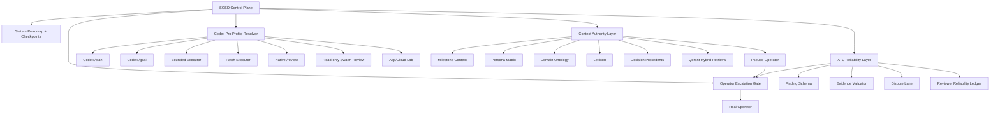
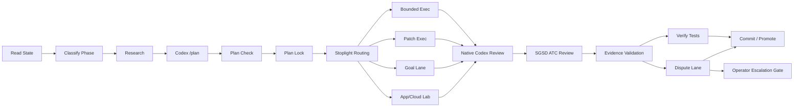
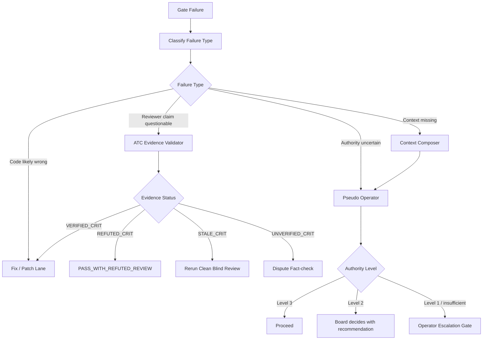

# SGSD Pro Mode: Codex Integration, ATC Reliability, and Context Authority Plan

**Status:** Draft for SGSD deliberation and implementation planning  
**Created:** 2026-05-20  
**Intended repo location:** `docs/SGSD_PRO_MODE_CODEX_CONTEXT_AUTHORITY_PLAN.md` or `.planning/proposals/SGSD_PRO_MODE_CODEX_CONTEXT_AUTHORITY_PLAN.md`  
**Source:** Distilled from the SGSD/Codex planning conversation covering Codex Pro Mode, ATC v4 reviewer failure, milestone memory, pseudo-operator routing, and context-aware board deliberation.

---

## 0. Executive summary

SGSD should become **Codex-native but not Codex-led**.

The intended architecture is:

```text
SGSD = control plane
Codex = specialist execution fabric
ATC = evidence-backed review authority
Context Authority = why/who/what memory layer
Pseudo Operator = bounded decision proxy
Real Operator = final authority only when context/authority genuinely runs out
```

The current direction is strong: SGSD already treats Codex as a serious execution/review worker. The next step is to make that relationship more structured, reliable, context-aware, and auditable.

This plan proposes three major upgrades:

1. **Codex Pro Mode Lanes**  
   Replace “send it to Codex” with explicit Codex profiles: plan, goal, bounded execution, patch execution, native review, swarm review, app/cloud lab, and cockpit brief.

2. **ATC Review Reliability Layer**  
   Prevent false `CRIT` findings from blocking progress unless they are verified against current file/line evidence. Add dispute states, fact-checking, lean review profiles, and reviewer reliability metrics.

3. **Context Authority + Pseudo Operator**  
   Give board/triage agents durable milestone context: why the milestone exists, who it is for, what user outcomes matter, persona-specific semantics, domain ontology, lexicon, source-of-truth rules, and operator decision precedents. Use this context to answer many operator-style questions without waking the real operator.

The core policy change:

```text
A gate should block only on verified critical findings, not raw reviewer assertions.
An operator escalation should happen only after context retrieval, pseudo-operator analysis, and an escalation-quality gate.
```

---

## 1. The problems this plan solves

### 1.1 Codex is powerful but currently too blunt

Codex should not be treated as a single generic executor. Different tasks need different modes:

- planning,
- goal completion,
- bounded source edit,
- patch-only edit,
- read-only audit,
- native code review,
- swarm-style review,
- app/cloud lab exploration,
- checkpoint/report writing.

Without typed lanes, SGSD risks overusing high-powered Codex execution for tasks that should be cheap, read-only, evidence-bound, or review-only.

### 1.2 ATC can fail as a reviewer, not only find real code issues

The v22-13c Plan 01 incident exposed a new failure mode:

```text
Code correct + tests pass + file:line evidence refutes reviewer → ATC still returns CRIT
```

That is not a normal convergence failure. It is a **reviewer reliability failure**.

The old rule:

```text
If ATC v4 still has CRIT, hard stop.
```

is too coarse.

It should become:

```text
If ATC v4 still has VERIFIED_CRIT, hard stop.
If ATC returns unverified/refuted/stale CRIT, route to the dispute lane.
```

### 1.3 Board escalation is often caused by missing context, not lack of intelligence

When SGSD fails a gate, triage/board agents often deliberate and then point back to the operator.

That usually means the board lacks one or more of:

- milestone intent,
- user/persona context,
- business reason,
- source-of-truth rules,
- prior operator decision precedent,
- domain ontology,
- lexicon/term disambiguation,
- acceptable trade-off boundaries.

The operator is currently the only persistent store of “why are we doing this and for whom?”

SGSD should store that itself.

---

## 2. Design principles

### 2.1 SGSD remains the authority

Codex should execute, review, plan, and investigate. It should not own phase promotion, safety policy, operator authority, production boundaries, or milestone intent.

```text
SGSD decides what should happen.
Codex helps make it happen.
```

### 2.2 Codex receives contracts, not vibes

Bad dispatch:

```text
Improve search.
```

Good dispatch:

```text
Phase: v30-05 product search contract gap
Scope: read-only
Allowed writes: reports/v30-05 only
Required outputs: gap report JSON + Markdown
Stop conditions: missing source file, write required, production credential required
Acceptance: every field classified with evidence
```

### 2.3 Reviews must be evidence-backed

A reviewer is not an oracle. A reviewer is a witness.

A critical finding should block only when it includes:

- current commit,
- exact file path,
- exact line range,
- current code excerpt,
- violated invariant,
- expected failing/missing test,
- confirmation that the evidence still exists at current `HEAD`.

### 2.4 Operator escalation is a last resort

Before asking the real operator, SGSD should retrieve context and ask the pseudo operator.

The real operator should be asked only when:

- no relevant context exists,
- no precedent exists,
- personas conflict in a commercially meaningful way,
- the decision changes milestone scope,
- production/data/security risk exists,
- confidence is below threshold,
- pseudo operator authority is exceeded.

### 2.5 Structured memory is source of truth; vector search is retrieval infrastructure

YAML/JSON/Markdown context files should be canonical.

Qdrant/vector retrieval should help locate and compose relevant context, not become the authority itself.

### 2.6 Context must inherit from milestone to phase to dispatch to review

Every phase should inherit:

```text
milestone why → persona priority → domain rules → lexicon senses → source-of-truth → prior decisions
```

No phase should lose the original reason the milestone exists.

---

## 3. Target architecture



### 3.1 North-star workflow



---

## 4. Workstream A — Codex Pro Mode lanes

### 4.1 Add a Codex profile resolver

Proposed file:

```text
super-gsd/tools/codex-pro/profile-resolver.cjs
```

Purpose:

```text
Given phase type, risk, ambiguity, allowed files, validation commands, and current state,
select the correct Codex lane and safety envelope.
```

Suggested profiles:

```text
codex.readonly.audit
codex.plan
codex.goal
codex.execute.bounded
codex.execute.patch
codex.review.native
codex.review.swarm
codex.cockpit.brief
codex.app_lab
codex.cloud_lab
```

Profile example:

```json
{
  "profile": "codex.execute.bounded",
  "model": "gpt-5.5",
  "reasoning": "xhigh",
  "sandbox": "workspace-write",
  "approval": "auto",
  "requires_worktree": true,
  "requires_locked_plan": true,
  "hooks_required": true,
  "native_review_required": true,
  "allowed_write_roots": ["src/search", "tests/search"],
  "max_changed_files": 6
}
```

### 4.2 Add stoplight routing

Proposed file:

```text
super-gsd/tools/codex-pro/stoplight.cjs
```

Output ledger:

```text
.planning/metrics/pro-mode-stoplight.jsonl
```

Routing:

```text
GREEN → bounded executor
AMBER → goal lane in temp worktree or app/cloud lab
RED → no execution; route to board/operator
```

GREEN criteria:

```text
- locked plan exists
- allowed files are limited
- acceptance commands exist
- risk is low/medium
- no production writes
- no secrets required
- route evidence complete
```

AMBER criteria:

```text
- long-running validation loop
- broad but bounded roots
- goal lane appropriate
- temp worktree required
- human/board review before apply
```

RED criteria:

```text
- no locked plan
- no acceptance command
- high ambiguity
- production/SAP/Mongo/Qdrant mutation risk
- secrets required
- destructive command required
```

### 4.3 Add a goal lane, but do not make it default

Proposed files:

```text
super-gsd/scripts/codex-goal-executor.sh
super-gsd/tools/codex-pro/goal-runner.cjs
.planning/metrics/codex-goal-ledger.jsonl
```

Use `/goal` only when:

```text
- objective is durable and bounded,
- validation commands exist,
- stop conditions are explicit,
- allowed files/roots are defined,
- risk is not high,
- temp worktree is available,
- checkpoint/report output is required.
```

Goal capsule example:

```json
{
  "phase": "p107-contract-normalisation",
  "lane": "codex.goal",
  "objective_file": ".planning/milestones/current/phases/107/GOAL.md",
  "plan_file": ".planning/milestones/current/phases/107/PLAN-LOCKED.md",
  "allowed_roots": ["src/search/", "tests/search/"],
  "forbidden_roots": [".git/", "secrets/", "prod/"],
  "validation_commands": [
    "npm test -- search",
    "npm run typecheck"
  ],
  "stop_when": [
    "all validation commands pass",
    "max_changed_files exceeded",
    "production credential required",
    "write outside allowed roots would be needed"
  ],
  "result_files": [
    ".planning/milestones/current/phases/107/CODEX-GOAL-REPORT.md",
    ".planning/metrics/codex-goal-ledger.jsonl"
  ]
}
```

### 4.4 Use `/plan` as the formal Plan Lock stage

Proposed phase documents:

```text
PLAN-DRAFT.md
PLAN-REVIEW.md
PLAN-LOCKED.md
```

Flow:

```text
Codex /plan drafts approach
→ Plan-check challenges it
→ Board/SGSD resolves disagreements
→ PLAN-LOCKED.md becomes execution authority
```

`PLAN-LOCKED.md` should include:

```text
Objective
Non-goals
Allowed files
Forbidden files
Invariants
Acceptance commands
Rollback plan
Expected artefacts
Risk rating
Goal-lane eligibility
Operator checkpoints
```

Policy:

```text
No source mutation without PLAN-LOCKED.md.
```

### 4.5 Add native Codex review as a first-class gate

Proposed file:

```text
super-gsd/tools/codex-pro/native-review-runner.cjs
```

Output:

```text
.planning/milestones/<milestone>/phases/<phase>/CODEX-NATIVE-REVIEW.md
```

Review order:

```text
Executor produces diff
→ acceptance commands run
→ Codex native review checks code quality
→ SGSD ATC checks contract/safety/evidence
→ evidence validator checks CRITs
→ commit/promote only if clear
```

### 4.6 Add Codex hooks as deterministic safety rails

Proposed files:

```text
.codex/hooks.json
super-gsd/tools/codex-hooks/block-forbidden-write.cjs
super-gsd/tools/codex-hooks/block-secret-leak.cjs
super-gsd/tools/codex-hooks/log-tool-event.cjs
super-gsd/tools/codex-hooks/validate-stop-contract.cjs
super-gsd/tools/codex-hooks/enforce-allowed-files.cjs
```

Hook behaviour:

```text
UserPromptSubmit:
- reject secrets/API keys/production credentials in prompts

PreToolUse:
- block writes outside allowed files
- block destructive shell commands
- block .git mutation
- block production rebuild unless phase-approved

PostToolUse:
- append tool event to .planning/metrics/codex-tool-events.jsonl

Stop:
- validate result contract exists
- validate checkpoint updated
- validate acceptance commands reported
```

Policy:

```text
Hooks are mandatory for codex.execute.* and codex.goal.
```

### 4.7 Convert SGSD behaviour into Codex-native skills

Proposed folder:

```text
.codex/skills/
  sgsd-phase-research/
  sgsd-plan-lock/
  sgsd-atc-review/
  sgsd-muda-review/
  sgsd-token-triage/
  sgsd-cockpit-brief/
  sgsd-context-composer/
  sgsd-pseudo-operator/
  sgsd-persona-review/
  sgsd-lexicon-disambiguation/
```

Example skill:

```markdown
---
name: sgsd-atc-review
description: Use when reviewing an SGSD phase result for contract compliance, allowed file drift, missing evidence, acceptance command gaps, and promotion readiness.
---

# SGSD ATC Review

Read:
- .planning/STATE.md
- .planning/ORCHESTRATOR-CHECKPOINT.md
- current phase PLAN-LOCKED.md
- phase result artefacts
- git diff

Return:
- GO / NOGO
- P0/P1/P2 findings
- missing evidence
- unsafe writes
- required next action
```

### 4.8 Add read-only Codex review swarm

Use subagents only for review/investigation, not parallel writing.

Reviewer roles:

```text
security reviewer
regression reviewer
test reviewer
SGSD contract reviewer
MUDA/simplicity reviewer
```

Output:

```text
.planning/milestones/<milestone>/phases/<phase>/CODEX-SWARM-REVIEW.md
.planning/metrics/codex-swarm-review.jsonl
```

Result schema:

```json
{
  "phase": "p107",
  "mode": "read_only_swarm",
  "agents": ["security", "regression", "tests", "contract", "muda"],
  "consensus": "NOGO",
  "blocking_findings": [
    {
      "severity": "P1",
      "agent": "contract",
      "finding": "Diff touches file outside PLAN allowed_files."
    }
  ],
  "recommended_next_lane": "codex.execute.patch"
}
```

### 4.9 Add Codex App/Cloud lab as an isolated worktree lane

Lane name:

```text
codex.app_lab
codex.cloud_lab
```

Use cases:

```text
- parallel prototype
- risky refactor exploration
- alternative implementation options
- PR draft from phase capsule
- long-running research that does not require local private state
```

Rules:

```text
Codex app/cloud may propose.
SGSD validates.
SGSD gates.
SGSD promotes.
```

Do not let cloud/app become the main SGSD loop until it can consume the same state, memory, checkpoints, VTP rules, and operator boundaries.

### 4.10 Add SGSD Codex command surface

Proposed commands:

```text
/sgsd-codex doctor
/sgsd-codex plan <phase>
/sgsd-codex goal <phase>
/sgsd-codex review <phase>
/sgsd-codex swarm-review <phase>
/sgsd-codex app-lab <phase>
/sgsd-codex skills sync
/sgsd-codex status
```

Expected behaviour:

```text
doctor       → checks login, provider health, hooks, config, trust, self-test
plan         → runs Codex plan lane and writes PLAN-DRAFT.md
goal         → validates eligibility and runs goal in temp worktree
review       → runs native Codex review + SGSD ATC
swarm-review → runs themed read-only reviewers
app-lab      → launches isolated exploration capsule
skills sync  → syncs SGSD skills into Codex skill packages
status       → shows live Codex lane, goal ledger, phase, stoplight
```

---

## 5. Workstream B — ATC reliability and disputed review handling

### 5.1 New verdict states

Current style:

```text
PASS
WARN
CRIT
STOP
```

Proposed style:

```text
PASS
PASS_WITH_WARNINGS
FAIL_VERIFIED
FAIL_UNVERIFIED
DISPUTED
STALE_REVIEW
PASS_WITH_REFUTED_REVIEW
NEEDS_OPERATOR
```

Hard-stop policy:

```text
Only FAIL_VERIFIED / VERIFIED_CRIT blocks promotion automatically.
```

### 5.2 ATC finding schema

ATC should not return loose prose as the authoritative gate decision.

Required schema:

```json
{
  "finding_id": "ATC-v4-C1",
  "severity": "CRIT",
  "claim": "Event model omits method/confidence/agreement_status/version.",
  "current_commit": "54000ffd",
  "file": "app/services/document_mutations/models.py",
  "line_start": 73,
  "line_end": 76,
  "quoted_excerpt": "method: str = \"user_action\"...",
  "violated_invariant": "Event provenance fields must be present.",
  "evidence_type": "current_file_line",
  "reproducer_command": "pytest ...",
  "confidence": 0.92
}
```

A CRIT without file/line evidence should be treated as:

```text
FAIL_UNVERIFIED
```

not:

```text
FAIL_VERIFIED
```

### 5.3 Add evidence validator

Proposed file:

```text
super-gsd/tools/atc/evidence-validator.cjs
```

Inputs:

```text
- ATC report
- current commit hash
- changed files
- test result summary
```

Outputs:

```text
VERIFIED_CRIT
REFUTED_CRIT
UNVERIFIED_CRIT
STALE_CRIT
```

Pseudo-logic:

```js
for (const finding of atcFindings) {
  if (!finding.file || !finding.line_start || !finding.line_end) {
    finding.evidence_status = "UNVERIFIED_CRIT";
    continue;
  }

  const currentExcerpt = readLines(
    finding.file,
    finding.line_start,
    finding.line_end
  );

  if (!excerptMatches(currentExcerpt, finding.quoted_excerpt)) {
    finding.evidence_status = "STALE_CRIT";
    continue;
  }

  if (claimContradictedByEvidence(finding.claim, currentExcerpt)) {
    finding.evidence_status = "REFUTED_CRIT";
    continue;
  }

  finding.evidence_status = "VERIFIED_CRIT";
}
```

For negative claims like “field is missing”, require stronger proof:

```text
- grep/ripgrep evidence,
- relevant full model/function excerpt,
- current file:line citation,
- current commit confirmation.
```

### 5.4 Add dispute lane

Proposed files:

```text
super-gsd/tools/atc/dispute-router.cjs
super-gsd/tools/atc/dispute-factcheck.cjs
.planning/metrics/atc-disputes.jsonl
```

Dispute state:

```json
{
  "phase": "v22-13c-plan-01",
  "atc_verdict": "DISPUTED",
  "dispute_reason": "ATC v4 CRIT contradicted by current file:line evidence",
  "claims_under_dispute": ["ATC-v4-C1", "ATC-v4-C2"],
  "allowed_next_action": "evidence_bound_fact_check_only"
}
```

Dispute result:

```json
{
  "dispute_verdict": "REVIEWER_REFUTED",
  "plan_verdict": "PASS_WITH_REFUTED_REVIEW",
  "commit_allowed": true,
  "audit_required": true
}
```

### 5.5 ATC v5 narrow fact-check prompt

Use this instead of a full re-review when a reviewer claim is disputed.

```text
You are performing an evidence-bound dispute check for SGSD.

Current commit:
<commit>

Scope:
Only adjudicate the disputed ATC critical claims below.
Do not raise new findings.
Do not review unrelated code.
Do not rely on previous ATC reports.
Use only current file contents and supplied test results.

Disputed claim 1:
"<claim>"

Question:
At current commit <commit>, is this claim true or false?

Required output:
- TRUE or FALSE
- exact file:line evidence
- quoted current code excerpt
- whether this should remain CRIT

Disputed claim 2:
"<claim>"

Question:
At current commit <commit>, is this claim true or false?

Required output:
- TRUE or FALSE
- exact file:line evidence
- quoted current code excerpt
- whether this should remain CRIT

Known test evidence:
- <test summary>

Verdict rules:
- If all disputed CRITs are false, return PASS_WITH_REFUTED_REVIEW.
- If any disputed CRIT is true, return FAIL_VERIFIED.
- If you cannot verify from current file contents, return NEEDS_OPERATOR.
```

### 5.6 Make ATC reviews blind to previous ATC prose

Avoid stale-context re-emission.

Split review into:

```text
A. Blind current review
B. Regression check against previous findings
```

Do not give the reviewer old scary findings until it has already inspected current code.

### 5.7 Require current commit proof

Every ATC report must include:

```text
Current commit reviewed: <hash>
Base commit/diff reviewed: <hash or range>
Files opened:
- <path>
Tests reviewed:
- <command + result>
```

SGSD should reject review output if:

```text
review.current_commit != git rev-parse HEAD
```

### 5.8 Add reviewer reliability ledger

Proposed file:

```text
.planning/metrics/atc-reviewer-reliability.jsonl
```

Example row:

```json
{
  "timestamp": "2026-05-20T14:15:00Z",
  "phase": "v22-13c-plan-01",
  "commit": "54000ffd",
  "reviewer": "ATC-v4",
  "finding_id": "ATC-v4-C1",
  "severity": "CRIT",
  "claim_type": "missing_field",
  "outcome": "REFUTED_BY_FILE_LINE",
  "refuting_evidence": [
    "app/services/document_mutations/models.py:73-76"
  ],
  "tests_refuting": [
    "test_undo_rejects_target_action_re_audit",
    "test_undo_rejects_target_action_undo",
    "test_undo_accepts_target_action_claim_escalate_dismiss"
  ]
}
```

Quarantine policy:

```text
If the same reviewer profile repeats a refuted CRIT twice in one milestone,
quarantine that ATC profile and switch to lean/dispute review mode.
```

### 5.9 Add ATC profiles

Use different reviewers for different work.

```text
ATC_SCHEMA_LEAN
ATC_ENDPOINT
ATC_FRONTEND
ATC_INTEGRATION
ATC_PRODUCTION_RISK
ATC_ARCHITECTURE
```

For schema/types work, use lean ATC:

```text
1. Are required fields present?
2. Are defaults intentional?
3. Does validation enforce allowed action model?
4. Do tests cover allowed and rejected cases?
5. Does the diff stay inside allowed files?
6. Are there backwards-incompatible schema changes?
```

Do not use a production-risk checklist for schema-only plumbing.

---

## 6. Workstream C — Context Authority and Pseudo Operator

### 6.1 Purpose

The Context Authority layer makes SGSD aware of:

```text
why the milestone exists,
who it serves,
what workflows matter,
which personas have priority,
what words mean in this domain,
what source-of-truth rules apply,
what decisions the operator already made,
and what trade-offs are acceptable.
```

This reduces low-quality operator escalation.

### 6.2 New canonical context files

At milestone start, create:

```text
.planning/milestones/<milestone>/context/MILESTONE-CONTEXT.yaml
.planning/milestones/<milestone>/context/PERSONA-MATRIX.yaml
.planning/milestones/<milestone>/context/DOMAIN-ONTOLOGY.yaml
.planning/milestones/<milestone>/context/LEXICON.yaml
.planning/milestones/<milestone>/context/SOURCE-OF-TRUTH.yaml
.planning/milestones/<milestone>/context/NON-GOALS.yaml
```

Global context:

```text
.planning/context/GLOBAL-OPERATOR-PREFERENCES.yaml
.planning/context/GLOBAL-PERSONA-MATRIX.yaml
.planning/context/GLOBAL-DOMAIN-ONTOLOGY.yaml
.planning/context/GLOBAL-LEXICON.yaml
.planning/memory/DECISION-PRECEDENTS.jsonl
```

### 6.3 Milestone context example

```yaml
milestone_id: v22-13c
title: Enable operator document mutations
business_why: >
  Let operators act on audit findings directly from the document dashboard
  instead of treating audit output as read-only information.

primary_user_outcome: >
  Operators can claim, escalate, re-audit, dismiss, and undo actions
  with a reliable append-only event trail.

personas:
  - id: operator
    priority: primary
    wants:
      - clear next action
      - safe mutation buttons
      - reversible mistakes
      - visible audit trail
    does_not_want:
      - hidden state changes
      - ambiguous ownership
      - destructive overwrites

  - id: sales
    priority: secondary
    wants:
      - document status clarity
      - confidence that customer-visible data is correct
    does_not_want:
      - BOM-level internal noise
      - procurement-only terminology

source_of_truth:
  audit_events: Mongo append-only event store
  current_document_state: derived from latest valid event chain
  sap: authoritative commercial/order data
  frontend: display only unless endpoint contract says otherwise

non_goals:
  - no destructive overwrite mutation
  - no frontend-only state pretending to be backend truth
  - no SAP writes in this milestone

operator_preferences:
  review_gate_policy: verified critical findings block; unverified findings go to dispute
  default_bias: preserve auditability over speed
  acceptable_override: allowed when reviewer claim is refuted by current file:line evidence
```

### 6.4 Persona matrix example

```yaml
personas:
  sales:
    cares_about:
      - sellable parent SKU
      - website-visible product data
      - price
      - availability
      - customer-facing description
      - quote/order readiness
    usually_ignores:
      - BOM child components
      - supplier substitution logic
      - internal landed-cost variance
    search_bias:
      include:
        - parent_products
        - web_catalogue
        - customer_docs
      suppress:
        - bom_children
        - internal_components

  procurement:
    cares_about:
      - BOM children
      - supplier
      - MOQ
      - lead time
      - substitute components
      - landed cost
      - supply risk
    search_bias:
      include:
        - bom_items
        - suppliers
        - component_mappings
        - purchase_history

  warehouse:
    cares_about:
      - stock position
      - bin location
      - pickability
      - allocated quantity
      - goods-in status

  finance:
    cares_about:
      - invoice state
      - payment terms
      - credit holds
      - margin
```

### 6.5 Domain ontology example

```yaml
entities:
  product:
    children:
      - sellable_parent
      - bom_child
      - component
      - kit
      - assembly
    source_of_truth:
      commercial: SAP
      website: web_catalogue
      internal_structure: BOM database

  document:
    children:
      - sales_order
      - delivery_note
      - invoice
      - audit_verdict
      - mutation_event

  audit_event:
    actions:
      - claim
      - escalate
      - dismiss
      - re_audit
      - undo
    invariants:
      - append_only
      - reversible_actions_limited
      - every mutation has actor/time/reason/provenance
```

### 6.6 Lexicon example

This is used for polysemy and domain-specific terminology.

```yaml
terms:
  ownership:
    senses:
      - id: audit_ownership
        meaning: document/audit item claimed by an operator
        fields:
          - claimed_by
          - claimed_at
        personas:
          - operator

      - id: sales_account_ownership
        meaning: customer/account owned by salesperson
        fields:
          - salesperson_code
          - account_owner
        personas:
          - sales

  chain:
    senses:
      - id: audit_chain
        meaning: append-only event sequence
      - id: supply_chain
        meaning: procurement/supplier/material flow
      - id: frontend_chain_widget
        meaning: visual chain component on document page

  dismiss:
    senses:
      - id: audit_dismiss
        meaning: operator marks audit item as not requiring action
      - id: ui_dismiss
        meaning: close a modal or notification without backend mutation

  product:
    senses:
      - id: sellable_product
        meaning: item that can appear on website/quote/order
      - id: bom_component
        meaning: internal child component used to assemble/kit sellable product
```

### 6.7 Decision precedents

Every meaningful operator decision should be stored.

File:

```text
.planning/memory/DECISION-PRECEDENTS.jsonl
```

Example:

```json
{
  "timestamp": "2026-05-20T14:15:00Z",
  "milestone_id": "v22-13c",
  "phase": "plan-01",
  "decision_type": "review_dispute",
  "operator_decision": "PASS_WITH_REFUTED_REVIEW after evidence-bound dispute check",
  "reason": "ATC v4 CRIT contradicted by current file:line evidence and targeted passing tests.",
  "principle": "Only verified critical findings block promotion.",
  "applies_to": [
    "ATC false positive",
    "reviewer hallucination",
    "schema-only plan"
  ],
  "does_not_apply_to": [
    "verified production risk",
    "untested mutation endpoint",
    "ambiguous business requirement"
  ]
}
```

### 6.8 Memory levels

SGSD memory should be layered:

```text
Level 0 — Runtime state
Current phase, current commit, tests, diff.

Level 1 — Phase context
Objective, allowed files, acceptance criteria.

Level 2 — Milestone context
Why it exists, outcome, non-goals.

Level 3 — Persona context
Who this affects and what success means to each persona.

Level 4 — Domain context
Ontology, source-of-truth rules, business workflows.

Level 5 — Language context
Lexicon, synonyms, polysemy, preferred terminology.

Level 6 — Decision precedent
Past operator decisions and principles.

Level 7 — Global SGSD policy
Safety, review gates, production boundaries.
```

### 6.9 Context composer

Proposed file:

```text
super-gsd/tools/context-authority/context-composer.cjs
```

Input:

```json
{
  "milestone_id": "v22-13c",
  "phase_id": "plan-01",
  "question": "ATC returned CRIT but executor says review is hallucinated. What now?",
  "decision_type": "review_dispute",
  "affected_personas": ["operator"],
  "changed_files": [
    "app/services/document_mutations/models.py"
  ]
}
```

Output:

```json
{
  "context_pack_id": "ctx-v22-13c-plan01-dispute-001",
  "retrieved_context": {
    "milestone_why": "...",
    "phase_goal": "...",
    "operator_preferences": "...",
    "decision_precedents": ["..."],
    "relevant_policy": ["verified CRIT required to block"],
    "domain_invariants": ["append-only event trail", "undo only reversible actions"],
    "lexicon": ["undo", "re-audit", "claim", "event chain"]
  },
  "missing_context": [],
  "confidence": 0.91,
  "recommended_pseudo_operator_mode": "bounded_decision"
}
```

### 6.10 Pseudo operator

Proposed file:

```text
super-gsd/tools/context-authority/pseudo-operator.cjs
```

Role:

```text
Answer operator-style questions using approved context only.
```

It may use:

```text
- milestone context,
- phase context,
- persona matrix,
- domain ontology,
- lexicon,
- decision precedents,
- SGSD policy,
- current evidence.
```

It must not invent operator intent.

#### Authority levels

```text
Level 1 — Explain only
Can explain options. Cannot choose.

Level 2 — Recommend
Can recommend a path with confidence and evidence. Needs approval.

Level 3 — Decide within policy
Can choose and allow SGSD to continue if precedent is strong, risk is low, and context confidence is high.
```

Escalate to real operator if:

```text
- no relevant precedent exists,
- context confidence is low,
- primary personas conflict,
- production/SAP/Mongo/Qdrant write risk exists,
- decision changes milestone scope,
- decision has commercial/political impact.
```

#### Pseudo operator response schema

```json
{
  "recommendation": "sales-first default; BOM children behind procurement filter",
  "authority_level": 2,
  "confidence": 0.87,
  "context_coverage": {
    "milestone_context": true,
    "persona_context": true,
    "decision_precedent": true,
    "source_of_truth": true,
    "lexicon": true
  },
  "evidence": [
    "PERSONA-MATRIX.yaml:sales.search_bias.suppress.bom_children",
    "LEXICON.yaml:product.sellable_product",
    "MILESTONE-CONTEXT.yaml:primary_user_outcome"
  ],
  "affected_personas": ["sales", "procurement"],
  "tradeoff": "Cleaner sales UX vs less default visibility for procurement detail.",
  "real_operator_required": false,
  "missing_context": []
}
```

### 6.11 Operator escalation gate

Proposed file:

```text
super-gsd/tools/context-authority/escalation-gate.cjs
```

Policy:

```text
No operator escalation is allowed until a context pack and pseudo-operator answer exist,
unless there is an immediate safety/security/production emergency.
```

Escalation checklist:

```text
1. Did we retrieve milestone context?
2. Did we retrieve phase context?
3. Did we retrieve persona context?
4. Did we retrieve decision precedents?
5. Did we disambiguate key terms?
6. Did pseudo operator provide an answer?
7. Why is that answer insufficient?
8. What exact operator decision is needed?
9. What happens if operator is unavailable?
```

Escalation packet:

```json
{
  "operator_required": true,
  "reason": "No approved precedent exists for exposing procurement-only BOM data in sales-facing search.",
  "context_pack_id": "ctx-v22-search-004",
  "pseudo_operator_recommendation": "sales-first default, procurement filter optional",
  "confidence": 0.68,
  "choices": [
    {
      "id": "A",
      "label": "sales-first default",
      "consequence": "Better sales UX; procurement still available via filter."
    },
    {
      "id": "B",
      "label": "mixed result set",
      "consequence": "More complete but risks noisy sales results."
    },
    {
      "id": "C",
      "label": "separate modes",
      "consequence": "Cleanest UX but more implementation work."
    }
  ]
}
```

---

## 7. Workstream D — Retrieval, embeddings, ontology, and lexicon

### 7.1 Retrieval principles

Use hybrid retrieval:

```text
dense semantic vectors
+
sparse keyword matching
+
payload filters
+
reranking
```

Do not rely on dense embeddings alone for SGSD decisions. Exact terms matter:

```text
phase IDs
field names
commit hashes
endpoint names
version tags
operator decisions
source-of-truth labels
```

### 7.2 Suggested Qdrant collections

```text
sgsd_milestone_context
sgsd_phase_context
sgsd_persona_context
sgsd_domain_ontology
sgsd_lexicon
sgsd_decision_precedents
sgsd_review_findings
sgsd_operator_preferences
sgsd_code_evidence
```

### 7.3 Payload metadata

Each indexed memory point should include:

```json
{
  "memory_type": "persona_context",
  "milestone_id": "v22-13c",
  "phase_id": null,
  "persona": "sales",
  "domain": "semantic_search",
  "entity": "product",
  "term_sense": "sellable_product",
  "source": ".planning/context/PERSONA-MATRIX.yaml",
  "authority": "operator_approved",
  "valid_from": "2026-05-20",
  "valid_until": null,
  "confidence": 1.0,
  "version": "1"
}
```

### 7.4 Multi-vector memory points

Example:

```json
{
  "id": "persona-sales-product-search-001",
  "payload": {
    "memory_type": "persona_context",
    "persona": "sales",
    "domain": "semantic_search",
    "entity": "product",
    "term_sense": "sellable_product"
  },
  "vectors": {
    "semantic": "<dense embedding of full content>",
    "role": "<embedding of persona/use-case summary>",
    "goal": "<embedding of business outcome>",
    "keyword_sparse": "<sparse vector for exact terms>"
  }
}
```

Different questions query different vector views:

```text
Reviewer: phase contract + code evidence
Board: milestone why + decision precedents
Pseudo operator: persona + business outcome + operator preferences
Search implementation: persona + ontology + lexicon
```

### 7.5 Semantic decision query template

For any board-level question, generate multiple query types:

```text
Goal query:
What outcome is this milestone trying to achieve?

Persona query:
Who is the primary user for this phase and what do they care about?

Precedent query:
Has the operator decided a similar trade-off before?

Lexicon query:
What do the key terms mean in this milestone/persona context?

Risk query:
What safety/source-of-truth boundaries apply?

Evidence query:
What current code/test evidence exists?
```

Merge and rerank the results into a context pack.

---

## 8. Proposed repo structure

```text
super-gsd/
  tools/
    codex-pro/
      profile-resolver.cjs
      stoplight.cjs
      goal-runner.cjs
      native-review-runner.cjs
      swarm-review-runner.cjs
      app-lab-runner.cjs
      skill-sync.cjs
      status.cjs
      doctor.cjs

    codex-hooks/
      block-forbidden-write.cjs
      block-secret-leak.cjs
      log-tool-event.cjs
      validate-stop-contract.cjs
      enforce-allowed-files.cjs

    atc/
      evidence-validator.cjs
      dispute-router.cjs
      dispute-factcheck.cjs
      reliability-ledger.cjs
      profile-selector.cjs

    context-authority/
      context-composer.cjs
      context-indexer.cjs
      context-query.cjs
      pseudo-operator.cjs
      escalation-gate.cjs
      lexicon-disambiguator.cjs
      decision-precedent-writer.cjs
      context-health.cjs

  skills/
    sgsd-context-composer/
      SKILL.md
    sgsd-pseudo-operator/
      SKILL.md
    sgsd-persona-review/
      SKILL.md
    sgsd-lexicon-disambiguation/
      SKILL.md
    sgsd-atc-review/
      SKILL.md

  scripts/
    codex-goal-executor.sh

.codex/
  hooks.json
  skills/
    ...synced skill packs...

.planning/
  context/
    GLOBAL-OPERATOR-PREFERENCES.yaml
    GLOBAL-PERSONA-MATRIX.yaml
    GLOBAL-DOMAIN-ONTOLOGY.yaml
    GLOBAL-LEXICON.yaml

  memory/
    DECISION-PRECEDENTS.jsonl
    CONTEXT-INDEX-LEDGER.jsonl
    PSEUDO-OPERATOR-LEDGER.jsonl

  metrics/
    pro-mode-stoplight.jsonl
    codex-goal-ledger.jsonl
    codex-tool-events.jsonl
    atc-disputes.jsonl
    atc-reviewer-reliability.jsonl
    context-health.jsonl

  milestones/
    <milestone>/
      context/
        MILESTONE-CONTEXT.yaml
        PERSONA-MATRIX.yaml
        DOMAIN-ONTOLOGY.yaml
        LEXICON.yaml
        SOURCE-OF-TRUTH.yaml
        NON-GOALS.yaml
      phases/
        <phase>/
          PLAN-DRAFT.md
          PLAN-REVIEW.md
          PLAN-LOCKED.md
          CONTEXT-PACK.json
          CONTEXT-PACK.md
          PSEUDO-OPERATOR-ANSWER.json
          CODEX-NATIVE-REVIEW.md
          ATC-REVIEW.md
          ATC-EVIDENCE-VALIDATION.json
```

---

## 9. Pro Mode configuration

Suggested config block:

```json
{
  "codex_pro": {
    "enabled": true,
    "goal_lane_enabled": true,
    "native_review_enabled": true,
    "hooks_required_for_write": true,
    "skills_sync_enabled": true,
    "swarm_review_enabled": true,
    "app_lab_enabled": false,
    "cloud_lab_enabled": false,
    "require_temp_worktree_for_goal": true,
    "require_plan_lock_for_source_change": true,
    "require_native_review_before_commit": true,
    "max_green_allowed_files": 6,
    "max_green_changed_lines": 400
  },
  "atc_reliability": {
    "require_current_commit": true,
    "require_file_line_for_crit": true,
    "raw_crit_blocks": false,
    "verified_crit_blocks": true,
    "dispute_lane_enabled": true,
    "quarantine_repeated_false_positive_profile": true,
    "false_positive_quarantine_threshold": 2
  },
  "context_authority": {
    "enabled": true,
    "require_context_pack_before_board": true,
    "require_pseudo_operator_before_operator": true,
    "allow_pseudo_operator_level_3": true,
    "min_confidence_for_level_3": 0.85,
    "qdrant_enabled": false,
    "structured_context_source_of_truth": true
  }
}
```

---

## 10. Updated SGSD workflows

### 10.1 Pro Mode execution workflow

```text
1. READ STATE
   .planning/STATE.md
   ORCHESTRATOR-CHECKPOINT.md
   milestone ROADMAP.md
   phase docs

2. CLASSIFY PHASE
   simple / planning / research / implementation / review / recovery

3. BUILD CONTEXT PACKET
   milestone context
   persona context
   source-of-truth
   lexicon
   precedents

4. CODEX RESEARCH
   read-only, structured output

5. CODEX /PLAN
   produce PLAN-DRAFT.md

6. PLAN-CHECK
   Codex ATC + MUDA review

7. PLAN LOCK
   write PLAN-LOCKED.md

8. STOPLIGHT
   GREEN → bounded executor
   AMBER → goal lane or app-lab
   RED → board/operator

9. EXECUTION
   bounded Codex executor
   patch executor
   goal executor
   app/cloud lab

10. NATIVE CODEX REVIEW
    dedicated review output

11. SGSD ATC REVIEW
    contract/evidence/safety review

12. EVIDENCE VALIDATION
    only verified CRIT blocks

13. VERIFY
    acceptance commands
    tests
    result schema

14. COMMIT / PROMOTE
    only after all required gates

15. LEDGER UPDATE
    checkpoint
    metrics
    route decision
    token/cost attribution
    learnings
```

### 10.2 Gate failure workflow



### 10.3 Board escalation workflow

```text
Review/Triage cannot resolve
→ Context composer retrieves milestone/phase/persona/ontology/lexicon/precedent
→ Pseudo operator produces recommendation + confidence + authority level
→ Board deliberates with context pack
→ Escalation gate checks whether real operator is genuinely required
→ Real operator gets structured choices only if needed
```

### 10.4 Milestone initialisation workflow

```text
/sgsd context init <milestone>

Prompts/infers:
- What problem are we solving?
- Who is it for?
- What workflows matter?
- What data sources matter?
- What terms are ambiguous?
- What should be hidden from which users?
- What is out of scope?
- What are no-go safety boundaries?
- What prior decisions apply?
- What does success look like per persona?

Writes:
- MILESTONE-CONTEXT.yaml
- PERSONA-MATRIX.yaml
- DOMAIN-ONTOLOGY.yaml
- LEXICON.yaml
- SOURCE-OF-TRUTH.yaml
- NON-GOALS.yaml

Then:
- context-health check
- context index
- phase generation inherits context bindings
```

---

## 11. Example: sales vs procurement semantic search

Question:

```text
Should semantic search index BOM child items alongside parent products?
```

Bad board answer:

```text
The system is unsure. Operator required.
```

Context-aware pseudo operator answer:

```text
Recommendation:
Index BOM child items, but do not surface them in the default sales-facing result set.

Reason:
The milestone's primary user is sales. Sales cares about sellable parent products and website-visible data. Procurement is a secondary persona and does care about BOM/component-level detail. Therefore, BOM children should be available through procurement/internal filters, explicit query intent, or a secondary result lane, but should not dilute default sales search.

Suggested implementation:
- Store parent and child records in the index.
- Add payload field: record_visibility = sales_default | procurement_internal | internal_only.
- Add entity_type = sellable_parent | bom_child | component.
- Default sales search filters or boosts sales_default.
- Procurement mode includes bom_child/component.
- Review gate checks that sales default does not over-rank BOM children.

Real operator required:
No, if milestone context says sales is primary and procurement is secondary.
```

---

## 12. Immediate v22-13c Plan 01 policy recommendation

For the specific ATC v4 disputed verdict:

```text
Do not treat ATC v4 as a normal failing review.
Treat it as a reviewer reliability event.
```

Recommended action:

```text
Path Ψ-lite:
Run a narrow evidence-bound dispute check only.
Do not run another broad ATC review.
```

If the dispute check confirms the pasted evidence:

```text
- app/services/document_mutations/models.py:73-76 contains method, confidence, agreement_status, version.
- app/services/document_mutations/models.py:45 defines REVERSIBLE_ACTIONS as claim/escalate/dismiss.
- app/services/document_mutations/models.py:151-153 rejects undo targets outside REVERSIBLE_ACTIONS.
- targeted tests pass.
```

Then mark:

```text
ATC v4 verdict: REFUTED_CRIT
Plan 01 verdict: PASS_WITH_REFUTED_REVIEW
Commit allowed: yes
Audit note required: yes
```

Audit note:

```text
Plan 01 passed with refuted ATC v4 review.

ATC v4 raised two CRITs:
1. Missing provenance fields.
2. Undo accepts re-audit/undo targets.

Both CRITs were refuted against current commit 54000ffd:
- app/services/document_mutations/models.py:73-76 contains method, confidence, agreement_status, version.
- app/services/document_mutations/models.py:45 defines REVERSIBLE_ACTIONS as claim/escalate/dismiss.
- app/services/document_mutations/models.py:151-153 rejects undo targets outside REVERSIBLE_ACTIONS.

Targeted tests pass:
- test_undo_rejects_target_action_re_audit
- test_undo_rejects_target_action_undo
- test_undo_accepts_target_action_claim_escalate_dismiss

Decision:
Treat ATC v4 as reviewer false positive, not code convergence failure.
Plan 01 promotion allowed.
```

---

## 13. Prompts and templates

### 13.1 Codex goal dispatch template

```text
/goal

Phase:
<phase id>

Objective:
<clear bounded outcome>

Hard constraints:
- Do not touch production.
- Do not write outside allowed roots.
- Do not modify .git, secrets, credentials, or deployment files.
- Do not continue to the next phase.
- Stop if any required context is missing.

Allowed files/roots:
<list>

Forbidden files/roots:
<list>

Inputs:
- PLAN-LOCKED.md
- CONTEXT-PACK.md
- acceptance criteria
- current tests

Validation commands:
<commands>

Required outputs:
- CODEX-GOAL-REPORT.md
- result.json
- checkpoint update

Stop conditions:
- validation passes,
- max changed files exceeded,
- production credential required,
- write outside allowed roots would be required,
- ambiguity requires operator/board.

Reporting:
- files changed,
- tests run,
- risks,
- rollback notes,
- exact next action.
```

### 13.2 Pseudo operator prompt

```text
You are the SGSD Pseudo Operator.

You do not invent operator intent.
You infer only from approved context.

You may answer only using:
- milestone context,
- phase context,
- persona matrix,
- domain ontology,
- lexicon,
- decision precedents,
- SGSD policy,
- current evidence.

Return:
1. Decision or recommendation.
2. Authority level used.
3. Evidence cited.
4. User/persona impact.
5. Trade-off.
6. Confidence.
7. Whether the real operator must be asked.

Escalate to the real operator if:
- no relevant precedent exists,
- context confidence is below threshold,
- two primary personas conflict,
- production/SAP/Mongo/Qdrant write risk exists,
- decision changes milestone scope,
- decision has commercial/political impact.
```

### 13.3 Operator escalation packet template

```text
Operator decision required because:
- <specific reason>

Context retrieved:
- milestone context: yes/no
- phase context: yes/no
- persona context: yes/no
- decision precedents: yes/no
- lexicon disambiguation: yes/no
- source-of-truth rules: yes/no

Pseudo operator recommendation:
<summary>

Confidence:
<number>

Why pseudo operator could not decide:
<specific authority/context gap>

Choices:
A. <choice + consequence>
B. <choice + consequence>
C. <choice + consequence>

Default if operator unavailable:
<safe default>
```

---

## 14. Implementation roadmap

### Phase 0 — Repo policy/documentation lock

Edit:

```text
AGENTS.md
CLAUDE.md
SUPER-GSD-ARCHITECTURE.md
super-gsd/config/model-routing.json
.planning/config.json
```

Goal:

```text
Make current truth unambiguous:
- SGSD owns state/gates/promotion.
- Codex runs typed lanes.
- No source mutation without PLAN-LOCKED.md.
- No /goal without stop conditions.
- No parallel writers in one workspace.
- No raw CRIT hard-stop without evidence validation.
- No operator escalation without context pack unless emergency.
```

Acceptance:

```text
- Docs no longer contradict current Codex/SGSD role model.
- Policy wording explicitly includes VERIFIED_CRIT and pseudo-operator gates.
```

### Phase 1 — ATC reliability MVP

Build:

```text
super-gsd/tools/atc/evidence-validator.cjs
super-gsd/tools/atc/dispute-router.cjs
super-gsd/tools/atc/dispute-factcheck.cjs
.planning/metrics/atc-reviewer-reliability.jsonl
```

Acceptance:

```text
- ATC reports without file/line evidence cannot produce blocking CRIT.
- Stale commit reviews are rejected.
- Disputed CRITs can be classified as VERIFIED, REFUTED, STALE, or UNVERIFIED.
- v22-13c Plan 01-style false positive routes to PASS_WITH_REFUTED_REVIEW after fact-check.
```

### Phase 2 — Context capsule MVP

Build:

```text
.planning/context/GLOBAL-*.yaml
.planning/milestones/<milestone>/context/*.yaml
.planning/memory/DECISION-PRECEDENTS.jsonl
super-gsd/tools/context-authority/context-health.cjs
```

Acceptance:

```text
- Milestone cannot enter implementation without MILESTONE-CONTEXT.yaml.
- Context health reports missing persona/lexicon/source-of-truth data.
- Operator decisions can be appended as precedents.
```

### Phase 3 — Context composer + pseudo operator

Build:

```text
super-gsd/tools/context-authority/context-composer.cjs
super-gsd/tools/context-authority/pseudo-operator.cjs
super-gsd/tools/context-authority/escalation-gate.cjs
```

Acceptance:

```text
- Board/triage receives CONTEXT-PACK.md before deliberation.
- Pseudo operator returns authority level, recommendation, confidence, evidence, and real_operator_required.
- Operator escalation is blocked unless escalation packet explains why pseudo operator was insufficient.
```

### Phase 4 — Codex Pro Mode profiles and native review

Build:

```text
super-gsd/tools/codex-pro/profile-resolver.cjs
super-gsd/tools/codex-pro/stoplight.cjs
super-gsd/tools/codex-pro/native-review-runner.cjs
```

Acceptance:

```text
- SGSD selects Codex profile based on risk/phase type.
- Native review runs before SGSD ATC for source-changing work.
- Route decisions are logged.
```

### Phase 5 — Hooks and skills

Build:

```text
.codex/hooks.json
super-gsd/tools/codex-hooks/*.cjs
.codex/skills/*
super-gsd/tools/codex-pro/skill-sync.cjs
```

Acceptance:

```text
- Write lanes enforce allowed files.
- Secret/prod/destructive commands are blocked by hooks.
- SGSD skills are available to Codex as reusable process packs.
```

### Phase 6 — Goal lane

Build:

```text
super-gsd/scripts/codex-goal-executor.sh
super-gsd/tools/codex-pro/goal-runner.cjs
.planning/metrics/codex-goal-ledger.jsonl
```

Acceptance:

```text
- /goal is only allowed for eligible AMBER phases.
- Goal runs in temp worktree.
- Stop conditions and validation commands are mandatory.
- Goal result contract is validated.
```

### Phase 7 — Qdrant/context retrieval expansion

Build:

```text
super-gsd/tools/context-authority/context-indexer.cjs
super-gsd/tools/context-authority/context-query.cjs
super-gsd/tools/context-authority/lexicon-disambiguator.cjs
```

Acceptance:

```text
- Structured context remains canonical.
- Qdrant retrieves relevant context by milestone/persona/domain/term.
- Hybrid retrieval prevents exact field/phase/term misses.
- Context pack cites source files and confidence.
```

### Phase 8 — App/cloud lab

Build only after local Pro Mode is stable:

```text
super-gsd/tools/codex-pro/app-lab-runner.cjs
```

Acceptance:

```text
- App/cloud work is isolated.
- SGSD validates all output before promotion.
- Cloud/app cannot bypass context, gates, or checkpoints.
```

---

## 15. Success criteria

SGSD Pro Mode is working when:

```text
1. Codex lane selection is explicit and logged.
2. /goal is used only with bounded objectives and stop conditions.
3. Source-changing work requires PLAN-LOCKED.md.
4. ATC CRIT findings require current file/line evidence.
5. False reviewer findings route to dispute instead of freezing the loop.
6. Schema-only plans use lean ATC, not production-risk ATC.
7. Every milestone has a context capsule.
8. Every board escalation has a context pack.
9. Every operator escalation includes pseudo-operator recommendation and reason it was insufficient.
10. Decision precedents reduce repeated operator asks over time.
11. Persona-aware context changes search/product decisions correctly.
12. SGSD still escalates real risk, scope change, production/data/security ambiguity, and commercial trade-offs to the real operator.
```

---

## 16. Open questions for deliberation

1. Should pseudo operator Level 3 decisions be allowed immediately, or start as recommend-only?
2. What confidence threshold should allow pseudo operator to proceed without the real operator?
3. Which ATC profiles are needed first: schema, endpoint, frontend, integration, production-risk?
4. Should Codex `/goal` be enabled before hooks are implemented?
5. Should Qdrant indexing be implemented after structured context MVP, or immediately?
6. What is the minimum context capsule required before a milestone can enter implementation?
7. How aggressively should SGSD quarantine reviewer profiles after false positives?
8. Should “raw CRIT” ever block without file/line evidence in emergency contexts?
9. How should precedents expire or be superseded?
10. Which personas are global defaults for Clarity: sales, procurement, warehouse, finance, operator, management?

---

## 17. Recommended first actionable commit set

Create a small, safe first commit:

```text
1. Add this plan to docs/ or .planning/proposals/.
2. Add policy wording to AGENTS.md:
   - verified CRIT blocks; raw CRIT routes to evidence validation.
   - operator escalation requires context pack unless emergency.
3. Add skeleton context files:
   - .planning/context/GLOBAL-PERSONA-MATRIX.yaml
   - .planning/context/GLOBAL-LEXICON.yaml
   - .planning/memory/DECISION-PRECEDENTS.jsonl
4. Add v22-13c decision precedent for ATC v4 disputed review.
5. Add TODO stubs for:
   - atc/evidence-validator.cjs
   - context-authority/context-composer.cjs
   - context-authority/pseudo-operator.cjs
```

This creates immediate process value without changing runtime execution.

---

## 18. One-line north star

```text
SGSD should stop asking the operator questions it could answer from milestone context, persona memory, domain ontology, prior decisions, and verified evidence — while still escalating genuinely new, risky, or commercial decisions.
```
