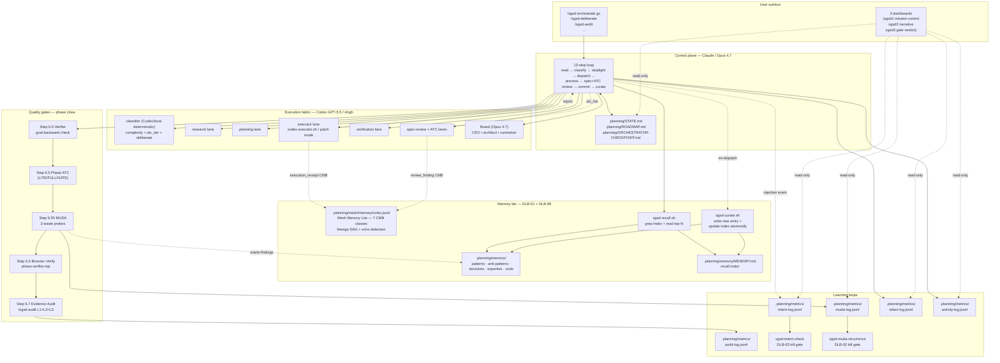
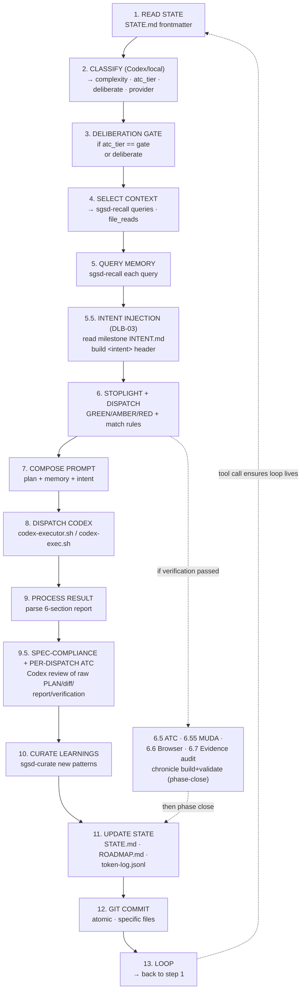
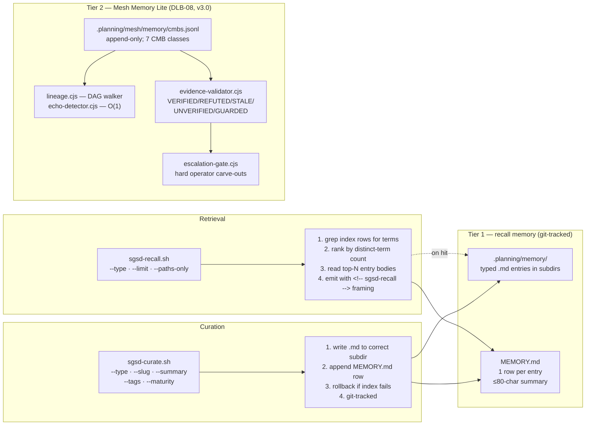
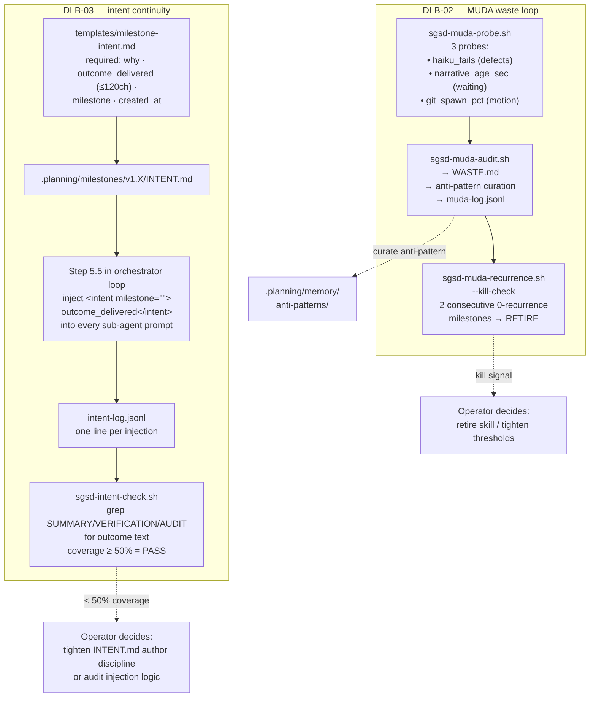

# Super GSD — Architecture

> Living document. Brought current 2026-05-22 to v3.2 (Operator Comprehension
> System). Previously updated 2026-04-19 after the DLB-01/02/03 + ATC-9.5 wave.
> Every diagram below is a Mermaid block — renders in any markdown viewer that
> supports Mermaid (GitHub, VS Code, Obsidian, most chat UIs).

> **Provider model (current).** Claude / Opus 4.7 orchestrates ONLY — judgment,
> dispatch, synthesis, gates, promotion; it never writes code. Codex GPT-5.5 at
> xhigh reasoning effort is the execution fabric for all research, planning,
> plan-check, source-changing execution, verification, spec-review, ATC, and
> gate work, dispatched via `super-gsd/scripts/codex-executor.sh` /
> `codex-exec.sh`. Sonnet/Haiku are not default providers; the legacy Claude
> worker agents are disabled for code execution and are not Codex fallbacks.
> Sections that still show Haiku/Sonnet describe the original v1.x design and
> are labelled as history.

## 1. System overview



## 2. The 13-step orchestrator loop



## 3. Memory tiers (DLB-01 recall + DLB-08 mesh)



> Legacy `.brv/context-tree/` ByteRover content is migration input only — not
> invoked at runtime. BM25 ranking is revisited only at the 40-file tripwire.

## 4. Quality gates pipeline (what runs when)

```mermaid
flowchart TD
    start[Every dispatch]
    clsTier{"classifier.atc_tier<br/>per-unit"}
    s95L["Step 9.5 LITE<br/>executor self-check<br/>(no extra agent)"]
    s95F["Step 9.5 FULL<br/>Codex spec-review + ATC<br/>single-dispatch"]
    s95G["Step 9.5 GATE<br/>interactive → BLOCK<br/>auto → bypass + log"]
    s95S["SKIP tier<br/>no review"]

    start --> clsTier
    clsTier -->|skip| s95S
    clsTier -->|lite| s95L
    clsTier -->|full| s95F
    clsTier -->|gate| s95G
    s95L --> commit1[Commit]
    s95F --> commit1
    s95G --> commit1

    commit1 --> moreUnits{More units<br/>in phase?}
    moreUnits -->|yes| start
    moreUnits -->|no, verification passes| phaseClose

    subgraph phaseClose["Phase close — Step 6.x chain (runs once per phase)"]
        p65["6.5 Phase ATC<br/>Codex classify + Codex review<br/>cross-plan architecture"]
        p655["6.55 MUDA audit<br/>3 probes → WASTE.md<br/>+ curated findings"]
        p66["6.6 Browser verify<br/>phase-verifier.mjs<br/>(if frontend files touched)"]
        p67["6.7 Evidence audit<br/>/sgsd-audit L1+L2+L3"]
        p65 --> p655 --> p66 --> p67
    end

    phaseClose --> markDone[Mark phase complete<br/>ROADMAP.md &#91;x&#93;]
```



## 5. Learning loops — DLB-02 MUDA + DLB-03 intent



## 6. File layout

```mermaid
flowchart TB
    root[GSDedits/]
    root --> planRoot[".planning/<br/>per-project state + memory"]
    root --> sgRoot[super-gsd/]

    planRoot --> phases[milestones/{v}/phases/<br/>per-phase artefacts]
    planRoot --> metrics[metrics/<br/>jsonl logs]
    planRoot --> decisions[decisions/<br/>DLB memos]
    planRoot --> briefs[briefs/<br/>deliberation briefs]
    planRoot --> delibs[deliberations/<br/>round-by-round logs]
    planRoot --> memDir[memory/<br/>tier-1 recall memory]
    planRoot --> meshDir[mesh/memory/<br/>tier-2 CMB ledger]
    planRoot --> chronDir[chronicles/<br/>phase + milestone HTML]

    phases --> phaseDir["08-sgsd-self-audit/<br/>CONTEXT · RESEARCH · PLAN ·<br/>PLANCHECK · VERIFICATION ·<br/>ATC-REVIEW · AUDIT · WASTE ·<br/>SUMMARY · commit-reviews.jsonl"]

    metrics --> logs["token-log · activity-log ·<br/>heartbeat · muda-log ·<br/>intent-log · audit-log ·<br/>readiness-log"]

    sgRoot --> skills["skills/<br/>sgsd-orchestrate ·<br/>sgsd-deliberate ·<br/>sgsd-audit · sgsd-token-audit ·<br/>sgsd-pause/resume/transition"]
    sgRoot --> aAgents["agents/<br/>sgsd-classifier · sgsd-context-selector ·<br/>sgsd-ceo · 4 board members ·<br/>sgsd-milestone/phase-readiness ·<br/>sgsd-workflow-auditor"]
    sgRoot --> scripts["scripts/<br/>sgsd-recall · sgsd-curate ·<br/>sgsd-ctx · sgsd-muda-probe/audit/recurrence ·<br/>sgsd-intent-check · merge-settings ·<br/>sgsd-mission-control (ps1) ·<br/>sgsd-narrative (ps1) ·<br/>sgsd-gate-verdict (ps1)"]
    sgRoot --> hooks["hooks/<br/>gsd-session-start · gsd-token-logger ·<br/>gsd-stuck-detector · gsd-checkpoint-writer ·<br/>gsd-context-monitor ·<br/>sgsd-activity-logger · sgsd-heartbeat ·<br/>sgsd-statusline"]
    sgRoot --> config["config/<br/>settings-overlay.json ·<br/>planning-config-overlay.json ·<br/>model-routing.json"]
    sgRoot --> tmpl["templates/<br/>compressed-plan.xml ·<br/>milestone-intent.md ·<br/>planner-brv-overlay.xml ·<br/>orchestrator-prompt-composer.md ·<br/>brief-template.md"]
    sgRoot --> tools["tools/<br/>chronicle/ · cockpit-sidecar/ ·<br/>mesh-memory/ · codex-pro/ ·<br/>codex-hooks/ · context-authority/ ·<br/>harness-*/ · shared/ · system-map/"]
    sgRoot --> ow[overwatcher/<br/>overwatcher-launcher.js<br/>(legacy brv-*.js dormant)]
    sgRoot --> docs[docs/<br/>ARCHITECTURE.md (this file) ·<br/>MONITORING-SETUP.md ·<br/>SGSD-WORKSPACE-GUIDE.md ·<br/>SESSION-DEBRIEF.md ·<br/>audits/]
```

## 7. Model routing (current — v3.0+)

| Role | Provider | Why |
|------|----------|-----|
| Orchestrator (the loop) | Claude / Opus 4.7 (1M context), xhigh | Judgment, dispatch, synthesis, deliberation CEO. Never writes code. |
| Board (sgsd-ceo + board-*) | Claude / Opus 4.7, xhigh | Default fresh-clone board: CEO + Architect + Contrarian |
| Classifier / context selection | Codex / local deterministic | Derived from plan frontmatter/cache or a Codex/local check |
| Phase research | Codex GPT-5.5, xhigh | Read-only research report via the SGSD Codex wrapper |
| Planning | Codex GPT-5.5, xhigh | Plan synthesis and repair |
| Plan-check / plan-final ATC | Codex GPT-5.5, xhigh | Gap detection + ATC/MUDA challenge before execution |
| Code execution | Codex GPT-5.5, xhigh | Source-changing work; serial SDD run; patch mode on Windows read-blocks |
| Spec-compliance review | Codex GPT-5.5, xhigh | Independent review of raw PLAN, diff, report, verification |
| Verification / readiness / ATC / MUDA | Codex GPT-5.5, xhigh | Verification and all gate work |
| Legacy Claude workers (gsd-*) | disabled | Not a default provider; not a Codex fallback |

Codex dispatch is routed through Codex Pro Mode — 10 typed lanes
(`super-gsd/registry/codex-profiles.yaml`) and a GREEN/AMBER/RED earned-execution
stoplight. See §10.

## 8. Data-flow shortlist — what lives where

| Artefact | Writer | Reader | Grain |
|----------|--------|--------|-------|
| `.planning/STATE.md` | orchestrator (loop step 11) | every step, dashboards | per-session |
| `.planning/ROADMAP.md` | planner + orchestrator | every step | per-milestone |
| `.planning/ORCHESTRATOR-CHECKPOINT.md` | checkpoint protocol | cold-start step 1 | ephemeral |
| `.planning/phases/{NN}/*.md` | agents (researcher/planner/executor/verifier/reviewer) | orchestrator, audit, dashboards | per-phase |
| `.planning/phases/{NN}/WASTE.md` | sgsd-muda-audit | operator, sgsd-muda-recurrence | per-phase |
| `.planning/phases/{NN}/AUDIT.md` | /sgsd-audit skill | operator, milestone close | per-phase |
| `.planning/phases/{NN}/commit-reviews.jsonl` | Step 9.5 per-dispatch ATC | operator, audit | per-commit |
| `.planning/decisions/DLB-*.md` | /sgsd-deliberate | every future planner, operator | per-decision |
| `.planning/metrics/token-log.jsonl` | gsd-token-logger hook | /sgsd-token-audit, dashboards | per-dispatch |
| `.planning/metrics/activity-log.jsonl` | sgsd-activity-logger hook | dashboards, Haiku narrative | per-tool-call |
| `.planning/metrics/heartbeat.jsonl` | sgsd-heartbeat hook | dashboards stuck detector | per-post-tool-use |
| `.planning/metrics/intent-log.jsonl` | Step 5.5 injection | sgsd-intent-check | per-dispatch |
| `.planning/metrics/muda-log.jsonl` | sgsd-muda-audit | sgsd-muda-recurrence | per-audit |
| `.planning/metrics/audit-log.jsonl` | /sgsd-audit | budget accountability | per-audit |
| `.planning/memory/` + MEMORY.md | sgsd-curate | sgsd-recall, orchestrator | per-lesson |
| `.planning/mesh/memory/cmbs.jsonl` | mesh-memory writers | lineage/echo/evidence-validator | per-CMB |
| `.planning/chronicles/{v}/P{NN}/` | chronicle renderer | operator, validator | per-phase |
| `~/.claude/projects/<encoded>/<session>.jsonl` | Claude Code harness | sgsd-ctx, dashboards | per-message |

> **Catalog moved (Phase 35, v1.7) -- DEPRECATED.** The agent / gate /
> provider / skill / contract / script enumerations in sections 6, 7, and 8
> above are now auto-generated. The canonical living catalog is at
> `.planning/SYSTEM-MAP.md` (machine view at `.planning/SYSTEM-MAP.json`).
> Edit the underlying registries under `super-gsd/registry/` -- not this
> file. Regenerate via:
>
> ```bash
> node super-gsd/tools/system-map/generate.cjs --generate
> ```
>
> Drift detection: `node super-gsd/tools/system-map/generate.cjs --check`
> exits 1 if SYSTEM-MAP.* is older than the registries.

## 9. Golden invariants

- Orchestrator never writes code or does heavy work — only dispatches
- Code execution is Codex GPT-5.5/xhigh; Opus orchestrates only
- Every executor run is rated GREEN/AMBER/RED before it touches a file
- Every sub-agent report ≤ 300 words
- Sub-agent reports emit 6 fixed sections: `FILES_CHANGED · VERIFICATION · DEVIATIONS · BLOCKERS · SCRIPTS_CREATED · ONE_LINER`
- A claim CMB is never treated as an observation CMB (DLB-08)
- Atomic commits — one per unit, never batched, never amended
- Every loop response contains a tool call — text-only responses kill the loop
- Only three valid exit conditions: all-phases-complete · blocker surviving board+Codex recovery / operator-only boundary · user says stop
- Anti-slop 10-point checklist applies to every FULL/GATE commit
- A phase is not cognitively complete until the operator can understand it — chronicle validation is a binding phase-close gate (DLB-11)
- MUDA + intent kill conditions are signals, not auto-retirements — the operator decides

## 10. v2.9–v3.2 — the agentic + comprehension layers

The v1.x diagrams above describe the control loop. Four milestones since
April 2026 added new subsystems on top; each milestone's
`.planning/milestones/{v}/SUMMARY.md` carries the per-phase detail.

**v2.9 Agentic Harness Evolution (P98–105).** A closed AHE loop —
component → evidence → predicted edit → measured outcome → keep/revert/pivot —
across six `super-gsd/tools/harness-*/` tools (component registry, evidence
distiller, falsifiable change manifest, attribution + rollback gate, evolution
runner, ablation + transfer). A protected-surface contract keeps scoring
oracles, verifiers, model config, and budget un-editable by the loop.
P97.5 + DLB-07 added the semantic verification gate: `validate.cjs` mechanically
enforces `semantic_acceptance_criteria` and `sgsd-audit@v2` Layer 4 runs each
plan's `verification_cmd` against real data at phase close.

**v3.0 SGSD-PRO (P106–112).** Three subsystems: **Mesh Memory Lite** (DLB-08 —
the tier-2 CMB ledger in §3); **Codex Pro Mode** (DLB-09 — 10 typed Codex lanes
in `codex-profiles.yaml`, the GREEN/AMBER/RED stoplight, 5 fail-CLOSED Codex
hooks via `.codex/hooks.json`, and the PLAN-LOCKED schema extending
plan-schema-v2); and **Context Authority** (DLB-10 — 6 per-milestone YAML
capsule templates projected into `context_anchor` CMBs).

**v3.1 Chronicle Layer (P113–119, DLB-11).** Every phase close ships a validated
**Operator Chronicle** — a deterministic HTML projection of mesh memory +
artefacts + git evidence, written by `super-gsd/tools/chronicle/render-html.cjs`
and re-checked by `validate-chronicle.cjs` (a binding gate — `REPORT_UNGROUNDED`
halts the close). The chronicle cites every claim by CMB ID, ships a denominator
panel, and is offline-survivable (inline SVG, committed PlantUML source). The
**Fog Score** is a deterministic per-phase cognitive-cost metric.

**v3.2 Operator Comprehension System (P120–127, DLB-12).** One shared design
system (`super-gsd/tools/shared/sgsd-design-system.css` + `design-rules.json`
with 12 book-mined rules R01–R12, machine-checked by `conformance-check.cjs`)
across two answer-first surfaces: the upgraded chronicle (gold-reference render,
chronicle self-test 111/111) and the live cockpit
(`super-gsd/tools/cockpit-sidecar/cockpit-sidecar.cjs` — North-Star banner, one
alert, `--brief`/`--html` modes, cockpit self-test 18/18). Both stay
deterministic; the cockpit evolves the sidecar only and never touches the v2.9
Lock-13 frozen cockpit array.
