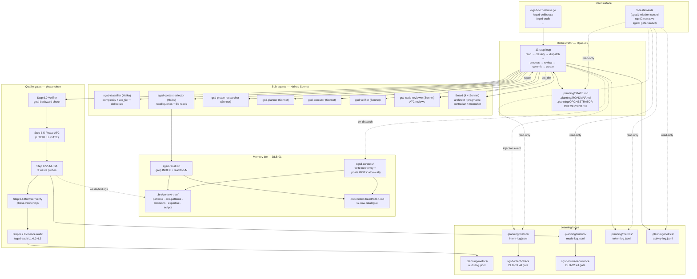
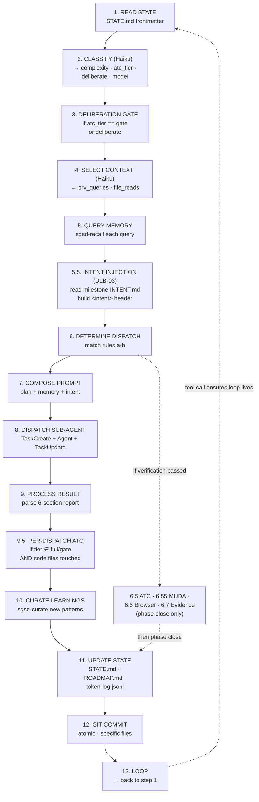
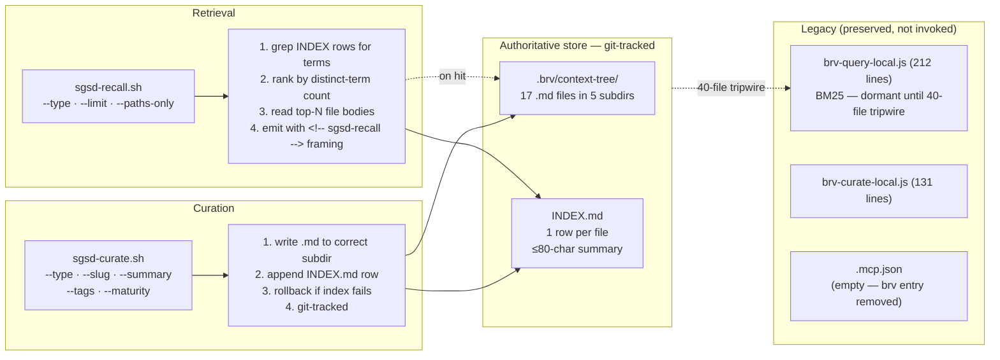
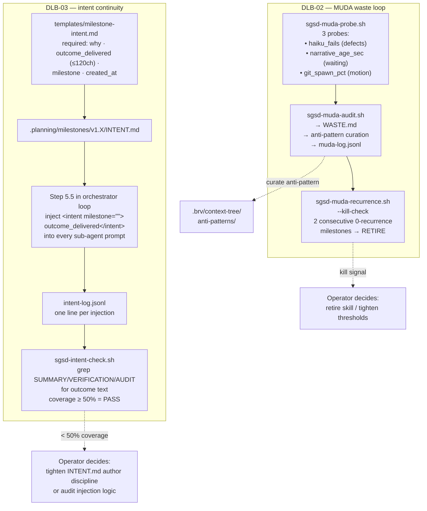

# Super GSD — Architecture

> Living document. Last updated 2026-04-19 after the DLB-01/02/03 + ATC-9.5 wave.
> Every diagram below is a Mermaid block — renders in any markdown viewer that
> supports Mermaid (GitHub, VS Code, Obsidian, most chat UIs).

## 1. System overview



## 2. The 13-step orchestrator loop



## 3. Memory retrieval tier (DLB-01)



## 4. Quality gates pipeline (what runs when)

```mermaid
flowchart TD
    start[Every dispatch]
    clsTier{"classifier.atc_tier<br/>per-unit"}
    s95L["Step 9.5 LITE<br/>executor self-check<br/>(no extra agent)"]
    s95F["Step 9.5 FULL<br/>gsd-code-reviewer single-dispatch<br/>~250 tokens"]
    s95G["Step 9.5 GATE<br/>interactive → BLOCK<br/>auto → bypass + log"]
    s95S["SKIP tier<br/>no review"]

    start --> clsTier
    clsTier -->|skip| s95S
    clsTier -->|lite| s95L
    clsTier -->|full| s95F
    clsTier -->|gate| s95G
    s95L --> commit1[Commit]
    s95F --> commit1
    s95G --> commit1

    commit1 --> moreUnits{More units<br/>in phase?}
    moreUnits -->|yes| start
    moreUnits -->|no, verification passes| phaseClose

    subgraph phaseClose["Phase close — Step 6.x chain (runs once per phase)"]
        p65["6.5 Phase ATC<br/>Haiku classify + Sonnet review<br/>cross-plan architecture"]
        p655["6.55 MUDA audit<br/>3 probes → WASTE.md<br/>+ curated findings"]
        p66["6.6 Browser verify<br/>phase-verifier.mjs<br/>(if frontend files touched)"]
        p67["6.7 Evidence audit<br/>/sgsd-audit L1+L2+L3"]
        p65 --> p655 --> p66 --> p67
    end

    phaseClose --> markDone[Mark phase complete<br/>ROADMAP.md &#91;x&#93;]
```



## 5. Learning loops — DLB-02 MUDA + DLB-03 intent



## 6. File layout

```mermaid
flowchart TB
    root[GSDedits/]
    root --> brvRoot[".brv/context-tree/<br/>memory store (17 files)"]
    root --> planRoot[".planning/<br/>per-project state"]
    root --> sgRoot[super-gsd/]

    planRoot --> phases[phases/<br/>per-phase artefacts]
    planRoot --> metrics[metrics/<br/>jsonl logs]
    planRoot --> decisions[decisions/<br/>DLB memos]
    planRoot --> briefs[briefs/<br/>deliberation briefs]
    planRoot --> delibs[deliberations/<br/>round-by-round logs]

    phases --> phaseDir["08-sgsd-self-audit/<br/>CONTEXT · RESEARCH · PLAN ·<br/>PLANCHECK · VERIFICATION ·<br/>ATC-REVIEW · AUDIT · WASTE ·<br/>SUMMARY · commit-reviews.jsonl"]

    metrics --> logs["token-log · activity-log ·<br/>heartbeat · muda-log ·<br/>intent-log · audit-log ·<br/>readiness-log"]

    sgRoot --> skills["skills/<br/>sgsd-orchestrate ·<br/>sgsd-deliberate ·<br/>sgsd-audit · sgsd-token-audit ·<br/>sgsd-pause/resume/transition"]
    sgRoot --> aAgents["agents/<br/>sgsd-classifier · sgsd-context-selector ·<br/>sgsd-ceo · 4 board members ·<br/>sgsd-milestone/phase-readiness ·<br/>sgsd-workflow-auditor"]
    sgRoot --> scripts["scripts/<br/>sgsd-recall · sgsd-curate ·<br/>sgsd-ctx · sgsd-muda-probe/audit/recurrence ·<br/>sgsd-intent-check · merge-settings ·<br/>sgsd-mission-control (ps1) ·<br/>sgsd-narrative (ps1) ·<br/>sgsd-gate-verdict (ps1)"]
    sgRoot --> hooks["hooks/<br/>gsd-session-start · gsd-token-logger ·<br/>gsd-stuck-detector · gsd-checkpoint-writer ·<br/>gsd-context-monitor ·<br/>sgsd-activity-logger · sgsd-heartbeat ·<br/>sgsd-statusline"]
    sgRoot --> config["config/<br/>settings-overlay.json ·<br/>planning-config-overlay.json ·<br/>model-routing.json"]
    sgRoot --> tmpl["templates/<br/>compressed-plan.xml ·<br/>milestone-intent.md ·<br/>planner-brv-overlay.xml ·<br/>orchestrator-prompt-composer.md ·<br/>brief-template.md"]
    sgRoot --> tools["tools/<br/>phase-verifier/<br/>process-audit/"]
    sgRoot --> ow[overwatcher/<br/>brv-query-local.js (dormant)<br/>brv-curate-local.js (dormant)<br/>overwatcher-launcher.js]
    sgRoot --> docs[docs/<br/>ARCHITECTURE.md (this file) ·<br/>MONITORING-SETUP.md ·<br/>SGSD-WORKSPACE-GUIDE.md ·<br/>SESSION-DEBRIEF.md ·<br/>audits/]
```

## 7. Model routing

| Role | Model | Why |
|------|-------|-----|
| Orchestrator (the loop) | Opus 4.x (1M context) | Judgment, dispatch, synthesis, deliberation CEO |
| sgsd-classifier | Haiku 4.5 | 50-token classification; runs per loop iteration |
| sgsd-context-selector | Haiku 4.5 | Pick relevant `sgsd-recall` queries |
| gsd-phase-researcher | Sonnet 4.x | Investigation, not judgment |
| gsd-planner | Sonnet 4.x | Compressed XML plans |
| gsd-plan-checker | Sonnet 4.x | Gap detection against the plan |
| gsd-executor | Sonnet 4.x | The actual code work |
| gsd-verifier | Sonnet 4.x | Goal-backward evidence check |
| gsd-code-reviewer | Sonnet 4.x | ATC reviews (per-dispatch + phase-level) |
| Board (sgsd-board-*) | Sonnet 4.x × 4 | Round 1 + Round 2 deliberation |
| Haiku narrative (dashboards) | Haiku 4.5 via `claude --print` | Summarises tool stream every ~5 min |

## 8. Data-flow shortlist — what lives where

| Artefact | Writer | Reader | Grain |
|----------|--------|--------|-------|
| `.planning/STATE.md` | orchestrator (loop step 11) | every step, dashboards | per-session |
| `.planning/ROADMAP.md` | planner + orchestrator | every step | per-milestone |
| `.planning/ORCHESTRATOR-CHECKPOINT.md` | checkpoint protocol | cold-start step 1 | ephemeral |
| `.planning/phases/{NN}/*.md` | agents (researcher/planner/executor/verifier/reviewer) | orchestrator, audit, dashboards | per-phase |
| `.planning/phases/{NN}/WASTE.md` | sgsd-muda-audit | operator, sgsd-muda-recurrence | per-phase |
| `.planning/phases/{NN}/AUDIT.md` | /sgsd-audit skill | operator, milestone close | per-phase |
| `.planning/phases/{NN}/commit-reviews.jsonl` | Step 9.5 per-dispatch ATC | operator, audit | per-commit |
| `.planning/decisions/DLB-*.md` | /sgsd-deliberate | every future planner, operator | per-decision |
| `.planning/metrics/token-log.jsonl` | gsd-token-logger hook | /sgsd-token-audit, dashboards | per-dispatch |
| `.planning/metrics/activity-log.jsonl` | sgsd-activity-logger hook | dashboards, Haiku narrative | per-tool-call |
| `.planning/metrics/heartbeat.jsonl` | sgsd-heartbeat hook | dashboards stuck detector | per-post-tool-use |
| `.planning/metrics/intent-log.jsonl` | Step 5.5 injection | sgsd-intent-check | per-dispatch |
| `.planning/metrics/muda-log.jsonl` | sgsd-muda-audit | sgsd-muda-recurrence | per-audit |
| `.planning/metrics/audit-log.jsonl` | /sgsd-audit | budget accountability | per-audit |
| `.brv/context-tree/` + INDEX.md | sgsd-curate | sgsd-recall, orchestrator | per-lesson |
| `~/.claude/projects/<encoded>/<session>.jsonl` | Claude Code harness | sgsd-ctx, dashboards | per-message |

## 9. Golden invariants

- Orchestrator never does heavy work — only dispatches
- Every sub-agent report ≤ 300 words
- Sub-agent reports emit 6 fixed sections: `FILES_CHANGED · VERIFICATION · DEVIATIONS · BLOCKERS · SCRIPTS_CREATED · ONE_LINER`
- Every Agent() dispatch wrapped in `TaskCreate` + `TaskUpdate` for live visibility
- Atomic commits — one per unit, never batched, never amended
- Every loop response contains a tool call — text-only responses kill the loop
- Only four valid exit conditions: all-phases-complete · context > 70% (real measurement via `sgsd-ctx`) · blocker needing human · user says stop
- Anti-slop 10-point checklist applies to every FULL/GATE commit
- MUDA + intent kill conditions are signals, not auto-retirements — the operator decides
